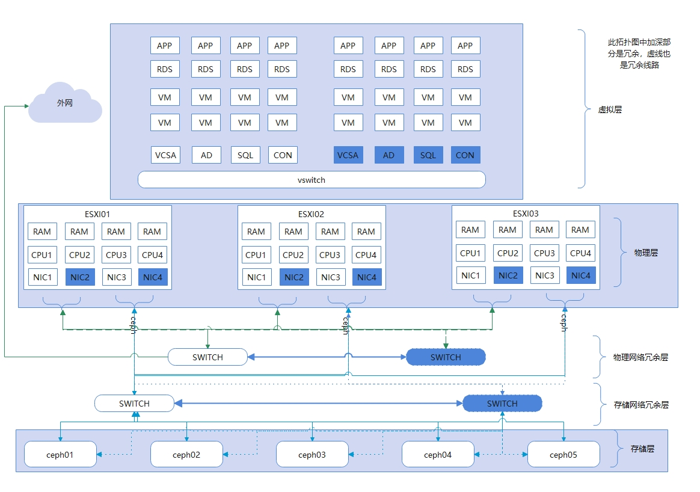
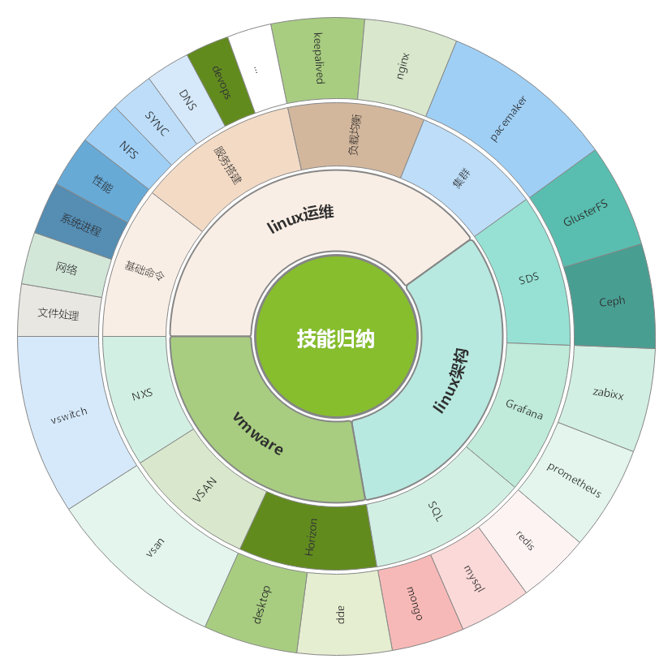

<a href="https://github.com"><i class="fa-brands fa-github"></i>   Github</a> | <a href="https://gitee.com"><i class="fa-brands fa-gitlab"></i>    Gitee</a>

本站采用Docsify+Markdown格式,直接使用Typora编辑而成.

搜索:<kbd>Ctrl</kbd>+<kbd>f</kbd>

SDS 软件定义存储部分不会分享!

本站分享的内容包含下面的大类.

---

## linux 运维

| linux运维01个性化设置      | 系统个性化设置     |
| -------------------------- | ------------------ |
| linux运维02命令集          | linux命令集        |
| linux运维03正则、用户管理  | 正则表达及用户管理 |
| linux运维04计划任务        | 计划任务           |
| linux运维05Rsync           | 同步（sersync）    |
| linux运维06ssh、ansible    | 批量管理主机       |
| linux运维07web服务         | nginx web服务      |
| linux运维08负载均衡        | nginx + keepalived |
| linux运维09 zabbix监控服务 | zabbix             |
| linux运维10 shell          | shell 基础         |

## DEVOPS

| git     | 代码管理工具         |
| ------- | -------------------- |
| github  | 公网代码管理仓库     |
| gitlab  | 私\|公网代码管理仓库 |
| jenkins | 流水线作业软件       |
| maven   | 项目管理和综合工具   |
| nexus   | 私服,java项目多适用  |
| CI      | 持续集成             |
| CD      | 持续部署             |
| CD      | 持续交付             |

## 容器

| docker         | 容器                                     |
| -------------- | ---------------------------------------- |
| docker-compose | 构建容器、根据yaml文件构建一个多多个容器 |
| harbor         | 私有容器管理仓库                         |
| container      | 容器                                     |

## 容器管理

**kubernetes** 

Kubernetes 是一个可移植的、可扩展的开源平台，用于管理容器化的工作负载和服务，可促进声明式配置和自动化。 Kubernetes 拥有一个庞大且快速增长的生态系统。Kubernetes 的服务、支持和工具广泛可用。

k8s 是google开源项目。非百度、腾讯、阿里、华为，这些公司开发，这些公司只是k8s开源之后报大腿的，这些公司没有这种创新能力！这些企业有坑中国百姓的能力，譬如广告、恶意软件、花呗、摧残祖国青少年心智、打着爱国的口号敛财的企业。

后期开放二进制部署手册,以及在中国如何拉取原版google images.

## 数据库

| redis   | 缓存数据库   |
| ------- | ------------ |
| mysql   | 关系型数据库 |
| ES      | 搜索         |
| mongodb | 非关系型     |

## 监控

| grafana    | 能屏显的监控   |
| ---------- | -------------- |
| prometheus | 服务api        |
| zabbix     | 可以定制监控项 |

## 集群

pacemaker

## 存储

| DRDB      | 类似rsync         |
| --------- | ----------------- |
| ceph      | SDS 分布式存储 难 |
| glusterFS | SDS 分布式存储 易 |

## 网络

| 爱快           | 软路由                   |
| -------------- | ------------------------ |
| openwrt        | 软路由                   |
| 黑群晖         | 云盘、家用存储、企业存储 |
| 黑群晖引导生成 | 在线生成boot.img         |
| 网络吞吐量     | 测试网络                 |

## 管理

cockpit   web管理界面

ldap      目录管理

## 顽固清理

华为手机内置app卸载 （这个刘备假仁假义，国家明文规定可以卸载内置app，它不给卸载！）

## 虚拟化

| vsan     | 软件定义存储，收费                 |
| -------- | ---------------------------------- |
| horizon8 | 桌面虚拟化（云桌面），收费         |
| NXS      | 软件定义网络，收费                 |
| citrix   | 思杰（xen desktop）                |
| kvm      | 国内虚拟化，这不介绍了基本都差不多 |

根据后期进度看，时间允许的话再放一些网络拓扑图的软件

---

告诫自己:

> 不与夏虫语冰，不与井蛙语海，不与凡夫语道!
>
> 富在术数不在劳身,利在势局不在力耕.

