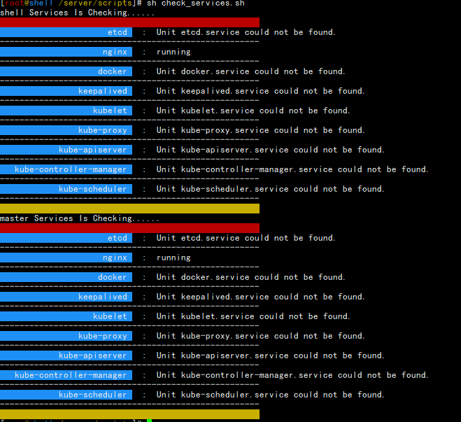

Shell 

# 常用知识点介绍

使用linux就离不开Shell

```sh
[root@shell ~]# echo $PS1
[\[\e[31;40m\]\u\[\e[33;40m\]@\[\e[34;40m\]\h \[\e[33;40m\]\w\[\e[0m\]]\$
[root@shell ~]# echo $PS2
>
```

PS1：控制默认命令行提示符的格式

PS2：控制第二层命令行提示符的格式

| 字符 | 描述                                   |
| ---- | -------------------------------------- |
| \a   | 铃声字符                               |
| \d   | 格式为“ 日 月 年”                      |
| \e   | ASCII 转义字符                         |
| \h   | 本地主机名                             |
| \H   | 完全合格的限定域主机名                 |
| \j   | 当前管理的作业数                       |
| \l   | 终端设备名的基本名称                   |
| \n   | 换行                                   |
| \r   | 回车                                   |
| \s   | shell名称                              |
| \t   | 格式“小时：分：秒”24制                 |
| \T   | 格式“小时：分：秒”12小时制             |
| \@   | 格式为am/pm的12小时                    |
| \u   | 当前用户的用户名                       |
| \v   | shell版本                              |
| \V   | 发布级别                               |
| \w   | 当前工作目录                           |
| \W   | 当前工作目录的基本名称                 |
| \！  | shell历史数                            |
| \\#  | 该命令的数量                           |
| \\$  | 普通用户为美元符号；超级用户是英镑符号 |
| \nnn | 对应八进制nnn的字符                    |
| \\\  | 斜杠                                   |
| \\[  | 控制序列的开头                         |
| \\]  | 控制序列的结尾                         |
|      |                                        |

这些是ps1修改的可选参数

ls -F 参数是区分文件还是目录

```sh
[root@shell ~]# ls -F 
anaconda-ks.cfg  vmware-tools-distrib/
```

打印全局变量

```sh
[root@shell ~]# printenv
```

全局变量

> #test=123   设置全局变量  
>
> #unset test 取消设置全局变量

PATH环境变量

```sh
[root@shell ~]# echo $PATH
/usr/local/sbin:/usr/local/bin:/usr/sbin:/usr/bin:/root/bin
```

当系统登录到系统默认的环境变量

> /etc/profile      #系统所有用户登录必须加载的目录
>
> $home/.bash_profile   #当前用户环境
>
> $home/.bash_login
>
> $home/.profile

profile只是针对所有用户，这里不要添加过多避免混乱

但是能迭代到profile.d目录下所有的for语句

/etc/bashrc 是公共环境变量文件

所有的用户.bashrc都是依赖它的

```sh
[root@shell ~]# cat .bashrc 
# .bashrc

# User specific aliases and functions

alias rm='rm -i'
alias cp='cp -i'
alias mv='mv -i'

# Source global definitions
if [ -f /etc/bashrc ]; then
	. /etc/bashrc
fi
```

这里还包括一些危险命令的输出

export 命令设置全局变量环境

chsh 允许快速修改登录shell

chfn 将信息存储到/etc/passwd文件的注释字段

chage 允许为账户设置逾期日期，创建临时用户时间到就消失

文件权限符号

| 显示项 | 描述         |
| ------ | ------------ |
| -      | 表示文件     |
| d      | 表示目录     |
| l      | 表示链接     |
| c      | 表示字符设备 |
| b      | 表示块设备   |
| n      | 表示网络设备 |
| **权限** ||
| r      | 读 |
| w      | 写 |
| x      | 执行 |
| **权限位说明** |              |
| 前3位 | 对象的所有者 |
| 中间3位 | 对象的所属组 |
| 后3位 | 系统上其他任何人 |
| **数字权限** |              |
| r | 4 |
| w | 2 |
| x | 1 |

## linux文件权限代码

| 权限 | 二进制 | 八进制 | 描述           |
| :--: | :----: | :----: | -------------- |
| ---  |  000   |   0    | 无权限         |
| --x  |  001   |   1    | 只有执行权限   |
| -w-  |  010   |   2    | 只有写入权限   |
| -wx  |  011   |   3    | 写入和执行权限 |
| r--  |  100   |   4    | 只读权限       |
| r-x  |  101   |   5    | 读取和执行权限 |
| rw-  |  110   |   6    | 读取和写入权限 |
| rwx  |  111   |   7    | 读写执行权限   |

umask值通常在/etc/profile启动中

```sh
    58	# /usr/share/doc/setup-*/uidgid file
    59	if [ $UID -gt 199 ] && [ "`/usr/bin/id -gn`" = "`/usr/bin/id -un`" ]; then
    60	    umask 002
    61	else
    62	    umask 022
    63	fi
////////////////////////////////////////////////////////////////////
[root@shell ~]# touch test
[root@shell ~]# ll
...
-rw-r--r--  1 root root    0 Oct 23 16:28 test
root用户默认创建的是644权限

[root@shell ~]# id test
uid=1000(test) gid=1000(test) groups=1000(test)
    
[root@shell ~]# su - test 
[test@shell ~]$ touch test
[test@shell ~]$ ll
total 0
-rw-rw-r-- 1 test test 0 Oct 23 16:30 test
可以看出这里UID大于199的创建出来都是664    
```

**默认的umask 文件值是666    目录权限是777**

```sh
[root@shell ~]# ll
drwxr-xr-x  2 root root    6 Oct 23 16:35 test1
看出root用户的是755
////////////////////////////////////////////////////////////////
[root@shell ~]# su - test
Last login: Sat Oct 23 16:30:23 CST 2021 on pts/0
[test@shell ~]$ mkdir test1
[test@shell ~]$ ll
total 0
-rw-rw-r-- 1 test test 0 Oct 23 16:30 test
drwxrwxr-x 2 test test 6 Oct 23 16:38 test1
UID大于199的权限是775
```

chmod 权限

> chmod u+x file

| 项           | 描述                       |
| ------------ | -------------------------- |
| u            | 表示用户                   |
| g            | 表示用户组                 |
| o            | 表示其他                   |
| a            | 表示上述所有               |
| **权限+-=**  |                            |
| +            | 添加权限                   |
| -            | 移除权限                   |
| =            | 赋值权限                   |
| **使用权限** |                            |
| x            | 执行权限                   |
| s            | 用于设置正在执行的UID或GID |
| t            | 用于保存程序文本           |
| u            | 设置所有者的权限           |
| g            | 设置所属组的权限           |
| o            | 设置其他人的权限           |

```sh
[root@shell ~]# touch test
[root@shell ~]# ll
-rw-r--r--  1 root root    0 Oct 23 20:49 test

[root@shell ~]# chmod u=rwxs,go=x test 
[root@shell ~]# ll
-rws--x--x  1 root root    0 Oct 23 20:49 test
```

这个可以用在NFS挂载程序上面，ceph里面的块挂载也行

### 共享文件

linux为每个文件和目录都存储了3个额外的信息位

| 项     | 描述                                             |
| ------ | ------------------------------------------------ |
| SUID   | 当文件由用户执行时，程序在文件所有者的权限下运行 |
| SGID   | 目录中创建的新文件使用目录用户作为默认用户组     |
| 粘着位 | 进程结束后，文件仍然保留在内存中                 |

chmod SUID SGID 和sticky 八进制值

| 二进制 | 八进制 | 描述             |
| ------ | ------ | ---------------- |
| 000    | 0      | 清空所有位       |
| 001    | 1      | 设置sticky       |
| 010    | 2      | 设置SGID         |
| 011    | 3      | 设置SGID和sticky |
| 100    | 4      | 设置SUID         |
| 101    | 5      | 设置SUID和sticky |
| 110    | 6      | 设置SUID和SGID   |
| 111    | 7      | 设置所有位       |

#### SUID

> chmod u+s file
>
> chmod 4755 file
>
> chmod 0xxx file 移除SUID（目录的SUID不能删除）

linux系统中特殊的权限位设置，满足超过自带的权限可使用。

```sh
[root@shell ~]# chmod u+s test
[root@shell ~]# chmod u+s test1
[root@shell ~]# ll
-rwSr--r--  1 root root    0 Oct 23 16:28 test
drwsr-xr-x  2 root root    6 Oct 23 16:35 test1

[root@shell ~]# chmod u-s test
[root@shell ~]# chmod u-s test1
-rw-r--r--  1 root root    0 Oct 23 16:28 test
drwxr-xr-x  2 root root    6 Oct 23 16:35 test1

[root@shell ~]# chmod 4755 test1
[root@shell ~]# chmod 4744 test
-rwsr--r--  1 root root    0 Oct 23 16:28 test
drwsr-xr-x  2 root root    6 Oct 23 16:35 test1

[root@shell ~]# chmod 0755 test1
[root@shell ~]# chmod 0744 test
-rwxr--r--  1 root root    0 Oct 23 16:28 test
drwsr-xr-x  2 root root    6 Oct 23 16:35 test1
经过测试目录无法移除

```

如果权限上显示是大写的S那么表示文件没有x权限（s权限无效）

1. 启动为进程之后，其进程的属主为原程序文件的属主；
2. 只能作用在二进制程序上,不能作用在脚本上,且设置在目录上无意义 ;
3. 执行suid权限的程序时,此用户将继承此程序的所有者权限; 

SUID**原理**

```sh
准备所需的文件，并设置权限
[root@shell ~]# mkdir /opt/test
[root@shell ~]# echo "11111" >/opt/test/111.txt
[root@shell ~]# ll /opt/test/111.txt 
-rw-r--r-- 1 root root 6 Oct 23 19:16 /opt/test/111.txt
[root@shell ~]# chmod 600 /opt/test/
[root@shell ~]# chmod -R 600 /opt/test/
[root@shell ~]# ll /opt/test/
total 4
-rw------- 1 root root 6 Oct 23 19:16 111.txt
[root@shell ~]# ll /opt/test/111.txt 
-rw------- 1 root root 6 Oct 23 19:16 /opt/test/111.txt
[root@shell ~]# cat /opt/test/111.txt 
11111

切换用户
[test@shell ~]$ cd /opt/
[test@shell /opt]$ ll
total 0
drw------- 2 root root 21 Oct 23 19:16 test
[test@shell /opt]$ ls test
ls: cannot open directory test: Permission denied

设置SUID权限
[root@shell ~]# ll /usr/bin/ls
-rwxr-xr-x. 1 root root 117608 Nov 17  2020 /usr/bin/ls
[root@shell ~]# chmod 4755 /usr/bin/ls
[root@shell ~]# ll /usr/bin/ls
-rwsr-xr-x. 1 root root 117608 Nov 17  2020 /usr/bin/ls

切回普通
[test@shell /opt]$ ls test
111.txt
[test@shell /opt]$ cat test/111.txt
cat: test/111.txt: Permission denied

添加cat 权限
[root@shell ~]# chmod u+s /usr/bin/cat
[root@shell ~]# ll /usr/bin/cat
-rwsr-xr-x. 1 root root 54080 Nov 17  2020 /usr/bin/cat

切回
[test@shell /opt]$ cat test/111.txt
11111

[root@shell ~]# ll /usr/bin/vim
-rwxr-xr-x. 1 root root 2337208 Dec 16  2020 /usr/bin/vim

[test@shell /opt]$ vim test/111.txt                        
"test/111.txt" [Permission Denied]   
```

可以看到对没有添加特殊权限的是无法使用。

#### SGID

> chmod g+s file/dir
>
> chmod 2755 file/dir
>
> chmod g-s file/dir
>
> chmod 0755 file/dir

```sh
[root@shell ~]# chmod g+s /usr/bin/ls
[root@shell ~]# ll /usr/bin/ls
-rwxr-sr-x. 1 root root 117608 Nov 17  2020 /usr/bin/ls

test
[test@shell /opt]$ mkdir -p /tmp/test01
[test@shell /opt]$ chmod 2777 /tmp/test01/
[test@shell /opt]$ ll -d /tmp/test01/
drwxrwsrwx 2 test test 6 Oct 23 19:53 /tmp/test01/

test01
[test01@shell ~]$ touch /tmp/test01/111.txt
-rw-rw-r-- 1 test01 test 0 Oct 23 19:55 /tmp/test01/111.txt
```

可以看到test01创建的文件继承了test组的属性

#### sticky

> chmod o+t dir
>
> chmod o-t dir
>
> chmod +t dir
>
> chmod 1775 dir

大写的T表示没有x权限

```sh
[root@shell ~]# chmod +t /tmp/
[root@shell ~]# ll /tmp/ -d
drwxrwxrwt. 28 root root 4096 Oct 23 20:05 /tmp/
```

1. 对于一个多人可写的目录，如果设置了sticky，则每个用户仅能删除和改名自己的文件或目录；
2. 只能作用在目录上.普通文件设置无意义,且会被linux内核忽略
3. 用户在设置Sticky权限的目录下新建的目录不会自动继承Sticky权限 

```sh
[test@shell /opt]$ echo "11111" >>/tmp/test.txt 
[test@shell /opt]$ cat /tmp/test.txt 
11111

[test01@shell ~]$ cat /tmp/test.txt 
11111
[test01@shell ~]$ rm -f /tmp/test.txt 
rm: cannot remove ‘/tmp/test.txt’: Operation not permitted
```

用户自己创建的文件用户自己删除，其他用户只能查看不能删除

```sh
[test01@shell ~]$ echo "2222" >/tmp/test01.txt
[test01@shell ~]$ chmod 770 /tmp/test01.txt 
```

```sh
[test@shell /opt]$ mkdir -p /tmp/test
[test@shell /opt]$ ll -d /tmp/test/
drwxrwxr-x 2 test test 6 Oct 23 20:31 /tmp/test/
[test@shell /opt]$ chmod 770 /tmp/test/
[test@shell /opt]$ ll -d /tmp/test/
drwxrwx--- 2 test test 6 Oct 23 20:31 /tmp/test/

[test01@shell ~]$ ls /tmp/test/
ls: cannot open directory /tmp/test/: Permission denied
[test01@shell ~]$ echo "111" >/tmp/test/11
-bash: /tmp/test/11: Permission denied

[root@shell ~]# ls /tmp/test/111 
/tmp/test/111
[root@shell ~]# cat /tmp/test/111 
1111
```

可以看到在设置了sticky的777权限的目录下用户可以设置自己的文件夹及权限

chgrp 命令将目录的默认用户组修改为包含需要共享的成员的用户组，最后设置目录SGID，以确保在该目录中创建的任何文件都是用默认的用户组

==上面设置sticky之后用户创建的目录还需要添加权限。可以使用umask 006解决其他用户不能访问的难点==

## vim编辑器

<font color=blue>运行模式：阅读模式、编辑模式、视图模式</font>

阅读模式：使用vim打开就是阅读模式

编辑模式：通过i、I、o、O、a、A、s、S进入

视图模式：<kbd>ctrl</kbd>+<kbd>v</kbd>

退出模式Esc 

退出并保存<kbd>esc</kbd><kbd> ：</kbd> <kbd>w</kbd><kbd>q</kbd>

阅读模式下快捷键

| key              | 描述                     |
| ---------------- | ------------------------ |
| h                | 左移动一个字符           |
| j                | 下移动一行               |
| k                | 上移动一行               |
| l                | 右移动一个字符           |
| pageDown(ctrl+f) | 下移一个屏幕的数据       |
| pageUP(ctrl+b)   | 上移一个屏幕的数据       |
| G                | 移动到最后一行           |
| num G            | 移动到缓冲的第num行      |
| gg               | 移动到文件第一行的行首   |
| :q               | 退出                     |
| :q！             | 强制退出                 |
| :w               | 保存不退出               |
| :wq              | 保存并退出               |
| y                | 复制当前行               |
| yy               | 复制当前行               |
| p                | 粘贴                     |
| yw               | 复制当前光标后的单词     |
| y$               | 复制当前光标到行末的内容 |
| u                | 撤销                     |
|                  |                          |
|                  |                          |
|                  |                          |
|                  |                          |


编辑模式

| 命令   | 描述                                                         |
| ------ | ------------------------------------------------------------ |
| x      | 删除当前光标位置的字符                                       |
| dd     | 删除当前光标行                                               |
| dw     | 删除当前光标位置的单词                                       |
| d$     | 删除当前光标位置到行末的所有内容                             |
| J      | 删除当前光标所在行末的断开线（也就是set list 显示的行末的$） |
| a      | 在光标后插入数据                                             |
| A      | 在光标所在行末添加数据                                       |
| r char | 将当前光标所在的单个字符替换为char                           |
| R text | 将当前光标的数据覆盖为text，直到ESC为止                      |
|        |                                                              |
|        |                                                              |
|        |                                                              |
|        |                                                              |
|        |                                                              |
|        |                                                              |
|        |                                                              |
|        |                                                              |
|        |                                                              |
|        |                                                              |

搜索和替换

<kbd>/</kbd> 输入内容 <kbd>enter</kbd>

然后按照出现的高亮，按n 向下查找 N 向上查找

：noh 取消高亮显示

<kbd>:</kbd> s/old/new/ 替换格式

:s/old/new/g  替换当前行所有的old

:%s/old/new/g  替换整个文件中的所有old

:%s/old/new/gc  替换整个文件中的所有old，但每次替换都会提示


# shell

多条命令使用

```sh
[root@shell ~]# date;who
Sun Oct 24 20:02:50 CST 2021
root     pts/0        2021-10-24 19:33 (desktop-3sikk28.lan)

[root@shell ~]# date && who
```

## echo 输出文本显示信息

> echo [short-option] [string]
>
> echo long-option
>
> echo  $(())    需要直接输出运算表达式的运算结果，在(())前加$
>
> 参数说明：
>
> | 参数 | 描述                     |
> | ---- | ------------------------ |
> | -n   | 输出时不在行末添加行末符 |
> | -e   | 启用扩展，使得反斜杠生效 |
> | -E   | 禁用扩展                 |
>
> 配合-e选项使用
>
> | 参数  | 描述               |
> | ----- | ------------------ |
> | \\\   | 转义               |
> | \a    | 报警音             |
> | \b    | 退格               |
> | \c    | 不产生进一步的输出 |
> | \e    | 转义               |
> | \f    | 换页               |
> | \n    | 换行               |
> | \r    | 回车               |
> | \t    | 水平制表符         |
> | \v    | 垂直制表符         |
> | \ONNN | 八进制NNN          |
> | \xHH  | 十六进制HH         |

```sh
[root@shell ~]# echo -n "ssss"
ssss[root@shell ~]# echo -e "ssss\naaaa"
ssss
aaaa
[root@shell ~]# echo -E "ssss\naaaa"
ssss\naaaa

```

```sh
[root@shell ~]# echo -e "sss\aaa"
sssaa
[root@shell ~]# echo -e "aaa\abb"
aaabb
[root@shell ~]# echo -e "aaa\bbb"
aabb
[root@shell ~]# echo -e "aaa\cbb"
aaa[root@shell ~]# 
[root@shell ~]# echo -e "aaa\e www"
aaaww
[root@shell ~]# echo -e "aaa\fwww"
aaa
   www
   
[root@shell ~/scripts]# ll
total 4
-rw-r--r-- 1 root root 117 Oct 24 20:50 echo_.sh
[root@shell ~/scripts]# chmod +x echo_.sh 
[root@shell ~/scripts]# ll
total 4
-rwxr-xr-x 1 root root 117 Oct 24 20:50 echo_.sh
[root@shell ~/scripts]# ./echo_.sh 
Name		: shell
Hostname	: shell
IP		: 172.16.0.20
[root@shell ~/scripts]# vim echo_.sh
[root@shell ~/scripts]# ./echo_.sh 
Name		:	shell
Hostname	:	shell
IP		    :	172.16.0.20
[root@shell ~/scripts]# cat echo_.sh 
#!/bin/bash
echo -e "Name\t\t:\t$(hostname -s)"
echo -e "Hostname\t:\t$(hostname -s)"
echo -e "IP\t\t:\t$(hostname -i)"   
```

不换行显示信息

```sh
[root@shell ~/scripts]# echo -en "Time\t: $(date +%F)";echo -e "  name\t: $(hostname -s)"
Time	: 2021-10-24  name	: shell
```

定义变量

xxx=\`value`

## 重定向

重定向符号决定了数据流向的方向或者由源到目的

| 符号 | 描述           |
| ---- | -------------- |
| >    | 输出重定向     |
| >>   | 追加数据       |
| <    | 输入重定向     |
| <<   | 内置输入重定向 |
| \|   | 管道           |
|      |                |
|      |                |

```sh
[root@shell ~/scripts]# wc < echo_.sh 
  4  13 120
文本的行数是4
文本单词数是13
文本的字节数120
[root@shell ~/scripts]# rpm -qa|sort
列出所有rpm包并排序
```

数字计算

expr 命令

  ARG1 | ARG2       ARG1 if it is neither null nor 0, otherwise ARG2

  ARG1 & ARG2       ARG1 if neither argument is null or 0, otherwise 0

  ARG1 < ARG2       ARG1 is less than ARG2
  ARG1 <= ARG2      ARG1 is less than or equal to ARG2
  ARG1 = ARG2       ARG1 is equal to ARG2
  ARG1 != ARG2      ARG1 is unequal to ARG2
  ARG1 >= ARG2      ARG1 is greater than or equal to ARG2
  ARG1 > ARG2       ARG1 is greater than ARG2

  ARG1 + ARG2       arithmetic sum of ARG1 and ARG2
  ARG1 - ARG2       arithmetic difference of ARG1 and ARG2

  ARG1 * ARG2       arithmetic product of ARG1 and ARG2
  ARG1 / ARG2       arithmetic quotient of ARG1 divided by ARG2
  ARG1 % ARG2       arithmetic remainder of ARG1 divided by ARG2

  STRING : REGEXP   anchored pattern match of REGEXP in STRING

  match STRING REGEXP        same as STRING : REGEXP
  substr STRING POS LENGTH   substring of STRING, POS counted from 1
  index STRING CHARS         index in STRING where any CHARS is found, or 0
  length STRING              length of STRING

+TOKEN                    interpret TOKEN as a string, even if it is a
  keyword like 'match' or an operator like '/'

  ( EXPRESSION )             value of EXPRESSION

​	


| 符号  | 描述          |
| ----- | ------------- |
| $(()) | 运算结果      |
| $()   | 命令替换      |
| ${}   | 变量替换      |
| $[]   | 数字运算      |
| test  | 等效[]，非$[] |

```sh
[root@shell /server/scripts]# echo $((2*3))
6
[root@shell /server/scripts]# echo $(date)
Sun Oct 31 21:57:14 CST 2021
[root@shell /server/scripts]# A="yes or on"
[root@shell /server/scripts]# echo ${A}
yes or on
[root@shell /server/scripts]# echo $[A]
-bash: yes or on: syntax error in expression (error token is "or on")
[root@shell /server/scripts]# echo $[3*2]
6
[root@shell /server/scripts]# echo $[2]
2
[root@shell /server/scripts]# echo $[e]
0
[root@shell /server/scripts]# echo $[PATH]
-bash: /usr/local/sbin:/usr/local/bin:/usr/sbin:/usr/bin:/root/bin: syntax error: operand expected (error token is "/usr/local/sbin:/usr/local/bin:/usr/sbin:/usr/bin:/root/bin")
```


$? 代码

| 代码  | 描述                     |
| ----- | ------------------------ |
| 0     | 命令完成                 |
| 1     | 通常的未知错误           |
| 2     | 误用shell命令            |
| 126   | 命令无法完成             |
| 127   | 没有找到命令             |
| 128   | 无效的退出参数           |
| 128+x | 使用linux信号x的致命错误 |
| 130   | 使用ctrl+c终止命令       |
| 255   | 规范外的退出状态         |

```sh
[root@shell ~/scripts]# ./expr_.sh
-bash: ./expr_.sh: Permission denied
[root@shell ~/scripts]# echo $?
126
```

可以自定义一个状态码

> exit xx 这里就可以自定义返回码


结构化语法：循环语句

数值比较

| 比较 | 描述       | 符号 |
| ---- | ---------- | ---- |
| -eq  | 等于       | ==   |
| -ge  | 大于或等于 | >=   |
| -gt  | 大于       | >    |
| -le  | 小于等于   | <=   |
| -lt  | 小于       | <    |
| -ne  | 不等于     | !=   |

test命令字符串比较

| 比较 | 描述          |
| ---- | ------------- |
| =    | 相同          |
| ！=  | 不相同        |
| <    | 小于          |
| >    | 大于          |
| -n   | 长度是否大于0 |
| -z   | 长度是否为0   |

文件比较

| 比较            | 描述                                       |
| --------------- | ------------------------------------------ |
| -d              | 检查目录是否存在                           |
| -e              | 检查文件是否存在                           |
| -f              | 检查文件是否存在                           |
| -r              | 检查文件是否可读                           |
| -s              | 检查文件是否为空                           |
| -w              | 检查文件是否可写                           |
| -x              | 检查文件是否可执行                         |
| -O              | 检查文件是否存在并且被当前用户拥有         |
| -G              | 检查文件是否存在并且默认组是否为当前用户组 |
| file1 -nt file2 | 检查文件1是否比文件2新                     |
| file1 -ot file2 | 检查file1是否比file2旧                     |

使用双圆括号((表达式))

| 符号 | 描述       |
| ---- | ---------- |
| i++  | 后增量     |
| i--  | 后减量     |
| ++i  | 前增量     |
| --i  | 前减量     |
| !    | 逻辑否     |
| ~    | 取反       |
| **   | 取冥       |
| <<   | 左移位     |
| >>   | 右移位     |
| &    | 逐位逻辑与 |
| \|   | 逐位逻辑或 |
| &&   | 逻辑与     |
| \|\| | 逻辑或     |

linux标准文件描述符

| 文件描述符 | 缩写   | 描述     |
| ---------- | ------ | -------- |
| 0          | STDIN  | 标准输入 |
| 1          | STDOUT | 标准输出 |
| 2          | STDERR | 标准错误 |

```sh
[root@shell ~]# ls a 2>error    #把标准错误重定向到error文件
[root@shell ~]# cat error 
ls: cannot access a: No such file or directory

[root@shell ~]# ls / 1>ls.txt    #把标准输出重定向到ls.txt文件
[root@shell ~]# cat ls.txt 
bin
boot
dev
etc
home
lib
lib64
media
mnt
opt
proc
root
run
sbin
server
srv
sys
tmp
usr
var

```

重定向符号  **&>** 

临时重定向：

重定向到某个文件描述符时，必须在文件描述符编号前添加&  >&2

永久重定向 exec 2>error   ;  exec 1>out

exec 0< file   重定向输入

==2>&1  这个是意思就是把STDERR 重定向到STDOUT，一起显示在标准输出上==


# 函数

shell 里面函数的作用就是替代重复性的工作

## 基本脚本函数

> function name {
>
>    commands
>
> }

name 定义函数的名称

commands是组成函数的一条或多条shell命令

第二种：

> name() {
>
> ​    commands
>
> }

调用的时候直接写函数名

返回值 exit n

return  返回结果，可以是变量


# 正则表达式

| 字符   | 名称     | 描述                                       |
| ------ | -------- | ------------------------------------------ |
| 定位符 |          |                                            |
| ^      | 脱字符   | 以什么开始                                 |
| $      | 美元符   | 以什么结尾                                 |
| ^$     | 联合定位 | 表示空行                                   |
| .      | 点子符   | 任何单个字符                               |
| *      | 星号     | 通配符                                     |
| 字符类 |          |                                            |
| [Yy]   |          | 匹配Y，y，Yy三种组合                       |
| [0-9]  |          | 匹配数字                                   |
| ？     |          | 前面的字符可以出现或者出现一次，不匹配重复 |
| +      |          | 出现一次或多次                             |
| {}     |          | 间隔                                       |
| {m}    |          | 正好出现m次                                |
| {m,n}  |          | 最少m次，最多n次                           |


```sh
[root@shell ~]# echo "Yes"|sed -n '/[Yy]/p'
Yes
[root@shell ~]# echo "yEs"|sed -n '/[Yy]/p'
yEs
[root@shell ~]# echo "yEs"|sed -n '/[Yy][Ee]/p'
yEs
[root@shell ~]# echo "yEs"|sed -n '/[Yy][Ee][Ss]/p'
yEs

匹配全部3个字符位置的大小写
```

​	BRE特殊字符

| 类          | 描述                              |
| ----------- | --------------------------------- |
| [[:alpha:]] | 匹配任意字母字符，大写或者小写    |
| [[:alnum:]] | 匹配任意字母数字字符，0-9 A-Z a-z |
| [[:blank:]] | 匹配空格或者制表字符              |
| [[:digit:]] | 匹配0-9                           |
| [[:lower:]] | a-z                               |
| [[:print:]] | 任意可打印字符                    |
| [[:punct:]] | 匹配标点符号                      |
| [[:space:]] | 匹配空白字符                      |
| [[:upper:]] | A-Z                               |


# 脚本规范

注释信息

在~/.vimrc文件加入下面信息

```sh
map <F10> : set paste <cr>   #设置无格式粘贴
map <F11> : set nopaste <cr>   #退出无格式粘贴

autocmd BufNewFile *.sh exec ":call AddUsr()"  #如果文件是.sh的文件自动添加                                                      #!/bin/bash
map <F7> ms:call AddTitle()<cr>'s            #f7自动插入下面信息

function AddAuthor()
        let n=1
        while n < 5
                let line = getline(n)
                if line =~'^\s*\*\s*\S*Last\s*modified\s*:\s*\S*.*$'
                        call UpdateTitle()
                        return
                endif
                let n = n + 1
        endwhile
        call AddTitle()
endfunction

function UpdateTitle()
        normal m'
        execute '/* Last modified\s*:/s@:.*$@\=strftime(": %Y-%m-%d %H:%M")@'
        normal "
        normal mk
        execute '/* Filename\s*:/s@:.*$@\=": ".expand("%:t")@'
        execute "noh"
        normal 'k
        echohl WarningMsg | echo "Successful in updating the copy right." | echohl None                     
endfunction

function AddTitle()
        call append(0,"#!/bin/bash")
        call append(1,"#----------------------------------------------")
        call append(2,"# Author        : 349925756")
        call append(3,"# Email         : 349925756@qq.com")
        call append(4,"# Last modified : ".strftime("%Y-%m-%d %H:%M"))
        call append(5,"# Filename      : ".expand("%:t"))
        call append(6,"# Description   : ")
        call append(7,"# Version       : 1.1 ")
        call append(8,"#----------------------------------------------")
        call append(9," ")
        call append(10,"#Notes:  ")
        echohl WarningMsg | echo "Successful in adding the copyright." | echohl None

endfunction

function AddUsr()
        call append(0,"#!/bin/bash")
endfunction
~               
```

在脚本中别人不会使用的时候需要打印使用方法:

```sh
#!/bin/bash

#usage 
function_usage() {
    [ $# -ne 1 ] && echo $"Usage:$0 {start|stop|restart}"
}
#判断传参个数，不为1 就提示用法
function_start() {
    [ "$1" = "start" ] || echo "start servicing" 
}
function_stop() {
    [ "$1" = "stop" ] || echo "stop servicing" 
}
function_restart() {
    [ "$1" = "restart" ] || echo "restart servicing"                                                        
}

main() {
    if [ "$1" = "start" ];then
        function_start
    elif [ "$1" = "stop" ];then
        function_stop
    elif [ "$1" = "restart" ];then
        function_restart
    else
        function_usage
    fi
}
main $*
```

## $

| 变量  | 描述                |
| ----- | ------------------- |
| $0    | 文件本身            |
| $1    | 变量1               |
| ${10} | 变量10              |
| $#    | 参数个数            |
| $*    | 脚本接受的所有参数  |
| $@    | 脚本接受的所有参数  |
| $$    | 脚本的PID           |
| $?    | 返回的结果          |
| @     | 所有，"@" 表示数组  |
| *     | 所有,"*" 表示字符串 |


# 循环

## if

```sh
[ -f 60s.sh ] && echo 1 
```

等价

```sh
if [ -f 60.sh ];then
   echo 1
fi
```

> 多分支结构
>
> if <条件表达式>
>
>   then
>
> ​     command
>
> else
>
> ​     command
>
> fi

```sh
[ -f 60s.sh ] && echo 1 || echo 2   #等价与上面的循环
```

多个if

> if <>;then
>
>    command
>
> elif <>;then
>
>    command
>
> elif <>;then
>
>    command
>
> else
>
>    conmmand
>
> fi

```sh
[ -f 180s.sh ] && { [ -f 60s.sh ] && echo 1 || echo 2 ;}
#多元可以表达，逻辑复杂
```

下面就不写后面的参数，只介绍表达式方法

if  test 表达式 ……

if [ 字符或算术表达式 ] ……

if [[ 字符串表达式 ]] ……

if ((算术表达式)) ……

if command   ……


### wget

> --spider                   模拟爬虫的行为去访问网站，但不会下载网页
> -q,    --quiet             安静的访问，禁止输出，类似-o /dev/null功能
> -o,    --output-file=FILE   记录输出到文件
> -T,    --timeout=SECONDS    访问网站的超时时间
> -t,    --tries=NUMBER       当网站异常时重试网站的次数


### curl

> -I/--head                    显示响应头信息
> -m/--max-time <seconds>      访问超时的时间
> -o/--output <file>           记录访问信息到文件
> -s/--silent                  沉默模式访问，就是不输出信息
> -w/--write-out <format>      以固定特殊的格式输出，例如：%{http_code}，输出状态码


### action

```sh
#!/bin/bash
. /etc/rc.d/init.d/functions  加载函数
#调用函数
 action "stop" /bin/false
 action "start" /bin/true

```


# 案例

## 服务

### **检查系统服务是否允行**

```sh
#!/bin/bash
services=(etcd nginx docker keepalived kubelet kube-proxy kube-apiserver kube-controller-manager kube-scheduler)
hosts=(shell master)

funtion_services() {
   printf  "\033[44;37m %25s \033[0m  :  " $i && ssh $h systemctl status $i | grep Active |awk -F"[()]" '{print $2}'
   echo "-----------------------------------------------------"
}

for h in ${hosts[@]};
do
    echo -e "$h Services Is Checking......"
    echo -e "\033[41;31m ////////////////////////////////////////////////////\033[0m"
    for i in ${services[@]};
    do
       funtion_services
    done
    echo -e "\033[43;33m ////////////////////////////////////////////////////\033[0m"                     
done
```



这里是因为服务没有部署所以找不到


## 文件类

检测当前用户是否是root，如果是执行，如果不是那么终止

> id -u 直接打印当前用户的uid

```sh
#!/bin/bash
user_uid=$(id -u)
#判断当前用户是否是root
[ $user_uid -eq 0 ] && echo -e "Login User Is \033[31m : $(whoami) \033[0m" || echo "Login User Not root!"

#判断文件是否有执行的权限
[ -x $0 ] && echo "this file has x"  || echo "not!"                 


[root@shell /server/scripts]# chmod -x check_user.sh 
[root@shell /server/scripts]# ll
total 16
-rwxr-xr-x  1 root root 668 Oct 30 17:05 check_services.sh
-rw-r--r--  1 root root 474 Oct 30 20:19 check_user.sh
-rwxr-xr-x. 1 root root 272 Oct 17 21:37 ssh_push
-rwxr-xr-x. 1 root root 800 Oct 17 20:46 uuid
[root@shell /server/scripts]# sh check_user.sh 
Login User Is  : root 
not!

```

> -d  目录 
>
> -f  文件
>
> -e  文件或目录存在
>
> -r  读
>
> -w  写
>
> -x  执行
>
> -L  链接
>
> f1 -nt f2   f1比f2新
>
> f1 -ot f2   fi比f2旧 为真否则为否

测试字符串长度

> -n 字符串  字符串不为0
>
> -z 字符串   字符串为0 就是null
>
> "s1" == "s2"  字符串s1==s2  
>
> "s1" != "s2"  不等于

### 三元判断

逻辑与  优先级高于 逻辑或

> 表达式1 && 表达式2 || 表达式3

表达式1 与 表达式2 成立旧不执行表达式3

这里注意 () [] (()) [[]] 的区别

(())  数值运算符，i=$(()) 意思就是把这个值赋给i  echo $(()) 

[[]] 条件测试表达式  

```sh
[root@shell /server/scripts]# ((2>1)) && echo "Y" || echo "N" 
Y
[root@shell /server/scripts]# ((2<1)) && echo "Y" || echo "N" 
N
[root@shell /server/scripts]# ((3>2))&&((2<1)) && echo "Y" || echo "N" 
N
[root@shell /server/scripts]# ((3>2))&&((2>1)) && echo "Y" || echo "N" 
Y
-----------------------------------------------------------------------------
[root@shell /server/scripts]# ((5>3))&&((6<3))&&{((3>2))&&((2>1)) && echo "Y" || echo "N" ;}

前面表达式不成立相当于：((5>3))&&((6<3))不成立后面没有返回结果所以这里不显示

[root@shell /server/scripts]# ((5>3))&&((6<3))&&{((3>2))&&((2>1)) && echo "Y" || echo "N" ;}&& echo 1
这里同上，要结果正确才会输出1，错误没有输出

[root@shell /server/scripts]# ((5>3))&&((6<3))&&{((3>2))&&((2>1)) && echo "Y" || echo "N" ;}&& echo True||echo False
False
----当前面的表达式不成立的时候直接忽略大括号中的判断，直接输出后面的逻辑或结果，因为逻辑与优先权高于逻辑或

[root@shell /server/scripts]# ((5>3))&&((6>3))&&{((3>2))&&((2>1)) && echo "Y" || echo "N" ;}&& echo True||echo False
Y
True
如果都成立那么就都输出
```

```sh
#!/bin/bash
#做一个3分钟倒计时

for((m=2;m>=0;m--))
do
    [ $m -lt 10 ] && { for((s=59;s>0;s--));do echo -en "\r"; sleep 1; { [ $s -gt 0 -a $s -lt 10 ]&& echo -en "0$m:0$s \b\b" || echo -en "0$m:$s" ;}   done ;} || { for((s=59;s>0;s--));do echo -en "\r"; sleep 1; { [ $s -gt 0 -a $s -lt 10 ]&& echo -en "$m:0$s \b\b" || echo -en "$m:$s" ;}   done ;}                           
done
echo ""
echo "太棒了！"

```

二进制软件部署脚本（输入需要部署的软件，自动下载配置部署）


SSH互信脚本

scp 拷贝脚本

nfs自动挂载脚本

## echo

### 60秒倒计时

> echo  
>
> -e 转义（可以理解为扩展高级功能）
>
> -n 不换行输出
>
> \n 换行
>
> \r 回车  
>
> \t 水平制表符
>
> \v 垂直制表符
>
> \b 退格

```sh
#!/bin/bash
for((i=1;i<60;i++));
do
    echo -en "\r"
    echo -en "$i"
    sleep 1
done
echo ""     
这个脚本会不换行输出倒计时

[root@shell /server/scripts]# echo -e "aaa\bcc"
aacc

```

### 3分钟倒计时

```sh
#!/bin/bash
#做一个3分钟倒计时

for((m=2;m>=0;m--))
do
    if (( $m < 10 ));then
        for((s=59;s>0;s--));
        do 
            echo -en "\r"                                               
            sleep 1
            [  $s -gt 0 -a $s -lt 10  ] && echo -en "0$m:0$s \b\b"  || echo -en "0$m:$s"
        done
     else
        for((s=59;s>0;s--));
        do 
            echo -en "\r"
            sleep 1
            [  $s -gt 0 -a $s -lt 10  ] && echo -en "$m:0$s \b\b"  || echo -en "$m:$s"
        done
    fi
done
echo ""
echo "太棒了！"
```

这个倒计时当分钟或者秒小于9的时候补0显示，还有一种方式是clear清屏也可以达到 \b\b的效果


计划任务检查脚本

文件或者文件夹检查脚本

虚拟机UUID脚本

服务器访问量大自动拉黑脚本

智能关机脚本

