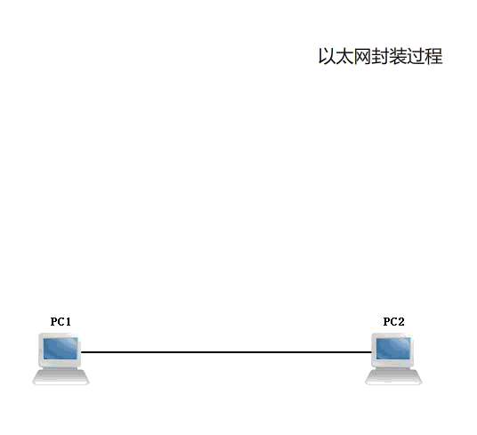
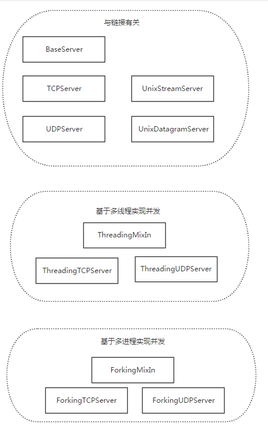

Python：https://docs.python.org/zh-cn/3.10/tutorial/index.html

> 【危险】
>
> 学习要懂得取舍，一个人的精力是有限的，知识是无限的。学习知识必须遵循，这个知识是什么，用来做什么的，怎么使用？

# 环境准备

## 安装软件

python: https://www.python.org/

pycharm: https://www.jetbrains.com/pycharm/  根据版本搜索安装 破解软件

省略安装


## 基础知识

### 注释

注释的目的是便于维护和多年后再次回顾能看得懂

单行注释 # 号

```python
# 循环打印1-10
for i in range(10):
    print(i)
```

多行注释 三个单引号或者双引号

```python
"""
多行注释
"""

'''
多行注释
'''
```

下面是模板，也就是创建py文件时候就会自动生成这些注释


## 变量

### 数据类型

| 类型         | 类型           |
| ------------ | -------------- |
| Numbers 数字 | int 整型       |
|              | long 长整型    |
|              | float  浮点型  |
|              | complex   复数 |
| 布尔类型     | True           |
|              | False          |
| String       | 字符串         |
| List         | 列表           |
| Tuple        | 元组           |
| Dictionary   | 字典           |

```python
a = 123456789    # 数字类型
type(a)
<class 'int'>
b = 1.2345     # 浮点
type(b)
<class 'float'>
c = 'false'    # 字符串
type(c)
<class 'str'>
d = False      # 布尔值
type(d)
<class 'bool'>
d = {a:1,b:2}   # 字典
type(d)
<class 'dict'>
```

### 命名规则

在定义变量名和函数名的时候常用这种命名规则

驼峰命名法：

小驼峰式命名法（lower camel case）： 第一个单词以小写字母开始；第二个单词的首字母大写。例如：myName、aDog

大驼峰式命名法（upper camel case）： 每一个单字的首字母都采用大写字母。例如：FirstName、LastName

> 官方推荐使用下划线这种方法。清晰明了区别于java和c的命名规则
>
>    age_of_wang = 33
>
>    aGe_wang2 =34

#### 关键字

系统关键字：就是系统保留的变量。

```python
import keyword   
keyword.kwlist
['False', 'None', 'True', 'and', 'as', 'assert', 'async', 'await', 'break', 'class', 'continue', 'def', 'del', 'elif', 'else', 'except', 'finally', 'for', 'from', 'global', 'if', 'import', 'in', 'is', 'lambda', 'nonlocal', 'not', 'or', 'pass', 'raise', 'return', 'try', 'while', 'with', 'yield']
```


### 输出

```python
print("hello")
hello
```

格式化输出

```python
for i in range(10):
    msg = f'''
    输出：{i}
    '''
    print(msg)
# 可以看出上面就是格式化输出

age = 20
print("我今年%d岁"%age)
我今年20岁

# 在程序中看到%这样的操作符就是格式化输出
```

#### 常用格式化符号

| 格式符号 |             转换             |
| :------: | :--------------------------: |
|    %c    |             字符             |
|    %s    | 通过str() 字符串转换来格式化 |
|    %i    |       有符号十进制整数       |
|    %d    |       有符号十进制整数       |
|    %u    |       无符号十进制整数       |
|    %o    |          八进制整数          |
|    %x    |   十六进制整数（小写字母）   |
|    %X    |   十六进制整数（大写字母）   |
|    %e    |     索引符号（小写'e'）      |
|    %E    |     索引符号（大写“E”）      |
|    %f    |           浮点实数           |
|    %g    |       ％f和％e 的简写        |
|    %G    |        ％f和％E的简写        |

换行输出

```python
print("123\n345")
123
345

name = input("请输入姓名：")
qq = input("请输入QQ号码：")
tel = input("请输入手机号：")
address = input("请输入地址：")
msg = f'''
=======================
姓名：{name}
QQ:{qq}
手机号：{tel}
地址：{address}
=======================
'''
print(msg)

# 运行结果

请输入姓名：张三
请输入QQ号码：349925756
请输入手机号：13187240256
请输入地址：云南省昆明市五华区123号

=======================
姓名：张三
QQ:349925756
手机号：13187240256
地址：云南省昆明市五华区123号
=======================
```

### 输入

input 上面已经有案例


### 运算符

| 运算符 |  描述  | 实例                                                         |
| :----- | :----: | ------------------------------------------------------------ |
| +      |   加   | 两个对象相加 a + b 输出结果 30                               |
| -      |   减   | 得到负数或是一个数减去另一个数 a - b 输出结果 -10            |
| *      |   乘   | 两个数相乘或是返回一个被重复若干次的字符串 a * b 输出结果 200 |
| /      |   除   | x除以y b / a 输出结果 2                                      |
| %      |  取余  | 返回除法的余数 b % a 输出结果 0                              |
| **     |   幂   | 返回x的y次幂 a**b 为10的20次方， 输出结果 100000000000000000000 |
| //     | 取整除 | 返回商的整数部分 9//2 输出结果 4 , 9.0//2.0 输出结果 4.0     |

> 【提示】
>
> c+=a  c=c+a  其他运算符一样


赋值运算符

| 运算符 |    描述    | 实例                                                 |
| :----- | :--------: | ---------------------------------------------------- |
| =      | 赋值运算符 | 把=号右边的结果给左边的变量 num=1+2*3 结果num的值为7 |

符合运算符

| 运算符 |       描述       | 实例                      |
| :----- | :--------------: | ------------------------- |
| +=     |  加法赋值运算符  | c += a 等效于 c = c + a   |
| -=     |  减法赋值运算符  | c -= a 等效于 c = c - a   |
| *=     |  乘法赋值运算符  | c *= a 等效于 c = c * a   |
| /=     |  除法赋值运算符  | c /= a 等效于 c = c / a   |
| %=     |  取模赋值运算符  | c %= a 等效于 c = c % a   |
| **=    |   幂赋值运算符   | c **= a 等效于 c = c ** a |
| //=    | 取整除赋值运算符 | c //= a 等效于 c = c // a |

### 数据类型转换

|          函数          |                        说明                         |
| :--------------------: | :-------------------------------------------------: |
|    int(x [,base ])     |                  将x转换为一个整数                  |
|    long(x [,base ])    |                 将x转换为一个长整数                 |
|       float(x )        |                 将x转换到一个浮点数                 |
| complex(real [,imag ]) |                    创建一个复数                     |
|        str(x )         |                将对象 x 转换为字符串                |
|        repr(x )        |             将对象 x 转换为表达式字符串             |
|       eval(str )       | 用来计算在字符串中的有效Python表达式,并返回一个对象 |
|       tuple(s )        |               将序列 s 转换为一个元组               |
|        list(s )        |               将序列 s 转换为一个列表               |
|        chr(x )         |              将一个整数转换为一个字符               |
|       unichr(x )       |             将一个整数转换为Unicode字符             |
|        ord(x )         |             将一个字符转换为它的整数值              |
|        hex(x )         |         将一个整数转换为一个十六进制字符串          |
|        oct(x )         |          将一个整数转换为一个八进制字符串           |

### 判断

if...else

if...elif..else

```python
if 要判断的条件:
        条件成立时，要做的事情
```

### 比较关系运算符

| 运算符 | 描述                                                         | 示例                                              |
| :----- | :----------------------------------------------------------- | :------------------------------------------------ |
| ==     | 检查两个操作数的值是否相等，如果是则条件变为真。             | 如a=3,b=3则（a == b) 为 true.                     |
| !=     | 检查两个操作数的值是否相等，如果值不相等，则条件变为真。     | 如a=1,b=3则(a != b) 为 true.                      |
| <>     | 检查两个操作数的值是否相等，如果值不相等，则条件变为真。     | 如a=1,b=3则(a <> b) 为 true。这个类似于 != 运算符 |
| >      | 检查左操作数的值是否大于右操作数的值，如果是，则条件成立。   | 如a=7,b=3则(a > b) 为 true.                       |
| <      | 检查左操作数的值是否小于右操作数的值，如果是，则条件成立。   | 如a=7,b=3则(a < b) 为 false.                      |
| >=     | 检查左操作数的值是否大于或等于右操作数的值，如果是，则条件成立。 | 如a=3,b=3则(a >= b) 为 true.                      |
| <=     | 检查左操作数的值是否小于或等于右操作数的值，如果是，则条件成立。 | 如a=3,b=3则(a <= b) 为 true.                      |

逻辑运算符

| 运算符 | 逻辑表达式 | 描述                                                         | 实例                    |
| :----- | :--------- | :----------------------------------------------------------- | :---------------------- |
| and    | x and y    | 布尔"与" - 如果 x 为 False，x and y 返回 False，否则它返回 y 的计算值。 | (a and b) 返回 20。     |
| or     | x or y     | 布尔"或" - 如果 x 是 True，它返回 True，否则它返回 y 的计算值。 | (a or b) 返回 10。      |
| not    | not x      | 布尔"非" - 如果 x 为 True，返回 False 。如果 x 为 False，它返回 True。 | not(a and b) 返回 False |

## 流程控制

### while 循环

```python
while 条件:
        条件满足时，做的事情1
        条件满足时，做的事情2
        条件满足时，做的事情3
# 1-100的和
i = 1
sum = 0
while i<=100:
    sum += i
    i += 1
print("1-100的累计和为：%d" % sum)

# 1-100 偶数的累积和
i = 1
sum = 0
while i<=100:
    if i % 2 == 0:
        sum += i
    i += 1
print("1-100偶数的累计和为：%d" % sum)

# 1-100 奇数的累计和
i = 1
sum = 0
while i<=100:
    if i % 2 == 1:
        sum += i
    i += 1
print("1-100 奇数累计和为：%d" % sum)
```

### break和continue

> 【笔记】
>
> - break的作用：用来结束整个循环
>
> - continue的作用：用来结束本次循环，紧接着执行下一次的循环
>
> - break/continue只能用在循环中，除此以外不能单独使用
> - break/continue在嵌套循环中，只对最近的一层循环起作用

```python
    i = 1
    while i<=5:

        j = 1
        while j<=i:
            print("* ",end='')
            j+=1

        print("\n")
        i+=1
        
    *
    * *
    * * *
    * * * *
    * * * * *
    
# 打印大三角形
i = 1
while i <= 10:
    if i <= 5:
        print("*"*i)
    else:
        print("*"*(10-i))
    i += 1
    
*
**
***
****
*****
****
***
**
*


i = 1
while i <= 5:
    j = 1
    while j <= i:
        print("*",end="")
        j += 1
    print("")
    i += 1
    
*
**
***
****
*****      

i = 5
while i >= 1:
    j = i
    while j >= 1 :
        print("*",end="")
        j -= 1
    print("")
    i -= 1
    
*****
****
***
**
*    

# 99乘法口诀表
i = 1
while i <= 9:
    j = 1
    while j <= i:
        print("%d x %d=%2d  " % (i,j,i*j),end="  ")
        j += 1
    print("")
    i += 1
    
1 x 1= 1    
2 x 1= 2    2 x 2= 4    
3 x 1= 3    3 x 2= 6    3 x 3= 9    
4 x 1= 4    4 x 2= 8    4 x 3=12    4 x 4=16    
5 x 1= 5    5 x 2=10    5 x 3=15    5 x 4=20    5 x 5=25    
6 x 1= 6    6 x 2=12    6 x 3=18    6 x 4=24    6 x 5=30    6 x 6=36    
7 x 1= 7    7 x 2=14    7 x 3=21    7 x 4=28    7 x 5=35    7 x 6=42    7 x 7=49    
8 x 1= 8    8 x 2=16    8 x 3=24    8 x 4=32    8 x 5=40    8 x 6=48    8 x 7=56    8 x 8=64    
9 x 1= 9    9 x 2=18    9 x 3=27    9 x 4=36    9 x 5=45    9 x 6=54    9 x 7=63    9 x 8=72    9 x 9=81 

# for实现
for i in range(10):
    for j in range(1,i+1):
        print(" %d x %d = %2d " % (i,j,i*j),end=" ")
    print("")
 1 x 1 =  1  
 2 x 1 =  2   2 x 2 =  4  
 3 x 1 =  3   3 x 2 =  6   3 x 3 =  9  
 4 x 1 =  4   4 x 2 =  8   4 x 3 = 12   4 x 4 = 16  
 5 x 1 =  5   5 x 2 = 10   5 x 3 = 15   5 x 4 = 20   5 x 5 = 25  
 6 x 1 =  6   6 x 2 = 12   6 x 3 = 18   6 x 4 = 24   6 x 5 = 30   6 x 6 = 36  
 7 x 1 =  7   7 x 2 = 14   7 x 3 = 21   7 x 4 = 28   7 x 5 = 35   7 x 6 = 42   7 x 7 = 49  
 8 x 1 =  8   8 x 2 = 16   8 x 3 = 24   8 x 4 = 32   8 x 5 = 40   8 x 6 = 48   8 x 7 = 56   8 x 8 = 64  
 9 x 1 =  9   9 x 2 = 18   9 x 3 = 27   9 x 4 = 36   9 x 5 = 45   9 x 6 = 54   9 x 7 = 63   9 x 8 = 72   9 x 9 = 81      
```

### for循环

```python
for 临时变量 in 列表或者字符串等:
    循环满足条件时执行的代码
```


## 字符串

```python
s = "cloudb.pub123"
print(s.find('pub'))  # 查看pub位置
7
print(s[0:6])
# print(s[0::2])
print(s[::-1])  #反转字符串

print(s.find('o',0,-1))  # 查找o所在位置
s = "hello, world!"
s1 = "这个一个字符串测试"
s2 = "Hellow,World!"
s3 = "HELOW"
print(s[2:5],s[6:],s[:-7],s[-7:-1]) #包含头，不含尾
print(s.center(60,"-"))  #在字符串两边按照指定符号补全
print(s.count('l'),s.count('l',0,7)) #指定字符在字符串中出现几次，或者指定范围内出现几次
print(s2.casefold(),s3.casefold())   #小写显示所有字符
print(s.capitalize())  #字符串第一个字母大写
print(s1.encode('GBK')) #字符编码输出
print(s.endswith('l'),s.endswith("!"),s.endswith('o',0,5)) #检查指定范围是否以某个字符结束
print(s.startswith('h'),s.startswith("w",-6,-1)) #查看指定字符串是否是指定字符开头

s4 = "\ttable   test"
print(s4.expandtabs(tabsize=4))  #把字符串中的\t 符号转为设置的空格，默认是8个空格
print(s.find('o'),s.find('o',0,5),s.find('f',0,len(s))) #查找字符在字符串中的位置，指定起点或终点,-1为找不到
s5 = "我是{}，今年{}岁"
print(s5.format("主席",60))  #更多用法 https://blog.csdn.net/jpch89/article/details/84099277
s6 = "学生姓名{name},年龄{age}"
dic = {'name':'zhangsan','age':32,}
print(s6.format_map(dic))
print(s6.format(**dic))

s7 = '123456'
s8 = 'hell5'
print(s.index('o'),s.index('w',0,len(s))) #不存在的index报错
print(s.isalnum(),s7.isalnum(),s8.isalnum()) #判断字符串中是否含有数字，带一个数字字符都是true
print(s.isalpha(),s3.isalpha(),s7.isalpha(),s8.isalpha())  #字符串中全是字母则为真
print(s4.isascii())  #字符串中的字符是否是ascii
print(s7.isdigit(),s.isdigit())  #判断是否是数字
print(s7.isdecimal(),s8.isdecimal(),s.isdecimal())  #判断字符串中是不是包含十进制数
s9 = "or"
print(s9.isidentifier())    #检查python标识符
print(s.islower(),s2.islower())  #判断是否全部是小写
print(s.isnumeric(),s7.isnumeric()) #字符串全为数字true，false
print(s.isprintable(),s4.isprintable(),s7.isprintable())  #检查是否能打印
s10 = "   "
print(s10.isspace())  #字符串是否只包含空格
print(s.title()) #标题，首单词字母大写
s11 = s.title()
print(s11.istitle())  #如果字符串是标题化的则返回 true
print(s.isupper(),s3.isupper())  #检查字符串是否是大写
print(s.join(s7))  #以s字符串为分隔，将s7中所有的元素合并为一个新的字符串
print('---'.join('12345'))
s12 = "hello,world!"
s13 = "hi                      hello,world!"
print(s12.ljust(20),s13.ljust(60))  #返回原字符串左对齐，如果不满足使用空格填充
print(s3.lower())  #大写改小写
s14 = "   hello   "
print(s14.lstrip(),s12.lstrip())  #去掉左边的空格
s15 = "a123456"
s16 = "a234567"
print(s15.maketrans(s16,s15))  #字符转换表，字符串必须一样长 acssi编码 第一个参数是需要转换的字符，第二个是字符串转换的目标
print(max(s15),min(s15))   #字符串中最大的，最小的
print(s.partition(','))   #以指定字符为分隔符，
print(s.partition("s"))   #如果指定的字符不在，那么默认字符串是第一个，第二个是空，第三个也是空
print(s.rfind('l')) #查找指定字符最后一次出现的位置，没有匹配返回-1
print(s15.rjust(30),s14.ljust(30))  #右对齐，左对齐，不够空格补充
print(s.rindex('l'))  #返回最后一个索引位置
print(s.rsplit(","),s.rsplit('l'))  #以指定字符分隔,有多少就分隔多少
print(s.replace('l','w',3))  #替换指定被替换字符，为替换字符，次数为n次
print(s.removeprefix('h')) #移除字符串首字母
print(s.removesuffix('!'))  #移除字符串字尾
print(s14.rstrip(),s.rstrip())  #移除字符串末尾空格
print(s.rpartition(',')) #指定分隔字符
print(s14.strip(),s15)  #移除字符串末尾空格
print(s.split(','))  #以指定字符分隔，num有指定最多分隔n+1次
print(s.splitlines()) #按照行('\r', '\r\n', \n')分隔，返回一个包含各行作为元素的列表，如果参数 keepends 为 False，不包含换行符，如果为 True，则保留换行符。
print(s.swapcase(),s2.swapcase()) #大小写互换
print(s15.translate(s.maketrans(s15,s16)),'34')  #不清楚用法
print(s.zfill(30)) #返回字符串为指定长度，0补全
```


# 列表、元组、字典、集合


## 列表

列表：是常用的数据类型，一个有序集合

> 【笔记】
>
> 列表是可以读写的

### 列表操作

```python
names = ['zhangsan','lisi','wangwu']
print(type(names),names)
>>> <class 'list'> ['zhangsan', 'lisi', 'wangwu']

b = ['1','2','3','4']
```

#### 增 (append、extend、insert)

```python
names.append('husan') # 在列表后追加
print(names)
>>>['zhangsan', 'lisi', 'wangwu', 'husan']

names.extend(b)   # 把另外一个列表扩展到当前列表
print(names)
>>> ['zhangsan', 'lisi', 'wangwu', '1', '2', '3', '4']

b.extend(names)
print(b)
>>>['1', '2', '3', '4', 'zhangsan', 'lisi', 'wangwu']

b.insert(1,'1.3')  #在指定索引位置插入元素
print(b)
>>>['1', '1.3', '2', '3', '4'] 
```


#### 删 del、pop、remove、clear

```python
print("删除之前",b)  
>>>删除之前 ['1', '4', '2', '3', '4']
del b[0]    # 删除指定位置的元素
print("删除之后",b)
>>>删除之后 ['4', '2', '3', '4']

print("删除之前",b)  
>>>删除之前 ['1', '4', '2', '3', '4']
b.pop(1)  # 没有指定索引位置默认删除最后一个元素
print("删除之后",b)
>>>删除之后 ['1', '2', '3', '4']


print("删除之前",b)
>>>删除之前 ['1', '4', '2', '3', '4']
b.remove('4')     # 删除指定元素，不是索引位置
print("删除之后",b)
>>>删除之后 ['1', '2', '3', '4']

print("删除之前",b)
>>>删除之前 ['1', '4', '2', '3', '4']
b.clear() # 清除列表
print(b)
>>>[]
```


#### 改

```python
b[1]=4  # 直接修改对应位置的元素
print(b)
>>>['1', 4, '2', '3', '4']
```


#### 查 in、not in、index、count

```python
print(4 in b) # 判断某个元素是不是在列表中
>>>True

print(6 in b)  
>>>False

print(6 not in b) # 判断某个元素是不是不在该列表中
>>>True

print(names.index('lisi'))  # 返回指定元素的索引位置
>>>1
print(b.index('2',0,-1))  # 判断指定元素在列表指定范围中的位置
>>>2
print(b.index('1',1,3))   # 超出范围会报错
>>>ValueError: '1' is not in list


b[1]='4'     # 统计指定元素个数，计数功能
print(b)
>>>['1', '4', '2', '3', '4']
print("字符串'4'在b 中有%d个; " % b.count('4') , "数字4在b中有%d个"%b.count(4))
>>>字符串'4'在b 中有2个;  数字4在b中有0个
```


#### 排序

```python
print("之前",b)
>>>之前 ['1', '4', '2', '3', '4']
b.reverse()  # 反转列表元素  倒序
print(b)
>>>['4', '3', '2', '4', '1']

print("之前",b)
>>>之前 ['1', '4', '2', '3', '4']
b.sort()   # 正序
print(b)
>>>['1', '2', '3', '4', '4']
```


#### 嵌套

多个列表嵌套

```python
# 一个学校，有3个办公室，现在有8位老师等待工位的分配，请编写程序，完成随机的分配

# 3个办公室就是三个列表，不考虑里面有几个办公位
import random
office_room = [[],[],[]]
names = ['a','b','c','d','e','f','g','h']

# 遍历所有老师，并把遍历出来的老师，随机分配到一个办公室
for n in names:
    index = random.randint(0,2)   # 随机索引
    office_room[index].append(n)  # 添加老师到列表
    # print(index)
# print(office_room)
for i in range(1,4):
    print("办公室%d有:%d 位老师,他们是: %s" % (i,len(office_room[i-1]),office_room[i-1]))
    print("-"*50)
    
------------------------------    
len(office_room[i-1] # 就是统计当前列表里面元素的个数。   
office_room[i-1]     # 打印列表中对应的索引位置中的元素
    
>>>    # 上面程序执行之后的结果
办公室1有:2 位老师,他们是: ['g', 'h']
--------------------------------------------------
办公室2有:4 位老师,他们是: ['b', 'c', 'd', 'f']
--------------------------------------------------
办公室3有:2 位老师,他们是: ['a', 'e']
--------------------------------------------------
```

#### 列表的遍历

列表元素遍历就是逐一把元素提取出来

```python
names = ['a','b','c','d','e','f','g','h']
for i in names:
    print(i)
>>>
a
b
c
d
e
f
g
h

# 这里这种方法或导致i溢出，这种方法丢弃
i = 0      
while i <= len(names):
    print(names[i])
    i += 1
```


## 元组

元组：也就是关系型数据库中的基本概念，关系是一张表，表中的每行就是一个元组，每列就是一个属性，二位表中元组就是行

```python
t1 = (1,'wangwu','26','云南')
print(type(t1),t1)
>>><class 'tuple'> (1, 'wangwu', '26', '云南')
```

### 访问元组

```python
t1 = (1,'wangwu','26','云南')
print(t1[1]) # 访问指定位置的元素

>>> wangwu

for i in range(len(t1)):      # 遍历元组
    print(t1[i])
    
>>>    
1
wangwu
26
云南
```


### 修改元组

> 【笔记】
>
> 元组只能读取，不能写入或修改

```python
t1[2] = 32
print(t1)

TypeError: 'tuple' object does not support item assignment
```


### 元组内置函数

```python
print(t1.index('26'))  # 查看’26‘元素所在索引位置
>>> 2 

t1 = (1,'wangwu','26','云南','云南') # 统计元组中指定元素的个数
print(t1.count('云南'))
>>>2
```


## 字典

字典：一个可变的数据结构，存储形式以key,value 存储

```python
dict = {1:'no1','name':'wangwu','age':33,'adr':'云南'}
print(type(dict))
>>><class 'dict'>
```

### 增

```python
dict['work'] = 'IT'   # 直接输入key和value 如果字典存在就是修改value，如果不存在就是添加到字典里面
print(dict)
>>>{1: 'no1', 'name': 'wangwu', 'age': 33, 'adr': '云南', 'work': 'IT'}
```

### 删 del、clear、pop、popitem

```python
print(dict)
>>>{1: 'no1', 'name': 'wangwu', 'age': 33, 'adr': '云南'}

del dict[1]    # 删除指定key value
print(dict)
>>>{'name': 'wangwu', 'age': 33, 'adr': '云南'}

dict.pop('adr')   # 删除指定key及value
print(dict)
>>>{'name': 'wangwu', 'age': 33}

dict.popitem()    # 删除字典最后一对key:value
print(dict)
>>>{1: 'no1', 'name': 'wangwu', 'age': 33}  

dict.clear()   # 清空字典
print(dict)
>>> {}
```


### 改

```python
dict['age']=35   # 直接修改key对应的value即可
print(dict)
>>> {1: 'no1', 'name': 'wangwu', 'age': 35, 'adr': '云南'}
```


### 查 get、keys、values

```python
dict.get(1)   # 访问指定key的value
>>>'no1'
dict.get(2)  # 如果key 不存在返回空或者none

dict = {1:'no1','name':'wangwu','age':33,'adr':'云南'}
print(dict['age'])   # 对于不存在的key会出错
>>> 33

print(dict.get('adr'))
>>>云南

print(dict.keys())  # 获取字典的所有key
>>>dict_keys([1, 'name', 'age', 'adr'])  

print(dict.values())   # 列出字典的所有value
>>>dict_values(['no1', 'wangwu', 33, '云南'])
```


### 其他操作

```python
print(dict.items())  # 将字典转化成元组
>>>dict_items([(1, 'no1'), ('name', 'wangwu'), ('age', 33), ('adr', '云南')])

d1 = dict.copy()  # 复制字典为d1
print(d1)
>>>{1: 'no1', 'name': 'wangwu', 'age': 33, 'adr': '云南'}

d1 = {'work':"it","公司":"xxx科技公司"}  # 定义另外一个字典
dict.update(d1)   # 更新字典
print(dict)
>>> {1: 'no1', 'name': 'wangwu', 'age': 33, 'adr': '云南', 'work': 'it', '公司': 'xxx科技公司'}

d2 = dict.fromkeys('12345','it')  # 以'12345'为key 创建一个value为'it'的不同key，同value的新字典
print(d2)
>>>{'1': 'it', '2': 'it', '3': 'it', '4': 'it', '5': 'it'}

d3 = dict.fromkeys('test','none')
print(d3)
>>>{'t': 'none', 'e': 'none', 's': 'none'}

d4 = dict.setdefault('node')  # 添加node key的默认值为空
print(d4)
>>> None

dict.setdefault('work','It')   # key work的默认值为It
dict.setdefault('work2',)      # 其他的写法
dict.setdefault('work3')
print(dict)
>>>{1: 'no1', 'name': 'wangwu', 'age': 33, 'adr': '云南', 'node': None, 'work': 'It', 'work2': None, 'work3': None}


print(len(dict)) # 返回字典的长度,也可以是字典的key(value)数量
>>>4

print(dict['name'] not in dict.values())  # 判断name key de value 是否在字典的value中，在返回True 
>>>False
print('name' in dict.keys())  # 判断 key name在不在dict.key 中
>>>True
```

==copy.deepcopy 深度copy 复制完整数据==


### 字典遍历

```python
for key in dict.keys():    # 遍历key
    print(key)
>>>
1
name
age
adr

for value in dict.values():   # 遍历value
    print(value)
>>>
no1
wangwu
33
云南

for key,value in dict.items():     # 遍历key,value
    print("key : %s,value : %s"%(key,value))
>>>
key : 1,value : no1
key : name,value : wangwu
key : age,value : 33
key : adr,value : 云南

i = 0
for key,value in dict.items():  # 遍历key value
    print("dict[%d] = %s" % (i,value))
    i += 1
>>>
dict[0] = no1
dict[1] = wangwu
dict[2] = 33
dict[3] = 云南

i = 0                # 遍历
while i < len(dict):
    for key,value in dict.items():
        print("dict[%d] is %s = %s" % (i,key,value))
        i += 1
>>>
dict[0] is 1 = no1
dict[1] is name = wangwu
dict[2] is age = 33
dict[3] is adr = 云南

for i,key in enumerate(dict):     # 这个算是最简单的 枚举函数
    print("索引位置：dict[%d]  key = %s ,value = %s" % (i,key,dict[key]))
>>>
索引位置：dict[0]  key = 1 ,value = no1
索引位置：dict[1]  key = name ,value = wangwu
索引位置：dict[2]  key = age ,value = 33
索引位置：dict[3]  key = adr ,value = 云南
```

###  枚举函数

```python
for i,key in enumerate(dict):     # 这个算是最简单的 枚举函数
    print("索引位置：dict[%d]  key = %s ,value = %s" % (i,key,dict[key]))
>>>
索引位置：dict[0]  key = 1 ,value = no1
索引位置：dict[1]  key = name ,value = wangwu
索引位置：dict[2]  key = age ,value = 33
索引位置：dict[3]  key = adr ,value = 云南
```


> 【提示】
>
> 总结: 通过上面的学习实践可以知道，列表、元组、字典、字符串是可以使用 in  、not in 来判断元素是否在其中。
>
> 其中 + 是合并 
>
> * 是复制    + * 适用于列表、元组、字符串


> 【注意】
>
> len() 函数计算容器中元素个数
>
> max() 返回容器中最大值
>
> min() 返回最小值
>
> del() 删除变量

## 集合

集合跟列表很象，但是集合里面的元素是不重复的，无序。集合常用来**去重和关系运算**

### 增删查

```python
a = {1,2,3,4,2,1,35,7}
a
{1, 2, 3, 4, 35, 7}


b = [1,2,3,4,2,1]
l =set(b)
l
{1, 2, 3, 4}

type(l)
<class 'set'>


a.add(3)   # 增
a
{1, 2, 3, 4, 35, 7}

s1 = set('abcdefg')
s1.update('wq') #迭代添加
print(s1)

# 只能增加不可变的元素或元组

# 删
a.discard(35)
a
{1, 2, 3, 4, 7}
a.pop()
1
a
{2, 3, 4, 7}
a.pop()
2
a
{3, 4, 7}
a.remove(4)
a
{3, 7}

# 查
a
{3, 7}
3 in a
True
4 not in a
True

```

### 关系运算

```python
set1 = {1,2,3,3,4,5,2,1}
set2 = {3,4,5,6,7}

print(set1,set2)
#交集
print(set1.intersection(set2)) #交集
print(set1 & set2)

#并集
print(set1.union(set2))
print(set1 | set2)

#反交集-除交集以外的其他元素
print(set1 ^ set2)
print(set1.symmetric_difference(set2))

#差集-前者独有的
print(set1 - set2)
print(set1.difference(set2))
print(set2 -set1)

set3 = {1,2,3,4,5,6}
set4 = {1,2,3,4,5,6,7,8,9}
#子集-set3被set4包含 set3就是set4的子集
print(set3 < set4)
print(set3.issubset(set4))

#超集-set4包含set3，set4就是set3的超集
print(set4 > set3)
print(set4.issuperset(set3))

#可变集合类型 set
s1 = set('abcdefg')
print(s1,type(s1))

#只读集合类型 frozenset 就是集合放到元组里面
s2 = frozenset('abcd')
print(s2)
```


## python系统函数

### 进制

学计算机不会进制基本就是废

```python
bin(10)
'0b1010'
bin(10+1)
'0b1011'
hex(4096)  # 十六进制
'0x1000'

# 查询ascii对应码 
ord('a')
97


# 查询在内存中的位置
id(1)
2419041435888
```

集合、字典就是hash的应用

```python
hash('hell')
-690964320016142105
```


## 练习

- 编程实现对一个元素全是数字的列表求最大值最小值

```python
l = []
for i in range(10):
    l.append(i)
print(l)
print("列表l中最大的元素是:%d" % max(l))
print("列表l中最小的元素是:%d" % min(l))
>>>
[0, 1, 2, 3, 4, 5, 6, 7, 8, 9]
列表l中最大的元素是:9
列表l中最小的元素是:0
```

- 统计字符串中各个字符的个数

```python
# 统计字符串中各个元素的个数
str = "hello world!"
d = {}
s1 = str.replace(" ","")
# print(s1)
for i in s1:
    d[i] = s1.count(i)
    # print(d)
for key,value in d.items():
    print("%s 出现了 %d 次" % (key,value))
>>>
h 出现了 1 次
e 出现了 1 次
l 出现了 3 次
o 出现了 2 次
w 出现了 1 次
r 出现了 1 次
d 出现了 1 次
! 出现了 1 次
```

- 名片管理系统

> 【提示】
>
> 名片管理器
>
> """
> 1.添加名片
> 2.删除名片
> 3.修改名片
> 4.查询名片
> 5.退出系统
> """
>
> 没有选择退出系统一直循环

```python
d = {"张三":['男',29,'北京'],"李四":['女',26,'云南'],"王五":['男',37,'江苏']}
mes = f"""
    1.添加名片
    2.删除名片
    3.修改名片
    4.查询名片
    5.退出系统
"""
while True:
    print(mes)
    r = input("请输入你的选择：")
    if r.isdigit()==True:
        r1 = int(r)
        if r1 == 1:
            name,sex,age,addr = map(str,input("请输入姓名,性别,年龄,所属省，使用空格分隔:").split())
            d[name] = [sex,age,addr]
            print("您所输入的信息:",name,d[name])
        elif r1 == 2:
            name = input("请输入您要删除的姓名：")
            if name in d.keys():
                d.pop(name)
                print("已删除指定用户")
            else:
                print("您输入的用户不存在，返回主菜单")
        elif r1 == 3:
            name,sex,age,addr = map(str,input("请输入需要修改的姓名、性别、年龄、所属省，以空格分隔").split())
            d[name] = [sex,age,addr]
            print("您所输入的信息:", name, d[name])
        elif r1 == 4:
            name = input("请输入需要查询人的姓名：")
            if name in d.keys():
                d.get(name)
                print("您所输入的信息:",name,d[name])
            else:
                print("您输入的用户不存在，返回主菜单！")
        elif r1 == 5:
            print("退出系统")
            break
    else:
        print("请输入数字！")
```


# 函数

函数是什么？

为什么用函数？

函数怎么用？

> 【提示】
>
> 比如监控服务的系统状态
>
> 譬如监控服务器，cpu,内存，硬盘，IO状态。当到达某个阙值就发送邮件或者短信报警，里面会有很多重复的代码
>
> define  定义
>
> 函数就是解决重复代码，提高程序效率，易维护


函数：解决重复调用相同的代码方法

```python
name = input("请输入你的姓名：")
sex = input("请输入你的性别：")

msg = f"""
姓名：{name}
性别：{sex}
"""

def msgs ():
    print(msg)

msgs()
>>>
请输入你的姓名：王某
请输入你的性别：男

姓名：王某
性别：男
```

```python
a = int(input("请输入一个数字"))
b = int(input("请输入一个数字"))
def sum():
    "两数求和"
    print("%d + %d = %2d"%(a,b,a+b))

sum()

print(help(sum))
>>>
请输入一个数字：3
请输入一个数字：2
3 + 2 =  5
Help on function sum in module __main__:

sum()
    两数求和

None
```

求和函数

```python
def add2sum(a,b):
    print("%d + %d = %d"%(a,b,a+b))

add2sum(11,22)
>>>
11 + 22 = 33
```

三参数加减计算

```python
def thr3sum(a,b,c):
    print("%d + %d - %d = %d"%(a,b,c,(a + b -c)))

thr3sum(1,2,3)
>>>
1 + 2 - 3 = 0
```

函数中用来接收参数的称为==形参==  默认参数一般就是指形参

调用时传入的参数叫做==实参== 关键字参数一般指实参

```python
def sum(a,b):
    return a+b

print(sum(1,2))   # 打印返回值
>>>
3
```

> 【笔记】
>
> 函数的类型
>
> 根据有没有参数，有没有返回值分类
>
> - 无参数，无返回值    用于打印显示
> - 无参数，有返回值    用于采集数据
> - 有参数，无返回值    用于设置数据不需要结果
> - 有参数，有返回值    用于数据处理并返回结果应用

位置参数：位置参数就是当形参有n个，那么实参也必须有n个，实参对应形参的位置就是位置参数

默认参数：在形参里面定义一个默认的参数=值，这个值就是默认参数

位置参数大于关键参数大于默认参数，也就是说默认参数写在最后

非固定参数：不确定后面调用时传递的参数，使用\*args \*\*kwargs  可以传递其他多的参数

args 元组

kwargs 字典 关键参数key=value 这种就会传到字典里面


## 应用

打印一条横线

```python
def printOneline():
    s = ""
    print(s.center(100,"-"))   # "*"*100  也可以打印一条横线

printOneline()
```

多条横线

```python
def printOneline(a):
    s = ""
    print(s.center(a,"-"))

for i in range(5):
    printOneline(i)
>>>
-
--
---
----
```

求三个数之和

```python
# 写一个函数求三个数的和
a,b,c=map(int,input("请输入三个数字，以空格分隔：").split())
def thr3Sum():
    print("%d + %d + %d = %d"%(a,b,c,(a+b+c)))

thr3Sum()
>>>
请输入三个数字，以空格分隔：2 5 8
2 + 5 + 8 = 15

# 改
a,b,c=map(int,input("请输入三个数字，以空格分隔：").split())
def thr3Sum():
    return a+b+c
print("%d + %d + %d = %d" % (a,b,c,thr3Sum()))
>>>
请输入三个数字，以空格分隔：1 2 5
1 + 2 + 5 = 8

# 求三个数的平均值
a,b,c = map(int,input("请输入三个数字，以空格分隔:").split())

def three_Average():
    return (a+b+c)/3
print("%d %d %d 的平均值是：%f"%(a,b,c,three_Average()))
>>>
请输入三个数字，以空格分隔:2 3 5
2 3 5 的平均值是：3.333333
```

## 函数变量

### 局部变量：

函数内定义的变量，跳出函数无效，不同的函数可以定义相同的名字作为局部变量，相互不影响

```python
def sum():
    a = 2     # 局部变量
    print(a)
sum()
>>> 2
```


### 全局变量：

在程序内使用

```python
a = 2   # 全局变量
def sum():
    print(a)
sum()
>>> 2
```


全局变量跟局部变量名相同会发生什么？

```python
a = 2
def s():
    a = 5
    print("局部变量",a)
s()

print("全局变量a",a)
>>>
局部变量 5
全局变量a 2

a = 2
def s():
    global a
    a = 5
    print("局部变量",a)
s()

print("全局变量a",a)
>>>
局部变量 5
全局变量a 5
```

> 【笔记】
>
> - 在函数外面定义的变量叫做全局变量
> - 全局变量在所有的函数中访问
> - 在函数中声明全局变量就需要使用global定义
> - 如果全局变量的名字和局部变量的名字相同，那么函数使用的是局部变量

### 可变的局部变量

```python
i = 0
for n in range(10):
    print(i,n)
    i += 1
>>>
0 0
1 1
2 2
3 3
4 4
5 5
6 6
7 7
8 8
9 9
```

在遍历中最常见

> 【笔记】
>
> 一般不建议在函数中定义全局变量。

```python
def s(a,b):
    c = a+b
    d = a*b
    return c,d   # 返回多个返回值
e,f=s(3,4)
print("e =",e,"f =",f)  
>>>
e = 7 f = 12   #本质就是使用了元组
```

### 缺省参数

当程序没有输入调用的实参，便采用形参中的默认值。

```python
def printinfo(name,age=35):
    """打印传输的字符串"""
    print("name",name)
    print("age",age)

printinfo(name='wang')
printinfo(name='zhangsan',age=25)    
>>>
name wang
age 35
name zhangsan
age 25
```

带有默认参数的必须在参数列表的后面

### 不定长参数

很多时候需要一个函数处理比当初声明时候更多的参数，就需要使用不定长参数，声明时不会命名。

```python
def func(a,b,*args,**kwargs):
    """可变参数"""
    print("a=",a,"b=",b,"args=",args,"kwargs=",kwargs)

func(1,2,3,4,5,m=6,n=7)
>>>
a= 1 b= 2 args= (3, 4, 5) kwargs= {'m': 6, 'n': 7}
```

> 【提示】
>
> 这里可以看到上面传入的不定长参数把同类的归到元组中，另外的归到字典中

### 引用传参

```python
def selfAdd(a):
    a += a

b = 1
selfAdd(b)
print(b)
>>> 1

b = [1,2]
selfAdd(b)
print(b)
>>> [1, 2, 1, 2]
```

> 【笔记】
>
> python 中函数是引用传递，不是值传递！

### 引用

```python
>>>a = 1
>>>b = a
>>>a
1
>>>b
1
>>>a = 2
>>>a
2
>>>b
1


>>> a = [1,2]
>>> b = a
>>> b
[1, 2]
>>> a.append(3)
>>> a
[1, 2, 3]
>>> b
[1, 2, 3]
```

> 【提示】
>
> python是变量传递，所以上面例子中第一个例子b还是等于1 可以使用id(b)和id(a)对比
>
> - 可变类型
>
>   列表
>
>   字典
>
> - 不可变类型
>
>   数值类型：int long bool float
>
>   字符串 str
>
>   元组 tuple

所以当python遇到上面的类型最后的结果是不一样的

### 递归函数

一个函数可以调用另外的函数。如果一个函数在内部不调用其他的函数，而是本身的话，这个函数就是递归函数

```python
import sys
sys.getrecursionlimit()   # 默认递归层  set是设置不要去设置默认已经够用了 
1000

# 无限循环   结束方式就是加return 中断
def f1():
    print("111")
    print("222")
    print("".center(30,"-"))
    f1()
f1()   
RecursionError: maximum recursion depth exceeded while calling a Python object

```


```python
# 计算n! =1*2*3*...*n 阶乘
def calNum(n):   # n是形参
    i = 1     # 局部变量
    result = 1   # 局部变量 乘积初始化
    while i <= n:
        result *= i   # result = result * i
        i += 1
    return result    # 返回值
ret = calNum(3)   # 7是实参
print(ret)

# 乘阶规律
1! = 1
2! = 2 × 1 = 2 × 1!
3! = 3 × 2 × 1 = 3 × 2!
4! = 4 × 3 × 2 × 1 = 4 × 3!
...
n! = n × (n-1)!

# 法二
def callNum(n):
    if n >= 1:
        re = n * callNum(n - 1)
    else:
        re = 1
    return re

ret = callNum(3)
print(ret)

>>>6

# 输入一个数一直除于2，直到为0结束
def calc(n):
    print(n)
    n = int(n/2)
    if n>0:
        calc(n)

calc(100)
>>>
100
50
25
12
6
3
1
```

递归需要有明确结束条件，没有就无限循环下去

#### 二分法

```python
l = [1,2,4,6,9,11,12,15,17,22,35,41,53,57,69,77,102]

# l.sort()  # 如果列表顺序不对就需要重新排序

def binary_search(input_num,new_l):
    mid_num = int(len(new_l) / 2)  # len(new_l) // 2 整除 这种方法也可以。注意列表查询顾头不顾尾
    print(new_l)
    if input_num > new_l[-1]:
        print("您需要找的值大于列表最大值")
        if  input_num not in new_l:
            print("Error ,%d is not in list"%input_num)
            return 3
        return 2
    elif input_num < new_l[0]:
        print("你查找的数值小于范围的最小值")
        return 1

    if input_num > new_l[mid_num]:
        print("在列表的右边")
        new_l = new_l[mid_num:]
        # print(new_l)
        binary_search(input_num,new_l)
    elif input_num < new_l[mid_num]:
        print("在列表的左边")
        new_l = new_l[:mid_num]
        # print(new_l)
        binary_search(input_num, new_l)
    else:
        print("Find It")

def p():
    print("".center(60,"-"))

binary_search(22,l)
p()
binary_search(35,l)
p()
binary_search(999,l)
p()
binary_search(-3,l)
p()
binary_search(102,l)
p()
>>> # 分别测试小于最小值，大于最大值，不存在的值看看情况是什么
[1, 2, 4, 6, 9, 11, 12, 15, 17, 22, 35, 41, 53, 57, 69, 77, 102]
在列表的右边
[17, 22, 35, 41, 53, 57, 69, 77, 102]
在列表的左边
[17, 22, 35, 41]
在列表的左边
[17, 22]
Find It
------------------------------------------------------------
[1, 2, 4, 6, 9, 11, 12, 15, 17, 22, 35, 41, 53, 57, 69, 77, 102]
在列表的右边
[17, 22, 35, 41, 53, 57, 69, 77, 102]
在列表的左边
[17, 22, 35, 41]
Find It
------------------------------------------------------------
[1, 2, 4, 6, 9, 11, 12, 15, 17, 22, 35, 41, 53, 57, 69, 77, 102]
您需要找的值大于列表最大值
Error ,999 is not in list
------------------------------------------------------------
[1, 2, 4, 6, 9, 11, 12, 15, 17, 22, 35, 41, 53, 57, 69, 77, 102]
你查找的数值小于范围的最小值
------------------------------------------------------------
[1, 2, 4, 6, 9, 11, 12, 15, 17, 22, 35, 41, 53, 57, 69, 77, 102]
在列表的右边
[17, 22, 35, 41, 53, 57, 69, 77, 102]
在列表的右边
[53, 57, 69, 77, 102]
在列表的右边
[69, 77, 102]
在列表的右边
[77, 102]
Find It
------------------------------------------------------------
```

**回溯**

回溯就是一层层的调用下去这个过程

**递推**

就是回溯的反向

**递归应用**

```python
# 递归应用 提取下面元素
l = [1,[2,[3,[4,[5,[6,[7,8,9,[10,[11]]]]]]]]]

def re_func(list1):
    for item in list1:
        if type(item) is list:
            """if item is list,need for"""
            re_func(item)
        else:
            print(item)

re_func(l)
>>>
1
2
3
4
5
6
7
8
9
10
11
```

函数编程的3个应用

### map

```python
l = ['alex','jack','bob','deal']
res = map(lambda name:name+'_dsb',l)
# print(res)
print(res.__next__())
print(res.__next__())
print(res.__next__())
print(res.__next__())
>>>
alex_dsb
jack_dsb
bob_dsb
deal_dsb
```


### filter

filter(function,iterable)

function 判断函数，

iterable 可迭代对象

主要用于过滤，之前的编程已经满足了。这种函数编程了解即可

```python
l = ['alex_dsb','jack','bob_dsb','deal']
res = [name for name in l if name.endswith("_dsb")]
print(res)
>>>
['alex_dsb', 'bob_dsb']

# filter判断
l = ['alex_dsb','jack','bob_dsb','deal']
res = filter(lambda name:name.endswitch('_dsb'),l)
print(type(res))
>>>
<class 'filter'>

def f(x):
    return x % 2 == 0
l = [1,3,4,5,6,9]

res = filter(f,[1,2,3,4,6])
print(res)
res1 = list(res)
print(res1)
>>>
<filter object at 0x000001AD23C7C850>
[2, 4, 6]

# 过滤出1-100中平方根是整数的数
import math
def is_sqr(x):
    return math.sqrt(x) % 1 == 0

tmpl = filter(is_sqr,range(1,101))
l1 = list(tmpl)
print(l1)
>>>
[1, 4, 9, 16, 25, 36, 49, 64, 81, 100]
```

过滤可迭代序列中的例子

```python
l = [1,3,5,8,9]
res = filter(lambda i:i%2==1,l)
print(res)
print(list(res))
>>>
<filter object at 0x0000025BB6D7DD50>
[1, 3, 5, 9]    # 过滤列表中的奇数

# 过滤1-100以内的偶数
res=filter(lambda i:i%2==0,range(1,100))
print(list(res))
>>>
[2, 4, 6, 8, 10, 12, 14, 16, 18, 20, 22, 24, 26, 28, 30, 32, 34, 36, 38, 40, 42, 44, 46, 48, 50, 52, 54, 56, 58, 60, 62, 64, 66, 68, 70, 72, 74, 76, 78, 80, 82, 84, 86, 88, 90, 92, 94, 96, 98]
```


### reduce

合并操作

```python
res=filter(lambda i:i%2==0,range(1,100))
l = list(res)

from functools import reduce
sums = reduce(lambda x,y:x+y,l)
print(sums)

sum1 = reduce(lambda x,y:x*y,[1,2,3])
print(sum1)

sum2 = reduce(lambda x,y:x+y,range(1,101))
print(sum2)
>>>
2450
6
5050
```

合并操作，上面例子是求累加和

### sorted

其功能是对序列（列表、元组、字典、集合、还包括字符串）进行排序

list = sorted(iterable, key=None, reverse=False) 

其中，iterable 表示指定的序列，key 参数可以自定义排序规则；reverse 参数指定以升序（False，默认）还是降序（True）进行排序。sorted() 函数会返回一个排好序的列表。

```python
a = [1,5,3,4,7,9,2]
print(sorted(a))


d = {
    '张三':5000,
    '李四':7000,
    '王五':9000,
    '小七':3500
}

print(sorted(d.items()))  # 按照key的value排序
print(sorted(d.items(),reverse=True)) # 倒序

chars=[
    'https://github.com',
    'http://cloudb.pub',
    'taobao.com',
    'https://www.52pojie.com'
]
print(sorted(chars,key=lambda x:len(x))) # 按字符串长度排序
```


### 匿名函数

用lambda 关键词能创建小型匿名函数。不需要def 声明

```python
s = lambda a,b:a+b
print(s(10,20))

def sun(x,y):  # 这个等同于下面的lambda
    print(x,y,x+y)
sun(1,4)
>>> 1 4 5

s = lambda x,y:x+y
print(s(1,4))
>>> 5

c = lambda x,y:x**y
print(c(2,3))
>>>
8

# 使用匿名函数比字典的value最大值
d = {
    '张三':5000,
    '李四':7000,
    '王五':9000,
    '小七':3500
}

res = max(d,key=lambda k:d[k])
print(res)
```

> 【提示】
>
> lambda 函数能接收任何数量的参数，但是只能返回一个表达式的值
>
> 匿名函数不能直接调用print，因为lambda需要一个表达式

```python
def fun(a,b,opt):
    print("a =",a,"b =",b,"result =",opt(a,b))

fun(1,2,lambda x,y:x+y)
>>>
a = 1 b = 2 result = 3

# 函数作为参数传递

def calc(x):
    return  x ** 2

c = map(calc,[1,3,4,6,9,12])
for i in c:
    print(i)
    
    
# 这里效果等同于上面函数效果    
c = map(lambda x:x**2,[1,3,4,6,9,12])
for i in c:
    print(i)

```

下面数据按name age排序

```python
stus = [
    {"name":"zhangsan", "age":18}, 
    {"name":"lisi", "age":19}, 
    {"name":"wangwu", "age":17}
]

stus.sort(key=lambda x:x['name'])  # 按照name 关键字排序
print(stus)
>>>
[{'name': 'lisi', 'age': 19}, {'name': 'wangwu', 'age': 17}, {'name': 'zhangsan', 'age': 18}]

stus.sort(key=lambda x:x['age'])  # 按照年龄 排序
print(stus)
>>>
[{'name': 'wangwu', 'age': 17}, {'name': 'zhangsan', 'age': 18}, {'name': 'lisi', 'age': 19}]
```

> 【笔记】
>
> 能不使用lambda就不要使用，不便于程序阅读


函数使用注意

> 【危险】
>
> 自定义函数
>
> 无参数，无返回值
>
> def 函数名():
>
> ​    语句
>
> 无参数，有返回值
>
> def func():
>
> ​    语句
>
> ​    return 需要返回的数值
>
> - 没有return 就是没有返回值
> - 返回值可以检测到程序是否执行成功，有时候不需要
> - 有多个return 只执行一个return

> 【危险】
>
> 有参数，无返回值
>
> def 函数名(形参列表)：
>
> ​    语句
>
> 有参数，有返回值
>
> def 函数名():
>
>    语句
>
>    return 需要返回的数值

函数名不能相同

> 【提示】
>
> 函数调用
>
> 函数名[实参列表]
>
> 如果调用的函数有形参，那么调用的时候就应该传递参数
>
> 多个实参与形参调用的要求一致
>
> 如果有返回值，就需要一个变量来存储这个返回值

作用域

- 一个函数中的变量，只能在本函数使用
- 全局函数全局使用

### 嵌套函数

函数中的函数

```python
name = "嵌套函数"

def change():
    name = "嵌套函数中的局部变量"
    def change2():
        name = "函数中的函数中的局部变量"
        print("第三个name,函数中的函数")
    change2()
    print("第二层 函数中的name")
change()
print("没有经过函数")
>>>
第三个name,函数中的函数
第二层 函数中的name
没有经过函数
```

输出是由内向外的，如果第三层没有name 那么就会调用第二层


### 三元运算

```python
c = map(lambda x:x**2 if x > 10 else x**3,[1,3,4,6,9,12])
for i in c:
    print(i)
>>>
1
27
64
216
729
144
```

三元运算是if else 

```python
def ab(x,y):
    if x > 1:
        return x ** y
    else:
        return x + y

print(ab(2,4))
print(ab(0,2))


c = lambda x,y:x**y if x>1 else x+y
print(c(2,4))
print(c(0,2))
>>>
16
2
16
2

for i in range(12):
    f = i ** 2 if i < 6 else i ** 3
    print(f)
>>>
0
1
4
9
16
25
216
343
512
729
1000
1331
```

可以看到上面等价if 条件成立执行等式的左边表达式，不成立执行右边的表达式

### 高阶函数

变量可以指向函数，函数的参数能接受变量，那么一个函数就可以接受另一个函数作为参数，这种就叫高阶函数

```python
def get_abs(n):
    if n < 0:
        n = int(str(n).strip("-"))
    return n

def add(x,y,f):
    return f(x) + f(y)

re = add(3,-7,get_abs)
print(re)
>>>
10
# 类似取绝对值


# 求任意两数与2的余数之和

def remainder(a):
    return a % 2

def sum(x,y,f):
    return f(x) + f(y)

re = sum(3,7,remainder)
print(re)
>>>
2
```

接收一个或多个函数作为输入，return返回另外一个函数

### 内置函数

https://docs.python.org/zh-cn/3/library/functions.html

| 内置函数         | 说明                                                         |
| ---------------- | ------------------------------------------------------------ |
| abs()            | 求绝对值                                                     |
| aiter()          | 返回异步迭代器                                               |
| all()            | 通过bool判断为true，如果包含none,0则为false，判断所有为true  |
| any()            | 只要里面由一个为true就是true，空则false                      |
| anext()          | nexit的异步版本                                              |
| ascii()          | 返回一个对象的ascii码ascii('中国')<br/>"'\\u4e2d\\u56fd'"    |
| bin()            | 十进制转返回二进制                                           |
| bool()           | 返回布尔值，空的列表，字典、0都是false                       |
| breakpoint()     | 直接传递args kws                                             |
| bytearrary()     | 可修改的数组或者集合、字符串,可变序列                        |
| bytes()          | bytes('a',"utf8")                                            |
| callable()       | 判断对象是否可以调用                                         |
| chr()            | 返回ascii对应的字符                                          |
| classmethod()    | OOP封装方法                                                  |
| compile()        | 将 source 编译成代码或 AST 对象                              |
| compliex()       | 将字符串或数字转换为复数                                     |
| delattr()        | oop时候使用，如果对象允许删除指定属性                        |
| dict()           | 字典                                                         |
| dir()            | 返回对象可使用的属性                                         |
| divmod()         | 返回除法的商和余数divmod(7,2)<br/>(3, 1)                     |
| enumerate()      | 添加索引序号，遍历常用                                       |
| eval()           | 把字符串转化为原有的数据类型，eval('1+2')                    |
| exec()           | 执行语句                                                     |
| filter()         | 过滤符合条件的                                               |
| float()          | 浮点                                                         |
| format()         | 格式                                                         |
| frozenset()      | 把集合变成不可编辑                                           |
| getattr()        | oop使用 返回对象命名属性的值                                 |
| globals()        | 全局变量                                                     |
| hasattr()        | 该实参是一个对象和一个字符串。如果字符串是对象的属性之一的名称，则返回 True，否则返回 False |
| hash()           | 哈希                                                         |
| help()           | 帮助                                                         |
| hex()            | 十进制转十六进制                                             |
| id()             | 看内存ID                                                     |
| input()          | 输入                                                         |
| int()            | 返回整数                                                     |
| isinstance()     | 判断数据类型                                                 |
| issubclass()     | oop 弱国class是classinfo的子类返回true                       |
| iter()           | 返回迭代器对象                                               |
| len()            | 计算长度                                                     |
| list()           | 列表                                                         |
| locals()         | 更新并返回表示当前本地符号表的字典。                         |
| map()            | 多元输入输出                                                 |
| max()            | 最大值                                                       |
| min()            | 最小值                                                       |
| memoryview()     | 返回由给定实参创建的“内存视图”对象                           |
| next()           | oop下一项                                                    |
| object()         | 对象                                                         |
| oct()            | 十进制转八进制                                               |
| open()           | 打开文件  -with结合使用                                      |
| ord()            | 返会ascii                                                    |
| pow()            | 返回冥 pow(2,3)<br/>8                                        |
| print()          | 打印                                                         |
| property()       | 返回@property 装饰器属性                                     |
| range()          | 返回一个随机数type(range(10))<br/><class 'range'>            |
| repr()           | 返回对象的可打印形式字符串。                                 |
| reversed()       | 返回一个反向的 iterator                                      |
| round()          | 四舍五入round(3.1415926,4)<br/>3.1416                        |
| set()            | 集合                                                         |
| setattr()        | 本函数与 getattr() 相对应                                    |
| slice()          | 返回一个 slice 对象，代表由 range(start, stop, step) 指定索引集的切片。 |
| sorted()         | 根据 iterable 中的项返回一个新的已排序列表。                 |
| staticmethod()   | 将方法转换为静态方法。                                       |
| str()            | 转化为字符串                                                 |
| sum()            | 求和                                                         |
| super()          | 调用父类的init方法                                           |
| tuple()          | 元组                                                         |
| type()           | 查看数据类型                                                 |
| vars()           | 返回模块、类、实例或任何其它具有\_\_dict\_\_ 属性的对象的 __dict__ 属性 |
| zip()            | 把2个或多个列表拼成一个                                      |
| \_\_import\_\_() | 此函数会由 import 语句发起调用。                             |
|                  |                                                              |


### 名称空间

namespace

==x=1 名称空间就是存放名字x与1绑定关系的地方==

名称空间有4种：LEGB

- locals 函数内部的名字空间。一般包括函数的局部变量以及形式参数
- enclosing function，在嵌套函数中外部函数的名字空间，若fun2嵌套在fun1里，对fun2来说，fun1的名字空间就是enclosing
- globals 当前的模块空间，模块也就是一些py文件
- \_\_builtins\_\_ 内置模块空间，也就是内置变量或内置函数的名字空间，print(\_\_builtins\_\_)可查看包含的值


### 闭包

闭包就是根据不同的配置信息得到不同的结果。

```python
def outer():
    name = "闭包"

    def inter():
        print("里面")
    return inter   # 这里返回内嵌函数名，这种就是闭包。这里inter 还可以写成inter()
f = outer()
f()
>>>
里面
```

返回的函数对象，不仅仅是一个函数对象，在该函数外还包裹了一层作用域，这使得该函数无论在何处调用使用自己外层包裹的作用域。

> 【笔记】
>
> 本地作用域在函数结束后就应该立即失效，但是在嵌套作用域在嵌套的函数中返回值任然有效。
>
> 针对上面这种语言现象就称为闭包。outer函数中嵌套了inter函数，在outer的返回值是inter

```python
def f1():
    x = 9
    def f2():
        print("x的值是: %s"%x)
    return f2
f1()
print(f1())   # 打印的内存地址
f = f1()
f()    # 调用的是f1()
>>>
<function f1.<locals>.f2 at 0x000001BB3049A8C0>
x的值是: 9

def f1():
    x = 9
    def f2():
        print("x的值是: %s"%x)
    # return f2
    f2()

f1()
>>>
9
```

这里的例子可以看出函数有返回值和直接内嵌函数的调用是由差别的，带有return的返回的是内存地址还需要创建调用对象。内嵌函数的作用域外直接调用最外层函数就可以了。

```python
def f1(a):
    b = 5
    def f2(c):
        return c ** a + b
    return f2

print(f1(2))  # 可以看到调用的是内存地址
>>>
<function f1.<locals>.f2 at 0x0000023A8BA3A830>

def f1(a):
    b = 5
    def f2(c):
        return c ** a + b
    return f2

f = f1(2)
print(f(3))
>>>
14
-----------------------
def f1(a):
    b = 5
    def f2(c):
        return c ** a + b
    return f2
f1(2)
print(f1(2)) # 如果直接调用外层函数那么得到的是f1函数返回的f2的内存地址
f = f1(2)
print(f(3))
>>>
<function f1.<locals>.f2 at 0x000002C18180A8C0> 
14
```


> 【提示】
>
> 可以看出内嵌的f2函数记住了变量a b的值，通过调用外部的f得到内嵌f2的引用。这种函数嵌套在装饰器中经常用到，这种嵌套作用域就是python的函数能够保留状态信息的主要方法。

#### 工厂函数

```python
def f1(a):
    b = a
    def f2(l):
        nonlocal b
        b += 1
        print(l,b)
    return f2

f1(1)
print(f1(1))

f = f1(1)
f('a')
f('b')
f('c')
>>>
<function f1.<locals>.f2 at 0x000001EE623EA830>
a 2
b 3
c 4
```


可能不是太明显：

```python
def f1(a):
    b = a
    def f2(l):
        nonlocal b
        b += 1
        print(l,b)
    return f2

f1(1)
print(f1(1))

f = f1(1)
f('第一次调用的结果是：')
f('第二次调用的结果是：')
f('第三次调用的结果是：')
>>>
<function f1.<locals>.f2 at 0x000001CDEC51A830>
第一次调用的结果是： 2
第二次调用的结果是： 3
第三次调用的结果是： 4
```

在f2中通过关键字nolocal引用了内嵌的作用域中的变量b那么就可以在f2函数中修改它，即使函数f1已经退出了，这个记忆依然存在。

```python
def f1(a):
    b = a
    def f2(l):
        nonlocal b
        b += 1
        print(l,b)
    return f2

f = f1(1)
f('第一次调用的结果是：')
f('第二次调用的结果是：')
f('第三次调用的结果是：')

g = f1(100)
g("创建一个新的对象调用1次：")
g("创建一个新的对象调用2次：")
g("创建一个新的对象调用3次：")
>>>
第一次调用的结果是： 2
第二次调用的结果是： 3
第三次调用的结果是： 4
创建一个新的对象调用1次： 101
创建一个新的对象调用2次： 102
创建一个新的对象调用3次： 103
```

多次调用工厂函数返回的不同内嵌函数副本f和g他们是相互独立的。

#### 闭包陷阱

```python
def f1(a):
    l = []
    for i in range(3):
        def f2():
            return i * i
        l.append(f2)
    return l

g1,g2,g3 = f1(2)
print(g1())
print(g2())
print(g3())
>>>
4
4
4
```

这种是错误的应用，返回闭包不能使用任何循环变量和后边会变化的变量

```python
# 修改
def f1(a):  # 这里的形参完全多余，这里有参数外面调用的时候也需要加参数。
    l = []
    for i in range(3):
        def f2(j = i):
            return j * j
        l.append(f2)
    return l

g1,g2,g3 = f1(2)   # 这里的实参是对应上面的形参，这例子完全多余
print(g1())
print(g2())
print(g3())
>>>
0   # 0*0
1   # 1*1
4   # 2*2
```

#### 闭包应用

```python
def f1(func):
    def f2(*args):
        if len(args) >= 2:
            func(*args)
        else:
            print("Error! Arguments = %s"%list(args))
    return f2

@f1
def add(*args):
    print(sum(args))

args = range(1,3)
add(*args)
>>>
3
```

使用闭包可以解决后期代码扩展功能，总所周知已经定义好的或者写好的函数或者class，如果直接去修改代码或调用方式就会导致程序异常。所以使用闭包就可以有效的解决源代码扩展功能问题。

在上面的例子中没有破坏源代码，只是增加一层简单的封装。如果看不到函数可以对函数对象经行封装add = f1(add) 装饰器是可以叠加的。

闭包的缺点：经过装饰器的函数或者类不再是原来的函数或者类了。这就是使用扩展功能的应用，以前的调用方式还是以前的，不影响，只是新增的不是了。切记：经过装饰器的函数或者类已经被装饰了，改变了等价 class函数my = 闭包函数f1(my)里面以前my.xxx 就变成self.xxx

==接下去就是装饰器的介绍了==

### 装饰器

封闭：已实现的功能代码块不应该被修改

开放：对现有的功能扩展开放

装饰器：在不改变源代码，原调用的情况下扩展功能，结合闭包实现的装饰器，本质就是一个函数或者类

@ 装饰器或者语法糖

装饰器一样在插入日志、性能测试、事务处理、缓存、权限校验等场景使用。

```python
def outer(func):
    def inner():
        print("Right!")
        res = func
        print("log is ok")
        return  res
    return inner

@outer
def f1():
    print("111")

# outer(f1())

f1()
>>>
Right!
log is ok
```


上面的func=f1，@outer=outer(f1)

```python
上面的@outer 等价于下面
两句
f = outer(f1)
f()
```

上面是没有传参的。

```python
def outer(func):
    def inner(name):
        print("认证成功！")
        res = func
        print("日志添加成功")
        return res
    return inner

@outer
def f1(name):
    print(" %s 正在链接业务"%name)

# f = outer(f1('jack'))
# f('jack')
f1('jack')
>>>
认证成功！
日志添加成功
```

上面的执行结果跟注释掉的不一样

到这里还没有理解装饰器。。。

python中函数可以根据给定的参数返回一个值。

```python
def hello(name):
    return "Hello " + name

print(hello("jack"))
hello("jack")   #这种调用是不能返回的
>>>
Hello jack
```

函数本身也是对象

```python
def hello(name):
    return "Hello " + name

# print(hello("jack"))

f = hello
print(f)    # 返回内存地址
print(f('Job'))
>>>
<function hello at 0x00000177D18C3F40>
Hello Job
```

函数名等于f是他们都指向了hello同一个函数，后面加括号就是对其进行了调用

当函数作为参数传递到另一个函数中，这种就是==高阶函数==。以其他函数作为参数的函数

```python
def f1(func):
    name = func()
    print("Hi "+ name)

def f2():
    return "B"

f1(f2)   # 把f2函数作为参数传递给f1调用。
>>>
Hi B
```

> 【危险】
>
> f2函数作为参数时没有后面的小括号，加括号是被调用才加括号。在name=func()才被调用

```python
def hi():
    def f1():
        return "Hello "
    print(f1() + "Bob") #这里的f1()是调用

hi()
>>>
Hello Bob

def hi():
    def f1():
        return "Hello "
    # print(f1() + "Bob")
    return f1() + 'Bob'    # 这里是返回值，注意这里的运算不可以是f1函数

print(hi())
>>>
Hello Bob


# 这不就是闭包么
def f1():
    def f2():
        print("f2的输出")
    return f2    # 返回的是f2函数

f = f1()  # 创建一个对象
f()  # 调用这个对象
>>>
f2的输出

```

```python
def outer(func):
    def inner():
        print("调用func前")
        name = func()
        print("调用func后")
    return inner

def hi():
    print("Hi World")

f = outer(hi)
f()
>>>
调用func前
Hi World
调用func后

def outer(func):
    def inner():
        print("调用func前"+func()) # 这里是返回的字符串拼接
        name = func()
        print("调用func后"+name)  #复制后的拼接
    return inner

def hi():
    return  "Hi World"

f = outer(hi)
f()
>>>
调用func前Hi World
调用func后Hi World
```

上面例子可以看出，函数返回和print是有区别的。

```python
def outer(func):
    def inner():
        print("调用func前"+func())
        name = func()
        print("调用func后"+name)
    return inner

@outer
def hi():
    return  "Hi World"

# f = outer(hi)
# f()
hi()
>>>
调用func前Hi World
调用func后Hi World

def outer(func):
    def inner():
        print("调用func前")  # 这里不能直接加调用函数了类型是none
        name = func()
        print(type(name))
        print("调用func后")
    return inner

@outer
def hi():
    # return  "Hi World"
    print("HI")

# f = outer(hi)
# f()
hi() # 在这种调用就出错了
>>>
调用func前
HI
<class 'NoneType'>
调用func后

def outer(func):
    def inner():
        print("调用func前",func())
        name = func()
        # print(type(name),name)
        print("调用func后",name)
    return inner

@outer
def hi():
    # return  "Hi World"
    print("HI")

# f = outer(hi)
# f()
hi() # 在这种调用就出错
>>>
HI     # print中的func()结果
调用func前 None   #打印返回func()的结果none
HI  # name那行调用
调用func后 None  
```

> 【提示】
>
> 在上面例子中可以看出使用了装饰器。在引用了语法糖之后就等于outer(f1) 这样的形式。

```python
def outer(func):
    def inner():
        print("调用func前")
        name = func()
        print("调用func后")
    return inner

def hi():
    print("HI")

# f = outer(hi)
# f()
# 这里是等价的。
outer(hi)()  
# 上面就是一个简单的装饰器了。

# 进阶修改成装饰器
def outer(func):
    def inner():
        print("调用func前")
        name = func()
        # print(type(name),name)
        print("调用func后")
    return inner

@outer  # 叫语法糖
def hi():
    # return  "Hi World" 如果这里使用return 
    print("HI")

hi()
>>>
调用func前
HI
调用func后

def outer(func):
    def inner():
        print("调用func前")
        print(func())     
        print("调用func后")
    return inner

@outer
def hi():
    return  "Hi World"
hi()
>>>
调用func前
Hi World
调用func后
```


> 【笔记】
>
> 上面例子中当函数使用的是return 返回内存地址，函数内调用的时候使用fun()返回内存地址，没有print是不会显示的。print(函数名)这个是内存地址，print(函数名()) 这个才是返回结果。
>
> @outer 等价 hi=outer(hi)
>
> 这里一定要注意。下面是解决这种情况的方法

#### 装饰器的返回值

上面外面看到原函数具有返回值，如果是用前面第一种方式也就是图片的左边那种方式。

因为装饰器返回的inner函数是不具有返回值的，因此原本函数的返回值就被吃了，要解决这种问题就必须使用return把原函数的返回值丢出来。

```python
def outer(func):
    def inner():
        return func
    return inner
@outer
def f():
    return  1

print(f) # 返回内存地址
print(f())
>>>
<function f at 0x000002380916A8C0>
1

def outer(func):
    def inner():
        return func()
    return inner
@outer
def f():
    return  'Hello'

print(f())
>>>
Hello
```

#### 带参数的原函数

原函数带参数

```python
def outer(func):
    def inner():
        return func
    return inner

@outer
def f1(name):
    return "欢迎光临" + name

print(f1('Jack'))
>>>
    print(f1('Jack'))
TypeError: outer.<locals>.inner() takes 0 positional arguments but 1 was given
```

报错了。

```python
def outer(func):
    def inner(name):
        return func(name)
    return inner

@outer
def f1(name):
    return "欢迎光临" + name

@outer
def f2():
    return "无参数函数"

print(f1('Jack'))
print(f2())
>>>
    print(f2())
TypeError: outer.<locals>.inner() missing 1 required positional argument: 'name'
欢迎光临Jack
```

> 【危险】
>
> 可以看到python输出是从下往上。多个装饰器叠加是从上往下

这里可以使用*args **kwargs

```python
def outer(func):
    def inner(*args,**kwargs):
        return func(*args,**kwargs)
    return inner

@outer
def f1(name):
    return "欢迎光临" + name

@outer
def f2():
    return "无参数函数"

print(f1('Jack'))
print(f2())
>>>
欢迎光临Jack
无参数函数
```

#### 自省能力

python具有强大的自省能力，即对象在运行时了解自身属性的能力

```python
def my_Func():
    pass
print(my_Func.__name__)
>>>
my_Func
```

简单的自省是可以看得出来经过装饰器返回的是inner函数，因此函数的身份就混乱

```python
def outer(func):
    def inner(*args,**kwargs):
        return func(*args,**kwargs)
    return inner

@outer
def f1():
    pass

print(f1.__name__)
>>>
inner
```

这里虽然是正确的，但是这个却没有多大意义，大多数外面关心的是原函数的内在属性，特别是对于依赖函数签名的原函数。

python有内置的解决方法

```python
import functools
def outer(func):
    @functools.wraps(func)  # 解决方案就是一个@wraps装饰器
    def inner(*args,**kwargs):
        return func(*args,**kwargs)
    return  inner

@outer
def f1():
    pass

print(f1.__name__)
```

上面使用python内置的wraps装饰器还原了原函数名

#### 标准装饰器

经过上面层层梳理，下面就是标准的装饰器模板,可以使用这个模板衍生出复杂的装饰器

```python
import functools

def decorator(func):
    @functools.wraps(func):
    def wrapper(*args,**kwargs):
        # 原函数运行前
        value = func(*args,**kwargs)
        # 原函数运行后
        return value
    return wrapper
```

例子：

```python
# 打印日志
import functools
def log(func):
    @functools.wraps(func)
    def wrapper(*args,**kwargs):
        print('Calling: '+ func.__name__) # 调用原函数名
        return func(*args,**kwargs)
    return wrapper

@log
def some():
    pass

some()
>>>
Calling: some


# 简易计时器
import time,functools
def time_Compute(func):
    @functools.wraps(func)
    def wrapper(*args,**kwargs):
        start_time = time.perf_counter()
        value = func(*args,**kwargs)  
        end_time = time.perf_counter()
        duration = end_time - start_time
        print(f'Duration: {duration}')
        return value
    return wrapper

@time_Compute
def time_func():
    time.sleep(5)

time_func()

# 减缓代码(让函数运行更慢)
import functools,time

def slow_down(func):
    @functools.wraps(func)
    def wrapper(*args,**kwargs):
        time.sleep(3)    # 让函数停几秒再运行
        value = func(*args,**kwargs)
        print("Done.")
        return wrapper
    return wrapper

@slow_down
def f():
    pass

f()
```

延时运行可以检测一些网络服务或者一些系统服务运行状态。

#### 装饰器的参数

有的时候装饰器本身也需要接收参数，从而配置为不同的状态，譬如打印日志时附带当前用户名。

装饰就可能变成**@xxx(name='hi')**

无论怎么变化，装饰器必须返回一个函数。多了一个括号就是多了一层调用，所以必须在之前无参数的情况下再增加一层函数嵌套，也就是三层嵌套的函数。

```python
import functools
def login(name):
    def decorator(func):
        @functools.wraps(func)
        def wrapper(*agre,**kwargs):
            value = func(*agre,**kwargs)
            print(f'{name} is calling:' + func.__name__)
            return value
        return wrapper
    return decorator

@login(name='local')
def f():
    pass

f()
>>>
local is calling:f

# 上面装饰器等价于下面这个调用对象
f = login(name="local")(f)()
```

#### 类作为装饰器

装饰器语法并不一定是函数，只要是一个可调用的对象即可。

==类中加入\_\_call\_\_（）方法，也可以做装饰器==

```python
import functools
class Log:

    def __init__(self,name):
        self.name = name

    def __call__(self, func):
        @functools.wraps(func)
        def wrapper(*args,**kwargs):
            value = func(*args,**kwargs)
            print(f'{self.name} is calling: '+ func.__name__)
            return value
        return wrapper
@Log(name="kack")
def f():
    pass

f()
>>>
kack is calling: f
```

#### 闭包与装饰器

闭包中被携带的外层变量称为自由变量，有时候也被形容为外层变量被闭包捕获了。

装饰器就是天然的闭包


#### 带状态的装饰器

装饰器就是闭包，其中的自由变量并不会随着原函数的返回而销毁，而是伴随着原函数一直存在。利用这点装饰器就可以携带状态。

```python
import functools
def counter(func):
    count = 0
    @functools.wraps(func)
    def wrapper(*args,**kwargs):
        nonlocal  count   # 引用内嵌函数变量才可以修改变量值，这个是记忆
        count += 1
        print(count)
        return func(*args,**kwargs)
    return wrapper

@counter
def every():
    pass

every()
every()
every()
every()
>>>
1
2
3
4
```

闭包通常可以使用自由变量，但是不能修改其值，这里使用关键参数nonlocal表明count不是内层函数的局部变量，并优先与闭包作用域最近的自由变量中查找count

另一种带状态装饰器的解决方案是利用内层函数的属性

```python
import functools

def counter(func):
    @functools.wraps(func)
    def wrapper(*args,**kwargs):
        wrapper.count += 1
        print(wrapper.count)
        return func(*args,**kwargs)
    wrapper.count = 0
    return wrapper

@counter
def f():
    pass

f()
f()
f()
f()
f()
>>>
1
2
3
4
5
```

如果你的状态非常复杂，可以使用类装饰器

```python
import functools
class Counter():

    def __init__(self,start):
        self.count = start

    def __call__(self, func):
        @functools.wraps(func)
        def wrapper(*args,**kwargs):
            self.count += 1
            print(self.count)
            return func(*args,**kwargs)
        return wrapper

@Counter(start=0)
def f():
    pass

f()
f()
f()
f()
>>>
1
2
3
4
```

可以看到效果都差不多。

#### 类的装饰器

其实装饰器不光可以作用于函数，也可以作用于类

```python
import functools
def logit(func):
    @functools.wraps(func)
    def wrapper(*args,**kwargs):
        print("".center(20,"-"))
        print("Calling: " + func.__name__)
        value = func(*args,**kwargs)
        print("".center(20,"-"))
        return value
    return wrapper

@logit
class Tester():

    def __init__(self):
        print('__init__ ended')

    def f(self):
        print('f ended')

t = Tester()
t.f()
>>>
--------------------
Calling: Tester
__init__ ended
--------------------
f ended
```


装饰器只在类实例化的时候起了效果，而在调用其内部方法时并没有调用。

比较适合的用法是用装饰器实现单例模式：

```python
import functools

def singlet(cls):
    """使类只有一个实例"""
    @functools.wraps(cls)
    def wrapper(*args,**kwargs):
        if not wrapper.instance:
            wrapper.instance = cls(*args,**kwargs)
        return wrapper.instance
    wrapper.instance = None
    return wrapper

@singlet
class F1:
    pass

first = F1()
second = F1()

print(id(first))
print(id(second))
>>>
2224268887904
2224268887904
```

单例模式在python中并没有其他语言常见

如果类中的方法也附加装饰器功能，直接在方法上放置装饰器。

```python
import functools

def logit(func):
    @functools.wraps(func)
    def wrapper(*args,**kwargs):
        print("".center(40,"-"))
        print('Calling :' + func.__name__)
        value = func(*args,**kwargs)
        print("".center(40,"-"))
        return value
    return wrapper

class Tester():

    def __init__(self):
        print("__init__ ended")

    @ logit
    def f(self):
        print('f ended')

t = Tester()
t.f()
>>>
__init__ ended
----------------------------------------
Calling :f
f ended
----------------------------------------
```

#### 叠加装饰器

```python
import functools

def inc(func):
    @functools.wraps(func)
    def wrapper(*args,**kwargs):
        print("".center(20,"-"))
        value = func(*args,**kwargs)
        print("".center(20,"-"))
        return  value
    return wrapper

def dec(func):
    @functools.wraps(func)
    def wrapper(*args,**kwargs):
        print("".center(20,"*"))
        value = func(*args,**kwargs)
        print("".center(20,"*"))
        return value
    return wrapper

@inc #
@dec #
def f():
    print("I am here")

f()    # f = inc(dec(f))() 
>>>
--------------------
********************
I am here
********************
--------------------
```

可以看出多个装饰生效是从上往下执行。

调换装饰器结果会不同。

```python
import functools

def inc(func):
    @functools.wraps(func)
    def wrapper(*args,**kwargs):
        print("".center(20,"-"))
        value = func(*args,**kwargs)
        print("".center(20,"-"))
        return  value
    return wrapper

def dec(func):
    @functools.wraps(func)
    def wrapper(*args,**kwargs):
        print("".center(20,"*"))
        value = func(*args,**kwargs)
        print("".center(20,"*"))
        return value
    return wrapper

@dec
@inc
# @dec
def f():
    print("I am here")

f()
# inc(dec(f))()
>>>
********************
--------------------
I am here
--------------------
********************
```

> 【笔记】
>
> 装饰器是闭包的一种应用，是返回值为函数的高阶函数
>
> 装饰器修饰可调用对象，也可以是带有参数和返回值
>
> 装饰器可以保持状态

复杂的理论是建立在简单的规则之上的。


### 列表生成式

```python
a = []
for i in range(10):
    a.append(i)
print(a)

a = [i+1 for i in a]  # 让列表每个元素+1
print(a)
>>>
[0, 1, 2, 3, 4, 5, 6, 7, 8, 9]
[1, 2, 3, 4, 5, 6, 7, 8, 9, 10]
```

其他方法复杂


### 生成器

generator 一边循环一边执行就是生成器

元组是不可写入所以没有元组生成器

```python
# 生成器表达式
g = (x**2 for x in range(10))
for i in g:
    print(i)
>>>
0
1
4
9
16
25
36
49
64
81 
# 还可以加判断
g = (x**2 for x in range(100) if x<5)
print(g.__next__())
print(g.__next__())
print(g.__next__())
print(g.__next__())
print(g.__next__())

1-100两数相加的和
sum(i for i in range(101))
5050

# 列表生成器
l = ['a_xxx','b','c_xxx','c','d_xxx']
new_l = [i.split("_")[0] for i in l]
print(new_l)

new_l2 = [name.replace("_xxx","") for name in l]
print(new_l2)

# 字典生成器
d = {
    'name':'张三',
    'age':'66',
    'job':'IT'
}

new_d = {key:value for key,value in d.items() if key != 'job'}
print(new_d)


# 集合生成器
s = ['a_xxx','b','c_xxx','c','d_xxx']
new_s = {name.replace("_xxx","") for name in s}
print(new_s)
print(type(new_s))
```

#### 斐波那契数列与函数生成器

```python
a = 1
b = 1
count = 0
l=[1,1]
while  count < 20:
    tmp = a
    a = b
    b = tmp + b
    count += 1
    l.append(b)
print(l)
>>>
[1, 1, 2, 3, 5, 8, 13, 21, 34, 55, 89, 144, 233, 377, 610, 987, 1597, 2584, 4181, 6765, 10946, 17711]

# 等价上面
def f_B():
    a = 1
    b = 1
    count = 0
    l=[1,1]
    while  count < 20:
        tmp = a
        a = b
        b = tmp + b
        count += 1
        l.append(b)
    print(l)

f_B()
```

> 【提示】
>
> 如果斐波那契数列反推很困难，只能穷退因为末尾的那个数可以有很多种组合

```python
def f_B():
    a = 1
    b = 1
    count = 0
    l=[1,1]
    while  count < 20:
        tmp = a
        a = b
        b = tmp + b
        count += 1
        l.append(b)
    yield l

print(f_B())
>>>
<generator object f_B at 0x00000224E96A43C0>


# 生成器
def f_B():
    a = 1
    b = 1
    count = 0
    while  count < 20:
        tmp = a
        a = b
        b = tmp + b
        count += 1
        yield b   # 暂停


f = f_B()
print(next(f))
print(next(f))
print(next(f))
print(next(f))


def g_test():
    while True:
        n = yield
        print("返回函数内",n)
g = g_test()
g.__next__()  # 第一次不能为空，这里使用next给他跳过

for i in range(10):
    g.send(i)   # 把这个值发送给函数里面的n
>>>
返回函数内 0
返回函数内 1
返回函数内 2
返回函数内 3
返回函数内 4
返回函数内 5
返回函数内 6
返回函数内 7
返回函数内 8
返回函数内 9
```

#### yield

是生成器的一个表达式

```python
def func(x):
    yield x ** 2


print(type(func(2)))

for i in range(10):
    print(func(i).__next__())
>>>
<class 'generator'>
0
1
4
9
16
25
36
49
64
81
```

> 【笔记】
>
> yield 跟return 类似，但是yield是结合next返回一个值，暂停，直到结束程序或者终止。return是终止并返回指定值

#### 并发编程

就是上面程序的多输出，一个线程同时做多操作

```python
def games(name):
    print("参赛选手：%s"%name)
    while True:
        bun = yield
        print("选手%s吃了%d个"%(name,bun))

p1 = games("P1")
p2 = games("P2")
p3 = games("P3")

p1.__next__()
p2.__next__()
p3.__next__()

for i in range(10):
    print("第%d次".center(60,"-")%i)
    p1.send(i)
    p2.send(i)
    p3.send(i)
>>>
参赛选手：P1
参赛选手：P2
参赛选手：P3
----------------------------第0次----------------------------
选手P1吃了0个
选手P2吃了0个
选手P3吃了0个
----------------------------第1次----------------------------
选手P1吃了1个
选手P2吃了1个
选手P3吃了1个
----------------------------第2次----------------------------
选手P1吃了2个
选手P2吃了2个
选手P3吃了2个
----------------------------第3次----------------------------
选手P1吃了3个
选手P2吃了3个
选手P3吃了3个
----------------------------第4次----------------------------
选手P1吃了4个
选手P2吃了4个
选手P3吃了4个
----------------------------第5次----------------------------
选手P1吃了5个
选手P2吃了5个
选手P3吃了5个
----------------------------第6次----------------------------
选手P1吃了6个
选手P2吃了6个
选手P3吃了6个
----------------------------第7次----------------------------
选手P1吃了7个
选手P2吃了7个
选手P3吃了7个
----------------------------第8次----------------------------
选手P1吃了8个
选手P2吃了8个
选手P3吃了8个
----------------------------第9次----------------------------
选手P1吃了9个
选手P2吃了9个
选手P3吃了9个
```


### 协程编程

加快程序运行速度


### 迭代器

可以用于for循环的就是可迭代对象Iterable。

- 集合数据类型：list,tuple,dict,set,str

- generator 包括生成器和带yield的generator function

  ```python
  from collections.abc import Iterable
  print(isinstance((i**2 for i in range(10)),Iterable))
  print(isinstance({},Iterable))
  print(isinstance((),Iterable))
  print(isinstance([],Iterable))
  ```

  有些版本不需要加abc

  


### 练习

```
def f_B():
    a = 1
    b = 1
    count = 0
    l=[1,1]
    while  count < 20:
        tmp = a
        a = b
        b = tmp + b
        count += 1
        l.append(b)
    yield l

print(f_B())
```

9*9乘法口诀表

```python
def nineNine():
    for i in range(1,10):
        for j in range(1,i+1):
            print(" %d * %d = %2d  " % (i,j,i*j),end="")
        print("")

nineNine()
>>>
 1 * 1 =  1  
 2 * 1 =  2   2 * 2 =  4  
 3 * 1 =  3   3 * 2 =  6   3 * 3 =  9  
 4 * 1 =  4   4 * 2 =  8   4 * 3 = 12   4 * 4 = 16  
 5 * 1 =  5   5 * 2 = 10   5 * 3 = 15   5 * 4 = 20   5 * 5 = 25  
 6 * 1 =  6   6 * 2 = 12   6 * 3 = 18   6 * 4 = 24   6 * 5 = 30   6 * 6 = 36  
 7 * 1 =  7   7 * 2 = 14   7 * 3 = 21   7 * 4 = 28   7 * 5 = 35   7 * 6 = 42   7 * 7 = 49  
 8 * 1 =  8   8 * 2 = 16   8 * 3 = 24   8 * 4 = 32   8 * 5 = 40   8 * 6 = 48   8 * 7 = 56   8 * 8 = 64  
 9 * 1 =  9   9 * 2 = 18   9 * 3 = 27   9 * 4 = 36   9 * 5 = 45   9 * 6 = 54   9 * 7 = 63   9 * 8 = 72   9 * 9 = 81 
```

用函数实现求100-200里面所有的素数

==提示：素数（质数prime number）的特征是除了1和其本身能被整除，其它数都不能被整除的数==

```python
l = []
def primeNumber():
    for i in range(100,200):      # 根据范围遍历
        for n in range(2,i):      # 因为素数（质数）只能被1和自己整除，那么这个范围就是2至这个数假如 是101 ，那么用101 跟2-101之间的所有数求余数，如果遇到求余为0的那么就停止循环使用break终止循环，这里不能使用continue跳过求余为0的，这里就会导致结果不正确。
            if i % n == 0:
                break
        else:                  # 不满足上面的条件的就是素数了。
            l.append(i)
    print("合计：%d 个素数！\n" % len(l),"它们是：",l)
primeNumber()
>>>
合计：21 个素数！
 它们是： [101, 103, 107, 109, 113, 127, 131, 137, 139, 149, 151, 157, 163, 167, 173, 179, 181, 191, 193, 197, 199]
```

请用函数实现一个判断用户输入的年份是否是闰年的程序

> 【提示】
>
> 提示：
> 1.能被400整除的年份 
> 2.能被4整除，但是不能被100整除的年份
>
> ==普通闰年：公历年份是4的倍数，且不是100的倍数的，为闰年（如2004年、2020年等就是闰年）。==
> ==世纪闰年：公历年份是整百数的，必须是400的倍数才是闰年（如1900年不是闰年，2000年是闰年）。==
>
> 以上2种方法满足一种即为闰年

```python
year = int(input("请输入你所查询的年份>>> "))
def years():
    if year % 100 == 0:
        print("这是世纪年份")
        if year % 400 ==0:
            print("%d 是闰年" % year)
        else:
            print("%d 不是闰年" % year)
    else:
        if ((year % 4 == 0) and (year % 100 != 0)):
            # if ((year % 4 == 0) and (year % 100 != 0)):
            print("%d 是闰年" % year)
        else:
            print("%d 不是闰年" % year)
years()
>>>
请输入你所查询的年份>>> 2004
2004 是闰年
请输入你所查询的年份>>> 2020
2020 是闰年
请输入你所查询的年份>>> 1994
1994 不是闰年
请输入你所查询的年份>>> 1996
1996 是闰年
请输入你所查询的年份>>> 2000
这是世纪年份
2000 是闰年
请输入你所查询的年份>>> 1900
这是世纪年份
1900 不是闰年
```

用函数实现输入某年某月某日，判断这一天是这一年的第几天？闰年情况也考虑进去

```python
y,m,d = map(int,input("请输入年月日，以-分隔 >>> ").split("-"))
msg = f"""
   您输入的是：{y}年{m}月{d}日
"""
yearDay = [0,31,59,90,120,151,181,212,243,273,304,334,365]
def lead_Year():
    for i in range(len(yearDay)):
        if i + 1 == m:
            if ((y % 400 == 0) or ((y % 4 == 0) and (y % 100 != 0))):
                if i > 1:
                    n = int(yearDay[i]) + d + 1
                    print(msg,"是 %d 年的第 %d 天." % (y,n),"%d 是闰年"%y)
                else:
                    n = int(yearDay[i]) + d
                    print(msg, "是 %d 年的第 %d 天" % (y, n))
            else:
                n = int(yearDay[i]) + d
                print(msg, "是 %d 年的第 %d 天" % (y, n))

lead_Year()
>>>
请输入年月日，以-分隔 >>> 1994-3-5

   您输入的是：1994年3月5日
 是 1994 年的第 64 天

>>>
请输入年月日，以-分隔 >>> 1996-3-5

   您输入的是：1996年3月5日
 是 1996 年的第 65 天. 1996 是闰年

>>>
请输入年月日，以-分隔 >>> 1994-1-5

   您输入的是：1994年1月5日
 是 1994 年的第 5 天

>>>
请输入年月日，以-分隔 >>> 1996-1-5

   您输入的是：1996年1月5日
 是 1996 年的第 5 天

>>>
请输入年月日，以-分隔 >>> 1994-2-5

   您输入的是：1994年2月5日
 是 1994 年的第 36 天

>>>
请输入年月日，以-分隔 >>> 1996-2-5

   您输入的是：1996年2月5日
 是 1996 年的第 36 天

>>>
请输入年月日，以-分隔 >>> 2000-3-5

   您输入的是：2000年3月5日
 是 2000 年的第 65 天. 2000 是闰年

# 上面的不是太完善，重复代码很多
```

编写“学生管理系统”

> 【提示】
>
> 必须使用自定义函数，完成对程序的模块化
> 学生信息至少包含：姓名、年龄、学号，除此以外可以适当添加
> 必须完成的功能：添加、删除、修改、查询、退出

```python
【参考】这个添加函数
d = {"张三":['男',29,'北京'],"李四":['女',26,'云南'],"王五":['男',37,'江苏']}
mes = f"""
    1.添加名片
    2.删除名片
    3.修改名片
    4.查询名片
    5.退出系统
"""
while True:
    print(mes)
    r = input("请输入你的选择：")
    if r.isdigit()==True:
        r1 = int(r)
        if r1 == 1:
            name,sex,age,addr = map(str,input("请输入姓名,性别,年龄,所属省，使用空格分隔:").split())
            d[name] = [sex,age,addr]
            print("您所输入的信息:",name,d[name])
        elif r1 == 2:
            name = input("请输入您要删除的姓名：")
            if name in d.keys():
                d.pop(name)
                print("已删除指定用户")
            else:
                print("您输入的用户不存在，返回主菜单")
        elif r1 == 3:
            name,sex,age,addr = map(str,input("请输入需要修改的姓名、性别、年龄、所属省，以空格分隔").split())
            d[name] = [sex,age,addr]
            print("您所输入的信息:", name, d[name])
        elif r1 == 4:
            name = input("请输入需要查询人的姓名：")
            if name in d.keys():
                d.get(name)
                print("您所输入的信息:",name,d[name])
            else:
                print("您输入的用户不存在，返回主菜单！")
        elif r1 == 5:
            print("退出系统")
            break
    else:
        print("请输入数字！")
```

> 【笔记】
>
> 如何写python函数？
>
> 在写程序的时候一定要先理清思路流程，多问几个还有其他方法？多思考多实践，多练习


# 文件

使用python打开或者创建一个新文件

说明：

| 访问 | 说明                             |
| ---- | -------------------------------- |
| r    | 只读，文件指针在文件开头         |
| w    | 只写，文件不存在就是创建         |
| a    | 追加，指针在文件的末尾           |
| rb   | 以二进制格式打开一个文件只读     |
| wb   | 二进制打开一个文件只写           |
| ab   | 二进制打开并追加                 |
| r+   | 读写 追加不常用                  |
| w+   | 读写  不建议使用                 |
| a+   | 追加形式读写 不常用              |
| rb+  | 以二进制格式打开一个文件用于读写 |
| wb+  | 以二进制格式打开一个文件用于读写 |
| ab+  | 以二进制格式打开一个文件用于追加 |

写

```python
f = open('txt/1.txt','w')
f.write('hello')
f.close()
>>>
文件以前的内容被覆盖

f = open('txt/1.txt','a')
f.write('hello world')
f.close()
>>>  追加内容到文件

f = open('txt/1.txt','r')
print(f.read())
f.close()
>>> 读取文件里面的内容

f = open('txt/1.txt','r+')
content = f.readlines()
print(type(content))
f.close()
>>>
<class 'list'>

f = open('txt/1.txt','r+')
content = f.readlines()

for b in content:
    print(b)
    
f.close()
>>>
 testllo world
 test
 test
 test
```

备份文件

```python
oldfile_Name = input('请输入你的文件:')   # 输入源文件名可以带路径
oldfile_open_file = open(oldfile_Name,'r')
old_content = oldfile_open_file.readlines()

new_File_Name = input('请输入新文件名:')    # 输入目标文件名 可以带路径
new_file = open(new_File_Name,'w')

for i in old_content:
    new_file.write(i)

new_file.close()   # 关闭写入，文件没有关闭下面就不能读取了

new_file_F = open(new_File_Name)   # 读取新文件
new_File_Content = new_file_F.read()
print(new_File_Content)

oldfile_open_file.close()   # 关闭文件
new_file_F.close()
>>>
请输入你的文件:txt\1.txt
请输入新文件名:txt\2.txt

 testllo world
 test
 test
 test
 test
 test
 test
```

获取当前读写的位置

读写过程中想知道当前的位置，可以使用tell()来获取

```python
f=open('txt/1.txt')
s=f.read()
# print(s)

p = f.tell()
print('当前位置是',p)
>>>
当前位置是 58
```

定位到某个位置

```python
f=open('txt/1.txt')
s=f.read()

f.seek(5,0) # 设置位置
p=f.tell()
print('当前位置是',p)
>>>
当前位置是 5
```

> 【笔记】
>
> seek()   
>
> seek(offset,from) 2个参数
>
> offset：偏移量
>
> from：方向
>
> - 0 表示从文件开头
> - 1 表示从当前位置
> - 2 表示从文件末尾

## 文件的相关操作

文件操作就离不开重命名、删除等一些操作，这里需要使用python os模块

```python
# 文件重命名
import os
os.rename("txt/2.txt","txt/操作文件.txt")
>>> 再去看文件已经改名了

# 获取当前目录
import os
print(os.listdir("."))  # . 当前目录  .. 上一级目录   ./当前目录
>>>
['file2.py', 'file_1.py', 'txt','操作文件.txt']

# 删除文件
import os
os.remove('操作文件.txt')
print(os.listdir("."))
>>>
['file2.py', 'file_1.py', 'txt']

# 创建文件夹
import os
os.mkdir("doc")  # 创建文件夹
print(os.listdir("."))
>>>
['doc', 'file2.py', 'file_1.py', 'txt']

# 获取当前目录
import os
print(os.getcwd())
>>>
F:\coding\study_python_2022\day6

# 切换目录
import os
os.chdir("../day5")
print(os.listdir("."))
>>>
['1.py', '内置函数.py', '函数.py', '变量.py', '小练习1.py', '练习.py', '练习2.py', '返回值.py', '非固定参数.py']

# 删除文件夹
import os
os.rmdir('doc')
print(os.listdir("."))
>>>
['file2.py', 'file_1.py', 'txt']
```

## 批量修改文件名

```python
import os
rename_Dir=os.listdir('./txt')  # 这里是一个列表
for i in rename_Dir:
    print(i)
>>>
操作文件 - 副本 (2).txt
操作文件 - 副本 (3).txt
操作文件 - 副本 (4).txt
操作文件 - 副本 (5).txt
操作文件 - 副本 (6).txt
操作文件 - 副本 (7).txt
操作文件 - 副本 (8).txt
操作文件 - 副本.txt
操作文件.txt

# 文件批量重命名已经完成，但是这种有缺点，只有后面带顺序的才能这样完成  str(i) 这里是为了实验需求。实际情况实际处理
import os                   
os.chdir("txt")
rename_Dir=os.listdir()
for i,n in enumerate(rename_Dir):
    file_Suffix = n[-4:]
    old_FileName = n[:-4]
    s = n.split(".")
    file_Suffix_1 = s[-1]
    old_FileName_1 = '[盗版]-cloudb.pub'
    new_File_Name = old_FileName_1 + str(i) + '.' + file_Suffix_1
    os.rename(n, new_File_Name)


print(''.center(60, '-'))
for i in rename_Dir:
    print(i)
>>>
------------------------------------------------------------
[盗版]-www.cloudb.pub0.txt
[盗版]-www.cloudb.pub1.txt
[盗版]-www.cloudb.pub10.txt
[盗版]-www.cloudb.pub11.md
[盗版]-www.cloudb.pub12.txt
[盗版]-www.cloudb.pub2.txt
[盗版]-www.cloudb.pub3.docx
[盗版]-www.cloudb.pub4.pub
[盗版]-www.cloudb.pub5.txt
[盗版]-www.cloudb.pub6.txt
[盗版]-www.cloudb.pub7.txt
[盗版]-www.cloudb.pub8.txt
[盗版]-www.cloudb.pub9.txt
```

批量删除指定目录下的所有文件

```python
import os
os.chdir('txt')
for i in os.listdir():
    os.remove(i)
print(os.listdir())
>>>
[]
```

过滤文件以# 号开头和 空行

```python
import os
os.chdir('txt')
# print(os.listdir())
f = open('nginx.conf','r',encoding='utf-8')
for i in f.readlines():
    if i[0] != '#' and i != '\n':
        print(i)
# content = f.readlines()
# print(content)
f.close()
>>>
user  nginx;
worker_processes  1;
error_log  /var/log/nginx/error.log warn;
pid        /var/run/nginx.pid;
events {
    worker_connections  1024;
}
http {
    include       /etc/nginx/mime.types;
    default_type  application/octet-stream;
    log_format  main  '$remote_addr - $remote_user [$time_local] "$request" '
                      '$status $body_bytes_sent "$http_referer" '
                      '"$http_user_agent" "$http_x_forwarded_for"';
    access_log  /var/log/nginx/access.log  main;
    sendfile        on;
    #tcp_nopush     on;
    keepalive_timeout  65;
    #gzip  on;
    include /etc/nginx/conf.d/*.conf;
    ...
```

保存网址，用户名，密码的密码薄

```python
import os
os.chdir('txt')
f = open('password_books','a',encoding='utf-8')
url,name,passwd = map(str,input("请输入你的网址，以及该网站的用户名，密码，以空格分割 >>> ").split())
date = url + "|"+ name + "|" + passwd + "\n"
f.write(date)
f.close()

f1 = open('password_books','r')
content = f1.readlines()
for i in content:
    print(i)
f1.close()
>>>
cloudb.pub|xyz349925756|123456
www.52pojie.com|xyz349925756@gmail.com|654789
```

函数版

```python
import os
os.chdir('txt')
def write():
    with open('passwd.txt','a',encoding='utf-8') as f:
        url,name,passwd = map(str,input("输入网址，用户名，密码：以空格分隔:").split())
        date = url + "\t" + name + "\t" + passwd + "\n"
        f.write(date)

def read():
    with open('passwd.txt','r',encoding='utf-8') as f1:
        content = f1.readlines()
        for i in  content:
            print(i)

if __name__ == '__main__':
    write()
    read()
>>>
输入网址，用户名，密码：以空格分隔:cloudb.com xyz349925756 963852147
cloudb.com	xyz349925756	963852147
```

### with

不需要f.close()

```python

```


# 面向对象OOP

在实际工作中，一个软件项目就是一个工程，里面有很多函数，如果不分工那么将会是乱糟糟的。一般情况明确分工可以有效的解决一部分问题

> 【笔记】
>
> 面向过程：根据业务逻辑从上到下写代码
>
> 面向对象：对象就是一个容器。将数据与函数绑定到一起，分类进行封装，每个程序员只要负责分给自己的分类，减少重复代码，开发更效率

面向过程或者面向对象都是解决问题的一种思路而已

强调步骤，过程每一步都是自己去做的叫面向过程。

不必要自己去动手实现步骤的这种叫面向对象。

面向对象是基于面向过程的。

> 【笔记】
>
> 通俗易懂案例：
>
> 吃鸡
>
> 面向过程：  买鸡仔--》养鸡--》等长大--》杀鸡--》烹饪--》吃
>
> 面向对象： 直接找个馆子做好--》付钱--》吃

面向对象编程的2个非常重要的概念：类和对象

## 类和对象

**类**

人以类聚，物以群分，

具有相似内部和运动规律的实体的集合统称为抽象。

具有相同属性和行为事物的统称

> 【笔记】
>
> 类是抽象的，在使用的时候通常会找到这个类的一个具体的存在，使用这个具体的存在。一个类可以找到多个对象。

**对象**

某个具体的事物，实际存在，可以直接使用。

玩具模型  一个模型对应不同的多个玩具

这个玩具模型（类）就是创建对象的模板

> 【笔记】
>
> 练习
>
> 汽车   类
>
> 奔驰汽车   类
>
> 老王的那辆奔驰汽车  对象
>
> 苹果  类
>
> 红苹果   类
>
> 被我咬了一口的红苹果  对象


### 类的构成

**class** 由3部分组成

- 类的名称：类名
- 类的属性：一组数据
- 类的方法：允许进行的操作方法（行为）

> 【笔记】
>
> 譬如人类
>
> 名称：人 person
>
> 属性：身高 height 年龄 age
>
> 方法：跑run 打架fight 跳jump
>
> ---
>
> 狗
>
> 类名： 狗 dog
>
> 属性： 品种、毛色、性别、名字...
>
> 方法：叫 、跑、 咬人、吃、摇尾巴


### 类的抽象

> 【提示】
>
> 拥有相同(类似)属性和行为的对象都可以抽象出一个类。

方法：一般名词都是类（名词提炼法）

1.坦克发射3颗炮弹击毁2架客机

坦克--可以抽象为类

炮弹--可抽象为类

客机--可以抽象成类


2.小明在公交车上牵着一条叼着热狗的狗

小明 -- 人类 

公交车--- 交通工具

热狗 ---食物

狗--狗类


3.植物大战僵尸

向日葵：

​	类名：xrk

​	属性：

​	行为：产出阳光

豌豆：

​	类名：wd

​	属性：颜色，发行，血量

​	行为：开炮，摇头

坚果：

​	类型：jg

​	属性：血量、类型

​	行为：阻挡，自爆

僵尸：

​	类名：js

​	属性：颜色、血量、类型、速度

​	行为：走、跑、跳、吃、死

把类跟游戏连续起来就很容易明白其中的原理。

### 定义类

定义一个类，格式如下

```python
class 类名：
	方法列表
    
# demo： 定义一个car类
class Car:
    # 方法
    def getCarInfo(self):
        print("轮子个数:%d,颜色%s"%(self.wheelNum，self.color))
        
    def move(self):
        print("车子正在行驶...")
```

> 【提示】
>
> - 定义类时有两种方法：新式类和经典类，上面的Car为经典类，如果是Car(object)则为新式类
> - 类名的命名规则按照”大驼峰“


### 创建对象

上面定义了Car类，就好像有一张图纸，接下来就等工人制造。

python中可以根据已经定义的类去创建出一个个对象

格式

> 对象名 = 类名()

创建demo:

```python
class Car:
    # 行驶
    def move(self):
        print("正在行驶...")

    # 鸣笛
    def toot(self):
        print("嘀嘀嘀...")

# 创建一个对象，并用变量CQ来保存它的引用
CQ = Car()
CQ.color = '白色'
CQ.wheelNum = 4
CQ.move()
CQ.toot()
print(CQ.color)
print(CQ.wheelNum)
>>>
正在行驶...
嘀嘀嘀...
白色
4
```


CQ=Car()  这样就产生了一个car的实例对象，此时也可以通过实例对象CQ来访问属性或者方法，

CQ.color='白色' 表示给CQ这个对象加属性，如果后面再出现就表示修改颜色属性了

CQ是一个对象，它拥有属性（数据）和方法（函数）

当创建一个对象的时候就是用一个模子来制造一个实物。

> 【注意】
>
> 理解：类？对象？方法。类就是定义一个大类，譬如人就是人类一个大类。既然是人就有属性：肤色，形态，性别这些都是属性，这些属性又称之为对象，对象就有属性，属性又会有行为，行为就称之为方法。
>
> 上面就是定义好的类，对象，方法
>
> 后面需要使用就直接调用，这个也是面向对象的编程思想核心。刚开始接触很难理解。

做月饼就是使用模把面压成精致的形状。

这个月饼就是一个实物==对象==，那个模子就是==类==，==对象属性==就是月饼是什么口味的，什么颜色的。==方法==可以理解为包装月饼

创建多个对象

```python
class Car:
    # 行驶
    def move(self):
        print("正在行驶...")

    # 鸣笛
    def toot(self):
        print("嘀嘀嘀...")

# 创建一个对象，并用变量CQ来保存它的引用
CQ = Car()
CQ.color = '白色'
CQ.wheelNum = 4
CQ.move()
CQ.toot()
print(CQ.color)
print(CQ.wheelNum)

AD = Car()
AD.color = '黑色'
AD.wheelNum = 5
AD.move()
AD.toot()
print(AD.color)
print(AD.wheelNum)
>>>
正在行驶...
嘀嘀嘀...
白色
4
正在行驶...
嘀嘀嘀...
黑色
5
```

上面CQ AD就是创建的两个对象。上面的颜色和轮子个数都是对象属性， 调用对象的方法

### self

```python
# 定义一个类
class Animal:
    # 定义方法
    def __init__(self,name):
        self.name = name

    def printName(self):
        print("名字为: %s"%self.name)
        
# 定义一个函数
def myPrint(animal):
    animal.printName()  # 调用类方法

dog1 = Animal("旺财-习近平")  # 创建对象
myPrint(dog1)

dog2 = Animal("旺财-毛泽东")
myPrint(dog2)
>>>
名字为: 旺财-习近平
名字为: 旺财-毛*东
```

> 【笔记】
>
> 所谓的self，可以理解为自己
>
> self当作c++中类里面的this指针一样理解，就是对象自身的意思
>
> 某个对象调用其方法时，python会把这个对象作为第一个参数传递给self，所以开发者只需要传递后面的参数即可。
>
> self 只有在类的方法中才有效

### object

新式类，

所有的类型都是type

所有类调用的结果都是构造，返回这个类的实例

所有类都是object的子类

新式类可以使用旧式类，也可以使用super方法。


### \__init__ 方法

上面创建Car类的案例中CQ.color，如果再次创建对象，还需要重新设置对象属性CQ.color，使用\__init__()方法就可以避免这个问题

#### 使用方式

```python
class Car:
    
    def __init__():     # 初始化函数，用来完成一些默认的设定
        pass
    ...
```

#### \__init__()方法的调用

```python
class Car:   # 定义类

    def __init__(self):   # init方法
        self.wheelNum = 4
        self.color = '蓝色'

    def move(self):
        print("正在行驶...")

CQ = Car()  # 创建对象

print('车的颜色: %s'%CQ.color)
print('车轮数量: %d'%CQ.wheelNum)
```

> 【提示】
>
> 当创建Car对象后，在没有调用\_\_init\_\_()方法的前提下，CQ就默认拥有了2个属性whellNum和color，原因是\_\_init\_\_()方法在创建对象后，就立刻被默认调用了。

如果需要传递参数又要怎么写？

```python
class Car:

    def __init__(self,color,wheelNum):
        self.color = color
        self.wheelNum = wheelNum

    def move(self):
        print("正在行驶...")

CQ = Car('蓝色',5)

print("car color 颜色：%s " % CQ.color)
print("wheelNum 有: %d 个" % CQ.wheelNum)
>>>
car color 颜色：蓝色 
wheelNum 有: 5 个
```

> 【提示】
>
> \__init__()方法，在创建一个对象时默认被调用，不需要手动调用
>
> \__init__(self) 中默认有一个参数名字为self ，如果在创建对象时传递了两个实参，那么\_\_init\_\_(self)中除了self作为第一个形参外还需要2个形参，例如\_\_init\_\_(self,x,y)
>
> \_\_init\_\_(self)中的self参数，不需要开发者传递，python解释器会自动把当前的对象引用并传递进去


#### \_\_str\_\_() 方法

```python
class Car:

    def __init__(self,color,wheelNum):
        self.color = color
        self.wheelNum = str(wheelNum)

    def __str__(self):
        msg = "这辆车的颜色是" + self.color + "他有" + self.wheelNum +"个轮胎，其中一个是备胎！"
        return msg

    def move(self):
        print("正在行驶...")

CQ = Car('block',5)
print(CQ)
>>>
这辆车的颜色是block他有5个轮胎，其中一个是备胎！
```

> 【提示】
>
> 在python中方法名如果是\_\_xx\_\_()的，那么就有特殊的功能，因此叫做魔法方法
>
> 当使用print输出对象的时候，只要定义了\_\_str\_\_（self）方法，那么就会打印在这个方法中的return 数据


### 应用

使用案例加深理解

烤地瓜

> 【笔记】
>
> 烤地瓜属性和方法
>
> 示例属性
>
> cookedLevel: 使用int类型，0-3为生 3-5 半生不熟，5-7已经烤好，8+ 表示烤糊了，
>
> cookedString： 这是字符串描述地瓜的成熟度
>
> condiments:配料表，辣椒，番茄酱
>
> ---
>
> 示例方法
>
> cook() 把地瓜烤一段时间
>
> addCondiments() 加配料
>
> \_\_init\_\_() 设置默认的属性
>
> \_\_str\_\_() 让print的结果看起来更好一些

定义类，并且定义\_\_init\_\_（）方法

```python
 class SweetPotato:
    "定义烤地瓜的类"

    # 定义初始化方法
    def __init__(self):
        self.cookedLevel = 0
        self.cookedString = "生的"
        self.condiments = []
        
        ...
```

定义烤地瓜方法

```python
   # 烤地瓜方法
    def cook(self,time):
        self.cookedLevel += time
        if self.cookedLevel > 8:
            self.cookedString = "烤糊了..."
        elif 8 > self.cookedLevel > 5:
            self.cookedString = "烤熟了，可以吃了！"
        elif 5> self.cookedLevel > 3:
            self.cookedString = "半生不熟，还需要几分钟"
        else:
            self.cookedString = "生的"
```

基本功能已经有了，测试下

```python
# 测试
mySweetPotato = SweetPotato()
print(mySweetPotato.cookedLevel)
print(mySweetPotato.cookedString)
print(mySweetPotato.condiments)
>>>    # 运行上面的结果
0
生的
[] 
```

测试上面的cook方法

```python
mySweetPotato.cook(4)
>>>   # 指定烤了4分钟
4
半生不熟，还需要几分钟
[]
```

定义addCondiments()方法和\_\_str\_\_()方法

```python
    def __str__(self):
        msg = self.cookedString + "地瓜"
        if len(self.condiments) > 0:
            msg = msg + "("
            for temp in self.condiments:
                msg = msg + temp + ','
            msg = msg.strip(",")
            
            msg = msg + ")"
        return  msg
    def addCondiments(self,condiments):
        self.condiments.append(condiments)
```

完整

```python
class SweetPotato:
    "定义烤地瓜的类"

    # 定义初始化方法
    def __init__(self):
        self.cookedLevel = 0
        self.cookedString = "生的"
        self.condiments = []

    def __str__(self):
        msg = self.cookedString + "地瓜"
        if len(self.condiments) > 0:
            msg = msg + "("
            
            for temp in self.condiments:
                msg = msg + temp + ','
            msg = msg.strip(",")

            msg = msg + ")"
        return  msg
    def addCondiments(self,condiments):
        self.condiments.append(condiments)

    # 烤地瓜方法
    def cook(self,time):
        self.cookedLevel += time
        if self.cookedLevel > 8:
            self.cookedString = "烤糊了..."
        elif 8 > self.cookedLevel > 5:
            self.cookedString = "烤熟了，可以吃了！"
        elif 5> self.cookedLevel > 3:
            self.cookedString = "半生不熟，还需要几分钟"
        else:
            self.cookedString = "生的"

# 测试
mySweetPotato = SweetPotato()

print("有了一个地瓜，还没有烤".center(60,"-"))
print(mySweetPotato.cookedLevel)
print(mySweetPotato.cookedString)
print(mySweetPotato.condiments)

print("开始烤地瓜".center(60,"-"))

print("4分钟过去了".center(60,"-"))
mySweetPotato.cook(4)
print(mySweetPotato)

print("又过去2分钟".center(60,"-"))
mySweetPotato.cook(2)
print(mySweetPotato)

print("添加辣椒酱".center(60,"-"))
mySweetPotato.addCondiments("辣椒酱")
print(mySweetPotato)

print("又过去5分钟".center(60,"-"))
mySweetPotato.cook(5)
print(mySweetPotato)

print("添加番茄酱".center(60,"-"))
mySweetPotato.addCondiments("番茄酱")
print(mySweetPotato)
>>>
------------------------有了一个地瓜，还没有烤-------------------------
0
生的
[]
---------------------------开始烤地瓜----------------------------
---------------------------4分钟过去了---------------------------
半生不熟，还需要几分钟地瓜
---------------------------又过去2分钟---------------------------
烤熟了，可以吃了！地瓜
---------------------------添加辣椒酱----------------------------
烤熟了，可以吃了！地瓜(辣椒酱)
---------------------------又过去5分钟---------------------------
烤糊了...地瓜(辣椒酱)
---------------------------添加番茄酱----------------------------
烤糊了...地瓜(辣椒酱,番茄酱)
```

> 【笔记】
>
> 函数是后期编程必不可少的内容，类，方法，对象，调用后期多回顾

#### 隐藏数据

通过上面的案例可以看出，查看或者修改数据的方法又2种

```python
# 直接通过对象名修改
SweetPotato.cookedLevel = 5

# 通过方法间接修改
SweetPotato.cook(5)
```

> 【笔记】
>
> 明明使用第一种方法就很直接明了为什么还要使用第二种？
>
> - 因为直接修改oop中还有其他定义的地方需要修改，如果程序很大，这种做法不明智。使用方法来调用只需要一次就可以完成调用
>
> - 直接访问属性，可能会出现一些数据设置错误的情况产生，也就是bug了。通过方法来进行修改就可以很简单排错，这样更容易

#### 练习

定义房间类，存放房间的大小和房间里的所有家具，并且要能够添加新家具

```python
class Room:
    """定义存储类"""

    def __init__(self):
        self.areas = 100
        self.string = ""
        self.furnishing = {'书桌':'1.4'}

    def __str__(self):
        msg = """
        1、查看已有家具
        2、存入家具
        3、取出家具
        4、退出
        """
        return msg

    def add_Furnishing(self):
        while True:
            print("".center(60,"-"))
            print(home)
            print("".center(60, "-"))
            
            ins = int(input("请输入菜单选项："))
            if ins == 1:
                for i,key in enumerate(self.furnishing):
                    i += 1
                    print("序号：%d"%i,"家具名称: %s"%key,"占地面积%s平方"%self.furnishing[key])
            elif ins == 2:
                name = input("请输入需要存入的家具名称:")
                arae = input("请输入%s占地面积:"%name)
                self.furnishing[name] = arae
            elif ins == 3:
                name = input("请输入需要取出的家具名称：")
                self.furnishing.pop(name)
            elif ins == 4:
                break

home = Room()
print(home)
home.add_Furnishing()

>>>
------------------------------------------------------------
        1、查看已有家具
        2、存入家具
        3、取出家具
        4、退出
        
------------------------------------------------------------
请输入菜单选项：1
序号：1 家具名称: 书桌 占地面积1.4平方
------------------------------------------------------------
请输入菜单选项：2
请输入需要存入的家具名称:沙发
请输入沙发占地面积:4.3
------------------------------------------------------------
请输入菜单选项：1
序号：1 家具名称: 书桌 占地面积1.4平方
序号：2 家具名称: 沙发 占地面积4.3平方
------------------------------------------------------------
请输入菜单选项：1
序号：1 家具名称: 书桌 占地面积1.4平方
序号：2 家具名称: 沙发 占地面积4.3平方
------------------------------------------------------------
请输入菜单选项：2
请输入需要存入的家具名称:椅子
请输入椅子占地面积:0.5
------------------------------------------------------------
请输入菜单选项：1
序号：1 家具名称: 书桌 占地面积1.4平方
序号：2 家具名称: 沙发 占地面积4.3平方
序号：3 家具名称: 椅子 占地面积0.5平方
------------------------------------------------------------
请输入菜单选项：3
请输入需要取出的家具名称：书桌
------------------------------------------------------------
请输入菜单选项：7
输入错误请输入菜单对应的选项！
------------------------------------------------------------
请输入菜单选项：1
序号：1 家具名称: 沙发 占地面积4.3平方
序号：2 家具名称: 椅子 占地面积0.5平方
------------------------------------------------------------
请输入菜单选项：4

进程已结束,退出代码0
```

第二种

```python
class Home:   # 定义一个类

    def __init__(self,area):
        self.area = area   # 房间剩余的可用面积
        self.containsItem = []

    def __str__(self):
        msg = "当前可用面积:" + str(self.area)

        if len(self.containsItem) > 0:
            msg = msg + "已有物品："
            for temp in self.containsItem:
                msg = msg + temp.getName() + " ,"
            msg = msg.strip(",")
        return msg

    # 容纳物品
    def accommodateItem(self,item):
        needArea = item.getUsedArea()
        if self.area > needArea:
            self.containsItem.append(item)
            self.area -= needArea
            print("已存放")
        else:
            print("Error:房间可用面积为：%d，需要面积为%d："%(self.area,needArea))

class Bed:  # 定义bed类

    def __init__(self,area,name="床"):
        self.name = name
        self.area = area

    def __str__(self):
        msg = "床的面积为：" + str(self.area)
        return msg

    # 获取床的面积
    def getUsedArea(self):
        return self.area
  
    def getName(self):
        return self.name


newHome = Home(100)
print(newHome)

newBed = Bed(20)
print(newBed)

newHome.accommodateItem(newBed)
print(newHome)

newBed2 = Bed(30,'希摩斯')
print(newBed2)

newHome.accommodateItem(newBed2)
print(newHome)

>>>
当前可用面积:100
床的面积为：20
已存放
当前可用面积:80已有物品：床 
床的面积为：30
已存放
当前可用面积:50已有物品：床 ,希摩斯 

```

> 【笔记】
>
> 如果一个对象与另外一个对象有一定的关系，那么一个对象可以是另外一个对象的属性。

小结

> 【危险】
>
> 上面的函数中，相互调用还不熟悉，需要多练习，多看别人的代码。其实这已经算是开始，

## 面向对象2

### 私有和公有

属性的保护

修改一个对象属性，有下面2种方法：

- 对象名.属性名=数据---> 直接修改
- 对象名.方法名()---> 间接修改

为了保护属性安全，不能随意修改，一般的处理方式为：

- 将属性定义为私有属性
- 添加一个可以调用的方法，供调用

```python
class People(object):

    def __init__(self,name):
        self.__name = name

    def getName(self):
        return self.__name

    def setName(self,newName):
        if len(newName) >= 5:
            self.__name = newName
        else:
            print("错误：非中文名字！")

zhangsan = People("test")

zhangsan.setName("tests")
print(zhangsan.getName())

zhangsan.setName("lisi")
print(zhangsan.getName())
>>>
tests 
错误：非中文名字！
tests
```

> 【提示】
>
> python 没有关键字来区别共有和私有属性
>
> python是以属性命名方式来区分，如果在属性前加\_\_则表明该属性是私有属性，否则为共有属性，方法也是一样前面加2个\_\_下划线表示该方法是私有的，否则为公有的。


### \_\_del\_\_ 方法

创建对象后，python解释器默认调用\_\_init\_\_()方法；

当删除一个对象时，python解释器也会调用一个方法，这个方法为\_\_del\_\_()方法

```python
import time

class Animal(object):

    def __init__(self,name):
        print("__init__方法被调用")
        self.__name = name

    def __del__(self):
        print("__del__方法被调用")
        print("%s对象马上被删除了" % self.__name)


dog = Animal("沙皮")

del dog

cat = Animal("非洲猫")
cat2 = cat
cat3 = cat

print("删除cat对象".center(60, "-"))
del cat

print("删除cat2对象".center(60, "-"))
del cat2

print("删除cat3对象".center(60, "-"))
del cat3

print("程序2秒钟后结束")
time.sleep(5)
>>>
__init__方法被调用
__del__方法被调用
沙皮对象马上被删除了
__init__方法被调用
--------------------------删除cat对象---------------------------
--------------------------删除cat2对象--------------------------
--------------------------删除cat3对象--------------------------
__del__方法被调用
非洲猫对象马上被删除了
程序2秒钟后结束
```


可以看到创建对象之后就被调用，

> 【笔记】
>
> - 当有1个变量引用了对象，此对象会加1
> - 当使用del删除变量指向的对象时，如果对象引用计数大于1，那么此时只会让这个对象的引用计数减1，直到最后调用为1，然后再次调用1次del 那么对象会被删除


### 单继承

在程序中，继承就是描述事物之间的所属关系。譬如：猫，狗都属于动物，沙皮狗，萨摩亚都属于狗类

```python
class Cat(object):

    def __init__(self,name,color="red"):
        self.name = name
        self.color = color

    def run(self):
        print("%s  在跑"%self.name)

class Bosi(Cat):

    def setNewName(self,newName):
        self.name

    def eat(self):
        print("%s --在吃"%self.name)

bs = Bosi("加菲猫")

print("bs的名字为：%s"%bs.name)
print("bs的颜色为：%s"%bs.color)
bs.eat()
bs.setNewName('波斯')
bs.run()
>>>
bs的名字为：加菲猫
bs的颜色为：red
加菲猫 --在吃
加菲猫  在跑
```

> 【提示】
>
> 上面子类没有定义\_\_init\_\_方法，但是父类有，所以在子类继承父类的时候这个方法就被继承了，所以只要创建Bosi的对象，就默认执行了\_\_init\_\_方法
>
> - 子类在继承的时候，在定义时小括号中为父类的名字
> - 父类的属性，方法，会被继承给子类
>
> 注意：
>
> - 私有的属性，不能通过对象直接访问，但是可以通过方法
> - 私有的方法，不能通过对象直接访问
> - 私有的属性、方法，不会被子类继承，也不能被访问
> - 一般私有属性、方法都是不对外公布的，往往用来做内部的事情，起到安全作用


### 多继承

多继承就是子类有多个父类，并且具有他们的特征。就像骡子是驴和马的产物

```python
class A:

    def printA(self):
        print("A".center(40,"-"))

class B:

    def printB(self):
        print("B".center(40,"-"))

class C(A,B):

    def printC(self):
        print("C".center(40,"-"))


obj_C = C()

obj_C.printA()

obj_C.printB()
>>>
-------------------A--------------------
-------------------B--------------------
```

> 【笔记】
>
> python中是可以多继承的
>
> 父类中的方法、属性、子类会继承
>
> print(C.\_\_mro\_\_) 可以查看C类的对象搜索方法时的先后顺序


### 重写父类方法与调用父类方法

#### 重写父类方法

所谓重写就是子类中，有一个和父类相同名字的方法，在子类中的方法会覆盖掉父类中同名的方法

```python
class Cat(object):

    def sayHello(self):
        print("hello -A".center(60,"-"))

class Bosi(Cat):
    def sayHello(self):
        print("hello -B".center(60,"-"))

bosi = Bosi()

bosi.sayHello()
>>>
--------------------------hello -B--------------------------
```


#### 调用父类的方法

```python
class Cat(object):

    def __init__(self,name):
        self.name = name
        self.color = "yellow"

class Bosi(Cat):

    def __init__(self,name):
        # 调用父类的init方法
        super().__init__(name)

    def getName(self):
        return self.name
>>>
xxx
yellow
```

> 【笔记】
>
> 调用父类的init方法super

#### 多态

多态就是java c#这类语言的叫法

==所谓多态就是定义时的类型和运行时的类型不一样！==

 “鸭子类型”

```python
class F1(object):
    def show(self):
        print(F1.show)

class S1(F1):
    def show(self):
        print(S1.show)

class S2(F1):
    def show(self):
        print(S2.show)

def Func(obj):
    print(obj.show())

s1_obj = S1()
Func(s1_obj)


s2_obj = S2()
Func(s2_obj)
```

### 类属性、实例属性

了解了类基本的知识，接下来了解一些更深入的

前面例子中接触到实例属性（对象属性），类属性就是类对象所拥有的属性，被所有类对象的实例对象所共有，在内存中只存在一个副本。

#### 类属性

```python
class People(object):
    
    name = "Tom"   # 公有类属性
    __age = 23     # 私有类属性
    
p = People()   

print(p.name)
print(People.name)

# print(p.__age)   # 错误，不能在类外通过实例对象访问私有类属性
>>>
Tom
Tom
```

#### 实例属性（对象属性）

```python
class People(object):
    address = "日本.北京"   # 类属性
    def __init__(self):
        self.name = "pihua"  # 实例属性
        self.age = 33  # 实例属性
        
p = People()
p.age = 45 # 实例属性 重新赋值
print(p.address)
print(p.name)
print(p.age)

print(People.address)  
# 其他调用方式错误
>>>
日本.北京
pihua
45
日本.北京
```

#### 通过实例（对象去修改类属性）

```python
class People(object):

    country = 'china'


print(People.country)
p = People()
print(p.country)


p.country = 'japan' # 类外修改类属性
print(p.country)   # 实例属性会屏蔽掉同名的类属性
print(People.country) # 类属性被打印出来

del p.country # 删除实例属性
print(p.country)
>>>
china
china

japan

china
china

------
使用
class People(object):

    country = 'china'


print(People.country)
p = People()

print(p.country)


People.country = 'canda' #类属性直接修改，后面的结果都变了
print(p.country)  
print(People.country)

>>>
china
china
canda
canda
```

> 【笔记】
>
> 如果需要在类外修改类属性,==必须通过类对象去引用然后修改==，如果通过实例对象去引用，会产生一个同名的实例属性，这种方式修改的是实例属性，不会影响到==类属性==。并且之后如果通过实例对象去引用该名称的属性，实例属性会强制屏蔽掉类属性，即引用的是实例属性，除非删除了该实例属性。


### 静态方法和类方法

#### 类方法

类对象所拥有的方法，需要用修饰器 @classmethod来标识其为类方法，对于类方法，第一个参数必须是类对象，一般以cls作为第一个参数（其他变量也可以，但是习惯是cls），能够通过实例对象和类对象去访问。

```python
class People(object):
    country = 'china'
    
    @classmethod   #类方法用classmethod进行修饰
    def getCountry(cls):
        return cls.country
    
p = People()

print(p.getCountry())    # 可以通过实例对象引用
print(People.getCountry())   # 可以通过类对象引用
>>>
china
china
```

类方法还有一个用途就是可以对类属性经行修改：

```python
class People(object):
    country = 'china'

    @classmethod   #类方法用classmethod进行修饰
    def getCountry(cls):
        return cls.country

    @classmethod
    def setCountry(cls,country):
        cls.country = country

p = People()
print(p.getCountry())    # 可以通过实例对象引用
print(People.getCountry())   # 可以通过类对象引用

p.setCountry('japan')
print(p.getCountry())
print(People.getCountry())
>>>
china
china
japan
japan
```

结果显示在用类方法对类属性修改之后，通过类对象和实例对象访问都发生了改变。

#### 静态方法

需要通过修饰器@staticmethod 来进行修改，静态方法不需要多定义参数

```python
class People(object):
    country = 'china'

    @staticmethod
    def getCountry():
        return People.country

print(People.getCountry())
>>>
china
```

> 【提示】
>
> 从类方法和实例方法以及静态方法的定义形式就可以看出来，类方法的第一个参数是类对象cls，那么通过cls引用的必定是类对象的属性和方法；而实例方法的第一个参数是实例对象self，那么通过self引用的可能是类属性、也有可能是实例属性（这个需要具体分析），不过在存在相同名称的类属性和实例属性的情况下，实例属性优先级更高。静态方法中不需要额外定义参数，因此在静态方法中引用类属性的话，必须通过类对象来引用


## 面向对象3

### \_\_new\_\_方法

\_\_new\_\_ 和 \_\_init\_\_ 的作用

```python
class A(object):
    def __init__(self):
        print("这是init方法")

    def __new__(cls, *args, **kwargs):
        print("这是new方法")
        return object.__new__(cls)

A()    
>>>
这是new方法
这是init方法
```

> 【提示】
>
> \_\_new\_\_ 至少需要有一个参数cls，代表要实例化的类，此参数在实例化时由解释器自动提供
>
> \_\_new\_\_ 必须要有返回值，返回实例化出来的实例，这点在 \_\_new\_\_时要特别注意,可以return 父类\_\_new\_\_出来的实例，或者直接是object的\_\_new\_\_出来的实例
>
> \_\_init\_\_ 有一个参数self，就是这个\_\_new\_\_ 返回的实例，init 在new的基础上可以完成一些其它初始化的动作，init不需要返回值
>
> 把 “类” 比喻成制造商，new方法就是前期的原料购买，init方法就是在有原料的基础上加工，初始化商品

 

## 封装


# 模块

- 标准模块、内置模块

- 第三方模块

- 自定义模块 一个python文件就是一个模块，也可以集合到一个文件夹（必须有\_\_init\_\_.py包文件），C编写的dll也可以是模块

```python
import sys,os
# for i in dir(sys):
#     print(i)
# print(os.path)
# print(sys.path)
for i in sys.path:
    print(i)
>>>
F:\coding\study_python_2022\day7
F:\coding
C:\Program Files\JetBrains\PyCharm 2022.1\plugins\python\helpers\pycharm_display
D:\Python310\python310.zip
D:\Python310\DLLs
D:\Python310\lib
D:\Python310
F:\coding\venv
F:\coding\venv\lib\site-packages  # 第三方库
C:\Program Files\JetBrains\PyCharm 2022.1\plugins\python\helpers\pycharm_matplotlib_backend
```

pypi.org 库

https://pypi.org/

> 【笔记】
>
> import  先内置再第三方，最后自定义，分行显示，不要一行显示，不清晰
>
> import os ad o 当遇到模块名称很长就可以使用这种别名方式导入。

模块就是第一类对象，

自定义模块命名采用纯小写+\_ 的风格


## pip

```sh
pip install  模块名
pip3 install 模块名
pip uninstall 模块名 # 卸载模块
pip search 模块名  # 搜索
```


## 常见模块

### os 模块摘要

| 名称                                   | 说明                                                    |
| -------------------------------------- | ------------------------------------------------------- |
| os.name                                | nt 表示windows  posix 表示linux                         |
| os.sep                                 | 输出当前os的路径分隔符 windows \  linux /               |
| os.linesep                             | 输出当前操作系统的换行符                                |
| os.pathsep                             | 输出分割文件路径的分隔符                                |
| os.getenv                              | 读取环境变量                                            |
| os.environ                             | 获取系统变量                                            |
| 目录                                   |                                                         |
| os.lisdir                              | 列出目录                                                |
| os.mkdir                               | 创建目录                                                |
| os.rmkdir                              | 删除一个空目录                                          |
| os.mkdir('a')                          | 生成单层目录                                            |
| os.rmkdir('a')                         | 删除单层空目录，非空不删除                              |
| os.makedirs('a\b\c')                   | 递归生成多层目录                                        |
| os.remakedirs('a\b\c')                 | 递归删除空文件夹，非空不删除                            |
| os.chdir                               | 切换目录                                                |
| os.remove                              | 只删除文件，不删除文件夹                                |
| os.rename('a.txt','b.txt')             | 重命名                                                  |
| os.stat('b.txt')                       | 获取文件的详细信息                                      |
| path                                   |                                                         |
| os.getcwd()                            | 获取当前目录                                            |
| os.curdir                              | 返回当前目录                                            |
| os.pardir                              | 返回当前目录的父目录                                    |
| os.system('dir')                       | 运行shell命令，直接显示                                 |
| os.path.abspath('b.txt')               | 获取绝对路径                                            |
| os.path.split(r'c:\windows\xxx\a.txt') | 将path分割成目录和文件名                                |
| os.path.dirname(r'c:\xxx\xx.txt')      | 返回path目录，也就是os.path.split(path)第一个元素       |
| os.path.basename(r'c:\xxx\xxx.txt')    | 返回path最后的文件名也就是os.path.split(path)第二个元素 |
| os.path.join(path1,[path2,[...]])      | 将多个路径组合后返回，第一个绝对路径之前的参数会被忽略  |
| os.path.getatime(path)                 | 返回path所指向的文件或目录最后的存取时间                |
| os.path.getmtime(path)                 | 返回path所指向的文件或目录最后的修改时间                |
| os.path.realpath(file)                 | 获取当前文件的绝对路径\__file__ 指当前文件              |
| 文件判断存在                           |                                                         |
| os.path.exits('b.txt')                 | 如果path存在返回true,否则false                          |
| os.path.isabs(path)                    | 如果path是绝对路径则返回true                            |
| os.path.isfile(path)                   | 如果path是一个存在的文件返回true，否则返回false         |
| os.path.isdir(path)                    | 如果path是一个文件夹则返回true,否则false                |
|                                        |                                                         |


### sys

```python
import sys
print(sys.argv) # 外部传参
print(sys.modules.keys()) # 返回已经导入的模块
print(sys.stdin) # 标准输入
print(sys.stdout)  # 标准输出
print(sys.stderr)  # 错误输出
print(sys.argv[0])  # 文件本身
print(sys.argv[1])   # 第一个参数
sys.exit(0)  # 捕获退出是0 正常其他异常
print(sys.path)  # 显示python环境路径
```


### 进度条

```python
import time
a = 0
b = 100
while a <= b:
    # print(''.center(a,"-"),end="")
    # print('\r %-50s'%(a*"💎"),end=" ")    # 普通方法1
    print('\r',end="")
    # print("进度： {}% :".format(a),"💎"*(a//2),end="")  # 方法2
    print("进度 {}%：".format(a),"".center(a//2,"💎"),end="")  # 方法3
    time.sleep(0.3)
    a += 1
```


其他第三方库有很多进度条

### shutil

提供对文件及目录的高阶操作

> 【危险】
>
> 即便是高阶文件拷贝函数 (shutil.copy(), shutil.copy2()) 也无法拷贝所有的文件元数据。
> 在 POSIX 平台上，这意味着将丢失文件所有者和组以及 ACL 数据。 在 Mac OS 上，资源钩子和其他元数据不被使用。 这意味着将丢失这些资源并且文件类型和创建者代码将不正确。 在 Windows 上，将不会拷贝文件所有者、ACL 和替代数据流。

```python
import shutil
with open('doc/1.txt','r',encoding='utf-8') as f1,open('doc/2.txt','w',encoding='utf-8') as f2:
    shutil.copyfileobj(f1,f2)
# 将文件1的内容复制到文件2中。文件2为w a，

import shutil
with open('doc/1.txt','r',encoding='utf-8') as f1,open('doc/2.txt','a',encoding='utf-8') as f2:
    f1.seek(5)
    shutil.copyfileobj(f1,f2)
# 如果指针位置不在开头则从指针位置开始拷贝
```

```python
shutil.copyfile('./doc/1.txt','./doc/2.txt')
# 文件复制

shutil.copymode('./doc/1.txt','./doc/2.txt')  # 在linux 下非常有用

shutil.copystat('./doc/1.txt','./doc/2.txt')  # 拷贝文件状态信息
shutil.copy('./doc/1.txt','./doc/3.txt')  # 拷贝文件
shutil.copy2('./doc/1.txt','./doc/3.txt')  # 拷贝文件的时候还拷贝文件信息


shutil.ignore_patterns('./doc/1.*','./doc/*.txt') # 忽略以1开头和txt结尾的的文件
```


```
*： 匹配零个或多个字符，不匹配以 . 开头，如 .abcd
?： 匹配一个字符
[ ]： 匹配一系列的字符，这与正则一样，如[abcd]可以匹配abcd中的任意一个字符
[^ ] 和 [! ]： 匹配除这一系列之外的字符，这与正则一样，如[^abcd]可以匹配除了abcd之外的任意一个字符
{a, b}： 匹配a或b，可以与其他通配符组合使用
!： 排除，如!test.py 可以排除掉 test.py 文件
```

```python
shutil.copytree('./doc','./xxx')  # 将doc目录拷贝到档期那目录下的xxx
shutil.copytree('./doc','./xx',ignore=shutil.ignore_patterns('1.*'))  # 拷贝当前目录下的doc到xx并忽略1.txt
```


```python
def copy_mod(*args,**kwargs):
    shutil.copyfile(*args,**kwargs)
    shutil.copystat(*args,**kwargs)
    shutil.copymode(*args,**kwargs)

shutil.copytree('./doc','./x',copy_function=copy_mod)  # 拷贝当前doc目录下的所有文件，拷贝函数是文件，状态信息，权限
```

```python
shutil.rmtree('./xxx') # 删除一个指定目录
shutil.rmtree('./xx',ignore_errors=False)
```

```python
import os
if os.path.isdir('./x'):
    shutil.rmtree('./x')
else:
    print("该路径不是文件夹")
```

```python
def rmError(*args,**kwargs):
    raise Exception("文件夹不存在")

shutil.rmtree('./xxx',ignore_errors=False,onerror=rmError)
# 自定义错误提示
```

```python
shutil.move('./doc','./teest') # 将文件或文件夹移动到其他位置
print(shutil.disk_usage('./teest'))  # 显示当前文件使用的字节数
>>>
usage(total=429490663424, used=294689288192, free=134801375232)

def disk_size(*args):
    l = shutil.disk_usage(*args)# 给定路径的磁盘使用统计数据
    msg = f"""
      Total: {int(l[0]/1024/1024/1024)} GB
      Used : {int(l[1]/1024/1024/1024)} GB
      Free : {int(l[2]/1024/1024/1024)} GB
    """
    return msg

print(disk_size('c:\windows'))
print(disk_size('d:'))
print(disk_size('e:'))
print(disk_size('f:'))

>>>
      Total: 118 GB
      Used : 57 GB
      Free : 61 GB
    

      Total: 131 GB
      Used : 78 GB
      Free : 53 GB
    

      Total: 400 GB
      Used : 332 GB
      Free : 67 GB
    

      Total: 399 GB
      Used : 274 GB
      Free : 125 GB
```

#### 压缩

shutil 标准库提供了创建和读取压缩和归档文件的高层级工具

```python
shutil.make_archive('./teest','zip')  # 把当前文件夹打包到当前文件夹下的teest.zip
shutil.make_archive('./zip/test','zip','./teest') # 把teest文件夹打包到zip文件夹下的test.zip
注意参数，上面打包会把这个压缩文件再次包含进去，会出错
# root_dir = ./teest     base_dir="-" 子文件夹下
shutil.make_archive('./zip/pack','zip',root_dir='./pack',base_dir='test')
# 把pack目录下的子文件夹打包
shutil.make_archive('./zip/pack','zip',root_dir='./pack',base_dir='m1.py')
# 把pack文件夹下的指定文件打包
```

解压

```python
shutil.unpack_archive('./zip/test.zip','./test',format='zip')
# 把zip文件夹下的test.zip 解压到 ./test
```

```python
print(shutil.get_archive_formats()) # 返回支持的归档格式
```

### 序列化

**序列化**：将对象转换为可通过网络传输或可以存储到本地磁盘的数据格式（如：XML、JSON或特定格式的字节串）的过程称为序列化

该格式可以用于存储或者传输给其他平台使用

反序列化：序列化的反向过程

json 就是一个序列化的格式

> 【笔记】
>
> 每种编程语言都有自己的数据类型，对象编程允许开发者自定义数据类型。
>
> - 把内存中的各种数据类型的数据通过网络传送给其他机器或客户端
> - 把内存中的各种数据类型的数据保存到本地磁盘持久化


### json & pickle

json是一种轻量级的数据交换格式，json相对与xml易读，简单

python自带的几个内置模块：

| 模块名称 | 描述                                                         | 提供的api                        |
| -------- | ------------------------------------------------------------ | -------------------------------- |
| json     | 用于实现Python数据类型与通用（json）字符串之间的转换         | dumps()、dump()、loads()、load() |
| pickle   | 用于实现Python数据类型与Python特定二进制格式之间的转换       | dumps()、dump()、loads()、load() |
| shelve   | 专门用于将Python数据类型的数据持久化到磁盘，shelve是一个类似dict的对象，操作十分便捷 | open()                           |

Python的JSON模块 序列化与反序列化的过程分别叫做：encoding 和 decoding。

- ***encoding：*** 把Python对象转换成JSON字符串
- ***decoding：*** 把JSON字符串转换成python对象

json模块提供了dumps，loads放来来进行序列化和反序列化

```python
# 序列化：将Python对象转换成json字符串
dumps(obj, skipkeys=False, ensure_ascii=True, check_circular=True, allow_nan=True, cls=None, indent=None, separators=None, default=None, sort_keys=False, **kw)

# 反序列化：将json字符串转换成Python对象
loads(s, encoding=None, cls=None, object_hook=None, parse_float=None, parse_int=None, parse_constant=None, object_pairs_hook=None, **kw)

```

json模块还提供了两个直接序列化后保存到文件的方法dump,load（反序列化）方法

```python
# 序列化：将Python对象转换成json字符串并存储到文件中
dump(obj, fp, skipkeys=False, ensure_ascii=True, check_circular=True, allow_nan=True, cls=None, indent=None, separators=None, default=None, sort_keys=False, **kw)

# 反序列化：读取指定文件中的json字符串并转换成Python对象
load(fp, cls=None, object_hook=None, parse_float=None, parse_int=None, parse_constant=None, object_pairs_hook=None, **kw)
```

json和python之间数据类型对应关系

| Python                                 | JSON    | 再到python                       |
| -------------------------------------- | ------- | -------------------------------- |
| dict                                   | Object  | dict                             |
| list, tuple                            | array   | list                             |
| str                                    | string  | str                              |
| int, float, int- & float-derived Enums | numbers | number(int)int,number(real)float |
| True                                   | true    | True                             |
| False                                  | false   | False                            |
| None                                   | null    | None                             |

> 【提示】
>
> python中dict中的非字符串key都会被转化为json字符串（小写）
>
> tuple 被转化为array  再转回python就是list
>
> 字典中包含元组的时候序列化后结果会有差异

```python
d = {'a':'str', 'c': True, 'e': 10, 'b': 11.1, 'd': None, 'f': [1, 2, 3], 'g':(4, 5, 6)}
res = json.dumps(d)
print(res)
>>>
{"a": "str", "c": true, "e": 10, "b": 11.1, "d": null, "f": [1, 2, 3], "g": [4, 5, 6]}

res = json.dumps(d,sort_keys=True)  #排序参数，dict默认是无序的
print(res)
>>>
{"a": "str", "b": 11.1, "c": true, "d": null, "e": 10, "f": [1, 2, 3], "g": [4, 5, 6]}


res = json.dumps(d,sort_keys=True,indent=4)  # 缩进，如果indent是0或字符串只会插入行
print(res)
>>>
{
    "a": "str",
    "b": 11.1,
    "c": true,
    "d": null,
    "e": 10,
    "f": [
        1,
        2,
        3
    ],
    "g": [
        4,
        5,
        6
    ]
}
```

尽管indent参数可以使得数据存储的格式变得更加优雅、可读性更强，但是那是通过添加一些冗余的空白字符进行填充的。当json被用于网络数据通信时，应该尽可能的减少无用的数据传输，这样可以节省带宽并加快数据传输速度。json模块序列化Python对象后得到的json字符串中的','号和':'号分隔符后默认都会附加一个空白字符，我们可以通过separators参数重新指定分隔符，从而去除无用的空白字符；

- 该参数的值应该是一个tuple(item_separator, key_separator)
- 如果indent是None，其默认值为(', ', ': ')
- 如果indent不为None，则默认值为(',', ': ')
- 我们可以通过为separator赋值为(',', ':')来消除空白字符

```python
res = json.dumps(d,separators=(',',':'))
>>>
{"a":"str","c":true,"e":10,"b":11.1,"d":null,"f":[1,2,3],"g":[4,5,6]}
```

可以看出空白字符消除了

***ensure_ascii参数：*** 当该参数的值为True（默认值）时，输出中的所有非ASCII字符（比如中文）都会被转义成'\uXXXX'组成的序列，得到的结果是一个完全由ASCII字符组成的str实例。如果我们想得到一个人类可读的输出结果，需要把ensure_ascii参数的值设置为False。

```python
res = json.dumps(d)
print(res)
>>>
{"a": "\u5f20\u4e09", "c": true, "e": 10, "b": 11.1, "d": null, "f": [1, 2, 3], "g": [4, 5, 6]}   # 默认为True

res = json.dumps(d,ensure_ascii=False)
print(res)
>>>
{"a": "张三", "c": true, "e": 10, "b": 11.1, "d": null, "f": [1, 2, 3], "g": [4, 5, 6]}

```

反序列化

```python
json_res = json.loads(res)
print(json_res)
>>>
{'a': '张三', 'c': True, 'e': 10, 'b': 11.1, 'd': None, 'f': [1, 2, 3], 'g': [4, 5, 6]}
可以看到元组反序列化变成list了。
```

序列化到文件

```python
with open('json_res.txt','wt',encoding='utf-8') as f1:
    json.dump(d,f1,indent=4,ensure_ascii=False)  # 有中文必须加ensure_ascii=False
    
#上面f1是文件打开的别名
```

反序列化

```python
with open('json_res.txt','r',encoding='utf-8') as f2:
    print(json.load(f2))
>>>
{'a': '张三', 'c': True, 'e': 10, 'b': 11.1, 'd': None, 'f': [1, 2, 3], 'g': [4, 5, 6]}
```

```python
class Student(object):

    def __init__(self,name,age,sno):
        self.name = name
        self.age = age
        self.sno = sno

    def __repr__(self):
        return 'Student [name: %s, age : %d ,sno: %d]' % (self.name,self.age,self.sno)

stu = Student('bob',23,222)
print(stu)

json.dumps(stu)  # 直接序列化上面的就typeerror
```

这里就需要转成json可以支持的格式

ujson 比json效率高。这里可以定义ujson为json

```python
# 猴子补丁
# 在入口处打猴子补丁
import json
import ujson

def monkey_patch_json():
    json.__name__ = 'ujson'
    json.dumps = ujson.dumps
    json.loads = ujson.loads

monkey_patch_json() # 在入口文件出运行
```

**pickle**

pickle模块实现了用于对Python对象结构进行 序列化 和 反序列化 的二进制协议，与json模块不同的是pickle模块序列化和反序列化的过程分别叫做 pickling 和 unpickling：

- ***pickling：*** 是将Python对象转换为字节流的过程；
- ***unpickling：*** 是将字节流二进制文件或字节对象转换回Python对象的过程；

 **pickle模块与json模块对比**

- JSON是一种文本序列化格式（它输出的是unicode文件，大多数时候会被编码为utf-8），而pickle是一个二进制序列化格式;
- JOSN是我们可以读懂的数据格式，而pickle是二进制格式，我们无法读懂；
- JSON是与特定的编程语言或系统无关的，且它在Python生态系统之外被广泛使用，而pickle使用的数据格式是特定于Python的；
- 默认情况下，JSON只能表示Python内建数据类型，对于自定义数据类型需要一些额外的工作来完成；pickle可以直接表示大量的Python数据类型，包括自定数据类型（其中，许多是通过巧妙地使用Python内省功能自动实现的；复杂的情况可以通过实现specific object API来解决）


```python
import pickle
var_a = {'a':'str', 'c': True, 'e': 10, 'b': 11.1, 'd': None, 'f': [1, 2, 3], 'g':(4, 5, 6)}
res = pickle.dumps(var_a)

print(res)

res1 = pickle.loads(res)
print(res1)
>>>
b'\x80\x04\x95F\x00\x00\x00\x00\x00\x00\x00}\x94(\x8c\x01a\x94\x8c\x03str\x94\x8c\x01c\x94\x88\x8c\x01e\x94K\n\x8c\x01b\x94G@&333333\x8c\x01d\x94N\x8c\x01f\x94]\x94(K\x01K\x02K\x03e\x8c\x01g\x94K\x04K\x05K\x06\x87\x94u.'

{'a': 'str', 'c': True, 'e': 10, 'b': 11.1, 'd': None, 'f': [1, 2, 3], 'g': (4, 5, 6)}

```

### shelve

shelve是一个简单的数据存储方案，类似key-value数据库，可以很方便的保存python对象，其内部是通过pickle协议来实现数据序列化。shelve只有一个open()函数，这个函数用于打开指定的文件（一个持久的字典），然后返回一个shelf对象。shelf是一种持久的、类似字典的对象。它与“dbm”的不同之处在于，其values值可以是任意基本Python对象--pickle模块可以处理的任何数据。这包括大多数类实例、递归数据类型和包含很多共享子对象的对象。keys还是普通的字符串。

```python
open(filename, flag='c', protocol=None, writeback=False)
```

***flag*** 参数表示打开数据存储文件的格式，可取值与`dbm.open()`函数一致：

| 值   | 描述                                               |
| ---- | -------------------------------------------------- |
| 'r'  | 以只读模式打开一个已经存在的数据存储文件           |
| 'w'  | 以读写模式打开一个已经存在的数据存储文件           |
| 'c'  | 以读写模式打开一个数据存储文件，如果不存在则创建   |
| 'n'  | 总是创建一个新的、空数据存储文件，并以读写模式打开 |

***protocol*** 参数表示序列化数据所使用的协议版本，默认是pickle v3；

***writeback*** 参数表示是否开启回写功能。

```python
# 保存数据
with shelve.open('student') as db:
    db['name'] = 'Tom'
    db['age'] = 19
    db['hobby'] = ['篮球', '看电影', '弹吉他']
    db['other_info'] = {'sno': 1, 'addr': 'xxxx'}

# 读取数据
with shelve.open('student') as db:
    for key,value in db.items():
        print(key, ': ', value)
>>>
name :  Tom
age :  19
hobby :  ['篮球', '看电影', '弹吉他']
other_info :  {'sno': 1, 'addr': 'xxxx'}
```

自定义数据类型

```python
# 自定义class
class Student(object):
    def __init__(self, name, age, sno):
        self.name = name
        self.age = age
        self.sno = sno
    
    def __repr__(self):
        return 'Student [name: %s, age: %d, sno: %d]' % (self.name, self.age, self.sno)

# 保存数据
tom = Student('Tom', 19, 1)
jerry = Student('Jerry', 17, 2)

with shelve.open("stu.db") as db:
    db['Tom'] = tom
    db['Jerry'] = jerry

# 读取数据
with shelve.open("stu.db") as db:
    print(db['Tom'])
    print(db['Jerry'])
>>>
Student [name: Tom, age: 19, sno: 1]
Student [name: Jerry, age: 17, sno: 2]
```

json模块常用于编写web接口，将Python数据转换为通用的json格式传递给其它系统或客户端；也可以用于将Python数据保存到本地文件中，缺点是明文保存，保密性差。另外，如果需要保存非内置数据类型需要编写额外的转换函数或自定义类。

| 要实现的功能                                                 | 可以使用的api  |
| ------------------------------------------------------------ | -------------- |
| 将Python数据类型转换为（json）字符串                         | json.dumps()   |
| 将json字符串转换为Python数据类型                             | json.loads()   |
| 将Python数据类型以json形式保存到本地磁盘                     | json.dump()    |
| 将本地磁盘文件中的json数据转换为Python数据类型               | json.load()    |
| 将Python数据类型转换为Python特定的二进制格式                 | pickle.dumps() |
| 将Python特定的的二进制格式数据转换为Python数据类型           | pickle.loads() |
| 将Python数据类型以Python特定的二进制格式保存到本地磁盘       | pickle.dump()  |
| 将本地磁盘文件中的Python特定的二进制格式数据转换为Python数据类型 | pickle.load()  |
| 以类型dict的形式将Python数据类型保存到本地磁盘或读取本地磁盘数据并转换为数据类型 | shelve.open()  |


### xml

xml是早期使用的数据交换格式，现在基本已经淘汰了。


### configparser

ConfigParser模块在python中用来读取配置文件，配置文件的格式跟windows下的ini配置文件相似，可以包含一个或多个节(section), 每个节可以有多个参数（键=值）

```python
rsyncd.ini

[rsync]
uid = rsync
gid = rsync
port = 873
fake super = yes
use chroot = no
max connections = 200
timeout = 300
pid file = /var/run/rsyncd.pid
lock file = /var/run/rsync.lock
log file = /var/log/rsyncd.log
ignore errors =
read only = false
list = false
hosts allow = 192.168.1.0/24
hosts deny = 0.0.0.0/32
auth users = rsync_backup
secrets file = /etc/rsync.passwd
[backup]
comment = "backup dir by oldboy" 
path = /backup
[dev_data]
comment = "backup dir by oldboy" 
path = /dev_data
[dba]
comment = "backup dir by oldboy" 
path = /dba

import configparser

config=configparser.ConfigParser()
config.read('rsyncd.ini')
print(config)
>>>
<configparser.ConfigParser object at 0x000001D9E9A82E90>  # config 是一个对象


# 读取section
print(config['rsync'])  
>>>
<Section: rsync>   # 也就是文件第一行的[rsync]

print(config['rsync']['uid'])  # 读取section下面uid的值
>>> rsync

# 方法二
print(config.get('rsync','uid'))
>>> rsync

# 读取section中的option列表
print(config.items('rsync'))
>>>
[('uid', 'rsync'), ('gid', 'rsync'), ('port', '873'), ('fake super', 'yes'), ('use chroot', 'no'), ('max connections', '200'), ('timeout', '300'), ('pid file', '/var/run/rsyncd.pid'), ('lock file', '/var/run/rsync.lock'), ('log file', '/var/log/rsyncd.log'), ('ignore errors', ''), ('read only', 'false'), ('list', 'false'), ('hosts allow', '192.168.1.0/24'), ('hosts deny', '0.0.0.0/32'), ('auth users', 'rsync_backup'), ('secrets file', '/etc/rsync.passwd')]

print(config.items('backup'))
>>>
[('comment', '"backup dir by oldboy"'), ('path', '/backup')]
```

**写入配置**：

```python
config.add_section("hello")
config['hello']['name']='bob'

with open('rsyncd.ini','w',encoding='utf-8') as f:
    config.write(f)
```


configparser主要是就修改配置


### hashlib

hashlib模块是用于加密数据的，网络常见的加密方式有MD5和RSA算法

hashlib 是python内置用于安全哈希模块

hashlib 模块中加密方式是我们常见的hash算法。hash算法又称为散列表（hash table），也叫做哈希表

**hash 算法特点**

- 具有唯一确定性，不同字符串加密后都是不一样的
- 不可逆性，hash只有加密没有解密过程
- 散列碰撞，输出和输入值不是一一对应关系

**hash 构造方法**

- 直接定址方法
  - 公式一：hash(key) = key
  - 公式二：hash(key) = a*key+b
  - 我们可以查看到直接定址方法具有线性的特点，因此适用在关键字分布连续的情况
- 数学分析方法
  - 方式：提取关键字中随机性好的数字位，将其拼接为哈希地址
  - 适用场景：关键字已知的情况下，对关键字中每一位进行取值情况分析
- 除留余数方法
  - 公式：hash(key) = key % p
  - 除数采用取余模运算

**hash 算法过程**

- hash 函数接收到输入的字符串，首先会先进行预处理-哈希计算-输入摘要
- 预处理：将字符串进行填充、分割N块，为hash进行初始化
- 哈希计算：将预处理的数据完成指定算法生成消息摘要
- 每指定一种hash算法只会生成固定长度的摘要，长度越长的安全性越高

**hash 常用算法**


MD5
MD5:message-Digest Algorithm 5 信息-摘要算法5，该算法用于信息完整性进行校验


计算方式：求余、取余、调整长度、进行链接变量循环运算求出结果


用途：主要用于文件校验


SHA-1
SHA：secure Hash Algorithm 安全散列算法1，是一种密码散列算法，SHA-1可以生成摘要消息为40位的16进制即160位（20字节）的散列值

用途：TSL、SSL、PGP、SSH等协议中广泛使用

**hashlib 模块相关属性**

| 属性                          | 作用                                               |
| ----------------------------- | -------------------------------------------------- |
| hashlib.algorithms_guaranteed | 保证所有平台上都支持哈希算法的名称                 |
| hashlib.algorithms_available  | 保证平台上运行的Python解释器上可用的hash算法的名称 |

**hashlib 构造对象相关的属性**

| 属性             | 作用                           |
| ---------------- | ------------------------------ |
| hash.digest_size | 以字节表示哈希对象的大小       |
| hash.block_size  | 以字节表示哈希算法的内部块大小 |
| hash.name        | 哈希对象的名称                 |

**hashlib 模块相关方法目前可以支持主流hash算法。**

| 方法                                                         | 作用                                                  |
| ------------------------------------------------------------ | ----------------------------------------------------- |
| hashlib.pbkdf2_hmac(hash_name,password,salt,itera,dklen=None) | PKCS#5基于密码的秘钥派生函数2，作为HMAC作为伪随机函数 |
| hashlib.scrypt(password,*,salt)                              | 基于密码加密的秘钥派生函数                            |
| hashlib.md5()                                                | md5加密方式                                           |
| hashlib.sha1                                                 | sha1加密方式                                          |
| hashlib.sha256                                               | sha256加密方式                                        |
| hashlib.blake2b ()                                           | blake2b加密方式                                       |
| hashlib.blake2s                                              | black2s加密方式                                       |

**hashlib 构造对象相关的方法**

| 方法              | 作用                                 |
| ----------------- | ------------------------------------ |
| hash.update(data) | 以字节表示哈希对象                   |
| hash.digest()     | 返回当前已传给update()方法的数据摘要 |
| hash.hexdigest()  | 以16进制的字符串表示哈希数据值       |
| hash.copy()       | 将hash对象复制，共享初始数据的摘要   |


```python
import hashlib

text_md5=hashlib.md5()
text_md5.update(bytes('hello',encoding='utf-8'))
print("md5:",text_md5.hexdigest())

text_sha1 = hashlib.sha1()
text_sha1.update(bytes('hello',encoding='utf-8'))
print('sha1:',text_sha1.hexdigest())

text_sha3_256 = hashlib.sha3_256()
text_sha3_256.update(bytes('hello',encoding='utf-8'))
print('sha3_256:',text_sha1.hexdigest())

text_blake2s = hashlib.blake2s()
text_blake2s.update(bytes('hello',encoding='utf-8'))
print('blake2s:',text_blake2s.hexdigest())
>>>
md5: 5d41402abc4b2a76b9719d911017c592
sha1: aaf4c61ddcc5e8a2dabede0f3b482cd9aea9434d
sha3_256: aaf4c61ddcc5e8a2dabede0f3b482cd9aea9434d
blake2s: 19213bacc58dee6dbde3ceb9a47cbb330b3d86f8cca8997eb00be456f140ca25
```

自定义key与字符串组合加密（加盐）

```python
1.
text_md5=hashlib.md5(b'key')
text_md5.update(bytes('hello',encoding='utf-8'))
print("md5:",text_md5.hexdigest())
>>>
md5: 1be96532f5c3aef671649483b71d2d6c

2.
key = 'string1-abc'
yan = 'string2+anb'
text_md5=hashlib.md5()
text_md5.update(bytes((key+yan),encoding='utf-8'))
print("md5:",text_md5.hexdigest())
>>>
md5: 78860e4077c0dbe0e0a39098ce652ce0
```

在hash算法中我们常用使用md5/sha1/sha256主要用于文本校验、用户登录认证等数据校验

同时，hash算法确保数据的完整性，具有不可逆性，同时它会遭遇到暴力碰撞，因此hash长度越长的安全性也越高。

```python
key = 'string1-abc'
yan = 'string2+anb'
text_md5=hashlib.md5()
text_md5.update(bytes((key+yan),encoding='utf-8'))
print("md5:",text_md5.hexdigest())  #返回十六进制哈希值
print("md5:",text_md5.digest())  #返回二进制哈希值
>>>
md5: 78860e4077c0dbe0e0a39098ce652ce0
md5: b'x\x86\x0e@w\xc0\xdb\xe0\xe0\xa3\x90\x98\xcee,\xe0'
```


### suprocess

```python
import subprocess
res = subprocess.Popen(['ping','www.baidu.com'],shell=True,stdout=subprocess.PIPE,stderr=subprocess.PIPE)
print(res)
r1 = res.stdout.read()
print(r1.decode('gbk'))
>>>
<Popen: returncode: None args: ['ping', 'www.baidu.com']>

正在 Ping www.a.shifen.com [110.242.68.4] 具有 32 字节的数据:
来自 110.242.68.4 的回复: 字节=32 时间=59ms TTL=50
来自 110.242.68.4 的回复: 字节=32 时间=57ms TTL=50
来自 110.242.68.4 的回复: 字节=32 时间=59ms TTL=50
来自 110.242.68.4 的回复: 字节=32 时间=61ms TTL=50

110.242.68.4 的 Ping 统计信息:
    数据包: 已发送 = 4，已接收 = 4，丢失 = 0 (0% 丢失)，
往返行程的估计时间(以毫秒为单位):
    最短 = 57ms，最长 = 61ms，平均 = 59ms
```

输出错误

```python
import subprocess
res = subprocess.Popen(['ping','-c','www.baidu.com'],shell=True,stdout=subprocess.PIPE,stderr=subprocess.PIPE)
# print(res)
r1 = res.stdout.read()
print(r1.decode('gbk'))

err_res = res.stderr.read()
print(err_res.decode('utf-8'))
>>>
访问被拒绝。选项 -c 需要具有管理权限。

import subprocess
res = subprocess.Popen(['ping','-n','6','www.baidu.com'],shell=True,stdout=subprocess.PIPE,stderr=subprocess.PIPE)
# print(res)
r1 = res.stdout.read()
print(r1.decode('gbk'))

err_res = res.stderr.read()
print(err_res.decode('utf-8'))
>>>
正在 Ping www.a.shifen.com [110.242.68.4] 具有 32 字节的数据:
来自 110.242.68.4 的回复: 字节=32 时间=60ms TTL=50
来自 110.242.68.4 的回复: 字节=32 时间=60ms TTL=50
来自 110.242.68.4 的回复: 字节=32 时间=61ms TTL=50
来自 110.242.68.4 的回复: 字节=32 时间=57ms TTL=50
来自 110.242.68.4 的回复: 字节=32 时间=59ms TTL=50
来自 110.242.68.4 的回复: 字节=32 时间=60ms TTL=50

110.242.68.4 的 Ping 统计信息:
    数据包: 已发送 = 6，已接收 = 6，丢失 = 0 (0% 丢失)，
往返行程的估计时间(以毫秒为单位):
    最短 = 57ms，最长 = 61ms，平均 = 59ms
```


### logging

日志模块,日志功能就是方便排除问题的一种方法。

日志级别

> 【提示】
>
> debug    最详细的日志信息，诊断问题
>
> info     信息详细程度仅次于debug，通常只记录关键节点信息
>
> notice   通知
>
> warning  等待信息也就是那些不期望发生的信息记录
>
> error    错误信息
>
> critical 严重错误级别
>
> alert    报警
>
> emergency 紧急


logging模块提供了两种记录日志的方式：

- 第一种方式是使用logging提供的模块级别的函数
- 第二种方式是使用Logging日志系统的四大组件

其实，logging所提供的模块级别的日志记录函数也是对logging日志系统相关类的封装而已。

#### logging模块定义的模块级别的常用函数

| 函数                                   | 说明                                 |
| -------------------------------------- | ------------------------------------ |
| logging.debug(msg, *args, **kwargs)    | 创建一条严重级别为DEBUG的日志记录    |
| logging.info(msg, *args, **kwargs)     | 创建一条严重级别为INFO的日志记录     |
| logging.warning(msg, *args, **kwargs)  | 创建一条严重级别为WARNING的日志记录  |
| logging.error(msg, *args, **kwargs)    | 创建一条严重级别为ERROR的日志记录    |
| logging.critical(msg, *args, **kwargs) | 创建一条严重级别为CRITICAL的日志记录 |
| logging.log(level, *args, **kwargs)    | 创建一条严重级别为level的日志记录    |
| logging.basicConfig(**kwargs)          | 对root logger进行一次性配置          |

其中`logging.basicConfig(**kwargs)`函数用于指定“要记录的日志级别”、“日志格式”、“日志输出位置”、“日志文件的打开模式”等信息，其他几个都是用于记录各个级别日志的函数。


 logging模块提供的模块级别的那些函数实际上也是通过这几个组件的相关实现类来记录日志的，只是在创建这些类的实例时设置了一些默认值。

```python
import logging

logging.debug("调式日志")
logging.info("消息日志")
logging.warning("警告日志")
logging.error("错误日志")
logging.critical("严重critical")
>>>
WARNING:root:警告日志
ERROR:root:错误日志
CRITICAL:root:严重critical

# 第二种方法
logging.log(logging.DEBUG,"debug")
logging.log(logging.INFO,"Info")
logging.log(logging.WARNING,"Warning")
logging.log(logging.ERROR,"Error")
logging.log(logging.CRITICAL,"Critical")
>>>
WARNING:root:Warning
ERROR:root:Error
CRITICAL:root:Critical
```

前面两条不显示。因为默认的级别是warning，所以大于warning的都被打印了。

结果格式说明：

**日志级别：日志器名称：日志内容**

上面的格式basic_format：**"%{levelname}s:%{name}s:%{message}s"**

logging 模块提供的日志记录提供的日志输出位置默认为sys.stderr.

当我们没有提供任何配置信息的时候，这些函数都会去调用`logging.basicConfig(**kwargs)`方法，且不会向该方法传递任何参数。

修改默认设置：在调用上面的这些函数之前，手动调用一下basicConfig（）方法，把我们想设置的内容以参数的形式传递进去就可以了。

该方法用于为logging日志系统做一些基本配置，方法定义如下：

```scss
logging.basicConfig(**kwargs)
```

该函数可接收的关键字参数如下：

| 参数名称 | 描述                                                         |
| -------- | ------------------------------------------------------------ |
| filename | 指定日志输出目标文件的文件名，指定该设置项后日志信心就不会被输出到控制台了 |
| filemode | 指定日志文件的打开模式，默认为'a'。需要注意的是，该选项要在filename指定时才有效 |
| format   | 指定日志格式字符串，即指定日志输出时所包含的字段信息以及它们的顺序。logging模块定义的格式字段下面会列出。 |
| datefmt  | 指定日期/时间格式。需要注意的是，该选项要在format中包含时间字段%(asctime)s时才有效 |
| level    | 指定日志器的日志级别                                         |
| stream   | 指定日志输出目标stream，如sys.stdout、sys.stderr以及网络stream。需要说明的是，stream和filename不能同时提供，否则会引发 `ValueError`异常 |
| style    | Python 3.2中新添加的配置项。指定format格式字符串的风格，可取值为'%'、'{'和'$'，默认为'%' |
| handlers | Python 3.3中新添加的配置项。该选项如果被指定，它应该是一个创建了多个Handler的可迭代对象，这些handler将会被添加到root logger。需要说明的是：filename、stream和handlers这三个配置项只能有一个存在，不能同时出现2个或3个，否则会引发ValueError异常。 |

#### logging模块定义的格式字符串字段

我们来列举一下logging模块中定义好的可以用于format格式字符串中字段有哪些：

| 属性名称        | 格式                         | 描述                                                         |
| :-------------- | :--------------------------- | :----------------------------------------------------------- |
| args            | 此属性不需要用户进行格式化。 | 合并到 `msg` 以产生 `message` 的包含参数的元组，或是其中的值将被用于合并的字典（当只有一个参数且其类型为字典时）。 |
| asctime         | `%(asctime)s`                | 表示人类易读的 [`LogRecord`](https://docs.python.org/zh-cn/3/library/logging.html?highlight=logging#logging.LogRecord) 生成时间。 默认形式为 '2003-07-08 16:49:45,896' （逗号之后的数字为时间的毫秒部分）。 |
| created         | `%(created)f`                | [`LogRecord`](https://docs.python.org/zh-cn/3/library/logging.html?highlight=logging#logging.LogRecord) 被创建的时间（即 [`time.time()`](https://docs.python.org/zh-cn/3/library/time.html#time.time) 的返回值）。 |
| exc_info        | 此属性不需要用户进行格式化。 | 异常元组（例如 `sys.exc_info`）或者如未发生异常则为 `None`。 |
| filename        | `%(filename)s`               | `pathname` 的文件名部分。                                    |
| funcName        | `%(funcName)s`               | 函数名包括调用日志记录.                                      |
| levelname       | `%(levelname)s`              | 消息文本记录级别（`'DEBUG'`，`'INFO'`，`'WARNING'`，`'ERROR'`，`'CRITICAL'`）。 |
| levelno         | `%(levelno)s`                | 消息数字的记录级别 (`DEBUG`, `INFO`, `WARNING`, `ERROR`, `CRITICAL`). |
| lineno          | `%(lineno)d`                 | 发出日志记录调用所在的源行号（如果可用）。                   |
| message         | `%(message)s`                | 记入日志的消息，即 `msg % args` 的结果。 这是在发起调用 [`Formatter.format()`](https://docs.python.org/zh-cn/3/library/logging.html?highlight=logging#logging.Formatter.format) 时设置的。 |
| module          | `%(module)s`                 | 模块 (`filename` 的名称部分)。                               |
| msecs           | `%(msecs)d`                  | [`LogRecord`](https://docs.python.org/zh-cn/3/library/logging.html?highlight=logging#logging.LogRecord) 被创建的时间的毫秒部分。 |
| msg             | 此属性不需要用户进行格式化。 | 在原始日志记录调用中传入的格式字符串。 与 `args` 合并以产生 `message`，或是一个任意对象 (参见 [使用任意对象作为消息](https://docs.python.org/zh-cn/3/howto/logging.html#arbitrary-object-messages))。 |
| name            | `%(name)s`                   | 用于记录调用的日志记录器名称。                               |
| pathname        | `%(pathname)s`               | 发出日志记录调用的源文件的完整路径名（如果可用）。           |
| process         | `%(process)d`                | 进程ID（如果可用）                                           |
| processName     | `%(processName)s`            | 进程名（如果可用）                                           |
| relativeCreated | `%(relativeCreated)d`        | 以毫秒数表示的 LogRecord 被创建的时间，即相对于 logging 模块被加载时间的差值。 |
| stack_info      | 此属性不需要用户进行格式化。 | 当前线程中从堆栈底部起向上直到包括日志记录调用并引发创建当前记录堆栈帧创建的堆栈帧信息（如果可用）。 |
| thread          | `%(thread)d`                 | 线程ID（如果可用）                                           |
| threadName      | `%(threadName)s`             | 线程名（如果可用）                                           |

经过修改

```python
import logging

logging.basicConfig(
    # 日志输出位置：终端，文件
    filename='access.log',encoding='utf-8', # 不指定，默认打印到终端

    # 日志格式
    format='%(asctime)s - %(levelname)s - %(name)s - %(message)s - %(pathname)s - %(filename)s - %(module)s',

    # 时间格式

)

logging.basicConfig(level=logging.DEBUG)

# logging.debug("调式日志")
# logging.info("消息日志")
# logging.warning("警告日志")
# logging.error("错误日志")
# logging.critical("严重critical")

logging.log(logging.DEBUG,"debug")
logging.log(logging.INFO,"Info")
logging.log(logging.WARNING,"Warning")
logging.log(logging.ERROR,"Error")
logging.log(logging.CRITICAL,"Critical")
```


结果写到文件了，但是默认级别还是只有后面3个

```python
logging.basicConfig(
    # 日志输出位置：终端，文件
    filename='access.log',encoding='utf-8', # 不指定，默认打印到终端


    # 日志格式
    # format='%(asctime)s - %(levelname)s - %(name)s - %(message)s - %(pathname)s - %(filename)s - %(module)s',
    format='%(asctime)s   %(levelname)s   %(name)s   %(message)s    %(module)s',

    # 时间格式


    # 日志级别
    # critical => 50
    # error => 40
    # warning => 30
    # info => 20
    # debug => 10
    # level=10  这种方法更简单
    level=logging.DEBUG     #添加默认记录日志级别
)
```

```python
logging.basicConfig(filename='my.log',encoding='utf-8',level=20)
logging.debug("调式日志")
logging.info("消息日志")
logging.warning("警告日志")
logging.error("错误日志")
logging.critical("严重critical")
```


> 【危险】
>
> - logging.basicConfig()函数是一个一次性的简单配置工具，只有第一个生效，后面无数个都只是第一个生效
>
> - 日志器（Logger）是有层级关系的，上面调用的logging模块级别的函数所使用的日志器是RootLogger类的实例，其名称为'root'，它是处于日志器层级关系最顶层的日志器，且该实例是以单例模式存在的。
> - 如果要记录的日志中包含变量数据，可使用一个格式字符串作为这个事件的描述消息（logging.debug、logging.info等函数的第一个参数），然后将变量数据作为第二个参数*args的值进行传递，如:logging.warning('%s is %d years old., Tom', 10)，输出内容为WARNING:root:Tom is 10 years old.
> - logging.debug(), logging.info()等方法的定义中，除了msg和args参数外，还有一个**kwargs参数。它们支持3个关键字参数: exc_info, stack_info, extra，下面对这几个关键字参数作个说明。
>   -  ***exc_info：*** 其值为布尔值，如果该参数的值设置为True，则会将异常信息添加到日志消息中。如果没有异常信息则添加None到日志信息中。
>   - ***stack_info：*** 其值也为布尔值，默认值为False。如果该参数的值设置为True，栈信息将会被添加到日志信息中。
>   - ***extra：*** 这是一个字典（dict）参数，它可以用来自定义消息格式中所包含的字段，但是它的key不能与logging模块定义的字段冲突。

```python
logging.basicConfig(
    # 日志输出位置：终端，文件
    filename='access.log',encoding='utf-8', # 不指定，默认打印到终端

    # 日志格式
    format='%(asctime)s   %(levelname)s   %(name)s  %(user)s[%(ip)s]  %(message)s    %(module)s',

    # 时间格式
    datefmt='%Y-%m-%d %H:%M:%S ',
    
    # 日志级别
    level=logging.DEBUG,
)


logging.warning("等待请求.",exc_info=True,stack_info=True,extra={'user':'张三','ip':'172.16.0.1'})
>>>
2022-06-02 10:57:52    WARNING   root  张三[172.16.0.1]  等待请求.    日志模块
NoneType: None
Stack (most recent call last):
  File "F:\coding\study_python_2022\day10\日志模块.py", line 33, in <module>
    logging.warning("等待请求.",exc_info=True,stack_info=True,extra={'user':'张三','ip':'172.16.0.1'})
    

logging.warning("等待请求.",exc_info=True,extra={'user':'张三','ip':'172.16.0.1'})
logging.warning("等待请求.",extra={'user':'张三','ip':'172.16.0.1'})
>>>
2022-06-02 11:05:54    WARNING   root  张三[172.16.0.1]  等待请求.    日志模块
NoneType: None

2022-06-02 11:06:16    WARNING   root  张三[172.16.0.1]  等待请求.    日志模块

```

#### logging模块日志处理流程

##### logging模块的四大组件

| 组件名称 | 对应类名  | 功能描述                                                     |
| -------- | --------- | ------------------------------------------------------------ |
| 日志器   | Logger    | 提供了应用程序可一直使用的接口                               |
| 处理器   | Handler   | 将logger创建的日志记录发送到合适的目的输出                   |
| 过滤器   | Filter    | 提供了更细粒度的控制工具来决定输出哪条日志记录，丢弃哪条日志记录 |
| 格式器   | Formatter | 决定日志记录的最终输出格式                                   |

logging模块就是通过这些组件来完成日志处理的，上面所使用的logging模块级别的函数也是通过这些组件对应的类来实现的。

**这些组件之间的关系描述：**

- 日志器（logger）需要通过处理器（handler）将日志信息输出到目标位置，如：文件、sys.stdout、网络等；
- 不同的处理器（handler）可以将日志输出到不同的位置；
- 日志器（logger）可以设置多个处理器（handler）将同一条日志记录输出到不同的位置；
- 每个处理器（handler）都可以设置自己的过滤器（filter）实现日志过滤，从而只保留感兴趣的日志；
- 每个处理器（handler）都可以设置自己的格式器（formatter）实现同一条日志以不同的格式输出到不同的地方。

简单点说就是：日志器（logger）是入口，真正干活儿的是处理器（handler），处理器（handler）还可以通过过滤器（filter）和格式器（formatter）对要输出的日志内容做过滤和格式化等处理操作。

#### logging日志模块相关类及其常用方法介绍

下面介绍下与logging四大组件相关的类：Logger, Handler, Filter, Formatter

##### Logger类

Logger对象有3个任务要做：

- 1）向应用程序代码暴露几个方法，使应用程序可以在运行时记录日志消息；
- 2）基于日志严重等级（默认的过滤设施）或filter对象来决定要对哪些日志进行后续处理；
- 3）将日志消息传送给所有感兴趣的日志handlers。

Logger对象最常用的方法分为两类：配置方法 和 消息发送方法

最常用的配置方法如下：

| 方法                                          | 描述                                       |
| --------------------------------------------- | ------------------------------------------ |
| Logger.setLevel()                             | 设置日志器将会处理的日志消息的最低严重级别 |
| Logger.addHandler() 和 Logger.removeHandler() | 为该logger对象添加 和 移除一个handler对象  |
| Logger.addFilter() 和 Logger.removeFilter()   | 为该logger对象添加 和 移除一个filter对象   |

> 【危险】
>
> ***关于Logger.setLevel()方法的说明：***
>
> 内建等级中，级别最低的是DEBUG，级别最高的是CRITICAL。例如setLevel(logging.INFO)，此时函数参数为INFO，那么该logger将只会处理INFO、WARNING、ERROR和CRITICAL级别的日志，而DEBUG级别的消息将会被忽略/丢弃。

logger对象配置完成后，可以使用下面的方法来创建日志记录：

| 方法                                                         | 描述                                              |
| ------------------------------------------------------------ | ------------------------------------------------- |
| Logger.debug(), Logger.info(), Logger.warning(), Logger.error(), Logger.critical() | 创建一个与它们的方法名对应等级的日志记录          |
| Logger.exception()                                           | 创建一个类似于Logger.error()的日志消息            |
| Logger.log()                                                 | 需要获取一个明确的日志level参数来创建一个日志记录 |

> 【笔记】
>
> - Logger.exception()与Logger.error()的区别在于：Logger.exception()将会输出堆栈追踪信息，另外通常只是在一个exception handler中调用该方法。
> - Logger.log()与Logger.debug()、Logger.info()等方法相比，虽然需要多传一个level参数，显得不是那么方便，但是当需要记录自定义level的日志时还是需要该方法来完成。

怎样得到一个Logger对象呢？一种方式是通过Logger类的实例化方法创建一个Logger类的实例，但是我们通常都是用第二种方式--logging.getLogger()方法。

logging.getLogger()方法有一个可选参数name，该参数表示将要返回的日志器的名称标识，如果不提供该参数，则其值为'root'。若以相同的name参数值多次调用getLogger()方法，将会返回指向同一个logger对象的引用。

##### Handler类

Handler对象的作用是（基于日志消息的level）将消息分发到handler指定的位置（文件、网络、邮件等）。Logger对象可以通过addHandler()方法为自己添加0个或者更多个handler对象。比如，一个应用程序可能想要实现以下几个日志需求：

- 1）把所有日志都发送到一个日志文件中；
- 2）把所有严重级别大于等于error的日志发送到stdout（标准输出）；
- 3）把所有严重级别为critical的日志发送到一个email邮件地址。
  这种场景就需要3个不同的handlers，每个handler复杂发送一个特定严重级别的日志到一个特定的位置。

一个handler中只有非常少数的方法是需要应用开发人员去关心的。对于使用内建handler对象的应用开发人员来说，似乎唯一相关的handler方法就是下面这几个配置方法：

| 方法                                          | 描述                                        |
| --------------------------------------------- | ------------------------------------------- |
| Handler.setLevel()                            | 设置handler将会处理的日志消息的最低严重级别 |
| Handler.setFormatter()                        | 为handler设置一个格式器对象                 |
| Handler.addFilter() 和 Handler.removeFilter() | 为handler添加 和 删除一个过滤器对象         |

需要说明的是，应用程序代码不应该直接实例化和使用Handler实例。因为Handler是一个基类，它只定义了素有handlers都应该有的接口，同时提供了一些子类可以直接使用或覆盖的默认行为。下面是一些常用的Handler：

| Handler                                   | 描述                                                         |
| ----------------------------------------- | ------------------------------------------------------------ |
| logging.StreamHandler                     | 将日志消息发送到输出到Stream，如std.out, std.err或任何file-like对象。 |
| logging.FileHandler                       | 将日志消息发送到磁盘文件，默认情况下文件大小会无限增长       |
| logging.handlers.RotatingFileHandler      | 将日志消息发送到磁盘文件，并支持日志文件按大小切割           |
| logging.hanlders.TimedRotatingFileHandler | 将日志消息发送到磁盘文件，并支持日志文件按时间切割           |
| logging.handlers.HTTPHandler              | 将日志消息以GET或POST的方式发送给一个HTTP服务器              |
| logging.handlers.SMTPHandler              | 将日志消息发送给一个指定的email地址                          |
| logging.NullHandler                       | 该Handler实例会忽略error messages，通常被想使用logging的library开发者使用来避免'No handlers could be found for logger XXX'信息的出现。 |

##### Formater类

Formater对象用于配置日志信息的最终顺序、结构和内容。与logging.Handler基类不同的是，应用代码可以直接实例化Formatter类。另外，如果你的应用程序需要一些特殊的处理行为，也可以实现一个Formatter的子类来完成。

Formatter类的构造方法定义如下：

```python
logging.Formatter.__init__(fmt=None, datefmt=None, style='%')
```

可见，该构造方法接收3个可选参数：

- fmt：指定消息格式化字符串，如果不指定该参数则默认使用message的原始值
- datefmt：指定日期格式字符串，如果不指定该参数则默认使用"%Y-%m-%d %H:%M:%S"
- style：Python 3.2新增的参数，可取值为 '%', '{'和 '$'，如果不指定该参数则默认使用'%'

##### Filter类

Filter可以被Handler和Logger用来做比level更细粒度的、更复杂的过滤功能。Filter是一个过滤器基类，它只允许某个logger层级下的日志事件通过过滤。该类定义如下：

```delphi
class logging.Filter(name='')
    filter(record)
```

比如，一个filter实例化时传递的name参数值为'A.B'，那么该filter实例将只允许名称为类似如下规则的loggers产生的日志记录通过过滤：'A.B'，'A.B,C'，'A.B.C.D'，'A.B.D'，而名称为'A.BB', 'B.A.B'的loggers产生的日志则会被过滤掉。如果name的值为空字符串，则允许所有的日志事件通过过滤。

filter方法用于具体控制传递的record记录是否能通过过滤，如果该方法返回值为0表示不能通过过滤，返回值为非0表示可以通过过滤。

> - 如果有需要，也可以在filter(record)方法内部改变该record，比如添加、删除或修改一些属性。
> - 我们还可以通过filter做一些统计工作，比如可以计算下被一个特殊的logger或handler所处理的record数量等


logging 日志流处理流程


> 【笔记】
>
> - 1）（在用户代码中进行）日志记录函数调用，如：logger.info(...)，logger.debug(...)等；
> - 2）判断要记录的日志级别是否满足日志器设置的级别要求（要记录的日志级别要大于或等于日志器设置的级别才算满足要求），如果不满足则该日志记录会被丢弃并终止后续的操作，如果满足则继续下一步操作；
> - 3）根据日志记录函数调用时掺入的参数，创建一个日志记录（LogRecord类）对象；
> - 4）判断日志记录器上设置的过滤器是否拒绝这条日志记录，如果日志记录器上的某个过滤器拒绝，则该日志记录会被丢弃并终止后续的操作，如果日志记录器上设置的过滤器不拒绝这条日志记录或者日志记录器上没有设置过滤器则继续下一步操作--将日志记录分别交给该日志器上添加的各个处理器；
> - 5）判断要记录的日志级别是否满足处理器设置的级别要求（要记录的日志级别要大于或等于该处理器设置的日志级别才算满足要求），如果不满足记录将会被该处理器丢弃并终止后续的操作，如果满足则继续下一步操作；
> - 6）判断该处理器上设置的过滤器是否拒绝这条日志记录，如果该处理器上的某个过滤器拒绝，则该日志记录会被当前处理器丢弃并终止后续的操作，如果当前处理器上设置的过滤器不拒绝这条日志记录或当前处理器上没有设置过滤器测继续下一步操作；
> - 7）如果能到这一步，说明这条日志记录经过了层层关卡允许被输出了，此时当前处理器会根据自身被设置的格式器（如果没有设置则使用默认格式）将这条日志记录进行格式化，最后将格式化后的结果输出到指定位置（文件、网络、类文件的Stream等）；
> - 8）如果日志器被设置了多个处理器的话，上面的第5-8步会执行多次；
> - 9）这里才是完整流程的最后一步：判断该日志器输出的日志消息是否需要传递给上一级logger（之前提到过，日志器是有层级关系的）的处理器，如果propagate属性值为1则表示日志消息将会被输出到处理器指定的位置，同时还会被传递给parent日志器的handlers进行处理直到当前日志器的propagate属性为0停止，如果propagate值为0则表示不向parent日志器的handlers传递该消息，到此结束。

可见，一条日志信息要想被最终输出需要依次经过以下几次过滤：

- 日志器等级过滤；
- 日志器的过滤器过滤；
- 日志器的处理器等级过滤；
- 日志器的处理器的过滤器过滤；

***需要说明的是：*** 关于上面第9个步骤，如果propagate值为1，那么日志消息会直接传递交给上一级logger的handlers进行处理，此时上一级logger的日志等级并不会对该日志消息进行等级过滤。

> 【笔记】
>
> 作为 Handler 基类的补充，提供了很多有用的子类：
>
> StreamHandler 实例发送消息到流（类似文件对象）。
>
> FileHandler 实例将消息发送到硬盘文件。
>
> BaseRotatingHandler 是轮换日志文件的处理器的基类。它并不应该直接实例化。而应该使用 RotatingFileHandler 或 TimedRotatingFileHandler 代替它。
>
> RotatingFileHandler 实例将消息发送到硬盘文件，支持最大日志文件大小和日志文件轮换。
>
> TimedRotatingFileHandler 实例将消息发送到硬盘文件，以特定的时间间隔轮换日志文件。
>
> SocketHandler 实例将消息发送到 TCP/IP 套接字。从 3.4 开始，也支持 Unix 域套接字。
>
> DatagramHandler 实例将消息发送到 UDP 套接字。从 3.4 开始，也支持 Unix 域套接字。
>
> SMTPHandler 实例将消息发送到指定的电子邮件地址。
>
> SysLogHandler 实例将消息发送到 Unix syslog 守护程序，可能在远程计算机上。
>
> NTEventLogHandler 实例将消息发送到 Windows NT/2000/XP 事件日志。
>
> MemoryHandler 实例将消息发送到内存中的缓冲区，只要满足特定条件，缓冲区就会刷新。
>
> HTTPHandler 实例使用 GET 或 POST 方法将消息发送到 HTTP 服务器。
>
> WatchedFileHandler 实例会监视他们要写入日志的文件。如果文件发生更改，则会关闭该文件并使用文件名重新打开。此处理器仅在类 Unix 系统上有用； Windows 不支持依赖的基础机制。
>
> QueueHandler 实例将消息发送到队列，例如在 queue 或 multiprocessing 模块中实现的队列。
>
> NullHandler 实例对错误消息不执行任何操作。它们由想要使用日志记录的库开发人员使用，但是想要避免如果库用户没有配置日志记录，则显示 'No handlers could be found for logger XXX' 消息的情况。

### 使用logging四大组件记录日志

 **需求**

现在有以下几个日志记录的需求：

- 1）要求将所有级别的所有日志都写入磁盘文件中
- 2）all.log文件中记录所有的日志信息，日志格式为：日期和时间 - 日志级别 - 日志信息
- 3）error.log文件中单独记录error及以上级别的日志信息，日志格式为：日期和时间 - 日志级别 - 文件名[:行号] - 日志信息
- 4）要求all.log在每天凌晨进行日志切割

**分析**

1.记录所有日志级别debug

2.日志记录到2个文件，需要两个handler，个handler都是与FileHandler相关的；

3.all.log要求按照时间进行日志切割，因此他需要用logging.handlers.TimedRotatingFileHandler; 而error.log没有要求日志切割，因此可以使用FileHandler;

4.格式不同对这两个handler分别设置格式器

```python
import logging
import logging.handlers
import datetime

logger = logging.getLogger('mylog') # 定义文件
logger.setLevel(logging.DEBUG)  # 设置日志级别

rf_handler = logging.handlers.TimedRotatingFileHandler('all.log',encoding='utf-8',when='midnight',interval=1,backupCount=7,atTime=datetime.time(0,0,0,0))
rf_handler.setFormatter("%(asctime)s  %(levelname)s  %(message)s")

f_handler = logging.FileHandler('error.log',encoding='utf-8')
f_handler.setLevel(logging.ERROR)
f_handler.setFormatter(logging.Formatter("%(asctime)s - %(levelname)s - %(filename)s[:%(lineno)d] - %(message)s"))

logger.addHandler(rf_handler)
logger.addHandler(f_handler)

logging.debug('debug message')
logging.info('info message')
logging.warning('warning message')
logging.error('error message')
logging.critical('critical message')
```

| 值           | 间隔类型                                                    | 如果/如何使用 *atTime* |
| :----------- | :---------------------------------------------------------- | :--------------------- |
| `'S'`        | 秒                                                          | 忽略                   |
| `'M'`        | 分钟                                                        | 忽略                   |
| `'H'`        | 小时                                                        | 忽略                   |
| `'D'`        | 天                                                          | 忽略                   |
| `'W0'-'W6'`  | 工作日(0=星期一)                                            | 用于计算初始轮换时间   |
| `'midnight'` | 如果未指定 *atTime* 则在午夜执行轮换，否则将使用 *atTime*。 | 用于计算初始轮换时间   |


#### 日志字典

就是把python日志功能集成到字典中。

https://docs.python.org/zh-cn/3/howto/logging-cookbook.html#an-example-dictionary-based-configuration

https://docs.python.org/zh-cn/3/library/logging.config.html#logging.config.dictConfig

```python
LOGGING_DICT = {
    'version':1,  # 版本
    'disable_existing_loggers':False,
    'formatters':{},
    'filters':{},
    'handlers':{},
    'loggers':{},
}

# 标准的项
```

```python
import logging.handlers
from logging import config

standard_format = '%(asctime)s- %(threadName)s:%(thread)d - 日志名字:%(name)s - %(filename)s:%(lineno)d -%(levelname)s - %(message)s'

simple_format = '%(levelname)s  %(asctime)s %(filename)s:%(lineno)d %(message)s'

test_format = '%(asctime)s] %(message)s'

# 日志字典
LOGGING_DICT = {
    'version':1,  # 版本
    'disable_existing_loggers':False,
    'formatters':{
        'standard':{
            'format':standard_format
        },
        'simple':{
            'format':simple_format
        },
        'test':{
            'format':test_format
        }
    },
    'filters':{},
    'handlers':{
        'console':{
            'level':'DEBUG',
            'class':'logging.StreamHandler',
            'formatter':'simple'
        },
        'default':{
            'level':'INFO',
            'class':'logging.handlers.RotatingFileHandler',
            'formatter':'standard',
            'maxBytes':1024*1024*10,
            'backupCount':7,
            'filename':'default.log',
            'encoding':'utf-8'
        },
        'other':{
            'level':'DEBUG',
            'class':'logging.FileHandler',
            'formatter':'test',
            'filename':'test.log',
            'encoding':'utf-8'
        }
    },
    'loggers':{
        'kkk':{
            'handlers':['console','other'],
            'level':'DEBUG',
            'propagate':False
        },
        '终端提示':{
            'handlers':['console'],
            'level':'DEBUG',
            'propagate':False
        },
        '':{
            'handlers':['default'],
            'level':'DEBUG',
            'propagate':False
        }
    }
}

config.dictConfig(LOGGING_DICT)

logger1 = logging.getLogger('kkk')
logger1.debug("debug !")

logger2 = logging.getLogger('终端提示')
logger2.info('info !')

logger3 = logging.getLogger('交易')
logger3.error('Eroor!')

logger4 = logging.getLogger('None')
logger4.warning('warning')
```


可以看出上面日志写入到文件了。

```python
# 模拟调用
logger3 = logging.getLogger('交易')
logger3.error('Eroor!')
logger3.info('3 info')
logger3.error('3 error')
logger3.warning('3 warning')
logger3.critical('3333')
```


```python
simple_format = '%(levelname)s  %(asctime)-15s  %(filename)-8s:%(lineno)d 8s %(message)s'
# 字符格式
```


### 时间模块

#### time

```python
import time
print(time.time())  #从1970年1月1日到现在的时间戳
print(time.strftime('%Y-%m-%d %H:%M:%S'))   # 按照指定格式显示时间
print(time.strftime('%Y/%m/%d %T'))  # 同上面
print(time.strftime('%Y/%m/%d %X')) # 同上
time.sleep(1) # 休眠1秒

# 结构化时间
print(time.localtime())
print(time.localtime().tm_yday)
>>>
1653803730.542752
2022-05-29 13:55:30
2022/05/29 13:55:30
2022/05/29 13:55:30
time.struct_time(tm_year=2022, tm_mon=5, tm_mday=29, tm_hour=13, tm_min=55, tm_sec=30, tm_wday=6, tm_yday=149, tm_isdst=0)
149
```

| 指令 | 含意                                                         |
| :--- | :----------------------------------------------------------- |
| `%a` | 本地化的缩写星期中每日的名称。                               |
| `%A` | 本地化的星期中每日的完整名称。                               |
| `%b` | 本地化的月缩写名称。                                         |
| `%B` | 本地化的月完整名称。                                         |
| `%c` | 本地化的适当日期和时间表示。                                 |
| `%d` | 十进制数 [01,31] 表示的月中日。                              |
| `%H` | 十进制数 [00,23] 表示的小时（24小时制）。                    |
| `%I` | 十进制数 [01,12] 表示的小时（12小时制）。                    |
| `%j` | 十进制数 [001,366] 表示的年中日。                            |
| `%m` | 十进制数 [01,12] 表示的月。                                  |
| `%M` | 十进制数 [00,59] 表示的分钟。                                |
| `%p` | 本地化的 AM 或 PM 。                                         |
| `%S` | 十进制数 [00,61] 表示的秒。                                  |
| `%U` | 十进制数 [00,53] 表示的一年中的周数（星期日作为一周的第一天）。 在第一个星期日之前的新年中的所有日子都被认为是在第 0 周。 |
| `%w` | 十进制数 [0(星期日),6] 表示的周中日。                        |
| `%W` | 十进制数 [00,53] 表示的一年中的周数（星期一作为一周的第一天）。 在第一个星期一之前的新年中的所有日子被认为是在第 0 周。 |
| `%x` | 本地化的适当日期表示。                                       |
| `%X` | 本地化的适当时间表示。                                       |
| `%y` | 十进制数 [00,99] 表示的没有世纪的年份。                      |
| `%Y` | 十进制数表示的带世纪的年份。                                 |
| `%z` | Time zone offset indicating a positive or negative time difference from UTC/GMT of the form +HHMM or -HHMM, where H represents decimal hour digits and M represents decimal minute digits [-23:59, +23:59]. [1](https://docs.python.org/zh-cn/3/library/time.html#id4) |
| `%Z` | Time zone name (no characters if no time zone exists). Deprecated. [1](https://docs.python.org/zh-cn/3/library/time.html#id4) |
| `%%` | 字面的 `'%'` 字符。                                          |

tm_year=2022,  当前年份

tm_mon=5,     当前月

tm_mday=29,   当前月的第几天

tm_hour=13,   当前时间24小时制

tm_min=55,    当前时间分钟

tm_sec=30,    当前秒

tm_wday=6,   星期几（0是星期1..6是星期日）

tm_yday=149,  一年的第几天

tm_isdst=0    夏令时

| 索引 | 属性        | 值                                                           |
| :--- | :---------- | :----------------------------------------------------------- |
| 0    | `tm_year`   | （例如，1993）                                               |
| 1    | `tm_mon`    | range [1, 12]                                                |
| 2    | `tm_mday`   | range [1, 31]                                                |
| 3    | `tm_hour`   | range [0, 23]                                                |
| 4    | `tm_min`    | range [0, 59]                                                |
| 5    | `tm_sec`    | range [0, 61]； 见 [`strftime()`](https://docs.python.org/zh-cn/3/library/time.html#time.strftime) 介绍中的 **(2)** |
| 6    | `tm_wday`   | range [0, 6] ，周一为 0                                      |
| 7    | `tm_yday`   | range [1, 366]                                               |
| 8    | `tm_isdst`  | 0, 1 或 -1；如下所示                                         |
| N/A  | `tm_zone`   | 时区名称的缩写                                               |
| N/A  | `tm_gmtoff` | 以秒为单位的UTC以东偏离                                      |


#### datetime

```python
import datetime
print(datetime.datetime.now())  # 获取当前时间
print(datetime.datetime.now()+datetime.timedelta(days=4))   # 4天后
print(datetime.datetime.now()+datetime.timedelta(weeks=2))  #2周后
>>>
2022-05-29 14:17:32.349718
2022-06-02 14:17:32.349718
2022-06-12 14:17:32.349718
```

==时间戳== 转化 ==结构化时间==  转化 ==格式化字符串时间==

```python
import time
s_time = time.localtime()
print(time.mktime(s_time))   # 结构化时间转化为时间戳

tp_time = time.time()
print(time.localtime(tp_time))   # 时间戳转化为结构化时间

print(time.localtime())   # 当前时区的标准时间
print(time.gmtime())   #世界标准时间


print(time.strftime('%Y-%m-%d %H:%M:%S',s_time))  # 把结构化时间转成格式化
print(time.strptime('1987-08-06 09:50:20','%Y-%m-%d %H:%M:%S'))   # 把格式化时间转结构化
>>>
1653806100.0
time.struct_time(tm_year=2022, tm_mon=5, tm_mday=29, tm_hour=14, tm_min=35, tm_sec=0, tm_wday=6, tm_yday=149, tm_isdst=0)
time.struct_time(tm_year=2022, tm_mon=5, tm_mday=29, tm_hour=14, tm_min=35, tm_sec=0, tm_wday=6, tm_yday=149, tm_isdst=0)
time.struct_time(tm_year=2022, tm_mon=5, tm_mday=29, tm_hour=6, tm_min=35, tm_sec=0, tm_wday=6, tm_yday=149, tm_isdst=0)
2022-05-29 14:35:00
time.struct_time(tm_year=1987, tm_mon=8, tm_mday=6, tm_hour=9, tm_min=50, tm_sec=20, tm_wday=3, tm_yday=218, tm_isdst=-1)
```

给出格式化时间转为时间戳，并加7天。再把所得到时间戳转换为格式化时间

```python
import time
s_time = time.strptime('1980-08-06 09:50:20',"%Y-%m-%d %H:%M:%S")
print('格式时间转为结构化时间',s_time)
t_time = time.mktime(s_time) + 7*86400  # 每天86400秒
print('结构化时间转为时间戳',t_time)
r_time = time.strftime('%Y-%m-%d %H:%M:%S',time.localtime(t_time))
print('时间戳转为格式化时间',r_time)
```

> 【危险】
>
> mktime 把结构化时间转为时间戳
>
> localtime 时间戳转结构化
>
> strftime 结构化转格式化
>
> strptime 格式化转结构化

```python
print(time.asctime())
>>>
Sun May 29 15:39:55 2022

import datetime
print(datetime.datetime.fromtimestamp(564568745))
>>>
1987-11-22 16:39:05
```


### random

随机数

```python
import random
print(random.randint(0,1))  # 0,1 随机
print(random.random())  # 0-1之间的小数
print(random.randrange(1,100,5))  # 0-100之间相隔5个数的数
print(random.choices([1,2,3,4,5])) # 随机从列表选出一个数
print(random.sample([1,2,3,4,5],2)) # 随机从列表选出n个数
print(random.uniform(1,5))  # 指定范围里面的浮点数

l = [1,4,6,8,0,2,3]
random.shuffle(l)    # 随机洗牌打乱顺序
print(l)
>>>
1
0.8559704734335074
81
[4]
[2, 4]
2.2024928663307173
[0, 3, 2, 1, 4, 6, 8]
```

验证码

```python
import random
def s(size):
    res = ''
    for i in range(size):
        s1 = chr(random.randint(65,90))
        s2 = chr(random.randint(97,122))
        n1 = str(random.randint(0,9))
        res += random.choice([s1,s2,n1])
    return res

print(s(6))
```


## 正则表达式

正则表达式是用来搜索，匹配需要获取的对象，在编程中是一个神。

正则表达式用反斜杠字符 (`'\'`) 表示特殊形式，或是允许在使用特殊字符时，不引发它们的特殊含义。解决办法是对于正则表达式样式使用 Python 的原始字符串表示法；在带有 `'r'` 前缀的字符串字面值中，反斜杠不必做任何特殊处理。 因此 `r"\n"` 表示包含 `'\'` 和 `'n'` 两个字符的字符串，而 `"\n"` 则表示只包含一个换行符的字符串。 样式在 Python 代码中通常都使用原始字符串表示法。

https://cn.from-locals.com/python-re-match-search-findall/

https://docs.python.org/zh-cn/3/library/re.html

re模块的功能和方法

https://docs.python.org/zh-cn/3/library/re.html#functions

https://docs.python.org/zh-cn/3/howto/regex.html#regex-howto

- 将正则表达式的样式编译为一个正则表达式对象（正则对象），可以用于匹配，通过这个对象的方法 match(), search() 以及其他：re.compile() 

  ```python
  prog = re.compile(pattern)
  result = prog.match(string)
  #等价于
  result = re.match(pattern, string)
  ```

- 扫描整个*字符串* 找到匹配样式的第一个位置：re.search()。如果你想定位 *string* 的任何位置，使用 [`search()`](https://docs.python.org/zh-cn/3/library/re.html#re.search)

- 如果 string 开始的0或者多个字符匹配到了正则表达式样式，就返回一个相应的 匹配对象：re.match()

- 检查字符串是否匹配：re.fullmatch()

- 用 pattern 分开 string 。 如果在 pattern 中捕获到括号，那么所有的组里的文字也会包含在列表里。如果 maxsplit 非零， 最多进行 maxsplit 次分隔， 剩下的字符全部返回到列表的最后一个元素：`re.split`(*pattern*, *string*, *maxsplit=0*, *flags=0*)。如果分隔符里有捕获组合，并且匹配到字符串的开始，那么结果将会以一个空字符串开始。对于结尾也是一样

- 返回字符串中模式的所有非重叠匹配，作为字符串或元组的列表。从左到右扫描字符串，并按找到的顺序返回匹配项。结果中包含空匹配项。re.findall()

- pattern 在 string 里所有的非重复匹配，返回为一个迭代器 iterator 保存了 匹配对象 。 string 从左到右扫描，匹配按顺序排列。空匹配也包含在结果里。`re.finditer`(*pattern*, *string*, *flags=0*)

- 使用 repl 替换在 string 最左边非重叠出现的 pattern 。`re.sub`(pattern, repl, string, count=0, flags=0)repl 可以是字符串或函数；如为字符串，则其中任何反斜杠转义序列都会被处理。 也就是说，\n 会被转换为一个换行符，\r 会被转换为一个回车符，依此类推。

- 行为与 [`sub()`](https://docs.python.org/zh-cn/3/library/re.html#re.sub) 相同，但是返回一个元组 `(字符串, 替换次数)`.`re.subn`(*pattern*, *repl*, *string*, *count=0*, *flags=0*)

- 转义 *pattern* 中的特殊字符。如果你想对任意可能包含正则表达式元字符的文本字符串进行匹配，它就是有用的.`re.escape`(*pattern*).这个函数不能被用于 [`sub()`](https://docs.python.org/zh-cn/3/library/re.html#re.sub) 和 [`subn()`](https://docs.python.org/zh-cn/3/library/re.html#re.subn) 的替换字符串，只有反斜杠应该被转义.只有在正则表达式中具有特殊含义的字符才会被转义。 因此， `'!'`, `'"'`, `'%'`, `"'"`, `','`, `'/'`, `':'`, `';'`, `'<'`, `'='`, `'>'`, `'@'` 和 `"`"` 将不再会被转义。

- 清除正则表达式的缓存.`re.purge`()

例子

```python
s1='abcsdaadsa1_abds,342d-sad 2f (a3) da'
s2='ABCDDBCSAabdvsasd'
s3='     d    a    _s       '

# re.compile() 
result=re.search('cs',s1) 
print(result)
>>> <re.Match object; span=(2, 4), match='cs'>  # 注意2，4意思是查找的字符位置是2，3  这个就是含头不含尾
result=re.search('A',s2)
print(result)
>>> <re.Match object; span=(0, 1), match='A'>  #只显示匹配到的第一个
result=re.match('A',s2)
print(result)
>>> <re.Match object; span=(0, 1), match='A'>
result = re.findall('A',s2)
print(result)
>>> ['A', 'A']  # 匹配返回匹配字符


s4 = 'word,hello world,wang'
result=re.split(r'\W+',s4)
print(result)
>>> ['word', 'hello', 'world', 'wang']   
result=re.split(r'(\W+)',s4)
>>> ['word', ',', 'hello', ' ', 'world', ',', 'wang']
result = re.split('[0-9]',s1)
>>> ['abcsdaadsa', '_abds,', '', '', 'd-sad ', 'f (a', ') da']
result = re.split('[0-9]+',s1,flags=re.IGNORECASE)
>>> ['abcsdaadsa', '_abds,', 'd-sad ', 'f (a', ') da']  # 忽略空
result = re.split(r'\W+',s3)
>>> ['', 'd', 'a', '_s', '']
result = re.split(r'\b',s2)
>>> ['', 'ABCDDBCSAabdvsasd', ''] # 字符串捕获以空开头和结尾
result = re.split(r'\W*',s2)
>>> ['', 'A', 'B', 'C', 'D', 'D', 'B', 'C', 'S', 'A', 'a', 'b', 'd', 'v', 's', 'a', 's', 'd', '']
result = re.split(r'(\W*)',s2)
>>>['', '', 'A', '', 'B', '', 'C', '', 'D', '', 'D', '', 'B', '', 'C', '', 'S', '', 'A', '', 'a', '', 'b', '', 'd', '', 'v', '', 's', '', 'a', '', 's', '', 'd', '', '']

result = re.findall(r'\bw[a-z]+',s4)
>>> ['word', 'world', 'wang'] # 查找以w开头的所有单词

result = re.findall(r'(\w+)=(\d+)',s5) # 相比起下面的方法，这种方法匹配到的后去更容易提取使用
>>> [('width', '20'), ('height', '78')]

result = re.findall(r'\w+=\d+',s5) # 匹配字符串中以str=int的形式的内容并返回列表
>>> ['width=20', 'height=78']  # 后期使用不便

result = re.finditer(r'\W+',s2)
print(result,type(result))
<callable_iterator object at 0x0000018970C448E0> <class 'callable_iterator'>  # 返回迭代器

result = re.sub(r'\d+[0-9]*','|',s3) # count 必须是非负整数。如果省略这个参数或设为 0，所有的匹配都会被替换。
print(result)
>>>      d    a    _s   |      # 把字符串中的数字替换为|

result = re.finditer(r'A+',s2)
for i in result:
    print(i)
>>> 
<re.Match object; span=(0, 1), match='A'>
<re.Match object; span=(8, 9), match='A'>    
```

| 方法 / 属性  | 目的                                                         |
| :----------- | :----------------------------------------------------------- |
| `match()`    | 确定正则是否从字符串的开头匹配。                             |
| `search()`   | 扫描字符串，查找此正则匹配的任何位置。                       |
| `findall()`  | 找到正则匹配的所有子字符串，并将它们作为列表返回。           |
| `finditer()` | 找到正则匹配的所有子字符串，并将它们返回为一个 [iterator](https://docs.python.org/zh-cn/3/glossary.html#term-iterator)。 |

设置flags

- 不区分大小写。`re.IGNORECASE`

- 匹配每一行的开头和结尾。`re.MULTILINE`

| 表达式                               | 含义                                                         |
| ------------------------------------ | ------------------------------------------------------------ |
| [a-z]                                | 匹配小写字符                                                 |
| [A-Z]                                | 匹配大写字符                                                 |
| [0-9]                                | 匹配数字                                                     |
| {m}                                  | 匹配m次                                                      |
| {m,n}                                | 经行m-n次匹配。 比如 `a{4,}b` 将匹配 `'aaaab'` 或者1000个 `'a'` 尾随一个 `'b'`，但不能匹配 `'aaab'` |
| []                                   | 匹配字符集合,\[0-5][0-9]表示匹配00-59.比如 `[amk]` 匹配 `'a'`， `'m'`， 或者 `'k'`。 `[0-9A-Fa-f]` 将匹配任何十六进制数位。比如 `[(+*)]` 只会匹配这几个文法字符 `'('`, `'+'`, `'*'`, or `')'`。字符类如 `\w` 或者 `\S` (如下定义) 在集合内可以接受。如果集合首字符是 `'^'` ，所有 *不* 在集合内的字符将会被匹配，比如 `[^5]` 将匹配所有字符，除了 `'5'`， `[^^]` 将匹配所有字符，除了 `'^'`. `^` 如果不在集合首位，就没有特殊含义。在集合内要匹配一个字符 `']'`，有两种方法，要么就在它之前加上反斜杠，要么就把它放到集合首位。比如， `[()[\]{}]` 和 `[]()[{}]` 都可以匹配括号。 |
| \|                                   | `A|B`， *A* 和 *B* 可以是任意正则表达式                      |
| (...)                                | （组合），匹配括号内的任意正则表达式，并标识出组合的开始和结尾。 |
| (?…)                                 | 这是个扩展标记法 （一个 `'?'` 跟随 `'('` 并无含义）。 `'?'` 后面的第一个字符决定了这个构建采用什么样的语法。 `(?P<name>...)` 是唯一的例外 |
| (?aiLmsux)                           | ( `'a'`, `'i'`, `'L'`, `'m'`, `'s'`, `'u'`, `'x'` 中的一个或多个) 这个组合匹配一个空字符串； |
| (?:…)                                | 正则括号的非捕获版本。                                       |
| (?aiLmsux-imsx:…)                    | (`'a'`, `'i'`, `'L'`, `'m'`, `'s'`, `'u'`, `'x'` 中的0或者多个， 之后可选跟随 `'-'` 在后面跟随 `'i'` , `'m'` , `'s'` , `'x'` 中的一到多个 .) |
| (?P<name>…)                          | （命名组合）类似正则组合，但是匹配到的子串组在外部是通过定义的 *name* 来获取的。组合名必须是有效的Python标识符，并且每个组合名只能用一个正则表达式定义，只能定义一次。一个符号组合同样是一个数字组合，就像这个组合没有被命名一样。如果样式是 `(?P<quote>['"]).*?(?P=quote)` （也就是说，匹配单引号或者双引号括起来的字符串) |
| **引用组合 "quote" 的上下文**        |                                                              |
| 在正则式自身内                       | `(?P=quote)`<br /> `\1`                                      |
| 处理匹配对象 *m*                     | `m.group('quote')`<br />`m.end('quote')` (等)                |
| 传递到 `re.sub()` 里的 *repl* 参数中 | `\g<quote>`<br />`\g<1>`<br />`\1`                           |
| (?P=name)                            | 反向引用一个命名组合；它匹配前面那个叫 *name* 的命名组中匹配到的串同样的字串。 |
| (?#…)                                | 注释；里面的内容会被忽略。                                   |
| (?=…)                                | 匹配 `…` 的内容，但是并不消费样式的内容                      |
| (?!…)                                | 匹配 `…` 不符合的情况                                        |
| (?<=…)                               | 匹配字符串的当前位置，它的前面匹配 `...` 的内容到当前位置。这叫 （正向后视断定） |
| (?<!…)                               | 匹配当前位置之前不是 `...` 的样式(后视断定取非）             |
| (?(id/name)yes-pattern\|no-pattern)  | 如果给定的 *id* 或 *name* 存在，将会尝试匹配 `yes-pattern` ，否则就尝试匹配 `no-pattern`，`no-pattern` 可选，也可以被忽略。比如， `(<)?(\w+@\w+(?:\.\w+)+)(?(1)>|$)` 是一个email样式匹配，将匹配 `'<user@host.com>'` 或 `'user@host.com'` ，但不会匹配 `'<use@host.com'` ，也不会匹配 `'user@host.com>'`。 |
|                                      |                                                              |
| **常规**                             |                                                              |
| \number                              | 匹配数字代表的组合                                           |
| \A                                   | 只匹配字符串开始                                             |
| \b                                   | 匹配空字符串，但只在单词开始或结尾的位置.意思就是 `r'\bfoo\b'` 匹配 `'foo'`, `'foo.'`, `'(foo)'`, `'bar foo baz'` 但不匹配 `'foobar'` 或者 `'foo3'`。 |
| \B                                   | 匹配空字符串，但 *不* 能在词的开头或者结尾。意思就是 `r'py\B'` 匹配 `'python'`, `'py3'`, `'py2'`, 但不匹配 `'py'`, `'py.'`, 或者 `'py!'`. `\B` 是 `\b` 的取非 |
| \d                                   | 匹配任何Unicode十进制数包括了 `[0-9]`                        |
| \D                                   | 匹配任何非十进制数字的字符                                   |
| \s                                   | 匹配任何Unicode空白字符（包括 `[ \t\n\r\f\v]` ，还有很多其他字符，比如不同语言排版规则约定的不换行空格）。 |
| \S                                   | 匹配任何非空白字符。就是 `\s` 取非。                         |
| \w                                   | 匹配Unicode词语的字符，包含了可以构成词语的绝大部分字符，也包括数字和下划线。 |
| \W                                   | 匹配非单词字符的字符。这与 `\w` 正相反                       |
| \Z                                   | 只匹配字符串尾,`'\u'`, `'\U'` 和 `'\N'` 转义序列只在 Unicode 模式中可被识别。 在 bytes 模式中它们会导致错误。 |
|                                      |                                                              |
|                                      |                                                              |
| **特殊字符**                         |                                                              |
| \                                    | 转义字符                                                     |
| .                                    | 匹配除换行的任意字符.re.DOTALL匹配包括换行符的任意字符       |
| ^                                    | 匹配开头                                                     |
| $                                    | 匹配结尾                                                     |
| ？                                   | 匹配0-1次， `ab?` 会匹配 `'a'` 或者 `'ab'`                   |
|                                      |                                                              |
|                                      |                                                              |
| **贪婪匹配**                         |                                                              |
| +                                    | 匹配1次到或多次， `ab+` 会匹配 `'a'` 后面跟随1个以上到任意个 `'b'`，它不会匹配 `'a'` |
| *                                    | 匹配0次到或多次，`ab*` 会匹配 `'a'`，`'ab'`，或者 `'a'` 后面跟随任意个 `'b'`。 |
| *？,+？,??                           | 在字符串进行尽可能多的匹配.*dfn:`最小* 方式进行匹配(非贪婪)  |
| {m,n}?                               | `a{3,5}` 匹配 5个 `'a'` ，而 `a{3,5}?` 只匹配3个 `'a'`。     |
|                                      |                                                              |

| 方法 / 属性 | 目的                                 |
| :---------- | :----------------------------------- |
| `group()`   | 返回正则匹配的字符串                 |
| `start()`   | 返回匹配的开始位置                   |
| `end()`     | 返回匹配的结束位置                   |
| `span()`    | 返回包含匹配 (start, end) 位置的元组 |

**IGNORECASE**   执行不区分大小写的匹配

**LOCALE**  使 `\w`、`\W`、`\b`、`\B` 和大小写敏感匹配依赖于当前区域

**MULTILINE**  通常 `^` 只匹配字符串的开头，而 `$` 只匹配字符串的结尾，紧接在字符串末尾的换行符（如果有的话）之前。 当指定了这个标志时，`^` 匹配字符串的开头和字符串中每一行的开头，紧跟在每个换行符之后。 

**DOTALL**  使 `'.'` 特殊字符匹配任何字符，包括换行符；没有这个标志，`'.'` 将匹配任何字符 *除了* 换行符。

**ASCII**  使 `\w`、`\W`、`\b`、`\B`、`\s` 和 `\S` 执行仅 ASCII 匹配

**VERBOSE**  此标志允许你编写更易读的正则表达式，方法是为您提供更灵活的格式化方式。

**修改字符串**

| 方法 / 属性 | 目的                                                 |
| :---------- | :--------------------------------------------------- |
| `split()`   | 将字符串拆分为一个列表，在正则匹配的任何地方将其拆分 |
| `sub()`     | 找到正则匹配的所有子字符串，并用不同的字符串替换它们 |
| `subn()`    | 与 `sub()` 相同，但返回新字符串和替换次数            |

```python
s2='ABCDDBCSAabdvsasd'
result=re.match('A',s2)
print('开始:',result.start(),'结束:',result.end(),'span:',result.span())
print('group:',result.group(),'groups:',result.groups())
>>>
开始: 0 结束: 1 span: (0, 1)
group: A groups: ()
```

```python
s6 = 'wadshong5220@126.com,xyz349925756@gmail.com,xyz349925756@hotmail.com'
result = re.sub(r'[a-z0-9]+@[a-z0-9]+\.com','new_mail',s6)
print(result)
>>>
new_mail,new_mail,new_mail  

result=re.sub(r'([a-zA-Z0-9]+)@([0-9]+)\.com',r'\1@\2.net',s6)  # 将邮件地址com改为net
print(result)
>>>
wadshong5220@126.net,xyz349925756@gmail.com,xyz349925756@hotmail.com
```

| `\1` | 第一个小括号 |
| ---- | ------------ |
| `\2` | 第二个括号   |
| `\3` | 第三个括号   |

```python
result = re.sub(r'(?P<local>[a-z0-9]+)@(?P<SLD>[a-z0-9]+).com',r'\g<local>@\g<SLD>.pub',s6)
print(result)
>>>
wadshong5220@126.pub,xyz349925756@gmail.pub,xyz349925756@hotmail.pub
# 上面?P<xxx>  \g<xxx> 就是调用前面的 

result = re.sub(r'[a-z0-9]+@[a-z0-9]+\.com','new_mail',s6,count=1) # 替换1次
>>>
new_mail,xyz349925756@gmail.com,xyz349925756@hotmail.com

```


## 使用

一个py文件有多少用途？

py文件本来就可以当作模块。也可以自己运行。

```python
print(__name__)

if __name__ == '__main__': 可以判断
```

当上面的结果为\_\_main\_\_ 说明py文件被执行

当上面结果为py文件名，说明该文件被调用。

使用import导入模块

from xxx import c   # 从xxx模块导入c方法

> 【笔记】
>
> import 和 from xx import xx 区别就是from很容易与本地变量混淆。不建议这么干

### 包

就是在项目文件夹中的模块包，\_\_init\_\_.py 文件导入了需要的包

一般将功能有联系的模块放到一个文件夹内。

#### import


```python
import pack.m1
import pack.m2

pack.m1.f1()
pack.m2.f2()
>>>
这是f1
这是f2
```

#### 使用from...import...

```
from pack import m1
from pack import m2

m1.f1()
m2.f2()
>>>
这是f1
这是f2
```

#### \_\_init\_\_.py

在模块文件夹创建

```python
__init__.py

__all__ = ['m1','m2']


from pack import m1
from pack import m2

m1.f1()
m2.f2()
>>>
这是f1
这是f2
```

在文件夹下有\_\_init\_\_.py文件的就称为包，该文件控制着包的导入行为，


```python
from mypackage import *  # 导入所有包
```


> 【提示】
>
> 包这里在后期经常使用


### 异常

只要是写程序，错误经常发生，当遇到错误就无法继续下去那么这种程序有什么意义，当发生错误就出现异常提示（错误提示）

```python
a = 1
b = 'a'
c = 3

print(a+b)
>>>
    print(a+b)
TypeError: unsupported operand type(s) for +: 'int' and 'str'
```

改

```python
a = 1
b = 'a'
c = 3
try:
    print(a+b)
except:
    print("数据类型不一致，不能做运算！")
>>>
数据类型不一致，不能做运算！
```

上面没有异常捕获直接抛出错误，有了之后直接执行except

> 【笔记】
>
> 这里把会出错的放入try中
>
> 异常处理的代码放到except

上面except TypeError:后面还有很多详细的异常类型


实际生产中可以捕获多个异常方式

```python
except (IOError,TypeError):  # 多个异常
    
    
a = 1
b = 'a'
c = 3
try:
    print(a+b)
except TypeError as typeError:
    print("数据类型不一致，不能做运算！",typeError)
>>>
数据类型不一致，不能做运算！ unsupported operand type(s) for +: 'int' and 'str'
```

捕获异常并存储异常的基本信息

**else**

```python
try:
    print(a+b)
except TypeError as typeError:
    print("数据类型不一致，不能做运算！",typeError)
else:
    pass
```

如果没有捕获到异常执行else中的内容

**try...finally**

这种结构意思就是，程序是否产生都要执行。

```
try:
   xxxx
except:
   xxxx
finally:
   xxxx
```

- 如果try嵌套，那么如果里面的try没有捕获到这个异常，那么外面的try会接收到这个异常，然后进行处理，如果外边的try依然没有捕获到，那么再进行传递。。。
- 如果一个异常是在一个函数中产生的，例如函数A---->函数B---->函数C,而异常是在函数C中产生的，那么如果函数C中没有对这个异常进行处理，那么这个异常会传递到函数B中，如果函数B有异常处理那么就会按照函数B的处理方式进行执行；如果函数B也没有异常处理，那么这个异常会继续传递，以此类推。。。如果所有的函数都没有处理，那么此时就会进行异常的默认处理，即通常见到的那样
- 注意观察上图中，当调用test3函数时，在test1函数内部产生了异常，此异常被传递到test3函数中完成了异常处理，而当异常处理完后，并没有返回到函数test1中进行执行，而是在函数test3中继续执行

**自定义异常**

用raise语句来引发一个异常。异常/错误对象必须有一个名字，且它们应是Error或Exception类的子类

```python
class ShortInputException(Exception):
    '''自定义的异常类'''
    def __init__(self, length, atleast):
        #super().__init__()
        self.length = length
        self.atleast = atleast

def main():
    try:
        s = input('请输入 --> ')
        if len(s) < 3:
            # raise引发一个你定义的异常
            raise ShortInputException(len(s), 3)
    except ShortInputException as result:#x这个变量被绑定到了错误的实例
        print('ShortInputException: 输入的长度是 %d,长度至少应是 %d'% (result.length, result.atleast))
    else:
        print('没有异常发生.')

main()
```


# 软件开发的目录规范

假如现在有一个web项目


如图所示：

首先就是项目文件夹

bin ：存放项目的一些可执行文件，也可以叫script这种

root: 存放项目源代码，项目模块、包，程序入口最后叫main.py

docs：存放一些文档

setup.py 安装、部署、打包的脚本

requirement.txt 存放软件依赖的外部python包列表

readme 说明文件跟github一样，里面内容大致是：

1. 软件定位，软件的基本功能。
2. 运行代码的方法: 安装环境、启动命令等。
3. 简要的使用说明。
4. 代码目录结构说明，更详细点可以说明软件的基本原理。
5. 常见问题说明。

其他一些文件夹 log  license.txt changelog.txt 文件没有列出


# 网络编程

现在来看网络就是在复习以前的知识。只会记录我不会的。

网络协议（这图形象）

osi七层协议传输的封包与解包过程




网络编程：就是基于client server B/S架构的方式

OSI七层模型


| 名称       | 设备                               |
| ---------- | ---------------------------------- |
| 传输层     | 四层交换机，四层路由器（软路由类） |
| 网络层     | 路由器、三层交换机                 |
| 数据链路层 | 网桥、以太网卡、以太网交换机       |
| 物理层     | 中继器，集线器，双绞线，光纤       |


## tcp/ip


五层？因为应用层（应用层，表示层，会话层）三合一

### 1、物理层

就是实体看得到的物理物件。这里是指连接到网络的物理介质

### 2、数据链路层

以太网协议

帧：报头+数据

报头：18字节

| 发送者/源地址6bytes | 接收者/目标地址6bytes | 数据类型6bytes |
| ------------------- | --------------------- | -------------- |

数据包：46-1500字节

一帧就是64-1518字节

IEEE802.1Q

| 目标MAC地址 | 发送源MAC地址 | TPID   | TCI              | 类型   | 数据部分     | CRC    |
| ----------- | ------------- | ------ | ---------------- | ------ | ------------ | ------ |
| 6bytes      | 6bytes        | 0x8100 | 12bit 含vlan标识 | 2bytes | 46-1500bytes | 4bytes |

### 3、网络层

ip地址,子网掩码，vlan，nat这些内容

| 以太网头 | IP头       | IP数据     |
| -------- | ---------- | ---------- |
|          | 20-60bytes | 65515bytes |

### 4、传输层

0-65535端口。0-1023系统使用

TCP数据包

| 以太网头 | IP头 | TCP头 | 数据 |
| -------- | ---- | ----- | ---- |


UDP数据包

| 以太网头 | IP头 | udp头 | 数据 |
| -------- | ---- | ----- | ---- |

tcp报文


#### 4.1、TCP三次握手和四次挥手


> 【提示】
>
> TCP创建一个连接需要三次握手。client发送一个请求，server接收到并返回连接接口，client连接。
>
> 创建好之后就开始数据传输。客户端连接成功之后server会返回一个连接成功或者状态码标识是否成功。接着客户端发送数据，server写入数据，并让客户端读取。
>
> 断开连接需要四次挥手。客户端发送断开，server接收到关闭连接等待，并返回断开连接数据和时间，关闭成功，返回到server。server释放对应的端口或者进程这些。

### 5、应用层

应用层就是app层了


### socket

两个进程如果需要进行通讯最基本的一个前提能能够唯一的标示一个进程，在本地进程通讯中我们可以使用PID来唯一标示一个进程，但PID只在本地唯一，网络中的两个进程PID冲突几率很大，这时候我们需要另辟它径了，我们知道IP层的ip地址可以唯一标示主机，而TCP层协议和端口号可以唯一标示主机的一个进程，这样我们可以利用ip地址＋协议＋端口号唯一标示网络中的一个进程。

能够唯一标示网络中的进程后，它们就可以利用socket进行通信了，什么是socket呢？我们经常把socket翻译为套接字，socket是在应用层和传输层之间的一个抽象层，它把TCP/IP层复杂的操作抽象为几个简单的接口供应用层调用已实现进程在网络中通信。


socket起源于UNIX，在Unix一切皆文件哲学的思想下，socket是一种"打开—读/写—关闭"模式的实现，服务器和客户端各自维护一个"文件"，在建立连接打开后，可以向自己文件写入内容供对方读取或者读取对方内容，通讯结束时关闭文件。


## socket

学习socket之前一定要对网络深入了解，我这里因为本来我就是网络专业的这里跳过基础（很多）

现在编程需要基于socket来编程。

Socket是应用层与TCP/IP协议族通信的中间软件抽象层，它是一组接口。在设计模式中，Socket其实就是一个门面模式，它把复杂的TCP/IP协议族隐藏在Socket接口后面，对用户来说，一组简单的接口就是全部，让Socket去组织数据，以符合指定的协议。

TCP socket的工作原理


```python
import socket

# socket.socket(socket_family,socket_type,protocal=0)
# socket_family 可以是AF_UNIX | AF_INET，
# socket_type 可以是SOCK_STREAM | SOCK_DGRAM.protocol一般不填，默认值为0

# 获取TCP/IP socket
tcpsocket = socket.socket(socket.AF_INET,socket.SOCK_STREAM)


# 获取UDP socket
udpsocket = socket.socket(socket.AF_INET,socket.SOCK_DGRAM)

# 由于 socket 模块中有太多的属性。我们在这里破例使用了'from module import *'语句。\
# 使用 'from socket import *',我们就把 socket 模块里的所有属性都带到我们的命名空间里了,\
# 这样能 大幅减短我们的代码。例如tcpSock = socket(AF_INET, SOCK_STREAM)
```

| **服务端socket函数**   | 说明                                                         |
| ---------------------- | ------------------------------------------------------------ |
| s.bind()               | 绑定（主机，端口号）到socket                                 |
| s.listen()             | 开始监听TCP                                                  |
| s.accept()             | 被动接受TCP客户的连接（阻塞式）等待连接的到来                |
|                        |                                                              |
| **客户端socket函数**   |                                                              |
| s.connect()            | 初始化TCP服务器连接                                          |
| s.connect_ex()         | connect()函数的扩展版本，出错返回状态码，不是抛出异常        |
|                        |                                                              |
| **共有socket函数**     |                                                              |
| s.recv()               | 接收TCP数据                                                  |
| s.send()               | 发送TCP数据（send在等待发送数据量大于自己缓存区剩余空间时，数据丢失，不会发完） |
| s.sendall()            | 发送完整的TCP数据，对于大于自己的数据会循环调用send，直到发送完成 |
| s.recvfrom()           | 接收UDP数据                                                  |
| s.sendto()             | 发送UDP数据                                                  |
| s.getpeername()        | 连接到当前socket的远端地址                                   |
| s.getsockname()        | 当前sockett的地址                                            |
| s.getsockopt()         | 返回socket的参数                                             |
| s.setsockopt()         | 设置socket的参数                                             |
| s.close()              | 关闭socket                                                   |
|                        |                                                              |
| 面向锁的socket方法     |                                                              |
| s.setblocking()        | 设置socket的阻塞与非阻塞模式                                 |
| s.settimeout()         | 设置阻塞socket操作超时时间                                   |
| s.gettimeout()         | 获取阻塞socket操作的超时时间                                 |
|                        |                                                              |
| 面向文件的socket的函数 |                                                              |
| s.fileno()             | socket的文件描述符                                           |
| s.makefile()           | 创建一个与该套接字相关的文件                                 |

示例

```python
# server
from socket import *
phone = socket(AF_INET,SOCK_STREAM)
phone.bind(('127.0.0.1',8080))
phone.listen(5)

conn,addr = phone.accept()

while True:

    data = conn.recv(1024)
    print("server > ")
    print(data)
    conn.send(data.upper())
connect.close()
phone.close()


# client
from socket import *

phone = socket(AF_INET,SOCK_STREAM)
phone.connect(('127.0.0.1',8080))

while True:

    msg  = input(">> ").strip()
    phone.send(msg.encode('utf-8'))
    print('client >>')
    data = phone.recv(1024)
    print(data)
    
>>>
>> ddd
client >>
b'DDD'
>> sss
client >>
b'SSS'
>> ls
client >>
b'LS'
>> 
```

上面只是简单的应用，bug很多。关闭client服务器就无限循环。。。

tcp是基于连接的，必须启动服务端，然后再启动客户端去连接服务端

TCP服务端

```python
test = socket() # 创建服务器socket
test.bind()  # 绑定地址到socket
test.listen()  # 监听链接
loop # 服务器无限循环
    cs = test.accept() # 接受客户端连接
    loop # 通信循环
        cs.recv()/cs.send()  # 对话（接收与发送）
    cs.close()  # 关闭客户端socket
test.close()  # 关闭服务器socket(可选)
```

tcp客户端

```python
cs = socket()   # 创建socket
cs.connect()  # 尝试连接服务器
loop  #通信循环
    cs.send()/cs.recv()  #发送或接收对话
cs.close  #关闭客户端socket
```

示例

**服务端**

```python
import socket

ip_port = ('127.0.0.1',8080)  # IP信息
BUFFSIZ = 1024  # 收发消息尺寸
s = socket.socket(socket.AF_INET,socket.SOCK_STREAM)  #
s.bind(ip_port) # 绑定IP
s.listen(5)  # 监听


conn,addr=s.accept()  # 接受链接

print(f'接到来自{addr[0]}的电话')

msg = conn.recv(BUFFSIZ)  # 接收信息
print(msg,type(msg))

conn.send(msg.upper())
conn.close()
s.close()
>>>
接到来自127.0.0.1的电话
b'\xe6\xb5\x8b\xe8\xaf\x95' <class 'bytes'>
```

**客户端**

```python
import socket
ip_port = ('127.0.0.1',8080)
BUffSIZE = 1024
s = socket.socket(socket.AF_INET,socket.SOCK_STREAM)

s.connect_ex(ip_port)

s.send('测试'.encode('utf-8'))

feedback=s.recv(BUffSIZE)
print(feedback.decode('utf-8'))

s.close()
>>>
测试
```

加入连接循环和通信循环

**服务端**

```python
import socket

ip_port = ('127.0.0.1',8080)
BUFFSIZ = 1024
s = socket.socket(socket.AF_INET,socket.SOCK_STREAM)
s.bind(ip_port)  # 绑定IP信息
s.listen(5)   # 监听

while True:
    conn,addr=s.accept()
    print(f'接到来自{addr[0]}的电话')
    while True:
        msg = conn.recv(BUFFSIZ)
        print(msg,type(msg))
        conn.send(msg.upper())
    conn.close()
s.close()
>>>
接到来自127.0.0.1的电话
b'184' <class 'bytes'>
b'12345' <class 'bytes'>
b'dawrtt' <class 'bytes'>
b'hello world' <class 'bytes'>
```

**客户端**

```python
import socket
ip_port = ('127.0.0.1',8080)
BUffSIZE = 1024
s = socket.socket(socket.AF_INET,socket.SOCK_STREAM)
s.connect_ex(ip_port)

while True:
    msg = input(">>: ").strip()
    if len(msg) == 0 :continue
    s.send(msg.encode('utf-8'))

    feedback=s.recv(BUffSIZE)
    print(feedback.decode('utf-8'))

s.close()
>>>
>>: 184
184
>>: 12345
12345
>>: dawrtt
DAWRTT
>>: hello world
HELLO WORLD
>>: 
```

> 【注意】
>
> 如果出现地址已经被使用或者占用。这个是由于你的服务端仍然存在四次挥手的time_wait状态在占用地址。
>
> 加入一条socket配置，重用ip和端口
>
> phone.setsockopt(SOL_SOCKET,SO_REUSEADDR,1) #就是它，在bind前加

> 【危险】
>
> linux 下出现大量time_wait的连接，通过调整linux内核参数解决
>
> ```shell
> vim /etc/sysctl.conf
> net.ipv4.tcp_syncookies = 1
> net.ipv4.tcp_tw_reuse = 1
> net.ipv4.tcp_tw_recycle = 1
> net.ipv4.tcp_fin_timeout = 30
> ```
>
> 然后执行 /sbin/sysctl -p 让参数生效。
>
> net.ipv4.tcp_syncookies = 1 表示开启SYN Cookies。当出现SYN等待队列溢出时，启用cookies来处理，可防范少量SYN攻击，默认为0，表示关闭；
>
> net.ipv4.tcp_tw_reuse = 1 表示开启重用。允许将TIME-WAIT sockets重新用于新的TCP连接，默认为0，表示关闭；
>
> net.ipv4.tcp_tw_recycle = 1 表示开启TCP连接中TIME-WAIT sockets的快速回收，默认为0，表示关闭。
>
> net.ipv4.tcp_fin_timeout 修改系統默认的 TIMEOUT 时间

## UDP


udp是无链接的

udp服务端

```python
ss = socket()  # 创建一个socket服务端
ss.bind() # 绑定服务器socket
loop # 服务端循环
    cs = ss.recvfrom() | ss.sendto()   # 接收 | 发送
ss.close() # 关闭socket
```

udp客户端

```python
cs = socket() # 创建客户端socket
loop  # 通信循环
   cs.sendto()  | cs.recvfrom()  # 发送 |接收
cs.close()  # 关闭client socket
```

示例

**服务端**

```python
import socket
ip_port=('127.0.0.1',8080)
BUFFSIZE=1024
udp_server_client = socket.socket(socket.AF_INET,socket.SOCK_DGRAM)

udp_server_client.bind(ip_port)

while True:
    msg,addr = udp_server_client.recvfrom(BUFFSIZE)
    print(msg,addr)
    udp_server_client.sendto(msg.upper(),addr)
>>>
b'11' ('127.0.0.1', 49375)
b'33' ('127.0.0.1', 49375)
b'asd' ('127.0.0.1', 49375)
```

**客户端**

```python
import socket
ip_port = ('127.0.0.1',8080)
BUFFSIZE = 1024
udp_server_clinet = socket.socket(socket.AF_INET,socket.SOCK_DGRAM)

while True:
    msg = input(">>: ").strip()
    if not msg:continue

    udp_server_clinet.sendto(msg.encode('utf-8'),ip_port)

    back_msg,addr = udp_server_clinet.recvfrom(BUFFSIZE)
    print(back_msg.decode('utf-8'),addr)
>>>
>>: 11
11 ('127.0.0.1', 8080)
>>: 33
33 ('127.0.0.1', 8080)
>>: asd
ASD ('127.0.0.1', 8080)
>>: 
```

### 模仿即时通讯 

**服务端**

```python
import socket
ip_port = ('127.0.0.1',8080)
udp_server_socket = socket.socket(socket.AF_INET,socket.SOCK_DGRAM)
udp_server_socket.bind(ip_port)

while True:
    qq_msg,addr = udp_server_socket.recvfrom(1024)
    print(f"来自{addr[0]}:{addr[1]}的一条消息：\033[1;34m{qq_msg.decode('utf-8')}\033[0m")

    back_msg = input("回复消息：").strip()
    udp_server_socket.sendto(back_msg.encode('utf-8'),addr)
>>>
来自127.0.0.1:61065的一条消息：123
回复消息：server
来自127.0.0.1:51760的一条消息：tom_send
回复消息：recv_tom
来自127.0.0.1:51761的一条消息：bob_send
回复消息：recv_bob
```

**客户端1**

```python
import socket
BUFFSIZE = 1024
udp_client_socket = socket.socket(socket.AF_INET,socket.SOCK_DGRAM)

qq_name_dic = {
    'tom':('127.0.0.1',8080),
    'dew':('127.0.0.1',8080),
    'bob':('127.0.0.1',8080),
    'jack':('127.0.0.1',8080)
}

while True:
    qq_name = input("请选择联系人：").strip()
    while True:
        msg = input("请输入消息，回车发送：").strip()
        if msg == 'quit':break
        if not msg or not qq_name or qq_name not in qq_name_dic:continue
        udp_client_socket.sendto(msg.encode('utf-8'),qq_name_dic[qq_name])

        back_msg,addr = udp_client_socket.recvfrom(BUFFSIZE)
        print(f"来自{addr[0]}:{addr[1]}的消息：\033[1:34m{back_msg.decode('utf-8')}\033[0m")
udp_client_socket.close()
>>>
请选择联系人：tom
请输入消息，回车发送：tom_send
来自127.0.0.1:8080的消息：recv_tom
请输入消息，回车发送：
```

**客户端2**

```python
import socket
BUFFSIZE = 1024
udp_client_socket = socket.socket(socket.AF_INET,socket.SOCK_DGRAM)

qq_name_dic = {
    'tom':('127.0.0.1',8080),
    'dew':('127.0.0.1',8080),
    'bob':('127.0.0.1',8080),
    'jack':('127.0.0.1',8080)
}

while True:
    qq_name = input("请选择联系人：").strip()
    while True:
        msg = input("请输入消息，回车发送：").strip()
        if msg == 'quit':break
        if not msg or not qq_name or qq_name not in qq_name_dic:continue
        udp_client_socket.sendto(msg.encode('utf-8'),qq_name_dic[qq_name])

        back_msg,addr = udp_client_socket.recvfrom(BUFFSIZE)
        print(f"来自{addr[0]}:{addr[1]}的消息：\033[1:34m{back_msg.decode('utf-8')}\033[0m")
udp_client_socket.close()
>>>
请选择联系人：bob
请输入消息，回车发送：bob_send
来自127.0.0.1:8080的消息：recv_bob
请输入消息，回车发送：
```

> 【提示】
>
> 从上面简单例子可以看出，server可以接收来自不同客户端的对话，但是需要排队，如果server不回复那么消息会一直卡在server等待。也就是一个客户端一个会话。结束客户端没有什么反馈。

### 时间服务器

服务端

```python
from socket import *
from time import strftime

ip_port = ('127.0.0.1',8080)
bufsize = 1024

udp_server = socket(AF_INET,SOCK_DGRAM)
udp_server.bind(ip_port)

while True:
    msg,addr = udp_server.recvfrom(bufsize)
    print('>>:',msg)

    if not msg:
        time_fmt = '%Y-%m-%d %X'
    else:
        time_fmt = msg.decode('utf-8')

    back_msg = strftime(time_fmt)

    udp_server.sendto(back_msg.encode('utf-8'),addr)

udp_server.close()
>>>
>>: b'2020 2 5'
>>: b'1998  2 4'
>>: b'2004 12 25'
```

客户端

```python
from socket import *

ip_port = ('127.0.0.1',8080)
bufsize = 1024

udp_client = socket(AF_INET,SOCK_DGRAM)

while True:
    msg = input("请输入时间格式(年 月  日) #：").strip()

    udp_client.sendto(msg.encode('utf-8'),ip_port)

    data = udp_client.recv(bufsize)

    print(data.decode('utf-8'))

udp_client.close()
>>>
请输入时间格式(年 月  日) #：2020 2 5
2020 2 5
请输入时间格式(年 月  日) #：1998  2 4
1998  2 4
请输入时间格式(年 月  日) #：2004 12 25
2004 12 25
请输入时间格式(年 月  日) #：
```

## 粘包现象

怎么发生的粘包？

### 基于TCP

基于TCP制作一个远程执行命令的程序（1、执行dir命令 2、执行ipconfig 3、执行错误命令）

> 【注意】
>
> res = subprocess.Popen(cmd.decode('utf-8'),
>
> shell = True,
>
> stderr = subprocess.PIPE,
>
> stdout = subprocess.PIPE)

这里返回的结果编码是以当前系统为准的，如果是windows，那么res.stdout.read()读出的就是GBK编码的，再接收端需要用GBK解码。

**服务端**

```python
from socket import *
import subprocess

ip_port = ('127.0.0.1',8080)
BUFSIZE = 1024

tcp_socket_server = socket(AF_INET,SOCK_STREAM)
tcp_socket_server.bind(ip_port)
tcp_socket_server.listen(5)

while True:
    conn,addr = tcp_socket_server.accept()
    print('Client',addr)

    while True:
        cmd = conn.recv(BUFSIZE)
        if len(cmd) == 0:break

        res = subprocess.Popen(cmd.decode('GBK'),shell=True,
                               stdout = subprocess.PIPE,
                               stdin = subprocess.PIPE,
                               stderr = subprocess.PIPE
                               )

        stderr=res.stderr.read()
        stdout=res.stdout.read()
        conn.send(stderr)
        conn.send(stdout)
>>>
Client ('127.0.0.1', 63117)
```

**客户端**

```python
import socket
BUFSIZE = 1024

ip_port = ('127.0.0.1',8080)

s = socket.socket(socket.AF_INET,socket.SOCK_STREAM)

res=s.connect_ex(ip_port)

while True:
    msg = input(">>>: ").strip()

    if len(msg) == 0:continue

    if msg == 'quit':break

    s.send(msg.encode('GBK'))
    act_res = s.recv(BUFSIZE)

    print(act_res.decode('GBK'),end="")
>>>
>>>: dir 
 驱动器 F 中的卷没有标签。
 卷的序列号是 1102-04B2

 F:\coding\study_python_2022\day13 的目录

2022/06/30  23:23    <DIR>          .
2022/06/30  23:23    <DIR>          ..
2022/06/30  23:23               891 远程执行命令.py
2022/06/30  23:17               501 远程执行命令客户端.py
               2 个文件          1,392 字节
               2 个目录 137,457,946,624 可用字节
>>>: ipconfig

Windows IP 配置


以太网适配器 以太网:

   媒体状态  . . . . . . . . . . . . : 媒体已断开连接
   连接特定的 DNS 后缀 . . . . . . . : 

无线局域网适配器 本地连接* 1:

   媒体状态  . . . . . . . . . . . . : 媒体已断开连接
   连接特定的 DNS 后缀 . . . . . . . : 

无线局域网适配器 本地连接* 2:

   媒体状态  . . . . . . . . . . . . : 媒体已断开连接
   连接特定的 DNS 后缀 . . . . . . . : 

以太网适配器 VMware Network Adapter VMnet1:

   连接特定的 DNS 后缀 . . . . . . . : 
   本地链接 IPv6 地址. . . . . . . . : fe80::242d:ba8e:e72e:1b49%13
   自动配置 IPv4 地址  . . . . . . . : 169.254.27.73
   子网掩码  . . . . . . . . . . . . : 255.255.0.0
   默认网关. . . . . . . . . . . . . : 

以太网适配器 VMware Network Adapter VMnet8:

   连接特定的 DNS 后缀 . . . . . . . : 
   本地链接 IPv6 地址. . . . . . . . : fe80::2917:7d9c:5a4a:473%14
   自动配置 IPv4 地址  . . . . . . . : 169.254.4.115
   子网掩码  . . . . . . . . . . . . : 255.255.0.0
   默认网关. . . . . . . . . . . . . : 

无线局>>>: ll
域网适配器 WLAN:

   连接特定的 DNS 后缀 . . . . . . . : lan
   本地链接 IPv6 地址. . . . . . . . : fe80::106f:7eb5:19e0:77df%15
   IPv4 地址 . . . . . . . . . . . . : 172.16.0.118
   子网掩码  . . . . . . . . . . . . : 255.255.0.0
   默认网关. . . . . . . . . . . . . : 172.16.0.1
>>>: ls
'll' 不是内部或外部命令，也不是可运行的程序
>>>: 
>>>: 
```

> 【提示】
>
> 上面执行的命令有时候不准确有一定的延时，执行的命令跟结果不一致。上面执行的结果是既有stdout结果，又有错误stderr结果。这种基于TCP的socket在运行时会发生粘包。


### 基于UDP

**服务端**

```python
from socket import *
import subprocess

ip_port = ('127.0.0.1',8080)
bufsize = 1024

udp_server = socket(AF_INET,SOCK_DGRAM)
udp_server.bind(ip_port)

while True:

    # 接收消息
    cmd,addr = udp_server.recvfrom(bufsize)
    print('用户命令>>',cmd)

    # 逻辑处理
    res = subprocess.Popen(cmd.decode('GBK'),shell=True,
                           stdin=subprocess.PIPE,
                           stdout=subprocess.PIPE,
                           stderr=subprocess.PIPE
                           )
    stderr = res.stderr.read()
    stdout = res.stdout.read()

    # 发消息
    udp_server.sendto(stdout,addr)
    udp_server.sendto(stderr,addr)

udp_server.close()
>>>
用户命令>> b'dir'
用户命令>> b'ipconfig'
用户命令>> b''
用户命令>> b'pwd'
用户命令>> b'ls'
用户命令>> b'll'
```

**客户端**

```python
from socket import *

ip_port = ('127.0.0.1',8080)
bufsize = 1024

udp_clinet = socket(AF_INET,SOCK_DGRAM)


while True:
    msg = input('>>:').strip()

    udp_clinet.sendto(msg.encode('GBK'),ip_port)

    data,addr = udp_clinet.recvfrom(bufsize)
    print(data.decode('GBK'),end="")
>>>
>>:dir
 驱动器 F 中的卷没有标签。
 卷的序列号是 1102-04B2

 F:\coding\study_python_2022\day13 的目录

2022/07/01  09:36    <DIR>          .
2022/07/01  09:36    <DIR>          ..
2022/07/01  09:31               437 udp远程执行命令客户端.py
2022/07/01  09:36               786 udp远程执行服务端.py
2022/06/30  23:23               891 远程执行命令.py
2022/06/30  23:17               501 远程执行命令客户端.py
               4 个文件          2,615 字节
               2 个目录 137,457,876,992 可用字节
>>:ipconfig
>>:

Windows IP 配置


以太网适配器 以太网:

   媒体状态  . . . . . . . . . . . . : 媒体已断开连接
   连接特定的 DNS 后缀 . . . . . . . : 

无线局域网适配器 本地连接* 1:

   媒体状态  . . . . . . . . . . . . : 媒体已断开连接
   连接特定的 DNS 后缀 . . . . . . . : 

无线局域网适配器 本地连接* 2:

   媒体状态  . . . . . . . . . . . . : 媒体已断开连接
   连接特定的 DNS 后缀 . . . . . . . : 

无线局域网适配器 WLAN:

   连接特定的 DNS 后缀 . . . . . . . : lan
   本地链接 IPv6 地址. . . . . . . . : fe80::106f:7eb5:19e0:77df%15
   IPv4 地址 . . . . . . . . . . . . : 172.16.0.118
   子网掩码  . . . . . . . . . . . . : 255.255.0.0
   默认网关. . . . . . . . . . . . . : 172.16.0.1
>>:pwd
>>:ls
>>:ll
```

可以看到上面udp的并没有发生粘包现象。


socket 收发消息的原理

粘包主要是因为接收方不知道消息之间的界限，不知道一次性提取多少字节的数据造成的。

1. TCP（transport control protocol，传输控制协议）是面向连接的，面向流的，提供高可靠性服务。收发两端（客户端和服务器端）都要有一一成对的socket，因此，发送端为了将多个发往接收端的包，更有效的发到对方，使用了优化方法（Nagle算法），将多次间隔较小且数据量小的数据，合并成一个大的数据块，然后进行封包。这样，接收端，就难于分辨出来了，必须提供科学的拆包机制。 即面向流的通信是无消息保护边界的。
2. UDP（user datagram protocol，用户数据报协议）是无连接的，面向消息的，提供高效率服务。不会使用块的合并优化算法，, 由于UDP支持的是一对多的模式，所以接收端的skbuff(套接字缓冲区）采用了链式结构来记录每一个到达的UDP包，在每个UDP包中就有了消息头（消息来源地址，端口等信息），这样，对于接收端来说，就容易进行区分处理了。 **即面向消息的通信是有消息保护边界的。**
3. **tcp是基于数据流的，于是收发的消息不能为空，这就需要在客户端和服务端都添加空消息的处理机制，防止程序卡住，而udp是基于数据报的，即便是你输入的是空内容（直接回车），那也不是空消息，udp协议会帮你封装上消息头，实验略**

udp的recvfrom是阻塞的，一个recvfrom(x)必须对唯一一个sendinto(y),收完了x个字节的数据就算完成,若是y>x数据就丢失，这意味着udp根本不会粘包，但是会丢数据，不可靠

tcp的协议数据不会丢，没有收完包，下次接收，会继续上次继续接收，己端总是在收到ack时才会清除缓冲区内容。数据是可靠的，但是会粘包。

发生粘包的两种情况

1、发送端需要等待缓冲区满才发送出去，造成粘包（发送数据时间间隔很短，数据很小，会合到一起，产生粘包）

```python
# 服务端
from socket import *
import subprocess

ip_port = ('127.0.0.1',8080)

tcp_socket_server = socket(AF_INET,SOCK_STREAM)
tcp_socket_server.bind(ip_port)
tcp_socket_server.listen(5)

conn,addr = tcp_socket_server.accept()

data1 = conn.recv(10)
data2 = conn.recv(10)

print("-->",data1.decode('GBK'))
print("==>",data2.decode('GBK'))

conn.close()
>>>
--> helloxxxxx
==> 


# 客户端

import socket
bufsize = 1024
ip_port = ('127.0.0.1',8080)

s = socket.socket(socket.AF_INET,socket.SOCK_STREAM)
res = s.connect_ex(ip_port)


s.send('hello'.encode('GBK'))
s.send('xxxxx'.encode('GBK'))
>>>
```

2、运行之后发现服务端多个包接收到一起了。（客户端发送了一段数据，服务端只收了一小部分，服务端下次再收的时候还是从缓冲区拿数据，导致粘包产生）

```python
# 服务端
from socket import *
ip_port = ('127.0.0.1',8080)

tcp_server = socket(AF_INET,SOCK_STREAM)
tcp_server.bind(ip_port)
tcp_server.listen(5)


conn,addr = tcp_server.accept()


data1 = tcp_server.recv(2)  # 一次不能接受完
data2 = tcp_server.recv(10)  # 下次收的时候先收旧的

conn.close()
>>>
--> he
==> llo xxxxx


# 客户端
import socket
bufsize = 1024
ip_port = ('127.0.0.1',8080)
s = socket.socket(socket.AF_INET,socket.SOCK_STREAM)

res = s.connect_ex(ip_port)
s.send('hello xxxxx'.encode('GBK'))
>>>

```

从上面的结果可以看出发生了粘包情况。


拆包的发生情况：当发送端缓冲的长度大于网卡的MTU时，tcp会将这次发送的数据拆分成几个包发送出去。

#### MTU

mtu 最大传输单位

程序在编写的时候需要考虑这些MTU

常见媒体MTU表

|       网络       | MTU(Byte) |
| :--------------: | :-------: |
|      超通道      |   65535   |
|   16Mb/s令牌环   |   17914   |
|   4Mb/s令牌环    |   4464    |
|       FDDI       |   4352    |
|      以太网      |   1500    |
| IEEE 802.3/802.2 |   1492    |
|       X.25       |    576    |
| 点对点（低时延） |    296    |
|       ATM        |    48     |

windows设置mtu

```cmd
C:\Users\xyz34>netsh interface ipv4 show subinterfaces

   MTU  MediaSenseState   传入字节  传出字节      接口
------  ---------------  ---------  ---------  -------------
4294967295                1          0      18056  Loopback Pseudo-Interface 1
  1500                1   34609811    2301725  WLAN
  1500                5          0          0  以太网
  1500                5          0          0  本地连接* 1
  1500                5          0          0  本地连接* 2
  
C:\Windows\system32>netsh interface ipv4 set subinterface WLAN mtu=1492 store=persisten
确定。


C:\Windows\system32>netsh interface ipv4 show subinterfaces

   MTU  MediaSenseState   传入字节  传出字节      接口
------  ---------------  ---------  ---------  -------------
4294967295                1          0      19871  Loopback Pseudo-Interface 1
  1492                1  424798969    7014199  WLAN
  1500                5          0          0  以太网
  1500                5          0          0  本地连接* 1
  1500                5          0          0  本地连接* 2
  
```

#### MTU设置与查看：

1、设置本机的mtu，即时生效，重启后失效

```sh
# ifconfig eth0 mtu 1472
```

2、永久生效的修改方法，缺点是需要重启网卡

```sh
# vim  /etc/sysconfig/network-scripts/ifcfg-eth0  增加如下内容
  MTU="9000"
# service network restart
```


查看设置后的结果

```sh
# netstat -i  或使用ifconfig也可以查看得到
```

\--------------------------------------------------------------------

MSS: Maxitum Segment Size 最大分段大小

MSS最大传输大小的缩写，是TCP协议里面的一个概念。
MSS就是TCP数据包每次能够传输的**最大数据分段**。为了达到最佳的传输效能TCP协议在建立连接的时候通常要协商双方的MSS值，这个值TCP协议在实现的时候往往用MTU值代替（需要减去IP数据包包头的大小20Bytes和TCP数据段的包头20Bytes）, 通讯双方会根据双方提供的MSS值得最小值确定为这次连接的最大MSS值。

而一般以太网MTU都为1500, 所以在以太网中, 往往TCP MSS为1460。

> 【提示】
>
> - TCP为何是可靠传输，UDP是不可靠传输
>
>   tcp在数据传输时，发送端先把数据发送到自己的缓存中，然后协议控制将缓存中的数据发往对端，对端返回一个ack=1，发送端则清理缓存中的数据，对端返回ack=0，则重新发送数据，所以tcp是可靠的。
>
>   而udp发送数据，对端是不会返回确认信息的，因此不可靠
>
> - send 字节流和recv(1024)及sendall
>
>   recv里指定的1024意思是从缓存里一次拿出1024个字节的数据。
>
>   send的字节流是先放入己端缓存，然后由协议控制将缓存内容发往对端，如果待发送的字节流大小大于缓存剩余空间，那么数据丢失，用sendall就会循环调用send，数据不会丢失

怎么解决粘包问题

问题的根源在于，接收端不知道发送端将要传送的字节流的长度，所以解决粘包的方法就是围绕，如何让发送端在发送数据前，把自己将要发送的字节流总大小让接收端知晓，然后接收端来一个死循环接收完所有数据。

程序的运行速度远快于网络传输速度，所以在发送一段字节前，先用send去发送该字节流长度，这种方式会放大网络延迟带来的性能损耗

为字节流加上自定义固定长度报头，报头中包含字节流长度，然后一次send到对端，对端在接收时，先从缓存中取出定长的报头，然后再取真实数据

#### struct模块

该模块可以把一个类型，如数字，转成固定长度的bytes

https://docs.python.org/zh-cn/3.10/library/struct.html

此模块可以执行 Python 值和以 Python bytes 对象表示的 C 结构之间的转换。 这可以被用来处理存储在文件中或是从网络连接等其他来源获取的二进制数据。 它使用 格式字符串 作为 C 结构布局的精简描述以及与 Python 值的双向转换。

格式字符串是用来在打包和解包数据时指定预期布局的机制。 它们使用指定被打包/解包数据类型的 格式字符 进行构建。 此外，还有一些特殊字符用来控制 字节顺序，大小和对齐方式。

##### 字节顺序，大小和对齐方式

默认情况下，C类型以机器的本机格式和字节顺序表示，并在必要时通过跳过填充字节进行正确对齐（根据C编译器使用的规则）。或者，根据下表，格式字符串的第一个字符可用于指示打包数据的字节顺序，大小和对齐方式：

| 字符 | 字节顺序      | 大小     | 对齐方式 |
| :--- | :------------ | :------- | :------- |
| `@`  | 按原字节      | 按原字节 | 按原字节 |
| `=`  | 按原字节      | 标准     | 无       |
| `<`  | 小端          | 标准     | 无       |
| `>`  | 大端          | 标准     | 无       |
| `!`  | 网络（=大端） | 标准     | 无       |

如果第一个字符不是其中之一，则假定为 `'@'` 。

##### 格式字符

格式字符具有以下含义；C 和 Python 值之间的按其指定类型的转换应当是相当明显的。 ‘标准大小’列是指当使用标准大小时以字节表示的已打包值大小；也就是当格式字符串以 `'<'`, `'>'`, `'!'` 或 `'='` 之一开头的情况。 当使用本机大小时，已打包值的大小取决于具体的平台。

| 格式 | C 类型             | Python 类型       | 标准大小 | 备注     |
| :--- | :----------------- | :---------------- | :------- | :------- |
| `x`  | 填充字节           | 无                |          |          |
| `c`  | char               | 长度为 1 的字节串 | 1        |          |
| `b`  | signed char        | 整数              | 1        | (1), (2) |
| `B`  | unsigned char      | 整数              | 1        | (2)      |
| `?`  | _Bool              | bool              | 1        | (1)      |
| `h`  | short              | 整数              | 2        | (2)      |
| `H`  | unsigned short     | 整数              | 2        | (2)      |
| `i`  | int                | 整数              | 4        | (2)      |
| `I`  | unsigned int       | 整数              | 4        | (2)      |
| `l`  | long               | 整数              | 4        | (2)      |
| `L`  | unsigned long      | 整数              | 4        | (2)      |
| `q`  | long long          | 整数              | 8        | (2)      |
| `Q`  | unsigned long long | 整数              | 8        | (2)      |
| `n`  | `ssize_t`          | 整数              |          | (3)      |
| `N`  | `size_t`           | 整数              |          | (3)      |
| `e`  | (6)                | float             | 2        | (4)      |
| `f`  | float              | float             | 4        | (4)      |
| `d`  | double             | float             | 8        | (4)      |
| `s`  | char[]             | 字节串            |          |          |
| `p`  | char[]             | 字节串            |          |          |
| `P`  | void*              | 整数              |          | (5)      |

注释：

1、'?' 转换码对应于 C99 定义的 _Bool 类型。 如果此类型不可用，则使用 char 来模拟。 在标准模式下，它总是以一个字节表示。

2、当尝试使用任何整数转换码打包一个非整数时，如果该非整数具有 __index__() 方法，则会在打包之前调用该方法将参数转换为一个整数。

在 3.2 版更改: 增加了针对非整数使用 __index__() 方法的特性。

3、'n' 和 'N' 转换码仅对本机大小可用（选择为默认或使用 '@' 字节顺序字符）。 对于标准大小，你可以使用适合你的应用的任何其他整数格式。

4、对于 'f', 'd' 和 'e' 转换码，打包表示形式将使用 IEEE 754 binary32, binary64 或 binary16 格式 (分别对应于 'f', 'd' 或 'e')，无论平台使用何种浮点格式。

5、'P' 格式字符仅对本机字节顺序可用（选择为默认或使用 '@' 字节顺序字符）。 字节顺序字符 '=' 选择使用基于主机系统的小端或大端排序。 struct 模块不会将其解读为本机排序，因此 'P' 格式将不可用。

6、IEEE 754 binary16 "半精度" 类型是在 IEEE 754 标准 的 2008 修订版中引入的。 它包含一个符号位，5 个指数位和 11 个精度位（明确存储 10 位），可以完全精确地表示大致范围在 6.1e-05 和 6.5e+04 之间的数字。 此类型并不被 C 编译器广泛支持：在一台典型的机器上，可以使用 unsigned short 进行存储，但不会被用于数学运算。 请参阅维基百科页面 half-precision floating-point format 了解详情。

###### struct用法


```python
import struct
s1 = 'hello'
d1 = 123456
a = struct.pack('i',len(s1))
a
b'\x05\x00\x00\x00'
b = struct.pack('d',d1)
b
b'\x00\x00\x00\x00\x00$\xfe@'
b1 = struct.pack('i',d1)
b1
b'@\xe2\x01\x00'
----------
上面就是struct的简单用法。


import struct
import binascii
import ctypes

values1 = (1,'abc'.encode('utf-8'),2.7)
values2 = ('defg'.encode('utf-8'),101)

s1 = struct.Struct('I3sf')
s2 = struct.Struct('4sI')

print(s1.size,s2.size)

prebuffer = ctypes.create_string_buffer(s1.size+s2.size)

print('Befora:',binascii.hexlify(prebuffer))

s1.pack_into(prebuffer,0,*values1)
s2.pack_into(prebuffer,s1.size,*values2)

print('After pack',binascii.hexlify(prebuffer))
print(s1.unpack_from(prebuffer,0))
print(s2.unpack_from(prebuffer,s1.size))

s3=struct.Struct('ii')
s3.pack_into(prebuffer,0,123,123)
print('After pack',binascii.hexlify(prebuffer))
print(s3.unpack_from(prebuffer,0))
>>>
12 8
Befora: b'0000000000000000000000000000000000000000'
After pack b'0100000061626300cdcc2c406465666765000000'
(1, b'abc', 2.700000047683716)
(b'defg', 101)
After pack b'7b0000007b000000cdcc2c406465666765000000'
(123, 123)
```


###### 自制报头

```python
# 服务端
import socket
import struct
import subprocess

phone = socket.socket(socket.AF_INET,socket.SOCK_STREAM)
phone.setsockopt(socket.SOL_SOCKET,socket.SO_REUSEADDR,1)  # 重用IP地址和端口

phone.bind(('127.0.0.1',8080))
phone.listen(5)

while True:
    conn,addr = phone.accept()
    while True:
        cmd = conn.recv(1024)
        if not cmd:break
        print(f"cmd:{cmd}")

        res = subprocess.Popen(cmd.decode('GBK'),
                               shell = True,
                               stdout=subprocess.PIPE,
                               stderr=subprocess.PIPE
                               )
        err = res.stderr.read()
        print(err)

        if err:
            back_msg = err
        else:
            back_msg = res.stdout.read()

        conn.send(struct.pack('i',len(back_msg)))   # 先发back_msg的长度，目的就是让确定消息有多长避免粘包
        conn.send(back_msg) # 再发其他内容
    conn.close()
>>>
cmd:b'dir'
b''
cmd:b'ipconfig'
b''
   

# 客户端
import socket
import struct

s = socket.socket(socket.AF_INET,socket.SOCK_STREAM)

res = s.connect_ex(('127.0.0.1',8080))

while True:
    msg = input(">>:").strip()
    if not msg:continue
    if msg == 'quit':break


    s.send(msg.encode('GBK'))

    l = s.recv(4)
    x = struct.unpack('i',l)[0]
    print(type(x),x)

    r_s = 0

    data = b''
    while r_s < x:
        r_d = s.recv(1024)
        data += r_d
        r_s += len(r_d)

    print(data.decode('GBK'))
>>>
>>:dir
<class 'int'> 384
 驱动器 F 中的卷没有标签。
 卷的序列号是 1102-04B2

 F:\coding\study_python_2022\day14 的目录

2022/07/04  14:57    <DIR>          .
2022/07/04  14:57    <DIR>          ..
2022/07/04  14:57               645 自制报头客户端.py
2022/07/04  14:41             1,139 自制报头服务端.py
               2 个文件          1,784 字节
               2 个目录 137,676,804,096 可用字节

>>:ipconfig
<class 'int'> 702

Windows IP 配置


以太网适配器 以太网:

   媒体状态  . . . . . . . . . . . . : 媒体已断开连接
   连接特定的 DNS 后缀 . . . . . . . : 

无线局域网适配器 本地连接* 1:

   媒体状态  . . . . . . . . . . . . : 媒体已断开连接
   连接特定的 DNS 后缀 . . . . . . . : 

无线局域网适配器 本地连接* 2:

   媒体状态  . . . . . . . . . . . . : 媒体已断开连接
   连接特定的 DNS 后缀 . . . . . . . : 

无线局域网适配器 WLAN:

   连接特定的 DNS 后缀 . . . . . . . : lan
   本地链接 IPv6 地址. . . . . . . . : fe80::106f:7eb5:19e0:77df%15
   IPv4 地址 . . . . . . . . . . . . : 172.16.0.118
   子网掩码  . . . . . . . . . . . . : 255.255.0.0
   默认网关. . . . . . . . . . . . . : 172.16.0.1

```

> 【提示】
>
> 上面这个程序还有点问题，发送tasklist 客户端就卡住了。
>
> 上面解决粘包问题是先发送4个字节确定消息长度。从而避免粘包问题。

下面是经过json序列化之后的示例

**服务端**

```python
import socket
import struct
import json
import subprocess

phone = socket.socket(socket.AF_INET,socket.SOCK_STREAM)
phone.setsockopt(socket.SOL_SOCKET,socket.SO_REUSEADDR,1) # 重用IP端口

phone.bind(('127.0.0.1',8080))
phone.listen(5)

while True:
    conn,addr = phone.accept()
    while True:
        cmd = conn.recv(1024)
        if not cmd:break
        print(f"cmd:{cmd}")

        res = subprocess.Popen(cmd.decode('GBK'),
                               shell = True,
                               stdout = subprocess.PIPE,
                               stderr = subprocess.PIPE
                               )
        err = res.stderr.read()
        print(err)

        if err:
            back_msg = err
        else:
            back_msg = res.stdout.read()

        headers = {'data_size':len(back_msg)}
        head_json = json.dumps(headers)
        head_json_bytes = bytes(head_json,encoding='GBK')

        conn.send(struct.pack('i',len(head_json_bytes)))  # 先发报头的长度
        conn.send(head_json_bytes)  # 再发报文
        conn.sendall(back_msg)  # 在发真实的内容
    conn.close()
>>>
cmd:b'dir'
b''
cmd:b'ipconfig'
b''
cmd:b'tasklist'

```

**客户端**

```python
import socket
import struct
import json

client = socket.socket(socket.AF_INET,socket.SOCK_STREAM)
client.connect(('127.0.0.1',8080))

while True:
    cmd = input(">>>: ").strip()
    if not cmd:continue
    client.send(bytes(cmd,encoding = 'GBK'))

    head = client.recv(4)  # 接收4个字节的长度确定消息的长度
    head_json_len = struct.unpack('i',head)[0]
    head_json = json.loads(client.recv(head_json_len).decode('GBK'))
    data_len = head_json['data_size']

    recv_size = 0
    recv_data = b''

    while recv_size < data_len:
        recv_data += client.recv(1024)
        recv_size += len(recv_data)

    print(recv_data.decode('GBK'))
>>>
>>>: dir
 驱动器 F 中的卷没有标签。
 卷的序列号是 1102-04B2

 F:\coding\study_python_2022\day14 的目录

2022/07/04  15:55    <DIR>          .
2022/07/04  15:55    <DIR>          ..
2022/07/04  15:55             1,384 自制报头客户端.py
2022/07/04  15:31             2,368 自制报头服务端.py
               2 个文件          3,752 字节
               2 个目录 137,676,804,096 可用字节

>>>: ipconfig

Windows IP 配置


以太网适配器 以太网:

   媒体状态  . . . . . . . . . . . . : 媒体已断开连接
   连接特定的 DNS 后缀 . . . . . . . : 

无线局域网适配器 本地连接* 1:

   媒体状态  . . . . . . . . . . . . : 媒体已断开连接
   连接特定的 DNS 后缀 . . . . . . . : 

无线局域网适配器 本地连接* 2:

   媒体状态  . . . . . . . . . . . . : 媒体已断开连接
   连接特定的 DNS 后缀 . . . . . . . : 

无线局域网适配器 WLAN:

   连接特定的 DNS 后缀 . . . . . . . : lan
   本地链接 IPv6 地址. . . . . . . . : fe80::106f:7eb5:19e0:77df%15
   IPv4 地址 . . . . . . . . . . . . : 172.16.0.118
   子网掩码  . . . . . . . . . . . . : 255.255.0.0
   默认网关. . . . . . . . . . . . . : 172.16.0.1
```

> 【提示】
>
> - 把报头做成字典，字典里面包含将要发送的真实数据的详细信息，然后json序列号，然后用struct将json序列号之后的数据长度打包成4个字节
> - 发送时：
>   - 先发报头长度
>   - 再编码报头内容然后发送
>   - 最后发真实内容
>
> - 接收时：
>   - 先接收报头长度，用struct取出来
>   - 根据取出的长度收取报头内容，然后解码，反序列化
>   - 从反序列化的结果中取出待取数据的详细信息，然后去取真实的数据内容

##### ftp 服务模拟

###### tcp

```python
# 服务器
import socket
import struct
import json
import subprocess
import os

class MyFtpServer:

    address_family = socket.AF_INET
    socket_type = socket.SOCK_STREAM

    allow_reuse_address = False
    max_packet_size = 8192
    coding = 'GBK'
    requests_queus_size = 5
    server_dir = 'file_upload'

    def __init__(self,server_address,bind_and_activate = True):
        """构造函数，切勿覆盖"""
        self.server_address = server_address
        self.socket = socket.socket(self.address_family,self.socket_type)

        if bind_and_activate:
            try:
                self.server_bind()
                self.server_activate()
            except:
                self.server_close()
                raise

    def server_bind(self):
        """绑定socket"""
        if self.allow_reuse_address:
            self.socket.setsockopt(socket.SOL_SOCKET,socket.SO_REUSEADDR,1)
        self.socket.bind(self.server_address)
        self.server_address = self.socket.getsockname()

    def server_activate(self):
        """激活服务"""
        self.socket.listen(self.requests_queus_size)

    def server_close(self):
        """清理服务器"""
        self.socket.close()

    def get_request(self):
        """accept"""
        return self.socket.accept()

    def close_request(self,request):
        """结束调用"""
        request.close()

    def main(self):
        while True:
            self.conn,self.client_address = self.get_request()
            print("client >>:",self.client_address)
            while True:
                try:
                    head_struct = self.conn.recv(4)
                    if not head_struct:break

                    head_len = struct.unpack('i',head_struct)[0]
                    head_json = self.conn.recv(head_len).decode(self.coding)
                    head_dic = json.loads(head_json)

                    print(head_dic)
                    cmd = head_dic['cmd']
                    if hasattr(self,cmd):
                        func = getattr(self,cmd)
                        func(head_dic)
                except Exception:
                    break

    def put(self,args):
        file_path = os.path.normpath(os.path.join(
            self.server_dir,
            args['filename']
        ))

        filesize = args['filesize']
        recv_size = 0
        print(">>>: ",file_path)
        with open(file_path,'wb') as f:
            recv_data = self.conn.recv(self.max_packet_size)
            f.write(recv_data)
            recv_size += len(recv_data)
            print(f"recv_size:{recv_size},file_size:{filesize}")

tcpserver1 = MyFtpServer(('127.0.0.1',8080))
tcpserver1.main()


# 客户端
import socket
import struct
import json
import os

class MyFtpClient:

    address_family = socket.AF_INET
    socket_type = socket.SOCK_STREAM

    allow_reuse_address = False
    max_packet_size = 8192

    coding = 'GBK'
    request_queue_size = 5

    def __init__(self,server_address,connect = True):
        self.server_address = server_address
        self.socket = socket.socket(self.address_family,self.socket_type)
        if connect:
            try:
                self.client_connect()
            except:
                self.client_close()
                raise

    def client_connect(self):
        self.socket.connect(self.server_address)

    def client_close(self):
        self.socket.close()

    def main(self):
        while True:
            inp = input(">>>: ").strip()
            if not inp:continue
            l = inp.split()
            cmd = l[0]
            if hasattr(self.cmd):
                func = getattr(self,cmd)
                func(l)

    def put(self,args):
        cmd = args[0]
        filename = args[1]
        if not os.path.isfile(filename):
            return
        else:
            filesize = os.path.getsize(filename)

        head_dic = {
            'cmd':cmd,
            'filename':os.path.basename(filename),
            'filesize':filesize
        }

        print(head_dic)

        head_json = json.dumps(head_dic)
        head_json_bytes = bytes(head_json,encoding = self.coding)

        head_struct = struct.pack('i',len(head_json_bytes))
        self.socket.send(head_struct)
        self.socket.send(head_json_bytes)
        send_size = 0
        with open(filename,'rb') as f:
            for line in f:
                self.socket.send(line)
                send_size += len(line)
                print(send_size)
            else:
                print('Upload successful')

client = MyFtpClient(('127.0.0.1',8080))
client.main()

```

> 【提示】
>
> 上面只是模拟ftp消息，并不是真实的应用

> 【笔记】
>
> 关于socketserver 实现并发关键是连接循环，一个通信循环。


socketserver 模块分server（解决链接问题） request（解决通信问题）

server class:



request class:


继承关系


以下述代码为例，分析socketserver源码：

```python
ftpserver=socketserver.ThreadingTCPServer(('127.0.0.1',8080),FtpServer)
ftpserver.serve_forever()
```

查找属性的顺序：ThreadingTCPServer->ThreadingMixIn->TCPServer->BaseServer

1. 实例化得到ftpserver，先找类ThreadingTCPServer的__init__,在TCPServer中找到，进而执行server_bind,server_active
2. 找ftpserver下的serve_forever,在BaseServer中找到，进而执行self._handle_request_noblock()，该方法同样是在BaseServer中
3. 执行self._handle_request_noblock()进而执行request, client_address = self.get_request()（就是TCPServer中的self.socket.accept()），然后执行self.process_request(request, client_address)
4. 在ThreadingMixIn中找到process_request，开启多线程应对并发，进而执行process_request_thread，执行self.finish_request(request, client_address)
5. 上述四部分完成了链接循环，本部分开始进入处理通讯部分，在BaseServer中找到finish_request,触发我们自己定义的类的实例化，去找__init__方法，而我们自己定义的类没有该方法，则去它的父类也就是BaseRequestHandler中找....

源码分析总结：

基于tcp的socketserver我们自己定义的类中的

1. 　　self.server即套接字对象
2. 　　self.request即一个链接
3. 　　self.client_address即客户端地址

基于udp的socketserver我们自己定义的类中的

1. 　　self.request是一个元组（第一个元素是客户端发来的数据，第二部分是服务端的udp套接字对象），如(b'adsf', <socket.socket fd=200, family=AddressFamily.AF_INET, type=SocketKind.SOCK_DGRAM, proto=0, laddr=('127.0.0.1', 8080)>)
2. 　　self.client_address即客户端地址

**ftpserver**

```python
# server
import socketserver
import struct
import json
import os
class FtpServer(socketserver.BaseRequestHandler):
    coding='utf-8'
    server_dir='file_upload'
    max_packet_size=1024
    BASE_DIR=os.path.dirname(os.path.abspath(__file__))
    def handle(self):
        print(self.request)
        while True:
            data=self.request.recv(4)
            data_len=struct.unpack('i',data)[0]
            head_json=self.request.recv(data_len).decode(self.coding)
            head_dic=json.loads(head_json)
            # print(head_dic)
            cmd=head_dic['cmd']
            if hasattr(self,cmd):
                func=getattr(self,cmd)
                func(head_dic)
    def put(self,args):
        file_path = os.path.normpath(os.path.join(
            self.BASE_DIR,
            self.server_dir,
            args['filename']
        ))

        filesize = args['filesize']
        recv_size = 0
        print('----->', file_path)
        with open(file_path, 'wb') as f:
            while recv_size < filesize:
                recv_data = self.request.recv(self.max_packet_size)
                f.write(recv_data)
                recv_size += len(recv_data)
                print('recvsize:%s filesize:%s' % (recv_size, filesize))


ftpserver=socketserver.ThreadingTCPServer(('127.0.0.1',8080),FtpServer)
ftpserver.serve_forever()

# 客户端
import socket
import struct
import json
import os


class MYTCPClient:
    address_family = socket.AF_INET

    socket_type = socket.SOCK_STREAM

    allow_reuse_address = False

    max_packet_size = 8192

    coding='utf-8'

    request_queue_size = 5

    def __init__(self, server_address, connect=True):
        self.server_address=server_address
        self.socket = socket.socket(self.address_family,
                                    self.socket_type)
        if connect:
            try:
                self.client_connect()
            except:
                self.client_close()
                raise

    def client_connect(self):
        self.socket.connect(self.server_address)

    def client_close(self):
        self.socket.close()

    def run(self):
        while True:
            inp=input(">>: ").strip()
            if not inp:continue
            l=inp.split()
            cmd=l[0]
            if hasattr(self,cmd):
                func=getattr(self,cmd)
                func(l)


    def put(self,args):
        cmd=args[0]
        filename=args[1]
        if not os.path.isfile(filename):
            print('file:%s is not exists' %filename)
            return
        else:
            filesize=os.path.getsize(filename)

        head_dic={'cmd':cmd,'filename':os.path.basename(filename),'filesize':filesize}
        print(head_dic)
        head_json=json.dumps(head_dic)
        head_json_bytes=bytes(head_json,encoding=self.coding)

        head_struct=struct.pack('i',len(head_json_bytes))
        self.socket.send(head_struct)
        self.socket.send(head_json_bytes)
        send_size=0
        with open(filename,'rb') as f:
            for line in f:
                self.socket.send(line)
                send_size+=len(line)
                print(send_size)
            else:
                print('upload successful')


client=MYTCPClient(('127.0.0.1',8080))

client.run()
```


# 并发编程

什么是并发？

并发就是看起来同时运行一个或多个任务。

并行就是同时运行多个任务

> 单核不能并行，但是可以并发

多道就是单核实现的并发效果（单核多线程）

空间复用（一颗CPU一套计算机硬件，运行多个系统或程序）

时间复用（多个任务copy，单道完成一个任务才能接下一个任务。多道可以同时运行）


## 进程

进程就是程序运行的过程，是活的，资源分配的最小单位

线程就是操作系统分配给CPU的基本单元


**同步**

什么是同步，就是任务提交后原地等待返回结果，等待过程不做任何事情


**异步**

异步就是，提交任务之后就离开做其他事情，等待任务结束会返回一个处理结果


**阻塞**

阻塞：就是当程序运行之后出现交互的时候程序就处于阻塞状态，简称阻塞态


**非阻塞**

非阻塞：就绪态，运行态


上面组合：**异步非阻塞** 是最高效的一种组合


### 开启进程的两种方式

开启进程和线程的方式，代码书写基本是一样的。学会了开启进程就会开启线程

**第一种**

```python
from multiprocessing import Process
import time

def task(name):
    print(f"{name} is running!")
    time.sleep(3)
    print(f"{name} is over.")

if __name__ == '__main__':
    p = Process(target=task,args=('Tom',))  # 创建对象
    # 容器类型，里面只有一个元素都需要逗号隔开

    p.start() # 开启进程 告诉操作系统帮你创建一个进程 异步
    print('master')
>>>
master
Tom is running!
Tom is over.  # 3秒后打印
```

**第二种**

```python
# 类的继承
from multiprocessing import Process
import time

class MyProcess(Process):
    def main(self):
        print("hello,1")
        time.sleep(3)
        print("get out!")


if __name__ == '__main__':
    p = MyProcess()
    p.start()
    print('salve')
>>>
salve

进程已结束,退出代码0 # 上面显示之后3秒再出现这条
```

> 【提示】
>
> 创建进程就是向内存申请一块空间。
>
> 一个进程就对应在内存中一块独立空间
>
> 多个进程就对在内存中的多个块空间
>
> 进程与进程之间的数据默认情况下是无法直接交互，如果想交互可以借助第三方工具和模块


### join方法

join 是连接。是让主进程等待子进程代码结束后再继续运行。不影响其他子进程的执行

```python
from multiprocessing import Process
import time

def task(name,n):
    print(f"{name} is running.")
    time.sleep(3)
    print(f"{name} is over.")

if __name__ == '__main__':
    # p1 = Process(target=task,args=('tom',1))
    # p2 = Process(target=task,args=('jack',2))
    # p3 = Process(target=task,args=('bob',3))
    # start_time = time.time()
    # p1.start()
    # p2.start()
    # p3.start()
    # time.sleep(5)
    # p1.join()
    # p2.join()
    # p3.join()
    start_time = time.time()
    p_list = []
    for i in range(1,4):
        p = Process(target=task,args=(f'子进程{i}',i))
        p.start()
        p_list.append(p)
    for p in p_list:
        p.join()
        print(p.join)
    print(p_list)
    print('master',time.time() - start_time)
>>>
子进程2 is running.
子进程1 is running.
子进程3 is running.
子进程2 is over.
子进程1 is over.
<bound method BaseProcess.join of <Process name='Process-1' pid=10204 parent=9908 stopped exitcode=0>>
<bound method BaseProcess.join of <Process name='Process-2' pid=7016 parent=9908 stopped exitcode=0>>
子进程3 is over.
<bound method BaseProcess.join of <Process name='Process-3' pid=8208 parent=9908 stopped exitcode=0>>
[<Process name='Process-1' pid=10204 parent=9908 stopped exitcode=0>, <Process name='Process-2' pid=7016 parent=9908 stopped exitcode=0>, <Process name='Process-3' pid=8208 parent=9908 stopped exitcode=0>]
master 3.808762550354004
```

> 【提示】
>
> 从上面运行结果可以看出子进程结束后又运行了p.join


### 进程之间数据相互隔离

```python
from multiprocessing import Process

money = 1000

def task():
    global money
    money = 666
    print('子',money)

if __name__ == '__main__':
    p = Process(target=task)
    p.start()  # 创建进程
    p.join()   # 当上面的进程结束之后读取到task
    print(money)  # 打印外部变量赋值
>>>
子 666
1000
```

> 【注意】
>
> 在windows里面开启进程的代码一定要写在main代码块内
>
> if \_\_name\_\_  == '\_\_main\_\_':
>
> join方法：主进程等待子进程代码运行完成再继续往下执行代码


> ps:人工智能相关参考网站
>
> [图灵机器人](http://www.turingapi.com/) http://www.turingapi.com/
>
> 讯飞：https://www.xfyun.cn/?ch=bd05&b_scene_zt=1
>
> 百度大脑：http://ai.baidu.com/creation/main/demo
>
> ---
>
> python编程应该首先考虑有没有相关的模块


### 进程对象以及其他方法

计算机会给每一个运行的进程分配一个PID

如何查看

- windows 
  - cmd -- tasklist 即可查看具体的进程
  - tasklist |findstr pid 可以查看指定pid进程

- linux 
  - shell -- ps aux
  - ps -aux |grep pid

```python
from multiprocessing import Process,current_process
import time
import os


def task():
    print(f"{os.getpid()} is running.")
    time.sleep(5)

if __name__ == '__main__':
    p = Process(target=task)
    p.start()
    p.terminate()  # 杀死当前进程
    time.sleep(0.1)
    print(p.is_alive())  # 判断当前进程是否存活
    print('master')
>>>
False
master
```

> 【注意】
>
> 一般情况下我们会将默认存储布尔值的变量名和返回的结果是布尔值的方法名都起成以 is_ 开头的。

### 僵尸进程，孤儿进程

僵尸进程：就是程序结束没有回收内存空间。这样的进程就是僵尸进程。

孤儿进程：父进程意外死亡，子进程存活。

有些病毒就是使用父进程伪装成僵尸进程，无限生产子进程。对这种病毒，先杀死僵尸进程才能阻止病毒蔓延。


### 守护进程

守护进程就是与系统共进退。

```python
from multiprocessing import Process
import time


def task(name):
    print(f'{name}存活')
    time.sleep(3)
    print(f'{name}死亡')


if __name__ == '__main__':
    p = Process(target=task, args=('Tom',))
    p.daemon = True # 开启守护进程
    p.start()
    print('正在寿终正寝')
>>>
正在寿终正寝
```

> 【提示】
>
> 守护进程就是当主进程死了子进程也跟着死

### 互斥锁

互斥锁就是多个进程访问同一个数据，会出现数据错误的问题。（四个人同时借阅一份文件，怎么分先到先看，后面排队）

针对这种问题，解决方式就是加锁处理：**将并发变成串行，牺牲效率但是保证了数据的安全。**

```python
data 文件内容
{"ticket_num": 0}

from multiprocessing import Process,Lock
import json
import time
import random

# 查票
def search(i):
    # 文件操作 查询票数
    with open('data','r',encoding='utf-8') as f:
        dic = json.load(f)
    print(f"用户{i}查询余票:{dic.get('ticket_num')}")
    # 字典取值不能使用[]形式，如果不存在的key就会出现错误。推荐使用get。写代码打死不能报错

# 买票 先查再买
def buy(i):
    # 查
    with open('data','r',encoding='utf-8') as f :
        dic = json.load(f)

    # 模拟网络延时
    time.sleep(random.randint(1,3))

    # 判断是否有票
    if dic.get('ticket_num') > 0:

        # 修改数据库
        dic['ticket_num'] -= 1

        # 写入数据库
        with open('data','w',encoding='utf-8') as f:
            json.dump(dic,f)
        print(f'用户{i}买票成功')
    else:
        print(f'用户{i}购买失败')

# 整合上面两函数
def runs(i,mutex):
    search(i)
    # 给买票环节加锁处理
    # 抢锁
    mutex.acquire()

    buy(i)
    # 释放锁
    mutex.release()


if __name__ == '__main__':
    # 主进程中生成一把锁 让所有的子进程抢，谁先抢到谁先买票
    mutex = Lock()
    for i in range(1,11):
        p = Process(target=runs,args=(i,mutex))
        p.start()
>>>
用户2查询余票:5
用户3查询余票:5
用户1查询余票:5
用户6查询余票:5
用户4查询余票:5
用户5查询余票:5
用户7查询余票:5
用户8查询余票:5
用户9查询余票:5
用户10查询余票:5
用户2买票成功
用户3买票成功
用户1买票成功
用户6买票成功
用户4买票成功
用户5购买失败
用户7购买失败
用户8购买失败
用户9购买失败
用户10购买失败
```

> 【注意】
>
> 锁不能轻易使用，容易造成死锁现象，写代码不会用到。
>
> 锁只在处理数据的部分，用来保证数据安全

### 进程间通信

队列queue模块

管道：subprocess   stdin stdout stderr

队列： 管道 + 锁

队列：先进先出

堆栈：先进后出

```python
from multiprocessing import Queue

# 创建一个队列
q = Queue(5)  # 括号内可以传入数字 标示生成的队列最大可以同时存放的数据量

# 往队列存数据
q.put(111)
q.put(222)
q.put(333)
q.put(444)
# print('当前队列是否满了：',q.full())
# print('当前队列是否为空',q.empty())
q.put(555)
q.put(666)
print('是否满了',q.full())
q.put(777)

# 这里消息阻塞了。直到有位置让出来，不会报错
v1 = q.get()
v2 = q.get()
v3 = q.get()
v4 = q.get()
v5 = q.get()

# print(q.empty())
# v6 = q.get_nowait()  # 没有数据直接报错queue.Empty
# v6 = q.get(timeout=3)  # 等待3秒，没有数据再报错 _queue.Empty

try:
    v6 = q.get(timeout=3)
    print(v6)
except Exception as e:
    print('没有了')
>>>
没有了
```

没有阻塞的应该是：


> 【笔记】
>
> 当数据没有了就会阻塞，这里需要特别注意。做判断或者异常处理。

### IPC机制

IPC ：进程间通信的简称

```python
from multiprocessing import Process,Queue

"""研究思路
1、主进程跟子进程借助队列通信
2、子进程跟子进程借助队列通信
"""

def producer(q):
    q.put('33号员工为你服务')

def consumer(q):
    print(q.get())

if __name__ == '__main__':
    q = Queue()
    p = Process(target=producer,args=(q,))
    p1 = Process(target=consumer,args=(q,))
    p.start()
    p1.start()
>>>
33号员工为你服务
```

### 生产者消费模型

**生产者**：生产/制造，提供基础的服务

**消费者**：消费/处理，消费，处理东西的

这种模型在现实中还会有中间媒介。媒介就是把生产者与消费者建立关系的交互

试想一下，一件物品从工厂被制造好之后，通过经销商，卖给消费者。

```python
from multiprocessing import Process, Queue, JoinableQueue
import time
import random


def producer(name,food,q):
    for i in range(5):
        data = '%s生产了%s%s'%(name,food,i)
        # 模拟延迟
        time.sleep(random.randint(1,3))
        print(data)
        # 将数据放入 队列中
        q.put(data)


def consumer(name,q):
    # 消费者胃口很大 光盘行动
    while True:
        food = q.get()  # 没有数据就会卡住
        # 判断当前是否有结束的标识
        # if food is None:break
        time.sleep(random.randint(1,3))
        print('%s吃了%s'%(name,food))
        q.task_done()  # 告诉队列你已经从里面取出了一个数据并且处理完毕了


if __name__ == '__main__':
    # q = Queue()
    q = JoinableQueue()
    p1 = Process(target=producer,args=('大厨egon','包子',q))
    p2 = Process(target=producer,args=('马叉虫tank','泔水',q))
    c1 = Process(target=consumer,args=('春哥',q))
    c2 = Process(target=consumer,args=('新哥',q))
    p1.start()
    p2.start()
    # 将消费者设置成守护进程
    c1.daemon = True
    c2.daemon = True
    c1.start()
    c2.start()
    p1.join()
    p2.join()
    # 等待生产者生产完毕之后 往队列中添加特定的结束符号
    # q.put(None)  # 肯定在所有生产者生产的数据的末尾
    # q.put(None)  # 肯定在所有生产者生产的数据的末尾
    q.join()  # 等待队列中所有的数据被取完再执行往下执行代码
    """
    JoinableQueue 每当你往该队列中存入数据的时候 内部会有一个计数器+1
    没当你调用task_done的时候 计数器-1
    q.join() 当计数器为0的时候 才往后运行
    """
    # 只要q.join执行完毕 说明消费者已经处理完数据了  消费者就没有存在的必要了
```


### 线程理论

线程：执行单位，一颗cpu双核四线程。这里的线程是操作系统分配给CPU的基本单位

进程：就是内存分配给程序的一块资源空间


一个进程可以调用多个线程，在一个进程内开设多个线程无需再次申请内存空间操作。

开设线程的开销要远远小于进程的开销，同一进程下的多个线程数据是共享的。


> 小结
>
> 进程之间是无法直接数据交换的，但是可以通过队列或者管道（pipe）实现数据交换
>
> 本地测试会使用。生产一般会使用redis kafka,RQ,MQ等消息列队

## 线程

操作系统能够调度的最小单位。

第一种开启进程方法

```python
from threading import Thread
from multiprocessing import Process
import time


def task(name):
    print(f'{name} is running.')
    time.sleep(1)
    print(f'{name} is over!')


if __name__ == '__main__':
    # t = Thread(target=task,args=('tom',))
    p = Process(target=task,args=('Bob',))
    p.start()
    # t.start()
    print('master')
    
>>>  进程结果
master
Bob is running.
Bob is over!

>>>  线程结果
tom is running.master
tom is over!
```

> 【提示】
>
> 从上面的运行情况可以看出线程是非常快的，当执行完第一条的时候接着master这个结果就跟着打印出来了。再看下进程先出的master，后面才是task方法的结果

```python
from threading import Thread
from multiprocessing import Process
import time


def task(name):
    print(f'{name} is running.')
    time.sleep(1)
    print(f'{name} is over!')


if __name__ == '__main__':
    t = Thread(target=task,args=('tom',))
    # p = Process(target=task,args=('Bob',))
    # p.start()
    t.start()
    t.join()
    print('master')
>>>
tom is running.
tom is over!
master
```

> 加入join方法,也就是执行完线程的结果之后才继续下面的内容。进程和线程的join方法都一样的。

第二种方法

```python
from threading import Thread
import time


class MyThead(Thread):

    def __init__(self, name):
        super().__init__()  # 重写了别人的__init__方法，又不知道别人的方法里面有啥，你就调用父类的方法。
        self.name = name

    def run(self):
        print(f'{self.name} is running.')
        time.sleep(1)
        print(f'{self.name} is over!')


if __name__ == '__main__':
    t = MyThead('Tom')
    t.start()
    print('master')
>>>
Tom is running.master
Tom is over!
```

### tcp服务端实现并发的效果

```python
# 服务端
import socket
from threading import Thread
from multiprocessing import Process

server = socket.socket(socket.AF_INET, socket.SOCK_STREAM)  # 括号内不填写默认就是TCP
server.setsockopt(socket.SOL_SOCKET,socket.SO_REUSEADDR,1)  # 端口复用
server.bind(('127.0.0.1', 8080))
server.listen(5)

def talk(conn):
    while True:
        try:
            data = conn.recv(1024)
            if len(data) == 0: break
            print(data.decode('GBK'))
            conn.send(data.upper())
        except ConnectionResetError as e:
            print(e)
            break
    conn.close()

while True:
    conn, addr = server.accept()
    t = Thread(target=talk,args=(conn,))
    t.start()
    # p = Process(target=talk,args=(conn,))
    # p.start()

# 客户端
import socket
clinet = socket.socket(socket.AF_INET,socket.SOCK_STREAM)
clinet.connect(('127.0.0.1',8080))

while True:
    clinet.send(b'hello world')
    data = clinet.recv(1024)
    print(data.decode('GBK'))
```

> 【提示】
>
> 进程运行起来很卡。线程运行起来很快！

### 线程对象的join方法

```python
from threading import Thread
import time

def task(name):
    print(f"{name} is running.")
    time.sleep(2)
    print(f"{name} is over.")

if __name__ == '__main__':
    t = Thread(target=task,args=('Tom',))
    t.start()
    t.join()
    print('master')
>>>
Tom is running.
Tom is over.
master
```

join 方法就是等待父线程执行完成再执行子线程

### 同一个线程下的多个线程数据的共享的

```python
from threading import Thread
import time

money = 100

def task():
    global money
    money = 222
    print(f"money = {money}")

if __name__ == '__main__':
    p = Thread(target=task)
    p.start()
    p.join()
    print(money)
>>>
money = 222
222
```

> 从上面例子可以看出开启一个线程，task方法里面的money value，跟外面的money value 是共享的。

### 线程对象属性及其他方法

```python
from threading import Thread, active_count, current_thread
import os, time


def task(n):
    print(f"进程名：{current_thread().name}，pid:{os.getpid()}")
    time.sleep(n)


if __name__ == '__main__':
    t = Thread(target=task, args=(1,))
    t1 = Thread(target=task, args=(2,))
    t.start()
    t1.start()
    t.join()
    print(f"master 活跃的进程：{active_count()},pid:{os.getpid()}，线程名：{current_thread().name}")
>>>
进程名：Thread-1 (task)，pid:3600
进程名：Thread-2 (task)，pid:3600
master 当前活跃的进程：2,pid:3600，线程名：MainThread
```

多线程

### 守护线程

```python
from threading import Thread
import time

def task(name):
    print(f"{name} is running.")
    time.sleep(2)
    print(f"{name} is over.")

if __name__ == '__main__':
    t = Thread(target=task,args=('Tom',))
    t.start()
    print('master')
>>>
Tom is running.
master
Tom is over.
```

主线程结束之后不会立刻结束，会等待所有其他非守护线程结束才会结束，因为主线程的结束意味着所在的进程的结束。

```python
from threading import Thread
import time

def task(name):
    print(f"{name} is running.")
    time.sleep(2)
    print(f"{name} is over.")

if __name__ == '__main__':
    t = Thread(target=task, args=('Tom',))
    t.daemon = True
    t.start()
    print('master')
>>>
Tom is running.
master
```

> 当主线程终止的时候线程直接终止不会再执行下面的步骤


### 线程互斥锁

```python
from threading import Thread, Lock
import time

money = 100
mutex = Lock()


def task():
    global money
    mutex.acquire()
    tmp = money
    time.sleep(1)
    money = tmp - 1
    mutex.release()

if __name__ == '__main__':
    t_l = []
    for i in range(10):
        t = Thread(target=task)
        t.start()
        t_l.append(t)

    for t in t_l:
        t.join()
    print(money)
>>>
90
```

互斥锁另外版本

```python
from threading import Thread, Lock
import time

mutex = Lock()
money = 100


def task():
    global money
    with mutex:
        tmp = money
        time.sleep(0.1)
        money = tmp - 1


if __name__ == '__main__':
    t_list = []
    for i in range(100):
        t = Thread(target=task)
        t.start()
        t_list.append(t)

    for t in t_list:
        t.join()
    print(money)
>>>
0
```

可以看到上面这种不太容易理解


### GIL全局解释器锁

Ps：博客园密码：xiaoyuanqujing@666 小猿取经

```css
In CPython, the global interpreter lock, or GIL, is a mutex that prevents multiple 
native threads from executing Python bytecodes at once. This lock is necessary mainly 
because CPython’s memory management is not thread-safe. (However, since the GIL 
exists, other features have grown to depend on the guarantees that it enforces.)
--------------
在 CPython 中，全局解释器锁或 GIL 是一个互斥锁，可防止多个本机线程同时执行 Python 字节码。这个锁是必要的，主要是因为 CPython 的内存管理不是线程安全的。（然而，由于 GIL 的存在，其他功能已经发展到依赖于它强制执行的保证。）
```

python解释器其实有多个版本
    **Cpython**
    **Jpython**
    **Pypypython**
但是普遍使用的都是cpython解释器
在CPython解释器中GIL是一把互斥锁，用来阻止同一个进程下的多个线程的同时执行
	同一个进程下的多个线程无法利用多核优势！！！
	疑问:python的多线程是不是一点用都没有？？？无法利用多核优势
因为cpython中的内存管理不是线程安全的
内存管理(垃圾回收机制)
	1.应用计数
	2.标记清楚
	3.分代回收

> 【提示】
>
> 重点:
> 	1.GIL不是python的特点而是CPython解释器的特点
> 	2.GIL是保证解释器级别的数据的安全
> 	3.GIL会导致同一个进程下的多个线程的无法同时执行即无法利用多核优势(******)
> 	4.针对不同的数据还是需要加不同的锁处理 
> 	5.解释型语言的通病:同一个进程下多个线程无法利用多核优势

### GIL与普通互斥锁的区别

```python
from threading import Thread, Lock
import time

mutex = Lock()
money = 100


def task():
    global money
    # with mutex:
    #     tmp = money
    #     time.sleep(0.1)
    #     money = tmp - 1
    mutex.acquire()
    tmp = money
    time.sleep(0.1)
    money = tmp - 1
    mutex.release()


if __name__ == '__main__':
    t_list = []
    for i in range(100):
        t = Thread(target=task)
        t.start()
        t_list.append(t)

    for t in t_list:
        t.join()
    print(money)
>>>
0
```

> 100个线程启动起来之后，要先去抢GIL，其中一个线程进入IO，gil自动释放，但是该线程自身还有一个互斥锁。其他线程虽然抢到了GIL，但是抢不到互斥锁，最终GIL还是回到该线程手上操作数据。
>
> （举例子）100个人抢一个球，第一个抢到球的人带球走了，其他人只能去抢，但是这个人直接把球踢进去了。其他人只能等待守门员把这个人踢进去的球释放出来，其他人再去抢。

同一个进程下的多线程无法利用多核优势，是不是就没有用了。

多线程是否有用要看具体情况

- 单核：四任务（IO密集型|计算密集型）

- 多核：四任务（IO密集型|计算密集型）

  

-- 计算密集型  每个任务都需要10s

单核

- 多进程：额外的消耗资源
- 多线程：介绍开销

多核

- 多进程：总耗时10+
- 多线程：总耗时40+


-- IO密集型

多核

- 多进程：相对浪费资源
- 多线程：更加节省资源

### 代码验证

验真计算密集型和IO密集型

```python
# 计算密集型
from multiprocessing import Process
from threading import Thread
import os
import time


def work():
    res = 0
    for i in range(100000):
        res *= i


if __name__ == '__main__':
    l = []
    print(f"CPU个数:{os.cpu_count()}")
    start_time = time.time()
    for i in range(12):
        p = Process(target=work)  # 1.2662198543548584
        t = Thread(target=work)   # 0.3356294631958008
        # t.start()
        p.start()
        l.append(p)
        # l.append(t)
    for p in l:
        p.join()

    print(time.time()-start_time)
>>>
1.2662198543548584


# IO密集型
from multiprocessing import Process
from threading import Thread
import time
import os


def work():
    time.sleep(2)


if __name__ == '__main__':
    l = []
    print(f"CPU Threadnumbers:{os.cpu_count()}")
    start_time = time.time()
    for i in range(4000):
        # p = Process(target=work)
        t = Thread(target=work)
        # p.start()
        t.start()
        l.append(t)
        # l.append(p)
    for p in l:
        p.join()
    print(time.time() - start_time)
>>>
CPU Threadnumbers:4
4.101683139801025
```

> 【注意】
>
> 多进程和多线程都有各自的优势，后期可以根据实际项目开展多进程下的多线程。把当前资源利用起来。

## 死锁

锁有抢锁和释放锁，在操作锁的时候极容易产生死锁现象（程序卡死，阻塞）

```python
from threading import Thread, Lock
import time

mutexA = Lock()
mutexB = Lock()

class MyThead(Thread):

    def run(self):
        self.func1()
        self.func2()

    def func1(self):
        mutexA.acquire()
        print(f"{self.name}抢到A锁")
        mutexB.acquire()
        print(f"{self.name} 抢到B锁")
        mutexB.release()
        mutexA.release()


    def func2(self):
        mutexB.acquire()
        print(f"{self.name} 抢到B锁")
        time.sleep(2)
        mutexA.acquire()
        print(f"{self.name} 抢到A锁")
        mutexA.release()
        mutexB.release()

if __name__ == '__main__':
    for i in range(10):
        t = MyThead()
        t.start()
>>>
Thread-1抢到A锁
Thread-1 抢到B锁
Thread-1 抢到B锁
Thread-2抢到A锁

程序卡住了。这种就导致死锁现象。
```

### 递归锁

递归锁：可以连续的acquire和release

但是只能被第一个抢到这把锁执行上面的操作，它的内部有一个计数器，每次acquire都会加1，realse就会减1.只要计数器不为0，其他都无法抢到

```python
from threading import Thread, Lock,RLock
import time

# mutexA = Lock()
# mutexB = Lock()
mutexA = mutexB = RLock() # 递归锁

class MyThead(Thread):

    def run(self):
        self.func1()
        self.func2()

    def func1(self):
        mutexA.acquire()
        print(f"{self.name}抢到A锁")
        mutexB.acquire()
        print(f"{self.name} 抢到B锁")
        mutexB.release()
        mutexA.release()


    def func2(self):
        mutexB.acquire()
        print(f"{self.name} 抢到B锁")
        time.sleep(2)
        mutexA.acquire()
        print(f"{self.name} 抢到A锁")
        mutexA.release()
        mutexB.release()

if __name__ == '__main__':
    for i in range(10):
        t = MyThead()
        t.start()
>>>
Thread-1抢到A锁
Thread-1 抢到B锁
Thread-1 抢到B锁
Thread-1 抢到A锁
Thread-2抢到A锁
Thread-2 抢到B锁
Thread-2 抢到B锁
Thread-2 抢到A锁
Thread-4抢到A锁
Thread-4 抢到B锁
Thread-4 抢到B锁
Thread-4 抢到A锁
Thread-6抢到A锁
Thread-6 抢到B锁
Thread-6 抢到B锁
Thread-6 抢到A锁
Thread-8抢到A锁
Thread-8 抢到B锁
Thread-8 抢到B锁
Thread-8 抢到A锁
Thread-10抢到A锁
Thread-10 抢到B锁
Thread-10 抢到B锁
Thread-10 抢到A锁
Thread-5抢到A锁
Thread-5 抢到B锁
Thread-5 抢到B锁
Thread-5 抢到A锁
Thread-9抢到A锁
Thread-9 抢到B锁
Thread-9 抢到B锁
Thread-9 抢到A锁
Thread-7抢到A锁
Thread-7 抢到B锁
Thread-7 抢到B锁
Thread-7 抢到A锁
Thread-3抢到A锁
Thread-3 抢到B锁
Thread-3 抢到B锁
Thread-3 抢到A锁
```

### 信号量

- 信号量在不同的阶段可能对应不同的技术点。在并发编程中信号量指的就是锁。

```python
from threading import Thread, Semaphore
import time
import random

"""
利用random模块实现打印随机验证码
"""

sm = Semaphore(5)  # 开设多个

def task(name):
    sm.acquire()
    print(f"{name} 正在使用.")
    time.sleep(random.randint(1,5))
    sm.release()

if __name__ == '__main__':
    for i in range(20):
        t = Thread(target=task,args=(f"{i}号",))
        t.start()
>>>
0号 正在使用.
1号 正在使用.
2号 正在使用.
3号 正在使用.
4号 正在使用.
5号 正在使用.
6号 正在使用.
7号 正在使用.
8号 正在使用.
9号 正在使用.
10号 正在使用.
11号 正在使用.
12号 正在使用.
13号 正在使用.
14号 正在使用.
15号 正在使用.
16号 正在使用.
17号 正在使用.
18号 正在使用.
19号 正在使用.
```

### event事件

一些进程/线程需要等待另外一些进程/线程运行完毕之后才能运行，类似于发射信号一样

```python
from  threading import Thread,Event
import time

event = Event()  # 造了一个红绿灯

def light():
    print(f"红灯")
    time.sleep(3)
    print("绿灯")
    event.set()

def car(name):
    print(f"{name} 正在等待红绿灯")
    event.wait()
    print(f"{name} 启动，开走了")

if __name__ == '__main__':
    t = Thread(target=light)
    t.start()

    for i in range(20):
        t = Thread(target=car,args=(f'{i}',))
        t.start()
>>>
红灯
0 正在等待红绿灯
1 正在等待红绿灯
2 正在等待红绿灯
3 正在等待红绿灯
4 正在等待红绿灯
5 正在等待红绿灯
6 正在等待红绿灯
7 正在等待红绿灯
8 正在等待红绿灯
9 正在等待红绿灯
10 正在等待红绿灯
11 正在等待红绿灯
12 正在等待红绿灯
13 正在等待红绿灯
14 正在等待红绿灯
15 正在等待红绿灯
16 正在等待红绿灯
17 正在等待红绿灯
18 正在等待红绿灯
19 正在等待红绿灯
绿灯
0 启动，开走了
3 启动，开走了
5 启动，开走了
6 启动，开走了
7 启动，开走了
8 启动，开走了
9 启动，开走了
12 启动，开走了
15 启动，开走了
2 启动，开走了
14 启动，开走了
16 启动，开走了
1 启动，开走了
4 启动，开走了
10 启动，开走了
18 启动，开走了
11 启动，开走了
19 启动，开走了
13 启动，开走了
17 启动，开走了
```

### 线程q

同一个进程下的线程数据是共享的，为什么同一个进程下还会区使用队列。因为队列是管道 + 锁，用队列的目的是保证数据安全。

```python
import queue

# 先进先出
# q = queue.Queue(3)
# q.put(1)
# q.get()
# q.get_nowait()
# q.get(timeout=3)
# q.full()
# q.empty()

# 后进先出
# q = queue.LifoQueue(3)
# q.put(1)
# q.put(2)
# q.put(3)
# print(q.get())

# 优先级
q = queue.PriorityQueue(3)  # 设定优先级 数字越小优先级越高，但是会造成阻塞。卡住了
q.put((10, '111'))
q.put((100, '222'))
q.put((0, '333'))
# q.put((-5, '444'))
print(q.get())
```

## 进程池与线程池

上面TCP服务端实现并发是怎么处理的？每连接一个客户端就开设一个进程或者线程去处理。

无论是开设线程还是进程，都需要消耗资源。开设线程的消耗比进程的稍微小一些。资源是有限的，软件可以无限制。编写程序目的是在有限的资源发挥极致的功能。

什么是池？

池就是把计算资源划分成合理的数量，每个里面有相对固定的计算资源，内存，存储。是不是很像虚拟化的资源池，为什么这样做，是保证计算机硬件的安全，避免资源溢出，导致硬件资源耗尽卡住或者宕机，烧硬件。

### 基本使用

```python
from concurrent.futures import ThreadPoolExecutor, ProcessPoolExecutor
import time
import os

pool = ThreadPoolExecutor(5)  # 创建一个池子，里面有5个线程


# 上面括号内的参数默认是当前CPU个数的5倍线程

# pool = ProcessPoolExecutor(5)
# 括号内默认开设当前计算机CPU个数进程

# 上面池子创建好之后就会固定存在5个线程，不会重复创建和销毁过程

def task(n):     # 创建task函数
    print(n, os.getpid())
    time.sleep(3)
    return n ** 2


def call_back(n):
    print(f"{n.result} >>>:")


if __name__ == '__main__':
    # pool.submit(task, 1)  # 池子中提交任务，异步提交
    # print('主'.center(60, "-"))
    t_list = []
    for i in range(5):  # 池子中提交20个任务
        res = pool.submit(task,i).add_done_callback(call_back) # 将task函数提交给线程池，该线程就会负责启动线程来执行task函数。这样做更高效简洁。
        # res = pool.submit(task, i)
    #     print(res.result())  # result方法  同步提交
    #     t_list.append(res)
    #     
    # # 等待线程池中所有的任务再执行下面的任务
    # pool.shutdown()  # 关闭线程池 等待线程池中所有的任务运行完成
    # for t in t_list:
    #     print(f">>>: {t.result()}")  # 有序
"""
程序由并发变成了串行
任务的为什么打印的是None
res.result() 拿到的就是异步提交的任务的返回结果
"""
>>>
0 8256
1 8256
2 8256
3 8256
4 8256
<bound method Future.result of <Future at 0x27d8b957280 state=finished returned int>> >>>:
<bound method Future.result of <Future at 0x27d8b957250 state=finished returned int>> >>>:
<bound method Future.result of <Future at 0x27d8b4f73a0 state=finished returned int>> >>>:
<bound method Future.result of <Future at 0x27d8b957880 state=finished returned int>> >>>:
<bound method Future.result of <Future at 0x27d8b956f80 state=finished returned int>> >>>:
```

系统启动一个新线程的成本是比较高的，因为它涉及与操作系统的交互。在这种情形下，使用线程池可以很好地提升性能，尤其是**当程序中需要创建大量生存期很短暂的线程时，更应该考虑使用线程池**。

线程池在系统启动时即创建大量空闲的线程，程序只要将一个函数提交给线程池，线程池就会启动一个空闲的线程来执行它。当该函数执行结束后，该线程并不会死亡，而是再次返回到线程池中变成空闲状态，等待执行下一个函数。

使用线程池可以有效地控制系统中并发线程的数量。当系统中包含有大量的并发线程时，会导致系统性能急剧下降，甚至导致 **Python** 解释器崩溃，而线程池的最大线程数参数可以控制系统中并发线程的数量不超过此数。

线程池的基类是 concurrent.futures 模块中的 Executor，Executor 提供了两个子类，ThreadPoolExecutor 和 ProcessPoolExecutor，其中 ThreadPoolExecutor 用于创建线程池，而 ProcessPoolExecutor 用于创建进程池。

如果使用线程池/进程池来管理并发编程，那么只要将相应的 task 函数提交给线程池/进程池，剩下的事情就由线程池/进程池来搞定。

Exectuor 提供了如下常用方法：

- `submit(fn, *args, **kwargs)`：将 fn 函数提交给线程池。*args 代表传给 fn 函数的参数，*kwargs 代表以关键字参数的形式为 fn 函数传入参数。
- `map(func, *iterables, timeout=None, chunksize=1)`：该函数类似于全局函数 map(func, *iterables)，只是该函数将会启动多个线程，以异步方式立即对 iterables 执行 map 处理。
- `shutdown(wait=True)`：关闭线程池。

程序将 task 函数提交（submit）给线程池后，submit 方法会返回一个 Future 对象，Future 类主要用于获取线程任务函数的返回值。由于线程任务会在新线程中以异步方式执行，因此，线程执行的函数相当于一个“将来完成”的任务，所以 Python 使用 Future 来代表。

Future 提供了如下方法：

- `cancel()`：取消该 Future 代表的线程任务。如果该任务正在执行，不可取消，则该方法返回 False；否则，程序会取消该任务，并返回 True。
- `cancelled()`：返回 Future 代表的线程任务是否被成功取消。
- `running()`：如果该 Future 代表的线程任务正在执行、不可被取消，该方法返回 True。
- `done()`：如果该 Funture 代表的线程任务被成功取消或执行完成，则该方法返回 True。
- `result(timeout=None)`：获取该 Future 代表的线程任务最后返回的结果。如果 Future 代表的线程任务还未完成，该方法将会阻塞当前线程，其中 timeout 参数指定最多阻塞多少秒。
- `exception(timeout=None)`：获取该 Future 代表的线程任务所引发的异常。如果该任务成功完成，没有异常，则该方法返回 None。
- `add_done_callback(fn)`：为该 Future 代表的线程任务注册一个“回调函数”，当该任务成功完成时，程序会自动触发该 fn 函数。

在用完一个线程池后，应该调用该线程池的 shutdown() 方法，该方法将启动线程池的关闭序列。调用 shutdown() 方法后的线程池不再接收新任务，但会将以前所有的已提交任务执行完成。当线程池中的所有任务都执行完成后，该线程池中的所有线程都会死亡。


## 协程

进程:资源单位
   线程:执行单位
   协程:这个概念完全是程序员自己联想出来的 根本不存在
		单线程下实现并发
		我们程序员自己再代码层面上检测我们所有的IO操作
		一旦遇到IO了 我们在代码级别完成切换
		这样给CPU的感觉是你这个程序一直在运行 没有IO
		从而提升程序的运行效率

### 验证

```python
# 串行执行计算机密集型任务
import time

def func1():
    for i in range(10000000):
        i += 1

def func2():
    for i in range(1000000):
        i += 1

start_time = time.time()
func1()
func2()
print('正常执行时间差：',time.time() - start_time)
>>>
正常执行时间差： 0.9352149963378906
```

切换

```python
import time

def func1():
    while True:
        10000000 + 1
        yield

def func2():
    g = func1() # 初始化生成器
    for i in range(1000000):
        i + 1
        next(g)

start_time = time.time()
func2()
print(time.time() - start_time)
>>>
0.24029278755187988
```

并不是所有的切换都能加速

## gevent模块

安装

```cmd
# pip3 install gevent
```

gevent模块本身无法检测常见的IO操作，在使用的时候需要调用：`from gevent import monkey;monkey.patch_all()`

```python
from gevent import monkey;

monkey.patch_all()
import time
from gevent import spawn


def f1():
    print(f"name : {__name__}")
    time.sleep(2)
    print(f"name1 = {__name__}")


def f2():
    print("f2")
    time.sleep(2)
    print("f2-2")


def f3():
    print('f3-1')
    time.sleep(2)
    print("f3-2")

start_time = time.time()
g1 = spawn(f1)
g2 = spawn(f2)
g3 = spawn(f3)

g1.join()  # 等待被检测的任务执行完闭，再往后继续执行
g2.join()
g3.join()

# f1()  # 6.123807191848755
# f2()
print(time.time() - start_time)  # 2.0324044227600098
>>>
name : __main__
f2
f3-1
name1 = __main__
f2-2
f3-2
2.0324044227600098
```

### 协程实现TCP服务并发

```python
# server
from gevent import monkey;

monkey.patch_all()
import socket
from gevent import spawn


def communication(conn):
    while True:
        try:
            data = conn.recv(1024)
            if len(data) == 0: break
            conn.send(data.upper())
        except ConnectionResetError as e:
            print(e)
            break
    conn.close()


def seve(ip, port):
    server = socket.socket(socket.AF_INET, socket.SOCK_STREAM)  # 不屑默认就是tcp
    server.bind((ip, port))
    server.listen(5)
    while True:
        conn, addr = server.accept()
        spawn(communication, conn)


if __name__ == '__main__':
    g1 = spawn(seve,'127.0.0.1',8080)
    g1.join()
    


# clinet

from gevent import monkey;monkey.patch_all()
import socket
from gevent import spawn


def communication(conn):
    while True:
        try:
            data = conn.recv(1024)
            if len(data) == 0: break
            conn.send(data.upper())
        except ConnectionResetError as e:
            print(e)
            break
    conn.close()


def seve(ip, port):
    server = socket.socket()  # 不屑默认就是tcp
    server.bind((ip, port))
    server.listen(5)
    while True:
        conn, addr = server.accept()
        spawn(communication, conn)


if __name__ == '__main__':
    g1 = spawn(seve,'127.0.0.1',8080)
    g1.join()
>>>
...
THREAD-81 (W_CLIENT) SAY HELLO 269
THREAD-55 (W_CLIENT) SAY HELLO 356
THREAD-56 (W_CLIENT) SAY HELLO 390
THREAD-30 (W_CLIENT) SAY HELLO 367
THREAD-37 (W_CLIENT) SAY HELLO 339
...
```

[理想状态] 多进程下开设多线程，多线程在开设协程，从而使程序更高效。


# IO模型

## 简介

io模型在python中是针对网络IO的。

### IO模型的进化过程

blocking IO 				阻塞IO

nonblocking IO			  非阻塞IO

IO multiplexing			 IO多路复用

signal driven IO			信号驱动IO   # 在实际中并不常用

asynchronous IO 			异步IO


1）等待数据准备 (Waiting for the data to be ready)
   2）将数据从内核拷贝到进程中(Copying the data from the kernel to the process)


常见的网络阻塞状态：accept,recv,recvfrom send虽然也有IO行为，但是不在我们的考虑范围内

### 阻塞IO

```python
import socket

server = socket.socket(socket.AF_INET,socket.SOCK_STREAM)
server.bind(('127.0.0.1',8080))
server.listen(5)

while True:
    conn,addr = server.accept()
    while True:
        try:
            data = conn.recv(1024)
            if len(data) == 0:break
            print(data)
            conn.send(data.upper())
        except ConnectionResetError as e:
            break
    conn.close()
# 在服务端开设多进程或者多线程 进程池线程池 其实还是没有解决IO问题	    
```

该等的地方还是得等 没有规避.只不过多个人等待的彼此互不干扰


### 非阻塞IO

https://docs.python.org/zh-cn/3/library/socket.html#socket.socket.setblocking

> socket.setblocking：设置socket为阻塞或非阻塞模式：如果 *flag* 为 false，则将socket设置为非阻塞，否则设置为阻塞。
>
> 本方法是某些 [`settimeout()`](https://docs.python.org/zh-cn/3/library/socket.html#socket.socket.settimeout) 调用的简写：
>
> - `sock.setblocking(True)` 相当于 `sock.settimeout(None)`
>
> - `sock.setblocking(False)` 相当于 `sock.settimeout(0.0)`
>
>`socket.settimeout`(*value*)
>
> 为阻塞套接字的操作设置超时。*value* 参数可以是非负浮点数，表示秒，也可以是 `None`。如果赋为一个非零值，那么如果在操作完成前超过了超时时间 *value*，后续的套接字操作将抛出 [`timeout`](https://docs.python.org/zh-cn/3/library/socket.html#socket.timeout) 异常。如果赋为 0，则套接字将处于非阻塞模式。如果指定为 `None`，则套接字将处于阻塞模式。

```python
# 服务端
import socket
import time
server = socket.socket()
server.bind(('127.0.0.1',8080))
server.listen(5)

server.setblocking(False)
r_list = []
del_list = []

while True:
    try:
        conn,addr = server.accept()
        r_list.append(conn)
    except BlockingIOError:
        time.sleep(0.1)
        print(f"列表的长度：{len(r_list)}")
        print("做其他事")
        for conn in r_list:
            try:
                data = conn.recv(1024)
                if len(data)==0:
                    conn.close()
                    del_list.append(conn)
                    continue
                conn.send(data.upper())
            except BlockingIOError:
                continue
            except ConnectionResetError:
                conn.close()
                del_list.append(conn)

        for conn in del_list:
            r_list.remove(conn)

        del_list.clear()

# 客户端
import socket

client = socket.socket()
client.connect(('127.0.0.1',8080))

while True:
    client.send(b'hello world')
    data = client.recv(1024)
    print(data)
```

虽然非阻塞IO给你的感觉非常的高效，但是该模型会长时间占用着CPU并且不干活，让CPU不停的空转。我们实际应用中也不会考虑使用非阻塞IO模型


### IO多路复用

IO多路复用可以一次性监管很多个对象。但是当只有一个IO的时候IO复用不能发挥它的作用，比非阻塞IO性能还差。

监管机制select是操作系统已经有的。

select 机制

```python
The first three arguments are iterables of file descriptors to be waited for:
rlist -- wait until ready for reading  第一个参数 读列表
wlist -- wait until ready for writing  第二个参数 写列表
xlist -- wait for an "exceptional condition"   第三个参数 执行列表
If only one kind of condition is required, pass [] for the other lists.
```

```python
# IO多路复用
import socket
import select
server = socket.socket(socket.AF_INET,socket.SOCK_STREAM)
server.setsockopt(socket.SOL_SOCKET,socket.SO_REUSEADDR,1)
server.bind(('127.0.0.1',8080))
server.listen(5)
server.setblocking(False)
read_list = [server]

# res = r_list,w_list,x_list = select.select(read_list,[],[])
# print(res)  # ([<socket.socket fd=312, family=AddressFamily.AF_INET, type=SocketKind.SOCK_STREAM, proto=0, laddr=('127.0.0.1', 8080)>], [], [])
# print(r_list) # [<socket.socket fd=352, family=AddressFamily.AF_INET, type=SocketKind.SOCK_STREAM, proto=0, laddr=('127.0.0.1', 8080)>]

# 可以看出上面监管

while True:
    r_list,w_list,x_list = select.select(read_list,[],[])
    # 监管，一旦有IO操作就返回对应的监管对象
    for i in r_list:
        if i is server:
            conn,addr = i.accept()  # 添加到监管队列中
            read_list.append(conn)
        else:
            res = i.recv(1024)
            if len(res) == 0:
                i.close()
                read_list.remove(i)
                continue
            print(res)
            i.send(b'hello,world')
```

客户端

```python
import socket

client = socket.socket(socket.AF_INET, socket.SOCK_STREAM)
client.connect(('127.0.0.1', 8080))

while True:
    client.send(b'hello world!')
    data = client.recv(1024)
    print(data)
```


> 【提示】
>
> 监管机制有很多
>
> - select机制  windows linux都有
>
> - poll机制 只在linux有 poll和select都可以监管多个对象，但是poll监管的数量更多
>
> 上述select poll不是最完美的，当监管对象很多的时候可能会出现延时。
>
> - epol机制 只有linux有，这也是为什么很多服务器系统选用linux.
>
>   针对不同系统监管机制selectors模块自动选择对应的监管机制

### 异步IO

异步IO是所有模型中效率最高的，也是使用广泛的相关模块和框架

- 模块：asyncio
- 框架：sanic tronado twisted

协程任务：https://docs.python.org/zh-cn/3/library/asyncio-task.html#generator-based-coroutines

基于生成器的协程：`@asyncio.coroutine` 已经弃用，基于生成器的协程是 async/await 语法的前身。它们是使用 `yield from` 语句创建的 Python 生成器，可以等待 Future 和其他协程。

**@asyncio.coroutine**

用来标记基于生成器的协程的装饰器。

此装饰器使得旧式的基于生成器的协程能与 async/await 代码相兼容:

```python
@asyncio.coroutine
def old_style_coroutine():
    yield from asyncio.sleep(1)

async def main():
    await old_style_coroutine()
```

协同：https://docs.python.org/zh-cn/3/reference/compound_stmts.html#coroutines

```python
import threading
import asyncio

# @asyncio.coroutine  已弃用
# def hello():
#    print('hello world %s'%threading.current_thread())
#    yield from asyncio.sleep(1)  # 换成真正的IO操作
#    print('hello world %s' % threading.current_thread())
    
async def hello():
    print(f"线程：{threading.current_thread()}")
    await asyncio.sleep(1)  # 换成真正的IO操作
    print(f"线程:{threading.current_thread()}")

# loop = asyncio.get_event_loop()   弃用改成下面的
loop = asyncio.new_event_loop()
asyncio.set_event_loop(loop)

tasks = [hello(), hello()]
loop.run_until_complete(asyncio.wait(tasks))
loop.close()
>>>
线程：<_MainThread(MainThread, started 1820)>
线程：<_MainThread(MainThread, started 1820)>
线程:<_MainThread(MainThread, started 1820)>
线程:<_MainThread(MainThread, started 1820)>
```

> 【笔记】
>
> IO阻塞模型四个中异步模型是最成熟的，其他的都是了解原理。


## paramiko模块

https://www.cnblogs.com/linhaifeng/articles/6817679.html

paramiko是一个用于做远程控制的模块，使用该模块可以对远程服务器进行命令或文件操作，值得一说的是，fabric和ansible内部的远程管理就是使用的paramiko来现实


