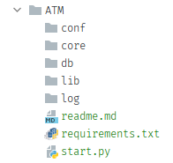
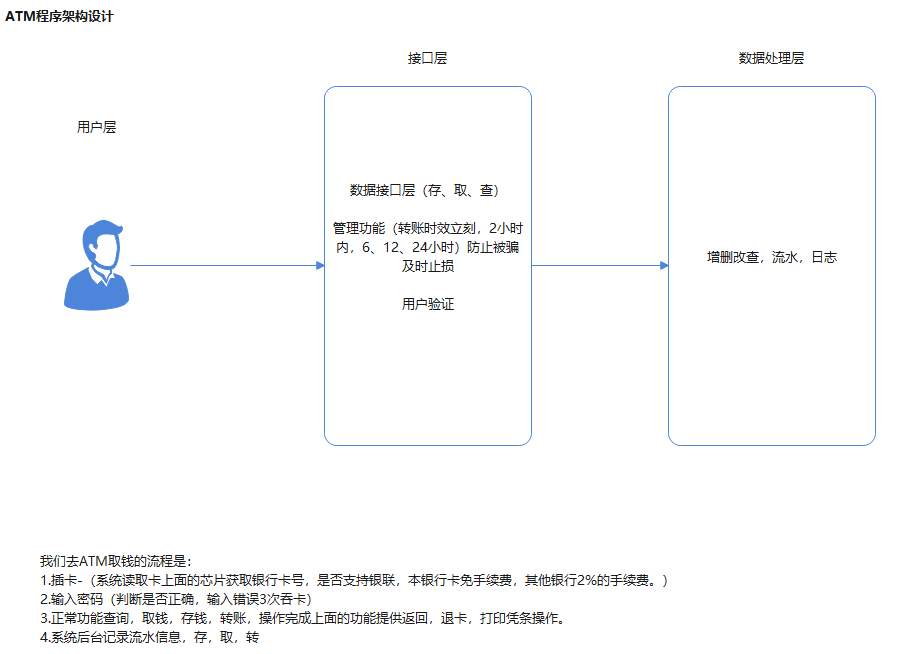
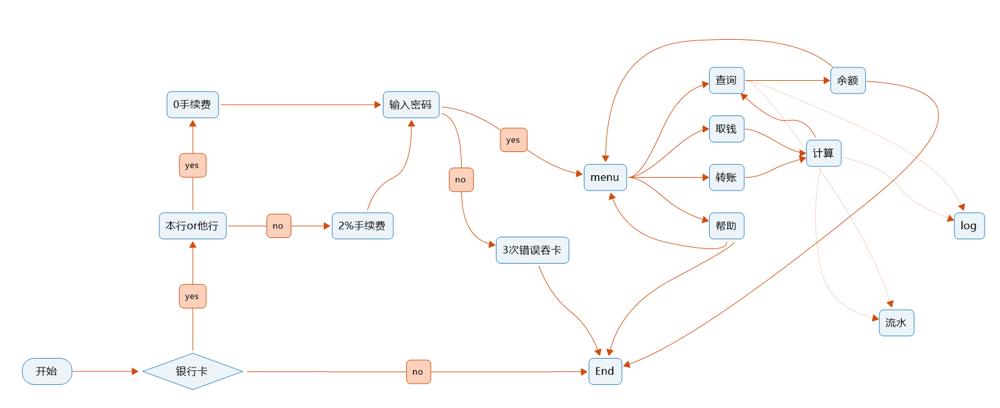

`通过上面基础的学习过了python,了解了数据类型，函数，循环，装饰器这些，现在进一步完成项目实战`

开发规范：https://peps.python.org/pep-0484/

# 开发规范及项目目录

目录结构要层次分明，无论那款正式软件都是由这些结构层次分明的架构，

> [tip]
>
> 为什么需要这种层次划分目的是为了让代码归整不乱，如果不明白，最简单的就打开其他软件的安装目录就一目了然。

这样数据和接口说明需要组件这些都规划好了。这样做方便后期维护。

当接到一个需求的时候必须要做的事情：

- 分析项目需求
- 程序架构设计并出图
- 上线测试
- 正式发布

上面的步骤中程序架构设计还有很详细的划分

程序设计：

- 架构中用户试图层
  - 用户直接看到的视图
- 接口层
  - 核心接口
  - 数据接口
  - 日志接口
  - 登录接口
  - 其他附加
- 数据处理层
  - 数据增
  - 数据改
  - 数据查
  - 数据删

- 测试
  - 测试并发
  - 测试数据读写负载
  - 出报告硬件需求情况汇总
- 上线

具体的流程图：

大概思路就是这样。

下面是代码实现
