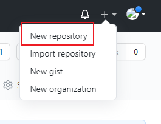

问题

> 1.邮件设置（注册和其他操作提醒）
>
> 2.开发者合并分支到分支是可以的，合并到主线需要管理员或者CTO同意才可以经行合并（已解决）


参考资料：https://www.cnblogs.com/ronglianbing/p/11928254.html

https://www.jianshu.com/p/8d497989f704

# Devops

development 开发

operations 运维

devops职责：自动化测试，持续集成，代码质量管理工具，程序员鼓励师

## Git

git是一个版本控制系统（version control system,VCS）

版本控制系统是一种记录一个或很多文件内容变化以便将来查阅特定版本修订的系统，git解决了文件丢失，误修改，回到历史某个时刻。

svn,cvs这类早期的集中式版本控制系统都有一个单一的集中管理服务器，保存所有文件的修订版本，协同工作的人员需要通过客户端连接到这台服务器，取出或者提交更新。


在某些情况下他们还是有一定的使用价值，目前主流已经很少采用svn这类型的软件。更多的是使用git，mercurial这类分布式版本控制系统。

分布式的半空控制系统客户端并不只是提取最新版本的文件快照，而是把仓库完整的下载下来。任何一处的协同工作服务器发生故障事后都可以用其他节点的镜像出来的本地仓库恢复。每一次操作都是一次完整的备份。


git版本控制系统是linus Torvalds发明的。他的另外一个发明是linux 。

### Git安装和配置

redhat/centos/fedora

```BASH
yum install git-all
dnf install git-all
```

debin/ubuntu

```BASH
sudo apt install git-all
```

windows上面的安装不建议使用编码问题不注意会非常头痛

源码安装

```BASH
依赖库
autotools、curl、zlib、openssl、expat 和 libiconv

#yum install -y dh-autoreconf curl-devel expat-devel gettext-devel openssl-devel perl-devel zlib-devel
```

为了添加文档的多种格式（doc、html、info），需要以下附加的依赖：需要epel

```bash
yum install -y asciidoc xmlto docbook2X
```

二进制下载：

```BASH
https://mirrors.edge.kernel.org/pub/software/scm/git/
https://github.com/git/git/releases
```

编译安装

```BASH
tar -zxf git-2.8.0.tar.gz
cd git-2.8.0
make configure
./configure --prefix=/usr
make all doc info
sudo make install install-doc install-html install-info
```

完成更新

```BASH
git clone git://git.kernel.org/pub/scm/git/git.git
```

### 配置文件路径

```BASH
[root@git ~]# cat .gitconfig   #在根用户目录下
```

### Git 说明书

https://git-scm.com/book/zh/v2


### 命令补全

```BASH
yum -y install bash-completion bash-completion-extras
source /etc/profile.d/bash_completion.sh
```

### 查看状态

```BASH
[root@git ~/git_data/.git]# git status
fatal: This operation must be run in a work tree
[root@git ~/git_data/.git]# cd ..
[root@git ~/git_data]# pwd
/root/git_data
[root@git ~/git_data]# git status
# On branch master
#
# Initial commit
#
nothing to commit (create/copy files and use "git add" to track)

```

### git命令

```BASH
[root@git ~]# git config
usage: git config [options]

Config file location
    --global              use global config file      #使用全局配置文件
    --system              use system config file      #使用系统级配置文件
    --local               use repository config file  #使用版本库级配置文件
[root@git ~]# git --version  #版本
git version 1.8.3.1
[root@git ~]# git config --global user.name "dev"   #配置git使用用户
[root@git ~]# git config --global user.email "dev@qq.com"   #配置git邮箱
[root@git ~]# ls -a
.   anaconda-ks.cfg  .bash_logout   .bashrc  .gitconfig  .tcshrc  .viminfo
..  .bash_history    .bash_profile  .cshrc   .pki        uuid.sh  .vimrc
[root@git ~]# cat .gitconfig
[user]
        name = dev
        email = dev@qq.com
[root@git ~]# git config --global color.ui true #语法高亮
[root@git ~]# cat .gitconfig
[user]
        name = dev
        email = dev@qq.com
[color]
        ui = true
[root@git ~]# git config --list  #查看配置文件
user.name=dev
user.email=dev@qq.com
color.ui=true

[root@git ~]# mkdir git_data  #创建git目录
[root@git ~]# cd git_data/  
[root@git ~/git_data]# git init  #初始化git目录
Initialized empty Git repository in /root/git_data/.git/
[root@git ~/git_data]# ls -a
.  ..  .git
[root@git ~/git_data]# cd .git/
[root@git ~/git_data/.git]# ll
total 16
drwxr-xr-x 2 root root    6 Jul 23 22:24 branches  #分支目录
-rw-r--r-- 1 root root   92 Jul 23 22:24 config   #定义项目持有的配置选项
-rw-r--r-- 1 root root   73 Jul 23 22:24 description  #仅提供web使用
-rw-r--r-- 1 root root   23 Jul 23 22:24 HEAD #指示当前的分支
drwxr-xr-x 2 root root 4096 Jul 23 22:24 hooks #包含git钩子文件
drwxr-xr-x 2 root root   21 Jul 23 22:24 info  #包含一个全局排除文件（exclude文件）
drwxr-xr-x 4 root root   30 Jul 23 22:24 objects #存储所有数据内容，有info pack两个子文件  本地仓库
drwxr-xr-x 4 root root   31 Jul 23 22:24 refs #存放指向数据（分支）的提交对象的指针
index #保存暂存信息，在执行git init的时候没有这个文件夹

[root@git ~/git_data]# cat ~/.gitconfig
[user]
        name = dev
        email = dev@qq.com
[color]
        ui = true


[root@git ~/git_data]# git status  #查看git状态
# On branch master
#
# Initial commit
#
nothing to commit (create/copy files and use "git add" to track)
```


#### 工作流程

==工作目录==                               ==暂存区域==                                ==本地仓库==                           ==远程仓库==

​      |                                              |                                              |                                           |

​      |          **git add        →**           |            **git  commit    →**     |    **git  push        →**           |         

​      |← git rm --cache <file>  |                                              |     **←git clone /git pull**   |

​      |                    *←             git    reset       --hard   xxxxxxx*       |

#### 字符状态

| untracked |                         |  unmodfied  |                             |  modified   |                        | staged |
| :-------: | :---------------------: | :---------: | :-------------------------: | :---------: | :--------------------: | :----: |
|  **\|**   |         **add**         |   **the**   |          **file**           |   **---**   |         **→**          | **\|** |
|           |                         | *<u>\|</u>* | *<u>**edit the file→**</u>* | *<u>\|</u>* |                        |        |
|           |                         |             |                             |    *\|*     | ***staged the file→*** |  *\|*  |
|   *\|*    | ***← remove the file*** |    *\|*     |                             |             |                        |        |
|           |                         |   **\|**    |            **←**            | **commit**  |        **---**         | **\|** |

#### 创建测试文件

```BASH
[root@git ~/git_data]# touch {a..d}
[root@git ~/git_data]# ll
total 0
-rw-r--r-- 1 root root 0 Jul 25 21:41 a
-rw-r--r-- 1 root root 0 Jul 25 21:41 b
-rw-r--r-- 1 root root 0 Jul 25 21:41 c
-rw-r--r-- 1 root root 0 Jul 25 21:41 d

[root@git ~/git_data]# git status
# On branch master
#
# Initial commit  
#
# Untracked files:   #未被提交的文件
#   (use "git add <file>..." to include in what will be committed)
#
#       a
#       b
#       c
#       d
nothing added to commit but untracked files present (use "git add" to track)

[root@git ~/git_data]# git add a
[root@git ~/git_data]# git status
# On branch master
#
# Initial commit
#
# Changes to be committed:
#   (use "git rm --cached <file>..." to unstage)     #可以使用该命令撤销提交
#
#       new file:   a  
#
# Untracked files:
#   (use "git add <file>..." to include in what will be committed)
#
#       b
#       c
#       d

[root@git ~/git_data]# ll .git/
total 20
drwxr-xr-x 2 root root    6 Jul 23 22:24 branches
-rw-r--r-- 1 root root   92 Jul 23 22:24 config
-rw-r--r-- 1 root root   73 Jul 23 22:24 description
-rw-r--r-- 1 root root   23 Jul 23 22:24 HEAD
drwxr-xr-x 2 root root 4096 Jul 23 22:24 hooks
-rw-r--r-- 1 root root   96 Jul 25 21:44 index     #暂存区域
drwxr-xr-x 2 root root   21 Jul 23 22:24 info
drwxr-xr-x 5 root root   40 Jul 25 21:44 objects
drwxr-xr-x 4 root root   31 Jul 23 22:24 refs


[root@git ~/git_data]# git add .   #把当前目录下的所有提交到暂存区域

[root@git ~/git_data]# git rm --cached a   #把a移除暂存区域
rm 'a'
[root@git ~/git_data]# git status
# On branch master
#
# Initial commit
#
# Changes to be committed:
#   (use "git rm --cached <file>..." to unstage)
#
#       new file:   b
#       new file:   c
#       new file:   d
#
# Untracked files:
#   (use "git add <file>..." to include in what will be committed)
#
#       a

[root@git ~/git_data]# rm -f c  #测试删除c
[root@git ~/git_data]# ll
total 0
-rw-r--r-- 1 root root 0 Jul 25 21:41 a
-rw-r--r-- 1 root root 0 Jul 25 21:41 b
-rw-r--r-- 1 root root 0 Jul 25 21:41 d
[root@git ~/git_data]# git status
# On branch master
#
# Initial commit
#
# Changes to be committed:
#   (use "git rm --cached <file>..." to unstage)
#
#       new file:   b
#       new file:   c
#       new file:   d
#
# Changes not staged for commit:   
#   (use "git add/rm <file>..." to update what will be committed)
#   (use "git checkout -- <file>..." to discard changes in working directory)
#
#       deleted:    c
#
# Untracked files:
#   (use "git add <file>..." to include in what will be committed)
#
#       a

[root@git ~/git_data]# git checkout c  #从暂存区恢复c
[root@git ~/git_data]# ll
total 0
-rw-r--r-- 1 root root 0 Jul 25 21:41 a
-rw-r--r-- 1 root root 0 Jul 25 21:41 b
-rw-r--r-- 1 root root 0 Jul 25 21:52 c
-rw-r--r-- 1 root root 0 Jul 25 21:41 d
[root@git ~/git_data]# git status
# On branch master
#
# Initial commit
#
# Changes to be committed:
#   (use "git rm --cached <file>..." to unstage)
#
#       new file:   b
#       new file:   c
#       new file:   d
#
# Untracked files:
#   (use "git add <file>..." to include in what will be committed)
#
#       a
```

#### 删除一个文件

```BASH
先从暂存区撤回到工作区、然后直接删除文件
[root@git ~/git_data]# git rm --cached test
rm 'test'
[root@git ~/git_data]# rm -f test
[root@git ~/git_data]# ll
total 0
-rw-r--r-- 1 root root 0 Jul 25 21:41 a
-rw-r--r-- 1 root root 0 Jul 25 21:41 b
-rw-r--r-- 1 root root 0 Jul 25 21:52 c
-rw-r--r-- 1 root root 0 Jul 25 21:41 d
[root@git ~/git_data]# git status
# On branch master
#
# Initial commit
#
# Changes to be committed:
#   (use "git rm --cached <file>..." to unstage)
#
#       new file:   b
#       new file:   c
#       new file:   d


[root@git ~/git_data]# git status
# On branch master
#
# Initial commit
#
# Changes to be committed:
#   (use "git rm --cached <file>..." to unstage)
#
#       new file:   a
#       new file:   b
#       new file:   c
#       new file:   d
#       new file:   test
#
[root@git ~/git_data]# git rm -f test     #直接删除test
rm 'test'
[root@git ~/git_data]# ll
total 0
-rw-r--r-- 1 root root 0 Jul 25 21:41 a
-rw-r--r-- 1 root root 0 Jul 25 21:41 b
-rw-r--r-- 1 root root 0 Jul 25 21:52 c
-rw-r--r-- 1 root root 0 Jul 25 21:41 d
```

#### 提交到本地仓库

```BASH
[root@git ~/git_data]# git commit -m "test file"   #提交到本地仓库
[master (root-commit) 355c4e0] test file
 4 files changed, 0 insertions(+), 0 deletions(-)
 create mode 100644 a
 create mode 100644 b
 create mode 100644 c
 create mode 100644 d
[root@git ~/git_data]# git status
# On branch master
nothing to commit, working directory clean

```

#### 修改文件名称

```BASH
[root@git ~/git_data]# mv a a.txt  本地重命名
[root@git ~/git_data]# git status
# On branch master
# Changes not staged for commit:
#   (use "git add/rm <file>..." to update what will be committed)
#   (use "git checkout -- <file>..." to discard changes in working directory)
#
#       deleted:    a
#
# Untracked files:
#   (use "git add <file>..." to include in what will be committed)
#
#       a.txt
no changes added to commit (use "git add" and/or "git commit -a")

[root@git ~/git_data]# git rm --cached a  #删除暂存区中的a
rm 'a'
[root@git ~/git_data]# git status
# On branch master
# Changes to be committed:
#   (use "git reset HEAD <file>..." to unstage)
#
#       deleted:    a
#
# Untracked files:
#   (use "git add <file>..." to include in what will be committed)
#
#       a.txt
[root@git ~/git_data]# git add a.txt  #提交新的文件到暂存区
[root@git ~/git_data]# git status
# On branch master
# Changes to be committed:
#   (use "git reset HEAD <file>..." to unstage)
#
#       renamed:    a -> a.txt     #检测到是同一个文件
#
[root@git ~/git_data]# git commit -m "modfiled a to a.txt" #提交到本地仓库
[master d676749] modfiled a to a.txt  
 1 file changed, 0 insertions(+), 0 deletions(-)
 rename a => a.txt (100%)
[root@git ~/git_data]# ll
total 0
-rw-r--r-- 1 root root 0 Jul 25 21:41 a.txt
-rw-r--r-- 1 root root 0 Jul 25 21:41 b
-rw-r--r-- 1 root root 0 Jul 25 21:52 c
-rw-r--r-- 1 root root 0 Jul 25 21:41 d

```

从上面看起来挺复杂的，但是有助于理解

```BASH
[root@git ~/git_data]# git mv a.txt a
[root@git ~/git_data]# git status
# On branch master
# Changes to be committed:
#   (use "git reset HEAD <file>..." to unstage)
#
#       renamed:    a.txt -> a
#
[root@git ~/git_data]# git commit -m "modfied  a.txt to a"
[master 09c4b44] modfied  a.txt to a
 1 file changed, 0 insertions(+), 0 deletions(-)
 rename a.txt => a (100%)
[root@git ~/git_data]# ll
total 0
-rw-r--r-- 1 root root 0 Jul 25 21:41 a
-rw-r--r-- 1 root root 0 Jul 25 21:41 b
-rw-r--r-- 1 root root 0 Jul 25 21:52 c
-rw-r--r-- 1 root root 0 Jul 25 21:41 d

```

这个简单但是理解起来会困难，使用很简单

上面只能查看区域状态，不能查看文件内容变化。

#### 文件内容变化查看

```BASH
[root@git ~/git_data]# echo aaaa>a
[root@git ~/git_data]# git diff a   #对比工作目录和暂存区的文件不同
diff --git a/a b/a
index e69de29..5d308e1 100644
--- a/a
+++ b/a
@@ -0,0 +1 @@
+aaaa
[root@git ~/git_data]# git add a  #提交a文件到暂存区
[root@git ~/git_data]# git diff a
[root@git ~/git_data]# git diff --cached a  # 比对暂存区和本地仓库的不同处
diff --git a/a b/a
index e69de29..5d308e1 100644
--- a/a
+++ b/a
@@ -0,0 +1 @@
+aaaa

[root@git ~/git_data]# git commit -m "modfied a add aaa"  #提交到本地仓库
[master e165bcb] modfied a add aaa
 1 file changed, 1 insertion(+)
[root@git ~/git_data]# git diff --cached a   #对比暂存区和本地仓库
```

commit 提交就像mysql 事务提交一样！

#### 查看commit历史

```BASH
[root@git ~/git_data]# git log  #查看commit 快照
commit e165bcbda622ed3bd8c3b8b342d8395d22a7cca8
Author: dev <dev@qq.com>
Date:   Sun Jul 25 22:40:38 2021 +0800

    modfied a add aaa

commit 09c4b4408dd37ea6a244bbec80bc1c27ffec422c
Author: dev <dev@qq.com>
Date:   Sun Jul 25 22:16:59 2021 +0800

    modfied  a.txt to a

commit d6767494aad9d8a6972dd557caaa03b2974a4d94
Author: dev <dev@qq.com>
Date:   Sun Jul 25 22:12:27 2021 +0800

    modfiled a to a.txt

commit 355c4e0510420c0ddc716d4138a4d1fff2a8491c
Author: dev <dev@qq.com>
Date:   Sun Jul 25 22:01:59 2021 +0800

    test file

使用一行显示
[root@git ~/git_data]# git log  --oneline   #一行显示
e165bcb modfied a add aaa
09c4b44 modfied  a.txt to a
d676749 modfiled a to a.txt
355c4e0 test file

[root@git ~/git_data]# git log  --oneline --decorate   #显示当前指针指向哪里
e165bcb (HEAD, master) modfied a add aaa
09c4b44 modfied  a.txt to a
d676749 modfiled a to a.txt
355c4e0 test file

[root@git ~/git_data]# git log -p  #显示具体内容变化
[root@git ~/git_data]# git log -1  #显示1条
commit e165bcbda622ed3bd8c3b8b342d8395d22a7cca8
Author: dev <dev@qq.com>
Date:   Sun Jul 25 22:40:38 2021 +0800

    modfied a add aaa 
[root@git ~/git_data]# git log -2   #显示2条
commit e165bcbda622ed3bd8c3b8b342d8395d22a7cca8
Author: dev <dev@qq.com>
Date:   Sun Jul 25 22:40:38 2021 +0800

    modfied a add aaa

commit 09c4b4408dd37ea6a244bbec80bc1c27ffec422c
Author: dev <dev@qq.com>
Date:   Sun Jul 25 22:16:59 2021 +0800

    modfied  a.txt to a

```

#### 恢复历史数据

```BASH
[root@git ~/git_data]# echo 2222 >> a
[root@git ~/git_data]# cat a
aaaa
2222
[root@git ~/git_data]# git status
# On branch master
# Changes not staged for commit:
#   (use "git add <file>..." to update what will be committed)
#   (use "git checkout -- <file>..." to discard changes in working directory)
#
#       modified:   a
#
no changes added to commit (use "git add" and/or "git commit -a")
[root@git ~/git_data]# git diff a
diff --git a/a b/a
index 5d308e1..a397960 100644
--- a/a
+++ b/a
@@ -1 +1,2 @@
 aaaa
+2222

[root@git ~/git_data]# git checkout -- a  #恢复暂存区文件到本地
[root@git ~/git_data]# cat a
aaaa

如果修改了本地文件，并且提交到了暂存区怎么恢复
[root@git ~/git_data]# echo 3333 >> a
[root@git ~/git_data]# git add a   
[root@git ~/git_data]# git status
# On branch master
# Changes to be committed:
#   (use "git reset HEAD <file>..." to unstage)
#
#       modified:   a
#
[root@git ~/git_data]# git diff --cached a  #对比暂存区和本地仓库的内容
diff --git a/a b/a
index 5d308e1..3e56e1e 100644
--- a/a
+++ b/a
@@ -1 +1,2 @@
 aaaa
+3333
[root@git ~/git_data]# git reset HEAD a  #把本地仓库覆盖暂存区域
Unstaged changes after reset:
M       a
[root@git ~/git_data]# cat a
aaaa
3333

[root@git ~/git_data]# git diff --cached a #对比暂存区和本地仓库
[root@git ~/git_data]# git diff a   #对比暂存区和工作目录区有什么不同
diff --git a/a b/a
index 5d308e1..3e56e1e 100644
--- a/a
+++ b/a
@@ -1 +1,2 @@
 aaaa
+3333


```

这里有必要解析一下，工作目录，暂存区，本地仓库。git diff 对比的是工作区和暂存区，git diff --cached对比的是暂存区和本地仓库

```bash
修改了工作目录后提交到了暂存区和本地仓库后进行数据恢复
[root@git ~/git_data]# echo "bb" >>a
[root@git ~/git_data]# git commit -m "modfied add bb to a"
# On branch master
# Changes not staged for commit:
#   (use "git add <file>..." to update what will be committed)
#   (use "git checkout -- <file>..." to discard changes in working directory)
#
#       modified:   a
#
no changes added to commit (use "git add" and/or "git commit -a")
[root@git ~/git_data]# git commit -am "modfied add bb to a" #提交到本地仓库
[master c4a46ca] modfied add bb to a
 1 file changed, 2 insertions(+)
[root@git ~/git_data]# echo "cc" >>a

[root@git ~/git_data]# git commit -am "add cc"  #已经存在的就可以直接从工作区提交到本地仓库
[master 6c742cf] add cc
 1 file changed, 1 insertion(+)
#这时候发现改错代码了，想还原某一次提交的文件快照
[root@git ~/git_data]# git log --oneline
6c742cf add cc
c4a46ca modfied add bb to a
e165bcb modfied a add aaa
09c4b44 modfied  a.txt to a
d676749 modfiled a to a.txt
355c4e0 test file
[root@git ~/git_data]# git log --oneline --decorate
6c742cf (HEAD, master) add cc
c4a46ca modfied add bb to a
e165bcb modfied a add aaa
09c4b44 modfied  a.txt to a
d676749 modfiled a to a.txt
355c4e0 test file

```

**Git服务程序中有一个叫做HEAD的版本指针，当用户申请还原数据时，其实就是将HEAD指针指向到某个特定的提交版本，但是因为Git是分布式版本控制系统，为了避免历史记录冲突，故使用了SHA-1计算出十六进制的哈希字串来区分每个提交版本，另外默认的HEAD版本指针会指向到最近的一次提交版本记录**

```BASH
[root@git ~/git_data]# git reset --hard c4a46ca  #恢复到需要恢复的文件目录
HEAD is now at c4a46ca modfied add bb to a
[root@git ~/git_data]# git log --oneline --decorate   #查看指针位置
c4a46ca (HEAD, master) modfied add bb to a
e165bcb modfied a add aaa
09c4b44 modfied  a.txt to a
d676749 modfiled a to a.txt
355c4e0 test file
[root@git ~/git_data]# cat a     #查看文件发现cc确实不在了
aaaa
3333
bb

```

***上面的操作实际上就是改变了一下HEAD版本指针的位置，就是你将HEAD指针放在那里，那么你的当前工作版本就会定位在那里，要想把内容再还原到最新提交的版本，先看查看下提交版本号\***

如果发现恢复错误了。之前的就没有cc记录了

我们当前的工作版本是历史的一个提交点，这个历史提交点还没有发生过cc 更新记录，所以当然就看不到了，要是想"还原到未来"的历史更新点，可以用git reflog命令来查看所有的历史记录：

```BASH
[root@git ~/git_data]# git reflog
c4a46ca HEAD@{0}: reset: moving to c4a46ca
6c742cf HEAD@{1}: commit: add cc
c4a46ca HEAD@{2}: commit: modfied add bb to a
e165bcb HEAD@{3}: commit: modfied a add aaa
09c4b44 HEAD@{4}: commit: modfied a.txt to a
d676749 HEAD@{5}: commit: modfiled a to a.txt
355c4e0 HEAD@{6}: commit (initial): test file
[root@git ~/git_data]# git reset --hard 6c742cf
HEAD is now at 6c742cf add cc
[root@git ~/git_data]# cat a
aaaa
3333
bb
cc
#cc再次回来了

```

### Git 分支

分支即是平行空间，假设你在为某个手机系统研发某个功能，代码已经完成了80%，但如果将这不完整的代码直接提交到git仓库中，又有可能影响到其他人的工作，此时我们便可以在该软件的项目之上创建一个名叫"某个功能"的分支，这种分支只会属于你自己，而其他人看不到，等代码编写完成后再与原来的项目主分支合并下即可，这样即能保证代码不丢失，又不影响其他人的工作。

一般在实际的项目开发中，我们要**尽量保证master分支是非常稳定的，仅用于发布新版本，平时不要随便直接修改里面的数据文件，而工作的时候则可以创建不同的工作分支，等到工作完成后在合并到master分支上面**，所以团队的合作分支看起来会像鱼骨线那样。


​           salve----------------------------------------------------------------------------------->

master------------------------------------------------------------------------------------------------>

​           salve----------------------------------------------------------------------------------->


```bash
[root@git ~]# cd git_data/
[root@git ~/git_data]# git log --oneline --decorate  
6c742cf (HEAD, master) add cc    # 默认分支指向最后一次的提交HEAD头，指针
c4a46ca modfied add bb to a      # HEAD 指针指向那个分支，说明你当前在哪个分支下工作
e165bcb modfied a add aaa
09c4b44 modfied  a.txt to a
d676749 modfiled a to a.txt
355c4e0 test file
```

#### 新建分支

```bash
[root@git ~/git_data]# git branch test #新建一个test分支
[root@git ~/git_data]# git branch    #查看当前所在的分支，*号在哪就是那个分支
* master
  test

[root@git ~/git_data]# git log --oneline --decorate   #通过命令查看分支指向
6c742cf (HEAD, test, master) add cc
c4a46ca modfied add bb to a
e165bcb modfied a add aaa
09c4b44 modfied  a.txt to a
d676749 modfiled a to a.txt
355c4e0 test file

[root@git ~/git_data]# git checkout test  #切换到test 分支
Switched to branch 'test'
[root@git ~/git_data]# git branch   #查看当前所在分支
  master
* test

[root@git ~/git_data]# touch test # 新建测试文件
[root@git ~/git_data]# ll
total 4
-rw-r--r-- 1 root root 16 Jul 25 23:20 a
-rw-r--r-- 1 root root  0 Jul 25 21:41 b
-rw-r--r-- 1 root root  0 Jul 25 21:52 c
-rw-r--r-- 1 root root  0 Jul 25 21:41 d
-rw-r--r-- 1 root root  0 Jul 26 20:44 test
[root@git ~/git_data]# git add .   #提交到暂存区
[root@git ~/git_data]# git commit -m "touch test"   #提交到本地仓库
[test 50f4bbb] touch test
 1 file changed, 0 insertions(+), 0 deletions(-)
 create mode 100644 test
[root@git ~/git_data]# git log --oneline --decorate   #查看当前指针
50f4bbb (HEAD, test) touch test
6c742cf (master) add cc
c4a46ca modfied add bb to a
e165bcb modfied a add aaa
09c4b44 modfied  a.txt to a
d676749 modfiled a to a.txt
355c4e0 test file

[root@git ~/git_data]# git checkout master #切换回master
Switched to branch 'master' 
[root@git ~/git_data]# ll   #默认是没有test
total 4
-rw-r--r-- 1 root root 16 Jul 25 23:20 a
-rw-r--r-- 1 root root  0 Jul 25 21:41 b
-rw-r--r-- 1 root root  0 Jul 25 21:52 c
-rw-r--r-- 1 root root  0 Jul 25 21:41 d
[root@git ~/git_data]# git branch   #查看当前所在工作目录
* master
  test
[root@git ~/git_data]# touch master  #在master下创建一个master file 
[root@git ~/git_data]# git add .
[root@git ~/git_data]# git commit -m "touch master file"
[master 00bf1cd] touch master file
 1 file changed, 0 insertions(+), 0 deletions(-)
 create mode 100644 master
[root@git ~/git_data]# ll
total 4
-rw-r--r-- 1 root root 16 Jul 25 23:20 a
-rw-r--r-- 1 root root  0 Jul 25 21:41 b
-rw-r--r-- 1 root root  0 Jul 25 21:52 c
-rw-r--r-- 1 root root  0 Jul 25 21:41 d
-rw-r--r-- 1 root root  0 Jul 26 20:51 master
[root@git ~/git_data]# git branch
* master
  test
[root@git ~/git_data]# git checkout test   #切换到test
Switched to branch 'test'
[root@git ~/git_data]# ll
total 4
-rw-r--r-- 1 root root 16 Jul 25 23:20 a
-rw-r--r-- 1 root root  0 Jul 25 21:41 b
-rw-r--r-- 1 root root  0 Jul 25 21:52 c
-rw-r--r-- 1 root root  0 Jul 25 21:41 d
-rw-r--r-- 1 root root  0 Jul 26 20:53 test
[root@git ~/git_data]# git branch
  master
* test

```

上面例子中分支下的文件相互独立不影响

#### 合并分支

```BASH
[root@git ~/git_data]# git merge test
Merge made by the 'recursive' strategy.
 test | 0
Merge branch 'test'

# Please enter a commit message to explain why this merge is necessary,
# especially if it merges an updated upstream into a topic branch.
#
# Lines starting with '#' will be ignored, and an empty message aborts
# the commit.
Merge branch to master   #添加提示信息  git commit -m 一样的效果

[root@git ~/git_data]# git log --oneline --decorate  #查看日志记录
7eed921 (HEAD, master) Merge branch 'test'
00bf1cd touch master file
50f4bbb (test) touch test
6c742cf add cc
c4a46ca modfied add bb to a
e165bcb modfied a add aaa
09c4b44 modfied  a.txt to a
d676749 modfiled a to a.txt
355c4e0 test file

[root@git ~/git_data]# ll
total 4
-rw-r--r-- 1 root root 16 Jul 25 23:20 a
-rw-r--r-- 1 root root  0 Jul 25 21:41 b
-rw-r--r-- 1 root root  0 Jul 25 21:52 c
-rw-r--r-- 1 root root  0 Jul 25 21:41 d
-rw-r--r-- 1 root root  0 Jul 26 20:55 master
-rw-r--r-- 1 root root  0 Jul 26 20:55 test
分支合并到主分支上来了。

```

#### 合并冲突

```bash
[root@git ~/git_data]# echo "ddd" >>a   #主库添加内容到a文件
[root@git ~/git_data]# git commit -am "modfied a master"
[master ee0f611] modfied a master
 1 file changed, 1 insertion(+)
[root@git ~/git_data]# git checkout test
Switched to branch 'test'
[root@git ~/git_data]# git branch
  master
* test
[root@git ~/git_data]# cat a
aaaa
3333
bb
cc
[root@git ~/git_data]# echo "test" >>a   #test 库添加文件到a
[root@git ~/git_data]# git commit -am "modfied a on test branch"
[test 361ffe8] modfied a on test branch
 1 file changed, 1 insertion(+)
[root@git ~/git_data]# git checkout master
Switched to branch 'master'
[root@git ~/git_data]# git merge test    #合并报错了
Auto-merging a
CONFLICT (content): Merge conflict in a
Automatic merge failed; fix conflicts and then commit the result.

```

上面模拟的是在主线库和分支上面对同一个文件修改，导致不能合并的解决办法

```BASH
[root@git ~/git_data]# cat a
aaaa
3333
bb
cc
<<<<<<< HEAD
ddd
=======
test
>>>>>>> test
 #冲突的文件自动标识到文件里，手动更改冲突要保留的代码
[root@git ~/git_data]# vim a
[root@git ~/git_data]# cat a
aaaa
3333
bb
cc
ddd
test

[root@git ~/git_data]# git commit -am "merge test to master ddd test"
[master a5d9c3e] merge test to master ddd test
 1 file changed, 3 deletions(-)
[root@git ~/git_data]# git log --oneline --decorate #指针移动到最新的一次提交
a5d9c3e (HEAD, master) merge test to master ddd test
3525844 merge test to master
361ffe8 (test) modfied a on test branch
ee0f611 modfied a master
7eed921 Merge branch 'test'
00bf1cd touch master file
50f4bbb touch test
6c742cf add cc
c4a46ca modfied add bb to a
e165bcb modfied a add aaa
09c4b44 modfied  a.txt to a
d676749 modfiled a to a.txt
355c4e0 test file

```

#### 删除分支

```BASH
[root@git ~/git_data]# git branch -d test
Deleted branch test (was 361ffe8).
[root@git ~/git_data]# git branch
* master
```

### Git标签

标签也是指向了一次commit提交，是一个里程碑式的标签，回滚打标签直接加标签号，不加唯一字符串不好记

 -a指定标签名字 -m 指定说明文字

```BASH
[root@git ~/git_data]# git tag -a v1.0 -m "master version 1.0"
[root@git ~/git_data]# git tag  #查看标签
v1.0

[root@git ~/git_data]# git log --oneline
a5d9c3e merge test to master ddd test
3525844 merge test to master
361ffe8 modfied a on test branch
ee0f611 modfied a master
7eed921 Merge branch 'test'
00bf1cd touch master file
50f4bbb touch test
6c742cf add cc
c4a46ca modfied add bb to a
e165bcb modfied a add aaa
09c4b44 modfied  a.txt to a
d676749 modfiled a to a.txt
355c4e0 test file
[root@git ~/git_data]# git tag -a v2.0 6c742cf -m "version v2.0"  #指定某一次提交为标签
[root@git ~/git_data]# git tag
v1.0
v2.0
```

#### 查看v1.0的标签信息

```BASH
[root@git ~/git_data]# git show v1.0
tag v1.0
Tagger: dev <dev@qq.com>
Date:   Mon Jul 26 22:23:00 2021 +0800

master version 1.0

commit a5d9c3eaf3279db4f6f4dee824f758df9df37a3b
Author: dev <dev@qq.com>
Date:   Mon Jul 26 22:18:31 2021 +0800

    merge test to master ddd test

diff --git a/a b/a
index 4718513..d146999 100644
--- a/a
+++ b/a
@@ -2,8 +2,5 @@ aaaa
 3333
 bb
 cc
-<<<<<<< HEAD
 ddd
-=======
 test
->>>>>>> test
```

#### 恢复到标签

```BASH
[root@git ~/git_data]# git reset v2.0
Unstaged changes after reset:
M       a

[root@git ~/git_data]# git log --oneline
6c742cf add cc
c4a46ca modfied add bb to a
e165bcb modfied a add aaa
09c4b44 modfied  a.txt to a
d676749 modfiled a to a.txt
355c4e0 test file

[root@git ~/git_data]# git status
# On branch master
# Changes not staged for commit:
#   (use "git add <file>..." to update what will be committed)
#   (use "git checkout -- <file>..." to discard changes in working directory)
#
#       modified:   a
#
# Untracked files:
#   (use "git add <file>..." to include in what will be committed)
#
#       master
#       test
no changes added to commit (use "git add" and/or "git commit -a")
[root@git ~/git_data]# git tag
v1.0
v2.0
[root@git ~/git_data]# git reset v1.0
[root@git ~/git_data]# git status
# On branch master
nothing to commit, working directory clean
[root@git ~/git_data]# git log --oneline
a5d9c3e merge test to master ddd test
3525844 merge test to master
361ffe8 modfied a on test branch
ee0f611 modfied a master
7eed921 Merge branch 'test'
00bf1cd touch master file
50f4bbb touch test
6c742cf add cc
c4a46ca modfied add bb to a
e165bcb modfied a add aaa
09c4b44 modfied  a.txt to a
d676749 modfiled a to a.txt
355c4e0 test file

```

怎么样功能太强大了，删除的又能回复回来

#### 删除标签

```BASH
[root@git ~/git_data]# git tag -d v2.0
Deleted tag 'v2.0' (was 3149d71)
[root@git ~/git_data]# git  tag
v1.0
[root@git ~/git_data]# git log --oneline
a5d9c3e merge test to master ddd test
3525844 merge test to master
361ffe8 modfied a on test branch
ee0f611 modfied a master
7eed921 Merge branch 'test'
00bf1cd touch master file
50f4bbb touch test
6c742cf add cc
c4a46ca modfied add bb to a
e165bcb modfied a add aaa
09c4b44 modfied  a.txt to a
d676749 modfiled a to a.txt
355c4e0 test file

```

删除标签并没有删除对应下的文件


## Github

github和git是两个产品

Github 是在线的基于Git的代码托管服务,包含公有和私有仓库

官网：https://github.com/   部分内容需要科学上网

Github顾名思义是一个Git版本库的托管服务，是目前全球最大的软件仓库，拥有上百万的开发者用户，也是软件开发和寻找资源的最佳途径，Github不仅可以托管各种Git版本仓库，还拥有了更美观的Web界面，您的代码文件可以被任何人克隆，使得开发者为开源项贡献代码变得更加容易，当然也可以付费购买私有库，这样高性价比的私有库真的是帮助到了很多团队和企业。目前私有库也已经免费开放了，2021-7-26。

> 注册好用户
>
> 配置ssh-key
>
> 创建项目
>
> 克隆项目到本地
>
> 推送新代码到github

首先在GitHub注册用户之后创建一个 new repository 




创建好之后就会出现一个说明页面


**…or create a new repository on the command line**

```
echo "# git_data" >> README.md
git init
git add README.md
git commit -m "first commit"
git branch -M main
git remote add origin git@github.com:xyz349925756/git_data.git
git push -u origin main
```

**…or push an existing repository from the command line**

```
git remote add origin git@github.com:xyz349925756/git_data.git
git branch -M main
git push -u origin main
```

**…or import code from another repository**

You can initialize this repository with code from a Subversion, Mercurial, or TFS project.

[Import code](https://github.com/xyz349925756/git_data/import)

### Git github

```bash
google@v1:/mnt/d/cloudb$ git config --global user.email "xyz349925756@gmail.com"
google@v1:/mnt/d/cloudb$ git config --global user.name "xyz349925756"
```

### ssh方式

```BASH
[root@git ~/git_data]# git remote
```

**添加远程仓库**

```BASH
[root@git ~/git_data]# git remote add origin git@github.com:xyz349925756/git_data.git
[root@git ~/git_data]# git remote
origin
[root@git ~/git_data]# git branch -M main
[root@git ~/git_data]# git branch
* main
[root@git ~/git_data]# git push -u origin main
ssh: connect to host github.com port 22: Connection refused
fatal: Could not read from remote repository.

Please make sure you have the correct access rights
and the repository exists.
```

生成密钥对

```BASH
[root@git ~]# ssh-keygen -t rsa -b 4096 -C "349925756@qq.com"
Generating public/private rsa key pair.
Enter file in which to save the key (/root/.ssh/id_rsa):
Created directory '/root/.ssh'.
Enter passphrase (empty for no passphrase):
Enter same passphrase again:
Your identification has been saved in /root/.ssh/id_rsa.
Your public key has been saved in /root/.ssh/id_rsa.pub.
The key fingerprint is:
SHA256:SU0YmuSL6/jLHpFSzuspPWZzzYft76fkoVOQEP1h0Fo xyz349925756
The key's randomart image is:
+---[RSA 4096]----+
|      . o=oo     |
|     o ooo. E    |
|    . + ...* .   |
|   + o o .+ .    |
|  . * . S  .     |
|   . +      .    |
|   .+  o o .o    |
|  .=*o. + ++ ..  |
|  .*O=   oo+=o   |
+----[SHA256]-----+

[root@git ~]# cat .ssh/id_rsa   #没有后缀的是私钥，有的是公钥
id_rsa      id_rsa.pub
[root@git ~]# cat .ssh/id_rsa.pub
ssh-rsa AAAAB3NzaC1yc2EAAAADAQABAAABAQC4IeqAwMpZ1W7DwOcQWhtStDqqD600IF9gE73IaUL81FJzOs76vrhITDQ/+cZNuxgpISTjDjskdbf689A45PpBvAqtF5yhY3L3FKn5EUng78mV8mQa/PMGtBb996AQvvK6JlZ9A0/7K8Xibi5OuKOGU+/rg6U7mkhVG1g4qjuIR/Rq5LRgZ10k1TVTSghhnlExCEh4iKxWKgrrRsVJXEUHYpSHUh5K49W53A/3/r8iiLzmspafJive7YfpDtmal04fPT7uhg3RHYP94M0KU3+YrqREy512Q+qm5yZeJgbSweVqb2sjlt7kDkr/EogZFcdIYLWLD84dxxFvkjeGDpyv 349925756@qq.com

[root@git ~]# cat .ssh/config  #添加配置文件
Host github.com
  Hostname ssh.github.com
  Port 22
  User 349925756@qq.com
  PreferredAuthentications publickey
  IdentityFile ~/.ssh/id_rsa

```

我们进入到GitHub 找到


把上面生成的公钥复制进去


重点

```BASH
[root@git ~/git_data]# git push -u origin main
Counting objects: 36, done.
Compressing objects: 100% (28/28), done.
Writing objects: 100% (36/36), 2.80 KiB | 0 bytes/s, done.
Total 36 (delta 10), reused 0 (delta 0)
remote: Resolving deltas: 100% (10/10), done.
To git@github.com:xyz349925756/git_data.git
 * [new branch]      main -> main
Branch main set up to track remote branch main from origin.

```

遇到问题的解决办法

https://docs.github.com/cn/github/authenticating-to-github/troubleshooting-ssh/using-ssh-over-the-https-port

**如果22端口不能使用采用443端口**

如果您能够`git@ssh.github.com`通过 443 端口通过 SSH连接，您可以覆盖您的 SSH 设置以强制通过该服务器和端口运行与 GitHub 的任何连接。

要在您的 ssh 配置中进行设置，请编辑位于 的文件`~/.ssh/config`，并添加以下部分：

```
Host github.com
  Hostname ssh.github.com
  Port 443
  User git
```

您可以通过再次连接到 GitHub 来测试它是否有效：

```shell
$ ssh -T git@github.com
> Hi username! You've successfully authenticated, but GitHub does not
> provide shell access.
```


都提交到远程仓库了。


### https方式

首先删除上面操作

```BASH
[root@git /opt/test]# git remote
origin
[root@git /opt/test]# git remote remove origin
[root@git /opt/test]# git remote
[root@git /opt/test]# git remote -v

```

**…or create a new repository on the command line**

```
echo "# git_data" >> README.md
git init
git add README.md
git commit -m "first commit"
git branch -M main
git remote add origin https://github.com/xyz349925756/git_data.git
git push -u origin main
```

**…or push an existing repository from the command line**

```
git remote add origin https://github.com/xyz349925756/git_data.git
git branch -M main
git push -u origin main
```

再次登录

```BASH
[root@git /opt/test]# git remote add origin https://github.com/xyz349925756/git_data.git
[root@git /opt/test]# git branch -M main
[root@git /opt/test]# git push -u origin main
Username for 'https://github.com': xyz349925756
Password for 'https://xyz349925756@github.com':
Counting objects: 3, done.
Writing objects: 100% (3/3), 204 bytes | 0 bytes/s, done.
Total 3 (delta 0), reused 0 (delta 0)
To https://github.com/xyz349925756/git_data.git
 * [new branch]      main -> main
Branch main set up to track remote branch main from origin.
```

测试

```BASH
[root@git /opt/test]# echo "test" >> README.md
[root@git /opt/test]# git add .
[root@git /opt/test]# git commit -m "test"
[main 17a01e0] test
 1 file changed, 1 insertion(+)
```


clone 远程仓库到本地

```BASH
[root@git ~]# cd /opt/
[root@git /opt]# ls
[root@git /opt]# git clone git@github.com:xyz349925756/kubernetes.git
Cloning into 'kubernetes'...
Warning: Permanently added the RSA host key for IP address '18.141.90.153' to the list of known hosts.
remote: Enumerating objects: 107, done.
remote: Counting objects: 100% (107/107), done.
remote: Compressing objects: 100% (99/99), done.
remote: Total 107 (delta 38), reused 0 (delta 0), pack-reused 0
Receiving objects: 100% (107/107), 557.59 KiB | 242.00 KiB/s, done.
Resolving deltas: 100% (38/38), done.
[root@git /opt]# ls
kubernetes
[root@git /opt]# ls kubernetes/
4.0.md  ecosystem_2021.svg           pause      scripts         yaml     参考官网再来.md
5.0.md  image-20210719215140366.png  README.md  tab_completion  再来.md  尝试kubernetes01.md
```

GitHub介绍就到这里

```BASH
google@v1:/mnt/d/github$ ssh -T git@github.com
Hi xyz349925756! You've successfully authenticated, but GitHub does not provide shell access.
google@v1:/mnt/d/github$ git clone git@github.com:xyz349925756/cloudb.git
Cloning into 'cloudb'...
remote: Enumerating objects: 18, done.
remote: Counting objects: 100% (18/18), done.
remote: Compressing objects: 100% (12/12), done.
remote: Total 18 (delta 2), reused 0 (delta 0), pack-reused 0
Receiving objects: 100% (18/18), 4.09 KiB | 1.02 MiB/s, done.
Resolving deltas: 100% (2/2), done.
google@v1:/mnt/d/github$ touch 1.txt
google@v1:/mnt/d/github$ ls
1.txt  README.md  cloudb
google@v1:/mnt/d/github$ cd cloudb/
google@v1:/mnt/d/github/cloudb$ ls
CNAME  README.md  _config.yml  index.md
google@v1:/mnt/d/github/cloudb$ touch 1.txt
google@v1:/mnt/d/github/cloudb$ ls
1.txt  CNAME  README.md  _config.yml  index.md
google@v1:/mnt/d/github/cloudb$ git add .
google@v1:/mnt/d/github/cloudb$ git commit -m "test"
[main 44b5d66] test
 1 file changed, 0 insertions(+), 0 deletions(-)
 create mode 100644 1.txt
google@v1:/mnt/d/github/cloudb$ git push -u origin
Enumerating objects: 4, done.
Counting objects: 100% (4/4), done.
Delta compression using up to 4 threads
Compressing objects: 100% (2/2), done.
Writing objects: 100% (3/3), 259 bytes | 86.00 KiB/s, done.
Total 3 (delta 1), reused 0 (delta 0)
remote: Resolving deltas: 100% (1/1), completed with 1 local object.
To github.com:xyz349925756/cloudb.git
   b7ac74a..44b5d66  main -> main
Branch 'main' set up to track remote branch 'main' from 'origin'.
```


## Gitlab

官网：https://about.gitlab.com/    需要科学上网

install：https://about.gitlab.com/install/

帮助文档：https://docs.gitlab.com/omnibus/manual_install.html

ce社区版：https://packages.gitlab.com/gitlab/gitlab-ce

清华镜像站：https://mirrors.tuna.tsinghua.edu.cn/

gitlab: https://mirrors.tuna.tsinghua.edu.cn/gitlab-ce/yum/el7/?C=N&O=A

GitLab 是一个用于仓库管理系统的开源项目。使用Git作为代码管理工具，并在此基础上搭建起来的web服务。可通过Web界面进行访问公开的或者私人项目。它拥有与Github类似的功能，能够浏览源代码，管理权限和注释。可以管理团队对仓库的访问，它非常易于浏览提交过的版本并提供一个文件历史库。团队成员可以利用内置的简单聊天程序(Wall)进行交流。它还提供一个代码片段收集功能可以轻松实现代码复用

### 部署要求

> **支持的linux 发行版**
>
> - Ubuntu (16.04/18.04/20.04)
>
> - Debian (9/10)
> - CentOS (7/8)
> - openSUSE Leap (15.2)
> - SUSE Linux Enterprise Server (12 SP2/12 SP5)
> - Red Hat Enterprise Linux（请使用 CentOS 软件包和说明）
> - Scientific Linux（请使用 CentOS 软件包和说明）
> - Oracle Linux（请使用 CentOS 软件包和说明）

**不支持**

> - Arch Linux
> - Fedora
> - FreeBSD
> - Gentoo
> - macOS

硬盘：转速 ≥ 7200 rpm

CPU：4核（500 user） 8核（1000） 其他参考官网推荐配置

https://docs.gitlab.com/ee/administration/reference_architectures/index.html

内存：4G （500）  8G （1000）


### yum 安装

#### RHEL/CentOS 

新建 `/etc/yum.repos.d/gitlab-ce.repo`，内容为

```
[gitlab-ce]
name=Gitlab CE Repository
baseurl=https://mirrors.tuna.tsinghua.edu.cn/gitlab-ce/yum/el$releasever/
gpgcheck=0
enabled=1
```

再执行

```
sudo yum makecache
sudo yum install gitlab-ce
```

### 官网RPM安装

安装依赖包

```BASH
yum install -y curl policycoreutils-python openssh-server perl
```

下载并上传软件包

```BASH
[root@gitlab /server/soft]# ll
total 887720
-rw-r--r-- 1 root root 909025123 Jul 28 12:57 gitlab-ce-14.1.0-ce.0.el7.x86_64.rpm
```

安装

```BASH
[root@gitlab /server/soft]# rpm -ivh gitlab-ce-14.1.0-ce.0.el7.x86_64.rpm
                   *.                  *.
                  ***                 ***
                 *****               *****
                .******             *******
                ********            ********
               ,,,,,,,,,***********,,,,,,,,,
              ,,,,,,,,,,,*********,,,,,,,,,,,
              .,,,,,,,,,,,*******,,,,,,,,,,,,
                  ,,,,,,,,,*****,,,,,,,,,.
                     ,,,,,,,****,,,,,,
                        .,,,***,,,,
                            ,*,.


     _______ __  __          __
    / ____(_) /_/ /   ____ _/ /_
   / / __/ / __/ /   / __ `/ __ \
  / /_/ / / /_/ /___/ /_/ / /_/ /
  \____/_/\__/_____/\__,_/_.___/

Thank you for installing GitLab!
GitLab was unable to detect a valid hostname for your instance.
Please configure a URL for your GitLab instance by setting `external_url`
configuration in /etc/gitlab/gitlab.rb file.
Then, you can start your GitLab instance by running the following command:
  sudo gitlab-ctl reconfigure

For a comprehensive list of configuration options please see the Omnibus GitLab readme
https://gitlab.com/gitlab-org/omnibus-gitlab/blob/master/README.md

Help us improve the installation experience, let us know how we did with a 1 minute survey:
https://gitlab.fra1.qualtrics.com/jfe/form/SV_6kVqZANThUQ1bZb?installation=omnibus&release=14-1


```

上面这个就是已经部署完成的界面

```BASH
[root@gitlab /server/soft]# vim /etc/issue
+--------------------------------------------------------------------------+
                   *.                  *.
                  ***                 ***
                 *****               *****
                .******             *******
                ********            ********
               ,,,,,,,,,***********,,,,,,,,,
              ,,,,,,,,,,,*********,,,,,,,,,,,
              .,,,,,,,,,,,*******,,,,,,,,,,,,
                  ,,,,,,,,,*****,,,,,,,,,.
                     ,,,,,,,****,,,,,,
                        .,,,***,,,,
                            ,*,.


+--------------------------------------------------------------------------+

               IP:\4               Tel:18183510256

+--------------------------------------------------------------------------+
~

```

### 配置

```BASH
[root@gitlab ~]# vim /etc/gitlab/gitlab.rb
...
external_url 'http://172.16.0.251'
...
```

先使用http 后面改为https

因为修改过配置需要重新配置

```BASH
[root@gitlab ~]# gitlab-ctl reconfigure
...
Notes:
Default admin account has been configured with following details:
Username: root
Password: You didn't opt-in to print initial root password to STDOUT.
Password stored to /etc/gitlab/initial_root_password. This file will be cleaned up in first reconfigure run after 24 hours.

NOTE: Because these credentials might be present in your log files in plain text, it is highly recommended to reset the password following https://docs.gitlab.com/ee/security/reset_user_password.html#reset-your-root-password.

gitlab Reconfigured!


/opt/gitlab/ # gitlab的程序安装目录
/var/opt/gitlab # gitlab目录数据目录
/var/opt/gitlab/git-dfata # 存放仓库数据

gitlab-ctl status # 查看目前gitlab所有服务运维状态
[root@gitlab ~]# gitlab-ctl status
run: alertmanager: (pid 13993) 2364s; run: log: (pid 13629) 2512s
run: gitaly: (pid 13980) 2366s; run: log: (pid 13130) 2683s
run: gitlab-exporter: (pid 13955) 2369s; run: log: (pid 13560) 2546s
run: gitlab-workhorse: (pid 13942) 2369s; run: log: (pid 13483) 2575s
run: grafana: (pid 14003) 2364s; run: log: (pid 13868) 2400s
run: logrotate: (pid 13050) 2701s; run: log: (pid 13059) 2698s
run: nginx: (pid 13504) 2571s; run: log: (pid 13513) 2568s
run: node-exporter: (pid 13948) 2369s; run: log: (pid 13544) 2557s
run: postgres-exporter: (pid 13998) 2364s; run: log: (pid 13650) 2502s
run: postgresql: (pid 13248) 2671s; run: log: (pid 13260) 2667s
run: prometheus: (pid 13963) 2368s; run: log: (pid 13602) 2523s
run: puma: (pid 13418) 2599s; run: log: (pid 13426) 2596s
run: redis: (pid 13085) 2694s; run: log: (pid 13094) 2691s
run: redis-exporter: (pid 13957) 2368s; run: log: (pid 13582) 2534s
run: sidekiq: (pid 13436) 2588s; run: log: (pid 13453) 2585s


gitlab-ctl stop # 停止gitlab服务
gitlab-ctl stop nginx # 单独停止某个服务
gitlab-ctl tail # 查看所有服务的日志
gitlab-ctl reconfigure #重新配置

Gitlab的服务构成：
nginx：                     #静态web服务器
gitlab-workhorse:              #轻量级的反向代理服务器
logrotate：                    #日志文件管理工具
postgresql：                    #数据库
redis：                        #缓存数据库
sidekiq：                    #用于在后台执行队列任务（异步执行）。（Ruby）
unicorn：An HTTP server for Rack applications，GitLab Rails应用是托管在这个服务器上面的。（Ruby Web Server,主要使用Ruby编写）
[root@gitlab ~]# gitlab-rake gitlab:check SANITIZE=true

```

密码：此密码24小时后删除

```BASH
[root@gitlab ~]# cat /etc/gitlab/initial_root_password
# WARNING: This value is valid only in the following conditions
#          1. If provided manually (either via `GITLAB_ROOT_PASSWORD` environment variable or via `gitlab_rails['initial_root_password']` setting in `gitlab.rb`, it was provided before database was seeded for the first time (usually, the first reconfigure run).
#          2. Password hasn't been changed manually, either via UI or via command line.
#
#          If the password shown here doesn't work, you must reset the admin password following https://docs.gitlab.com/ee/security/reset_user_password.html#reset-your-root-password.

Password: mkZPeTIXQ3ET8h1ofspIBaVyC6KDhy8IE5kN2v+uk0E=

# NOTE: This file will be automatically deleted in the first reconfigure run after 24 hours.

```

进去里面修改密码

进去找到右上角头像---> preferences--->找到左侧的password 进去修改密码

还可以改成中文

右上角头像---> preferences--->language 改成中文。

### Gitlab 使用

#### 外观配置

右上角个人头像--->preferences-->


在这可以设置个性化。还可以设置语言为自己喜欢或者自己看得懂的。

### 注册限制


一般很多公司都这么做。保护好源代码。

### 创建用户及组

##### 创建用户


##### 创建组


#### 把用户添加到组


#### 创建项目


这里我们没有配置邮件所以直接使用admin设置密码


我们切换到dev


重新登录


默认就看到自己组的项目

dev 需要合并自己的分支到主分支需要管理员才能合并。

```BASH
[root@git ~]# mkdir git_lab
[root@git ~]# cd git_lab/
[root@git ~/git_lab]# git init
Initialized empty Git repository in /root/git_lab/.git/
[root@git ~/git_lab]# git status
# On branch master
#
# Initial commit
#
nothing to commit (create/copy files and use "git add" to track)

#添加gitlab 仓库
[root@git ~/git_lab]# git remote add origin git@172.16.0.251:dev1/git_data.git
[root@git ~/git_lab]# git remote
origin
[root@git ~/git_lab]# git remote -v
origin  git@172.16.0.251:dev1/git_data.git (fetch)
origin  git@172.16.0.251:dev1/git_data.git (push)
[root@git ~/git_lab]# ll
total 0
[root@git ~/git_lab]# echo "git dev@test.com" >>README.md   
[root@git ~/git_lab]# git add .
[root@git ~/git_lab]# git commit -m "git readme.md"
[master (root-commit) 517d4d0] git readme.md
 1 file changed, 1 insertion(+)
 create mode 100644 README.md
[root@git ~/git_lab]# git branch
* master
[root@git ~/git_lab]# git push -u origin master  #连接远程仓库
The authenticity of host '172.16.0.251 (172.16.0.251)' can't be established.
ECDSA key fingerprint is SHA256:VM1dFCb2dTyxHZ6HM6rjCo/sG0gSxsOARywCmqZcRo0.
ECDSA key fingerprint is MD5:e6:96:db:e2:df:3a:3f:dc:3c:00:27:b1:c4:1a:a8:72.
Are you sure you want to continue connecting (yes/no)? yes
Warning: Permanently added '172.16.0.251' (ECDSA) to the list of known hosts.
git@172.16.0.251's password:
Permission denied, please try again.

用户名，密码错误
```

参考github 解决办法：https://docs.github.com/cn/github/authenticating-to-github/troubleshooting-ssh/error-permission-denied-publickey

```BASH
[root@git ~/git_lab]# cd
[root@git ~]# cat .ssh/id_rsa
id_rsa      id_rsa.pub
[root@git ~]# cat .ssh/id_rsa.pub

[root@git ~/git_lab]# git push -u origin master
Counting objects: 3, done.
Writing objects: 100% (3/3), 227 bytes | 0 bytes/s, done.
Total 3 (delta 0), reused 0 (delta 0)
remote:
remote: To create a merge request for master, visit:
remote:   http://172.16.0.251/dev1/git_data/-/merge_requests/new?merge_request%5Bsource_branch%5D=master
remote:
To git@172.16.0.251:dev1/git_data.git
 * [new branch]      master -> master
Branch master set up to track remote branch master from origin.

```

我们直接添加ssh-keygen 生成的密钥即可


测试下

```BASH
[root@git ~/git_lab]# touch {a..c}
[root@git ~/git_lab]# echo "aaa" >>a
[root@git ~/git_lab]# echo "bbb" >>b
[root@git ~/git_lab]# echo "ccc" >>c
[root@git ~/git_lab]# git status
# On branch master
# Untracked files:
#   (use "git add <file>..." to include in what will be committed)
#
#       a
#       b
#       c
nothing added to commit but untracked files present (use "git add" to track)
[root@git ~/git_lab]# git add .
[root@git ~/git_lab]# git commit -m "touch abc"
[master 0873581] touch abc
 3 files changed, 3 insertions(+)
 create mode 100644 a
 create mode 100644 b
 create mode 100644 c

[root@git ~/git_lab]# git push -u origin master
Counting objects: 6, done.
Compressing objects: 100% (2/2), done.
Writing objects: 100% (5/5), 334 bytes | 0 bytes/s, done.
Total 5 (delta 0), reused 0 (delta 0)
remote:
remote: To create a merge request for master, visit:
remote:   http://172.16.0.251/dev1/git_data/-/merge_requests/new?merge_request%5Bsource_branch%5D=master
remote:
To git@172.16.0.251:dev1/git_data.git
   517d4d0..0873581  master -> master
Branch master set up to track remote branch master from origin.

```


没有，这里因为是dev分支提交所以需要管理员确认之后才能合并

管理员进入到项目中才能批准合并

如果有冲突默认是本地合并并不是在浏览器中合并

#### 推送代码到gitlab

给其创建dev用户，并给其分配到项目组，然后进行登录

\#克隆一台服务器，作为开发人员使用，并进行生成密钥文件，进行密钥认证

|      IP      | user  | ssh-keygen |
| :----------: | :---: | :--------: |
| 172.16.0.251 | admin |    yes     |
| 172.16.0.250 |  dev  |    yes     |
|              |       |            |

```bash
配置安装git
[root@gitlab ~]# yum install git-all -y
[root@gitlab ~]# git --version
git version 1.8.3.1
[root@gitlab ~]# mkdir git_data
[root@gitlab ~]# cd git_data/
[root@gitlab ~/git_data]# git init
Initialized empty Git repository in /root/git_data/.git/
[root@gitlab ~/git_data]# git status
# On branch master
#
# Initial commit
#
nothing to commit (create/copy files and use "git add" to track)

配置config
git config --global user.email "you@example.com"
git config --global user.name "Your Name"
git config --global color.ui true #语法高亮
```

##### 开发推送代码到gitlab

```BASH
[root@git ~/git_lab]# git branch
* main
  master
  
[root@git ~/git_lab]# git checkout master
Switched to branch 'master'

[root@git ~/git_lab]# git branch
  main
* master

[root@git ~/git_lab]# echo "bbb" >>a
[root@git ~/git_lab]# git commit -am "add bbb to a"
[master aa38a92] add bbb to a
 1 file changed, 1 insertion(+)
 
[root@git ~/git_lab]# git push -u origin master   #推送到远程仓库
Counting objects: 5, done.
Compressing objects: 100% (2/2), done.
Writing objects: 100% (3/3), 313 bytes | 0 bytes/s, done.
Total 3 (delta 0), reused 0 (delta 0)
remote:
remote: To create a merge request for master, visit:
remote:   http://172.16.0.251/dev1/git_data/-/merge_requests/new?merge_request%5Bsource_branch%5D=master
remote:
To git@172.16.0.251:dev1/git_data.git
   0873581..aa38a92  master -> master
Branch master set up to track remote branch master from origin.

```

这里千万要注意推送的是分支还是主线。主线默认是普通用户无法合并，需要请求才可以合并

#### 代码合并

```BASH
[root@git ~/git_lab]# git branch dev  #创建dev分支
[root@git ~/git_lab]# git branch
  dev
  main
* master
[root@git ~/git_lab]# git checkout dev   #切换分支
Switched to branch 'dev'
[root@git ~/git_lab]# git branch
* dev
  main
  master
[root@git ~/git_lab]# echo "ccc" >>a
[root@git ~/git_lab]# git commit -am "add ccc to a"
[dev abbebaf] add ccc to a
 1 file changed, 1 insertion(+)

[root@git ~/git_lab]# git push -u origin dev   #将分支推送到远程仓库
Total 0 (delta 0), reused 0 (delta 0)
remote:
remote: To create a merge request for dev, visit:
remote:   http://172.16.0.251/dev1/git_data/-/merge_requests/new?merge_request%5Bsource_branch%5D=dev
remote:
To git@172.16.0.251:dev1/git_data.git
 * [new branch]      dev -> dev
Branch dev set up to track remote branch dev from origin.


```

\#dev分支上面有a文件的最新信息，而master中没有


上面我们把dev 合并到master中了。

#### 冲突项怎么合并

```bash
[root@git ~/git_lab]# echo "test....">> README.md
[root@git ~/git_lab]# git commit -am "modified readme.md"
[dev c5dbfe2] modified readme.md
 1 file changed, 1 insertion(+)
[root@git ~/git_lab]# git push -u origin dev
Counting objects: 17, done.
Compressing objects: 100% (9/9), done.
Writing objects: 100% (17/17), 1.36 KiB | 0 bytes/s, done.
Total 17 (delta 0), reused 0 (delta 0)
remote:
remote: To create a merge request for dev, visit:
remote:   http://172.16.0.251/dev1/git_data/-/merge_requests/new?merge_request%5Bsource_branch%5D=dev
remote:
To git@172.16.0.251:dev1/git_data.git
 * [new branch]      dev -> dev
Branch dev set up to track remote branch dev from origin.

[root@git ~/git_lab]# git branch
* dev
  main
  master
[root@git ~/git_lab]# git checkout master
Switched to branch 'master'
[root@git ~/git_lab]# git merge dev
Updating aa38a92..c5dbfe2
Fast-forward
 README.md | 1 +
 a         | 1 +
 2 files changed, 2 insertions(+)
[root@git ~/git_lab]# git branch
  dev
  main
* master
[root@git ~/git_lab]# git push -u origin master
To git@172.16.0.251:dev1/git_data.git
 ! [rejected]        master -> master (fetch first)
error: failed to push some refs to 'git@172.16.0.251:dev1/git_data.git'
hint: Updates were rejected because the remote contains work that you do
hint: not have locally. This is usually caused by another repository pushing
hint: to the same ref. You may want to first merge the remote changes (e.g.,
hint: 'git pull') before pushing again.
hint: See the 'Note about fast-forwards' in 'git push --help' for details.


[root@git ~/git_lab]# git pull
remote: Enumerating objects: 10, done.
remote: Counting objects: 100% (10/10), done.
remote: Compressing objects: 100% (4/4), done.
remote: Total 6 (delta 2), reused 4 (delta 1), pack-reused 0
Unpacking objects: 100% (6/6), done.
From 172.16.0.251:dev1/git_data
   aa38a92..772b5be  master     -> origin/master
   633ec4d..e74cd31  main       -> origin/main
Already up-to-date!
Merge made by the 'recursive' strategy.
[root@git ~/git_lab]# git push -u origin master
Counting objects: 1, done.
Writing objects: 100% (1/1), 235 bytes | 0 bytes/s, done.
Total 1 (delta 0), reused 0 (delta 0)
remote:
remote: To create a merge request for master, visit:
remote:   http://172.16.0.251/dev1/git_data/-/merge_requests/new?merge_request%5Bsource_branch%5D=master
remote:
To git@172.16.0.251:dev1/git_data.git
   772b5be..b807111  master -> master
Branch master set up to track remote branch master from origin.

```

这里因为dev README 和master中都有readme 但是内容不一样导致。上面演示的是命令合并

web界面合并就很简单了


因为中间有冲突所以要创建一个合并反馈文件

合并之前先比较一下

删除dev

```BASH
[root@git ~/git_lab]# git branch -d dev
Deleted branch dev (was c5dbfe2).
```

git-gui 安装

```BASH
[root@git ~/git_lab]# rpm -qa |grep git-gui
git-gui-1.8.3.1-23.el7_8.noarch
```

### Gitlab备份与恢复

 对gitlab进行备份将会创建一个包含所有库和附件的归档文件。对备份的恢复只能恢复到与备份时的gitlab相同的版本。将gitlab迁移到另一台服务器上的最佳方法就是通过备份和还原。
         gitlab提供了一个简单的命令行来备份整个gitlab，并且能灵活的满足需求。
         备份文件将保存在配置文件中定义的backup_path中，文件名为TIMESTAMP_gitlab_backup.tar,TIMESTAMP为备份时的时间戳。TIMESTAMP的格式为：EPOCH_YYYY_MM_DD_Gitlab‐version。如果自定义备份目录需要赋予git权限

https://docs.gitlab.com/omnibus/settings/backups#backup-and-restore-omnibus-gitlab-configuration

```BASH
[root@gitlab ~/git_data]# vim /etc/gitlab/gitlab.rb
 551 # gitlab_rails['manage_backup_path'] = true   #开启备份
 552 # gitlab_rails['backup_path'] = "/data/backup/gitlab"   #备份目录
 556 # gitlab_rails['backup_archive_permissions'] = 0644   #生成备份文件的权限
 561 # gitlab_rails['backup_keep_time'] = 604800  #备份默认保留时间（单位秒）

60*60*24*7=604800
60*60*24*30=2592000
60*60*24*60=5184000
60*60*24*120=10368000
60*60*24*240=20736000
60*60*24*365=31536000

[root@gitlab ~/git_data]# id git
uid=997(git) gid=994(git) groups=994(git)

[root@gitlab ~/git_data]# mkdir -p /data/backup/gitlab
[root@gitlab ~/git_data]# chown -R git.git /data/backup/gitlab

修改了设置需要重加载
[root@gitlab ~/git_data]# gitlab-ctl reconfigure

```

数据准备

```BASH
[root@gitlab ~/git_data]# git pull git@172.16.0.251:dev1/git_data.git
The authenticity of host '172.16.0.251 (172.16.0.251)' can't be established.
ECDSA key fingerprint is SHA256:VM1dFCb2dTyxHZ6HM6rjCo/sG0gSxsOARywCmqZcRo0.
ECDSA key fingerprint is MD5:e6:96:db:e2:df:3a:3f:dc:3c:00:27:b1:c4:1a:a8:72.
Are you sure you want to continue connecting (yes/no)? yes
Warning: Permanently added '172.16.0.251' (ECDSA) to the list of known hosts.
remote: Enumerating objects: 22, done.
remote: Counting objects: 100% (22/22), done.
remote: Compressing objects: 100% (10/10), done.
remote: Total 22 (delta 2), reused 20 (delta 1), pack-reused 0
Unpacking objects: 100% (22/22), done.
From 172.16.0.251:dev1/git_data
 * branch            HEAD       -> FETCH_HEAD
[root@gitlab ~/git_data]# ll
total 20
-rw-r--r-- 1 root root  4 Jul 29 10:17 a
-rw-r--r-- 1 root root  4 Jul 29 10:17 b
-rw-r--r-- 1 root root  4 Jul 29 10:17 c
-rw-r--r-- 1 root root 17 Jul 29 10:17 README.md
-rw-r--r-- 1 root root  5 Jul 29 10:17 test

```


手动备份

```BASH
[root@gitlab ~/git_data]# gitlab-rake gitlab:backup:create
[root@gitlab ~/git_data]# ls /data/backup/gitlab/
1627523464_2021_07_29_14.1.0_gitlab_backup.tar
[root@gitlab ~/git_data]# tar tvf  /data/backup/gitlab/1627523464_2021_07_29_14.1.0_gitlab_backup.tar    #查看备份文件中的内容
```

自动备份需要写脚本结合计划任务

```BASH
#!/bin/bash
/usr/bin/gitlab-rake gitlab:backup:create CRON=1
注意：环境变量CRON=1的作用是如果没有任何错误发生时， 抑制备份脚本的所有进度输出
# crontab -l
0 0,6,12,18 * * * /bin/bash -x /data/gitlab/backups/gitlab_backup.sh > /dev/null 2>&1
```


#### 恢复

Gitlab只能还原到与备份文件相同的gitlab版本。

```BASH
模拟故障
[root@gitlab ~/git_data]# rm -rf ./*
[root@gitlab ~/git_data]# git commit -am "1111"

*** Please tell me who you are.

Run

  git config --global user.email "you@example.com"
  git config --global user.name "Your Name"

to set your account's default identity.
Omit --global to set the identity only in this repository.

fatal: unable to auto-detect email address (got 'root@gitlab.(none)')

```

恢复

```BASH
[root@gitlab ~/git_data]# gitlab-ctl stop sidekiq
ok: down: sidekiq: 0s, normally up
[root@gitlab ~/git_data]# gitlab-ctl status
run: alertmanager: (pid 1305) 7367s; run: log: (pid 1304) 7367s
run: gitaly: (pid 1282) 7367s; run: log: (pid 1281) 7367s
run: gitlab-exporter: (pid 1303) 7367s; run: log: (pid 1302) 7367s
run: gitlab-workhorse: (pid 1310) 7367s; run: log: (pid 1294) 7367s
run: grafana: (pid 1318) 7367s; run: log: (pid 1317) 7367s
run: logrotate: (pid 15944) 164s; run: log: (pid 1276) 7367s
run: nginx: (pid 1292) 7367s; run: log: (pid 1291) 7367s
run: node-exporter: (pid 1314) 7367s; run: log: (pid 1301) 7367s
run: postgres-exporter: (pid 1312) 7367s; run: log: (pid 1311) 7367s
run: postgresql: (pid 1288) 7367s; run: log: (pid 1287) 7367s
run: prometheus: (pid 1308) 7367s; run: log: (pid 1307) 7367s
run: puma: (pid 5239) 5256s; run: log: (pid 1289) 7367s
run: redis: (pid 1279) 7367s; run: log: (pid 1277) 7367s
run: redis-exporter: (pid 1309) 7367s; run: log: (pid 1306) 7367s
down: sidekiq: 13s, normally up; run: log: (pid 1293) 7367s


Gitlab的恢复操作会先将当前所有的数据清空，然后再根据备份数据进行恢复

[root@gitlab ~/git_data]# ll /data/backup/gitlab/
total 880
-rw-r--r-- 1 git git 450560 Jul 29 09:51 1627523464_2021_07_29_14.1.0_gitlab_backup.tar
-rw-r--r-- 1 git git 450560 Jul 29 10:19 1627525156_2021_07_29_14.1.0_gitlab_backup.tar

[root@gitlab ~/git_data]# gitlab-rake gitlab:backup:restore BACKUP=1627525156_2021_07_29_14.1.0


[root@gitlab ~/git_data]# gitlab-ctl start
ok: run: alertmanager: (pid 1305) 7727s
ok: run: gitaly: (pid 1282) 7727s
ok: run: gitlab-exporter: (pid 1303) 7727s
ok: run: gitlab-workhorse: (pid 1310) 7727s
ok: run: grafana: (pid 1318) 7727s
ok: run: logrotate: (pid 15944) 524s
ok: run: nginx: (pid 1292) 7727s
ok: run: node-exporter: (pid 1314) 7727s
ok: run: postgres-exporter: (pid 1312) 7727s
ok: run: postgresql: (pid 1288) 7727s
ok: run: prometheus: (pid 1308) 7727s
ok: run: puma: (pid 5239) 5616s
ok: run: redis: (pid 1279) 7727s
ok: run: redis-exporter: (pid 1309) 7727s
ok: run: sidekiq: (pid 16949) 0s

#检查是否恢复成功
[root@gitlab ~/git_data]# gitlab-rake gitlab:check SANITIZE=true

```

web 数据已经恢复，把数据pull到本地

```BASH
[root@gitlab ~/git_data]# git clone git@172.16.0.251:dev1/git_data.git
[root@gitlab ~/git_data]# ll git_data/
total 20
-rw-r--r-- 1 root root  4 Jul 29 11:07 a
-rw-r--r-- 1 root root  4 Jul 29 11:07 b
-rw-r--r-- 1 root root  4 Jul 29 11:07 c
-rw-r--r-- 1 root root 17 Jul 29 11:07 README.md
-rw-r--r-- 1 root root  5 Jul 29 11:07 test
```


问题：gitlab https 方式访问，邮件通知配置

### https方式访问

let's  Encrypt 方式自动访问90天到期

使用LB方式的配置：https://docs.gitlab.com/omnibus/settings/nginx.html#external-proxy-and-load-balancer-ssl-termination

https://docs.gitlab.com/omnibus/settings/nginx.html

https://community.letsencrypt.org/ 免费

配置文件

```BASH
  [root@gitlab git_data]# vim /etc/gitlab/gitlab.rb
 
32 external_url 'https://172.16.0.251'
     
1294 nginx['enable'] = true
1297 nginx['redirect_http_to_https'] = true
1298 nginx['redirect_http_to_https_port'] = 443                                    

[root@gitlab ~/git_data]# gitlab-ctl reconfigure
```

1. 编辑`external_url`在`/etc/gitlab/gitlab.rb`：

   ```
   # note the 'https' below
   external_url "https://gitlab.example.com"
   ```

2. 禁用让我们加密`/etc/gitlab/gitlab.rb`：

   ```
   letsencrypt['enable'] = false
   ```

3. 创建`/etc/gitlab/ssl`目录并将您的密钥和证书复制到那里：

   ```
   sudo mkdir -p /etc/gitlab/ssl
   sudo chmod 755 /etc/gitlab/ssl
   sudo cp gitlab.example.com.key gitlab.example.com.crt /etc/gitlab/ssl/
   ```

```BASH
gitlab-ctl reconfigure
```


### 添加swap分区

```BASH
[root@gitlab ~]# dd if=/dev/zero of=/data/swap bs=512 count=8388616
8388616+0 records in
8388616+0 records out
4294971392 bytes (4.3 GB) copied, 25.2658 s, 170 MB/s
[root@gitlab ~]# mkswap /data/swap
Setting up swapspace version 1, size = 4194304 KiB
no label, UUID=dcbdede6-a3f1-4b95-9859-aea996c19ffe

[root@gitlab ~]# vim /etc/sysctl.conf
vm.swappiness=60

[root@git ~]# echo 'vm.swappiness=60' >>/etc/sysctl.conf

[root@gitlab ~]# swapon /data/swap
swapon: /data/swap: insecure permissions 0644, 0600 suggested.
[root@gitlab ~]# echo /data/swap swap swap defaults 0 0 >> /etc/fstab

[root@gitlab ~]# cat /proc/swaps
Filename                                Type            Size            Used            Priority
/data/swap                              file            4194304         0               -2
[root@gitlab ~]# reboot

```

好像也不是交换分区的问题


## Jenkins

官网：https://www.jenkins.io/

https://www.jenkins.io/zh/

 Jenkins是一个开源软件项目，是基于Java开发的一种持续集成工具，用于监控持续重复的工作，指在提供一个开放易用的软件平台，使软件的持续集成变成可能。

文档：https://www.jenkins.io/zh/doc/book/installing/#linux

下载地址：http://mirrors.jenkins.io/war-stable/

jdk下载：https://www.oracle.com/java/technologies/javase-downloads.html

支持jdk8  11

\#上传JDK和Jenkins安装包，使用rpm ‐ivh进行安装,安装完JDK运行Java测试是否安装成功

安装https://www.jenkins.io/doc/book/installing/linux/

```BASH
[root@git /server/soft]# rpm -ivh jdk-11.0.12_linux-x64_bin.rpm
warning: jdk-11.0.12_linux-x64_bin.rpm: Header V3 RSA/SHA256 Signature, key ID ec551f03: NOKEY
Preparing...                          ################################# [100%]
Updating / installing...
   1:jdk-11.0.12-2000:11.0.12-ga      ################################# [100%]


sudo wget -O /etc/yum.repos.d/jenkins.repo https://pkg.jenkins.io/redhat-stable/jenkins.repo
sudo rpm --import https://pkg.jenkins.io/redhat-stable/jenkins.io.key

yum install jenkins -y
```

https://www.jenkins.io/doc/book/installing/linux/

LTS 稳定版

```BASH
sudo wget -O /etc/yum.repos.d/jenkins.repo \
    https://pkg.jenkins.io/redhat-stable/jenkins.repo
sudo rpm --import https://pkg.jenkins.io/redhat-stable/jenkins.io.key
sudo yum upgrade
sudo yum install jenkins java-11-openjdk-devel
sudo systemctl daemon-reload
```

WR 长期支持版

```BASH
sudo wget -O /etc/yum.repos.d/jenkins.repo \
    https://pkg.jenkins.io/redhat/jenkins.repo
sudo rpm --import https://pkg.jenkins.io/redhat/jenkins.io.key
sudo yum upgrade
sudo yum install jenkins java-11-openjdk-devel
sudo systemctl daemon-reload
```

开始

```BASH
systemctl start jenkins   
systemctl status jenkins
```

### 配置jenkins


```BASH
[root@git /server/soft]# cat /var/lib/jenkins/secrets/initialAdminPassword
9f7a9e23f67a45118f4834c2c9b06214
```


设置中文

系统管理--插件管理--搜索   [Localization: Chinese (Simplified)](https://plugins.jenkins.io/localization-zh-cn)  插件


重启

```BASH
systemctl restart jenkins
```


启动用户改为root

```BASH
[root@git /server/soft]# vim /etc/sysconfig/jenkins
JENKINS_USER="root"

```

设置开机启动

```BASH
[root@git ~]# systemctl enable jenkins.service
jenkins.service is not a native service, redirecting to /sbin/chkconfig.
Executing /sbin/chkconfig jenkins on
[root@git ~]# /sbin/chkconfig

Note: This output shows SysV services only and does not include native
      systemd services. SysV configuration data might be overridden by native
      systemd configuration.

      If you want to list systemd services use 'systemctl list-unit-files'.
      To see services enabled on particular target use
      'systemctl list-dependencies [target]'.

jenkins         0:off   1:off   2:on    3:on    4:on    5:on    6:off
jexec           0:off   1:on    2:on    3:on    4:on    5:on    6:off
netconsole      0:off   1:off   2:off   3:off   4:off   5:off   6:off
network         0:off   1:off   2:on    3:on    4:on    5:on    6:off

[root@git ~]# netstat -lntp | grep 8080
tcp6       0      0 :::8080                 :::*                    LISTEN      4426/java
[root@git ~]# ps aux |grep jenkins
root       4426 12.5  8.5 2767420 171380 ?      Ssl  22:50   0:11 /etc/alternatives/java -Dcom.sun.akuma.Daemon=daemonized -Djava.awt.headless=true -DJENKINS_HOME=/var/lib/jenkins -jar /usr/lib/jenkins/jenkins.war --logfile=/var/log/jenkins/jenkins.log --webroot=/var/cache/jenkins/war --daemon --httpPort=8080 --debug=5 --handlerCountMax=100 --handlerCountMaxIdle=20
root       4617  0.0  0.1 112828  2304 pts/0    S+   22:51   0:00 grep --color=auto jenkins

```

### 插件安装

插件安装（跳过安装插件，直接上传插件到目录）*

* 自动安装可选插件
* 手动下载插件上传
* 安装插件放入插件目录 

```BASH
[root@git /server/soft]# ll
total 393308
-rw-r--r-- 1 root root 164049512 Jul 29 20:50 jdk-11.0.12_linux-x64_bin.rpm
-rw-r--r-- 1 root root  74258876 Jul 29 20:50 jenkins.war
-rw-r--r-- 1 root root 164431230 Jul 29 22:56 plugins.tar.gz
[root@git /server/soft]# tar xf plugins.tar.gz

[root@git /server/soft]# cd /var/lib/jenkins/
[root@git /var/lib/jenkins]# ll
total 40
-rw-r--r-- 1 root    root    1597 Jul 29 22:50 config.xml
-rw-r--r-- 1 root    root     156 Jul 29 22:50 hudson.model.UpdateCenter.xml
-rw------- 1 jenkins jenkins 1712 Jul 29 22:29 identity.key.enc
-rw-r--r-- 1 jenkins jenkins    7 Jul 29 22:50 jenkins.install.InstallUtil.lastExecVersion
-rw-r--r-- 1 jenkins jenkins    7 Jul 29 22:35 jenkins.install.UpgradeWizard.state
-rw-r--r-- 1 jenkins jenkins  171 Jul 29 22:29 jenkins.telemetry.Correlator.xml
drwxr-xr-x 2 jenkins jenkins    6 Jul 29 22:29 jobs
drwxr-xr-x 3 jenkins jenkins   19 Jul 29 22:29 logs
-rw-r--r-- 1 root    root     907 Jul 29 22:50 nodeMonitors.xml
drwxr-xr-x 2 jenkins jenkins    6 Jul 29 22:29 nodes
drwxr-xr-x 6 jenkins jenkins  192 Jul 29 22:42 plugins
-rw-r--r-- 1 jenkins jenkins  129 Jul 29 22:50 queue.xml.bak
-rw-r--r-- 1 jenkins jenkins   64 Jul 29 22:29 secret.key
-rw-r--r-- 1 jenkins jenkins    0 Jul 29 22:29 secret.key.not-so-secret
drwx------ 4 jenkins jenkins 4096 Jul 29 22:36 secrets
drwxr-xr-x 2 jenkins jenkins   67 Jul 29 22:30 updates
drwxr-xr-x 2 jenkins jenkins   24 Jul 29 22:29 userContent
drwxr-xr-x 3 jenkins jenkins   55 Jul 29 22:29 users

[root@git /var/lib/jenkins/plugins]# mv /server/soft/plugins/* .
年代久远不知道有些还能不能使用
```

重启

```BASH
systemctl restart jenkins
```

登录web 找到插件更新全部更新一下

```BASH
[root@git ~]# rpm -ql jenkins
/etc/init.d/jenkins       #启动脚本
/etc/logrotate.d/jenkins    #日志分割
/etc/sysconfig/jenkins    #jenkins配置文件，"端口"，"JENKINS_HOME"等都可以在这里配置
/usr/lib/jenkins       #jenkins安装目录，WAR包会放在这里
/usr/lib/jenkins/jenkins.war
/usr/sbin/rcjenkins
/var/cache/jenkins  
/var/lib/jenkins   #默认的JENKINS_HOME
/var/log/jenkins   #Jenkins日志文件

```

升级站点

```BASH
https://updates.jenkins.io/update-center.json
```

创建一个项目


执行后这里生成一个目录workspace

```BASH
[root@git ~]# ll /var/lib/jenkins
total 72
-rw-r--r--   1 root    root      789 Jul 30 09:32 com.dabsquared.gitlabjenkins.connection.GitLabConnectionConfig.xml
-rw-r--r--   1 root    root      365 Jul 29 23:00 com.dabsquared.gitlabjenkins.GitLabPushTrigger.xml
-rw-r--r--   1 root    root     1597 Jul 30 09:32 config.xml
-rw-r--r--   1 root    root      156 Jul 30 09:32 hudson.model.UpdateCenter.xml
-rw-r--r--   1 root    root     1270 Jul 29 23:23 hudson.plugins.emailext.ExtendedEmailPublisher.xml
-rw-r--r--   1 root    root      370 Jul 29 23:00 hudson.plugins.git.GitTool.xml
-rw-------   1 jenkins jenkins  1712 Jul 29 22:29 identity.key.enc
-rw-r--r--   1 jenkins jenkins     7 Jul 30 09:32 jenkins.install.InstallUtil.lastExecVersion
-rw-r--r--   1 jenkins jenkins     7 Jul 29 22:35 jenkins.install.UpgradeWizard.state
-rw-r--r--   1 jenkins jenkins   171 Jul 29 22:29 jenkins.telemetry.Correlator.xml
drwxr-xr-x   3 jenkins jenkins    27 Jul 30 09:35 jobs
drwxr-xr-x   3 jenkins jenkins    19 Jul 29 22:29 logs
-rw-r--r--   1 root    root      907 Jul 30 09:32 nodeMonitors.xml
drwxr-xr-x   2 jenkins jenkins     6 Jul 29 22:29 nodes
drwxr-xr-x 121 jenkins jenkins 12288 Jul 30 09:32 plugins
-rw-r--r--   1 root    root      129 Jul 29 23:28 queue.xml.bak
-rw-r--r--   1 jenkins jenkins    64 Jul 29 22:29 secret.key
-rw-r--r--   1 jenkins jenkins     0 Jul 29 22:29 secret.key.not-so-secret
drwx------   4 jenkins jenkins  4096 Jul 29 22:36 secrets
-rw-r--r--   1 root    root        0 Jul 30 09:38 ThinBackup Worker Thread.log
drwxr-xr-x   2 jenkins jenkins   182 Jul 29 23:23 updates
drwxr-xr-x   2 jenkins jenkins    24 Jul 29 22:29 userContent
drwxr-xr-x   3 jenkins jenkins    55 Jul 29 22:29 users
drwxr-xr-x   2 root    root        6 Jul 29 23:00 workflow-libs
drwxr-xr-x   3 root    root       27 Jul 30 10:02 workspace

```


其他默认


这里显示绿色表示成功


这里可以接着pwd 创建一个txt文件

```BASH
[root@git ~]# ll /var/lib/jenkins/workspace/freestyle-job/
total 0
-rw-r--r-- 1 root root 0 Jul 30 10:07 test.txt
```

### jenkins代码上线

这个是最简单的应用

项目地址：https://gitee.com/kangjie1209/monitor?_from=gitee_search

点击克隆：https  https://gitee.com/kangjie1209/monitor.git

进入gitlab 新建项目，导入上面的URL：https://gitee.com/kangjie1209/monitor.git


配置我们的项目这里采用ssh 的方式 上面没有标红即可

保存点击构建


```BASH
[root@git ~]# cd /var/lib/jenkins/workspace/freestyle-job/
[root@git /var/lib/jenkins/workspace/freestyle-job]# ll
...
源码
```

到这里我们需要写一个脚本

```BASH
[root@git ~]# cat /server/scripts/jenkins_source_online_nginx.sh
#!/bin/sh

P=`pwd`
PASSWORD=*******
HOST=172.16.0.250
TIM=`date +%F_%H_%M_%S`
web_p=/usr/share/nginx

#install sshpass
rpm -qa|grep sshpass
[ $? -ne 0 ] && yum install -y sshpass

#scp id_rsa.pub to dest
sshpass -p${PASSWORD} ssh-copy-id -i /root/.ssh/id_rsa.pub ${HOST} "-o StrictHostKeyChecking=no"

#tar web
cd ${P} && tar czf /tmp/web-${TIM}.tar.gz ./*

scp /tmp/web-${TIM}.tar.gz ${HOST}:/tmp

ssh root@${HOST} "cd ${web_p} && mkdir web-${TIM}"
ssh root@${HOST} "tar xf /tmp/web-${TIM}.tar.gz -C ${web_p}/web-${TIM}"
ssh root@${HOST} "rm -rf ${web_p}/html && ln -s ${web_p}/web-${TIM} ${web_p}/html"

```


构建出我们点击添加这个脚本


这里就算是上线成功了。

下面我们修改下index.html 标题看下这里的修改需要git

```BASH
[root@gitlab ~/git_data]# git clone git@172.16.0.251:dev1/monitor.git
Cloning into 'monitor'...
remote: Enumerating objects: 439, done.
remote: Counting objects: 100% (439/439), done.
remote: Compressing objects: 100% (375/375), done.
remote: Total 439 (delta 56), reused 434 (delta 54), pack-reused 0
Receiving objects: 100% (439/439), 8.78 MiB | 7.61 MiB/s, done.
Resolving deltas: 100% (56/56), done.
[root@gitlab ~/git_data]# ll
total 4
drwxr-xr-x 9 root root 4096 Jul 30 15:38 monitor
[root@gitlab ~/git_data]# cd monitor/
[root@gitlab ~/git_data/monitor]# git branch
* master
[root@gitlab ~/git_data/monitor]# vim index.html
<title>监控平台</title>

[root@gitlab ~/git_data/monitor]# git commit -am "modefied title"
[master 88fde02] modefied title
 1 file changed, 1 insertion(+), 1 deletion(-)
[root@gitlab ~/git_data/monitor]# git push -u origin master
Counting objects: 5, done.
Compressing objects: 100% (3/3), done.
Writing objects: 100% (3/3), 302 bytes | 0 bytes/s, done.
Total 3 (delta 2), reused 0 (delta 0)
To git@172.16.0.251:dev1/monitor.git
   f92af71..88fde02  master -> master
Branch master set up to track remote branch master from origin.

```


以上操作注意权限，dev是没有上传权限到主分支的。

### 总结：

当开发人员需要修改源码时需要git clone 源码，之后git branch 一个分支，等待修改好之后commit 到分支，然后再请求合并。jenkins 可以根据需求给开发单独的测试环境或者他自己构建测试环境。

```BASH
[root@git ~/git_data/monitor]# git branch mon_v1
[root@git ~/git_data/monitor]# git checkout mon_v1
Switched to branch 'mon_v1'
[root@git ~/git_data/monitor]# vim index.html
[root@git ~/git_data/monitor]# git commit -am "add"
# On branch mon_v1
nothing to commit, working directory clean
[root@git ~/git_data/monitor]# vim index.html
[root@git ~/git_data/monitor]# git commit -am "modfied 2"
[mon_v1 c8e1bc4] modfied 2
 1 file changed, 1 insertion(+), 1 deletion(-)
[root@git ~/git_data/monitor]# git push -u origin
HEAD            master          mon_v1          origin/HEAD     origin/master
[root@git ~/git_data/monitor]# git push -u origin mon_v1
Counting objects: 8, done.
Compressing objects: 100% (6/6), done.
Writing objects: 100% (6/6), 543 bytes | 0 bytes/s, done.
Total 6 (delta 4), reused 0 (delta 0)
remote:
remote: To create a merge request for mon_v1, visit:
remote:   https://172.16.0.251/dev1/monitor/-/merge_requests/new?merge_request%5Bsource_branch%5D=mon_v1
remote:
To git@172.16.0.251:dev1/monitor.git
 * [new branch]      mon_v1 -> mon_v1
Branch mon_v1 set up to track remote branch mon_v1 from origin.
```

管理员操作（禁用）

```BASH
[root@gitlab ~/git_data/monitor]# vim index.html
[root@gitlab ~/git_data/monitor]# git commit -am "modified title"
[master 86b9a81] modified title
 1 file changed, 1 insertion(+), 1 deletion(-)
[root@gitlab ~/git_data/monitor]# git push -u origin master
Counting objects: 5, done.
Compressing objects: 100% (3/3), done.
Writing objects: 100% (3/3), 293 bytes | 0 bytes/s, done.
Total 3 (delta 2), reused 0 (delta 0)
To git@172.16.0.251:dev1/monitor.git
   f0e399f..86b9a81  master -> master
Branch master set up to track remote branch master from origin.
```


配置自动触发器？

首先在jenkins上面配置


下面选择高级


接着到gitlab

需要管理员权限

admin 面板---设置--网络


接着进入项目


如果没有点击这


这里填写上jenkins上面配置信息和生成的密钥


测试一下


OK自动上线了

这里有个bug 当第二次再次选择          Filter branches by name         会提示错误，但是这个是正常的


### jenkins返回构建状态到gitlab

\#先获得gitlab的token 注意这里需要大写首字母

进入gitlab  点击右上角个人头像找到 偏好设置，找到个人访问令牌


RJKdvGwD7msxmDwpAmod  这个是添加之后得到的密钥，先保留等下会用到

进入jenkins，系统管理找到gitlab


点击上面的添加选择Jenkins


测试通过后保存

进入free（这个根据您自己的工程名修改）工程


这里点击高级  修改用户名 Jenkins

成功之后测试一下

```BASH
[root@gitlab ~/git_data/monitor]# vim index.html
[root@gitlab ~/git_data/monitor]# git commit -am "modified title"
[master 1e6bdd5] modified title
 1 file changed, 1 insertion(+), 1 deletion(-)
[root@gitlab ~/git_data/monitor]# git push -u origin master
Counting objects: 5, done.
Compressing objects: 100% (3/3), done.
Writing objects: 100% (3/3), 296 bytes | 0 bytes/s, done.
Total 3 (delta 2), reused 0 (delta 0)
To git@172.16.0.251:dev1/monitor.git
   86aab58..1e6bdd5  master -> master
Branch master set up to track remote branch master from origin.
修改index.html再push一下。
```


这样就可以看到jenkins上面的返回结果了，不用每次都打开jenkins。


## maven项目

Maven是一个项目管理和综合工具。Maven提供给开发人员构建一个完整的生命周期框架。
       开发团队可以自动完成该项目的基础设施建设，Maven使用标准的目录结构和默认构建生命周期。
       Apache的开源项目主要服务于Java平台的构建、依赖管理、项目管理。
       Project Object Model，项目对象模型。通过xml格式保存的pom.xml文件。该文件用于管理：源代码、配置文件、开发者的信息和角色、问题追踪系统、组织信息、项目授权、项目的url、项目的依赖关系等等。该文件是由开发维护，我们运维人员可以不用去关心。

官网：https://maven.apache.org/download.cgi

清华：https://mirrors.tuna.tsinghua.edu.cn/apache/maven/

https://mirrors.tuna.tsinghua.edu.cn/apache/maven/maven-3/3.8.1/binaries/

中文社区说明：https://github.com/jenkins-zh/jenkins-zh/wiki/Maven-%E5%9F%BA%E7%A1%80%E6%95%99%E7%A8%8B

### maven安装

```BASH
wget https://mirrors.tuna.tsinghua.edu.cn/apache/maven/maven-3/3.8.1/binaries/apache-maven-3.8.1-bin.tar.gz
[root@git /server/soft]# ll -h
total 394M
-rw-r--r-- 1 root    root    9.1M Jul 31 19:34 apache-maven-3.8.1-bin.tar.gz

[root@git /server/soft]# tar xf apache-maven-3.8.1-bin.tar.gz -C /opt
[root@git /server/soft]# ls /opt/
apache-maven-3.8.1  kubernetes
[root@git /server/soft]# ls /opt/apache-maven-3.8.1/
bin/        boot/       conf/       lib/        LICENSE     NOTICE      README.txt
[root@git /server/soft]# ln -s /opt/apache-maven-3.8.1/ /usr/local/maven
[root@git /server/soft]# /usr/local/maven/bin/mvn -v
Apache Maven 3.8.1 (05c21c65bdfed0f71a2f2ada8b84da59348c4c5d)
Maven home: /usr/local/maven
Java version: 11.0.12, vendor: Oracle Corporation, runtime: /usr/java/jdk-11.0.12
Default locale: en_US, platform encoding: UTF-8
OS name: "linux", version: "5.13.1-1.el7.elrepo.x86_64", arch: "amd64", family: "unix"

[root@git /server/soft]# echo 'export PATH=/usr/local/maven/bin/:$PATH' >>/etc/profile
[root@git /server/soft]# tail -1 /etc/profile
export PATH=/usr/local/maven/bin/:$PATH
[root@git /server/soft]# source /etc/profile
[root@git /server/soft]# mvn -v
Apache Maven 3.8.1 (05c21c65bdfed0f71a2f2ada8b84da59348c4c5d)
Maven home: /usr/local/maven
Java version: 11.0.12, vendor: Oracle Corporation, runtime: /usr/java/jdk-11.0.12
Default locale: en_US, platform encoding: UTF-8
OS name: "linux", version: "5.13.1-1.el7.elrepo.x86_64", arch: "amd64", family: "unix"

```


### MAVEN私服NEXUS搭建

公司java项目比较多时候适用

自己填写申请：https://www.sonatype.com/products/free-developer-tools 

下载地址：https://www.sonatype.com/thanks/repo-oss

下载：https://help.sonatype.com/repomanager3/download

> - 节省外网带宽。
> - 加速Maven构建。
> - 部署第三方构件。
> - 提高稳定性，增强控制。
> - 降低中央仓库的负荷。
> - 控制和审计
> - 建立本地内部公用仓库

hosted，本地仓库，通常我们会部署自己的构件到这一类型的仓库。比如公司的第二方库。

proxy，代理仓库，它们被用来代理远程的公共仓库，如maven中央仓库。

group，仓库组，用来合并多个hosted/proxy仓库，当你的项目希望在多个repository使用资源时就不需要多次引用了，只需要引用一个group即可。

### nexus安装

```BASH
#首先需要jdk 
[root@git /server/soft]# rpm -ivh jdk-8u301-linux-x64.rpm
warning: jdk-8u301-linux-x64.rpm: Header V3 RSA/SHA256 Signature, key ID ec551f03: NOKEY
Preparing...                          ################################# [100%]
Updating / installing...
   1:jdk1.8-2000:1.8.0_301-fcs        ################################# [100%]
Unpacking JAR files...
        tools.jar...
        plugin.jar...
        javaws.jar...
        deploy.jar...
        rt.jar...
        jsse.jar...
        charsets.jar...
        localedata.jar...
        
[root@git /server/soft]# java -version
java version "1.8.0_301"
Java(TM) SE Runtime Environment (build 1.8.0_301-b09)
Java HotSpot(TM) 64-Bit Server VM (build 25.301-b09, mixed mode)


[root@git /server/soft]# tar xf nexus-3.32.0-03-unix.tar.gz -C /opt
[root@git ~]# ln -s /opt/nexus-3.32.0-03/ /usr/local/nexus
[root@git /server/soft]# /usr/local/nexus/bin/nexus start
WARNING: ************************************************************
WARNING: Detected execution as "root" user.  This is NOT recommended!
WARNING: ************************************************************
Starting nexus
[root@git /server/soft]# /usr/local/nexus/bin/nexus stop
[root@git /server/soft]# echo 'export PATH=/usr/local/nexus/bin/:$PATH' >>/etc/profile
[root@git /server/soft]# tail -1 /etc/profile
export PATH=/usr/local/nexus/bin/:$PATH
[root@git /server/soft]# source /etc/profile
[root@git /server/soft]# nexus start
WARNING: ************************************************************
WARNING: Detected execution as "root" user.  This is NOT recommended!
WARNING: ************************************************************
Starting nexus
[root@git /server/soft]# netstat -lntup|grep 8081
tcp        0      0 0.0.0.0:8081            0.0.0.0:*               LISTEN      43463/java

[root@git ~]# cat /opt/sonatype-work/nexus3/admin.password  #第一次登陆时需要
4d94218e-6e20-477d-95c8-bfbe36409d0d
```


登录之后会提示修改

```BASH
[root@git ~/git_data]# git clone https://gitee.com/fuyang_lipengjun/platform.git
[root@git ~/git_data/platform]# ls
_config.yml  platform-admin   platform-framework  platform-schedule  README.md  wx-mall
GitHelp.md   platform-api     platform-gen        platform-shop      _sql
LICENSE      platform-common  platform-mp         pom.xml            uni-mall
pom.xml 配置只对当前项目有效

[root@git ~/git_data/platform]# mvn test   #测试
...
[INFO] Tests are skipped.
[INFO] ------------------------------------------------------------------------
[INFO] Reactor Summary for platform 1.0.0:
[INFO]
[INFO] platform ........................................... SUCCESS [  0.040 s]
[INFO] platform-common .................................... SUCCESS [05:33 min]
[INFO] platform-schedule .................................. SUCCESS [ 27.537 s]
[INFO] platform-gen ....................................... SUCCESS [  0.230 s]
[INFO] platform-api ....................................... SUCCESS [ 34.697 s]
[INFO] platform-admin ..................................... SUCCESS [  0.297 s]
[INFO] platform-shop Maven Webapp ......................... SUCCESS [  0.201 s]
[INFO] platform-mp ........................................ SUCCESS [ 21.874 s]
[INFO] platform-framework ................................. SUCCESS [ 13.242 s]
[INFO] ------------------------------------------------------------------------
[INFO] BUILD SUCCESS
[INFO] ------------------------------------------------------------------------
[INFO] Total time:  07:12 min
[INFO] Finished at: 2021-08-01T20:47:09+08:00
[INFO] ------------------------------------------------------------------------
中央仓库下载很慢
[root@git ~/git_data/platform]# mvn clean   #清除
...
[INFO] Reactor Summary for platform 1.0.0:
[INFO]
[INFO] platform ........................................... SUCCESS [ 11.204 s]
[INFO] platform-common .................................... SUCCESS [  0.044 s]
[INFO] platform-schedule .................................. SUCCESS [  0.070 s]
[INFO] platform-gen ....................................... SUCCESS [  0.063 s]
[INFO] platform-api ....................................... SUCCESS [  0.202 s]
[INFO] platform-admin ..................................... SUCCESS [  0.557 s]
[INFO] platform-shop Maven Webapp ......................... SUCCESS [  0.131 s]
[INFO] platform-mp ........................................ SUCCESS [  0.048 s]
[INFO] platform-framework ................................. SUCCESS [  0.844 s]
[INFO] ------------------------------------------------------------------------
[INFO] BUILD SUCCESS
[INFO] ------------------------------------------------------------------------
[INFO] Total time:  13.861 s
[INFO] Finished at: 2021-08-01T20:48:03+08:00
[INFO] ------------------------------------------------------------------------
[root@git ~/git_data/platform]# ls -a ~
.                .bash_logout   .config         git_data    .m2             .ssh      .vimrc
..               .bash_profile  .cshrc          .groovy     .mysql_history  .tcshrc
anaconda-ks.cfg  .bashrc        .gitconfig      .install4j  .pki            uuid.sh
.bash_history    .cache         .gitconfig.bak  .java       .rnd            .viminfo
[root@git ~/git_data/platform]# rm -rf ~/.m2


[root@git ~/git_data/platform]# cd /usr/local/maven/
[root@git /usr/local/maven]# cd conf/
[root@git /usr/local/maven/conf]# ls
logging  settings.xml  toolchains.xml
setting.xml 全局配置文件
```

setting修改

```BASH
[root@git ~/git_data/platform]# cp /usr/local/maven/conf/settings.xml{,.bak}
[root@git ~/git_data/platform]# vim /usr/local/maven/conf/settings.xml
...
找到<servers>标签，添加nexus默认认证信息：

133     <server>
134         <id>my-nexus-releases</id>
135         <username>admin</username>
136         <password>admin123</password>
137     </server>
138     <server>
139         <id>my-nexus-snapshot</id>
140         <username>admin</username>
141         <password>admin123</password>
142     </server>

找到<mirrors>标签，添加镜像
171     <mirror>
172      <id>nexus</id>
          <mirrorOf>*</mirrorOf>
           <url>http://172.16.0.250:8081/repository/maven-public/</url>
175     </mirror>

找到<profiles>标签，添加仓库信息
272     <profile>
273      <id>nexus</id>
274      <repositories>
275        <repository>
276         <id>central</id>
277         <url>http://172.16.0.250:8081/repository/maven-public/</url>
278         <releases>
279           <enabled>
280           true
281           </enabled>
282         </releases>
283         <snapshots>
284           <enabled>
285             true
286           </enabled>
287         </snapshots>
           </repository>
288      </repositories>
289      <pluginRepositories>
290        <pluginRepository>
291         <id>central</id>
292         <url>http://172.16.0.250:8081/repository/maven-public/</url>
294         <releases>
295           <enabled>
296           true
297           </enabled>
298         </releases>
299         <snapshots>
300           <enabled>
301             true
302           </enabled>
303         </snapshots>
304        </pluginRepository>
305      </pluginRepositories>
306     </profile>

激活仓库
318   <activeProfiles>
319     <activeProfile>nexus</activeProfile>
320   </activeProfiles>

```

```BASH
[root@git ~]# ls -a
.                .bash_logout   .config         git_data    .java  .ssh      .vimrc
..               .bash_profile  .cshrc          git_lab     .m2    .tcshrc
anaconda-ks.cfg  .bashrc        .gitconfig      .groovy     .pki   uuid.sh
.bash_history    .cache         .gitconfig.bak  .install4j  .rnd   .viminfo
[root@git ~]# rm -rf .m2
[root@git ~/git_data/platform]# mvn package #打包
...
[INFO] Tests are skipped.
[INFO]
[INFO] --- maven-war-plugin:2.6:war (default-war) @ platform-framework ---
[INFO] Packaging webapp
[INFO] Assembling webapp [platform-framework] in [/root/git_data/platform/platform-framework/target/platform-framework]
[INFO] Processing war project
[INFO] Copying webapp resources [/root/git_data/platform/platform-framework/src/main/webapp]
[INFO] Processing overlay [ id com.platform:platform-admin]
[INFO] Processing overlay [ id com.platform:platform-shop]
[INFO] Webapp assembled in [8952 msecs]
[INFO] Building war: /root/git_data/platform/platform-framework/target/platform-framework.war
[INFO] ------------------------------------------------------------------------
[INFO] Reactor Summary for platform 1.0.0:
[INFO]
[INFO] platform ........................................... SUCCESS [  0.019 s]
[INFO] platform-common .................................... SUCCESS [06:10 min]
[INFO] platform-schedule .................................. SUCCESS [  4.940 s]
[INFO] platform-gen ....................................... SUCCESS [  1.885 s]
[INFO] platform-api ....................................... SUCCESS [ 25.766 s]
[INFO] platform-admin ..................................... SUCCESS [ 50.423 s]
[INFO] platform-shop Maven Webapp ......................... SUCCESS [  9.503 s]
[INFO] platform-mp ........................................ SUCCESS [ 15.676 s]
[INFO] platform-framework ................................. SUCCESS [ 27.518 s]
[INFO] ------------------------------------------------------------------------
[INFO] BUILD SUCCESS
[INFO] ------------------------------------------------------------------------
[INFO] Total time:  08:27 min
[INFO] Finished at: 2021-08-01T21:24:37+08:00
[INFO] ------------------------------------------------------------------------
```

打包过程直接打包到本地仓库看下截图


> validate（验证）:   验证项目正确，并且所有必要信息可用。
> compile（编译）:  编译项目源码
> test（测试）:     使用合适的单元测试框架测试编译后的源码。
> package（打包）:   源码编译之后，使用合适的格式（例如JAR格式）对编译后的源码进行打包。
> integration‐test（集成测试）: 如果有需要，把包处理并部署到可以运行集成测试的环境中去。
> verify（验证）:   进行各种测试来验证包是否有效并且符合质量标准。
> install（安装）:   把包安装到本地仓库，使该包可以作为其他本地项目的依赖。
> deploy（部署）:   在集成或发布环境中完成，将最终软件包复制到远程存储库，以与其他开发人员和项目共享。
> mvn clean (清除) : 清除上次编译的结果


库已经下载到本地nexus中了。

```BASH
再清除一下在打包试试看速度
[root@git ~/git_data/platform]# mvn clean
[root@git ~/git_data/platform]# mvn package
...
[INFO] Building war: /root/git_data/platform/platform-framework/target/platform-framework.war
[INFO] ------------------------------------------------------------------------
[INFO] Reactor Summary for platform 1.0.0:
[INFO]
[INFO] platform ........................................... SUCCESS [  0.029 s]
[INFO] platform-common .................................... SUCCESS [ 24.222 s]
[INFO] platform-schedule .................................. SUCCESS [  2.984 s]
[INFO] platform-gen ....................................... SUCCESS [  2.541 s]
[INFO] platform-api ....................................... SUCCESS [  6.889 s]
[INFO] platform-admin ..................................... SUCCESS [ 20.484 s]
[INFO] platform-shop Maven Webapp ......................... SUCCESS [  8.996 s]
[INFO] platform-mp ........................................ SUCCESS [  2.206 s]
[INFO] platform-framework ................................. SUCCESS [ 24.439 s]
[INFO] ------------------------------------------------------------------------
[INFO] BUILD SUCCESS
[INFO] ------------------------------------------------------------------------
[INFO] Total time:  01:33 min
[INFO] Finished at: 2021-08-01T21:30:39+08:00
[INFO] ------------------------------------------------------------------------
速度明显快了7倍左右
```

### 新建一个gitlab仓库

```BASH
[root@git ~/platform]# git remote add origin git@172.16.0.251:dev1/platform.git
fatal: remote origin already exists.
[root@git ~/platform]# git remote -v
origin  https://gitee.com/fuyang_lipengjun/platform.git (fetch)
origin  https://gitee.com/fuyang_lipengjun/platform.git (push)
[root@git ~/platform]# git remote rm origin
[root@git ~/platform]# git remote -v
```

导入gitee上面的java项目

```BASH
[root@git ~/git_data]# git clone git@172.16.0.251:dev1/platform.git
Cloning into 'platform'...
remote: Enumerating objects: 11037, done.
remote: Counting objects: 100% (11037/11037), done.
remote: Compressing objects: 100% (6866/6866), done.
remote: Total 11037 (delta 3224), reused 11037 (delta 3224), pack-reused 0
Receiving objects: 100% (11037/11037), 78.70 MiB | 13.37 MiB/s, done.
Resolving deltas: 100% (3224/3224), done.

```

全局配置


使用我们已经安装好的


java一样的

创建一个maven项目


### 部署tomcat

Tomcat是Apache软件基金会(Apache Software Foundation)的Jakarta项目中的一个核心项目,由Apache,Sun和其他一些公司及个人共同开发而成

Tomcat服务器是一个免费的开放源代码的Web应用服务器,属于轻量级应用服务器,在中小型系统和并发访问用户不是很多的场合下被普遍使用,是开发和调试JSP程序的首选.

Tomcat和Nginx,Apache(httpd),lighttpd等Web服务器一样,具有处理HTML页面的功能,另外它还是一个Server和JSP容器,独立的Server容器是Tomcat的默认模式,.不过,Tomcat处理静态HTML的能力不如Nginx/Apache服务器.
 其他JAVA容器还有resin,weblogic等

#### 安装

java首选，部署之前需要jdk环境

下载：https://tomcat.apache.org/download-10.cgi

```BASH
[root@git ~]# java -version
java version "1.8.0_301"
Java(TM) SE Runtime Environment (build 1.8.0_301-b09)
Java HotSpot(TM) 64-Bit Server VM (build 25.301-b09, mixed mode)

[root@git /server/soft]# tar xf apache-tomcat-10.1.0-M2.tar.gz -C /opt/
[root@git /server/soft]# ls /opt/
apache-maven-3.8.1  apache-tomcat-10.1.0-M2  kubernetes  nexus-3.32.0-03  sonatype-work
[root@git ~]# ln -s /opt/apache-tomcat-10.1.0-M2/ /opt/tomcat

#tomcat启动加速的方法
[root@git /server/soft]# vim /usr/java/jdk1.8.0_301-amd64/jre/lib/security/java.security
 117 #securerandom.source=file:/dev/random
 118 securerandom.source=file:/dev/urandom

[root@git ~]# /opt/tomcat/bin/startup.sh
Using CATALINA_BASE:   /opt/tomcat
Using CATALINA_HOME:   /opt/tomcat
Using CATALINA_TMPDIR: /opt/tomcat/temp
Using JRE_HOME:        /usr
Using CLASSPATH:       /opt/tomcat/bin/bootstrap.jar:/opt/tomcat/bin/tomcat-juli.jar
Using CATALINA_OPTS:
Tomcat started.

[root@git ~]# echo 'TOMCAT_HOME=/opt/tomcat/bin/:$PATH' >>/etc/profile
[root@git ~]# source /etc/profile

[root@git ~]# /opt/tomcat/bin/version.sh
Using CATALINA_BASE:   /opt/tomcat
Using CATALINA_HOME:   /opt/tomcat
Using CATALINA_TMPDIR: /opt/tomcat/temp
Using JRE_HOME:        /usr
Using CLASSPATH:       /opt/tomcat/bin/bootstrap.jar:/opt/tomcat/bin/tomcat-juli.jar
Using CATALINA_OPTS:
Server version: Apache Tomcat/10.1.0-M2
Server built:   Jun 25 2021 21:41:43 UTC
Server number:  10.1.0.0
OS Name:        Linux
OS Version:     5.13.1-1.el7.elrepo.x86_64
Architecture:   amd64
JVM Version:    1.8.0_301-b09
JVM Vendor:     Oracle Corporation

```

#### 目录介绍

```BASH
[root@git /opt/tomcat]# tree -L 1
.
├── bin               #用以启动关闭tomcat或其他功能的脚本
├── BUILDING.txt      
├── conf              #配置文件及DTD
├── CONTRIBUTING.md
├── lib               #存放web应用能访问的JAR包
├── LICENSE
├── logs              
├── NOTICE
├── README.md
├── RELEASE-NOTES
├── RUNNING.txt
├── temp     
├── webapps          #web应用程序根目录
└── work             #用于生产有JSP编译的servlet的.java .class文件
[root@git /opt/tomcat]# cd webapps/
[root@git /opt/tomcat/webapps]# tree -L 1
.
├── docs           #帮助文档
├── examples       #web应用
├── host-manager   #管理
├── manager        #管理
└── ROOT           #默认网站根目录
[root@git /opt/tomcat/bin]# tree -L 1 |grep sh
├── catalina.sh    #核心管理脚本，以后优化jvm参数及配置，修改tomcat启动参数
├── ciphers.sh
├── configtest.sh  
├── daemon.sh
├── digest.sh
├── makebase.sh
├── migrate.sh
├── setclasspath.sh
├── shutdown.bat
├── shutdown.sh   #关闭
├── startup.sh    #开启
├── tool-wrapper.sh
└── version.sh    #版本信息

```

#### 启动tomcat

```bash
[root@git ~]# /opt/tomcat/bin/startup.sh
Using CATALINA_BASE:   /opt/tomcat
Using CATALINA_HOME:   /opt/tomcat
Using CATALINA_TMPDIR: /opt/tomcat/temp
Using JRE_HOME:        /usr
Using CLASSPATH:       /opt/tomcat/bin/bootstrap.jar:/opt/tomcat/bin/tomcat-juli.jar
Using CATALINA_OPTS:
Tomcat started.
```

更改端口号

```BASH
[root@git /opt/tomcat]# vim  conf/server.xml
port=8082
[root@git /opt/tomcat]# bin/startup.sh
Using CATALINA_BASE:   /opt/tomcat
Using CATALINA_HOME:   /opt/tomcat
Using CATALINA_TMPDIR: /opt/tomcat/temp
Using JRE_HOME:        /usr
Using CLASSPATH:       /opt/tomcat/bin/bootstrap.jar:/opt/tomcat/bin/tomcat-juli.jar
Using CATALINA_OPTS:
Tomcat started.
[root@git ~/git_data]# netstat -lntup|grep 8082
tcp6       0      0 :::8082                 :::*                    LISTEN      4017/java

```

#### 检查测试

```BASH
[root@git ~]# netstat -lntup|grep 8082
tcp6       0      0 :::8082                 :::*                    LISTEN      2208/java

[root@git ~]# ps -ef|grep [t]omcat
root       2208      1  2 16:32 pts/0    00:00:04 /usr/bin/java -Djava.util.logging.config.file=/opt/tomcat/conf/logging.properties -Djava.util.logging.manager=org.apache.juli.ClassLoaderLogManager -Djdk.tls.ephemeralDHKeySize=2048 -Djava.protocol.handler.pkgs=org.apache.catalina.webresources -Dorg.apache.catalina.security.SecurityListener.UMASK=0027 -Dignore.endorsed.dirs= -classpath /opt/tomcat/bin/bootstrap.jar:/opt/tomcat/bin/tomcat-juli.jar -Dcatalina.base=/opt/tomcat -Dcatalina.home=/opt/tomcat -Djava.io.tmpdir=/opt/tomcat/temp org.apache.catalina.startup.Bootstrap start

[root@git ~]# ps -ef|grep [j]ava
root       1306      1  1 15:29 ?        00:01:11 /etc/alternatives/java -Dcom.sun.akuma.Daemon=daemonized -Djava.awt.headless=true -DJENKINS_HOME=/var/lib/jenkins -jar /usr/lib/jenkins/jenkins.war --logfile=/var/log/jenkins/jenkins.log --webroot=/var/cache/jenkins/war --daemon --httpPort=8080 --debug=5 --handlerCountMax=100 --handlerCountMaxIdle=20
root       2208      1  2 16:32 pts/0    00:00:04 /usr/bin/java -Djava.util.logging.config.file=/opt/tomcat/conf/logging.properties -Djava.util.logging.manager=org.apache.juli.ClassLoaderLogManager -Djdk.tls.ephemeralDHKeySize=2048 -Djava.protocol.handler.pkgs=org.apache.catalina.webresources -Dorg.apache.catalina.security.SecurityListener.UMASK=0027 -Dignore.endorsed.dirs= -classpath /opt/tomcat/bin/bootstrap.jar:/opt/tomcat/bin/tomcat-juli.jar -Dcatalina.base=/opt/tomcat -Dcatalina.home=/opt/tomcat -Djava.io.tmpdir=/opt/tomcat/temp org.apache.catalina.startup.Bootstrap start

jenkins也是java
```


#### 日志

```BASH
[root@git ~]# tail /opt/tomcat/logs/catalina.out  #查看启动相关的日志
localhost_access #访问日志
```

#### 配置文件介绍

```BASH
[root@git ~]# tree /opt/tomcat/conf/
/opt/tomcat/conf/
├── Catalina
│   └── localhost
├── catalina.policy
├── catalina.properties
├── context.xml
├── jaspic-providers.xml
├── jaspic-providers.xsd
├── logging.properties
├── server.xml            #主配置文件
├── tomcat-users.xml      #管理用户配置文件
├── tomcat-users.xsd
└── web.xml

```

#### tomcat 管理

也就是界面上的


测试功能,生产环境不要用
 Tomcat管理功能用于对Tomcat自身以及部署在Tomcat的应用管理的web应用,在默认的情况下处于禁止状态的.如果需要开启这个功能,就要配置管理用户,即配置前面说过的tomcat-user.xml
 下面是命令集合:
 修改tomcat-users.xml

```BASH
[root@git ~]# vim /opt/tomcat/conf/tomcat-users.xml
...
              <role rolename="manager-gui"/>
              <role rolename="admin-gui"/>
              <user username="tomcat" password="tomcat" roles="manager-gui"/>
              <user username="tomcat" password="tomcat" roles="manager-gui"/>
              <user username="tomcat" password="tomcat" roles="admin-gui"/>
...

[root@git ~]# vim /opt/tomcat/webapps/manager/META-INF/context.xml
<Context antiResourceLocking="false" privileged="true" >
  <CookieProcessor className="org.apache.tomcat.util.http.Rfc6265CookieProcessor"
                   sameSiteCookies="strict" />
  <Valve className="org.apache.catalina.valves.RemoteAddrValve"
  
         allow="172\.\d+\.\d+\.\d+|::1|0:0:0:0:0:0:0:1" />
         
  <Manager sessionAttributeValueClassNameFilter="java\.lang\.(?:Boolean|Integer|Long|Number|String)|org\.apache\.catalina\.filters\.CsrfPreventionFilter\$LruCache(?:\$1)?|java\.util\.(?:Linked)?HashMap"/>
</Context>

```

> **allow="172\.\d+\.\d+\.\d+|::1|0:0:0:0:0:0:0:1" />** 这行改成172也就是你本地IP地址开头的默认127

```BASH
重启服务
[root@git ~]# /opt/tomcat/bin/shutdown.sh
Using CATALINA_BASE:   /opt/tomcat
Using CATALINA_HOME:   /opt/tomcat
Using CATALINA_TMPDIR: /opt/tomcat/temp
Using JRE_HOME:        /usr
Using CLASSPATH:       /opt/tomcat/bin/bootstrap.jar:/opt/tomcat/bin/tomcat-juli.jar
Using CATALINA_OPTS:
[root@git ~]# netstat -lntup|grep 8082
[root@git ~]# ps -ef |grep [t]omcat

以上两条没有任何显示或者$? = 1 表示已经关闭了

```

访问测试host-manager失败这个原因很多以后再排查

#### 主配置文件server.xml

顶级组件:位于整个配置的顶层,如server
容器类组件:可以包含其它组件的组件,如server,engine,host,context
连接器组件:连接用户请求至tomcat,如connector
被嵌套类组件:位于一个容器内,不能包含其它组件,如Valve,logger.

```xml
<server>
     <service>
     <connector />
     <engine>
     <host>
     <context></context>
     </host>
     <host>
     <context></context>
     </host>
     </engine>
     </service>
</server>
```

##### 组件详情

```css
engine:核心容器组件,catalina引擎,负责通过connector接受用户请求,并处理请求,将请求转至对应的虚拟主机host
host:类似于httpd中的虚拟主机,一般而言支持基于FQDN的虚拟主机
context:定义一个应用程序,是一个最内层的容器类组件(不能再嵌套).篇日志context的主要目的指定对应的webapp的根目录,类似于httpd的alias,其还能为webapp指定额外的属性,如部署方式等.
connector:接收用户请求,类似于httpd的listen配置监听端口.
service(服务):将connector关联至engine,因此一个service内部可以有多个connector,但只能有一个引擎engine.service内部有两个connector,一个engine.因此一个service内部可以有多个connector.
server:表示一个运行于JVM中的tomcat实例
Valve:阀门,拦截请求并在将其转至对应的webapp前进行某种处理操作,可以用于任何容器中,比如记录日志(access log valve),基于IP做访问控制(remote address filter valve).
logger: 日志记录器,用于记录组件内部的状态信息,可以用于除context外的任何容器中.
realm:可以用于任意容器类的组件中,关联一个用户认证库,实现认证和授权.可以关联的认证库有两种:UserDatabaseRealm,MemoryRealm和JDBCRealm
UserDatabaseRealm:使用JNDI自定义的用户认证库.
MemoryRealm:认证信息定义在tomcat-users.xml中
JDBCRealm:认证信息定义在数据库中,并通过JDBC连接至数据库查找认证用户.
```

```xml
tomcat配置文件注释

<?xml version='1.0' encoding='utf-8'?>
<!--
<Server>元素代表整个容器,是Tomcat实例的顶层元素.由org.apache.catalina.Server接口来定义.它包含一个<Service>元素.并且它不能做为任何元素的子元素.
    port指定Tomcat监听shutdown命令端口.终止服务器运行时,必须在Tomcat服务器所在的机器上发出shutdown命令.该属性是必须的.
    shutdown指定终止Tomcat服务器运行时,发给Tomcat服务器的shutdown监听端口的字符串.该属性必须设置
-->
<Server port="8005" shutdown="SHUTDOWN">
  <Listener className="org.apache.catalina.startup.VersionLoggerListener" />
  <Listener className="org.apache.catalina.core.AprLifecycleListener" SSLEngine="on" />
  <Listener className="org.apache.catalina.core.JreMemoryLeakPreventionListener" />
  <Listener className="org.apache.catalina.mbeans.GlobalResourcesLifecycleListener" />
  <Listener className="org.apache.catalina.core.ThreadLocalLeakPreventionListener" />
  <GlobalNamingResources>
    <Resource name="UserDatabase" auth="Container"
              type="org.apache.catalina.UserDatabase"
              description="User database that can be updated and saved"
              factory="org.apache.catalina.users.MemoryUserDatabaseFactory"
              pathname="conf/tomcat-users.xml" />
  </GlobalNamingResources>
  <!--service服务组件-->
  <Service name="Catalina">
    <!--
    connector：接收用户请求，类似于httpd的listen配置监听端口.
        port指定服务器端要创建的端口号，并在这个端口监听来自客户端的请求。
        address：指定连接器监听的地址，默认为所有地址（即0.0.0.0）
        protocol连接器使用的协议，支持HTTP和AJP。AJP（Apache Jserv Protocol）专用于tomcat与apache建立通信的， 在httpd反向代理用户请求至tomcat时使用（可见Nginx反向代理时不可用AJP协议）。
        minProcessors服务器启动时创建的处理请求的线程数
        maxProcessors最大可以创建的处理请求的线程数
        enableLookups如果为true，则可以通过调用request.getRemoteHost()进行DNS查询来得到远程客户端的实际主机名，若为false则不进行DNS查询，而是返回其ip地址
        redirectPort指定服务器正在处理http请求时收到了一个SSL传输请求后重定向的端口号
        acceptCount指定当所有可以使用的处理请求的线程数都被使用时，可以放到处理队列中的请求数，超过这个数的请求将不予处理
        connectionTimeout指定超时的时间数(以毫秒为单位)
    -->
    <Connector port="8080" protocol="HTTP/1.1"
               connectionTimeout="20000"
               redirectPort="8443" />
    <Connector port="8009" protocol="AJP/1.3" redirectPort="8443" />
    <!--engine,核心容器组件,catalina引擎,负责通过connector接收用户请求,并处理请求,将请求转至对应的虚拟主机host
        defaultHost指定缺省的处理请求的主机名，它至少与其中的一个host元素的name属性值是一样的
    -->
    <Engine name="Catalina" defaultHost="localhost">
      <!--Realm表示存放用户名，密码及role的数据库-->
      <Realm className="org.apache.catalina.realm.LockOutRealm">
        <Realm className="org.apache.catalina.realm.UserDatabaseRealm"
               resourceName="UserDatabase"/>
      </Realm>
      <!--
      host表示一个虚拟主机
        name指定主机名
        appBase应用程序基本目录，即存放应用程序的目录.一般为appBase="webapps" ，相对于CATALINA_HOME而言的，也可以写绝对路径。
        unpackWARs如果为true，则tomcat会自动将WAR文件解压，否则不解压，直接从WAR文件中运行应用程序
        autoDeploy：在tomcat启动时，是否自动部署。
        xmlValidation：是否启动xml的校验功能，一般xmlValidation="false"。
        xmlNamespaceAware：检测名称空间，一般xmlNamespaceAware="false"。
      -->
      <Host name="localhost"  appBase="webapps"
            unpackWARs="true" autoDeploy="true">
        <!--
        Context表示一个web应用程序，通常为WAR文件
            docBase应用程序的路径或者是WAR文件存放的路径,也可以使用相对路径，起始路径为此Context所属Host中appBase定义的路径。
            path表示此web应用程序的url的前缀，这样请求的url为http://localhost:8080/path/****
            reloadable这个属性非常重要，如果为true，则tomcat会自动检测应用程序的/WEB-INF/lib 和/WEB-INF/classes目录的变化，自动装载新的应用程序，可以在不重启tomcat的情况下改变应用程序
        -->
        <Context path="" docBase="" debug=""/>
        <Valve className="org.apache.catalina.valves.AccessLogValve" directory="logs"
               prefix="localhost_access_log" suffix=".txt"
               pattern="%h %l %u %t &quot;%r&quot; %s %b" />
      </Host>
    </Engine>
  </Service>
</Server>

```

#### tomcat端口说明

> tomcat启动之后默认会启动3个端口，分别是8080,8009,8005

```bash
 
 68     <Connector port="8082" protocol="HTTP/1.1"
 69                connectionTimeout="20000"
 70                redirectPort="8443" />

```

> 这个端口用于监听浏览器发送的请求，设置为80后可以直接使用域名访问，但是如果使用普通账户启动的tomcat，则不能使用小于1024的端口
>  8443端口是用于https连接的，除了打开注释之外还需要有域名证书才可以


```bash
<Server port="8005" shutdown="SHUTDOWN">
```

> tomcat监听的额关闭端口，就是说这个端口负责关闭tomcat的请求
> 当执行shutdown.sh关闭tomcat就是链接8085端口执行shutdown命令

```bash
 99     <Connector protocol="AJP/1.3"
100                address="::1"
101                port="8009"
102                redirectPort="8443" />
```

> Nginx反向代理tomcat的时候可以使用ajp协议反向代理到该端口
> 不过我们常用的还是反向代理到8080。

#### web站点部署

##### 1.使用war包部署web站点

上线的代码有两种方式,第一种方式是直接将程序目录放在webapps目录下面,这种方式大家已经明白了,就不多说了,第二种方式是使用开发工具将程序打包成war包,然后上传到webapps目录下面,下面我们见识一下这种方式.

##### 2.自定义默认网站目录

```BASH
[root@git ~]# cd /opt/tomcat/webapps/
[root@git /opt/tomcat/webapps]# ls
docs  examples  host-manager  manager  ROOT
[root@git /opt/tomcat/webapps]# cp /server/soft/jpress-v4.1.0.war .
[root@git /opt/tomcat/webapps]# ls
docs  examples  host-manager  jpress-v4.1.0  jpress-v4.1.0.war  manager  ROOT
复制过来就会自动解压了
```

##### 3.访问测试

> 浏览器访问：[http://172.16.0.250:8082/memtest/meminfo.jsp](https://links.jianshu.com/go?to=http%3A%2F%2F10.0.1.9%3A8080%2Fmemtest%2Fmeminfo.jsp)

##### 4.自定义网站目录

> 上面访问的的网址为:[http://172.16.0.250:8082/memtest/meminfo.jsp](https://links.jianshu.com/go?to=http%3A%2F%2F10.0.1.9%3A8080%2Fmemtest%2Fmeminfo.jsp)
>  现在我想访问格式为:[http://172.16.0.250:8082/meminfo.jsp](https://links.jianshu.com/go?to=http%3A%2F%2F10.0.1.9%3A8080%2Fmeminfo.jsp)
>  应该怎么修改呢？
>  方法一：
>  将meminfo.jsp或其他程序放在tomcat/webapps/ROOT目录下即可.因为默认网站根目录为tomcat/webapps/ROOT
>  方法二：
>  修改配置文件,操作命令如下:

```bash
[root@sweb01 ~]# vim /opt/tomcat/conf/server.xml 
   148        <Host name="localhost"  appBase="webapps"
   149              unpackWARs="true" autoDeploy="true">
   150              <Context path="" docBase="/opt/tomcat/webapps/memtest" debug="0"                       reloadable="false" crossContext="true"/>
```

#### 搭建java实战

https://gitee.com/jflyfox/jfinal_cms

##### 安装数据库

测试环境就是用mariadb了，后期使用mysql

```BASH
[root@git /opt/tomcat]# yum install -y mariadb-server
[root@git /opt/tomcat]# systemctl start mariadb
[root@git /opt/tomcat]# netstat -lntup|grep 3306
tcp        0      0 0.0.0.0:3306            0.0.0.0:*               LISTEN      8173/mysqld
设置密码

[root@git /opt/tomcat]# mysqladmin password 'root'
[root@git /opt/tomcat]# mysql -uroot -proot -e "create database jflyfox_cms charset utf8;"
[root@git /opt/tomcat]# mysql -uroot -proot -e "grant all on jflyfox_cms.* to root@'172.16.0.%' identified by 'root';"
[root@git /opt/tomcat]# mysql -uroot -proot -e "flush privileges;"
```

##### 上传java项目

```BASH
#gitlab 新建仓库
[root@git ~/git_data]# git clone git@172.16.0.251:dev1/mcms.git  #拉到本地
Cloning into 'mcms'...
remote: Enumerating objects: 21729, done.
remote: Counting objects: 100% (21729/21729), done.
remote: Compressing objects: 100% (10033/10033), done.
remote: Total 21729 (delta 9451), reused 21729 (delta 9451), pack-reused 0
Receiving objects: 100% (21729/21729), 140.33 MiB | 14.86 MiB/s, done.
Resolving deltas: 100% (9451/9451), done.
[root@git ~/git_data/mcms]# rm -rf ~/.m2
[root@git ~/git_data/mcms]# mvn package
...
[INFO] Replacing main artifact with repackaged archive
[INFO] ------------------------------------------------------------------------
[INFO] BUILD SUCCESS
[INFO] ------------------------------------------------------------------------
[INFO] Total time:  09:40 min
[INFO] Finished at: 2021-08-02T22:49:26+08:00
[INFO] ------------------------------------------------------------------------

修改pom.xml
....
    <name>ms-mcms</name>
    <!-- 打包war包 -->
    <packaging>war</packaging>
....
[root@git ~/git_data/mcms]# mvn clean package
...
[INFO] Building war: /root/git_data/mcms/target/ms-mcms.war
...
[INFO] Replacing main artifact with repackaged archive
[INFO] ------------------------------------------------------------------------
[INFO] BUILD SUCCESS
[INFO] ------------------------------------------------------------------------
[INFO] Total time:  01:41 min
[INFO] Finished at: 2021-08-02T23:44:02+08:00
[INFO] ------------------------------------------------------------------------

[root@git ~/git_data/mcms]# cp target/ms-mcms.war /opt/tomcat/webapps/
[root@git /opt/tomcat]# mv webapps/ms-mcms.war webapps/mcms.war

```

##### 导入数据库

```BASH
[root@git ~/git_data/jfinal_cms]# mysql -uroot -proot jflyfox_cms <./sql/jfinal_cms_v4.sql 
[root@git ~/git_data/jfinal_cms]# mysql -uroot -proot -e "use jflyfox_cms; show tables;"
+------------------------+
| Tables_in_jflyfox_cms  |
+------------------------+
| sys_config             |
| sys_department         |
| sys_dict               |
| sys_dict_detail        |
| sys_file_upload        |
| sys_log                |
| sys_menu               |
| sys_role               |
| sys_role_menu          |
| sys_user               |
| sys_user_role          |
| tb_advice_feedback     |
| tb_article             |
| tb_articlelike         |
| tb_comment             |
| tb_contact             |
| tb_error               |
| tb_folder              |
| tb_folder_notice       |
| tb_folder_roll_picture |
| tb_friendlylink        |
| tb_image               |
| tb_image_album         |
| tb_image_tags          |
| tb_pageview            |
| tb_site                |
| tb_tags                |
| tb_video               |
| tb_video_album         |
| tb_video_tags          |
+------------------------+

[root@git ~/git_data/jfinal_cms]# vim src/main/resources/conf/db.properties 
[root@git ~/git_data/jfinal_cms]# cat src/main/resources/conf/db.properties 
#\u6570\u636e\u5e93:oracle postgre
db_type=mysql

mysql.jdbcUrl =jdbc:mysql://127.0.0.1:3306/jflyfox_cms?characterEncoding=UTF-8&zeroDateTimeBehavior=convertToNull&allowPublicKeyRetrieval=true&serverTimezone=UTC&useSSL=false
mysql.user = root
mysql.password = root
mysql.driverClass = com.mysql.cj.jdbc.Driver

[root@git ~/git_data/jfinal_cms]# mvn tomcat:run

访问测试
http://localhost:80/jfinal_cms
这个是正常的
```

就是war 到tomcat webapp 下就不能访问.这里需要一个适合的项目。很多项目需要在windows下通过IDE才能访问，这种web项目故障无法解决。


# 概念


## 持续集成 CI

持续集成(Continuous integration)是一种软件开发实践，即团队开发成员经常集成它们的工作，通过每个成员每天至少集成一次，也就意味着每天可能会发生多次集成。每次集成都通过自动化的构建（包括编译，发布，自动化测试）来验证，从而尽早地发现集成错误。

加深理解：家里装修，铺地砖，边角地砖要切割，如果一次性切割完再去铺，发现尺寸有误的话，浪费时间，工时，不如一块块的铺，这就是持续集成


## 持续部署CD

 持续部署（continuous deployment）是通过自动化的构建、测试和部署循环来快速交付高质量的产品。某种程度上代表了一个开发团队工程化的程度，毕竟快速运转的互联网公司人力成本会高于机器，投资机器优化开发流程化相对也提高了人的效率。

加深理解：家里装修每个部分都有检测的手段地砖铺完要检测是否有空的，电路铺完要通电测试，是否有问题，水管铺设好了也要检测冷热水。如果全部完成再来验收，如果水管有问题就需要撬开地砖检查。如果说完成一个项目检查一个项目就避免这样的问题了。这就是持续部署


## 持续交付

 持续交付 Continuous Delivery:频繁地将软件的新版本，交付给质量团队或者用户，以供评审尽早发现生产环境中存在的问题；如果评审通过，代码就进入生产阶段. 

加深理解：装修完成区验收发现颜色和一些不符合，那就需要整改。如果完成一部分就区验收就避免了上面的问题。这就是持续交付。


通过技术自动化上面的持续集成，持续部署，持续交付

## Jenkins pipeline 流水线


**pipeline** Jenkins 的精髓是Pipeline as Code，是帮助Jenkins实现CI到CD转变的重要角色。什么是Pipeline，简单来说，就是一套运行于Jenkins上的工作流框架，将原本独立运行于单个或者多个节点的任务连接起来，实现单个任务难以完成的复杂发布流程。Pipeline的实现方式是一套Groovy DSL，任何发布流程都可以表述为一段Groovy 脚本，并且Jenkins支持从代码库直接读取脚本，从而实现了Pipeline as Code的理念。

### jenkins file 

对Jenkins 流水线的定义被写在一个文本文件中 (成为 [`Jenkinsfile`](https://www.jenkins.io/zh/doc/book/pipeline/jenkinsfile))，该文件可以被提交到项目的源代码的控制仓库。 这是"流水线即代码"的基础; 将CD 流水线作为应用程序的一部分，像其他代码一样进行版本化和审查。 创建 `Jenkinsfile`并提交它到源代码控制中提供了一些即时的好处:

> 自动地为所有分支创建流水线构建过程并拉取请求。
>
> 在流水线上代码复查/迭代 (以及剩余的源代码)。
>
> 对流水线进行审计跟踪。
>
> 该流水线的真正的源代码, 可以被项目的多个成员查看和编辑

While定义流水线的语法, 无论是在 web UI 还是在 `Jenkinsfile` 中都是相同的, 通常认为在`Jenkinsfile` 中定义并检查源代码控制是最佳实践。

### 声明式和脚本化的流水线语法

`Jenkinsfile` 能使用两种语法进行编写 - 声明式和脚本化。

声明式和脚本化的流水线从根本上是不同的。 声明式流水线的是 Jenkins 流水线更近的特性:

- 相比脚本化的流水线语法，它提供更丰富的语法特性,

- 是为了使编写和读取流水线代码更容易而设计的。

然而，写到`Jenkinsfile`中的许多单独的语法组件(或者 "步骤"), 通常都是声明式和脚本化相结合的流水线。 在下面的 [[pipeline-concepts\]](https://www.jenkins.io/zh/doc/book/pipeline/#pipeline-concepts) 和 [[pipeline-syntax-overview\]](https://www.jenkins.io/zh/doc/book/pipeline/#pipeline-syntax-overview) 了解更多这两种语法的不同。

Jenkins 是一个自动化引擎，它支持许多自动模式。 流水线向Jenkins中添加了一组强大的工具, 支持用例 简单的持续集成到全面的CD流水线。通过对一系列的相关任务进行建模, 用户可以利用流水线的很多特性:

> **Code**: 流水线是在代码中实现的，通常会检查到源代码控制, 使团队有编辑, 审查和迭代他们的交付流水线的能力。
>
> **Durable**: 流水线可以从Jenkins的主分支的计划内和计划外的重启中存活下来。
>
> **Pausable**: 流水线可以有选择的停止或等待人工输入或批准，然后才能继续运行流水线。
>
> **Versatile**: 流水线支持复杂的现实世界的 CD 需求, 包括fork/join, 循环, 并行执行工作的能力。
>
> **Extensible**:流水线插件支持扩展到它的DSL [[1](https://www.jenkins.io/zh/doc/book/pipeline/#_footnotedef_1)]的惯例和与其他插件集成的多个选项。

然而， Jenkins一直允许以将自由式工作链接到一起的初级形式来执行顺序任务,流水线使这个概念成为了Jenkins的头等公民。

构建一个的可扩展的核心Jenkins值, 流水线也可以通过 [Pipeline Shared Libraries](https://www.jenkins.io/zh/doc/book/pipeline/shared-libraries) 的用户和插件开发人员来扩展。 

下面的流程图是一个 CD 场景的示例，在Jenkins中很容易对该场景进行建模:


### Pipeline 概念

**流水线**

Pipeline 是一个用户定义的 CD 流水线模式。Pipeline 代码定义了通常包含构建、测试和发布步骤的完整的构
建过程。

**节点|node**

node 是一个机器，它是 Jenkins 环境的一部分，并且能够执行 Pipeline。同时，node 代码块也是脚本式Pipeline 语法的关键特性。

**阶段|Stage** 

Stage 块定义了在整个 Pipeline 中执行的概念上不同的任务子集（例如"构建"，"测试"和"部署"阶段），许多插件使用它来可视化或呈现 Jenkins 管道状态/进度。

**步骤|Step** 

一项任务。从根本上讲，一个步骤告诉 Jenkins 在特定时间点（或过程中的"步骤"）要做什么。例如，使用
sh step：sh 'make' 可以执行 make 这个 shell 命令。

下面的流水线代码骨架说明了声明式流水线语法和 脚本化流水线语法之间的根本差异。

请注意 阶段 and 步骤(上面的) 都是声明式和脚本化流水线语法的常见元素。

#### 声明式流水线基础

在声明式流水线语法中，pipeline块定义了整个流水线中完成的所有工作

```BASH
Jenkinsfile (Declarative Pipeline)
pipeline {
    agent any   #在任何可用的代理上，执行pipeline或其他的任何阶段
    stages {
        stage('Build') {    #定义Build阶段
            steps {
                //   #执行Build阶段相关的步骤
            }
        }
        stage('Test') {   #定义test阶段
            steps {
                //  #执行test阶段相关的步骤
            }
        }
        stage('Deploy') {   #定义deploy阶段
            steps {
                //   #执行与Deploy阶段相关的步骤
            }
        }
    }
}
```

#### 脚本化流水线基础

在脚本化流水线语法中, 一个或多个 `node` 块在整个流水线中执行核心工作。 虽然这不是脚本化流水线语法的强制性要求, 但它限制了你的流水线的在`node`块内的工作做两件事:

1. 通过在Jenkins队列中添加一个项来调度块中包含的步骤。 节点上的执行器一空闲, 该步骤就会运行。
2. 创建一个工作区(特定为特定流水间建立的目录)，其中工作可以在从源代码控制检出的文件上完成。
   **Caution:** 根据你的 Jenkins 配置,在一系列的空闲后，一些工作区可能不会自动清理 。

```BASH
Jenkinsfile (Scripted Pipeline)
node {    # 在任何可用的代理上执行流水线或者它的任何操作
    stage('Build') {   #定义build阶段stage块在脚本化流水线语法中是可选的，然而在脚本化流水线中实现stage块，可以清楚的显示jenkins UI 的每个stage的任务子集
        //    #执行build阶段相关的步骤
    }
    stage('Test') {  #定义test阶段
        //    #执行test阶段相关的步骤
    }
    stage('Deploy') {  #定义deploy阶段
        //  #执行deploy阶段的步骤
    }
}
```

#### jenkins file示例

声明式示例

```BASH
Jenkinsfile (Declarative Pipeline)
pipeline {     #pipeline是声明式流水线的一种特定语法，定义了包含执行整个流水线的所有内容和指令                  的"block"
    agent any  #agent 是声明式流水线的一种特定语法，它指示Jenkins为整个流水线分配一个执行器                    （在节点上）和工作区
    stages {   
        stage('Build') {    #stage 是一个描述 stage of this Pipeline的语法块
            steps {   #steps 是声明式流水线的一种特定语法，它描述了在这个 stage 中要运行的步                                  骤。
                sh 'make'  #sh 是一个执行给定的shell命令的流水线 step
            }
        }
        stage('Test'){
            steps {
                sh 'make check'
                junit 'reports/**/*.xml'   #junit 是另一个聚合测试报告的流水线 step
            }
        }
        stage('Deploy') {
            steps {
                sh 'make publish'
            }
        }
    }
}
```

流水线语法：https://www.jenkins.io/zh/doc/book/pipeline/syntax/#stage

脚本式示例

```BASH
Jenkinsfile (Scripted Pipeline)
node {   #node 是脚本化流水线的一种特定语法，它指示 Jenkins 在任何可用的代理/节点上执行流水线 (和          包含在其中的任何阶段)这实际上等效于 声明式流水线特定语法的`agent`

    stage('Build') {   #stage 是一个描述 stage of this Pipeline的语法块。
        sh 'make'      #sh 是一个执行给定的shell命令的流水线 step
    }
    stage('Test') {
        sh 'make check'
        junit 'reports/**/*.xml'  #junit 是另一个聚合测试报告的流水线 step 
    }
    stage('Deploy') {
        sh 'make publish'
    }
}
```

 代理

 `agent` 部分指定了整个流水线或特定的部分, 将会在Jenkins环境中执行的位置，这取决于 `agent` 区域的位置。该部分必须在 `pipeline` 块的顶层被定义, 但是 stage 级别的使用是可选的。

 参数

 为了支持作者可能有的各种各样的用例流水线, `agent` 部分支持一些不同类型的参数。这些参数应用在`pipeline`块的顶层, 或 `stage` 指令内部。

 any

 在任何可用的代理上执行流水线或阶段。例如: `agent any`

 none

 当在 `pipeline` 块的顶部没有全局代理， 该参数将会被分配到整个流水线的运行中并且每个 `stage` 部分都需要包含他自己的 `agent` 部分。比如: `agent none`

 label

 在提供了标签的 Jenkins 环境中可用的代理上执行流水线或阶段。 例如: `agent { label 'my-defined-label' }`

 node

 `agent { node { label 'labelName' } }` 和 `agent { label 'labelName' }` 一样, 但是 `node` 允许额外的选项 (比如 `customWorkspace` )。

 docker

 使用给定的容器执行流水线或阶段。该容器将在预置的 [node](https://www.jenkins.io/zh/doc/book/pipeline/syntax/#../glossary#node)上，或在匹配可选定义的`label` 参数上，动态的供应来接受基于Docker的流水线。 `docker` 也可以选择的接受 `args` 参数，该参数可能包含直接传递到 `docker run` 调用的参数, 以及 `alwaysPull` 选项, 该选项强制 `docker pull` ，即使镜像名称已经存在。 比如: `agent { docker 'maven:3-alpine' }` 或

```bash
agent {
    docker {
        image 'maven:3-alpine'
        label 'my-defined-label'
        args  '-v /tmp:/tmp'
    }
}
```

 dockerfile

 执行流水线或阶段, 使用从源代码库包含的 `Dockerfile` 构建的容器。为了使用该选项， `Jenkinsfile` 必须从多个分支流水线中加载, 或者加载 "Pipeline from SCM." 通常，这是源代码仓库的根目录下的 `Dockerfile` : `agent { dockerfile true }`. 如果在另一个目录下构建 `Dockerfile` , 使用 `dir` 选项: `agent { dockerfile {dir 'someSubDir' } }`。如果 `Dockerfile` 有另一个名称, 你可以使用 `filename` 选项指定该文件名。你可以传递额外的参数到 `docker build ...` 使用 `additionalBuildArgs` 选项提交, 比如 `agent { dockerfile {additionalBuildArgs '--build-arg foo=bar' } }`。 例如, 一个带有 `build/Dockerfile.build` 的仓库,期望一个构建参数 `version`:

```bash
agent {
    // Equivalent to "docker build -f Dockerfile.build --build-arg version=1.0.2 ./build/
    dockerfile {
        filename 'Dockerfile.build'
        dir 'build'
        label 'my-defined-label'
        additionalBuildArgs  '--build-arg version=1.0.2'
    }
}
```

 ##### 常见选项

 有一些应用于两个或更多 `agent` 的实现的选项。他们不被要求，除非特别规定。

 label

 一个字符串。该标签用于运行流水线或个别的 `stage`。该选项对 `node`, `docker` 和 `dockerfile` 可用, `node`要求必须选择该选项。

 customWorkspace

 一个字符串。在自定义工作区运行应用了 `agent` 的流水线或个别的 `stage`, 而不是默认值。 它既可以是一个相对路径, 在这种情况下，自定义工作区会存在于节点工作区根目录下, 或者一个绝对路径。比如:

```bash
agent {
    node {
        label 'my-defined-label'
        customWorkspace '/some/other/path'
    }
}
```

reuseNode

一个布尔值, 默认为false。 如果是true, 则在流水线的顶层指定的节点上运行该容器, 在同样的工作区, 而不是在一个全新的节点上。这个选项对 `docker` 和 `dockerfile` 有用, 并且只有当 使用在个别的 `stage` 的 `agent` 上才会有效。

##### 示例

```bash
Jenkinsfile (Declarative Pipeline)
pipeline {
    agent { docker 'maven:3-alpine' } #在一个给定名称和标签(maven:3-alpine)的新建的容器上执                      行定义在流水线中的所有步骤 
    stages {
        stage('Example Build') {
            steps {
                sh 'mvn -B clean verify'
            }
        }
    }
}
```

阶段级别的 `agent` 部分

```bash
Jenkinsfile (Declarative Pipeline)
pipeline {
    agent none 
    stages {
        stage('Example Build') {
            agent { docker 'maven:3-alpine' } 
            steps {
                echo 'Hello, Maven'
                sh 'mvn --version'
            }
        }
        stage('Example Test') {
            agent { docker 'openjdk:8-jre' } 
            steps {
                echo 'Hello, JDK'
                sh 'java -version'
            }
        }
    }
}
```

#### post

`post` 部分定义一个或多个[steps](https://www.jenkins.io/zh/doc/book/pipeline/syntax/#declarative-steps) ，这些阶段根据流水线或阶段的完成情况而 运行(取决于流水线中 `post` 部分的位置). `post` 支持以下 [post-condition](https://www.jenkins.io/zh/doc/book/pipeline/syntax/#post-conditions) 块中的其中之一: `always`, `changed`, `failure`, `success`, `unstable`, 和 `aborted`。这些条件块允许在 `post` 部分的步骤的执行取决于流水线或阶段的完成状态。

##### Conditions

`always`

无论流水线或阶段的完成状态如何，都允许在 `post` 部分运行该步骤。

`changed`

只有当前流水线或阶段的完成状态与它之前的运行不同时，才允许在 `post` 部分运行该步骤。

`failure`

只有当前流水线或阶段的完成状态为"failure"，才允许在 `post` 部分运行该步骤, 通常web UI是红色。

`success`

只有当前流水线或阶段的完成状态为"success"，才允许在 `post` 部分运行该步骤, 通常web UI是蓝色或绿色。

`unstable`

只有当前流水线或阶段的完成状态为"unstable"，才允许在 `post` 部分运行该步骤, 通常由于测试失败,代码违规等造成。通常web UI是黄色。

`aborted`

只有当前流水线或阶段的完成状态为"aborted"，才允许在 `post` 部分运行该步骤, 通常由于流水线被手动的aborted。通常web UI是灰色。

##### 示例

```bash
Jenkinsfile (Declarative Pipeline)
pipeline {
    agent any
    stages {
        stage('Example') {
            steps {
                echo 'Hello World'
            }
        }
    }
    post {  #按照惯例, post 部分应该放在流水线的底部
        always {  #Post-condition 块包含与 steps 部分相同的steps
            echo 'I will always say Hello again!'
        }
    }
}
```

#### stages

包含一系列一个或多个 [stage](https://www.jenkins.io/zh/doc/book/pipeline/syntax/#stage) 指令, `stages` 部分是流水线描述的大部分"work" 的位置。 建议 `stages` 至少包含一个 [stage](https://www.jenkins.io/zh/doc/book/pipeline/syntax/#stage) 指令用于连续交付过程的每个离散部分,比如构建, 测试, 和部署。

```bash
Jenkinsfile (Declarative Pipeline)
pipeline {
    agent any
    stages {  #stages 部分通常会遵循诸如 agent, options 等的指令
        stage('Example') {
            steps {
                echo 'Hello World'
            }
        }
    }
}
```

#### steps

`steps` 部分在给定的 `stage` 指令中执行的定义了一系列的一个或多个[steps](https://www.jenkins.io/zh/doc/book/pipeline/syntax/#declarative-steps)

```bash
Jenkinsfile (Declarative Pipeline)
pipeline {
    agent any
    stages {
        stage('Example') {
            steps {  #steps 部分必须包含一个或多个步骤
                echo 'Hello World'
            }
        }
    }
}
```

### 指令

#### environment

`environment` 指令制定一个 键-值对序列，该序列将被定义为所有步骤的环境变量，或者是特定于阶段的步骤， 这取决于 `environment` 指令在流水线内的位置。

该指令支持一个特殊的助手方法 `credentials()` ，该方法可用于在Jenkins环境中通过标识符访问预定义的凭证。对于类型为 "Secret Text"的凭证, `credentials()` 将确保指定的环境变量包含秘密文本内容。对于类型为 "SStandard username and password"的凭证, 指定的环境变量指定为 `username:password` ，并且两个额外的环境变量将被自动定义 :分别为 `MYVARNAME_USR` 和 `MYVARNAME_PSW`

```bash
Jenkinsfile (Declarative Pipeline)
pipeline {
    agent any
    environment {  #	顶层流水线块中使用的 environment 指令将适用于流水线中的所有步骤。
        CC = 'clang'
    }
    stages {
        stage('Example') {
            environment {  #在一个 stage 中定义的 environment 指令只会将给定的环境变量应用于                         stage 中的步骤
                AN_ACCESS_KEY = credentials('my-prefined-secret-text') 
                #environment 块有一个 助手方法 credentials() 定义，该方法可以在 Jenkins 环                境中用于通过标识符访问预定义的凭证
            }
            steps {
                sh 'printenv'
            }
        }
    }
}
```

#### options

`options` 指令允许从流水线内部配置特定于流水线的选项。 流水线提供了许多这样的选项, 比如 `buildDiscarder`,但也可以由插件提供, 比如 `timestamps`.

##### 可用选项

buildDiscarder

为最近的流水线运行的特定数量保存组件和控制台输出。例如: `options { buildDiscarder(logRotator(numToKeepStr: '1')) }`

disableConcurrentBuilds

不允许同时执行流水线。 可被用来防止同时访问共享资源等。 例如: `options { disableConcurrentBuilds() }`

overrideIndexTriggers

允许覆盖分支索引触发器的默认处理。 如果分支索引触发器在多分支或组织标签中禁用, `options { overrideIndexTriggers(true) }` 将只允许它们用于促工作。否则, `options { overrideIndexTriggers(false) }` 只会禁用改作业的分支索引触发器。

skipDefaultCheckout

在`agent` 指令中，跳过从源代码控制中检出代码的默认情况。例如: `options { skipDefaultCheckout() }`

skipStagesAfterUnstable

一旦构建状态变得UNSTABLE，跳过该阶段。例如: `options { skipStagesAfterUnstable() }`

checkoutToSubdirectory

在工作空间的子目录中自动地执行源代码控制检出。例如: `options { checkoutToSubdirectory('foo') }`

timeout

设置流水线运行的超时时间, 在此之后，Jenkins将中止流水线。例如: `options { timeout(time: 1, unit: 'HOURS') }`

retry

在失败时, 重新尝试整个流水线的指定次数。 For example: `options { retry(3) }`

timestamps

预谋所有由流水线生成的控制台输出，与该流水线发出的时间一致。 例如: `options { timestamps() }`

##### Example

```bash
Jenkinsfile (Declarative Pipeline)
pipeline {
    agent any
    options {
        timeout(time: 1, unit: 'HOURS') #指定一个小时的全局执行超时, 在此之后，Jenkins 将中止流水线运行
    }
    stages {
        stage('Example') {
            steps {
                echo 'Hello World'
            }
        }
    }
}
```

其他部分参考

https://www.jenkins.io/zh/doc/book/pipeline/syntax/#%E9%98%B6%E6%AE%B5%E9%80%89%E9%A1%B9


## 创建一个流水线任务

这个很重要


```BASH
pipeline{
    agent any
    stages{
        stage("get code"){
            steps{
                echo "get code from scm"
            }
        }
        stage("package"){
            steps{
                echo "package code"
            }
        }
        stage("deploy"){
            steps{
                echo "deploy package to node1"
            }
            
        }
        
    }
    
}
```


每个阶段都会有日志。


我们在gitlab中新建一个jenkinsfile文件


点击立即构建


这里的声明式和脚本式jenkins需要多加强练习

