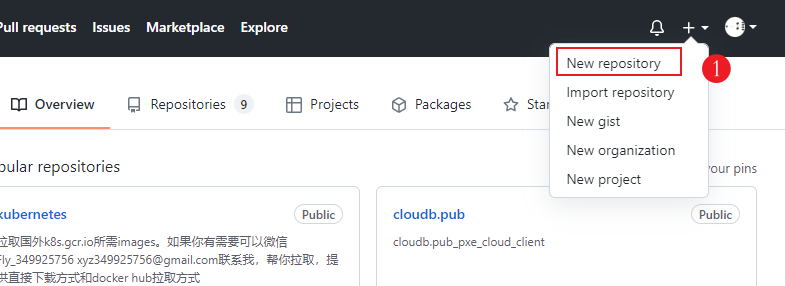

# 打造个性化Github主页





https://github.com/anuraghazra/github-readme-stats/blob/master/docs/readme_cn.md

要做成卡片样式的需要这个插件

[](https://github.com/anuraghazra/github-readme-stats)


```markdown
[](https://github.com/anuraghazra/github-readme-stats)
```

此外，还可以选择显示的主题模式，在后面调用`?theme=THEME_NAME 参数`就可以了，内置了很多。如下：


