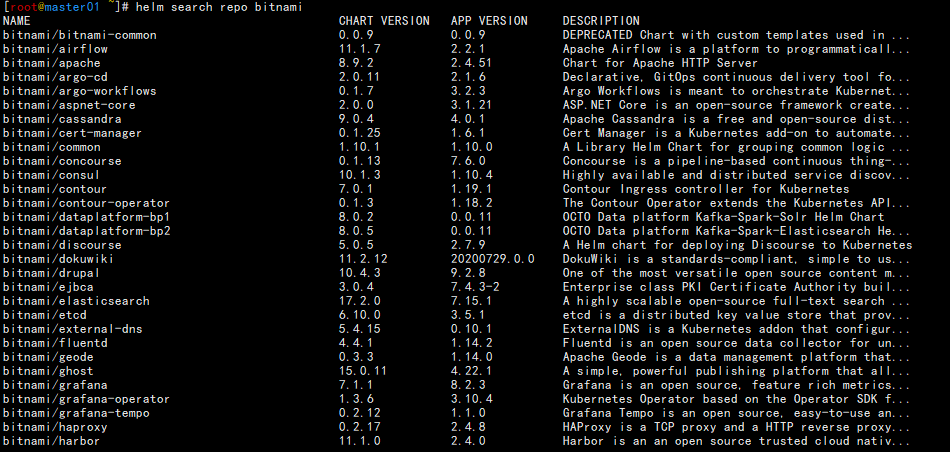
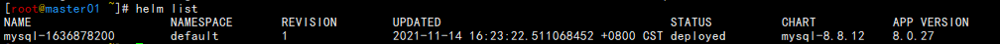

helm

Helm允许用户更简单地部署和管理Kubernetes应用程序的生命周期。它抽象了配置Kubernetes应用程序背后的许多复杂性，并允许团队在平台上更高效地工作。

# 简介

## 先决条件

想成功和正确地使用Helm，需要以下前置条件。

1. 一个 Kubernetes 集群
2. 确定你安装版本的安全配置
3. 安装和配置Helm。

### 安装或者使用现有的Kubernetes集群

- 使用Helm，需要一个Kubernetes集群。对于Helm的最新版本，我们建议使用Kubernetes的最新稳定版， 在大多数情况下，它是倒数第二个次版本。
- 您也应该有一个本地的 `kubectl`.

Helm的版本用 `x.y.z` 描述，`x`是主版本，`y`是次版本，`z`是补丁版本，遵循语义化版本术语。

| Helm 版本 | 支持的 Kubernetes 版本 |
| :-------- | :--------------------- |
| 3.7.x     | 1.22.x - 1.19.x        |
| 3.6.x     | 1.21.x - 1.18.x        |
| 3.5.x     | 1.20.x - 1.17.x        |
| 3.4.x     | 1.19.x - 1.16.x        |
| 3.3.x     | 1.18.x - 1.15.x        |
| 3.2.x     | 1.18.x - 1.15.x        |
| 3.1.x     | 1.17.x - 1.14.x        |
| 3.0.x     | 1.16.x - 1.13.x        |
| 2.16.x    | 1.16.x - 1.15.x        |
| 2.15.x    | 1.15.x - 1.14.x        |
| 2.14.x    | 1.14.x - 1.13.x        |
| 2.13.x    | 1.13.x - 1.12.x        |
| 2.12.x    | 1.12.x - 1.11.x        |
| 2.11.x    | 1.11.x - 1.10.x        |
| 2.10.x    | 1.10.x - 1.9.x         |
| 2.9.x     | 1.10.x - 1.9.x         |
| 2.8.x     | 1.9.x - 1.8.x          |
| 2.7.x     | 1.8.x - 1.7.x          |
| 2.6.x     | 1.7.x - 1.6.x          |
| 2.5.x     | 1.6.x - 1.5.x          |
| 2.4.x     | 1.6.x - 1.5.x          |
| 2.3.x     | 1.5.x - 1.4.x          |
| 2.2.x     | 1.5.x - 1.4.x          |
| 2.1.x     | 1.5.x - 1.4.x          |
| 2.0.x     | 1.4.x - 1.3.x          |

https://helm.sh/zh/docs/topics/version_skew/


## 安装

下载：https://github.com/helm/helm/releases

Helm可以用源码或构建的二进制版本安装

### 用二进制版本安装

每个Helm [版本](https://github.com/helm/helm/releases)都提供了各种操作系统的二进制版本，这些版本可以手动下载和安装。

1. 下载 [需要的版本](https://github.com/helm/helm/releases)

2. 解压(`tar -zxvf helm-v3.7.1-linux-amd64.tar.gz`)

3. 在解压目中找到`helm`程序，移动到需要的目录中(`mv linux-amd64/helm /usr/local/bin/helm`)

```sh
[root@master01 ~]# wget https://get.helm.sh/helm-v3.7.1-linux-amd64.tar.gz 
[root@master01 ~]# tar xf helm-v3.7.1-linux-amd64.tar.gz 
[root@master01 ~]# mv linux-amd64/helm /usr/local/bin/
[root@master01 ~]# helm version
version.BuildInfo{Version:"v3.7.1", GitCommit:"1d11fcb5d3f3bf00dbe6fe31b8412839a96b3dc4", GitTreeState:"clean", GoVersion:"go1.16.9"}
```

###  tab补全

```sh
[root@master01 ~]# source <(helm completion bash)  #临时生效
[root@master01 ~]# echo "source <(helm completion bash)" >> ~/.bash_profile   #开机执行
[root@master01 ~]# helm completion bash > /usr/share/bash-completion/completions/helm
bash-completion 添加配置
```

然后就可以执行客户端程序并 [添加稳定仓库](https://helm.sh/zh/docs/intro/quickstart/#初始化): `helm help`.

```sh
$ helm repo add bitnami https://charts.bitnami.com/bitnami
```

当您已经安装好了Helm之后，您可以添加一个chart 仓库。从 [Artifact Hub](https://artifacthub.io/packages/search?kind=0)中查找有效的Helm chart仓库。

**注意** 针对Linux AMD64，Helm的自动测试只有在CircleCi构建和发布时才会执行。测试其他操作系统是社区针对系统问题请求Helm的责任。

### 使用脚本安装

Helm现在有个安装脚本可以自动拉取最新的Helm版本并在 [本地安装](https://raw.githubusercontent.com/helm/helm/main/scripts/get-helm-3)。

您可以获取这个脚本并在本地执行。它良好的文档会让您在执行之前知道脚本都做了什么。

```sh
$ curl -fsSL -o get_helm.sh https://raw.githubusercontent.com/helm/helm/main/scripts/get-helm-3
$ chmod 700 get_helm.sh
$ ./get_helm.sh

如果想直接执行安装，运行
$ curl https://raw.githubusercontent.com/helm/helm/main/scripts/get-helm-3 | bash
```

https://helm.sh/zh/docs/intro/install/


> 使用Apt (Debian/Ubuntu)
>
> 使用 pkg (FreeBSD)

### 使用源码Source (Linux, macOS)

从源码构建Helm的工作要稍微多一点，但如果你想测试最新（预发布）的Helm版本，这是最好的方式。

您必须有可用的**Go环境**。

```sh
[root@master01 ~]# git clone git://github.com/helm/helm.git
Cloning into 'helm'...
remote: Enumerating objects: 50738, done.
remote: Counting objects: 100% (531/531), done.
remote: Compressing objects: 100% (298/298), done.
remote: Total 50738 (delta 294), reused 369 (delta 203), pack-reused 50207
Receiving objects: 100% (50738/50738), 16.99 MiB | 2.92 MiB/s, done.
Resolving deltas: 100% (33796/33796), done.

[root@master01 ~]# cd helm/
[root@master01 ~/helm]# make

```

如果需要，会拉取依赖并缓存，然后验证配置。然后会编译`helm`并放在`bin/helm`

## 初始化

当您已经安装好了Helm之后，您可以添加一个chart 仓库。从 [Artifact Hub](https://artifacthub.io/packages/search?kind=0)中查找有效的Helm chart仓库。

https://github.com/artifacthub/hub

https://artifacthub.io/

```sh
[root@master01 ~]# helm repo add bitnami https://charts.bitnami.com/bitnami
"bitnami" has been added to your repositories
```

当添加完成，您将可以看到可以被您安装的charts列表：

```sh
[root@master01 ~]# helm search repo bitnami
```



## 安装Chart示例

您可以通过`helm install` 命令安装chart。 Helm可以通过多种途径查找和安装chart， 但最简单的是安装官方的`bitnami` charts。

```sh
[root@master01 ~]# helm repo update    # 确定我们可以拿到最新的charts列表
[root@master01 ~]# helm install bitnami/mysql --generate-name 
NAME: mysql-1636878200
LAST DEPLOYED: Sun Nov 14 16:23:22 2021
NAMESPACE: default
STATUS: deployed
REVISION: 1
TEST SUITE: None
NOTES:
CHART NAME: mysql
CHART VERSION: 8.8.12
APP VERSION: 8.0.27
** Please be patient while the chart is being deployed **

Tip:

  Watch the deployment status using the command: kubectl get pods -w --namespace default

Services:

  echo Primary: mysql-1636878200.default.svc.cluster.local:3306

Execute the following to get the administrator credentials:

  echo Username: root
  MYSQL_ROOT_PASSWORD=$(kubectl get secret --namespace default mysql-1636878200 -o jsonpath="{.data.mysql-root-password}" | base64 --decode)

To connect to your database:

  1. Run a pod that you can use as a client:

      kubectl run mysql-1636878200-client --rm --tty -i --restart='Never' --image  docker.io/bitnami/mysql:8.0.27-debian-10-r8 --namespace default --command -- bash

  2. To connect to primary service (read/write):

      mysql -h mysql-1636878200.default.svc.cluster.local -uroot -p"$MYSQL_ROOT_PASSWORD"


To upgrade this helm chart:

  1. Obtain the password as described on the 'Administrator credentials' section and set the 'root.password' parameter as shown below:

      ROOT_PASSWORD=$(kubectl get secret --namespace default mysql-1636878200 -o jsonpath="{.data.mysql-root-password}" | base64 --decode)
      helm upgrade --namespace default mysql-1636878200 bitnami/mysql --set auth.rootPassword=$ROOT_PASSWORD


[root@master01 ~]# helm search repo bitnami/harbor
NAME          	CHART VERSION	APP VERSION	DESCRIPTION                                       
bitnami/harbor	11.1.0       	2.4.0      	Harbor is an an open source trusted cloud nativ...

```

在上面的例子中，`bitnami/mysql`这个chart被发布，名字是 `mysql-1612624192`

您可以通过执行 `helm show chart bitnami/mysql` 命令简单的了解到这个chart的基本信息。 或者您可以执行 `helm show all bitnami/mysql` 获取关于该chart的所有信息。

```sh
[root@master01 ~]# helm show chart bitnami/mysql 
annotations:
  category: Database
apiVersion: v2
appVersion: 8.0.27
dependencies:
- name: common
  repository: https://charts.bitnami.com/bitnami
  tags:
  - bitnami-common
  version: 1.x.x
description: Chart to create a Highly available MySQL cluster
home: https://github.com/bitnami/charts/tree/master/bitnami/mysql
icon: https://bitnami.com/assets/stacks/mysql/img/mysql-stack-220x234.png
keywords:
- mysql
- database
- sql
- cluster
- high availability
maintainers:
- email: containers@bitnami.com
  name: Bitnami
name: mysql
sources:
- https://github.com/bitnami/bitnami-docker-mysql
- https://mysql.com
version: 8.8.12
[root@master01 ~]# helm show all bitnami/mysql  #列出所有的

```

每当您执行 `helm install` 的时候，都会创建一个新的发布版本。 所以一个chart在同一个集群里面可以被安装多次，每一个都可以被独立的管理和升级。

`helm install` 是一个拥有很多能力的强大的命令https://helm.sh/zh/docs/intro/using_helm/

## 关于版本发布

通过Helm您可以很容易看到哪些chart被发布了：

```sh
[root@master01 ~]# helm list
```

`helm list` (或 `helm ls`) 命令会列出所有可被部署的版本。



##  卸载一个版本

您可以使用`helm uninstall` 命令卸载你的版本

```sh
[root@master01 ~]# helm uninstall mysql-1636878200 
release "mysql-1636878200" uninstalled
```

该命令会从Kubernetes卸载 `mysql-1612624192`， 它将删除和该版本相关的所有相关资源（service、deployment、 pod等等）甚至版本历史。

如果您在执行 `helm uninstall` 的时候提供 `--keep-history` 选项， Helm将会保存版本历史。 您可以通过命令查看该版本的信息

```sh
$ helm status mysql-1612624192
Status: UNINSTALLED
...
```

因为 `--keep-history` 选项会让helm跟踪你的版本（即使你卸载了他们）， 所以你可以审计集群历史甚至使用 `helm rollback` 回滚版本。

## 查看帮助信息

如果您想通过Helm命令查看更多的有用的信息，请使用 `helm help` 命令，或者在任意命令后添加 `-h` 选项：

```sh
$ helm get -h
```

# 使用Helm

使用 Helm 来管理 Kubernetes 集群上的软件包的基础知识

## 三大概念

**Chart** 代表着 Helm 包。它包含在 Kubernetes 集群内部运行应用程序，工具或服务所需的所有资源定义。你可以把它看作是 Homebrew formula，Apt dpkg，或 Yum RPM 在Kubernetes 中的等价物。

**Repository（仓库）** 是用来存放和共享 charts 的地方。它就像 Perl 的 [CPAN 档案库网络](https://www.cpan.org/) 或是 Fedora 的 [软件包仓库](https://src.fedoraproject.org/)，只不过它是供 Kubernetes 包所使用的。

**Release** 是运行在 Kubernetes 集群中的 chart 的实例。一个 chart 通常可以在同一个集群中安装多次。每一次安装都会创建一个新的 *release*。以 MySQL chart为例，如果你想在你的集群中运行两个数据库，你可以安装该chart两次。每一个数据库都会拥有它自己的 *release* 和 *release name*。

在了解了上述这些概念以后，我们就可以这样来解释 Helm：

Helm 安装 *charts* 到 Kubernetes 集群中，每次安装都会创建一个新的 *release*。你可以在 Helm 的 chart *repositories* 中寻找新的 chart。

## 'helm search'：查找 Charts

Helm 自带一个强大的搜索命令，可以用来从两种来源中进行搜索：

- `helm search hub` 从 [Artifact Hub](https://artifacthub.io/) 中查找并列出 helm charts。 Artifact Hub中存放了大量不同的仓库。
- `helm search repo` 从你添加（使用 `helm repo add`）到本地 helm 客户端中的仓库中进行查找。该命令基于本地数据进行搜索，无需连接互联网。

可以通过运行 `helm search hub` 命令找到公开可用的charts：

```sh
$ helm search hub wordpress
URL                                                 CHART VERSION APP VERSION DESCRIPTION
https://hub.helm.sh/charts/bitnami/wordpress        7.6.7         5.2.4       Web publishing platform for building blogs and ...
https://hub.helm.sh/charts/presslabs/wordpress-...  v0.6.3        v0.6.3      Presslabs WordPress Operator Helm Chart
https://hub.helm.sh/charts/presslabs/wordpress-...  v0.7.1        v0.7.1      A Helm chart for deploying a WordPress site on ...
```

上述命令从 Artifact Hub 中搜索所有的 `wordpress` charts。

如果不进行过滤，`helm search hub` 命令会展示所有可用的 charts。

使用 `helm search repo` 命令，你可以从你所添加的仓库中查找chart的名字。

```sh
$ helm repo add brigade https://brigadecore.github.io/charts
"brigade" has been added to your repositories
$ helm search repo brigade
NAME                          CHART VERSION APP VERSION DESCRIPTION
brigade/brigade               1.3.2         v1.2.1      Brigade provides event-driven scripting of Kube...
brigade/brigade-github-app    0.4.1         v0.2.1      The Brigade GitHub App, an advanced gateway for...
brigade/brigade-github-oauth  0.2.0         v0.20.0     The legacy OAuth GitHub Gateway for Brigade
brigade/brigade-k8s-gateway   0.1.0                     A Helm chart for Kubernetes
brigade/brigade-project       1.0.0         v1.0.0      Create a Brigade project
brigade/kashti                0.4.0         v0.4.0      A Helm chart for Kubernetes
```

Helm 搜索使用模糊字符串匹配算法，所以你可以只输入名字的一部分：

```sh
$ helm search repo kash
NAME            CHART VERSION APP VERSION DESCRIPTION
brigade/kashti  0.4.0         v0.4.0      A Helm chart for Kubernetes
```

搜索是用来发现可用包的一个好办法。一旦你找到你想安装的 helm 包，你便可以通过使用 `helm install` 命令来安装它。

## 'helm install'：安装一个 helm 包

使用 `helm install` 命令来安装一个新的 helm 包。最简单的使用方法只需要传入两个参数：你命名的release名字和你想安装的chart的名称。

```sh
$ helm install happy-panda bitnami/wordpress
NAME: happy-panda
LAST DEPLOYED: Tue Jan 26 10:27:17 2021
NAMESPACE: default
STATUS: deployed
REVISION: 1
NOTES:
** Please be patient while the chart is being deployed **

Your WordPress site can be accessed through the following DNS name from within your cluster:

    happy-panda-wordpress.default.svc.cluster.local (port 80)

To access your WordPress site from outside the cluster follow the steps below:

1. Get the WordPress URL by running these commands:

  NOTE: It may take a few minutes for the LoadBalancer IP to be available.
        Watch the status with: 'kubectl get svc --namespace default -w happy-panda-wordpress'

   export SERVICE_IP=$(kubectl get svc --namespace default happy-panda-wordpress --template "{{ range (index .status.loadBalancer.ingress 0) }}{{.}}{{ end }}")
   echo "WordPress URL: http://$SERVICE_IP/"
   echo "WordPress Admin URL: http://$SERVICE_IP/admin"

2. Open a browser and access WordPress using the obtained URL.

3. Login with the following credentials below to see your blog:

  echo Username: user
  echo Password: $(kubectl get secret --namespace default happy-panda-wordpress -o jsonpath="{.data.wordpress-password}" | base64 --decode)
```

现在`wordpress` chart 已经安装。注意安装chart时创建了一个新的 *release* 对象。上述发布被命名为 `happy-panda`。 （如果想让Helm生成一个名称，删除发布名称并使用`--generate-name`。）

在安装过程中，`helm` 客户端会打印一些有用的信息，其中包括：哪些资源已经被创建，release当前的状态，以及你是否还需要执行额外的配置步骤。

Helm按照以下顺序安装资源：

- Namespace
- NetworkPolicy
- ResourceQuota
- LimitRange
- PodSecurityPolicy
- PodDisruptionBudget
- ServiceAccount
- Secret
- SecretList
- ConfigMap
- StorageClass
- PersistentVolume
- PersistentVolumeClaim
- CustomResourceDefinition
- ClusterRole
- ClusterRoleList
- ClusterRoleBinding
- ClusterRoleBindingList
- Role
- RoleList
- RoleBinding
- RoleBindingList
- Service
- DaemonSet
- Pod
- ReplicationController
- ReplicaSet
- Deployment
- HorizontalPodAutoscaler
- StatefulSet
- Job
- CronJob
- Ingress
- APIService

Helm 客户端不会等到所有资源都运行才退出。许多 charts 需要大小超过 600M 的 Docker 镜像，可能需要很长时间才能安装到集群中。

你可以使用 `helm status` 来追踪 release 的状态，或是重新读取配置信息：

```sh
$ helm status happy-panda
NAME: happy-panda
LAST DEPLOYED: Tue Jan 26 10:27:17 2021
NAMESPACE: default
STATUS: deployed
REVISION: 1
NOTES:
** Please be patient while the chart is being deployed **

Your WordPress site can be accessed through the following DNS name from within your cluster:

    happy-panda-wordpress.default.svc.cluster.local (port 80)

To access your WordPress site from outside the cluster follow the steps below:

1. Get the WordPress URL by running these commands:

  NOTE: It may take a few minutes for the LoadBalancer IP to be available.
        Watch the status with: 'kubectl get svc --namespace default -w happy-panda-wordpress'

   export SERVICE_IP=$(kubectl get svc --namespace default happy-panda-wordpress --template "{{ range (index .status.loadBalancer.ingress 0) }}{{.}}{{ end }}")
   echo "WordPress URL: http://$SERVICE_IP/"
   echo "WordPress Admin URL: http://$SERVICE_IP/admin"

2. Open a browser and access WordPress using the obtained URL.

3. Login with the following credentials below to see your blog:

  echo Username: user
  echo Password: $(kubectl get secret --namespace default happy-panda-wordpress -o jsonpath="{.data.wordpress-password}" | base64 --decode)
```

上述信息展示了 release 的当前状态。

### 安装前自定义 chart

上述安装方式只会使用 chart 的默认配置选项。很多时候，我们需要自定义 chart 来指定我们想要的配置。

使用 `helm show values` 可以查看 chart 中的可配置选项：

```sh
$ helm show values bitnami/wordpress
## Global Docker image parameters
## Please, note that this will override the image parameters, including dependencies, configured to use the global value
## Current available global Docker image parameters: imageRegistry and imagePullSecrets
##
# global:
#   imageRegistry: myRegistryName
#   imagePullSecrets:
#     - myRegistryKeySecretName
#   storageClass: myStorageClass

## Bitnami WordPress image version
## ref: https://hub.docker.com/r/bitnami/wordpress/tags/
##
image:
  registry: docker.io
  repository: bitnami/wordpress
  tag: 5.6.0-debian-10-r35
  [..]
```

然后，你可以使用 YAML 格式的文件覆盖上述任意配置项，并在安装过程中使用该文件。

```sh
$ echo '{mariadb.auth.database: user0db, mariadb.auth.username: user0}' > values.yaml
$ helm install -f values.yaml bitnami/wordpress --generate-name
```

上述命令将为 MariaDB 创建一个名称为 `user0` 的默认用户，并且授予该用户访问新建的 `user0db` 数据库的权限。chart 中的其他默认配置保持不变。

安装过程中有两种方式传递配置数据：

- `--values` (或 `-f`)：使用 YAML 文件覆盖配置。可以指定多次，优先使用最右边的文件。
- `--set`：通过命令行的方式对指定项进行覆盖。

如果同时使用两种方式，则 `--set` 中的值会被合并到 `--values` 中，但是 `--set` 中的值优先级更高。在`--set` 中覆盖的内容会被被保存在 ConfigMap 中。可以通过 `helm get values <release-name>` 来查看指定 release 中 `--set` 设置的值。也可以通过运行 `helm upgrade` 并指定 `--reset-values` 字段来清除 `--set` 中设置的值。

`--set` 的格式和限制

`--set` 选项使用0或多个 name/value 对。最简单的用法类似于：`--set name=value`，等价于如下 YAML 格式：

```yml
name: value
```

多个值使用逗号分割，因此 `--set a=b,c=d` 的 YAML 表示是：

```yml
a: b
c: d
```

支持更复杂的表达式。例如，`--set outer.inner=value` 被转换成了：

```yml
outer:
  inner: value
```

列表使用花括号（`{}`）来表示。例如，`--set name={a, b, c}` 被转换成了：

```yml
name:
  - a
  - b
  - c
```

从 2.5.0 版本开始，可以使用数组下标的语法来访问列表中的元素。例如 `--set servers[0].port=80` 就变成了：

```yml
servers:
  - port: 80
```

多个值也可以通过这种方式来设置。`--set servers[0].port=80,servers[0].host=example` 变成了：

```yml
servers:
  - port: 80
    host: example
```

如果需要在 `--set` 中使用特殊字符，你可以使用反斜线来进行转义；`--set name=value1\,value2` 就变成了：

```yml
name: "value1,value2"
```

类似的，你也可以转义点.序列（英文句号）。这可能会在 chart 使用 `toYaml` 函数来解析 annotations，labels，和 node selectors 时派上用场。`--set nodeSelector."kubernetes\.io/role"=master` 语法就变成了：

```yml
nodeSelector:
  kubernetes.io/role: master
```

深层嵌套的数据结构可能会很难用 `--set` 表达。我们希望 Chart 的设计者们在设计 `values.yaml` 文件的格式时，考虑到 `--set` 的使用。

更多https://helm.sh/zh/docs/chart_template_guide/values_files/

### 更多安装方法

`helm install` 命令可以从多个来源进行安装：

- chart 的仓库（如上所述）
- 本地 chart 压缩包（`helm install foo foo-0.1.1.tgz`）
- 解压后的 chart 目录（`helm install foo path/to/foo`）
- 完整的 URL（`helm install foo https://example.com/charts/foo-1.2.3.tgz`）

## 'helm upgrade' 和 'helm rollback'：升级 release 和失败时恢复

当你想升级到 chart 的新版本，或是修改 release 的配置，你可以使用 `helm upgrade` 命令。

一次升级操作会使用已有的 release 并根据你提供的信息对其进行升级。由于 Kubernetes 的 chart 可能会很大而且很复杂，Helm 会尝试执行最小侵入式升级。即它只会更新自上次发布以来发生了更改的内容。

```sh
$ helm upgrade -f panda.yaml happy-panda bitnami/wordpress
```

在上面的例子中，`happy-panda` 这个 release 使用相同的 chart 进行升级，但是使用了一个新的 YAML 文件：

```yml
mariadb.auth.username: user1
```

我们可以使用 `helm get values` 命令来看看配置值是否真的生效了：

```yml
$ helm get values happy-panda
mariadb:
  auth:
    username: user1
```

`helm get` 是一个查看集群中 release 的有用工具。正如我们上面所看到的，`panda.yaml` 中的新值已经被部署到集群中了。

现在，假如在一次发布过程中，发生了不符合预期的事情，也很容易通过 `helm rollback [RELEASE] [REVISION]` 命令回滚到之前的发布版本。

```sh
$ helm rollback happy-panda 1
```

上面这条命令将我们的 `happy-panda` 回滚到了它最初的版本。release 版本其实是一个增量修订（revision）。 每当发生了一次安装、升级或回滚操作，revision 的值就会加1。第一次 revision 的值永远是1。我们可以使用 `helm history [RELEASE]` 命令来查看一个特定 release 的修订版本号。

## 安装、升级、回滚时的有用选项

你还可以指定一些其他有用的选项来自定义 Helm 在安装、升级、回滚期间的行为。请注意这并不是 cli 参数的完整列表。 要查看所有参数的说明，请执行 `helm <command> --help` 命令。

- `--timeout`：一个 [Go duration](https://golang.org/pkg/time/#ParseDuration) 类型的值， 用来表示等待 Kubernetes 命令完成的超时时间，默认值为 `5m0s`。
- `--wait`：表示必须要等到所有的 Pods 都处于 ready 状态，PVC 都被绑定，Deployments 都至少拥有最小 ready 状态 Pods 个数（`Desired`减去 `maxUnavailable`），并且 Services 都具有 IP 地址（如果是`LoadBalancer`， 则为 Ingress），才会标记该 release 为成功。最长等待时间由 `--timeout` 值指定。如果达到超时时间，release 将被标记为 `FAILED`。注意：当 Deployment 的 `replicas` 被设置为1，但其滚动升级策略中的 `maxUnavailable` 没有被设置为0时，`--wait` 将返回就绪，因为已经满足了最小 ready Pod 数。
- `--no-hooks`：不运行当前命令的钩子。
- `--recreate-pods`（仅适用于 `upgrade` 和 `rollback`）：这个参数会导致重建所有的 Pod（deployment中的Pod 除外）。（在 Helm 3 中已被废弃）

## 'helm uninstall'：卸载 release

使用 `helm uninstall` 命令从集群中卸载一个 release：

```sh
$ helm uninstall happy-panda
```

该命令将从集群中移除指定 release。你可以通过 `helm list` 命令看到当前部署的所有 release：

```sh
$ helm list
NAME            VERSION UPDATED                         STATUS          CHART
inky-cat        1       Wed Sep 28 12:59:46 2016        DEPLOYED        alpine-0.1.0
```

从上面的输出中，我们可以看到，`happy-panda` 这个 release 已经被卸载。

在上一个 Helm 版本中，当一个 release 被删除，会保留一条删除记录。而在 Helm 3 中，删除也会移除 release 的记录。 如果你想保留删除记录，使用 `helm uninstall --keep-history`。使用 `helm list --uninstalled` 只会展示使用了 `--keep-history` 删除的 release。

`helm list --all` 会展示 Helm 保留的所有 release 记录，包括失败或删除的条目（指定了 `--keep-history`）：

```sh
$  helm list --all
NAME            VERSION UPDATED                         STATUS          CHART
happy-panda     2       Wed Sep 28 12:47:54 2016        UNINSTALLED     wordpress-10.4.5.6.0
inky-cat        1       Wed Sep 28 12:59:46 2016        DEPLOYED        alpine-0.1.0
kindred-angelf  2       Tue Sep 27 16:16:10 2016        UNINSTALLED     alpine-0.1.0
```

注意，因为现在默认会删除 release，所以你不再能够回滚一个已经被卸载的资源了。

## 'helm repo'：使用仓库

Helm 3 不再附带一个默认的 chart 仓库。`helm repo` 提供了一组命令用于添加、列出和移除仓库。

使用 `helm repo list` 来查看配置的仓库：

```sh
$ helm repo list
NAME            URL
stable          https://charts.helm.sh/stable
mumoshu         https://mumoshu.github.io/charts
```

使用 `helm repo add` 来添加新的仓库：

```sh
$ helm repo add dev https://example.com/dev-charts
```

因为 chart 仓库经常在变化，在任何时候你都可以通过执行 `helm repo update` 命令来确保你的 Helm 客户端是最新的。

使用 `helm repo remove` 命令来移除仓库。

## 创建你自己的 charts

[chart 开发指南](https://helm.sh/zh/docs/topics/charts) 介绍了如何开发你自己的chart。 但是你也可以通过使用 `helm create` 命令来快速开始：

https://helm.sh/zh/docs/topics/charts/

```sh
$ helm create deis-workflow
Creating deis-workflow
```

现在，`./deis-workflow` 目录下已经有一个 chart 了。你可以编辑它并创建你自己的模版。

在编辑 chart 时，可以通过 `helm lint` 验证格式是否正确。

当准备将 chart 打包分发时，你可以运行 `helm package` 命令：

```sh
$ helm package deis-workflow
deis-workflow-0.1.0.tgz
```

然后这个 chart 就可以很轻松的通过 `helm install` 命令安装：

```sh
$ helm install deis-workflow ./deis-workflow-0.1.0.tgz
...
```

打包好的 chart 可以上传到 chart 仓库中。查看 [Helm chart 仓库](https://helm.sh/zh/docs/topics/chart_repository)获取更多信息。


