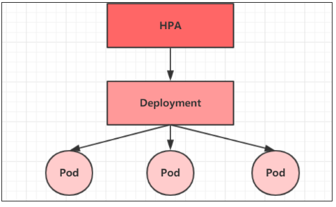

# kubernetes 概念

## pod 与宿主机时间不一致

```sh
[root@master01 /opt/yaml]# kubectl exec -ti $POD_NAME -- date
Sun Nov 21 15:35:21 UTC 2021
[root@master01 /opt/yaml]# date
Sun Nov 21 23:35:29 CST 2021
```

```yaml
 。。。
  volumeMounts:
     - name: timezone
       mountPath: /etc/localtime
volumes:
  - name: timezone
    hostPath:
      path: /usr/share/zoneinfo/Asia/Shanghai
```

修改对应的pod磁盘挂载   calico   coredns

## 镜像加速

在生产中还是配置镜像加速

您可以通过修改daemon配置文件/etc/docker/daemon.json来使用加速器

```json
[root@master01 ~]# vim /etc/docker/daemon.json 
{
  "exec-opts": ["native.cgroupdriver=systemd"],
  "registry-mirrors": ["https://fosdg9zk.mirror.aliyuncs.com"]
}                                                                                       
```

```sh
# systemctl daemon-reload;systemctl restart docker
```

## namespace

```shell
[root@master01 ~]# kubectl get namespaces 
NAME                   STATUS   AGE
default                Active   31h
kube-node-lease        Active   31h
kube-public            Active   31h
kube-system            Active   31h
```

namespace是kubernetes系统中的一种非常重要的资源，主要是用来实现多套资源隔离或多租户的资源隔离，上面是系统默认的四个namespace

namespace = ns #简写

```shell
[root@master01 ~]# kubectl get ns
NAME                   STATUS   AGE
default                Active   31h
kube-node-lease        Active   31h
kube-public            Active   31h
kube-system            Active   31h
kubernetes-dashboard   Active   29h
```

查看指定namespace

```shell
[root@master01 ~]# kubectl get ns default 
NAME      STATUS   AGE
default   Active   31h
[root@master01 ~]# kubectl get ns kube-system 
NAME          STATUS   AGE
kube-system   Active   31h
```

查看配置文件

```sh
[root@master01 ~]# kubectl get ns kube-system -o yaml
apiVersion: v1
kind: Namespace
metadata:
  creationTimestamp: "2021-11-15T06:00:49Z"
  labels:
    kubernetes.io/metadata.name: kube-system
  name: kube-system
  resourceVersion: "16"
  uid: f23e6327-e2a8-40fa-a269-b570a149b99c
spec:
  finalizers:
  - kubernetes
status:
  phase: Active
```

加参数-o  是查看kind的指定格式 yaml json都可以

```shell
[root@master01 ~]# kubectl get ns default -o yaml
apiVersion: v1
kind: Namespace
metadata:
  creationTimestamp: "2021-11-15T06:00:56Z"
  labels:
    kubernetes.io/metadata.name: default
  name: default
  resourceVersion: "205"
  uid: 58af24f9-47a1-4e0d-8c49-f6e283cd090b
spec:
  finalizers:
  - kubernetes
status:
  phase: Active
[root@master01 ~]# kubectl get ns default -o json
{
    "apiVersion": "v1",
    "kind": "Namespace",
    "metadata": {
        "creationTimestamp": "2021-11-15T06:00:56Z",
        "labels": {
            "kubernetes.io/metadata.name": "default"
        },
        "name": "default",
        "resourceVersion": "205",
        "uid": "58af24f9-47a1-4e0d-8c49-f6e283cd090b"
    },
    "spec": {
        "finalizers": [
            "kubernetes"
        ]
    },
    "status": {
        "phase": "Active"
    }
}
```

查看pod在那个宿主机上面

```sh
[root@master01 ~]# kubectl get pod -n kube-system -o wide
```


查看service

```sh
[root@master01 ~]# kubectl get service -n kube-system 
NAME       TYPE        CLUSTER-IP   EXTERNAL-IP   PORT(S)                  AGE
kube-dns   ClusterIP   10.0.0.2     <none>        53/UDP,53/TCP,9153/TCP   30h
[root@master01 ~]# kubectl get service -n kube-system -o yaml
apiVersion: v1
items:
- apiVersion: v1
  kind: Service
  metadata:
    annotations:
      prometheus.io/port: "9153"
      prometheus.io/scrape: "true"
    creationTimestamp: "2021-11-15T07:24:43Z"
    labels:
      k8s-app: kube-dns
      kubernetes.io/cluster-service: "true"
      kubernetes.io/name: CoreDNS
    name: kube-dns
    namespace: kube-system
    resourceVersion: "6647"
    uid: 7cc80e68-07d1-4ae7-842f-50bf6a821c12
  spec:
    clusterIP: 10.0.0.2
    clusterIPs:
    - 10.0.0.2
    internalTrafficPolicy: Cluster
    ipFamilies:
    - IPv4
    ipFamilyPolicy: SingleStack
    ports:
    - name: dns
      port: 53
      protocol: UDP
      targetPort: 53
    - name: dns-tcp
      port: 53
      protocol: TCP
      targetPort: 53
    - name: metrics
      port: 9153
      protocol: TCP
      targetPort: 9153
    selector:
      k8s-app: kube-dns
    sessionAffinity: None
    type: ClusterIP
  status:
    loadBalancer: {}
kind: List
metadata:
  resourceVersion: ""
  selfLink: ""
```

查看namespaces

```sh
[root@master01 ~]# kubectl describe namespaces kube-system 
Name:         kube-system
Labels:       kubernetes.io/metadata.name=kube-system
Annotations:  <none>
Status:       Active
#Active namespaces 正在使用   terminating 正在删除 namespaces
No resource quota.  #针对namespaces做的资源限制

No LimitRange resource.  #对namespaces每个组件做资源限制

```

### 创建一个namesapces

方法1：

```sh
[root@master01 ~]# kubectl create namespace dev
namespace/dev created

[root@master01 ~]# kubectl get namespaces dev
NAME   STATUS   AGE
dev    Active   2m7s

[root@master01 ~]# kubectl get namespaces  dev -o yaml
apiVersion: v1
kind: Namespace
metadata:
  creationTimestamp: "2021-11-16T13:47:58Z"
  labels:
    kubernetes.io/metadata.name: dev
  name: dev
  resourceVersion: "10720"
  uid: 2afd9e26-44c9-43d8-82b9-9b4ca01453a1
spec:
  finalizers:
  - kubernetes
status:
  phase: Active

#删除namespaces dev
[root@master01 ~]# kubectl delete namespaces dev
namespace "dev" deleted
[root@master01 ~]# kubectl get namespaces dev
Error from server (NotFound): namespaces "dev" not found
```

方法2

```yaml
[root@master01 ~]# vim dev.yaml
apiVersion: v1
kind: namespace
metadata:
  name: dev   

```

```sh
[root@master01 ~]# kubectl create -f dev.yaml 
namespace/dev created

[root@master01 ~]# kubectl get namespaces dev
NAME   STATUS   AGE
dev    Active   47s
```

## pod

pod是kubernetes集群进行管理的最小单元，kubeadm部署的节点都是以pod运行的

```sh
[root@master01 ~]# kubectl get pod -n kube-system 
NAME                                       READY   STATUS    RESTARTS      AGE
calico-kube-controllers-798b65c6b7-49rb5   1/1     Running   2 (30h ago)   31h
calico-node-9rd6c                          1/1     Running   2 (30h ago)   31h
calico-node-xjlkn                          1/1     Running   1 (30h ago)   31h
coredns-796d8c5fb6-hvvqf                   1/1     Running   1 (30h ago)   30h
coredns-796d8c5fb6-w585q                   1/1     Running   1 (30h ago)   30h
```

kubernetes没有提供单独运行Pod的命令，都是通过Pod控制器来实现的

> kubectl run (pod控制器) [参数]
>
> #--image 指定pod的镜像
>
> #--port 指定端口
>
> #--namespace 指定namespace

```sh
[root@master01 ~]# kubectl run nginx --image=nginx:latest --port=80 --namespace=dev
pod/nginx created
#在dev 的namespace下创建一个nginx pod

[root@master01 ~]# kubectl delete pod nginx -n dev
pod "nginx" deleted
```

yaml创建pod

```sh
[root@master01 ~]# vim deployments_nginx.yaml

apiVersion: v1
kind: Pod
metedata:
  name: nginx
  namespace: dev
spec:
  containers:
  - image: nginx:latest
    name: pod
    ports: 
      - name: nginx-port
        containerPort: 80
        protocol: TCP  

[root@master01 ~]# kubectl apply -f deployments_nginx.yaml 
pod/nginx created

[root@master01 ~]# kubectl get pods -n dev
NAME    READY   STATUS    RESTARTS   AGE
nginx   1/1     Running   0          29s
[root@master01 ~]# kubectl get deployments.apps 
No resources found in default namespace.
deployments好像新版本取消了一样，还是更为严格了
```

## labs

Label是kubernetes系统中的一个重要概念。它的作用就是在资源上添加标识，用来对它们进行区分和选择。

```sh
[root@master01 ~]# kubectl get pod -n dev
NAME    READY   STATUS    RESTARTS   AGE
nginx   1/1     Running   0          23s

#打标签
[root@master01 ~]# kubectl label pod nginx version=1.0 -n dev
pod/nginx labeled

[root@master01 ~]# kubectl get pod -n dev --show-labels 
NAME    READY   STATUS    RESTARTS   AGE     LABELS
nginx   1/1     Running   0          2m30s   version=1.0

#更新标签
[root@master01 ~]# kubectl label pod nginx version=2.0 -n dev --overwrite 
pod/nginx labeled

[root@master01 ~]# kubectl get pod -n dev --show-labels 
NAME    READY   STATUS    RESTARTS   AGE     LABELS
nginx   1/1     Running   0          5m45s   version=2.0

#筛选
[root@master01 ~]# kubectl get pod -n dev -l version=2.0 --show-labels 
NAME    READY   STATUS    RESTARTS   AGE    LABELS
nginx   1/1     Running   0          7m9s   version=2.0

#删除
[root@master01 ~]# kubectl label pod nginx version- -n dev
pod/nginx labeled
[root@master01 ~]# kubectl get pod -n dev --show-labels 
NAME    READY   STATUS    RESTARTS   AGE     LABELS
nginx   1/1     Running   0          9m13s   <none>
```

法2

```yaml
[root@master01 ~]# vim nginx_label.yaml
apiVersion: v1
kind: Pod
metadata:
  name: nginx-labels
  namespace: dev
  labels:
    version: "1.0"
    env: "test"
spec:
  containers:
  - image: nginx:latest
    name: pod
    ports:
    - name: nginx-port
      containerPort: 80
      protocol: TCP
```

```sh
[root@master01 ~]# kubectl create -f nginx_label.yaml 
pod/nginx-labels created

[root@master01 ~]# kubectl get pod -n dev --show-labels 
NAME           READY   STATUS    RESTARTS   AGE   LABELS
nginx          1/1     Running   0          15m   <none>
nginx-labels   1/1     Running   0          38s   env=test,version=1.0

```

## Deployment

在kubernetes中，Pod是最小的控制单元，但是kubernetes很少直接控制Pod，一般都是通过Pod控制器来完成的。Pod控制器用于pod的管理，确保pod资源符合预期的状态，当pod的资源出现故障时，会尝试进行重启或重建pod。

```yaml
[root@master01 ~]# vim deployment_nginx.yaml
apiVersion: apps/v1
kind: Deployment
metadata:
  name: nginx
  namespace: dev
spec:
  replicas: 3
  selector:
    matchLabels:
      run: nginx
  template:
    metadata:
      labels:
        run: nginx
    spec:
      containers:
      - image: nginx:latest                                                                                                                 
        name: nginx
        ports:
        - containerPort: 80
          protocol: TCP
```

```sh
[root@master01 ~]# kubectl apply -f deployment_nginx.yaml 
deployment.apps/nginx created

[root@master01 ~]# kubectl get pod -n dev
NAME                     READY   STATUS    RESTARTS   AGE
nginx                    1/1     Running   0          45m
nginx-5bdb994596-6rxth   1/1     Running   0          67s
nginx-5bdb994596-hkxqh   1/1     Running   0          67s
nginx-5bdb994596-lfwdm   1/1     Running   0          67s
nginx-labels             1/1     Running   0          30m

[root@master01 ~]# kubectl get deployments.apps -n dev
NAME    READY   UP-TO-DATE   AVAILABLE   AGE
nginx   3/3     3            3           100s
# UP-TO-DATE：成功升级的副本数量
# AVAILABLE：可用副本的数量
```

```sh
[root@master01 ~]# kubectl describe deployments.apps nginx -n dev
Name:                   nginx
Namespace:              dev
CreationTimestamp:      Tue, 16 Nov 2021 23:35:26 +0800
Labels:                 <none>
Annotations:            deployment.kubernetes.io/revision: 1
Selector:               run=nginx
Replicas:               3 desired | 3 updated | 3 total | 3 available | 0 unavailable
StrategyType:           RollingUpdate
MinReadySeconds:        0
RollingUpdateStrategy:  25% max unavailable, 25% max surge
Pod Template:
  Labels:  run=nginx
  Containers:
   nginx:
    Image:        nginx:latest
    Port:         80/TCP
    Host Port:    0/TCP
    Environment:  <none>
    Mounts:       <none>
  Volumes:        <none>
Conditions:
  Type           Status  Reason
  ----           ------  ------
  Available      True    MinimumReplicasAvailable
  Progressing    True    NewReplicaSetAvailable
OldReplicaSets:  <none>
NewReplicaSet:   nginx-5bdb994596 (3/3 replicas created)
Events:
  Type    Reason             Age   From                   Message
  ----    ------             ----  ----                   -------
  Normal  ScalingReplicaSet  5m1s  deployment-controller  Scaled up replica set nginx-5bdb994596 to 3
```

查看deployment nginx 下的详细信息


```sh
[root@master01 ~]# kubectl delete pod -n dev nginx-5bdb994596-6rxth 
pod "nginx-5bdb994596-6rxth" deleted
[root@master01 ~]# kubectl get pod -A

删除
[root@master01 ~]# kubectl delete deployments.apps nginx -n dev
deployment.apps "nginx" deleted
[root@master01 ~]# kubectl get pod -A
```


## service

### ClusterIP

通过上面的学习，已经能够利用Deployment来创建一组Pod来提供具有高可用性的服务。

虽然每个Pod都会分配一个单独的Pod IP，然而却存在如下两问题：

\- Pod IP 会随着Pod的重建产生变化

\- Pod IP 仅仅是集群内可见的虚拟IP，外部无法访问

这样对于访问这个服务带来了难度。因此，kubernetes设计了Service来解决这个问题。

Service可以看作是一组同类Pod**对外的访问接口**。借助Service，应用可以方便地实现服务发现和负载均衡。

```sh
[root@master01 ~]# kubectl get deployments.apps -n dev nginx 
NAME    READY   UP-TO-DATE   AVAILABLE   AGE
nginx   3/3     3            3           52s
确定deployment存在

[root@master01 ~]# kubectl expose deployment nginx --name=svc-nginx1 --type=ClusterIP --port=80 --target-port=80 -n dev
service/svc-nginx1 exposed

[root@master01 ~]# kubectl get svc -n dev 
NAME         TYPE        CLUSTER-IP   EXTERNAL-IP   PORT(S)   AGE
svc-nginx1   ClusterIP   10.0.0.122   <none>        80/TCP    74s

[root@master01 ~]# curl -I 10.0.0.122:80
HTTP/1.1 200 OK
Server: nginx/1.21.4
Date: Tue, 16 Nov 2021 15:56:24 GMT
Content-Type: text/html
Content-Length: 615
Last-Modified: Tue, 02 Nov 2021 14:49:22 GMT
Connection: keep-alive
ETag: "61814ff2-267"
Accept-Ranges: bytes
```


这里产生了一个CLUSTER-IP，这就是service的IP，在Service的生命周期中，这个地址是不会变动的

\# 可以通过这个IP访问当前service对应的POD


ClusterIP:只能内部集群访问

### NodePort

上面创建的IP地址为ClusterIP,只能集群内部访问如果需要外部访问需要type改成NodePort

```sh
root@master01 ~]# kubectl expose deployment nginx --name=svc-nginx2 --type=NodePort --port=80 --target-port=80 -n dev
service/svc-nginx2 exposed

[root@master01 ~]# kubectl get svc -n dev
NAME         TYPE        CLUSTER-IP   EXTERNAL-IP   PORT(S)        AGE
svc-nginx1   ClusterIP   10.0.0.122   <none>        80/TCP         8m39s
svc-nginx2   NodePort    10.0.0.234   <none>        80:31627/TCP   26s
```


```sh
[root@master01 ~]# kubectl get svc  -n dev 
NAME         TYPE        CLUSTER-IP   EXTERNAL-IP   PORT(S)        AGE
svc-nginx1   ClusterIP   10.0.0.122   <none>        80/TCP         12m
svc-nginx2   NodePort    10.0.0.234   <none>        80:31627/TCP   3m49s

[root@master01 ~]# kubectl delete svc -n dev svc-nginx1
service "svc-nginx1" deleted

[root@master01 ~]# kubectl get svc  -n dev 
NAME         TYPE       CLUSTER-IP   EXTERNAL-IP   PORT(S)        AGE
svc-nginx2   NodePort   10.0.0.234   <none>        80:31627/TCP   4m23s

#这里要特别注意不要删除了
[root@master01 ~]# kubectl get svc 
NAME         TYPE        CLUSTER-IP   EXTERNAL-IP   PORT(S)   AGE
kubernetes   ClusterIP   10.0.0.1     <none>        443/TCP   34h
```


```sh
[root@master01 ~]# kubectl get svc -n dev svc-nginx2 -o yaml
apiVersion: v1
kind: Service
metadata:
  creationTimestamp: "2021-11-16T16:02:28Z"
  name: svc-nginx2
  namespace: dev
  resourceVersion: "21577"
  uid: 032facfe-de95-4696-a471-c9d91e4bd3fa
spec:
  clusterIP: 10.0.0.234
  clusterIPs:
  - 10.0.0.234
  externalTrafficPolicy: Cluster
  internalTrafficPolicy: Cluster
  ipFamilies:
  - IPv4
  ipFamilyPolicy: SingleStack
  ports:
  - nodePort: 31627
    port: 80
    protocol: TCP
    targetPort: 80
  selector:
    run: nginx
  sessionAffinity: None
  type: NodePort
status:
  loadBalancer: {}
```

yaml

```yaml
[root@master01 ~]# vim svc-service.yaml

apiVersion: v1
kind: Service
metadata:
  name: svc-nginx
  namespace: dev
spec:
  clusterIP: 10.0.0.132
  ports: 
  - port: 80
    protocol: TCP
    targetPort: 80
  selector:
    run: nginx
  type: ClusterIP 
```

```sh
[root@master01 ~]# kubectl create -f svc-service.yaml 
service/svc-nginx created

[root@master01 ~]# kubectl get svc -n dev
NAME         TYPE        CLUSTER-IP   EXTERNAL-IP   PORT(S)        AGE
svc-nginx    ClusterIP   10.0.0.132   <none>        80/TCP         35s
svc-nginx2   NodePort    10.0.0.234   <none>        80:31627/TCP   15m

[root@master01 ~]# kubectl delete svc -n dev  svc-nginx
service "svc-nginx" deleted

[root@master01 ~]# kubectl get svc -n dev
NAME         TYPE       CLUSTER-IP   EXTERNAL-IP   PORT(S)        AGE
svc-nginx2   NodePort   10.0.0.234   <none>        80:31627/TCP   16m

[root@master01 ~]# kubectl create -f svc-service.yaml 
service/svc-nginx created
[root@master01 ~]# kubectl get svc -n dev
NAME         TYPE        CLUSTER-IP   EXTERNAL-IP   PORT(S)        AGE
svc-nginx    ClusterIP   10.0.0.132   <none>        80/TCP         3s
svc-nginx2   NodePort    10.0.0.234   <none>        80:31627/TCP   17m
```

每个Pod中都可以包含一个或者多个容器，这些容器可以分为两类：

\- 用户程序所在的容器，数量可多可少

\- Pause容器，这是每个Pod都会有的一个根容器，它的作用有两个：

 \- 可以以它为依据，评估整个Pod的健康状态

 \- 可以在根容器上设置Ip地址，其它容器都此Ip（Pod IP），以实现Pod内部的网路通信

所以在部署的时候这个镜像必须存在，通常情况会三台一样的拉取


# pod详解

从上面的几个组件可以知道，在编写策略的时候上面的是必须的，后面还有存储持久化和资源限制，CPM 内存不能溢出OOM，OOM会导致所有的虚拟机出现故障。

下面是一个pod资源清单的yaml 样文

```yaml
apiVersion: v1     #必选，版本号，例如v1
kind: Pod       　 #必选，资源类型，例如 Pod
metadata:       　 #必选，元数据
  name: string     #必选，Pod名称
  namespace: string  #Pod所属的命名空间,默认为"default"
  labels:       　　  #自定义标签列表
    - name: string      　          
spec:  #必选，Pod中容器的详细定义
  containers:  #必选，Pod中容器列表
  - name: string   #必选，容器名称
    image: string  #必选，容器的镜像名称
    imagePullPolicy: [ Always|Never|IfNotPresent ]  #获取镜像的策略 
    command: [string]   #容器的启动命令列表，如不指定，使用打包时使用的启动命令
    args: [string]      #容器的启动命令参数列表
    workingDir: string  #容器的工作目录
    volumeMounts:       #挂载到容器内部的存储卷配置
    - name: string      #引用pod定义的共享存储卷的名称，需用volumes[]部分定义的的卷名
      mountPath: string #存储卷在容器内mount的绝对路径，应少于512字符
      readOnly: boolean #是否为只读模式
    ports: #需要暴露的端口库号列表
    - name: string        #端口的名称
      containerPort: int  #容器需要监听的端口号
      hostPort: int       #容器所在主机需要监听的端口号，默认与Container相同
      protocol: string    #端口协议，支持TCP和UDP，默认TCP
    env:   #容器运行前需设置的环境变量列表
    - name: string  #环境变量名称
      value: string #环境变量的值
    resources: #资源限制和请求的设置
      limits:  #资源限制的设置
        cpu: string     #Cpu的限制，单位为core数，将用于docker run --cpu-shares参数
        memory: string  #内存限制，单位可以为Mib/Gib，将用于docker run --memory参数
      requests: #资源请求的设置
        cpu: string    #Cpu请求，容器启动的初始可用数量
        memory: string #内存请求,容器启动的初始可用数量
    lifecycle: #生命周期钩子
		postStart: #容器启动后立即执行此钩子,如果执行失败,会根据重启策略进行重启
		preStop: #容器终止前执行此钩子,无论结果如何,容器都会终止
    livenessProbe:  #对Pod内各容器健康检查的设置，当探测无响应几次后将自动重启该容器
      exec:       　 #对Pod容器内检查方式设置为exec方式
        command: [string]  #exec方式需要制定的命令或脚本
      httpGet:       #对Pod内个容器健康检查方法设置为HttpGet，需要制定Path、port
        path: string
        port: number
        host: string
        scheme: string
        HttpHeaders:
        - name: string
          value: string
      tcpSocket:     #对Pod内个容器健康检查方式设置为tcpSocket方式
         port: number
       initialDelaySeconds: 0       #容器启动完成后首次探测的时间，单位为秒
       timeoutSeconds: 0    　　    #对容器健康检查探测等待响应的超时时间，单位秒，默认1秒
       periodSeconds: 0     　　    #对容器监控检查的定期探测时间设置，单位秒，默认10秒一次
       successThreshold: 0
       failureThreshold: 0
       securityContext:
         privileged: false
  restartPolicy: [Always | Never | OnFailure]  #Pod的重启策略
  nodeName: <string> #设置NodeName表示将该Pod调度到指定到名称的node节点上
  nodeSelector: obeject #设置NodeSelector表示将该Pod调度到包含这个label的node上
  imagePullSecrets: #Pull镜像时使用的secret名称，以key：secretkey格式指定
  - name: string
  hostNetwork: false   #是否使用主机网络模式，默认为false，如果设置为true，表示使用宿主机网络
  volumes:   #在该pod上定义共享存储卷列表
  - name: string    #共享存储卷名称 （volumes类型有很多种）
    emptyDir: {}    #类型为emtyDir的存储卷，与Pod同生命周期的一个临时目录。为空值
    hostPath: string   #类型为hostPath的存储卷，表示挂载Pod所在宿主机的目录
      path: string      　    #Pod所在宿主机的目录，将被用于同期中mount的目录
    secret:      　#类型为secret的存储卷，挂载集群与定义的secret对象到容器内部
      scretname: string  
      items:     
      - key: string
        path: string
    configMap:   #类型为configMap的存储卷，挂载预定义的configMap对象到容器内部
      name: string
      items:
      - key: string
        path: string
```

其实我们看下coredns和calico这样的yaml不难发现，他会分成几个kind来实现，譬如pod、deployment、service、volumes来实现一个系统的实现。这些都需要借助github查看一些国际上优秀的作者。

## kubectl help

小提示：

  在这里，可通过一个命令来查看每种资源的可配置项

  kubectl explain 资源类型     查看某种资源可以配置的一级属性

  kubectl explain 资源类型.属性   查看属性的子属性

```sh
[root@master01 ~]# kubectl explain pod
KIND:     Pod
VERSION:  v1

DESCRIPTION:
     Pod is a collection of containers that can run on a host. This resource is
     created by clients and scheduled onto hosts.

FIELDS:
   apiVersion	<string>
     APIVersion defines the versioned schema of this representation of an
     object. Servers should convert recognized schemas to the latest internal
     value, and may reject unrecognized values. More info:
     https://git.k8s.io/community/contributors/devel/sig-architecture/api-conventions.md#resources

   kind	<string>
     Kind is a string value representing the REST resource this object
     represents. Servers may infer this from the endpoint the client submits
     requests to. Cannot be updated. In CamelCase. More info:
     https://git.k8s.io/community/contributors/devel/sig-architecture/api-conventions.md#types-kinds

   metadata	<Object>
     Standard object's metadata. More info:
     https://git.k8s.io/community/contributors/devel/sig-architecture/api-conventions.md#metadata

   spec	<Object>
     Specification of the desired behavior of the pod. More info:
     https://git.k8s.io/community/contributors/devel/sig-architecture/api-conventions.md#spec-and-status

   status	<Object>
     Most recently observed status of the pod. This data may not be up to date.
     Populated by the system. Read-only. More info:
     https://git.k8s.io/community/contributors/devel/sig-architecture/api-conventions.md#spec-and-status

[root@master01 ~]# kubectl explain deployment|grep VERSION
VERSION:  apps/v1
[root@master01 ~]# kubectl explain pod|grep VERSION
VERSION:  v1
[root@master01 ~]# kubectl explain service|grep VERSION
VERSION:  v1

#我们也可以使用这个帮助信息查看apiVersion 版本是beat还是其他的
```

```sh
#子属性查看
[root@master01 ~]# kubectl explain pod.kind
KIND:     Pod
VERSION:  v1

FIELD:    kind <string>

DESCRIPTION:
     Kind is a string value representing the REST resource this object
     represents. Servers may infer this from the endpoint the client submits
     requests to. Cannot be updated. In CamelCase. More info:
     https://git.k8s.io/community/contributors/devel/sig-architecture/api-conventions.md#types-kinds

```

在kubernetes中基本所有资源的一级属性都是一样的，主要包含5部分：
- **apiVersion   \<string>** 版本，由kubernetes内部定义，版本号必须可以用 kubectl api-versions 查询到

- **kind \<string>**         类型，由kubernetes内部定义，版本号必须可以用 kubectl api-resources 查询到

- **metadata   \<Object>** 元数据，主要是资源标识和说明，常用的有name、namespace、labels等

- **spec \<Object>**       描述，这是配置中最重要的一部分，里面是对各种资源配置的详细描述                

- **status  \<Object>**     状态信息，里面的内容不需要定义，由kubernetes自动生成

  


在上面的属性中，spec是接下来研究的重点，继续看下它的常见子属性:
- **containers   <[]Object>**   容器列表，用于定义容器的详细信息 
- **nodeName \<String>**      根据nodeName的值将pod调度到指定的Node节点上
- **nodeSelector   <map[]>**  根据NodeSelector中定义的信息选择将该Pod调度到包含这些label的Node 上
- **hostNetwork  \<boolean>** 是否使用主机网络模式，默认为false，如果设置为true，表示使用宿主机网络
- **volumes  <[]Object>**     存储卷，用于定义Pod上面挂在的存储信息 
- **restartPolicy	\<string>**     重启策略，表示Pod在遇到故障的时候的处理策略


## pod配置

```sh
[root@master01 ~]# kubectl explain pod.spec.containers|grep "[<>]"  #列出主要参数
RESOURCE: containers <[]Object>
   args	<[]string>    # 容器的启动命令需要的参数列表
   command	<[]string>   # 容器的启动命令列表，如不指定，使用打包时使用的启动命令
   env	<[]Object>   # 容器环境变量的配置
   envFrom	<[]Object>
   image	<string>   # 容器需要的镜像地址
   imagePullPolicy	<string> # 镜像拉取策略  一般docker 阿里都可以
   lifecycle	<Object>
   livenessProbe	<Object>
   name	<string> -required-     # 容器名称
   ports	<[]Object>  # 容器需要暴露的端口号列表
   readinessProbe	<Object>
   resources	<Object>   # 资源限制和资源请求的设置
   securityContext	<Object>
   startupProbe	<Object>
   stdin	<boolean>
   stdinOnce	<boolean>
   terminationMessagePath	<string>
   terminationMessagePolicy	<string>
   tty	<boolean>
   volumeDevices	<[]Object>
   volumeMounts	<[]Object>
   workingDir	<string>
```

```yaml
[root@master01 ~]# vim pod-base.yaml

apiVersion: v1
kind: Pod
metadata:
  name: nginx
  namespace: dev
  labels:
    user: test

spec:
  containers:
  - name: nginx
    image: nginx:latest
  - name: busybox                                                                              
    image: busybox:latest
```

```sh
[root@master01 ~]# kubectl get pod -n dev
NAME                     READY   STATUS             RESTARTS       AGE
nginx                    1/1     Running            2 (177m ago)   15h
nginx-5bdb994596-5gq6t   1/1     Running            2 (177m ago)   14h
nginx-5bdb994596-p2lf7   1/1     Running            2 (177m ago)   14h
nginx-5bdb994596-v5ktx   1/1     Running            2 (177m ago)   14h
nginx-labels             1/1     Running            2 (177m ago)   14h
nginx-test               1/2     CrashLoopBackOff   2 (17s ago)    111s
有两个容器已经运行，但是其中一个没有就绪

[root@master01 ~]# kubectl describe pod -n dev  nginx-test 
```


镜像也pull了但是就是不准备就绪是因为没有启动命令导致busybox启动之后就自动关机了

在后面命令中我们继续这个例子

### 拉取镜像

```yaml
[root@master01 ~]# cat pod-base.yaml 
apiVersion: v1
kind: Pod
metadata:
  name: nginx-pull
  namespace: dev
  labels:
    user: test

spec:
  containers:
  - name: nginx
    image: nginx:latest
    imagePullPolicy: Always
  - name: busybox
    image: busybox:latest
```

```sh
[root@master01 ~]# kubectl explain pod.spec.containers.imagePullPolicy
KIND:     Pod
VERSION:  v1

FIELD:    imagePullPolicy <string>

DESCRIPTION:
     Image pull policy. One of Always, Never, IfNotPresent. Defaults to Always
     if :latest tag is specified, or IfNotPresent otherwise. Cannot be updated.
     More info:
     https://kubernetes.io/docs/concepts/containers/images#updating-images

#Always, Never, IfNotPresent  这是拉取镜像的参数
Always 远程拉取
Never  本地拉取
IfNotPresent  本地有则本地，否则远程

Always 默认拉取的是latest 最新版本的
```

### 启动命令

```yaml
[root@master01 ~]# vim pod-base.yaml 

apiVersion: v1
kind: Pod
metadata:
  name: pod-base
  namespace: dev
  labels:                                                                                 
    user: test

spec:
  containers:
  - name: nginx
    image: nginx:latest
    imagePullPolicy: IfNotPresent
  - name: busybox
    image: busybox:latest
    command: ["/bin/sh","-c","touch /tmp/hello.txt;while true;do /bin/echo $(data +%T) >>/tmp/hello.txt;sleep 3;done;"]

```

```sh
[root@master01 ~]# kubectl apply -f pod-base.yaml 
pod/pod-base created

[root@master01 ~]# kubectl get pod -n dev
NAME       READY   STATUS    RESTARTS   AGE
pod-base   2/2     Running   0          66s

[root@master01 ~]# kubectl exec -n dev pod-base -it -c busybox /bin/sh
```

>  kubectl exec -n 命名空间 pod名称 -it -c 容器名称 /bin/sh 在容器内部执行命令

通过上面发现command已经可以完成启动命令和传递参数的功能，为什么这里还要提供一个args选项，用于传递参数呢?这其实跟docker有点关系，kubernetes中的command、args两项其实是实现覆盖Dockerfile中ENTRYPOINT的功能。

 1 如果command和args均没有写，那么用Dockerfile的配置。

 2 如果command写了，但args没有写，那么Dockerfile默认的配置会被忽略，执行输入的command

 3 如果command没写，但args写了，那么Dockerfile中配置的ENTRYPOINT的命令会被执行，使用当前args的参数

 4 如果command和args都写了，那么Dockerfile的配置被忽略，执行command并追加上args参数

### 环境变量

```yaml
[root@master01 ~]# vim pod-env.yaml 
apiVersion: v1
kind: Pod
metadata:
  name: pod-env
  namespace: dev
  labels:
    version: "1.1"
spec:                                                                                                                                       
  containers:
  - name: busybox
    image: busybox:latest
    imagePullPolicy: IfNotPresent
    command: ["/bin/sh","-c","touch /tmp/hello.txt;while true;do /bin/echo $(data +%T)>>/tmp/hello.txt;sleep;done"]
    env:
    - name: "user"
      value: "wang"
    - name: "password"
      value: "123456"                                                           
```

```sh
[root@master01 ~]# kubectl apply -f pod-env.yaml 
pod/pod-env created

[root@master01 ~]# kubectl get pod -n dev --show-labels -o wide
```


```sh
[root@master01 ~]# kubectl exec -n dev pod-env  -c busybox -it /bin/sh
kubectl exec [POD] [COMMAND] is DEPRECATED and will be removed in a future version. Use kubectl exec [POD] -- [COMMAND] instead.
/ # echo $user
wang
/ # echo $password
123456
```

这里可以看出我们可以自定义变量并调用

### 端口设置

```sh
[root@master01 ~]# kubectl explain pod.spec.containers.ports
KIND:     Pod
VERSION:  v1

RESOURCE: ports <[]Object>

DESCRIPTION:
     List of ports to expose from the container. Exposing a port here gives the
     system additional information about the network connections a container
     uses, but is primarily informational. Not specifying a port here DOES NOT
     prevent that port from being exposed. Any port which is listening on the
     default "0.0.0.0" address inside a container will be accessible from the
     network. Cannot be updated.

     ContainerPort represents a network port in a single container.

FIELDS:
   containerPort	<integer> -required-
     Number of port to expose on the pod's IP address. This must be a valid port
     number, 0 < x < 65536.
 # 容器要监听的端口(0<x<65536)
   hostIP	<string># 要将外部端口绑定到的主机IP(一般省略)
     What host IP to bind the external port to.

   hostPort	<integer># 容器要在主机上公开的端口，如果设置，主机上只能运行容器的一个副本(一般省略)
     Number of port to expose on the host. If specified, this must be a valid
     port number, 0 < x < 65536. If HostNetwork is specified, this must match
     ContainerPort. Most containers do not need this.

   name	<string># 端口名称，如果指定，必须保证name在pod中是唯一的	
     If specified, this must be an IANA_SVC_NAME and unique within the pod. Each
     named port in a pod must have a unique name. Name for the port that can be
     referred to by services.

   protocol	<string># 端口协议。必须是UDP、TCP或SCTP。默认为“TCP”
     Protocol for port. Must be UDP, TCP, or SCTP. Defaults to "TCP".
```

```yaml
[root@master01 ~]# vim pod-ports.yaml

apiVersion: v1
kind: Pod
metadata:
  name: pod-ports
  namespace: dev
  labels:
    version: "1.2"
spec:
  containers:
  - name: nginx
    image: nginx:latest
    imagePullPolicy: IfNotPresent
    ports:
    - name: nginx-port
      containerPort: 80
      protocol: TCP
```

```sh
[root@master01 ~]# kubectl apply -f pod-ports.yaml 
pod/pod-ports created
```


### 资源配额

容器中的程序要运行，肯定是要占用一定资源的，比如cpu和内存等，如果不对某个容器的资源做限制，那么它就可能吃掉大量资源，导致其它容器无法运行。针对这种情况，kubernetes提供了对内存和cpu的资源进行配额的机制，这种机制主要通过resources选项实现，他有两个子选项：

\- limits：用于限制运行时容器的最大占用资源，当容器占用资源超过limits时会被终止，并进行重启

\- requests ：用于设置容器需要的最小资源，如果环境资源不够，容器将无法启动

可以通过上面两个选项设置资源的上下限。

```yaml
[root@master01 ~]# vim pod-resources.yaml

apiVersion: v1
kind: Pod
metadata: 
  name: pod-resources
  namespace: dev
  labels:
    version: "1.3"
spec:
  containers:
  - name: nginx
    image: nginx:latest
    imagePullPolicy: IfNotPresent
    resources:
      limits:
        cpu: "2"
        memory: "200Mi"
      requests:
        cpu: "1"
        memory: "100Mi"  
```

```sh
[root@master01 ~]# kubectl get pod -n dev pod-resources 
NAME            READY   STATUS    RESTARTS   AGE
pod-resources   0/1     Pending   0          3m59s

[root@master01 ~]# kubectl describe pod -n dev pod-resources 
。。。 
 Warning  FailedScheduling  3s (x5 over 5m30s)  default-scheduler  0/2 nodes are available: 2 Insufficient cpu.
[root@master01 ~]# cat /proc/cpuinfo |grep "cpu core"
cpu cores	: 1
超过虚拟机了

[root@master01 ~]# kubectl create -f pod-resources.yaml 
pod/pod-resources created
[root@master01 ~]# kubectl get pod -n dev  pod-resources 
NAME            READY   STATUS    RESTARTS   AGE
pod-resources   1/1     Running   0          13s
这里设置资源超过了物理机的就会导致容器不能启动成功。
```

limits 是限制核数还是线程数？ 这个是颗数可以表示0.1颗

```sh
[root@master01 ~]# kubectl explain pod.spec.containers.resources
KIND:     Pod
VERSION:  v1

RESOURCE: resources <Object>

DESCRIPTION:
     Compute Resources required by this container. Cannot be updated. More info:
     https://kubernetes.io/docs/concepts/configuration/manage-resources-containers/

     ResourceRequirements describes the compute resource requirements.

FIELDS:
   limits	<map[string]string>
     Limits describes the maximum amount of compute resources allowed. More
     info:
     https://kubernetes.io/docs/concepts/configuration/manage-resources-containers/

   requests	<map[string]string>
     Requests describes the minimum amount of compute resources required. If
     Requests is omitted for a container, it defaults to Limits if that is
     explicitly specified, otherwise to an implementation-defined value. More
     info:
     https://kubernetes.io/docs/concepts/configuration/manage-resources-containers/
```

这里限制资源的方式有两种

第一种就是上面的直接在yaml中限制

第二种是资源对象

```sh
[root@master01 ~]# kubectl explain LimitRange.spec.limits
KIND:     LimitRange
VERSION:  v1

RESOURCE: limits <[]Object>

DESCRIPTION:
     Limits is the list of LimitRangeItem objects that are enforced.

     LimitRangeItem defines a min/max usage limit for any resource that matches
     on kind.

FIELDS:
   default	<map[string]string>
     Default resource requirement limit value by resource name if resource limit
     is omitted.

   defaultRequest	<map[string]string>
     DefaultRequest is the default resource requirement request value by
     resource name if resource request is omitted.

   max	<map[string]string>
     Max usage constraints on this kind by resource name.

   maxLimitRequestRatio	<map[string]string>
     MaxLimitRequestRatio if specified, the named resource must have a request
     and limit that are both non-zero where limit divided by request is less
     than or equal to the enumerated value; this represents the max burst for
     the named resource.

   min	<map[string]string>
     Min usage constraints on this kind by resource name.

   type	<string> -required-
     Type of resource that this limit applies to.

```

```yaml
apiVersion: v1
kind: LimitRange
metadata:
  name: mylimits
spec:
  limits:
  - max:
      cpu: "2"
      memory: 1Gi
    min:
      cpu: 200m
      memory: 6Mi
    type: Pod

  - default:
      cpu: 300m
      memory: 200Mi
    defaultRequest:
      cpu: 200m
      memory: 100Mi
    max:
      cpu: "2"
      memory: 1Gi
    min:
      cpu: 100m
      memory: 3Mi
type: Container
```

limits.cpu <==> --cpu-quota     # docker inspect中的CpuQuota值

requests.cpu <==> --cpu-shares   # docker inspect中的CpuShares值

这里根据实际需求预算计算资源防止OOM产生，更多的需要按照实际资源分配

## pod生命周期

我们一般将pod对象从创建至终的这段时间范围称为pod的生命周期，它主要包含下面的过程：

\- pod创建过程

\- 运行初始化容器（init container）过程

\- 运行主容器（main container）

 \- 容器启动后钩子（post start）、容器终止前钩子（pre stop）

 \- 容器的存活性探测（liveness probe）、就绪性探测（readiness probe）

\- pod终止过程


在整个生命周期中，Pod会出现5种状态（相位），分别如下：

\- 挂起（Pending）：apiserver已经创建了pod资源对象，但它尚未被调度完成或者仍处于下载镜像的过程中

\- 运行中（Running）：pod已经被调度至某节点，并且所有容器都已经被kubelet创建完成

\- 成功（Succeeded）：pod中的所有容器都已经成功终止并且不会被重启

\- 失败（Failed）：所有容器都已经终止，但至少有一个容器终止失败，即容器返回了非0值的退出状态

\- 未知（Unknown）：apiserver无法正常获取到pod对象的状态信息，通常由网络通信失败所导致

### 创建和终止

pod的创建过程

1. 用户通过kubectl或其他api客户端提交需要创建的pod信息给apiServer

2. apiServer开始生成pod对象的信息，并将信息存入etcd，然后返回确认信息至客户端

3. apiServer开始反映etcd中的pod对象的变化，其它组件使用watch机制来跟踪检查apiServer上的变动

4. scheduler发现有新的pod对象要创建，开始为Pod分配主机并将结果信息更新至apiServer

5. node节点上的kubelet发现有pod调度过来，尝试调用docker启动容器，并将结果回送至apiServer

6. apiServer将接收到的pod状态信息存入etcd中


kubectl发出创建请求到apiserver，apiserver通过controller-manager计算资源，返回给apiserver然后再传递给scheduler调度，调度完成之后返回给apiserver，存储到etcd，同时调度到node节点上的kubelet上。用户访问kube-proxy，然后代理寻找到对应的pod提供服务。

pod的终止过程

1. 用户向apiServer发送删除pod对象的命令

2. apiServcer中的pod对象信息会随着时间的推移而更新，在宽限期内（默认30s），pod被视为dead
3. 将pod标记为terminating状态

4. kubelet在监控到pod对象转为terminating状态的同时启动pod关闭过程

5. 端点控制器监控到pod对象的关闭行为时将其从所有匹配到此端点的service资源的端点列表中移除

6. 如果当前pod对象定义了preStop钩子处理器，则在其标记为terminating后即会以同步的方式启动执行

7. pod对象中的容器进程收到停止信号

8. 宽限期结束后，若pod中还存在仍在运行的进程，那么pod对象会收到立即终止的信号

9. kubelet请求apiServer将此pod资源的宽限期设置为0从而完成删除操作，此时pod对于用户已不可见

### 初始化容器

初始化容器是在pod的主容器启动之前要运行的容器，主要是做一些主容器的前置工作，它具有两大特征：

1. 初始化容器必须运行完成直至结束，若某初始化容器运行失败，那么kubernetes需要重启它直到成功完成

2. 初始化容器必须按照定义的顺序执行，当且仅当前一个成功之后，后面的一个才能运行

初始化容器有很多的应用场景，下面列出的是最常见的几个：

\- 提供主容器镜像中不具备的工具程序或自定义代码

\- 初始化容器要先于应用容器串行启动并运行完成，因此可用于延后应用容器的启动直至其依赖的条件得到满足

接下来做一个案例，模拟下面这个需求：

假设要以主容器来运行nginx，但是要求在运行nginx之前先要能够连接上mysql和redis所在服务器

  为了简化测试，事先规定好mysql`(10.244.196.179)`和redis`(10.244.196.179)`服务器的地址   这个IP地址只是测试能不能ping通

```yaml
[root@master01 ~/yaml]# cat pod-initcontainer.yaml 
apiVersion: v1
kind: Pod
metadata:
  name: pod-initcontainer
  namespace: dev
spec:
  containers:
  - name: main-container
    image: nginx:latest
    ports:
    - name: nginx-port
      containerPort: 80
  initContainers:
    - name: test-mysql
      image: busybox:latest
      command: ['sh','-c','until ping 10.244.196.179 -c 1;do echo waiting for mysql ...;sleep 2;done;']
    - name: test-redis
      image: busybox:latest
      command: ['sh','-c','until ping 10.244.196.179 -c 1;do echo waiting for reide...;sleep 2; done;'] 
      
# 创建pod
[root@master ~]# kubectl create -f pod-initcontainer.yaml
pod/pod-initcontainer created

# 查看pod状态
# 发现pod卡在启动第一个初始化容器过程中，后面的容器不会运行
root@master ~]# kubectl describe pod  pod-initcontainer -n dev
........
Events:
  Type    Reason     Age   From               Message
  ----    ------     ----  ----               -------
  Normal  Scheduled  49s   default-scheduler  Successfully assigned dev/pod-initcontainer to node1
  Normal  Pulled     48s   kubelet, node1     Container image "busybox:1.30" already present on machine
  Normal  Created    48s   kubelet, node1     Created container test-mysql
  Normal  Started    48s   kubelet, node1     Started container test-mysql
```

```sh
# 动态查看pod 
[root@master ~]# kubectl get pods pod-initcontainer -n dev -w
NAME                             READY   STATUS     RESTARTS   AGE
pod-initcontainer                0/1     Init:0/2   0          15s
pod-initcontainer                0/1     Init:1/2   0          52s
pod-initcontainer                0/1     Init:1/2   0          53s
pod-initcontainer                0/1     PodInitializing   0          89s
pod-initcontainer                1/1     Running           0          90s

# 接下来新开一个shell，为当前服务器新增两个ip，观察pod的变化
[root@master ~]# ifconfig ens33:1 192.168.109.201 netmask 255.255.255.0 up
[root@master ~]# ifconfig ens33:2 192.168.109.202 netmask 255.255.255.0 up
```

### 钩子函数

钩子函数能够感知自身生命周期中的事件，并在相应的时刻到来时运行用户指定的程序代码。

kubernetes在主容器的启动之后和停止之前提供了两个钩子函数：

\- **post start**：容器创建之后执行，如果失败了会重启容器

\- pre stop ：容器终止之前执行，执行完成之后容器将成功终止，在其完成之前会阻塞删除容器的操作

钩子处理器支持使用下面三种方式定义动作：

\- Exec命令：在容器内执行一次命令

```yaml
……
  lifecycle:
    postStart: 
      exec:
        command:
        - cat
        - /tmp/healthy
……
```

-TCPSocket：在当前容器尝试访问指定的socket

```yaml
……      
  lifecycle:
    postStart:
      tcpSocket:
        port: 8080
……
```

HTTPGet：在当前容器中向某url发起http请求

```yaml
……
  lifecycle:
    postStart:
      httpGet:
        path: / #URI地址
        port: 80 #端口号
        host: 192.168.109.100 #主机地址
        scheme: HTTP #支持的协议，http或者https
……
```

接下来，以exec方式为例，演示下钩子函数的使用，创建pod-hook-exec.yaml文件，内容如下：

```yaml
[root@master01 ~]# vim pod-hook-exec.yaml
apiVersion: v1
kind: Pod
metadata:
  name: pod-hook-exec
  namespace: dev
  labels:
    version: "1.4"
spec:
  containers:
  - name: main-container
    image: nginx:latest
    imagePullPolicy: IfNotPresent
    ports:
    - name: nginx-port
      containerPort: 80
    lifecycle:
      postStart:
        exec:   # 在容器启动的时候执行一个命令，修改掉nginx的默认首页内容
          command: ["bin/sh","-c","echo postStart...>/usr/share/nginx/html/index.html"]
      preStop:
        exec:
          command: ["/usr/sbin/nginx","-s","quit"]   # 在容器停止之前停止nginx服务
```

```sh
[root@master01 ~]# kubectl apply -f pod-hook-exec.yaml 
pod/pod-hook-exec created

[root@master01 ~]# kubectl get pod -n dev -w
NAME            READY   STATUS              RESTARTS   AGE
pod-env         1/1     Running             0          5h16m
pod-hook-exec   0/1     ContainerCreating   0          32s
pod-ports       1/1     Running             0          5h
pod-resources   1/1     Running             0          4h36m
pod-hook-exec   1/1     Running             0          75s

[root@master01 ~]# kubectl get pod -n dev -o wide
[root@master01 ~]# curl 10.244.241.93
postStart...
```


### 容器探测

容器探测用于检测容器中的应用实例是否正常工作，是保障业务可用性的一种传统机制。如果经过探测，实例的状态不符合预期，那么kubernetes就会把该问题实例" 摘除 "，不承担业务流量。kubernetes提供了两种探针来实现容器探测，分别是：

\- **liveness probes**：存活性探针，用于检测应用实例当前是否处于正常运行状态，如果不是，k8s会重启容器

\- **readiness probes**：就绪性探针，用于检测应用实例当前是否可以接收请求，如果不能，k8s不会转发流量

> liveness Probe 决定是否重启容器，readiness Probe 决定是否将请求转发给容器。

上面两种探针目前均支持三种钩子探测方式：

\- Exec命令：在容器内执行一次命令，如果命令执行的退出码为0，则认为程序正常，否则不正常

```yaml
……
  livenessProbe:
    exec:
      command:
      - cat
      - /tmp/healthy
……
```

TCPSocket：将会尝试访问一个用户容器的端口，如果能够建立这条连接，则认为程序正常，否则不正常

```yaml
……      
  livenessProbe:
    tcpSocket:
      port: 8080
……
```

HTTPGet：调用容器内Web应用的URL，如果返回的状态码在200和399之间，则认为程序正常，否则不正常

```yaml
……
  livenessProbe:
    httpGet:
      path: / #URI地址
      port: 80 #端口号
      host: 127.0.0.1 #主机地址
      scheme: HTTP #支持的协议，http或者https
……
```

例子：

#### exec

```yaml
[root@master01 ~]# vim pod-liveness-exec.yaml

apiVersion: v1
kind: Pod
metadata:
  name: pod-liveness-exec
  namespace: dev
  labels:
    version: "1.5"
spec:
  containers:
  - name: nginx
    image: nginx:latest
    imagePullPolicy: IfNotPresent
    ports:
    - name: nginx-ports
      containerPort: 80
    livenessProbe:
      exec:
        command: ["/bin/cat","/tmp/hello.txt"]   
```

```sh
[root@master01 ~]# kubectl apply -f pod-liveness-exec.yaml 
pod/pod-liveness-exec created

[root@master01 ~]# kubectl get pod -n dev -w
NAME                READY   STATUS              RESTARTS   AGE
pod-env             1/1     Running             0          5h49m
pod-liveness-exec   0/1     ContainerCreating   0          16s
pod-ports           1/1     Running             0          5h34m
pod-resources       1/1     Running             0          5h10m
pod-liveness-exec   1/1     Running             0          113s
pod-liveness-exec   1/1     Running             1 (42s ago)   3m6s
pod-liveness-exec   1/1     Running             2 (15s ago)   3m46s
pod-liveness-exec   1/1     Running             3 (8s ago)    4m17s

[root@master01 ~]# kubectl describe pod -n dev pod-liveness-exec 
。。。
  Normal   Scheduled  3m19s                default-scheduler  Successfully assigned dev/pod-liveness-exec to master01
  Normal   Killing    66s                  kubelet            Container nginx failed liveness probe, will be restarted
  Normal   Pulled     54s (x2 over 2m15s)  kubelet            Container image "nginx:latest" already present on machine
  Normal   Created    52s (x2 over 2m7s)   kubelet            Created container nginx
  Normal   Started    43s (x2 over 106s)   kubelet            Started container nginx
  Warning  Unhealthy  6s (x5 over 86s)     kubelet            Liveness probe failed:

[root@master01 ~]# kubectl get pod -n dev
NAME                READY   STATUS    RESTARTS      AGE
pod-env             1/1     Running   0             5h54m
pod-liveness-exec   1/1     Running   4 (30s ago)   5m18s
pod-ports           1/1     Running   0             5h39m
pod-resources       1/1     Running   0             5h15m

```

\# 观察上面的信息就会发现nginx容器启动之后就进行了健康检查

\# 检查失败之后，容器被kill掉，然后尝试进行重启（这是重启策略的作用，后面讲解）

\# 稍等一会之后，再观察pod信息，就可以看到RESTARTS不再是0，而是一直增长

```sh
[root@master01 ~]# kubectl logs -f -n dev pod-liveness-exec 

[root@master01 ~]# kubectl get pod -n dev -w
NAME                READY   STATUS    RESTARTS        AGE
pod-env             1/1     Running   0               5h57m
pod-liveness-exec   1/1     Running   6 (2m12s ago)   8m31s
pod-ports           1/1     Running   0               5h42m
pod-resources       1/1     Running   0               5h18m
pod-liveness-exec   0/1     CrashLoopBackOff   6 (12s ago)     8m41s
pod-liveness-exec   1/1     Running            7               11m
pod-liveness-exec   1/1     Running            8 (5s ago)      11m
pod-liveness-exec   0/1     CrashLoopBackOff   8 (3s ago)      12m
pod-liveness-exec   1/1     Running            9               17m
pod-liveness-exec   1/1     Running            10 (6s ago)     18m
pod-liveness-exec   0/1     CrashLoopBackOff   10 (2s ago)     18m
pod-liveness-exec   1/1     Running            11 (5m24s ago)   23m
```

报错原因就是没有/tmp/hello.txt这个文件，存活性探针一直失败导致pod一直重启。

\# 当然接下来，可以修改成一个存在的文件，比如/tmp/hello.txt，再试，结果就正常了......

#### TCPSocket

```yaml
[root@master01 ~]# vim pod-liveness-tcpsocket.yaml
apiVersion: v1
kind: Pod
metadata:
  name: pod-liveness-tcpsocket
  namespace: dev
spec:
  containers:
  - name: nginx
    image: nginx:latest
    ports:
    - name: nginx-ports
      containerPort: 80
    livenessProbe:
      tcpsocket:
        port: 8000
```

```sh
[root@master01 ~]# kubectl create -f pod-liveness-tcpsocket.yaml 
pod/pod-liveness-tcpsocket created

[root@master01 ~]# kubectl describe pods -n dev pod-liveness-tcpsocket 
Containers:
  nginx:
    Container ID:   
    Image:          nginx:latest
    Image ID:       
    Port:           80/TCP
    Host Port:      0/TCP
    State:          Waiting
      Reason:       ContainerCreating
    Ready:          False
    Restart Count:  0
    Liveness:       tcp-socket :8000 delay=0s timeout=1s period=10s #success=1 #failure=3
    Environment:    <none>

# 观察上面的信息，发现尝试访问8080端口,但是失败了
# 稍等一会之后，再观察pod信息，就可以看到RESTARTS不再是0，而是一直增长
```

 当然接下来，可以修改成一个可以访问的端口，比如80，再试，结果就正常了......

#### httpget

```yaml
[root@master01 ~]# vim pod-liveness-httpget.yaml
apiVersion: v1
kind: Pod
metadata:
  name: nginx-httpget
  namespace: dev
spec:
  containers:
  - name: nginx-port
    image: nginx:latest
    imagePullPolicy: IfNotPresent
    ports:
    - name: nginx-port
      containerPort: 80
    livenessProbe:
      httpGet:
        scheme: HTTP
        port: 80                                                                            
        path: /hello
```

```sh
[root@master01 ~]# kubectl apply -f pod-liveness-httpget.yaml 
pod/nginx-httpget created

[root@master01 ~]# kubectl describe pod -n dev nginx-httpget 
  Normal   Scheduled  103s               default-scheduler  Successfully assigned dev/nginx-httpget to node01
  Normal   Pulled     24s (x3 over 84s)  kubelet            Container image "nginx:latest" already present on machine
  Normal   Killing    24s (x2 over 54s)  kubelet            Container nginx-port failed liveness probe, will be restarted
  Normal   Created    23s (x3 over 84s)  kubelet            Created container nginx-port
  Normal   Started    23s (x3 over 83s)  kubelet            Started container nginx-port
  Warning  Unhealthy  4s (x8 over 74s)   kubelet            Liveness probe failed: HTTP probe failed with statuscode: 404

[root@master01 ~]# kubectl get pod -n dev -w
NAME                     READY   STATUS        RESTARTS      AGE
nginx-httpget            1/1     Running       1 (18s ago)   81s
pod-env                  1/1     Running       0             6h51m
pod-liveness-tcpsocket   0/1     Terminating   0             22m
pod-ports                1/1     Running       0             6h35m
pod-resources            1/1     Running       0             6h11m
nginx-httpget            1/1     Running       2 (10s ago)   103s
nginx-httpget            1/1     Running       3 (3s ago)    2m6s
nginx-httpget            1/1     Running       4 (5s ago)    2m38s
```

至此，已经使用liveness Probe演示了三种探测方式，但是查看livenessProbe的子属性，会发现除了这三种方式，还有一些其他的配置，在这里一并解释下：

```sh
[root@master ~]# kubectl explain pod.spec.containers.livenessProbe
FIELDS:
   exec <Object>  
   tcpSocket    <Object>
   httpGet      <Object>
   initialDelaySeconds  <integer>  # 容器启动后等待多少秒执行第一次探测
   timeoutSeconds       <integer>  # 探测超时时间。默认1秒，最小1秒
   periodSeconds        <integer>  # 执行探测的频率。默认是10秒，最小1秒
   failureThreshold     <integer>  # 连续探测失败多少次才被认定为失败。默认是3。最小值是1
   successThreshold     <integer>  # 连续探测成功多少次才被认定为成功。默认是1
```

```yaml
[root@master01 ~]# vim pod-liveness-httpget.yaml 
apiVersion: v1
kind: Pod
metadata:
  name: pod-liveness-httpget
  namespace: dev
spec:
  containers:
  - name: nginx
    image: nginx:latest
    ports:
    - name: nginx-port
      containerPort: 80
    livenessProbe:
      httpGet:
        scheme: HTTP
        port: 80 
        path: /
      initialDelaySeconds: 30 # 容器启动后30s开始探测
      timeoutSeconds: 5 # 探测超时时间为5s
```

```sh
[root@master01 ~]# kubectl apply -f pod-liveness-httpget.yaml 
pod/nginx-httpget created

[root@master01 ~]# kubectl get pod -n dev -w
NAME            READY   STATUS              RESTARTS   AGE
nginx-httpget   0/1     ContainerCreating   0          16s
pod-env         1/1     Running             0          6h56m
pod-ports       1/1     Running             0          6h41m
pod-resources   1/1     Running             0          6h17m
nginx-httpget   1/1     Running             0          73s
```

这里是正常的，因为里面探针是存活的

在上一节中，一旦容器探测出现了问题，kubernetes就会对容器所在的Pod进行重启，其实这是由pod的重启策略决定的，pod的重启策略有 3 种，分别如下：

\- **Always** ：容器失效时，自动重启该容器，这也是默认值。

\- **OnFailure** ： 容器终止运行且退出码不为0时重启

\- **Never** ： 不论状态为何，都不重启该容器

  重启策略适用于pod对象中的所有容器，首次需要重启的容器，将在其需要时立即进行重启，随后再次需要重启的操作将由kubelet延迟一段时间后进行，且反复的重启操作的延迟时长以此为10s、20s、40s、80s、160s和300s，300s是最大延迟时长。

创建pod-restartpolicy.yaml：

```yaml
[root@master01 ~]# vim pod-restartpolicy.yaml

apiVersion: v1
kind: Pod
metadata:
  name: pod-restartpolicy
  namespace: dev
spec:
  containers:
  - name: nginx
    image: nginx:latest
    ports:
    - name: nginx-port
      containerPort: 80
    livenessProbe:
      httpGet:
        scheme: HTTP
        port: 80 
        path: /hello
  restartPolicy: Never  
  # 设置重启策略为Never
```

```sh
[root@master01 ~]# kubectl create -f pod-restartpolicy.yaml 
pod/pod-restartpolicy created

[root@master01 ~]# kubectl get pod -n dev -w
NAME                READY   STATUS              RESTARTS      AGE
pod-env             1/1     Running             1 (28m ago)   7h30m
pod-ports           1/1     Running             1 (28m ago)   7h14m
pod-resources       1/1     Running             1 (29m ago)   6h51m
pod-restartpolicy   0/1     ContainerCreating   0             18s
pod-restartpolicy   1/1     Running             0             47s
[root@master01 ~]# kubectl get pod -n dev -w
NAME                READY   STATUS    RESTARTS   AGE
pod-restartpolicy   1/1     Running   0          54s
pod-restartpolicy   0/1     Completed   0          54s
```

没有重启，但是pod也不能正常使用

## pod调度

在默认情况下，一个Pod在哪个Node节点上运行，是由Scheduler组件采用相应的算法计算出来的，这个过程是不受人工控制的。但是在实际使用中，这并不满足的需求，因为很多情况下，我们想控制某些Pod到达某些节点上，那么应该怎么做呢？这就要求了解kubernetes对Pod的调度规则，kubernetes提供了四大类调度方式：

\- 自动调度：运行在哪个节点上完全由Scheduler经过一系列的算法计算得出

\- 定向调度：NodeName、NodeSelector

\- 亲和性调度：NodeAffinity、PodAffinity、PodAntiAffinity

\- 污点（容忍）调度：Taints、Toleration

### 定向调度

定向调度，指的是利用在pod上声明nodeName或者nodeSelector，以此将Pod调度到期望的node节点上。注意，这里的调度是强制的，这就意味着即使要调度的目标Node不存在，也会向上面进行调度，只不过pod运行失败而已。

**NodeName**

  NodeName用于强制约束将Pod调度到指定的Name的Node节点上。这种方式，其实是直接跳过Scheduler的调度逻辑，直接将Pod调度到指定名称的节点。

```yaml
[root@master01 ~]# vim pod-nodename.yaml

apiVersion: v1 
kind: Pod
metadata: 
  name: pod-name
  namespace: dev
  labels:
    name: "pod-name"
spec:
  containers:
  - name: nginx
    image: nginx:latest
    imagePullPolicy: IfNotPresent
  nodeName: node01                                                                          
```

```sh
[root@master01 ~]# kubectl create -f pod-nodename.yaml 
pod/pod-name created

[root@master01 ~]# kubectl get pod -n dev -o wide
NAME       READY   STATUS    RESTARTS   AGE   IP               NODE     NOMINATED NODE   READINESS GATES
pod-name   1/1     Running   0          39s   10.244.196.167   node01   <none>           <none>
```

改成node02节点（不存在）


**NodeSelector**

  NodeSelector用于将pod调度到添加了指定标签的node节点上。它是通过kubernetes的label-selector机制实现的，也就是说，在pod创建之前，会由scheduler使用MatchNodeSelector调度策略进行label匹配，找出目标node，然后将pod调度到目标节点，该匹配规则是强制约束。

首先分别为node节点添加标签

```sh
[root@master01 ~]# kubectl label nodes master01 nodeenv=master
node/master01 labeled
[root@master01 ~]# kubectl label nodes node01 nodeenv=node
node/node01 labeled

[root@master01 ~]# kubectl get node --show-labels 
NAME       STATUS   ROLES    AGE    VERSION   LABELS
master01   Ready    <none>   2d8h   v1.22.3   beta.kubernetes.io/arch=amd64,beta.kubernetes.io/os=linux,kubernetes.io/arch=amd64,kubernetes.io/hostname=master01,kubernetes.io/os=linux,nodeenv=master

node01     Ready    <none>   2d8h   v1.22.3   beta.kubernetes.io/arch=amd64,beta.kubernetes.io/os=linux,kubernetes.io/arch=amd64,kubernetes.io/hostname=node01,kubernetes.io/os=linux,nodeenv=node
```

```yaml
[root@master01 ~]# vim pod-nodeselector.yaml

apiVersion: v1 
kind: Pod
metadata:
  name: pod-nodeselector
  namespace: dev
  labels:
    name: "nodeselect"
spec:
  containers:
  - name: nginx
    image: nginx:latest
    imagePullPolicy: IfNotPresent
  nodeSelector:
    nodeenv: node  
```

```sh
[root@master01 ~]# kubectl create -f pod-nodeselector.yaml 
pod/pod-nodeselector created
[root@master01 ~]# kubectl get pod -n dev -o wide
NAME               READY   STATUS    RESTARTS   AGE   IP               NODE     NOMINATED NODE   READINESS GATES
pod-nodeselector   1/1     Running   0          15s   10.244.196.168   node01   <none>           <none>
```

如果节点不存在提示失败

### 亲和性调度

  上面介绍了两种定向调度的方式，使用起来非常方便，但是也有一定的问题，那就是如果没有满足条件的Node，那么Pod将不会被运行，即使在集群中还有可用Node列表也不行，这就限制了它的使用场景。

  基于上面的问题，kubernetes还提供了一种亲和性调度（Affinity）。它在NodeSelector的基础之上的进行了扩展，可以通过配置的形式，实现优先选择满足条件的Node进行调度，如果没有，也可以调度到不满足条件的节点上，使调度更加灵活。

Affinity主要分为三类：

\- nodeAffinity(node亲和性）: 以node为目标，解决pod可以调度到哪些node的问题

\- podAffinity(pod亲和性) : 以pod为目标，解决pod可以和哪些已存在的pod部署在同一个拓扑域中的问题

\- podAntiAffinity(pod反亲和性) : 以pod为目标，解决pod不能和哪些已存在pod部署在同一个拓扑域中的问题

\> 关于亲和性(反亲和性)使用场景的说明：

\> **亲和性**：如果两个应用频繁交互，那就有必要利用亲和性让两个应用的尽可能的靠近，这样可以减少因网络通信而带来的性能损耗。

\> **反亲和性**：当应用的采用多副本部署时，有必要采用反亲和性让各个应用实例打散分布在各个node上，这样可以提高服务的高可用性。

#### NodeAffinity

首先来看一下`NodeAffinity`的可配置项：

> pod.spec.affinity.nodeAffinity
>   requiredDuringSchedulingIgnoredDuringExecution  Node节点必须满足指定的所有规则才可以，相当于硬限制
>     nodeSelectorTerms  节点选择列表
>       matchFields   按节点字段列出的节点选择器要求列表
>       matchExpressions   按节点标签列出的节点选择器要求列表(推荐)
>         key    键
>         values 值
>         operator 关系符 支持Exists, DoesNotExist, In, NotIn, Gt, Lt
>   preferredDuringSchedulingIgnoredDuringExecution 优先调度到满足指定的规则的Node，相当于软限制 (倾向)
>     preference   一个节点选择器项，与相应的权重相关联
>       matchFields   按节点字段列出的节点选择器要求列表
>       matchExpressions   按节点标签列出的节点选择器要求列表(推荐)
>         key    键
>         values 值
>         operator 关系符 支持In, NotIn, Exists, DoesNotExist, Gt, Lt
> 	weight 倾向权重，在范围1-100。

```yaml
关系符的使用说明:
- matchExpressions:
  - key: nodeenv              # 匹配存在标签的key为nodeenv的节点
    operator: Exists
  - key: nodeenv              # 匹配标签的key为nodeenv,且value是"xxx"或"yyy"的节点
    operator: In
    values: ["xxx","yyy"]
  - key: nodeenv              # 匹配标签的key为nodeenv,且value大于"xxx"的节点
    operator: Gt
    values: "xxx"
```

接下来首先演示一下`requiredDuringSchedulingIgnoredDuringExecution` ,

创建pod-nodeaffinity-required.yam

```yaml
apiVersion: v1
kind: Pod
metadata:
  name: pod-nodeaffinity-required
  namespace: dev
spec:
  containers:
  - name: nginx
    image: nginx:1.17.1
  affinity:  #亲和性设置
    nodeAffinity: #设置node亲和性
      requiredDuringSchedulingIgnoredDuringExecution: # 硬限制
        nodeSelectorTerms:
        - matchExpressions: # 匹配env的值在["xxx","yyy"]中的标签
          - key: nodeenv
            operator: In
            values: ["xxx","yyy"]
```

```sh
# 创建pod
[root@master ~]# kubectl create -f pod-nodeaffinity-required.yaml
pod/pod-nodeaffinity-required created

# 查看pod状态 （运行失败）
[root@master ~]# kubectl get pods pod-nodeaffinity-required -n dev -o wide
NAME                        READY   STATUS    RESTARTS   AGE   IP       NODE    ...... 
pod-nodeaffinity-required   0/1     Pending   0          16s   <none>   <none>  ......

# 查看Pod的详情
# 发现调度失败，提示node选择失败
[root@master ~]# kubectl describe pod pod-nodeaffinity-required -n dev
......
  Warning  FailedScheduling  <unknown>  default-scheduler  0/3 nodes are available: 3 node(s) didn't match node selector.
  Warning  FailedScheduling  <unknown>  default-scheduler  0/3 nodes are available: 3 node(s) didn't match node selector.

#接下来，停止pod
[root@master ~]# kubectl delete -f pod-nodeaffinity-required.yaml
pod "pod-nodeaffinity-required" deleted

# 修改文件，将values: ["xxx","yyy"]------> ["pro","yyy"]
[root@master ~]# vim pod-nodeaffinity-required.yaml

# 再次启动
[root@master ~]# kubectl create -f pod-nodeaffinity-required.yaml
pod/pod-nodeaffinity-required created

# 此时查看，发现调度成功，已经将pod调度到了node1上
[root@master ~]# kubectl get pods pod-nodeaffinity-required -n dev -o wide
NAME                        READY   STATUS    RESTARTS   AGE   IP            NODE  ...... 
pod-nodeaffinity-required   1/1     Running   0          11s   10.244.1.89   node1 ......
```

注意。Master默认是有污点，不能迁移。

接下来再演示一下`prequiredDuringSchedulingIgnoredDuringExecution` ,

创建pod-nodeaffinity-preferred.yaml

```yaml
apiVersion: v1
kind: Pod
metadata:
  name: pod-nodeaffinity-preferred
  namespace: dev
spec:
  containers:
  - name: nginx
    image: nginx:1.17.1
  affinity:  #亲和性设置
    nodeAffinity: #设置node亲和性
      preferredDuringSchedulingIgnoredDuringExecution: # 软限制
      - weight: 1
        preference:
          matchExpressions: # 匹配env的值在["xxx","yyy"]中的标签(当前环境没有)
          - key: nodeenv
            operator: In
            values: ["xxx","yyy"]
```

```sh
# 创建pod
[root@master ~]# kubectl create -f pod-nodeaffinity-preferred.yaml
pod/pod-nodeaffinity-preferred created

# 查看pod状态 （运行成功）
[root@master ~]# kubectl get pod pod-nodeaffinity-preferred -n dev
NAME                         READY   STATUS    RESTARTS   AGE
pod-nodeaffinity-preferred   1/1     Running   0          40s
```

NodeAffinity规则设置的注意事项：

  1 如果同时定义了nodeSelector和nodeAffinity，那么必须两个条件都得到满足，Pod才能运行在指定的Node上

  2 如果nodeAffinity指定了多个nodeSelectorTerms，那么只需要其中一个能够匹配成功即可

  3 如果一个nodeSelectorTerms中有多个matchExpressions ，则一个节点必须满足所有的才能匹配成功

  4 如果一个pod所在的Node在Pod运行期间其标签发生了改变，不再符合该Pod的节点亲和性需求，则系统将忽略此变化

软限制没有硬限制强硬

 **operator 关系符**

- **In：label 的值在某个列表中**
- **NotIn：label 的值不在某个列表中**
- **Gt：label 的值大于某个值**
- **Lt：label 的值小于某个值**
- **Exists：某个 label 存在**
- **DoesNotExist：某个 label 不存在**

#### **PodAffinity**

PodAffinity主要实现以运行的Pod为参照，实现让新创建的Pod跟参照pod在一个区域的功能。

首先来看一下`PodAffinity`的可配置项：

```yaml
pod.spec.affinity.podAffinity
  requiredDuringSchedulingIgnoredDuringExecution  硬限制
    namespaces       指定参照pod的namespace
    topologyKey      指定调度作用域
    labelSelector    标签选择器
      matchExpressions  按节点标签列出的节点选择器要求列表(推荐)
        key    键
        values 值
        operator 关系符 支持In, NotIn, Exists, DoesNotExist.
      matchLabels    指多个matchExpressions映射的内容
  preferredDuringSchedulingIgnoredDuringExecution 软限制
    podAffinityTerm  选项
      namespaces      
      topologyKey
      labelSelector
        matchExpressions  
          key    键
          values 值
          operator
        matchLabels 
    weight 倾向权重，在范围1-100
```

**topologyKey用于指定调度时作用域**,例如:

  如果指定为kubernetes.io/hostname，那就是以Node节点为区分范围

​    **如果指定为beta.kubernetes.io/os,则以Node节点的操作系统类型来区分** 在coredns.yaml中有案例

接下来，演示下`requiredDuringSchedulingIgnoredDuringExecution`,

1）首先创建一个参照Pod，pod-podaffinity-target.yaml：

```yaml
apiVersion: v1
kind: Pod
metadata:
  name: pod-podaffinity-target
  namespace: dev
  labels:
    podenv: pro #设置标签
spec:
  containers:
  - name: nginx
    image: nginx:1.17.1
  nodeName: node1 # 将目标pod名确指定到node1上
```

```sh
# 启动目标pod
[root@master ~]# kubectl create -f pod-podaffinity-target.yaml
pod/pod-podaffinity-target created

# 查看pod状况
[root@master ~]# kubectl get pods  pod-podaffinity-target -n dev
NAME                     READY   STATUS    RESTARTS   AGE
pod-podaffinity-target   1/1     Running   0          4s

```

```yaml
创建pod-podaffinity-required.yaml，内容如下
apiVersion: v1
kind: Pod
metadata:
  name: pod-podaffinity-required
  namespace: dev
spec:
  containers:
  - name: nginx
    image: nginx:1.17.1
  affinity:  #亲和性设置
    podAffinity: #设置pod亲和性
      requiredDuringSchedulingIgnoredDuringExecution: # 硬限制
      - labelSelector:
          matchExpressions: # 匹配env的值在["xxx","yyy"]中的标签
          - key: podenv
            operator: In
            values: ["xxx","yyy"]
        topologyKey: kubernetes.io/hostname
```

上面配置表达的意思是：新Pod必须要与拥有标签nodeenv=xxx或者nodeenv=yyy的pod在同一Node上，显然现在没有这样pod，接下来，运行测试一下。

```sh
# 启动pod
[root@master ~]# kubectl create -f pod-podaffinity-required.yaml
pod/pod-podaffinity-required created

# 查看pod状态，发现未运行
[root@master ~]# kubectl get pods pod-podaffinity-required -n dev
NAME                       READY   STATUS    RESTARTS   AGE
pod-podaffinity-required   0/1     Pending   0          9s

# 查看详细信息
[root@master ~]# kubectl describe pods pod-podaffinity-required  -n dev
......
Events:
  Type     Reason            Age        From               Message
  ----     ------            ----       ----               -------
  Warning  FailedScheduling  <unknown>  default-scheduler  0/3 nodes are available: 2 node(s) didn't match pod affinity rules, 1 node(s) had taints that the pod didn't tolerate.

# 接下来修改  values: ["xxx","yyy"]----->values:["pro","yyy"]
# 意思是：新Pod必须要与拥有标签nodeenv=xxx或者nodeenv=yyy的pod在同一Node上
[root@master ~]# vim pod-podaffinity-required.yaml

# 然后重新创建pod，查看效果
[root@master ~]# kubectl delete -f  pod-podaffinity-required.yaml
pod "pod-podaffinity-required" deleted
[root@master ~]# kubectl create -f pod-podaffinity-required.yaml
pod/pod-podaffinity-required created

# 发现此时Pod运行正常
[root@master ~]# kubectl get pods pod-podaffinity-required -n dev
NAME                       READY   STATUS    RESTARTS   AGE   LABELS
pod-podaffinity-required   1/1     Running   0          6s    <none>
```

关于`PodAffinity`的 `preferredDuringSchedulingIgnoredDuringExecution`，这里不再演示。

#### **PodAntiAffinity**

PodAntiAffinity主要实现以运行的Pod为参照，让新创建的Pod跟参照pod不在一个区域中的功能。

它的配置方式和选项跟PodAffinty是一样的，这里不再做详细解释，直接做一个测试案例。

1）继续使用上个案例中目标pod

```sh
[root@master ~]# kubectl get pods -n dev -o wide --show-labels
NAME                     READY   STATUS    RESTARTS   AGE     IP            NODE    LABELS
pod-podaffinity-required 1/1     Running   0          3m29s   10.244.1.38   node1   <none>     
pod-podaffinity-target   1/1     Running   0          9m25s   10.244.1.37   node1   podenv=pro
```

2）创建pod-podantiaffinity-required.yaml，内容如下：

```yaml
apiVersion: v1
kind: Pod
metadata:
  name: pod-podantiaffinity-required
  namespace: dev
spec:
  containers:
  - name: nginx
    image: nginx:1.17.1
  affinity:  #亲和性设置
    podAntiAffinity: #设置pod亲和性
      requiredDuringSchedulingIgnoredDuringExecution: # 硬限制
      - labelSelector:
          matchExpressions: # 匹配podenv的值在["pro"]中的标签
          - key: podenv
            operator: In
            values: ["pro"]
        topologyKey: kubernetes.io/hostname
```

上面配置表达的意思是：新Pod必须要与拥有标签nodeenv=pro的pod不在同一Node上，运行测试一下。

### 污点和容忍

#### **污点（Taints**）

  前面的调度方式都是站在Pod的角度上，通过在Pod上添加属性，来确定Pod是否要调度到指定的Node上，其实我们也可以站在Node的角度上，通过在Node上添加**污点**属性，来决定是否允许Pod调度过来。

  Node被设置上污点之后就和Pod之间存在了一种相斥的关系，进而拒绝Pod调度进来，甚至可以将已经存在的Pod驱逐出去。

污点的格式为：`key=value:effect`, key和value是污点的标签，effect描述污点的作用，支持如下三个选项：

\- **PreferNoSchedule**：kubernetes将尽量避免把Pod调度到具有该污点的Node上，除非没有其他节点可调度

\- **NoSchedule**：kubernetes将不会把Pod调度到具有该污点的Node上，但不会影响当前Node上已存在的Pod

\- **NoExecute**：kubernetes将不会把Pod调度到具有该污点的Node上，同时也会将Node上已存在的Pod驱离


使用kubectl设置和去除污点的命令示例如下：

```sh
# 设置污点
kubectl taint nodes node1 key=value:effect

# 去除污点
kubectl taint nodes node1 key:effect-

# 去除所有污点
kubectl taint nodes node1 key-
```

1. 准备节点node1（为了演示效果更加明显，暂时停止node2节点）
2. 为node1节点设置一个污点: `tag=heima:PreferNoSchedule`；然后创建pod1( pod1 可以 )
3. 修改为node1节点设置一个污点: `tag=heima:NoSchedule`；然后创建pod2( pod1 正常  pod2 失败 )
4. 修改为node1节点设置一个污点: `tag=heima:NoExecute`；然后创建pod3 ( 3个pod都失败 )

```sh
# 为node1设置污点(PreferNoSchedule)
[root@master ~]# kubectl taint nodes node1 tag=heima:PreferNoSchedule

# 创建pod1
[root@master ~]# kubectl run taint1 --image=nginx:1.17.1 -n dev
[root@master ~]# kubectl get pods -n dev -o wide
NAME                      READY   STATUS    RESTARTS   AGE     IP           NODE   
taint1-7665f7fd85-574h4   1/1     Running   0          2m24s   10.244.1.59   node1    

# 为node1设置污点(取消PreferNoSchedule，设置NoSchedule)
[root@master ~]# kubectl taint nodes node1 tag:PreferNoSchedule-
[root@master ~]# kubectl taint nodes node1 tag=heima:NoSchedule

# 创建pod2
[root@master ~]# kubectl run taint2 --image=nginx:1.17.1 -n dev
[root@master ~]# kubectl get pods taint2 -n dev -o wide
NAME                      READY   STATUS    RESTARTS   AGE     IP            NODE
taint1-7665f7fd85-574h4   1/1     Running   0          2m24s   10.244.1.59   node1 
taint2-544694789-6zmlf    0/1     Pending   0          21s     <none>        <none>   

# 为node1设置污点(取消NoSchedule，设置NoExecute)
[root@master ~]# kubectl taint nodes node1 tag:NoSchedule-
[root@master ~]# kubectl taint nodes node1 tag=heima:NoExecute

# 创建pod3
[root@master ~]# kubectl run taint3 --image=nginx:1.17.1 -n dev
[root@master ~]# kubectl get pods -n dev -o wide
NAME                      READY   STATUS    RESTARTS   AGE   IP       NODE     NOMINATED 
taint1-7665f7fd85-htkmp   0/1     Pending   0          35s   <none>   <none>   <none>    
taint2-544694789-bn7wb    0/1     Pending   0          35s   <none>   <none>   <none>     
taint3-6d78dbd749-tktkq   0/1     Pending   0          6s    <none>   <none>   <none>     
```

使用kubeadm搭建的集群，默认就会给master节点添加一个污点标记,所以pod就不会调度到master节点上.

#### **容忍（Toleration**）

  上面介绍了污点的作用，我们可以在node上添加污点用于拒绝pod调度上来，但是如果就是想将一个pod调度到一个有污点的node上去，这时候应该怎么做呢？这就要使用到**容忍**。


\> 污点就是拒绝，容忍就是忽略，Node通过污点拒绝pod调度上去，Pod通过容忍忽略拒绝

下面先通过一个案例看下效果：

 

1. 上一小节，已经在node1节点上打上了`NoExecute`的污点，此时pod是调度不上去的

2. 本小节，可以通过给pod添加容忍，然后将其调度上去

```yaml
apiVersion: v1
kind: Pod
metadata:
  name: pod-toleration
  namespace: dev
spec:
  containers:
  - name: nginx
    image: nginx:1.17.1
  tolerations:      # 添加容忍
  - key: "tag"        # 要容忍的污点的key
    operator: "Equal" # 操作符
    value: "heima"    # 容忍的污点的value
    effect: "NoExecute"   # 添加容忍的规则，这里必须和标记的污点规则相同
```

```sh
# 添加容忍之前的pod
[root@master ~]# kubectl get pods -n dev -o wide
NAME             READY   STATUS    RESTARTS   AGE   IP       NODE     NOMINATED 
pod-toleration   0/1     Pending   0          3s    <none>   <none>   <none>           

# 添加容忍之后的pod
[root@master ~]# kubectl get pods -n dev -o wide
NAME             READY   STATUS    RESTARTS   AGE   IP            NODE    NOMINATED
pod-toleration   1/1     Running   0          3s    10.244.1.62   node1   <none>   
```

下面看一下容忍的详细配置:

```sh
[root@master ~]# kubectl explain pod.spec.tolerations
......
FIELDS:
   key       # 对应着要容忍的污点的键，空意味着匹配所有的键
   value     # 对应着要容忍的污点的值
   operator  # key-value的运算符，支持Equal和Exists（默认）
   effect    # 对应污点的effect，空意味着匹配所有影响
   tolerationSeconds   # 容忍时间, 当effect为NoExecute时生效，表示pod在Node上的停留时间
```

# pod控制器

Pod是kubernetes的最小管理单元，在kubernetes中，按照pod的创建方式可以将其分为两类：

\- 自主式pod：kubernetes直接创建出来的Pod，这种pod删除后就没有了，也不会重建

\- 控制器创建的pod：kubernetes通过控制器创建的pod，这种pod删除了之后还会自动重建   

Pod控制器是管理pod的中间层，使用Pod控制器之后，只需要告诉Pod控制器，想要多少个什么样的Pod就可以了，它会创建出满足条件的Pod并确保每一个Pod资源处于用户期望的目标状态。如果Pod资源在运行中出现故障，它会基于指定策略重新编排Pod。

在kubernetes中，有很多类型的pod控制器，每种都有自己的适合的场景，常见的有下面这些：

> - ReplicationController**：比较原始的pod**控制器，已经被废弃，由ReplicaSet替代
>
> - ReplicaSet：保证副本数量一直维持在期望值，并支持pod数量扩缩容，镜像版本升级
>
> - Deployment：通过控制ReplicaSet来控制Pod，并支持滚动升级、回退版本
>
> - Horizontal Pod Autoscaler：可以根据集群负载自动水平调整Pod的数量，实现削峰填谷
>
> - DaemonSet：在集群中的指定Node上运行且仅运行一个副本，一般用于守护进程类的任务
>
> - Job：它创建出来的pod只要完成任务就立即退出，不需要重启或重建，用于执行一次性任务
>
> - Cronjob：它创建的Pod负责周期性任务控制，不需要持续后台运行
>
> - StatefulSet：管理有状态应用

## ReplicaSet(RS)

 ReplicaSet的主要作用是**保证一定数量的pod**正常运行，它会持续监听这些Pod的运行状态，一旦Pod发生故障，就会重启或重建。同时它还支持对pod数量的扩缩容和镜像版本的升降级。


ReplicaSet的资源清单文件：

```yaml
apiVersion: apps/v1 # 版本号
kind: ReplicaSet # 类型       
metadata: # 元数据
  name: # rs名称 
  namespace: # 所属命名空间 
  labels: #标签
    controller: rs
spec: # 详情描述
  replicas: 3 # 副本数量
  selector: # 选择器，通过它指定该控制器管理哪些pod
    matchLabels:      # Labels匹配规则
      app: nginx-pod
    matchExpressions: # Expressions匹配规则
      - {key: app, operator: In, values: [nginx-pod]}
  template: # 模板，当副本数量不足时，会根据下面的模板创建pod副本
    metadata:
      labels:
        app: nginx-pod
    spec:
      containers:
      - name: nginx
        image: nginx:1.17.1
        ports:
        - containerPort: 80
```

> 在这里面，需要新了解的配置项就是`spec`下面几个选项：
>
> \- replicas：指定副本数量，其实就是当前rs创建出来的pod的数量，默认为1
>
> \- selector：选择器，它的作用是建立pod控制器和pod之间的关联关系，采用的Label Selector机制
>
> 在pod模板上定义label，在控制器上定义选择器，就可以表明当前控制器能管理哪些pod了
>
> \- template：模板，就是当前控制器创建pod所使用的模板板，里面其实就是前一章学过的pod的定义


### 创建

```yaml
[root@master01 ~/yaml]# cat pod-replicaset.yaml 
apiVersion: apps/v1
kind: ReplicaSet   
metadata:
  name: pc-replicaset
  namespace: dev
spec:
  replicas: 3
  selector: 
    matchLabels:
      app: nginx-pod
  template:
    metadata:
      labels:
        app: nginx-pod
    spec:
      containers:
      - name: nginx
        image: nginx:latest
```

```sh
[root@master01 ~/yaml]# kubectl create -f pod-replicaset.yaml 
replicaset.apps/pc-replicaset created
# 查看rs
# DESIRED:期望副本数量  
# CURRENT:当前副本数量  
# READY:已经准备好提供服务的副本数量
[root@master01 ~/yaml]# kubectl get rs pc-replicaset -n dev -o wide
NAME            DESIRED   CURRENT   READY   AGE   CONTAINERS   IMAGES         SELECTOR
pc-replicaset   3         3         3       79s   nginx        nginx:latest   app=nginx-pod
[root@master01 ~/yaml]# kubectl get replicasets.apps -n dev #跟上面一样
NAME            DESIRED   CURRENT   READY   AGE
pc-replicaset   3         3         3       3m52s
[root@master01 ~/yaml]# kubectl get pod -n dev
NAME                         READY   STATUS    RESTARTS   AGE
pc-replicaset-ls9hm          1/1     Running   0          2m40s
pc-replicaset-prcqr          1/1     Running   0          2m40s
pc-replicaset-xmh5h          1/1     Running   0          2m40s
pod-nodeaffinity-preferred   1/1     Running   1          44h
pod-nodename                 1/1     Running   1          45h
# 查看当前控制器创建出来的pod
# 这里发现控制器创建出来的pod的名称是在控制器名称后面拼接了-xxxxx随机码
```

### 扩缩容

```sh
[root@master01 ~/yaml]# kubectl edit replicasets.apps pc-replicaset -n dev
replicaset.apps/pc-replicaset edited
[root@master ~]# kubectl edit rs pc-replicaset -n dev #上一条的简写
#改成6个
[root@master01 ~/yaml]# kubectl get pod -n dev
NAME                  READY   STATUS    RESTARTS   AGE
pc-replicaset-bsxhr   1/1     Running   0          40s
pc-replicaset-ls9hm   1/1     Running   0          8m54s
pc-replicaset-prcqr   1/1     Running   0          8m54s
pc-replicaset-psxdf   1/1     Running   0          40s
pc-replicaset-v5vtk   1/1     Running   0          40s
pc-replicaset-xmh5h   1/1     Running   0          8m54s
#当然也可以直接使用命令实现
#使用scale命令实现扩缩容， 后面--replicas=n直接指定目标数量即可
[root@master01 ~/yaml]# kubectl scale replicaset pc-replicaset --replicas=2 -n dev
replicaset.apps/pc-replicaset scaled
[root@master01 ~/yaml]# kubectl get pod -n dev
NAME                  READY   STATUS        RESTARTS   AGE
pc-replicaset-ls9hm   1/1     Running       0          11m
pc-replicaset-prcqr   0/1     Terminating   0          11m
pc-replicaset-psxdf   0/1     Terminating   0          3m34s
pc-replicaset-v5vtk   0/1     Terminating   0          3m34s
pc-replicaset-xmh5h   1/1     Running       0          11m
#上面四个删除的只看到3个，速度慢了点没有看全。
```

### 镜像升级

```sh
[root@master01 ~/yaml]# kubectl edit replicasets.apps pc-replicaset -n dev
replicaset.apps/pc-replicaset edited
#image改成1.19.0
[root@master01 ~/yaml]# kubectl get pod -n dev -o wide
NAME                  READY   STATUS    RESTARTS   AGE   IP               NODE     NOMINATED NODE   READINESS GATES
pc-replicaset-ls9hm   1/1     Running   0          47m   10.244.196.129   node01   <none>           <none>
pc-replicaset-xmh5h   1/1     Running   0          47m   10.244.196.130   node01   <none>           <none>
[root@master01 ~/yaml]# kubectl get replicasets.apps -n dev -o wide
NAME            DESIRED   CURRENT   READY   AGE   CONTAINERS   IMAGES         SELECTOR
pc-replicaset   2         2         2       48m   nginx        nginx:1.19.0   app=nginx-pod
# 同样的道理，也可以使用命令完成这个工作
# kubectl set image rs rs名称 容器=镜像版本 -n namespace
[root@master01 ~/yaml]# kubectl set image rs pc-replicaset nginx=nginx:1.19.1 -n dev
replicaset.apps/pc-replicaset image updated
#replicaset=rs
[root@master01 ~/yaml]# kubectl set image replicaset pc-replicaset nginx=nginx:1.19.0 -n dev
replicaset.apps/pc-replicaset image updated
[root@master01 ~/yaml]# kubectl get replicasets.apps -n dev -o wide
NAME            DESIRED   CURRENT   READY   AGE   CONTAINERS   IMAGES         SELECTOR
pc-replicaset   2         2         2       54m   nginx        nginx:1.19.0   app=nginx-pod
[root@master01 ~/yaml]# kubectl set image replicaset pc-replicaset nginx=nginx:1.19.1 -n dev
replicaset.apps/pc-replicaset image updated
[root@master01 ~/yaml]# kubectl get replicasets.apps -n dev -o wide
NAME            DESIRED   CURRENT   READY   AGE   CONTAINERS   IMAGES         SELECTOR
pc-replicaset   2         2         2       55m   nginx        nginx:1.19.1   app=nginx-pod
```

没有验证过不能轻易升级

### 删除replicaset 

```sh
[root@master01 ~/yaml]# kubectl delete replicaset pc-replicaset -n dev 
#删除replicaset 和pod 在kubernetes删除RS前，会将RS的replicasclear调整为0，等待所有的Pod被删除后，在执行RS对象的删除
replicaset.apps "pc-replicaset" deleted
[root@master01 ~/yaml]# kubectl delete replicaset pc-replicaset -n dev --cascade=false #不推荐，只删除replicaset pod保留
[root@master01 ~/yaml]# kubectl get replicaset -n dev
No resources found in dev namespace.
#也可以使用yaml直接删除(推荐) 
[root@master ~]# kubectl delete -f pc-replicaset.yaml
```

删除前一万个小心，不要删除错了。最好是yaml文件删除，很多时间长了真记不住是干什么用的。

## deployment(deploy)

为了更好的解决服务编排的问题，kubernetes在V1.2版本开始，引入了Deployment控制器。值得一提的是，这种控制器并不直接管理pod，而是通过管理ReplicaSet来简介管理Pod，即：Deployment管理ReplicaSet，ReplicaSet管理Pod。所以Deployment比ReplicaSet功能更加强大。


Deployment主要功能有下面几个：

Ø 支持ReplicaSet的所有功能

Ø 支持发布的停止、继续

Ø 支持滚动升级和回滚版本

Deployment的资源清单文件：

```yaml
apiVersion: apps/v1 # 版本号
kind: Deployment # 类型       
metadata: # 元数据
  name: # rs名称 
  namespace: # 所属命名空间 
  labels: #标签
    controller: deploy
spec: # 详情描述
  replicas: 3 # 副本数量
  revisionHistoryLimit: 3 # 保留历史版本
  paused: false # 暂停部署，默认是false
  progressDeadlineSeconds: 600 # 部署超时时间（s），默认是600
  strategy: # 策略
    type: RollingUpdate # 滚动更新策略
    rollingUpdate: # 滚动更新
      maxSurge: 30% # 最大额外可以存在的副本数，可以为百分比，也可以为整数
      maxUnavailable: 30% # 最大不可用状态的 Pod 的最大值，可以为百分比，也可以为整数
  selector: # 选择器，通过它指定该控制器管理哪些pod
    matchLabels:      # Labels匹配规则
      app: nginx-pod
    matchExpressions: # Expressions匹配规则
      - {key: app, operator: In, values: [nginx-pod]}
  template: # 模板，当副本数量不足时，会根据下面的模板创建pod副本
    metadata:
      labels:
        app: nginx-pod
    spec:
      containers:
      - name: nginx
        image: nginx:1.17.1
        ports:
        - containerPort: 80
```

### 创建

创建pc-deployment.yaml，内容如下：

```yaml
apiVersion: apps/v1
kind: Deployment      
metadata:
  name: pc-deployment
  namespace: dev
spec: 
  replicas: 3
  selector:
    matchLabels:
      app: nginx-pod
  template:
    metadata:
      labels:
        app: nginx-pod
    spec:
      containers:
      - name: nginx
        image: nginx:1.17.1
```

```sh
[root@master01 ~/yaml]# kubectl create -f pod-deployment.yaml --record=true
deployment.apps/pc-deployment created

#将kubectl的 --record 的 flag 设置为 true可以在 annotation 中记录当前命令创建或者升级了该资源。这在未来会很有用，例如，查看在每个 Deployment revision 中执行了哪些命令。

[root@master01 ~/yaml]# kubectl get deployments.apps -n dev
NAME            READY   UP-TO-DATE   AVAILABLE   AGE
pc-deployment   3/3     3            3           3m37s

# 查看deployment
# UP-TO-DATE 最新版本的pod的数量
# AVAILABLE  当前可用的pod的数量
[root@master01 ~/yaml]# kubectl get replicasets.apps  -n dev
NAME                       DESIRED   CURRENT   READY   AGE
pc-deployment-7958587476   3         3         3       7m10s
[root@master01 ~/yaml]# kubectl get pod -n dev
NAME                             READY   STATUS    RESTARTS   AGE
pc-deployment-7958587476-l9l9t   1/1     Running   0          7m46s
pc-deployment-7958587476-xfvxg   1/1     Running   0          7m46s
pc-deployment-7958587476-xsjmf   1/1     Running   0          7m46s
```

### 扩缩容

```sh
[root@master01 ~/yaml]# kubectl scale deployment pc-deployment --replicas=5 -n dev
deployment.apps/pc-deployment scaled

[root@master01 ~/yaml]# kubectl get deployments.apps pc-deployment -n dev
NAME            READY   UP-TO-DATE   AVAILABLE   AGE
pc-deployment   5/5     5            5           10m

[root@master01 ~/yaml]# kubectl get pods -n dev
NAME                             READY   STATUS    RESTARTS   AGE
pc-deployment-7958587476-7dskk   1/1     Running   0          45s
pc-deployment-7958587476-l9l9t   1/1     Running   0          10m
pc-deployment-7958587476-s25mg   1/1     Running   0          45s
pc-deployment-7958587476-xfvxg   1/1     Running   0          10m
pc-deployment-7958587476-xsjmf   1/1     Running   0          10m

[root@master01 ~/yaml]# kubectl edit deployments.apps pc-deployment -n dev 
#修改replicas=2

[root@master01 ~/yaml]# kubectl get pods -n dev
NAME                             READY   STATUS    RESTARTS   AGE
pc-deployment-7958587476-l9l9t   1/1     Running   0          15m
pc-deployment-7958587476-xfvxg   1/1     Running   0          15m
```

### 镜像更新

deployment支持两种更新策略:`重建更新`和`滚动更新`,可以通过`strategy`指定策略类型,支持两个属性:

> strategy：指定新的Pod替换旧的Pod的策略， 支持两个属性：
>
> - type：指定策略类型，支持两种策略
>   - Recreate：在创建出新的Pod之前会先杀掉所有已存在的Pod
>   - RollingUpdate：滚动更新，就是杀死一部分，就启动一部分，在更新过程中，存在两个版本Pod
>   
> - rollingUpdate：当type为RollingUpdate时生效，用于为RollingUpdate设置参数，支持两个属性：
>
>   - maxUnavailable：用来指定在升级过程中不可用Pod的最大数量，默认为25%。
>
>   - maxSurge： 用来指定在升级过程中可以超过期望的Pod的最大数量，默认为25%。


**重建更新**

编辑pc-deployment.yaml,在spec节点下添加更新策略

```yaml
spec:
  strategy: # 策略
    type: Recreate # 重建更新
```

```sh
[root@master01 ~/yaml]# kubectl set image deployment pc-deployment nginx=nginx:1.19.2 -n dev
deployment.apps/pc-deployment image updated

[root@master01 ~/yaml]# kubectl get pods -n dev -w
NAME                             READY   STATUS              RESTARTS   AGE
pc-deployment-7574d687c-stfxb    0/1     ContainerCreating   0          57s
pc-deployment-7958587476-l9l9t   1/1     Running             0          62m
pc-deployment-7958587476-xfvxg   1/1     Running             0          62m
pc-deployment-7574d687c-stfxb    1/1     Running             0          62s
pc-deployment-7958587476-xfvxg   1/1     Terminating         0          62m
pc-deployment-7574d687c-4rjhj    0/1     Pending             0          0s
pc-deployment-7574d687c-4rjhj    0/1     Pending             0          0s
pc-deployment-7574d687c-4rjhj    0/1     ContainerCreating   0          0s
pc-deployment-7958587476-xfvxg   0/1     Terminating         0          62m
pc-deployment-7574d687c-4rjhj    0/1     ContainerCreating   0          2s
pc-deployment-7574d687c-4rjhj    1/1     Running             0          2s
pc-deployment-7958587476-l9l9t   1/1     Terminating         0          62m
pc-deployment-7958587476-l9l9t   0/1     Terminating         0          62m
pc-deployment-7958587476-l9l9t   0/1     Terminating         0          62m
pc-deployment-7958587476-l9l9t   0/1     Terminating         0          62m
pc-deployment-7958587476-xfvxg   0/1     Terminating         0          62m
pc-deployment-7958587476-xfvxg   0/1     Terminating         0          62m

[root@master01 ~/yaml]# kubectl get pod -n dev
NAME                            READY   STATUS    RESTARTS   AGE
pc-deployment-7574d687c-4rjhj   1/1     Running   0          4m22s
pc-deployment-7574d687c-stfxb   1/1     Running   0          5m24s
```

从上面监控过程可以看到先删除旧的再创建新的

**滚动更新**

```yaml
[root@master01 ~/yaml]# cat pod-deployment.yaml 
apiVersion: apps/v1
kind: Deployment      
metadata:
  name: pc-deployment
  namespace: dev
spec: 
  replicas: 5
  selector:
    matchLabels:
      app: nginx-pod
  template:
    metadata:
      labels:
        app: nginx-pod
    spec:
      containers:
      - name: nginx
        image: nginx:1.19.1
  strategy:
    type: RollingUpdate
    rollingUpdate:
      maxSurge: 25%
      maxUnavailable: 25%
```

```sh
[root@master01 ~/yaml]# kubectl set image deployment pc-deployment nginx=nginx:1.19.1 -n dev
deployment.apps/pc-deployment image updated

[root@master01 ~/yaml]# kubectl get pods -n dev -w
NAME                            READY   STATUS    RESTARTS   AGE
pc-deployment-7574d687c-4rjhj   1/1     Running   0          35m
pc-deployment-7574d687c-cdrbw   1/1     Running   0          31s
pc-deployment-7574d687c-mwwrv   1/1     Running   0          31s
pc-deployment-7574d687c-n9l5p   1/1     Running   0          31s
pc-deployment-7574d687c-stfxb   1/1     Running   0          36m
pc-deployment-7958587476-hcl4p   0/1     Pending   0          0s
pc-deployment-7958587476-qc8pb   0/1     Pending   0          0s
pc-deployment-7958587476-hcl4p   0/1     ContainerCreating   0          0s
pc-deployment-7574d687c-cdrbw    1/1     Terminating         0          111s
pc-deployment-7958587476-qc8pb   0/1     ContainerCreating   0          0s
pc-deployment-7958587476-kzgw7   0/1     Pending             0          0s
pc-deployment-7958587476-kzgw7   0/1     ContainerCreating   0          1s
pc-deployment-7958587476-hcl4p   0/1     ContainerCreating   0          4s
pc-deployment-7958587476-qc8pb   0/1     ContainerCreating   0          5s
pc-deployment-7574d687c-cdrbw    0/1     Terminating         0          116s
pc-deployment-7958587476-kzgw7   0/1     ContainerCreating   0          5s
pc-deployment-7958587476-hcl4p   1/1     Running             0          6s
pc-deployment-7574d687c-mwwrv    1/1     Terminating         0          117s
pc-deployment-7958587476-tbss9   0/1     Pending             0          0s
pc-deployment-7958587476-tbss9   0/1     Pending             0          0s
pc-deployment-7574d687c-cdrbw    0/1     Terminating         0          117s
pc-deployment-7574d687c-cdrbw    0/1     Terminating         0          117s
pc-deployment-7958587476-tbss9   0/1     ContainerCreating   0          1s
pc-deployment-7958587476-qc8pb   1/1     Running             0          7s
pc-deployment-7574d687c-n9l5p    1/1     Terminating         0          118s
pc-deployment-7958587476-5v7ps   0/1     Pending             0          1s
pc-deployment-7958587476-5v7ps   0/1     Pending             0          1s
pc-deployment-7958587476-5v7ps   0/1     ContainerCreating   0          1s
pc-deployment-7958587476-kzgw7   1/1     Running             0          8s
pc-deployment-7574d687c-4rjhj    1/1     Terminating         0          36m
pc-deployment-7958587476-tbss9   0/1     ContainerCreating   0          4s
pc-deployment-7574d687c-n9l5p    0/1     Terminating         0          2m1s
pc-deployment-7574d687c-mwwrv    0/1     Terminating         0          2m2s
pc-deployment-7958587476-5v7ps   0/1     ContainerCreating   0          4s
pc-deployment-7574d687c-4rjhj    0/1     Terminating         0          36m
pc-deployment-7958587476-tbss9   1/1     Running             0          6s
pc-deployment-7958587476-5v7ps   1/1     Running             0          5s
pc-deployment-7574d687c-stfxb    1/1     Terminating         0          38m
pc-deployment-7574d687c-n9l5p    0/1     Terminating         0          2m3s
pc-deployment-7574d687c-n9l5p    0/1     Terminating         0          2m3s
pc-deployment-7574d687c-stfxb    0/1     Terminating         0          38m
pc-deployment-7574d687c-stfxb    0/1     Terminating         0          38m
pc-deployment-7574d687c-stfxb    0/1     Terminating         0          38m
pc-deployment-7574d687c-4rjhj    0/1     Terminating         0          37m
pc-deployment-7574d687c-4rjhj    0/1     Terminating         0          37m
pc-deployment-7574d687c-mwwrv    0/1     Terminating         0          2m13s
pc-deployment-7574d687c-mwwrv    0/1     Terminating         0          2m13s

[root@master01 ~/yaml]# kubectl get pod -n dev
NAME                             READY   STATUS    RESTARTS   AGE
pc-deployment-7958587476-5v7ps   1/1     Running   0          76s
pc-deployment-7958587476-hcl4p   1/1     Running   0          83s
pc-deployment-7958587476-kzgw7   1/1     Running   0          83s
pc-deployment-7958587476-qc8pb   1/1     Running   0          83s
pc-deployment-7958587476-tbss9   1/1     Running   0          77s
```

\# 至此，新版本的pod创建完毕，旧版本的pod销毁完毕

\# 中间过程是滚动进行的，也就是边销毁边创建

从上面过程来看是先创建起来再删除是按照设计的百分比进行作业的。防止业务中断或者占用资源


\# 查看rs,发现原来的rs的依旧存在，只是pod数量变为了0，而后又新产生了一个rs，pod数量为5

\# 其实这就是deployment能够进行版本回退的奥妙所在，后面会详细解释

```sh
[root@master01 ~/yaml]# kubectl get replicasets.apps -n dev
NAME                       DESIRED   CURRENT   READY   AGE
pc-deployment-7574d687c    0         0         0       77m
pc-deployment-7958587476   5         5         5       138m
```

### 版本回退

deployment支持版本升级过程中的暂停、继续功能以及版本回退等诸多功能，下面具体来看.

**kubectl rollout**： 版本升级相关功能，支持下面的选项：

> Ø status    显示当前升级状态
>
> Ø history   显示 升级历史记录
>
> Ø pause    暂停版本升级过程
>
> Ø resume  继续已经暂停的版本升级过程
>
> Ø restart   重启版本升级过程
>
> Ø undo    回滚到上一级版本（可以使用--to-revision回滚到指定版本）

```sh
[root@master01 ~/yaml]# kubectl rollout status deployment pc-deployment -n dev
deployment "pc-deployment" successfully rolled out
#查看当前版本升级状态

[root@master01 ~/yaml]# kubectl rollout history deployment pc-deployment -n dev
deployment.apps/pc-deployment 
REVISION  CHANGE-CAUSE
2         kubectl create --filename=pod-deployment.yaml --record=true
3         kubectl create --filename=pod-deployment.yaml --record=true
这里是升级过一次，1被3替换了。下次回退之后显示就是3,4了
# 版本回滚
# 这里直接使用--to-revision=1回滚到了1版本， 如果省略这个选项，就是回退到上个版本，就是2版本

[root@master01 ~/yaml]# kubectl rollout undo deployment pc-deployment --to-revision=2 -n dev
#回退到第二个版本
deployment.apps/pc-deployment rolled back

[root@master01 ~/yaml]# kubectl get deployments.apps -n dev -o wide
NAME            READY   UP-TO-DATE   AVAILABLE   AGE     CONTAINERS   IMAGES         SELECTOR
pc-deployment   5/5     5            5           5h25m   nginx        nginx:1.19.2   app=nginx-pod
[root@master01 ~/yaml]# kubectl rollout history deployment -n dev
deployment.apps/pc-deployment 
REVISION  CHANGE-CAUSE
3         kubectl create --filename=pod-deployment.yaml --record=true
4         kubectl create --filename=pod-deployment.yaml --record=true
#当服务器上很多容器时候指定容器名查询

[root@master01 ~/yaml]# kubectl rollout history deployment pc-deployment -n dev
deployment.apps/pc-deployment 
REVISION  CHANGE-CAUSE
3         kubectl create --filename=pod-deployment.yaml --record=true
4         kubectl create --filename=pod-deployment.yaml --record=true
[root@master01 ~/yaml]# kubectl rollout undo deployment pc-deployment -n dev --to-revision=3
deployment.apps/pc-deployment rolled back
[root@master01 ~/yaml]# kubectl get deployments.apps pc-deployment -n dev -o wide
NAME            READY   UP-TO-DATE   AVAILABLE   AGE     CONTAINERS   IMAGES         SELECTOR
pc-deployment   5/5     5            5           5h29m   nginx        nginx:1.19.1   app=nginx-pod
[root@master01 ~/yaml]# kubectl get replicasets.apps -n dev
NAME                       DESIRED   CURRENT   READY   AGE
pc-deployment-7574d687c    0         0         0       4h33m
pc-deployment-7958587476   5         5         5       5h35m
#查看replicaset 第一个rs版本没有运行，第二个再运行
#deployment 实现版本回退就是因为历史记录rs来实现的
```

### 金丝雀发布

Deployment控制器支持控制更新过程中的控制，如“暂停(pause)”或“继续(resume)”更新操作。

比如有一批新的Pod资源创建完成后立即暂停更新过程，此时，仅存在一部分新版本的应用，主体部分还是旧的版本。然后，再筛选一小部分的用户请求路由到新版本的Pod应用，继续观察能否稳定地按期望的方式运行。确定没问题之后再继续完成余下的Pod资源滚动更新，否则立即回滚更新操作。这就是所谓的金丝雀发布。

```sh
#更新deployment的版本，并配置暂停deployment
[root@master01 ~/yaml]# kubectl set image deployment pc-deployment nginx=nginx:1.19.0 -n dev && kubectl rollout pause deployment pc-deployment -n dev
deployment.apps/pc-deployment image updated
deployment.apps/pc-deployment paused

#查看更新状态
[root@master01 ~/yaml]# kubectl rollout status deployment  pc-deployment -n dev
Waiting for deployment "pc-deployment" rollout to finish: 2 out of 5 new replicas have been updated...  #pause
Waiting for deployment spec update to be observed...
Waiting for deployment spec update to be observed... 
Waiting for deployment "pc-deployment" rollout to finish: 2 out of 5 new replicas have been updated...
Waiting for deployment "pc-deployment" rollout to finish: 2 out of 5 new replicas have been updated...
Waiting for deployment "pc-deployment" rollout to finish: 2 old replicas are pending termination...
Waiting for deployment "pc-deployment" rollout to finish: 2 old replicas are pending termination...
Waiting for deployment "pc-deployment" rollout to finish: 2 old replicas are pending termination...
Waiting for deployment "pc-deployment" rollout to finish: 1 old replicas are pending termination...
Waiting for deployment "pc-deployment" rollout to finish: 1 old replicas are pending termination...
Waiting for deployment "pc-deployment" rollout to finish: 1 old replicas are pending termination...
deployment "pc-deployment" successfully rolled out
## 监控更新的过程，可以看到已经新增了2个资源，但是并未按照预期的状态去删除一个旧的资源，就是因为使用了pause暂停命令

[root@master01 ~/yaml]# kubectl get replicasets.apps -n dev -o wide
NAME                       DESIRED   CURRENT   READY   AGE     CONTAINERS   IMAGES         SELECTOR
pc-deployment-7574d687c    0         0         0       4h39m   nginx        nginx:1.19.2   app=nginx-pod,pod-template-hash=7574d687c
pc-deployment-76b47d6567   2         2         2       67s     nginx        nginx:1.19.0   app=nginx-pod,pod-template-hash=76b47d6567
pc-deployment-7958587476   5         5         5       5h41m   nginx        nginx:1.19.1   app=nginx-pod,pod-template-hash=7958587476

[root@master01 ~/yaml]# kubectl get pod -n dev
NAME                             READY   STATUS    RESTARTS   AGE
pc-deployment-76b47d6567-fm8xd   1/1     Running   0          88s
pc-deployment-76b47d6567-r6g49   1/1     Running   0          88s
pc-deployment-7958587476-27fv7   1/1     Running   0          13m
pc-deployment-7958587476-2tlf8   1/1     Running   0          87s
pc-deployment-7958587476-42b8f   1/1     Running   0          13m
pc-deployment-7958587476-67lkt   1/1     Running   0          13m
pc-deployment-7958587476-t8lcq   1/1     Running   0          13m
#这里确保更新的pod没有问题就可以接着发布

[root@master01 ~/yaml]# kubectl rollout resume deployment pc-deployment -n dev
deployment.apps/pc-deployment resumed

#查看更新后的情况
[root@master01 ~/yaml]# kubectl get replicasets.apps -n dev -o wide
NAME                       DESIRED   CURRENT   READY   AGE     CONTAINERS   IMAGES         SELECTOR
pc-deployment-7574d687c    0         0         0       4h42m   nginx        nginx:1.19.2   app=nginx-pod,pod-template-hash=7574d687c
pc-deployment-76b47d6567   5         5         5       3m23s   nginx        nginx:1.19.0   app=nginx-pod,pod-template-hash=76b47d6567
pc-deployment-7958587476   0         0         0       5h43m   nginx        nginx:1.19.1   app=nginx-pod,pod-template-hash=7958587476

[root@master01 ~/yaml]# kubectl get pod -n dev
NAME                             READY   STATUS    RESTARTS   AGE
pc-deployment-76b47d6567-cq6f2   1/1     Running   0          79s
pc-deployment-76b47d6567-fm8xd   1/1     Running   0          3m55s
pc-deployment-76b47d6567-r6g49   1/1     Running   0          3m55s
pc-deployment-76b47d6567-tknt9   1/1     Running   0          79s
pc-deployment-76b47d6567-z6pth   1/1     Running   0          79s
```

### 删除deployment

```sh
[root@master01 ~/yaml]# kubectl delete -f pod-deployment.yaml 
deployment.apps "pc-deployment" deleted

[root@master01 ~/yaml]# kubectl get pod -n dev   #看到正在删除中
NAME                             READY   STATUS        RESTARTS   AGE
pc-deployment-76b47d6567-cq6f2   0/1     Terminating   0          10m
pc-deployment-76b47d6567-fm8xd   0/1     Terminating   0          12m
pc-deployment-76b47d6567-r6g49   0/1     Terminating   0          12m
```

上面过程中金丝雀发布非常重要，常用功能

## HPA

horizontal pod autoscaler(HPA) 前面的学习中，我们已经可以实现通过手工执行`kubectl scale`命令实现Pod扩容或缩容，但是这显然不符合Kubernetes的定位目标--自动化、智能化。 Kubernetes期望可以实现通过监测Pod的使用情况，实现pod数量的自动调整，于是就产生了Horizontal Pod Autoscaler（HPA）这种控制器。

  HPA可以获取每个Pod利用率，然后和HPA中定义的指标进行对比，同时计算出需要伸缩的具体值，最后实现Pod的数量的调整。其实HPA与之前的Deployment一样，也属于一种Kubernetes资源对象，它通过追踪分析RC控制的所有目标Pod的负载变化情况，来确定是否需要针对性地调整目标Pod的副本数，这是HPA的实现原理。



### metrics-server

1 安装metrics-server

metrics-server可以用来收集集群中的资源使用情况

https://github.com/kubernetes-sigs/metrics-server/releases

官网给出的方法是直接运行安装

```shell
kubectl apply -f https://github.com/kubernetes-sigs/metrics-server/releases/latest/download/components.yaml
```

但是国内不能连接k8s.gcr.io怎么办呢？

github实现（方法参考二进制部署kubernetes）


api-server添加参数

```sh
 [root@master01 ~]# vim /etc/systemd/system/kube-apiserver.service 
 。。。
  --enable-aggregator-routing=true \
  --requestheader-client-ca-file=/opt/kubernetes/ssl/ca.pem \
  --requestheader-allowed-names=aggregator \                                                                                    
  --requestheader-extra-headers-prefix=X-Remote-Extra- \
  --requestheader-group-headers=X-Remote-Group \
  --requestheader-username-headers=X-Remote-User \
  --proxy-client-cert-file=/opt/kubernetes/ssl/service-account.pem \
  --proxy-client-key-file=/opt/kubernetes/ssl/service-account-key.pem \
。。。
 
[root@master01 ~]# systemctl daemon-reload ;systemctl restart kube-apiserver.service 
[root@master01 ~]# systemctl restart kubelet
```

因为这里使用service-account 证书来获取资源

```sh
[root@master01 ~/yaml]# kubectl create -f components.yaml 
serviceaccount/metrics-server created
clusterrole.rbac.authorization.k8s.io/system:aggregated-metrics-reader created
clusterrole.rbac.authorization.k8s.io/system:metrics-server created
rolebinding.rbac.authorization.k8s.io/metrics-server-auth-reader created
clusterrolebinding.rbac.authorization.k8s.io/metrics-server:system:auth-delegator created
clusterrolebinding.rbac.authorization.k8s.io/system:metrics-server created
service/metrics-server created
deployment.apps/metrics-server created
apiservice.apiregistration.k8s.io/v1beta1.metrics.k8s.io created

[root@master01 ~/yaml]# kubectl get pods -n kube-system 
NAME                                     READY   STATUS    RESTARTS   AGE
calico-kube-controllers-8db96c76-9bvfh   1/1     Running   11         5d13h
calico-node-2xkr7                        1/1     Running   11         5d13h
calico-node-77dpc                        1/1     Running   11         5d13h
calico-node-nzpl6                        1/1     Running   26         5d13h
coredns-558bd4d5db-dkddw                 1/1     Running   10         5d14h
coredns-558bd4d5db-pt6sm                 1/1     Running   10         5d14h
kube-apiserver-master01                  1/1     Running   11         5d14h
kube-apiserver-master02                  1/1     Running   11         5d13h
kube-controller-manager-master01         1/1     Running   11         5d14h
kube-controller-manager-master02         1/1     Running   11         5d13h
kube-proxy-jjjfj                         1/1     Running   10         5d13h
kube-proxy-m7wn7                         1/1     Running   10         5d14h
kube-proxy-vvs7v                         1/1     Running   9          5d13h
kube-scheduler-master01                  1/1     Running   11         5d14h
kube-scheduler-master02                  1/1     Running   10         5d13h
metrics-server-864f7b9584-cjb5l          1/1     Running   0          4m22s

[root@master01 ~/yaml]# kubectl top node
W0523 23:43:21.339255  102486 top_node.go:119] Using json format to get metrics. Next release will switch to protocol-buffers, switch early by passing --use-protocol-buffers flag
NAME       CPU(cores)   CPU%   MEMORY(bytes)   MEMORY%   
master01   319m         31%    1253Mi          72%       
master02   355m         35%    1240Mi          72%       
node01     214m         21%    899Mi           52%     

[root@master01 ~]# kubectl top pod -A
NAMESPACE       NAME                                       CPU(cores)   MEMORY(bytes)   
dev             nginx-deployment-694d6c9559-7mdqr          0m           1Mi             
dev             nginx-deployment-694d6c9559-mz5p8          0m           6Mi             
dev             tomcat-deployment-59ffc6d89f-k2pmk         3m           78Mi            
dev             tomcat-deployment-59ffc6d89f-p5kg9         3m           94Mi            
ingress-nginx   ingress-nginx-controller-d6cdcc5d8-bqf8j   3m           91Mi            
kube-system     calico-kube-controllers-7d7bbc4464-h7wcq   9m           18Mi            
kube-system     calico-node-2sdkt                          56m          161Mi           
kube-system     calico-node-9vbcn                          82m          161Mi           
kube-system     coredns-6cf54f794c-7rmgx                   4m           11Mi            
kube-system     coredns-6cf54f794c-tn5h4                   6m           11Mi            
kube-system     metrics-server-dbf765b9b-ftj8w             14m          25Mi  

[root@master01 ~/yaml]# kubectl top pod -n kube-system 
W0523 23:44:07.209158  103229 top_pod.go:140] Using json format to get metrics. Next release will switch to protocol-buffers, switch early by passing --use-protocol-buffers flag
NAME                                     CPU(cores)   MEMORY(bytes)   
calico-kube-controllers-8db96c76-9bvfh   2m           16Mi            
calico-node-2xkr7                        34m          54Mi            
calico-node-77dpc                        36m          59Mi            
calico-node-nzpl6                        41m          68Mi            
coredns-558bd4d5db-dkddw                 5m           14Mi            
coredns-558bd4d5db-pt6sm                 4m           14Mi            
kube-apiserver-master01                  75m          491Mi           
kube-apiserver-master02                  76m          510Mi           
kube-controller-manager-master01         4m           31Mi            
kube-controller-manager-master02         20m          72Mi            
kube-proxy-jjjfj                         1m           27Mi            
kube-proxy-m7wn7                         1m           31Mi            
kube-proxy-vvs7v                         1m           32Mi            
kube-scheduler-master01                  3m           36Mi            
kube-scheduler-master02                  3m           27Mi            
metrics-server-864f7b9584-cjb5l          7m           13Mi    
```

到此metrics-server安装完成。

2 准备deployment和servie

```yaml
[root@master01 ~/yaml]# cat deploy-nginx.yaml 
apiVersion: apps/v1
kind: Deployment
metadata: 
  name: nginx
  namespace: dev
spec:
  replicas: 1
  selector:
    matchLabels:
      run: nginx
  template:
    metadata:
      labels: 
        run: nginx
    spec:
      containers:
      - image: nginx:latest
        name: nginx
        ports:
        - containerPort: 80
          protocol: TCP
        resources:
          requests:
            cpu: "100Mi"     #命令方式已被淘汰
```

命令方式

```sh
[root@master01 ~/yaml]# kubectl create deployment nginx --image=nginx:latest -n dev
deployment.apps/nginx created

[root@master01 ~/yaml]# kubectl get deployments.apps,pod -n dev
NAME                    READY   UP-TO-DATE   AVAILABLE   AGE
deployment.apps/nginx   1/1     1            1           29s

NAME                         READY   STATUS    RESTARTS   AGE
pod/nginx-55649fd747-5dwjb   1/1     Running   0          28s

[root@master01 ~/yaml]# kubectl expose deployment nginx --type=NodePort --port=80 -n dev
service/nginx exposed

[root@master01 ~/yaml]# kubectl get deployments.apps,pod,svc -n dev
NAME                    READY   UP-TO-DATE   AVAILABLE   AGE
deployment.apps/nginx   1/1     1            1           3m5s

NAME                         READY   STATUS    RESTARTS   AGE
pod/nginx-55649fd747-5dwjb   1/1     Running   0          3m4s

NAME                 TYPE        CLUSTER-IP       EXTERNAL-IP   PORT(S)        AGE
service/nginx        NodePort    10.111.5.90      <none>        80:31343/TCP   23s
```

### **部署HPA**

创建pc-hpa.yaml

```yaml
apiVersion: autoscaling/v1
kind: HorizontalPodAutoscaler
metadata:
  name: pc-hpa
  namespace: dev
spec:
  minReplicas: 1  #最小pod数量
  maxReplicas: 10 #最大pod数量
  targetCPUUtilizationPercentage: 3 # CPU使用率指标
  scaleTargetRef:   # 指定要控制的nginx信息
    apiVersion: apps/v1
    kind: Deployment  
    name: nginx  
```

```sh
为了测试干掉污点
[root@master01 ~/yaml]# kubectl taint nodes master02 node-role.kubernetes.io/master-
[root@master01 ~/yaml]# kubectl taint nodes master01 node-role.kubernetes.io/master-

[root@master01 ~/yaml]# kubectl create -f pc-hpa.yaml 
horizontalpodautoscaler.autoscaling/pc-hpa created
  
[root@master01 ~/yaml]# kubectl get horizontalpodautoscalers.autoscaling -n dev
NAME     REFERENCE          TARGETS        MINPODS   MAXPODS   REPLICAS   AGE
pc-hpa   Deployment/nginx   <unknown>/3%   1         10        1          27s
[root@master01 ~/yaml]# kubectl get hpa -n dev #简写
NAME     REFERENCE          TARGETS        MINPODS   MAXPODS   REPLICAS   AGE
pc-hpa   Deployment/nginx   <unknown>/3%   1         10        1          43s
```

测试

使用压测工具对service地址`192.168.1.26:31343`进行压测，然后通过控制台查看hpa和pod的变化

hpa变化

```sh
[root@master ~]# kubectl get hpa -n dev -w
NAME     REFERENCE          TARGETS   MINPODS   MAXPODS   REPLICAS   AGE
pc-hpa   Deployment/nginx   0%/3%     1         10        1          4m11s
pc-hpa   Deployment/nginx   0%/3%     1         10        1          5m19s
pc-hpa   Deployment/nginx   22%/3%    1         10        1          6m50s
pc-hpa   Deployment/nginx   22%/3%    1         10        4          7m5s
pc-hpa   Deployment/nginx   22%/3%    1         10        8          7m21s
pc-hpa   Deployment/nginx   6%/3%     1         10        8          7m51s
pc-hpa   Deployment/nginx   0%/3%     1         10        8          9m6s
pc-hpa   Deployment/nginx   0%/3%     1         10        8          13m
pc-hpa   Deployment/nginx   0%/3%     1         10        1          14m
```

deployment变化

```sh
[root@master ~]# kubectl get deployment -n dev -w
NAME    READY   UP-TO-DATE   AVAILABLE   AGE
nginx   1/1     1            1           11m
nginx   1/4     1            1           13m
nginx   1/4     1            1           13m
nginx   1/4     1            1           13m
nginx   1/4     4            1           13m
nginx   1/8     4            1           14m
nginx   1/8     4            1           14m
nginx   1/8     4            1           14m
nginx   1/8     8            1           14m
nginx   2/8     8            2           14m
nginx   3/8     8            3           14m
nginx   4/8     8            4           14m
nginx   5/8     8            5           14m
nginx   6/8     8            6           14m
nginx   7/8     8            7           14m
nginx   8/8     8            8           15m
nginx   8/1     8            8           20m
nginx   8/1     8            8           20m
nginx   1/1     1            1           20m
```

pod变化

```sh
[root@master ~]# kubectl get pods -n dev -w
NAME                     READY   STATUS    RESTARTS   AGE
nginx-7df9756ccc-bh8dr   1/1     Running   0          11m
nginx-7df9756ccc-cpgrv   0/1     Pending   0          0s
nginx-7df9756ccc-8zhwk   0/1     Pending   0          0s
nginx-7df9756ccc-rr9bn   0/1     Pending   0          0s
nginx-7df9756ccc-cpgrv   0/1     ContainerCreating   0          0s
nginx-7df9756ccc-8zhwk   0/1     ContainerCreating   0          0s
nginx-7df9756ccc-rr9bn   0/1     ContainerCreating   0          0s
nginx-7df9756ccc-m9gsj   0/1     Pending             0          0s
nginx-7df9756ccc-g56qb   0/1     Pending             0          0s
nginx-7df9756ccc-sl9c6   0/1     Pending             0          0s
nginx-7df9756ccc-fgst7   0/1     Pending             0          0s
nginx-7df9756ccc-g56qb   0/1     ContainerCreating   0          0s
nginx-7df9756ccc-m9gsj   0/1     ContainerCreating   0          0s
nginx-7df9756ccc-sl9c6   0/1     ContainerCreating   0          0s
nginx-7df9756ccc-fgst7   0/1     ContainerCreating   0          0s
nginx-7df9756ccc-8zhwk   1/1     Running             0          19s
nginx-7df9756ccc-rr9bn   1/1     Running             0          30s
nginx-7df9756ccc-m9gsj   1/1     Running             0          21s
nginx-7df9756ccc-cpgrv   1/1     Running             0          47s
nginx-7df9756ccc-sl9c6   1/1     Running             0          33s
nginx-7df9756ccc-g56qb   1/1     Running             0          48s
nginx-7df9756ccc-fgst7   1/1     Running             0          66s
nginx-7df9756ccc-fgst7   1/1     Terminating         0          6m50s
nginx-7df9756ccc-8zhwk   1/1     Terminating         0          7m5s
nginx-7df9756ccc-cpgrv   1/1     Terminating         0          7m5s
nginx-7df9756ccc-g56qb   1/1     Terminating         0          6m50s
nginx-7df9756ccc-rr9bn   1/1     Terminating         0          7m5s
nginx-7df9756ccc-m9gsj   1/1     Terminating         0          6m50s
nginx-7df9756ccc-sl9c6   1/1     Terminating         0          6m50s
```

## DaemonSet(DS)

DaemonSet类型的控制器可以保证在集群中的每一台（或指定）节点上都运行一个副本。一般适用于日志收集、节点监控等场景。也就是说，如果一个Pod提供的功能是节点级别的（每个节点都需要且只需要一个），那么这类Pod就适合使用DaemonSet类型的控制器创建。


DaemonSet控制器的特点：

> Ø 每当向集群中添加一个节点时，指定的 Pod 副本也将添加到该节点上
>
> Ø 当节点从集群中移除时，Pod 也就被垃圾回收了

下面先来看下DaemonSet的资源清单文件

```yaml
apiVersion: apps/v1 # 版本号
kind: DaemonSet # 类型       
metadata: # 元数据
  name: # rs名称 
  namespace: # 所属命名空间 
  labels: #标签
    controller: daemonset
spec: # 详情描述
  revisionHistoryLimit: 3 # 保留历史版本
  updateStrategy: # 更新策略
    type: RollingUpdate # 滚动更新策略
    rollingUpdate: # 滚动更新
      maxUnavailable: 1 # 最大不可用状态的 Pod 的最大值，可以为百分比，也可以为整数
  selector: # 选择器，通过它指定该控制器管理哪些pod
    matchLabels:      # Labels匹配规则
      app: nginx-pod
    matchExpressions: # Expressions匹配规则
      - {key: app, operator: In, values: [nginx-pod]}
  template: # 模板，当副本数量不足时，会根据下面的模板创建pod副本
    metadata:
      labels:
        app: nginx-pod
    spec:
      containers:
      - name: nginx
        image: nginx:1.17.1
        ports:
        - containerPort: 80
```

创建pc-daemonset.yaml，内容如下：

```sh
[root@master01 ~/yaml]# kubectl create -f daemonset.yaml 
daemonset.apps/pc-daemonset created

[root@master01 ~/yaml]# cat daemonset.yaml 
apiVersion: apps/v1
kind: DaemonSet      
metadata:
  name: pc-daemonset
  namespace: dev
spec: 
  selector:
    matchLabels:
      app: nginx-pod
  template:
    metadata:
      labels:
        app: nginx-pod
    spec:
      containers:
      - name: nginx
        image: nginx:latest
        
[root@master01 ~/yaml]# kubectl get daemonsets.apps -n dev
NAME           DESIRED   CURRENT   READY   UP-TO-DATE   AVAILABLE   NODE SELECTOR   AGE
pc-daemonset   3         3         3       3            3           <none>          3m33s
[root@master01 ~/yaml]# kubectl get daemonsets.apps -n dev -o wide  #daemonsets=ds
NAME           DESIRED   CURRENT   READY   UP-TO-DATE   AVAILABLE   NODE SELECTOR   AGE     CONTAINERS   IMAGES         SELECTOR
pc-daemonset   3         3         3       3            3           <none>          3m42s   nginx        nginx:latest   app=nginx-pod
[root@master01 ~/yaml]# kubectl get pod -n dev -o wide
NAME                     READY   STATUS    RESTARTS   AGE     IP               NODE       NOMINATED NODE   READINESS GATES
pc-daemonset-bqgnv       1/1     Running   0          4m16s   10.244.196.145   node01     <none>           <none>
pc-daemonset-hbw5r       1/1     Running   0          4m16s   10.244.59.210    master02   <none>           <none>
pc-daemonset-k7d5r       1/1     Running   0          4m16s   10.244.241.97    master01   <none>           <none>
```

\# 查看pod,发现在每个Node上都运行一个pod

```sh
[root@master01 ~/yaml]# kubectl delete -f daemonset.yaml  #删除
daemonset.apps "pc-daemonset" deleted
```

## job

Job，主要用于负责**批量处理**(一次要处理指定数量任务)**短暂的**一次性(每个任务仅运行一次就结束)任务。Job特点如下：

\- 当Job创建的pod执行成功结束时，Job将记录成功结束的pod数量

\- 当成功结束的pod达到指定的数量时，Job将完成执行


Job的资源清单文件：

```yaml
apiVersion: batch/v1 # 版本号
kind: Job # 类型       
metadata: # 元数据
  name: # rs名称 
  namespace: # 所属命名空间 
  labels: #标签
    controller: job
spec: # 详情描述
  completions: 1 # 指定job需要成功运行Pods的次数。默认值: 1
  parallelism: 1 # 指定job在任一时刻应该并发运行Pods的数量。默认值: 1
  activeDeadlineSeconds: 30 # 指定job可运行的时间期限，超过时间还未结束，系统将会尝试进行终止。
  backoffLimit: 6 # 指定job失败后进行重试的次数。默认是6
  manualSelector: true # 是否可以使用selector选择器选择pod，默认是false
  selector: # 选择器，通过它指定该控制器管理哪些pod
    matchLabels:      # Labels匹配规则
      app: counter-pod
    matchExpressions: # Expressions匹配规则
      - {key: app, operator: In, values: [counter-pod]}
  template: # 模板，当副本数量不足时，会根据下面的模板创建pod副本
    metadata:
      labels:
        app: counter-pod
    spec:
      restartPolicy: Never # 重启策略只能设置为Never或者OnFailure
      containers:
      - name: counter
        image: busybox:1.30
        command: ["bin/sh","-c","for i in 9 8 7 6 5 4 3 2 1; do echo $i;sleep 2;done"]
```

关于重启策略设置的说明：

  如果指定为OnFailure，则job会在pod出现故障时重启容器，而不是创建pod，failed次数不变

  如果指定为Never，则job会在pod出现故障时创建新的pod，并且故障pod不会消失，也不会重启，failed次数加1

  如果指定为Always的话，就意味着一直重启，意味着job任务会重复去执行了，当然不对，所以不能设置为Always

创建pc-job.yaml，内容如下：

```yaml
apiVersion: batch/v1
kind: Job      
metadata:
  name: pc-job
  namespace: dev
spec:
  manualSelector: true
  selector:
    matchLabels:
      app: counter-pod
  template:
    metadata:
      labels:
        app: counter-pod
    spec:
      restartPolicy: Never
      containers:
      - name: counter
        image: busybox:1.30
        command: ["bin/sh","-c","for i in 9 8 7 6 5 4 3 2 1; do echo $i;sleep 3;done"]
```

```sh
[root@master01 ~/yaml]# kubectl create -f pc-job.yaml 
job.batch/pc-job created

[root@master01 ~/yaml]# kubectl get jobs.batch -n dev -o wide
NAME     COMPLETIONS   DURATION   AGE   CONTAINERS   IMAGES         SELECTOR
pc-job   1/1           41s        46s   counter      busybox:1.30   app=counter-pod

[root@master01 ~/yaml]# kubectl get pod -n dev -w  #没有看到running 速度慢了点
NAME           READY   STATUS      RESTARTS   AGE
pc-job-2zpwc   0/1     Completed   0          94s
# 通过观察pod状态可以看到，pod在运行完毕任务后，就会变成Completed状态
```

\# 接下来，调整下pod运行的总数量和并行数量 即：在spec下设置下面两个选项

\# completions: 6 # 指定job需要成功运行Pods的次数为6

\# parallelism: 3 # 指定job并发运行Pods的数量为3

\# 然后重新运行job，观察效果，此时会发现，job会每次运行3个pod，总共执行了6个pod

```sh
[root@master ~]# kubectl get pods -n dev -w  #借用
NAME           READY   STATUS    RESTARTS   AGE
pc-job-684ft   1/1     Running   0          5s
pc-job-jhj49   1/1     Running   0          5s
pc-job-pfcvh   1/1     Running   0          5s
pc-job-684ft   0/1     Completed   0          11s
pc-job-v7rhr   0/1     Pending     0          0s
pc-job-v7rhr   0/1     Pending     0          0s
pc-job-v7rhr   0/1     ContainerCreating   0          0s
pc-job-jhj49   0/1     Completed           0          11s
pc-job-fhwf7   0/1     Pending             0          0s
pc-job-fhwf7   0/1     Pending             0          0s
pc-job-pfcvh   0/1     Completed           0          11s
pc-job-5vg2j   0/1     Pending             0          0s
pc-job-fhwf7   0/1     ContainerCreating   0          0s
pc-job-5vg2j   0/1     Pending             0          0s
pc-job-5vg2j   0/1     ContainerCreating   0          0s
pc-job-fhwf7   1/1     Running             0          2s
pc-job-v7rhr   1/1     Running             0          2s
pc-job-5vg2j   1/1     Running             0          3s
pc-job-fhwf7   0/1     Completed           0          12s
pc-job-v7rhr   0/1     Completed           0          12s
pc-job-5vg2j   0/1     Completed           0          12s
[root@master01 ~/yaml]# kubectl delete -f pc-job.yaml #删除
job.batch "pc-job" deleted
```

## cronjob(CJ)

CronJob控制器以Job控制器资源为其管控对象，并借助它管理pod资源对象，Job控制器定义的作业任务在其控制器资源创建之后便会立即执行，但CronJob可以以类似于Linux操作系统的周期性任务作业计划的方式控制其运行**时间点**及**重复运行**的方式。也就是说，**CronJob可以在特定的时间点(**反复的)去运行job任务。


CronJob的资源清单文件：

```yaml
apiVersion: batch/v1beta1 # 版本号
kind: CronJob # 类型       
metadata: # 元数据
  name: # rs名称 
  namespace: # 所属命名空间 
  labels: #标签
    controller: cronjob
spec: # 详情描述
  schedule: # cron格式的作业调度运行时间点,用于控制任务在什么时间执行
  concurrencyPolicy: # 并发执行策略，用于定义前一次作业运行尚未完成时是否以及如何运行后一次的作业
  failedJobHistoryLimit: # 为失败的任务执行保留的历史记录数，默认为1
  successfulJobHistoryLimit: # 为成功的任务执行保留的历史记录数，默认为3
  startingDeadlineSeconds: # 启动作业错误的超时时长
  jobTemplate: # job控制器模板，用于为cronjob控制器生成job对象;下面其实就是job的定义
    metadata:
    spec:
      completions: 1
      parallelism: 1
      activeDeadlineSeconds: 30
      backoffLimit: 6
      manualSelector: true
      selector:
        matchLabels:
          app: counter-pod
        matchExpressions: 规则
          - {key: app, operator: In, values: [counter-pod]}
      template:
        metadata:
          labels:
            app: counter-pod
        spec:
          restartPolicy: Never 
          containers:
          - name: counter
            image: busybox:1.30
            command: ["bin/sh","-c","for i in 9 8 7 6 5 4 3 2 1; do echo $i;sleep 20;done"]
```

> 需要重点解释的几个选项：
>
> schedule: cron表达式，用于指定任务的执行时间
>
> ​    */1  *   *  *   *
>
> ​    <分钟> <小时> <日> <月份> <星期>
>
> 分钟 值从 0 到 59.
>
> 小时 值从 0 到 23.
>
> 日 值从 1 到 31.
>
> 月 值从 1 到 12.
>
> 星期 值从 0 到 6, 0 代表星期日
>
> 多个时间可以用逗号隔开； 范围可以用连字符给出；*可以作为通配符； /表示每...
>
> concurrencyPolicy:
>
> ​    Allow:  允许Jobs并发运行(默认)
>
> ​    Forbid: 禁止并发运行，如果上一次运行尚未完成，则跳过下一次运行
>
> ​    Replace: 替换，取消当前正在运行的作业并用新作业替换它

创建pc-cronjob.yaml，内容如下：

```yaml
apiVersion: batch/v1
kind: CronJob
metadata:
  name: pc-cronjob
  namespace: dev
  labels:
    controller: cronjob
spec:
  schedule: "*/1 * * * *"
  jobTemplate:
    metadata:
    spec:
      template:
        spec:
          restartPolicy: Never
          containers:
          - name: counter
            image: busybox:1.30
            command: ["bin/sh","-c","for i in 9 8 7 6 5 4 3 2 1; do echo $i;sleep 3;done"]
```

```sh
[root@master01 ~/yaml]# kubectl create -f pc-cronjob.yaml 
Warning: batch/v1beta1 CronJob is deprecated in v1.21+, unavailable in v1.25+; use batch/v1 CronJob
cronjob.batch/pc-cronjob created

[root@master01 ~/yaml]# kubectl get cronjobs.batch -n dev
NAME         SCHEDULE      SUSPEND   ACTIVE   LAST SCHEDULE   AGE
pc-cronjob   */1 * * * *   False     0        52s             60s
[root@master01 ~/yaml]# kubectl get jobs.batch -n dev
NAME                  COMPLETIONS   DURATION   AGE
pc-cronjob-27030591   1/1           29s        69s
pc-cronjob-27030592   0/1           9s         9s
[root@master01 ~/yaml]# kubectl get pods -n dev
NAME                        READY   STATUS      RESTARTS   AGE
pc-cronjob-27030591-ccswg   0/1     Completed   0          90s
pc-cronjob-27030592-57fwg   0/1     Completed   0          30s
[root@master01 ~/yaml]# kubectl delete -f pc-cronjob.yaml 
Warning: batch/v1beta1 CronJob is deprecated in v1.21+, unavailable in v1.25+; use batch/v1 CronJob
cronjob.batch "pc-cronjob" deleted
```

上面的功能根据实际情况选择使用，务必遵循靠可用的原则

# kubernetes的流量负载

## service

本章节主要介绍kubernetes的流量负载组件：Service和Ingress。

在kubernetes中，pod是应用程序的载体，我们可以通过pod的ip来访问应用程序，但是pod的ip地址不是固定的，这也就意味着不方便直接采用pod的ip对服务进行访问。

  为了解决这个问题，kubernetes提供了Service资源，Service会对提供同一个服务的多个pod进行聚合，并且提供一个统一的入口地址。通过访问Service的入口地址就能访问到后面的pod服务。


Service在很多情况下只是一个概念，真正起作用的其实是kube-proxy服务进程，每个Node节点上都运行着一个kube-proxy服务进程。当创建Service的时候会通过api-server向etcd写入创建的service的信息，而kube-proxy会基于监听的机制发现这种Service的变动，然后**它会将最新的**Service**信息转换成对应的访问规则**。


```bash
[root@master01 ~/yaml]# yum install ipvsadm

# 10.97.97.97:80 是service提供的访问入口
# 当访问这个入口的时候，可以发现后面有三个pod的服务在等待调用，
# kube-proxy会基于rr（轮询）的策略，将请求分发到其中一个pod上去
# 这个规则会同时在集群内的所有节点上都生成，所以在任何一个节点上访问都可以。

[root@node1 ~]# ipvsadm -Ln
IP Virtual Server version 1.2.1 (size=4096)
Prot LocalAddress:Port Scheduler Flags
  -> RemoteAddress:Port           Forward Weight ActiveConn InActConn
TCP  10.97.97.97:80 rr
  -> 10.244.1.39:80               Masq    1      0          0
  -> 10.244.1.40:80               Masq    1      0          0
  -> 10.244.2.33:80               Masq    1      0          0
```

### kube-proxy目前支持三种工作模式

#### userspace 模式

userspace模式下，kube-proxy会为每一个Service创建一个监听端口，发向Cluster IP的请求被Iptables规则重定向到kube-proxy监听的端口上，kube-proxy根据LB算法选择一个提供服务的Pod并和其建立链接，以将请求转发到Pod上。
   该模式下，kube-proxy充当了一个四层负责均衡器的角色。由于kube-proxy运行在userspace中，在进行转发处理时会增加内核和用户空间之间的数据拷贝，虽然比较稳定，但是效率比较低。


#### **iptables** **模式**

  iptables模式下，kube-proxy为service后端的每个Pod创建对应的iptables规则，直接将发向Cluster IP的请求重定向到一个Pod IP。

  该模式下kube-proxy不承担四层负责均衡器的角色，只负责创建iptables规则。该模式的优点是较userspace模式效率更高，但不能提供灵活的LB策略，当后端Pod不可用时也无法进行重试。


#### **ipvs** **模式**

  ipvs模式和iptables类似，kube-proxy监控Pod的变化并创建相应的ipvs规则。ipvs相对iptables转发效率更高。除此以外，ipvs支持更多的LB算法。


\# 此模式必须安装ipvs内核模块，否则会降级为iptables

\# 开启ipvs


```bash
[root@master01 ~/yaml]# kubectl edit configmaps kube-proxy -n kube-system
Edit cancelled, no changes made.
[root@master01 ~/yaml]# kubectl edit cm kube-proxy -n kube-system
Edit cancelled, no changes made.
[root@master ~]# kubectl delete pod -l k8s-app=kube-proxy -n kube-system
[root@node1 ~]# ipvsadm -Ln
```


### service 类型

Service的资源清单文件：

```bash
kind: Service  # 资源类型
apiVersion: v1  # 资源版本
metadata: # 元数据
  name: service # 资源名称
  namespace: dev # 命名空间
spec: # 描述
  selector: # 标签选择器，用于确定当前service代理哪些pod
    app: nginx
  type: # Service类型，指定service的访问方式
  clusterIP:  # 虚拟服务的ip地址
  sessionAffinity: # session亲和性，支持ClientIP、None两个选项
  ports: # 端口信息
    - protocol: TCP 
      port: 3017  # service端口
      targetPort: 5003 # pod端口
      nodePort: 31122 # 主机端口
```

> Ø ClusterIP：默认值，它是Kubernetes系统自动分配的虚拟IP，只能在集群内部访问
>
> Ø NodePort：将Service通过指定的Node上的端口暴露给外部，通过此方法，就可以在集群外部访问服务
>
> **Ø LoadBalancer：使用外接负载均衡器完成到服务的负载分发，注意此模式需要外部云环境支持**
>
> **Ø ExternalName： 把集群外部的服务引入集群内部，直接使用**

环境准备

在使用service之前，首先利用Deployment创建出3个pod，注意要为pod设置`app=nginx-pod`的标签

创建deployment.yaml，内容如下：

```bash
[root@master01 ~/yaml]# cat deployment.yaml 
apiVersion: apps/v1
kind: Deployment      
metadata:
  name: pc-deployment
  namespace: dev
spec: 
  replicas: 3
  selector:
    matchLabels:
      app: nginx-pod
  template:
    metadata:
      labels:
        app: nginx-pod
    spec:
      containers:
      - name: nginx
        image: nginx:latest
        ports:
        - containerPort: 80

[root@master01 ~/yaml]# kubectl create -f deployment.yaml 
deployment.apps/pc-deployment created
[root@master01 ~/yaml]# kubectl get deployments.apps,pod -n dev
NAME                            READY   UP-TO-DATE   AVAILABLE   AGE
deployment.apps/pc-deployment   3/3     3            3           16s

NAME                                 READY   STATUS    RESTARTS   AGE
pod/pc-deployment-8576748ffb-26fp5   1/1     Running   0          16s
pod/pc-deployment-8576748ffb-bghf9   1/1     Running   0          16s
pod/pc-deployment-8576748ffb-ll42m   1/1     Running   0          16s
[root@master01 ~/yaml]# kubectl get deployments.apps,pod -n dev -o wide
NAME                            READY   UP-TO-DATE   AVAILABLE   AGE   CONTAINERS   IMAGES         SELECTOR
deployment.apps/pc-deployment   3/3     3            3           25s   nginx        nginx:latest   app=nginx-pod

NAME                                 READY   STATUS    RESTARTS   AGE   IP               NODE     NOMINATED NODE   READINESS GATES
pod/pc-deployment-8576748ffb-26fp5   1/1     Running   0          25s   10.244.196.149   node01   <none>           <none>
pod/pc-deployment-8576748ffb-bghf9   1/1     Running   0          25s   10.244.196.150   node01   <none>           <none>
pod/pc-deployment-8576748ffb-ll42m   1/1     Running   0          25s   10.244.196.166   node01   <none>           <none>
```

\# 为了方便后面的测试，修改下三台nginx的index.html页面（三台修改的IP地址不一致）

```bash
# kubectl exec -it pc-deployment-8576748ffb-26fp5 -n dev /bin/sh
# echo "10.244.196.149" > /usr/share/nginx/html/index.html
[root@master01 ~/yaml]# kubectl exec -it pc-deployment-8576748ffb-26fp5 -n dev /bin/sh
kubectl exec [POD] [COMMAND] is DEPRECATED and will be removed in a future version. Use kubectl exec [POD] -- [COMMAND] instead.
# echo "10.244.196.149" > /usr/share/nginx/html/index.html
# exit
[root@master01 ~/yaml]# kubectl exec -it pc-deployment-8576748ffb-bghf9 -n dev /bin/sh
kubectl exec [POD] [COMMAND] is DEPRECATED and will be removed in a future version. Use kubectl exec [POD] -- [COMMAND] instead.
# echo "10.244.196.150" > /usr/share/nginx/html/index.html
# exit
[root@master01 ~/yaml]# kubectl exec -it pc-deployment-8576748ffb-ll42m -n dev /bin/sh
kubectl exec [POD] [COMMAND] is DEPRECATED and will be removed in a future version. Use kubectl exec [POD] -- [COMMAND] instead.
# echo "10.244.196.166" > /usr/share/nginx/html/index.html
# exit
[root@master01 ~/yaml]# for i in `kubectl get pod -n dev -o wide|awk 'NR==2,NR==4 {print $6}'`;do curl $i;echo "-------------------------";done
10.244.196.149
-------------------------
10.244.196.150
-------------------------
10.244.196.166
-------------------------
```

这里想用shell 偷懒没想到echo 命令执行成功了就是内容不变（后面再探索）

#### ClusterIP类型的Service

创建service-clusterip.yaml文件

```bash
[root@master01 ~/yaml]# kubectl create -f service-clusterip.yaml 
service/service-clusterip created
[root@master01 ~/yaml]# kubectl get service -n dev -o wide
NAME                TYPE        CLUSTER-IP      EXTERNAL-IP   PORT(S)   AGE   SELECTOR
service-clusterip   ClusterIP   10.103.70.180   <none>        80/TCP    19s   app=nginx-pod
[root@master01 ~/yaml]# cat service-clusterip.yaml 
apiVersion: v1
kind: Service
metadata:
  name: service-clusterip
  namespace: dev
spec:
  selector:
    app: nginx-pod
  clusterIP:  # service的ip地址，如果不写，默认会生成一个
  type: ClusterIP
  ports:
  - port: 80  # Service端口       
    targetPort: 80 # pod端口
    
[root@master01 ~/yaml]# kubectl describe service service-clusterip -n dev
Name:              service-clusterip
Namespace:         dev
Labels:            <none>
Annotations:       <none>
Selector:          app=nginx-pod
Type:              ClusterIP
IP Family Policy:  SingleStack
IP Families:       IPv4
IP:                10.103.70.180
IPs:               10.103.70.180
Port:              <unset>  80/TCP
TargetPort:        80/TCP
Endpoints:         10.244.196.149:80,10.244.196.150:80,10.244.196.166:80
Session Affinity:  None
Events:            <none>
# 查看service的详细信息
# 在这里有一个Endpoints列表，里面就是当前service可以负载到的服务入口
[root@master01 ~/yaml]# ipvsadm -Ln
IP Virtual Server version 1.2.1 (size=4096)
Prot LocalAddress:Port Scheduler Flags
  -> RemoteAddress:Port           Forward Weight ActiveConn InActConn
TCP  10.103.70.180:80 rr
  -> 10.244.196.149:80            Masq    1      0          0         
  -> 10.244.196.150:80            Masq    1      0          0         
  -> 10.244.196.166:80            Masq    1      0          0      
[root@master01 ~/yaml]# curl 10.103.70.180
10.244.196.166
[root@master01 ~/yaml]# curl 10.103.70.180
10.244.196.150
[root@master01 ~/yaml]# curl 10.103.70.180
10.244.196.149
[root@master01 ~/yaml]# curl 10.103.70.180
10.244.196.166
[root@master01 ~/yaml]# curl 10.103.70.180
10.244.196.150
[root@master01 ~/yaml]# curl 10.103.70.180
10.244.196.149
```

**Endpoint**

  Endpoint是kubernetes中的一个资源对象，存储在etcd中，用来记录一个service对应的所有pod的访问地址，它是根据service配置文件中selector描述产生的。

  一个Service由一组Pod组成，这些Pod通过Endpoints暴露出来，**Endpoints**是实现实际服务的端点集合。换句话说，service和pod之间的联系是通过endpoints实现的。


```bash
[root@master01 ~/yaml]# kubectl get endpoints -n dev -o wide
```

**负载分发策略**

对Service的访问被分发到了后端的Pod上去，目前kubernetes提供了两种负载分发策略：

Ø 如果不定义，默认使用kube-proxy的策略，比如随机、轮询

Ø 基于客户端地址的会话保持模式，即来自同一个客户端发起的所有请求都会转发到固定的一个Pod上

 此模式可以使在spec中添加`sessionAffinity:ClientIP`选项

```bash
[root@master01 ~/yaml]# ipvsadm -Ln
IP Virtual Server version 1.2.1 (size=4096)
Prot LocalAddress:Port Scheduler Flags
  -> RemoteAddress:Port           Forward Weight ActiveConn InActConn
TCP  10.103.70.180:80 rr
  -> 10.244.196.149:80            Masq    1      0          0         
  -> 10.244.196.150:80            Masq    1      0          0         
  -> 10.244.196.166:80            Masq    1      0          0      
[root@master01 ~/yaml]# curl 10.103.70.180
10.244.196.166
[root@master01 ~/yaml]# curl 10.103.70.180
10.244.196.150
[root@master01 ~/yaml]# curl 10.103.70.180
10.244.196.149
[root@master01 ~/yaml]# curl 10.103.70.180
10.244.196.166
[root@master01 ~/yaml]# curl 10.103.70.180
10.244.196.150
[root@master01 ~/yaml]# curl 10.103.70.180
10.244.196.149
# 添加分发策略----sessionAffinity:ClientIP
[root@master01 ~/yaml]# curl 10.103.70.180
10.244.196.149
[root@master01 ~/yaml]# curl 10.103.70.180
10.244.196.149
[root@master01 ~/yaml]# curl 10.103.70.180
10.244.196.149
#删除
[root@master01 ~/yaml]# kubectl delete -f service-clusterip.yaml 
service "service-clusterip" deleted
```

#### HeadLiness类型的Service

  在某些场景中，开发人员可能不想使用Service提供的负载均衡功能，而希望自己来控制负载均衡策略，针对这种情况，kubernetes提供了HeadLiness Service，这类Service不会分配Cluster IP，如果想要访问service，只能通过service的域名进行查询。

创建service-headliness.yaml

```bash
apiVersion: v1
kind: Service
metadata:
  name: service-headliness
  namespace: dev
spec:
  selector:
    app: nginx-pod
  clusterIP: None # 将clusterIP设置为None，即可创建headliness Service
  type: ClusterIP
  ports:
  - port: 80    
    targetPort: 80
    
    
[root@master01 ~/yaml]# kubectl create -f service-headliness.yaml 
service/service-headliness created
[root@master01 ~/yaml]# kubectl get service service-headliness -n dev -o wide
NAME                 TYPE        CLUSTER-IP   EXTERNAL-IP   PORT(S)   AGE   SELECTOR
service-headliness   ClusterIP   None         <none>        80/TCP    32s   app=nginx-pod
[root@master01 ~/yaml]# kubectl describe service service-headliness -n dev
Name:              service-headliness
Namespace:         dev
Labels:            <none>
Annotations:       <none>
Selector:          app=nginx-pod
Type:              ClusterIP
IP Family Policy:  SingleStack
IP Families:       IPv4
IP:                None
IPs:               None
Port:              <unset>  80/TCP
TargetPort:        80/TCP
Endpoints:         10.244.196.149:80,10.244.196.150:80,10.244.196.166:80
Session Affinity:  None
Events:            <none>
[root@master01 ~/yaml]# kubectl exec -it pc-deployment-8576748ffb-26fp5 -n dev -- cat /etc/resolv.conf
nameserver 10.96.0.10
search dev.svc.cluster.local svc.cluster.local cluster.local
options ndots:5
[root@master01 ~/yaml]# yum provides dig
[root@master01 ~/yaml]# yum install -y bind-utils
[root@master01 ~/yaml]# dig @10.96.0.10 service-headliness.dev.svc.cluster.local

; <<>> DiG 9.11.4-P2-RedHat-9.11.4-26.P2.el7_9.5 <<>> @10.96.0.10 service-headliness.dev.svc.cluster.local
; (1 server found)
;; global options: +cmd
;; Got answer:
;; WARNING: .local is reserved for Multicast DNS
;; You are currently testing what happens when an mDNS query is leaked to DNS
;; ->>HEADER<<- opcode: QUERY, status: NOERROR, id: 65495
;; flags: qr aa rd; QUERY: 1, ANSWER: 3, AUTHORITY: 0, ADDITIONAL: 1
;; WARNING: recursion requested but not available

;; OPT PSEUDOSECTION:
; EDNS: version: 0, flags:; udp: 4096
;; QUESTION SECTION:
;service-headliness.dev.svc.cluster.local. IN A

;; ANSWER SECTION:
service-headliness.dev.svc.cluster.local. 30 IN	A 10.244.196.150
service-headliness.dev.svc.cluster.local. 30 IN	A 10.244.196.149
service-headliness.dev.svc.cluster.local. 30 IN	A 10.244.196.166

;; Query time: 126 msec
;; SERVER: 10.96.0.10#53(10.96.0.10)
;; WHEN: Mon May 24 21:40:24 CST 2021
;; MSG SIZE  rcvd: 237
```

#### NodePort类型的Service

  在之前的样例中，创建的Service的ip地址只有集群内部才可以访问，如果希望将Service暴露给集群外部使用，那么就要使用到另外一种类型的Service，称为NodePort类型。NodePort的工作原理其实就是**将**service**的端口映射到Node**的一个端口上，然后就可以通过`NodeIp:NodePort`来访问service了。


创建service-nodeport.yaml

```bash
apiVersion: v1
kind: Service
metadata:
  name: service-nodeport
  namespace: dev
spec:
  selector:
    app: nginx-pod
  type: NodePort # service类型
  ports:
  - port: 80
    nodePort: 30002 # 指定绑定的node的端口(默认的取值范围是：30000-32767), 如果不指定，会默认分配
    targetPort: 80
    
# 创建service
[root@master ~]# kubectl create -f service-nodeport.yaml
service/service-nodeport created

# 查看service
[root@master ~]# kubectl get svc -n dev -o wide
NAME               TYPE       CLUSTER-IP      EXTERNAL-IP   PORT(S)       SELECTOR
service-nodeport   NodePort   10.105.64.191   <none>        80:30002/TCP  app=nginx-pod

# 接下来可以通过电脑主机的浏览器去访问集群中任意一个nodeip的30002端口，即可访问到pod
```

#### LoadBalancer类型的Service

  LoadBalancer和NodePort很相似，目的都是向外部暴露一个端口，区别在于LoadBalancer会在集群的外部再来做一个负载均衡设备，而这个设备需要外部环境支持的，外部服务发送到这个设备上的请求，会被设备负载之后转发到集群中。


需要vip地址。这个例子刚好就是这个环境VIP192.168.1.26

在使用支持外部负载均衡器的云提供商的服务时，设置 `type` 的值为 `"LoadBalancer"`， 将为 Service 提供负载均衡器。 负载均衡器是异步创建的，关于被提供的负载均衡器的信息将会通过 Service 的 `status.loadBalancer` 字段发布出去。

```yaml
apiVersion: v1
kind: Service
metadata:
  name: my-service
spec:
  selector:
    app: MyApp
  ports:
    - protocol: TCP
      port: 80
      targetPort: 9376
  clusterIP: 10.0.171.239
  type: LoadBalancer
status:
  loadBalancer:
    ingress:
      - ip: 192.0.2.127
```


#### ExternalName类型的Service

ExternalName类型的Service用于引入集群外部的服务，它通过`externalName`属性指定外部一个服务的地址，然后在集群内部访问此service就可以访问到外部的服务了。


```bash
apiVersion: v1
kind: Service
metadata:
  name: service-externalname
  namespace: dev
spec:
  type: ExternalName # service类型
  externalName: www.baidu.com  #改成ip地址也可以
```

```bash
# 创建service
[root@master ~]# kubectl  create -f service-externalname.yaml
service/service-externalname created

# 域名解析
[root@master ~]# dig @10.96.0.10 service-externalname.dev.svc.cluster.local
service-externalname.dev.svc.cluster.local. 30 IN CNAME www.baidu.com.
www.baidu.com.          30      IN      CNAME   www.a.shifen.com.
www.a.shifen.com.       30      IN      A       39.156.66.18
www.a.shifen.com.       30      IN      A       39.156.66.14
```

## helm

下载：https://github.com/helm/helm/releases

Helm可以用源码或构建的二进制版本安装

```sh
[root@master01 ~]# wget https://get.helm.sh/helm-v3.7.1-linux-amd64.tar.gz 
[root@master01 ~]# tar xf helm-v3.7.1-linux-amd64.tar.gz 
[root@master01 ~]# mv linux-amd64/helm /usr/local/bin/
[root@master01 ~]# helm version
```

### tab补全

```sh
[root@master01 ~]# source <(helm completion bash)  #临时生效
[root@master01 ~]# echo "source <(helm completion bash)" >> ~/.bash_profile   #开机执行
[root@master01 ~]# helm completion bash > /usr/share/bash-completion/completions/helm
bash-completion 添加配置
```

然后就可以执行客户端程序并 [添加稳定仓库](https://helm.sh/zh/docs/intro/quickstart/#初始化): `helm help`.

添加仓库

```sh
$ helm repo add bitnami https://charts.bitnami.com/bitnami

[root@master01 ~]# helm search repo bitnami   #仓库中有哪些charts
[root@master01 ~]# helm repo update   #更新仓库

```

这里helm 有点问题没有解决，镜像源，所以还是老办法yaml部署

## ingress 

在前面课程中已经提到，Service对集群之外暴露服务的主要方式有两种：NotePort和LoadBalancer，但是这两种方式，都有一定的缺点：

NodePort方式的缺点是会占用很多集群机器的端口，那么当集群服务变多的时候，这个缺点就愈发明显

LB方式的缺点是每个service需要一个LB，浪费、麻烦，并且需要kubernetes之外设备的支持

基于这种现状，kubernetes提供了Ingress资源对象，Ingress只需要一个NodePort或者一个LB就可以满足暴露多个Service的需求。工作机制大致如下图表示：


实际上，Ingress相当于一个7层的负载均衡器，是kubernetes对反向代理的一个抽象，它的工作原理类似于Nginx，可以理解成在**Ingress**里建立诸多映射规则，Ingress Controller通过监听这些配置规则并转化成Nginx的反向代理配置 , **然后对外部提供服务。**在这里有两个核心概念：

> Ø **ingress**：kubernetes中的一个对象，作用是定义请求如何转发到service的规则
>
> Ø **ingress controller**：具体实现反向代理及负载均衡的程序，对ingress定义的规则进行解析，根据配置的规则来实现请求转发，实现方式有很多，比如Nginx, Contour, Haproxy等等

Ingress（以Nginx为例）的工作原理如下：

> Ø 用户编写Ingress规则，说明哪个域名对应kubernetes集群中的哪个Service
>
> Ø Ingress控制器动态感知Ingress服务规则的变化，然后生成一段对应的Nginx反向代理配置
>
> Ø Ingress控制器会将生成的Nginx配置写入到一个运行着的Nginx服务中，并动态更新
>
> Ø 到此为止，其实真正在工作的就是一个Nginx了，内部配置了用户定义的请求转发规则


### ingress 实践

https://kubernetes.io/zh/docs/concepts/services-networking/ingress/

Ingress 是对集群中服务的外部访问进行管理的 API 对象，典型的访问方式是 HTTP。

Ingress 可以提供负载均衡、SSL 终结和基于名称的虚拟托管。

术语：

- 节点（Node）: Kubernetes 集群中其中一台工作机器，是集群的一部分。
- 集群（Cluster）: 一组运行由 Kubernetes 管理的容器化应用程序的节点。 在此示例和在大多数常见的 Kubernetes 部署环境中，集群中的节点都不在公共网络中。
- 边缘路由器（Edge router）: 在集群中强制执行防火墙策略的路由器（router）。 可以是由云提供商管理的网关，也可以是物理硬件。
- 集群网络（Cluster network）: 一组逻辑的或物理的连接，根据 Kubernetes [网络模型](https://kubernetes.io/zh/docs/concepts/cluster-administration/networking/) 在集群内实现通信。
- 服务（Service）：Kubernetes [服务](https://kubernetes.io/zh/docs/concepts/services-networking/service/)使用 [标签](https://kubernetes.io/zh/docs/concepts/overview/working-with-objects/labels/)选择算符（selectors）标识的一组 Pod。 除非另有说明，否则假定服务只具有在集群网络中可路由的虚拟 IP。

[Ingress](https://kubernetes.io/docs/reference/generated/kubernetes-api/v1.22/#ingress-v1beta1-networking-k8s-io) 公开了从集群外部到集群内[服务](https://kubernetes.io/zh/docs/concepts/services-networking/service/)的 HTTP 和 HTTPS 路由。 流量路由由 Ingress 资源上定义的规则控制。


Ingress 不会公开任意端口或协议。 将 HTTP 和 HTTPS 以外的服务公开到 Internet 时，通常使用 [Service.Type=NodePort](https://kubernetes.io/zh/docs/concepts/services-networking/service/#nodeport) 或 [Service.Type=LoadBalancer](https://kubernetes.io/zh/docs/concepts/services-networking/service/#loadbalancer) 类型的服务


注意：https://kubernetes.github.io/ingress-nginx/deploy/baremetal/


### 环境准备

ingress-nginx/controller:v1.0.5

官网： bare-metal 方式

https://kubernetes.github.io/ingress-nginx/deploy/

https://github.com/kubernetes/ingress-nginx/

https://github.com/kubernetes/ingress-nginx/tree/main/deploy/static/provider/baremetal 部署文件

helm方式（还是镜像下载）

```sh
[root@master01 ~]# helm upgrade --install ingress-nginx ingress-nginx \
  --repo https://kubernetes.github.io/ingress-nginx \
  --namespace ingress-nginx --create-namespace
```

yaml方式

```sh
#二进制 NodePort
kubectl apply -f https://raw.githubusercontent.com/kubernetes/ingress-nginx/controller-v1.0.5/deploy/static/provider/baremetal/deploy.yaml
```

我们采用二进制 nodepart方式

#### 离线镜像准备


```dockerfile
FROM k8s.gcr.io/ingress-nginx/controller:v1.0.5@sha256:55a1fcda5b7657c372515fe402c3e39ad93aa59f6e4378e82acd99912fe6028d
```


```dockerfile
FROM k8s.gcr.io/ingress-nginx/kube-webhook-certgen:v1.1.1@sha256:64d8c73dca984af206adf9d6d7e46aa550362b1d7a01f3a0a91b20cc67868660
```


```sh
使用
这里是3个不同的镜像，但是名称都是一样的，就需要从版本上去区别
#登录
[root@master01 ~]# docker login  --username=xyz349925756@hotmail.com registry.cn-hangzhou.aliyuncs.com
Password: *********
WARNING! Your password will be stored unencrypted in /root/.docker/config.json.
Configure a credential helper to remove this warning. See
https://docs.docker.com/engine/reference/commandline/login/#credentials-store

Login Succeeded

[root@master01 ~]# docker pull registry.cn-hangzhou.aliyuncs.com/kubenetes-images/kubernetes-images:v1.0.5
[root@master01 ~]# docker tag registry.cn-hangzhou.aliyuncs.com/kubenetes-images/kubernetes-images:v1.0.5 k8s.gcr.io/ingress-nginx/controller:v1.0.5

[root@master01 ~]# docker images
REPOSITORY                                                             TAG         IMAGE ID       CREATED        SIZE
nginx-ingress-controller                                               e2e         8486a0a67500   6 hours ago    190MB
ingress-controller/controller                                          1.0.0-dev   6b02f26c6aa4   6 hours ago    285MB
nginx                                                                  latest      ea335eea17ab   44 hours ago   141MB
nginx                                                                  <none>      e9ce56a96f8e   2 days ago     141MB
registry.cn-hangzhou.aliyuncs.com/kubenetes-images/kubernetes-images   v1.0.5      89ed8c731a38   3 days ago     285MB
k8s.gcr.io/ingress-nginx/controller                                    v1.0.5      89ed8c731a38   3 days ago     285MB


[root@master01 ~]#  docker pull registry.cn-hangzhou.aliyuncs.com/kubenetes-images/kubernetes-images:v1.1.1

[root@master01 ~]# docker tag registry.cn-hangzhou.aliyuncs.com/kubenetes-images/kubernetes-images:v1.1.1 k8s.gcr.io/ingress-nginx/kube-webhook-certgen:v1.1.1
```


备份出来

```sh
[root@master01 ~]# docker save k8s.gcr.io/ingress-nginx/controller:v1.0.5 -o ingress-nginx-controller.tar

[root@master01 ~]# docker save k8s.gcr.io/ingress-nginx/kube-webhook-certgen:v1.1.1 -o kube-webhook-certgen.tar

[root@master01 ~]# scp ingress-nginx-controller.tar kube-webhook-certgen.tar node01:~
ingress-nginx-controller.tar                   100%  276MB   4.3MB/s   01:04    
kube-webhook-certgen.tar                       100%   47MB   4.3MB/s   00:10   
```

还原

```sh
[root@node01 ~]# docker load  < ingress-nginx-controller.tar 
[root@node01 ~]# docker images
REPOSITORY                            TAG       IMAGE ID       CREATED        SIZE
k8s.gcr.io/ingress-nginx/controller   v1.0.5    89ed8c731a38   3 days ago     285MB

[root@node01 ~]# docker load < kube-webhook-certgen.tar 
[root@node01 ~]# docker images
REPOSITORY                                      TAG       IMAGE ID       CREATED        SIZE
k8s.gcr.io/ingress-nginx/kube-webhook-certgen   v1.1.1    c41e9fcadf5a   5 weeks ago    47.7MB
```

阿里云推送镜像

```sh
例子：
[root@master01 ~]# docker login --username=xyz349925756@hotmail.com registry.cn-hangzhou.aliyuncs.com
[root@master01 ~]# docker tag k8s.gcr.io/ingress-nginx/controller:v1.0.5 registry.cn-hangzhou.aliyuncs.com/ingress-nginxs/controller:v1.0.5
[root@master01 ~]# docker push registry.cn-hangzhou.aliyuncs.com/ingress-nginxs/controller:v1.0.5 

固定语法
$ docker login --username=xyz34992****@hotmail.com registry.cn-hangzhou.aliyuncs.com
$ docker tag [ImageId] registry.cn-hangzhou.aliyuncs.com/命名空间/images:[镜像版本号]
$ docker push registry.cn-hangzhou.aliyuncs.com/命名空间/images:[镜像版本号]

命名空间对应阿里云上面的

拉取：
$ docker pull registry.cn-hangzhou.aliyuncs.com/ingress-nginxs/controller:[镜像版本号]
v1.0.5


[root@master01 ~]# docker tag k8s.gcr.io/ingress-nginx/kube-webhook-certgen:v1.1.1 registry.cn-hangzhou.aliyuncs.com/ingress-nginxs/kube-wehook-certgen:v1.1.1
[root@master01 ~]# docker push registry.cn-hangzhou.aliyuncs.com/ingress-nginxs/kube-wehook-certgen:v1.1.1 

```


拉取镜像


```sh
$ docker pull registry.cn-hangzhou.aliyuncs.com/ingress-nginxs/controller:v1.0.5
$ docker pull registry.cn-hangzhou.aliyuncs.com/ingress-nginxs/kube-wehook-certgen:v1.1.1
```

所以拉取的语法就是这条

拉取的镜像可以tag 为yaml文件里面需要的，还可以直接把yaml里面的改成自己pull的。

如果需要直接使用，那就直接拉取上面的镜像即可

https://github.com/xyz349925756/kubernetes/tree/main/yaml

这里面是修改过的yaml，自用


#### deploy.yaml(不能翻墙)

```yaml

apiVersion: v1
kind: Namespace
metadata:
  name: ingress-nginx
  labels:
    app.kubernetes.io/name: ingress-nginx
    app.kubernetes.io/instance: ingress-nginx

---
# Source: ingress-nginx/templates/controller-serviceaccount.yaml
apiVersion: v1
kind: ServiceAccount
metadata:
  labels:
    helm.sh/chart: ingress-nginx-4.0.7
    app.kubernetes.io/name: ingress-nginx
    app.kubernetes.io/instance: ingress-nginx
    app.kubernetes.io/version: 1.0.5
    app.kubernetes.io/managed-by: Helm
    app.kubernetes.io/component: controller
  name: ingress-nginx
  namespace: ingress-nginx
automountServiceAccountToken: true
---
# Source: ingress-nginx/templates/controller-configmap.yaml
apiVersion: v1
kind: ConfigMap
metadata:
  labels:
    helm.sh/chart: ingress-nginx-4.0.7
    app.kubernetes.io/name: ingress-nginx
    app.kubernetes.io/instance: ingress-nginx
    app.kubernetes.io/version: 1.0.5
    app.kubernetes.io/managed-by: Helm
    app.kubernetes.io/component: controller
  name: ingress-nginx-controller
  namespace: ingress-nginx
data:
  allow-snippet-annotations: 'true'
---
# Source: ingress-nginx/templates/clusterrole.yaml
apiVersion: rbac.authorization.k8s.io/v1
kind: ClusterRole
metadata:
  labels:
    helm.sh/chart: ingress-nginx-4.0.7
    app.kubernetes.io/name: ingress-nginx
    app.kubernetes.io/instance: ingress-nginx
    app.kubernetes.io/version: 1.0.5
    app.kubernetes.io/managed-by: Helm
  name: ingress-nginx
rules:
  - apiGroups:
      - ''
    resources:
      - configmaps
      - endpoints
      - nodes
      - pods
      - secrets
      - namespaces
    verbs:
      - list
      - watch
  - apiGroups:
      - ''
    resources:
      - nodes
    verbs:
      - get
  - apiGroups:
      - ''
    resources:
      - services
    verbs:
      - get
      - list
      - watch
  - apiGroups:
      - networking.k8s.io
    resources:
      - ingresses
    verbs:
      - get
      - list
      - watch
  - apiGroups:
      - ''
    resources:
      - events
    verbs:
      - create
      - patch
  - apiGroups:
      - networking.k8s.io
    resources:
      - ingresses/status
    verbs:
      - update
  - apiGroups:
      - networking.k8s.io
    resources:
      - ingressclasses
    verbs:
      - get
      - list
      - watch
---
# Source: ingress-nginx/templates/clusterrolebinding.yaml
apiVersion: rbac.authorization.k8s.io/v1
kind: ClusterRoleBinding
metadata:
  labels:
    helm.sh/chart: ingress-nginx-4.0.7
    app.kubernetes.io/name: ingress-nginx
    app.kubernetes.io/instance: ingress-nginx
    app.kubernetes.io/version: 1.0.5
    app.kubernetes.io/managed-by: Helm
  name: ingress-nginx
roleRef:
  apiGroup: rbac.authorization.k8s.io
  kind: ClusterRole
  name: ingress-nginx
subjects:
  - kind: ServiceAccount
    name: ingress-nginx
    namespace: ingress-nginx
---
# Source: ingress-nginx/templates/controller-role.yaml
apiVersion: rbac.authorization.k8s.io/v1
kind: Role
metadata:
  labels:
    helm.sh/chart: ingress-nginx-4.0.7
    app.kubernetes.io/name: ingress-nginx
    app.kubernetes.io/instance: ingress-nginx
    app.kubernetes.io/version: 1.0.5
    app.kubernetes.io/managed-by: Helm
    app.kubernetes.io/component: controller
  name: ingress-nginx
  namespace: ingress-nginx
rules:
  - apiGroups:
      - ''
    resources:
      - namespaces
    verbs:
      - get
  - apiGroups:
      - ''
    resources:
      - configmaps
      - pods
      - secrets
      - endpoints
    verbs:
      - get
      - list
      - watch
  - apiGroups:
      - ''
    resources:
      - services
    verbs:
      - get
      - list
      - watch
  - apiGroups:
      - networking.k8s.io
    resources:
      - ingresses
    verbs:
      - get
      - list
      - watch
  - apiGroups:
      - networking.k8s.io
    resources:
      - ingresses/status
    verbs:
      - update
  - apiGroups:
      - networking.k8s.io
    resources:
      - ingressclasses
    verbs:
      - get
      - list
      - watch
  - apiGroups:
      - ''
    resources:
      - configmaps
    resourceNames:
      - ingress-controller-leader
    verbs:
      - get
      - update
  - apiGroups:
      - ''
    resources:
      - configmaps
    verbs:
      - create
  - apiGroups:
      - ''
    resources:
      - events
    verbs:
      - create
      - patch
---
# Source: ingress-nginx/templates/controller-rolebinding.yaml
apiVersion: rbac.authorization.k8s.io/v1
kind: RoleBinding
metadata:
  labels:
    helm.sh/chart: ingress-nginx-4.0.7
    app.kubernetes.io/name: ingress-nginx
    app.kubernetes.io/instance: ingress-nginx
    app.kubernetes.io/version: 1.0.5
    app.kubernetes.io/managed-by: Helm
    app.kubernetes.io/component: controller
  name: ingress-nginx
  namespace: ingress-nginx
roleRef:
  apiGroup: rbac.authorization.k8s.io
  kind: Role
  name: ingress-nginx
subjects:
  - kind: ServiceAccount
    name: ingress-nginx
    namespace: ingress-nginx
---
# Source: ingress-nginx/templates/controller-service-webhook.yaml
apiVersion: v1
kind: Service
metadata:
  labels:
    helm.sh/chart: ingress-nginx-4.0.7
    app.kubernetes.io/name: ingress-nginx
    app.kubernetes.io/instance: ingress-nginx
    app.kubernetes.io/version: 1.0.5
    app.kubernetes.io/managed-by: Helm
    app.kubernetes.io/component: controller
  name: ingress-nginx-controller-admission
  namespace: ingress-nginx
spec:
  type: ClusterIP
  ports:
    - name: https-webhook
      port: 443
      targetPort: webhook
      appProtocol: https
  selector:
    app.kubernetes.io/name: ingress-nginx
    app.kubernetes.io/instance: ingress-nginx
    app.kubernetes.io/component: controller
---
# Source: ingress-nginx/templates/controller-service.yaml
apiVersion: v1
kind: Service
metadata:
  annotations:
  labels:
    helm.sh/chart: ingress-nginx-4.0.7
    app.kubernetes.io/name: ingress-nginx
    app.kubernetes.io/instance: ingress-nginx
    app.kubernetes.io/version: 1.0.5
    app.kubernetes.io/managed-by: Helm
    app.kubernetes.io/component: controller
  name: ingress-nginx-controller
  namespace: ingress-nginx
spec:
  type: NodePort
  ipFamilyPolicy: SingleStack
  ipFamilies:
    - IPv4
  ports:
    - name: http
      port: 80
      protocol: TCP
      targetPort: http
      appProtocol: http
    - name: https
      port: 443
      protocol: TCP
      targetPort: https
      appProtocol: https
  selector:
    app.kubernetes.io/name: ingress-nginx
    app.kubernetes.io/instance: ingress-nginx
    app.kubernetes.io/component: controller
---
# Source: ingress-nginx/templates/controller-deployment.yaml
apiVersion: apps/v1
kind: Deployment
metadata:
  labels:
    helm.sh/chart: ingress-nginx-4.0.7
    app.kubernetes.io/name: ingress-nginx
    app.kubernetes.io/instance: ingress-nginx
    app.kubernetes.io/version: 1.0.5
    app.kubernetes.io/managed-by: Helm
    app.kubernetes.io/component: controller
  name: ingress-nginx-controller
  namespace: ingress-nginx
spec:
  selector:
    matchLabels:
      app.kubernetes.io/name: ingress-nginx
      app.kubernetes.io/instance: ingress-nginx
      app.kubernetes.io/component: controller
  revisionHistoryLimit: 10
  minReadySeconds: 0
  template:
    metadata:
      labels:
        app.kubernetes.io/name: ingress-nginx
        app.kubernetes.io/instance: ingress-nginx
        app.kubernetes.io/component: controller
    spec:
      dnsPolicy: ClusterFirst
      containers:
        - name: controller
          image: k8s.gcr.io/ingress-nginx/controller:v1.0.5
          imagePullPolicy: IfNotPresent
          lifecycle:
            preStop:
              exec:
                command:
                  - /wait-shutdown
          args:
            - /nginx-ingress-controller
            - --election-id=ingress-controller-leader
            - --controller-class=k8s.io/ingress-nginx
            - --configmap=$(POD_NAMESPACE)/ingress-nginx-controller
            - --validating-webhook=:8443
            - --validating-webhook-certificate=/usr/local/certificates/cert
            - --validating-webhook-key=/usr/local/certificates/key
          securityContext:
            capabilities:
              drop:
                - ALL
              add:
                - NET_BIND_SERVICE
            runAsUser: 101
            allowPrivilegeEscalation: true
          env:
            - name: POD_NAME
              valueFrom:
                fieldRef:
                  fieldPath: metadata.name
            - name: POD_NAMESPACE
              valueFrom:
                fieldRef:
                  fieldPath: metadata.namespace
            - name: LD_PRELOAD
              value: /usr/local/lib/libmimalloc.so
          livenessProbe:
            failureThreshold: 5
            httpGet:
              path: /healthz
              port: 10254
              scheme: HTTP
            initialDelaySeconds: 10
            periodSeconds: 10
            successThreshold: 1
            timeoutSeconds: 1
          readinessProbe:
            failureThreshold: 3
            httpGet:
              path: /healthz
              port: 10254
              scheme: HTTP
            initialDelaySeconds: 10
            periodSeconds: 10
            successThreshold: 1
            timeoutSeconds: 1
          ports:
            - name: http
              containerPort: 80
              protocol: TCP
            - name: https
              containerPort: 443
              protocol: TCP
            - name: webhook
              containerPort: 8443
              protocol: TCP
          volumeMounts:
            - name: webhook-cert
              mountPath: /usr/local/certificates/
              readOnly: true
          resources:
            requests:
              cpu: 100m
              memory: 90Mi
      nodeSelector:
        kubernetes.io/os: linux
      serviceAccountName: ingress-nginx
      terminationGracePeriodSeconds: 300
      volumes:
        - name: webhook-cert
          secret:
            secretName: ingress-nginx-admission
---
# Source: ingress-nginx/templates/controller-ingressclass.yaml
# We don't support namespaced ingressClass yet
# So a ClusterRole and a ClusterRoleBinding is required
apiVersion: networking.k8s.io/v1
kind: IngressClass
metadata:
  labels:
    helm.sh/chart: ingress-nginx-4.0.7
    app.kubernetes.io/name: ingress-nginx
    app.kubernetes.io/instance: ingress-nginx
    app.kubernetes.io/version: 1.0.5
    app.kubernetes.io/managed-by: Helm
    app.kubernetes.io/component: controller
  name: nginx
  namespace: ingress-nginx
spec:
  controller: k8s.io/ingress-nginx
---
# Source: ingress-nginx/templates/admission-webhooks/validating-webhook.yaml
# before changing this value, check the required kubernetes version
# https://kubernetes.io/docs/reference/access-authn-authz/extensible-admission-controllers/#prerequisites
apiVersion: admissionregistration.k8s.io/v1
kind: ValidatingWebhookConfiguration
metadata:
  labels:
    helm.sh/chart: ingress-nginx-4.0.7
    app.kubernetes.io/name: ingress-nginx
    app.kubernetes.io/instance: ingress-nginx
    app.kubernetes.io/version: 1.0.5
    app.kubernetes.io/managed-by: Helm
    app.kubernetes.io/component: admission-webhook
  name: ingress-nginx-admission
webhooks:
  - name: validate.nginx.ingress.kubernetes.io
    matchPolicy: Equivalent
    rules:
      - apiGroups:
          - networking.k8s.io
        apiVersions:
          - v1
        operations:
          - CREATE
          - UPDATE
        resources:
          - ingresses
    failurePolicy: Fail
    sideEffects: None
    admissionReviewVersions:
      - v1
    clientConfig:
      service:
        namespace: ingress-nginx
        name: ingress-nginx-controller-admission
        path: /networking/v1/ingresses
---
# Source: ingress-nginx/templates/admission-webhooks/job-patch/serviceaccount.yaml
apiVersion: v1
kind: ServiceAccount
metadata:
  name: ingress-nginx-admission
  namespace: ingress-nginx
  annotations:
    helm.sh/hook: pre-install,pre-upgrade,post-install,post-upgrade
    helm.sh/hook-delete-policy: before-hook-creation,hook-succeeded
  labels:
    helm.sh/chart: ingress-nginx-4.0.7
    app.kubernetes.io/name: ingress-nginx
    app.kubernetes.io/instance: ingress-nginx
    app.kubernetes.io/version: 1.0.5
    app.kubernetes.io/managed-by: Helm
    app.kubernetes.io/component: admission-webhook
---
# Source: ingress-nginx/templates/admission-webhooks/job-patch/clusterrole.yaml
apiVersion: rbac.authorization.k8s.io/v1
kind: ClusterRole
metadata:
  name: ingress-nginx-admission
  annotations:
    helm.sh/hook: pre-install,pre-upgrade,post-install,post-upgrade
    helm.sh/hook-delete-policy: before-hook-creation,hook-succeeded
  labels:
    helm.sh/chart: ingress-nginx-4.0.7
    app.kubernetes.io/name: ingress-nginx
    app.kubernetes.io/instance: ingress-nginx
    app.kubernetes.io/version: 1.0.5
    app.kubernetes.io/managed-by: Helm
    app.kubernetes.io/component: admission-webhook
rules:
  - apiGroups:
      - admissionregistration.k8s.io
    resources:
      - validatingwebhookconfigurations
    verbs:
      - get
      - update
---
# Source: ingress-nginx/templates/admission-webhooks/job-patch/clusterrolebinding.yaml
apiVersion: rbac.authorization.k8s.io/v1
kind: ClusterRoleBinding
metadata:
  name: ingress-nginx-admission
  annotations:
    helm.sh/hook: pre-install,pre-upgrade,post-install,post-upgrade
    helm.sh/hook-delete-policy: before-hook-creation,hook-succeeded
  labels:
    helm.sh/chart: ingress-nginx-4.0.7
    app.kubernetes.io/name: ingress-nginx
    app.kubernetes.io/instance: ingress-nginx
    app.kubernetes.io/version: 1.0.5
    app.kubernetes.io/managed-by: Helm
    app.kubernetes.io/component: admission-webhook
roleRef:
  apiGroup: rbac.authorization.k8s.io
  kind: ClusterRole
  name: ingress-nginx-admission
subjects:
  - kind: ServiceAccount
    name: ingress-nginx-admission
    namespace: ingress-nginx
---
# Source: ingress-nginx/templates/admission-webhooks/job-patch/role.yaml
apiVersion: rbac.authorization.k8s.io/v1
kind: Role
metadata:
  name: ingress-nginx-admission
  namespace: ingress-nginx
  annotations:
    helm.sh/hook: pre-install,pre-upgrade,post-install,post-upgrade
    helm.sh/hook-delete-policy: before-hook-creation,hook-succeeded
  labels:
    helm.sh/chart: ingress-nginx-4.0.7
    app.kubernetes.io/name: ingress-nginx
    app.kubernetes.io/instance: ingress-nginx
    app.kubernetes.io/version: 1.0.5
    app.kubernetes.io/managed-by: Helm
    app.kubernetes.io/component: admission-webhook
rules:
  - apiGroups:
      - ''
    resources:
      - secrets
    verbs:
      - get
      - create
---
# Source: ingress-nginx/templates/admission-webhooks/job-patch/rolebinding.yaml
apiVersion: rbac.authorization.k8s.io/v1
kind: RoleBinding
metadata:
  name: ingress-nginx-admission
  namespace: ingress-nginx
  annotations:
    helm.sh/hook: pre-install,pre-upgrade,post-install,post-upgrade
    helm.sh/hook-delete-policy: before-hook-creation,hook-succeeded
  labels:
    helm.sh/chart: ingress-nginx-4.0.7
    app.kubernetes.io/name: ingress-nginx
    app.kubernetes.io/instance: ingress-nginx
    app.kubernetes.io/version: 1.0.5
    app.kubernetes.io/managed-by: Helm
    app.kubernetes.io/component: admission-webhook
roleRef:
  apiGroup: rbac.authorization.k8s.io
  kind: Role
  name: ingress-nginx-admission
subjects:
  - kind: ServiceAccount
    name: ingress-nginx-admission
    namespace: ingress-nginx
---
# Source: ingress-nginx/templates/admission-webhooks/job-patch/job-createSecret.yaml
apiVersion: batch/v1
kind: Job
metadata:
  name: ingress-nginx-admission-create
  namespace: ingress-nginx
  annotations:
    helm.sh/hook: pre-install,pre-upgrade
    helm.sh/hook-delete-policy: before-hook-creation,hook-succeeded
  labels:
    helm.sh/chart: ingress-nginx-4.0.7
    app.kubernetes.io/name: ingress-nginx
    app.kubernetes.io/instance: ingress-nginx
    app.kubernetes.io/version: 1.0.5
    app.kubernetes.io/managed-by: Helm
    app.kubernetes.io/component: admission-webhook
spec:
  template:
    metadata:
      name: ingress-nginx-admission-create
      labels:
        helm.sh/chart: ingress-nginx-4.0.7
        app.kubernetes.io/name: ingress-nginx
        app.kubernetes.io/instance: ingress-nginx
        app.kubernetes.io/version: 1.0.5
        app.kubernetes.io/managed-by: Helm
        app.kubernetes.io/component: admission-webhook
    spec:
      containers:
        - name: create
          image: k8s.gcr.io/ingress-nginx/kube-webhook-certgen:v1.1.1
          imagePullPolicy: IfNotPresent
          args:
            - create
            - --host=ingress-nginx-controller-admission,ingress-nginx-controller-admission.$(POD_NAMESPACE).svc
            - --namespace=$(POD_NAMESPACE)
            - --secret-name=ingress-nginx-admission
          env:
            - name: POD_NAMESPACE
              valueFrom:
                fieldRef:
                  fieldPath: metadata.namespace
      restartPolicy: OnFailure
      serviceAccountName: ingress-nginx-admission
      nodeSelector:
        kubernetes.io/os: linux
      securityContext:
        runAsNonRoot: true
        runAsUser: 2000
---
# Source: ingress-nginx/templates/admission-webhooks/job-patch/job-patchWebhook.yaml
apiVersion: batch/v1
kind: Job
metadata:
  name: ingress-nginx-admission-patch
  namespace: ingress-nginx
  annotations:
    helm.sh/hook: post-install,post-upgrade
    helm.sh/hook-delete-policy: before-hook-creation,hook-succeeded
  labels:
    helm.sh/chart: ingress-nginx-4.0.7
    app.kubernetes.io/name: ingress-nginx
    app.kubernetes.io/instance: ingress-nginx
    app.kubernetes.io/version: 1.0.5
    app.kubernetes.io/managed-by: Helm
    app.kubernetes.io/component: admission-webhook
spec:
  template:
    metadata:
      name: ingress-nginx-admission-patch
      labels:
        helm.sh/chart: ingress-nginx-4.0.7
        app.kubernetes.io/name: ingress-nginx
        app.kubernetes.io/instance: ingress-nginx
        app.kubernetes.io/version: 1.0.5
        app.kubernetes.io/managed-by: Helm
        app.kubernetes.io/component: admission-webhook
    spec:
      containers:
        - name: patch
          image: k8s.gcr.io/ingress-nginx/kube-webhook-certgen:v1.1.1
          imagePullPolicy: IfNotPresent
          args:
            - patch
            - --webhook-name=ingress-nginx-admission
            - --namespace=$(POD_NAMESPACE)
            - --patch-mutating=false
            - --secret-name=ingress-nginx-admission
            - --patch-failure-policy=Fail
          env:
            - name: POD_NAMESPACE
              valueFrom:
                fieldRef:
                  fieldPath: metadata.namespace
      restartPolicy: OnFailure
      serviceAccountName: ingress-nginx-admission
      nodeSelector:
        kubernetes.io/os: linux
      securityContext:
        runAsNonRoot: true
        runAsUser: 2000
```

指定端口(需要时候设置)

```yaml
spec:
  type: NodePort #从默认的LoadBalancer修改为NodePort
  externalTrafficPolicy: Local
  ports:
    - name: http
      port: 80
      protocol: TCP
      targetPort: http
      nodePort: 30080 #增加端口指定
    - name: https
      port: 443
      protocol: TCP
      targetPort: https
      nodePort: 30443 #增加端口指定
```

 上面的是可以指定到固定端口delete -f 之后再创建也不会变         


### 应用

```sh
[root@master01 ~]# kubectl create -f deploy.yaml 
namespace/ingress-nginx created
serviceaccount/ingress-nginx created
configmap/ingress-nginx-controller created
clusterrole.rbac.authorization.k8s.io/ingress-nginx created
clusterrolebinding.rbac.authorization.k8s.io/ingress-nginx created
role.rbac.authorization.k8s.io/ingress-nginx created
rolebinding.rbac.authorization.k8s.io/ingress-nginx created
service/ingress-nginx-controller-admission created
service/ingress-nginx-controller created
deployment.apps/ingress-nginx-controller created
ingressclass.networking.k8s.io/nginx created
validatingwebhookconfiguration.admissionregistration.k8s.io/ingress-nginx-admission created
serviceaccount/ingress-nginx-admission created
clusterrole.rbac.authorization.k8s.io/ingress-nginx-admission created
clusterrolebinding.rbac.authorization.k8s.io/ingress-nginx-admission created
role.rbac.authorization.k8s.io/ingress-nginx-admission created
rolebinding.rbac.authorization.k8s.io/ingress-nginx-admission created
job.batch/ingress-nginx-admission-create created
job.batch/ingress-nginx-admission-patch created

[root@master01 ~]# grep image deploy.yaml 
          image: k8s.gcr.io/ingress-nginx/controller:v1.0.5
          imagePullPolicy: IfNotPresent
          image: k8s.gcr.io/ingress-nginx/kube-webhook-certgen:v1.1.1
          imagePullPolicy: IfNotPresent
          image: k8s.gcr.io/ingress-nginx/kube-webhook-certgen:v1.1.1
          imagePullPolicy: IfNotPresent
          
[root@master01 ~]# kubectl get svc -n ingress-nginx 
NAME                                 TYPE        CLUSTER-IP   EXTERNAL-IP   PORT(S)                      AGE
ingress-nginx-controller             NodePort    10.0.0.102   <none>        80:32486/TCP,443:30706/TCP   11h
ingress-nginx-controller-admission   ClusterIP   10.0.0.122   <none>        443/TCP                      11h


[root@master01 ~]# kubectl get all -n ingress-nginx 
NAME                                           READY   STATUS      RESTARTS        AGE
pod/ingress-nginx-admission-create--1-lq75x    0/1     Completed   0               11h
pod/ingress-nginx-admission-patch--1-6cs4s     0/1     Completed   1               11h
pod/ingress-nginx-controller-d6cdcc5d8-p99kb   1/1     Running     4 (2m47s ago)   11h

NAME                                         TYPE        CLUSTER-IP   EXTERNAL-IP   PORT(S)                      AGE
service/ingress-nginx-controller             NodePort    10.0.0.102   <none>        80:32486/TCP,443:30706/TCP   11h
service/ingress-nginx-controller-admission   ClusterIP   10.0.0.122   <none>        443/TCP                      11h

NAME                                       READY   UP-TO-DATE   AVAILABLE   AGE
deployment.apps/ingress-nginx-controller   1/1     1            1           11h

NAME                                                 DESIRED   CURRENT   READY   AGE
replicaset.apps/ingress-nginx-controller-d6cdcc5d8   1         1         1       11h

NAME                                       COMPLETIONS   DURATION   AGE
job.batch/ingress-nginx-admission-create   1/1           9s         11h
job.batch/ingress-nginx-admission-patch    1/1           10s        11h

```

### 验证


准备验证的service和pod

```yaml
#创建tomcat-nginx.yaml
[root@master01 ~]# cat tomcat-nginx.yaml 
apiVersion: apps/v1
kind: Deployment
metadata:
  name: nginx-deployment
  namespace: dev
spec:
  replicas: 2
  selector:
    matchLabels:
      app: nginx
  template:
    metadata:
      labels:
        app: nginx
    spec:
      containers:
      - name: nginx
        image: nginx:latest
        ports:
        - containerPort: 80
        volumeMounts:
          - name: timezone
            mountPath: /etc/localtime
      volumes:
        - name: timezone
          hostPath:
            path: /usr/share/zoneinfo/Asia/Shanghai
---

apiVersion: apps/v1
kind: Deployment
metadata:
  name: tomcat-deployment
  namespace: dev
spec:
  replicas: 2
  selector:
    matchLabels:
      app: tomcat
  template:
    metadata:
      labels:
        app: tomcat
    spec:
      containers:
      - name: tomcat
        image: tomcat:latest
        ports:
        - containerPort: 8080
        volumeMounts:
          - name: timezone
            mountPath: /etc/localtime
      restartPolicy: OnFailure
      volumes:
        - name: timezone
          hostPath: 
            path: /usr/share/zoneinfo/Asia/Shanghai
---

apiVersion: v1
kind: Service
metadata:
  name: nginx-service
  namespace: dev 
spec:
  selector:
    app: nginx
  type: ClusterIP 
  ports:
  - port: 80
    targetPort: 80
---

apiVersion: v1
kind: Service
metadata:
  name: tomcat-service
  namespace: dev
spec:
  selector:
    app: tomcat
  type: ClusterIP
  ports:
  - port: 8080
    targetPort: 8080
    
[root@master01 ~]# kubectl explain deployment.spec.template.spec.containers.command
```

> 这里有个问题tomcat8.5.73以后的镜像必出404  是因为webapps.dist目录才是主目录，把webapps.dist 里面的文件复制到webapps才可以

```sh
[root@master01 ~]# docker run -itd --name=tomcat tomcat:latest
12387ef9a52622440fadd334c938aa751fe4be0a0498234539be5cbeaca0d7c8
[root@master01 ~]# docker ps -a
CONTAINER ID   IMAGE                  COMMAND                  CREATED         STATUS                    PORTS      NAMES
84baf91925c3   tomcat:latest       "catalina.sh run"        7 seconds ago   Up 4 seconds              8080/tcp   tomcat

[root@master01 ~]# docker exec -it tomcat /bin/sh
# rm -rf webapps
# mv webapps.dist webapps
# ls
BUILDING.txt	 LICENSE  README.md	 RUNNING.txt  conf  logs	    temp     work
CONTRIBUTING.md  NOTICE   RELEASE-NOTES  bin	      lib   native-jni-lib  webapps
# ls webapps
ROOT  docs  examples  host-manager  manager
# exit
[root@master01 ~]# docker commit -m "up webapps" 84baf91925c3 tomcat:latest
sha256:0471ea163d6a488b1721f85dd0f50d394a27485aa716c93dcd23c7722c94d339

[root@master01 ~]# docker stop tomcat 
tomcat
[root@master01 ~]# docker rm tomcat 
tomcat
[root@master01 ~]# docker images
REPOSITORY                                      TAG       IMAGE ID       CREATED          SIZE
tomcat                                          latest    0471ea163d6a   38 seconds ago   684MB
tomcat                                          10.0.13   ae7efee24670   36 minutes ago   684MB
[root@master01 ~]# docker image rm tomcat:latest
Untagged: tomcat:10.0.13
[root@master01 ~]# docker images
REPOSITORY                                      TAG       IMAGE ID       CREATED              SIZE
tomcat                                          10.0.13    0471ea163d6a   About a minute ago   684MB


不放心的可以测试一下这个镜像
[root@master01 ~]# docker run -itd --name=tomcat tomcat:10.0.13 
53511e4d4371db28f3be03c400417f2ce377afefd6559f14b3054af2b24f3266
[root@master01 ~]# docker exec -it tomcat /bin/sh
# ls webapps
ROOT  docs  examples  host-manager  manager
# exit

[root@master01 ~]# docker save tomcat:10.0.13 -o tomcat_10.0.13
[root@master01 ~]# scp tomcat_10.0.13 node01:~


```

这里deployment 和service 必须再同一个namespace不然不能解析

```sh
[root@master01 ~]# vim tomcat-nginx.yaml 
。。。
    spec:
      containers:
      - name: tomcat
        image: tomcat:10.0.13         
```


```sh
[root@master01 ~]# kubectl create -f tomcat-nginx.yaml 
deployment.apps/nginx-deployment created
deployment.apps/tomcat-deployment created
service/nginx-service created
service/tomcat-service created

[root@master01 ~]# kubectl get deployments,svc,pod -n dev
NAME                                READY   UP-TO-DATE   AVAILABLE   AGE
deployment.apps/nginx-deployment    2/2     2            2           117s
deployment.apps/tomcat-deployment   2/2     2            2           117s

NAME                     TYPE        CLUSTER-IP   EXTERNAL-IP   PORT(S)    AGE
service/nginx-service    ClusterIP   10.0.0.193   <none>        80/TCP     117s
service/tomcat-service   ClusterIP   10.0.0.101   <none>        8080/TCP   116s

NAME                                     READY   STATUS    RESTARTS   AGE
pod/nginx-deployment-694d6c9559-qljcl    1/1     Running   0          117s
pod/nginx-deployment-694d6c9559-xd2q6    1/1     Running   0          117s
pod/tomcat-deployment-858f989897-m5rld   1/1     Running   0          117s
pod/tomcat-deployment-858f989897-npmql   1/1     Running   0          117s
```

#### http代理

```yaml
[root@master01 ~]# vim nginx-ingress.yaml 
apiVersion: networking.k8s.io/v1
kind: Ingress
metadata:
  name: nginx-service
  namespace: dev
spec:
  rules:
  - host: nginx.cloudb.pub
    http:
      paths:
      - path: /
        pathType: Prefix
        backend:
          service:
            name: nginx-service
            port:
              number: 80
  ingressClassName: nginx
---
apiVersion: networking.k8s.io/v1
kind: Ingress
metadata:
  name: tomcat-service
  namespace: dev
spec:
  rules:
  - host: tomcat.cloudb.pub
    http:
      paths:
      - path: /
        pathType: Prefix
        backend:
          service:
            name: tomcat-service
            port:
              number: 8080                                                                  
  ingressClassName: nginx
```


```sh
[root@master01 ~]# kubectl create -f nginx-ingress.yaml
ingress.networking.k8s.io/ingress-nginx-http created
ingress.networking.k8s.io/ingress-tomcat-http created

[root@master01 ~]# kubectl get ingress -n dev
NAME             CLASS   HOSTS               ADDRESS       PORTS   AGE
nginx-service    nginx   nginx.cloudb.pub    172.16.0.20   80      16h
tomcat-service   nginx   tomcat.cloudb.pub   172.16.0.20   80      16h

```

```sh
[root@master01 ~]# kubectl get secrets -n ingress-nginx 
NAME                                  TYPE                                  DATA   AGE
default-token-x2nfn                   kubernetes.io/service-account-token   3      11h
ingress-nginx-admission               Opaque                                3      11h
ingress-nginx-admission-token-7pw5w   kubernetes.io/service-account-token   3      11h
ingress-nginx-token-tj68p             kubernetes.io/service-account-token   3      11h
```


windows 

linux 

```sh
[root@master01 ~]# echo "172.16.0.20 nginx.cloudb.pub tomcat.cloudb.pub" >>/etc/hosts
[root@master01 ~]# cat /etc/hosts
127.0.0.1   localhost localhost.localdomain localhost4 localhost4.localdomain4
::1         localhost localhost.localdomain localhost6 localhost6.localdomain6
172.16.0.20 master01
172.16.0.21 node01
172.16.0.20 nginx.cloudb.pub tomcat.cloudb.pub
```

如果有DNS服务器就直接加到dns服务器里面

```sh
[root@master01 ~]# curl -I nginx.cloudb.pub:32486
HTTP/1.1 200 OK
Date: Tue, 23 Nov 2021 04:12:19 GMT
Content-Type: text/html
Content-Length: 615
Connection: keep-alive
Last-Modified: Tue, 02 Nov 2021 14:49:22 GMT
ETag: "61814ff2-267"
Accept-Ranges: bytes
```


可以看出域名是可以访问，但是IP地址是不能访问的

```sh
[root@master01 ~]# kubectl get svc -A
```


```sh
[root@master01 ~]# curl 172.16.0.20:32486
<html>
<head><title>404 Not Found</title></head>
<body>
<center><h1>404 Not Found</h1></center>
<hr><center>nginx</center>
</body>
</html>

[root@master01 ~]# curl -I nginx.cloudb.pub:32486
HTTP/1.1 200 OK
Date: Tue, 23 Nov 2021 08:47:37 GMT
Content-Type: text/html
Content-Length: 615
Connection: keep-alive
Last-Modified: Tue, 02 Nov 2021 14:49:22 GMT
ETag: "61814ff2-267"
Accept-Ranges: bytes
```


好了这就是http访问方式。

#### https

https是需要证书的

```sh
CA
[root@master01 ~/tls]# cat ca-csr.json 
{
    "CN": "CA",
    "key": {
        "algo": "rsa",
        "size": 2048
    },
   "names": [
        {
            "C": "CN",
            "ST": "Yunnan",
            "L": "Kunming",
            "O": "CA",
            "OU": "System"
        }                                                                                                                    
    ]
}

[root@master01 ~/tls]# cat ca-config.json 
{
    "signing": {
        "default": {
            "expiry": "87600h"
        },
        "profiles": {
            "etcd": {
                "expiry": "87600h",
                "usages": [
                    "signing",
                    "key encipherment",
                    "server auth",
                    "client auth"
                ]
            },
            "kubernetes": {
                "expiry": "87600h",
                "usages": [
                    "signing",
                    "key encipherment",
                    "server auth",
                    "client auth"
                ]
            }
        }
    }
}

# cfssl gencert -initca ca-csr.json | cfssljson -bare ca - 
---------------------------------
已经完成的。

cat > nginx-https.json <<EOF
{
  "CN": "cloudb.pub",
  "key": {
    "algo": "rsa",
    "size": 2048
  },
  "names": [
    {
      "C": "cloudb.pub",
      "L": "Kunming",
      "O": "nginx",
      "OU": "System",
      "ST": "Yunnan"
    }
  ]
}
EOF

[root@master01 ~/tls]# cfssl gencert -ca=ca.pem  -ca-key=ca-key.pem -config=ca-config.json -profile=kubernetes nginx-https.json | cfssljson -bare nginx-https

cat > tomcat-https.json <<EOF
{
  "CN": "cloudb.pub",
  "key": {
    "algo": "rsa",
    "size": 2048
  },
  "names": [
    {
      "C": "cloudb.pub",
      "L": "Kunming",
      "O": "tomcat",
      "OU": "System",
      "ST": "Yunnan"
    }
  ]
}
EOF

[root@master01 ~/tls]# cfssl gencert -ca=ca.pem  -ca-key=ca-key.pem -config=ca-config.json -profile=kubernetes tomcat-https.json | cfssljson -bare tomcat-https
```

```sh
#创建密钥
[root@master01 ~/tls]# kubectl create secret tls tls-secret --key nginx-https-key.pem --cert nginx-https.pem 
secret/tls-secret created

[root@master01 ~/tls]# kubectl create secret tls https-tomcat --key tomcat-https-key.pem --cert tomcat-https.pem 
secret/https-tomcat created

[root@master01 ~/tls]# kubectl get secrets 
NAME                  TYPE                                  DATA   AGE
default-token-qqqbd   kubernetes.io/service-account-token   3      8d
https-tomcat          kubernetes.io/tls                     2      17s
tls-secret            kubernetes.io/tls                     2      44m

```

创建nginx-https.yaml

```yaml
[root@master01 ~]# vim nginx-https.yaml 
apiVersion: networking.k8s.io/v1
kind: Ingress
metadata:
  name: nginx-service-https
  namespace: dev
spec:
  tls:
    - hosts:
      - nginx.cloudb.pub
      secretName: tls-secret
  rules:
  - host: nginx.cloudb.pub
    http:
      paths:
      - path: /
        pathType: Prefix
        backend:
          service:
            name: nginx-service
            port:
              number: 80
  ingressClassName: nginx
---
apiVersion: networking.k8s.io/v1
kind: Ingress
metadata:
  name: tomcat-service-https
  namespace: dev
spec:
  tls:
    - hosts:
      - tomcat.cloudb.pub
      secretName: https-tomcat
  rules:
  - host: tomcat.cloudb.pub
    http:
      paths:
      - path: /
        pathType: Prefix
        backend:
          service:
            name: tomcat-service
            port:
              number: 8080                                                                  
  ingressClassName: nginx
```

> [root@master01 ~]# kubectl explain ingress.spec.rules.http.paths.path
> KIND:     Ingress
> VERSION:  networking.k8s.io/v1
>
> FIELD:    path <string>
>
> DESCRIPTION:
>      Path is matched against the path of an incoming request. Currently it can
>      contain characters disallowed from the conventional "path" part of a URL as
>      defined by RFC 3986. Paths must begin with a '/' and must be present when
>      using PathType with value "Exact" or "Prefix".
>
> 路径与传入请求的路径相匹配。 目前可以包含 URL 的常规“路径”部分不允许的字符作为
> 由 RFC 3986 定义。路径必须以“/”开头，并且必须出现在使用值为“精确”或“前缀”的 PathTypezheli

这里可以设置apps路径上面的webapps.dist 在这里就可以设置/webapps.dist

上面的https 已经成功。


只是上面的那个证书

https://www.nginx.com/blog/improving-nginx-performance-with-kernel-tls/

参考

# krew 

kubectl 插件

https://krew.sigs.k8s.io/docs/user-guide/setup/install/

```sh
[root@master01 ~]# vim krew.sh 
#!/bin/bash
set -x; cd "$(mktemp -d)" && OS="$(uname | tr '[:upper:]' '[:lower:]')" && ARCH="$(uname -m | sed -e 's/x86_64/amd64/' -e 's/\(arm\)\(64\)\?.*/\1\2/' -e 's/aarch64$/arm64/')" && KREW="krew-${OS}_${ARCH}" && curl -fsSLO "https://github.com/kubernetes-sigs/krew/releases/latest/download/${KREW}.tar.gz" && tar zxvf "${KREW}.tar.gz" && ./"${KREW}" install krew     

[root@master01 ~]# . krew.sh 
失败再执行下面的
[root@master01 /tmp/tmp.jkxBTGAHPd]# ./krew-linux_amd64 install krew

.bashrc
export PATH="${KREW_ROOT:-$HOME/.krew}/bin:$PATH"
[root@master01 ~]# kubectl krew version
OPTION            VALUE
GitTag            v0.4.2
GitCommit         6fcdb79
IndexURI          https://github.com/kubernetes-sigs/krew-index.git
BasePath          /root/.krew
IndexPath         /root/.krew/index/default
InstallPath       /root/.krew/store
BinPath           /root/.krew/bin
DetectedPlatform  linux/amd64
```

安装插件

```sh
[root@master01 ~]# kubectl krew update   #更新

[root@master01 ~]# kubectl krew search   #查找那些插件已安装
[root@master01 ~]# kubectl krew search |grep yes
[root@master01 ~]# kubectl krew install ingress-nginx
Updated the local copy of plugin index.
  New plugins available:
    * accurate
Installing plugin: ingress-nginx
Installed plugin: ingress-nginx
\
 | Use this plugin:
 | 	kubectl ingress-nginx
 | Documentation:
 | 	https://kubernetes.github.io/ingress-nginx/kubectl-plugin/
/
WARNING: You installed plugin "ingress-nginx" from the krew-index plugin repository.
   These plugins are not audited for security by the Krew maintainers.
   Run them at your own risk.
[root@master01 ~]# kubectl krew search|grep yes
ingress-nginx                   Interact with ingress-nginx                         yes
krew                            Package manager for kubectl plugins.                yes

```

安装要多尝试几十次，因为某些不可描述的原因。或者添加hosts文件

```sh
[root@master01 ~]# kubectl ingress-nginx --help
A kubectl plugin for inspecting your ingress-nginx deployments

Usage:
  ingress-nginx [command]

Available Commands:
  backends    Inspect the dynamic backend information of an ingress-nginx instance
  certs       Output the certificate data stored in an ingress-nginx pod
  conf        Inspect the generated nginx.conf
  exec        Execute a command inside an ingress-nginx pod
  general     Inspect the other dynamic ingress-nginx information
  help        Help about any command
  info        Show information about the ingress-nginx service
  ingresses   Provide a short summary of all of the ingress definitions
  lint        Inspect kubernetes resources for possible issues
  logs        Get the kubernetes logs for an ingress-nginx pod
  ssh         ssh into a running ingress-nginx pod

Flags:
      --as string                      Username to impersonate for the operation
      --as-group stringArray           Group to impersonate for the operation, this flag can be repeated to specify multiple groups.
      --cache-dir string               Default HTTP cache directory (default "/root/.kube/http-cache")
      --certificate-authority string   Path to a cert file for the certificate authority
      --client-certificate string      Path to a client certificate file for TLS
      --client-key string              Path to a client key file for TLS
      --cluster string                 The name of the kubeconfig cluster to use
      --context string                 The name of the kubeconfig context to use
  -h, --help                           help for ingress-nginx
      --insecure-skip-tls-verify       If true, the server's certificate will not be checked for validity. This will make your HTTPS connections insecure
      --kubeconfig string              Path to the kubeconfig file to use for CLI requests.
  -n, --namespace string               If present, the namespace scope for this CLI request
      --request-timeout string         The length of time to wait before giving up on a single server request. Non-zero values should contain a corresponding time unit (e.g. 1s, 2m, 3h). A value of zero means don't timeout requests. (default "0")
  -s, --server string                  The address and port of the Kubernetes API server
      --tls-server-name string         Server name to use for server certificate validation. If it is not provided, the hostname used to contact the server is used
      --token string                   Bearer token for authentication to the API server
      --user string                    The name of the kubeconfig user to use

Use "ingress-nginx [command] --help" for more information about a command.
```

https://kubernetes.github.io/ingress-nginx/kubectl-plugin/

```sh
[root@master01 ~]# kubectl ingress-nginx backends -n ingress-nginx
#后端 ingress-nginx json

证书
[root@master01 ~]# kubectl ingress-nginx certs -n ingress-nginx --host nginx.cloudb.pub
-----BEGIN CERTIFICATE-----
……
-----END CERTIFICATE-----
复制上面的信息新建1.cer 证书最后导入到可信性的列表


	# PEM sha: c9f387e0e962e6631b7ea5bcada32f55b1d98f94
	ssl_certificate     /etc/ingress-controller/ssl/default-fake-certificate.pem;
	ssl_certificate_key /etc/ingress-controller/ssl/default-fake-certificate.pem;
可以使用kubectl ingress-nginx exec -i -n ingress-nginx --cat /etc/ingress-controller/ssl/default-fake-certificate.pem 查看这个证书

```

查看nginx.conf 

```sh
[root@master01 ~]# kubectl ingress-nginx conf -n ingress-nginx --host nginx.cloudb.pub
	server {
		server_name nginx.cloudb.pub ;
		
		listen 80  ;
		listen 443  ssl http2 ;
		
		set $proxy_upstream_name "-";
		
		ssl_certificate_by_lua_block {
			certificate.call()
		}
		
		location / {
			
			set $namespace      "dev";
			set $ingress_name   "nginx-service-https";
			set $service_name   "nginx-service";
			set $service_port   "80";
			set $location_path  "/";
			set $global_rate_limit_exceeding n;
			
			rewrite_by_lua_block {
				lua_ingress.rewrite({
					force_ssl_redirect = false,
					ssl_redirect = true,
					force_no_ssl_redirect = false,
					preserve_trailing_slash = false,
					use_port_in_redirects = false,
					global_throttle = { namespace = "", limit = 0, window_size = 0, key = { }, ignored_cidrs = { } },
				})
				balancer.rewrite()
				plugins.run()
			}
			
			# be careful with `access_by_lua_block` and `satisfy any` directives as satisfy any
			# will always succeed when there's `access_by_lua_block` that does not have any lua code doing `ngx.exit(ngx.DECLINED)`
			# other authentication method such as basic auth or external auth useless - all requests will be allowed.
			#access_by_lua_block {
			#}
			
			header_filter_by_lua_block {
				lua_ingress.header()
				plugins.run()
			}
			
			body_filter_by_lua_block {
				plugins.run()
			}
			
			log_by_lua_block {
				balancer.log()
				
				monitor.call()
				
				plugins.run()
			}
			
			port_in_redirect off;
			
			set $balancer_ewma_score -1;
			set $proxy_upstream_name "dev-nginx-service-80";
			set $proxy_host          $proxy_upstream_name;
			set $pass_access_scheme  $scheme;
			
			set $pass_server_port    $server_port;
			
			set $best_http_host      $http_host;
			set $pass_port           $pass_server_port;
			
			set $proxy_alternative_upstream_name "";
			
			client_max_body_size                    1m;
			
			proxy_set_header Host                   $best_http_host;
			
			# Pass the extracted client certificate to the backend
			
			# Allow websocket connections
			proxy_set_header                        Upgrade           $http_upgrade;
			
			proxy_set_header                        Connection        $connection_upgrade;
			
			proxy_set_header X-Request-ID           $req_id;
			proxy_set_header X-Real-IP              $remote_addr;
			
			proxy_set_header X-Forwarded-For        $remote_addr;
			
			proxy_set_header X-Forwarded-Host       $best_http_host;
			proxy_set_header X-Forwarded-Port       $pass_port;
			proxy_set_header X-Forwarded-Proto      $pass_access_scheme;
			proxy_set_header X-Forwarded-Scheme     $pass_access_scheme;
			
			proxy_set_header X-Scheme               $pass_access_scheme;
			
			# Pass the original X-Forwarded-For
			proxy_set_header X-Original-Forwarded-For $http_x_forwarded_for;
			
			# mitigate HTTPoxy Vulnerability
			# https://www.nginx.com/blog/mitigating-the-httpoxy-vulnerability-with-nginx/
			proxy_set_header Proxy                  "";
			
			# Custom headers to proxied server
			
			proxy_connect_timeout                   5s;
			proxy_send_timeout                      60s;
			proxy_read_timeout                      60s;
			
			proxy_buffering                         off;
			proxy_buffer_size                       4k;
			proxy_buffers                           4 4k;
			
			proxy_max_temp_file_size                1024m;
			
			proxy_request_buffering                 on;
			proxy_http_version                      1.1;
			
			proxy_cookie_domain                     off;
			proxy_cookie_path                       off;
			
			# In case of errors try the next upstream server before returning an error
			proxy_next_upstream                     error timeout;
			proxy_next_upstream_timeout             0;
			proxy_next_upstream_tries               3;
			
			proxy_pass http://upstream_balancer;
			
			proxy_redirect                          off;
			
		}
		
	}

```

exec

```sh
[root@master01 ~]# kubectl ingress-nginx exec -i -n ingress-nginx -- ls ./
fastcgi.conf
fastcgi.conf.default
fastcgi_params
fastcgi_params.default
geoip
koi-utf
koi-win
lua
mime.types
mime.types.default
modsecurity
modules
nginx.conf
nginx.conf.default
opentracing.json
owasp-modsecurity-crs
scgi_params
scgi_params.default
template
uwsgi_params
uwsgi_params.default
win-utf
[root@master01 ~]# kubectl ingress-nginx exec -i -n ingress-nginx -- pwd
/etc/nginx

```

info

```sh
[root@master01 ~]# kubectl ingress-nginx info -n ingress-nginx
Service cluster IP address: 10.0.0.102
LoadBalancer IP|CNAME: 
```

logs

```sh
[root@master01 ~]# kubectl ingress-nginx logs -n ingress-nginx
-------------------------------------------------------------------------------
NGINX Ingress controller
  Release:       v1.0.5
  Build:         7ce96cbcf668f94a0d1ee0a674e96002948bff6f
  Repository:    https://github.com/kubernetes/ingress-nginx
  nginx version: nginx/1.19.9

-------------------------------------------------------------------------------

W1124 13:50:07.568576       8 client_config.go:615] Neither --kubeconfig nor --master was specified.  Using the inClusterConfig.  This might not work.
I1124 13:50:07.570603       8 main.go:223] "Creating API client" host="https://10.0.0.1:443"
I1124 13:50:07.729556       8 main.go:267] "Running in Kubernetes cluster" major="1" minor="22" git="v1.22.3" state="clean" commit="c92036820499fedefec0f847e2054d824aea6cd1" platform="linux/amd64"
I1124 13:50:07.955256       8 main.go:104] "SSL fake certificate created" file="/etc/ingress-controller/ssl/default-fake-certificate.pem"
I1124 13:50:08.478461       8 ssl.go:531] "loading tls certificate" path="/usr/local/certificates/cert" key="/usr/local/certificates/key"
I1124 13:50:08.581504       8 nginx.go:255] "Starting NGINX Ingress controller"
I1124 13:50:08.713337       8 event.go:282] Event(v1.ObjectReference{Kind:"ConfigMap", Namespace:"ingress-nginx", Name:"ingress-nginx-controller", UID:"f0819037-e49b-47af-bd8a-60ce7574e9dc", APIVersion:"v1", ResourceVersion:"178224", FieldPath:""}): type: 'Normal' reason: 'CREATE' ConfigMap ingress-nginx/ingress-nginx-controller

```

ssh

```sh
[root@master01 ~]#  kubectl ingress-nginx ssh -n ingress-nginx
bash-5.1$ pwd
/etc/nginx
bash-5.1$ ls
fastcgi.conf            koi-utf                 modsecurity             owasp-modsecurity-crs   uwsgi_params.default
fastcgi.conf.default    koi-win                 modules                 scgi_params             win-utf
fastcgi_params          lua                     nginx.conf              scgi_params.default
fastcgi_params.default  mime.types              nginx.conf.default      template
geoip                   mime.types.default      opentracing.json        uwsgi_params
bash-5.1$ 
```


# linux CA

CA机构是证书颁发机构，更是安全的保障

https://blog.cloudflare.com/introducing-cfssl/

https://cfssl.org/

```sh
[root@master01 ~/ca]# cfssl serve -address=172.16.0.20 -port=8888 -ca-key=ca-key.pem -ca=ca.pem
```

https://hub.docker.com/r/cfssl/cfssl

```sh
[root@master01 ~]# kubectl get ingress,all -A 
NAMESPACE   NAME                                             CLASS   HOSTS               ADDRESS       PORTS     AGE
dev         ingress.networking.k8s.io/nginx-service-https    nginx   nginx.cloudb.pub    172.16.0.21   80, 443   17h
dev         ingress.networking.k8s.io/tomcat-service-https   nginx   tomcat.cloudb.pub   172.16.0.21   80, 443   17h

NAMESPACE       NAME                                           READY   STATUS    RESTARTS       AGE
dev             pod/nginx-deployment-694d6c9559-7mdqr          1/1     Running   1 (11m ago)    95m
dev             pod/nginx-deployment-694d6c9559-mz5p8          1/1     Running   1 (11m ago)    95m
dev             pod/tomcat-deployment-59ffc6d89f-k2pmk         1/1     Running   2 (11m ago)    22h
dev             pod/tomcat-deployment-59ffc6d89f-p5kg9         1/1     Running   2 (11m ago)    22h
ingress-nginx   pod/ingress-nginx-controller-d6cdcc5d8-bqf8j   1/1     Running   1 (10m ago)    95m
kube-system     pod/calico-kube-controllers-7d7bbc4464-h7wcq   1/1     Running   16 (11m ago)   2d4h
kube-system     pod/calico-node-2sdkt                          1/1     Running   10 (11m ago)   2d15h
kube-system     pod/calico-node-9vbcn                          1/1     Running   7 (11m ago)    2d15h
kube-system     pod/coredns-6cf54f794c-7rmgx                   1/1     Running   7 (11m ago)    2d15h
kube-system     pod/coredns-6cf54f794c-tn5h4                   1/1     Running   7 (11m ago)    2d15h

NAMESPACE       NAME                                         TYPE        CLUSTER-IP   EXTERNAL-IP   PORT(S)                      AGE
default         service/kubernetes                           ClusterIP   10.0.0.1     <none>        443/TCP                      9d
dev             service/nginx-service                        ClusterIP   10.0.0.194   <none>        80/TCP                       22h
dev             service/tomcat-service                       ClusterIP   10.0.0.16    <none>        8080/TCP                     22h
ingress-nginx   service/ingress-nginx-controller             NodePort    10.0.0.102   <none>        80:32486/TCP,443:30706/TCP   39h
ingress-nginx   service/ingress-nginx-controller-admission   ClusterIP   10.0.0.122   <none>        443/TCP                      39h
kube-system     service/kube-dns                             ClusterIP   10.0.0.2     <none>        53/UDP,53/TCP,9153/TCP       2d15h

NAMESPACE     NAME                         DESIRED   CURRENT   READY   UP-TO-DATE   AVAILABLE   NODE SELECTOR            AGE
kube-system   daemonset.apps/calico-node   2         2         2       2            2           kubernetes.io/os=linux   2d15h

NAMESPACE       NAME                                       READY   UP-TO-DATE   AVAILABLE   AGE
dev             deployment.apps/nginx-deployment           2/2     2            2           22h
dev             deployment.apps/tomcat-deployment          2/2     2            2           22h
ingress-nginx   deployment.apps/ingress-nginx-controller   1/1     1            1           39h
kube-system     deployment.apps/calico-kube-controllers    1/1     1            1           2d15h
kube-system     deployment.apps/coredns                    2/2     2            2           2d15h

NAMESPACE       NAME                                                 DESIRED   CURRENT   READY   AGE
dev             replicaset.apps/nginx-deployment-694d6c9559          2         2         2       22h
dev             replicaset.apps/tomcat-deployment-59ffc6d89f         2         2         2       22h
ingress-nginx   replicaset.apps/ingress-nginx-controller-d6cdcc5d8   1         1         1       39h
kube-system     replicaset.apps/calico-kube-controllers-7d7bbc4464   1         1         1       2d15h
kube-system     replicaset.apps/coredns-6cf54f794c                   2         2         2       2d15h

NAMESPACE       NAME                                       COMPLETIONS   DURATION   AGE
ingress-nginx   job.batch/ingress-nginx-admission-create   1/1           9s         39h
ingress-nginx   job.batch/ingress-nginx-admission-patch    1/1           10s        39h

```


# 持久化

容器的生命周期可能很短，会被频繁地创建和销毁。那么容器在销毁时，保存在容器中的数据也会被清除。这种结果对用户来说，在某些情况下是不乐意看到的。为了持久化保存容器的数据，kubernetes引入了Volume的概念。

 Volume是Pod中能够被多个容器访问的共享目录，它被定义在Pod上，然后被一个Pod里的多个容器挂载到具体的文件目录下，kubernetes通过Volume实现同一个Pod中不同容器之间的数据共享以及数据的持久化存储。Volume的生命容器不与Pod中单个容器的生命周期相关，当容器终止或者重启时，Volume中的数据也不会丢失。

Kubernetes 目前支持以下插件：

- [`awsElasticBlockStore`](https://kubernetes.io/zh/docs/concepts/storage/volumes/#awselasticblockstore) - AWS 弹性块存储（EBS）
- [`azureDisk`](https://kubernetes.io/zh/docs/concepts/storage/volumes/#azuredisk) - Azure Disk
- [`azureFile`](https://kubernetes.io/zh/docs/concepts/storage/volumes/#azurefile) - Azure File
- [`cephfs`](https://kubernetes.io/zh/docs/concepts/storage/volumes/#cephfs) - CephFS volume
- [`csi`](https://kubernetes.io/zh/docs/concepts/storage/volumes/#csi) - 容器存储接口 (CSI)
- [`fc`](https://kubernetes.io/zh/docs/concepts/storage/volumes/#fc) - Fibre Channel (FC) 存储
- [`flexVolume`](https://kubernetes.io/zh/docs/concepts/storage/volumes/#flexVolume) - FlexVolume
- [`gcePersistentDisk`](https://kubernetes.io/zh/docs/concepts/storage/volumes/#gcepersistentdisk) - GCE 持久化盘
- [`glusterfs`](https://kubernetes.io/zh/docs/concepts/storage/volumes/#glusterfs) - Glusterfs 卷
- [`hostPath`](https://kubernetes.io/zh/docs/concepts/storage/volumes/#hostpath) - HostPath 卷 （仅供单节点测试使用；不适用于多节点集群； 请尝试使用 `local` 卷作为替代）
- [`iscsi`](https://kubernetes.io/zh/docs/concepts/storage/volumes/#iscsi) - iSCSI (SCSI over IP) 存储
- [`local`](https://kubernetes.io/zh/docs/concepts/storage/volumes/#local) - 节点上挂载的本地存储设备
- [`nfs`](https://kubernetes.io/zh/docs/concepts/storage/volumes/#nfs) - 网络文件系统 (NFS) 存储
- [`portworxVolume`](https://kubernetes.io/zh/docs/concepts/storage/volumes/#portworxvolume) - Portworx 卷
- [`rbd`](https://kubernetes.io/zh/docs/concepts/storage/volumes/#rbd) - Rados 块设备 (RBD) 卷
- [`vsphereVolume`](https://kubernetes.io/zh/docs/concepts/storage/volumes/#vspherevolume) - vSphere VMDK 卷

kubernetes的Volume支持多种类型，比较常见的有下面几个：

Ø 简单存储：EmptyDir、HostPath、NFS

Ø 高级存储：PV、PVC

Ø 配置存储：ConfigMap、Secret

## 基本存储

### EmptyDir

 EmptyDir是最基础的Volume类型，一个EmptyDir就是Host上的一个空目录。

  EmptyDir是在Pod被分配到Node时创建的，它的初始内容为空，并且无须指定宿主机上对应的目录文件，因为kubernetes会自动分配一个目录，当Pod销毁时， EmptyDir中的数据也会被永久删除。 EmptyDir用途如下：

Ø 临时空间，例如用于某些应用程序运行时所需的临时目录，且无须永久保留

Ø 一个容器需要从另一个容器中获取数据的目录（多容器共享目录）

接下来，通过一个容器之间文件共享的案例来使用一下EmptyDir。

在一个Pod中准备两个容器nginx和busybox，然后声明一个Volume分别挂在到两个容器的目录中，然后nginx容器负责向Volume中写日志，busybox中通过命令将日志内容读到控制台。不需要用户创建，结束后这个目录自动销毁


创建一个volume-emptydir.yaml

```yaml
apiVersion: v1
kind: Pod
metadata:
  name: volume-emptydir
  namespace: dev
spec:
  containers:
  - name: nginx
    image: nginx:latest
    ports:
    - containerPort: 80
    volumeMounts:  # 将logs-volume挂在到nginx容器中，对应的目录为 /var/log/nginx
    - name: logs-volume
      mountPath: /var/log/nginx
  - name: busybox
    image: busybox:1.30
    command: ["/bin/sh","-c","tail -f /logs/access.log"] # 初始命令，动态读取指定文件中内容
    volumeMounts:  # 将logs-volume 挂在到busybox容器中，对应的目录为 /logs
    - name: logs-volume
      mountPath: /logs
  volumes: # 声明volume， name为logs-volume，类型为emptyDir
  - name: logs-volume
    emptyDir: {}
```

```sh
[root@master01 ~/yaml]# kubectl create -f volume-emptydir.yaml
pod/volume-emptydir created
[root@master01 ~/yaml]# kubectl get pod -n dev
NAME              READY   STATUS    RESTARTS   AGE
volume-emptydir   2/2     Running   0          7s
[root@master01 ~/yaml]# kubectl get pod -n dev -o wide
NAME              READY   STATUS    RESTARTS   AGE   IP               NODE     NOMINATED NODE   READINESS GATES
volume-emptydir   2/2     Running   0          28s   10.244.196.177   node01   <none>           <none>
[root@master01 ~/yaml]# curl 10.244.196.177
[root@master01 ~/yaml]# kubectl logs -f volume-emptydir -n dev -c busybox
10.244.241.64 - - [25/May/2021:13:11:37 +0000] "GET / HTTP/1.1" 200 612 "-" "curl/7.29.0" "-"
```

### HostPath

EmptyDir中数据不会被持久化，它会随着Pod的结束而销毁，如果想简单的将数据持久化到主机中，可以选择HostPath。

HostPath就是将Node主机中一个实际目录挂在到Pod中，以供容器使用，这样的设计就可以保证Pod销毁了，但是数据依据可以存在于Node主机上。


创建一个volume-hostpath.yaml：

```yaml
apiVersion: v1
kind: Pod
metadata:
  name: volume-hostpath
  namespace: dev
spec:
  containers:
  - name: nginx
    image: nginx:1.17.1
    ports:
    - containerPort: 80
    volumeMounts:
    - name: logs-volume
      mountPath: /var/log/nginx
  - name: busybox
    image: busybox:1.30
    command: ["/bin/sh","-c","tail -f /logs/access.log"]
    volumeMounts:
    - name: logs-volume
      mountPath: /logs
  volumes:
  - name: logs-volume
    hostPath: 
      path: /root/logs
      type: DirectoryOrCreate  # 目录存在就使用，不存在就先创建后使用
```

关于type的值的一点说明：

| type              | 描述                                 |
| ----------------- | ------------------------------------ |
| DirectoryOrCreate | 目录存在就使用，不存在就先创建后使用 |
| Directory         | 目录必须存在                         |
| FileOrCreate      | 文件存在就使用，不存在就先创建后使用 |
| File              | 文件必须存在                         |
| Socket            | unix套接字必须存在                   |
| CharDevice        | 字符设备必须存在                     |
| BlockDevice       | 块设备必须存在                       |

```sh
[root@master01 ~/yaml]# kubectl create -f volume-hostpath.yaml
pod/volume-hostpath created

[root@master01 ~/yaml]# kubectl get pod -n dev
NAME              READY   STATUS    RESTARTS   AGE
volume-emptydir   2/2     Running   0          10m
volume-hostpath   2/2     Running   0          33s

[root@master01 ~/yaml]# kubectl get pod -n dev -o wide
NAME              READY   STATUS    RESTARTS   AGE   IP               NODE       NOMINATED NODE   READINESS GATES
volume-emptydir   2/2     Running   0          11m   10.244.196.177   node01     <none>           <none>
volume-hostpath   2/2     Running   0          75s   10.244.241.113   master01   <none>           <none>

[root@master01 ~/yaml]# curl -I 10.244.241.113
HTTP/1.1 200 OK
Server: nginx/1.19.10
Date: Tue, 25 May 2021 13:22:54 GMT
Content-Type: text/html
Content-Length: 612
Last-Modified: Tue, 13 Apr 2021 15:13:59 GMT
Connection: keep-alive
ETag: "6075b537-264"
Accept-Ranges: bytes
注意: 下面的操作需要到Pod所在的节点运行（案例中是master01）

[root@master01 ~/yaml]# ls ~/logs/
access.log  error.log
# 同样的道理，如果在此目录下创建一个文件，到容器中也是可以看到的
```

 hostpath只能在节点上，跨节点数据独立，不能使用，如果想要使用必须使用sesync，数据不能太大。

### nfs

HostPath可以解决数据持久化的问题，但是一旦Node节点故障了，Pod如果转移到了别的节点，又会出现问题了，此时需要准备单独的网络存储系统，比较常用的用NFS、CIFS。

NFS是一个网络文件存储系统，可以搭建一台NFS服务器，然后将Pod中的存储直接连接到NFS系统上，这样的话，无论Pod在节点上怎么转移，只要Node跟NFS的对接没问题，数据就可以成功访问。 


 1)首先要准备nfs的服务器

```sh
# 安装nfs服务
[root@master ~]# yum install nfs-utils -y
# 准备一个共享目录
[root@master ~]# mkdir /root/data/nfs -pv
# 将共享目录以读写权限暴露给172.16.0.0/24网段中的所有主机
[root@master ~]# vim /etc/exports
[root@master ~]# more /etc/exports
/root/data/nfs     172.16.0.0/24(rw,no_root_squash)
# 启动nfs服务
[root@master ~]# systemctl start nfs
```

2）接下来，要在的每个node节点上都安装下nfs，这样的目的是为了node节点可以驱动nfs设备

```sh
# 在node上安装nfs服务，注意不需要启动
[root@master ~]# yum install nfs-utils -y
这里使用之前ceph的挂载nfs，客户端每次启动都没有问题
```

3）接下来，就可以编写pod的配置文件了，创建volume-nfs.yaml

```yaml
apiVersion: v1
kind: Pod
metadata:
  name: volume-nfs
  namespace: dev
spec:
  containers:
  - name: nginx
    image: nginx:1.17.1
    ports:
    - containerPort: 80
    volumeMounts:
    - name: logs-volume
      mountPath: /var/log/nginx
  - name: busybox
    image: busybox:1.30
    command: ["/bin/sh","-c","tail -f /logs/access.log"] 
    volumeMounts:
    - name: logs-volume
      mountPath: /logs
  volumes:
  - name: logs-volume
    nfs:
      server: 172.16.0.20  #nfs服务器地址
      path: /root/data/nfs #共享文件路径
```

4）最后，运行下pod，观察结果

```sh
# 创建pod
[root@master ~]# kubectl create -f volume-nfs.yaml
pod/volume-nfs created

# 查看pod
[root@master ~]# kubectl get pods volume-nfs -n dev
NAME                  READY   STATUS    RESTARTS   AGE
volume-nfs        2/2     Running   0          2m9s

# 查看nfs服务器上的共享目录，发现已经有文件了
[root@master ~]# ls /root/data/
access.log  error.log
```

## 高级存储

由于kubernetes支持的存储系统有很多，要求客户全都掌握，显然不现实。为了能够屏蔽底层存储实现的细节，方便用户使用， kubernetes引入PV和PVC两种资源对象。

PV（Persistent Volume）是持久化卷的意思，是对底层的共享存储的一种抽象。一般情况下PV由kubernetes管理员进行创建和配置，它与底层具体的共享存储技术有关，并通过插件完成与共享存储的对接。

PVC（Persistent Volume Claim）是持久卷声明的意思，是用户对于存储需求的一种声明。换句话说，PVC其实就是用户向kubernetes系统发出的一种资源需求申请.


使用了PV和PVC之后，工作可以得到进一步的细分：

Ø 存储：存储工程师维护

Ø PV： kubernetes管理员维护

Ø PVC：kubernetes用户维护

### PV

PV是存储资源的抽象，下面是资源清单文件:

```yaml
apiVersion: v1  
kind: PersistentVolume
metadata:
  name: pv2
spec:
  nfs: # 存储类型，与底层真正存储对应
  capacity:  # 存储能力，目前只支持存储空间的设置
    storage: 2Gi
  accessModes:  # 访问模式
  storageClassName: # 存储类别
  persistentVolumeReclaimPolicy: # 回收策略
```

| PV 的关键配置参数                         | 描述                                                         |
| ----------------------------------------- | ------------------------------------------------------------ |
| 存储类型                                  | 底层实际存储的类型，kubernetes支持多种存储类型，每种存储类型的配置都有所差异 |
| 存储能力（capacity）                      | 目前只支持存储空间的设置( storage=1Gi )，不过未来可能会加入IOPS、吞吐量等指标的配置 |
| 访问模式（accessModes）                   | 用于描述用户应用对存储资源的访问权限，访问权限包括下面几种方式： |
|                                           | ReadWriteOnce（RWO）：读写权限，但是只能被单个节点挂载       |
|                                           | ReadOnlyMany（ROX）： 只读权限，可以被多个节点挂载           |
|                                           | ReadWriteMany（RWX）：读写权限，可以被多个节点挂载           |
|                                           | ==>>> 需要注意的是，底层不同的存储类型可能支持的访问模式不同== |
| 回收策略（persistentVolumeReclaimPolicy） | 当PV不再被使用了之后，对其的处理方式。目前支持三种策略：     |
|                                           | Retain （保留）保留数据，需要管理员手工清理数据              |
|                                           | Recycle（回收）清除PV中的数据，效果相当于执行 rm -rf /thevolume/* |
|                                           | Delete（删除）与PV相连的后端存储完成volume的删除操作，当然这常见于云服务商的存储服务 |
|                                           | ==>>> 需要注意的是，底层不同的存储类型可能支持的回收策略不同== |
| 存储类别                                  | PV可以通过storageClassName参数指定一个存储类别               |
|                                           | **具有特定类别的PV只能与请求了该类别的PVC进行绑定**          |
|                                           | **未设定类别的PV则只能与不请求任何类别的PVC进行绑定**        |
| 状态（status）                            | 一个PV的生命周期中，可能会处于4中不同的阶段：                |
| - Available（可用）                       | 表示可用状态，还未被任何 PVC 绑定                            |
| - Bound（已绑定）                         | 表示 PV 已经被 PVC 绑定                                      |
| - Released（已释放）                      | 表示 PVC 被删除，但是资源还未被集群重新声明                  |
| - Failed（失败）                          | 表示该 PV 的自动回收失败                                     |

#### 实验

使用NFS作为存储，来演示PV的使用，创建3个PV，对应NFS中的3个暴露的路径。

```sh
# 创建目录
[root@master ~]# mkdir /root/data/{pv1,pv2,pv3} -pv

# 暴露服务
[root@master ~]# more /etc/exports
/root/data/pv1     172.16.0.0/24(rw,no_root_squash)
/root/data/pv2     172.16.0.0/24(rw,no_root_squash)
/root/data/pv3     172.16.0.0/24(rw,no_root_squash)

# 重启服务
[root@master ~]#  systemctl restart nfs
```

创建pv.yaml

```yaml
apiVersion: v1
kind: PersistentVolume
metadata:
  name:  pv1
spec:
  capacity: 
    storage: 1Gi
  accessModes:
  - ReadWriteMany
  persistentVolumeReclaimPolicy: Retain
  nfs:
    path: /root/data/pv1
    server: 172.16.0.20
---
apiVersion: v1
kind: PersistentVolume
metadata:
  name:  pv2
spec:
  capacity: 
    storage: 2Gi
  accessModes:
  - ReadWriteMany
  persistentVolumeReclaimPolicy: Retain
  nfs:
    path: /root/data/pv2
    server: 172.16.0.20   
---
apiVersion: v1
kind: PersistentVolume
metadata:
  name:  pv3
spec:
  capacity: 
    storage: 3Gi
  accessModes:
  - ReadWriteMany
  persistentVolumeReclaimPolicy: Retain
  nfs:
    path: /root/data/pv3
    server: 172.16.0.20
```

```sh
# 创建 pv
[root@master ~]# kubectl create -f pv.yaml
persistentvolume/pv1 created
persistentvolume/pv2 created
persistentvolume/pv3 created

# 查看pv
[root@master ~]# kubectl get pv -o wide
NAME   CAPACITY   ACCESS MODES  RECLAIM POLICY  STATUS      AGE   VOLUMEMODE
pv1    1Gi        RWX            Retain        Available    10s   Filesystem
pv2    2Gi        RWX            Retain        Available    10s   Filesystem
pv3    3Gi        RWX            Retain        Available    9s    Filesystem
```

pv已经创建，接下去就是应用了,**==这里没有设置storageClassName，所以调用只能请求没有设置storageClassName的存储。如果设置了storageClassName，那么下面调用此参数必不可少==**

### pvc

PVC是资源的申请，用来声明对存储空间、访问模式、存储类别需求信息。下面是资源清单文件:

```yaml
apiVersion: v1
kind: PersistentVolumeClaim
metadata:
  name: pvc
  namespace: dev
spec:
  accessModes: # 访问模式
  selector: # 采用标签对PV选择
  storageClassName: # 存储类别
  resources: # 请求空间
    requests:
      storage: 5Gi
```

| PVC关键配置参数              | 描述                                                         |
| ---------------------------- | ------------------------------------------------------------ |
| 访问模式（accessModes）      | 用于描述用户应用对存储资源的访问权限                         |
| 选择条件（selector）         | 通过Label Selector的设置，可使PVC对于系统中己存在的PV进行筛选 |
| 存储类别（storageClassName） | PVC在定义时可以设定需要的后端存储的类别，只有设置了该class的pv才能被系统选出 |
| 资源请求（Resources ）       | 描述对存储资源的请求                                         |

#### 实验

1.创建pvc.yaml，申请pv

```yaml
apiVersion: v1
kind: PersistentVolumeClaim
metadata:
  name: pvc1
  namespace: dev
spec:
  accessModes: 
  - ReadWriteMany
  resources:
    requests:
      storage: 1Gi      
---
apiVersion: v1
kind: PersistentVolumeClaim
metadata:
  name: pvc2
  namespace: dev
spec:
  accessModes: 
  - ReadWriteMany
  resources:
    requests:
      storage: 1Gi  
---
apiVersion: v1
kind: PersistentVolumeClaim
metadata:
  name: pvc3
  namespace: dev
spec:
  accessModes: 
  - ReadWriteMany
  resources:
    requests:
      storage: 1Gi
```

```sh
# 创建pvc
[root@master ~]# kubectl create -f pvc.yaml
persistentvolumeclaim/pvc1 created
persistentvolumeclaim/pvc2 created
persistentvolumeclaim/pvc3 created

# 查看pvc
[root@master ~]# kubectl get pvc  -n dev -o wide
NAME   STATUS   VOLUME   CAPACITY   ACCESS MODES   STORAGECLASS   AGE   VOLUMEMODE
pvc1   Bound    pv1      1Gi        RWX                           15s   Filesystem
pvc2   Bound    pv2      2Gi        RWX                           15s   Filesystem
pvc3   Bound    pv3      3Gi        RWX                           15s   Filesystem

# 查看pv
[root@master ~]# kubectl get pv -o wide
NAME  CAPACITY ACCESS MODES  RECLAIM POLICY  STATUS    CLAIM       AGE     VOLUMEMODE
pv1    1Gi        RWx        Retain          Bound    dev/pvc1    3h37m    Filesystem
pv2    2Gi        RWX        Retain          Bound    dev/pvc2    3h37m    Filesystem
pv3    3Gi        RWX        Retain          Bound    dev/pvc3    3h37m    Filesystem   
```

2.创建pods.yaml, 使用pv

```yaml
apiVersion: v1
kind: Pod
metadata:
  name: pod1
  namespace: dev
spec:
  containers:
  - name: busybox
    image: busybox:1.30
    command: ["/bin/sh","-c","while true;do echo pod1 >> /root/out.txt; sleep 10; done;"]
    volumeMounts:
    - name: volume
      mountPath: /root/
  volumes:
    - name: volume
      persistentVolumeClaim:
        claimName: pvc1
        readOnly: false
---
apiVersion: v1
kind: Pod
metadata:
  name: pod2
  namespace: dev
spec:
  containers:
  - name: busybox
    image: busybox:1.30
    command: ["/bin/sh","-c","while true;do echo pod2 >> /root/out.txt; sleep 10; done;"]
    volumeMounts:
    - name: volume
      mountPath: /root/
  volumes:
    - name: volume
      persistentVolumeClaim:
        claimName: pvc2
        readOnly: false  
```

```sh
# 创建pod
[root@master ~]# kubectl create -f pods.yaml
pod/pod1 created
pod/pod2 created

# 查看pod
[root@master ~]# kubectl get pods -n dev -o wide
NAME   READY   STATUS    RESTARTS   AGE   IP            NODE   
pod1   1/1     Running   0          14s   10.244.1.69   node1   
pod2   1/1     Running   0          14s   10.244.1.70   node1  

# 查看pvc
[root@master ~]# kubectl get pvc -n dev -o wide
NAME   STATUS   VOLUME   CAPACITY   ACCESS MODES      AGE   VOLUMEMODE
pvc1   Bound    pv1      1Gi        RWX               94m   Filesystem
pvc2   Bound    pv2      2Gi        RWX               94m   Filesystem
pvc3   Bound    pv3      3Gi        RWX               94m   Filesystem

# 查看pv
[root@master ~]# kubectl get pv -n dev -o wide
NAME   CAPACITY   ACCESS MODES   RECLAIM POLICY   STATUS   CLAIM       AGE     VOLUMEMODE
pv1    1Gi        RWX            Retain           Bound    dev/pvc1    5h11m   Filesystem
pv2    2Gi        RWX            Retain           Bound    dev/pvc2    5h11m   Filesystem
pv3    3Gi        RWX            Retain           Bound    dev/pvc3    5h11m   Filesystem

# 查看nfs中的文件存储
[root@master ~]# more /root/data/pv1/out.txt
node1
node1
[root@master ~]# more /root/data/pv2/out.txt
node2
node2
```

### 生命周期

PVC和PV是一一对应的，PV和PVC之间的相互作用遵循以下生命周期：

| 生命周期 | 描述                                                         |
| -------- | ------------------------------------------------------------ |
| 资源供应 | 管理员手动创建底层存储和PV                                   |
| 资源绑定 | 用户创建PVC，kubernetes负责根据PVC的声明去寻找PV，并绑定在用户定义好PVC之后，<br />系统将根据PVC对存储资源的请求在已存在的PV中选择一个满足条件的 |
|          | 一旦找到，就将该PV与用户定义的PVC进行绑定，用户的应用就可以使用这个PVC了 |
|          | 如果找不到，PVC则会无限期处于Pending状态，直到等到系统管理员创建了一个符合其要求的PV |
|          | PV一旦绑定到某个PVC上，就会被这个PVC独占，不能再与其他PVC进行绑定了， |
|          | storageClassName 不设置pvc就不会找没有设置storageClassName的pv 设置的会找设置的 |
| 资源使用 | 用户可在pod中像volume一样使用pvc                             |
|          | Pod使用Volume的定义，将PVC挂载到容器内的某个路径进行使用。   |
| 资源释放 | 用户删除pvc来释放pv                                          |
|          | 当存储资源使用完毕后，用户可以删除PVC，与该PVC绑定的PV将会被标记为“已释放”，<br />但还不能立刻与其他PVC进行绑定。通过之前PVC写入的数据可能还被留在存储设备上，<br />只有在清除之后该PV才能再次使用。 |
| 资源回收 | kubernetes根据pv设置的回收策略进行资源的回收                 |
|          | 对于PV，管理员可以设定回收策略，用于设置与之绑定的PVC释放资源之后如何处理遗留数据的问题。<br />只有PV的存储空间完成回收，才能供新的PVC绑定和使用 |
|          |                                                              |


## 配置存储

### configmap

ConfigMap是一种比较特殊的存储卷，它的主要作用是用来存储配置信息的。

创建configmap.yaml，内容如下：

```yaml
apiVersion: v1
kind: ConfigMap
metadata:
  name: configmap
  namespace: dev
data:
  info: |
    username:admin
    password:123456
```

接下来，使用此配置文件创建configmap

```sh
# 创建configmap
[root@master ~]# kubectl create -f configmap.yaml
configmap/configmap created

# 查看configmap详情
[root@master ~]# kubectl describe cm configmap -n dev
Name:         configmap
Namespace:    dev
Labels:       <none>
Annotations:  <none>

Data
====
info:
----
username:admin
password:123456

Events:  <none>
```

接下来创建一个pod-configmap.yaml，将上面创建的configmap挂载进去

```yaml
apiVersion: v1
kind: Pod
metadata:
  name: pod-configmap
  namespace: dev
spec:
  containers:
  - name: nginx
    image: nginx:1.17.1
    volumeMounts: # 将configmap挂载到目录
    - name: config
      mountPath: /configmap/config
  volumes: # 引用configmap
  - name: config
    configMap:
      name: configmap
```

```sh
# 创建pod
[root@master ~]# kubectl create -f pod-configmap.yaml
pod/pod-configmap created

# 查看pod
[root@master ~]# kubectl get pod pod-configmap -n dev
NAME            READY   STATUS    RESTARTS   AGE
pod-configmap   1/1     Running   0          6s

#进入容器
[root@master ~]# kubectl exec -it pod-configmap -n dev /bin/sh
# cd /configmap/config/
# ls
info
# more info
username:admin
password:123456

# 可以看到映射已经成功，每个configmap都映射成了一个目录
# key--->文件     value---->文件中的内容
# 此时如果更新configmap的内容, 容器中的值也会动态更新
```

### secret

在kubernetes中，还存在一种和ConfigMap非常类似的对象，称为Secret对象。它主要用于存储敏感信息，例如密码、秘钥、证书等等。

1.首先使用base64对数据进行编码 (这种容易被破解)

```sh
[root@master ~]# echo -n 'admin' | base64 #准备username
YWRtaW4=
[root@master ~]# echo -n '123456' | base64 #准备password
MTIzNDU2
```

2.接下来编写secret.yaml，并创建Secret

```yaml
apiVersion: v1
kind: Secret
metadata:
  name: secret
  namespace: dev
type: Opaque
data:
  username: YWRtaW4=
  password: MTIzNDU2
```

```sh
# 创建secret
[root@master ~]# kubectl create -f secret.yaml
secret/secret created

# 查看secret详情
[root@master ~]# kubectl describe secret secret -n dev
Name:         secret
Namespace:    dev
Labels:       <none>
Annotations:  <none>
Type:  Opaque
Data
====
password:  6 bytes
username:  5 bytes
```

3.创建pod-secret.yaml，将上面创建的secret挂载进去：

```yaml
apiVersion: v1
kind: Pod
metadata:
  name: pod-secret
  namespace: dev
spec:
  containers:
  - name: nginx
    image: nginx:1.17.1
    volumeMounts: # 将secret挂载到目录
    - name: config
      mountPath: /secret/config
  volumes:
  - name: config
    secret:
      secretName: secret
```

```sh
# 创建pod
[root@master ~]# kubectl create -f pod-secret.yaml
pod/pod-secret created

# 查看pod
[root@master ~]# kubectl get pod pod-secret -n dev
NAME            READY   STATUS    RESTARTS   AGE
pod-secret      1/1     Running   0          2m28s

# 进入容器，查看secret信息，发现已经自动解码了
[root@master ~]# kubectl exec -it pod-secret /bin/sh -n dev
/ # ls /secret/config/
password  username
/ # more /secret/config/username
admin
/ # more /secret/config/password
123456
```

至此，已经实现了利用secret实现了信息的编码.


# 安全认证

## 访问控制概述

Kubernetes作为一个分布式集群的管理工具，保证集群的安全性是其一个重要的任务。所谓的安全性其实就是保证对Kubernetes的各种客户端进行认证和鉴权操作。

**客户端**

在Kubernetes集群中，客户端通常有两类：

- User Account：一般是独立于kubernetes之外的其他服务管理的用户账号。

- Service Account：kubernetes管理的账号，用于为Pod中的服务进程在访问Kubernetes时提供身份标识。


**认证、授权与准入控制** 

ApiServer是访问及管理资源对象的唯一入口。任何一个请求访问ApiServer，都要经过下面三个流程：

Authentication（认证）：身份鉴别，只有正确的账号才能够通过认证

Authorization（授权）： 判断用户是否有权限对访问的资源执行特定的动作

Admission Control（准入控制）：用于补充授权机制以实现更加精细的访问控制功能。


## 认证管理

Kubernetes集群安全的最关键点在于如何识别并认证客户端身份，它提供了3种客户端身份认证方式：

**Ø HTTP Base认证：通过用户名+密码的方式认证**

这种认证方式是把“用户名:密码”用BASE64算法进行编码后的字符串放在HTTP请求中的Header Authorization域里发送给服务端。服务端收到后进行解码，获取用户名及密码，然后进行用户身份认证的过程。

**Ø HTTP Token认证：通过一个Token来识别合法用户**

这种认证方式是用一个很长的难以被模仿的字符串--Token来表明客户身份的一种方式。每个Token对应一个用户名，当客户端发起API调用请求时，需要在HTTP Header里放入Token，API Server接到Token后会跟服务器中保存的token进行比对，然后进行用户身份认证的过程。

**Ø HTTPS证书认证：基于CA根证书签名的双向数字证书认证方式**

 这种认证方式是安全性最高的一种方式，但是同时也是操作起来最麻烦的一种方式。


HTTPS认证大体分为3个过程：

1. 证书申请和下发

- HTTPS通信双方的服务器向CA机构申请证书，CA机构下发根证书、服务端证书及私钥给申请者

2. 客户端和服务端的双向认证

- 客户端向服务器端发起请求，服务端下发自己的证书给客户端，

- 客户端接收到证书后，通过私钥解密证书，在证书中获得服务端的公钥，

- 客户端利用服务器端的公钥认证证书中的信息，如果一致，则认可这个服务器

- 客户端发送自己的证书给服务器端，服务端接收到证书后，通过私钥解密证书，

- 在证书中获得客户端的公钥，并用该公钥认证证书信息，确认客户端是否合法

3. 服务器端和客户端进行通信

- 服务器端和客户端协商好加密方案后，客户端会产生一个随机的秘钥并加密，然后发送到服务器端。

- 服务器端接收这个秘钥后，双方接下来通信的所有内容都通过该随机秘钥加密

注意: Kubernetes允许同时配置多种认证方式，只要其中任意一个方式认证通过即可

## 授权管理

授权发生在认证成功之后，通过认证就可以知道请求用户是谁， 然后Kubernetes会根据事先定义的授权策略来决定用户是否有权限访问，这个过程就称为授权。

每个发送到ApiServer的请求都带上了用户和资源的信息：比如发送请求的用户、请求的路径、请求的动作等，授权就是根据这些信息和授权策略进行比较，如果符合策略，则认为授权通过，否则会返回错误。

**API Server目前支持以下几种授权策略：**

- AlwaysDeny：表示拒绝所有请求，一般用于测试

- AlwaysAllow：允许接收所有请求，相当于集群不需要授权流程（Kubernetes默认的策略）

- ABAC：基于属性的访问控制，表示使用用户配置的授权规则对用户请求进行匹配和控制

- Webhook：通过调用外部REST服务对用户进行授权

- Node：是一种专用模式，用于对kubelet发出的请求进行访问控制

- RBAC：基于角色的访问控制（kubeadm安装方式下的默认选项）

RBAC(Role-Based Access Control) 基于角色的访问控制，主要是在描述一件事情：**给哪些对象授予了哪些权限**

其中涉及到了下面几个概念：

- 对象：User、Groups、ServiceAccount

- 角色：代表着一组定义在资源上的可操作动作(权限)的集合

- 绑定：将定义好的角色跟用户绑定在一起


RBAC引入了4个顶级资源对象：

- Role、ClusterRole：角色，用于指定一组权限

- RoleBinding、ClusterRoleBinding：角色绑定，用于将角色（权限）赋予给对象

**Role、ClusterRole**

一个角色就是一组权限的集合，这里的权限都是许可形式的（白名单）。

```yaml
# Role只能对命名空间内的资源进行授权，需要指定nameapce
kind: Role
apiVersion: rbac.authorization.k8s.io/v1beta1
metadata:
  namespace: dev
  name: authorization-role
rules:
- apiGroups: [""]  # 支持的API组列表,"" 空字符串，表示核心API群
  resources: ["pods"] # 支持的资源对象列表
  verbs: ["get", "watch", "list"] # 允许的对资源对象的操作方法列表

# ClusterRole可以对集群范围内资源、跨namespaces的范围资源、非资源类型进行授权
kind: ClusterRole
apiVersion: rbac.authorization.k8s.io/v1beta1
metadata:
 name: authorization-clusterrole
rules:
- apiGroups: [""]
  resources: ["pods"]
  verbs: ["get", "watch", "list"]
```

| rules中的参数 | 描述                                                         |
| ------------- | ------------------------------------------------------------ |
| apiGroups     | 支持的API组列表，"","apps", "autoscaling", "batch"           |
| resources     | 支持的资源对象列表，"services", "endpoints", "pods","secrets","configmaps","crontabs","deployments",<br />"jobs","nodes","rolebindings","clusterroles","daemonsets",<br />"replicasets","statefulsets", |
| verbs         | 对资源对象的操作方法列表,"get", "list", "watch", "create", "update", "patch", "delete", "exec" |

**RoleBinding、ClusterRoleBinding**

角色绑定用来把一个角色绑定到一个目标对象上，绑定目标可以是User、Group或者ServiceAccount。

```yaml
# RoleBinding可以将同一namespace中的subject绑定到某个Role下，则此subject即具有该Role定义的权限
kind: RoleBinding
apiVersion: rbac.authorization.k8s.io/v1beta1
metadata:
  name: authorization-role-binding
  namespace: dev
subjects:
- kind: User
  name: heima
  apiGroup: rbac.authorization.k8s.io
roleRef:
  kind: Role
  name: authorization-role
  apiGroup: rbac.authorization.k8s.io

# ClusterRoleBinding在整个集群级别和所有namespaces将特定的subject与ClusterRole绑定，授予权限
kind: ClusterRoleBinding
apiVersion: rbac.authorization.k8s.io/v1beta1
metadata:
 name: authorization-clusterrole-binding
subjects:
- kind: User
  name: heima
  apiGroup: rbac.authorization.k8s.io
roleRef:
  kind: ClusterRole
  name: authorization-clusterrole
  apiGroup: rbac.authorization.k8s.io
```

**RoleBinding引用ClusterRole进行授权**

RoleBinding可以引用ClusterRole，对属于同一命名空间内ClusterRole定义的资源主体进行授权。

一种很常用的做法就是，集群管理员为集群范围预定义好一组角色（ClusterRole），然后在多个命名空间中重复使用这些ClusterRole。这样可以大幅提高授权管理工作效率，也使得各个命名空间下的基础性授权规则与使用体验保持一致。

```yaml
# 虽然authorization-clusterrole是一个集群角色，但是因为使用了RoleBinding
# 所以heima只能读取dev命名空间中的资源
kind: RoleBinding
apiVersion: rbac.authorization.k8s.io/v1beta1
metadata:
  name: authorization-role-binding-ns
  namespace: dev
subjects:
- kind: User
  name: heima
  apiGroup: rbac.authorization.k8s.io
roleRef:
  kind: ClusterRole
  name: authorization-clusterrole
  apiGroup: rbac.authorization.k8s.io
```

### **实战：**

**创建一个只能管理dev空间下Pods资源的账号**

1.创建用户

```sh
# 1) 创建证书
[root@master pki]# cd /etc/kubernetes/pki/
[root@master pki]# (umask 077;openssl genrsa -out devman.key 2048)

# 2) 用apiserver的证书去签署
# 2-1) 签名申请，申请的用户是devman,组是devgroup
[root@master pki]# openssl req -new -key devman.key -out devman.csr -subj "/CN=devman/O=devgroup"     
# 2-2) 签署证书
[root@master pki]# openssl x509 -req -in devman.csr -CA ca.crt -CAkey ca.key -CAcreateserial -out devman.crt -days 3650
这里可以使用cfssl json格式的模板等同于： openssl req -new -key devman.key -out devman.csr -subj "/CN=devman/O=devgroup"   这个就是json中的内容

然后生成pem的证书 openssl x509 -req -in devman.csr -CA ca.crt -CAkey ca.key -CAcreateserial -out devman.crt -days 3650

这里完全可以使用cfssl替代


# 3) 设置集群、用户、上下文信息
设置集群信息
[root@master pki]# kubectl config set-cluster kubernetes --embed-certs=true --certificate-authority=/etc/kubernetes/pki/ca.crt --server=https://192.168.109.100:6443

设置用户devman
[root@master pki]# kubectl config set-credentials devman --embed-certs=true --client-certificate=/etc/kubernetes/pki/devman.crt --client-key=/etc/kubernetes/pki/devman.key

设置上下文信息
[root@master pki]# kubectl config set-context devman@kubernetes --cluster=kubernetes --user=devman

# 切换账户到devman
[root@master pki]# kubectl config use-context devman@kubernetes
Switched to context "devman@kubernetes".

# 查看dev下pod，发现没有权限
[root@master pki]# kubectl get pods -n dev
Error from server (Forbidden): pods is forbidden: User "devman" cannot list resource "pods" in API group "" in the namespace "dev"

# 切换到admin账户
[root@master pki]# kubectl config use-context kubernetes-admin@kubernetes
Switched to context "kubernetes-admin@kubernetes".
```

2.创建Role和RoleBinding，为devman用户授权

```yaml
kind: Role
apiVersion: rbac.authorization.k8s.io/v1beta1
metadata:
  namespace: dev
  name: dev-role
rules:
- apiGroups: [""]
  resources: ["pods"]
  verbs: ["get", "watch", "list"]
  
---

kind: RoleBinding
apiVersion: rbac.authorization.k8s.io/v1beta1
metadata:
  name: authorization-role-binding
  namespace: dev
subjects:
- kind: User
  name: devman
  apiGroup: rbac.authorization.k8s.io
roleRef:
  kind: Role
  name: dev-role
  apiGroup: rbac.authorization.k8s.io
  
  
[root@master pki]# kubectl create -f dev-role.yaml
role.rbac.authorization.k8s.io/dev-role created
rolebinding.rbac.authorization.k8s.io/authorization-role-binding created
```

3.切换账户，再次验证

```sh
# 切换账户到devman
[root@master pki]# kubectl config use-context devman@kubernetes
Switched to context "devman@kubernetes".

# 再次查看
[root@master pki]# kubectl get pods -n dev
NAME                                 READY   STATUS             RESTARTS   AGE
nginx-deployment-66cb59b984-8wp2k    1/1     Running            0          4d1h
nginx-deployment-66cb59b984-dc46j    1/1     Running            0          4d1h
nginx-deployment-66cb59b984-thfck    1/1     Running            0          4d1h

# 为了不影响后面的学习,切回admin账户
[root@master pki]# kubectl config use-context kubernetes-admin@kubernetes
Switched to context "kubernetes-admin@kubernetes".
```

## 准入控制

通过了前面的认证和授权之后，还需要经过准入控制处理通过之后，apiserver才会处理这个请求。

准入控制是一个可配置的控制器列表，可以通过在Api-Server上通过命令行设置选择执行哪些准入控制器：

```sh
--admission-control=NamespaceLifecycle,LimitRanger,ServiceAccount,PersistentVolumeLabel,
DefaultStorageClass,ResourceQuota,DefaultTolerationSeconds
```

这条就是apiserver配置里面的信息

只有当所有的准入控制器都检查通过之后，apiserver才执行该请求，否则返回拒绝。

当前可配置的Admission Control准入控制如下：

| 准入控制                 | 描述                                                         |
| ------------------------ | ------------------------------------------------------------ |
| AlwaysAdmit              | 允许所有请求                                                 |
| AlwaysDeny               | 禁止所有请求，一般用于测试                                   |
| AlwaysPullImages         | 在启动容器之前总去下载镜像                                   |
| DenyExecOnPrivileged     | 它会拦截所有想在Privileged Container上执行命令的请求         |
| ImagePolicyWebhook       | 这个插件将允许后端的一个Webhook程序来完成admission controller的功能。 |
| Service Account          | 实现ServiceAccount实现了自动化                               |
| SecurityContextDeny      | 这个插件将使用SecurityContext的Pod中的定义全部失效           |
| ResourceQuota            | 用于资源配额管理目的，观察所有请求，确保在namespace上的配额不会超标 |
| LimitRanger              | 用于资源限制管理，作用于namespace上，确保对Pod进行资源限制   |
| InitialResources         | 为未设置资源请求与限制的Pod，根据其镜像的历史资源的使用情况进行设置 |
| NamespaceLifecycle       | 如果尝试在一个不存在的namespace中创建资源对象，则该创建请求将被拒绝。当删除一个namespace时，系统将会删除该namespace中所有对象 |
| DefaultStorageClass      | 为了实现共享存储的动态供应，为未指定StorageClass或PV的PVC尝试匹配默认的StorageClass，尽可能减少用户在申请PVC时所需了解的后端存储细节 |
| DefaultTolerationSeconds | 这个插件为那些没有设置forgiveness tolerations并具有notready:NoExecute和unreachable:NoExecute两种taints的Pod设置默认的“容忍”时间，为5min |
| PodSecurityPolicy        | 这个插件用于在创建或修改Pod时决定是否根据Pod的security context和可用的PodSecurityPolicy对Pod的安全策略进行控制 |

https://kubernetes.io/zh/docs/setup/best-practices/certificates/

如何控制硬件资源，可以使用deployment模板设定好pod，HPA设定好最大数量，计算好完全运行所需要的CPU，内存，硬盘资源，这样就可以防止OOM 内存溢出问题。用户权限控制可以根据生产需求设定。

上面内容helm不是很详细。后期再补充


# 如何获取kubernetes镜像

相信一路走来寻找image是最大的问题了国内到处是不可描述的原因导致国外高端技术被封锁

docker :https://hub.docker.com/ 登录进去搜索相关的镜像，一般都会以其他名字存在注意看tag信息和当前版本信息，然后回到yaml修改成自己想要的image 

常用镜像仓库

**DockerHub镜像仓库:** https://hub.docker.com/

**google镜像仓库：**

https://gcr.io/google-containers/

https://gcr.io/kubernetes-helm/

https://gcr.io/google-containers/pause

**quay.io镜像仓库：** https://quay.io/repository/

**elastic镜像仓库：** https://www.docker.elastic.co/

**RedHat镜像仓库：** https://access.redhat.com/containers

**阿里云镜像仓库**： https://cr.console.aliyun.com

**华为云镜像仓库：** https://console.huaweicloud.com/swr

**腾讯云镜像仓库：**https://console.cloud.tencent.com/tcr


常用镜像同步神器

阿里云image-syncer：https://github.com/AliyunContainerService/image-syncer

腾讯云image-transfer：https://github.com/tkestack/image-transfer

skopeo-sync：https://github.com/containers/skopeo/blob/master/docs/skopeo-sync.1.md

可结合公网CICD工具TravisCI、githubAction、gitlabCI等，将gcr.io镜像定期同步到个人dockerhub账号下或国内镜像仓库中。示例参考：https://github.com/willzhang/image-sync


```yml
jobs:
  weekday_job:
    runs-on: ubuntu-latest
    env:
      DAY_OF_WEEK: Mon
    steps:
      - name: "Hello world when it's Monday"
        if: ${{ env.DAY_OF_WEEK == 'Mon' }}
        run: echo "Hello $FIRST_NAME $middle_name $Last_Name, today is Monday!"
        env:
          FIRST_NAME: Mona
          middle_name: The
          Last_Name: Octocat
          
          
          
  - name: 'Upload Artifact'
    uses: actions/upload-artifact@v2
    with:
      name: my-artifact
      path: my_file.txt
      retention-days: 5   #保留时间
```


做一个自动推送镜像到docker hub的脚本

```yml
root@G:/mnt/d/kubernetes# cat docker-image.yml
# build kubernetes k8s.grc.io/images
name: K8s-Images-CI
on:
  push:
    paths:
      - 'coredns'
      - 'ingress-nginx-controller'
      - 'ingress-nginx-kube-webhook-certgen'
      - 'metrics-server'
      - 'pause'

jobs:
  build:
    runs-on: ubuntu-latest
    name: 编译 "${{matrix.podname}} ${{matrix.version}}"
    strategy:
      fail-fast: false
      matrix:
        include:
          - podname: k8s.gcr.io/metrics-server/metrics-server
            version: v0.5.2
          - podname: k8s.gcr.io/ingress-nginx/controller
            version: v1.0.5
          - podname: k8s.gcr.io/ingress-nginx/kube-webhook-certgen
            version: v1.1.1
          - podname: k8s.gcr.io/coredns/coredns
            version: v1.8.6
          - podname: k8s.gcr.io/pause
            version: 3.5
      
    steps:
      - name: 准备结束
        uses: actions/checkout@v2

      - name: 构建镜像
        run: |
          docker build . --file coredns/Dockerfile --tag ${{matrix.podname}}:${{matrix.version}}
          docker build . --file ingress-nginx-controller/Dockerfile --tag ${{matrix.podname}}:${{matrix.version}}
          docker build . --file ingress-nginx-kube-webhook-certgen/Dockerfile --tag ${{matrix.podname}}:${{matrix.version}}
          docker build . --file metrics-server/Dockerfile --tag ${{matrix.podname}}:${{matrix.version}}
          docker build . --file pause/Dockerfile --tag ${{matrix.podname}}:${{matrix.version}}

      - name: 打包镜像
        run: |
          docker save -o ${{matrix.podname}}.tar ${{matrix.podname}}:${{matrix.version}}

      - name: 上传镜像
        uses: actions/upload-artifact@v2
        with:
          name: ${{matrix.podname}} ${{matrix.version}}
          path: ${{matrix.podname}}.tar
          retention-days: 365    
          
```

github action拉取国外镜像

```yml
# build kubernetes k8s.grc.io/images
name: CoreDNS
on:
  push:
    branches: [ main ]
  pull_request:
    branches: [ main ]

jobs:
  build:
    runs-on: ubuntu-latest
    name: 编译 "${{matrix.podname}} ${{matrix.version}}"
    strategy:
      fail-fast: false
      matrix:
        include:
          - podname: k8s.gcr.io/coredns/coredns
            pod-name: coredns
            version: v1.8.6

    steps:
      - name: 准备结束
        uses: actions/checkout@v2

      - name: 构建 "${{matrix.pod-name}}"
        run: |
          docker build . --file coredns/Dockerfile --tag ${{matrix.podname}}:${{matrix.version}}
          docker save -o ${{matrix.pod-name}}.tar ${{matrix.podname}}:${{matrix.version}}          
           
      - name: 上传镜像
        uses: actions/upload-artifact@v2
        with:
          name: ${{matrix.pod-name}}-${{matrix.version}}
          path: ${{matrix.pod-name}}.tar
          retention-days: 90
          if-no-files-found: error
```

把镜像推送到docker hub

```yml
name: Coredns镜像推送

on:
  push:
    branches: [ main ]
  pull_request:
    branches: [ main ]

jobs:
  build:

    runs-on: ubuntu-latest
    name: 编译 "${{matrix.podname}} ${{matrix.version}}"
    strategy:
      fail-fast: false
      matrix:
        include:
          - podname: k8s.gcr.io/coredns/coredns
            version: v1.8.6
            hub_name: xyz349925756
            
    steps:
      - name: 准备...
        uses: actions/checkout@v2

      - name: 登录 docker.io
        uses: docker/login-action@v1
        with:
          username: ${{ secrets.DOCKER_HUB_USERNAME }}
          password: ${{ secrets.DOCKER_HUB_PASSWORD }}

      - name: "构建"
        run: docker build . --file coredns/Dockerfile --tag ${{matrix.hub_name}}/${{matrix.podname}}:${{matrix.version}}
      
      - name: "上传"   
        run: docker push ${{matrix.hub_name}}/${{matrix.podname}}:${{matrix.version}} 
```

```sh
# docker login -u xyz349925756
# 666aaee7-011a-4ef9-a780-7e6e5c7363b3
```


使用方法

https://github.com/xyz349925756/kubernetes
