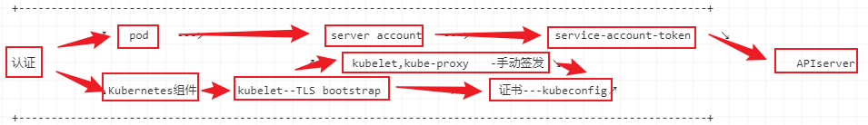
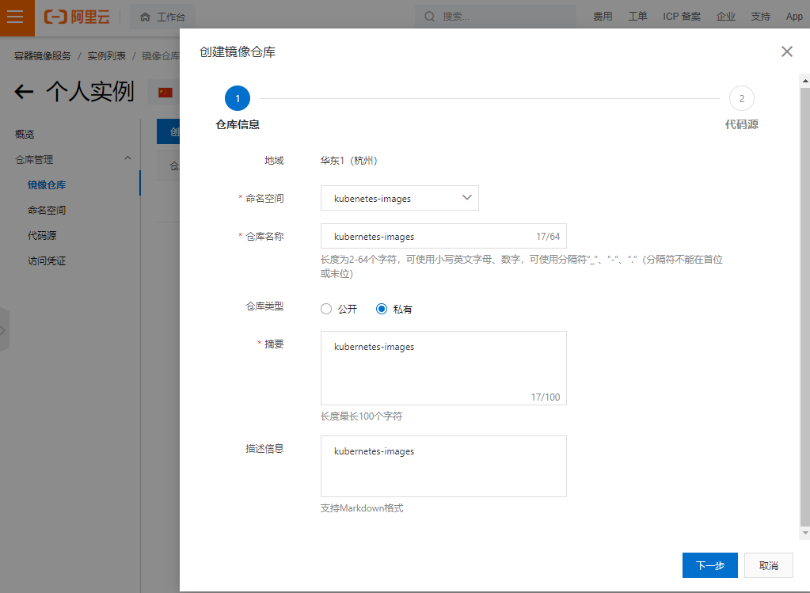

# 环境准备

## 模板设置

### 设置IP

```sh
[root@localhost ~]# vi /etc/sysconfig/network-scripts/ifcfg-eth0 

TYPE=Ethernet
PROXY_METHOD=none
BROWSER_ONLY=no
BOOTPROTO=static
DEFROUTE=yes
IPV4_FAILURE_FATAL=no
IPV6INIT=yes
IPV6_AUTOCONF=yes
IPV6_DEFROUTE=yes
IPV6_FAILURE_FATAL=no
IPV6_ADDR_GEN_MODE=stable-privacy
NAME=eth0
UUID=0a4b2dfd-982a-4ba8-9ed4-9bae61730249
DEVICE=eth0
ONBOOT=yes
IPADDR=172.16.0.30
PREFIX=24
GATEWAY=172.16.0.1

[root@localhost ~]# echo -e "nameserver 8.8.4.4\nnameserver 114.114.114.114" >>/etc/resolv.conf 
[root@localhost ~]# cat /etc/resolv.conf 
# Generated by NetworkManager
nameserver 8.8.4.4
nameserver 114.114.114.114
[root@localhost ~]# ping -c 3 www.baidu.com
PING www.a.shifen.com (183.232.231.174) 56(84) bytes of data.
64 bytes from 183.232.231.174 (183.232.231.174): icmp_seq=1 ttl=56 time=30.6 ms
64 bytes from 183.232.231.174 (183.232.231.174): icmp_seq=2 ttl=56 time=34.5 ms
64 bytes from 183.232.231.174 (183.232.231.174): icmp_seq=3 ttl=56 time=34.2 ms

--- www.a.shifen.com ping statistics ---
3 packets transmitted, 3 received, 0% packet loss, time 2007ms
rtt min/avg/max/mdev = 30.612/33.138/34.506/1.800 ms
```

### 优化

```sh
 [root@localhost ~]# vi /etc/bashrc 
 ...
  # You might want to have e.g. tty in prompt (e.g. more virtual machines)
  # and console windows
  # If you want to do so, just add e.g.
  # if [ "$PS1" ]; then
  #   PS1="[\u@\h:\l \W]\\$ "
      PS1='[\[\e[31;40m\]\u\[\e[33;40m\]@\[\e[34;40m\]\h \[\e[33;40m\]\w\[\e[0m\]]\$ '
  # fi
  # to your custom modification shell script in /etc/profile.d/ directory
...
[root@localhost ~]# source /etc/bashrc 
```


```sh
[root@localhost ~]# vi /etc/issue
+--------------------------------------------------------------------------+
                              .       .
                             / `.   .' "
                     .---.  <    > <    >  .---.
                     |    \  \ - ~ ~ - /  /    |
         _____          ..-~             ~-..-~
        |     |   \~~~\.'                    `./~~~/
       ---------   \__/                        \__/
      .'  O    \     /               /       \  "
     (_____,    `._.'               |         }  \/~~~/
      `----.          /       }     |        /    \__/
            `-.      |       /      |       /      `. ,~~|
                ~-.__|      /_ - ~ ^|      /- _      `..-'
                     |     /        |     /     ~-.     `-. _  _  _
                     |_____|        |_____|         ~ - . _ _ _ _ _>


+--------------------------------------------------------------------------+

               IP:\4               Tel:181****0256

+--------------------------------------------------------------------------+           
```

```sh
[root@localhost ~]# vi /etc/rc.d/rc.local 
#!/bin/bash

touch /var/lock/subsys/local
echo -e "\033[41;37m Hostname : \033[0m \033[32m $(hostname -s) \033[0m" >/etc/motd
echo -e "\033[43;37m IP  Addr : \033[0m \033[32m $(hostname -i) \033[0m"  >>/etc/motd
echo -e "\033[44;37m DataTime : \033[0m \033[32m $(date +%F_%H:%M:%S) \033[0m" >>/etc/motd 
```

reboot


这里后期正式发布之后会添加host 到hosts文件

### grub加密

加密是为了系统安全

```sh
[root@localhost ~]# grub2-setpassword 
Enter password: 
Confirm password: 
```

### 安装常用软件

```sh
[root@localhost ~]# yum install -y tree nmap dos2unix lrzsz nc lsof wget tcpdump htop iftop iotop sysstat nethogs psmisc net-tools bash-completion vim-enhanced bind-utils psmisc net-tools bash-completion vim-enhanced

[root@localhost ~]#  yum install -y git iptables conntrack ipvsadm ipset jq sysstat libseccomp

```

### vim 个性化

```sh
[root@localhost ~]# vi .vimrc
"设置行号"
"set nu"
"自动语法高亮"
"syntax on
"自动缩进"
"set autoindent"
"关闭兼容模式"
"set nocompatible
"激活鼠标"
"set mouse=c"
"开启语法"
"syntax enable
"tab缩进4个空格"
"set tabstop=4"
"设定<< >>移动宽度4"
"set shiftwidth=4
"自动缩进"
"set ai
"智能缩进"
"set si
"显示标尺"
"set ruler
"显示匹配的[]{}"
"set showmatch
"编码设置"
set encoding=utf-8
set fileencodings=utf-t
set termencoding=utf-8
"开启新行时使用智能自动缩进"
"set smartindent
"set cin
"set showmatch
"背景色"
"set background=dark"
"设置光标下划线"
set cursorline

map <F10> : set paste <cr>
map <F11> : set nopaste <cr>

autocmd BufNewFile *.sh exec ":call AddUsr()"
map <F7> ms:call AddTitle()<cr>'s

function AddAuthor()
        let n=1
        while n < 5
                let line = getline(n)
                if line =~'^\s*\*\s*\S*Last\s*modified\s*:\s*\S*.*$'
                        call UpdateTitle()
                        return
                endif
                let n = n + 1
        endwhile
        call AddTitle()
endfunction

function UpdateTitle()
        normal m'
        execute '/* Last modified\s*:/s@:.*$@\=strftime(": %Y-%m-%d %H:%M")@'
        normal "
        normal mk
        execute '/* Filename\s*:/s@:.*$@\=": ".expand("%:t")@'
        execute "noh"
        normal 'k
        echohl WarningMsg | echo "Successful in updating the copy right." | echohl None
endfunction

function AddTitle()
        call append(0,"#!/bin/bash")
        call append(1,"#----------------------------------------------")
        call append(2,"# Author        : 349925756")
        call append(3,"# Email         : 349925756@qq.com")
        call append(4,"# Last modified : ".strftime("%Y-%m-%d %H:%M"))
        call append(5,"# Filename      : ".expand("%:t"))
        call append(6,"# Description   : ")
        call append(7,"# Version       : 1.1 ")
        call append(8,"#----------------------------------------------")
        call append(9," ")
    	call append(10,"#Notes:  ")
        echohl WarningMsg | echo "Successful in adding the copyright." | echohl None

endfunction

function AddUsr()
        call append(0,"#!/bin/bash")
endfunction
```

### 添加镜像源

阿里镜像源：https://developer.aliyun.com/mirror/centos?spm=a2c6h.13651102.0.0.3e221b11rhoPuA

```sh
[root@localhost ~]# mv /etc/yum.repos.d/CentOS-Base.repo /etc/yum.repos.d/CentOS-Base.repo.backup
[root@localhost ~]# wget -O /etc/yum.repos.d/CentOS-Base.repo https://mirrors.aliyun.com/repo/Centos-7.repo
[root@localhost ~]# yum clean all ; yum makecache

epel
[root@localhost ~]# wget -O /etc/yum.repos.d/epel.repo http://mirrors.aliyun.com/repo/epel-7.repo
[root@localhost ~]# yum clean all ; yum makecache
```


### 优化脚本

#### 网络优化

```sh
[root@localhost ~]# mkdir -p /server/{script,soft};cd /server/script/
[root@localhost /server/script]# vim uuid.sh
#!/bin/bash
path_eth0="/etc/sysconfig/network-scripts/ifcfg-eth0"

sed -i "/UUID/c UUID=$(uuidgen)" $path_eth0
sed -i "s/$1/$2/g" $path_eth0
echo "$3" >/etc/hostname
systemctl stop firewalld ; systemctl disable firewalld
sed -i "s/SELINUX=.*/SELINUX=disabled/g" /etc/selinux/config
\cp /usr/share/zoneinfo/Asia/Shanghai /etc/localtime
systemctl enable chronyd
sed -ri 's/.*swap.*/#&/' /etc/fstab 
reboot
                                                                              
```

### 内核升级

```sh
[root@localhost /server/script]# uname -r
3.10.0-1160.el7.x86_64
[root@localhost /server/script]# rpm --import https://www.elrepo.org/RPM-GPG-KEY-elrepo.org
[root@localhost /server/script]# yum install https://www.elrepo.org/elrepo-release-7.el7.elrepo.noarch.rpm -y
查看当前支持内核
[root@localhost /server/script]# yum --disablerepo="*" --enablerepo="elrepo-kernel" list available
Loaded plugins: fastestmirror
Loading mirror speeds from cached hostfile
 * elrepo-kernel: mirror-hk.koddos.net
elrepo-kernel                                             | 3.0 kB  00:00:00     
elrepo-kernel/primary_db                                  | 2.0 MB  00:00:00     
Available Packages
kernel-lt.x86_64                      5.4.158-1.el7.elrepo      elrepo-kernel
kernel-lt-devel.x86_64                5.4.158-1.el7.elrepo      elrepo-kernel
kernel-lt-doc.noarch                  5.4.158-1.el7.elrepo      elrepo-kernel
kernel-lt-headers.x86_64              5.4.158-1.el7.elrepo      elrepo-kernel
kernel-lt-tools.x86_64                5.4.158-1.el7.elrepo      elrepo-kernel
kernel-lt-tools-libs.x86_64           5.4.158-1.el7.elrepo      elrepo-kernel
kernel-lt-tools-libs-devel.x86_64     5.4.158-1.el7.elrepo      elrepo-kernel
kernel-ml.x86_64                      5.15.1-1.el7.elrepo       elrepo-kernel
kernel-ml-devel.x86_64                5.15.1-1.el7.elrepo       elrepo-kernel
kernel-ml-doc.noarch                  5.15.1-1.el7.elrepo       elrepo-kernel
kernel-ml-headers.x86_64              5.15.1-1.el7.elrepo       elrepo-kernel
kernel-ml-tools.x86_64                5.15.1-1.el7.elrepo       elrepo-kernel
kernel-ml-tools-libs.x86_64           5.15.1-1.el7.elrepo       elrepo-kernel
kernel-ml-tools-libs-devel.x86_64     5.15.1-1.el7.elrepo       elrepo-kernel
perf.x86_64                           5.15.1-1.el7.elrepo       elrepo-kernel
python-perf.x86_64                    5.15.1-1.el7.elrepo       elrepo-kernel

mainline    ml   主线包
longterm    lt    长期维护版  
stable               稳定版
linux-next 、 snapshot  快照

[root@localhost /server/script]# yum --enablerepo=elrepo-kernel install kernel-ml -y
reboot
手动选择最新的内核启动
[root@localhost ~]# uname -sr
Linux 5.15.1-1.el7.elrepo.x86_64

[root@localhost ~]# cp /etc/default/grub{,.bak} 
[root@localhost ~]#  vim /etc/default/grub 

GRUB_TIMEOUT=5
GRUB_DISTRIBUTOR="$(sed 's, release .*$,,g' /etc/system-release)"
GRUB_DEFAULT=0                                                                                             
GRUB_DISABLE_SUBMENU=true
GRUB_TERMINAL_OUTPUT="console"
GRUB_CMDLINE_LINUX="crashkernel=auto spectre_v2=retpoline rd.lvm.lv=centos/root rd.lvm.lv=centos/swap biosdevname=0 net.ifnames=0 rhgb quiet"
GRUB_DISABLE_RECOVERY="true"

重新创建内核配置
[root@localhost ~]# grub2-mkconfig -o /boot/grub2/grub.cfg
Generating grub configuration file ...
Found linux image: /boot/vmlinuz-5.15.1-1.el7.elrepo.x86_64
Found initrd image: /boot/initramfs-5.15.1-1.el7.elrepo.x86_64.img
Found linux image: /boot/vmlinuz-3.10.0-1160.el7.x86_64
Found initrd image: /boot/initramfs-3.10.0-1160.el7.x86_64.img
Found linux image: /boot/vmlinuz-0-rescue-84e06ad5fa304d899864b1bd998d6cf1
Found initrd image: /boot/initramfs-0-rescue-84e06ad5fa304d899864b1bd998d6cf1.img
done

删除不需要的开机引导菜单
[root@localhost ~]# yum -y remove `rpm -qa |grep kernel|grep -v 5.15`
```

### 内核参数优化

> 打开内核配置文件
>
> 命令：vim /etc/sysctl.d/99-sysctl.conf
>
> 将以下配置输入进去：
>
> \#关闭ipv6
> net.ipv6.conf.all.disable_ipv6 = 1
> net.ipv6.conf.default.disable_ipv6 = 1
>
> \# 避免放大攻击
> net.ipv4.icmp_echo_ignore_broadcasts = 1
>
> \# 开启恶意icmp错误消息保护
> net.ipv4.icmp_ignore_bogus_error_responses = 1
>
> \# 关闭路由转发
> net.ipv4.ip_forward = 0
> net.ipv4.conf.all.send_redirects = 0
> net.ipv4.conf.default.send_redirects = 0
>
> \#开启反向路径过滤
> net.ipv4.conf.all.rp_filter = 1
> net.ipv4.conf.default.rp_filter = 1
>
> 关闭sysrq功能
> kernel.sysrq = 0
>
> \#core文件名中添加pid作为扩展名
> kernel.core_uses_pid = 1
> net.ipv4.tcp_syncookies = 1
>
> \#修改消息队列长度
> kernel.msgmnb = 65536
> kernel.msgmax = 65536
>
> \#设置最大内存共享段大小bytes
> kernel.shmmax = 68719476736
> kernel.shmall = 4294967296
>
> \#timewait的数量，默认180000
> net.ipv4.tcp_max_tw_buckets = 6000
> net.ipv4.tcp_sack = 1
> net.ipv4.tcp_window_scaling = 1
> net.ipv4.tcp_rmem = 4096    87380  4194304
> net.ipv4.tcp_wmem = 4096    16384  4194304
> net.core.wmem_default = 8388608
> net.core.rmem_default = 8388608
> net.core.rmem_max = 16777216
> net.core.wmem_max = 16777216
> net.core.netdev_max_backlog = 262144
>
> 
>
> \#限制仅仅是为了防止简单的DoS 攻击
> net.ipv4.tcp_max_orphans = 3276800
>
> \#未收到客户端确认信息的连接请求的最大值
> net.ipv4.tcp_max_syn_backlog = 262144
> net.ipv4.tcp_timestamps = 0
>
> \#内核放弃建立连接之前发送SYNACK 包的数量
> net.ipv4.tcp_synack_retries = 1
>
> \#内核放弃建立连接之前发送SYN 包的数量
> net.ipv4.tcp_syn_retries = 1
>
> \#启用timewait 快速回收
> net.ipv4.tcp_tw_recycle = 1
>
> \#开启重用。允许将TIME-WAIT sockets 重新用于新的TCP连接
> net.ipv4.tcp_tw_reuse = 1
> net.ipv4.tcp_mem = 94500000 915000000 927000000
> net.ipv4.tcp_fin_timeout = 1
>
> \#当keepalive 起用的时候，TCP 发送keepalive 消息的频度。缺省是2 小时
> net.ipv4.tcp_keepalive_time = 30
>
> \#允许系统打开的端口范围
> net.ipv4.ip_local_port_range = 1024  65000
>
> \#修改防火墙表大小，默认65536
> net.netfilter.nf_conntrack_max=655350
> net.netfilter.nf_conntrack_tcp_timeout_established=1200
>
> \# 确保无人能修改路由表
> net.ipv4.conf.all.accept_redirects = 0
> net.ipv4.conf.default.accept_redirects = 0
> net.ipv4.conf.all.secure_redirects = 0
> net.ipv4.conf.default.secure_redirects = 0
>
> 
>
> 然后保存退出之后执行sysctl -p是参数生效，永久生效
>
> 命令：sysctl -p

```sh
[root@localhost ~]# sysctl -p /etc/sysctl.d/k8s.conf 
net.ipv6.conf.all.disable_ipv6 = 1
net.ipv6.conf.default.disable_ipv6 = 1
net.ipv4.icmp_echo_ignore_broadcasts = 1
kernel.msgmnb = 65536
kernel.msgmax = 65536
```

### IPVS

```sh
[root@localhost ~]# yum install ipvsadm -y
Loaded plugins: fastestmirror
Loading mirror speeds from cached hostfile
 * base: mirrors.aliyun.com
 * elrepo: mirror-hk.koddos.net
 * extras: mirrors.aliyun.com
 * updates: mirrors.aliyun.com
Package ipvsadm-1.27-8.el7.x86_64 already installed and latest version
Nothing to do
[root@localhost ~]# ipvsadm
IP Virtual Server version 1.2.1 (size=4096)
Prot LocalAddress:Port Scheduler Flags
  -> RemoteAddress:Port           Forward Weight ActiveConn InActConn
[root@localhost ~]# lsmod |grep ip_vs
ip_vs                 159744  0 
nf_conntrack          155648  1 ip_vs
nf_defrag_ipv6         24576  2 nf_conntrack,ip_vs
libcrc32c              16384  3 nf_conntrack,xfs,ip_vs
```

制作模板，克隆

### 规划一览表

|         主机名         |  master01   |  master02   |  master03   |   node01    |   node02    |
| :--------------------: | :---------: | :---------: | :---------: | :---------: | :---------: |
|         **IP**         | 172.16.0.31 | 172.16.0.32 | 172.16.0.33 | 172.16.0.34 | 172.16.0.35 |
|       **nginx**        |      √      |      √      |      √      |      -      |      -      |
|     **keepalived**     |      √      |      √      |      √      |      -      |      -      |
|     **api server**     |      √      |      √      |      √      |      -      |      -      |
| **controller-manager** |      √      |      √      |      √      |      -      |      -      |
|     **scheduler**      |      √      |      √      |      √      |      -      |      -      |
|      **kubelet**       |      √      |      √      |      √      |      √      |      √      |
|     **kube-proxy**     |      √      |      √      |      √      |      √      |      √      |
|       **harbor**       |      √      |      -      |      -      |      -      |      -      |
|       **cfssl**        |      √      |      -      |      -      |      -      |      -      |
|        **etcd**        |      √      |      √      |      √      |      -      |      -      |

# 部署

## 创建软件目录

```sh
master{01..03}
mkdir -p  /opt/{etcd,kubernetes}/{cfg,ssl,logs} \
               ~/.kube \
               /opt/cni/bin \
               /etc/cni/net.d

node
mkdir -p /opt/kubernetes/{cfg,ssl,logs} \
               /opt/cni/bin \
               /etc/cni/net.d
```

| 目录路径             | 说明                    |
| -------------------- | ----------------------- |
| ~/tls                | TLS证书创建目录         |
| /opt/etcd/cfg        | etcd配置文件            |
| /opt/etcd/ssl        | etcd证书文件            |
| /opt/kubernetes/ssl  | kubernetes 证书文件     |
| /opt/kubernetes/cfg  | kubernetes 配置文件     |
| /opt/kubernetes/logs | kubernetes 日志文件     |
| /opt/cni/bin         | CNI插件命令             |
| /etc/cni/net.d       | 存放cni桥接网卡配置文件 |

## 创建互信脚本

```sh
echo -e "172.16.0.31 master01\n172.16.0.32 master02\n172.16.0.33 master03\n172.16.0.35 node01\n172.16.0.36 node02" >>/etc/hosts
```

### 互信脚本

```sh
[root@master01 ~]# ssh-keygen -t rsa -b 4096

[root@master01 ~]# vim /server/script/push_ssh.sh
#!/bin/bash
hosts=(master01 master02 master03 node01 node02)
rpm -qa |grep sshpass  1>/dev/null
[ $? -ne 0 ] && yum install -y sshpass

for h in ${hosts[@]};
do
    echo -e "---------------\033[41;37m  HostName:$h pub-key start\033[0m-----------------";
    sshpass -p$1 ssh-copy-id -i ~/.ssh/id_rsa.pub ${h} "-o StrictHostKeyChecking=no" 2>/dev/null;          
    echo -e "---------------\033[44;37m  HostName:$h pub-key successfull\033[0m-----------------";
done

[root@master01 ~]# . /server/script/push_ssh.sh ***** 

```

### 检查互信

```sh
[root@master01 ~]# vim /server/script/check_ssh.sh
#!/bin/bash
hosts=(master01 master02 master03 node01 node02)

for i in ${hosts[@]}
do
  ssh $i hostname -s                                                                 
done
~      
[root@master01 ~]# . /server/script/check_ssh.sh 
master01
master02
master03
node01
node02
```


## 二进制软件准备

| **名称**           | **下载页面**                                                 |
| ------------------ | ------------------------------------------------------------ |
| **Centos**         | https://www.centos.org/download/    #系统下载                |
| **Docker**         | https://download.docker.com/linux/static/stable/x86_64/      |
| **docker-compose** | https://github.com/docker/compose/releases/                  |
| **Kubernetes**     | https://github.com/kubernetes                                |
| **Calico**         | https://docs.projectcalico.org/getting-started/kubernetes/self-managed-onprem/onpremises |
| **Coredns**        | https://github.com/kubernetes/kubernetes/tree/master/cluster/addons/dns/coredns |
| **Dashboard**      | https://github.com/kubernetes/dashboard/releases             |
| **cfssl**          | https://github.com/cloudflare/cfssl/releases                 |
| **Etcd**           | https://github.com/etcd-io/etcd/releases                     |
| **CNI**            | https://github.com/containernetworking/plugins/releases      |
| **calicoctl**      | https://github.com/projectcalico/calicoctl/releases          |
| **harbor**         | https://github.com/goharbor/harbor/releases                  |

### 上传所需软件包

```sh
[root@master01 /server/soft]# ll
total 1097748
-rw-r--r-- 1 root root  16659824 Nov 11 09:48 cfssl_1.6.1_linux_amd64
-rw-r--r-- 1 root root  13502544 Nov 11 09:48 cfssl-certinfo_1.6.1_linux_amd64
-rw-r--r-- 1 root root  11029744 Nov 11 09:48 cfssljson_1.6.1_linux_amd64
-rw-r--r-- 1 root root  36939510 Nov 11 09:48 cni-plugins-linux-amd64-v1.0.1.tgz
-rw-r--r-- 1 root root      5060 Nov 11 09:48 coredns.yaml.base
-rw-r--r-- 1 root root      6878 Nov 11 09:48 dashboard.yaml
-rw-r--r-- 1 root root    116318 Nov 11 09:53 docker
-rw-r--r-- 1 root root  63350495 Nov 11 09:48 docker-20.10.9.tgz
-rw-r--r-- 1 root root     12140 Nov 11 09:53 docker-compose
-rw-r--r-- 1 root root  24637440 Nov 11 09:48 docker-compose-linux-x86_64
-rw-r--r-- 1 root root  19399491 Nov 11 09:48 etcd-v3.5.1-linux-amd64.tar.gz
-rw-r--r-- 1 root root 607432634 Nov 11 09:49 harbor-offline-installer-v2.3.4-rc1.tgz
-rw-r--r-- 1 root root      7168 Nov 11 09:47 kube-dns.yaml.base
-rw-r--r-- 1 root root 330972604 Nov 11 09:48 kubernetes-server-linux-amd64.tar.gz

[root@master01 /server/soft]# chmod +x cfssl* docker-compose-linux-x86_64 
[root@master01 /server/soft]# ll
total 1097748
-rwxr-xr-x 1 root root  16659824 Nov 11 09:48 cfssl_1.6.1_linux_amd64
-rwxr-xr-x 1 root root  13502544 Nov 11 09:48 cfssl-certinfo_1.6.1_linux_amd64
-rwxr-xr-x 1 root root  11029744 Nov 11 09:48 cfssljson_1.6.1_linux_amd64
-rw-r--r-- 1 root root  36939510 Nov 11 09:48 cni-plugins-linux-amd64-v1.0.1.tgz
-rw-r--r-- 1 root root      5060 Nov 11 09:48 coredns.yaml.base
-rw-r--r-- 1 root root      6878 Nov 11 09:48 dashboard.yaml
-rw-r--r-- 1 root root    116318 Nov 11 09:53 docker
-rw-r--r-- 1 root root  63350495 Nov 11 09:48 docker-20.10.9.tgz
-rw-r--r-- 1 root root     12140 Nov 11 09:53 docker-compose
-rwxr-xr-x 1 root root  24637440 Nov 11 09:48 docker-compose-linux-x86_64
-rw-r--r-- 1 root root  19399491 Nov 11 09:48 etcd-v3.5.1-linux-amd64.tar.gz
-rw-r--r-- 1 root root 607432634 Nov 11 09:49 harbor-offline-installer-v2.3.4-rc1.tgz
-rw-r--r-- 1 root root      7168 Nov 11 09:47 kube-dns.yaml.base
-rw-r--r-- 1 root root 330972604 Nov 11 09:48 kubernetes-server-linux-amd64.tar.gz

```

#### 移动所需的命令

```sh
[root@master01 /server/soft]# mv cfssl_1.6.1_linux_amd64 /usr/local/bin/cfssl
[root@master01 /server/soft]# mv cfssljson_1.6.1_linux_amd64 /usr/local/bin/cfssljson
[root@master01 /server/soft]# mv cfssl-certinfo_1.6.1_linux_amd64 /usr/local/bin/cfssl-certinfo
[root@master01 /server/soft]# mv docker-compose-linux-x86_64 /usr/local/bin/docker-compose
```


## 创建证书

```sh
[root@master01 ~]# mkdir -p ~/tls ;cd ~/tls
```


### CA

```
cat > ca-csr.json <<EOF
{
    "CN": "CA",
    "key": {
        "algo": "rsa",
        "size": 2048
    },
   "names": [
        {
            "C": "CN",
            "ST": "Yunnan",
            "L": "Kunming",
            "O": "CA",
            "OU": "System"
        }                                                                                                                    
    ]
}
EOF

[root@master01 ~/tls]# cfssl gencert -initca ca-csr.json | cfssljson -bare ca - 

#ca配置文件，以下的证书都是通过这个证书颁发的
cat > ca-config.json << EOF
{
    "signing": {
        "default": {
            "expiry": "87600h"
        },
        "profiles": {
            "etcd": {
                "expiry": "87600h",
                "usages": [
                    "signing",
                    "key encipherment",
                    "server auth",
                    "client auth"
                ]
            },
            "kubernetes": {
                "expiry": "87600h",
                "usages": [
                    "signing",
                    "key encipherment",
                    "server auth",
                    "client auth"
                ]
            }
        }
    }
}
EOF
```


### ETCD

```sh
cat > etcd-csr.json <<EOF
{
    "CN": "etcd-ca",
    "hosts": [
        "localhost",
        "127.0.0.1",
        "master01",
        "master02",
        "master03",
        "172.16.0.31",
        "172.16.0.32",
        "172.16.0.33",
        "172.16.0.34"
    ],
    "key": {
        "algo": "rsa",
        "size": 2048
    },
    "names": [
        {
            "C": "CN",
            "ST": "Yunnan",
            "L": "Kunming"
        }
    ]
}
EOF

[root@master01 ~/tls]# cfssl gencert -ca=ca.pem -ca-key=ca-key.pem -config=ca-config.json -profile=etcd etcd-csr.json | cfssljson -bare etcd

```

### admin

管理员访问

```SH
cat > admin-csr.json <<EOF
{
  "CN": "kubernetes-admin",
  "key": {
    "algo": "rsa",
    "size": 2048
  },
  "names": [
    {
      "C": "CN",
      "L": "Kunming",
      "O": "system:masters",
      "OU": "System",
      "ST": "Yunnan"
    }
  ]
}
EOF

[root@master01 ~/tls]# cfssl gencert -ca=ca.pem  -ca-key=ca-key.pem -config=ca-config.json -profile=kubernetes admin-csr.json | cfssljson -bare admin

```

### kubelet

```sh
hosts=(master01 master02 master03 node01 node02)
for i in ${hosts[@]};do
cat > ${i}-csr.json <<EOF
{
  "CN": "system:node:${i}",
   "hosts": [
   "localhost",
    "127.0.0.1",
    "172.16.0.31",
    "172.16.0.32",
    "172.16.0.33",
    "172.16.0.34",
    "172.16.0.35",
    "172.16.0.36",
    "172.16.0.37",
    "172.16.0.38",
    "master01",
    "master02",
    "master03",
    "node01",
    "node02"
  ],
  "key": {
    "algo": "rsa",
    "size": 2048
  },
  "names": [
    {
      "C": "CN",
      "L": "Kunming",
      "O": "system:nodes",
      "OU": "System",
      "ST": "Yunnan"
    }
  ]
}
EOF

cfssl gencert -ca=ca.pem -ca-key=ca-key.pem -config=ca-config.json -profile=kubernetes ${i}-csr.json | cfssljson -bare ${i}
done
```

### kube-controller-manager

```sh
cat > kube-controller-manager-csr.json <<EOF
{
  "CN": "system:kube-controller-manager",
  "key": {
    "algo": "rsa",
    "size": 2048
  },
  "names": [
    {
      "C": "CN",
      "L": "Kunming",
      "O": "system:kube-controller-manager",
      "OU": "System",
      "ST": "Yunnan"
    }
  ]
}
EOF

[root@master01 ~/tls]# cfssl gencert -ca=ca.pem -ca-key=ca-key.pem -config=ca-config.json -profile=kubernetes kube-controller-manager-csr.json | cfssljson -bare kube-controller-manager

```

### kube-scheduler

```sh
cat > kube-scheduler-csr.json <<EOF
{
  "CN": "system:kube-scheduler",
  "key": {
    "algo": "rsa",
    "size": 2048
  },
  "names": [
    {
      "C": "CN",
      "L": "Kunming",
      "O": "system:kube-scheduler",
      "OU": "System",
      "ST": "Yunnan"
    }
  ]
}
EOF

[root@master01 ~/tls]# cfssl gencert -ca=ca.pem -ca-key=ca-key.pem -config=ca-config.json -profile=kubernetes kube-scheduler-csr.json | cfssljson -bare kube-scheduler

```

### kube-apiserver

```sh
cat > kube-apiserver-csr.json <<EOF
{
  "CN": "kube-apiserver",
  "hosts": [
  "127.0.0.1",
  "10.0.0.1",
  "172.16.0.31",
  "172.16.0.32",
  "172.16.0.33",
  "172.16.0.34",
  "172.16.0.35",
  "172.16.0.36",
  "172.16.0.37",
  "172.16.0.38",
  "master01",
  "master02",
  "master03",
  "node01",
  "node02",
  "kubernetes",
  "kubernetes.default",
  "kubernetes.default.svc",
  "kubernetes.default.svc.cluster",
  "kubernetes.default.svc.cluster.local"
  ],
  "key": {
    "algo": "rsa",
    "size": 2048
  },
  "names": [
    {
      "C": "CN",
      "L": "Kunming",
      "O": "system:masters",
      "OU": "System",
      "ST": "Yunnan"
    }
  ]
}
EOF

[root@master01 ~/tls]# cfssl gencert -ca=ca.pem -ca-key=ca-key.pem -config=ca-config.json  -profile=kubernetes kube-apiserver-csr.json | cfssljson -bare kube-apiserver

```

### kube-proxy

```sh
cat > kube-proxy-csr.json <<EOF
{
  "CN": "system:kube-proxy",
  "key": {
    "algo": "rsa",
    "size": 2048
  },
  "names": [
    {
      "C": "CN",
      "L": "Kunming",
      "O": "system:node-proxy",
      "OU": "System",
      "ST": "Yunnan"
    }
  ]
}
EOF

[root@master01 ~/tls]# cfssl gencert -ca=ca.pem -ca-key=ca-key.pem -config=ca-config.json -profile=kubernetes kube-proxy-csr.json | cfssljson -bare kube-proxy

```

### service-account

```sh
cat > service-account-csr.json <<EOF
{
  "CN": "service-accounts",
  "key": {
    "algo": "rsa",
    "size": 2048
  },
  "names": [
    {
      "C": "CN",
      "L": "Kunming",
      "O": "system:masters",
      "OU": "System",
      "ST": "Yunnan"
    }
  ]
}
EOF

[root@master01 ~/tls]# cfssl gencert -ca=ca.pem -ca-key=ca-key.pem -config=ca-config.json -profile=kubernetes service-account-csr.json | cfssljson -bare service-account

```

### 检查证书信息

```sh
[root@master01 ~/tls]# for i in `ls *.pem|grep -v key`;do openssl verify -CAfile ca.pem  $i;done
admin.pem: OK
ca.pem: OK
etcd.pem: OK
kube-apiserver.pem: OK
kube-controller-manager.pem: OK
kube-proxy.pem: OK
kube-scheduler.pem: OK
master01.pem: OK
master02.pem: OK
master03.pem: OK
node01.pem: OK
node02.pem: OK
service-account.pem: OK

#检查是否可以再生成证书许可
[root@master01 ~/tls]# for i in `ls *.pem|grep -v key`;do openssl x509 -in $i -text -noout |grep CA:;done
                CA:FALSE
                00:71:AF:6C:6C:74:CA:7D:BB:CE:6A:DB:F2:86:2B:C4:5E:9F:43:57
                CA:TRUE
                CA:FALSE
                CA:FALSE
                CA:FALSE
                CA:FALSE
                CA:FALSE
                CA:FALSE
                CA:FALSE
                CA:FALSE
                CA:FALSE
                CA:FALSE
                CA:FALSE

```

### 分发证书

```sh
#client
hosts=(master01 master02 master03 node01 node02)
for i in ${hosts[@]};do echo -e "\033[41;37m ${i} \033[0m" ;scp ca.pem ${i}.pem ${i}-key.pem ${i}:/opt/kubernetes/ssl;done
```


```sh
#server
hosts=(master01 master02 master03)
for i in ${hosts[@]};do echo -e "\033[43;37m ${i} \033[0m";scp ca-key.pem kube-apiserver*.pem kube-scheduler*.pem kube-controller*.pem service-account*.pem admin*.pem ${i}:/opt/kubernetes/ssl;done
```


```sh
#etcd
hosts=(master01 master02 master03)
for i in ${hosts[@]};do echo -e "\033[44;37m ${i} \033[0m";scp ca*.pem etcd*.pem ${i}:/opt/etcd/ssl;done
```


## etcd部署

```sh
[root@master01 /server/soft]# tar xf etcd-v3.5.1-linux-amd64.tar.gz 
[root@master01 /server/soft]# cp etcd-v3.5.1-linux-amd64/etcd* /usr/local/bin/

[root@master01 /server/soft]# for i in master{01..03};do scp etcd-v3.5.1-linux-amd64/etcd* $i:/usr/local/bin/ ;done
```


### server

master{01..03}

```sh
ETCD_IP=$(hostname -i)
ETCD_NAME=$(hostname -s)
ETCD_PATH="/opt/etcd/ssl/"

cat > /etc/systemd/system/etcd.service <<EOF
[Unit]
Description=ETCD Server
Documentation=https://github.com/coreos/etcd
After=network.target
After=network-online.target
Wants=network-online.target

[Service]
Type=notify
ExecStart=/usr/local/bin/etcd --name ${ETCD_NAME} \\
  --cert-file ${ETCD_PATH}etcd.pem \\
  --key-file ${ETCD_PATH}etcd-key.pem \\
  --peer-cert-file ${ETCD_PATH}etcd.pem \\
  --peer-key-file ${ETCD_PATH}etcd-key.pem \\
  --trusted-ca-file ${ETCD_PATH}ca.pem \\
  --peer-trusted-ca-file ${ETCD_PATH}ca.pem \\
  --peer-client-cert-auth \\
  --client-cert-auth \\
  --listen-client-urls https://${ETCD_IP}:2379 \\
  --advertise-client-urls https://${ETCD_IP}:2379 \\
  --listen-peer-urls https://${ETCD_IP}:2380 \\
  --initial-advertise-peer-urls https://${ETCD_IP}:2380 \\
  --initial-cluster master01=https://172.16.0.31:2380,master02=https://172.16.0.32:2380,master03=https://172.16.0.33:2380 \\
  --initial-cluster-token etcd_cluster \\
  --initial-cluster-state new \\
  --data-dir=/var/lib/etcd/default.etcd 
Restart=on-failure

[Install]
WantedBy=multi-user.target
EOF
```

start server master{01..03}

```sh
# systemctl daemon-reload && systemctl start etcd && systemctl enable etcd
```

check_etcd server

```sh
[root@master01 /server/soft]# for host in master{01..03} ;do ssh $host systemctl status etcd | grep Active ;done
   Active: active (running) since Thu 2021-11-11 10:47:18 CST; 1min 0s ago
   Active: active (running) since Thu 2021-11-11 10:47:18 CST; 1min 0s ago
   Active: active (running) since Thu 2021-11-11 10:47:20 CST; 58s ago

[root@master01 /server/soft]# ETCDCTL_API=3 etcdctl \
  --endpoints https://172.16.0.31:2379,https://172.16.0.32:2379,https://172.16.0.33:2379 \
  --cacert /opt/etcd/ssl/ca.pem \
  --cert /opt/etcd/ssl/etcd.pem \
  --key /opt/etcd/ssl/etcd-key.pem \
  endpoint health \
  --write-out=table
```


```sh
[root@master01 /server/soft]# ETCDCTL_API=3 etcdctl member list \
   --endpoints=https://172.16.0.31:2379 \
   --cacert=/opt/etcd/ssl/ca.pem \
   --cert=/opt/etcd/ssl/etcd.pem \
   --key=/opt/etcd/ssl/etcd-key.pem \
     endpoint health \
   --write-out=table
```


较大集群使用负载均衡，使用参数 --etcd-servers=$LB:2379 

## docker

1.20之后不支持docker，但是目前还是很实用

```sh
[root@master01 /server/soft]# tar xf docker-20.10.9.tgz 
[root@master01 /server/soft]# hosts=(master{01..03} node{01,02})
[root@master01 /server/soft]# for i in ${hosts[@]};do echo -e "\033[41;37m $i \033[0m";scp docker/* ${i}:/usr/local/bin/ ;done
```


```sh
cat > /etc/systemd/system/docker.service << EOF
[Unit]
Description=Docker Application Container Engine
Documentation=https://docs.docker.com
After=network-online.target firewalld.service
Wants=network-online.target
[Service]
Type=notify
ExecStart=/usr/local/bin/dockerd
ExecReload=/bin/kill -s HUP $MAINPID
LimitNOFILE=infinity
LimitNPROC=infinity
LimitCORE=infinity
TimeoutStartSec=0
Delegate=yes
KillMode=process
Restart=on-failure
StartLimitBurst=3
StartLimitInterval=60s
[Install]
WantedBy=multi-user.target
EOF


[root@master01 /server/soft]# for i in ${hosts[@]};do scp /etc/systemd/system/docker.service $i:/etc/systemd/system;done
```


start

```
systemctl daemon-reload && systemctl start docker && systemctl enable docker && systemctl status docker |grep Active
```

```sh
[root@master01 /server/soft]# for i in ${hosts[@]};do echo -e "\033[41;37m $i \033[0m";ssh $i systemctl status docker |grep Active ;done
```


### docker-compose

```sh
[root@master01 /server/soft]# hosts=(master{02,03} node{01,02})
[root@master01 /server/soft]# for i in ${hosts[@]};do scp /usr/local/bin/docker-compose $i:/usr/local/bin/;done
```


```sh
[root@master01 /server/soft]# docker --version;docker-compose version
Docker version 20.10.9, build c2ea9bc
Docker Compose version v2.1.1
```

### tab补全

```sh
[root@master01 /server/soft]# yum -y install bash-completion bash-completion-extras
[root@master01 /server/soft]# mkdir docker_tab
[root@master01 /server/soft]# cd docker
[root@master01 /server/soft/docker]# git clone https://github.com/xyz349925756/kubernetes
Cloning into 'kubernetes'...
^C
[root@master01 /server/soft/docker]# git clone git://github.com/xyz349925756/kubernetes
Cloning into 'kubernetes'...
remote: Enumerating objects: 107, done.
remote: Counting objects: 100% (107/107), done.
remote: Compressing objects: 100% (99/99), done.
remote: Total 107 (delta 38), reused 0 (delta 0), pack-reused 0
Receiving objects: 100% (107/107), 557.59 KiB | 241.00 KiB/s, done.
Resolving deltas: 100% (38/38), done.
[root@master01 /server/soft/docker]# cd kubernetes/tab_completion/
[root@master01 /server/soft/docker/kubernetes/tab_completion]# ls
docker  docker-compose  README.md

[root@master01 /server/soft/docker/kubernetes/tab_completion]# cp docker* /usr/share/bash-completion/completions/

[root@master01 /server/soft/docker/kubernetes/tab_completion]# hosts=(master{02,03} node{01,02})
[root@master01 /server/soft/docker/kubernetes/tab_completion]# for i in ${hosts[@]};do scp docker* $i:/usr/share/bash-completion/completions/;done

[root@master01 /server/soft/docker/kubernetes/tab_completion]# source /etc/profile.d/bash_completion.sh 
这里没有生效，重启才生效。。。
```


```sh
[root@master01 ~]# for i in master{01..03} node{01,02};do ssh $i systemctl status docker|grep Active;done
```


这里旧版本是可以优化的，这里就不介绍了。参看：https://cloudb.pub/html/docker.html

### daemon.json

```sh
cat <<EOF | sudo tee /etc/docker/daemon.json
{
  "exec-opts": ["native.cgroupdriver=systemd"],
  "log-driver": "json-file",
  "log-opts": {
    "max-size": "100m"
  },
  "bip":"192.168.0.1/16"
}
EOF

[root@master01 /src/k8s.io/kubernetes/build/pause]# for i in master{01..03} node{01,02};do scp /etc/docker/daemon.json $i:/etc/docker;done

[root@master01 /src/k8s.io/kubernetes/build/pause]# systemctl daemon-reload ;systemctl restart docker.service

[root@master01 ~]# ip a s 
1: lo: <LOOPBACK,UP,LOWER_UP> mtu 65536 qdisc noqueue state UNKNOWN group default qlen 1000
    link/loopback 00:00:00:00:00:00 brd 00:00:00:00:00:00
    inet 127.0.0.1/8 scope host lo
       valid_lft forever preferred_lft forever
2: eth0: <BROADCAST,MULTICAST,UP,LOWER_UP> mtu 1500 qdisc pfifo_fast state UP group default qlen 1000
    link/ether 00:0c:29:08:5f:e3 brd ff:ff:ff:ff:ff:ff
    inet 172.16.0.31/24 brd 172.16.0.255 scope global noprefixroute eth0
       valid_lft forever preferred_lft forever
    inet 172.16.0.37/24 scope global secondary eth0
       valid_lft forever preferred_lft forever
3: docker0: <NO-CARRIER,BROADCAST,MULTICAST,UP> mtu 1500 qdisc noqueue state DOWN group default 
    link/ether 02:42:cd:7e:f4:f2 brd ff:ff:ff:ff:ff:ff
    inet 192.168.0.1/16 brd 192.168.255.255 scope global docker0
       valid_lft forever preferred_lft forever

```


## 负载均衡

### nginx

```sh
[root@master01 /server/soft]# wget http://nginx.org/download/nginx-1.20.1.tar.gz
[root@master01 /server/soft]# tar xf nginx-1.20.1.tar.gz -C /opt/

master{01..03}
[root@master01 /server/soft]# useradd -s /sbin/nologin -M nginx
[root@master01 /server/soft]# yum install -y pcre pcre-devel openssl openssl-devel gcc-c++

master01
[root@master01 /server/soft]# for i in master{02,03};do scp -r /opt/nginx-1.20.1 $i:/opt/ ;done

master{01..03}
[root@master01 /server/soft]# ln -s /opt/nginx-1.20.1/ /opt/nginx
[root@master01 /server/soft]# cd /opt/nginx
[root@master01 /opt/nginx]# ls
auto  CHANGES  CHANGES.ru  conf  configure  contrib  html  LICENSE  man  README  src
[root@master01 /opt/nginx]# ./configure  \
--user=nginx \
--group=nginx \
--prefix=/usr/share/nginx \
--sbin-path=/usr/local/bin \
--conf-path=/etc/nginx/nginx.conf \
--error-log-path=/var/log/nginx/error.log \
--http-log-path=/var/log/nginx/access.log \
--pid-path=/var/run/nginx.pid \
--with-http_stub_status_module \
--with-http_ssl_module \
--with-stream 

[root@master01 /opt/nginx]# make && make install
[root@master01 /opt/nginx]# nginx -v
nginx version: nginx/1.20.1
```

修改配置

```sh
master{01..03}
[root@master01 /opt/nginx]# sed -i "s/#user  nobody;/user  nginx;/g" /etc/nginx/nginx.conf
[root@master01 /opt/nginx]# sed -i '15a include /etc/nginx/conf.d/k8s.conf;' /etc/nginx/nginx.conf
[root@master01 /opt/nginx]# mkdir /etc/nginx/conf.d

master01
[root@master01 /opt/nginx]# vim /etc/nginx/conf.d/k8s.conf

stream {
        log_format  main  '$remote_addr $upstream_addr - [$time_local] $status $upstream_bytes_sent';
    access_log  /var/log/nginx/k8s-access.log  main;

        upstream k8s-apiserver {
                server 172.16.0.31:6443;  
                server 172.16.0.32:6443;  
                server 172.16.0.33:6443;  
                    }                
        server {                                                                                                 
                listen 16443; 
                proxy_pass k8s-apiserver;
                   }
}

[root@master01 /opt/nginx]# for i in master{02,03};do scp /etc/nginx/conf.d/k8s.conf $i:/etc/nginx/conf.d;done
```


systemctl

```sh
cat >/etc/systemd/system/nginx.service<<EOF 
[Unit]
Description=Nginx Server
Documentation=http://nginx.org
After=network.target remote-fs.target nss-lookup.target

[Service]
Type=forking
ExecStartPre=/usr/local/bin/nginx -t
ExecStart=/usr/local/bin/nginx
PIDFile=/var/run/nginx.pid 
ExecReload=/usr/local/bin/nginx -s reload
ExecStop=/usr/local/bin/nginx  -s stop
PrivateTmp=true
[Install]
WantedBy=multi-user.target
EOF

[root@master01 /opt/nginx]# for i in master{02,03};do scp /etc/systemd/system/nginx.service $i:/etc/systemd/system;done
```

start

```sh
systemctl daemon-reload && systemctl start nginx && systemctl enable nginx
```

查看服务

```sh
[root@master01 /opt/nginx]# for i in master{01..03};do ssh $i systemctl status nginx |grep Active;done
   Active: active (running) since Thu 2021-11-11 15:34:27 CST; 13min ago
   Active: active (running) since Thu 2021-11-11 15:34:31 CST; 13min ago
   Active: active (running) since Thu 2021-11-11 15:34:35 CST; 13min ago
```

### keepalive

```sh
master{01..03}
[root@master01 /opt/nginx]# yum install -y keepalived
```

master01

```sh
[root@master01 /opt/nginx]# vim /etc/keepalived/keepalived.conf 

! Configuration File for keepalived

global_defs {
   router_id NGINX_MASTER01
}

vrrp_script check_nginx {
     script "/etc/keepalived/check_nginx.sh"
     }

vrrp_instance VI_1 {
    state MASTER01
    interface eth0
    virtual_router_id 51
    priority 150
    advert_int 1
    authentication {
        auth_type PASS
        auth_pass 1111
    }
    virtual_ipaddress {
        172.16.0.37/24
    }                                                                                                            
track_script {
   check_nginx
   }
}

```

脑裂脚本

```sh
[root@master01 /opt/nginx]# vim /etc/keepalived/check_nginx.sh
#!/bin/bash
count=$(ps -ef|grep -c [n]ginx)
if [ "$count" -le 2 ];then                                                  
    systemctl stop keepalived
fi

[root@master01 /opt/nginx]# chmod +x /etc/keepalived/check_nginx.sh 
```

传

```sh
[root@master01 /opt/nginx]# for i in master{02,03};do scp /etc/keepalived/* $i:/etc/keepalived;done
```

master02

```sh
[root@master02 /opt/nginx]# vim /etc/keepalived/keepalived.conf 

! Configuration File for keepalived

global_defs {
   router_id NGINX_MASTER02
}

vrrp_script check_nginx {
     script "/etc/keepalived/check_nginx.sh"
     }

vrrp_instance VI_1 {
    state MASTER02
    interface eth0
    virtual_router_id 51
    priority 125
    advert_int 1
    authentication {
        auth_type PASS
        auth_pass 1111
    }
    virtual_ipaddress {
        172.16.0.37/24
    }                                                                                                            
track_script {
   check_nginx
   }
}

```

master03

```sh
[root@master03 /opt/nginx]# vim /etc/keepalived/keepalived.conf 

! Configuration File for keepalived

global_defs {
   router_id NGINX_MASTER03
}

vrrp_script check_nginx {
     script "/etc/keepalived/check_nginx.sh"
     }

vrrp_instance VI_1 {
    state MASTER03
    interface eth0
    virtual_router_id 51
    priority 100
    advert_int 1
    authentication {
        auth_type PASS
        auth_pass 1111
    }                                                                                                            
    virtual_ipaddress {
        172.16.0.37/24
    }
track_script {
   check_nginx
   }
}

```

start

```sh
systemctl daemon-reload && systemctl start keepalived && systemctl enable keepalived
```

VIP

```sh
[root@master01 /opt/nginx]# ip a s eth0
2: eth0: <BROADCAST,MULTICAST,UP,LOWER_UP> mtu 1500 qdisc pfifo_fast state UP group default qlen 1000
    link/ether 00:0c:29:08:5f:e3 brd ff:ff:ff:ff:ff:ff
    inet 172.16.0.31/24 brd 172.16.0.255 scope global noprefixroute eth0
       valid_lft forever preferred_lft forever
    inet 172.16.0.37/24 scope global secondary eth0
       valid_lft forever preferred_lft forever
```


### 检查服务脚本

```sh
[root@master01 /server/script]# vim check_services.sh
#!/bin/bash
services1=(etcd nginx docker kubelet kube-proxy keepalived kube-apiserver kube-controller-manager kube-scheduler)
services2=(docker kubelet kube-proxy)
hosts1=(master{01..03})
hosts2=(node{01,02})

funtion_services() {
   printf  "\033[33m %25s \033[0m  :  " $i && ssh $h systemctl status $i | grep Active |awk -F"[()]" '{print $2}'
}

for h in ${hosts1[@]};
do
    echo -e "\033[41;37m    $h Services Is Checking......\033[0m"
    for i in ${services1[@]};
    do
       funtion_services
    done
done

for n in ${hosts2[@]};
do
    echo -e "\033[44;37m  $n Services Is Checking......\033[0m"
    for i in ${services2[@]};
    do
       funtion_services
    done
done
```


## kubernetes

文件准备

```sh
[root@master01 /server/soft]# tar xf kubernetes-server-linux-amd64.tar.gz 
[root@master01 /server/soft]# ls 
cni-plugins-linux-amd64-v1.0.1.tgz  etcd-v3.5.1-linux-amd64
coredns.yaml.base                   etcd-v3.5.1-linux-amd64.tar.gz
dashboard.yaml                      harbor-offline-installer-v2.3.4-rc1.tgz
docker                              kube-dns.yaml.base
docker-20.10.9.tgz                  kubernetes
docker-compose                      kubernetes-server-linux-amd64.tar.gz
docker_tab                          nginx-1.20.1.tar.gz
[root@master01 /server/soft]# cd kubernetes/server/bin/
[root@master01 /server/soft/kubernetes/server/bin]# ls
apiextensions-apiserver    kube-apiserver.tar                  kubectl-convert        kube-scheduler
kubeadm                    kube-controller-manager             kubelet                kube-scheduler.docker_tag
kube-aggregator            kube-controller-manager.docker_tag  kube-proxy             kube-scheduler.tar
kube-apiserver             kube-controller-manager.tar         kube-proxy.docker_tag  mounter
kube-apiserver.docker_tag  kubectl                             kube-proxy.tar

[root@master01 /server/soft/kubernetes/server/bin]# for i in master{01..03};do echo -e "\033[41;37m $i \033[0m";scp kube-apiserver kube-controller-manager kube-scheduler $i:/usr/local/bin;done
```


```sh
[root@master01 /server/soft/kubernetes/server/bin]# for i in master{01..03};do echo -e "\033[41;37m $i \033[0m";scp kubeadm kubectl $i:/usr/local/bin;done
```


```sh
[root@master01 /server/soft/kubernetes/server/bin]# hosts=(master{01..03} node{01,02})
[root@master01 /server/soft/kubernetes/server/bin]# for i in ${hosts[@]};do echo -e "\033[41;37m $i \033[0m";scp kubelet kube-proxy $i:/usr/local/bin;done
```


```sh
[root@master01 ~]# kube-apiserver --version
Kubernetes v1.22.3
[root@master01 ~]# kubeadm config images list
k8s.gcr.io/kube-apiserver:v1.22.3
k8s.gcr.io/kube-controller-manager:v1.22.3
k8s.gcr.io/kube-scheduler:v1.22.3
k8s.gcr.io/kube-proxy:v1.22.3
k8s.gcr.io/pause:3.5
k8s.gcr.io/etcd:3.5.0-0
k8s.gcr.io/coredns/coredns:v1.8.4
```

### 生成kubeconfig配置文件

#### kubelet

```sh
[root@master01 ~]# cd tls/
[root@master01 ~/tls]# 

LB_VIP="https://172.16.0.37:16443"
hosts=(master{01..03} node{01,02})

for i in ${hosts[@]}; do
  kubectl config set-cluster kubernetes  \
    --certificate-authority=ca.pem \
    --embed-certs=true \
    --server=${LB_VIP} \
    --kubeconfig=/opt/kubernetes/cfg/${i}.kubeconfig

  kubectl config set-credentials system:node:${i} \
    --client-certificate=${i}.pem \
    --client-key=${i}-key.pem \
    --embed-certs=true \
    --kubeconfig=/opt/kubernetes/cfg/${i}.kubeconfig

  kubectl config set-context default \
    --cluster=kubernetes \
    --user=system:node:${i} \
    --kubeconfig=/opt/kubernetes/cfg/${i}.kubeconfig

  kubectl config use-context default --kubeconfig=/opt/kubernetes/cfg/${i}.kubeconfig
done

[root@master01 ~/tls]# ls /opt/kubernetes/cfg/
master01.kubeconfig  master02.kubeconfig  master03.kubeconfig  node01.kubeconfig  node02.kubeconfig
```



kubernetes 认证有2类

一种是kubernetes组件 controller-manager scheduler kubelet kube-proxy 通过kubeconfig文件认证跟apiserver 接口连接 TLS bootstrap

第二种是内部pod 通过server-account token 跟apiserver连接，然后实现被scheduler调度，controller计算

#### kube-proxy

```sh
KUBE_CONFIG="/opt/kubernetes/cfg/kube-proxy.kubeconfig"
LB_VIP="https://172.16.0.37:16443"

kubectl config set-cluster kubernetes  \
    --certificate-authority=ca.pem \
    --embed-certs=true \
    --server=${LB_VIP} \
    --kubeconfig=${KUBE_CONFIG}

kubectl config set-credentials system:kube-proxy \
    --client-certificate=kube-proxy.pem \
    --client-key=kube-proxy-key.pem \
    --embed-certs=true \
    --kubeconfig=${KUBE_CONFIG}

kubectl config set-context default \
    --cluster=kubernetes \
    --user=system:kube-proxy \
    --kubeconfig=${KUBE_CONFIG}

kubectl config use-context default --kubeconfig=${KUBE_CONFIG}
```

#### kube-controller-manager

```sh
KUBE_CONFIG="/opt/kubernetes/cfg/kube-controller-manager.kubeconfig"

kubectl config set-cluster kubernetes \
    --certificate-authority=ca.pem \
    --embed-certs=true \
    --server=https://127.0.0.1:6443 \
    --kubeconfig=${KUBE_CONFIG}
    
kubectl config set-credentials system:kube-controller-manager \
    --client-certificate=kube-controller-manager.pem \
    --client-key=kube-controller-manager-key.pem \
    --embed-certs=true \
    --kubeconfig=${KUBE_CONFIG}

kubectl config set-context default \
    --cluster=kubernetes \
    --user=system:kube-controller-manager \
    --kubeconfig=${KUBE_CONFIG}

kubectl config use-context default --kubeconfig=${KUBE_CONFIG}
```

#### kube-scheduler

```sh
KUBE_CONFIG="/opt/kubernetes/cfg/kube-scheduler.kubeconfig"

kubectl config set-cluster kubernetes \
  --certificate-authority=ca.pem \
  --embed-certs=true \
  --server=https://127.0.0.1:6443 \
  --kubeconfig=${KUBE_CONFIG}

kubectl config set-credentials system:kube-scheduler \
  --client-certificate=kube-scheduler.pem \
  --client-key=kube-scheduler-key.pem \
  --embed-certs=true \
  --kubeconfig=${KUBE_CONFIG}

kubectl config set-context default \
  --cluster=kubernetes \
  --user=system:kube-scheduler \
  --kubeconfig=${KUBE_CONFIG}

kubectl config use-context default --kubeconfig=${KUBE_CONFIG}
```

#### admin

```sh
KUBE_CONFIG="/opt/kubernetes/cfg/admin.kubeconfig"

kubectl config set-cluster kubernetes \
    --certificate-authority=ca.pem \
    --embed-certs=true \
    --server=https://172.16.0.37:16443 \
    --kubeconfig=${KUBE_CONFIG}

kubectl config set-credentials admin \
    --client-certificate=admin.pem \
    --client-key=admin-key.pem \
    --embed-certs=true \
    --kubeconfig=${KUBE_CONFIG}

kubectl config set-context default \
    --cluster=kubernetes \
    --user=admin \
    --kubeconfig=${KUBE_CONFIG}

kubectl config use-context default --kubeconfig=${KUBE_CONFIG}
```

这里使用LB_VIP目的是为了在管理节点主机能够访问()

管理节点添加admin访问权限

```sh
[root@master01 ~/tls]# cp /opt/kubernetes/cfg/admin.kubeconfig ~/.kube/config
[root@master01 ~/tls]# for i in master{02,03};do scp /root/.kube/config ${i}:~/.kube;done
```

#### 分发kubeconfig

```sh
[root@master01 ~/tls]# for i in master{02,03};do scp /opt/kubernetes/cfg/{kube-controller-manager,kube-scheduler}.kubeconfig $i:/opt/kubernetes/cfg/;done

[root@master01 ~/tls]# for i in master{02,03} node{01,02};do scp /opt/kubernetes/cfg/{$i,kube-proxy}.kubeconfig $i:/opt/kubernetes/cfg/;done

```


#### 生成密钥文件

```sh
ENCRYPTION_KEY=$(head -c 32 /dev/urandom | base64)

cat > /opt/kubernetes/ssl/encryption-config.yaml <<EOF
kind: EncryptionConfig
apiVersion: v1
resources:
  - resources:
      - secrets
    providers:
      - aescbc:
          keys:
            - name: key1
              secret: ${ENCRYPTION_KEY}
      - identity: {}
EOF


[root@master01 ~/tls]# for i in master{02,03};do scp /opt/kubernetes/ssl/encryption-config.yaml $i:/opt/kubernetes/ssl;done
```


### systemd

#### apiserver

master{01..03}

```sh
cat <<EOF | sudo tee /etc/systemd/system/kube-apiserver.service
[Unit]
Description=Kubernetes API Server
Documentation=https://github.com/kubernetes/kubernetes

[Service]
ExecStart=/usr/local/bin/kube-apiserver \\
  --log-dir=/opt/kubernetes/logs \\
  --advertise-address=$(hostname -i) \\
  --allow-privileged=true \\
  --apiserver-count=3 \\
  --audit-log-maxage=30 \\
  --audit-log-maxbackup=3 \\
  --audit-log-maxsize=100 \\
  --audit-log-path=/var/log/audit.log \\
  --authorization-mode=Node,RBAC \\
  --bind-address=0.0.0.0 \\
  --client-ca-file=/opt/kubernetes/ssl/ca.pem \\
  --enable-admission-plugins=NamespaceLifecycle,NodeRestriction,LimitRanger,ServiceAccount,DefaultStorageClass,ResourceQuota \\
  --etcd-cafile=/opt/etcd/ssl/ca.pem \\
  --etcd-certfile=/opt/etcd/ssl/etcd.pem \\
  --etcd-keyfile=/opt/etcd/ssl/etcd-key.pem \\
  --etcd-servers=https://172.16.0.31:2379,https://172.16.0.32:2379,https://172.16.0.33:2379 \\
  --event-ttl=1h \\
  --encryption-provider-config=/opt/kubernetes/ssl/encryption-config.yaml \\
  --kubelet-certificate-authority=/opt/kubernetes/ssl/ca.pem \\
  --kubelet-client-certificate=/opt/kubernetes/ssl/kube-apiserver.pem \\
  --kubelet-client-key=/opt/kubernetes/ssl/kube-apiserver-key.pem \\
  --runtime-config=api/all=true \\
  --service-account-key-file=/opt/kubernetes/ssl/service-account.pem \\
  --service-account-signing-key-file=/opt/kubernetes/ssl/service-account-key.pem \\
  --service-account-issuer=api \\
  --service-cluster-ip-range=10.0.0.0/24 \\
  --service-node-port-range=30000-32767 \\
  --tls-cert-file=/opt/kubernetes/ssl/kube-apiserver.pem \\
  --tls-private-key-file=/opt/kubernetes/ssl/kube-apiserver-key.pem \\
  --enable-aggregator-routing=true \\
  --requestheader-client-ca-file=/opt/kubernetes/ssl/ca.pem \\
  --requestheader-allowed-names=aggregator \\                                                                            
  --requestheader-extra-headers-prefix=X-Remote-Extra- \\
  --requestheader-group-headers=X-Remote-Group \\
  --requestheader-username-headers=X-Remote-User \\
  --proxy-client-cert-file=/opt/kubernetes/ssl/service-account.pem \\
  --proxy-client-key-file=/opt/kubernetes/ssl/service-account-key.pem \\
  --v=2
Restart=on-failure
RestartSec=5

[Install]
WantedBy=multi-user.target
EOF
```

start

```sh
systemctl daemon-reload && systemctl start kube-apiserver && systemctl enable kube-apiserver
```

#### kube-controller-manager

master{01..03}

```sh
cat <<EOF | sudo tee /etc/systemd/system/kube-controller-manager.service
[Unit]
Description=Kubernetes Controller Manager
Documentation=https://github.com/kubernetes/kubernetes

[Service]
ExecStart=/usr/local/bin/kube-controller-manager \\
  --log-dir=/opt/kubernetes/logs \\
  --bind-address=0.0.0.0 \\
  --cluster-cidr=10.244.0.0/16 \\
  --cluster-name=kubernetes \\
  --cluster-signing-cert-file=/opt/kubernetes/ssl/ca.pem \\
  --cluster-signing-key-file=/opt/kubernetes/ssl/ca-key.pem \\
  --kubeconfig=/opt/kubernetes/cfg/kube-controller-manager.kubeconfig \\
  --leader-elect=true \\
  --root-ca-file=/opt/kubernetes/ssl/ca.pem \\
  --service-account-private-key-file=/opt/kubernetes/ssl/service-account-key.pem \\
  --service-cluster-ip-range=10.0.0.0/24 \\
  --use-service-account-credentials=true \\
  --v=2
Restart=on-failure
RestartSec=5

[Install]
WantedBy=multi-user.target
EOF
```

start

```sh
systemctl daemon-reload && systemctl start kube-controller-manager && systemctl enable kube-controller-manager
```

#### kube-scheduler

```sh
cat <<EOF | sudo tee /opt/kubernetes/cfg/kube-scheduler.yaml
apiVersion: kubescheduler.config.k8s.io/v1beta1
kind: KubeSchedulerConfiguration
clientConnection:
  kubeconfig: "/opt/kubernetes/cfg/kube-scheduler.kubeconfig"
leaderElection:
  leaderElect: true
EOF

cat <<EOF | sudo tee /etc/systemd/system/kube-scheduler.service
[Unit]
Description=Kubernetes Scheduler
Documentation=https://github.com/kubernetes/kubernetes

[Service]
ExecStart=/usr/local/bin/kube-scheduler \\
  --log-dir=/opt/kubernetes/logs \\
  --config=/opt/kubernetes/cfg/kube-scheduler.yaml \\
  --v=2
Restart=on-failure
RestartSec=5

[Install]
WantedBy=multi-user.target
EOF
```

> 上面yaml文件apiversion版本可以参考下面的查询

```sh
[root@master01 ~/tls]# kubectl api-versions
admissionregistration.k8s.io/v1
apiextensions.k8s.io/v1
apiregistration.k8s.io/v1
apps/v1
authentication.k8s.io/v1
authorization.k8s.io/v1
autoscaling/v1
autoscaling/v2beta1
autoscaling/v2beta2
batch/v1
batch/v1beta1
certificates.k8s.io/v1
coordination.k8s.io/v1
discovery.k8s.io/v1
discovery.k8s.io/v1beta1
events.k8s.io/v1
events.k8s.io/v1beta1
flowcontrol.apiserver.k8s.io/v1beta1
internal.apiserver.k8s.io/v1alpha1
networking.k8s.io/v1
node.k8s.io/v1
node.k8s.io/v1alpha1
node.k8s.io/v1beta1
policy/v1
policy/v1beta1
rbac.authorization.k8s.io/v1
rbac.authorization.k8s.io/v1alpha1
scheduling.k8s.io/v1
scheduling.k8s.io/v1alpha1
storage.k8s.io/v1
storage.k8s.io/v1alpha1
storage.k8s.io/v1beta1
v1
```

start

```sh
systemctl daemon-reload && systemctl start kube-scheduler && systemctl enable kube-scheduler
```

查看服务状态

```sh
[root@master01 ~/tls]# kubectl get cs
Warning: v1 ComponentStatus is deprecated in v1.19+
NAME                 STATUS    MESSAGE                         ERROR
controller-manager   Healthy   ok                              
scheduler            Healthy   ok                              
etcd-1               Healthy   {"health":"true","reason":""}   
etcd-2               Healthy   {"health":"true","reason":""}   
etcd-0               Healthy   {"health":"true","reason":""}   
```

#### RBAC

```sh
任意一台master操作
#创建system:kube-apiserver-to-kubelet ClusterRole有权限访问Kubelet API，并执行与管理相关的pod最常见的任务
cat <<EOF | kubectl apply --kubeconfig /opt/kubernetes/cfg/admin.kubeconfig -f -
apiVersion: rbac.authorization.k8s.io/v1
kind: ClusterRole
metadata:
  annotations:
    rbac.authorization.kubernetes.io/autoupdate: "true"
  labels:
    kubernetes.io/bootstrapping: rbac-defaults
  name: system:kube-apiserver-to-kubelet
rules:
  - apiGroups:
      - ""
    resources:
      - nodes/proxy
      - nodes/stats
      - nodes/log
      - nodes/spec
      - nodes/metrics
    verbs:
      - "*"
EOF

#The Kubernetes API Server authenticates to the Kubelet as the kubernetes user using the client certificate as defined by the --kubelet-client-certificate flag.
#Bind the system:kube-apiserver-to-kubelet ClusterRole to the kubernetes user:
cat <<EOF | kubectl apply --kubeconfig /opt/kubernetes/cfg/admin.kubeconfig -f -
apiVersion: rbac.authorization.k8s.io/v1
kind: ClusterRoleBinding
metadata:
  name: system:kube-apiserver
  namespace: ""
roleRef:
  apiGroup: rbac.authorization.k8s.io
  kind: ClusterRole
  name: system:kube-apiserver-to-kubelet
subjects:
  - apiGroup: rbac.authorization.k8s.io
    kind: User
    name: kubernetes
EOF
```

检查一下部署是否正常

```sh
[root@master01 ~/tls]# curl --cacert /opt/kubernetes/ssl/ca.pem -i https://127.0.0.1:6443/version
HTTP/1.1 200 OK
Audit-Id: 597d5a57-d724-42f3-a78c-152fe2e995c6
Cache-Control: no-cache, private
Content-Type: application/json
X-Kubernetes-Pf-Flowschema-Uid: 4851bcd9-5b11-4cf6-b2fd-6c7bf566cfc6
X-Kubernetes-Pf-Prioritylevel-Uid: 282db0d4-31f4-4189-8b20-b56398ec4c9f
Date: Thu, 11 Nov 2021 13:55:48 GMT
Content-Length: 263

{
  "major": "1",
  "minor": "22",
  "gitVersion": "v1.22.3",
  "gitCommit": "c92036820499fedefec0f847e2054d824aea6cd1",
  "gitTreeState": "clean",
  "buildDate": "2021-10-27T18:35:25Z",
  "goVersion": "go1.16.9",
  "compiler": "gc",
  "platform": "linux/amd64"
}

[root@master01 ~/tls]# curl --cacert /opt/kubernetes/ssl/ca.pem  -i  https://172.16.0.37:16443/version
HTTP/1.1 200 OK
Audit-Id: 0111d556-853a-43c7-9ed7-b772fd376696
Cache-Control: no-cache, private
Content-Type: application/json
X-Kubernetes-Pf-Flowschema-Uid: 4851bcd9-5b11-4cf6-b2fd-6c7bf566cfc6
X-Kubernetes-Pf-Prioritylevel-Uid: 282db0d4-31f4-4189-8b20-b56398ec4c9f
Date: Thu, 11 Nov 2021 13:56:04 GMT
Content-Length: 263

{
  "major": "1",
  "minor": "22",
  "gitVersion": "v1.22.3",
  "gitCommit": "c92036820499fedefec0f847e2054d824aea6cd1",
  "gitTreeState": "clean",
  "buildDate": "2021-10-27T18:35:25Z",
  "goVersion": "go1.16.9",
  "compiler": "gc",
  "platform": "linux/amd64"
}


[root@master01 ~]# curl --cacert /opt/kubernetes/ssl/ca.pem  -i  https://172.16.0.37:16443/healthz
```

单台、集群都没有问题

### work

#### 构建pause

```sh
[root@master01 ~]# git clone git://github.com/kubernetes/kubernetes
Cloning into 'kubernetes'...
remote: Enumerating objects: 1284508, done.
remote: Counting objects: 100% (485/485), done.
remote: Compressing objects: 100% (343/343), done.
remote: Total 1284508 (delta 217), reused 204 (delta 130), pack-reused 1284023
Receiving objects: 100% (1284508/1284508), 793.62 MiB | 7.01 MiB/s, done.
Resolving deltas: 100% (925530/925530), done.
Checking out files: 100% (23674/23674), done.
[root@master01 ~]# cd kubernetes/build/pause/
[root@master01 ~/kubernetes/build/pause]# mkdir bin
[root@master01 ~/kubernetes/build/pause]# cd linux/
[root@master01 ~/kubernetes/build/pause/linux]# make pause
cc     pause.c   -o pause
[root@master01 ~/kubernetes/build/pause/linux]# yum install glibc-static -y
[root@master01 ~/kubernetes/build/pause/linux]# gcc -Os -Wall -static -o pause pause.c
[root@master01 ~/kubernetes/build/pause/linux]# ls
orphan.c  pause  pause.c
[root@master01 ~/kubernetes/build/pause/linux]# file pause
pause: ELF 64-bit LSB executable, x86-64, version 1 (GNU/Linux), statically linked, for GNU/Linux 2.6.32, BuildID[sha1]=b503aff504d282d7b6472daf81416781ee5c916c, not stripped
[root@master01 ~/kubernetes/build/pause/linux]# nm pause
...很长一段
0000000000456760 W _xstat
0000000000456760 T __xstat
0000000000456760 T __xstat64
00000000004a90e0 r yycheck
00000000004a9180 r yydefact
00000000004a917b r yydefgoto
00000000004a9160 r yypact
00000000004a9157 r yypgoto
00000000004a91a9 r yyr1
00000000004a919b r yyr2
00000000004a9120 r yytable
00000000004a91c0 r yytranslate
00000000004aac30 r zeroes
00000000004aac40 r zeroes
00000000006c7aa0 b zone_names
[root@master01 ~/kubernetes/build/pause/linux]# strip pause
[root@master01 ~/kubernetes/build/pause/linux]# file pause
pause: ELF 64-bit LSB executable, x86-64, version 1 (GNU/Linux), statically linked, for GNU/Linux 2.6.32, BuildID[sha1]=b503aff504d282d7b6472daf81416781ee5c916c, stripped
[root@master01 ~/kubernetes/build/pause/linux]# nm pause
nm: pause: no symbols
[root@master01 ~/kubernetes/build/pause/linux]# cp pause ../bin/pause-linux-amd64
```

strip
通过上面的对比，可以看出strip后，pause文件由875K瘦身到801K。strip执行前后，不改变程序的执行能力。在开发过程中，strip用于产品的发布，调试均用未strip的程序。

file
通过file命令可以看到pause的strip状态

nm
通过nm命令，可以看到strip后的pause文件没有符号信息

```sh
[root@master01 ~/kubernetes/build/pause/linux]# cd ..
[root@master01 ~/kubernetes/build/pause]# ls
bin  CHANGELOG.md  cloudbuild.yaml  Dockerfile  Dockerfile_windows  linux  Makefile  OWNERS  windows
[root@master01 /server/soft/k8s_bin/kubernetes/build/pause]# cat Dockerfile
# Copyright 2016 The Kubernetes Authors.
#
# Licensed under the Apache License, Version 2.0 (the "License");
# you may not use this file except in compliance with the License.
# You may obtain a copy of the License at
#
#     http://www.apache.org/licenses/LICENSE-2.0
#
# Unless required by applicable law or agreed to in writing, software
# distributed under the License is distributed on an "AS IS" BASIS,
# WITHOUT WARRANTIES OR CONDITIONS OF ANY KIND, either express or implied.
# See the License for the specific language governing permissions and
# limitations under the License.

ARG BASE
FROM ${BASE}
ARG ARCH
ADD bin/pause-linux-${ARCH} /pause
USER 65535:65535
ENTRYPOINT ["/pause"]

[root@master01 ~/kubernetes/build/pause]# docker build --build-arg BASE=scratch --build-arg ARCH=amd64 -t pause:3.6 .
Sending build context to Docker daemon  1.668MB
Step 1/6 : ARG BASE
Step 2/6 : FROM ${BASE}
 ---> 
Step 3/6 : ARG ARCH
 ---> Running in 4c8c5d219ddf
Removing intermediate container 4c8c5d219ddf
 ---> a3f7b714e88a
Step 4/6 : ADD bin/pause-linux-${ARCH} /pause
 ---> 3060bfd28f4d
Step 5/6 : USER 65535:65535
 ---> Running in c2440accb6b7
Removing intermediate container c2440accb6b7
 ---> 506fe1a76fd6
Step 6/6 : ENTRYPOINT ["/pause"]
 ---> Running in 0ca9228bdb55
Removing intermediate container 0ca9228bdb55
 ---> 4d13372e07fe
Successfully built 4d13372e07fe
Successfully tagged pause:3.6
```

修改成默认名称的镜像

```sh
[root@master01 /src/k8s.io/kubernetes/build/pause]# kubeadm config images list
W1111 22:05:09.007640   38371 version.go:103] could not fetch a Kubernetes version from the internet: unable to get URL "https://dl.k8s.io/release/stable-1.txt": Get "https://storage.googleapis.com/kubernetes-release/release/stable-1.txt": dial tcp 127.0.0.1:443: connect: connection refused
W1111 22:05:09.008496   38371 version.go:104] falling back to the local client version: v1.22.3
k8s.gcr.io/kube-apiserver:v1.22.3
k8s.gcr.io/kube-controller-manager:v1.22.3
k8s.gcr.io/kube-scheduler:v1.22.3
k8s.gcr.io/kube-proxy:v1.22.3
k8s.gcr.io/pause:3.5
k8s.gcr.io/etcd:3.5.0-0
k8s.gcr.io/coredns/coredns:v1.8.4

[root@master01 ~/kubernetes/build/pause]# docker images
REPOSITORY   TAG       IMAGE ID       CREATED          SIZE
pause        3.6       4d13372e07fe   43 seconds ago   819kB

[root@master01 /src/k8s.io/kubernetes/build/pause]# docker tag 4d13372e07fe k8s.gcr.io/pause:3.6
[root@master01 ~/kubernetes/build/pause]# docker images
REPOSITORY         TAG       IMAGE ID       CREATED              SIZE
k8s.gcr.io/pause   3.6       4d13372e07fe   About a minute ago   819kB
pause              3.6       4d13372e07fe   About a minute ago   819kB
```

##### 测试

```sh
[root@master01 /src/k8s.io/kubernetes/build/pause]# docker run -itd --name pause k8s.gcr.io/pause:3.6 
[root@master01 ~/kubernetes/build/pause]# docker run -itd --name pause k8s.gcr.io/pause:3.6 
de5f0210e79d90c8cb550ad295a5170e7346caa74f8985f5f956d363ed732797
[root@master01 ~/kubernetes/build/pause]# docker ps
CONTAINER ID   IMAGE                  COMMAND    CREATED         STATUS         PORTS     NAMES
de5f0210e79d   k8s.gcr.io/pause:3.6   "/pause"   5 seconds ago   Up 4 seconds             pause
[root@master01 ~/kubernetes/build/pause]# docker run -itd --name busybox --net=container:pause --pid=container:pause  busybox:latest
542ce2a118b251677c41ebc35c70f392cc962b3de0526fd930bb7aec18c0d11d

[root@master01 ~/kubernetes/build/pause]# docker ps 
CONTAINER ID   IMAGE                  COMMAND    CREATED          STATUS          PORTS     NAMES
542ce2a118b2   busybox:latest         "sh"       19 seconds ago   Up 18 seconds             busybox
de5f0210e79d   k8s.gcr.io/pause:3.6   "/pause"   2 minutes ago    Up 2 minutes              pause

[root@master01 ~/kubernetes/build/pause]# docker exec -it busybox /bin/sh
/ # ps aux
PID   USER     TIME  COMMAND
    1 65535     0:00 /pause
    9 root      0:00 sh
   17 root      0:00 /bin/sh
   23 root      0:00 ps aux

```

##### pause打包

```sh
[root@master01 ~/kubernetes/build/pause]# docker save -o k8s.gcr.io_pause k8s.gcr.io/pause
[root@master01 ~/kubernetes/build/pause]# ls
bin           cloudbuild.yaml  Dockerfile_windows  linux     OWNERS
CHANGELOG.md  Dockerfile       k8s.gcr.io_pause    Makefile  windows

[root@master01 ~/kubernetes/build/pause]# docker image rm -f `docker images -q` #删除镜像
[root@master01 ~/kubernetes/build/pause]# for i in master{01..03} node{01,02};do scp k8s.gcr.io_pause $i:~;done
```

##### pause恢复

```sh
[root@master01 ~/kubernetes/build/pause]# cd ~
[root@master01 ~]# ls
1  anaconda-ks.cfg  k8s.gcr.io_pause  kubernetes  tls
[root@master01 ~]# docker load < k8s.gcr.io_pause 
46dc8f282d6f: Loading layer [==================================================>]  821.2kB/821.2kB
Loaded image: k8s.gcr.io/pause:3.6
[root@master01 ~]# docker images
REPOSITORY         TAG       IMAGE ID       CREATED          SIZE
k8s.gcr.io/pause   3.6       4d13372e07fe   11 minutes ago   819kB
```

#### kubelet

```sh
[root@master01 ~]# echo 'mkdir -p /run/systemd/resolve &&  ln -s /etc/resolv.conf /run/systemd/resolve/ '  >>/etc/rc.d/rc.local 
[root@master01 ~]# chmod +x /etc/rc.d/rc.local 

#master{01..03} node{01,02} 节点单独执行
cat <<EOF | sudo tee /opt/kubernetes/cfg/kubelet-config.yaml
kind: KubeletConfiguration
apiVersion: kubelet.config.k8s.io/v1beta1
authentication:
  anonymous:
    enabled: false
  webhook:
    enabled: true
  x509:
    clientCAFile: "/opt/kubernetes/ssl/ca.pem"
authorization:
  mode: Webhook
clusterDomain: "cluster.local"
clusterDNS:
  - "10.0.0.2"
podCIDR: "10.0.0.0/24"
resolvConf: "/run/systemd/resolve/resolv.conf"
runtimeRequestTimeout: "15m"
tlsCertFile: "/opt/kubernetes/ssl/$(hostname -s).pem"
tlsPrivateKeyFile: "/opt/kubernetes/ssl/$(hostname -s)-key.pem"
EOF
```

##### systemd

```sh
cat <<EOF | sudo tee /etc/systemd/system/kubelet.service
[Unit]
Description=Kubernetes Kubelet
Documentation=https://github.com/kubernetes/kubernetes
After=docker.service
Requires=docker.service

[Service]
ExecStart=/usr/local/bin/kubelet \\
  --log-dir=/opt/kubernetes/logs \\
  --config=/opt/kubernetes/cfg/kubelet-config.yaml \\
  --container-runtime=docker \\
  --container-runtime-endpoint=unix:///var/run/dockershim.sock   \\
  --image-pull-progress-deadline=2m \\
  --kubeconfig=/opt/kubernetes/cfg/$(hostname -s).kubeconfig \\
  --network-plugin=cni \\
  --register-node=true \\
  --cgroup-driver=systemd \\
  --v=2
Restart=on-failure
RestartSec=5   #master 需要10秒因为开机启动的多排队到kubelet的时候已经超过10秒了。这里要特别注意

[Install]
WantedBy=multi-user.target
EOF
```

> unix:///var/run/dockershim.sock    docker
> unix:///var/run/containerd/containerd.sock   containerd

start

```sh
systemctl daemon-reload && systemctl start kubelet && systemctl enable kubelet
```

> Failed to run kubelet" err="failed to run Kubelet: running with swap on is not supported, please disable swap! or set --fail-swap-on flag to false. /proc/swaps contained: [Filename\t\t\t\tType\t\tSize\t\tUsed\t\tPriority /dev/dm-1                               partition\t4194300\t\t85316\t\t-2]"
>
> 这里出错不能开启swap
>
> err="failed to run Kubelet: misconfiguration: kubelet cgroup driver: \"systemd\" is different from docker cgroup driver: \"cgroupfs\""
>
> 修改/etc/docker/daemon.json
>
> cat <<EOF | sudo tee /etc/docker/daemon.json
> {
>   "exec-opts": ["native.cgroupdriver=systemd"]
> }
> EOF

```sh
sed -ri 's/.*swap.*/#&/' /etc/fstab 
```

#### 安装cni（安装coredns之后不能解析需要删除）

```sh
[root@master01 /server/soft]# tar xf cni-plugins-linux-amd64-v1.0.1.tgz -C /opt/cni/bin/
#创建bridge网络配置文件
cat <<EOF | sudo tee /etc/cni/net.d/10-bridge.conf
{
    "cniVersion": "0.4.0",
    "name": "bridge",
    "type": "bridge",
    "bridge": "cnio0",
    "isGateway": true,
    "ipMasq": true,
    "ipam": {
        "type": "host-local",
        "ranges": [
          [{"subnet": "10.0.0.0/24"}]
        ],
        "routes": [{"dst": "0.0.0.0/0"}]
    }
}
EOF
#创建loopback网络配置文件
cat <<EOF | sudo tee /etc/cni/net.d/99-loopback.conf
{
    "cniVersion": "0.4.0",
    "name": "lo",
    "type": "loopback"
}
EOF

[root@master01 /server/soft]# for i in master{02,03} node{01,02};do echo -e "\033[41;37m $i \033[0m"; scp -r /opt/cni/ $i:/opt/;done

[root@master01 /server/soft]# for i in master{02,03} node{01,02};do echo -e "\033[41;37m $i \033[0m"; scp -r /etc/cni/ $i:/etc/;done

删除
# rm -f /etc/cni/net.d/{10-bridge.conf,99-loopback.conf} 
因为不能解析
```

#### kube-proxy

```sh
master{01..03} node{01,02}

cat <<EOF | sudo tee /opt/kubernetes/cfg/kube-proxy-config.yaml
kind: KubeProxyConfiguration
apiVersion: kubeproxy.config.k8s.io/v1alpha1
clientConnection:
  kubeconfig: "/opt/kubernetes/cfg/kube-proxy.kubeconfig"
mode: "iptables"
clusterCIDR: "10.244.0.0/16"
EOF
```

systemd

```sh
cat <<EOF | sudo tee /etc/systemd/system/kube-proxy.service
[Unit]
Description=Kubernetes Kube Proxy
Documentation=https://github.com/kubernetes/kubernetes

[Service]
ExecStart=/usr/local/bin/kube-proxy \\
  --log-dir=/opt/kubernetes/logs \\
  --config=/opt/kubernetes/cfg/kube-proxy-config.yaml
Restart=on-failure
RestartSec=5

[Install]
WantedBy=multi-user.target
EOF
```

start

```sh
systemctl daemon-reload && systemctl start kube-proxy && systemctl enable kube-proxy
```

### kubectl命令自动补全

```sh
[root@master01 /opt/yaml]# echo 'source /usr/share/bash-completion/bash_completion' >> ~/.bashrc
[root@master01 /opt/yaml]# echo 'source <(kubectl completion bash)' >> ~/.bashrc
[root@master01 /opt/yaml]# source ~/.bashrc 
```


## calico网络

```sh
[root@master01 /server/soft]# kubectl get node
NAME       STATUS   ROLES    AGE   VERSION
master01   Ready    <none>   19m   v1.22.3
master02   Ready    <none>   17m   v1.22.3
master03   Ready    <none>   17m   v1.22.3
node01     Ready    <none>   17m   v1.22.3
node02     Ready    <none>   17m   v1.22.3
```

参考：https://docs.projectcalico.org/getting-started/kubernetes/hardway/

https://docs.projectcalico.org/getting-started/kubernetes/self-managed-onprem/onpremises#install-calico-with-etcd-datastore

```sh
[root@master01 ~]# cd /opt/
[root@master01 /opt]# mkdir yaml;cd yaml
[root@master01 /opt/yaml]# curl https://docs.projectcalico.org/manifests/calico-etcd.yaml -o calico.yaml
```

cat <file> | base64 -w 0

```sh
[root@master01 /opt/yaml]# cat /opt/etcd/ssl/ca.pem |base64 -w 0 >etcd-ca
[root@master01 /opt/yaml]# cat /opt/etcd/ssl/etcd.pem |base64 -w 0 >etcd-cert
[root@master01 /opt/yaml]# cat /opt/etcd/ssl/etcd-key.pem |base64 -w 0 >etcd-key
```

打开2个shell

```yml
第一处要修改的
# Source: calico/templates/calico-etcd-secrets.yaml
# The following contains k8s Secrets for use with a TLS enabled etcd cluster.
# For information on populating Secrets, see http://kubernetes.io/docs/user-guide/secrets/
apiVersion: v1
kind: Secret
type: Opaque
metadata:
  name: calico-etcd-secrets
  namespace: kube-system
data:
  # Populate the following with etcd TLS configuration if desired, but leave blank if
  # not using TLS for etcd.
  # The keys below should be uncommented and the values populated with the base64
  # encoded contents of each file that would be associated with the TLS data.
  # Example command for encoding a file contents: cat <file> | base64 -w 0
  etcd-key: 
  etcd-cert: 
  etcd-ca: 
  填写刚才加密的三个文件
  
  第二处要修改的
  kind: ConfigMap
 27 apiVersion: v1
 28 metadata:
 29   name: calico-config
 30   namespace: kube-system
 31 data:
 32   # Configure this with the location of your etcd cluster.
 33   etcd_endpoints: "https://172.16.0.31:2379,https://172.16.0.32:2379,https://172.16.0.33:2379"
 34   # If you're using TLS enabled etcd uncomment the following.
 35   # You must also populate the Secret below with these files.
 36   etcd_ca: "/calico-secrets/etcd-ca"
 37   etcd_cert: "/calico-secrets/etcd-cert"
 38   etcd_key: "/calico-secrets/etcd-key"

第三处  先不修改看看能否成功，因为我规划了不同网段的pod_cidr
360             # - name: CALICO_IPV4POOL_CIDR
361             #   value: "192.168.0.0/16"  
360             - name: CALICO_IPV4POOL_CIDR
361               value: "10.244.0.0/16" 

上面部署过程所用到的网络
service_cluster_ip_range=10.0.0.0/24
cluster_cidr=10.244.0.0/16
pod-cidr=10.244.0.0/16
```

应用

```sh
[root@master01 /opt/yaml]# kubectl create -f calico.yaml 
secret/calico-etcd-secrets created
configmap/calico-config created
clusterrole.rbac.authorization.k8s.io/calico-kube-controllers created
clusterrolebinding.rbac.authorization.k8s.io/calico-kube-controllers created
clusterrole.rbac.authorization.k8s.io/calico-node created
clusterrolebinding.rbac.authorization.k8s.io/calico-node created
daemonset.apps/calico-node created
serviceaccount/calico-node created
deployment.apps/calico-kube-controllers created
serviceaccount/calico-kube-controllers created
Warning: policy/v1beta1 PodDisruptionBudget is deprecated in v1.21+, unavailable in v1.25+; use policy/v1 PodDisruptionBudget
poddisruptionbudget.policy/calico-kube-controllers created

```

修改提示

```yaml
apiVersion: policy/v1                                                                                                                                  
kind: PodDisruptionBudget
metadata:
  name: calico-kube-controllers
  namespace: kube-system
  labels:
    k8s-app: calico-kube-controllers
spec:
  maxUnavailable: 1
  selector:
    matchLabels:
      k8s-app: calico-kube-controllers

```

这里出问题了

```sh
[root@master01 ~]# kubectl get pod -n kube-system 
NAME                                       READY   STATUS              RESTARTS   AGE
calico-kube-controllers-798b65c6b7-pbhfl   0/1     ContainerCreating   0          17s
calico-node-6crtn                          0/1     Init:0/2            0          17s
calico-node-9l2k4                          0/1     Init:0/2            0          17s
calico-node-dhv5p                          0/1     Init:0/2            0          17s
calico-node-nbld2                          0/1     Init:0/2            0          17s
calico-node-s6vbs                          0/1     Init:0/2            0          17s
[root@master01 /opt/yaml]# kubectl describe pod calico-node-6crtn  -n kube-system 
...
Failed to create pod sandbox: rpc error: code = Unknown desc = failed pulling image "k8s.gcr.io/pause:3.5": Error response from daemon: Get "https://k8s.gcr.io/v2/": net/http: request canceled while waiting for connection (Client.Timeout exceeded while awaiting headers)
我们把pause改成对应的即可

[root@master01 ~]# docker tag 4d13372e07fe k8s.gcr.io/pause:3.5
[root@master01 ~]# docker images
REPOSITORY         TAG       IMAGE ID       CREATED        SIZE
k8s.gcr.io/pause   3.5       4d13372e07fe   11 hours ago   819kB
k8s.gcr.io/pause   3.6       4d13372e07fe   11 hours ago   819kB

[root@master01 ~]# kubectl get pod -n kube-system 
NAME                                       READY   STATUS    RESTARTS   AGE
calico-kube-controllers-798b65c6b7-pbhfl   1/1     Running   0          11m
calico-node-6crtn                          1/1     Running   0          11m
calico-node-9l2k4                          1/1     Running   0          11m
calico-node-dhv5p                          1/1     Running   0          11m
calico-node-nbld2                          1/1     Running   0          11m
calico-node-s6vbs                          1/1     Running   0          11m
```


## coreDNS

```sh
[root@master01 /opt/yaml]# cp /server/soft/coredns.yaml.base .
[root@master01 /opt/yaml]# ls
calico.yaml  coredns.yaml.base  etcd-ca  etcd-cert  etcd-key
[root@master01 /opt/yaml]# mv coredns.yaml.base coredns.yaml
```

修改

```yml
77         kubernetes __DNS__DOMAIN__ in-addr.arpa ip6.arpa {  #如果有域名这里设置


144         resources:
145           limits:
146             memory: 70Mi       #内存使用限制                                                                              
147           requests:
148             cpu: 100m


209 spec:
210   selector:
211     k8s-app: kube-dns
212   clusterIP: 10.0.0.2     #kubelet中设置的

```

```sh
[root@master01 /opt/yaml]# kubectl create -f coredns.yaml 
serviceaccount/coredns created
clusterrole.rbac.authorization.k8s.io/system:coredns created
clusterrolebinding.rbac.authorization.k8s.io/system:coredns created
configmap/coredns created
deployment.apps/coredns created
service/kube-dns created
```

```sh
[root@master01 ~]# kubectl get pod -n kube-system 
NAME                                       READY   STATUS             RESTARTS   AGE
calico-kube-controllers-798b65c6b7-pbhfl   1/1     Running            0          26m
calico-node-6crtn                          1/1     Running            0          26m
calico-node-9l2k4                          1/1     Running            0          26m
calico-node-dhv5p                          1/1     Running            0          26m
calico-node-nbld2                          1/1     Running            0          26m
calico-node-s6vbs                          1/1     Running            0          26m
coredns-66754c8b5c-6hk8r                   0/1     ImagePullBackOff   0          114s

```

拉取镜像错误

```sh
[root@master01 ~]# kubectl get pod coredns-66754c8b5c-6hk8r -n kube-system -o yaml|grep image
    image: k8s.gcr.io/coredns/coredns:v1.8.6
    imagePullPolicy: IfNotPresent
  - image: k8s.gcr.io/coredns/coredns:v1.8.6
    imageID: ""
        message: Back-off pulling image "k8s.gcr.io/coredns/coredns:v1.8.6"       
```

```sh
删除exited的容器
[root@master01 ~]# docker rm `docker ps -a|grep Exited|awk '{print $1}'`
```


### Git拉取国外镜像

docker.io 收费了，只能使用阿里这种免费的了。。。

1.先进入github.com，创建自己的仓库


2.登陆阿里云

https://www.aliyun.com/





操作

```sh
[root@master01 ~]# docker login  --username=xyz349925756@hotmail.com registry.cn-hangzhou.aliyuncs.com
Password: 
WARNING! Your password will be stored unencrypted in /root/.docker/config.json.
Configure a credential helper to remove this warning. See
https://docs.docker.com/engine/reference/commandline/login/#credentials-store

Login Succeeded
[root@master01 ~]# docker pull registry.cn-hangzhou.aliyuncs.com/kubenetes-images/kubernetes-images:v1.8.6
[root@master01 ~]# docker tag registry.cn-hangzhou.aliyuncs.com/kubenetes-images/kubernetes-images:v1.8.6 k8s.gcr.io/coredns/coredns:v1.8.6
[root@master01 ~]# docker images
REPOSITORY                             TAG       IMAGE ID       CREATED        SIZE
busybox                                latest    7138284460ff   20 hours ago   1.24MB
k8s.gcr.io/pause                       3.5       4d13372e07fe   24 hours ago   819kB
k8s.gcr.io/pause                       3.6       4d13372e07fe   24 hours ago   819kB
calico/node                            v3.21.0   f2ff8e948456   6 days ago     189MB
calico/pod2daemon-flexvol              v3.21.0   21bd0499378c   6 days ago     21.4MB
calico/cni                             v3.21.0   19c5757ec6bb   6 days ago     239MB
k8s.gcr.io/coredns/coredns             v1.8.6    ebe3eb74c235   5 weeks ago    46.8MB

[root@master01 ~]# docker save k8s.gcr.io/coredns/coredns:v1.8.6 -o coredns-1.8.6
导出
```

### **操作指南**

```sh
 登录阿里云Docker Registry
$ docker login --username=xyz34992****@hotmail.com registry.cn-hangzhou.aliyuncs.com
用于登录的用户名为阿里云账号全名，密码为开通服务时设置的密码。

您可以在访问凭证页面修改凭证密码。

2. 从Registry中拉取镜像
$ docker pull registry.cn-hangzhou.aliyuncs.com/kubenetes-images/kubernetes-images:[镜像版本号]
3. 将镜像推送到Registry
$ docker login --username=xyz34992****@hotmail.com registry.cn-hangzhou.aliyuncs.com
$ docker tag [ImageId] registry.cn-hangzhou.aliyuncs.com/kubenetes-images/kubernetes-images:[镜像版本号]
$ docker push registry.cn-hangzhou.aliyuncs.com/kubenetes-images/kubernetes-images:[镜像版本号]
请根据实际镜像信息替换示例中的[ImageId]和[镜像版本号]参数。

4. 选择合适的镜像仓库地址
从ECS推送镜像时，可以选择使用镜像仓库内网地址。推送速度将得到提升并且将不会损耗您的公网流量。

如果您使用的机器位于VPC网络，请使用 registry-vpc.cn-hangzhou.aliyuncs.com 作为Registry的域名登录。

5. 示例
使用"docker tag"命令重命名镜像，并将它通过专有网络地址推送至Registry。

$ docker images
REPOSITORY                                                         TAG                 IMAGE ID            CREATED             VIRTUAL SIZE
registry.aliyuncs.com/acs/agent                                    0.7-dfb6816         37bb9c63c8b2        7 days ago          37.89 MB
$ docker tag 37bb9c63c8b2 registry-vpc.cn-hangzhou.aliyuncs.com/acs/agent:0.7-dfb6816
使用 "docker push" 命令将该镜像推送至远程。

$ docker push registry-vpc.cn-hangzhou.aliyuncs.com/acs/agent:0.7-dfb6816
```

设置github


```sh
[root@master01 ~]# git clone git@github.com:xyz349925756/kubernetes.git
Cloning into 'kubernetes'...
remote: Enumerating objects: 117, done.
remote: Counting objects: 100% (117/117), done.
remote: Compressing objects: 100% (106/106), done.
remote: Total 117 (delta 39), reused 4 (delta 0), pack-reused 0
Receiving objects: 100% (117/117), 558.94 KiB | 240.00 KiB/s, done.
Resolving deltas: 100% (39/39), done.
[root@master01 ~/kubernetes]# cp ~/k8s.gcr.io_pause ./pause/k8s.gcr.io_pause3.6
[root@master01 ~/kubernetes]# cp ~/coredns-1.8.6 ./k8s.gcr.io/coredns/

[root@master01 ~/kubernetes]# git config --global user.email "xyz349925756@hotmail.com"
[root@master01 ~/kubernetes]# git config --global user.name "xyz349925756"

[root@master01 ~/kubernetes]# git add .
[root@master01 ~/kubernetes]# git commit -am "up files"
[root@master01 ~/kubernetes]# git push -u origin main 

```

```sh
[root@master01 ~]# scp coredns-1.8.6 master02:~ 
[root@master02 ~]# docker load < coredns-1.8.6 
256bc5c338a6: Loading layer [==================================================>]  336.4kB/336.4kB
80e4a2390030: Loading layer [==================================================>]  46.62MB/46.62MB
Loaded image: k8s.gcr.io/coredns/coredns:v1.8.6
[root@master02 ~]# docker images
REPOSITORY                   TAG       IMAGE ID       CREATED        SIZE
k8s.gcr.io/pause             3.5       4d13372e07fe   25 hours ago   819kB
k8s.gcr.io/pause             3.6       4d13372e07fe   25 hours ago   819kB
calico/node                  v3.21.0   f2ff8e948456   6 days ago     189MB
calico/pod2daemon-flexvol    v3.21.0   21bd0499378c   6 days ago     21.4MB
calico/cni                   v3.21.0   19c5757ec6bb   6 days ago     239MB
k8s.gcr.io/coredns/coredns   v1.8.6    ebe3eb74c235   5 weeks ago    46.8MB

传到其他主机
[root@master01 ~]# for i in master{02,03} node{01,02};do scp coredns-1.8.6 $i:~;done
[root@node01 ~]# docker load < coredns-1.8.6  #其他主机都这样操作

```

重新修改文件（如果之前没有修改过这里不用修改）

```yaml
[root@master01 /opt/yaml]# vim coredns.yaml 
...
          image: k8s.gcr.io/coredns/coredns:v1.8.6  
...
```

出错

```sh
[root@master01 ~]# kubectl describe pod coredns-66754c8b5c-g7bfn -n kube-system 
...
 Readiness probe failed: HTTP probe failed with statuscode: 503
...

[root@master01 ~]# kubectl logs -f coredns-66754c8b5c-g7bfn -n kube-system 
[INFO] plugin/ready: Still waiting on: "kubernetes"
[INFO] plugin/ready: Still waiting on: "kubernetes"
[INFO] plugin/ready: Still waiting on: "kubernetes"
[WARNING] plugin/kubernetes: starting server with unsynced Kubernetes API
.:53
[INFO] plugin/reload: Running configuration MD5 = 6659ad8066f883dcf2b941a99c63e096
CoreDNS-1.8.6
linux/amd64, go1.17.1, 13a9191
[INFO] plugin/ready: Still waiting on: "kubernetes"
[ERROR] plugin/errors: 2 7158367117503318712.8478290142835807707. HINFO: read udp 10.244.0.10:34267->8.8.4.4:53: i/o timeout
[ERROR] plugin/errors: 2 7158367117503318712.8478290142835807707. HINFO: read udp 10.244.0.10:57608->114.114.114.114:53: i/o timeout
```

可以看出是DNS超时了

```sh
[root@master01 /opt/yaml]# ping 10.0.0.2
PING 10.0.0.2 (10.0.0.2) 56(84) bytes of data.
64 bytes from 10.0.0.2: icmp_seq=1 ttl=60 time=25.1 ms
64 bytes from 10.0.0.2: icmp_seq=2 ttl=60 time=13.6 ms
64 bytes from 10.0.0.2: icmp_seq=3 ttl=60 time=15.8 ms
64 bytes from 10.0.0.2: icmp_seq=4 ttl=60 time=16.0 ms
64 bytes from 10.0.0.2: icmp_seq=5 ttl=60 time=15.0 ms

```

### 关于kubernetes中的网络名词

service-cluster-ip-range 

在 `Service` 创建的请求中，可以通过设置 `spec.clusterIP` 字段来指定自己的集群 IP 地址。 比如，希望替换一个已经已存在的 DNS 条目，或者遗留系统已经配置了一个固定的 IP 且很难重新配置。

用户选择的 IP 地址必须合法，并且这个 IP 地址在 `service-cluster-ip-range` CIDR 范围内， 这对 API 服务器来说是通过一个标识来指定的。 如果 IP 地址不合法，API 服务器会返回 HTTP 状态码 422，表示值不合法。

| --service-cluster-ip-range string | CIDR 表示的IP范围用来为服务分配集群IP。此地址不得与指定给节点或Pod的任何IP范围重叠。    ==api-server== |
| --------------------------------- | ------------------------------------------------------------ |
| --cluster-cidr string             | 集群中Pods的CIDR范围。要求`--allocate-node-cidrs`标志为true。**==kube-controller-manager==** |
| --cluster-cidr string             | 集群中 Pod 的 CIDR 范围。配置后，将从该范围之外发送到服务集群 IP 的流量被伪装，从 Pod 发送到外部 LoadBalancer IP 的流量将被重定向 到相应的集群 IP。    ==**kube-proxy**== |
| --cluster-dns strings             | DNS 服务器的 IP 地址，以逗号分隔。此标志值用于 Pod 中设置了 “`dnsPolicy=ClusterFirst`” 时为容器提供 DNS 服务。注意：列表中出现的所有 DNS 服务器必须包含相同的记录组， 否则集群中的名称解析可能无法正常工作。至于名称解析过程中会牵涉到哪些 DNS 服务器， 这一点无法保证。 **kubelet** |
| --pod-cidr string                 | 用于给 Pod 分配 IP 地址的 CIDR 地址池，仅在独立运行模式下使用。 在集群模式下，CIDR 设置是从主服务器获取的。对于 IPv6，分配的 IP 的最大数量为 65536。 **kubelet** |
|                                   |                                                              |
|                                   |                                                              |


### 注意

这里特别需要注意！！！网络不通则coredns失败

```sh
#apiserver:
  --service-cluster-ip-range=10.0.0.0/24 \\  

#kube-controller-manager
 --cluster-cidr=10.244.0.0/16 \\  
 --service-cluster-ip-range=10.0.0.0/24 \\   

#kubelet
clusterDNS:
  - "10.0.0.2"
podCIDR: "10.0.0.0/24"

#cni
cat <<EOF | sudo tee /etc/cni/net.d/10-bridge.conf
{
    "cniVersion": "0.4.0",
    "name": "bridge",
    "type": "bridge",
    "bridge": "cnio0",
    "isGateway": true,
    "ipMasq": true,
    "ipam": {
        "type": "host-local",
        "ranges": [
          [{"subnet": "10.0.0.0/24"}]
        ],
        "routes": [{"dst": "0.0.0.0/0"}]
    }
}
EOF

#kube-proxy
clusterCIDR: "10.244.0.0/16"

#calico.yaml
365             - name: CALICO_IPV4POOL_CIDR
366               value: "10.244.0.0/16"   
```


### systemd

```sh
例子
[Unit]
Description=nginx
After=network.target

[Service]
Type=forking
ExecStart=/usr/local/nginx/sbin/nginx
ExecReload=/usr/local/nginx/sbin/nginx -s reload
ExecStop=/usr/local/nginx/sbin/nginx -s quit
PrivateTmp=true

[Install]
WantedBy=multi-user.target
```

该文件内容只要分为三个部分` Unit ``Service` `Install`，Server这段要根据Unit（单元）的类型来确定

> ##### Unit：
>
> -  Description：描述信息
> -  After：表明需要依赖的服务，作用决定启动顺序
> -  Before：表明被依赖的服务
> -  Requles：依赖到的其他unit ，强依赖，即依赖的unit启动失败。该unit不启动。
> -  Wants：依赖到的其他unit，弱依赖，即依赖的unit 启动失败。该unit继续启动
> -  Conflicts：定义冲突关系

**处理依赖关系**

使用systemd时，可通过正确编写单元配置文件来解决其依赖关系。典型的情况是，单元A要求单元B在A启动之前运行。在此情况下，向单元A配置文件中的 [Unit] 段添加 Requires=B 和 After=B 即可。若此依赖关系是可选的，可添加 Wants=B 和 After=B。

请注意 Wants= 和 Requires= 并不意味着 After=，即如果 After= 选项没有制定，这两个单元将被并行启动。

依赖关系通常被用在服务（service）而不是目标（target）上。例如， network.target 一般会被某个配置网络接口的服务引入，所以，将自定义的单元排在该服务之后即可，因为 network.target 已经启动。

> ##### Server:
>
> - Type:
>
>   simple：默认值，执行ExecStart指定的命令，启动主进程
>   forking：以 fork 方式从父进程创建子进程，创建后父进程会立即退出，子进程将成为主进程
>   oneshot：一次性进程，类似于simple，但只执行一次，Systemd 会等当前服务退出，再继续往下执行
>   dbus：当前服务通过D-Bus启动，类似于simple，但会等待 D-Bus 信号后启动
>   notify：当前服务启动完毕，会发出通知信号通知Systemd，然后 Systemd 再继续启动其他服务
>   idle：类似于simple，但是要等到其他任务都执行完毕，才会启动该服务。一种使用场合是为让该服务的输出，不与其他服务的输出相混合
>
> - User：指定开机自动运行该程序的用户名
> - Group：指定开机自动运行该程序的用户组
> - LimitCORE=infinity：限制内核文件的大小
> - LimitNOFILE=65536：服务最大允许打开的文件描述符数量
> - LimitNPROC=65536：进程的最大数量
> - PIDFile：指定开机自动运行该程序的pid文件(一般在程序配置文件中配置该项)
> - ExecStart：启动当前服务的命令
> - ExecStartPre：启动当前服务之前执行的命令
> - ExecStartPost：启动当前服务之后执行的命令
> - ExecReload：重启当前服务时执行的命令
> - ExecStop：停止当前服务时执行的命令
> - ExecStopPost：停止当其服务之后执行的命令
> - KillMode：定义如何停止服务。KillMode字段可以设置的值如下control-group(默认值)：当前控制组里面的所有子进程，都会被杀掉;process：只杀主进程;mixed：主进程将收到SIGTERM信号，子进程收到SIGKILL信号;none：没有进程会被杀掉，只是执行服务的stop命令。如ssh服务将KillMode设为process，不停止任何sshd子进程，即子进程打开的SSH session仍然保持连接，这个设置不太常见，但对 sshd 很重要，否则你停止服务的时候，会连自己打开的 SSH session一起杀掉。
> - RestartSec：自动重启当前服务等待的秒数
> - Restart：定义了当前服务退出后，Systemd的重启方式，可能的值包括no(默认值)：退出后不会重启;always：不管是什么退出原因，总是重启;on-success：只有正常退出时(退出状态码为0)，才会重启;on-failure：非正常退出时(退出状态码非0)，包括被信号终止和超时，才会重启;on-abnormal：只有被信号终止和超时，才会重启;on-abort：只有在收到没有捕捉到的信号终止时，才会重启;on-watchdog：超时退出，才会重启，如ssh服务设置为on-failure，表示任何意外的失败，就将重启sshd。如果sshd正常停止(比如执行systemctl stop命令)，它就不会重启。
> - RemainAfterExit：值为yes或no，表示进程退出以后，服务仍然保持执行。这样的话，一旦使用systemctl stop命令停止服务，ExecStop指定的命令就会执行
> - TimeoutSec：定义 Systemd 停止当前服务之前等待的秒数
> - Environment：指定当前服务的环境变量
> - EnvironmentFile：指定当前服务的环境参数文件，该文件的key=value键值对，可以用$key的形式，在当前配置文件中获取
> - 所有的启动设置都可以加上一个连词号(-)，表示"抑制错误"，即发生错误的时候，不影响其他命令的执行。比如，EnvironmentFile=-/etc/sysconfig/sshd，表示即使/etc/sysconfig/sshd文件不存在，也不会抛出错误。
> - PrivateTmp 的值设置成true ，服务启动时会在/tmp目录下生成类似systemd-private-433ef27ba3d46d8aac286aeb1390e1b-nginx.service-RedVyu的文件夹，用于存放nginx的临时文件。


**Install:**

> - WantedBy：它的值是一个或多个 Target，当前 Unit 激活时(enable)符号链接会放入/etc/systemd/system目录下面以 Target 名 + .wants后缀构成的子目录中
> - RequiredBy：它的值是一个或多个 Target，当前 Unit 激活时，符号链接会放入/etc/systemd/system目录下面以 Target 名 + .required后缀构成的子目录中
> - Alias：当前 Unit 可用于启动的别名
> - Also：当前 Unit 激活(enable)时，会被同时激活的其他 Unit


```sh
[root@master01 ~]# kubectl cluster-info --kubeconfig /opt/kubernetes/cfg/admin.kubeconfig
Kubernetes control plane is running at https://172.16.0.37:16443
CoreDNS is running at https://172.16.0.37:16443/api/v1/namespaces/kube-system/services/kube-dns:dns/proxy

[root@master01 ~]# kubectl cluster-info dump|grep clusterIP

```


### 测试dns

```sh
[root@master01 ~]# kubectl run busybox --image=busybox:1.28 --command -- sleep 3600
[root@master01 ~]# kubectl get pods -l run=busybox
NAME      READY   STATUS    RESTARTS      AGE
busybox   1/1     Running   3 (11m ago)   27m
[root@master01 ~]# POD_NAME=$(kubectl get pods -l run=busybox -o jsonpath="{.items[0].metadata.name}")

[root@master01 ~]# kubectl exec -ti $POD_NAME -- nslookup kubernetes
Server:    10.0.0.2
Address 1: 10.0.0.2 kube-dns.kube-system.svc.cluster.local

Name:      kubernetes
Address 1: 10.0.0.1 kubernetes.default.svc.cluster.local

```

测试2

```sh
创建一个简单的pod
apiVersion: v1
kind: Pod
metadata:
  name: dnsutils
  namespace: default
spec:
  containers:
  - name: dnsutils
    image: tutum/dnsutils:latest   #docker search 一下
    command:
      - sleep
      - "3600"
    imagePullPolicy: IfNotPresent
  restartPolicy: Always

[root@master01 /opt/yaml]# kubectl apply -f dnsutils.yaml 
[root@master01 /opt/yaml]# kubectl get pods dnsutils
NAME       READY   STATUS    RESTARTS      AGE
dnsutils   1/1     Running   7 (20m ago)   13h

[root@master01 /opt/yaml]# kubectl exec -i -t dnsutils -- nslookup kubernetes.default
Server:		10.0.0.2
Address:	10.0.0.2#53

Name:	kubernetes.default.svc.cluster.local
Address: 10.0.0.1

[root@master01 /opt/yaml]# kubectl exec -i -t dnsutils -- nslookup baidu.com
Server:		10.0.0.2
Address:	10.0.0.2#53

** server can't find baidu.com: SERVFAIL

command terminated with exit code 1

检查DNS
[root@master01 /opt/yaml]# kubectl exec -ti dnsutils -- cat /etc/resolv.conf
nameserver 10.0.0.2
search default.svc.cluster.local svc.cluster.local cluster.local
options ndots:5

[root@master01 /opt/yaml]# kubectl exec -ti dnsutils /bin/sh
# echo "nameserver 114.114.114.114" >>/etc/resolv.conf


[root@master02 ~]# kubectl exec -i -t dnsutils -- nslookup baidu.com
;; Got recursion not available from 10.0.0.2, trying next server
;; Got recursion not available from 10.0.0.2, trying next server
;; Got recursion not available from 10.0.0.2, trying next server
;; Got SERVFAIL reply from 10.0.0.2, trying next server
Server:		114.114.114.114
Address:	114.114.114.114#53

Non-authoritative answer:
Name:	baidu.com
Address: 220.181.38.251
Name:	baidu.com
Address: 220.181.38.148

[root@master02 ~]# kubectl exec -i -t dnsutils -- ping -c 2 www.baidu.com
PING www.a.shifen.com (183.232.231.174) 56(84) bytes of data.
64 bytes from 183.232.231.174: icmp_seq=1 ttl=55 time=37.2 ms
64 bytes from 183.232.231.174: icmp_seq=2 ttl=55 time=40.8 ms

--- www.a.shifen.com ping statistics ---
2 packets transmitted, 2 received, 0% packet loss, time 1001ms
rtt min/avg/max/mdev = 37.244/39.054/40.864/1.810 ms

不能解析外网是因为dns设置问题,修改cat <<EOF | sudo tee /opt/kubernetes/cfg/kubelet-config.yaml
kind: KubeletConfiguration
apiVersion: kubelet.config.k8s.io/v1beta1
authentication:
  anonymous:
    enabled: false
  webhook:
    enabled: true
  x509:
    clientCAFile: "/opt/kubernetes/ssl/ca.pem"
authorization:
  mode: Webhook
clusterDomain: "cluster.local"
clusterDNS:
  - "10.0.0.2"     #要上网就设置为114.114.114.114 
podCIDR: "10.0.0.0/24"
resolvConf: "/run/systemd/resolve/resolv.conf"
runtimeRequestTimeout: "15m"
tlsCertFile: "/opt/kubernetes/ssl/$(hostname -s).pem"
tlsPrivateKeyFile: "/opt/kubernetes/ssl/$(hostname -s)-key.pem"
EOF

一般不建议设置coredns的目的就是把内部转到外部的
```

做完上面的测试

```sh
[root@master01 ~]# kubectl get pod -ALL -o wide
[root@master01 ~]# kubectl exec -i -t dnsutils -- ping -c 2 www.baidu.com
[root@master01 ~]# kubectl exec -ti dnsutils -- cat /etc/resolv.conf
[root@master01 ~]# kubectl exec -ti dnsutils -- nslookup kubernetes.default
```


## 验证

### 数据加密测试

```sh
创建一个通用密码
[root@master01 ~]# kubectl create secret generic kubernetes  \
   --from-literal="mykey=mydata"

[root@master01 ~]#  ETCDCTL_API=3 etcdctl get \
  --endpoints=https://172.16.0.31:2379 \
  --cacert=/opt/etcd/ssl/ca.pem \
  --cert=/opt/etcd/ssl/etcd.pem \
  --key=/opt/etcd/ssl/etcd-key.pem\
  /registry/secrets/default/kubernetes | hexdump -C
00000000  2f 72 65 67 69 73 74 72  79 2f 73 65 63 72 65 74  |/registry/secret|
00000010  73 2f 64 65 66 61 75 6c  74 2f 6b 75 62 65 72 6e  |s/default/kubern|
00000020  65 74 65 73 0a 6b 38 73  3a 65 6e 63 3a 61 65 73  |etes.k8s:enc:aes|
00000030  63 62 63 3a 76 31 3a 6b  65 79 31 3a 8b 3a 90 94  |cbc:v1:key1:.:..|
00000040  38 ea e5 dd 31 21 59 be  18 08 d2 ae 81 02 2f af  |8...1!Y......./.|
00000050  2b 02 6b 81 31 9d 16 71  35 1b a5 16 88 49 8d 3f  |+.k.1..q5....I.?|
00000060  80 12 f8 d0 e6 74 d2 b2  ca 8d 2e 89 7c e3 06 52  |.....t......|..R|
00000070  84 c2 fe d6 07 db 6c 65  43 64 f8 04 29 3c 08 c8  |......leCd..)<..|
00000080  fc 35 3f 5c ee d7 95 a7  fa 7b 17 6c e1 b3 86 cb  |.5?\.....{.l....|
00000090  a1 c5 8d 2e 97 b4 7b 3e  df 76 45 bf 70 ed 8f 0a  |......{>.vE.p...|
000000a0  3a b4 a6 95 9d 31 f5 18  c8 67 a3 ad c5 66 d7 ef  |:....1...g...f..|
000000b0  8c 2b ce 9d 35 9e e4 7d  7b c0 79 4e a7 a1 62 a4  |.+..5..}{.yN..b.|
000000c0  f9 04 d1 5e 87 57 e8 3b  ec 6c 18 27 cc 57 c6 57  |...^.W.;.l.'.W.W|
000000d0  0b f0 38 5e 84 ef b1 57  06 81 9f 5c 69 87 86 1f  |..8^...W...\i...|
000000e0  be 91 2f c7 fc d1 a6 f8  b0 ec d2 e1 d3 74 df a3  |../..........t..|
000000f0  72 7c c8 b4 99 fc 55 93  00 ef 17 5e 05 1f c8 b1  |r|....U....^....|
00000100  08 ba c4 60 1f ae 78 05  b1 09 77 90 5e ef 50 f8  |...`..x...w.^.P.|
00000110  35 42 60 b0 a6 32 86 03  c1 c0 12 61 d6 7e c0 b2  |5B`..2.....a.~..|
00000120  7e 36 b1 d4 f0 8b 8f f0  39 f5 61 fb 98 64 cc f8  |~6......9.a..d..|
00000130  91 08 d7 6c 52 db 24 a8  d0 e3 68 9e 0a           |...lR.$...h..|
0000013d
//etcd 密钥应以 为前缀`k8s:enc:aescbc:v1:key1`，这表明`aescbc`提供程序用于使用`key1`加密密钥对数据进行加密。
```

### 部署

验证创建和管理部署的能力

```sh
[root@master01 ~]# kubectl create deployment nginx --image=nginx
deployment.apps/nginx created

[root@master01 ~]# kubectl get pod -l app=nginx
NAME                     READY   STATUS    RESTARTS   AGE
nginx-6799fc88d8-sktnp   1/1     Running   0          109s

```

### 端口转发

验证端口转发远程访问程序 不推荐

```sh
[root@master01 ~]# kubectl port-forward nginx-6799fc88d8-sktnp 8080:80
Forwarding from 127.0.0.1:8080 -> 80

```


### 日志查看

```sh
[root@master01 ~]# kubectl logs -f nginx-6799fc88d8-sktnp 
```

### 执行命令

```sh
[root@master01 ~]# kubectl exec -it nginx-6799fc88d8-sktnp -- nginx -v
nginx version: nginx/1.21.4
```

### 服务

使用NodePort服务公开部署

```sh
[root@master01 ~]# kubectl expose deployment nginx --port 80 --type NodePort
service/nginx exposed

[root@master01 ~]# kubectl get svc
NAME         TYPE        CLUSTER-IP   EXTERNAL-IP   PORT(S)        AGE
kubernetes   ClusterIP   10.0.0.1     <none>        443/TCP        2d17h
nginx        NodePort    10.0.0.230   <none>        80:32421/TCP   17s
[root@master01 ~]# kubectl get svc --all-namespaces 
NAMESPACE     NAME         TYPE        CLUSTER-IP   EXTERNAL-IP   PORT(S)                 
default       kubernetes   ClusterIP   10.0.0.1     <none>        443/TCP                  
default       nginx        NodePort    10.0.0.230   <none>        80:32421/TCP             
kube-system   kube-dns     ClusterIP   10.0.0.2     <none>        53/UDP,53/TCP,9153/TCP   

[root@master01 ~]# curl -I 172.16.0.37:32421
HTTP/1.1 200 OK
Server: nginx/1.21.4
Date: Sun, 14 Nov 2021 07:12:28 GMT
Content-Type: text/html
Content-Length: 615
Last-Modified: Tue, 02 Nov 2021 14:49:22 GMT
Connection: keep-alive
ETag: "61814ff2-267"
Accept-Ranges: bytes
```


# Harbor 私有仓库

下载：https://github.com/goharbor/harbor/releases

```BASH
[root@master01 ~]# mkdir tls/harbor &&  cd tls/harbor
```

## 证书创建

```BASH
cat > ca-csr.json <<EOF
{
    "CN": "harbor",   
    "hosts": [],     
    "key": {
        "algo": "rsa",
        "size": 2048
    },
    "names": [
        {
            "C": "CN",
            "ST": "yunnan",
            "L": "kunming",
            "O": "harbor",
            "OU": "S"
        }
    ],
    "ca": {
        "expiry": "87600h" 
    }
}
EOF
#配置CA
cat >ca-config.json<<EOF
{
    "signing": {
        "default": {
            "expiry": "87600h"
        },
        "profiles": {
            "harbor": {
                "expiry": "87600h",
                "usages": [
                    "signing",
                    "key encipherment",
                    "server auth",
                    "client auth"
                ]
            }
          
        }
    }
}
EOF

cfssl gencert -initca ca-csr.json |cfssljson -bare ca

#配置harbor服务
cat >harbor-csr.json <<EOF
{
    "CN": "harbor",
    "hosts": [
      "172.16.0.30",
      "master01"
    ],
    "key": {
        "algo": "rsa",
        "size": 2048
    },
    "names": [
        {
            "C": "CN",
            "ST": "kunming",
            "L": "kunming",
            "O": "harbor",
            "OU": "ops"
        }
    ]
}
EOF

cfssl gencert -ca=ca.pem -ca-key=ca-key.pem -config=ca-config.json -profile=harbor harbor-csr.json | cfssljson -bare harbor

```

## 解压安装包

```BASH
[root@master01 /server/soft]# tar xf harbor-offline-installer-v2.2.3.tgz -C /opt/
[root@master01 /server/soft]# cd /opt/harbor/
[root@master01 /opt/harbor]# cp harbor.yml.tmpl{,.bak} #备份文件
[root@master01 /opt/harbor]# mv harbor.yml{.tmpl,}  #重命名
需要修改的初始化文件
[root@master01 /opt/harbor]# vim harbor.yml
...
hostname: 172.16.0.30

#http:
# port: 80
# https related config
https:
  # https port for harbor, default is 443
  port: 443
  # The path of cert and key files for nginx
  certificate: /root/tls/harbor/harbor.pem
  private_key: /root/tls/harbor/harbor-key.pem
harbor_admin_password: 12345                                                                                                                              
# The default data volume
data_volume: /data
...

[root@master01 /opt/harbor]# mkdir /data
[root@master01 /opt/harbor]# ./prepare  #检查环境准备
[root@master01 /opt/harbor]# ./install.sh     #安装
✔ ----Harbor has been installed and started successfully.----

这里出现了一个问题80端口被nginx 占用了，修改下nginx 的80端口即可

检查启动情况
[root@master01 /opt/harbor]# docker-compose ps
      Name                     Command                  State                                          Ports                                    
------------------------------------------------------------------------------------------------------------------------------------------------
harbor-core         /harbor/entrypoint.sh            Up (healthy)                                                                               
harbor-db           /docker-entrypoint.sh            Up (healthy)                                                                               
harbor-jobservice   /harbor/entrypoint.sh            Up (healthy)                                                                               
harbor-log          /bin/sh -c /usr/local/bin/ ...   Up (healthy)   127.0.0.1:1514->10514/tcp                                                   
harbor-portal       nginx -g daemon off;             Up (healthy)                                                                               
nginx               nginx -g daemon off;             Up (healthy)   0.0.0.0:80->8080/tcp,:::80->8080/tcp, 0.0.0.0:443->8443/tcp,:::443->8443/tcp
redis               redis-server /etc/redis.conf     Up (healthy)                                                                               
registry            /home/harbor/entrypoint.sh       Up (healthy)                                                                               
registryctl         /home/harbor/start.sh            Up (healthy)                                                                               

添加开机脚本
[root@master01 /opt/harbor]# echo 'cd /opt/harbor && docker-compose start' >/root/docker-compose.sh
[root@master01 /opt/harbor]# chmod +x /etc/rc.d/rc.local 
[root@master01 /opt/harbor]# echo 'sh /root/docker-compose.sh' >>/etc/rc.d/rc.local 
```

## 客户端访问配置

```BASH
全部访问机器
mkdir -p /etc/docker/certs.d/harbor

[root@master01 /opt/harbor]# cp /root/tls/harbor/harbor.pem /etc/docker/certs.d/harbor/harbor.crt
[root@master01 /opt/harbor]# cp /root/tls/harbor/harbor.pem ~

[root@master01 /opt/harbor]#  for i in master{02,03} node{01,02};do scp /etc/docker/certs.d/harbor/harbor.crt $i:/etc/docker/certs.d/harbor;done
[root@master01 /opt/harbor]#  for i in master{02,03} node{01,02};do scp ~/harbor.pem $i:~;done


[root@master01 /opt/harbor]# sed -i "2i \"insecure-registries\": [\"172.16.0.30\"]," /etc/docker/daemon.json 
注意调整格式！
[root@master01 /opt/harbor]# cat /etc/docker/daemon.json 
{
  "insecure-registries": ["172.16.0.30"],
  "exec-opts": ["native.cgroupdriver=systemd"],
  "log-driver": "json-file",
  "log-opts": {
    "max-size": "100m"
  },
  "storage-driver": "overlay2"
}

[root@master01 /opt/harbor]# for i in master{02,03} node{01,02};do scp /etc/docker/daemon.json $i:/etc/docker;done
daemon.json                                                                 100%  198   135.1KB/s   00:00    
daemon.json                                                                 100%  198   188.7KB/s   00:00    
daemon.json                                                                 100%  198   149.2KB/s   00:00    
daemon.json                                                                 100%  198   223.2KB/s   00:00    

systemctl daemon-reload && systemctl restart docker
```

## 验证

```BASH
[root@master01 /opt/harbor]# docker login 172.16.0.30
Username: admin
Password: 
WARNING! Your password will be stored unencrypted in /root/.docker/config.json.
Configure a credential helper to remove this warning. See
https://docs.docker.com/engine/reference/commandline/login/#credentials-store

Login Succeeded


#################################################################
[root@node01 ~]# docker login 172.16.0.30
Username: admin
Password: 
WARNING! Your password will be stored unencrypted in /root/.docker/config.json.
Configure a credential helper to remove this warning. See
https://docs.docker.com/engine/reference/commandline/login/#credentials-store

Login Succeeded
[root@node01 ~]# docker pull busybox   
Using default tag: latest
latest: Pulling from library/busybox
b71f96345d44: Pull complete 
Digest: sha256:0f354ec1728d9ff32edcd7d1b8bbdfc798277ad36120dc3dc683be44524c8b60
Status: Downloaded newer image for busybox:latest
docker.io/library/busybox:latest
[root@node01 ~]# docker images
REPOSITORY                  TAG       IMAGE ID       CREATED        SIZE
k8s.gcr.io/pause            3.4.1     05dd69ba96eb   3 days ago     819kB
nginx                       latest    4cdc5dd7eaad   13 days ago    133MB
busybox                     latest    69593048aa3a   6 weeks ago    1.24MB
calico/node                 v3.19.1   c4d75af7e098   2 months ago   168MB
calico/pod2daemon-flexvol   v3.19.1   5660150975fb   2 months ago   21.7MB
calico/cni                  v3.19.1   5749e8b276f9   2 months ago   146MB
tutum/dnsutils              latest    6cd78a6d3256   6 years ago    200MB
[root@node01 ~]# docker tag 69593048aa3a  172.16.0.30/library/busybox:latest
[root@node01 ~]# docker images | grep busybox
172.16.0.30/library/busybox   latest    69593048aa3a   6 weeks ago    1.24MB
busybox                       latest    69593048aa3a   6 weeks ago    1.24MB
[root@node01 ~]# docker push 172.16.0.30/library/busybox:latest
The push refers to repository [172.16.0.30/library/busybox]
5b8c72934dfc: Pushed 
latest: digest: sha256:dca71257cd2e72840a21f0323234bb2e33fea6d949fa0f21c5102146f583486b size: 527

#################################################################
```

好了，一个服务部署完成。


# 图形面板

开源的软件模板很多这里讲官网推荐的，国内的有很多开源的Dashboard

## Dashboard

下载：https://github.com/kubernetes/dashboard/releases

```sh
[root@master01 /opt/yaml]# vim recommended.yaml 
。。。
 30 ---
 31 
 32 kind: Service
 33 apiVersion: v1
 34 metadata:
 35   labels:
 36     k8s-app: kubernetes-dashboard
 37   name: kubernetes-dashboard
 38   namespace: kubernetes-dashboard
 39 spec:
 40   ports:
 41     - port: 443
 42       targetPort: 8443
 43       nodePort: 30001
 44   type: NodePort                                                                                                                                 
 45   selector:
 46     k8s-app: kubernetes-dashboard
 47 
-----------------------------------------------------    
 The Service "dashboard-metrics-scraper" is invalid: spec.ports[0].nodePort: Invalid value: 8000: provided port is not in the valid range. The range of valid ports is 30000-32767

[root@master01 /opt/yaml]# kubectl create -f recommended.yaml 
[root@master01 /opt/yaml]# kubectl get svc --all-namespaces 
```


https://172.16.0.37:30001

访问仪表盘

### 创建service account

并绑定默认cluster-admin管理员集群角色：

```sh
[root@master01 /opt/yaml]# kubectl create serviceaccount dashboard-admin -n kube-system
serviceaccount/dashboard-admin created

[root@master01 /opt/yaml]# kubectl create clusterrolebinding dashboard-admin --clusterrole=cluster-admin --serviceaccount=kube-system:dashboard-admin
clusterrolebinding.rbac.authorization.k8s.io/dashboard-admin created

[root@master01 /opt/yaml]# kubectl describe secrets -n kube-system $(kubectl -n kube-system get secret | awk '/dashboard-admin/{print $1}')
Name:         dashboard-admin-token-6lznh
Namespace:    kube-system
Labels:       <none>
Annotations:  kubernetes.io/service-account.name: dashboard-admin
              kubernetes.io/service-account.uid: 52b9fe4a-a945-4c6f-b48d-f5fc4e215827

Type:  kubernetes.io/service-account-token

Data
====
ca.crt:     1281 bytes
namespace:  11 bytes
token:      eyJhbGciOiJSUzI1NiIsImtpZCI6IjZrbnFuYm9WUkVmeTBjcjh2bC1iZFB4SnJXUlptUjd4RUtrZXZlLVpEelEifQ.eyJpc3MiOiJrdWJlcm5ldGVzL3NlcnZpY2VhY2NvdW50Iiwia3ViZXJuZXRlcy5pby9zZXJ2aWNlYWNjb3VudC9uYW1lc3BhY2UiOiJrdWJlLXN5c3RlbSIsImt1YmVybmV0ZXMuaW8vc2VydmljZWFjY291bnQvc2VjcmV0Lm5hbWUiOiJkYXNoYm9hcmQtYWRtaW4tdG9rZW4tNmx6bmgiLCJrdWJlcm5ldGVzLmlvL3NlcnZpY2VhY2NvdW50L3NlcnZpY2UtYWNjb3VudC5uYW1lIjoiZGFzaGJvYXJkLWFkbWluIiwia3ViZXJuZXRlcy5pby9zZXJ2aWNlYWNjb3VudC9zZXJ2aWNlLWFjY291bnQudWlkIjoiNTJiOWZlNGEtYTk0NS00YzZmLWI0OGQtZjVmYzRlMjE1ODI3Iiwic3ViIjoic3lzdGVtOnNlcnZpY2VhY2NvdW50Omt1YmUtc3lzdGVtOmRhc2hib2FyZC1hZG1pbiJ9.O1YT8clUf_wSgDM3yvgI0RbS9VX5S_E9Wid36bN3lreGjUthEBvOJe3wv63roIV6sAebTPM_-89pExbKeRQYixQsFspm9R5lRlQWnBaApMBPAiFsVd02ahHmv8ok43ocjgOUtvDJVqn85cmZJSRYmxAZaAqNdqTNVaTdxlA7iPwd1ZNMCyP7R91-JWCcRNBZxo-yQub0EhrNPm6As27agcXpcsrwTWjDll6PAYCNx6eHOocVKK6a24qMknxMTTDbfpFQlzeN7RN9iVRqHr9-HuyZEZt2VuoiuvIhr3M0up72PIv5EcJgekoWUHYpE45bnzY7lmghZoTk8AU6vE7c9A

```


