Django

**国际标准**：https://www.w3school.com.cn/

```html
  <link rel="stylesheet" href="../../css/bootstrap.css">
  <link rel="stylesheet" href="../../font-awesome-4.7.0/css/font-awesome.css">

  <!--jQuery CDN-->
  <script src="https://cdn.bootcdn.net/ajax/libs/jquery/3.6.0/jquery.min.js"></script>
  <script src="../../js/bootstrap.js"></script>
```

cdn

```html
<link href="https://cdn.bootcdn.net/ajax/libs/twitter-bootstrap/5.2.0/css/bootstrap.min.css" rel="stylesheet">
<link href="https://cdn.bootcdn.net/ajax/libs/font-awesome/6.1.2/css/fontawesome.min.css" rel="stylesheet">
<script src="https://cdn.bootcdn.net/ajax/libs/jquery/3.6.0/jquery.min.js"></script>
<script src="https://cdn.bootcdn.net/ajax/libs/twitter-bootstrap/5.2.0/js/bootstrap.min.js"></script>

```

Django 管理文档生成器

# web基础

浏览器窗口输入网址回车发生了几件事

1 浏览器朝服务端发送请求
   2 服务端接受请求(eg:请求百度首页)
   3 服务端返回相应的响应(eg:返回一个百度首页)
   4 浏览器接收响应 根据特定的规则渲染页面展示给用户看

## HTTP协议

超文本传输协议 用来规定服务端和浏览器之间的数据交互的格式...

四大特性
	1.基于请求响应
    2.基于TCP/IP作用于应用层之上的协议
    3.无状态
  	不保存用户的信息
    eg:一个人来了一千次 你都记不住 每次都当他如初见
    由于HTTP协议是无状态的 所以后续出现了一些专门用来记录用户状态的技术
    	cookie、session、token...
    4.无/短链接
  	请求来一次我响应一次 之后我们两个就没有任何链接和关系了
    	长链接:双方建立连接之后默认不断开 websocket(后面讲项目的时候会讲)

**请求数据格式**
	请求首行(标识HTTP协议版本，当前请求方式)请求头(一大堆k,v键值对)

  请求体(并不是所有的请求方式都有get没有post有 存放的是post请求提交的敏感数据)

**响应数据格式**
	响应首行(标识HTTP协议版本，响应状态码)
  响应头(一大堆k,v键值对)

  响应体(返回给浏览器展示给用户看的数据)

**响应状态码**
	用一串简单的数字来表示一些复杂的状态或者描述性信息  404:请求资源不存在
  1XX:服务端已经成功接收到了你的数据正在处理，你可以继续提交额外的数据
  2XX:服务端成功响应了你想要的数据(200 OK请求成功)
  3XX:重定向(当你在访问一个需要登陆之后才能看的页面 你会发现会自动跳转到登陆页面)
  4XX:请求错误
    	404:请求资源不存在
      403:当前请求不合法或者不符合访问资源的条件
  5XX:服务器内部错误(500)

 **请求方式**
	1.get请求
  	朝服务端要数据
    eg:输入网址获取对应的内容
    2.post请求
  	朝服务端提交数据
    eg:用户登陆 输入用户名和密码之后 提交到服务端后端做身份校验

### 模拟web服务端

```python
import socket

host = '127.0.0.1'
port = 80
server = socket.socket(socket.AF_INET, socket.SOCK_STREAM)
server.bind((host, port))
server.listen(5)

while True:
    conn,addr = server.accept()
    data = conn.recv(1024)
    print(data)
    conn.send(b'HTTP/1.1 200 OK\r\n\r\n')
>>>
b'GET / HTTP/1.1\r\n
Host: 127.0.0.1\r\n
Connection: keep-alive\r\n
sec-ch-ua: " Not;A Brand";v="99", "Microsoft Edge";v="103","Chromium";v="103"\r\n
sec-ch-ua-mobile: ?0\r\n
sec-ch-ua-platform: "Windows"\r\n
Upgrade-Insecure-Requests: 1\r\n
User-Agent: Mozilla/5.0 (Windows NT 10.0; Win64; x64) AppleWebKit/537.36 (KHTML, like Gecko) Chrome/103.0.5060.134 Safari/537.36 Edg/103.0.1264.71\r\n
Accept:text/html,application/xhtml+xml,application/xml;q=0.9,image/webp,image/apng,*/*;q=0.8,application/signed-exchange;v=b3;q=0.9\r\nSec-Fetch-Site: none\r\n
Sec-Fetch-Mode: navigate\r\n
Sec-Fetch-User: ?1\r\n
Sec-Fetch-Dest: document\r\n
Accept-Encoding: gzip, deflate, br\r\n
Accept-Language: zh-CN,zh;q=0.9,en;q=0.8,en-GB;q=0.7,en-US;q=0.6\r\n\r\n'

```

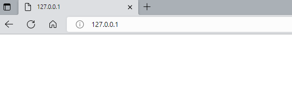


我们换成html文件模拟

```python
import socket

host = '127.0.0.1'
port = 80
server = socket.socket(socket.AF_INET, socket.SOCK_STREAM)
server.bind((host, port))
server.listen(5)

while True:
    conn,addr = server.accept()
    data = conn.recv(1024)
    print(data)
    conn.send(b'HTTP/1.1 200 OK\r\n\r\n')

    with open('index.html','rb') as f:
        conn.send(f.read())
    conn.close()
```

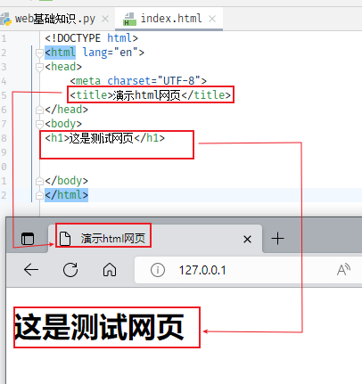

使用上面的代码img不能识别


# html代码

时隔十年html技术应该有一些变化，就当作复习。

html基本框架代码

```html
<!DOCTYPE html>  # 声明文档类型
<html lang="en">   # 开始标签
<head>   # 头部，包含style,script,SEO内容
    <meta charset="UTF-8"> # 声明网页编码
    <title>Title</title>  # 网页标题
</head>  # 头部结束
<body>  # 主体开始
<div>
    <p>标题字体</p>
    <h1>一级标题</h1>
    <h2>二级标题</h2>
    <h3>三级标题</h3>
    <h4>四级标题</h4>
    <h5>五级标题</h5>
    <h6>六级标题</h6>
    <h7>七级标题</h7> <span>正文字体，七级标题</span>  # 没有七级标题了。
    <a href="https://cloudb.pub">Cloudb</a>
     # 图片可以是网图，注意版权
</div>
<hr/> # 水平线
    
    
</body>  
</html>
```

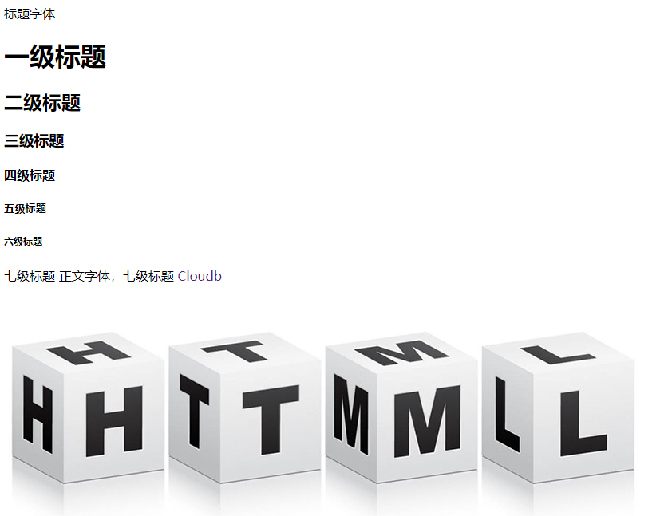

<!--单行注释-->
   <!--
   多行注释1
   多行注释2
   多行注释3
   -->

在正式的写代码中需要使用注释标识是某部分方便后期调整代码和优化。

## head标签

head 部分是内嵌样式和脚本的位置，也是网站关键字和内容简介的SEO部分。

SEO：搜索引擎优化

```html
<head>
     <!--关键词-->
    <meta name="keyworks" content="这里是网站关键词存放地方，网络爬虫爬取的一部分，可以多个meta">
    <meta name="description" content="网站简介...">
    <meta charset="UTF-8">
    
    <title>Html网页复习</title>
    <style> <!--内嵌样式--> 
        h1 {
            color: greenyellow;
        }
        h2 {
            color: blue;
        }
    </style>
    <script>  <!--内嵌script-->
        alert(123)  <!--弹出窗口提示-->
    </script>
    <link rel="stylesheet" href="../css/main.css"> <!--引入外部css文件-->
    
</head>
```

准备好css文件

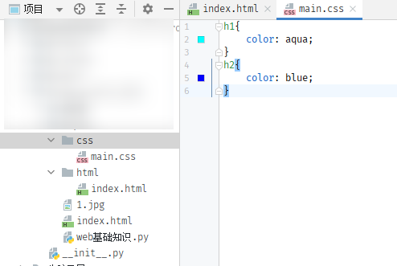

## body标签

### 基本标签

```html
<div>
    <b>粗体</b>
    <i>斜体</i>
    <s>删除线</s>
    <u>下划线</u>
    <p>段落</p>  
    <span>span标签</span>
    <br /> 换行
</div>
span标签单独使用会换行，效果跟<p><span>xx</span></p>
```

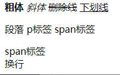

>  块级标签:独占一行
> 		h1~h6	p div
>     1.块儿级标签可以修改长宽 行内标签不可以 修改了也不会变化
>     2.块儿级标签内部可以嵌套任意的块儿级标签和行内标
>
>  行内标签:自身文本多大就占多大	行标签：i u s b span

### 特殊符

```html
<div>
    <p><span>特殊符号</span></p>
    &nbsp; 空格 <br>
    2 &gt; 1   <br>
    1 &lt; 3  <br>
    &amp; &符  <br>
    &yen; 人民币符 <br>
    &copy; copy符  <br>
    &reg;  商标符 <br>
</div>
```

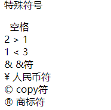

### img

```html
 
```

### a

a标签是超链接标签

还是内部锚点标签

```html
<body>
<a href="" id="top1">顶部,可以隐藏</a>  # 在需要跳转的地方设置

    <a href="" id="mod1"></a> # 在中间位置设置

    <a href="#top1" target="_top">顶部</a>    # 跳转
    <a href="#mod1" target="_self">中部</a>   
</body>
```

#### a标签状态

```html
<!DOCTYPE html>
<html lang="en">
<head>
    <meta charset="UTF-8">
    <title>a标签状态</title>
    <style>
        body{   /*背景颜色*/
            background: aliceblue;
        }
        a:link{  /*访问之前的颜色*/
            color: blue;
        }
        a:hover{  /*鼠标悬停颜色*/
            color: crimson;
        }
        a:active{ /*鼠标点击不松开颜色，激活颜色*/
            color: darkcyan;
        }
        a:visited{ /*访问之后的颜色*/
            color: chartreuse;
        }
        p{
            color: blueviolet;
            font-family: Arial;
        }
        p:hover{
            color: bisque;
        }
        input:focus{
            background: crimson;
        }
    </style>
</head>
<body>
<a href="https://cloudb.pub">cloudb</a>
<div>
    <p>这个是段落</p>
    <input type="text">
</div>
</body>
</html>
```

**去掉自带的下划线**

```css
a {
     text-decoration: none;  /*主要用于给a标签去掉自带的下划线  需要掌握*/
 }
```


> 【提示】
>
> id 是style的唯一号码，不能重复
>
> class 类属于继承关系

### ul

列表标签

常用在导航中

```css
    ul {
    	list-style-type:none
    	padding-left:0
    }
```


```html
<div>
    <!--无序列表-->
    <ul>
        <li>首页</li>
        <li>111</li>
        <li>222</li>
    </ul>
    <!--有序列表-->
    <ol>
        <li>首页</li>
        <li>111</li>
        <li>222</li>
    </ol>
   <!--其他样式-->
    1 A I a ...在type中替换即可
    <ol type="a" start="2">
        <li>首页</li>
        <li>111</li>
        <li>222</li>
    </ol>
</div>
```

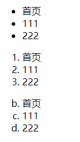

```html
    <!--标题列表-->
    <dl>
        <dt>标题</dt>
        <dd>内容</dd>
         <dt>标题</dt>
        <dd>内容</dd>
         <dt>标题</dt>
        <dd>内容</dd>
    </dl>
```

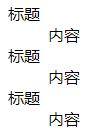

### table

表格

```html
<div>
    <table border="1">
        <thead>表头字段信息
        <tr>
            <th>username</th>
            <td>password</td>
        </tr>
        </thead>
        <tbody>
        <tr>
            <td>tom</td>
            <td>123456</td>
        </tr>
        <tr>
            <td colspan="2">bob 水平方向占2行</td>
            <td rowspan="2">DB垂直方向占2列</td>
        </tr>
        </tbody>
    </table>
</div>
```

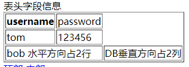

### form 表单

能够获取前端用户数据(用户输入的、用户选择、用户上传...)基于网络发送给后端服务器

触发form表单提交数据的两种方式
	type=submit
    button按钮

```html
<div>
    <form action="">
        <!--在该form标签内部书写的获取用户数据都会被发送给后端服务器-->
        <!--
        action :控制数据提交的后端路径（提交给谁）
        空：就是当前页面所在的url提交数据
        全路径：
        只写路径后缀action='/index/'，自动识别当前服务端的IP，port
        host:port/index/
        -->
        <!--第一种lable-->
        <label for="fl1">username:<input type="text" id="fl1"></label>

        <!--第二种  input 跟lable没有关联也可以--> 他们都在一个form
        <label for="fl2">password:</label> <input type="password" id="fl2">

    </form>
</div>
```

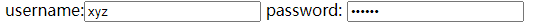

 input标签 前端的输入端  通过type属性变形
	**text**:普通文本
  **password**:密文
	**date**:日期	
  **submit**:用来触发form表单提交数据的动作
  **button**:就是一个普普通通的按钮 本身没有任何的功能 但是它是最有用的，学完js之后可以给它自定义各种功能
  **reset**:重置内容
  **radio**:单选

```html
默认选中要加checked='checked'
      <input type="radio" name="gender" checked='checked'>男
      当标签的属性名和属性值一样的时候可以简写
      <input type="radio" name="gender" checked>女
checkbox:多选
  	<input type="checkbox" checked>DBJ
```

  **file**:获取文件  也可以一次性获取多个

```html
<input type="file" multiple>
```

  **hidden**:隐藏当前input框
    	钓鱼网站

```html
    <form action="">
        <!--在该form标签内部书写的获取用户数据都会被发送给后端服务器-->
        <!--
        action :控制数据提交的后端路径（提交给谁）
        空：就是当前页面所在的url提交数据
        全路径：
        只写路径后缀action='/index/'，自动识别当前服务端的IP，port
        host:port/index/
        -->
        <!--第一种lable-->
        <label for="fl1">username: <input type="text" id="fl1"></label> <br/>

        <!--第二种  input 跟lable没有关联也可以-->
        <label for="fl2">password: </label> <input type="password" id="fl2"><br/>
        <label>sex：<input type="radio" name="gender" checked>male
        <input type="radio" name="gender"> female
        </label><br/>
        <label>兴趣爱好(多选)：<input type="checkbox" checked>游戏 <input type="checkbox">睡觉 <input type="checkbox">
        看书
        </label> <br/>
        <label>日期:<input type="date"> 带时间的日期：<input type="datetime-local"></label> <br/>
        <label>上传文件：<input type="file" src=""></label>  <br/>
        <label>邮箱：<input type="email"></label> <br/>
        <label>tel:<input type="tel"></label><br/>
        <label>颜色:<input type="color"></label><br/>
        <label>image:<input type="image"></label><br/>
        <label>time:<input type="time"></label> <br/>
        
        # 能够触发form表单提交数据的按钮有哪些(一定要记住)
		1、<input type="submit" value="注册">
		2、<button>点击</button>
        
        <label><button type="submit">提交</button> <input type="reset"></label><br/>
        select标签 默认是单选 可以加mutiple参数变多选 默认选中selected
        <select name="" id="" multiple>
            <option value="" selected>A</option>
            <option value="" selected>B</option>
            <option value="" selected>C</option>
        </select>
       textarea标签  获取大段文本
        <textarea name=""  cols="30" rows="10"></textarea><br/>
   所有获取用户输入的标签 都应该有name属性
	name就类似于字典的key
  用户的数据就类似于字典的value
  <p>gender:
            <input type="radio" name="gender">男
            <input type="radio" name="gender">女
            <input type="radio" name="gender">其他
  </p>
    </form>
```

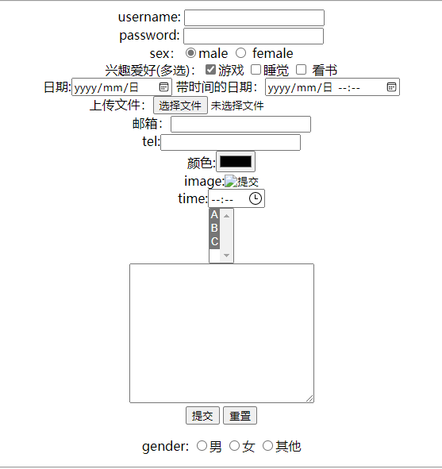

顺序不用理会，只是熟悉一下input

上面lable是可以不需要的。

#### 验证form

```cmd
pip3 install FLASK
form表单默认提交数据的方式 是get请求  数据是直接放在url后面的
```

```html
<!DOCTYPE html>
<html lang="en">
<head>
    <meta charset="UTF-8">
    <title>test_form</title>
</head>
<body>
<!--你可以通过method指定提交方式-->form表单默认提交数据的方式 是get请求  数据是直接放在url后面的
<form action="http://127.0.0.1:5000/index/" method="post" enctype="multipart/form-data">
    <p>gender:
        <input type="radio" name="gender" value="male">男
        <input type="radio" name="gender" value="female" checked>女
        <input type="radio" name="gender" value="others">其他
    </p>
    <p>hobby:
        <input type="checkbox" name="hobby" value="basketball">篮球
        <input type="checkbox" name="hobby" value="football">足球
        <input type="checkbox" name="hobby" value="doublecolorball">双色球
    </p>
    <p>province:
        <select name="province" id="">
            <option value="sh">上海</option>
            <option value="sz" selected>深圳</option>
            <option value="hz">杭州</option>
        </select>
    </p>
    <p>
        <input type="submit" value="提交">
        <input type="button" value="按钮">
        <input type="reset" value="重置">
    </p>
</form>

</body>
</html>
```

```python
from flask import Flask,request

app = Flask(__name__)

@app.route('/index/',methods=['GET','POST'])
def index():
    print(request.form)
    print(request.files)
    file_obj = request.files.get('')
    # file_obj.save(file_obj)
    return 'OK'

app.run()
>>>
 * Running on http://127.0.0.1:5000 (Press CTRL+C to quit)
 * Serving Flask app 'test_form' (lazy loading)
 * Environment: production
   WARNING: This is a development server. Do not use it in a production deployment.
   Use a production WSGI server instead.
 * Debug mode: off
127.0.0.1 - - [28/Jul/2022 21:36:10] "POST /index/ HTTP/1.1" 200 -
ImmutableMultiDict([('gender', 'male'), ('hobby', 'basketball'), ('province', 'sz')])
ImmutableMultiDict([])
```

运行服务端之后打开上面表单勾选之后提交，这里就得到数据客户端返回OK

> 【注意】
>
> 针对用户输入的标签。如果你加了value 那就是默认值
>
> <label for="d1">username:<input type="text" id="d1" name="username" value="默认值"></label>
> disable 禁用
> readonly只读

## css

css 层叠样式，美化html的

> css的语法结构
>
> 选择器 {
>   属性1:值1;
>   属性2:值2;
>   属性3:值3;
>   属性4:值4;
> }

css的三种引入方式
	1.style标签内部直接书写(为了教学演示方便我们用第一种)

```html
  	<style>
        h1  {
            color: burlywood;
        }
    </style>
```

  2.link标签引入外部css文件(最正规的方式 解耦合)

```html
<link rel="stylesheet" href="mycss.css">
```

​	3.行内式(一般不用)

```html
<h1 style="color: green">老板好 要上课吗?</h1>
```

### 注释

/**/  由于前端代码都笔记多并且没有什么规律 所以我们都会利用注释来帮助我们维护代码


### 选择器

1.**基本选择器**

```css
	id选择器
  	#d1 {}
    类选择器
  	.c1 {}
    标签选择器
  	div {}
    通用选择器
  	* {}
```


```html
p#d1.c1  <p id="d1" class="c1"></p>  emmet插件
```

2.**组合选择器**
	我们将前端标签的嵌套定义为父亲 儿子 后代 兄弟等等关系
	后代选择器
  	div p {}  只要是div内部的p都拿到
    儿子选择器
      div>p {}	只拿内部第一层级的p
    毗邻选择器
  	div+p	{}	紧挨着我的同级下一个
    弟弟选择器
  	div~p	{}	同级别下面所有的p

3.**属性选择器**  []

```css
	[username]
    [username='jason']
    input[username='jason']
```

ps:标签既可以有默认的书写 id class...还可以有自定义的书写并且支持多个

```html
<p id='d1' username='jason'></p>
```

css分组与嵌套

```css
div,p,span{  /*逗号表示并列关系*/
    color:yellow；
}
#d1,.c1,span{  /*id,class,span*/
    color:green;
}
```

### 伪类选择器

[a标签状态](####a标签状态) 参考上面的a标签

```css
        p:first-letter{ # 通过css加文本内容 但是无法选中
            font-size: 48px;
            color: darkcyan;
        }
        p:before{
            content: 'you are right';
            color: blueviolet;
        }
        p:after{
            content: 'are you ok?';
            color: aqua;
        }
```

ps:before和after通常都是用来清除浮动带来的影响:父标签塌陷的问题

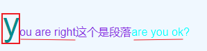

不能选择

`选择器的优先顺序：`

 1.选择器相同 书写顺序不同
        就近原则:谁离标签更近就听谁的
    2.选择器不同 ...
        `行内 > id选择器  > 类选择器 > 标签选择器`
        精确度越高越有效

注意：**行内标签无法设置长宽 就算你写了 也不会生效**

`!important强制让标签采用你的样式 不推荐使用`

#### **字体属性**

```css
p {
   /*font-family: "Arial Black","微软雅黑","...";  !*第一个不生效就用后面的 写多个备用*!*/
   /*font-size: 24px;  !*字体大小*!*/
   /*font-weight: inherit;  !*bolder lighter 100~900 inherit继承父元素的粗细值*!*/
   /*color: red;  !*直接写颜色英文*!*/
   /*color: #ee762e;  !*颜色编号*!*/
   /*color: rgb(128,23,45);  !*三基色 数字  范围0-255*!*/
   /*color: rgba(23, 128, 91, 0.9);  !*第四个参数是颜色的透明度 范围是0-1*!*/

   /*当你想要一些颜色的时候 可以利用现成的工具*/
 }
```

#### **文字属性**

```css
p {
    /*text-align: center;  !*居中*!*/
    /*text-align: right;*/
    /*text-align: left;*/
    /*text-align: justify;  !*两端对齐*!*/

    /*text-decoration: underline;*/
    /*text-decoration: overline;*/
    /*text-decoration: line-through;*/
    /*text-decoration: none;*/
    /*在html中 有很多标签渲染出来的样式效果是一样的*/
    font-size: 16px;
    text-indent: 32px;   /*缩进32px*/
  }
 a {
     text-decoration: none;  /*主要用于给a标签去掉自带的下划线  需要掌握*/
 }
```

#### **背景图片**

```html
<!DOCTYPE html>
<html lang="en">
<head>
    <meta charset="UTF-8">
    <title>Title</title>
    <style>
        #d1{
            height: 500px;
            width: 500px;
            background: aqua;
        }
        #d2{
            height: 500px;
            background-image: url("../1.jpg");
            background-attachment: local;  /*附加属性*/
        }
        #d3{
            height: 500px;
            background: blue;
        }
        #d4{
            height: 500px;
            background: cadetblue;
        }
    </style>
</head>
<body>
<div id="d1">
    <p>这个是段落</p>
</div>
<div id="d2"></div>
<div id="d3"></div>
<div id="d4"></div>

</body>
</html>
```

#### **边框**

```css
        p{ 
            background: crimson;
            border-width: 5px;
            border-style: solid;
            border-color: chartreuse;
        }
        div{
            border-width: 5px;
            border-style: solid;
            border-color: chartreuse;
        }
```

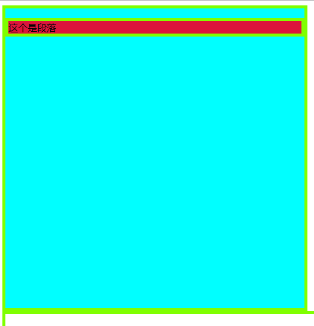

#### display属性

```css
<!DOCTYPE html>
<html lang="en">
<head>
    <meta charset="UTF-8">
    <title>Title</title>
    <style>
        #d1{
            border: cadetblue;
            border-style: solid;
            /*display: none;  !*隐藏标签，不展示，不占用原有位置*!并且原来的位置也没了*/
            /*display: inline; 将标签设置为行内标签的特点*/
            /*display: block; !*将标签设置为块级的特点*!*/
            /*display: inline-block;  !*设置在一行又可以设置长宽*!*/
            visibility:hidden只隐藏 位置还在
            display: compact;
        }
    </style>
</head>
<body>
<div id="d1">
    <p>这个是段落,xxxxxxx</p>
</div>
<div id="d2"></div>
<div id="d3"></div>
<div id="d4"></div>

</body>
</html>
```

#### 盒子模型

​		块与块之间的距离(标签与标签之间的距离 margin外边距)
​		块的厚度(标签的边框 border)
​		块里面的物体到盒子的距离(内容到边框的距离  padding内边距)
​		物体的大小(内容 content)
​	如果你想要调整标签与标签之间的距离 你就可以调整margin

浏览器会自带8px的margin，一般情况下我们在写页面的时候，上来就会先将body的margin去除

```css
        p{
            /*padding: 1px;*/
            /*margin: 1px;*/
            padding-top: 10px;   # 内边距
            padding-left: 20px;
            padding-right: 30px;
            padding-bottom: 10px;

            margin-bottom: 1px;  # 外边距
            margin-top: 2px;
            margin-left: 3px;
            margin-right: 5px;
        }
```

#### 浮动

浮动的元素 没有块儿级一说 本身多大浮起来之后就只能占多大

```css
        #d1{
            border-width: 1px;
            border-style: solid;
            background: chartreuse;
            width: 200px;
            height: 200px;
            float: left;/*左浮动*/

        }
        #d2{
            border-width: 1px;
            border-style: solid;
            background: cadetblue;
            height: 200px;
            width: 200px;
            /*float: none; !*无*!*/
            float: right;
        }
```

##### 解决浮动带来的影响

解决浮动带来的影响 推导步骤
	1.自己加一个div设置高度
	2.利用clear属性

```css
		#d4 {
            clear: left;  /*该标签的左边(地面和空中)不能有浮动的元素*/
        }
```

 3.通用的解决浮动带来的影响方法
  	在写html页面之前 先提前写好处理浮动带来的影响的 css代码

```css
.clearfix:after {
            content: '';
            display: block;
            clear:both;
        }
```

​    之后只要标签出现了塌陷的问题就给该塌陷的标签加一个clearfix属性即可
​    上述的解决方式是通用的 到哪都一样 并且名字就叫clearfix

##### 溢出属性

```css
p {
    height: 100px;
    width: 50px;
    border: 3px solid red;
    /*overflow: visible;  !*默认就是可见 溢出还是展示*!*/
    /*overflow: hidden;  !*溢出部分直接隐藏*!*/
    /*overflow: scroll;  !*设置成上下滚动条的形式*!*/
    /*overflow: auto;*/
}
                
标签内部的内容超出了标签自身的范围会造成内容的溢出
overflow:hidden/scroll/auto/visible
  
# 圆形头像制作
overflow:hidden
  
img {
    max-width:100%;
  }
```

### 定位

* 静态

  所有的标签默认都是静态的static，无法改变位置

* 相对定位(了解)

  相对于标签原来的位置做移动relative

* 绝对定位(常用)

  相对于已经定位过的父标签做移动(如果没有父标签那么就以body为参照)

  eg:小米网站购物车

  当你不知道页面其他标签的位置和参数，只给了你一个父标签的参数，让你基于该标签左定位

* 固定定位(常用)

  相对于浏览器窗口固定在某个位置

  eg:右侧小广告

```html
<!DOCTYPE html>
<html lang="en">
<head>
    <meta charset="UTF-8">
    <title>定位</title>
  <style>
      body{
          margin: 0;
      }
      #d1{
          height: 100px;
          width: 100px;
          background-color: red;
          left: 50px;
          top: 50px;
          /*position: static; !*默认static无法修改位置*!*/
          position: relative;
          /*相对定位
            标签由static变为relative它的性质就从原来没有定位的标签变成了已经定位过的标签
            虽然你哪怕没有动 但是你的性质也已经改变了
            */
      }
      #d2{
          height: 100px;
          width: 200px;
          background-color: blue;
          position: relative;  /*已经定位过了*/
      }
      #d3{
          height: 200px;
          width: 400px;
          background-color: yellowgreen;
          position: absolute;
          left: 200px;
          top: 100px;
      }
      #d4{
          position: fixed; /*在浏览器固定的位置*/
          bottom: 10px;
          right: 0px;

          height: 20px;
          width: 20px;
          background-color: white;
          border: 1px solid black;
      }
  </style>
</head>
<body>
<a href="" id="top"></a>
<div id="d1">
</div>

<div id="d2">
    <div id="d3"></div>
</div>

<div style="height: 500px;background-color: red"></div>
<div style="height: 500px;background-color: greenyellow"></div>
<div style="height: 500px;background-color: blue"></div>

<div id="d4"><a href="#top" >top</a></div>
</body>
</html>
```

浏览器是优先展示文本内容的

验证浮动和定位是否脱离文档流（原来位置是否保留）

```html
<!DOCTYPE html>
<html lang="en">
<head>
    <meta charset="UTF-8">
    <title>浮动与定位</title>
    <style>

    </style>

</head>
<body>

<div style="height: 100px;width: 200px;background-color: red;position: relative;left: 500px">1</div>
<div style="height: 100px;width: 200px;background-color: greenyellow;">2</div>
<div style="height: 100px;width: 200px;background-color: red;">3</div>
<div style="height: 100px;width: 200px;background-color: greenyellow;position: absolute;left: 500px">4</div>

<div style="height: 100px;width: 200px;background-color: blue">5</div>


<div style="height: 100px;width: 200px;background-color: red">6</div>
<div style="height: 100px;width: 200px;background-color: greenyellow;position: fixed;bottom: 10px;right: 20px">7</div>
<div style="height: 100px;width: 200px;background-color: blue">8</div>

</body>
</html>
```

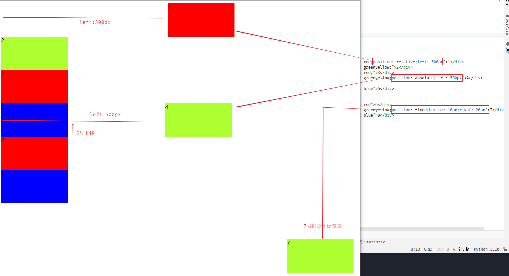

不脱离文档流
	1.相对定位

脱离文档流

1.浮动

2.绝对定位

3.固定定位


#### z-index模态框

在web页面在内容层上面跳出的登录或者广告块

普通的网页是有x y 二维的，当加入z的时候就变成立体的

```html
<!DOCTYPE html>
<html lang="en">
<head>
    <meta charset="UTF-8">
    <title>z-index</title>
  <style>
    body{
      margin: 0px;
    }
    .conver{
        position: fixed;
        left: 0;
        top: 0;
        right: 0;
        bottom: 0;
        background-color: rgba(0,0,0,0.5);
        z-index: 99;
    }
    .modal{
        background-color: white;
        height: 200px;
        width: 400px;
        position: fixed;
        left: 50%;
        top: 50%;
        z-index: 100;
        margin-left: -200px;
        margin-top: -100px;
    }


  </style>
</head>
<body>
<div>
    正常的网页内容-底层
</div>
<div class="conver">

</div>

<div class="modal">
    <h1>登录</h1>
    <p>user:<input type="text"></p>
    <p>password:<input type="password"></p>
    <button>login</button>
</div>
</body>
</html>
```

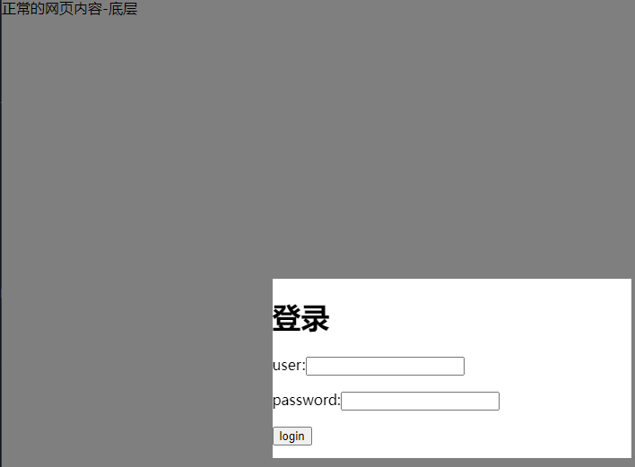

### 透明度

它不单单可以修改颜色的透明度还同时修改字体的透明度，rgba只能影响颜色。而opacity可以修改颜色和字体

```css
opacity: 0.5;

<div style="height:100px;width: 200px;background-color: green;opacity: 0.3">透明</div>


border-radius: 50%;  # 边界半径
```

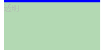


# JS

js也是一门编程语言,它也是可以写后端代码的.js跟java一毛钱关系都没有

`ECMAScript`和`JavaScript`的关系
   ECMAScript和JavaScript的关系是，前者是后者的规格，后者是前者的一种实现。

JavaScript 是脚本语言
   JavaScript 是一种轻量级的编程语言。
   JavaScript 是可插入 HTML 页面的编程代码。
   JavaScript 插入 HTML 页面后，可由所有的现代浏览器执行。
   JavaScript 很容易学习

**js的注释**
   // 单行注释

/*
   多行注释1
   多行注释2
   多行注释3
   */

**两种引入方式**
	1.script标签内部直接书写js代码
    2.script标签src属性引入外部js代码

 **js语法结构**
	js是以分号作为语句的结束
    但是如果你不写分号，问题也不大 也能够正常执行 但是它就相当于没有结束符

## 变量

在js中 首次定义一个变量名的时候需要用关键字声明
	1.关键字var
		var name='jason'
	2.es6推出的新语法
		let name='jason'
		如果你的编辑器支持的版本是5.1那么无法使用let
		如果是6.0则向下兼容 var let


**常量**

js中是有真正意义上的常量的

```js
const pi = 3.14
```

js变量的命名规范
	1.变量名只能是 
		数字 字母 下划线 $
	2.变量名命名规范(不遵循也可以)
		1.js中推荐使用驼峰式命名
			userName
			dataOfDb
		2.python推荐使用下划线的方式
			user_name
			data_of_db
	3.不能用关键字作为变量名
			不需要记忆 

js代码的书写位置
	1.可以单独开设js文件书写
	2.还可以直接在浏览器提供的console界面书写
		在用浏览器书写js的时候 左上方的清空按钮只是清空当前页面 代码其实还在
		如果你想要重新来 最好重新开设一个 页面
		(在使用浏览器书写 你自己的js代码的时候推荐你在 自己的html页面打开)

## 数据类型

js也是一门面向对象 的编程语言 即一切皆对象!!!

js/python是一门拥有动态类型

```js
name = 'jason'
name = 123
name = [1,2,3,4]
# name可以指向任意的数据类型 
# 但是有一些语言中，变量名之内指向一种后续不能更改 
```

### 数值类型(number)

```js
var a=1
var b=1.11

typeof a # 查看数据类型
'number'
typeof b
'number'

//特殊的 NaN:数值类型 表示的意思是“不是一个数字” NOT A NUMBER
// 类型转换
parseInt()
parseFloat()

parseFloat('2345')
2345
parseInt('11.11')
11
parseFloat('ssa213')
NaN
```

### 字符类型(string)

```js
var s='tom'
undefined
typeof(s)
'string'
var s1="bob"
undefined
typeof(s1)
'string'
// 不支持三引号
// 模版字符串
var s3=`
sdadsadsasd
asdasdsada
sadadsads`
undefined
typeof(s3)
'string'

var name='tom'
undefined
var age=18
undefined
sss=`my name is ${name}, age is ${age}!`
'my name is tom, age is 18!'
sss
'my name is tom, age is 18!'
// 字符串的拼接
// 在python中不推荐你使用+做拼接 join
// 在js中推荐你直接使用+做拼接
name+age
'tom18'
```

#### 字符类型常用方法

```js
.length	返回长度
.trim()	移除空白
.trimLeft()	移除左边的空白
.trimRight()	移除右边的空白
.charAt(n)	返回第n个字符
.concat(value, ...)	拼接
	联想记忆
		MySQL
			concat
			concat_ws
			group_concat
		python
			join
.indexOf(substring, start)	子序列位置
.substring(from, to)	根据索引获取子序列
.slice(start, end)	切片
.toLowerCase()	小写
.toUpperCase()	大写
.split(delimiter, limit)	分割
```

```js
let name='tom'
undefined
name.length
3
let n1='   bob'
undefined
n1.trim()
'bob'
n1.trimLeft()
'bob'
n1.charAt(4)
'o'
n1.slice(3,-1)
'bo'
var name = 'egondsb'
undefined

name.length
7

var name1 = '  egonDSB  '
undefined
name1
"  egonDSB  "
name1.trim()
"egonDSB"
name1.trimLeft()
"egonDSB  "
name1.trimRight()
"  egonDSB"

var name2 = '$$jason$$'
undefined
name2.trim('$')  # 不能加括号指定去除的内容
"$$jason$$"

name2.charAt(0)
"$"
name2.indexOf('as')
3

name2.substring(0,5)
"$$jas"
name2.slice(0,5)
"$$jas"
name2.substring(0,-1)  # 不识别负数
""
name2.slice(0,-1)  # 后面推荐就使用slice就可以
"$$jason$"


var name3 = 'eGoNDsb123666HahA'
undefined
name3.toLowerCase()
"egondsb123666haha"
name3.toUpperCase()
"EGONDSB123666HAHA"
var name = 'tank|hecha|liaomei|mengsao|...'
undefined

name.split('|')
(5) ["tank", "hecha", "liaomei", "mengsao", "..."]
name.split('|',2)
(2) ["tank", "hecha"]0: "tank"1: "hecha"length: 2__proto__: Array(0)
name.split('|',10)  # 第二个参数不是限制切割字符的个数还是获取切割之后元素的个数
(5) ["tank", "hecha", "liaomei", "mengsao", "..."]


name.concat(name1,name2)
"tank|hecha|liaomei|mengsao|...  egonDSB  $$jason$$"
var p = 1111
undefined
name.concat(p)  # js是弱类型(内部会自动转换成相同的数据类型做操作)
"tank|hecha|liaomei|mengsao|...1111"


l = [1,2,3,4,5,6,7]
res = '|'.join(l)  # 直接报错
print(res)
```

### 布尔值(boolean)

1.在python中布尔值是首字母大写的
	True
	False
   2.但是在js中布尔值是全小写的
	true
	false

布尔值是false的有哪些

```js
空字符串、0、null、undefined、NaN
```

#### null与undefined

**null**
	表示值为空 一般都是指定或者清空一个变量时使用
		name = 'jason'
		name = null
    **undefined**
	表示声明了一个变量 但是没有做初始化操作(没有给值)
	函数没有指定返回值的时候 返回的也是undefined
	

### 对象

**一切皆对象**

* 数组(类似于python里面的列表)	[]

```js
var l = [11,22,33,44]
undefined
typeof(l)
'object'

var l1 = [11,'s2',33,true,'2.33']
undefined
typeof(l1)
'object'

l[1]
22
1[-1]  // 不支持负数索引
undefined

l.length //四个元素
4

l.push(777)  //insert到后面
5
l
(5) [11, 22, 33, 44, 777]
l.pop()  //delete
777
l
(4) [11, 22, 33, 44]

l.unshift(55)  // 前面insert
5
l
(5) [55, 11, 22, 33, 44]

l.shift() //删除前面添加的
55
l
(4) [11, 22, 33, 44]

l.slice(0,3)  //切片
(3) [11, 22, 33]
l.reverse()  //倒叙
(4) [44, 33, 22, 11]
l.join('$')  //以指定的符号为分隔符跟python相反
'44$33$22$11'

l.concat(['a','b','c'])  // extend
(7) [44, 33, 22, 11, 'a', 'b', 'c']
l.sort()
(4) [11, 22, 33, 44]

# 三个比较重要的方法
ll.forEach(function(value){console.log(value)},ll)
VM2463:1 11 // 一个参数就是数组里面每一个元素对象
VM2463:1 22
VM2463:1 33
VM2463:1 44
VM2463:1 55
VM2463:1 66

ll.forEach(function(value,index){console.log(value,index)},ll)
VM2770:1 11 0  // 两个参数就是元素 + 元素索引
VM2770:1 22 1
VM2770:1 33 2
VM2770:1 44 3
VM2770:1 55 4
VM2770:1 66 5

ll.forEach(function(value,index,arr){console.log(value,index,arr)},ll)
VM3250:1 11 0 (6) [11, 22, 33, 44, 55, 66]
VM3250:1 22 1 (6) [11, 22, 33, 44, 55, 66]
VM3250:1 33 2 (6) [11, 22, 33, 44, 55, 66]
VM3250:1 44 3 (6) [11, 22, 33, 44, 55, 66]
VM3250:1 55 4 (6) [11, 22, 33, 44, 55, 66]
VM3250:1 66 5 (6) [11, 22, 33, 44, 55, 66]

ll.forEach(function(value,index,arr,xxx){console.log(value,index,arr,xxx)},ll)
VM3254:1 11 0 (6) [11, 22, 33, 44, 55, 66] undefined  //最多三个
VM3254:1 22 1 (6) [11, 22, 33, 44, 55, 66] undefined
VM3254:1 33 2 (6) [11, 22, 33, 44, 55, 66] undefined
VM3254:1 44 3 (6) [11, 22, 33, 44, 55, 66] undefined
VM3254:1 55 4 (6) [11, 22, 33, 44, 55, 66] undefined
VM3254:1 66 5 (6) [11, 22, 33, 44, 55, 66] undefined
```

```js
ll.splice(0,3) # 两个参数 第一个是起始位置 第二个是删除的个数
(3) [11, 22, 33]
ll.splice(0,3,77)   # 先删除后添加
(3) [44, 55, 66]
ll
[77]

ll.splice(0,1,[11,22,33,44,55,66])
[77]
ll
[Array(6)]
0: (6) [11, 22, 33, 44, 55, 66]

var l2=[11,22,33,44,55,66]

l2
(6) [11, 22, 33, 44, 55, 66]

l2.map(function(value){console.log(value)},l2)
VM3778:1 11
VM3778:1 22
VM3778:1 33
VM3778:1 44
VM3778:1 55
VM3778:1 66

l2.map(function(value,index){return value*2},l2)
(6) [22, 44, 66, 88, 110, 132]
l2.map(function(value,index,arr){return value*2},l2)
(6) [22, 44, 66, 88, 110, 132]
```

### 运算符

```js
var x=10;
undefined
var res1=x++;
undefined
var res2= ++x;
undefined
res1
10
res2
12

++表示自增1 类似于 +=1
加号在前先加后赋值 加号在后先赋值后加
# 比较运算符
1 == '1'  # 弱等于  内部自动转换成相同的数据类型比较了
true  

1 === '1'  # 强等于  内部不做类型转换

1 != '1'
false
1 !== '2'
true

# 逻辑运算符
	# python中 and or not
  # js中 && || !
5 && '5'
'5'

0 || 1
1

!5 && '5'
false

# 赋值运算符
= += -= *= ....
```

### 流程控制

```js
# if判断
var age = 28;

# if(条件){条件成立之后指向的代码块}
if (age>18){
  console.log('来啊 来啊')
}


# if-else
if (age>18){
  console.log('来啊 来啊')
}else{
  console.log('没钱 滚蛋')
}

# if-else if else
if (age<18){
  console.log("培养一下")
}else if(age<24){
  console.log('小姐姐你好 我是你的粉丝')
}else{
  console.log('你是个好人')
}

在js中代码是没有缩进的 只不过我们处于python书写习惯人为的加上了而已
()条件
{}代码块

# switch语法
"""
提前列举好可能出现的条件和解决方式
"""
var num = 2;
switch(num){
  case 0:
  	console.log('喝酒');
  	break;  # 不加break 匹配到一个之后 就一直往下执行
  case 1:
  	console.log('唱歌');
  	break;
  case 2:
  	console.log('洗脚');
  	break;
  case 3:
  	console.log('按摩');
  	break;
  case 4:
  	console.log('营养快线');
  	break;
  case 5:
  	console.log('老板慢走 欢迎下次光临');
  	break;
  default:
  	console.log('条件都没有匹配上 默认走的流程')
}

# for循环
# 打印0-9数字
for(let i=0;i<10;i++){
  console.log(i)
}
# 题目1  循环打印出数组里面的每一个元素
var l1 = [111,222,333,444,555,666]
for(let i=0;i<l1.length;i++){
  console.log(l1[i])
}

# while循环
var i = 0
while(i<100){
  console.log(i)
  i++;
}

# 三元运算符
# python中三元运算符 res = 1 if 1>2 else 3
# JS中三元运算  res = 1>2?1:3 
条件成立取问好后面的1 不成立取冒号后面的3
var res = 2>5?8:10 # 10
var res = 2>5?8:(8>5?666:444)  # 666
"""
三元运算符不要写的过于复杂 
"""
```

### 函数

```js
# 在python定义函数需要用到关键字def
# 在js中定义函数需要用到关键字function

# 格式
function 函数名(形参1,形参2,形参3...){函数体代码}

# 无参函数
function func1(){
  console.log('hello world')
}
func1()  # 调用 加括调用 跟python是一样的

# 有参函数
function func2(a,b){
  console.log(a,b)
}
func2(1,2)

func2(1,2,3,4,5,6,7,8,9)  # 多了没关系 只要对应的数据
VM3610:2 1 2
undefined

func2(1)  # 少了也没关系
VM3610:2 1 undefined
  
# 关键字arguments
function func2(a,b){
  console.log(arguments)  # 能够获取到函数接受到的所有的参数
  console.log(a,b)
}

function func2(a,b){
  if(arguments.length<2){
    console.log('传少了')
  }else if (arguments.length>2){
    console.log('传多了')
  }else{
    console.log('正常执行')
  }
}


# 函数的返回值  使用的也是关键字return
function index(){
  return 666
}
function index(){
  return 666,777,888,999
}
res = index();
999
res
999  # 只能拿到最后一个

function index(){
  return [666,777,888,999]
}
# js不支持解压赋值


# 匿名函数  就是没有名字
function(){
  console.log('哈哈哈')
}
var res = function(){
  console.log('哈哈哈')
}

# 箭头函数(要了解一下)  主要用来处理简单的业务逻辑 类似于python中的匿名函数
var func1 = v => v;  """箭头左边的是形参 右边的是返回值"""
等价于
var func1 = function(v){
  return v
}

var func2 = (arg1,arg2) => arg1+arg2
等价于
var func1 = function(arg1,arg2){
  return arg1+arg2
}
```

#### 函数的全局变量与局部变量

```js
# 跟python查找变量的顺序一致
var city = "BeiJing";
function f() {
  var city = "ShangHai";
  function inner(){
    var city = "ShenZhen";
    console.log(city);
  }
  inner();
}

f();  //输出结果是？ShenZhen


var city = "BeiJing";
function Bar() {
  console.log(city);
}
function f() {
  var city = "ShangHai";
  return Bar;
}
var ret = f();
ret();  // 打印结果是？BeiJing


var city = "BeiJing";
function f(){
    var city = "ShangHai";
    function inner(){
        console.log(city);
    }
    return inner;
}
var ret = f();
ret();  //ShangHai
  
```

**自定义对象**

```js
# 你可以看成是我们python中的字典 但是js中的自定义对象要比python里面的字典操作起来更加的方便

# 创建自定义对象 {}
"""第一种创建自定义对象的方式"""
var d1 = {'name':'jason','age':18}


var d = {'name':'jason','age':18}
typeof d
"object"

d['name']
"jason"
d.name  # 比python从字典获取值更加的方便
"jason"
d.age
18

for(let i in d){
  console.log(i,d[i])
}  # 支持for循环 暴露给外界可以直接获取的也是键


"""第二种创建自定义对象的方式  需要使用关键字 new"""
var d2 = new Object()  # {}

d2.name = 'jason'
{name: "jason"}

d2['age'] = 18
{name: "jason", age: 18}

var d2 = new Object() 
undefined
d2.name = 'tom'
'tom'
d2
{name: 'tom'}
d2['age']=19
19
d2
{name: 'tom', age: 19}
```

#### date

```js
let d3 = new Date()
Fri May 15 2020 14:41:06 GMT+0800 (中国标准时间)
   
d3.toLocaleString()
"2020/5/15 下午2:41:06"

# 也支持自己手动输入时间
let d4 = new Date('2200/11/11 11:11:11')
d4.toLocaleString()

let d5 = new Date(1111,11,11,11,11,11)
d5.toLocaleString()  # 月份从0开始0-11月
"1111/12/11 上午11:11:11"

# 时间对象具体方法
let d6 = new Date();
d6.getDate()  获取日
d6.getDay()		获取星期
d6.getMonth()		获取月份(0-11)
d6.getFullYear()		获取完整的年份
d6.getHours()			获取小时
d6.getMinutes()		获取分钟
d6.getSeconds()		获取秒
d6.getMilliseconds()  获取毫秒
d6.getTime()					时间戳
```

JSON对象

在python中序列化反序列化
	dumps 		   序列化
	loads			反序列化

在js中也有序列化反序列化
	JSON.stringify()								dumps
	JSON.parse()									loads	

```js
let d7 = {'name':'jason','age':18}
let res666 = JSON.stringify(d7)
"{"name":"jason","age":18}"

JSON.parse(res666)
{name: "jason", age: 18}
```

#### RegExp对象

在python中如果需要使用正则 需要借助于re模块，在js中需要你创建正则对象

```js
# 第一种 有点麻烦
let reg1 = new RegExp('^[a-zA-Z][a-zA-Z0-9]{5,11}')
# 第二种 个人推荐
let reg2 = /^[a-zA-Z][a-zA-Z0-9]{5,11}/

# 匹配内容
reg1.test('egondsb')
reg2.test('egondsb')

# 题目 获取字符串里面所有的字母s
let sss = 'egondsb dsb dsb'
sss.match(/s/)  # 拿到一个就停止了
sss.match(/s/g)	# 全局匹配  g就表示全局模式

sss.match(/s/)
["s", index: 5, input: "egondsb dsb dsb", groups: undefined]
sss.match(/s/g)
(3) ["s", "s", "s"]

# 全局匹配模式吐槽点
let reg3 = /^[a-zA-Z][a-zA-Z0-9]{5,11}/g
reg2.test('egondsb')

reg3.test('egondsb')  # 全局模式有一个lastIndex属性
true
reg3.test('egondsb')  # false 会重置匹配
false
reg3.test('egondsb')
true
reg3.test('egondsb')
false

reg3.lastIndex
0
reg3.test('egondsb')
true
reg3.lastIndex
7

# 吐槽点二 
let reg4 = /^[a-zA-Z][a-zA-Z0-9]{5,11}/
reg4.test()

reg4.test()  # 什么都不传 默认传的是undefined
true
reg4.test()
true

reg4.test(undefined)
true
let reg5 = /undefined/
undefined
reg5.test('jason')
false
reg5.test()
true

"""
总结 你在用js书写正则的时候一定要注意上述问题
一般情况下你后续也不会接触到了
"""
```

#### Math对象

```js
abs(x)      返回数的绝对值。
exp(x)      返回 e 的指数。
floor(x)    对数进行下舍入。
log(x)      返回数的自然对数（底为e）。
max(x,y)    返回 x 和 y 中的最高值。
min(x,y)    返回 x 和 y 中的最低值。
pow(x,y)    返回 x 的 y 次幂。
random()    返回 0 ~ 1 之间的随机数。
round(x)    把数四舍五入为最接近的整数。
sin(x)      返回数的正弦。
sqrt(x)     返回数的平方根。
tan(x)      返回角的正切。
```


## BOM与DOM操作

截至目前为止 虽然已经学会了js语法 但是你会发现跟浏览器和html文件还是一点关系没有

**BOM**
	浏览器对象模型  Browser Object Model
		js代码操作浏览器
    **DOM**
	文档对象模型	  Document Object Model
		js代码操作标签

### BOM

```js
# window对象
window对象指代的就是浏览器窗口

window.innerHeight  浏览器窗口的高度
900
window.innerWidth   浏览器窗口的宽度
1680

window.open('https://www.mzitu.com/','','height=400px,width=400px,top=400px,left=400px')
# 新建窗口打开页面 第二个参数写空即可 `第三个参数写新建的窗口的大小和位置`
# 扩展父子页面通信window.opener()  了解

window.close()  关闭当前页面

# window对象
window.open()  # 新建窗口打开指定的页面
	window.open(url,'','height,width,top,bottom')

# navigator对象
navigator.userAgent		# 后面讲爬虫还会涉及

# history对象
window.history.forward()
window.history.back()

# location对象
window.location.href  # 获取当前页面的url
window.location.href = url  # 跳转到指定的url
window.loacation.reload()

# 弹出框
alert()
confirm()  获取到用户点击的确定还是取消
prompt()		获取到用户输入的内容

# 计时器相关
1.
	setTimeout()
	clearTimeout()
2.
	setInterval()
  clearInterval()
```

#### window子对象

```js
window.navigator.appName
"Netscape"
window.navigator.appVersion
"5.0 (Macintosh; Intel Mac OS X 10_14_6) AppleWebKit/537.36 (KHTML, like Gecko) Chrome/81.0.4044.138 Safari/537.36"

window.navigator.userAgent		掌握  # 用来表示当前是否是一个浏览器
"Mozilla/5.0 (Macintosh; Intel Mac OS X 10_14_6) AppleWebKit/537.36 (KHTML, like Gecko) Chrome/81.0.4044.138 Safari/537.36"

"""
扩展:仿爬措施
	1.最简单最常用的一个就是校验当前请求的发起者是否是一个浏览器
		userAgent
		user-agent: Mozilla/5.0 (Macintosh; Intel Mac OS X 10_14_6) AppleWebKit/537.36 (KHTML, like Gecko) Chrome/81.0.4044.138 Safari/537.36
	如何破解该措施
		在你的代码中加上上面的user-agent配置即可
"""

window.navigator.platform
'Win32'

# 如果是window的子对象 那么window可以省略不写
```

#### history对象

```js
window.history.back()  回退到上一页
window.history.forward()  前进到下一页
# 对应的就是你浏览器左上方的两个的箭头
```

#### location对象(掌握)

```js
window.location.href	# 获取当前页面的url
window.location.href = url  # 跳转到指定的url
window.location.reload()  # 属性页面   浏览器左上方的小圆圈
```

#### 弹出框

* 警告框
* 确认框
* 提示框

```js
alert('你不要过来啊！！！')
undefined

confirm('你确定真的要这么做吗?能不能有其他方式能够满足你...')
false

confirm('你确定真的要这么做吗?能不能有其他方式能够满足你...')
true

prompt('手牌号给我看一下','22号消费888') //返回框
"来宾三位"
```

#### 计时器相关

* 过一段时间之后触发(一次)
* 每隔一段时间触发一次(循环)

```js
<script>
    function func1() {
        alert(123)
    }
    let t = setTimeout(func1,3000);  // 毫秒为单位 3秒之后自动执行func1函数

    clearTimeout(t)      // 取消定时任务  如果你想要清除定时任务 需要日前用变量指代定时任务


    function func2() {
        alert(123)
    }
    function show(){
        let t = setInterval(func2,3000);  // 每隔3秒执行一次
        function inner(){
            clearInterval(t)  // 清除定时器
        }
        setTimeout(inner,9000)  // 9秒中之后触发
    }
    show()
</script>
```

### DOM

DOM是一套对文档的内容进行抽象和概念化的方法。当王爷被加载时，浏览器会创建页面的文档树模型，HTML DOM 模型被构造为对象的树。

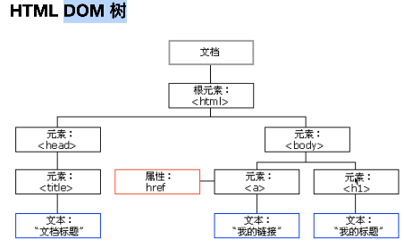

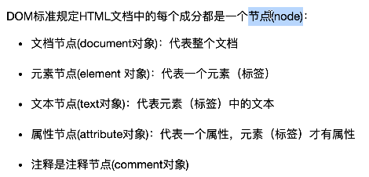


**DOM树的概念**

DOM标准规定HTML文档的每个成分都是一个节点

- 文档节点（document对象）：代表整个文档
- 元素节点element对象：代表一个元素（标签）
- 文本节点对象text对象，代表元素（标签）中的文本
- 属性节点attribute对象代表一个属性，元素标签才有属性
- 注释是注释节点comment对象


所有的标签都可以称之为是节点

JavaScript 可以通过DOM创建动态的 HTML：

JavaScript 能够改变页面中的所有 HTML 元素
   JavaScript 能够改变页面中的所有 HTML 属性
   JavaScript 能够改变页面中的所有 CSS 样式
   JavaScript 能够对页面中的所有事件做出反应

DOM操作的是标签 而一个html页面上的标签有很多 
	1.先学如何查找标签
	2.再学DOM操作标签
	
DOM操作需要用关键字document起手

#### 查找标签

**直接查找**

页面准备

```html
<!DOCTYPE html>
<html lang="en">
<head>
    <meta charset="UTF-8">
    <title>查找标签</title>
</head>
<body>

<div id="d1">div
    <div>div>div</div>
    <p class="c1">div>p
        <span>div>p>span</span>
    </p>
    <p>div>p</p>
</div>

</body>
</html>
```


```js
// 第一个方法  ID 查找 ID是唯一。
document.getElementById('d1')
<div id=​"d1">​"div "<div>​div>div​</div>​<p class=​"c1">​…​</p>​<p>​div>p​</p>​</div>​

// 第二个  类查找  类有多个，存放到数组中
document.getElementsByClassName('c1')
HTMLCollection [p.c1]

// 第三种  标签查找 结果有多个
document.getElementsByTagName('div')
HTMLCollection(3) [div#d1, div, div, d1: div#d1]

// 把某个存储到一个变量中方便后期使用
let divEle = document.getElementsByTagName('div')[0]

divEle
<div id=​"d1">​…​</div>​"div "<div>​div>div​</div>​<p class=​"c1">​…​</p>​<p>​div>p​</p>​</div>​

当你用变量名指代标签对象的时候 一般情况下都推荐你书写成
xxxEle
	divEle
	aEle
	pEle

let divEle = document.getElementsByTagName('div')[0]

divEle.parentElement  # 上一级标签
```

**间接查找**(熟悉)

页面准备

```html
<!DOCTYPE html>
<html lang="en">
<head>
    <meta charset="UTF-8">
    <title>查找标签</title>
</head>
<body>
<div>top-div1</div>
<div>top-div2</div>
<div id="d1">div
    <div>div>div</div>
    <p class="c1">div>p
        <span>div>p>span</span>
    </p>
    <p>div>p</p>
</div>
<div>foo-div1</div>
<div>foo-div2</div>
</body>
</html>
```


```js
let pEle = document.getElementsByClassName('c1')[0] //注意索引

pEle.parentElement  // 拿取父节点
<div id=​"d1">​…​</div>​

dpEle.parentElement.parentElement //爷爷节点
body层

dpEle.parentElement.parentElement.parentElement  // 太爷爷节点
html层

dpEle.parentElement.parentElement.parentElement.parentElement //太太爷节点
null

let divEle = document.getElementById('d1')

let divEle = document.getElementById('d1')

divEle.children //获取所有子标签
HTMLCollection(3) [div, p.c1, p]

divEle.children[0] //获取子节点下的第一个儿子标签
<div>​div>div​</div>​

divEle.firstElementChild // 跟上面的结果一致都是获取子标签下的第一个标签

divEle.lastElementChild    // 最后的子标签
<p>​div>p​</p>​               

divEle.nextElementSibling  // 同级别下的第一个（从上往下）
<div>​foo-div1​</div>​

divEle.previousElementSibling  //同级别上面第一个（子标签为开始自下往上）
<div>​top-div2​</div>​

```

#### 节点操作

通过DOM操作动态的创建img标签
   并且给标签加属性
   最后将标签添加到文本中

```js
let imgEle = document.createElement('img')  // 创建img标签
 
imgEle.src = '../1.jpg'  // 添加默认属性
'../1.jpg'


imgEle.setAttribute('alt','image') // 自定义属性或者默认属性及值

imgEle
​


let divEle = document.getElementsByClassName('c1')[0] //提起P标签

divEle
<p class=​"c1">​…​</p>​

divEle.appendChild(imgEle) // 在p标签里面添加img属性
​
```

`上面图片只是暂时的刷新就没有了`


   添加到标签内部
   添加到指定的标签的上面

```js
let aEle = document.createElement('a') //创建a标签

aEle.href = 'https://www.baidu.com' //设置属性
'https://www.baidu.com'

aEle.setAttribute('target','_blank') //设置自定义属性

aEle.innerText='超链接' //设置超文本
'超链接'

aEle
<a href=​"https:​/​/​www.baidu.com" target=​"_blank">​超链接​</a>​

let divEle = document.getElementById('d1') // 提取div

let pEle = document.getElementsByClassName('c1')[0] //提取到行内标签

pEle  // 确定上面的变量不会复制到一个数组中
<p class=​"c1">​…​</p>​

divEle.insertBefore(aEle,pEle) //添加标签内容到指定位置
<a href=​"https:​/​/​www.baidu.com" target=​"_blank">​超链接​</a>​

额外补充
	appendChild()
		removeChild()  # 移除指定属性
		replaceChild()   # 替换
	
	
	setAttribute()  设置属性
		getAttribute()  获取属性
		removeAttribute()  移除属性
        
        
# innerText与innerHTML

divEle.innerText //获取标签内部所有的文本
'div\ndiv>div\n超链接\n\ndiv>p div>p>span \n\ndiv>p'

// 内部文本和标签都拿到
divEle.innerHTML
'div\n    <div>div&gt;div</div>\n    <a href="https://www.baidu.com" target="_blank">超链接</a><p class="c1">div&gt;p\n        <span>div&gt;p&gt;span</span>\n    </p>\n    <p>div&gt;p</p>\n'   

divEle.innerText='哈哈哈'
'哈哈哈'

divEle.innerHTML='嘿嘿'
'嘿嘿'

divEle.innerText='<h1>哈哈哈</h1>'  // 不识别
'<h1>哈哈哈</h1>'

divEle.innerHTML = '<h1>嘿嘿</h1>'  //识别
'<h1>嘿嘿</h1>'     
```

#### 获取值操作

准备

```html
<!DOCTYPE html>
<html lang="en">
<head>
    <meta charset="UTF-8">
    <title>获取值操作</title>
</head>
<body>
<div>
  <input type="text" id="l1">
  <input type="file" id="l2">

    <select id="l3">
        <option value="111">呵呵</option>
        <option value="222">哈哈</option>
        <option value="333">嘿嘿</option>

    </select>

</div>

</body>
</html>
```

```js
# 获取用户数据标签内部的数据
let seEle = document.getElementById('l1')  //获取指定ID的用户数据

seEle
<input type=​"text" id=​"l1">​

seEle.value // 用户输入的值
'dsadsa'


let seEle = document.getElementById('l3')
undefined
seEle
<select id=​"l3">​…​</select>​
seEle.value
'111'
seEle.value
'333'
```

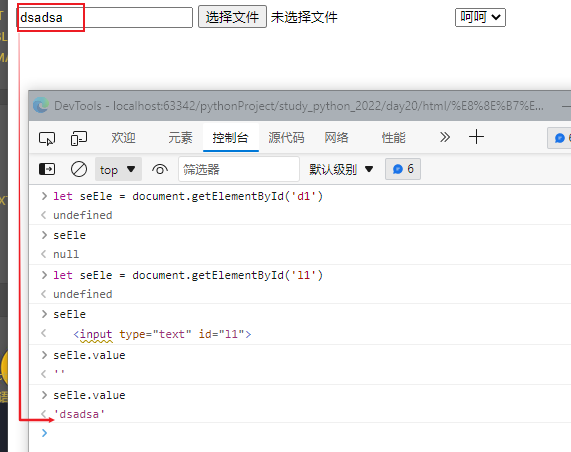

```js
# 如何获取用户上传的文件数据
let fileEle = document.getElementById('l2')

fileEle
<input type=​"file" id=​"l2">​

fileEle.value // 无法获取到文件数据，只能获取文件全路径
'C:\\fakepath\\index.html'

fileEle.files //获取文件数组
FileList {0: File, length: 1}0: File {name: 'index.html', lastModified: 1658546575642, lastModifiedDate: Sat Jul 23 2022 11:22:55 GMT+0800 (中国标准时间), webkitRelativePath: '', size: 39298, …}length: 1[[Prototype]]: FileList


fileEle.files[0] //# 获取文件数据
File {name: 'index.html', lastModified: 1658546575642, lastModifiedDate: Sat Jul 23 2022 11:22:55 GMT+0800 (中国标准时间), webkitRelativePath: '', size: 39298, …}
```


#### class、css操作

```html
# 准备
<style>
   样式
</style>
```


```js
let divEle = document.getElementById('d1')

divEle.classList  # 获取标签所有的类属性
DOMTokenList(3) ["c1", "bg_red", "bg_green", value: "c1 bg_red bg_green"]

divEle.classList.remove('bg_red')  # 移除某个类属性
undefined

divEle.classList.add('bg_red')  # 添加类属性
undefined
divEle.classList.contains('c1')  # 验证是否包含某个类属性
true
divEle.classList.contains('c2')
false

divEle.classList.toggle('bg_red')  # 有则删除无则添加
false
divEle.classList.toggle('bg_red')
true
divEle.classList.toggle('bg_red')
false
divEle.classList.toggle('bg_red')
true
divEle.classList.toggle('bg_red')
false
divEle.classList.toggle('bg_red')
true


# DOM操作操作标签样式 统一先用style起手
let pEle = document.getElementsByTagName('p')[0]
undefined
pEle.style.color = 'red'
"red"
pEle.style.fontSize = '28px'
"28px"
pEle.style.backgroundColor = 'yellow'
"yellow"
pEle.style.border = '3px solid red'
"3px solid red"
```

#### 事件

达到某个事先设定的条件 自动触发的动作

【参考】

https://www.w3school.com.cn/tags/html_ref_eventattributes.asp

```html
# 绑定事件的两种方式
<button onclick="func1()">点我</button>
<button id="d1">点我</button>

<script>
    // 第一种
    function func1(){
        alert('弹出警告框')
    }

    // 第二种
    let btnEle = document.getElementById('d1')
    btnEle.onclick = function (){
        alert(2222)
    }

</script>

等待浏览器窗口加载完毕之后再执行代码
window.onload = function () {
            // 第一种绑定事件的方式
            function func1() {
                alert(111)
            }
            // 第二种
            let btnEle = document.getElementById('d1');
            btnEle.onclick = function () {
                alert(222)
            }
        }
```

script标签既可以放在head内 也可以放在body内,但是通常情况下都是放在body内的最底部.

#### 原生js事件绑定

**开关灯**

```html
<!DOCTYPE html>
<html lang="en">
<head>
    <meta charset="UTF-8">
    <title>开关灯</title>
    <style>
        .c1{
            height: 400px;
            width: 400px;
            border-radius: 50%;
        }
        .bg_red{
            background-color: red;
        }
        .bg_green{
            background-color: greenyellow;
        }
    </style>
</head>
<body>
<div id="d1" class="c1 bg_red bg_green"></div>
<button id="d2">关灯</button>
<script>
    let btnEle = document.getElementById('d2')
    let divEle = document.getElementById('d1')
    btnEle.onclick = function (){  //绑定点击事件
        // 动态的修改DIv标签的类属性
        divEle.classList.toggle('bg_green')
    }
</script>
</body>
</html>
```

**input框**

```html
<!DOCTYPE html>
<html lang="en">
<head>
    <meta charset="UTF-8">
    <title>input框</title>
</head>
<body>
<input type="text" value="what ?" id="d1">

<script>
    let iEle = document.getElementById('d1')

    // 获取焦点事件
    iEle.onfocus = function (){
        // 将input框内部值去除
        iEle.value = ''
        // 点value就是获取
    }

    // 失去焦点事件
    iEle.onblur = function (){
        // 给input标签重写赋值
        iEle.value = 'you are pig!'
    }
</script>
</body>
</html>
```

默认是what，点击进入是获取焦点，离开就是失去焦点

**展示当前时间**

```html
<!DOCTYPE html>
<html lang="en">
<head>
    <meta charset="UTF-8">
    <title>展示当前时间</title>
    <style>
        .d1{
            display: block;
            height: 50px;
            width: 200px;
        }
    </style>
</head>
<body>
<input type="text" id="d1">
<button id="d2">start</button>
<button id="d3">stop</button>

<script>
    // 定义一个全局存储定时器的变量
    let t = null

    // 定义三个变量
    let inputEle = document.getElementById('d1')
    let startBtnEle = document.getElementById('d2')
    let stopBtnEle = document.getElementById('d3')

    //1、访问页面之后将访问的事件展示到input框中
    //2、动态展示事件
    //3、页面上添加两个按钮一个开始一个结束

    function showTime(){
        let currentTime = new Date();
        inputEle.value = currentTime.toLocaleString()
    }

    startBtnEle.onclick = function (){
        //限制定时器只能开一个
        if(!t){
            t = setInterval(showTime,1000)
            // 每点一次就会开设一个定时器，而T只指代最后一个
        }
    }

    stopBtnEle.onclick = function (){
        clearInterval(t)
        // 将t重置为空
        t = null
    }


</script>

</body>
</html>
```

省市联动

后期有插件可以支持

```html
<!DOCTYPE html>
<html lang="en">
<head>
    <meta charset="UTF-8">
    <title>Title</title>
    <meta name="viewport" content="width=device-width, initial-scale=1">
</head>
<body>
<select name="" id="d1">
    <option value="" selected disabled>--请选择--</option>
</select>
<select name="" id="d2"></select>

<script>
    let proEle = document.getElementById('d1')
    let cityEle = document.getElementById('d2')
    // 先模拟省市数据
    data = {
        "河北": ["廊坊", "邯郸",'唐山'],
        "北京": ["朝阳区", "海淀区",'昌平区'],
        "山东": ["威海市", "烟台市",'临沂市'],
        '上海':['浦东新区','静安区','黄浦区'],
        '深圳':['南山区','宝安区','福田区']
    };
    // 选for循环获取省
    for(let key in data){
        // 将省信息做成一个个option标签 添加到第一个select框中
        // 1 创建option标签
        let opEle = document.createElement('option')
        // 2 设置文本
        opEle.innerText = key
        // 3 设置value
        opEle.value = key  // <option value="省">省</option>
        // 4 将创建好的option标签添加到第一个select中
        proEle.appendChild(opEle)
    }
    // 文本域变化事件  change事件
    proEle.onchange = function () {
        // 先获取到用户选择的省
        let currentPro = proEle.value
        // 获取对应的市信息
        let currentCityList = data[currentPro]
        // 清空市select中所有的option
        cityEle.innerHTML = ''
        // 自己加一个请选择
        let ss = "<option disabled selected>请选择</option>"
        // let oppEle = document.createElement('option')
        // oppEle.innerText = '请选择'
        // oppEle.setAttribute('selected','selected')
        cityEle.innerHTML = ss

        // for循环所有的市 渲染到第二个select中
        for (let i=0;i<currentCityList.length;i++){
            let currentCity = currentCityList[i]
            // 1 创建option标签
            let opEle = document.createElement('option')
            // 2 设置文本
            opEle.innerText = currentCity
            // 3 设置value
            opEle.value = currentCity  // <option value="省">省</option>
            // 4 将创建好的option标签添加到第一个select中
            cityEle.appendChild(opEle)
        }
    }
</script>
</body>
</html>
```


# Jquery

jQuery内部封装了原生的js代码(还额外添加了很多的功能)能够让你通过书写更少的代码 完成js操作 
类似于python里面的模块  在前端模块不叫模块  叫 “类库”

兼容多个浏览器的 你在使用jQuery的时候就不需要考虑浏览器兼容问题

jQuery的宗旨:让你用更少的代码完成更多的事情

jQuery在使用的时候也需要导入,但是它的文件非常的小(几十KB) 基本不影响网络速度

jQuery在使用之前 一定要确保已经导入了

jQuery官网：https://jquery.com/

jQuery下载：https://jquery.com/download/

min版是压缩版很难阅览。

## 导入jQuery


`1、文件下载到了本地 如何解决多个文件反复书写引入语句的代码`

可以使用编辑器pycharm设置，文件和代码模板在html head插入对应的代码

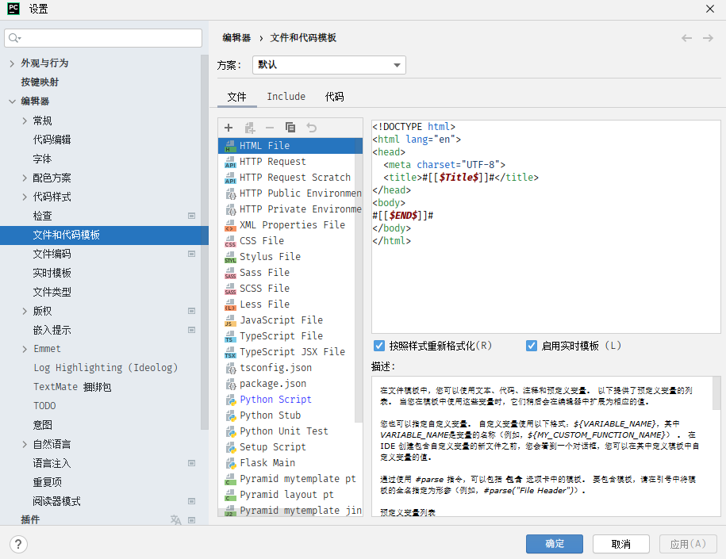

```html
<script src="../js/jquery-3.6.0.js"></script>
```

这种方法的缺点就是需要注意路径

`2、 直接引入jQuery提供的CDN服务(基于网络直接请求加载)`

CDN:内容分发网络
   CDN有免费的也有收费的
   前端免费的cdn网站: bootcdn https://www.bootcdn.cn/

jsdelivr:https://www.jsdelivr.com/

```html
<script src="https://cdn.bootcdn.net/ajax/libs/jquery/3.6.0/jquery.min.js"></script>
```

这种方法是必须有网络。

### jQuery基本语法

```js
jQuery(选择器).action()
```

  秉持着jQuery的宗旨 jQuery简写 `$`

```js
  jQuery()  === $()
```

`jquery` 与 `js` 对比

```js
# 原生js实现代码变更
let divEle=document.getElementById('d1')

divEle.style.color = 'red'
'red'

# jQuery
$('div').css('color','green')
jQuery.fn.init [div#d1, prevObject: jQuery.fn.init(1)]
```

## 查找标签


准备

```html
<!DOCTYPE html>
<html lang="en">
<head>
    <meta charset="UTF-8">
    <title>Title</title>
  <script src="../js/jquery-3.6.0.js"></script>
</head>
<body>
<div>top1
    <p>
        <span>t1</span>
    </p>
</div>
<div>top2
    <p>
        <span>t2</span>
    </p></div>
<p>外p
    <span> span</span>
</p>
<div id="d1">
    <p>div>p</p>
    <span>div>p>span</span>
    <div class="c3">
        <p class="c1">
            <span>div>p>span</span>
        </p>
    </div>

</div>
<p>下外p</p>

<div class="c2">
    <p>c2</p>
    <span>span2</span>
</div>

<div>foo1
        <p>
        <span>f1</span>
    </p>
</div>
<div>foo2
        <p>
        <span>f2</span>
    </p>
</div>
</body>
</html>
```

### 基本选择器

```js
$('#d1')  // id选择器
jQuery.fn.init [div#d1]

$('c1')   // class选择器
jQuery.fn.init [prevObject: jQuery.fn.init(1)]

$('span') // 标签选择器
jQuery.fn.init(3) [span, span, span, prevObject: jQuery.fn.init(1)]

//对比原生js
$('#d1')[0]
<div id=​"d1">​…​</div>​

document.getElementById('d1')
<div id=​"d1">​…​</div>​

$(document.getElementById('d1'))   // 标签对象转jQuery
jQuery.fn.init [div#d1]

$('#d1')
jQuery.fn.init [div#d1]
```

### 组合选择器/分组与嵌套

```js
$('div') // 所有div 
jQuery.fn.init(6) [div, div, div#d1, div.c2, div, div, prevObject: jQuery.fn.init(1)]

$('div.c2') //div后面的c2类
jQuery.fn.init [div.c2, prevObject: jQuery.fn.init(1)]

$('div#d1') //div下面的d1 ID
jQuery.fn.init [div#d1, prevObject: jQuery.fn.init(1)]

$('*')  // 所有标签
jQuery.fn.init(21) [html, head, meta, title, script, style, body, div, div, p, span, div#d1, p, span, p.c1, span, p, div.c2, div, div, script, prevObject: jQuery.fn.init(1)]


$('d1,.c3,p') //并列 + 混用
jQuery.fn.init(6) [p, p, div.c3, p.c1, p, p, prevObject: jQuery.fn.init(1)]

$('div span') // 后代
jQuery.fn.init(3) [span, span, span, prevObject: jQuery.fn.init(1)]

$('div>span')  //儿子
jQuery.fn.init(2) [span, span, prevObject: jQuery.fn.init(1)]

$('div+p')  // 毗邻
jQuery.fn.init(2) [p, p, prevObject: jQuery.fn.init(1)]

$('div~p')  //弟弟
jQuery.fn.init(2) [p, p, prevObject: jQuery.fn.init(1)]
```

### 基本筛选器

```js
// 一次输入多个标签
ul>li{1$$}*10 + tab
<ul>
    <li>101</li>
    <li>102</li>
    <li>103</li>
    <li>104</li>
    <li>105</li>
    <li>106</li>
    <li>107</li>
    <li>108</li>
    <li>109</li>
    <li>110</li>
</ul>
```

准备

```html
<!DOCTYPE html>
<html lang="en">
<head>
    <meta charset="UTF-8">
    <title>Title</title>
</head>
<body>
<ul>
    <li>101</li>
    <li>102</li>
    <li>103</li>
    <li>104</li>
    <li class="c1">105</li>
    <li>106</li>
    <li>107</li>
    <li id="d1">108</li>
    <li>109</li>
    <li>110</li>
</ul>
<div>div
    <p></p>
    <span></span>

</div>
<div>div
    <a href=""></a>
</div>

</body>
</html>
```

```js
$('ul li') //所有li标签
S.fn.init(10) [li, li, li, li, li.c1, li, li, li#d1, li, li, prevObject: S.fn.init(1)]

$('ul li:first')  // 第一个li  101
S.fn.init [li, prevObject: S.fn.init(1)]

$('ul li:last') // 最后一个 110
S.fn.init [li, prevObject: S.fn.init(1)]

$('ul li:eq(2)')  //索引到2位置 103（0起始）
S.fn.init [li, prevObject: S.fn.init(1)]

$('ul li:gt(2)') //大于索引2的li
S.fn.init(7) [li, li.c1, li, li, li#d1, li, li, prevObject: S.fn.init(1)]0: li1: li.c12: li3: li4: li#d15: li6: lilength: 7prevObject: S.fn.init [document][[Prototype]]: Object(0)

$('ul li:lt(2)') //小于索引2的li
S.fn.init(2) [li, li, prevObject: S.fn.init(1)]0: li1: lilength: 2prevObject: S.fn.init [document][[Prototype]]: Object(0)

$('ul li:even') //偶数索引
S.fn.init(5) [li, li, li.c1, li, li, prevObject: S.fn.init(1)]0: li1: li2: li.c13: li4: lilength: 5prevObject: S.fn.init [document][[Prototype]]: Object(0)

$('ul li:odd') //奇数索引
S.fn.init(5) [li, li, li, li#d1, li, prevObject: S.fn.init(1)]

$('ul li:not("#d1")') // 移除满足条件的标签
S.fn.init(9) [li, li, li, li, li.c1, li, li, li, li, prevObject: S.fn.init(1)]

$('div') //所有div
S.fn.init(2) [div, div, prevObject: S.fn.init(1)]

$('div:has("p")') // 选取出包含一个或多个标签内的标签
S.fn.init [div, prevObject: S.fn.init(1)]
```

### 属性选择器

准备

```html
<!DOCTYPE html>
<html lang="en">
<head>
    <meta charset="UTF-8">
    <title>Title</title>
    <script src="https://cdn.bootcdn.net/ajax/libs/jquery/3.6.0/jquery.min.js"></script>
</head>
<body>
<input type="text" username="jason">
<input type="text" username="egon">
<p username="egon"></p>
</body>
</html>
```

```js
$('[username]')
S.fn.init(3) [input, input, p, prevObject: S.fn.init(1)]0: input1: input2: plength: 3prevObject: S.fn.init [document][[Prototype]]: Object(0)

$('[username="jason"]')
S.fn.init [input, prevObject: S.fn.init(1)]

$('[type]')
S.fn.init(3) [style, input, input, prevObject: S.fn.init(1)]0: style1: input2: inputlength: 3prevObject: S.fn.init [document][[Prototype]]: Object(0)

$('[type="text"]')
S.fn.init(2) [input, input, prevObject: S.fn.init(1)]
```

### 表单选择器

```html
<!DOCTYPE html>
<html lang="en">
<head>
    <meta charset="UTF-8">
    <title>Title</title>
    <script src="https://cdn.bootcdn.net/ajax/libs/jquery/3.6.0/jquery.min.js"></script>
</head>
<body>
<form action="">
    <p>username:<input type="text"></p>
    <p>password<input type="password"></p>
    <input type="checkbox" value="111">111
    <input type="checkbox" value="111" checked>222
    <input type="checkbox" value="111">333

    <select name="" id="">
        <option value="">111</option>
        <option value="">222</option>
        <option value="" selected>333</option>
    </select>

    <input type="button" value="按钮">

</form>
</body>
</html>
```

```js
$('input[type="text"]')
S.fn.init [input, prevObject: S.fn.init(1)]0: inputlength: 1prevObject: S.fn.init [document][[Prototype]]: Object(0)

$('input[type="password"]')
S.fn.init [input, prevObject: S.fn.init(1)]0: inputlength: 1prevObject: S.fn.init [document][[Prototype]]: Object(0)

$(':text')  // 等价于 $('input[type="text"]')
S.fn.init [input, prevObject: S.fn.init(1)]

$(':password')
S.fn.init [input, prevObject: S.fn.init(1)]0: inputlength: 1prevObject: S.fn.init [document][[Prototype]]: Object(0)


:text
:password
:file
:radio
:checkbox
:submit
:reset
:button
...

表单对象属性
:enabled
:disabled
:checked
:selected

$(':checked')  # 它会将checked和selected都拿到
S.fn.init(2) [input, option, prevObject: S.fn.init(1)]0: input1: optionlength: 2prevObject: S.fn.init [document][[Prototype]]: Object(0)

$(':selected') # 它不会 只拿selected
S.fn.init [option, prevObject: S.fn.init(1)]0:
S.fn.init [document][[Prototype]]: Object(0)

$('input:checked')  # 自己加一个限制条件
S.fn.init [input, prevObject: S.fn.init(1)]
```

### 筛选器方法

```html
<!DOCTYPE html>
<html lang="en">
<head>
    <meta charset="UTF-8">
    <title>Title</title>
    <script src="https://cdn.bootcdn.net/ajax/libs/jquery/3.6.0/jquery.min.js"></script>
</head>
<body>
    <span id="d1">span</span>
    <span>span</span>
    <div id="d2">
        <span>div>span</span>
        <p>div>p
            <span id="d3">div>p>span</span>
        </p>
        <span>div>span</span>
    </div>
    <span>span</span>
    <span>span</span>
    <span class="c1">span</span>
</body>
</html>
```

```js
$('#d1') 
S.fn.init [span#d1]0: span#d1length: 1[[Prototype]]: Object(0)

$('#d1').next()  // 同级别的下一个
S.fn.init [span, prevObject: S.fn.init(1)]0: spanlength: 1prevObject: S.fn.init [span#d1][[Prototype]]: Object(0)

$('#d1').nextAll()  //下面所有
S.fn.init(6) [span, div#d2, span, span, span.c1, script, prevObject: S.fn.init(1)]0: span1: div#d22: span3: span4: span.c15: scriptlength: 6prevObject: S.fn.init [span#d1][[Prototype]]: Object(0)

$('#d1').nextUntil('.c1') // 不包括最后一个
S.fn.init(4) [span, div#d2, span, span, prevObject: S.fn.init(1)]

$('.c1').prev() // 上一个
S.fn.init [span, prevObject: S.fn.init(1)]

$('.c1').prevAll()
S.fn.init(5) [span, span, div#d2, span, span#d1, prevObject: S.fn.init(1)]

$('.c1').prevUntil()
S.fn.init(5) [span, span, div#d2, span, span#d1, prevObject: S.fn.init(1)]

$('.c1').prevUntil('#d2')
S.fn.init(2) [span, span, prevObject: S.fn.init(1)]

$('#d3').parent() // 第一级父标签
S.fn.init [p, prevObject: S.fn.init(1)]

$('#d3').parent().parent()
S.fn.init [div#d2, prevObject: S.fn.init(1)]

$('#d3').parent().parent().parent()
S.fn.init [body, prevObject: S.fn.init(1)]

$('#d3').parent().parent().parent().parent()
S.fn.init [html, prevObject: S.fn.init(1)]

$('#d3').parent().parent().parent().parent().parent()
S.fn.init [document, prevObject: S.fn.init(1)]

$('#d3').parent().parent().parent().parent().parent().parent()
S.fn.init [prevObject: S.fn.init(1)]

$('#d3').parentsUntil('body')
S.fn.init(2) [p, div#d2, prevObject: S.fn.init(1)]0: p1: div#d2length: 2prevObject: S.fn.init [span#d3][[Prototype]]: Object(0)

$('#d2').children()  //儿子
S.fn.init(3) [span, p, span, prevObject: S.fn.init(1)]

$('#d2').siblings() //同级别下所有
S.fn.init(6) [span#d1, span, span, span, span.c1, script, prevObject: S.fn.init(1)]

$('div p')
S.fn.init [p, prevObject: S.fn.init(1)]

$('div').find('p')
S.fn.init [p, prevObject: S.fn.init(1)]

下面的等价
$('div span:first')
S.fn.init [span, prevObject: S.fn.init(1)]

$('div span').first()
S.fn.init [span, prevObject: S.fn.init(3)]

$('div span:last')
S.fn.init [span, prevObject: S.fn.init(1)]

$('div span').last()
S.fn.init [span, prevObject: S.fn.init(3)]

$('div span:not("#d3")')
S.fn.init(2) [span, span, prevObject: S.fn.init(1)]

$('div span').not('#d3')
S.fn.init(2) [span, span, prevObject: S.fn.init(3)]
```

### 操作标签

| js版本               | jQuery        |
| -------------------- | ------------- |
| classList.add()      | addClass()    |
| classList.remove()   | removeClass() |
| classList.contains() | hasClass()    |
| classList.toggle()   | toggleClass() |

准备

```html
<!DOCTYPE html>
<html lang="en">
<head>
    <meta charset="UTF-8">
    <title>Title</title>
    <script src="https://cdn.bootcdn.net/ajax/libs/jquery/3.6.0/jquery.min.js"></script>
</head>
<body>
   <!-- p{1$$}*3 + tab -->
<p>101</p>
<p>102</p>
<p>103</p>

</body>
</html>
```

```js
$('p') // 获取P标签
S.fn.init(3) [p, p, p, prevObject: S.fn.init(1)]

$('p').first() //获取第一一个标签
S.fn.init [p, prevObject: S.fn.init(3)]0: plength: 1prevObject: S.fn.init(3) [p, p, p, prevObject: S.fn.init(1)][[Prototype]]: Object(0)

$('p').first().css('color','red')  // 第一标签的字体颜色改成red
S.fn.init [p, prevObject: S.fn.init(3)]

$('p').first().css('color','red').next().css('color','green') //第一个标签的下一个标签设定为绿色
S.fn.init [p, prevObject: S.fn.init(1)]

$('p').first().css('color','red').next().css('color','green').next().css('color','blue') //第三个标签设置为蓝色
S.fn.init [p, prevObject: S.fn.init(1)]
```

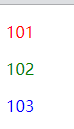

上面是一行代码把同级别下的1 2 3 个P标签设置成不同颜色

jQuery的链式操作 使用jQuery可以做到一行代码操作很多标签

jQuery对象调用jQuery方法之后返回的还是当前jQuery对象 也就可以继续调用其他方法

```python
class MyClass(object):
    def func1(self):
        print('func1')
        return self

    def func2(self):
        print('func2')
        return self
    
obj = MyClass()
obj.func1().func2()
>>>
func1
func2

# 一个对象返回多个值,链式操作
```

#### 位置操作

```html
<!DOCTYPE html>
<html>
<head>
    <meta charset="UTF-8">
    <title>Title</title>
    <script src="https://cdn.bootcdn.net/ajax/libs/jquery/3.6.0/jquery.min.js"></script>
    <style>
        body{
            margin: 0;
        }
        p{
            position: relative;
            margin: 0px;
            top: 100px;
            left: 100px;
        }

    </style>
</head>
<body>


<p>0p0p0p0p0p</p>


</body>
</html>
```

~~~js
offset()  # 相对于浏览器窗口
position()  # 相对于父标签

$('p').offset()
{top: 100, left: 100}

$('p').position()
{top: 100, left: 100}

$(window).scrollTop()   // 获取当前滚动条位置
431
$(window).scrollTop()
0

$(window).scrollTop(24)  // 加了参数就是设置
S.fn.init [Window]
$(window).scrollTop(2400)
S.fn.init [Window]
$(window).scrollLeft(200) // 下滚动条离左边200px
S.fn.init [Window]
~~~

#### 尺寸

~~~js 
// 尺寸
$('p').height() //文本
21
$('p').width()
1148

$('p').innerHeight()  //文本+padding
21
$('p').innerWidth()
1148

$('p').outerHeight() //文本+padding+border
21
$('p').outerWidth()
1148
~~~

#### 文本操作

操作标签内部文本
	js											jQuery
	innerText								text()  括号内不加参数就是获取加了就是设置
	innerHTML								html()

```js
$('div').text() //获取div里面的文本
'0p0p0p0p0p'

$('div').html()  //获取html里面的文本
'<p>0p0p0p0p0p</p>'

$('div').text("修改文本") //设定文本
S.fn.init [div, prevObject: S.fn.init(1)]

$('div').html("html") //设定html文本支持标签
S.fn.init [div, prevObject: S.fn.init(1)]

$('div').text("<h1>title</h1>")
S.fn.init [div, prevObject: S.fn.init(1)]

$('div').html('<h1>title</h1>')
S.fn.init [div, prevObject: S.fn.init(1)]
```

#### 获取值操作

```html
<input type="text" id="d1">
<input type="file" id="d2">

<input type="checkbox" name="hobby" value="111">111
<input type="checkbox" name="hobby" value="222">222
<input type="checkbox" name="hobby" value="333">333
```

js													jQuery
 .value											      .val()

```js
$('#d1').val()
''

$('#d1').val('520')   // 括号内不加参数就是获取加了就是设置
S.fn.init [input#d1]0: input#d1length: 1[[Prototype]]: Object(0)

$('#d1').val()
'520'

$('#d2').val()
'C:\\fakepath\\search_index.json'

$('#d2')[0]
<input type=​"file" id=​"d2">​

$('#d2')[0].files[0] //两个对象之间的转换
File {name: 'search_index.json', lastModified: 1658546609263, lastModifiedDate: Sat Jul 23 2022 11:23:29 GMT+0800 (中国标准时间), webkitRelativePath: '', size: 10393320, …}lastModified: 1658546609263lastModifiedDate: Sat Jul 23 2022 11:23:29 GMT+0800 (中国标准时间) {}name: "search_index.json"size: 10393320type: "application/json"webkitRelativePath: ""[[Prototype]]: File
```

#### 属性操作

js中																jQuery
setAttribute()											attr(name,value)
getAttribute()											attr(name)
removeAttribute()										removeAttr(name)

`在用变量存储对象的时候 js中推荐使用`	

​	XXXEle			标签对象
   `jQuery中推荐使用`
​	   $XXXEle			jQuery对象

```html
// 准备
<p id="d1" username="jason"></p>

<input type="checkbox" value="111" name="hobby" id="d2">
<input type="checkbox" value="222" name="hobby" checked id="d3">
<input type="checkbox" value="333" name="hobby" id="d4">
```

```js
let $pEle = $('p')   //定义一个变量

$pEle.attr('id')  // 获取ID
'd1'

$pEle.attr('class')  // 获取class

$pEle.attr('class','c1')  //获取c1 class
S.fn.init [p#d1.c1, prevObject: S.fn.init(1)]

$pEle.attr('id','id666') //ID改名为id666
S.fn.init [p#id666.c1, prevObject: S.fn.init(1)]

$pEle.attr('password','jason123') //添加password属性
S.fn.init [p#id666.c1, prevObject: S.fn.init(1)]0: p#id666.c1length: 1prevObject: S.fn.init [document][[Prototype]]: Object(0)

$pEle.removeAttr('password')  //移除password属性
S.fn.init [p#id666.c1, prevObject: S.fn.init(1)]
```

对于标签上有的能够看到的属性和自定义属性用attr，对于返回布尔值比如checkbox radio option是否被选中用prop

```js
$('#d3').attr('checked')
'checked'

$('#d2').attr('checked')
undefined

$('#d1').attr('checked')
undefined

$('#d4').attr('checked')
undefined

$('#d2').prop('checked')
false

$('#d3').prop('checked')
true

$('#d4').prop('checked')
false

$('#d2').prop('checked',true) # 勾选
S.fn.init [input#d2]

$('#d2').prop('checked',false)  # 取消勾选
S.fn.init [input#d2]
```

#### 文档处理

**js**													**jQuery**
createElement('p')										$('<p>')
appendChild()											append()

```html
// 准备 
<div id="d1">div
        <p id="d2">div>p</p>
        <span>div>span</span>
        <p>div>p</p>
    </div>
```

```js
let $pEle = $('p') 定义变量

$pEle.text('你好')  设置text
S.fn.init(2) [p#d2, p, prevObject: S.fn.init(1)]0: p#d11: p#d1length: 2prevObject: S.fn.init [document][[Prototype]]: Object(0)

$pEle.attr('id','d1')  获取id为D1的
S.fn.init(2) [p#d1, p#d1, prevObject: S.fn.init(1)]0: p#d11: p#d1length: 2prevObject: S.fn.init [document][[Prototype]]: Object(0)

$('#d1').append($pEle)  //在id=d1的块最后添加$pEle 变量
S.fn.init [div#d1]

$pEle.prependTo($('#d1'))   //在id=d1的头添加$pEle 变量
S.fn.init(2) [p#d1, p#d1, prevObject: S.fn.init(2)]

$('#d2').after($pEle) //放在#d2后面
S.fn.init {}

$pEle.insertAfter($('d1'))
S.fn.init [prevObject: S.fn.init(2)]

$('#d1').before($pEle)
S.fn.init [div#d1]

$pEle.insertBefore($('#d2'))
S.fn.init [prevObject: S.fn.init(2)]

$('#d1').remove() //将标签从DOM树中删除
S.fn.init [p#d1]

$('#d1').empty() //清空标签内部所有的内容
S.fn.init [p#d1]
```

#### 事件

```js
// 第一种
$('#d1').click(function(){alert('hello!')})  #点击#d1弹出警告对话框
S.fn.init [div#d1]

//第二种
$('#d2').on('click',function(){alert('警告')}) #点击#d2弹出警告对话框
S.fn.init [p#d2]

<button id="d1">吻</button>
<button id="d2">亲</button>

<script>
    // 第一种
    $('#d1').click(function () {
            alert('别说话 吻')
    });
    // 第二种(功能更加强大 还支持事件委托)
    $('#d2').on('click',function () {
            alert('借我钱买草莓 后面还你')
    })
</script>
```

##### 克隆事件

准备

```html
<html lang="en">
<head>
    <meta charset="UTF-8">
    <title>Title</title>
    <script src="https://cdn.bootcdn.net/ajax/libs/jquery/3.6.0/jquery.min.js"></script>
    <style>
        #d1{
            height: 100px;
            width: 100px;
            background-color: green;
            border: 1px solid blueviolet;
        }
    </style>
</head>
<body>
<button id="d1">打倒共产党，上线就送10万元宝！</button>
<script>
    $('#d1').on('click',function (){
        // console.log(this) //后台触发点击this 这个#d1事件
        // $(this).clone().insertAfter($('body'))  //以原型点击一次复制一次
        $(this).clone(true).insertAfter($('body')) //以原型或者任何复制品点击一次就复制一次
    })
</script>
</body>
</html>
```

##### 自定义模态框

模态框内部本质就是给标签移除或者添加上hide属性

```html
<html lang="en">
<head>
    <meta charset="UTF-8">
    <title>模态框</title>
    <script src="https://cdn.bootcdn.net/ajax/libs/jquery/3.6.0/jquery.min.js"></script>
    <style>
        body{
            margin: 0px;
        }
        .cover{
            position: fixed;
            left: 0px;
            right: 0px;
            top: 0px;
            bottom: 0px;
            background-color: rgba(128,128,128,0.4);
            z-index: 999;
        }
        .modal{
            width: 180px;
            height: 100px;
            padding: 20px;
            border-radius: 10px;
            background-color: rgba(130,130,130,0.8);
            position: fixed;
            left: 50%;
            top: 50%;
            margin-left: -100px;
            margin-top: -70px;
            z-index: 1000;
        }
        .hide{
            display: none;
        }
        button{
            margin: 20px;
        }
        input{
            border-radius: 5px;
            border: 1px;
        }

    </style>
</head>
<body>
<input type="button" value="登录" id="i0">
<div class="cover hide"></div>
<div class="modal hide">
    <label for="i1">name:</label> <input type="text" id="i1"> <br>
    <label for="i2">password:</label> <input type="password" id="i2"> <br>
    <input type="button" id="i3" value="Close">
</div>

<script>
    // click
    $('#i0').click(function (){
        var coverEle = $('.cover')[0];
        var modalEle = $('.modal')[0];

        $(coverEle).removeClass('hide');
        $(modalEle).removeClass('hide');
    })

    // close
    var cButton = $('#i3')[0];
    cButton.onclick=function (){
        var coverEle = $('.cover')[0];
        var modalEle = $('.modal')[0];

        $(coverEle).addClass('hide');
        $(modalEle).addClass('hide');
    }
</script>

</body>
</html>
```

##### 左菜单

```html
<html lang="en">
<head>
    <meta charset="UTF-8">
    <title>left_menu</title>
    <script src="https://cdn.bootcdn.net/ajax/libs/jquery/3.6.0/jquery.min.js"></script>
    <style>
        .left{
            float:left;
            background-color: rgba(128,128,128,0.5);
            width: 20%;
            height: 100%;
            position: fixed;
        }
        .menu{
            font-size: 24px;
            color: white;
            text-align: center;
        }
        .items{
            border: 1px solid white;
            background-color: cadetblue;
        }
        .hide{
            display: none;
        }
    </style>
</head>
<body>
<div class="left">
    <div class="menu">101
        <div class="items">101</div>
        <div class="items">102</div>
        <div class="items">103</div>
    </div>
    <div class="menu">201
        <div class="items">201</div>
        <div class="items">202</div>
        <div class="items">203</div>
    </div>
    <div class="menu">301
        <div class="items">301</div>
        <div class="items">302</div>
        <div class="items">303</div>
    </div>
</div>

<script>
    $('.menu').click(function (){
        $('.items').addClass('hide')
        $(this).children().removeClass('hide')
    })
</script>

</body>
</html>
```

##### 返回顶部

```html
<html lang="en">
<head>
    <meta charset="UTF-8">
    <title>Title</title>
    <meta name="viewport" content="width=device-width, initial-scale=1">
    <link href="https://cdn.bootcss.com/twitter-bootstrap/3.4.1/css/bootstrap.min.css" rel="stylesheet">
    <script src="https://cdn.bootcss.com/jquery/3.3.1/jquery.min.js"></script>
    <script src="https://cdn.bootcss.com/twitter-bootstrap/3.4.1/js/bootstrap.min.js"></script>
    <style>
        .hide {
            display: none;
        }
        #d1 {
            position: fixed;
            background-color: black;

            right: 20px;
            bottom: 20px;
            height: 50px;
            width: 50px;
        }
    </style>
</head>
<body>
<a href="" id="d1"></a>
<div style="height: 500px;background-color: red"></div>
<div style="height: 500px;background-color: greenyellow"></div>
<div style="height: 500px;background-color: blue"></div>
<a href="#d1" class="hide">回到顶部</a>

<script>
    $(window).scroll(function () {
        if($(window).scrollTop() > 300){
            $('#d1').removeClass('hide')
        }else{
            $('#d1').addClass('hide')
        }
    })
</script>
</body>
</html>
```

##### 自定义登录校验

```html
<!DOCTYPE html>
<html lang="en">
<head>
    <meta charset="UTF-8">
    <title>Title</title>
    <meta name="viewport" content="width=device-width, initial-scale=1">
    <link href="https://cdn.bootcss.com/twitter-bootstrap/3.4.1/css/bootstrap.min.css" rel="stylesheet">
    <script src="https://cdn.bootcss.com/jquery/3.3.1/jquery.min.js"></script>
    <script src="https://cdn.bootcss.com/twitter-bootstrap/3.4.1/js/bootstrap.min.js"></script>
</head>
<body>
<p>username:
    <input type="text" id="username">
    <span style="color: red"></span>
</p>
<p>password:
    <input type="text" id="password">
    <span style="color: red"></span>
</p>
<button id="d1">提交</button>

<script>
    let $userName = $('#username')
    let $passWord = $('#password')
    $('#d1').click(function () {
        // 获取用户输入的用户名和密码 做校验
        let userName = $userName.val()
        let passWord = $passWord.val()
        if (!userName){
            $userName.next().text("用户名不能为空")
        }
        if (!passWord){
            $passWord.next().text('密码不能为空')
        }
    })
    $('input').focus(function () {
        $(this).next().text('')
    })
</script>
</body>
</html>
```

##### input监控

```html
<html lang="en">
<head>
    <meta charset="UTF-8">
    <title>k</title>
    <meta name="viewport" content="width=device-width, initial-scale=1">
    <link href="https://cdn.bootcss.com/twitter-bootstrap/3.4.1/css/bootstrap.min.css" rel="stylesheet">
    <script src="https://cdn.bootcss.com/jquery/3.3.1/jquery.min.js"></script>
    <script src="https://cdn.bootcss.com/twitter-bootstrap/3.4.1/js/bootstrap.min.js"></script>
</head>
<body>
<input type="text" id="d1">

<script>
    $('#d1').on('input',function () {
        console.log(this.value)
    })
</script>
</body>
</html>
```

##### hover事件

```html
<html lang="en">
<head>
    <meta charset="UTF-8">
    <title>Title</title>
    <meta name="viewport" content="width=device-width, initial-scale=1">
    <link href="https://cdn.bootcss.com/twitter-bootstrap/3.4.1/css/bootstrap.min.css" rel="stylesheet">
    <script src="https://cdn.bootcss.com/jquery/3.3.1/jquery.min.js"></script>
    <script src="https://cdn.bootcss.com/twitter-bootstrap/3.4.1/js/bootstrap.min.js"></script>

</head>
<body>
<p id="d1">到家啊就是度假酒店</p>

<script>
    // $("#d1").hover(function () {  // 鼠标悬浮 + 鼠标移开
    //     alert(123)
    // })

    $('#d1').hover(
        function () {
            alert('我来了')  // 悬浮
    },
        function () {
            alert('我溜了')  // 移开
        }
    )
</script>
</body>
</html>
```

##### 键盘按键

```html
<html lang="en">
<head>
    <meta charset="UTF-8">
    <title>Title</title>
    <meta name="viewport" content="width=device-width, initial-scale=1">
    <link href="https://cdn.bootcss.com/twitter-bootstrap/3.4.1/css/bootstrap.min.css" rel="stylesheet">
    <script src="https://cdn.bootcss.com/jquery/3.3.1/jquery.min.js"></script>
    <script src="https://cdn.bootcss.com/twitter-bootstrap/3.4.1/js/bootstrap.min.js"></script>
</head>
<body>

<script>
    $(window).keydown(function (event) {
        console.log(event.keyCode)
        if (event.keyCode === 16){
            alert('你按了shift键')
        }
    })
</script>
</body>
</html>
```

#### jQuery练习题

把代码复制到html中

```html
<html lang="zh-CN">
<head>
  <meta charset="UTF-8">
  <meta http-equiv="x-ua-compatible" content="IE=edge">
  <meta name="viewport" content="width=device-width, initial-scale=1">
  <title>jQuery选择器筛选器练习</title>
  <link href="https://cdn.bootcss.com/bootstrap/3.3.7/css/bootstrap.min.css" rel="stylesheet">
  <link href="https://cdn.bootcss.com/font-awesome/4.7.0/css/font-awesome.min.css" rel="stylesheet">
  <style>

    .my-padding {
      padding: 10px 0;
    }

    .my-dark {
      background-color: #f5f5f5;
    }

    .footer {
      background: #111;
      font-size: 0.9em;
      position: relative;
      clear: both;
    }
    .my-white {
      color: #ffffff;
    }

    body {
      margin: 0;
    }
    #progress {
      height: 2px;
      background-color: #b91f1f;
      transition: opacity 500ms linear;
    }
    #progress.done{
      opacity: 0;
    }
  </style>
</head>
<body>
<div id="progress"></div>
<!--导航栏开始-->
<nav class="navbar navbar-inverse my-nav">
  <div class="container">
    <!-- Brand and toggle get grouped for better mobile display -->
    <div class="navbar-header">
      <button type="button" class="navbar-toggle collapsed" data-toggle="collapse"
              data-target="#bs-example-navbar-collapse-1" aria-expanded="false">
        <span class="sr-only">Toggle navigation</span>
        <span class="icon-bar"></span>
        <span class="icon-bar"></span>
        <span class="icon-bar"></span>
      </button>
      <a class="navbar-brand" href="http://www.oldboyedu.com/"><strong>OldBoy Edu</strong></a>
    </div>

    <!-- Collect the nav links, forms, and other content for toggling -->
    <div class="collapse navbar-collapse" id="bs-example-navbar-collapse-1">
      <ul class="nav navbar-nav">
        <li><a href="#">Python学院<span class="sr-only">(current)</span></a></li>
        <li><a href="#">Linux学院</a></li>
        <li><a href="http://luffy.oldboyedu.com">路飞学城</a></li>
      </ul>
      <ul class="nav navbar-nav navbar-right">
        <li><a href="#">好好学习</a></li>
        <li class="dropdown">
          <a href="#" class="dropdown-toggle" data-toggle="dropdown" role="button" aria-haspopup="true"
             aria-expanded="false">联系我们<span class="caret"></span></a>
          <ul class="dropdown-menu">
            <li><a href="#">Jason</a></li>
            <li><a href="#">Sean</a></li>
            <li><a href="#">Oscar</a></li>
            <li role="separator" class="divider"></li>
            <li><a href="#">Jason</a></li>
          </ul>
        </li>
      </ul>
    </div><!-- /.navbar-collapse -->
  </div><!-- /.container-fluid -->
</nav>
<!--导航栏结束-->


<div class="container">

  <div class="jumbotron">
    <div id="i1" class="container">
      <h1 class="c1">Jason</h1>
      <h1 class="c1">带你学习jQuery</h1>
      <p id="p1"><a class="btn btn-primary btn-lg" href="https://q1mi.github.io/Blog/2017/07/10/about_jQuery/"
                    role="button">查看更多</a></p></div>
  </div>
  <hr>
  <div class="row">
    <div class="col-md-12">
      <table class="table table-bordered table-striped">
        <thead>
        <tr>
          <th>#</th>
          <th>姓名</th>
          <th>爱好</th>
          <th>操作</th>
        </tr>
        </thead>
        <tbody>
        <tr>
          <th>1</th>
          <td>Jason</td>
          <td>学习</td>
          <td>
            <button class="btn btn-warning">编辑</button>
            <button class="btn btn-danger">删除</button>
          </td>
        </tr>
        <tr>
          <th>2</th>
          <td>Oscar</td>
          <td>大饼</td>
          <td>
            <button class="btn btn-warning">编辑</button>
            <button class="btn btn-danger">删除</button>
          </td>
        </tr>
        <tr id="tr3">
          <th>3</th>
          <td>Egon</td>
          <td>吹牛逼</td>
          <td>
            <button class="btn btn-warning">编辑</button>
            <button class="btn btn-danger">删除</button>
          </td>
        </tr>
        </tbody>
      </table>
    </div>
  </div>

  <hr>
  <div class="row">
    <div class="col-md-12">
      <form id="f1">
        <div class="form-group">
          <label for="exampleInputEmail1">邮箱</label>
          <input type="email" class="form-control" id="exampleInputEmail1" placeholder="Email">
        </div>
        <div class="form-group">
          <label for="exampleInputPassword1">密码</label>
          <input type="password" class="form-control" id="exampleInputPassword1" placeholder="Password">
        </div>
        <div class="form-group">
          <label for="exampleInputFile">上传头像</label>
          <input type="file" id="exampleInputFile">
          <p class="help-block">只支持img格式。</p>
        </div>
        <button id="btnSubmit" type="submit" class="btn btn-default">提交</button>
      </form>
    </div>
  </div>

  <hr>

  <div class="row">
    <div class="col-md-12">
      <div class="checkbox-wrapper">
        <div class="panel panel-info">
          <div class="panel-heading">jQuery学习指南</div>
          <div id="my-checkbox" class="panel-body">
            <div class="checkbox">
              <label>
                <input type="checkbox" value="0">
                jQuery一点都不难
              </label>
            </div>
            <div class="checkbox">
              <label>
                <input type="checkbox" value="1" checked>
                jQuery一学就会
              </label>
            </div>
            <div class="checkbox">
              <label>
                <input type="checkbox" value="2">
                jQuery就要多练
              </label>
            </div>

            <div class="checkbox">
              <label>
                <input type="checkbox" value="3" disabled>
                jQuery学不好
              </label>
            </div>
          </div>
        </div>
      </div>
      <hr>
      <div class="radio-wrapper">

        <div class="panel panel-info">
          <div class="panel-heading">我来老男孩之后...</div>
          <div class="panel-body">
            <div class="radio">
              <label>
                <input type="radio" name="optionsRadios" id="optionsRadios1" value="option1" checked>
                我的心中只有学习
              </label>
            </div>
            <div class="radio">
              <label>
                <input type="radio" name="optionsRadios" id="optionsRadios2" value="option2">
                学习真的太TM有意思了
              </label>
            </div>
          </div>
        </div>
      </div>
    </div>
  </div>

  <hr>

  <div>
    <i class="fa fa-hand-pointer-o fa-lg fa-rotate-90" aria-hidden="true"></i>
    <a class="btn btn-success" href="http://jquery.cuishifeng.cn/">jQuery中文API指南</a>
  </div>

  <hr>

  <div class="row">
    <div class="col-md-12">
      <h2>练习题：</h2>
      <ol id="o1">
        <li>找到本页面中id是<code>i1</code>的标签</li>
        <li>找到本页面中所有的<code>h2</code>标签</li>
        <li>找到本页面中所有的<code>input</code>标签</li>
        <li>找到本页面所有样式类中有<code>c1</code>的标签</li>
        <li>找到本页面所有样式类中有<code>btn-default</code>的标签</li>
        <li>找到本页面所有样式类中有<code>c1</code>的标签和所有<code>h2</code>标签</li>
        <li>找到本页面所有样式类中有<code>c1</code>的标签和id是<code>p3</code>的标签</li>
        <li>找到本页面所有样式类中有<code>c1</code>的标签和所有样式类中有<code>btn</code>的标签</li>
        <p id="p2" class="divider"></p>
        <li>找到本页面中<code>form</code>标签中的所有<code>input</code>标签</li>
        <li>找到本页面中被包裹在<code>label</code>标签内的<code>input</code>标签</li>
        <li>找到本页面中紧挨在<code>label</code>标签后面的<code>input</code>标签</li>
        <li>找到本页面中id为<code>p2</code>的标签后面所有和它同级的<code>li</code>标签</li>
        <p id="p3" class="divider"></p>
        <li>找到id值为<code>f1</code>的标签内部的第一个input标签</li>
        <li>找到id值为<code>my-checkbox</code>的标签内部最后一个input标签</li>
        <li>找到id值为<code>my-checkbox</code>的标签内部没有被选中的那个input标签</li>
        <li>找到所有含有<code>input</code>标签的<code>label</code>标签</li>
      </ol>
    </div>
  </div>
</div>

<div class="my-dark my-padding">
  <div class="container">
    <div class="col-sm-8 my-center">
      <p>写很少的代码，做很多的事。</p>
      <h4>所以说</h4>
      <p>学好jQuery真的很重要，学好jQuery真的很重要，学好jQuery真的很重要。</p>
    </div>
  </div>
</div>

<div class="footer">
  <div class="row">
    <div class="col-md-12 text-center">
      <span class="my-white">&copy;2020 Jason</span>
    </div>
  </div>
</div>

<script src="https://cdn.bootcss.com/jquery/3.2.1/jquery.min.js"></script>
<script src="https://cdn.bootcss.com/bootstrap/3.3.7/js/bootstrap.min.js"></script>
</body>
</html>
```

#### 阻止事件

```html
<html lang="en">
<head>
    <meta charset="UTF-8">
    <title>Title</title>
    <script src="https://cdn.bootcdn.net/ajax/libs/jquery/3.6.0/jquery.min.js"></script>
</head>
<body>
<form action="">
    <span id="d1" style="color: red"></span>
    <input type="submit" id="d2">
</form>
<script>
    $('#d2'.click(function (e){
        $('#d1').text('fuck')
        // 阻止标签后续事件的执行 方式1
        // return false
        // 阻止标签后续事件的执行 方式2
        e.preventDefault()
    }))
</script>

</body>
</html>
```

#### 阻止事件冒泡

```html
    <div id="d1">div
        <p id="d2">div>p
            <span id="d3">span</span>
        </p>
    </div>
<script>
    $('#d1').click(function (){
        alert('div')
    })
    $('#d2').click(function (){
        alert('p')
    })
    $('#d3').click(function (e){
        alert('span')
        // 阻止事件冒泡的方式1
        // return false
        // 阻止事件冒泡的方式2
        e.stopPropagation()
    })
</script>
```

#### 事件委托

```html
<button>打到xxx，上线就送10万刀！</button>

<button>sss</button>
<script>
    // 给页面上所有的button标签绑定点击事件
    // $('button').click(function (){
    //     alert('123 click！')
    // })

    // 事件委托
    $('body').on('click','button',function (){
        alert('事件委托')
    })
</script>
```

#### 页面加载

```js
# 等待页面加载完毕再执行代码
window.onload = function(){
  // js代码
}

"""jQuery中等待页面加载完毕"""
# 第一种
$(document).ready(function(){
  // js代码
})
# 第二种
$(function(){
  // js代码
})
# 第三种
"""直接写在body内部最下方"""
```

#### 动画效果

准备

```html
<html lang="en">
<head>
    <meta charset="UTF-8">
    <title>Title</title>
    <script src="https://cdn.bootcdn.net/ajax/libs/jquery/3.6.0/jquery.min.js"></script>
  <style>
      #d1{
          height: 1000px;
          width: 400px;
          background-color: red;
      }
  </style>
</head>
<body>
<div id="d1"></div>
</body>
</html>
```

```js
$('#d1').hide(5000)  5秒内隐藏 向西北方向隐藏
S.fn.init [div#d1]

$('#d1').show(5000)  5秒内显示  向东南方向显示
S.fn.init [div#d1]

$('#d1').slideUp(5000)  从低到顶隐藏起来
S.fn.init [div#d1]

$('#d1').slideDown(5000) 从顶到底显示出来
S.fn.init [div#d1]

$('#d1').fadeOut(5000)  渐淡隐藏
S.fn.init [div#d1]

$('#d1').fadeIn(5000) 淡深显示
S.fn.init [div#d1]

$('#d1').fadeTo(5000,0.4)  渐淡隐藏到40% 
S.fn.init [div#d1]
```

each

```html
<div id="d1" name="jon">1</div>
<div>2</div>
<div>3</div>
<div>4</div>
<div>5</div>
<div>6</div>
<div>7</div>
<div>8</div>
<div>9</div>
<div>10</div>
```

```js
$('div')  列出所有DIV
S.fn.init(10) [div#d1, div, div, div, div, div, div, div, div, div, prevObject: S.fn.init(1)]

$('div').each(function(index){console.log(index)})
VM396:1 0
VM396:1 1
VM396:1 2
VM396:1 3
VM396:1 4
VM396:1 5
VM396:1 6
VM396:1 7
VM396:1 8
VM396:1 9

$('div').each(function(index,obj){console.log(index,obj)})
VM655:1 0 <div id=​"d1" name=​"jon">​1​</div>​
VM655:1 1 <div>​2​</div>​
VM655:1 2 <div>​3​</div>​
VM655:1 3 <div>​4​</div>​
VM655:1 4 <div>​5​</div>​
VM655:1 5 <div>​6​</div>​
VM655:1 6 <div>​7​</div>​
VM655:1 7 <div>​8​</div>​
VM655:1 8 <div>​9​</div>​
VM655:1 9 <div>​10​</div>​
S.fn.init(10) [div#d1, div, div, div, div, div, div, div, div, div, prevObject: S.fn.init(1)]

第二种
$.each([111,222,333],function(index,obj){console.log(index,obj)})
VM898:1 0 111
VM898:1 1 222
VM898:1 2 333
(3) [111, 222, 333]

有了each之后 就无需自己写for循环了 用它更加的方便

# data()
能够让标签帮我们存储数据 并且用户肉眼看不见
$('div').data('info','come on baby')
S.fn.init(10) [div#d1, div, div, div, div, div, div, div, div, div, prevObject: S.fn.init(1)]

$('div').first().data('info')
'come on baby'
$('div').last().data('info')
'come on baby'

$('div').first().data('xxx')
undefined

$('div').first().removeData('info')
S.fn.init [div#d1, prevObject: S.fn.init(10)]

$('div').last().data('info')
'come on baby'
```

jQuery有空就多练习练习


# bootstrap 框架

bootstrap 框架是一个自带很多style的框架，使用之前需要先下载bootstrap包

bootstrap 官网：https://www.bootcss.com/

bootstrap DOC:https://v5.bootcss.com/docs/5.1/getting-started/introduction/

怎么选bootstrap版本？

v3 v4 v5

稳定版本肯定是v3 v4 ，但是IE8已经停止维护市面很少支持了。edge浏览器最低支持v4了。但是v5也是根据最近的浏览器，v3估计有些会出现兼容性问题。

**bootstrap的js代码是依赖于jQuery的，也就意味着你在使用Bootstrap动态效果的时候，一定要导入jQuery**

那就从官网推荐的开始。

## 准备

### 下载

下载文件到本地：https://v5.bootcss.com/docs/getting-started/download/

下载bootstrap 生产文件

### 引入

下载好之后解压到project file,然后再引用，语法如下：

```html
   <link href="css/bootstrap.min.css" rel="stylesheet">
   <link href="js/bootstrap.min.js">
   <link rel="stylesheet" href="font-awesome-4.7.0/css/font-awesome.min.css">
   <script src="https://cdn.bootcdn.net/ajax/libs/jquery/3.6.0/jquery.min.js"></script>
   <script src="../js/bootstrap.min.js"></script>
```

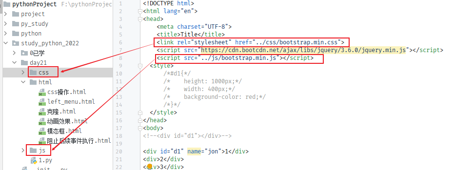

第二种：我们还可以使用cdn

```html
<link href="https://cdn.jsdelivr.net/npm/bootstrap@5.1.3/dist/css/bootstrap.min.css" rel="stylesheet" integrity="sha384-rTTiRUKnSWaDu2FjhzWFl8/JuUZMlplyWE/djenb2LoKqkgLGfEGfSrL7XDLoB1M" crossorigin="anonymous">

<script src="https://cdn.jsdelivr.net/npm/bootstrap@5.1.3/dist/js/bootstrap.bundle.min.js" integrity="sha384-Nj1D6pu2WnJojj+67GiU9ZFNwbl7bUWX5Kj5MS22C8bGjllemM9pvQyvj14zJb58" crossorigin="anonymous"></script>

```

### 集成包

两个集成包都包含了 Bootstrap 的每一个 JavaScript 插件。 即 bootstrap.bundle.js 和 bootstrap.bundle.min.js，此外，还包含了 Popper ，用于支持工具提示（tooltip）和弹出框（popover）功能。

```html
<script src="https://cdn.jsdelivr.net/npm/bootstrap@5.1.3/dist/js/bootstrap.bundle.min.js" integrity="sha384-Nj1D6pu2WnJojj+67GiU9ZFNwbl7bUWX5Kj5MS22C8bGjllemM9pvQyvj14zJb58" crossorigin="anonymous"></script>

# 分开加载
<script src="https://cdn.jsdelivr.net/npm/@popperjs/core@2.11.2/dist/umd/popper.min.js" integrity="sha384-q9CRHqZndzlxGLOj+xrdLDJa9ittGte1NksRmgJKeCV9DrM7Kz868XYqsKWPpAmn" crossorigin="anonymous"></script>

<script src="https://cdn.jsdelivr.net/npm/bootstrap@5.1.3/dist/js/bootstrap.min.js" integrity="sha384-YSu1vEueMOXZYSSiTgjRD6egOBAdWrKI6AQBdHjTtvftX42GZLCVzwlxm0RJuipa" crossorigin="anonymous"></script>

```

入门模板

```html
<!doctype html>
<html lang="zh-CN">
  <head>
    <!-- 必须的 meta 标签 -->
    <meta charset="utf-8">
    <meta name="viewport" content="width=device-width, initial-scale=1">

    <!-- Bootstrap 的 CSS 文件 -->
    <link href="https://cdn.jsdelivr.net/npm/bootstrap@5.1.3/dist/css/bootstrap.min.css" rel="stylesheet" integrity="sha384-rTTiRUKnSWaDu2FjhzWFl8/JuUZMlplyWE/djenb2LoKqkgLGfEGfSrL7XDLoB1M" crossorigin="anonymous">

    <title>Hello, world!</title>
  </head>
  <body>
    <h1>Hello, world!</h1>

    <!-- JavaScript 文件是可选的。从以下两种建议中选择一个即可！ -->

    <!-- 选项 1：包含 Popper 的 Bootstrap 集成包 -->
    <script src="https://cdn.jsdelivr.net/npm/bootstrap@5.1.3/dist/js/bootstrap.bundle.min.js" integrity="sha384-Nj1D6pu2WnJojj+67GiU9ZFNwbl7bUWX5Kj5MS22C8bGjllemM9pvQyvj14zJb58" crossorigin="anonymous"></script>

    <!-- 选项 2：Popper 和 Bootstrap 的 JS 插件各自独立 -->
    <!--
    <script src="https://cdn.jsdelivr.net/npm/@popperjs/core@2.11.2/dist/umd/popper.min.js" integrity="sha384-q9CRHqZndzlxGLOj+xrdLDJa9ittGte1NksRmgJKeCV9DrM7Kz868XYqsKWPpAmn" crossorigin="anonymous"></script>
    <script src="https://cdn.jsdelivr.net/npm/bootstrap@5.1.3/dist/js/bootstrap.min.js" integrity="sha384-YSu1vEueMOXZYSSiTgjRD6egOBAdWrKI6AQBdHjTtvftX42GZLCVzwlxm0RJuipa" crossorigin="anonymous"></script>
    -->
  </body>
</html>
```

### 全局设置

doctype文档类型

```html
<!doctype html>
<html lang="zh-CN">
  ...
</html>
```

响应式布局

Bootstrap 采用的是 移动设备优先（mobile first） 的开发策略，因此，我们首先为移动设备优化代码，然后根据需要并利用 CSS 媒体查询功能来缩放组件。为了确保所有设备都能支持正确的渲染和触屏缩放，请务必在 <head> 标签中 添加让 viewport（视口）支持响应式布局的 标签

```html
<meta name="viewport" content="width=device-width, initial-scale=1">
```

这里加入到pycharm模板中

```html
<!DOCTYPE html>
<html lang="en">
<head>
  <meta charset="UTF-8">
  <meta name="viewport" content="width=device-width, initial-scale=1"> <!--响应式布局-->
  <title>#[[$Title$]]#</title>
  <!--jQuery CDN-->
  <script src="https://cdn.bootcdn.net/ajax/libs/jquery/3.6.0/jquery.min.js"></script>
  <!--bootstrap CDN-->
  <script src="https://cdn.jsdelivr.net/npm/@popperjs/core@2.11.2/dist/umd/popper.min.js" integrity="sha384-q9CRHqZndzlxGLOj+xrdLDJa9ittGte1NksRmgJKeCV9DrM7Kz868XYqsKWPpAmn" crossorigin="anonymous"></script>
  <script src="https://cdn.jsdelivr.net/npm/bootstrap@5.1.3/dist/js/bootstrap.min.js" integrity="sha384-YSu1vEueMOXZYSSiTgjRD6egOBAdWrKI6AQBdHjTtvftX42GZLCVzwlxm0RJuipa" crossorigin="anonymous"></script>
</head>
<body>
#[[$END$]]#
</body>
</html>
```

css 盒模型

为了让 CSS 中的尺寸设置更加直观，我们将全局的 box-sizing 从 content-box 调整为 border-box。这样可以确保 padding 的设置不会影响计算元素的最终宽度，但是会导致某些第三方软件（例如 Google Maps 和 Google Custom Search Engine）出现问题。在为数不多的情况下，你需要专门覆盖这一些设置，可以使用如下示例代码：

```css
.selector-for-some-widget {
  box-sizing: content-box;
}
```

利用上述代码片段，嵌套的元素（包括通过 ::before 和 ::after 生成的内容）都将继承 .selector-for-some-widget 所指定的 box-sizing 值。


## bootstrap 例子

参考网站：https://v5.bootcss.com/docs/5.1/examples/

打开例子网站：https://v5.bootcss.com/docs/examples/headers/

找到我们需要的head ，右键检查，复制

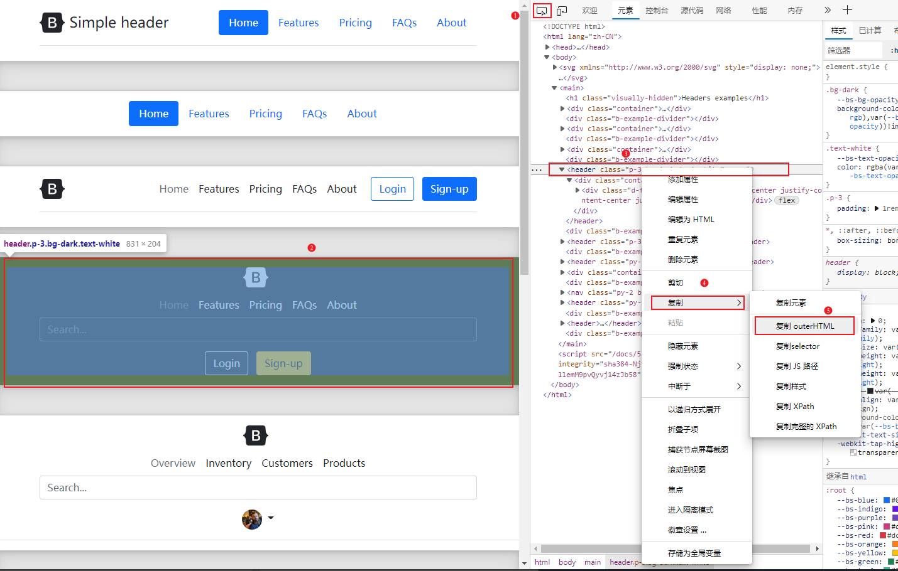

粘贴到你的编辑器中对应的代码中

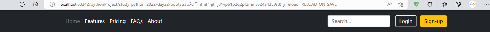

图标看不到

### bootstrap ICON

icon：https://icons.bootcss.com/

CDN：https://www.bootcdn.cn/bootstrap-icons/

```html
官网：
<link rel="stylesheet" href="https://cdn.jsdelivr.net/npm/bootstrap-icons@1.9.1/font/bootstrap-icons.css">

bootstrap-icons
<link href="https://cdn.bootcdn.net/ajax/libs/bootstrap-icons/1.9.1/font/bootstrap-icons.min.css" rel="stylesheet">

下载到django
<link rel="stylesheet" href="">
```

这里使用bootstrap 提供的icon图标

https://icons.bootcss.com/

```html
https://icons.bootcss.com/icons/yin-yang/
<i class="bi bi-yin-yang"></i>
把图标替换成上面的。
```

### Font Awesome

https://www.thinkcmf.com/font_awesome.html

先下载对应的图标然后再引用，

```html
   <link rel="stylesheet" href="font-awesome-4.7.0/css/font-awesome.css">
```

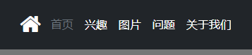


```html
<i class="fa fa-home fa-fw fa-2x" aria-hidden="true"></i>
```

可以调整图标大小，样式丰富

bootstrap将所有原生的HTML标签的文本字体统一设置成了肉眼可以接受的样式

效果一样，但是标签表达的意思不一样（语义）

更多参考官网文档：

https://www.jsdelivr.com/ 也是一个cdn

### bootstrap 元素例子

#### container

此表中表示窗口缩小的最小width

|                    | 最小 <576px | Small ≥576px | Medium ≥768px | Large ≥992px | X-Large ≥1200px | XX-Large ≥1400px |
| ------------------ | ----------- | ------------ | ------------- | ------------ | --------------- | ---------------- |
| `.container`       | 100%        | 540px        | 720px         | 960px        | 1140px          | 1320px           |
| `.container-sm`    | 100%        | 540px        | 720px         | 960px        | 1140px          | 1320px           |
| `.container-md`    | 100%        | 100%         | 720px         | 960px        | 1140px          | 1320px           |
| `.container-lg`    | 100%        | 100%         | 100%          | 960px        | 1140px          | 1320px           |
| `.container-xl`    | 100%        | 100%         | 100%          | 100%         | 1140px          | 1320px           |
| `.container-xxl`   | 100%        | 100%         | 100%          | 100%         | 100%            | 1320px           |
| `.container-fluid` | 100%        | 100%         | 100%          | 100%         | 100%            | 100%             |

```html
<div class="container" style="background-color: #fffb6b"></div>
<div class="container-sm" style="background-color: #ffcd39">sm</div>
<div class="container-md" style="background-color: #ffcd39">md</div>
<div class="container-lg" style="background-color: #ffcd39">lg</div>
<div class="container-xl" style="background-color: #ffcd39">xl</div>
<div class="container-xxl" style="background-color: #ffcd39">xxl</div>
<div class="container-fluid" style="background-color: #ffcd39">fluid</div>
```

#### grid 网格

```html
.col{
    border: solid 1px;
}

<div class="container">
  <div class="row justify-content-md-center">
    <div class="col col-lg-2">
      1 of 3
    </div>
    <div class="col-md-auto">
      Variable width content
    </div>
    <div class="col col-lg-2">
      3 of 3
    </div>
  </div>
  <div class="row">
    <div class="col">
      1 of 3
    </div>
    <div class="col-md-auto">
      Variable width content
    </div>
    <div class="col col-lg-2">
      3 of 3
    </div>
  </div>
</div>
# 一行分多个列,栅格格式
```

#### columns 列

```html
<div class="container">
  <div class="row">
    <div class="col align-self-start">
      One of three columns
    </div>
    <div class="col align-self-center">
      One of three columns
    </div>
    <div class="col align-self-end">
      One of three columns
    </div>
  </div>
</div>
```

gutters 

```html
<div class="container overflow-hidden">
  <div class="row gy-5">
    <div class="col-6">
      <div class="p-3 border bg-light">Custom column padding</div>
    </div>
    <div class="col-6">
      <div class="p-3 border bg-light">Custom column padding</div>
    </div>
    <div class="col-6">
      <div class="p-3 border bg-light">Custom column padding</div>
    </div>
    <div class="col-6">
      <div class="p-3 border bg-light">Custom column padding</div>
    </div>
  </div>
</div>
```

css grid

```html
<div class="grid">
  <div class="g-col-6 g-col-md-4">.g-col-6 .g-col-md-4</div>
  <div class="g-col-6 g-col-md-4">.g-col-6 .g-col-md-4</div>
  <div class="g-col-6 g-col-md-4">.g-col-6 .g-col-md-4</div>
</div>
```

-

```html
<body>
<h1>h1. Bootstrap heading</h1>
<h2>h2. Bootstrap heading</h2>
<h3>h3. Bootstrap heading</h3>
<h4>h4. Bootstrap heading</h4>
<h5>h5. Bootstrap heading</h5>
<h6>h6. Bootstrap heading</h6>

<p class="h1">h1. Bootstrap heading</p>
<p class="h2">h2. Bootstrap heading</p>
<p class="h3">h3. Bootstrap heading</p>
<p class="h4">h4. Bootstrap heading</p>
<p class="h5">h5. Bootstrap heading</p>
<p class="h6">h6. Bootstrap heading</p>
    
<p>You can use the mark tag to <mark>highlight</mark> text.</p>
<p><del>This line of text is meant to be treated as deleted text.</del></p>
<p><s>This line of text is meant to be treated as no longer accurate.</s></p>
<p><ins>This line of text is meant to be treated as an addition to the document.</ins></p>
<p><u>This line of text will render as underlined.</u></p>
<p><small>This line of text is meant to be treated as fine print.</small></p>
<p><strong>This line rendered as bold text.</strong></p>
<p><em>This line rendered as italicized text.</em></p>
    
<blockquote class="blockquote">
  <p>A well-known quote, contained in a blockquote element.</p>
</blockquote>
    
<figure>
  <blockquote class="blockquote">
    <p>A well-known quote, contained in a blockquote element.</p>
  </blockquote>
  <figcaption class="blockquote-footer">
    Someone famous in <cite title="Source Title">Source Title</cite>
  </figcaption>
</figure>
    
    
 <figure class="text-center">
  <blockquote class="blockquote">
    <p>A well-known quote, contained in a blockquote element.</p>
  </blockquote>
  <figcaption class="blockquote-footer">
    Someone famous in <cite title="Source Title">Source Title</cite>
  </figcaption>
</figure>   
    
<figure class="text-end">
  <blockquote class="blockquote">
    <p>A well-known quote, contained in a blockquote element.</p>
  </blockquote>
  <figcaption class="blockquote-footer">
    Someone famous in <cite title="Source Title">Source Title</cite>
  </figcaption>
</figure>
    
    
```

#### img

```html
  响应式
  缩略图


  对齐图片


```

#### table

https://v5.bootcss.com/docs/content/tables/

```html
<table class="table table-striped table-bordered border-primary">
  <thead>
    <tr>
      <th scope="col">#</th>
      <th scope="col">First</th>
      <th scope="col">Last</th>
      <th scope="col">Handle</th>
    </tr>
  </thead>
  <tbody>
    <tr>
      <th scope="row">1</th>
      <td>Mark</td>
      <td>Otto</td>
      <td>@mdo</td>
    </tr>
    <tr>
      <th scope="row">2</th>
      <td>Jacob</td>
      <td>Thornton</td>
      <td>@fat</td>
    </tr>
    <tr>
      <th scope="row">3</th>
      <td colspan="2">Larry the Bird</td>
      <td>@twitter</td>
    </tr>
  </tbody>
</table>
```

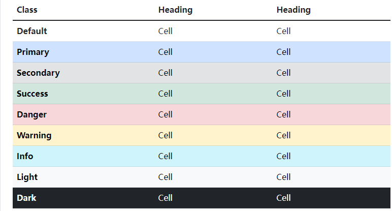

#### from

https://v5.bootcss.com/docs/forms/overview/

```html
<form>
  <div class="mb-3">
    <label for="exampleInputEmail1" class="form-label">Email address</label>
    <input type="email" class="form-control" id="exampleInputEmail1" aria-describedby="emailHelp">
    <div id="emailHelp" class="form-text">We'll never share your email with anyone else.</div>
  </div>
  <div class="mb-3">
    <label for="exampleInputPassword1" class="form-label">Password</label>
    <input type="password" class="form-control" id="exampleInputPassword1">
  </div>
  <div class="mb-3 form-check">
    <input type="checkbox" class="form-check-input" id="exampleCheck1">
    <label class="form-check-label" for="exampleCheck1">Check me out</label>
  </div>
  <button type="submit" class="btn btn-primary">Submit</button>
</form>
```

button

```html
<button type="button" class="btn btn-primary">Primary</button>
<button type="button" class="btn btn-secondary">Secondary</button>
<button type="button" class="btn btn-success">Success</button>
<button type="button" class="btn btn-danger">Danger</button>
<button type="button" class="btn btn-warning">Warning</button>
<button type="button" class="btn btn-info">Info</button>
<button type="button" class="btn btn-light">Light</button>
<button type="button" class="btn btn-dark">Dark</button>

<button type="button" class="btn btn-link">Link</button>
```

分页

https://v5.bootcss.com/docs/components/pagination/

```html
<nav aria-label="Page navigation example">
  <ul class="pagination justify-content-end">
    <li class="page-item disabled">
      <a class="page-link">Previous</a>
    </li>
    <li class="page-item"><a class="page-link" href="#">1</a></li>
    <li class="page-item"><a class="page-link" href="#">2</a></li>
    <li class="page-item"><a class="page-link" href="#">3</a></li>
    <li class="page-item">
      <a class="page-link" href="#">Next</a>
    </li>
  </ul>
</nav>
```

span

```html
<span class="placeholder col-12"></span>

<span class="placeholder col-12 bg-primary"></span>
<span class="placeholder col-12 bg-secondary"></span>
<span class="placeholder col-12 bg-success"></span>
<span class="placeholder col-12 bg-danger"></span>
<span class="placeholder col-12 bg-warning"></span>
<span class="placeholder col-12 bg-info"></span>
<span class="placeholder col-12 bg-light"></span>
<span class="placeholder col-12 bg-dark"></span>
```

进度条

```html
<div class="progress">
  <div class="progress-bar bg-success" role="progressbar" style="width: 25%" aria-valuenow="25" aria-valuemin="0" aria-valuemax="100"></div>
</div>
<div class="progress">
  <div class="progress-bar bg-info" role="progressbar" style="width: 50%" aria-valuenow="50" aria-valuemin="0" aria-valuemax="100"></div>
</div>
<div class="progress">
  <div class="progress-bar bg-warning" role="progressbar" style="width: 75%" aria-valuenow="75" aria-valuemin="0" aria-valuemax="100"></div>
</div>
<div class="progress">
  <div class="progress-bar bg-danger" role="progressbar" style="width: 100%" aria-valuenow="100" aria-valuemin="0" aria-valuemax="100"></div>
</div>
```

转圈

```html

<div class="spinner-border text-primary" role="status">
  <span class="visually-hidden">Loading...</span>
</div>
<div class="spinner-border text-secondary" role="status">
  <span class="visually-hidden">Loading...</span>
</div>
<div class="spinner-border text-success" role="status">
  <span class="visually-hidden">Loading...</span>
</div>
<div class="spinner-border text-danger" role="status">
  <span class="visually-hidden">Loading...</span>
</div>
<div class="spinner-border text-warning" role="status">
  <span class="visually-hidden">Loading...</span>
</div>
<div class="spinner-border text-info" role="status">
  <span class="visually-hidden">Loading...</span>
</div>
<div class="spinner-border text-light" role="status">
  <span class="visually-hidden">Loading...</span>
</div>
<div class="spinner-border text-dark" role="status">
  <span class="visually-hidden">Loading...</span>
</div>


<div class="spinner-grow text-primary" role="status">
  <span class="visually-hidden">Loading...</span>
</div>
<div class="spinner-grow text-secondary" role="status">
  <span class="visually-hidden">Loading...</span>
</div>
<div class="spinner-grow text-success" role="status">
  <span class="visually-hidden">Loading...</span>
</div>
<div class="spinner-grow text-danger" role="status">
  <span class="visually-hidden">Loading...</span>
</div>
<div class="spinner-grow text-warning" role="status">
  <span class="visually-hidden">Loading...</span>
</div>
<div class="spinner-grow text-info" role="status">
  <span class="visually-hidden">Loading...</span>
</div>
<div class="spinner-grow text-light" role="status">
  <span class="visually-hidden">Loading...</span>
</div>
<div class="spinner-grow text-dark" role="status">
  <span class="visually-hidden">Loading...</span>
</div>
```

....

#### 清除浮动

```html
<div class="clearfix">...</div>
```

#### 彩色链接

```html
<a href="#" class="link-primary">Primary link</a>
<a href="#" class="link-secondary">Secondary link</a>
<a href="#" class="link-success">Success link</a>
<a href="#" class="link-danger">Danger link</a>
<a href="#" class="link-warning">Warning link</a>
<a href="#" class="link-info">Info link</a>
<a href="#" class="link-light">Light link</a>
<a href="#" class="link-dark">Dark link</a>
```


# Django

## wsgiref模块

逐步了解wsgiref的运作原理

```python
from wsgiref.simple_server import make_server

def run(env,response):
    """

    :param env:请求相关的所有数据，包括环境变量
    :param response:  响应相关的所有数据
    :return:  返回给浏览器的数据
    """
    print(env)  # wsgiref模块处理好的http格式数据，封装成字典

    response('200 OK',[]) # 响应行首 响应head

    return [b'hello wsgiret']

if __name__ == '__main__':
    server = make_server('127.0.0.1',8080,run)
    """
    监管地址，只要客户端访问就会调用run方法
    """
    server.serve_forever()
```

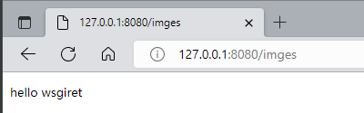

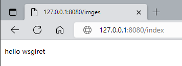

```python
>>>
{...,'SERVER_NAME': 'G', 'GATEWAY_INTERFACE': 'CGI/1.1', 'SERVER_PORT': '8080', 'REMOTE_HOST': '', 'CONTENT_LENGTH': '', 'SCRIPT_NAME': '', 'SERVER_PROTOCOL': 'HTTP/1.1', 'SERVER_SOFTWARE': 'WSGIServer/0.2', 'REQUEST_METHOD': 'GET', 'PATH_INFO': '/', 'QUERY_STRING': '', 'REMOTE_ADDR': '127.0.0.1', 'CONTENT_TYPE': 'text/plain', 'HTTP_HOST': '127.0.0.1:8080', 'HTTP_CONNECTION': 'keep-alive', 'HTTP_CACHE_CONTROL': 'max-age=0', 'HTTP_SEC_CH_UA': '"Chromium";v="104", " Not A;Brand";v="99", "Microsoft Edge";v="104"', 'HTTP_SEC_CH_UA_MOBILE': '?0', 'HTTP_SEC_CH_UA_PLATFORM': '"Windows"', 'HTTP_UPGRADE_INSECURE_REQUESTS': '1', 'HTTP_USER_AGENT': 'Mozilla/5.0 (Windows NT 10.0; Win64; x64) AppleWebKit/537.36 (KHTML, like Gecko) Chrome/104.0.5112.81 Safari/537.36 Edg/104.0.1293.47', 'HTTP_ACCEPT': 'text/html,application/xhtml+xml,application/xml;q=0.9,image/webp,image/apng,*/*;q=0.8,application/signed-exchange;v=b3;q=0.9', 'HTTP_SEC_FETCH_SITE': 'none', 'HTTP_SEC_FETCH_MODE': 'navigate', 'HTTP_SEC_FETCH_USER': '?1', 'HTTP_SEC_FETCH_DEST': 'document', 'HTTP_ACCEPT_ENCODING': 'gzip, deflate, br', 'HTTP_ACCEPT_LANGUAGE': 'zh-CN,zh;q=0.9,en;q=0.8,en-GB;q=0.7,en-US;q=0.6', 'HTTP_COOKIE': 'Hm_lvt_43e89c38a9e9332e702161a0c19bba11=1660053884', 'wsgi.input': <_io.BufferedReader name=540>, 'wsgi.errors': <_io.TextIOWrapper name='<stderr>' mode='w' encoding='utf-8'>, 'wsgi.version': (1, 0), 'wsgi.run_once': False, 'wsgi.url_scheme': 'http', 'wsgi.multithread': False, 'wsgi.multiprocess': False, 'wsgi.file_wrapper': <class 'wsgiref.util.FileWrapper'>}
```

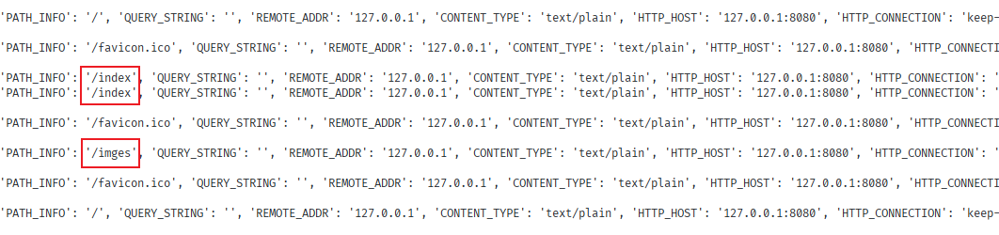

当输入url后面的对应信息，例似index  load这种类型的实现自动返回对应的数据

```python
from wsgiref.simple_server import make_server

def run(env,response):
    """
    :param env:请求相关的所有数据，包括环境变量
    :param response:  响应相关的所有数据
    :return:  返回给浏览器的数据
    """

    response('200 OK',[]) # 响应行首 响应head
    current_path = env.get('PATH_INFO')
    if current_path == '/index':
        return [b'index']
    elif current_path == '/login':
        return [b'login']
    elif current_path == '/':
        return [b'hello wsgiref']
    else:
        return [b'404']

if __name__ == '__main__':
    server = make_server('127.0.0.1',8080,run)
    """
    监管地址，只要客户端访问就会调用run方法
    """
    server.serve_forever()
>>>
127.0.0.1 - - [10/Aug/2022 15:38:41] "GET /loginxx HTTP/1.1" 200 3
127.0.0.1 - - [10/Aug/2022 15:38:51] "GET /loginxd HTTP/1.1" 200 3
127.0.0.1 - - [10/Aug/2022 15:38:55] "GET /login HTTP/1.1" 200 5
127.0.0.1 - - [10/Aug/2022 15:38:59] "GET /index HTTP/1.1" 200 5
127.0.0.1 - - [10/Aug/2022 15:39:04] "GET / HTTP/1.1" 200 13
```

上面程序是输入index login 就跳转到指定的默认不输入自动默认带/ 。不存在的404

上面简述的都是简单的原理生产中是不能这么做的，生产中需要拆分成各种部分

urls.py 路由与视图函数对应关系

views.py 视图函数

templates 文件夹 存储html文件

```python
views.py
def root(env):
    return '/'

def index(env):
    return 'index'

def login(env):
    return 'login'

def error(env):
    return '404'

def xxx(env):
    with open(r'templates/xxx.html','r',encoding='utf-8') as f:
        return f.read()
```

```python
urls.py
from views import *

urls = {
    '/index':index,
    '/login':login,
    '/xxx':xxx,
    '/':root
}
```

```python
# wsgirefs
from wsgiref.simple_server import make_server
from urls import urls
from views import *

def run(env, response):
    response('200 OK', [])
    current_path = env.get('PATH_INFO')
    func = None  # 定义一个中转变量
    for url,value in urls.items():  # 遍历字典url 与函数匹配
        if current_path == url:
            func = value
            break # 匹配到一个就结束for循环
   # 判断func 是否有值
    if func:
        res = func(env)
    else:
        res = error(env)

    return [res.encode('utf-8')]

if __name__ == '__main__':
    sever = make_server('127.0.0.1', 8080, run)
    sever.serve_forever()  # 启动服务端
```

```python
127.0.0.1 - - [10/Aug/2022 20:09:55] "GET /sss HTTP/1.1" 200 3
127.0.0.1 - - [10/Aug/2022 20:10:15] "GET /index HTTP/1.1" 200 5
127.0.0.1 - - [10/Aug/2022 20:10:24] "GET /login HTTP/1.1" 200 5
127.0.0.1 - - [10/Aug/2022 20:10:29] "GET /xxx HTTP/1.1" 200 666
127.0.0.1 - - [10/Aug/2022 20:10:29] "GET /css/bootstrap.css HTTP/1.1" 200 3
127.0.0.1 - - [10/Aug/2022 20:10:29] "GET /font-awesome-4.7.0/css/font-awesome.css HTTP/1.1" 200 3
127.0.0.1 - - [10/Aug/2022 20:10:29] "GET /js/bootstrap.js HTTP/1.1" 200 3
```

拆分之后后续添加功能很件容易，拆分根据业务逻辑拆分

##  动态网页

动态网页就是数据是变动的，不像HTML是静态的。

```python
view.py 文件添加下面方法 

def get_time(env):
    current_time = datetime.datetime.now().strftime('%Y-%m-%d %X')
    with open(r'templates/mytime.html','r',encoding='utf-8') as f:
        data = f.read()
    data = data.replace('time',current_time)
    return data

urls.py 文件添加

'/mytime':get_time  键值对
```

```html
mytime.html

<!DOCTYPE html>
<html lang="en">
<head>
    <meta charset="UTF-8">
    <meta name="viewport" content="width=device-width, initial-scale=1"> <!--响应式布局-->
    <title>Title</title>
    <!--jQuery CDN-->
    <link href="https://cdn.bootcdn.net/ajax/libs/twitter-bootstrap/5.2.0/css/bootstrap.min.css" rel="stylesheet">
    <link href="https://cdn.bootcdn.net/ajax/libs/font-awesome/6.1.2/css/fontawesome.min.css" rel="stylesheet">
    <script src="https://cdn.bootcdn.net/ajax/libs/jquery/3.6.0/jquery.min.js"></script>
    <script src="https://cdn.bootcdn.net/ajax/libs/twitter-bootstrap/5.2.0/js/bootstrap.min.js"></script>
</head>
<body>
<div>time</div>
time
</body>
</html>
```

## Jinja2

jinja2模块

```python
pip3 install Jinja2

view.py
from jinja2 import Template
def get_dict(env):
    user_dict = {'username':'root','age':48,'hobby':'read'}
    with open(r'templates/mytime.html','r',encoding='utf-8') as f:
        data = f.read()
    tmp = Template(data)
    res = tmp.render(user=user_dict)
    return res


urls.py
 '/get_dict':get_dict 添加键值
    
    
html页面
{{ user }}
{{ user.get('username')}}
{{ user.age }}
{{ user['hobby'] }}
>>>
{'username': 'root', 'age': 48, 'hobby': 'read'} root 48 read
```

**进阶**

```html
单独一个html页面
<div class="container">
    <div class="row">
        <div class="col-md-8 col-md-offset-2">
            <h1 class="text-center">用户数据</h1>
            <table class="table table-hover table-striped">
                <thead>
                    <tr>
                        <th>ID</th>
                        <th>username</th>
                        <th>password</th>
                        <th>hobby</th>
                    </tr>
                </thead>
                <tbody>
<!--                    [{},{},{},{},{}]-->
                    
                        <tr>
                            <td>{{ user_dict.id}}</td>
                            <td>{{ user_dict.username}}</td>
                            <td>{{ user_dict.password}}</td>
                            <td>{{ user_dict.hobby}}</td>
                        </tr>
                    
                </tbody>
            </table>
        </div>
    </div>
</div>
```

```mysql
# 创建一个user表
CREATE TABLE `user` (
  `id` int NOT NULL AUTO_INCREMENT,
  `username` varchar(255) NOT NULL,
  `password` varchar(255) NOT NULL,
  `hobby` varchar(255) NOT NULL,
  PRIMARY KEY (`id`,`username`),
  UNIQUE KEY `id` (`id`),
  UNIQUE KEY `username` (`username`)
) ENGINE=InnoDB AUTO_INCREMENT=1001 DEFAULT CHARSET=utf8mb4 COLLATE=utf8mb4_0900_ai_ci
```

```python
view.py
import pymysql
def get_user(env):
    conn = pymysql.connect(
        host='127.0.0.1',
        port=3306,
        user='root',
        password='123456',
        db='stu',
        autocommit=True,
        charset='utf8mb4'
    )
    cursor = conn.cursor(cursor=pymysql.cursors.DictCursor)
    sql = 'select * from user limit 1000'
    affect_rows =cursor.execute(sql)
    data_list = cursor.fetchall()
    with open(r'templates/user.html','r',encoding='utf-8') as f:
        data = f.read()
    tmp = Template(data)
    res = tmp.render(user_list=data_list)
    return res


urls.py
from views import *

urls = {
    '/index':index,
    '/login':login,
    '/xxx':xxx,
    '/':root,
    '/get_time':get_time,
    '/get_dict':get_dict,
    '/get_user':get_user
}
```

 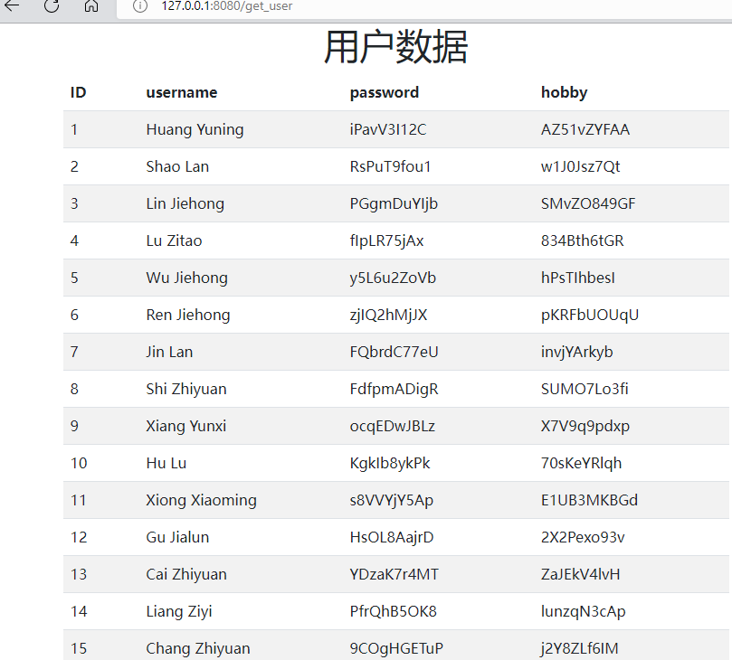

这就是查询的数据

综上步骤可以看出我们已经形成一个自定义的框架了。剩下的只需要填充数据了。


## python 主流web框架

- django

  大而全 自带的功能特别特别特别的多 类似于航空母舰.处理简单的框架特别笨重

- flask

  小而精  自带的功能特别特别特别的少 第三方模块特别多。第三方库作者停更后期变更麻烦

- tornado

  异步非阻塞 支持高并发，可以开发游戏服务器

  

  sanic
  
  fastapi

  ---
  
  A:socket部分
  B:路由与视图函数对应关系(路由匹配)
  C:模版语法
  
  django
  	A用的是别人的		wsgiref模块
      B用的是自己的
      C用的是自己的(没有jinja2好用 但是也很方便)
  
  flask
  	A用的是别人的		werkzeug(内部还是wsgiref模块)
      B自己写的
      C用的别人的(jinja2)
  
  tornado
  	A，B，C都是自己写的

# Django 使用

帮助：https://docs.djangoproject.com/zh-hans/4.1/

install 安装

```shell
pip3 install django
pip3 install django==1.1.11  安装指定版本
```

验证是否成功

```cmd
C:\Users\xyz34>django-admin

Type 'django-admin help <subcommand>' for help on a specific subcommand.

Available subcommands:

[django]
    check
    compilemessages
    createcachetable
    dbshell
    diffsettings
    dumpdata
    flush
    inspectdb
    loaddata
    makemessages
    makemigrations
    migrate
    optimizemigration
    runserver
    sendtestemail
    shell
    showmigrations
    sqlflush
    sqlmigrate
    sqlsequencereset
    squashmigrations
    startapp
    startproject
    test
    testserver
Note that only Django core commands are listed as settings are not properly configured (error: Requested setting INSTALLED_APPS, but settings are not configured. You must either define the environment variable DJANGO_SETTINGS_MODULE or call settings.configure() before accessing settings.).
```

## Django基础操作

### 1、create project 

`django-admin startproject mysite`

```cmd
D:\>mkdir python_project

D:\>cd python_project

D:\python_project>django-admin startproject mysite

D:\python_project>tree /f
D:.
└─mysite
    │  manage.py
    │
    └─mysite
            asgi.py
            settings.py
            urls.py
            wsgi.py
            __init__.py
```

### 2、start django project

```cmd
D:\python_project>cd mysite

D:\python_project\mysite>python manage.py runserver

```

启动提示

```cmd
You have 18 unapplied migration(s). Your project may not work properly until you apply the migrations for app(s): admin, auth, contenttypes, sessions.
Run 'python manage.py migrate' to apply them.

【解决】
D:\python_project\mysite>python manage.py migrate  
Operations to perform:
  Apply all migrations: admin, auth, contenttypes, sessions
Running migrations:
  Applying contenttypes.0001_initial... OK
  Applying auth.0001_initial... OK
  Applying admin.0001_initial... OK
  Applying admin.0002_logentry_remove_auto_add... OK
  Applying admin.0003_logentry_add_action_flag_choices... OK
  Applying contenttypes.0002_remove_content_type_name... OK
  Applying auth.0002_alter_permission_name_max_length... OK
  Applying auth.0003_alter_user_email_max_length... OK
  Applying auth.0004_alter_user_username_opts... OK
  Applying auth.0005_alter_user_last_login_null... OK
  Applying auth.0006_require_contenttypes_0002... OK
  Applying auth.0007_alter_validators_add_error_messages... OK
  Applying auth.0008_alter_user_username_max_length... OK
  Applying auth.0009_alter_user_last_name_max_length... OK
  Applying auth.0010_alter_group_name_max_length... OK
  Applying auth.0011_update_proxy_permissions... OK
  Applying auth.0012_alter_user_first_name_max_length... OK
  Applying sessions.0001_initial... OK
```

```cmd
D:\python_project\mysite>python manage.py runserver
Watching for file changes with StatReloader
Performing system checks...

System check identified no issues (0 silenced).
August 11, 2022 - 20:34:00
Django version 4.1, using settings 'mysite.settings'
Starting development server at http://127.0.0.1:8000/
Quit the server with CTRL-BREAK.
```

### 3、create application

在project中application name 应该是见名知意譬如user web ...

```cmd
D:\python_project\mysite>python manage.py startapp app01

D:\python_project\mysite>tree /f

D:.
│  db.sqlite3
│  manage.py
│
├─app01
│  │  admin.py
│  │  apps.py
│  │  models.py
│  │  tests.py
│  │  views.py
│  │  __init__.py
│  │
│  └─migrations
│          __init__.py
│
└─mysite
    │  asgi.py
    │  settings.py
    │  urls.py
    │  wsgi.py
    │  __init__.py
    │
    └─__pycache__
            settings.cpython-310.pyc
            urls.cpython-310.pyc
            wsgi.cpython-310.pyc
            __init__.cpython-310.pyc
```

pycharm中创建django项目

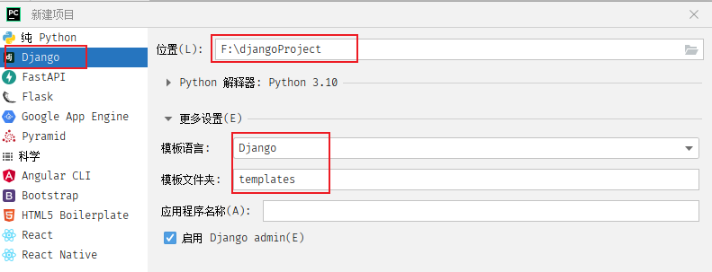

`start`

图形化启动

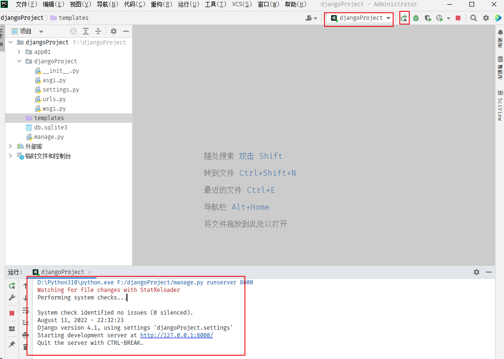

命令行启动

```python
D:\python_project\mysite>f:

F:\>cd djangoProject

F:\djangoProject>dir
 F:\djangoProject 的目录

2022/08/11  21:34    <DIR>          .
2022/08/11  21:34    <DIR>          ..
2022/08/11  21:39    <DIR>          .idea
2022/08/11  21:36    <DIR>          djangoProject
2022/08/11  21:34               691 manage.py
2022/08/11  21:34    <DIR>          templates
               1 个文件            691 字节
               5 个目录 203,278,295,040 可用字节

F:\djangoProject>python manage.py runserver
Watching for file changes with StatReloader
Performing system checks...

System check identified no issues (0 silenced).

You have 18 unapplied migration(s). Your project may not work properly until you apply the migrations for app(s): admin, auth, contenttypes, sessions.
Run 'python manage.py migrate' to apply them.
August 11, 2022 - 21:39:58
Django version 4.1, using settings 'djangoProject.settings'
Starting development server at http://127.0.0.1:8000/
Quit the server with CTRL-BREAK.

F:\djangoProject>python manage.py migrate
Operations to perform:
  Apply all migrations: admin, auth, contenttypes, sessions
Running migrations:
  Applying contenttypes.0001_initial... OK
  Applying auth.0001_initial... OK
  Applying admin.0001_initial... OK
  Applying admin.0002_logentry_remove_auto_add... OK
  Applying admin.0003_logentry_add_action_flag_choices... OK
  Applying contenttypes.0002_remove_content_type_name... OK
  Applying auth.0002_alter_permission_name_max_length... OK
  Applying auth.0003_alter_user_email_max_length... OK
  Applying auth.0004_alter_user_username_opts... OK
  Applying auth.0005_alter_user_last_login_null... OK
  Applying auth.0006_require_contenttypes_0002... OK
  Applying auth.0007_alter_validators_add_error_messages... OK
  Applying auth.0008_alter_user_username_max_length... OK
  Applying auth.0009_alter_user_last_name_max_length... OK
  Applying auth.0010_alter_group_name_max_length... OK
  Applying auth.0011_update_proxy_permissions... OK
  Applying auth.0012_alter_user_first_name_max_length... OK
  Applying sessions.0001_initial... OK
```

create application

点击pycharm --tool -- run manage.py

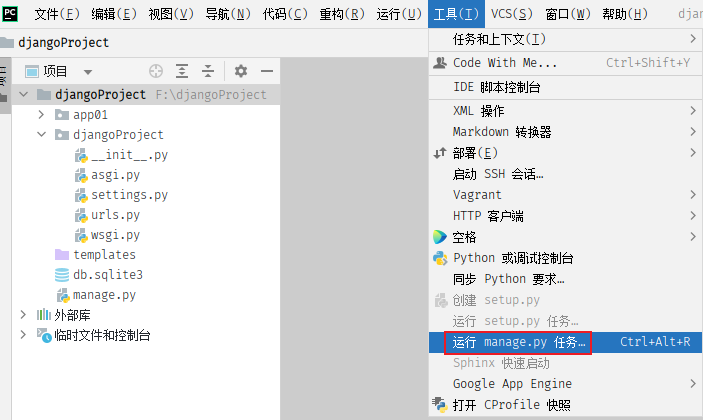

```django
manage.py@djangoProject > startapp app01 
```

上面是创建app的命令行

下面是编辑配置文件

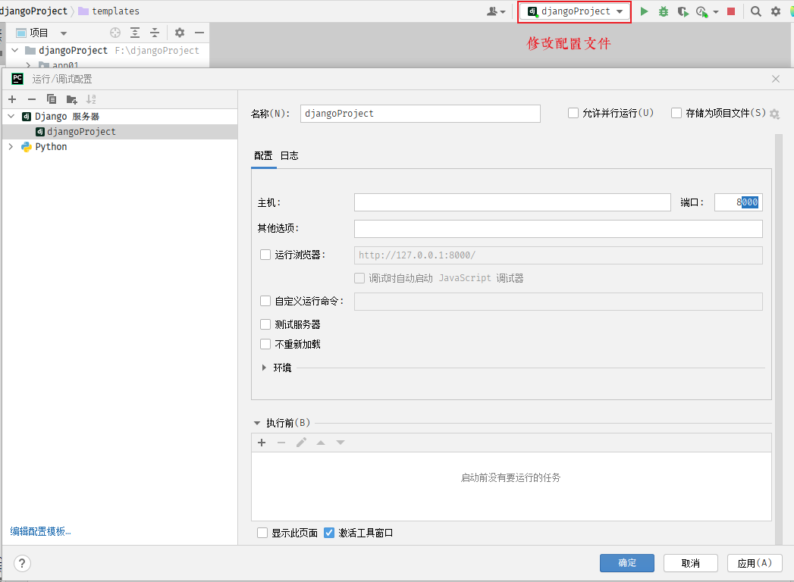


### 4、application

一个app就是一个独立的功能

`创建app之后需要添加配置文件注册`

```python
INSTALLED_APPS = [
    'django.contrib.admin',
    'django.contrib.auth',
    'django.contrib.contenttypes',
    'django.contrib.sessions',
    'django.contrib.messages',
    'django.contrib.staticfiles',
    'app01',   # 简称
    'app01.apps.App01Config',  # 全称 二选一
]
```

`创建好application之后就直接到settings.py文件注册`

pycharm 创建的时候只能注册一个app，其他还是需要手动注册。

## django文件详解

```cmd
F:\djangoProject>tree /f

│  db.sqlite3  django自带的sqlite3小型bug数据库
│  manage.py  django入口文件
│
├─app01     app 功能项目
│  │  admin.py    django 后台管理
│  │  apps.py    注册使用
│  │  models.py   数据库相关的模型类（orm）
│  │  tests.py   测试库
│  │  views.py   视图api层
│  │  __init__.py
│  │
│  |   migrations   数据库迁移记录
|
├─djangoProject  项目总目录
│  │  asgi.py    django asgi是异步web服务器和应用程序的新python标准
│  │  settings.py 配置文件
│  │  urls.py     urls 路由视图与=或者路由层
│  │  wsgi.py      wsgiref 模块
│  │  __init__.py
│  │
│
├─templates  模板文件
└─__pycache__
        manage.cpython-310.pyc
```

### 区别

命令行与pycharm的区别

`命令行创建不会有templates文件夹，需要手动创建，pycharm会自动创建，而且会自动创建并且还会自动在配置文件中配置对应的路径`

```py
# pycharm
BASE_DIR = Path(__file__).resolve().parent.parent
TEMPLATES = [
    {
        'BACKEND': 'django.template.backends.django.DjangoTemplates',
        'DIRS': [BASE_DIR / 'templates']
        ,
        'APP_DIRS': True,
        'OPTIONS': {
            'context_processors': [
                'django.template.context_processors.debug',
                'django.template.context_processors.request',
                'django.contrib.auth.context_processors.auth',
                'django.contrib.messages.context_processors.messages',
            ],
        },
    },
]


# 命令行
BASE_DIR = Path(__file__).resolve().parent.parent
TEMPLATES = [
    {
        'BACKEND': 'django.template.backends.django.DjangoTemplates',
        'DIRS': [],
        'APP_DIRS': True,
        'OPTIONS': {
            'context_processors': [
                'django.template.context_processors.debug',
                'django.template.context_processors.request',
                'django.contrib.auth.context_processors.auth',
                'django.contrib.messages.context_processors.messages',
            ],
        },
    },
]

命令行创建的还必须去配置 'DIRS': [BASE_DIR / 'templates']
```

### 必会

```python
HttpResponse
	返回字符串类型的数据

render
	返回html文件的

redirect
	重定向
	  return redirect('https://www.mzitu.com/')
    return redirect('/home/')
```

例子

```python
app01.views.py
def index(request):
    """
    :param request:  请求相关的所有数据对象，比env更完善
    :return:
    """
    return HttpResponse('hello,world!')

urls.py
from django.shortcuts import render,HttpResponse,redirect
import app01.views

urlpatterns = [
    path('admin/', admin.site.urls),
    path('index/', app01.views.index),
]

```

render

```python
views.py
from django.shortcuts import render,HttpResponse,redirect

# Create your views here.
def index(request):
    """
    :param request:  请求相关的所有数据对象，比env更完善
    :return:
    """
    # return HttpResponse('hello,world!')
    return render(request,'test.html')
```

结果返回的是html

```python
from django.shortcuts import render,HttpResponse,redirect

# Create your views here.
def index(request):
    """
    :param request:  请求相关的所有数据对象，比env更完善
    :return:
    """
    # return HttpResponse('hello,world!')
    # return render(request,'test.html')
    return redirect('https://cloudb.pub')
```

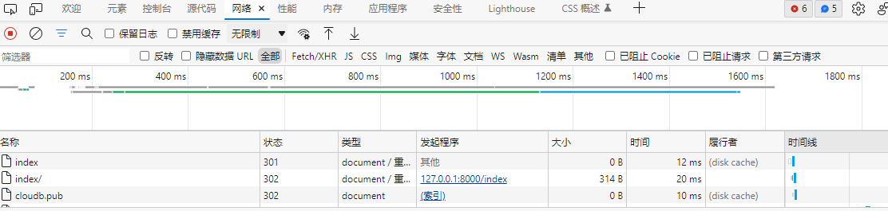

重定向到其他网站了。

## 静态文件配置

上面我们将html文件放在templates文件夹下，html还有css,js,img这些文件。这里我们创建static文件夹。

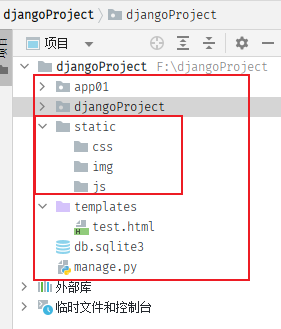

django默认不会创建static文件夹，需要手动创建

之前我们使用的都是sdn，生产中这种掌控在别人手中的风险无疑是把自己的宰杀权交给别人。

static文件夹就是把这些css js资源放到服务端所在的目录，减少犯错机率和试错成本。

`静态文件配置`

开发时候经常需要验证结果，但是浏览器缓存很难实时预览，禁用检查，网络，禁用缓存

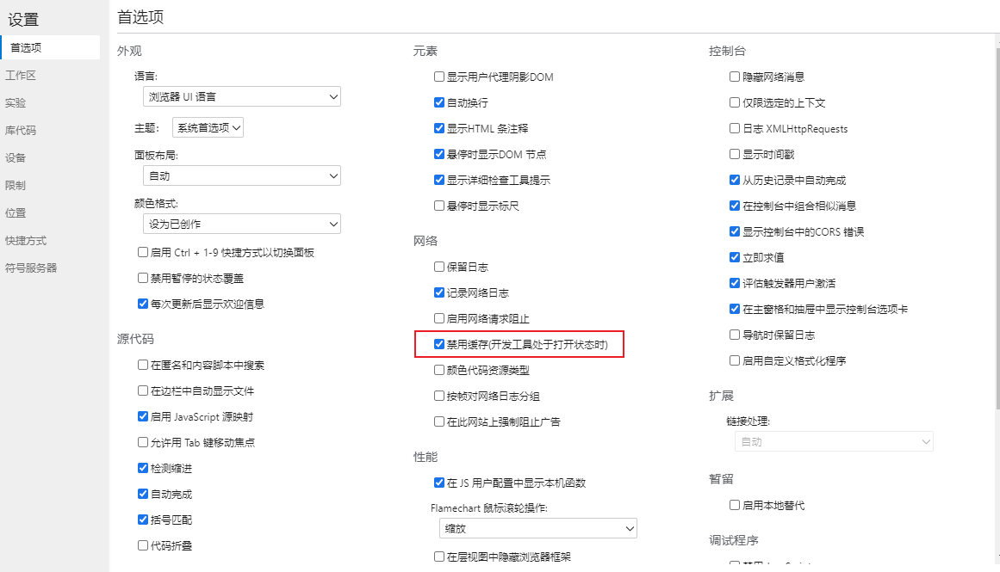

settings 文件中的如下配置就是访问静态文件的令牌。

```python
STATIC_URL = 'static/'
```

把之前用到的css文件复制到static文件夹

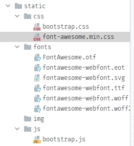

这里根据实际情况调整

测试static 页面访问情况

```python
# views.py
def static(request):
    return HttpResponse('static')

urls.py
from django.contrib import admin
from django.urls import path

import app01.views

urlpatterns = [
    path('admin/', admin.site.urls),
    path('index/', app01.views.index),
    path('static/', app01.views.static),
]

settings.py
STATICFILES_DIRS = [
    os.path.join(BASE_DIR,'static'),
    os.path.join(BASE_DIR,'static1'),
]
```

http://127.0.0.1:8000/static/css/bootstrap.css,这样就能访问到样式文件了。

新建一个static1 里面放入test.html文件访问：http://127.0.0.1:8000/static/test.html 会从staticfiles_dirs列表中寻找test.html文件

如果不是/static/ 目录呢？settings中改成xxx

```python
STATIC_URL = 'xxx/'
```

就不能访问了。为了避免这种情况使用静态文件动态解析。

在html页面的head部分使用

```python
   
    <link rel="stylesheet" href="">
    <script src=""></script>
```

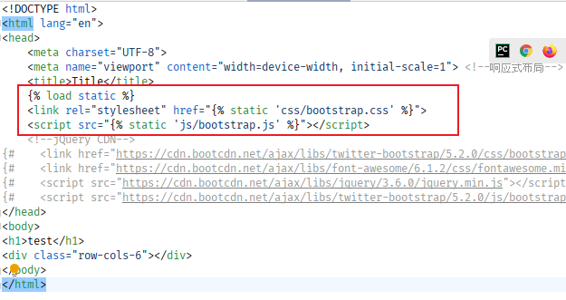

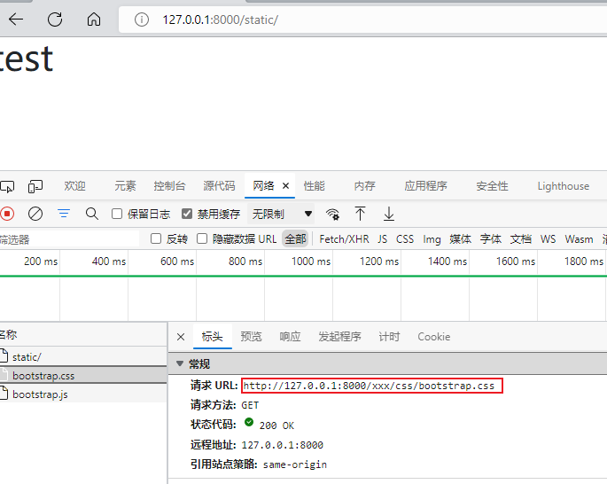

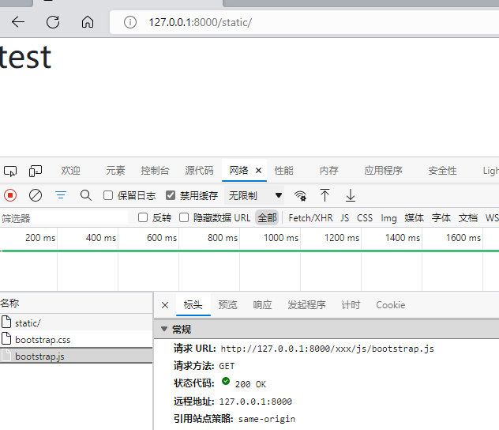

从上面检查结果就可以看出xxx被加载出来了。

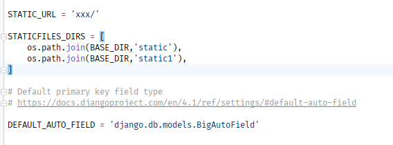

从图上可知static资源可以这样动态加载静态资源。

```python
[12/Aug/2022 17:03:41] "GET /static/ HTTP/1.1" 200 401
[12/Aug/2022 17:03:41] "GET /xxx/css/bootstrap.css HTTP/1.1" 200 205484
[12/Aug/2022 17:03:41] "GET /xxx/js/bootstrap.js HTTP/1.1" 200 148892
[12/Aug/2022 17:03:42] "GET /xxx/css/bootstrap.css.map HTTP/1.1" 404 1816
[12/Aug/2022 17:03:42] "GET /xxx/js/bootstrap.js.map HTTP/1.1" 404 1810
```

## form表单

form 表单get请求数据

form 表单action参数：`不写默认向当前URL提交数据；全写 指名道姓；只写后缀 /login/`

html

```html
<h1 class="text-center">登录</h1>
<div class="container">
    <div class="row">
        <div class="col-md-3 col-md-auto">
            <form action="">
                <p>username:<input type="text" name="username" class="form-control"></p>
                <p>password:<input type="password" name="password" class="form-control"></p>
                <input type="submit" class="btn btn-success">
            </form>

        </div>
    </div>
</div>
```

```python
views.py
def login(request):
    return render(request,'login.html')

urls.py
from django.contrib import admin
from django.urls import path

import app01.views

urlpatterns = [
    path('admin/', admin.site.urls),
    path('index/', app01.views.index),
    path('static/', app01.views.static),
    path('login/', app01.views.login),
]
```

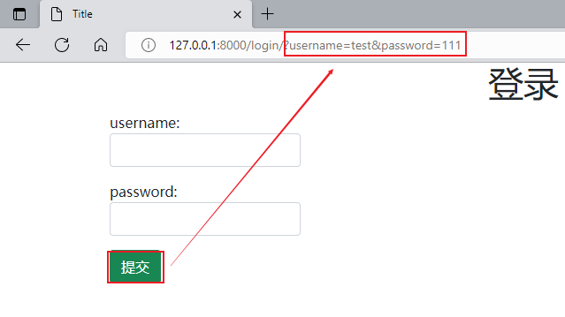

用户密码全提交到浏览器了。

```html
 <form action="/static/">
     
http://127.0.0.1:8000/static/?username=&password=
```

上面几种方法都会把用户名密码明文提交到浏览器地址栏中。希望后面的学习可以得到解决方法(默认是get,这里使用post)

```python
def ab_render(request):
    # views函数必须要接受一个形参request
    user_dict = {'username':'tom','password':'123'}
    # return render(request,'login.html',locals())
    # 传入参数特别多的时候locals会将所在的名称空间中所有的名字全部传递给html
    return render(request,'login.html',{'data':user_dict,'data':123})
     # 这种方式精确，节省资源
```


## request对象方法

```html
<form action="/login/" method="post">
```

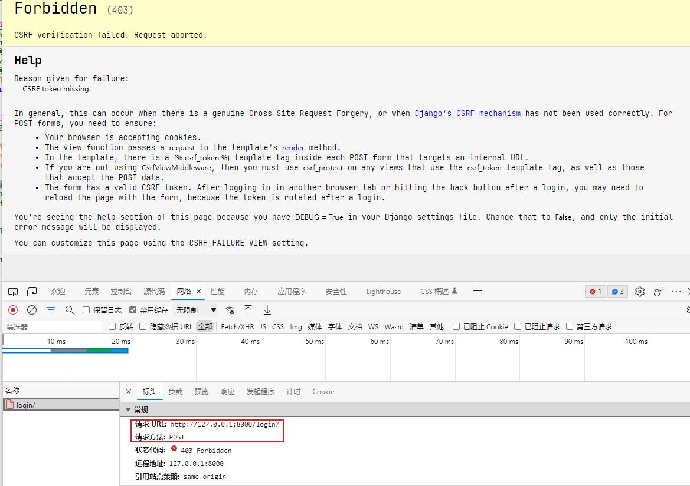

```python
# 在前期我们使用django提交post请求的时候 需要取配置文件中注释掉一行代码
MIDDLEWARE = [
    'django.middleware.security.SecurityMiddleware',
    'django.contrib.sessions.middleware.SessionMiddleware',
    'django.middleware.common.CommonMiddleware',
    # 'django.middleware.csrf.CsrfViewMiddleware',
    'django.contrib.auth.middleware.AuthenticationMiddleware',
    'django.contrib.messages.middleware.MessageMiddleware',
    'django.middleware.clickjacking.XFrameOptionsMiddleware',
]

login.html
            <form action="/login/" method="post">
                <p>username:<input type="text" name="username" class="form-control"></p>
                <p>password:<input type="password" name="password" class="form-control"></p>
                <input type="submit" class="btn btn-success">
            </form>

>>>
来了
[12/Aug/2022 23:13:24] "GET /login/ HTTP/1.1" 200 1382
[12/Aug/2022 23:13:24] "GET /static/css/font-awesome.min.css HTTP/1.1" 200 31000
[12/Aug/2022 23:13:24] "GET /static/js/bootstrap.js HTTP/1.1" 200 148892
[12/Aug/2022 23:13:24] "GET /static/css/bootstrap.css HTTP/1.1" 200 205484
[12/Aug/2022 23:13:24] "GET /static/js/jquery-3.6.0.min.js HTTP/1.1" 200 89501
[12/Aug/2022 23:13:24] "GET /static/js/bootstrap.js.map HTTP/1.1" 404 1816
[12/Aug/2022 23:13:24] "GET /static/css/bootstrap.css.map HTTP/1.1" 404 1822
404错误是文件没有copy过来。

```

我们html form 使用post

```python
def login(request):
    """
    get与post 请求应该有不同的处理机制
    :param request: 请求相关的数据对象里面有很多简易方法
    :return:
    """
    print('返回请求方式：',request.method,'类型：',type(request.method)) # 返回请求方式： POST 类型： <class 'str'>
    if request.method == 'GET':
        print('come on')
        return render(request,'login.html')
    elif request.method == 'POST':
        print('已收到！')
>>>
返回请求方式： POST 类型： <class 'str'>
已收到！
[12/Aug/2022 23:29:35] "POST /login/ HTTP/1.1" 200 1382
[12/Aug/2022 23:29:35] "GET /static/css/font-awesome.min.css HTTP/1.1" 200 31000
[12/Aug/2022 23:29:35] "GET /static/js/jquery-3.6.0.min.js HTTP/1.1" 200 89501
[12/Aug/2022 23:29:35] "GET /static/js/bootstrap.js HTTP/1.1" 200 148892
[12/Aug/2022 23:29:35] "GET /static/css/bootstrap.css HTTP/1.1" 200 205484
[12/Aug/2022 23:29:36] "GET /static/css/bootstrap.css.map HTTP/1.1" 200 606249
```

添加html form元素

```html
            <form action="/login/" method="post">
                <p>username:<input type="text" name="username" class="form-control"></p>
                <p>password:<input type="password" name="password" class="form-control"></p>
                <p>
                    <input type="checkbox" name="hobby" value="111">111
                    <input type="checkbox" name="hobby" value="222">222
                    <input type="checkbox" name="hobby" value="333">333
                </p>
                <input type="submit" class="btn btn-success">
            </form>
```

```python
    if request.method == 'POST':
        print('获取用户提交的post信息',request.POST)
        # 获取用户提交的post信息 <QueryDict: {'username': ['xyz'], 'password': ['123']}>
        username = request.POST.get('username')
        print(username,type(username))
        # 获取用户提交的post信息 < QueryDict: {'username': ['xzasd'], 'password': ['21321']} >
        # xzasd <class 'str'>
        password = request.POST.get('password')
        print(password,type(password))
        #获取用户提交的post信息 < QueryDict: {'username': ['sad'], 'password': ['13213']} >
        #sad <class 'str'>
        #13213 <class 'str'>
        hobby = request.POST.get('hobby')
        print(hobby,type(hobby))  # 333 <class 'str'> 只获取到最后一个value
```

上面只是片段，加深理解的方法。

```python
def login(request):
    """
    get与post 请求应该有不同的处理机制
    :param request: 请求相关的数据对象里面有很多简易方法
    :return:
    """
    # print('返回请求方式：',request.method,'类型：',type(request.method)) # 返回请求方式： POST 类型： <class 'str'>
    # if request.method == 'GET':
    #     print('come on')
    #     return render(request,'login.html')
    # elif request.method == 'POST':
    #     print('已收到！')
    if request.method == 'POST':
        # print('获取用户提交的post信息',request.POST)
        # # 获取用户提交的post信息 <QueryDict: {'username': ['xyz'], 'password': ['123']}>
        # username = request.POST.get('username')
        # print(username,type(username))
        # # 获取用户提交的post信息 < QueryDict: {'username': ['xzasd'], 'password': ['21321']} >
        # # xzasd <class 'str'>
        # password = request.POST.get('password')
        # print(password,type(password))
        # #获取用户提交的post信息 < QueryDict: {'username': ['sad'], 'password': ['13213']} >
        # #sad <class 'str'>
        # #13213 <class 'str'>
        # hobby = request.POST.get('hobby')
        # print(hobby,type(hobby))  # 333 <class 'str'> 只获取到最后一个value
        username = request.POST.getlist('username')
        password = request.POST.getlist('password')
        hobby = request.POST.getlist('hobby')
        print(username,type(username))
        print(password,type(password))
        print(hobby,type(hobby))
        """
        ['test'] <class 'list'>
        ['123'] <class 'list'>
        ['111', '222'] <class 'list'>
        """
```

小结

```python
request.method # 返回请求方式 并且是全大写的字符串形式  <class 'str'>
request.POST  # 获取用户post请求提交的普通数据不包含文件
	request.POST.get()  # 只获取列表最后一个元素
  request.POST.getlist()  # 直接将列表取出
request.GET  # 获取用户提交的get请求数据
	request.GET.get()  # 只获取列表最后一个元素
  request.GET.getlist()  # 直接将列表取出
get请求携带的数据是有大小限制的 大概好像只有4KB左右,而post请求则没有限制
```

**pycharm 连接mysql**

三个位置查找数据库相关:右侧上方database,左下方database,配置里面的plugins插件搜索database tools and sql安装.如果上面三种方法不能找到只有重装pycharm。


## django连接database

在settings中默认是使用sqlite3

```python
# 默认数据库
DATABASES = {
    'default': {
        'ENGINE': 'django.db.backends.sqlite3',
        'NAME': BASE_DIR / 'db.sqlite3',
    }
}
```

改成mysql

```python
DATABASES = {
    'default':{
        'ENGINE': 'django.db.backends.mysql',
        'NAME': 'stu',
        'USER': 'root',
        'PASSWORD': '123456',
        'HOST': '127.0.0.1',
        'PORT': '3306',
        'CHARSET': 'utf8mb4'
    }
}

代码声明
	django默认用的是mysqldb模块链接MySQL，但是该模块的兼容性不好 需要手动改为用pymysql链接
    需要告诉django不要用默认的mysqldb还是用pymysql。
    ·在项目名下的init或者任意的应用名下的init文件中书写以下代码都可以·
    特别注意下面这行
import pymysql
pymysql.install_as_MySQLdb()
```

### 使用已有mysql

```shell
setting.py
DATABASES = {
    'default': {
        'ENGINE': 'django.db.backends.mysql',
        'NAME': 'stu',
        'USER': 'root',
        'PASSWORD': '123456',
        'HOST': '127.0.0.1',
        'PORT': '3306',
        'CHARSET': 'utf8mb4'
    }
}

PS F:\djangoProject1> python .\manage.py inspectdb   # 加载已有数据库

PS F:\djangoProject1> python .\manage.py inspectdb > models.py  # 导入models 

PS F:\djangoProject1> cp .\models.py .\app01\  # 复制models到app目录
这里需要特别注意这个文件的格式是utf-16le的需要转成utf-8才能使用。
```


## django ORM

orm 对象关系映射。

作用：能够让一个不会sql语句的小白也能够通过python 面向对象的代码简单快捷的操作数据库。

缺点：封装程度太高，有时候sql语句效率低下需要自己写sql语句。

| 类       | 表                   |
| -------- | -------------------- |
| 对象     | 记录                 |
| 对象属性 | 记录某个字段对应的值 |
|          |                      |

到app 下的models.py添加一个类

```python
from django.db import models

# Create your models here.
class User(models.Model):
    id = models.AutoField(primary_key=True)
    #等价于mysql的 id int primary_key auto_increment
    username = models.CharField(max_length=32)
    # 等价于 username varchar(32)
    password = models.IntegerField()
    # 等价于 password int

数据库迁移命令

将操作记录刷到migrations文件夹，并没有写到mysql
PS F:\djangoProject> python manage.py makemigrations
Migrations for 'app01':
  app01\migrations\0001_initial.py
    - Create model User
    
    
将操作写到mysql中    
PS F:\djangoProject> python manage.py migrate
Operations to perform:
  Apply all migrations: admin, app01, auth, contenttypes, sessions
Running migrations:
  Applying contenttypes.0001_initial... OK
  Applying auth.0001_initial... OK
  Applying admin.0001_initial... OK
  Applying admin.0002_logentry_remove_auto_add... OK
  Applying admin.0003_logentry_add_action_flag_choices... OK
  Applying app01.0001_initial... OK
  Applying contenttypes.0002_remove_content_type_name... OK
  Applying auth.0002_alter_permission_name_max_length... OK
  Applying auth.0003_alter_user_email_max_length... OK
  Applying auth.0004_alter_user_username_opts... OK
  Applying auth.0005_alter_user_last_login_null... OK
  Applying auth.0006_require_contenttypes_0002... OK
  Applying auth.0007_alter_validators_add_error_messages... OK
  Applying auth.0008_alter_user_username_max_length... OK
  Applying auth.0009_alter_user_last_name_max_length... OK
  Applying auth.0010_alter_group_name_max_length... OK
  Applying auth.0011_update_proxy_permissions... OK
  Applying auth.0012_alter_user_first_name_max_length... OK
  Applying sessions.0001_initial... OK
只要修改了models.py 文件就必须执行上面的两条操作。
```

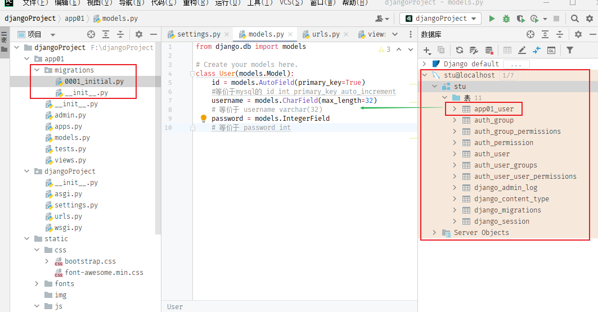

```python
# Create your models here.
class User(models.Model):
    id = models.AutoField(primary_key=True,verbose_name='主键')
    #等价于mysql的 id int primary_key auto_increment
    username = models.CharField(max_length=32,verbose_name='用户名')
    # 等价于 username varchar(32)
    password = models.IntegerField(verbose_name='密码')
    # 等价于 password int
    
class Author(models.Model):
    username = models.CharField(max_length=32)
    password = models.IntegerField(max_length=8)
    
PS F:\djangoProject> python manage.py makemigrations  # 刷写到migrations文件夹
    
PS F:\djangoProject> python manage.py migrate # 刷写到mysql      
```

### 字段的增删改查

```python
class Author(models.Model):
    username = models.CharField(max_length=32)
    password = models.IntegerField(max_length=8)
    # 增加一个可以为空的字段
    info = models.CharField(max_length=32,verbose_name='备注',null=True)
    # 增加一个有默认值的字段
    hobby = models.CharField(max_length=32,verbose_name='兴趣',default='games')

修改
    直接修改models.py 里面对应的class，然后使用  python manage.py makemigrations   && python manage.py migrate
    
删除
    直接注释models.py 里面对应的字段既可，然后使用  python manage.py makemigrations   && python manage.py migrate
    
操作之前一定要细心检查，编程中离开必须锁屏    
```

### 数据的增删改查

这里使用登录验证说明查询

#### 查数据

```python
第一种
    user_obj = models.User.objects.filter(username=username).first()
第二种
 res = models.User.objects.all()
```


```python
        username = request.POST.get('username')
        password = request.POST.get('password')
        # 查询mysql中的数据
        from app01 import models  # 导入模板
        user_obj = models.User.objects.filter(username=username).first()
        #等价于mysql select * from user where username='xxx';
        # print(user_obj)
        # <QuerySet [<User: User object (1)>, <User: User object (79)>, <User: User object (727)>]>
        # print(user_obj.username)  # Fan Zitao
        # print(user_obj.password)  # qG5I2qn5SY
        if user_obj:
            if password == user_obj.password:
                return HttpResponse('登录成功')
            else:
                return HttpResponse('密码错误')
        else:
            return HttpResponse('用户不存在')
```

```python
def login(request):
    """
    get与post 请求应该有不同的处理机制
    :param request: 请求相关的数据对象里面有很多简易方法
    :return:
    """
    # print('返回请求方式：',request.method,'类型：',type(request.method)) # 返回请求方式： POST 类型： <class 'str'>
    # if request.method == 'GET':
    #     print('come on')
    #     return render(request,'login.html')
    # elif request.method == 'POST':
    #     print('已收到！')
    if request.method == 'POST':
        # print('获取用户提交的post信息',request.POST)
        # # 获取用户提交的post信息 <QueryDict: {'username': ['xyz'], 'password': ['123']}>
        # username = request.POST.get('username')
        # print(username,type(username))
        # # 获取用户提交的post信息 < QueryDict: {'username': ['xzasd'], 'password': ['21321']} >
        # # xzasd <class 'str'>
        # password = request.POST.get('password')
        # print(password,type(password))
        # #获取用户提交的post信息 < QueryDict: {'username': ['sad'], 'password': ['13213']} >
        # #sad <class 'str'>
        # #13213 <class 'str'>
        # hobby = request.POST.get('hobby')
        # print(hobby,type(hobby))  # 333 <class 'str'> 只获取到最后一个value
        # username = request.POST.getlist('username')
        # password = request.POST.getlist('password')
        # hobby = request.POST.getlist('hobby')
        # print(username,type(username))
        # print(password,type(password))
        # print(hobby,type(hobby))
        """
        ['test'] <class 'list'>
        ['123'] <class 'list'>
        ['111', '222'] <class 'list'>
        """
        # 获取用户名密码利用orm操作数据，校验数据是否正确。
        username = request.POST.get('username')
        password = request.POST.get('password')
        # 查询mysql中的数据
        from app01 import models  # 导入模板
        user_obj = models.User.objects.filter(username=username).first()
        #等价于mysql select * from user where username='xxx';
        # print(user_obj)
        # <QuerySet [<User: User object (1)>, <User: User object (79)>, <User: User object (727)>]>
        # print(user_obj.username)  # Fan Zitao
        # print(user_obj.password)  # qG5I2qn5SY
        if user_obj:
            if password == user_obj.password:
                return HttpResponse('登录成功')
            else:
                return HttpResponse('密码错误')
        else:
            return HttpResponse('用户不存在')

        print(requests.GET)

    return render(request,'login.html')

```

经过测试已经能正确的判断用户是否存在，密码对错。

#### 增加（插入数据）

```html
reg.html 
<h1 class="text-center">注册</h1>
<div class="container">
    <div class="row">
        <div class="col-md-3 col-md-auto">
            <form action="/reg/" method="post">
                <p>username:<input type="text" name="username" class="form-control"></p>
                <p>password:<input type="password" name="password" class="form-control"></p>
                <p>
                    <input type="checkbox" name="hobby" value="111">111
                    <input type="checkbox" name="hobby" value="222">222
                    <input type="checkbox" name="hobby" value="333">333
                </p>
                <input type="submit" class="btn btn-success">
            </form>

        </div>
    </div>
</div>
```

```python
view.py
def reg(request):
    if request.method == "POST":
        username = request.POST.get('username')
        password = request.POST.get('password')
        from app01 import models
        res = models.User.objects.create(username=username,password=password)
        print(res,res.username,res.password)
    return render(request,'reg.html')
```

```python
# urls.py
urlpatterns = [
    path('admin/', admin.site.urls),
    path('index/', app01.views.index),
    path('static/', app01.views.static),
    path('login/', app01.views.login),
    path('ab_render/',app01.views.ab_render),
    path('reg/',app01.views.reg),
]
```

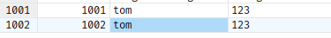

数据是插入了没有去重。。。

```python
第二种保存数据的方法
def reg(request):
    if request.method == "POST":
        username = request.POST.get('username')
        password = request.POST.get('password')
        from app01 import models
        # 第一种
        # res = models.User.objects.create(username=username,password=password)
        # print(res,res.username,res.password)
        # 第二种
        user_obj = models.User(username=username,password=password)
        user_obj.save() # save data
    return render(request,'reg.html')
```

**userlist**

#### 修改

通过修改用户信息完成编辑，删除操作。

```html
<h1 class="text-center">数据展示</h1>
<div class="container">
    <div class="row">
        <div class="col-md-12 col-md-auto">
            <table class="table table-striped table-hover">
                <thead>
                <tr>
                    <th>ID</th>
                    <th>username</th>
                    <th>password</th>
                    <th>action</th>
                </tr>
                </thead>
                <tbody>
                 
                     <tr>
                         <td>{{ user_obj.id }}</td>
                         <td>{{ user_obj.username }}</td>
                         <td>{{ user_obj.password }}</td>
                         <td>
                             <a>编辑</a>
                             <a>删除</a>
                         </td>
                     </tr>
                 

                </tbody>
            </table>
        </div>
    </div>
</div>
```

```python
view.py
from app01 import models
def userlist(request):
    data = models.User.objects.filter() #查询数据
    print(data)
    return HttpResponse("userlist")


urls.py
urlpatterns = [
    path('admin/', admin.site.urls),
    path('index/', app01.views.index),
    path('static/', app01.views.static),
    path('login/', app01.views.login),
    path('ab_render/',app01.views.ab_render),
    path('reg/',app01.views.reg),
    path('userlist/',app01.views.userlist),
]
```

上面方式是django server端返回数据

第二种

```python
views.py
def userlist(request):
    # data = models.User.objects.filter()
    # print(data)
    # return HttpResponse("userlist")
    user_queryset = models.User.objects.all() # 查询数据
    return render(request, 'userlist.html', {'user_queryset':user_queryset})
    # return render(request,'userlist.html',locals())  # 下面这种方法更简单一些
    
userlist.html
                <tbody>
                 
                     <tr>
                         <td>{{ user_obj.id }}</td>
                         <td>{{ user_obj.username }}</td>
                         <td>{{ user_obj.password }}</td>
                         <td>
                             <a>编辑</a>
                             <a>删除</a>
                         </td>
                     </tr>
                 
                </tbody>               
```

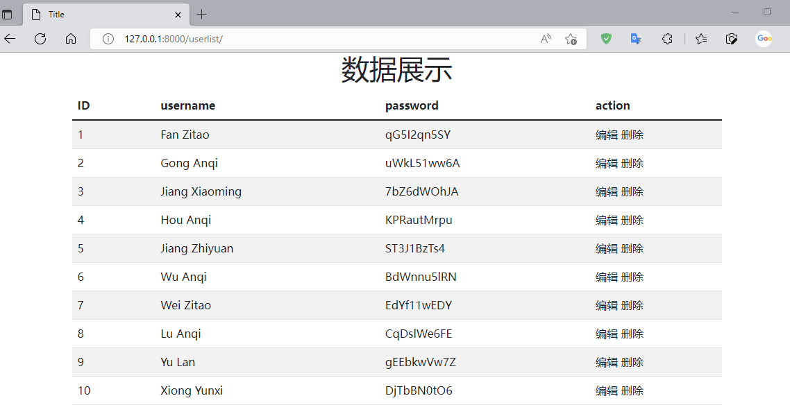

预览效果就是上图所示

接下来做编辑功能按钮

```html
edit_user.html

<h1 class="text-center">编辑</h1>
<div class="container">
    <div class="row">
        <div class="col-md-5 col-md-auto">
            <form action="" method="post">
                <p>username:<input type="text" name="username" class="form-control" value="{{ edit_obj.username }}"></p>
                <p>password:<input type="password" name="password" class="form-control" value="{{ edit_obj.password }}"></p>
                <input type="submit" class="btn btn-info">
            </form>
        </div>
    </div>
</div>
```

```python
views.py
def edit_user(request):
    # 获取url问号后面的参数
    edit_id = request.GET.get('user_id')
    edit_obj = models.User.objects.filter(id=edit_id).first()
    if request.method == "POST":
        username = request.POST.get('username')
        password = request.POST.get('password')
        # models.User.objects.filter(id=edit_id).update(username=username,password=password)
        # 第二种修改数据的方法
        edit_obj.username = username
        edit_obj.password = password
        edit_obj.save()
        return redirect('/userlist/')
    return render(request,'edit_user.html',locals())


urls.py
urlpatterns = [
    path('admin/', admin.site.urls),
    path('index/', app01.views.index),
    path('static/', app01.views.static),
    path('login/', app01.views.login),
    path('ab_render/',app01.views.ab_render),
    path('reg/',app01.views.reg),
    path('userlist/',app01.views.userlist),
    path('edit_user/',app01.views.edit_user),
    path('delete_user/',app01.views.delete_user),
]
```

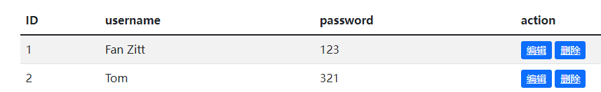

可以看出已经成功修改了。虽然还有一些问题，但是已经不大了。

> 1.首先得获取用户想要编辑的数据主键值
> 		url?edit_id=1   # userlist.html中的action
>
> ```html
> <td>
>    <a href="/edit_user/?user_id={{ user_obj.id }}" class="btn-sm btn-primary">编辑</a>
>    <a href="/delete_user/?user_id={{ user_obj.id }}" class="btn-sm btn-primary">删除</a>
> </td>
> ```
>
> ​		url/1/  # 路由反代
> ​	2.后端查询出对应的数据对象展示到前端
> ​		利用input标签的value属性
> ​	3.提交post请求修改数据
> ​		前期提交post请求一定要先去配置文件中注释点一行(# 'django.middleware.csrf.CsrfViewMiddleware',)
> ​		如果不注释会报403错误

```python
  # 批量更新
	models.User.objects.filter(id=edit_id).update(**kwargs)
  # 单个更新
  user_obj = models.User.objects.filter(id=edit_id).first()
    
  user_obj.username = 'jason'
  user_obj.passsword = '666'
  user_obj.save()
```

该方法当字段比较多的时候效率很降低很多,因为它是从头到尾讲数据所有的字段重新写一遍

#### 案例：route样式伪静态

改成/edit_user/1这种样式

```html
前端： 
<a href="/edit_user/{{ user_object.id }}" class="btn-sm btn-primary">编辑</a>
```

urls.py

```python
urlpatterns = [
    # re_path(r'^static/$',views.static),
    re_path(r'admin/',admin.site.urls),
    # re_path(r'^test/$',views.test),
    re_path(r'^test/(\d+)/',views.test),
    re_path(r'^testadd/(?P<year>\d+)',views.testadd),
    re_path(r'^$',views.index),
    re_path(r'^func_dsadsadsad/',views.func,name='ooo'),
    re_path(r'^userlist/$',views.userlist),
    re_path(r'^edit_user/(\d+)/$',views.edit_user,name='xxx'), # 直接把？u_id这种形式变成/x/1 无名分组
    # re_path(r'^edit_user/(?P<xxx>\d+)/$',views.edit_user), #有名分组
    # re_path(r'',views.errors),
]
```

views.py

```python
def edit_user(request,xxx):
    edit_obj = models.App01User.objects.filter(id=xxx).first()
    if request.method == 'POST':
        username = request.POST.get('username')
        password = request.POST.get('password')
        edit_obj.username = username
        edit_obj.password = password
        edit_obj.save()
        return redirect('/userlist/')
    return render(request,'edit_mysql.html',locals())
```


#### delete 数据

```python
view.py
def delete_user(request):
    # 获取用户想要删除的数据ID
    delete_id = request.GET.get('user_id')
    # 直接到mysql删除数据即可
    models.User.objects.filter(id=delete_id).delete()
    return redirect('/userlist/') # 删除完成即可返回userlist 
```

```python
另一种删除数据的方法
urls.py
    re_path(r'^delete_user/(\d+)/$',views.delete_user,name='deletes_user'),
    
views.py   
    def delete_user(request,deletes_user):
    models.App01User.objects.filter(id=deletes_user).delete()
    return redirect('/userlist/')

前端
<a href="/delete_user/{{ user_object.id }}" class="btn-sm btn-danger">删除</a>

```

`上面这种很危险，任何人浏览器输入http://127.0.0.1:8000/delete_user/xx` 就能删除对应的数据。非常危险


1.`生产中`数据并不会真正意义上的删除，我们在创建表的时候会加一个用来标示是否被删除的字段
		is_delete
		is_alive
		is_status
		...
	删数据其实就是修改字段的状态 之后通过代码筛选出没有删除的状态数据即可
	2.删除数据的时候应该有一个二次确认的过程而不应该直接删除
	    ajax讲完之后加二次确认结合sweetalaert


上面代码bug很多，

1、数据重复，数据库没有使用name唯一

2、数据不需要登录就可以修改

3、密码明文

4、逻辑上不是太严谨。


## Django orm 中创建表关系

表关系有 一对多、多对多、一对一、没关系

确定相互关系应该换位思考才能得到更为全面的表关系。

`创建表关系，先将基表创建出来 然后再添加外键字段`

```python
models.py
from django.db import models

# 创建表关系  先将基表创建出来 然后再添加外键字段
class Book(models.Model):
    title = models.CharField(max_length=32)
    price = models.DecimalField(max_digits=8,decimal_places=2)
    # 总共八位 小数点后面占两位
    """
    图书和出版社是一对多 并且书是多的一方 所以外键字段放在书表里面
    """
    publish = models.ForeignKey(to='Publish')  # 默认就是与出版社表的主键字段做外键关联
    """
    如果字段对应的是ForeignKey 那么会orm会自动在字段的后面加_id
    如果你自作聪明的加了_id那么orm还是会在后面继续加_id
    
    后面在定义ForeignKey的时候就不要自己加_id
    """


    """
    图书和作者是多对多的关系 外键字段建在任意一方均可 但是推荐你建在查询频率较高的一方
    """
    authors = models.ManyToManyField(to='Author')
    """
    authors是一个虚拟字段 主要是用来告诉orm 书籍表和作者表是多对多关系
    让orm自动帮你创建第三张关系表
    """


class Publish(models.Model):
    name = models.CharField(max_length=32)
    addr = models.CharField(max_length=32)


class Author(models.Model):
    name = models.CharField(max_length=32)
    age = models.IntegerField()
    """
    作者与作者详情是一对一的关系 外键字段建在任意一方都可以 但是推荐你建在查询频率较高的表中
    """
    author_detail = models.OneToOneField(to='AuthorDetail')
    """
    OneToOneField也会自动给字段加_id后缀
    所以你也不要自作聪明的自己加_id
    """

class AuthorDetail(models.Model):
    phone = models.BigIntegerField()  # 或者直接字符类型
    addr = models.CharField(max_length=32)


"""
	orm中如何定义三种关系
		publish = models.ForeignKey(to='Publish')  # 默认就是与出版社表的主键字段做外键关联
		
		authors = models.ManyToManyField(to='Author')
		
		author_detail = models.OneToOneField(to='AuthorDetail')
		
		
		ForeignKey
		OneToOneField
			会自动在字段后面加_id后缀
"""

# 在django1.X版本中外键默认都是级联更新删除的
# 多对多的表关系可以有好几种创建方式 这里暂且先介绍一种
# 针对外键字段里面的其他参数 暂时不要考虑 如果感兴趣自己可以百度试试看
```


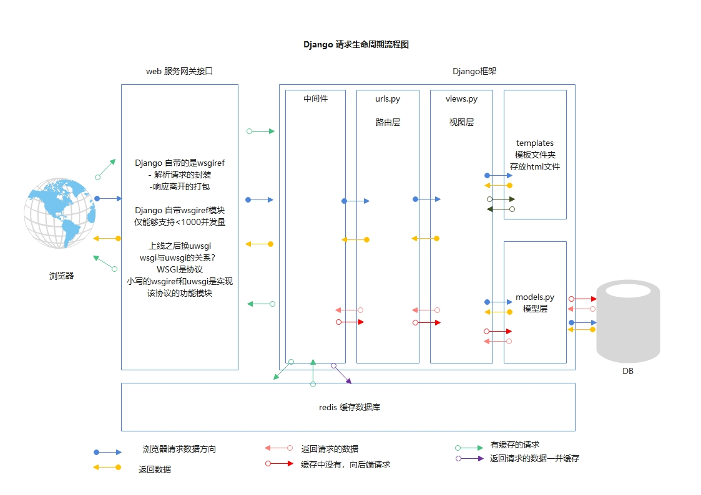

缓存的目的就是为了加速访问。后期访问量过大还有nginx反代，负载均衡这些功能。

`学习先从浅入深，对于某些功能是怎么实现的没有必要去深入了解，只需要会用一部分即可`


## 路由层

路由层指的是urls.py文件,这个文件控制的是域名后面的分文件

支持正则表达式

新建project

```python
from django.contrib import admin
from django.urls import path

import app01.views

urlpatterns = [
    path('admin/', admin.site.urls),
    path('index/', app01.views.index),
    path('static/', app01.views.static),
    path('login/', app01.views.login),
    path('ab_render/',app01.views.ab_render),
    path('reg/',app01.views.reg),
    path('userlist/',app01.views.userlist),
    path('edit_user/',app01.views.edit_user),
    path('delete_user/',app01.views.delete_user),
]
```

urls.py文件

### path function

> path(route,view,kwargs=None,name=None)
> 函数**path**()具有四个参数，两个必须参数：route和view，kwargs，name两个可选参数。
>
> - route 是一个匹配URL的准则（类似正则表达式），当django响应一个请求时他会从urlpatterns的第一项开始匹配（这些准则不会匹配get，post参数域名）
> - view 当django找到一个匹配的准则就会调用这个特定的视图函数（导入方式from app01 import views  或者 import app01.views）并传入一个Httprequest对象作为第一个参数，这里根据views.py中的函数定，可以重定向，跳转到指定html页面，
> - kwargs 任意关键字参数，可以作为一个字典传递给目标函数
> - name 为URL取名，能在使用django的任意地方唯一地引用，特别是在模板中。这个特性让你修改一个文件就能全局地修改某个URL模式。

route 参数是一个字符串或者`gettext_lazy(message)`。它包含一个 URL 模式。这个字符串可以包含角括号（就像上面的 <username>）来捕获 URL 的一部分，并将其作为关键字参数发送给视图。角括号可以包含一个转换器规格（像 <int:section> 的 int 部分），它限制了匹配的字符，也可以改变传递给视图的变量的类型。例如，<int:section> 匹配一串十进制数字，并将值转换为 int。

```python
# 例子
from django.urls import include, path

urlpatterns = [
    path('index/', views.index, name='main-view'),
    path('bio/<username>/', views.bio, name='bio'),
    path('articles/<slug:title>/', views.article, name='article-detail'),
    path('articles/<slug:title>/<int:section>/', views.section, name='article-section'),
    path('blog/', include('blog.urls')),
    ...
]
```

https://docs.djangoproject.com/zh-hans/4.1/ref/urls/#module-django.conf.urls

https://docs.djangoproject.com/zh-hans/4.1/topics/http/urls/#how-django-processes-a-request


### re_path function

re_path(route,view,ksargs=None,name=None)跟上面的path类似只是route包含正则表达式

字符串通常使用原始字符串语法（`r''`），因此它们可以包含像 `/d` 这样的序列，而不需要用另一个反斜杠来转义。当进行匹配时，从正则表达式中捕获的组会被传递到视图中 —— 如果组是命名的，则作为命名的参数，否则作为位置参数。值以字符串的形式传递，不进行任何类型转换。

```python
示例
from django.urls import include, re_path

urlpatterns = [
    re_path(r'^index/$', views.index, name='index'),
    re_path(r'^bio/(?P<username>\w+)/$', views.bio, name='bio'),
    re_path(r'^blog/', include('blog.urls')),
    ...
]
```

当route以 $ 结尾时，整个请求的 URL，匹配 path_info，必须匹配正则表达式模式（使用 re.fullmatch()）

https://docs.djangoproject.com/zh-hans/4.1/ref/request-response/#django.http.HttpRequest.path_info


`当我们使用path的时候对于没有的页面会返回404,但是这样的错误页面，把我们的资源都暴露出去了。非常不友好`

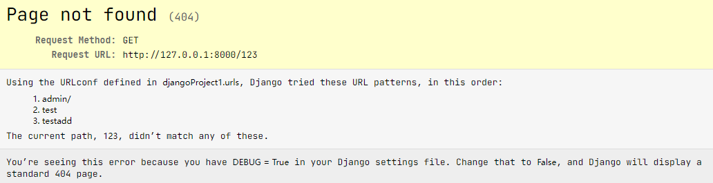

那么我们使用re_path 来使用正则来匹配

```python
from django.contrib import admin
from django.urls import path, include, re_path
from app01 import views

# urlpatterns = [
#     path('admin/', admin.site.urls),
#     path('test',views.test),
#     path('testadd',views.testadd),
# ]

urlpatterns = [
    re_path(r'admin/',admin.site.urls),
    re_path(r'test/',views.test),
    re_path(r'testadd/',views.testadd),
]
```

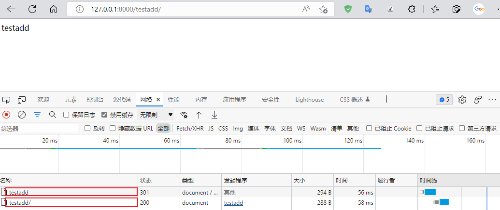

 可以看到route后面/和没有的区别，服务会先找没有/的。如果没有匹配到结果则重定向到带有/结尾的route。

取消自动加斜杠

```python
APPEND_SLASH = False/True	# 默认是自动加斜杠的 看起来没有多少作用
falase 关
true 开
```

urls.py

```python
urlpatterns = [
    re_path(r'admin/',admin.site.urls),
    re_path(r'^test',views.test),
    re_path(r'testadd/',views.testadd),
]
```

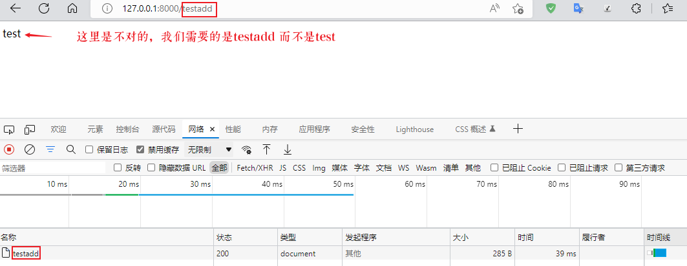

为什么出现这种情况。因为urls中匹配的正则是以test开头的。所以导致这种前缀相同的情况访问到第一个内容。

```python
re_path(r'^test$',views.test),
```

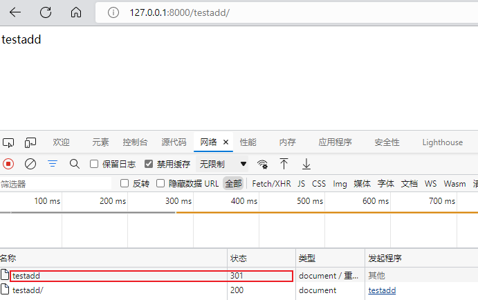

```python
 re_path(r'',views.index),
    这条route什么也没有，用户随便输入什么都会显示对应的调用函数。这条多用于404错误页面。
    但是位置必须是最后！
 re_path(r'^$',views.index),
    这条什么也不输入就是index
    
```

### 分组

分组就是给某一段正则表达式用小括号括起来

#### 无名分组

无名分组就是将括号内正则表达式匹配到的内容当作位置参数传递给后面的视图函数

```python
urls.py
re_path(r'^test/(\d+)/',views.test), # 这个需要2个参数，在views文件中就加入两个参数

views.py
def test(request,xxx):
    print(xxx)
    return HttpResponse('test')
```

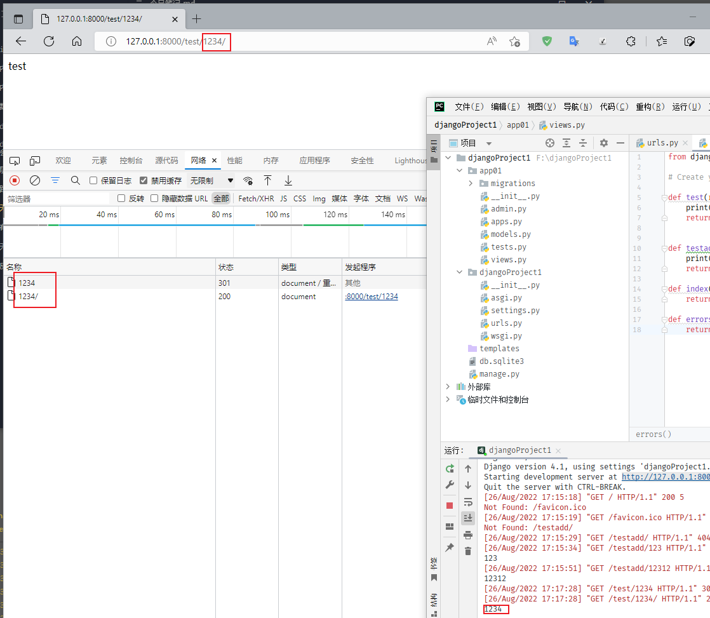

#### 有名分组

有名分组就是将括号内正则表达式匹配到的内容当作关键字参数传递给后面的视图函数

```python
    urls.py
    re_path(r'^testadd/(?P<year>\d+)',views.testadd),
    
    views.py
    def testadd(request,year):
        print(year)
        return HttpResponse('testadd')
```

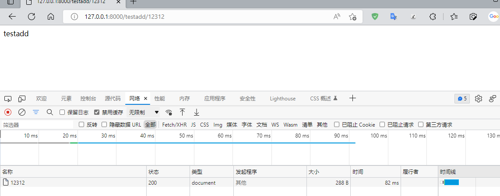

无名有名是不能混用的，但是任意一个都可以N次使用

```python
url(r'^index/(?P<year>\d+)/(?P<age>\d+)/(?P<month>\d+)/',views.index),
```

### 反向解析

反向解析就是友链挂载了你的连接，你如果你修改了route，那么友链就失效了。这个时候如果是使用反代就避免了这种情况的产生。

```python
准备环境
setting.py  #配置html的静态资源
STATIC_URL = 'static/'
STATICFILES_DIRS = [
    os.path.join(BASE_DIR,'static'),
]

把用到的css,js文件放到static静态文件夹中。
html中
    
    <link rel="stylesheet" href="">
    <link rel="stylesheet" href="">
    <script src=""></script>
    <script src=""></script>
    
    
urls.py
    re_path(r'^func_dsadsadsad/',views.func,name='ooo')，
    
views.py
def func(request):
    # return reverse('ooo')
    return HttpResponse('func')

def index(request):
    print(reverse('ooo'))
    return render(request,'test.html')

test.html
<a href=""> 111 </a>
```

现在不管自己的route怎么变，友链都不会有什么异常。

反向解析的应用

```python
urls.py
urlpatterns = [
    # re_path(r'^static/$',views.static),
    re_path(r'admin/',admin.site.urls),
    # re_path(r'^test/$',views.test),
    re_path(r'^test/(\d+)/',views.test),
    re_path(r'^testadd/(?P<year>\d+)',views.testadd),
    re_path(r'^$',views.index),
    re_path(r'^func_dsadsadsad/',views.func,name='ooo'),
    re_path(r'^userlist/$',views.userlist),
    # re_path(r'^edit_user/(\d+)/$',views.edit_user,name='xxx'),# 无名分组
    # re_path(r'^edit_user/(?P<xxx>\d+)/$',views.edit_user), #有名分组
    re_path(r'^edit/(\d+)/$',views.edit_user,name='aaa'), #反向解析
    re_path(r'^delete_user/(\d+)/$',views.delete_user,name='deletes_user'),
    # re_path(r'',views.errors),
]

views.py
def edit_user(request,xxx):
    reverse('aaa', args=(xxx,))
    edit_obj = models.App01User.objects.filter(id=xxx).first()
    if request.method == 'POST':
        username = request.POST.get('username')
        password = request.POST.get('password')
        edit_obj.username = username
        edit_obj.password = password
        edit_obj.save()
        return redirect('/userlist/')
    return render(request,'edit_mysql.html',locals())

userinfo.html
 <a href="" class="btn-sm btn-primary">编辑</a>
编辑页面不改
<div class="container">
    <div class="row row-cols-6">
        <div class="col col-md-5">
            <form action="" method="post">
{#                <p>UserName:<input type="text" name="username" class="form-control" value="{{ edit_obj.username }}"></p>#}
                <p>UserName:<input type="text" name="username" class="form-control" value="{{ edit_obj.username }}"></p>
                <p>Password:<input type="password" name="password" class="form-control" value="{{ edit_obj.password }}"></p>
                <input type="submit" class="btn btn-danger">

            </form>
        </div>
    </div>
</div>
```

上面就是无名，有名分组的反向解析案例

路由层urls.py，视图层views.py，模板层xxx.html都有修改的地方 

上面的通了后期翻阅查看即可。

## 路由分发

Django的每个应用都可以由自己的templates文件夹 url.py static文件夹，正是这种特质Django可以分组开发，每个人负责自己的app即可，作为管理人只需要汇总项目之后注册所有的app再利用路由分发将所有的app整合起来。

路由分发可以减轻总路由的压力。总路由不再接路由视图函数的直接对应关系。

总路由会识别当前url是属于那个应用下的。

```python
new project

setting.py

DATABASES = {
    'default': {
        'ENGINE': 'django.db.backends.mysql',
        'NAME': 'stu',
        'USER': 'root',
        'PASSWORD': '123456',
        'HOST': '127.0.0.1',
        'PORT': '3306',
        'CHARSET': 'utf8mb4',
    }
}


STATIC_URL = 'static/'   # 这个后期可以根据不同的app设置
STATICFILES_DIRS = [
    os.path.join(BASE_DIR,'static'),
]

project 
__init__.py
import pymysql
pymysql.install_as_MySQLdb()
```

创建app

```cmd
F:\Django_Project_Dir\route>python manage.py startapp app02
```

注册app02

```python
setting.py
INSTALLED_APPS = [
    'django.contrib.admin',
    'django.contrib.auth',
    'django.contrib.contenttypes',
    'django.contrib.sessions',
    'django.contrib.messages',
    'django.contrib.staticfiles',
    'app01.apps.App01Config',
    'app02',    
]
```

分别在**所有app**中新建 urls.py文件

```python
from django.contrib import admin
from django.urls import path,re_path

urlpatterns = [
    re_path(r'^admin/$',admin.site.urls),

]
```

<font color='#ff33ff'>总路由</font>

```python
# urls.py
from django.contrib import admin
from django.urls import path,re_path,include

from app01 import urls as app01_urls
from app02 import urls as app02_urls

urlpatterns = [
    path('admin/', admin.site.urls),
    # re_path(r'^app01/',include(app01_urls)),   # 路由分发
    # re_path(r'^app02/',include(app02_urls)),
    re_path(r'^app01/',include('app01.urls')),  # 终极写法，推荐使用
    re_path(r'^app02/',include('app02.urls')),
]

上面的route 不能以$结尾
```

子路由

```python
app01
views.py
from django.shortcuts import render,HttpResponse,redirect,reverse

# Create your views here.

def test(request):
    return HttpResponse('test_app01')

---------------------
urls.py
from django.urls import path,re_path

import app01.views  # 这是第一种方法

urlpatterns = [
    # re_path(r'^admin/',admin.site.urls),
    re_path(r'^test/$',app01.views.test),
]
```

```python
app02
views.py
from django.shortcuts import render,redirect,reverse,HttpResponse

# Create your views here.

def test(request):
    return HttpResponse('test_app02')
--------------------
urls.py
from django.urls import path,re_path

from app02 import views # 第二种方法

urlpatterns = [
    # re_path(r'^admin/$',admin.site.urls),
    re_path(r'^test/$',views.test)
]
```

http://127.0.0.1:8000/app02/test/

http://127.0.0.1:8000/app01/test/

```python
August 29, 2022 - 13:46:28
Django version 4.1, using settings 'route.settings'
Starting development server at http://127.0.0.1:8000/
Quit the server with CTRL-BREAK.
[29/Aug/2022 13:46:36] "GET /app01/test/ HTTP/1.1" 200 10
[29/Aug/2022 13:46:43] "GET /app02/test/ HTTP/1.1" 200 10
F:\Django_Project_Dir\route\app02\urls.py changed, reloading.
Performing system checks...
```

路由分发功能在大型应用中才能使用得到。

### 名称空间

namespace：从kubernetes开始这个名称空间基本很多一站多app场景很常用。kubernetes中更是多套系统，必须使用namespace隔离。在python中了解即可。

演示

```python
总urls.py
urlpatterns = [
    # path('admin/', admin.site.urls),
    # re_path(r'^app01/',include(app01_urls)),
    # re_path(r'^app02/',include(app02_urls)),
    re_path(r'^app01/',include(('app01.urls','app01'),namespace='app01')),
    re_path(r'^app02/',include(('app02.urls','app02'),namespace='app02')),
]

子路由
app01
urls.py
urlpatterns = [
    # re_path(r'^admin/',admin.site.urls),
    re_path(r'^test/$',app01.views.test,name='xxx'),
]

views.py
def test(request):
    reverse('app01:xxx')
    return render(request,'index.html')

index.html
<span>url地址:</span>

app02 一样
```

很多时候为了节省直接在命名时候app加下划线命名避免名字重复。其实不建议这样做，很多逆向工具查找这样的命名很简单。

### 伪静态

SEO的一种，效果不如购买广告服务直接。

上面的无名，有名分组，反向解析九可以实现伪静态。


### 虚拟环境

开发中requirement.txt 文件使用之前安装下环境即可。


### Django版本区别

urls.py 中1.x使用的是url，其他版本是path

path('index/<int:id>/',index)

将第二个路由里面的内容先转成整型然后以关键字的形式传递给后面的视图函数

 str,匹配除了路径分隔符（/）之外的非空字符串，这是默认的形式
	int,匹配正整数，包含0。
	slug,匹配字母、数字以及横杠、下划线组成的字符串。
	uuid,匹配格式化的uuid，如 075194d3-6885-417e-a8a8-6c931e272f00。
	path,匹配任何非空字符串，包含了路径分隔符（/）（不能用？）

``` python
除了有默认的五个转换器之外 还支持自定义转换器(了解)
	class MonthConverter:
    regex='\d{2}' # 属性名必须为regex

    def to_python(self, value):
        return int(value)

    def to_url(self, value):
        return value # 匹配的regex是两个数字，返回的结果也必须是两个数字
	
	
	from django.urls import path,register_converter
	from app01.path_converts import MonthConverter

	# 先注册转换器
	register_converter(MonthConverter,'mon')
    
	from app01 import views
	urlpatterns = [
    path('articles/<int:year>/<mon:month>/<slug:other>/', 	views.article_detail, name='aaa'),
]
```

模型层里面1.X外键默认都是**级联**更新删除的,但是到了2.X和3.X中需要你自己手动配置参数

```python
models.ForeignKey(to='Publish')
models.ForeignKey(to='Publish',on_delete=models.CASCADE...)
```

## 视图层

return 三种

 HttpResponse  返回字符串类型
    render   返回html页面 并且在返回给浏览器之前还可以给html文件传值
    redirect  重定向

`视图函数必须要返回一个HttpResponse对象`

```python
render简单内部原理
		from django.template import Template,Context
    res = Template('<h1>{{ user }}</h1>')
    con = Context({'user':{'username':'jason','password':123}})
    ret = res.render(con)
    print(ret)
    return HttpResponse(ret)
```

### JsonResponse对象

json格式的数据有什么用？
	前后端数据交互需要使用到json作为过渡 实现跨语言传输数据

前端序列化
	JSON.stringify()					    json.dumps()
	JSON.parse()							json.loads()

```python
import json
from django.http import JsonResponse
def ab_json(request):
    u_list = {
        'username':'中文字符出现乱码',
        'password':'123456',
        'hobby':'boy',
    }

    l = [1,2,3,4,5,6,8]

    # 方法一
    # json_str = json.dumps(u_list,ensure_ascii=False) # 不加中文字符变二进制
    # return HttpResponse(json_str)

    # 方法二
    # return  JsonResponse(u_list,json_dumps_params={'ensure_ascii':False})

    return JsonResponse(l,safe=False)  # 默认只能序列化字典，其他需要设置safe参数
```

###  from 表单上传文件

from表单上传文件类型的数据

- method 必须是post

- enctype必须换成formdata

  https://docs.djangoproject.com/zh-hans/4.1/topics/http/file-uploads/
#### 简单文件上传

准备工作

```html
前端代码
<h1 class="text-center">Upload File</h1>
<form action="" method="post" enctype="multipart/form-data">  # 编码，提交方式
    <input type="file" name="file" >
    <input type="submit" name="sub" value="上传">
</form>
```

```cmd
[30/Aug/2022 16:55:27] "POST /app01/test/ HTTP/1.1" 200 1112
<MultiValueDict: {'file': [<InMemoryUploadedFile: 还款明细.pdf (application/pdf)>]}> <QueryDict: {'sub': ['上传']}>
[30/Aug/2022 16:55:47] "POST /app01/test/ HTTP/1.1" 200 1112
<MultiValueDict: {'file': [<InMemoryUploadedFile: AMTAG.BIN (application/octet-stream)>]}> <QueryDict: {'sub': ['上传']}>
<MultiValueDict: {'file': [<InMemoryUploadedFile: 938F19899581 (application/octet-stream)>]}> <QueryDict: {'sub': ['上传']}>
[30/Aug/2022 16:55:58] "POST /app01/test/ HTTP/1.1" 200 1112
<MultiValueDict: {'file': [<InMemoryUploadedFile: Everytime - 布兰妮斯皮尔斯.lrc (application/octet-stream)>]}> <QueryDict: {'sub': ['上传']}>
[30/Aug/2022 16:56:13] "POST /app01/test/ HTTP/1.1" 200 1112
[30/Aug/2022 16:56:22] "POST /app01/test/ HTTP/1.1" 200 1112
<MultiValueDict: {'file': [<TemporaryUploadedFile: SakuraTears - Snigellin.flac (audio/flac)>]}> <QueryDict: {'sub': ['上传']}>
```


```python
forms_file.py
from django import forms

class UploadFileForm(forms.Form):
    title = forms.CharField(max_length=100)
    file = forms.FileField()
```

request.Files 接收数据是一个字典，包含每个filefield 文件字段或者imagefield

```python
views.py
def upload_file(request):
    if request.method == 'POST':
        file_obj = request.FILES.get('file')
        print(file_obj)
        with open(file_obj,'wb+') as f:
            for l in file_obj.chunks():
                f.write(l)

    return render(request, 'index.html')

html
<h1 class="text-center">Upload File</h1>
<form action="" method="post" enctype="multipart/form-data">
    <input type="file" name="file" >
    <input type="submit" name="sub" value="上传">
</form>

urls.py
urlpatterns = [
    # re_path(r'^admin/',admin.site.urls),
    # re_path(r'^test/$',app01.views.test,name='xxx'),
    # re_path(r'^test/$',app01.views.ab_json),
    re_path(r'^test/$',app01.views.upload_file),
]
```

上面这个上传文件有问题。能上传，不能保存。现在所学还不能完成。

https://blog.csdn.net/sky0lan/article/details/120550016


#### resquest 对象方法

```python
"""
request.method
request.POST
request.GET
request.FILES
request.body  # 原生的浏览器发过来的二进制数据  后面详细的讲
request.path 
request.path_info
request.get_full_path()  能过获取完整的url及问号后面的参数 
"""
    print(request.path)  # /app01/ab_file/
    print(request.path_info)  # /app01/ab_file/
    print(request.get_full_path())  # /app01/ab_file/?username=jason
```

### FBV与CBV

```python
# 视图函数既可以是函数也可以是类
def index(request):
  return HttpResponse('index')

# CBV
    # CBV路由
url(r'^login/',views.MyLogin.as_view())


from django.views import View
class MyLogin(View):
    def get(self,request):
        return render(request,'form.html')

    def post(self,request):
        return HttpResponse('post方法')
      
"""
FBV和CBV各有千秋
CBV特点
	能够直接根据请求方式的不同直接匹配到对应的方法执行
	
	内部到底是怎么实现的？
		CBV内部源码(******)
"""
```


# Django 高阶用法

## 新建django环境

```cmd
F:\Django_Project_Dir>django-admin startproject day30

F:\Django_Project_Dir>cd day30

F:\Django_Project_Dir\day30>python manage.py startapp app01

F:\Django_Project_Dir\day30>mkdir templates
```

配置django

```python
setting.py
INSTALLED_APPS = [
    'django.contrib.admin',
    'django.contrib.auth',
    'django.contrib.contenttypes',
    'django.contrib.sessions',
    'django.contrib.messages',
    'django.contrib.staticfiles',
    'app01',  # 注册app
]
TEMPLATES = [
    {
        'BACKEND': 'django.template.backends.django.DjangoTemplates',
        'DIRS': [BASE_DIR / 'templates'], # 手动指定templates目录
        'APP_DIRS': True,
        'OPTIONS': {
            'context_processors': [
                'django.template.context_processors.debug',
                'django.template.context_processors.request',
                'django.contrib.auth.context_processors.auth',
                'django.contrib.messages.context_processors.messages',
            ],
        },
    },
]
MIDDLEWARE = [
    'django.middleware.security.SecurityMiddleware',
    'django.contrib.sessions.middleware.SessionMiddleware',
    'django.middleware.common.CommonMiddleware',
    # 'django.middleware.csrf.CsrfViewMiddleware',   # 提交需求报错
    'django.contrib.auth.middleware.AuthenticationMiddleware',
    'django.contrib.messages.middleware.MessageMiddleware',
    'django.middleware.clickjacking.XFrameOptionsMiddleware',
]

DATABASES = {   # mysql
    'default': {
        'ENGINE': 'django.db.backends.mysql',
        'NAME': 'stu',
        'USER': 'root',
        'PASSWORD': '123456',
        'HOST':'127.0.0.1',
        'PORT': '3306',
        'CHARSET': 'utf8mb4',
    }
}

STATIC_URL = 'static/'   # static 资源
STATICFILES_DIRS=[
    os.path.join(BASE_DIR,'static'),
]

__init__.py     # 调用pymysql
import pymysql
pymysql.install_as_MySQLdb()


urls.py
from django.contrib import admin
from django.urls import path,re_path
from app01 import views

urlpatterns = [
    path('admin/', admin.site.urls),
    re_path(r'^index/',views.index),
]


views.py
from django.shortcuts import render,HttpResponse,reverse,redirect

# Create your views here.

def index(request):
    return HttpResponse('index')
```

基础环境已经准备就绪

## CBV源码剖析

源码不能修改，除非BUG很难找。只要是视图函数都应该有一个形参request

```python
views.py
from django.views import View

class MyLogin(View):
    def get(self,request):
        return render(request,'index.html')

    def post(self,request):
        return HttpResponse('post 请求')
    
urls.py
from django.urls import path,re_path
from app01 import views

urlpatterns = [
    path('admin/', admin.site.urls),
    # re_path(r'^index/',views.index),
    re_path(r'^index/',views.MyLogin.as_view()),
]
```

根据上面的代码作为查看源码的突破口

我们选择urls.py里面的as_view作为开始

```python
# 源码
    @classonlymethod
    def as_view(cls, **initkwargs):
        cls 就是views.py 中自定义的类。 
        """Main entry point for a request-response process."""
        for key in initkwargs:
            ...
  # 看源码看自己懂的
        def view(request, *args, **kwargs):
            self = cls(**initkwargs)
            #self = MyLogin(**initkwargs)  产生一个我们写的类object
            self.setup(request, *args, **kwargs)
            if not hasattr(self, "request"):
                raise AttributeError(
                    "%s instance has no 'request' attribute. Did you override "
                    "setup() and forget to call super()?" % cls.__name__
                )
            return self.dispatch(request, *args, **kwargs)
         
         return view
    
python 源码查看方法：
面向对象的属性方法先从对象自己查找，再去产生对象类里面找，最后去父类里面寻找。
看到self.xxx 就需要知道这个self是指谁？

CBV的精髓
    def dispatch(self, request, *args, **kwargs):
        # Try to dispatch to the right method; if a method doesn't exist,
        # defer to the error handler. Also defer to the error handler if the
        # request method isn't on the approved list.
        if request.method.lower() in self.http_method_names:
            # 获取当前请求的小写格式，然后比对http_method_names
            #  http_method_names = [
       	 	#"get",
       		 #"post",
       		 #"put",
       		 #"patch",
        	 #"delete",
        	#"head",
        	#"options",
        	#"trace",
    		#]
    
            handler = getattr(
                self, request.method.lower(), self.http_method_not_allowed
            )
       # 反射:通过字符串来操作对象的属性或者方法
      #  handler = getattr(自己写的类产生的对象,'get',当找不到get属性或者方法的时候就会用第三个参数)
      #  handler = 我们自己写的类里面的get方法
    
        else:
            handler = self.http_method_not_allowed
        return handler(request, *args, **kwargs)
    
    请求的没有在上面的列表就报错。
     def http_method_not_allowed(self, request, *args, **kwargs):
        logger.warning(
            "Method Not Allowed (%s): %s",
            request.method,
            request.path,
            extra={"status_code": 405, "request": request},
        )
        return HttpResponseNotAllowed(self._allowed_methods())  
```

源码现在应该多练习看。别人写的都很优秀。

面向对象，object 类 元类 加强练习。不然后期很难加速码字。


## 模板语法传值

在上面我们在前端使用过的两种传值

{{}} ：**变量相关**

: **逻辑相关**

```python
views.py
def index(request):
    n=123
    f=1.3495726
    s='hello,你们好'
    b=True
    l=['jack','Tom','张三','李四']
    t=(1,2,3,4,5,6,7)
    d={'username':'jack','password':'123456','age':18,'hobby':['boy','girl','other',{'info':'NB'}]}
    se={'1','3','4','神探'}

    def func():
        print('执行了func')
        return 'func 函数'

    class MyClass(object):
        def get_self(self):
            return 'self'

        @staticmethod
        def get_func(self):
            return 'func_obj'

        @classmethod
        def get_class(cls):
            return 'cls_obj'

        def __str__(self):
            return 'class str'

    obj = MyClass()

    return render(request,'index.html',locals())


index.html
<h1 class="text-center">Index</h1>
<p>{{ n }}</p>
<p>{{ f }}</p>
<p>{{ s }}</p>
<p>{{ b }}</p>
<p>{{ l }}</p>
<p>{{ d }}</p>
<p>{{ t }}</p>
<p>{{ se }}</p>
<p>func:传递函数名会自动加括号调用，但是模板语法不支持给函数传给函数额外的参数：{{ func }}</p>
<p>MyClass:传类名的时候也会自动加括号调用（实例化）{{ MyClass }}</p>
<span>内部能够自动判断出当前的变量名是否可以加括号调用，针对的是函数名和类名</span>
<p>object:{{ obj }}</p>
<p>{{ obj.get_self }}</p>
<p>{{ obj.get_func }}</p>
<p>{{ obj.get_class }}</p>

<p>django模板语法的取值，是固定的格式只能使用点符</p>
<p>d.username:{{ d.username }}</p>
<p>l[0]:{{ l.0 }}</p>
<p>{{ d.hobby.3.info }}</p>  # 上面字典hobby里面嵌套列表中的字典。这里可以混用
<p>{{ d.hobby.2 }}</p>
```

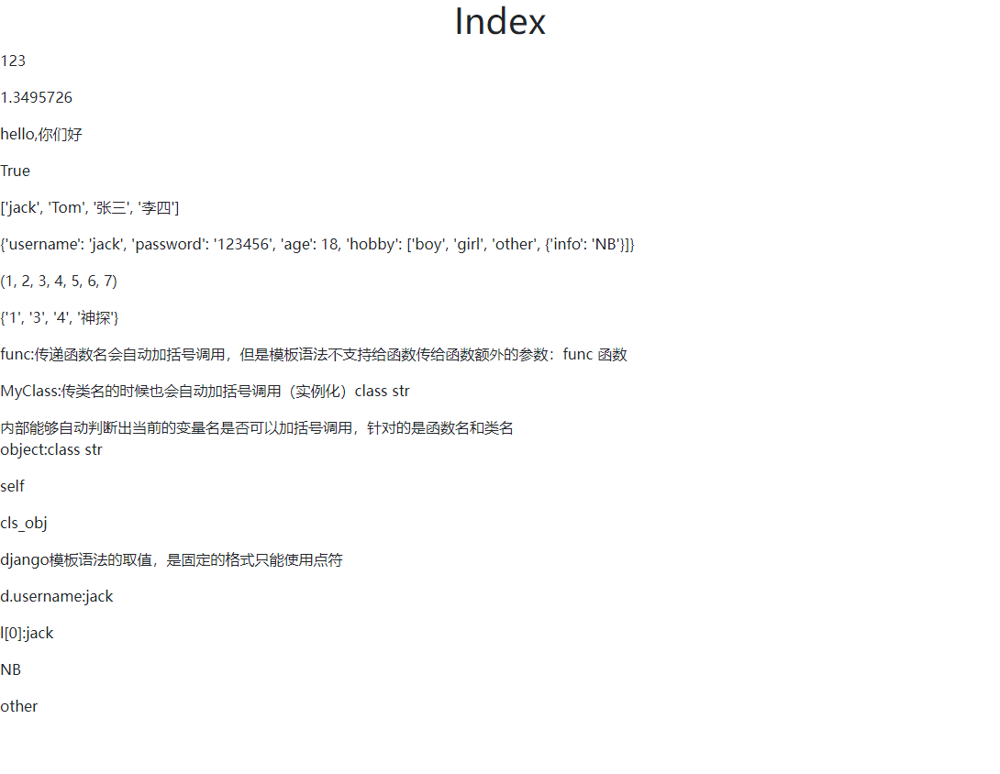

结果

## 过滤器

过滤器就是类似模板语法内置的内置方法。

Django内置60多种。

file:///E:/%E5%B8%AE%E5%8A%A9%E6%96%87%E6%A1%A3/django-docs-4.1-zh-hans/ref/templates/builtins.html

### 基本语法

{{数据|过滤器：参数}}

前端  |safe

后端

from django.utils.safestring import mark_safe

```python
views.py

def index(request):
    n=123
    f=1.3495726
    s='hello,你们好'
    b=True
    l=['jack','Tom','张三','李四']
    t=(1,2,3,4,5,6,7)
    d={'username':'jack','password':'123456','age':18,'hobby':['boy','girl','other',{'info':'NB'}]}
    se={'1','3','4','神探'}

    def func():
        print('执行了func')
        return 'func 函数'

    class MyClass(object):
        def get_self(self):
            return 'self'

        @staticmethod
        def get_func(self):
            return 'func_obj'

        @classmethod
        def get_class(cls):
            return 'cls_obj'

        def __str__(self):
            return 'class str'

    obj = MyClass()

    file_size = 123456789

    import datetime
    current_time = datetime.datetime.now()

    info='社会从不缺少一个迟早要被淘汰的工程师，但缺少与时俱进的解决方案架构师！ 一个IT方案没有优秀的架构设计，那么只会增加运维成本和风险。架构师不是纸上谈兵， 每一个方案会导致什么结果都已经在架构师胸中，当然所涉及到的知识可不是点到点，线到线的，而是面到空间！'

    egl = 'my name is jack , age 49 ,from chinese.'

    msg = 'This is my python study'
    hh = '<h1> Title 标题 </h1>'
    ss = '<script>alert("警告")</script>'

    from django.utils.safestring import mark_safe
    res = mark_safe('<h2>h2标题</h2>')

    return render(request,'index.html',locals())
```

```html
index.html
<div class="container">
    <div class="text-center">
        <h1>过滤器</h1>
        <p>统计'{{ s }}'长度：{{ s|length }}</p>
        <p>默认值：第一个是true就展示第一个参数的值，否则展示后面的默认值：{{ b|default:'这是default' }}</p>
        <p>默认值：|分割左边是False才显示default：{{ False|default:'这是default' }}</p>
        <p>文件大小：{{ file_size|filesizeformat }}</p>
        <p>日期格式化：{{ current_time|date:'Y-m-d' }}</p>
        <p>日期格式化:{{ current_time|date:'Y-m-d h:m:s' }}</p>
        <p>切片{{ l|slice:'0:4:2' }} 支持步长</p>
        <p>切取字符（包含三个点）:{{ info|truncatechars:30 }}</p>
        <p>提取单词(不含三点,按空格)：{{ egl|truncatewords:6 }}</p>
        <p>提取单词（中文）：{{ info|truncatewords:9 }}</p>
        <p>移除指定字符：{{ msg|cut:' ' }} 移除空格</p>
        <p>拼接操作：{{ l|join:'_' }}</p>
        <p>join_sum:{{ n|add:10 }}</p>
        <p>join_sum_str:{{ s|add:msg }}</p>
        <p>转义 :{{ hh|safe }}</p>
        <p>转义：{{ ss|safe }}</p>
        <p>转义：{{ res }}</p>
        <p></p>
        <p></p>
        <p></p>
    </div>    
</div>
```

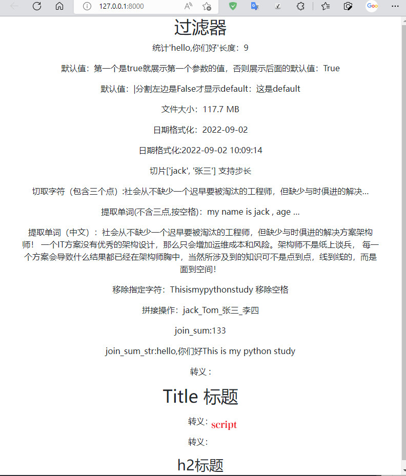


## 标签

### for

```html
<div>
      <h1>标签</h1>
        
            <p>{{ foo }}</p>
            <p>{{ forloop }}</p>
        
<span>foo是loop 里面的元素</span>
<span>forloop是：{'父循环 parentloop': {}, '计数0开始counter0': 0, '计数1开始counter': 1, '倒叙最后为1，revcounter': 4, '倒叙最后为0，revcounter0': 3, '是不是第一first': True, '是不是最后last': False}</span>
</div>
```

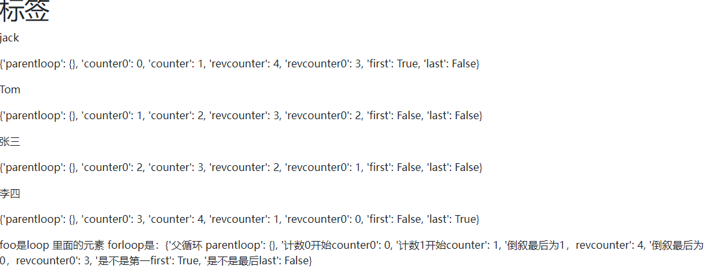

   

### if

```html

    <p>This is True!</p>

    <p>this is elif.</p>

    <p>over!</p>

```

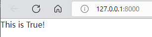


### for if 混用

```html

    
        <p>第一</p>
    
        <p>最后</p>
    
        <p>{{ foo }}</p>
    
    
    <p>for loop 可迭代对象内部没有元素，根本没有循环</p>

```

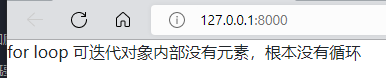

### 处理字典的其他方法

```html
第一种 遍历key

<p>{{ foo }}</p>


第二种 遍历values

    <p>{{ foo }}</p>


第三种  遍历key,values 元组

    <p>{{ foo }} </p>

```

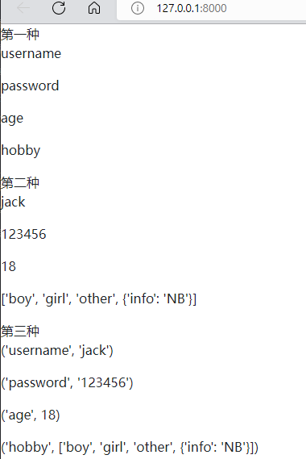


### with

with 别名

```html


    <p>{{ nb }}</p>
    <p>{{ d.hobby.3.info }}</p>

```

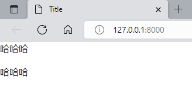

结果是一样的


### 自定义过滤器、标签、inclusion_tag

1.在应用下创建一个名字”必须“叫templatetags文件夹
2.在该文件夹内创建“任意”名称的py文件 eg:mytags.py
3.在该py文件内"必须"先书写下面两句话(单词一个都不能错)

```python
mytags.py
from django import template
register = template.Library()

# 自定义过滤器
@register.filter(name='boby')
def my_sum(v1,v2):
    return v1 + v2
```

```html
index.html
<!--前端引用-->

<p>n:{{ n }}</p>
<p>{{ n|boby:666 }}</p>
```

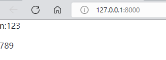


```python
# 多个参数
@register.simple_tag(name='plus')
def index(a,b,c,d):
    return f'{a}-{b}-{c}-{d}'
```

```html
   # 多个自定义这个引用只需要一个即可
<p></p>
```

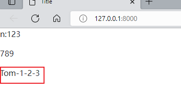

自定义inclusion_tag

```python
# 自定义inclusion_tag
@register.inclusion_tag('index.html')
def left(n):
    data = [f'第{i}项' for i in range(n)]
    # 第一种
    # return {'data':data}
    # 第二种
    return locals()
```

```html
left_ht.html (传递页面)
<ul>
    
        <li>{{ foo }}</li>
    
</ul>


index.html 调用



```

`工作原理`：先定义一个方法，在页面上调用该方法，并且可以传值。该方法会生成一些数据并传递给一个html页面，之后将渲染好的结果放到调用的位置。

> 当html页面某一个地方的页面需要传参数才能动态的渲染出来，这种应用在bbs,图片浏览应用

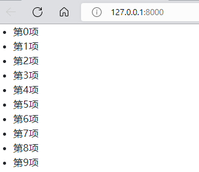

## 模板的继承


模板的继承在整体不变的情况下局部改变。

准备一个页面

```html
<!--head-->
<div class="container">
    <header class="d-flex justify-content-center py-3">
      <ul class="nav nav-pills">
        <li class="nav-item"><a href="#" class="nav-link active" aria-current="page">Home</a></li>
        <li class="nav-item"><a href="#" class="nav-link">Features</a></li>
        <li class="nav-item"><a href="#" class="nav-link">Pricing</a></li>
        <li class="nav-item"><a href="#" class="nav-link">FAQs</a></li>
        <li class="nav-item"><a href="#" class="nav-link">About</a></li>
      </ul>
    </header>
</div>

<!--sidebar-->
<div class="d-flex flex-column flex-shrink-0 p-3 bg-light" style="width: 280px;float: left">
    <a href="/" class="d-flex align-items-center mb-3 mb-md-0 me-md-auto link-dark text-decoration-none">
      <svg class="bi pe-none me-2" width="40" height="32"><use xlink:href="#bootstrap"></use></svg>
      <span class="fs-4">主页</span>
    </a>
    <hr>
    <ul class="nav nav-pills flex-column mb-auto">
      <li class="nav-item">
        <a href="#" class="nav-link active" aria-current="page">
          <svg class="bi pe-none me-2" width="16" height="16"><use xlink:href="#home"></use></svg>
          登录
        </a>
      </li>
      <li>
        <a href="#" class="nav-link link-dark">
          <svg class="bi pe-none me-2" width="16" height="16"><use xlink:href="#speedometer2"></use></svg>
          注册
        </a>
      </li>
    </ul>
    <hr>
</div>

<div class="container col-xl-10 col-xxl-8 px-4 ">
    <div class="row align-items-center g-lg-5 ">
      <div class="col-md-10 mx-auto col-lg-5">
        <form class="p-4 p-md-5 border rounded-3 bg-light">
          <div class="form-floating mb-3">
            <input type="email" class="form-control" id="floatingInput" placeholder="name@example.com">
            <label for="floatingInput">Email address</label>
          </div>
          <div class="form-floating mb-3">
            <input type="password" class="form-control" id="floatingPassword" placeholder="Password">
            <label for="floatingPassword">Password</label>
          </div>
          <div class="checkbox mb-3">
            <label>
              <input type="checkbox" value="remember-me"> Remember me
            </label>
          </div>
          <button class="w-100 btn btn-lg btn-primary" type="submit">Sign up</button>
          <hr class="my-4">
          <small class="text-muted">By clicking Sign up, you agree to the terms of use.</small>
        </form>
      </div>
    </div>
  </div>
```

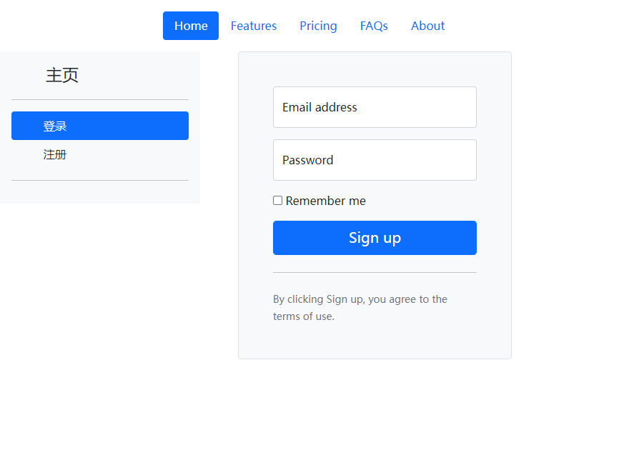

views.py

```python
def g(request):
    return render(request,'g.html')

def login(request):
    return render(request,'login.html')

def reg(request):
    return render(request,'reg.html')
```

urls.py

```python
urlpatterns = [
    path('admin/', admin.site.urls),
    # re_path(r'^index/',views.index),
    # re_path(r'^index/',views.MyLogin.as_view()),
    re_path(r'^$',views.index),
    re_path(r'^g/$',views.g),
    re_path(r'^login/$',views.login),
    re_path(r'^reg/$',views.reg),
]
```

修改g.html

```html
    <ul class="nav nav-pills flex-column mb-auto">
      <li class="nav-item">
        <a href="/login/" class="nav-link active" aria-current="page">
          <svg class="bi pe-none me-2" width="16" height="16"><use xlink:href="#home"></use></svg>
          登录
        </a>
      </li>
      <li>
        <a href="/reg/" class="nav-link link-dark">
          <svg class="bi pe-none me-2" width="16" height="16"><use xlink:href="#speedometer2"></use></svg>
          注册
        </a>
      </li>
    </ul>

a标签关联到url
```

右边页面没有改变。

怎么做？

模板g.html 页面

```html

    <h1> 这是一个神奇的页面！ </h1>
    <h2> 这是一个神奇的页面！ </h2>
    <h3> 这是一个神奇的页面！ </h3>
    <h4> 这是一个神奇的页面！ </h4>
    <h5> 这是一个神奇的页面！ </h5>
    <h6> 这是一个神奇的页面！ </h6>

```

login.html

```html



<div class="container col-xl-10 col-xxl-8 px-4 ">
    <div class="row align-items-center g-lg-5 ">
      <div class="col-md-10 mx-auto col-lg-5">
        <form class="p-4 p-md-5 border rounded-3 bg-light">
          <div class="form-floating mb-3">
            <input type="email" class="form-control" id="floatingInput" placeholder="name@example.com">
            <label for="floatingInput">Email address</label>
          </div>
          <div class="form-floating mb-3">
            <input type="password" class="form-control" id="floatingPassword" placeholder="Password">
            <label for="floatingPassword">Password</label>
          </div>
          <div class="checkbox mb-3">
            <label>
              <input type="checkbox" value="remember-me"> 网站须知
            </label>
          </div>
          <button class="w-100 btn btn-lg btn-primary" type="submit">登录</button>
          <hr class="my-4">
          <small class="text-muted">勾选阅读网站须知</small>
        </form>
      </div>
    </div>
</div>

```

reg.html

```html



<div class="container col-xl-10 col-xxl-8 px-4 ">
    <div class="row align-items-center g-lg-5 ">
      <div class="col-md-10 mx-auto col-lg-5">
        <form class="p-4 p-md-5 border rounded-3 bg-light">
          <div class="form-floating mb-3">
            <input type="email" class="form-control" id="floatingInput" placeholder="name@example.com">
            <label for="floatingInput">Email address</label>
          </div>
          <div class="form-floating mb-3">
            <input type="password" class="form-control" id="floatingPassword" placeholder="Password">
            <label for="floatingPassword">Password</label>
          </div>
          <div class="checkbox mb-3">
            <label>
              <input type="checkbox" value="remember-me"> 注册须知
            </label>
          </div>
          <button class="w-100 btn btn-lg btn-success" type="submit">注册</button>
          <hr class="my-4">
          <small class="text-muted">勾选注册须知，表示同意协议条款.</small>
        </form>
      </div>
    </div>
</div>

```

子页面和模板页面使用下面的区域代码，就可以修改对应的内容了

```html

	子页面内容	

```

一般情况模板页面有三块可以修改的区域

1、css区域

2、js区域

3、html区域

```html

    CSS修改区域



     脚本区域



     html区域

```

`每个子页面都可以有不同的css，js,html代码`

一般情况下模板的页面上的分块越多以后的可以扩展性就越高。如果太多就自己写代码了。

子页面除了自己可以写自己的之外，还可以继续使用模板的内容

```python

{{ block.super }} 666

```


### 模板的导入

将页面的某一个局部当成模块的形式，哪个地方需要就可以直接导入使用即可。

```html
准备
template.html
<a href="/g/">模板导入</a>  只要这个
```

调用地方

```html
  <!-- 在index.html-->
```


## ORM 进阶

上面已经讲过ORM的增删改查，这里补充一些进阶的用法。

[ORM](##django ORM)

### 单表操作

django 自带的sqlite3 数据库对日期处理容易出错。换mysql

```python
setting.py
DATABASES = {
    'default': {
        'ENGINE': 'django.db.backends.mysql',
        'NAME': 'stu',
        'USER': 'root',
        'PASSWORD': '123456',
        'HOST':'127.0.0.1',
        'PORT': 3306,
        'CHARSET': 'utf8mb4',
    }
}

__init__.py
import pymysql
pymysql.install_as_MySQLdb()
```

### 测试脚本

当我们只想测试django中某个py文件的的时候可以不用书写前后端交互的形式，而是直接写一个测试脚本即可。


脚本代码无论是写在应用下的test.py 还是单独的自定义py文件都可以

里面需要加入manage.py前几行

```python
from django.test import TestCase

# Create your tests here.
import os

if __name__ == '__main__':
    os.environ.setdefault('DJANGO_SETTINGS_MODULE', 'day30.settings')
    import django
    django.setup()
```

在这个下面直接测试django里面的单个py文件了。

```mysql
mysql> create database day30 charset='utf8mb4';
Query OK, 1 row affected (1.77 sec)

mysql> show databases;
+--------------------+
| Database           |
+--------------------+
| day30              |
| information_schema |
| mysql              |
| performance_schema |
| stu                |
| student            |
| sys                |
| test               |
+--------------------+
8 rows in set (0.00 sec)
```

```python
DATABASES = {
    'default': {
        'ENGINE': 'django.db.backends.mysql',
        'NAME': 'day30',
        'USER': 'root',
        'PASSWORD': '123456',
        'HOST':'127.0.0.1',
        'PORT': 3306,
        'CHARSET': 'utf8mb4',
    }
}

```

```python
models.py
class User(models.Model):
    name = models.CharField(max_length=32)
    age = models.IntegerField()
    # register_time = models.DateTimeField()  #　年月日
    register_time = models.DateField()  #　年月日
    """
    DateField
    DateTimeField
        有两个重要参数
        auto_now:每次操作数据该字段自动将当前时间更新
        auto_now_add：创建数据的时候自动记录下来，之后基本不被修改。
    """
    def __str__(self):
        return f'Object Is :{self.name}'
```

```cmd
D:\桌面>f:

F:\>cd Django_Project_Dir\day30

F:\Django_Project_Dir\day30>python manage.py makemigrations
Migrations for 'app01':
  app01\migrations\0001_initial.py
    - Create model User

F:\Django_Project_Dir\day30>python manage.py migrate
Operations to perform:
  Apply all migrations: admin, app01, auth, contenttypes, sessions
Running migrations:
  Applying contenttypes.0001_initial... OK
  Applying auth.0001_initial... OK
  Applying admin.0001_initial... OK
  Applying admin.0002_logentry_remove_auto_add... OK
  Applying admin.0003_logentry_add_action_flag_choices... OK
  Applying app01.0001_initial... OK
  Applying contenttypes.0002_remove_content_type_name... OK
  Applying auth.0002_alter_permission_name_max_length... OK
  Applying auth.0003_alter_user_email_max_length... OK
  Applying auth.0004_alter_user_username_opts... OK
  Applying auth.0005_alter_user_last_login_null... OK
  Applying auth.0006_require_contenttypes_0002... OK
  Applying auth.0007_alter_validators_add_error_messages... OK
  Applying auth.0008_alter_user_username_max_length... OK
  Applying auth.0009_alter_user_last_name_max_length... OK
  Applying auth.0010_alter_group_name_max_length... OK
  Applying auth.0011_update_proxy_permissions... OK
  Applying auth.0012_alter_user_first_name_max_length... OK
  Applying sessions.0001_initial... OK
```

随机模拟一些数据进去

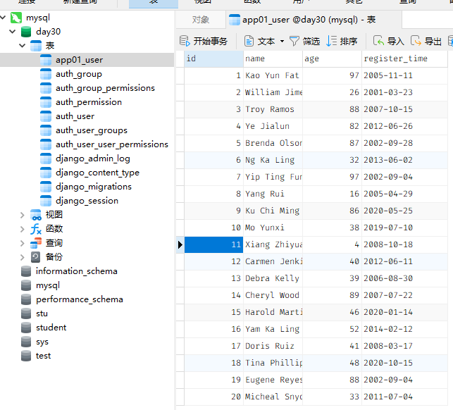

#### 增

```python
tests.py
在上面的基础下增加下面的增删改查
    from app01 import models
    
第一种
    res = models.User.objects.create(name='Tom',age=36,register_time='2019-2-28')
    print(res)
>>>Object Is :Tom   
```

```python
test.py

第二种
    import datetime
    ctime = datetime.datetime.now()
    user_obj = models.User(name='jack',age=77,register_time=ctime)
    user_obj.save()
```

上面两种方法都是增加数据的方法


#### 删

```python
test.py

第一种方法
    res = models.User.objects.filter(pk=102).delete()
    print(res)
    
    删除指定的主键PKid=102的数据
PK 就是主键的简称，filter（）中的pk就是当前表的主键，使用主键之后，列名不管是ID UID PID GID SID ...都不影响pk

第二种方法
    res = models.User.objects.filter(pk=101).first()
    res.delete()
```

#### 改

```python
models.User.objects.filter(pk=2).update(name='Tom')
```

#### 查

```python
方法1：    
    user_obj = models.User.objects.get(pk=3)
    print(user_obj) #Object Is :Troy Ramos

方法2：
    user_obj = models.User.objects.filter(pk=5)
    print(user_obj)  #<QuerySet [<User: Object Is :Brenda Olson>]>
```

> get方法返回的是当前数据对象，如果数据不存在就会报错，filter 数据不存在则不会报错。

```python
    user_obj = models.User.objects.get(pk=3)
    user_obj.name = 'jack'
    user_obj.save()
    这种方法也是可以修改数据的。如果不存在的数据就会报错。
```

#### 必知必会

| 名称          | 功能                                                         |
| ------------- | ------------------------------------------------------------ |
| all()         | 查询所有数据                                                 |
| filter()      | 带过滤条件的查询                                             |
| get()         | 直接拿数据，数据不存在直接报错                               |
| first()       | 拿queryset里面第一个元素                                     |
| last()        | 拿queryset里面最后一个元素                                   |
| values()      | 可以指定获取的数据字段 select name,age, from ... 列表套字典的格式 |
| values_list() | 列表元组                                                     |
| distinct()    | 去重                                                         |
| order_by()    | 分组                                                         |
| reverse()     | 反转                                                         |
| count()       | 统计                                                         |
| exclude()     | 排除                                                         |
| exits()       | 是否存在                                                     |

```python
res = models.User.objects.all()
print(res)

res = models.User.objects.filter(pk=2)
print(res)

res = models.User.objects.get(pk=2)  # 不推荐
print(res)

res = models.User.objects.first()

res = models.User.objects.last()

res = models.User.objects.values('name','age')  #<QuerySet [{'name': 'Kao Yun Fat', 'age': 97}...  #列表套字典

res = models.User.objects.values_list('name','age')  #<QuerySet [('Kao Yun Fat', 97)...

res = models.User.objects.values('name','age').distinct()

res = models.User.objects.order_by('age') # 升序
res = models.User.objects.order_by('-age')  #降序

res = models.User.objects.order_by('-age').reverse()  # 反转

res = models.User.objects.count() 

res = models.User.objects.exclude('Tom')

res = models.User.objects.filter(pk=2).exists()
```

上面只是列出常用的，一些不常用的需要参考手册


#### 查看内部SQL语句

方法1：queryset对象才能够点击query查看内部sql语句

```python
res = models.User.objects.values('name','age')
print(res.query)
>>>
SELECT `app01_user`.`name`, `app01_user`.`age` FROM `app01_user`
```


方法2：

所有的sql语句都能查询

```python
setting.py
LOGGING = {
    'version': 0.1,
    'disable_existing_loggers': False,
    'handlers': {
        'console':{
            'level': 'DEBUG',
            'class': 'logging.StreamHandler',
        },
    },
    'loggers': {
        'django.db.backends': {
            'handlers': ['console'],
            'propagate': True,
            'level': 'DEBUG',
        },
    }
}

test.py
...
    res = models.User.objects.values('name','age')
    print(res)

>>>
(0.000) 
                SELECT VERSION(),
                       @@sql_mode,
                       @@default_storage_engine,
                       @@sql_auto_is_null,
                       @@lower_case_table_names,
                       CONVERT_TZ('2001-01-01 01:00:00', 'UTC', 'UTC') IS NOT NULL
            ; args=None; alias=default
(0.000) SET SESSION TRANSACTION ISOLATION LEVEL READ COMMITTED; args=None; alias=default
(0.000) SELECT `app01_user`.`name`, `app01_user`.`age` FROM `app01_user` LIMIT 21; args=(); alias=default
<QuerySet [{'name': 'Kao Yun Fat', 'age': 97}...
```


### 神奇的双下划线

```python
年龄大于35的
res = models.User.objects.filter(age__gt=35)
print(res)

年龄小于35
res = models.User.objects.filter(age__lt=35)
print(res)

大于等于80，小于等于10
res = models.User.objects.filter(age__gte=80)
res1 = models.User.objects.filter(age__lte=10)
print(res,'\n',res1)

年龄在是40 或者50 或者60
res = models.User.objects.filter(age__in=[40,50,60])
print(res)

年龄在40-60之间的
res = models.User.objects.filter(age__range=[40,60])
print(res)

查询名字中含有's'的数据，模糊查询
res = models.User.objects.filter(name__contains='s')
print(res.count())

区分大小写
res = models.User.objects.filter(name__contains='T')
print(res)

忽略大小写
res = models.User.objects.filter(name__icontains='t')
print(res.count())

以T开头的name
res = models.User.objects.filter(name__startswith='T')
以m结尾的name
res1 = models.User.objects.filter(name__endswith='m')
print(res,'\n',res1)

询2005-11 出生的人
res = models.User.objects.filter(register_time__year='2005',register_time__month='11')     # 可以单开指定某年，某月，某日
print(res)
```

### 一对多外键增删改查

建立关系

```python
modles.py
class Book(models.Model):
    name = models.CharField(max_length=32)
    price = models.DecimalField(max_digits=8, decimal_places=2)
    publish_date = models.DateField(auto_now_add=True)
    # 一对多
    publish = models.ForeignKey(to='Publish',on_delete=models.CASCADE)
    # 多对多
    authors = models.ManyToManyField(to='Author')


class Publish(models.Model):
    name = models.CharField(max_length=32)
    addr = models.CharField(max_length=64)
    email = models.EmailField()
    #这里的字段是varchar(254) 该字段是给校验性组件看的。

    def __str__(self):
        return f'对象: {self.name}'


class Author(models.Model):
    name = models.CharField(max_length=32)
    age = models.IntegerField()
    # 一对一
    author_detail = models.OneToOneField(to='AuthorDetail',on_delete=models.CASCADE)

class AuthorDetail(models.Model):
    phone = models.BigIntegerField()
    addr = models.CharField(max_length=64)
     
```

```cmd
PS F:\Django_Project_Dir\day30> python manage.py makemigrations
Migrations for 'app01':
  app01\migrations\0002_author_authordetail_publish_book_and_more.py
    - Create model Author
    - Create model AuthorDetail
    - Create model Publish
    - Create model Book
    - Add field author_detail to author
PS F:\Django_Project_Dir\day30> python manage.py migrate
Operations to perform:
  Apply all migrations: admin, app01, auth, contenttypes, sessions
Running migrations:
  Applying app01.0002_author_authordetail_publish_book_and_more... OK

```

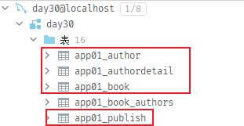

上面是我们建立的表关系

添加一部分演示数据

authordetail 表生成10条作者详细表数据

author 表生成10条作者数据

> 注意：模拟数据1062错误是因为。表中的索引author_detail_id 类型改成NORMAL 本来这里不需要修改因为老师这个样数据有问题。

publish 生成5家出版社公司

> 在没有动手之前感觉很简单，实际需要心细如尘才行。
>
> 技巧很多搞不明白的外键不妨模拟一点数据进去就通了。

上面有三张表的模拟数据，现在就正式一对多的外键增删改查

```python
test.py
    # 增
    # 第一种
    models.Book.objects.create(name='铁齿铜牙纪晓岚',price=54.36,publish_id=1)
    models.Book.objects.create(name='九五至尊',price='24.5',publish_id=2)
    models.Book.objects.create(name='康熙王朝',price='48.32',publish_id=1)
    #第二种 object
    publish_obj = models.Publish.objects.filter(pk=2).first()  # pk这里是固定的。
    models.Book.objects.create(name='红楼梦',price=75.63,publish=publish_obj)
    
    # 删
    models.Publish.objects.filter(pk=1).delete()
    
    # 改
    # 第一种   
    models.Book.objects.filter(pk=2).update(publish_id=3)
    # 第二种
    publish_obj = models.Publish.objects.filter(pk=2).first()
    models.Book.objects.filter(pk=2).update(publish=publish_obj)
```

### 多对多外键增删改查

```python
# 如何给书籍添加作者
# 第一种
    book_obj = models.Book.objects.filter(pk=2).first()
    # print(book_obj.authors)   # 类似于进入book_authors表
    # book_obj.authors.add(1)  #书籍id=2的书籍绑定一个主键为1的作者
    # book_obj.authors.add(2,3)
#第二种
    author_obj = models.Author.objects.filter(pk=2).first()
    author_obj1 = models.Author.objects.filter(pk=3).first()
    author_obj2 = models.Author.objects.filter(pk=1).first()
    book_obj.authors.add(author_obj2)
    book_obj.authors.add(author_obj,author_obj1)
    
# add是给第三张表添加数据，通过.跳转外其他表。括号可以传数字，可以传对象，并且支持多个
   # 删
    方法1
    # book_obj.authors.remove(1)   # 可以传多个参数
    方法2
    author_obj = models.Author.objects.filter(pk=2).first()
    author_obj1 = models.Author.objects.filter(pk=3).first()
    book_obj.authors.remove(author_obj,author_obj1)    
    
＃remove 括号内传入数字也可以是对象，支持多个。 

    # 修改
    第一种
    # book_obj.authors.set([1,2])  # 括号内必须给一个可迭代对象
    # book_obj.authors.set([3])
    第二种
    author_obj = models.Author.objects.filter(pk=2).first()
    author_obj1 = models.Author.objects.filter(pk=3).first()
    book_obj.authors.set([author_obj,author_obj1]) 
#　ｓｅｔ　set 必须传递一个可迭代的对象，支持多个。

  # clear
    book_obj.authors.clear()  # 清空书籍与作者的绑定关系
```

上面需要多练习多熟悉。


### 正反向的概念

正向：外键字段所在的表，从该表查就是正向

反向：外键字段不在该表，从该表查就是反向

book-->publish  **正向**

publish-->book  **反向**

一对一，多对多正反向的判断也是如此

正向查询按字段
反向查询按表名小写
				_set
				...

#### 多表查询

```python
    # 查询书籍主键为1的出版社
   book_obj = models.Book.objects.filter(pk=2).first()
   # 书查出版社 正向
   res = book_obj.publish
   print(res)
   print(res.name)
   print(res.addr)
    
    #查询书籍主键为2的作者
    book_obj = models.Book.objects.filter(pk=2).first()
    # 书查作者 正向，book_author表中需要有书籍。没有书籍是空列表
    # res = book_obj.authors  #app01.Author.None
    res = book_obj.authors.all() #<QuerySet [<Author: Author object (1)>, <Author: Author object (2)>]>
    print(res)
    
    
    # 查询作者的电话号码
    author_obj =  models.Author.objects.filter(name='王璐').first()
    res = author_obj.author_detail
    print(res)
    print(res.addr)
    print(res.phone)
    
```

> ORM语句的时候跟sql DDL语句一样，不能一次就取出来，会有一些转换，特别是复杂的。
>
> 正向什么时候需要加.all()
>         当你的结果可能有多个的时候就需要加.all()
>         如果是一个则直接拿到数据对象
>             book_obj.publish
>             book_obj.authors.all()
>             author_obj.author_detail

```python
    # 查出版社是 秦記电脑有限责任公司 的书
    publish_obj = models.Publish.objects.filter(name='秦記电脑有限责任公司').first()
    #出版社 反向
    #res = publish_obj.book_set  #app01.Book.None
    res = publish_obj.book_set.all()  # 有多个结果
    print(res)
    
    # 查询作者是王璐写过的书
    author_obj = models.Author.objects.filter(name='王璐').first()
    # 作者查书 反向
    # res = author_obj.book_set  #app01.Book.None
    res = author_obj.book_set.all()  #<QuerySet [<Book: Book object (2)>]>
    print(res)
    
    # 查询手机号是15933873485的作者姓名
    author_obj = models.AuthorDetail.objects.filter(phone=15933873485).first()
    res = author_obj.author
    print(res)  # Author object (3)
    print(res.name)

```

>     反向查询的时候
>      当你的查询结果可以有多个的时候 就必须加
>
>       	 __set_
>  	  	  	  	  	  	
>       	.all()
>      当你的结果只有一个的时候 不需要加
>
>     ​	_set
>
>     ​	.all()

#### 联表查询

```python
    # 查询王璐的手机号和姓名
    #　正向
    res = models.Author.objects.filter(name='王璐').values('name','author_detail__phone')
    print(res)

    # 反向
    # res = models.AuthorDetail.objects.filter(author__name='王璐')
    #<QuerySet [<AuthorDetail: AuthorDetail object (5)>]>
    res = models.AuthorDetail.objects.filter(author__name='王璐').values('author__name','phone')
    print(res)
    
    
   　# 查询书籍主键为2的出版社名称和书名
   　正向
    res = models.Book.objects.filter(pk=2).values('publish__name','name')
    print(res)
    
    # 反向
    res = models.Publish.objects.filter(book__id=2).values('name','book__name')
    print(res)
    
    
    # 查询书籍主键为2的作者姓名
    # 正向
    res = models.Book.objects.filter(pk=2).values('name', 'authors__name')
    rint(res)
    # 反向
    res = models.Author.objects.filter(book__id=2).values('name', 'book__name')
    print(res)
    
    # 查询书籍主键是2 的作者的手机号
    res = models.Book.objects.filter(pk=2).values('authors__name','authors__author_detail__phone')
    print(res)

    # 反向
    res = models.Author.objects.filter(book__id=2).values('name','author_detail__phone')
    print(res)

    res = models.AuthorDetail.objects.filter(author__book__id=2).values('author__name','phone')
    print(res)
```

从上面例子可以看出正反方向的应用很关键，需要灵活掌握，还有根据pk条件查询是很关键的。只要掌握了"__"和正反概念就可随意转换。

#### 聚合查询

关键就在于导库

```python
 from django.db.models import  Max,Min,Avg,Sum,Count
    """
    跟数据库有关的在db里面
    """
```

直接把所有聚合一起使用。

```python
    # 书的平均价格
    # res = models.Book.objects.aggregate(Avg('price'))
    res = models.Book.objects.aggregate(Avg('price'),Max('price'),Min('price'),Sum('price'),Count('pk'))  # 书的平均价格,最高价格,最低价格,price总和,统计主键个数
    print(res)
```

#### 分组查询

**annotate**

有时候mysql分组查询不能直接获取是因为mysql的严格模式  ONLY_FULL_GROUP_BY

```ini
sql_mode=NO_ENGINE_SUBSTITUTION,STRICT_TRANS_TABLES,only_full_group_by
```

```python
    from  django.db.models import Max,Min,Sum,Avg,Count
    # 统计每一本书的作者个数
    # res = models.Book.objects.annotate() #<QuerySet [<Book: Book object (2)>,
    res = models.Book.objects.annotate(author_num=Count('authors')).values('name','author_num')
    # <QuerySet [{'name': '九五至尊', 'author_num': 2},
    print(res)
    """
    author_num 是自定义的字段,目的是用来存放统计出来的每本书的作者数
    """
    res1 = models.Book.objects.annotate(author_num=Count('authors__id')).values('name','author_num')
    print(res1)
    
    # 统计每个出版社最便宜的价格
    res = models.Publish.objects.annotate(min_price=Min('book__price')).values('name','min_price')
    print(res)
    
    SELECT `app01_publish`.`name`, MIN(`app01_book`.`price`) AS `min_price` FROM `app01_publish` LEFT OUTER JOIN `app01_book` ON (`app01_publish`.`id` = `app01_book`.`publish_id`) GROUP BY `app01_publish`.`id` ORDER BY NULL LIMIT 21; args=(); alias=default
    
<QuerySet [{'name': '秦記电脑有限责任公司', 'min_price': Decimal('10.28')}, {'name': '贾通讯有限责任公司', 'min_price': Decimal('38.54')}, {'name': '田有限责任公司', 'min_price': Decimal('111.37')}, {'name': '睿有限责任公司', 'min_price': Decimal('31.19')}]>

   # 统计不止一个作者的图书
       # 1. 先按照图书分组 求每一本对应的作者个数
       # 2. 过滤出不止一个作者的图书
    res = models.Book.objects.annotate(author_num=Count('authors')).filter(author_num__gt=1).values('name','author_num')
    print(res)
    # SELECT `app01_book`.`name`, COUNT(`app01_book_authors`.`author_id`) AS `author_num` FROM `app01_book` LEFT OUTER JOIN `app01_book_authors` ON (`app01_book`.`id` = `app01_book_authors`.`book_id`) GROUP BY `app01_book`.`id` HAVING COUNT(`app01_book_authors`.`author_id`) > 1 ORDER BY NULL LIMIT 21; args=(1,); alias=default
    """
    只要ORM语句得出的结果还是一个queryset对象,那么就可以继续无限制的queryset对象封装的方法
    """
    
    # 查询每个作者出的总价格
    res = models.Author.objects.annotate(sum_price=Sum('book__price')).values('name','sum_price')
    print(res)
    
    """
    如何我想按照指定的字段分组该如何处理
    modles.Book.objects.values('price').annotate()
    """
```

#### F与Q

##### F查询

准备数据

```python
modles.py
class Book(models.Model):
    name = models.CharField(max_length=32)
    price = models.DecimalField(max_digits=8, decimal_places=2)
    publish_date = models.DateField(auto_now_add=True)

    # 库存
    kucun = models.IntegerField(default=1000)

    # 卖出
    maichu = models.IntegerField(default=1000)

    # 一对多
    publish = models.ForeignKey(to='Publish', on_delete=models.CASCADE)
    # 多对多
    authors = models.ManyToManyField(to='Author')

    def __str__(self):
        return self.name
    
PS F:\Django_Project_Dir\day30> python manage.py makemigrations

PS F:\Django_Project_Dir\day30> python manage.py migrate

```

```python
    from django.db.models import F

    # 查询卖出数大于库存的书籍
    res = models.Book.objects.filter(maichu__gt=F('kucun'))
    print(res)

    # 将书籍的价格提升500
    models.Book.objects.update(price=F('price')+500)
    
    # 将书名后面加上爆款两字
    from django.db.models.functions import Concat
    from django.db.models import Value

    models.Book.objects.update(name=Concat(F('name'),Value('爆款')))
    # models.Book.objects.update(title=F('title') + '爆款')  # 所有的名称会全部变成空白
```

##### Q查询

```python
    from django.db.models import Q
    # 查询卖出数大于500或者价格小于1000的书籍
    res = models.Book.objects.filter(Q(maichu__gt=500),Q(price__lt=1000))
    print(res)
# 默认filter 括号内多个参数是and关系
SELECT `app01_book`.`id`, `app01_book`.`name`, `app01_book`.`price`, `app01_book`.`publish_date`, `app01_book`.`kucun`, `app01_book`.`maichu`, `app01_book`.`publish_id` FROM `app01_book` WHERE (`app01_book`.`maichu` > 500 AND `app01_book`.`price` < 1000) LIMIT 21; args=(500, Decimal('1000')); alias=default

    res = models.Book.objects.filter(Q(maichu__gt=500)|Q(price__lt=1000))
    print(res)
# | 是 or 关系    
SELECT `app01_book`.`id`, `app01_book`.`name`, `app01_book`.`price`, `app01_book`.`publish_date`, `app01_book`.`kucun`, `app01_book`.`maichu`, `app01_book`.`publish_id` FROM `app01_book` WHERE (`app01_book`.`maichu` > 500 OR `app01_book`.`price` < 1000) LIMIT 21; args=(500, Decimal('1000')); alias=default


    res = models.Book.objects.filter(~Q(maichu__gt=500),Q(price__lt=1000))
    print(res)
# ~ 逻辑非 
# 逻辑与取反
SELECT `app01_book`.`id`, `app01_book`.`name`, `app01_book`.`price`, `app01_book`.`publish_date`, `app01_book`.`kucun`, `app01_book`.`maichu`, `app01_book`.`publish_id` FROM `app01_book` WHERE (NOT (`app01_book`.`maichu` > 500) AND `app01_book`.`price` < 1000) LIMIT 21; args=(500, Decimal('1000')); alias=default


    res = models.Book.objects.filter(~Q(maichu__gt=500)|Q(price__lt=1000))
    print(res)
    # 逻辑或取反
    SELECT `app01_book`.`id`, `app01_book`.`name`, `app01_book`.`price`, `app01_book`.`publish_date`, `app01_book`.`kucun`, `app01_book`.`maichu`, `app01_book`.`publish_id` FROM `app01_book` WHERE (NOT (`app01_book`.`maichu` > 500) OR `app01_book`.`price` < 1000) LIMIT 21; args=(500, Decimal('1000')); alias=default

    # Q  的高阶用法  能够将查询条件的左边也变成字符串的形式
    q = Q()
    q.connector = 'or'
    q.children.append(('maichu__gt',1000))
    q.children.append(('price__lt',600))
    res = models.Book.objects.filter(q)
    print(res)  
    
    SELECT `app01_book`.`id`, `app01_book`.`name`, `app01_book`.`price`, `app01_book`.`publish_date`, `app01_book`.`kucun`, `app01_book`.`maichu`, `app01_book`.`publish_id` FROM `app01_book` WHERE (`app01_book`.`maichu` > 1000 or `app01_book`.`price` < 600) LIMIT 21; args=(1000, Decimal('600')); alias=default

```

#### Django中事务

事务
	ACID
		**原子性**
			不可分割的最小单位
		**一致性**
			跟原子性是相辅相成
		**隔离性**
			事务之间互相不干扰
		**持久性**
			事务一旦确认永久生效
事务的回滚 
	rollback
事务的确认
	commit

```python
    from django.db import transaction
    try:
        with transaction.atomic():
            res = models.Book.objects.filter(price__gt=1000).values('name','price')
            print(res)
    except Exception as e:
        print(e)
    print('执行其他操作')
```

事务后期会更多使用.在with内的都属于同一个事务.

## ORM中常用字段及参数

### 常用字段

| 字段名          | 说明                                                         |
| --------------- | ------------------------------------------------------------ |
| AutoField       | int自增列,primary_key=True                                   |
| BigAutoField    | 2**63  1-9223372036854775807 与AutoField相同                 |
| IntegerField    | -2\*\*31 **to** 2\*\*31  `-2147483648`到`2147483647`不能存手机号码 |
| BigIntegerField | `-9223372036854775808` 到 `9223372036854775807`              |
| CharField       | varchar  必须提供max_leggth                                  |
| DateField       | 日期格式 YYYY-MM-DD auto_now=False 修改一次更新一次,auto_now_add=False第一次记录的时间 |
| DateTimeField   | 同上                                                         |
| DecimalField    | 固定精度的十进制数,max_digits整数部分,decimal_places小数部分 |
| EmailField      | max_length=254 使用 [`EmailValidator`](../validators.html#django.core.validators.EmailValidator) 来检查该值是否为有效的电子邮件地址 |
| BooleanField    | 布尔值(False/True)                                           |
| FileField       | upload_to='', storage=None, max_length=100 upload_to 是指定文件报错的目录,storage它处理你的文件的存储和检索,路径可以使用时间%Y/%m/%d |
| FilePathField   | *path=''* 必须                                               |
| ImageField      | 继承 [`FileField`](#django.db.models.FileField) 的所有属性和方法，但也验证上传的对象是有效的图像 |
| JSONField       | *encoder=None***,** *decoder=None*                           |
| TextField       | 文本字段                                                     |
| TimeField       | *auto_now=False***,** *auto_now_add=False* 类似datefield     |
| URLField        | *max_length=200*默认                                         |
| ...             |                                                              |

### 关系字段

| 字段名            | 说明                                                         |
| ----------------- | ------------------------------------------------------------ |
| `ForeignKey`      | 多对一,需要两个参数to='外键到的表',on_delete=models.CASCADE,当一个由 [`ForeignKey`](#django.db.models.ForeignKey) 引用的对象被删除时，Django 将模拟 [`on_delete`](#django.db.models.ForeignKey.on_delete) 参数所指定的 SQL 约束的行为。CASCADE 级联删除 PROTECT 防止删除被引用对象 RESTRICT 如果被引用的对象也引用了一个在同一操作中被删除的不同对象，但通过 [`CASCADE`](#django.db.models.CASCADE) 关系，则允许删除被引用的对象。SET_NULL 设置 [`ForeignKey`](#django.db.models.ForeignKey) 为空；只有当 [`null`](#django.db.models.Field.null) 为 `True` 时，才有可能  SET_DEFAULT 默认值 set   do_nothing不采取任何行动 |
| `ManyToManyField` | 多对多,包括递归和惰性关系.                                   |
| `OneToOneField`   | 一对一,to='AuthorDetail', on_delete=models.CASCADE 同外键    |
|                   |                                                              |

### 自定义字段

没有成功,后期继续研究


## 数据库查询优化

only与defer	

orm语句的特点:
	惰性查询
		如果你仅仅只是书写了orm语句 在后面根本没有用到该语句所查询出来的参数
		那么orm会自动识别 直接不执行

```python
test.py

    res = models.Book.objects.all()
    print(res)
    SELECT `app01_book`.`id`, `app01_book`.`name`, `app01_book`.`price`, `app01_book`.`publish_date`, `app01_book`.`kucun`, `app01_book`.`maichu`, `app01_book`.`publish_id` FROM `app01_book` LIMIT 21; args=(); alias=default

    
    res = models.Book.objects.values('name','price')
    print(res)
    SELECT `app01_book`.`name`, `app01_book`.`price` FROM `app01_book` LIMIT 21; args=(); alias=default

    
    res = models.Book.objects.only('name')
    # res = models.Book.objects.all()
    # print(res)
    for i in res:
        print(i.name, i.price)
        # i.name 点击only括号内的字段 不会走数据库
        SELECT `app01_book`.`id`, `app01_book`.`price` FROM `app01_book` WHERE `app01_book`.`id` = 1 LIMIT 21; args=(1,); alias=default
        # i.price 点击only括号内没有的字段 会重新走数据库查询而all不需要走了


    res = models.Book.objects.defer('name')  #对象除了没有name属性之外其他的都有
    for i in res:
        print(i.price)
       
defer与only刚好相反
   defer括号内放的字段不在查询出来的对象里面 查询该字段需要重新走数据而如果查询的是非括号内的字段 则不需要走数据库了
```


select_related与prefetch_related

```python
    res = models.Book.objects.all()
    for i in res:
        print(i.publish.name)  # 每循环一次就要走一次数据库查询
        
select_related内部直接先将book与publish连起来 然后一次性将大表里面的所有数据
    全部封装给查询出来的对象这个时候对象无论是点击book表的数据还是publish的数据都无需再走数据库查询了
    
    select_related括号内只能放外键字段    一对多 一对一
        多对多也不行 
        
    res = models.Book.objects.select_related('publish')
    for i in res:
        print(i.publish.name)
        
    SELECT `app01_book`.`id`, `app01_book`.`name`, `app01_book`.`price`, `app01_book`.`publish_date`, `app01_book`.`kucun`, `app01_book`.`maichu`, `app01_book`.`publish_id`, `app01_publish`.`id`, `app01_publish`.`name`, `app01_publish`.`addr`, `app01_publish`.`email` FROM `app01_book` INNER JOIN `app01_publish` ON (`app01_book`.`publish_id` = `app01_publish`.`id`); args=(); alias=default

    
    res = models.Book.objects.prefetch_related('publish') # 子查询
    for i in res:
        print(i.publish.name)
    SELECT `app01_book`.`id`, `app01_book`.`name`, `app01_book`.`price`, `app01_book`.`publish_date`, `app01_book`.`kucun`, `app01_book`.`maichu`, `app01_book`.`publish_id` FROM `app01_book`; args=(); alias=default
    SELECT `app01_publish`.`id`, `app01_publish`.`name`, `app01_publish`.`addr`, `app01_publish`.`email` FROM `app01_publish` WHERE `app01_publish`.`id` IN (1, 2, 3, 4, 5, 6, 7, 8, 9, 10); args=(1, 2, 3, 4, 5, 6, 7, 8, 9, 10); alias=default

     prefetch_related该方法内部其实就是子查询,将子查询查询出来的所有结果也给你封装到对象中.给你的感觉好像也是一次性搞定的
```


## choices参数

```cmd
cmd
F:\Django_Project_Dir>django-admin startproject day32
F:\Django_Project_Dir>cd day32
F:\Django_Project_Dir\day32>python manage.py startapp app01
F:\Django_Project_Dir\day32>mkdir templates
```

```python
setting.py
INSTALLED_APPS = [
    'django.contrib.admin',
    'django.contrib.auth',
    'django.contrib.contenttypes',
    'django.contrib.sessions',
    'django.contrib.messages',
    'django.contrib.staticfiles',
    'app01'
]

TEMPLATES = [
    {
        'BACKEND': 'django.template.backends.django.DjangoTemplates',
        'DIRS': [BASE_DIR / 'templates'],
        'APP_DIRS': True,
        'OPTIONS': {
            'context_processors': [
                'django.template.context_processors.debug',
                'django.template.context_processors.request',
                'django.contrib.auth.context_processors.auth',
                'django.contrib.messages.context_processors.messages',
            ],
        },
    },
]

DATABASES = {
    'default': {
        'ENGINE': 'django.db.backends.mysql',
        'NAME': 'test',
        'USER': 'root',
        'PASSWORD': '123456',
        'HOST': '127.0.0.1',
        'PORT': '3306',
        'CHARSET': 'utf8mb4',
    }
}

STATIC_URL = 'static/'
STATICFILES_DIRS=[
    os.path.join(BASE_DIR,'static'),
]

__init__.py
import pymysql
pymysql.install_as_MySQLdb()
```


choices 是数据库字段设计中最常见的.

用户表[性别,学历,工作经验,是否结婚,是否生子,客户来源] choices针对某个可以列举完全的可能性字段,采用choices参数.

准备实验数据

```python
models.py
from django.db import models

# Create your models here.

class User(models.Model):
    username = models.CharField(max_length=32)
    age = models.IntegerField()
    gender_choices = (
        (1,'男'),
        (2,'女'),
        (3,'其他'),
    )
    gender = models.IntegerField(choices=gender_choices)

    score_choices =(
        ('A','优秀'),
        ('B','良好'),
        ('C','及格'),
        ('D','不合格'),
    )

    score = models.CharField(max_length=32,choices=score_choices,null=True)
```

test.py

```python
from django.test import TestCase

# Create your tests here.
import os
import sys

if __name__ == '__main__':
    os.environ.setdefault('DJANGO_SETTINGS_MODULE', 'day32.settings')
    import django
    django.setup()

    from app01 import models

   # 这里执行多次就写入多次后续需要注意这里的问题.
    models.User.objects.create(username='tom', age=24, gender=1, score='A')
    models.User.objects.create(username='jack',age=67,gender=1,score='D')
    models.User.objects.create(username='rocky',age=99,gender=3,score='C')

    # res = models.User.objects.filter(pk=1).values()
    res = models.User.objects.filter(pk=2).first()
    print(res.get_gender_display(),res.get_score_display())
    # 使用get_字段名_display()  就可以获取对应的信息
    
    如果没有对应的关系,那么字段是什么还是展示什么.
```

```python
案例:看下路飞学城的实际表
 # 实际项目案例
# CRM相关内部表
class School(models.Model):
    """
    校区表
    如：
        北京沙河校区
        上海校区

    """
    title = models.CharField(verbose_name='校区名称', max_length=32)

    def __str__(self):
        return self.title

class Course(models.Model):
    """
    课程表
    如：
        Linux基础
        Linux架构师
        Python自动化开发精英班
        Python自动化开发架构师班
        Python基础班
        go基础班
    """
    name = models.CharField(verbose_name='课程名称', max_length=32)

    def __str__(self):
        return self.name

class Department(models.Model):
    """
    部门表
    市场部     1000
    销售       1001

    """
    title = models.CharField(verbose_name='部门名称', max_length=16)
    code = models.IntegerField(verbose_name='部门编号', unique=True, null=False)

    def __str__(self):
        return self.title

class UserInfo(models.Model):
    """
    员工表
    """

    name = models.CharField(verbose_name='员工姓名', max_length=16)
    email = models.EmailField(verbose_name='邮箱', max_length=64)
    depart = models.ForeignKey(verbose_name='部门', to="Department",to_field="code")
    user=models.OneToOneField("User",default=1)
    def __str__(self):
        return self.name

class ClassList(models.Model):
    """
    班级表
    如：
        Python全栈  面授班  5期  10000  2017-11-11  2018-5-11
    """
    school = models.ForeignKey(verbose_name='校区', to='School')
    course = models.ForeignKey(verbose_name='课程名称', to='Course')
    semester = models.IntegerField(verbose_name="班级(期)")


    price = models.IntegerField(verbose_name="学费")
    start_date = models.DateField(verbose_name="开班日期")
    graduate_date = models.DateField(verbose_name="结业日期", null=True, blank=True)
    memo = models.CharField(verbose_name='说明', max_length=256, blank=True, null=True, )

    teachers = models.ManyToManyField(verbose_name='任课老师', to='UserInfo',limit_choices_to={'depart':1002})
    tutor = models.ForeignKey(verbose_name='班主任', to='UserInfo',related_name="class_list",limit_choices_to={'depart':1006})


    def __str__(self):
        return "{0}({1}期)".format(self.course.name, self.semester)


class Customer(models.Model):
    """
    客户表
    """
    qq = models.CharField(verbose_name='qq', max_length=64, unique=True, help_text='QQ号必须唯一')

    name = models.CharField(verbose_name='学生姓名', max_length=16)
    gender_choices = ((1, '男'), (2, '女'))
    gender = models.SmallIntegerField(verbose_name='性别', choices=gender_choices)

    education_choices = (
        (1, '重点大学'),
        (2, '普通本科'),
        (3, '独立院校'),
        (4, '民办本科'),
        (5, '大专'),
        (6, '民办专科'),
        (7, '高中'),
        (8, '其他')
    )
    education = models.IntegerField(verbose_name='学历', choices=education_choices, blank=True, null=True, )
    graduation_school = models.CharField(verbose_name='毕业学校', max_length=64, blank=True, null=True)
    major = models.CharField(verbose_name='所学专业', max_length=64, blank=True, null=True)

    experience_choices = [
        (1, '在校生'),
        (2, '应届毕业'),
        (3, '半年以内'),
        (4, '半年至一年'),
        (5, '一年至三年'),
        (6, '三年至五年'),
        (7, '五年以上'),
    ]
    experience = models.IntegerField(verbose_name='工作经验', blank=True, null=True, choices=experience_choices)
    work_status_choices = [
        (1, '在职'),
        (2, '无业')
    ]
    work_status = models.IntegerField(verbose_name="职业状态", choices=work_status_choices, default=1, blank=True,
                                      null=True)
    company = models.CharField(verbose_name="目前就职公司", max_length=64, blank=True, null=True)
    salary = models.CharField(verbose_name="当前薪资", max_length=64, blank=True, null=True)

    source_choices = [
        (1, "qq群"),
        (2, "内部转介绍"),
        (3, "官方网站"),
        (4, "百度推广"),
        (5, "360推广"),
        (6, "搜狗推广"),
        (7, "腾讯课堂"),
        (8, "广点通"),
        (9, "高校宣讲"),
        (10, "渠道代理"),
        (11, "51cto"),
        (12, "智汇推"),
        (13, "网盟"),
        (14, "DSP"),
        (15, "SEO"),
        (16, "其它"),
    ]
    source = models.SmallIntegerField('客户来源', choices=source_choices, default=1)
    referral_from = models.ForeignKey(
        'self',
        blank=True,
        null=True,
        verbose_name="转介绍自学员",
        help_text="若此客户是转介绍自内部学员,请在此处选择内部学员姓名",
        related_name="internal_referral"
    )
    course = models.ManyToManyField(verbose_name="咨询课程", to="Course")

    status_choices = [
        (1, "已报名"),
        (2, "未报名")
    ]
    status = models.IntegerField(
        verbose_name="状态",
        choices=status_choices,
        default=2,
        help_text=u"选择客户此时的状态"
    )

    consultant = models.ForeignKey(verbose_name="课程顾问", to='UserInfo', related_name='consultanter',limit_choices_to={'depart':1001})

    date = models.DateField(verbose_name="咨询日期", auto_now_add=True)
    recv_date = models.DateField(verbose_name="当前课程顾问的接单日期", null=True)
    last_consult_date = models.DateField(verbose_name="最后跟进日期", )

    def __str__(self):
        return self.name

class ConsultRecord(models.Model):
    """
    客户跟进记录
    """
    customer = models.ForeignKey(verbose_name="所咨询客户", to='Customer')
    consultant = models.ForeignKey(verbose_name="跟踪人", to='UserInfo',limit_choices_to={'depart':1001})
    date = models.DateField(verbose_name="跟进日期", auto_now_add=True)
    note = models.TextField(verbose_name="跟进内容...")

    def __str__(self):
        return self.customer.name + ":" + self.consultant.name

class Student(models.Model):
    """
    学生表（已报名）
    """
    customer = models.OneToOneField(verbose_name='客户信息', to='Customer')
    class_list = models.ManyToManyField(verbose_name="已报班级", to='ClassList', blank=True)

    emergency_contract = models.CharField(max_length=32, blank=True, null=True, verbose_name='紧急联系人')
    company = models.CharField(verbose_name='公司', max_length=128, blank=True, null=True)
    location = models.CharField(max_length=64, verbose_name='所在区域', blank=True, null=True)
    position = models.CharField(verbose_name='岗位', max_length=64, blank=True, null=True)
    salary = models.IntegerField(verbose_name='薪资', blank=True, null=True)
    welfare = models.CharField(verbose_name='福利', max_length=256, blank=True, null=True)
    date = models.DateField(verbose_name='入职时间', help_text='格式yyyy-mm-dd', blank=True, null=True)
    memo = models.CharField(verbose_name='备注', max_length=256, blank=True, null=True)

    def __str__(self):
        return self.customer.name

class ClassStudyRecord(models.Model):
    """
    上课记录表 （班级记录）
    """
    class_obj = models.ForeignKey(verbose_name="班级", to="ClassList")
    day_num = models.IntegerField(verbose_name="节次", help_text=u"此处填写第几节课或第几天课程...,必须为数字")
    teacher = models.ForeignKey(verbose_name="讲师", to='UserInfo',limit_choices_to={'depart':1002})
    date = models.DateField(verbose_name="上课日期", auto_now_add=True)

    course_title = models.CharField(verbose_name='本节课程标题', max_length=64, blank=True, null=True)
    course_memo = models.TextField(verbose_name='本节课程内容概要', blank=True, null=True)
    has_homework = models.BooleanField(default=True, verbose_name="本节有作业")
    homework_title = models.CharField(verbose_name='本节作业标题', max_length=64, blank=True, null=True)
    homework_memo = models.TextField(verbose_name='作业描述', max_length=500, blank=True, null=True)
    exam = models.TextField(verbose_name='踩分点', max_length=300, blank=True, null=True)

    def __str__(self):
        return "{0} day{1}".format(self.class_obj, self.day_num)

class StudentStudyRecord(models.Model):
    '''
    学生学习记录
    '''
    classstudyrecord = models.ForeignKey(verbose_name="第几天课程", to="ClassStudyRecord")
    student = models.ForeignKey(verbose_name="学员", to='Student')


    record_choices = (('checked', "已签到"),
                      ('vacate', "请假"),
                      ('late', "迟到"),
                      ('noshow', "缺勤"),
                      ('leave_early', "早退"),
                      )
    record = models.CharField("上课纪录", choices=record_choices, default="checked", max_length=64)
    score_choices = ((100, 'A+'),
                     (90, 'A'),
                     (85, 'B+'),
                     (80, 'B'),
                     (70, 'B-'),
                     (60, 'C+'),
                     (50, 'C'),
                     (40, 'C-'),
                     (0, ' D'),
                     (-1, 'N/A'),
                     (-100, 'COPY'),
                     (-1000, 'FAIL'),
                     )
    score = models.IntegerField("本节成绩", choices=score_choices, default=-1)
    homework_note = models.CharField(verbose_name='作业评语', max_length=255, blank=True, null=True)
    note = models.CharField(verbose_name="备注", max_length=255, blank=True, null=True)

    homework = models.FileField(verbose_name='作业文件', blank=True, null=True, default=None)
    stu_memo = models.TextField(verbose_name='学员备注', blank=True, null=True)
    date = models.DateTimeField(verbose_name='提交作业日期', auto_now_add=True)

    def __str__(self):
        return "{0}-{1}".format(self.classstudyrecord, self.student)
         
"""
chocies参数使用场景是非常广泛的
"""
```

```python
models.py
class Te(models.Model):
    name = models.CharField(verbose_name='姓名', max_length=32)
    phone = models.BigIntegerField(verbose_name='手机号码',unique=True,null=True)
    job = models.CharField(max_length=32,verbose_name='职业',blank=True,null=True,default='IT') # blank表单认证,字段填写不为空
    date = models.DateField(verbose_name='date',help_text='yyyy-mm-dd',blank=True,null=True)

```

## MTV与MVC模型

M:models

T:templates

V:views

MVC 与上面MV一样

C:controller

vue 框架是MVVM模型


## 多对多三种创建方式

### 全自动

利用ORM自动帮我们创建第三张关系表

```python
models.py
class User(models.Model):
    username = models.CharField(max_length=32)
    age = models.IntegerField()
    gender_choices = (
        (1, '男'),
        (2, '女'),
        (3, '其他'),
    )
    gender = models.IntegerField(choices=gender_choices)

    score_choices = (
        ('A', '优秀'),
        ('B', '良好'),
        ('C', '及格'),
        ('D', '不合格'),
    )

    score = models.CharField(max_length=32, choices=score_choices, null=True)

    te = models.ForeignKey(to='Te',on_delete=models.CASCADE)

class Te(models.Model):
    name = models.CharField(verbose_name='姓名', max_length=32)
    phone = models.BigIntegerField(verbose_name='手机号码',unique=True,null=True)
    job = models.CharField(max_length=32,verbose_name='职业',blank=True,null=True,default='IT') # blank表单认证,字段填写不为空
    date = models.DateField(verbose_name='date',help_text='yyyy-mm-dd',blank=True,null=True)
```

代码不需要自己写,非常方便,扩展性极差.

### 纯手动

第三张表完全是根据自己额外扩展,代码比较多

```python
class Book(models.Model):
    name = models.CharField(verbose_name='书名',max_length=64)
    publish = models.CharField(verbose_name='出版社名',max_length=32)

class Publish(models.Model):
    name = models.CharField(max_length=32)

class Book2Publish(models.Model):
    book_id = models.ForeignKey(to='Book',on_delete=models.CASCADE)
    publish_id = models.ForeignKey(to='Publish',on_delete=models.CASCADE)
    # 这里注意不要加_id 系统会自动加
```

```cmd
PS F:\Django_Project_Dir\day32> python manage.py makemigrations
Migrations for 'app01':
  app01\migrations\0005_book_publish_book2publish.py
    - Create model Book
    - Create model Publish
    - Create model Book2Publish
PS F:\Django_Project_Dir\day32> python manage.py migrate
Operations to perform:
  Apply all migrations: admin, app01, auth, contenttypes, sessions
Running migrations:
  Applying app01.0005_book_publish_book2publish... OK
```

### 半自动

```python
class Book(models.Model):
    name = models.CharField(verbose_name='书名', max_length=64)
    publish = models.CharField(verbose_name='出版社名', max_length=32)
    authors = models.ManyToManyField(to='Author',
                                     through='Book2Author',
                                     through_fields=('book', 'author')
                                     )

class Author(models.Model):
    name = models.CharField(max_length=32)
    age = models.IntegerField()
    # books = models.ManyToManyField(to='Book',
    #                                  through='Book2Author',
    #                                  through_fields=('author','book')
    #                                  )


class Book2Author(models.Model):
    book = models.ForeignKey(to='Book', on_delete=models.CASCADE)
    author = models.ForeignKey(to='Author', on_delete=models.CASCADE)
```

through_fields字段先后顺序

判断的本质：通过第三张表查询对应的表 需要用到哪个字段就把哪个字段放前面

你也可以简化判断  当前表是谁 就把对应的关联字段放前面

半自动:可以使用orm的正反向查询 但是没法使用add,set,remove,clear这四个方法

需要掌握的是全自动和半自动 为了扩展性更高 一般我们都会采用半自动(写代码要给自己留一条后路)

> 上面三种方法必须会全自动和半自动.半自动是最好的.


# Ajax

**异步提交**
**局部刷新**
例子:github注册
	动态获取用户名实时的跟后端确认并实时展示的前端(局部刷新)
	
发送请求的方式

| 行为                        | 请求方式 |
| --------------------------- | -------- |
| 浏览器地址栏直接输入url回车 | GET      |
| a标签href属性               | GET      |
| form表单                    | GET/POST |
| ajax                        | GET/POST |


​	
AJAX 不是新的编程语言，而是一种使用现有标准的新方法(像装饰器)


AJAX 最大的优点是在不重新加载整个页面的情况下，可以与服务器交换数据并更新部分网页内容。（这一特点给用户的感受是在不知不觉中完成请求和响应过程）

Ajax我们只学习jQuery封装之后的版本(不学原生的 原生的复杂并且在实际项目中也一般不用)
所以我们在前端页面使用ajax的时候需要确保导入了jQuery
ps:并不只有jQuery能够实现ajax，其他的框架也可以 但是换汤不换药 原理是一样的


页面上有三个input框
	在前两个框中输入数字 点击按钮 朝后端发送ajax请求
	后端计算出结果 再返回给前端动态展示的到第三个input框中
	(整个过程页面不准有刷新,也不能在前端计算)

```html
index.html
<input type="text" id="d1"> +
<input type="text" id="d2"> =
<input type="text" id="d3">
<button id="btn" class="btn btn-dark">计算</button>


<script>
    $('#btn').click(function () {  //绑定一个点击事件
        $.ajax({  //向后端发送ajax请求
            url: '',  //指定提交地址,不写默认像当前地址提交
            type: 'post',  //请求方式,默认get
            data: {'i1': $('#d1').val(), 'i2': $('#d2').val()},
            success: function (args) { //回调函数,后端返回结果,args接收后端的返回结果
                {#alert(args)#}
                $('#d3').val(args) //通过DOM操作动态渲染到第三个input里面
                {#console.log(typeof args)#} //返回数据类型
            }
        })
    })
</script>
```

```python
views.py
from django.shortcuts import render, HttpResponse, redirect, reverse

# Create your views here.

def index(request):
    if request.method == 'POST':
        # print(request.POST)
        i1 = request.POST.get('i1')
        i2 = request.POST.get('i2')
        i3 = int(i1) + int(i2)
        return HttpResponse(i3)
    return render(request, 'index.html')
```


针对后端如果是用HttpResponse返回的数据 回调函数不会自动帮你反序列化
如果后端直接用的是JsonResponse返回的数据 回调函数会自动帮你反序列化

HttpResponse解决方式
	1.自己在前端利用JSON.parse()
	2.在ajax里面配置一个参数
			(后面再讲)

```python
import json

from django.shortcuts import render, HttpResponse, redirect, reverse

from django.http import JsonResponse
# Create your views here.

def index(request):
    if request.method == 'POST':
        # print(request.POST)
        # i1 = request.POST.get('i1')
        # i2 = request.POST.get('i2')
        # i3 = int(i1) + int(i2)
        # d = {'code':100,'msg':i3}
        d = {'code':100,'msg':666}
        # return HttpResponse(i3)
        # return HttpResponse(d)
        return HttpResponse(json.dumps(d)) #{"code": 100, "msg": 666}
        # return JsonResponse(d)  #[object Object]
    return render(request, 'index.html')
```

扩展 参数  代码发布项目还会涉及

dataType:'JSON'

```js
<script>
    $('#btn').click(function () {
        $.ajax({
            url: '',
            type: 'post',
            dataType: 'JSON',
            data: {'i1': $('#d1').val(), 'i2': $('#d2').val()},
            success: function (args) { // 异步回调处理机制
                {#alert(args)#}
                $('#d3').val(args)
                console.log(typeof args)
            }
        })
    })
</script>
```

写ajax的时候 你可以直接将dataType参数加上 以防万一 或者后端就用JsonResonse

## 前后端传输书籍的编码格式(contentType)

任何前后端都是有传输编码的的.

get 请求就是把数据直接放到url后面的

`url?username=jom&password=123`

form 表单,ajax 请求 两种方式都可以处理post请求.

index.html

```html
<form>
    <p>username:<input type="text" name="username" class="form-control"></p>
    <p>password:<input type="password" name="password" class="form-control"></p>
    <p>file:<input type="file" name="file"></p>
    <input type="submit" class="btn btn-primary">
</form>
```

views.py

```python
def index(request):
    print(request.POST)
    print(request.FILES)
    return render(request,'index.html')
```

```python
>>>
<QueryDict: {}>
<MultiValueDict: {}>
[19/Sep/2022 22:47:44] "GET / HTTP/1.1" 200 1134
<QueryDict: {}>
<MultiValueDict: {}>
[19/Sep/2022 22:48:06] "GET /?username=11&password=111&file=1.jpg HTTP/1.1" 200 1134
```

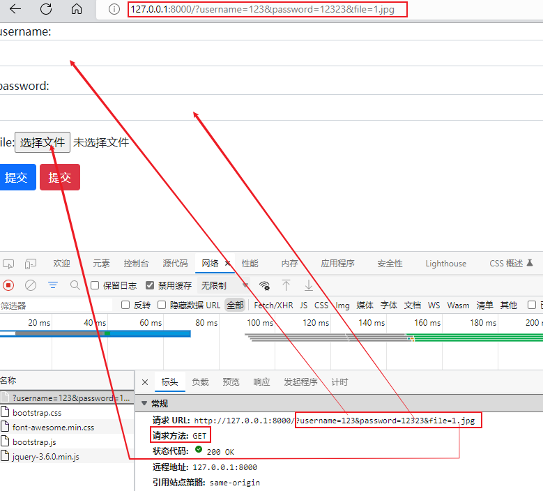

```python
[19/Sep/2022 23:08:12] "GET /?username=123&password=12323&file=1.jpg HTTP/1.1" 200 1160
```

点击蓝色提交之后是get请求.

红色是ajax post请求

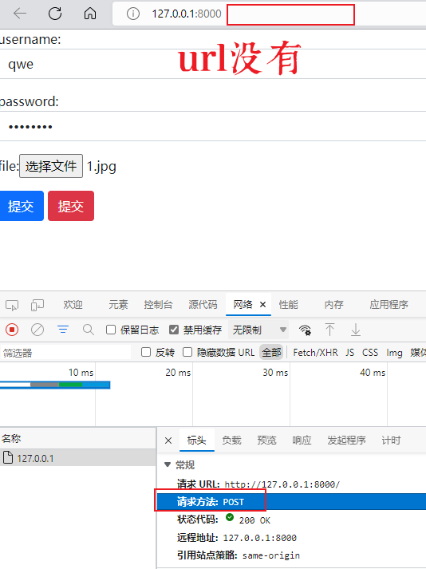

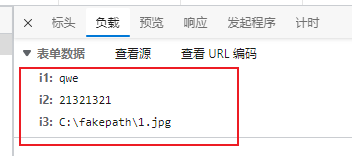

```html
<form>
    <p>username:<input type="text" name="username" class="form-control" id="u1"></p>
    <p>password:<input type="password" name="password" class="form-control" id="p1"></p>
    <p>file:<input type="file" name="file" id="f1"></p>
    <input type="submit" class="btn btn-primary">
    <input type="button" class="btn btn-danger" id="d1" value="提交">
</form>

<script>
    $('#d1').click(function (){
        $.ajax({
            url:'',
            type:'post',
            dataType:'JSON',
            {#data:{'username':'tom','password':'123456'},#}
            data:{'i1':$('#u1').val(),'i2':$('#p1').val(),'i3':$('#f1').val()},
            success:function (args){
                alert(args)
            }
        })
    })
</script>
```

获取用户输入的信息就是用上面的data

```python
views.py
def index(request):
    if request.method == 'POST':
        print(request.POST)
        print(request.FILES)
    return render(request,'index.html')
```

```python
>>>
<QueryDict: {'i1': ['qwe'], 'i2': ['21321321'], 'i3': ['C:\\fakepath\\1.jpg']}>
<MultiValueDict: {}>
[19/Sep/2022 23:26:00] "POST / HTTP/1.1" 200 1220
```

form表单,默认的数据编码格式是urlencoded

```js
Content-Type:application/x-www-form-urlencoded; charset=UTF-8
```

数据格式

```
?username=12&password=21&file=1.jpg
```

 **django后端针对符合urlencoded编码格式的数据都会自动帮你解析封装到request.POST中**

username=jason&password=123	>>> request.POST

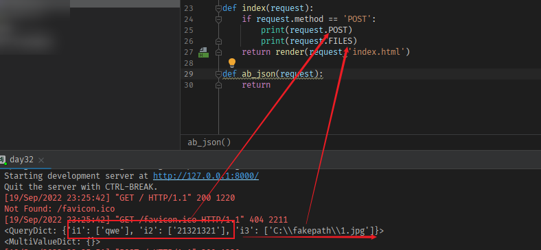

上面是默认的form 没有指定为post

```html
<form action="" method="post">
    <p>username:<input type="text" name="username" class="form-control" id="u1"></p>
    <p>password:<input type="password" name="password" class="form-control" id="p1"></p>
    <p>file:<input type="file" name="file" id="f1"></p>
    <input type="submit" class="btn btn-primary">
    <input type="button" class="btn btn-danger" id="d1" value="提交">
</form>

<script>
    $('#d1').click(function (){
        $.ajax({
            url:'',
            type:'post',
            dataType:'JSON',
            {#data:{'username':'tom','password':'123456'},#}
            data:{'i1':$('#u1').val(),'i2':$('#p1').val(),'i3':$('#f1').val()},
            success:function (args){
                alert(args)
            }
        })
    })
</script>
```

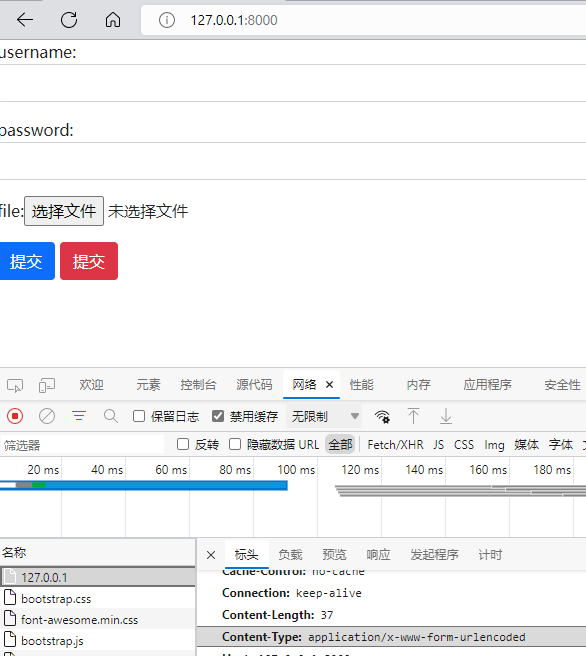

跟Ajax几乎一样

```html
<form action="" method="post" enctype="multipart/form-data">
```

 如果你把编码格式改成formdata

```js
Content-Type: multipart/form-data; boundary=----WebKitFormBoundary11IPQ7iDesgMRxiK
```

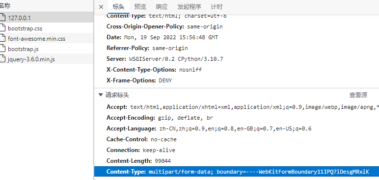

```python
>>>
<QueryDict: {'username': ['123'], 'password': ['21321']}>
<MultiValueDict: {'file': [<InMemoryUploadedFile: 1.jpg (image/jpeg)>]}>
[19/Sep/2022 23:56:48] "POST / HTTP/1.1" 200 1274
```

普通的键值还是解析到request.POST,file解析到request.files.

form表单没有办法发送json格式数据.

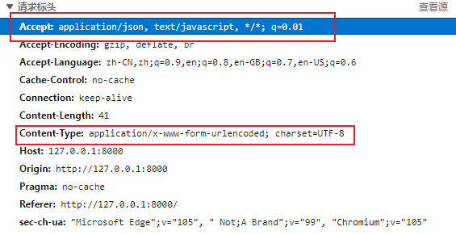

Ajax编码也是urlencoded

```python
[20/Sep/2022 00:03:27] "POST / HTTP/1.1" 200 1274
<QueryDict: {'i1': ['123'], 'i2': ['4355'], 'i3': ['C:\\fakepath\\1.jpg']}>
<MultiValueDict: {}>
```

django后端针对符合urlencoded编码格式的数据都会自动帮你解析封装到request.POST中

## Ajax发送json格式数据

