> mysql 之前是从运维的角度去搭建，从数据库的增删改查，自动化解决常见问题的处理和数据备份。
>
> ACID：是指数据库管理系统（DBMS）在写入或更新资料的过程中，为保证事务（transaction）是正确可靠的，所以必须具备四个特性：原子性（Atomicity(database systems) 不可分割性）、一致性（consistency）、隔离性（isolation，独立性），持久性(durability)
>
> 运维版数据库：5.7版本   现在版本：8.0

# 回顾内容

数据库分类

- 关系型数据库：MySQL 、Oracle 、db2、 access 、sql server
- 非关系型数据库NoSQL：mongodb、**memcache**、**redis** （缓存加速数据存储在内存中）


## 关系型数据库

   关系型数据库是指采用关系模型来组织数据的数据库，关系模式就是二维表

优点：

- 容易理解，二维表的结构容易理解
- 使用方便，
- 易于维护，数据库的ACID属性，降低了数据冗余和数据不一致的概率

缺点：

- 海量的数据读写效率，针对每秒上十万次的请求，硬盘I/O是一个瓶颈
- 扩展性和可用性：web架构中数据库是很难横向拓展的，(很多人都这样认为)...

针对数据库的这种明显的缺点，日本有位工程师开发了MHA高可用架构，只是几年没有维护了。8.0版本可能会有bug。在运维中有方法解决这个缺点。


## 非关系型数据库

NoSQL非关系型数据库,主要是指那些非关系型的、分布式的，且一般不保证ACID的数据存储系统。

key value 是NoSQL关系型数据库的特性。是不是很像python的字典

非关系数据库大部分是开源的，实现比较简单，大都是针对一些特性的应用需求出现的。根据结构化方法和应用场景的不同，分为以下几类。

（1）面向高性能并发读写的key-value数据库

主要特点是具有极高的并发读写性能，例如Redis、Tokyo Cabint等。

（2）面向海量数据访问的面向文档数据库

特点是，可以在海量的数据库快速的查询数据。例如MongoDB以及CouchDB.

（3）面向可拓展的分布式数据库

解决的主要问题是传统数据库的扩展性上的缺陷。

但是由于Nosql约束少，所以也不能够像sql那样提供where字段属性的查询。因此适合存储较为简单的数据。有一些不能够持久化数据，所以需要和关系型数据库结合。

> 【提示】
>
> 任何网络通信的应用程序底层都是socket
>
> 服务端
>
> - 基于socket通信
> - 收发消息
> - SQL语句
>
> 客户端
>
> - 基于socket通信
> - 收发消息
> - SQL语句


# Mysql install


## install

### 下载

官网：https://www.mysql.com/ 下载


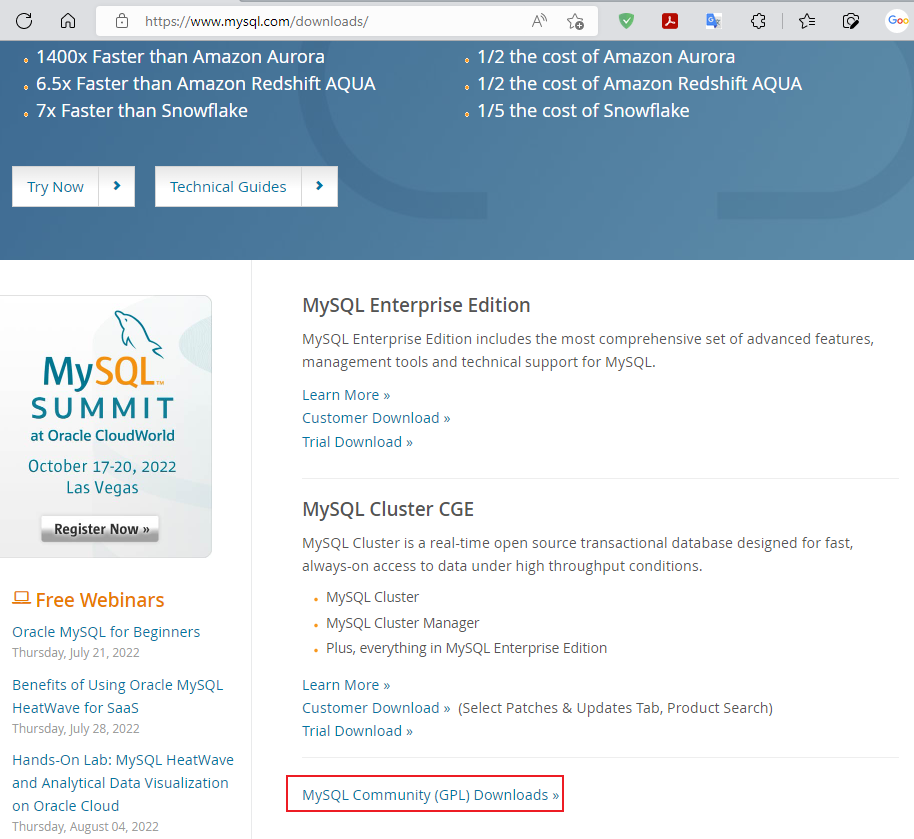

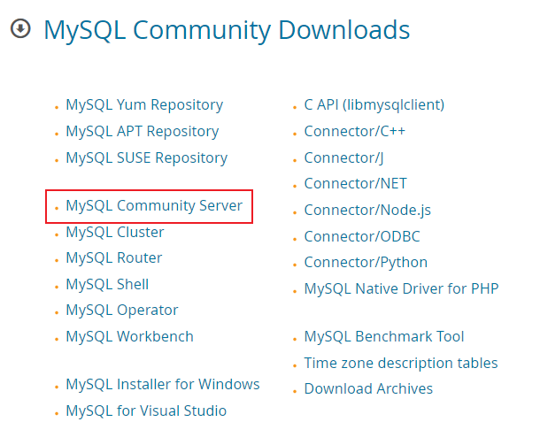

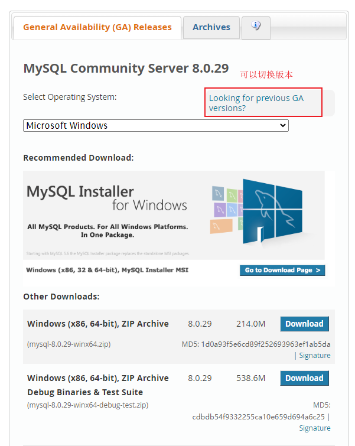

#### 其他版本

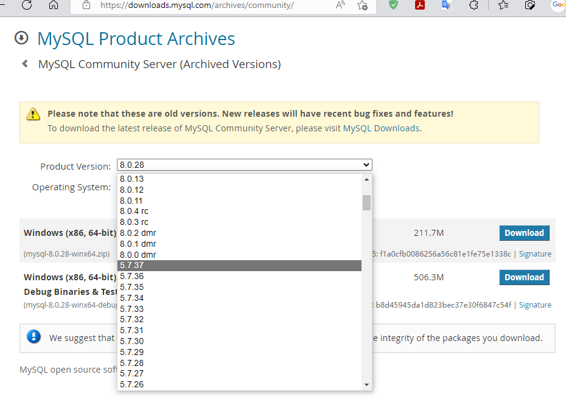


### 安装

把上面下载好的解压到某个盘符

```cmd
C:\WINDOWS\system32>d:

D:\>cd mysql
D:\mysql>cd bin
D:\mysql\bin>dir
 驱动器 D 中的卷没有标签。
 卷的序列号是 CA06-83D0

 D:\mysql\bin 的目录
2022/07/20  17:33    <DIR>          .
2022/07/20  17:33    <DIR>          ..
2022/03/23  16:22            21,152 echo.exe
2022/03/23  16:22           156,840 fido2.dll
2022/03/23  22:45            45,772 fido2.lib
2022/03/23  16:22         6,409,384 ibd2sdi.exe
2022/03/23  16:22         6,397,104 innochecksum.exe
2022/03/23  16:22           277,160 jemalloc.dll
2022/03/23  16:22         3,449,536 libcrypto-1_1-x64.dll
2022/03/23  16:22         1,847,464 libmecab.dll
2022/03/23  16:22         6,248,128 libprotobuf-debug.dll
2022/03/23  22:28        22,401,024 libprotobuf-debug.pdb
2022/03/23  16:22         1,407,176 libprotobuf-lite-debug.dll
2022/03/23  22:28         4,304,896 libprotobuf-lite-debug.pdb
2022/03/23  16:22           606,392 libprotobuf-lite.dll
2022/03/23  22:45           943,314 libprotobuf-lite.lib
2022/03/23  16:22         2,854,576 libprotobuf.dll
2022/03/23  22:45         3,976,168 libprotobuf.lib
2022/03/23  16:22           695,992 libssl-1_1-x64.dll
2022/03/23  16:22         6,340,280 lz4_decompress.exe
2022/03/23  16:22         6,659,760 myisamchk.exe
2022/03/23  16:22         6,499,504 myisamlog.exe
2022/03/23  16:22         6,557,360 myisampack.exe
2022/03/23  16:22         6,535,864 myisam_ftdump.exe
2022/03/23  16:22         7,313,064 mysql.exe
2022/03/23  16:22         7,199,920 mysqladmin.exe
2022/03/23  16:22         7,513,776 mysqlbinlog.exe
2022/03/23  16:22         7,207,600 mysqlcheck.exe
2022/03/23  16:22        51,579,560 mysqld.exe
2022/03/23  23:04       342,224,896 mysqld.pdb
2022/03/23  16:22         7,271,600 mysqldump.exe
2022/03/23  22:27             7,881 mysqldumpslow.pl
2022/03/23  22:27            28,776 mysqld_multi.pl
2022/03/23  16:22         7,193,264 mysqlimport.exe
2022/03/23  16:22         7,701,168 mysqlpump.exe
2022/03/23  16:22         7,191,216 mysqlshow.exe
2022/03/23  16:22         7,209,648 mysqlslap.exe
2022/03/23  16:22         6,289,600 mysql_config_editor.exe
2022/03/23  16:22         7,282,376 mysql_migrate_keyring.exe
2022/03/23  16:22         7,187,152 mysql_secure_installation.exe
2022/03/23  16:22         6,313,152 mysql_ssl_rsa_setup.exe
2022/03/23  16:22         6,225,600 mysql_tzinfo_to_sql.exe
2022/03/23  16:22         7,285,944 mysql_upgrade.exe
2022/03/23  16:22         6,274,240 my_print_defaults.exe
2022/03/23  16:22         7,108,264 perror.exe
2022/03/23  16:22         6,247,096 zlib_decompress.exe
              44 个文件    614,490,639 字节
               2 个目录 120,426,012,672 可用字节
```

> 【提示】
>
> D:\mysql>del /a/f/q d:\mysql\q.txt    # 删除文件
>
> D:\mysql>rd /s/q data    # 删除空文件夹

### 初始化

在mysql目录下新建一个my.ini文件

https://dev.mysql.com/doc/refman/8.0/en/server-configuration-defaults.html

```ini
[mysqld]
# 表示SQL模式的参数，通过这个参数可以设置检验SQL语句的严格程度
sql_mode=NO_ENGINE_SUBSTITUTION,STRICT_TRANS_TABLES,only_full_group_by
port = 3306
basedir = D:\mysql
datadir = D:\mysql\data
# 默认字符集
#default-character-set = utf8mb4
character-set-server = utf8mb4


[client]
default-character-set = utf8mb4

```

```ini
innodb_additional_mem_pool_size=3M
innodb_flush_log_at_trx_commit=1
innodb_log_buffer_size=2M
innodb_buffer_pool_size=107M
innodb_log_file_size=54M
innodb_thread_concurrency=18
```

以上是 InnoDB 存储引擎使用的参数，参数说明如下：

- innodb_additional_mem_pool_size：表示附加的内存池，用来存储 InnoDB 表的内容。
- innodb_flush_log_at_trx_commit：是设置提交日志的时机，若设置为 1，InnoDB 会在每次提交后将事务日志写到磁盘上。
- innodb_log_buffer_size：表示用来存储日志数据的缓存区的大小。
- innodb_buffer_pool_size：表示缓存的大小，InnoDB 使用一个缓冲池类保存索引和原始数据。
- innodb_log_file_size：表示日志文件的大小。
- innodb_thread_concurrency：表示在 InnoDB 存储引擎允许的线程最大数。


优化项：https://blog.51cto.com/auskangaroo/545296

```cmd
D:\mysql\bin>mysqld --initialize --user=mysql --console  # 指定用户

# 安装mysql服务到windows
D:\mysql\bin>mysqld -install
Service successfully installed.

# 如果服务安装失败使用下面的命令
D:\mysql\bin>sc delete mysql

# 启动服务
D:\mysql\bin>net start mysql
MySQL 服务正在启动 ...
MySQL 服务已经启动成功。

# 停止服务
D:\mysql\bin>net stop mysql
MySQL 服务正在停止.
MySQL 服务已成功停止。

# 移除服务
D:\mysql\bin>mysqld -remove
Service successfully removed.

# 
```

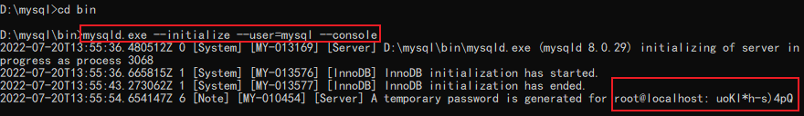

```cmd
D:\mysql\bin>mysqld.exe --initialize --user=mysql --console
2022-07-20T13:55:36.480512Z 0 [System] [MY-013169] [Server] D:\mysql\bin\mysqld.exe (mysqld 8.0.29) initializing of server in progress as process 3068
2022-07-20T13:55:36.665815Z 1 [System] [MY-013576] [InnoDB] InnoDB initialization has started.
2022-07-20T13:55:43.273062Z 1 [System] [MY-013577] [InnoDB] InnoDB initialization has ended.
2022-07-20T13:55:54.654147Z 6 [Note] [MY-010454] [Server] A temporary password is generated for root@localhost: uoKl*h-s)4pQ


D:\mysql\bin>mysqld -install
Service successfully installed.

D:\mysql\bin>net start mysql
MySQL 服务正在启动 ..
MySQL 服务已经启动成功。

D:\mysql\bin>mysql -uroot -puoKl*h-s)4pQ
mysql: [Warning] Using a password on the command line interface can be insecure.
Welcome to the MySQL monitor.  Commands end with ; or \g.
Your MySQL connection id is 8
Server version: 8.0.29

Copyright (c) 2000, 2022, Oracle and/or its affiliates.

Oracle is a registered trademark of Oracle Corporation and/or its
affiliates. Other names may be trademarks of their respective
owners.

Type 'help;' or '\h' for help. Type '\c' to clear the current input statement.

mysql>
```

添加环境变量

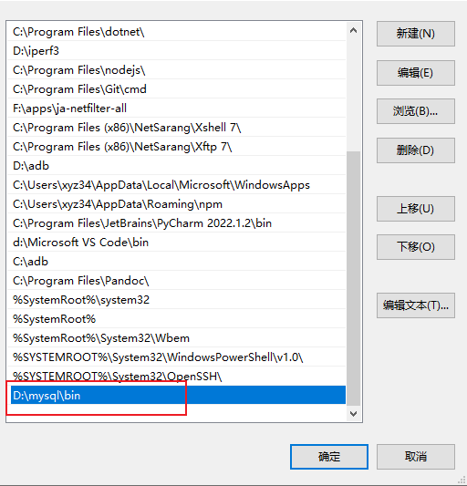

系统服务安装好之后就可以直接在管理员的命令提示符窗口直接运行`mysql -uroot -p`命令登录

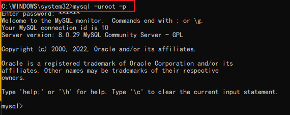


### mysql 修改密码

#### 1、alter

```mysql
mysql> \s
ERROR 1820 (HY000): You must reset your password using ALTER USER statement before executing this statement.

# 修改密码
mysql> alter user root@localhost identified by '123456';
Query OK, 0 rows affected (0.43 sec)

# 验证
D:\mysql\bin>mysql -uroot -p123456
mysql> \s
--------------
mysql  Ver 8.0.29 for Win64 on x86_64 (MySQL Community Server - GPL)

Connection id:          10
Current database:
Current user:           root@localhost
SSL:                    Cipher in use is TLS_AES_256_GCM_SHA384
Using delimiter:        ;
Server version:         8.0.29 MySQL Community Server - GPL
Protocol version:       10
Connection:             localhost via TCP/IP
Server characterset:    utf8mb4
Db     characterset:    utf8mb4
Client characterset:    gbk
Conn.  characterset:    gbk
TCP port:               3306
Binary data as:         Hexadecimal
Uptime:                 1 hour 12 min 49 sec

Threads: 2  Questions: 15  Slow queries: 0  Opens: 130  Flush tables: 3  Open tables: 46  Queries per second avg: 0.003
--------------
```

#### 2、mysqladmin

```cmd
D:\mysql\bin>mysqladmin -uroot -p123456 password P@ssw0rd
mysqladmin: [Warning] Using a password on the command line interface can be insecure.
Warning: Since password will be sent to server in plain text, use ssl connection to ensure password safety.

D:\mysql\bin>mysql -uroot -pP@ssw0rd
mysql>
```

#### 3、set password

```python
mysql> set password for 'root'@'localhost' = '123456';
Query OK, 0 rows affected (0.19 sec)
```

查看windows 进程

```cmd
C:\WINDOWS\system32>tasklist |findstr mysqld
mysqld.exe                    5160 Services                   0     24,080 K
mysqld.exe                    5928 Services                   0    193,232 K

C:\WINDOWS\system32>tasklist |findstr mysqld
mysqld.exe                    5160 Services                   0     24,080 K
mysqld.exe                    5928 Services                   0    193,232 K

C:\WINDOWS\system32>taskkill /F /PID 5160
成功: 已终止 PID 为 5160 的进程。

C:\WINDOWS\system32>tasklist.exe |findstr mysqld
mysqld.exe                    5928 Services                   0    193,280 K

C:\WINDOWS\system32>taskkill /F /PID 5928
成功: 已终止 PID 为 5928 的进程。
```

##### **netstat**

```cmd
C:\WINDOWS\system32>netstat -ano

活动连接

  协议  本地地址          外部地址        状态           PID
  TCP    0.0.0.0:135            0.0.0.0:0              LISTENING       1036
  TCP    0.0.0.0:445            0.0.0.0:0              LISTENING       4
  TCP    0.0.0.0:902            0.0.0.0:0              LISTENING       3812
  TCP    0.0.0.0:912            0.0.0.0:0              LISTENING       3812
  TCP    0.0.0.0:3306           0.0.0.0:0              LISTENING       4220
  TCP    0.0.0.0:5040           0.0.0.0:0              LISTENING       4544
  TCP    0.0.0.0:5357           0.0.0.0:0              LISTENING       4
  TCP    0.0.0.0:33060          0.0.0.0:0              LISTENING       4220
  TCP    0.0.0.0:49664          0.0.0.0:0              LISTENING       612
  TCP    0.0.0.0:49665          0.0.0.0:0              LISTENING       992
  TCP    0.0.0.0:49666          0.0.0.0:0              LISTENING       1600
  TCP    0.0.0.0:49667          0.0.0.0:0              LISTENING       1392
  TCP    0.0.0.0:49668          0.0.0.0:0              LISTENING       4684
  TCP    0.0.0.0:49669          0.0.0.0:0              LISTENING       628
  TCP    127.0.0.1:49793        127.0.0.1:49794        ESTABLISHED     4220
  TCP    127.0.0.1:49794        127.0.0.1:49793        ESTABLISHED     4220
  TCP    127.0.0.1:49795        127.0.0.1:49796        ESTABLISHED     4220
  TCP    127.0.0.1:49796        127.0.0.1:49795        ESTABLISHED     4220
  TCP    127.0.0.1:52477        0.0.0.0:0              LISTENING       1532
  TCP    172.16.0.118:139       0.0.0.0:0              LISTENING       4
  TCP    172.16.0.118:49686     20.198.162.76:443      ESTABLISHED     4732
  TCP    192.168.44.1:139       0.0.0.0:0              LISTENING       4
  TCP    192.168.183.1:139      0.0.0.0:0              LISTENING       4
  TCP    [::]:135               [::]:0                 LISTENING       1036
  TCP    [::]:445               [::]:0                 LISTENING       4
  TCP    [::]:3306              [::]:0                 LISTENING       4220
  TCP    [::]:5357              [::]:0                 LISTENING       4
  TCP    [::]:33060             [::]:0                 LISTENING       4220
  TCP    [::]:49664             [::]:0                 LISTENING       612
  TCP    [::]:49665             [::]:0                 LISTENING       992
  TCP    [::]:49666             [::]:0                 LISTENING       1600
  TCP    [::]:49667             [::]:0                 LISTENING       1392
  TCP    [::]:49668             [::]:0                 LISTENING       4684
  TCP    [::]:49669             [::]:0                 LISTENING       628
  TCP    [::1]:3306             [::1]:49797            ESTABLISHED     4220
  TCP    [::1]:49797            [::1]:3306             ESTABLISHED     8560
  UDP    0.0.0.0:3702           *:*                                    8400
  UDP    0.0.0.0:3702           *:*                                    8400
  UDP    0.0.0.0:5050           *:*                                    4544
  UDP    0.0.0.0:5353           *:*                                    2384
  UDP    0.0.0.0:5355           *:*                                    2384
  UDP    0.0.0.0:65216          *:*                                    8400
  UDP    127.0.0.1:49664        *:*                                    4824
  UDP    172.16.0.118:137       *:*                                    4
  UDP    172.16.0.118:138       *:*                                    4
  UDP    192.168.44.1:137       *:*                                    4
  UDP    192.168.44.1:138       *:*                                    4
  UDP    192.168.183.1:137      *:*                                    4
  UDP    192.168.183.1:138      *:*                                    4
  UDP    [::]:3702              *:*                                    8400
  UDP    [::]:3702              *:*                                    8400
  UDP    [::]:5353              *:*                                    2384
  UDP    [::]:5355              *:*                                    2384
  UDP    [::]:65217             *:*                                    8400

C:\WINDOWS\system32>netstat -r
===========================================================================
接口列表
  7...fc 45 96 a2 62 bc ......Intel(R) Ethernet Connection (3) I218-LM
 16...02 24 d6 c1 fd 40 ......Microsoft Wi-Fi Direct Virtual Adapter #2
 11...00 50 56 c0 00 01 ......VMware Virtual Ethernet Adapter for VMnet1
 13...00 50 56 c0 00 08 ......VMware Virtual Ethernet Adapter for VMnet8
 14...00 24 d6 c1 fd 40 ......Intel(R) Dual Band Wireless-AC 7265
  1...........................Software Loopback Interface 1
===========================================================================

IPv4 路由表
===========================================================================
活动路由:
网络目标        网络掩码          网关       接口   跃点数
          0.0.0.0          0.0.0.0       172.16.0.1     172.16.0.118     35
        127.0.0.0        255.0.0.0            在链路上         127.0.0.1    331
        127.0.0.1  255.255.255.255            在链路上         127.0.0.1    331
  127.255.255.255  255.255.255.255            在链路上         127.0.0.1    331
       172.16.0.0      255.255.0.0            在链路上      172.16.0.118    291
     172.16.0.118  255.255.255.255            在链路上      172.16.0.118    291
   172.16.255.255  255.255.255.255            在链路上      172.16.0.118    291
     192.168.44.0    255.255.255.0            在链路上      192.168.44.1    291
     192.168.44.1  255.255.255.255            在链路上      192.168.44.1    291
   192.168.44.255  255.255.255.255            在链路上      192.168.44.1    291
    192.168.183.0    255.255.255.0            在链路上     192.168.183.1    291
    192.168.183.1  255.255.255.255            在链路上     192.168.183.1    291
  192.168.183.255  255.255.255.255            在链路上     192.168.183.1    291
        224.0.0.0        240.0.0.0            在链路上         127.0.0.1    331
        224.0.0.0        240.0.0.0            在链路上     192.168.183.1    291
        224.0.0.0        240.0.0.0            在链路上      192.168.44.1    291
        224.0.0.0        240.0.0.0            在链路上      172.16.0.118    291
  255.255.255.255  255.255.255.255            在链路上         127.0.0.1    331
  255.255.255.255  255.255.255.255            在链路上     192.168.183.1    291
  255.255.255.255  255.255.255.255            在链路上      192.168.44.1    291
  255.255.255.255  255.255.255.255            在链路上      172.16.0.118    291
===========================================================================
永久路由:
  无

IPv6 路由表
===========================================================================
活动路由:
 接口跃点数网络目标                网关
  1    331 ::1/128                  在链路上
 13    291 fe80::/64                在链路上
 11    291 fe80::/64                在链路上
 14    291 fe80::/64                在链路上
 14    291 fe80::106f:7eb5:19e0:77df/128
                                    在链路上
 11    291 fe80::242d:ba8e:e72e:1b49/128
                                    在链路上
 13    291 fe80::2917:7d9c:5a4a:473/128
                                    在链路上
  1    331 ff00::/8                 在链路上
 13    291 ff00::/8                 在链路上
 11    291 ff00::/8                 在链路上
 14    291 ff00::/8                 在链路上
===========================================================================
永久路由:
无
```

##### 破解密码

本地的mysql忘记密码，针对网络的破解方法暂无

1、先停止mysql服务

```cmd
C:\WINDOWS\system32>net stop mysql
MySQL 服务正在停止.
MySQL 服务已成功停止。
```

2、跳过验证登陆表

```cmd
C:\WINDOWS\system32>mysqld --console --skip-grant-tables --shared-memory
2022-07-21T01:36:07.656531Z 0 [System] [MY-010116] [Server] D:\mysql\bin\mysqld.exe (mysqld 8.0.29) starting as process 3996
2022-07-21T01:36:08.069052Z 1 [System] [MY-013576] [InnoDB] InnoDB initialization has started.
2022-07-21T01:36:09.838210Z 1 [System] [MY-013577] [InnoDB] InnoDB initialization has ended.
2022-07-21T01:36:11.107327Z 0 [Warning] [MY-011311] [Server] Plugin mysqlx reported: 'All I/O interfaces are disabled, X Protocol won't be accessible'
2022-07-21T01:36:11.674168Z 0 [Warning] [MY-010068] [Server] CA certificate ca.pem is self signed.
2022-07-21T01:36:11.674609Z 0 [System] [MY-013602] [Server] Channel mysql_main configured to support TLS. Encrypted connections are now supported for this channel.
2022-07-21T01:36:11.832557Z 0 [System] [MY-010931] [Server] D:\mysql\bin\mysqld.exe: ready for connections. Version: '8.0.29'  socket: ''  port: 0  MySQL Community Server - GPL.
```

3、新开一个cmd

```cmd
C:\WINDOWS\system32>mysql -uroot -p
Enter password:
```

4、更改密码

```cmd
mysql> update mysql.user set authentication_string='' where user='root';
Query OK, 1 row affected (0.18 sec)
Rows matched: 1  Changed: 1  Warnings: 0

mysql> quit
Bye
```

5、关闭上面打开的mysqld

6、启动服务

```cmd
C:\WINDOWS\system32>net start mysql
MySQL 服务正在启动 ..
MySQL 服务已经启动成功。
```

7、重新登录，上面已经设置为空密码了

```cmd
C:\WINDOWS\system32>mysql -uroot -p
Enter password:
Welcome to the MySQL monitor.  Commands end with ; or \g.
Your MySQL connection id is 8
Server version: 8.0.29 MySQL Community Server - GPL

Copyright (c) 2000, 2022, Oracle and/or its affiliates.

Oracle is a registered trademark of Oracle Corporation and/or its
affiliates. Other names may be trademarks of their respective
owners.

Type 'help;' or '\h' for help. Type '\c' to clear the current input statement.

mysql>
```

8、修改密码

```mysql
mysql> alter user root@localhost identified by '123456';
Query OK, 0 rows affected (0.29 sec)
```

9、重新登录验证

```cmd
C:\WINDOWS\system32>net start mysql

C:\WINDOWS\system32>mysql -uroot -p
Enter password: ******
Type 'help;' or '\h' for help. Type '\c' to clear the current input statement.
mysql>
```

> 【危险】
>
> mysql> update mysql.user set authentication_string='' where user='root';
>
> 这一条命令在正常模式下8.0会有点问题，使用这条命令修改用户密码导致无法登录。但是忘记密码时候是正确的。也就是这条命令是重置密码的命令。
>
> mysql> update mysql.user set authentication_string='' where user='root' and host='localhost';

```mysql
mysql> update mysql.user set authentication_string='123456' where user='root' and host='localhost';
Query OK, 1 row affected (0.40 sec)
Rows matched: 1  Changed: 1  Warnings: 0

mysql> flush privileges;   # 刷新缓存
Query OK, 0 rows affected (0.14 sec)

```

### 编码

数据库需要统一编码，方便不同的客户端连接，不会出现乱码显现。UTF-8是统一标准，我们看到数据库是gbk的，因为这个是使用windows导致的。以后的数据库导入导出特别是跨系统的必须考虑这点。

```mysql
mysql> \s
--------------
mysql  Ver 8.0.29 for Win64 on x86_64 (MySQL Community Server - GPL)

Connection id:          8
Current database:
Current user:           root@localhost
SSL:                    Cipher in use is TLS_AES_256_GCM_SHA384
Using delimiter:        ;
Server version:         8.0.29 MySQL Community Server - GPL
Protocol version:       10
Connection:             localhost via TCP/IP
Server characterset:    utf8mb4
Db     characterset:    utf8mb4
Client characterset:    gbk
Conn.  characterset:    gbk
TCP port:               3306
Binary data as:         Hexadecimal
Uptime:                 5 min 9 sec

Threads: 2  Questions: 8  Slow queries: 0  Opens: 146  Flush tables: 3  Open tables: 65  Queries per second avg: 0.025
--------------
```


# Mysql 操作

## 增删改查

**库级别的操作**

```mysql
CREATE DATABASE test CHARSET='utf8';  # 创建一个test数据库

SHOW DATABASES;   # 查看所有数据库

SELECT DATABASE(); # 查看当前数据库

USE test; # 使用test数据库

mysql> drop database test;  # 删除数据库

mysql> \u stu
Database changed

mysql> select database();
+------------+
| database() |
+------------+
| stu        |
+------------+

mysql> \s
--------------
mysql  Ver 8.0.29 for Win64 on x86_64 (MySQL Community Server - GPL)

Connection id:          10
Current database:       stu
Current user:           root@localhost
SSL:                    Cipher in use is TLS_AES_256_GCM_SHA384
Using delimiter:        ;
Server version:         8.0.29 MySQL Community Server - GPL
Protocol version:       10
Connection:             localhost via TCP/IP
Server characterset:    utf8mb4
Db     characterset:    utf8mb4
Client characterset:    utf8mb4
Conn.  characterset:    utf8mb4
TCP port:               3306
Binary data as:         Hexadecimal
Uptime:                 16 min 50 sec

Threads: 2  Questions: 71  Slow queries: 0  Opens: 157  Flush tables: 3  Open tables: 76  Queries per second avg: 0.070
--------------
```

**表级别**

```mysql
mysql> create table t1(id int,name char(4));   # 创建表
Query OK, 0 rows affected (2.80 sec)

mysql> show tables;  # 查看当前数据库下的表
+---------------+
| Tables_in_stu |
+---------------+
| t1            |
+---------------+

mysql> desc t1; # 查看表信息
+-------+---------+------+-----+---------+-------+
| Field | Type    | Null | Key | Default | Extra |
+-------+---------+------+-----+---------+-------+
| id    | int     | YES  |     | NULL    |       |
| name  | char(4) | YES  |     | NULL    |       |
+-------+---------+------+-----+---------+-------+

mysql> alter table t1 modify name char(8);  # 修改name的长度

mysql> desc t1;  # 验证 describe t1
+-------+---------+------+-----+---------+-------+
| Field | Type    | Null | Key | Default | Extra |
+-------+---------+------+-----+---------+-------+
| id    | int     | YES  |     | NULL    |       |
| name  | char(8) | YES  |     | NULL    |       |
+-------+---------+------+-----+---------+-------+

mysql> drop table t1; # 删除

mysql> show tables; # 验证
Empty set (0.00 sec)
```

**插入数据**

```mysql
mysql> create table t1(id int,name char(4)); # 创建一个新表

mysql> insert into  t1 values(1,'Tom'),(2,'Bob'); # 插入数据

mysql> select * from t1;  # 查看表中所有数据，数据量大千万不能这么查询
+------+------+
| id   | name |
+------+------+
|    1 | Tom  |
|    2 | Bob  |
+------+------+

mysql> update t1 set name='Jack' where id > 1;   # 按条件修改

mysql> select * from t1;
+------+------+
| id   | name |
+------+------+
|    1 | Tom  |
|    2 | Jack |
+------+------+

mysql> delete from t1 where name='Tom';  # 删除数据

mysql> select * from t1;
+------+------+
| id   | name |
+------+------+
|    2 | Jack |
+------+------+

```

存储引擎就是不同的处理机制

## **MySQL主要存储引擎**

* Innodb

  是MySQL5.5版本及之后默认的存储引擎

  存储数据更加的安全

  支持事务 行锁 外键    数据更加的安全
  	创建表会生成两个文件
  		表结构文件
  		表数据文件

* myisam

  是MySQL5.5版本之前默认的存储引擎

  速度要比Innodb更快 但是我们更加注重的是数据的安全

* memory

  内存引擎(数据全部存放在内存中) 断电数据丢失

* blackhole

  无论存什么，都立刻消失(黑洞)

```mysql
mysql> show engines; # 查看所有引擎

# 指定存储引擎
create table t1(id int) engine=innodb;
create table t2(id int) engine=myisam;
create table t3(id int) engine=blackhole;
create table t4(id int) engine=memory;
```

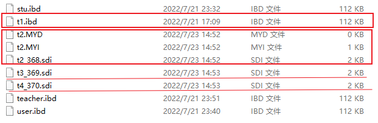

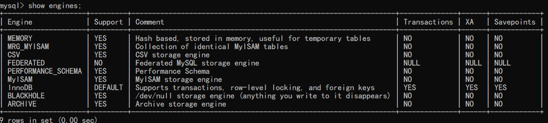

**创建表的完整语法**

create table tablename(

​      字段名1 类型（宽度） 约束条件，

​      字段名2 类型（宽度） 约束条件，

​      字段名3 类型（宽度） 约束条件

) engine=innoDB charset=utf8mb4 comment ‘别名’；

字段名不能重复，类型必选。约束条件后期有大用处，括号内最后一行不能有逗号。

当约束条件是null的，插入数据可以为空，not null不能拆入null数据。

## 数据类型

### 数值类型

| **类**     | **类型**      | **说明**                                           |
| :--------- | ------------- | -------------------------------------------------- |
| **整数**   | TINY**INT**   | 极小整数-128，127                                  |
| **整数**   | SMALL**INT**  | 较小整数-2^15 - 2^15  (-32768 ,32768)              |
| **整数**   | MEDIUM**INT** | 中型整数                                           |
| **整数**   | INT           | 常规类型-2^31,2^31 （-2147483648，2147483648）     |
| **整数**   | BIG**INT**    | 较大整数数据类型（-2^63,2^63）±9223372036854775808 |
| **浮点数** | FLOAT         | 小型单精度4个字节                                  |
| **浮点数** | DOUBLE        | 常规双精度8个字节                                  |
| **定点数** | DECIMAL       | 包含整数部分，小数部分或同时包含二者               |
| **BIT**    | BIT           | 位字段值                                           |

说明：手机号是无法存储到int的。一般是使用char类型来存储收集号*

### 字符类型

| **类**   | **类型**       | **说明**                     |
| -------- | -------------- | ---------------------------- |
| **文本** | **CHAR**       | 固定长度最多255字符          |
| **文本** | VAR**CHAR**    | 可变长度最多65535字符        |
| **文本** | TINY**TEXT**   | 可变长度最多255字符          |
| **文本** | **TEXT**       | 可变长度最多65535字符        |
| **文本** | MEDIUM**TEXT** | 可变长度16777215个字符       |
| **文本** | LONG**TEXT**   | 可变长度最多4294967295个字符 |
| **整数** | ENUM           | 由一组固定的合法值组成的枚举 |
| **整数** | SET            | 由一组固定的合法值组成的集   |

> char(11) ：
>
> 定长的字符串类型,在存储字符串时，最大字符长度11个，立即分配11个字符长度的存储空间，如果存不满，空格填充。
>
> varchar(11):
>
> 变长的字符串类型，最大字符长度11个。在存储字符串时，自动判断字符长度，按需分配存储空间。
>
> enum('bj','tj','sh')：
>
> 枚举类型，比较适合于将来此列的值是固定范围内的特点，可以使用enum,可以很大程度的优化我们的索引结构。

### 时间类型

| **类型**      | **格式**                      | **示例**                            |
| ------------- | ----------------------------- | ----------------------------------- |
| **DATE**      | YYYY-MM-DD                    | 2021-06-01                          |
| **TIME**      | hh:mm:ss[.uuuuuu]             | 12:20:20.123456                     |
| **DATETIME**  | YYYY-MM-DD  hh:mm:ss[.uuuuuu] | 2021-06-21 12:20:20.123456          |
| **TIMESTAMP** | YYYY-MM-DD  hh:mm:ss[.uuuuuu] | 2021-06-01 12:20:20 12:20:20.123456 |
| **YEAR**      | YYYY                          | 2021                                |

> DATETIME 
>
> 范围为从 1000-01-01 00:00:00.000000 至 9999-12-31 23:59:59.999999。
>
> TIMESTAMP 
>
> 1970-01-01 00:00:00.000000 至 2038-01-19 03:14:07.999999。
>
> timestamp会受到时区的影响

### 二进制类型

| **类**     | **类型**    | **说明**                               |
| ---------- | ----------- | -------------------------------------- |
| **二进制** | BINARY      | 类似char类型，但存储是二进制字节字符串 |
| **二进制** | VARBINARY   |                                        |
| **BLOB**   | TINYBLOB    |                                        |
| **BLOB**   | BLOB        |                                        |
| **BLOB**   | MEDIUDMDLOB |                                        |
| **BLOB**   | LONGBLOB    |                                        |

## 表属性(约束)

### 列属性

约束(一般建表时添加):

**primary key** ：主键约束

设置为主键的列，此列的值必须非空且唯一，主键在一个表中只能有一个，但是可以有多个列一起构成。

**not null**：非空约束

列值不能为空，也是表设计的规范，尽可能将所有的列设置为非空。可以设置默认值为0

**unique key**：唯一键

列值不能重复`姓名是不能设置为唯一的`

**unsigned**：无符号，正整数

针对数字列，非负数。

**<u>其他属性:</u>**

**key** :索引

可以在某列上建立索引，来优化查询,一般是根据需要后添加

**default** :默认值

列中，没有录入值时，会自动使用default的值填充*

**auto_increment**:自增长

针对数字列，顺序的自动填充数据（默认是从1开始，将来可以设定起始点和偏移量）`序号使用`

**comment**: 注释

**zerofill**：整型字段有个zerofill属性，在数据长度不够的数据前面填充0，以达到设定的长度。

> 【提示】
>
> zerofill 应用于流水号的生成上
>
> zerofill 月份日期前补0


### 表属性

存储引擎:  **InnoDB（默认的**）

字符集: **utf8    utf8mb4**

排序规则： show collation;

字符集列表

```mysql
mysql> show collation;  # 字符集
```

## 严格模式

```mysql
# 如何查看严格模式
mysql> show variables like "%mode";
+--------------------------+--------------------------------------------+
| Variable_name            | Value                                      |
+--------------------------+--------------------------------------------+
| block_encryption_mode    | aes-128-ecb                                |
| gtid_mode                | OFF                                        |
| innodb_autoinc_lock_mode | 2                                          |
| innodb_strict_mode       | ON                                         |
| offline_mode             | OFF                                        |
| pseudo_replica_mode      | OFF                                        |
| pseudo_slave_mode        | OFF                                        |
| rbr_exec_mode            | STRICT                                     |
| replica_exec_mode        | STRICT                                     |
| slave_exec_mode          | STRICT                                     |
| sql_mode                 | STRICT_TRANS_TABLES,NO_ENGINE_SUBSTITUTION |
| ssl_fips_mode            | OFF                                        |
| ssl_session_cache_mode   | ON                                         |
+--------------------------+--------------------------------------------+
13 rows in set, 1 warning (1.41 sec)
```

模糊匹配/查询
	关键字 like
		%:匹配任意多个字符
        _:匹配任意单个字符

修改严格模式

```mysql
set session  只在当前窗口有效
set global   全局有效
set global sql_mode = 'STRICT_TRANS_TABLES';
修改完之后 重新进入服务端即可
```

* 分类

  FLOAT、DOUBLE、DECIMAL

* 作用

  身高、体重、薪资
  
  ```mysql
  # 存储限制
  float(255,30)  # 总共255位 小数部分占30位
  double(255,30)  # 总共255位 小数部分占30位
  decimal(65,30)  # 总共65位 小数部分占30位
  
  # 精确度验证
  create table t15(id float(255,30));
  create table t16(id double(255,30));
  create table t17(id decimal(65,30));
  """你们在前期不要给我用反向键 所有的命令全部手敲！！！增加熟练度"""
  
  insert into t15 values(1.111111111111111111111111111111);
  insert into t16 values(1.111111111111111111111111111111);
  insert into t17 values(1.111111111111111111111111111111);
  
  float < double < decimal
  # 要结合实际应用场景 三者都能使用
  
  # 介绍一个小方法 char_length统计字段长度
  select char_length(name) from t18;
  select char_length(name) from t19;
  
  # 再次修改sql_mode 让MySQL不要做自动剔除操作
  set global sql_mode = 'STRICT_TRANS_TABLES,PAD_CHAR_TO_FULL_LENGTH';
  ```
  
  > 【提示】
  >
  > char
  > 	缺点:浪费空间
  > 	优点:存取都很简单
  > 		直接按照固定的字符存取数据即可
  > 		jason egon alex wusir tank 
  > 		存按照五个字符存 取也直接按照五个字符取
  > 		
  > varchar
  > 	优点:节省空间
  > 	缺点:存取较为麻烦
  > 		1bytes+jason 1bytes+egon 1bytes+alex 1bytes+tank 
  > 		
  >
  > 存的时候需要制作报头
  >
  > 取的时候也需要先读取报头 之后才能读取真实数据
  >
  > 
  >
  > 以前基本上都是用的char 其实现在用varchar的也挺多

```mysql
mysql> create table stu(
    id int,
    name char(4),
    b_year year,
    birth date,
    reg_time datetime
    );

mysql> desc stu;
+----------+----------+------+-----+---------+-------+
| Field    | Type     | Null | Key | Default | Extra |
+----------+----------+------+-----+---------+-------+
| id       | int      | YES  |     | NULL    |       |
| name     | char(4)  | YES  |     | NULL    |       |
| b_year   | year     | YES  |     | NULL    |       |
| birth    | date     | YES  |     | NULL    |       |
| reg_time | datetime | YES  |     | NULL    |       |
+----------+----------+------+-----+---------+-------+

mysql> insert into stu values(1,'Tom','1999','1999-3-4','2021-08-23 12:45:32');

mysql> select * from stu;
+------+------+--------+------------+---------------------+
| id   | name | b_year | birth      | reg_time            |
+------+------+--------+------------+---------------------+
|    1 | Tom  |   1999 | 1999-03-04 | 2021-08-23 12:45:32 |
+------+------+--------+------------+---------------------+
```

## 枚举与集合类型

- 分类
  - 枚举 enum  多选一
  - 集合 set 多选多

- 具体使用

```mysql
mysql> create table user(
     id int,
     name char(8),
     gender enum('male','female','others')
     );
Query OK, 0 rows affected (2.77 sec)

mysql> insert into user values(1,'Tom','male');
Query OK, 1 row affected (2.20 sec)

mysql> insert into user values(1,'Tom','males'); # 枚举里面没有
ERROR 1265 (01000): Data truncated for column 'gender' at row 1
```

枚举字段 后期在存数据的时候只能从枚举里面选择一个存储 

```mysql
mysql> create table teacher(
    id int,
    name char(8),
    gender enum('male','female','others'),
    hobby set('read','DBJ','IT')
    );
Query OK, 0 rows affected (2.76 sec)

mysql> insert into teacher values(1,'Tom','female','read');
Query OK, 1 row affected (2.20 sec)

mysql> insert into teacher values(2,'Bob','male','read,IT');
Query OK, 1 row affected (2.19 sec)

# 不存在的枚举或者集合values报错。
mysql> select * from teacher;
+------+------+--------+---------+
| id   | name | gender | hobby   |
+------+------+--------+---------+
|    1 | Tom  | female | read    |
|    2 | Bob  | male   | read,IT |
+------+------+--------+---------+
2 rows in set (0.00 sec)
```

## 约束条件

### defalut

```mysql
mysql> create database student charset='utf8mb4';
Query OK, 1 row affected (0.53 sec)

mysql> \u student
Database changed
mysql> create table t1(
     id int ,
     name char(8)
     );
Query OK, 0 rows affected (0.38 sec)


mysql> create table t2(
     id int,
     name char(8),
     gender enum('male','female','others') default 'male'
     );
Query OK, 0 rows affected (2.78 sec)

# 添加数据的方法
mysql> insert into t1 values(1,'jack');  # 默认位置
Query OK, 1 row affected (2.21 sec)

mysql> insert into t1(name,id) values('tom',2);  # 按字段顺序添加
Query OK, 1 row affected (0.44 sec)

mysql> select * from t1 limit 5;
+------+------+
| id   | name |
+------+------+
|    1 | jack |
|    2 | tom  |
+------+------+
2 rows in set (0.00 sec)

mysql> insert into t2 values(1,'Tom','female');
Query OK, 1 row affected (2.28 sec)

mysql> insert into t2(id,name) values(2,'jack');   # 没有输入gender
Query OK, 1 row affected (2.20 sec)

mysql> select * from t2 limit 5;
+------+------+--------+
| id   | name | gender |
+------+------+--------+
|    1 | Tom  | female |
|    2 | jack | male   |
+------+------+--------+
2 rows in set (0.00 sec)

```

### unique 唯一

```mysql
mysql> create table t3(
     id int unique,
     name char(8)
     );
Query OK, 0 rows affected (2.77 sec)

mysql> insert into t3 values(1,'tim'),(2,'bob');
Query OK, 2 rows affected (2.18 sec)
Records: 2  Duplicates: 0  Warnings: 0

mysql> insert into t3 values(1,'jack');
ERROR 1062 (23000): Duplicate entry '1' for key 't3.id'  t3.id这列数据重复！
```

联合唯一

```mysql
mysql> create table t4(
     id int,
     ip char(16),
     port int,
     unique(ip,port)    # 联合唯一
     );
Query OK, 0 rows affected (2.90 sec)

mysql> desc t4;
+-------+----------+------+-----+---------+-------+
| Field | Type     | Null | Key | Default | Extra |
+-------+----------+------+-----+---------+-------+
| id    | int      | YES  |     | NULL    |       |
| ip    | char(16) | YES  | MUL | NULL    |       |
| port  | int      | YES  |     | NULL    |       |
+-------+----------+------+-----+---------+-------+
3 rows in set (0.00 sec)

mysql> insert into t4 values(1,'127.0.0.1',8080),(2,'127.0.0.1',8081),(3,'127.0.0.2',8080);
Query OK, 3 rows affected (2.18 sec)
Records: 3  Duplicates: 0  Warnings: 0

mysql> insert into t4 values(4,'127.0.0.1',8080);
ERROR 1062 (23000): Duplicate entry '127.0.0.1-8080' for key 't4.ip'  ip，port重复

mysql> select * from t4 limit 4;
+------+-----------+------+
| id   | ip        | port |
+------+-----------+------+
|    1 | 127.0.0.1 | 8080 |
|    2 | 127.0.0.1 | 8081 |
|    3 | 127.0.0.2 | 8080 |
+------+-----------+------+
3 rows in set (0.00 sec)

```

### primary key主键

```mysql
# 从约束条件来看 primary key = unique + not null 非空且唯一
mysql> create table t5(id int primary key);
Query OK, 0 rows affected (2.84 sec)

mysql> insert into t5 values(1),(2);
Query OK, 2 rows affected (0.15 sec)
Records: 2  Duplicates: 0  Warnings: 0

mysql> insert into t5 values(1),(1);   # 主键唯一，提示重复了。
ERROR 1062 (23000): Duplicate entry '1' for key 't5.PRIMARY'
mysql> insert into t5 values(null);   # 主键不能为空
ERROR 1048 (23000): Column 'id' cannot be null
mysql> insert into t5 values();  # 字段ID没有默认值
ERROR 1364 (HY000): Field 'id' doesn't have a default value 
```

primary key 除了约束效果之外，还是innodb存储引擎组织数据的依据，Innodb存储引擎在创建表的时候必须要有primary key因为它类似于书的目录 能够帮助提示查询效率并且也是建表的依据

`一张表中有且只有一个主键 如果你没有设置主键 那么会从上往下搜索直到遇到一个非空且唯一的字段将它自动升级为主键`

```mysql
mysql> create table t6(
     id int,
     name char(16),
     age int not null unique,
     addr char(32) not null unique
     );
Query OK, 0 rows affected (2.83 sec)

mysql> desc t6;
+-------+----------+------+-----+---------+-------+
| Field | Type     | Null | Key | Default | Extra |
+-------+----------+------+-----+---------+-------+
| id    | int      | YES  |     | NULL    |       |
| name  | char(16) | YES  |     | NULL    |       |
| age   | int      | NO   | PRI | NULL    |       |
| addr  | char(32) | NO   | UNI | NULL    |       |
+-------+----------+------+-----+---------+-------+
4 rows in set (0.00 sec)
```

`如果表中没有主键也没有其他任何的非空且唯一字段 那么Innodb会采用自己内部提供的一个隐藏字段作为主键，隐藏意味着你无法使用到它 就无法提示查询速度`

`一张表中通常都应该有一个主键字段 并且通常将id/uid/sid字段作为主键`

单主键

```mysql
mysql> create table t7(
    -> id int primary key,
    -> name char(8)
    -> );
Query OK, 0 rows affected (2.69 sec)

mysql> desc t7;
+-------+---------+------+-----+---------+-------+
| Field | Type    | Null | Key | Default | Extra |
+-------+---------+------+-----+---------+-------+
| id    | int     | NO   | PRI | NULL    |       |
| name  | char(8) | YES  |     | NULL    |       |
+-------+---------+------+-----+---------+-------+
2 rows in set (0.00 sec)
```

联合主键:多个字段联合起来作为表的主键 本质还是一个主键

```mysql
mysql> create table t8(
    -> ip char(16),
    -> port int,
    -> primary key(ip,port)
    -> );
Query OK, 0 rows affected (2.81 sec)

mysql> desc t8;
+-------+----------+------+-----+---------+-------+
| Field | Type     | Null | Key | Default | Extra |
+-------+----------+------+-----+---------+-------+
| ip    | char(16) | NO   | PRI | NULL    |       |
| port  | int      | NO   | PRI | NULL    |       |
+-------+----------+------+-----+---------+-------+
2 rows in set (0.00 sec)
```

### auto_increment 自增

当编号特别多的时候，就需要自动编号

```mysql
mysql> create table t9(
     id int primary key auto_increment,
     name char(8)
     );
Query OK, 0 rows affected (2.82 sec)

mysql> desc t9;
+-------+---------+------+-----+---------+----------------+
| Field | Type    | Null | Key | Default | Extra          |
+-------+---------+------+-----+---------+----------------+
| id    | int     | NO   | PRI | NULL    | auto_increment |
| name  | char(8) | YES  |     | NULL    |                |
+-------+---------+------+-----+---------+----------------+
2 rows in set (0.00 sec)

mysql> insert into t9(name) values('tom'),('bob'),('jack');
Query OK, 3 rows affected (0.51 sec)
Records: 3  Duplicates: 0  Warnings: 0

mysql> select * from t9 limit 5;
+----+------+
| id | name |
+----+------+
|  1 | tom  |
|  2 | bob  |
|  3 | jack |
+----+------+
3 rows in set (0.00 sec)
```

插入数据特别是有默认值或者自增的插入数据需要指定字段名。

`注意auto_increment通常都是加在主键上的 不能给普通字段加`

以后在创建表的id(数据的唯一标识id、uid、sid)字段的时候

**id int primary key auto_increment **（ID标准）

> 【提示】
>
> delete from t1  删除表中数据后 主键的自增不会停止
>
> truncate t1 清空表数据并且重置主键

```mysql
# 验证
mysql> select * from t9 limit 5;  # 产看前五行
+----+------+
| id | name |
+----+------+
|  1 | tom  |
|  2 | bob  |
|  3 | jack |
+----+------+
3 rows in set (0.00 sec)

mysql> delete from t9 where name='bob'; # 删除其中的数据
Query OK, 1 row affected (2.22 sec)

mysql> select * from t9 limit 5;
+----+------+
| id | name |
+----+------+
|  1 | tom  |
|  3 | jack |
+----+------+
2 rows in set (0.00 sec)

mysql> insert into t9(name) values('bob');
Query OK, 1 row affected (2.32 sec)

mysql> select * from t9 limit 5;
+----+------+
| id | name |
+----+------+
|  1 | tom  |
|  3 | jack |
|  4 | bob  |
+----+------+
3 rows in set (0.00 sec)

# 可以看出上面不会因为删除了某行数据就停止了自增长

mysql> truncate t9;
Query OK, 0 rows affected (1.29 sec)

mysql> show tables;
+-------------------+
| Tables_in_student |
+-------------------+
| t1                |
| t2                |
| t3                |
| t4                |
| t5                |
| t6                |
| t7                |
| t8                |
| t9                |
+-------------------+
9 rows in set (0.00 sec)

mysql> select * from t9 limit 5;
Empty set (0.00 sec)

mysql> insert into t9(name) values('tom'),('bob'),('jack');
Query OK, 3 rows affected (2.34 sec)
Records: 3  Duplicates: 0  Warnings: 0

mysql> select * from t9 limit 5;
+----+------+
| id | name |
+----+------+
|  1 | tom  |
|  2 | bob  |
|  3 | jack |
+----+------+
3 rows in set (0.00 sec)
# 上面已经清空数据并且重置了主键
```

## 表与表之间建立关系

很多时候有些公司图省事，很多信息存放到一起，这种表组织结构不是很清晰（可忽视），浪费硬盘空间（可忽视），数据扩展性极差（不能容忍）。

`这里就需要优化处理，分表是最好的解决方法。`

**外键**：就是建立表与表之间关系的foreign key

### 表关系：

- 一对多，多对一都叫一对多
- 多对多
- 一对一
- 没关系

### 一对多

换位思考  分别站在两张表的角度考虑

员工表与部门表为例
	先站在员工表
		思考一个员工能否对应多个部门(一条员工数据能否对应多条部门数据)
			不能！！！
			(不能直接得出结论 一定要两张表都考虑完全)
	再站在部门表
		思考一个部门能否对应多个员工(一个部门数据能否对应多条员工数据)
			能！！！
	得出结论
		员工表与部门表示单向的一对多
		所以表关系就是一对多

foreign key
	1 一对多表关系   外键字段建在多的一方
    2 在创建表的时候 一定要先建被关联表 
    3 在录入数据的时候 也必须先录入被关联表

```mysql
mysql> create table dep(
    id int primary key auto_increment,
    dep_name char(16),
    dep_desc char(16)
    );
Query OK, 0 rows affected (2.85 sec)

mysql> create table emp(
    id int primary key auto_increment,
    name char(16),
    gender enum('male','female','others') default 'male',
    dep_id int,
    foreign key(dep_id) references dep(id)  # 外键
    );
Query OK, 0 rows affected (3.17 sec)

mysql> desc dep;
+----------+----------+------+-----+---------+----------------+
| Field    | Type     | Null | Key | Default | Extra          |
+----------+----------+------+-----+---------+----------------+
| id       | int      | NO   | PRI | NULL    | auto_increment |
| dep_name | char(16) | YES  |     | NULL    |                |
| dep_desc | char(16) | YES  |     | NULL    |                |
+----------+----------+------+-----+---------+----------------+
3 rows in set (0.00 sec)

mysql> desc emp;
+--------+--------------------------------+------+-----+---------+----------------+
| Field  | Type                           | Null | Key | Default | Extra          |
+--------+--------------------------------+------+-----+---------+----------------+
| id     | int                            | NO   | PRI | NULL    | auto_increment |
| name   | char(16)                       | YES  |     | NULL    |                |
| gender | enum('male','female','others') | YES  |     | male    |                |
| dep_id | int                            | YES  | MUL | NULL    |                |
+--------+--------------------------------+------+-----+---------+----------------+
4 rows in set (0.00 sec)

mysql> insert into dep(dep_name,dep_desc) values('sb教育局','教书育人'),('外交部','杂种丛生'),('技术部','技术有限部门');
Query OK, 3 rows affected (2.41 sec)
Records: 3  Duplicates: 0  Warnings: 0

mysql> insert into emp(name,dep_id) values('jack',2),('tom',3),('bob',1);
Query OK, 3 rows affected (2.19 sec)
Records: 3  Duplicates: 0  Warnings: 0

mysql> select * from dep limit 5;
+----+-------------+--------------------+
| id | dep_name    | dep_desc           |
+----+-------------+--------------------+
|  1 | sb教育局    | 教书育人             |
|  2 | 外交部      | 杂种丛生           |
|  3 | 技术部      | 技术有限部门      	 |
+----+-------------+--------------------+
3 rows in set (0.00 sec)

mysql> select * from emp limit 5;
+----+------+--------+--------+
| id | name | gender | dep_id |
+----+------+--------+--------+
|  4 | jack | male   |      2 |
|  5 | tom  | male   |      3 |
|  6 | bob  | male   |      1 |
+----+------+--------+--------+
3 rows in set (0.00 sec)

# 修改里面的ID值报错。外键
mysql> update dep set id=200 where id=2;
ERROR 1451 (23000): Cannot delete or update a parent row: a foreign key constraint fails (`student`.`emp`, CONSTRAINT `emp_ibfk_1` FOREIGN KEY (`dep_id`) REFERENCES `dep` (`id`))

mysql> delete from dep;
ERROR 1451 (23000): Cannot delete or update a parent row: a foreign key constraint fails (`student`.`emp`, CONSTRAINT `emp_ibfk_1` FOREIGN KEY (`dep_id`) REFERENCES `dep` (`id`))

# 删除数据需要先删除外键所在表中的数据
mysql> delete from emp where name='bob';
Query OK, 1 row affected (2.24 sec)

mysql> select * from emp limit 5;
+----+------+--------+--------+
| id | name | gender | dep_id |
+----+------+--------+--------+
|  4 | jack | male   |      2 |
|  5 | tom  | male   |      3 |
+----+------+--------+--------+
2 rows in set (0.00 sec)

mysql> delete from dep where id=1;
Query OK, 1 row affected (2.21 sec)

mysql> select * from dep limit 5;
+----+-----------+--------------------+
| id | dep_name  | dep_desc           |
+----+-----------+--------------------+
|  2 | 外交部    | 杂种丛生           |
|  3 | 技术部    | 技术有限部门       |
+----+-----------+--------------------+
2 rows in set (0.00 sec)
```

上面这种删除数据特别复杂，有没有插入数据就同步更新了。

级联更新   >>>   同步更新
   级联删除   >>>   同步删除

```mysql
mysql> create table dep(
     id int primary key auto_increment,
     dep_name char(16),
     dep_desc char(32)
     );
Query OK, 0 rows affected (2.89 sec)

mysql> create table emp(
     id int primary key auto_increment,
     name char(16),
     gender enum('male','female','others') default 'male',
     dep_id int,
     foreign key(dep_id) references dep(id)
     on update cascade
     on delete cascade
     );
Query OK, 0 rows affected (3.05 sec)

mysql> insert into dep(dep_name,dep_desc) values('教育局','教书育人'),('外交部','国际交流'),('技术部','技术部经理');
Query OK, 3 rows affected (2.29 sec)
Records: 3  Duplicates: 0  Warnings: 0

mysql> insert into emp(name,dep_id) values('tom',1),('bob',3),('jack',2),('tim',1);
Query OK, 4 rows affected (2.31 sec)
Records: 4  Duplicates: 0  Warnings: 0

mysql> select * from dep limit 5;
+----+-----------+-----------------+
| id | dep_name  | dep_desc        |
+----+-----------+-----------------+
|  1 | 教育局    | 教书育人        |
|  2 | 外交部    | 国际交流        |
|  3 | 技术部    | 技术部经理      |
+----+-----------+-----------------+
3 rows in set (0.00 sec)

mysql> select * from emp limit 5;
+----+------+--------+--------+
| id | name | gender | dep_id |
+----+------+--------+--------+
|  1 | tom  | male   |      1 |
|  2 | bob  | male   |      3 |
|  3 | jack | male   |      2 |
|  4 | tim  | male   |      1 |
+----+------+--------+--------+
4 rows in set (0.00 sec)

mysql> delete from dep where id=3;
Query OK, 1 row affected (0.95 sec)

mysql> select * from dep limit 5;
+----+-----------+--------------+
| id | dep_name  | dep_desc     |
+----+-----------+--------------+
|  1 | 教育局    | 教书育人     |
|  2 | 外交部    | 国际交流     |
+----+-----------+--------------+
2 rows in set (0.00 sec)

mysql> select * from emp limit 5;
+----+------+--------+--------+
| id | name | gender | dep_id |
+----+------+--------+--------+
|  1 | tom  | male   |      1 |
|  3 | jack | male   |      2 |
|  4 | tim  | male   |      1 |
+----+------+--------+--------+
3 rows in set (0.00 sec)

# 上面两条可以合并成下面这条
mysql> select * from dep join emp on dep.id=emp.dep_id limit 5;
+----+-----------+--------------+----+------+--------+--------+
| id | dep_name  | dep_desc     | id | name | gender | dep_id |
+----+-----------+--------------+----+------+--------+--------+
|  1 | 教育局    | 教书育人     |  1 | tom  | male   |      1 |
|  1 | 教育局    | 教书育人     |  4 | tim  | male   |      1 |
|  2 | 外交部    | 国际交流     |  3 | jack | male   |      2 |
+----+-----------+--------------+----+------+--------+--------+
3 rows in set (0.00 sec)
```

上面例子就是一对多。

### 多对多

例子：图书表和作者表

```mysql
mysql> create table book(
    id int primary key auto_increment,
    title varchar(32),
    price int
    );
Query OK, 0 rows affected (2.92 sec)

mysql> create table author(
    id int primary key auto_increment,
    name varchar(32),
    age int
    );
Query OK, 0 rows affected (2.77 sec)

mysql> create table book2author(
     id int primary key auto_increment,
     author_id int,
     book_id int,
     foreign key(author_id) references author(id)
     on update cascade
     on delete cascade,
     foreign key(book_id) references book(id)
     on update cascade
     on delete cascade
     );
Query OK, 0 rows affected (3.04 sec)

# 上面表需要中间表相关，不然不能多对多
mysql> desc author;desc book;desc book2author;
+-------+-------------+------+-----+---------+----------------+
| Field | Type        | Null | Key | Default | Extra          |
+-------+-------------+------+-----+---------+----------------+
| id    | int         | NO   | PRI | NULL    | auto_increment |
| name  | varchar(32) | YES  |     | NULL    |                |
| age   | int         | YES  |     | NULL    |                |
+-------+-------------+------+-----+---------+----------------+
3 rows in set (0.00 sec)

+-------+-------------+------+-----+---------+----------------+
| Field | Type        | Null | Key | Default | Extra          |
+-------+-------------+------+-----+---------+----------------+
| id    | int         | NO   | PRI | NULL    | auto_increment |
| title | varchar(32) | YES  |     | NULL    |                |
| price | int         | YES  |     | NULL    |                |
+-------+-------------+------+-----+---------+----------------+
3 rows in set (0.00 sec)

+-----------+------+------+-----+---------+----------------+
| Field     | Type | Null | Key | Default | Extra          |
+-----------+------+------+-----+---------+----------------+
| id        | int  | NO   | PRI | NULL    | auto_increment |
| author_id | int  | YES  | MUL | NULL    |                |
| book_id   | int  | YES  | MUL | NULL    |                |
+-----------+------+------+-----+---------+----------------+
3 rows in set (0.00 sec)
```

### 一对一

客户表和学生表

```mysql
mysql> create table authordetail(
     id int primary key auto_increment,
     phone int,
     addr varchar(64)
     );
Query OK, 0 rows affected (2.75 sec)

mysql> create table stu_1(
     id int primary key auto_increment,
     name varchar(32),
     age int,
     authordetail_id int unique,
     foreign key(authordetail_id) references authordetail(id)
     on update cascade
     on delete cascade
     );
Query OK, 0 rows affected (2.85 sec)

mysql> desc stu_1;desc authordetail;
+-----------------+-------------+------+-----+---------+----------------+
| Field           | Type        | Null | Key | Default | Extra          |
+-----------------+-------------+------+-----+---------+----------------+
| id              | int         | NO   | PRI | NULL    | auto_increment |
| name            | varchar(32) | YES  |     | NULL    |                |
| age             | int         | YES  |     | NULL    |                |
| authordetail_id | int         | YES  | UNI | NULL    |                |
+-----------------+-------------+------+-----+---------+----------------+
4 rows in set (0.00 sec)

+-------+-------------+------+-----+---------+----------------+
| Field | Type        | Null | Key | Default | Extra          |
+-------+-------------+------+-----+---------+----------------+
| id    | int         | NO   | PRI | NULL    | auto_increment |
| phone | int         | YES  |     | NULL    |                |
| addr  | varchar(64) | YES  |     | NULL    |                |
+-------+-------------+------+-----+---------+----------------+
3 rows in set (0.00 sec)
```

表关系的建立需要用到foreign key
	一对多
		外键字段建在多的一方
	多对多
		自己开设第三张存储
	一对一
		建在任意一方都可以 但是推荐你建在查询频率较高的表中

判断表之间关系的方式
   换位思考！！！

### 修改

```mysql
# 1 修改表名
	alter table 表名 rename 新表名;

# 2 增加字段
	alter table 表名 add 字段名 字段类型(宽度)  约束条件;
	alter table 表名 add 字段名 字段类型(宽度)  约束条件 first;
	alter table 表名 add 字段名 字段类型(宽度)  约束条件 after 字段名;

# 3 删除字段
	alter table 表名 drop 字段名;

# 4 修改字段
	alter table 表名 modify 字段名 字段类型(宽度) 约束条件;
	
	alter table 表名 change 旧字段名 新字段名 字段类型(宽度) 约束条件;
	
# 复制表	
create table 表名 select * from 旧表;  不能复制主键 外键 ...

create table new_dep2 select * from dep where id>3;	

mysql> update emp set post='sb' where post='张江第一帅形象代言';  # 修改数据
Query OK, 1 row affected (2.23 sec)
Rows matched: 1  Changed: 1  Warnings: 0
```


```mysql
#用户表
create table user(
id int not null unique auto_increment,
username varchar(20) not null,
password varchar(50) not null,
primary key(username,password)
);

#用户组表
create table usergroup(
id int primary key auto_increment,
groupname varchar(20) not null unique
);

#主机表
create table host(
id int primary key auto_increment,
ip char(15) not null unique default '127.0.0.1'
);

#业务线表
create table business(
id int primary key auto_increment,
business varchar(20) not null unique
);

#建关系：user与usergroup

create table user2usergroup(
id int not null unique auto_increment,
user_id int not null,
group_id int not null,
primary key(user_id,group_id),
foreign key(user_id) references user(id),
foreign key(group_id) references usergroup(id)
);

#建关系：host与business
create table host2business(
id int not null unique auto_increment,
host_id int not null,
business_id int not null,
primary key(host_id,business_id),
foreign key(host_id) references host(id),
foreign key(business_id) references business(id)
);

#建关系：user与host
create table user2host(
id int not null unique auto_increment,
user_id int not null,
host_id int not null,
primary key(user_id,host_id),
foreign key(user_id) references user(id),
foreign key(host_id) references host(id)
);
```

> 【注意】
>
> 外键带来的约束
> 	1.在创建表的时候一定要先创建被关联表
>     2.在插入数据的时候也要先插入被关联表
>     3.操作数据的时候 会出现多种限制  同步更新 同步删除


## DQL

数据查询

### 准备数据

```mysql
mysql> create database test charset='utf8mb4';
Query OK, 1 row affected (2.22 sec)

mysql> \u test
Database changed
mysql> create table emp(
      id int not null unique auto_increment,
      name varchar(20) not null,
      sex enum('male','female','others') default 'male',
      age int(3) unsigned not null default 38,
      hire_date date not null,
      post varchar(50),
      post_comment varchar(100),
      salary double(15,2),
      office int,
      depart_id int
      );
Query OK, 0 rows affected, 2 warnings (2.70 sec)

mysql> desc emp;
+--------------+--------------------------------+------+-----+---------+----------------+
| Field        | Type                           | Null | Key | Default | Extra          |
+--------------+--------------------------------+------+-----+---------+----------------+
| id           | int                            | NO   | PRI | NULL    | auto_increment |
| name         | varchar(20)                    | NO   |     | NULL    |                |
| sex          | enum('male','female','others') | YES  |     | male    |                |
| age          | int unsigned                   | NO   |     | 38      |                |
| hire_date    | date                           | NO   |     | NULL    |                |
| post         | varchar(50)                    | YES  |     | NULL    |                |
| post_comment | varchar(100)                   | YES  |     | NULL    |                |
| salary       | double(15,2)                   | YES  |     | NULL    |                |
| office       | int                            | YES  |     | NULL    |                |
| depart_id    | int                            | YES  |     | NULL    |                |
+--------------+--------------------------------+------+-----+---------+----------------+
10 rows in set (0.00 sec)

insert into emp(name,sex,age,hire_date,post,salary,office,depart_id) values
('jason','male',18,'20170301','张江第一帅形象代言',7300.33,401,1), 
('tom','male',78,'20150302','teacher',1000000.31,401,1),
('kevin','male',81,'20130305','teacher',8300,401,1),
('tony','male',73,'20140701','teacher',3500,401,1),
('owen','male',28,'20121101','teacher',2100,401,1),
('jack','female',18,'20110211','teacher',9000,401,1),
('jenny','male',18,'19000301','teacher',30000,401,1),
('sank','male',48,'20101111','teacher',10000,401,1),
('哈哈','female',48,'20150311','sale',3000.13,402,2),
('呵呵','female',38,'20101101','sale',2000.35,402,2),
('西西','female',18,'20110312','sale',1000.37,402,2),
('乐乐','female',18,'20160513','sale',3000.29,402,2),
('拉拉','female',28,'20170127','sale',4000.33,402,2),
('僧龙','male',28,'20160311','operation',10000.13,403,3), 
('程咬金','male',18,'19970312','operation',20000,403,3),
('程咬银','female',18,'20130311','operation',19000,403,3),
('程咬铜','male',18,'20150411','operation',18000,403,3),
('程咬铁','female',18,'20140512','operation',17000,403,3);

mysql> select * from emp;
```

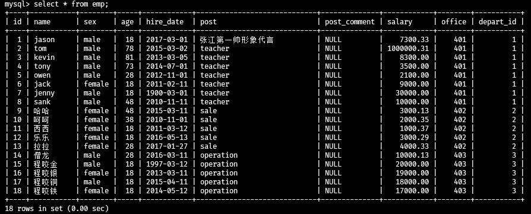

```mysql
mysql> select * from emp where id>=3 and id<=9;
+----+--------+--------+-----+------------+---------+--------------+----------+--------+-----------+
| id | name   | sex    | age | hire_date  | post    | post_comment | salary   | office | depart_id |
+----+--------+--------+-----+------------+---------+--------------+----------+--------+-----------+
|  3 | kevin  | male   |  81 | 2013-03-05 | teacher | NULL         |  8300.00 |    401 |         1 |
|  4 | tony   | male   |  73 | 2014-07-01 | teacher | NULL         |  3500.00 |    401 |         1 |
|  5 | owen   | male   |  28 | 2012-11-01 | teacher | NULL         |  2100.00 |    401 |         1 |
|  6 | jack   | female |  18 | 2011-02-11 | teacher | NULL         |  9000.00 |    401 |         1 |
|  7 | jenny  | male   |  18 | 1900-03-01 | teacher | NULL         | 30000.00 |    401 |         1 |
|  8 | sank   | male   |  48 | 2010-11-11 | teacher | NULL         | 10000.00 |    401 |         1 |
|  9 | 哈哈   | female |  48 | 2015-03-11 | sale    | NULL         |  3000.13 |    402 |         2 |
+----+--------+--------+-----+------------+---------+--------------+----------+--------+-----------+
7 rows in set (0.00 sec)

mysql> select * from emp where id>3 and id<9;
+----+-------+--------+-----+------------+---------+--------------+----------+--------+-----------+
| id | name  | sex    | age | hire_date  | post    | post_comment | salary   | office | depart_id |
+----+-------+--------+-----+------------+---------+--------------+----------+--------+-----------+
|  4 | tony  | male   |  73 | 2014-07-01 | teacher | NULL         |  3500.00 |    401 |         1 |
|  5 | owen  | male   |  28 | 2012-11-01 | teacher | NULL         |  2100.00 |    401 |         1 |
|  6 | jack  | female |  18 | 2011-02-11 | teacher | NULL         |  9000.00 |    401 |         1 |
|  7 | jenny | male   |  18 | 1900-03-01 | teacher | NULL         | 30000.00 |    401 |         1 |
|  8 | sank  | male   |  48 | 2010-11-11 | teacher | NULL         | 10000.00 |    401 |         1 |
+----+-------+--------+-----+------------+---------+--------------+----------+--------+-----------+
5 rows in set (0.00 sec)

mysql> select id,name,salary from emp where id>3 and id<9;
+----+-------+----------+
| id | name  | salary   |
+----+-------+----------+
|  4 | tony  |  3500.00 |
|  5 | owen  |  2100.00 |
|  6 | jack  |  9000.00 |
|  7 | jenny | 30000.00 |
|  8 | sank  | 10000.00 |
+----+-------+----------+
5 rows in set (0.00 sec)

mysql> select id,name,salary from emp where salary=2100 or salary=10000 or salary=18000;
+----+-----------+----------+
| id | name      | salary   |
+----+-----------+----------+
|  5 | owen      |  2100.00 |
|  8 | sank      | 10000.00 |
| 17 | 程咬铜    | 18000.00 |
+----+-----------+----------+
3 rows in set (0.00 sec)

mysql> select id,name,salary from emp where salary in(20000,10000,17000);
+----+-----------+----------+
| id | name      | salary   |
+----+-----------+----------+
|  8 | sank      | 10000.00 |
| 15 | 程咬金    | 20000.00 |
| 18 | 程咬铁    | 17000.00 |
+----+-----------+----------+
3 rows in set (0.00 sec)
```

in 是多个or 的简写

### 模糊查询

​	like
​		%  匹配任意多个字符
​		_  匹配任意单个字符

```mysql
# 查询名字中有个o的所有人
mysql> select name,salary from emp where name like '%o%';
+-------+------------+
| name  | salary     |
+-------+------------+
| jason |    7300.33 |
| tom   | 1000000.31 |
| tony  |    3500.00 |
| owen  |    2100.00 |
+-------+------------+
4 rows in set (0.00 sec)

# 查询name是3个字节的名字
mysql> select name,salary from emp where name like '___';
+-----------+------------+
| name      | salary     |
+-----------+------------+
| tom       | 1000000.31 |
| 程咬金    |   20000.00 |
| 程咬银    |   19000.00 |
| 程咬铜    |   18000.00 |
| 程咬铁    |   17000.00 |
+-----------+------------+
5 rows in set (0.00 sec)

# 上面的第二种方法
mysql> select name,salary from emp where char_length(name)=3;
+-----------+------------+
| name      | salary     |
+-----------+------------+
| tom       | 1000000.31 |
| 程咬金    |   20000.00 |
| 程咬银    |   19000.00 |
| 程咬铜    |   18000.00 |
| 程咬铁    |   17000.00 |
+-----------+------------+
5 rows in set (0.00 sec)

mysql> select id,name,salary from emp where id not between 3 and 6;
+----+-----------+------------+
| id | name      | salary     |
+----+-----------+------------+
|  1 | jason     |    7300.33 |
|  2 | tom       | 1000000.31 |
|  7 | jenny     |   30000.00 |
|  8 | sank      |   10000.00 |
|  9 | 哈哈      |    3000.13 |
| 10 | 呵呵      |    2000.35 |
| 11 | 西西      |    1000.37 |
| 12 | 乐乐      |    3000.29 |
| 13 | 拉拉      |    4000.33 |
| 14 | 僧龙      |   10000.13 |
| 15 | 程咬金    |   20000.00 |
| 16 | 程咬银    |   19000.00 |
| 17 | 程咬铜    |   18000.00 |
| 18 | 程咬铁    |   17000.00 |
+----+-----------+------------+
14 rows in set (0.00 sec)

# 当有values 为null 不用=等号，只能用is。
mysql> select name,post from emp where post_comment=null;
Empty set (0.00 sec)

mysql> select name,post from emp where post_comment=NULL;
Empty set (0.00 sec)

mysql> select name,post from emp where post_comment='null';
Empty set (0.00 sec)

mysql> select name,post from emp where post_comment='NULL';
Empty set (0.00 sec)

mysql> select name,post from emp where post_comment is null;
+-----------+-----------------------------+
| name      | post                        |
+-----------+-----------------------------+
| jason     | 张江第一帅形象代言          |
| tom       | teacher                     |
| kevin     | teacher                     |
| tony      | teacher                     |
| owen      | teacher                     |
| jack      | teacher                     |
| jenny     | teacher                     |
| sank      | teacher                     |
| 哈哈      | sale                        |
| 呵呵      | sale                        |
| 西西      | sale                        |
| 乐乐      | sale                        |
| 拉拉      | sale                        |
| 僧龙      | operation                   |
| 程咬金    | operation                   |
| 程咬银    | operation                   |
| 程咬铜    | operation                   |
| 程咬铁    | operation                   |
+-----------+-----------------------------+
18 rows in set (0.00 sec)
```

### group by 分组

分组实际应用场景  分组应用场景非常的多,男女比例,部门平均薪资

```mysql
# 按指定的列分组，
mysql> select * from emp group by post;
+----+--------+--------+-----+------------+-----------------------------+--------------+------------+--------+-----------+
| id | name   | sex    | age | hire_date  | post                        | post_comment | salary     | office | depart_id |
+----+--------+--------+-----+------------+-----------------------------+--------------+------------+--------+-----------+
|  1 | jason  | male   |  18 | 2017-03-01 | 张江第一帅形象代言          | NULL         |    7300.33 |    401 |         1 |
|  2 | tom    | male   |  78 | 2015-03-02 | teacher                     | NULL         | 1000000.31 |    401 |         1 |
|  9 | 哈哈   | female |  48 | 2015-03-11 | sale                        | NULL         |    3000.13 |    402 |         2 |
| 14 | 僧龙   | male   |  28 | 2016-03-11 | operation                   | NULL         |   10000.13 |    403 |         3 |
+----+--------+--------+-----+------------+-----------------------------+--------------+------------+--------+-----------+
4 rows in set (0.00 sec)

mysql> show variables like '%mode';
+--------------------------+--------------------------------------------+
| Variable_name            | Value                                      |
+--------------------------+--------------------------------------------+
| block_encryption_mode    | aes-128-ecb                                |
| gtid_mode                | OFF                                        |
| innodb_autoinc_lock_mode | 2                                          |
| innodb_strict_mode       | ON                                         |
| offline_mode             | OFF                                        |
| pseudo_replica_mode      | OFF                                        |
| pseudo_slave_mode        | OFF                                        |
| rbr_exec_mode            | STRICT                                     |
| replica_exec_mode        | STRICT                                     |
| slave_exec_mode          | STRICT                                     |
| sql_mode                 | STRICT_TRANS_TABLES,NO_ENGINE_SUBSTITUTION |
| ssl_fips_mode            | OFF                                        |
| ssl_session_cache_mode   | ON                                         |
+--------------------------+--------------------------------------------+
13 rows in set, 1 warning (2.12 sec)

mysql> set global sql_mode = 'strict_trans_tables,only_full_group_by';
Query OK, 0 rows affected, 1 warning (0.00 sec)

# 重启服务之后再执行上面的语句就报错，因为再严格模式下。
mysql> select * from emp where group by post;
ERROR 1064 (42000): You have an error in your SQL syntax; check the manual that corresponds to your MySQL server version for the right syntax to use near 'group by post' at line 1

mysql> select post from emp group by post;
+-----------------------------+
| post                        |
+-----------------------------+
| 张江第一帅形象代言          |
| teacher                     |
| sale                        |
| operation                   |
+-----------------------------+
4 rows in set (0.00 sec)

# 设置了严格模式之后，分组只能对指定的列分组，如果想要获取其他的需要借助一些方法（聚合函数）
```

### 聚合函数

| 名称             | 描述     |
| ---------------- | -------- |
| max              | 最大值   |
| min              | 最小值   |
| sum              | 求和     |
| count            | 行       |
| avg              | 平均     |
| group_concat（） | 内容组合 |

```mysql
mysql> select post,max(salary) from emp group by post;
+-----------------------------+-------------+
| post                        | max(salary) |
+-----------------------------+-------------+
| 张江第一帅形象代言          |     7300.33 |
| teacher                     |  1000000.31 |
| sale                        |     4000.33 |
| operation                   |    20000.00 |
+-----------------------------+-------------+
4 rows in set (0.00 sec)

mysql> select post as '部门',max(salary) as '最高薪资' from emp group by post;
+-----------------------------+--------------+
| 部门                        | 最高薪资     |
+-----------------------------+--------------+
| 张江第一帅形象代言          |      7300.33 |
| teacher                     |   1000000.31 |
| sale                        |      4000.33 |
| operation                   |     20000.00 |
+-----------------------------+--------------+
4 rows in set (0.00 sec)

mysql> select post '部门',max(salary) '最高薪资' from emp group by post;
+-----------------------------+--------------+
| 部门                        | 最高薪资     |
+-----------------------------+--------------+
| 张江第一帅形象代言          |      7300.33 |
| teacher                     |   1000000.31 |
| sale                        |      4000.33 |
| operation                   |     20000.00 |
+-----------------------------+--------------+
4 rows in set (0.00 sec)

# 获取每个部门的最小薪资
mysql> select post,min(salary) from emp group by post;
+-----------------------------+-------------+
| post                        | min(salary) |
+-----------------------------+-------------+
| 张江第一帅形象代言          |     7300.33 |
| teacher                     |     2100.00 |
| sale                        |     1000.37 |
| operation                   |    10000.13 |
+-----------------------------+-------------+
4 rows in set (0.00 sec)

mysql> update emp set post='sb' where post='张江第一帅形象代言';
Query OK, 1 row affected (2.23 sec)
Rows matched: 1  Changed: 1  Warnings: 0

mysql> select post as '部门',min(salary) as '最小薪资' from emp group by post;
+-----------+--------------+
| 部门      | 最小薪资     |
+-----------+--------------+
| sb        |      7300.33 |
| teacher   |      2100.00 |
| sale      |      1000.37 |
| operation |     10000.13 |
+-----------+--------------+
4 rows in set (0.00 sec)

mysql> select post '部门',min(salary) '最小薪资' from emp group by post;
+-----------+--------------+
| 部门      | 最小薪资     |
+-----------+--------------+
| sb        |      7300.33 |
| teacher   |      2100.00 |
| sale      |      1000.37 |
| operation |     10000.13 |
+-----------+--------------+
4 rows in set (0.00 sec)

# 获取部门平均工资
mysql> select post,avg(salary) from emp group by post;
+-----------+---------------+
| post      | avg(salary)   |
+-----------+---------------+
| sb        |   7300.330000 |
| teacher   | 151842.901429 |
| sale      |   2600.294000 |
| operation |  16800.026000 |
+-----------+---------------+
4 rows in set (0.00 sec)

mysql> select post as '部门',avg(salary) as '平均薪资' from emp group by post;
+-----------+---------------+
| 部门      | 平均薪资      |
+-----------+---------------+
| sb        |   7300.330000 |
| teacher   | 151842.901429 |
| sale      |   2600.294000 |
| operation |  16800.026000 |
+-----------+---------------+
4 rows in set (0.00 sec)

mysql> select post '部门',avg(salary) '平均薪资' from emp group by post;
+-----------+---------------+
| 部门      | 平均薪资      |
+-----------+---------------+
| sb        |   7300.330000 |
| teacher   | 151842.901429 |
| sale      |   2600.294000 |
| operation |  16800.026000 |
+-----------+---------------+
4 rows in set (0.00 sec)

# 每个部门的总工资
mysql> select post,sum(salary) from emp group by post;
+-----------+-------------+
| post      | sum(salary) |
+-----------+-------------+
| sb        |     7300.33 |
| teacher   |  1062900.31 |
| sale      |    13001.47 |
| operation |    84000.13 |
+-----------+-------------+
4 rows in set (0.00 sec)

mysql> select post '部门',sum(salary) '总工资' from emp group by post;
+-----------+------------+
| 部门      | 总工资     |
+-----------+------------+
| sb        |    7300.33 |
| teacher   | 1062900.31 |
| sale      |   13001.47 |
| operation |   84000.13 |
+-----------+------------+
4 rows in set (0.00 sec)

# 各部门人数
mysql> select post,count(name) from emp group by post;
+-----------+-------------+
| post      | count(name) |
+-----------+-------------+
| sb        |           1 |
| teacher   |           7 |
| sale      |           5 |
| operation |           5 |
+-----------+-------------+
4 rows in set (0.00 sec)

mysql> select post '部门',count(name) '部门总人数' from emp group by post;
+-----------+-----------------+
| 部门      | 部门总人数      |
+-----------+-----------------+
| sb        |               1 |
| teacher   |               7 |
| sale      |               5 |
| operation |               5 |
+-----------+-----------------+
4 rows in set (0.00 sec)

# 分组之后的各部门全员
mysql> select post,group_concat(name) from emp group by post;
+-----------+------------------------------------------------+
| post      | group_concat(name)                             |
+-----------+------------------------------------------------+
| operation | 僧龙,程咬金,程咬银,程咬铜,程咬铁               |
| sale      | 哈哈,呵呵,西西,乐乐,拉拉                       |
| sb        | jason                                          |
| teacher   | tom,kevin,tony,owen,jack,jenny,sank            |
+-----------+------------------------------------------------+
4 rows in set (0.00 sec)

mysql> select post '部门',group_concat(name) '姓名' from emp group by post;
+-----------+------------------------------------------------+
| 部门      | 姓名                                           |
+-----------+------------------------------------------------+
| operation | 僧龙,程咬金,程咬银,程咬铜,程咬铁               |
| sale      | 哈哈,呵呵,西西,乐乐,拉拉                       |
| sb        | jason                                          |
| teacher   | tom,kevin,tony,owen,jack,jenny,sank            |
+-----------+------------------------------------------------+
4 rows in set (0.00 sec)

# 查询每个人的年薪
mysql> select name,12*salary from emp;
+-----------+-------------+
| name      | 12*salary   |
+-----------+-------------+
| jason     |    87603.96 |
| tom       | 12000003.72 |
| kevin     |    99600.00 |
| tony      |    42000.00 |
| owen      |    25200.00 |
| jack      |   108000.00 |
| jenny     |   360000.00 |
| sank      |   120000.00 |
| 哈哈      |    36001.56 |
| 呵呵      |    24004.20 |
| 西西      |    12004.44 |
| 乐乐      |    36003.48 |
| 拉拉      |    48003.96 |
| 僧龙      |   120001.56 |
| 程咬金    |   240000.00 |
| 程咬银    |   228000.00 |
| 程咬铜    |   216000.00 |
| 程咬铁    |   204000.00 |
+-----------+-------------+
18 rows in set (0.00 sec)

mysql> select name '姓名',12*salary '年薪' from emp;
+-----------+-------------+
| 姓名      | 年薪        |
+-----------+-------------+
| jason     |    87603.96 |
| tom       | 12000003.72 |
| kevin     |    99600.00 |
| tony      |    42000.00 |
| owen      |    25200.00 |
| jack      |   108000.00 |
| jenny     |   360000.00 |
| sank      |   120000.00 |
| 哈哈      |    36001.56 |
| 呵呵      |    24004.20 |
| 西西      |    12004.44 |
| 乐乐      |    36003.48 |
| 拉拉      |    48003.96 |
| 僧龙      |   120001.56 |
| 程咬金    |   240000.00 |
| 程咬银    |   228000.00 |
| 程咬铜    |   216000.00 |
| 程咬铁    |   204000.00 |
+-----------+-------------+
18 rows in set (0.00 sec)

```

> 【注意】
>
> 关键字where和group by同时出现的时候group by必须在where的后面
>
> where先对整体数据进行过滤之后再分组操作
>    **where筛选条件不能使用聚合函数**

```mysql
mysql> select * from emp where age>30 group by post;
ERROR 1055 (42000): Expression #1 of SELECT list is not in GROUP BY clause and contains nonaggregated column 'test.emp.id' which is not functionally dependent on columns in GROUP BY clause; this is incompatible with sql_mode=only_full_group_by

mysql> select post,avg(salary) from emp where age>30 group by post; # 这种归档是错误的。
+---------+---------------+
| post    | avg(salary)   |
+---------+---------------+
| teacher | 255450.077500 |
| sale    |   2500.240000 |
+---------+---------------+
2 rows in set (0.00 sec)
```

针对上面的这种情况有其他替代关键字

having就是where的一升级版

#### having

having的语法根where是一致的，只不过having是在分组之后进行的过滤操作，即having是可以直接使用聚合函数的。

```mysql
# 统计各部门大于30岁的平均工资。
mysql> select post,avg(salary) from emp where age>30 group by post having avg(salary) > 10000;
+---------+---------------+
| post    | avg(salary)   |
+---------+---------------+
| teacher | 255450.077500 |
+---------+---------------+
1 row in set (0.00 sec)

```

#### distinct去重

ORM  对象关系映射 

表								类
   一条条的数据						对象
   字段对应的值						对象的属性

```mysql
mysql> select distinct age from emp;
+-----+
| age |
+-----+
|  18 |
|  78 |
|  81 |
|  73 |
|  28 |
|  48 |
|  38 |
+-----+
7 rows in set (0.00 sec)

mysql> select distinct age from emp order by age;
+-----+
| age |
+-----+
|  18 |
|  28 |
|  38 |
|  48 |
|  73 |
|  78 |
|  81 |
+-----+
7 rows in set (0.00 sec)

mysql> select distinct age from emp order by age desc;
+-----+
| age |
+-----+
|  81 |
|  78 |
|  73 |
|  48 |
|  38 |
|  28 |
|  18 |
+-----+
7 rows in set (0.00 sec)

mysql> select distinct age from emp order by age asc;
+-----+
| age |
+-----+
|  18 |
|  28 |
|  38 |
|  48 |
|  73 |
|  78 |
|  81 |
+-----+
7 rows in set (0.00 sec)
```

order by默认是升序  asc 升序    desc 降序

#### limit限制展示条数

```mysql
mysql> select id,name from emp limit 5;
+----+-------+
| id | name  |
+----+-------+
|  1 | jason |
|  2 | tom   |
|  3 | kevin |
|  4 | tony  |
|  5 | owen  |
+----+-------+
5 rows in set (0.00 sec)


```

#### 正则

正则是一门独立的语言
在python中如果你想使用正则需要借助于re模块
	面试题
		1.re模块中常用的方法
			findall:分组优先展示
				^j.\*(n|y)$
				不会展示所有正则表达式匹配到的内容
				而仅仅展示括号内正则表达式匹配到的内容
			match:从头匹配
			search:从整体匹配
		2.贪婪匹配与非贪婪匹配
			正则表达式默认都是贪婪匹配的
			将贪婪变成非贪婪只需要在正则表达式后面加?
			.*  贪婪
			.*? 非贪婪

```mysql
mysql> select * from emp where name regexp '^j.*（n|y）';
+----+-------+--------+-----+------------+---------+--------------+----------+--------+-----------+
| id | name  | sex    | age | hire_date  | post    | post_comment | salary   | office | depart_id |
+----+-------+--------+-----+------------+---------+--------------+----------+--------+-----------+
|  1 | jason | male   |  18 | 2017-03-01 | sb      | NULL         |  7300.33 |    401 |         1 |
|  6 | jack  | female |  18 | 2011-02-11 | teacher | NULL         |  9000.00 |    401 |         1 |
|  7 | jenny | male   |  18 | 1900-03-01 | teacher | NULL         | 30000.00 |    401 |         1 |
+----+-------+--------+-----+------------+---------+--------------+----------+--------+-----------+
3 rows in set (0.00 sec）
               
mysql> select concat(name,':') from test.emp;
+------------------+
| concat(name,':') |
+------------------+
| jason:           |
| tom:             |
| kevin:           |
| tony:            |
| owen:            |
| jack:            |
| jenny:           |
| sank:            |
| 哈哈:            |
| 呵呵:            |
| 西西:            |
| 乐乐:            |
| 拉拉:            |
| 僧龙:            |
| 程咬金:          |
| 程咬银:          |
| 程咬铜:          |
| 程咬铁:          |
+------------------+
18 rows in set (0.44 sec)               
```

#### 多表操作

前期表准备

```mysql
#建表
create table dep(
id int,
name varchar(20) 
);

create table emp(
id int primary key auto_increment,
name varchar(20),
sex enum('male','female') not null default 'male',
age int,
dep_id int
);

#插入数据
insert into dep values
(200,'技术'),
(201,'人力资源'),
(202,'销售'),
(203,'运营');

insert into emp(name,sex,age,dep_id) values
('jason','male',18,200),
('egon','female',48,201),
('kevin','male',18,201),
('nick','male',28,202),
('owen','male',18,203),
('jerry','female',18,204);
```

```mysql
select * from dep,emp;  # 结果   笛卡尔积
mysql> select * from emp,dep;
+----+-------+--------+------+--------+-----+--------------+
| id | name  | sex    | age  | dep_id | id  | name         |
+----+-------+--------+------+--------+-----+--------------+
|  1 | jason | male   |   18 |    200 | 203 | 运营         |
|  1 | jason | male   |   18 |    200 | 202 | 销售         |
|  1 | jason | male   |   18 |    200 | 201 | 人力资源     |
|  1 | jason | male   |   18 |    200 | 200 | 技术         |
|  2 | egon  | female |   48 |    201 | 203 | 运营         |
|  2 | egon  | female |   48 |    201 | 202 | 销售         |
|  2 | egon  | female |   48 |    201 | 201 | 人力资源     |
|  2 | egon  | female |   48 |    201 | 200 | 技术         |
|  3 | kevin | male   |   18 |    201 | 203 | 运营         |
|  3 | kevin | male   |   18 |    201 | 202 | 销售         |
|  3 | kevin | male   |   18 |    201 | 201 | 人力资源     |
|  3 | kevin | male   |   18 |    201 | 200 | 技术         |
|  4 | nick  | male   |   28 |    202 | 203 | 运营         |
|  4 | nick  | male   |   28 |    202 | 202 | 销售         |
|  4 | nick  | male   |   28 |    202 | 201 | 人力资源     |
|  4 | nick  | male   |   28 |    202 | 200 | 技术         |
|  5 | owen  | male   |   18 |    203 | 203 | 运营         |
|  5 | owen  | male   |   18 |    203 | 202 | 销售         |
|  5 | owen  | male   |   18 |    203 | 201 | 人力资源     |
|  5 | owen  | male   |   18 |    203 | 200 | 技术         |
|  6 | jerry | female |   18 |    204 | 203 | 运营         |
|  6 | jerry | female |   18 |    204 | 202 | 销售         |
|  6 | jerry | female |   18 |    204 | 201 | 人力资源     |
|  6 | jerry | female |   18 |    204 | 200 | 技术         |
+----+-------+--------+------+--------+-----+--------------+
24 rows in set (0.00 sec)
"""
了解即可 不知道也没关系
"""

mysql> select * from emp,dep where emp.dep_id=dep.id;
+----+-------+--------+------+--------+-----+--------------+
| id | name  | sex    | age  | dep_id | id  | name         |
+----+-------+--------+------+--------+-----+--------------+
|  1 | jason | male   |   18 |    200 | 200 | 技术         |
|  2 | egon  | female |   48 |    201 | 201 | 人力资源     |
|  3 | kevin | male   |   18 |    201 | 201 | 人力资源     |
|  4 | nick  | male   |   28 |    202 | 202 | 销售         |
|  5 | owen  | male   |   18 |    203 | 203 | 运营         |
+----+-------+--------+------+--------+-----+--------------+
5 rows in set (0.00 sec)
"""
MySQL也知道 你在后面查询数据过程中 肯定会经常用到拼表操作 
所以特地给你开设了对应的方法
	inner join  内连接
	left join   左连接
	right join  右连接
	union		全连接
"""
# inner join  内连接
select * from emp inner join dep on emp.dep_id = dep.id;
# 只拼接两张表中公有的数据部分
mysql> select * from emp inner join dep;
+----+-------+--------+------+--------+-----+--------------+
| id | name  | sex    | age  | dep_id | id  | name         |
+----+-------+--------+------+--------+-----+--------------+
|  1 | jason | male   |   18 |    200 | 203 | 运营         |
|  1 | jason | male   |   18 |    200 | 202 | 销售         |
|  1 | jason | male   |   18 |    200 | 201 | 人力资源     |
|  1 | jason | male   |   18 |    200 | 200 | 技术         |
|  2 | egon  | female |   48 |    201 | 203 | 运营         |
|  2 | egon  | female |   48 |    201 | 202 | 销售         |
|  2 | egon  | female |   48 |    201 | 201 | 人力资源     |
|  2 | egon  | female |   48 |    201 | 200 | 技术         |
|  3 | kevin | male   |   18 |    201 | 203 | 运营         |
|  3 | kevin | male   |   18 |    201 | 202 | 销售         |
|  3 | kevin | male   |   18 |    201 | 201 | 人力资源     |
|  3 | kevin | male   |   18 |    201 | 200 | 技术         |
|  4 | nick  | male   |   28 |    202 | 203 | 运营         |
|  4 | nick  | male   |   28 |    202 | 202 | 销售         |
|  4 | nick  | male   |   28 |    202 | 201 | 人力资源     |
|  4 | nick  | male   |   28 |    202 | 200 | 技术         |
|  5 | owen  | male   |   18 |    203 | 203 | 运营         |
|  5 | owen  | male   |   18 |    203 | 202 | 销售         |
|  5 | owen  | male   |   18 |    203 | 201 | 人力资源     |
|  5 | owen  | male   |   18 |    203 | 200 | 技术         |
|  6 | jerry | female |   18 |    204 | 203 | 运营         |
|  6 | jerry | female |   18 |    204 | 202 | 销售         |
|  6 | jerry | female |   18 |    204 | 201 | 人力资源     |
|  6 | jerry | female |   18 |    204 | 200 | 技术         |
+----+-------+--------+------+--------+-----+--------------+
24 rows in set (0.00 sec)

mysql> select * from emp inner join dep on emp.dep_id=dep.id;
+----+-------+--------+------+--------+-----+--------------+
| id | name  | sex    | age  | dep_id | id  | name         |
+----+-------+--------+------+--------+-----+--------------+
|  1 | jason | male   |   18 |    200 | 200 | 技术         |
|  2 | egon  | female |   48 |    201 | 201 | 人力资源     |
|  3 | kevin | male   |   18 |    201 | 201 | 人力资源     |
|  4 | nick  | male   |   28 |    202 | 202 | 销售         |
|  5 | owen  | male   |   18 |    203 | 203 | 运营         |
+----+-------+--------+------+--------+-----+--------------+
5 rows in set (0.00 sec)

# 没有条件的时候拼接所有的项，很乱。


# left join   左连接
select * from emp left join dep on emp.dep_id = dep.id;
# 左表所有的数据都展示出来 没有对应的项就用NULL
mysql> select * from emp left join dep on emp.dep_id=dep.id;
+----+-------+--------+------+--------+------+--------------+
| id | name  | sex    | age  | dep_id | id   | name         |
+----+-------+--------+------+--------+------+--------------+
|  1 | jason | male   |   18 |    200 |  200 | 技术         |
|  2 | egon  | female |   48 |    201 |  201 | 人力资源     |
|  3 | kevin | male   |   18 |    201 |  201 | 人力资源     |
|  4 | nick  | male   |   28 |    202 |  202 | 销售         |
|  5 | owen  | male   |   18 |    203 |  203 | 运营         |
|  6 | jerry | female |   18 |    204 | NULL | NULL         |
+----+-------+--------+------+--------+------+--------------+
6 rows in set (0.00 sec)

# right join  右连接
select * from emp right join dep on emp.dep_id = dep.id;
# 右表所有的数据都展示出来 没有对应的项就用NULL
mysql> select * from emp right join dep on emp.dep_id=dep.id;
+------+-------+--------+------+--------+-----+--------------+
| id   | name  | sex    | age  | dep_id | id  | name         |
+------+-------+--------+------+--------+-----+--------------+
|    1 | jason | male   |   18 |    200 | 200 | 技术         |
|    3 | kevin | male   |   18 |    201 | 201 | 人力资源     |
|    2 | egon  | female |   48 |    201 | 201 | 人力资源     |
|    4 | nick  | male   |   28 |    202 | 202 | 销售         |
|    5 | owen  | male   |   18 |    203 | 203 | 运营         |
+------+-------+--------+------+--------+-----+--------------+
5 rows in set (0.00 sec)

# union		全连接  左右两表所有的数据都展示出来
select * from emp left join dep on emp.dep_id = dep.id
union
select * from emp right join dep on emp.dep_id = dep.id;

mysql> select * from emp left join dep on emp.dep_id = dep.id
    -> union
    -> select * from emp right join dep on emp.dep_id = dep.id;
+------+-------+--------+------+--------+------+--------------+
| id   | name  | sex    | age  | dep_id | id   | name         |
+------+-------+--------+------+--------+------+--------------+
|    1 | jason | male   |   18 |    200 |  200 | 技术         |
|    2 | egon  | female |   48 |    201 |  201 | 人力资源     |
|    3 | kevin | male   |   18 |    201 |  201 | 人力资源     |
|    4 | nick  | male   |   28 |    202 |  202 | 销售         |
|    5 | owen  | male   |   18 |    203 |  203 | 运营         |
|    6 | jerry | female |   18 |    204 | NULL | NULL         |
+------+-------+--------+------+--------+------+--------------+
6 rows in set (0.12 sec)
```

#### 子查询

```mysql
"""
子查询就是我们平时解决问题的思路
	分步骤解决问题
		第一步
		第二步
		...
将一个查询语句的结果当做另外一个查询语句的条件去用
"""
# 查询部门是技术或者人力资源的员工信息
	1 先获取部门的id号
    2 再去员工表里面筛选出对应的员工
    select id from dep where name='技术' or name = '人力资源';
    
    select name from emp where dep_id in (200,201);
    
    mysql> select * from emp where dep_id in (select id from dep where name in ('技
术','人力资源'));
+----+-------+--------+------+--------+
| id | name  | sex    | age  | dep_id |
+----+-------+--------+------+--------+
|  1 | jason | male   |   18 |    200 |
|  2 | egon  | female |   48 |    201 |
|  3 | kevin | male   |   18 |    201 |
+----+-------+--------+------+--------+
3 rows in set (0.00 sec)
```

表的查询结果可以作为其他表的查询条件
也可以通过起别名的方式把它作为一个张虚拟表根其他表关联
多表查询就两种方式
	先拼接表再查询
	子查询 一步一步来

## navicat 软件

网上搜索navicat 企业版破解版。

软件功能略。


## pymysql模块

python 支持mysql的模块

```cmd
pip3 install PyMySQL
```

```mysql
import pymysql
conn = pymysql.connect(
    host='127.0.0.1',
    port=3306,
    user='root',
    password='123456',
    database='stu',
    charset='utf8mb4'
)

cursor = conn.cursor(cursor=pymysql.cursors.DictCursor)

username = input(">>>:")
password = input(">>>:")

sql = "select * from user where username=%s and password=%s"

print(sql)

rows = cursor.execute(sql,(username,password))

if rows:
    print('登陆成功')
    print(cursor.fetchall())
else:
    print('用户名密码错误！')

>>>
>>>:rrr
>>>:123456
select * from user where username=%s and password=%s
用户名密码错误！


>>>:xyz
>>>:123456
select * from user where username=%s and password=%s
登陆成功
[{'id': 1, 'username': 'xyz', 'password': '123456'}]
```

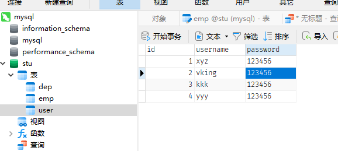

> 【注意】
>
> cursor = conn.cursor()  # 括号内不加参数的话 那么查询出来的数据是元组的形式 数据不够明确 容易混乱
>
> cursor = conn.cursor(cursor=pymysql.cursors.DictCursor)  # 字典形式返回数据 数据有具体的描述信息 更加的合理方便

```mysql
import pymysql

conn = pymysql.connect(
    host='127.0.0.1',
    port=3306,
    user='root',
    password='123456',
    database='stu',
    charset='utf8mb4'
)

# cursor = conn.cursor()
cursor = conn.cursor(cursor=pymysql.cursors.DictCursor)
sql = 'select * from user'
# print(sql)
affect_rows = cursor.execute(sql) # 返回被处理数据的行数。
# print(affect_rows)
print('只显示一条结果,字典形式',cursor.fetchone())
# cursor.scroll(0,'relative') # 游标后移1位
cursor.scroll(0,'absolute') # 游标后移x位
print('所有结果列表中包含字典',cursor.fetchall())
# print(f"获取affect_rows数量 {affect_rows}：",cursor.fetchmany(affect_rows))
# 上面的方法类似一个游标指针。
只显示一条结果,字典形式 {'id': 1, 'username': 'xyz', 'password': '123456'}
所有结果列表中包含字典 [{'id': 1, 'username': 'xyz', 'password': '123456'}, {'id': 2, 'username': 'vking', 'password': '123456'}, {'id': 3, 'username': 'kkk', 'password': '123456'}, {'id': 4, 'username': 'yyy', 'password': '123456'}]
```

> 【注意】
>
> sql注入：就是利用一些特殊字符，结合软件固定的一些语句句式，非法侵入并违规操作
>
> 利用MySQL注释的语法 造成了sql注入的问题
> 	用户不需要属于用户名和密码也能够登录并且获取到整个用户表的数据
>
> 日常应用软件在获取用户输入的内容时 都会限制一些特殊符号的输入
>
> 如何解决上述问题？
> 	所有敏感的信息不要自己去做拼接操作 交互固定的模块帮你去过滤数据防止sql注入
>
> 在pymysql中 execute就能够帮你过滤
>
> sql注入
> sql = "select * from user where username='%s' and password='%s'"%(username,password)
>
> 不要自己拼接
>
> sql = "select * from user where username=%s and password=%s"
>    execute(sql,(username,password))  # 只能识别%s

```mysql
import pymysql

conn = pymysql.connect(
    host='127.0.0.1',
    port=3306,
    user='root',
    password='123456',
    database='stu',
    charset='utf8mb4',
    autocommit=True
)

cursor = conn.cursor(pymysql.cursors.DictCursor)

sql = 'insert into user(username,password) values (%s,%s)'

user = input("请输入用户名：")
password = input("请输入密码：")

rows = cursor.execute(sql,(user,password))
# print(rows)

sql1 = 'select * from user'
rows_q = cursor.execute(sql1)
# print(rows_q)
# res = cursor.fetchall()
# res = cursor.fetchmany(rows_q)
cursor.scroll(rows_q-1)  # 定位到最后一个
res = cursor.fetchone()  # 只取最后输入的一行数据
# cursor.scroll(2,'relative')
# cursor.scroll(rows_q,'relative')
print(f"您输入的用户名：{res.get('username')}，密码：{res.get('password')}") # 格式化输出刚才输入的用户名，密码。
>>>
请输入用户名：bcasd2
请输入密码：12345
您输入的用户名：bcasd2，密码：12345
```

> 【注意】
>
> cursor.scroll(rows_q-1,'relative') 
>
> cursor.scroll(rows_q-1,'absolute') 
>
> 这里的定位光标参数需要根据实际用途而定。不指定后面的mode，默认移动到指定位置。

补充

```python
import pymysql

conn = pymysql.connect(
    host='127.0.0.1',
    port=3306,
    user='root',
    password='123456',
    db='stu',
    charset='utf8mb4',
    autocommit=True  # 如果没有该参数下面的增删改都不会写入数据库
)

cursor = conn.cursor(pymysql.cursors.DictCursor)

# 增
sql = 'insert into user(username,password) values(%s,%s)'

rows = cursor.executemany(sql,[('tom',123),('bob',123),('jon',123)])  # 一次性插入多条数据
print(rows)

# 查看刚才插入的数据
que = 'select * from user'
rows_q = cursor.execute(que)
cursor.scroll(rows_q-3) # 这里是知道插入了3条数据
print(cursor.fetchall()
>>>
3
[{'id': 26, 'username': 'tom', 'password': '123'}, {'id': 27, 'username': 'bob', 'password': '123'}, {'id': 28, 'username': 'jon', 'password': '123'}]
```

```python
import pymysql

conn = pymysql.connect(
    host='127.0.0.1',
    port=3306,
    user='root',
    password='123456',
    db='stu',
    charset='utf8mb4'
)

cursor = conn.cursor(pymysql.cursors.DictCursor)

# 删
sql = 'delete from user where username=%s'
rows = cursor.execute(sql,'tom')
print(rows)
conn.commit() # 手动提交
>>>
1
```

```mysql
import pymysql

conn = pymysql.connect(
    host='127.0.0.1',
    port=3306,
    user='root',
    password='123456',
    db='stu',
    charset='utf8mb4',
    autocommit=True
)

cursor = conn.cursor(pymysql.cursors.DictCursor)

# 改
sql = 'update user set password="123456" where username="jon"'
rows = cursor.execute(sql)
print(rows)
>>>
1
```

通过上面的增删改查对于pymysql 基本已经掌握了

## 其他

### 视图

视图就是通过查询得到一张虚拟表，然后保存下来，下次可以直接使用。其实视图也是表

如果要频繁的操作一张虚拟表(拼表组成的)，你就可以制作成视图 后续直接操作

```mysql
mysql> select * from emp inner join dep on dep.id=emp.dep_id;
+----+-------+--------+------+--------+-----+--------------+
| id | name  | sex    | age  | dep_id | id  | name         |
+----+-------+--------+------+--------+-----+--------------+
|  1 | jason | male   |   18 |    200 | 200 | 技术         |
|  2 | egon  | female |   48 |    201 | 201 | 人力资源     |
|  3 | kevin | male   |   18 |    201 | 201 | 人力资源     |
|  4 | nick  | male   |   28 |    202 | 202 | 销售         |
|  5 | owen  | male   |   18 |    203 | 203 | 运营         |
+----+-------+--------+------+--------+-----+--------------+
5 rows in set (0.00 sec)

mysql> create view emp2dep as select emp.id,emp.name,emp.age from emp inner join dep on dep.id=emp.dep_id;
Query OK, 0 rows affected (0.19 sec)

# 视图表里面字段名不能重复
mysql> create view emp2dep as select emp.id,emp.name,emp.age,dep.name from emp inner join dep on dep.id=emp.dep_id;
ERROR 1060 (42S21): Duplicate column name 'name'

# 使用as 别名
mysql> create view emp2dep2 as select emp.id,emp.name,emp.age,dep.name as c from emp inner join dep on dep.id=emp.dep_id;
Query OK, 0 rows affected (0.21 sec)

mysql> select * from emp2dep;  
+----+-------+------+
| id | name  | age  |
+----+-------+------+
|  1 | jason |   18 |
|  2 | egon  |   48 |
|  3 | kevin |   18 |
|  4 | nick  |   28 |
|  5 | owen  |   18 |
+----+-------+------+
5 rows in set (0.00 sec)

mysql> select * from emp2dep2;
+----+-------+------+--------------+
| id | name  | age  | c            |
+----+-------+------+--------------+
|  1 | jason |   18 | 技术         |
|  2 | egon  |   48 | 人力资源     |
|  3 | kevin |   18 | 人力资源     |
|  4 | nick  |   28 | 销售         |
|  5 | owen  |   18 | 运营         |
+----+-------+------+--------------+
5 rows in set (0.00 sec)
```


> 【注意】
>
> 1 创建视图在硬盘上只会有表结构 没有表数据(数据还是来自于之前的表)
>    2 视图一般只用来查询 里面的数据不要继续修改 可能会影响真正的表
>
> 当你创建了很多视图之后 会造成表的不好维护 

```mysql
mysql> update emp2dep2 set name='tom' where id=1;
Query OK, 1 row affected (0.24 sec)
Rows matched: 1  Changed: 1  Warnings: 0

mysql> select * from emp2dep2;
+----+-------+------+--------------+
| id | name  | age  | c            |
+----+-------+------+--------------+
|  1 | tom   |   18 | 技术         |
|  2 | egon  |   48 | 人力资源     |
|  3 | kevin |   18 | 人力资源     |
|  4 | nick  |   28 | 销售         |
|  5 | owen  |   18 | 运营         |
+----+-------+------+--------------+
5 rows in set (0.00 sec)

mysql> select * from emp;
+----+-------+--------+------+--------+
| id | name  | sex    | age  | dep_id |
+----+-------+--------+------+--------+
|  1 | tom   | male   |   18 |    200 |
|  2 | egon  | female |   48 |    201 |
|  3 | kevin | male   |   18 |    201 |
|  4 | nick  | male   |   28 |    202 |
|  5 | owen  | male   |   18 |    203 |
|  6 | jerry | female |   18 |    204 |
+----+-------+--------+------+--------+
6 rows in set (0.00 sec)

mysql> show tables;
+---------------+
| Tables_in_stu |
+---------------+
| dep           |
| emp           |
| emp2dep       |
| emp2dep2      |
| user          |
+---------------+
5 rows in set (0.00 sec)

mysql> drop table emp2dep2;   # 删除视图表
ERROR 1051 (42S02): Unknown table 'stu.emp2dep2'
mysql> drop view emp2dep2;
Query OK, 0 rows affected (2.31 sec)

mysql> drop view emp2dep;
Query OK, 0 rows affected (0.18 sec)

mysql> show tables;
+---------------+
| Tables_in_stu |
+---------------+
| dep           |
| emp           |
| user          |
+---------------+
3 rows in set (0.00 sec)
```

`视图里面数据被修改了，原表也被修改。`

### 触发器

在满足对表数据进行增、删、改的情况下，自动触发的功能

使用触发器可以帮助我们实现监控、日志...

触发器可以在六种情况下自动触发 增前 增后 删前删后 改前改后

```mysql
create trigger 触发器的名字  before/after insert/update/delete on 表名
for each row
begin
	sql语句
end
---
create trigger tri_before_insert_t1  before insert on t1
for each row
begin
	sql语句
end
---
create trigger tri_after_insert_t1  after insert on t1
for each row
begin
	sql语句
end
```

具体使用 针对触发器的名字 我们通常需要做到见名知意

`触发器中使用;这时候跟mysql的结束符冲突，这里需要使用delimiter $$ 把结束符修改为$$`

```mysql
mysql> delimiter #
mysql> select * from user limit 5#
+----+----------+----------+
| id | username | password |
+----+----------+----------+
|  1 | xyz      | 123456   |
|  2 | vking    | 123456   |
|  3 | kkk      | 123456   |
|  4 | yyy      | 123456   |
|  5 | absc2    | 123456   |
+----+----------+----------+
5 rows in set (0.00 sec)

mysql> delimiter ;
mysql> select * from user limit 5;
+----+----------+----------+
| id | username | password |
+----+----------+----------+
|  1 | xyz      | 123456   |
|  2 | vking    | 123456   |
|  3 | kkk      | 123456   |
|  4 | yyy      | 123456   |
|  5 | absc2    | 123456   |
+----+----------+----------+
5 rows in set (0.00 sec)
```

上面就是修改结束符的操作。


#### 触发器

```mysql
mysql> create table cmd(
       id int primary key auto_increment,
       user char(32),
       priv char(16),
       cmd char(64),
       sub_time datetime,
       success enum('yes','no')
       );
Query OK, 0 rows affected (3.01 sec)

mysql> desc cmd;
+----------+------------------+------+-----+---------+----------------+
| Field    | Type             | Null | Key | Default | Extra          |
+----------+------------------+------+-----+---------+----------------+
| id       | int              | NO   | PRI | NULL    | auto_increment |
| user     | char(32)         | YES  |     | NULL    |                |
| priv     | char(16)         | YES  |     | NULL    |                |
| cmd      | char(64)         | YES  |     | NULL    |                |
| sub_time | datetime         | YES  |     | NULL    |                |
| success  | enum('yes','no') | YES  |     | NULL    |                |
+----------+------------------+------+-----+---------+----------------+
6 rows in set (0.00 sec)

mysql> create table errlog(
       id int primary key auto_increment,
       err_cmd char(64),
       err_time datetime
       );
Query OK, 0 rows affected (2.87 sec)

mysql> desc errlog;
+----------+----------+------+-----+---------+----------------+
| Field    | Type     | Null | Key | Default | Extra          |
+----------+----------+------+-----+---------+----------------+
| id       | int      | NO   | PRI | NULL    | auto_increment |
| err_cmd  | char(64) | YES  |     | NULL    |                |
| err_time | datetime | YES  |     | NULL    |                |
+----------+----------+------+-----+---------+----------------+
3 rows in set (0.00 sec)
```

当cmd表中的记录succes字段是no那么就触发触发器并执行errlog表中插入数据，NEW指代的就是一条条数据对象

```mysql
mysql> delimiter #
mysql> create trigger tri_after_insert_cmd after insert on cmd
       for each row
       begin
         if NEW.success = 'no' then
             insert into errlog(err_cmd,err_time) values(NEW.cmd,NEW.sub_time);
          end if;
       end #
Query OK, 0 rows affected (2.34 sec)

mysql> delimiter ;

# 插入数据验证
mysql> insert into cmd(user,priv,cmd,sub_time,success) values
('jack','0755','ll /etc',now(),'yes'),
('jack','0755','cat /etc/passwd',now(),'no'),
('jack','0755','useradd xxx',now(),'no'),
('jack','0755','ps -aux',now(),'yes');
Query OK, 4 rows affected (2.27 sec)
Records: 4  Duplicates: 0  Warnings: 0

# 查看数据
mysql> select * from cmd;
+----+------+------+-----------------+---------------------+---------+
| id | user | priv | cmd             | sub_time            | success |
+----+------+------+-----------------+---------------------+---------+
|  1 | jack | 0755 | ll /etc         | 2022-07-27 13:48:59 | yes     |
|  2 | jack | 0755 | cat /etc/passwd | 2022-07-27 13:48:59 | no      |
|  3 | jack | 0755 | useradd xxx     | 2022-07-27 13:48:59 | no      |
|  4 | jack | 0755 | ps -aux         | 2022-07-27 13:48:59 | yes     |
+----+------+------+-----------------+---------------------+---------+
4 rows in set (0.00 sec)

mysql> select * from errlog limit 5;
+----+-----------------+---------------------+
| id | err_cmd         | err_time            |
+----+-----------------+---------------------+
|  1 | cat /etc/passwd | 2022-07-27 13:48:59 |
|  2 | useradd xxx     | 2022-07-27 13:48:59 |
+----+-----------------+---------------------+
2 rows in set (0.00 sec)
```

### 事务

开启一个事务可以包含多条sql语句 这些sql语句要么同时成功，要么一个都别想成功 称之为事务的原子性

事务的作用：保证了对数据操作的安全性

事务四大特性ACID

ACID
A:原子性
	一个事务是一个不可分割的单位，事务中包含的诸多操作
	要么同时成功要么同时失败
C:一致性
	事务必须是使数据库从一个一致性的状态变到另外一个一致性的状态
	一致性跟原子性是密切相关的
I:隔离性
	一个事务的执行不能被其他事务干扰
	（即一个事务内部的操作及使用到的数据对并发的其他事务是隔离的，并发执行的事务之间也是互相不干扰的）
D:持久性
	也叫"永久性"
	一个事务一旦提交成功执行成功 那么它对数据库中数据的修改应该是永久的
	接下来的其他操作或者故障不应该对其有任何的影响

#### 如何使用

```mysql
# 事务相关的关键字
# 1 开启事务
start transaction;
# 2 回滚(回到事务执行之前的状态)
rollback;
# 3 确认(确认之后就无法回滚了)
commit;


mysql> create table bank(
       id int primary key auto_increment,
       user char(16),
       balance int
       );
Query OK, 0 rows affected (2.91 sec)

mysql> desc bank;
+---------+----------+------+-----+---------+----------------+
| Field   | Type     | Null | Key | Default | Extra          |
+---------+----------+------+-----+---------+----------------+
| id      | int      | NO   | PRI | NULL    | auto_increment |
| user    | char(16) | YES  |     | NULL    |                |
| balance | int      | YES  |     | NULL    |                |
+---------+----------+------+-----+---------+----------------+
3 rows in set (0.00 sec)

mysql> insert into bank(user,balance) values('jack',1000),('tom',2000),('bob',2500);
Query OK, 3 rows affected (0.16 sec)
Records: 3  Duplicates: 0  Warnings: 0
```

```mysql
mysql> update bank set balance=900 where user='jack';
Query OK, 1 row affected (0.00 sec)
Rows matched: 1  Changed: 1  Warnings: 0

mysql> update bank set balance=1800 where user='tom';
Query OK, 1 row affected (0.00 sec)
Rows matched: 1  Changed: 1  Warnings: 0

mysql> update bank set balance=3000 where user='bob';
Query OK, 1 row affected (0.00 sec)
Rows matched: 1  Changed: 1  Warnings: 0

mysql> select * from bank limit 5;
+----+------+---------+
| id | user | balance |
+----+------+---------+
|  1 | jack |     900 |
|  2 | tom  |    1800 |
|  3 | bob  |    3000 |
+----+------+---------+
3 rows in set (0.00 sec)

# 回滚
mysql> rollback;
Query OK, 0 rows affected (0.11 sec)

mysql> select * from bank limit 5;
+----+------+---------+
| id | user | balance |
+----+------+---------+
|  1 | jack |    1000 |
|  2 | tom  |    2000 |
|  3 | bob  |    2500 |
+----+------+---------+
3 rows in set (0.00 sec)

mysql> commit;   # 提交之后无法回滚
Query OK, 0 rows affected (0.00 sec)
```

### 存储过程

存储过程就类似于python中的自定义函数

它的内部包含了一系列可以执行的sql语句，存储过程存放于MySQL服务端中，你可以直接通过调用存储过程触发内部sql语句的执行

```mysql
create procedure 存储过程的名字(形参1,形参2,...)
begin
	sql代码
end
# 调用
call 存储过程的名字();
```

#### 三种开发模型

- 第一种

  应用程序:程序员写代码开发
  MySQL:提前编写好存储过程，供应用程序调用

  好处:开发效率提升了 执行效率也上去了
  缺点:考虑到认为元素、跨部门沟通的问题  后续的存储过程的扩展性差

- 第二种

  应用程序:程序员写代码开发之外 设计到数据库操作也自己动手写
  优点:扩展性很高
  缺点:
  	开发效率降低
  	编写sql语句太过繁琐 而且后续还需要考虑sql优化的问题

- 第三种

  应用程序:只写程序代码 不写sql语句 基于别人写好的操作MySQL的python框架直接调用操作即可 ORM框架  
  优点:开发效率比上面两种情况都要高 
  缺点:语句的扩展性差 可能会出现效率低下的问题 

第一种基本不用。一般都是第三种，出现效率问题再动手写sql

#### 存储过程具体演示

```mysql
mysql> drop procedure p1;
Query OK, 0 rows affected (0.54 sec)

mysql> delimiter #
mysql> create procedure p1(
           in m int,
           in n int,
           out res int
           )
           begin
           select username from user where id>m and id<n;
           set res=666;
           end #
Query OK, 0 rows affected (0.19 sec)

mysql> set @ret=10#
Query OK, 0 rows affected (0.00 sec)

mysql> delimiter ;

mysql> select @ret;
+------+
| @ret |
+------+
|   10 |
+------+
1 row in set (0.00 sec)

mysql> call p1(1,5,@ret);
+----------+
| username |
+----------+
| vking    |
| kkk      |
| yyy      |
+----------+
3 rows in set (0.00 sec)

Query OK, 0 rows affected (0.01 sec)

mysql> select @ret;
+------+
| @ret |
+------+
|  666 |
+------+
1 row in set (0.00 sec)
```

在pymysql模块中如何调用存储过程呢？(接上面)

```mysql
import pymysql

conn = pymysql.connect(
    host='127.0.0.1',
    port=3306,
    user='root',
    password='123456',
    db='stu',
    charset='utf8mb4',
    autocommit=True
)

cursor = conn.cursor(pymysql.cursors.DictCursor)

cursor.callproc('p1',(1,5,10))
# """
# @_p1_0=1
# @_p1_1=5
# @_p1_2=10
# """
# cursor.execute('select @_p1_2;')  验真传参取值
print(cursor.fetchall())
>>>
[{'username': 'vking'}, {'username': 'kkk'}, {'username': 'yyy'}]
```

### 函数

跟存储过程是有区别的，存储过程是自定义函数，函数就类似于是内置函数

就像上面插入函数的now() 就是内置函数。

```mysql
mysql> CREATE TABLE blog (
         id INT PRIMARY KEY auto_increment,
         NAME CHAR (32),
         sub_time datetime
     );
Query OK, 0 rows affected (1.15 sec)

mysql>
mysql> INSERT INTO blog (NAME, sub_time)
       VALUES
           ('第1篇','2015-03-01 11:31:21'),
           ('第2篇','2015-03-11 16:31:21'),
           ('第3篇','2016-07-01 10:21:31'),
           ('第4篇','2016-07-22 09:23:21'),
           ('第5篇','2016-07-23 10:11:11'),
           ('第6篇','2016-07-25 11:21:31'),
           ('第7篇','2017-03-01 15:33:21'),
           ('第8篇','2017-03-01 17:32:21'),
           ('第9篇','2017-03-01 18:31:21');
Query OK, 9 rows affected (0.45 sec)
Records: 9  Duplicates: 0  Warnings: 0

mysql> select date_format(sub_time,'%Y-%m'),count(id) from blog group by date_format(sub_time,'%Y-%m');
+-------------------------------+-----------+
| date_format(sub_time,'%Y-%m') | count(id) |
+-------------------------------+-----------+
| 2015-03                       |         2 |
| 2016-07                       |         4 |
| 2017-03                       |         3 |
+-------------------------------+-----------+
3 rows in set (0.15 sec)
```


### 流程控制

```mysql
# if判断
delimiter //
CREATE PROCEDURE proc_if ()
BEGIN
    declare i int default 0;
    if i = 1 THEN
        SELECT 1;
    ELSEIF i = 2 THEN
        SELECT 2;
    ELSE
        SELECT 7;
    END IF;
END //
delimiter ;
# while循环
delimiter //
CREATE PROCEDURE proc_while ()
BEGIN
    DECLARE num INT ;
    SET num = 0 ;
    WHILE num < 10 DO
        SELECT
            num ;
        SET num = num + 1 ;
    END WHILE ;
```

### 索引

ps:数据都是存在与硬盘上的，查询数据不可避免的需要进行IO操作

索引:就是一种数据结构，类似于书的目录。意味着以后在查询数据的应该先找目录再找数据，而不是一页一页的翻书，从而提升查询速度降低IO操作

索引在MySQL中也叫“键”,是存储引擎用于快速查找记录的一种数据结构

* primary key
* unique key
* index key

注意foreign key不是用来加速查询用的，不在我们的而研究范围之内

上面的三种key，前面两种除了可以增加查询速度之外各自还具有约束条件，而最后一种index key没有任何的约束条件，只是用来帮助你快速查询数据

**本质**

通过不断的缩小想要的数据范围筛选出最终的结果，同时将随机事件(一页一页的翻)

变成顺序事件(先找目录、找数据)

也就是说有了索引机制，我们可以总是用一种固定的方式查找数据


一张表中可以有多个索引(多个目录)

索引虽然能够帮助你加快查询速度但是也有缺点

1 当表中有大量数据存在的前提下 创建索引速度会很慢
   2 在索引创建完毕之后 对表的查询性能会大幅度的提升 但是写的性能也会大幅度的降低

索引不要随意的创建！！！

**B+tree 是索引的算法**

聚集索引(primary key)

辅助索引(unique,index)

覆盖索引 在辅助索引的叶子节点就已经拿到了需要的数据

```mysql
# 给name设置辅助索引
select name from user where name='jason';
# 非覆盖索引
select age from user where name='jason';
```

```mysql
**准备**

#1. 准备表
create table s1(
id int,
name varchar(20),
gender char(6),
email varchar(50)
);

#2. 创建存储过程，实现批量插入记录
delimiter $$ #声明存储过程的结束符号为$$
create procedure auto_insert1()
BEGIN
    declare i int default 1;
    while(i<3000000)do
        insert into s1 values(i,'jason','male',concat('jason',i,'@oldboy'));
        set i=i+1;
    end while;
END$$ #$$结束
delimiter ; #重新声明分号为结束符号

#3. 查看存储过程
show create procedure auto_insert1\G 

#4. 调用存储过程
call auto_insert1();

# 表没有任何索引的情况下
select * from s1 where id=30000;
# 避免打印带来的时间损耗
select count(id) from s1 where id = 30000;
select count(id) from s1 where id = 1;

# 给id做一个主键
alter table s1 add primary key(id);  # 速度很慢

select count(id) from s1 where id = 1;  # 速度相较于未建索引之前两者差着数量级
select count(id) from s1 where name = 'jason'  # 速度仍然很慢


"""
范围问题
"""
# 并不是加了索引，以后查询的时候按照这个字段速度就一定快   
select count(id) from s1 where id > 1;  # 速度相较于id = 1慢了很多
select count(id) from s1 where id >1 and id < 3;
select count(id) from s1 where id > 1 and id < 10000;
select count(id) from s1 where id != 3;

alter table s1 drop primary key;  # 删除主键 单独再来研究name字段
select count(id) from s1 where name = 'jason';  # 又慢了

create index idx_name on s1(name);  # 给s1表的name字段创建索引
select count(id) from s1 where name = 'jason'  # 仍然很慢！！！
"""
再来看b+树的原理，数据需要区分度比较高，而我们这张表全是jason，根本无法区分
那这个树其实就建成了“一根棍子”
"""
select count(id) from s1 where name = 'xxx';  
# 这个会很快，我就是一根棍，第一个不匹配直接不需要再往下走了
select count(id) from s1 where name like 'xxx';
select count(id) from s1 where name like 'xxx%';
select count(id) from s1 where name like '%xxx';  # 慢 最左匹配特性

# 区分度低的字段不能建索引
drop index idx_name on s1;

# 给id字段建普通的索引
create index idx_id on s1(id);
select count(id) from s1 where id = 3;  # 快了
select count(id) from s1 where id*12 = 3;  # 慢了  索引的字段一定不要参与计算

drop index idx_id on s1;
select count(id) from s1 where name='jason' and gender = 'male' and id = 3 and email = 'xxx';
# 针对上面这种连续多个and的操作，mysql会从左到右先找区分度比较高的索引字段，先将整体范围降下来再去比较其他条件
create index idx_name on s1(name);
select count(id) from s1 where name='jason' and gender = 'male' and id = 3 and email = 'xxx';  # 并没有加速

drop index idx_name on s1;
# 给name，gender这种区分度不高的字段加上索引并不难加快查询速度

create index idx_id on s1(id);
select count(id) from s1 where name='jason' and gender = 'male' and id = 3 and email = 'xxx';  # 快了  先通过id已经讲数据快速锁定成了一条了
select count(id) from s1 where name='jason' and gender = 'male' and id > 3 and email = 'xxx';  # 慢了  基于id查出来的数据仍然很多，然后还要去比较其他字段

drop index idx_id on s1

create index idx_email on s1(email);
select count(id) from s1 where name='jason' and gender = 'male' and id > 3 and email = 'xxx';  # 快 通过email字段一剑封喉 

#### 联合索引

select count(id) from s1 where name='jason' and gender = 'male' and id > 3 and email = 'xxx';  
# 如果上述四个字段区分度都很高，那给谁建都能加速查询
# 给email加然而不用email字段
select count(id) from s1 where name='jason' and gender = 'male' and id > 3; 
# 给name加然而不用name字段
select count(id) from s1 where gender = 'male' and id > 3; 
# 给gender加然而不用gender字段
select count(id) from s1 where id > 3; 

# 带来的问题是所有的字段都建了索引然而都没有用到，还需要花费四次建立的时间
create index idx_all on s1(email,name,gender,id);  # 最左匹配原则，区分度高的往左放
select count(id) from s1 where name='jason' and gender = 'male' and id > 3 and email = 'xxx';  # 速度变快

总结:上面这些操作，你感兴趣可以敲一敲，不感兴趣你就可以不用敲了，权当看个乐呵。理论掌握了就行了
慢查询日志
设定一个时间检测所有超出该时间的sql语句，然后针对性的进行优化！
```


1


