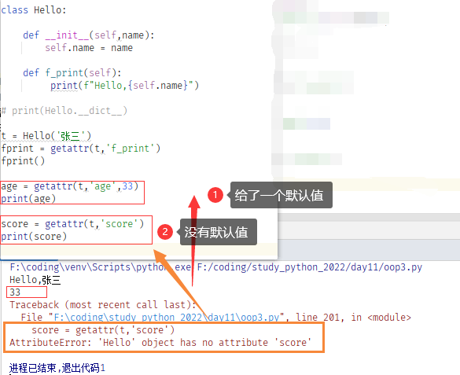
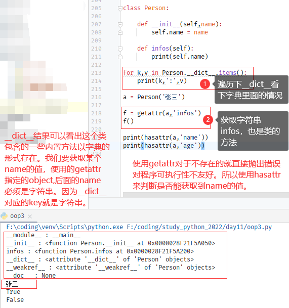
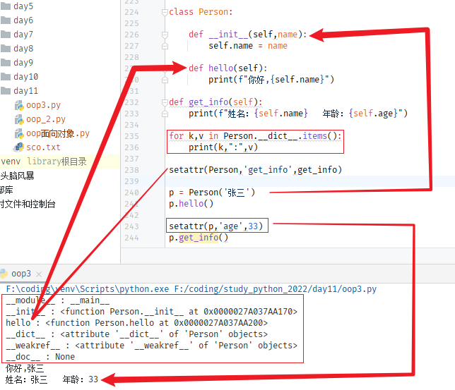
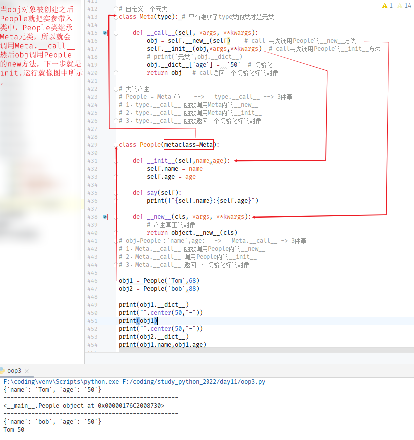

python 面向对象编程

```python
eval('2+3') #字符串中的表达式
5
```

反射机制是动态编程语言的关键。

类调用类属性和方法。

对象的任意方法和属性。

上面这些就是反射机制。

# 概念

## **定义**

python是一种**面向对象编程**语言，python中的类通过class 关键字定义，提供了面向对象的所有标准特性，例如允许一个类继承多个基类， 子类可以覆盖父类的方法，封装，继承，多态 面向对象的三大特性python一样不少。

```python
class Student(object):

    def __init__(self,name,age,job):
        self.name = name  # 实例属性
        self.age =age
        self.job = job

    def print_stu_info(self):
        # print('姓名：{name} 年龄：{age} 职业:{job}'.format(name=self.name,age=self.age,job=self.job))
        print('姓名：%s  年龄：%d  职业：%s'%(self.name,self.age,self.job))

print(Student.__name__)  # 打印当前类名
print(__file__)  # 打印当前文件全路径

stu = Student('张纳',33,'IT')  # 创建对象 实例化
stu.print_stu_info()  # 调用类方法
>>>
Student   
F:\coding\study_python_2022\day11\oop面向对象.py
姓名：张纳  年龄：33  职业：IT
```

​    类是一种封装技术，我们把数据和方法都封装到了类里，如果你想使用数据和方法，那么你需要用类创建出一个实例来，这个过程就叫做**实例化**

   上面stu就是创建出来的实例。stu.print_stu_info是调用类的方法。

> 【注意】
>
> 类的方法只能通过实例或者类来调用。

### self是什么？

从上面例子可以看到有个self。这个参数在被调用的时候不需要传参，self是方法的一个参数

```python
class Student(object):

    def __init__(self,name,age,job):
        self.name = name
        self.age =age
        self.job = job

    def print_stu_info(self):
        # print('姓名：{name} 年龄：{age} 职业:{job}'.format(name=self.name,age=self.age,job=self.job))
        print('姓名：%s  年龄：%d  职业：%s'%(self.name,self.age,self.job))
        print("类方法中的内存地址：",id(self))

stu.print_stu_info()

print("实例化的内存地址：",id(stu))
>>>
类方法中的内存地址： 2225033543792
实例化的内存地址： 2225033543792
```

​    可以看出在在__init__方法被调用时stu这个对象实例化之前就被构造好了。真正的构造方法是\_\_new\_\_ 在没有调用构造方法前，对象是不存在的。

## 使用类组合数据和方法

把一个学生成绩文件如下

```txt
姓名  语文  数学  英语
小红  90   95    90
小刚  91   94    93
```

### 面向过程

```python
contest = []
with open('sco.txt','r',encoding='utf-8') as f:
    lines = f.readlines()
    for i in range(1,len(lines)):
        line = lines[i].strip()  # 提取到列表
        contest.append(line)

for s in contest:
    name = s.split()[0]
    ch = s.split()[1]
    ma = s.split()[2]
    en = s.split()[3]
    msg = f"""
        姓名：{name} 语文：{ch}  数学：{ma}  英语：{en}
    """
    print(msg)
>>>
        姓名：小红 语文：90  数学：95  英语：90
        姓名：小刚 语文：91  数学：94  英语：93
```


### 面向对象

把文件中的成绩**格式化输出**：

```python
class Stu(object):

    def __init__(self,name,ch,ma,en):
        self.name = name
        self.ch = ch
        self.ma = ma
        self.en = en

    def __str__(self):
        msg = f"""
        姓名：{self.name}  语文：{self.ch}   数学:{self.ma}   英语:{self.en}
        """
        print(msg)

    def score_sum(self):
        return str(int(self.ch)+int(self.ma)+int(self.en)) + '分'

content = []
with open('sco.txt','r',encoding='utf-8') as f:
    lines = f.readlines()
    for i in range(1,len(lines)):
        line = lines[i].split()
        s = Stu(line[0],line[1],line[2],line[3])  # 对应行
        content.append(s)

for s in content:
    Stu.__str__(s)
>>>
        姓名：小红  语文：90   数学:95   英语:90
        姓名：小刚  语文：91   数学:94   英语:93
```

在上面的程序中加入**求总成绩的功能**

```python
class Stu(object):

    def __init__(self,name,ch,ma,en):
        self.name = name
        self.ch = ch
        self.ma = ma
        self.en = en

    def __str__(self):
        msg = f"""
        姓名：{self.name}  语文：{self.ch}   数学:{self.ma}   英语:{self.en}
        """
        print(msg)

        msg = f"""
        {self.name} 的总成绩是：{self.score_sum()}
        """
        print(msg)

    def score_sum(self):
        return str(int(self.ch)+int(self.ma)+int(self.en)) + '分'

content = []
with open('sco.txt','r',encoding='utf-8') as f:
    lines = f.readlines()
    for i in range(1,len(lines)):
        line = lines[i].split()
        s = Stu(line[0],line[1],line[2],line[3])  # 对应行
        content.append(s)

for s in content:
    Stu.__str__(s)
>>>
        姓名：小红  语文：90   数学:95   英语:90
        小红 的总成绩是：275分
        姓名：小刚  语文：91   数学:94   英语:93
        小刚 的总成绩是：278分
```

统计每门课程的**最高分最低分**

```python
class Stu:

    def __init__(self,name,ch,ma,en):
        self.name = name
        self.ch = ch
        self.ma = ma
        self.en = en

    def __str__(self):
        msg = f"""
        姓名：{self.name}  语文：{self.ch}   数学:{self.ma}   英语:{self.en}
        """
        print(msg,end='')

        msg = f"""
        {self.name} 的总成绩是：{self.score_sum()}
        """
        print(msg,end='')  # msg.split() 去除空格


    def score_sum(self):
        return str(int(self.ch)+int(self.ma)+int(self.en)) + '分'

content = []  # 内容
content2 = {}
yw = {}
sx = {}
en = {}

with open('sco.txt','r',encoding='utf-8') as f:
    lines = f.readlines()
    for i in range(1,len(lines)):
        line = lines[i].split()
        s = Stu(line[0],line[1],line[2],line[3])  # 对应行
        content.append(s)
        content2[line[1],line[2],line[3]] = line[0]

 for k in content:
     Stu.__str__(k)

for k,v in content2.items():
    yw[k[0]] = v
    sx[k[1]] = v
    en[k[2]] = v


print("".center(60,"-"))
print('姓名:',yw[max(yw.keys())],'语文最高分：',max(yw.keys()),'姓名:',yw[min(yw.keys())],'语文最低分：',min(yw.keys()))
print('姓名:',sx[max(sx.keys())],'数学最高分：',max(sx.keys()),'姓名:',sx[min(sx.keys())],'数学最低分：',min(sx.keys()))
print('姓名:',en[max(en.keys())],'英语最高分：',max(en.keys()),'姓名:',en[min(en.keys())],'英语最低分：',min(en.keys()))
>>>
        姓名：小红  语文：90   数学:95   英语:90   
        小红 的总成绩是：275分    
        姓名：小刚  语文：91   数学:94   英语:93
        小刚 的总成绩是：278分
        姓名：张三  语文：42   数学:97   英语:66      
        张三 的总成绩是：205分        
        姓名：李四  语文：99   数学:88   英语:95       
        李四 的总成绩是：282分      
        姓名：王五  语文：36   数学:25   英语:88     
        王五 的总成绩是：149分
        ------------------------------------------------------------
姓名: 李四 语文最高分： 99 姓名: 王五 语文最低分： 36
姓名: 张三 数学最高分： 97 姓名: 王五 数学最低分： 25
姓名: 李四 英语最高分： 95 姓名: 张三 英语最低分： 66

# 这里有bug 当分数是100以上max比较结果就不对了。
```

https://zhuanlan.zhihu.com/p/61042358

https://pythondjango.cn/python/advanced/1-python-object-class-programming/

http://www.coolpython.net/python_primary/oop/class.html

求出每个人成绩最高分，最低分，总分，平均分，各科最高分，姓名，最低分，姓名

```python
class Stu(object):

    def __init__(self,name,ch,ma,en):
        self.name = name
        self.ch = ch
        self.ma = ma
        self.en = en

    def __str__(self):
        msg = f"""
        姓名：{self.name}  语文：{self.ch}   数学:{self.ma}   英语:{self.en}
        {self.name} 的总成绩是：{self.score_sum()}
        {self.name} 最高分： {max(map(int,(self.ch,self.ma,self.en)))}
        {self.name} 最低分： {min(map(int,(self.ch,self.ma,self.en)))}
        """
        print(msg,end='')  # msg.split() 去除空格


    def score_sum(self):
        # return str(int(self.ch)+int(self.ma)+int(self.en)) + ' 分'
        return str(sum(map(int,(self.ch,self.ma,self.en)))) + ' 分' + '平均:'+ str(float('%0.2f'%(sum(map(int,(self.ch,self.ma,self.en)))/3)))+'分'

content = []  # 内容
d = {}
yw = {}
sx = {}
en = {}
with open('sco.txt','r',encoding='utf-8') as f:
    lines = f.readlines()
    for i in range(1,len(lines)):
        line = lines[i].split()
        s = Stu(line[0],line[1],line[2],line[3])  # 对应行
        content.append(s)
        d[int(line[1]),int(line[2]),int(line[3])] = line[0]

for k in content:
    Stu.__str__(k)


for k,v in d.items():
    yw[k[0]] = v
    sx[k[1]] = v
    en[k[2]] = v

print('分割线'.center(60, '-'))

def max_min():
    d1 = {
        '语文':yw,
        '数学':sx,
        '英语':en,
    }
    for k,v in d1.items():
        msg = f"""
        {k} 最高分：{v[max(v.keys())]} 同学： {max(v.keys())}  分, 
        {k} 最低分：{v[min(v.keys())]} 同学： {min(v.keys())}  分, 
        """
        print(msg,end="")
max_min()
>>>
        姓名：小红  语文：90   数学:145   英语:90
        小红 的总成绩是：325 分平均:108.33分
        小红 最高分： 145
        小红 最低分： 90
        
        姓名：小刚  语文：91   数学:94   英语:93
        小刚 的总成绩是：278 分平均:92.67分
        小刚 最高分： 94
        小刚 最低分： 91
        
        姓名：张三  语文：42   数学:97   英语:66
        张三 的总成绩是：205 分平均:68.33分
        张三 最高分： 97
        张三 最低分： 42
        
        姓名：李四  语文：135   数学:88   英语:138
        李四 的总成绩是：361 分平均:120.33分
        李四 最高分： 138
        李四 最低分： 88
        
        姓名：王五  语文：36   数学:25   英语:88
        王五 的总成绩是：149 分平均:49.67分
        王五 最高分： 88
        王五 最低分： 25
        
        姓名：圈圈  语文：149   数学:135   英语:122
        圈圈 的总成绩是：406 分平均:135.33分
        圈圈 最高分： 149
        圈圈 最低分： 122
        ----------------------------分割线-----------------------------

        语文 最高分：圈圈 同学： 149  分, 
        语文 最低分：王五 同学： 36  分, 
        
        数学 最高分：小红 同学： 145  分, 
        数学 最低分：王五 同学： 25  分, 
        
        英语 最高分：李四 同学： 138  分, 
        英语 最低分：张三 同学： 66  分, 
```

`面向对象和面向过程结合使用实现目标！`

>【危险】
>
> 上面使用了那么多字典是方便计算输出，其实可以使用嵌套字典。


类方法有三种

| 名称     | 定义方法                                     | 权限                                             | 调用       |
| -------- | -------------------------------------------- | ------------------------------------------------ | ---------- |
| 实例方法 | 第一个参数是实例，self                       | 可以访问实例的属性，方法也可以访问类的实例和方法 | 示例调用   |
| 类方法   | 使用@classmethod修饰，第一个参数必须是类对象 | 可以访问类的实例和方法                           | 类实例，类 |
| 静态法   | @staticemethod 修饰，参数随意没有self,cls    | 不可以访问类和实例的属性和方法                   | 实例，类   |

```python
class Stu(object):

    school = "湘北高中"

    def __init__(self,name,age):
        self.name = name
        self.age = age

    def __str__(self):
        msg = f"""{self.name} 正在接受训练"""
        print(msg)

    @classmethod
    def sport(cls):
        print(f"{cls.school} 篮球部的同学都在接受训练!")

    @staticmethod
    def clean():
        print("观众")


stu = Stu('流川枫',17)
stu.__str__()   # 通过实例调用实例方法
Stu.__str__(stu)  #通过类调用实例方法


Stu.sport()   # 通过类调用类方法
stu.sport()   # 通过实例调用类方法

Stu.clean()   # 通过类调用静态类
stu.clean()   # 通过实例调用静态类

print(stu.school)   # 通过实例访问类属性

stu.school = '海南附中'   # 添加一个实例属性，类属性并不会被修改
print(stu.school)    # 实例属性
print(Stu.school)    # 类属性
>>>
流川枫 正在接受训练
流川枫 正在接受训练
湘北高中 篮球部的同学都在接受训练!
湘北高中 篮球部的同学都在接受训练!
观众
观众
湘北高中
海南附中
湘北高中
```

> 【提示】
>
> 在面向对象编程中，方法必定属于某个类，如果不属于某个类，那么他就是函数，就回到面向过程编程了。方法属于某个类，但这个方法可能不会访问实例和类的任何属性或其他方法，对于这种方法，我们就应该把它设计成静态方法。
>
> 一个方法会访问到类的属性，就像本示例中的sport方法，整个湘北高中的学生都喜欢篮球，这个方法就不是某个学生所特有的，而是整个类所拥有的一个方法，那么就需要把它设计成类方法。
>
> school是类属性，既然类拥有这个属性，那么类实例化出来的对象也自然拥有这个属性，通过类和示例都可以访问到这个属性，但是要注意，这个属性是类的，因此不能通过实例对它进行修改。
>
> 静态变量和静态方法都可以通过类名和实例对象进行访问, 同时不像类方法和实例方法，静态方法无法接收`cls`和`self`作为第一个参数。
>
> 类方法和静态方法都是类里面的方法，类方法可以统计被调用的次数。


类(Class)是用来描述具有相同属性(Attribute)和方法(Method)对象的集合。对象(Object)是类(Class)的具体实例。

比如每个学生都有名字和分数，这是他们共同的属性。这时我们就可以设计一个学生类, 用于记录学生的名字和分数，并自定义方法打印出他们的名字和方法。

当我们完成类的实例化(`Instance`)时，电脑才会创建一个具体的对象（`Object`），并为之分配存储空间。所以**对象（Object)是类（Class)的一个实例**。

```python
class Student:

    # 类属性
    def __init__(self,name,score):
        self.name = name
        self.score =  score

    # 定义打印方法
    def print_info(self):
        print(f"""Name:{self.name}  Age:{self.score}""")

st1 = Student('tom',98)  # 实例化 创建学生对象
st2 = Student('bob',100)

st1.print_info()  # 实例调用类方法
st2.print_info()
>>>
Name:tom  Age:98
Name:bob  Age:100
```

类变量就是类中变量。

实例变量就是创建对象后的实例再添加的变量。实例变量不能改变类变量的值

self 对象本身

cls 类本身，类方法使用@classmethod修饰

```python
class Student:
    # 类变量
    number = 0

    # 类属性
    def __init__(self,name,score):
        self.name = name
        self.score =  score
        Student.number += 1 # 实例化一次加一次
        # self.__class__.number += 1  # 等效上面

    # 定义打印方法
    def print_info(self):
        print(f"""Name:{self.name}  Age:{self.score}""")

    @classmethod   # 设计类方法，打印学生数量 （一般是共有的属性使用）
    def total(cls):
        print(f"""合计: {cls.number} 个学生""")


st1 = Student('tom',98)  # 实例化 创建对象
st2 = Student('bob',100)

st1.print_info()  # 实例调用类方法
st2.print_info()

Student.total()
>>>
Name:tom  Age:98
Name:bob  Age:100
合计: 2 个学生
```

类的私有属性和私有方法

类里面私有使用\_\_ 两个下划线表示私有。私有属性和方法在类外部不能被使用或直接访问。

在面向对象的编程中,通常情况下很少让外部类直接访问类内部的属性和方法，而是向外部类提供一些按钮,对其内部的成员相互进行访问,以保证程序的安全性，这就是封装。

### @property 的用法

```python
class Student:
    # 类变量
    number = 0

    # 类属性
    def __init__(self,name,score):
        self.name = name
        self.__score =  score  # 私有化变量
        Student.number += 1 #
        # self.__class__.number += 1  # 等效上面

    # 定义打印方法
    @property  # 把print_info 方法伪装成属性
    def print_info(self):
        print(f"""Name:{self.name}  Age:{self.__score}""")

    @classmethod   # 定义类方法，打印学生数量
    def total(cls):
        print(f"""合计: {cls.number} 个学生""")


st1 = Student('tom',98)  # 实例化 创建对象
st2 = Student('bob',100)
#
# st1.print_info()  # 实例调用类方法
# st2.print_info()
st1.print_info  # 使用了propert 实例化调用就不需要加()

Student.total()
>>>
Name:tom  Age:98
合计: 2 个学生
```

> 【提示】
>
> 从上面演示案例中可以知道，使用property可以把类方法伪装成类属性，实例化之后的调用不需要使用括号。

```python
class People:

    def __init__(self, name, age):
        self.__name = name
        self.__age = age

    def get_age(self):
        return self.__age

    def set_age(self, age):
        if isinstance(age, int):
            self.__age = age
        else:
            raise ValueError

    def del_age(self):
        print("删除年龄数据！")

    # 核心在这句
    age = property(get_age, set_age, del_age, "年龄")    


obj = People("jack", 18)
print(obj.age)
obj.age = 19
print("obj.age:  ", obj.age)
del obj.ag

```

> 【提示】
>
> 通过语句age = property(get_age, set_age, del_age, “年龄”)将一个方法伪装成为属性。其效果和装饰器的方法是一样的。
>
> property()函数的参数：
>
> 第一个参数是方法名，调用 实例.属性 时自动执行的方法 
>
> 第二个参数是方法名，调用 实例.属性 ＝ XXX时自动执行的方法 
>
> 第三个参数是方法名，调用 del 实例.属性 时自动执行的方法 
>
> 第四个参数是字符串，调用 实例.属性.__doc__时的描述信息。

### 类的继承

面向对象的编程带来最大的好处就是代码重用，这种是通过继承来实现的。可以先定义一个基类(Base class)或父类(Parent class)，再按通过class 子类名（父类名)来创建子类(Child class)。这样子类就可以从父类那里获得其已有的属性与方法，这种现象叫做类的继承。

```python
# 创建父类 学校成员
class SchoolMember:

    def __init__(self,name,age):
        self.name = name
        self.age = age

    def __str__(self):
        print(f"""Name:{self.name} Age:{self.age}""")


# 创建教师子类
class Teacher(SchoolMember):

    def __init__(self,name,age,salary):
        SchoolMember.__init__(self,name,age)  # 利用父类初始化
        self.salary = salary

    def __str__(self):
        SchoolMember.__str__(self)
        print(f"""salary:{self.salary}""")

# 创建学生子类
class Student(SchoolMember):

    def __init__(self,name,age,score):
        SchoolMember.__init__(self,name,age)
        self.score = score

    def __str__(self):
        SchoolMember.__str__(self)
        print(f"""score:{self.score}""")

teacher1 = Teacher('李四',55,20000)
student1 = Student('张三',15,98)

teacher1.__str__()
student1.__str__()
>>>
Name:李四 Age:55
salary:20000
Name:张三 Age:15
score:98
```

> 【提示】
>
> 创建子类的过程，需要手动调用父类的构造函数\_\_init\_\_来完成子类的构造
>
> 在子类调用父类的方法时可以使用super关键词简化代码

```python
# 创建父类 学校成员
class SchoolMember:

    def __init__(self,name,age):
        self.name = name
        self.age = age

    def print_info(self):
        print( f"""Name:{self.name} Age:{self.age}""")


# 创建教师子类
class Teacher(SchoolMember):

    def __init__(self,name,age,salary):
        # SchoolMember.__init__(self,name,age)  # 利用父类初始化
        super().__init__(name,age)
        self.salary = salary

    def print_info(self):
        # SchoolMember.print_info(self)
        super().print_info()
        print(f"""salary:{self.salary}""")

# 创建学生子类
class Student(SchoolMember):

    def __init__(self,name,age,score):
        SchoolMember.__init__(self,name,age)
        self.score = score

    def print_info(self):
        SchoolMember.print_info(self)
        print(f"""score:{self.score}""")

teacher1 = Teacher('李四',55,20000)
student1 = Student('张三',15,98)

teacher1.print_info()
student1.print_info()
>>>
Name:李四 Age:55
salary:20000
Name:张三 Age:15
score:98
```

> 【笔记】
>
> 上面teacher子类\_\_init\_\_调用父类schoolmember的\_\_init\_\_，子类的方法调用父类的方法
>
> super().\_\_init\_\_(name,age)   # 这里的name  age 是继承父类的
>
> super().print_info()  #等同于 SchoolMember.print_info（self）
>
> super() 继承父类属性的关键词
>
> ```python
> print(Teacher.mro())
> print(SchoolMember.mro())
> >>>
> [<class '__main__.Teacher'>, <class '__main__.SchoolMember'>, <class 'object'>]
> [<class '__main__.SchoolMember'>, <class 'object'>]
> ```
>
> 很直观的就能看出搜索顺序了。

#### mixins

- 在多继承环境下尽可能地提升多继承的可读性
- 满足人类思维习惯

mixin 用来混入功能，譬如民航飞机，快递飞机，高铁。他们三类都是交通工具，但是前面飞机两类具有飞的属性，这里继承就会有差异，使用mixin后缀可以快速标识继承。


#### 多态鸭子类型

父类都是动物具有动物的基本属性

下面再有dog pig duck等可以继承动物这个基本属性。这种形态就是多态鸭子类型。


@abc.abstractmethod  声明 子类必须使用跟父类相同的方法


一些class类的专业名词解释

> 【笔记】
>
> - class 类：用来描述具有相同属性和方法的对象集合，定义了该集合中每个对象共有的属性和方法，其中的对象叫做类的实例
> - 实例：也叫对象。通过类的初始化方法，赋予具体的值，成为一个实例
> - 实例化：创建类的实例过程或操作。定义init构造的过程就是实例化
> - 实例变量：定义在实例中的变量，只作用于当前实例，并不能修改类变量的值
> - 类变量：所有实例公有的变量，类变量定义在类中，但在方法外
> - 数据成员：类变量、实例变量、方法、类方法、静态方法和属性的统称
> - 方法：类中定义的函数
> - 静态方法：不需要实例化就可以由类执行的方法
> - 类方法：将类本身作为对象进行操作的方法
> - 方法重写：如果从父类继承的方法不能满足子类的需求，可以对父类的方法进行重写，这个过程叫override
> - 封装：将内部实现包裹起来，对外透明，提供api接口进行调用的机制。将数据与具体操作的实现代码放在某个对象内部，外部无法访问。必须要先调用类的方法才能启动。
> - 继承：派生类，子类继承父类的变量和方法
> - 多态：根据对象类型的不同以不同的方式进行处理


## 内置方法

官网手册https://docs.python.org/zh-cn/3.10/tutorial/classes.html

```python
__init__ :      构造函数，在生成对象时调用
__del__ :       析构函数，释放对象时使用
__repr__ :      打印，转换
__setitem__ :   按照索引赋值
__getitem__:    按照索引获取值
__len__:        获得长度
__cmp__:        比较运算
__call__:       调用
__add__:        加运算
__sub__:        减运算
__mul__:        乘运算
__div__:        除运算
__mod__:        求余运算
__pow__:        幂
__iter__：      迭代器方法
hasattr:  判断是否存在
```

https://zhuanlan.zhihu.com/p/61042358

一些内置方法的使用举例

```python
# __doc__  类注释说明
class Stu:
    '''这是一个学生信息类'''

print('打印说明注释：',Stu.__doc__)
>>>
打印说明注释： 这是一个学生信息类

# __init__   实例化方法，创建实例时，自动触发
# __str__    打印对象时默认输出该方法的返回值

class Stu:
    '''这是一个学生信息类'''

    def __init__(self,name,age):
        self.name = name
        self.age = age

    def __str__(self):    # 如果没有定义，后面的print就是内存地址
        return f'姓名：{self.name}  年龄：{self.age}'   # 这里必须是return

# print('打印说明注释：',Stu.__doc__)
stu1 = Stu('Tom',29)
print(stu1)   # 等价于print(stu1.__str__())
>>>
姓名：Tom  年龄：29

# __str__
class Stu:

    def __init__(self,name):
        self.name = name

    def __str__(self):
        return f"Name:{self.name}"


s = Stu('tom')
print(s)
print(s.__str__())
>>>
Name:tom
Name:tom


# __module__
# __class__
class Stu:
    '''这是一个学生信息类'''

    def __init__(self,name,age):
        self.name = name
        self.age = age

    def __str__(self):
        print(f'姓名：{self.name}  年龄：{self.age}')

# print('打印说明注释：',Stu.__doc__)
stu1 = Stu('Tom',29)
# stu1.__str__()

print(stu1.__module__)  # 当前操作的对象属于哪个module
print(stu1.__class__)   # 表示当前操作的对象属于哪个类
>>>
__main__
<class '__main__.Stu'>


# __del__ 释放对象
class Foo:

    def __del__(self):
        print(f'释放{__file__}')

obj = Foo()

del obj
>>>
释放F:\coding\study_python_2022\day11\oop3.py

# __call__  如果为一个类编写了该方法，那么在该类的实例后面加括号，会调用这个方法。
class Foo:

    def __init__(self):
        pass

    def __call__(self, *args, **kwargs):
        print('__call__')

obj = Foo()
obj()
>>>
__call__

print(callable(obj)  # 判断一个对象是否可以被执行
>>>
True

# __dict__ 列出类或者对象中所有成员。
class Stu:

    def __init__(self,name,age):
        self.name = name
        self.age = age

    def fun1(self,*args,**kwargs):
        print('fun1')
        
print(Stu.__dict__)  # 获取类的所有成员

st1 = Stu('tom',29)
print(st1.__dict__)

st2 = Stu('jack',45)
print(st2.__dict__)
>>>
{'__module__': '__main__', '__init__': <function Stu.__init__ at 0x000002390F7FA050>, 'fun1': <function Stu.fun1 at 0x000002390F7FA200>, '__dict__': <attribute '__dict__' of 'Stu' objects>, '__weakref__': <attribute '__weakref__' of 'Stu' objects>, '__doc__': None}
{'name': 'tom', 'age': 29}   # 获取st1对象的成员
{'name': 'jack', 'age': 45}      # 获取st2对象的成员
      
      
# __getitem__   __setitem__ __delitem__  # 取值，赋值，删除 三剑客
$ Python中，标识符后面加圆括号，通常代表执行或调用方法的意思。而在标识符后面加中括号[]，通常代表取值的意思。Python设计了getitem()、setitem()、delitem()这三个特殊成员，用于执行与中括号有关的动作。它们分别表示取值、赋值、删除数据。   
a = 标识符[]    __getitem__ 方法 
标识符[] = a    __setitem__ 方法
del 标识符[]    __delitem__ 方法
# 例子      
class Stu:
    """stu"""

    def __getitem__(self, item):
        print('__getitem__',item)

    def __setitem__(self, item, value):
        print('__setitem__',item,value)

    def __delitem__(self, item):
        print('__delitem__',item)

obj = Stu()
res = obj['k1']   # 触发getitem
obj['k1'] = 'tom'  # 触发setitem
del obj['k1']   # 触发delitem   
>>>
__getitem__ k1
__setitem__ k1 tom
__delitem__ k1
# 如果有一个类同时定义了这三个魔法方法，那么这个类的实例的行为看起来就像一个字典一样
      
# __iter__  
$   这是迭代器方法！列表、字典、元组之所以可以进行for循环，是因为其内部定义了 iter()这个方法。如果用户想让自定义的类的对象可以被迭代，那么就需要在类中定义这个方法，并且让该方法的返回值是一个可迭代的对象。当在代码中利用for循环遍历对象时，就会调用类的这个iter()方法。    
class func1():

    def __init__(self,item):
        self.item = item

    def __iter__(self):  # 如果没有定义迭代器方法对象不可迭代
        return iter(self.item)   #这里没有返回一个可迭代的对象

obj = func1([1,4,2,7])

for i in obj:
    print(i)  
>>>
1
4
2
7
# 使用yield 生成器
class Fun1:

    def __init__(self):
        pass

    def __iter__(self):
        yield 1
        yield 2
        yield 3

obj = Fun1()
for i in obj:
    print(i)
>>>
1
2
3     
      
# __len__
$ 在Python中，如果你调用内置的len()函数试图获取一个对象的长度，在后台，其实是去调用该对象的len()方法，所以，下面的代码是等价的：
class F1:

    def __init__(self,str):
        self.str = str

    def __len__(self):
        return len(self.str)

obj = F1('hello')
print(len(obj))
>>>
5    
      
# __repr__
$ repr 的作用和str()很像，区别就是str返回用户看到的字符串，repr返回程序开发者看到的字符串，repr是为调试服务的。
class Stu:

    def __init__(self,name,age):
        self.name = name
        self.age = age

    # def __str__(self):
    #     return f"""Name:{self.name} Age:{self.age}"""

    def __repr__(self):
        return f"""Name:{self.name} Age:{self.age}"""

s = Stu('tom',33)
print(s)      
>>>
Name:tom Age:33
      
# 运算 __add__ 加  __sub__ 减  __mul__ 乘 __truediv__ 除 __mod__ 求余 __pow__ 冥   
$ 为类设计具体运算代码,

class Operation:
    a = 3
    def __init__(self,a):
        self.a = a

o = Operation(5)
o.a = 7
print('实例变量：',o.a,'类属性：',Operation(1).a,'类变量:',Operation.a)
print('加',o.a.__add__(5))
print('减',o.a.__sub__(3))
print('乘',o.a.__mul__(2))
print('除',o.a.__truediv__(2))
print('求余',o.a.__mod__(3))
print('冥',o.a.__pow__(2))
print('等',o.a.__eq__(7))
print('等',o.a.__eq__(17))
print('大于',o.a.__ge__(7))  # o.a 的值大于 7 为true
print('大于',o.a.__gt__(8))    # 反之为false
print('小于',o.a.__le__(6),o.a.__lt__(8))  # 7 小于6   7小于8
print('不等于',o.a.__ne__(6),o.a.__ne__(7))
print('列出内置方法',o.a.__dir__())
print('右侧重载',o.a.__radd__(-2))
# 注意：__rodd_＿中的顺序与之相反：self是每的右侧，other是在左侧。每个二元运算符都有类似的右侧重载方法（例如__mul__和__rmul__）
print('生成类变量字典',o.__dict__)
>>>
实例变量： 7 类属性： 1 类变量: 3
加 12
减 4
乘 14
除 3.5
求余 1
冥 49
等 True
等 False
大于 True
大于 False
小于 False True
不等于 True False
列出内置方法 ['__new__', '__repr__', '__hash__', '__getattribute__', '__lt__', '__le__', '__eq__', '__ne__', '__gt__', '__ge__', '__add__', '__radd__', '__sub__', '__rsub__', '__mul__', '__rmul__', '__mod__', '__rmod__', '__divmod__', '__rdivmod__', '__pow__', '__rpow__', '__neg__', '__pos__', '__abs__', '__bool__', '__invert__', '__lshift__', '__rlshift__', '__rshift__', '__rrshift__', '__and__', '__rand__', '__xor__', '__rxor__', '__or__', '__ror__', '__int__', '__float__', '__floordiv__', '__rfloordiv__', '__truediv__', '__rtruediv__', '__index__', 'conjugate', 'bit_length', 'bit_count', 'to_bytes', 'from_bytes', 'as_integer_ratio', '__trunc__', '__floor__', '__ceil__', '__round__', '__getnewargs__', '__format__', '__sizeof__', 'real', 'imag', 'numerator', 'denominator', '__doc__', '__str__', '__setattr__', '__delattr__', '__init__', '__reduce_ex__', '__reduce__', '__subclasshook__', '__init_subclass__', '__dir__', '__class__']
右侧重载 5
生成类变量字典 {'a': 7}

# __annotations__ = 'vking' 作者信息
class Operation:
    a = 3
    def __init__(self,a):
        self.a = a

    __annotations__ = 'vking'

o = Operation(5)
>>>
vking      

```

使slots限制实例的变量

```python
class St:

    __slots__ = ('name','age')

    pass

    # def __init__(self,name,age):
    #     self.name = name
    #     self.age = age

s1 = St('tom',18)
s1.name = 'toms'
s1.age = 25
# s1.x = 33 # 这里报错
```

## 反射机制


程序能够在运行过程中访问，检测和修改自身状态或者行为的一种能力。

> 【提示】
>
> python中具备反射能力的函数：isinstance(),type(),dir(),getattr(),setattr(),delattr(),hasattr()

但是反射机制重点是hasattr(),getattr(),setattr(),delattr()

```python
hasattr(object,name)
getattr(object,name)
setattr(object,name,value)
delattr(object,name)
```

### getattr

```python
class Hello:

    def __init__(self,name):
        self.name = name

    def f_print(self):
         print(f"Hello,{self.name}")

print(Hello.__dict__)

t = Hello('张三')
fprint = getattr(t,'f_print')
fprint()

age = getattr(t,'age',33)
print(age)
>>>
{'__module__': '__main__', '__init__': <function Hello.__init__ at 0x00000231DE89A170>, 'f_print': <function Hello.f_print at 0x00000231DE89A200>, '__dict__': <attribute '__dict__' of 'Hello' objects>, '__weakref__': <attribute '__weakref__' of 'Hello' objects>, '__doc__': None}

Hello,张三
33
```

> 【注意】
>
> - 上面获取对象命名属性中的值，name必须是字符串，从下面\_\_dict\_\_ 可以看出。
> - age对象获取t也就是Hello('张三')，t.f_print  结果就是Hello '张三'
> - getattr 函数获取对象的属性不存在就像下面截图上面的score。这里错误就是AttributeError错误





https://juejin.cn/post/7002890996120272932

https://juejin.cn/post/6993558914725838856

https://testerhome.com/topics/30861

```python
getattr(object, name[, default]) -> value  从对象中获取命名属性；
getattr(x, 'y') 等价于 x.y。
当给定默认参数时，返回default。当属性不存在时,引发异常。
```

### hasattr

```python
class Person:

    def __init__(self,name):
        self.name = name

    def infos(self):
        print(self.name)

print(Person.__dict__)

a = Person('张三')
print(hasattr(a,'name'))
print(hasattr(a,'age'))
>>>
{'__module__': '__main__', '__init__': <function Person.__init__ at 0x000002137C77A170>, 'infos': <function Person.infos at 0x000002137C77A200>, '__dict__': <attribute '__dict__' of 'Person' objects>, '__weakref__': <attribute '__weakref__' of 'Person' objects>, '__doc__': None}
True
False
```

> 【提示】
>
> hasattr函数是判断对象命名属性中的值是否存在。原理就是通过getattr（object,name）如果抛出异常AttrbuteError就是False
>
> getattr(object,name) 这里的name是\_\_dict\_\_ 中的key。不确定可以查询下看看



### setattr

将给定对象的命名属性设置为指定值。

```python
setattr(obj, name, value, /)  # 将给定对象的命名属性设置为指定值。   
setattr(x, 'y', v) is 等价于 to ``x.y = v''
```



```python
class Person:

    def __init__(self,name):
        self.name = name

    def hello(self):
        print(f"你好,{self.name}")

def get_info(self):
    print(f"姓名：{self.name}   年龄：{self.age}")

for k,v in Person.__dict__.items():
    print(k,":",v)

setattr(Person,'get_info',get_info)

p = Person('张三')
p.hello()

setattr(p,'age',33)  #等价于 p.age = 33
p.get_info()
>>>
__module__ : __main__
__init__ : <function Person.__init__ at 0x0000027A037AA170>
hello : <function Person.hello at 0x0000027A037AA200>
__dict__ : <attribute '__dict__' of 'Person' objects>
__weakref__ : <attribute '__weakref__' of 'Person' objects>
__doc__ : None
你好,张三
姓名：张三   年龄：33
```

> 【提示】
>
> setattr 函数和getattr相对应，用于设置对象的属性值，可以指定现有的属性也可以新增属性
>
> 传入第一个参数是object，name为字符串，value可以为任意对象（函数，字符串，字典等）
>
> setattr(p,'age',33) 等价于 p.age = 33
>
> setattr(Person.'get_info',get_info)  等价于 Person.get_info = get_info;

### delattr

```python
class Person:

    def __init__(self,name,age):
        self.name = name
        self.age = 33

    def hello(self):
        print(f"Hello {self.name}")

    def get_info(self):
        print(f"name: {self.name}  age: {self.age}")


print(Person.__dict__)

p = Person('张三',33)

delattr(p,'age')
p.get_info()

print(p.__dict__)
>>>
Traceback (most recent call last):
  File "F:\coding\study_python_2022\day11\oop3.py", line 263, in <module>
    p.get_info()
  File "F:\coding\study_python_2022\day11\oop3.py", line 256, in get_info
    print(f"name: {self.name}  age: {self.age}")
AttributeError: 'Person' object has no attribute 'age'
{'__module__': '__main__', '__init__': <function Person.__init__ at 0x00000231505DA050>, 'hello': <function Person.hello at 0x00000231505DA200>, 'get_info': <function Person.get_info at 0x00000231508F7910>, '__dict__': <attribute '__dict__' of 'Person' objects>, '__weakref__': <attribute '__weakref__' of 'Person' objects>, '__doc__': None}

```

这里是因为delattr了对象的属性导致属性不存在抛出异常。

### 应用

根据前面的定义以及相关的内置函数的了解，python的反射就是通过字符串寻找对象的属性值，可以动态的进行修改，访问，检测，删除等操作。

反射机制的优缺点：

==优点：==

- 提供灵活性和通用性
- 可以动态的修改源代码结构
- 可以动态解析字符串中可执行的代码


==缺点：==

- 使用很少，需要具备框架设计知识
- 反射机制使用过多不利于团队协作开发

反射机制在java,go中使用最多。

 

## 元类

元类是类的类。https://docs.python.org/zh-cn/3.10/reference/datamodel.html?highlight=%E5%85%83%E7%B1%BB#metaclasses

python 一切皆对象，数字、字符串、函数、列表、字典、元组等都是对象。对象是类的实例，而类也是对象，是type的实例，这个type就是python中的元类（metaclass），元类就是用于创建所有类型的类。python中的所有新式类以及python3中的所有类都是type元类的实例。

```python
print(type(0))     # <class 'int'>
print(type(int))   # <class 'type'>
print(type('abcdefg'))  # <class 'str'>
print(type(str))   # <class 'type'>
print(type([1,2,3]))  # <class 'list'>
print(type(list))    # <class 'type'>
print(type({1:'a',2:'b'}))   # <class 'dict'>
print(type(dict))   # <class 'type'>

class Stu:
    pass

s = Stu()
print(type(s))   # <class '__main__.Stu'>
print(type(Stu))  # <class 'type'>
print(type(type))  # <class 'type'>
>>>
<class 'int'>
<class 'type'>
<class 'str'>
<class 'type'>
<class 'list'>
<class 'type'>
<class 'dict'>
<class 'type'>
<class '__main__.Stu'>
<class 'type'>
<class 'type'>
```

https://www.dusaiphoto.com/article/142/

https://blog.51cto.com/u_15346267/3668991

之前我们定义类要使用class关键字创建，现在还可以使用type动态的去创建类。

> 【笔记】
>
> type(name,bases,namespace)
>
> - name 类名
> - bases 类的基类
> - namespace 执行类体代码拿到的名称空间
>
> type(name, bases, dict, **kwds) -> 元类
>
> __bases__ = (<class 'object'>,)
>
> __dict__
>
> - 调用元类
>
>   People=type(class_name,class_bases,class_dic)


### 对比

```python
class Stu:

    def __init__(self):
        self.name = 'Tom'

print(Stu)
s = Stu()
print(s.name)
>>>
<class '__main__.Stu'>    # 这里跟下面的对比
Tom


Ss = type('Ss',(),{'name':'Bob'})
print(Ss)
s1 = Ss()
print(Ss.name)
>>>
<class '__main__.Ss'>  # 这里跟上面的类例子一致。
Bob
```

以上两种方法都可以创建类。可以看到type创建的也非常方便就是看上去缩进什么的没有class关键字的强。

### 自定义元类

通过上面的type（name,bases,dict）来创建类，如果当type元类无法满足我们的一些需求时，我们可以自定义一个元类并使用该自建元类创建类。

```python
class Student_info(type):

    def __init__(cls,name,bases,dict):
        super().__init__(name,bases,dict)

        cls.int_attrs = {}

        for k,v in dict.items():
            if type(v) is int:
                cls.int_attrs[k] = v

St = Student_info('St',(),{'name':'Tom','age':34,'level':3,'introduction':'Python全栈编程'})
print(St)  #<class '__main__.St'>
st = St()
print(st.name)  # Tom
print(st.int_attrs) #{'age': 34, 'level': 3}
>>>
<class '__main__.St'>
Tom
{'age': 34, 'level': 3}


class St(metaclass=Student_info):   #这种方法也可以创建
    pass
```

> 【提示】
>
> 上面定义了一个元类Student_info 继承自type类，因为type是元类，所以Student_info也是一个元类，在init方法通过super()调用父类type的init方法。在实现自定义元类的基础上，还在创建类的时候把属性循环了一遍，然后值为int类型的属性单独存了起来。这样我们就实现了比type元类更定制化的元类了，我们可以随意在元类内添加我们想要的功能。


> 【笔记】
>
> 我们常见的int,list,dict等对象都是type。
>
> ```python
> print(type(int))
> print(type(dict))
> print(type(set))
> print(type(tuple))
> print(type(list))
> >>>
> <class 'type'>
> <class 'type'>
> <class 'type'>
> <class 'type'>
> <class 'type'>
> ```
>
> type 实际上就是元类，也是创建类的基准。

如果要在创建实例时动态修改属性，可以使用\_\_new\_\_方法

```python
class Stu:

    pass

def new(cls):
    obj = object.__new__(cls)
    obj.num = 20
    return obj

Stu.__new__ = new

s = Stu()
print(s.num)
>>>
20
```

从上面例子可以看出是可以修改自定义类的特性，但是不能修改type的特性，type是所有类的模板。

元类在创建对象的时候会使用\_\_new\_\_ 方法，因此可以在这里对创建的类进行动态修改。

```python
class StuMeta(type):

    def __new__(cls, name,bases,dct):
        obj = super().__new__(cls,name,bases,dct)
        obj.num = 100
        return obj
```

\_\_new\_\_内部

- 原封不动调用父类type创建类时的动作
- 给创建出来的类附加额外的num(例子)属性
- 把创建好的类返回

```python
class StuMeta(type):

    def __new__(cls, name,bases,dct):
        obj = super().__new__(cls,name,bases,dct)
        obj.num = 100
        return obj

class F(metaclass=StuMeta):   # 使用上面的自定义类
    pass

print(F.num)
>>>
100
```

元类很基础使用要求也高。一般使用不到，使用到的人会明白元类的原理。就是这么神奇的存在。

### 加深理解(官网)

https://docs.python.org/zh-cn/3/reference/datamodel.html?highlight=%E5%85%83%E7%B1%BB#metaclasses

```python
# 自定义一个元类
class Meta(type):
    pass

class MyClass(metaclass=Meta):  # Meta 的实例
    pass

class MySubClass(MyClass):   # Meta 的实例
    pass

# 类创建过程可通过在定义行传入 metaclass 关键字参数，或是通过继承一个包含此参数的现有类来进行定制。在以下示例中，MyClass 和 MySubclass 都是 Meta 的实例:        
```

当一个类定义被执行时，发生过程

> 【注意】
>
> - 解析MRO条目   # MRO是python中多继承情况，运行时在搜索对象或属性或方法的顺序规则。
> - 确定适当的元类
> - 准备类namespace
> - 执行类主体
> - 创建类对象

1、解析MRO条目： 

如果在类定义中出现的基类不是 type 的实例，则使用 __mro_entries__ 方法对其进行搜索，当找到结果时，它会以原始基类元组做参数进行调用。此方法必须返回类的元组以替代此基类被使用。元组可以为空，在此情况下原始基类将被忽略。

2、 确定适当的元类

为一个类定义确定适合的元类是根据以下规则：

- 如果没有基类且没有显示指定类，则使用type()
- 如果给出一个显式元类而且不是type的实例，则会被直接用作元类
- 如果给出一个type()的实例作为显式元类，或者定义了基类，则使用最近派生的元类

最近派生的元类会从显式指定的元类（如果有）以及所有指定的基类的元类（即 type(cls)）中选取。最近派生的元类应为 所有 这些候选元类的一个子类型。如果没有一个候选元类符合该条件，则类定义将失败并抛出 TypeError。

3、准备类namespace

一旦确定了类，那么就准备好了类namespace，如果元类具有 __prepare__ 属性，则将其称为 namespace = metaclass.__prepare__(name, bases, **kwds) （其中附加的关键字参数（如果有）来自类定义）。__prepare__ 方法应该作为一个类方法来实现。__prepare__ 返回的命名空间被传递给 __new__，但是当创建最终的类对象时，命名空间被复制到一个新的字典中。如果元类没有 `__prepare__` 属性，则类命名空间将初始化为一个空的有序映射。

4、执行类主体

类主体会以（类似于） exec(body, globals(), namespace) 的形式被执行。普通调用与 exec() 的关键区别在于当类定义发生于函数内部时，词法作用域允许类主体（包括任何方法）引用来自当前和外部作用域的名称。但是，即使当类定义发生于函数内部时，在类内部定义的方法仍然无法看到在类作用域层次上定义的名称。类变量必须通过实例的第一个形参或类方法来访问，或者是通过隐式词法作用域的 __class__ 引用。

5、创建类对象

一旦执行类主体完成填充类命名空间，将通过调用 `metaclass(name, bases, namespace, **kwds)` 创建类对象（此处的附加关键字参数与传入 `__prepare__` 的相同）。如果类主体中有任何方法引用了 `__class__` 或 `super`，这个类对象会通过零参数形式的 [`super()`](https://docs.python.org/zh-cn/3/library/functions.html#super). `__class__` 所引用，这是由编译器所创建的隐式闭包引用。这使用零参数形式的 [`super()`](https://docs.python.org/zh-cn/3/library/functions.html#super) 能够正确标识正在基于词法作用域来定义的类，而被用于进行当前调用的类或实例则是基于传递给方法的第一个参数来标识的。

### 元类的作用

元类的潜在作用非常广泛。已经过尝试的设想包括枚举、日志、接口检查、自动委托、自动特征属性创建、代理、框架以及自动资源锁定/同步等等。


### 应用

假如你自己有一个库，要求用户继承你的类必须实现特定的方法

```python
# 父类
class Father():

    def foo(self):
        return self.bar()

# 用户子类
class Child(Father):

    def bar(self):
        return True
    
# 上面的代码用户会怎么应用作者根本不知道。    
# 使用强制子类必须实现某些方法。
class Meta(type):
    def __new__(cls,name,bases,dct, **kwargs):
        if name != 'Faster' and 'bar' not in dct:
            raise TypeError('Class must contain bar() method.')
        return super().__new__(cls,name,bases,dct,**kwargs)

# 添加了元类
class Father(metaclass=Meta):
    def foo(self):
        return self.bar()
    
# 用户子类
class Child(Father): 
    pass
>>>
Traceback (most recent call last):
  File "F:\coding\study_python_2022\day11\oop3.py", line 395, in <module>
    class Father(metaclass=Meta):
  File "F:\coding\study_python_2022\day11\oop3.py", line 391, in __new__
    raise TypeError('Class must contain bar() method.')
    
TypeError: Class must contain bar() method.

# 如果不实现bar()方法就报错。
# 实际上元类的new方法可以接受关键字参数。
```

### \_\_new\_\_

object.\_\_new\_\_ 调用以创建一个cls的新实例。new会将请求的实例作为第一个参数。其他的参数会被传递给对象构造器表达式（类的调用）new()的对象返回值为新对象实例，通常是cls实例。

典型的实现会附带适宜的参数使用 super().__new__(cls[, ...])，通过超类的 __new__() 方法来创建一个类的新实例，然后根据需要修改新创建的实例再将其返回。


### \_\_call\_\_

在实例作为一个函数被调用时被调用。如果定义了此方法，则 x(arg1, arg2, ...) 就大致可以被改写为 type(x).__call__(x, arg1, ...)。

```python
# 自定义一个元类
class Meta(type):

    def __call__(self, *args, **kwargs):
        obj = self.__new__(self)
        self.__init__(obj,*args,**kwargs)
        # print('元类',obj.__dict__)
        return obj

class People(metaclass=Meta):

    def __init__(self,name,age):
        self.name = name
        self.age = age

    def say(self):
        print(f"{self.name}:{self.age}")

    def __new__(cls, *args, **kwargs):
        return object.__new__(cls)

obj1 = People('Tom',68)
obj2 = People('bob',88)

print(obj1.__dict__)
print("".center(50,"-"))
print(obj1)
print("".center(50,"-"))
print(obj2.__dict__)
print(obj1.name,obj1.age)
>>>
{'name': 'Tom', 'age': 68}
--------------------------------------------------
<__main__.People object at 0x00000208D7A58730>
--------------------------------------------------
{'name': 'bob', 'age': 88}
Tom 68
```



#### 属性查找

```python
class Mymeta(type):
    a = 1
    def __call__(self, *args, **kwargs):
        obj = self.__new__(self)
        print(self.__new__ is object.__new__)
        self.__init__(obj,*args,**kwargs)
        return obj

class Bar(object):
    a = 2
    # def __new__(cls, *args, **kwargs):
    #     print('Bar__new__')

    pass

class Foo(Bar):
    # a = 3
    # def __new__(cls, *args, **kwargs):
    #     print('Foo.__new__')
    pass

class Stu(Foo,metaclass=Mymeta):
    # a = 4
    def __init__(self,name,age):
        self.name = name
        self.age = age

obj = Stu('Tom',45)
print(obj.__dict__)
print(obj.a)  # 查找a的顺序就是 从对象往类，再到父类去寻找，并不会到元类去寻找。父类里面没有就抛出异常
# print(Stu.a)  # 等同于上面那条命令
>>>
True
{'name': 'Tom', 'age': 45}
2
```

> 【提示】
>
> 对象->类->父类
>
> 父类不是元类

初学很难理解元类的应用。后期重点理解


