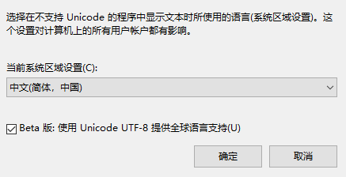
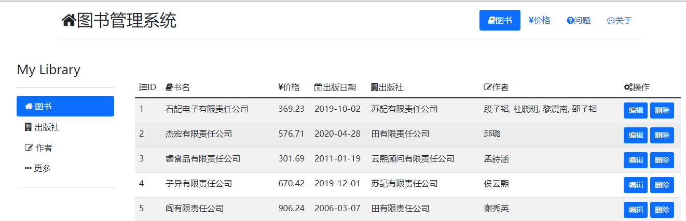
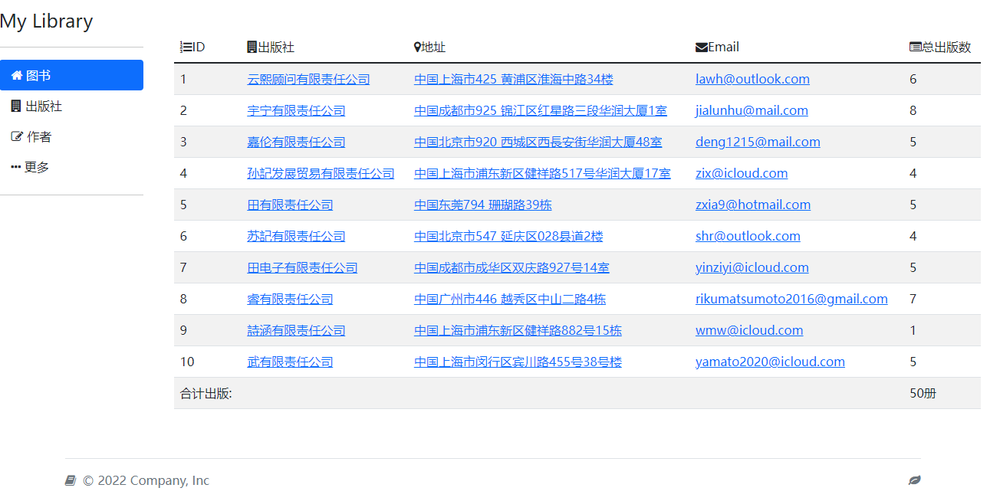

# 文件处理

## 批量解压文件

```python
import os
os.chdir("E:\\test")
print(os.listdir())
for f in os.listdir():
    os.system('C:\PROGRA~1\WinRAR\Rar.exe x -y -pwww.itjc8.com@6"^"*#5xIS3XZK ' + f)
    os.system('del '+ f)
    # os.system('ping '+ 'baidu.com')
```


> 上面是解压文件之后删除源文件。


遍历子文件夹的批量修改

```python
import os
# os.chdir("E:\\test")
# print(os.listdir())
# for f in os.listdir():
#     os.system('C:\PROGRA~1\WinRAR\Rar.exe x -pwww.itjc8.com@6"^"*#5xIS3XZK ' + f)
    # os.system('ping '+ 'baidu.com')


os.chdir("E:\教程\python29")
# for i in os.listdir():
#     paths = os.path.abspath(i)
#     p1 = os.path.basename(paths)
#     print(os.listdir(p1))

# for i in os.walk("E:\教程\python29"):
#     print(i)

for pwd,dirs,files in os.walk("E:\教程\python29"):
    # print("当前文件夹路径:",pwd)
    # print("当前文夹下的子目录:",dirs)
    # print("当前文件:",files)

    os.chdir(pwd)
    print("".center(60,"-"))
    for f in files:
        suffix = os.path.join(pwd, f).split(".")[-1]
        if ('rar' in suffix) or ('zip' in suffix):
            os.system('C:\PROGRA~1\WinRAR\Rar.exe x -pwww.itjc8.com@6"^"*#5xIS3XZK ' + f)
```

> PROGRA~1 = Program Files  这里使用简写避免一些路径问题。还有系统编码问题
>
> win+r   control  区域   管理  更改系统区域或设置




## 文件读写

```python
import os
os.chdir('txt')
def write():
    with open('passwd.txt','a',encoding='utf-8') as f:
        url,name,passwd = map(str,input("输入网址，用户名，密码：以空格分隔:").split())
        date = url + "\t" + name + "\t" + passwd + "\n"
        f.write(date)

# f = open('password_books','a',encoding='utf-8')
# url,name,passwd = map(str,input("请输入你的网址，以及该网站的用户名，密码，以空格分割 >>> ").split())
# date = url + "|"+ name + "|" + passwd + "\n"
# f.write(date)
# f.close()

def read():
    with open('passwd.txt','r',encoding='utf-8') as f1:
        content = f1.readlines()
        for i in  content:
            print(i)
# f1 = open('password_books','r')
# content = f1.readlines()
# for i in content:
#     print(i)
# f1.close()

if __name__ == '__main__':
    write()
    read()
```


## 批量修改文件名

```python
import os
os.chdir("txt")
rename_Dir=os.listdir()
for i,n in enumerate(rename_Dir):
    file_Suffix = n[-4:]
    old_FileName = n[:-4]
    # print(n)
    # if n[-4:] == '.txt':
    #     new_File_Name = 'test' + str(i)+file_Suffix
    #     # print(n)
    #     os.rename(n,new_File_Name)
    # else:
    s = n.split(".")
    file_Suffix_1 = s[-1]
    old_FileName_1 = '[盗版]-cloudb.pub'
    new_File_Name = old_FileName_1 + str(i) + '.' + file_Suffix_1
    os.rename(n, new_File_Name)
    # print(old_FileName_1 in n)
    # print(n)
    # print(old_FileName_1 in os.path.basename(n))
    # if old_FileName_1 in os.path.basename(n) == True:
    #     print("%s 文件名存在不必重命名！" % n)
    # else:
    #     new_File_Name = old_FileName_1 + str(i) + '.' + file_Suffix_1
    #     os.rename(n,new_File_Name)


print(''.center(60, '-'))
for i in rename_Dir:
    print(i)

# import os
# os.chdir('txt')
# for i in os.listdir():
#     os.remove(i)
# print(os.listdir())
```


# Django 项目

## 简单图书馆里

### 准备工作

```cmd
F:\Django_Project_Dir>django-admin startproject library
F:\Django_Project_Dir>cd library
F:\Django_Project_Dir\library>python manage.py startapp app01
F:\Django_Project_Dir\library>mkdir templates
```

### 配置django

```python
setting.py
INSTALLED_APPS = [
    'django.contrib.admin',
    'django.contrib.auth',
    'django.contrib.contenttypes',
    'django.contrib.sessions',
    'django.contrib.messages',
    'django.contrib.staticfiles',
    'app01',   # 添加app
]
TEMPLATES = [
    {
        'BACKEND': 'django.template.backends.django.DjangoTemplates',
        'DIRS': [BASE_DIR / 'templates'],  # 手动指定templates目录
        'APP_DIRS': True,
        'OPTIONS': {
            'context_processors': [
                'django.template.context_processors.debug',
                'django.template.context_processors.request',
                'django.contrib.auth.context_processors.auth',
                'django.contrib.messages.context_processors.messages',
            ],
        },
    },
]

DATABASES = {
    'default': {
        'ENGINE': 'django.db.backends.mysql',
        'NAME': 'library',
        'USER': 'root',
        'PASSWORD': '123456',
        'PORT': '3306',
        'CHARSET': 'utf8mb4',
        'HOST': '127.0.0.1',
    }
}

STATIC_URL = 'static/'
STATICFILES_DIRS = [
    os.path.join(BASE_DIR,'static'),
]

---------------------------------------------------------------------
__init__.py
import pymysql
pymysql.install_as_MySQLdb()

---------------------------------------------------------------------
views.py
from django.shortcuts import render, redirect, HttpResponse, reverse
# Create your views here.

def index(request):
    return HttpResponse('index')
---------------------------------------------------------------------
urls.py
from django.contrib import admin
from django.urls import path, re_path

import app01.views

urlpatterns = [
    path('admin/', admin.site.urls),
    re_path(r'^$', app01.views.index),
]
```

启动服务

```cmd
F:\Django_Project_Dir\library>python manage.py runserver
```

### 准备models.py

```python
from django.db import models


# Create your models here.

class Book(models.Model):
    name = models.CharField(max_length=32)
    price = models.DecimalField(max_digits=5, decimal_places=2)
    publish_date = models.DateField(auto_now_add=True)

    publish = models.ForeignKey('Publish', on_delete=models.CASCADE)
    authors = models.ManyToManyField(to='Author')


class Publish(models.Model):
    name = models.CharField(max_length=32)
    address = models.CharField(max_length=64)
    email = models.EmailField()


class Author(models.Model):
    name = models.CharField(max_length=32)
    age = models.IntegerField()

    author_detail = models.OneToOneField(to='AuthorDetail',on_delete=models.CASCADE)


class AuthorDetail(models.Model):
    phone = models.BigIntegerField()
    address = models.CharField(max_length=64)

```

刷写表到数据库

```cmd
PS F:\Django_Project_Dir\library> python manage.py makemigrations
Migrations for 'app01':
  app01\migrations\0001_initial.py
    - Create model Author
    - Create model AuthorDetail
    - Create model Publish
    - Create model Book
    - Add field author_detail to author
PS F:\Django_Project_Dir\library> python manage.py migrate
Operations to perform:
  Apply all migrations: admin, app01, auth, contenttypes, sessions
Running migrations:
  Applying app01.0001_initial... OK
```

模拟一部分数据到表中

1.index.html

```html
<!DOCTYPE html>
<html lang="en">
<head>
    <meta charset="UTF-8">
    <meta name="viewport" content="width=device-width, initial-scale=1"> <!--响应式布局-->
    <title>Title</title>
    <!--django-->
    
    <link rel="stylesheet" href="">
    <link rel="stylesheet" href="">

    <script src=""></script>
    <script src=""></script>
    
</head>
<body>
<div style="width: 1320px;margin: auto">
    <!--header-->
    <div class="container" s>
        <header class="d-flex flex-wrap justify-content-center py-3 mb-4 border-bottom">
            <a href="/" class="d-flex align-items-center mb-3 mb-md-0 me-md-auto text-dark text-decoration-none">
                <i class="fa fa-home fa-2x">图书管理系统</i>
            </a>

            <ul class="nav nav-pills" style="float: left">
                <li class="nav-item"><a href="#" class="nav-link active"><i class="fa fa-book"></i>图书</a>
                </li>
                <li class="nav-item"><a href="#" class="nav-link"><i class="fa fa-rmb"></i>价格</a>
                </li>
                <li class="nav-item"><a href="#" class="nav-link"><i class="fa fa-question-circle"></i>问题</a>
                </li>
                <li class="nav-item"><a href="#" class="nav-link"><i class="fa fa-commenting-o"></i>关于</a>
                </li>
            </ul>
        </header>
    </div>

    <!--sidebars-->


    <div class="d-flex flex-column flex-shrink-0 p-3" style="width: 220px; float: left">
        <a href="/" class="d-flex align-items-center mb-3 mb-md-0 me-md-auto link-dark text-decoration-none">
            <span class="fs-4">My Library</span>

        </a>
        <hr>
        <ul class="nav nav-pills flex-column mb-auto">
            <li class="nav-item">
                <a href="" class="nav-link active" aria-current="page">
                    <i class="fa fa-home"></i>
                    图书
                </a>
            </li>
            <li>
                <a href="" class="nav-link link-dark">
                    <i class="fa fa-building"></i>
                    出版社
                </a>
            </li>
            <li>
                <a href="" class="nav-link link-dark">
                    <i class="fa fa-edit"></i>
                    作者
                </a>
            </li>
            <li>
                <a href="" class="nav-link link-dark">
                    <i class="fa fa-ellipsis-h"></i>
                    更多
                </a>
            </li>
        </ul>
        <hr>
    </div>


    <!--content-->

    <div class="px-4 my-5" style="float: left;width: 1100px">
            <div class="col-lg-12">

                    

                <p class="lead mb-4">Quickly design and customize responsive mobile-first sites with Bootstrap, the
                    world’s most popular front-end open source toolkit, featuring Sass variables and mixins, responsive
                    grid system, extensive prebuilt components, and powerful JavaScript plugins.</p>
                <div class="d-grid gap-2 d-sm-flex justify-content-sm-center">
                    <button type="button" class="btn btn-primary btn-lg px-4 gap-3">Primary button</button>
                    <button type="button" class="btn btn-outline-secondary btn-lg px-4">Secondary</button>
                </div>

                    

            </div>
        </div>


    <!--footers-->
    <div class="container" style="width: 1320px;clear: both">
        <footer class="d-flex flex-wrap justify-content-between align-items-center py-3 my-4 border-top">
            <div class="col-md-4 d-flex align-items-center">
                <a href="/" class="mb-3 me-2 mb-md-0 text-muted text-decoration-none lh-1">
                    <i class="fa fa-book" aria-hidden="true"></i>
                </a>
                <span class="mb-3 mb-md-0 text-muted">© 2022 Company, Inc</span>
            </div>

            <ul class="nav col-md-4 justify-content-end list-unstyled d-flex">
                <li class="ms-3"><a class="text-muted" href="#"><i class="fa fa-leaf"></i></a></li>
            </ul>
        </footer>
    </div>
</div>

</body>
</html>
```

2.views.py

```python
from django.shortcuts import render, redirect, HttpResponse, reverse

from app01 import models


# Create your views here.

def index(request):
    return render(request, 'index.html')


def book_list(request):
    book_queryset = models.Book.objects.all()
    return render(request, 'book_list.html', locals())
```

3.做book列表book_list.html

```html


  
    <table class="table table-hover table-striped">
        <thead>
          <tr>
              <td><i class="fa fa-list-ol"></i>ID</td>
              <td><i class="fa fa-book"></i>书名</td>
              <td><i class="fa fa-jpy"></i>价格</td>
              <td><i class="fa fa-calendar-times-o"></i>出版日期</td>
              <td><i class="fa fa-building"></i>出版社</td>
              <td><i class="fa fa-edit"></i></i>作者</td>
              <td><i class="fa fa-cogs"></i>操作</td>
          </tr>
        </thead>
        <tbody>
          
            <tr>
                <td>{{ book_obj.pk }}</td>
                <td>{{ book_obj.name }}</td>
                <td>{{ book_obj.price }}</td>
                <td>{{ book_obj.publish_date|date:'Y-m-d' }}</td>
                <td>{{ book_obj.publish.name }}</td>
                <td>
                    
                        {{ author_obj.name }}
                    
                        {{ author_obj.name }},
                     

                
                </td>
                <td>
                    <a href="" class="btn btn-primary btn-sm">编辑</a>
                    <a href="" class="btn btn-primary btn-sm">删除</a>
                </td>
            </tr>
          
        </tbody>
    </table>

```

4.urls.py

```python
from django.contrib import admin
from django.urls import path, re_path

import app01.views

urlpatterns = [
    path('admin/', admin.site.urls),
    re_path(r'^$', app01.views.index),
    re_path(r'^book/list/', app01.views.book_list, name='book_list'),
]
```



类似上图所示.>


### 出版社页面

views.py

```python
def publish_list(request):
    publish_queryset = models.Publish.objects.all()
    return render(request, 'publish_list.html', locals())
```

urls.py

```python
    re_path(r'^publish/list/', app01.views.publish_list, name='publish_list'),
```

index.html

```html
           <li>
                <a href="" class="nav-link link-dark">
                    <i class="fa fa-building"></i>
                    出版社
                </a>
            </li>
```

publish_list.html

```html



 <table class="table table-hover table-striped">
        <thead>
          <tr>
              <td><i class="fa fa-list-ol"></i>ID</td>
              <td><i class="fa fa-building"></i>出版社</td>
              <td><i class="fa fa-map-marker"></i>地址</td>
              <td><i class="fa fa-envelope"></i>Email</td>
              <td><i class="fa fa-list-alt"></i>总出版数</td>
          </tr>
        </thead>
        <tbody>
        
            <tr>
                <td>{{ publish_obj.id }}</td>
                <td><a href="https://www.baidu.com/s?wd={{ publish_obj.name }}">{{ publish_obj.name }}</a></td>
                <td><a href="http://api.map.baidu.com/geocoder?address={{ publish_obj.address }}&output=html&src=webapp.baidu.openAPIdemo">{{ publish_obj.address }}</a></td>
                <td><a href="mailto: {{ publish_obj.email }} ">{{ publish_obj.email }}</a></td>
                <td>
                {{ publish_obj.book_set.all.count }}
                </td>
            </tr>
        
            <tr>
               <td>合计出版:</td>
                <td></td>
                <td></td>
                <td></td>
                <td>{{ sum_book.count }}册</td>
            </tr>
        </tbody>

    </table>

```




### 作者表

```python
views.py
def author_list(request):
    author_queryset = models.Author.objects.all()
    return render(request, 'author_list.html', locals())
```

urls.py

```python
    re_path(r'^author/list/',app01.views.author_list,name='author_list'),
```

index.html

```python
            <li>
                <a href="" class="nav-link link-dark">
                    <i class="fa fa-edit"></i>
                    作者
                </a>
            </li>
```

author_list.html

```python



    <table class="table table-hover table-striped">
      <thead>
        <tr>
            <td><i class="fa fa-list-ol"></i>ID</td>
            <td><i class="fa fa-user"></i>姓名</td>
            <td><i class="fa fa-address-card"></i>年龄</td>
            <td><i class="fa fa-map-marker"></i>地址</td>
            <td><i class="fa fa-phone"></i>电话</td>
        </tr>
      </thead>
    <tbody>
    
         <tr>
           <td>{{ author_obj.id }}</td>
             <td><a href="https://www.baidu.com/s?wd={{ author_obj.name }}">{{ author_obj.name }}</a></td>
           <td>{{ author_obj.age }}</td>
             <td><a href="http://api.map.baidu.com/geocoder?address={{ author_obj.author_detail.address }}&output=html&src=webapp.baidu.openAPIdemo">{{ author_obj.author_detail.address }}</a></td>
             <td>
                 <a href="tel:{{ author_obj.author_detail.phone }}">打电话</a>
                 <a href="sms:{{ author_obj.author_detail.phone }}?body">发短信</a>  <!--注意&和?的区别 ?安卓 &苹果-->
             </td>
          </tr>
        
       </tbody>
    </table>


```

### 添加按钮

```python
setting.py
    # 'django.middleware.csrf.CsrfViewMiddleware',

views.py
def book_add(request):
    if request.method == 'POST':
        name = request.POST.get('name')
        price = request.POST.get('price')
        publish_date = request.POST.get('publish_date')
        publish_id = request.POST.get('publish')
        authors_list = request.POST.getlist('authors')

        book_obj = models.Book.objects.create(name=name, price=price, publish_date=publish_date, publish_id=publish_id)
        book_obj.authors.add(*authors_list)
        return redirect('book_list')

    publish_queryset = models.Publish.objects.all()
    author_queryset = models.Author.objects.all()
    return render(request,'book_add.html',locals())

book_list.html
  <a href="" class="btn btn-info">添加</a>
    
book_add.html




    <h1 class="text-center"><i class="fa fa-plus-square"></i>添加书籍</h1>
    <form action="" method="post" enctype="multipart/form-data">
        <p><i class="fa fa-book"></i>书名:<input type="text" name="name" class="form-control"></p>
        <p><i class="fa fa-jpy"></i>价格:<input type="text" name="price" class="form-control"></p>
        <p><i class="fa fa-calendar"></i>出版日期:<input type="date" name="publish_date" class="form-control"></p>
        <p><i class="fa fa-building"></i>出版社:
            <select name="publish" id="" class="form-control">
               
                  <option value="{{ publish_obj.id }}">{{ publish_obj.name }}</option>
               
            </select>
        </p>
        <p><i class="fa fa-users"></i>作者:
            <select name="authors" id="" multiple class="form-control">
                
                    <option value="{{ author_obj.pk }}">{{ author_obj.name }}</option>
                

            </select>
        </p>
        <input type="submit" value="添加" class="btn btn-success">
    </form>

```

### 编辑按钮

views.py

```python
def edit_book(request, edit_id):
    edit_obj = models.Book.objects.filter(pk=edit_id).first()
    if request.method == 'POST':
        print(request.POST)
        name = request.POST.get('name')
        price = request.POST.get('price')
        publish_date = request.POST.get('publish_date')
        publish_id = request.POST.get('publish')
        authors_list = request.POST.getlist('authors')
        models.Book.objects.filter(pk=edit_id).update(name=name, price=price, publish_date=publish_date,
                                                      publish_id=publish_id)
        edit_obj.authors.set(authors_list)
        return redirect('book_list')
    publish_queryset = models.Publish.objects.all()
    author_queryset = models.Author.objects.all()
    return render(request, 'edit_book.html', locals())

```

```python
urls.py
    re_path(r'^edit/(?P<edit_id>\d+)/',app01.views.edit_book,name='edit_book'), # 有名分组 views edit_id 传入参数
```

```html
booklist.html 
<td>
                    <a href="" class="btn btn-primary btn-sm">编辑</a>
                    <a href="" class="btn btn-primary btn-sm">删除</a>
                </td>
```

```html
edit_book.html



    <h1 class="text-center">编辑<<{{ edit_obj.name }}>></h1>
    <form action="" method="post" enctype="multipart/form-data">
        <p><i class="fa fa-book"></i>书名: <input type="text" name="name" value="{{ edit_obj.name }}"
                                                  class="form-control"></p>
        <p><i class="fa fa-jpy"></i>价格: <input type="text" name="price" value="{{ edit_obj.price }}"
                                                 class="form-control"></p>
        <p><i class="fa fa-calendar-times-o"></i>出版日期: <input type="text" name="publish_date"
                                                                  value="{{ edit_obj.publish_date|date:'Y-m-d' }}"
                                                                  class="form-control"></p>
        <p><i class="fa fa-building"></i>出版社:
            <select name="publish" id="" class="form-control">
                
                    
                        <option value="{{ publish_obj.pk }} " selected>{{ publish_obj.name }}</option>
                    
                        <option value="{{ publish_obj.pk }} ">{{ publish_obj.name }}</option>
                    
                
            </select>
        </p>
        <p><i class="fa fa-edit"></i>作者:
            <select name="authors" id="" multiple class="form-control">
                
                    
                        <option value="{{ author_obj.pk }}" selected>{{ author_obj.name }}</option>
                    
                        <option value="{{ author_obj.pk }}">{{ author_obj.name }}</option>
                    
                

            </select>
        </p>
        <input type="submit" value="编辑" class="btn btn-danger">

    </form>


```

### 删除按钮

```python
views.py
def del_book(request,del_id):
    models.Book.objects.filter(pk=del_id).delete()
    return redirect('book_list')
```

```python
urls.py
    re_path(r'^del/(\d+)/',app01.views.del_book,name='book_del'),
```

```html
book_list.html
 <a href="" class="btn btn-danger btn-sm">删除</a>
```

