# windows安装gitbook生成html

> 说明：新版双击不能直接打开，未证实

doc:https://docs.gitbook.com/

## 先决条件

### node.js

官网：https://nodejs.org

旧版本：https://nodejs.org/en/download/releases/

下载好的Windows客户端安装完成

```cmd
D:\gitbooks>node -v
v10.12.0

D:\gitbooks>npm -v
6.4.1
```

### git

用于版本管理

官网：https://git-scm.com/

```cmd
C:\Windows\system32>git version
git version 2.35.1.windows.2
```

npm 包仓库https://www.npmjs.com/package/gitbook-cli

### gitbook

如果不成功使用npm加速

```cmd
C:\Windows\system32>npm install gitbook-cli -g
C:\Windows\system32>d:
D:\>gitbook

  Usage: gitbook [options] [command]


  Options:

    -v, --gitbook [version]  specify GitBook version to use
    -d, --debug              enable verbose error
    -V, --version            Display running versions of gitbook and gitbook-cli
    -h, --help               output usage information


  Commands:

    ls                        List versions installed locally
    current                   Display currently activated version
    ls-remote                 List remote versions available for install
    fetch [version]           Download and install a <version>
    alias [folder] [version]  Set an alias named <version> pointing to <folder>
    uninstall [version]       Uninstall a version
    update [tag]              Update to the latest version of GitBook
    help                      List commands for GitBook
    *                         run a command with a specific gitbook version
```

安装

```cmd
D:\>mkdir gitbooks
D:\>cd gitbooks
D:\gitbooks>gitbook ls-remote
Available GitBook Versions:

     4.0.0-alpha.6, 4.0.0-alpha.5, 4.0.0-alpha.4, 4.0.0-alpha.3, 4.0.0-alpha.2, 4.0.0-alpha.1, 3.2.3, 3.2.2, 3.2.1, 3.2.0, 3.2.0-pre.1, 3.2.0-pre.0, 3.1.1, 3.1.0, 3.0.3, 3.0.2, 3.0.1, 3.0.0, 3.0.0-pre.15, 3.0.0-pre.14, 3.0.0-pre.13, 3.0.0-pre.12, 3.0.0-pre.11, 3.0.0-pre.10, 3.0.0-pre.9, 3.0.0-pre.8, 3.0.0-pre.7, 3.0.0-pre.6, 3.0.0-pre.5, 3.0.0-pre.4, 3.0.0-pre.3, 3.0.0-pre.2, 3.0.0-pre.1, 2.6.9, 2.6.8, 2.6.7, 2.6.6, 2.6.5, 2.6.4, 2.6.3, 2.6.2, 2.6.1, 2.6.0, 2.5.2, 2.5.1, 2.5.0, 2.5.0-beta.7, 2.5.0-beta.6, 2.5.0-beta.5, 2.5.0-beta.4, 2.5.0-beta.3, 2.5.0-beta.2, 2.5.0-beta.1, 2.4.3, 2.4.2, 2.4.1, 2.4.0, 2.3.3, 2.3.2, 2.3.1, 2.3.0, 2.2.0, 2.1.0, 2.0.4, 2.0.3, 2.0.2, 2.0.1, 2.0.0, 2.0.0-beta.5, 2.0.0-beta.4, 2.0.0-beta.3, 2.0.0-beta.2, 2.0.0-beta.1, 2.0.0-alpha.9, 2.0.0-alpha.8, 2.0.0-alpha.7, 2.0.0-alpha.6, 2.0.0-alpha.5, 2.0.0-alpha.4, 2.0.0-alpha.3, 2.0.0-alpha.2, 2.0.0-alpha.1

Tags:

     latest : 2.6.9
     pre : 4.0.0-alpha.6

D:\gitbooks>gitbook -V
CLI version: 2.3.2
GitBook version: 3.2.3
```

这里需要一些时间,如果出错解决了再执行安装

### ebook-convert、calibre

gitbook可以将我们写的电子书或文档导出为pdf,epub,mobi等格式，这些格式需要ebook-convert库，windows下又依赖calibre软件提供的库

```cmd
D:\gitbooks>npm install ebook-convert -g
```

下载calibre：https://calibre-ebook.com/download

```cmd
D:\gitbooks>ebook-convert --version
'ebook-convert' 不是内部或外部命令，也不是可运行的程序
或批处理文件。

# 重新加载
D:\gitbooks>ebook-convert --version
ebook-convert.exe (calibre 5.41.0)
Created by: Kovid Goyal <kovid@kovidgoyal.net>
```

### 验证

```cmd
D:\gitbooks>mkdir python    # 创建一个文件夹存放对应的笔记
D:\gitbooks>cd python       # 进入刚创建的目录
D:\gitbooks\python>gitbook init     #初始化文件夹
warn: no summary file in this book
info: create README.md
info: create SUMMARY.md
info: initialization is finished
```

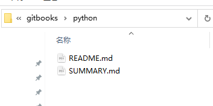

> SUMMARY  书籍的目录信息
>
> readme   通过浏览器访问的首页

编辑上面的文件启动serve查看服务

```cmd
D:\gitbooks\python>gitbook serve
Live reload server started on port: 35729
Press CTRL+C to quit ...

info: 7 plugins are installed
info: loading plugin "livereload"... OK
info: loading plugin "highlight"... OK
info: loading plugin "search"... OK
info: loading plugin "lunr"... OK
info: loading plugin "sharing"... OK
info: loading plugin "fontsettings"... OK
info: loading plugin "theme-default"... OK
info: found 1 pages
info: found 0 asset files
info: >> generation finished with success in 0.9s !

Starting server ...
Serving book on http://localhost:4000
```

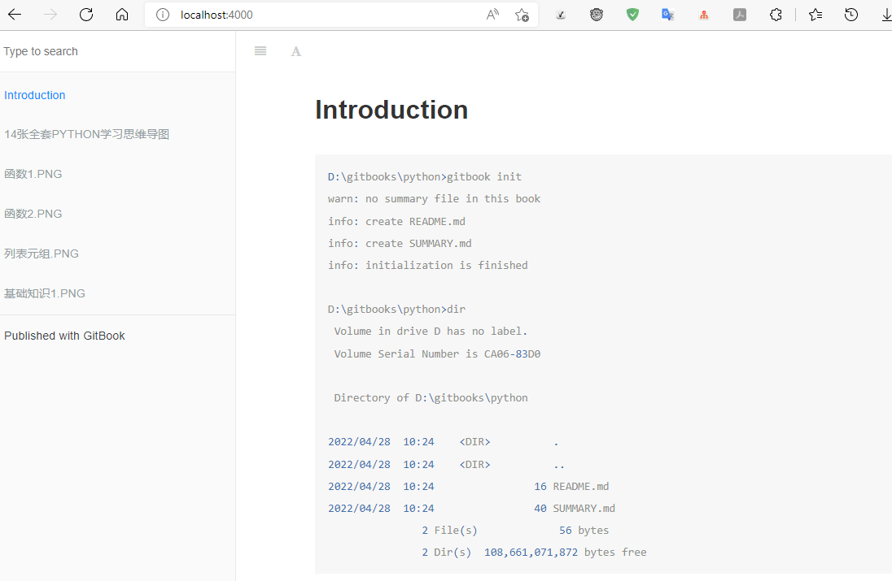

下面是构建成html格式的文件

```cmd
D:\gitbooks\python>gitbook build
```

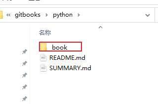

到这里基本搭建完成，下面是高阶使用教程

## 进阶

### 目录结构

```cmd
# 我们可以看到默认的目录结构是
# Summary

* [Introduction](README.md)
```

这里根据实际创建对应的目录和连接到对应的文件

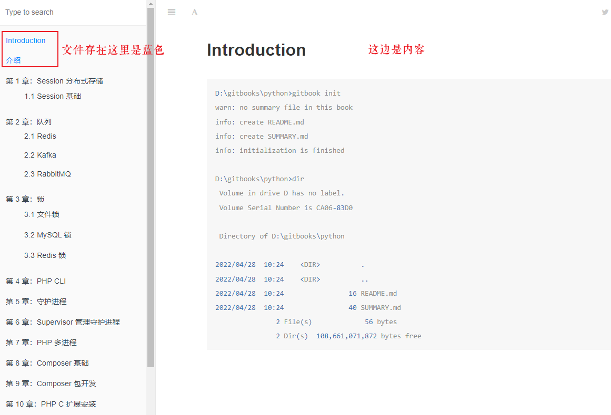

### 多级目录

```cmd
# Summary

* [开篇介绍](README.md)
* [第一级](README.md)
  * [第二级-2.1](README.md)
  * [第二级-2.2](README.md)
    * [第三级-3.1](README.md)
```

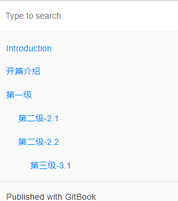

> 多级目录是通过缩进完成的，每个目录对应一个markdown文件。

### 目录折叠

上面目录是不能折叠的。这里可以通过插件来实现

在书籍根目录创建一个book.json文件

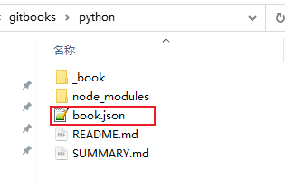

```json
{
	"plugins":[
	    "expandable-chapters"
	]
}
```

上面创建号还需要加载插件操作

```cmd
D:\gitbooks\python>gitbook install
info: installing 1 plugins using npm@3.9.2
info:
info: installing plugin "expandable-chapters"
info: install plugin "expandable-chapters" (*) from NPM with version 0.2.0
D:\gitbooks\python
`-- gitbook-plugin-expandable-chapters@0.2.0

info: >> plugin "expandable-chapters" installed with success
```

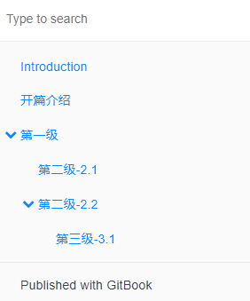

### book.json 详解

- 配置电子书名称
- 配置电子书作者
- 配置电子书描述
- 配置电子书语言
- 配置电子书使用的gitbook版本
- 自定义样式
- 配置电子书左侧导航友情连接
- 配置插件

#### 分隔符

分隔符就是分割不同大类的内容


```txt
---    #就是分割线
```

#### 友情链接

编辑book.json

```json
{
	"links": {
		"sidebar": {
			"我的网站": "https://cloudb.pub"
		}
	},
	"plugins": [
	    "expandable-chapters"
	]
}
```


> 注意json格式

#### 书名

也是book.json

```json
{
	"plugins": [
	    "expandable-chapters"
	],
	"links": {
		"sidebar": {
			"我的网站": "https://cloudb.pub"
		}
	},
	"title": "《我的笔记》"        // 只有这行
}
```


#### 描述

设置作者、描述、语言、版本

book.json

```json
{
	"plugins": [
	    "expandable-chapters"
	],
	"links": {
		"sidebar": {
			"我的网站": "https://cloudb.pub"
		}
	},
	"title": "《我的笔记》",
	"author": "王某人",
	"description": "这是本人的笔记网站，这里是添加描述，看看实际效果如何",
	"language": "zh-hans",
	"gitbook": "3.2.3",
	"structure": {
		"readme": "README.md"
	}
}
```

#### 自定义样式

```json
{
	"plugins": [
	    "expandable-chapters"
	],
	"links": {
		"sidebar": {
			"我的网站": "https://cloudb.pub"
		}
	},
	"title": "《我的笔记》",
	"author": "王某人",
	"description": "这是本人的笔记网站，这里是添加描述，看看实际效果如何",
	"language": "zh-hans",
	"gitbook": "3.2.3",
	"structure": {
		"readme": "README.md"
	},
	"style": {
		"website": "./styles/website.css"  // 这里需要自己定义
	}
}
```

#### 隐藏gitbook-link

```json
"plugins": [
	    "chapter-fold",
		"search-pro",
		"-back-to-top-button",
		"fontsettings",
		"donate",
		"-page-treeview",
		"splitter",
		"-edit-link",
		"github",
		"anchor-navigation-ex",
		"copy-code-button",
		"tbfed-pagefooter",
		"-theme-code",
		"-prism",
		"highlight",
		"-folding-chapters",
		"insert-logo",
		"custom-favicon",
		"-pageview-count",
		"popup",
		"-webshare",
		"-sharing",
		"sharing-plus",
		"hide-element",    # 配置该插件
		"flexible-alerts"
	],

"//pluginsConfig": "插件配置",
	"pluginsConfig":{
		"fontsettings": {
			"font-family": "黑体",
			"size": 8
		},
	"hide-element": {
		"elements": [".gitbook-link"]   # 选择需要隐藏的元素
	},
   ...
```


### 插件

除了样式可以定制，我们还可以通过插件的形式定制更多的功能。GitBook 默认提供 highlight、search、sharing、fontsettings、livereload 5 个插件。

- highlight 代码高亮插件。

- search 搜索插件。就是左侧菜单顶部的搜索功能。

- sharing 社会化分享工具。

- fontsettings 文章内容字符设置插件。如文字大小、字体、背景颜色设置。

- livereload  内容扫更新。如果不使用此插件则内容更新每次都要重启 Web 服务才能看到变化内容。

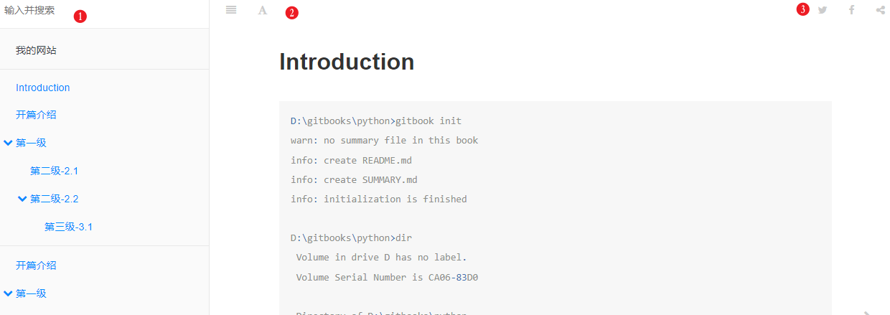

> 1. search 插件
> 2. fontsettings 插件
> 3. sharing 插件

只需要在 book.json 的 plugins 小节配置即可

```json
{
	"plugins": [
	    "expandable-chapters",
		"search"
	],
	"links": {
		"sidebar": {
			"我的网站": "https://cloudb.pub"
		}
	},
	"title": "《我的笔记》",
	"author": "王某人",
	"description": "这是本人的笔记网站，这里是添加描述，看看实际效果如何",
	"language": "zh-hans",
	"gitbook": "3.2.3",
	"structure": {
		"readme": "README.md"
	},
	"style": {
		"website": "./styles/website.css"
	}
}
```

```cmd
D:\gitbooks\python>gitbook install
```

#### 插件配置

所谓插件配置是指当我们要使用一个插件的时候，此插件可能提供了一些高级功能的配置。所以，此时我们需要配置这些参数，则需要通过 `plugins-configs` 来控制。

更多插件：https://www.npmjs.com/package/gitbook-plugin-sharing-plus

分享页面插件

```json
{
    "pluginsConfig": {
        "sharing": {
            "douban": false,
            "facebook": true,
            "google": false,
            "hatenaBookmark": false,
            "instapaper": false,
            "line": false,
            "linkedin": true,
            "messenger": false,
            "pocket": true,
            "qq": false,
            "qzone": false,
            "stumbleupon": false,
            "twitter": true,
            "viber": false,
            "vk": false,
            "weibo": false,
            "whatsapp": false,
            "all": [
                "facebook", "google", "twitter",
                "weibo", "instapaper", "linkedin",
                "pocket", "stumbleupon"
            ]
        }
    }
}
```

#### 插件禁用

我们安装了插件，有时候不需要就要禁用。前面加个减号就是禁用

```json
{
    ...
    	"plugins": [
	    "expandable-chapters",
		"search",
		"-sharing"   // - 就是禁用
	],
    ...
}
```

#### 常用插件

上面的插件虽然普遍，但是还有一些是我们定制化的

##### 捐赠

donate:https://www.npmjs.com/package/gitbook-plugin-donate

```json
{
    "plugins": ["donate"],
    "pluginsConfig": {
	    "donate": {
		     "wechat": "/images/wx.png",
             "alipay": "/images/zfb.png",
             "title": " ",
             "button": "捐赠",
             "alipayText": "支付宝捐赠",
             "wechatText": "微信捐赠"
	     }
    }
}
```

```cmd
D:\gitbooks\python>gitbook install
```

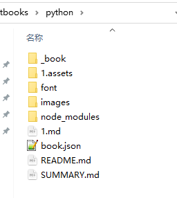

图片放到当前目录下


这里设置为你的二维码图片地址就可以调用捐赠功能了。

##### 导航目录折叠

expandable-chapters:

chapter-fold  也是目录折叠

https://www.npmjs.com/package/gitbook-plugin-expandable-chapters

```json
{
    ...
    	"plugins": [
	    "expandable-chapters",   // 收缩插件
		"search",
		"-sharing",
		"donate"
	],
	"pluginsConfig": {
		"sharing": {
			"facebook": true,
			"weibo": false
		},
		"expandable-chapters": {}    // 插件配置
	},
    ...
}
```

##### 回到顶部

back-to-top-button： https://www.npmjs.com/package/gitbook-plugin-back-to-top-button

```json
{
    "plugins" : [ "back-to-top-button" ]
}
```

```cmd
D:\gitbooks\python>gitbook install
```

##### 内页生成导航

当我们一个内页内容非常多的时候。此时如果能在内页起始就能查阅当前的内页目录提供检索，那是相当的棒。

page-treeview：https://www.npmjs.com/package/gitbook-plugin-page-treeview

```json
{
    	"plugins": [
	    "expandable-chapters",
		"search",
		"-sharing",
		"donate",
		"back-to-top-button",
		"page-treeview"
	],
	"pluginsConfig": {
		"sharing": {
			"facebook": true,
			"weibo": false
		},
		"donate": {
			"wechat": "例：/images/qr.png",
            "alipay": "http://blog.willin.wang/static/images/qr.png",
            "title": "默认空",
            "button": "默认值：Donate",
            "alipayText": "默认值：支付宝捐赠",
            "wechatText": "默认值：微信捐赠"
		},
		"expandable-chapters": {},
		"page-treeview": {
			"copyright": "Copyright &#169; aleen42",
			"minHeaderCount": "2",
			"minHeaderDeep": "2"
		}
}
```

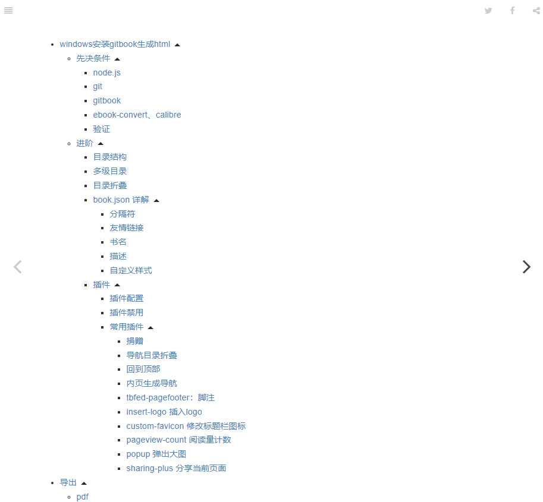

内容多的时候才实用


还有很多插件：https://www.npmjs.com/search?q=gitbook

- splitter：目录和内容的分割条，支持拖拽调整

  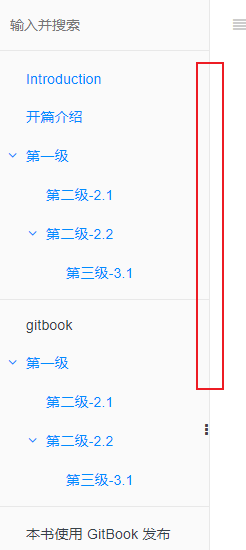

  可以拖拽

  

- edit-link：编辑按钮，可以设置一个链接，通常为GitHub对应项目 https://www.npmjs.com/package/gitbook-plugin-edit-link

```json
	"plugins": [
	    "chapter-fold",
		"search-pro",
		"back-to-top-button",
		"-fontsettings",
		"donate",
		"page-treeview",
		"splitter",
		"-edit-link"
	],
	
	"//pluginsConfig": "插件配置",
	"pluginsConfig":{
		"fontsettings": {
			"font-family": "黑体"
		},
	"donate": {
		 "wechat": "/images/wx.png",
         "alipay": "/images/zfb.png",
         "title": " ",
         "button": "捐赠",
         "alipayText": "支付宝捐赠",
         "wechatText": "微信捐赠"
	},
	"page-treeview": {
		"copyright": "Copyright &#169; aleen42",
		"minHeaderCount": "2",
		"minHeaderDeep": "2"
	},
	"edit-link": {
		"base": "https://github.com/xyz349925756/cloudb.web/wiki",
		"label": "Edit This Page"
	}
```

这个是直接编辑wiki


- github：GitHub图标，可设置 GitHub项目链接  gitbook-plugin-github

  ```
  {
      "plugins": [ "github" ],
      "pluginsConfig": {
          "github": {
              "url": "https://github.com/your/repo"
          }
      }
  }
  ```

  

- anchor-navigation-ex：页面内容导航

  https://www.npmjs.com/package/gitbook-plugin-anchor-navigation-ex

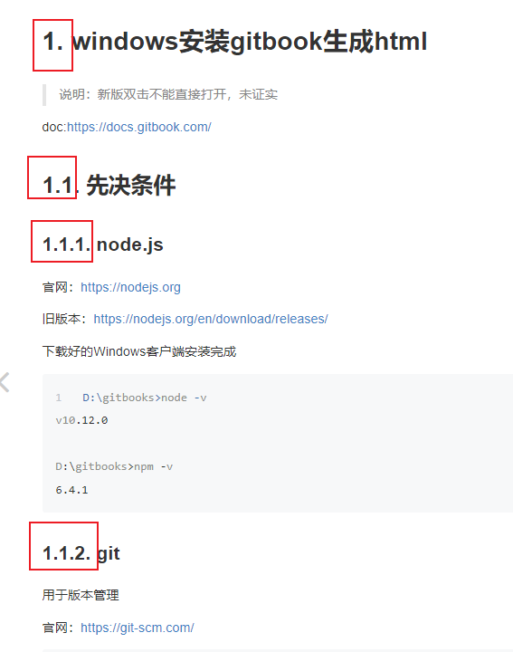

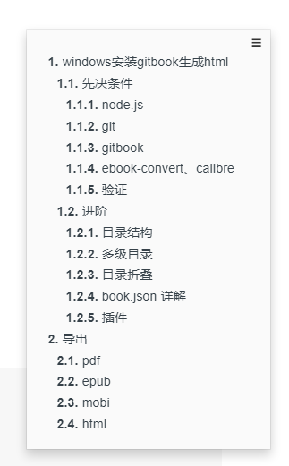

##### code：代码行号及 “复制” 按钮  

**==code 有bug因为代码前面会多一个1==**

copy-code-button 同效果复制代码

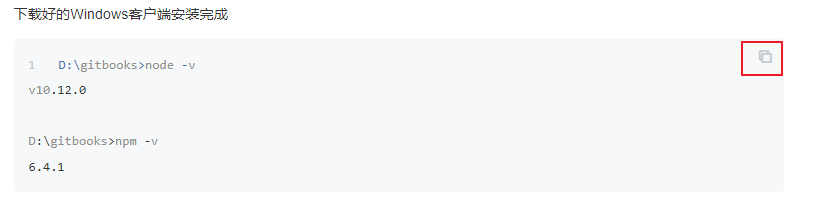

##### tbfed-pagefooter：脚注

```json
{
    "plugins": [
       "tbfed-pagefooter"
    ],
    "pluginsConfig": {
        "tbfed-pagefooter": {
            "copyright":"Copyright &copy dsx2016.com 2019",
            "modify_label": "该文章修订时间：",
            "modify_format": "YYYY-MM-DD HH:mm:ss"
        }
    }
}
```

##### theme-code: 彩色代码

这个有bug会导致目录三角下移不对齐

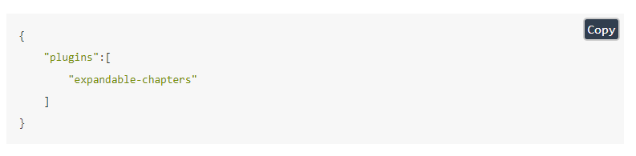

##### search-pro   高级搜索


##### prism

代码彩色背景


folding-chapters  代码主题


##### hide-element 隐藏左侧信息

默认的`gitbook`左侧提示：`Published with GitBook`

```json
{
    "plugins": [
        "hide-element"
    ],
    "pluginsConfig": {
        "hide-element": {
            "elements": [".gitbook-link"]
        }
    }
}
```

##### back-to-top-button   回到顶部

##### insert-logo 插入logo

```json
{
    "plugins": [ "insert-logo" ]
    "pluginsConfig": {
      "insert-logo": {
        "url": "/images/logn.png",
        "style": "background: none; max-height: 30px; min-height: 30px"
      }
    }
}
```

##### custom-favicon 修改标题栏图标

```json
{
    "plugins" : ["custom-favicon"],
    "pluginsConfig" : {
        "favicon": "icon/favicon.ico"
    }
}
```

##### pageview-count 阅读量计数


```json
{
  "plugins": [ "pageview-count"]
}

2
{
    "plugins": [
        "cmb-pageview"
    ]
}
```

##### popup 弹出大图

点击图片放大

```json
{
  "plugins": [ "popup" ]
}
```

##### sharing-plus 分享当前页面

```json
{
    "plugins": ["-sharing", "sharing-plus"],
    "pluginsConfig": {
        "sharing": {
             "douban": true,
             "facebook": true,
             "google": true,
             "pocket": true,
             "qq": true,
             "qzone": true,
             "twitter": true,
             "weibo": true,
          "all": [
               "douban", "facebook", "google", "instapaper", "linkedin","twitter", "weibo", 
               "messenger","qq", "qzone","viber","whatsapp"
           ]
       }
    }
}
```

##### 警示

```json
{
  "plugins": [
    "flexible-alerts"
  ],
  "pluginsConfig": {
    "flexible-alerts": {
      "style": "callout",
      "comment": {
        "label": "Comment",
        "icon": "fa fa-comments",
        "className": "info"
      }
    }
  }
}
```

##### 引用

```cmd
[!COMMENT] 
doc:https://docs.gitbook.com/
```


```json
{
  "plugins": [
    "flexible-alerts"
  ],
  "pluginsConfig": {
	"flexible-alerts": {
		"style": "callout",
		"comment": {
			"label": "Comment",
			"icon": "fa fa-comments",
			"className": "info"
		},
		"note": {
            "label": "Note"
        },
      "tip": {
        "label": "Tip"
        },
      "warning": {
        "label": "Warning"
        },
      "danger": {
        "label": "Attention"
      }
    }
  }
}

# 把上面标签改成中文
	"flexible-alerts": {
		"style": "callout",
		"comment": {
			"label": "评论",
			"icon": "fa fa-comments",
			"className": "info"
		},
		"note": {
            "label": "笔记"
        },
      "tip": {
        "label": "标签"
        },
      "warning": {
        "label": "扩展"
        },
      "danger": {
        "label": "危险"
      }
	 }	


```

引用上面设置

| Key             | Allowed value                                           |
| --------------- | ------------------------------------------------------- |
| style           | One of follwowing values: ==callout==, ==flat==         |
| label           | Any text                                                |
| icon            | A valid Font Awesome icon, e.g. 'fa fa-info-circle'     |
| className       | A name of a CSS class which specifies the look and feel |
| labelVisibility | One of follwowing values: visible (default), hidden     |
| iconVisibility  | One of follwowing values: visible (default), hidden     |

注释样式说明

1.注释命令

> [!Comment]
>
> 说明：[!Comment]即可调用这个样式,[!comment]=[!comment|style:callout]


2.隐藏标签

> [!Comment|labelVisibility:hidden]
>
> 说明：[!Comment|labelVisibility:hidden] 隐藏图标后面的标签文字


3.隐藏图标

> [!Comment|iconVisibility:hidden]
>
> 说明：[!Comment|iconVisibility:hidden] 隐藏图标


4.自定义标签

> [!Comment|label:自定义标签]
>
> 说明：[!Comment|label:自定义标签]


5.显示背景色

> [!Comment|style:flat]
>
> 说明：[!Comment|style:flat] 


其他样式也有上面的属性下面就不做介绍，至对比透明和背景色两个

6.通知

> [!Note]
>
> 说明：[!Note]


7.通知背景色

> [!Note|style:flat]
>
> 说明：[!Note|style:flat]


8.tip

> [!Tip]
>
> 说明：[!Tip]


9.tip背景色

> [!Tip|style:flat]
>
> 说明：[!Note|style:flat]


10.warning

> [!Warning]
>
> 说明：[!Warning]


11.warning背景色

> [!Warning|style:flat]
>
> 说明：[!Warning|style:flat]


12.危险

> [!danger]
>
> 说明：[!danger]


13.危险背景

> [!danger|style:flat]
>
> 说明：[!Warning|style:flat]

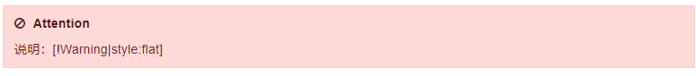

#### 其他插件

https://www.npmjs.com/search?q=gitbook-plugin

如果需要修改样式 到这个目录

_book\gitbook\gitbook-plugin-flexible-alerts

## 样本

```json
	{
	"//title": "书名、描述",
    "title": "<Cloudb.pub>",
	"author": "王某人",
	"description": "笔记网站",
	"language": "zh-hans",
	
	"links": {
		"sidebar": {
			"我的网站": "https://cloudb.pub"
		}
	},
	
	"//plugins": "插件",
	"plugins": [
	    "chapter-fold",
		"search-pro",
		"-back-to-top-button",
		"fontsettings",
		"donate",
		"-page-treeview",
		"splitter",
		"-edit-link",
		"github",
		"anchor-navigation-ex",
		"copy-code-button",
		"tbfed-pagefooter",
		"-theme-code",
		"-prism",
		"highlight",
		"-folding-chapters",
		"insert-logo",
		"custom-favicon",
		"pageview-count",
		"popup",
		"-webshare",
		"-sharing",
		"sharing-plus"
	],
	
	"//pluginsConfig": "插件配置",
	"pluginsConfig":{
		"fontsettings": {
			"font-family": "黑体",
			"size": 8
		},
	"donate": {
		 "wechat": "/images/wx.png",
         "alipay": "/images/zfb.png",
         "title": " ",
         "button": "捐赠",
         "alipayText": "支付宝捐赠",
         "wechatText": "微信捐赠"
	},
	"page-treeview": {
		"copyright": "Copyright &#169; Cloudb",
		"minHeaderCount": "2",
		"minHeaderDeep": "2"
	},
	"edit-link": {
		"base": "https://github.com/xyz349925756/cloudb.web/wiki",
		"label": "编辑页面"
	},
	"github": {
		"url": "https://github.com/xyz349925756/kubernetes"
	},
	"tbfed-pagefooter": {
	    "copyright": "Copyright &#169; Cloudb",
        "modify_label": "最近修改日期：",
        "modify_format": "YYYY-MM-DD HH:mm:ss"		
	},
	"folding-chapters": {},
	"insert-logo": {
		"url": "/images/logn.png",
		"style": "background: none; max-height: 30px; min-height: 30px"
	},
	"favicon": "/images/favicon.ico",
    "sharing": {
            "douban": true,
            "facebook": false,
            "google": false,
            "hatenaBookmark": false,
            "instapaper": false,
            "line": false,
            "linkedin": true,
            "messenger": false,
            "pocket": false,
            "qq": true,
            "qzone": true,
            "stumbleupon": false,
            "twitter": false,
            "viber": false,
            "vk": false,
            "weibo": true,
            "whatsapp": false,
            "all": [
                "qq", "google","weibo", "qzone", "linkedin","douban"
            ]
        },
        "structure": {
		"readme": "README.md"
	},
	"style": {
		"website": "/styles/website.css"
	}	
	}
}
```


# 导出

安装了 `ebook-convert` 插件以及 `calibre` 软件这里就可以导出到对应的文件

## pdf

```cmd
D:\gitbooks\python>gitbook pdf
```

## epub

```cmd
D:\gitbooks\python>gitbook epub
```

## mobi

```cmd
D:\gitbooks\python>gitbook mobi
```

## html

```cmd
D:\gitbooks\python>gitbook build
```


# 发布到github page

```cmd
D:\gitbooks\webstie>gitbook build
```

把文件构建好，发布到githu仓库下的doc目录


```sh
D:\cloudb.web>mkdir doc
# 把gitbook build好的——book根目录
D:\cloudb.web>git add .
D:\cloudb.web>git commit -am "update doc"
D:\cloudb.web>git push
```

> 注意md文件和readme同路径不然会出现图像找不到的问题


# 本地不能点击导航的解决

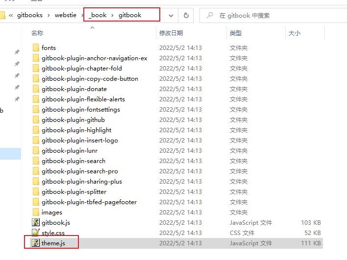

进入项目目录找到上图所示的theme文件搜索==if(m)for(n.handler==D:\gitbooks\webstie\_book\gitbook\theme.js

将`if(m)`改成`if(false)`

   

```js
           // if (m)
                    if (false)
                        for (n.handler && (i = n, n = i.handler, o = i.selector), o && de.find.matchesSelector(Ye, o), n.guid || (n.guid = de.guid++), (u = m.events) || (u = m.events = {}), (a = m.handle) || (a = m.handle = function (t) {
                                return "undefined" != typeof de && de.event.triggered !== t.type ? de.event.dispatch.apply(e, arguments) : void 0
                            }), t = (t || "").match(qe) || [""], l = t.length; l--;) s = Ze.exec(t[l]) || [], h = g = s[1], d = (s[2] || "").split(".").sort(), h && (f = de.event.special[h] || {}, h = (o ? f.delegateType : f.bindType) || h, f = de.event.special[h] || {}, c = de.extend({
                            type: h,
                            origType: g,
                            data: r,
                            handler: n,
                            guid: n.guid,
                            selector: o,
                            needsContext: o && de.expr.match.needsContext.test(o),
                            namespace: d.join(".")
                        }, i), (p = u[h]) || (p = u[h] = [], p.delegateCount = 0, f.setup && f.setup.call(e, r, d, a) !== !1 || e.addEventListener && e.addEventListener(h, a)), f.add && (f.add.call(e, c), c.handler.guid || (c.handler.guid = n.guid)), o ? p.splice(p.delegateCount++, 0, c) : p.push(c), de.event.global[h] = !0)
                },
```


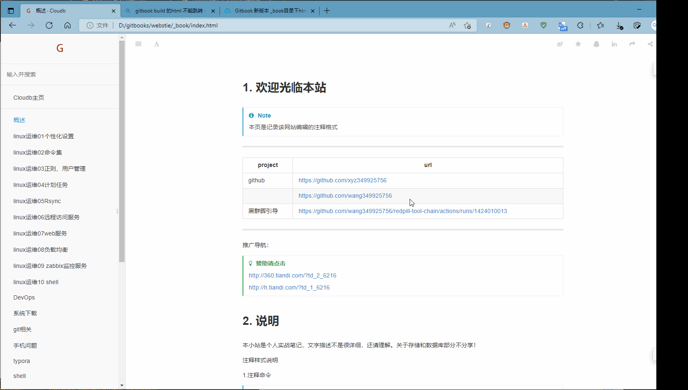

这样就满足了不能点击的需求


错误处理：

```cmd
Error: ENOENT: no such file or directory, stat 'D:\gitbooks\webstie\_book\gitbook\gitbook-plugin-flexible-alerts\plugin.js.map'
```

用户目录下找到以下文件。
.gitbook\versions\3.2.3\lib\output\website\copyPluginAssets.js

C:\Users\xyz34\.gitbook\versions\3.2.3\lib\output\website\copyPluginAssets.js

```js
  confirm: false    // 修改后
  // confirm: true  // 修改前
```

禁用之后分享不能使用了

正确的方法是：关闭杀毒软件
