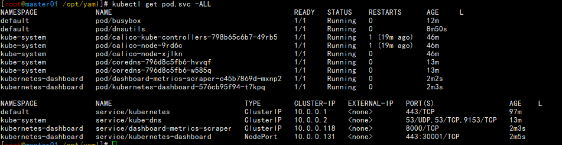
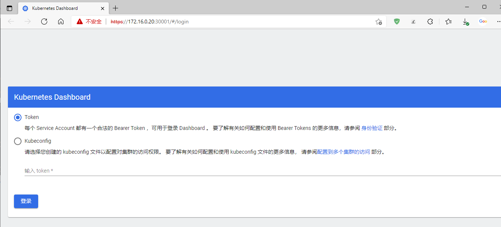
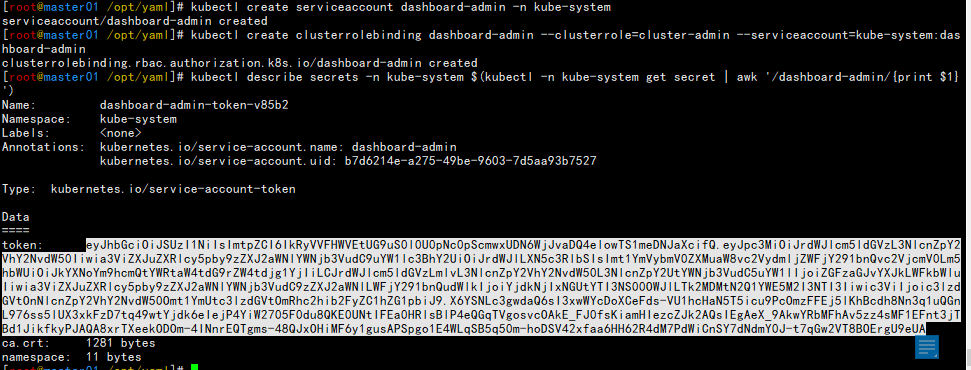
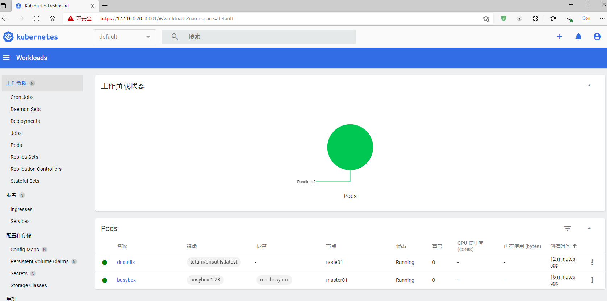

# 部署


对于集群chrony是最好的时间同步服务。


| 名称                   |  master01   |   node01    |
| :--------------------- | :---------: | :---------: |
| IP                     | 172.16.0.20 | 172.16.0.21 |
| api-server             |      √      |      x      |
| kube-controller-manger |      √      |      x      |
| kube-scheduler         |      √      |      x      |
| kubelet                |      √      |      √      |
| kube-proxy             |      √      |      √      |
| coredns                |      √      |      √      |
| Dashboad               |      √      |      x      |
| etcd                   |      √      |      x      |
| calico                 |      √      |      √      |
| docker                 |      √      |      √      |

结果预览

```sh
[root@master01 ~]# kubectl get pod -ALL
NAMESPACE              NAME                                        READY   STATUS    RESTARTS      AGE     L
default                busybox                                     1/1     Running   0             17m     
default                dnsutils                                    1/1     Running   0             14m     
kube-system            calico-kube-controllers-798b65c6b7-49rb5    1/1     Running   1 (24m ago)   52m     
kube-system            calico-node-9rd6c                           1/1     Running   1 (24m ago)   52m     
kube-system            calico-node-xjlkn                           1/1     Running   0             52m     
kube-system            coredns-796d8c5fb6-hvvqf                    1/1     Running   0             19m     
kube-system            coredns-796d8c5fb6-w585q                    1/1     Running   0             19m     
kubernetes-dashboard   dashboard-metrics-scraper-c45b7869d-mxnp2   1/1     Running   0             7m35s   
kubernetes-dashboard   kubernetes-dashboard-576cb95f94-t7kpq       1/1     Running   0             7m36s   
```


准备工作

```sh
[root@master01 ~]#  echo -e "172.16.0.20 master01\n172.16.0.21 node01" >>/etc/hosts
[root@master01 ~]# cat /etc/hosts
127.0.0.1   localhost localhost.localdomain localhost4 localhost4.localdomain4
::1         localhost localhost.localdomain localhost6 localhost6.localdomain6
172.16.0.20 master01
172.16.0.21 node01
```

```sh
[root@master01 ~]# yum install ipvsadm -y
[root@master01 ~]# ipvsadm
[root@master01 ~]# lsmod |grep ip_vs
```

```sh
master
mkdir -p  /opt/{etcd,kubernetes}/{cfg,ssl,logs} \
               ~/.kube \
               /opt/cni/bin \
               /etc/cni/net.d

node
mkdir -p /opt/kubernetes/{cfg,ssl,logs} \
               /opt/cni/bin \
               /etc/cni/net.d
```

```sh
[root@master01 /server/soft]# chmod +x cfssl*
[root@master01 /server/soft]# chmod +x docker-compose-linux-x86_64 
[root@master01 /server/soft]# mv cfssl_1.6.1_linux_amd64 /usr/local/bin/cfssl
[root@master01 /server/soft]# mv cfssljson_1.6.1_linux_amd64 /usr/local/bin/cfssljson
[root@master01 /server/soft]# mv cfssl-certinfo_1.6.1_linux_amd64 /usr/local/bin/cfssl-certinfo
[root@master01 /server/soft]# mv docker-compose-linux-x86_64 /usr/local/bin/docker-compose
```

## ca

```sh
[root@master01 ~]# mkdir -p ~/tls ;cd ~/tls
```

```sh
cat > ca-csr.json <<EOF
{
    "CN": "CA",
    "key": {
        "algo": "rsa",
        "size": 2048
    },
   "names": [
        {
            "C": "CN",
            "ST": "Yunnan",
            "L": "Kunming",
            "O": "CA",
            "OU": "System"
        }                                                                                                                    
    ]
}
EOF

[root@master01 ~/tls]# cfssl gencert -initca ca-csr.json | cfssljson -bare ca - 

#ca配置文件，以下的证书都是通过这个证书颁发的
cat > ca-config.json << EOF
{
    "signing": {
        "default": {
            "expiry": "87600h"
        },
        "profiles": {
            "etcd": {
                "expiry": "87600h",
                "usages": [
                    "signing",
                    "key encipherment",
                    "server auth",
                    "client auth"
                ]
            },
            "kubernetes": {
                "expiry": "87600h",
                "usages": [
                    "signing",
                    "key encipherment",
                    "server auth",
                    "client auth"
                ]
            }
        }
    }
}
EOF
```

```sh
etc

cat > etcd-csr.json <<EOF
{
    "CN": "etcd-ca",
    "hosts": [
        "localhost",
        "127.0.0.1",
        "master01",
        "172.16.0.20"
    ],
    "key": {
        "algo": "rsa",
        "size": 2048
    },
    "names": [
        {
            "C": "CN",
            "ST": "Yunnan",
            "L": "Kunming"
        }
    ]
}
EOF

[root@master01 ~/tls]# cfssl gencert -ca=ca.pem -ca-key=ca-key.pem -config=ca-config.json -profile=etcd etcd-csr.json | cfssljson -bare etcd
```

```sh
cat > admin-csr.json <<EOF
{
  "CN": "kubernetes-admin",
  "key": {
    "algo": "rsa",
    "size": 2048
  },
  "names": [
    {
      "C": "CN",
      "L": "Kunming",
      "O": "system:masters",
      "OU": "System",
      "ST": "Yunnan"
    }
  ]
}
EOF

[root@master01 ~/tls]# cfssl gencert -ca=ca.pem  -ca-key=ca-key.pem -config=ca-config.json -profile=kubernetes admin-csr.json | cfssljson -bare admin

```

```sh
hosts=(master01 node01)
for i in ${hosts[@]};do
cat > ${i}-csr.json <<EOF
{
  "CN": "system:node:${i}",
   "hosts": [
   "localhost",
    "127.0.0.1",
    "172.16.0.20",
    "172.16.0.21",
    "master01",
    "node01"
  ],
  "key": {
    "algo": "rsa",
    "size": 2048
  },
  "names": [
    {
      "C": "CN",
      "L": "Kunming",
      "O": "system:nodes",
      "OU": "System",
      "ST": "Yunnan"
    }
  ]
}
EOF

cfssl gencert -ca=ca.pem -ca-key=ca-key.pem -config=ca-config.json -profile=kubernetes ${i}-csr.json | cfssljson -bare ${i}
done
```

```sh
cat > kube-controller-manager-csr.json <<EOF
{
  "CN": "system:kube-controller-manager",
  "key": {
    "algo": "rsa",
    "size": 2048
  },
  "names": [
    {
      "C": "CN",
      "L": "Kunming",
      "O": "system:kube-controller-manager",
      "OU": "System",
      "ST": "Yunnan"
    }
  ]
}
EOF

[root@master01 ~/tls]# cfssl gencert -ca=ca.pem -ca-key=ca-key.pem -config=ca-config.json -profile=kubernetes kube-controller-manager-csr.json | cfssljson -bare kube-controller-manager

```

```sh
cat > kube-scheduler-csr.json <<EOF
{
  "CN": "system:kube-scheduler",
  "key": {
    "algo": "rsa",
    "size": 2048
  },
  "names": [
    {
      "C": "CN",
      "L": "Kunming",
      "O": "system:kube-scheduler",
      "OU": "System",
      "ST": "Yunnan"
    }
  ]
}
EOF

[root@master01 ~/tls]# cfssl gencert -ca=ca.pem -ca-key=ca-key.pem -config=ca-config.json -profile=kubernetes kube-scheduler-csr.json | cfssljson -bare kube-scheduler
```

```sh
cat > kube-apiserver-csr.json <<EOF
{
  "CN": "kube-apiserver",
  "hosts": [
  "127.0.0.1",
  "10.0.0.1",
  "172.16.0.20",
  "172.16.0.21",
  "master01",
  "node01",
  "kubernetes",
  "kubernetes.default",
  "kubernetes.default.svc",
  "kubernetes.default.svc.cluster",
  "kubernetes.default.svc.cluster.local"
  ],
  "key": {
    "algo": "rsa",
    "size": 2048
  },
  "names": [
    {
      "C": "CN",
      "L": "Kunming",
      "O": "system:masters",
      "OU": "System",
      "ST": "Yunnan"
    }
  ]
}
EOF

[root@master01 ~/tls]# cfssl gencert -ca=ca.pem -ca-key=ca-key.pem -config=ca-config.json  -profile=kubernetes kube-apiserver-csr.json | cfssljson -bare kube-apiserver

```

```sh
cat > kube-proxy-csr.json <<EOF
{
  "CN": "system:kube-proxy",
  "key": {
    "algo": "rsa",
    "size": 2048
  },
  "names": [
    {
      "C": "CN",
      "L": "Kunming",
      "O": "system:node-proxy",
      "OU": "System",
      "ST": "Yunnan"
    }
  ]
}
EOF

[root@master01 ~/tls]# cfssl gencert -ca=ca.pem -ca-key=ca-key.pem -config=ca-config.json -profile=kubernetes kube-proxy-csr.json | cfssljson -bare kube-proxy

```

```sh
cat > service-account-csr.json <<EOF
{
  "CN": "service-accounts",
  "key": {
    "algo": "rsa",
    "size": 2048
  },
  "names": [
    {
      "C": "CN",
      "L": "Kunming",
      "O": "system:masters",
      "OU": "System",
      "ST": "Yunnan"
    }
  ]
}
EOF

[root@master01 ~/tls]# cfssl gencert -ca=ca.pem -ca-key=ca-key.pem -config=ca-config.json -profile=kubernetes service-account-csr.json | cfssljson -bare service-account
```

```sh
[root@master01 ~/tls]# for i in `ls *.pem|grep -v key`;do openssl verify -CAfile ca.pem  $i;done
admin.pem: OK
ca.pem: OK
etcd.pem: OK
kube-apiserver.pem: OK
kube-controller-manager.pem: OK
kube-proxy.pem: OK
kube-scheduler.pem: OK
master01.pem: OK
node01.pem: OK
service-account.pem: OK

```

```sh
#client
hosts=(master01 node01)
for i in ${hosts[@]};do echo -e "\033[41;37m ${i} \033[0m" ;scp ca.pem ${i}.pem ${i}-key.pem ${i}:/opt/kubernetes/ssl;done

#server
hosts=(master01)
for i in ${hosts[@]};do echo -e "\033[43;37m ${i} \033[0m";scp ca-key.pem kube-apiserver*.pem kube-scheduler*.pem kube-controller*.pem service-account*.pem admin*.pem ${i}:/opt/kubernetes/ssl;done
```

```sh
#etcd
hosts=(master01)
for i in ${hosts[@]};do echo -e "\033[44;37m ${i} \033[0m";scp ca*.pem etcd*.pem ${i}:/opt/etcd/ssl;done
```

## etcd

```sh
[root@master01 /server/soft]# tar xf etcd-v3.5.1-linux-amd64.tar.gz 
[root@master01 /server/soft]# cp etcd-v3.5.1-linux-amd64/etcd* /usr/local/bin/

```

```sh
ETCD_IP=$(hostname -i)
ETCD_NAME=$(hostname -s)
ETCD_PATH="/opt/etcd/ssl/"

cat > /etc/systemd/system/etcd.service <<EOF
[Unit]
Description=ETCD Server
Documentation=https://github.com/coreos/etcd
After=network.target
After=network-online.target
Wants=network-online.target

[Service]
Type=notify
ExecStart=/usr/local/bin/etcd --name ${ETCD_NAME} \\
  --cert-file ${ETCD_PATH}etcd.pem \\
  --key-file ${ETCD_PATH}etcd-key.pem \\
  --peer-cert-file ${ETCD_PATH}etcd.pem \\
  --peer-key-file ${ETCD_PATH}etcd-key.pem \\
  --trusted-ca-file ${ETCD_PATH}ca.pem \\
  --peer-trusted-ca-file ${ETCD_PATH}ca.pem \\
  --peer-client-cert-auth \\
  --client-cert-auth \\
  --listen-client-urls https://${ETCD_IP}:2379 \\
  --advertise-client-urls https://${ETCD_IP}:2379 \\
  --listen-peer-urls https://${ETCD_IP}:2380 \\
  --initial-advertise-peer-urls https://${ETCD_IP}:2380 \\
  --initial-cluster master01=https://172.16.0.20:2380\\
  --initial-cluster-token etcd_cluster \\
  --initial-cluster-state new \\
  --data-dir=/var/lib/etcd/default.etcd 
Restart=on-failure

[Install]
WantedBy=multi-user.target
EOF
```

```sh
systemctl daemon-reload && systemctl start etcd && systemctl enable etcd
```

```sh
[root@master01 /server/soft]# ETCDCTL_API=3 etcdctl \
  --endpoints https://172.16.0.20:2379 \
  --cacert /opt/etcd/ssl/ca.pem \
  --cert /opt/etcd/ssl/etcd.pem \
  --key /opt/etcd/ssl/etcd-key.pem \
  endpoint health \
  --write-out=table
+--------------------------+--------+-------------+-------+
|         ENDPOINT         | HEALTH |    TOOK     | ERROR |
+--------------------------+--------+-------------+-------+
| https://172.16.0.20:2379 |   true | 15.608158ms |       |
+--------------------------+--------+-------------+-------+
  
```

## docker

```
[root@master01 /server/soft]# tar xf docker-20.10.9.tgz 
[root@master01 /server/soft]# cp docker/* /usr/local/bin/


cat > /etc/systemd/system/docker.service << EOF
[Unit]
Description=Docker Application Container Engine
Documentation=https://docs.docker.com
After=network-online.target firewalld.service
Wants=network-online.target
[Service]
Type=notify
ExecStart=/usr/local/bin/dockerd
ExecReload=/bin/kill -s HUP $MAINPID
LimitNOFILE=infinity
LimitNPROC=infinity
LimitCORE=infinity
TimeoutStartSec=0
Delegate=yes
KillMode=process
Restart=on-failure
StartLimitBurst=3
StartLimitInterval=60s
[Install]
WantedBy=multi-user.target
EOF

```

```sh
[root@master01 /server/soft]# yum -y install bash-completion bash-completion-extras
[root@master01 /server/soft]# mkdir docker_tab
[root@master01 /server/soft]# cd docker_tab/
[root@master01 /server/soft/docker]# git clone git://github.com/xyz349925756/kubernetes.git
Cloning into 'kubernetes'...
remote: Enumerating objects: 107, done.
remote: Counting objects: 100% (107/107), done.
remote: Compressing objects: 100% (99/99), done.
remote: Total 107 (delta 38), reused 0 (delta 0), pack-reused 0
Receiving objects: 100% (107/107), 557.59 KiB | 241.00 KiB/s, done.
Resolving deltas: 100% (38/38), done.
[root@master01 /server/soft/docker]# cd kubernetes/tab_completion/
[root@master01 /server/soft/docker/kubernetes/tab_completion]# ls
docker  docker-compose  README.md

[root@master01 /server/soft/docker/kubernetes/tab_completion]# cp docker* /usr/share/bash-completion/completions/

[root@master01 /server/soft/docker/kubernetes/tab_completion]# source /etc/profile.d/bash_completion.sh 
这里没有生效，重启才生效。。。
```

### 服务启动检测脚本

```sh
[root@master01 ~]# vim check_services.sh

#!/bin/bash
services1=(etcd docker kubelet kube-proxy kube-apiserver kube-controller-manager kube-scheduler)            
services2=(docker kubelet kube-proxy)
hosts1=(master01)
hosts2=(node01)

funtion_services() {
   printf  "\033[33m %25s \033[0m  :  " $i && ssh $h systemctl status $i | grep Active |awk -F"[()]" '{print $2}'
}

for h in ${hosts1[@]};
do
    echo -e "\033[41;37m    $h Services Is Checking......\033[0m"
    for i in ${services1[@]};
    do
       funtion_services
    done
done

for n in ${hosts2[@]};
do
    echo -e "\033[44;37m  $n Services Is Checking......\033[0m"
    for i in ${services2[@]};
    do
       funtion_services
    done
done

```

### daemon.json

```sh
cat <<EOF | sudo tee /etc/docker/daemon.json
{
  "exec-opts": ["native.cgroupdriver=systemd"]
}
EOF

[root@master01 ~]#  systemctl daemon-reload ;systemctl restart docker.service 

```


## kubernetes

```sh
[root@master01 ~]# cd /server/soft/
[root@master01 /server/soft]# tar xf kubernetes-server-linux-amd64.tar.gz
[root@master01 ~]# cp kube-apiserver kube-controller-manager kube-scheduler kubectl kubeadm kubelet kube-proxy /usr/local/bin/
[root@master01 ~]# scp kubelet kube-proxy node01:/usr/local/bin/

[root@master01 ~]# kubeadm config images list
k8s.gcr.io/kube-apiserver:v1.22.3
k8s.gcr.io/kube-controller-manager:v1.22.3
k8s.gcr.io/kube-scheduler:v1.22.3
k8s.gcr.io/kube-proxy:v1.22.3
k8s.gcr.io/pause:3.5
k8s.gcr.io/etcd:3.5.0-0
k8s.gcr.io/coredns/coredns:v1.8.4

```

### 生成kubeconfig配置文件

**kubelet**

```sh
[root@master01 ~]# cd tls/
[root@master01 ~/tls]# 
LB_VIP="https://$(hostname -i):6443"
hosts=(master01 node01)

for i in ${hosts[@]}; do
  kubectl config set-cluster kubernetes  \
    --certificate-authority=ca.pem \
    --embed-certs=true \
    --server=${LB_VIP} \
    --kubeconfig=/opt/kubernetes/cfg/${i}.kubeconfig

  kubectl config set-credentials system:node:${i} \
    --client-certificate=${i}.pem \
    --client-key=${i}-key.pem \
    --embed-certs=true \
    --kubeconfig=/opt/kubernetes/cfg/${i}.kubeconfig

  kubectl config set-context default \
    --cluster=kubernetes \
    --user=system:node:${i} \
    --kubeconfig=/opt/kubernetes/cfg/${i}.kubeconfig

  kubectl config use-context default --kubeconfig=/opt/kubernetes/cfg/${i}.kubeconfig
done

[root@master01 ~/tls]# ls /opt/kubernetes/cfg/
master01.kubeconfig  node01.kubeconfig

```

**kube-proxy**

```sh
KUBE_CONFIG="/opt/kubernetes/cfg/kube-proxy.kubeconfig"
LB_VIP="https://$(hostname -i):6443"

kubectl config set-cluster kubernetes  \
    --certificate-authority=ca.pem \
    --embed-certs=true \
    --server=${LB_VIP} \
    --kubeconfig=${KUBE_CONFIG}

kubectl config set-credentials system:kube-proxy \
    --client-certificate=kube-proxy.pem \
    --client-key=kube-proxy-key.pem \
    --embed-certs=true \
    --kubeconfig=${KUBE_CONFIG}

kubectl config set-context default \
    --cluster=kubernetes \
    --user=system:kube-proxy \
    --kubeconfig=${KUBE_CONFIG}

kubectl config use-context default --kubeconfig=${KUBE_CONFIG}
```

**kube-controller-manager**

```sh
KUBE_CONFIG="/opt/kubernetes/cfg/kube-controller-manager.kubeconfig"

kubectl config set-cluster kubernetes \
    --certificate-authority=ca.pem \
    --embed-certs=true \
    --server=https://127.0.0.1:6443 \
    --kubeconfig=${KUBE_CONFIG}
    
kubectl config set-credentials system:kube-controller-manager \
    --client-certificate=kube-controller-manager.pem \
    --client-key=kube-controller-manager-key.pem \
    --embed-certs=true \
    --kubeconfig=${KUBE_CONFIG}

kubectl config set-context default \
    --cluster=kubernetes \
    --user=system:kube-controller-manager \
    --kubeconfig=${KUBE_CONFIG}

kubectl config use-context default --kubeconfig=${KUBE_CONFIG}
```

**kube-scheduler**

```sh
KUBE_CONFIG="/opt/kubernetes/cfg/kube-scheduler.kubeconfig"

kubectl config set-cluster kubernetes \
  --certificate-authority=ca.pem \
  --embed-certs=true \
  --server=https://127.0.0.1:6443 \
  --kubeconfig=${KUBE_CONFIG}

kubectl config set-credentials system:kube-scheduler \
  --client-certificate=kube-scheduler.pem \
  --client-key=kube-scheduler-key.pem \
  --embed-certs=true \
  --kubeconfig=${KUBE_CONFIG}

kubectl config set-context default \
  --cluster=kubernetes \
  --user=system:kube-scheduler \
  --kubeconfig=${KUBE_CONFIG}

kubectl config use-context default --kubeconfig=${KUBE_CONFIG}
```

**admin**

```sh
KUBE_CONFIG="/opt/kubernetes/cfg/admin.kubeconfig"

kubectl config set-cluster kubernetes \
    --certificate-authority=ca.pem \
    --embed-certs=true \
    --server=https://172.16.0.20:6443 \
    --kubeconfig=${KUBE_CONFIG}

kubectl config set-credentials admin \
    --client-certificate=admin.pem \
    --client-key=admin-key.pem \
    --embed-certs=true \
    --kubeconfig=${KUBE_CONFIG}

kubectl config set-context default \
    --cluster=kubernetes \
    --user=admin \
    --kubeconfig=${KUBE_CONFIG}

kubectl config use-context default --kubeconfig=${KUBE_CONFIG}
```

```sh
[root@master01 ~/tls]# cp /opt/kubernetes/cfg/admin.kubeconfig ~/.kube/config

[root@master01 ~/tls]# scp /opt/kubernetes/cfg/node01.kubeconfig node01:/opt/kubernetes/cfg/

[root@master01 ~/tls]# scp /opt/kubernetes/cfg/kube-proxy.kubeconfig  node01:/opt/kubernetes/cfg/

```

**生成密钥文件**

```sh
ENCRYPTION_KEY=$(head -c 32 /dev/urandom | base64)

cat > /opt/kubernetes/ssl/encryption-config.yaml <<EOF
kind: EncryptionConfig
apiVersion: v1
resources:
  - resources:
      - secrets
    providers:
      - aescbc:
          keys:
            - name: key1
              secret: ${ENCRYPTION_KEY}
      - identity: {}
EOF

```

### systemd

```sh
cat <<EOF | sudo tee /etc/systemd/system/kube-apiserver.service
[Unit]
Description=Kubernetes API Server
Documentation=https://github.com/kubernetes/kubernetes

[Service]
ExecStart=/usr/local/bin/kube-apiserver \\
  --log-dir=/opt/kubernetes/logs \\
  --advertise-address=$(hostname -i) \\
  --allow-privileged=true \\
  --apiserver-count=3 \\
  --audit-log-maxage=30 \\
  --audit-log-maxbackup=3 \\
  --audit-log-maxsize=100 \\
  --audit-log-path=/var/log/audit.log \\
  --authorization-mode=Node,RBAC \\
  --bind-address=0.0.0.0 \\
  --client-ca-file=/opt/kubernetes/ssl/ca.pem \\
  --enable-admission-plugins=NamespaceLifecycle,NodeRestriction,LimitRanger,ServiceAccount,DefaultStorageClass,ResourceQuota \\
  --etcd-cafile=/opt/etcd/ssl/ca.pem \\
  --etcd-certfile=/opt/etcd/ssl/etcd.pem \\
  --etcd-keyfile=/opt/etcd/ssl/etcd-key.pem \\
  --etcd-servers=https://172.16.0.20:2379\\
  --event-ttl=1h \\
  --encryption-provider-config=/opt/kubernetes/ssl/encryption-config.yaml \\
  --kubelet-certificate-authority=/opt/kubernetes/ssl/ca.pem \\
  --kubelet-client-certificate=/opt/kubernetes/ssl/kube-apiserver.pem \\
  --kubelet-client-key=/opt/kubernetes/ssl/kube-apiserver-key.pem \\
  --runtime-config=api/all=true \\
  --service-account-key-file=/opt/kubernetes/ssl/service-account.pem \\
  --service-account-signing-key-file=/opt/kubernetes/ssl/service-account-key.pem \\
  --service-account-issuer=api \\
  --service-cluster-ip-range=10.0.0.0/24 \\
  --service-node-port-range=30000-32767 \\
  --tls-cert-file=/opt/kubernetes/ssl/kube-apiserver.pem \\
  --tls-private-key-file=/opt/kubernetes/ssl/kube-apiserver-key.pem \\
  --v=2
Restart=on-failure
RestartSec=5

[Install]
WantedBy=multi-user.target
EOF
```

```sh
systemctl daemon-reload && systemctl start kube-apiserver && systemctl enable kube-apiserver
```

**kube-controller-manager**

```sh
cat <<EOF | sudo tee /etc/systemd/system/kube-controller-manager.service
[Unit]
Description=Kubernetes Controller Manager
Documentation=https://github.com/kubernetes/kubernetes

[Service]
ExecStart=/usr/local/bin/kube-controller-manager \\
  --log-dir=/opt/kubernetes/logs \\
  --bind-address=0.0.0.0 \\
  --cluster-cidr=10.244.0.0/16 \\
  --cluster-name=kubernetes \\
  --cluster-signing-cert-file=/opt/kubernetes/ssl/ca.pem \\
  --cluster-signing-key-file=/opt/kubernetes/ssl/ca-key.pem \\
  --kubeconfig=/opt/kubernetes/cfg/kube-controller-manager.kubeconfig \\
  --leader-elect=true \\
  --root-ca-file=/opt/kubernetes/ssl/ca.pem \\
  --service-account-private-key-file=/opt/kubernetes/ssl/service-account-key.pem \\
  --service-cluster-ip-range=10.0.0.0/24 \\
  --use-service-account-credentials=true \\
  --v=2
Restart=on-failure
RestartSec=5

[Install]
WantedBy=multi-user.target
EOF
```

```sh
systemctl daemon-reload && systemctl start kube-controller-manager && systemctl enable kube-controller-manager
```

**kube-scheduler**

```sh
cat <<EOF | sudo tee /opt/kubernetes/cfg/kube-scheduler.yaml
apiVersion: kubescheduler.config.k8s.io/v1beta1
kind: KubeSchedulerConfiguration
clientConnection:
  kubeconfig: "/opt/kubernetes/cfg/kube-scheduler.kubeconfig"
leaderElection:
  leaderElect: true
EOF

cat <<EOF | sudo tee /etc/systemd/system/kube-scheduler.service
[Unit]
Description=Kubernetes Scheduler
Documentation=https://github.com/kubernetes/kubernetes

[Service]
ExecStart=/usr/local/bin/kube-scheduler \\
  --log-dir=/opt/kubernetes/logs \\
  --config=/opt/kubernetes/cfg/kube-scheduler.yaml \\
  --v=2
Restart=on-failure
RestartSec=5

[Install]
WantedBy=multi-user.target
EOF
```

```sh
systemctl daemon-reload && systemctl start kube-scheduler && systemctl enable kube-scheduler
```

**RBAC**

```sh
任意一台master操作
#创建system:kube-apiserver-to-kubelet ClusterRole有权限访问Kubelet API，并执行与管理相关的pod最常见的任务
cat <<EOF | kubectl apply --kubeconfig /opt/kubernetes/cfg/admin.kubeconfig -f -
apiVersion: rbac.authorization.k8s.io/v1
kind: ClusterRole
metadata:
  annotations:
    rbac.authorization.kubernetes.io/autoupdate: "true"
  labels:
    kubernetes.io/bootstrapping: rbac-defaults
  name: system:kube-apiserver-to-kubelet
rules:
  - apiGroups:
      - ""
    resources:
      - nodes/proxy
      - nodes/stats
      - nodes/log
      - nodes/spec
      - nodes/metrics
    verbs:
      - "*"
EOF

#The Kubernetes API Server authenticates to the Kubelet as the kubernetes user using the client certificate as defined by the --kubelet-client-certificate flag.
#Bind the system:kube-apiserver-to-kubelet ClusterRole to the kubernetes user:
cat <<EOF | kubectl apply --kubeconfig /opt/kubernetes/cfg/admin.kubeconfig -f -
apiVersion: rbac.authorization.k8s.io/v1
kind: ClusterRoleBinding
metadata:
  name: system:kube-apiserver
  namespace: ""
roleRef:
  apiGroup: rbac.authorization.k8s.io
  kind: ClusterRole
  name: system:kube-apiserver-to-kubelet
subjects:
  - apiGroup: rbac.authorization.k8s.io
    kind: User
    name: kubernetes
EOF
```

```sh
[root@master01 ~]# curl --cacert /opt/kubernetes/ssl/ca.pem -i https://127.0.0.1:6443/version
HTTP/1.1 200 OK
Audit-Id: c88a73c8-b3c6-4e3d-81d3-a5fc9bde8577
Cache-Control: no-cache, private
Content-Type: application/json
X-Kubernetes-Pf-Flowschema-Uid: 136523e2-f2b1-46fc-b7a3-7bafd2fe5853
X-Kubernetes-Pf-Prioritylevel-Uid: 7322df73-9698-4ef2-95db-28df7c24f96d
Date: Mon, 15 Nov 2021 06:03:46 GMT
Content-Length: 263

{
  "major": "1",
  "minor": "22",
  "gitVersion": "v1.22.3",
  "gitCommit": "c92036820499fedefec0f847e2054d824aea6cd1",
  "gitTreeState": "clean",
  "buildDate": "2021-10-27T18:35:25Z",
  "goVersion": "go1.16.9",
  "compiler": "gc",
  "platform": "linux/amd64"
  
[root@master01 ~]# curl --cacert /opt/kubernetes/ssl/ca.pem -i https://172.16.0.20:6443/version
HTTP/1.1 200 OK
Audit-Id: 4473ed9f-682c-47ff-83b1-1b4c5488913b
Cache-Control: no-cache, private
Content-Type: application/json
X-Kubernetes-Pf-Flowschema-Uid: 136523e2-f2b1-46fc-b7a3-7bafd2fe5853
X-Kubernetes-Pf-Prioritylevel-Uid: 7322df73-9698-4ef2-95db-28df7c24f96d
Date: Mon, 15 Nov 2021 06:04:09 GMT
Content-Length: 263

{
  "major": "1",
  "minor": "22",
  "gitVersion": "v1.22.3",
  "gitCommit": "c92036820499fedefec0f847e2054d824aea6cd1",
  "gitTreeState": "clean",
  "buildDate": "2021-10-27T18:35:25Z",
  "goVersion": "go1.16.9",
  "compiler": "gc",
  "platform": "linux/amd64"
  
[root@master01 ~]# curl --cacert /opt/kubernetes/ssl/ca.pem -i https://172.16.0.20:6443/healthz
HTTP/1.1 200 OK
Audit-Id: a287cdbc-597a-4aed-ab14-ce8345505809
Cache-Control: no-cache, private
Content-Type: text/plain; charset=utf-8
X-Content-Type-Options: nosniff
X-Kubernetes-Pf-Flowschema-Uid: a167f19e-b120-43ba-b4f7-f9f1ddd9925e
X-Kubernetes-Pf-Prioritylevel-Uid: a9505e55-c390-44ac-a4a6-27f7190b13b1
Date: Mon, 15 Nov 2021 06:04:47 GMT
Content-Length: 2

ok  
```

https://github.com/xyz349925756/kubernetes

这里使用我自己编译的镜像

```sh
[root@master01 ~]# ls /server/soft/docker_tab/kubernetes/
k8s.gcr.io  pause  README.md  tab_completion
[root@master01 ~]# cd /server/soft/docker_tab/kubernetes/
[root@master01 /server/soft/docker_tab/kubernetes]# docker load  < k8s.gcr.io/coredns/coredns-1.8.6 
256bc5c338a6: Loading layer  336.4kB/336.4kB
80e4a2390030: Loading layer  46.62MB/46.62MB
Loaded image: k8s.gcr.io/coredns/coredns:v1.8.6

[root@master01 /server/soft/docker_tab/kubernetes]# docker load  < pause/k8s.gcr.io_pause3.6 
46dc8f282d6f: Loading layer  821.2kB/821.2kB
Loaded image: k8s.gcr.io/pause:3.6

[root@master01 /server/soft/docker_tab/kubernetes]# docker images
REPOSITORY                   TAG       IMAGE ID       CREATED       SIZE
k8s.gcr.io/pause             3.6       4d13372e07fe   3 days ago    819kB
k8s.gcr.io/coredns/coredns   v1.8.6    ebe3eb74c235   5 weeks ago   46.8MB

```

### kubectl命令自动补全

```sh
[root@master01 /opt/yaml]# echo 'source /usr/share/bash-completion/bash_completion' >> ~/.bashrc
[root@master01 /opt/yaml]# echo 'source <(kubectl completion bash)' >> ~/.bashrc
[root@master01 /opt/yaml]# source ~/.bashrc 
```

### kubelet

```sh
sed -ri 's/.*swap.*/#&/' /etc/fstab 
```


```sh
节点都操作
[root@master01 ~]# echo 'mkdir -p /run/systemd/resolve &&  ln -s /etc/resolv.conf /run/systemd/resolve/ '  >>/etc/rc.d/rc.local 
[root@master01 ~]# chmod +x /etc/rc.d/rc.local  

cat <<EOF | sudo tee /opt/kubernetes/cfg/kubelet-config.yaml
kind: KubeletConfiguration
apiVersion: kubelet.config.k8s.io/v1beta1
authentication:
  anonymous:
    enabled: false
  webhook:
    enabled: true
  x509:
    clientCAFile: "/opt/kubernetes/ssl/ca.pem"
authorization:
  mode: Webhook
clusterDomain: "cluster.local"
clusterDNS:
  - "10.0.0.2"
podCIDR: "10.0.0.0/24"
resolvConf: "/run/systemd/resolve/resolv.conf"
runtimeRequestTimeout: "15m"
tlsCertFile: "/opt/kubernetes/ssl/$(hostname -s).pem"
tlsPrivateKeyFile: "/opt/kubernetes/ssl/$(hostname -s)-key.pem"
EOF
```

system

```sh
cat <<EOF | sudo tee /etc/systemd/system/kubelet.service
[Unit]
Description=Kubernetes Kubelet
Documentation=https://github.com/kubernetes/kubernetes
After=docker.service
Requires=docker.service

[Service]
ExecStart=/usr/local/bin/kubelet \\
  --log-dir=/opt/kubernetes/logs \\
  --config=/opt/kubernetes/cfg/kubelet-config.yaml \\
  --container-runtime=docker \\
  --container-runtime-endpoint=unix:///var/run/dockershim.sock   \\
  --image-pull-progress-deadline=2m \\
  --kubeconfig=/opt/kubernetes/cfg/$(hostname -s).kubeconfig \\
  --network-plugin=cni \\
  --register-node=true \\
  --cgroup-driver=systemd \\
  --v=2
Restart=on-failure
RestartSec=5   #master 需要10秒因为开机启动的多排队到kubelet的时候已经超过10秒了。这里要特别注意

[Install]
WantedBy=multi-user.target
EOF
```

```sh
systemctl daemon-reload && systemctl start kubelet && systemctl enable kubelet
```

### kube-proxy

```sh
cat <<EOF | sudo tee /opt/kubernetes/cfg/kube-proxy-config.yaml
kind: KubeProxyConfiguration
apiVersion: kubeproxy.config.k8s.io/v1alpha1
clientConnection:
  kubeconfig: "/opt/kubernetes/cfg/kube-proxy.kubeconfig"
mode: "iptables"
clusterCIDR: "10.244.0.0/16"
EOF

cat <<EOF | sudo tee /etc/systemd/system/kube-proxy.service
[Unit]
Description=Kubernetes Kube Proxy
Documentation=https://github.com/kubernetes/kubernetes

[Service]
ExecStart=/usr/local/bin/kube-proxy \\
  --log-dir=/opt/kubernetes/logs \\
  --config=/opt/kubernetes/cfg/kube-proxy-config.yaml
Restart=on-failure
RestartSec=5

[Install]
WantedBy=multi-user.target
EOF

```

```sh
systemctl daemon-reload && systemctl start kube-proxy && systemctl enable kube-proxy
```

```sh
tar xf cni-plugins-linux-amd64-v1.0.1.tgz -C /opt/cni/bin/  #可以不要
```

```sh
[root@master01 ~]# . check_services.sh 
    master01 Services Is Checking......
                      etcd   :  running
                    docker   :  running
                   kubelet   :  running
                kube-proxy   :  running
            kube-apiserver   :  running
   kube-controller-manager   :  running
            kube-scheduler   :  running
  node01, Services Is Checking......
                    docker   :  running
                   kubelet   :  running
                kube-proxy   :  running

```


## calico网络

```sh
[root@master01 ~]# kubectl get node
NAME       STATUS     ROLES    AGE    VERSION
master01   NotReady   <none>   106s   v1.22.3
node01     NotReady   <none>   47s    v1.22.3


[root@master01 /server/soft]# cd /opt/
[root@master01 /opt]# mkdir yaml;cd yaml
[root@master01 /opt/yaml]# curl https://docs.projectcalico.org/manifests/calico-etcd.yaml -o calico.yaml


[root@master01 /opt/yaml]# cat /opt/etcd/ssl/ca.pem |base64 -w 0 >etcd-ca
[root@master01 /opt/yaml]# cat /opt/etcd/ssl/etcd.pem |base64 -w 0 >etcd-cert
[root@master01 /opt/yaml]# cat /opt/etcd/ssl/etcd-key.pem |base64 -w 0 >etcd-key

再打开一个shell
修改第一处
  etcd-key: 
  etcd-cert: 
  etcd-ca: 
  填写刚才加密的三个文件
第二处
   # Configure this with the location of your etcd cluster.
  etcd_endpoints: "https://172.16.0.20:2379"
  # If you're using TLS enabled etcd uncomment the following.
  # You must also populate the Secret below with these files.
  etcd_ca: "/calico-secrets/etcd-ca"
  etcd_cert: "/calico-secrets/etcd-cert"
  etcd_key: "/calico-secrets/etcd-key"
  # Typha is disabled.                   
  
第三处
365             - name: CALICO_IPV4POOL_CIDR
366               value: "10.244.0.0/16"    

第四处
apiVersion: policy/v1    
```

上面部署过程所用到的网络
service_cluster_ip_range=10.0.0.0/24
cluster_cidr=10.244.0.0/16
pod-cidr=10.244.0.0/16

**等待下载**

```sh
[root@master01 /opt/yaml]# kubectl describe pod calico-node-8rhgr -n kube-system 
。。。
Failed to create pod sandbox: rpc error: code = Unknown desc = failed pulling image "k8s.gcr.io/pause:3.5": Error response from daemon: Get "https://k8s.gcr.io/v2/": dial tcp 108.177.125.82:443: i/o timeout
[root@master01 /opt/yaml]# docker images 
REPOSITORY                   TAG       IMAGE ID       CREATED       SIZE
k8s.gcr.io/pause             3.6       4d13372e07fe   3 days ago    819kB
k8s.gcr.io/coredns/coredns   v1.8.6    ebe3eb74c235   5 weeks ago   46.8MB

[root@master01 /opt/yaml]# docker images 
REPOSITORY                   TAG       IMAGE ID       CREATED       SIZE
k8s.gcr.io/pause             3.5       4d13372e07fe   3 days ago    819kB
k8s.gcr.io/pause             3.6       4d13372e07fe   3 days ago    819kB
k8s.gcr.io/coredns/coredns   v1.8.6    ebe3eb74c235   5 weeks ago   46.8MB

[root@master01 /opt/yaml]# kubectl get pod -n kube-system 
NAME                                       READY   STATUS     RESTARTS   AGE
calico-kube-controllers-798b65c6b7-49rb5   1/1     Running    0          10m
calico-node-9rd6c                          1/1     Running    0          10m
calico-node-xjlkn                          0/1     Init:0/2   0          10m

```

好了接下来调试node

```sh
[root@master01 /server/soft/docker_tab/kubernetes]# scp pause/k8s.gcr.io_pause3.6 node01:~
```

```sh
[root@node01 ~]# ls
anaconda-ks.cfg  coredns-1.8.6  k8s.gcr.io_pause3.6  vmware-tools-distrib
[root@node01 ~]# docker load  < k8s.gcr.io_pause3.6 
46dc8f282d6f: Loading layer  821.2kB/821.2kB
Loaded image: k8s.gcr.io/pause:3.6
[root@node01 ~]# docker load < coredns-1.8.6  #coredns可以用到
256bc5c338a6: Loading layer  336.4kB/336.4kB
80e4a2390030: Loading layer  46.62MB/46.62MB
Loaded image: k8s.gcr.io/coredns/coredns:v1.8.6

[root@node01 ~]# docker images
REPOSITORY         TAG       IMAGE ID       CREATED      SIZE
k8s.gcr.io/pause   3.6       4d13372e07fe   3 days ago   819kB
[root@node01 ~]# docker tag k8s.gcr.io/pause:3.6 k8s.gcr.io/pause:3.5
[root@node01 ~]# docker images 
REPOSITORY         TAG       IMAGE ID       CREATED      SIZE
k8s.gcr.io/pause   3.5       4d13372e07fe   3 days ago   819kB
k8s.gcr.io/pause   3.6       4d13372e07fe   3 days ago   819kB

```

```sh
[root@master01 ~]# kubectl get node
NAME       STATUS   ROLES    AGE   VERSION
master01   Ready    <none>   39m   v1.22.3
node01     Ready    <none>   38m   v1.22.3

[root@master01 ~]# kubectl get pod -n kube-system 
NAME                                       READY   STATUS    RESTARTS   AGE
calico-kube-controllers-798b65c6b7-49rb5   1/1     Running   0          18m
calico-node-9rd6c                          1/1     Running   0          18m
calico-node-xjlkn                          1/1     Running   0          18m


```

## coredns

dns

```yaml
apiVersion: v1
kind: ServiceAccount
metadata:
  name: coredns
  namespace: kube-system
---
apiVersion: rbac.authorization.k8s.io/v1
kind: ClusterRole
metadata:
  labels:
    kubernetes.io/bootstrapping: rbac-defaults
  name: system:coredns
rules:
- apiGroups:
  - ""
  resources:
  - endpoints
  - services
  - pods
  - namespaces
  verbs:
  - list
  - watch
- apiGroups:
  - ""
  resources:
  - nodes
  verbs:
  - get
- apiGroups:
  - discovery.k8s.io
  resources:
  - endpointslices
  verbs:
  - list
  - watch
---
apiVersion: rbac.authorization.k8s.io/v1
kind: ClusterRoleBinding
metadata:
  annotations:
    rbac.authorization.kubernetes.io/autoupdate: "true"
  labels:
    kubernetes.io/bootstrapping: rbac-defaults
  name: system:coredns
roleRef:
  apiGroup: rbac.authorization.k8s.io
  kind: ClusterRole
  name: system:coredns
subjects:
- kind: ServiceAccount
  name: coredns
  namespace: kube-system
---
apiVersion: v1
kind: ConfigMap
metadata:
  name: coredns
  namespace: kube-system
data:
  Corefile: |
    .:53 {
        errors
        health
        ready
        kubernetes cluster.local in-addr.arpa ip6.arpa {
          pods insecure
          fallthrough in-addr.arpa ip6.arpa
        }
        prometheus :9153
        cache 30
        loop
        reload
        loadbalance
    }
---
apiVersion: apps/v1
kind: Deployment
metadata:
  name: coredns
  namespace: kube-system
  labels:
    k8s-app: kube-dns
    kubernetes.io/name: "CoreDNS"
spec:
  replicas: 2
  strategy:
    type: RollingUpdate
    rollingUpdate:
      maxUnavailable: 1
  selector:
    matchLabels:
      k8s-app: kube-dns
  template:
    metadata:
      labels:
        k8s-app: kube-dns
    spec:
      priorityClassName: system-cluster-critical
      serviceAccountName: coredns
      tolerations:
        - key: "CriticalAddonsOnly"
          operator: "Exists"
      nodeSelector:
        beta.kubernetes.io/os: linux
      containers:
      - name: coredns
        image: k8s.gcr.io/coredns/coredns:v1.8.6
        imagePullPolicy: IfNotPresent
        resources:
          limits:
            memory: 170Mi
          requests:
            cpu: 100m
            memory: 70Mi
        args: [ "-conf", "/etc/coredns/Corefile" ]
        volumeMounts:
        - name: config-volume
          mountPath: /etc/coredns
          readOnly: true
        ports:
        - containerPort: 53
          name: dns
          protocol: UDP
        - containerPort: 53
          name: dns-tcp
          protocol: TCP
        - containerPort: 9153
          name: metrics
          protocol: TCP
        securityContext:
          allowPrivilegeEscalation: false
          capabilities:
            add:
            - NET_BIND_SERVICE
            drop:
            - all
          readOnlyRootFilesystem: true
        livenessProbe:
          httpGet:
            path: /health
            port: 8080
            scheme: HTTP
          initialDelaySeconds: 60
          timeoutSeconds: 5
          successThreshold: 1
          failureThreshold: 5
        readinessProbe:
          httpGet:
            path: /ready
            port: 8181
            scheme: HTTP
      dnsPolicy: Default
      volumes:
        - name: config-volume
          configMap:
            name: coredns
            items:
            - key: Corefile
              path: Corefile
---
apiVersion: v1
kind: Service
metadata:
  name: kube-dns
  namespace: kube-system
  annotations:
    prometheus.io/port: "9153"
    prometheus.io/scrape: "true"
  labels:
    k8s-app: kube-dns
    kubernetes.io/cluster-service: "true"
    kubernetes.io/name: "CoreDNS"
spec:
  selector:
    k8s-app: kube-dns
  clusterIP: 10.0.0.2
  ports:
  - name: dns
    port: 53
    protocol: UDP
  - name: dns-tcp
    port: 53
    protocol: TCP
  - name: metrics
    port: 9153
    protocol: TCP

```


```sh
https://storage.googleapis.com/kubernetes-the-hard-way/coredns-1.8.yaml
修改
[root@master01 /opt/yaml]# vim coredns-1.8.yaml 
107       - name: coredns                                                              
108         image: k8s.gcr.io/coredns/coredns:v1.8.6

      nodeSelector:
        kubernetes.io/os: linux  
        
177   clusterIP: 10.0.0.2    
```

```sh
[root@master01 /opt/yaml]# kubectl get pod -n kube-system
NAME                                       READY   STATUS    RESTARTS        AGE
calico-kube-controllers-798b65c6b7-49rb5   1/1     Running   1 (5m41s ago)   32m
calico-node-9rd6c                          1/1     Running   1 (5m38s ago)   32m
calico-node-xjlkn                          1/1     Running   0               32m
coredns-796d8c5fb6-hvvqf                   1/1     Running   0               16s
coredns-796d8c5fb6-w585q                   1/1     Running   0               16s

```

测试dns

```sh
[root@master01 /opt/yaml]# kubectl run busybox --image=busybox:1.28 --command -- sleep 3600
pod/busybox created

[root@master01 /opt/yaml]# kubectl get pods -l run=busybox
NAME      READY   STATUS    RESTARTS   AGE
busybox   1/1     Running   0          25s

[root@master01 /opt/yaml]# POD_NAME=$(kubectl get pods -l run=busybox -o jsonpath="{.items[0].metadata.name}")

[root@master01 /opt/yaml]# kubectl exec -ti $POD_NAME -- nslookup kubernetes
Server:    10.0.0.2
Address 1: 10.0.0.2 kube-dns.kube-system.svc.cluster.local

Name:      kubernetes
Address 1: 10.0.0.1 kubernetes.default.svc.cluster.local

```

测试2

```sh
[root@master01 /opt/yaml]# vim dnsutils.yaml
apiVersion: v1
kind: Pod
metadata:
  name: dnsutils
  namespace: default
spec:
  containers:
  - name: dnsutils
    image: tutum/dnsutils:latest
    command:    
      - sleep
      - "3600"
    imagePullPolicy: IfNotPresent
  restartPolicy: Always

[root@master01 /opt/yaml]# kubectl create -f dnsutils.yaml 
pod/dnsutils created

[root@master01 /opt/yaml]# kubectl get pods dnsutils
NAME       READY   STATUS    RESTARTS   AGE
dnsutils   1/1     Running   0          81s

[root@master01 /opt/yaml]# kubectl exec -i -t dnsutils -- nslookup kubernetes.default
Server:		10.0.0.2
Address:	10.0.0.2#53

Name:	kubernetes.default.svc.cluster.local
Address: 10.0.0.1

[root@master01 /opt/yaml]# kubectl exec -i -t dnsutils -- nslookup baidu.com
Server:		10.0.0.2
Address:	10.0.0.2#53

** server can't find baidu.com: SERVFAIL

command terminated with exit code 1

外网是不通的，因为dns这里为了安全不能通外网
```

## Dashboard

下载：https://github.com/kubernetes/dashboard/releases

```sh
修改
 39 spec:
 40   ports:
 41     - port: 443
 42       targetPort: 8443
 43       nodePort: 30001
 44   type: NodePort    
 
[root@master01 /opt/yaml]# kubectl apply -f recommended.yaml 
 
[root@master01 /opt/yaml]# kubectl get pod,svc -ALL
```



访问：https://172.16.0.20:30001



### 创建service account

并绑定默认cluster-admin管理员集群角色：

```sh
[root@master01 /opt/yaml]# kubectl create serviceaccount dashboard-admin -n kube-system
serviceaccount/dashboard-admin created
[root@master01 /opt/yaml]# kubectl create clusterrolebinding dashboard-admin --clusterrole=cluster-admin --serviceaccount=kube-system:dashboard-admin
clusterrolebinding.rbac.authorization.k8s.io/dashboard-admin created
[root@master01 /opt/yaml]# kubectl describe secrets -n kube-system $(kubectl -n kube-system get secret | awk '/dashboard-admin/{print $1}')
Name:         dashboard-admin-token-v85b2
Namespace:    kube-system
Labels:       <none>
Annotations:  kubernetes.io/service-account.name: dashboard-admin
              kubernetes.io/service-account.uid: b7d6214e-a275-49be-9603-7d5aa93b7527

Type:  kubernetes.io/service-account-token

Data
====
token:      eyJhbGciOiJSUzI1NiIsImtpZCI6IkRyVVFHWVEtUG9uS0l0U0pNc0pScmwxUDN6WjJvaDQ4elowTS1meDNJaXcifQ.eyJpc3MiOiJrdWJlcm5ldGVzL3NlcnZpY2VhY2NvdW50Iiwia3ViZXJuZXRlcy5pby9zZXJ2aWNlYWNjb3VudC9uYW1lc3BhY2UiOiJrdWJlLXN5c3RlbSIsImt1YmVybmV0ZXMuaW8vc2VydmljZWFjY291bnQvc2VjcmV0Lm5hbWUiOiJkYXNoYm9hcmQtYWRtaW4tdG9rZW4tdjg1YjIiLCJrdWJlcm5ldGVzLmlvL3NlcnZpY2VhY2NvdW50L3NlcnZpY2UtYWNjb3VudC5uYW1lIjoiZGFzaGJvYXJkLWFkbWluIiwia3ViZXJuZXRlcy5pby9zZXJ2aWNlYWNjb3VudC9zZXJ2aWNlLWFjY291bnQudWlkIjoiYjdkNjIxNGUtYTI3NS00OWJlLTk2MDMtN2Q1YWE5M2I3NTI3Iiwic3ViIjoic3lzdGVtOnNlcnZpY2VhY2NvdW50Omt1YmUtc3lzdGVtOmRhc2hib2FyZC1hZG1pbiJ9.X6YSNLc3gwdaQ6sI3xwWYcDoXCeFds-VU1hcHaN5T5icu9PcOmzFFEj5lKhBcdh8Nn3q1uQGnL976ss5lUX3xkFzD7tq49wtYjdk6eIejP4YiW2705F0du8QKE0UNtIFEa0HRlsBlP4eQGqTVgosvcOAkE_FJ0fsKiamHIezcZJk2AQsIEgAeX_9AkwYRbMFhAv5zz4sMF1EFnt3jTBd1JikfkyPJAQA8xrTXeekODOm-4INnrEQTgms-48QJxOHiMF6y1gusAPSpgo1E4WLqSB5q50m-hoDSV42xfaa6HH62R4dM7PdWiCnSY7dNdmY0J-t7qGw2VT8BOErgU9eUA
ca.crt:     1281 bytes
namespace:  11 bytes

```





