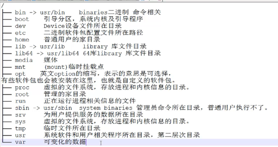
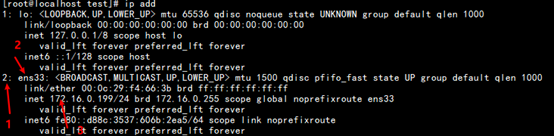
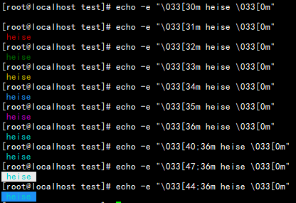
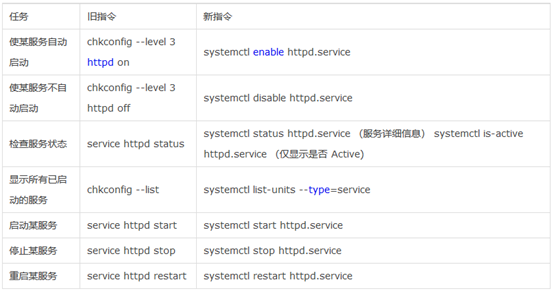
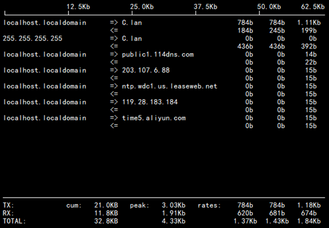
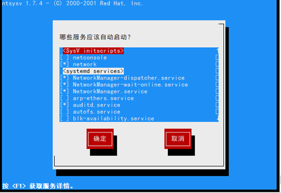
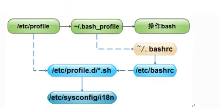
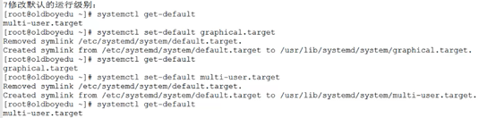

# 基础知识-命令

## 文件和目录操作命令




### ls

ls命令用来显示目录列表。linux常用命令之一

> ls [option] 参数
>
> -a：显示所有档案及目录（ls内定将档案名或目录名称为“.”的视为影藏，不会列出）；
>
> -A：显示除影藏文件“.”和“..”以外的所有文件列表；
>
> -C：多列显示输出结果。这是默认选项；
>
> -l：与“-C”选项功能相反，所有输出信息用单列格式输出，不输出为多列；
>
> -F：在每个输出项后追加文件的类型标识符，具体含义：“*”表示具有可执行权限的普通文件，“/”表示目录，“@”表示符号链接，“|”表示命令管道FIFO，“=”表示sockets套接字。当文件为普通文件时，不输出任何标识符；
>
> -b：将文件中的不可输出的字符以反斜线“”加字符编码的方式输出；
>
> -c：与“-lt”选项连用时，按照文件状态时间排序输出目录内容，排序的依据是文件的索引节点中的ctime字段。与“-l”选项连用时，则排序的一句是文件的状态改变时间；
>
> -d：仅显示目录名，而不显示目录下的内容列表。显示符号链接文件本身，而不显示其所指向的目录列表；
>
> -f：此参数的效果和同时指定“aU”参数相同，并关闭“lst”参数的效果；
>
> -i：显示文件索引节点号（inode）。一个索引节点代表一个文件；
>
> --[file](http://man.linuxde.net/file)-[type](http://man.linuxde.net/type)：与“-F”选项的功能相同，但是不显示“*”；
>
> -k：以KB（千字节）为单位显示文件大小；
>
> -l：以长格式显示目录下的内容列表。输出的信息从左到右依次包括文件名，文件类型、权限模式、硬连接数、所有者、组、文件大小和文件的最后修改时间等；
>
> -m：用“,”号区隔每个文件和目录的名称；
>
> -n：以用户识别码和群组识别码替代其名称；
>
> -r：以文件名反序排列并输出目录内容列表；
>
> -s：显示文件和目录的大小，以区块为单位；
>
> -t：用文件和目录的更改时间排序；
>
> -L：如果遇到性质为符号链接的文件或目录，直接列出该链接所指向的原始文件或目录；
>
> -R：递归处理，将指定目录下的所有文件及子目录一并处理；
>
> --full-[time](http://man.linuxde.net/time)：列出完整的日期与时间；
>
> --color[=WHEN]：使用不同的颜色高亮显示不同类型的。

```bash
[root@localhost ~]# ll -i anaconda-ks.cfg 
67165762 -rw-------. 1 root root 1546 6月  1 21:19 anaconda-ks.cfg
输出inode （索引节点）
[root@localhost ~]# ls -m /
bin, boot, dev, etc, home, lib, lib64, media, mnt, opt, proc, root, run, sbin, srv, sys,
tmp, usr, var
水平显示
[root@localhost ~]# ls -R 
anaconda-ks.cfg test test.txt
./test:
test
./test/test:
test
./test/test/test:
显示递归
[root@localhost ~]# ls -t /
root boot usr  lib  bin tmp sys  home  mnt srv
etc  var  sbin lib64 run dev proc media opt
显示最近改动文件
[root@localhost ~]# ls -n
总用量 4
-rw-------. 1 0 0 1546 6月  1 21:19 anaconda-ks.cfg
drwxr-xr-x. 3 0 0  18 6月  1 20:34 test
-rw-r--r--. 1 0 0  0 6月  1 21:37 test.txt
[root@localhost ~]# ll
总用量 4
-rw-------. 1 root root 1546 6月  1 21:19 anaconda-ks.cfg
drwxr-xr-x. 3 root root  18 6月  1 20:34 test
-rw-r--r--. 1 root root  0 6月  1 21:37 test.txt
打印文件的UID和GID 看上面对比
[root@localhost ~]# ll -h 
总用量 4.0K
-rw-------. 1 root root 1.6K 6月  1 21:19 anaconda-ks.cfg
drwxr-xr-x. 3 root root  18 6月  1 20:34 test
-rw-r--r--. 1 root root  0 6月  1 21:37 test.txt
打印文件夹或文件详细信息（文件大小）
[root@lnmp ~]# ll /etc|grep ^d|wc -l 统计etc目录下有多少个目录
72
[root@lnmp ~/study]# ls ?.txt
a.txt d.txt g.txt j.txt m.txt p.txt s.txt v.txt y.txt
b.txt e.txt h.txt k.txt n.txt q.txt t.txt w.txt z.txt
c.txt f.txt i.txt l.txt o.txt r.txt u.txt x.txt
[root@lnmp ~/study]# ls [abcd].txt
a.txt b.txt c.txt d.txt
[root@lnmp ~/study]# ls [!abcd].txt
e.txt g.txt i.txt k.txt m.txt o.txt q.txt s.txt u.txt w.txt y.txt
f.txt h.txt j.txt l.txt n.txt p.txt r.txt  t.txt v.txt x.txt z.txt
[root@lnmp ~/study]# ls [a-g].txt
a.txt b.txt c.txt d.txt e.txt f.txt g.txt
```

> 企业工作的一个问题:
>
> 多个运维人员维护服务器,下班着急回家,交代:将oldboy目录中最新的数据文件需要继续编辑好
>
> ls -ltr /etc/  -- 按照时间进行排序显示数据信息,并且是反向排序
>
> t 是排序
>
> r是反向

### pwd

pwd命令以绝对路径显示用户当前工作目录

pwd [option]

```BASH
[root@localhost ~]# pwd
/root
```

### cd 

cd命令用来切换工作目录至dirname，其中dirname表示法可以是绝对路径或者相对路径。

~ 表示用户的home目录 . 表示当前目录 ..表示上一级目录

cd [option]

```BASH
[root@localhost ~]# pwd
/root
[root@localhost ~]# cd /home/
[root@localhost home]# 
```

### mkdir

mkdir命令用来创建目录

mkdir [option]参数

> -Z：设置安全上下文，当使用SELinux时有效；
>
> -m<目标属性>或--mode<目标属性>建立目录的同时设置目录的权限；
>
> -p或--parents 若所要建立目录的上层目录目前尚未建立，则会一并建立上层目录；
>
> --version 显示版本信息。

```bash
[root@localhost ~]# mkdir -m 755 test
[root@localhost ~]# ll
总用量 4
-rw-------. 1 root root 1546 6月   1 21:19 anaconda-ks.cfg
drwxr-xr-x. 2 root root    6 6月   1 21:24 test
[root@localhost ~]# mkdir -p test/test/test
[root@localhost ~]# tree test/
test/
└── test
    └── test
2 directories, 0 files
```

### tree

tree命令以树状图列出目录的内容

tree[option] 参数|目录

> -a：显示所有文件和目录；
>
> -A：使用ASNI绘图字符显示树状图而非以ASCII字符组合；
>
> -C：在文件和目录清单加上色彩，便于区分各种类型；
>
> -d：先是目录名称而非内容；
>
> -D：列出文件或目录的更改时间；
>
> -f：在每个文件或目录之前，显示完整的相对路径名称；
>
> -F：在执行文件，目录，Socket，符号连接，管道名称名称，各自加上"*"，"/"，"@"，"|"号；
>
> -g：列出文件或目录的所属群组名称，没有对应的名称时，则显示群组识别码；
>
> -i：不以阶梯状列出文件和目录名称；
>
> -l：<范本样式> 不显示符号范本样式的文件或目录名称；
>
> -l：如遇到性质为符号连接的目录，直接列出该连接所指向的原始目录；
>
> -n：不在文件和目录清单加上色彩；
>
> -N：直接列出文件和目录名称，包括控制字符；
>
> -p：列出权限标示；
>
> -P：<范本样式> 只显示符合范本样式的文件和目录名称；
>
> -q：用“？”号取代控制字符，列出文件和目录名称；
>
> -s：列出文件和目录大小；
>
> -t：用文件和目录的更改时间排序；
>
> -u：列出文件或目录的拥有者名称，没有对应的名称时，则显示用户识别码；
>
> -x：将范围局限在现行的文件系统中，若指定目录下的某些子目录，其存放于另一个文件系统上，则将该目录予以排除在寻找范围外。

```BASH
[root@localhost ~]# tree -L 1 /
/
├── bin -> usr/bin
├── boot
├── dev
├── etc
├── home
├── lib -> usr/lib
├── lib64 -> usr/lib64
├── media
├── mnt
├── opt
├── proc
├── root
├── run
├── sbin -> usr/sbin
├── srv
├── sys
├── tmp
├── usr
└── var
19 directories, 0 files
```

### touch

touch命令有两个功能:一是用于把已存文件的时间标签更新为系统当前的时间，它的数据原封不动地保留下来；二是用来创建新的文件。

touch [option] 参数

> -a：或--time=atime或--time=access或--time=use 只更改存取时间；
>
> -c：或--no-create 不建立任何文件；
>
> -d：<时间日期> 使用指定的日期时间，而非现在的时间；
>
> -f：此参数将忽略不予处理，仅负责解决BSD版本touch指令的兼容性问题；
>
> -m：或--time=mtime或--time=modify 只更该变动时间；
>
> -r：<参考文件或目录> 把指定文件或目录的日期时间，统统设成和参考文件或目录的日期时间相同；
>
> -t：<日期时间> 使用指定的日期时间，而非现在的时间；
>
> --help：在线帮助；
>
> --version：显示版本信息。

```BASH
[root@localhost ~]# touch -a test
[root@localhost ~]# ll
总用量 4
-rw-------. 1 root root 1546 6月   1 21:19 anaconda-ks.cfg
drwxr-xr-x. 3 root root   18 6月   1 21:35 test
[root@localhost ~]# touch -d 20:34 test
[root@localhost ~]# ll
总用量 4
-rw-------. 1 root root 1546 6月   1 21:19 anaconda-ks.cfg
drwxr-xr-x. 3 root root   18 6月   1 20:34 test
[root@localhost ~]# touch test.txt
[root@localhost ~]# ll
总用量 4
-rw-------. 1 root root 1546 6月   1 21:19 anaconda-ks.cfg
drwxr-xr-x. 3 root root   18 6月   1 20:34 test
-rw-r--r--. 1 root root    0 6月   1 21:37 test.txt
```

### cp

cp命令是用来将一个或多个源文件复制到指定的目录。

cp[option]参数

> -a：此参数的效果和同时指定"-dpR"参数相同；
>
> -d：当复制符号连接时，把目标文件或目录也建立为符号连接，并指向与源文件或目录连接的原始文件或目录；
>
> -f：强行复制文件或目录，不论目标文件或目录是否已存在；
>
> -i：覆盖既有文件之前先询问用户；
>
> -l：对源文件建立硬连接，而非复制文件；
>
> -p：保留源文件或目录的属性；
>
> -R/r：递归处理，将指定目录下的所有文件与子目录一并处理；
>
> -s：对源文件建立符号连接，而非复制文件；
>
> -u：使用这项参数后只会在源文件的更改时间较目标文件更新时或是名称相互对应的目标文件并不存在时，才复制文件；
>
> -S：在备份文件时，用指定的后缀“SUFFIX”代替文件的默认后缀；
>
> -b：覆盖已存在的文件目标前将目标文件备份；
>
> -v：详细显示命令执行的操作。
>
> 源文件：制定源文件列表。默认情况下，cp命令不能复制目录，如果要复制目录，则必须使用-R选项；
>
> 目标文件：指定目标文件。当“源文件”为多个文件时，要求“目标文件”为指定的目录。

```BASH
[root@localhost home]# cp ../root/anaconda-ks.cfg .
[root@localhost home]# ls
anaconda-ks.cfg
复制指定文件到当前目录
[root@localhost ~]# cp anaconda-ks.cfg /tmp/file1
[root@localhost ~]# ls /tmp/file1 
/tmp/file1
复制并重命名这个文件
[root@localhost ~]# cp -r test/test/test/ /home/
[root@localhost ~]# tree /home/
/home/
└── test
有时候复制多个文件会出现提示。
[root@study ~/study]# ls
a.txt  d.txt  g.txt  j.txt  m.txt  p.txt  s.txt  v.txt  y.txt
b.txt  e.txt  h.txt  k.txt  n.txt  q.txt  t.txt  w.txt  z.txt
c.txt  f.txt  i.txt  l.txt  o.txt  r.txt  u.txt  x.txt
[root@study ~/study]# cd ..
[root@study ~]# ls
anaconda-ks.cfg  study
[root@study ~]# mkdir test
[root@study ~]# cd study/
[root@study ~/study]# cp {a..z}.txt ../
anaconda-ks.cfg  .bash_profile    study/           
.bash_history    .bashrc          .tcshrc          
.bash_logout     .cshrc           test/            
[root@study ~/study]# cp {a..z}.txt ../test/
[root@study ~/study]# cp {a..z}.txt ../test/
cp: overwrite '../test/a.txt'? ^C
[root@study ~/study]# \cp {a..z}.txt ../test/   可以把alias里面的cp -I 参数去掉执行cp不提示确认。
[root@study ~/study]# /bin/cp {a..z}.txt ../test/
[root@study ~/study]# ls ../test/
a.txt  d.txt  g.txt  j.txt  m.txt  p.txt  s.txt  v.txt  y.txt
b.txt  e.txt  h.txt  k.txt  n.txt  q.txt  t.txt  w.txt  z.txt
c.txt  f.txt  i.txt  l.txt  o.txt  r.txt  u.txt  x.txt
```

> cp file{,.bak}  备份文件

### mv

mv命令用来对文件或目录重新命名，或者将文件从一个目录移到另一个目录

mv [option] 参数

> --backup=<备份模式>：若需覆盖文件，则覆盖前先行备份；
>
> -b：当文件存在时，覆盖前，为其创建一个备份；
>
> -f：若目标文件或目录与现有的文件或目录重复，则直接覆盖现有的文件或目录；
>
> -i：交互式操作，覆盖前先行询问用户，如果源文件与目标文件或目标目录中的文件同名，则询问用户是否覆盖目标文件。用户输入”y”，表示将覆盖目标文件；输入”n”，表示取消对源文件的移动。这样可以避免误将文件覆盖。
>
> --strip-trailing-slashes：删除源文件中的斜杠“/”；
>
> -S<后缀>：为备份文件指定后缀，而不使用默认的后缀；
>
> --target-directory=<目录>：指定源文件要移动到目标目录；
>
> -u：当源文件比目标文件新或者目标文件不存在时，才执行移动操作。

```bash
[root@localhost ~]# mv test.txt 1.txt
[root@localhost ~]# ll
总用量 4
-rw-r--r--. 1 root root    0 6月   1 21:37 1.txt
-rw-------. 1 root root 1546 6月   1 21:19 anaconda-ks.cfg
drwxr-xr-x. 3 root root   18 6月   1 20:34 test
[root@localhost ~]# mv 1.txt /soft/
[root@localhost ~]# ls /soft/
1.txt

```

> mv file{.bak,} 恢复并删除源文件文件

### rm

rm命令可以删除一个目录中的一个或多个文件或目录，也可将某个目录下所有子目录全部删除。对于链接文件来说，只是删除链接，源文件不会被删除。慎用命令之一。

rm [option] 文件

> -d：直接把欲删除的目录的硬连接数据删除成0，删除该目录；
>
> -f：强制删除文件或目录；
>
> -i：删除已有文件或目录之前先询问用户；
>
> -r或-R：递归处理，将指定目录下的所有文件与子目录一并处理；
>
> --preserve-root：不对根目录进行递归操作；
>
> -v：显示指令的详细执行过程。

```bash
[root@localhost ~]# rm -rf test/test/test/[root@localhost ~]# tree .├── anaconda-ks.cfg└── test    └── test[root@localhost ~]# rm -rf test/[root@localhost ~]# tree.└── anaconda-ks.cfg0 directories, 1 file[root@localhost ~]# find / -name test |xargs rm -rf 查找并删除
```

### rmdir

rmdir命令用来删除空目录。

rmdir[option]参数

> p或--parents：删除指定目录后，若该目录的上层目录已变成空目录，则将其一并删除；
>
> --ignore-fail-on-non-empty：此选项使rmdir命令忽略由于删除非空目录时导致的错误信息；
>
> -v或-verboes：显示命令的详细执行过程；
>
> --[help](http://man.linuxde.net/help)：显示命令的帮助信息；
>
> --version：显示命令的版本信息。

```bash
[root@localhost ~]# tree
├── anaconda-ks.cfg
└── test    
└── log2 

directories, 1 file
[root@localhost ~]# rmdir -p test/log/
[root@localhost ~]# tree .
└── anaconda-ks.cfg0 
directories, 1 file
```

### ln

ln命令用来为文件创建连接，连接类型分为硬连接和软连接。默认类型为硬连接，创建连接符号必须使用-s。

ln[option]参数

> -b或--backup：删除，覆盖目标文件之前的备份；
>
> -d或-F或——directory：建立目录的硬连接；
>
> -f或——force：强行建立文件或目录的连接，不论文件或目录是否存在；
>
> -i或——interactive：覆盖既有文件之前先询问用户；
>
> -n或--no-dereference：把符号连接的目的目录视为一般文件；
>
> -s或——symbolic：对源文件建立符号连接，而非硬连接；
>
> -S<字尾备份字符串>或--suffix=<字尾备份字符串>：用"-b"参数备份目标文件后，备份文件的字尾会被加上一个备份字符串，预设的备份字符串是符号“~”，用户可通过“-S”参数来改变它；
>
> -v或——verbose：显示指令执行过程；
>
> -V<备份方式>或--version-control=<备份方式>：用“-b”参数备份目标文件后，备份文件的字尾会被加上一个备份字符串，这个字符串不仅可用“-S”参数变更，当使用“-V”参数<备份方式>指定不同备份方式时，也会产生不同字尾的备份字符串；

硬链接是根据inoce 索引来定的。

```bash
[root@localhost ~]# ls -i 67165762 anaconda-ks.cfg
[root@localhost ~]# ln anaconda-ks.cfg /soft/an
[root@localhost ~]# ll -i /soft/总用量 467166528 -rw-r--r--. 1 root root    0 6月   1 21:37 1.txt67165762 -rw-------. 2 root root 1546 6月   1 21:19 an
[root@localhost ~]# rm -f anaconda-ks.cfg 
[root@localhost ~]# ll -i总用量 0
[root@localhost ~]# ln /soft/an ./anaconda-ks.cfg
[root@localhost ~]# ll -i总用量 467165762 -rw-------. 2 root root 1546 6月   1 21:19 anaconda-ks.cfg
[root@localhost ~]# ln -s /soft/an ./link[root@localhost ~]# ll -i 总用量 467165762 -rw-------. 2 root root 1546 6月   1 21:19 anaconda-ks.cfg67165766 lrwxrwxrwx. 1 root root    8 6月   2 10:46 link -> /soft/an[root@localhost ~]# ll -i /soft/总用量 467166528 -rw-r--r--. 1 root root    0 6月   1 21:37 1.txt67165762 -rw-------. 2 root root 1546 6月   1 21:19 an[root@localhost ~]# rm -f /soft/an [root@localhost ~]# ll -i /soft/总用量 067166528 -rw-r--r--. 1 root root 0 6月   1 21:37 1.txt[root@localhost ~]# ll -i总用量 467165762 -rw-------. 1 root root 1546 6月   1 21:19 anaconda-ks.cfg67165766 lrwxrwxrwx. 1 root root    8 6月   2 10:46 link -> /soft/an[root@localhost ~]# cat link cat: link: 没有那个文件或目录可以看出软连接删除源之后连接就不可用了
```

### readlink

readlink 查看符号连接文件的内容

readlink [选项]... 文件...

> -f, --canonicalize	 	 递归跟随给出文件名的所有符号链接以标准化，

```bash
[root@localhost ~]# readlink -f /etc/rc.local /etc/rc.d/rc.local
```

### find

find是用来查找文件。最常用命令之一。

find -H-L-P       path          expression

   处理符号连接   需要查找的路径    参数  限定条件  执行动作

> -amin<分钟>：查找在指定时间曾被存取过的文件或目录，单位以分钟计算；
>
> -anewer<参考文件或目录>：查找其存取时间较指定文件或目录的存取时间更接近现在的文件或目录；
>
> -atime<24小时数>：查找在指定时间曾被存取过的文件或目录，单位以24小时计算；
>
> -cmin<分钟>：查找在指定时间之时被更改过的文件或目录；
>
> -cnewer<参考文件或目录>查找其更改时间较指定文件或目录的更改时间更接近现在的文件或目录；
>
> -ctime<24小时数>：查找在指定时间之时被更改的文件或目录，单位以24小时计算；
>
> -daystart：从本日开始计算时间；
>
> -depth：从指定目录下最深层的子目录开始查找；
>
> -empty：寻找文件大小为0 Byte的文件，或目录下没有任何子目录或文件的空目录；
>
> -[exec](http://man.linuxde.net/exec)<执行指令>：假设find指令的回传值为True，就执行该指令；
>
> -false：将find指令的回传值皆设为False；
>
> -fls<列表文件>：此参数的效果和指定“-[ls](http://man.linuxde.net/ls)”参数类似，但会把结果保存为指定的列表文件；
>
> -follow：排除符号连接；
>
> -fprint<列表文件>：此参数的效果和指定“-print”参数类似，但会把结果保存成指定的列表文件；
>
> -fprint0<列表文件>：此参数的效果和指定“-print0”参数类似，但会把结果保存成指定的列表文件；
>
> -fprintf<列表文件><输出格式>：此参数的效果和指定“-[printf](http://man.linuxde.net/printf)”参数类似，但会把结果保存成指定的列表文件；
>
> -fstype<文件系统类型>：只寻找该文件系统类型下的文件或目录；
>
> -gid<群组识别码>：查找符合指定之群组识别码的文件或目录；
>
> -group<群组名称>：查找符合指定之群组名称的文件或目录；
>
> -[help](http://man.linuxde.net/help)或——help：在线帮助；
>
> -ilname<范本样式>：此参数的效果和指定“-lname”参数类似，但忽略字符大小写的差别；
>
> -iname<范本样式>：此参数的效果和指定“-name”参数类似，但忽略字符大小写的差别；
>
> -inum<inode编号>：查找符合指定的inode编号的文件或目录；
>
> -ipath<范本样式>：此参数的效果和指定“-path”参数类似，但忽略字符大小写的差别；
>
> -iregex<范本样式>：此参数的效果和指定“-regexe”参数类似，但忽略字符大小写的差别；
>
> -links<连接数目>：查找符合指定的硬连接数目的文件或目录；
>
> -iname<范本样式>：指定字符串作为寻找符号连接的范本样式；
>
> -ls：假设find指令的回传值为Ture，就将文件或目录名称列出到标准输出；
>
> -maxdepth<目录层级>：设置最大目录层级；
>
> -mindepth<目录层级>：设置最小目录层级；
>
> -mmin<分钟>：查找在指定时间曾被更改过的文件或目录，单位以分钟计算；
>
> -[mount](http://man.linuxde.net/mount)：此参数的效果和指定“-xdev”相同；
>
> -mtime<24小时数>：查找在指定时间曾被更改过的文件或目录，单位以24小时计算；
>
> -name<范本样式>：指定字符串作为寻找文件或目录的范本样式；
>
> -newer<参考文件或目录>：查找其更改时间较指定文件或目录的更改时间更接近现在的文件或目录；
>
> -nogroup：找出不属于本地主机群组识别码的文件或目录；
>
> -noleaf：不去考虑目录至少需拥有两个硬连接存在；
>
> -nouser：找出不属于本地主机用户识别码的文件或目录；
>
> -ok<执行指令>：此参数的效果和指定“-exec”类似，但在执行指令之前会先询问用户，若回答“y”或“Y”，则放弃执行命令；
>
> -path<范本样式>：指定字符串作为寻找目录的范本样式；
>
> -perm<权限数值>：查找符合指定的权限数值的文件或目录；
>
> -print：假设find指令的回传值为Ture，就将文件或目录名称列出到标准输出。格式为每列一个名称，每个名称前皆有“./”字符串；
>
> -print0：假设find指令的回传值为Ture，就将文件或目录名称列出到标准输出。格式为全部的名称皆在同一行；
>
> -printf<输出格式>：假设find指令的回传值为Ture，就将文件或目录名称列出到标准输出。格式可以自行指定；
>
> -prune：不寻找字符串作为寻找文件或目录的范本样式;
>
> -regex<范本样式>：指定字符串作为寻找文件或目录的范本样式；
>
> -size<文件大小>：查找符合指定的文件大小的文件；
>
> -true：将find指令的回传值皆设为True；
>
> -[type](http://man.linuxde.net/type)<文件类型>：只寻找符合指定的文件类型的文件；
>
> -uid<用户识别码>：查找符合指定的用户识别码的文件或目录；
>
> -used<日数>：查找文件或目录被更改之后在指定时间曾被存取过的文件或目录，单位以日计算；
>
> -user<拥有者名称>：查找符和指定的拥有者名称的文件或目录；
>
> -version或——version：显示版本信息；
>
> -xdev：将范围局限在先行的文件系统中；
>
> -xtype<文件类型>：此参数的效果和指定“-type”参数类似，差别在于它针对符号连接检查。

```bash
[root@localhost ~]# find /root/ -mtime -2  使用绝对路径查找2天内修改的文件
/root/
/root/.bash_history
/root/anaconda-ks.cfg
[root@localhost ~]# find . -atime -2   使用相对路径查找2天内使用过的文件
.
./.bash_logout
./.bash_profile
./.bashrc
./.bash_history
./anaconda-ks.cfg
[root@localhost ~]# find /var/log/ -mtime -2 -name "*.log"  在var/log下查找2天内.log结尾的文件。
[root@localhost ~]# find /soft/ -type d    查找/soft目录下的所有目录
/soft/
[root@localhost ~]# find /soft/ ! -type d   查找/soft目录下的所有非目录文件
/soft/1.txt
[root@localhost ~]# find /usr/share/terminfo/ -perm 755 查找指定目录下权限是755的文件
[root@localhost ~]# find . -size +1000c  查找当前目录字节数大于1000的文件
./.bash_history
./anaconda-ks.cfg
[root@localhost ~]# find ./ -path "./test" -prune -o -print   跳过test文件夹查找其他文件
./
./.bash_logout
./.bash_profile
./.bashrc
./.cshrc
./.tcshrc
./.bash_history
./anaconda-ks.cfg
[root@localhost ~]# ls
anaconda-ks.cfg  test
其中-o 和-a 类似shell中的 &&  和   ||
[root@localhost ~]# find ./ \( -path ./test -o -path ./test2 \) -prune -o -print   排除多个文件夹
./
./.bash_logout
./.bash_profile
./.bashrc
./.cshrc
./.tcshrc
./.bash_history
./anaconda-ks.cfg
[root@localhost ~]# find . -user root  查找用户为root的文件
.
./.bash_logout
./.bash_profile
./.bashrc
./.cshrc
./.tcshrc
./.bash_history
./anaconda-ks.cfg
./test
./test2
[root@localhost ~]# chown 555 test   
[root@localhost ~]# find . -nouser  查找没有用户的文件
./test
group   nogroup  同user用法
[root@localhost ~]# find . -newer 2.txt   查找更改时间比2.txt早的文件
.
./1.txt
[root@localhost ~]# find . -newer 2.txt ! -newer 1.txt   查找更改时间比1.txt新但比2.txt旧的文件。
.
./1.txt
[root@localhost ~]# find . -maxdepth 1 -type d  查找一级目录类似 tree -L 1
.
./test
./test2
[root@localhost ~]# find . -maxdepth 1 -type d ! -name "."   查找一级目录并排除.根目录
./test
./test2
[root@localhost ~]# find . -maxdepth 1 -type d ! -name "." -o -name "test" 显示除.以外的所有test目录
./test
./test2
[root@localhost ~]# find . -maxdepth 1 -type d ! -name "." -a -name "test" 显示除.以外的test目录
./test
find正则表达式
语法:find pathname -regextype “type” -regex “pathtern”
[root@localhost ~]# find / -regex ".*find"
/sys/kernel/debug/tracing/events/xfs/xfs_buf_find
/usr/bin/find
/usr/bin/oldfind
正则表达式的类型默认emacs,还有posix-awk,posix-basic,posix-egrep和posox-extended等
[root@localhost ~]# find . -regextype "posix-egrep" -name "*[0-9]"   
./test2  
[root@localhost ~]# find . -type f -exec ls -l {} \;
-rw-r--r--. 1 root root 18 12月 29 2013 ./.bash_logout
-rw-r--r--. 1 root root 176 12月 29 2013 ./.bash_profile
-rw-r--r--. 1 root root 176 12月 29 2013 ./.bashrc
-rw-r--r--. 1 root root 100 12月 29 2013 ./.cshrc
-rw-r--r--. 1 root root 129 12月 29 2013 ./.tcshrc
-rw-------. 1 root root 4739 6月   2 15:50 ./.bash_history
-rw-------. 1 root root 1546 6月   1 21:19 ./anaconda-ks.cfg
-rw-r--r--. 1 root root 0 6月   2 15:11 ./2.txt
-rw-r--r--. 1 root root 0 6月   2 15:11 ./1.txt
-rw-r--r--. 1 root root 0 6月   2 15:16 ./3.txt
-rw-r--r--. 1 root root 0 6月   2 15:18 ./4.txt

find  -type  f   exec   ls -l  {}     \;
exec 后面跟的是命令，最后以分号结尾，考虑到分号在系统中有其他含义这里使用转义符号进行转义。
{}的作用是指代前面find命令查找到的内容。前后都有空格
在目录中查找更改时间在n天内的文件并删除他们。
[root@localhost ~]# find . -type f  -mtime +2 -exec rm {} \;
使用exec选项的安全模式 -OK
[root@localhost ~]# find /var/log/ -name "*.log" -mtime -2 -ok rm {} \;
< rm ... /var/log/tuned/tuned.log > ? n
< rm ... /var/log/audit/audit.log > ? n
< rm ... /var/log/anaconda/anaconda.log > ? n
< rm ... /var/log/anaconda/X.log > ? n
< rm ... /var/log/anaconda/program.log > ? n
查找并删除2天内以.log结尾的文件
[root@localhost ~]# find . -type f |xargs ls -l
-rw-r--r--. 1 root root    0 6月   2 15:11 ./1.txt
-rw-r--r--. 1 root root    0 6月   2 15:11 ./2.txt
-rw-r--r--. 1 root root    0 6月   2 15:16 ./3.txt
-rw-r--r--. 1 root root    0 6月   2 15:18 ./4.txt
-rw-------. 1 root root 1546 6月   1 21:19 ./anaconda-ks.cfg
-rw-------. 1 root root 4739 6月   2 15:50 ./.bash_history
查找并列出
[root@localhost ~]# find . -name "*.txt"|xargs -i mv {} test/
[root@localhost ~]# ls test
1.txt  2.txt  3.txt  4.txt
查找文件并移动到指定目录。
[root@localhost ~]# find test -name "*.txt"|xargs -p rm -f
rm -f test/2.txt test/1.txt test/3.txt test/4.txt ?...n
删除查找到的指定文件，并确认。
查找文件下某个内容更改为指定内容。
1.find+exec
[root@localhost ~]# find test -name "*.txt" -exec sed -i 's#hello#hao#g' {} \;
[root@localhost ~]# cat test/1.txt 
hao word\!
2．find+xargs
[root@localhost ~]# find test -name "*.txt"|xargs sed -i 's#hao#nihao#g' 
[root@localhost ~]# cat test/1.txt 
nihao word\!
3，反引号方法（波浪线那个反引号）
[root@localhost ~]# sed -i 's#nihao#hello#g' `find test -name "*.txt"`
[root@localhost ~]# cat test/1.txt 
hello word\!
将roor目录下的文件打包
1.反引号方法
[root@localhost ~]# tar zcvf test.tar.gz `find test -type f -name *.txt`
test/2.txt
test/1.txt
test/3.txt
test/4.txt
[root@localhost ~]# ls
anaconda-ks.cfg  test  test2  test.tar.gz
2.find+xargs
[root@localhost ~]# find test -type f -name "*.txt"|xargs tar zcvf 1.tar.gz
test/2.txt
test/1.txt
test/3.txt
test/4.txt
[root@localhost ~]# ll
总用量 12
-rw-r--r--. 1 root root  166 6月   3 13:12 1.tar.gz
-rw-------. 1 root root 1546 6月   1 21:19 anaconda-ks.cfg
drwxr-xr-x. 2  555  555   58 6月   3 13:03 test
drwxr-xr-x. 2 root root    6 6月   2 15:04 test2
-rw-r--r--. 1 root root  166 6月   3 13:09 test.tar.gz
删除目录下所有的文件保留指定文件
[root@localhost ~]# cd test
[root@localhost test]# touch txt{0..10}
[root@localhost test]# ls
1.txt  3.txt  txt0  txt10  txt3  txt5  txt7  txt9
2.txt  4.txt  txt1  txt2   txt4  txt6  txt8
1.find+exec
[root@localhost test]# find . -type f ! -name "txt5" -exec rm -f {} \;
[root@localhost test]# ls
txt5
[root@localhost test]# touch {0..10}.txt
[root@localhost test]# ls
0.txt  10.txt  1.txt  2.txt  3.txt  4.txt  5.txt  6.txt  7.txt  8.txt  9.txt  txt5
2.find+xargs
[root@localhost test]# find . -type f ! -name "5.txt"|xargs rm -f
[root@localhost test]# ls
5.txt
3.rsync  yum install rsync
[root@localhost test]# rsync -az --delete --exclude "txt5" /null/ .
[root@localhost test]# ls
txt5
[root@localhost test]# ls /null/
这里需要新建null  才能实现

```

```bash
【生产案例】站点内所有文件都被植入广告连接。譬如：<script language=javascript src=https://xxx.com/x.js?google_ad=93x28_ad></script>#find . -type f |xargs sed -I ‘s#<script language=javascript src=https://xxx.com/x.js?google_ad=93x28_ad></script>##g’也可以#find . -type f|xargs sed -i ‘/*.js?google_ad*/d’已知apache服务的访问日志记录在服务器本地/app/log下，由于磁盘空间紧张，现在只能保留7天的日志文件。[root@localhost test]# for n in "seq 14"> do >      date -s  "2020/06/$n">      touch access_www_`(date + %F)`.log> done创建14天的日志，以备实验#find . -type f -name “access*.log” -mtime +7 -exec rm -f {} \;#find . -type f -name “access*.log” -mtime +7 |xargs rm -f#find . -type f -name “access*.log” -mtime +7 -delete用apache 服务配置，用cronolog软件轮询日志customlog “|/usr/local/sbin/cronolog /app/logs /access_www_%w.log” combined总共可以生成7天日志，下周又覆盖1-7天的日志文件属性信息详细说明--时间信息(改变时间)    文件数据时间类型:    01. 访问时间  Access time == atime     02. 修改时间  Modify time == mtime     03. 改变时间  Change time == ctime  --- 数据属性信息发生改变了
```

### xargs

xargs命令是给其他命令传递参数的一个过滤器。组合命令

xargs [option]

```bash
[root@localhost test]# seq {1,10} >1.txt [root@localhost test]# cat 1.txt 12345678910[root@localhost test]# cat 1.txt |xargs1 2 3 4 5 6 7 8 9 10[root@localhost test]# cat 1.txt |xargs -n 41 2 3 45 6 7 89 10[root@localhost test]# echo "namexnamexnamexname"|xargs -dxname name name name[root@localhost test]# echo "namexnamexnamexname"|xargs -dx -n 2name namename name
```

### rename

rename命令用字符串替换的方式批量修改文件名

rename[option]

```bash
[root@localhost test]# rename 1.txt hello.txt 1.txt[root@localhost test]# lsa  c  e  g  hello.txt  j  l  n  p  r  t  v  x  zb  d  f  h  i          k  m  o  q  s  u  w  y
```

### basename

basename用于打印目录或者文件的基本名称

经常用于shell

### dirname

dirname命令去除文件名中的非目录部分

常用于shell

### chattr

chattr用来改变文件属性

模式

> a：让文件或目录仅供附加用途；
>
> b：不更新文件或目录的最后存取时间；
>
> c：将文件或目录压缩后存放；
>
> d：将文件或目录排除在倾倒操作之外；
>
> i：不得任意更动文件或目录；
>
> s：保密性删除文件或目录；
>
> S：即时更新文件或目录；
>
> u：预防意外删除。
>
> 选项
>
> -R：递归处理，将指令目录下的所有文件及子目录一并处理；
>
> -v<版本编号>：设置文件或目录版本；
>
> -V：显示指令执行过程；
>
> +<属性>：开启文件或目录的该项属性；
>
> -<属性>：关闭文件或目录的该项属性；
>
> =<属性>：指定文件或目录的该项属性。

```bash
[root@localhost test]# chattr +i 1.txt [root@localhost test]# ls1.txt[root@localhost test]# ll总用量 4-rw-r--r--. 1 root root 21 6月   3 14:44 1.txt[root@localhost test]# rm -f *rm: 无法删除"1.txt": 不允许的操作[root@localhost test]# mv 1.txt ../mv: 无法将"1.txt" 移动至"../1.txt": 不允许的操作[root@localhost test]# man chattr
```

### lsattr

lsattr 用于查看文件的第二文件属性

> -E：可显示设备属性的当前值，但这个当前值是从用户设备数据库中获得的，而不是从设备直接获得的。
>
> -D：显示属性的名称，属性的默认值，描述和用户是否可以修改属性值的标志。
>
> -R：递归的操作方式；
>
> -V：显示指令的版本信息；
>
> -a：列出目录中的所有文件，包括隐藏文件。

```bash
[root@localhost test]# lsattr 1.txt ----i----------- 1.txt
```

### file

file用来探测文件类型

> -b：列出辨识结果时，不显示文件名称；
>
> -c：详细显示指令执行过程，便于排错或分析程序执行的情形；
>
> -f<名称文件>：指定名称文件，其内容有一个或多个文件名称时，让file依序辨识这些文件，格式为每列一个文件名称；
>
> -L：直接显示符号连接所指向的文件类别；
>
> -m<魔法数字文件>：指定魔法数字文件；
>
> -v：显示版本信息；
>
> -z：尝试去解读压缩文件的内容。

```bash
[root@localhost test]# file 1.txt txt: ASCII text[root@localhost test]# file -b 1.txt ASCII text[root@localhost test]# file /var/mail//var/mail/: directory[root@localhost test]# file /var/mail/var/mail: symbolic link to `spool/mail'
```

### md5sum

md5sum 生成md5校验防止传输下载过程被人窃取

```bash
[root@localhost test]# md5sum 1.txt 3b0332e02daabf31651a5a0d81ba830a  1.txt
```

### chown

chown命令改变某个目录的所有者和所属的组

> -c或——changes：效果类似“-v”参数，但仅回报更改的部分；
>
> -f或--quite或——silent：不显示错误信息；
>
> -h或--no-dereference：只对符号连接的文件作修改，而不更改其他任何相关文件；
>
> -R或——recursive：递归处理，将指定目录下的所有文件及子目录一并处理；
>
> -v或——version：显示指令执行过程；
>
> --dereference：效果和“-h”参数相同；
>
> --[help](http://man.linuxde.net/help)：在线帮助；
>
> --reference=<参考文件或目录>：把指定文件或目录的拥有者与所属群组全部设成和参考文件或目录的拥有者与所属群组相同；
>
> --version：显示版本信息。

```bash
[root@localhost ~]# useradd -s /sbin/nologin -M mysql[root@localhost ~]# ll总用量 12-rw-r--r--. 1 root root  166 6月   3 13:12 1.tar.gz-rw-------. 1 root root 1546 6月   1 21:19 anaconda-ks.cfgdrwxr-xr-x. 2 root root   34 6月   3 15:27 testdrwxr-xr-x. 2 root root    6 6月   2 15:04 test2-rw-r--r--. 1 root root  166 6月   3 13:09 test.tar.gz[root@localhost ~]# chown -R mysql.mysql test[root@localhost ~]# ll总用量 12-rw-r--r--. 1 root  root   166 6月   3 13:12 1.tar.gz-rw-------. 1 root  root  1546 6月   1 21:19 anaconda-ks.cfgdrwxr-xr-x. 2 mysql mysql   34 6月   3 15:27 testdrwxr-xr-x. 2 root  root     6 6月   2 15:04 test2-rw-r--r--. 1 root  root   166 6月   3 13:09 test.tar.gz
```

### chmod

chmod 命令用来改变文件或目录的权限

权限范围

> `u` User，即文件或目录的拥有者；
> `g` Group，即文件或目录的所属群组；
> `o` Other，除了文件或目录拥有者或所属群组之外，其他用户皆属于这个范围；
> `a` All，即全部的用户，包含拥有者，所属群组以及其他用户；
> `r` 读取权限，数字代号为“4”;
> [w](http://man.linuxde.net/w) 写入权限，数字代号为“2”；
> `x` 执行或切换权限，数字代号为“1”；
> `-` 不具任何权限，数字代号为“0”；
> `s` 特殊功能说明：变更文件或目录的权限。
>
> 高级应用
>
> 设置 mode 所表示的权限可用下述字母的任意组合：
>
> 　　r 可读。
>
> 　　w 可写。
>
> 　x 可执行。
>
> 　　X 只有目标文件对某些用户是可执行的或该目标文件是目录时才追加x 属性。
>
> 　　s 在文件执行时把进程的属主或组ID置为该文件的文件属主。
>
> 方式“u＋s”设置文件的用户ID位，“g＋s”设置组ID位。
>
> 　　t 保存程序的文本到交换设备上。
>
> 　　u 与文件属主拥有一样的权限。
>
> 　　g 与和文件属主同组的用户拥有一样的权限。
>
> 　　o 与其他用户拥有一样的权限。
>
> 文件名：以空格分开的要改变权限的文件列表，支持通配符。
>
> 选项
>
> -c或——changes：效果类似“-v”参数，但仅回报更改的部分；
>
> -f或--quiet或——silent：不显示错误信息；
>
> -R或——recursive：递归处理，将指令目录下的所有文件及子目录一并处理；
>
> -v或——verbose：显示指令执行过程；
>
> --reference=<参考文件或目录>：把指定文件或目录的所属群组全部设成和参考文件或目录的所属群组相同；
>
> <权限范围>+<权限设置>：开启权限范围的文件或目录的该选项权限设置；
>
> <权限范围>-<权限设置>：关闭权限范围的文件或目录的该选项权限设置；
>
> <权限范围>=<权限设置>：指定权限范围的文件或目录的该选项权限设置；
>
> r=读取属性　　//值＝4
> w=写入属性　　//值＝2
> x=执行属性　　//值＝1

```bash
[root@localhost ~]# ll总用量 12-rw-r--r--. 1 root  root   166 6月   3 13:12 1.tar.gz-rw-------. 1 root  root  1546 6月   1 21:19 anaconda-ks.cfgdrwxr-xr-x. 2 mysql mysql   34 6月   3 15:27 testdrwxr-xr-x. 2 root  root     6 6月   2 15:04 test2-rw-r--r--. 1 root  root   166 6月   3 13:09 test.tar.gz[root@localhost ~]# chmod u+x,g+w test[root@localhost ~]# ll总用量 12-rw-r--r--. 1 root  root   166 6月   3 13:12 1.tar.gz-rw-------. 1 root  root  1546 6月   1 21:19 anaconda-ks.cfgdrwxrwxr-x. 2 mysql mysql   34 6月   3 15:27 testdrwxr-xr-x. 2 root  root     6 6月   2 15:04 test2-rw-r--r--. 1 root  root   166 6月   3 13:09 test.tar.gz
```

### chgrp

chgrp命令用来改变文件或目录所属的用户组。

> -c或——changes：效果类似“-v”参数，但仅回报更改的部分；
>
> -f或--quiet或——silent：不显示错误信息；
>
> -h或--no-dereference：只对符号连接的文件作修改，而不是该其他任何相关文件；
>
> -R或——recursive：递归处理，将指令目录下的所有文件及子目录一并处理；
>
> -v或——verbose：显示指令执行过程；
>
> --reference=<参考文件或目录>：把指定文件或目录的所属群组全部设成和参考文件或目录的所属群组相同；

```bash
[root@localhost ~]# chgrp -R root test[root@localhost ~]# ll总用量 12-rw-r--r--. 1 root  root  166 6月   3 13:12 1.tar.gz-rw-------. 1 root  root 1546 6月   1 21:19 anaconda-ks.cfgdrwxrwxr-x. 2 mysql root   34 6月   3 15:27 testdrwxr-xr-x. 2 root  root    6 6月   2 15:04 test2
```

### umask

umask命令用来设置限制新建文件权限的掩码。

> -p：输出的权限掩码可直接作为指令来执行；
>
> -S：以符号方式输出权限掩码。

```bash
[root@localhost test]# ll -ddrwxrwxr-x. 2 mysql root 34 6月   3 15:27 .[root@localhost test]# umask -Su=rwx,g=rx,o=rx
```

### setfacl

使用setfacl命令来设置文件或者目录的acl

> -m   设置文件的ACL规则
>
> -M<文件>     从文件中读取ACL条目进行修改
>
> -x    删除文件的ACL规则
>
> -X<文件>  从文件中读取ACL条目进行删除
>
> -b   删除所有扩展ACL规则
>
> -k   删除默认的ACL规则
>
> -R   递归设置ACL， 包括目录的子目录和文件
>
> -d   设置默认的ACL规则
>
> -P   跳过所有符号链接，包括符号链接文件
>
> -L   跟踪符号链接，默认情况下只跟踪符号链接文件，跳过符号链接目录
>
> -n   不要重新计算有效权限
>
> --set=     设置文件 或目录的ACL规则，以前的设置将会被覆盖掉
>
> --mask   重新计算有效权限
>
> --restore=<文件>   从文件恢复备份的ACL规则
>
> --test     测试模式，不改变文件的ACL规则，操作后的ACL规则将被列出
>
> 设置ACL规则时，setfacl命令使用ACL规则表示方法。用户和组群可以指定名称或数字ID。权限是一个代表各种权限的字母组合，如读取权限使用r、写入权限使用w、执行权限使用x。权限也可以使用数字来表示。
>
> 
>
> ACL规则表示方法
>
> 设置对象           ACL规则表示方法
>
> 指定用户的ACL         [d[efault]:] [u[ser]:]用户[:权限]
>
> 指定组群的ACL         [d[efault]:] g[roup]:组群[:权限]
>
> 指定有效权限掩码（mask）  [d[efault]:] m[ask] [:] [:权限]
>
> 指定其他用户的ACL         [d[efault]:] o[ther] [:权限]

```bash
[root@clonezilla ~]# useradd test[root@clonezilla ~]# passwd test更改用户 test 的密码 。新的 密码：重新输入新的 密码：passwd：所有的身份验证令牌已经成功更新。[root@clonezilla ~]# mkdir /soft/test[root@clonezilla ~]# cd /soft/[root@clonezilla /soft]# ll总用量 200drwxrwxrwx. 2  500  500   4096 6月  23 10:13 cmatrix-1.2a-rw-r--r--. 1 root root  74376 6月  23 10:06 cmatrix-1.2a.tar.gzdrwxr-xr-x. 6 root root    153 2月  22 18:42 lolcat-master-rw-r--r--. 1 root root 121142 6月  23 10:06 lolcat-master.zipdrwxr-xr-x  2 root root      6 6月  24 15:30 test[root@clonezilla /soft]# setfacl -m u:test:rwx ./test/   设置test用户ACL，使其对test文件具有rwx权限[root@clonezilla /soft]# ll总用量 200drwxrwxrwx. 2  500  500   4096 6月  23 10:13 cmatrix-1.2a-rw-r--r--. 1 root root  74376 6月  23 10:06 cmatrix-1.2a.tar.gzdrwxr-xr-x. 6 root root    153 2月  22 18:42 lolcat-master-rw-r--r--. 1 root root 121142 6月  23 10:06 lolcat-master.zipdrwxrwxr-x+ 2 root root      6 6月  24 15:30 test[root@clonezilla /soft]# setfacl -m g:test:rwx ./test/   设置族群权限重新设置test文件的ACL规则，以前的设置会被覆盖[root@clonezilla /soft]# setfacl --set u::rw,u:test:rw,g::r,o::- ./test/[root@clonezilla /soft]# lldrw-rw----+ 2 root root      6 6月  24 15:30 test注意：o::-的完整写法是o::---，u::rw的完整写法是u::rw-。 通常可以把“-”省略，但是当权限位只包含“-”时，至少 应该保留一个。如果写成了o::， 就会出现错误。[root@clonezilla /soft/test]# setfacl --set u::r-x,u:test:rw-,g::r,o::- 123.txt [root@clonezilla /soft/test]# ll总用量 0-r-xrw----+ 1 root root 0 6月  24 15:50 123.txtdrwxr-xr-x  2 root root 6 6月  24 15:50 t123[root@clonezilla /soft/test]# getfacl -a 123.txt # file: 123.txt# owner: root# group: rootuser::r-xuser:test:rw-group::r--mask::rw-other::---[root@clonezilla /soft/test]# setfacl --set u::rwx,g::rwx,o::- t123/[root@clonezilla /soft/test]# ll总用量 0-r-xrw----+ 1 root root 0 6月  24 15:50 123.txtdrwxrwx---  2 root root 6 6月  24 15:50 t123[root@clonezilla /soft/test]# getfacl -a t123/# file: t123/# owner: root# group: rootuser::rwxgroup::rwxother::---[root@clonezilla /soft/test]# setfacl -b  123.txt  删除所有的ACL规则[root@clonezilla /soft/test]# getfacl -a 123.txt # file: 123.txt# owner: root# group: rootuser::r-xgroup::r--other::---[root@clonezilla /soft/test]# ll总用量 0-r-xr----- 1 root root 0 6月  24 15:50 123.txtdrwxrwx--- 2 root root 6 6月  24 15:50 t123[root@clonezilla /soft/test]# setfacl --set u::rwx,u:test:rw,g::rw,o::- 123.txt [root@clonezilla /soft/test]# ll总用量 0-rwxrw----+ 1 root root 0 6月  24 15:50 123.txtdrwxrwx---  2 root root 6 6月  24 15:50 t123[root@clonezilla /soft/test]# getfacl 123.txt # file: 123.txt# owner: root# group: rootuser::rwxuser:test:rw-group::rw-mask::rw-other::---
```

### getfacl

获取文件或目录访问控制列表（ACL）

> -a, --access      仅显示文件访问控制列表
>
> -d, --default      仅显示默认的访问控制列表
>
> -c, --omit-header    不显示注释表头
>
> -e, --all-effective   显示所有的有效权限
>
> -E, --no-effective   显示无效权限
>
> -s, --skip-base     跳过只有基条目(base entries)的文件
>
> -R, --recursive     递归显示子目录
>
> -L, --logical      逻辑遍历(跟随符号链接)
>
> -P, --physical     物理遍历(不跟随符号链接)
>
> -t, --tabular      使用制表符分隔的输出格式
>
> -n, --numeric      显示数字的用户/组标识
>
> -p, --absolute-names  不去除路径前的 '/' 符号
>
> -v, --version      显示版本并退出
>
> -h, --help       显示本帮助信息

```bash
[root@clonezilla /soft/test]# getfacl t123/# file: t123/# owner: root# group: rootuser::rwxgroup::rwxother::---[root@clonezilla /soft/test]# getfacl -a t123/# file: t123/# owner: root# group: rootuser::rwxgroup::rwxother::---[root@clonezilla /soft/test]# getfacl -d t123/# file: t123/# owner: root# group: root[root@clonezilla /soft/test]# getfacl -c t123/user::rwxgroup::rwxother::---[root@clonezilla /soft/test]# getfacl -e t123/# file: t123/# owner: root# group: rootuser::rwxgroup::rwxother::---[root@clonezilla /soft/test]# getfacl -E t123/# file: t123/# owner: root# group: rootuser::rwxgroup::rwxother::---[root@clonezilla /soft/test]# getfacl -s t123/[root@clonezilla /soft/test]# getfacl -L t123/# file: t123/# owner: root# group: rootuser::rwxgroup::rwxother::---[root@clonezilla /soft/test]# getfacl -t t123/# file: t123/USER   root      rwx     GROUP  root      rwx     other            ---     [root@clonezilla /soft/test]# getfacl -n t123/# file: t123/# owner: 0# group: 0user::rwxgroup::rwxother::---[root@clonezilla /soft/test]# getfacl -p t123/# file: t123/# owner: root# group: rootuser::rwxgroup::rwxother::---[root@clonezilla /soft/test]# getfacl -v t123/getfacl 2.2.51
```

## 文件过滤及内容编辑处理命令

### cat

cat命令将[文件]或标准输入组合输出到标准输出

注意：当文件较大时，文本在屏幕上迅速闪过（滚屏），用户往往看不清所显示的内容。因此，一般用[more](http://man.linuxde.net/more)等命令分屏显示。为了控制滚屏，可以按Ctrl+S键，停止滚屏；按Ctrl+Q键可以恢复滚屏。按Ctrl+C（中断）键可以终止该命令的执行，并且返回Shell提示符状态。

> -n或-number：有1开始对所有输出的行数编号；
>
> -b或--number-nonblank：和-n相似，只不过对于空白行不编号；
>
> -s或--squeeze-blank：当遇到有连续两行以上的空白行，就代换为一行的空白行；
>
> -A：显示不可打印字符，行尾显示“$”；
>
> -e：等价于"-vE"选项；
>
> -t：等价于"-vT"选项；

```bash
[root@localhost test]# cat>>1.txt<<EOF> hello,word!> #end> EOF[root@localhost test]# cat 1.txt 12345678910hello,word!#end[root@localhost test]# cat >>2.txt<<EOF> HELLO.> EOF[root@localhost test]# cat 1.txt 2.txt 12345678910hello,word!#endHELLO.[root@localhost test]# cat -n 1.txt      1	 1     2	 2     3	 3     4	 4     5	 5     6	 6     7	 7     8	 8     9	 9    10	 10    11	 hello,word!    12	 #end
```

### tac

tac 命令用于反向显示

> -a或——append：将内容追加到文件的末尾；
>
> -i或——ignore-interrupts：忽略中断信号。

```bash
[root@localhost test]# tac 1.txt #endhello,word!10987654321
```

### more

more命令是一个基于编辑器文本过滤器。

支持vi中的关键字定位操作。more名单中内置了若干快捷键，常用的有H（获得帮助信息），Enter（向下翻滚一行），空格（向下滚动一屏），Q（退出命令）。

> -<数字>：指定每屏显示的行数；
>
> -d：显示“[press space to continue,'q' to quit.]”和“[Press 'h' for instructions]”；
>
> -c：不进行滚屏操作。每次刷新这个屏幕；
>
> -s：将多个空行压缩成一行显示；
>
> -u：禁止下划线；
>
> +<数字>：从指定数字的行开始显示。

```bash
[root@localhost test]# more /etc/ssh/ssh_config
```

### less

**less****命令**的作用与[more](http://man.linuxde.net/more)十分相似，都可以用来浏览文字档案的内容，不同的是less命令允许用户向前或向后浏览文件，而more命令只能向前浏览。用less命令显示文件时，用PageUp键向上翻页，用PageDown键向下翻页。要退出less程序，应按Q键

> -e：文件内容显示完毕后，自动退出；
>
> -f：强制显示文件；
>
> -g：不加亮显示搜索到的所有关键词，仅显示当前显示的关键字，以提高显示速度；
>
> -l：搜索时忽略大小写的差异；
>
> -N：每一行行首显示行号；
>
> -s：将连续多个空行压缩成一行显示；
>
> -S：在单行显示较长的内容，而不换行显示；
>
> -x<数字>：将TAB字符显示为指定个数的空格字符。

```bash
[root@localhost test]# less -N /etc/ssh/ssh_config
```

### head

**head****命令**用于显示文件的开头的内容。在默认情况下，head命令显示文件的头10行内容。

> -n<数字>：指定显示头部内容的行数；
>
> -c<字符数>：指定显示头部内容的字符数；
>
> -v：总是显示文件名的头信息；
>
> -q：不显示文件名的头信息。

```bash
[root@localhost test]# head -n 3 1.txt 123[root@localhost test]# head -v 1.txt ==> 1.txt <==123
```

### tail

**tail****命令**用于输入文件中的尾部内容

如果表示字节或行数的N值之前有一个”+”号，则从文件开头的第N项开始显示，而不是显示文件的最后N项。N值后面可以有后缀：b表示512，k表示1024，m表示1 048576(1M)。

> --retry：即是在tail命令启动时，文件不可访问或者文件稍后变得不可访问，都始终尝试打开文件。使用此选项时需要与选项“——follow=name”连用；
>
> -c<N>或——bytes=<N>：输出文件尾部的N（N为整数）个字节内容；
>
> -f<name/descriptor>或；--follow<nameldescript>：显示文件最新追加的内容。“name”表示以文件名的方式监视文件的变化。“-f”与“-fdescriptor”等效；
>
> -F：与选项“-follow=name”和“--retry"连用时功能相同；
>
> -n<N>或——line=<N>：输出文件的尾部N（N位数字）行内容。
>
> --pid=<进程号>：与“-f”选项连用，当指定的进程号的进程终止后，自动退出tail命令；
>
> -q或——quiet或——silent：当有多个文件参数时，不输出各个文件名；
>
> -s<秒数>或——[sleep](http://man.linuxde.net/sleep)-interal=<秒数>：与“-f”选项连用，指定监视文件变化时间隔的秒数；
>
> -v或——verbose：当有多个文件参数时，总是输出各个文件名；
>
> --[help](http://man.linuxde.net/help)：显示指令的帮助信息；
>
> --version：显示指令的版本信息。

```bash
[root@localhost test]# tail -2 1.txt hello,word!#end[root@localhost test]# tail -c 2 1.txt d[root@localhost test]# tail -c 20 1.txt  最后20个字符10hello,word!#end
```

### tailf

tailf 常用于一直在写的日志文件

 tailf [选项] 文件

```bash
[root@localhost test]# tailf /var/log/vmware-network.4.log ctrl+c中断
```

### cut

**cut****命令**用来显示行中的指定部分，删除文件中指定字段。cut经常用来显示文件的内容

```bash
[root@localhost test]# cut -c 1 3.txt N000[root@localhost test]# cut -b2-3 3.txt o 1 2 3 [root@localhost test]# cut -b2-5 3.txt o Na1 to2 ja3 al
```

### split

**split****命令**可以将一个大文件分割成很多个小文件，有时需要将文件分割成更小的片段，比如为提高可读性，生成日志等。

> -b：值为每一输出档案的大小，单位为 byte。
>
> -C：每一输出档中，单行的最大 byte 数。
>
> -d：使用数字作为后缀。
>
> -l：值为每一输出档的列数大小。

```bash
[root@localhost test]# dd if=/dev/zero bs=100k count=1 of=date.file记录了1+0 的读入记录了1+0 的写出102400字节(102 kB)已复制，0.00103881 秒，98.6 MB/秒[root@localhost test]# ls1.txt  2.txt  3.txt  date.file  EOF  test.sh[root@localhost test]# split -b 10k date.file [root@localhost test]# ls1.txt  3.txt      EOF      xaa  xac  xae  xag  xai2.txt  date.file  test.sh  xab  xad  xaf  xah  xaj[root@localhost test]# split -b 10k date.file -d -a 3  结尾用数字显示[root@localhost test]# ls1.txt  3.txt      EOF      x000  x002  x004  x006  x008  xaa  xac  xae  xag  xai2.txt  date.file  test.sh  x001  x003  x005  x007  x009  xab  xad  xaf  xah  xaj[root@localhost test]# split -b 10k date.file split_file[root@localhost test]# ls1.txt      EOF           split_filead  split_fileah  x000  x004  x008  xac  xag2.txt      split_fileaa  split_fileae  split_fileai  x001  x005  x009  xad  xah3.txt      split_fileab  split_fileaf  split_fileaj  x002  x006  xaa   xae  xaidate.file  split_fileac  split_fileag  test.sh       x003  x007  xab   xaf  xaj[root@localhost test]# split -b 10k date.file split_file -d -a 2[root@localhost test]# ls1.txt         split_file01  split_file07  split_filead  split_fileaj  x004  xaa  xag2.txt         split_file02  split_file08  split_fileae  test.sh       x005  xab  xah3.txt         split_file03  split_file09  split_fileaf  x000          x006  xac  xaidate.file     split_file04  split_fileaa  split_fileag  x001          x007  xad  xajEOF           split_file05  split_fileab  split_fileah  x002          x008  xaesplit_file00  split_file06  split_fileac  split_fileai  x003          x009  xaf
```

### paste

**paste****命令**用于将多个文件按照列队列进行合并

> -d<间隔字符>或--delimiters=<间隔字符>：用指定的间隔字符取代跳格字符；
>
> -s或——serial串列进行而非平行处理。

```bash
[root@localhost test]# ls1.txt         split_file01  split_file07  split_filead  split_fileaj  x004  xaa  xag2.txt         split_file02  split_file08  split_fileae  test.sh       x005  xab  xah3.txt         split_file03  split_file09  split_fileaf  x000          x006  xac  xaidate.file     split_file04  split_fileaa  split_fileag  x001          x007  xad  xajEOF           split_file05  split_fileab  split_fileah  x002          x008  xaesplit_file00  split_file06  split_fileac  split_fileai  x003          x009  xaf[root@localhost test]# find -type f ! -name "*.txt" -exec rm -f {} \;[root@localhost test]# ls1.txt  2.txt  3.txt[root@localhost test]# paste 1.txt 2.txt 1	 HELLO.2	 3	 4	 5	 6	 7	 8	 9	 10	 hello,word!	 #end	 [root@localhost test]# paste -d: 2.txt 3.txt HELLO.:No Name Mark Percent:01 tom 69 91:02 jack 71 87:03 alex 68 98[root@localhost test]# paste -s 1.txt 1	 2	 3	 4	 5	 6	 7	 8	 9	 10	 hello,word!	 #end[root@localhost test]# paste -sd '=\n' 1.txt 1=23=45=67=89=10hello,word!=#end
```

### sort

**sort****命令**是在Linux里非常有用，它将文件进行排序，并将排序结果标准输出。

> -b：忽略每行前面开始出的空格字符；
>
> -c：检查文件是否已经按照顺序排序；
>
> -d：排序时，处理英文字母、数字及空格字符外，忽略其他的字符；
>
> -f：排序时，将小写字母视为大写字母；
>
> -i：排序时，除了040至176之间的ASCII字符外，忽略其他的字符；
>
> -m：将几个排序号的文件进行合并；
>
> -M：将前面3个字母依照月份的缩写进行排序；
>
> -n：依照数值的大小排序；
>
> -o<输出文件>：将排序后的结果存入制定的文件；
>
> -r：以相反的顺序来排序；
>
> -t<分隔字符>：指定排序时所用的栏位分隔字符；
>
> +<起始栏位>-<结束栏位>：以指定的栏位来排序，范围由起始栏位到结束栏位的前一栏位。

```bash
[root@localhost test]# sort 1.txt 11023456789#endhello,word![root@localhost test]# sort -n 1.txt #endhello,word!12345678910[root@localhost test]# sort -nr 1.txt 10987654321hello,word!#end以aa-bb-cc-xx  中的最后一列进行分组，再对ip：2.2.2.xxx的最后一列进行排序。#sort -t “.” 1.10,1.11 -k 4,4n sort.txt
```

### join

**join****命令**用来将两个文件中，制定栏位内容相同的行连接起来。找出两个文件中，指定栏位内容相同的行，并加以合并，再输出到标准输出设备。

> -a<1或2>：除了显示原来的输出内容之外，还显示指令文件中没有相同栏位的行；
>
> -e<字符串>：若[文件1]与[文件2]中找不到指定的栏位，则在输出中填入选项中的字符串；
>
> -i或--ignore-case：比较栏位内容时，忽略大小写的差异；
>
> -o<格式>：按照指定的格式来显示结果；
>
> -t<字符>：使用栏位的分割字符；
>
> -v<1或2>：更-a相同，但是只显示文件中没有相同栏位的行；
>
> -1<栏位>：连接[文件1]指定的栏位；
>
> -2<栏位>：连接[文件2]指定的栏位。

```bash
[root@localhost test]# join  1.txt 2.txt
```

### uniq

**uniq****命令**用于报告或忽略文件中的重复行，一般与[sort](http://man.linuxde.net/sort)命令结合使用

> -c或——count：在每列旁边显示该行重复出现的次数；
>
> -d或--repeated：仅显示重复出现的行列；
>
> -f<栏位>或--skip-fields=<栏位>：忽略比较指定的栏位；
>
> -s<字符位置>或--skip-chars=<字符位置>：忽略比较指定的字符；
>
> -u或——unique：仅显示出一次的行列；
>
> -[w](http://man.linuxde.net/w)<字符位置>或--check-chars=<字符位置>：指定要比较的字符。

```bash
[root@localhost test]# sort 1.txt |uniq -c      1 1      1 10      1 2      1 3      1 4      1 5      1 6      1 7      1 8      1 9      1 #end      1 hello,word!
```

### wc

**wc****命令**用来计算数字。利用wc指令我们可以计算文件的Byte数、字数或是列数，若不指定文件名称，或是所给予的文件名为“-”，则wc指令会从标准输入设备读取数据。

> -c或--bytes或——chars：只显示Bytes数；
>
> -l或——lines：只显示列数；
>
> -[w](http://man.linuxde.net/w)或——words：只显示字数。

```bash
[root@localhost test]# wc -c 1.txt 59 1.txt[root@localhost test]# wc -m 1.txt 59 1.txt[root@localhost test]# wc -w 1.txt 22 1.txt[root@localhost test]# who | wc -l1
```

### iconv

**iconv****命令**是用来转换文件的编码方式的，比如它可以将UTF8编码的转换成GB18030的编码，反过来也行

> iconv -f encoding [-t encoding] [inputfile]... 
>
> -f encoding :把字符从encoding编码开始转换。 
>
> -t encoding :把字符转换到encoding编码。 
>
> -l :列出已知的编码字符集合 
>
> -o [file](http://man.linuxde.net/file) :指定输出文件 
>
> -c :忽略输出的非法字符 
>
> -s :禁止警告信息，但不是错误信息 
>
> --verbose :显示进度信息 
>
> -f和-t所能指定的合法字符在-l选项的命令里面都列出来了。 

### dos2unix

**dos2unix****命令**用来将DOS格式的文本文件转换成UNIX格式的（DOS/MAC to UNIX text [file](http://man.linuxde.net/file) format converter）

> -k：保持输出文件的日期不变
>
> -q：安静模式，不提示任何警告信息。
>
> -V：查看版本
>
> -c：转换模式，模式有：ASCII, 7bit, ISO, Mac, 默认是：ASCII。
>
> -o：写入到源文件
>
> -n：写入到新文件

### diff

**diff****命令**在最简单的情况下，比较给定的两个文件的不同。

> -<行数>：指定要显示多少行的文本。此参数必须与-c或-u参数一并使用；
>
> -a或——text：diff预设只会逐行比较文本文件；
>
> -b或--ignore-space-change：不检查空格字符的不同；
>
> -B或--ignore-blank-lines：不检查空白行；
>
> -c：显示全部内容，并标出不同之处；
>
> -C<行数>或--context<行数>：与执行“-c-<行数>”指令相同；
>
> -d或——minimal：使用不同的演算法，以小的单位来做比较；
>
> -D<巨集名称>或ifdef<巨集名称>：此参数的输出格式可用于前置处理器巨集；
>
> -e或——[ed](http://man.linuxde.net/ed)：此参数的输出格式可用于ed的script文件；
>
> -f或-forward-ed：输出的格式类似ed的script文件，但按照原来文件的顺序来显示不同处；
>
> -H或--speed-large-files：比较大文件时，可加快速度；
>
> -l<字符或字符串>或--ignore-matching-lines<字符或字符串>：若两个文件在某几行有所不同，而之际航同时都包含了选项中指定的字符或字符串，则不显示这两个文件的差异；
>
> -i或--ignore-case：不检查大小写的不同；
>
> -l或——paginate：将结果交由[pr](http://man.linuxde.net/pr)程序来分页；
>
> -n或——rcs：将比较结果以RCS的格式来显示；
>
> -N或--new-[file](http://man.linuxde.net/file)：在比较目录时，若文件A仅出现在某个目录中，预设会显示：Only in目录，文件A 若使用-N参数，则diff会将文件A 与一个空白的文件比较；
>
> -p：若比较的文件为C语言的程序码文件时，显示差异所在的函数名称；
>
> -P或--unidirectional-new-file：与-N类似，但只有当第二个目录包含了第一个目录所没有的文件时，才会将这个文件与空白的文件做比较；
>
> -q或--brief：仅显示有无差异，不显示详细的信息；
>
> -r或——recursive：比较子目录中的文件；
>
> -s或--report-identical-files：若没有发现任何差异，仍然显示信息；
>
> -S<文件>或--starting-file<文件>：在比较目录时，从指定的文件开始比较；
>
> -t或--[expand](http://man.linuxde.net/expand)-tabs：在输出时，将tab字符展开；
>
> -T或--initial-tab：在每行前面加上tab字符以便对齐；
>
> -u，-U<列数>或--unified=<列数>：以合并的方式来显示文件内容的不同；
>
> -v或——version：显示版本信息；
>
> -[w](http://man.linuxde.net/w)或--ignore-all-space：忽略全部的空格字符；
>
> -W<宽度>或--width<宽度>：在使用-y参数时，指定栏宽；
>
> -x<文件名或目录>或--exclude<文件名或目录>：不比较选项中所指定的文件或目录；
>
> -X<文件>或--exclude-from<文件>；您可以将文件或目录类型存成文本文件，然后在=<文件>中指定此文本文件；
>
> -y或--side-by-side：以并列的方式显示文件的异同之处；
>
> --[help](http://man.linuxde.net/help)：显示帮助；
>
> --left-column：在使用-y参数时，若两个文件某一行内容相同，则仅在左侧的栏位显示该行内容；
>
> --suppress-common-lines：在使用-y参数时，仅显示不同之处。

```bash
[root@localhost test]# diff 4.txt 3.txt
```

### rev

**rev****命令**将文件中的每行内容以字符为单位反序输出，即第一个字符最后输出，最后一个字符最先输出，依次类推

```bash
[root@localhost test]# rev 1.txt 12345678901!drow,ollehdne#
```

### tr

**tr****命令**可以对来自标准输入的字符进行替换、压缩和删除。它可以将一组字符变成另一组字符，经常用来编写优美的单行命令，作用很强大。

> -c或——complerment：取代所有不属于第一字符集的字符；
>
> -d或——delete：删除所有属于第一字符集的字符；
>
> -s或--squeeze-repeats：把连续重复的字符以单独一个字符表示；
>
> -t或--truncate-set1：先删除第一字符集较第二字符集多出的字符

```bash
[root@localhost test]# echo "HELLO word"|tr "A-Z" "a-z"hello word[root@localhost test]# echo "HELLO word"|tr "a-z" "A-Z"HELLO WORD[root@localhost test]# echo {0..9} >1.txt [root@localhost test]# cat 1.txt 0 1 2 3 4 5 6 7 8 9[root@localhost test]# echo {a..z} >2.txt [root@localhost test]# cat 2.txt a b c d e f g h i j k l m n o p q r s t u v w x y z[root@localhost test]# tr 'a-j' '0-9' <2.txt 0 1 2 3 4 5 6 7 8 9 k l m n o p q r s t u v w x y z
```

### od

**od****命令**用于输出文件的八进制、十六进制或其它格式编码的字节，通常用于显示或查看文件中不能直接显示在终端的字符。

> -a：此参数的效果和同时指定“-ta”参数相同；
>
> -A：<字码基数>：选择以何种基数计算字码；
>
> -b：此参数的效果和同时指定“-toC”参数相同；
>
> -c：此参数的效果和同时指定“-tC”参数相同；
>
> -d：此参数的效果和同时指定“-tu2”参数相同；
>
> -f：此参数的效果和同时指定“-tfF”参数相同；
>
> -h：此参数的效果和同时指定“-tx2”参数相同；
>
> -i：此参数的效果和同时指定“-td2”参数相同；
>
> -j<字符数目>或--skip-bytes=<字符数目>：略过设置的字符数目；
>
> -l：此参数的效果和同时指定“-td4”参数相同；
>
> -N<字符数目>或--[read](http://man.linuxde.net/read)-bytes=<字符数目>：到设置的字符树目为止；
>
> -o：此参数的效果和同时指定“-to2”参数相同；
>
> -s<字符串字符数>或--strings=<字符串字符数>：只显示符合指定的字符数目的字符串；
>
> -t<输出格式>或--format=<输出格式>：设置输出格式；
>
> -v或--output-duplicates：输出时不省略重复的数据；
>
> -[w](http://man.linuxde.net/w)<每列字符数>或--width=<每列字符数>：设置每列的最大字符数；
>
> -x：此参数的效果和同时指定“-h”参数相同；
>
> --[help](http://man.linuxde.net/help)：在线帮助；
>
> --version：显示版本信息。

```bash
[root@localhost test]# od -c 1.txt 0000000   0       1       2       3       4       5       6       7    0000020   8       9  \n0000024[root@localhost test]# od -b 1.txt 0000000 060 040 061 040 062 040 063 040 064 040 065 040 066 040 067 0400000020 070 040 071 0120000024[root@localhost test]# od -a 1.txt 0000000   0  sp   1  sp   2  sp   3  sp   4  sp   5  sp   6  sp   7  sp0000020   8  sp   9  nl0000024
```

### tee

**tee****命令**用于将数据重定向到文件，另一方面还可以提供一份重定向数据的副本作为后续命令的stdin。简单的说就是把数据重定向到给定文件和屏幕上

> -a：向文件中重定向时使用追加模式；
>
> -i：忽略中断（interrupt）信号。

```bash
[root@localhost test]# ls | tee 1.txt |cat -n     1	 1.txt     2	 2.txt     3	 3.txt     4	 4.txt     5	 5.txt     6	 a     。。。    32	 z
```

### vi/vim

**vi****命令**是UNIX操作系统和类UNIX操作系统中最通用的全屏幕纯文本编辑器。Linux中的vi编辑器叫vim，它是vi的增强版（vi Improved），与vi编辑器完全兼容，而且实现了很多增强功能。

vi编辑器支持编辑模式和命令模式，编辑模式下可以完成文本的编辑功能，命令模式下可以完成对文件的操作命令，要正确使用vi编辑器就必须熟练掌握着两种模式的切换。默认情况下，打开vi编辑器后自动进入命令模式。从编辑模式切换到命令模式使用“esc”键，从命令模式切换到编辑模式使用“A”、“a”、“O”、“o”、“I”、“i”键。

内置命令

> Ctrl+u：向文件首翻半屏；
>
> Ctrl+d：向文件尾翻半屏；
>
> Ctrl+f：向文件尾翻一屏；
>
> Ctrl+b：向文件首翻一屏；
>
> Esc：从编辑模式切换到命令模式；
>
> ZZ：命令模式下保存当前文件所做的修改后退出vi；
>
> :行号：光标跳转到指定行的行首；
>
> :$：光标跳转到最后一行的行首；
>
> x或X：删除一个字符，x删除光标后的，而X删除光标前的；
>
> D：删除从当前光标到光标所在行尾的全部字符；
>
> [dd](http://man.linuxde.net/dd)：删除光标行正行内容；
>
> ndd：删除当前行及其后n-1行；
>
> nyy：将当前行及其下n行的内容保存到寄存器？中，其中？为一个字母，n为一个数字；
>
> p：粘贴文本操作，用于将缓存区的内容粘贴到当前光标所在位置的下方；
>
> P：粘贴文本操作，用于将缓存区的内容粘贴到当前光标所在位置的上方；
>
> /字符串：文本查找操作，用于从当前光标所在位置开始向文件尾部查找指定字符串的内容，查找的字符串会被加亮显示；
>
> ？name：文本查找操作，用于从当前光标所在位置开始向文件头部查找指定字符串的内容，查找的字符串会被加亮显示；
>
> a，bs/F/T：替换文本操作，用于在第a行到第b行之间，将F字符串换成T字符串。其中，“s/”表示进行替换操作；
>
> a：在当前字符后添加文本；
>
> A：在行末添加文本；
>
> i：在当前字符前插入文本；
>
> I：在行首插入文本；
>
> o：在当前行后面插入一空行；
>
> O：在当前行前面插入一空行；
>
> :wq：在命令模式下，执行存盘退出操作；
>
> :[w](http://man.linuxde.net/w)：在命令模式下，执行存盘操作；
>
> :w！：在命令模式下，执行强制存盘操作；
>
> :q：在命令模式下，执行退出vi操作；
>
> :q！：在命令模式下，执行强制退出vi操作；
>
> :e文件名：在命令模式下，打开并编辑指定名称的文件；
>
> :n：在命令模式下，如果同时打开多个文件，则继续编辑下一个文件；
>
> :f：在命令模式下，用于显示当前的文件名、光标所在行的行号以及显示比例；
>
> :[set](http://man.linuxde.net/set) number：在命令模式下，用于在最左端显示行号；
>
> :set nonumber：在命令模式下，用于在最左端不显示行号；
>
> 参数选项
>
> +<行号>：从指定行号的行开始先是文本内容；
>
> -b：以二进制模式打开文件，用于编辑二进制文件和可执行文件；
>
> -c<指令>：在完成对第一个文件编辑任务后，执行给出的指令；
>
> -d：以[diff](http://man.linuxde.net/diff)模式打开文件，当多个文件编辑时，显示文件差异部分；
>
> -l：使用lisp模式，打开“lisp”和“showmatch”；
>
> -m：取消写文件功能，重设“[write](http://man.linuxde.net/write)”选项；
>
> -M：关闭修改功能；
>
> -n：不实用缓存功能；
>
> -o<文件数目>：指定同时打开指定数目的文件；
>
> -R：以只读方式打开文件；
>
> -s：安静模式，不现实指令的任何错误信息。

## 文本三剑客（重点）

### grep

**grep**（global search regular expression(RE) and print out the line，全面搜索正则表达式并把行打印出来）是一种强大的文本搜索工具，它能使用正则表达式搜索文本，并把匹配的行打印出来。

grep是linux最重要的命令之一，其功能是从文本文件或管道数据中筛选匹配的行及数据。

> **-a** 不要忽略二进制数据。
>
> **-A**<显示列数> 除了显示符合范本样式的那一行之外，并显示该行之后的内容。
>
> **-b** 在显示符合范本样式的那一行之外，并显示该行之前的内容。
>
> **-c** 计算符合范本样式的列数。
>
> **-C<****显示列数****>****或****-<****显示列数****>** 除了显示符合范本样式的那一列之外，并显示该列之前后的内容。
>
> **-d<****进行动作****>** 当指定要查找的是目录而非文件时，必须使用这项参数，否则grep命令将回报信息并停止动作。
>
> **-e<****范本样式****>** 指定字符串作为查找文件内容的范本样式。
>
> **-E** 将范本样式为延伸的普通表示法来使用，意味着使用能使用扩展正则表达式。
>
> **-f<****范本文件****>** 指定范本文件，其内容有一个或多个范本样式，让grep查找符合范本条件的文件内容，格式为每一列的范本样式。
>
> **-F** 将范本样式视为固定字符串的列表。
>
> **-G** 将范本样式视为普通的表示法来使用。
>
> **-h** 在显示符合范本样式的那一列之前，不标示该列所属的文件名称。
>
> **-H** 在显示符合范本样式的那一列之前，标示该列的文件名称。
>
> **-i** 忽略字符大小写的差别。
>
> **-l** 列出文件内容符合指定的范本样式的文件名称。
>
> **-L** 列出文件内容不符合指定的范本样式的文件名称。
>
> **-n** 在显示符合范本样式的那一列之前，标示出该列的编号。
>
> **-q** 不显示任何信息。
>
> **-R/-r** 此参数的效果和指定“-d recurse”参数相同。
>
> **-s** 不显示错误信息。
>
> **-v** 反转查找。
>
> **-**[**w**](http://man.linuxde.net/w) 只显示全字符合的列。
>
> **-x** 只显示全列符合的列。
>
> **-y** 此参数效果跟“-i”相同。
>
> **-o** 只输出文件中匹配到的部分。
>
> --color=auto 为grep过滤匹配字符串添加颜色

```bash
过滤不包含tom 的字符串的行[root@localhost test]# cat 3.txt No Name Mark Percent01 tom 69 9102 jack 71 8703 alex 68 98[root@localhost test]# grep -v "tom" 3.txt No Name Mark Percent02 jack 71 8703 alex 68 98[root@localhost test]# grep -n "tom" 3.txt  过滤后内容所属行号2:01 tom 69 91[root@localhost test]# grep "TOM" 3.txt [root@localhost test]# grep -i "TOM" 3.txt 01 tom 69 91[root@localhost test]# grep -E "tom|jack" 3.txt 01 tom 69 9102 jack 71 87[root@localhost test]# grep -Ei "TOM|jack" 3.txt 01 tom 69 9102 jack 71 87[root@localhost test]# grep -E --color=always "tom|jack" 3.txt 01 tom 69 9102 jack 71 87[root@localhost test]# grep -E --color=never "tom|jack" 3.txt 01 tom 69 9102 jack 71 87[root@localhost test]# grep -c "tom" 3.txt 1[root@localhost test]# grep -o tom 3.txt tom[root@localhost test]# useradd test[root@localhost test]# useradd test1[root@localhost test]# useradd test3[root@localhost test]# grep -w test /etc/passwdtest:x:1000:1000::/home/test:/bin/bash[root@localhost test]# grep test /etc/passwdtest:x:1000:1000::/home/test:/bin/bashtest1:x:1001:1001::/home/test1:/bin/bashtest3:x:1002:1002::/home/test3:/bin/bash过滤nginx.conf里面的空行和注释行[root@localhost test]# grep -Ev "^$|#" nginx.conf  ^$表示空行，正则表达式。#是注释符“^$\|#” 匹配空行或包含注释行。
```

### sed

**sed**是一种流编辑器，它是文本处理中非常中的工具，能够完美的配合正则表达式使用，功能不同凡响。处理时，把当前处理的行存储在临时缓冲区中，称为“模式空间”（pattern space），接着用sed命令处理缓冲区中的内容，处理完成后，把缓冲区的内容送往屏幕。接着处理下一行，这样不断重复，直到文件末尾。文件内容并没有 改变，除非你使用重定向存储输出。Sed主要用来自动编辑一个或多个文件；简化对文件的反复操作；编写转换程序等。

用法: sed [选项]... {脚本(如果没有其他脚本)} [输入文件]..

> sed [options] 'command' file(s)
> sed [options] -f scriptfile file(s)
>
> -e<script>或--expression=<script>：以选项中的指定的script来处理输入的文本文件；
>
> -f<script文件>或--file=<script文件>：以选项中指定的script文件来处理输入的文本文件；
>
> -h或--[help](http://man.linuxde.net/help)：显示帮助；
>
> -n或--quiet或——silent：仅显示script处理后的结果；
>
> -V或--version：显示版本信息。
>
> sed命令
>
> **a** 在当前行下面插入文本。
>
> **i**在当前行上面插入文本。
>
> **c** 把选定的行改为新的文本。
>
> **d** 删除，删除选择的行。
>
> **D** 删除模板块的第一行。
>
> **s** 替换指定字符
>
> **h** 拷贝模板块的内容到内存中的缓冲区。
>
> **H** 追加模板块的内容到内存中的缓冲区。
>
> **g** 获得内存缓冲区的内容，并替代当前模板块中的文本。
>
> **G** 获得内存缓冲区的内容，并追加到当前模板块文本的后面。
>
> **l** 列表不能打印字符的清单。
>
> **n** 读取下一个输入行，用下一个命令处理新的行而不是用第一个命令。
>
> **N** 追加下一个输入行到模板块后面并在二者间嵌入一个新行，改变当前行号码。
>
> **p** 打印模板块的行。
>
> **P**(大写) 打印模板块的第一行。
>
> **q** 退出Sed。
>
> **b lable** 分支到脚本中带有标记的地方，如果分支不存在则分支到脚本的末尾。
>
> **r file** 从file中读行。
>
> **t label** if分支，从最后一行开始，条件一旦满足或者T，t命令，将导致分支到带有标号的命令处，或者到脚本的末尾。
>
> **T label** 错误分支，从最后一行开始，一旦发生错误或者T，t命令，将导致分支到带有标号的命令处，或者到脚本的末尾。
>
> [**w**](http://man.linuxde.net/w) **file** 写并追加模板块到file末尾。 
>
> **W file** 写并追加模板块的第一行到file末尾。 
>
> **!** 表示后面的命令对所有没有被选定的行发生作用。 
>
> **=** 打印当前行号码。 
>
> **#** 把注释扩展到下一个换行符以前。 
>
> sed替换标记
>
> **g** 表示行内全面替换。 
>
> **p** 表示打印行。 
>
> **w** 表示把行写入一个文件。 
>
> **x** 表示互换模板块中的文本和缓冲区中的文本。 
>
> **y** 表示把一个字符翻译为另外的字符（但是不用于正则表达式）
>
> **\1** 子串匹配标记
>
> **&** 已匹配字符串标记
>
> sed元字符集
>
> **^** 匹配行开始，如：/^sed/匹配所有以sed开头的行。
>
> **$** 匹配行结束，如：/sed$/匹配所有以sed结尾的行。
>
> **.** 匹配一个非换行符的任意字符，如：/s.d/匹配s后接一个任意字符，最后是d。
>
> ***** 匹配0个或多个字符，如：/*sed/匹配所有模板是一个或多个空格后紧跟sed的行。
>
> **[]** 匹配一个指定范围内的字符，如/[[ss](http://man.linuxde.net/ss)][ed](http://man.linuxde.net/ed)/匹配sed和Sed。 
>
> **[^]** 匹配一个不在指定范围内的字符，如：/[^A-RT-Z]ed/匹配不包含A-R和T-Z的一个字母开头，紧跟ed的行。
>
> **\(..\)** 匹配子串，保存匹配的字符，如s/\(love\)able/\1rs，loveable被替换成lovers。
>
> **&** 保存搜索字符用来替换其他字符，如s/love/**&**/，love这成**love**。
>
> **\<** 匹配单词的开始，如:/\<love/匹配包含以love开头的单词的行。
>
> **\>** 匹配单词的结束，如/love\>/匹配包含以love结尾的单词的行。
>
> **x\{m\}** 重复字符x，m次，如：/0\{5\}/匹配包含5个0的行。
>
> **x\{m,\}** 重复字符x，至少m次，如：/0\{5,\}/匹配至少有5个0的行。
>
> **x\{m,n\}** 重复字符x，至少m次，不多于n次，如：/0\{5,10\}/匹配5~10个0的行。

基础使用案例（注意空格）

```bash
[root@localhost test]# sed ' 2a 106,dan,CSO '  per.txt  在第2行后面追加一行101,old,CEO102,zhang,CTO106,dan,CSO 103,Alex,COO104,yy,CFO105,fei,CIO[root@localhost test]# sed ' 2i 106,dan,CSO '  per.txt  在第二行前插入这行101,old,CEO106,dan,CSO 102,zhang,CTO103,Alex,COO104,yy,CFO105,fei,CIO[root@localhost test]# sed ' 2a 106,dan,CSO \n107,bing,CCO '  per.txt[root@localhost test]# sed ' 2d '  per.txt  删除第二行文本[root@localhost test]# sed ' 2，5d '  per.txt  删除第二行-第五行文本[root@localhost test]# cat per.txt 101,old,CEO102,zhang,CTO103,Alex,COO104,yy,CFO105,fei,CIO[root@localhost test]# sed " s#zhang#wang#g" per.txt  将文件中zhang换成wang。101,old,CEO102,wang,CTO103,Alex,COO104,yy,CFO105,fei,CIO[root@localhost test]# sed " 2p " per.txt  打印第二行，发现默认打印也一起打印了101,old,CEO102,zhang,CTO102,zhang,CTO103,Alex,COO104,yy,CFO105,fei,CIO[root@localhost test]# sed -n " 2p " per.txt   配合-n参数就可以得到我们想要的内容了。102,zhang,CTO[root@localhost test]# sed -n " 2,4p " per.txt 102,zhang,CTO103,Alex,COO104,yy,CFO生产案例在ssh文件中插入配置[root@localhost test]# sed -i " 13i xxxx\nxxxxx\nyyyyy" /etc/ssh/ssh_config上面案例中并没有写入到文件中，因为差了 -i 这个参数[root@localhost test]# sed "N;s#\n#=#g" 1.txt   stu001=123456   将账号和密码连接起来[root@lnmp ~]# ifconfig eth0|grep -w "inet"|sed "s/inet//g"|sed "s/netm.*$//g"         172.16.0.199  [root@lnmp ~]# ifconfig eth0|sed -n "2p" |sed "s/inet//g"|sed "s/net.*$//g"         172.16.0.199  [root@lnmp ~]# ifconfig eth0|sed -n "2p" |sed "s/^.*inet //g"|sed "s/netm.*$//g"172.16.0.199[root@lnmp ~]# ip add|sed -n "9p"|sed "s/^.*inet //g"|sed "s/\/24.*$//g"172.16.0.199[root@lnmp ~]# ip a s eth0|sed -rn '3s#^.*net (.*)/24.*#\1#gp'172.16.0.199[root@lnmp ~/study]# sed -i.bak 's/{a..z}/{a..z}/g' /root/study/*  批量创建备份文件[root@lnmp ~/study]# lltotal 8-rw-r--r--. 1 root root 3 Jul 11 15:58 a.txt-rw-r--r--. 1 root root 3 Jul 11 15:55 a.txt.bak-rw-r--r--. 1 root root 0 Jul 11 15:58 b.txt-rw-r--r--. 1 root root 0 Jul 11 15:55 b.txt.bak-rw-r--r--. 1 root root 0 Jul 11 15:58 c.txt-rw-r--r--. 1 root root 0 Jul 11 15:55 c.txt.bak
```

> 小结：   
>
> ​     p print    输出信息
>
> ​     i insert    插入信息,在指定信息前面插入新的信息
>
> ​     a append    附加信息,在指定信息后面附加新的信息
>
> ​     d delete    删除指定信息
>
> ​     s substitute  替换信息 s###g(全局替换)
>
> ​     c        替换修改指定的一整行信息
>
> -n 取消默认输出
>
> -r 识别扩展正则
>
> -i 真实编辑文件(将内存中的信息覆盖到磁盘中)     
>
> ​     -e 识别sed命令多个操作指令

### awk

**awk**是一种编程语言，用于在linux/unix下对文本和数据进行处理。数据可以来自标准输入(stdin)、一个或多个文件，或其它命令的输出。它支持用户自定义函数和动态正则表达式等先进功能，是linux/unix下的一个强大编程工具。它在命令行中使用，但更多是作为脚本来使用。awk有很多内建的功能，比如数组、函数等，这是它和C语言的相同之处，灵活性是awk最大的优势。

Usage: awk [POSIX or GNU style options] -f progfile [--] file ...

Usage: awk [POSIX or GNU style options] [--] 'program' file ...

常用命令选项

> -F fs  fs指定输入分隔符，fs可以是字符串或正则表达式，如-F:
>
> -v var=value  赋值一个用户定义变量，将外部变量传递给awk
>
> -f scripfile  从脚本文件中读取awk命令
>
> -m[fr] val  对val值设置内在限制，-mf选项限制分配给val的最大块数目；-mr选项限制记录的最大数目。这两个功能是Bell实验室版awk的扩展功能，在标准awk中不适用。

#### awk模式和操作

> 模式可以是以下任意一个：
>
> /正则表达式/：使用通配符的扩展集。
>
> 关系表达式：使用运算符进行操作，可以是字符串或数字的比较测试。
>
> 模式匹配表达式：用运算符`~`（匹配）和`~!`（不匹配）。
>
> BEGIN语句块、pattern语句块、END语句块
>
> 操作由一个或多个命令、函数、表达式组成，之间由换行符或分号隔开，并位于大括号内，主要部分是：
>
> [变量](http://man.linuxde.net/awk#awk内置变量（预定义变量）)或[数组](http://man.linuxde.net/awk#数组应用)赋值
>
> [输出命令](http://man.linuxde.net/awk#awk高级输入输出)
>
> [内置函数](http://man.linuxde.net/awk#内置函数)
>
> [控制流语句](http://man.linuxde.net/awk#流程控制语句)

#### awk脚本基本结构

> awk 'BEGIN{ print "start" } pattern{ commands } END{ print "end" }' file
>
> 一个awk脚本通常由：BEGIN语句块、能够使用模式匹配的通用语句块、END语句块3部分组成，这三个部分是可选的。任意一个部分都可以不出现在脚本中，脚本通常是被**单引号**或**双引号**中，例如：
>
> awk 'BEGIN{ i=0 } { i++ } END{ print i }' filename
>
> awk "BEGIN{ i=0 } { i++ } END{ print i }" filename
>
> [root@lnmp ~/oldboy]# awk 'BEGIN{print "姓","名","QQ","TIME"}{print $0}' 2.txt|column -t 
>
> 姓   名    QQ     TIME
>
> Zhang Dandan  41117397  :250:100:175
>
> Zhang Xiaoyu  390320151  :155:90:201
>
> Meng  Feixue  80042789  :250:60:50
>
> Wu   Waiwai  70271111  :250:80:75
>
> Liu  Bingbing 41117483  :250:100:175
>
> Wang  Xiaoai  3515064655 :50:95:135
>
> Zi   Gege   1986787350 :250:168:200
>
> Li   Youjiu  918391635  :175:75:300
>
> Lao  Nanhai  918391635  :250:100:175

#### awk的工作原理

> awk 'BEGIN{ commands } pattern{ commands } END{ commands }'
>
> 第一步：执行`BEGIN{ commands }`语句块中的语句；
>
> 第二步：从文件或标准输入(stdin)读取一行，然后执行`pattern{ commands }`语句块，它逐行扫描文件，从第一行到最后一行重复这个过程，直到文件全部被读取完毕。
>
> 第三步：当读至输入流末尾时，执行`END{ commands }`语句块。
>
> **BEGIN****语句块**在awk开始从输入流中读取行**之前**被执行，这是一个可选的语句块，比如变量初始化、打印输出表格的表头等语句通常可以写在BEGIN语句块中。
>
> **END****语句块**在awk从输入流中读取完所有的行**之后**即被执行，比如打印所有行的分析结果这类信息汇总都是在END语句块中完成，它也是一个可选语句块。
>
> **pattern****语句块**中的通用命令是最重要的部分，它也是可选的。如果没有提供pattern语句块，则默认执行`{ print }`，即打印每一个读取到的行，awk读取的每一行都会执行该语句块。
>
> **示例**

```bash
echo -e "A line 1nA line 2" | awk 'BEGIN{ print "Start" } { print } END{ print "End" }'StartA line 1A line 2End当使用不带参数的print时，它就打印当前行，当print的参数是以逗号进行分隔时，打印时则以空格作为定界符。在awk的print语句块中双引号是被当作拼接符使用，例如：echo | awk '{ var1="v1"; var2="v2"; var3="v3"; print var1,var2,var3; }' v1 v2 v3双引号拼接使用：echo | awk '{ var1="v1"; var2="v2"; var3="v3"; print var1"="var2"="var3; }'v1=v2=v3{ }类似一个循环体，会对文件中的每一行进行迭代，通常变量初始化语句（如：i=0）以及打印文件头部的语句放入BEGIN语句块中，将打印的结果等语句放在END语句块中。
```

#### awk内置变量（预定义变量）

> 说明：[A][N][P][G]表示第一个支持变量的工具，[A]=awk、[N]=nawk、[P]=POSIXawk、[G]=gawk
>
> **$n** 当前记录的第n个字段，比如n为1表示第一个字段，n为2表示第二个字段。 
>
> **$0** 这个变量包含执行过程中当前行的文本内容。
>
> [N] **ARGC** 命令行参数的数目。
>
> [G] **ARGIND** 命令行中当前文件的位置（从0开始算）。
>
> [N] **ARGV** 包含命令行参数的数组。
>
> [G] **CONVFMT** 数字转换格式（默认值为%.6g）。
>
> [P] **ENVIRON** 环境变量关联数组。
>
> [N] **ERRNO** 最后一个系统错误的描述。
>
> [G] **FIELDWIDTHS** 字段宽度列表（用空格键分隔）。
>
> [A] **FILENAME** 当前输入文件的名。
>
> [P] **FNR** 同NR，但相对于当前文件。
>
> [A] **FS** 字段分隔符（默认是任何空格）。
>
> [G] **IGNORECASE** 如果为真，则进行忽略大小写的匹配。
>
> [A] **NF** 表示字段数，在执行过程中对应于当前的字段数。
>
> [A] **NR** 表示记录数，在执行过程中对应于当前的行号。
>
> [A] **OFMT** 数字的输出格式（默认值是%.6g）。
>
> [A] **OFS** 输出字段分隔符（默认值是一个空格）。
>
> [A] **ORS** 输出记录分隔符（默认值是一个换行符）。
>
> [A] **RS** 记录分隔符（默认是一个换行符）。
>
> [N] **RSTART** 由match函数所匹配的字符串的第一个位置。
>
> [N] **RLENGTH** 由match函数所匹配的字符串的长度。
>
> [N] **SUBSEP** 数组下标分隔符（默认值是34）。

#### awk运算与判断

作为一种程序设计语言所应具有的特点之一，awk支持多种运算，这些运算与C语言提供的基本相同。awk还提供了一系列内置的运算函数（如log、sqr、cos、sin等）和一些用于对字符串进行操作（运算）的函数（如length、substr等等）。这些函数的引用大大的提高了awk的运算功能。作为对条件转移指令的一部分，关系判断是每种程序设计语言都具备的功能，awk也不例外，awk中允许进行多种测试，作为样式匹配，还提供了模式匹配表达式~（匹配）和~!（不匹配）。作为对测试的一种扩充，awk也支持用逻辑运算符。

算术运算符

算术运算符

| 运算符 | 描述                       |
| ------ | -------------------------- |
| + -    | 加，减                     |
| * / &  | 乘，除与求余               |
| + - !  | 一元加，减和逻辑非         |
| ^ ***  | 求幂                       |
| ++ --  | 增加或减少，作为前缀或后缀 |

赋值运算符

| 运算符                  | 描述     |
| ----------------------- | -------- |
| = += -= *= /= %= ^= **= | 赋值语句 |

逻辑运算符

| 运算符 | 描述   |
| ------ | ------ |
| \|\|   | 逻辑或 |
| &&     | 逻辑与 |

关系运算符

| 运算符          | 描述       |
| --------------- | ---------- |
| < <= > >= != == | 关系运算符 |

其它运算符

| 运算符 | 描述                 |
| ------ | -------------------- |
| $      | 字段引用             |
| 空格   | 字符串连接符         |
| ?:     | C条件表达式          |
| in     | 数组中是否存在某键值 |

内置函数

awk内置函数，主要分以下3种类似：算数函数、字符串函数、其它一般函数、时间函数。

算术函数

| 格式                                           | 描述                                                         |
| ---------------------------------------------- | ------------------------------------------------------------ |
| atan2( y, x )                                  | 返回 y/x 的反正切。                                          |
| cos( x )                                       | 返回 x 的余弦；x 是弧度。                                    |
| sin( x )                                       | 返回 x 的正弦；x 是弧度。                                    |
| exp( x )                                       | 返回 x 幂函数。                                              |
| log( x )                                       | 返回 x 的自然对数。                                          |
| sqrt( x )                                      | 返回 x 平方根。                                              |
| int( x )                                       | 返回 x 的截断至整数的值。                                    |
| rand( )                                        | 返回任意数字 n，其中 0 <= n < 1。                            |
| srand( [[expr](http://man.linuxde.net/expr)] ) | 将 rand 函数的种子值设置为 Expr 参数的值，或如果省略 Expr 参数则使用某天的时间。返回先前的种子值。 |

字符串函数

| 格式                                | 描述                                                         |
| ----------------------------------- | ------------------------------------------------------------ |
| gsub( Ere, Repl, [ In ] )           | 除了正则表达式所有具体值被替代这点，它和 sub  函数完全一样地执行。 |
| sub( Ere, Repl, [ In ] )            | 用 Repl 参数指定的字符串替换 In 参数指定的字符串中的由 Ere 参数指定的扩展正则表达式的第一个具体值。sub 函数返回替换的数量。出现在 Repl 参数指定的字符串中的 &（和符号）由 In 参数指定的与 Ere 参数的指定的扩展正则表达式匹配的字符串替换。如果未指定 In 参数，缺省值是整个记录（$0 记录变量）。 |
| index( String1, String2 )           | 在由 String1 参数指定的字符串（其中有出现 String2 指定的参数）中，返回位置，从 1 开始编号。如果 String2 参数不在 String1 参数中出现，则返回 0（零）。 |
| length [(String)]                   | 返回 String 参数指定的字符串的长度（字符形式）。如果未给出 String 参数，则返回整个记录的长度（$0 记录变量）。 |
| blength [(String)]                  | 返回 String 参数指定的字符串的长度（以字节为单位）。如果未给出 String 参数，则返回整个记录的长度（$0 记录变量）。 |
| substr( String, M, [ N ] )          | 返回具有 N 参数指定的字符数量子串。子串从 String 参数指定的字符串取得，其字符以 M 参数指定的位置开始。M 参数指定为将 String 参数中的第一个字符作为编号 1。如果未指定 N 参数，则子串的长度将是 M 参数指定的位置到 String 参数的末尾  的长度。 |
| match( String, Ere )                | 在 String 参数指定的字符串（Ere 参数指定的扩展正则表达式出现在其中）中返回位置（字符形式），从 1 开始编号，或如果 Ere 参数不出现，则返回 0（零）。RSTART 特殊变量设置为返回值。RLENGTH 特殊变量设置为匹配的字符串的长度，或如果未找到任何匹配，则设置为 -1（负一）。 |
| split( String, A, [Ere] )           | 将 String 参数指定的参数分割为数组元素 A[1], A[2], . . ., A[n]，并返回 n 变量的值。此分隔可以通过 Ere 参数指定的扩展正则表达式进行，或用当前字段分隔符（FS 特殊变量）来进行（如果没有给出 Ere 参数）。除非上下文指明特定的元素还应具有一个数字值，否则 A 数组中的元素用字符串值来创建。 |
| tolower( String )                   | 返回 String 参数指定的字符串，字符串中每个大写字符将更改为小写。大写和小写的映射由当前语言环境的 LC_CTYPE 范畴定义。 |
| toupper( String )                   | 返回 String 参数指定的字符串，字符串中每个小写字符将更改为大写。大写和小写的映射由当前语言环境的 LC_CTYPE 范畴定义。 |
| sprintf(Format, Expr, Expr, . . . ) | 根据 Format 参数指定的 printf 子例程格式字符串来格式化 Expr 参数指定的表达式并返回最后生成的字符串。 |

```bash
[root@oldboyedu ~]# gsub(/需要替换的信息/,"修改成什么信息",将哪列信息进行修改)[root@oldboyedu ~]# awk '$2~/Xiaoyu/{gsub(/:/,"$",$NF);print $NF}' awk_test.txt     $155$90$201格式化字符串输出（sprintf使用）格式化字符串格式：其中格式化字符串包括两部分内容：一部分是正常字符，这些字符将按原样输出; 另一部分是格式化规定字符，以"%"开始，后跟一个或几个规定字符,用来确定输出内容格式。
```

| 格式 | 描述                          |
| ---- | ----------------------------- |
| %d   | 十进制有符号整数              |
| %u   | 十进制无符号整数              |
| %f   | 浮点数                        |
| %s   | 字符串                        |
| %c   | 单个字符                      |
| %p   | 指针的值                      |
| %e   | 指数形式的浮点数              |
| %x   | %X 无符号以十六进制表示的整数 |
| %o   | 无符号以八进制表示的整数      |
| %g   | 自动选择合适的表示法          |

一般函数

| 格式                                               | 描述                                                         |
| -------------------------------------------------- | ------------------------------------------------------------ |
| close( Expression )                                | 用同一个带字符串值的 Expression 参数来关闭由 print 或 printf 语句打开的或调用 getline 函数打开的文件或管道。如果文件或管道成功关闭，则返回 0；其它情况下返回非零值。如果打算写一个文件，并稍后在同一个程序中读取文件，则 close 语句是必需的。 |
| system([command](http://man.linuxde.net/command) ) | 执行 Command 参数指定的命令，并返回退出状态。等同于 system 子例程。 |
| Expression \| getline [ Variable ]                 | 从来自 Expression 参数指定的命令的输出中通过管道传送的流中读取一个输入记录，并将该记录的值指定给 Variable 参数指定的变量。如果当前未打开将  Expression 参数的值作为其命令名称的流，则创建流。创建的流等同于调用 popen 子例程，此时 Command 参数取 Expression 参数的值且 Mode 参数设置为一个是 r 的值。只要流保留打开且 Expression 参数求得同一个字符串，则对 getline 函数的每次后续调用读取另一个记录。如果未指定 Variable 参数，则 $0 记录变量和 NF 特殊变量设置为从流读取的记录。 |
| getline [ Variable ] < Expression                  | 从 Expression 参数指定的文件读取输入的下一个记录，并将 Variable 参数指定的变量设置为该记录的值。只要流保留打开且 Expression 参数对同一个字符串求值，则对  getline 函数的每次后续调用读取另一个记录。如果未指定  Variable 参数，则 $0 记录变量和 NF 特殊变量设置为从流读取的记录。 |
| getline [ Variable ]                               | 将 Variable 参数指定的变量设置为从当前输入文件读取的下一个输入记录。如果未指定 Variable 参数，则 $0 记录变量设置为该记录的值，还将设置 NF、NR 和 FNR 特殊变量。 |

时间函数

| 格式                                                         | 描述                                                         |
| ------------------------------------------------------------ | ------------------------------------------------------------ |
| 函数名                                                       | 说明                                                         |
| mktime( YYYY MM [dd](http://man.linuxde.net/dd) HH MM [ss](http://man.linuxde.net/ss)[ DST]) | 生成时间格式                                                 |
| strftime([format [, timestamp]])                             | 格式化时间输出，将时间戳转为时间字符串   具体格式，见下表.   |
| systime()                                                    | 得到时间戳,返回从1970年1月1日开始到当前时间(不计闰年)的整秒数 |

**strftime****日期和时间格式说明符**

| 格式                           | 描述                                                     |
| ------------------------------ | -------------------------------------------------------- |
| %a                             | 星期几的缩写(Sun)                                        |
| %A                             | 星期几的完整写法(Sunday)                                 |
| %b                             | 月名的缩写(Oct)                                          |
| %B                             | 月名的完整写法(October)                                  |
| %c                             | 本地日期和时间                                           |
| %d                             | 十进制日期                                               |
| %D                             | 日期 08/20/99                                            |
| %e                             | 日期，如果只有一位会补上一个空格                         |
| %H                             | 用十进制表示24小时格式的小时                             |
| %I                             | 用十进制表示12小时格式的小时                             |
| %j                             | 从1月1日起一年中的第几天                                 |
| %m                             | 十进制表示的月份                                         |
| %M                             | 十进制表示的分钟                                         |
| %p                             | 12小时表示法(AM/PM)                                      |
| %S                             | 十进制表示的秒                                           |
| %U                             | 十进制表示的一年中的第几个星期(星期天作为一个星期的开始) |
| %[w](http://man.linuxde.net/w) | 十进制表示的星期几(星期天是0)                            |
| %W                             | 十进制表示的一年中的第几个星期(星期一作为一个星期的开始) |
| %x                             | 重新设置本地日期(08/20/99)                               |
| %X                             | 重新设置本地时间(12：00：00)                             |
| %y                             | 两位数字表示的年(99)                                     |
| %Y                             | 当前月份                                                 |
| %Z                             | 时区(PDT)                                                |
| %%                             | 百分号(%)                                                |

#### 案例：

```bash
[root@localhost test]# cat -n passwd      1	 root:x:0:0:root:/root:/bin/bash     2	 bin:x:1:1:bin:/bin:/sbin/nologin     3	 daemon:x:2:2:daemon:/sbin:/sbin/nologin     4	 adm:x:3:4:adm:/var/adm:/sbin/nologin     5	 lp:x:4:7:lp:/var/spool/lpd:/sbin/nologin[root@localhost test]# awk 'NR==5' passwd lp:x:4:7:lp:/var/spool/lpd:/sbin/nologin   注意：awk后面内容是单引号[root@localhost test]# awk 'NR==2,NR==6' passwd  显示2-6行bin:x:1:1:bin:/bin:/sbin/nologindaemon:x:2:2:daemon:/sbin:/sbin/nologinadm:x:3:4:adm:/var/adm:/sbin/nologinlp:x:4:7:lp:/var/spool/lpd:/sbin/nologinsync:x:5:0:sync:/sbin:/bin/sync[root@localhost test]# awk '{print NR,$0}' passwd   和 cat -n passwd 一样的功能1 root:x:0:0:root:/root:/bin/bash2 bin:x:1:1:bin:/bin:/sbin/nologin3 daemon:x:2:2:daemon:/sbin:/sbin/nologin4 adm:x:3:4:adm:/var/adm:/sbin/nologin5 lp:x:4:7:lp:/var/spool/lpd:/sbin/nologin6 sync:x:5:0:sync:/sbin:/bin/sync7 shutdown:x:6:0:shutdown:/sbin:/sbin/shutdown8 halt:x:7:0:halt:/sbin:/sbin/halt[root@localhost test]# awk 'NR==2,NR==6 {print NR,$0} ' passwd  打印2-6行2 bin:x:1:1:bin:/bin:/sbin/nologin3 daemon:x:2:2:daemon:/sbin:/sbin/nologin4 adm:x:3:4:adm:/var/adm:/sbin/nologin5 lp:x:4:7:lp:/var/spool/lpd:/sbin/nologin6 sync:x:5:0:sync:/sbin:/bin/sync显示文件第一列，第三列和最后一列。[root@localhost test]# awk -F ":" ' {print $1,$3,$NF} ' passwd root 0 /bin/bashbin 1 /sbin/nologindaemon 2 /sbin/nologinadm 3 /sbin/nologinlp 4 /sbin/nologinsync 5 /bin/sync-F 是指定分隔符，$0表示整行，$1表示第一列,$3第三列,$NF最后一列[root@localhost test]# ip add |grep -w inet|awk -F " " ' {print $2} '|grep -v 127172.16.0.199/24       提取IP地址和子网掩码[root@localhost test]# ifconfig |grep -w inet|awk -F " " '{print $2}'|grep -v 127172.16.0.199把文件中的/sbin/nologin替换为/bin/bash。[root@localhost test]# awk ' {gsub("/sbin/nologin","/bin/bash",$0);print $0} ' passwd root:x:0:0:root:/root:/bin/bashbin:x:1:1:bin:/bin:/bin/bashdaemon:x:2:2:daemon:/sbin:/bin/bashadm:x:3:4:adm:/var/adm:/bin/bashlp:x:4:7:lp:/var/spool/lpd:/bin/bashsync:x:5:0:sync:/sbin:/bin/syncshutdown:x:6:0:shutdown:/sbin:/sbin/shutdownhalt:x:7:0:halt:/sbin:/sbin/haltmail:x:8:12:mail:/var/spool/mail:/bin/bashoperator:x:11:0:operator:/root:/bin/bashgames:x:12:100:games:/usr/games:/bin/bashftp:x:14:50:FTP User:/var/ftp:/bin/bashnobody:x:99:99:Nobody:/:/bin/bashsystemd-network:x:192:192:systemd Network Management:/:/bin/bashdbus:x:81:81:System message bus:/:/bin/bashpolkitd:x:999:998:User for polkitd:/:/bin/bashsshd:x:74:74:Privilege-separated SSH:/var/empty/sshd:/bin/bashpostfix:x:89:89::/var/spool/postfix:/bin/bashchrony:x:998:996::/var/lib/chrony:/bin/bashtest:x:1000:1000::/home/test:/bin/bashtest1:x:1001:1001::/home/test1:/bin/bashtest3:x:1002:1002::/home/test3:/bin/bashgsub 命令（”替换对象”,”替换之后的内容”,那一列）[root@localhost test]# ifconfig ens33 |awk -F "(inet )|(netmask)" 'NR==2 {print $2} '172.16.0.199     查看IP地址[root@localhost test]# ip addr|grep -w inet|awk -F "(inet )|/24" ' NR==2 {print $2} '172.16.0.199[root@localhost test]# ip add|grep -w inet|awk -F "[ ]+" ' NR==2 {print $3} '172.16.0.199/24[root@localhost test]# ip add|grep -w inet|awk -F "[ ]+|/24" ' NR==2 {print $3} '172.16.0.199！！！看个IP地址来了很多种方法。
```



```bash
ip add|grep -w inet|awk -F "[ ]+|/24" ' NR==2 {print $3} '这里可以看出Ip地址是在第三列的所以上面命令中$3就是输出这个NR==2 意思是IP地址在第二行grep -w inet 是精准匹配inet[ ] 这表示是空格+ 正则表达式中的重复前面一个字符| 逻辑或/24 是排除这个字符统计域名访问次数[root@localhost test]# cat yuming.txt http://www.etiantian.org/index.htmlhttp://www.etiantian.org/1.htmlhttp://post.etiantian.org/index.htmlhttp://mp3.etiantian.org/index.htmlhttp://www.etiantian.org/3.htmlhttp://post.etiantian.org/2.html方法1：[root@localhost test]# awk -F "/" ' {print $3} ' yuming.txt|sort|uniq -c      1 mp3.etiantian.org      2 post.etiantian.org      3 www.etiantian.org方法2：[root@localhost test]# awk -F "/" ' {hotel[$3];print $3} ' yuming.txt www.etiantian.orgwww.etiantian.orgpost.etiantian.orgmp3.etiantian.orgwww.etiantian.orgpost.etiantian.org[root@localhost test]# awk -F "/" ' {hotel[$3]++;print $3,hotel[$3]} ' yuming.txt www.etiantian.org 1www.etiantian.org 2post.etiantian.org 1mp3.etiantian.org 1www.etiantian.org 3post.etiantian.org 2添加说明并打印[root@localhost test]# awk -F ":" '{print "username:"$1 "\t\t\tuid:"$3}' passwd username:root	 	 	 uid:0username:bin	 	 	 uid:1username:daemon	 	 	 uid:2username:adm	 	 	 uid:3username:lp	 	 	 uid:4username:sync	 	 	 uid:5username:shutdown	 	 	 uid:6username:halt	 	 	 uid:7username:mail	 	 	 uid:8username:operator	 	 	 uid:11username:games	 	 	 uid:12运算符案例[root@localhost test]# awk 'BEGIN{a=5;a+=5;print a}'10a=5   a+=5等于a=a+5[root@localhost test]# awk 'BEGIN{a=1;b=2;print(a>2&&b>1,a=1||b>1)}'0 1a=1 b=2 对a>2 &&b>1 逻辑与，需要两个都成立才为真。a=1||b>1  逻辑或  只要一个成立就成立一真则真。[root@localhost test]# awk 'BEGIN{a=1;b=2;print(a<2&&b>1,a=1||b>1)}'1 1[root@localhost test]# awk 'BEGIN{a="100";if(a~100){print "OK"}}'OK如果变量a匹配正则表达式100 打印ok。[root@localhost test]# awk 'BEGIN{a=2;b=3;if(a > b){print "OK"} else{print "NO"}}'NO[root@localhost test]# awk 'BEGIN{a=2;b=3;if(a < b){print "OK"} else{print "NO"}}'OK上面可以使用三目运算符（也有叫三元运算符）[root@localhost test]# awk 'BEGIN{a=2;b=3;print (a>b)?"OK":"NO"}'NO[root@localhost test]# awk 'BEGIN{a=2;b=3;print (a<b)?"OK":"NO"}'OK[root@localhost test]# awk 'BEGIN{a='100';print (a~100)?"OK":"NO"}'OK[root@localhost test]# awk 'BEGIN{a='10';print (a~100)?"OK":"NO"}'NO统计passwd的账户人数[root@localhost test]# awk '{count++;print $0;} END{print "users:",count}' passwd root:x:0:0:root:/root:/bin/bashbin:x:1:1:bin:/bin:/sbin/nologindaemon:x:2:2:daemon:/sbin:/sbin/nologinadm:x:3:4:adm:/var/adm:/sbin/nologinlp:x:4:7:lp:/var/spool/lpd:/sbin/nologinsync:x:5:0:sync:/sbin:/bin/syncshutdown:x:6:0:shutdown:/sbin:/sbin/shutdownhalt:x:7:0:halt:/sbin:/sbin/haltmail:x:8:12:mail:/var/spool/mail:/sbin/nologinoperator:x:11:0:operator:/root:/sbin/nologingames:x:12:100:games:/usr/games:/sbin/nologinftp:x:14:50:FTP User:/var/ftp:/sbin/nologinnobody:x:99:99:Nobody:/:/sbin/nologinsystemd-network:x:192:192:systemd Network Management:/:/sbin/nologindbus:x:81:81:System message bus:/:/sbin/nologinpolkitd:x:999:998:User for polkitd:/:/sbin/nologinsshd:x:74:74:Privilege-separated SSH:/var/empty/sshd:/sbin/nologinpostfix:x:89:89::/var/spool/postfix:/sbin/nologinchrony:x:998:996::/var/lib/chrony:/sbin/nologintest:x:1000:1000::/home/test:/bin/bashtest1:x:1001:1001::/home/test1:/bin/bashtest3:x:1002:1002::/home/test3:/bin/bashusers: 22[root@localhost test]# awk '{count++} END{print "users:",count}' passwd users: 22内置变量变量名                                        属性  $0           当前记录（整行）$1-$n         当前记录的第N个字符，（N列）1，3意思是一至3列 1 3意思1  3 列 FS            输入字段分隔符，默认是空格RS             输入记录分隔符 默认为换行NF            当前记录中的字段个数，就是有多少列，也就是最后一列NR            已读出的记录数，就是行号，从1开始OFS           输出字段分隔符 默认空格ORS           输出的记录分隔符默认为换行符[root@localhost test]# awk 'BEGIN {FS=":"}{print $1,$2,$NF}' passwd root x /bin/bashbin x /sbin/nologindaemon x /sbin/nologinadm x /sbin/nologinlp x /sbin/nologin[root@localhost test]# awk 'BEGIN{FS="\t+"}{print $1,$2,$3}' test.txt we are  studing awk now! [root@localhost test]# cat test.txt we are 	 	 	 studing awk now![root@localhost test]# awk -F [[:space:]+] '{print $1,$2}' test.txt we are[root@localhost test]# awk -F "": '{print $1,$2,$3}' passwd root x 0bin x 1daemon x 2[root@localhost test]# awk -F ["":] '{print $1,$2,$3}' passwd    [root@oldboyedu ~]# #gsub(/需要替换的信息/,"修改成什么信息",将哪列信息进行修改)    [root@oldboyedu ~]# awk '$2~/Xiaoyu/{gsub(/:/,"$",$NF);print $NF}' awk_test.txt     $155$90$201
```

#### awk正则

| 元字符              | 功能                                                         | 示例                                                         | 解释                                                         |
| ------------------- | ------------------------------------------------------------ | ------------------------------------------------------------ | ------------------------------------------------------------ |
| ^                   | 行首定位符                                                   | /^root/                                                      | 匹配所有以root开头的行                                       |
| $                   | 行尾定位符                                                   | /root$/                                                      | 匹配所有以root结尾的行                                       |
| .                   | 匹配任意单个字符                                             | /r..t/                                                       | 匹配字母r，然后是两个任意字符，结尾是t的结尾的行             |
| *                   | 匹配0个或多个前导字符（包括回车）                            | /a*ool/                                                      | 匹配0个或多个a之后紧跟ool的行。                              |
| +                   | 匹配1个或多个前导字符                                        | /a+b/                                                        | 匹配1个或多个a+b的行，ab,aab                                 |
| ?                   | 匹配0个或1个前导字符                                         | /a?b/                                                        | 匹配a  或ab的行                                              |
| []                  | 匹配指定字符组内的任意一个字符                               | /^[abc]                                                      | 匹配以字母a或b或c开头的行                                    |
| [^]                 | 匹配不在指定字符组内的任意一个字符                           | /^[^abc]/                                                    | 匹配不以字母a或b或c开头的行                                  |
| ()                  | 子表达式组合                                                 | /(rool)+/                                                    | 表示一个或多个rool组合，当某些字符需要组合时，使用括号括起来 |
| \|                  | 或                                                           | /(root)\|B/                                                  | 匹配root或B的行                                              |
| \                   | 转义字符                                                     | /a\/\//                                                      | 匹配 a//                                                     |
| ~,!~                | 匹配，不匹配                                                 | $1~/root/                                                    | 匹配第一个字段包含字符root的所有记录                         |
| x{m}  x{m,}  x{m,n} | x重复m次  x重复至少m次  x重复至少m次但不超过n次  需要指定参数-posix\|--re-interval没有该参数不能使用该模式 | /(root){3}/  /(root){3,}/  /(root){3,6}/  cat 1.txt   smierth,harry  smierth,harry  robin,tom | 需要注意的一点，root加括号和不加括号的区别，x可以表示字符串也可以只是一个字符，所以/root\{5}/表示匹配roo再加5个t即roottttt，  /\(root\)\{2,\}/ 即rootrootrootroot  awk -posix’/er\{1,2\}/’ 1.txt |

> awk ‘/REG/{action}’ file 
>
> REG 为正则表达式，可以将$0中，满足条件的记录送入到action进行处理。

```bash
[root@localhost test]# awk '/root/{print $0}' passwd 
root:x:0:0:root:/root:/bin/bash
operator:x:11:0:operator:/root:/sbin/nologin
[root@localhost test]# awk -F: '$5~/root/{print $0}' passwd 
root:x:0:0:root:/root:/bin/bash
[root@localhost test]# awk -F: '$1~/root/{print $0}' passwd 
root:x:0:0:root:/root:/bin/bash
[root@localhost test]# awk -F: '$6~/root/{print $0}' passwd 
root:x:0:0:root:/root:/bin/bash
operator:x:11:0:operator:/root:/sbin/nologin
$1,$5,$6 表示第1，5，6列匹配/root/
用awk 查看服务器连接状态并汇总
[root@localhost test]# netstat -an |awk '/^tcp/{++s[$NF]}END{for(a in s)print a,s[a]}'
LISTEN 4
ESTABLISHED 1

统计web日志访问流量，要求输出访问次数，请求页面或图片，每个请求的总大小，总访问流量的大小汇总
awk ‘{a[$7]+=$10;++b[$7];total+=$10}END{for(x in a)print b[x],x,a[x]|”sort -rn -k1”;print “total size is :”total}’ /app/log/access_log
```

## linux信息显示与搜索

### uname

**uname****命令**用于打印当前系统相关信息（内核版本号、硬件架构、主机名称和操作系统类型等）

> 用法：uname [选项]...
>
> 输出一组系统信息。如果不跟随选项，则视为只附加-s 选项。
>
> 
>
> -a, --all            以如下次序输出所有信息。其中若-p 和
>
> ​                    -i 的探测结果不可知则被省略：
>
> -s, --kernel-name          输出内核名称
>
> -n, --nodename        输出网络节点上的主机名
>
> -r, --kernel-release         输出内核发行号
>
> -v, --kernel-version         输出内核版本
>
> -m, --machine         输出主机的硬件架构名称
>
> -p, --processor        输出处理器类型或"unknown"
>
> -i, --hardware-platform     输出硬件平台或"unknown"
>
> -o, --operating-system     输出操作系统名称
>
> --help        显示此帮助信息并退出
>
> --version         显示版本信息并退出

```bash
[root@localhost test]# uname Linux[root@localhost test]# uname -sLinux[root@localhost test]# uname -aLinux localhost.localdomain 3.10.0-1127.el7.x86_64 #1 SMP Tue Mar 31 23:36:51 UTC 2020 x86_64 x86_64 x86_64 GNU/Linux[root@localhost test]# uname -nlocalhost.localdomain[root@localhost test]# uname -r3.10.0-1127.el7.x86_64[root@localhost test]# uname -oGNU/Linux[root@localhost test]# uname -v#1 SMP Tue Mar 31 23:36:51 UTC 2020[root@localhost test]# uname -ix86_64[root@localhost test]# uname -mx86_64[root@localhost test]#
```

### hostname

**hostname****命令**用于显示和设置系统的主机名称。环境变量HOSTNAME也保存了当前的主机名。在使用hostname命令设置主机名后，系统并不会永久保存新的主机名，重新启动机器之后还是原来的主机名。如果需要永久修改主机名，需要同时修改`/etc/hosts`和`/etc/sysconfig/network`的相关内容。

> -v：详细信息模式；
>
> -a：显示主机别名；
>
> -d：显示DNS域名；
>
> -f：显示FQDN名称；
>
> -i：显示主机的[ip](http://man.linuxde.net/ip)地址；
>
> -s：显示短主机名称，在第一个点处截断；
>
> -y：显示NIS域名。

```bash
[root@localhost test]# hostname -alocalhost.localdomain localhost4 localhost4.localdomain4 localhost.localdomain localhost6 localhost6.localdomain6[root@localhost test]# hostname -d[root@localhost test]# hostname -flocalhost[root@localhost test]# hostname -i::1 127.0.0.1[root@localhost test]# hostname -slocalhost[root@localhost test]# hostname -yhostname: Local domain name not set[root@localhost test]# hostname -I172.16.0.199
```

### hostnamectl 

> set-hostname NAME   Set system hostname
>
> set-icon-name NAME   Set icon name for host
>
> set-chassis NAME    Set chassis type for host
>
> set-deployment NAME  Set deployment environment for host
>
> set-location NAME   Set location for host

```bash
[root@study ~]# hostnamectl status
   Static hostname: study
         Icon name: computer-vm
           Chassis: vm
        Machine ID: 4c688619b87f49c68312562ff39624ed
           Boot ID: 27badb0942da4d0f8e8abcbd7fe35bf3
    Virtualization: vmware
  Operating System: CentOS Linux 7 (Core)
       CPE OS Name: cpe:/o:centos:centos:7
            Kernel: Linux 3.10.0-1127.10.1.el7.x86_64
      Architecture: x86-64
[root@study ~]# hostnamectl set-hostname LNMP
[root@study ~]# cat /etc/host
host.conf    hostname     hosts        hosts.allow  hosts.deny   
[root@study ~]# cat /etc/hostname 
lnmp
```


### dmesg

**dmesg****命令**被用于检查和控制内核的环形缓冲区。kernel会将开机信息存储在ring buffer中。您若是开机时来不及查看信息，可利用dmesg来查看。开机信息保存在`/var/log/dmesg`文件里。

> -c：显示信息后，清除ring buffer中的内容；
>
> -s<缓冲区大小>：预设置为8196，刚好等于ring buffer的大小；
>
> -n：设置记录信息的层级。

```bash
[root@localhost test]# dmesg | head
[    0.000000] Initializing cgroup subsys cpuset
[    0.000000] Initializing cgroup subsys cpu
[    0.000000] Initializing cgroup subsys cpuacct
[    0.000000] Linux version 3.10.0-1127.el7.x86_64 (mockbuild@kbuilder.bsys.centos.org) (gcc version 4.8.5 20150623 (Red Hat 4.8.5-39) (GCC) ) #1 SMP Tue Mar 31 23:36:51 UTC 2020
[    0.000000] Command line: BOOT_IMAGE=/vmlinuz-3.10.0-1127.el7.x86_64 root=/dev/mapper/centos-root ro crashkernel=auto rd.lvm.lv=centos/root rd.lvm.lv=centos/swap rhgb quiet LANG=zh_CN.UTF-8
[    0.000000] Disabled fast string operations
[    0.000000] e820: BIOS-provided physical RAM map:
[    0.000000] BIOS-e820: [mem 0x0000000000000000-0x000000000009ebff] usable
[    0.000000] BIOS-e820: [mem 0x000000000009ec00-0x000000000009ffff] reserved
[    0.000000] BIOS-e820: [mem 0x00000000000dc000-0x00000000000fffff] reserved
```

### stat

**stat****命令**用于显示文件的状态信息。stat命令的输出信息比[ls](http://man.linuxde.net/ls)命令的输出信息要更详细。

> -L：支持符号连接；
>
> -f：显示文件系统状态而非文件状态；
>
> -t：以简洁方式输出信息；
>
> --[help](http://man.linuxde.net/help)：显示指令的帮助信息；
>
> --version：显示指令的版本信息。

```bash
[root@localhost test]# stat -f 1.txt 
  文件："1.txt"
    ID：fd0000000000 文件名长度：255     类型：xfs
块大小：4096       基本块大小：4096
    块：总计：14540865   空闲：14188550   可用：14188550
Inodes: 总计：29095936   空闲：29063833
[root@localhost test]# stat -t 1.txt 
1.txt 88 8 81a4 1000 0 fd00 101315533 1 0 0 1591496872 1591239448 1591239448 0 4096 unconfined_u:object_r:admin_home_t:s0
[root@localhost test]# stat 1.txt 
  文件："1.txt"
  大小：88        	 块：8          IO 块：4096   普通文件
设备：fd00h/64768d	 Inode：101315533   硬链接：1
权限：(0644/-rw-r--r--)  Uid：( 1000/    test)   Gid：(    0/    root)
环境：unconfined_u:object_r:admin_home_t:s0
最近访问：2020-06-07 10:27:52.847517954 +0800
最近更改：2020-06-04 10:57:28.754957870 +0800
最近改动：2020-06-04 10:57:28.754957870 +0800
创建时间：-
[root@localhost test]# stat -c %a 1.txt 
644
```


### du

**du****命令**也是查看使用空间的，但是与[df](http://man.linuxde.net/df)命令不同的是Linux du命令是对文件和目录磁盘使用的空间的查看，还是和df命令有一些区别的。

> -a或-all 显示目录中个别文件的大小。
>
> -b或-bytes 显示目录或文件大小时，以byte为单位。
>
> -c或--total 除了显示个别目录或文件的大小外，同时也显示所有目录或文件的总和。
>
> -k或--kilobytes 以KB(1024bytes)为单位输出。
>
> -m或--megabytes 以MB为单位输出。
>
> -s或--summarize 仅显示总计，只列出最后加总的值。
>
> -h或--human-readable 以K，M，G为单位，提高信息的可读性。
>
> -x或--one-[file](http://man.linuxde.net/file)-xystem 以一开始处理时的文件系统为准，若遇上其它不同的文件系统目录则略过。
>
> -L<符号链接>或--dereference<符号链接> 显示选项中所指定符号链接的源文件大小。
>
> -S或--separate-[dirs](http://man.linuxde.net/dirs) 显示个别目录的大小时，并不含其子目录的大小。
>
> -X<文件>或--exclude-from=<文件> 在<文件>指定目录或文件。
>
> --exclude=<目录或文件> 略过指定的目录或文件。
>
> -D或--dereference-args 显示指定符号链接的源文件大小。
>
> -H或--si 与-h参数相同，但是K，M，G是以1000为换算单位。
>
> -l或--count-links 重复计算硬件链接的文件。

```bash
[root@localhost test]# du -s
48	 .
[root@localhost test]# du -sh
48K	 .
[root@localhost test]# du -sh /root/
96K	 /root/
[root@localhost test]# du -a
4	 ./1.txt
4	 ./2.txt
4	 ./3.txt
4	 ./4.txt
0	 ./{a-z}
0	 ./a
0	 ./b
```

### date

**date****命令**是显示或设置系统时间与日期。

很多shell脚本里面需要打印不同格式的时间或日期，以及要根据时间和日期执行操作。延时通常用于脚本执行过程中提供一段等待的时间。日期可以以多种格式去打印，也可以使用命令设置固定的格式。在类UNIX系统中，日期被存储为一个整数，其大小为自世界标准时间（UTC）1970年1月1日0时0分0秒起流逝的秒数。

> -d<字符串>：显示字符串所指的日期与时间。字符串前后必须加上双引号；
>
> -s<字符串>：根据字符串来设置日期与时间。字符串前后必须加上双引号；
>
>  -f, --file=DATEFILE    like --date once for each line of DATEFILE
>
>  -I[TIMESPEC], --iso-8601[=TIMESPEC] output date/time in ISO 8601 format.
>
> ​              TIMESPEC='date' for date only (the default),
>
> ​              'hours', 'minutes', 'seconds', or 'ns' for date
>
> ​              and time to the indicated precision.
>
>  -r, --reference=文件        显示文件指定文件的最后修改时间
>
>  -R, --rfc-2822         以RFC 2822格式输出日期和时间
>
> ​                    例如：2006年8月7日，星期一 12:34:56 -0600
>
>    --rfc-3339=TIMESPEC  output date and time in RFC 3339 format.
>
> ​              TIMESPEC='date', 'seconds', or 'ns' for
>
> ​              date and time to the indicated precision.
>
> ​              Date and time components are separated by
>
> ​              a single space: 2006-08-07 12:34:56-06:00
>
> -u：显示GMT；
>
> --[help](http://man.linuxde.net/help)：在线帮助；
>
> --version：显示版本信息。
>
> 日期格式字符串列表
>
> %H 小时，24小时制（00~23）
>
> %I 小时，12小时制（01~12）
>
> %k 小时，24小时制（0~23）
>
> %l 小时，12小时制（1~12）
>
> %M 分钟（00~59）
>
> %p 显示出AM或PM
>
> %r 显示时间，12小时制（hh:mm:[ss](http://man.linuxde.net/ss) %p）
>
> %s 从1970年1月1日00:00:00到目前经历的秒数
>
> %S 显示秒（00~59）
>
> %T 显示时间，24小时制（hh:mm:ss）
>
> %X 显示时间的格式（%H:%M:%S）
>
> %Z 显示时区，日期域（CST）
>
> %a 星期的简称（Sun~Sat）
>
> %A 星期的全称（Sunday~Saturday）
>
> %h,%b 月的简称（Jan~Dec）
>
> %B 月的全称（January~December）
>
> %c 日期和时间（Tue Nov 20 14:12:58 2012）
>
> %d 一个月的第几天（01~31）
>
> %x,%D 日期（mm/[dd](http://man.linuxde.net/dd)/yy）
>
> %j 一年的第几天（001~366）
>
> %m 月份（01~12）
>
> %[w](http://man.linuxde.net/w) 一个星期的第几天（0代表星期天）
>
> %W 一年的第几个星期（00~53，星期一为第一天）
>
> %y 年的最后两个数字（1999则是99）

```bash
[root@localhost test]# date +%a
日
[root@localhost test]# date +%A
星期日
[root@localhost test]# date +%Y
2020
[root@localhost test]# date +%Y%D
202006/07/20
[root@localhost test]# date +%Y%m
202006
[root@localhost test]# date +%y%m
2006
[root@localhost test]# date +%w
0
[root@localhost test]# date +%a
日
[root@localhost test]# date +%A
星期日
[root@localhost test]# date +%H
15
[root@localhost test]# date +%I
03
[root@localhost test]# date +%k
15
[root@localhost test]# date +%l
 3
[root@localhost test]# date +%M
50
[root@localhost test]# date +%p
下午
[root@localhost test]# date +%r
下午 03时50分35秒
[root@localhost test]# date +%R
15:50
[root@localhost test]# date +%P
下午
[root@localhost test]# date +%s
1591516262
[root@localhost test]# date +%S
09
[root@localhost test]# date +%T
15:51:15
[root@localhost test]# date +%X
15时51分21秒
[root@localhost test]# date +%z
+0800
[root@localhost test]# date +%Z
CST
[root@localhost test]# date +%h
6月
[root@localhost test]# date +%b
6月
[root@localhost test]# date +%B
六月
[root@localhost test]# date +%c
2020年06月07日 星期日 15时51分59秒
[root@localhost test]# date +%C
20
[root@localhost test]# date +%d
07
[root@localhost test]# date +%x
2020年06月07日
[root@localhost test]# date +%D
06/07/20
[root@localhost test]# date +%j
159
[root@localhost test]# date +%m
06
[root@localhost test]# date +%w
0
[root@localhost test]# date +%W
22
[root@localhost test]# date +%y
20
[root@localhost test]# date +"%Y-%m-%d"
2020-06-07
[root@localhost test]# date -d "1 day ago" +"%Y-%m-%d"
2020-06-06
[root@localhost test]# date -d "2 second " +"%Y-%m-%d %H:%M:%S"
2020-06-07 15:55:53
```

### echo

**echo****命令**用于在shell中打印shell变量的值，或者直接输出指定的字符串。linux的echo命令，在shell编程中极为常用, 在终端下打印变量value的时候也是常常用到的，因此有必要了解下echo的用法echo命令的功能是在显示器上显示一段文字，一般起到一个提示的作用。

> -e：激活转义字符。
>
> 使用-e选项时，若字符串中出现以下字符，则特别加以处理，而不会将它当成一般文字输出：
>
> \a 发出警告声；
>
> \b 删除前一个字符；
>
> \c 最后不加上换行符号；
>
> \f 换行但光标仍旧停留在原来的位置；
>
> \n 换行且光标移至行首；
>
> \r 光标移至行首，但不换行；
>
> \t 插入tab；
>
> \v 与\f相同；
>
> \\ 插入\字符；
>
> \nnn 插入nnn（八进制）所代表的ASCII字符；

```bash
[root@localhost test]# echo -e "hello\tword"!
hello	 word!
```



```bash
[root@localhost test]# echo $PATH
/usr/local/sbin:/usr/local/bin:/usr/sbin:/usr/bin:/root/.local/bin:/root/bin
```

### watch

**watch****命令**以周期性的方式执行给定的指令，指令输出以全屏方式显示。watch是一个非常实用的命令，基本所有的Linux发行版都带有这个小工具，如同名字一样，watch可以帮你监测一个命令的运行结果，省得你一遍遍的手动运行。

> -n：指定指令执行的间隔时间（秒）；
>
> -d：高亮显示指令输出信息不同之处；
>
> -t：不显示标题。

```bash
[root@localhost test]# watch -t uptime
[root@localhost test]# watch -d -n 1 netstat -ntlp
[root@localhost test]# watch -n 1 "df -i;df"
```

### which

**which****命令**用于查找并显示给定命令的绝对路径，环境变量PATH中保存了查找命令时需要遍历的目录。which指令会在环境变量$PATH设置的目录里查找符合条件的文件。也就是说，使用which命令，就可以看到某个系统命令是否存在，以及执行的到底是哪一个位置的命令。

> -n<文件名长度>：制定文件名长度，指定的长度必须大于或等于所有文件中最长的文件名；
>
> -p<文件名长度>：与-n参数相同，但此处的<文件名长度>包含了文件的路径；
>
> -[w](http://man.linuxde.net/w)：指定输出时栏位的宽度；
>
> -V：显示版本信息。

```bash
[root@localhost test]# which adduser
/usr/sbin/adduser
```

### whereis

**whereis****命令**用来定位指令的二进制程序、源代码文件和[man](http://man.linuxde.net/man)手册页等相关文件的路径。

whereis命令只能用于程序名的搜索，而且只搜索二进制文件（参数-b）、man说明文件（参数-m）和源代码文件（参数-s）。如果省略参数，则返回所有信息。

和[find](http://man.linuxde.net/find)相比，whereis查找的速度非常快，这是因为linux系统会将 系统内的所有文件都记录在一个数据库文件中，当使用whereis和下面即将介绍的[locate](http://man.linuxde.net/locate_slocate)时，会从数据库中查找数据，而不是像find命令那样，通 过遍历硬盘来查找，效率自然会很高。 但是该数据库文件并不是实时更新，默认情况下时一星期更新一次，因此，我们在用whereis和locate 查找文件时，有时会找到已经被删除的数据，或者刚刚建立文件，却无法查找到，原因就是因为数据库文件没有被更新。

> -b：只查找二进制文件；
>
> -B<目录>：只在设置的目录下查找二进制文件；
>
> -f：不显示文件名前的路径名称；
>
> -m：只查找说明文件；
>
> -M<目录>：只在设置的目录下查找说明文件；
>
> -s：只查找原始代码文件；
>
> -S<目录>只在设置的目录下查找原始代码文件；
>
> -u：查找不包含指定类型的文件。

```bash
[root@localhost test]# whereis -m svn
```

### locate

**locate****命令**和**slocate****命令**都用来查找文件或目录。

locate命令其实是find` -name`的另一种写法，但是要比后者快得多，原因在于它不搜索具体目录，而是搜索一个数据库`/var/lib/locatedb`，这个数据库中含有本地所有文件信息。Linux系统自动创建这个数据库，并且每天自动更新一次，所以使用locate命令查不到最新变动过的文件。为了避免这种情况，可以在使用locate之前，先使用updatedb命令，手动更新数据库。

> -d<目录>或--database=<目录>：指定数据库所在的目录；
>
> -u：更新slocate数据库；
>
> --[help](http://man.linuxde.net/help)：显示帮助；
>
> --version：显示版本信息。

```bash
[root@localhost test]# yum install mlocate
[root@localhost test]# locate pwd
/etc/.pwd.lock
/usr/bin/pwd
/usr/bin/pwdx
/usr/lib/modules/3.10.0-1127.el7.x86_64/kernel/drivers/watchdog/hpwdt.ko.xz
/usr/lib64/cracklib_dict.pwd
/usr/lib64/python2.7/lib-dynload/spwdmodule.so
/usr/sbin/unix_chkpwd
/usr/share/cracklib/cracklib-small.pwd
/usr/share/cracklib/pw_dict.pwd
/usr/share/man/man1/pwd.1.gz
/usr/share/man/man1/pwdx.1.gz
/usr/share/man/man8/unix_chkpwd.8.gz
[root@localhost test]# locate -c pwd
12
```

### updatedb

**updatedb****命令**用来创建或更新[slocate](http://man.linuxde.net/locate_slocate)命令所必需的数据库文件。updatedb命令的执行过程较长，因为在执行时它会遍历整个系统的目录树，并将所有的文件信息写入slocate数据库文件中。

补充说明：slocate本身具有一个数据库，里面存放了系统中文件与目录的相关信息。

> -o<文件>：忽略默认的数据库文件，使用指定的slocate数据库文件；
>
> -U<目录>：更新指定目录的slocate数据库；
>
> -v：显示执行的详细过程。

```bash
[root@localhost test]# updatedb -vU /root/
/root/.bash_history
/root/anaconda-ks.cfg
/root/test
/root/test2
/root/test.tar.gz
/root/1.tar.gz
/root/.bashrc
/root/.bash_profile
/root/.viminfo
/root/test/1.txt
/root/test/2.txt
/root/test/3.txt
/root/test/4.txt
```

## 文件备份与压缩打包

### tar

**tar****命令**可以为linux的文件和目录创建档案。利用tar，可以为某一特定文件创建档案（备份文件），也可以在档案中改变文件，或者向档案中加入新的文件。tar最初被用来在磁带上创建档案，现在，用户可以在任何设备上创建档案。利用tar命令，可以把一大堆的文件和目录全部打包成一个文件，这对于备份文件或将几个文件组合成为一个文件以便于网络传输是非常有用的。

首先要弄清两个概念：打包和压缩。打包是指将一大堆文件或目录变成一个总的文件；压缩则是将一个大的文件通过一些压缩算法变成一个小文件。

为什么要区分这两个概念呢？这源于Linux中很多压缩程序只能针对一个文件进行压缩，这样当你想要压缩一大堆文件时，你得先将这一大堆文件先打成一个包（tar命令），然后再用压缩程序进行压缩（[gzip](http://man.linuxde.net/gzip) [bzip2](http://man.linuxde.net/bzip2)命令）。

> -A或--catenate：新增文件到以存在的备份文件；
>
> -B：设置区块大小；
>
> -c或--create：建立新的备份文件；
>
> -C <目录>：这个选项用在解压缩，若要在特定目录解压缩，可以使用这个选项。
>
> -d：记录文件的差别；
>
> -x或--extract或--get：从备份文件中还原文件；
>
> -t或--list：列出备份文件的内容；
>
> -z或--gzip或--ungzip：通过gzip指令处理备份文件；
>
> -Z或--[compress](http://man.linuxde.net/compress)或--[uncompress](http://man.linuxde.net/uncompress)：通过compress指令处理备份文件；
>
> -f<备份文件>或--[file](http://man.linuxde.net/file)=<备份文件>：指定备份文件；
>
> -v或--verbose：显示指令执行过程；
>
> -r：添加文件到已经压缩的文件；
>
> -u：添加改变了和现有的文件到已经存在的压缩文件；
>
> -j：支持bzip2解压文件；
>
> -v：显示操作过程；
>
> -l：文件系统边界设置；
>
> -k：保留原有文件不覆盖；
>
> -m：保留文件不被覆盖；
>
> -[w](http://man.linuxde.net/w)：确认压缩文件的正确性；
>
> -p或--same-permissions：用原来的文件权限还原文件；
>
> -P或--absolute-names：文件名使用绝对名称，不移除文件名称前的“/”号；
>
> -N <日期格式> 或 --newer=<日期时间>：只将较指定日期更新的文件保存到备份文件里；
>
> --exclude=<范本样式>：排除符合范本样式的文件。

```bash
[root@localhost test]# tar -cvf txt.tar *.txt  只打包不压缩
1.txt
2.txt
3.txt
4.txt
5.txt
per.txt
root.txt
test.txt
yuming.txt
tar -zcvf log.tar.gz log2012.log   打包后，以 gzip 压缩 
tar -jcvf log.tar.bz2 log2012.log  打包后，以 bzip2 压缩 
tar -zxvf /opt/soft/test/log.tar.gz   解压tar.gz
tar -zxvf /opt/soft/test/log30.tar.gz log2013.log   只解压tar部分文件
[root@localhost test]# tar -tvf txt.tar    查看tar内的文件名称
-rw-r--r-- test/root        88 2020-06-04 10:57 1.txt
-rw-r--r-- root/root        52 2020-06-04 10:47 2.txt
-rw-r--r-- root/root        62 2020-06-03 21:49 3.txt
-rw-r--r-- root/root       126 2020-06-03 22:27 4.txt
-rw-r--r-- root/root       118 2020-06-03 22:28 5.txt
-rw-r--r-- root/root        63 2020-06-04 13:14 per.txt
-rw-r--r-- root/root        41 2020-06-07 10:28 root.txt
-rw-r--r-- root/root        27 2020-06-07 09:16 test.txt
-rw-r--r-- root/root       206 2020-06-04 22:42 yuming.txt
tar --exclude scf/service -zcvf scf.tar.gz scf/*  备份文件夹排除指定文件
	 多个文件进行排除
	 第一个历程: 编写好排除文件
	 [root@oldboyedu oldboy]# vim /tmp/exclude.txt 
    /oldboy/oldboy.txt
    /oldboy/oldboy.avi
    /oldboy/oldboy.jpg
    /oldboy/oldboy.png
	 第二个历程: 执行命令进行批量排除
	 [root@oldboyedu oldboy]# tar zcvf /tmp/oldboy05.tar.gz /oldboy --exclude-from=/tmp/exclude.txt 
    tar: Removing leading `/' from member names
    /oldboy/
    /oldboy/services
    /oldboy/oldboy01/
	 总结:排除指定数据信息需要定义好路径信息
	 路径信息全部采用绝对路径

```

### gzip

**gzip****命令**用来压缩文件。gzip是个使用广泛的压缩程序，文件经它压缩过后，其名称后面会多处“.gz”扩展名。

gzip是在Linux系统中经常使用的一个对文件进行压缩和解压缩的命令，既方便又好用。gzip不仅可以用来压缩大的、较少使用的文件以节省磁盘空间，还可以和[tar](http://man.linuxde.net/tar)命令一起构成Linux操作系统中比较流行的压缩文件格式。据统计，gzip命令对文本文件有60%～70%的压缩率。减少文件大小有两个明显的好处，一是可以减少存储空间，二是通过网络传输文件时，可以减少传输的时间。

> -a或——ascii：使用ASCII文字模式；
>
> -d或--decompress或----[uncompress](http://man.linuxde.net/uncompress)：解开压缩文件；
>
> -f或——force：强行压缩文件。不理会文件名称或硬连接是否存在以及该文件是否为符号连接；
>
> -h或——[help](http://man.linuxde.net/help)：在线帮助；
>
> -l或——list：列出压缩文件的相关信息；
>
> -L或——license：显示版本与版权信息；
>
> -n或--no-name：压缩文件时，不保存原来的文件名称及时间戳记；
>
> -N或——name：压缩文件时，保存原来的文件名称及时间戳记；
>
> -q或——quiet：不显示警告信息；
>
> -r或——recursive：递归处理，将指定目录下的所有文件及子目录一并处理；
>
> -S或<压缩字尾字符串>或----suffix<压缩字尾字符串>：更改压缩字尾字符串；
>
> -t或——[test](http://man.linuxde.net/test)：测试压缩文件是否正确无误；
>
> -v或——verbose：显示指令执行过程；
>
> -V或——version：显示版本信息；
>
> -<压缩效率>：压缩效率是一个介于1~9的数值，预设值为“6”，指定愈大的数值，压缩效率就会愈高；
>
> --best：此参数的效果和指定“-9”参数相同；
>
> --fast：此参数的效果和指定“-1”参数相同。

```bash
[root@localhost test]# find . -path "*.txt" -prune -o -print |xargs "rm -rf *"
[root@localhost test]# gzip *
[root@localhost test]# ls
1.txt.gz  3.txt.gz  5.txt.gz    root.txt.gz  yuming.txt.gz
2.txt.gz  4.txt.gz  per.txt.gz  test.txt.gz
[root@localhost test]# gzip -dv *
1.txt.gz:	  26.1% -- replaced with 1.txt
2.txt.gz:	  15.4% -- replaced with 2.txt
3.txt.gz:	  -3.2% -- replaced with 3.txt
4.txt.gz:	  26.2% -- replaced with 4.txt
5.txt.gz:	  23.7% -- replaced with 5.txt
per.txt.gz:	   7.9% -- replaced with per.txt
root.txt.gz:	  56.1% -- replaced with root.txt
test.txt.gz:	  -7.4% -- replaced with test.txt
yuming.txt.gz:	  70.9% -- replaced with yuming.txt
[root@localhost test]# ls
1.txt  2.txt  3.txt  4.txt  5.txt  per.txt  root.txt  test.txt  yuming.txt
[root@localhost test]# gzip -c *.txt >txt.tar.gz  保留源文件
[root@localhost test]# ls
1.txt  3.txt  5.txt    root.txt  txt.tar.gz
2.txt  4.txt  per.txt  test.txt  yuming.txt
[root@localhost test]# zcat txt.tar.gz  直接解压出来重定向到文件
```

### zip

**zip****命令**可以用来解压缩文件，或者对文件进行打包操作。zip是个使用广泛的压缩程序，文件经它压缩后会另外产生具有“.zip”扩展名的压缩文件

> -A：调整可执行的自动解压缩文件；
>
> -b<工作目录>：指定暂时存放文件的目录；
>
> -c：替每个被压缩的文件加上注释；
>
> -d：从压缩文件内删除指定的文件；
>
> -D：压缩文件内不建立目录名称；
>
> -f：此参数的效果和指定“-u”参数类似，但不仅更新既有文件，如果某些文件原本不存在于压缩文件内，使用本参数会一并将其加入压缩文件中；
>
> -F：尝试修复已损坏的压缩文件；
>
> -g：将文件压缩后附加在已有的压缩文件之后，而非另行建立新的压缩文件；
>
> -h：在线帮助；
>
> -i<范本样式>：只压缩符合条件的文件；
>
> -j：只保存文件名称及其内容，而不存放任何目录名称；
>
> -J：删除压缩文件前面不必要的数据；
>
> -k：使用MS-DOS兼容格式的文件名称；
>
> -l：压缩文件时，把LF字符置换成LF+CR字符；
>
> -ll：压缩文件时，把LF+[cp](http://man.linuxde.net/cp)字符置换成LF字符；
>
> -L：显示版权信息；
>
> -m：将文件压缩并加入压缩文件后，删除原始文件，即把文件移到压缩文件中；
>
> -n<字尾字符串>：不压缩具有特定字尾字符串的文件；
>
> -o：以压缩文件内拥有最新更改时间的文件为准，将压缩文件的更改时间设成和该文件相同；
>
> -q：不显示指令执行过程；
>
> -r：递归处理，将指定目录下的所有文件和子目录一并处理；
>
> -S：包含系统和隐藏文件；
>
> -t<日期时间>：把压缩文件的日期设成指定的日期；
>
> -T：检查备份文件内的每个文件是否正确无误；
>
> -u：更换较新的文件到压缩文件内；
>
> -v：显示指令执行过程或显示版本信息；
>
> -V：保存VMS操作系统的文件属性；
>
> -[w](http://man.linuxde.net/w)：在文件名称里假如版本编号，本参数仅在VMS操作系统下有效；
>
> -x<范本样式>：压缩时排除符合条件的文件；
>
> -X：不保存额外的文件属性；
>
> -y：直接保存符号连接，而非该链接所指向的文件，本参数仅在UNIX之类的系统下有效；
>
> -z：替压缩文件加上注释；
>
> -$：保存第一个被压缩文件所在磁盘的卷册名称；
>
> -<压缩效率>：压缩效率是一个介于1~9的数值。

```bash
[root@localhost test]# zip -r txt.zip *.txt 
  adding: 1.txt (deflated 26%)
  adding: 2.txt (deflated 15%)
  adding: 3.txt (stored 0%)
  adding: 4.txt (deflated 26%)
  adding: 5.txt (deflated 24%)
  adding: per.txt (deflated 8%)
  adding: root.txt (deflated 56%)
  adding: test.txt (stored 0%)
  adding: yuming.txt (deflated 71%)
[root@localhost test]# ls
1.txt  3.txt  5.txt    root.txt  txt.tar.gz  yuming.txt
2.txt  4.txt  per.txt  test.txt  txt.zip
```

### unzip

**unzip****命令**用于解压缩由[zip](http://man.linuxde.net/zip)命令压缩的“.zip”压缩包

> -c：将解压缩的结果显示到屏幕上，并对字符做适当的转换；
>
> -f：更新现有的文件；
>
> -l：显示压缩文件内所包含的文件；
>
> -p：与-c参数类似，会将解压缩的结果显示到屏幕上，但不会执行任何的转换；
>
> -t：检查压缩文件是否正确；
>
> -u：与-f参数类似，但是除了更新现有的文件外，也会将压缩文件中的其他文件解压缩到目录中；
>
> -v：执行时显示详细的信息；
>
> -z：仅显示压缩文件的备注文字；
>
> -a：对文本文件进行必要的字符转换；
>
> -b：不要对文本文件进行字符转换；
>
> -C：压缩文件中的文件名称区分大小写；
>
> -j：不处理压缩文件中原有的目录路径；
>
> -L：将压缩文件中的全部文件名改为小写；
>
> -M：将输出结果送到[more](http://man.linuxde.net/more)程序处理；
>
> -n：解压缩时不要覆盖原有的文件；
>
> -o：不必先询问用户，unzip执行后覆盖原有的文件；
>
> -P<密码>：使用zip的密码选项；
>
> -q：执行时不显示任何信息；
>
> -s：将文件名中的空白字符转换为底线字符；
>
> -V：保留VMS的文件版本信息；
>
> -X：解压缩时同时回存文件原来的UID/GID；
>
> -d<目录>：指定文件解压缩后所要存储的目录；
>
> -x<文件>：指定不要处理.zip压缩文件中的哪些文件；
>
> -Z：unzip-Z等于执行[zipinfo](http://man.linuxde.net/zipinfo)指令。

```bash
[root@localhost test]# unzip -n txt.zip 
Archive:  txt.zip
[root@localhost test]# ls
1.txt  3.txt  5.txt    root.txt  txt.tar.gz  yuming.txt
2.txt  4.txt  per.txt  test.txt  txt.zip
[root@localhost test]# unzip -v txt.zip 
Archive:  txt.zip
 Length   Method    Size  Cmpr    Date    Time   CRC-32   Name
--------  ------  ------- ---- ---------- ----- --------  ----
      88  Defl:N       65  26% 06-04-2020 10:57 940849b9  1.txt
      52  Defl:N       44  15% 06-04-2020 10:47 ed99fb6c  2.txt
      62  Stored       62   0% 06-03-2020 21:49 ee438f2b  3.txt
     126  Defl:N       93  26% 06-03-2020 22:27 6fee4db9  4.txt
     118  Defl:N       90  24% 06-03-2020 22:28 dc858266  5.txt
      63  Defl:N       58   8% 06-04-2020 13:14 8c6735c2  per.txt
      41  Defl:N       18  56% 06-07-2020 10:28 c9a48bd7  root.txt
      27  Stored       27   0% 06-07-2020 09:16 b5f69c44  test.txt
     206  Defl:N       60  71% 06-04-2020 22:42 8039affe  yuming.txt
--------          -------  ---                            -------
     783              517  34%                            9 files
[root@localhost test]# unzip -o txt.zip 
Archive:  txt.zip
  inflating: 1.txt                   
  inflating: 2.txt                   
 extracting: 3.txt                   
  inflating: 4.txt                   
  inflating: 5.txt                   
  inflating: per.txt                 
  inflating: root.txt                
 extracting: test.txt                
  inflating: yuming.txt              
```

### scp

**scp****命令**用于在Linux下进行远程拷贝文件的命令，和它类似的命令有[cp](http://man.linuxde.net/cp)，不过cp只是在本机进行拷贝不能跨服务器，而且scp传输是加密的。可能会稍微影响一下速度。当你服务器硬盘变为只读[read](http://man.linuxde.net/read) only system时，用scp可以帮你把文件移出来。另外，scp还非常不占资源，不会提高多少系统负荷，在这一点上，[rsync](http://man.linuxde.net/rsync)就远远不及它了。虽然 rsync比scp会快一点，但当小文件众多的情况下，rsync会导致硬盘I/O非常高，而scp基本不影响系统正常使用。

> -1：使用[ssh](http://man.linuxde.net/ssh)协议版本1；
>
> -2：使用ssh协议版本2；
>
> -4：使用ipv4；
>
> -6：使用ipv6；
>
> -B：以批处理模式运行；
>
> -C：使用压缩；
>
> -F：指定ssh配置文件；
>
> -l：指定宽带限制；
>
> -o：指定使用的ssh选项；
>
> -P：指定远程主机的端口号；
>
> -p：保留文件的最后修改时间，最后访问时间和权限模式；
>
> -q：不显示复制进度；
>
> -r：以递归方式复制。

```bash
[root@localhost test]# scp root@172.16.0.200:/soft/cmatrix-1.2a.tar.gz .  从远程服务器拉文件过来
The authenticity of host '172.16.0.200 (172.16.0.200)' can't be established.
ECDSA key fingerprint is SHA256:R1RWJvhb92qWw4mpiTRNSWPkiSE2p97JJuYPmMXHSNw.
ECDSA key fingerprint is MD5:f5:90:0a:7a:d0:d3:04:c0:8a:60:9c:d2:82:e6:07:d3.
Are you sure you want to continue connecting (yes/no)? yes
Warning: Permanently added '172.16.0.200' (ECDSA) to the list of known hosts.
root@172.16.0.200's password: 
cmatrix-1.2a.tar.gz                            100%   73KB   3.3MB/s   00:00    
[root@localhost test]# ls
1.txt  3.txt  5.txt                per.txt   test.txt    txt.zip
2.txt  4.txt  cmatrix-1.2a.tar.gz  root.txt  txt.tar.gz  yuming.txt
[root@localhost test]# scp lolcat-master.zip root@172.16.0.200:/soft/  上传文件到远程服务器
root@172.16.0.200's password: 
lolcat-master.zip                              100%  118KB  16.9MB/s   00:00
```

### rsync

**rsync****命令**是一个远程数据同步工具，可通过LAN/WAN快速同步多台主机间的文件。rsync使用所谓的“rsync算法”来使本地和远程两个主机之间的文件达到同步，这个算法只传送两个文件的不同部分，而不是每次都整份传送，因此速度相当快。 rsync是一个功能非常强大的工具，其命令也有很多功能特色选项，我们下面就对它的选项一一进行分析说明。

> 1.本地模式
>
> rsync [OPTION]... SRC DEST 
>
> rsync  选项   源文件  目标文件
>
> 2.通过远程shell访问
>
> rsync [OPTION]... SRC [USER@][host](http://man.linuxde.net/host):DEST
>
> 推送（push）
>
> rsync  选项   源文件 用户@主机：目标文件
>
> 拉取（pull）
>
> rsync [OPTION]... [USER@]HOST:SRC DEST
>
> rsync 选项    用户@主机: 源文件 目标文件
>
> rsync守护进程模式
>
> 拉取（pull）
>
> rsync [OPTION]... [USER@]HOST::SRC DEST
>
> rsync 选项    用户@主机：：源文件 目标文件 
>
> rsync [OPTION] rsync://[USER@]HOST[:PORT]/SRC [DEST]
>
> rsync  选项  rsync://用户@主机：端口/源文件 目标文件
>
> 推送（PUSH）
>
> rsync [OPTION]... SRC [USER@]HOST::DEST
>
> rsync  选项    源文件 用户@主机：：目标文件
>
> rsync [OPTION]... rsync://[USER@]HOST[:PORT]/SRC [DEST]
>
> rsync  选项    rsync：// 用户@主机：端口/目标文件
>
> 注：rsync 后面每个元素至少一个空格
>
> 参数
>
> -v, --verbose 详细模式输出。
>
> -q, --quiet 精简输出模式。
>
> -c, --checksum 打开校验开关，强制对文件传输进行校验。
>
> -a, --archive 归档模式，表示以递归方式传输文件，并保持所有文件属性，等于-rlptgoD。
>
> -r, --recursive 对子目录以递归模式处理。
>
> -R, --relative 使用相对路径信息。
>
> -b, --backup 创建备份，也就是对于目的已经存在有同样的文件名时，将老的文件重新命名为~filename。可以使用--suffix选项来指定不同的备份文件前缀。
>
> --backup-dir 将备份文件(如~filename)存放在在目录下。
>
> -suffix=SUFFIX 定义备份文件前缀。
>
> -u, --update 仅仅进行更新，也就是跳过所有已经存在于DST，并且文件时间晚于要备份的文件，不覆盖更新的文件。
>
> -l, --links 保留软链结。
>
> -L, --copy-links 想对待常规文件一样处理软链结。
>
> --copy-unsafe-links 仅仅拷贝指向SRC路径目录树以外的链结。
>
> --safe-links 忽略指向SRC路径目录树以外的链结。
>
> -H, --hard-links 保留硬链结。
>
> -p, --perms 保持文件权限。
>
> -o, --owner 保持文件属主信息。
>
> -g, --group 保持文件属组信息。
>
> -D, --devices 保持设备文件信息。
>
> -t, --times 保持文件时间信息。
>
> -S, --sparse 对稀疏文件进行特殊处理以节省DST的空间。
>
> -n, --dry-run现实哪些文件将被传输。
>
> -[w](http://man.linuxde.net/w), --whole-[file](http://man.linuxde.net/file) 拷贝文件，不进行增量检测。
>
> -x, --one-file-system 不要跨越文件系统边界。
>
> -B, --block-size=SIZE 检验算法使用的块尺寸，默认是700字节。
>
> -e, --rsh=[command](http://man.linuxde.net/command) 指定使用rsh、ssh方式进行数据同步。
>
> --rsync-path=PATH 指定远程服务器上的rsync命令所在路径信息。
>
> -C, --cvs-exclude 使用和CVS一样的方法自动忽略文件，用来排除那些不希望传输的文件。
>
> --existing 仅仅更新那些已经存在于DST的文件，而不备份那些新创建的文件。
>
> --delete 删除那些DST中SRC没有的文件。
>
> --delete-excluded 同样删除接收端那些被该选项指定排除的文件。
>
> --delete-after 传输结束以后再删除。
>
> --ignore-errors 及时出现IO错误也进行删除。
>
> --max-delete=NUM 最多删除NUM个文件。
>
> --partial 保留那些因故没有完全传输的文件，以是加快随后的再次传输。
>
> --force 强制删除目录，即使不为空。
>
> --numeric-ids 不将数字的用户和组[id](http://man.linuxde.net/id)匹配为用户名和组名。
>
> --timeout=[time](http://man.linuxde.net/time) [ip](http://man.linuxde.net/ip)超时时间，单位为秒。
>
> -I, --ignore-times 不跳过那些有同样的时间和长度的文件。
>
> --size-only 当决定是否要备份文件时，仅仅察看文件大小而不考虑文件时间。
>
> --modify-window=NUM 决定文件是否时间相同时使用的时间戳窗口，默认为0。
>
> -T --temp-dir=DIR 在DIR中创建临时文件。
>
> --compare-dest=DIR 同样比较DIR中的文件来决定是否需要备份。
>
> -P 等同于 --partial。
>
> --progress 显示备份过程。
>
> -z, --[compress](http://man.linuxde.net/compress) 对备份的文件在传输时进行压缩处理。
>
> --exclude=PATTERN 指定排除不需要传输的文件模式。
>
> --include=PATTERN 指定不排除而需要传输的文件模式。
>
> --exclude-from=FILE 排除FILE中指定模式的文件。
>
> --include-from=FILE 不排除FILE指定模式匹配的文件。
>
> --version 打印版本信息。
>
> --address 绑定到特定的地址。
>
> --config=FILE 指定其他的配置文件，不使用默认的rsyncd.conf文件。
>
> --port=PORT 指定其他的rsync服务端口。
>
> --blocking-io 对远程shell使用阻塞IO。
>
> -stats 给出某些文件的传输状态。
>
> --progress 在传输时现实传输过程。
>
> --log-format=formAT 指定日志文件格式。
>
> --password-file=FILE 从FILE中得到密码。
>
> --bwlimit=KBPS 限制I/O带宽，KBytes per second。
>
> -h, --[help](http://man.linuxde.net/help) 显示帮助信息。

```bash
[root@localhost test]# rsync -av rsync/ rsync2/
sending incremental file list
./
test1/
test2/

sent 95 bytes  received 27 bytes  244.00 bytes/sec
total size is 0  speedup is 0.00
[root@localhost test]# tree rsync
rsync
├── test1
└── test2

2 directories, 0 files
[root@localhost test]# tree rsync2
rsync2
├── test1
└── test2
[root@localhost test]# rsync -av rsync rsync2
sending incremental file list
rsync/
rsync/test1/
rsync/test2/

sent 105 bytes  received 28 bytes  266.00 bytes/sec
total size is 0  speedup is 0.00
[root@localhost test]# tree rsync
rsync
├── test1
└── test2

2 directories, 0 files
[root@localhost test]# tree rsync2
rsync2
└── rsync
    ├── test1
└── test2

由上可见rsync 源文件带/ 和不带/的区别。影响不大。
[root@localhost test]# rsync -av --delete /null/ /tmp/
sending incremental file list
deleting vmware-root_704-2990744159/
sent 43 bytes  received 815 bytes  1,716.00 bytes/sec
total size is 0  speedup is 0.00
[root@localhost test]# ls /tmp/
[root@localhost test]#
这里意思就是源文件夹null是空了， tmp 里面有内容，为了保持一致所以tmp里面的被rsync 同步了。也就是null永远为空那么tmp也为空。
[root@localhost test]# rsync -av 172.16.0.200:/soft/ .
root@172.16.0.200's password: 
receiving incremental file list
mysql-8.0.20-linux-glibc2.12-x86_64/bin/
使用ssh 推送内容到对方服务器。
[root@localhost test]# rsync -av -e 'ssh -p 22' . 172.16.0.200:/soft/nginx-1.16.1root@172.16.0.200's password: 
sending incremental file list
./
1.txt
2.txt
3.txt
4.txt
5.txt
per.txt
root.txt
test.txt
yuming.txt

sent 1,359 bytes  received 190 bytes  344.22 bytes/sec
total size is 783  speedup is 0.51
拉取
[root@localhost test]# rsync -av -e 'ssh -p 22' 172.16.0.200:/soft/nginx-1.16.1 . 
root@172.16.0.200's password: 
receiving incremental file list
nginx-1.16.1/
[root@localhost test]# ls
1.txt  3.txt  5.txt         per.txt   test.txt
2.txt  4.txt  nginx-1.16.1  root.txt  yuming.txt

```

## 用户管理

### useradd

**useradd****命令**用于Linux中创建的新的系统用户。useradd可用来建立用户帐号。帐号建好之后，再用[passwd](http://man.linuxde.net/passwd)设定帐号的密码．而可用[userdel](http://man.linuxde.net/userdel)删除帐号。使用useradd指令所建立的帐号，实际上是保存在/etc/passwd文本文件中。

在Slackware中，adduser指令是个script程序，利用交谈的方式取得输入的用户帐号资料，然后再交由真正建立帐号的useradd命令建立新用户，如此可方便管理员建立用户帐号。在Red Hat Linux中，**adduser****命令**则是useradd命令的符号连接，两者实际上是同一个指令。

> 用法：useradd [选项] 登录
>
>    useradd -D
>
>    useradd -D [选项]
>
>  
>
> 选项：
>
>  -b, --base-dir BASE_DIR   新账户的主目录的基目录
>
>  -c, --comment COMMENT     新账户的 GECOS 字段
>
>  -d, --home-dir HOME_DIR    新账户的主目录
>
>  -D, --defaults         显示或更改默认的 useradd 配置
>
>  -e, --expiredate EXPIRE_DATE 新账户的过期日期
>
>  -f, --inactive INACTIVE    新账户的密码不活动期
>
>  -g, --gid GROUP       新账户主组的名称或 ID
>
>  -G, --groups GROUPS    新账户的附加组列表
>
>  -h, --help          显示此帮助信息并推出
>
>  -k, --skel SKEL_DIR  使用此目录作为骨架目录
>
>  -K, --key KEY=VALUE      不使用 /etc/login.defs 中的默认值
>
>  -l, --no-log-init    不要将此用户添加到最近登录和登录失败数据库
>
>  -m, --create-home    创建用户的主目录
>
>  -M, --no-create-home       不创建用户的主目录
>
>  -N, --no-user-group   不创建同名的组
>
>  -o, --non-unique       允许使用重复的 UID 创建用户
>
>  -p, --password PASSWORD         加密后的新账户密码
>
>  -r, --system         创建一个系统账户
>
>  -R, --root CHROOT_DIR     chroot 到的目录
>
>  -P, --prefix PREFIX_DIR    prefix directory where are located the /etc/* files
>
>  -s, --shell SHELL          新账户的登录 shell
>
>  -u, --uid UID               新账户的用户 ID
>
>  -U, --user-group       创建与用户同名的组
>
>  -Z, --selinux-user SEUSER         为 SELinux 用户映射使用指定 SEUSER

```bash
[root@localhost ~]# useradd -s /sbin/nologin -M mysql
```

> 如何创建多个用户(创建50个用户 oldboy1..oldboy100)
>
> for n in {1..50};do useradd oldboy$n;done
>
> 添加用户的同时设置密码。
>
> for n in {1..5};do useradd oldboy$n;echo 123456|passwd --stdin oldboy$n;done

### usermod

**usermod****命令**用于修改用户的基本信息。usermod命令不允许你改变正在线上的使用者帐号名称。当usermod命令用来改变user [id](http://man.linuxde.net/id)，必须确认这名user没在电脑上执行任何程序。你需手动更改使用者的[crontab](http://man.linuxde.net/crontab)档。也需手动更改使用者的[at](http://man.linuxde.net/at)工作档。采用NIS server须在server上更动相关的NIS设定。

> -c<备注>：修改用户帐号的备注文字；
>
> -d<登入目录>：修改用户登入时的目录；
>
> -e<有效期限>：修改帐号的有效期限；
>
> -f<缓冲天数>：修改在密码过期后多少天即关闭该帐号；
>
> -g<群组>：修改用户所属的群组；
>
> -G<群组>；修改用户所属的附加群组；
>
> -l<帐号名称>：修改用户帐号名称；
>
> -L：锁定用户密码，使密码无效；
>
> -s<shell>：修改用户登入后所使用的shell；
>
> -u<uid>：修改用户ID；
>
> -U:解除密码锁定。

```bash
[root@localhost ~]# usermod -G test1 test  将test用户添加到test1组中
[root@localhost ~]# id test
uid=1000(test) gid=1000(test) 组=1000(test),1001(test1) 
```

### userdel

**userdel****命令**用于删除给定的用户，以及与用户相关的文件。若不加选项，则仅删除用户帐号，而不删除相关文件。

> -f：强制删除用户，即使用户当前已登录；
>
> -r：删除用户的同时，删除与用户相关的所有文件。

```bash
[root@localhost ~]# userdel test2
```

### groupadd

**groupadd****命令**用于创建一个新的工作组，新工作组的信息将被添加到系统文件中。

> -g：指定新建工作组的[id](http://man.linuxde.net/id)；
>
> -r：创建系统工作组，系统工作组的组ID小于500；
>
> -K：覆盖配置文件“/ect/[login](http://man.linuxde.net/login).defs”；
>
> -o：允许添加组ID号不唯一的工作组。

```bash
groupadd -g 344 linuxde
```

### groupdel

**groupdel****命令**用于删除指定的工作组，本命令要修改的系统文件包括/ect/group和/ect/gshadow。若该群组中仍包括某些用户，则必须先删除这些用户后，方能删除群组。

> [groupadd](http://man.linuxde.net/groupadd) damon //创建damon工作组
>
> groupdel damon //删除这个工作组

### passwd

**passwd****命令**用于设置用户的认证信息，包括用户密码、密码过期时间等。系统管理者则能用它管理系统用户的密码。只有管理者可以指定用户名称，一般用户只能变更自己的密码。

>  -k, --keep-tokens    保持身份验证令牌不过期
>
>  -d, --delete      删除已命名帐号的密码(只有根用户才能进行此操作)
>
>  -l, --lock       锁定指名帐户的密码(仅限 root 用户)
>
>  -u, --unlock      解锁指名账户的密码(仅限 root 用户)
>
>  -e, --expire      终止指名帐户的密码(仅限 root 用户)
>
>  -f, --force       强制执行操作
>
>  -x, --maximum=DAYS   密码的最长有效时限(只有根用户才能进行此操作)
>
>  -n, --minimum=DAYS   密码的最短有效时限(只有根用户才能进行此操作)
>
>  -w, --warning=DAYS   在密码过期前多少天开始提醒用户(只有根用户才能进行此操作)
>
>  -i, --inactive=DAYS   当密码过期后经过多少天该帐号会被禁用(只有根用户才能进行此操作)
>
>  -S, --status      报告已命名帐号的密码状态(只有根用户才能进行此操作)
>
>  --stdin         从标准输入读取令牌(只有根用户才能进行此操作)

```bash
[root@localhost ~]# passwd -S test    查看账号密码信息
test PS 2020-06-08 0 99999 7 -1 (密码已设置，使用 SHA512 算法。)
[root@localhost ~]# echo "123456"|passwd --stdin test     批量设置密码
更改用户 test 的密码 。
passwd：所有的身份验证令牌已经成功更新。
要求test7天内不能更改密码，60天以后必须修改密码，过期10天通知用户，过期30天禁用登录。
[root@localhost ~]# passwd -n 7 -x 60 -w 10 -i 30 test
调整用户密码老化数据test。
passwd: 操作成功
[root@localhost ~]# chage -l test
最近一次密码修改时间	 	 	 	 	 ：6月 08, 2020
密码过期时间	 	 	 	 	 ：8月 07, 2020
密码失效时间	 	 	 	 	 ：9月 06, 2020
帐户过期时间	 	 	 	 	 	 ：从不
两次改变密码之间相距的最小天数	 	 ：7
两次改变密码之间相距的最大天数	 	 ：60
在密码过期之前警告的天数	 ：10
[root@localhost ~]# echo stu{01..10}|tr " " "\n"|sed -r 's#(.*)#useradd \1; pass=$((RANDOM+10000000)); echo "$pass"|passwd --stdin \1; echo -e "\1 `echo "$pass" ` ">>/tmp/1.log#g'
useradd stu01; pass=$((RANDOM+10000000)); echo "$pass"|passwd --stdin stu01; echo -e "stu01 `echo "$pass" ` ">>/tmp/1.log
useradd stu02; pass=$((RANDOM+10000000)); echo "$pass"|passwd --stdin stu02; echo -e "stu02 `echo "$pass" ` ">>/tmp/1.log
useradd stu03; pass=$((RANDOM+10000000)); echo "$pass"|passwd --stdin stu03; echo -e "stu03 `echo "$pass" ` ">>/tmp/1.log
useradd stu04; pass=$((RANDOM+10000000)); echo "$pass"|passwd --stdin stu04; echo -e "stu04 `echo "$pass" ` ">>/tmp/1.log
useradd stu05; pass=$((RANDOM+10000000)); echo "$pass"|passwd --stdin stu05; echo -e "stu05 `echo "$pass" ` ">>/tmp/1.log
useradd stu06; pass=$((RANDOM+10000000)); echo "$pass"|passwd --stdin stu06; echo -e "stu06 `echo "$pass" ` ">>/tmp/1.log
useradd stu07; pass=$((RANDOM+10000000)); echo "$pass"|passwd --stdin stu07; echo -e "stu07 `echo "$pass" ` ">>/tmp/1.log
useradd stu08; pass=$((RANDOM+10000000)); echo "$pass"|passwd --stdin stu08; echo -e "stu08 `echo "$pass" ` ">>/tmp/1.log
useradd stu09; pass=$((RANDOM+10000000)); echo "$pass"|passwd --stdin stu09; echo -e "stu09 `echo "$pass" ` ">>/tmp/1.log
useradd stu10; pass=$((RANDOM+10000000)); echo "$pass"|passwd --stdin stu10; echo -e "stu10 `echo "$pass" ` ">>/tmp/1.log

```

### chage

**chage****命令**是用来修改帐号和密码的有效期限。

> 用法：chage [选项] 登录
>
> 选项：
>
>  -d, --lastday 最近日期    将最近一次密码设置时间设为“最近日期”
>
>  -E, --expiredate 过期日期   将帐户过期时间设为“过期日期”
>
>  -h, --help          显示此帮助信息并推出
>
>  -I, --inactive INACITVE    过期 INACTIVE 天数后，设定密码为失效状态
>
>  -l, --list          显示帐户年龄信息
>
>  -m, --mindays 最小天数    将两次改变密码之间相距的最小天数设为“最小天数”
>
>  -M, --maxdays MAX_DAYS    set maximum number of days before password
>
> ​                change to MAX_DAYS
>
>  -R, --root CHROOT_DIR     chroot 到的目录
>
>  -W, --warndays 警告天数    将过期警告天数设为“警告天数”

```bash
[root@localhost ~]# chage -m 7 test
[root@localhost ~]# chage -l test
最近一次密码修改时间	 	 	 	 	 ：6月 08, 2020
密码过期时间	 	 	 	 	 ：8月 07, 2020
密码失效时间	 	 	 	 	 ：9月 06, 2020
帐户过期时间	 	 	 	 	 	 ：从不
两次改变密码之间相距的最小天数	 	 ：7
两次改变密码之间相距的最大天数	 	 ：60
在密码过期之前警告的天数	 ：10
```

### chpasswd

chpasswd命令是批量更新用户密码格式：“用户名：密码”

> 用法：chpasswd [选项]
>
> 选项：
>
>  -c, --crypt-method 方法    加密方法(NONE DES MD5 SHA256 SHA512 中的一个)
>
>  -e, --encrypted        提供的密码已经加密
>
>  -h, --help          显示此帮助信息并推出
>
>  -m, --md5        使用 MD5 算法加密明文密码
>
>  -R, --root CHROOT_DIR     chroot 到的目录
>
>  -s, --sha-rounds       SHA* 加密算法中的 SHA 旁边的数字

```bash
[root@localhost ~]# echo stu{01..10}|xargs -n 1 useradd
[root@localhost ~]# tail -10 /etc/passwd
stu01:x:1003:1003::/home/stu01:/bin/bash
stu09:x:1012:1012::/home/stu09:/bin/bash
[root@localhost ~]# echo stu{01..10}:$((RANDOM+10000000))|tr " " "\n" >pass.txt
[root@localhost ~]# cat pass.txt 
stu01:10015367
stu02:10009919
stu03:10028878
stu04:10009478
stu05:10027907
stu06:10005683
stu07:10031624
stu08:10016038
stu09:10016756
stu10:10022041
[root@localhost ~]# chpasswd < pass.txt 
[root@localhost ~]# su stu01
[stu01@localhost root]$ whoami
stu01
[stu01@localhost root]$ su - root
密码：
上一次登录：一 6月  8 13:24:13 CST 2020从 c.lanpts/1 上
```

### su

su命令用于将当前用户切换到指定用户或以指定用户的身份执行命令。

用法：

>  su [选项] [-] [USER [参数]...]
>
> 将有效用户 id 和组 id 更改为 USER 的 id。
>
> 单个 - 视为 -l。如果未指定 USER，将假定为 root。
>
> 选项：
>
>  -m, -p, --preserve-environment 不重置环境变量
>
>  -g, --group <组>       指定主组
>
>  -G, --supp-group <组>    指定一个辅助组
>
>  -, -l, --login         使 shell 成为登录 shell
>
>  -c, --command <命令>      使用 -c 向 shell 传递一条命令
>
>  --session-command <命令>    使用 -c 向 shell 传递一条命令
>
> ​                 而不创建新会话
>
>  -f, --fast           向shell 传递 -f 选项(csh 或 tcsh)
>
>  -s, --shell <shell>       若 /etc/shells 允许，则运行 shell
>
>  -h, --help   显示此帮助并退出
>
>  -V, --version 输出版本信息并退出

```bash
[root@localhost ~]# env|egrep "USER|MAIL|PWD|LOGNAME"
USER=root
MAIL=/var/spool/mail/root
PWD=/root
LOGNAME=root
[root@localhost ~]# su - stu01
上一次登录：一 6月  8 14:52:13 CST 2020pts/0 上
[stu01@localhost ~]$ env |egrep "USER|MAIL|PWD|LOGNAME"
USER=stu01
MAIL=/var/spool/mail/stu01
PWD=/home/stu01
LOGNAME=stu01
如何让系统每次开机之后以普通用户执行脚本
在etc/rc.loacl中加入
su – stu01 -c ‘/bin/sh /application/scripts/xxx.sh’
```

### visudo

visudo - 安全地编辑 sudoers 文件

> usage: visudo [-chqsV] [-f sudoers]
>
> 选项：
>
>  -c, --check      纯检查模式
>
>  -f, --file=sudoers   指定 sudoers 文件的位置
>
>  -h, --help       显示帮助信息并退出
>
>  -q, --quiet      较简略(安静)的语法错误信息
>
>  -s, --strict      严格语法检查
>
>  -V, --version     显示版本信息并退出

```bash
[root@localhost ~]# visudo -c   检查语法
/etc/sudoers：解析正确
```

### sudo

sudo - 以其他用户身份执行一条命令

> usage: sudo -h | -K | -k | -V
>
> usage: sudo -v [-AknS] [-g group] [-h host] [-p prompt] [-u user]
>
> usage: sudo -l [-AknS] [-g group] [-h host] [-p prompt] [-U user] [-u user]
>
> ​      [command]
>
> usage: sudo [-AbEHknPS] [-r role] [-t type] [-C num] [-g group] [-h host] [-p
>
> ​      prompt] [-T timeout] [-u user] [VAR=value] [-i|-s] [<command>]
>
> usage: sudo -e [-AknS] [-r role] [-t type] [-C num] [-g group] [-h host] [-p
>
> ​      prompt] [-T timeout] [-u user] file ...
>
>  
>
> 选项：
>
>  -A, --askpass         使用助手程序进行密码提示
>
>  -b, --background       在后台运行命令
>
>  -C, --close-from=num     关闭所有 >= num 的文件描述符
>
>  -E, --preserve-env      在执行命令时保留用户环境
>
>    --preserve-env=list    保留特定的环境变量
>
>  -e, --edit          编辑文件而非执行命令
>
>  -g, --group=group       以指定的用户组或 ID 执行命令
>
>  -H, --set-home        将 HOME 变量设为目标用户的主目录。
>
>  -h, --help          显示帮助消息并退出
>
>  -h, --host=host        在主机上运行命令(如果插件支持)
>
>  -i, --login          以目标用户身份运行一个登录
>
> ​                shell；可同时指定一条命令
>
>  -K, --remove-timestamp    完全移除时间戳文件
>
>  -k, --reset-timestamp     无效的时间戳文件
>
>  -l, --list          
>
> ​                列出用户权限或检查某个特定命令；对于长格式，使用两次
>
>  -n, --non-interactive     非交互模式，不提示
>
>  -P, --preserve-groups    
>
> ​                保留组向量，而非设置为目标的组向量
>
>  -p, --prompt=prompt      使用指定的密码提示
>
>  -r, --role=role        以指定的角色创建 SELinux 安全环境
>
>  -S, --stdin          从标准输入读取密码
>
>  -s, --shell          以目标用户运行
>
> ​                shell；可同时指定一条命令
>
>  -t, --type=type        以指定的类型创建 SELinux 安全环境
>
>  -T, --command-timeout=timeout 在达到指定时间限制后终止命令
>
>  -U, --other-user=user     在列表模式中显示用户的权限
>
>  -u, --user=user        以指定用户或 ID
>
> ​                运行命令(或编辑文件)
>
>  -V, --version         显示版本信息并退出
>
>  -v, --validate        更新用户的时间戳而不执行命令
>
>  --              停止处理命令行参数

```bash
[root@localhost ~]# sudo -l
匹配 %2$s 上 %1$s 的默认条目：
    !visiblepw, always_set_home, match_group_by_gid, always_query_group_plugin,
    env_reset, env_keep="COLORS DISPLAY HOSTNAME HISTSIZE KDEDIR LS_COLORS",
    env_keep+="MAIL PS1 PS2 QTDIR USERNAME LANG LC_ADDRESS LC_CTYPE",
    env_keep+="LC_COLLATE LC_IDENTIFICATION LC_MEASUREMENT LC_MESSAGES",
    env_keep+="LC_MONETARY LC_NAME LC_NUMERIC LC_PAPER LC_TELEPHONE",
    env_keep+="LC_TIME LC_ALL LANGUAGE LINGUAS _XKB_CHARSET XAUTHORITY",
    secure_path=/sbin\:/bin\:/usr/sbin\:/usr/bin
用户 root 可以在 localhost 上运行以下命令：
(ALL) ALL
```

### id

**id****命令**可以显示真实有效的用户ID(UID)和组ID(GID)。UID 是对一个用户的单一身份标识。组ID（GID）则对应多个UID。id命令已经默认预装在大多数Linux系统中。要使用它，只需要在你的控制台输入id。不带选项输入id会显示如下。结果会使用活跃用户。

当我们想知道某个用户的UID和GID时id命令是非常有用的。一些程序可能需要UID/GID来运行。id使我们更加容易地找出用户的UID以GID而不必在`/etc/group`文件中搜寻。如往常一样，你可以在控制台输入[man](http://man.linuxde.net/man)` id`进入id的手册页来获取更多的详情。

> Usage: id [OPTION]... [USER]
>
> -a       ignore, for compatibility with other versions
>
>  -Z, --context print only the security context of the current user
>
>  -g, --group  print only the effective group ID
>
>  -G, --groups  print all group IDs
>
>  -n, --name   print a name instead of a number, for -ugG
>
>  -r, --real   print the real ID instead of the effective ID, with -ugG
>
>  -u, --user   print only the effective user ID
>
>  -z, --zero   delimit entries with NUL characters, not whitespace;
>
> ​          not permitted in default format
>
>    --help        显示此帮助信息并退出
>
>    --version         显示版本信息并退出

```bash
[root@localhost ~]# id 
uid=0(root) gid=0(root) 组=0(root) 环境=unconfined_u:unconfined_r:unconfined_t:s0-s0:c0.c1023
[root@localhost ~]# id -gn
root
[root@localhost ~]# id -un
root
[root@localhost ~]# id -g
0
[root@localhost ~]# id -u
0
```

### w

**w****命令**用于显示已经登陆系统的用户列表，并显示用户正在执行的指令。执行这个命令可得知目前登入系统的用户有那些人，以及他们正在执行的程序。单独执行w命令会显示所有的用户，您也可指定用户名称，仅显示某位用户的相关信息。

> -h, --no-header   do not print header
>
>  -u, --no-current  ignore current process username
>
>  -s, --short     short format
>
>  -f, --from     show remote hostname field
>
>  -o, --old-style   old style output
>
>  -i, --ip-addr    display IP address instead of hostname (if possible)
>
>    --help   display this help and exit
>
>  -V, --version output version information and exit

```bash
[root@localhost ~]# w -h
root     pts/0    c.lan            10:58    3.00s  5.13s  0.00s w -h
root     pts/1    c.lan            13:24    2:22m  0.03s  0.03s -bash
[root@localhost ~]# w -u
 15:46:56 up  4:50,  2 users,  load average: 0.00, 0.01, 0.05
USER     TTY      FROM             LOGIN@   IDLE   JCPU   PCPU WHAT
root     pts/0    c.lan            10:58    0.00s  5.13s  0.00s w -u
root     pts/1    c.lan            13:24    2:22m  0.03s  0.03s -bash
[root@localhost ~]# w -uh
root     pts/0    c.lan            10:58    6.00s  5.13s  0.00s w -uh
root     pts/1    c.lan            13:24    2:22m  0.03s  0.03s -bash
[root@localhost ~]# w -uhs
root     pts/0    c.lan             0.00s w -uhs
root     pts/1    c.lan             2:22m -bash
[root@localhost ~]# w -uhsf
root     pts/0      3.00s w -uhsf
root     pts/1      2:22m -bash
```

### who

**who****命令**是显示目前登录系统的用户信息。执行who命令可得知目前有那些用户登入系统，单独执行who命令会列出登入帐号，使用的终端机，登入时间以及从何处登入或正在使用哪个X显示器。

> 用法：who [选项]... [ 文件 | 参数1 参数2 ]
>
> 显示当前已登录的用户信息。
>
>  
>
>  -a, --all       等于-b -d --login -p -r -t -T -u 选项的组合
>
>  -b, --boot         上次系统启动时间
>
>  -d, --dead        显示已死的进程
>
>  -H, --heading    输出头部的标题列
>
>  -l，--login        显示系统登录进程
>
>    --lookup          尝试通过 DNS 查验主机名
>
>  -m               只面对和标准输入有直接交互的主机和用户
>
>  -p, --process    显示由 init 进程衍生的活动进程
>
>  -q, --count        列出所有已登录用户的登录名与用户数量
>
>  -r, --runlevel     显示当前的运行级别
>
>  -s, --short        只显示名称、线路和时间(默认)
>
>  -T, -w, --mesg    用+，- 或 ? 标注用户消息状态
>
>  -u, --users        列出已登录的用户
>
>    --message   等于-T
>
>    --writable    等于-T
>
>    --help        显示此帮助信息并退出
>
>    --version         显示版本信息并退出

```bash
[root@localhost ~]# who
root     pts/0        2020-06-08 10:58 (c.lan)
root     pts/1        2020-06-08 13:24 (c.lan)
[root@localhost ~]# who -a
           系统引导 2020-06-08 10:56
登录     tty1         2020-06-08 10:57               688 id=tty1
           运行级别 3 2020-06-08 10:57
root     + pts/0        2020-06-08 10:58   .          1494 (c.lan)
root     + pts/1        2020-06-08 13:24 02:44        2507 (c.lan)
[root@localhost ~]# who -b
         系统引导 2020-06-08 10:56
[root@localhost ~]# who -H
名称   线路       时间           备注
root     pts/0        2020-06-08 10:58 (c.lan)
root     pts/1        2020-06-08 13:24 (c.lan)
[root@localhost ~]# who -d
[root@localhost ~]# who -l
登录   tty1         2020-06-08 10:57               688 id=tty1
[root@localhost ~]# who -q
root root
# 用户数=2
```

### users

用法：users [选项]... [文件]

根据文件判断输出当前有谁正登录在系统上。

```bash
[root@localhost ~]# users
root root
```

### whoami

显示与当前的有效用户ID 相关联的用户名。

```bash
[root@localhost ~]# whoami
root
```

### last

last命令显示用户登录列表.单独执行last命令，它会读取`/var/log/wtmp`的文件，并把该给文件的内容记录的登入系统的用户名单全部显示出来。

> -a：把从何处登入系统的主机名称或[ip](http://man.linuxde.net/ip)地址，显示在最后一行；
>
> -d：将IP地址转换成主机名称；
>
> -f <记录文件>：指定记录文件。
>
> -n <显示列数>或-<显示列数>：设置列出名单的显示列数；
>
> -R：不显示登入系统的主机名称或IP地址；
>
> -x：显示系统关机，重新开机，以及执行等级的改变等信息。

```bash
[root@localhost ~]# last -10
root     pts/1        c.lan            Mon Jun  8 13:24   still logged in   
root     pts/0        c.lan            Mon Jun  8 10:58   still logged in   
reboot   system boot  3.10.0-1127.el7. Mon Jun  8 10:56 - 16:13  (05:16)    
root     pts/0        c.lan            Sun Jun  7 21:20 - down   (00:43)    
reboot   system boot  3.10.0-1127.el7. Sun Jun  7 21:20 - 22:04  (00:44)    
root     pts/0        c.lan            Sun Jun  7 09:12 - crash  (12:07)    
reboot   system boot  3.10.0-1127.el7. Sun Jun  7 09:11 - 22:04  (12:53)    
root     pts/0        c.lan            Fri Jun  5 20:27 - down   (01:58)    
reboot   system boot  3.10.0-1127.el7. Fri Jun  5 20:19 - 22:25  (02:05)    
root     pts/0        c.lan            Fri Jun  5 15:39 - crash  (04:40)    

wtmp begins Mon Jun  1 21:19:45 2020
[root@localhost ~]# last root
root     pts/1        c.lan            Mon Jun  8 13:24   still logged in   
root     pts/0        c.lan            Mon Jun  8 10:58   still logged in   
root     pts/0        c.lan            Sun Jun  7 21:20 - down   (00:43)    
root     pts/0        c.lan            Sun Jun  7 09:12 - crash  (12:07)    
root     pts/0        c.lan            Fri Jun  5 20:27 - down   (01:58)    
root     pts/0        c.lan            Fri Jun  5 15:39 - crash  (04:40)    
root     pts/0        c.lan            Thu Jun  4 21:08 - down   (01:43)    
root     pts/0        c.lan            Thu Jun  4 08:55 - crash  (12:11)    
root     pts/0        c.lan            Wed Jun  3 21:10 - crash  (11:27)    
root     pts/0        c.lan            Wed Jun  3 21:08 - down   (00:00)    
root     tty1                          Wed Jun  3 21:02 - 21:07  (00:05)    
root     pts/0        c.lan            Wed Jun  3 21:02 - down   (00:05)    
root     pts/0        c.lan            Wed Jun  3 09:29 - crash  (11:28)    
root     pts/0        c.lan            Tue Jun  2 06:54 - down   (08:55)    
root     pts/0        c.lan            Mon Jun  1 21:00 - down   (01:13)    
root     pts/0        c.lan            Mon Jun  1 13:35 - 16:10  (02:34)    
root     tty1                          Mon Jun  1 21:20 - 13:34  (-7:-45)   
```

### lastb

**lastb****命令**用于显示用户错误的登录列表，此指令可以发现系统的登录异常。单独执行lastb命令，它会读取位于`/var/log`目录下，名称为btmp的文件，并把该文件内容记录的登入失败的用户名单，全部显示出来。

> -a：把从何处登入系统的主机名称或[ip](http://man.linuxde.net/ip)地址显示在最后一行；
>
> -d：将IP地址转换成主机名称；
>
> -f<记录文件>：指定记录文件；
>
> -n<显示列数>或-<显示列数>：设置列出名单的显示列数；
>
> -R：不显示登入系统的主机名称或IP地址；
>
> -x：显示系统关机，重新开机，以及执行等级的改变等信息。
>
> [root@localhost ~]# lastb |head

### lastlog

**lastlog****命令**用于显示系统中所有用户最近一次登录信息。

lastlog文件在每次有用户登录时被查询。可以使用lastlog命令检查某特定用户上次登录的时间，并格式化输出上次登录日志/var/log/lastlog的内容。它根据UID排序显示登录名、端口号（tty）和上次登录时间。如果一个用户从未登录过，lastlog显示**Never logged**。注意需要以root身份运行该命令

> -b<天数>：显示指定天数前的登录信息；
>
> -h：显示召集令的帮助信息；
>
> -t<天数>：显示指定天数以来的登录信息；
>
> -u<用户名>：显示指定用户的最近登录信息。

```bash
[root@localhost ~]# lastlog
用户名           端口     来自             最后登陆时间
root             pts/0                     一 6月  8 15:34:25 +0800 2020
stu08                                      **从未登录过**
stu09                                      **从未登录过**
```

## 磁盘操作命令

### fdisk

**fdisk****命令**用于观察硬盘实体使用情况，也可对硬盘分区。它采用传统的问答式界面，而非类似DOS fdisk的cfdisk互动式操作界面，因此在使用上较为不便，但功能却丝毫不打折扣。只能用于小于2T的硬盘，MBR分区才能使用。

> 用法：
>
>  fdisk [选项] <磁盘>  更改分区表
>
>  fdisk [选项] -l <磁盘> 列出分区表
>
>  fdisk -s <分区>    给出分区大小(块数)
>
> 选项：
>
>  -b <大小>       扇区大小(512、1024、2048或4096)
>
>  -c[=<模式>]      兼容模式：“dos”或“nondos”(默认)
>
>  -h          打印此帮助文本
>
>  -u[=<单位>]      显示单位：“cylinders”(柱面)或“sectors”(扇区，默认)
>
>  -v          打印程序版本
>
>  -C <数字>       指定柱面数
>
>  -H <数字>       指定磁头数
>
>  -S <数字>       指定每个磁道的扇区数

```bash
[root@localhost ~]# fdisk /dev/sda
欢迎使用 fdisk (util-linux 2.23.2)。
更改将停留在内存中，直到您决定将更改写入磁盘。
使用写入命令前请三思。
命令(输入 m 获取帮助)：m
命令操作
   a   toggle a bootable flag
   b   edit bsd disklabel
   c   toggle the dos compatibility flag
   d   delete a partition
   g   create a new empty GPT partition table
   G   create an IRIX (SGI) partition table
   l   list known partition types
   m   print this menu
   n   add a new partition
   o   create a new empty DOS partition table
   p   print the partition table
   q   quit without saving changes
   s   create a new empty Sun disklabel
   t   change a partition's system id
   u   change display/entry units
   v   verify the partition table
   w   write table to disk and exit
   x   extra functionality (experts only)

命令(输入 m 获取帮助)：

这里不做案例，一切使用帮助即可知道操作。
#partprobe /dev/sda   通知内核分区表已经更改
#mkfs.ext4 /dev/sda1
#mount /dev/sda1 /mnt   挂载
最后在/etc/fstab 里面加入mount 信息。
```

### partprobe

**partprobe****命令**用于重读分区表，当出现删除文件后，出现仍然占用空间。可以partprobe在不重启的情况下重读分区

> -d：不更新内核；
>
> -s：显示摘要和分区；
>
> -h：显示帮助信息；
>
> -v：显示版本信息。

### tune2fs

**tune2fs****命令**允许系统管理员调整“ext2/ext3”文件系统中的可该参数。Windows下面如果出现意外断电死机情况，下次开机一般都会出现系统自检。Linux系统下面也有文件系统自检，而且是可以通过tune2fs命令，自行定义自检周期及方式。

> -c：调整最大加载次数；
>
> -C：设置文件系统已经被加载的次数；
>
> -e：设置内核代码检测到错误时的行为；
>
> -f：强制执行修改，即使发生错误；
>
> -i：设置相邻两次文件系统检查的相隔时间；
>
> -j：为“ext2”文件系统添加日志功能，将其转换为“ext3”文件系统；
>
> -l：显示文件超级块内容；
>
> -L：设置文件系统卷标；
>
> -m：显示文件保留块的百分比；
>
> -M：设置文件系统最后被加载到的目录；
>
> -o：设置或清除文件系统加载的特性或选项；
>
> -O：设置或清除文件系统的特性或选项；
>
> -r：设置文件系统保留块的大小；
>
> -T：设置文件系统上次被检查的时间；
>
> -u：设置可以使用文件系统保留块的用户；
>
> -U：设置文件系统的UUID。

```bash
tune2fs -c 30 /dev/hda1      设置强制检查前文件系统可以挂载的次数
tune2fs -c -l /dev/hda1      关闭强制检查挂载次数限制。
tune2fs -i 10 /dev/hda1      10天后检查
tune2fs -i 1d /dev/hda1      1天后检查
tune2fs -i 3w /dev/hda1      3周后检查
tune2fs -i 6m /dev/hda1      半年后检查
tune2fs -i 0 /dev/hda1       禁用时间检查
tune2fs -j /dev/hda1         添加日志功能，将ext2转换成ext3文件系统
tune2fs -r 40000 /dev/hda1   调整/dev/hda1分区的保留空间为40000个磁盘块
tune2fs -o acl,user_xattr /dev/hda1       设置/dev/hda1挂载选项，启用Posix Access Control Lists和用户指定的扩展属性
```

### parted

**parted****命令**是由GNU组织开发的一款功能强大的磁盘分区和分区大小调整工具，与[fdisk](http://man.linuxde.net/fdisk)不同，它支持调整分区的大小。作为一种设计用于Linux的工具，它没有构建成处理与fdisk关联的多种分区类型，但是，它可以处理最常见的分区格式，包括：ext2、ext3、fat16、fat32、NTFS、ReiserFS、JFS、XFS、UFS、HFS以及Linux交换分区

> -h：显示帮助信息；
>
> -i：交互式模式；
>
> -s：脚本模式，不提示用户；
>
> -v：显示版本号。

```bash
[root@localhost ~]# fdisk -l
磁盘 /dev/sda：64.4 GB, 64424509440 字节，125829120 个扇区
Units = 扇区 of 1 * 512 = 512 bytes
扇区大小(逻辑/物理)：512 字节 / 512 字节
I/O 大小(最小/最佳)：512 字节 / 512 字节
磁盘标签类型：dos
磁盘标识符：0x00023556
   设备 Boot      Start         End      Blocks   Id  System
/dev/sda1   *        2048     1050623      524288   83  Linux
/dev/sda2         1050624   125829119    62389248   8e  Linux LVM
磁盘 /dev/sdb：21.5 GB, 21474836480 字节，41943040 个扇区
Units = 扇区 of 1 * 512 = 512 bytes
扇区大小(逻辑/物理)：512 字节 / 512 字节
I/O 大小(最小/最佳)：512 字节 / 512 字节
磁盘 /dev/mapper/centos-root：59.6 GB, 59588476928 字节，116383744 个扇区
Units = 扇区 of 1 * 512 = 512 bytes
扇区大小(逻辑/物理)：512 字节 / 512 字节
I/O 大小(最小/最佳)：512 字节 / 512 字节
磁盘 /dev/mapper/centos-swap：4294 MB, 4294967296 字节，8388608 个扇区
Units = 扇区 of 1 * 512 = 512 bytes
扇区大小(逻辑/物理)：512 字节 / 512 字节
I/O 大小(最小/最佳)：512 字节 / 512 字节
[root@localhost ~]# parted -l
Model: VMware, VMware Virtual S (scsi)
Disk /dev/sda: 64.4GB
Sector size (logical/physical): 512B/512B
Partition Table: msdos
Disk Flags: 
Number  Start   End     Size    Type     File system  标志
 1      1049kB  538MB   537MB   primary  xfs          启动
 2      538MB   64.4GB  63.9GB  primary               lvm
错误: /dev/sdb: unrecognised disk label
Model: VMware, VMware Virtual S (scsi)                                    
Disk /dev/sdb: 21.5GB
Sector size (logical/physical): 512B/512B
Partition Table: unknown
Disk Flags: 
Model: Linux device-mapper (linear) (dm)
Disk /dev/mapper/centos-swap: 4295MB
Sector size (logical/physical): 512B/512B
Partition Table: loop
Disk Flags: 
Number  Start  End     Size    File system     标志
 1      0.00B  4295MB  4295MB  linux-swap(v1)
Model: Linux device-mapper (linear) (dm)
Disk /dev/mapper/centos-root: 59.6GB
Sector size (logical/physical): 512B/512B
Partition Table: loop
Disk Flags: 
Number  Start  End     Size    File system  标志
 1      0.00B  59.6GB  59.6GB  xfs
警告: 无法以读写方式打开 /dev/sr0 (只读文件系统)。/dev/sr0 已按照只读方式打开。
Model: NECVMWar VMware IDE CDR10 (scsi)                                   
Disk /dev/sr0: 4782MB
Sector size (logical/physical): 2048B/2048B
Partition Table: msdos
Disk Flags: 
Number  Start   End     Size    Type     File system  标志
 2      4964kB  40.6MB  35.7MB  primary
[root@localhost ~]# parted /dev/sdb
GNU Parted 3.1
使用 /dev/sdb
Welcome to GNU Parted! Type 'help' to view a list of commands.
(parted) mklabel gpt        硬盘转成gpt格式                                              
(parted) mkpart primary 0 512    创建主分区512M
警告: The resulting partition is not properly aligned for best performance.
忽略/Ignore/放弃/Cancel? Ignore                                           
(parted) p                                                                
Model: VMware, VMware Virtual S (scsi)
Disk /dev/sdb: 21.5GB
Sector size (logical/physical): 512B/512B
Partition Table: gpt
Disk Flags: 
Number  Start   End    Size   File system  Name     标志
 1      17.4kB  512MB  512MB               primary
(parted) mk                                                               
mklabel  mkpart   mktable  
(parted) mkpart logical 513 10240  创建逻辑分区大小为9.5G
(parted) p                                                                
Model: VMware, VMware Virtual S (scsi)
Disk /dev/sdb: 21.5GB
Sector size (logical/physical): 512B/512B
Partition Table: gpt
Disk Flags: 
Number  Start   End     Size    File system  Name     标志
 1      17.4kB  512MB   512MB                primary
 2      513MB   10.2GB  9728MB               logical
(parted) quit                                                             
信息: You may need to update /etc/fstab.
[root@localhost ~]# ls /dev/sdb*
/dev/sdb  /dev/sdb1  /dev/sdb2
 [root@localhost ~]# mkfs.ext4 /dev/sdb1
mke2fs 1.42.9 (28-Dec-2013)
warning: 267 blocks unused.
文件系统标签=
OS type: Linux
块大小=1024 (log=0)
分块大小=1024 (log=0)
Stride=0 blocks, Stripe width=0 blocks
125416 inodes, 499713 blocks
24985 blocks (5.00%) reserved for the super user
第一个数据块=1
Maximum filesystem blocks=34078720
61 block groups
8192 blocks per group, 8192 fragments per group
2056 inodes per group
Superblock backups stored on blocks: 
	 8193, 24577, 40961, 57345, 73729, 204801, 221185, 401409
Allocating group tables: 完成                            
正在写入inode表: 完成                            
Creating journal (8192 blocks): 完成
Writing superblocks and filesystem accounting information: 完成 
[root@localhost ~]# mkfs.ext4 /dev/sdb2
mke2fs 1.42.9 (28-Dec-2013)
文件系统标签=
OS type: Linux
块大小=4096 (log=2)
分块大小=4096 (log=2)
Stride=0 blocks, Stripe width=0 blocks
594512 inodes, 2374912 blocks
118745 blocks (5.00%) reserved for the super user
第一个数据块=0
Maximum filesystem blocks=2151677952
73 block groups
32768 blocks per group, 32768 fragments per group
8144 inodes per group
Superblock backups stored on blocks: 
	 32768, 98304, 163840, 229376, 294912, 819200, 884736, 1605632
Allocating group tables: 完成                            
正在写入inode表: 完成                            
Creating journal (32768 blocks): 完成
Writing superblocks and filesystem accounting information: 完成
[root@localhost ~]# mkdir /sdb1
[root@localhost ~]# mkdir /sdb2
[root@localhost ~]# mount /dev/sdb1 /sdb1
[root@localhost ~]# mount /dev/sdb2 /sdb2
[root@localhost ~]# df -h
文件系统                 容量  已用  可用 已用% 挂载点
devtmpfs                 1.9G     0  1.9G    0% /dev
tmpfs                    1.9G     0  1.9G    0% /dev/shm
tmpfs                    1.9G   12M  1.9G    1% /run
tmpfs                    1.9G     0  1.9G    0% /sys/fs/cgroup
/dev/mapper/centos-root   56G  1.6G   54G    3% /
/dev/sda1                509M  144M  366M   29% /boot
tmpfs                    378M     0  378M    0% /run/user/0
/dev/sdb1                465M  2.3M  434M    1% /sdb1
/dev/sdb2                8.8G   37M  8.3G    1% /sdb2
[root@localhost ~]# cat /etc/fstab
# /etc/fstab
# Created by anaconda on Mon Jun  1 21:11:05 2020
# Accessible filesystems, by reference, are maintained under '/dev/disk'
# See man pages fstab(5), findfs(8), mount(8) and/or blkid(8) for more info
/dev/mapper/centos-root /                       xfs     defaults        0 0
UUID=a1231729-0488-4930-bcd3-223c83677f8e /boot                   xfs     defaults        0 0
/dev/mapper/centos-swap swap                    swap    defaults        0 0
/dev/sdb1    /sdb1                              ext4    defaults        0 0
/dev/sdb2    /sdb2                              ext4    defaults        0 0
[root@localhost ~]# df -h
文件系统                 容量  已用  可用 已用% 挂载点
devtmpfs                 1.9G     0  1.9G    0% /dev
tmpfs                    1.9G     0  1.9G    0% /dev/shm
tmpfs                    1.9G   12M  1.9G    1% /run
tmpfs                    1.9G     0  1.9G    0% /sys/fs/cgroup
/dev/mapper/centos-root   56G  1.6G   54G    3% /
/dev/sdb1                465M  2.3M  434M    1% /sdb1
/dev/sdb2                8.8G   37M  8.3G    1% /sdb2
/dev/sda1                509M  131M  379M   26% /boot
tmpfs                    378M     0  378M    0% /run/user/0
非交互式分区
[root@localhost ~]# umount /dev/sdb1
[root@localhost ~]# umount /dev/sdb2
[root@localhost ~]# df -h
文件系统                 容量  已用  可用 已用% 挂载点
devtmpfs                 1.9G     0  1.9G    0% /dev
tmpfs                    1.9G     0  1.9G    0% /dev/shm
tmpfs                    1.9G   12M  1.9G    1% /run
tmpfs                    1.9G     0  1.9G    0% /sys/fs/cgroup
/dev/mapper/centos-root   56G  1.6G   54G    3% /
/dev/sda1                509M  144M  366M   29% /boot
tmpfs                    378M     0  378M    0% /run/user/0
[root@localhost ~]# parted /dev/sdb
GNU Parted 3.1
使用 /dev/sdb
Welcome to GNU Parted! Type 'help' to view a list of commands.
(parted) p                                                                
Model: VMware, VMware Virtual S (scsi)
Disk /dev/sdb: 21.5GB
Sector size (logical/physical): 512B/512B
Partition Table: gpt
Disk Flags: 
Number  Start   End     Size    File system  Name     标志
 1      17.4kB  512MB   512MB   ext4         primary
 2      513MB   10.2GB  9728MB  ext4         logical
(parted) rm 1                                                             
(parted) rm 2                                                             
(parted) p                                                                
Model: VMware, VMware Virtual S (scsi)
Disk /dev/sdb: 21.5GB
Sector size (logical/physical): 512B/512B
Partition Table: gpt
Disk Flags: 
Number  Start  End  Size  File system  Name  标志
(parted) q                                                                
信息: You may need to update /etc/fstab.
[root@localhost ~]# parted /dev/sdb mklabel gpt Yes
警告: The existing disk label on /dev/sdb will be destroyed and all data on this
disk will be lost. Do you want to continue?
信息: You may need to update /etc/fstab.
[root@localhost ~]# parted /dev/sdb mkpart primary 0 512 Ignore
警告: The resulting partition is not properly aligned for best performance.
信息: You may need to update /etc/fstab.
[root@localhost ~]# parted /dev/sdb print
Model: VMware, VMware Virtual S (scsi)
Disk /dev/sdb: 21.5GB
Sector size (logical/physical): 512B/512B
Partition Table: gpt
Disk Flags: 
Number  Start   End    Size   File system  Name     标志
 1      17.4kB  512MB  512MB  ext4         primary
[root@localhost ~]# parted /dev/sdb mkpart logical 513 100%
信息: You may need to update /etc/fstab.
[root@localhost ~]# parted /dev/sdb print                                 
Model: VMware, VMware Virtual S (scsi)
Disk /dev/sdb: 21.5GB
Sector size (logical/physical): 512B/512B
Partition Table: gpt
Disk Flags: 
Number  Start   End     Size    File system  Name     标志
 1      17.4kB  512MB   512MB   ext4         primary
 2      513MB   21.5GB  21.0GB  ext4         logical
其他步骤参考上面案例。

```

### mkfs

mkfs命令用于在设备上（通常为硬盘）创建Linux文件系统。mkfs本身并不执行建立文件系统的工作，而是去调用相关的程序来执行

> fs：指定建立文件系统时的参数；
>
> -t<文件系统类型>：指定要建立何种文件系统；
>
> -v：显示版本信息与详细的使用方法；
>
> -V：显示简要的使用方法；
>
> -c：在制做档案系统前，检查该partition是否有坏轨。

```bash
磁盘检查
[root@localhost ~]# mkfs -c /dev/sdb
mke2fs 1.42.9 (28-Dec-2013)
/dev/sdb is entire device, not just one partition!
无论如何也要继续? (y,n) y
文件系统标签=
OS type: Linux
块大小=4096 (log=2)
分块大小=4096 (log=2)
Stride=0 blocks, Stripe width=0 blocks
1310720 inodes, 5242880 blocks
262144 blocks (5.00%) reserved for the super user
第一个数据块=0
Maximum filesystem blocks=4294967296
160 block groups
32768 blocks per group, 32768 fragments per group
8192 inodes per group
Superblock backups stored on blocks: 
	 32768, 98304, 163840, 229376, 294912, 819200, 884736, 1605632, 2654208, 
	 4096000

Checking for bad blocks (read-only test): done                                                 
Allocating group tables: 完成                            
正在写入inode表: 完成                            
Writing superblocks and filesystem accounting information: 完成   
[root@localhost ~]# mkfs -t ext4 -v /dev/sdb1  = mkfs.ext4 /dev/sdb1

```

### dumpe2fs

**dumpe2fs****命令**用于打印“ext2/ext3”文件系统的超级块和快组信息。

> -b：打印文件系统中预留的块信息；
>
> -ob<超级块>：指定检查文件系统时使用的超级块；
>
> -OB<块大小>：检查文件系统时使用的指定的块大小；
>
> -h：仅显示超级块信息；
>
> -i：从指定的文件系统映像文件中读取文件系统信息；
>
> -x：以16进制格式打印信息块成员。

```bash
[root@localhost ~]# dumpe2fs /dev/sdb |egrep -i "inode size|inode count"
dumpe2fs 1.42.9 (28-Dec-2013)
Inode count:              1310720   单位：个
Inode size:	           256         普通分区 默认256字节  /boot 默认128字节
[root@localhost ~]# dumpe2fs /dev/sdb |egrep -i "block size|block count"
dumpe2fs 1.42.9 (28-Dec-2013)
Block count:              5242880   分区block总量
Reserved block count:     262144
Block size:               4096       普通分区 4k=4096
```

### resize2fs

**resize2fs****命令**被用来增大或者收缩未加载的“ext2/ext3”文件系统的大小。如果文件系统是处于[mount](http://man.linuxde.net/mount)状态下，那么它只能做到扩容，前提条件是内核支持在线resize。linux kernel 2.6支持在mount状态下扩容但仅限于ext3文件系统。

> -d：打开调试特性；
>
> -p：打印已完成的百分比进度条；
>
> -f：强制执行调整大小操作，覆盖掉安全检查操作；
>
> -F：开始执行调整大小前，刷新文件系统设备的缓冲区。

```bash
[root@localhost ~]# resize2fs /dev/sdb2
这里重新分区之后运行上面命令，分区信息要跟以前的一样。
```

### fsck

fsck命令被用于检查并且试图修复文件系统中的错误。当文件系统发生错误四化，可用fsck指令尝试加以修复。

> -a：自动修复文件系统，不询问任何问题；
>
> -A：依照/etc/fstab配置文件的内容，检查文件内所列的全部文件系统；
>
> -N：不执行指令，仅列出实际执行会进行的动作；
>
> -P：当搭配"-A"参数使用时，则会同时检查所有的文件系统；
>
> -r：采用互动模式，在执行修复时询问问题，让用户得以确认并决定处理方式；
>
> -R：当搭配"-A"参数使用时，则会略过/目录的文件系统不予检查；
>
> -s：依序执行检查作业，而非同时执行；
>
> -t<文件系统类型>：指定要检查的文件系统类型；
>
> -T：执行fsck指令时，不显示标题信息；
>
> -V：显示指令执行过程。

```bash
[root@localhost ~]# fsck -A
fsck，来自 util-linux 2.23.2
有时候断电系统自检也会出现这种错误。fsck-A修复一下就好了
```

### dd

dd命令用于复制文件并对原文件的内容进行转换和格式化处理。dd命令功能很强大的，对于一些比较底层的问题，使用dd命令往往可以得到出人意料的效果。用的比较多的还是用dd来备份裸设备。但是不推荐，如果需要备份oracle裸设备，可以使用rman备份，或使用第三方软件备份，使用dd的话，管理起来不太方便。

建议在有需要的时候使用dd 对物理磁盘操作，如果是文件系统的话还是使用tar backup cpio等其他命令更加方便。另外，使用dd对磁盘操作时，最好使用块设备文件。

> 用法：dd [操作数] ...
>
> 　或：dd 选项
>
> Copy a file, converting and formatting according to the operands.
>
>  bs=BYTES    一次读写的字节数，全称blocksize。
>
>  cbs=BYTES    convert BYTES bytes at a time
>
>  conv=CONVS   格式转换 ucase 小写转大写lcase大写转小写
>
>  count=N     copy only N input blocks
>
>  ibs=BYTES    read up to BYTES bytes at a time (default: 512)
>
>  if=FILE     read from FILE instead of stdin
>
>  iflag=FLAGS   read as per the comma separated symbol list
>
>  obs=BYTES    write BYTES bytes at a time (default: 512)
>
>  of=FILE     write to FILE instead of stdout
>
>  oflag=FLAGS   write as per the comma separated symbol list
>
>  seek=N     skip N obs-sized blocks at start of output
>
>  skip=N      skip N ibs-sized blocks at start of input
>
>  status=LEVEL  The LEVEL of information to print to stderr;
>
> ​         'none' suppresses everything but error messages,
>
> ​         'noxfer' suppresses the final transfer statistics,
>
> ​         'progress' shows periodic transfer statistics
>
> N and BYTES may be followed by the following multiplicative suffixes:
>
> c =1, w =2, b =512, kB =1000, K =1024, MB =1000*1000, M =1024*1024, xM =M
>
> GB =1000*1000*1000, G =1024*1024*1024, and so on for T, P, E, Z, Y.
>
> Each CONV symbol may be:
>
>  ascii   from EBCDIC to ASCII
>
>  ebcdic  from ASCII to EBCDIC
>
>  ibm    from ASCII to alternate EBCDIC
>
>  block   pad newline-terminated records with spaces to cbs-size
>
>  unblock  replace trailing spaces in cbs-size records with newline
>
>  lcase   change upper case to lower case
>
>  ucase   change lower case to upper case
>
>  sparse  try to seek rather than write the output for NUL input blocks
>
>  swab   swap every pair of input bytes
>
>  sync   pad every input block with NULs to ibs-size; when used
>
> ​      with block or unblock, pad with spaces rather than NULs
>
>  excl         fail if the output file already exists
>
>  nocreat     do not create the output file
>
>  notrunc     不截断输出文件
>
>  noerror     读取数据发生错误后仍然继续
>
>  fdatasync   结束前将输出文件数据写入磁盘
>
>  fsync   类似上面，但是元数据也一同写入
>
> FLAG 符号可以是：
>
>  append     追加模式(仅对输出有意义；隐含了conv=notrunc)
>
>  direct   使用直接I/O 存取模式
>
>  directory    除非是目录，否则 directory 失败
>
>  dsync       使用同步I/O 存取模式
>
>  sync        与上者类似，但同时也对元数据生效
>
>  fullblock    为输入积累完整块(仅iflag)
>
>  nonblock    使用无阻塞I/O 存取模式
>
>  noatime    不更新存取时间
>
>  nocache    丢弃缓存数据
>
>  noctty  不根据文件指派控制终端
>
>  nofollow    不跟随链接文件
>
>  count_bytes treat 'count=N' as a byte count (iflag only)
>
>  skip_bytes treat 'skip=N' as a byte count (iflag only)
>
>  seek_bytes treat 'seek=N' as a byte count (oflag only)
>
> Sending a USR1 signal to a running 'dd' process makes it
>
> print I/O statistics to standard error and then resume copying.
>
>  $ dd if=/dev/zero of=/dev/null& pid=$!
>
>  $ kill -USR1 $pid; sleep 1; kill $pid
>
>  18335302+0 records in
>
>  18335302+0 records out
>
>  9387674624 bytes (9.4 GB) copied, 34.6279 seconds, 271 MB/s

```bash
[root@localhost ~]# dd if=/dev/sdb1 of=dev_sdb1.img  将/dev/sdb1备份到文件中
记录了479+0 的读入
记录了479+0 的写出
245248字节(245 kB)已复制，0.00306786 秒，79.9 MB/秒
[root@localhost ~]# ls 
tar.gz  anaconda-ks.cfg  dev_sdb1.img  pass.txt  test  test2  test.tar.gz
[root@localhost ~]# dd if=/dev/zero of=/dev/sdb1  删除sdb1分区数据
dd: 正在写入"/dev/sdb1": 设备上没有空间
记录了480+0 的读入
记录了479+0 的写出
245248字节(245 kB)已复制，0.00407494 秒，60.2 MB/秒
[root@localhost ~]# ls /sdb1
[root@localhost ~]#
[root@localhost ~]# dd if=dev_sdb1.img of=/dev/sdb1  恢复文件到分区。
记录了479+0 的读入
记录了479+0 的写出
245248字节(245 kB)已复制，0.00352541 秒，69.6 MB/秒
[root@localhost ~]# dd if=/dev/zero of=test.data bs=10M count=2
2+0 records in
2+0 records out
20971520 bytes (21 MB) copied, 0.0225727 s, 929 MB/s
[root@localhost ~]# ll -sh 
total 21M
   0 -rw-r--r--. 1 root root    0 Jun  9 22:27 9.html
4.0K -rw-------. 1 root root 1.6K Jun  1 21:19 anaconda-ks.cfg
240K -rw-r--r--. 1 root root 240K Jun  9 22:10 dev_sdb1.img
240K -rw-r--r--. 1 root root 240K Jun  9 22:20 dev_sdb1_image
4.0K -rw-r--r--. 1 root root  150 Jun  8 14:50 pass.txt
   0 drwxr-xr-x. 3 root root  156 Jun  7 22:02 test
 20M -rw-r--r--. 1 root root  20M Jun  9 22:29 test.data
[root@localhost ~]# dd if=/dev/cdrom of=cent_os7.iso  制作ISO文件
[root@localhost ~]# dd if=1.html conv=ucase of=test.txt_u 复制文件并进行格式转换
0+0 records in
0+0 records out
0 bytes (0 B) copied, 7.4816e-05 s, 0.0 kB/s
[root@localhost ~]# cat test.txt_u
```

### mount

**mount****命令**用于加载文件系统到指定的加载点。此命令的最常用于挂载cdrom，使我们可以访问cdrom中的数据，因为你将光盘插入cdrom中，Linux并不会自动挂载，必须使用Linux mount命令来手动完成挂载

> 用法：
>
>  mount [-lhV]
>
>  mount -a [选项]
>
>  mount [选项] [--source] <源> | [--target] <目录>
>
>  mount [选项] <源> <目录>
>
>  mount <操作> <挂载点> [<目标>]
>
> 选项：
>
>  -a, --all        挂载 fstab 中的所有文件系统
>
>  -c, --no-canonicalize  不对路径规范化
>
>  -f, --fake       空运行；跳过 mount(2) 系统调用
>
>  -F, --fork       对每个设备禁用 fork(和 -a 选项一起使用)
>
>  -T, --fstab <路径>   /etc/fstab 的替代文件
>
>  -h, --help       显示此帮助并退出
>
>  -i, --internal-only   不调用 mount.<类型> 助手程序
>
>  -l, --show-labels    列出所有带有指定标签的挂载
>
>  -n, --no-mtab      不写 /etc/mtab
>
>  -o, --options <列表>  挂载选项列表，以英文逗号分隔
>
>  -O, --test-opts <列表> 限制文件系统集合(和 -a 选项一起使用)
>
>  -r, --read-only     以只读方式挂载文件系统(同 -o ro)
>
>  -t, --types <列表>   限制文件系统类型集合
>
>    --source <源>    指明源(路径、标签、uuid)
>
>    --target <目标>   指明挂载点
>
>  -v, --verbose      打印当前进行的操作
>
>  -V, --version      显示版本信息并退出
>
>  -w, --rw, --read-write 以读写方式挂载文件系统(默认)
>
>  -h, --help   显示此帮助并退出
>
>  -V, --version 输出版本信息并退出
>
> 源：
>
>  -L, --label <标签>   同 LABEL=<label>
>
>  -U, --uuid <uuid>    同 UUID=<uuid>
>
>  LABEL=<标签>      按文件系统标签指定设备
>
>  UUID=<uuid>       按文件系统 UUID 指定设备
>
>  PARTLABEL=<标签>    按分区标签指定设备
>
>  PARTUUID=<uuid>     按分区 UUID 指定设备
>
>  <设备>         按路径指定设备
>
>  <目录>         绑定挂载的挂载点(参阅 --bind/rbind)
>
>  <文件>         用于设置回环设备的常规文件
>
> 操作：
>
>  -B, --bind       挂载其他位置的子树(同 -o bind)
>
>  -M, --move       将子树移动到其他位置
>
>  -R, --rbind       挂载其他位置的子树及其包含的所有挂载
>
>  --make-shared      将子树标记为 共享
>
>  --make-slave      将子树标记为 从属
>
>  --make-private     将子树标记为 私有
>
>  --make-unbindable    将子树标记为 不可绑定
>
>  --make-rshared     递归地将整个子树标记为 共享
>
>  --make-rslave      递归地将整个子树标记为 从属
>
>  --make-rprivate     递归地将整个子树标记为 私有
>
>  --make-runbindable   递归地将整个子树标记为 不可绑定

```bash
[root@localhost ~]# mount -o remount,rw / 文件系统只读，就可以使用这条命令
[root@localhost ~]# mount -a  检测fstab 文件不要出错
```

### umount

**umount****命令**用于卸载已经加载的文件系统。利用设备名或挂载点都能umount文件系统，不过最好还是通过挂载点卸载，以免使用绑定挂载（一个设备，多个挂载点）时产生混乱。

> 用法：
>
>  umount [-hV]
>
>  umount -a [选项]
>
>  umount [选项] <源> | <目录>
>
> 选项：
>
>  -a, --all        卸载所有文件系统
>
>  -A, --all-targets    卸载当前名字空间内指定设备
>
> ​             对应的所有挂臷点
>
>  -c, --no-canonicalize  不对路径规范化
>
>  -d, --detach-loop    若挂臷了回环设备，也释放该回环设备
>
>    --fake       空运行；跳过 umount(2) 系统调用
>
>  -f, --force       强制卸载(遇到不响应的 NFS 系统时)
>
>  -i, --internal-only   不调用 umount.<类型> 辅助程序
>
>  -n, --no-mtab      不写 /etc/mtab
>
>  -l, --lazy       立即断开文件系统，所有清理以后执行
>
>  -O, --test-opts <列表> 限制文件系统集合(和 -a 选项一起使用)
>
>  -R, --recursive     递归卸载目录及其子对象
>
>  -r, --read-only     若卸载失败，尝试以只读方式重新挂臷
>
>  -t, --types <列表>    限制文件系统集合
>
>  -v, --verbose      打印当前进行的操作
>
>  -h, --help   显示此帮助并退出
>
>  -V, --version 输出版本信息并退出

```bash
[root@localhost ~]# umount /mnt
```

### df 

**df****命令**用于显示磁盘分区上的可使用的磁盘空间。默认显示单位为KB。可以利用该命令来获取硬盘被占用了多少空间，目前还剩下多少空间等信息。

> -a或--all：包含全部的文件系统；
>
> --block-size=<区块大小>：以指定的区块大小来显示区块数目；
>
> -h或--human-readable：以可读性较高的方式来显示信息；
>
> -H或--si：与-h参数相同，但在计算时是以1000 Bytes为换算单位而非1024 Bytes；
>
> -i或--inodes：显示inode的信息；
>
> -k或--kilobytes：指定区块大小为1024字节；
>
> -l或--local：仅显示本地端的文件系统；
>
> -m或--megabytes：指定区块大小为1048576字节；
>
> --no-sync：在取得磁盘使用信息前，不要执行sync指令，此为预设值；
>
> -P或--portability：使用POSIX的输出格式；
>
> --sync：在取得磁盘使用信息前，先执行sync指令；
>
> -t<文件系统类型>或--type=<文件系统类型>：仅显示指定文件系统类型的磁盘信息；
>
> -T或--print-type：显示文件系统的类型；
>
> -x<文件系统类型>或--exclude-type=<文件系统类型>：不要显示指定文件系统类型的磁盘信息；
>
> --help：显示帮助；
>
> --version：显示版本信息。

```bash
[root@localhost ~]# df 
文件系统                   1K-块    已用     可用 已用% 挂载点
devtmpfs                 1918648       0  1918648    0% /dev
tmpfs                    1930640       0  1930640    0% /dev/shm
tmpfs                    1930640   11848  1918792    1% /run
tmpfs                    1930640       0  1930640    0% /sys/fs/cgroup
/dev/mapper/centos-root 58163460 1627584 56535876    3% /
/dev/sda1                 520868  146804   374064   29% /boot
tmpfs                     386128       0   386128    0% /run/user/0
[root@localhost ~]# df -a
文件系统                   1K-块    已用     可用 已用% 挂载点
sysfs                          0       0        0     - /sys
proc                           0       0        0     - /proc
tmpfs                     386128       0   386128    0% /run/user/0
[root@localhost ~]# df -h
文件系统                 容量  已用  可用 已用% 挂载点
devtmpfs                 1.9G     0  1.9G    0% /dev
tmpfs                    1.9G     0  1.9G    0% /dev/shm
tmpfs                    1.9G   12M  1.9G    1% /run
tmpfs                    1.9G     0  1.9G    0% /sys/fs/cgroup
/dev/mapper/centos-root   56G  1.6G   54G    3% /
/dev/sda1                509M  144M  366M   29% /boot
tmpfs                    378M     0  378M    0% /run/user/0
[root@localhost ~]# df -i
文件系统                   Inode 已用(I)  可用(I) 已用(I)% 挂载点
devtmpfs                  479662     403   479259       1% /dev
tmpfs                     482660       1   482659       1% /dev/shm
tmpfs                     482660    1279   481381       1% /run
tmpfs                     482660      16   482644       1% /sys/fs/cgroup
/dev/mapper/centos-root 29095936   39403 29056533       1% /
/dev/sda1                 262144     327   261817       1% /boot
tmpfs                     482660       1   482659       1% /run/user/0
[root@localhost ~]# df -k
文件系统                   1K-块    已用     可用 已用% 挂载点
devtmpfs                 1918648       0  1918648    0% /dev
tmpfs                    1930640       0  1930640    0% /dev/shm
tmpfs                    1930640   11848  1918792    1% /run
tmpfs                    1930640       0  1930640    0% /sys/fs/cgroup
/dev/mapper/centos-root 58163460 1627604 56535856    3% /
/dev/sda1                 520868  146804   374064   29% /boot
tmpfs                     386128       0   386128    0% /run/user/0
[root@localhost ~]# df -T
文件系统                类型        1K-块    已用     可用 已用% 挂载点
devtmpfs                devtmpfs  1918648       0  1918648    0% /dev
tmpfs                   tmpfs     1930640       0  1930640    0% /dev/shm
tmpfs                   tmpfs     1930640   11848  1918792    1% /run
tmpfs                   tmpfs     1930640       0  1930640    0% /sys/fs/cgroup
/dev/mapper/centos-root xfs      58163460 1627584 56535876    3% /
/dev/sda1               xfs        520868  146804   374064   29% /boot
tmpfs                   tmpfs      386128       0   386128    0% /run/user/0
```

### mkswap

**mkswap****命令**用于在一个文件或者设备上建立交换分区。在建立完之后要使用sawpon命令开始使用这个交换区。最后一个选择性参数指定了交换区的大小，但是这个参数是为了向后兼容设置的，没有使用的必要，一般都将整个文件或者设备作为交换区。

> -c：建立交换区前，先检查是否有损坏的区块；
>
> -f：在SPARC电脑上建立交换区时，要加上此参数；
>
> -v0：建立旧式交换区，此为预设值；
>
> -v1：建立新式交换区。

```bash
[root@localhost ~]# mkswap -f /dev/sdb
正在设置交换空间版本 1，大小 = 20971516 KiB
无标签，UUID=51b4913b-4b93-420a-a2a6-79b366a80814
接下来的看下面swapon命令
```

### swapon

**swapon****命令**用于激活Linux系统中交换空间，Linux系统的内存管理必须使用交换区来建立虚拟内存。

> -a：将/etc/fstab文件中所有设置为swap的设备，启动为交换区；
>
> -h：显示帮助；
>
> -p<优先顺序>：指定交换区的优先顺序；
>
> -s：显示交换区的使用状况；
>
> -V：显示版本信息。

```bash
[root@localhost ~]# swapon /dev/sdb
[root@localhost ~]# free -m
              total        used        free      shared  buff/cache   available
Mem:           3770         203        3424          11         142        3373
Swap:         24575           0       24575
[root@localhost ~]# swapon -s
文件名	 	 	 	 类型	 	 大小	 已用	 权限
/dev/dm-1                              	 partition	 4194300	 0	 -2
/dev/sdb                               	 partition	 20971516	 0	 -3
```

### swapoff

**swapoff****命令**用于关闭指定的交换空间（包括交换文件和交换分区）。swapoff实际上为[swapon](http://man.linuxde.net/swapon)的符号连接，可用来关闭系统的交换区。

> -a：关闭配置文件“/etc/fstab”中所有的交换空间。

```bash
[root@localhost ~]# swapoff /dev/sdb
```

### sync

**sync****命令**用于强制被改变的内容立刻写入磁盘，更新超块信息。

在Linux/Unix系统中，在文件或数据处理过程中一般先放到内存缓冲区中，等到适当的时候再写入磁盘，以提高系统的运行效率。sync命令则可用来强制将内存缓冲区中的数据立即写入磁盘中。用户通常不需执行sync命令，系统会自动执行update或bdflush操作，将缓冲区的数据写 入磁盘。只有在update或bdflush无法执行或用户需要非正常关机时，才需手动执行sync命令。

> buffer：为了解决写磁盘的效率
>
> cache：为了解决读磁盘的效率
>
> linux系统为了提高读写磁盘的效率，会先将数据放在一块buffer中。在写磁盘时并不是立即将数据写到磁盘中，而是先写入这块buffer中了。此时如果重启系统，就可能造成数据丢失。
>
> sync命令用来flush文件系统buffer，这样数据才会真正的写到磁盘中，并且buffer才能够释放出来，flush就是用来清空buffer。sync命令会强制将数据写入磁盘中，并释放该数据对应的buffer，所以常常会在写磁盘后输入sync命令来将数据真正的写入磁盘。
>
> 如果不去手动的输入sync命令来真正的去写磁盘，linux系统也会周期性的去sync数据。

### xfs

> mkfs.xfs    创建xfs文件系统
>
> xfs_admin    调整XFS文件系统各种参数
>
> xfs_copy    并行地拷贝XFS文件系统的内容到一个或多个目标系统中
>
> xfs_db     调试或检测XFS文件系统
>
> xfs_check    检测XFS文件系统完整性
>
> xfs_bmap    查看一个文件的块映射
>
> xfs_repair   尝试修复受损的XFS文件系统
>
> xfs_fsr     碎片整理
>
> xfs_quota    管理XFS文件系统的磁盘配额
>
> xfs_metadump  导出XFS文件系统的元数据
>
> xfs_growfs   扩展XFS文件系统大小
>
> xfs_freeze   暂停/恢复XFS文件系统

```bash
dd if=/dev/zero of=~/xfs.img bs=1M count=4096
mkfs.xfs ~/xfs.img
使用mkfs.xfs 将存储设备格式化为XFS格式
meta-data=/home/lujun9972/xfs.img isize=512    agcount=4, agsize=262144 blks
         =                       sectsz=512   attr=2, projid32bit=1
         =                       crc=1        finobt=1, sparse=1, rmapbt=0
         =                       reflink=0
data     =                       bsize=4096   blocks=1048576, imaxpct=25
         =                       sunit=0      swidth=0 blks
naming   =version 2              bsize=4096   ascii-ci=0, ftype=1
log      =internal log           bsize=4096   blocks=2560, version=2
         =                       sectsz=512   sunit=0 blks, lazy-count=1
realtime =none                   extsz=4096   blocks=0, rtextents=0
但若原存储已经被格式化过，则 mkfs.xfs 会拒绝再次格式化
mkfs.xfs ~/xfs.img 2>&1 ||exit 0
mkfs.xfs: /home/lujun9972/xfs.img appears to contain an existing filesystem (xfs).
mkfs.xfs: Use the -f option to force overwrite.
这个时候需要用 -f 选项表示强行格式化
mkfs.xfs -f ~/xfs.img
meta-data=/home/lujun9972/xfs.img isize=512    agcount=4, agsize=262144 blks
         =                       sectsz=512   attr=2, projid32bit=1
         =                       crc=1        finobt=1, sparse=1, rmapbt=0
         =                       reflink=0
data     =                       bsize=4096   blocks=1048576, imaxpct=25
         =                       sunit=0      swidth=0 blks
naming   =version 2              bsize=4096   ascii-ci=0, ftype=1
log      =internal log           bsize=4096   blocks=2560, version=2
         =                       sectsz=512   sunit=0 blks, lazy-count=1
realtime =none                   extsz=4096   blocks=0, rtextents=0

设置block大小
block是文件系统存储的最小单位，较大的block可以增加文件系统和单个文件的大小上限并加快大文件的读写速度，但是会浪费较多空间。而太小的block则相反。
我们可以在格式化时指定block的大小，XFS的大小最小为512字节，最大为64KB,默认为4K
在格式化时使用 -b size=block大小 来指定区块大小
mkfs.xfs -f -b size=1k ~/xfs.img
meta-data=/home/lujun9972/xfs.img isize=512    agcount=4, agsize=1048576 blks
         =                       sectsz=512   attr=2, projid32bit=1
         =                       crc=1        finobt=1, sparse=1, rmapbt=0
         =                       reflink=0
data     =                       bsize=1024   blocks=4194304, imaxpct=25
         =                       sunit=0      swidth=0 blks
naming   =version 2              bsize=4096   ascii-ci=0, ftype=1
log      =internal log           bsize=1024   blocks=10240, version=2
         =                       sectsz=512   sunit=0 blks, lazy-count=1
realtime =none                   extsz=4096   blocks=0, rtextents=0
这里大小单位可以是"k"表示kb，或者"s"表示扇区数，一个扇区默认为512字节，但可以通过 -s 选项改变。
XFS允许目录使用比文件系统block更大的block,方法是使用 -n size=block大小
mkfs.xfs -f -b size=1k -n size=4k ~/xfs.img
meta-data=/home/lujun9972/xfs.img isize=512    agcount=4, agsize=1048576 blks
         =                       sectsz=512   attr=2, projid32bit=1
         =                       crc=1        finobt=1, sparse=1, rmapbt=0
         =                       reflink=0
data     =                       bsize=1024   blocks=4194304, imaxpct=25
         =                       sunit=0      swidth=0 blks
naming   =version 2              bsize=4096   ascii-ci=0, ftype=1
log      =internal log           bsize=1024   blocks=10240, version=2
         =                       sectsz=512   sunit=0 blks, lazy-count=1
realtime =none                   extsz=4096   blocks=0, rtextents=0
日志大小
格式化XFS时，mkfs.xfs会根据文件系统的大小自动分配日志的大小。 日志大小介于512KB到128MB之间，但可以通过 -l size=日志大小 来设置，其中日志的单位可以是:
s	 扇区
b	 block
k	 KB
m	 MB
g	 GB
t	 TB
p	 PB
e	 EB
mkfs.xfs -f -l size=64m ~/xfs.img
meta-data=/home/lujun9972/xfs.img isize=512    agcount=4, agsize=262144 blks
         =                       sectsz=512   attr=2, projid32bit=1
         =                       crc=1        finobt=1, sparse=1, rmapbt=0
         =                       reflink=0
data     =                       bsize=4096   blocks=1048576, imaxpct=25
         =                       sunit=0      swidth=0 blks
naming   =version 2              bsize=4096   ascii-ci=0, ftype=1
log      =internal log           bsize=4096   blocks=16384, version=2
         =                       sectsz=512   sunit=0 blks, lazy-count=1
realtime =none                   extsz=4096   blocks=0, rtextents=0
设置文件系统标签
Label或者说Volume Name可以用来说明文件系统的用途，可以通过 -L 标签 来设置
mkfs.xfs -f -L TEST ~/xfs.img
meta-data=/home/lujun9972/xfs.img isize=512    agcount=4, agsize=262144 blks
         =                       sectsz=512   attr=2, projid32bit=1
         =                       crc=1        finobt=1, sparse=1, rmapbt=0
         =                       reflink=0
data     =                       bsize=4096   blocks=1048576, imaxpct=25
         =                       sunit=0      swidth=0 blks
naming   =version 2              bsize=4096   ascii-ci=0, ftype=1
log      =internal log           bsize=4096   blocks=2560, version=2
         =                       sectsz=512   sunit=0 blks, lazy-count=1
realtime =none                   extsz=4096   blocks=0, rtextents=0
我们可以使用 xfs_admin 来查看当前的label
xfs_admin -l ~/xfs.img
label = "TEST"
挂载XFS文件系统
在挂载时，可以使用一些性能增强的选项来发掘XFS文件系统的性能
sudo mount -t xfs ~lujun9972/xfs.img /mnt -o noatime,nodiratime
其他常见的 -o 选项包括:
allocsize
延时分配时，预分配缓冲区的大小
discard / nodiscard
块设备是否自动回收空间
largeio
大块分配
nolargeio
尽量小块分配
noatime
读取文件时不更新访问时间
nodiratime
不更新目录的访问时间
norecovery
挂载时不运行日志恢复
logbufs
内存中的日志缓冲区数量
logbsize
内存中每个日志缓存区的大小
调整XFS文件系统参数
使用 xfs_admin 来调整XFS文件系统参数
卷标管理
设置卷标
xfs_admin -L "another_volume" ~/xfs.img
writing all SBs
xfs_admin: truncating label length from 14 to 12
new label = "another_volu"
查看卷标
xfs_admin -l ~/xfs.img
label = "another_volu"
UUID管理
传统上Linux在/etc/fstab中直接使用设备名称指定要挂载的存储设备。 然而设备名称会因为BIOS或硬件的改变而改变，引起混乱，因此现在Linux改用UUID来指定要挂载的存储设备。
查看指定设备的UUID
xfs_admin -u ~/xfs.img
UUID = aceeca47-82a0-47ce-a2e6-704569ebcbd4
设置设备的UUID
xfs_admin -U 12345678-9012-3456-7890-123456789012 ~/xfs.img
Clearing log and setting UUID
writing all SBs
new UUID = 12345678-9012-3456-7890-123456789012
你也可以给 -U 参数传递 generate 表示随机生成新的UUID
xfs_admin -U generate ~/xfs.img
Clearing log and setting UUID
writing all SBs
new UUID = 9618fe39-638d-41b0-9863-5b3b8daa9801
清除文件系统的UUID
xfs_admin -U nil ~/xfs.img
Clearing log and setting UUID
writing all SBs
new UUID = 00000000-0000-0000-0000-000000000000
扩展XFS文件系统的大小
XFS文件系统只能扩大，不能减少大小
扩容指定容量
sudo xfs_growfs -D 20G /mnt
扩展全部未用容量
sudo xfs_growfs -d /mnt
暂停/恢复XFS文件系统
xfs_freeze 命令可以停止对文件系统的访问并创建一个静态的磁盘镜像。
暂停XFS文件系统
sudo xfs_freeze -f /mnt
这个时候任何对文件系统的操作都会被挂起
恢复XFS文件系统
sudo xfs_freeze -u /mnt
修复XFS文件系统
sudo umount /mnt
xfs_repair ~lujun9972/xfs.img
碎片管理
查看碎片情况
xfs_db -c frag -r ~/xfs.img
actual 0, ideal 0, fragmentation factor 0.00%
Note, this number is largely meaningless.
Files on this filesystem average -nan extents per file
整理碎片
xfs_fsr ~/xfs.img
```

## 进程管理命令

### ps

**ps****命令**用于报告当前系统的进程状态。可以搭配[kill](http://man.linuxde.net/kill)指令随时中断、删除不必要的程序。ps命令是最基本同时也是非常强大的进程查看命令，使用该命令可以确定有哪些进程正在运行和运行的状态、进程是否结束、进程有没有僵死、哪些进程占用了过多的资源等等，总之大部分信息都是可以通过执行该命令得到的。

> -a：显示所有终端机下执行的程序，除了阶段作业领导者之外。
>
> a：显示现行终端机下的所有程序，包括其他用户的程序。
>
> -A：显示所有程序。
>
> -c：显示CLS和PRI栏位。
>
> c：列出程序时，显示每个程序真正的指令名称，而不包含路径，选项或常驻服务的标示。
>
> -C<指令名称>：指定执行指令的名称，并列出该指令的程序的状况。
>
> -d：显示所有程序，但不包括阶段作业领导者的程序。
>
> -e：此选项的效果和指定"A"选项相同。
>
> e：列出程序时，显示每个程序所使用的环境变量。
>
> -f：显示UID,PPIP,C与STIME栏位。
>
> f：用ASCII字符显示树状结构，表达程序间的相互关系。
>
> -g<群组名称>：此选项的效果和指定"-G"选项相同，当亦能使用阶段作业领导者的名称来指定。
>
> g：显示现行终端机下的所有程序，包括群组领导者的程序。
>
> -G<群组识别码>：列出属于该群组的程序的状况，也可使用群组名称来指定。
>
> h：不显示标题列。
>
> -H：显示树状结构，表示程序间的相互关系。
>
> -j或j：采用工作控制的格式显示程序状况。
>
> -l或l：采用详细的格式来显示程序状况。
>
> L：列出栏位的相关信息。
>
> -m或m：显示所有的执行绪。
>
> n：以数字来表示USER和WCHAN栏位。
>
> -N：显示所有的程序，除了执行ps指令终端机下的程序之外。
>
> -p<程序识别码>：指定程序识别码，并列出该程序的状况。
>
> p<程序识别码>：此选项的效果和指定"-p"选项相同，只在列表格式方面稍有差异。
>
> r：只列出现行终端机正在执行中的程序。
>
> -s<阶段作业>：指定阶段作业的程序识别码，并列出隶属该阶段作业的程序的状况。
>
> s：采用程序信号的格式显示程序状况。
>
> S：列出程序时，包括已中断的子程序资料。
>
> -t<终端机编号>：指定终端机编号，并列出属于该终端机的程序的状况。
>
> t<终端机编号>：此选项的效果和指定"-t"选项相同，只在列表格式方面稍有差异。
>
> -T：显示现行终端机下的所有程序。
>
> -u<用户识别码>：此选项的效果和指定"-U"选项相同。
>
> u：以用户为主的格式来显示程序状况。
>
> -U<用户识别码>：列出属于该用户的程序的状况，也可使用用户名称来指定。
>
> U<用户名称>：列出属于该用户的程序的状况。
>
> v：采用虚拟内存的格式显示程序状况。
>
> -V或V：显示版本信息。
>
> -[w](http://man.linuxde.net/w)或w：采用宽阔的格式来显示程序状况。　
>
> x：显示所有程序，不以终端机来区分。
>
> X：采用旧式的Linux i386登陆格式显示程序状况。
>
> -y：配合选项"-l"使用时，不显示F(flag)栏位，并以RSS栏位取代ADDR栏位　。
>
> -<程序识别码>：此选项的效果和指定"p"选项相同。
>
> --cols<每列字符数>：设置每列的最大字符数。
>
> --columns<每列字符数>：此选项的效果和指定"--cols"选项相同。
>
> --cumulative：此选项的效果和指定"S"选项相同。
>
> --deselect：此选项的效果和指定"-N"选项相同。
>
> --forest：此选项的效果和指定"f"选项相同。
>
> --headers：重复显示标题列。
>
> --[help](http://man.linuxde.net/help)：在线帮助。
>
> --[info](http://man.linuxde.net/info)：显示排错信息。
>
> --lines<显示列数>：设置显示画面的列数。
>
> --no-headers：此选项的效果和指定"h"选项相同，只在列表格式方面稍有差异。
>
> --group<群组名称>：此选项的效果和指定"-G"选项相同。
>
> --Group<群组识别码>：此选项的效果和指定"-G"选项相同。
>
> --pid<程序识别码>：此选项的效果和指定"-p"选项相同。
>
> --rows<显示列数>：此选项的效果和指定"--lines"选项相同。
>
> --sid<阶段作业>：此选项的效果和指定"-s"选项相同。
>
> --tty<终端机编号>：此选项的效果和指定"-t"选项相同。
>
> --user<用户名称>：此选项的效果和指定"-U"选项相同。
>
> --User<用户识别码>：此选项的效果和指定"-U"选项相同。
>
> --version：此选项的效果和指定"-V"选项相同。
>
> --widty<每列字符数>：此选项的效果和指定"-cols"选项相同。

```bash
[root@localhost ~]# ps
   PID TTY          TIME CMD
  1567 pts/0    00:00:00 bash
  3092 pts/0    00:00:00 ps
[root@localhost ~]# ps -ef
UID         PID   PPID  C STIME TTY          TIME CMD
root          1      0  0 09:30 ?        00:00:03 /usr/lib/systemd/systemd --swit
root          2      0  0 09:30 ?        00:00:00 [kthreadd]
root          4      2  0 09:30 ?        00:00:00 [kworker/0:0H]
?表示与终端无关
[root@localhost ~]# ps -ef|grep ssh
root       1043      1  0 09:30 ?        00:00:00 /usr/sbin/sshd -D
root       1563   1043  0 09:44 ?        00:00:00 sshd: root@pts/0
root       3190   1567  0 10:48 pts/0    00:00:00 grep --color=auto ssh
[root@localhost ~]# ps aux
USER        PID %CPU %MEM    VSZ   RSS TTY      STAT START   TIME COMMAND
root          1  0.0  0.1 128036  6632 ?        Ss   09:30   0:03 /usr/lib/system
root          2  0.0  0.0      0     0 ?        S    09:30   0:00 [kthreadd]
root          4  0.0  0.0      0     0 ?        S<   09:30   0:00 [kworker/0:0H]
root          6  0.0  0.0      0     0 ?        S    09:30   0:00 [ksoftirqd/0]
tty1-6本机登录  pts/0远程登录 
STAT  
R：正在运行，
S正在中断睡眠中，可以由某些信号唤醒
D不可中断睡眠
T正在侦察或者是停止
Z已经终止，但是其父进程无法正常终止它，僵尸进程
+ 前台进程
1多线程进程
N低优先级
<高优先级
s进程领导者
L已将页面锁定到内存中
[root@localhost ~]# ps -u root
   PID TTY          TIME CMD
     1 ?        00:00:03 systemd
     2 ?        00:00:00 kthreadd
     4 ?        00:00:00 kworker/0:0H
     6 ?        00:00:00 ksoftirqd/0
[root@localhost ~]# ps -l
F S   UID    PID   PPID  C PRI  NI ADDR SZ WCHAN  TTY          TIME CMD
4 S     0   1567   1563  0  80   0 - 28886 do_wai pts/0    00:00:00 bash
0 R     0   3721   1567  0  80   0 - 38337 -      pts/0    00:00:00 ps
[root@localhost ~]# ps -eH
   PID TTY          TIME CMD
     2 ?        00:00:00 kthreadd
     4 ?        00:00:00   kworker/0:0H
     6 ?        00:00:00   ksoftirqd/0
     7 ?        00:00:00   migration/0
     8 ?        00:00:00   rcu_bh
[root@localhost ~]# ps axf
   PID TTY      STAT   TIME COMMAND
     2 ?        S      0:00 [kthreadd]
     4 ?        S<     0:00  \_ [kworker/0:0H]
     6 ?        S      0:00  \_ [ksoftirqd/0]
     7 ?        S      0:00  \_ [migration/0]
     8 ?        S      0:00  \_ [rcu_bh]
输出指定的字段
       CODE   NORMAL   HEADER
       %C     pcpu     %CPU
       %G     group    GROUP
       %P     ppid     PPID
       %U     user     USER
       %a     args     COMMAND
       %c     comm     COMMAND
       %g     rgroup   RGROUP
       %n     nice     NI
       %p     pid      PID
       %r     pgid     PGID
       %t     etime    ELAPSED
       %u     ruser    RUSER
       %x     time     TIME
       %y     tty      TTY
       %z     vsz      VSZ
[root@localhost ~]# ps -eo "%p %y %x %c"
   PID TTY          TIME COMMAND
     1 ?        00:00:03 systemd
     2 ?        00:00:00 kthreadd
     4 ?        00:00:00 kworker/0:0H
     6 ?        00:00:00 ksoftirqd/0
     7 ?        00:00:00 migration/0
     8 ?        00:00:00 rcu_bh
     9 ?        00:00:01 rcu_sched
    10 ?        00:00:00 lru-add-drain
11 ?        00:00:00 watchdog/0
[root@localhost ~]# ps -eo pid,user,args --sort pid
   PID USER     COMMAND
     1 root     /usr/lib/systemd/systemd --switched-root --system --deserialize 2
     2 root     [kthreadd]
     4 root     [kworker/0:0H]
     6 root     [ksoftirqd/0]
```

### pstree

**pstree****命令**以树状图的方式展现进程之间的派生关系，显示效果比较直观

> -a：显示每个程序的完整指令，包含路径，参数或是常驻服务的标示；
>
> -c：不使用精简标示法；
>
> -G：使用VT100终端机的列绘图字符；
>
> -h：列出树状图时，特别标明现在执行的程序；
>
> -H<程序识别码>：此参数的效果和指定"-h"参数类似，但特别标明指定的程序；
>
> -l：采用长列格式显示树状图；
>
> -n：用程序识别码排序。预设是以程序名称来排序；
>
> -p：显示程序识别码；
>
> -u：显示用户名称；
>
> -U：使用UTF-8列绘图字符；
>
> -V：显示版本信息。

### pgrep

**pgrep****命令**以名称为依据从运行进程队列中查找进程，并显示查找到的进程[id](http://man.linuxde.net/id)。每一个进程ID以一个十进制数表示，通过一个分割字符串和下一个ID分开，默认的分割字符串是一个新行。对于每个属性选项，用户可以在命令行上指定一个以逗号分割的可能值的集合。

```bash
[root@localhost ~]# pgrep -u root
1
2
4
6
7
8
```

### kill

**kill****命令**用来删除执行中的程序或工作。kill可将指定的信息送至程序。预设的信息为SIGTERM(15),可将指定程序终止。若仍无法终止该程序，可使用SIGKILL(9)信息尝试强制删除程序。程序或工作的编号可利用[ps](http://man.linuxde.net/ps)指令或job指令查看。

> -a：当处理当前进程时，不限制命令名和进程号的对应关系；
>
> -l <信息编号>：若不加<信息编号>选项，则-l参数会列出全部的信息名称；
>
> -p：指定kill 命令只打印相关进程的进程号，而不发送任何信号；
>
> -s <信息名称或编号>：指定要送出的信息；
>
> -u：指定用户。

```bash
[root@localhost ~]# kill -l
 1) SIGHUP	  2) SIGINT	  3) SIGQUIT	  4) SIGILL	  5) SIGTRAP
 6) SIGABRT	  7) SIGBUS	  8) SIGFPE	  9) SIGKILL	 10) SIGUSR1
11) SIGSEGV	 12) SIGUSR2	 13) SIGPIPE	 14) SIGALRM	 15) SIGTERM
16) SIGSTKFLT	 17) SIGCHLD	 18) SIGCONT	 19) SIGSTOP	 20) SIGTSTP
21) SIGTTIN	 22) SIGTTOU	 23) SIGURG	 24) SIGXCPU	 25) SIGXFSZ
26) SIGVTALRM	 27) SIGPROF	 28) SIGWINCH	 29) SIGIO	 30) SIGPWR
31) SIGSYS	 34) SIGRTMIN	 35) SIGRTMIN+1	 36) SIGRTMIN+2	 37) SIGRTMIN+3
38) SIGRTMIN+4	 39) SIGRTMIN+5	 40) SIGRTMIN+6	 41) SIGRTMIN+7	 42) SIGRTMIN+8
43) SIGRTMIN+9	 44) SIGRTMIN+10	 45) SIGRTMIN+11	 46) SIGRTMIN+12	 47) SIGRTMIN+13
48) SIGRTMIN+14	 49) SIGRTMIN+15	 50) SIGRTMAX-14	 51) SIGRTMAX-13	 52) SIGRTMAX-12
53) SIGRTMAX-11	 54) SIGRTMAX-10	 55) SIGRTMAX-9	 56) SIGRTMAX-8	 57) SIGRTMAX-7
58) SIGRTMAX-6	 59) SIGRTMAX-5	 60) SIGRTMAX-4	 61) SIGRTMAX-3	 62) SIGRTMAX-2
63) SIGRTMAX-1	 64) SIGRTMAX	 
[root@localhost ~]# kill -l 9
KILL
kill 2203
kill -s 15 2203
kill -9 2203
```

kill -9  生产环境禁用

### killall

**killall****命令**使用进程的名称来杀死进程，使用此指令可以杀死一组同名进程。我们可以使用[kill](http://man.linuxde.net/kill)命令杀死指定进程PID的进程，如果要找到我们需要杀死的进程，我们还需要在之前使用[ps](http://man.linuxde.net/ps)等命令再配合[grep](http://man.linuxde.net/grep)来查找进程，而killall把这两个过程合二为一，是一个很好用的命令。

> -e：对长名称进行精确匹配；
>
> -l：忽略大小写的不同；
>
> -p：杀死进程所属的进程组；
>
> -i：交互式杀死进程，杀死进程前需要进行确认；
>
> -l：打印所有已知信号列表；
>
> -q：如果没有进程被杀死。则不输出任何信息；
>
> -r：使用正规表达式匹配要杀死的进程名称；
>
> -s：用指定的进程号代替默认信号“SIGTERM”；
>
> -u：杀死指定用户的进程。

### pkill

**pkill****命令**可以按照进程名杀死进程。pkill和[killall](http://man.linuxde.net/killall)应用方法差不多，也是直接杀死运行中的程序；如果您想杀掉单个进程，请用[kill](http://man.linuxde.net/kill)来杀掉。

> -o：仅向找到的最小（起始）进程号发送信号；
>
> -n：仅向找到的最大（结束）进程号发送信号；
>
> -P：指定父进程号发送信号；
>
> -g：指定进程组；
>
> -t：指定开启进程的终端。

```bash
pkill gaim
```

### top

**top****命令**可以实时动态地查看系统的整体运行情况，是一个综合了多方信息监测系统性能和运行信息的实用工具。通过top命令所提供的互动式界面，用热键可以管理。

> -b：以批处理模式操作；
>
> -c：显示完整的治命令；
>
> -d：屏幕刷新间隔时间；
>
> -I：忽略失效过程；
>
> -s：保密模式；
>
> -S：累积模式；
>
> -i<时间>：设置间隔时间；
>
> -u<用户名>：指定用户名；
>
> -p<进程号>：指定进程；
>
> -n<次数>：循环显示的次数。
>
> 交互命令
>
> h：显示帮助画面，给出一些简短的命令总结说明；
>
> k：终止一个进程；
>
> i：忽略闲置和僵死进程，这是一个开关式命令；
>
> q：退出程序；
>
> r：重新安排一个进程的优先级别；
>
> S：切换到累计模式；
>
> s：改变两次刷新之间的延迟时间（单位为s），如果有小数，就换算成ms。输入0值则系统将不断刷新，默认值是5s；
>
> f或者F：从当前显示中添加或者删除项目；
>
> o或者O：改变显示项目的顺序；
>
> l：切换显示平均负载和启动时间信息；
>
> m：切换显示内存信息；
>
> t：切换显示进程和CPU状态信息；
>
> c：切换显示命令名称和完整命令行；
>
> M：根据驻留内存大小进行排序；
>
> P：根据CPU使用百分比大小进行排序；
>
> T：根据时间/累计时间进行排序；
>
> [w](http://man.linuxde.net/w)：将当前设置写入~/.toprc文件中。

```bash
top - 11:28:31 up  1:58,  1 user,  load average: 0.00, 0.01, 0.05

当前时间 运行时间  当前有2个用户登陆系统   load average 后面三个数分别是1分钟，5分钟，15分钟平均负载

Tasks:  96 total,   1 running,  95 sleeping,   0 stopped,   0 zombie
tasks任务进程 96个进程 1个运行  95个睡眠   0个终止  0个僵尸

%Cpu(s):  0.0 us,  0.0 sy,  0.0 ni,100.0 id,  0.0 wa,  0.0 hi,  0.0 si,  0.0 st
0.0%us   用户占用cpu的百分比
0.0%sy   内核占用cpu的百分比
0.0%ni   改变过优先级的进程占用CPU的百分比
100.0%id  空闲CPU
0.0%wa   I/O等待占用cpu百分比    
0.0%hi   硬中断占用CPU百分比
0.0%si   软中断占用cpu百分比
0.0%st   虚拟机占用CPU百分比
KiB Mem :  3861280 total,  3389308 free,   203256 used,   268716 buff/cache
内存状态  物理内存总量   空闲内存      使用中的内存   缓冲的内存
KiB Swap:  4194300 total,  4194300 free,        0 used.  3425080 avail Mem 
swap交换分区 总交换分区   空间交换内存     使用的交换区总量   有效内存
   PID USER      PR  NI    VIRT    RES    SHR S %CPU %MEM     TIME+ COMMAND     
   667 root      20   0  305500   6536   5140 S  0.3  0.2   0:15.82 vmtoolsd    
  1045 root      20   0  216424   4552   3124 S  0.3  0.1   0:01.17 rsyslogd    
  5161 root      20   0  161992   2180   1552 R  0.3  0.1   0:00.25 top       
PR 优先级  
NI nice，负值表示高级优先级，正值表示低优先级
VIRT 进程使用虚拟内存总量
RES 进程使用的，未被换出的物理内存大小
SHR 共享内存
S 进程状态
TIME+ 进程使用的CPU时间总计，单位1/100秒
```

### nice

**nice****命令**用于以指定的进程调度优先级启动其他的程序。

优先级是从 -20（最大优先级）到19（最小优先级）优先级越高占用CPU的次数越多，反之亦然。

> -n：指定进程的优先级（整数）。

```bash
[root@localhost ~]# nice nice
10
```

### renice

**renice****命令**可以修改正在运行的进程的调度优先级。预设是以程序识别码指定程序调整其优先权，您亦可以指定程序群组或用户名称调整优先权等级，并修改所有隶属于该程序群组或用户的程序的优先权。只有系统管理者可以改变其他用户程序的优先权，也仅有系统管理者可以设置负数等级。

> -g：指定进程组[id](http://man.linuxde.net/id)；
>
> -p<程序识别码>：改变该程序的优先权等级，此参数为预设值。
>
> -u：指定开启进程的用户名。

```bash
[root@localhost ~]# renice -n 5 -p 1567
1567 (进程 ID) 旧优先级为 0，新优先级为 5
[root@localhost ~]# ps -l
F S   UID    PID   PPID  C PRI  NI ADDR SZ WCHAN  TTY          TIME CMD
4 S     0   1567   1563  0  85   5 - 28950 do_wai pts/0    00:00:00 bash
0 R     0   9663   1567  0  85   5 - 38337 -      pts/0    00:00:00 ps
```

### nohup

**nohup****命令**可以将程序以忽略挂起信号的方式运行起来，被运行的程序的输出信息将不会显示到终端。

无论是否将 nohup 命令的输出重定向到终端，输出都将附加到当前目录的 nohup.out 文件中。如果当前目录的 nohup.out 文件不可写，输出重定向到`$HOME/nohup.out`文件中。如果没有文件能创建或打开以用于追加，那么 [command](http://man.linuxde.net/command) 参数指定的命令不可调用。如果标准错误是一个终端，那么把指定的命令写给标准错误的所有输出作为标准输出重定向到相同的文件描述符。

 ```bash
[root@localhost ~]# nohup ping -c 3 www.baidu.com
nohup: 忽略输入并把输出追加到"nohup.out"
[root@localhost ~]# ps -ef|grep ping 
root      10153   1567  0 13:09 pts/0    00:00:00 grep --color=auto ping
[root@localhost ~]# tail -f nohup.out 
PING www.a.shifen.com (183.232.231.174) 56(84) bytes of data.
64 bytes from 183.232.231.174 (183.232.231.174): icmp_seq=1 ttl=54 time=39.6 ms
64 bytes from 183.232.231.174 (183.232.231.174): icmp_seq=2 ttl=54 time=38.9 ms
64 bytes from 183.232.231.174 (183.232.231.174): icmp_seq=3 ttl=54 time=44.3 ms

--- www.a.shifen.com ping statistics ---
3 packets transmitted, 3 received, 0% packet loss, time 2012ms
rtt min/avg/max/mdev = 38.999/41.003/44.393/2.410 ms
^C
[root@localhost ~]# kill 10153
-bash: kill: (10153) - 没有那个进程
 ```

### strace

**strace****命令**是一个集诊断、调试、统计与一体的工具，我们可以使用strace对应用的系统调用和信号传递的跟踪结果来对应用进行分析，以达到解决问题或者是了解应用工作过程的目的。当然strace与专业的调试工具比如说[gdb](http://man.linuxde.net/gdb)之类的是没法相比的，因为它不是一个专业的调试器。

strace的最简单的用法就是执行一个指定的命令，在指定的命令结束之后它也就退出了。在命令执行的过程中，strace会记录和解析命令进程的所有系统调用以及这个进程所接收到的所有的信号值。

> strace [ -dffhiqrtttTvxx ] [ -acolumn ] [ -eexpr ] ...
>
>   [ -ofile ] [-ppid ] ... [ -sstrsize ] [ -uusername ]
>
>   [ -Evar=val ] ... [ -Evar ]...
>
>   [ [command](http://man.linuxde.net/command) [ arg ... ] ]
>
> strace -c [ -eexpr ] ... [ -Ooverhead ] [ -Ssortby ]
>
> [ command [ arg... ] ]
>
> -c 统计每一系统调用的所执行的时间,次数和出错的次数等.
>
> -d 输出strace关于标准错误的调试信息.
>
> -f 跟踪由fork调用所产生的子进程.
>
> -ff 如果提供-o filename,则所有进程的跟踪结果输出到相应的filename.pid中,pid是各进程的进程号.
>
> -F 尝试跟踪vfork调用.在-f时,vfork不被跟踪.
>
> -h 输出简要的帮助信息.
>
> -i 输出系统调用的入口指针.
>
> -q 禁止输出关于脱离的消息.
>
> -r 打印出相对时间关于,,每一个系统调用.
>
> -t 在输出中的每一行前加上时间信息.
>
> -tt 在输出中的每一行前加上时间信息,微秒级.
>
> -ttt 微秒级输出,以秒了表示时间.
>
> -T 显示每一调用所耗的时间.
>
> -v 输出所有的系统调用.一些调用关于环境变量,状态,输入输出等调用由于使用频繁,默认不输出.
>
> -V 输出strace的版本信息.
>
> -x 以十六进制形式输出非标准字符串
>
> -xx 所有字符串以十六进制形式输出.
>
> -a column 设置返回值的输出位置.默认 为40.
>
> -e [expr](http://man.linuxde.net/expr) 指定一个表达式,用来控制如何跟踪.格式：[qualifier=][!]value1[,value2]...
>
> qualifier只能是 trace,abbrev,verbose,raw,signal,[read](http://man.linuxde.net/read),[write](http://man.linuxde.net/write)其中之一.value是用来限定的符号或数字.默认的 qualifier是 trace.感叹号是否定符号.例如:-eopen等价于 -e trace=open,表示只跟踪open调用.而-etrace!=open 表示跟踪除了open以外的其他调用.有两个特殊的符号 all 和 none. 注意有些shell使用!来执行历史记录里的命令,所以要使用\\.
>
> -e trace=[set](http://man.linuxde.net/set) 只跟踪指定的系统 调用.例如:-e trace=open,close,rean,write表示只跟踪这四个系统调用.默认的为set=all.
>
> -e trace=[file](http://man.linuxde.net/file) 只跟踪有关文件操作的系统调用.
>
> -e trace=process 只跟踪有关进程控制的系统调用.
>
> -e trace=network 跟踪与网络有关的所有系统调用.
>
> -e strace=signal 跟踪所有与系统信号有关的 系统调用
>
> -e trace=ipc 跟踪所有与进程通讯有关的系统调用
>
> -e abbrev=set 设定strace输出的系统调用的结果集.-v 等与 abbrev=none.默认为abbrev=all.
>
> -e raw=set 将指定的系统调用的参数以十六进制显示.
>
> -e signal=set 指定跟踪的系统信号.默认为all.如 signal=!SIGIO(或者signal=!io),表示不跟踪SIGIO信号.
>
> -e read=set 输出从指定文件中读出 的数据.例如: -e read=3,5
>
> -e write=set 输出写入到指定文件中的数据.
>
> -o filename 将strace的输出写入文件filename
>
> -p pid 跟踪指定的进程pid.
>
> -s strsize 指定输出的字符串的最大长度.默认为32.文件名一直全部输出.
>
> -u username 以username的UID和GID执行被跟踪的命令

```bash
#strace -tt -f /application/nginx/sbin/nginx  调试nginx403 forbidden错误
#strace -tt -f -e trace=file /application/nginx/sbin/nginx  只调试文件操作有关的
#strace -tt -f -e trace=file -p 1909 通过pid跟踪进程
[root@localhost ~]# strace -c ps
   PID TTY          TIME CMD
  1567 pts/0    00:00:00 bash
 11358 pts/0    00:00:00 strace
 11360 pts/0    00:00:00 ps
% time     seconds  usecs/call     calls    errors syscall
------ ----------- ----------- --------- --------- ----------------
 32.80    0.002838          12       226           read
 24.99    0.002162           9       239        12 open
 12.33    0.001067           9       113         7 stat
 11.15    0.000965          13        70           mmap
  8.17    0.000707           3       228           close
  4.60    0.000398           8        45           mprotect
  1.53    0.000132           4        28           fstat
  1.03    0.000089          17         5           munmap
  0.83    0.000072           3        24           rt_sigaction
  0.55    0.000048          16         3           readlink
  0.43    0.000037          12         3         2 access
  0.42    0.000036           9         4           write
  0.42    0.000036          18         2           statfs
  0.14    0.000012           4         3           brk
  0.13    0.000011           5         2           ioctl
  0.08    0.000007           7         1           execve
  0.06    0.000005           2         2           lseek
  0.06    0.000005           5         1           geteuid
  0.05    0.000004           4         1           uname
  0.05    0.000004           2         2           getdents
  0.03    0.000003           3         1           rt_sigprocmask
  0.03    0.000003           3         1           getrlimit
  0.03    0.000003           3         1           arch_prctl
  0.03    0.000003           3         1           set_tid_address
  0.03    0.000003           3         1           set_robust_list
  0.02    0.000002           2         1           futex
  0.00    0.000000           0         1           openat
------ ----------- ----------- --------- --------- ----------------
100.00    0.008652                  1009        21 total
[root@localhost ~]# strace -c -o ps.log ps   定向到文件
   PID TTY          TIME CMD
  1567 pts/0    00:00:00 bash
 11422 pts/0    00:00:00 strace
 11424 pts/0    00:00:00 ps
[root@localhost ~]# cat ps.log  查看文件
% time     seconds  usecs/call     calls    errors syscall
------ ----------- ----------- --------- --------- ----------------
 42.13    0.003761          16       226           read
 20.68    0.001846           7       239        12 open
 10.22    0.000912           8       113         7 stat
  9.34    0.000834           3       228           close
  6.59    0.000588           8        70           mmap
[root@localhost ~]# strace -T ps 打印系统调试时间

```

### ltrace

**ltrace****命令**是用来跟踪进程调用库函数的情况

> -a 对齐具体某个列的返回值。
>
> -c 计算时间和调用，并在程序退出时打印摘要。
>
> -C 解码低级别名称（内核级）为用户级名称。
>
> -d 打印调试信息。
>
> -e 改变跟踪的事件。
>
> -f 跟踪子进程。
>
> -h 打印帮助信息。
>
> -i 打印指令指针，当库调用时。
>
> -l 只打印某个库中的调用。
>
> -L 不打印库调用。
>
> -n, --[indent](http://man.linuxde.net/indent)=NR 对每个调用级别嵌套以NR个空格进行缩进输出。
>
> -o, --output=[file](http://man.linuxde.net/file) 把输出定向到文件。
>
> -p PID 附着在值为PID的进程号上进行ltrace。
>
> -r 打印相对时间戳。
>
> -s STRLEN 设置打印的字符串最大长度。
>
> -S 显示系统调用。
>
> -t, -tt, -ttt 打印绝对时间戳。
>
> -T 输出每个调用过程的时间开销。
>
> -u USERNAME 使用某个用户[id](http://man.linuxde.net/id)或组ID来运行命令。
>
> -V, --version 打印版本信息，然后退出。
>
> -x NAME treat the global NAME like a library subroutine. 

```bash
[root@localhost ~]# ltrace ifconfig
__libc_start_main(0x557253cea400, 1, 0x7ffc9a789748, 0x557253cf4b90 <unfinished ...>
setlocale(LC_ALL, "")                            = "zh_CN.UTF-8"
bindtextdomain("net-tools", "/usr/share/locale") = "/usr/share/locale"
textdomain("net-tools")                          = "net-tools"
uname(0x7ffc9a789230)                            = 0
sscanf(0x7ffc9a7892b2, 0x557253cf6669, 0x7ffc9a789224, 0x7ffc9a789228) = 3
access("/proc/net", 4)                           = 0
access("/proc/net/unix", 4)                      = 0
socket(1, 2, 0)                                  = 3
socket(2, 2, 0)                                  = 4
access("/proc/net/if_inet6", 4)                  = 0
socket(10, 2, 0)                                 = 5
access("/proc/net/ax25", 4)                      = -1
access("/proc/net/nr", 4)                        = -1
access("/proc/net/rose", 4)                      = -1
access("/proc/net/ipx", 4)                       = -1
access("/proc/net/appletalk", 4)                 = -1
access("/proc/sys/net/econet", 4)                = -1
access("/proc/sys/net/ash", 4)                   = -1
access("/proc/net/x25", 4)                       = -1
fopen("/proc/net/dev", "r")                      = 0x557254115040
__getdelim(0x7ffc9a789320, 0x7ffc9a789328, 10, 0x557254115040) = 77
__getdelim(0x7ffc9a789320, 0x7ffc9a789328, 10, 0x557254115040) = 123
strstr(" face |bytes    packets errs dro"..., "compressed") = "compressed multicast|bytes    pa"...
[root@localhost ~]# pgrep ssh
1043
1563
[root@localhost ~]# ltrace -p 1043
```

### runlevel

**runlevel****命令**用于打印当前Linux系统的运行等级。

linux操作系统自从开始启动至启动完毕需要经历几个不同的阶段，这几个阶段就叫做runlevel，同样，当linux操作系统关闭时也要经历另外几个不同的runlevel，下面我们就准备详细介绍一下runlevel，并向您展示一些小技巧来让您的linux系统避免不必要的重启动。

runlevel可以认为是系统状态，形象一点，您可以认为runlevel有点象微软的windows操作系统中的Normal，safemode，和[command](http://man.linuxde.net/command) prompt only。进入每个runlevel都需要启动或关闭相应的一系列服务(services)，这些服务(services)以初始化脚本的方式放置于目录`/etc/rc.d/rc?.d/`或者`/etc/rc?.d`下面（?代表runlevel的对应序号）。

在大多数的linux发行版本中，通常有8个runlevel：

0 停机

1 单用户模式

2 多用户，没有 NFS

3 完全多用户模式

4 没有用到

5 图形界面

6 重新启动

S s Single user mode

多数的桌面的linux系统缺省的runlevel是5，用户登陆时是图形界面，而多数的服务器版本的linux系统缺省的runlevel是3，用户登陆时是字符界面，runlevel 1和2除了调试之外很少使用，runlevel s和S并不是直接给用户使用，而是用来为Single user mode作准备。

linux的运行模式比起windows的启动模式的优势在于：你可以在系统空闲时使用[init](http://man.linuxde.net/init)命令切换你现在使用的runlevel，另外，当你关闭或者启动linux系统时你已经不知不觉中切换你的runlevel，系统关机进程需要调用runlevel(0或6)来关闭所有正在运行中的进程。

```bash
[root@localhost ~]# runlevel
N 3
```

### init

**init****命令**是Linux下的进程初始化工具，init进程是所有Linux进程的父进程，它的进程号为1。init命令是Linux操作系统中不可缺少的程序之一，init进程是Linux内核引导运行的，是系统中的第一个进程。

> -b：不执行相关脚本而直接进入单用户模式；
>
> -s：切换到单用户模式。

```bash
[root@localhost ~]# init --help
init [OPTIONS...] {COMMAND}
Send control commands to the init daemon.
     --help      Show this help
     --no-wall   Don't send wall message before halt/power-off/reboot
Commands:
  0              Power-off the machine
  6              Reboot the machine
  2, 3, 4, 5     Start runlevelX.target unit
  1, s, S        Enter rescue mode
  q, Q           Reload init daemon configuration
  u, U           Reexecute init daemon
```

### service

**service****命令**是Redhat Linux兼容的发行版中用来控制系统服务的实用工具，它以启动、停止、重新启动和关闭系统服务，还可以显示所有系统服务的当前状态。

> -h：显示帮助信息；
>
> --status-all：显示所服务的状态。

```bash
[root@localhost ~]# service network restart
Restarting network (via systemctl):                        [  确定  ]
```

### systemctl

**systemctl****命令**是系统服务管理器指令，它实际上将 service 和 chkconfig 这两个命令组合到一起。



```bash
1.启动nfs服务
systemctl start nfs-server.service
2.设置开机自启动
systemctl enable nfs-server.service
3.停止开机自启动
systemctl disable nfs-server.service
4.查看服务当前状态
systemctl status nfs-server.service
5.重新启动某服务
systemctl restart nfs-server.service
6.查看所有已启动的服务
systemctl list -units --type=service
开启防火墙22端口
iptables -I INPUT -p tcp --dport 22 -j accept
如果仍然有问题，就可能是SELinux导致的
关闭SElinux：
修改/etc/selinux/config文件中的SELINUX=””为disabled，然后重启。
彻底关闭防火墙：
sudo systemctl status firewalld.service
sudo systemctl stop firewalld.service          
sudo systemctl disable firewalld.service
```

其实启用和禁用服务就是在当前“runlevel”的配置文件目录（/etc/systemd/system/multi-user.target.wants/）里，

建立/usr/lib/systemd/system 里面对应服务配置文件的软链接；禁用服务就是删除此软链接。

 

## 网络管理命令

### dig

```bash
[root@web01 /server/scripts]# yum install -y bind-utils
root@web01 /server/scripts]# dig www.baidu.com

; <<>> DiG 9.11.4-P2-RedHat-9.11.4-26.P2.el7_9.4 <<>> www.baidu.com
;; global options: +cmd
;; Got answer:
;; ->>HEADER<<- opcode: QUERY, status: NOERROR, id: 24758
;; flags: qr rd ra; QUERY: 1, ANSWER: 3, AUTHORITY: 0, ADDITIONAL: 1

;; QUESTION SECTION:
;www.baidu.com.	 	 	 IN	 A

;; ANSWER SECTION:
www.baidu.com.	 	 163	 IN	 CNAME	 www.a.shifen.com.
www.a.shifen.com.	 163	 IN	 A	 183.232.231.172
www.a.shifen.com.	 163	 IN	 A	 183.232.231.174

;; ADDITIONAL SECTION:
ns.serverflag.	 	 3600	 IN	 A	 127.0.0.1

;; Query time: 12 msec
;; SERVER: 114.114.115.115#53(114.114.115.115)
;; WHEN: 二 4月 06 20:37:33 CST 2021
;; MSG SIZE  rcvd: 119
```

### ifconfig

**ifconfig****命令**被用于配置和显示Linux内核中网络接口的网络参数。用ifconfig命令配置的网卡信息，在网卡重启后机器重启后，配置就不存在。要想将上述的配置信息永远的存的电脑里，那就要修改网卡的配置文件了。

> add<地址>：设置网络设备IPv6的[ip](http://man.linuxde.net/ip)地址；
>
> del<地址>：删除网络设备IPv6的IP地址；
>
> down：关闭指定的网络设备；
>
> <hw<网络设备类型><硬件地址>：设置网络设备的类型与硬件地址；
>
> io_addr<I/O地址>：设置网络设备的I/O地址；
>
> irq<IRQ地址>：设置网络设备的IRQ；
>
> media<网络媒介类型>：设置网络设备的媒介类型；
>
> mem_start<内存地址>：设置网络设备在主内存所占用的起始地址；
>
> metric<数目>：指定在计算数据包的转送次数时，所要加上的数目；
>
> mtu<字节>：设置网络设备的MTU；
>
> netmask<子网掩码>：设置网络设备的子网掩码；
>
> tunnel<地址>：建立IPv4与IPv6之间的隧道通信地址；
>
> up：启动指定的网络设备；
>
> -broadcast<地址>：将要送往指定地址的数据包当成广播数据包来处理；
>
> -pointopoint<地址>：与指定地址的网络设备建立直接连线，此模式具有保密功能；
>
> -promisc：关闭或启动指定网络设备的promiscuous模式；
>
> IP地址：指定网络设备的IP地址；
>
> 网络设备：指定网络设备的名称。

```bash
[root@localhost ~]# ifconfig
ens33: flags=4163<UP,BROADCAST,RUNNING,MULTICAST>  mtu 1500
        inet 172.16.0.199  netmask 255.255.255.0  broadcast 172.16.0.255
        inet6 fe80::d88c:3537:606b:2ea5  prefixlen 64  scopeid 0x20<link>
        ether 00:0c:29:f4:66:3b  txqueuelen 1000  (Ethernet)
        RX packets 9612  bytes 3964114 (3.7 MiB)
        RX errors 0  dropped 0  overruns 0  frame 0
        TX packets 8629  bytes 2925165 (2.7 MiB)
        TX errors 0  dropped 0 overruns 0  carrier 0  collisions 0
[root@localhost ~]# ifconfig ens33 up
[root@localhost ~]# ifconfig ens33 down
为网卡配置和删除IPv6地址：
ifconfig eth0 add 33ffe:3240:800:1005::2/64    #为网卡eth0配置IPv6地址
ifconfig eth0 del 33ffe:3240:800:1005::2/64    #为网卡eth0删除IPv6地址
用ifconfig修改MAC地址：
ifconfig eth0 hw ether 00:AA:BB:CC:dd:EE
配置IP地址：
[root@localhost ~]# ifconfig eth0 192.168.2.10
[root@localhost ~]# ifconfig eth0 192.168.2.10 netmask 255.255.255.0
[root@localhost ~]# ifconfig eth0 192.168.2.10 netmask 255.255.255.0 broadcast 192.168.2.255
启用和关闭arp协议：
ifconfig eth0 arp    #开启网卡eth0 的arp协议
ifconfig eth0 -arp   #关闭网卡eth0 的arp协议
设置最大传输单元：
ifconfig eth0 mtu 1500    #设置能通过的最大数据包大小为 1500 bytes
```

### ifup

**ifup****命令**用于激活指定的网络接口。

```bash
[root@localhost ~]# ifup ens33
```

### ifdown

**ifdown****命令**用于禁用指定的网络接口

```bash
ifdown eth0  
```

### route

**route****命令**用来显示并设置Linux内核中的网络路由表，route命令设置的路由主要是静态路由。要实现两个不同的子网之间的通信，需要一台连接两个网络的路由器，或者同时位于两个网络的网关来实现。

在Linux系统中设置路由通常是为了解决以下问题：该Linux系统在一个局域网中，局域网中有一个网关，能够让机器访问Internet，那么就需要将这台机器的[ip](http://man.linuxde.net/ip)地址设置为Linux机器的默认路由。要注意的是，直接在命令行下执行route命令来添加路由，不会永久保存，当网卡重启或者机器重启之后，该路由就失效了；可以在`/etc/rc.local`中添加route命令来保证该路由设置永久有效。

> 选项
>
> -A：设置地址类型；
>
> -C：打印将Linux核心的路由缓存；
>
> -v：详细信息模式；
>
> -n：不执行DNS反向查找，直接显示数字形式的IP地址；
>
> -e：[netstat](http://man.linuxde.net/netstat)格式显示路由表；
>
> -net：到一个网络的路由表；
>
> -[host](http://man.linuxde.net/host)：到一个主机的路由表。
>
> 参数
>
> Add：增加指定的路由记录；
>
> Del：删除指定的路由记录；
>
> Target：目的网络或目的主机；
>
> gw：设置默认网关；
>
> mss：设置TCP的最大区块长度（MSS），单位MB；
>
> window：指定通过路由表的TCP连接的TCP窗口大小；
>
> dev：路由记录所表示的网络接口。

```bash
[root@localhost ~]# route
Kernel IP routing table
Destination     Gateway         Genmask         Flags Metric Ref    Use Iface
default         gateway         0.0.0.0         UG    100    0        0 ens33
172.16.0.0      0.0.0.0         255.255.255.0   U     100    0        0 ens33
[root@localhost ~]# route -n
Kernel IP routing table
Destination     Gateway         Genmask         Flags Metric Ref    Use Iface
0.0.0.0         172.16.0.1      0.0.0.0         UG    100    0        0 ens33
172.16.0.0      0.0.0.0         255.255.255.0   U     100    0        0 ens33
```

### arp

**arp****命令**用于操作主机的arp缓冲区，它可以显示arp缓冲区中的所有条目、删除指定的条目或者添加静态的[ip](http://man.linuxde.net/ip)地址与MAC地址对应关系。

> -a<主机>：显示arp缓冲区的所有条目；
>
> -H<地址类型>：指定arp指令使用的地址类型；
>
> -d<主机>：从arp缓冲区中删除指定主机的arp条目；
>
> -D：使用指定接口的硬件地址；
>
> -e：以Linux的显示风格显示arp缓冲区中的条目；
>
> -i<接口>：指定要操作arp缓冲区的网络接口；
>
> -s<主机><MAC地址>：设置指定的主机的IP地址与MAC地址的静态映射；
>
> -n：以数字方式显示arp缓冲区中的条目；
>
> -v：显示详细的arp缓冲区条目，包括缓冲区条目的统计信息；
>
> -f<文件>：设置主机的IP地址与MAC地址的静态映射。

```bash
[root@localhost ~]# arp -v
Address                  HWtype  HWaddress           Flags Mask            Iface
C.lan                    ether   00:24:d6:c1:fd:40   C                     ens33
gateway                  ether   28:36:38:9e:04:80   C                     ens33
Entries: 2	 Skipped: 0	 Found: 2
[root@localhost ~]# arp -a
C.lan (172.16.0.158) at 00:24:d6:c1:fd:40 [ether] on ens33
gateway (172.16.0.1) at 28:36:38:9e:04:80 [ether] on ens33
[root@localhost ~]# arp -n
Address                  HWtype  HWaddress           Flags Mask            Iface
172.16.0.158             ether   00:24:d6:c1:fd:40   C                     ens33
172.16.0.1               ether   28:36:38:9e:04:80   C                     ens33
```

### ip

**ip****命令**用来显示或操纵Linux主机的路由、网络设备、策略路由和隧道，是Linux下较新的功能强大的网络配置工具。

> -V：显示指令版本信息；
>
> -s：输出更详细的信息；
>
> -f：强制使用指定的协议族；
>
> -4：指定使用的网络层协议是IPv4协议；
>
> -6：指定使用的网络层协议是IPv6协议；
>
> -0：输出信息每条记录输出一行，即使内容较多也不换行显示；
>
> -r：显示主机时，不使用IP地址，而使用主机的域名。
>
> 参数
>
> 网络对象：指定要管理的网络对象；
>
> 具体操作：对指定的网络对象完成具体操作；

```bash
[root@localhost ~]# ip link show dev ens33
2: ens33: <BROADCAST,MULTICAST,UP,LOWER_UP> mtu 1500 qdisc pfifo_fast state UP mode DEFAULT group default qlen 1000
link/ether 00:0c:29:f4:66:3b brd ff:ff:ff:ff:ff:ff
[root@localhost ~]# ip -s link show dev ens33
2: ens33: <BROADCAST,MULTICAST,UP,LOWER_UP> mtu 1500 qdisc pfifo_fast state UP mode DEFAULT group default qlen 1000
    link/ether 00:0c:29:f4:66:3b brd ff:ff:ff:ff:ff:ff
    RX: bytes  packets  errors  dropped overrun mcast   
    3996479    10034    0       0       0       0       
    TX: bytes  packets  errors  dropped carrier collsns 
    2959289    8928     0       0       0       0       
[root@localhost ~]# ip -s -s link show dev ens33
2: ens33: <BROADCAST,MULTICAST,UP,LOWER_UP> mtu 1500 qdisc pfifo_fast state UP mode DEFAULT group default qlen 1000
    link/ether 00:0c:29:f4:66:3b brd ff:ff:ff:ff:ff:ff
    RX: bytes  packets  errors  dropped overrun mcast   
    3999557    10070    0       0       0       0       
    RX errors: length   crc     frame   fifo    missed
               0        0       0       0       0       
    TX: bytes  packets  errors  dropped carrier collsns 
    2962185    8955     0       0       0       0       
    TX errors: aborted  fifo   window heartbeat transns
               0        0       0       0       4       
[root@localhost ~]# ip link set ens33 up  激活ens33网卡
[root@localhost ~]# ip link set ens33 down 关闭ens33网卡
#ip link set ens33 address 00:22:33:44:55:66 修改mac地址
[root@localhost ~]# ip route
default via 172.16.0.1 dev ens33 proto static metric 100 
172.16.0.0/24 dev ens33 proto kernel scope link src 172.16.0.199 metric 100 
[root@localhost ~]# ip route|column -t  路由表
default        via  172.16.0.1  dev    ens33   proto  static  metric  100
172.16.0.0/24  dev  ens33       proto  kernel  scope  link    src     172.16.0.199  metric  100
[root@localhost ~]# ip neighbour  ARP缓存
172.16.0.158 dev ens33 lladdr 00:24:d6:c1:fd:40 REACHABLE
172.16.0.1 dev ens33 lladdr 28:36:38:9e:04:80 REACHABLE
```

### netstat

**netstat****命令**用来打印Linux中网络系统的状态信息，可让你得知整个Linux系统的网络情况。

> -a或--all：显示所有连线中的Socket；
>
> -A<网络类型>或--<网络类型>：列出该网络类型连线中的相关地址；
>
> -c或--continuous：持续列出网络状态；
>
> -C或--cache：显示路由器配置的快取信息；
>
> -e或--extend：显示网络其他相关信息；
>
> -F或--fib：显示FIB；
>
> -g或--[groups](http://man.linuxde.net/groups)：显示多重广播功能群组组员名单；
>
> -h或--[help](http://man.linuxde.net/help)：在线帮助；
>
> -i或--interfaces：显示网络界面信息表单；
>
> -l或--listening：显示监控中的服务器的Socket；
>
> -M或--masquerade：显示伪装的网络连线；
>
> -n或--numeric：直接使用[ip](http://man.linuxde.net/ip)地址，而不通过域名服务器；
>
> -N或--netlink或--symbolic：显示网络硬件外围设备的符号连接名称；
>
> -o或--timers：显示计时器；
>
> -p或--programs：显示正在使用Socket的程序识别码和程序名称；
>
> -r或--[route](http://man.linuxde.net/route)：显示Routing Table；
>
> -s或--statistice：显示网络工作信息统计表；
>
> -t或--tcp：显示TCP传输协议的连线状况；
>
> -u或--udp：显示UDP传输协议的连线状况；
>
> -v或--verbose：显示指令执行过程；
>
> -V或--version：显示版本信息；
>
> -[w](http://man.linuxde.net/w)或--raw：显示RAW传输协议的连线状况；
>
> -x或--unix：此参数的效果和指定"-A unix"参数相同；
>
> --ip或--inet：此参数的效果和指定"-A inet"参数相同。

```bash
[root@localhost ~]# netstat -at
Active Internet connections (servers and established)
Proto Recv-Q Send-Q Local Address           Foreign Address         State      
tcp        0      0 0.0.0.0:ssh             0.0.0.0:*               LISTEN     
tcp        0      0 localhost:smtp          0.0.0.0:*               LISTEN     
tcp        0     36 localhost.localdoma:ssh C.lan:13374             ESTABLISHED
tcp6       0      0 [::]:ssh                [::]:*                  LISTEN     
tcp6       0      0 localhost:smtp          [::]:*                  LISTEN     
[root@localhost ~]# netstat -au
Active Internet connections (servers and established)
Proto Recv-Q Send-Q Local Address           Foreign Address         State      
udp        0      0 localhost:323           0.0.0.0:*                          
udp6       0      0 localhost:323           [::]:*        
[root@localhost ~]# netstat -n |awk '/^tcp/ {++root[$NF]} END {for(a in root) print a ,root[a]}'
ESTABLISHED 1 
统计各个状态的网络连接个数
[root@localhost ~]# netstat -lt
Active Internet connections (only servers)
Proto Recv-Q Send-Q Local Address           Foreign Address         State      
tcp        0      0 0.0.0.0:ssh             0.0.0.0:*               LISTEN     
tcp        0      0 localhost:smtp          0.0.0.0:*               LISTEN     
tcp6       0      0 [::]:ssh                [::]:*                  LISTEN     
tcp6       0      0 localhost:smtp          [::]:*                  LISTEN     
[root@localhost ~]# netstat -lu
Active Internet connections (only servers)
Proto Recv-Q Send-Q Local Address           Foreign Address         State      
udp        0      0 localhost:323           0.0.0.0:*                          
udp6       0      0 localhost:323           [::]:*                             
[root@localhost ~]# netstat -lx
Active UNIX domain sockets (only servers)
Proto RefCnt Flags       Type       State         I-Node   Path
unix  2      [ ACC ]     STREAM     LISTENING     13861    /run/lvm/lvmetad.socket
unix  2      [ ACC ]     STREAM     LISTENING     18498    /var/run/vmware/guestServicePipe
unix  2      [ ACC ]     STREAM     LISTENING     13635    /run/systemd/private
unix  2      [ ACC ]     STREAM     LISTENING     21853    private/defer
unix  2      [ ACC ]     STREAM     LISTENING     21856    private/trace
unix  2      [ ACC ]     STREAM     LISTENING     21840    public/qmgr
unix  2      [ ACC ]     STREAM     LISTENING     9047     /run/systemd/journal/stdout
netstat -s   显示所有端口的统计信息
netstat -st   显示TCP端口的统计信息
netstat -su   显示UDP端口的统计信息
[root@localhost ~]# netstat -pt
Active Internet connections (w/o servers)
Proto Recv-Q Send-Q Local Address           Foreign Address         State       PID/Program name    
tcp        0      0 localhost.localdoma:ssh C.lan:13374             ESTABLISHED 1563/sshd: root@pts
持续输出netstat信息
netstat -c   #每隔一秒输出网络信息
显示系统不支持的地址族(Address Families)
netstat --verbose
在输出的末尾，会有如下的信息：
netstat: no support for `AF IPX' on this system.
netstat: no support for `AF AX25' on this system.
netstat: no support for `AF X25' on this system.
netstat: no support for `AF NETROM' on this system.
显示核心路由信息
netstat -r
使用netstat -rn显示数字格式，不查询主机名称。
找出程序运行的端口
并不是所有的进程都能找到，没有权限的会不显示，使用 root 权限查看所有的信息。
netstat -ap | grep ssh
找出运行在指定端口的进程：
netstat -an | grep ':80'
显示网络接口列表
netstat -i
显示详细信息，像是ifconfig使用netstat -ie。
IP和TCP分析
查看连接某服务端口最多的的IP地址：
netstat -ntu | grep :80 | awk '{print $5}' | cut -d: -f1 | awk '{++ip[$1]} END {for(i in ip) print ip[i],"\t",i}' | sort -nr
TCP各种状态列表：
netstat -nt | grep -e 127.0.0.1 -e 0.0.0.0 -e ::: -v | awk '/^tcp/ {++state[$NF]} END {for(i in state) print i,"\t",state[i]}'
查看phpcgi进程数，如果接近预设值，说明不够用，需要增加：
netstat -anpo | grep "php-cgi" | wc -l
```

### ss

**ss****命令**用来显示处于活动状态的套接字信息。ss命令可以用来获取socket统计信息，它可以显示和[netstat](http://man.linuxde.net/netstat)类似的内容。但ss的优势在于它能够显示更多更详细的有关TCP和连接状态的信息，而且比netstat更快速更高效。

当服务器的socket连接数量变得非常大时，无论是使用netstat命令还是直接[cat](http://man.linuxde.net/cat)` /proc/net/tcp`，执行速度都会很慢。可能你不会有切身的感受，但请相信我，当服务器维持的连接达到上万个的时候，使用netstat等于浪费 生命，而用ss才是节省时间。

天下武功唯快不破。ss快的秘诀在于，它利用到了TCP协议栈中tcp_diag。tcp_diag是一个用于分析统计的模块，可以获得Linux 内核中第一手的信息，这就确保了ss的快捷高效。当然，如果你的系统中没有tcp_diag，ss也可以正常运行，只是效率会变得稍慢。

> -h：显示帮助信息；
>
> -V：显示指令版本信息；
>
> -n：不解析服务名称，以数字方式显示；
>
> -a：显示所有的套接字；
>
> -l：显示处于监听状态的套接字；
>
> -o：显示计时器信息；
>
> -m：显示套接字的内存使用情况；
>
> -p：显示使用套接字的进程信息；
>
> -i：显示内部的TCP信息；
>
> -4：只显示ipv4的套接字；
>
> -6：只显示ipv6的套接字；
>
> -t：只显示tcp套接字；
>
> -u：只显示udp套接字；
>
> -d：只显示DCCP套接字；
>
> -w：仅显示RAW套接字；
>
> -x：仅显示UNIX域套接字。

```bash
[root@localhost ~]# ss -s
Total: 566 (kernel 1020)
TCP:   5 (estab 1, closed 0, orphaned 0, synrecv 0, timewait 0/0), ports 0

Transport Total     IP        IPv6
*	   1020      -         -        
RAW	   1         0         1        
UDP	   2         1         1        
TCP	   5         3         2        
INET	   8         4         4        
FRAG	   0         0         0   
[root@localhost ~]# ss -l
```

### ping

**ping****命令**用来测试主机之间网络的连通性。执行ping指令会使用ICMP传输协议，发出要求回应的信息，若远端主机的网络功能没有问题，就会回应该信息，因而得知该主机运作正常。

> -d：使用Socket的SO_DEBUG功能；
>
> -c<完成次数>：设置完成要求回应的次数；
>
> -f：极限检测；
>
> -i<间隔秒数>：指定收发信息的间隔时间；
>
> -I<网络界面>：使用指定的网络界面送出数据包；
>
> -l<前置载入>：设置在送出要求信息之前，先行发出的数据包；
>
> -n：只输出数值；
>
> -p<范本样式>：设置填满数据包的范本样式；
>
> -q：不显示指令执行过程，开头和结尾的相关信息除外；
>
> -r：忽略普通的Routing Table，直接将数据包送到远端主机上；
>
> -R：记录路由过程；
>
> -s<数据包大小>：设置数据包的大小；
>
> -t<存活数值>：设置存活数值TTL的大小；
>
> -v：详细显示指令的执行过程。

```bash
[root@localhost ~]# ping -c 3 -i 3 -s 1024 -t 255 www.baidu.com
PING www.a.shifen.com (111.45.3.176) 1024(1052) bytes of data.
1032 bytes from 111.45.3.176 (111.45.3.176): icmp_seq=1 ttl=51 time=39.5 ms
1032 bytes from 111.45.3.176 (111.45.3.176): icmp_seq=2 ttl=51 time=44.3 ms
1032 bytes from 111.45.3.176 (111.45.3.176): icmp_seq=3 ttl=51 time=44.4 ms
--- www.a.shifen.com ping statistics ---
3 packets transmitted, 3 received, 0% packet loss, time 6010ms
rtt min/avg/max/mdev = 39.571/42.764/44.402/2.264 ms
```

### traceroute

**traceroute****命令**用于追踪数据包在网络上的传输时的全部路径，它默认发送的数据包大小是40字节。

通过traceroute我们可以知道信息从你的计算机到互联网另一端的主机是走的什么路径。当然每次数据包由某一同样的出发点（source）到达某一同样的目的地(destination)走的路径可能会不一样，但基本上来说大部分时候所走的路由是相同的。

traceroute通过发送小的数据包到目的设备直到其返回，来测量其需要多长时间。一条路径上的每个设备traceroute要测3次。输出结果中包括每次测试的时间(ms)和设备的名称（如有的话）及其[ip](http://man.linuxde.net/ip)地址。

> -d：使用Socket层级的排错功能；
>
> -f<存活数值>：设置第一个检测数据包的存活数值TTL的大小；
>
> -F：设置勿离断位；
>
> -g<网关>：设置来源路由网关，最多可设置8个；
>
> -i<网络界面>：使用指定的网络界面送出数据包；
>
> -I：使用ICMP回应取代UDP资料信息；
>
> -m<存活数值>：设置检测数据包的最大存活数值TTL的大小；
>
> -n：直接使用IP地址而非主机名称；
>
> -p<通信端口>：设置UDP传输协议的通信端口；
>
> -r：忽略普通的Routing Table，直接将数据包送到远端主机上。
>
> -s<来源地址>：设置本地主机送出数据包的IP地址；
>
> -t<服务类型>：设置检测数据包的TOS数值；
>
> -v：详细显示指令的执行过程；
>
> -[w](http://man.linuxde.net/w)<超时秒数>：设置等待远端主机回报的时间；
>
> -x：开启或关闭数据包的正确性检验。

```bash
[root@localhost ~]# traceroute www.baidu.com
traceroute to www.baidu.com (111.45.3.176), 30 hops max, 60 byte packets
 1  gateway (172.16.0.1)  2.184 ms  1.987 ms  2.879 ms
 2  192.168.1.253 (192.168.1.253)  4.451 ms  4.363 ms  4.253 ms
 3  10.71.16.1 (10.71.16.1)  8.960 ms  8.862 ms  8.660 ms
 4  218.202.12.13 (218.202.12.13)  11.899 ms  11.688 ms  11.500 ms
 5  * 221.183.49.77 (221.183.49.77)  9.765 ms  9.552 ms
 6  221.183.41.113 (221.183.41.113)  33.516 ms  28.138 ms *
 7  221.183.59.158 (221.183.59.158)  41.439 ms  41.158 ms  30.202 ms
 8  120.241.49.250 (120.241.49.250)  37.437 ms *  40.382 ms
 9  111.45.0.106 (111.45.0.106)  40.017 ms 111.45.0.22 (111.45.0.22)  39.588 ms
。。。
[root@localhost ~]# traceroute -I www.baidu.com
traceroute to www.baidu.com (111.45.3.177), 30 hops max, 60 byte packets
 1  gateway (172.16.0.1)  1.608 ms  1.480 ms  2.414 ms
 2  192.168.1.253 (192.168.1.253)  2.348 ms  4.677 ms  4.562 ms
 3  10.71.16.1 (10.71.16.1)  8.364 ms  8.431 ms  8.360 ms
 4  218.202.12.9 (218.202.12.9)  8.281 ms  8.205 ms  8.122 ms
 5  221.183.49.73 (221.183.49.73)  9.002 ms  8.923 ms  8.879 ms
 6  * * *
 7  221.183.59.154 (221.183.59.154)  43.960 ms  42.522 ms *
 8  120.241.49.242 (120.241.49.242)  44.178 ms  43.577 ms  43.390 ms
 9  111.45.0.22 (111.45.0.22)  38.993 ms  48.195 ms  47.720 ms
10  * * *
11  * * *
12  * * *
13  111.45.3.177 (111.45.3.177)  38.517 ms  38.143 ms  37.603 ms
```

### arping

**arping****命令**是用于发送[arp](http://man.linuxde.net/arp)请求到一个相邻主机的工具，arping使用arp数据包，通过[ping](http://man.linuxde.net/ping)命令检查设备上的硬件地址。能够测试一个[ip](http://man.linuxde.net/ip)地址是否是在网络上已经被使用，并能够获取更多设备信息。功能类似于ping。

> -b：用于发送以太网广播帧（FFFFFFFFFFFF）。arping一开始使用广播地址，在收到响应后就使用unicast地址。
>
> -q：quiet output不显示任何信息；
>
> -f：表示在收到第一个响应报文后就退出；
>
> -[w](http://man.linuxde.net/w) timeout：设定一个超时时间，单位是秒。如果到了指定时间，arping还没到完全收到响应则退出；
>
> -c count：表示发送指定数量的ARP请求数据包后就停止。如果指定了deadline选项，则arping会等待相同数量的arp响应包，直到超时为止；
>
> -s source：设定arping发送的arp数据包中的SPA字段的值。如果为空，则按下面处理，如果是DAD模式（冲突地址探测），则设置为0.0.0.0，如果是Unsolicited ARP模式（Gratutious ARP）则设置为目标地址，否则从路由表得出；
>
> -I interface：设置ping使用的网络接口。

```bash
[root@localhost ~]# arping -f 172.16.0.158
ARPING 172.16.0.158 from 172.16.0.199 ens33
Unicast reply from 172.16.0.158 [00:24:D6:C1:FD:40]  0.796ms
Sent 1 probes (1 broadcast(s))
Received 1 response(s)
[root@localhost ~]# arping -c 1 -I ens33 -s 172.16.0.199 172.16.0.1  集群中宕机清除arp缓存
ARPING 172.16.0.1 from 172.16.0.199 ens33
Unicast reply from 172.16.0.1 [28:36:38:9E:04:80]  3.590ms
Sent 1 probes (1 broadcast(s))
Received 1 response(s)
```

### telnet

**telnet****命令**用于登录远程主机，对远程主机进行管理。telnet因为采用明文传送报文，安全性不好，很多Linux服务器都不开放telnet服务，而改用更安全的[ssh](http://man.linuxde.net/ssh)方式了。但仍然有很多别的系统可能采用了telnet方式来提供远程登录，因此弄清楚telnet客户端的使用方式仍是很有必要的。

> -8：允许使用8位字符资料，包括输入与输出；
>
> -a：尝试自动登入远端系统；
>
> -b<主机别名>：使用别名指定远端主机名称；
>
> -c：不读取用户专属目录里的.telnetrc文件；
>
> -d：启动排错模式；
>
> -e<脱离字符>：设置脱离字符；
>
> -E：滤除脱离字符；
>
> -f：此参数的效果和指定"-F"参数相同；
>
> -F：使用Kerberos V5认证时，加上此参数可把本地主机的认证数据上传到远端主机；
>
> -k<域名>：使用Kerberos认证时，加上此参数让远端主机采用指定的领域名，而非该主机的域名；
>
> -K：不自动登入远端主机；
>
> -l<用户名称>：指定要登入远端主机的用户名称；
>
> -L：允许输出8位字符资料；
>
> -n<记录文件>：指定文件记录相关信息；
>
> -r：使用类似[rlogin](http://man.linuxde.net/rlogin)指令的用户界面；
>
> -S<服务类型>：设置telnet连线所需的[ip](http://man.linuxde.net/ip) TOS信息；
>
> -x：假设主机有支持数据加密的功能，就使用它；
>
> -X<认证形态>：关闭指定的认证形态。

```bash
[root@localhost ~]# telnet 172.16.0.200
Trying 172.16.0.200...
```

### nc

**nc****命令**是**netcat****命令**的简称，都是用来设置路由器。

> -g<网关>：设置路由器跃程通信网关，最多设置8个；
>
> -G<指向器数目>：设置来源路由指向器，其数值为4的倍数；
>
> -h：在线帮助；
>
> -i<延迟秒数>：设置时间间隔，以便传送信息及扫描通信端口；
>
> -l：使用监听模式，监控传入的资料；
>
> -n：直接使用[ip](http://man.linuxde.net/ip)地址，而不通过域名服务器；
>
> -o<输出文件>：指定文件名称，把往来传输的数据以16进制字码倾倒成该文件保存；
>
> -p<通信端口>：设置本地主机使用的通信端口；
>
> -r：指定源端口和目的端口都进行随机的选择；
>
> -s<来源位址>：设置本地主机送出数据包的IP地址；
>
> -u：使用UDP传输协议；
>
> -v：显示指令执行过程；
>
> -[w](http://man.linuxde.net/w)<超时秒数>：设置等待连线的时间；
>
> -z：使用0输入/输出模式，只在扫描通信端口时使用。

```bash
[root@localhost ~]# nc -z 172.16.0.200 10-100  端口扫描
```

### ssh

**ssh****命令**是openssh套件中的客户端连接工具，可以给予ssh加密协议实现安全的远程登录服务器。

> -1：强制使用ssh协议版本1；
>
> -2：强制使用ssh协议版本2；
>
> -4：强制使用IPv4地址；
>
> -6：强制使用IPv6地址；
>
> -A：开启认证代理连接转发功能；
>
> -a：关闭认证代理连接转发功能；
>
> -b：使用本机指定地址作为对应连接的源[ip](http://man.linuxde.net/ip)地址；
>
> -C：请求压缩所有数据；
>
> -F：指定ssh指令的配置文件；
>
> -f：后台执行ssh指令；
>
> -g：允许远程主机连接主机的转发端口；
>
> -i：指定身份文件；
>
> -l：指定连接远程服务器登录用户名；
>
> -N：不执行远程指令；
>
> -o：指定配置选项；
>
> -p：指定远程服务器上的端口；
>
> -q：静默模式；
>
> -X：开启X11转发功能；
>
> -x：关闭X11转发功能；
>
> -y：开启信任X11转发功能。

### wget

**wget****命令**用来从指定的URL下载文件。wget非常稳定，它在带宽很窄的情况下和不稳定网络中有很强的适应性，如果是由于网络的原因下载失败，wget会不断的尝试，直到整个文件下载完毕。如果是服务器打断下载过程，它会再次联到服务器上从停止的地方继续下载。这对从那些限定了链接时间的服务器上下载大文件非常有用。

> -a<日志文件>：在指定的日志文件中记录资料的执行过程；
>
> -A<后缀名>：指定要下载文件的后缀名，多个后缀名之间使用逗号进行分隔；
>
> -b：进行后台的方式运行wget；
>
> -B<连接地址>：设置参考的连接地址的基地地址；
>
> -c：继续执行上次终端的任务；
>
> -C<标志>：设置服务器数据块功能标志on为激活，off为关闭，默认值为on；
>
> -d：调试模式运行指令；
>
> -D<域名列表>：设置顺着的域名列表，域名之间用“，”分隔；
>
> -e<指令>：作为文件“.wgetrc”中的一部分执行指定的指令；
>
> -h：显示指令帮助信息；
>
> -i<文件>：从指定文件获取要下载的URL地址；
>
> -l<目录列表>：设置顺着的目录列表，多个目录用“，”分隔；
>
> -L：仅顺着关联的连接；
>
> -r：递归下载方式；
>
> -nc：文件存在时，下载文件不覆盖原有文件；
>
> -nv：下载时只显示更新和出错信息，不显示指令的详细执行过程；
>
> -q：不显示指令执行过程；
>
> -nh：不查询主机名称；
>
> -v：显示详细执行过程；
>
> -V：显示版本信息；
>
> --passive-ftp：使用被动模式PASV连接FTP服务器；
>
> --follow-ftp：从HTML文件中下载FTP连接文件。
>
> **使用****wget****下载单个文件**
>
> wget http://www.linuxde.net/testfile.[zip](http://man.linuxde.net/zip)
>
> 以下的例子是从网络下载一个文件并保存在当前目录，在下载的过程中会显示进度条，包含（下载完成百分比，已经下载的字节，当前下载速度，剩余下载时间）。
>
> **下载并以不同的文件名保存**
>
> wget -O wordpress.zip http://www.linuxde.net/download.aspx?[id](http://man.linuxde.net/id)=1080
>
> wget默认会以最后一个符合`/`的后面的字符来命令，对于动态链接的下载通常文件名会不正确。
>
> 伪装代理下载
>
> wget --user-agent="Mozilla/5.0 (Windows; U; Windows NT 6.1; en-US) AppleWebKit/534.16 (KHTML, like Gecko) Chrome/10.0.648.204 Safari/534.16" http://www.linuxde.net/testfile.zip

### mailq

**mailq****命令**用户显示待发送的邮件队列，显示的每一个条目包括邮件队列[id](http://man.linuxde.net/id)、邮件大小、加入队列时间、邮件发送者和接受者。如果邮件最后一次尝试后还没有将邮件投递出去，则显示发送失败的原因。

```bash
[root@localhost ~]# mailq -v
postqueue: name_mask: all
postqueue: name_mask: subnet
postqueue: inet_addr_local: configured 2 IPv4 addresses
postqueue: inet_addr_local: configured 2 IPv6 addresses
postqueue: been_here: 127.0.0.0/8: 0
postqueue: been_here: [::1]/128: 0
postqueue: mynetworks: 127.0.0.0/8 [::1]/128 
postqueue: connect to subsystem public/showq
Mail queue is empty
```

### mail

**mail****命令**是命令行的电子邮件发送和接收工具。操作的界面不像[elm](http://man.linuxde.net/elm)或pine那么容易使用，但功能非常完整

> -b<地址>：指定密件副本的收信人地址；
>
> -c<地址>：指定副本的收信人地址；
>
> -f<邮件文件>：读取指定邮件文件中的邮件；
>
> -i：不显示终端发出的信息；
>
> -I：使用互动模式；
>
> -n：程序使用时，不使用mail.rc文件中的设置；
>
> -N：阅读邮件时，不显示邮件的标题；
>
> -s<邮件主题>：指定邮件的主题；
>
> -u<用户帐号>：读取指定用户的邮件；
>
> -v：执行时，显示详细的信息。
>
> **直接使用****shell****当编辑器**
>
> mail -s "Hello from linuxde.net by shell" admin@linuxde.net
>
> hello,this is the content of mail.
>
> welcome to www.linuxde.net
>
> 第一行是输入的命令，`-s`表示邮件的主题，后面的`admin@linuxde.net`则是邮件的接收人，输入完这行命令后回车，会进入邮件正文的编写，我们可以输入任何文字，比如上面的两行。当邮件正文输入完成后，需要按**CTRL+D**结束输入，此时会提示你输入Cc地址，即邮件抄送地址，没有直接回车就完成了邮件的发送。
>
> **使用管道进行邮件发送**
>
> [echo](http://man.linuxde.net/echo) "hello,this is the content of mail.welcome to www.linuxde.net" | mail -s "Hello from linuxde.net by pipe" admin@linuxde.net
>
> 使用管道直接敲入这行命令即可完成邮件的发送，其中echo后的是邮件正文。
>
> **使用文件进行邮件发送**
>
> mail -s "Hello from linuxde.net by [file](http://man.linuxde.net/file)" admin@linuxde.net < mail.txt
>
> 使用上面的命令后，我们就可以把mail.txt文件的内容作为邮件的内容发送给admin@linuxde.net了。
>
> 使用上述三种方式都可以给外部邮箱进行邮件发送，但因为前面2中都是直接在shell中敲入邮件内容，因此无法输入中文，即使我们使用粘贴的方式输入了中文，那么收到的邮件也是乱码的。但第3种方式，我们可以在window下编辑好邮件内容后，放到linux下，再进行发送，这样就可以正常发送中文了。不过目前邮件的中文标题暂时没有找到解决办法。
>
> 因为mail程序本身就是调用[sendmail](http://man.linuxde.net/sendmail)来进行邮件发送的，因此我们可以在mail命令中使用sendmail的参数进行配置，比如我想使用特定的发件人发送邮件，可以使用如下命令：
>
> mail -s "Hello from linuxde.net with sender" admin@linuxde.net -- -f user@linuxde.net<mail.txt
>
> 上面的命令中，我们使用了– -f user@linuxde.net这样的参数，这是sendmail的选项，其中-f表示邮件的发送人邮件地址。
>
> 很多情况下，我们也需要使用邮件来发送附件，在linux下使用mail命令发送附件也很简单，不过首先需要安装uuencode软件包，这个程序是对二进制文件进行编码使其适合通过邮件进行发送，在CentOS上安装该软件包如下：
>
> [yum](http://man.linuxde.net/yum) [install](http://man.linuxde.net/install) sharutils
>
> 安装完成后我们就可以来进行附件的发送了，使用如下命令：
>
> uuencode [test](http://man.linuxde.net/test).txt test | mail -s "hello,see the attachement" admin@linuxde.net<mail.txt
>
> 完成后就可以把text.txt文件作为邮件的附件发送出去了。uuencode有两个参数，第一个是要发送的文件，第二个是显示的文件名称。
>
> 这里我主要介绍的是在CentOS下使用mail发送电子邮件的一些使用方法，需要的要求是你的linux必须安装了sendmail并开启了，同时保证可以连接外网。另外，文章中提到的命令本人都经过亲自测试，保证完全可用，不过你需要将命令中的电子邮件地址换成自己的电子邮件地址。

### nslookup

**nslookup****命令**是常用域名查询工具，就是查DNS信息用的命令。

nslookup4有两种工作模式，即“交互模式”和“非交互模式”。在“交互模式”下，用户可以向域名服务器查询各类主机、域名的信息，或者输出域名中的主机列表。而在“非交互模式”下，用户可以针对一个主机或域名仅仅获取特定的名称或所需信息。

进入交互模式，直接输入nslookup命令，不加任何参数，则直接进入交互模式，此时nslookup会连接到默认的域名服务器（即`/etc/resolv.conf`的第一个dns地址）。或者输入`nslookup -nameserver/`[ip](http://man.linuxde.net/ip)。进入非交互模式，就直接输入`nslookup ``域名`就可以了。

> -sil：不显示任何警告信息。

```bash
[root@localhost ~]# nslookup www.linuxde.net
Server:         202.96.104.15
Address:        202.96.104.15#53
Non-authoritative answer:
www.linuxde.net canonical name = host.1.linuxde.net.
Name:   host.1.linuxde.net
Address: 100.42.212.8
```

### host

**host****命令**是常用的分析域名查询工具，可以用来测试域名系统工作是否正常。

> -a：显示详细的DNS信息；
>
> -c<类型>：指定查询类型，默认值为“IN“；
>
> -C：查询指定主机的完整的SOA记录；
>
> -r：在查询域名时，不使用递归的查询方式；
>
> -t<类型>：指定查询的域名信息类型；
>
> -v：显示指令执行的详细信息；
>
> -[w](http://man.linuxde.net/w)：如果域名服务器没有给出应答信息，则总是等待，直到域名服务器给出应答；
>
> -W<时间>：指定域名查询的最长时间，如果在指定时间内域名服务器没有给出应答信息，则退出指令；
>
> -4：使用IPv4；
>
> -6：使用IPv6.

```bash
[root@localhost ~]# host www.linuxde.net   
www.linuxde.net is an alias for host.1.linuxde.net.
host.1.linuxde.net has address 100.42.212.8
```


### nmap

**nmap****命令**是一款开放源代码的网络探测和安全审核工具，它的设计目标是快速地扫描大型网络。

> -O：激活操作探测；
>
> -P0：值进行扫描，不[ping](http://man.linuxde.net/ping)主机；
>
> -PT：是同TCP的ping；
>
> -sV：探测服务版本信息；
>
> -sP：ping扫描，仅发现目标主机是否存活；
>
> -[ps](http://man.linuxde.net/ps)：发送同步（SYN）报文；
>
> -PU：发送udp ping；
>
> -PE：强制执行直接的ICMPping；
>
> -PB：默认模式，可以使用ICMPping和TCPping；
>
> -6：使用IPv6地址；
>
> -v：得到更多选项信息；
>
> -d：增加调试信息地输出；
>
> -oN：以人们可阅读的格式输出；
>
> -oX：以xml格式向指定文件输出信息；
>
> -oM：以机器可阅读的格式输出；
>
> -A：使用所有高级扫描选项；
>
> --resume：继续上次执行完的扫描；
>
> -P：指定要扫描的端口，可以是一个单独的端口，用逗号隔开多个端口，使用“-”表示端口范围；
>
> -e：在多网络接口Linux系统中，指定扫描使用的网络接口；
>
> -g：将指定的端口作为源端口进行扫描；
>
> --ttl：指定发送的扫描报文的生存期；
>
> --packet-trace：显示扫描过程中收发报文统计；
>
> --scanflags：设置在扫描报文中的TCP标志。

```bash
[root@localhost ~]# nmap 172.16.0.199
Starting Nmap 6.40 ( http://nmap.org ) at 2020-06-10 22:38 CST
Nmap scan report for 172.16.0.199
Host is up (0.000036s latency).
Not shown: 999 closed ports
PORT   STATE SERVICE
22/tcp open  ssh
Nmap done: 1 IP address (1 host up) scanned in 1.95 seconds
[root@localhost ~]# nmap 172.16.0.1
Starting Nmap 6.40 ( http://nmap.org ) at 2020-06-10 22:38 CST
Nmap scan report for 172.16.0.1
Host is up (0.094s latency).
Not shown: 995 closed ports
PORT    STATE SERVICE
23/tcp  open  telnet
53/tcp  open  domain
80/tcp  open  http
443/tcp open  https
700/tcp open  epp
MAC Address: 28:36:38:9E:04:80 (Unknown)

Nmap done: 1 IP address (1 host up) scanned in 14.35 seconds
[root@localhost ~]# nmap -p 0-65535 172.16.0.199
[root@localhost ~]# nmap -sn 172.16.0.0-100

Starting Nmap 6.40 ( http://nmap.org ) at 2020-06-10 22:45 CST
Nmap scan report for 172.16.0.1
Host is up (0.0021s latency).
MAC Address: 28:36:38:9E:04:80 (Unknown)
Nmap done: 101 IP addresses (1 host up) scanned in 2.88 seconds
[root@localhost ~]# nmap 172.16.0.0/24  扫描局域网内主机

Starting Nmap 6.40 ( http://nmap.org ) at 2020-06-11 08:43 CST
Nmap scan report for 172.16.0.1
Host is up (0.0032s latency).
Not shown: 995 closed ports
PORT    STATE SERVICE
23/tcp  open  telnet
53/tcp  open  domain
80/tcp  open  http
443/tcp open  https
700/tcp open  epp
MAC Address: 28:36:38:9E:04:80 (Unknown)

Nmap scan report for Honor_Note10-976667660a88.lan (172.16.0.106)
Host is up (0.0075s latency).
All 1000 scanned ports on Honor_Note10-976667660a88.lan (172.16.0.106) are closed
MAC Address: B4:CD:27:34:05:9D (Unknown)

Nmap scan report for android-70aba29469bd64ea.lan (172.16.0.130)
Host is up (0.0034s latency).
Not shown: 999 closed ports
PORT     STATE SERVICE
8888/tcp open  sun-answerbook
MAC Address: 84:2C:80:23:05:C4 (Unknown)

Nmap scan report for C.lan (172.16.0.158)
Host is up (0.00065s latency).
Not shown: 992 closed ports
PORT      STATE SERVICE
135/tcp   open  msrpc
139/tcp   open  netbios-ssn
443/tcp   open  https
445/tcp   open  microsoft-ds
903/tcp   open  iss-console-mgr
1024/tcp  open  kdm
5357/tcp  open  wsdapi
10001/tcp open  scp-config
MAC Address: 00:24:D6:C1:FD:40 (Intel Corporate)

Nmap scan report for 172.16.0.199
Host is up (0.000035s latency).
Not shown: 999 closed ports
PORT   STATE SERVICE
22/tcp open  ssh

Nmap done: 256 IP addresses (5 hosts up) scanned in 204.42 seconds
[root@localhost ~]# nmap -sn -v 172.16.0.100-160
[root@localhost ~]# nmap -P0 172.16.0.1
Nmap done: 1 IP address (1 host up) scanned in 27.23 seconds
[root@localhost ~]# nmap -PT 172.16.0.158
[root@localhost ~]# nmap -PE 172.16.0.158
Starting Nmap 6.40 ( http://nmap.org ) at 2020-06-11 09:09 CST
Nmap scan report for C.lan (172.16.0.158)
Host is up (0.00053s latency).
Not shown: 992 closed ports
PORT      STATE SERVICE
135/tcp   open  msrpc
139/tcp   open  netbios-ssn
443/tcp   open  https
445/tcp   open  microsoft-ds
903/tcp   open  iss-console-mgr
1024/tcp  open  kdm
5357/tcp  open  wsdapi
10001/tcp open  scp-config
MAC Address: 00:24:D6:C1:FD:40 (Intel Corporate)
Nmap done: 1 IP address (1 host up) scanned in 3.20 seconds
```

### tcpdump

> tcpdump命令是一款sniffer工具，它可以打印所有经过网络接口的数据包的头信息，也可以使用`-`[w](http://man.linuxde.net/w)选项将数据包保存到文件中，方便以后分析。
>
> -a：尝试将网络和广播地址转换成名称；
>
> -c<数据包数目>：收到指定的数据包数目后，就停止进行倾倒操作；
>
> -d：把编译过的数据包编码转换成可阅读的格式，并倾倒到标准输出；
>
> -[dd](http://man.linuxde.net/dd)：把编译过的数据包编码转换成C语言的格式，并倾倒到标准输出；
>
> -ddd：把编译过的数据包编码转换成十进制数字的格式，并倾倒到标准输出；
>
> -e：在每列倾倒资料上显示连接层级的文件头；
>
> -f：用数字显示网际网络地址；
>
> -F<表达文件>：指定内含表达方式的文件；
>
> -i<网络界面>：使用指定的网络截面送出数据包；
>
> -l：使用标准输出列的缓冲区；
>
> -n：不把主机的网络地址转换成名字；
>
> -N：不列出域名；
>
> -O：不将数据包编码最佳化；
>
> -p：不让网络界面进入混杂模式；
>
> -q ：快速输出，仅列出少数的传输协议信息；
>
> -r<数据包文件>：从指定的文件读取数据包数据；
>
> -s<数据包大小>：设置每个数据包的大小；
>
> -S：用绝对而非相对数值列出TCP关联数；
>
> -t：在每列倾倒资料上不显示时间戳记；
>
> -tt： 在每列倾倒资料上显示未经格式化的时间戳记；
>
> -T<数据包类型>：强制将表达方式所指定的数据包转译成设置的数据包类型；
>
> -v：详细显示指令执行过程；
>
> -vv：更详细显示指令执行过程；
>
> -x：用十六进制字码列出数据包资料；
>
> -w<数据包文件>：把数据包数据写入指定的文件。

```bash
[root@localhost ~]# tcpdump -i ens33
[root@localhost ~]# tcpdump -q -i ens33
[root@localhost ~]# tcpdump -c 5 -i ens33
[root@localhost ~]# tcpdump -c 5 -v -i ens33
[root@localhost ~]# tcpdump -i ens33 -nn port 22 -c 20
[root@localhost ~]# tcpdump tcp dst port 80 or src 172.16.0.199 -i ens33 -n  TCP三次握手抓取
```

#### windows10抓包工具

https://www.wireshark.org/download/win64/

http://www.win10pcap.org/download/

## 系统管理命令

### lsof

lost命令全名为list open files,也就是列举系统中已经被打开的文件，通过lsof命令，就可以根据文件找到对应的进程信息，也可以根据进程信息找到进程打开文件。

> -c 显示指定的进程名所打开的文件
>
> -p 显示指定的进程号所打开的文件
>
> -I 通过监听指定的协议、端口和主机等信息，显示符合条件的进程信息
>
> -u 显示指定用户使用的文件
>
> -U 显示所有socket文件

```bash
[root@localhost ~]# lsof /var/log/messages
COMMAND   PID USER   FD   TYPE DEVICE SIZE/OFF     NODE NAME
rsyslogd 1045 root    6w   REG  253,0  1816144 33568464 /var/log/messages
COMMAND  命令，进程的名称
PID          进程号
USER        进程的所有者
FD           文件描述，它又包含如下内容
0   标准输出
1   标准输入
2   标准错误
u   表示文件被打开并处于读写模式
r    表示文件被打开并处于只读模式
w   表示文件被打开并处于写入模式
TYPE   文件类型REG为普通模式
DEVICE  指定磁盘的名称
SIZE/OFF     文件的大小
NODE       索引节点
NAME       文件名称
[root@localhost ~]# lsof -c ssh
COMMAND  PID USER   FD   TYPE             DEVICE SIZE/OFF      NODE NAME
sshd    1042 root  cwd    DIR              253,0      272        64 /
sshd    1042 root  rtd    DIR              253,0      272        64 /
sshd    1042 root  txt    REG              253,0   852856    445957 /usr/sbin/sshd
sshd    1042 root  mem    REG              253,0    61560     34283 /usr/lib64/libnss_files-2.17.so
sshd    1042 root  mem    REG              253,0    68192     35017 /usr/lib64/libbz2.so.1.0.6
sshd    1042 root  mem    REG              253,0    99952     35064 /usr/lib64/libelf-0.176.so
[root@localhost ~]# lsof -p 1042
COMMAND  PID USER   FD   TYPE             DEVICE SIZE/OFF   NODE NAME
sshd    1042 root  cwd    DIR              253,0      272     64 /
sshd    1042 root  rtd    DIR              253,0      272     64 /
sshd    1042 root  txt    REG              253,0   852856 445957 /usr/sbin/sshd
sshd    1042 root  mem    REG              253,0    61560  34283 /usr/lib64/libnss_files-2.17.so
[root@localhost ~]# lsof -I  查看所有进程
COMMAND  PID   USER   FD   TYPE DEVICE SIZE/OFF NODE NAME
chronyd  686 chrony    5u  IPv4  18215      0t0  UDP localhost:323 
chronyd  686 chrony    6u  IPv6  18216      0t0  UDP localhost:323 
sshd    1042   root    3u  IPv4  21100      0t0  TCP *:ssh (LISTEN)
sshd    1042   root    4u  IPv6  21109      0t0  TCP *:ssh (LISTEN)
master  1230   root   13u  IPv4  21748      0t0  TCP localhost:smtp (LISTEN)
master  1230   root   14u  IPv6  21749      0t0  TCP localhost:smtp (LISTEN)
sshd    2045   root    3u  IPv4  29253      0t0  TCP localhost.localdomain:ssh->C.lan:ndl-aps (ESTABLISHED)
[root@localhost ~]# lsof -i tcp  显示所有TCP网络连接进程
COMMAND  PID USER   FD   TYPE DEVICE SIZE/OFF NODE NAME
sshd    1042 root    3u  IPv4  21100      0t0  TCP *:ssh (LISTEN)
sshd    1042 root    4u  IPv6  21109      0t0  TCP *:ssh (LISTEN)
master  1230 root   13u  IPv4  21748      0t0  TCP localhost:smtp (LISTEN)
master  1230 root   14u  IPv6  21749      0t0  TCP localhost:smtp (LISTEN)
sshd    2045 root    3u  IPv4  29253      0t0  TCP localhost.localdomain:ssh->C.lan:ndl-aps (ESTABLISHED)
[root@localhost ~]# lsof -i :22 显示端口号22的进程
COMMAND  PID USER   FD   TYPE DEVICE SIZE/OFF NODE NAME
sshd    1042 root    3u  IPv4  21100      0t0  TCP *:ssh (LISTEN)
sshd    1042 root    4u  IPv6  21109      0t0  TCP *:ssh (LISTEN)
sshd    2045 root    3u  IPv4  29253      0t0  TCP localhost.localdomain:ssh->C.lan:ndl-aps (ESTABLISHED)
[root@localhost ~]# lsof -i tcp:22  显示同时满足tcp和端口22的进程
COMMAND  PID USER   FD   TYPE DEVICE SIZE/OFF NODE NAME
sshd    1042 root    3u  IPv4  21100      0t0  TCP *:ssh (LISTEN)
sshd    1042 root    4u  IPv6  21109      0t0  TCP *:ssh (LISTEN)
sshd    2045 root    3u  IPv4  29253      0t0  TCP localhost.localdomain:ssh->C.lan:ndl-aps (ESTABLISHED)
```

### uptime

**uptime****命令**能够打印系统总共运行了多长时间和系统的平均负载。uptime命令可以显示的信息显示依次为：现在时间、系统已经运行了多长时间、目前有多少登陆用户、系统在过去的1分钟、5分钟和15分钟内的平均负载。

```bash
[root@localhost ~]# uptime
 10:49:52 up  2:08,  1 user,  load average: 0.00, 0.01, 0.05
```

### free

**free****命令**可以显示当前系统未使用的和已使用的内存数目，还可以显示被内核使用的内存缓冲区。

> -b：以Byte为单位显示内存使用情况；
>
> -k：以KB为单位显示内存使用情况；
>
> -m：以MB为单位显示内存使用情况；
>
> -o：不显示缓冲区调节列；
>
> -s<间隔秒数>：持续观察内存使用状况；
>
> -t：显示内存总和列；
>
> -V：显示版本信息。

```bash
[root@localhost ~]# free -m
              total        used        free      shared  buff/cache   available
Mem:           3770         200        3295          11         274        3342
Swap:          4095           0        4095
[root@localhost ~]# free -h
              total        used        free      shared  buff/cache   available
Mem:           3.7G        200M        3.2G         11M        274M        3.3G
Swap:          4.0G          0B        4.0G
[root@localhost ~]# free -h -s 10   定时查询内存
              total        used        free      shared  buff/cache   available
Mem:           3.7G        200M        3.2G         11M        274M        3.3G
Swap:          4.0G          0B        4.0G

```

### iftop

> **iftop****一款实时流量监控工具，可以用于监控****TCP/IP****连接，用****root****用户的身份运行。**
>
> **yum install epel-release**
>
> rpm -Uvh https://dl.fedoraproject.org/pub/epel/epel-release-latest-7.noarch.rpm



```bash
[root@localhost ~]# iftop -nNBP
interface: ens33
IP address is: 172.16.0.199
MAC address is: 00:0c:29:f4:66:3b
```

### vmstat

**vmstat****命令**的含义为显示虚拟内存状态（“Virtual Memory Statistics”），但是它可以报告关于进程、内存、I/O等系统整体运行状态。

> -a：显示活动内页；
>
> -f：显示启动后创建的进程总数；
>
> -m：显示slab信息；
>
> -n：头信息仅显示一次；
>
> -s：以表格方式显示事件计数器和内存状态；
>
> -d：报告磁盘状态；
>
> -p：显示指定的硬盘分区状态；
>
> -S：输出信息的单位。

```bash
[root@localhost ~]# vmstat
procs -----------memory---------- ---swap-- -----io---- -system-- ------cpu-----
 r  b   swpd   free   buff  cache   si   so    bi    bo   in   cs us sy id wa st
 2  0      0 2906672   4172 731884    0    0    18    44   48   74  1  1 98  0  0
字段说明：
Procs（进程）
r: 运行队列中进程数量，这个值也可以判断是否需要增加CPU。（长期大于1）
b: 等待IO的进程数量。
Memory（内存）
swpd: 使用虚拟内存大小，如果swpd的值不为0，但是SI，SO的值长期为0，这种情况不会影响系统性能。
free: 空闲物理内存大小。
buff: 用作缓冲的内存大小。
cache: 用作缓存的内存大小，如果cache的值大的时候，说明cache处的文件数多，如果频繁访问到的文件都能被cache处，那么磁盘的读IO bi会非常小。
Swap
si: 每秒从交换区写到内存的大小，由磁盘调入内存。
so: 每秒写入交换区的内存大小，由内存调入磁盘。
注意：内存够用的时候，这2个值都是0，如果这2个值长期大于0时，系统性能会受到影响，磁盘IO和CPU资源都会被消耗。有些朋友看到空闲内存（free）很少的或接近于0时，就认为内存不够用了，不能光看这一点，还要结合si和so，如果free很少，但是si和so也很少（大多时候是0），那么不用担心，系统性能这时不会受到影响的。
IO（现在的Linux版本块的大小为1kb）
bi: 每秒读取的块数
bo: 每秒写入的块数
注意：随机磁盘读写的时候，这2个值越大（如超出1024k)，能看到CPU在IO等待的值也会越大。
system（系统）
in: 每秒中断数，包括时钟中断。
cs: 每秒上下文切换数。
注意：上面2个值越大，会看到由内核消耗的CPU时间会越大。
CPU（以百分比表示）
us: 用户进程执行时间百分比(user time)
us的值比较高时，说明用户进程消耗的CPU时间多，但是如果长期超50%的使用，那么我们就该考虑优化程序算法或者进行加速。
sy: 内核系统进程执行时间百分比(system time)
sy的值高时，说明系统内核消耗的CPU资源多，这并不是良性表现，我们应该检查原因。
wa: IO等待时间百分比
wa的值高时，说明IO等待比较严重，这可能由于磁盘大量作随机访问造成，也有可能磁盘出现瓶颈（块操作）。
id: 空闲时间百分比
[root@localhost ~]# vmstat -d
disk- ------------reads------------ ------------writes----------- -----IO------
       total merged sectors      ms  total merged sectors      ms    cur    sec
sda    11181      7  632034   77082  17777   1819 1518337   30449      0     55
sdb       93      0    5440     214      0      0       0       0      0      0
sr0       18      0    2056     781      0      0       0       0      0      0
dm-0    8842      0  562638   75114  17376      0 1409722   42287      0     54
dm-1     127      0    6472      59      0      0       0       0      0      0
[root@localhost ~]# vmstat -p /dev/sda1
sda1          reads   read sectors  writes    requested writes
                2105      55084       2211     108615
```

### mpstat

**mpstat****命令**指令主要用于多CPU环境下，它显示各个可用CPU的状态系你想。这些信息存放在`/proc/`[stat](http://man.linuxde.net/stat)文件中。在多CPUs系统里，其不但能查看所有CPU的平均状况信息，而且能够查看特定CPU的信息。

> -P：指定CPU编号。

```bash
mpstat
Linux 2.6.18-164.el5 (server.sys.com)    01/04/2010
10:17:31 PM CPU   %user   %nice    %sys %iowait    %irq   %soft %steal   %idle    intr/s
10:17:31 PM all    0.07    0.02    0.25    0.21    0.01    0.04    0.00   99.40   1004.57

```

### iostat

**iostat****命令**被用于监视系统输入输出设备和CPU的使用情况。它的特点是汇报磁盘活动统计情况，同时也会汇报出CPU使用情况。同[vmstat](http://man.linuxde.net/vmstat)一样，iostat也有一个弱点，就是它不能对某个进程进行深入分析，仅对系统的整体情况进行分析。

> -c：仅显示CPU使用情况；
>
> -d：仅显示设备利用率；
>
> -k：显示状态以千字节每秒为单位，而不使用块每秒；
>
> -m：显示状态以兆字节每秒为单位；
>
> -p：仅显示块设备和所有被使用的其他分区的状态；
>
> -t：显示每个报告产生时的时间；
>
> -V：显示版号并退出；
>
> -x：显示扩展状态。

```bash
用iostat -x /dev/sda1来观看磁盘I/O的详细情况：
iostat -x /dev/sda1 
Linux 2.6.18-164.el5xen (localhost.localdomain)
2010年03月26日  

avg-cpu:  %user   %nice %system %iowait 
%steal   %idle  
            0.11    0.02    0.18    0.35   
0.03    99.31  
Device:         tps   Blk_read/s    Blk_wrtn/s  
Blk_read   Blk_wrtn  
sda1                0.02          0.08       
0.00          2014               4 
详细说明：第二行是系统信息和监测时间，第三行和第四行显示CPU使用情况（具体内容和mpstat命令相同）。这里主要关注后面I/O输出的信息，如下所示：
```

| 标示                            | 说明                              |
| ------------------------------- | --------------------------------- |
| Device                          | 监测设备名称                      |
| rrqm/s                          | 每秒需要读取需求的数量            |
| wrqm/s                          | 每秒需要写入需求的数量            |
| r/s                             | 每秒实际读取需求的数量            |
| [w](http://man.linuxde.net/w)/s | 每秒实际写入需求的数量            |
| rsec/s                          | 每秒读取区段的数量                |
| wsec/s                          | 每秒写入区段的数量                |
| rkB/s                           | 每秒实际读取的大小，单位为KB      |
| wkB/s                           | 每秒实际写入的大小，单位为KB      |
| avgrq-sz                        | 需求的平均大小区段                |
| avgqu-sz                        | 需求的平均队列长度                |
| await                           | 等待I/O平均的时间（milliseconds） |
| svctm                           | I/O需求完成的平均时间             |
| %util                           | 被I/O需求消耗的CPU百分比          |

### iotop

**iotop****命令**是一个用来监视磁盘I/O使用状况的[top](http://man.linuxde.net/top)类工具。iotop具有与top相似的UI，其中包括PID、用户、I/O、进程等相关信息。Linux下的IO统计工具如[iostat](http://man.linuxde.net/iostat)，nmon等大多数是只能统计到per设备的读写情况，如果你想知道每个进程是如何使用IO的就比较麻烦，使用iotop命令可以很方便的查看。

> [wget](http://man.linuxde.net/wget) http://guichaz.[free](http://man.linuxde.net/free).fr/iotop/files/iotop-0.4.4.[tar](http://man.linuxde.net/tar).gz  
>
> tar zxf iotop-0.4.4.tar.gz  
>
> python setup.py build  
>
> python setup.py install  
>
> -o：只显示有io操作的进程
>
> -b：批量显示，无交互，主要用作记录到文件。
>
> -n NUM：显示NUM次，主要用于非交互式模式。
>
> -d SEC：间隔SEC秒显示一次。
>
> -p PID：监控的进程pid。
>
> -u USER：监控的进程用户。
>
> iotop常用快捷键：
>
> 左右箭头：改变排序方式，默认是按IO排序。
>
> r：改变排序顺序。
>
> o：只显示有IO输出的进程。
>
> p：进程/线程的显示方式的切换。
>
> a：显示累积使用量。
>
> q：退出

```bash
直接执行iotop就可以看到效果了：
Total DISK read:       0.00 B/s | Total DISK write:       0.00 B/s
  TID  PRIO  USER     DISK READ  DISK WRITE  SWAPIN     IO>    command
    1 be/4 root        0.00 B/s    0.00 B/s  0.00 %  0.00 % init [3]
    2 be/4 root        0.00 B/s    0.00 B/s  0.00 %  0.00 % [kthreadd]
    3 rt/4 root        0.00 B/s    0.00 B/s  0.00 %  0.00 % [migration/0]
    4 be/4 root        0.00 B/s    0.00 B/s  0.00 %  0.00 % [ksoftirqd/0]
    5 rt/4 root        0.00 B/s    0.00 B/s  0.00 %  0.00 % [watchdog/0]
    6 rt/4 root        0.00 B/s    0.00 B/s  0.00 %  0.00 % [migration/1]
    7 be/4 root        0.00 B/s    0.00 B/s  0.00 %  0.00 % [ksoftirqd/1]
    8 rt/4 root        0.00 B/s    0.00 B/s  0.00 %  0.00 % [watchdog/1]
    9 be/4 root        0.00 B/s    0.00 B/s  0.00 %  0.00 % [events/0]
   10 be/4 root        0.00 B/s    0.00 B/s  0.00 %  0.00 % [events/1]
   11 be/4 root        0.00 B/s    0.00 B/s  0.00 %  0.00 % [khelper]
2572 be/4 root        0.00 B/s    0.00 B/s  0.00 %  0.00 % [bluetooth]
```

### sar

**sar****命令**是Linux下系统运行状态统计工具，它将指定的操作系统状态计数器显示到标准输出设备。sar工具将对系统当前的状态进行取样，然后通过计算数据和比例来表达系统的当前运行状态。它的特点是可以连续对系统取样，获得大量的取样数据。取样数据和分析的结果都可以存入文件，使用它时消耗的系统资源很小。

> -A：显示所有的报告信息；
>
> -b：显示I/O速率；
>
> -B：显示换页状态；
>
> -c：显示进程创建活动；
>
> -d：显示每个块设备的状态；
>
> -e：设置显示报告的结束时间；
>
> -f：从指定文件提取报告；
>
> -i：设状态信息刷新的间隔时间；
>
> -P：报告每个CPU的状态；
>
> -R：显示内存状态；
>
> -u：显示CPU利用率；
>
> -v：显示索引节点，文件和其他内核表的状态；
>
> -[w](http://man.linuxde.net/w)：显示交换分区状态；
>
> -x：显示给定进程的状态。

```bash
sar -r
Linux 2.4.20-8 (www.linuxde.net)    20130503  
12:00:01 AM kbmemfree kbmemused  %memused 
kbmemshrd kbbuffers  kbcached  
12:10:00 AM    240468   1048252     81.34    
0    133724    485772  
12:20:00 AM    240508   1048212     81.34   
0    134172    485600  
…  
08:40:00 PM    934132    354588     27.51    
0     26080    185364  
Average:       324346    964374     74.83  
0     96072    467559 

```

### ntsysv

**ntsysv****命令**提供了一个基于文本界面的菜单操作方式，集中管理系统不同的运行等级下的系统服务启动状态。在RedHat各个发行版，CentOS各个版本，都自带这个工具。它具有互动式操作界面，您可以轻易地利用方向键和空格键等，开启，关闭操作系统在每个执行等级中，所要执行的系统服务。



### setup

已经取消

### ethtool

ethtool命令用于获取以太网卡的配置信息，或者修改这些配置。这个命令比较复杂，功能特别多。

> 语法
>
> ethtool [ -a | -c | -g | -i | -d | -k | -r | -S |] ethX
>
> ethtool [-A] ethX [autoneg on|off] [rx on|off] [tx on|off]
>
> ethtool [-C] ethX [adaptive-rx on|off] [adaptive-tx on|off] [rx-usecs N] [rx-frames N] [rx-usecs-irq N] [rx-frames-irq N] [tx-usecs N] [tx-frames N] [tx-usecs-irq N] [tx-frames-irq N] [stats-block-usecs N][pkt-rate-low N][rx-usecs-low N] [rx-frames-low N] [tx-usecs-low N] [tx-frames-lowN] [pkt-rate-high N] [rx-usecs-high N] [rx-frames-high N] [tx-usecs-high N] [tx-frames-high N] [sample-interval N]
>
> ethtool [-G] ethX [rx N] [rx-mini N] [rx-jumbo N] [tx N]
>
> ethtool [-e] ethX [raw on|off] [offset N] [length N]
>
> ethtool [-E] ethX [magic N] [offset N] [value N]
>
> ethtool [-K] ethX [rx on|off] [tx on|off] [sg on|off] [tso on|off]
>
> ethtool [-p] ethX [N]
>
> ethtool [-t] ethX [offline|online]
>
> ethtool [-s] ethX [speed 10|100|1000] [duplex half|full] [autoneg on|off] [port tp|aui|bnc|mii] [phyad N] [xcvr internal|external]
>
> [wol p|u|m|b|a|g|s|d...] [sopass xx:yy:zz:aa:bb:cc] [msglvl N]
>
> 选项
>
> -a 查看网卡中 接收模块RX、发送模块TX和Autonegotiate模块的状态：启动on 或 停用off。
>
> -A 修改网卡中 接收模块RX、发送模块TX和Autonegotiate模块的状态：启动on 或 停用off。
>
> -c display the Coalesce information of the specified ethernet card。
>
> -C Change the Coalesce setting of the specified ethernet card。
>
> -g Display the rx/tx ring parameter information of the specified ethernet card。
>
> -G change the rx/tx ring setting of the specified ethernet card。
>
> -i 显示网卡驱动的信息，如驱动的名称、版本等。
>
> -d 显示register [dump](http://man.linuxde.net/dump)信息, 部分网卡驱动不支持该选项。
>
> -e 显示EEPROM dump信息，部分网卡驱动不支持该选项。
>
> -E 修改网卡EEPROM byte。
>
> -k 显示网卡Offload参数的状态：on 或 off，包括rx-checksumming、tx-checksumming等。
>
> -K 修改网卡Offload参数的状态。
>
> -p 用于区别不同ethX对应网卡的物理位置，常用的方法是使网卡port上的led不断的闪；N指示了网卡闪的持续时间，以秒为单位。
>
> -r 如果auto-negotiation模块的状态为on，则restarts auto-negotiation。
>
> -S 显示NIC- and driver-specific 的统计参数，如网卡接收/发送的字节数、接收/发送的广播包个数等。
>
> -t 让网卡执行自我检测，有两种模式：offline or online。
>
> -s 修改网卡的部分配置，包括网卡速度、单工/全双工模式、mac地址等。
>
> 数据来源
>
> Ethtool命令显示的信息来源于网卡驱动层，即TCP/[ip](http://man.linuxde.net/ip)协议的链路层。该命令在Linux内核中实现的逻辑层次为：
>
> 最重要的结构体`struct ethtool_ops`，该结构体成员为用于显示或修改以太网卡配置的一系列函数指针，见下表中的第二列。
>
> 网卡驱动负责实现（部分）这些函数，并将其封装入`ethtool_ops`结构体，为网络核心层提供统一的调用接口。因此，不同的网卡驱动会给应用层返回不同的信息。`Ethtool``命令选项`、`struct ethtool_ops``成员函数`、`Ethtool``命令显示参数的来源`，三者间的对应关系如下表所示：
>
> 

| 命令选项 | struct ethtool_ops成员函数                                   | Ethtool命令显示参数的来源（以网卡驱动BNX2为例）              |
| -------- | ------------------------------------------------------------ | ------------------------------------------------------------ |
| 无 -s    | get_settingsget_wol get_msglevel get_link  set_settings set_wol set_msglevel | 从网卡寄存器中获得网卡速度等信息，可配置。                   |
| -a -A    | get_pauseparam set_pauseparam                                | 从网卡寄存器中获得Autonegotiate/RX/TX模块的状态：on oroff，可配置。 |
| -c -C    | get_coalesceset_coalesce                                     | 从网卡寄存器中获得coalescing参数：TX/RX一个数据包后，推迟发生TX/RX中断的时间(us)/数据包个数。—减小该值可以提高网卡的响应时间。 当rx-usecs&rx-frames同时被设为0时，RX中断停止。 当tx-usecs&tx-frames同时被设为0时，TX中断停止。 |
| -g -G    | get_ringparam set_ringparam                                  | 除当前TX/RX  ring的值（从网卡寄存器中读取得到，可配置）外，其它为网卡bnx2自己固定的信息。 |
| -k -K    | get_rx_csumget_tx_csum get_sg get_tso  set_rx_csum set_tx_csum set_sg set_tso | 显示信息从保存该状态的变量中读取得到，没有对应的寄存器。因此，TX/RX校验等模块一直处于on状态，实际上是无法修改的。 |
| -i       | get_drvinfo[self_test_count,  get_stats_coun,t get_regs_len, get_eeprom_len] | 网卡bnx2自己固定的信息，如：   ——————————————————–   driver: bnx2 version: 1.4.30 firmware-version: 1.8.0.5 bus-[info](http://man.linuxde.net/info): 0000:09:00.0   ——————————————————– |
| -d       | get_drvinfoget_regs                                          | 不支持，即bnx2中没有实现函数get_regs。                       |
| -e -E    | get_eepromset_eeprom                                         | 不支持，即bnx2中没有实现函数get_eeprom。                     |
| -r       | nway_reset                                                   | 配置网卡MII_BMCR寄存器，重启Auto negotiation模块。           |
| -p       | phys_id                                                      | 配置网卡BNX2_EMAC_LED寄存器，实现LED闪功能。                 |
| -t       | self_test                                                    | 通过配置网卡寄存器，逐一测试网卡的硬件模块：registers，memory，loopback，Link [stat](http://man.linuxde.net/stat)，interrupt。 |
| -S       | get_ethtool_stats                                            | 显示信息来源于网卡驱动中的结构体变量stats_blk。（网卡通过DMA方式，将寄存器BNX2_HC_STATISTICS  _ADDR_L和BNX2_HC_STATISTICS_ADDR_H中的数据实时地读取到结构体变量struct statistics_block  *stats_blk中。） —显示的数据都是从网卡寄存器中统计得到的，各项的含义需查询网卡（芯片）手册。 |

由上可见，ethtool命令用于显示/配置网卡硬件（寄存器）。 

```bash
查看机器上网卡的速度：百兆还是千兆，请输入：
ethool eth0
操作完毕后，输出信息中Speed:这一项就指示了网卡的速度。停止网卡的发送模块TX，请输入：
ethtool -A tx off eth0
操作完毕后，可输入ethtool -a eth0，查看tx模块是否已被停止。查看网卡eth0采用了何种驱动，请输入：
ethtool -i eth0
操作完毕后，显示 driver: bnx2；version: 1.4.30 等信息。关闭网卡对收到的数据包的校验功能，请输入：
ethtool -K eth0 rx off
操作完毕后，可输入ethtool –k eth0，查看校验功能是否已被停止。如果机器上安装了两块网卡，那么eth0对应着哪块网卡呢？输入：
ethtool -p eth0 10
操作完毕后，看哪块网卡的led灯在闪，eth0就对应着哪块网卡。查看网卡，在接收/发送数据时，有没有出错？请输入：
ethtool –S eth0
将千兆网卡的速度降为百兆，请输入：
ethtool -s eth0 speed 100   
[root@localhost ~]# ethtool ens33
Settings for ens33:
	 Supported ports: [ TP ]
	 Supported link modes:   10baseT/Half 10baseT/Full 
	                         100baseT/Half 100baseT/Full 
	                         1000baseT/Full 
	 Supported pause frame use: No
	 Supports auto-negotiation: Yes
	 Supported FEC modes: Not reported
	 Advertised link modes:  10baseT/Half 10baseT/Full 
	                         100baseT/Half 100baseT/Full 
	                         1000baseT/Full 
	 Advertised pause frame use: No
	 Advertised auto-negotiation: Yes
	 Advertised FEC modes: Not reported
	 Speed: 1000Mb/s
	 Duplex: Full
	 Port: Twisted Pair
	 PHYAD: 0
	 Transceiver: internal
	 Auto-negotiation: on
	 MDI-X: off (auto)
	 Supports Wake-on: d
	 Wake-on: d
	 Current message level: 0x00000007 (7)
	 	 	        drv probe link
	 Link detected: yes

```

### mii-tool

**mii-tool****命令**是用于查看、管理介质的网络接口的状态，有时网卡需要配置协商方式，比如10/100/1000M的网卡半双工、全双工、自动协商的配置。但大多数的网络设备是不用我们来修改协商，因为大多数网络设置接入的时候，都采用自动协商来解决相互通信的问题。不过自动协商也不是万能的，有时也会出现错误，比如丢包率比较高，这时就要我们来指定网卡的协商方式。mii-tool就是能指定网卡的协商方式。下面我们说一说mii-tool的用法。

> usage: mii-tool [-VvRrwl] [-A media,... | -F media] [interface ...]
>
> -V 显示版本信息；
>
> -v 显示网络接口的信息；
>
> -R 重设MII到开启状态；
>
> -r 重启自动协商模式；
>
> -[w](http://man.linuxde.net/w) 查看网络接口连接的状态变化；
>
> -l 写入事件到系统日志；
>
> -A 指令特定的网络接口；
>
> -F 更改网络接口协商方式；
>
> media: 100baseT4, 100baseTx-FD, 100baseTx-HD, 10baseT-FD, 10baseT-HD,
>
> ​    (to advertise both HD and FD) 100baseTx, 10baseT

```bash
[root@localhost ~]# mii-tool -v ens33
ens33: negotiated 1000baseT-FD flow-control, link ok
  product info: Yukon 88E1011 rev 3
  basic mode:   autonegotiation enabled
  basic status: autonegotiation complete, link ok
  capabilities: 1000baseT-FD 100baseTx-FD 100baseTx-HD 10baseT-FD 10baseT-HD
  advertising:  1000baseT-FD 100baseTx-FD 100baseTx-HD 10baseT-FD 10baseT-HD
  link partner: 1000baseT-HD 1000baseT-FD 100baseTx-FD 100baseTx-HD 10baseT-FD 10baseT-HD
上面的例子，我们可以看得到是自动协商，注意红字的部份。
更改网络接口协商方式：
更改网络接口的协商方式，我们要用到-F选项，后面可以接100baseT4, 100baseTx-FD, 100baseTx-HD, 10baseT-FD, 10baseT-HD等参数；
```

### dmidecode

**dmidecode****命令**可以让你在Linux系统下获取有关硬件方面的信息。dmidecode的作用是将DMI数据库中的信息解码，以可读的文本方式显示。由于DMI信息可以人为修改，因此里面的信息不一定是系统准确的信息。dmidecode遵循SMBIOS/DMI标准，其输出的信息包括BIOS、系统、主板、处理器、内存、缓存等等。

DMI（Desktop Management Interface,DMI）就是帮助收集电脑系统信息的管理系统，DMI信息的收集必须在严格遵照SMBIOS规范的前提下进行。SMBIOS（System Management BIOS）是主板或系统制造者以标准格式显示产品管理信息所需遵循的统一规范。SMBIOS和DMI是由行业指导机构Desktop Management Task Force(DMTF)起草的开放性的技术标准，其中DMI设计适用于任何的平台和操作系统。

DMI充当了管理工具和系统层之间接口的角色。它建立了标准的可管理系统更加方便了电脑厂商和用户对系统的了解。DMI的主要组成部分是Management Information Format(MIF)数据库。这个数据库包括了所有有关电脑系统和配件的信息。通过DMI，用户可以获取序列号、电脑厂商、串口信息以及其它系统配件信息。

> -d：(default:/dev/mem)从设备文件读取信息，输出内容与不加参数标准输出相同。
>
> -h：显示帮助信息。
>
> -s：只显示指定DMI字符串的信息。(string)
>
> -t：只显示指定条目的信息。([type](http://man.linuxde.net/type))
>
> -u：显示未解码的原始条目内容。
>
> --[dump](http://man.linuxde.net/dump)-bin [file](http://man.linuxde.net/file)：将DMI数据转储到一个二进制文件中。
>
> --from-dump FILE：从一个二进制文件读取DMI数据。
>
> -V：显示版本信息。

```bash
查看服务器型号：dmidecode | grep 'Product Name'
查看主板的序列号：dmidecode |grep 'Serial Number'
查看系统序列号：dmidecode -s system-serial-number
查看内存信息：dmidecode -t memory
查看OEM信息：dmidecode -t 11
```

### lspci

**lspci****命令**用于显示当前主机的所有PCI总线信息，以及所有已连接的PCI设备信息。

> -n：以数字方式显示PCI厂商和设备代码；
>
> -t：以树状结构显示PCI设备的层次关系，包括所有的总线、桥、设备以及它们之间的联接；
>
> -b：以总线为中心的视图；
>
> -d：仅显示给定厂商和设备的信息；
>
> -s：仅显示指定总线、插槽上的设备和设备上的功能块信息；
>
> -i：指定PCI编号列表文件，而不使用默认的文件；
>
> -m：以机器可读方式显示PCI设备信息。

```bash
[root@localhost ~]# lspci
00:00.0 Host bridge: Intel Corporation 440BX/ZX/DX - 82443BX/ZX/DX Host bridge (rev 01)
00:01.0 PCI bridge: Intel Corporation 440BX/ZX/DX - 82443BX/ZX/DX AGP bridge (rev 01)
00:07.0 ISA bridge: Intel Corporation 82371AB/EB/MB PIIX4 ISA (rev 08)
00:07.1 IDE interface: Intel Corporation 82371AB/EB/MB PIIX4 IDE (rev 01)
00:07.3 Bridge: Intel Corporation 82371AB/EB/MB PIIX4 ACPI (rev 08)
00:07.7 System peripheral: VMware Virtual Machine Communication Interface (rev 10)
00:0f.0 VGA compatible controller: VMware SVGA II Adapter
00:10.0 SCSI storage controller: Broadcom / LSI 53c1030 PCI-X Fusion-MPT Dual Ultra320 SCSI (rev 01)
00:11.0 PCI bridge: VMware PCI bridge (rev 02)
02:01.0 Ethernet controller: Intel Corporation 82545EM Gigabit Ethernet Controller (Copper) (rev 01)
02:02.0 Multimedia audio controller: Ensoniq ES1371/ES1373 / Creative Labs CT2518 (rev 02)
02:03.0 USB controller: VMware USB2 EHCI Controller
```

### ipcs

**ipcs****命令**用于报告Linux中进程间通信设施的状态，显示的信息包括消息列表、共享内存和信号量的信息。

> -a：显示全部可显示的信息；
>
> -q：显示活动的消息队列信息；
>
> -m：显示活动的共享内存信息；
>
> -s：显示活动的信号量信息。

```bash
[root@localhost ~]# ipcs -a
--------- 消息队列 -----------
键        msqid      拥有者  权限     已用字节数 消息      
------------ 共享内存段 --------------
键        shmid      拥有者  权限     字节     nattch     状态      
--------- 信号量数组 -----------
键        semid      拥有者  权限     nsems  
```

### ipcrm

**ipcrm****命令**用来删除一个或更多的消息队列、信号量集或者共享内存标识。

> ipcrm [ -m SharedMemoryID ] [ -M SharedMemoryKey ] [ -q MessageID ] [ -Q MessageKey ] [ -s SemaphoreID ] [ -S SemaphoreKey ]
>
> 选项
>
> -m SharedMemory [id](http://man.linuxde.net/id) 删除共享内存标识 SharedMemoryID。与 SharedMemoryID 有关联的共享内存段以及数据结构都会在最后一次拆离操作后删除。
>
> -M SharedMemoryKey 删除用关键字 SharedMemoryKey 创建的共享内存标识。与其相关的共享内存段和数据结构段都将在最后一次拆离操作后删除。
>
> -q MessageID 删除消息队列标识 MessageID 和与其相关的消息队列和数据结构。
>
> -Q MessageKey 删除由关键字 MessageKey 创建的消息队列标识和与其相关的消息队列和数据结构。
>
> -s SemaphoreID 删除信号量标识 SemaphoreID 和与其相关的信号量集及数据结构。
>
> -S SemaphoreKey 删除由关键字 SemaphoreKey 创建的信号标识和与其相关的信号量集和数据结构。

```bash
ipcrm -m 18602
```

### rpm

**rpm****命令**是RPM软件包的管理工具。rpm原本是Red Hat Linux发行版专门用来管理Linux各项套件的程序，由于它遵循GPL规则且功能强大方便，因而广受欢迎。逐渐受到其他发行版的采用。RPM套件管理方式的出现，让Linux易于安装，升级，间接提升了Linux的适用度。

> -a：查询所有套件；
>
> -b<完成阶段><套件档>+或-t <完成阶段><套件档>+：设置包装套件的完成阶段，并指定套件档的文件名称；
>
> -c：只列出组态配置文件，本参数需配合"-l"参数使用；
>
> -d：只列出文本文件，本参数需配合"-l"参数使用；
>
> -e<套件档>或--erase<套件档>：删除指定的套件；
>
> -f<文件>+：查询拥有指定文件的套件；
>
> -h或--hash：套件安装时列出标记；
>
> -i：显示套件的相关信息；
>
> -i<套件档>或--[install](http://man.linuxde.net/install)<套件档>：安装指定的套件档；
>
> -l：显示套件的文件列表；
>
> -p<套件档>+：查询指定的RPM套件档；
>
> -q：使用询问模式，当遇到任何问题时，rpm指令会先询问用户；
>
> -R：显示套件的关联性信息；
>
> -s：显示文件状态，本参数需配合"-l"参数使用；
>
> -U<套件档>或--upgrade<套件档>：升级指定的套件档；
>
> -v：显示指令执行过程；
>
> -vv：详细显示指令执行过程，便于排错。

```bash
rpm -ivh your-package.rpm 安装软件命令
rpm --force -i   强制安装软件参数
如何安装.src.rpm软件包
有些软件包是以.src.rpm结尾的，这类软件包是包含了源代码的rpm包，在安装时需要进行编译。这类软件包有两种安装方法：
方法一：
rpm -i your-package.src.rpm
cd /usr/src/redhat/SPECS
rpmbuild -bp your-package.specs             #一个和你的软件包同名的specs文件
cd /usr/src/redhat/BUILD/your-package/      #一个和你的软件包同名的目录
./configure                                 #这一步和编译普通的源码软件一样，可以加上参数
make
make install
方法二：
rpm -i you-package.src.rpm
cd /usr/src/redhat/SPECS
前两步和方法一相同
rpmbuild -bb your-package.specs       #一个和你的软件包同名的specs文件
这时在/usr/src/redhat/RPM/i386/（根据具体包的不同，也可能是i686,noarch等等）在这个目录下，有一个新的rpm包，这个是编译好的二进制文件。
执行rpm -i new-package.rpm即可安装完成。
如何卸载rpm软件包

使用命令rpm -e包名，包名可以包含版本号等信息，但是不可以有后缀.rpm，比如卸载软件包proftpd-1.2.8-1，可以使用下列格式：

rpm -e proftpd-1.2.8-1
rpm -e proftpd-1.2.8
rpm -e proftpd-
rpm -e proftpd
这说明这个软件被其他软件需要，不能随便卸载，可以用rpm -e --nodeps强制卸载
如何不安装但是获取rpm包中的文件
使用工具rpm2cpio和cpio
rpm2cpio xxx.rpm | cpio -vi
rpm2cpio xxx.rpm | cpio -idmv
rpm2cpio xxx.rpm | cpio --extract --make-directories
参数i和extract相同，表示提取文件。v表示指示执行进程，d和make-directory相同，表示根据包中文件原来的路径建立目录，m表示保持文件的更新时间。
1、我的系统中安装了那些rpm软件包。
rpm -qa 讲列出所有安装过的包
如果要查找所有安装过的包含某个字符串sql的软件包
rpm -qa | grep sql
2、如何获得某个软件包的文件全名。
rpm -q mysql
可以获得系统中安装的mysql软件包全名，从中可以获得当前软件包的版本等信息。这个例子中可以得到信息mysql-3.23.54a-11
3、一个rpm包中的文件安装到那里去了？
rpm -ql 包名
注意这里的是不包括.rpm后缀的软件包的名称，也就是说只能用mysql或者mysql-3.23.54a-11而不是mysql-3.23.54a-11.rpm。如果只是想知道可执行程序放到那里去了，也可以用which，比如：
which mysql
4、一个rpm包中包含那些文件。
一个没有安装过的软件包，使用rpm -qlp ****.rpm
一个已经安装过的软件包，还可以使用rpm -ql ****.rpm
5、如何获取关于一个软件包的版本，用途等相关信息？
一个没有安装过的软件包，使用rpm -qip ****.rpm
一个已经安装过的软件包，还可以使用rpm -qi ****.rpm
6、某个程序是哪个软件包安装的，或者哪个软件包包含这个程序。
rpm -qf `which 程序名`    #返回软件包的全名
rpm -qif `which 程序名`   #返回软件包的有关信息
rpm -qlf `which 程序名`   #返回软件包的文件列表
注意，这里不是引号，而是`，就是键盘左上角的那个键。也可以使用rpm -qilf，同时输出软件包信息和文件列表。
7、某个文件是哪个软件包安装的，或者哪个软件包包含这个文件。
注意，前一个问题中的方法，只适用与可执行的程序，而下面的方法，不仅可以用于可执行程序，也可以用于普通的任何文件。前提是知道这个文件名。首先获得这个程序的完整路径，可以用whereis或者which，然后使用rpm -qf例如：
whereis ftptop
ftptop: /usr/bin/ftptop /usr/share/man/man1/ftptop.1.gz
rpm -qf /usr/bin/ftptop
proftpd-1.2.8-1
rpm -qf /usr/share/doc/proftpd-1.2.8/rfc/rfc0959.txt
proftpd-1.2.8-1
```

### yum

**yum****命令**是在Fedora和RedHat以及SUSE中基于[rpm](http://man.linuxde.net/rpm)的软件包管理器，它可以使系统管理人员交互和自动化地更细与管理RPM软件包，能够从指定的服务器自动下载RPM包并且安装，可以自动处理依赖性关系，并且一次安装所有依赖的软体包，无须繁琐地一次次下载、安装。

yum提供了查找、安装、删除某一个、一组甚至全部软件包的命令，而且命令简洁而又好记。

> 选项
>
> -h：显示帮助信息；
>
> -y：对所有的提问都回答“[yes](http://man.linuxde.net/yes)”；
>
> -c：指定配置文件；
>
> -q：安静模式；
>
> -v：详细模式；
>
> -d：设置调试等级（0-10）；
>
> -e：设置错误等级（0-10）；
>
> -R：设置yum处理一个命令的最大等待时间；
>
> -C：完全从缓存中运行，而不去下载或者更新任何头文件。
>
> 参数
>
> [install](http://man.linuxde.net/install)：安装rpm软件包；
>
> update：更新rpm软件包；
>
> check-update：检查是否有可用的更新rpm软件包；
>
> remove：删除指定的rpm软件包；
>
> list：显示软件包的信息；
>
> search：检查软件包的信息；
>
> [info](http://man.linuxde.net/info)：显示指定的rpm软件包的描述信息和概要信息；
>
> clean：清理yum过期的缓存；
>
> shell：进入yum的shell提示符；
>
> resolvedep：显示rpm软件包的依赖关系；
>
> localinstall：安装本地的rpm软件包；
>
> localupdate：显示本地rpm软件包进行更新；
>
> deplist：显示rpm软件包的所有依赖关系。

```bash
安装
yum install              #全部安装
yum install package1     #安装指定的安装包package1
yum groupinsall group1   #安装程序组group1
更新和升级
yum update               #全部更新
yum update package1      #更新指定程序包package1
yum check-update         #检查可更新的程序
yum upgrade package1     #升级指定程序包package1
yum groupupdate group1   #升级程序组group1
查找和显示
yum info package1      #显示安装包信息package1
yum list               #显示所有已经安装和可以安装的程序包
yum list package1      #显示指定程序包安装情况package1
yum groupinfo group1   #显示程序组group1信息yum search string 根据关键字string查找安装包
删除程序
yum remove &#124; erase package1   #删除程序包package1
yum groupremove group1             #删除程序组group1
yum deplist package1               #查看程序package1依赖情况
清除缓存
yum clean packages       #清除缓存目录下的软件包
yum clean headers        #清除缓存目录下的 headers
yum clean oldheaders     #清除缓存目录下旧的 headers
```

## 内置常用命令

### alias

**alias****命令**用来设置指令的别名。我们可以使用该命令可以将一些较长的命令进行简化。使用alias时，用户必须使用单引号''将原来的命令引起来，防止特殊字符导致错误。

alias命令的作用只局限于该次登入的操作。若要每次登入都能够使用这些命令别名，则可将相应的alias命令存放到bash的初始化文件/etc/bashrc中。

```bash
[root@localhost ~]# alias -p
alias egrep='egrep --color=auto'
alias fgrep='fgrep --color=auto'
alias grep='grep --color=auto'
alias l.='ls -d .* --color=auto'
alias ll='ls -l --color=auto'
alias ls='ls --color=auto'
alias which='alias | /usr/bin/which --tty-only --read-alias --show-dot --show-tilde'
[root@localhost ~]# alias rm='echo "do not use rm \!"'
[root@localhost ~]# rm
do not use rm \!
```

### unalias

**unalias****命令**用来取消命令别名，是为shell内建命令。如果需要取消任意一个命令别名，则使用该命令别名作为指令的参数选项即可。如果使用`-a`选项，则表示取消所有已经存在的命令别名。

### ulimit

**ulimit****命令**用来限制系统用户对shell资源的访问。如果不懂什么意思，下面一段内容可以帮助你理解：

假设有这样一种情况，当一台 Linux 主机上同时登陆了 10 个人，在系统资源无限制的情况下，这 10 个用户同时打开了 500 个文档，而假设每个文档的大小有 10M，这时系统的内存资源就会受到巨大的挑战。

而实际应用的环境要比这种假设复杂的多，例如在一个嵌入式开发环境中，各方面的资源都是非常紧缺的，对于开启文件描述符的数量，分配堆栈的大 小，CPU 时间，虚拟内存大小，等等，都有非常严格的要求。资源的合理限制和分配，不仅仅是保证系统可用性的必要条件，也与系统上软件运行的性能有着密不可分的联 系。这时，ulimit 可以起到很大的作用，它是一种简单并且有效的实现资源限制的方式。

ulimit 用于限制 shell 启动进程所占用的资源，支持以下各种类型的限制：所创建的内核文件的大小、进程数据块的大小、Shell 进程创建文件的大小、内存锁住的大小、常驻内存集的大小、打开文件描述符的数量、分配堆栈的最大大小、CPU 时间、单个用户的最大线程数、Shell 进程所能使用的最大虚拟内存。同时，它支持硬资源和软资源的限制。

作为临时限制，ulimit 可以作用于通过使用其命令登录的 shell 会话，在会话终止时便结束限制，并不影响于其他 shell 会话。而对于长期的固定限制，ulimit 命令语句又可以被添加到由登录 shell 读取的文件中，作用于特定的 shell 用户。

> -a：显示目前资源限制的设定；
>
> -c <core文件上限>：设定core文件的最大值，单位为区块；
>
> -d <数据节区大小>：程序数据节区的最大值，单位为KB；
>
> -f <文件大小>：shell所能建立的最大文件，单位为区块；
>
> -H：设定资源的硬性限制，也就是管理员所设下的限制；
>
> -m <内存大小>：指定可使用内存的上限，单位为KB；
>
> -n <文件数目>：指定同一时间最多可开启的文件数；
>
> -p <缓冲区大小>：指定管道缓冲区的大小，单位512字节；
>
> -s <堆叠大小>：指定堆叠的上限，单位为KB；
>
> -S：设定资源的弹性限制；
>
> -t <CPU时间>：指定CPU使用时间的上限，单位为秒；
>
> -u <程序数目>：用户最多可开启的程序数目；
>
> -v <虚拟内存大小>：指定可使用的虚拟内存上限，单位为KB。

```bash
[root@localhost ~]# ulimit -a
core file size          (blocks, -c) 0
data seg size           (kbytes, -d) unlimited
scheduling priority             (-e) 0
file size               (blocks, -f) unlimited
pending signals                 (-i) 14989
max locked memory       (kbytes, -l) 64
max memory size         (kbytes, -m) unlimited
open files                      (-n) 1024
pipe size            (512 bytes, -p) 8
POSIX message queues     (bytes, -q) 819200
real-time priority              (-r) 0
stack size              (kbytes, -s) 8192
cpu time               (seconds, -t) unlimited
max user processes              (-u) 14989
virtual memory          (kbytes, -v) unlimited
file locks                      (-x) unlimited
alias, bg, bind, break, builtin, caller, cd, command,
       compgen, complete, compopt,  continue,  declare,  dirs,  disown,  echo,
       enable,  eval,  exec, exit, export, false, fc, fg, getopts, hash, help,
       history, jobs, kill, let, local, logout, mapfile, popd, printf,  pushd,
       pwd,  read, readonly, return, set, shift, shopt, source, suspend, test,
       times, trap, true, type, typeset, ulimit, umask, unalias, unset, wait
以上都是内置命令

```

## 测试

```bash
1.切换到/tmp目录下，查看当前的工作位置，同时创建data1,data2,data3共三个目录
2.接1分别在data1,data2,data3目录下创建oldboy1,oldboy2,oldboy3三个文件，然后查看/tmp整个目录的结构情况，最后检查下data1,oldboy1两个对象的属性
3.把/etc/host文件复制到/tmp/data1下，然后把data1复制到/opt下。
4.将/tmp/data1目录移动到/root 目录下，然后删除/opt/data1下的hosts文件，最后删除opt下的data1目录。
[root@study ~/study]# cd /tmp/
[root@study /tmp]# pwd
/tmp
[root@study /tmp]# mkdir data{1..3}
[root@study /tmp]# ls
data1             vmware-root_529-4290559793  vmware-root_555-4282367637
data2             vmware-root_530-2966037869  vmware-root_7335-3845558358
data3             vmware-root_534-2957583592  vmware-root_7354-2856847891
ks-script-ySH56H  vmware-root_537-4257134911  yum.log
[root@study /tmp]# for n in 1 2 3 ;      拓展。
> do
> mkdir -p /tmp/data$n;
> touch /tmp/data$n/oldboy$n;
> ls /tmp/data$n;
> done
oldboy1
oldboy2
oldboy3
[root@study /tmp]# tree /tmp
/tmp
|-- data1
|   `-- oldboy1
|-- data2
|   `-- oldboy2
|-- data3
|   `-- oldboy3
|-- ks-script-ySH56H
|-- vmware-root_529-4290559793
|-- vmware-root_530-2966037869
|-- vmware-root_534-2957583592
|-- vmware-root_537-4257134911
|-- vmware-root_555-4282367637
|-- vmware-root_7335-3845558358
|-- vmware-root_7354-2856847891
`-- yum.log

10 directories, 5 files
[root@study /tmp]# find -name oldboy* |xargs  rm -f
#touch data{1..3}/oldboy{1..3}
同时在三个不同的目录里面创建对应的文件
[root@study /tmp]# for n in 1 2 3 ;
> do 
> touch /tmp/data$n/oldboy$n;
> ls -l /tmp/data$n;   顺带检查是否创建成功。
> done
total 0
-rw-r--r--. 1 root root 0 Jun 14 16:06 oldboy1
total 0
-rw-r--r--. 1 root root 0 Jun 14 16:06 oldboy2
total 0
-rw-r--r--. 1 root root 0 Jun 14 16:06 oldboy3
[root@study /tmp]# tree /tmp
/tmp
|-- data1
|   `-- oldboy1
|-- data2
|   `-- oldboy2
|-- data3
|   `-- oldboy3
|-- ks-script-ySH56H
|-- vmware-root_529-4290559793
|-- vmware-root_530-2966037869
|-- vmware-root_534-2957583592
|-- vmware-root_537-4257134911
|-- vmware-root_555-4282367637
|-- vmware-root_7335-3845558358
|-- vmware-root_7354-2856847891
`-- yum.log

10 directories, 5 files
[root@study /tmp]# ls -ld data1 data1/oldboy1 
drwxr-xr-x. 2 root root 21 Jun 14 16:10 data1
-rw-r--r--. 1 root root  0 Jun 14 16:10 data1/oldboy1
[root@study /tmp]# cp /etc/hosts /tmp/data1/
[root@study /tmp]# ls data1/
hosts  oldboy1
[root@study /tmp]# cp -r data1 /opt/
[root@study /tmp]# ls /opt/
data1
[root@study /tmp]# tree /opt/
/opt/
`-- data1
    |-- hosts
    `-- oldboy1

1 directory, 2 files
[root@study /tmp]# mv data1 /root/
[root@study /tmp]# ls /root/
anaconda-ks.cfg  data1  study  test
[root@study /tmp]# tree /root/
/root/
|-- anaconda-ks.cfg
|-- data1
|   |-- hosts
|   `-- oldboy1
[root@study /tmp]# cd /opt/data1/
[root@study /opt/data1]# ls
hosts  oldboy1
[root@study /opt/data1]# rm -f hosts 
[root@study /opt/data1]# cd ..
[root@study /opt]# rm -r data1/
rm: descend into directory 'data1/'? n
[root@study /opt]# \rm -r data1/
[root@study /opt]# ls

```

## 其他文件

### fstab文件

```bash
[root@study ~]# blkid
/dev/sr0: UUID="2020-04-22-00-54-00-00" LABEL="CentOS 7 x86_64" TYPE="iso9660" PTTYPE="dos" 
/dev/sda1: UUID="4943b9b2-7122-4b9b-8b9c-b2b96c6b5cb2" TYPE="xfs" 
/dev/sda2: UUID="521d5475-e206-4546-8bf8-aa5e66e03d02" TYPE="xfs" 
/dev/sda3: UUID="64986e5a-fd1d-4392-bd85-4be22c1cd185" TYPE="swap" 
[root@study ~]# cat /etc/fstab
# /etc/fstab
# Created by anaconda on Sat Jun 13 14:45:12 2020
# Accessible filesystems, by reference, are maintained under '/dev/disk'
# See man pages fstab(5), findfs(8), mount(8) and/or blkid(8) for more info
UUID=521d5475-e206-4546-8bf8-aa5e66e03d02 /                       xfs     defaults        0 0
UUID=4943b9b2-7122-4b9b-8b9c-b2b96c6b5cb2 /boot                   xfs     defaults        0 0
UUID=64986e5a-fd1d-4392-bd85-4be22c1cd185 swap                    swap    defaults        0 0
```

/etc/profile 和/etc/bashrc 系统环境变量和别名



```bash
[root@study ~]# cat /etc/issue
\S
Kernel \r on an \m
[root@study ~]# cat /etc/issue.net 
\S
Kernel \r on an \m
[root@study ~]# >/etc/issue
[root@study ~]# >/etc/issue.net   清空ISSuE
```

内核优化

```bash
[root@study ~]# cat /etc/sysctl.conf 
```



## 日志

```bash
[root@lnmp ~]# cat /var/log/messages 记录系统运行行为的
[root@lnmp ~]# cat /var/log/secure  记录用户登录信息的
[root@lnmp ~]# cat /var/log/dmesg 记录系统硬件加载情况
```


