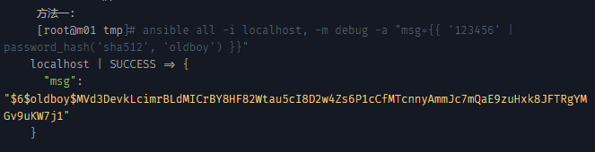

# ssh

## 远程管理服务

远程管理服务器就是一台提供管理的服务器，部署位置在负载均衡和内网服务器之间，这里远程管理服务主要是依靠ssh来实现安全传输的。ssh数据信息是加密的telnet这些是可以抓包到明文密码信息，不可使用。ssh root可以连；telnet拒绝root。

ssh服务连接工作原理：

私钥：钥匙

公钥：锁芯


公钥和私钥的功能是：对数据进行加密处理（ssh密码登录），对用户身份认证（ssh密钥连接）。

## ssh实现和部署

准备一台管理服务器

```bash
第一个历程: 管理端创建秘钥对信息
[root@m01 ~]# ssh-keygen -t dsa   生成管理端公钥
Generating public/private dsa key pair.
Enter file in which to save the key (/root/.ssh/id_dsa): 
Created directory '/root/.ssh'.
Enter passphrase (empty for no passphrase): 
Enter same passphrase again: 
Your identification has been saved in /root/.ssh/id_dsa.
Your public key has been saved in /root/.ssh/id_dsa.pub.
The key fingerprint is:
SHA256:sPZ2eaYbPkuCrOpZm00LMpdWKLUPa8eX22yU0cUI6C0 root@m01
The key's randomart image is:
+---[DSA 1024]----+
|         ... o   |
|        .   . o  |
|    . .. . . .   |
|   . o oE o .    |
|  . + + S. o     |
|   . X o .o.     |
|  o O B *.= o    |
|   O O + Oo=     |
| .+.+ o ..B+     |
+----[SHA256]-----+
第二个历程: 管理端需要将公钥进行分发
[root@m01 ~]# ssh-copy-id -i /root/.ssh/id_dsa.pub root@192.168.1.198  传输管理端公钥到客户端
/usr/bin/ssh-copy-id: INFO: Source of key(s) to be installed: "/root/.ssh/id_dsa.pub"
The authenticity of host '192.168.1.198 (192.168.1.198)' can't be established.
ECDSA key fingerprint is SHA256:1LqfxxOCD7Cf6xoFSflzCvwVGbKlqixuo3VmBZgCt5I.
ECDSA key fingerprint is MD5:27:2b:a8:55:a0:b8:19:6c:b5:8d:06:f0:82:63:3a:a6.
Are you sure you want to continue connecting (yes/no)? yes
/usr/bin/ssh-copy-id: INFO: attempting to log in with the new key(s), to filter out any that are already installed
/usr/bin/ssh-copy-id: INFO: 1 key(s) remain to be installed -- if you are prompted now it is to install the new keys
root@192.168.1.198's password: *********  输入密码
Number of key(s) added: 1
Now try logging into the machine, with:   "ssh 'root@192.168.1.198'"
and check to make sure that only the key(s) you wanted were added.
第三个历程: 进行远程连接测试
[root@m01 ~]# ssh 192.168.1.198  测试连接不用输入密码即可登录
Last login: Sat Feb 20 10:44:11 2021 from 192.168.1.1
[root@nfs01 ~]# pwd
/root
[root@nfs01 ~]# w
 10:50:32 up 15 min,  2 users,  load average: 0.11, 0.08, 0.11
USER     TTY      FROM             LOGIN@   IDLE   JCPU   PCPU WHAT
root     pts/0    192.168.1.1      10:44    6:21   0.02s  0.02s -bash
root     pts/1    192.168.1.199    10:50    0.00s  0.12s  0.05s w
[root@nfs01 ~]# whoami
root
[root@nfs01 ~]# who
root     pts/0        2021-02-20 10:44 (192.168.1.1)
root     pts/1        2021-02-20 10:50 (192.168.1.199)
[root@nfs01 ~]# exit
登出
Connection to 192.168.1.198 closed.
```

 如何实现批量管理多台主机

  如何编写脚本进行批量分发公钥  编写脚本最简单方式: 堆命令

```bash
 #!/bin/bash
	 for ip in 31 7 41
    do 
	   ssh-copy-id -i /root/.ssh/id_dsa.pub root@172.16.1.$ip
    done	 
```

上面shell问题: 有交互过程

   01. 需要有确认yes或no

   02. 需要输入密码信息  OK

   03. 服务端端口号变化了,如何分发公钥

```bash
如何不用交互输入密码信息,进行远程连接分发公钥:
第一步骤: 下载安装软件
yum install -y sshpass
第二步骤: 执行免交互方式分发公钥命令
sshpass -p123456 ssh-copy-id -i /root/.ssh/id_dsa.pub root@172.16.1.41
第三步骤:如何不要输入连接yes或no的确认信息
ssh-copy-id -i /root/.ssh/id_dsa.pub root@172.16.1.41 "-o StrictHostKeyChecking=no"
	 最终脚本是：
------------------
#!/bin/bash

for ip in 197 198 200
do
  sshpass -phongfei007 ssh-copy-id -i /root/.ssh/id_dsa.pub root@192.168.1.$ip "-o StrictHostKeyChecki
ng=no"
done
	 服务端口号发生变化,如何进行批量分发公钥
	 sshpass -p123456 ssh-copy-id -i /root/.ssh/id_dsa.pub root@172.16.1.41 -p 52113 "-o StrictHostKeyChecking=no"
```

### ssh常用脚本

  分发公钥脚本:

```bash
 for ip in 197 198 200
do
  echo "---------------------------HOST:192.168.1.$ip Pub-Key start -----------------" 
  sshpass -phongfei007 ssh-copy-id -i /root/.ssh/id_dsa.pub root@192.168.1.$ip "-o StrictHostKeyChecking=no"
  echo -e "HOST : 192.168.1.$ip Send Success" 
  echo "---------------------------HOST:192.168.1.$ip Pub-Key end ----------------"
  echo -e " \n" 
done


[root@m01 ~]# sh /server/scripts/ssh_plush.sh 
```

 分发公钥检查脚本(批量管理脚本) --- 串型批量管理

```bash
[root@m01 ~]# vim /server/scripts/check_ssh_pub_key.sh
#!/bin/bash
CMD=$1
for ip in {197,198,200}
do
  echo "--------------------HOST:192.168.1.$ip Check-----------------------------"
  ssh 192.168.1.$ip $CMD
  echo ""
done
~                
[root@m01 ~]# sh /server/scripts/check_ssh_pub_key.sh pwd
[root@m01 ~]# sh /server/scripts/check_ssh_pub_key.sh df -h
```

此shell可以批量管理列表主机。

### SSH服务配置文件

```bash
/etc/ssh/sshd_config
	 Port 22                   --- 修改服务端口信息
	 ListenAddress 0.0.0.0     --- 监听地址 指定一块网卡能够接受远程访问请求  *****
	                               PS: 指定监听地址只能是本地网卡上有的地址
	 PermitEmptyPasswords no   --- 是否允许远程用户使用空密码登录,默认不允许
	 PermitRootLogin yes       --- 是否禁止root用户远程连接主机 建议改为no
	 GSSAPIAuthentication no   --- 是否开启GSSAPI认证功能 不用的时候关闭 
	 UseDNS no                 --- 是否开启反向DNS解析功能 建议进行关闭
```

## SSH远程服务防范入侵的案例

> 1. 用密钥登录，不用密码登陆
>
> ​     2、牤牛阵法：解决SSH安全问题
>
> ​      	  a.防火墙封闭SSH,指定源IP限制(局域网、信任公网)
>
>  		   b.开启SSH只监听本地内网IP（ListenAddress 172.16.1.61）。
>
> ​	3、尽量不给服务器外网IP
>
> ​	4、最小化（软件安装-授权）
>
> ​	5、给系统的重要文件或命令做一个指纹
>
>  		 /etc/passwd md5sum 11110000aaaabbbb  监控  
> 	 	
>  		 inotify /bin             监控
>
> ​	6、给他锁上 chattr +i

## SSH相关的命令总结  

ssh-keygen  生成pub-key 公钥

ssh-copy-id  下发公钥

sshpass    免输入密码连接

ssh     

scp     远程复制或者拉取文件

sftp 172.16.1.41

ls    查看远程ftp服务器信息

cd  --- 查看远程ftp服务器信息

lls   查看本地ftp客户端信息

lcd --- 查看本地ftp客户端信息

get --- 下载信息

put --- 上传信息

help --- 查看命令帮助

bye --- 退出ftp连接


# ansible管理服务

ansible是一款自动化运维工具， 基于python开发，集合了多种模块，可以管理服务器，客户机，网络设备（思科级别的），ansible本身并不能批量部署管理能力都是通过集成的模块来实现批量配置部署的功能。不需要客户端，ansible通过ssh来实现通讯。目前被redhat收购。

官网：https://www.ansible.com/

操作说明：https://docs.ansible.com/ansible/latest/user_guide/index.html

模块和插件入口：https://docs.ansible.com/ansible/latest/collections/all_plugins.html

模块：https://docs.ansible.com/ansible/latest/collections/index_module.html

## 安装

```bash
[root@m01 ~]# yum install ansible -y
[root@m01 ~]# rpm -qa ansible
ansible-2.9.17-1.el7.noarch
```

需要依赖epel的yum源

### ansible 特点：

管理端不需要启动服务程序（no server）

管理端不需要编写配置文件（/etc/ansible/ansible.cfg）

受控端不需要安装软件程序（libselinux-python）

被管理端selinux服务没有关闭 --- 影响ansible软件的管理

libselinux-python让selinux开启的状态也可以使用ansible程序

受控端不需要启动服务程序（no agent）

服务程序管理操作模块众多（module）

利用剧本编写来实现自动化（playbook）

### 远程主机无法管理问题分析

1. 管理端没有分发好主机的公钥

2. 被管理端远程服务出现问题

3. 被管理端进程出现僵死情况

     /usr/sbin/sshd -D --- 负责建立远程连接

     sshd: root@pts/0  --- 用于维护远程连接(windows--linux)

     sshd: root@notty  --- 用于维护远程连接(ansible--被管理端)

### ansible学习帮助手册如何查看

ansible-doc -l     --- 列出模块使用简介

ansible-doc -s fetch  --- 指定一个模块详细说明

ansible-doc fetch   --- 查询模块在剧本中应用方法

## 配置

主要配置文件及路径

```bash
[root@m01 ~]# tree /etc/ansible/
/etc/ansible/
├── ansible.cfg    ansible服务配置文件
├── hosts          ansible 主机清单文件 定义可以管理的主机信息
└── roles          ansible角色目录

编写主机清单
[root@m01 ~]# vim /etc/ansible/hosts
[web]
192.168.1.197

[nfs]
192.168.1.198

[data]
192.168.1.200

测试
[root@m01 ~]# ansible all -a "hostname"
192.168.1.198 | CHANGED | rc=0 >>
nfs01
192.168.1.200 | CHANGED | rc=0 >>
data01
192.168.1.197 | CHANGED | rc=0 >>
web01

```

要想使用ansible简单就三个历程安装，添加主机清单，测试即可。更多的需要结合模块来实现更多功能的整合。

模块的应用语法格式:

​     ansible 主机名称/主机组名称/主机地址信息/all -m(指定应用的模块信息) 模块名称 -a(指定动作信息) "执行什么动作"

> ansible all -m ping

> 如果命令需要使用sudo权限需要添加become
>
> $ ansible all -m ping -u test
>
> \# 远程使用test用户执行命令
>
> $ ansible all -m ping -u test --become
>
> \# test没有权限需要sudo 加—become
>
> $ ansible all -m ping -u test --become --become-user oldboy
>
> \#这里可以指定有sudo权限的oldboy用户执行
>
> $ ansible atlanta -a "/sbin/reboot" -f 10
>
> ansible 默认是使用5个进程来执行，如果机器足够使用可以加到10个进程执行
>
> $ ansible atlanta -a "/sbin/reboot" -f 10 -u username
>
> 可以指定到您的用户来执行
>
> $ ansible atlanta -a "/sbin/reboot" -f 10 -u username --become [--ask-become-pass]
>
> 如果使用-ask-become-pass 或者 -k ansible会要求你输入对应user的密码

### 模块

>  ansible软件输出颜色说明:
>
> ​     01. 绿色信息: 查看主机信息/对主机未做改动
>
> ​     02. 黄色信息: 对主机数据信息做了修改
>
> ​     03. 红色信息: 命令执行出错了
>
> ​     04. 粉色信息: 忠告信息
>
> ​     05. 蓝色信息: 显示ansible命令执行的过程

### command 模块

命令模块

语法：ansible **[**pattern**]** -m **[**module**]** -a "[module options]"

​                           模式              模块                模块选项

```bash
[root@m01 ~]# ansible data -m command -a "cal"
192.168.1.200 | CHANGED | rc=0 >>
      二月 2021     
日 一 二 三 四 五 六
    1  2  3  4  5  6
 7  8  9 10 11 12 13
14 15 16 17 18 19 20
21 22 23 24 25 26 27
28
[root@m01 ~]# ansible all -m command -a "poweroff"
192.168.1.197 | FAILED | rc=-1 >>
Failed to connect to the host via ssh: ssh: connect to host 192.168.1.197 port 22: Connection refused
192.168.1.198 | FAILED | rc=-1 >>
Failed to connect to the host via ssh: ssh: connect to host 192.168.1.198 port 22: Connection refused
192.168.1.200 | FAILED | rc=-1 >>
Failed to connect to the host via ssh: ssh: connect to host 192.168.1.200 port 22: Connection refused
```

```bash
扩展应用:
1) chdir  Change into this directory before running the command.
在执行命令之前对目录进行切换
[root@m01 ~]# ansible web -m command -a "chdir=/tmp touch 1.txt"

2) creates If it already exists, this step won't be run.
如果文件存在了,不执行命令操作
[root@m01 ~]# ansible web -m command -a "creates=/tmp touch 1.txt"

3) removes If it already exists, this step will be run.
如果文件存在了,	 这个步骤将执行
[root@m01 ~]# ansible web -m command -a "removes=/tmp chdir=/tmp touch 1.txt" 

4) free_form(required) The command module takes a free form command to run. 
There is no parameter actually named 'free form'. See the examples!
使用command模块的时候,-a参数后面必须写上一个合法linux命令信息
```

https://docs.ansible.com/ansible/latest/collections/ansible/builtin/command_module.html#command-module

  注意事项:

   有些符号信息无法识别: <", ">", "|", ";" and "&"

### shell 模块

```bash
[root@m01 ~]# ansible web -m shell -a "hostname -i"
扩展应用跟command一样，不重复赘述
https://docs.ansible.com/ansible/latest/collections/ansible/builtin/shell_module.html#shell-module
[root@m01 ~]# ansible web -m shell -a "echo $(date +%F)"
192.168.1.197 | CHANGED | rc=0 >>
2021-02-21
```

剧本中不能反复执行。

### script模块

https://docs.ansible.com/ansible/latest/collections/ansible/builtin/script_module.html#ansible-collections-ansible-builtin-script-module

### file模块

设置文件属性

https://docs.ansible.com/ansible/latest/collections/ansible/builtin/file_module.html#file-module

> 参数
>
> attributes   附加属性 chattr一样
>
> group      组
>
> owner      用户
>
> path      文件路径
>
> mode      权限
>
> recurse     递归
>
> src       源路径
>
> state 
>
> absent   缺失  如果存在那么就会删除目标。
>
> directory  目录  如果没有则创建
>
> file    文件（默认）没有就提示absent.不会创建文件
>
> hard    硬链接
>
> link    软连接
>
> touch    创建

```bash
[root@m01 ~]# ansible web -m file -a "path=/tmp/1.txt owner=root group=root mode=644 attributes=+i"
192.168.1.197 | CHANGED => {
    "ansible_facts": {
        "discovered_interpreter_python": "/usr/bin/python"
    }, 
    "changed": true, 
    "gid": 0, 
    "group": "root", 
    "mode": "0644", 
    "owner": "root", 
    "path": "/tmp/1.txt", 
    "secontext": "unconfined_u:object_r:user_tmp_t:s0", 
    "size": 0, 
    "state": "file", 
    "uid": 0
}
[root@m01 ~]# ansible web -m file -a "path=/tmp/1.txt owner=root group=root mode=644 attributes=-i"
192.168.1.197 | CHANGED => {
    "ansible_facts": {
        "discovered_interpreter_python": "/usr/bin/python"
    }, 
    "changed": true, 
    "gid": 0, 
    "group": "root", 
    "mode": "0644", 
    "owner": "root", 
    "path": "/tmp/1.txt", 
    "secontext": "unconfined_u:object_r:user_tmp_t:s0", 
    "size": 0, 
    "state": "file", 
    "uid": 0
}

[root@m01 ~]# ansible web -m file -a "path=/tmp/1.txt state=absent"
192.168.1.197 | CHANGED => {
    "ansible_facts": {
        "discovered_interpreter_python": "/usr/bin/python"
    }, 
    "changed": true, 
    "path": "/tmp/1.txt", 
    "state": "absent"
}
[root@m01 ~]# ansible web -m file -a "path=/tmp/a state=directory"
192.168.1.197 | CHANGED => {
    "ansible_facts": {
        "discovered_interpreter_python": "/usr/bin/python"
    }, 
    "changed": true, 
    "gid": 0, 
    "group": "root", 
    "mode": "0755", 
    "owner": "root", 
    "path": "/tmp/a", 
    "secontext": "unconfined_u:object_r:user_tmp_t:s0", 
    "size": 6, 
    "state": "directory", 
    "uid": 0
}

[root@m01 ~]# ansible web -m file -a "path=/tmp/1.txt state=touch"
192.168.1.197 | CHANGED => {
    "ansible_facts": {
        "discovered_interpreter_python": "/usr/bin/python"
    }, 
    "changed": true, 
    "dest": "/tmp/1.txt", 
    "gid": 0, 
    "group": "root", 
    "mode": "0644", 
    "owner": "root", 
    "secontext": "unconfined_u:object_r:user_tmp_t:s0", 
    "size": 0, 
    "state": "file", 
    "uid": 0
}
[root@m01 ~]# ansible web -m file -a "path=/tmp/1.txt state=file"
192.168.1.197 | SUCCESS => {
    "ansible_facts": {
        "discovered_interpreter_python": "/usr/bin/python"
    }, 
    "changed": false, 
    "gid": 0, 
    "group": "root", 
    "mode": "0644", 
    "owner": "root", 
    "path": "/tmp/1.txt", 
    "secontext": "unconfined_u:object_r:user_tmp_t:s0", 
    "size": 0, 
    "state": "file", 
    "uid": 0
}
```

### copy 模块

将数据信息进行批量分发

```bash
[root@m01 ~]# ansible web -m copy -a "src=/etc/hosts dest=/tmp/"
192.168.1.197 | CHANGED => {
    "ansible_facts": {
        "discovered_interpreter_python": "/usr/bin/python"
    }, 
    "changed": true, 
    "checksum": "7335999eb54c15c67566186bdfc46f64e0d5a1aa", 
    "dest": "/tmp/hosts", 
    "gid": 0, 
    "group": "root", 
    "md5sum": "54fb6627dbaa37721048e4549db3224d", 
    "mode": "0644", 
    "owner": "root", 
    "secontext": "unconfined_u:object_r:admin_home_t:s0", 
    "size": 158, 
    "src": "/root/.ansible/tmp/ansible-tmp-1613830105.79-4561-224703011348109/source", 
    "state": "file", 
    "uid": 0
}
```

> 参数
>
> attributes   chatter功能一样

```bash
[root@m01 ~]# ansible web -m copy -a "src=/etc/hosts dest=/tmp/a/ owner=root group=root mode=644 attributes=+i"

192.168.1.197 | CHANGED => {
    "ansible_facts": {
        "discovered_interpreter_python": "/usr/bin/python"
    }, 
    "changed": true, 
    "checksum": "7335999eb54c15c67566186bdfc46f64e0d5a1aa", 
    "dest": "/tmp/a/hosts", 
    "gid": 0, 
    "group": "root", 
    "mode": "0644", 
    "owner": "root", 
    "path": "/tmp/a/hosts", 
    "secontext": "unconfined_u:object_r:admin_home_t:s0", 
    "size": 158, 
    "state": "file", 
    "uid": 0
}
[root@m01 ~]# ansible web -m copy -a "src=/etc/hosts dest=/tmp/a/ owner=root group=root mode=644 attributes=-i" 
192.168.1.197 | CHANGED => {
    "ansible_facts": {
        "discovered_interpreter_python": "/usr/bin/python"
    }, 
    "changed": true, 
    "checksum": "7335999eb54c15c67566186bdfc46f64e0d5a1aa", 
    "dest": "/tmp/a/hosts", 
    "gid": 0, 
    "group": "root", 
    "mode": "0644", 
    "owner": "root", 
    "path": "/tmp/a/hosts", 
    "secontext": "unconfined_u:object_r:admin_home_t:s0", 
    "size": 158, 
    "state": "file", 
    "uid": 0
}

```

> backup     将本地文件传输到远程主机上面，如果对方有就可以选择是否备份。

```bash
[root@m01 ~]# ansible web -m copy -a "src=/root/1.txt dest=/tmp/ backup=yes"
192.168.1.197 | CHANGED => {
    "ansible_facts": {
        "discovered_interpreter_python": "/usr/bin/python"
    }, 
    "backup_file": "/tmp/1.txt.2897.2021-02-21@10:57:35~", 
    "changed": true, 
    "checksum": "7317399078361350034a7b769c6ea479ca1ebc4a", 
    "dest": "/tmp/1.txt", 
    "gid": 0, 
    "group": "root", 
    "md5sum": "757228086dc1e621e37bed30e0b73e17", 
    "mode": "0644", 
    "owner": "root", 
    "secontext": "unconfined_u:object_r:admin_home_t:s0", 
    "size": 12, 
    "src": "/root/.ansible/tmp/ansible-tmp-1613876253.51-1903-237688165172325/source", 
    "state": "file", 
    "uid": 0
}
[root@web01 ~]# ll /tmp
总用量 12
-rw-r--r--. 1 root root   12 2月  21 10:57 1.txt
-rw-r--r--. 1 root root   14 2月  21 10:57 1.txt.2897.2021-02-21@10:57:35~
```

> checksum 检验

```bash
[root@m01 ~]# ansible web -m copy -a "src=/root/1.txt dest=/tmp/ checksum=yes"
192.168.1.197 | SUCCESS => {
    "ansible_facts": {
        "discovered_interpreter_python": "/usr/bin/python"
    }, 
    "changed": false, 
    "checksum": "7317399078361350034a7b769c6ea479ca1ebc4a", 
    "dest": "/tmp/1.txt", 
    "gid": 0, 
    "group": "root", 
    "mode": "0644", 
    "owner": "root", 
    "path": "/tmp/1.txt", 
    "secontext": "unconfined_u:object_r:admin_home_t:s0", 
    "size": 12, 
    "state": "file", 
    "uid": 0
}
content  内容 会覆盖以前内容
[root@m01 ~]# ansible web -m copy -a "content='this is a pan' dest=/tmp/1.txt"
192.168.1.197 | CHANGED => {
    "ansible_facts": {
        "discovered_interpreter_python": "/usr/bin/python"
    }, 
    "changed": true, 
    "checksum": "48711733b3beb76d4e1ac9fcf8ea0b570130cc45", 
    "dest": "/tmp/1.txt", 
    "gid": 0, 
    "group": "root", 
    "md5sum": "a840348fb26be655f7f1d1180a82ca59", 
    "mode": "0644", 
    "owner": "root", 
    "secontext": "unconfined_u:object_r:admin_home_t:s0", 
    "size": 13, 
    "src": "/root/.ansible/tmp/ansible-tmp-1613876671.01-1999-161985626422421/source", 
    "state": "file", 
    "uid": 0
}
src     本地源路径
dest    目标路径
owner   所属用户
group   所属组
mode    权限
[root@m01 ~]# ansible web -m copy -a "src=/root/1.txt dest=/tmp/ owner=root group=root mode=600"
192.168.1.197 | CHANGED => {
    "ansible_facts": {
        "discovered_interpreter_python": "/usr/bin/python"
    }, 
    "changed": true, 
    "checksum": "7317399078361350034a7b769c6ea479ca1ebc4a", 
    "dest": "/tmp/1.txt", 
    "gid": 0, 
    "group": "root", 
    "md5sum": "757228086dc1e621e37bed30e0b73e17", 
    "mode": "0600", 
    "owner": "root", 
    "secontext": "unconfined_u:object_r:admin_home_t:s0", 
    "size": 12, 
    "src": "/root/.ansible/tmp/ansible-tmp-1613876846.15-2033-239551237655684/source", 
    "state": "file", 
    "uid": 0
}
directory_mode  目录模式（如果远程没有那么第一次会创建不会传输文件，第二次才会传输文件。不使用该参数系统默认会创建目录和传输文件）
[root@m01 ~]# ansible web -m copy -a "src=/root/test dest=/tmp/test/ directory_mode=yes" 
192.168.1.197 | FAILED! => {
    "ansible_facts": {
        "discovered_interpreter_python": "/usr/bin/python"
    }, 
    "changed": false, 
    "checksum": "da39a3ee5e6b4b0d3255bfef95601890afd80709", 
    "details": "bad symbolic permission for mode: yes", 
    "gid": 0, 
    "group": "root", 
    "mode": "0755", 
    "msg": "mode must be in octal or symbolic form", 
    "owner": "root", 
    "path": "/tmp/test", 
    "secontext": "unconfined_u:object_r:user_tmp_t:s0", 
    "size": 18, 
    "state": "directory", 
    "uid": 0
}
[root@m01 ~]# ls
1.txt  anaconda-ks.cfg  cmatrix-1.2a  cmatrix-1.2a.tar.gz  lolcat-master  lolcat-master.zip  test
[root@m01 ~]# ansible web -m copy -a "src=/root/test dest=/tmp/ directory_mode=yes" 
192.168.1.197 | CHANGED => {
    "changed": true, 
    "dest": "/tmp/", 
    "src": "/root/test"
}
[root@m01 ~]# ansible web -m copy -a "src=/root/test dest=/tmp/c/ " 
192.168.1.197 | CHANGED => {
    "changed": true, 
    "dest": "/tmp/c/", 
    "src": "/root/test"
}
    PS: ansible软件copy模块复制目录信息
	 ansible web -m copy -a "src=/root/test dest=/tmp/test/ " 
	 src后面目录没有/: 将目录本身以及目录下面的内容都进行远程传输复制
	 ansible web -m copy -a "src=/root/test/ dest=/tmp/test/ " 
	 src后面目录有/:   只将目录下面的内容都进行远程传输复制	 
follow   跟随(没有变化)
local_follow    跟上面一样
[root@m01 ~]# ll
总用量 212
-rw-r--r--. 1 root root     12 2月  21 10:54 1.txt
-rw-------. 1 root root   1417 2月  19 19:44 anaconda-ks.cfg
drwxrwxrwx. 2  500  500   4096 2月  19 12:34 cmatrix-1.2a
-rw-r--r--. 1 root root  74376 2月  19 12:30 cmatrix-1.2a.tar.gz
lrwxrwxrwx. 1 root root     10 2月  21 11:28 hosts -> /etc/hosts
drwxr-xr-x. 6 root root    153 2月  22 2020 lolcat-master
-rw-r--r--. 1 root root 121142 2月  19 12:30 lolcat-master.zip
drwxr-xr-x. 2 root root   4096 2月  21 11:10 test
[root@m01 ~]# ansible web -m copy -a "src=/root/hosts dest=/tmp/ follow=no"
192.168.1.197 | CHANGED => {
    "ansible_facts": {
        "discovered_interpreter_python": "/usr/bin/python"
    }, 
    "changed": true, 
    "checksum": "7335999eb54c15c67566186bdfc46f64e0d5a1aa", 
    "dest": "/tmp/hosts", 
    "gid": 0, 
    "group": "root", 
    "md5sum": "54fb6627dbaa37721048e4549db3224d", 
    "mode": "0644", 
    "owner": "root", 
    "secontext": "unconfined_u:object_r:admin_home_t:s0", 
    "size": 158, 
    "src": "/root/.ansible/tmp/ansible-tmp-1613878164.58-3974-69389157046248/source", 
    "state": "file", 
    "uid": 0
}
[root@web01 ~]# cat /tmp/hosts 
127.0.0.1   localhost localhost.localdomain localhost4 localhost4.localdomain4
::1         localhost localhost.localdomain localhost6 localhost6.localdomain6
[root@m01 ~]# ansible web -m copy -a "src=/root/hosts dest=/tmp/ follow=yes"
192.168.1.197 | CHANGED => {
    "ansible_facts": {
        "discovered_interpreter_python": "/usr/bin/python"
    }, 
    "changed": true, 
    "checksum": "7335999eb54c15c67566186bdfc46f64e0d5a1aa", 
    "dest": "/tmp/hosts", 
    "gid": 0, 
    "group": "root", 
    "md5sum": "54fb6627dbaa37721048e4549db3224d", 
    "mode": "0644", 
    "owner": "root", 
    "secontext": "unconfined_u:object_r:admin_home_t:s0", 
    "size": 158, 
    "src": "/root/.ansible/tmp/ansible-tmp-1613878255.24-4012-248432708205649/source", 
    "state": "file", 
    "uid": 0
}
[root@web01 ~]# cat /tmp/hosts 
127.0.0.1   localhost localhost.localdomain localhost4 localhost4.localdomain4
::1         localhost localhost.localdomain localhost6 localhost6.localdomain6
force  参数yes 替换  no 不作为
[root@m01 ~]# ansible web -m copy -a "src=/root/hosts dest=/tmp/ force=no"
192.168.1.197 | SUCCESS => {
    "changed": false, 
    "dest": "/tmp/", 
    "src": "/root/hosts"
}
[root@web01 ~]# echo "123" >>/tmp/hosts
[root@m01 ~]# ansible web -m copy -a "src=/root/hosts dest=/tmp/ force=yes"
192.168.1.197 | CHANGED => {
    "ansible_facts": {
        "discovered_interpreter_python": "/usr/bin/python"
    }, 
    "changed": true, 
    "checksum": "7335999eb54c15c67566186bdfc46f64e0d5a1aa", 
    "dest": "/tmp/hosts", 
    "gid": 0, 
    "group": "root", 
    "md5sum": "54fb6627dbaa37721048e4549db3224d", 
    "mode": "0644", 
    "owner": "root", 
    "secontext": "unconfined_u:object_r:admin_home_t:s0", 
    "size": 158, 
    "src": "/root/.ansible/tmp/ansible-tmp-1613878626.93-4372-123709222984581/source", 
    "state": "file", 
    "uid": 0
}
remote_src   远程传输
[root@m01 ~]# ansible web -m copy -a "src=/root/1.txt dest=/tmp/ remote_src=yes"
192.168.1.197 | FAILED! => {
    "ansible_facts": {
        "discovered_interpreter_python": "/usr/bin/python"
    }, 
    "changed": false, 
    "msg": "Source /root/1.txt not found"
}
[root@m01 ~]# ansible web -m copy -a "src=/root/1.txt dest=/tmp/ remote_src=no"
192.168.1.197 | CHANGED => {
    "ansible_facts": {
        "discovered_interpreter_python": "/usr/bin/python"
    }, 
    "changed": true, 
    "checksum": "7317399078361350034a7b769c6ea479ca1ebc4a", 
    "dest": "/tmp/1.txt", 
    "gid": 0, 
    "group": "root", 
    "md5sum": "757228086dc1e621e37bed30e0b73e17", 
    "mode": "0644", 
    "owner": "root", 
    "secontext": "unconfined_u:object_r:user_tmp_t:s0", 
    "size": 12, 
    "src": "/root/.ansible/tmp/ansible-tmp-1613885124.99-4595-114400961293498/source", 
    "state": "file", 
    "uid": 0
}
```

### fetch模块

批量拉取数据

```bash
[root@m01 ~]# ansible web -m fetch -a "src=/tmp/1.txt dest=/tmp"
192.168.1.197 | CHANGED => {
    "changed": true, 
    "checksum": "7317399078361350034a7b769c6ea479ca1ebc4a", 
    "dest": "/tmp/192.168.1.197/tmp/1.txt", 
    "md5sum": "757228086dc1e621e37bed30e0b73e17", 
    "remote_checksum": "7317399078361350034a7b769c6ea479ca1ebc4a", 
    "remote_md5sum": null
}
[root@m01 ~]# ll /tmp/192.168.1.197/tmp/1.txt 
-rw-r--r--. 1 root root 12 2月  21 18:37 /tmp/192.168.1.197/tmp/1.txt
```

> src  源
>
> dest 目标

### yum 模块

> name      待安装软件名称
>
> state 
>
>   absent    缺少
>
>   installed  安装
>
>   latest    最新
>
>   present   当前，现在
>
>   removed   卸载

```bash
[root@m01 ~]# ansible web -m yum -a "name=htop state=installed"
```

### user模块

实现批量创建用户

   基本用法:

```shell
 ansible web-m user -a "name=oldboy01"
 扩展用法:
	 1) 指定用户uid信息
	 ansible web -m user -a "name=oldboy02 uid=6666"
	 
	 2) 指定用户组信息
	 ansible web -m user -a "name=oldboy03 group=oldboy02"
	 ansible web -m user -a "name=oldboy04 groups=oldboy02"
	 
	 3) 批量创建虚拟用户
	 ansible web -m user -a "name=rsync create_home=no  shell=/sbin/nologin"
	 
	 4) 给指定用户创建密码
	 PS: 利用ansible程序user模块设置用户密码信息,需要将密码明文信息转换为密文信息进行设置
	 生成密文密码信息方法:
	 方法一:
	 ansible all -i localhost, -m debug -a "msg={大括号'123456' | password_hash('sha512', 'oldboy')大括号} "
    localhost | SUCCESS => {
      "msg": "$6$oldboy$MVd3DevkLcimrBLdMICrBY8HF82Wtau5cI8D2w4Zs6P1cCfMTcnnyAmmJc7mQaE9zuHxk8JFTRgYMGv9uKW7j1"
    }
	 
	 方法二:(忽略)
	 mkpasswd --method=sha-512
	 
	 方法三:
    yum install -y python-pip
    pip install passlib
    python -c "from passlib.hash import sha512_crypt; import getpass; print(sha512_crypt.using(rounds=5000).hash(getpass.getpass()))"
    Password: 
$6$rJJeiIerQ8p2eR82$uE2701X7vY44voF4j4tIQuUawmTNHEZhs26nKOL0z39LWyvIvZrHPM52Ivu9FgExlTFgz1VTOCSG7KhxJ9Tqk.
	 
	 ansible 172.16.1.31 -m user -a 'name=oldboy08 password=$6$oldboy$MVd3DevkLcimrBLdMICrBY8HF82Wtau5cI8D2w4Zs6P1cCfMTcnnyAmmJc7mQaE9zuHxk8JFTRgYMGv9uKW7j1'

```

上面命令跟gitbook冲突截图显示



### service 模块

管理服务的启动，重启，关闭，开机自启

```bash
name:   --- 指定管理的服务名称
state:  --- 指定服务状态
            started   启动
	 	 	 restarted 重启
reloaded  平滑重启
	 	 	 stopped   停止
enabled --- 指定服务是否开机自启动
[root@m01 ~]# ansible nfs -m service -a "name=nfs state=started enabled=yes"
```

### cron模块

批量设置多个主机的定时任务

> minute:   # Minute when the job should run ( 0-59, *, */2, etc )
>
> ​     设置分钟信息
>
> ​     hour:    # Hour when the job should run ( 0-23, *, */2, etc )
>
> ​     设置小时信息
>
> ​     day:    # Day of the month the job should run ( 1-31, *, */2, etc )
>
>    设置日期信息
>
>   month:   # Month of the year the job should run ( 1-12, *, */2, etc )
>
> ​     设置月份信息
>
> ​     weekday:  # Day of the week that the job should run ( 0-6 for Sunday-Saturday, *, etc )
>
> ​     设置周信息
>
> ​     job    用于定义定时任务需要干的事情

```bash
[root@m01 ~]#ansible web -m cron -a "minute=0 hour=2 job='/usr/sbin/ntpdate ntp1.aliyun.com 
```

> 扩展用法:
>
> \01. 给定时任务设置注释信息
>
> ansible web -m cron -a "name='time sync' minute=0 hour=2 job='/usr/sbin/ntpdate 
>
> ntp1.aliyun.com >/dev/null 2>&1'"
>
> \02. 如何删除指定定时任务
>
> ansible web -m cron -a "name='time sync01' state=absent"
>
> PS: ansible可以删除的定时任务,只能是ansible设置好的定时任务
>
>  
>
> \03. 如何批量注释定时任务
>
> ansible web -m cron -a "name='time sync' job='/usr/sbin/ntpdate ntp1.aliyun.com 
>
> \>/dev/null 2>&1' disabled=yes"

### mount模块

```bash
mount: 批量进行挂载操作
       src:  需要挂载的存储设备或文件信息
       path: 指定目标挂载点目录
       fstype: 指定挂载时的文件系统类型
   state
	    present/mounted     --- 进行挂载
	    present: 不会实现立即挂载,修改fstab文件,实现开机自动挂载
	    mounted: 会实现立即挂载, 并且会修改fstab文件,实现开机自动挂载 *****
	    
	    absent/unmounted    --- 进行卸载
	    absent:     会实现立即卸载, 并且会删除fstab文件信息,禁止开机自动挂载
       unmounted:  会实现立即卸载, 但是不会会删除fstab文件信息  *****

```

### steup 模块

```bash
获取内置变量方法：
	 ansible oldboy -m setup -a "filter=ansible_hostname"
    常见主机信息：
    ansible_all_ipv4_addresses：	 	 	 	 仅显示ipv4的信息。
    ansible_devices：	 	 	 	 	 	 	 仅显示磁盘设备信息。
    ansible_distribution：	 	 	 	 	 	 显示是什么系统，例：centos,suse等。
    ansible_distribution_major_version：	 	 显示是系统主版本。
    ansible_distribution_version：	 	 	 	 仅显示系统版本。
    ansible_machine：	 	 	 	 	 	 	 显示系统类型，例：32位，还是64位。
    ansible_eth0：	 	 	 	 	 	 	 	 仅显示eth0的信息。
    ansible_hostname：	 	 	 	 	 	 	 仅显示主机名。
    ansible_kernel：	 	 	 	 	 	 	 仅显示内核版本。
    ansible_lvm：	 	 	 	 	 	 	 	 显示lvm相关信息。
    ansible_memtotal_mb：	 	 	 	 	 	 显示系统总内存。
    ansible_memfree_mb：	 	 	 	 	 	 显示可用系统内存。
    ansible_memory_mb：	 	 	 	 	 	 	 详细显示内存情况。
    ansible_swaptotal_mb：	 	 	 	 	 	 显示总的swap内存。
    ansible_swapfree_mb：	 	 	 	 	 	 显示swap内存的可用内存。
    ansible_mounts：	 	 	 	 	 	 	 显示系统磁盘挂载情况。
    ansible_processor：	 	 	 	 	 	 	 显示cpu个数(具体显示每个cpu的型号)。
    ansible_processor_vcpus：	 	 	 	 	 显示cpu个数(只显示总的个数)。
	 
	 获取子信息方法:
	 ansible_eth0[ipv4]
```

```bash
ansible web -m setup -a "filter=ansible_*" #获取更多setup信息
```

## 自动化部署rsync服务:

```bash
服务端的操作
第一个历程安装软件:
ansible web -m yum -a "name=rsync state=installed"

第二个历程编写文件:
ansible web -m copy -a "src=/xxx/rsyncd.conf dest=/etc/"

第三个历程创建用户
ansible web -m user -a "name=rsync create_home=no shell=/sbin/nologin"

第四个历程创建目录
ansible web -m file -a "dest=/backup state=directory owner=rsync group=rsync"

第五个历程创建密码文件
ansible web -m copy -a "content='rsync_backup:oldboy123' dest=/etc/rsync.password mode=600"
	 
第六个历程启动服务
 ansible web -m service -a "name=rsyncd state=started enabled=yes"
	 
 客户端的操作:
 第一个历程: 创建密码文件
ansible 客户端地址 -m copy -a "content='rsync_backup:oldboy123' dest=/etc/rsync.password mode=600"
```

## paly-book 剧本

### 剧本的编写方法

剧本的作用: 可以一键化完成多个任务

 

### 剧本编写规范: pyyaml -- 三点要求

​     1. 合理的信息缩进 两个空格表示一个缩进关系

     标题一

      标题二

       标题三

   PS: 在ansible中一定不能用tab进行缩进

 

2. 冒号的使用方法

     hosts: 172.16.1.41

     tasks:

     yum: name=xx

​     PS: 使用冒号时后面要有空格信息

​       以冒号结尾,冒号信息出现在注释说明中,后面不需要加上空格

      

3. 短横线应用 -(列表功能)

     - 张三

      男

       - 打游戏

              - 运动

         

     - 李四

      女

       学习

        湖南

     - 王五

      男

       运动

        深圳

​     PS: 使用短横线构成列表信息,短横线后面需要有空格 


### 开始编写剧本

```sh
  mkdir /etc/ansible/ansible-playbook
  vim rsync_server.ymal
```

  说明: 剧本文件扩展名尽量写为yaml

1. 方便识别文件是一个剧本文件

2. 文件编写时会有颜色提示  

  ```bash
   - hosts: 172.16.1.41
     tasks:
     - name: 01-install rsync
       yum: name=rsync state=installed
     - name: 02-push conf file
       copy: src=/tmp/rsyncd.conf dest=/etc/
  ```

### 如何执行剧本:

​     第一个步骤: 检查剧本的语法格式

 

```sh
  ansible-playbook --syntax-check rsync_server.yaml
```

  第二个步骤: 模拟执行剧本

```sh
   ansible-playbook -C rsy nc_server.yaml
```


​     第三个步骤: 直接执行剧本  

  ```bash
   ansible-playbook rsync_server.yaml  
  ```

### 剧本编写常见错误:

1. 剧本语法规范是否符合(空格 冒号 短横线)

2. 剧本中模块使用是否正确

3. 剧本中一个name标识下面只能写一个模块任务信息

4. 剧本中尽量不要大量使用shell模块

 

### 剧本执行出现错误排查思路/步骤:

​     1) 找到剧本中出现问题关键点

​     2) 将剧本中的操作转换成模块进行操作

​     3) 将模块的功能操作转换成linux命令

​       本地管理主机上执行命令测试

​       远程被管理主机上执行命令测试

### 主机清单配置

https://docs.ansible.com/ansible/latest/user_guide/intro_inventory.html

```bash
第一种方式：分组配置管理主机信息
[web]
192.168.1.199
192.168.1.198

第二种方式: 主机名符号匹配配置
	 [web]
    172.16.1.[7:9]
	 [web]
    web[01:03]
	 
	 第三种方式: 跟上非标准远程端口
	 [web]
    web01:52113
    172.16.1.7:52113
	 
	 第四种方式: 主机使用特殊的变量
    [web]
    172.16.1.7 ansible_ssh_port=52113 ansible_ssh_user=root ansible_ssh_pass=123456
    [web]
    web01 ansible_ssh_host=172.16.1.7 ansible_ssh_port=52113 ansible_ssh_user=root ansible_ssh_pass=123456

    第五种方式: 主机组名嵌入配置
	 [rsync:children]    --- 嵌入子组信息
    rsync_server
    rsync_client
    
    [rsync_server]
    172.16.1.41
    
    [rsync_client]
    172.16.1.31
    172.16.1.7
	 
	 [web:vars]         --- 嵌入式变量信息
    ansible_ssh_host=172.16.1.7
    ansible_ssh_port=52113
    ansible_ssh_user=root
    ansible_ssh_pass=123456
    [web]
    web01
```

### 编写剧本的重要功能介绍

#### a 在剧本中设置变量信息 

```bash
方式一：直接在剧本文件编写  
	 vars:
      oldboy01: data01
      oldboy02: data02
 
    方式二：在命令行中进行指定
    ansible-playbook --extra-vars=oldboy01=data01

    方式三：在主机清单文件编写
    [oldboy]
    oldboy01=data01
    oldboy02=data02

    三种变量设置方式都配置了,三种方式的优先级???
	     最优先: 命令行变量设置
	     次优先: 剧本中变量设置
    最后:   主机清单变量设置
```

#### b 在剧本中设置注册信息 

```bash
执行剧本时,可以显示输出命令结果信息
    - hosts: oldboy
      tasks:
        - name: check server port
          shell: netstat -lntup  --- 端口信息
          register: get_server_port<--端口信息
    
        - name: display port info
          debug: msg={{ get_server_port.stdout_lines }}
	 显示进程信息,表示服务已经正常启动
[root@m01 /etc/ansible/ansible-playbook]# vim test.yaml

- hosts: web
  tasks:
    - name: check server
      shell: systemctl status firewalld
      register: get_server


    - name: display server
      debug: msg={{ get_server.stdout_lines }}
[root@m01 /etc/ansible/ansible-playbook]# ansible-playbook test.yaml 

PLAY [web] ****************************************************************************************************

TASK [Gathering Facts] ****************************************************************************************
ok: [192.168.1.197]

TASK [check server] *******************************************************************************************
changed: [192.168.1.197]

TASK [display server] *****************************************************************************************
ok: [192.168.1.197] => {
    "msg": [
        "● firewalld.service - firewalld - dynamic firewall daemon", 
        "   Loaded: loaded (/usr/lib/systemd/system/firewalld.service; enabled; vendor preset: enabled)", 
        "   Active: active (running) since 一 2021-02-22 11:58:15 CST; 5h 43min ago", 
        "     Docs: man:firewalld(1)", 
        " Main PID: 589 (firewalld)", 
        "   CGroup: /system.slice/firewalld.service", 
        "           └─589 /usr/bin/python2 -Es /usr/sbin/firewalld --nofork --nopid", 
        "", 
        "2月 22 11:58:07 web01 systemd[1]: Starting firewalld - dynamic firewall daemon...", 
        "2月 22 11:58:15 web01 systemd[1]: Started firewalld - dynamic firewall daemon.", 
        "2月 22 11:58:16 web01 firewalld[589]: WARNING: AllowZoneDrifting is enabled. This is considered an insecure configuration option. It will be removed in a future release. Please consider disabling it now."
    ]
}

PLAY RECAP ****************************************************************************************************
192.168.1.197              : ok=3    changed=1    unreachable=0    failed=0    skipped=0    rescued=0    ignored=0   
	 PS: 设置变量不能有空格信息

```

#### c 在剧本中设置判断信息 

```bash
如何指定判断条件:
	 (ansible_hostname == "nfs01")
	 (ansible_hostname == "web01")
	 setup模块中显示被管理主机系统的详细信息

    - hosts: oldboy
      remote_user: root
      tasks:
        - name: Check File
          file: path=/tmp/this_is_{{ ansible_hostname }}_file state=touch
          when: (ansible_hostname == "nfs") or (ansible_hostname == "backup")	 
	 
	     - name: install httpd
	 	   yum: name=httpd state=installed
	 	   when: (ansible_distribution == "CentOS")
	 	   
	 	 - name: install httpd2
          yum: name=httpd2 state=installed
          when: (ansible_distribution == "ubuntu") 

```

```bash
[root@m01 /etc/ansible/ansible-playbook]# vim test.yaml
- hosts: web
  tasks:
     - name: check file
       file: path=/tmp/thin_is_{{ ansible_hostname }}_file state=touch
       when: (ansible_hostname == 'nfs01') or (ansible_hostname == 'web01')
```

#### d 在剧本中设置循环信息

```bash
vim test04.yml
    - hosts: all
      remote_user: root
      tasks:
        - name: Add Users
          user: name={{ item.name }} groups={{ item.groups }} state=present
          with_items: 
    	     - { name: 'testuser1', groups: 'bin' }
    	 	 - { name: 'testuser2', groups: 'root' }
    
    vim test05.yml
    - hosts: all
      remote_user: root
      tasks:
        - name: Installed Pkg
          yum: name={{ item }}  state=present
          with_items:
    	     - wget
    	 	 - tree
    	 	 - lrzsz	 
```

```bash
 - name: 01-install rsync
      yum:
        name: ['rsync', 'tree', 'wget']  --- saltstack
        state: installed
    
	 - name: xxx 
	   yum: name=xxx state=installed      --- ansible
```

#### e 在剧本中设置错误忽略

```bash
默认playbook会检查命令和模块的返回状态，如遇到错误就中断playbook的执行
    可以加入ignore_errors: yes忽略错误
    vim test06.yml
    - hosts: all
      remote_user: root
      tasks:
        - name: Ignore False
          command: /bin/false
    	   ignore_errors: yes
        - name: touch new file
    	   file: path=/tmp/oldboy_ignore state=touch	 	 
```

#### f 在剧本中设置标签信息

```bash
- hosts: oldboy
      ignore_errors: yes
      remote_user: root
      tasks:
        - name: Check File
          file: path=/tmp/this_is_{{ ansible_hostname }}_file state=touch
          when: (ansible_hostname == "nfs01") or (ansible_hostname == "backup")
	 	   tags: t1
    
        - name: bad thing
          command: ech 123
          #ignore_errors: yes
	 	   tags: t2
    
        - name: install httpd
          yum: name=httpd state=installed
          when: (ansible_all_ipv4_addresses == ["172.16.1.7","10.0.0.7"])
	 	   tags: t3
    
        - name: install httpd2
          yum: name=httpd2 state=installed
          when: (ansible_distribution == "ubuntu")
	 	   tags: t4

```

>    指定执行哪个标签任务： ansible-playbook --tags=t2 test05.yml 
>
>    跳过指定标签任务：   ansible-playbook --skip-tags=t2 test05.yml     

#### g 在剧本中设置触发信息

```bash
https://docs.ansible.com/ansible/latest/user_guide/playbooks.html
- hosts: backup
      remote_user: root
      tasks:
        - name: 01 Install rsync
          yum: name=rsync state=present
        - name: 02 push config file
          copy: src=./file/{{ item.src }} dest=/etc/{{ item.dest }} mode={{ item.mode }} 
          with_items:
            - { src: "rsyncd.conf", dest: "rsyncd.conf", mode: "0644" }
            - { src: "rsync.password", dest: "rsync.password", mode: "0600" }
          notify: restart rsync server

      handlers:
        - name: restart rsync server
          service: name=rsyncd state=restarted   
```

#### h 在剧本中进行剧本整合

```bash
方式一：include_tasks: f1.yml
    - hosts: all
      remote_user: root
      tasks:
        - include_tasks: f1.yml
        - include_tasks: f2.yml

方式二：include: f1.yml    常用
    - include：f1.yml	 
    - include：f2.yml

方式三：- import_playbook:
	 [root@m01 ansible-playbook]# cat main.yml 
    - import_playbook: base.yml     
    - import_playbook: rsync.yml    
    - import_playbook: nfs.yml      
	 - import_playbook: oxxx.yml
    - import_playbook: rsync.yml
    - import_playbook: nfs.yml
```

## roles编写方法

剧本编写完问题:

1. 目录结构不够规范      

2. 编写好的任务如何重复调用

3. 服务端配置文件改动,客户端参数信息也自动变化

4. 汇总剧本中没有显示主机角色信息

5. 一个剧本内容信息过多,不容易进行阅读,如何进行拆分    

```bash
 第一个历程: 规范目录结构
	 cd /etc/ansible/roles
	 mkdir {rsync,nfs}   --- 创建相应角色目录
	 mkdir {nfs,rsync}/{vars,tasks,templates,handlers,files}  --- 创建角色目录下面的子目录
	 [root@m01 roles]# tree 
    .
    ├── nfs
    │   ├── files       --- 保存需要分发文件目录 
    │   ├── handlers	 --- 保存触发器配置文件信息
    │   ├── tasks       --- 保存要执行的动作信息文件   ok
    │   ├── templates   --- 保存需要分发模板文件 模板文件中可以设置变量信息
    │   └── vars        --- 保存变量信息文件
    └── rsync
        ├── files
        ├── handlers
        ├── tasks
        ├── templates
        └── vars
    第二个历程: 在roles目录中创建相关文件
	 编写文件流程图:
	 1) 编写tasks目录中的main.yml文件
	 - name: 01-copy conf file
      copy: src=exports dest=/etc
      notify: restart nfs server
    - name: 02-create data dir
      file: path={{ Data_dir }} state=directory owner=nfsnobody group=nfsnobody   
      # path: ['data01','data02','data03']    
      # state: directory    
      # owner: nfsnobody    
      # group: nfsnobody
    - name: 03-boot server
      service: name={{ item }} state=started enabled=yes
      with_items:
        - rpcbind
        - nfs
  	 
	 vim main.yml
	 - include_tasks: copy_info.yml
	 - include_tasks: create_dir.yml
	 - include_tasks: boot_server.yml
	 
    vim copy_info.yml 	 
	 - name: 01-copy conf file
      copy: src=exports dest=/etc
      notify: restart nfs server

    vim create_dir.yml
    - name: 02-create data dir
      file: path={{ Data_dir }} state=directory owner=nfsnobody group=nfsnobody 

    vim boot_server.yml
    - name: 03-boot server
      service: name={{ item }} state=started enabled=yes
      with_items:
        - rpcbind
        - nfs	 

	 2) 编写vars目录中的main.yml文件 
	 [root@m01 vars]# vim main.yml
    Data_dir: /data
	 
	 3) 编写files目录中的文件
	 [root@m01 files]# ll
    total 4
    -rw-r--r-- 1 root root 29 May 17 15:23 exports
	 
	 4) 编写handlers目录中的main.yml文件 
	 vim main.yml
    - name: restart nfs server
    service: name=nfs state=restarted

目录中文件编写好汇总结构
	 [root@m01 nfs]# tree
    .
    ├── files
    │   └── exports
    ├── handlers
    │   └── main.yml
    ├── tasks
    │   └── main.yml
    ├── templates
    └── vars
        └── main.yml
        
第三个历程: 编写一个主剧本文件
	 [root@m01 roles]# cat site.yml 
    - hosts: nfs_server
      roles:
        - nfs-server
    
    - hosts: rsync_server
      roles:
        - rsync


```

剧本执行卡死   --- ansible-playbook xxx -vvvv

  查看详细信息

## 案例：

利用剧本完成服务一键化部署:

### rsync  服务部署

```bash
- hosts: data
  tasks:
    - name: 01-install rsync  
      yum: name=rsync state=installed
    - name: 02-push conf file    
      copy: src=/server/conf/rsyncd.conf dest=/etc/
    - name: 03-create user
      user: name=rsync create_home=no shell=/sbin/nologin
    - name: 04-create backup dir
      file: path=/backup state=directory owner=rsync group=rsync
    - name: 05-create password file
      copy: content=rsync_backup:123456 dest=/etc/rsync.password mode=600
    - name: 06-start rsync server
      service: name=rsyncd state=started enabled=yes

- hosts: web,nfs
  tasks:
    - name: 01-install rsync
      yum: name=rsync state=installed
    - name: 02-create password file
      copy: content=oldboy123 dest=/etc/rsync.password mode=600
    - name: 03-create test file
      file: dest=/tmp/test.txt  state=touch
    - name: 04-check test
      shell: rsync -avz /tmp/test.txt rsync_backup@172.16.1.41::backup --password-file=/etc/rsync.password
```

### nfs    服务部署

```bash
第一个历程: 创建几个目录
   [root@m01 ansible-playbook]# tree nfs-file/
   nfs-file/
   ├── nfs-client
   └── nfs-server
   
   第二个历程: 编写剧本信息
   主机清单:
   [nfs:children]
   nfs_server
   nfs_client
   [nfs_server]
   172.16.1.31
   [nfs_client]
   172.16.1.7
   #172.16.1.8
   #172.16.1.9

- hosts: nfs
  tasks:
    - name: 01-install nfs software
      yum:
        name: ['nfs-utils','rpcbind']
        state: installed

- hosts: nfs_server
  vars:
    Data_dir: /data
  tasks:
    - name: 01-copy conf file
      copy: src=/etc/ansible/ansible-playbook/nfs-file/nfs-server/exports dest=/etc
      notify: restart nfs server
    - name: 02-create data dir
      file: path={{ Data_dir }} state=directory owner=nfsnobody group=nfsnobody 
       # path: ['data01','data02','data03'] 
       # state: directory 
       # owner: nfsnobody 
       # group: nfsnobody
    - name: 03-boot server
      #service: name=rpcbind state=started enabled=yes
      #service: name=nfs state=started enabled=yes
      service: name={{ item }} state=started enabled=yes
      with_items:
        - rpcbind
        - nfs     
 
  handlers:
    - name: restart nfs server
      service: name=nfs state=restarted
       
- hosts: nfs_client
  vars:
    Data_dir: /data
  tasks:
    - name: 01-mount
      mount: src=172.16.1.31:{{ Data_dir }} path=/mnt fstype=nfs state=mounted
    - name: 02-check mount info
      shell: df -h|grep /data
      register: mount_info
    - name: display mount info
      debug: msg={{ mount_info.stdout_lines }}      
   第三个历程: 进行剧本测试
```

变量这里不够完美，roles才完美。

### sersync 服务部署 

全网备份项目

