vsphere


# IP规划表

| 名称       | IP            | 域名       | 服务               |
| ---------- | ------------- | ---------- | ------------------ |
| **ESXI01** | 192.168.10.10 | cloudb.com | esxi               |
| **ESXI02** | 192.168.10.11 | cloudb.com | esxi               |
| **ESXI03** | 192.168.10.12 | cloudb.com | esxi               |
| VCSA       | 192.168.10.13 | cloudb.com | vcenter            |
| **DC**     | 192.168.10.9  | cloudb.com | ad,dns,dhcp,ca,sql |
| CONNETION  | 192.168.10.8  | cloudb.com |                    |
| UAG        | 192.168.10.7  | cloudb.com |                    |
| **NFS**    | 192.168.10.5  | -          | nfs                |
|            |               |            |                    |


---

> windows hosts配置
>
> 192.168.10.10 esxi01.cloudb.com
> 192.168.10.11 esxi02.cloudb.com
> 192.168.10.12 esxi03.cloudb.com
> 192.168.10.13 vcsa.cloudb.com
>
> 192.168.10.9 dc.cloudb.com
> 192.168.10.8 connetion.cloudb.com
> 192.168.10.7 uag.cloudb.com

## AD

默认不配置的不做截图！先部署ad再一一部署其他服务

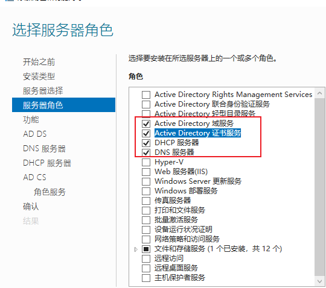

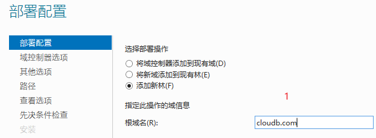

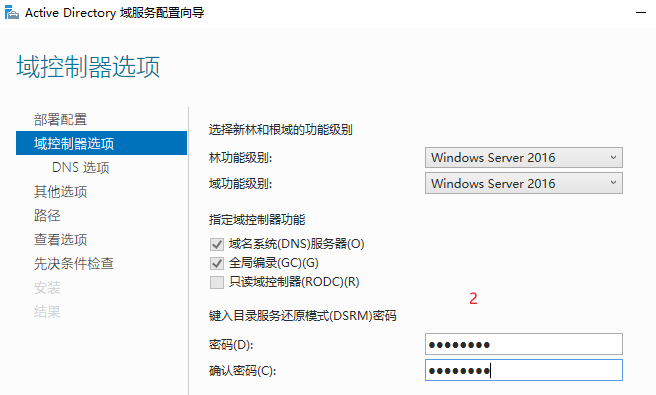

等待重启

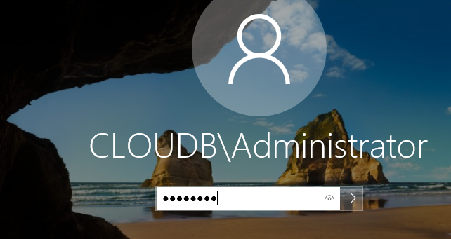

### 配置DHCP

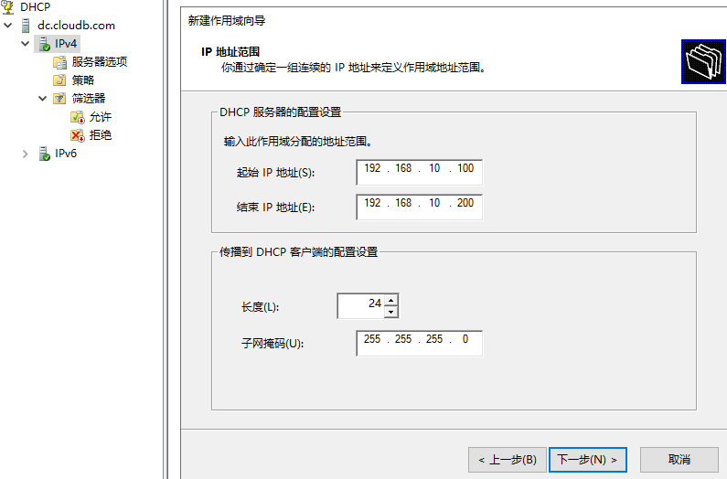

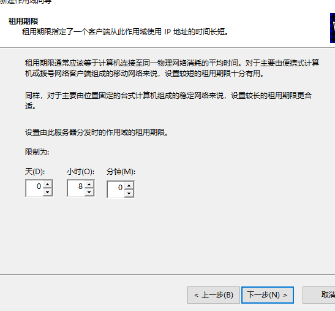

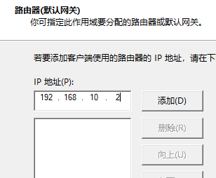

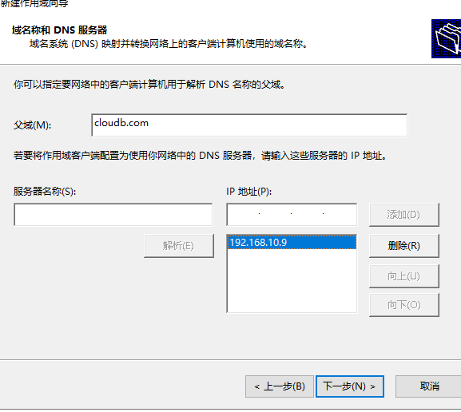

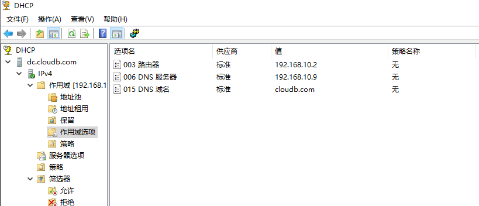

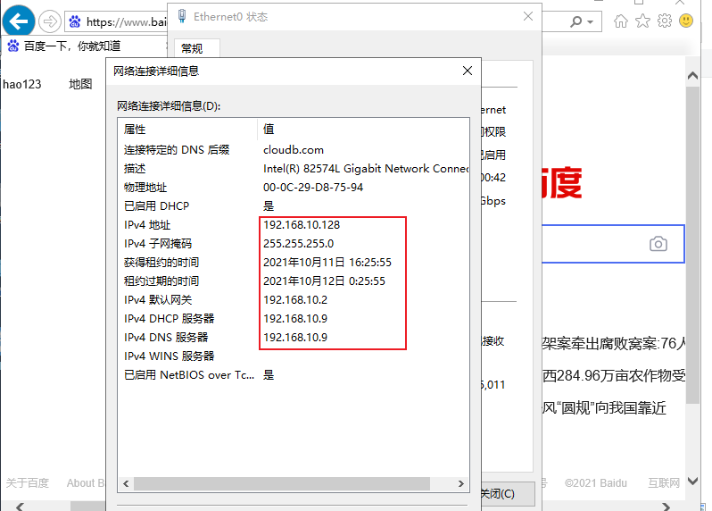

### DNS

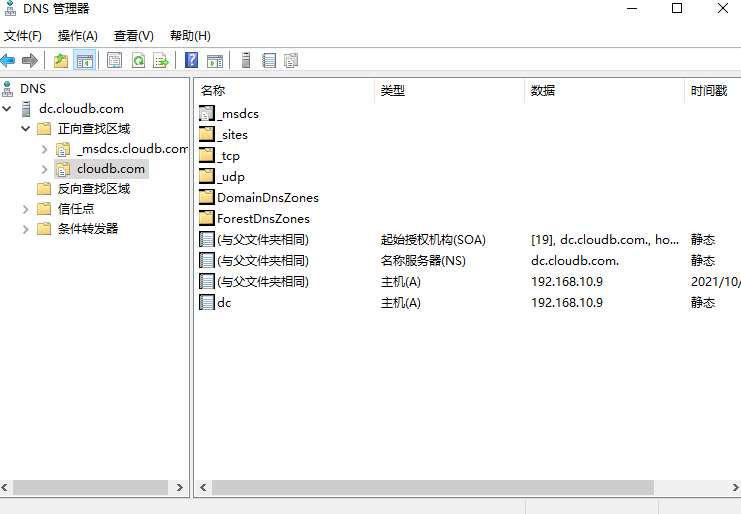

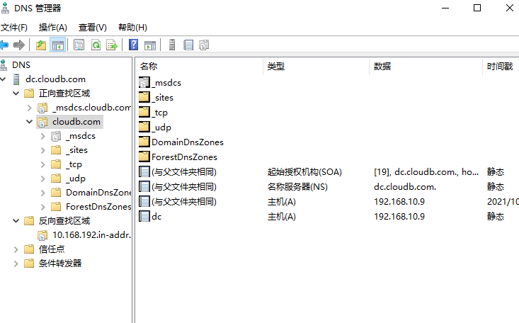

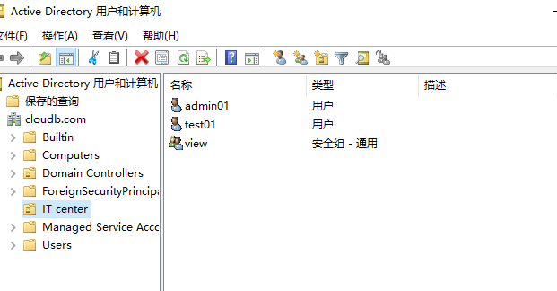

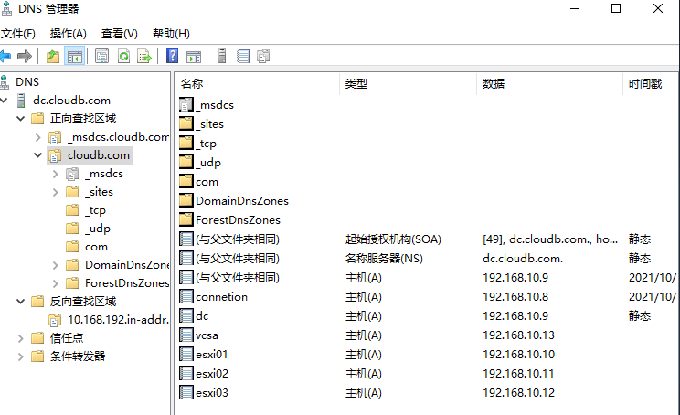

如果在vcsa第二阶段卡住0%很长时间是因为没有设置DNS记录！


### CA

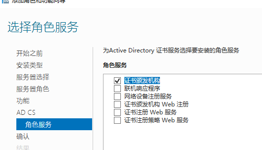


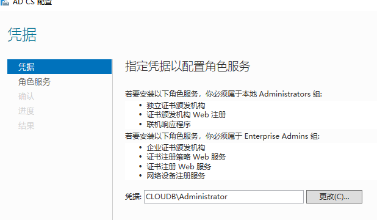

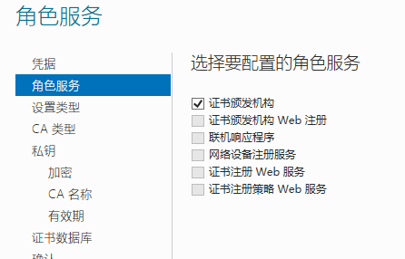

#### 申请证书

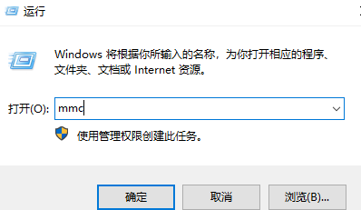


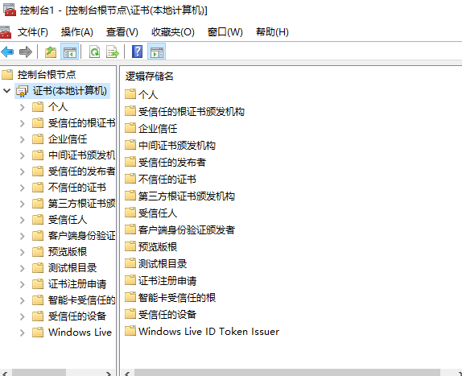


### ISCSI准备

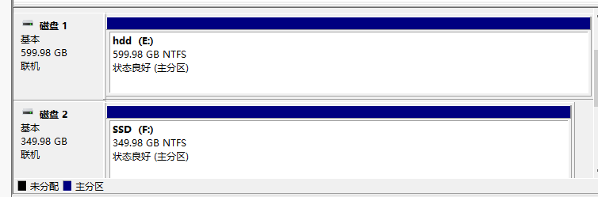

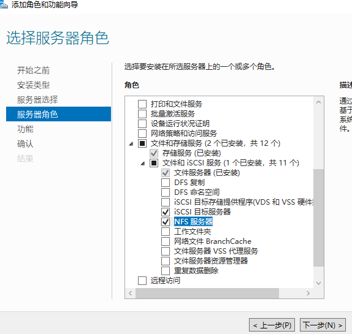

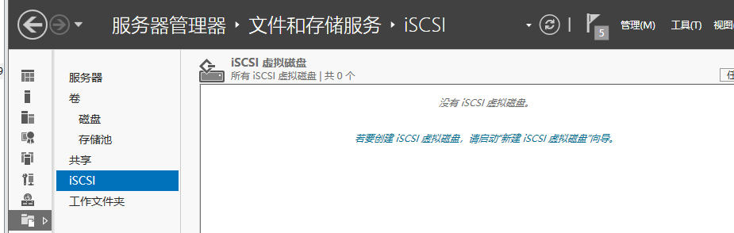


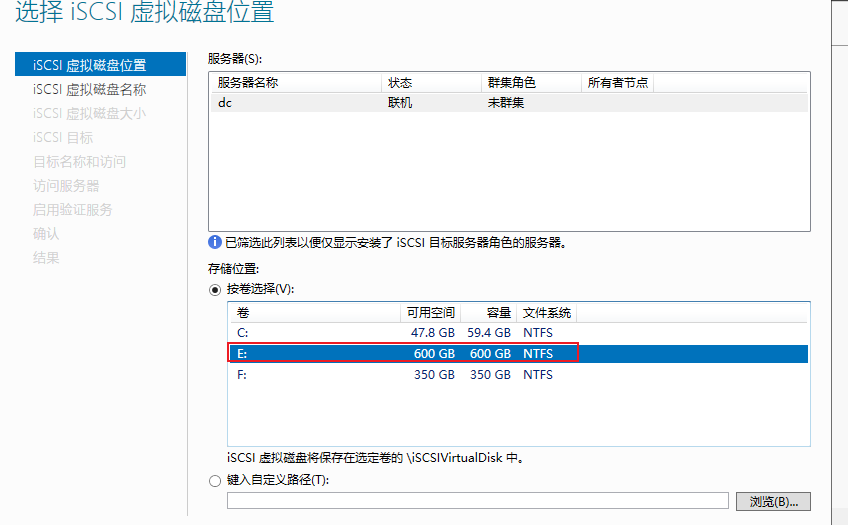

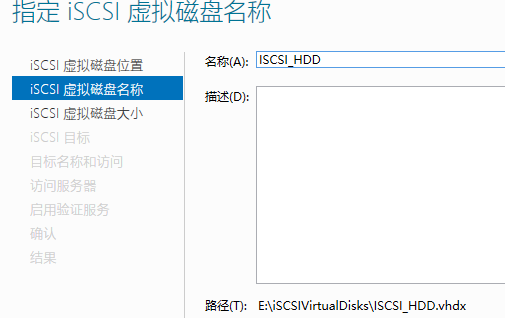

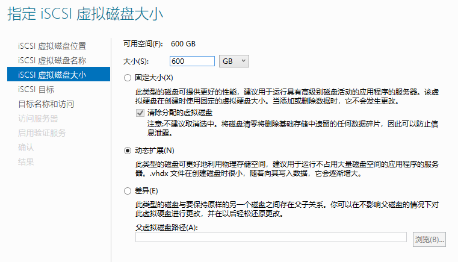

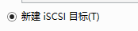

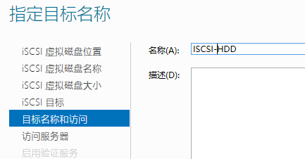

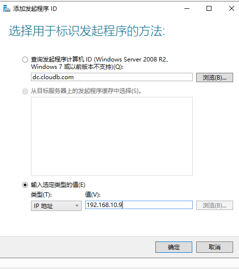

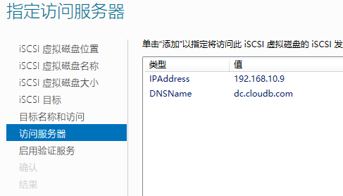

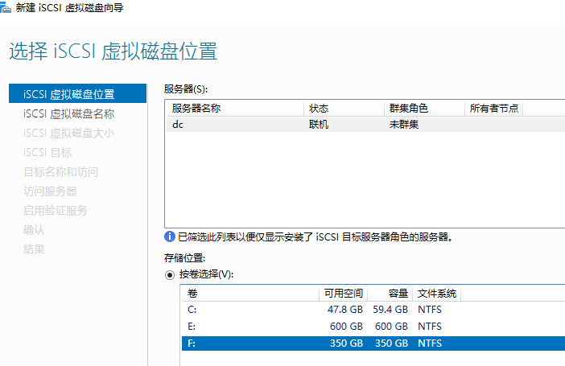

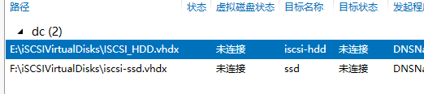


==windows加入ad 之后提示：c:\windowssystem32rundll32.exe windows无法访问指定设备、路径或文件==

> 域控管理员账号登录Windows Server 2016服务器，鼠标点击声音、图标等设置报错 rundll32.exe Windows无法访问指定设备、路径或文件。

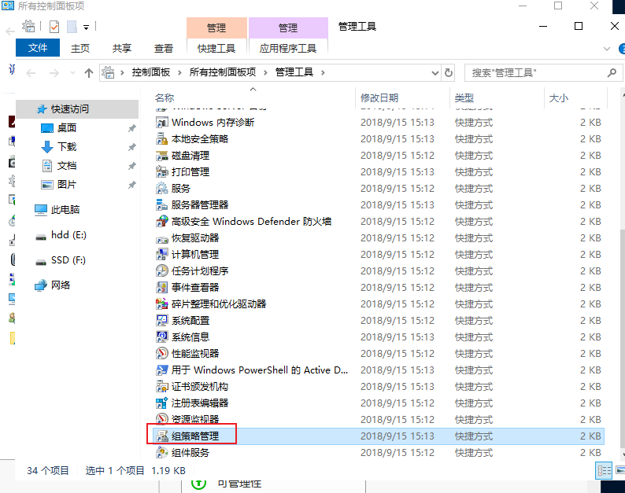

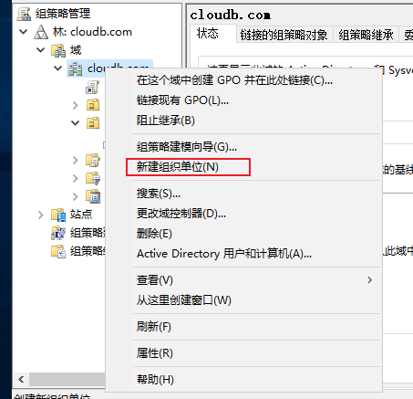

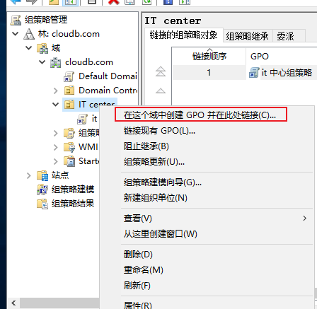

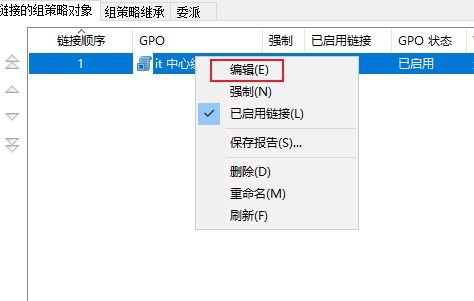


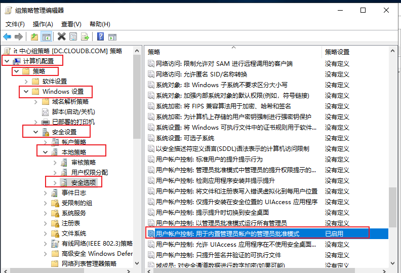

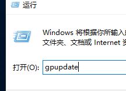


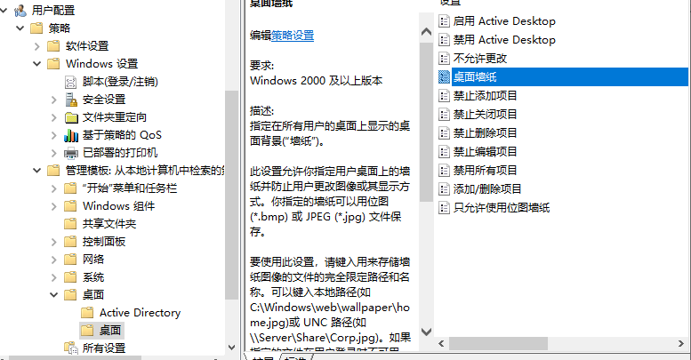

上面的设置只能本计算机

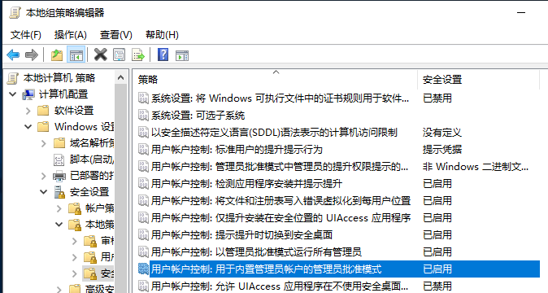

设置完成 gpupdate 一下即可（没有起作用，重新启动才可以）


## 存储

这里的存储使用ceph 或者glusterfs是最好的。但是实验就使用NFS了。

```sh
[root@localhost ~]# lsblk
NAME            MAJ:MIN RM  SIZE RO TYPE MOUNTPOINT
sda               8:0    0   40G  0 disk 
├─sda1            8:1    0    1G  0 part /boot
└─sda2            8:2    0   39G  0 part 
  ├─centos-root 253:0    0 35.1G  0 lvm  /
  └─centos-swap 253:1    0  3.9G  0 lvm  [SWAP]
sdb               8:16   0  600G  0 disk 
└─sdb1            8:17   0  600G  0 part 
sdc               8:32   0  350G  0 disk 
└─sdc1            8:33   0  350G  0 part 
sr0              11:0    1 1024M  0 rom  
[root@localhost ~]# mkfs.xfs /dev/sdb1
meta-data=/dev/sdb1              isize=512    agcount=4, agsize=39321536 blks
         =                       sectsz=512   attr=2, projid32bit=1
         =                       crc=1        finobt=0, sparse=0
data     =                       bsize=4096   blocks=157286144, imaxpct=25
         =                       sunit=0      swidth=0 blks
naming   =version 2              bsize=4096   ascii-ci=0 ftype=1
log      =internal log           bsize=4096   blocks=76799, version=2
         =                       sectsz=512   sunit=0 blks, lazy-count=1
realtime =none                   extsz=4096   blocks=0, rtextents=0
[root@localhost ~]# mkfs.xfs /dev/sdc1
meta-data=/dev/sdc1              isize=512    agcount=4, agsize=22937536 blks
         =                       sectsz=512   attr=2, projid32bit=1
         =                       crc=1        finobt=0, sparse=0
data     =                       bsize=4096   blocks=91750144, imaxpct=25
         =                       sunit=0      swidth=0 blks
naming   =version 2              bsize=4096   ascii-ci=0 ftype=1
log      =internal log           bsize=4096   blocks=44799, version=2
         =                       sectsz=512   sunit=0 blks, lazy-count=1
realtime =none                   extsz=4096   blocks=0, rtextents=0

[root@localhost ~]# mkdir -p /data/{hdd,ssd}

[root@localhost ~]# mount /dev/sdb1 /data/hdd/
[root@localhost ~]# df -h
Filesystem               Size  Used Avail Use% Mounted on
devtmpfs                 1.9G     0  1.9G   0% /dev
tmpfs                    1.9G     0  1.9G   0% /dev/shm
tmpfs                    1.9G   12M  1.9G   1% /run
tmpfs                    1.9G     0  1.9G   0% /sys/fs/cgroup
/dev/mapper/centos-root   36G  1.8G   34G   5% /
/dev/sda1               1014M  151M  864M  15% /boot
tmpfs                    378M     0  378M   0% /run/user/0
/dev/sdb1                600G   33M  600G   1% /data/hdd

[root@localhost ~]# vim /usr/local/bin/mount
...机密不能发布到web上面,完整版参考笔记

[root@localhost ~]# systemctl enable rbd-mount
reboot之后再次查看NFS是否挂载

[root@localhost ~]# df -h
Filesystem               Size  Used Avail Use% Mounted on
devtmpfs                 1.9G     0  1.9G   0% /dev
tmpfs                    1.9G     0  1.9G   0% /dev/shm
tmpfs                    1.9G   12M  1.9G   1% /run
tmpfs                    1.9G     0  1.9G   0% /sys/fs/cgroup
/dev/mapper/centos-root   36G  1.8G   34G   5% /
/dev/sda1               1014M  151M  864M  15% /boot
/dev/sdb1                600G   33M  600G   1% /data/hdd
/dev/sdc1                350G   33M  350G   1% /data/ssd
tmpfs                    378M     0  378M   0% /run/user/0


```

NFS

```sh
[root@localhost ~]# yum install nfs-utils rpcbind -y
[root@localhost ~]# systemctl start rpcbind.service ;systemctl start nfs
[root@localhost ~]# systemctl enable rpcbind.service ;systemctl enable nfs
[root@localhost ~]# vim /etc/exports
/data/hdd 192.168.10.5(rw,sync,all_squash) 
/data/ssd 192.168.10.5(rw,sync,all_squash) 
[root@localhost ~]# chown -R nfsnobody:nfsnobody /data/
[root@nfs /]# ll /data/
total 0
drwxr-xr-x 2 nfsnobody nfsnobody 6 Oct 15 08:17 hdd
drwxr-xr-x 2 nfsnobody nfsnobody 6 Oct 15 08:17 ssd

[root@localhost ~]# exportfs -rv
exporting 192.168.10.0/24:/data/ssd
exporting 192.168.10.0/24:/data/hdd
[root@localhost ~]# showmount -e 192.168.10.5
Export list for 192.168.10.5:
/data/ssd 192.168.10.0/24
/data/hdd 192.168.10.0/24

测试挂载
[root@localhost ~]# mount -t nfs 192.168.10.5:/data/hdd /mnt

```

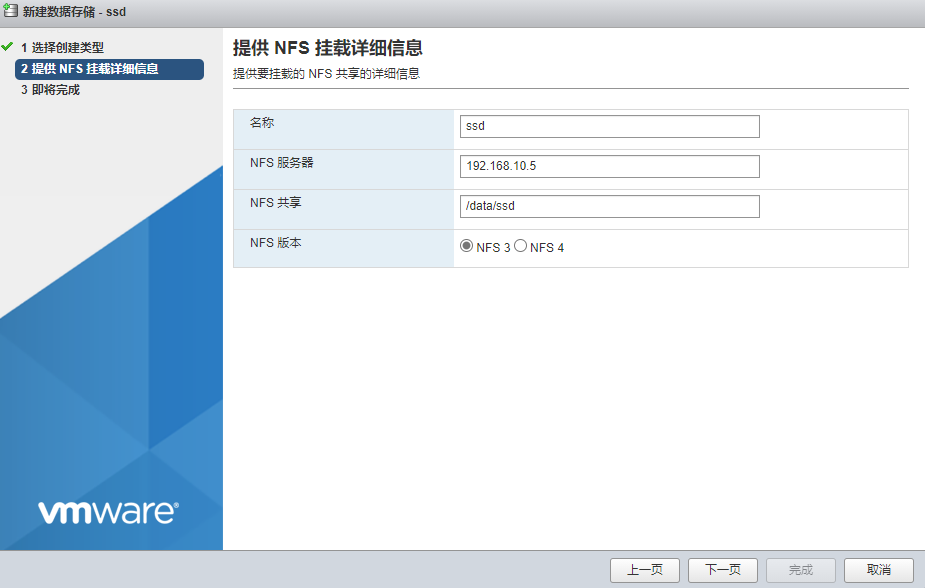

NFS 服务器注意防火墙和selinux


### esxi 挂载一下看看

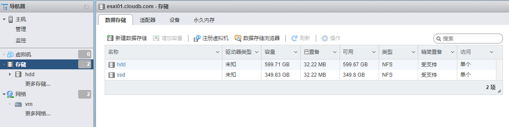

```sh
[root@esxi01:~] esxcli storage nfs list
Volume Name  Host          Share      Accessible  Mounted  Read-Only   isPE  Hardware Acceleration
-----------  ------------  ---------  ----------  -------  ---------  -----  ---------------------
ssd          192.168.10.5  /data/ssd        true     true      false  false  Not Supported
hdd          192.168.10.5  /data/hdd        true     true      false  false  Not Supported
[root@esxi01:~] df -h
Filesystem   Size   Used Available Use% Mounted on
NFS        349.8G  32.2M    349.8G   0% /vmfs/volumes/ssd
NFS        599.7G  32.2M    599.7G   0% /vmfs/volumes/hdd
VMFS-L      41.8G   2.9G     38.9G   7% /vmfs/volumes/OSDATA-6163df77-cdfdda28-2e5c-000c29acd0b5
vfat         4.0G 198.8M      3.8G   5% /vmfs/volumes/BOOTBANK1
vfat         4.0G  64.0K      4.0G   0% /vmfs/volumes/BOOTBANK2

```

三台ESXI都一样的设置

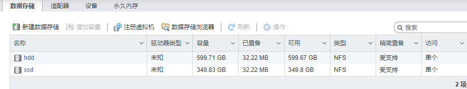

## VCSA

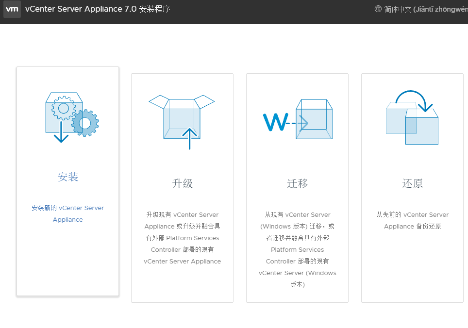

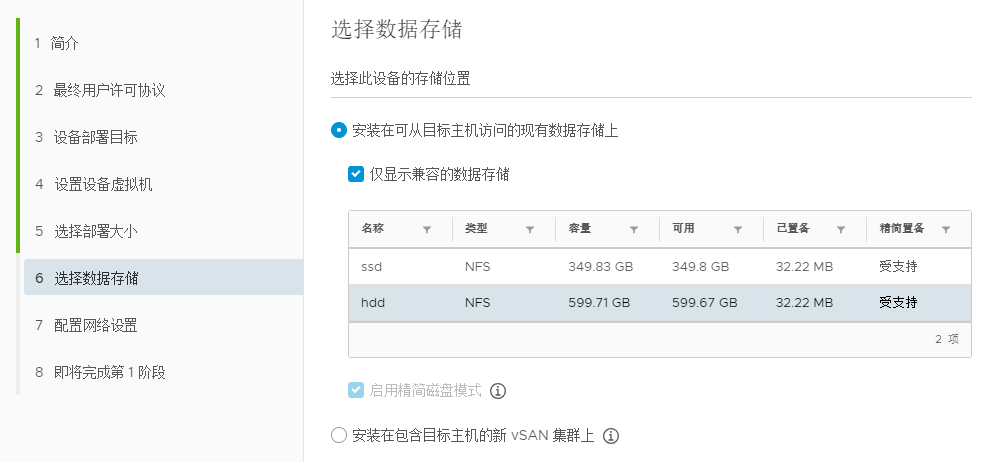

注意！DNS要设置一个可以上网的，不然部署很慢

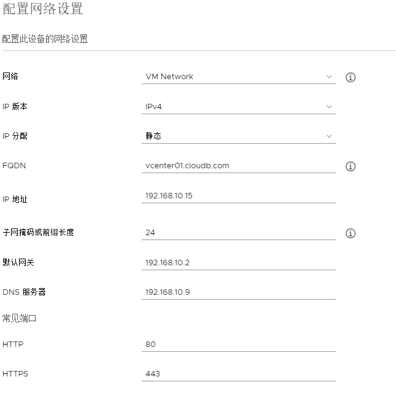

等待第一阶段完成

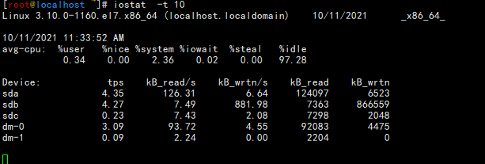

测试硬盘吞吐量

```sh
[root@localhost ~]# yum -y install hdparm
[root@localhost ~]# hdparm -Tt --direct /dev/sdb1

/dev/sdb1:
 Timing O_DIRECT cached reads:   2912 MB in  2.00 seconds = 1456.38 MB/sec
 Timing O_DIRECT disk reads: 2560 MB in  3.00 seconds = 852.93 MB/sec
[root@localhost ~]# hdparm -Tt --direct /dev/sdc1

/dev/sdc1:
 Timing O_DIRECT cached reads:   5034 MB in  2.00 seconds = 2519.95 MB/sec
 Timing O_DIRECT disk reads: 8870 MB in  3.00 seconds = 2956.61 MB/sec

```

```sh
-t 评估硬盘的读取效率。
-T 评估硬盘快取的读取效率。
```

存储消耗内存，cpu基本不消化多少

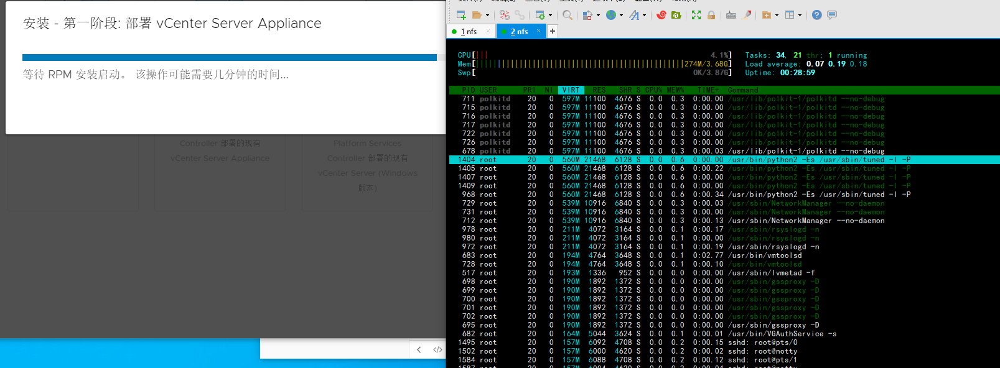

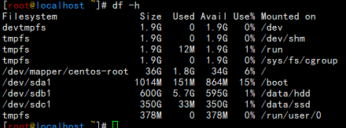

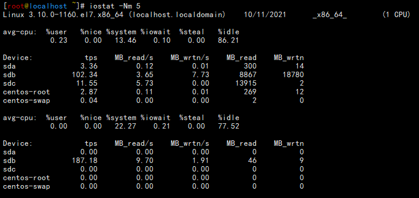

**第二阶段**

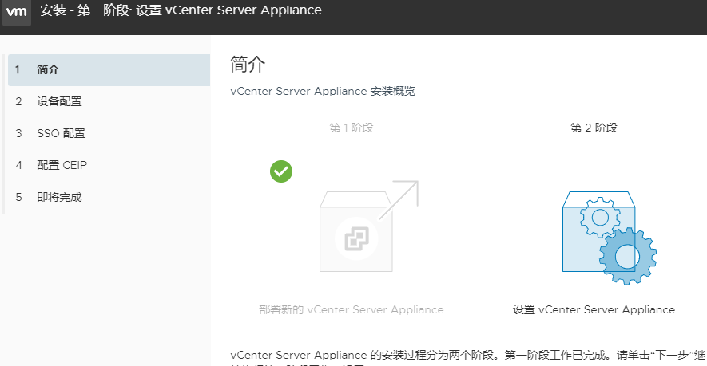


### 配置VCSA


创建集群


添加主机


集群已经配置好


## UAG


打开UAG 电源

https://192.168.10.7:9443/


在CA根服务器上操作


打开连接服务地址


e75c776850532eff0e7fdfb1683445183ac56314


这里稍微等一下，不行的话开启下UDP再关闭就激活了。


## windows10模板

模板制作基本一致这里使用w10


模板常用软件制作好之后使用sysprep 重新打包避免SID重复不能加入AD的问题。打包好一定要关机


## 安装connetion

先配置证书


1G2NK-AF3DP-M84U1-02CZ4-1LHP8


## SQL


回到connetion


# 桌面池


## 自动

准备父VM

选择组织非个人所拥有


根据用户设置用户名

agent 默认安装就可以了

确定好之后关机做快照。


这里使用用户组授权，那个用户先登录就是那个用户使用


这里出现置备会出现桌面不可用的情况


然后登陆

客户端


专用桌面


创建跟浮动差不多。


慢慢等待


这里会自动开机并且完成设置会自动关闭


完全克隆


模板机需要加AD安装agent

## 手动


等待状态为可用


这个是因为有用户登录到虚拟机里面了。注销即可


## RDS

上传一个ISO


NFS上传速度53M/s


**数量**可自己选择，最大为500 。**企业协议号码**可使用**6565792,4954438,6879321或者5296992。**


打开组策略

gpedit.msc 运行输入


安装agent


重启之后再装agent


### 创建RDS桌面


客户端登陆


返回RDS主机设置


## 应用桌面池


手动添加的就是麻烦，适用于单个定制app

自动发现


vmware horzion VDI基本完成。
