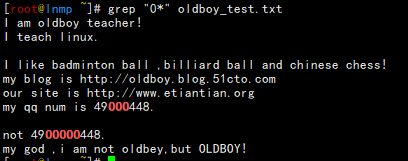
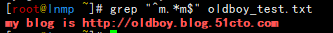
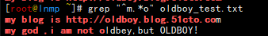
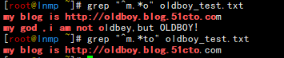
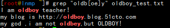
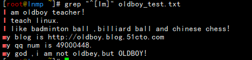
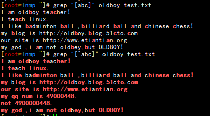

# 高阶应用

### 正则表达式

#### 系统符号

| .    | 当前目录          |
| ---- | ----------------- |
| ..   | 上级目录          |
| ./   | 当前目录下        |
| -    | 返回家目录        |
| ;    | 命令结束          |
| &&   | 逻辑与            |
| \|\| | 逻辑或            |
| !    | 逻辑非            |
| `    | （shift+~）反引号 |
| -    | 两个目录快速切换  |
|      |                   |


#### 系统特殊符号

$ 普通用户的终端提示

！ 取反

| 管道 

  \#  bash   

#### 引号

‘ ’ 所见即所得

“ ” 和单引号类似，但是对特殊信息会做解析

·    · 反引号 优先执行反引号内的内容

#### 重定向符号

\>/ 1> 标准输出重定向符号

2> 错误输出重定向符号

\>>/1> 标准输出追加重定向符号

2>> 错误输出追加重定向符号

```bash
[root@lnmp ~/oldboy]# echo hello,world! 2>./error.log
hello,world!
[root@lnmp ~/oldboy]# cat error.log 
[root@lnmp ~/oldboy]# ech hello,world! 2>./error.log
[root@lnmp ~/oldboy]# cat error.log 
-bash: ech: command not found
[root@lnmp ~/oldboy]# echo hello,world! 1>./yes.log 2>./error.log
[root@lnmp ~/oldboy]# cat yes.log 
hello,world!
[root@lnmp ~/oldboy]# cat error.log 
[root@lnmp ~/oldboy]# ech hello,world! 1>./yes.log 2>./error.log
[root@lnmp ~/oldboy]# cat yes.log 
[root@lnmp ~/oldboy]# cat error.log 
-bash: ech: command not found
[root@lnmp ~/oldboy]# echo hello,world! >./error.log 2>&1
[root@lnmp ~/oldboy]# cat error.log 
hello,world!
[root@lnmp ~/oldboy]# ech hello,world! >./error.log 2>&1
[root@lnmp ~/oldboy]# cat error.log 
-bash: ech: command not found
[root@lnmp ~/oldboy]# ech hello,world! >>./error.log 2>&1
[root@lnmp ~/oldboy]# cat error.log 
-bash: ech: command not found
-bash: ech: command not found
[root@lnmp ~/oldboy]# echo hello,world! >>./error.log 2>&1
[root@lnmp ~/oldboy]# cat error.log 
-bash: ech: command not found
-bash: ech: command not found
hello,world!

```

> 2>&1 意思就是错误和正确的都追加到同一个文件中。
>
> < 标准输入重定向符号
>
> << 
>
> cat >>./2.txt<<EOF
>
> xxx
>
> EOF 
>
> 文件编辑

#### 系统通配符

\* 模糊匹配所有内容

{ } 生成序列信息

生成连续序列

echo {1..10}

echo {01..100}

echo {a..z}

echo {A..Z}

生成不连续序列

echo {1..10..2} 奇数序列

echo {2..10..2} 奇数序列

echo {www,bbs,blog}

​      生成组合序列

```bash
[root@oldboyedu tmp]# echo {A,B}{01,02}
A01 A02 B01 B02
[root@oldboyedu tmp]# echo A{01,02}
A01 A02
[root@oldboyedu tmp]# echo A{,02}
A A02
# 测试题:
01. 在/oldboy目录中创建alex.txt文件,并在/oldboy目录中生成alex.txt.ori备份文件
mkdir /oldboy 
cd  /oldboy
touch alex.txt 
cp /oldboy/alex.txt{,.ori}

02. 如何将备份文件快速还原
rm /oldboy/alex.txt -f 
mv /oldboy/alex.txt{.ori,}
快速还原
mv /oldboy/alex.txt.ori /oldboy/alex.txt
```

#### 定位符号

基础正则符号: basic  regular expression BRE

\1. 尖角符号：＾ 

  以什么开头的信息 ll /oldboy|grep "^d" 

\2. 美元符号：＄

  以什么结尾的信息 ll -F /etc/|grep /$

```bash
[root@lnmp ~/oldboy]# cat oldboy.txt 
ldboyedu-sz-01
oldboy-linux
oldboy-python-linux
# oldboyedu-sh
oldboy-linux
oldboy-python-linux
# oldboyedu-bj
oldboy-linux
java
mysql
go
python
[root@lnmp ~/oldboy]# grep ^oldboy oldboy.txt 
oldboy-linux
oldboy-python-linux
oldboy-linux
oldboy-python-linux
oldboy-linux
[root@lnmp ~/oldboy]# grep ^linux$ oldboy.txt 
[root@lnmp ~/oldboy]# grep linux$ oldboy.txt 
oldboy-linux
oldboy-python-linux
oldboy-linux
oldboy-python-linux
oldboy-linux
[root@lnmp ~/oldboy]# grep !^$ oldboy.txt 
grep linux$$ oldboy.txt 
[root@lnmp ~/oldboy]# grep ^$ oldboy.txt 
[root@lnmp ~/oldboy]# grep -v ^$ oldboy.txt 
ldboyedu-sz-01
oldboy-linux
oldboy-python-linux
# oldboyedu-sh
oldboy-linux
oldboy-python-linux
# oldboyedu-bj
oldboy-linux
java
mysql
go
python
```

#### 匹配

```bash
[root@lnmp ~]# grep "." oldboy_test.txt    匹配所有
I am oldboy teacher!
I teach linux.
I like badminton ball ,billiard ball and chinese chess!
my blog is http://oldboy.blog.51cto.com
our site is http://www.etiantian.org
my qq num is 49000448.
not 4900000448.
my god ,i am not oldbey,but OLDBOY!
[root@lnmp ~]# grep "." oldboy_test.txt -o    -o查看匹配过程
I 
a
m
匹配一个字符连续出现了0次或多次
```



匹配.*任意所有信息，以m开头，中间以.* 任意信息，结尾以m结尾的信息



贪婪匹配



指定具体搜索信息阻止贪婪匹配（也就是去掉不需要的信息）



#### 转义符

\n 换行符

\t 制表符

```bash
[root@lnmp ~]# echo -e "oldboy1\noldboy2\n"
oldboy1
oldboy2 
```


#### 括号符

[] 匹配多个字符



匹配以I m 字符开头的行



[^] 排除符号



扩展正则符号:

  默认 grep sed不能直接识别

   grep 提升自己 -- egrep/grep -E 

   sed 提升自己 -- sed -r

```bash
 企业面试题: 批量创建用户 oldboy01..oldboy10,并给每个用户设置密码信息,默认初始化密码(123456)
	 01. 如何创建用户 给用户设置密码
	 02. 基础命令 echo {}/seq -w 10
	 03. sed命令替换信息方法
	 04. 正则符号 .* () 
	 05. 基础符号 ; |
	 06. bash内置命令
	 [root@oldboyedu ~]# seq -w 10|sed -r 's#(.*)#useradd oldboy\1;echo 123456|passwd --stdin oldboy\1#g'
    useradd oldboy01;echo 123456|passwd --stdin oldboy01
    useradd oldboy02;echo 123456|passwd --stdin oldboy02
    useradd oldboy03;echo 123456|passwd --stdin oldboy03
    useradd oldboy04;echo 123456|passwd --stdin oldboy04
    useradd oldboy05;echo 123456|passwd --stdin oldboy05
    useradd oldboy06;echo 123456|passwd --stdin oldboy06
    useradd oldboy07;echo 123456|passwd --stdin oldboy07
    useradd oldboy08;echo 123456|passwd --stdin oldboy08
    useradd oldboy09;echo 123456|passwd --stdin oldboy09
    useradd oldboy10;echo 123456|passwd --stdin oldboy10
```

> 回顾：
>
>   \1) 正则符号
>
> ​     基础正则符号:
>
> ​     ^ 以什么开头的信息进行匹配 ^oldboy
>
>   $ 以什么结尾的信息进行匹配 oldboy$
>
>   ^$ 表示匹配空行信息
>
>   . 匹配任意一个且只有一个字符 grep "." 
>
>   \* 匹配前一个字符连续出现0次或者多次
>
>   .* 匹配所有任意信息 类似于通配符*
>
>   \ 将有意义的字符信息,转义成普通字符进行识别 
>
> ​       --> 找出文件中以点结尾的信息    
>
> ​       将特殊的扩展正则符号,转换成基础正则符号
>
> ​       将没有意义的字符信息转成有意义的字符
>
> ​       \n \r \t
>
> ​     [] 匹配多个字符信息,多个字符匹配时,是或者的关系
>
> ​       [ok] 在文件中找有o的字符信息 找文件中有k的字符信息
>
> ​       PS: 将一个字符串信息,进行拆分成一个一个的字符进行匹配
>
>   [^] 对匹配的字符信息进行排除
>
> ​    [^ok] 在文件中找有O的字符信息 找文件中有k的字符信息,进行排除不要显示,显示其他信息
>
> ​    [^o^k]       
>
> ​     扩展正则符号:
>
> ​     + 匹配前一个字符连续出现1次或者多次
>
> ​     | 利用竖线可以匹配多个字符串信息
>
> ​     () 将多个字符信息汇总成整体,进行过滤
>
> ​       进行后项引用前项 (oldboy) \1--sed 
>
>   {} 指定匹配前一个字符连续出现了多少次 
>
> ​    {n,m} 至少连续n次,最多连续m次
>
> ​    {n}     匹配只连续n次的信息
>
> ​    {n,} 至少连续n次,最多不限
>
> ​    {,m}    至少连续0次,最多m次 
>
> ​     ? 匹配前一个字符连续出现0次或者1次 
>
>   grep命令识别扩展正则: egrep -E
>
> ​     sed命令识别扩展正则: sed -r

#### 正则表达式中的特殊符号

| 特殊符号   | 意义                                         |
| ---------- | -------------------------------------------- |
| [:alnum:]  | 代表英文大小写及数字，0-9 a-z A-Z            |
| [:alpha:]  | 代表任何英文大小字符，A-Z a-z                |
| [:blank:]  | 代表空白键与[tab]按键两者。                  |
| [:cntrl:]  | 代表键盘上的控制按键，即包括CR,LF,TAB,DEL…等 |
| [:digit:]  | 代表数字0-9                                  |
| [:graph:]  | 除空白字符（空白按键与TAB）外的其他所有按键  |
| [:lower:]  | 代表小写字符a-z                              |
| [:print:]  | 代表可打印的字符                             |
| [:punct:]  | 代表标点符” ’ ? ! : ; # $...                 |
| [:upper:]  | A-Z 大写字母                                 |
| [:space:]  | 任何会产生空白的字符，包括空白键tab CR…      |
| [:xdigit:] | 16进制的数字类型0-9 A-F a-f                  |
|            |                                              |

### 重定向符

输入重定向符号及作用

| 符号             | 作用                                         |
| ---------------- | -------------------------------------------- |
| 命令<文件        | 将文件作为命令的标准输入                     |
| 命令<<分界符     | 从标准输入中读入，直到遇到分界符停止         |
| 命令<文件1>文件2 | 将文件1作为命令的标准输入并将标准输出到文件2 |

```bash
[root@lnmp ~/oldboy]# cat 1.txt 
hello,world!
[root@lnmp ~/oldboy]# txt=`<1.txt`
[root@lnmp ~/oldboy]# echo $txt
hello,world!
[root@lnmp ~/oldboy]# cat >>2.txt<<EOF
> hello,world!
> my name is linux.
> how are you?
> EOF
[root@lnmp ~/oldboy]# cat 2.txt 
hello,world!
my name is linux.
how are you?
[root@lnmp ~/oldboy]# bb=`<1.txt`
[root@lnmp ~/oldboy]# echo $bb > 3.txt 
[root@lnmp ~/oldboy]# cat 3.txt 
hello,world!
```

输出重定向符号及作用

| 符号                               | 作用                                               |
| ---------------------------------- | -------------------------------------------------- |
| 命令>文件                          | 将标准输出重定向到文件中（清除文件中数据）         |
| 命令 2> 文件                       | 将错误标准输出重定向到文件中（清除文件中的数据）   |
| 命令 >> 文件                       | 将标准输出重定向到文件中（在文件内容后面追加数据） |
| 命令 2>>文件                       | 将错误标准输出重定向到文件中（文件数据后面追加）   |
| 命令>>文件 2>&1 或  命令 & >> 文件 | 将标准输出和错误输出共同写入文件（文件数据后追加） |

 ```bash
 [root@lnmp ~/oldboy]# echo hello >1.txt 
 [root@lnmp ~/oldboy]# cat 1.txt 
 hello
 [root@lnmp ~/oldboy]# ca 2>1.txt 
 [root@lnmp ~/oldboy]# cat 1.txt 
 -bash: ca: command not found
 [root@lnmp ~/oldboy]# echo world >> 1.txt 
 [root@lnmp ~/oldboy]# cat 1.txt 
 -bash: ca: command not found
 World
 [root@lnmp ~/oldboy]# ca 2>> 1.txt 
 [root@lnmp ~/oldboy]# cat 1.txt 
 -bash: ca: command not found
 worldn
 world/n
 world
 -bash: ca: command not found
 [root@lnmp ~/oldboy]# echo eeee >1.txt 2>&1
 [root@lnmp ~/oldboy]# cat 1.txt 
 eeee
 [root@lnmp ~/oldboy]# ech eeee >1.txt 2>&1
 [root@lnmp ~/oldboy]# cat 1.txt 
 -bash: ech: command not found
 [root@lnmp ~/oldboy]# echo ggg &>>1.txt 
 [root@lnmp ~/oldboy]# cat 1.txt 
 -bash: ech: command not found
 ggg
 [root@lnmp ~/oldboy]# ech ggg &>>1.txt 
 [root@lnmp ~/oldboy]# cat 1.txt 
 -bash: ech: command not found
 ggg
 -bash: ech: command not found
 重定向主要使用在日志记录上面，很多时候能自动化解决很多故障。
 ```


### 生成随机密码

随机密码是日常应用中经常使用的。

1. 使用SHA算法来加密日期，并输出结果的前10个字符；

```bash
[root@lnmp ~]# date +%s|sha256sum|base64|head -c 16 ;echo
ODM1ZDVmNzBhNDIx
[root@lnmp ~]# echo `date +%s|sha256sum|base64|head -c 16`
NWRlZDc3MjNjZTFm
```

2. 使用内嵌的/dev/urandom，并过滤掉那些日常不使用的字符

\#tr 参数

-c 或 -complerment:取代所有不属于第一字符集的字符；

-d 或 -delete；删除所有属于第一字符集的字符；

```bash
1.1生成10个小写字符
[root@lnmp ~]# < /dev/urandom tr -dc a-z|head -c ${1:-10};echo
fuoohihszg
[root@lnmp ~]# echo `< /dev/urandom tr -dc a-z|head -c ${1:-10}`
iynnjyvhpn
1.2生成10个大写字母
[root@lnmp ~]# < /dev/urandom tr -dc A-Z|head -c ${1:-10};echo
BUFQGHREET
[root@lnmp ~]# echo `< /dev/urandom tr -dc A-Z|head -c ${1:-10}`
KJCMEZFQXJ
1.3生成10个数字
[root@lnmp ~]# < /dev/urandom tr -dc 0-9|head -c ${1:-10};echo
5707817382
[root@lnmp ~]# echo `< /dev/urandom tr -dc 0-9|head -c ${1:-10}`
4041433375
1.4生成10个随机数由数字大小写字母
[root@lnmp ~]# < /dev/urandom tr -dc 0-9-a-z-A-Z|head -c ${1:-10};echo
4ZS1YWxXc0
[root@lnmp ~]# echo `< /dev/urandom tr -dc 0-9-a-z-A-Z|head -c ${1:-10}`
RMqidCEZkd
1..5生成10个随机数由数字大小写字母和特殊符号
[root@lnmp ~]# < /dev/urandom tr -dc 0-9-a-z-A-Z-|head -c ${1:-10};echo
ZzcFk-J1YE
[root@lnmp ~]# echo `< /dev/urandom tr -dc 0-9-a-z-A-Z-|head -c ${1:-10}`
exdS7geq9C
```

3. 使用openssl的随机函数

```bash
[root@lnmp ~]# openssl rand -base64 10
eYv+LYIEWj6VTA==
[root@lnmp ~]# openssl rand -base64 10|tr a-z A-Z
ZIWN5H2KSIX6CG==
[root@lnmp ~]# openssl rand -base64 10|tr a-z A-Z |cut -c 1-10
V0ZJKPH7FO
```

4. 这种方法类似urandom，但他是反向工作的

```bash
[root@lnmp ~]# tr -cd '[:alnum:]' </dev/urandom |fold -w32|head -n1
UStVUwXQpdRgDdr7EXyBVcepbjEA45N3
[root@lnmp ~]# tr -cd '[:alnum:]' </dev/urandom |fold -w10|head -n1
zrJDVhdOXS
```

5. 使用string命令，它从文件中输出可打印的字符串

```bash
strings /dev/urandom |grep -o '[[:alnum:]]' |head -n 32 |tr -d '\n'; echo
bwfFJDfopNbKWLW051EyqtOLLh4u82e7
[root@lnmp ~]# strings /dev/urandom |grep -o '[[:alpha:]]' |head -n 32 |tr -d '\n'; echo
IrIdMNhwDouCsOrbaNXIhIgXiDgZwHJK
[root@lnmp ~]# strings /dev/urandom |grep -o '[[:print:]]' |head -n 32 |tr -d '\n'; echo
<qkK:eVE0.oP-Iz@vp=)j=SN$OJ"`gtY
[root@lnmp ~]# strings /dev/urandom |grep -o '[[:xdigit:]]' |head -n 32 |tr -d '\n'; echo
c98Efc37Df782ddBD0C01c00BE2dc0b7
[root@lnmp ~]# strings /dev/urandom |grep -o '[[:blank:]]' |head -n 32 |tr -d '\n'; echo
   	  	  	 	 	  	 	   	 	 	         	 	    	 	 	 	 
[root@lnmp ~]# strings /dev/urandom |grep -o '[[:cntrl:]]' |head -n 32 |tr -d '\n'; echo
	 	 	 	 	 	 	 	 	 	 	 
[root@lnmp ~]# strings /dev/urandom |grep -o '[[:digitl:]]' |head -n 32 |tr -d '\n'; echo
grep: Invalid character class name

[root@lnmp ~]# strings /dev/urandom |grep -o '[[:digit:]]' |head -n 32 |tr -d '\n'; echo
25178251787941083634430541142337
[root@lnmp ~]# strings /dev/urandom |grep -o '[[:graph:]]' |head -n 32 |tr -d '\n'; echo
/p-G,}xsO"jda^UG4mWYM~E*XFru`;M2
[root@lnmp ~]# strings /dev/urandom |grep -o '[[:print:]]' |head -n 32 |tr -d '\n'; echo
3~Tz^E]i #f'afd(c"B_)Hjjb}DZ%8R8
```

6. 使用urandom的一个更简单的版本

```bash
[root@lnmp ~]# < /dev/urandom tr -dc _A-Z-a-z-0-9|head -c32 ;echo
G8ZL1Z4Bd54sjvJVDsics_vKVglIQx38
[root@lnmp ~]# < /dev/urandom tr -dc _A-Z-a-z-0-9|head -c10 ;echo
O-pFmjfCUS
```

7. 使用dd命令

```bash
[root@lnmp ~]# dd if=/dev/urandom bs=1 count=32 2>/dev/null|base64 -w 0 |rev|cut -b 2- |rev
7rPPOrj/5zSCBerNNdKpJz4a1fw9SNm9tV8Ia/wpou0
[root@lnmp ~]# dd if=/dev/urandom bs=1 count=10 2>/dev/null|base64 -w 0 |rev|cut -b 2- |rev
4116BD7UHFbXGQ=
```

8. 生成一个随便输入的密码

```bash
[root@lnmp ~]# < /dev/urandom tr -dc 'sadsaggdgg'|head -c32;echo
sggsdddsdaasggsdadgsadgddgadadds
[root@lnmp ~]# < /dev/urandom tr -dc 'sadsaggdgg'|head -c10;echo
sdadagadgg
```

企业题

```bash
企业面试题：批量创建用户 oldboy01..oldboy10,并给每个用户设置随机密码信息
[root@lnmp ~]# cat useradd.sh 
#/bin/bash
for i in {1..5};
do useradd oldboy$i;
< /dev/urandom tr -dc a-z-A-Z-0-9-|head -c ${1:-10};echo |passwd --stdin oldboy$i;
Done
Shell脚本记得给chmod u+x 权限。
 //这里也可以直接使用命令完成
#for I in {1..10};do useradd oldboy$i;< /dev/urandom tr -dc a-z-A-Z-0-9-|head -c ${1:-10};echo |passwd –stdin oldboy$i

[root@lnmp ~]# cat 1.txt 
yUfHHOjcj2Changing password for user oldboy1.
Ct2B24boxsChanging password for user oldboy2.
MmuzY47QzwChanging password for user oldboy3.
RVdcEP34D8Changing password for user oldboy4.
eLqxBb4ahdChanging password for user oldboy5.
[root@lnmp ~]# sed "s/Changing/ Changing/g" 1.txt 
yUfHHOjcj2 Changing password for user oldboy1.
Ct2B24boxs Changing password for user oldboy2.
MmuzY47Qzw Changing password for user oldboy3.
RVdcEP34D8 Changing password for user oldboy4.
eLqxBb4ahd Changing password for user oldboy5.
[root@lnmp ~]# sed -i "s/Changing/ Changing/g" 1.txt 
[root@lnmp ~]# cat 1.txt 
yUfHHOjcj2 Changing password for user oldboy1.
Ct2B24boxs Changing password for user oldboy2.
MmuzY47Qzw Changing password for user oldboy3.
RVdcEP34D8 Changing password for user oldboy4.
eLqxBb4ahd Changing password for user oldboy5.
[root@lnmp ~]# grep "oldboy1" 1.txt 
yUfHHOjcj2 Changing password for user oldboy1.
[root@lnmp ~]# for n in {1..5};do grep oldboy$n 1.txt;done
yUfHHOjcj2 Changing password for user oldboy1.
Ct2B24boxs Changing password for user oldboy2.
MmuzY47Qzw Changing password for user oldboy3.
RVdcEP34D8 Changing password for user oldboy4.
eLqxBb4ahd Changing password for user oldboy5.
```

## 企业磁盘常见问题

\1) 磁盘满的情况 No space left on device

  a 存储的数据过多了

   模拟磁盘空间不足

   

```bash
 dd if=/dev/zero of=/tmp/oldboy.txt bs=10M count=100
```

   block存储空间不足了

   解决方式:

    a 删除没用的数据       

   b 找出大的没用的数据

    

```bash
 find / -type f -size +xxx
     du -sh /etc/sysconfig/network-scripts/*|sort -h
```

  补充: 按照数值排序命令

```bash
  [root@oldboyedu mount01]# cat num.txt |sort -n
  \# 1
  \# 10
  \# 11
  \# 12
  \# 2
  \# 3
  \# 6
  \# 9
  [root@oldboyedu mount01]# cat num.txt |sort -n -k2
  \# 1
  \# 2
  \# 3
  \# 6
  \# 9
  \# 10
  \# 11
  \# 12
```

  b 存储的数据过多了

  inode存储空间不足了: 出现了大量小文件   

```bash
 df -i 
```

 

如何调整swap分区大小

第一个历程: 将磁盘分出一部分空间给swap分区使用

```bash
dd if=/dev/zero of=/tmp/1G bs=100M count=10
```

第二个历程: 将指定磁盘空间作为swap空间使用

```bash
[root@oldboyedu tmp]# mkswap /tmp/1G 
Setting up swapspace version 1, size = 1023996 KiB
no label, UUID=6dd70684-dec2-48cf-8fd9-f311548bbb4f
```

第三个历程: 加载使用swap空间

```bash
[root@oldboyedu tmp]# swapon /tmp/1G 
swapon: /tmp/1G: insecure permissions 0644, 0600 suggested.
[root@oldboyedu tmp]# free -h
​       total    used    free   shared buff/cache  available
Mem:      1.9G    225M    575M    9.6M    1.2G    1.5G
Swap:     2.0G     0B    2.0G
[root@oldboyedu tmp]# swapoff /tmp/1G 
[root@oldboyedu tmp]# free -h
​       total    used    free   shared buff/cache  available
Mem:      1.9G    224M    576M    9.6M    1.2G    1.5G
Swap:     1.0G     0B    1.0G
[root@oldboyedu tmp]# rm /tmp/1G -f
```


## 磁盘扩容

[CentOS7根目录磁盘扩容(/dev/mapper/centos-root 空间不足)](https://www.cnblogs.com/herui1991/p/12052967.html) LVM分区

今天在给测试环境搭建k8s系统时，发现master根目录磁盘空间不足，需要扩容，记录如下。

\# 查看根分区大小

```bash
[root@master ~]# df -h
Filesystem                      Size  Used Avail Use% Mounted on
devtmpfs                         63G     0   63G   0% /dev
tmpfs                            63G     0   63G   0% /dev/shm
tmpfs                            63G  1.3G   62G   2% /run
tmpfs                            63G     0   63G   0% /sys/fs/cgroup
/dev/mapper/cl_geekthings-root   50G   38G   13G  76% /
/dev/sda1                      1014M  311M  704M  31% /boot
/dev/mapper/cl_geekthings-home  918G   12G  906G   2% /home
tmpfs                            13G   12K   13G   1% /run/user/42
tmpfs                            13G     0   13G   0% /run/user/0
overlay                          50G   38G   13G  76% /var/lib/docker/overlay2/70dffe831895bb55d79b4a8f483364a4f736637ccb2f6694f1cf82ba7ff1743d/merged

# 查看磁盘编号
[root@master ~]# ls /dev/sd*
/dev/sda  /dev/sda1  /dev/sda2

# 这里在vMware vCenter中新增一块硬盘(编辑->新增设备)   再次查看磁盘
[root@master ~]# ls /dev/sd*
/dev/sda  /dev/sda1  /dev/sda2  /dev/sdb

# 创建pv
[root@master ~]# pvcreate /dev/sdb
  Physical volume "/dev/sdb" successfully created.

# 查看vg组
[root@master ~]# vgs
  VG            #PV #LV #SN Attr   VSize    VFree
  cl_geekthings   1   3   0 wz--n- <999.00g 4.00m

# 扩展vg
[root@master ~]# vgextend cl_geekthings /dev/sdb
  Volume group "cl_geekthings" successfully extended

[root@master ~]# vgs
  VG            #PV #LV #SN Attr   VSize VFree  
  cl_geekthings   2   3   0 wz--n- 1.17t 200.00g

# 扩展lv
[root@master ~]# lvextend -L +200G /dev/mapper/cl_geekthings-root
  Size of logical volume cl_geekthings/root changed from 50.00 GiB (12800 extents) to 250.00 GiB (64000 extents).
  Logical volume cl_geekthings/root successfully resized.

# 系统重新读取大小
[root@master ~]# xfs_growfs /dev/mapper/cl_geekthings-root
meta-data=/dev/mapper/cl_geekthings-root isize=512    agcount=4, agsize=3276800 blks
         =                       sectsz=512   attr=2, projid32bit=1
         =                       crc=1        finobt=0 spinodes=0
data     =                       bsize=4096   blocks=13107200, imaxpct=25
         =                       sunit=0      swidth=0 blks
naming   =version 2              bsize=4096   ascii-ci=0 ftype=1
log      =internal               bsize=4096   blocks=6400, version=2
         =                       sectsz=512   sunit=0 blks, lazy-count=1
realtime =none                   extsz=4096   blocks=0, rtextents=0
data blocks changed from 13107200 to 65536000

# 查看扩容是否成功
[root@master ~]# df -h
Filesystem                      Size  Used Avail Use% Mounted on
devtmpfs                         63G     0   63G   0% /dev
tmpfs                            63G     0   63G   0% /dev/shm
tmpfs                            63G  1.3G   62G   2% /run
tmpfs                            63G     0   63G   0% /sys/fs/cgroup
/dev/mapper/cl_geekthings-root  250G   38G  213G  16% /
/dev/sda1                      1014M  311M  704M  31% /boot
/dev/mapper/cl_geekthings-home  918G   12G  906G   2% /home
tmpfs                            13G   12K   13G   1% /run/user/42
tmpfs                            13G     0   13G   0% /run/user/0
overlay                         250G   38G  213G  16% /var/lib/docker/overlay2/70dffe831895bb55d79b4a8f483364a4f736637ccb2f6694f1cf82ba7ff1743d/merged
[root@master ~]# lsblk
NAME                   MAJ:MIN RM   SIZE RO TYPE MOUNTPOINT
sda                      8:0    0  1000G  0 disk 
├─sda1                   8:1    0     1G  0 part /boot
└─sda2                   8:2    0   999G  0 part 
  ├─cl_geekthings-root 253:0    0   250G  0 lvm  /
  ├─cl_geekthings-swap 253:1    0  31.5G  0 lvm  
  └─cl_geekthings-home 253:2    0 917.5G  0 lvm  /home
sdb                      8:16   0   200G  0 disk 
└─cl_geekthings-root   253:0    0   250G  0 lvm  /
sr0                     11:0    1   4.1G  0 rom  

```

### 查看磁盘类型

```bash
[root@lnmp ~]# df -T
Filesystem     Type     1K-blocks    Used Available Use% Mounted on
devtmpfs       devtmpfs    920900       0    920900   0% /dev
tmpfs          tmpfs       931504       0    931504   0% /dev/shm
tmpfs          tmpfs       931504    9684    921820   2% /run
tmpfs          tmpfs       931504       0    931504   0% /sys/fs/cgroup
/dev/sda2      xfs       58162436 1837040  56325396   4% /
/dev/sda1      xfs         520868  178008    342860  35% /boot
tmpfs          tmpfs       186304       0    186304   0% /run/user/0
[root@lnmp ~]# parted -l
Model: VMware, VMware Virtual S (scsi)
Disk /dev/sda: 64.4GB
Sector size (logical/physical): 512B/512B
Partition Table: msdos
Disk Flags: 

Number  Start   End     Size    Type     File system     Flags
 1      1049kB  538MB   537MB   primary  xfs             boot
 2      538MB   60.1GB  59.6GB  primary  xfs
 3      60.1GB  64.4GB  4295MB  primary  linux-swap(v1)


Model: VMware, VMware Virtual S (scsi)
Disk /dev/sdb: 21.5GB
Sector size (logical/physical): 512B/512B
Partition Table: gpt
Disk Flags: 

Number  Start  End  Size  File system  Name  Flags


Warning: Unable to open /dev/sr0 read-write (Read-only file system).  /dev/sr0
has been opened read-only.
Model: NECVMWar VMware IDE CDR10 (scsi)                                   
Disk /dev/sr0: 4782MB
Sector size (logical/physical): 2048B/2048B
Partition Table: msdos
Disk Flags: 

Number  Start   End     Size    Type     File system  Flags
 2      4964kB  40.6MB  35.7MB  primary


[root@lnmp ~]# blkid
/dev/sda1: UUID="4943b9b2-7122-4b9b-8b9c-b2b96c6b5cb2" TYPE="xfs" 
/dev/sda2: UUID="521d5475-e206-4546-8bf8-aa5e66e03d02" TYPE="xfs" 
/dev/sda3: UUID="64986e5a-fd1d-4392-bd85-4be22c1cd185" TYPE="swap" 
/dev/sr0: UUID="2020-04-22-00-54-00-00" LABEL="CentOS 7 x86_64" TYPE="iso9660" PTTYPE="dos" 
/dev/sdb: PTTYPE="gpt" 
[root@lnmp ~]# lsblk -f
NAME   FSTYPE  LABEL           UUID                                 MOUNTPOINT
sda                                                                 
├─sda1 xfs                     4943b9b2-7122-4b9b-8b9c-b2b96c6b5cb2 /boot
├─sda2 xfs                     521d5475-e206-4546-8bf8-aa5e66e03d02 /
└─sda3 swap                    64986e5a-fd1d-4392-bd85-4be22c1cd185 [SWAP]
sdb                                                                 
sr0    iso9660 CentOS 7 x86_64 2020-04-22-00-54-00-00      

```

## VIM编辑器

     命令模式-->插入模式

     i  --- 表示从光标所在位置进入编辑状态  

​       I  --- 表示将光标移动到一行的行首，再进入编辑状态

​       o  --- 在光标所在行的下面，新起一行进行编辑

​       O  --- 在光变所在行的上面，新起一行进行编辑

​       a  --- 将光标移动到右边的下一个字符，进行编辑

​       A  --- 将光标移动到一行的行尾，进入到编辑状态

​       C  --- 将光标到行尾内容进行删除，并进入编辑状态

​       cc --- 将整行内容进行删除并进入编辑状态

​       总结：移动光标位置，并进入编辑状态方法 

​       只移动光标，不进入编辑状态

​       大写字母G  将光标快速切换尾部

​       小写字母gg 将光标快速切换首部

     ngg     n表示移动到第几行

     $      将光标移动到一行的结尾

     0/^     将光标移动到一行的行首   

     命令模式--底行模式

     :      输入一些命令

     /      进入搜索状态(向下搜索 n依次向下)

     ?      进入搜索状态(向上搜索 n依次向上

     特殊使用技巧:

     将一行内容进行删除(剪切)     deletedelete=dd

     将多行内容进行删除(剪切)     3dd

     将内容进行粘贴         p

​    粘贴多次内容           3p

​    复制一行内容           yy

​    复制多行内容           3yy  

     操作错误如何还原         小写字母u undo

## 系统隐藏功能

   磁盘设备文件 /dev/sda     磁盘文件

  随机设备文件 /dev/urandom   

  输出设备文件 /dev/zero     黑洞出口文件??? 磁盘分区

  输入设备文件 /dev/null     黑洞入口文件??? 定时任务

### 操作文件备份

```bash
[root@lnmp ~/study]# sed -i.bak 's/{a..z}/{a..z}/g' /root/study/*  批量创建备份文件
[root@lnmp ~/oldboy]# cp 1.txt{,.ba}
```

### 空行排除

```bash
文件中空行进行排除/文件中注释信息进行排除
	 grep -Ev "^#|^$"  文件信息 
	 sed -n '/^#|^$/!p' 文件信息
	 awk '/^#|^$/'
	 回顾：awk命令中$符号用法
	 $1 $2 $3 : 取第几列信息
	 $NF      : 取最后一列
	 $(NF-n)  : 取倒数第几列
	 $0       : 取所有列的信息
	 
	 如何利用awk取出IP地址信息:
	 ip a s eth0|awk -F "[ /]+" 'NR==3{print $5}'
	 hostname -i
[root@lnmp ~/oldboy]# ip add s eth0 |awk -F "[/]+" 'NR==3{print $1}'
    inet 172.16.0.199
[root@lnmp ~/oldboy]# ip add s eth0 |awk -F "[ /]+" 'NR==3{print $1}'
[root@lnmp ~/oldboy]# ip add s eth0 |awk -F "[ /]+" 'NR==3{print $3}'   
172.16.0.199
这里使用[ /] 意思是空格或者/ 为分割标识。
```

### 统计文件中的空行

```bash

[root@lnmp ~/oldboy]# awk '/^$/{i=i+1;print i}' /etc/services 
1
17
[root@lnmp ~/oldboy]# awk '/^$/{i=i+1}END{print i}' /etc/services 
17
[root@lnmp ~/oldboy]# awk '/^$/{i++}END{print i}' /etc/services    空行
17
[root@lnmp ~/oldboy]# awk '/^#/{i++}END{print i}' /etc/services   注释行
102
[root@lnmp ~/oldboy]# awk '$NF~/bash/{i=i+1}END{print i}' /etc/passwd
6
[root@lnmp ~/oldboy]# awk '$NF~/bash/{i++}END{print i}' /etc/passwd
6
[root@lnmp ~/oldboy]# awk '$NF!~/bash/{i++}END{print i}' /etc/passwd
19
统计可以登录系统的用户|虚拟用户
Awk运算
root@lnmp ~/oldboy]# seq 10|awk '{sum=sum+$1;print sum}'
1
3
6
10
15
21
28
36
45
55
[root@lnmp ~/oldboy]# seq 10|awk '{sum=sum+$1}END{print sum}'
55
[root@lnmp ~/oldboy]# seq 100|awk '{sum=sum+$1}END{print sum}'
5050
[root@lnmp ~/oldboy]# cat 2.txt 
Zhang	 Dandan	 	 41117397	 :250:100:175
Zhang	 Xiaoyu	 	 390320151	 :155:90:201
Meng	 Feixue	 	 80042789	 :250:60:50
Wu	 Waiwai	 	 70271111	 :250:80:75
Liu	 Bingbing	 41117483	 :250:100:175
Wang	 Xiaoai	 	 3515064655	 :50:95:135
Zi	 Gege	 	 1986787350	 :250:168:200
Li	 Youjiu	 	 918391635	 :175:75:300
Lao	 Nanhai	 	 918391635	 :250:100:175

[root@lnmp ~/oldboy]# awk -F":" '{print,$2,$4}'
awk: cmd. line:1: {print,$2,$4}
awk: cmd. line:1:       ^ syntax error
[root@lnmp ~/oldboy]# awk -F":" '{print $2,$4}' 2.txt 
250 175
155 201
250 50
250 75
250 175
50 135
250 200
175 300
250 175
 
[root@lnmp ~/oldboy]# awk -F":" '{sum1=sum1+$2;sum3=sum3+$4;print sum1,sum3}' 2.txt 
250 175
405 376
655 426
905 501
1155 676
1205 811
1455 1011
1630 1311
1880 1486
1880 1486
[root@lnmp ~/oldboy]# awk -F":" '{sum1=sum1+$2;sum3=sum3+$4}END{print sum1,sum3}' 2.txt 
1880 1486
[root@lnmp ~/oldboy]# awk -F":" 'BEGIN{print "第一次总额","第二次总额"}{sum1=sum1+$2;sum3=sum3+$4;print sum1,sum3}' 2.txt |column -t
第一次总额  第二次总额
250         175
405         376
655         426
905         501
1155        676
1205        811
1455        1011
1630        1311
1880        1486
1880        1486
[root@lnmp ~/oldboy]# awk -F":" 'BEGIN{print "第一次总额","第二次总额"}{sum1=sum1+$2;sum3=sum3+$4}END{print sum1,sum3}' 2.txt |column -t
第一次总额  第二次总额
1880        1486
    1) awk命令概念说明
	    擅长取列 擅长统计分析日志
	    awk命令语法: awk [参数] '模式{动作}' 文件
	    awk执行原理: BEGIN{} END{}
	 2) awk实际解决了一些问题
	    awk匹配查询信息 ==grep
	    ~ !~  指定列进行匹配
       awk匹配替换信息 
	    gsub(/要替换的信息/,"替换的内容",将第几列进行替换)
	    awk匹配删除信息 
	    awk '!/oldboy/'
    3) awk统计分析能力
	    累加运算: i=i+1 i++
	    求和运算: i=i+$n  
    01 求出测试文件中 所有人第一次捐款的总额和第三次捐款总额
       显示表头 
       第一总额  第三次总额 	 
       xxx        xxxx	  
	    awk -F ":" 'BEGIN{print "第一次总额","第三次总额"};/.*/{print $2,$4}'  awk_test.txt
	    [root@oldboyedu ~]# awk -F ":" 'BEGIN{print "第一次总额","第三次总额"}{a=a+$2;b=b+$4}END{print a,b}' awk_test.txt|column -t
       第一次总额  第三次总额
       2130        1661
```

### 系统启动原理

> 系统的启动流程:
>
>   centos6
>
> ​     01. 加电自检
>
> ​       检查服务器硬件是否正常
>
>     02. MBR引导
>
> ​       读取磁盘的MBR存储记录信息,引导系统启动
>
> ​     03. grup菜单
>
> ​       选择启动的内核/进行单用户模式重置密码
>
>     04. 加载系统内核信息
>
> ​       可以更好的使用内核控制硬件
>
> ​     05. 系统的第一个进程运行起来 init (串行)
>
> ​       init进程控制后续各种服务的启动: 启动顺序 网络服务 sshd 
>
> ​     
>
> ​     06. 加载系统运行级别文件/etc/inittab
>
> ​     07. 初始化脚本运行
>
> ​       初始化系统主机名称 和 网卡信息
>
> ​     08. 运行系统特殊的脚本
>
> ​       服务运行的脚本
>
> ​     09. 运行mingetty进程
>
> ​       显示开机登录信息界面   
>
>   centos7   
>
> ​     01. 加电自检
>
> ​       检查服务器硬件是否正常
>
>     02. MBR引导
>
> ​       读取磁盘的MBR存储记录信息,引导系统启动
>
> ​     03. grup菜单
>
> ​       选择启动的内核/进行单用户模式重置密码
>
>     04. 加载系统内核信息
>
> ​       可以更好的使用内核控制硬件     
>
> ​     05. 系统的第一个进程运行起来 systemd (并行)
>
> ​       服务启动的时候,同时一起启动
>
> ​     06. 读取系统启动文件
>
> ​       /etc/systemd/system/default.target
>
> ​     07. 读取系统初始化文件
>
> ​       /usr/lib/systemd/system/sysinit.target
>
> ​     08. 使服务可以开机自启动
>
> ​       /etc/systemd/system 加载此目录中的信息,实现服务开机自动启动
>
> ​     09. 运行mingetty进程
>
> ​       显示开机登录信息界面

### 提取文件名和目录的一些方法：

在使用Linux的shell时，我们都需要对文件名或目录名进行处理，通常的操作是由路径中提取出文件名，从路径中提取出目录名，提取文件后缀名等等。例如，从路径/dir1/dir2/file.txt中提取也文件名file.txt，提取出目录/dir1/dir2，提取出文件后缀txt等。 

下面介绍两种常用的方法来进行相关的操作。 

#### 一、使用${}

1、${var##*/}

该命令的作用是去掉变量var从左边起第一个”/”到最后一个”/”字符及其左边的内容，返回从左边算起的最后一个'/'（不含该字符）的右边的内容。使用例子及结果如下：

> [root@lnmp ~]# var=/dir1/dir2/file.txt
>
> You have new mail in /var/spool/mail/root
>
> [root@lnmp ~]# echo ${var##*/}
>
> file.txt  去掉了/dir1/dir2/

从运行结果可以看到，使用该命令，可以提取出我们需要的文件名file.txt。

若使用时在shell程序文件中，可以使用变量来保存这个结果，再加以利用，如file=${var##*/}

2、${var##*.}

该命令的作用是去掉变量var从左边算起的最后一个'.'字符及其左边的内容，返回从左边算起的最后一个'.'（不含该字符）的右边的内容。使用例子及结果如下：

返回第一个点后边的内容

```bash
[root@lnmp ~]# echo ${var##*.}
txt      去掉了/dir1/dir2/file.
```

从运行结果可以看到，使用该命令，可以提取出我们需要的文件后缀。

如果文件的后缀不仅有一个，例如，file.tar.gz，命令${var##*.}仅能提取最后一个后缀，而我想提取tar.gz时该怎么办？那么就要用下面所说的${var#*.}命令了。

3、${var#*.}

该命令的作用是去掉变量var从左边算起的第一个'.'字符及其左边的内容，返回从左边算起第一个'.'（不含该字符）的右边部分的内容。使用例子及结果如下：

```bash
[root@lnmp ~]# var3=/dir1/dir2/1.tar.gz
You have new mail in /var/spool/mail/root
[root@lnmp ~]# echo ${var3#*.}
tar.gz     去掉了/dir1/dir2/1.
[root@lnmp ~]# echo ${var3##*.}
gz   去掉了/dir1/dir2/1.tar.
```

从运行结果可以看到，使用该命令，可以提取出文件的多个后缀。

4、${var%/*}

该命令的使用是去掉变量var从右边算起的第一个'/'字符及其右边的内容，返回从右边算起的第一个'/'（不含该字符）的左边的内容。使用例子及结果如下：

```bash
[root@lnmp ~]# echo ${var%/*}
/dir1/dir2  去掉/file.txt
```

从运行的结果可以看到，使用该命令，可以提取出我们需要的文件所在的目录

5、${var%%.*}

该命令的使用是去掉变量var从右边算起的最后一个'.'字符及其右边的内容，返回从右边算起的最后一个'.'（不含该字符）的左边的内容。使用例子及结果如下：

```bash
[root@lnmp ~]# echo ${var%%.*}
/dir1/dir2/file   去掉了.txt
```

当我们需要建立一个与文件名相同名字（没有后缀）的目录与对应的文件相对应时，就可以使用该命令来进行操作。例如，解压文件的情况就与此类似，我们压缩文件file.zip时，会在与file.zip同级目录下建立一个名为file的目录。

6、${}总结

其实${}并不是专门为提取文件名或目录名的，它的使用是变量的提取和替换等等操作，它可以提取非常多的内容，并不一定是上面五个例子中的'/'或'.'。也就是说，上面的使用方法只是它使用的一个特例。

看到上面的这些命令，可能会让人感到非常难以理解和记忆，其实不然，它们都是有规律的。

\#：表示从左边算起第一个

%：表示从右边算起第一个

\##：表示从左边算起最后一个

%%：表示从右边算起最后一个

换句话来说，＃总是表示左边算起，％总是表示右边算起。

**＊：表示要删除的内容，**对于#和##的情况，它位于指定的字符（例子中的'/'和'.'）的左边，表于删除指定字符及其左边的内容；对于%和%%的情况，它位于指定的字符（例子中的'/'和'.'）的右边，表示删除指定字符及其右边的内容。这里的'*'的位置不能互换，即不能把*号放在#或##的右边，反之亦然。

例如：${var%%x*}表示找出从右边算起最后一个字符x，并删除字符x及其右边的字符。

看到这里，就可以知道，其实该命令的用途非常广泛，上面只是指针文件名和目录名的命名特性来进行提取的一些特例而已。

#### 二、basename和dirname

${}并不是专门为提取文件名和目录名设计的命令，那么basename和dirname命令就是专门为做这一件事而已准备的了。

##### 1、basename

该命令的作用是从路径中提取出文件名，使用方法为basename NAME [SUFFIX]。

1） 从路径中提出出文件名（带后缀），例子如下：

```bash
[root@lnmp ~]# var=/dir1/dir2/file.txt
You have new mail in /var/spool/mail/root
[root@lnmp ~]# echo $(basename $var)
file.txt
```

2）从上面命令的用法中可以看到，后缀（SUFFIX）是一个可选项。所以，若只想提取出文件名file，而不带有后缀，还可以在变量的后面加上后缀名，例子如下：

```bash
[root@lnmp ~]# echo $(basename $var .txt)
file
```

##### 2、dirname

该命令的作用是从路径中提取出目录名，使用方法为 dirname NAME

使用例子如下：

```bash
[root@lnmp ~]# dirname $var
/dir1/dir2
```

这样就提取出了file.txt文件所在的目录。

注：该命令不仅能提取出普通文件所的目录，它能提取出任何文件所在的目录，例如目录所在的目录，如下：

```bash
[root@lnmp ~]# var=/dir1/dir2/
[root@lnmp ~]# dirname $var
/dir1
```

它提取出了目录dir2所在的目录dir1.

### 读取文件中的每一行

很多时候需要自动化处理任务，读取逐行文件就是一个亮点。

```bash
[root@lnmp ~]# while read line     方法一：
> do 
> echo $line
> done < 1.txt     这里1.txt是待读取的文件
/var/html/www
/var/html/
/application/nginx/conf/nginx.conf
/application/nginx/conf/extra/
/application/nginx/logs
/application/mysql/data/
/application/php/php.ini
/var/spool/cron/root
/etc/rc.local
/server/scripts
/etc/sysconfig/iptables
/backup

[root@lnmp ~]# cat 1.txt |while read line    方法二 
> do 
> echo $line
> done
/var/html/www
/var/html/
/application/nginx/conf/nginx.conf
/application/nginx/conf/extra/
/application/nginx/logs
/application/mysql/data/
/application/php/php.ini
/var/spool/cron/root
/etc/rc.local
/server/scripts
/etc/sysconfig/iptables
/backup

[root@lnmp ~]# for line in `cat 1.txt`    方法三
> do 
> echo $line
> done
/var/html/www
/var/html/
/application/nginx/conf/nginx.conf
/application/nginx/conf/extra/
/application/nginx/logs
/application/mysql/data/
/application/php/php.ini
/var/spool/cron/root
/etc/rc.local
/server/scripts
/etc/sysconfig/iptables
/backup
```

## 系统优化

1、 了解系统环境

  [root@lnmp ~]# cat /etc/redhat-release  //获取系统版本信息

CentOS Linux release 7.8.2003 (Core) 

[root@lnmp ~]# uname -a  //发行版及内核详细信息

Linux lnmp 3.10.0-1127.10.1.el7.x86_64 #1 SMP Wed Jun 3 14:28:03 UTC 2020 x86_64 x86_64 x86_64 GNU/Linux

2、 系统权限分配

通过编辑visudo 来完成权限分配，多用户可以通过组来实现管理。

普通用户无rm权限和useradd groupadd 权限。

很多文件只能看不能编辑权限。

3、 命令提示符优化

[root@lnmp ~]# echo $PS1  \\使用彩色显示命令提示符

[\[\e[31;40m\]\u\[\e[33;40m\]@\[\e[34;40m\]\h \[\e[33;40m\]\w\[\e[0m\]]\$


 /etc/bashrc    

 /etc/profile    //都可以编辑环境参数和命令提示符样式

4、  Yum源优化

目前由于人为天气原因导致国外很多开发网站不能打开，所以需要借助一些大的公司开发的yum镜像源来实现快速下载安装。

阿里源：https://developer.aliyun.com/mirror/

```bash
配置方法
1. 备份
mv /etc/yum.repos.d/CentOS-Base.repo /etc/yum.repos.d/CentOS-Base.repo.backup
2. 下载新的 CentOS-Base.repo 到 /etc/yum.repos.d/
CentOS 6
wget -O /etc/yum.repos.d/CentOS-Base.repo https://mirrors.aliyun.com/repo/Centos-6.repo
或者
curl -o /etc/yum.repos.d/CentOS-Base.repo https://mirrors.aliyun.com/repo/Centos-6.repo
CentOS 7
wget -O /etc/yum.repos.d/CentOS-Base.repo https://mirrors.aliyun.com/repo/Centos-7.repo
或者
curl -o /etc/yum.repos.d/CentOS-Base.repo https://mirrors.aliyun.com/repo/Centos-7.repo
CentOS 8
wget -O /etc/yum.repos.d/CentOS-Base.repo https://mirrors.aliyun.com/repo/Centos-8.repo
或者
curl -o /etc/yum.repos.d/CentOS-Base.repo https://mirrors.aliyun.com/repo/Centos-8.repo
```

基础源：/etc/yum.repos.d/CentOS-Base.repo  //里面包含一些基础的工具

扩展源：/etc/yum.repos.d/epel.repo //里面包含一些扩展工具

Epel 镜像

简介

EPEL (Extra Packages for Enterprise Linux), 是由 Fedora Special Interest Group 维护的 Enterprise Linux（RHEL、CentOS）中经常用到的包。

配置方法

\1. 备份(如有配置其他epel源)

```bash
mv /etc/yum.repos.d/epel.repo /etc/yum.repos.d/epel.repo.backup
mv /etc/yum.repos.d/epel-testing.repo /etc/yum.repos.d/epel-testing.repo.backup
```

\2. 下载新repo 到/etc/yum.repos.d/

**epel(RHEL 8)**
 1）安装 epel 配置包

```bash
yum install -y https://mirrors.aliyun.com/epel/epel-release-latest-8.noarch.rpm
```

2）将 repo 配置中的地址替换为阿里云镜像站地址

```bash
sed -i 's|^#baseurl=https://download.fedoraproject.org/pub|baseurl=https://mirrors.aliyun.com|' /etc/yum.repos.d/epel*
sed -i 's|^metalink|#metalink|' /etc/yum.repos.d/epel*
epel(RHEL 7)
wget -O /etc/yum.repos.d/epel.repo http://mirrors.aliyun.com/repo/epel-7.repo
epel(RHEL 6)
wget -O /etc/yum.repos.d/epel.repo http://mirrors.aliyun.com/repo/epel-6.repo
epel(RHEL 5)
wget -O /etc/yum.repos.d/epel.repo http://mirrors.aliyun.com/repo/epel-5.repo
```

> yum repolist //检查可用的yum源

### 有趣的小玩意

```bash
 yum install sl cowsay -y  --- 需要优化epel扩展源
	 sl
	 cowsay    oldboy-sz-01
	 animalsay oldboy-sz-01
```

5、block优化

     企业中面试: 你都做过哪些系统优化操作?

   问题: block默认大小可以调整 是大点好 小点好

   设置大点: 10k 视频公司 图片公司

   文件大的时候: 20K 4k -- 2个block 2s 4s  --- 节省IO消耗

 

   设置小点: 2k 互联网公司

   小文件的时候: 1k 2k -- 1个block     --- 提高磁盘利用率 

    查看方法:

  ```bash
   [root@oldboyedu oldboy]# df
     Filesystem   1K-blocks  Used Available Use% Mounted on
     /dev/sda3    51149416 1752080 49397336  4% /
  ```

   补充:

    01. 文件属性信息存储在inode中

​      02. 文件的名称信息存储在上一级目录的block中

Etx2-4的使用

  查看os系统块的大小

```bash
[root]# /sbin/tune2fs -l /dev/sda1
```

查看os系统页的大小

```bash
[oracle@skate-test ~]$ getconf PAGESIZE
4096
  \# mke2fs -b 4096 -m 1 /dev/hda6  
\#tune2fs -l /dev/sda1 (ext2-3)
```

Xfs的使用 

```bash
[root@lnmp ~]# xfs_growfs -l /dev/sda1
meta-data=/dev/sda1              isize=512    agcount=4, agsize=32768 blks
         =                       sectsz=512   attr=2, projid32bit=1
         =                       crc=1        finobt=0 spinodes=0
data     =                       bsize=4096   blocks=131072, imaxpct=25
         =                       sunit=0      swidth=0 blks
naming   =version 2              bsize=4096   ascii-ci=0 ftype=1
log      =internal               bsize=4096   blocks=855, version=2
         =                       sectsz=512   sunit=0 blks, lazy-count=1
realtime =none                   extsz=4096   blocks=0, rtextents=0
log size unchanged, skipping
[root@lnmp ~]# stat /boot/
  File: ‘/boot/’
  Size: 4096      	 Blocks: 8          IO Block: 4096   directory
Device: 801h/2049d	 Inode: 64          Links: 5
Access: (0555/dr-xr-xr-x)  Uid: (    0/    root)   Gid: (    0/    root)
Context: system_u:object_r:boot_t:s0
Access: 2020-08-25 12:48:43.555613338 +0800
Modify: 2020-06-13 22:26:35.047019223 +0800
Change: 2020-06-13 22:26:35.047019223 +0800
 Birth: -
上面是两种方法查看xfs的文件系统
怎么去修改xfs的block大小？
#mkfs.xfs -b size=64k /dev/sda4
#mkfs.xfs -f -b size=1k -n size=64k /dev/sda4  设置比默认大的。
这种是格式化的。有没有不用格式化的？
```

6. 模板机优化配置---英文字符集

 \#英文字符集

```bash
 localectl set-locale LANG="en_US.UTF-8"
```

7. 模板机优化配置---时间同步

 \#时间同步

```bash
yum install -y ntpdate
 echo '#time sync by lidao at 2017-03-08' >>/var/spool/cron/root
 echo '*/5 * * * * /usr/sbin/ntpdate ntp1.aliyun.com >/dev/null 2>&1' >>/var/spool/cron/root
 crontab -l
```

8. 模板机优化配置---加大文件描述

```bash
yum install -y lsof
lsof -i:22
 #加大文件描述
 echo '*               -       nofile          65536' >>/etc/security/limits.conf 
 tail -1 /etc/security/limits.conf
 说明:
一个服务程序运行起来,会打开相应的文件
crond定时任务服务---systemctl start crond --- 打开相应文件
/var/spool/cron/root  --- 加载打开配置文件
/var/log/cron         --- 加载打开日志文件
```

9. 模板机优化配置---安装其他小软件

  \#安装其他小软件

```bash
 yum install lrzsz nmap tree dos2unix nc telnet wget lsof ntpdate bash-completion bash-completion-extras -y
```

10. 模板机优化配置---ssh连接速度慢优化

  \#ssh连接速度慢优化   

```bash
sed -i.bak 's@#UseDNS yes@UseDNS no@g;s@^GSSAPIAuthentication yes@GSSAPIAuthentication no@g'  
   systemctl restart sshd	 
```


# 用户(权限)管理

## 用户概念

管理员     root      0        权力最高

虚拟用户       nobody     1-999      有管理进程，没有家目录，不能登陆系统

普通用户     oldboy      1000+      权力有限

权限说明：

r      read       读        4

w      write      写        2   

x      execute      执行      1

 

文件目录数据设置权限的方法:

1) 根据用户信息进行设定 (属主 属组 其他用户)

  属主-user    u 

  属组-group   g 

  其他用户-other o 

```bash
chmod u+r/w/x u-r/w/x u=rw
chmod g+r/w/x u-r/w/x u=rw
chmod o+r/w/x u-r/w/x u=rw
chmod u/g/o + - = rwx   --- 针对不同用户进行设置
chmod a + - = rwx       --- 全部用户统一设置权限
chmod 644 xxx           --- 全部用户统一设置权限(更加灵活)
```

2) 根据用户进行批量设定

  数值设定:

```bash
[root@oldboyedu ~]# chmod 761 oldboy.txt
[root@oldboyedu ~]# ll oldboy.txt
-rwxrw---x. 1 root root 0 Apr 23 11:42 oldboy.txt

字符设定:
[root@oldboyedu ~]# chmod a=x oldboy.txt
[root@oldboyedu ~]# ll oldboy.txt
---x--x--x. 1 root root 0 Apr 23 11:42 oldboy.txt
```

#### 文件和目录默认权限

问题一: 为什么创建的文件和目录权限一致

目录权限都是 755

文件权限都是 644 

```bash
[root@lnmp ~/oldboy]# ll 
drwxr-xr-x. 2 root root  22 Sep 16 15:51 test
d755
[root@lnmp ~/oldboy]# ll test/
-rw-r--r--. 1 root root 0 Sep 16 15:51 test.txt
-644
[root@oldboyedu ~]# umask 
0022
```

默认文件权限: 666 - 022 = 644

umask数值是奇数 666 - 033 = 633 + 11 = 644

umask数值是偶数 666 - 022 = 644


默认目录权限: 777 - 022 = 755  

umask数值是奇数 777 - 033 = 744

umask数值是偶数 777 - 022 = 755  

 

问题二: 如何永久修改umask信息

```bash
vim /etc/profile
if [ $UID -gt 199 ] && [ "`/usr/bin/id -gn`" = "`/usr/bin/id -un`" ]; then
  umask 002
else
  umask 022  --- 可以永久修改umask数值
fi
```

> 系统样板：
>
>   drwxr-xr-x. 2 root root  62 Apr 11 2018 .
>
>   drwxr-xr-x. 81 root root 8192 Apr 23 12:11 ..
>
>   -rw-r--r--. 1 root root  18 Apr 11 2018 .bash_logout  当系统退出登录状态会执行的命令
>
>   -rw-r--r--. 1 root root 193 Apr 11 2018 .bash_profile 别名和环境变量(只针对某个用户)  家规
>
>   -rw-r--r--. 1 root root 231 Apr 11 2018 .bashrc    别名和环境变量(只针对某个用户) 家规
>
> /etc/skel目录作用:
>
> 1. 目录中可以存储运维操作规范说明文件
>
> 2. 调整命令提示符信息


#### 系统中用户和组相关文件

/etc/passwd***** --- 记录系统用户信息文件 

```bash
[root@oldboyedu oldboy]# head /etc/passwd
root	 :x	 :0	 :0	 :root	 	 :/root	 	 	 	 :/bin/bash
bin	 	 :x	 :1	 :1	 :bin	 	 :/bin	 	 	 	 :/sbin/nologin
daemon	 :x	 :2	 :2	 :daemon	 	 :/sbin	 	 	 	 :/sbin/nologin
adm	 	 :x	 :3	 :4	 :adm	 	 :/var/adm	 	 	 :/sbin/nologin
lp	 	 :x	 :4	 :7	 :lp	 	 	 :/var/spool/lpd	 	 :/sbin/nologin
01      02  03  04  05          06                  07

```

> 第一列: 用户名
>
> 第二列: 用户密码信息
>
> 第三列: 用户的uid信息
>
> 第四列: 用户的gid信息
>
> 第五列: 用户的注释信息 
>
> ​    mysql(manager database user)
>
>       www (manager web server)
>
> 第六列: 用户家目录信息
>
> 第七列: 用户登录系统方式
>
> ​    /bin/bash    --- 通用的解释器
>
>       /usr/bin/sh   --- 等价于/bin/bash
>
>       /usr/bin/bash
>
> ​    /sbin/nologin    --- 无法登录系统
>
> ​    /usr/sbin/nologin
>
> /etc/shadow*   --- 系统用户密码文件
>
> /etc/group*    --- 组用户记录文件
>
> /etc/gshadow*   --- 组用户密码信息

#### 创建用户命令

useradd oldboy  普通用户被创建出来

useradd oldboy01 -M -s /sbin/nologin 虚拟用户被创建出来

-M 不创建家目录

-s 指定使用的shell方式

#### 修改用户信息

usermod

-s  修改用户的登录方式

-g  修改用户的主要的组信息

-G  修改用户的附属组信息

-c  修改用户的注释信息

修改用户shell信息

```bash
[root@oldboyedu oldboy]# usermod Alex02 -s /sbin/nologin
[root@oldboyedu oldboy]# grep Alex02 /etc/passwd
Alex02:x:1068:1068::/home/Alex02:/sbin/nologin
修改用户uid信息
[root@oldboyedu oldboy]# usermod Alex02 -u 3000
[root@oldboyedu oldboy]# id Alex02
uid=3000(Alex02) gid=1068(Alex02) groups=1068(Alex02)

```

#### 删除用户信息

userdel

```bash
userdel -r Alex04
```

-r 彻底删除用户以及用户的家目录

#### 用户密码设置方法

交互式设置密码

passwd oldboy 

非交互设置密码

echo 123456|passwd --stdin oldboy

企业中设置密码和管理密码的方式

1. 密码要复杂12位以上字母数字及特殊符号

2. 保存好密码信息

  keepass

 密码保险柜，本地存储密码

  lastpass

 密码保险柜，在线存储密码

3. 大企业用户和密码统一管理（相当于活动目录AD）

  openldap域

 用户信息统一保存在一个用户管理服务器中 用户的家目录中的文件 用户密码 用户名称

4. 动态密码：动态口令，第三方提供自己开发也很简单。

#### 用户组相关命令

\# groupadd 创建用户组

```bash
[root@oldboyedu oldboy]# groupadd python
[root@oldboyedu oldboy]# useradd python -g python
[root@oldboyedu oldboy]# id python
uid=3003(python) gid=3003(python) groups=3003(python)  
# groupmod 修改用户组信息
# groupdel 删除用户组信息

用户属主属组设置命令
chown  修改属主和属组信息
[root@oldboyedu oldboy]# ll /etc/hosts
-rw-r--r--. 2 root root 192 Apr 15 12:19 /etc/hosts
[root@oldboyedu oldboy]# chown oldboy.root /etc/hosts
[root@oldboyedu oldboy]# ll /etc/hosts
-rw-r--r--. 2 oldboy root 192 Apr 15 12:19 /etc/hosts

```

#### 用户信息查看命令

 id 显示用户信息命令 (uid gid)

 w  显示正在登陆系统的用户信息

```bash
[root@oldboyedu oldboy]# w
  11:33:31 up  6:33,  1 user,  load average: 0.00, 0.01, 0.05
  USER     TTY      FROM             LOGIN@   IDLE   JCPU   PCPU WHAT
  root     pts/0    10.0.0.1         08:55    3.00s  0.20s  0.00s w
  01       02       03       
```

> 1. 什么用户登录到了系统中
>
> 2. 登录的方式 
>
>    pts/x 远程登录系统
>
>     tty1 本地登录
>
>     [root@oldboyedu oldboy]# echo "请不要修改恢复hosts文件配置" >/dev/pts/1 
>
> 3. 从哪连接的服务器 
>
> 4. 登录时间
>
> 5. IDLE 空闲时间
>
> 6. 用户操作系统 消耗的CPU资源时间
>
> 7. 用户在干什么

#### 越权使用

普通用户如何像root用户一些操作管理系统:

1. 直接切换到root账户下管理系统  篡权夺位

2. 直接修改要做的数据文件权限     

3. root用户赋予了普通用户权利   大宝剑--sudo

  sudo root用户授权一个能力给普通用户

   a 怎么进行授权

```bash
 visudo
	   93 oldboy  ALL=(ALL)       /usr/sbin/useradd, /usr/bin/rm
```

 b 如何验证oldboy已经获取了root用户能力

```bash
[oldboy@oldboyedu ~]$ sudo -l 
We trust you have received the usual lecture from the local System
Administrator. It usually boils down to these three things:

    #1) Respect the privacy of others.
    #2) Think before you type.
    #3) With great power comes great responsibility.
[sudo] password for oldboy: 
User oldboy may run the following commands on oldboyedu:
    (ALL) /usr/sbin/useradd, /usr/bin/rm
c 执行root用户可以执行的命令
[oldboy@oldboyedu ~]$ sudo useradd Alex06
useradd: user 'Alex06' already exists
[oldboy@oldboyedu ~]$ sudo useradd Alex07
useradd: user 'Alex07' already exists
[oldboy@oldboyedu ~]$ sudo useradd Alex08
[oldboy@oldboyedu ~]$ sudo rm -f /etc/hosts

查看系统当前环境变量
[root@lnmp ~]# env |grep root
USER=root
MAIL=/var/spool/mail/root
PATH=/usr/local/sbin:/usr/local/bin:/usr/sbin:/usr/bin:/var/lib/snapd/snap/bin:/root/bin
PWD=/root
HOME=/root
LOGNAME=root

```

#### sudo功能配置说明

a 如何配置sudo权限信息:

 visudo(推荐使用:语法检查功能) == vi /etc/sudoers

 [root@oldboyedu ~]# visudo -c  --- 配置好的文件语法检查

 /etc/sudoers: parsed OK

 扩展配置方法:

1) 授权单个命令或多个命令

```
  /usr/sbin/useradd, /usr/bin/rm, 
```


2) 授权单个命令目录或多个命令目录 (需要排除部分特权命令)

```
  /usr/sbin/*, !/usr/sbin/visudo , /usr/bin/*
```


3) 不需要输入用户密码,可以直接sudo方式执行命令

```
  NOPASSWD: /usr/sbin/*, !/usr/sbin/visudo , /usr/bin/
```

b 如何查看确认配置

 切换到授权的用户下(oldboy)

```
 sudo -l 
```

 需要输入授权的用户密码(oldboy)

c 如何使用sudo功能

 sudo 授权的命令

#### 设置特殊权限位

```bash
rwx -w- --x  系统文件数据的9个权限位  系统中实际应该有12个权限位
setuid: 4
权限设置方法:
chmod u+s  文件信息
chmod 4755 文件信息 
[root@oldboyedu ~]# ll /bin/cat
-rwsr-xr-x. 1 root root 54080 Apr 11  2018 /bin/cat
在属主权限位多出s信息
总结: setuid权限位设置,将文件属主拥有的能力,分配给所有人

setgid: 2
[root@oldboyedu ~]# chmod g+s /bin/cat
[root@oldboyedu ~]# ll /bin/cat
-rwsr-sr-x. 1 root root 54080 Apr 11  2018 /bin/cat
[root@oldboyedu ~]# chmod 2755 /bin/cat
[root@oldboyedu ~]# ll /bin/cat
-rwxr-sr-x. 1 root root 54080 Apr 11  2018 /bin/cat
[root@oldboyedu ~]# chmod 6755 /bin/cat
[root@oldboyedu ~]# ll /bin/cat
-rwsr-sr-x. 1 root root 54080 Apr 11  2018 /bin/cat
总结: setgid权限位设置,将文件属组拥有的能力,分配给所有用户组
[root@lnmp ~/oldboy]# ll
total 8
-rw-r--r--. 1 root root  17 Sep 13 10:26 1.txt
-rw-r--r--. 1 root root 308 Sep 13 13:39 2.txt
drwsr-xr-x. 2 root root   6 Sep 17 19:46 test
[root@lnmp ~/oldboy]# chmod -s test/
[root@lnmp ~/oldboy]# chmod 4755 test/
[root@lnmp ~/oldboy]# ll
total 8
-rw-r--r--. 1 root root  17 Sep 13 10:26 1.txt
-rw-r--r--. 1 root root 308 Sep 13 13:39 2.txt
drwsr-xr-x. 2 root root   6 Sep 17 19:46 test
[root@lnmp ~/oldboy]# chmod 2755 test/
[root@lnmp ~/oldboy]# ll
total 8
-rw-r--r--. 1 root root  17 Sep 13 10:26 1.txt
-rw-r--r--. 1 root root 308 Sep 13 13:39 2.txt
drwsr-sr-x. 2 root root   6 Sep 17 19:46 test
[root@lnmp ~/oldboy]# chmod 3755 test/
[root@lnmp ~/oldboy]# ll
total 8
-rw-r--r--. 1 root root  17 Sep 13 10:26 1.txt
-rw-r--r--. 1 root root 308 Sep 13 13:39 2.txt
drwsr-sr-t. 2 root root   6 Sep 17 19:46 test
[root@lnmp ~/oldboy]# chmod -t test/
[root@lnmp ~/oldboy]# ll
total 8
-rw-r--r--. 1 root root  17 Sep 13 10:26 1.txt
-rw-r--r--. 1 root root 308 Sep 13 13:39 2.txt
drwsr-sr-x. 2 root root   6 Sep 17 19:46 test
[root@lnmp ~/oldboy]# chmod -s test/
[root@lnmp ~/oldboy]# ll
total 8
-rw-r--r--. 1 root root  17 Sep 13 10:26 1.txt
-rw-r--r--. 1 root root 308 Sep 13 13:39 2.txt
drwxr-xr-x. 2 root root   6 Sep 17 19:46 test

```

sticky bit:粘滞位: (创建一个共享目录) 1

作用: 

可以将不同用户信息放置到共享目录中,实现不同用户数据可以互相查看,但是不可以互相随意修改

设置方法:

chmod o+t 目录信息

chmod 1777 目录信息

系统中已经准备好了一个共享目录,权限位1777

```bash
[root@oldboyedu ~]# ll -d /tmp/
drwxrwxrwt. 10 root root 4096 Apr 25 09:35 /tmp/
```

总结: 普通用户拥有root用户能力

01. 直接切换用户 su - (*)

  优势: 简单快捷

  劣势: 风险太高(root权限泛滥)

2. 修改数据文件权限 9位权限位 属主信息

  优势: 只针对某个数据文件进行修改 只针对某个用户进行授权

  劣势: 需要了解权限位功能

3. 采用sudo提权方式

  优势: 可以利用文件编辑指定用户有哪些指定权限 sa运维部门 dev开发人员

​     劣势: 配置规划复杂

4. 修改数据文件权限 3位权限位

  优势: 设置权限简单方便

​     劣势: 设置好的权限所有用户都拥有

如何防范系统中的重要文件不被修改(root用户也不能修改)

给文件加上锁头: 

目的: 使root用户也不能直接修改相应文件

设置方法:

```bash
chattr +i /etc/passwd
ll /etc/passwd
-rw-r--r--. 1 root root 4820 Apr 25 11:01 /etc/passwd
解锁方法:
[root@lnmp ~/oldboy]# chattr +i 1.txt 
[root@lnmp ~/oldboy]# ll
total 8
-rw-r--r--. 1 root root  17 Sep 13 10:26 1.txt
-rw-r--r--. 1 root root 308 Sep 13 13:39 2.txt
drwxr-xr-x. 2 root root   6 Sep 17 19:46 test
[root@lnmp ~/oldboy]# lsattr 
----i----------- ./1.txt
---------------- ./2.txt
---------------- ./test

```

