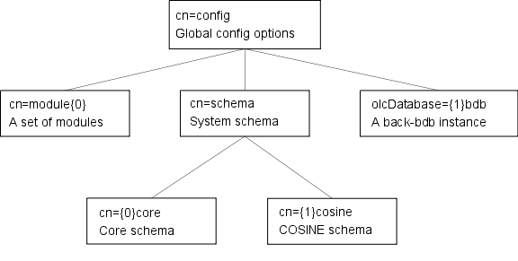

# 一、概述

LDAP 是轻量级目录访问协议`Lightweight Directory Access Protocol，LDAP`

LDAP产品有：

OpenLDAP:https://www.openldap.org/     应用程序和开发工具的LDAP套件

apacheldap:https://directory.apache.org/  编写的LDAP和kerberos服务器

opensDJ:https://www.forgerock.com/      api经济的云目录服务

389directory:https://directory.fedoraproject.org/    企业级开源LDAP服务器

freeipa:https://www.freeipa.org/page/Main_Page   身份策略管理

中文：http://www.ldap.org.cn/download


opensLADP 下载：https://www.openldap.org/software/download/

这里我们采用openLADP开源产品来实现


## install

```sh
[root@localhost ~]# mkdir -p /server/soft
[root@localhost ~]# cd /server/soft/
[root@localhost /server/soft]# wget https://mirror-hk.koddos.net/OpenLDAP/openldap-release/openldap-2.6.1.tgz

[root@localhost /server/soft]# gunzip -c openldap-2.6.1.tgz |tar xfB -
[root@localhost /server/soft]# ls
openldap-2.6.1  openldap-2.6.1.tgz

[root@localhost /server/soft/openldap-2.6.1]# yum install -y gcc gcc-c++

# 编译
[root@localhost /server/soft/openldap-2.6.1]# ./configure 
[root@localhost /server/soft/openldap-2.6.1]# make depend
[root@localhost /server/soft/openldap-2.6.1]# make
[root@localhost /server/soft/openldap-2.6.1]# make test
[root@localhost /server/soft/openldap-2.6.1]# make install # 如果不是root需要 su root -c 'make install'
```

## 配置slapd

经过上面的构建现在就可以配置slapd了。默认示例==/usr/local/etc/openldap/slapd.ldif==

- 完全启用 LDAP

- 使用标准 LDAP 操作进行管理

- 将其配置数据存储在 LDIF 数据库中，一般在`/usr/local/etc/openldap/slapd.d`目录下。

- 允许即时更改所有 slapd 的配置选项，通常无需重新启动服务器即可使更改生效。

  示例文件

```sh
[root@localhost ~]# grep -Ev "^$|#" /usr/local/etc/openldap/slapd.ldif
dn: cn=config     # 全局
objectClass: olcGlobal
cn: config
olcArgsFile: /usr/local/var/run/slapd.args
olcPidFile: /usr/local/var/run/slapd.pid

dn: cn=module,cn=config  # 一组模块
objectClass: olcModuleList
cn: module
olcModulepath:  /usr/local/libexec/openldap
olcModuleload:  back_mdb.la

dn: cn=schema,cn=config   # 系统调度
objectClass: olcSchemaConfig
cn: schema
include: file:///usr/local/etc/openldap/schema/core.ldif


dn: olcDatabase=frontend,cn=config  # 前端
objectClass: olcDatabaseConfig
objectClass: olcFrontendConfig
olcDatabase: frontend
------------------------------------------------------
dn: olcDatabase=mdb,cn=config  # 示例
objectClass: olcDatabaseConfig
objectClass: olcMdbConfig
olcDatabase: mdb
olcDbMaxSize: 1073741824
olcSuffix: dc=my-domain,dc=com
olcRootDN: cn=Manager,dc=my-domain,dc=com
olcRootPW: secret
olcDbDirectory: /usr/local/var/openldap-data
olcDbIndex: objectClass eq
--------------------------------------------------
dn: olcDatabase=monitor,cn=config  #监视
objectClass: olcDatabaseConfig
olcDatabase: monitor
olcRootDN: cn=config
olcMonitoring: FALSE

# 更改上面虚线标识中的my-domain com为你自己的
# 如果使用的域名包含二级域名需要使用下面的格式
olcSuffix: dc=eng,dc=uni,dc=edu,dc=eu
olcRootDN: cn=Manager,dc=eng,dc=uni,dc=edu,dc=eu
```



流程图

编辑配置文件

```sh
[root@localhost ~]# cp /usr/local/etc/openldap/slapd.ldif{,.bak}
[root@localhost ~]# vim /usr/local/etc/openldap/slapd.ldif
...
 77 dn: olcDatabase=mdb,cn=config
 78 objectClass: olcDatabaseConfig
 79 objectClass: olcMdbConfig
 80 olcDatabase: mdb
 81 olcDbMaxSize: 1073741824
 82 olcSuffix: dc=cloudb,dc=pub
 83 olcRootDN: cn=Manager,dc=cloudb,dc=pub  
 ...
 
```

导入配置

```sh

```

