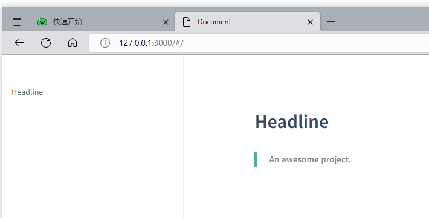
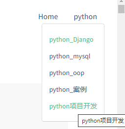
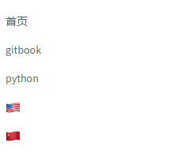

# docsify

​	一个文档网站生成器.跟typora 组合类似gitbook 看起来很不错.

​	docsify 可以快速帮你生成文档网站。不同于 GitBook、Hexo 的地方是它不会生成静态的 .html 文件，所有转换工作都是在运行时。如果你想要开始使用它，只需要创建一个 index.html 就可以开始编写文档并直接部署在 GitHub Pages.

## 特性

- 无需构建，写完文档直接发布
- 容易使用并且轻量 (压缩后 ~21kB)
- 智能的全文搜索
- 提供多套主题
- 丰富的 API
- 支持 Emoji
- 兼容 IE11
- 支持服务端渲染 SSR

## 快速开始

https://docsify.js.org/#/quickstart

### 全局安装

```cmd
D:\>npm i docsify-cli -g
```

### 初始化

```cmd
D:\桌面>cd ../docsify

D:\docsify>docsify init .docs
Initialization succeeded! Please run docsify serve .docs
```

```cmd
方法2:
D:\docsify>mkdir python

D:\docsify>cd python

D:\docsify\python>docsify init
. already exists.
√ Are you sure you want to rewrite it? (y/N) true

Initialization succeeded! Please run docsify serve
```

手动初始化

index.html

```html
<!DOCTYPE html>
<html>
<head>
  <meta http-equiv="X-UA-Compatible" content="IE=edge,chrome=1">
  <meta name="viewport" content="width=device-width,initial-scale=1">
  <meta charset="UTF-8">
  <link rel="stylesheet" href="//cdn.jsdelivr.net/npm/docsify/themes/vue.css">
</head>
<body>
  <div id="app"></div>
  <script>
    window.$docsify = {
      //...
    }
  </script>
  <script src="//cdn.jsdelivr.net/npm/docsify/lib/docsify.min.js"></script>
</body>
</html>
```

### loading提示自定义

初始化时会显示 `Loading...` 内容，你可以自定义提示信息。

```html
<div id="app">正在初始化......</div>
```

```html
<!-- index.html -->
  <div data-app id="main">加载中</div>   <!--这里需要-->

  <script>
    window.$docsify = {
      el: '#main'    // 如果这里改变了id
    }
  </script>
```


### 启动服务

默认访问:`http://localhost:3000`

```cmd
D:\docsify>cd .docs

D:\docsify\.docs>docsify serve

Serving D:\docsify\.docs now.
Listening at http://localhost:3000
```



如果有python可以使用

```cmd
cd docs && python -m http.server 2007
```

存在多个项目,端口不能是被使用的或者占用的.需要指定一个没有使用的端口


## 开始写文档

初始化成功后，可以看到 `python` 目录下创建的几个文件

- `index.html` 入口文件
- `README.md` 会做为主页内容渲染
- `.nojekyll` 用于阻止 GitHub Pages 忽略掉下划线开头的文件

直接编辑 `docs/README.md` 就能更新文档内容，

### 多个文档

如果需要创建多个页面，或者需要多级路由的网站，在 docsify 里也能很容易的实现。

```
D:\docsify\python>tree
文件夹 PATH 列表
卷序列号为 CA06-83D0
D:.
├─gitbook.assets
└─python
    ├─assets
    ├─python.assets
    ├─python_mysql.assets
    ├─python_oop.assets
    ├─python_案例.assets
    └─python项目开发.assets
```

http://127.0.0.1:3000/#/gitbook 使用这个地址就可以访问.但是不方便

http://127.0.0.1:3000/#/python/python 

### 定制sidebar

​	为了获得侧边栏，您需要创建自己的_sidebar.md，你也可以自定义加载的文件名。默认情况下侧边栏会通过 Markdown 文件自动生成，效果如当前的文档的侧边栏。

在index.html script中添加

```html
<script>
  window.$docsify = {
    loadSidebar: true // sidebar
  }
</script>
<script src="//cdn.jsdelivr.net/npm/docsify/lib/docsify.min.js"></script>
```

接着创建_sidebar.md

```markdown
<!--docs/_sidebar.md-->

- [首页](./)

- [gitbook](gitbook.md)

- [python](python/python.md)
```

需要在 `./docs` 目录创建 `.nojekyll` 命名的空文件，阻止 GitHub Pages 忽略命名是下划线开头的文件。

#### 嵌套的侧边栏

​	你可能想要浏览到一个目录时，只显示这个目录自己的侧边栏，这可以通过在每个文件夹中添加一个 `_sidebar.md` 文件来实现。`_sidebar.md` 的加载逻辑是从每层目录下获取文件，如果当前目录不存在该文件则回退到上一级目录。可以配置 `alias` 避免不必要的回退过程

```html
<script>
  window.$docsify = {
    loadSidebar: true,
    alias: {
      '/.*/_sidebar.md': '/_sidebar.md'
    }
  }
</script>
```

你可以在一个子目录中创建一个 `README.md` 文件来作为路由的默认网页。


#### 用侧边栏中选定的条目作为页面标题

个页面的 `title` 标签是由侧边栏中选中条目的名称所生成的。为了更好的 SEO ，你可以在文件名后面指定页面标题。

```markdown
- [首页](/ "Home Page")

- [gitbook](gitbook.md "Gitbook")

- [python](python/python.md "python Dev")
```

#### 显示目录

自定义侧边栏同时也可以开启目录功能。设置 `subMaxLevel` 配置项

```html
<!-- index.html -->

<script>
  window.$docsify = {
    loadSidebar: true,
    subMaxLevel: 2
  }
</script>
<script src="//cdn.jsdelivr.net/npm/docsify/lib/docsify.min.js"></script>
```

#### 忽略副标题

当设置了 `subMaxLevel` 时，默认情况下每个标题都会自动添加到目录中。如果你想忽略特定的标题，可以给它添加 `<!-- {docsify-ignore} -->` 。

```html
# Getting Started

## Header <!-- {docsify-ignore} -->

该标题不会出现在侧边栏的目录中。
就这样的,在markdown内容页的标题编辑
## 先决条件 <!--{docsify-ignore}-->
```

要忽略特定页面上的所有标题，你可以在页面的第一个标题上使用 `<!-- {docsify-ignore-all} -->` 。

在使用时， `<!-- {docsify-ignore} -->` 和 `<!-- {docsify-ignore-all} -->` 都不会在页面上呈现。


## 导航栏

### html

如果你需要定制导航栏，可以用 HTML 创建一个导航栏。

> 注意：文档的链接都要以 `#/` 开头。

```html
<body>
<nav>   <!--注意插入位置-->
  <a href="#/">Home</a>
  <a href="#/python">Python</a>
</nav>
  <div id="app">正在加载...</div>
    ...
```

### 配置文件

可以通过 Markdown 文件来配置导航。首先配置 `loadNavbar`，默认加载的文件为 `_navbar.md`

```html
<!-- index.html -->

<script>
  window.$docsify = {
    loadNavbar: true
  }
</script>
<script src="//cdn.jsdelivr.net/npm/docsify/lib/docsify.min.js"></script>
```

```markdown
<!-- _navbar.md -->
[Home](/)	[python](python/python.md "python")
```

这里navbar 需要横向不能换行,否则导航就竖排了.

`_navbar.md` 加载逻辑和 `sidebar` 文件一致，从每层目录下获取。例如当前路由为 `/zh-cn/custom-navbar` 那么是从 `/zh-cn/_navbar.md` 获取导航栏。

### 嵌套

导航内容过多，可以写成嵌套的列表，会被渲染成下拉列表的形式

```markdown
<!-- _navbar.md -->
- [Home](/) 

- [python](python/python)
  - [python_Django](python/python_Django)
  - [python_mysql](python/python_mysql)
  - [python_oop](python/python_oop)
  - [python_案例](python/python_案例)
  - [python项目开发](python/python项目开发)
 
```



### 整合自定义导航栏与emoji插件

默认是提供 emoji 解析的，能将类似 `:100:` 解。但是它不是精准的，因为没有处理非 emoji 的字符串。如果你需要正确解析 emoji 字符串，你可以引入这个插件。

插件引用就是在index.html script中加入下面的js

```html
<script src="//cdn.jsdelivr.net/npm/docsify/lib/plugins/emoji.min.js"></script>
```

> 如果你不想解析成表情符号，可以使用__colon__或`:`。如果你需要在标题中使用，我们建议使用`:`。例如，`:100:`。

使用国旗

```markdown
- [:us:, :uk:](/)
- [:cn:](/zh-cn/)
```



## 封面

​	通过设置 `coverpage` 参数，可以开启渲染封面的功能。

在侧边栏中出现的网站图标，你可以使用`CSS`来更改大小

```js
window.$docsify = {
  logo: '/_media/icon.svg',
};
```

### 基本用法

​	封面的生成同样是从 markdown 文件渲染来的。开启渲染封面功能后在文档根目录创建 `_coverpage.md` 文件。渲染效果如本文档。

```html
<script>
  window.$docsify = {
    coverpage: true
  }
</script>
<script src="//cdn.jsdelivr.net/npm/docsify/lib/docsify.min.js"></script>
```

```markdown


# docsify <small>3.5</small>

> 一个神奇的文档网站生成器。 

- 简单、轻便 (压缩后 ~21kB) 

- 无需生成 html 文件 

- 众多主题 

  

  

[GitHub](https://github.com/docsifyjs/docsify/) 

[Get Started](#docsify)
```

### 自定义背景色

目前的背景是随机生成的渐变色，我们自定义背景色或者背景图。在文档末尾用添加图片的 Markdown 语法设置背景。

```markdown
<!-- 背景图片 -->


<!-- 背景色 -->


```

### 封面作为首页

通常封面和首页是同时出现的，通过设置onlyCover 选项,确定封面和首页同一个页面

```js
window.$docsify = {
  onlyCover: false,
};
```

### 多封面

如果你的文档网站是多语言的，或许你需要设置多个封面。

```cmd
.
└── docs
    ├── README.md
    ├── guide.md
    ├── _coverpage.md
    └── zh-cn
        ├── README.md
        └── guide.md
        └── _coverpage.md
```

```js
index.html
window.$docsify = {
  coverpage: ['/', '/zh-cn/']
};
```

或者指定具体的文件名

```js
window.$docsify = {
  coverpage: {
    '/': 'cover.md',
    '/zh-cn/': 'cover.md'
  }
};
```

# 定制化

## 模板

```js
<script>
  window.$docsify = {
    repo: 'docsifyjs/docsify', //GitHub仓库
    maxLevel: 3,     //深度
    coverpage: true,  //封面
  };
</script>
```

## el

- 类型：`String`
- 默认值：`#app`

docsify 初始化的挂载元素，可以是一个 CSS 选择器，默认为 `#app` 如果不存在就直接绑定在 `body` 上

```js
window.$docsify = {
  el: '#app',
};
```

## repo

- 类型：`String`
- 默认值: `null`

配置仓库地址或者 `username/repo` 的字符串，会在页面右上角渲染一个 [GitHub Corner](http://tholman.com/github-corners/) 挂件。

```js
window.$docsify = {
  repo: 'docsifyjs/docsify',
  // or
  repo: 'https://github.com/docsifyjs/docsify/',
};
```

其他样式可以使用html代码:`https://tholman.com/github-corners/`

## maxLevel

- 类型：`Number`
- 默认值: `6`

默认情况下会抓取文档中所有标题渲染成目录，可配置最大支持渲染的标题层级。

```js
window.$docsify = {
  maxLevel: 4,
};
```

## loadNavbar

- 类型：`Boolean|String`
- 默认值: `false`

加载自定义导航栏。设置为 `true` 后会加载 `_navbar.md` 文件，也可以自定义加载的文件名。

```js
window.$docsify = {
  // 加载 _navbar.md
  loadNavbar: true,

  // 加载 nav.md
  loadNavbar: 'nav.md',
};
```

## loadSidebar

- 类型：`Boolean|String`
- 默认值: `false`

加载自定义侧边栏。设置为 `true` 后会加载 `_sidebar.md` 文件，也可以自定义加载的文件名。

```js
window.$docsify = {
  // 加载 _sidebar.md
  loadSidebar: true,

  // 加载 summary.md
  loadSidebar: 'summary.md',
};
```

## hideSidebar

- 类型 : `Boolean`
- 默认值: `true`

这个选项用来完全隐藏侧边栏，侧边栏的任何内容都不会被渲染。内容少可以采用这种方法.

```js
window.$docsify = {
  hideSidebar: true,
};
```

## subMaxLevel

- 类型：`Number`
- 默认值: `0`

自定义侧边栏后默认不会再生成目录，你也可以通过设置生成目录的最大层级开启这个功能。

```js
window.$docsify = {
  subMaxLevel: 2,
};
```

## auto2top

- 类型：`Boolean`
- 默认值: `false`

切换页面后是否自动跳转到页面顶部。

```js
window.$docsify = {
  auto2top: true,
};
```

## homepage

- 类型：`String`
- 默认值: `README.md`

设置首页文件加载路径。适合不想将 `README.md` 作为入口文件渲染，或者是文档存放在其他位置的情况使用。

```js
window.$docsify = {
  // 入口文件改为 /home.md
  homepage: 'home.md',

  // 文档和仓库根目录下的 README.md 内容一致
  homepage:
    'https://raw.githubusercontent.com/docsifyjs/docsify/master/README.md',
};
```

## basePath

- 类型：`String`

文档加载的根路径，可以是二级路径或者是其他域名的路径。

```js
window.$docsify = {
  basePath: '/path/',

  // 直接渲染其他域名的文档
  basePath: 'https://docsify.js.org/',

  // 甚至直接渲染其他仓库
  basePath:
    'https://raw.githubusercontent.com/ryanmcdermott/clean-code-javascript/master/',
};
```

## relativePath

- 类型: `Boolean`
- 默认值: `false`

如果该选项设为 **true** ，那么链接会使用相对路径。

例如，像这样的目录结构：

```cmd
.
└── docs
    ├── README.md
    ├── guide.md
    └── zh-cn
        ├── README.md
        ├── guide.md
        └── config
            └── example.md
```

如果 **启用** 了相对路径，当前链接是 `http://domain.com/zh-cn/README` ，对应的链接会解析为：

```html
guide.md              => http://domain.com/zh-cn/guide
config/example.md     => http://domain.com/zh-cn/config/example
../README.md          => http://domain.com/README
/README.md            => http://domain.com/README
```

```js
window.$docsify = {
  // 启用相对路径
  relativePath: true,

  // 禁用相对路径（默认值）
  relativePath: false,
};
```

## coverpage

- 类型：`Boolean|String`
- 默认值: `false`

启用[封面页](https://docsify.js.org/#/zh-cn/cover)。开启后是加载 `_coverpage.md` 文件，也可以自定义文件名。

```js
window.$docsify = {
  coverpage: true,

  // 自定义文件名
  coverpage: 'cover.md',

  // 多个封面页
  coverpage: ['/', '/zh-cn/'],

  // 多个封面页，并指定文件名
  coverpage: {
    '/': 'cover.md',
    '/zh-cn/': 'cover.md',
  },
};
```

## logo

- 类型: `String`

在侧边栏中出现的网站图标，你可以使用`CSS`来更改大小

```js
window.$docsify = {
  logo: '/_media/icon.svg',
};
```

## name

- 类型：`String`

文档标题，会显示在侧边栏顶部。

```js
window.$docsify = {
  name: 'docsify',
};
```

name 项也可以包含自定义 HTML 代码来方便地定制。

```js
window.$docsify = {
  name: '<span>docsify</span>',
};
```

## nameLink

- 类型：`String`
- 默认值：`window.location.pathname`

点击文档标题后跳转的链接地址。

```js
window.$docsify = {
  nameLink: '/',

  // 按照路由切换
  nameLink: {
    '/zh-cn/': '/zh-cn/',
    '/': '/',
  },
};
```

## markdown

- 类型: `Object|Function`

内置的 Markdown 解析器是 [marked](https://github.com/markedjs/marked)，可以修改它的配置。同时可以直接配置 `renderer`


```js
window.$docsify = {
  // object
  markdown: {
    smartypants: true,
    renderer: {
      link: function() {
        // ...
      },
    },
  },

    
  //当然也可以完全定制 Markdown 解析规则
  // function
  markdown: function(marked, renderer) {
    // ...
    return marked;
  },
};
```

### 支持mermaid

```js
// Import mermaid  
//  <link rel="stylesheet" href="//cdn.jsdelivr.net/npm/mermaid/dist/mermaid.min.css">
//  <script src="//cdn.jsdelivr.net/npm/mermaid/dist/mermaid.min.js"></script>

var num = 0;
mermaid.initialize({ startOnLoad: false });

window.$docsify = {
  markdown: {
    renderer: {
      code: function(code, lang) {
        if (lang === "mermaid") {
          return (
            '<div class="mermaid">' + mermaid.render('mermaid-svg-' + num++, code) + "</div>"
          );
        }
        return this.origin.code.apply(this, arguments);
      }
    }
  }
}
```

## themeColor

- 类型：`String`

替换主题色。利用 [CSS3 支持变量](https://developer.mozilla.org/en-US/docs/Web/CSS/Using_CSS_variables)的特性，对于老的浏览器有 polyfill 处理。

```js
window.$docsify = {
  themeColor: '#3F51B5'
};
```

## alias

- 类型：`Object`

定义路由别名，可以更自由的定义路由规则。 支持正则。

```js
window.$docsify = {
  alias: {
    '/foo/(.*)': '/bar/$1', // supports regexp
    '/zh-cn/changelog': '/changelog',
    '/changelog':
      'https://raw.githubusercontent.com/docsifyjs/docsify/master/CHANGELOG',
    '/.*/_sidebar.md': '/_sidebar.md', // See #301
  },
};
```

## autoHeader

- 类型：`Boolean`

同时设置 `loadSidebar` 和 `autoHeader` 后，可以根据 `_sidebar.md` 的内容自动为每个页面增加标题。

```js
window.$docsify = {
  loadSidebar: true,
  autoHeader: true,
};
```

## executeScript

- 类型：`Boolean`

执行文档里的 script 标签里的脚本，只执行第一个 script ([demo](https://docsify.js.org/#/zh-cn/themes))。 如果 Vue 存在，则自动开启。

```js
window.$docsify = {
  executeScript: true,
};
```

markdown

```markdown
## This is test

<script>
  console.log(2333)
</script>
```

注意如果执行的是一个外链脚本，比如 jsfiddle 的内嵌 demo，请确保引入 [external-script](https://docsify.js.org/#/plugins?id=外链脚本-external-script) 插件

## noEmoji

- 类型: `Boolean`

禁用 emoji 解析。

```js
window.$docsify = {
  noEmoji: true,
};
```

如果该选项设为 `false` ，但是你不想解析一些特别的表情符，[参考这里](https://github.com/docsifyjs/docsify/issues/742#issuecomment-586313143)

## mergeNavbar

- 类型: `Boolean`

小屏设备下合并导航栏到侧边栏。

```js
window.$docsify = {
  mergeNavbar: true,
};
```

## formatUpdated

- 类型: `String|Function`

我们可以通过 **{docsify-updated}** 变量显示文档更新日期. 并且通过 `formatUpdated`配置日期格式。

- `{YYYY}`: full year; eg: **2017**
- `{YY}`: short year; eg: **17**
- `{MM}`: month; eg: **04**
- `{DD}`: day; eg: **01**
- `{HH}`: hours; eg: **06** (24h)
- `{mm}`: minutes; eg: **59**
- `{ss}`: seconds; eg: **09**  秒
- `{fff}`: milliseconds; eg: **555**  毫秒

```js
window.$docsify = {
  formatUpdated: '{MM}/{DD} {HH}:{mm}',

  formatUpdated: function(time) {
    // ...

    return time;
  },
};

```

## externalLinkTarget

- 类型: `String`
- 默认: `_blank`

外部链接的打开方式。默认为 `_blank` （在新窗口或者标签页中打开）

```js
window.$docsify = {
  externalLinkTarget: '_self', // default: '_blank'
};
```


## cornerExternalLinkTarget

- 类型:`String`
- 默认值:`_blank`

右上角链接的打开方式。默认为 `_blank` （在新窗口或者标签页中打开）

```js
window.$docsify = {
  cornerExternalLinkTarget: '_self', // default: '_blank'
};
```


## externalLinkRel

- 类型: `String`
- 默认值: `noopener`

默认为 `noopener` (no opener) 可以防止新打开的外部页面（当 [externalLinkTarget](https://docsify.js.org/#/zh-cn/configuration?id=externallinktarget) 设为 `_blank` 时）能够控制我们的页面，没有设为 `_blank` 的话就不需要设置这个选项了。

```js
window.$docsify = {
  externalLinkRel: '', // default: 'noopener'
};
```

## routerMode

- 类型: `String`
- 默认: `hash`

```js
window.$docsify = {
  routerMode: 'history', // default: 'hash'
};
```

## crossOriginLinks

- type: `Array`

当设置了`routerMode:'history'`时，你可能会面临跨域的问题，参见 [#1379](https://github.com/docsifyjs/docsify/issues/1379) 。在 Markdown 内容中，有一个简单的方法可以解决，参见[helpers](https://docsify.js.org/#/zh-cn/helpers) 中的跨域链接。

```js
window.$docsify = {
  crossOriginLinks: ['https://example.com/cross-origin-link'],
};
```

## noCompilelLinks

- 类型: `Array`

有时我们不希望 docsify 处理我们的链接。

```js
window.$docsify = {
  noCompileLinks: ['/foo', '/bar/.*'],
};
```

## onlyCover

- 类型: `Boolean`

只在访问主页时加载封面。

```js
window.$docsify = {
  onlyCover: false,
};
```

## requestHeaders

- 类型: `Object`

设置请求资源的请求头。

```js
window.$docsify = {
  requestHeaders: {
    'x-token': 'xxx',
  },
};
```

例如设置缓存

```js
window.$docsify = {
  requestHeaders: {
    'cache-control': 'max-age=600',
  },
};
```

## ext

- 类型: `String`

资源的文件扩展名。

```js
window.$docsify = {
  ext: '.md',
};
```

## fallbackLanguages

- 类型: `Array<string>`

一个语言列表。在浏览这个列表中的语言的翻译文档时都会在请求到一个对应语言的翻译文档，不存在时显示默认语言的同名文档

Example:

- 尝试访问`/de/overview`，如果存在则显示
- 如果不存在则尝试`/overview`（取决于默认语言），如果存在即显示
- 如果也不存在，显示404页面

```js
window.$docsify = {
  fallbackLanguages: ['fr', 'de'],
};
```

## notFoundPage

- 类型: `Boolean` | `String` | `Object`

在找不到指定页面时加载`_404.md`:

```js
window.$docsify = {
  notFoundPage: true,
};
```

加载自定义404页面:

```js
window.$docsify = {
  notFoundPage: 'my404.md',
};
```

加载正确的本地化过的404页面:

```js
window.$docsify = {
  notFoundPage: {
    '/': '_404.md',
    '/de': 'de/_404.md',
  },
};
```

> 注意: 配置过`fallbackLanguages`这个选项的页面与这个选项`notFoundPage`冲突。

## topMargin

- 类型: `Number`
- 默认值: `0`

让你的内容页在滚动到指定的锚点时，距离页面顶部有一定空间。当你使用 `固定页头` 布局时这个选项很有用，可以让你的锚点对齐标题栏。

```js
window.$docsify = {
  topMargin: 90, // default: 0
};
```

## vueComponents

- type: `Object`

创建并注册全局 [Vue组件](https://vuejs.org/v2/guide/components.html) 。组件是以组件名称为键，以包含 Vue 选项的对象为值来指定的。组件`data`对每个实例都是唯一的，并且在用户浏览网站时不会持久。

```js
indow.$docsify = {
  vueComponents: {
    'button-counter': {
      template: `
        <button @click="count += 1">
          You clicked me {{ count }} times
        </button>
      `,
      data() {
        return {
          count: 0,
        };
      },
    },
  },
};
```

markdown

```markdown
<button-counter></button-counter>
```

## vueGlobalOptions

- type: `Object`

指定 [Vue选项](https://vuejs.org/v2/api/#Options-Data) ，用于未明确使用[vueMounts](https://docsify.js.org/#/zh-cn/configuration?id=mounting-dom-elements)、[vueComponents](https://docsify.js.org/#/zh-cn/configuration?id=components)或[markdown脚本](https://docsify.js.org/#/zh-cn/configuration?id=markdown-script)挂载的 Vue 内容。对全局`data`的更改将持续存在，并在任何使用全局引用的地方得到反映。

```js
window.$docsify = {
  vueGlobalOptions: {
    data() {
      return {
        count: 0,
      };
    },
  },
};
```

markdown

```markdown
<p>
  <button @click="count -= 1">-</button>
  {{ count }}
  <button @click="count += 1">+</button>
</p>
```

<kbd>-</kbd>0<kbd>+</kbd>

## vueMounts

- type: `Object`

指定要挂载为 [Vue实例](https://vuejs.org/v2/guide/instance.html) 的 DOM 元素及其相关选项。挂载元素使用 [CSS选择器](https://developer.mozilla.org/en-US/docs/Web/CSS/CSS_Selectors) 作为键，并使用包含 Vue 选项的对象作为其值。每次加载新页面时，Docsify 将挂载主内容区域中第一个匹配的元素。挂载元素`data`对每个实例来说都是唯一的，并且不会在用户浏览网站时持久存在。

```js
window.$docsify = {
  vueMounts: {
    '#counter': {
      data() {
        return {
          count: 0,
        };
      },
    },
  },
};
```

markdown

```markdown
<div id="counter">
  <button @click="count -= 1">-</button>
  {{ count }}
  <button @click="count += 1">+</button>
</div>
```

<kbd>-</kbd>0<kbd>+</kbd>


# 主题

https://docsify.js.org/#/zh-cn/themes

目前提供三套主题可供选择，模仿 [Vue](https://vuejs.org/) 和 [buble](https://buble.surge.sh/) 官网订制的主题样式。还有 [@liril-net](https://github.com/liril-net) 贡献的黑色风格的主题。

```html
<link rel="stylesheet" href="//cdn.jsdelivr.net/npm/docsify/themes/vue.css">
<link rel="stylesheet" href="//cdn.jsdelivr.net/npm/docsify/themes/buble.css">
<link rel="stylesheet" href="//cdn.jsdelivr.net/npm/docsify/themes/dark.css">
<link rel="stylesheet" href="//cdn.jsdelivr.net/npm/docsify/themes/pure.css">
<link rel="stylesheet" href="//cdn.jsdelivr.net/npm/docsify/themes/dolphin.css">
```

CSS 的压缩文件位于 `/lib/themes/`

```html
<div class="demo-theme-preview">
  <a data-theme="vue">vue.css</a>
  <a data-theme="buble">buble.css</a>
  <a data-theme="dark">dark.css</a>
  <a data-theme="pure">pure.css</a>
  <a data-theme="dolphin">dolphin.css</a>
</div>
```

```
  <style> .demo-theme-preview a { padding-right: 10px; } .demo-theme-preview a:hover { cursor: pointer; text-decoration: underline; } 
</style> 

  <script> 
  var preview = Docsify.dom.find('.demo-theme-preview'); 
  var themes = Docsify.dom.findAll('[rel="stylesheet"]'); 
  preview.onclick = function (e) { 
  var title = e.target.getAttribute('data-theme') themes.forEach(function (theme) { theme.disabled = theme.title !== title }); 
  }; 
  </script>
```

  

## 插件

### 全文搜索

全文搜索插件会根据当前页面上的超链接获取文档内容，在 `localStorage` 内建立文档索引。默认过期时间为一天，当然我们可以自己指定需要缓存的文件列表或者配置过期时间。

```js
<script>
  window.$docsify = {
    search: 'auto', // 默认值

    search : [
      '/',            // => /README.md
      '/guide',       // => /guide.md
      '/get-started', // => /get-started.md
      '/zh-cn/',      // => /zh-cn/README.md
    ],

    // 完整配置参数
    search: {
      maxAge: 86400000, // 过期时间，单位毫秒，默认一天
      paths: [], // or 'auto'
      placeholder: 'Type to search',

      // 支持本地化
      placeholder: {
        '/zh-cn/': '搜索',
        '/': 'Type to search'
      },

      noData: 'No Results!',

      // 支持本地化
      noData: {
        '/zh-cn/': '找不到结果',
        '/': 'No Results'
      },

      // 搜索标题的最大层级, 1 - 6
      depth: 2,

      hideOtherSidebarContent: false, // 是否隐藏其他侧边栏内容

      // 避免搜索索引冲突
      // 同一域下的多个网站之间
      namespace: 'website-1',

      // 使用不同的索引作为路径前缀（namespaces）
      // 注意：仅适用于 paths: 'auto' 模式
      //
      // 初始化索引时，我们从侧边栏查找第一个路径
      // 如果它与列表中的前缀匹配，我们将切换到相应的索引
      pathNamespaces: ['/zh-cn', '/ru-ru', '/ru-ru/v1'],

      // 您可以提供一个正则表达式来匹配前缀。在这种情况下，
      // 匹配到的字符串将被用来识别索引
      pathNamespaces: /^(\/(zh-cn|ru-ru))?(\/(v1|v2))?/
    }
  }
</script>
<script src="//cdn.jsdelivr.net/npm/docsify/lib/docsify.min.js"></script>
<script src="//cdn.jsdelivr.net/npm/docsify/lib/plugins/search.min.js"></script>
```

### 图片缩放

Medium's 风格的图片缩放插件

```html
<script src="//cdn.jsdelivr.net/npm/docsify/lib/plugins/zoom-image.min.js"></script>
```

忽略某张图片

```markdown

```

### 复制到剪贴板

在所有的代码块上添加一个简单的`Click to copy`按钮来允许用户从你的文档中轻易地复制代码

```js
<script src="//cdn.jsdelivr.net/npm/docsify-copy-code/dist/docsify-copy-code.min.js"></script>
```

### Disqus 

Disqus评论系统支持

```js
<script>
  window.$docsify = {
    disqus: 'shortname'
  }
</script>
<script src="//cdn.jsdelivr.net/npm/docsify/lib/plugins/disqus.min.js"></script>
```

### gitalk

[Gitalk](https://github.com/gitalk/gitalk)，一个现代化的，基于Preact和Github Issue的评论系统。

```html
<link rel="stylesheet" href="//cdn.jsdelivr.net/npm/gitalk/dist/gitalk.css">

<script src="//cdn.jsdelivr.net/npm/docsify/lib/plugins/gitalk.min.js"></script>
<script src="//cdn.jsdelivr.net/npm/gitalk/dist/gitalk.min.js"></script>
<script>
  const gitalk = new Gitalk({
    clientID: 'Github Application Client ID',
    clientSecret: 'Github Application Client Secret',
    repo: 'Github repo',
    owner: 'Github repo owner',
    admin: ['Github repo collaborators, only these guys can initialize github issues'],
    // facebook-like distraction free mode
    distractionFreeMode: false
  })
</script>
```

### Pagination

docsify的分页导航插件

```js
<script src="//cdn.jsdelivr.net/npm/docsify/lib/docsify.min.js"></script>  //不要重复
<script src="//cdn.jsdelivr.net/npm/docsify-pagination/dist/docsify-pagination.min.js"></script>
```

### tabs

这个插件用来在 Markdown 中显示选项卡

https://jhildenbiddle.github.io/docsify-tabs/#/

```js
window.$docsify = {
  // ...
  tabs: {
    persist    : true,      // default
    sync       : true,      // default
    theme      : 'classic', // default
    tabComments: true,      // default
    tabHeadings: true       // default
  }
};
```


```js
window.$docsify = {
  // ...
  tabs: {
    persist    : true,      // default
    sync       : true,      // default
    theme      : 'classic', // default
    tabComments: true,      // default
    tabHeadings: true       // default
  }
};
```

```js
<style>
  :root {
    --docsifytabs-border-color: #ededed;
    --docsifytabs-tab-highlight-color: purple;
  }
</style>
```

### 更多插件

https://docsify.js.org/#/awesome?id=plugins


## 目录可折叠

https://github.com/iPeng6/docsify-sidebar-collapse

```html
<script src="//cdn.jsdelivr.net/npm/docsify-sidebar-collapse/dist/docsify-sidebar-collapse.min.js"></script>
```


