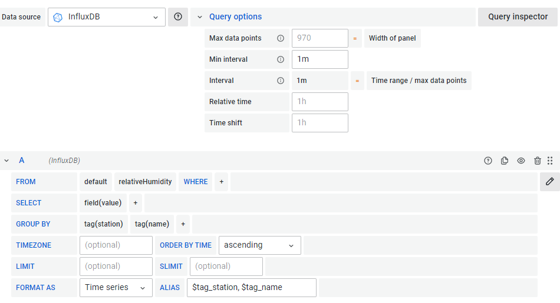
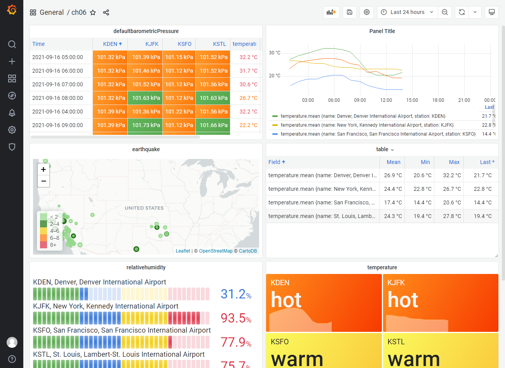

```bash
sudo systemctl daemon-reload
sudo systemctl start grafana-server
sudo systemctl status grafana-server
```

在线书：https://subscription.packtpub.com/book/data/9781838826581/1

用到的代码：https://github.com/PacktPublishing/Learn-Grafana-7.0

grafana

https://grafana.com/oss/loki/

# 简介

grafana 是一套用于数据探索，分析和告警的多元化可视系统。

下载地址：https://grafana.com/grafana/download

```BASH
[root@grafana ~]# cd /server/soft/
[root@grafana /server/soft]# wget https://dl.grafana.com/oss/release/grafana-8.1.3-1.x86_64.rpm

[root@grafana /server/soft]# yum install grafana-8.1.3-1.x86_64.rpm -y
```

启动

```BASH
[root@grafana ~]# systemctl daemon-reload
[root@grafana ~]# systemctl start grafana-server.service
[root@grafana ~]# systemctl  enable grafana-server.service
[root@grafana ~]# systemctl status grafana-server.service
```


使用web访问：http://172.16.0.200:3000

> 默认用户名：admin
>
> 默认密码  ：admin

第一次登录必须修改密码

# 界面UI


1.grafana logo：返回仪表板

2.仪表板按钮：显示当前仪表板

3.仪表板设置和查看模式，添加面板

4.设置向导

5.侧边菜单栏：提供常见任务和页面的导航。

6.用户和帮助


**设置选项**：通用设置，注释，变量，链接，json模式

**查看模式**：（点击切换模式）仪表板和侧边菜单，仅仪表板-隐藏侧边菜单，自助服务终端模式

**侧面工具栏：**搜索，创建或导入和文件夹，仪表板，探索，通知告警，配置数据源，用户和团队-插件API密钥，用户管理


1. 向仪表板添加新面板
2. 保存仪表板
3. 仪表板设置
4. 循环查看模式
5. 设置图表的时间范围
6. 缩小时间范围
7. 刷新仪表板并设置仪表板刷新率


播放列表：设置自动 Grafana 驱动的展台类型显示时，您会使用播放列表

1. 单击创建播放列表。
2. 为您的播放列表命名。
3. 设置播放列表之间的间隔时间。
4. 将仪表板添加到列表中。
5. 单击创建。


告警通知


数据源

这是有充分理由的。设置支持图表的数据源很可能是您在 Grafana 中的主要管理职能。在此选项卡中，您可以从可用的数据源插件创建任意数量的数据源：

通常，要设置数据源，您需要了解一些信息：数据源的服务器 IP 地址和端口、访问它的正确身份验证凭据以及服务器本身上的数据库名称。您可以创建一个无需设置的数据源，因为它是 Grafana 的内部插件。该测试DB数据源是虚拟数据来源，用随机数据的时间序列数据库的模仿特点。我们将在下一章中使用Test DB数据源，以便在将 Grafana 面板与真实数据源集成之前熟悉它。

其他都是简单的不介绍

# 图形面板


面板的 UI 大致可以分为三个主要功能区域：

1. **面板显示**：预览显示和时间选择器
2. **显示设置**：面板可视化类型、样式和链接
3. **数据配置**：数据查询、数据转换、告警

## 创建一个简单的数据源

grafana自带了一个数据源


创建过程

1.返回主页

2.选择配置|数据源

3.单机添加数据源

4.向下滚动选择 testdata DB

5.default 设置开启的

6.保存并测试


## 创建图形面板


1. 返回**主页**仪表板。
2. 选择**创建 | 仪表盘。**
3. 在面板占位符上，单击+新面板。
4. 默认情况下，您将创建一个图形面板。
5. 单击右上角的**保存仪表板**图标以保存仪表板以供将来参考。养成定期保存仪表板的习惯。
6. 单击应用以保存您的面板更改。
7. 要返回并编辑面板，请单击面板标题下拉菜单并选择编辑。

## 查询选项卡功能


1. 数据源菜单
2. 查询选项
3. 查询检查器按钮
4. 询问
5. 重复查询
6. 查询可见性切换
7. 删除查询
8. \+ 查询按钮

### 数据源菜单

该**数据源**菜单中，您将选择面板中的数据源。通常，面板将仅包含来自单个数据源的查询，因此下拉列表将显示所有可用数据源。如果您确实想将多个数据源合并到一个图表中，请选择**Mixed**。然后，您可以在添加查询时指定数据源。

### 查询选项


在某个时间样本（称为\**时间间隔\**）监视给定点的值对于保持数据的正确可视化表示至关重要。数据源菜单旁边是查询选项部分，其中包含用于配置面板如何处理时间序列数据显示方式的各种选项。

Max data points控制应该显示的最大数据点数，即使时间范围很宽。Min interval用于为 Grafana 提供查询中数据的采样间隔，以帮助它确定显示单个数据点的最小时间间隔。将值设置为每个数据点的频率有助于 Grafana 优化时间序列面板的显示，尤其是在处理较宽的时间范围时。例如，您的数据每分钟写入一次 Prometheus 数据库（\*采样频率\*）；在这里，您可以将Min Interval设置为1m。

为了跟踪由单个像素表示的时间间隔，Grafana 提供了一个有用的间隔显示。

虽然面板顶部的时间范围控件用于为仪表板上的所有面板设置全局时间范围，但您通常希望覆盖单个面板的时间范围。也许您想查看面板的 1 小时、2 小时和 4 小时范围。您不想一直多次翻转时间范围，以便可以将面板复制三次并设置三个不同的时间范围。

所述相对时间设置用于该面板的时间范围设置为一这是独立于仪表盘的时间范围的。该时移设置为用于移动所述面板的时间区域回到一些从当前时间偏移是有用的。使用两者都可以改变显示的时间窗口的宽度和/或将该窗口的端点相对于现在向后移动。

要指定Min Interval、Relative time和Time shift的时间间隔，请使用以下时间缩写：

| 缩写   | 时间间隔    |
| ------ | ----------- |
| **y**  | Year        |
| **M**  | Month       |
| **w**  | Week        |
| **d**  | Day         |
| **h**  | Hour        |
| **m**  | Minute      |
| **s**  | Second      |
| **ms** | Millisecond |

### 查询检查器

该**查询检查**按钮，将打开一个文本控制台透露出查询Grafana被提交给API的内容。由于几个原因，这是一个非常有用的功能。如果您在获得想要的结果时遇到问题，**查询检查器**可以让您深入了解如何对数据源进行不正确的查询。此外，通过查看实际生成的查询，您可以确定如何提高效率。更高效的查询可以显着提高 Grafana 仪表板的响应能力，尤其是当它包含多个面板时。


### 询问

当然，查询是用于导出数据集的中心界面元素。它可以包含多个元素，具体取决于数据源。在TestData DB数据源的情况下，它只是一个场景下拉菜单，用于选择多个不同的选项来生成测试数据。

该别名文本字段是给你的数据集选择的名称。数据源将为每个查询指定一个名称，但该名称通常不太具有描述性，因此添加别名是记录查询内容的好方法。在后面的章节中，我们将了解有关如何使用别名来注释图例和创建显示覆盖的一些技巧。

**添加查询**：添加查询在当前查询之下添加一个新查询。

### 复制现有查询


**再创建一个，看看它如何影响显示：**

1. 从下拉列表中选择**TestData DB**数据源。
2. 单击**重复查询**图标。您现在应该看到两个查询，都是随机游走场景：

现在让我们转到“**面板”**选项卡，看看如何使用它来修改面板的外观。

#### 图形

在图形显示的右侧，您会找到“**面板”**选项卡，您可以在其中找到大量用于定制面板外观的功能。该面板的无数选项可从一个易于访问的列中获得，每个选项都具有一个披露控件，因此您只需查看与手头任务相关的选项。


> - 面板标题：在仪表板上设置面板的标题
> - 描述：设置面板信息弹出的内容
> - 透明：增加面板的透明度：


### 可视化部分

**可视化**部分用作快速机构用于切换出当前面板的不同的一个。它有一个**过滤器**字段，可帮助减少列表中的面板数量。更改面板也会改变**面板**选项卡并增加或减少与特定面板对应的选项数量。该**选项**设置缓存，以便面板之间切换时不会丢失。

### 显示部分

在“**显示”**部分，您可以对图形的外观进行最重大的更改。在这里，您可以决定在绘制图形时激活哪些条形、点或线的组合。在选择最能代表您的数据的绘图对象时，您应该注意这一点。例如，如果您的数据表示一组采样数量，您可能不想使用暗示数据是连续的线。同样，如果数据不代表可测量的数量，则条形可能不合适。


这个选项是设置显示样式。

### tooltip

该**悬停提示**的目的是作为一个微型传说附近的任何点出现，你悬停。工具提示在两种模式下工作：所有系列将在单个工具提示上绘制所有数据集系列的值，而**单一**将仅绘制悬停点的值。如果选择**全系列**模式，**排序顺序**将在该系列的点值排序，**增加**或**减少**订单; 如果选择**None**，它将按照在“查询”窗格中指定每个数据系列的方式对它们进行排序。如果您选择堆叠您的系列，您还将有一个**Stack** value 选择来将每个点显示为**累积** 堆叠点的值或每个值作为一个单独的值。

### legend

第一次设置图形面板时，您可能已经看到了图例的作用。图例选项主要用于控制图例的位置或其内容。如以下屏幕截图所示，它由三组覆盖：


### Axes


移动到**Axes**部分，图形面板将显示最多两个**Y****轴**（图形的左侧和右侧）和**X 轴**；您可以打开或关闭三个轴中的每一个。每个轴都有自己的设置分组：

左 /右 由于 Grafana 与数据无关，因此您几乎可以选择以任何您想要的方式显示Y 轴。您可以按Unit指定，将Scale设置为linear或logarithmic，设置Y的最小值 ( Y-Min ) 和最大值 ( Y-Max )，并设置轴值中的小数位数。您还可以标记轴。

**X**轴可被设置在三种不同的模式，以显示：时间，这是一个标准的时间序列轴; **Series**，它根据**Value**聚合设置将每个数据系列显示为条形图；和**Histogram**，它显示所有 Y 值的直方图。可以使用**Buckets**选项手动设置直方图桶的数量，**X-min**和**X-max**设置将分别截断左侧或右侧。

### Thresholds

请记住，阈值和警报是相互排斥的，即定义警报将禁用阈值。


指定阈值很容易：只需单击**+****添加阈值**按钮。您将在图表上看到一个指示器，您可以拖动该指示器来设置阈值。在字段中设置**值**更新指标，反之亦然。从那里，您可以设置当值小于 ( **lt** ) 或大于 ( **gt** ) 阈值时是否越过阈值、阈值区域的**颜色**、是否使用**填充**和/或指示器设置阈值区域的样式**Line**，以及阈值适用于哪个**Y 轴**。

设置阈值

让我们继续设置一个阈值。这也是熟悉设置警报过程的好方法：

1.**选择并添加阈值**：您现在将看到一个阈值条目。您可以设置多个阈值。可以通过在数值字段中输入一个值或通过将阈值操纵器手柄拖动到图形显示的右侧来设置阈值。**注意：***手柄仅在使用右侧Y轴时没有系列时才可见*。*

2.**将指标拖动到图形中点附近某处的值**：现在图形区域的一半将被着色。要阴影的区域表示阈值所在的位置。要设置在线上方的阈值区域，请将阈值下拉菜单设置为**gt**（*大于*）。要设置区域使其低于线，请将阈值下拉设置为**lt**（*小于*）。对于本练习，将阈值设置为**gt**。

3.**门槛的颜色（或严重性）设置\**警告\**：**该**颜色**字段用于设置阈值区域的颜色。颜色可以用作视觉提示来传达阈值的严重程度。我们将颜色设置为**warning**，这是一种琥珀色（为谨慎起见）。

切换**填充**设置可打开和关闭区域，同时切换**线**设置可打开和关闭阈值线。所述**ÿ****轴**设置决定阈值是否适用于左或右Y轴时，左，右Y轴具有独立的范围。您可以通过选择垃圾桶图标来删除阈值。


筛选选项设置

### 数据链接部分

数据链接将图形数据点连接到外部资源。数据链接可以像动态系统的单个静态 URL 一样简单，该系统利用模板变量并将图中的每个数据点与外部日志监视器链接起来。有关每个选定数据点的元数据可用于同时构建与日志列表相对应的特定 URL。要从另一个面板中此数据系列中的某个点创建链接，请使用**数据链接**部分。

单击**+****添加链接会**启动一个包含三个设置的对话框：

- 标题：包含描述性链接文本
- URL : 链接到外部资源
-  在新标签页中打开

### 使用警报选项卡进行监控


这是图形面板的最后一个选项卡。在此窗格中，您可以使用警报配置面板。

**警报由四个关键组件组成：**

-  规则
-  状况
-  无数据和错误处理
-  通知

警报规则可以分解为两个基本设置：规则名称和评估期。Grafana 使用规则名称来跟踪每个规则，以便它可以持续检查分布在每个仪表板上的每个警报是否有触发事件。正如我们在前一章中发现的，警报是在警报规则选项卡中管理的，该选项卡可以在警报页面上找到。配置警报后，您会发现从该页面管理它们要容易得多，而不是单击许多仪表板和面板。Evaluate every用于设置 Grafana 检查阈值违规以触发警报的频率。一旦超过阈值，For字段将确定在实际触发警报之前必须超过阈值的时间。

阈值在**条件**组中设置。简单地说，阈值条件是由超过某个值的查询聚合定义的。如果这听起来很熟悉，您会记得它类似于阈值的定义。不是简单地在单个值上触发它，而是在一个时间窗口内完成聚合，因此警报条件可以表示比阈值的简单定量测量更定性的测量。

如果查询停止生成可用数据或抛出错误，会发生什么情况？该问题由**无数据和错误处理**设置回答。在本节中，您将能够确定数据丢失或错误是否应该触发警报，或者系统是否应该等待它。如果您的数据源服务器有一个单独的监控系统，否则会触发警报，并且您不希望针对本质上相同的事件获得两组警报，这将非常有用。

触发警报后，您可以在**通知**组中确定 Grafana 应采取的操作。根据您配置的通知渠道，您可以使用**Send** to 向一个或多个渠道发送指定的**Message**。消息下方是称为**Tags 的**键/值对。目前，这些标签仅向 Prometheus Alertmanager 提供附加信息。

上面都是介绍和基础概念，更新太多了。


# 将 Grafana 连接到数据源

这里介绍Prometheus

https://www.cnblogs.com/fatyao/p/11007357.html

首要任务是启动并运行 Prometheus 服务器，以便我们可以开始提供真实数据。Prometheus 是一个强大的开源时序数据库和监控系统，最初由 SoundCloud 开发。成为继Kubernetes之后的第二个云原生计算基金会毕业孵化项目。Grafana 与 Prometheus 维护者合作，将 Prometheus 数据源包含为一流的数据源插件。

**prometheus:**https://prometheus.io/

**prometheus 手册:**https://prometheus.io/docs/prometheus/latest/configuration/configuration/


二进制安装

```BASH
[root@grafana /server/soft]# rz -E
rz waiting to receive.
[root@grafana /server/soft]# ls
grafana-8.1.3-1.x86_64.rpm  prometheus-2.30.0.linux-amd64.tar.gz
[root@grafana /server/soft]# tar xf prometheus-2.30.0.linux-amd64.tar.gz -C /opt
[root@grafana /server/soft]# cd /opt
[root@grafana /opt]# ls
prometheus-2.30.0.linux-amd64

[root@grafana /opt/prometheus-2.30.0.linux-amd64]# cp prometheus.yml{,.bak}

[root@grafana /opt/prometheus-2.30.0.linux-amd64]# vim prometheus.yml

[root@grafana /opt/prometheus-2.30.0.linux-amd64]# ./prometheus --config.file=prometheus.yml
这种启动方式推出就没有了
```

```BASH
[root@grafana /opt/prometheus]# useradd -M prometheus -s /sbin/nologin
[root@grafana /opt]# ln -s prometheus-2.30.0.linux-amd64/ prometheus
[root@grafana /opt]# chown -R prometheus.prometheus prometheus
[root@grafana /opt]# ll
total 0
lrwxrwxrwx 1 prometheus prometheus  30 Sep 15 09:04 prometheus -> prometheus-2.30.0.linux-amd64/

```


```bash
[root@grafana /opt/prometheus]# mkdir -p /data/prometheus
[root@grafana /opt/prometheus]# chown -R prometheus:prometheus /data/prometheus
```


```BASH
[root@grafana ~]#cat > /etc/systemd/system/prometheus.service <<EOF
[Unit]
Description=Prometheus
Documentation=https://prometheus.io/
After=network.target

[Service]
Type=simple
User=prometheus

ExecStart=/opt/prometheus/prometheus --config.file=/opt/prometheus/prometheus.yml --storage.tsdb.path=/data/prometheus
Restart=on-failure                                                               
[Install]
WantedBy=multi-user.target
EOF


```

再次修改配置文件

```BASH
[root@grafana /opt/prometheus]# vim prometheus.yml
。。。
  - job_name: "prometheus"

    # metrics_path defaults to '/metrics'
    # scheme defaults to 'http'.
    scrape_interval: 5s

    static_configs:
      - targets: ["172.16.0.200:9090"]
        labels:
          instance: prometheus     
```

```BASH
[root@grafana /opt/prometheus]# systemctl daemon-reload
[root@grafana /opt/prometheus]# systemctl start prometheus
[root@grafana /opt/prometheus]# systemctl status prometheus
[root@grafana /opt/prometheus]# systemctl enable prometheus
```


访问：http://172.16.0.200:9090/

http://172.16.0.200:9090/targets


上到此截图就表示正常了。

http://172.16.0.200:9090/config  prometheus.yml


现在我们已经运行了 Grafana 和 Prometheus 服务器，让我们继续创建 Prometheus 数据源。

## 配置 Prometheus 数据源

切换回grafana

1.从左侧边栏中，转到配置| 数据源。

2.添加新的 Prometheus 数据源并填写以下信息：

- 姓名:Prometheus
- 网址：http://172.16.0.200:9090
- 访问:浏览器

3.单击“保存并测试“


## 探索普罗米修斯

我们正确配置了 Prometheus 数据源，您可能想知道我们可能会看到什么样的数据。事实证明，由于我们将 Prometheus 配置为自行抓取，因此我们将获得大量多的内部服务器指标，这些指标被传送到抓取的端点并存储在 Prometheus 数据库中。


基本上，Explore包括特殊版本的Graph和Table面板插件，每个插件都查看相同的数据源查询。确保从下拉列表中选择您的 Prometheus 数据源，然后通过从**Metrics**菜单中**向上**选择来选择一个指标数据系列。这可能是最简单的可用指标：它显示服务器是否已启动，否则。您可以从以下屏幕截图中看到（显然）我们的 Prometheus 服务器已启动并正在运行：1  0


许多指标只是一个*指标名称*和一个*值*，有时是一个重复的指标名称，后跟一个称为**label 的**大括号中的键值对。在其他应用中，标签被称为**标签**，但它执行相同的功能，即在度量上附加一段元数据，以区分相似的度量。

这页数据经过解析、加时间戳并存储在 Prometheus 数据库中。当您在 Grafana 中启动Explore工具时，Prometheus 数据源插件会进行服务发现查询以找出可用的指标，并根据响应为您构建一个方便的菜单。

现在让我们看看如何go_gc_duration_seconds在Explore中描述指标。从下拉列表中选择go（在本例中go指的是指标名称的初始部分，称为指标的**命名空间**）


现在，我们可以看到每个系列名称都包含quantile，以及instance和job。在表格的更下方，分位数被视为一个字段，就像在典型的数据库或电子表格中一样。这很棒，但我们是否仅限于 Prometheus 指标？一点也不！

## 配置 Grafana 指标

```BASH
[root@grafana /opt/prometheus]# vim prometheus.yml
...
  - job_name: 'grafana'
    scrape_interval: 5s
    static_configs:
      - targets: ['172.16.0.200:3000']
        labels:
          instance: grafana  
```

```BASH
[root@grafana /opt/prometheus]# systemctl daemon-reload
[root@grafana /opt/prometheus]# systemctl restart prometheus
```


这里可以看到已经存在了

**查询Prometheus数据源**

 PromQL（Prometheus 查询语言）

https://www.bookstack.cn/read/prometheus_practice/promql-summary.md

- 时间戳
- 指标值
- 一组用于表征数据的键值对

详细信息因一个时间序列数据库而异。有些将值表示为对数据库具有特定含义的特定类型，以优化存储、搜索或聚合。其他人可能存储更丰富的元数据。无论如何，这三条信息通常以某种形式存在于许多当前的时间序列数据库中。

## 输入指标查询

之前，我们用up来判断 Prometheus 是否在运行。


我们可以看到现在有两个系列，其中一个似乎是针对 Grafana 的，另一个是针对 Prometheus 的。让我们继续更改查询以仅选择 Grafana 的系列：

1.在{中键入一个字符。您将看到完整的大括号和用于选择标签键的弹出菜单。数据源插件足够智能，可以理解 PromQL 的语法，并帮助指导您进行有效的查询：


2.由于grafana是我们想要的作业名称（如数据系列图例所示），从菜单中选择**作业**


3.按住*Shift*键。您应该获得一个菜单，其中包含该工作的两个可能选项。从菜单中选择grafana：

4.单击蓝色的Run Query按钮或按*Return*键（Windows 上为shift +*Enter*）以执行查询。

5.您现在只有与 Grafana up指标相对应的单个数据系列。


## 查询流程指标

go命名空间


内存消耗


这是 Grafana 服务器进程执行情况的另一个指标。内存不足会严重降低性能，因此您可能需要构建一个面板，当可用内存量低于特定水平时发出警报。再次尝试确定哪个查询会为消耗的内存生成数据系列。查看Metrics菜单中的process命名空间：

服务器性能指标。一个明显的网络服务器指标怎么样？输入prometheus_http_requests_total以了解到目前为止已处理的请求数：


这有点乱。您无法看到所有 22 个时间序列——它们都堆叠在彼此的顶部，并且对于某些单调增加的事物有一个模糊的警告。过滤掉GET方法处理程序——但是我们仍然有近 20 个单独的系列的堆栈。

**将聚合应用于我们的查询数据**

https://www.bookstack.cn/read/prometheus_practice/promql-summary.md#6zk1s9

prometheus 参数详解

# 图形面板可视化数据

## 进行高级查询

在我们开始处理漂亮的数据之前，我们需要建立一个简单的数据管道。耐心！这可能是您对进入数据源的数据拥有重大控制权的难得机会之一。即使您不打算让自己参与数据采集，了解一些技术和围绕它的问题也会有所帮助，如果只是为了欣赏通常用于裁剪和清理数据以便对其进行分析或可视化的工作。

### InfluDB

下载：https://github.com/influxdata/influxdb

https://github.com/influxdata/influxdb/releases

```BASH
[root@grafana ~]# wget https://dl.influxdata.com/influxdb/releases/influxdb-1.8.9.x86_64.rpm

[root@grafana ~]# yum install influxdb-1.8.9.x86_64.rpm 

service influxdb start
[root@grafana ~]# systemctl status influxd
● influxdb.service - InfluxDB is an open-source, distributed, time series database
   Loaded: loaded (/usr/lib/systemd/system/influxdb.service; enabled; vendor preset: disabled)
   Active: active (running) 

```

这里2.0版本的直接带grafana，不适合。

```bash
## 查看database
show database
## 创建database
create database databasename
## 查看measurement
show measurement
## 创建measurement
create measurement measurementname
## 插入数据
insert measurementname name = value , name2 = value2 , name3 = value3
## 删除数据 
drop measurement measurementname
```


```BASH
[root@grafana /opt/prometheus]# curl -i http://172.16.0.200:8086/ping
HTTP/1.1 204 No Content
X-Influxdb-Build: cloud2
X-Influxdb-Version: 
Date: Wed, 15 Sep 2021 08:13:58 GMT
```

### 编写 ETL 脚本

https://github.com/PacktPublishing/Learn-Grafana-7.0/tree/master/Chapter05

 weather.py 

```BASH
[root@grafana ~]# yum install python3 -y
[root@grafana ~]# pip3 install python-dateutil requests
[root@grafana ~]# python3 weather.py -h
usage: weather.py [-h] [--host HOST] [--port PORT] [--db DATABASE] [--drop]
                  [--input INPUT_FILE | --output OUTPUT_FILE]
                  [--stations STATIONS]

read forecast data from NWS into Influxdb

optional arguments:
  -h, --help            show this help message and exit
  --host HOST           database host
  --port PORT           database port
  --db DATABASE         name of database to store data in
  --drop                drop database
  --input INPUT_FILE    input file
  --output OUTPUT_FILE  output file
  --stations STATIONS   list of stations to gather weather data from

[root@grafana ~]# pip3 install -r requirements.txt 

[root@grafana ~]# python3 weather.py --output wx.txt --stations KSFO
INFO:root:https://api.weather.gov/stations/KSFO
INFO:root:https://api.weather.gov/zones/county/CAC081
INFO:root:https://api.weather.gov/stations/KSFO/observations

[root@grafana ~]# head wx.txt 
temperature,station=KSFO,name=San\ Francisco\,\ San\ Francisco\ International\ Airport,cwa=MTR,county=San\ Mateo,state=CA,tz=America/Los_Angeles,unit=unit:degC value=14.4 1631703360
dewpoint,station=KSFO,name=San\ Francisco\,\ San\ Francisco\ International\ Airport,cwa=MTR,county=San\ Mateo,state=CA,tz=America/Los_Angeles,unit=unit:degC value=11.7 1631703360
windDirection,station=KSFO,name=San\ Francisco\,\ San\ Francisco\ International\ Airport,cwa=MTR,county=San\ Mateo,state=CA,tz=America/Los_Angeles,unit=unit:degree_(angle) value=180 1631703360
windSpeed,station=KSFO,name=San\ Francisco\,\ San\ Francisco\ International\ Airport,cwa=MTR,county=San\ Mateo,state=CA,tz=America/Los_Angeles,unit=unit:km_h-1 value=7.56 1631703360

```

```bash
[root@grafana ~]# python3 weather.py --input wx.txt --db weatherdb
```

经过漫长的研究终于弄明白了。

**weather.py**

```python
#!/usr/bin/python3

import argparse
import logging
import requests
import sys

from dateutil.parser import isoparse


def create_database(db_host, db_port, db_name):
    if not db_name:
        raise Exception('create_database: no database specified')

    url = f"http://{db_host}:{db_port}/query"
    response = requests.post(url, params=dict(q=f"CREATE DATABASE {db_name}"))
    logging.info(response.url)
    if response.status_code != requests.codes.ok:
        raise Exception(f'create_database: {response.status_code}:{response.reason}')


def drop_database(db_host, db_port, db_name):
    if not db_name:
        raise Exception('drop_database: no database specified')

    url = f"http://{db_host}:{db_port}/query"
    response = requests.post(url, params=dict(q=f"DROP DATABASE {db_name}"))
    logging.info(response.url)
    if response.status_code != requests.codes.ok:
        raise Exception(f'drop_database: {response.status_code}:{response.reason}')


def iso_to_timestamp(ts):
    return int(isoparse(ts).timestamp())


def get_station_obs(station):
    url = f"https://api.weather.gov/stations/{station}/observations"
    response = requests.get(url)
    logging.info(response.url)
    if response.status_code != requests.codes.ok:
        raise Exception(f"get_station_obs: {response.status_code}:{response.reason}")

    data = response.json()['features']
    return data


def get_station_info(station):
    info = {}

    url = f"https://api.weather.gov/stations/{station}"
    response = requests.get(url)
    logging.info(response.url)
    if response.status_code != requests.codes.ok:
        raise Exception(f'get_station_info: {response.status_code}:{response.reason}')

    station_properties = response.json()['properties']
    info['station_name'] = station_properties['name'].split(',')
    info['station_id'] = station_properties['stationIdentifier']

    url = station_properties['county']
    response = requests.get(url)
    logging.info(response.url)
    if response.status_code != requests.codes.ok:
        raise Exception(f'get_station_info: {response.status_code}:{response.reason}')

    county_properties = response.json()['properties']
    info['county'] = county_properties['name']
    info['state'] = county_properties['state']
    info['cwa'] = county_properties['cwa']
    info['timezone'] = county_properties['timeZone']

    return info


def load_wx_data(db_host, db_port, db_name, input_file):
    if not db_name:
        raise Exception(f'drop: no database specified')

    create_database(db_host=db_host, db_port=db_port, db_name=db_name)

    url = f"http://{db_host}:{db_port}/write"
    data = input_file.read()
    response = requests.post(url, params=dict(db=db_name, precision="s"), data=data)
    if response.status_code != requests.codes.no_content:
        raise Exception(f"load_wx_data: {response.status_code}:{response.reason}")


def escape_string(string):
    return string.translate(string.maketrans({",": "\,", " ": "\ ", "=": "\="}))


def dump_wx_data(stations, output):
    for s in stations.split(","):
        station_info = get_station_info(s)
        tags = [
            f'station={escape_string(station_info["station_id"])}',
            f'name={escape_string(",".join(station_info["station_name"]))}',
            f'cwa={escape_string(station_info["cwa"][0])}',
            f'county={escape_string(station_info["county"])}',
            f'state={escape_string(station_info["state"])}',
            f'tz={escape_string(station_info["timezone"][0])}'
        ]

        wx_data = get_station_obs(s)
        for feature in wx_data:
            for measure, observation in feature['properties'].items():
                if not isinstance(observation, dict) or measure in ['elevation']:
                    continue

                value = observation['value']
                if value is None:
                    continue

                unit = observation['unitCode']

                timestamp = iso_to_timestamp(feature['properties']['timestamp'])

                data = f'{measure},{",".join(tags)},unit={unit} value={value} {timestamp}\n'
                output.write(data)

    output.close()


def process_cli():
    parser = argparse.ArgumentParser(description="read forecast data from NWS into Influxdb")
    group = parser.add_mutually_exclusive_group()

    parser.add_argument('--host', dest='host', default='localhost',
                        help='database host')
    parser.add_argument('--port', dest='port', type=int, default=8086,
                        help='database port')
    parser.add_argument('--db', dest='database',
                        help="name of database to store data in")
    parser.add_argument('--drop', dest='drop', action='store_true',
                        help='drop database')
    group.add_argument('--input', dest='input_file', type=argparse.FileType('r'),
                       help="input file")
    group.add_argument('--output', dest='output_file', type=argparse.FileType('w'),
                       help='output file')

    parser.add_argument('--stations', dest='stations',
                        help="list of stations to gather weather data from")

    return parser.parse_args()


def main():
    logging.basicConfig(level=logging.INFO)
    args = process_cli()

    if args.drop:
        drop_database(db_host=args.host, db_port=args.port, db_name=args.database)

    if args.output_file:
        dump_wx_data(args.stations, args.output_file)

    if args.input_file:
        load_wx_data(db_host=args.host, db_port=args.port, db_name=args.database, input_file=args.input_file)


if __name__ == '__main__':
    try:
        sys.exit(main())
    except Exception as err:
        logging.exception(err)
        sys.exit(1)
```

使用influxd1.8版本不用修改这个脚本

## 配置influxdb数据源

浏览器访问已经被淘汰了。等实验完成测试下server模式


现在我们有了一个数据源，让我们去探索我们的数据并确认我们可以查询它。

进入Explore 时，很有可能看不到任何数据。没关系，因为我们需要先生成一个查询。InfluxDB 查询中的许多典型参数已经填写完毕，因此只需进行几次菜单选择即可。

将时间范围设置为Last 24 hours。这将为我们提供良好的数据传播，并应保证至少包含一些数据的时间范围。

让我们从 FROM子句开始，逐步了解查询详细信息。

如果您已经熟悉 SQL 数据库查询，FROM子句看起来很相似。您可以将第一个段设置为default。


突出的一件事是数据不是定期捕获的。

让我们删除我们的数据库，以便我们可以用新数据加载它。通常，这不是必需的，因为 InfluxDB 将具有相同度量、标签、字段键和时间戳的数据点视为同一点并覆盖字段值，但我们希望每个数据系列涵盖相同的时间段，因此我们将继续删除数据库：

```BASH
[root@grafana ~]# python3 weather.py --db weatherdb --drop
INFO:root:http://localhost:8086/query?q=DROP+DATABASE+weatherdb
```

接下来，我们将添加更多站点，即科罗拉多州丹佛 ( KDEN)、密苏里州圣路易斯 ( KSTL) 和纽约州纽约市 ( KJFK)

```BASH
[root@grafana ~]# python3 weather.py --output wx.txt --stations KSFO,KDEN,KSTL,KJFK
INFO:root:https://api.weather.gov/stations/KSFO
INFO:root:https://api.weather.gov/zones/county/CAC081
INFO:root:https://api.weather.gov/stations/KSFO/observations
INFO:root:https://api.weather.gov/stations/KDEN
INFO:root:https://api.weather.gov/zones/county/COC031
INFO:root:https://api.weather.gov/stations/KDEN/observations
INFO:root:https://api.weather.gov/stations/KSTL
INFO:root:https://api.weather.gov/zones/county/MOC189
INFO:root:https://api.weather.gov/stations/KSTL/observations
INFO:root:https://api.weather.gov/stations/KJFK
INFO:root:https://api.weather.gov/zones/county/NYC081
INFO:root:https://api.weather.gov/stations/KJFK/observations
```

让我们继续weatherdb使用--input选项将其加载到 InfluxDB数据库中。我们需要在网络中使用主机模式才能与我们的 InfluxDB 服务器通信

```BASH
[root@grafana ~]# python3 weather.py --input wx.txt --db weatherdb
INFO:root:http://localhost:8086/query?q=CREATE+DATABASE+weatherdb
```

现在，让我们来看看我们的数据！您现在应该有四个数据系列，涵盖近 10 天的观测值，包括温度、风和降雨量。下一节中，我们将非常仔细地查看这些数据，以了解 Grafana 如何绘制数据。我们甚至会尝试不同的绘图风格，以便更好地突出数据显示的各个方面。稍后，我们将使用Y 轴和图例。

## 了解时间序列数据显示

有关时间聚合的重要概念。为了做到这一点，我们将制作一个仪表板面板来说明这些概念。在此过程中，我们还将介绍图形面板的一些更高级的绘图功能。

这些概念有点技术性，但理解它们对于掌握 Grafana 和其他时间序列可视化工具中基于时间的数据的描述至关重要：

1. 首先创建一个新仪表板并选择Add new panel。
2. 将时间范围设置为Last 24 hours。
3. 在查询选项卡中，单击复制（两页）图标以制作当前查询的副本。
4. 单击B查询的可见性（眼睛）图标以禁用它。我们稍后会设置它。


我们将修改A查询，以便它选择单个数据系列——对应于 KSFO 站的数据系列。我们还将删除所有聚合，以便我们可以看到系列中的原始数据点。步骤如下：

1. 选择温度测量。==temperature==
2. 选择WHERE旁边的加号 ( + ) 。
3. 选择station。
4. 在选择标记值下，选择KSFO。请注意，显示屏会显示在整个时间范围内不规则分散的点。
5. 在GROUP BY旁边，选择时间，然后从下拉列表中选择Remove **。**这将删除时间GROUP BY和默认的均值聚合。


为什么图形从散点变为带有填充的线？我们现在要深入研究。点击图标可视化-你就会立刻注意到绘图模式为线确实出现了被启用。啧啧，真让人放心！您可能会想一些类似的事情，因为点显示某种错误，如果我还想显示线，我只需要删除时间GROUP BY。那很好，但是如果您有数千个点要显示怎么办？


1. 单击显示选项以显示面板选项卡。
2. 在显示部分，启用点。
3. 将区域填充设置为0。
4. 将时间范围缩小到Last 90 days。


一个小小的数学计算表明，只要将系列中的点数增加三倍就会在 30 天范围内导致类似的问题。添加额外的点最终会在 1 周的范围内导致问题，并持续到几个小时。当您缩小图形的宽度时，问题会更加复杂，例如当您在仪表板的一行中打包多个图形时。

返回仪表板显示以检查您的图形在该上下文中的外观总是很有用的。在探索或编辑模式的广阔空间中定制图表太容易了，结果却发现您漂亮的图表是仪表板上的一堆线和点。

## 显示时间聚合数据

为了解决这个问题，你需要用一个代表所有这些点的贡献的点替换其中的许多点。这称为**时间聚合**，用于使 Grafana 在不断增加的时间范围内始终显示相对恒定的点数。

要了解这可能如何工作，让我们尝试在设定的时间间隔内聚合这些时间点。看图所占据的空间，似乎这些点覆盖了几天，所以也许聚合一天是一个不错的选择。返回到查询选项卡并执行以下步骤：

1. 在GROUP BY旁边，选择（或输入前几个字符）时间 ($_interval)。
2. 更改$ _interval到1D。


等一下！数据怎么了？

了解事情的工作原理将使您免于随机单击各种显示选项以期使图表正常工作的噩梦，但随后可能会犯下代价高昂的错误。

### 使用查询检查器调试查询

当您遇到这样的情况时，您确实可以使用一些调试工具。单击Query Inspector按钮会打开一个文本框，显示实际的 InfluxDB 查询及其结果。通常，它只是一个大的 JSON blob 数据点，但是当您看不到任何数据时，很有可能您只是将 InfluxDB 与您的查询混淆了，并且它正在抱怨。点击刷新，获取查询结果，如下图所示：


Query Inspector向您显示请求和响应对象，在这种情况下，我们想知道查询返回了什么。打开响应下方的所有显示三角形，看看发生了什么：


基本上，我们让 InfluxDB 做GROUP BY一次，但我们没有告诉它如何将分组的点聚合成单个值。我们一起去吧mean。如果您注意到我们正在朝着B查询的方向努力，那对您有好处！这几乎就是我们正在做的事情。

该SELECT部分中，被选择用于显示的点。现在，您已要求显示所有值字段值，但我们需要聚合它们。单击+并选择（或键入）聚合| 意思是。是的 - 我们找回了我们的数据点！


现在，放大到Last 24 hours。哎呀，怎么了？回想一下，我们汇总了 1 天的数据。这意味着一个点现在代表 24 小时，所以数据仍然存在——过去 24 小时刚刚被那个点取代。

那么，现在，每次我们大幅更改时间范围时，我们还需要调整时间GROUP BY 中的间隔，对吗？谢天谢地，没有。Grafana 可以自动计算至少覆盖单个像素宽度的时间间隔，所以我们只需要在GROUP BY间隔中使用它即可。此变量称为$_interval，Grafana 将其称为*模板变量*。模板变量为我们提供了一种强大的方法来为我们的图表添加响应能力，我们将在后面的章节中更详细地讨论它们。现在，让我们只参考B查询，它已经有时间GROUP BY和$interval作为参数。


早些时候，我说过你可以通过简单地使用带有GROUP BY时间的聚合来解决数据点难以辨认的问题。不幸的是，虽然这简化了数据，但从技术上讲，它代表了对原始数据的保真度的损失，并且会产生在不同时间范围内改变数据外观的效果。这不一定是一件坏事，只要您不试图仅根据其聚合就对基础数据得出结论。但是，如果您不知道是什么原因造成的，外观上的变化可能会令人不快。

为了让您对此有所了解，让我们修改图表以突出聚合的影响：

1. 在A查询中，去掉GROUP BY时间，返回原点。
2. 通过单击眼睛图标启用B查询。
3. 将B的测量设置为温度，将站设置为KSFO，使其与查询A匹配。
4. 将SELECT设置为mean。
5. 将时间范围设置为Last 24 hours。


您应该在与B查询点相同的位置看到一堆A查询点。您可以通过将鼠标悬停在数据点上并注意和是相同的来确认这一点。现在，我们想观察$_interval的变化值，所以虽然我们可以在Query Inspector 中查看请求，但有一种更简单的方法：使用ALIAS BY字段。temperaturetemperature.mean

### 观察时间间隔效应

ALIAS BY是 Grafana 用于注释图例中数据系列的字段。如果该领域没有任何内容，Grafana 将默认根据测量和聚合构建自己的。我们将用我们自己的方法覆盖它。在每个ALIAS BY文本字段中键入以下内容：

```BASH
$measurement.$col
```


图例现在使用SELECT值读出测量值。现在，检查查询选项框中的间隔值。如果你在24小时的时间范围内，在我的面板宽度，在terval等于2米，或2分钟。将鼠标悬停在这些点上表明它们是相同的。当您检查数据点的时间戳时，这是有道理的。即使最近的点也相隔 2 分钟以上，所以每个间隔只包含一个点进行聚合。

1. 在面板选项卡中，打开系列覆盖部分。

2. 单击+ 添加系列覆盖。

3. 用 填充文本框/temperature\.mean/。这只是一个匹配包含字符串的任何别名值的**正****则表达式**( **regex** ) temperature.mean。

4. 单击+，然后点半径| 1 .

   

当您达到 90 天时，您应该注意到两件事：

- 平均点与它们周围的原始数据明显不同。
- 它们往往跨越更窄的范围（有时称为**回归均值**）。

这是分析师可能会感到一定程度的焦虑的地方，因为随着时间范围的缩小，图表开始变平。要查看这有多戏剧化，请单击图例中的温度值标签。重复点击标签会交替隐藏和显示聚合平均点对应的点，从而让您更好地查看它们的相对值。

在这里，您需要决定要显示哪种聚合。不要以为这mean是唯一的选择。如果要强调集中趋势，请使用mean或median，而如果要突出极端，请使用min或max


### 设置最小间隔

我们需要探索区间的更多方面。使用眼睛图标隐藏原始数据查询A。我们这样做是因为我们想看看显示是如何受到间隔的影响的。您应该注意这些点是由线连接的。现在，放大到逐渐变窄的时间范围。在第 7 天，您应该会突然看到线条消失。他们去了哪里？请注意，查询选项中的间隔读数现在是（在我的面板大小中）10m：


当 Grafana 想要连接点时，它希望找到一对跨越一个区间的点（根据线段的定义）。相反，fill (null)是将缺失的中间点设置为 null，Grafana 无法连接到数据，因此不会生成任何行。我们数据集中的点非常稀疏，随着我们不断缩小时间，间隔变得越来越小，找到落入该间隔的任何点的可能性也越来越小。

当您在 1 小时的时间范围内有一个数据点时，间隔为 5 秒，这意味着 Grafana 尝试计算平均值*60 \* 12 = 720*次以仅得出一个。为了证明正在发生的事情，请在单个数据点周围拖动大约 1 小时的范围。现在，将B查询中的填充从fill (null)更改为fill (0)。您现在应该看到从头到尾填充图形的数百个点（由线连接）：


因为我们仍在生成不必要的点。我们可以告诉 InfluxDB 我们需要它来填充缺失的间隔点而根本没有点。将GROUP BY设置为fill (none)。现在，当 Grafana 忽略缺失的点时，只要时间范围包含两个或更多点，它就会知道将每个点连接到下一个可用点，瞧！– 您有适当的线路连接您的数据。这就是为什么您可能必须缩小到过去 6 小时甚至更远才能开始看到线条，因为在该范围内，您可能会看到多个点：


### 设置垂直轴

**设置轴单位**

让我们先通过点击创建一个新的仪表板一个DD面板在仪表板的右上方，然后图标添加新面板的占位符面板。设置查询如下：

- 时间范围：过去 24 小时
- FROM选择测量：温度
- GROUP BY（使用加号（+）添加）：时间（$_interval）、标签（站）、填充（无）
- 查询选项最小间隔：1m


尽早分配您的单位始终是一个好习惯

单击应用以保存面板。单击标题以激活面板菜单并选择Explore。确认以下设置：


- 时间范围：最近24小时
- FROM :默认温度
- 选择：field (value) | mean （）

- GROUP BY:time ($_interval)| tag (unit)|fill (null)
- FORMAT AS: Table

您现在应该有一个类似电子表格的表格，其中包含unit和mean作为列：


如您所见，单位是degC摄氏度或摄氏度。让我们回到图表面板并设置单位：

1. 单击返回面板（顶部的左箭头图标）返回面板。
2. 在面板选项卡中，打开轴部分。
3. 对于左 Y轴，设置Unit | 温度| 摄氏 (°C)。

4. 在Display部分，启用Lines and Points并将Area Fill设置为**0**。您的图表应如下所示：


### 自动缩放 Y 轴

当您单击图例中的单个数据系列时，您可能已经注意到的一件事是 Y 轴自动缩放以适应该系列的值，然后在您显示所有系列时缩小。您的仪表板上也可能有 Y 轴略有不同的面板：

让我们通过在轴上锚定我们的最小和最大 Y 值来禁用该功能（称为**自动缩放**）。转到Axes部分，在Left Y 下，设置以下内容：

- Y-最小值：-30（°F 或°C）
- Y 最大值：150 (°F) 或 50 (°C)


谨慎选择最小值和最大值。范围太宽，您的数据将被压缩成一行。太窄了，Grafana 会截断图形并使您的一些数据脱离图形。您可以通过确定数据的最小值和最大值来凭经验进行工作，也可以使用您的最佳猜测并从有点过宽但稍后缩小范围的内容开始。

很容易只用似乎适合该特定图形的值来缩放每个温度图，但如果一组极端温度似乎聚集在图形中间，但更适中的值似乎也聚集在一起，则您可能会混淆您的查看者在下一个中间。考虑上下文。如果您的图表之间没有相关的比较，或者您只需要关注图表中相对于同一图表内其他值的值，请随意让比例浮动。

### 双 Y 轴显示

另一种常见情况是您需要在同一图表中显示具有不同单位的数据。通常，重点是通过可视化一个或多个数据系列与相关数据系列之间的线性关系来显示数据如何相关或相关。值的上升或下降似乎与其他值的上升和下降相匹配（反之亦然，如果存在负相关）。我们将创建两个图表来演示此属性：一个用于风寒，另一个用于相对湿度。

### 绘制相对湿度

使用以下查询创建一个新图：

- A: Measurement: relativeHumidity
- A: WHERE | station = KSFO
- A: GROUP BY | time ($_interval) | fill (none)
- B: Same as A, but measurement set to temperature
- C: Same as A, but measurement set to dew point


现在，您可能（取决于天气）看到露点和温度以及由此产生的相对湿度之间的关系。这可能不是那么明显，因为温度值范围在 0-25 之间，但相对湿度值可能接近 100。因此，我们要将相对湿度的Y 轴移到右侧。它不会改变数据；相反，它将独立于左轴的缩放方式重新缩放数据。

将数据系列移动到另一个轴的最简单方法是单击图例中的系列线relativeHumidity.mean。那应该会触发一个弹出窗口。右侧选项卡是Y 轴选项卡，因此单击它并启用Use right y-axis。相对湿度系列以及温度和露点系列应立即重新调整。将左 Y 单位设置为温度| 摄氏 (°C)和右侧 Y 单位到杂项| 百分比 (0-100) :


先设置好一边的，另一边的是relativeHumidity.mean

我们添加覆盖override


通过查询的覆盖


现在，您应该观察到，由于温度和露点接近相同的值，因此相对湿度接近 100%。科学！

### 绘图wind chill


在这种情况下，派生值windChill与温度单位相同，因此我们将WindSpeed移到右侧的 Y 轴：

1. 单击windSpeed图例线并使用其右轴。
2. 将左 Y 单位设置为摄氏度 (°C)，将右 Y 单位设置为速度| 米/秒 (m/s)。


这里没有找到will chill 数据先找个其他的数据替代。只是说明怎么配置。

使用此功能，您可以将更多信息打包到单个图形面板中。请记住，除非您明确设置 Y 最小值和最大值，否则将缩放两个轴以适合面板，并且很自然地假设两组数据之间存在关联。在风寒和相对湿度的情况下，我们希望将这些值关联起来，因为它们是物理相关的。不过，情况可能并非总是如此。


### 使用图例

在前面的部分中，我们花了一些时间学习如何管理图形数据的水平和垂直显示。现在，我们来看看经常被忽视的图形显示的关键部分：图例。在许多图表上，图例似乎是事后的想法，通常漂浮在一些非特定空白处，方便缺乏数据。

Grafana 对这个传说的看法更为明确。它位于图表下方（或其右侧），可以采用流或表格格式；就是这样。但是，正如我们所见，图表的标签内容可以由ALIAS BY字段设置，并且该字段可以与系列覆盖相匹配。这是我们可以通过使用图例界面来利用的功能。

**设置图例内容**

让我们从另一个图表开始，同样是温度。使用以下查询设置

- FROM: **temperature**
- SELECT: field (value)mean ()
- GROUP BY: time ($_interval)tag (name)
- Query options Min time interval: 1m
- 
- Area Fill: 0
- Points:on
- Lines:on
- Left X Unit: Celsius (°C)


现在，我们有一个很好的来自四个不同站点的温度图表，但我们无法真正阅读图例，因为它位于图表底部。让我们移动它并格式化它。打开Legend部分并启用As Table和To the right。

图例现在看起来更好，但它占用了大量空间。让我们继续并删除一些冗余：

1. 转到“面板设置”部分并Mean Temperature在“标题”字段中输入。
2. 转到查询选项卡并将ALIAS BY设置为$tag_name。


尽管如此，只有当您有屏幕空间来拉伸图形和图例，或者图例标签相对较小时，才应考虑使用这种图例排列。

### 启用图例聚合

您可能已经看到电视天气预报员在总结当天天气时会注意到高温和低温。我们可以用图例生成类似的信息。在图例部分，设置以下值：

- 值：最小值
- 值：最大
- 值：当前

接下来，我们希望温度时间范围跨越今天，即从午夜到现在的时间：

1. 打开时间范围菜单下拉菜单。
2. 在绝对时间范围一侧，在自文本框内单击。
3. 单击日历小部件上的今天日期以设置开始时间。
4. now在To字段中输入以设置结束时间。


这将设置从午夜到现在的时间范围，即确定给定日期的高温和低温的时间段。或者，您可以从**其他时间范围**列表中选择**今天到目前为止**。现在，你有一个小气象站！


编写了一个简单的 Python ETL 脚本来从基于 Web 的 API 中抓取数据并将该数据集导入 InfluxDB。我们学习了时间和字段值聚合背后的关键概念。然后，我们尝试了不同的绘图风格，并学习了如何指导 Grafana 在缺少数据时如何连接点。

我们还设置了轴单位，将我们的数据从一种度量单位转换为另一种度量单位，并在同一图表上显示具有不同单位的多个系列。最后，我们使用图例显示使其更节省空间和美观。

# Grafana 中的可视化面板

首先，我们将查看压缩数据的面板，例如Stat面板以及Gauge和Bar Gauge面板。接下来，我们将使用Worldmap面板显示地理分布的数据，最后，我们将查看使用Table面板以电子表格形式描绘我们的数据集。稍后，我们将添加另一个数据源，其中包含来自**美国地质调查局 (USGS) 的**地震目录数据

- 介绍统计面板
- 使用仪表面板
- 世界地图面板上的地理定位数据
- 在“表”面板中构建数据字段

## 介绍统计面板

在Graph面板之后，Stat面板很可能是下一个最常用的面板，原因有很多

- 这使得在远处查看值变得非常容易。
- 它将大型数据集归结为单个值。
- 它可以具有几个视觉上重要的提示。

在我们创建任何面板之前，Stat或其他，我们需要获取一些数据来显示。我们将继续使用美国**国家气象局**( **NWS** ) 的天气数据，尤其是在我们对数据结构越来越熟悉的情况下。

导出数据到wx.txt

```bash
[root@grafana ~/Learn-Grafana-7.0/Chapter06/bin]# python3 weather.py --output wx.txt --stations KSFO,KDEN,KSTL,KJFK
INFO:root:https://api.weather.gov/stations/KSFO
INFO:root:https://api.weather.gov/zones/county/CAC081
INFO:root:https://api.weather.gov/stations/KSFO/observations
INFO:root:https://api.weather.gov/stations/KDEN
INFO:root:https://api.weather.gov/zones/county/COC031
INFO:root:https://api.weather.gov/stations/KDEN/observations
INFO:root:https://api.weather.gov/stations/KSTL
INFO:root:https://api.weather.gov/zones/county/MOC189
INFO:root:https://api.weather.gov/stations/KSTL/observations
INFO:root:https://api.weather.gov/stations/KJFK
INFO:root:https://api.weather.gov/zones/county/NYC081
INFO:root:https://api.weather.gov/stations/KJFK/observations
[root@grafana ~/Learn-Grafana-7.0/Chapter06/bin]# ls
earthquake.py  weather.py  wx.txt
```

把数据导入influxdb

```BASH
[root@grafana ~/Learn-Grafana-7.0/Chapter06/bin]# python3 weather.py --input wx.txt --db weatherdb
INFO:root:http://localhost:8086/query?q=CREATE+DATABASE+weatherdb
```

grafana添加数据源：上面已经添加过了，这里不必添加

## 创建统计面板

新建面板

```BASH
FROM: default temperature
WHERE: station = KSFO
SELECT: field (value)
GROUP BY: Leave empty
FORMAT AS: Time series
```


现在，转到Panel选项卡并从Visualization部分的选项中选择**Stat**。接下来，让我们格式化面板以显示当前温度。

在显示部分，设置值：最后


在Field选项卡上，我们将设置Unit值和Decimals的数量

- 单位：温度| 摄氏 (°C)
- 小数：1


我们现在想删除任何现有的阈值。现在，让我们看看Field选项卡设置应该是什么样子：

为了更好地了解Stat面板的值如何与您的数据相关，我建议您复制该面板并将副本转换为Graph面板。要复制它，请单击面板标题上的下拉菜单并选择更多... | 重复。从Visualization部分选择Graph以将面板更改为Graph面板。现在，当您配置Stat面板时，您可以将您看到的值与Graph面板中的相应值进行比较，只要这两个面板具有相同的查询即可。

我们在面板本身中再次聚合，因此Stat值可以是聚合的聚合。现在，只要您不尝试创建无意义的Stat聚合（例如总温度），您就应该没有问题Stat；但要小心。

中许多设置看起来与“图表”面板相似，而且实际上其中许多设置在各个面板之间是一致的。事实上，Grafana 现在已经统一了所有面板的界面，因此面板可视化之间的切换应该是相当无缝的。

**统计面板的字段选项卡上的三个设置包含四个关键设置组：**

- Panel/Display : 设置值的显示并启用迷你图
- 字段/标准选项：设置单位、小数以及最小值和最大值
- 字段/阈值：设置阈值和相关颜色
- 字段/值映射：将数值映射到文本


### 设置面板选项卡的显示

在**面板**选项卡**设置**部分下方是**显示**部分，可以在其中设置面板的整体外观。设置说明如下：

- Show：计算单个值或显示查询的所有值。
- Value：设置聚合函数以将值减少为单个值。
- 限制：限制显示设置为所有值时显示的行数。
- Orientation：将多个值的堆叠方向设置为Vertical或Horizontal，或根据面板的形状自动设置。
- 颜色模式：将阈值设置为背景颜色或值和图形颜色。
- 图形模式：无隐藏，区域在面板底部显示迷你图。
- 对齐模式：自动设置标题和文本值跨越面板的两侧和中心地均有在中央。


### 设置值聚合


除非您的数据系列只有少数值，否则塞进面板的一长串数字不会很有用。更好的选择是将系列聚合为单个值。设置**显示**以**计算**启用**值**设置，您可以在其中从大量聚合中进行选择，我们总结如下：

- Last : 系列中的最新值
- Last (not null) : 当前/最后一个非空值
- First：系列中的初始值
- First (not null) : 第一个非空值
- Min : 最小值
- Max : 最大值
- Mean：所有值的平均值
- **Total**：所有值的总和
- Range : 最小值和最大值之间的差值
- Delta：计算值的累积变化

---

- **Step**：计算值之间的最小大小；与递增计数器一起使用
- **Difference**：从第一个值到最后一个值的差异
- **Minimum (above zero)**：最小的非零值，通常用于log min图形
- **All Zeros****:**返回true或false如果数据系列包含全零值
- All Nulls：返回true或false如果数据系列包含所有空值
- Change Count : 计算值变化的次数
- Distinct Count : 计算不同值的数量

**统计**面板的视觉上令人印象深刻的组件是由**图表**模式设置的。它打开**面积**图，我们将在接下来讨论。

### 设置图表模式

将**Graph mode**设置为**Area 会**在面板底部显示一个迷你图面积图。Standard 选项的**Min**和**Max**设置决定了绘制在图表上的值的范围，我们将在下一节中介绍。将颜色模式设置为值可设置图形颜色以及值。

面积图是一个真实的图，因此您的查询应该生成一个适当的数据集，其中包含时间和字段聚合以及填充处理。将可视化模式切换为Graph以确认您的查询设置，或使用Query Inspector。

#### 设置字段选项卡的标准选项

标准选项是一组通用标准设置，用于支持在面板中显示数值数据。您会在许多可以显示文本和图形元素的面板中找到这些设置，例如“**统计”**面板、“**仪表”**和“**条形仪表”**面板以及“**表格”**面板。以下是**统计**面板的选项列表：

- 单位：设置显示值后立即显示的单位

- Min : 设置最低显示值

- Max : 设置最高显示值

- 小数：设置显示值中的小数位数

  


- 显示名称：面板中显示的文本标题
- 无值：没有值时的占位符文本

**设置显示名称显示名称字段的文本内容在面板的特定位置显示为文本\*标题\*。在Stat面板的情况下，如果您将Display Alignment mode设置为Auto，则该位置位于左侧，或者如果您选择Center，则该位置位于值旁边。**

您可以在该字段中输入任意文本；但是，如果您希望使用特定于数据系列的文本对其进行自定义，您还可以使用四个由文本片段替换的宏变量。它们如下：

- ${__series.name}:查询中**Alias By**字段的内容
- ${__field.name}：来自**FROM**查询的字段列的名称
- $__cell_{N}:如果数据为表格格式，则为**N个**表格单元格的内容
- $__calc：calc来自**显示**部分的部分

#### 设置字段选项卡阈值

**设置阈值只是定义阈值并将颜色与其关联的问题。如果显示值高于阈值且阈值高于阈值，则面板颜色将设置为阈值的颜色，具体取决于Display的颜色模式设置。如果该值低于最低阈值，颜色被设定为一个固定的基本颜色。您可以根据需要创建任意数量的阈值，并且可以使用整个色谱，或者如果您愿意，可以使用 Grafana 颜色选择器从 30 种颜色的调色板中进行选择。**


1.转到字段选项卡的阈值部分。
   2.单击+ 添加阈值以添加新阈值。Grafana 将尝试根据现有阈值猜测新值和颜色。
   3.单击彩色点并从选择器中选择一种颜色。如果您希望使用与预设不同的颜色，请从弹出窗口的自定义选   项卡中指定自定义颜色。
   4.单击数字以编辑值。
   5.要删除阈值，请单击垃圾桶图标。

#### 设置字段面板的值映射

为**Stat**面板（或任何支持值映射的面板）创建映射很简单：

1. 选择VALUE或范围。
2. 如果设定的值值被选择时，或在从与要值，如果范围被选择。
3. 设置要显示的相应文本值。
4. 通过单击+ 添加值映射来添加其他映射。

不幸的是，值映射确实有一个限制——您必须同时填写**From**和**To**值才能获得有效的范围映射。您不能使用开放式映射来覆盖范围之外的值。

#### 构建我们的统计面板

让我们构建几个面板来了解如何实际使用其中一些设置。我们将首先构建一个带有温度值映射的**统计**面板，以了解它们的工作原理。复制您的初始**Stat**面板以创建一个具有相同查询的新面板。进行以下映射：

- Range | From: 20 | To: 30 | Text: Hot
- Range | From:10 | To:20 | Text:Warm

---

- Range | From:0 | To:10 | Text:Cool
- Range | From:-10 | To:0 | Text:Cold


让我们构建一个完整的**Stat**面板，其中包含阈值、背景颜色和图表——效果很好！按着这些次序：

- FROM: default ==temperature== | WHERE: Leave empty
- SELECT: field (value)mean()
- GROUP BY: time ($_interval)tag (station)fill (none)
- FORMAT AS: Time series
- ALIAS BY: $col $measurement $tag_station
- Query options/the Min interval: 1m


设置在标题设置一节的面板选项卡（面板标题：Station temperatures）

在面板选项卡上，配置显示设置：

- Show: Calculate
- Value:Last
- Orientation: Auto
- Color mode:Background
- Graph mode:Area
- Alignment mode: Center


在字段选项卡上设置标准选项：


接下来，我们将建立一些阈值：


**现在，试试这些练习：**

- 使用从当天午夜开始的自定义时间范围（今天到目前为止），创建一个当天高温的统计面板。
- 在相同的时间范围内，创建一个Stat面板来显示当天的低温。
- 您可能会发现，当您将汇总的Stat值与图表图例中的相同值进行比较时，它们在大的时间范围内可能不一致。这是为什么？提示——使用Query Inspector检查发送到 InfluxDB 的查询。

这就是他们可能不同意的原因。$__interval Grafana 自动确定的变量是基于每个面板设置的。因此，如果您比较查询中不同面板类型（**Graph**和**Stat**）的间隔，您会发现它们在较大的时间范围内计算不同的间隔。这意味着它们最终将聚合不同的点集并显示不同的聚合值。这是需要注意的。

### 使用仪表面板

该**仪表**板的目的是模拟半圆形的模拟图的外观，和它配备了一套全面的文本和色彩控制。除了对显示和值的控制之外，与**统计**面板中的控制相比，还有更好的阈值和值映射控制。

首先，让我们设置一个查询所有站点的风速。我们将使用数学运算符将值从本机每秒米数设置转换为每小时公里数：

- FROM:defaultwindSpeed
- SELECT:field (value)math (/1000 * 3600)
- GROUP BY:tag (station)
- FORMAT AS:Time series
- Query options/the Min interval:1m


一旦我们有了查询，我们将设置面板的外观。我们将首先从**面板**选项卡开始，然后转到**字段**选项卡上的设置。

#### 设置面板选项卡的显示

- Show：计算单个值或显示查询的所有值
- Value：设置聚合函数以将值减少为单个值
- 限制：限制显示设置为所有值时显示的行数
- 方向：将多个值的堆叠方向设置为垂直或水平或根据面板的形状自动设置

**还有两个阈值显示开关**

- 显示阈值标签：在仪表周长上显示阈值标签
- 显示阈值标记：在仪表周长上显示阈值颜色

将“显示”设置为“计算”时的“**值**”选项与“统计”面板中的选项相同。对于我们的风量计，我们将再次使用Last值。我们还想查看阈值的标签和标记。继续并在面板选项卡的显示部分设置以下内容：

- Show:Calculate
- Value:Last (not null)
- Show threshold labels:on
- Show threshold markers:on

#### 设置字段选项卡的标准选项

- 单位：显示值的单位文本
- Min : 设置最小仪表值
- Max : 设置最大仪表值
- Decimal : 设置要显示的小数位数
- 显示名称：设置每个仪表下的文本
- 无值：当没有值时显示替代文本

虽然您应该熟悉**Stat**面板中的几个设置，但它们对仪表的外观有明显的影响。例如，**Min**和**Max**用于设置仪表的整体刻度。仪表条从左侧绘制到计算出的位置，该位置等于**Min**和**Max**之间的值的相对距离。

您应该小心校准您的仪表，以便最小和最大跨度涵盖可能值的一般范围。将Min设置得太高或Max太低可能会分别导致空表或满表。将Min设置得太低或Max设置得太高会留下太多的空白仪表，使其无用。

- Field/Unit:kilometers/hour (km/h)
- Field/Min:0
- Field/Max:125
- Field/Decimal:1
- Field/Title:${__field.name}


#### 设置字段选项卡阈值

阈值处理现在在所有面板中统一，因此我们在**Stat**面板中讨论的阈值处理技术适用于**Gauge**面板。让我们为我们的风量计设置一些阈值。为了让事情变得有趣，我们将把 Beaufort 比例映射到阈值。


别名设置

> $col $measurement $tag_station


现在，让我们从**Gauge**面板转到它的近亲——Bar **Gauge**面板。


### 添加 Bar Gauge 面板

添加 Bar Gauge 面板所述巴表压面板具有类似的功能的计面板，但在显着不同的形式产生它的数据。它旨在生成垂直或水平条，其完整范围表示最大数量，渲染条的长度表示该值覆盖范围的比例。该酒吧仪表板还可以通过三种视觉样式描绘一个值的任何预置阈值的关系。Display的Mode设置设置条形表的视觉样式，提供三个选项 - Gradient、Retro LCD和Basic。让我们仔细看看每一个

#### 设置渐变模式

与所有**Bar Gauge**模式一样，条形的长度是值在**Min**和**Max**设置之间的相对距离。在**渐变**模式的情况下，条形本身是一个颜色渐变，可以在每个阈值颜色之间平滑过渡，从**基础**颜色开始一直到值的阈值颜色。

#### 设置复古 LCD 模式

与**Gradient**模式类似，**Retro LCD**模式将条形的颜色渐变划分为一系列类似于模拟音频设备上的段。*照明*段的数量由**最小值**和**最大值**设置之间的值的相对距离决定。

#### 设置基本模式

最后，在**基本**模式下，条的长度仍然是值在**Min**和**Max**之间的相对距离，但条有一个简单的渐变填充，设置为值的当前阈值颜色。

- FROM:default  relativeHumidity
- SELECT:field (value)
- GROUP BY:tag (station)tag (name)
- FORMAT AS:Time series
- ALIAS BY: $tag_station, $tag_name
- Query options/the Min interval:1m




- Panel/Display/Show: Calculate
- Panel/ Display/Value: Last
- Panel /Display/Orientation: Horizontal
- Panel/Display/Mode: Retro LCD
- Field/Standard options/Unit:percent (0-100)
- Field/Standard options/Min: 0
- Field/Standard options/Max: 100
- Field/Standard options/Decimals: 1
- Field/Standard options/Display name:${__field.name}
- Field/Thresholds: BaseBlue
- Field/Thresholds: 25 (yellow)
- Field/Thresholds: 50 (orange)
- Field/Thresholds: 75 (red)


**享受仪表和条形仪表面板的乐趣！事实证明，它们不仅可以提供视觉风格，还可以补充您的图表。从远处看，大字体、饱和色彩和动态图形有助于吸引观众的注意力。添加Graph面板然后邀请查看者更深入地了解数据。很快，我们将查看Table面板，这是 Grafana 的另一个内置面板；但首先，让我们从天气中获取一些插曲，并尝试使用可下载的Worldmap面板。我们将绘制另一种有趣的自然数据：地震。**

### 世界地图面板上的地理定位数据

到目前为止，我们一直专门使用 Grafana 上开箱即用的图形面板。我们将通过引入一个新的插件面板并可视化一个新的数据集来混合一些东西

安装新插件有两种机制——grafana-cli命令行工具和 Grafana 配置中的环境变量设置。==因为我们可以在启动服务的同时在 Docker Compose 中轻松完成，所以我们将选择第二种方法。所需要做的就是将GF_INSTALL_PLUGINS环境变量设置为我们docker-compose.yml文件中所需插件的列表并重新启动 Grafana。==这是书上的。我偏要用grafana-cli

为了可视化世界各地地震的位置，我们需要安装一个**Worldmap**插件面板

1.插件仓库：https://grafana.com/grafana/plugins/

https://grafana.com/grafana/plugins/grafana-worldmap-panel/

2.单击面板图标，然后单击安装选项卡，以查找有关如何安装面板的说明。

3.这些说明旨在通过grafana-cli命令行工具进行安装

```bash
grafana-cli plugins install grafana-worldmap-panel
[root@grafana ~]# grafana-cli plugins install magnesium-wordcloud-panel

```


```BASH
[root@grafana ~]# systemctl restart grafana-server.service 
```


已经添加成功了

#### 获取新的地震数据集

USGS 维护着一个全面的地震目录，可通过简单的 REST 界面免费获取，[网址](https://earthquake.usgs.gov/earthquakes/feed/v1.0/geojson.php)为https://earthquake.usgs.gov/earthquakes/feed/v1.0/geojson.php。美国地质调查局提供持续更新的地震目录，这些目录在从 1 小时到 1 个月的各种时间段内按大小过滤。

要加载的地震数据，我们只需要创建一个新的Python脚本，在结构上类似weather.py我们将调用这个新脚本earthquake.py，您可以ch6/bin在存储库的文件夹中找到它们。让我们快速浏览一下我们对 所做的更改earthquake.py。 

https://github.com/PacktPublishing/Learn-Grafana-7.0/tree/master/Chapter06/bin

把天气或地震的脚本分开方便使用

```BASH
[root@grafana ~/Learn-Grafana-7.0/Chapter06/bin]# python3 earthquake.py --size all --window week --output eq.txt 
INFO:root:https://earthquake.usgs.gov/earthquakes/feed/v1.0/summary/all_week.geojson

[root@grafana ~/Learn-Grafana-7.0/Chapter06/bin]# python3 earthquake.py --input eq.txt --db earthquakedb
INFO:root:http://localhost:8086/query?q=CREATE+DATABASE+earthquakedb

```

#### 配置 InfluxDB 数据源

- 姓名:InfluxDB Earthquake
- 网址：http://172.16.0.200:8086
- 访问:server
- 数据库：earthquakedb

#### 设置世界地图面板

- Query: InfluxDB Earthquake
- FROM: defaultevent

- SELECT: field (magnitude) alias (metric)
- GROUP BY: tag (latitude) tag (longitude) tag (place)
- FORMAT AS: Table(报错)

如果此时出现错误，请不要担心。这只是**Worldmap的**抱怨，因为它的期望没有得到满足。我们现在就调整它们。

- Map Visual Options/Location Data: table
- Map Visual Options/Aggregation: current
- Field Mapping/Table Query Format: coordinates
- Field Mapping/Location Name Field: place
- Field Mapping/Metric Field: metric
- Field Mapping/Latitude Field: latitude
- Field Mapping/Longitude Field: longitude


运气好的话，你应该会看到一堆大小不一的彩色圆圈散落在世界各地。如果您将鼠标悬停在圆圈上，您将看到一个弹出窗口，其中包含事件位置和幅度值的描述。让我们使用阈值来提供另一个可视化的量级指标：


- Threshold options/Thresholds: 2,4,6,8
- Threshold options/Colors: light green, green, yellow, orange, red


**我们将整理显示，使其以北美为中心，并通过缩小圆圈来清理视觉混乱：**

- Map Visual Options/Center: North America
- Map Visual Options/Initial Zoom: 4
- Map Visual Options/Min Circle Size: 1
- Map Visual Options/Max Circle Size: 10
- Map Visual Options/Decimals: 1
- Map Visual Options/Unit: (singular form)M, (plural form)M
- Map Visual Options/Show Legend: on


==what?==

```BASH
[root@grafana ~]# cd /var/lib/grafana/plugins/
[root@grafana /var/lib/grafana/plugins]# cd grafana-worldmap-panel/
[root@grafana /var/lib/grafana/plugins/grafana-worldmap-panel]# ls
CHANGELOG.md  data    LICENSE       module.js      partials     README.md
css           images  MANIFEST.txt  module.js.map  plugin.json


将：https://cartodb-basemaps-{s}.global.ssl.fastly.net/light_all/{z}/{x}/{y}.png

替换成：http://{s}.basemaps.cartocdn.com/light_all/{z}/{x}/{y}.png

将：https://cartodb-basemaps-{s}.global.ssl.fastly.net/dark_all/{z}/{x}/{y}.png

替换成：http://{s}.basemaps.cartocdn.com/dark_all/{z}/{x}/{y}.png
```


#### 在“表”面板中构建数据字段

我们的最后一个面板是您将在 Grafana 中遇到的面板中图形化程度最低的选项之一。该**表**板提供了一个类似电子表格的数据网格，如果你想看到实际数据的行，与任何聚合沿着是非常有用的。将数据系列汇总到聚合中时，“**表格”**面板比“**图表”**面板图例有用得多。它还使您能够通过单击对其任何列进行排序。可以设置行数以提供固定的数据窗口或滚动列表。

#### 比较聚合

为了让您了解**Table**面板与**Graph**面板图例的比较，让我们创建一个面板并让它显示一组常见的聚合。创建一个新面板并从**选择可视化 中**选择一个表。为“**查询”**选项卡输入以下参数

- Query: InfluxDB Weather
- FROM: default temperature
- SELECT: field (value) mean ()
- GROUP BY: time ($__interval)tag (station) tag (name) fill (none)
- FORMAT AS: Time series
- Query options/the Min interval:1m


在**表**板的界面类似于一个标准的电子表格应用程序：


- 通过单击列对行进行排序。
- 通过拖动列分隔线来调整列宽。
- 使用面板底部的下拉菜单选择一个系列。

使用“**表格”**面板时，通常最好从原始数据开始，然后将其处理成您希望在表格中显示的形式。由于我们想要显示一组聚合，就像在**Graph**面板图例中一样，我们将利用 Grafana的新**Transform**选项卡将每个时间序列减少为一个聚合：


1. 在Transform选项卡上，单击Reduce。
2. 在计算文本字段中，从下拉列表中选择平均值。


您现在应该看到时间值已替换为系列名称，值列已替换为**Mean**列。继续并使用**Calculations**设置旁边的下拉菜单添加**Min**、**Max**和**Last**列


通过创建一个类似的**Graph**面板并启用图例中**Min**、**Max**、**Avg**和**Current**列的图例值，您应该会看到相同的值：


#### 覆盖字段设置

**字段覆盖**旨在提供一种通用机制来格式化表格中的单元格以及可选的列标题（实际上是单元格的一种特殊情况）。可以说，这个过程很简单：

1. 添加覆盖。
2. 为一个或多个字段名称设置匹配器。
3. 设置在字段选项卡下找到的一个或多个覆盖属性。

例子

  A

- QUERY: InfluxDB Weather

- FROM: defaultbarometricPressure

- SELECT: field (value)mean ()math (/1000)

- GROUP BY: time (1h)tag (station)fill (none)

- FORMAT AS: Time series

  

  B

- QUERY:InfluxDB Weather(the A query)
- FROM:defaulttemperature
- SELECT:field (value)mean ()
- GROUP BY:time (1h)tag (station)fill (none)
- FORMAT AS:Time series


**需要注意的几件事——我们提取了两个数据系列，一个用于气压计读数，另一个用于温度读数：**

- 当不同查询中数据点的标签和时间戳相同时，Grafana 会将它们排列在表的同一行中。
- 不幸的是，时间戳到处都是，而且由于我们只关心每小时的阅读量，我们将它们在GROUP BY 中汇总到一个小时的时间间隔中。
- 对于A查询，我们希望将值从帕斯卡转换为千帕，因此我们将返回值除以 1,000。
- 我们还需要旋转表格，以便每一列代表一个系列。我们将使用“转换”选项卡上的“从计算添加字段”选项。将Mode设置为Binary operation，但将Operation字段留空。这有效地旋转表以执行列到列操作，但实际上并没有创建任何新列。


变成这个样子就对了

**我们想为每个列字段更改一些内容：**

- 温度和气压的单位
- 字段的名称，使列看起来更具可读性
- 单元格颜色的阈值
- 单元格背景或文本是否有颜色
- 温度值的小数位数

首先，我们为带有 station列的字段设置**Unit**KDEN temperature：

1. 从Overrides选项卡中，单击+ Add override。
2. 单击按字段过滤以添加新的基于字段的覆盖。
3. 从滚动菜单中选择字段名称 - 在本例中为temperature.mean {station:KDEN}。
4. 单击+ 添加覆盖属性以添加要覆盖的字段属性。
5. 从滚动菜单中单击单位。
6. 设置字段中的单位温度/摄氏（º C） 。


有点像UI设计那种

**接下来，我们将继续更改字段的名称：**

1. 单击+ 添加覆盖属性以添加要覆盖的字段属性。
2. 从滚动菜单中单击显示名称。
3. 将该字段设置为KDEN 温度。

**现在，我们将设置阈值：**

1. 单击+ 添加覆盖属性以添加要覆盖的字段属性。
2. 点击阈值从滚动菜单，并通过点击添加两个阈值+添加阈值：

- 基地:蓝色
- 10:黄色
- 20:橙色
- 30:红色


我们接下来设置单元格显示模式的覆盖**：**

1. 单击+ 添加覆盖属性以添加要覆盖的字段属性。
2. 从滚动菜单中选择单元格显示模式。
3. 将模式设置为Color text。


此列的最后一个是将小数位数设置为**1**。

1. 点击+添加覆盖属性，添加要覆盖的字段属性
2. 从滚动菜单中选择小数
3. 将值设置为1


四列都做


**现在**，我们将对气压柱之一执行类似的操作。您只需要知道覆盖设置：

给A查询添加别名 ==$tag_station== 方便操作


太复杂了。。。。


一列一列的添加完成，背景色还要单独覆盖。。。。




看起来还是可以的

# 创建一个仪表盘


- 设计仪表板
- 创建高信息显示仪表板
- 创建高信息可见性仪表板

## 设计仪表板

- 仪表板传达什么信息
- 仪表板上下文是什么
- 什么最重要，什么不重要

在深入研究并创建完整的仪表板之前，制作一个小草图或记下您想要做什么通常是一个很好的策略。如果您有一个仪表板列表并知道如何布置它们，那么构建一个包含 10 个甚至 20 个面板的仪表板似乎不是很有挑战性。

> - **第一行**：
>   - 用于识别电台的标题面板
>   - 当前条件面板
> - **第二行**：
>   - 用于温度相关测量的面板
>   - 湿度相关测量面板
> - **第三排**：一对显示气压和趋势的面板
> - **第四排**：一组风速面板
> - **第五行**：可见性面板

让我们开始创建一个新的仪表板并将时间范围设置为Today so far。不要忘记保存它！接下来，我们将开始创建和布置我们的面板，从我们的第一个面板开始，它将显示station的名称。

为了显示仪表板的标题信息，我们需要引入一个新面板：**文本**面板。该**文本**面板是用于显示格式化文本的简单面板。文本可以是 markdown 或 HTML 格式。在我们的例子中，我们想要对格式进行更多的控制，所以我们将以 HTML 格式填充内容。


新建一个面板


然后鼠标直接拖动

### 修改weather.py脚本

我们的下一个面板是我们的新朋友**Stat**面板。但是，我们将使用它来显示描述当前条件的文本。我们需要对我们的脚本进行一些修改以添加数据字段，但它只有几行。让我们看看我们将对weather.py脚本进行的更改。

我们想要添加一个字符串作为度量值，因此我们需要textDescription从检索到的对象中捕获该字段。但是当使用字符串作为字段值时，我们需要先引用它。我们需要添加一个小程序来引用字符串：

```python
[root@grafana ~]# vim weather.py 
147 def quote_string(string):
148     return f'"{string}"'    
```

接下来，我们需要dump_wx_data对捕获textDescription字段的例程稍作修改

```python
109         wx_data = get_station_obs(s)
110         for feature in wx_data:
111             for measure, observation in feature['properties'].items():
112                 if measure in ['elevation']:
113                     continue
114 
115                 if measure in ['textDescription']:
116                     value = quote_string(observation)
117                     unit = None
118                 elif isinstance(observation, dict):
119                     value = observation['value']
120                     unit = observation['unitCode']
121                 else:
122                     continue
123 
124                 if value is None:
125                     continue

```

在这里，我们做了以下工作：

- 我们检查观察是否为 an elevation，如果是则跳过它。否则，我们将textDescription值捕获为我们的值（textDescription作为字段键，但没有关联的单元标签）。

- 我们抓取了字典表示的任何观察结果。

- 我们跳过了其他一切。

### **更新一下数据**

天气数据更新

```BASH
[root@grafana ~/Learn-Grafana-7.0/Chapter07]# python3 weather.py --db weatherdb --drop
INFO:root:http://localhost:8086/query?q=DROP+DATABASE+weatherdb

[root@grafana ~/Learn-Grafana-7.0/Chapter07]# python3 weather.py --output wx.txt --stations KSFO,KDEN,KSTL,KJFK
INFO:root:https://api.weather.gov/stations/KSFO
INFO:root:https://api.weather.gov/zones/county/CAC081
INFO:root:https://api.weather.gov/stations/KSFO/observations
INFO:root:https://api.weather.gov/stations/KDEN
INFO:root:https://api.weather.gov/zones/county/COC031
INFO:root:https://api.weather.gov/stations/KDEN/observations
INFO:root:https://api.weather.gov/stations/KSTL
INFO:root:https://api.weather.gov/zones/county/MOC189
INFO:root:https://api.weather.gov/stations/KSTL/observations
INFO:root:https://api.weather.gov/stations/KJFK
INFO:root:https://api.weather.gov/zones/county/NYC081
INFO:root:https://api.weather.gov/stations/KJFK/observations

[root@grafana ~/Learn-Grafana-7.0/Chapter07]# python3 weather.py --input wx.txt --db weatherdb
INFO:root:http://localhost:8086/query?q=CREATE+DATABASE+weatherdb

```

地震数据更新

```BASH
[root@grafana ~/Learn-Grafana-7.0/Chapter06/bin]# python3 earthquake.py --size all --window week --output eq.txt 
INFO:root:https://earthquake.usgs.gov/earthquakes/feed/v1.0/summary/all_week.geojson
[root@grafana ~/Learn-Grafana-7.0/Chapter06/bin]# python3 earthquake.py --input eq.txt --db earthquakedb
INFO:root:http://localhost:8086/query?q=CREATE+DATABASE+earthquakedb

```


### 构建当前条件面板

使用新字段值重新加载数据后，我们可以设置一个**Stat**面板来显示它。

- Data source: InfluxDB Weather
- FROM: defaulttextDescription

- WHERE: station = KSFO
- GROUP BY: <empty>
- SELECT: field(value)


在设置部分，设置标题：当前条件

在可视化部分，设置可视化：统计

在“显示”部分中，设置以下内容：

- Value: Last
- Graph Mode:None


布局可以拖动

### 构建温度面板

- Data source: InfluxDB Weather
- GROUP BY: time ($_interval)fill (none)
- Query options/Min interval: 1m

- Visualization: Graph
- Display/Lines: on
- Display/Points: on
- Display/Area fill: 0
- Display/Point Radius: 1
- Axes/Right Y/Show: off
- Legend/Options/Show: on
- Legend/Options/As Table: on


要复制此面板，您有两个选择。如果您单击面板标题，您将获得一个包含多个选项的下拉菜单。您已经熟悉“**编辑”**选项。单击**更多...会**产生一个带有**复制**选项的子菜单。单击此按钮将为您提供一个新的相同面板。另一种选择是改用“**复制”**选项。现在，您可以创建一个新面板，但您将拥有一个名为**Paste Copied Panel**的新选项。如果单击它，您会将面板转换为相同的副本。

- Data source: InfluxDB Weather
- A/FROM: defaultheatIndex**WHERE**: station = KSFO
- A/SELECT: field(value)mean()
- A/GROUP BY: time ($_interval)fill (none)
- A/FORMAT AS: Time series
- A/ALIAS BY: $col $measurement
- Query options/Min Interval:1m

- **B/FROM**:defaulttemperature**WHERE**:station = KSFO
- **C/FROM**:defaultwindChill**WHERE**:station = KSFO

我们有查询中的系列，但根据天气情况，您可能只会看到温度。假设我们将来在设置**可视化**时选择不同的站，我们会看到其他站。如果您从基础面板复制了这个面板，正如我们之前所讨论的，您可能不需要进行太多更改：

我们将使用颜色作为一些视觉提示，*蓝色*代表我们的系列*冷*windChill，*红色*代表我们的系列*热*heatIndex，*橙色*代表我们的系列*温暖*temperature。请记住，这些只是建议，关于如何以视觉方式表示数据没有正确或错误的决定。在您的仪表板中，您可能会发现自己选择了不同的颜色，或者您可能会从要求不同颜色的查看者那里获得反馈。选择颜色和样式，以帮助您将想要告诉观众的故事联系起来。

创建三个系列覆盖，每个系列一个


### 构建防潮板

- **A/FROM**: defaultdewpoint**WHERE**: station = KSFO
- **A/FROM**: defaultrelativeHumidity**WHERE**: station = KSFO
- **A/FROM**: defaulttemperature**WHERE**: station = KSFO


三个覆盖

- mean temperature: red

- mean dewpoint: blue

-  mean relativeHumidity : yellow

单位

- Axes/Right Y/Show: on
- Axes/Right Y/Unit: percent (0-100)
- Axes/Right Y/Y-Min: 0
- Axes/Right Y/Y-Max: 100


### 构建气压计面板

- Data source:InfluxDB Weather
- A/FROM:defaultbarometricPressure**WHERE**:station = KSFO
- A/SELECT:field (value)mean () math (/1000)
- A/GROUP BY:time ($_interval) fill (none)
- A/FORMAT AS:Time series
- A/ALIAS BY:$col $measurement
- B/FROM:defaultbarometricPressure**WHERE**:station = KSFO
- B/SELECT:field (value) mean () Transformations | derivative (1h) Math| math (/1000)
- B/GROUP BY:time ($_interval) fill (none)
- B/FORMAT AS:Time series


### 建造风板


### 创建风向统计面板


复制上面的图标创建wind gust

### 构建可见性面板


## 创建高信息可见性仪表板

- **第一行**：带有站名的面板
- **第二行**：
  - 电流、高温和低温面板
  - 露点面板
- **第三行**：
  - 气压计读数和趋势面板
  - 可见性面板
- **第四行**：
  - 当前条件的面板
  - 风速、风向和阵风面板


### 构建气压计面板

对于包含气压计面板的行，我们将用三个面板填充它，但其中只有两个与气压相关。我们将用可见性面板填充该行。这最大限度地提高了我们的屏幕空间利用率。

```sql
SELECT: field (value)mean ()derivative (1h)math (/abs (derivative (mean ("value"), 1h)))
```


最终面板图


这种高精度的适用于一个地方的

# 使用高级仪表板功能

使用代码来获取数据，不能实时监控数据.本章将涵盖以下主题

- 构建数据服务器
- 模板仪表板
- 链接仪表板
- 注释仪表板
- 共享仪表板

## 构建数据服务器

https://www.open311.org/ 数据服务器，可以从这获取数据

https://data.sfgov.org/City-Infrastructure/Current-FY-Cases/iy63-pi3t

参考：https://subscription.packtpub.com/book/data/9781838826581/10/ch10lvl1sec56/annotating-dashboards

没办法了只有上docker了

```BASH
[root@Docker01 ~]# curl  http://mirrors.aliyun.com/docker-ce/linux/centos/docker-ce.repo -o /etc/yum.repos.d/docker-ce.repo
[root@Docker01 ~]# wget -O /etc/yum.repos.d/epel.repo http://mirrors.aliyun.com/repo/epel-7.repo
[root@Docker01 ~]# curl -o /etc/yum.repos.d/CentOS-Base.repo http://mirrors.aliyun.com/repo/Centos-7.repo
[root@Docker01 ~]# yum clean all
[root@Docker01 ~]# yum makecache

[root@Docker01 ~]# yum install -y yum-utils device-mapper-persistent-data lvm2

yum install -y docker-ce docker-ce-cli containerd.io docker-compose
systemctl start docker && systemctl enable docker

```

docker-compose.yml

这里的elasticsearch 失败了故障没有办法排除。自己手动搭建一台。只使用logstash

```BASH
[root@grafana ~]# systemctl restart elasticsearch.service 
```


```BASH
[root@grafana ~/Learn-Grafana-7.0/Chapter08]# vim docker-compose.yml 

version: "3"

services:
  elasticsearch:
    image: docker.elastic.co/elasticsearch/elasticsearch:7.14.1
    ports:
      - "9200:9200"
    environment:
      - discovery.type=single-node
    volumes:
      - "~/dev/elasticsearch:/usr/share/elasticsearch/data"

  logstash:
    image: docker.elastic.co/logstash/logstash:7.14.1
    volumes:
      - "${PWD-.}/logstash:/usr/share/logstash/pipeline"
      - "${PWD-.}/data:/data"                            
```

在这个文件中，我们首先定义了一个 Elasticsearch 服务：

> - 使用 Elasticsearch 的最新映像版本。
> - 将 Elasticsearch 端口暴露在9200.
> - /usr/share/elasticsearch/data将容器中的目录映射到本地 Elasticsearch 目录

Logstash服务：

> - 使用 Logstash 的最新映像版本
> - /usr/share/logstash/pipeline将容器中的目录映射到本地 Logstash 目录。

我们实际上不会将 Logstash 作为持久服务运行；相反，我们只是在 Docker Compose 中使用这个服务规范来让 Logstash 访问我们运行 Elasticsearch 和 Grafana 服务器的网络。

```BASH
[root@grafana ~/Learn-Grafana-7.0/Chapter08]# docker-compose up -d logstash 
```

```BASH
[root@grafana ~]# docker images
REPOSITORY                                      TAG       IMAGE ID       CREATED       SIZE
busybox                                         latest    16ea53ea7c65   4 days ago    1.24MB
docker.elastic.co/elasticsearch/elasticsearch   7.14.1    f287f2cfc393   3 weeks ago   1.04GB

```

我们单独指定每个服务，因为我们还不想启动 Logstash 服务。如果您不小心运行了所有三个服务，它不会有任何伤害，但是我们希望控制 Logstash 处理 CSV 文件的时间。

在使用 Logstash 导入文件之前，我们需要对其进行配置。详细介绍 Elasticsearch 和 Logstash 的许多特性和功能超出了本书的范围（实际上，这家出版商提供了整本书）。简而言之，Logstash 旨在在单个工具中提供日志处理管道，通过单个配置文件进行配置，该文件指定了一系列插件的操作。

Logstash 配置包括三个组件：输入、过滤器和输出。下面是一个简单的示意图：


在我们的例子中，输入将是从标准输入 ( stdin)读入的文件。为了正确清理和整合我们的文件，以便将其导入 Elasticsearch，我们将配置一些过滤器，以便它们可以处理 CSV 文件。最后，输出将是标准输出（stdout用于调试目的）和我们的 Elasticsearch 服务器。

```BASH
[root@grafana ~/Learn-Grafana-7.0/Chapter08]# docker-compose up #全部启动

[root@grafana ~/Learn-Grafana-7.0/Chapter08]# docker-compose up -d logstash 

[root@grafana ~/Learn-Grafana-7.0/Chapter08]# docker-compose ps
          Name                         Command               State                        Ports                      
---------------------------------------------------------------------------------------------------------------------
chapter08_elasticsearch_1   /bin/tini -- /usr/local/bi ...   Up      0.0.0.0:9200->9200/tcp,:::9200->9200/tcp,       
                                                                     9300/tcp                                        
chapter08_logstash_1        /usr/local/bin/docker-entr ...   Up      5044/tcp, 9600/tcp        
```

```BASH
[root@grafana ~/Learn-Grafana-7.0/Chapter08]# cat logstash/logstash.conf 
input {
  stdin {}
}

filter {
  if "CaseID" in [message] {
    drop {}
  }
  csv {
    columns => ["CaseID","Opened","Closed","ResponsibleAgency","Category","RequestType","Address","Street",
                "SupervisorDistrict","Neighborhood","PoliceDistrict","Latitude","Longitude","Source","MediaURL"]
    convert => {
      "Latitude" => "float"
      "Longitude" => "float"
    }
  }
  date {
    match => ["Opened", "MM/dd/yyyy HH:mm:ss a"]
    target => "Opened"
  }
  date {
    match => ["Closed", "MM/dd/yyyy HH:mm:ss a"]
    target => "Closed"
  }
}

output {
  elasticsearch {
    hosts => "elasticsearch:9200"
    index => "data-index"
  }
  stdout {}
}

```

1. 首先，我们检查文件的每一行（在 Logstash 中，每一行都被视为一个事件，该行的内容存储在 中message）是否CaseID应该只出现在标题中。如果该行确实是标题行，则将其从进一步处理中删除。
2. 接下来，我们配置csv插件来处理每一行，将解析行中的每个字段映射到columns列表中的相应元素（从标题中复制）。
3. float如果我们想映射它们，我们将纬度和经度转换为值。
4. 默认情况下，csv插件不会将Opened和Closed字段识别为日期，因此我们将使用date插件通过将两个命名日期字段的字符串内容与格式字符串进行匹配来转换它们，并将转换后的日期对象存储回其原始字段中.

有两个插件处理输出：elasticsearch和stdout. 该elasticsearch插件有两个参数，hosts指定连接到 Elasticsearch 的主机和端口，并index指定数据的目标索引。您可以将 Elasticsearch 索引视为类似于传统关系数据库中的表。所述stdout插件线是可选的，被包括作为它也打印出相同的处理后的数据，将传送到服务器Elasticsearch在终端窗口。此输出通常有助于对处理数据时可能出现的任何问题进行故障排除。

要将数据加载到 Elasticsearch

```BASH
[root@grafana ~/Learn-Grafana-7.0/Chapter08]# gzip -d data/Current_FY_Cases.csv.gz 

[root@grafana ~/Learn-Grafana-7.0/Chapter08]# docker-compose run logstash logstash < data/Current_FY_Cases.csv #虚拟机性能不行135万的数据卡死

[root@grafana ~/Learn-Grafana-7.0/Chapter08]# ll data/ -h
total 312M
-rw-r--r-- 1 root root 312M Sep 18 15:43 Current_FY_Cases.csv


下载二进制的
[root@grafana /opt/logstash]# wget https://artifacts.elastic.co/downloads/logstash/logstash-7.14.1-linux-x86_64.tar.gz

[root@grafana /opt/logstash]# tar xf logstash-7.14.1-linux-x86_64.tar.gz 
[root@grafana /opt/logstash]# ln -s logstash-7.14.1 logstash
[root@grafana /opt/logstash]# chown -R elasticsearch:elasticsearch /opt/logstash
[root@grafana /opt/logstash]# chown -R elasticsearch:elasticsearch logstash-7.14.1

[root@grafana /opt/logstash]# vim config/pipelines.yml 
...
 - pipeline.id: logstash
   pipeline.workers: 2
   pipeline.batch.size: 135                                      
#   config.string: "input { generator {} } filter { sleep { time => 1 } } output { stdout { codec => dots } }"
# - pipeline.id: another_test
   queue.type: persisted
   path.config: "/root/Learn-Grafana-7.0/Chapter08/logstash/logstash.conf"
...

[root@grafana /opt/logstash]# bin/logstash < /root/Learn-Grafana-7.0/Chapter08/data/Current_FY_Cases.cs

[2021-09-20T15:44:33,314][INFO ][logstash.javapipeline    ][logstash] Pipeline terminated {"pipeline.id"=>"logstash"}
[2021-09-20T15:44:33,524][INFO ][logstash.pipelinesregistry] Removed pipeline from registry successfully {:pipeline_id=>:logstash}
[2021-09-20T15:44:33,646][INFO ][logstash.runner          ] Logstash shut down.

```


其中一条数据库内容，方便后面参考查询

```
{
"_index": "data-index",
"_type": "_doc",
"_id": "SYQkAnwB9NUVydhwN8WB",
"_version": 1,
"_score": 1,
"_ignored": [
"message.keyword"
],
"_source": {
"PoliceDistrict": "CENTRAL",
"Neighborhood": "Downtown / Union Square",
"host": "grafana",
"Longitude": -122.405782820044,
"Opened": "2017-12-31T17:01:00.000Z",
"Source": "Mobile/Open311",
"message": "8450053,01/01/2018 01:01:00 PM,01/01/2018 02:41:04 PM,Recology_Abandoned,Street and Sidewalk Cleaning,Bulky Items,"237 POST ST, SAN FRANCISCO, CA, 94108",POST ST,3,Downtown / Union Square,CENTRAL,37.78855893006,-122.405782820044,Mobile/Open311,http://mobile311.sfgov.org/reports/8450053/photos",
"MediaURL": "http://mobile311.sfgov.org/reports/8450053/photos",
"Category": "Street and Sidewalk Cleaning",
"RequestType": "Bulky Items",
"Address": "237 POST ST, SAN FRANCISCO, CA, 94108",
"Latitude": 37.78855893006,
"@version": "1",
"CaseID": "8450053",
"@timestamp": "2021-09-20T07:35:22.119Z",
"Closed": "2017-12-31T18:41:04.000Z",
"Street": "POST ST",
"SupervisorDistrict": "3",
"ResponsibleAgency": "Recology_Abandoned"
}
}
```


此命令logstash从 Logstash 服务运行，并从 CSV 文件重定向其输入。有问题的文件大小适中（~325 MB），因此根据您计算机的性能，将所有行加载到 Elasticsearch 可能需要大约 15-20 分钟，所以请稍事休息！

**添加grafana**

 


=="Opened": "2017-12-31T17:01:00.000Z",== Time field name **时间字段名称**


### 使用 Elasticsearch 查询

现在我们有了一个正常运行的数据源，让我们构建一个简单的Graph面板来感受一下我们将如何呈现数据。请记住，我们希望能够查看不同社区对 311 的呼叫类型，因此让我们首先进行查询以了解进行了多少涂鸦呼叫。您可以在**Explore 中**执行此操作，但我们将在我们的面板上进行构建，因此您可能需要从一个新的**Graph**面板开始。

转到查询选项卡以访问 Elasticsearch 数据源查询。您会注意到它与前几章中的 InfluxDB查询选项卡的相似之处。Elasticsearch 和 InfluxDB 的术语可能略有不同，但概念非常相似。让我们在查询字段中输入一个查询字符串。Elasticsearch 利用名为 Lucene 的强大的类似 Google 的搜索引擎来执行文本查询，因此只需输入单词Graffiti，您就会得到包含所有匹配数据的响应。

https://www.elastic.co/guide/en/elasticsearch/reference/current/docker.html


这里==elasticsearch== 使用docker的。**logstash**使用二进制，docker的需要配置pipelines.yml

数据获取页：https://data.sfgov.org/City-Infrastructure/Current-FY-Cases/iy63-pi3t

数据下载：https://dev.socrata.com/foundry/data.sfgov.org/iy63-pi3t


重新导入数据

删除elasticsearch上面的数据再操作

```bash
[root@grafana /server/soft]# ls
COVID-19_Hospitalizations.csv  influxdb-1.8.9.x86_64.rpm
Current_FY_Cases.csv           influxdb2-2.0.8-linux-amd64.tar.gz
docker-compose-Linux-x86_64    prometheus-2.30.0.linux-amd64.tar.gz
grafana-8.1.3-1.x86_64.rpm     Street_Names.csv

[root@grafana /opt/logstash]# bin/logstash < /server/soft/Current_FY_Cases.csv 

```


让我们添加另一个Group by以按主管地区细分。单击“分组依据”字段右侧的+图标。这应该给你另一个Group by，但 by条款。条款，在Elasticsearch的背景下，是很像的，因为它代表了文本值的字段中的InfluxDB标签。让我们从选择字段箭头下拉列表中选择SupervisorDistrict.keyword。由于旧金山有 11 个区，请从**Top**下方的下拉列表中选择15 个：


在此期间，让我们更具体地了解查询。通过将其Graffiti作为**Query**字段中的唯一条目，我们要求 ElasticsearchGraffiti在我们索引的任何文本字段中查找字符串。我们只关心Graffiti它与特定字段有关，即RequestType字段。由于我们查看的是Graffiti类别类型，因此我们要查询相应的Category.keyword字段。


澄清一些有关 Elasticsearch 中文本查询的内容。由于我们使用 Logstash 将我们的数据添加到 Elasticsearch 索引中，而没有指定索引映射（一种非常类似于数据库架构的索引配置），因此 Elasticsearch 为我们创建了一个。对于没有另外指定的每个字段，Elasticsearch 然后创建了两个字段：一个text以字段本身命名的字段和.keyword同一字段的特殊版本。文本字段中的内容会自动分解（分析）为称为**标记**的类单词对象，然后由这些标记进行索引。这就是 Elasticsearch 支持自由文本搜索的方式。另一方面，关键字字段未进行分析，因此要匹配关键字字段，您需要查询整个关键字的文本。


### 创建模板变量

现在我们已经了解了我们的Graph面板可能是什么样子，我们需要观察如果我们要创建额外的面板，每个 311 呼叫类别一个，我们可能需要创建许多面板，每个面板几乎完全相同面板，保存相关类别的值。这充其量看起来很乏味，最糟糕的是潜在的维护噩梦。例如，如果您想为故障定制配色方案或更改堆叠选项，会发生什么？您最终可能会点击数十个面板，只进行一次更改。

如果我们可以在查询中放置一个占位符，然后使用菜单选择占位符的值会怎样？然后，您可以创建一个*模板*Graph面板，其中包含一个用于实际查询值的占位符。在这里，您将输入模板变量。甲*模板变量*是代表一个占位符，Grafana将用于一个或多个替代从一组预定义的值的一个特殊的字符串。

模板变量具有与它们相关的三个主要特征：

- 变量的定义，确定其名称和可能的值。
- 在各种仪表板组件中插入变量，包括面板和行。
- 变量的值，取决于上下文，可以是定义的常量或用户通过下拉菜单指定的选择。

使用模板变量的第一步是定义一个。我们将首先定义一个模板变量来表示 311 类别，所以我们称之为311Category。

打开仪表板设置，选择变量，然后单击**添加****变量**。使用这些设置：

- **一般**/**名称**：311Category
- **一般**/**类型**：查询
- **一般**/**标签**：311 Category
- **查询选项**/**数据源**：Elasticsearch（Elasticsearch 数据源）
- **查询选项**/**查询**：{"find": "terms", "field": "Category.keyword"}
- **查询选项**/**排序**：按字母顺序 (asc)
- **选择选项**/**包括所有选项**：开


- 名称是您将在仪表板元素中引用的实际名称。
- 标签只是用于选择模板变量值的下拉菜单的标签。
- Type是我们将探讨的几种可能的模板变量类型之一。在这种情况下，它是通过数据源查询派生的。
- Query是一段 JSON，它将进入 Elasticsearch 查询，为模板变量生成值。

该代码段指示查询应找到该Category.keyword字段的唯一值（术语）。默认返回的最大术语数为500，但如果字段的基数（可能值的数量）高于几十个，您可能需要考虑通过向size查询添加键来设置限制：

```bash
{"find": "terms", "field": "Category.keyword", "size": limit}
```

- 按字母顺序将Sort设置为asc（升序）。
- 启用Include All Option，以防我们希望该选项查看所有类别。

### 将模板变量添加到图形面板

现在我们已经添加了一个模板变量，我们将使用它。首先，我们将停止查询。在**查询**字段中，更改Graffiti为$311Category：

```bash
Query: Category.keyword:$311Category
Title: $311Category by Supervisor District
```


一旦您体验了模板变量的强大功能，您就会开始找到各种可以使用它们的地方。当您这样做时，您的仪表板将变得更加灵活，而无需付出很多额外的努力。

### 模板化附加变量

为什么停在这里？也许我们可以模板化间隔？让我们创建一个新变量，用于设置不同的日期直方图间隔。这样，我们可以看到跨时间段聚合时的呼叫量。但是我们如何为时间间隔指定可能的值呢？令人高兴的是，Grafana 通过Interval变量类型提供了答案。创建一个新变量并调用它HistInterval：

- **General**/**Name**:HistInterval
- **General**/**Type**:Interval
- **General**/**Label**:Histogram Interval


随意修改可能的时间间隔列表。您可以激活一个名为Auto Option的附加选项。启用此选项将显示一个名为A uto的新间隔，它将自动计算时间范围并将其划分为步数间隔，但绝不会创建小于Min interval 的间隔。

设置变量后，转到面板中的查询，然后在“然后按间隔”框中打开它并从“间隔”下拉列表中选择$HistInterval。数据源检测Interval值列表，并在下拉列表中提供它们。

试用您的新面板并尝试不同的时间间隔。您可能需要调整时间范围以适应某些较大的间隔。同样，如果您将间隔时间设置得太小，则 Elasticsearch 可能会出错。不要惊慌——这只是意味着您已要求 Elasticsearch 将图形数据分解为返回数据块（称为存储桶）的数量比已配置的聚合数据块多。在生产环境中，如有必要，您可以调整 Elasticsearch 配置以处理更高的存储桶计数，但现在，只需缩小您的时间范围宽度。


创建一个名为 的新变量FieldName

```bash
General/Name:FieldName
General/Type:Query
General/Label:Field Name
Query Options/Data Source:Elasticsearch(the Elasticsearch data source)
Query Options/Query:{"find": "fields", "type": "keyword"}
Query Options/Regex: /(.*)\.keyword/
Query Options/Sort:Alphabetical (asc)
```

我们使用Regex修剪掉.keyword字符串的一部分。仅保留与括号内的正则表达式匹配的文本。由于我们已从.keyword变量中删除，因此当您在查询中引用该变量时，您需要附加它。

接下来，我们将创建一个新的模板变量，该变量将获取字段名称的结果并动态创建一个包含该字段术语的变量：

```bash
General/Name:FieldTerms
General/Type:Query
General/Label:Field Terms
Query Options/Data Source:Elasticsearch(the Elasticsearch data source)
Query Options/Query:{"find": "terms", "field": "$FieldName.keyword"}
Query Options/Sort:Alphabetical (asc)
Selection Options/Include All Options:on
```

现在，更新您的面板查询，使其同时使用这两个变量：

```bash
Query: $FieldName:$FieldTerms
```


### 创建临时过滤器

Grafana 开发了一个特殊的模板变量，它以类似的方式运行。称为Ad hoc 过滤器，它旨在用作过滤器，您可以使用它来将相对广泛的查询减少到更具体的内容。使用Ad hoc 过滤器几乎不需要任何设置。您只需指定一个名称和与您的Graph面板查询相对应的数据源。一旦到位，它就会对该仪表板上的所有查询进行操作。通过单击+图标，您可以继续添加字段/术语对以生成更严格的过滤器。

Ad hoc 过滤器可以非常强大地在您的数据源上创建快速查询，而无需打开和编辑每个面板。但是，您无法控制可能字段的数量以及它们产生的术语数量，因此应谨慎使用它们。下面是一个与前面的字段名称/字段术语组合产生类似结果的示例：


## 使用模板变量重复行和面板

仪表板布局是模板变量更强大的用途之一。与我们之前看到的网格布局系统不同，Grafana 的早期版本使用了一个以在离散行上排列面板为中心的布局模型。面板的大小可能会有所不同，但一行中的所有面板都会在它们所属的行的范围内呈现。这种布局仪表板的机制不是很灵活，使用起来可能非常棘手，但它确实支持今天仍然存在的强大功能：重复行和面板。


重复行或面板如何工作？简而言之，当您为行或面板指定重复模板变量时，Grafana 将为变量的每个值生成该行或面板的副本并将模板变量设置为该值。您可以在每个面板或行的常规部分中找到重复设置。

让我们尝试一个示例，它可以让您很好地了解重复设置的工作原理，并帮助您了解它们对不同模板变量设置的反应。首先创建一个新仪表板，然后在该仪表板上的一行中创建一个文本面板。您可以通过添加一个新面板并选择**Convert to row 来创建一行**。打开**仪表板设置**| **变量**并创建一个新变量：


现在，创建第二对这些变量，但分别将它们命名为RowRepeatField和RowRepeatTerms。


## 创建新仪表板

- 调用类型（Category , RequestType）
- 责任（警察区、责任机构、监督区）
- 位置（地址，邻里，街道）
- 日期（打开，关闭）

我们在这里可以做的是创建一系列仪表板，每个仪表板专用于一个责任实体。每个仪表板将分为两列面板，每个面板对应一个呼叫类型。然后我们将允许用户决定面板查询的分组依据/条款。我们需要创建几个模板变量来驱动仪表板，但是一旦创建它们，事情应该就位。让我们开始吧。首先，我们需要创建一个仪表板。在仪表板上，我们将创建一些模板变量。

### 设置模板变量

第一个设置变量将为仪表板设置职责实体。由于我们无法查询它并且无论如何它只有三个可能的值，因此我们将其创建为自定义变量。自定义变量只是可能值的逗号分隔列表：

- **General/Name**: Entity

- **General**/**Type**: Custom

- **Custom Options**/**Values separated by comma**: PoliceDistrict, ResponsibleAgency, SupervisorDistrict

  

我们使用相应术语的变量跟踪Entity变量，我们将其称为EntityAgency。这些将是仪表板行的重复变量：

**EntityAgency**

---

- **General**/**Name**:Entity
- **General**/**Type**:Query
- **Query Options**/**Data source**:Elasticsearch
- **Query Options**/**Refresh**:Never
- **Query Options**/**Query**:{"find": "terms", "field": "$Entity.keyword"}
- **Query Options**/**Sort**:Alphabetical (asc)
- **Selection Options**/**Multi-value**: on

---

**Category**

---

- **General**/**Name**:Category

- **General**/**Type**:Query

- **Query Options**/**Data****source**:Elasticsearch

- **Query Options**/**Refresh**:Never

- **Query Options**/**Query**: {"find": "terms", "field": "Category.keyword"}

- **Query Options**/**Sort**:Alphabetical (asc)

- **Selection Options**/**Multi-value**: on

- **Selection Options**/**Include All Option**: on

---

**CategoryGrouping**

---

- **General**/**Name**: CategoryGrouping
- **General**/**Type**:Query
- **Query Options**/**Data source**:Elasticsearch
- **Query****Options**/**Refresh**:Never
- **Query****Options**/**Query**: {"find": "fields", "type": "keyword"}
- **Query Options**/**Regex**: /(.*)\.keyword/
- **Query Options**/**Sort**:Alphabetical (asc)

---

RequestType并且RequestTypeGrouping几乎相同。只需复制并重命名Category和CategoryGrouping变量，并在变量的查询中RequestType替换Category为RequestType。最后一个变量AggregationInterval用于我们之前创建的日期直方图：

---

- **General**/**Name**:AggregationInterval

- **General**/**Type**:Interval

- **Interval****Options**/**Values**: 1m,10m,30m,1h,6h,12h,1d,7d,14d,30d

---


## 配置面板

每个面板都非常相似，它们之间只有一些差异，所以一旦我们配置了我们的第一个面板，我们只需复制它并进行必要的调整。我们需要创建一个Graph面板，第一个顺序是设置查询，如下所示：

- **Data source**: Elasticsearch
- **Query**: $EntityAgency AND $Category
- **Metric**: Count
- **Group by**/**Terms**: $CategoryGrouping.keyword
- **Group by**/**Terms**/**Order**: Bottom
- **Group by**/**Terms**/**Size**: No limit
- **Group by**/**Terms**/**Order By**: Term value
- **Then by**: DateHistogramOpened
- **Then by**/**Interval**: $AggregationInterval
- **Query options**/**Min interval**: 5m

---

- **Display**/**Bars**: on
-  Display/Lines: off
- **Stacking and Null value**/**Stack**: on
- **Legend**/**Options**/**Show**: on
- **Legend**/**Options**/**As table**: on
- **Legend**/**Options**/**To the right**: on
- **Legend**/**Values**/**Avg**: on

---

- **Panel title**: $Entity ($EntityAgency) $Category by $CategoryGrouping

---

第二个面版

复制上面一个面板


- **Query**:$EntityAgency AND $RequestType
- **Group by**/**Terms**:$RequestTypeGrouping.keyword


- **Panel****title**: $Entity ($EntityAgency) $RequestType by $RequestTypeGrouping


更改上面的变量下面的图会自动刷新


难点在这

```BASH
$CategoryGrouping.keyword

$AggregationInterval

title:$Entity ($EntityAgency) $Category by $CategoryGrouping
---
$RequestTypeGrouping.keyword

$AggregationInterval
title:$Entity ($EntityAgency) $Category by $CategoryGrouping
```


## 链接仪表板

现在您已经设置了仪表板，您可能已经注意到在仪表板之间导航可能有点乏味。要转到不同的仪表板，请单击仪表板的名称、Grafana 徽标或单击**仪表板**侧边栏菜单，然后查找仪表板并单击它。这不是很有效，并且很难将您的仪表板部署为一个连贯的站点，这不会迫使您的用户翻阅许多与他们不相关的仪表板以搜索相关的仪表板。

幸运的是，你很幸运！Grafana 提供了一个简单的仪表板级链接系统，用于促进可导航仪表板的创建。仪表板链接支持通过标记的仪表板内链接，或通过 URL 的仪表板间链接。让我们看看这对我们新创建的仪表板是如何工作的。

### **添加仪表板标签**

第一步是复制您在上一节中创建的仪表板。最终，我们将制作此仪表板的三个不同版本。您可以通过进入**仪表板设置**并单击**另存为...**来复制仪表板。然后，将仪表板重命名为引用Entity您将为该仪表板选择的变量。

首先，我们需要标记仪表板。转到**仪表板设置→常规**并设置以下选项：**311 Calls**


**标记仪表板后，我们将能够根据标记轻松创建仪表板链接。**

### 锁定模板变量

接下来，我们将锁定Entity变量。转到**仪表板设置→变量**，对于Entity变量，删除值中除一个以外的所有值，**以逗号分隔**。将**隐藏**设置为**变量**。如果您选择与Entity为仪表板选择的变量匹配的值，则此步骤将更加顺利。否则，您可能需要进行一些选择和重新加载，以确保所有变量都反映了仪表板的正确变量。

### 创建仪表板链接


这将为您提供一个菜单，该菜单出现在模板变量下方的标题上。该菜单将导航到共享相同标签的其他仪表板。这些设置将保留时间范围和变量值，以便您在需要在不同仪表板之间来回切换时不会丢失设置。

连接到对方的

## 注释仪表板

注释是一种通用机制，用于突出显示时间序列中的单个事件。通过在特定时间挑出单个数据点并使用元数据对其进行*标记，*您可以使用丰富的数据（例如文本和标签）标记仪表板面板。Grafana 提供了两种注释功能可供选择：原生 Grafana 注释是交互式创建的，并与 Grafana 服务器上的仪表板一起存储，数据源注释创建为对数据源的查询，查询和注释配置存储在仪表板中。

- **Query**/**Data Source**: Elasticsearch
- **Query**/**Query**: RequestType:Graffiti
- **Panel**/**Display**/**Bars**: on
- Panel/Display/Lines: off
- **Panel**/**Display**/**Stacking and Null value**/**Stack**: on

设置是否完全正确并不重要；这里的目标是想出一个面板来描述我们的一些数据。一旦你有了一个工作面板，手动添加注释就非常简单

1. 确定适当的时间。
2. 在图表上，按住 Option键并选择添加注释或CMD键单击以弹出注释弹出窗口。
3. 用描述性文本填充文本。
4. 添加一个或多个标签（通过键入然后使用*Return*或*Tab*键来完成标签）。


鼠标单击图像创建注释

这几乎就是创建原生注释的全部内容！接下来，我们将看看如何查询我们的注释数据。

一旦您创建了一些注释，您当然希望能够查看并可能查询它们。为了提供对任何原生注释的可见性，Grafana 提供了一个内置查询，您可以在**Dashboard settings→Annotations 中**找到它。该查询称为**Annotations & alerts**，其中的配置选项如下：

- 姓名
- 数据源
- 显示启用/禁用
- 在仪表板上隐藏/显示查询显示控件
- 注释颜色
- 按仪表板或标签过滤
- 要显示的最大注释数

因此，如果您将***\*隐藏\****切换为关闭，您现在将看到对标题的**控制**，它启用和禁用仪表板注释查询。现在，让我们添加一个新查询，看看它的表现如何。早些时候，我添加了一个Graffiti带有以下设置的注释：

让我们去**Dashboard Settings**，打开**Annotations**，并创建一个**新的**注释：


当您返回仪表板时，您应该会看到两个切换开关：一个用于**Annotations & Alerts**，另一个用于**Graffiti**。现在，关闭**Annotations & Alerts**查询。您现在应该看到一个红色注释。将鼠标悬停在三角形上；你会看到我们的Graffiti注释。现在，交换设置，使**Graffiti**关闭，**Annotations & Alerts**正在。您现在应该会看到一个蓝色注释。将鼠标悬停在注释三角形上会显示相同的注释。这表明我们的注释查询实际上是独立的。注释始终存在，存储在 Grafana 的内部数据库中；您通常可以看到注释的原因是每个仪表板都包含一个启用和隐藏的注释查询仪表板过滤器。

### 创建 Elasticsearch 注释查询

除了原生注释，Grafana 还允许我们利用数据源来提供注释查询。与原生注释不同，不生成实际的注释数据。相反，数据源注释查询提供了底层数据的视图，然后 Grafana 将其显示为注释。因此，您将无法生成数据源注释查询，然后为数据源注释查询生成的任何标记创建本机注释查询。

在**仪表板设置中**添加新的注释查询| 注释。以下是设置：

- **姓名**:Abandoned Vehicles
- **数据****来源**： Elasticsearch
- **启用**：开
- **隐藏**：关闭

- **颜色**:橙色
- **查询**：RequestType:abandoned vehicle AND MediaURL:http
- **字段映射**/**时间**：Opened
- **字段映射**/**文本**：MediaURL
- **字段映射**/**标签**：Category


这里，原生注解查询和这个数据源注解查询最大的区别是**查询**和**字段**映射的设置。该查询abandoned vehicle在RequestType字段中查找查询字符串，以及MediaURL 中的http字符串，指示带有照片的 URL。然后，我们使用的字段映射到使用现场设置时间注释（否则，我们会在哪里放呢？），该MediaURL在现场，并使用创建标签领域。OpenedTextCategory

## 共享仪表板

就是导出仪表板文件


# grafana告警

需要一些实时数据来测试我们的阈值和警报，因此我们将直接从计算机硬件指标中获取数据。

我们还需要设置可以存储实时数据的数据源。通过实时数据，我们可以试验阈值和警报，并在超过阈值或触发警报时立即获得反馈。最后，我们将学习如何将我们的警报与称为通知通道的外部应用程序集成，以便我们可以在警报发生后立即收到警报通知。

## 设置阈值

在设置阈值之前，我们需要一些数据。在本章中，我们将继续利用我们的 ElasticSearch/Logstash 配对，类似于我们在上一章中设置的数据管道。但是，我们将存储一个小得多的（主要是数字）数据集，而不是我们之前使用的文本驱动数据。

通过 Logstash 将这些数据导入 ElasticSearch 可能会在某些地方获得一些技术性，但并非无法管理。我们不需要大量数据系列来处理阈值和警报功能，因此 Logstash 管道将相对简单。

### 捕获实时数据

https://grafana.com/grafana/dashboards?dataSource=prometheus 官网找模板

https://github.com/starsliao/Prometheus 这款工具可以获取数据并且还有模板

https://github.com/prometheus/pushgateway/releases

https://github.com/prometheus/pushgateway/releases/download/v1.4.1/pushgateway-1.4.1.linux-amd64.tar.gz

https://cloud.tencent.com/developer/article/1531821

1. 部署Pushgateway并增加到Prometheus

```bash
[root@grafana ~]# wget https://github.com/prometheus/pushgateway/releases/download/v1.4.1/pushgateway-1.4.1.linux-amd64.tar.gz

[root@grafana /server/soft]# tar xf pushgateway-1.4.1.linux-amd64.tar.gz -C /opt/

[root@grafana /opt]# ln -s /opt/pushgateway-1.4.1.linux-amd64 pushgateway
```


```bash
cat > /etc/systemd/system/pushgateway.service <<EOF
[Unit]
Description=pushgateway
After=syslog.target network.target
[Service]
Type=simple
RemainAfterExit=no
WorkingDirectory=/opt/pushgateway
ExecStart=/opt/pushgateway/pushgateway \\
  --web.listen-address=:9091 \\
  --web.telemetry-path=/metrics \\
  --persistence.interval=5m \\
  --persistence.file=/opt/pushgateway/pers-data
SyslogIdentifier=pushgateway
[Install]
WantedBy=multi-user.target
EOF
```

```bash
[root@grafana /opt/pushgateway]# systemctl daemon-reload
[root@grafana /opt/pushgateway]# systemctl start pushgateway.service ;systemctl enable pushgateway.service 
```

2.部署监控客户端

```
yum install python3-devel
yum install gcc
pip3 install psutil prometheus_client pyyaml
mkdir /opt/monit
```

**linux_proc.py**

```python
#!/usr/bin/python3
# -*- coding: UTF-8 -*-
"""
yum install python3-devel
pip3 install psutil prometheus_client pyyaml
*/1 * * * * /usr/bin/python3 /opt/monit/linux_proc.py
"""
import sys,os,socket,psutil,yaml,datetime,urllib
from collections import Counter
from prometheus_client import CollectorRegistry, Gauge, push_to_gateway

cur_path = os.path.dirname(os.path.realpath(__file__))
yaml_path = os.path.join(cur_path, "linux_proc.yaml")

if len(sys.argv) == 2:
    print(f'pid:{sys.argv[1]}')
    ps = psutil.Process(int(sys.argv[1]))
    iexe = ps.cmdline()[0]
    iparam = ps.cmdline()[-1]
    icwd = ps.cwd()
    psdict = {'iexe': iexe,'iparam': iparam, 'icwd': icwd}
    if not os.path.exists(yaml_path):
        try:
            res = urllib.request.urlopen('http://100.100.100.200/latest/meta-data/instance-id',timeout=1)
            iid = res.read().decode('utf-8')
        except:
            iid = f"{socket.gethostname()}_{[(s.connect(('114.114.114.114', 53)), s.getsockname()[0], s.close()) for s in [socket.socket(socket.AF_INET, socket.SOCK_DGRAM)]][0][1]}"
        cfg = {'instance': iid, 'apps': [psdict]}
    else:
        with open(yaml_path, 'r') as fy:
            cfg = yaml.load(fy, Loader=yaml.FullLoader)
            cfg['apps'].append(psdict)

    with open(yaml_path, 'w+') as fw:
        yaml.dump(cfg, fw)
    sys.exit()

with open(yaml_path, 'r') as fy:
    cfg = yaml.load(fy, Loader=yaml.FullLoader)

if datetime.datetime.now().timestamp() - os.path.getmtime(yaml_path) > 86400:
    try:
        res = urllib.request.urlopen('http://100.100.100.200/latest/meta-data/instance-id',timeout=1)
        iid = res.read().decode('utf-8')
    except:
        iid = f"{socket.gethostname()}_{[(s.connect(('114.114.114.114', 53)), s.getsockname()[0], s.close()) for s in [socket.socket(socket.AF_INET, socket.SOCK_DGRAM)]][0][1]}"
    cfg['instance'] = iid
    with open(yaml_path, 'w') as fw:
        yaml.dump(cfg, fw)
        print('update:' + yaml_path)
print(cfg)

REGISTRY = CollectorRegistry(auto_describe=False)
linux_proc_error = Gauge(f'linux_proc_error', f"LINUX_进程异常指标", ["instance", "A00_iid", "iexe", "iparam", "icwd"],registry=REGISTRY)
linux_proc_info_list = ["instance", "A00_iid", "iexe", "iparam", "icwd", "pid", "name", "status", "is_running", "exe", "cmdline", "parent", "username", "port"]
linux_proc_info = Gauge("linux_proc_info", "LINUX_进程信息指标", linux_proc_info_list,registry=REGISTRY)
metric_list = ["io_read_count","io_write_count","io_read_bytes","io_write_bytes","cpu_user","cpu_system","cpu_children_user","cpu_children_system","cpu_iowait","memory_rss","memory_vms","memory_shared","memory_swap","memory_text","memory_data","num_open_files","num_fds_limit","num_fds","cpu_num","num_threads","num_children","cpu_percent","memory_percent","durn"]

metric_dict = {}
for li in metric_list:
    metric_dict[li] = {}

instance = cfg['instance']
A00_iid = cfg['instance']
inum = 0
cpu_count = psutil.cpu_count()
for app in cfg['apps']:
    iexe = app['iexe']
    iparam = app['iparam']
    icwd = app['icwd']
    proc_app = [i for i in psutil.process_iter() if icwd == i.cwd() and iparam in i.cmdline() and iexe in i.cmdline()]
    if len(proc_app) >= 1:
        inum = inum + 1
        if len(proc_app) > 1:
            pids = [i for i in proc_app if i.ppid() == 1]
            if len(pids) >= 1:
                appinfo = pids[0]
            else:
                app_pid = Counter([i.ppid() for i in proc_app]).most_common(1)[0][0]
                appinfo = psutil.Process(app_pid)
                print(iexe,iparam,'ppid:',app_pid)
                if appinfo in proc_app:
                    pass
                else:
                    # 进程有多个，父进程不在列表中，取列表中的第一个监控
                    appinfo = proc_app[0]
                    #linux_proc_error.labels(instance, A00_iid, iexe, iparam, icwd).set(len(proc_app))
                    #continue
        else:
            appinfo = proc_app[0]
        pid = appinfo.pid
        name = appinfo.name()
        status = appinfo.status()
        is_running = appinfo.is_running()
        exe = appinfo.exe()
        cmdline = ' '.join(appinfo.cmdline())
        parent = f'{appinfo.parent().pid}/{appinfo.parent().name()}'
        durn = datetime.datetime.now().timestamp() - appinfo.create_time()
        username = appinfo.username()
        connections = appinfo.connections('all')
        port = '/'.join(sorted([f'{x.laddr.port}' for x in connections if x.status == 'LISTEN'],key=int))
        linux_proc_info.labels(instance, A00_iid, iexe, iparam, icwd, pid, name, status, is_running, exe, cmdline, parent, username, port).set(1)

        io_counters = appinfo.io_counters()
        metric_dict["io_read_count"][pid] = io_counters.read_count
        metric_dict["io_write_count"][pid] = io_counters.write_count
        metric_dict["io_read_bytes"][pid] = io_counters.read_bytes
        metric_dict["io_write_bytes"][pid] = io_counters.write_bytes

        cpu_times = appinfo.cpu_times()
        metric_dict["cpu_user"][pid] = cpu_times.user
        metric_dict["cpu_system"][pid] = cpu_times.system
        metric_dict["cpu_children_user"][pid] = cpu_times.children_user
        metric_dict["cpu_children_system"][pid] = cpu_times.children_system
        metric_dict["cpu_iowait"][pid] = cpu_times.iowait

        memory_info = appinfo.memory_full_info()
        metric_dict["memory_rss"][pid] = memory_info.rss
        metric_dict["memory_vms"][pid] = memory_info.vms
        metric_dict["memory_shared"][pid] = memory_info.shared
        metric_dict["memory_swap"][pid] = memory_info.swap
        metric_dict["memory_text"][pid] = memory_info.text
        metric_dict["memory_data"][pid] = memory_info.data

        metric_dict["num_open_files"][pid] = len(appinfo.open_files())
        metric_dict["num_fds_limit"][pid] = appinfo.rlimit(psutil.RLIMIT_NOFILE)[0]
        metric_dict["num_fds"][pid] = appinfo.num_fds()
        metric_dict["cpu_num"][pid] = appinfo.cpu_num()
        metric_dict["num_threads"][pid] = appinfo.num_threads()
        metric_dict["num_children"][pid] = len(appinfo.children())
        metric_dict["cpu_percent"][pid] = appinfo.cpu_percent(interval=1)
        #metric_dict["cpu_total_percent"][pid] = round(metric_dict["cpu_percent"][pid] / (cpu_count * 100),2) * 100
        metric_dict["memory_percent"][pid] = appinfo.memory_percent()
        metric_dict["durn"][pid] = datetime.datetime.now().timestamp() - appinfo.create_time()

        connections_sum = Counter([con.status for con in connections])
        for k,v in connections_sum.items():
            if f'conn_{k.lower()}' not in metric_dict:
                metric_dict[f'conn_{k.lower()}'] = {pid:v}
            else:
                metric_dict[f'conn_{k.lower()}'][pid] = v
    else:
        linux_proc_error.labels(instance, A00_iid, iexe, iparam, icwd).set(len(proc_app))
#print(inum, metric_dict)
if inum != 0:
    for mk,mv in metric_dict.items():
        linux_proc_metric = Gauge(f'linux_proc_{mk}', f"LINUX_进程指标：{mk}", ["instance", "A00_iid", "pid"],registry=REGISTRY)
        for ik,iv in mv.items():
            linux_proc_metric.labels(instance, A00_iid, ik).set(iv)

push_to_gateway('172.23.0.83:9091', job='push_linux_proc', grouping_key={'instance': instance}, registry=REGISTRY)
```

3.增加需要监控的进程

```
# 获取进程PID
ps -ef|grep {进程名}

# 增加进程到监控列表（执行后会把进程信息采集到监控进程的列表文件linux_proc.yaml）
/opt/monit/linux_proc.py {需要监控进程的PID}
```

```bash
[root@grafana /opt/monit]# python3 linux_proc.py 
Traceback (most recent call last):
  File "linux_proc.py", line 39, in <module>
    cfg = yaml.load(fy, Loader=yaml.FullLoader)
AttributeError: module 'yaml' has no attribute 'FullLoader'

[root@grafana /opt/monit]# pip3 uninstall pyyaml

[root@grafana /opt/monit]# pip3 install pyyaml
[root@grafana /opt/monit]# python3
Python 3.6.8 (default, Nov 16 2020, 16:55:22) 
[GCC 4.8.5 20150623 (Red Hat 4.8.5-44)] on linux
Type "help", "copyright", "credits" or "license" for more information.
>>> import yaml
>>> yaml.__version__
'5.4.1'

```

linux_proc.yaml

```yaml

```

上面这个没能实现。。。后期有时间了再研究

### node-exporter

帮助：https://prometheus.io/docs/guides/node-exporter/

官网：https://github.com/prometheus/node_exporter

支持的exporter：https://prometheus.io/docs/instrumenting/exporters/

下载地址：https://prometheus.io/download/#node_exporter

```BASH
[root@grafana ~]# cd /server/soft
[root@grafana /server/soft]# wget https://github.com/prometheus/node_exporter/releases/download/v1.2.2/node_exporter-1.2.2.linux-amd64.tar.gz

[root@grafana /server/soft]# tar xf node_exporter-1.2.2.linux-amd64.tar.gz -C /opt
[root@grafana /server/soft]# cd /opt/

[root@grafana /opt]# ln -s node_exporter-1.2.2.linux-amd64/ node_exporter


[root@grafana /opt/node_exporter]# cat > /etc/systemd/system/node_exporter.service  <<EOF
[Unit]
Description=node_exporter
After=syslog.target network.target

[Service]
Type=simple
RemainAfterExit=no
WorkingDirectory=/opt/node_exporter
ExecStart=/opt/node_exporter/node_exporter 
SyslogIdentifier=node_exporter
[Install]
WantedBy=multi-user.target
EOF

[root@grafana /opt/node_exporter]# systemctl enable node_exporter.service 
[root@grafana /opt/node_exporter]# systemctl start node_exporter

```

```BASH
curl http://localhost:9100/metrics
```

配置prometheus

```BASH
[root@grafana /opt/node_exporter]# vim /opt/prometheus/prometheus.yml 
...
  - job_name: 'node_exporter'
    scrape_interval: 5s  #这条可以配置全局
    static_configs:
      - targets: ['172.16.0.200:9100']
        labels:
          instance: node_exporter

[root@grafana /opt/node_exporter]# systemctl restart prometheus.service 

```


这里使用了开源社区的模板

https://grafana.com/grafana/dashboards?dataSource=prometheus


后期开源根据需要自己调整

警报与阈值非常相似，从表面上看，它们可能看起来相同，但它们在功能和在 Grafana 界面上的呈现方式上都大不相同。以下是差异的快速浏览：

| **Thresholds and Time Regions**     | **Alerts**                          |
| ----------------------------------- | ----------------------------------- |
| Primarily for visual representation | Primarily for notification triggers |
| Found in multiple panels            | Found only in the Graph panels      |
| Access in the visualization pane    | Accessed through several interfaces |
| Many can be defined per panel       | Only one per panel                  |

创建电子邮件通知渠道，并触发应发送电子邮件的警报。

您可以使用现有面板或复制现有面板。请记住，警报和阈值在面板级别是相互排斥的，因此创建警报将禁用您可能设置的任何阈值。如果要重新启用阈值，则需要删除警报。


警报可以从Ok变为Pending。它也可以从Pending回到Ok或继续到Alerting。最后，Alerting警报可以返回Ok。挂起状态背后的想法是允许已超过阈值时间的系统在触发实际警报通知之前恢复。处于Alerting状态的Alerts必须回到Ok状态，这样如果系统要恢复，它需要在Alerting之前经历Pending状态，而不是从Alerting到Pending，可能会产生许多重复的通知。最后，还有一个特殊的NoData状态，可以在数据为空或全为 null 时触发。

警报被配置为定义两个移动时间窗口——一个用于确定状态何时从Ok移动到Alerting和一个可选的第二个窗口，用于确定状态在进入Alerting之前是否应该通过Pending状态。窗口被定义为两个时间间隔和一个阈值。如果数据在任一窗口的跨度内低于阈值，则状态将返回Ok状态。

设置警报的第一步是创建警报规则。警报规则在图表面板的警报选项卡中设置。我们将设置一个类似于本章前面设置的阈值的警报。打开风扇速度面板并选择警报（铃）子面板。单击创建警报以创建新警报。在Rules 下，警报的名称自动从Graph面板的标题派生而来。随意更改它。

#### 状况

接下来，我们设置应该多久评估一次可能的警报的条件。您希望将Evaluate every字段设置为足够频繁的值，以便系统能够快速响应更改，但又不会太频繁以至于 Grafana 和数据服务器负载过重。从默认值 1 分钟开始。如果您的数据更新频率较低并且您可以容忍较低的响应速度，请增加评估间隔。当您添加警报时，请密切关注您的服务器，以确保您不会因频繁和/或繁重的查询而访问它们。


接下来，我们为我之前描述的两个窗口设置参数。第一个窗口用于确定警报是否应从Ok状态移动到Pending状态。在 UX 设计的一个怪癖中，您需要配置的第一个参数位于“条件”部分的“规则”部分下方。

在条件的WHEN子句中，我们设置了时间窗口的聚合。大多数常见的聚合都可以在这里找到：

- 平均 ( avg)
- 最小值 ( min)
- 最大值 ( max)
- 总和 ( sum)
- 数 ( count)
- 最后 ( last)
- 中位数 ( median)
- 差异 ( diff)
- 百分比差异 ( percent_diff)
- 非空值的计数 ( count_non_null)


该OF子句是我们设置窗口参数的地方：要评估的数据集和时间窗口的大小。通过在第一个参数中选择Query字母来设置数据集，在下面两个参数中设置窗口相对于当前时间的开始和结束。这个窗口的宽度不需要特别长，但如果你正在监控一个自然地来回跨越阈值的系统，你可能需要设置大小，使其足够宽，以便为系统留出时间从违反阈值中恢复；除非您需要触发任何违规行为。5 分钟的窗口适用于这种情况，因此将OF子句设置为query(A, 5m, now)。


最后，我们需要设置实际的阈值。我们有一组阈值的潜在特征，包括以下内容：

-  IS ABOVE  #在上面
-  IS BELOW   #低于
-  IS OUTSIDE RANGE  #不在范围内
-  IS WITHIN RANGE    #在范围内
-  HAS NO VALUE    #没有价值

目前，Grafana 支持的唯一条件是query. 这意味着所有条件都必须基于将查询值与数字范围或其他阈值进行比较。这意味着，如果您打算根据匹配的字符串创建触发器或检查布尔值，则应确保查询结果的计算结果为数字。例如，要匹配字符串，您可能希望将字符串索引到编号方案；对于布尔值，您需要使true等于1和false等于0。


规则部分中的For字段是第二个时间窗口，旨在抑制警报灵敏度。当条件触发警报时，For字段将警报置于Pending状态，这是一种保持模式，在指定的时间长度内，以防万一它可能自然地恢复到正常状态。如果是，状态返回Ok；否则，它将继续进行警报并触发通知。我们将For字段设置为默认值 5 分钟。如果您感到不耐烦并希望看到警报触发，请继续删除字段值。

#### 处理边缘情况

在我们继续创建和分配通知通道之前，我们应该提到无数据和错误处理下的两个边缘情况选项。这些选项用于在没有数据时以及查询出现问题时如何处理场景。在任何一种情况下，您可能想要触发警报，或者您可能想要有效地忽略这种情况：


第一个选项，标记为If no data or all values are null，涵盖了当数据全部为空或没有数据全部时的情况。有四个选项：


- 警报
-  没有数据
-  保持最后状态
-  好的

该警报选项允许，如果由于某种原因，数据的流动被切断了，你触发警报。No Data将触发状态更改为NoData状态。设置Keep Last State有效地忽略了数据的缺失，并在数据流恢复时保留该状态。Ok只是将状态重置为Ok。


第二个选项标记为If execution error 或 timeout，涵盖查询无法执行的情况，无论是由于某种错误还是服务器超时响应查询。你只有两个选择：

-  警报
-  保持最后状态


该警报设置将导致执行错误触发警报状态，这可以提醒您与服务器本身的问题。Keep Last State有效地忽略了错误，如果服务器有失败的趋势但只是暂时的，这很有用。

### 设置电子邮件通知渠道

为了设置电子邮件，我们首先需要收集一些有关如何联系和验证（如有必要）我们计划使用的**简单邮件传输协议**( **SMTP** ) 电子邮件服务的信息。我们需要了解以下内容：

- SMTP 服务器和端口
- SMTP 用户名和密码

需要修改 Grafana 配置。默认情况下，SMTP 处于禁用状态，因此我们需要在 Grafana 配置中启用它。修改配置的一种可能方法是复制示例config文件，修改它，然后重新启动我们的 Grafana 服务器。一种更简单的方法，因为我们使用 Docker Compose 来配置我们的容器，是添加相关的配置环境变量。

我们需要做的第一件事是将适当的电子邮件帐户环境变量添加到我们的docker-compose.yml文件中：

docker-compose.yaml

```BASH
GF_SMTP_ENABLED: "true"
GF_SMTP_USER: "<smtp_user>"
GF_SMTP_PASSWORD: "<smtp_password>"
GF_SMTP_HOST: "<smtp_host>:<smtp_port>"
```

我需要提醒您不要在纯文本文件中暴露安全信息，例如您的密码。不要在生产服务器上这样做；此示例仅用于教育目的！对于我自己，我生成了一个专门用于此目的的特定于应用程序的密码，我知道如果我的计算机遭到入侵，我可以轻松撤销密码。

在开始发出电子邮件警报之前，我们需要设置一个外部渲染服务，该服务将捕获我们的图形图像，以便将其附加到电子邮件警报中。该服务是由 Grafana 开发的一个特殊插件，由一个 Node.js 服务和一个无头 Chromium 浏览器组成。这两个服务共同作用以接收我们图形的 URL，在浏览器中呈现它，并将图像捕获发送回 Grafana。我们需要添加更多环境变量：

```bash
GF_RENDERING_SERVER_URL: http://renderer:8081/render
GF_RENDERING_CALLBACK_URL: http://grafana:3000/
GF_LOG_FILTERS: rendering:debug
```

在该docker-compose.yml文件中，我们将修改现有grafana服务：

```bash
grafana:
    image: "grafana/grafana:${TAG-latest}"
    ports:
      - 3000:3000
    environment:
      GF_SMTP_ENABLED: "true"
      GF_SMTP_USER: "<my@email.adddress>"
      GF_SMTP_PASSWORD: "<my_smtp_pass_here>"
      GF_SMTP_HOST: "<smtp_host_here:25>"
      GF_RENDERING_SERVER_URL: http://renderer:8081/render
      GF_RENDERING_CALLBACK_URL: http://grafana:3000/
      GF_LOG_FILTERS: rendering:debug
    volumes:
      - "${PWD-.}/grafana:/var/lib/grafana"
```

添加简单调用的渲染服务renderer：

```bash
 renderer:
    image: grafana/grafana-image-renderer:latest
    ports:
      - 8081
```

非docker设置

```BASH
 [smtp]
;enabled = true
;host = smtp.126.com:25
;user = wadshong5220@126.com
# If the password contains # or ; you have to wrap it with triple quotes. Ex """#password;"""
;password = FOZTMZTDASFQNOMB
;cert_file =
;key_file =
;skip_verify = false
;from_address = wadshong5220@126.com                                                               
;from_name = Grafana
# EHLO identity in SMTP dialog (defaults to instance_name)
;ehlo_identity = dashboard.example.com
# SMTP startTLS policy (defaults to 'OpportunisticStartTLS')
;startTLS_policy = NoStartTLS

[emails]
;welcome_email_on_sign_up = true
;templates_pattern = emails/*.html, emails/*.txt
;content_types = text/html

```


```bash
[root@grafana ~]# systemctl restart grafana-server.service 

[root@grafana /opt/node_exporter]# tail -f /var/log/grafana/grafana.log
...
t=2021-09-22T16:28:21+0800 lvl=info msg="Initialized channel handler" logger=live channel=grafana/dashboard/uid/bJOIANHnk address=grafana/dashboard/uid/bJOIANHnk
t=2021-09-22T16:30:02+0800 lvl=info msg="Sending alert notification to" logger=alerting.notifier.email addresses=[xyz349925756@163.com] singleEmail=true
t=2021-09-22T16:32:01+0800 lvl=warn msg="Could not render image, no image renderer found/installed. For image rendering support please install the grafana-image-renderer plugin. Read more at https://grafana.com/docs/grafana/latest/administration/image_rendering/" logger=rendering
t=2021-09-22T16:32:01+0800 lvl=info msg="Sending alert notification to" logger=alerting.notifier.email addresses=[xyz349925756@163.com] singleEmail=true

```


```bash
安装插件renderer（需要查询）
[root@grafana ~]# grafana-cli plugins install grafana-image-renderer
安装截图需要的依赖库，不装捕获不到图片
[root@grafana ~]# yum -y install libatk-bridge* libXss* libgtk*
[root@grafana ~]# systemctl restart grafana-server.service 
```


安装后的邮件


### 故障排除和控制警报

如果警报未按预期触发或您没有收到电子邮件通知，会发生什么情况？以下是一些故障排除提示，可以帮助您诊断问题。

#### 检查警报历史记录

第一步是检查状态历史。位于Test Rule按钮旁边的State history按钮会打开一个包含当前状态的窗格（如果它变得太长，您可以清除它）。状态历史显示当前状态和多达 49 个额外的先前状态。例如，可能是警报已触发但仍处于挂起状态。以下是典型的州历史：


检查历史记录是了解您的规则触发频率以及您是否已将它们配置为正确地从一个状态转换到另一个状态的好方法，特别是如果您希望在警报条件恢复时您的警报切换回OK设定的时间。如果您在历史记录中没有看到规则触发，下一步是通过测试来确认规则配置。

#### 测试规则

如果您没有收到警报通知，则下一个选项是确认您的警报规则是有序的。该警报选项卡内置，以帮助诊断故障测试设施。该按钮位于右上角，称为Test Rule。

#### 控制警报

您可能出于某种原因决定需要禁用规则。也许这是维护窗口期间的临时措施，或者您或您的团队无法处理警报。在任何一种情况下，您都不想检查所有警报并设置它们的条件，以便它们永远不会触发。真的，您只需要一种方法来暂停警报。

因此，从左侧边栏中，转到警报| 警报规则。在这里，您会发现面板中设置的所有警报都集中在一处。此选项卡允许您按名称搜索警报或按状态过滤它们。单击暂停/播放图标可暂停和恢复警报。如果您确实想修改规则，设置（齿轮）图标会将您直接带到警报的选项卡。下面是几个警报规则，一个暂停，另一个处于触发状态：

# 使用 Grafana Loki 探索日志

Grafana 的 Explore 和其他类似工具的目标是通过使搜索和过滤更容易，并使指标数据与时间相关的日志数据相关联，来尝试处理一些数据。Explore 提供临时分析是不够的；它需要与可以处理日志和指标数据的数据源相结合。如果您熟悉 Elasticsearch，那么您就会知道这听起来像是对 ELK 堆栈的描述，它是用于数据存储和搜索的 Elasticsearch、用于数据捕获的 Logstash 和用于可视化的 Kibana 的组合。

Grafana 推出了 Lokihttps://grafana.com/oss/loki/...受[Prometheus](https://prometheus.io/)启发的水平可扩展、高可用、多租户日志聚合系统。它的设计非常经济高效且易于操作。它不索引日志的内容，而是一个每个日志流的一组标签。”

通过将 Loki 日志聚合与 Prometheus 指标和 Grafana 可视化相结合，Grafana 正在开发一个软件套件，它可以及时与古老的 ELK 堆栈相媲美。

我们的最终目标是使用 Explore 同时分析日志和指标。这需要设置许多服务并使它们相互通信。这是总体计划：

1. 在我们的 Grafana 服务器旁边建立 Loki 管道。
2. 使用 Promtail 收集一些系统日志，Promtail 是一个功能类似于 Elasticsearch Logstash 的 Loki 代理。
3. 对收集的日志数据进行任何转换，以增加其在探索中的实用性。
4. 从我们管道中的各种服务收集额外的日志记录，包括 Grafana。
5. 使用 Prometheus 从我们的服务中抓取指标，并使用名为**Split**的探索功能将日志与时间相关的指标进行比较。

---

- 将系统日志加载到 Loki
- 使用 Explore 可视化 Loki 日志数据
- 添加额外的服务日志
- 使用 Explore 查询日志和指标

---

官网：https://grafana.com/oss/loki/

下载：https://github.com/grafana/loki

文档：https://grafana.com/docs/loki/latest/

```bash
wget https://github.com/grafana/loki/releases/download/v2.3.0/logcli-linux-amd64.zip
wget https://github.com/grafana/loki/releases/download/v2.3.0/loki-linux-amd64.zip
wget https://github.com/grafana/loki/releases/download/v2.3.0/promtail-linux-amd64.zip

[root@grafana /server/soft]# unzip "loki-linux-amd64.zip"
[root@grafana /server/soft]# unzip "logcli-linux-amd64.zip"
[root@grafana /server/soft]# unzip "promtail-linux-amd64.zip"

```


Loki 将提供日志存储服务，数据源将访问该服务以搜索和聚合我们的日志。

promtail将收集我们的日志并将它们发送给 Loki。

```bash
[root@grafana /server/soft]# cp loki-linux-amd64 /usr/local/bin/loki
[root@grafana /server/soft]# cp logcli-linux-amd64 /usr/local/bin/logcli
[root@grafana /server/soft]# cp promtail-linux-amd64 /usr/local/bin/promtail
```

配置文件

> wget https://raw.githubusercontent.com/grafana/loki/master/cmd/loki/loki-local-config.yaml
>
> wget https://raw.githubusercontent.com/grafana/loki/main/clients/cmd/promtail/promtail-local-config.yaml

**loki-local-config.yaml**

```yaml
auth_enabled: false

server:
  http_listen_port: 3100
  grpc_listen_port: 9096

ingester:
  wal:
    enabled: true
    dir: /tmp/wal
  lifecycler:
    address: 127.0.0.1
    ring:
      kvstore:
        store: inmemory
      replication_factor: 1
    final_sleep: 0s
  chunk_idle_period: 1h       # Any chunk not receiving new logs in this time will be flushed
  max_chunk_age: 1h           # All chunks will be flushed when they hit this age, default is 1h
  chunk_target_size: 1048576  # Loki will attempt to build chunks up to 1.5MB, flushing first if chunk_idle_period or max_chunk_age is reached first
  chunk_retain_period: 30s    # Must be greater than index read cache TTL if using an index cache (Default index read cache TTL is 5m)
  max_transfer_retries: 0     # Chunk transfers disabled

schema_config:
  configs:
    - from: 2020-10-24
      store: boltdb-shipper
      object_store: filesystem
      schema: v11
      index:
        prefix: index_
        period: 24h

storage_config:
  boltdb_shipper:
    active_index_directory: /tmp/loki/boltdb-shipper-active
    cache_location: /tmp/loki/boltdb-shipper-cache
    cache_ttl: 24h         # Can be increased for faster performance over longer query periods, uses more disk space
    shared_store: filesystem
  filesystem:
    directory: /tmp/loki/chunks

compactor:
  working_directory: /tmp/loki/boltdb-shipper-compactor
  shared_store: filesystem

limits_config:
  reject_old_samples: true
  reject_old_samples_max_age: 168h
  unordered_writes: true

chunk_store_config:
  max_look_back_period: 0s

table_manager:
  retention_deletes_enabled: false
  retention_period: 0s

ruler:
  storage:
    type: local
    local:
      directory: /tmp/loki/rules
  rule_path: /tmp/loki/rules-temp
  alertmanager_url: http://localhost:9093
  ring:
    kvstore:
      store: inmemory
  enable_api: true
```

**promtail-local-config.yaml**

```yaml
server:
  http_listen_port: 9080
  grpc_listen_port: 0

positions:
  filename: /tmp/positions.yaml

clients:
  - url: http://localhost:3100/loki/api/v1/push

scrape_configs:
- job_name: system
  static_configs:
  - targets:
      - localhost
    labels:
      job: varlogs
      __path__: /var/log/*log

```

放到etc

```BASH
[root@grafana /etc/loki]# ll
total 8
-rw-r--r-- 1 root root 1857 Sep 22 19:50 loki-local-config.yaml
-rw-r--r-- 1 root root  303 Sep 22 19:50 promtail-local-config.yaml

```

示例配置

https://grafana.com/docs/loki/latest/configuration/examples/

https://grafana.com/docs/loki/latest/configuration/ 配置参数

```BASH
[root@grafana /etc/loki]# loki --config.file=/etc/loki/loki-local-config.yaml


cat > /etc/systemd/system/loki.service <<EOF
[Unit]
Description=loki
After=syslog.target network.target
[Service]
Type=simple
RemainAfterExit=no
ExecStart=/usr/local/bin/loki --config.file=/etc/loki/loki-local-config.yaml &                      
SyslogIdentifier=loki
[Install]
WantedBy=multi-user.target
EOF

[root@grafana /etc/loki]# systemctl start loki.service 
[root@grafana /etc/loki]# systemctl status loki.service 

[root@grafana /etc/loki]# promtail --config.file=/etc/loki/promtail-local-config.yaml 

tee > /etc/systemd/system/promtail.service <<EOF
[Unit]
Description=promtail
After=syslog.target network.target
[Service]
Type=simple
RemainAfterExit=no
ExecStart=/usr/local/bin/promtail --config.file=/etc/loki/promtail-local-config.yaml &       
SyslogIdentifier=promtail
[Install]
WantedBy=multi-user.target
EOF


[root@grafana /etc/loki]# systemctl start promtail.service 
[root@grafana /etc/loki]# systemctl status promtail.service 

```

使用以下设置在 Grafana 中创建 Loki 数据源：

- **Name**: Loki
- **HTTP**/**URL**: http://loki:3100


## 使用 Explore 可视化 Loki 日志数据

转到**探索**并确保将 Loki 设置为数据源。


1. 日志标签/指标资源管理器：您可以在此处使用**日志标签**或**指标资源管理器**访问日志标签，因为它们是从您的日志中生成或解析的。日志也可以聚合为指标。Loki 的架构与 Elasticsearch 略有不同，因为它不创建索引日志文件的数据库。相反，它只是将日志与文本标签相关联，类似于 Prometheus 中的指标标签。
2. 查询字段：您在此处使用 LogQL 查询语言输入日志流查询，这与 Prometheus 的 PromQL 非常相似。从**日志标签**下拉列表中所做的选择也将出现在此处。
3. 拆分按钮：这将窗口拆分为两个并排的查询。例如，您可以将日志放在一侧，将指标放在另一侧。
4. 时间范围选择。
5. 运行查询按钮：使用此下拉菜单设置查询的刷新率。
6. Live tail 按钮：这会连续显示与查询匹配的最后几条日志行。该按钮切换到暂停或停止选择器。
7. 行数限制：这设置了查询中显示的行数的限制。默认为 1,000 行。
8. 查询时间：这衡量查询运行所需的时间。使用它来帮助优化查询。
9. 隐藏查询。
10. 删除查询。

11.查询类型

让我们来看看日志。从**日志标签中**，选择文件名和日志文件。现在，我们可以看到**Explore**如何在表格中显示日志行，并在其上方的图表中显示日志流计数：


我们好像有点问题。看起来，尽管阅读了几个小时的日志，但它们似乎都在一个时间段内聚集在一起。默认情况下，Promtail 只是加载日志并将它们发送给 Loki；它不解析日志中的时间戳或字段。我们需要配置 Promtail 来为我们分解日志行，为此，我们需要修改它的配置。

需要修改原始 Promtail 配置文件

- **解析阶段**：解析日志行并从解析匹配中提取字段
- **转换阶段**：修改提取的字段
- **操作阶段**：对提取的字段甚至日志行本身执行一些操作
- **过滤阶段**：删除某些阶段或日志行

首先，我们需要为我们的工作添加流水线阶段：

```YAML
scrape_config:                                                
- job_name: system
  pipeline_stages:

```


接下来，我们将构建一个名为 的管道阶段match。匹配是过滤阶段，旨在在与 LogQL 选择器匹配的任何日志上运行一组其他管道阶段。在我们的例子中，选择器将查询system.log文件：

```BASH
  - match:
      selector: '{filename="/var/log/system.log"}'        
```

接下来，我们将解析一些有用字段的行，我们可以将这些字段转换为可搜索标签。这是来自的示例行system.log：

### pipeline

https://cloud.tencent.com/developer/article/1824986

https://grafana.com/docs/loki/latest/clients/promtail/pipelines/

https://grafana.com/docs/loki/latest/clients/promtail/configuration/

```BASH
样例
Sep 22 23:04:36 grafana grafana-server: t=2021-09-22T23:04:36+0800 lvl=eror msg="Request Completed" logger=context userId=1 orgId=1 uname=admin method=POST path=/api/datasources/proxy/6/_msearch status=502 remote_addr=172.16.0.119 time_ms=11 size=0 referer=http://172.16.0.200:3000/explore

Sep 22 23:10:25 grafana loki: level=info ts=2021-09-22T15:10:25.569653337Z caller=table_manager.go:324 msg="synching tables" expected_tables=1

```

该行的第一部分是时间戳，然后是主机名、进程名称，冒号后是消息。我们要提取时间戳并为主机名和进程名称创建标签。我们也想保留消息。我们不想从消息或进程 ID 创建标签，因为它们是具有高*基数*或大量可能值的字段，并且我们希望不要用数百个字段值淹没我们的**日志标签**探索界面。

为了提取我们想要的字段，我们可以使用一个regex动作阶段：

```BASH
'^(?P<timestamp>[A-Za-z]{3}\s\d{2}\s[\d:]*)\s(?P<hostname>[a-zA-Z]+)\s(?P<processname>[\w\.]+)\[\d+\][:\s]*(?P<output>\S.*)'
```

这是一个有点疯狂的前瞻性，如果你不太熟悉规则表达式，但正则表达式将解析每一行，对于每个模式，匹配存储在变量对应匹配的字符串timestamp，hostname和processname。它还会将跳过进程 ID 后剩下的所有内容存储在名为output. 我们将获取这些字段并将它们传递给另外三个流水线阶段。

下一阶段是时间戳操作阶段。它可以接受一个字符串——在这种情况下，是从日志行解析的时间戳字段——并通过将其与一组预定义格式匹配或通过定义参考格式字符串将其转换为时间戳。我们的timestamp字段碰巧不适合任何标准格式，但是很容易构建一个格式参考字符串，它会做得很好：

```bash
      - timestamp:
          format: "Sep 22 23:36:27"
          source: timestamp

```

该source 字段是指我们正则表达式阶段的匹配字段。

接下来，我们将我们的hostname和processname字段标识为标签，以便我们可以搜索和/或过滤它们：

```bash
      - labels: 
          hostname:                                          
          processname:

```

最后，我们将输出字段传递到output舞台，它将成为我们的新日志行：

```bash
- output:
    source: output
```

https://grafana.com/docs/loki/latest/clients/promtail/pipelines/

```yaml
[root@grafana /etc/loki]# vim promtail-local-config.yaml 

  grpc_listen_port: 0

positions:
  filename: /tmp/positions.yaml

clients:
  - url: http://localhost:3100/loki/api/v1/push

#scrape_configs:
#- job_name: system
#  static_configs:
#  - targets:
#      - localhost
#    labels:
#      job: varlogs
#      __path__: /var/log/*

#########################pipeline#########################
scrape_configs:
  - job_name: system
    pipeline_stages:
    - match:
        selector: '{name="messages"}'
        stages:
        - regex:
            expression: '^(?P<timestamp>[A-Za-z]{3}\s\d{2}\s[\d:]*)\s(?P<hostname>[a-zA-Z]+)\s(?P<processname>[\w\.]+)\[\d+\][:\s]*(?P<output>\S.*)'
        - timestamp:
            format: "Sep 22 23:36:27"
            source: timestamp
        - labels:
            hostname:
            processname:
        - output:
            source: output
    static_configs:
      - targets:
          - localhost
        labels:
          job: varlogs
          __path__: /var/log/messages     
```

这里只是其中一个日志

> \__path\_\_: /var/log/messages 这里改成* 会无限错误

promtail 不能读取重复日志


我们想让 Loki 不仅聚合系统日志，还聚合我们的服务生成的日志。

### 添加额外的服务日志

我们想让 Loki 不仅聚合系统日志，还聚合我们的服务生成的日志。

docker :https://github.com/grafana/loki/blob/v1.3.0/docs/clients/docker-driver/README.md

https://grafana.com/docs/loki/latest/clients/docker-driver/

## 使用 Explore 查询日志和指标

将 Prometheus 添加到组合中相对简单。我们将添加一个新的 Prometheus 服务，同时将其日志发送到 Loki 进行聚合

```yaml
 [root@grafana /opt/prometheus]# vim prometheus.yml
 - job_name: 'loki'
    scrape_interval: 5s
    static_configs:
      - targets: ['172.16.0.200:3100']
        labels:
          instance: loki   
          
```

```bash
[root@grafana /opt/prometheus]# systemctl restart prometheus.service
```


想象一下，我们正在监控我们的 Loki 服务，在警报中，有一个基于loki_ingester_streams_created_total. 我们测量的不是实际总数，而是创建摄取流的*速率*，这可能作为可能发生某些事情的早期预警代理。毕竟，如果突然有很多日志需要摄取，Loki 可能需要在短时间内创建大量流。


# 组织仪表板

- 命名仪表板和创建文件夹
- 为仪表板加星标和标记
- 仪表盘播放列表
- 仪表盘列表面板

从概念上讲，Grafana 提供了四种分类方案，旨在帮助您识别仪表板以满足常见的组织需求。第一个是我所说的**基于重要性的**方案，它通过加**星标**或**收藏的**名称来标识最重要的仪表板。第二种是基于**结构的**方案，它将仪表板放入文件夹的任意层次结构中。第三种方案是基于**命名法的**方案，或者是我们确定如何最好地命名仪表板的命名约定。第四个也是最后一个方案是**基于语义的**，因为我们将标签或标签附加到仪表板，赋予它们我们可能想要的任何含义。

## 命名仪表板

1. 打开仪表板。
2. 选择仪表板设置的齿轮图标。
3. 确保选择了常规选项卡。
4. 在名称字段中输入名称。
5. 单击“保存仪表板”。
6. 返回仪表板。

### 仪表盘命名技巧

- **请使用准确描述仪表板内容的名称**：例如，来自区域 2 的 CMMR 总收入、服务器机房气候监视器、明尼阿波利斯 311 实时呼叫等。
- **尽量遵守某种形式的命名约定，以便在列表中轻松扫描**：例如，财务分析、SEC 模型 2012-10、Daugherty、销售概况、刷新的客户 AUNZ、Jones 等。在这里，我们首先放置仪表板的最广泛范围，然后是更具体的描述，然后是所有者。您也可以使用标记和文件夹来执行此操作，但它确实可以更快地从冗长的列表中找到仪表板。
- **请考虑使用模板变量来组合因单个变量而异的仪表板**：例如，像部门、业务单位或地区一样 - 而不是使用特定名称命名多个类似的仪表板。
- **不要****尝试通过命名约定对分层仪表板结构进行编码**：例如，Global Sales-Regional-NE Texas、Global Sales-Regional-SW Texas 等。将仪表板放入嵌套文件夹并设置标签以反映层次结构的层级。
- **不要尝试使用名称进行版本控制**：例如 Housing Analysis 2021.v22。Grafana 会跟踪所有仪表板保存，您始终可以从仪表板设置 |恢复到早期版本。版本页面。请记住在您的保存中添加注释，以便您知道版本更改了什么。

### 使用仪表板文件夹


命名仪表板后，将它们排列到特定文件夹中是保持事物有条理和整洁的下一个机制。文件夹不仅将您的仪表板保存在某种形式的结构化存储中，而且还提供了一种方法，您可以通过它来建立对仪表板的访问控制。

创建播放列表


随着仪表板数量的增加，找到播放列表的仪表板可能会变得更加困难，因此请考虑命名约定、标签或星标，以便在创建或编辑播放列表时可以对其进行过滤。

- 在正常模式下
- 在电视模式
- 在电视模式下（带有自动调整面板）
- 在自助服务终端模式下
- 在 Kiosk 模式下（带有自动调整面板）


- 倒回到播放列表的开头
- 停止播放列表
- 向前跳到下一个仪表板

如果您不介意左侧边栏的视觉混乱，则普通模式很有用。如果您确实想摆脱侧边栏，电视模式适合您。

### 在 TV 模式下显示播放列表

TV 模式类似于普通模式，因为顶部*导航栏*、行和面板控件仍然可见。但是，侧边栏是隐藏的。可以通过键入*dv*快捷方式来启用和禁用播放列表。

### 在 Kiosk 模式下显示播放列表

如果您计划在没有可见控件的情况下无人看管地运行播放列表，请选择其中一种 Kiosk 模式。在此模式下，包括侧边菜单在内的所有控件都被隐藏。同样，可以使用*dv*键盘快捷键启动和停止播放列表。

# 管理用户和团队的权限

## 用户

显然，任何需要访问 Grafana 站点的人也必须拥有某种帐户。在 Grafana 中，这些帐户称为**Users*使用外部服务进行身份验证中*，我们将了解许多用户身份验证机制，但现在，我们将使用常规密码登录。一个用户可以属于多个组织，一旦登录，就可以在它们之间轻松切换。**

## 角色

为了确定用户在给定组织内可以做什么，每个用户都被分配了一个角色。Grafana 提供了三种典型的用户角色和一种特殊角色。典型的用户角色称为**Viewer**、**Editor**和**Admin：**

- **查看者角色**：这基本上是一个*只读*角色，因为它除了查看仪表板和文件夹之外什么都不能做，但不能编辑它们。
- **编辑者角色**：只能创建和编辑仪表板、警报和文件夹。
- **管理员角色**：这可以在组织内执行所有操作，包括添加和修改用户、团队、数据源和插件。

这个特殊角色被称为**超级管理员**，它对整个站点拥有最终权力，包括管理用户（包括其他超级管理员）和组织的能力

## 团队

为了更轻松地管理更大的用户组的权限，Grafana 包含一个称为**Team**的用户**组**。在组织内，可以将用户分配到团队，这些团队可能有自己的权限设置。根据这些权限的设置方式，团队成员甚至可以将用户的访问级别提升到其定义的组织角色之上。

创建用户


内网环境改一下IP地址


注册成功还发送邮件。。。


视图权限


团队成员添加

# 使用外部服务进行身份验证

在许多企业环境中，必须严格跟踪用户访问并与包括管理和 IT 部门在内的众多系统集成。身份验证模型必须针对任何潜在威胁提供强大的安全性；他们可能需要扩展到数百甚至数千用户。在这种情况下，Grafana 的本机身份验证将不足以完成任务，并且可能无法通过所需的安全审查，具体取决于企业环境。

这些问题的解决方案可以在专用的外部服务中找到，该服务能够存储用户及其凭据并支持用于对其进行身份验证的最新协议。这些**身份验证服务**可以减轻维护用户访问列表、组、身份验证令牌等的大部分工作。它们倾向于提供以下部分或全部重要功能：

- **单点登录**( **SSO** )：对用户进行一次身份验证以访问多个平台
- 通用目录服务：跟踪用户、组、凭据和联系信息
- 自适应多因素身份验证：通过个人确认验证登录
- 用户生命周期管理：启动、暂停和终止用户帐户

## 使用 OpenLDAP 进行身份验证

**轻量级目录访问协议**( **LDAP** )。LDAP 最初是在 1990 年代初期开发的。虽然它通常用于存储用户信息以进行身份验证，但它也可以提供各种目录信息，包括用户组、主机名、网络地址，甚至办公室地址和电话号码。

使用 OpenLDAP 实现设置一个简单的目录，并配置 Grafana 以绑定到 OpenLDAP 服务器以查找用户和团队。这个过程可能有点复杂，但我们会一步一步地完成。

设置 LDAP 身份验证服务器的过程需要执行以下步骤

1. 下载并安装 OpenLDAP 服务器。
2. 配置 Grafana 以绑定到 LDAP 服务器。
3. 测试以确认 Grafana 是否可以连接到 LDAP。
4. 将用户添加到 LDAP 目录。
5. 从 Grafana 中执行 LDAP 查找。

我们将首先下载和配置一个名为**OpenLDAP 的**开源 LDAP 服务器。

> Docker Compose 下载 LDAP 的 OpenLDAP 实现的映像，该映像可从osixia. 有关如何使用此 Docker 映像的信息可以在 GitHub 上找到，[网址](https://github.com/osixia/docker-openldap)为https://github.com/osixia/docker-openldap。我们的 Docker Compose 文件最终将包含两个服务：一个用于 LDAP，另一个用于 Grafana。

https://www.openldap.org/

https://www.cnblogs.com/lemon-le/p/6266921.html

目     的：搭建一套完整的OpenLDAP系统，实现账号的统一管理。

```bash
yum -y install openldap openldap-servers openldap-clients openldap-devel compat-openldap
```

其中compat-openldap这个包与主从有很大的关系

```bash
[root@grafana ~]# id ldap
uid=55(ldap) gid=55(ldap) groups=55(ldap)
[root@grafana ~]# tail -n 1 /etc/passwd
ldap:x:55:55:OpenLDAP server:/var/lib/ldap:/sbin/nologin

[root@grafana ~]# rpm -qa |grep ldap
openldap-clients-2.4.44-24.el7_9.x86_64
openldap-devel-2.4.44-24.el7_9.x86_64
compat-openldap-2.3.43-5.el7.x86_64
openldap-2.4.44-24.el7_9.x86_64
openldap-servers-2.4.44-24.el7_9.x86_64

[root@grafana ~]# rpm -ql  openldap
配置介绍：
/etc/openldap/certs   #证书目录
/etc/openldap/ldap.conf   
/etc/openldap/slapd.conf：#OpenLDAP的主配置文件，记录根域信息，管理员名称，密码，日志，权限等
/etc/openldap/slapd.d  #这下面是/etc/openldap/slapd.conf配置信息生成的文件，每修改一次配置信息，这里的东西就要重新生成
/etc/openldap/schema/*：#OpenLDAP的schema存放的地方

/var/lib/ldap/*：#OpenLDAP的数据文件
[root@grafana ~]# ls /usr/share/openldap-servers/
DB_CONFIG.example  slapd.ldif
DB_CONFIG.example #模板数据库配置文件
slapd.ldif #模板配置文件
```

> OpenLDAP监听的端口：
>
> 注：slapd即standard alone ldap daemon，该进程默认监听389端口
>
>    默认监听端口：389（明文数据传输）
>
>    加密监听端口：636（密文数据传输）

启动

```bash
[root@grafana /etc/openldap]# systemctl start slapd.service ; systemctl status slapd.service 

[root@grafana /etc/openldap]# systemctl enable slapd.service 

```

### 修改openldap配置

这里就是重点中的重点了，从openldap2.4.23版本开始，所有配置都保存在/etc/openldap/slapd.d目录下的cn=config文件夹内，不再使用slapd.conf作为配置文件。配置文件的后缀为 ldif，且每个配置文件都是通过命令自动生成的，任意打开一个配置文件，在开头都会有一行注释，说明此为自动生成的文件，请勿编辑，使用ldapmodify命令进行修改

>  AUTO-GENERATED FILE - DO NOT EDIT!! Use ldapmodify.

```BASH
[root@grafana /etc/openldap]# ls slapd.d/cn\=config/
cn=schema       olcDatabase={0}config.ldif     olcDatabase={1}monitor.ldif
cn=schema.ldif  olcDatabase={-1}frontend.ldif  olcDatabase={2}hdb.ldif
```

安装openldap后，会有三个命令用于修改配置文件，分别为ldapadd, ldapmodify, ldapdelete，顾名思义就是添加，修改和删除。而需要修改或增加配置时，则需要先写一个ldif后缀的配置文件，然后通过命令将写的配置更新到slapd.d目录下的配置文件中去，

生成管理员密码,记录下这个密码，后面需要用到

```BASH
[root@grafana ~]# slappasswd -s 123456
{SSHA}cXM+MgUuoTSe1RFWdyDcB/AVTj54+Naj
```

新增修改密码文件,ldif为后缀，文件名随意，不要在/etc/openldap/slapd.d/目录下创建类似文件

生成的文件为需要通过命令去动态修改ldap现有配置，如下，我在家目录下，创建文件

```BASH
[root@grafana /etc/openldap]# cd 
[root@grafana ~]# vim test.ldif
dn: olcDatabase={0}config,cn=config
changetype: modify
add: olcRootPW
olcRootPW: {SSHA}cXM+MgUuoTSe1RFWdyDcB/AVTj54+Naj  
```

>  这里解释一下这个文件的内容：
>  	第一行执行配置文件，这里就表示指定为 cn=config/olcDatabase={0}config 文件。你到/etc/openldap/slapd.d/目录下就能找到此文件
>  	第二行 changetype 指定类型为修改
>  	第三行 add 表示添加 olcRootPW 配置项
>  	第四行指定 olcRootPW 配置项的值
>  	在执行下面的命令前，你可以先查看原本的olcDatabase={0}config文件，里面是没有olcRootPW这个项的，执行命令后，你再看就会新增了olcRootPW项，而且内容是我们文件中指定的值加密后的字符串

\# 执行命令，修改ldap配置，通过-f执行文件

```bash
[root@grafana ~]# ldapadd -Y EXTERNAL -H ldapi:/// -f test.ldif 
SASL/EXTERNAL authentication started
SASL username: gidNumber=0+uidNumber=0,cn=peercred,cn=external,cn=auth
SASL SSF: 0
modifying entry "olcDatabase={0}config,cn=config"
```

查看olcDatabase={0}config内容,新增了一个olcRootPW项。

```bash
[root@grafana ~]# cat /etc/openldap/slapd.d/cn\=config/olcDatabase\=\{0\}config.ldif 
# AUTO-GENERATED FILE - DO NOT EDIT!! Use ldapmodify.
# CRC32 cbd3a9ef
dn: olcDatabase={0}config
objectClass: olcDatabaseConfig
olcDatabase: {0}config
olcAccess: {0}to * by dn.base="gidNumber=0+uidNumber=0,cn=peercred,cn=extern
 al,cn=auth" manage by * none
structuralObjectClass: olcDatabaseConfig
entryUUID: 1e7869ca-b080-103b-9ad7-c3e9887e564d
creatorsName: cn=config
createTimestamp: 20210923060621Z
olcRootPW:: e1NTSEF9Y1hNK01nVXVvVFNlMVJGV2R5RGNCL0FWVGo1NCtOYWo=
entryCSN: 20210923125137.630698Z#000000#000#000000
modifiersName: gidNumber=0+uidNumber=0,cn=peercred,cn=external,cn=auth
modifyTimestamp: 20210923125137Z
```


上面就是一个完整的修改配置的过程，切记不能直接修改/etc/openldap/slapd.d/目录下的配置。


我们需要向 LDAP 中导入一些基本的 Schema。这些 Schema 文件位于 /etc/openldap/schema/ 目录中，schema控制着条目拥有哪些对象类和属性，可以自行选择需要的进行导入，依次执行下面的命令，导入基础的一些配置,我这里将所有的都导入一下，其中core.ldif是默认已经加载了的，不用导入

```bash
ldapadd -Y EXTERNAL -H ldapi:/// -f /etc/openldap/schema/cosine.ldif
ldapadd -Y EXTERNAL -H ldapi:/// -f /etc/openldap/schema/nis.ldif
ldapadd -Y EXTERNAL -H ldapi:/// -f /etc/openldap/schema/inetorgperson.ldif
ldapadd -Y EXTERNAL -H ldapi:/// -f /etc/openldap/schema/collective.ldif
ldapadd -Y EXTERNAL -H ldapi:/// -f /etc/openldap/schema/corba.ldif
ldapadd -Y EXTERNAL -H ldapi:/// -f /etc/openldap/schema/duaconf.ldif
ldapadd -Y EXTERNAL -H ldapi:/// -f /etc/openldap/schema/dyngroup.ldif
ldapadd -Y EXTERNAL -H ldapi:/// -f /etc/openldap/schema/java.ldif
ldapadd -Y EXTERNAL -H ldapi:/// -f /etc/openldap/schema/misc.ldif
ldapadd -Y EXTERNAL -H ldapi:/// -f /etc/openldap/schema/openldap.ldif
ldapadd -Y EXTERNAL -H ldapi:/// -f /etc/openldap/schema/pmi.ldif
ldapadd -Y EXTERNAL -H ldapi:/// -f /etc/openldap/schema/ppolicy.ldif
 
 -----------------------------
 [root@grafana ~]# find /etc/openldap/schema/ -name "*.ldif"
/etc/openldap/schema/collective.ldif
/etc/openldap/schema/corba.ldif
/etc/openldap/schema/core.ldif
/etc/openldap/schema/cosine.ldif
/etc/openldap/schema/duaconf.ldif
/etc/openldap/schema/dyngroup.ldif
/etc/openldap/schema/inetorgperson.ldif
/etc/openldap/schema/java.ldif
/etc/openldap/schema/misc.ldif
/etc/openldap/schema/nis.ldif
/etc/openldap/schema/openldap.ldif
/etc/openldap/schema/pmi.ldif
/etc/openldap/schema/ppolicy.ldif
[root@grafana ~]# find /etc/openldap/schema/ -name "*.ldif"|wc -l
13
--------------------------------
 [root@grafana ~]# for i in `find /etc/openldap/schema/ -name "*.ldif"`;do ldapadd -Y EXTERNAL -H ldapi:/// -f $i;done
一条命令搞定上面13条

```

修改域名，新增testdomain.ldif, 这里我自定义的域名为 test.com，管理员用户账号为admin。
如果要修改，则修改文件中相应的dc=test,dc=com为自己的域名
vim testdomain.ldif

```BASH
dn: olcDatabase={1}monitor,cn=config
changetype: modify
replace: olcAccess
olcAccess: {0}to * by dn.base="gidNumber=0+uidNumber=0,cn=peercred,cn=external,cn=auth" read by dn.base="cn=admin,dc=test,dc=com" read by * none
                                                                                                     
dn: olcDatabase={2}hdb,cn=config
changetype: modify
replace: olcSuffix
olcSuffix: dc=test,dc=com

dn: olcDatabase={2}hdb,cn=config
changetype: modify
replace: olcRootDN
olcRootDN: cn=admin,dc=test,dc=com

dn: olcDatabase={2}hdb,cn=config
changetype: modify
replace: olcRootPW
olcRootPW: {SSHA}cXM+MgUuoTSe1RFWdyDcB/AVTj54+Naj

dn: olcDatabase={2}hdb,cn=config
changetype: modify
add: olcAccess
olcAccess: {0}to attrs=userPassword,shadowLastChange by dn="cn=admin,dc=test,dc=com" write by anonymous auth by self write by * none
olcAccess: {1}to dn.base="" by * read
olcAccess: {2}to * by dn="cn=admin,dc=test,dc=com" write by * read

#注意上面的空格问题
```


执行命令，修改配置

```bash
[root@grafana ~]# ldapmodify -Y EXTERNAL -H ldapi:/// -f testdomain.ldif 
SASL/EXTERNAL authentication started
SASL username: gidNumber=0+uidNumber=0,cn=peercred,cn=external,cn=auth
SASL SSF: 0
modifying entry "olcDatabase={1}monitor,cn=config"

modifying entry "olcDatabase={2}hdb,cn=config"

modifying entry "olcDatabase={2}hdb,cn=config"

modifying entry "olcDatabase={2}hdb,cn=config"

modifying entry "olcDatabase={2}hdb,cn=config"

```

然后，启用memberof功能

 新增add-memberof.ldif, #开启memberof支持并新增用户支持memberof配置

```BASH
[root@grafana ~]# vim add-memberof.ldif
dn: cn=module{0},cn=config$
cn: modulle{0}$
objectClass: olcModuleList$
objectclass: top$
olcModuleload: memberof.la$
olcModulePath: /usr/lib64/openldap$
$
dn: olcOverlay={0}memberof,olcDatabase={2}hdb,cn=config$
objectClass: olcConfig$
objectClass: olcMemberOf$
objectClass: olcOverlayConfig$
objectClass: top$
olcOverlay: memberof$
olcMemberOfDangling: ignore$
olcMemberOfRefInt: TRUE$
olcMemberOfGroupOC: groupOfUniqueNames$
olcMemberOfMemberAD: uniqueMember$
olcMemberOfMemberOfAD: memberOf$   
```

\# 新增refint1.ldif文件

```bash
vim refint1.ldif
dn: cn=module{0},cn=config
add: olcmoduleload
olcmoduleload: refint 
```


   \# 新增refint2.ldif文件

```bash
vim refint2.ldif
dn: olcOverlay=refint,olcDatabase={2}hdb,cn=config 
objectClass: olcConfig
objectClass: olcOverlayConfig
objectClass: olcRefintConfig
objectClass: top
olcOverlay: refint
olcRefintAttribute: memberof uniqueMember  manager owner
```


​     \# 依次执行下面命令，加载配置，顺序不能错

```bash
[root@grafana ~]# ldapadd -Q -Y EXTERNAL -H ldapi:/// -f add-memberof.ldif
adding new entry "cn=module{0},cn=config"

adding new entry "olcOverlay={0}memberof,olcDatabase={2}hdb,cn=config"

[root@grafana ~]# ldapmodify -Q -Y EXTERNAL -H ldapi:/// -f refint1.ldif
modifying entry "cn=module{0},cn=config"

[root@grafana ~]# ldapadd -Q -Y EXTERNAL -H ldapi:/// -f refint2.ldif
adding new entry "olcOverlay=refint,olcDatabase={2}hdb,cn=config"

```

配置修改完了，在上述基础上，我们来创建一个叫做 test company 的组织，并在其下创建一个 admin 的组织角色（该组织角色内的用户具有管理整个 LDAP 的权限）和 People 和 Group 两个组织单元：

\# 新增配置文件

```bash
vim base.ldif
dn: dc=test,dc=com
objectClass: top
objectClass: dcObject
objectClass: organization
o: Test Company
dc: test

dn: cn=admin,dc=test,dc=com
objectClass: organizationalRole
cn: admin

dn: ou=People,dc=test,dc=com
objectClass: organizationalUnit
ou: People
                                                                                                     
dn: ou=Group,dc=test,dc=com
objectClass: organizationalRole
cn: Group


```


\# 执行命令，添加配置, 这里要注意修改域名为自己配置的域名，然后需要输入上面我们生成的密码

```bash
[root@grafana ~]# ldapadd -x -D cn=admin,dc=test,dc=com -W -f base.ldif
Enter LDAP Password: 
adding new entry "dc=test,dc=com"

adding new entry "cn=admin,dc=test,dc=com"

adding new entry "ou=People,dc=test,dc=com"

adding new entry "ou=Group,dc=test,dc=com"

```

通过以上的所有步骤，我们就设置好了一个 LDAP 目录树：其中基准 dc=test,dc=com 是该树的根节点，其下有一个管理域 cn=admin,dc=test,dc=com 和两个组织单元 ou=People,dc=test,dc=com 及 ou=Group,dc=test,dc=com。

### 安装phpldapadmin

ldap装好后，下面安装web界面phpldapadmin。

yum安装时，会自动安装apache和php的依赖。

注意： phpldapadmin很多没更新了，只支持php5，如果你服务器的环境是php7，则会有问题，页面会有各种报错

```bash
[root@grafana ~]# yum install -y phpldapadmin
```

修改apache的phpldapadmin配置文件

修改如下内容，放开外网访问，这里只改了2.4版本的配置，因为centos7 默认安装的apache为2.4版本。所以只需要改2.4版本的配置就可以了

如果不知道自己apache版本，执行 rpm -qa|grep httpd 查看apache版本

```bash
vim /etc/httpd/conf.d/phpldapadmin.conf
  <IfModule mod_authz_core.c>
    # Apache 2.4
    Require all granted
  </IfModule>
```

 修改配置用DN登录ldap

vim /etc/phpldapadmin/config.php

```bash
# 398行，默认是使用uid进行登录，我这里改为cn，也就是用户名
398 $servers->setValue('login','attr','uid');  
398 $servers->setValue('login','attr','cn');   

# 460行，关闭匿名登录，否则任何人都可以直接匿名登录查看所有人的信息
460 $servers->setValue('login','anon_bind',true);   

# 519行，设置用户属性的唯一性，这里我将cn,sn加上了，以确保用户名的唯一性
519 $servers->setValue('unique','attrs',array('mail','uid','uidNumber'));  
519 $servers->setValue('unique','attrs',array('mail','uid','uidNumber','cn','sn'));  
```

启动

```BASH
[root@grafana ~]# systemctl start httpd
```

登录phpldapadmin界面

在浏览器上访问: http://ip/ldapadmin ，然后使用上面定义的用户，进行登录，如下：

http://172.16.0.200/ldapadmin/


用户名：admin 密码：123456

OK，到此openldap和phpldapadmin 就安装完成了。至于如果使用，并将ldap集成到我们常用的工具，如jumpserver，jenkins等等。

虽然搭建出来，但是还不知道原理

可以结合ldap添加用户认证 由于使用很少

https://subscription.packtpub.com/book/data/9781838826581/16/ch16lvl1sec94/summary

