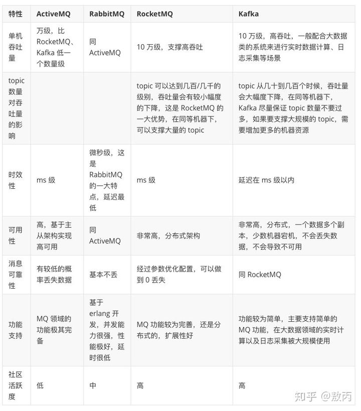

消息列队产品

1、RocketMQ  https://rocketmq.apache.org/docs/quick-start/  阿里维护

​             https://github.com/apache/rocketmq/tree/master/docs/cn

2、kafka    https://kafka.apache.org/documentation/          适合

3、rabbitMQ   https://www.rabbitmq.com/documentation.html   openstack使用过，适合万级别的

对比图

