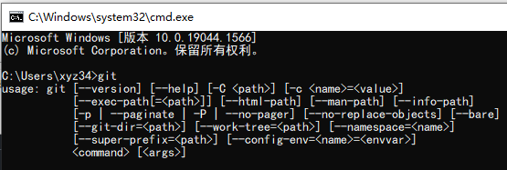

## 使用windows命令提示符提交代码到github

下载windows 版的git

https://git-scm.com/downloads

然后安装到windows，注意安装时候的选项把路径添加到环境中，免得以后手动添加。

安装好之后打开cmd



使用git 可以打开，然后设置下全局环境

```cmd
D:\cloudb>git config --global user.name "xyz349925756"
D:\cloudb>git config --global user.email "xyz349925756@hotmail.com"

D:\cloudb>git config --global --list
http.sslverify=false
user.name=xyz349925756
user.email=xyz349925756@hotmail.com

D:\cloudb>ssh-keygen -t rsa -b 4096
Generating public/private rsa key pair.
Enter file in which to save the key (C:\Users\xyz34/.ssh/id_rsa):
C:\Users\xyz34/.ssh/id_rsa already exists.
Overwrite (y/n)? y
Enter passphrase (empty for no passphrase):
Enter same passphrase again:
Your identification has been saved in C:\Users\xyz34/.ssh/id_rsa.
Your public key has been saved in C:\Users\xyz34/.ssh/id_rsa.pub.
The key fingerprint is:
SHA256:hnS7pCbqR8acgxVTqefB+8TTOhPOqXGjpoctDiQD7co xyz34@V
The key's randomart image is:
+---[RSA 4096]----+
|     ...         |
| .  o .          |
|. .  =. .        |
|..  o.+o .       |
|o o= +.+S.       |
|.=. B o+=..      |
|.E.o.++=+=       |
|   o+o++O.       |
| .ooo=o. o       |
+----[SHA256]-----+
```

C:\Users\xyz34\.ssh

去找密钥信息


很简单不介绍了


## windows-开始图标显示异常

```powershell
$manifest = (Get-AppxPackage Microsoft.WindowsStore).InstallLocation + '\AppxManifest.xml' ; Add-AppxPackage -DisableDevelopmentMode -Register $manifest

Get-AppXPackage -AllUsers |Where-Object {$_.InstallLocation -like "*SystemApps*"}
```

https://answers.microsoft.com/zh-hans/windows/forum/all/windows-10/ee8c3cc8-6834-48a0-9bee-46d8ce97a8c3

## wsl子系统

```cmd
C:\Users\xyz34>wsl -l -v   #查看版本
  NAME            STATE           VERSION
* Ubuntu-20.04    Running         1


C:\Users\xyz34>wsl --export ubuntu-20.04 d:\ubuntu20.04.tar   #导出分发版文件到D盘

C:\Users\xyz34>wsl --unregister Ubuntu-20.04  #注销当前分发版本
正在注销...

https://docs.microsoft.com/zh-cn/windows/wsl/install-manual#step-4---download-the-linux-kernel-update-package
下载一个支持包安装上即可将 WSL 2 设置为默认版本

```

### 帮助

```cmd
C:\Users\xyz34>wsl --help
版权所有(c) Microsoft Corporation。保留所有权利。
用法: wsl.exe [Argument] [Options...] [CommandLine]
运行 Linux 二进制文件的参数:
    如果未提供命令行，wsl.exe 将启动默认 shell。
    --exec, -e <CommandLine>
        在不使用默认 Linux Shell 的情况下执行指定的命令。
    --
        按原样传递其余命令行。
选项:
    --cd <Directory>
        将指定目录设置为当前工作目录。
        如果使用了 ~，则将使用 Linux 用户的主页路径。如果路径
        以 / 字符开头，将被解释为绝对 Linux 路径。
        否则，该值一定是绝对 Windows 路径。
    --distribution, -d <Distro>
        运行指定分发。
    --user, -u <UserName>
        以指定用户身份运行。
管理适用于 Linux 的 Windows 子系统的参数:
    --help
        显示用法信息。
    --install [选项]
        安装额外的适用于 Linux 的 Windows 子系统分发。
         要获得有效分发列表，请使用“wsl --list --online”。
        选项:
            --distribution, -d [参数]
                按名称下载并安装分发。
                参数:
                    有效分发名称(不区分大小写)。
                示例:
                    wsl --install -d Ubuntu
                    wsl --install --distribution Debian
    --set-default-version <Version>
        更改新分发的默认安装版本。
      --shutdown
         立即终止所有运行的分发及 WSL 2
        轻型工具虚拟机。
         --status
           显示适用于 Linux 的 Windows 子系统的状态。
    --update [选项]
        如果未指定任何选项，则 WSL 2 内核将更新
        到最新版本。
             选项:
         --rollback
                还原到 WSL 2 内核的先前版本。
用于管理适用于 Linux 的 Windows 子系统中的分发的参数:
    --export <Distro> <FileName>
         将分发导出到 tar 文件。
        对于标准输出，文件名可以是 –。
    --import <Distro> <InstallLocation> <FileName> [Options]
            将指定的 tar 文件作为新分发导入。
          对于标准输入，文件名可以是 –。
        选项:
            --version <Version>
                指定要用于新分发的版本。
    --list, -l [Options]
        列出分发。
        选项:
            --all
                列出所有分发，包括
        当前正在安装或卸载的分发。
            --running
                仅列出当前正在运行的分发。
            --quiet, -q
                仅显示分发名称。
            --verbose, -v
                显示所有分发的详细信息。
            --online, -o
                显示使用“wsl --install”进行安装的可用分发列表。
    --set-default, -s <分发>
        将分发设置为默认值。
    --set-version <分发> <版本>
        更改指定分发的版本。
    --terminate, -t <分发>
        终止指定的分发。
    --unregister <分发>
        注销分发并删除根文件系统。
```


## 浏览器隐身模式

### edge

"C:\Program Files (x86)\Microsoft\Edge\Application\msedge.exe" -inprivate https://cn.bing.com

发送edge浏览器图标到桌面，然后在后面添加 -inprivate  每次都默认打开无痕模式，后面接的是固定好的网址


### google chrome

"C:\Program Files\Google\Chrome\Application\chrome.exe" -incognito https://cn.bing.com


### firefox

"C:\Program Files\Mozilla Firefox\firefox.exe" -private https://cn.bing.com/


http://360.tiandi.com/?td_2_6216


## FluentTerminal 右键打开

添加右键

> reg add "HKCU\Software\Classes\Directory\shell\Open Fluent Terminal here\command" /d "\"%LOCALAPPDATA%\Microsoft\WindowsApps\flute.exe\" new \"%%1\"" /f  reg add 
>
> "HKCU\Software\Classes\Directory\Background\shell\Open Fluent Terminal here\command" /d "\"%LOCALAPPDATA%\Microsoft\WindowsApps\flute.exe\" new \"%%V\"" /f  reg add 
>
> "HKCU\Software\Classes\LibraryFolder\Background\shell\Open Fluent Terminal here\command" /d "\"%LOCALAPPDATA%\Microsoft\WindowsApps\flute.exe\" new \"%%V\"" /f

卸载

> reg delete "HKCU\Software\Classes\Directory\shell\Open Fluent Terminal here" /f  
>
> reg delete "HKCU\Software\Classes\Directory\Background\shell\Open Fluent Terminal here" /f
>
> reg delete "HKCU\Software\Classes\LibraryFolder\Background\shell\Open Fluent Terminal here" /f

