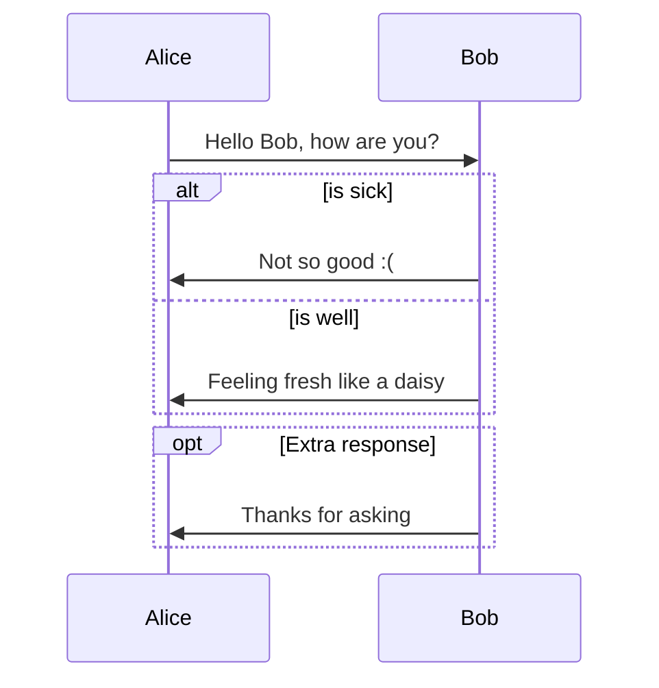
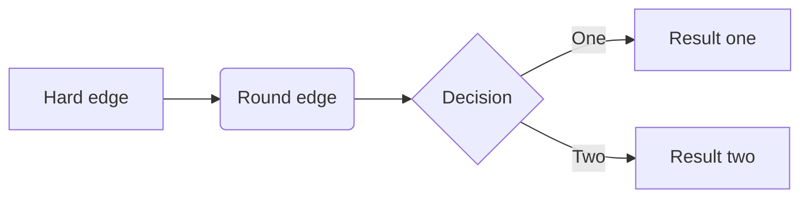
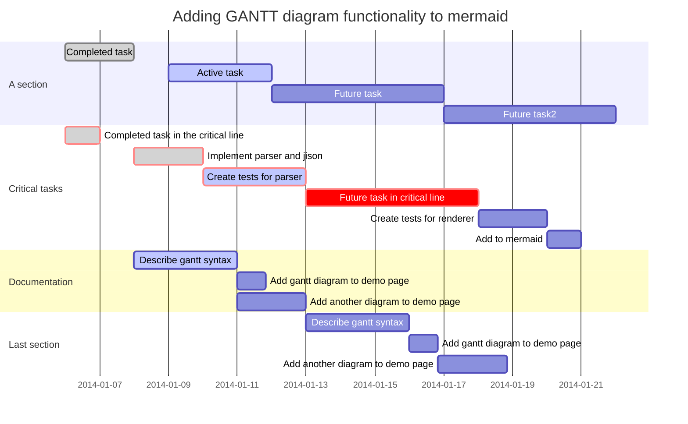
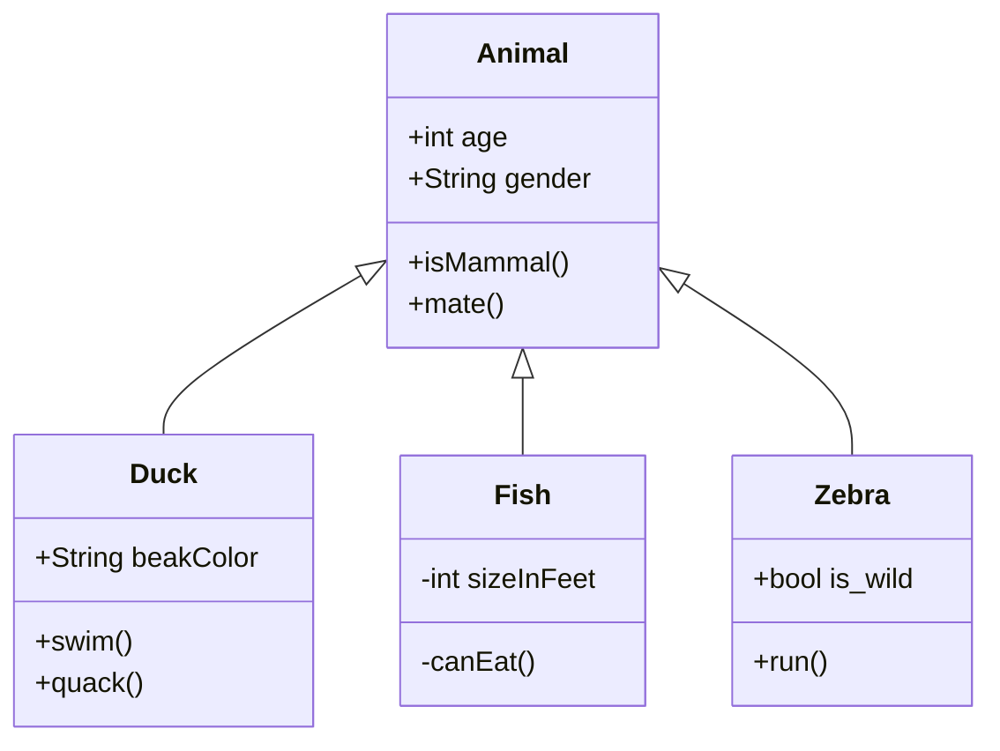
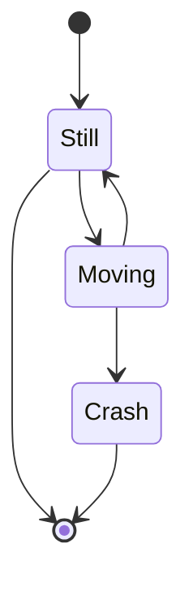
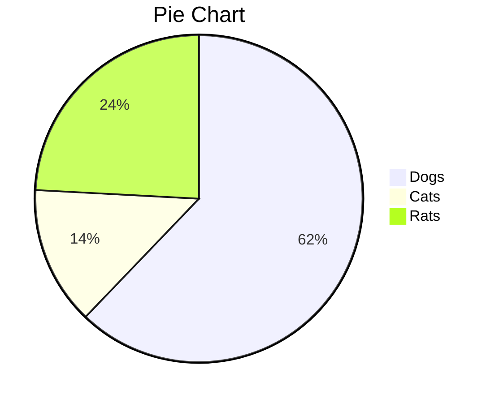
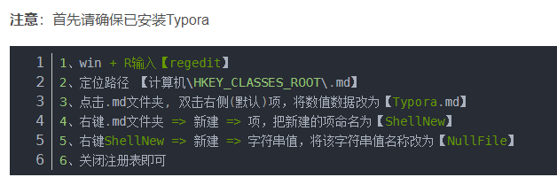
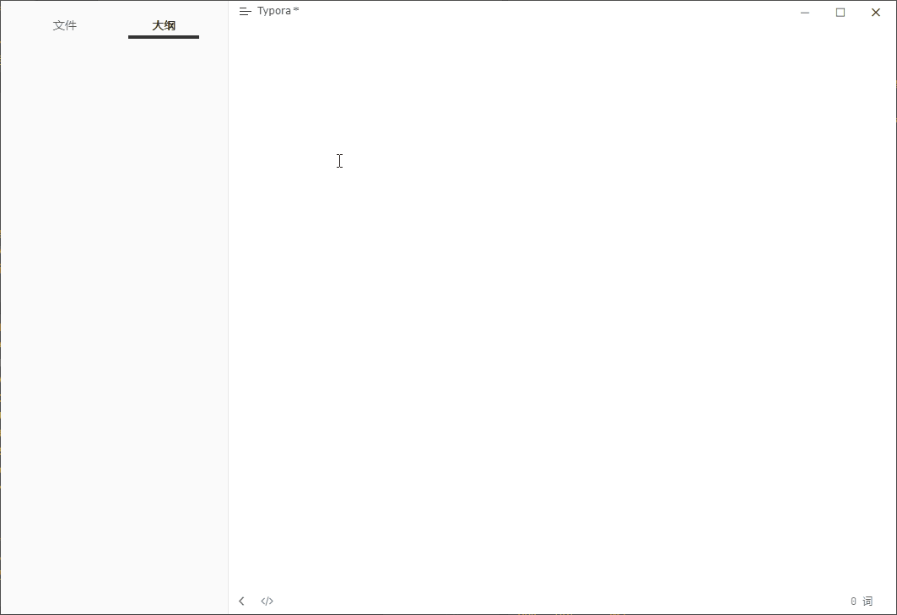
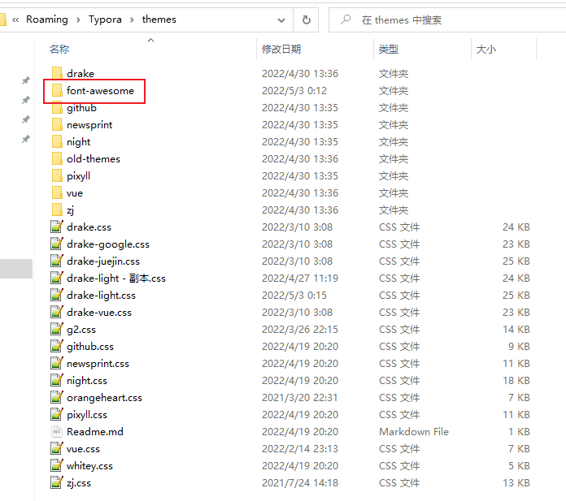
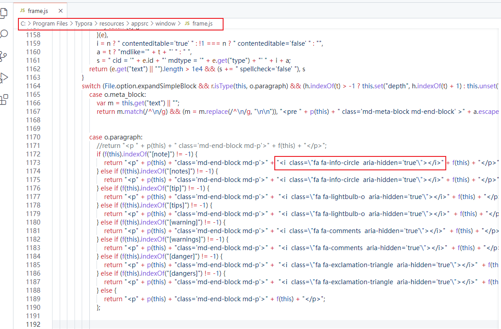

https://zhuanlan.zhihu.com/p/172635547

https://blog.csdn.net/qq_36075612/article/details/118161100

> 注释

文字颜色


标签

[id]:1


<a name="lian1">连接1</a>

表

引用 


<font color=#be14807f>xxx</font>

<font color=blue> 蓝色</font>

<font color=red>red</font>

<font color=green>green</font>

<font color=yellow>yellow</font>

```
使用 <kbd>Ctrl</kbd>+<kbd>Alt</kbd>+<kbd>Del</kbd> 重启电脑
```

 <kbd>Ctrl</kbd>+<kbd>Alt</kbd>+<kbd>Del</kbd>

```


```

- 开头一个感叹号 !
- 接着一个方括号，里面放上图片的替代文字
- 接着一个普通括号，里面放上图片的网址，最后还可以用引号包住并加上选择性的 'title' 属性的文字。

**徽章**

https://github.com/badges/shields


https://shields.io/设计


```bash
[toc]+回车   s

标题1-6级
#       1
##			2
###			3
####		4
#####		5
######	 6
快捷键ctrl+1-6

> + 空格 引用

```

- 无序  - + 文字

1. 有序  1 + 文件

> 	序列+空格+[+空格+]+空格+文字，换行键换行，删除键跳出
> 	- [ ] a				[ ] 中为空格，则没有选中
> 	+ [ ] b
> 	- [x] completed		[ ]中为x，则默认选中    -  [x]  最后输入-空格

- [ ] aa

- [x] bbb


---------------


==111==

##  un-ordered list 

* Red 
* Green 
* Blue


[内联](1)

[连接2](#lian1)

[baidu](http://www.baidu.com)

```

```


**single asterisks**

 *_single underscores_*

\*this text is surrounded by literal asterisks\*


Use the `printf()` function.


`~~Mistaken text.~~`becomes ~~Mistaken text.~~


# Sequence Diagrams

```sequence
Alice->Bob: Hello Bob, how are you?
Note right of Bob: Bob thinks
Bob-->Alice: I am good thanks!
```

您可以更改 CSS 变量`--sequence-theme`以设置序列图的主题，支持的值为`simple`（默认）和`hand`. 

在主题的css样式中添加

```bash
:root {
  --sequence-theme: hand
}
```

变手绘的


设置高亮快捷键 

> conf.user.json
>
> "keyBinding": {
>     // for example: 
>     // "Always on Top": "Ctrl+Shift+P"
>     // All other options are the menu items 'text label' displayed from each typora menu
> 	"Highlight": "Ctrl+g"
>   },

流程图

```flow
st=>start: Start
op=>operation: Your Operation
cond=>condition: Yes or No?
e=>end

st->op->cond
cond(yes)->e
cond(no)->op
```


---

# Mermaid



---

## Flowcharts



---

## Gantt Charts



---

## Class Diagrams




---

## State Diagrams



---

## Pie Charts




---


## Mermaid Options

```bash
:root {
  --mermaid-theme: default; /*or base, dark, forest, neutral, night */
  --mermaid-font-family: "trebuchet ms", verdana, arial, sans-serif;
  --mermaid-sequence-numbers: off; /* or "on", see https://mermaid-js.github.io/mermaid/#/sequenceDiagram?id=sequencenumbers*/
  --mermaid-flowchart-curve: linear /* or "basis", see https://github.com/typora/typora-issues/issues/1632*/;
  --mermaid--gantt-left-padding: 75; /* see https://github.com/typora/typora-issues/issues/1665*/
}
```

添加css样式可美化美人鱼流程图

 `--mermaid-sequence-numbers: on`, then the `--mermaid-sequence-numbers: on`

---

| :root {--mermaid-theme:dark;}    |  |
| -------------------------------- | ------------------------------------------------------------ |
| :root {--mermaid-theme:forest;}  |  |
| :root {--mermaid-theme:neutral;} |  |
|                                  |                                                              |

### Auto Numbering

Add `--mermaid-sequence-numbers: on;`

| –mermaid-sequence-numbers:off                                | –mermaid-sequence-numbers:on                                 |
| ------------------------------------------------------------ | ------------------------------------------------------------ |
|  |  |

### Flowchart Curve

Add `--mermaid-flowchart-curve: basis` to get other type of curves.

| –mermaid-flowchart-curve: linear;                            | –mermaid-flowchart-curve: basis                              | –mermaid-flowchart-curve: natural;                           | –mermaid-flowchart-curve: step;                              |
| ------------------------------------------------------------ | ------------------------------------------------------------ | ------------------------------------------------------------ | ------------------------------------------------------------ |
|  |  |  |  |

### Gantt Padding

–mermaid–gantt-left-padding:75       


 –mermaid–gantt-left-padding:200




# typora 引用多样 

> 警告
>
> 

先来定义一下样式以及种类

| 名称 | 备注   |
| ---- | ------ |
| 通知 | 无背景 |
|      | 有背景 |
| 提示 | 无背景 |
|      | 有背景 |
| 等待 | 无背景 |
|      | 有背景 |
| 危险 | 无背景 |
|      | 有背景 |



1.

> [note]
>
> 这是通知

2.

> [notes]
>
> 这是通知

3.

> [tip]
>
> 这是通知

4.

> [tips]
>
> 这是通知

5.

> [warning]
>
> 这是通知

6.

> [warnings]
>
> 这是通知

7.

> [danger]
>
> 这是通知

8.

> [dangers]
>
> 这是通知


# 设置typora引用多样式

https://www.52pojie.cn/forum.php?mod=viewthread&tid=1505532&highlight=Typora%B5%C4%D2%FD%D3%C3%CA%B9%D3%C3%B6%E0%D6%D6%D1%F9%CA%BD

```css
blockquote {
    color: var(--blockquote-color);
    border-radius: 2px;
    padding: 10px 16px;
    background-color: var(--blockquote-bg-color);
    position: relative;
    border-left: none;
}
```

## 修改theme.css

```css
/**
颜色代码：            背景色
绿色： #009688       #e8f3eb
橙色： #f0ad4e       #fcf8f2
红色： #d9534f       #fdf7f7

青色： #5bc0de       #f4f8fa

**/
/**********/

.blockquote-note {
    border-left-color: #5bc0de;  /*左边框颜色*/
    color: #5bc0de;  /*标签字颜色*/
    /*background-color: #f4f8fa;  背景颜色*/
    }
.blockquote-notes {
    border-left-color: #5bc0de;  /*左边框颜色*/
    color: #5bc0de;  /*标签字颜色*/
    background-color: #f4f8fa;  /*背景颜色*/
    }

.blockquote-tip {
    border-left-color: #009688;  /*左边框颜色*/
    color: #009688;  /*标签字颜色*/
    /*background-color: #f4f8fa;  背景颜色*/
    }
.blockquote-tips {
    border-left-color: #009688;  /*左边框颜色*/
    color: #009688;  /*标签字颜色*/
    background-color: #e8f3eb;  /*背景颜色*/
    }

.blockquote-warning {
    border-left-color: #f0ad4e;  /*左边框颜色*/
    color: #f0ad4e;  /*标签字颜色*/
    /*background-color: #f4f8fa;  背景颜色*/
    }
.blockquote-warnings {
    border-left-color: #f0ad4e;  /*左边框颜色*/
    color: #f0ad4e;  /*标签字颜色*/
    background-color: #fcf8f2;  /*背景颜色*/
    }

.blockquote-danger {
    border-left-color: #d9534f;  /*左边框颜色*/
    color: #d9534f;  /*标签字颜色*/
    /*background-color: #f4f8fa;  背景颜色*/
    }
.blockquote-dangers {
    border-left-color: #d9534f;  /*左边框颜色*/
    color: #d9534f;  /*标签字颜色*/
    background-color: #fdf7f7;  /*背景颜色*/
    }


/****设置默认的属性****/
blockquote {
    color: #f44336;
    border-radius: 2px;
    padding: 10px 16px;
    /*background-color: var(--blockquote-bg-color);  默认背景颜色*/
    position: relative;
    border: 1px solid;  /*框粗细*/
	border-left: 4px solid;
}

```

这里是添加样式


## 修改js渲染

C:\Program Files\Typora\resources\appsrc\window\frame.js

```js
case o.blockquote:return"<blockquote "+p(this)+" >"+f(this)+"</blockquote>";

// 修改
case o.blockquote:
    // return "<blockquote " + p(this) + " >" + f(this) + "</blockquote>";
    if (f(this).indexOf("[note]") != -1) {
        return "<blockquote" + p(this) + "class='blockquote-note' >" + f(this) + "</blockquote>";
    } else if (f(this).indexOf("[notes]") != -1) {
        return "<blockquote" + p(this) + "class='blockquote-notes' >" + f(this) + "</blockquote>";
    } else if (f(this).indexOf("[tip]") != -1) {
        return "<blockquote" + p(this) + "class='blockquote-tip' >" + f(this) + "</blockquote>";
    } else if (f(this).indexOf("[tips]") != -1) {
        return "<blockquote" + p(this) + "class='blockquote-tips' >" + f(this) + "</blockquote>";
    } else if (f(this).indexOf("[warning]") != -1) {
        return "<blockquote" + p(this) + "class='blockquote-warning' >" + f(this) + "</blockquote>";
    } else if (f(this).indexOf("[warnings]") != -1) {
        return "<blockquote" + p(this) + "class='blockquote-warnings' >" + f(this) + "</blockquote>";
    } else if (f(this).indexOf("[danger]") != -1) {
        return "<blockquote" + p(this) + "class='blockquote-danger' >" + f(this) + "</blockquote>";
    } else if (f(this).indexOf("[dangers]") != -1) {
        return "<blockquote" + p(this) + "class='blockquote-dangers' >" + f(this) + "</blockquote>";
    } else {
         return "<blockquote" + p(this) + " >" + f(this) + "</blockquote>";
    };
```


## 导出

```js
  case o.blockquote:
      return "<blockquote>" + T(e, n) + "</blockquote>";

// 修改为
 case o.blockquote:
   //return "<blockquote>" + T(e, n) + "</blockquote>";
   if (T(e,n).indexOf("[note]") != -1) {
       return "<blockquote class='blockquote-note' >" + T(e, n) + "</blockquote>";
   } else if (T(e,n).indexOf("[notes]") != -1) {
       return "<blockquote class='blockquote-notes' >" + T(e, n) + "</blockquote>";
   } else if (T(e,n).indexOf("[tip]") != -1) {
       return "<blockquote class='blockquote-tip' >" + T(e, n) + "</blockquote>";
   } else if (T(e,n).indexOf("[tips]") != -1) {
       return "<blockquote class='blockquote-tips' >" + T(e, n) + "</blockquote>";
   } else if (T(e,n).indexOf("[warning]") != -1) {
       return "<blockquote class='blockquote-warning' >" + T(e, n) + "</blockquote>";
   }  else if (T(e,n).indexOf("[warnings]") != -1) {
       return "<blockquote class='blockquote-warnings' >" + T(e, n) + "</blockquote>";
   }  else if (T(e,n).indexOf("[danger]") != -1) {
       return "<blockquote class='blockquote-danger' >" + T(e, n) + "</blockquote>";
   }  else if (T(e,n).indexOf("[dangers]") != -1) {
       return "<blockquote class='blockquote-dangers' >" + T(e, n) + "</blockquote>";
   } else {
       return "<blockquote>" + T(e, n) + "</blockquote>";
   };

```

上面是无图标的

```js
 case o.blockquote:
   //return "<blockquote>" + T(e, n) + "</blockquote>";    //md-end-block md-p
   if (T(e, n).indexOf("[note]") != -1) {
       return "<blockquote class='blockquote-note' >" +"<i  class='fa fa-info-circle'></i>" + T(e, n)  +"</blockquote>" ;
   } else if (T(e, n).indexOf("[notes]") != -1) {
       return "<blockquote class='blockquote-notes' >" + T(e, n) + "</blockquote>";
   } else if (T(e, n).indexOf("[tip]") != -1) {
       return "<blockquote class='blockquote-tip' >" + T(e, n) + "</blockquote>";
   } else if (T(e, n).indexOf("[tips]") != -1) {
       return "<blockquote class='blockquote-tips' >" + T(e, n) + "</blockquote>";
   } else if (T(e, n).indexOf("[warning]") != -1) {
       return "<blockquote class='blockquote-warning' >" + T(e, n) + "</blockquote>";
   }  else if (T(e, n).indexOf("[warnings]") != -1) {
       return "<blockquote class='blockquote-warnings' >" + T(e, n) + "</blockquote>";
   }  else if (T(e, n).indexOf("[danger]") != -1) {
       return "<blockquote class='blockquote-danger' >" + T(e, n) + "</blockquote>";
   }  else if (T(e, n).indexOf("[dangers]") != -1) {
       return "<blockquote class='blockquote-dangers' >" + T(e, n) + "</blockquote>";
   } else {
       return "<blockquote>" + T(e, n) + "</blockquote>";
   };

```


## 前置图标

```js
 case o.paragraph:
     return "<p " + p(this) + " class='md-end-block md-p'>" + f(this) + "</p>";

// 修改：
case o.paragraph:
    //return "<p " + p(this) + " class='md-end-block md-p'>" + f(this) + "</p>";
    if (f(this).indexOf("[note]") != -1) {
        return "<p" + p(this) + "class='md-end-block md-p'>" + "<i  class=\"fa fa-info-circle  aria-hidden='true'\"></i>" + f(this) + "</p>";
    } else if (f(this).indexOf("[notes]") != -1) {
        return "<p" + p(this) + "class='md-end-block md-p'>" + "<i  class=\"fa fa-info-circle  aria-hidden='true'\"></i>" + f(this) + "</p>";
    } else if (f(this).indexOf("[tip]") != -1) {
        return "<p" + p(this) + "class='md-end-block md-p'>" +  "<i  class=\"fa fa-lightbulb-o  aria-hidden='true'\"></i>" + f(this) + "</p>";
    } else if (f(this).indexOf("[tips]") != -1) {
        return "<p" + p(this) + "class='md-end-block md-p'>" +  "<i  class=\"fa fa-lightbulb-o  aria-hidden='true'\"></i>"  + f(this) + "</p>";
    } else if (f(this).indexOf("[warning]") != -1) {
        return "<p" + p(this) + "class='md-end-block md-p'>" + "<i  class=\"fa fa-comments  aria-hidden='true'\"></i>"  + f(this) + "</p>";
    } else if (f(this).indexOf("[warnings]") != -1) {
        return "<p" + p(this) + "class='md-end-block md-p'>" +  "<i  class=\"fa fa-comments  aria-hidden='true'\"></i>"  + f(this) + "</p>";
    } else if (f(this).indexOf("[danger]") != -1) {
        return "<p" + p(this) + "class='md-end-block md-p'>" +  "<i  class=\"fa fa-exclamation-triangle  aria-hidden='true'\"></i>"  + f(this) + "</p>";
    } else if (f(this).indexOf("[dangers]") != -1) {
        return "<p" + p(this) + "class='md-end-block md-p'>" +  "<i  class=\"fa fa-exclamation-triangle  aria-hidden='true'\"></i>"  + f(this) + "</p>";
    } else {
        return "<p" + p(this) + "class='md-end-block md-p'>" + "<i class="fa fa-cloud"></i>"+ f(this) + "</p>";
    };


// 第二种图标
case o.paragraph:
    //return "<p " + p(this) + " class='md-end-block md-p'>" + f(this) + "</p>";
    if (f(this).indexOf("[note]") != -1) {
        return "<p" + p(this) + "class='md-end-block md-p'>" + "<i  class=\"fa fa-info-circle  \"></i>" + f(this) + "</p>";
    } else if (f(this).indexOf("[notes]") != -1) {
        return "<p" + p(this) + "class='md-end-block md-p'>" + "<i  class=\"fa fa-book  \"></i>" + f(this) + "</p>";
    } else if (f(this).indexOf("[tip]") != -1) {
        return "<p" + p(this) + "class='md-end-block md-p'>" +  "<i  class=\"fa fa-lightbulb-o \"></i>" + f(this) + "</p>";
    } else if (f(this).indexOf("[tips]") != -1) {
        return "<p" + p(this) + "class='md-end-block md-p'>" +  "<i  class=\"fa fa-bullhorn  \"></i>"  + f(this) + "</p>";
    } else if (f(this).indexOf("[warning]") != -1) {
        return "<p" + p(this) + "class='md-end-block md-p'>" + "<i  class=\"fa fa-comments  \"></i>"  + f(this) + "</p>";
    } else if (f(this).indexOf("[warnings]") != -1) {
        return "<p" + p(this) + "class='md-end-block md-p'>" +  "<i  class=\"fa fa-comments-o  \"></i>"  + f(this) + "</p>";
    } else if (f(this).indexOf("[danger]") != -1) {
        return "<p" + p(this) + "class='md-end-block md-p'>" +  "<i  class=\"fa fa-exclamation-triangle  \"></i>"  + f(this) + "</p>";
    } else if (f(this).indexOf("[dangers]") != -1) {
        return "<p" + p(this) + "class='md-end-block md-p'>" +  "<i  class=\"fa fa-bomb  \"></i>"  + f(this) + "</p>";
    } else {
        return "<p" + p(this) + "class='md-end-block md-p'>" + f(this) + "</p>";
    };

```

这里引用https://www.thinkcmf.com/font/font_awesome/getstarted.html这个方法把下载好的符号放到theme主题文件夹下



在外面修改的css中导入

```css
@import url(./font-awesome/css/font-awesome.min.css)
```

然后使用vscode修改js文件



目前问题是导出不能显示图标
