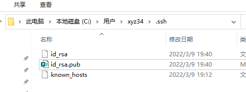
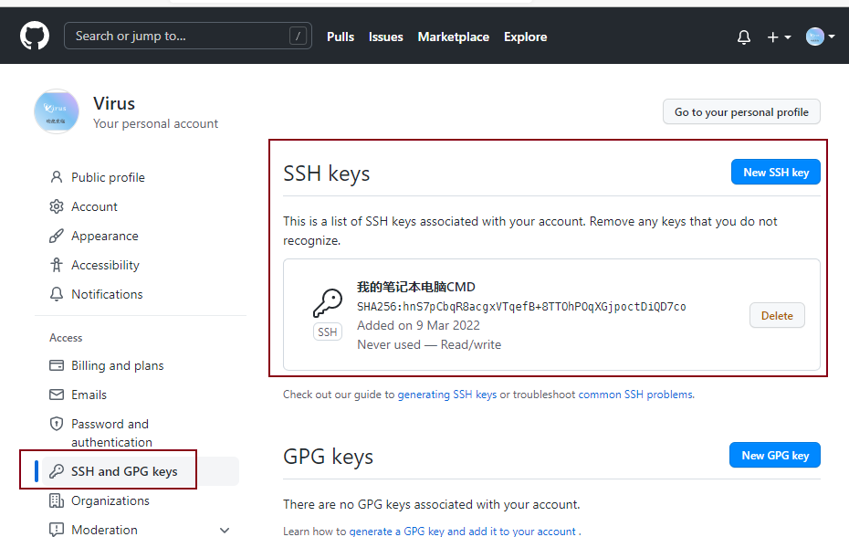

下载windows 版的git

https://git-scm.com/downloads

然后安装到windows，注意安装时候的选项把路径添加到环境中，免得以后手动添加。

安装好之后打开cmd


使用git 可以打开，然后设置下全局环境

```cmd
D:\cloudb>git config --global user.name "xyz349925756"
D:\cloudb>git config --global user.email "xyz349925756@hotmail.com"

D:\cloudb>git config --global --list
http.sslverify=false
user.name=xyz349925756
user.email=xyz349925756@hotmail.com

D:\cloudb>ssh-keygen -t rsa -b 4096
Generating public/private rsa key pair.
Enter file in which to save the key (C:\Users\xyz34/.ssh/id_rsa):
C:\Users\xyz34/.ssh/id_rsa already exists.
Overwrite (y/n)? y
Enter passphrase (empty for no passphrase):
Enter same passphrase again:
Your identification has been saved in C:\Users\xyz34/.ssh/id_rsa.
Your public key has been saved in C:\Users\xyz34/.ssh/id_rsa.pub.
The key fingerprint is:
SHA256:hnS7pCbqR8acgxVTqefB+8TTOhPOqXGjpoctDiQD7co xyz34@V
The key's randomart image is:
+---[RSA 4096]----+
|     ...         |
| .  o .          |
|. .  =. .        |
|..  o.+o .       |
|o o= +.+S.       |
|.=. B o+=..      |
|.E.o.++=+=       |
|   o+o++O.       |
| .ooo=o. o       |
+----[SHA256]-----+
```

C:\Users\xyz34\.ssh

去找密钥信息





很简单不介绍了


