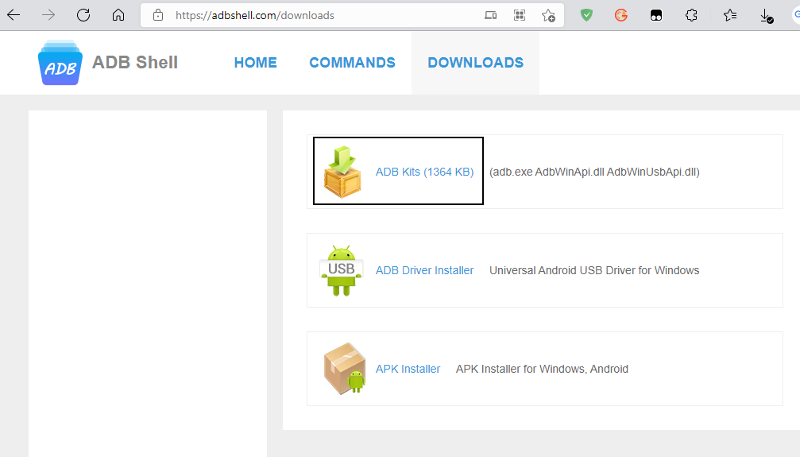

# 流氓华为内置app卸载

adb:https://adbshell.com/downloads



解压使用cmd 管理员权限

```cmd
C:\WINDOWS\system32>cd c:\Users\vkin_\Desktop\adb

c:\Users\vkin_\Desktop\adb>dir
 驱动器 C 中的卷没有标签。
 卷的序列号是 AEA4-D74F

 c:\Users\vkin_\Desktop\adb 的目录

2021/10/17  15:24    <DIR>          .
2021/10/17  15:24    <DIR>          ..
2019/10/18  09:20         2,583,552 adb.exe
2019/10/18  09:20            97,792 AdbWinApi.dll
2019/10/18  09:20            62,976 AdbWinUsbApi.dll
2020/01/09  00:00                51 README.txt
               4 个文件      2,744,371 字节
               2 个目录 75,001,020,416 可用字节

c:\Users\vkin_\Desktop\adb>adb devices
* daemon not running; starting now at tcp:5037
* daemon started successfully
List of devices attached
WEENU18903108301        device

c:\Users\vkin_\Desktop\adb>adb shell
HWRVL:/ $ pm uninstall -k --user 0 com.huawei.hnreader 荣耀阅读
HWRVL:/ $ pm uninstall -k --user 0 com.android.browser 浏览器
HWRVL:/ $ pm uninstall -k --user 0 com.huawei.himovie 华为视频
HWRVL:/ $ pm uninstall -k --user 0 com.android.mediacenter 华为音乐
HWRVL:/ $ pm uninstall -k --user 0 com.huawei.hifolder  精品推荐
HWRVL:/ $ pm uninstall -k --user 0 com.huawei.android.pushagent  推送消息
HWRVL:/ $ pm uninstall -k --user 0 com.huawei.wallet  钱包
HWRVL:/ $ pm uninstall -k --user 0 com.huawei.fastapp 快应用
HWRVL:/ $ pm uninstall -k --user 0 com.huawei.skytone 天际数通
HWRVL:/ $ pm uninstall -k --user 0 com.huawei.scanner 智慧视觉
HWRVL:/ $ pm uninstall -k --user 0 com.huawei.mycenter  会员中心
HWRVL:/ $ pm uninstall -k --user 0 com.huawei.scenepack 旅行助手
HWRVL:/ $ pm uninstall -k --user 0 com.huawei.ohos.suggestion
HWRVL:/ $ pm uninstall -k --user 0 com.huawei.gameassistant
HWRVL:/ $ pm uninstall -k --user 0 com.huawei.android.karaoke K歌特效
HWRVL:/ $ pm uninstall -k --user 0 com.huawei.ohos.smarthome
HWRVL:/ $ pm uninstall -k --user 0 com.baidu.input_huawei 百度输入法
HWRVL:/ $ pm uninstall -k --user 0 com.huawei.hiai
HWRVL:/ $ pm uninstall -k --user 0 com.huawei.truststspace
HWRVL:/ $ pm uninstall -k --user 0 com.huawei.trustspace
HWRVL:/ $ pm uninstall -k --user 0 com.huawei.vrservice 华为VR服务
HWRVL:/ $ pm uninstall -k --user 0 com.huawei.scanner
HWRVL:/ $ pm uninstall -k --user 0 com.huawei.skytone
HWRVL:/ $ pm uninstall -k --user 0 com.huawei.videoeditor 视频剪辑
HWRVL:/ $ pm uninstall -k --user 0 com.huawei.ohos.health
HWRVL:/ $ pm uninstall -k --user 0 com.huawei.hwdetectrepair
HWRVL:/ $ pm uninstall -k --user 0 com.huawei.pengine  智能建议
HWRVL:/ $ pm uninstall -k --user 0 com.huawei.ohos.suggestion  智慧推荐
HWRVL:/ $ pm uninstall -k --user 0 com.huawei.hitouch 智慧识屏
HWRVL:/ $ pm uninstall -k --user 0 com.huawei.hitouch 智慧搜索
HWRVL:/ $ pm uninstall -k --user 0 com.huawei.ohos.smarthome 智慧生活
HWRVL:/ $ pm uninstall -k --user 0 com.huawei.hiai 智慧引擎
HWRVL:/ $ pm uninstall -k --user 0 com.huawei.android.instantshare 华为分享
HWRVL:/ $ pm uninstall -k --user 0 com.huawei.vassistant 智慧语音
HWRVL:/ $ pm uninstall -k --user 0 com.huawei.ohos.health 华为运动

```

https://blog.csdn.net/pdcfighting/article/details/105721388 参考名称

网上下载189卡刷包，解压得到一个dload的文件夹，将整个文件夹拷到 U盘根目录里，手机退出登陆的账号，关闭锁屏密码，然后用otg转接头连接 U盘，打开拨号界面，输入\*#\*#2846579#\*#\*，在出来的界面里选软件升级，等待完成就可以了

```shell
HWRVL:/ $ pm disable-user com.huawei.android.hwouc
pm disable-user com.huawei.android.hwouc
Package com.huawei.android.hwouc new state: disabled-user

255|HWRVL:/ $ pm enable com.huawei.android.hwouc
pm enable com.huawei.android.hwouc
Package com.huawei.android.hwouc new state: enabled
```

