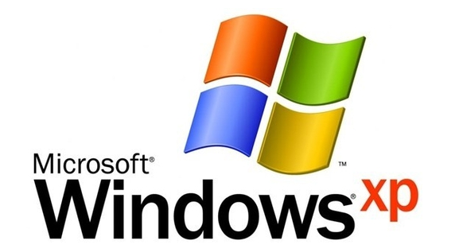
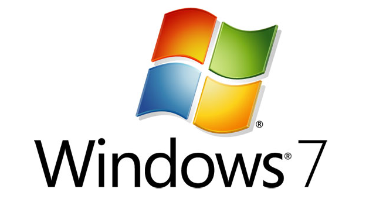
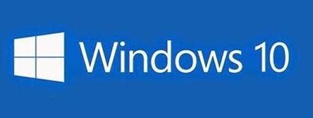
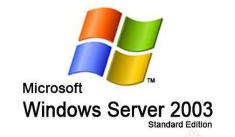
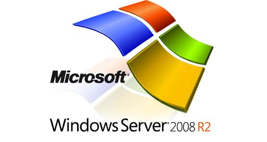
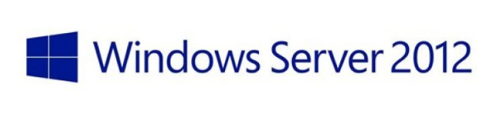
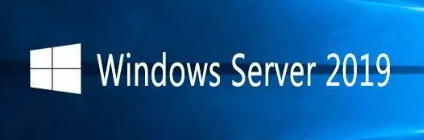

# 1. windows系统

这里只列出常用的windows`桌面版`和`服务器`版本，使用迅雷下载

windows8 windows8.1这些短期版本不推荐使用

## 1.1. 桌面系统

### 1.1.1. windows XP

------

windows_xp_professional_with_service_pack_3_x86 [迅雷下载](ed2k://|file|zh-hans_windows_xp_professional_with_service_pack_3_x86_cd_vl_x14-74070.iso|630237184|EC51916C9D9B8B931195EE0D6EE9B40E|/)

------

### 1.1.2. windows7

------

windows_7_professional_sp1_x86 [迅雷下载](ed2k://|file|cn_windows_7_professional_with_sp1_vl_build_x86_dvd_u_677939.iso|2502909952|935E5B4B754527BE3C238FA6ABDD9B86|/)

windows_7_professional_sp1_x64 [迅雷下载](ed2k://|file|cn_windows_7_professional_with_sp1_vl_build_x64_dvd_u_677816.iso|3266004992|5A52F4CCEFA71797D58389B397038B2F|/)

windows_7_ultimate_with_sp1_x86 [迅雷下载](ed2k://|file|cn_windows_7_ultimate_with_sp1_x86_dvd_u_677486.iso|2653276160|7503E4B9B8738DFCB95872445C72AEFB|/)

windows_7_ultimate_with_sp1_x64 [迅雷下载](ed2k://|file|cn_windows_7_ultimate_with_sp1_x64_dvd_u_677408.iso|3420557312|B58548681854236C7939003B583A8078|/)

------

windows10和windows11推荐官方工具下载

### 1.1.3. windows10

------

官网下载工具：[MediaCreationTool21H1](https://download.microsoft.com/download/d/5/2/d528a4e0-03f3-452d-a98e-3e479226d166/MediaCreationTool21H1.exe)

官网：https://www.microsoft.com/zh-cn/software-download/windows10

------

### 1.1.4. windows11

下载地址：https://www.microsoft.com/zh-cn/software-download/windows11

------

## 1.2. 服务器系统

市场上目前90%以上使用linux系统，但是还是有很多不会的工程师。下面列出一些常见的windows服务器版本2003还有人使用，20年前很多开发的APP依赖此系统，由于很多开发公司消失了，哪些购买了正版软件的公司只能使用server2003！

### 1.2.1. windows server 2003

------

Windows Server 2003 R2 Standard Edition with SP2 disk1 [迅雷下载](ed2k://|file|cn_win_srv_2003_r2_standard_with_sp2_vl_cd1_X13-46532.iso|636440576|B39CCD2AE1E7EEC42328FD475A376778|/)

Windows Server 2003 R2 Standard Edition with SP2 disk2 [迅雷下载](ed2k://|file|cn_win_srv_2003_r2_standard_with_sp2_vl_cd2_X13-13942.iso|129697792|5BC51A4C9BEA3B339DA30387964A43CA|/)

Windows Server 2003 R2 Enterprise Edition with SP2 - Disc 1 [迅雷下载](ed2k://|file|cn_win_srv_2003_r2_enterprise_with_sp2_vl_cd1_X13-46432.iso|637917184|284DC0E76945125035B9208B9199E465|/)

Windows Server 2003 R2 Enterprise Edition with SP2 - Disc 2 [迅雷下载](ed2k://|file|cn_win_srv_2003_r2_enterprise_with_sp2_vl_cd2_X13-13895.iso|129703936|512C89A5839FFC8A3F3124ACB9E9CB75|/)

------

### 1.2.2. windows server 2008 R2

------

Windows Server 2008 R2 Standard, Enterprise, Datacenter, and Web with Service Pack 1 [迅雷下载](ed2k://|file|cn_windows_server_2008_r2_standard_enterprise_datacenter_and_web_with_sp1_vl_build_x64_dvd_617396.iso|3368962048|7C210CAC37A05F459758BCC1F4478F9E|/)

------

### 1.2.3. windows server 2012 R2

------

cn_windows_server_2012_r2_x64_dvd [迅雷下载](ed2k://|file|cn_windows_server_2012_r2_x64_dvd_2707961.iso|4413020160|010CD94AD1F2951567646C99580DD595|/)

Microsoft Hyper-V Server 2012 R2 (x64) - DVD [迅雷下载](ed2k://|file|cn_microsoft_hyper-v_server_2012_r2_x64_dvd_2708277.iso|2144010240|3BB6E1FB513204D8D2C6991B14B35D9B|/)

------

### 1.2.4. windows server 2019

------

Windows Server 2019 (updated Jan 2020) (x64) - DVD [迅雷下载](ed2k://|file|cn_windows_server_2019_updated_jan_2020_x64_dvd_4bbe2c37.iso|5608552448|39C663ABF26079240030395C7CB3F975|/)

------

## 1.3. office 软件

这里使用Office Tool Plus这个工具可以下载所有office 版本

下载地址：[Office Tool Plus](https://otp.landian.vip/zh-cn/download.html) 需要安装 [.NET5](https://dotnet.microsoft.com/download/dotnet/thank-you/sdk-5.0.400-windows-x86-installer)

软件界面有使用教程这里不赘述！！！

请使用正版，激活工具只是个人试用。这里不提供。

# 2. linux系统

内核官网kernel:https://www.kernel.org/

因为linux不像windows那样图形化。全球很多开发人员在使用这个开源的伟大系统。然后某些不可描述的原因导致下载龟速！所以需要镜像源。

| [网易源](http://mirrors.163.com/)                    | http://mirrors.163.com/               |
| ---------------------------------------------------- | ------------------------------------- |
| [清华源](https://mirrors.tuna.tsinghua.edu.cn/)      | https://mirrors.tuna.tsinghua.edu.cn/ |
| [sohu](http://mirrors.sohu.com/)                     | http://mirrors.sohu.com/              |
| [中国科技大学](https://mirrors.ustc.edu.cn/)         | https://mirrors.ustc.edu.cn/          |
| [浙江大学](http://mirrors.zju.edu.cn/)               | http://mirrors.zju.edu.cn/            |
| [阿里镜像源](https://developer.aliyun.com/mirror/)   | https://developer.aliyun.com/mirror/  |
| [上海交通大学](https://mirrors.sjtug.sjtu.edu.cn/)   | https://mirrors.sjtug.sjtu.edu.cn/    |
| 【教育】[开源镜像站](http://mirrors.neusoft.edu.cn/) | http://mirrors.neusoft.edu.cn/        |

[Rocky](https://rockylinux.org/) https://rockylinux.org/ centos的替代产品

google [学术搜索](https://ac.scmor.com/)：https://ac.scmor.com/

------

其他下载后期陆续补充