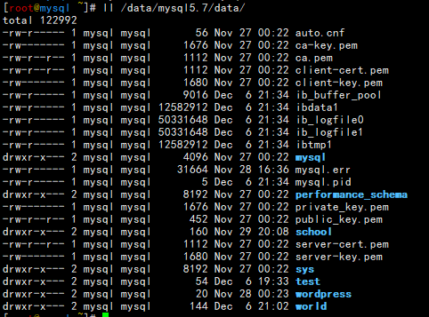
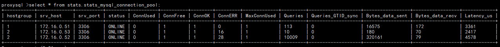
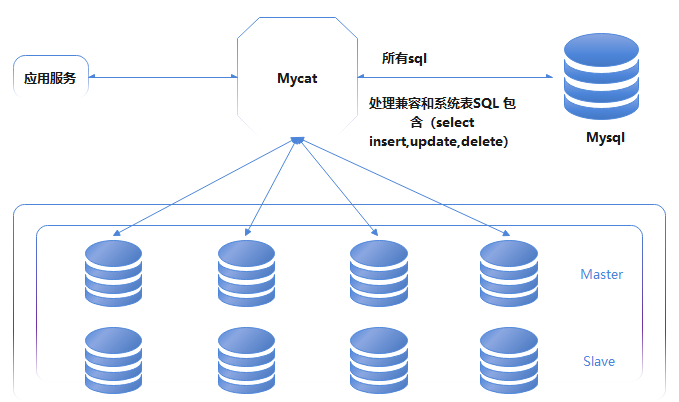

   吃透啃透，理解透彻避免生产中出现重大纰漏。

==必须备份项==

frm  基本表结构元数据存储

idb  存储数据行和索引信息


==配置文件==

```sh
[root@mysql ~]# vim /etc/my.cnf 

[mysqld]
user=mysql
basedir=/opt/mysql5.7
datadir=/data/mysql5.7/data
socket=/tmp/mysql.sock
secure_file_priv="/tmp/"
server_id=1
port=3306
default_storage_engine=InnoDB
autocommit=0
log_bin=/data/mysql5.7/data/binlog/mysql-bin                                
binlog_format=row

gtid-mode=on
enforce-gtid-consistency=true
log-slave-updates=1

slow_query_log=1
slow_query_log_file=/data/mysql5.7/data/slow.log
long_query_time=0.1
log_queries_not_using_indexes                                              
log-error=dir/{filename}

relay_log=/var/lib/mysql/slavelog  #主从才配置

[mysql]
prompt=db01 [\\d]>   #定义终端格式显示


最高安全模式

innodb_flush_log_at_trx_commit=1

Innodb_flush_method=O_DIRECT

最高性能:

innodb_flush_log_at_trx_commit=0

Innodb_flush_method=fsync

跟日志有关的参数

innodb_log_buffer_size=16777216

innodb_log_file_size=50331648

innodb_log_files_in_group = 3
```

快速重置数据库

```mysql
mysql> select concat('drop database ',table_schema,';') from information_schema.tables where table_schema not in('sys','mysql','information_schema','performance_schema') group by table_schema;
+-------------------------------------------+
| concat('drop database ',table_schema,';') |
+-------------------------------------------+
| drop database back;                       |
| drop database backup;                     |
| drop database binlog;                     |
| drop database gtid;                       |
| drop database school;                     |
| drop database test;                       |
| drop database world;                      |
+-------------------------------------------+
7 rows in set (0.00 sec)

mysql> select concat('drop database ',table_schema,';') from information_schema.tables where table_schema not in('sys','mysql','information_schema','performance_schema') group by table_schema into outfile '/tmp/drop_database.sql';
Query OK, 7 rows affected (0.00 sec)


[root@mysql ~]# ll /backup/
total 99460
-rw-r--r-- 1 root root     2469 Dec  8 14:32 back3307.sql
-rw-r--r-- 1 root root     2743 Dec  8 14:16 bin.sql
-rw-r--r-- 1 root root      285 Dec  8 21:34 drop_database.sql

[root@mysql ~]# cat /backup/drop_database.sql 

```


DQL  数据查询语言

DDL  数据定义语言

DML  数据操作语言

DCL  数据控制语言

==**注意**：如果数据库编码区分大小写那么下面很多语法要使用大写才行==

# 一、概念

DBA ：datebaseadministrator

DBMS 数据库管理系统

数据产品类型：https://db-engines.com/en/ranking

tab补全

```sh
[root@mysql ~]# yum install bash-completion -y
```


## mysql 安装

官网：https://www.mysql.com/

下载：https://www.mysql.com/cn/downloads/

这里我们选择开源 社区版：https://dev.mysql.com/downloads/

### 系统自带安装方式

MySQL Yum Repository: https://dev.mysql.com/downloads/repo/yum/

redhat、centos、fedora、rocky 适用

MySQL APT Repository:https://dev.mysql.com/downloads/repo/apt/

ubuntu debian 系统适用

MySQL SUSE Repository：https://dev.mysql.com/downloads/repo/suse/

suse系统适用

这种方式不用解决依赖性问题

### RPM DEB方式

https://dev.mysql.com/downloads/mysql/

安装过程会出现错误，依赖性问题适用yum apt方式解决


### 编译方式

编译这里使用源码，需要足够的技术基础


*安装方式三种选择一种就可以，这里选择二进制，这样更容易理解产品*

### 二进制方式

下载：https://dev.mysql.com/downloads/mysql/

cluster:https://dev.mysql.com/downloads/cluster/

MySQL Router:https://dev.mysql.com/downloads/router/

下载5.7.35 


下载8.0.27


#### 上传软件包到server

```sh
[root@mysql ~]# cd /server/soft/
[root@mysql /server/soft]# ls
mysql-5.7.35-linux-glibc2.12-x86_64.tar.gz  mysql-8.0.27-linux-glibc2.12-x86_64.tar.xz
```

#### 添加mysql 用户和组

```sh
[root@mysql ~]# useradd -M -s /sbin/nologin mysql
[root@mysql ~]# id mysql
uid=1000(mysql) gid=1000(mysql) groups=1000(mysql)

#卸载自带的mariadb
[root@mysql ~]# rpm -qa |grep mariadb
mariadb-libs-5.5.68-1.el7.x86_64
[root@mysql ~] # yum remove mariadb*

[root@mysql /server/soft]# tar xf mysql-5.7.35-linux-glibc2.12-x86_64.tar.gz -C /opt

[root@mysql /server/soft]# tar xf mysql-8.0.27-linux-glibc2.12-x86_64.tar.xz -C /opt

[root@mysql /server/soft]# cd /opt/
[root@mysql /opt]# ls
mysql-5.7.35-linux-glibc2.12-x86_64  mysql-8.0.27-linux-glibc2.12-x86_64

[root@mysql /opt]# ln -s mysql-5.7.35-linux-glibc2.12-x86_64/ mysql5.7
[root@mysql /opt]# ln -s mysql-8.0.27-linux-glibc2.12-x86_64/ mysql8.0
[root@mysql /opt]# ll
total 0
lrwxrwxrwx 1 root root  36 Nov 26 23:50 mysql5.7 -> mysql-5.7.35-linux-glibc2.12-x86_64/
drwxr-xr-x 9 root root 129 Nov 26 23:46 mysql-5.7.35-linux-glibc2.12-x86_64
lrwxrwxrwx 1 root root  36 Nov 26 23:50 mysql8.0 -> mysql-8.0.27-linux-glibc2.12-x86_64/
drwxr-xr-x 9 root root 129 Nov 26 23:48 mysql-8.0.27-linux-glibc2.12-x86_64
```

创建软连接是为了后期升级方便

#### 添加环境变量

```sh
[root@mysql /opt]# echo -e 'export PATH=/opt/mysql5.7/bin:$PATH' >>/etc/profile
[root@mysql /opt]# tail -5 /etc/profile

unset i
unset -f pathmunge
export PATH=/opt/mysql5.7/bin:$PATH
[root@mysql /opt]# source /etc/profile
[root@mysql /opt]# mysql -V
mysql  Ver 14.14 Distrib 5.7.35, for linux-glibc2.12 (x86_64) using  EditLine wrapper

unubtu：apt install -y libncurses* 
```

#### 添加数据盘（独立盘）

添加第二块磁盘

```sh
[root@mysql ~]# lsblk
NAME            MAJ:MIN RM  SIZE RO TYPE MOUNTPOINT
sdb               8:16   0   50G  0 disk 
sr0              11:0    1  4.4G  0 rom  
sda               8:0    0   60G  0 disk 
├─sda2            8:2    0 59.5G  0 part 
│ ├─centos-swap 253:1    0    4G  0 lvm  [SWAP]
│ └─centos-root 253:0    0 55.5G  0 lvm  /
└─sda1            8:1    0  512M  0 part /boot

[root@mysql ~]# mkfs.xfs /dev/sdb -f
meta-data=/dev/sdb               isize=512    agcount=4, agsize=3276800 blks
         =                       sectsz=512   attr=2, projid32bit=1
         =                       crc=1        finobt=0, sparse=0
data     =                       bsize=4096   blocks=13107200, imaxpct=25
         =                       sunit=0      swidth=0 blks
naming   =version 2              bsize=4096   ascii-ci=0 ftype=1
log      =internal log           bsize=4096   blocks=6400, version=2
         =                       sectsz=512   sunit=0 blks, lazy-count=1
realtime =none                   extsz=4096   blocks=0, rtextents=0

[root@mysql ~]# mkdir /data

[root@mysql ~]# blkid
/dev/sr0: UUID="2020-11-04-11-36-43-00" LABEL="CentOS 7 x86_64" TYPE="iso9660" PTTYPE="dos" 
/dev/sda1: UUID="8dac03c2-641e-4024-b8a1-a41a0a000453" TYPE="xfs" 
/dev/sda2: UUID="7v7Oma-vz40-wdvX-R8bi-xsIf-Ex8a-hhmDCe" TYPE="LVM2_member" 
/dev/mapper/centos-root: UUID="7bdfeca8-06bf-4a8b-b2fa-48931f953a17" TYPE="xfs" 
/dev/sdb: UUID="f2123ec5-ff33-45ad-9084-003eb1a2a1bc" TYPE="xfs" 
/dev/mapper/centos-swap: UUID="0f1947ac-7202-426d-a613-4350496ba2be" TYPE="swap" 

[root@mysql ~]# echo "UUID=f2123ec5-ff33-45ad-9084-003eb1a2a1bc /data xfs defaults 0 0" >> /etc/fstab
[root@mysql ~]# mount -a
[root@mysql ~]# mount | grep /dev/sdb
/dev/sdb on /data type xfs (rw,relatime,attr2,inode64,logbufs=8,logbsize=32k,noquota)

[root@mysql ~]# df -h
Filesystem               Size  Used Avail Use% Mounted on
devtmpfs                 1.9G     0  1.9G   0% /dev
tmpfs                    2.0G     0  2.0G   0% /dev/shm
tmpfs                    2.0G  9.0M  1.9G   1% /run
tmpfs                    2.0G     0  2.0G   0% /sys/fs/cgroup
/dev/mapper/centos-root   56G  8.3G   48G  15% /
/dev/sda1                509M  136M  374M  27% /boot
tmpfs                    391M     0  391M   0% /run/user/0
/dev/sdb                  50G   33M   50G   1% /data
```

#### 设置权限

```sh
#设置basedir datadir 目录所有者
[root@mysql /opt]# chown -R mysql.mysql mysql5.7
[root@mysql /opt]# chown -R mysql.mysql /data
[root@mysql /opt]# ll 
total 0
lrwxrwxrwx 1 mysql mysql  36 Nov 26 23:50 mysql5.7 -> mysql-5.7.35-linux-glibc2.12-x86_64/
drwxr-xr-x 9 root  root  129 Nov 26 23:46 mysql-5.7.35-linux-glibc2.12-x86_64
lrwxrwxrwx 1 root  root   36 Nov 26 23:50 mysql8.0 -> mysql-8.0.27-linux-glibc2.12-x86_64/
drwxr-xr-x 9 root  root  129 Nov 26 23:48 mysql-8.0.27-linux-glibc2.12-x86_64

[root@mysql /opt]# ll -d /data
drwxr-xr-x 2 mysql mysql 6 Nov 27 00:02 /data

[root@mysql /opt]# mkdir -p /data/mysql5.7/data
[root@mysql /opt]# chown -R mysql.mysql /data/mysql5.7/data
[root@mysql /opt]# ll -d /data/mysql5.7/data 
drwxr-xr-x 2 mysql mysql 6 Nov 27 00:11 /data/mysql5.7/data
```

#### 初始化数据库

```sh
第一种初始化
[root@mysql /opt]# mysqld --initialize --user=mysql --basedir=/opt/mysql5.7 --datadir=/data/mysql5.7/data
2021-11-26T16:16:45.674278Z 0 [Warning] TIMESTAMP with implicit DEFAULT value is deprecated. Please use --explicit_defaults_for_timestamp server option (see documentation for more details).
2021-11-26T16:16:47.059370Z 0 [Warning] InnoDB: New log files created, LSN=45790
2021-11-26T16:16:47.274434Z 0 [Warning] InnoDB: Creating foreign key constraint system tables.
2021-11-26T16:16:47.314263Z 0 [Warning] No existing UUID has been found, so we assume that this is the first time that this server has been started. Generating a new UUID: 410e7349-4ed4-11ec-bdd7-000c292d6789.
2021-11-26T16:16:47.318210Z 0 [Warning] Gtid table is not ready to be used. Table 'mysql.gtid_executed' cannot be opened.
2021-11-26T16:16:47.956402Z 0 [Warning] A deprecated TLS version TLSv1 is enabled. Please use TLSv1.2 or higher.
2021-11-26T16:16:47.958009Z 0 [Warning] A deprecated TLS version TLSv1.1 is enabled. Please use TLSv1.2 or higher.
2021-11-26T16:16:47.961529Z 0 [Warning] CA certificate ca.pem is self signed.
2021-11-26T16:16:48.215262Z 1 [Note] A temporary password is generated for root@localhost: fyg//.ea#9Hy

fyg//.ea#9Hy  这就是自动生成的密码。这个秘密180天过期
```

第二种初始化，跳过密码复杂性和过期时间，这个特别要注意，不安全。

```sh
[root@mysql /opt]# rm -rf /data/mysql5.7/data/*
删除上面初始化的数据

[root@mysql /opt]# mysqld --initialize-insecure --user=mysql --basedir=/opt/mysql5.7 --datadir=/data/mysql5.7/data
这个是没有密码的数据库，注意

[root@mysql /opt]# ll -h /data/mysql5.7/data/
total 109M
-rw-r----- 1 mysql mysql   56 Nov 27 00:22 auto.cnf
-rw------- 1 mysql mysql 1.7K Nov 27 00:22 ca-key.pem
-rw-r--r-- 1 mysql mysql 1.1K Nov 27 00:22 ca.pem
-rw-r--r-- 1 mysql mysql 1.1K Nov 27 00:22 client-cert.pem
-rw------- 1 mysql mysql 1.7K Nov 27 00:22 client-key.pem
-rw-r----- 1 mysql mysql  436 Nov 27 00:22 ib_buffer_pool
-rw-r----- 1 mysql mysql  12M Nov 27 00:22 ibdata1
-rw-r----- 1 mysql mysql  48M Nov 27 00:22 ib_logfile0
-rw-r----- 1 mysql mysql  48M Nov 27 00:22 ib_logfile1
drwxr-x--- 2 mysql mysql 4.0K Nov 27 00:22 mysql
drwxr-x--- 2 mysql mysql 8.0K Nov 27 00:22 performance_schema
-rw------- 1 mysql mysql 1.7K Nov 27 00:22 private_key.pem
-rw-r--r-- 1 mysql mysql  452 Nov 27 00:22 public_key.pem
-rw-r--r-- 1 mysql mysql 1.1K Nov 27 00:22 server-cert.pem
-rw------- 1 mysql mysql 1.7K Nov 27 00:22 server-key.pem
drwxr-x--- 2 mysql mysql 8.0K Nov 27 00:22 sys
这里面自动生成了一些证书
```

#### 配置文件

```sh
[root@mysql ~]# vim /etc/my.cnf

[mysqld]
user=mysql
basedir=/opt/mysql5.7
datadir=/data/mysql5.7/data
socket=/tmp/mysql.sock
server_id=1
port=3306

[mysql]
socket=/tmp/mysql.sock                                                                                                                     
```

#### 启动方式

##### service

```sh
[root@mysql ~]# cp /opt/mysql5.7/support-files/mysql.server /etc/init.d/mysqld
[root@mysql ~]# vim /etc/init.d/mysqld 
...
basedir=/opt/mysql5.7
datadir=/data/mysql5.7/data 
...
#启动数据库 {start | stop | restart }
[root@mysql ~]# /etc/init.d/mysqld start
Starting MySQL.Logging to '/data/mysql5.7/data/mysql.err'.
... SUCCESS! 
[root@mysql ~]# netstat -lntup
Active Internet connections (only servers)
Proto Recv-Q Send-Q Local Address           Foreign Address         State       PID/Program name    
tcp        0      0 0.0.0.0:22              0.0.0.0:*               LISTEN      1174/sshd           
tcp6       0      0 :::3306                 :::*                    LISTEN      1651/mysqld         
tcp6       0      0 :::22                   :::*                    LISTEN      1174/sshd       
[root@mysql ~]# service mysqld stop
Shutting down MySQL.. SUCCESS! 

```

##### systemd

```sh
cat >/etc/systemd/system/mysqld.service <<EOF
[Unit]
Description=MySQL Server
Documentation=man:mysqld(8)
Documentation=http://dev.mysql.com/doc/refman/en/using-systemd.html
After=network.target
After=syslog.target
[Install]
WantedBy=multi-user.target
[Service]
User=mysql
Group=mysql
ExecStart=/opt/mysql5.7/bin/mysqld --defaults-file=/etc/my.cnf
LimitNOFILE = 5000
EOF

[root@mysql ~]# systemctl start mysqld;systemctl enable mysqld;systemctl status mysqld|grep Active
   Active: active (running) since Sat 2021-11-27 22:25:41 CST; 48s ago
```

##### 错误处理

```sh
查看日志
[root@mysql ~]# tail -f /data/mysql5.7/data/mysql.err 

[root@mysql ~]# /opt/mysql5.7/bin/mysqld --defaults-file=/etc/my.cnf
直接可以看到日志的启动

[root@mysql ~]# pkill mysqld
```

#### 设置数据密码

```sh
[root@mysql ~]# mysqladmin -uroot -p password 123456
Enter password: 
mysqladmin: [Warning] Using a password on the command line interface can be insecure.
Warning: Since password will be sent to server in plain text, use ssl connection to ensure password safety.
```

##### 忘记密码

```sh
[root@mysql ~]# systemctl stop mysqld
[root@mysql ~]# mysqld_safe --skip-grant-tables --skip-networking &
[root@mysql ~]# mysql
mysql> flush privileges;
Query OK, 0 rows affected (0.00 sec)

mysql> grant all on *.* to root@'localhost' identified by '123';
Query OK, 0 rows affected, 1 warning (0.00 sec)

mysql> desc mysql.user;
```


```mysql
  plugin                | char(64)                          | NO   |     | mysql_native_password |   
 authentication_string  | text                              | YES  |     | NULL                  |       这里是存放密码的
 
 mysql> select user,host,authentication_string from mysql.user;
+---------------+-----------+-------------------------------------------+
| user          | host      | authentication_string                     |
+---------------+-----------+-------------------------------------------+
| root          | localhost | *23AE809DDACAF96AF0FD78ED04B6A265E05AA257 |
| mysql.session | localhost | *THISISNOTAVALIDPASSWORDTHATCANBEUSEDHERE |
| mysql.sys     | localhost | *THISISNOTAVALIDPASSWORDTHATCANBEUSEDHERE |
+---------------+-----------+-------------------------------------------+
3 rows in set (0.00 sec)
mysql> exit
Bye
```

```sh
[root@mysql ~]# systemctl status mysqld
● mysqld.service - MySQL Server
   Loaded: loaded (/etc/systemd/system/mysqld.service; enabled; vendor preset: disabled)
   Active: inactive (dead) since Sat 2021-11-27 22:34:26 CST; 15min ago
    ...
[root@mysql ~]# systemctl start mysqld
[root@mysql ~]# systemctl status mysqld|grep Active
   Active: active (running) since Sat 2021-11-27 22:50:29 CST; 17s ago
   
[root@mysql ~]# mysql -uroot -p
Enter password: ***

mysql> desc mysql.user;
```

##### 简化版设置密码

```mysql
mysql> alter user root@'localhost' identified by '123456';
Query OK, 0 rows affected (0.00 sec)

mysql> flush privileges;
Query OK, 0 rows affected (0.00 sec)
```

登录到忘记密码以及一些常见的问题综合解决。

> mysqladmin 是以后shell 常用的命令之一

```sh
[root@mysql ~]# mysql
mysql                       mysqld                      mysqlimport                 mysql_ssl_rsa_setup
mysqladmin                  mysqld-debug                mysql_install_db            mysqltest_embedded
mysqlbinlog                 mysqld_multi                mysql_plugin                mysql_tzinfo_to_sql
mysqlcheck                  mysqld_safe                 mysqlpump                   mysql_upgrade
mysql_client_test_embedded  mysqldump                   mysql_secure_installation   mysqlxtest
mysql_config                mysqldumpslow               mysqlshow                   
mysql_config_editor         mysql_embedded              mysqlslap             
```

这些都可以作为shell命令


# 二、体系结构与管理

软件结构无非就是客户端/服务端  客户端/客户端   服务端/服务端

​              C/S  常见结构     C/C 下载常见    S/S 有些SDS

mysql 属于 C/S模式,常见连接是下面两种方式

```sh
TCP/IP：
    mysql -uroot -p123456 -h 172.16.0.50 -P3306
SOCKET：
    mysql -uroot -p123456 -S /tmp/mysql.sock
```

> -p 小写是密码
>
> -P 是端口
>
> -h 是主机

mysql 实例构成

```sh
实例： mysqld  +  master thread  + thread      + 预分配内存
        老板        经理            工程师          
```

## MySQL中mysqld服务器进程结构

### SQL语句引入

结构化的查询语言

DQL  数据查询语言

DDL  数据定义语言

DML  数据操作语言

DCL  数据控制语言

```mysql
#查询
mysql> select user,host from mysql.user;
```

### 连接层

（1） 提供连接协议

​       Socket 

​       TCPIP

（2） 验证用户名（root@localhost）密码合法性，进行匹配专门的授权表。

（3） 派生一个专用连接线程（接收SQL，返回结果）

```mysql
 mysql> show processlist;
```

> 思考： 
>
> 忘记密码的参数在哪做的手脚？
>
> --skip-grant-tables  #在验证用户之前做的操作，才能绕过用户登录验证检查
>
> --skip-networking   #验证用户被跳过了，网络连接也要一起关闭，防止被入侵

### SQL层（优化方面至关重要的）

Ø 验证SQL语法和SQL_MODE

Ø 验证语义

Ø 验证权限

Ø 解析器进行语句解析，生成执行计划（解析树）

Ø 优化器（各种算法，基于执行代价），根据算法，找到代价最低的执行计划。 代价：CPU IO MEM

Ø 执行器按照优化器选择执行计划，执行SQL语句，得出获取数据的方法。

Ø 提供query cache(默认不开)，一般不开，会用redis

Ø 记录操作日志（binlog），默认没开

### 存储引擎层

真正和磁盘打交道的一个层次

根据SQL层提供的取数据的方法，拿到数据，返回给SQL，结构化成表，再又连接层线程返回给用户。

==硬盘->内存->用户写入内存->硬盘==

### MySQL逻辑存储结构

| **库**                                      | **Linux 目录**  |
| ------------------------------------------- | --------------- |
| create database wordpress  charset utf8mb4; | mkdir wordpress |
| show  databases;                            | ls /            |
| use wordpress;                              | cd wordpress    |

| **表**           | **Linux文件** |
| ---------------- | ------------- |
| 列（字段）       | -             |
| 列属性           | -             |
| 数据行（记录）   | Linux 数据行  |
| 表属性（元数据） | Linux文件属性 |

### MySQL物理存储结构

库： 使用FS上的目录来表示 

表： -

```sh
[root@mysql ~]# ls /data/mysql5.7/data/mysql
columns_priv.frm   gtid_executed.ibd       proc.MYD                  slow_log.CSV
columns_priv.MYD   help_category.frm       proc.MYI                  slow_log.frm
columns_priv.MYI   help_category.ibd       procs_priv.frm            tables_priv.frm
db.frm             help_keyword.frm        procs_priv.MYD            tables_priv.MYD
db.MYD             help_keyword.ibd        procs_priv.MYI            tables_priv.MYI
db.MYI             help_relation.frm       proxies_priv.frm          time_zone.frm
db.opt             help_relation.ibd       proxies_priv.MYD          time_zone.ibd
engine_cost.frm    help_topic.frm          proxies_priv.MYI          time_zone_leap_second.frm
engine_cost.ibd    help_topic.ibd          server_cost.frm           time_zone_leap_second.ibd
event.frm          innodb_index_stats.frm  server_cost.ibd           time_zone_name.frm
event.MYD          innodb_index_stats.ibd  servers.frm               time_zone_name.ibd
event.MYI          innodb_table_stats.frm  servers.ibd               time_zone_transition.frm
func.frm           innodb_table_stats.ibd  slave_master_info.frm     time_zone_transition.ibd
func.MYD           ndb_binlog_index.frm    slave_master_info.ibd     time_zone_transition_type.frm
func.MYI           ndb_binlog_index.MYD    slave_relay_log_info.frm  time_zone_transition_type.ibd
general_log.CSM    ndb_binlog_index.MYI    slave_relay_log_info.ibd  user.frm
general_log.CSV    plugin.frm              slave_worker_info.frm     user.MYD
general_log.frm    plugin.ibd              slave_worker_info.ibd     user.MYI
gtid_executed.frm  proc.frm                slow_log.CSM
```

> MyISAM(ext2)
>
>  user.frm ： 存储的表结构（列，列属性）
>
>  user.MYD :  存储的数据记录
>
>  user.MYI ： 存储索引
>
>  
>
> InnoDB(XFS)
>
>  time_zone.frm ： 存储的表结构（列，列属性）
>
>  time_zone.ibd ： 存储的数据记录和索引
>
>  ibdata1  	 :  数据字典信息(ibd)

#### innodb 段 区 页

一般情况下（非分区表）

一个表就是一个段

一个段由多个区构成

一个区在（16k），64个连续的页，1M大小

## 用户和权限管理

### grant

**GRANT和REVOKE的允许权限**。

| Privilege               | 意义和可授予级别                                             |
| :---------------------- | :----------------------------------------------------------- |
| ALL [PRIVILEGES\]       | 授予除GRANTOPTION和PROXY以外的所有指定访问级别的特权。       |
| ALTER                   | 启用ALTER TABLE的使用。级别。全局，数据库，表。              |
| ALTER ROUTINE           | 使存储的例程能够被改变或放弃。级别。全局、数据库、例程。     |
| CREATE                  | 启用数据库和表的创建。级别。全局、数据库、表。               |
| CREATE ROUTINE          | 启用存储例程创建。级别。全局，数据库。                       |
| CREATE TABLESPACE       | 启用表空间和日志文件组来创建、更改或删除。级别。全局。       |
| CREATE TEMPORARY TABLES | 启用CREATE TEMPORARY TABLE的使用。级别。全局，数据库。       |
| CREATE USER             | 启用CREATE USER, DROP USER, RENAME USER, 和REVOKE ALL PRIVILEGES的使用。级别。全局。 |
| CREATE VIEW             | 使得视图能够被创建或改变。级别。全局、数据库、表。           |
| DELETE                  | 启用DELETE的使用。级别。全局，数据库，表。                   |
| DROP                    | 使得数据库、表和视图能够被丢弃。级别。全局、数据库、表。     |
| EVENT                   | 启用事件调度器的使用。级别。全局，数据库。                   |
| EXECUTE                 | 使用户能够执行存储的例程。级别。全局、数据库、例程。         |
| FILE                    | 使用户能够使服务器读取或写入文件。级别。全局。               |
| GRANT OPTION            | Enable privileges to be granted to or removed from other accounts. Levels: Global, database, table, routine, proxy. |
| INDEX                   | Enable indexes to be created or dropped. Levels: Global, database, table. |
| INSERT                  | Enable use of INSERT. Levels: Global, database, table, column. |
| LOCK TABLES             | Enable use of LOCK TABLESon tables for which you have the SELECT privilege. Levels: Global, database. |
| PROCESS                 | Enable the user to see all processes with SHOW PROCESSLIST. Level: Global. |
| PROXY                   | Enable user proxying. Level: From user to user.              |
| REFERENCES              | Enable foreign key creation. Levels: Global, database, table, column. |
| RELOAD                  | Enable use of FLUSH operations. Level: Global.               |
| REPLICATION CLIENT      | Enable the user to ask where source or replica servers are. Level: Global. |
| REPLICATION SLAVE       | Enable replicas to read binary log events from the source. Level: Global. |
| SELECT                  | Enable use of SELECT. Levels: Global, database, table, column. |
| SHOW DATABASES          | Enable SHOW DATABASES to show all databases. Level: Global.  |
| SHOW VIEW               | Enable use of SHOW CREATE VIEW. Levels: Global, database, table. |
| SHUTDOWN                | Enable use of **mysqladmin shutdown**. Level: Global.        |
| SUPER                   | Enable use of other administrative operations such as CHANGE MASTER TO, KILL, PURGE BINARY LOGS, SET GLOBAL, and **mysqladmin debug**command. Level: Global. |
| TRIGGER                 | Enable trigger operations. Levels: Global, database, table.  |
| UPDATE                  | Enable use of UPDATE. Levels: Global, database, table, column. |
| USAGE                   | Synonym for “no privileges”                                  |


### 作用 

登录MySQL 

管理MySQL 

### 用户的定义

```mysql
用户名@'白名单'
wordpress@'%'                        #所有
wordpress@'localhost'                #本地
wordpress@'127.0.0.1'                #本地127网段
wordpress@'10.0.0.%'                 #网段里面的所有主机
wordpress@'10.0.0.5%'                #网段里主机50-59
wordpress@'10.0.0.0/255.255.254.0'   #网段
wordpress@'10.0.%'                   #大网段
```

### 用户的操作 

#### 建用户

```mysql
mysql> flush privileges;
Query OK, 0 rows affected (0.00 sec)

mysql> create user test@'172.16.0.%'identified by '123456';
Query OK, 0 rows affected (0.00 sec)
#创建一个test用户并设置密码为123456
```

8.0以后的需要先创建用户再创建密码

第二种创建方法

```mysql
mysql> grant all on *.* to wang@'172.16.0.%' identified by '123456';
Query OK, 0 rows affected, 1 warning (0.00 sec)
```

#### 查询

```mysql
mysql> select user,host from mysql.user;
+---------------+------------+
| user          | host       |
+---------------+------------+
| test          | 172.16.0.% |
| wang          | 172.16.0.% |
| mysql.session | localhost  |
| mysql.sys     | localhost  |
| root          | localhost  |
+---------------+------------+
5 rows in set (0.00 sec)

#查询data目录
mysql> show variables like 'datadir';
+---------------+----------------------+
| Variable_name | Value                |
+---------------+----------------------+
| datadir       | /data/mysql5.7/data/ |
+---------------+----------------------+
1 row in set (0.00 sec)

#查询basedir目录
mysql> show variables like 'basedir';
+---------------+-------------------------------------------+
| Variable_name | Value                                     |
+---------------+-------------------------------------------+
| basedir       | /opt/mysql-5.7.35-linux-glibc2.12-x86_64/ |
+---------------+-------------------------------------------+
1 row in set (0.00 sec)

```

#### 修改用户密码

```mysql
mysql> alter user wang@'172.16.0.%' identified by '123';
Query OK, 0 rows affected (0.00 sec)
```

#### 删除用户

```mysql
mysql> drop user wang@'172.16.0.%';
Query OK, 0 rows affected (0.00 sec)
```

### 权限管理

#### 权限列表

ALL   

```mysql
mysql> select * from mysql.user where user='root'\G;
*************************** 1. row ***************************
                  Host: localhost
                  User: root
           Select_priv: Y  #查询      
           Insert_priv: Y  #插入
           Update_priv: Y  #更新
           Delete_priv: Y  #删除
           Create_priv: Y  #创建数据库和表
             Drop_priv: Y  #删除数据库和表
           Reload_priv: Y  #重新加载/刷新
         Shutdown_priv: Y  #关闭数据库，除root需要特别小心
          Process_priv: Y  #确定用户是否可以show
             File_priv: Y  #确定用户是否可执行 select into outfile 和 load data infile
            Grant_priv: Y  #是否再授权其他用户
       References_priv: Y  #占位功能
            Index_priv: Y  #确定用户是否可以创建，删除索引
            Alter_priv: Y  #用户可以重命名和修改表
          Show_db_priv: Y  #查看数据库
            Super_priv: Y  #确定用户是否可以执行强大功能
 Create_tmp_table_priv: Y  #创建临时表
      Lock_tables_priv: Y  #锁表功能
          Execute_priv: Y  #是否执行存储过程
       Repl_slave_priv: Y  #读取二进制日志文件
      Repl_client_priv: Y  #复制从服务器位置
      Create_view_priv: Y  #创建用户视图
        Show_view_priv: Y  #查看视图
   Create_routine_priv: Y  #创建实例
    Alter_routine_priv: Y  #修改实例
      Create_user_priv: Y  #创建用户
            Event_priv: Y  #事件操作
          Trigger_priv: Y  #触发器操作
Create_tablespace_priv: Y  #创建表空间
              ssl_type: 
            ssl_cipher: 
           x509_issuer: 
          x509_subject: 
         max_questions: 0
           max_updates: 0
       max_connections: 0
  max_user_connections: 0
                plugin: mysql_native_password
 authentication_string: *6BB4837EB74329105EE4568DDA7DC67ED2CA2AD9
      password_expired: N
 password_last_changed: 2021-11-27 22:56:53
     password_lifetime: NULL
        account_locked: N
1 row in set (0.00 sec)

ERROR: 
No query specified

```

with grant option 这个选项表示该用户可以将自己拥有的权限授权给别人。注意：经常有人在创建操作用户的时候不指定WITH GRANT OPTION选项导致后来该用户不能使用GRANT命令创建用户或者给其它用户授权。

如果不想这个用户有这个grant的权限，可以不加这句，一般管理员才需要。

> \G 垂直显示
>
> \g 水平显示

### 授权命令

```mysql
mysql> select * from mysql.user where user='test'\G;
*************************** 1. row ***************************
                  Host: 172.16.0.%
                  User: test
           Select_priv: N
           Insert_priv: N
           Update_priv: N
           Delete_priv: N
           Create_priv: N
             Drop_priv: N
           Reload_priv: N
         Shutdown_priv: N
          Process_priv: N
             File_priv: N
            Grant_priv: N
       References_priv: N
            Index_priv: N
            Alter_priv: N
          Show_db_priv: N
            Super_priv: N
 Create_tmp_table_priv: N
      Lock_tables_priv: N
          Execute_priv: N
       Repl_slave_priv: N
      Repl_client_priv: N
      Create_view_priv: N
        Show_view_priv: N
   Create_routine_priv: N
    Alter_routine_priv: N
      Create_user_priv: N
            Event_priv: N
          Trigger_priv: N
Create_tablespace_priv: N
              ssl_type: 
            ssl_cipher: 
           x509_issuer: 
          x509_subject: 
         max_questions: 0
           max_updates: 0
       max_connections: 0
  max_user_connections: 0
                plugin: mysql_native_password
 authentication_string: *6BB4837EB74329105EE4568DDA7DC67ED2CA2AD9
      password_expired: N
 password_last_changed: 2021-11-27 23:48:03
     password_lifetime: NULL
        account_locked: N
1 row in set (0.00 sec)

ERROR: 
No query specified

mysql> grant all on *.* to wang@'172.16.0.%' identified by '123456' with grant option;
Query OK, 0 rows affected, 1 warning (0.00 sec)

# grant 权限  on 作用目标  to 用户  identified by 密码 with grant option;

赋予用户增删改查权限
mysql> create database wordpress charset utf8mb4;
Query OK, 1 row affected (0.00 sec)

mysql> grant SELECT,INSERT,UPDATE,DELETE,CREATE on wordpress.* to wang@'172.16.0.%';
Query OK, 0 rows affected (0.00 sec)

作用目标:
*.*
wordpress.*    wordpress数据库下的所有表
worpress.t1     worepress database 下的t1 表
```

### 授权需求

创建一个管理员用户admin，可以通过172.16.0.%网段，管理数据库.

```mysql
mysql> grant all on *.* to admin@'172.16.0.%' identified by '123456' with grant option;
Query OK, 0 rows affected, 1 warning (2.05 sec)

mysql> select * from mysql.user where user='admin'\G;
*************************** 1. row ***************************
                  Host: 172.16.0.%
                  User: admin
           Select_priv: Y
           Insert_priv: Y
           Update_priv: Y
           Delete_priv: Y
           Create_priv: Y
             Drop_priv: Y
           Reload_priv: Y
         Shutdown_priv: Y
          Process_priv: Y
             File_priv: Y
            Grant_priv: Y
       References_priv: Y
            Index_priv: Y
            Alter_priv: Y
          Show_db_priv: Y
            Super_priv: Y
 Create_tmp_table_priv: Y
      Lock_tables_priv: Y
          Execute_priv: Y
       Repl_slave_priv: Y
      Repl_client_priv: Y
      Create_view_priv: Y
        Show_view_priv: Y
   Create_routine_priv: Y
    Alter_routine_priv: Y
      Create_user_priv: Y
            Event_priv: Y
          Trigger_priv: Y
Create_tablespace_priv: Y
              ssl_type: 
            ssl_cipher: 
           x509_issuer: 
          x509_subject: 
         max_questions: 0
           max_updates: 0
       max_connections: 0
  max_user_connections: 0
                plugin: mysql_native_password
 authentication_string: *6BB4837EB74329105EE4568DDA7DC67ED2CA2AD9
      password_expired: N
 password_last_changed: 2021-11-28 15:01:49
     password_lifetime: NULL
        account_locked: N
1 row in set (0.00 sec)

ERROR: 
No query specified
```

创建一个应用用户wordpress，可以通过0网段，wordpress库下的所有表进行SELECT,INSERT, UPDATE, DELETE.

```mysql
mysql> grant SELECT,INSERT,DELETE,UPDATE on wordpress.* to wordpress@'172.16.0.%' identified by '123456';
Query OK, 0 rows affected, 1 warning (0.00 sec)

mysql> show grants for wordpress@'172.16.0.%'\g;
+-----------------------------------------------------------------------------------+
| Grants for wordpress@172.16.0.%                                                   |
+-----------------------------------------------------------------------------------+
| GRANT USAGE ON *.* TO 'wordpress'@'172.16.0.%'                                    |
| GRANT SELECT, INSERT, UPDATE, DELETE ON `wordpress`.* TO 'wordpress'@'172.16.0.%' |
+-----------------------------------------------------------------------------------+
2 rows in set (0.00 sec)

ERROR: 
No query specified

mysql> show grants for wordpress@'172.16.0.%';
+-----------------------------------------------------------------------------------+
| Grants for wordpress@172.16.0.%                                                   |
+-----------------------------------------------------------------------------------+
| GRANT USAGE ON *.* TO 'wordpress'@'172.16.0.%'                                    |
| GRANT SELECT, INSERT, UPDATE, DELETE ON `wordpress`.* TO 'wordpress'@'172.16.0.%' |
+-----------------------------------------------------------------------------------+
2 rows in set (0.00 sec)
```

### 回收权限

```mysql
#查询权限
mysql> show grants for wordpress@'172.16.0.%';
+-----------------------------------------------------------------------------------+
| Grants for wordpress@172.16.0.%                                                   |
+-----------------------------------------------------------------------------------+
| GRANT USAGE ON *.* TO 'wordpress'@'172.16.0.%'                                    |
| GRANT SELECT, INSERT, UPDATE, DELETE ON `wordpress`.* TO 'wordpress'@'172.16.0.%' |
+-----------------------------------------------------------------------------------+
2 rows in set (0.00 sec)

#回收权限
mysql> revoke delete on wordpress.* from wordpress@'172.16.0.%';
Query OK, 0 rows affected (0.00 sec)

#再查看权限
mysql> show grants for wordpress@'172.16.0.%';
+---------------------------------------------------------------------------+
| Grants for wordpress@172.16.0.%                                           |
+---------------------------------------------------------------------------+
| GRANT USAGE ON *.* TO 'wordpress'@'172.16.0.%'                            |
| GRANT SELECT, INSERT, UPDATE ON `wordpress`.* TO 'wordpress'@'172.16.0.%' |
+---------------------------------------------------------------------------+
2 rows in set (0.00 sec)

```

### 锁定用户

```mysql
mysql> alter user 'test'@'%' account lock;

-- 解锁
mysql> alter user 'test'@'%' account unlock;
```


### 生产中开用户注意

> （1）如何沟通开用户
>
> - 是否有邮件批复
>
> - 对哪些库和表做操作
>
> - 做什么操作
>
> - 从什么地址来登录
>
> （2）开发人员找你要root用户密码？
>
> - 走流程拒绝他
>
> - 如果是金融类的公司
>
> ​    （1）原则上是不允许任何非DBA人员持有或申请root
>
> ​    （2）如果有人私下索要root密码，及时举报。


# 三、mysql基础应用

## Mysql 常用参数

> -u          用户
>
> -p          密码
>
> -h          主机
>
> -P          端口
>
> -S          socket文件
>
> -e          免交互执行命令
>
> <          导入SQL脚本
>
> -P 必须配合-h使用

```mysql
mysql> select user,host from mysql.user;
+---------------+------------+
| user          | host       |
+---------------+------------+
| admin         | 172.16.0.% |
| test          | 172.16.0.% |
| wang          | 172.16.0.% |
| wordpress     | 172.16.0.% |
| mysql.session | localhost  |
| mysql.sys     | localhost  |
| root          | localhost  |
+---------------+------------+
7 rows in set (0.00 sec)

#root只能本地登录不能远程登录
[root@mysql ~]# mysql -uroot -p -h 172.16.0.50 -P3306
Enter password: 
ERROR 1045 (28000): Access denied for user 'root'@'mysql' (using password: YES)

#可以根据上面标来判断那些用户可以远程登录，从哪里登录
[root@mysql ~]# mysql -uadmin -p -h 172.16.0.50 -P3306
Enter password: 
mysql> 

```

```mysql
[root@mysql ~]# mysql -uroot -p -S /tmp/mysql.sock
Enter password: 

mysql> exit
```

### 帮助

```mysql
mysql> help

?         (\?) 等于help.
clear     (\c) 清除当前输入等同于ctrl+c.
connect   (\r) 重新连接到服务器，参数db host.
delimiter (\d) 设置语句定界符.
edit      (\e) 用$EDITOR编辑命令
ego       (\G) 向mysql服务器发送命令，垂直显示结果.
exit      (\q) 退出mysql。与退出相同.
go        (\g) 向mysql服务器发送命令.
help      (\h) 显示此帮助.
nopager   (\n) 禁用呼叫器，打印到stdout.
notee     (\t) 不写到输出文件中.
pager     (\P) 设置PAGER [to_pager]。通过PAGER打印查询结果.
print     (\p) 打印当前命令.
prompt    (\R) 改变你的mysql提示. 临时
quit      (\q) 退出.
rehash    (\#) 重新建立完成哈希.
source    (\.) 执行一个SQL脚本文件。接受一个文件名作为参数. 导入数据或者导出可用
status    (\s) 从服务器获取状态信息.
system    (\!) 执行一个系统外壳命令.
tee       (\T) 设置outfile [to_outfile]。将所有内容追加到给定的outfile中.
use       (\u) 使用另一个数据库。接受数据库名称作为参数.
charset   (\C) 切换到另一种字符集。可能需要用多字节的字符集来处理binlog.
warnings  (\W) 在每个语句后显示警告.
nowarning (\w) 不在每条语句后显示警告.
resetconnection(\x) 清洁会话环境.
```


```mysql
mysql >\R db >    #临时改变
mysql> \s
--------------
mysql  Ver 14.14 Distrib 5.7.35, for linux-glibc2.12 (x86_64) using  EditLine wrapper

Connection id:		21
Current database:	
Current user:		root@localhost
SSL:			Not in use
Current pager:		stdout
Using outfile:		''
Using delimiter:	;
Server version:		5.7.35 MySQL Community Server (GPL)
Protocol version:	10
Connection:		Localhost via UNIX socket
Server characterset:	latin1
Db     characterset:	latin1
Client characterset:	utf8
Conn.  characterset:	utf8
UNIX socket:		/tmp/mysql.sock
Uptime:			2 hours 25 min 51 sec

Threads: 1  Questions: 70  Slow queries: 0  Opens: 113  Flush tables: 1  Open tables: 106  Queries per second avg: 0.007
--------------

mysql> \! ls -a
.   anaconda-ks.cfg  .bash_logout   .bashrc  .mysql_history  .tcshrc   .vimrc
..  .bash_history    .bash_profile  .cshrc   .pki	     .viminfo  vmware-tools-distrib
#可以进入到linux 系统跟vim一样用法

mysql> select user,host from mysql.user; \T 1.sql
+---------------+------------+
| user          | host       |
+---------------+------------+
| admin         | 172.16.0.% |
| test          | 172.16.0.% |
| wang          | 172.16.0.% |
| wordpress     | 172.16.0.% |
| mysql.session | localhost  |
| mysql.sys     | localhost  |
| root          | localhost  |
+---------------+------------+
7 rows in set (0.00 sec)

Logging to file '1.sql'

[root@mysql ~]# cat 1.sql;
+---------------+------------+
| user          | host       |
+---------------+------------+
| admin         | 172.16.0.% |
| test          | 172.16.0.% |
| wang          | 172.16.0.% |
| wordpress     | 172.16.0.% |
| mysql.session | localhost  |
| mysql.sys     | localhost  |
| root          | localhost  |
+---------------+------------+
7 rows in set (0.00 sec)

mysql> \! cat 1.sql;
mysql> select user,host from mysql.user; \T 1.sql
+---------------+------------+
| user          | host       |
+---------------+------------+
| admin         | 172.16.0.% |
| test          | 172.16.0.% |
| wang          | 172.16.0.% |
| wordpress     | 172.16.0.% |
| mysql.session | localhost  |
| mysql.sys     | localhost  |
| root          | localhost  |
+---------------+------------+
7 rows in set (0.00 sec)

追加进去的，不会清空
mysql> \C utf8mb4
Charset changed
mysql> \s
--------------
mysql  Ver 14.14 Distrib 5.7.35, for linux-glibc2.12 (x86_64) using  EditLine wrapper

Connection id:		21
Current database:	
Current user:		root@localhost
SSL:			Not in use
Current pager:		stdout
Using outfile:		'1.sql'
Using delimiter:	;
Server version:		5.7.35 MySQL Community Server (GPL)
Protocol version:	10
Connection:		Localhost via UNIX socket
Server characterset:	latin1
Db     characterset:	latin1
Client characterset:	utf8mb4
Conn.  characterset:	utf8mb4
UNIX socket:		/tmp/mysql.sock
Uptime:			2 hours 38 min 13 sec

Threads: 1  Questions: 78  Slow queries: 0  Opens: 114  Flush tables: 1  Open tables: 107  Queries per second avg: 0.008
--------------
```

```mysql
mysql> select @@socket;
+-----------------+
| @@socket        |
+-----------------+
| /tmp/mysql.sock |
+-----------------+
1 row in set (0.00 sec)

mysql> select @@server_id;
+-------------+
| @@server_id |
+-------------+
|           1 |
+-------------+
1 row in set (0.00 sec)

[root@mysql ~]# mysql -uroot -p123456 -e "select user,host from mysql.user;"
mysql: [Warning] Using a password on the command line interface can be insecure.
+---------------+------------+
| user          | host       |
+---------------+------------+
| admin         | 172.16.0.% |
| test          | 172.16.0.% |
| wang          | 172.16.0.% |
| wordpress     | 172.16.0.% |
| mysql.session | localhost  |
| mysql.sys     | localhost  |
| root          | localhost  |
+---------------+------------+

[root@mysql ~]# mysql -uroot -p -e "select user,host from mysql.user;"
Enter password: 
+---------------+------------+
| user          | host       |
+---------------+------------+
| admin         | 172.16.0.% |
| test          | 172.16.0.% |
| wang          | 172.16.0.% |
| wordpress     | 172.16.0.% |
| mysql.session | localhost  |
| mysql.sys     | localhost  |
| root          | localhost  |
+---------------+------------+

上面直接明文密码安全提示
```

```sh
[root@mysql ~]# ls
1.sql  1.txt  anaconda-ks.cfg  vmware-tools-distrib  world.sql

[root@mysql ~]# mysql -uroot -p <world.sql    #导入数据库
Enter password: 

[root@mysql ~]# mysql -uroot -p -e "show databases;"
Enter password: 
+--------------------+
| Database           |
+--------------------+
| information_schema |
| mysql              |
| performance_schema |
| sys                |
| wordpress          |
| world              |
+--------------------+

[root@mysql ~]# mysql -uroot -p > 2.sql  #导出数据库
Enter password: 

```


以上多种方式，都可以单独启动MySQL服务

mysqld_safe和mysqld一般是在临时维护时使用。

另外，从Centos 7系统开始，支持systemd直接调用mysqld的方式进行启动数据库

```sh
[root@mysql ~]# kill `ps -ef |grep [m]ysql|awk '{print $2}'`  结束卡死进程

[root@mysql ~]# mysqld_safe &
[1] 1983
[root@mysql ~]# 2021-11-28T08:35:49.771420Z mysqld_safe Logging to '/data/mysql5.7/data/mysql.err'.
2021-11-28T08:35:49.872142Z mysqld_safe Starting mysqld daemon with databases from /data/mysql5.7/data

[root@mysql ~]# mysqladmin -uroot -p shutdown
Enter password: 
2021-11-28T08:36:34.345268Z mysqld_safe mysqld from pid file /data/mysql5.7/data/mysql.pid ended
[1]+  Done                    mysqld_safe

关闭后台安全进程
```

## 初始化配置

初始化mysql的启动影响到客户端的连接

初始化方法：预编译、配置文件（都需要）、命令参数mysqld_safe mysqld 使用

初始化配置文件默认路径

```sh
[root@mysql ~]# mysql --help|grep my.cnf
                      order of preference, my.cnf, $MYSQL_TCP_PORT,
/etc/my.cnf /etc/mysql/my.cnf /usr/local/mysql/etc/my.cnf ~/.my.cnf 

#默认配置文件 
/etc/my.cnf                       #优先4
/etc/mysql/my.cnf                 #优先3
/usr/local/mysql/etc/my.cnf       #优选2
~/.my.cnf                         #优选1
```

> 默认情况下，MySQL启动时，会依次读取以上配置文件，如果有重复选项，会以最后一个文件设置的为准。但是，如果启动时加入了--defaults-file=xxxx时，以上的所有文件都不会读取.

## 多实例的应用

准备多个实例，多实例应用很多环境

```sh
[root@mysql ~]# sudo -u mysql mkdir -p /data/330{7..9}/data
[root@mysql ~]# ll /data/
total 0
drwxr-xr-x 3 mysql mysql 18 Nov 28 17:25 3307
drwxr-xr-x 3 mysql mysql 18 Nov 28 17:25 3308
drwxr-xr-x 3 mysql mysql 18 Nov 28 17:25 3309
drwxr-xr-x 3 mysql mysql 18 Nov 27 00:11 mysql5.7

[root@mysql ~]# rm -rf /data/330{7..9}  #删除
[root@mysql ~]# rm -rf /etc/systemd/system/mysqld{3307..3309}.service

#准备配置文件
[root@mysql ~]# ports=(3307 3308 3309)
[root@mysql ~]# for i in ${ports[@]}; do
sudo -u mysql mkdir -p /data/${i}/data

cat <<EOF |sudo -u mysql tee /data/${i}/my.cnf 
[mysqld] 
basedir=/opt/mysql5.7 
datadir=/data/${i}/data 
socket=/data/${i}/mysql.sock 
log_error=/data/${i}/mysql.log 
port=${i} 
server_id=${i} 
log_bin=/data/${i}/mysql-bin 
EOF

cat <<EOF | tee /etc/systemd/system/mysqld${i}.service 
[Unit]
Description=MySQL Server
Documentation=man:mysqld(8)
Documentation=http://dev.mysql.com/doc/refman/en/using-systemd.html
After=network.target
After=syslog.target
[Install]
WantedBy=multi-user.target
[Service]
User=mysql
Group=mysql
ExecStart=/opt/mysql5.7/bin/mysqld --defaults-file=/data/${i}/my.cnf
LimitNOFILE = 5000
EOF
done

[root@mysql ~]# ports=(3307 3308 3309)
[root@mysql ~]# for i in ${ports[@]};do ll /data/$i ;done
total 4
drwxr-xr-x 2 mysql mysql   6 Nov 28 17:25 data
-rw-r--r-- 1 mysql mysql 177 Nov 28 17:27 my.cnf
total 4
drwxr-xr-x 2 mysql mysql   6 Nov 28 17:25 data
-rw-r--r-- 1 mysql mysql 177 Nov 28 17:27 my.cnf
total 4
drwxr-xr-x 2 mysql mysql   6 Nov 28 17:25 data
-rw-r--r-- 1 mysql mysql 177 Nov 28 17:27 my.cnf

#初始化数据库
--initialize-insecure

[root@mysql ~]# ports=(3307 3308 3309)
[root@mysql ~]# for i in ${ports[@]};do mysqld --initialize-insecure --user=mysql --datadir=/data/${i}/data --basedir=/opt/mysql5.7 ;done

[root@mysql ~]# for i in ${ports[@]};do systemctl daemon-reload;systemctl start mysqld${i} && systemctl status mysqld${i}|grep Active ;done
   Active: active (running) since Sun 2021-11-28 19:20:40 CST; 33ms ago
   Active: active (running) since Sun 2021-11-28 19:20:40 CST; 48ms ago
   Active: active (running) since Sun 2021-11-28 19:20:40 CST; 52ms ago

[root@mysql ~]# netstat -lntup 
Active Internet connections (only servers)
Proto Recv-Q Send-Q Local Address           Foreign Address         State       PID/Program name    
tcp        0      0 0.0.0.0:22              0.0.0.0:*               LISTEN      1175/sshd           
tcp6       0      0 :::22                   :::*                    LISTEN      1175/sshd           
tcp6       0      0 :::3307                 :::*                    LISTEN      3701/mysqld         
tcp6       0      0 :::3308                 :::*                    LISTEN      3710/mysqld         
tcp6       0      0 :::3309                 :::*                    LISTEN      3719/mysqld     

[root@mysql ~]# ps -ef |grep [m]ysql
mysql      3701      1  0 19:39 ?        00:00:00 /opt/mysql5.7/bin/mysqld --defaults-file=/data/3307/my.cnf
mysql      3710      1  0 19:39 ?        00:00:01 /opt/mysql5.7/bin/mysqld --defaults-file=/data/3308/my.cnf
mysql      3719      1  0 19:39 ?        00:00:01 /opt/mysql5.7/bin/mysqld --defaults-file=/data/3309/my.cnf
```

验证

```sh
ports=(3307 3308 3309)
for i in ${ports[@]}; do echo -e "\033[41;37m  mysql${i} server_id \033[0m";mysql -S /data/${i}/mysql.sock -e "select @@server_id;";done
```


MySQL多实例：指的是一套MySQL程序去管理多套数据库的实例及数据，每一套数据都由一个实例支撑，实例相当于就是一个公司，数据就是这套公司的管理体系以及规则。

多实例的作用：

1、多实例一般在公司里的话做测试环境使用，也有做备份数据库使用。

2、能有效的利用这台服务器上的资源。

3、能节约服务器资源。

4、能做高可用，负载均衡所使用，一般的会在MyCAT、MHA、Atlas等架构使用。


多实例应用到哪些场景：

1、一般大型企业作实验会用到多实例进行环境测试，数据测试，开发测试等等。

2、资金比较紧张的小公司能降低服务所带来的测试成本。

3、并发量不是很大的机器也可以使用，或者资源有所剩余的机器也可使用。

4、DBA进行数据库高可用，高性能、负载均衡测试会使用到。


查看当前那些终端登录

```mysql
[root@mysql ~]# for i in ${ports[@]}; do echo -e "\033[41;37m  mysql${i} server_id \033[0m";mysql -S /data/${i}/mysql.sock -e "show processlist;";done
  mysql3307 server_id 
+----+------+-----------+------+---------+------+----------+------------------+
| Id | User | Host      | db   | Command | Time | State    | Info             |
+----+------+-----------+------+---------+------+----------+------------------+
|  5 | root | localhost | NULL | Query   |    0 | starting | show processlist |
+----+------+-----------+------+---------+------+----------+------------------+
  mysql3308 server_id 
+----+------+-----------+------+---------+------+----------+------------------+
| Id | User | Host      | db   | Command | Time | State    | Info             |
+----+------+-----------+------+---------+------+----------+------------------+
|  5 | root | localhost | NULL | Query   |    0 | starting | show processlist |
+----+------+-----------+------+---------+------+----------+------------------+
  mysql3309 server_id 
+----+------+-----------+------+---------+------+----------+------------------+
| Id | User | Host      | db   | Command | Time | State    | Info             |
+----+------+-----------+------+---------+------+----------+------------------+
|  5 | root | localhost | NULL | Query   |    0 | starting | show processlist |
+----+------+-----------+------+---------+------+----------+------------------+
```

结构化查询语句符合SQL92严格模式，通过sql_mode参数来控制

# 四、数据类型、表属性、字符集

## 数据类型

数据类型保证数据的准确性和标准性。

### 数值类型

| **类**     | **类型**      | **说明**                                           |
| :--------- | ------------- | -------------------------------------------------- |
| **整数**   | TINY**INT**   | 极小整数-128，127                                  |
| **整数**   | SMALL**INT**  | 较小整数-2^15 - 2^15  (-32768 ,32768)              |
| **整数**   | MEDIUM**INT** | 中型整数                                           |
| **整数**   | INT           | 常规类型-2^31,2^31 （-2147483648，2147483648）     |
| **整数**   | BIG**INT**    | 较大整数数据类型（-2^63,2^63）±9223372036854775808 |
| **浮点数** | FLOAT         | 小型单精度4个字节                                  |
| **浮点数** | DOUBLE        | 常规双精度8个字节                                  |
| **定点数** | DECIMAL       | 包含整数部分，小数部分或同时包含二者               |
| **BIT**    | BIT           | 位字段值                                           |

*说明：手机号是无法存储到int的。一般是使用char类型来存储收集号*

### 字符类型

| **类**   | **类型**       | **说明**                     |
| -------- | -------------- | ---------------------------- |
| **文本** | **CHAR**       | 固定长度最多255字符          |
| **文本** | VAR**CHAR**    | 可变长度最多65535字符        |
| **文本** | TINY**TEXT**   | 可变长度最多255字符          |
| **文本** | **TEXT**       | 可变长度最多65535字符        |
| **文本** | MEDIUM**TEXT** | 可变长度16777215个字符       |
| **文本** | LONG**TEXT**   | 可变长度最多4294967295个字符 |
| **整数** | ENUM           | 由一组固定的合法值组成的枚举 |
| **整数** | SET            | 由一组固定的合法值组成的集   |

> char(11) ：
>
> 定长的字符串类型,在存储字符串时，最大字符长度11个，立即分配11个字符长度的存储空间，如果存不满，空格填充。
>
> varchar(11):
>
> 变长的字符串类型，最大字符长度11个。在存储字符串时，自动判断字符长度，按需分配存储空间。
>
> enum('bj','tj','sh')：
>
> 枚举类型，比较适合于将来此列的值是固定范围内的特点，可以使用enum,可以很大程度的优化我们的索引结构。

### 时间类型

| **类型**      | **格式**                      | **示例**                            |
| ------------- | ----------------------------- | ----------------------------------- |
| **DATE**      | YYYY-MM-DD                    | 2021-06-01                          |
| **TIME**      | hh:mm:ss[.uuuuuu]             | 12:20:20.123456                     |
| **DATETIME**  | YYYY-MM-DD  hh:mm:ss[.uuuuuu] | 2021-06-21 12:20:20.123456          |
| **TIMESTAMP** | YYYY-MM-DD  hh:mm:ss[.uuuuuu] | 2021-06-01 12:20:20 12:20:20.123456 |
| **YEAR**      | YYYY                          | 2021                                |

> DATETIME 
>
> 范围为从 1000-01-01 00:00:00.000000 至 9999-12-31 23:59:59.999999。
>
> TIMESTAMP 
>
> 1970-01-01 00:00:00.000000 至 2038-01-19 03:14:07.999999。
>
> timestamp会受到时区的影响

### 二进制类型

| **类**     | **类型**    | **说明**                               |
| ---------- | ----------- | -------------------------------------- |
| **二进制** | BINARY      | 类似char类型，但存储是二进制字节字符串 |
| **二进制** | VARBINARY   |                                        |
| **BLOB**   | TINYBLOB    |                                        |
| **BLOB**   | BLOB        |                                        |
| **BLOB**   | MEDIUDMDLOB |                                        |
| **BLOB**   | LONGBLOB    |                                        |

## 表属性(约束)

### 列属性

约束(一般建表时添加):

**primary key** ：主键约束

*设置为主键的列，此列的值必须非空且唯一，主键在一个表中只能有一个，但是可以有多个列一起构成。*

**not null**：非空约束

*列值不能为空，也是表设计的规范，尽可能将所有的列设置为非空。可以设置默认值为0*

**unique key**：唯一键

*列值不能重复*`姓名是不能设置为唯一的`

**unsigned**：无符号

*针对数字列，非负数。*

**<u>其他属性:</u>**

**key** :索引

*可以在某列上建立索引，来优化查询,一般是根据需要后添加*

**default** :默认值

*列中，没有录入值时，会自动使用default的值填充*

**auto_increment**:自增长

*针对数字列，顺序的自动填充数据（默认是从1开始，将来可以设定起始点和偏移量）* `序号使用`

**comment**: 注释


### 表属性

存储引擎:  **InnoDB（默认的**）

字符集: **utf8    utf8mb4**

排序规则： show collation;

字符集列表

```mysql
mysql> show collation;
+--------------------------+----------+-----+---------+----------+---------+
| Collation                | Charset  | Id  | Default | Compiled | Sortlen |
+--------------------------+----------+-----+---------+----------+---------+
| big5_chinese_ci          | big5     |   1 | Yes     | Yes      |       1 |
| big5_bin                 | big5     |  84 |         | Yes      |       1 |
| dec8_swedish_ci          | dec8     |   3 | Yes     | Yes      |       1 |
| dec8_bin                 | dec8     |  69 |         | Yes      |       1 |
| cp850_general_ci         | cp850    |   4 | Yes     | Yes      |       1 |
| cp850_bin                | cp850    |  80 |         | Yes      |       1 |
| hp8_english_ci           | hp8      |   6 | Yes     | Yes      |       1 |
| hp8_bin                  | hp8      |  72 |         | Yes      |       1 |
| koi8r_general_ci         | koi8r    |   7 | Yes     | Yes      |       1 |
| koi8r_bin                | koi8r    |  74 |         | Yes      |       1 |
| latin1_german1_ci        | latin1   |   5 |         | Yes      |       1 |
| latin1_swedish_ci        | latin1   |   8 | Yes     | Yes      |       1 |
| latin1_danish_ci         | latin1   |  15 |         | Yes      |       1 |
| latin1_german2_ci        | latin1   |  31 |         | Yes      |       2 |
| latin1_bin               | latin1   |  47 |         | Yes      |       1 |
| latin1_general_ci        | latin1   |  48 |         | Yes      |       1 |
| latin1_general_cs        | latin1   |  49 |         | Yes      |       1 |
| latin1_spanish_ci        | latin1   |  94 |         | Yes      |       1 |
| latin2_czech_cs          | latin2   |   2 |         | Yes      |       4 |
| latin2_general_ci        | latin2   |   9 | Yes     | Yes      |       1 |
| latin2_hungarian_ci      | latin2   |  21 |         | Yes      |       1 |
| latin2_croatian_ci       | latin2   |  27 |         | Yes      |       1 |
| latin2_bin               | latin2   |  77 |         | Yes      |       1 |
| swe7_swedish_ci          | swe7     |  10 | Yes     | Yes      |       1 |
| swe7_bin                 | swe7     |  82 |         | Yes      |       1 |
| ascii_general_ci         | ascii    |  11 | Yes     | Yes      |       1 |
| ascii_bin                | ascii    |  65 |         | Yes      |       1 |
| ujis_japanese_ci         | ujis     |  12 | Yes     | Yes      |       1 |
| ujis_bin                 | ujis     |  91 |         | Yes      |       1 |
| sjis_japanese_ci         | sjis     |  13 | Yes     | Yes      |       1 |
| sjis_bin                 | sjis     |  88 |         | Yes      |       1 |
| hebrew_general_ci        | hebrew   |  16 | Yes     | Yes      |       1 |
| hebrew_bin               | hebrew   |  71 |         | Yes      |       1 |
| tis620_thai_ci           | tis620   |  18 | Yes     | Yes      |       4 |
| tis620_bin               | tis620   |  89 |         | Yes      |       1 |
| euckr_korean_ci          | euckr    |  19 | Yes     | Yes      |       1 |
| euckr_bin                | euckr    |  85 |         | Yes      |       1 |
| koi8u_general_ci         | koi8u    |  22 | Yes     | Yes      |       1 |
| koi8u_bin                | koi8u    |  75 |         | Yes      |       1 |
| gb2312_chinese_ci        | gb2312   |  24 | Yes     | Yes      |       1 |
| gb2312_bin               | gb2312   |  86 |         | Yes      |       1 |
| greek_general_ci         | greek    |  25 | Yes     | Yes      |       1 |
| greek_bin                | greek    |  70 |         | Yes      |       1 |
| cp1250_general_ci        | cp1250   |  26 | Yes     | Yes      |       1 |
| cp1250_czech_cs          | cp1250   |  34 |         | Yes      |       2 |
| cp1250_croatian_ci       | cp1250   |  44 |         | Yes      |       1 |
| cp1250_bin               | cp1250   |  66 |         | Yes      |       1 |
| cp1250_polish_ci         | cp1250   |  99 |         | Yes      |       1 |
| gbk_chinese_ci           | gbk      |  28 | Yes     | Yes      |       1 |
| gbk_bin                  | gbk      |  87 |         | Yes      |       1 |
| latin5_turkish_ci        | latin5   |  30 | Yes     | Yes      |       1 |
| latin5_bin               | latin5   |  78 |         | Yes      |       1 |
| armscii8_general_ci      | armscii8 |  32 | Yes     | Yes      |       1 |
| armscii8_bin             | armscii8 |  64 |         | Yes      |       1 |
| utf8_general_ci          | utf8     |  33 | Yes     | Yes      |       1 |
| utf8_bin                 | utf8     |  83 |         | Yes      |       1 |
| utf8_unicode_ci          | utf8     | 192 |         | Yes      |       8 |
| utf8_icelandic_ci        | utf8     | 193 |         | Yes      |       8 |
| utf8_latvian_ci          | utf8     | 194 |         | Yes      |       8 |
| utf8_romanian_ci         | utf8     | 195 |         | Yes      |       8 |
| utf8_slovenian_ci        | utf8     | 196 |         | Yes      |       8 |
| utf8_polish_ci           | utf8     | 197 |         | Yes      |       8 |
| utf8_estonian_ci         | utf8     | 198 |         | Yes      |       8 |
| utf8_spanish_ci          | utf8     | 199 |         | Yes      |       8 |
| utf8_swedish_ci          | utf8     | 200 |         | Yes      |       8 |
| utf8_turkish_ci          | utf8     | 201 |         | Yes      |       8 |
| utf8_czech_ci            | utf8     | 202 |         | Yes      |       8 |
| utf8_danish_ci           | utf8     | 203 |         | Yes      |       8 |
| utf8_lithuanian_ci       | utf8     | 204 |         | Yes      |       8 |
| utf8_slovak_ci           | utf8     | 205 |         | Yes      |       8 |
| utf8_spanish2_ci         | utf8     | 206 |         | Yes      |       8 |
| utf8_roman_ci            | utf8     | 207 |         | Yes      |       8 |
| utf8_persian_ci          | utf8     | 208 |         | Yes      |       8 |
| utf8_esperanto_ci        | utf8     | 209 |         | Yes      |       8 |
| utf8_hungarian_ci        | utf8     | 210 |         | Yes      |       8 |
| utf8_sinhala_ci          | utf8     | 211 |         | Yes      |       8 |
| utf8_german2_ci          | utf8     | 212 |         | Yes      |       8 |
| utf8_croatian_ci         | utf8     | 213 |         | Yes      |       8 |
| utf8_unicode_520_ci      | utf8     | 214 |         | Yes      |       8 |
| utf8_vietnamese_ci       | utf8     | 215 |         | Yes      |       8 |
| utf8_general_mysql500_ci | utf8     | 223 |         | Yes      |       1 |
| ucs2_general_ci          | ucs2     |  35 | Yes     | Yes      |       1 |
| ucs2_bin                 | ucs2     |  90 |         | Yes      |       1 |
| ucs2_unicode_ci          | ucs2     | 128 |         | Yes      |       8 |
| ucs2_icelandic_ci        | ucs2     | 129 |         | Yes      |       8 |
| ucs2_latvian_ci          | ucs2     | 130 |         | Yes      |       8 |
| ucs2_romanian_ci         | ucs2     | 131 |         | Yes      |       8 |
| ucs2_slovenian_ci        | ucs2     | 132 |         | Yes      |       8 |
| ucs2_polish_ci           | ucs2     | 133 |         | Yes      |       8 |
| ucs2_estonian_ci         | ucs2     | 134 |         | Yes      |       8 |
| ucs2_spanish_ci          | ucs2     | 135 |         | Yes      |       8 |
| ucs2_swedish_ci          | ucs2     | 136 |         | Yes      |       8 |
| ucs2_turkish_ci          | ucs2     | 137 |         | Yes      |       8 |
| ucs2_czech_ci            | ucs2     | 138 |         | Yes      |       8 |
| ucs2_danish_ci           | ucs2     | 139 |         | Yes      |       8 |
| ucs2_lithuanian_ci       | ucs2     | 140 |         | Yes      |       8 |
| ucs2_slovak_ci           | ucs2     | 141 |         | Yes      |       8 |
| ucs2_spanish2_ci         | ucs2     | 142 |         | Yes      |       8 |
| ucs2_roman_ci            | ucs2     | 143 |         | Yes      |       8 |
| ucs2_persian_ci          | ucs2     | 144 |         | Yes      |       8 |
| ucs2_esperanto_ci        | ucs2     | 145 |         | Yes      |       8 |
| ucs2_hungarian_ci        | ucs2     | 146 |         | Yes      |       8 |
| ucs2_sinhala_ci          | ucs2     | 147 |         | Yes      |       8 |
| ucs2_german2_ci          | ucs2     | 148 |         | Yes      |       8 |
| ucs2_croatian_ci         | ucs2     | 149 |         | Yes      |       8 |
| ucs2_unicode_520_ci      | ucs2     | 150 |         | Yes      |       8 |
| ucs2_vietnamese_ci       | ucs2     | 151 |         | Yes      |       8 |
| ucs2_general_mysql500_ci | ucs2     | 159 |         | Yes      |       1 |
| cp866_general_ci         | cp866    |  36 | Yes     | Yes      |       1 |
| cp866_bin                | cp866    |  68 |         | Yes      |       1 |
| keybcs2_general_ci       | keybcs2  |  37 | Yes     | Yes      |       1 |
| keybcs2_bin              | keybcs2  |  73 |         | Yes      |       1 |
| macce_general_ci         | macce    |  38 | Yes     | Yes      |       1 |
| macce_bin                | macce    |  43 |         | Yes      |       1 |
| macroman_general_ci      | macroman |  39 | Yes     | Yes      |       1 |
| macroman_bin             | macroman |  53 |         | Yes      |       1 |
| cp852_general_ci         | cp852    |  40 | Yes     | Yes      |       1 |
| cp852_bin                | cp852    |  81 |         | Yes      |       1 |
| latin7_estonian_cs       | latin7   |  20 |         | Yes      |       1 |
| latin7_general_ci        | latin7   |  41 | Yes     | Yes      |       1 |
| latin7_general_cs        | latin7   |  42 |         | Yes      |       1 |
| latin7_bin               | latin7   |  79 |         | Yes      |       1 |
| utf8mb4_general_ci       | utf8mb4  |  45 | Yes     | Yes      |       1 |
| utf8mb4_bin              | utf8mb4  |  46 |         | Yes      |       1 |
| utf8mb4_unicode_ci       | utf8mb4  | 224 |         | Yes      |       8 |
| utf8mb4_icelandic_ci     | utf8mb4  | 225 |         | Yes      |       8 |
| utf8mb4_latvian_ci       | utf8mb4  | 226 |         | Yes      |       8 |
| utf8mb4_romanian_ci      | utf8mb4  | 227 |         | Yes      |       8 |
| utf8mb4_slovenian_ci     | utf8mb4  | 228 |         | Yes      |       8 |
| utf8mb4_polish_ci        | utf8mb4  | 229 |         | Yes      |       8 |
| utf8mb4_estonian_ci      | utf8mb4  | 230 |         | Yes      |       8 |
| utf8mb4_spanish_ci       | utf8mb4  | 231 |         | Yes      |       8 |
| utf8mb4_swedish_ci       | utf8mb4  | 232 |         | Yes      |       8 |
| utf8mb4_turkish_ci       | utf8mb4  | 233 |         | Yes      |       8 |
| utf8mb4_czech_ci         | utf8mb4  | 234 |         | Yes      |       8 |
| utf8mb4_danish_ci        | utf8mb4  | 235 |         | Yes      |       8 |
| utf8mb4_lithuanian_ci    | utf8mb4  | 236 |         | Yes      |       8 |
| utf8mb4_slovak_ci        | utf8mb4  | 237 |         | Yes      |       8 |
| utf8mb4_spanish2_ci      | utf8mb4  | 238 |         | Yes      |       8 |
| utf8mb4_roman_ci         | utf8mb4  | 239 |         | Yes      |       8 |
| utf8mb4_persian_ci       | utf8mb4  | 240 |         | Yes      |       8 |
| utf8mb4_esperanto_ci     | utf8mb4  | 241 |         | Yes      |       8 |
| utf8mb4_hungarian_ci     | utf8mb4  | 242 |         | Yes      |       8 |
| utf8mb4_sinhala_ci       | utf8mb4  | 243 |         | Yes      |       8 |
| utf8mb4_german2_ci       | utf8mb4  | 244 |         | Yes      |       8 |
| utf8mb4_croatian_ci      | utf8mb4  | 245 |         | Yes      |       8 |
| utf8mb4_unicode_520_ci   | utf8mb4  | 246 |         | Yes      |       8 |
| utf8mb4_vietnamese_ci    | utf8mb4  | 247 |         | Yes      |       8 |
| cp1251_bulgarian_ci      | cp1251   |  14 |         | Yes      |       1 |
| cp1251_ukrainian_ci      | cp1251   |  23 |         | Yes      |       1 |
| cp1251_bin               | cp1251   |  50 |         | Yes      |       1 |
| cp1251_general_ci        | cp1251   |  51 | Yes     | Yes      |       1 |
| cp1251_general_cs        | cp1251   |  52 |         | Yes      |       1 |
| utf16_general_ci         | utf16    |  54 | Yes     | Yes      |       1 |
| utf16_bin                | utf16    |  55 |         | Yes      |       1 |
| utf16_unicode_ci         | utf16    | 101 |         | Yes      |       8 |
| utf16_icelandic_ci       | utf16    | 102 |         | Yes      |       8 |
| utf16_latvian_ci         | utf16    | 103 |         | Yes      |       8 |
| utf16_romanian_ci        | utf16    | 104 |         | Yes      |       8 |
| utf16_slovenian_ci       | utf16    | 105 |         | Yes      |       8 |
| utf16_polish_ci          | utf16    | 106 |         | Yes      |       8 |
| utf16_estonian_ci        | utf16    | 107 |         | Yes      |       8 |
| utf16_spanish_ci         | utf16    | 108 |         | Yes      |       8 |
| utf16_swedish_ci         | utf16    | 109 |         | Yes      |       8 |
| utf16_turkish_ci         | utf16    | 110 |         | Yes      |       8 |
| utf16_czech_ci           | utf16    | 111 |         | Yes      |       8 |
| utf16_danish_ci          | utf16    | 112 |         | Yes      |       8 |
| utf16_lithuanian_ci      | utf16    | 113 |         | Yes      |       8 |
| utf16_slovak_ci          | utf16    | 114 |         | Yes      |       8 |
| utf16_spanish2_ci        | utf16    | 115 |         | Yes      |       8 |
| utf16_roman_ci           | utf16    | 116 |         | Yes      |       8 |
| utf16_persian_ci         | utf16    | 117 |         | Yes      |       8 |
| utf16_esperanto_ci       | utf16    | 118 |         | Yes      |       8 |
| utf16_hungarian_ci       | utf16    | 119 |         | Yes      |       8 |
| utf16_sinhala_ci         | utf16    | 120 |         | Yes      |       8 |
| utf16_german2_ci         | utf16    | 121 |         | Yes      |       8 |
| utf16_croatian_ci        | utf16    | 122 |         | Yes      |       8 |
| utf16_unicode_520_ci     | utf16    | 123 |         | Yes      |       8 |
| utf16_vietnamese_ci      | utf16    | 124 |         | Yes      |       8 |
| utf16le_general_ci       | utf16le  |  56 | Yes     | Yes      |       1 |
| utf16le_bin              | utf16le  |  62 |         | Yes      |       1 |
| cp1256_general_ci        | cp1256   |  57 | Yes     | Yes      |       1 |
| cp1256_bin               | cp1256   |  67 |         | Yes      |       1 |
| cp1257_lithuanian_ci     | cp1257   |  29 |         | Yes      |       1 |
| cp1257_bin               | cp1257   |  58 |         | Yes      |       1 |
| cp1257_general_ci        | cp1257   |  59 | Yes     | Yes      |       1 |
| utf32_general_ci         | utf32    |  60 | Yes     | Yes      |       1 |
| utf32_bin                | utf32    |  61 |         | Yes      |       1 |
| utf32_unicode_ci         | utf32    | 160 |         | Yes      |       8 |
| utf32_icelandic_ci       | utf32    | 161 |         | Yes      |       8 |
| utf32_latvian_ci         | utf32    | 162 |         | Yes      |       8 |
| utf32_romanian_ci        | utf32    | 163 |         | Yes      |       8 |
| utf32_slovenian_ci       | utf32    | 164 |         | Yes      |       8 |
| utf32_polish_ci          | utf32    | 165 |         | Yes      |       8 |
| utf32_estonian_ci        | utf32    | 166 |         | Yes      |       8 |
| utf32_spanish_ci         | utf32    | 167 |         | Yes      |       8 |
| utf32_swedish_ci         | utf32    | 168 |         | Yes      |       8 |
| utf32_turkish_ci         | utf32    | 169 |         | Yes      |       8 |
| utf32_czech_ci           | utf32    | 170 |         | Yes      |       8 |
| utf32_danish_ci          | utf32    | 171 |         | Yes      |       8 |
| utf32_lithuanian_ci      | utf32    | 172 |         | Yes      |       8 |
| utf32_slovak_ci          | utf32    | 173 |         | Yes      |       8 |
| utf32_spanish2_ci        | utf32    | 174 |         | Yes      |       8 |
| utf32_roman_ci           | utf32    | 175 |         | Yes      |       8 |
| utf32_persian_ci         | utf32    | 176 |         | Yes      |       8 |
| utf32_esperanto_ci       | utf32    | 177 |         | Yes      |       8 |
| utf32_hungarian_ci       | utf32    | 178 |         | Yes      |       8 |
| utf32_sinhala_ci         | utf32    | 179 |         | Yes      |       8 |
| utf32_german2_ci         | utf32    | 180 |         | Yes      |       8 |
| utf32_croatian_ci        | utf32    | 181 |         | Yes      |       8 |
| utf32_unicode_520_ci     | utf32    | 182 |         | Yes      |       8 |
| utf32_vietnamese_ci      | utf32    | 183 |         | Yes      |       8 |
| binary                   | binary   |  63 | Yes     | Yes      |       1 |
| geostd8_general_ci       | geostd8  |  92 | Yes     | Yes      |       1 |
| geostd8_bin              | geostd8  |  93 |         | Yes      |       1 |
| cp932_japanese_ci        | cp932    |  95 | Yes     | Yes      |       1 |
| cp932_bin                | cp932    |  96 |         | Yes      |       1 |
| eucjpms_japanese_ci      | eucjpms  |  97 | Yes     | Yes      |       1 |
| eucjpms_bin              | eucjpms  |  98 |         | Yes      |       1 |
| gb18030_chinese_ci       | gb18030  | 248 | Yes     | Yes      |       2 |
| gb18030_bin              | gb18030  | 249 |         | Yes      |       1 |
| gb18030_unicode_520_ci   | gb18030  | 250 |         | Yes      |       8 |
+--------------------------+----------+-----+---------+----------+---------+
222 rows in set (0.00 sec)
```


## DDL 数据定义语言

### 创建数据库

```mysql
mysql> create database school;    #创建数据库没有指定数据库编码默认编码为latin1
Query OK, 1 row affected (0.00 sec)

mysql> create schema sch;         #mysql 中跟database 一样，其他不一样
Query OK, 1 row affected (0.00 sec)

mysql> show charset;   #查看数据库支持编码
+----------+---------------------------------+---------------------+--------+
| Charset  | Description                     | Default collation   | Maxlen |
+----------+---------------------------------+---------------------+--------+
| big5     | Big5 Traditional Chinese        | big5_chinese_ci     |      2 |
| dec8     | DEC West European               | dec8_swedish_ci     |      1 |
| cp850    | DOS West European               | cp850_general_ci    |      1 |
| hp8      | HP West European                | hp8_english_ci      |      1 |
| koi8r    | KOI8-R Relcom Russian           | koi8r_general_ci    |      1 |
| latin1   | cp1252 West European            | latin1_swedish_ci   |      1 |
| latin2   | ISO 8859-2 Central European     | latin2_general_ci   |      1 |
| swe7     | 7bit Swedish                    | swe7_swedish_ci     |      1 |
| ascii    | US ASCII                        | ascii_general_ci    |      1 |
| ujis     | EUC-JP Japanese                 | ujis_japanese_ci    |      3 |
| sjis     | Shift-JIS Japanese              | sjis_japanese_ci    |      2 |
| hebrew   | ISO 8859-8 Hebrew               | hebrew_general_ci   |      1 |
| tis620   | TIS620 Thai                     | tis620_thai_ci      |      1 |
| euckr    | EUC-KR Korean                   | euckr_korean_ci     |      2 |
| koi8u    | KOI8-U Ukrainian                | koi8u_general_ci    |      1 |
| gb2312   | GB2312 Simplified Chinese       | gb2312_chinese_ci   |      2 |
| greek    | ISO 8859-7 Greek                | greek_general_ci    |      1 |
| cp1250   | Windows Central European        | cp1250_general_ci   |      1 |
| gbk      | GBK Simplified Chinese          | gbk_chinese_ci      |      2 |
| latin5   | ISO 8859-9 Turkish              | latin5_turkish_ci   |      1 |
| armscii8 | ARMSCII-8 Armenian              | armscii8_general_ci |      1 |
| utf8     | UTF-8 Unicode                   | utf8_general_ci     |      3 |
| ucs2     | UCS-2 Unicode                   | ucs2_general_ci     |      2 |
| cp866    | DOS Russian                     | cp866_general_ci    |      1 |
| keybcs2  | DOS Kamenicky Czech-Slovak      | keybcs2_general_ci  |      1 |
| macce    | Mac Central European            | macce_general_ci    |      1 |
| macroman | Mac West European               | macroman_general_ci |      1 |
| cp852    | DOS Central European            | cp852_general_ci    |      1 |
| latin7   | ISO 8859-13 Baltic              | latin7_general_ci   |      1 |
| utf8mb4  | UTF-8 Unicode                   | utf8mb4_general_ci  |      4 |
| cp1251   | Windows Cyrillic                | cp1251_general_ci   |      1 |
| utf16    | UTF-16 Unicode                  | utf16_general_ci    |      4 |
| utf16le  | UTF-16LE Unicode                | utf16le_general_ci  |      4 |
| cp1256   | Windows Arabic                  | cp1256_general_ci   |      1 |
| cp1257   | Windows Baltic                  | cp1257_general_ci   |      1 |
| utf32    | UTF-32 Unicode                  | utf32_general_ci    |      4 |
| binary   | Binary pseudo charset           | binary              |      1 |
| geostd8  | GEOSTD8 Georgian                | geostd8_general_ci  |      1 |
| cp932    | SJIS for Windows Japanese       | cp932_japanese_ci   |      2 |
| eucjpms  | UJIS for Windows Japanese       | eucjpms_japanese_ci |      3 |
| gb18030  | China National Standard GB18030 | gb18030_chinese_ci  |      4 |
+----------+---------------------------------+---------------------+--------+
41 rows in set (0.00 sec)

mysql> show databases;  #查看数据库
+--------------------+
| Database           |
+--------------------+
| information_schema |
| mysql              |
| performance_schema |
| sch                |
| school             |
| sys                |
+--------------------+
6 rows in set (0.00 sec)

mysql> show variables like 'character%'; #查看数据支持的数据类型
+--------------------------+----------------------------------------------------------+
| Variable_name            | Value                                                    |
+--------------------------+----------------------------------------------------------+
| character_set_client     | utf8                                                     |
| character_set_connection | utf8                                                     |
| character_set_database   | latin1                                                   |
| character_set_filesystem | binary                                                   |
| character_set_results    | utf8                                                     |
| character_set_server     | latin1                                                   |
| character_set_system     | utf8                                                     |
| character_sets_dir       | /opt/mysql-5.7.35-linux-glibc2.12-x86_64/share/charsets/ |
+--------------------------+----------------------------------------------------------+
8 rows in set (0.01 sec)

mysql> \u school   #use school数据库
Database changed

mysql> \s   #或者  status   查看状态
--------------
mysql  Ver 14.14 Distrib 5.7.35, for linux-glibc2.12 (x86_64) using  EditLine wrapper

Connection id:		11
Current database:	school
Current user:		root@localhost
SSL:			Not in use
Current pager:		stdout
Using outfile:		''
Using delimiter:	;
Server version:		5.7.35-log MySQL Community Server (GPL)
Protocol version:	10
Connection:		Localhost via UNIX socket
Server characterset:	latin1
Db     characterset:	latin1
Client characterset:	utf8
Conn.  characterset:	utf8
UNIX socket:		/data/3307/mysql.sock
Uptime:			1 hour 36 min 59 sec

Threads: 1  Questions: 50  Slow queries: 0  Opens: 110  Flush tables: 1  Open tables: 103  Queries per second avg: 0.008
--------------

mysql> \u sch
Database changed
mysql> \s
--------------
mysql  Ver 14.14 Distrib 5.7.35, for linux-glibc2.12 (x86_64) using  EditLine wrapper

Connection id:		11
Current database:	sch
Current user:		root@localhost
SSL:			Not in use
Current pager:		stdout
Using outfile:		''
Using delimiter:	;
Server version:		5.7.35-log MySQL Community Server (GPL)
Protocol version:	10
Connection:		Localhost via UNIX socket
Server characterset:	latin1
Db     characterset:	latin1
Client characterset:	utf8
Conn.  characterset:	utf8
UNIX socket:		/data/3307/mysql.sock
Uptime:			1 hour 39 min 12 sec

Threads: 1  Questions: 61  Slow queries: 0  Opens: 110  Flush tables: 1  Open tables: 103  Queries per second avg: 0.010
--------------

mysql> create database test charset utf8mb4;  #创建一个数据并指定为utf8mb4
Query OK, 1 row affected (0.01 sec)

mysql> \u test
Database changed
mysql> \s
--------------
mysql  Ver 14.14 Distrib 5.7.35, for linux-glibc2.12 (x86_64) using  EditLine wrapper

Connection id:		11
Current database:	test
Current user:		root@localhost
SSL:			Not in use
Current pager:		stdout
Using outfile:		''
Using delimiter:	;
Server version:		5.7.35-log MySQL Community Server (GPL)
Protocol version:	10
Connection:		Localhost via UNIX socket
Server characterset:	latin1
Db     characterset:	utf8mb4
Client characterset:	utf8
Conn.  characterset:	utf8
UNIX socket:		/data/3307/mysql.sock
Uptime:			1 hour 45 min 7 sec

Threads: 1  Questions: 69  Slow queries: 0  Opens: 110  Flush tables: 1  Open tables: 103  Queries per second avg: 0.010
--------------

#collate 校对字符集 创建数据库并校对编码
mysql> create database xyz charset utf8mb4 collate utf8mb4_bin;
Query OK, 1 row affected (0.01 sec)

mysql> \u xyz
Database changed
mysql> \s
--------------
mysql  Ver 14.14 Distrib 5.7.35, for linux-glibc2.12 (x86_64) using  EditLine wrapper

Connection id:		11
Current database:	xyz
Current user:		root@localhost
SSL:			Not in use
Current pager:		stdout
Using outfile:		''
Using delimiter:	;
Server version:		5.7.35-log MySQL Community Server (GPL)
Protocol version:	10
Connection:		Localhost via UNIX socket
Server characterset:	latin1
Db     characterset:	utf8mb4
Client characterset:	utf8
Conn.  characterset:	utf8
UNIX socket:		/data/3307/mysql.sock
Uptime:			1 hour 48 min 23 sec

Threads: 1  Questions: 77  Slow queries: 0  Opens: 110  Flush tables: 1  Open tables: 103  Queries per second avg: 0.011
--------------

mysql> \s
--------------
mysql  Ver 14.14 Distrib 5.7.35, for linux-glibc2.12 (x86_64) using  EditLine wrapper

Connection id:		11
Current database:	xyz
Current user:		root@localhost
SSL:			Not in use
Current pager:		stdout
Using outfile:		''
Using delimiter:	;
Server version:		5.7.35-log MySQL Community Server (GPL)
Protocol version:	10
Connection:		Localhost via UNIX socket
Server characterset:	latin1
Db     characterset:	utf8mb4
Client characterset:	utf8
Conn.  characterset:	utf8
UNIX socket:		/data/3307/mysql.sock
Uptime:			1 hour 57 min 44 sec

Threads: 1  Questions: 80  Slow queries: 0  Opens: 110  Flush tables: 1  Open tables: 103  Queries per second avg: 0.011
--------------

mysql> \C utf8mb4   #切换为指定的字符集
Charset changed
mysql> \s
--------------
mysql  Ver 14.14 Distrib 5.7.35, for linux-glibc2.12 (x86_64) using  EditLine wrapper

Connection id:		11
Current database:	xyz
Current user:		root@localhost
SSL:			Not in use
Current pager:		stdout
Using outfile:		''
Using delimiter:	;
Server version:		5.7.35-log MySQL Community Server (GPL)
Protocol version:	10
Connection:		Localhost via UNIX socket
Server characterset:	latin1
Db     characterset:	utf8mb4
Client characterset:	utf8mb4
Conn.  characterset:	utf8mb4
UNIX socket:		/data/3307/mysql.sock
Uptime:			1 hour 57 min 59 sec

Threads: 1  Questions: 84  Slow queries: 0  Opens: 110  Flush tables: 1  Open tables: 103  Queries per second avg: 0.011
--------------

```

创建数据并对比那些方式是推荐的

```mysql
create database xyz charset utf8mb4 collate utf8mb4_bin;
create database xyz charset utf8mb4;
```

#### 建库规范

> Ø 1、库名不能有大写字母
>
> Ø 2、建库要加字符集
>
> Ø 3、库名不能以数字开头
>
> Ø 4、库名要和业务相关

#### 标准建库语句

```mysql
mysql> create database test1 charset utf8mb4;  #标准建库语句
Query OK, 1 row affected (0.00 sec)

mysql> \u test1   #使用test1数据库
Database changed
mysql> show create database test1;  #查看创建的数据库字符编码信息
+----------+-------------------------------------------------------------------+
| Database | Create Database                                                   |
+----------+-------------------------------------------------------------------+
| test1    | CREATE DATABASE `test1` /*!40100 DEFAULT CHARACTER SET utf8mb4 */ |
+----------+-------------------------------------------------------------------+
1 row in set (0.00 sec)

mysql> \s
--------------
mysql  Ver 14.14 Distrib 5.7.35, for linux-glibc2.12 (x86_64) using  EditLine wrapper

Connection id:		11
Current database:	test1
Current user:		root@localhost
SSL:			Not in use
Current pager:		stdout
Using outfile:		''
Using delimiter:	;
Server version:		5.7.35-log MySQL Community Server (GPL)
Protocol version:	10
Connection:		Localhost via UNIX socket
Server characterset:	latin1
Db     characterset:	utf8mb4
Client characterset:	utf8mb4
Conn.  characterset:	utf8mb4
UNIX socket:		/data/3307/mysql.sock
Uptime:			2 hours 14 sec

Threads: 1  Questions: 93  Slow queries: 0  Opens: 110  Flush tables: 1  Open tables: 103  Queries per second avg: 0.012
--------------

```

#### 删除数据

```mysql
mysql> drop database test1;
Query OK, 0 rows affected (0.00 sec)

mysql> drop database test;
Query OK, 0 rows affected (0.01 sec)

mysql> drop database xyz;
Query OK, 0 rows affected (0.00 sec)

mysql> drop database school;
Query OK, 0 rows affected (0.00 sec)

mysql> drop database sch;
Query OK, 0 rows affected (0.01 sec)

```

#### 修改字符编码

```mysql
mysql> create database test;  #创建数据库
Query OK, 1 row affected (0.00 sec)

mysql> show create database test;  #查看默认字符编码
+----------+-----------------------------------------------------------------+
| Database | Create Database                                                 |
+----------+-----------------------------------------------------------------+
| test     | CREATE DATABASE `test` /*!40100 DEFAULT CHARACTER SET latin1 */ |
+----------+-----------------------------------------------------------------+
1 row in set (0.00 sec)

mysql> \s   #状态信息
--------------
mysql  Ver 14.14 Distrib 5.7.35, for linux-glibc2.12 (x86_64) using  EditLine wrapper

Connection id:		11
Current database:	
Current user:		root@localhost
SSL:			Not in use
Current pager:		stdout
Using outfile:		''
Using delimiter:	;
Server version:		5.7.35-log MySQL Community Server (GPL)
Protocol version:	10
Connection:		Localhost via UNIX socket
Server characterset:	latin1
Db     characterset:	latin1
Client characterset:	utf8mb4
Conn.  characterset:	utf8mb4
UNIX socket:		/data/3307/mysql.sock
Uptime:			2 hours 6 min 3 sec

Threads: 1  Questions: 109  Slow queries: 0  Opens: 112  Flush tables: 1  Open tables: 105  Queries per second avg: 0.014
--------------

mysql> alter database test charset utf8mb4;
Query OK, 1 row affected (0.01 sec)

mysql> show create database test;
+----------+------------------------------------------------------------------+
| Database | Create Database                                                  |
+----------+------------------------------------------------------------------+
| test     | CREATE DATABASE `test` /*!40100 DEFAULT CHARACTER SET utf8mb4 */ |
+----------+------------------------------------------------------------------+
1 row in set (0.00 sec)

\s #查询没有变更过来需要退出重进一下mysql
```

### 建表

样式

> create table stu(
>
> 列1   属性（数据类型、约束、其他属性）
>
> 列2   属性
>
> 列3   属性
>
> )

```mysql
mysql> create table stu(
    -> id INT NOT NULL PRIMARY KEY AUTO_INCREMENT COMMENT '学号',
    -> sname VARCHAR(255) NOT NULL COMMENT '姓名',
    -> sage TINYINT UNSIGNED NOT NULL DEFAULT 0 COMMENT '年龄',
    -> sgender ENUM('m','f','n') NOT NULL DEFAULT 'n' COMMENT '性别', #枚举类型
    -> sfz CHAR(18) NOT NULL UNIQUE COMMENT '身份证',
    -> initme TIMESTAMP NOT NULL DEFAULT NOW() COMMENT '入学时间'
    -> ) ENGINE=INNODB CHARSET=utf8mb4 COMMENT '学生表';

mysql> desc stu;
+---------+---------------------+------+-----+-------------------+----------------+
| Field   | Type                | Null | Key | Default           | Extra          |
+---------+---------------------+------+-----+-------------------+----------------+
| id      | int(11)             | NO   | PRI | NULL              | auto_increment |
| sname   | varchar(255)        | NO   |     | NULL              |                |
| sage    | tinyint(3) unsigned | NO   |     | 0                 |                |
| sgender | enum('m','f','n')   | NO   |     | n                 |                |
| sfz     | char(18)            | NO   | UNI | NULL              |                |
| initme  | timestamp           | NO   |     | CURRENT_TIMESTAMP |                |
+---------+---------------------+------+-----+-------------------+----------------+
6 rows in set (0.01 sec)
```

#### 建表规范

> Ø 表名小写
>
> Ø 不能数字开头
>
> Ø 注意字符集和存储引擎
>
> Ø 表名跟业务有关
>
> Ø 选择合适的数据类型
>
> Ø 每个列都要有注释
>
> Ø 每个列设置为非空，无法保证非空，用0表示

#### 删除表

```mysql
mysql> drop table stu;
```

#### 修改表

**增删改查**

```mysql
mysql> alter table stu ADD QQ VARCHAR(20) NOT NULL UNIQUE COMMENT'QQ号';  #添加一列
Query OK, 0 rows affected (0.05 sec)
Records: 0  Duplicates: 0  Warnings: 0

mysql> desc stu;
+---------+---------------------+------+-----+-------------------+----------------+
| Field   | Type                | Null | Key | Default           | Extra          |
+---------+---------------------+------+-----+-------------------+----------------+
| id      | int(11)             | NO   | PRI | NULL              | auto_increment |
| sname   | varchar(255)        | NO   |     | NULL              |                |
| sage    | tinyint(3) unsigned | NO   |     | 0                 |                |
| sgender | enum('m','f','n')   | NO   |     | n                 |                |
| sfz     | char(18)            | NO   | UNI | NULL              |                |
| initme  | timestamp           | NO   |     | CURRENT_TIMESTAMP |                |
| QQ      | varchar(20)         | NO   | UNI | NULL              |                |
+---------+---------------------+------+-----+-------------------+----------------+
7 rows in set (0.00 sec)

#在sname 之后添加微信一列
mysql> alter table stu ADD wechat VARCHAR(64) NOT NULL UNIQUE COMMENT '微信' AFTER sname;
Query OK, 0 rows affected (0.04 sec)
Records: 0  Duplicates: 0  Warnings: 0

mysql> desc stu;
+---------+---------------------+------+-----+-------------------+----------------+
| Field   | Type                | Null | Key | Default           | Extra          |
+---------+---------------------+------+-----+-------------------+----------------+
| id      | int(11)             | NO   | PRI | NULL              | auto_increment |
| sname   | varchar(255)        | NO   |     | NULL              |                |
| wechat  | varchar(64)         | NO   | UNI | NULL              |                |
| sage    | tinyint(3) unsigned | NO   |     | 0                 |                |
| sgender | enum('m','f','n')   | NO   |     | n                 |                |
| sfz     | char(18)            | NO   | UNI | NULL              |                |
| initme  | timestamp           | NO   |     | CURRENT_TIMESTAMP |                |
| QQ      | varchar(20)         | NO   | UNI | NULL              |                |
+---------+---------------------+------+-----+-------------------+----------------+
8 rows in set (0.00 sec)

# 在第一列插入num列
mysql> alter table stu ADD num INT NOT NULL UNIQUE COMMENT '数字' FIRST;
Query OK, 0 rows affected (0.04 sec)
Records: 0  Duplicates: 0  Warnings: 0

mysql> desc stu;
+---------+---------------------+------+-----+-------------------+----------------+
| Field   | Type                | Null | Key | Default           | Extra          |
+---------+---------------------+------+-----+-------------------+----------------+
| num     | int(11)             | NO   | UNI | NULL              |                |
| id      | int(11)             | NO   | PRI | NULL              | auto_increment |
| sname   | varchar(255)        | NO   |     | NULL              |                |
| wechat  | varchar(64)         | NO   | UNI | NULL              |                |
| sage    | tinyint(3) unsigned | NO   |     | 0                 |                |
| sgender | enum('m','f','n')   | NO   |     | n                 |                |
| sfz     | char(18)            | NO   | UNI | NULL              |                |
| initme  | timestamp           | NO   |     | CURRENT_TIMESTAMP |                |
| QQ      | varchar(20)         | NO   | UNI | NULL              |                |
+---------+---------------------+------+-----+-------------------+----------------+
9 rows in set (0.00 sec)

#删除列
mysql> alter table stu drop QQ;
Query OK, 0 rows affected (0.04 sec)
Records: 0  Duplicates: 0  Warnings: 0

mysql> desc stu;
+---------+---------------------+------+-----+-------------------+----------------+
| Field   | Type                | Null | Key | Default           | Extra          |
+---------+---------------------+------+-----+-------------------+----------------+
| num     | int(11)             | NO   | UNI | NULL              |                |
| id      | int(11)             | NO   | PRI | NULL              | auto_increment |
| sname   | varchar(255)        | NO   |     | NULL              |                |
| wechat  | varchar(64)         | NO   | UNI | NULL              |                |
| sage    | tinyint(3) unsigned | NO   |     | 0                 |                |
| sgender | enum('m','f','n')   | NO   |     | n                 |                |
| sfz     | char(18)            | NO   | UNI | NULL              |                |
| initme  | timestamp           | NO   |     | CURRENT_TIMESTAMP |                |
+---------+---------------------+------+-----+-------------------+----------------+
8 rows in set (0.00 sec)

#修改列的数据类型
mysql> alter table stu MODIFY sname VARCHAR(128) NOT NULL;
Query OK, 0 rows affected (0.03 sec)
Records: 0  Duplicates: 0  Warnings: 0

#添加default
mysql> alter table stu MODIFY sfz CHAR(18) NOT NULL DEFAULT 000000000000000000;
Query OK, 0 rows affected (0.01 sec)
Records: 0  Duplicates: 0  Warnings: 0

mysql> desc stu;    #18个0 默认为一个0   
+---------+---------------------+------+-----+-------------------+----------------+
| Field   | Type                | Null | Key | Default           | Extra          |
+---------+---------------------+------+-----+-------------------+----------------+
| num     | int(11)             | NO   | UNI | NULL              |                |
| id      | int(11)             | NO   | PRI | NULL              | auto_increment |
| sname   | varchar(128)        | NO   |     | NULL              |                |
| wechat  | varchar(64)         | NO   | UNI | NULL              |                |
| sage    | tinyint(3) unsigned | NO   |     | 0                 |                |
| sgender | enum('m','f','n')   | NO   |     | n                 |                |
| sfz     | char(18)            | NO   | UNI | 0                 |                |
| initme  | timestamp           | NO   |     | CURRENT_TIMESTAMP |                |
+---------+---------------------+------+-----+-------------------+----------------+
8 rows in set (0.00 sec)

#修改sgender改为sg，数据类型改为char类型
mysql> alter table stu CHANGE sgender  sg CHAR(1) NOT NULL DEFAULT 'm';
Query OK, 0 rows affected (0.03 sec)
Records: 0  Duplicates: 0  Warnings: 0

mysql> desc stu;
+--------+---------------------+------+-----+-------------------+----------------+
| Field  | Type                | Null | Key | Default           | Extra          |
+--------+---------------------+------+-----+-------------------+----------------+
| num    | int(11)             | NO   | UNI | NULL              |                |
| id     | int(11)             | NO   | PRI | NULL              | auto_increment |
| sname  | varchar(128)        | NO   |     | NULL              |                |
| wechat | varchar(64)         | NO   | UNI | NULL              |                |
| sage   | tinyint(3) unsigned | NO   |     | 0                 |                |
| sg     | char(1)             | NO   |     | m                 |                |
| sfz    | char(18)            | NO   | UNI | 0                 |                |
| initme | timestamp           | NO   |     | CURRENT_TIMESTAMP |                |
+--------+---------------------+------+-----+-------------------+----------------+
8 rows in set (0.00 sec)
```


## DQL 数据查询语言

### 切换到目标数据库

```mysql
mysql> \u test
Database changed
mysql> use test     #使用数据库
Database changed

mysql> show tables;    #查看当前数据库下的表
+----------------+
| Tables_in_test |
+----------------+
| stu            |
+----------------+
1 row in set (0.00 sec)

mysql> desc stu;   #查看stu表的详细信息
+--------+---------------------+------+-----+-------------------+----------------+
| Field  | Type                | Null | Key | Default           | Extra          |
+--------+---------------------+------+-----+-------------------+----------------+
| num    | int(11)             | NO   | UNI | NULL              |                |
| id     | int(11)             | NO   | PRI | NULL              | auto_increment |
| sname  | varchar(128)        | NO   |     | NULL              |                |
| wechat | varchar(64)         | NO   | UNI | NULL              |                |
| sage   | tinyint(3) unsigned | NO   |     | 0                 |                |
| sg     | char(1)             | NO   |     | m                 |                |
| sfz    | char(18)            | NO   | UNI | 0                 |                |
| initme | timestamp           | NO   |     | CURRENT_TIMESTAMP |                |
+--------+---------------------+------+-----+-------------------+----------------+
8 rows in set (0.00 sec)

mysql> show create table stu;  #查看表的注释信息

| Table | Create Table                                                                                                                                                    
| stu   | CREATE TABLE `stu` (
  `num` int(11) NOT NULL COMMENT '数字',
  `id` int(11) NOT NULL AUTO_INCREMENT COMMENT '学号',
  `sname` varchar(128) NOT NULL,
  `wechat` varchar(64) NOT NULL COMMENT '微信',
  `sage` tinyint(3) unsigned NOT NULL DEFAULT '0' COMMENT '年龄',
  `sg` char(1) NOT NULL DEFAULT 'm',
  `sfz` char(18) NOT NULL DEFAULT '0',
  `initme` timestamp NOT NULL DEFAULT CURRENT_TIMESTAMP COMMENT '入学时间',
  PRIMARY KEY (`id`),
  UNIQUE KEY `sfz` (`sfz`),
  UNIQUE KEY `wechat` (`wechat`),
  UNIQUE KEY `num` (`num`)
) ENGINE=InnoDB DEFAULT CHARSET=utf8mb4 COMMENT='学生表'                |

1 row in set (0.00 sec)

mysql> create table test like stu;   #复制表并创建表
Query OK, 0 rows affected (0.02 sec)

mysql> create table test like stu;   #再查看
Query OK, 0 rows affected (0.02 sec)

mysql> show tables;
+----------------+
| Tables_in_test |
+----------------+
| stu            |
| test           |
+----------------+
2 rows in set (0.00 sec)
```

### 单独使用

```mysql
mysql> select @@port;
+--------+
| @@port |
+--------+
|   3307 |
+--------+
1 row in set (0.00 sec)


mysql> select @@basedir;
+-------------------------------------------+
| @@basedir                                 |
+-------------------------------------------+
| /opt/mysql-5.7.35-linux-glibc2.12-x86_64/ |
+-------------------------------------------+
1 row in set (0.00 sec)

mysql> select @@datadir;
+------------------+
| @@datadir        |
+------------------+
| /data/3307/data/ |
+------------------+
1 row in set (0.00 sec)

mysql> SELECT @@server_id;
+-------------+
| @@server_id |
+-------------+
|        3307 |
+-------------+
1 row in set (0.00 sec)

```

### select

```mysql
mysql> select now();  #查看当前时间
+---------------------+
| now()               |
+---------------------+
| 2021-11-28 23:30:27 |
+---------------------+
1 row in set (0.00 sec)

mysql> select database();  #查看当前数据库
+------------+
| database() |
+------------+
| test       |
+------------+
1 row in set (0.00 sec)

mysql> select user();  #查看当前用户
+----------------+
| user()         |
+----------------+
| root@localhost |
+----------------+
1 row in set (0.00 sec)

mysql> select concat("hello,world!");   #输出hello world
+------------------------+
| concat("hello,world!") |
+------------------------+
| hello,world!           |
+------------------------+
1 row in set (0.00 sec)

mysql> select concat(user,"@",host)from mysql.user;
mysql> select concat(user,"@",host)from mysql.`user`;   #按照指定格式输出
+-------------------------+
| concat(user,"@",host)   |
+-------------------------+
| admin@172.16.0.%        |
| mysql.session@localhost |
| mysql.sys@localhost     |
| root@localhost          |
+-------------------------+
4 rows in set (0.00 sec)

mysql> select group_concat(user, '@', host) from  mysql.`user`;  #指定格式输出到一个组
+-----------------------------------------------------------------------------+
| group_concat(user, '@', host)                                               |
+-----------------------------------------------------------------------------+
| admin@172.16.0.%,mysql.session@localhost,mysql.sys@localhost,root@localhost |
+-----------------------------------------------------------------------------+
1 row in set (0.00 sec)

mysql> select @@innodb_flush_log_at_trx_commit; #引擎日志缓存提交
+----------------------------------+
| @@innodb_flush_log_at_trx_commit |
+----------------------------------+
|                                1 |
+----------------------------------+
1 row in set (0.00 sec)
#这个是很重要的指标，也是数据恢复的重要依据


mysql> show variables like 'innodb%'; #查询innodb的取值
+------------------------------------------+------------------------+
| Variable_name                            | Value                  |
+------------------------------------------+------------------------+
| innodb_adaptive_flushing                 | ON                     |
| innodb_adaptive_flushing_lwm             | 10                     |
| innodb_adaptive_hash_index               | ON                     |
| innodb_adaptive_hash_index_parts         | 8                      |
| innodb_adaptive_max_sleep_delay          | 150000                 |
| innodb_api_bk_commit_interval            | 5                      |
| innodb_api_disable_rowlock               | OFF                    |
| innodb_api_enable_binlog                 | OFF                    |
| innodb_api_enable_mdl                    | OFF                    |
| innodb_api_trx_level                     | 0                      |
| innodb_autoextend_increment              | 64                     |
| innodb_autoinc_lock_mode                 | 1                      |
| innodb_buffer_pool_chunk_size            | 134217728              |
| innodb_buffer_pool_dump_at_shutdown      | ON                     |
| innodb_buffer_pool_dump_now              | OFF                    |
| innodb_buffer_pool_dump_pct              | 25                     |
| innodb_buffer_pool_filename              | ib_buffer_pool         |
| innodb_buffer_pool_instances             | 1                      |
| innodb_buffer_pool_load_abort            | OFF                    |
| innodb_buffer_pool_load_at_startup       | ON                     |
| innodb_buffer_pool_load_now              | OFF                    |
| innodb_buffer_pool_size                  | 134217728              |
| innodb_change_buffer_max_size            | 25                     |
| innodb_change_buffering                  | all                    |
| innodb_checksum_algorithm                | crc32                  |
| innodb_checksums                         | ON                     |
| innodb_cmp_per_index_enabled             | OFF                    |
| innodb_commit_concurrency                | 0                      |
| innodb_compression_failure_threshold_pct | 5                      |
| innodb_compression_level                 | 6                      |
| innodb_compression_pad_pct_max           | 50                     |
| innodb_concurrency_tickets               | 5000                   |
| innodb_data_file_path                    | ibdata1:12M:autoextend |
| innodb_data_home_dir                     |                        |
| innodb_deadlock_detect                   | ON                     |
| innodb_default_row_format                | dynamic                |
| innodb_disable_sort_file_cache           | OFF                    |
| innodb_doublewrite                       | ON                     |
| innodb_fast_shutdown                     | 1                      |
| innodb_file_format                       | Barracuda              |
| innodb_file_format_check                 | ON                     |
| innodb_file_format_max                   | Barracuda              |
| innodb_file_per_table                    | ON                     |
| innodb_fill_factor                       | 100                    |
| innodb_flush_log_at_timeout              | 1                      |
| innodb_flush_log_at_trx_commit           | 1                      |
| innodb_flush_method                      |                        |
| innodb_flush_neighbors                   | 1                      |
| innodb_flush_sync                        | ON                     |
| innodb_flushing_avg_loops                | 30                     |
| innodb_force_load_corrupted              | OFF                    |
| innodb_force_recovery                    | 0                      |
| innodb_ft_aux_table                      |                        |
| innodb_ft_cache_size                     | 8000000                |
| innodb_ft_enable_diag_print              | OFF                    |
| innodb_ft_enable_stopword                | ON                     |
| innodb_ft_max_token_size                 | 84                     |
| innodb_ft_min_token_size                 | 3                      |
| innodb_ft_num_word_optimize              | 2000                   |
| innodb_ft_result_cache_limit             | 2000000000             |
| innodb_ft_server_stopword_table          |                        |
| innodb_ft_sort_pll_degree                | 2                      |
| innodb_ft_total_cache_size               | 640000000              |
| innodb_ft_user_stopword_table            |                        |
| innodb_io_capacity                       | 200                    |
| innodb_io_capacity_max                   | 2000                   |
| innodb_large_prefix                      | ON                     |
| innodb_lock_wait_timeout                 | 50                     |
| innodb_locks_unsafe_for_binlog           | OFF                    |
| innodb_log_buffer_size                   | 16777216               |
| innodb_log_checksums                     | ON                     |
| innodb_log_compressed_pages              | ON                     |
| innodb_log_file_size                     | 50331648               |
| innodb_log_files_in_group                | 2                      |
| innodb_log_group_home_dir                | ./                     |
| innodb_log_write_ahead_size              | 8192                   |
| innodb_lru_scan_depth                    | 1024                   |
| innodb_max_dirty_pages_pct               | 75.000000              |
| innodb_max_dirty_pages_pct_lwm           | 0.000000               |
| innodb_max_purge_lag                     | 0                      |
| innodb_max_purge_lag_delay               | 0                      |
| innodb_max_undo_log_size                 | 1073741824             |
| innodb_monitor_disable                   |                        |
| innodb_monitor_enable                    |                        |
| innodb_monitor_reset                     |                        |
| innodb_monitor_reset_all                 |                        |
| innodb_numa_interleave                   | OFF                    |
| innodb_old_blocks_pct                    | 37                     |
| innodb_old_blocks_time                   | 1000                   |
| innodb_online_alter_log_max_size         | 134217728              |
| innodb_open_files                        | 2000                   |
| innodb_optimize_fulltext_only            | OFF                    |
| innodb_page_cleaners                     | 1                      |
| innodb_page_size                         | 16384                  |
| innodb_print_all_deadlocks               | OFF                    |
| innodb_purge_batch_size                  | 300                    |
| innodb_purge_rseg_truncate_frequency     | 128                    |
| innodb_purge_threads                     | 4                      |
| innodb_random_read_ahead                 | OFF                    |
| innodb_read_ahead_threshold              | 56                     |
| innodb_read_io_threads                   | 4                      |
| innodb_read_only                         | OFF                    |
| innodb_replication_delay                 | 0                      |
| innodb_rollback_on_timeout               | OFF                    |
| innodb_rollback_segments                 | 128                    |
| innodb_sort_buffer_size                  | 1048576                |
| innodb_spin_wait_delay                   | 6                      |
| innodb_stats_auto_recalc                 | ON                     |
| innodb_stats_include_delete_marked       | OFF                    |
| innodb_stats_method                      | nulls_equal            |
| innodb_stats_on_metadata                 | OFF                    |
| innodb_stats_persistent                  | ON                     |
| innodb_stats_persistent_sample_pages     | 20                     |
| innodb_stats_sample_pages                | 8                      |
| innodb_stats_transient_sample_pages      | 8                      |
| innodb_status_output                     | OFF                    |
| innodb_status_output_locks               | OFF                    |
| innodb_strict_mode                       | ON                     |
| innodb_support_xa                        | ON                     |
| innodb_sync_array_size                   | 1                      |
| innodb_sync_spin_loops                   | 30                     |
| innodb_table_locks                       | ON                     |
| innodb_temp_data_file_path               | ibtmp1:12M:autoextend  |
| innodb_thread_concurrency                | 0                      |
| innodb_thread_sleep_delay                | 10000                  |
| innodb_tmpdir                            |                        |
| innodb_undo_directory                    | ./                     |
| innodb_undo_log_truncate                 | OFF                    |
| innodb_undo_logs                         | 128                    |
| innodb_undo_tablespaces                  | 0                      |
| innodb_use_native_aio                    | ON                     |
| innodb_version                           | 5.7.35                 |
| innodb_write_io_threads                  | 4                      |
+------------------------------------------+------------------------+
133 rows in set (0.00 sec)
```

#### 优化

innodb_flush_log_at_trx_commit 和 sync_binlog 是 MySQL 的两个配置参数。它们的配置对于 MySQL 的性能有很大影响（一般为了保证数据的不丢失，会设置为双1，该情形下数据库的性能也是最低的）。

##### 1、innodb_flush

##### _log_at_trx_commit

innodb_flush_log_at_trx_commit：是 InnoDB 引擎特有的，ib_logfile的刷新方式（ ib_logfile：记录的是redo log和undo log的信息）

**取值:0/1/2**
innodb_flush_log_at_trx_commit=0，表示每隔一秒把log buffer刷到文件系统中(os buffer)去，并且调用文件系统的“flush”操作将缓存刷新到磁盘上去。也就是说一秒之前的日志都保存在日志缓冲区，也就是内存上，如果机器宕掉，可能丢失1秒的事务数据。

innodb_flush_log_at_trx_commit=1，表示在每次事务提交的时候，都把log buffer刷到文件系统中(os buffer)去，并且调用文件系统的“flush”操作将缓存刷新到磁盘上去。这样的话，数据库对IO的要求就非常高了，如果底层的硬件提供的IOPS比较差，那么MySQL数据库的并发很快就会由于硬件IO的问题而无法提升。

innodb_flush_log_at_trx_commit=2，表示在每次事务提交的时候会把log buffer刷到文件系统中去，但并不会立即刷写到磁盘。如果只是MySQL数据库挂掉了，由于文件系统没有问题，那么对应的事务数据并没有丢失。只有在数据库所在的主机操作系统损坏或者突然掉电的情况下，数据库的事务数据可能丢失1秒之类的事务数据。这样的好处，减少了事务数据丢失的概率，而对底层硬件的IO要求也没有那么高(log buffer写到文件系统中，一般只是从log buffer的内存转移的文件系统的内存缓存中，对底层IO没有压力)。

##### 2、sync_binlog

sync_binlog：是MySQL 的二进制日志（binary log）同步到磁盘的频率。

取值：0-N

**sync_binlog=0**，当事务提交之后，MySQL不做fsync之类的磁盘同步指令刷新binlog_cache中的信息到磁盘，而让Filesystem自行决定什么时候来做同步，或者cache满了之后才同步到磁盘。这个是性能最好的。

**sync_binlog=1**，当每进行1次事务提交之后，MySQL将进行一次fsync之类的磁盘同步指令来将binlog_cache中的数据强制写入磁盘。

**sync_binlog=n**，当每进行n次事务提交之后，MySQL将进行一次fsync之类的磁盘同步指令来将binlog_cache中的数据强制写入磁盘。

注：

大多数情况下，对数据的一致性并没有很严格的要求，所以并不会把 sync_binlog 配置成 1. 为了追求高并发，提升性能，可以设置为 100 或直接用 0.  而和 innodb_flush_log_at_trx_commit 一样，对于支付服务这样的应用，还是比较推荐 sync_binlog = 1.

#### 单表

> select * from table  语句
>
> 通用语法
>
> select 列  
>
> from 表  
>
> where 条件  
>
> group by 条件     **#统计**
>
> having  条件      **#where的位置替换**
>
> order by 条件     **#排序 desc 倒序**
>
> limit            **#显示**

##### 准备数据验证上面的语法

```mysql
mysql> \! ls      #查看外面的数据文件
1.sql  1.txt  anaconda-ks.cfg  vmware-tools-distrib  world.sql

mysql> \. world.sql    #导入数据库

mysql> show tables;
+-----------------+
| Tables_in_world |
+-----------------+
| city            |
| country         |
| countrylanguage |
+-----------------+
3 rows in set (0.00 sec)

mysql> desc city;
+-------------+----------+------+-----+---------+----------------+
| Field       | Type     | Null | Key | Default | Extra          |
+-------------+----------+------+-----+---------+----------------+
| ID          | int(11)  | NO   | PRI | NULL    | auto_increment |
| Name        | char(35) | NO   |     |         |                |
| CountryCode | char(3)  | NO   | MUL |         |                |
| District    | char(20) | NO   |     |         |                |
| Population  | int(11)  | NO   |     | 0       |                |
+-------------+----------+------+-----+---------+----------------+
5 rows in set (0.00 sec)

mysql> select * from city limit 10;   #查看city表前10行
+----+----------------+-------------+---------------+------------+
| ID | Name           | CountryCode | District      | Population |
+----+----------------+-------------+---------------+------------+
|  1 | Kabul          | AFG         | Kabol         |    1780000 |
|  2 | Qandahar       | AFG         | Qandahar      |     237500 |
|  3 | Herat          | AFG         | Herat         |     186800 |
|  4 | Mazar-e-Sharif | AFG         | Balkh         |     127800 |
|  5 | Amsterdam      | NLD         | Noord-Holland |     731200 |
|  6 | Rotterdam      | NLD         | Zuid-Holland  |     593321 |
|  7 | Haag           | NLD         | Zuid-Holland  |     440900 |
|  8 | Utrecht        | NLD         | Utrecht       |     234323 |
|  9 | Eindhoven      | NLD         | Noord-Brabant |     201843 |
| 10 | Tilburg        | NLD         | Noord-Brabant |     193238 |
+----+----------------+-------------+---------------+------------+
10 rows in set (0.00 sec)

mysql> select concat(USER,'@',HOST) from mysql.user;
+-------------------------+
| concat(USER,'@',HOST)   |
+-------------------------+
| admin@172.16.0.%        |
| test@172.16.0.%         |
| wang@172.16.0.%         |
| wordpress@172.16.0.%    |
| mysql.session@localhost |
| mysql.sys@localhost     |
| root@localhost          |
+-------------------------+
7 rows in set (0.00 sec)

```

> 如何熟悉数据库业务?
>
> Ø 1. 快速和研发人员打好关系
>
> Ø 2. 找到领导要ER图
>
> Ø 3. DESC ,show create table xxx
>
> Ø 4. select * from city limit 5;

```mysql
mysql> \u world
Database changed
mysql> select * from city;
mysql> select ID,Name,CountryCode,District from city;
这种查询的性能很差，生产环境不能使用，消耗资源，如果数据库有几十亿行数据一般的服务器查询很慢很慢。。。

#显示CHN的所有城市名，population这里只显示10行
mysql> select name,population from city where countrycode='CHN' limit 10;
+--------------------+------------+
| name               | population |
+--------------------+------------+
| Shanghai           |    9696300 |
| Peking             |    7472000 |
| Chongqing          |    6351600 |
| Tianjin            |    5286800 |
| Wuhan              |    4344600 |
| Harbin             |    4289800 |
| Shenyang           |    4265200 |
| Kanton [Guangzhou] |    4256300 |
| Chengdu            |    3361500 |
| Nanking [Nanjing]  |    2870300 |
+--------------------+------------+
10 rows in set (0.00 sec)

#查询世界上人口少于1万的人口城市和人口数
mysql> select name,population from city where population<10000;
+---------------------+------------+
| name                | population |
+---------------------+------------+
| Willemstad          |       2345 |
| Tafuna              |       5200 |
| Fagatogo            |       2323 |
| South Hill          |        961 |
| The Valley          |        595 |
| Bridgetown          |       6070 |
| Belmopan            |       7105 |
| Saint George        |       1800 |
| Hamilton            |       1200 |
| Road Town           |       8000 |
| Stanley             |       1636 |
| Saint George´s      |       4621 |
| Tamuning            |       9500 |
| Agaña               |       1139 |
| Longyearbyen        |       1438 |
| Flying Fish Cove    |        700 |
| Bikenibeu           |       5055 |
| Bairiki             |       2226 |
| Bantam              |        503 |
| West Island         |        167 |
| Schaan              |       5346 |
| Vaduz               |       5043 |
| Valletta            |       7073 |
| Palikir             |       8600 |
| Monaco-Ville        |       1234 |
| Plymouth            |       2000 |
| Yangor              |       4050 |
| Yaren               |        559 |
| Alofi               |        682 |
| Kingston            |        800 |
| Adamstown           |         42 |
| Garapan             |       9200 |
| Jamestown           |       1500 |
| Castries            |       2301 |
| Saint-Pierre        |       5808 |
| Serravalle          |       4802 |
| San Marino          |       2294 |
| Fakaofo             |        300 |
| Cockburn Town       |       4800 |
| Funafuti            |       4600 |
| Mata-Utu            |       1137 |
| Città del Vaticano  |        455 |
+---------------------+------------+
42 rows in set (0.00 sec)
```

###### WHERE 结合逻辑运算符

```mysql
#查询中国人口数量大于500万的城市和人口
mysql> select name,population from city where countrycode='CHN' and population>5000000;
+-----------+------------+
| name      | population |
+-----------+------------+
| Shanghai  |    9696300 |
| Peking    |    7472000 |
| Chongqing |    6351600 |
| Tianjin   |    5286800 |
+-----------+------------+
4 rows in set (0.00 sec)


#查询中国或美国人口数
mysql> select name,population from city where countrycode='CHN' or countrycode='USA';
+--------------------+------------+
| name               | population |
+--------------------+------------+
| Shanghai           |    9696300 |
| Peking             |    7472000 |
...
+--------------------+------------+

#查询中国 美国的城市人口信息
mysql> select name,population from city where countrycode in('chn','usa');
+-------------------------+------------+
| name                    | population |
+-------------------------+------------+
| Shanghai                |    9696300 |
| Peking                  |    7472000 |
| Chongqing               |    6351600 |
...
| Elgin                   |      89408 |
| Odessa                  |      89293 |
| Carson                  |      89089 |
| Charleston              |      89063 |
+-------------------------+------------+
637 rows in set (0.00 sec)


#查询人口数在500w-600w之间的城市名和人口数
mysql> select name,population from city where 6000000>population and population>5000000;
+----------------+------------+
| name           | population |
+----------------+------------+
| Rio de Janeiro |    5598953 |
| Tianjin        |    5286800 |
| Kinshasa       |    5064000 |
| Lahore         |    5063499 |
+----------------+------------+
4 rows in set (0.00 sec)

mysql> select name,population from city where population between 5000000 and 6000000;
+----------------+------------+
| name           | population |
+----------------+------------+
| Rio de Janeiro |    5598953 |
| Tianjin        |    5286800 |
| Kinshasa       |    5064000 |
| Lahore         |    5063499 |
+----------------+------------+
4 rows in set (0.00 sec)


WHERE 配合 LIKE 子句模糊查询

#查询contrycode中有C开头的城市信息
mysql> select * from city where countrycode like 'c%';
...
| 3345 | Ceské Budejovice      | CZE         | Jizní Cechy         |      98186 |
| 3346 | Hradec Králové        | CZE         | Východní Cechy      |      98080 |
| 3347 | Ústí nad Labem        | CZE         | Severní Cechy       |      95491 |
| 3348 | Pardubice             | CZE         | Východní Cechy      |      91309 |
+------+-----------------------+-------------+---------------------+------------+
551 rows in set (0.00 sec)
```


###### 聚合函数

> SELECT 配合 GROUP BY +聚合函数应用
> MAX()   #最大
> MIN()   #最小
> AVG()   #平均
> COUNT()  #统计 行数
> SUM()   #求和
> GROUP_CONCAT() #水平显示
> DISTINCT 去重
> Union 去重优化 （单表） or  and , 


```mysql
-- 统计每个国家有多少个城市
mysql> select countrycode,count(name) from city group by countrycode;
+-------------+-------------+
| countrycode | count(name) |
+-------------+-------------+
| ABW         |           1 |
| AFG         |           4 |
| AGO         |           5 |
| AIA         |           2 |
...
| YEM         |           6 |
| YUG         |           8 |
| ZAF         |          44 |
| ZMB         |           7 |
| ZWE         |           6 |
+-------------+-------------+
232 rows in set (0.01 sec)


-- 中国有多少个城市
mysql> select countrycode,count(name) from city where countrycode='CHN' group by countrycode;
+-------------+-------------+
| countrycode | count(name) |
+-------------+-------------+
| CHN         |         363 |
+-------------+-------------+
1 row in set (0.01 sec)

# 统计每个国家的总人数
mysql> select countrycode,sum(population) from city group by countrycode;
+-------------+-----------------+
| countrycode | sum(population) |
+-------------+-----------------+
| ABW         |           29034 |
...
| CHN         |       175953614 |
...

# 统计每个国家有多少个省
mysql> select countrycode,count(distinct district) from city group by countrycode;
+-------------+--------------------------+
| countrycode | count(distinct district) |
+-------------+--------------------------+
| ABW         |                        1 |
| AFG         |                        4 |
| AGO         |                        4 |
...

# 统计中国每个省的人口
mysql> select district,sum(population) from city where countrycode='CHN' group by district;
+----------------+-----------------+
| district       | sum(population) |
+----------------+-----------------+
| Anhui          |         5141136 |
| Chongqing      |         6351600 |
| Fujian         |         3575650 |
| Gansu          |         2462631 |
| Guangdong      |         9510263 |
| Guangxi        |         2925142 |
| Guizhou        |         2512087 |
| Hainan         |          557120 |
| Hebei          |         6458553 |
| Heilongjiang   |        11628057 |
| Henan          |         6899010 |
| Hubei          |         8547585 |
| Hunan          |         5439275 |
| Inner Mongolia |         4121479 |
| Jiangsu        |         9719860 |
| Jiangxi        |         3831558 |
| Jilin          |         7826824 |
| Liaoning       |        15079174 |
| Ningxia        |          802362 |
| Peking         |         7569168 |
| Qinghai        |          700200 |
| Shaanxi        |         4297493 |
| Shandong       |        12114416 |
| Shanghai       |         9696300 |
| Shanxi         |         4169899 |
| Sichuan        |         7456867 |
| Tianjin        |         5286800 |
| Tibet          |          120000 |
| Xinxiang       |         2894705 |
| Yunnan         |         2451016 |
| Zhejiang       |         5807384 |
+----------------+-----------------+
31 rows in set (0.00 sec)

# 统计中国每个省城市个数
mysql> select district,count(name) from city where countrycode='chn' group by district;
+----------------+-------------+
| district       | count(name) |
+----------------+-------------+
| Anhui          |          16 |
| Chongqing      |           1 |
| Fujian         |          12 |
| Gansu          |           7 |
| Guangdong      |          20 |
| Guangxi        |           9 |
| Guizhou        |           6 |
| Hainan         |           2 |
| Hebei          |          12 |
| Heilongjiang   |          21 |
| Henan          |          18 |
| Hubei          |          22 |
| Hunan          |          18 |
| Inner Mongolia |          13 |
| Jiangsu        |          25 |
| Jiangxi        |          11 |
| Jilin          |          20 |
| Liaoning       |          21 |
| Ningxia        |           2 |
| Peking         |           2 |
| Qinghai        |           1 |
| Shaanxi        |           8 |
| Shandong       |          32 |
| Shanghai       |           1 |
| Shanxi         |           9 |
| Sichuan        |          21 |
| Tianjin        |           1 |
| Tibet          |           1 |
| Xinxiang       |          10 |
| Yunnan         |           5 |
| Zhejiang       |          16 |
+----------------+-------------+
31 rows in set (0.00 sec)


# 统计某个省的城市，在一行显示
mysql> select district,group_concat(name) from city where countrycode='chn' group by district;

| district       | group_concat(name)                                                                                                                                                                   
| Anhui          | Hefei,Huainan,Bengbu,Wuhu,Huaibei,Ma´anshan,Anqing,Tongling,Fuyang,Suzhou,Liu´an,Chuzhou,Chaohu,Xuangzhou,Bozhou,Huangshan                                                                                                                            |
| Chongqing      | Chongqing     

# 拼接显示
mysql> select concat(district,":",group_concat(name)) from city where countrycode='chn' group by district;

| concat(district,":",group_concat(name))                                                           
| Anhui:Hefei,Huainan,Bengbu,Wuhu,Huaibei,Ma´anshan,Anqing,Tongling,Fuyang,Suzhou,Liu´an,Chuzhou,Chaohu,Xuangzhou,Bozhou,Huangshan                                                       
| Chongqing:Chongqing                                                                               ...                             
```

######  HAVING 

GROUP BY 后面的 WHERE 替代

```mysql
#统计所有国家的总人口数，将人口数大于1亿的列出来
mysql> select countrycode,sum(population) from city group by countrycode having sum(population)>100000000;
+-------------+-----------------+
| countrycode | sum(population) |
+-------------+-----------------+
| CHN         |       175953614 |
| IND         |       123298526 |
+-------------+-----------------+
2 rows in set (0.00 sec)

#统计所有国家的总人口数，将人口数大于5000万的列出来，并按大到小排序
mysql> select countrycode,sum(population) from city group by countrycode having sum(population)>50000000 order by sum(population) desc;
+-------------+-----------------+
| countrycode | sum(population) |
+-------------+-----------------+
| CHN         |       175953614 |
| IND         |       123298526 |
| BRA         |        85876862 |
| USA         |        78625774 |
| JPN         |        77965107 |
| RUS         |        69150700 |
| MEX         |        59752521 |
+-------------+-----------------+
7 rows in set (0.00 sec)

mysql> select countrycode,sum(population) from city group by countrycode having sum(population)>50000000 order by sum(population);
+-------------+-----------------+
| countrycode | sum(population) |
+-------------+-----------------+
| MEX         |        59752521 |
| RUS         |        69150700 |
| JPN         |        77965107 |
| USA         |        78625774 |
| BRA         |        85876862 |
| IND         |       123298526 |
| CHN         |       175953614 |
+-------------+-----------------+
7 rows in set (0.01 sec)
-- 加desc 倒序排列  默认正序排列


#统计所有国家的总人口数，将人口数大于5000万的列出来，并按大到小排序,只显示前3名
mysql> select countrycode,sum(population) from city group by countrycode having sum(population)>50000000 order by sum(population) desc limit 3;
+-------------+-----------------+
| countrycode | sum(population) |
+-------------+-----------------+
| CHN         |       175953614 |
| IND         |       123298526 |
| BRA         |        85876862 |
+-------------+-----------------+
3 rows in set (0.01 sec)


#统计所有国家的总人口数，将人口数大于5000万的列出来，并按大到小排序,只显示前3,5行
mysql> select countrycode,sum(population) from city group by countrycode having sum(population)>50000000 order by sum(population) desc limit 2,3;
+-------------+-----------------+
| countrycode | sum(population) |
+-------------+-----------------+
| BRA         |        85876862 |
| USA         |        78625774 |
| JPN         |        77965107 |
+-------------+-----------------+
limit 2,3  跳过2行，显示后面的3行
limit 3 offset 2   跳过2行，显示后面3行

#跳过2行，显示3行 3-5行 

```

##### 练习题

```mysql
1. 统计中国每个省的总人口数，只打印总人口数小于100w的
mysql> select district,sum(population) from city where countrycode='chn' group by district having sum(population)<1000000;
+----------+-----------------+
| district | sum(population) |
+----------+-----------------+
| Hainan   |          557120 |
| Ningxia  |          802362 |
| Qinghai  |          700200 |
| Tibet    |          120000 |
+----------+-----------------+
4 rows in set (0.00 sec)

2. 查看中国所有的城市，并按人口数进行排序(从大到小)  这里注意了，population不需要求和了。
mysql> select * from city where countrycode='chn' order by population desc;
+------+---------------------+-------------+----------------+------------+
| ID   | Name                | CountryCode | District       | Population |
+------+---------------------+-------------+----------------+------------+
| 1890 | Shanghai            | CHN         | Shanghai       |    9696300 |
| 1891 | Peking              | CHN         | Peking         |    7472000 |
| 1892 | Chongqing           | CHN         | Chongqing      |    6351600 |
| 1893 | Tianjin             | CHN         | Tianjin        |    5286800 |
| 1894 | Wuhan               | CHN         | Hubei          |    4344600 |
| 1895 | Harbin              | CHN         | Heilongjiang   |    4289800 |
| 1896 | Shenyang            | CHN         | Liaoning       |    4265200 |
| 1897 | Kanton [Guangzhou]  | CHN         | Guangdong      |    4256300 |
| 1898 | Chengdu             | CHN         | Sichuan        |    3361500 |
。。。


3. 统计中国各个省的总人口数量，按照总人口从大到小排序
mysql> select district,sum(population) from city where countrycode='chn' group by district order by sum(population) desc;
+----------------+-----------------+
| district       | sum(population) |
+----------------+-----------------+
| Liaoning       |        15079174 |
| Shandong       |        12114416 |
| Heilongjiang   |        11628057 |
| Jiangsu        |         9719860 |
| Shanghai       |         9696300 |
| Guangdong      |         9510263 |
| Hubei          |         8547585 |
| Jilin          |         7826824 |
| Peking         |         7569168 |
| Sichuan        |         7456867 |
| Henan          |         6899010 |
| Hebei          |         6458553 |
| Chongqing      |         6351600 |
| Zhejiang       |         5807384 |
| Hunan          |         5439275 |
| Tianjin        |         5286800 |
| Anhui          |         5141136 |
| Shaanxi        |         4297493 |
| Shanxi         |         4169899 |
| Inner Mongolia |         4121479 |
| Jiangxi        |         3831558 |
| Fujian         |         3575650 |
| Guangxi        |         2925142 |
| Xinxiang       |         2894705 |
| Guizhou        |         2512087 |
| Gansu          |         2462631 |
| Yunnan         |         2451016 |
| Ningxia        |          802362 |
| Qinghai        |          700200 |
| Hainan         |          557120 |
| Tibet          |          120000 |
+----------------+-----------------+
31 rows in set (0.00 sec)


4. 统计中国,每个省的总人口,找出总人口大于500w的,
mysql> select district,sum(population) from city where countrycode='chn' group by district having sum(population)>5000000 order by sum(population);
+--------------+-----------------+
| district     | sum(population) |
+--------------+-----------------+
| Anhui        |         5141136 |
| Tianjin      |         5286800 |
| Hunan        |         5439275 |
| Zhejiang     |         5807384 |
| Chongqing    |         6351600 |
| Hebei        |         6458553 |
| Henan        |         6899010 |
| Sichuan      |         7456867 |
| Peking       |         7569168 |
| Jilin        |         7826824 |
| Hubei        |         8547585 |
| Guangdong    |         9510263 |
| Shanghai     |         9696300 |
| Jiangsu      |         9719860 |
| Heilongjiang |        11628057 |
| Shandong     |        12114416 |
| Liaoning     |        15079174 |
+--------------+-----------------+
17 rows in set (0.00 sec)

5. 统计中国,每个省的总人口,找出总人口大于500w的,并按总人口从大到小排序,只显示前三名
mysql> select district,sum(population) from city where countrycode='chn' group by district having sum(population)>5000000 order by sum(population) desc limit 3;
+--------------+-----------------+
| district     | sum(population) |
+--------------+-----------------+
| Liaoning     |        15079174 |
| Shandong     |        12114416 |
| Heilongjiang |        11628057 |
+--------------+-----------------+
3 rows in set (0.00 sec)
```

上面语法优化：AND IN

```mysql
mysql> SELECT * FROM city WHERE countrycode='CHN' UNION ALL SELECT * FROM city WHERE countrycode='USA';
```

> --- UNION ALL 与 UNION 区别
>
>    UNION 会去重 UNION ALL 不会

小结：上面多个例子中，可以看出需求是什么，就查询对应什么的列，要先确定，了解数据库的结构及关系再去查询操作。

这里要特别住，数据编码有区分大小写的编码。_ci 的不区分大小 _bin 的区分大小写 _cs 区分大小写

> 这里一定要注意 大小写问题

在windows MySQL的配置文件my.ini中增加一行：

lower_case_table_names = 0

其中 0：区分大小写，1：不区分大小写

##### 操作符

> in   一个值在一组值中
>
> equality  =的意思
>
> between   and    值在一个范围
>
> not 否定 

##### 匹配模式

> _ 匹配一个字符
>
> % 匹配任意数量的字符

##### 正则表达式

| 表达式 | 描述                 |
| ------ | -------------------- |
| *      | 零次或多次重复       |
| +      | 一个或多个重复       |
| ？     | 可选字符             |
| .      | 任何字符             |
| \\.    | 区间                 |
| ^      | 以。。。开始         |
| $      | 以。。。结尾         |
| [abc]  | 只有a,b或c，ab ac bc |
| [^abc] | 非a 非b 非c          |
| [a-z]  | 字符a-z              |
| [0-9]  | 数据0-9              |
| ^...$  | 开始和结束           |
| \d     | 任何数字             |
| \D     | 任何非数字           |
| \s     | 任何空格             |
| \S     | 任何非空白字符       |
| \w     | 任何字母数字字符     |
| \W     | 任何非字母数字字符   |
| {m}    | m次重复              |
| {m,n}  | m到n次重复           |
|        |                      |
|        |                      |


#### 多表

准备数据环境

```mysql
mysql> create table student( 
    ->sno int not null primary key comment '学号', 
    ->sname varchar(20) not null comment '姓名', 
    ->sage tinyint unsigned not null default 0 comment '年龄', 
    ->ssex enum('f','m') not null default 'm' comment '性别'
    ->)engine=innodb charset=utf8 comment '学生表';
Query OK, 0 rows affected (0.01 sec)

mysql> create table teacher(
    -> tno int not null primary key comment '教师编号',
    -> tname varchar(20) not null comment '教师姓名'
    -> )engine=innodb charset=utf8 comment '教师表'
    -> ;
Query OK, 0 rows affected (0.02 sec)

mysql> create table course(
    -> cno int not null primary key comment '课程名',
    -> cname varchar(50) not null comment '课程名称',
    -> tno int not null comment '教师编号'
    -> )engine=innodb charset=utf8 comment '课程表';
Query OK, 0 rows affected (0.01 sec)

mysql> create table sc(
    -> sno int not null comment '学号',
    -> cno int not null comment '课程编号',
    -> score int not null default 0 comment '成绩'
    -> )engine=innodb charset=utf8 comment '成绩表';
Query OK, 0 rows affected (0.01 sec)


mysql> show tables;
+------------------+
| Tables_in_school |
+------------------+
| course           |
| sc               |
| student          |
| teacher          |
+------------------+
4 rows in set (0.00 sec)

mysql> desc sc;
+-------+---------+------+-----+---------+-------+
| Field | Type    | Null | Key | Default | Extra |
+-------+---------+------+-----+---------+-------+
| sno   | int(11) | NO   |     | NULL    |       |
| cno   | int(11) | NO   |     | NULL    |       |
| score | int(11) | NO   |     | 0       |       |
+-------+---------+------+-----+---------+-------+
3 rows in set (0.00 sec)

mysql> desc course;
+-------+-------------+------+-----+---------+-------+
| Field | Type        | Null | Key | Default | Extra |
+-------+-------------+------+-----+---------+-------+
| cno   | int(11)     | NO   | PRI | NULL    |       |
| cname | varchar(50) | NO   |     | NULL    |       |
| tno   | int(11)     | NO   |     | NULL    |       |
+-------+-------------+------+-----+---------+-------+
3 rows in set (0.00 sec)

mysql> desc student;
+-------+---------------------+------+-----+---------+-------+
| Field | Type                | Null | Key | Default | Extra |
+-------+---------------------+------+-----+---------+-------+
| sno   | int(11)             | NO   | PRI | NULL    |       |
| sname | varchar(20)         | NO   |     | NULL    |       |
| sage  | tinyint(3) unsigned | NO   |     | 0       |       |
| ssex  | enum('f','m')       | NO   |     | m       |       |
+-------+---------------------+------+-----+---------+-------+
4 rows in set (0.00 sec)

mysql> desc teacher;
+-------+-------------+------+-----+---------+-------+
| Field | Type        | Null | Key | Default | Extra |
+-------+-------------+------+-----+---------+-------+
| tno   | int(11)     | NO   | PRI | NULL    |       |
| tname | varchar(20) | NO   |     | NULL    |       |
+-------+-------------+------+-----+---------+-------+
2 rows in set (0.00 sec)
```

插入数据

```mysql
mysql> insert into student(sno,sname,sage,ssex) values(1,'zhangsan',18,'m');
Query OK, 1 row affected (0.00 sec)

mysql> insert into student(sno,sname,sage,ssex) values(2,'zhang4',18,'m'),(3,'li4',18,'m'),(4,'wang5',19,'f');
Query OK, 3 rows affected (0.00 sec)
Records: 3  Duplicates: 0  Warnings: 0

mysql> INSERT INTO student
    -> VALUES
    -> (5,'zh4',18,'m'),
    -> (6,'zhao4',18,'m'),
    -> (7,'ma6',19,'f');
Query OK, 3 rows affected (0.01 sec)
Records: 3  Duplicates: 0  Warnings: 0


mysql> INSERT INTO student(sname,sage,ssex)
    -> VALUES
    -> ('oldboy',20,'m'),
    -> ('oldgirl',20,'f'),
    -> ('oldp',25,'m');
ERROR 1364 (HY000): Field 'sno' doesnot have a default value

mysql> desc student;
+-------+---------------------+------+-----+---------+-------+
| Field | Type                | Null | Key | Default | Extra |
+-------+---------------------+------+-----+---------+-------+
| sno   | int(11)             | NO   | PRI | NULL    |       |
| sname | varchar(20)         | NO   |     | NULL    |       |
| sage  | tinyint(3) unsigned | NO   |     | 0       |       |
| ssex  | enum('f','m')       | NO   |     | m       |       |
+-------+---------------------+------+-----+---------+-------+
4 rows in set (0.00 sec)

mysql> INSERT INTO teacher(tno,tname) VALUES
    -> (101,'oldboy'),
    -> (102,'hesw'),
    -> (103,'oldguo');
Query OK, 3 rows affected (0.00 sec)
Records: 3  Duplicates: 0  Warnings: 0

mysql> DESC course;
+-------+-------------+------+-----+---------+-------+
| Field | Type        | Null | Key | Default | Extra |
+-------+-------------+------+-----+---------+-------+
| cno   | int(11)     | NO   | PRI | NULL    |       |
| cname | varchar(50) | NO   |     | NULL    |       |
| tno   | int(11)     | NO   |     | NULL    |       |
+-------+-------------+------+-----+---------+-------+
3 rows in set (0.00 sec)

mysql> INSERT INTO course(cno,cname,tno)
    -> VALUES
    -> (1001,'linux',101),
    -> (1002,'python',102),
    -> (1003,'mysql',103);
Query OK, 3 rows affected (0.01 sec)
Records: 3  Duplicates: 0  Warnings: 0

mysql> DESC sc;
+-------+---------+------+-----+---------+-------+
| Field | Type    | Null | Key | Default | Extra |
+-------+---------+------+-----+---------+-------+
| sno   | int(11) | NO   |     | NULL    |       |
| cno   | int(11) | NO   |     | NULL    |       |
| score | int(11) | NO   |     | 0       |       |
+-------+---------+------+-----+---------+-------+
3 rows in set (0.00 sec)

mysql> INSERT INTO sc(sno,cno,score)
6);
    -> VALUES
    -> (1,1001,80),
    -> (1,1002,59),
    -> (2,1002,90),
    -> (2,1003,100),
    -> (3,1001,99),
    -> (3,1003,40),
    -> (4,1001,79),
    -> (4,1002,61),
    -> (4,1003,99),
    -> (5,1003,40),
    -> (6,1001,89),
    -> (6,1003,77),
    -> (7,1001,67),
    -> (7,1003,82),
    -> (8,1001,70),
    -> (9,1003,80),
    -> (10,1003,96);
Query OK, 17 rows affected (0.00 sec)
Records: 17  Duplicates: 0  Warnings: 0

mysql> select * from student;
+-----+----------+------+------+
| sno | sname    | sage | ssex |
+-----+----------+------+------+
|   1 | zhangsan |   18 | m    |
|   2 | zhang4   |   18 | m    |
|   3 | li4      |   18 | m    |
|   4 | wang5    |   19 | f    |
|   5 | zh4      |   18 | m    |
|   6 | zhao4    |   18 | m    |
|   7 | ma6      |   19 | f    |
+-----+----------+------+------+
7 rows in set (0.00 sec)

mysql> select * from teacher;
+-----+--------+
| tno | tname  |
+-----+--------+
| 101 | oldboy |
| 102 | hesw   |
| 103 | oldguo |
+-----+--------+
3 rows in set (0.00 sec)

mysql> select * from course;
+------+--------+-----+
| cno  | cname  | tno |
+------+--------+-----+
| 1001 | linux  | 101 |
| 1002 | python | 102 |
| 1003 | mysql  | 103 |
+------+--------+-----+
3 rows in set (0.00 sec)

mysql> select * from sc;
+-----+------+-------+
| sno | cno  | score |
+-----+------+-------+
|   1 | 1001 |    80 |
|   1 | 1002 |    59 |
|   2 | 1002 |    90 |
|   2 | 1003 |   100 |
|   3 | 1001 |    99 |
|   3 | 1003 |    40 |
|   4 | 1001 |    79 |
|   4 | 1002 |    61 |
|   4 | 1003 |    99 |
|   5 | 1003 |    40 |
|   6 | 1001 |    89 |
|   6 | 1003 |    77 |
|   7 | 1001 |    67 |
|   7 | 1003 |    82 |
|   8 | 1001 |    70 |
|   9 | 1003 |    80 |
|  10 | 1003 |    96 |
+-----+------+-------+
17 rows in set (0.00 sec)
```

##### 先了解表结构

```mysql
mysql> show databases;
+--------------------+
| Database           |
+--------------------+
| information_schema |
| mysql              |
| performance_schema |
| school             |
| sys                |
| wordpress          |
| world              |
+--------------------+
7 rows in set (0.13 sec)

mysql> \u world
Reading table information for completion of table and column names
You can turn off this feature to get a quicker startup with -A

Database changed
mysql> show tables;
+-----------------+
| Tables_in_world |
+-----------------+
| city            |
| country         |
| countrylanguage |
+-----------------+
3 rows in set (0.00 sec)

mysql> desc city;
+-------------+----------+------+-----+---------+----------------+
| Field       | Type     | Null | Key | Default | Extra          |
+-------------+----------+------+-----+---------+----------------+
| ID          | int(11)  | NO   | PRI | NULL    | auto_increment |
| Name        | char(35) | NO   |     |         |                |
| CountryCode | char(3)  | NO   | MUL |         |                |
| District    | char(20) | NO   |     |         |                |
| Population  | int(11)  | NO   |     | 0       |                |
+-------------+----------+------+-----+---------+----------------+
5 rows in set (0.00 sec)

mysql> desc country;
+----------------+---------------------------------------------------------------------------------------+------+-----+---------+-------+
| Field          | Type                                                                                  | Null | Key | Default | Extra |
+----------------+---------------------------------------------------------------------------------------+------+-----+---------+-------+
| Code           | char(3)                                                                               | NO   | PRI |         |       |
| Name           | char(52)                                                                              | NO   |     |         |       |
| Continent      | enum('Asia','Europe','North America','Africa','Oceania','Antarctica','South America') | NO   |     | Asia    |       |
| Region         | char(26)                                                                              | NO   |     |         |       |
| SurfaceArea    | float(10,2)                                                                           | NO   |     | 0.00    |       |
| IndepYear      | smallint(6)                                                                           | YES  |     | NULL    |       |
| Population     | int(11)                                                                               | NO   |     | 0       |       |
| LifeExpectancy | float(3,1)                                                                            | YES  |     | NULL    |       |
| GNP            | float(10,2)                                                                           | YES  |     | NULL    |       |
| GNPOld         | float(10,2)                                                                           | YES  |     | NULL    |       |
| LocalName      | char(45)                                                                              | NO   |     |         |       |
| GovernmentForm | char(45)                                                                              | NO   |     |         |       |
| HeadOfState    | char(60)                                                                              | YES  |     | NULL    |       |
| Capital        | int(11)                                                                               | YES  |     | NULL    |       |
| Code2          | char(2)                                                                               | NO   |     |         |       |
+----------------+---------------------------------------------------------------------------------------+------+-----+---------+-------+
15 rows in set (0.00 sec)

mysql> desc countrylanguage;
+-------------+---------------+------+-----+---------+-------+
| Field       | Type          | Null | Key | Default | Extra |
+-------------+---------------+------+-----+---------+-------+
| CountryCode | char(3)       | NO   | PRI |         |       |
| Language    | char(30)      | NO   | PRI |         |       |
| IsOfficial  | enum('T','F') | NO   |     | F       |       |
| Percentage  | float(4,1)    | NO   |     | 0.0     |       |
+-------------+---------------+------+-----+---------+-------+
4 rows in set (0.00 sec)
```

了解列之后找下多表之间的依赖关系

city：name  population  countrycode

country: name population 

countrylanguage: countrycode

这里不确定city.name  和country.name 有没有关系，我们看下

```mysql
mysql> select *  from city where countrycode='chn' limit 3;
+------+-----------+-------------+-----------+------------+
| ID   | Name      | CountryCode | District  | Population |
+------+-----------+-------------+-----------+------------+
| 1890 | Shanghai  | CHN         | Shanghai  |    9696300 |
| 1891 | Peking    | CHN         | Peking    |    7472000 |
| 1892 | Chongqing | CHN         | Chongqing |    6351600 |
+------+-----------+-------------+-----------+------------+
3 rows in set (0.00 sec)

mysql> select *  from country where code='chn';
+------+-------+-----------+--------------+-------------+-----------+------------+----------------+-----------+-----------+-----------+------------------+-------------+---------+-------+
| Code | Name  | Continent | Region       | SurfaceArea | IndepYear | Population | LifeExpectancy | GNP       | GNPOld    | LocalName | GovernmentForm   | HeadOfState | Capital | Code2 |
+------+-------+-----------+--------------+-------------+-----------+------------+----------------+-----------+-----------+-----------+------------------+-------------+---------+-------+
| CHN  | China | Asia      | Eastern Asia |  9572900.00 |     -1523 | 1277558000 |           71.4 | 982268.00 | 917719.00 | Zhongquo  | People'sRepublic | Jiang Zemin |    1891 | CN    |
+------+-------+-----------+--------------+-------------+-----------+------------+----------------+-----------+-----------+-----------+------------------+-------------+---------+-------+
1 row in set (0.00 sec)

' #这个点没有意义是修正格式的

mysql> select * from countrylanguage where countrycode='chn' limit 3;
+-------------+----------+------------+------------+
| CountryCode | Language | IsOfficial | Percentage |
+-------------+----------+------------+------------+
| CHN         | Chinese  | T          |       92.0 |
| CHN         | Dong     | F          |        0.2 |
| CHN         | Hui      | F          |        0.8 |
+-------------+----------+------------+------------+
3 rows in set (0.01 sec)

```

可以看到name名称相同，但是city是cityname country是countryname population 也是有差异的，那么唯一可以关联起来的只有countrycode=code=countrycode，才能把三张表联系起来


我们拿到表就应该去梳理这层关系

##### 实战

```mysql
-- 查询世界人口数量小于100人的城市及所属国
mysql> select * from city where population>1000000;
mysql> select code,population from country where population>1000000;

-- 上面两句连接到一起就是多表查询
mysql> select city.name,country.name,city.population from city join country on city.countrycode=country.code wheere city.population>1000000;
```

> 语法： select 表.列,表.列 from 表（查询多列的表） 
>
> jion 表（连接表，查询的列少）
>
> on 表1.列1 = 表2.列1   （他们的值是共有的）
>
> where 筛选条件

```mysql
-- 查询 shenyang 城市人口，所在国家，及国土面积
   >>>城市名，人口，国家，国土地面积
   
mysql> select city.name,city.population,country.name,country.surfacearea from city join country on city.countrycode=country.code where city.name='shenyang';
+----------+------------+-------+-------------+
| name     | population | name  | surfacearea |
+----------+------------+-------+-------------+
| Shenyang |    4265200 | China |  9572900.00 |
+----------+------------+-------+-------------+
1 row in set (0.12 sec)
```

```mysql
-- 统计zhangsan 学习了几门课
还是先梳理几张表的关系
```


```mysql
mysql> \u school
Database changed
mysql> select student.sname,sc.cno,course.cname from student join sc on student.sno=sc.sno join course on sc.cno=coursee.cno where student.sname='zhangsan';
+----------+------+--------+
| sname    | cno  | cname  |
+----------+------+--------+
| zhangsan | 1001 | linux  |
| zhangsan | 1002 | python |
+----------+------+--------+
2 rows in set (0.00 sec)

mysql> select student.sname,course.cname from student join sc on student.sno=sc.sno join course on sc.cno=course.cno where student.sname='zhangsan';
+----------+--------+
| sname    | cname  |
+----------+--------+
| zhangsan | linux  |
| zhangsan | python |
+----------+--------+
2 rows in set (0.00 sec)

mysql> SELECT student.`sname`,GROUP_CONCAT(course.`cname`) FROM student JOIN sc ON student.`sno`=sc.`sno` JOIN course
ON sc.`cno`=course.`cno` WHERE student.`sname`='zhangsan';
+----------+------------------------------+
| sname    | GROUP_CONCAT(course.`cname`) |
+----------+------------------------------+
| zhangsan | linux,python                 |
+----------+------------------------------+
1 row in set (0.00 sec)

```

这个是多表连接查询，首先把有关系的表先关联起来上表就是student sc表然后再根据sc join course这样就能知道zhangsan修了几门课了。 **group_concat() 归档显示**

###### 表别名

```mysql
mysql> select st.sname,count(sc.cno) from student as st join sc on sc.sno=st.sno where st.sname="zhangsan";
+----------+---------------+
| sname    | count(sc.cno) |
+----------+---------------+
| zhangsan |             2 |
+----------+---------------+
1 row in set (0.00 sec)
```

使用as 给student 表取个别名，生产中很多名称很长，记不住就可以使用这种别名代替。

```mysql
-- 查询oldguo老师教的学生名
mysql> select te.tname,group_concat(st.sname) from teacher as te join course on te.tno=course.tno join sc on course.cno=sc.cno join student as st on sc.sno=st.sno where te.tname='oldguo';
+--------+--------------------------------+
| tname  | group_concat(st.sname)         |
+--------+--------------------------------+
| oldguo | zhang4,li4,wang5,zh4,zhao4,ma6 |
+--------+--------------------------------+
1 row in set (0.00 sec)

-- 查询oldguo老师教的课程平均分数
mysql> select te.tname,avg(sc.score) from teacher as te join course on course.tno=te.tno join sc on sc.cno=course.cno where te.tname='oldguo';
+--------+---------------+
| tname  | avg(sc.score) |
+--------+---------------+
| oldguo |       76.7500 |
+--------+---------------+
1 row in set (0.00 sec)

-- 每位老师所授课的平均分，并按平均分顺序排列
mysql> select te.tname,avg(sc.score) from teacher as te join course on course.tno=te.tno join sc on course.cno=sc.cno
group by te.tname order by avg(sc.score) desc;
+--------+---------------+
| tname  | avg(sc.score) |
+--------+---------------+
| oldboy |       80.6667 |
| oldguo |       76.7500 |
| hesw   |       70.0000 |
+--------+---------------+
3 rows in set (0.00 sec)

-- 查询oldguo 所教不及格学生姓名
mysql> select te.tname,st.sname from teacher as te join course on te.tno=course.tno join sc on sc.cno=course.cno join  student as st on sc.sno=st.sno where sc.score<60 and te.tname='oldguo';
+--------+-------+
| tname  | sname |
+--------+-------+
| oldguo | li4   |
| oldguo | zh4   |
+--------+-------+
2 rows in set (0.00 sec)

mysql> select te.tname,st.sname,sc.score from teacher as te join course on te.tno=course.tno join sc on sc.cno=course..cno join  student as st on sc.sno=st.sno where sc.score<60 and te.tname='oldguo';
+--------+-------+-------+
| tname  | sname | score |
+--------+-------+-------+
| oldguo | li4   |    40 |
| oldguo | zh4   |    40 |
+--------+-------+-------+
2 rows in set (0.00 sec)

-- 查询所有老师不及格学生信息
mysql> select te.tname,st.sname,sc.score from teacher as te join course on te.tno=course.tno join sc on sc.cno=course.cno join student as st on sc.sno=st.sno where sc.score<60 ;
+--------+----------+-------+
| tname  | sname    | score |
+--------+----------+-------+
| hesw   | zhangsan |    59 |
| oldguo | li4      |    40 |
| oldguo | zh4      |    40 |
+--------+----------+-------+
3 rows in set (0.00 sec)
```

###### 练习

```mysql
-- 查询平均成绩大于60分的同学的学号和平均成绩；（要分清是单表还是多表查询）
mysql> select sno,avg(score) from sc group by sno; #先解决第一步
+-----+------------+
| sno | avg(score) |
+-----+------------+
|   1 |    69.5000 |
|   2 |    95.0000 |
|   3 |    69.5000 |
|   4 |    79.6667 |
|   5 |    40.0000 |
|   6 |    83.0000 |
|   7 |    74.5000 |
|   8 |    70.0000 |
|   9 |    80.0000 |
|  10 |    96.0000 |
+-----+------------+
10 rows in set (0.00 sec)

mysql> select sno,avg(score) from sc group by sno having avg(score)>60;
+-----+------------+
| sno | avg(score) |
+-----+------------+
|   1 |    69.5000 |
|   2 |    95.0000 |
|   3 |    69.5000 |
|   4 |    79.6667 |
|   6 |    83.0000 |
|   7 |    74.5000 |
|   8 |    70.0000 |
|   9 |    80.0000 |
|  10 |    96.0000 |
+-----+------------+
9 rows in set (0.00 sec)


-- 查询所有同学的学号、姓名、选课数、总selec成绩；
mysql> select sc.sno,st.sname,count(sc.sno),sum(score) from sc join student as st on st.sno=sc.sno group by sc.sno;
+-----+----------+---------------+------------+
| sno | sname    | count(sc.sno) | sum(score) |
+-----+----------+---------------+------------+
|   1 | zhangsan |             2 |        139 |
|   2 | zhang4   |             2 |        190 |
|   3 | li4      |             2 |        139 |
|   4 | wang5    |             3 |        239 |
|   5 | zh4      |             1 |         40 |
|   6 | zhao4    |             2 |        166 |
|   7 | ma6      |             2 |        149 |
+-----+----------+---------------+------------+
7 rows in set (0.00 sec)

#下面方法复杂。
mysql> SELECT student.`sno`,student.`sname`,COUNT(course.`cname`),SUM(sc.`score`)
    -> FROM student
    -> JOIN sc
    -> ON student.`sno`=sc.`sno`
    -> JOIN course
    -> ON sc.`cno`=course.`cno`
    -> GROUP BY student.`sno`;
+-----+----------+-----------------------+-----------------+
| sno | sname    | COUNT(course.`cname`) | SUM(sc.`score`) |
+-----+----------+-----------------------+-----------------+
|   1 | zhangsan |                     2 |             139 |
|   2 | zhang4   |                     2 |             190 |
|   3 | li4      |                     2 |             139 |
|   4 | wang5    |                     3 |             239 |
|   5 | zh4      |                     1 |              40 |
|   6 | zhao4    |                     2 |             166 |
|   7 | ma6      |                     2 |             149 |
+-----+----------+-----------------------+-----------------+
7 rows in set (0.01 sec)


-- 查询各科成绩最高和最低的分：以如下形式显示：课程ID，最高分，最低分 
mysql> select concat('课程ID：',cno,' .最高分：',max(score),' 最低分：',min(score)) from sc group by cno ;
+---------------------------------------------------------------------------------+
| concat('课程ID：',cno,' 最高分：',max(score),' 最低分：',min(score))            |
+---------------------------------------------------------------------------------+
| 课程ID：1001 最高分：99 最低分：67                                              |
| 课程ID：1002 最高分：90 最低分：59                                              |
| 课程ID：1003 最高分：100 最低分：40                                             |
+---------------------------------------------------------------------------------+
3 rows in set (0.00 sec)

mysql> select concat('课程ID：',cno),concat('最高分：',max(score)),concat('最低分：',min(score)) from sc group by cno;
+-------------------------+-------------------------------+------------------------------+
| concat('课程ID：',cno)   | concat('最高分：',max(score))  | concat('最低分：',min(score))  |
+-------------------------+-------------------------------+------------------------------+
| 课程ID：1001             | 最高分：99                     | 最低分：67                    |
| 课程ID：1002             | 最高分：90                     | 最低分：59                    |
| 课程ID：1003             | 最高分：100                    | 最低分：40                    |
+---------------------------+-----------------------------------+-----------------------+
3 rows in set (0.00 sec)


-- 统计各位老师,所教课程的及格率  
mysql> select te.tname,course.cname,concat(count(case when sc.score>=60 then 1 end)/count(sc.score)*100,'%') from teacher as te join course on te.tno=course.tno join sc on sc.cno=course.cno group by sc.cno,course.cno;
+--------+--------+--------------------------------------------------------------------------+
| tname  | cname  | concat(count(case when sc.score>=60 then 1 end)/count(sc.score)*100,'%') |
+--------+--------+--------------------------------------------------------------------------+
| oldboy | linux  | 100.0000%                                                                |
| hesw   | python | 66.6667%                                                                 |
| oldguo | mysql  | 75.0000%                                                                 |
+--------+--------+--------------------------------------------------------------------------+
3 rows in set (0.00 sec)
# count 条件去重使用case when ... then 1 end


-- 查询每门课程被选修的学生数
mysql> select course.cname,concat('被选修的学生数:',count(sc.sno)) from course join sc on sc.cno=course.cno group bysc.cno,course.cno;
+--------+------------------------------------------------+
| cname  | concat('被选修的学生数:',count(sc.sno))        |
+--------+------------------------------------------------+
| linux  | 被选修的学生数:6                               |
| python | 被选修的学生数:3                               |
| mysql  | 被选修的学生数:8                               |
+--------+------------------------------------------------+
3 rows in set (0.00 sec)


-- 查询出只选修了一门课程的全部学生的学号和姓名
mysql> select st.sno,st.sname,count(sc.sno) from student as st join sc on st.sno=sc.sno group by sc.sno having count(sc.sno)=1;
+-----+-------+---------------+
| sno | sname | count(sc.sno) |
+-----+-------+---------------+
|   5 | zh4   |             1 |
+-----+-------+---------------+
1 row in set (0.00 sec)
这里8，9，10没有出来因为student里面没有这几个用户

-- 查询选修课程门数超过1门的学生信息
mysql> select sno,count(sno) from sc group by sno having count(sno)>1;
+-----+------------+
| sno | count(sno) |
+-----+------------+
|   1 |          2 |
|   2 |          2 |
|   3 |          2 |
|   4 |          3 |
|   6 |          2 |
|   7 |          2 |
+-----+------------+
6 rows in set (0.01 sec)


-- 统计每门课程:优秀(85分以上),良好(70-85),一般(60-70),不及格(小于60)的学生列表
mysql> select cno,group_concat(case when score>85 then sno end) as 'S',  group_concat(case when score>70 and score<=85 then sno end) as 'A', group_concat(case when score>=60 and score<70 then sno end) as 'B', group_concat(case when scoore<60 then sno end) as 'C' from sc group by cno;
+------+--------+-------+------+------+
| cno  | S      | A     | B    | C    |
+------+--------+-------+------+------+
| 1001 | 3,6    | 1,4   | 7    | NULL |
| 1002 | 2      | NULL  | 4    | 1    |
| 1003 | 10,4,2 | 9,7,6 | NULL | 5,3  |
+------+--------+-------+------+------+
3 rows in set (0.01 sec)

mysql> select course.cname,
    -> group_concat(case when sc.score>85 then st.sname end) as 'S',
    -> group_concat(case when sc.score>70 and sc.score<=85 then st.sname end) as 'A',
    -> group_concat(case when sc.score>60 and sc.score<=70 then st.sname end) as 'B',
    -> group_concat(case when sc.score<60 then st.sname end) as 'C'
    -> from course
    -> join sc
    -> on sc.cno=course.cno
    -> join student as st
    -> on st.sno=sc.sno
    -> group by course.cname;


mysql> select course.cname, group_concat(case when sc.score>85 then st.sname end) as 'S', group_concat(case when sc.score>70 and sc.score<=85 then st.sname end) as 'A', group_concat(case when sc.score>60 and sc.score<=70 then st.sname end) as 'B', group_concat(case when sc.score<60 then st.sname end) as 'C'  from course join sc on sc.cno=course.cnojoin student as st on st.sno=sc.sno group by course.cname;
+--------+--------------+----------------+-------+----------+
| cname  | S            | A              | B     | C        |
+--------+--------------+----------------+-------+----------+
| linux  | li4,zhao4    | zhangsan,wang5 | ma6   | NULL     |
| mysql  | wang5,zhang4 | zhao4,ma6      | NULL  | zh4,li4  |
| python | zhang4       | NULL           | wang5 | zhangsan |
+--------+--------------+----------------+-------+----------+
3 rows in set (0.00 sec)
这里case when  当条件成立的时候 then 返回项 end

-- 查询平均成绩大于85的所有学生的学号、姓名和平均成绩 
mysql> select st.sno,st.sname,avg(sc.score) from student as st join sc on sc.sno=st.sno group by sc.sno having avg(sc.score)>85;
+-----+--------+---------------+
| sno | sname  | avg(sc.score) |
+-----+--------+---------------+
|   2 | zhang4 |       95.0000 |
+-----+--------+---------------+
1 row in set (0.00 sec)

mysql> select st.sno,st.sname,avg(sc.score) from student as st join sc on sc.sno=st.sno group by sc.sno having avg(sc.score)>75;
+-----+--------+---------------+
| sno | sname  | avg(sc.score) |
+-----+--------+---------------+
|   2 | zhang4 |       95.0000 |
|   4 | wang5  |       79.6667 |
|   6 | zhao4  |       83.0000 |
+-----+--------+---------------+
3 rows in set (0.00 sec)
```


### 复合语句

#### begin...end

```mysql
[begin_label:] BEGIN
    [statement_list]
END [end_label]
```

[`BEGIN ... END`](https://dev.mysql.com/doc/refman/5.7/en/begin-end.html) 语法用于编写复合语句，这些语句可以出现在存储程序（存储过程和函数、触发器和事件）中。一个复合语句可以包含多个语句，用`BEGIN`和 `END`关键字括起来。 *`statement_list`*表示一个或多个语句的列表，每个语句以分号 ( `;`) 语句分隔符结尾。在 *`statement_list`*本身是可选的，所以空复合语句（`BEGIN END`）是合法的。


### 流程控制语句

#### case

**MySQL CASE函数：搜索语句**

> 替代的条件语句 CASE,CASE 语句使代码更加可读和高效
>
> CASE 语句有两种形式：简单的和可搜索 CASE 语句。

```mysql
# 简单的 CASE 语句的语法：
CASE  <表达式>
   WHEN <值1> THEN <操作>
   WHEN <值2> THEN <操作>
   ...
   ELSE <操作>
END CASE;
```

其中：<表达式> 可以是任何有效的表达式。

我们将 <表达式> 的值与每个 WHEN 子句中的值进行比较，例如 <值1>，<值2> 等。

如果 <表达式> 和 <值n> 的值相等，则执行相应的 WHEN 分支中的命令 <操作>。

如果 WHEN 子句中的 <值n> 没有与 <表达式> 的值匹配，则 ELSE 子句中的命令将被执行。

ELSE 子句是可选的。 如果省略 ELSE 子句，并且找不到匹配项，MySQL 将引发错误。

```mysql
mysql> SELECT CASE WEEKDAY(NOW()) WHEN 0 THEN '星期一' WHEN 1 THEN '星期二' WHEN
    -> 2 THEN '星期三' WHEN 3 THEN '星期四' WHEN 4 THEN '星期五' WHEN 5 THEN '星期六'
    -> ELSE '星期天' END AS COLUMN1,NOW(),WEEKDAY(NOW()),DAYNAME(NOW());
+-----------+---------------------+----------------+----------------+
| COLUMN1   | NOW()               | WEEKDAY(NOW()) | DAYNAME(NOW()) |
+-----------+---------------------+----------------+----------------+
| 星期六    | 2021-12-04 17:10:34 |              5 | Saturday       |
+-----------+---------------------+----------------+----------------+
1 row in set (0.10 sec)

mysql> select 
    -> case weekday(now()) 
    -> when 0 then '星期一'
    -> when 1 then '星期二'
    -> when 2 then '星期三'
    -> when 3 then '星期四'
    -> when 4 then '星期五'
    -> when 5 then '星期六'
    -> else '星期日'
    -> end  as column1,now(),weekday(now()),dayname(now())
    -> ;
+-----------+---------------------+----------------+----------------+
| column1   | now()               | weekday(now()) | dayname(now()) |
+-----------+---------------------+----------------+----------------+
| 星期六    | 2021-12-04 21:17:51 |              5 | Saturday       |
+-----------+---------------------+----------------+----------------+
1 row in set (0.39 sec)

```

由执行结果可以看出，now()函数得到当前系统时间，dayname(now())得到当天是周几，weekday（now（））函数返回当前时间的工作日索引5


简单 CASE 语句仅允许将表达式的值与一组不同的值进行匹配。 为了执行更复杂的匹配，如范围，则可以使用可搜索 CASE 语句。 可搜索 CASE 语句等同于 IF 语句，但是它的构造更加可读。

```mysql
#可搜索的 CASE 语句
CASE
    WHEN <条件1> THEN <命令>
    WHEN <条件2> THEN <命令>
    ...
    ELSE commands
END CASE;
```

MySQL分别计算WHEN子句中的每个条件，直到找到一个值为 TRUE 的条件，然后执行 THEN 子句中的相应 <命令>。如果没有一个条件为 TRUE，则执行 ELSE 子句中的 <命令>。如果不指定 ELSE 子句，并且没有一个条件为 TRUE，MySQL 将发出错误消息。MySQL 不允许在 THEN 或 ELSE 子句中使用空的命令。 如果您不想处理 ELSE 子句中的逻辑，同时又要防止 MySQL 引发错误，则可以在 ELSE 子句中放置一个空的 BEGIN END 块。

```mysql
mysql> select case when weekday(now())=0 then '星期一' when weekday(now())=1 then '星期二' when weekday(now())=2 then
 '星期三' when weekday(now())=3 then '星期四' when weekday(now())=4 then '星期五' when weekday(now())=5 then '星期六' when weekday(now())=6 then '星期日' end as column1,now(),weekday(now()),dayname(now());
+-----------+---------------------+----------------+----------------+
| column1   | now()               | weekday(now()) | dayname(now()) |
+-----------+---------------------+----------------+----------------+
| 星期六    | 2021-12-04 21:38:41 |              5 | Saturday       |
+-----------+---------------------+----------------+----------------+
1 row in set (0.00 sec)

mysql> select case when weekday(now())=0 then '星期一' when weekday(now())=1 then '星期二' when weekday(now())=2 then '星期三' when weekday(now())=3 then '星期四' when weekday(now())=4 then '星期五' when weekday(now())=5 then '星期六' else '星期日' end as column1,now(),weekday(now()),dayname(now());
+-----------+---------------------+----------------+----------------+
| column1   | now()               | weekday(now()) | dayname(now()) |
+-----------+---------------------+----------------+----------------+
| 星期六    | 2021-12-04 21:39:15 |              5 | Saturday       |
+-----------+---------------------+----------------+----------------+
1 row in set (0.00 sec)

上面两个例子区别在于一个全部使用when   另一个使用else 
```

此例跟上例的返回结果一样，只是使用了 CASE 函数的不同写法，WHEN 后面为表达式，当表达式的返回结果为 TRUE 时取 THEN 后面的值，如果都不是，则返回 ELSE 后面的值。


https://dev.mysql.com/doc/refman/5.7/en/case.html


#### if

```mysql
IF search_condition THEN statement_list
    [ELSEIF search_condition THEN statement_list] ...
    [ELSE statement_list]
END IF
```

> search_condition  搜索条件
>
> search_condition  声明列表

if...elseif...elseif..else  相当于shell语句


| name     | 描述 |
| -------- | ---- |
| case     |      |
| if()     |      |
| ifnull() |      |
| nullif() |      |

```mysql
CASE value WHEN compare_value THEN result [WHEN compare_value THEN result ...] [ELSE result] END

CASE WHEN condition THEN result END  #可以简写成这样
```

```mysql
mysql> select case when 1>0 then 'true'end;
+------------------------------+
| case when 1>0 then 'true'end |
+------------------------------+
| true                         |
+------------------------------+
1 row in set (0.00 sec)
```

IF(expr1,expr2,expr3)

如果expr1是（ and ），IF（）返回expr2。否则，它将返回expr3。TRUEexpr1 <> 0expr1 IS NOT NULL

如果expr2或expr3中只有一个是显式的 ，则 IF（）函数的结果类型是非表达式的类型。NULLNULL

IF（）的默认返回类型（当它存储在临时表中时可能很重要）的计算方法如下

如果expr2或expr3生成字符串，则结果为字符串。

如果expr2和expr3都是字符串，则如果任一字符串区分大小写，则结果区分大小写。

如果expr2或expr3生成浮点值，则结果为浮点值。

如果expr2或expr3生成整数，则结果为整数。

```mysql
mysql> select if(1>2,2,3);
+-------------+
| if(1>2,2,3) |
+-------------+
|           3 |
+-------------+
1 row in set (0.00 sec)

mysql> select if(1>2,'true','false');
+------------------------+
| if(1>2,'true','false') |
+------------------------+
| false                  |
+------------------------+
1 row in set (0.00 sec)

mysql> select if(1<2,'true','false');
+------------------------+
| if(1<2,'true','false') |
+------------------------+
| true                   |
+------------------------+
1 row in set (0.00 sec)

mysql> SELECT IF(STRCMP('test','test1'),'no','yes');
+---------------------------------------+
| IF(STRCMP('test','test1'),'no','yes') |
+---------------------------------------+
| no                                    |
+---------------------------------------+
1 row in set (0.00 sec)

mysql> SELECT IF(STRCMP(2,3),'no','yes');
+----------------------------+
| IF(STRCMP(2,3),'no','yes') |
+----------------------------+
| no                         |
+----------------------------+
1 row in set (0.00 sec)

mysql> SELECT IF(STRCMP(2,1),'no','yes');
+----------------------------+
| IF(STRCMP(2,1),'no','yes') |
+----------------------------+
| no                         |
+----------------------------+
1 row in set (0.00 sec)

mysql> SELECT IF(STRCMP(2,2),'no','yes');
+----------------------------+
| IF(STRCMP(2,2),'no','yes') |
+----------------------------+
| yes                        |
+----------------------------+
1 row in set (0.00 sec)

```

STRCMP  

- STRCMP(*expr1*,*expr2*)

若所有的字符串均相同，则返回STRCMP()，若根据当前分类次序，第一个参数小于第二个，则返回 -1，其它情况返回 1 ,相等为0。

```mysql
mysql> select strcmp('test','test');
+-----------------------+
| strcmp('test','test') |
+-----------------------+
|                     0 |
+-----------------------+
1 row in set (0.00 sec)

mysql> select strcmp('test1','test');
+------------------------+
| strcmp('test1','test') |
+------------------------+
|                      1 |
+------------------------+
1 row in set (0.00 sec)

mysql> select strcmp('test','test1');
+------------------------+
| strcmp('test','test1') |
+------------------------+
|                     -1 |
+------------------------+
1 row in set (0.00 sec)

mysql> select strcmp(2,3);
+-------------+
| strcmp(2,3) |
+-------------+
|          -1 |
+-------------+
1 row in set (0.00 sec)

mysql> select strcmp(3,2);
+-------------+
| strcmp(3,2) |
+-------------+
|           1 |
+-------------+
1 row in set (0.00 sec)

mysql> select strcmp(3,3);
+-------------+
| strcmp(3,3) |
+-------------+
|           0 |
+-------------+
1 row in set (0.00 sec)

```

ifnull(expr1,expr2)

```mysql
mysql> select ifnull(1/0,'yes');
+-------------------+
| ifnull(1/0,'yes') |
+-------------------+
| yes               |
+-------------------+
1 row in set, 1 warning (0.00 sec)

mysql> select ifnull(1,'yes');
+-----------------+
| ifnull(1,'yes') |
+-----------------+
| 1               |
+-----------------+
1 row in set (0.00 sec)
```

nullif(expr1,expr2)

```mysql
mysql> select nullif(1,1);
+-------------+
| nullif(1,1) |
+-------------+
|        NULL |
+-------------+
1 row in set (0.00 sec)

mysql> select nullif(1,2);
+-------------+
| nullif(1,2) |
+-------------+
|           1 |
+-------------+
1 row in set (0.00 sec)

```


#### loop 循环语句

```mysql
[begin_label:] LOOP
    statement_list
END LOOP [end_label]
```

[`LOOP`](https://dev.mysql.com/doc/refman/5.7/en/loop.html)实现一个简单的循环构造，允许重复执行语句列表，该语句列表由一个或多个语句组成，每个语句都以分号 （） 语句分隔符终止。循环中的语句重复，直到循环终止。通常，这是通过[`LEAVE`](https://dev.mysql.com/doc/refman/5.7/en/leave.html)语句完成的。在存储的函数中，也可以使用[`RETURN，`](https://dev.mysql.com/doc/refman/5.7/en/return.html)它完全退出函数。`;`

忽略包含循环终止语句会导致无限循环。可以标记[`LOOP`](https://dev.mysql.com/doc/refman/5.7/en/loop.html)语句。

```mysql

```

until

```mysql
[begin_label:] REPEAT
    statement_list
UNTIL search_condition
END REPEAT [end_label]
```

while

```mysql
[begin_label:] WHILE search_condition DO
    statement_list
END WHILE [end_label]
```

只要search_condition表达式为真[`，WHILE`](https://dev.mysql.com/doc/refman/5.7/en/while.html)语句中的语句列表就会*``*重复。 *`statement_list`*由一个或多个 SQL 语句组成，每个语句都以分号 （） 语句分隔符终止。`;`

### 时间函数

#### timestampdiff

(时间单位，参数1，参数2)

```mysql
mysql> select timestampdiff(year,'2021-12-01 00:00:00','2020-12-02 00:00:00');
+-----------------------------------------------------------------+
| timestampdiff(year,'2021-12-01 00:00:00','2020-12-02 00:00:00') |
+-----------------------------------------------------------------+
|                                                               0 |
+-----------------------------------------------------------------+
1 row in set (0.00 sec)

mysql> select timestampdiff(year,'2020-12-01 00:00:00','2021-12-02 00:00:00');
+-----------------------------------------------------------------+
| timestampdiff(year,'2020-12-01 00:00:00','2021-12-02 00:00:00') |
+-----------------------------------------------------------------+
|                                                               1 |
+-----------------------------------------------------------------+
1 row in set (0.00 sec)

```

| 时间单位                 | 描述 |
| ------------------------ | ---- |
| year                     | 年   |
| quarter                  | 季度 |
| month                    | 月   |
| week                     | 周   |
| day                      | 天   |
| hour                     | 小时 |
| minute                   | 分钟 |
| second                   | 秒   |
| frac_second  second*1000 | 毫秒 |

#### timdiff

timdiff(参数1，参数2)

参数1是大日期，参数2是小日期

```mysql
mysql> select timediff('2021-12-02 00:00:00','2021-12-01 00:00:00');
+-------------------------------------------------------+
| timediff('2021-12-02 00:00:00','2021-12-01 00:00:00') |
+-------------------------------------------------------+
| 24:00:00                                              |
+-------------------------------------------------------+
1 row in set (0.00 sec)
```

**CURDATE()/CURRENT_DATE()返回当前日期**

```mysql
mysql> select curdate();
+------------+
| curdate()  |
+------------+
| 2021-12-05 |
+------------+
1 row in set (0.00 sec)
```

**CURRENT_TIME()/CURTIME()返回当前时间**

```mysql
mysql> select current_time();
+----------------+
| current_time() |
+----------------+
| 00:11:17       |
+----------------+
1 row in set (0.00 sec)
```

**CURRENT_TIMESTAMP()返回当前日期和时间**

```mysql
mysql> select current_timestamp();
+---------------------+
| current_timestamp() |
+---------------------+
| 2021-12-05 00:12:08 |
+---------------------+
1 row in set (0.00 sec)
```

**ADDDATE(d,n)计算起始日期 d 加上 n 天的日期**

```mysql
mysql> select adddate('2021-12-05',interval 10 day);
+---------------------------------------+
| adddate('2021-12-05',interval 10 day) |
+---------------------------------------+
| 2021-12-15                            |
+---------------------------------------+
1 row in set (0.00 sec)
```

**ADDTIME(t,n)时间 t 加上 n 秒的时间**

```mysql
mysql> select addtime('2011-11-11 11:11:11',7);
+----------------------------------+
| addtime('2011-11-11 11:11:11',7) |
+----------------------------------+
| 2011-11-11 11:11:18              |
+----------------------------------+
1 row in set (0.00 sec)
```

**DATE()从日期或日期时间表达式中提取日期值**

```mysql
mysql> select date('2021-12-05 11:11:11');
+-----------------------------+
| date('2021-12-05 11:11:11') |
+-----------------------------+
| 2021-12-05                  |
+-----------------------------+
1 row in set (0.00 sec)
```

**DAY(d)返回日期值 d 的日期部分**

```mysql
mysql> select day("2021-12-05");
+-------------------+
| day("2021-12-05") |
+-------------------+
|                 5 |
+-------------------+
1 row in set (0.00 sec)
```

**DATEDIFF(d1,d2)计算日期 d1->d2 之间相隔的天数**

```mysql
mysql> select datediff('2021-12-05','2021-12-04');
+-------------------------------------+
| datediff('2021-12-05','2021-12-04') |
+-------------------------------------+
|                                   1 |
+-------------------------------------+
1 row in set (0.00 sec)
```

**DATE_FORMAT按表达式 f的要求显示日期 d**

```mysql
mysql> select date_format("2021-12-05 11:11:11",'%Y-%m-%d %r');
+--------------------------------------------------+
| date_format("2021-12-05 11:11:11",'%Y-%m-%d %r') |
+--------------------------------------------------+
| 2021-12-05 11:11:11 AM                           |
+--------------------------------------------------+
1 row in set (0.00 sec)
```

**DAYNAME(d)返回日期 d 是星期几，如 Monday,Tuesday**

```mysql
mysql> select dayname(now());
+----------------+
| dayname(now()) |
+----------------+
| Sunday         |
+----------------+
1 row in set (0.00 sec)

mysql> select dayname('1987-07-12');
+-----------------------+
| dayname('1987-07-12') |
+-----------------------+
| Sunday                |
+-----------------------+
1 row in set (0.00 sec)
```

**DAYOFMONTH(d)计算日期 d 是本月的第几天**

```mysql
mysql> select dayofmonth('2021-10-21 12:12:25');
+-----------------------------------+
| dayofmonth('2021-10-21 12:12:25') |
+-----------------------------------+
|                                21 |
+-----------------------------------+
1 row in set (0.00 sec)
```

**DAYOFWEEK(d)日期 d 今天是星期几，1 星期日，2 星期一，以此类推**

```mysql
mysql> select dayofweek(now());
+------------------+
| dayofweek(now()) |
+------------------+
|                1 |
+------------------+
1 row in set (0.00 sec)

mysql> select dayofweek('2021-10-21 12:12:13');
+----------------------------------+
| dayofweek('2021-10-21 12:12:13') |
+----------------------------------+
|                                5 |
+----------------------------------+
1 row in set (0.00 sec)
```

**DAYOFYEAR(d)计算日期 d 是本年的第几天**

```mysql
mysql> select dayofyear(now());
+------------------+
| dayofyear(now()) |
+------------------+
|              339 |
+------------------+
1 row in set (0.00 sec)
```

**EXTRACT(type FROM d)从日期 d 中获取指定的值，type 指定返回的值**

type可取值为：
MICROSECOND   毫秒
SECOND        秒
MINUTE        分
HOUR          小时
DAY           天
WEEK          周
MONTH         月
QUARTER       季度
YEAR          年
SECOND_MICROSECOND   
MINUTE_MICROSECOND
MINUTE_SECOND
HOUR_MICROSECOND
HOUR_SECOND
HOUR_MINUTE
DAY_MICROSECOND
DAY_SECOND
DAY_MINUTE
DAY_HOUR
YEAR_MONTH

```mysql
mysql> select extract(hour_minute from '2021-12-05 12:12:23');
+-------------------------------------------------+
| extract(hour_minute from '2021-12-05 12:12:23') |
+-------------------------------------------------+
|                                            1212 |
+-------------------------------------------------+
1 row in set (0.00 sec)

mysql> select extract(hour from '2021-12-05 12:12:23');
+------------------------------------------+
| extract(hour from '2021-12-05 12:12:23') |
+------------------------------------------+
|                                       12 |
+------------------------------------------+
1 row in set (0.00 sec)
```

**DAYOFWEEK(d)日期 d 今天是星期几，1 星期日，2 星期一，以此类推**

```mysql
mysql> select dayofweek('2021-12-02 12:12:23');
+----------------------------------+
| dayofweek('2021-12-02 12:12:23') |
+----------------------------------+
|                                5 |
+----------------------------------+
1 row in set (0.00 sec)
```

**UNIX_TIMESTAMP()得到时间戳**

```mysql
mysql> select unix_timestamp();
+------------------+
| unix_timestamp() |
+------------------+
|       1638635476 |
+------------------+
1 row in set (0.00 sec)

mysql> select unix_timestamp('2021-12-25 15:24:23');
+---------------------------------------+
| unix_timestamp('2021-12-25 15:24:23') |
+---------------------------------------+
|                            1640417063 |
+---------------------------------------+
1 row in set (0.00 sec)
```

**FROM_UNIXTIME()时间戳转日期**

```mysql
mysql> select from_unixtime(1640417063);
+---------------------------+
| from_unixtime(1640417063) |
+---------------------------+
| 2021-12-25 15:24:23       |
+---------------------------+
1 row in set (0.00 sec)
```


### 数字函数

abs(x)

```mysql
mysql> select abs(-4);
+---------+
| abs(-4) |
+---------+
|       4 |
+---------+
1 row in set (0.00 sec)
```

avg(x)

```mysql
mysql> select avg(score) from school.sc;
+------------+
| avg(score) |
+------------+
|    76.9412 |
+------------+
1 row in set (0.00 sec)
```

ceil(x)/ceiling(x)

返回大于等于x的最小整数

```mysql
mysql> select ceil(1.4);
+-----------+
| ceil(1.4) |
+-----------+
|         2 |
+-----------+
1 row in set (0.00 sec)

mysql> select ceiling(1.1);
+--------------+
| ceiling(1.1) |
+--------------+
|            2 |
+--------------+
1 row in set (0.00 sec)
```

FLOOR(x) 返回小于或等于 x 的最大整数

```mysql
mysql> select floor(1.5);
+------------+
| floor(1.5) |
+------------+
|          1 |
+------------+
1 row in set (0.00 sec)
```

EXP(x) 返回 e 的 x 次方

```mysql
mysql> select exp(3);
+--------------------+
| exp(3)             |
+--------------------+
| 20.085536923187668 |
+--------------------+
1 row in set (0.00 sec)
```

GREATEST(expr1, expr2, expr3, …) 返回列表中的最大值

```mysql
mysql> select greatest(1,2,3,4,5,6,3,2,1);
+-----------------------------+
| greatest(1,2,3,4,5,6,3,2,1) |
+-----------------------------+
|                           6 |
+-----------------------------+
1 row in set (0.00 sec)
```

**LEAST(expr1, expr2, expr3, …) 返回列表中的最小值**

```mysql
mysql> select least(1,2,3,5,4);
+------------------+
| least(1,2,3,5,4) |
+------------------+
|                1 |
+------------------+
1 row in set (0.00 sec)
```

**LN 返回数字的自然对数**

```mysql
mysql> select ln(2);
+--------------------+
| ln(2)              |
+--------------------+
| 0.6931471805599453 |
+--------------------+
1 row in set (0.00 sec)
```

**LOG(x) 返回自然对数(以 e 为底的对数)**

```mysql
mysql> select log(20.085536923187668);
+-------------------------+
| log(20.085536923187668) |
+-------------------------+
|                       3 |
+-------------------------+
1 row in set (0.00 sec)
```

**MAX(expression)返回字段 expression 中的最大值**


**MIN(expression)返回字段 expression 中的最大值**


**POW(x,y)/POWER(x,y)返回 x 的 y 次方**

```mysql
mysql> select pow(2,3);
+----------+
| pow(2,3) |
+----------+
|        8 |
+----------+
1 row in set (0.01 sec)
```

**RAND()返回 0 到 1 的随机数**

```mysql
mysql> select rand();
+---------------------+
| rand()              |
+---------------------+
| 0.43185197974727674 |
+---------------------+
1 row in set (0.00 sec)
```

**ROUND(x)返回离 x 最近的整数**

```mysql
mysql> select round(1.245);
+--------------+
| round(1.245) |
+--------------+
|            1 |
+--------------+
1 row in set (0.00 sec)
```

**SIGN(x)返回 x 的符号，x 是==负数、0、正数==分别返回 -1、0 和 1**

```mysql
mysql> select sign(-22);
+-----------+
| sign(-22) |
+-----------+
|        -1 |
+-----------+
1 row in set (0.00 sec)

mysql> select sign(22);
+----------+
| sign(22) |
+----------+
|        1 |
+----------+
1 row in set (0.00 sec)

mysql> select sign(0);
+---------+
| sign(0) |
+---------+
|       0 |
+---------+
1 row in set (0.00 sec)
```

**SQRT(x)返回x的平方根**

```mysql
mysql> select sqrt(36);
+----------+
| sqrt(36) |
+----------+
|        6 |
+----------+
1 row in set (0.00 sec)
```

**SUM(expression)返回指定字段的总和**


**TRUNCATE(x,y)返回数值 x 保留到小数点后 y 位的值（与 ROUND 最大的区别是不会进行四舍五入）**

```mysql
mysql> select truncate(1.23456,4);
+---------------------+
| truncate(1.23456,4) |
+---------------------+
|              1.2345 |
+---------------------+
1 row in set (0.01 sec)
```

### 字符串函数

**返回字符串 s 的第一个字符的 ASCII 码**

```mysql
mysql> select ascii('ab');
+-------------+
| ascii('ab') |
+-------------+
|          97 |
+-------------+
1 row in set (0.00 sec)
```

**LENGTH/CHAR_LENGTH(s)/CHARACTER_LENGTH(s)返回字符串 s 的字符数**

```mysql
mysql> select length('abs');
+---------------+
| length('abs') |
+---------------+
|             3 |
+---------------+
1 row in set (0.00 sec)
```

**CONCAT(s1,s2…sn)字符串 s1,s2 等多个字符串合并为一个字符串**


**FIND_IN_SET(s1,s2)返回在字符串s2中与s1匹配的字符串的位置**

```mysql
mysql> select find_in_set('c','b,c,d,e');
+----------------------------+
| find_in_set('c','b,c,d,e') |
+----------------------------+
|                          2 |
+----------------------------+
1 row in set (0.01 sec)
```

**FORMAT(x,n)函数可以将数字 x 进行格式化 “#,###.##”, 将 x 保留到小数点后 n 位，最后一位四舍五入**

```mysql
mysql> select format(3456.245,3);
+--------------------+
| format(3456.245,3) |
+--------------------+
| 3,456.245          |
+--------------------+
1 row in set (0.00 sec)
```

**INSERT(s1,x,len,s2)字符串 s2 替换 s1 的 x 位置开始长度为 len 的字符串**

```mysql
mysql> select insert("google.com",1,6,"runnob");
+-----------------------------------+
| insert("google.com",1,6,"runnob") |
+-----------------------------------+
| runnob.com                        |
+-----------------------------------+
1 row in set (0.00 sec)
```

**LOCATE(s1,s)从字符串 s 中获取 s1 的开始位置**

```mysql
mysql> select locate('st','student');
+------------------------+
| locate('st','student') |
+------------------------+
|                      1 |
+------------------------+
1 row in set (0.00 sec)
```

**LCASE(s)/LOWER(s)将字符串 s 的所有字母变成小写字母**


**UCASE(s)/UPPER(s)将字符串 s 的所有字母变成大写字母**

```mysql
mysql> select lower('GOOGLE.COM');
+---------------------+
| lower('GOOGLE.COM') |
+---------------------+
| google.com          |
+---------------------+
1 row in set (0.00 sec)

mysql> select ucase('google.com');
+---------------------+
| ucase('google.com') |
+---------------------+
| GOOGLE.COM          |
+---------------------+
1 row in set (0.00 sec)
```

**TRIM(s)去掉字符串 s 开始和结尾处的空格**

```mysql
mysql> select trim('   google    ');
+-----------------------+
| trim('   google    ') |
+-----------------------+
| google                |
+-----------------------+
1 row in set (0.00 sec)
```

**LTRIM(s)去掉字符串 s 开始处的空格**

```mysql
mysql> select ltrim('   google    ');
+------------------------+
| ltrim('   google    ') |
+------------------------+
| google                 |
+------------------------+
1 row in set (0.00 sec)

mysql> select rtrim('   google    ');
+------------------------+
| rtrim('   google    ') |
+------------------------+
|    google              |
+------------------------+
1 row in set (0.00 sec)
```

**RTRIM(s)去掉字符串 s 结尾处的空格**


**SUBSTR(s, start, length)从字符串 s 的 start 位置截取长度为 length 的子字符串**

```mysql
mysql> select substr('abscd',2,4);
+---------------------+
| substr('abscd',2,4) |
+---------------------+
| bscd                |
+---------------------+
1 row in set (0.00 sec)
```

**SUBSTR/SUBSTRING(s, start, length)从字符串 s 的 start 位置截取长度为 length 的子字符串**

**POSITION(s1 IN s)从字符串 s 中获取 s1 的开始位置**

```mysql
mysql> select position('d' in 'abshd');
+--------------------------+
| position('d' in 'abshd') |
+--------------------------+
|                        5 |
+--------------------------+
1 row in set (0.00 sec)
```

**REPEAT(s,n)将字符串 s 重复 n 次**

```mysql
mysql> select repeat('test',2);
+------------------+
| repeat('test',2) |
+------------------+
| testtest         |
+------------------+
1 row in set (0.00 sec)
```

**REVERSE(s)将字符串s的顺序反过来**

```mysql
mysql> select reverse('abs');
+----------------+
| reverse('abs') |
+----------------+
| sba            |
+----------------+
1 row in set (0.00 sec)
```

**STRCMP(s1,s2)比较字符串 s1 和 s2，如果 s1 与 s2 相等返回 0 ，如果 s1>s2 返回 1，如果 s1<s2 返回 -1**

```mysql
mysql> select strcmp("google","google.com");
+-------------------------------+
| strcmp("google","google.com") |
+-------------------------------+
|                            -1 |
+-------------------------------+
1 row in set (0.00 sec)

mysql> select strcmp("google","google");
+---------------------------+
| strcmp("google","google") |
+---------------------------+
|                         0 |
+---------------------------+
1 row in set (0.00 sec)

mysql> select strcmp("google.com","google");
+-------------------------------+
| strcmp("google.com","google") |
+-------------------------------+
|                             1 |
+-------------------------------+
1 row in set (0.00 sec)
```

### 按条件求和

SUM( IF(条件,返回值1,返回值2) )
if：满足条件，返回值1进行sum求和，不满足，返回值2进行sum求和

```mysql
mysql> select sum(if(1>2,2,3));
+------------------+
| sum(if(1>2,2,3)) |
+------------------+
|                3 |
+------------------+
1 row in set (0.00 sec)

mysql> select sum(if(1<2,2,3));
+------------------+
| sum(if(1<2,2,3)) |
+------------------+
|                2 |
+------------------+
1 row in set (0.01 sec)

```

### 计算百分比

用到两个函数
（1） CONCAT(str1,str2,…) 拼接字符串，用于拼接 %
（2）ROUND(X) 返回最接近X值的整数数
ROUND(X,D) 返回最接近X值的数，保留D位小数

```mysql
mysql> select concat(round(2/100,3)*100,'%');
+--------------------------------+
| concat(round(2/100,3)*100,'%') |
+--------------------------------+
| 2.000%                         |
+--------------------------------+
1 row in set (0.00 sec)

```

### 高级函数

if 上面流程控制语句

**CONV(x,f1,f2)返回 f1 进制数变成 f2 进制数**

```mysql
mysql> select conv(26,10,2);
+---------------+
| conv(26,10,2) |
+---------------+
| 11010         |
+---------------+
1 row in set (0.00 sec)

mysql> select conv(26,8,2);
+--------------+
| conv(26,8,2) |
+--------------+
| 10110        |
+--------------+
1 row in set (0.00 sec)

mysql> select conv('A2',16,2);
+-----------------+
| conv('A2',16,2) |
+-----------------+
| 10100010        |
+-----------------+
1 row in set (0.00 sec)
```

**CURRENT_USER()/SESSION_USER()/SYSTEM_USER()/USER()返回当前用户**

```mysql
mysql> select current_user();
+----------------+
| current_user() |
+----------------+
| root@localhost |
+----------------+
1 row in set (0.01 sec)
```

**DATABASE()返回当前数据库名**

```mysql
mysql> select database();
+------------+
| database() |
+------------+
| school     |
+------------+
1 row in set (0.00 sec)
```

**VERSION()返回数据库的版本号**

```mysql
mysql> select version();
+-----------+
| version() |
+-----------+
| 5.7.35    |
+-----------+
1 row in set (0.00 sec)
```


### 小结：

group by 的用法

拿到需求先要熟悉关系，是单表还是多表。再结合条件是不是需要使用聚合函数还是条件where,or,and,in，not. 

使用group by 就是按列分组


关于group by的sql_mode only_full_group_by

说明：

> Ø 在5.7版本中MySQL sql_mode参数中自带，5.6和8.0都没有
>
> Ø 在带有group by 字句的select中，select 后的条件列（非主键列），要么是group by后的列，要么需要在函数中包裹


group_concat  列转行聚合函数

```mysql
mysql> select group_concat(cno) from school.sc;
+--------------------------------------------------------------------------------------+
| group_concat(cno)                                                                    |
+--------------------------------------------------------------------------------------+
| 1001,1002,1002,1003,1001,1003,1001,1002,1003,1003,1001,1003,1001,1003,1001,1003,1003 |
+--------------------------------------------------------------------------------------+
1 row in set (0.00 sec)
```

concat  做列值拼接

Distinct 去重

select 执行顺序

> select user ,count(name) from 表  where 列  group by user having 列  order by 列 ;


> Ø 关于多表连接语法规则
>
> Ø 首先找涉及到的所有表
>
> Ø 找到表和表之间的关联列
>
> Ø 关联条件写在on后面       #A join B on 关联列
>
> Ø 所有需要查询的信息放在select后 
>
> Ø 其他的过滤条件where group by having order by limit往后放
>
> Ø 注意：对多表连接中，驱动表选择数据行少的表。后续所有表的关联列尽量是主键或唯一键（表设计），至少建立一个索引。


### 元数据获取

**元数据介绍及获取介绍**

元数据是存储在"基表"中。

通过专用的DDL语句，DCL语句进行修改

通过专用视图和命令进行元数据的查询

information_schema中保存了大量元数据查询的试图

show 命令是封装好功能，提供元数据查询基础功能

> USE information_schema;
>
> DESC TABLES;
>
> TABLE_SCHEMA    表所在的库名
>
> TABLE_NAME        表名
>
> ENGINE            存储引擎
>
> TABLE_ROWS       数据行
>
> AVG_ROW_LENGTH      平均行长度
>
> INDEX_LENGTH    索引长度

```mysql
mysql> show databases;
+--------------------+
| Database           |
+--------------------+
| information_schema |
| mysql              |
| performance_schema |
| school             |
| sys                |
| wordpress          |
| world              |
+--------------------+
7 rows in set (0.15 sec)

mysql> \u information_schema
Reading table information for completion of table and column names
You can turn off this feature to get a quicker startup with -A

Database changed
mysql> desc tables;
+-----------------+---------------------+------+-----+---------+-------+
| Field           | Type                | Null | Key | Default | Extra |
+-----------------+---------------------+------+-----+---------+-------+
| TABLE_CATALOG   | varchar(512)        | NO   |     |         |       |
| TABLE_SCHEMA    | varchar(64)         | NO   |     |         |       |
| TABLE_NAME      | varchar(64)         | NO   |     |         |       |
| TABLE_TYPE      | varchar(64)         | NO   |     |         |       |
| ENGINE          | varchar(64)         | YES  |     | NULL    |       |
| VERSION         | bigint(21) unsigned | YES  |     | NULL    |       |
| ROW_FORMAT      | varchar(10)         | YES  |     | NULL    |       |
| TABLE_ROWS      | bigint(21) unsigned | YES  |     | NULL    |       |
| AVG_ROW_LENGTH  | bigint(21) unsigned | YES  |     | NULL    |       |
| DATA_LENGTH     | bigint(21) unsigned | YES  |     | NULL    |       |
| MAX_DATA_LENGTH | bigint(21) unsigned | YES  |     | NULL    |       |
| INDEX_LENGTH    | bigint(21) unsigned | YES  |     | NULL    |       |
| DATA_FREE       | bigint(21) unsigned | YES  |     | NULL    |       |
| AUTO_INCREMENT  | bigint(21) unsigned | YES  |     | NULL    |       |
| CREATE_TIME     | datetime            | YES  |     | NULL    |       |
| UPDATE_TIME     | datetime            | YES  |     | NULL    |       |
| CHECK_TIME      | datetime            | YES  |     | NULL    |       |
| TABLE_COLLATION | varchar(32)         | YES  |     | NULL    |       |
| CHECKSUM        | bigint(21) unsigned | YES  |     | NULL    |       |
| CREATE_OPTIONS  | varchar(255)        | YES  |     | NULL    |       |
| TABLE_COMMENT   | varchar(2048)       | NO   |     |         |       |
+-----------------+---------------------+------+-----+---------+-------+
21 rows in set (0.00 sec)

mysql> select table_schema,table_name from tables where table_schema='world';
+--------------+-----------------+
| table_schema | table_name      |
+--------------+-----------------+
| world        | city            |
| world        | country         |
| world        | countrylanguage |
+--------------+-----------------+
3 rows in set (0.00 sec)
#查询指定的库和表的信息，不加where可以看到所有数据库的表

mysql> select table_schema,group_concat(table_name) from tables group by table_schema having table_schema='world';
+--------------+------------------------------+
| table_schema | group_concat(table_name)     |
+--------------+------------------------------+
| world        | countrylanguage,country,city |
+--------------+------------------------------+
1 row in set, 2 warnings (0.00 sec)
# 归档显示指定的库中所有表

mysql> select table_schema,table_name,engine from tables where engine='innodb';
+--------------------+---------------------------+--------+
| table_schema       | table_name                | engine |
+--------------------+---------------------------+--------+
| information_schema | COLUMNS                   | InnoDB |
| information_schema | EVENTS                    | InnoDB |
| information_schema | OPTIMIZER_TRACE           | InnoDB |
| information_schema | PARAMETERS                | InnoDB |
| information_schema | PARTITIONS                | InnoDB |
| information_schema | PLUGINS                   | InnoDB |
| information_schema | PROCESSLIST               | InnoDB |
| information_schema | ROUTINES                  | InnoDB |
| information_schema | TRIGGERS                  | InnoDB |
| information_schema | VIEWS                     | InnoDB |
| mysql              | engine_cost               | InnoDB |
| mysql              | gtid_executed             | InnoDB |
| mysql              | help_category             | InnoDB |
| mysql              | help_keyword              | InnoDB |
| mysql              | help_relation             | InnoDB |
| mysql              | help_topic                | InnoDB |
| mysql              | innodb_index_stats        | InnoDB |
| mysql              | innodb_table_stats        | InnoDB |
| mysql              | plugin                    | InnoDB |
| mysql              | server_cost               | InnoDB |
| mysql              | servers                   | InnoDB |
| mysql              | slave_master_info         | InnoDB |
| mysql              | slave_relay_log_info      | InnoDB |
| mysql              | slave_worker_info         | InnoDB |
| mysql              | time_zone                 | InnoDB |
| mysql              | time_zone_leap_second     | InnoDB |
| mysql              | time_zone_name            | InnoDB |
| mysql              | time_zone_transition      | InnoDB |
| mysql              | time_zone_transition_type | InnoDB |
| school             | course                    | InnoDB |
| school             | sc                        | InnoDB |
| school             | student                   | InnoDB |
| school             | teacher                   | InnoDB |
| sys                | sys_config                | InnoDB |
| world              | city                      | InnoDB |
| world              | country                   | InnoDB |
| world              | countrylanguage           | InnoDB |
+--------------------+---------------------------+--------+
37 rows in set (0.69 sec)
#查询数据库引擎

-- 统计world下的city 表占用空间大小
-- 表的数据量=平均长度*行数+索引长度
-- AVG_ROW_LENGTH * TABLE_ROWS + INDEX_LENGTH

mysql> select table_schema,concat((avg_row_length*table_rows+index_length)/1024,'kb') from tables where table_schema='world' and table_name='city';
+--------------+------------------------------------------------------------+
| table_schema | concat((avg_row_length*table_rows+index_length)/1024,'kb') |
+--------------+------------------------------------------------------------+
| world        | 524.7148kb                                                 |
+--------------+------------------------------------------------------------+
1 row in set (0.00 sec)

-- 统计world库数据大小
mysql> select table_schema,concat(sum((avg_row_length*table_rows+index_length)/1024),'kb') from tables where table_schema='world';
+--------------+-----------------------------------------------------------------+
| table_schema | concat(sum((avg_row_length*table_rows+index_length)/1024),'kb') |
+--------------+-----------------------------------------------------------------+
| world        | 779.7744kb                                                      |
+--------------+-----------------------------------------------------------------+
1 row in set (0.00 sec)

-- 统计每个库的数据量大小，并按大到小排序
mysql> select table_schema,concat(sum((avg_row_length*table_rows+index_length)/1024),'kb') from tables group by table_schema;
+--------------------+-----------------------------------------------------------------+
| table_schema       | concat(sum((avg_row_length*table_rows+index_length)/1024),'kb') |
+--------------------+-----------------------------------------------------------------+
| information_schema | NULL                                                            |
| mysql              | 2404.9327kb                                                     |
| performance_schema | 0.0000kb                                                        |
| school             | 63.9814kb                                                       |
| sys                | 16.0000kb                                                       |
| world              | 779.7744kb                                                      |
+--------------------+-----------------------------------------------------------------+
6 rows in set (0.04 sec)

mysql> select table_schema,concat(sum((avg_row_length*table_rows+index_length)/1024),'kb') from tables group by table_schema order by table_schema desc;
+--------------------+-----------------------------------------------------------------+
| table_schema       | concat(sum((avg_row_length*table_rows+index_length)/1024),'kb') |
+--------------------+-----------------------------------------------------------------+
| world              | 779.7744kb                                                      |
| sys                | 16.0000kb                                                       |
| school             | 63.9814kb                                                       |
| performance_schema | 0.0000kb                                                        |
| mysql              | 2404.9327kb                                                     |
| information_schema | NULL                                                            |
+--------------------+-----------------------------------------------------------------+
6 rows in set (0.05 sec)

```

### 分库分表

```mysql
[root@mysql ~]# mysqldump -uroot -p123456 world city >./world_city.sql
```

模仿上面的语句，进行数据库分库分表备份。

```mysql
mysql> select concat('mysqldump -uroot -p123456',' ',table_schema,' ',table_name,' > ./',table_schema,'_',table_name,'.sql') from information_schema.tables;
```

   上面的语法是

```mysql
mysql> select concat('mysqldump -uroot -p123456',' ',table_schema,' ',table_name,' > ./',table_schema,'_',table_name,'.sql') from information_schema.tables;\T back.txt

备份到本地方便以后操作
mysql> select concat('mysqldump -uroot -p123456',' ',table_schema,' ',table_name,' > ./',table_schema,'_',table_name,'.sql') from information_schema.tables where table_schema='world';\T back.txt
+----------------------------------------------------------------------------------------------------------------+
| concat('mysqldump -uroot -p123456',' ',table_schema,' ',table_name,' > ./',table_schema,'_',table_name,'.sql') |
+----------------------------------------------------------------------------------------------------------------+
| mysqldump -uroot -p123456 world city > ./world_city.sql                                                        |
| mysqldump -uroot -p123456 world country > ./world_country.sql                                                  |
| mysqldump -uroot -p123456 world countrylanguage > ./world_countrylanguage.sql                                  |
+----------------------------------------------------------------------------------------------------------------+
3 rows in set (0.00 sec)

Logging to file 'back.txt'
```

模仿以下语句批量生成对world库下所有表进行操作

```mysql
mysql> alter table world.city discard tablespace;
```

```mysql
mysql> select concat('alter table ',table_schema,'.',table_name,' discard tablespace;') from information_schema.tables where table_schema='world';

+---------------------------------------------------------------------------+
| concat('alter table ',table_schema,'.',table_name,' discard tablespace;') |
+---------------------------------------------------------------------------+
| alter table world.city discard tablespace;                                |
| alter table world.country discard tablespace;                             |
| alter table world.countrylanguage discard tablespace;                     |
+---------------------------------------------------------------------------+
3 rows in set (0.00 sec)
```

查看mysql secure_file_priv 是否允许导入导出文件

```mysql
mysql> show variables like '%secure_file_priv%';
+------------------+-------+
| Variable_name    | Value |
+------------------+-------+
| secure_file_priv | NULL  |
+------------------+-------+
1 row in set (0.01 sec)

```

解决办法，在配置文件中添加一个文件路径

```mysql
[root@mysql ~]# vim /etc/my.cnf 
secure_file_priv=“path”
```

```mysql
mysql> show variables like '%secure_file_priv%';
+------------------+--------+
| Variable_name    | Value  |
+------------------+--------+
| secure_file_priv | /tmp/ |
+------------------+--------+
1 row in set (0.01 sec)

mysql> select concat('alter table ',table_schema,'.',table_name,' discard tablespace;') from information_schema.tables where table_schema='world'into outfile '/tmp/back.txt';
Query OK, 3 rows affected (0.00 sec)

[root@mysql ~]# cat /tmp/back.txt 
alter table world.city discard tablespace;
alter table world.country discard tablespace;
alter table world.countrylanguage discard tablespace;
```

### 结果备份

**在mysql命令行环境下执行： sql语句+INTO OUTFILE +文件路径/文件名 +编码方式（可选）**

>  SELECT * FROM (表名) INTO OUTFILE '/usr/local/test.txt'` `;
>
> 这语法会出现不能导出的问题，解决办法在上面，权限问题可以弄到一个有mysql权限的文件夹  
>
> 最后编码utf8 获取其他都可以

不登陆mysql 备份

```mysql
mysql -h 127.0.0.1 -u用户名 -p密码 --default-character-set=gb2312 -e "select * from 表名" 数据库名 > test.txt
```

-e 查询条件语句 后面跟上目标数据库

### 查看帮助

```mysql
mysql> \h select
```


### show

```mysql

SHOW {BINARY | MASTER} LOGS
SHOW BINLOG EVENTS [IN 'log_name'] [FROM pos] [LIMIT [offset,] row_count]
SHOW CHARACTER SET [like_or_where]
SHOW COLLATION [like_or_where]
SHOW [FULL] COLUMNS FROM tbl_name [FROM db_name] [like_or_where]
SHOW CREATE DATABASE db_name
SHOW CREATE EVENT event_name
SHOW CREATE FUNCTION func_name
SHOW CREATE PROCEDURE proc_name
SHOW CREATE TABLE tbl_name
SHOW CREATE TRIGGER trigger_name
SHOW CREATE VIEW view_name
SHOW DATABASES [like_or_where]    #查看数据库
SHOW ENGINE engine_name {STATUS | MUTEX}  #查看引擎
SHOW [STORAGE] ENGINES
SHOW ERRORS [LIMIT [offset,] row_count]
SHOW EVENTS
SHOW FUNCTION CODE func_name
SHOW FUNCTION STATUS [like_or_where]
SHOW GRANTS FOR user
SHOW INDEX FROM tbl_name [FROM db_name]
SHOW MASTER STATUS
SHOW OPEN TABLES [FROM db_name] [like_or_where]
SHOW PLUGINS
SHOW PROCEDURE CODE proc_name
SHOW PROCEDURE STATUS [like_or_where]
SHOW PRIVILEGES
SHOW [FULL] PROCESSLIST
SHOW PROFILE [types] [FOR QUERY n] [OFFSET n] [LIMIT n]
SHOW PROFILES
SHOW RELAYLOG EVENTS [IN 'log_name'] [FROM pos] [LIMIT [offset,] row_count]
SHOW SLAVE HOSTS
SHOW SLAVE STATUS [FOR CHANNEL channel]
SHOW [GLOBAL | SESSION] STATUS [like_or_where]
SHOW TABLE STATUS [FROM db_name] [like_or_where]
SHOW [FULL] TABLES [FROM db_name] [like_or_where]
SHOW TRIGGERS [FROM db_name] [like_or_where]
SHOW [GLOBAL | SESSION] VARIABLES [like_or_where]
SHOW WARNINGS [LIMIT [offset,] row_count]
```

常用show语句

```mysql
show databases;        		查看数据库名
show tables; 		   		查看表名
show create database xx;  	查看建库语句
show create table xx;		查看建表语句
show processlist;			查看所有用户连接情况
show charset;				查看支持的字符集
show collation;				查看所有支持的校对规则
show grants for xx;			查看用户的权限信息
show variables like '%xx%'  查看参数信息
show engines;				查看所有支持的存储引擎类型
show index from xxx			查看表的索引信息
show engine innodb status\G 查看innoDB引擎详细状态信息
show binary logs 			查看二进制日志的列表信息
show binlog events in ''	查看二进制日志的事件信息
show master status ;		查看mysql当前使用二进制日志信息
show slave status\G 		查看从库状态信息
show relaylog events in ''	查看中继日志的事件信息
show status like ''			查看数据库整体状态信息
```


## DCL 数据库控制语言

```mysql
CREATE USER 'jeffrey'@'localhost' IDENTIFIED BY 'password'; #创建用户
GRANT ALL ON db1.* TO 'jeffrey'@'localhost';    #授权这个用户对db1下的所有权限并且只能本地登录
GRANT SELECT ON db2.invoice TO 'jeffrey'@'localhost'; #对db2。invoice 表有查询权限也是只允许本地
ALTER USER 'jeffrey'@'localhost' WITH MAX_QUERIES_PER_HOUR 90; #修改user一个小时内最大查询次数
```

```mysql
mysql> \h remove
Name: 'ALTER TABLE'
Description:
Syntax:
ALTER TABLE tbl_name
    [alter_option [, alter_option] ...]
    [partition_options]

alter_option: {
    table_options
  | ADD [COLUMN] col_name column_definition
        [FIRST | AFTER col_name]
  | ADD [COLUMN] (col_name column_definition,...)
  | ADD {INDEX | KEY} [index_name]
        [index_type] (key_part,...) [index_option] ...
  | ADD {FULLTEXT | SPATIAL} [INDEX | KEY] [index_name]
        (key_part,...) [index_option] ...
  | ADD [CONSTRAINT [symbol]] PRIMARY KEY
        [index_type] (key_part,...)
        [index_option] ...
  | ADD [CONSTRAINT [symbol]] UNIQUE [INDEX | KEY]
        [index_name] [index_type] (key_part,...)
        [index_option] ...
  | ADD [CONSTRAINT [symbol]] FOREIGN KEY
        [index_name] (col_name,...)
        reference_definition
  | ADD CHECK (expr)
  | ALGORITHM [=] {DEFAULT | INPLACE | COPY}
  | ALTER [COLUMN] col_name {
        SET DEFAULT {literal | (expr)}
      | DROP DEFAULT
    }
  | CHANGE [COLUMN] old_col_name new_col_name column_definition
        [FIRST | AFTER col_name]
  | [DEFAULT] CHARACTER SET [=] charset_name [COLLATE [=] collation_name]
  | CONVERT TO CHARACTER SET charset_name [COLLATE collation_name]
  | {DISABLE | ENABLE} KEYS
  | {DISCARD | IMPORT} TABLESPACE
  | DROP [COLUMN] col_name
  | DROP {INDEX | KEY} index_name
  | DROP PRIMARY KEY
  | DROP FOREIGN KEY fk_symbol
  | FORCE
  | LOCK [=] {DEFAULT | NONE | SHARED | EXCLUSIVE}
  | MODIFY [COLUMN] col_name column_definition
        [FIRST | AFTER col_name]
  | ORDER BY col_name [, col_name] ...
  | RENAME {INDEX | KEY} old_index_name TO new_index_name
  | RENAME [TO | AS] new_tbl_name
  | {WITHOUT | WITH} VALIDATION
}

partition_options:
    partition_option [partition_option] ...

partition_option: {
    ADD PARTITION (partition_definition)
  | DROP PARTITION partition_names
  | DISCARD PARTITION {partition_names | ALL} TABLESPACE
  | IMPORT PARTITION {partition_names | ALL} TABLESPACE
  | TRUNCATE PARTITION {partition_names | ALL}
  | COALESCE PARTITION number
  | REORGANIZE PARTITION partition_names INTO (partition_definitions)
  | EXCHANGE PARTITION partition_name WITH TABLE tbl_name [{WITH | WITHOUT} VALIDATION]
  | ANALYZE PARTITION {partition_names | ALL}
  | CHECK PARTITION {partition_names | ALL}
  | OPTIMIZE PARTITION {partition_names | ALL}
  | REBUILD PARTITION {partition_names | ALL}
  | REPAIR PARTITION {partition_names | ALL}
  | REMOVE PARTITIONING
  | UPGRADE PARTITIONING
}

key_part:
    col_name [(length)] [ASC | DESC]

index_type:
    USING {BTREE | HASH}

index_option: {
    KEY_BLOCK_SIZE [=] value
  | index_type
  | WITH PARSER parser_name
  | COMMENT 'string'
}

table_options:
    table_option [[,] table_option] ...

table_option: {
    AUTO_INCREMENT [=] value
  | AVG_ROW_LENGTH [=] value
  | [DEFAULT] CHARACTER SET [=] charset_name
  | CHECKSUM [=] {0 | 1}
  | [DEFAULT] COLLATE [=] collation_name
  | COMMENT [=] 'string'
  | COMPRESSION [=] {'ZLIB' | 'LZ4' | 'NONE'}
  | CONNECTION [=] 'connect_string'
  | {DATA | INDEX} DIRECTORY [=] 'absolute path to directory'
  | DELAY_KEY_WRITE [=] {0 | 1}
  | ENCRYPTION [=] {'Y' | 'N'}
  | ENGINE [=] engine_name
  | INSERT_METHOD [=] { NO | FIRST | LAST }
  | KEY_BLOCK_SIZE [=] value
  | MAX_ROWS [=] value
  | MIN_ROWS [=] value
  | PACK_KEYS [=] {0 | 1 | DEFAULT}
  | PASSWORD [=] 'string'
  | ROW_FORMAT [=] {DEFAULT | DYNAMIC | FIXED | COMPRESSED | REDUNDANT | COMPACT}
  | STATS_AUTO_RECALC [=] {DEFAULT | 0 | 1}
  | STATS_PERSISTENT [=] {DEFAULT | 0 | 1}
  | STATS_SAMPLE_PAGES [=] value
  | TABLESPACE tablespace_name [STORAGE {DISK | MEMORY}]
  | UNION [=] (tbl_name[,tbl_name]...)
}

partition_options:
    (see CREATE TABLE options)

ALTER TABLE changes the structure of a table. For example, you can add
or delete columns, create or destroy indexes, change the type of
existing columns, or rename columns or the table itself. You can also
change characteristics such as the storage engine used for the table or
the table comment.

o To use ALTER TABLE, you need ALTER, CREATE, and INSERT privileges for
  the table. Renaming a table requires ALTER and DROP on the old table,
  ALTER, CREATE, and INSERT on the new table.

o Following the table name, specify the alterations to be made. If none
  are given, ALTER TABLE does nothing.

o The syntax for many of the permissible alterations is similar to
  clauses of the CREATE TABLE statement. column_definition clauses use
  the same syntax for ADD and CHANGE as for CREATE TABLE. For more
  information, see [HELP CREATE TABLE].

o The word COLUMN is optional and can be omitted.

o Multiple ADD, ALTER, DROP, and CHANGE clauses are permitted in a
  single ALTER TABLE statement, separated by commas. This is a MySQL
  extension to standard SQL, which permits only one of each clause per
  ALTER TABLE statement. For example, to drop multiple columns in a
  single statement, do this:

ALTER TABLE t2 DROP COLUMN c, DROP COLUMN d;

o If a storage engine does not support an attempted ALTER TABLE
  operation, a warning may result. Such warnings can be displayed with
  SHOW WARNINGS. See [HELP SHOW WARNINGS]. For information on
  troubleshooting ALTER TABLE, see
  https://dev.mysql.com/doc/refman/5.7/en/alter-table-problems.html.

o For information about generated columns, see
  https://dev.mysql.com/doc/refman/5.7/en/alter-table-generated-columns
  .html.

o For usage examples, see
  https://dev.mysql.com/doc/refman/5.7/en/alter-table-examples.html.

o With the mysql_info()
  (https://dev.mysql.com/doc/c-api/5.7/en/mysql-info.html) C API
  function, you can find out how many rows were copied by ALTER TABLE.
  See mysql_info()
  (https://dev.mysql.com/doc/c-api/5.7/en/mysql-info.html).

URL: https://dev.mysql.com/doc/refman/5.7/en/alter-table.html
```


```mysql
mysql> \h alter
Many help items for your request exist.
To make a more specific request, please type 'help <item>',
where <item> is one of the following
topics:
   ALTER DATABASE
   ALTER EVENT
   ALTER FUNCTION
   ALTER INSTANCE
   ALTER LOGFILE GROUP
   ALTER PROCEDURE
   ALTER SCHEMA
   ALTER SERVER
   ALTER TABLE
   ALTER TABLESPACE
   ALTER USER
   ALTER VIEW
   GRANT
   SPATIAL INDEXES
```

```mysql
REVOKE INSERT ON *.* FROM 'jeffrey'@'localhost'; #移除本地user插入权限

REVOKE ALL PRIVILEGES, GRANT OPTION FROM user [, user] ... #移除用户特权，二次授权权限
```

更多案例参考[用户和权限](##用户和权限管理)

DCL 就是数据库权限控制

## DML 数据操作语言

简单来说就是增删改查操作

insert

```mysql
Syntax:
INSERT [LOW_PRIORITY | DELAYED | HIGH_PRIORITY] [IGNORE]
    [INTO] tbl_name
    [PARTITION (partition_name [, partition_name] ...)]
    [(col_name [, col_name] ...)]
    {VALUES | VALUE} (value_list) [, (value_list)] ...
    [ON DUPLICATE KEY UPDATE assignment_list]

INSERT [LOW_PRIORITY | DELAYED | HIGH_PRIORITY] [IGNORE]
    [INTO] tbl_name
    [PARTITION (partition_name [, partition_name] ...)]
    SET assignment_list
    [ON DUPLICATE KEY UPDATE assignment_list]

INSERT [LOW_PRIORITY | HIGH_PRIORITY] [IGNORE]
    [INTO] tbl_name
    [PARTITION (partition_name [, partition_name] ...)]
    [(col_name [, col_name] ...)]
    SELECT ...
    [ON DUPLICATE KEY UPDATE assignment_list]

value:
    {expr | DEFAULT}

value_list:
    value [, value] ...

assignment:
    col_name = value

assignment_list:
    assignment [, assignment] ...

```

[修改表](####修改表)

```mysql
#标准的insert
INSERT INTO stu(num,id,sname,wechat,asge,sg,sfz,initme)
VALUES (1,1,'zs','xyz123456',18,'m','123456',NOW());

SELECT * FROM stu;
#省事
INSERT INTO stu 
VALUES
(2,2,'ls','xyz456789',19,'m','456789',NOW());

-- 针对性的录入提示错误   num 需要一个默认值
INSERT INTO stu(num,id,sname,sfz)
VALUES (3,3,'ww','123456789');  
#给下面2个字段添加默认值
ALTER TABLE stu MODIFY num INT(11) NOT NULL DEFAULT 1;
ALTER TABLE stu MODIFY wechat VARCHAR(20) NOT NULL DEFAULT 1;
#查看是否成功添加
SELECT * FROM stu;

-- 同时录入多行
INSERT INTO stu(sname,sfz)
VALUES
('w1','12345678'),
('m2','1234567'),
('q2','1235467');
```

Update

```mysql
SELECT * FROM stu;
UPDATE stu SET	sname='zhao4' WHERE id=2;  #把id=2的sname 更新为zhao4
```

删除（危险）

```mysql
DELETE FROM stu WHERE id=3;

-- 全表删除
DELETE FROM test;
TRUNCATE TABLE test;
SHOW TABLES;

#区别:
delete: DML操作, 是逻辑性质删除,逐行进行删除,速度慢.
truncate: DDL操作,对与表段中的数据页进行清空,速度快.
伪删除：用update来替代delete，最终保证业务中查不到（select）即可

#添加状态列
ALTER TABLE stu MODIFY num INT(11) NOT NULL DEFAULT 1;
SELECT * FROM stu;
#updata 替代 delete
UPDATE stu SET state=0 WHERE id=3;
#业务语句查询
SELECT * FROM stu WHERE state=1;
```

# 五、索引

索引的作用：类似于一本书中的目录,起到优化查询的作用

## 索引的分类(算法)

B树  默认使用的索引类型（Btree B+tree B*tree）

R树   弃用

Hash  hash索引(memery 存储引擎支持)

FullText 全文索引（myisam 存储引擎支持）

GIS 索引  地图索引

索引（Index）是帮助MySQL高效获取数据的数据结构。提取句子主干，就可以得到索引的本质：索引是数据结构。

数据库查询是数据库的最主要功能之一。我们都希望查询数据的速度能尽可能的快，因此数据库系统的设计者会从查询算法的角度进行优化。最基本的查询算法当然是顺序查找（linear search），这种复杂度为O(n)的算法在数据量很大时显然是糟糕的，好在计算机科学的发展提供了很多更优秀的查找算法，例如二分查找（binary search）、二叉树查找（binary tree search）等。如果稍微分析一下会发现，每种查找算法都只能应用于特定的数据结构之上，例如二分查找要求被检索数据有序，而二叉树查找只能应用于二叉查找树上，但是数据本身的组织结构不可能完全满足各种数据结构（例如，理论上不可能同时将两列都按顺序进行组织），所以，在数据之外，数据库系统还维护着满足特定查找算法的数据结构，这些数据结构以某种方式引用（指向）数据，这样就可以在这些数据结构上实现高级查找算法。这种数据结构，就是索引。

Btree


由于B-Tree的特性，在B-Tree中按key检索数据的算法非常直观：首先从根节点进行二分查找，如果找到则返回对应节点的data，否则对相应区间的指针指向的节点递归进行查找，直到找到节点或找到null指针，前者查找成功，后者查找失败。

B-Tree有许多变种，其中最常见的是B+Tree（MySQL就普遍使用B+Tree实现其索引结构）。与B-Tree相比，B+Tree有以下不同点：

1. 每个节点的指针上限为2d而不是2d+1（即少了最左边的指针）。

2. 内节点不存储data，只存储key；叶子节点不存储指针。


如图所示，在B+Tree的每个叶子节点增加一个指向相邻叶子节点的指针，就形成了带有顺序访问指针的B+Tree。做这个优化的目的是为了提高区间访问的性能。

### 为什么使用B-Tree(B+Tree)

**主存存取原理**

  从抽象角度看，主存是一系列的存储单元组成的矩阵，每个存储单元存储固定大小的数据。每个存储单元有唯一的地址。主存的存取过程如下：

  1、当系统需要读取主存时，则将地址信号放到地址总线上传给主存，主存读到地址信号后，解析信号并定位到指定存储单元，然后将此存储单元数据放到数据总线上，供其它部件读取。

  2、写主存的过程类似，系统将要写入单元地址和数据分别放在地址总线和数据总线上，主存读取两个总线的内容，做相应的写操作。

这里可以看出，主存存取的时间仅与存取次数呈线性关系，因为不存在机械操作，两次存取的数据的“距离”不会对时间有任何影响

**磁盘存取原理**

  索引一般以文件形式存储在磁盘上，索引检索需要磁盘I/O操作。与主存不同，磁盘I/O存在机械运动耗费，因此磁盘I/O的时间消耗是巨大的

  当需要从磁盘读取数据时，系统会将数据逻辑地址传给磁盘，磁盘的控制电路按照寻址逻辑将逻辑地址翻译成物理地址，即确定要读的数据在哪个磁道，哪个扇区。为了读取这个扇区的数据，需要将磁头放到这个扇区上方，为了实现这一点，磁头需要移动对准相应磁道，这个过程叫做寻道，所耗费时间叫做寻道时间，然后磁盘旋转将目标扇区旋转到磁头下，这个过程耗费的时间叫做旋转时间。

**局部性原理与磁盘预读**

  由于存储介质的特性，磁盘本身存取就比主存慢很多，再加上机械运动耗费，磁盘的存取速度往往是主存的几百分分之一，因此为了提高效率，要尽量减少磁盘I/O。为了达到这个目的，磁盘往往不是严格按需读取，而是每次都会预读，即使只需要一个字节，磁盘也会从这个位置开始，顺序向后读取一定长度的数据放入内存。（这样做的理论依据是计算机科学中著名的局部性原理：

当一个数据被用到时，其附近的数据也通常会马上被使用。）

  预读的长度一般为页（page）的整倍数。页是计算机管理存储器的逻辑块，硬件及操作系统往往将主存和磁盘存储区分割为连续的大小相等的块，每个存储块称为一页（在许多操作系统中，页得大小通常为4k），主存和磁盘以页为单位交换数据。当程序要读取的数据不在主存中时，会触发一个缺页异常，此时系统会向磁盘发出读盘信号，磁盘会找到数据的起始位置并向后连续读取一页或几页载入内存中，然后异常返回，程序继续运行。

**B-Tree索引的性能分析**

  根据B-Tree的定义，可知检索一次最多需要访问h个节点。数据库系统的设计者巧妙利用了磁盘预读原理，将一个节点的大小设为等于一个页，这样每个节点只需要一次I/O就可以完全载入。为了达到这个目的，在实际实现B-Tree还需要使用如下技巧：每次新建节点时，直接申请一个页的空间，这样就保证一个节点物理上也存储在一个页里，加之计算机存储分配都是按页对齐的，就实现了一个node只需一次I/O。

  B-Tree中一次检索最多需要h-1次I/O（根节点常驻内存），渐进复杂度为O(h)=O(logdN)。一般实际应用中，出度d是非常大的数字，通常超过100，因此h非常小（通常不超过3）。由此可见，B-Tree的效率是非常高的。

 **B+Tree**

  B+Tree更适合外存索引，原因和内节点出度d有关。从上面分析可以看到，d越大索引的性能越好，而出度的上限取决于节点内key和data的大小：

dmax = floor(pagesize / (keysize + datasize + pointsize))  (pagesize – dmax >= pointsize)

或

dmax = floor(pagesize / (keysize + datasize + pointsize)) – 1  (pagesize – dmax < pointsize)

floor表示向下取整。由于B+Tree内节点去掉了data域，因此可以拥有更大的出度，拥有更好的性能。

**MySQL索引实现**

  在MySQL中，索引属于存储引擎级别的概念，不同存储引擎对索引的实现方式是不同的，下面主要讨论MyISAM和InnoDB两个存储引擎的索引实现方式。

 **MyISAM索引实现**

  MyISAM引擎使用B+Tree作为索引结构，叶节点的data域存放的是数据记录的地址。下图是MyISAM索引的原理图：


这里设表一共有三列，假设我们以Col1为主键，上图是一个MyISAM表的主索引（Primary key）示意。可以看出MyISAM的索引文件仅仅保存数据记录的地址。

在MyISAM中，主索引和辅助索引（Secondary key）在结构上没有任何区别，只是主索引要求key是唯一的，而辅助索引的key可以重复。

### InnoDB索引实现

MyISAM的索引方式也叫做“非聚集”的，之所以这么称呼是为了与InnoDB的聚集索引区分。虽然InnoDB也使用B+Tree作为索引结构，但具体实现方式却与MyISAM截然不同。

第一个重大区别是InnoDB的数据文件本身就是索引文件。从上文知道，MyISAM索引文件和数据文件是分离的，索引文件仅保存数据记录的地址。而在InnoDB中，表数据文件本身就是按B+Tree组织的一个索引结构，这棵树的叶节点data域保存了完整的数据记录。这个索引的key是数据表的主键，因此InnoDB表数据文件本身就是主索引。

下图是InnoDB主索引（同时也是数据文件）的示意图，可以看到叶节点包含了完整的数据记录。这种索引叫做聚集索引。因为InnoDB的数据文件本身要按主键聚集，所以InnoDB要求表必须有主键（MyISAM可以没有），如果没有显式指定，则MySQL系统会自动选择一个可以唯一标识数据记录的列作为主键，如果不存在这种列，则MySQL自动为InnoDB表生成一个隐含字段作为主键，这个字段长度为6个字节，类型为长整形。

​                               

第二个与MyISAM索引的不同是InnoDB的辅助索引data域存储相应记录主键的值而不是地址。换句话说，InnoDB的所有辅助索引都引用主键作为data域。如下图，为定义在Col3上的一个辅助索引： 

 

聚集索引这种实现方式使得按主键的搜索十分高效，但是辅助索引搜索需要检索两遍索引：首先检索辅助索引获得主键，然后用主键到主索引中检索获得记录。

B树 基于不同的查找算法分类介绍

 

B-tree

B+Tree 在范围查询方面提供了更好的性能(> < >= <= like)

B*Tree

## Btree索引功能上的分类

### 辅助索引

(1) 提取索引列的所有值,进行排序

(2) 将排好序的值,均匀的存放在叶子节点,进一步生成枝节点和根节点

(3) 在叶子节点中的值,都会对应存储主键ID

### 聚集索引

(1)MySQL会自动选择主键作为聚集索引列,没有主键会选择唯一键,如果都没有会生成隐藏的.

(2)MySQL进行存储数据时,会按照聚集索引列值得顺序,有序存储数据行

(3)聚集索引直接将原表数据页,作为叶子节点,然后提取聚集索引列向上生成枝和根

### 聚集索引和辅助索引的区别

(1) 表中任何一个列都可以创建辅助索引,在你有需要的时候,只要名字不同即可

(2) 在一张表中,聚集索引只能有一个,一般是主键.

(3) 辅助索引,叶子节点只存储索引列的有序值+聚集索引列值.

(4) 聚集索引,叶子节点存储的时有序的整行数据.

(5) MySQL 的表数据存储是聚集索引组织表

### 辅助索引细分

单列辅助索引

联合索引(覆盖索引) 

唯一索引

### 索引树高度

索引树高度应当越低越好,一般维持在3-4最佳

数据行数较多

分表 : parttion 用的比较少了.

分片,分布式架构.

字段长度

业务允许,尽量选择字符长度短的列作为索引列

业务不允许,采用前缀索引.

数据类型

char 和 varchar 

enum 

### 索引的命令操作

查询索引

desc city;

PRI  ==> 主键索引 

MUL  ==> 辅助索引

UNI  ==> 唯一索引 

```mysql
mysql> desc world.city;
+-------------+----------+------+-----+---------+----------------+
| Field       | Type     | Null | Key | Default | Extra          |
+-------------+----------+------+-----+---------+----------------+
| ID          | int(11)  | NO   | PRI | NULL    | auto_increment |
| Name        | char(35) | NO   |     |         |                |
| CountryCode | char(3)  | NO   | MUL |         |                |
| District    | char(20) | NO   |     |         |                |
| Population  | int(11)  | NO   |     | 0       |                |
+-------------+----------+------+-----+---------+----------------+
5 rows in set, 1 warning (0.09 sec)

mysql> show index from world.city\G;
*************************** 1. row ***************************
        Table: city
   Non_unique: 0
     Key_name: PRIMARY
 Seq_in_index: 1
  Column_name: ID
    Collation: A
  Cardinality: 0
     Sub_part: NULL
       Packed: NULL
         Null: 
   Index_type: BTREE
      Comment: 
Index_comment: 
*************************** 2. row ***************************
        Table: city
   Non_unique: 1
     Key_name: CountryCode
 Seq_in_index: 1
  Column_name: CountryCode
    Collation: A
  Cardinality: 0
     Sub_part: NULL
       Packed: NULL
         Null: 
   Index_type: BTREE
      Comment: 
Index_comment: 
2 rows in set (0.00 sec)

ERROR: 
No query specified
```

### 创建索引

```mysql
-- 单列的辅助索引:
mysql> desc city;
+-------------+----------+------+-----+---------+----------------+
| Field       | Type     | Null | Key | Default | Extra          |
+-------------+----------+------+-----+---------+----------------+
| ID          | int(11)  | NO   | PRI | NULL    | auto_increment |
| Name        | char(35) | NO   |     |         |                |
| CountryCode | char(3)  | NO   | MUL |         |                |
| District    | char(20) | NO   |     |         |                |
| Population  | int(11)  | NO   |     | 0       |                |
+-------------+----------+------+-----+---------+----------------+
5 rows in set (0.00 sec)

mysql> alter table city add index idx_name(name);
Query OK, 0 rows affected (0.04 sec)
Records: 0  Duplicates: 0  Warnings: 0

mysql> desc city;
+-------------+----------+------+-----+---------+----------------+
| Field       | Type     | Null | Key | Default | Extra          |
+-------------+----------+------+-----+---------+----------------+
| ID          | int(11)  | NO   | PRI | NULL    | auto_increment |
| Name        | char(35) | NO   | MUL |         |                |
| CountryCode | char(3)  | NO   | MUL |         |                |
| District    | char(20) | NO   |     |         |                |
| Population  | int(11)  | NO   |     | 0       |                |
+-------------+----------+------+-----+---------+----------------+
5 rows in set (0.00 sec)

```

```mysql
mysql> alter table world.city add index inx_name(name);
ERROR 2013 (HY000): Lost connection to MySQL server during 

InnoDB: Cannot calculate statistics for table `world`.`city` because the .ibd file is missing. Please refer to http://dev.mysql.com/doc/refman/5.7/en/innodb-troubleshooting.html for how to resolve the issue.
```

这个错误是因为数据库的.idb文件丢失导致，查看日志之后才发现的问题

```mysql
mysql> \h index
Many help items for your request exist.
To make a more specific request, please type 'help <item>',
where <item> is one of the following
topics:
   ALTER TABLE
   CACHE INDEX
   CREATE INDEX
   CREATE TABLE
   DROP INDEX
   JOIN
   LOAD INDEX
   SHOW
   SHOW INDEX
   SPATIAL INDEXES

```

1.添加PRIMARY KEY（主键索引） 

```mysql
mysql>ALTER TABLE `table_name` ADD PRIMARY KEY ( `column` ) 
```

2.添加UNIQUE(唯一索引) 

```mysql
mysql>ALTER TABLE `table_name` ADD UNIQUE (`column` ) 
```

3.添加INDEX(普通索引) 

```mysql
mysql>ALTER TABLE `table_name` ADD INDEX index_name ( `column` ) 
```

4.添加FULLTEXT(全文索引) 

```mysql
mysql>ALTER TABLE `table_name` ADD FULLTEXT ( `column`) 
```

5.添加多列索引 

```mysql
mysql>ALTER TABLE `table_name` ADD INDEX index_name ( `column1`, `column2`, `column3` )
```


```mysql
mysql> show index from city\G;
*************************** 1. row ***************************
        Table: city
   Non_unique: 0
     Key_name: PRIMARY
 Seq_in_index: 1
  Column_name: ID
    Collation: A
  Cardinality: 4188
     Sub_part: NULL
       Packed: NULL
         Null: 
   Index_type: BTREE
      Comment: 
Index_comment: 
*************************** 2. row ***************************
        Table: city
   Non_unique: 1
     Key_name: CountryCode
 Seq_in_index: 1
  Column_name: CountryCode
    Collation: A
  Cardinality: 232
     Sub_part: NULL
       Packed: NULL
         Null: 
   Index_type: BTREE
      Comment: 
Index_comment: 
*************************** 3. row ***************************
        Table: city
   Non_unique: 1
     Key_name: idx_name
 Seq_in_index: 1
  Column_name: Name
    Collation: A
  Cardinality: 3998
     Sub_part: NULL
       Packed: NULL
         Null: 
   Index_type: BTREE
      Comment: 
Index_comment: 
3 rows in set (0.00 sec)

ERROR: 
No query specified
```

多列索引

```mysql
mysql> alter table city add index dis(district,population);
Query OK, 0 rows affected (0.03 sec)
Records: 0  Duplicates: 0  Warnings: 0

mysql> desc city;
+-------------+----------+------+-----+---------+----------------+
| Field       | Type     | Null | Key | Default | Extra          |
+-------------+----------+------+-----+---------+----------------+
| ID          | int(11)  | NO   | PRI | NULL    | auto_increment |
| Name        | char(35) | NO   | MUL |         |                |
| CountryCode | char(3)  | NO   | MUL |         |                |
| District    | char(20) | NO   | MUL |         |                |
| Population  | int(11)  | NO   |     | 0       |                |
+-------------+----------+------+-----+---------+----------------+
5 rows in set (0.00 sec)

mysql> show index from city\G
*************************** 1. row ***************************
        Table: city
   Non_unique: 0
     Key_name: PRIMARY
 Seq_in_index: 1
  Column_name: ID
    Collation: A
  Cardinality: 4188
     Sub_part: NULL
       Packed: NULL
         Null: 
   Index_type: BTREE
      Comment: 
Index_comment: 
*************************** 2. row ***************************
        Table: city
   Non_unique: 1
     Key_name: CountryCode
 Seq_in_index: 1
  Column_name: CountryCode
    Collation: A
  Cardinality: 232
     Sub_part: NULL
       Packed: NULL
         Null: 
   Index_type: BTREE
      Comment: 
Index_comment: 
*************************** 3. row ***************************
        Table: city
   Non_unique: 1
     Key_name: idx_name
 Seq_in_index: 1
  Column_name: Name
    Collation: A
  Cardinality: 3998
     Sub_part: NULL
       Packed: NULL
         Null: 
   Index_type: BTREE
      Comment: 
Index_comment: 
*************************** 4. row ***************************
        Table: city
   Non_unique: 1
     Key_name: dis
 Seq_in_index: 1
  Column_name: District
    Collation: A
  Cardinality: 1367
     Sub_part: NULL
       Packed: NULL
         Null: 
   Index_type: BTREE
      Comment: 
Index_comment: 
*************************** 5. row ***************************
        Table: city
   Non_unique: 1
     Key_name: dis
 Seq_in_index: 2
  Column_name: Population
    Collation: A
  Cardinality: 4075
     Sub_part: NULL
       Packed: NULL
         Null: 
   Index_type: BTREE
      Comment: 
Index_comment: 
5 rows in set (0.00 sec)
```

### 删除索引

```mysql
mysql> alter table city drop index idx_name;
Query OK, 0 rows affected (0.01 sec)
Records: 0  Duplicates: 0  Warnings: 0

mysql> desc city;
+-------------+----------+------+-----+---------+----------------+
| Field       | Type     | Null | Key | Default | Extra          |
+-------------+----------+------+-----+---------+----------------+
| ID          | int(11)  | NO   | PRI | NULL    | auto_increment |
| Name        | char(35) | NO   |     |         |                |
| CountryCode | char(3)  | NO   | MUL |         |                |
| District    | char(20) | NO   |     |         |                |
| Population  | int(11)  | NO   |     | 0       |                |
+-------------+----------+------+-----+---------+----------------+
5 rows in set (0.00 sec)
```

### 压力测试

准备100w条数据

```mysql
mysql> \! ls
1.sql  1.txt  anaconda-ks.cfg  back.txt  t100w.sql  vmware-tools-distrib  world_city.sql  world.sql
mysql> source /root/t100w.sql
mysql> show databases;
+--------------------+
| Database           |
+--------------------+
| information_schema |
| mysql              |
| performance_schema |
| school             |
| sys                |
| test               |
| wordpress          |
| world              |
+--------------------+
8 rows in set (0.00 sec)

mysql> desc t100w;
+-------+-----------+------+-----+-------------------+-----------------------------+
| Field | Type      | Null | Key | Default           | Extra                       |
+-------+-----------+------+-----+-------------------+-----------------------------+
| id    | int(11)   | YES  |     | NULL              |                             |
| num   | int(11)   | YES  |     | NULL              |                             |
| k1    | char(2)   | YES  |     | NULL              |                             |
| k2    | char(4)   | YES  |     | NULL              |                             |
| dt    | timestamp | NO   |     | CURRENT_TIMESTAMP | on update CURRENT_TIMESTAMP |
+-------+-----------+------+-----+-------------------+-----------------------------+
5 rows in set (0.00 sec)

mysql> show index from t100w;
Empty set (0.00 sec)

```

```sh
mysqlslap --defaults-file=/etc/my.cnf \
--concurrency=100 --iterations=1 --create-schema='test' \
--query="select * from test.t100w where k2='MN89'" engine=innodb \
--number-of-queries=2000 -uroot -p123456 -verbose

[root@mysql ~]# mysqlslap --defaults-file=/etc/my.cnf \
> --concurrency=100 --iterations=1 --create-schema='test' \
> --query="select * from test.t100w where k2='MN89'" engine=innodb \
> --number-of-queries=2000 -uroot -p123456 -verbose
mysqlslap: [Warning] Using a password on the command line interface can be insecure.
Benchmark
	Running for engine rbose
	Average number of seconds to run all queries: 1562.528 seconds
	Minimum number of seconds to run all queries: 1562.528 seconds
	Maximum number of seconds to run all queries: 1562.528 seconds
	Number of clients running queries: 100
	Average number of queries per client: 20

```

```sh
[root@mysql ~]# mysqlslap --help
#对服务器多次运行一个查询
Usage: mysqlslap [OPTIONS]
#默认读取mysql配置文件路径顺序
/etc/my.cnf /etc/mysql/my.cnf /usr/local/mysql/etc/my.cnf ~/.my.cnf 
--print-defaults        #打印程序参数列表并退出
--no-defaults           #不读取默认选项
--defaults-file=#       只读默认指定配置文件
--defaults-extra-file=# 读取全局文件之后再读取该文件.
--defaults-group-suffix=# 也可以使用concat（group,suffix）读取组
--login-path=#          从登陆文件读取.
  -a, --auto-generate-sql #没有提供文件或命令行自动生成sql
  --auto-generate-sql-add-autoincrement # 在自动生成的表加入一个auto-increment列
  --auto-generate-sql-execute-number=#  设置自动一个查询数量
  --auto-generate-sql-guid-primary #为自动生成的表添加guid
  --auto-generate-sql-load-type=name   #指定测试负载类型，读写。。
  --auto-generate-sql-secondary-indexes=# 添加自动生成的二级索引次数
  --auto-generate-sql-unique-query-number=# 为自动测试生成的唯一查询的数量。
  --auto-generate-sql-unique-write-number=# 为自动测试生成的唯一查询的数量
  --auto-generate-sql-write-number=# 每个线程要执行的行插入的数量（默认为100）
  --commit=#          每隔X个语句就提交一次记录。
  -C, --compress      #--compress 在服务器/客户端协议中使用压缩。
  -c, --concurrency=name  #模拟查询运行的客户数量。
  --create=name    #使用文件或字符串来创建表。
  --create-schema=name  #运行测试的数据库
  --csv[=name]        #生成CSV输出到指定的文件，如果没有指定文件，则输出到stdout
  -#, --debug[=#]     This is a non-debug version. Catch this and exit.
  --debug-check       This is a non-debug version. Catch this and exit.
  -T, --debug-info    This is a non-debug version. Catch this and exit.
  --default-auth=name #默认使用的客户端认证插件。
  -F, --delimiter=name #在文件或命令行中提供的SQL语句中使用的分隔符。
  --detach=#          在X个请求之后分离（关闭并重新打开）连接。.
  --enable-cleartext-plugin #启用/停用明文认证插件
  -e, --engine=name   #创建表时使用的存储引擎。
  -h, --host=name     #连接到主机。
  -i, --iterations=#  #运行测试的次数。
  --no-drop           #测试结束后不删除模式。
  -x, --number-char-cols=name #如果指定--自动生成，在表中创建的VARCHAR列的数量。
  -y, --number-int-cols=name #如果指定"--自动生成--sql"，则在表中创建的INT列的数量。
  --number-of-queries=#  限制每个客户的查询次数（这不是准确的）。
  --only-print        #不连接到数据库，而是打印出的内容。
  -p, --password[=name] #连接到服务器时要使用的密码。如果没有给出密码则会从tty上询问
  --plugin-dir=name   Directory for client-side plugins.
  -P, --port=#        Port number to use for connection.
  --post-query=name   #测试完成后执行的查询或包含查询的文件。
  --post-system=name  #system()字符串，测试完成后执行。
  --pre-query=name    #运行的查询或包含查询的文件，在运行测试前执行。running tests.
  --pre-system=name   #系统()字符串，在运行测试前执行。
  --protocol=name     #用于连接的协议（tcp, socket, pipe,内存）
  -q, --query=name    #要运行的查询或包含要运行的查询的文件。
  --secure-auth       #拒绝客户端连接到服务器，如果它使用旧的(4.1.1之前)，拒绝客户端连接服务器。已废弃。始终为 "true"。
  -s, --silent        #以静默模式运行程序，没有输出
  -S, --socket=name   #连接时使用的socket文件
  --sql-mode=name     #指定sql-mode来运行mysqlslap工具。
  --ssl-mode=name     SSL connection mode.
  --ssl               Deprecated. Use --ssl-mode instead.
                      (Defaults to on; use --skip-ssl to disable.)
  --ssl-verify-server-cert 
                      Deprecated. Use --ssl-mode=VERIFY_IDENTITY instead.
  --ssl-ca=name       CA file in PEM format.
  --ssl-capath=name   CA directory.
  --ssl-cert=name     X509 cert in PEM format.
  --ssl-cipher=name   SSL cipher to use.
  --ssl-key=name      X509 key in PEM format.
  --ssl-crl=name      Certificate revocation list.
  --ssl-crlpath=name  Certificate revocation list path.
  --tls-version=name  TLS version to use, permitted values are: TLSv1, TLSv1.1,
                      TLSv1.2
  --server-public-key-path=name 
                      File path to the server public RSA key in PEM format.
  --get-server-public-key 
                      Get server public key
  -u, --user=name     #如果不是当前用户，则为登录用户。
  -v, --verbose       More verbose output; you can use this multiple times to
                      get even more verbose output.
  -V, --version       Output version information and exit.

```

添加索引

```mysql
mysql> select * from test.t100w limit 10;
+------+--------+------+------+---------------------+
| id   | num    | k1   | k2   | dt                  |
+------+--------+------+------+---------------------+
|    1 |  25503 | 0M   | IJ56 | 2019-08-12 11:41:16 |
|    2 | 756660 | rx   | bc67 | 2019-08-12 11:41:16 |
|    3 | 876710 | 2m   | tu67 | 2019-08-12 11:41:16 |
|    4 | 279106 | E0   | VWtu | 2019-08-12 11:41:16 |
|    5 | 641631 | At   | rsEF | 2019-08-12 11:41:16 |
|    6 | 584039 | QJ   | VWlm | 2019-08-12 11:41:16 |
|    7 | 541486 | vc   | ijKL | 2019-08-12 11:41:16 |
|    8 | 771751 | 47   | ghLM | 2019-08-12 11:41:16 |
|    9 | 752847 | aQ   | CDno | 2019-08-12 11:41:16 |
|   10 | 913759 | ej   | EFfg | 2019-08-12 11:41:16 |
+------+--------+------+------+---------------------+
10 rows in set (0.00 sec)

mysql> desc test.t100w;
+-------+-----------+------+-----+-------------------+-----------------------------+
| Field | Type      | Null | Key | Default           | Extra                       |
+-------+-----------+------+-----+-------------------+-----------------------------+
| id    | int(11)   | YES  |     | NULL              |                             |
| num   | int(11)   | YES  |     | NULL              |                             |
| k1    | char(2)   | YES  |     | NULL              |                             |
| k2    | char(4)   | YES  |     | NULL              |                             |
| dt    | timestamp | NO   |     | CURRENT_TIMESTAMP | on update CURRENT_TIMESTAMP |
+-------+-----------+------+-----+-------------------+-----------------------------+
5 rows in set (0.00 sec)

mysql> alter table test.t100w add index idx_k2(k2);
Query OK, 0 rows affected (6.60 sec)
Records: 0  Duplicates: 0  Warnings: 0

mysql> desc test.t100w;
+-------+-----------+------+-----+-------------------+-----------------------------+
| Field | Type      | Null | Key | Default           | Extra                       |
+-------+-----------+------+-----+-------------------+-----------------------------+
| id    | int(11)   | YES  |     | NULL              |                             |
| num   | int(11)   | YES  |     | NULL              |                             |
| k1    | char(2)   | YES  |     | NULL              |                             |
| k2    | char(4)   | YES  | MUL | NULL              |                             |
| dt    | timestamp | NO   |     | CURRENT_TIMESTAMP | on update CURRENT_TIMESTAMP |
+-------+-----------+------+-----+-------------------+-----------------------------+
5 rows in set (0.00 sec)
```

再次运行压力测试

```mysql
[root@mysql ~]# mysqlslap --defaults-file=/etc/my.cnf \
> --concurrency=100 --iterations=1 --create-schema='test' \
> --query="select * from test.t100w where k2='MN89'" engine=innodb \
> --number-of-queries=2000 -uroot -p123456 -verbose
mysqlslap: [Warning] Using a password on the command line interface can be insecure.
Benchmark
	Running for engine rbose
	Average number of seconds to run all queries: 5.217 seconds
	Minimum number of seconds to run all queries: 5.217 seconds
	Maximum number of seconds to run all queries: 5.217 seconds
	Number of clients running queries: 100
	Average number of queries per client: 20
```

对比下结果一个1562秒，一个5秒。相差310倍。

索引对数据库是非常关键的。

### 执行计划分析

作用：将优化器 选择后的执行计划 截取出来.便于管理管判断语句得执行效率.

```mysql
mysql> desc test.t100w;
+-------+-----------+------+-----+-------------------+-----------------------------+
| Field | Type      | Null | Key | Default           | Extra                       |
+-------+-----------+------+-----+-------------------+-----------------------------+
| id    | int(11)   | YES  |     | NULL              |                             |
| num   | int(11)   | YES  |     | NULL              |                             |
| k1    | char(2)   | YES  |     | NULL              |                             |
| k2    | char(4)   | YES  | MUL | NULL              |                             |
| dt    | timestamp | NO   |     | CURRENT_TIMESTAMP | on update CURRENT_TIMESTAMP |
+-------+-----------+------+-----+-------------------+-----------------------------+
5 rows in set (0.00 sec)

mysql> explain test.t100w;
+-------+-----------+------+-----+-------------------+-----------------------------+
| Field | Type      | Null | Key | Default           | Extra                       |
+-------+-----------+------+-----+-------------------+-----------------------------+
| id    | int(11)   | YES  |     | NULL              |                             |
| num   | int(11)   | YES  |     | NULL              |                             |
| k1    | char(2)   | YES  |     | NULL              |                             |
| k2    | char(4)   | YES  | MUL | NULL              |                             |
| dt    | timestamp | NO   |     | CURRENT_TIMESTAMP | on update CURRENT_TIMESTAMP |
+-------+-----------+------+-----+-------------------+-----------------------------+
5 rows in set (0.00 sec)

mysql> desc select * from test.t100w where k2='MN89';
+----+-------------+-------+------------+------+---------------+--------+---------+-------+------+----------+-------+
| id | select_type | table | partitions | type | possible_keys | key    | key_len | ref   | rows | filtered | Extra |
+----+-------------+-------+------------+------+---------------+--------+---------+-------+------+----------+-------+
|  1 | SIMPLE      | t100w | NULL       | ref  | idx_k2        | idx_k2 | 17      | const |  555 |   100.00 | NULL  |
+----+-------------+-------+------------+------+---------------+--------+---------+-------+------+----------+-------+
1 row in set, 1 warning (0.00 sec)

mysql> desc select * from test.t100w where k2='MN89'\G;
*************************** 1. row ***************************
           id: 1
  select_type: SIMPLE
        table: t100w
   partitions: NULL
         type: ref
possible_keys: idx_k2
          key: idx_k2
      key_len: 17
          ref: const
         rows: 555
     filtered: 100.00
        Extra: NULL
1 row in set, 1 warning (0.00 sec)

ERROR: 
No query specified

```

#### 分析执行计划

**table**           

表名

**type**              

查询的类型:

**全表扫描       : ALL** 

**索引扫描      : index,range,ref,eq_ref,const(system),NULL**

##### index

全索引扫描

```mysql
mysql> desc select countrycode from world.city;

mysql> desc select countrycode from world.city\G;
*************************** 1. row ***************************
           id: 1
  select_type: SIMPLE
        table: city
   partitions: NULL
         type: index
possible_keys: NULL
          key: CountryCode
      key_len: 3
          ref: NULL
         rows: 4188
     filtered: 100.00
        Extra: Using index
1 row in set, 1 warning (0.00 sec)

ERROR: 
No query specified
```


##### **range**

**索引范围扫描(> < >= <= , between and ,or,in,like )**

```mysql
mysql> desc select * from world.city where id>2000;
mysql> desc select * from world.city where countrycode like 'ch%';
```


对于辅助索引来讲,!= 和not in等语句是不走索引的

对于主键索引列来讲,!= 和not in等语句是走range

```mysql
mysql> desc select * from world.city where countrycode='chn' or countrycode='usa';
mysql> desc select * from world.city where countrycode in('chn','usa');
```


##### ref 

辅助索引等值查询

```mysql
优化
mysql> desc select * from world.city where countrycode='chn' union all select * from world.city where countrycode='usa';
```


##### **eq_ref **

多表连接时,子表使用主键列或唯一列作为连接条件

A join B 

on a.x = B.y 

```mysql
mysql> desc select school.st.sname,school.sc.score from school.student as st join school.sc on school.st.sno=school.sc.sno where school.sc.sco
ore>60;
这个可以\u school 然后在查询
```


可以看到上面的语法重复，耗时也长。

##### **const(system) **

 主键或者唯一键的等值查询

```mysql
mysql> desc select * from world.city where id=100;
```


表项说明：

**possible_key:可能会用到的索引**

**key**真正选择了哪个索引

**key_len**

索引覆盖长度

varchar(20) utf8mb4

1. 能存20个任意字符

2. 不管存储的时字符,数字,中文,都1个字符最大预留长度是4个字节

3. 对于中文,1个占4个字节 

4. 对于数字和字母,1个实际占用大小是1个字节

```mysql
mysql> select length(sno),sno from sc;
+-------------+-----+
| length(sno) | sno |
+-------------+-----+
|           1 |   1 |
|           1 |   9 |
|           2 |  10 |
+-------------+-----+
17 rows in set (0.00 sec)

mysql> select length(cno),cno from sc;
+-------------+------+
| length(cno) | cno  |
+-------------+------+
|           4 | 1001 |
|           4 | 1002 |
|           4 | 1003 |
+-------------+------+
17 rows in set (0.00 sec)
```

**Extra**

Using filesort 出现Using filesort,说明在查询中有关排序的条件列没有和里的应用索引

order by

group by

distinct 

union 

关注key_len应用的长度

### 联合索引应用细节

只要我们将来的查询,所有索引列都是<等值>查询条件下,无关排列顺序 

唯一值多的列放在最左侧

> key_len
>
> utf8mb4
>
> varchar(10) : 没有not null(1)+4\*10+2=43
>
> char(10)  :没有not null(1)+4\*10=41
>
> int     : 没有有not null(1)+4=5
>
> *用途:**判断联合索引的覆盖长度,**一般情况是越长越好*

```mysql
mysql> desc select * from world.city where name='haag' and name='breda' and name='tilburg' and name='arnhem';
```


原因: 优化器,自动做查询条件的排列

不连续部分条件 

cda  ----> acd  ---> a -----> idx(c,d,a)

dba  ----> abd  ---> ab ----> idx(d,b,a)

在where查询中如果出现> < >= <= like 

多子句  查询,应用联合索引


> **explain(desc)使用场景**
>
> 你做过哪些优化?
>
> 你用过什么优化工具?
>
> 你对索引这块怎么优化的?
>

题目意思:  我们公司业务慢,请你从数据库的角度分析原因
   mysql出现性能问题,我总结有两种情况:
  （1）应急性的慢：突然夯住
应急情况:数据库hang(卡了,资源耗尽)
处理过程:
        show processlist;  获取到导致数据库hang的语句
        explain 分析SQL的执行计划,有没有走索引,索引的类型情况
        建索引,改语句
  （2）一段时间慢(持续性的):
      (1)记录慢日志slowlog,分析slowlog
      (2)explain 分析SQL的执行计划,有没有走索引,索引的类型情况
      (3)建索引,改语句

## 规范：

索引应用规范

> 建立索引的原则（DBA运维规范）
>
> (1) 建表必须要有主键,一般是无关列,自增长
>
> (2) 经常做为where条件列 order by group by join on, distinct 的条件
>
> (3) 最好使用唯一值多的列作为联合索引前导列,其他的按照联合索引优化细节来做
>
> (4) 列值长度较长的索引列,我们建议使用前缀索引.
>
> (5) 降低索引条目,一方面不要创建没用索引,不常使用的索引清理,percona toolkit(xxxxx)
>
> (6) 索引维护要避开业务繁忙期
>
> (7) 小表不建索引

不走索引的情况（开发规范）

> (1) 没有查询条件，或者查询条件没有建立索引
>
> select * from city;
>
> select * from city where 1=1;
>
> (2) 查询结果集是原表中的大部分数据，应该是25％以上。
>
> (3) 索引本身失效，统计数据不真实
>
> 面试题:同一个语句突然变慢?
>
> 统计信息过旧,导致的索引失效
>
> (4) 查询条件使用函数在索引列上，或者对索引列进行运算，运算包括(+，-，*，/，! 等)
>
> mysql> desc select * from city where id-99=1;
>
> (5) 隐式转换导致索引失效.
>
> (6) <> ，not in 不走索引（辅助索引）
>
> (7) like "%aa" 百分号在最前面不走
>
> (8) 联合索引


# 六、存储引擎

## 概述

**作用：**mysql存储引擎就相当于Linux文件系统，只不过比文件系统强大

**功能**：数据读写、数据安全和一致性、提高性能、热备份、自动故障恢复、高可用方面支持，等

**存储引擎种类**：<u>InnoDB</u>、<u>MyISAM</u>、<u>MEMORY</u>、ARCHIVE、FEDERATED、EXAMPLE、BLACKHOLE、MERGE、NDBCLUSTER、<u>CSV</u>  (了解下划线几个即可)

```mysql
mysql> show engines;
```


> mysql默认的存储引擎:InnoDB
>
> PerconaDB:默认是XtraDB
>
> MariaDB:默认是InnoDB
>
> 第三方的存储引擎:
>
> RocksDB MyRocks TokuDB
>
> 压缩比较高,数据的插入性能高.其他功能和InnoDB没差.

### 案例

---

---zabbix监控系统架构整改(真实案例)

环境: zabbix 3.2  mariaDB 5.5 centos 7.3

现象 : zabbix卡的要死 , 每隔3-4个月,都要重新搭建一遍zabbix,存储空间经常爆满.

问题 :

1. zabbix 版本 

2. 数据库版本

3. zabbix数据库500G,存在一个文件里

 

优化建议:

1.数据库版本升级到mariaDB最新版本,zabbix升级更高版本

2.存储引擎改为tokudb

3.监控数据按月份进行切割(二次开发:zabbix 数据保留机制功能重写,数据库分表)

4.关闭binlog和双1

5.参数调整....

优化结果:

监控状态良好

 

为什么?

1. 原生态支持TokuDB,另外经过测试环境,10版本要比5.5 版本性能 高 2-3倍

2. TokuDB:insert数据比Innodb快的多，数据压缩比要Innodb高

3. 监控数据按月份进行切割,为了能够truncate每个分区表,立即释放空间

4. 关闭binlog ----->减少无关日志的记录.

5. 参数调整...----->安全性参数关闭,提高性能.

---

**InnoDB 存储引擎核心特性说明**: 事务、行锁、MVCC 、外键、ACSR自动故障恢复、热备、复制(多线程,GTID,MTS)

---

案例

InnoDB改MyISAM存储引擎的替换(客户案例)

环境: centos 5.8 ,MySQL 5.0版本,MyISAM存储引擎,网站业务(LNMP),数据量50G左右

现象问题: 业务压力大的时候,非常卡;经历过宕机,会有部分数据丢失.

 

问题分析:

1.MyISAM存储引擎表级锁,在高并发时,会有很高锁等待

2.MyISAM存储引擎不支持事务,在断电时,会有可能丢失数据

职责

1.监控锁的情况:有很多的表锁等待

2.存储引擎查看:所有表默认是MyISAM

解决方案:

1.升级MySQL 5.6.10版本

2. 迁移所有表到新环境

3. 开启双1安全参数

---

## InnoDb存储引擎介绍


在MySQL5.5版本之后，默认的存储引擎，提供高可靠性和高性能。

```mysql
mysql> select @@default_storage_engine;
+--------------------------+
| @@default_storage_engine |
+--------------------------+
| InnoDB                   |
+--------------------------+
mysql> show engines;
```


```mysql
[root@mysql ~]# vim /etc/my.cnf
[mysqld]
...
default_storage_engine=InnoDB  #添加默认innodb为默认启动引擎

mysql> show table status\G;
*************************** 1. row ***************************
           Name: course
         Engine: InnoDB
        Version: 10
     Row_format: Dynamic
           Rows: 3
 Avg_row_length: 5461
    Data_length: 16384
Max_data_length: 0
   Index_length: 0
      Data_free: 0
 Auto_increment: NULL
    Create_time: 2021-11-29 20:05:52
    Update_time: NULL
     Check_time: NULL
      Collation: utf8_general_ci
       Checksum: NULL
 Create_options: 
        Comment: 课程表
        
mysql> show create table sc\G;
*************************** 1. row ***************************
       Table: sc
Create Table: CREATE TABLE `sc` (
  `sno` int(11) NOT NULL COMMENT '学号',
  `cno` int(11) NOT NULL COMMENT '课程编号',
  `score` int(11) NOT NULL DEFAULT '0' COMMENT '成绩'
) ENGINE=InnoDB DEFAULT CHARSET=utf8 COMMENT='成绩表'
1 row in set (0.00 sec)

ERROR: 
No query specified
```

### 存储引擎的修改

修改存储引擎

```mysql
mysql> alter table t111 engine=innodb;
mysql> show create table t111;  
```

 整理碎片

```mysql
mysql> alter table t111 engine=innodb;  #只针对innodb 引擎的适用
```

---

**[案例]**

平常处理过的MySQL问题--碎片处理

环境:centos7.4,MySQL 5.7.20,InnoDB存储引擎

业务特点:数据量级较大,经常需要按月删除历史数据.

问题:磁盘空间占用很大,不释放

处理方法:

以前:将数据逻辑导出,手工truncate表,然后导入进去

现在:

对表进行按月进行分表(partition,中间件)

业务替换为truncate方式

定期进行碎片整理

---

批量替换修改

```mysql
alter table zabbix.a  engine=tokudb;
select concat("alter table ",table_schema,".",table_name,"  engine=tokudb;") from information_schema.tables 
where table_schema='zabbix'; into outfile '/tmp/tokudb.sql';
```

### InnoDB存储引擎物理存储结构

最直观的存储方式(/data/mysql/data)



**ibdata1**：系统数据字典信息(统计信息)，UNDO表空间等数据

**ib_logfile0 ~ ib_logfile1**: REDO日志文件，事务日志文件。

**ibtmp1**： 临时表空间磁盘位置，存储临时表


**frm**：存储表的列信息

**ibd**：表的数据行和索引

### 表空间(Tablespace)

在innodb存储引擎中数据是按照表空间来组织存储的。表空间就是存储表的物理磁盘空间。

表空间数据问题

**ibdata1** : ==整个库的统计信息+Undo==  

**ibd**   : 数据行和索引

#### 共享表空间(ibdata1~N)

5.5 版本的默认模式,5.6中转换为了独立表空间

需要将所有数据存储到同一个表空间中 ，管理比较混乱

5.5版本出现的管理模式，也是默认的管理模式。

5.6版本以，共享表空间保留，只用来存储:数据字典信息,undo,临时表。

5.7 版本,临时表被独立出来了

8.0版本,undo也被独立出去了

https://dev.mysql.com/doc/refman/5.6/en/innodb-architecture.html

https://dev.mysql.com/doc/refman/5.7/en/innodb-architecture.html

https://dev.mysql.com/doc/refman/5.8/en/innodb-architecture.html


共享表空间设置(在搭建MySQL时，初始化数据之前设置到参数文件中)

```mysql
mysql> select @@innodb_data_file_path;
+-------------------------+
| @@innodb_data_file_path |
+-------------------------+
| ibdata1:12M:autoextend  |
+-------------------------+
1 row in set (0.00 sec)

mysql> show variables like '%extend%';
+-----------------------------+-------+
| Variable_name               | Value |
+-----------------------------+-------+
| innodb_autoextend_increment | 64    |
+-----------------------------+-------+
1 row in set (0.00 sec)
```

**可以在/etc/my.cnf****中添加参数，这样一次就到位了。上面12M后续不够系统会自己扩容

innodb_data_file_path=ibdata1:512M:ibdata2:512M:autoextend

innodb_autoextend_increment=64

```mysql
mysqld --initialize-insecure --user=mysql --basedir=xxxxxx......
innodb_data_file_path=ibdata1:512M:ibdata2:512M:autoextend
```

#### 独立表空间

从5.6，默认表空间不再使用共享表空间，替换为独立表空间。

主要存储的是用户数据

存储特点为：一个表一个ibd文件，存储数据行和索引信息

基本表结构元数据存储：

xxx.frm

最终结论：

   元数据      数据行+索引

mysql表数据  =（ibdataX+frm）+ibd(段、区、页)

​    DDL       DML+DQL

```sh
[root@mysql ~]# ll /data/mysql5.7/data/school/
total 436
-rw-r----- 1 mysql mysql  8651 Nov 29 20:05 course.frm
-rw-r----- 1 mysql mysql 98304 Nov 29 20:24 course.ibd
-rw-r----- 1 mysql mysql    67 Nov 29 19:46 db.opt
-rw-r----- 1 mysql mysql  8642 Nov 29 20:08 sc.frm
-rw-r----- 1 mysql mysql 98304 Nov 29 20:24 sc.ibd
-rw-r----- 1 mysql mysql  8680 Nov 29 19:56 student.frm
-rw-r----- 1 mysql mysql 98304 Nov 29 20:15 student.ibd
-rw-r----- 1 mysql mysql  8614 Nov 29 20:01 teacher.frm
-rw-r----- 1 mysql mysql 98304 Nov 29 20:23 teacher.ibd
```

MySQL的存储引擎日志：

Redo Log: **ib_logfile0 ib_logfile1**，重做日志

Undo Log: **ibdata1 ibdata2**(存储在共享表空间中)，回滚日志

临时表:ibtmp1，在做join union操作产生临时数据，用完就自动清理

```mysql
mysql> select @@innodb_file_per_table;   #查看表空间
+-------------------------+
| @@innodb_file_per_table |
+-------------------------+
|                       1 |
+-------------------------+
1 row in set (0.00 sec)
```

#### 表迁移案例

---

独立表空间迁移

(1)创建和原表结构一致的空表

(2)将空表的ibd文件删除

alter table city dicard tablespace;

(3)将原表的ibd拷贝过来,并且修改权限

(4)将原表ibd进行导入

alter table city import tablespace;

---


```mysql
ALTER TABLE sc2 DISCARD TABLESPACE;  /* 这句会删除sc2.ibd*/
```


```mysql
[root@mysql /data/mysql/data/school]# chown -R mysql.mysql /data
```


```mysql
ALTER TABLE sc2 IMPORT TABLESPACE;
```

上面就是把一张表迁移到另外一张表的操作过程。

---

案例背景:

硬件及软件环境:  联想服务器（IBM） 

​         磁盘500G 没有raid

​         centos 6.8

​         mysql 5.6.33 innodb引擎 独立表空间

​         备份没有，日志也没开

 

开发用户专用库:

jira(bug追踪) 、 confluence(内部知识库)  ------>LNMT

故障描述:

断电了，启动完成后“/” 只读

fsck 重启,系统成功启动,mysql启动不了。

结果：confulence库在 ， jira库不见了

表空间迁移:

create table xxx

alter table confulence.t1 discard tablespace;

alter table confulence.t1 import tablespace;

虚拟机测试可行。

上面案例中最难的是找到show create tables 语句。

处理问题思路:

confulence库中一共有107张表。

1、创建107和和原来一模一样的表。

他有2016年的历史库，我让他去他同时电脑上 mysqldump备份confulence库

mysqldump -uroot -ppassw0rd -B confulence --no-data >test.sql

拿到你的测试库，进行恢复

到这步为止，表结构有了。

2、表空间删除。

select concat('alter table ',table_schema,'.'table_name,' discard tablespace;') from information_schema.tables where table_schema='confluence' into outfile '/tmp/discad.sql';

source /tmp/discard.sql

执行过程中发现，有20-30个表无法成功。主外键关系

很绝望，一个表一个表分析表结构，很痛苦。

set foreign_key_checks=0 跳过外键检查。

把有问题的表表空间也删掉了。

3、拷贝生产中confulence库下的所有表的ibd文件拷贝到准备好的环境中

select concat('alter table ',table_schema,'.'table_name,' import tablespace;') from information_schema.tables where table_schema='confluence' into outfile '/tmp/import.sql';

4、验证数据

表都可以访问了，数据挽回到了出现问题时刻的状态（2-8）

---

### InnoDB 核心特性

#### 事务的ACID特性

**Atomic（原子性）**

所有语句作为一个单元全部成功执行或全部取消。不能出现中间状态。

**Consistent（一致性）**

如果数据库在事务开始时处于一致状态，则在执行该事务期间将保留一致状态。

**Isolated（隔离性）**

事务之间不相互影响。

**Durable（持久性）**

事务成功完成后，所做的所有更改都会准确地记录在数据库中。所做的更改不会丢失。

#### 事务的生命周期（标准的事务控制语句）

**(1) 如何开启事务**

```mysql
begin ;
```

说明:在5.5 以上的版本，不需要手工begin，只要你执行的是一个DML，会自动在前面加一个begin命令。

**(2) 标准的事务语句**

DML : 语句

```mysql
insert   
update  
delete

mysql> use world;
Database changed

mysql> update city set countrycode='chn' where id=1;   #更新ID=1的所属国为chn
Query OK, 1 row affected (0.00 sec)
Rows matched: 1  Changed: 1  Warnings: 0

mysql> select * from city where id=1;
+----+-------+-------------+----------+------------+
| ID | Name  | CountryCode | District | Population |
+----+-------+-------------+----------+------------+
|  1 | Kabul | chn         | Kabol    |    1780000 |
+----+-------+-------------+----------+------------+
1 row in set (0.00 sec)
```

**(3)事务的结束** 

提交：commit;  #完成一个事务，一旦事务提交成功 ，就说明具备ACID特性了。

回滚：rollback; 将内存中，已执行过的操作，回滚回去

自动提交机制(autocommit)

```mysql
mysql> select @@autocommit;
+--------------+
| @@autocommit |
+--------------+
|            1 |
+--------------+
1 row in set (0.00 sec)
```

> SELECT @@autocommit; #查询是否开启自动提交策略
>
> SET autocommit=0;   #临时关闭自动提交策略
>
> SET GLOBAL autocommit=0; #设置全局自动提交关闭
>
> 注：
>
> 自动提交是否打开，一般在有事务需求的MySQL中，将其关闭
>
> 不管有没有事务需求，我们一般也都建议设置为0，可以很大程度上提高数据库性能

```mysql
方法：
(1)
set autocommit=0;   
set global autocommit=0;

(2)
vim /etc/my.cnf
autocommit=0     
```

> 在线修改参数:
>
> (1) 会话级别: 
>
> mysql> set autocommit=0;
>
> 及时生效,只影响当前登录会话
>
> (2)全局级别:
>
> mysql> set global autocommit=0; 
>
> 断开窗口重连后生效,影响到所有新开的会话
>
> (3)永久修改(重启生效) 
>
> vim /etc/my.cnf 
>
> autocommit=0

##### 隐式提交

触发隐式提交的语句：

```mysql
begin 
a
b
create database

导致提交的非事务语句：
DDL语句： （ALTER、CREATE 和 DROP）
DCL语句： （GRANT、REVOKE 和 SET PASSWORD）
锁定语句：（LOCK TABLES 和 UNLOCK TABLES）

导致隐式提交的语句示例：
TRUNCATE TABLE
LOAD DATA INFILE
SELECT FOR UPDATE
```

开始事务流程

检查autocommit 是否关闭

```mysql
mysql> select @@autocommit;
+--------------+
| @@autocommit |
+--------------+
|            0 |
+--------------+

mysql> show variables like 'autocommit';
+---------------+-------+
| Variable_name | Value |
+---------------+-------+
| autocommit    | OFF   |
+---------------+-------+
1 row in set (0.01 sec)

```

##### 回退事务

```mysql
mysql> begin;
Query OK, 0 rows affected (0.00 sec)

mysql> delete from school.sc where score=40;
Query OK, 2 rows affected (0.00 sec)

mysql> update school.sc set score=40 where score=61;
Query OK, 1 row affected (0.00 sec)
Rows matched: 1  Changed: 1  Warnings: 0

mysql> select * from school.sc;
+-----+------+-------+
| sno | cno  | score |
+-----+------+-------+
|   1 | 1001 |    80 |
|   1 | 1002 |    59 |
|   2 | 1002 |    90 |
|   2 | 1003 |   100 |
|   3 | 1001 |    99 |
|   4 | 1001 |    79 |
|   4 | 1002 |    40 |
|   4 | 1003 |    99 |
|   6 | 1001 |    89 |
|   6 | 1003 |    77 |
|   7 | 1001 |    67 |
|   7 | 1003 |    82 |
|   8 | 1001 |    70 |
|   9 | 1003 |    80 |
|  10 | 1003 |    96 |
+-----+------+-------+
15 rows in set (0.00 sec)

mysql> rollback;
Query OK, 0 rows affected (0.01 sec)

mysql> select * from school.sc;
+-----+------+-------+
| sno | cno  | score |
+-----+------+-------+
|   1 | 1001 |    80 |
|   1 | 1002 |    59 |
|   2 | 1002 |    90 |
|   2 | 1003 |   100 |
|   3 | 1001 |    99 |
|   3 | 1003 |    40 |
|   4 | 1001 |    79 |
|   4 | 1002 |    61 |
|   4 | 1003 |    99 |
|   5 | 1003 |    40 |
|   6 | 1001 |    89 |
|   6 | 1003 |    77 |
|   7 | 1001 |    67 |
|   7 | 1003 |    82 |
|   8 | 1001 |    70 |
|   9 | 1003 |    80 |
|  10 | 1003 |    96 |
+-----+------+-------+
17 rows in set (0.00 sec)
```

可以看到更新的事务回滚了。

##### 更新事务

```mysql
mysql> begin;
Query OK, 0 rows affected (0.00 sec)

mysql> select * from school.student;
+-----+----------+------+------+
| sno | sname    | sage | ssex |
+-----+----------+------+------+
|   1 | zhangsan |   18 | m    |
|   2 | zhang4   |   18 | m    |
|   3 | li4      |   18 | m    |
|   4 | wang5    |   19 | f    |
|   5 | zh4      |   18 | m    |
|   6 | zhao4    |   18 | m    |
|   7 | ma6      |   19 | f    |
+-----+----------+------+------+
7 rows in set (0.01 sec)

mysql> delete from school.student where sname='zh4';
Query OK, 1 row affected (0.00 sec)

mysql> update school.student set sname='alex' where sname='ma6';
Query OK, 1 row affected (0.00 sec)
Rows matched: 1  Changed: 1  Warnings: 0

mysql> commit;
Query OK, 0 rows affected (0.00 sec)

mysql> select * from school.student;
+-----+----------+------+------+
| sno | sname    | sage | ssex |
+-----+----------+------+------+
|   1 | zhangsan |   18 | m    |
|   2 | zhang4   |   18 | m    |
|   3 | li4      |   18 | m    |
|   4 | wang5    |   19 | f    |
|   6 | zhao4    |   18 | m    |
|   7 | alex     |   19 | f    |
+-----+----------+------+------+
6 rows in set (0.00 sec)
```

可以看到delete 和update了 

#### 事务的ACID如何保证?

**一些概念名词**

redo log: 重做日志 ib_logfile0~1  默认50M , 轮询使用

redo log buffer :  redo内存区域

ibd  :存储 数据行和索引 

data buffer pool :缓冲区池,数据和索引的缓冲

**LSN** : 日志序列号

**磁盘数据页**：ibd ,redolog ,data buffer pool, redo buffer

MySQL 每次数据库启动,都会比较磁盘数据页和redolog的LSN,必须要求两者LSN一致数     据库才能正常启动

**WAL (持久化)**: write ahead log 日志优先写的方式实现持久化

日志是优先于数据写入磁盘的.

**脏页**: 内存脏页,内存中发生了修改,没写入到磁盘之前,我们把内存页称之为脏页.

**CKPT:**Checkpoint,检查点,就是将脏页刷写到磁盘的动作

**TXID:** 事务号,InnoDB会为每一个事务生成一个事务号,伴随着整个事务.

#### 事务日志

**-- redo** 重做日志 redo,顾名思义“重做日志”，是事务日志的一种。

作用? 在事务ACID过程中，实现的是“D”持久化的作用。对于AC也有相应的作用

(1)记录了内存数据页的变化.

(2)提供快速的持久化功能(WAL)

(3)CSR过程中实现前滚的操作(磁盘数据页和redo日志LSN一致)

 

**redo日志位置**

redo的日志文件：iblogfile0 iblogfile1

​                               

 

redo buffer

redo的buffer:数据页的变化信息+数据页当时的LSN号

 

redo的刷写策略

commit;

刷新当前事务的redo buffer到磁盘

还会顺便将一部分redo buffer中没有提交的事务日志也刷新到磁盘

##### redo前滚

MySQL : 在启动时,必须保证redo日志文件和数据文件LSN必须一致, 如果不一致就会触发CSR,最终保证一致

我们做了一个事务,begin;update;commit.

> 1.在begin ,会立即分配一个TXID=tx_01.
>
> 2.update时,会将需要修改的数据页(dp_01,LSN=101),加载到data buffer中
>
> 3.DBWR线程,会进行dp_01数据页修改更新,并更新LSN=102
>
> 4.LOGBWR日志写线程,会将dp_01数据页的变化+LSN+TXID存储到redobuffer
>
> 5. 执行commit时,LGWR日志写线程会将redobuffer信息写入redolog日志文件中,基于WAL原则,
>
> 在日志完全写入磁盘后,commit命令才执行成功,(会将此日志打上commit标记)
>
> 6.假如此时宕机,内存脏页没有来得及写入磁盘,内存数据全部丢失
>
> 7.MySQL再次重启时,必须要redolog和磁盘数据页的LSN是一致的.但是,此时dp_01,TXID=tx_01磁盘是LSN=101,dp_01,TXID=tx_01,redolog中LSN=102
>
> MySQL此时无法正常启动,MySQL触发CSR.在内存追平LSN号,触发ckpt,将内存数据页更新到磁盘,从而保证磁盘数据页和redolog LSN一值.这时MySQL正长启动
>
> 以上的工作过程,我们把它称之为基于REDO的"前滚操作"

##### undo回滚日志

作用: 在 ACID特性中,主要保证A的特性,同时对CI也有一定功效

(1)记录了数据修改之前的状态

(2)rollback 将内存的数据修改恢复到修改之前

(3)在CSR中实现未提交数据的回滚操作

(4)实现一致性快照,配合隔离级别保证MVCC,读和写的操作不会互相阻塞

##### 锁lock

实现了事务之间的隔离功能,InnoDB中实现的是行级锁.

row-level lock 

gap 

next-lock

##### 隔离级别 

RU : 读未提交,可脏读,一般不允许出现

RC : 读已提交,可能出现幻读,可以防止脏读.

RR : 可重复读,功能是防止"幻读"现象 ,利用的是undo的快照技术+GAP(间隙锁)+NextLock(下键锁)

SR : 可串行化,可以防止死锁,但是并发事务性能较差

补充: 在RC级别下,可以减轻GAP+NextLock锁的问题,但是会出现幻读现象,一般在为了读一致性会在正常select后添加for update语句.但是,请记住执行完一定要commit 否则容易出现所等待比较严重.

transaction_isolation=read-uncommitted  #ru

transaction_isolation=read-committed   #rc

transaction_isolation=REPEATABLE-READ   #rr

MVCC  --->  undo 快照

 

RU 会出现脏读 , 

RC 会出现不可重复读 ,也会出现幻读.

RR 通过MVCC基础解决了不可重复读,但是有可能会出现幻读现象

在RR模式下,GAP和Next-lock进行避免幻读现象,必须索引支持


#### InnoDB核心参数的介绍

innodb_flush_log_at_trx_commit (双一标准之一)

主要控制了innodb将log buffer中的数据写入日志文件并flush磁盘的时间点，取值分别为0、1、2三个。

```mysql
mysql> select @@innodb_flush_log_at_trx_commit;
+----------------------------------+
| @@innodb_flush_log_at_trx_commit |
+----------------------------------+
|                                1 |
+----------------------------------+
1 row in set (0.00 sec)
```

1，每次事物的提交都会引起日志文件写入、flush磁盘的操作，确保了事务的ACID；flush 到操作系统的文件系统缓存 fsync到物理磁盘.

0，表示当事务提交时，不做日志写入操作，而是每秒钟将log buffer中的数据写入文件系统缓存并且秒fsync磁盘一次；

2，每次事务提交引起写入文件系统缓存,但每秒钟完成一次fsync磁盘操作。


https://dev.mysql.com/doc/refman/5.7/en/innodb-parameters.html#sysvar_innodb_flush_method

控制的是,log buffer 和data buffer,刷写磁盘的时候是否经过文件系统缓存

```mysql
mysql> show variables like '%innodb_flush%';
+--------------------------------+-------+
| Variable_name                  | Value |
+--------------------------------+-------+
| innodb_flush_log_at_timeout    | 1     |
| innodb_flush_log_at_trx_commit | 1     |
| innodb_flush_method            |       |
| innodb_flush_neighbors         | 1     |
| innodb_flush_sync              | ON    |
| innodb_flushing_avg_loops      | 30    |
+--------------------------------+-------+
6 rows in set (0.00 sec)
```

O_DIRECT :数据缓冲区写磁盘,不走OS buffer

fsync :日志和数据缓冲区写磁盘,都走OS buffer

O_DSYNC :日志缓冲区写磁盘,不走 OS buffer


>建议使用 etc/my.cnf
>
>最高安全模式
>
>innodb_flush_log_at_trx_commit=1
>
>Innodb_flush_method=O_DIRECT
>
>最高性能:
>
>innodb_flush_log_at_trx_commit=0
>
>Innodb_flush_method=fsync
>
>跟日志有关的参数
>
>innodb_log_buffer_size=16777216
>
>innodb_log_file_size=50331648
>
>innodb_log_files_in_group = 3


# 七、日志

| **日志文件** | **选项**                            | **文件名\|表名**             | **程序**      |
| ------------ | ----------------------------------- | ---------------------------- | ------------- |
| **错误**     | --log-error                         | Host_name.err                | N/A           |
| **常规**     | --general_log                       | Host_name.log  general_log   | N/A           |
| **慢速查询** | --slow_query_log  --long_query_time | host_name-slow.log  slow_log | mysqldumpslow |
| **二进制**   | --log-bin  --expire-logs-days       | Host_name-bin.000001         | mysqlbinlog   |
| **审计**     | --audit_log  --audit_log_file  ...  | audit.log                    | N/A           |

错误日志

作用:排查MySQL运行过程的故障.

默认配置:默认就开启了.默认路径和名字: datadir/hostname.err，如果mysql崩溃了日志只能在/var/log/meagess

```mysql
#查看方法: [ERROR]
人为定制位置
log_error=/tmp/mysql3306.log

mysql> select @@log_error;
+-------------+
| @@log_error |
+-------------+
| stderr      |
+-------------+
1 row in set (0.00 sec)
```

一般默认在mysql 路径下

默认就是开启的: /数据路径下/hostname.err

手工设定:

```mysql
vim /etc/my.cnf
log_error=/var/log/mysql.log
log_timestamps=system

#重启生效
```

## 二进制日志(binlog)

作用：

(1) 主从要依赖二进制日志

(2) 数据恢复时需要依赖于二进制日志

基础参数查看:

```mysql
mysql> select @@log_bin;   #查看二进制日志是否开启
+-----------+
| @@log_bin |
+-----------+
|         0 |
+-----------+
1 row in set (0.00 sec)

mysql> select @@log_bin_basename;   #查看二进制日志名及路径
+--------------------+
| @@log_bin_basename |
+--------------------+
| NULL               |
+--------------------+
1 row in set (0.00 sec)

mysql> select @@server_id;  #服务ID
+-------------+
| @@server_id |
+-------------+
|           1 |
+-------------+
1 row in set (0.00 sec)

mysql> select @@binlog_format;  #二进制日志格式
+-----------------+
| @@binlog_format |
+-----------------+
| ROW             |
+-----------------+
1 row in set (0.00 sec)

mysql> select @@sync_binlog;   #sync二进制日志同步功能，双一标准之二:
+---------------+
| @@sync_binlog |
+---------------+
|             1 |
+---------------+
1 row in set (0.00 sec)

#另一个1
mysql> select @@innodb_flush_log_at_trx_commit;
+----------------------------------+
| @@innodb_flush_log_at_trx_commit |
+----------------------------------+
|                                1 |
+----------------------------------+
1 row in set (0.00 sec)
```

注意：MySQL默认是没有开启二进制日志的。binlog配置 (5.7必须加server_id)

自定义二进制日志目录

```sh
[root@mysql ~]# sudo -u mysql mkdir -p /data/mysql5.7/data/binlog
[root@mysql ~]# ll -d /data/mysql5.7/data/binlog/
drwxr-xr-x 2 mysql mysql 6 Dec  7 10:52 /data/mysql5.7/data/binlog/
```

修改配置

```sh
[root@mysql ~]# vim /etc/my.cnf 
[mysqld]
log_bin=/data/mysql5.7/data/binlog
binlog_format=row

[root@mysql ~]# systemctl start mysqld
```

重启服务

```mysql
mysql> select @@log_bin;
+-----------+
| @@log_bin |
+-----------+
|         1 |
+-----------+
1 row in set (0.00 sec)

mysql> select @@log_bin_basename;
+----------------------------+
| @@log_bin_basename         |
+----------------------------+
| /data/mysql5.7/data/binlog |
+----------------------------+
1 row in set (0.00 sec)
```

### 二进制日志记录了什么

binlog是SQL层的功能。记录的是变更SQL语句，不记录查询语句。

DDL ：原封不动的记录当前DDL(statement语句方式)。

DCL ：原封不动的记录当前DCL(statement语句方式)。

DML ：只记录已经提交的事务DML

DQL ：不记录查询语句

#### **DML** 

(1) 他记录的已提交的事务

(2) DML记录格式(statement,row,mixed),通过binlog_format=row参数控制

说明:

​    statement	:SBR,语句模式记录日志,做什么命令,记录什么命令.

​    row  		:RBR,行模式,数据行的变化

​    mixed		:MBR,混合模式

---

面试问题: SBR和RBR什么区别?怎么选择?

SBR: 可读性较强,对于范围操作日志量少,但是可能会出现记录不准确的情况.

RBR: 可读性较弱,对于范围操作日志大,不会出现记录错误.

​     高可用环境中的新特性要依赖于RBR

我们公司对数据的严谨性要求较高,也用到了新型的架构,所以选择RBR

----

SBR与RBR模式的对比

STATEMENT：可读性较高，日志量少，但是不够严谨

ROW   ：可读性很低，日志量大，足够严谨

update t1 set xxx=xxx where id>1000  ? -->一共500w行，row模式怎么记录的日志

为什么row模式严谨？

id name  intime

insert into t1 values(1,'zs',now())

我们建议使用：row记录模式

---

### event（事件）

二进制日志的最小记录单元

对于DDL,DCL,一个语句就是一个event

对于DML语句来讲:只记录已提交的事务。

```mysql
例如以下列子,就被分为了4个event
DML: 一个事务包含了多个语句
begin;   120 - 340
DML1    340 - 460
DML2    460 - 550
commit;   550 - 760
```

event事件的开始和结束号码

作用,方便我们从日志中截取我们想要的日志事件.

三部分构成:

(1) 事件的开始标识

(2) 事件内容

(3) 事件的结束标识

Position:

开始标识: at 194

结束标识: end_log_pos 254

194? 254?

某个事件在binlog中的相对位置号

位置号的作用是什么？为了方便我们截取事件

```mysql
mysql> show binary logs;
+---------------+-----------+
| Log_name      | File_size |
+---------------+-----------+
| binlog.000001 |       154 |
+---------------+-----------+
1 row in set (0.00 sec)

mysql> show master status;
+---------------+----------+--------------+------------------+-------------------+
| File          | Position | Binlog_Do_DB | Binlog_Ignore_DB | Executed_Gtid_Set |
+---------------+----------+--------------+------------------+-------------------+
| binlog.000001 |      154 |              |                  |                   |
+---------------+----------+--------------+------------------+-------------------+
1 row in set (0.00 sec)

```

### 二进制日志的管理

查看二进制日志的相关功能和文件及路径

```mysql
mysql> show variables like '%log_bin%';
+---------------------------------+----------------------------------+
| Variable_name                   | Value                            |
+---------------------------------+----------------------------------+
| log_bin                         | ON                               |
| log_bin_basename                | /data/mysql5.7/data/binlog       |
| log_bin_index                   | /data/mysql5.7/data/binlog.index |
| log_bin_trust_function_creators | OFF                              |
| log_bin_use_v1_row_events       | OFF                              |
| sql_log_bin                     | ON                               |
+---------------------------------+----------------------------------+
6 rows in set (0.01 sec)
```

查看已存在的二进制日志

```mysql
mysql> show binary logs;   #已存在的二进制日志文件
+---------------+-----------+
| Log_name      | File_size |
+---------------+-----------+
| binlog.000001 |       177 |
| binlog.000002 |       154 |
+---------------+-----------+
2 rows in set (0.00 sec)

mysql> flush logs;  #刷新日志（重新生成）
Query OK, 0 rows affected (0.00 sec)

mysql> show binary logs;
+---------------+-----------+
| Log_name      | File_size |
+---------------+-----------+
| binlog.000001 |       177 |
| binlog.000002 |       198 |
| binlog.000003 |       154 |
+---------------+-----------+
3 rows in set (0.00 sec)
```

查看二进制日志

```mysql
mysql> show master status;
+---------------+----------+--------------+------------------+-------------------+
| File          | Position | Binlog_Do_DB | Binlog_Ignore_DB | Executed_Gtid_Set |
+---------------+----------+--------------+------------------+-------------------+
| binlog.000003 |      154 |              |                  |                   |
+---------------+----------+--------------+------------------+-------------------+
1 row in set (0.00 sec)
```

**file**：当前MySQL正在使用的文件名

**Position**：最后一个事件的结束位置号

### 查看二进制日志事件

```mysql
mysql> create database binlog charset utf8mb4;

mysql> show databases;
+--------------------+
| Database           |
+--------------------+
| information_schema |
| binlog             |
| mysql              |
| performance_schema |
| school             |
| sys                |
| test               |
| wordpress          |
| world              |
+--------------------+
9 rows in set (0.18 sec)

mysql> \u binlog
Database changed

mysql> create table t1(id int);
Query OK, 0 rows affected (0.02 sec)

mysql> insert into t1 values(1);
Query OK, 1 row affected (0.06 sec)

mysql> show master status;
+---------------+----------+--------------+------------------+-------------------+
| File          | Position | Binlog_Do_DB | Binlog_Ignore_DB | Executed_Gtid_Set |
+---------------+----------+--------------+------------------+-------------------+
| binlog.000003 |      320 |              |                  |                   |
+---------------+----------+--------------+------------------+-------------------+
1 row in set (0.00 sec)
```

查看当前事件文件（这里文件加单引号）

```mysql
mysql> show binlog events in 'binlog.000003';
+---------------+-----+----------------+-----------+-------------+---------------------------------------+
| Log_name      | Pos | Event_type     | Server_id | End_log_pos | Info                                  |
+---------------+-----+----------------+-----------+-------------+---------------------------------------+
| binlog.000003 |   4 | Format_desc    |         1 |         123 | Server ver: 5.7.35-log, Binlog ver: 4 |
| binlog.000003 | 123 | Previous_gtids |         1 |         154 |                                       |
| binlog.000003 | 154 | Anonymous_Gtid |         1 |         219 | SET @@SESSION.GTID_NEXT= 'ANONYMOUS'  |
| binlog.000003 | 219 | Query          |         1 |         320 | use `binlog`; create table t1(id int) |
+---------------+-----+----------------+-----------+-------------+---------------------------------------+
4 rows in set (0.00 sec)
```


==Log_name==：binlog文件名

==Pos==：开始的position 

==End_log_pos==:结束的position

==Event_type==：事件类型

==info==: 事件内容

**==Format_desc==**：格式描述，每一个日志文件的第一个事件，多用户没有意义，MySQL识别binlog必要信息

==Server_id==：mysql服务号标识

补充:

SHOW BINLOG EVENTS

  [IN 'log_name']

  [FROM pos]

  [LIMIT [offset,] row_count]

```mysql
mysql> show binlog events in 'binlog.000003';
+---------------+-----+----------------+-----------+-------------+---------------------------------------+
| Log_name      | Pos | Event_type     | Server_id | End_log_pos | Info                                  |
+---------------+-----+----------------+-----------+-------------+---------------------------------------+
| binlog.000003 |   4 | Format_desc    |         1 |         123 | Server ver: 5.7.35-log, Binlog ver: 4 |
| binlog.000003 | 123 | Previous_gtids |         1 |         154 |                                       |
| binlog.000003 | 154 | Anonymous_Gtid |         1 |         219 | SET @@SESSION.GTID_NEXT= 'ANONYMOUS'  |
| binlog.000003 | 219 | Query          |         1 |         320 | use `binlog`; create table t1(id int) |
+---------------+-----+----------------+-----------+-------------+---------------------------------------+
4 rows in set (0.01 sec)

mysql> show binlog events in 'binlog.000003' from 123 limit 1,2;
+---------------+-----+----------------+-----------+-------------+---------------------------------------+
| Log_name      | Pos | Event_type     | Server_id | End_log_pos | Info                                  |
+---------------+-----+----------------+-----------+-------------+---------------------------------------+
| binlog.000003 | 154 | Anonymous_Gtid |         1 |         219 | SET @@SESSION.GTID_NEXT= 'ANONYMOUS'  |
| binlog.000003 | 219 | Query          |         1 |         320 | use `binlog`; create table t1(id int) |
+---------------+-----+----------------+-----------+-------------+---------------------------------------+
-- 意思查看二进制事件从123开始，跳过1行，显示后面的2行

mysql> show binlog events in 'binlog.000003' from 123 limit 2 offset 1;;
+---------------+-----+----------------+-----------+-------------+---------------------------------------+
| Log_name      | Pos | Event_type     | Server_id | End_log_pos | Info                                  |
+---------------+-----+----------------+-----------+-------------+---------------------------------------+
| binlog.000003 | 154 | Anonymous_Gtid |         1 |         219 | SET @@SESSION.GTID_NEXT= 'ANONYMOUS'  |
| binlog.000003 | 219 | Query          |         1 |         320 | use `binlog`; create table t1(id int) |
+---------------+-----+----------------+-----------+-------------+---------------------------------------+
2 rows in set (0.00 sec)
#跟上面的意思一样
```

说明：

上面语句说明：from 从某个pos limit 显示指定行 

limit 2,3  跳过2行，显示后面的3行
   limit 3 offset 2   跳过2行，显示后面3行

```sh
[root@mysql ~]# mysql -uroot -p -e "show binlog events in 'binlog.000003'" |grep create
Enter password: 
binlog.000003	219	Query	1	320	use `binlog`; create table t1(id int)

[root@mysql ~]# mysql -uroot -p -e "show binlog events in 'binlog.000003'"
Enter password: 
+---------------+-----+----------------+-----------+-------------+---------------------------------------+
| Log_name      | Pos | Event_type     | Server_id | End_log_pos | Info                                  |
+---------------+-----+----------------+-----------+-------------+---------------------------------------+
| binlog.000003 |   4 | Format_desc    |         1 |         123 | Server ver: 5.7.35-log, Binlog ver: 4 |
| binlog.000003 | 123 | Previous_gtids |         1 |         154 |                                       |
| binlog.000003 | 154 | Anonymous_Gtid |         1 |         219 | SET @@SESSION.GTID_NEXT= 'ANONYMOUS'  |
| binlog.000003 | 219 | Query          |         1 |         320 | use `binlog`; create table t1(id int) |
+---------------+-----+----------------+-----------+-------------+---------------------------------------+
```

#### 查看二进制日志内容

```sh
[root@mysql ~]# mysqlbinlog /data/mysql5.7/data/binlog.000005
/*!50530 SET @@SESSION.PSEUDO_SLAVE_MODE=1*/;
/*!50003 SET @OLD_COMPLETION_TYPE=@@COMPLETION_TYPE,COMPLETION_TYPE=0*/;
DELIMITER /*!*/;
mysqlbinlog: File '/data/mysql5.7/data/binlog.000005' not found (Errcode: 2 - No such file or directory)
SET @@SESSION.GTID_NEXT= 'AUTOMATIC' /* added by mysqlbinlog */ /*!*/;
DELIMITER ;
# End of log file
/*!50003 SET COMPLETION_TYPE=@OLD_COMPLETION_TYPE*/;
/*!50530 SET @@SESSION.PSEUDO_SLAVE_MODE=0*/;

#加密的
```

```mysql
解密查看
[root@mysql ~]# mysqlbinlog --base64-output=decode-rows -vvv /data/mysql5.7/data/binlog.000003 
/*!50530 SET @@SESSION.PSEUDO_SLAVE_MODE=1*/;
/*!50003 SET @OLD_COMPLETION_TYPE=@@COMPLETION_TYPE,COMPLETION_TYPE=0*/;
DELIMITER /*!*/;
# at 4
#211207 19:53:31 server id 1  end_log_pos 123 CRC32 0x15b17e2d 	Start: binlog v 4, server v 5.7.35-log created 211207 19:53:31
# Warning: this binlog is either in use or was not closed properly.
# at 123
#211207 19:53:31 server id 1  end_log_pos 154 CRC32 0x26222bfb 	Previous-GTIDs
# [empty]
# at 154
#211207 20:00:15 server id 1  end_log_pos 219 CRC32 0x578da7bd 	Anonymous_GTID	last_committed=0	sequence_number=1	rbr_only=no
SET @@SESSION.GTID_NEXT= 'ANONYMOUS'/*!*/;
# at 219
#211207 20:00:15 server id 1  end_log_pos 320 CRC32 0xfd2fbf84 	Query	thread_id=2	exec_time=0	error_code=0
use `binlog`/*!*/;
SET TIMESTAMP=1638878415/*!*/;
SET @@session.pseudo_thread_id=2/*!*/;
SET @@session.foreign_key_checks=1, @@session.sql_auto_is_null=0, @@session.unique_checks=1, @@session.autocommit=1/*!*/;
SET @@session.sql_mode=1436549152/*!*/;
SET @@session.auto_increment_increment=1, @@session.auto_increment_offset=1/*!*/;
/*!\C utf8 *//*!*/;
SET @@session.character_set_client=33,@@session.collation_connection=33,@@session.collation_server=8/*!*/;
SET @@session.lc_time_names=0/*!*/;
SET @@session.collation_database=DEFAULT/*!*/;
create table t1(id int)
/*!*/;
SET @@SESSION.GTID_NEXT= 'AUTOMATIC' /* added by mysqlbinlog */ /*!*/;
DELIMITER ;
# End of log file
/*!50003 SET COMPLETION_TYPE=@OLD_COMPLETION_TYPE*/;
/*!50530 SET @@SESSION.PSEUDO_SLAVE_MODE=0*/;
```

可以看到上面 insert into 的没有发现。commit 一下即可。

```sh
[root@mysql ~]# mysqlbinlog --base64-output=decode-rows -vvv /data/mysql5.7/data/binlog.000003 
/*!50530 SET @@SESSION.PSEUDO_SLAVE_MODE=1*/;
/*!50003 SET @OLD_COMPLETION_TYPE=@@COMPLETION_TYPE,COMPLETION_TYPE=0*/;
DELIMITER /*!*/;
# at 4
#211207 19:53:31 server id 1  end_log_pos 123 CRC32 0x15b17e2d 	Start: binlog v 4, server v 5.7.35-log created 211207 19:53:31
# Warning: this binlog is either in use or was not closed properly.
# at 123
#211207 19:53:31 server id 1  end_log_pos 154 CRC32 0x26222bfb 	Previous-GTIDs
# [empty]
# at 154
#211207 20:00:15 server id 1  end_log_pos 219 CRC32 0x578da7bd 	Anonymous_GTID	last_committed=0	sequence_number=1	rbr_only=no
SET @@SESSION.GTID_NEXT= 'ANONYMOUS'/*!*/;
# at 219
#211207 20:00:15 server id 1  end_log_pos 320 CRC32 0xfd2fbf84 	Query	thread_id=2	exec_time=0	error_code=0
use `binlog`/*!*/;
SET TIMESTAMP=1638878415/*!*/;
SET @@session.pseudo_thread_id=2/*!*/;
SET @@session.foreign_key_checks=1, @@session.sql_auto_is_null=0, @@session.unique_checks=1, @@session.autocommit=1/*!*/;
SET @@session.sql_mode=1436549152/*!*/;
SET @@session.auto_increment_increment=1, @@session.auto_increment_offset=1/*!*/;
/*!\C utf8 *//*!*/;
SET @@session.character_set_client=33,@@session.collation_connection=33,@@session.collation_server=8/*!*/;
SET @@session.lc_time_names=0/*!*/;
SET @@session.collation_database=DEFAULT/*!*/;
create table t1(id int)
/*!*/;
# at 320
#211207 20:47:00 server id 1  end_log_pos 385 CRC32 0x521959bb 	Anonymous_GTID	last_committed=1	sequence_number=2	rbr_only=yes
/*!50718 SET TRANSACTION ISOLATION LEVEL READ COMMITTED*//*!*/;
SET @@SESSION.GTID_NEXT= 'ANONYMOUS'/*!*/;
# at 385
#211207 20:00:38 server id 1  end_log_pos 459 CRC32 0x13dd34a3 	Query	thread_id=2	exec_time=0	error_code=0
SET TIMESTAMP=1638878438/*!*/;
BEGIN
/*!*/;
# at 459
#211207 20:00:38 server id 1  end_log_pos 506 CRC32 0xf3ef2dd1 	Table_map: `binlog`.`t1` mapped to number 108
# at 506
#211207 20:00:38 server id 1  end_log_pos 546 CRC32 0x78536d46 	Write_rows: table id 108 flags: STMT_END_F
### INSERT INTO `binlog`.`t1`
### SET
###   @1=1 /* INT meta=0 nullable=1 is_null=0 */
# at 546
#211207 20:47:00 server id 1  end_log_pos 577 CRC32 0xd7cd7b95 	Xid = 19
COMMIT/*!*/;
SET @@SESSION.GTID_NEXT= 'AUTOMATIC' /* added by mysqlbinlog */ /*!*/;
DELIMITER ;
# End of log file
/*!50003 SET COMPLETION_TYPE=@OLD_COMPLETION_TYPE*/;
/*!50530 SET @@SESSION.PSEUDO_SLAVE_MODE=0*/;
```

```sh
[root@mysql ~]# mysqlbinlog -d binlog /data/mysql5.7/data/binlog.000003
指定数据库查看,加密
[root@mysql ~]# mysqlbinlog --base64-output=decode-rows -vvv -d binlog /data/mysql5.7/data/binlog.000003
解密之后

[root@mysql ~]# mysqlbinlog --start-datetime="2021-12-07 20:00:00" --stop-datetime="2021-12-07 20:55:00" /data/mysql5.7/data/binlog.000003
指定时间范围查看
```

##### 查看二进制文件相关

```mysql
mysql> show variables like '%log_bin%';
+---------------------------------+----------------------------------+
| Variable_name                   | Value                            |
+---------------------------------+----------------------------------+
| log_bin                         | ON                               |
| log_bin_basename                | /data/mysql5.7/data/binlog       |
| log_bin_index                   | /data/mysql5.7/data/binlog.index |
| log_bin_trust_function_creators | OFF                              |
| log_bin_use_v1_row_events       | OFF                              |
| sql_log_bin                     | ON                               |
+---------------------------------+----------------------------------+

mysql> show binary logs ;
+---------------+-----------+
| Log_name      | File_size |
+---------------+-----------+
| binlog.000001 |       177 |
| binlog.000002 |       198 |
| binlog.000003 |       577 |
+---------------+-----------+
3 rows in set (0.00 sec)

mysql> show master status;
+---------------+----------+--------------+------------------+-------------------+
| File          | Position | Binlog_Do_DB | Binlog_Ignore_DB | Executed_Gtid_Set |
+---------------+----------+--------------+------------------+-------------------+
| binlog.000003 |      577 |              |                  |                   |
+---------------+----------+--------------+------------------+-------------------+
1 row in set (0.00 sec)

mysql> show binlog events in 'binlog.000003';
+---------------+-----+----------------+-----------+-------------+---------------------------------------+
| Log_name      | Pos | Event_type     | Server_id | End_log_pos | Info                                  |
+---------------+-----+----------------+-----------+-------------+---------------------------------------+
| binlog.000003 |   4 | Format_desc    |         1 |         123 | Server ver: 5.7.35-log, Binlog ver: 4 |
| binlog.000003 | 123 | Previous_gtids |         1 |         154 |                                       |
| binlog.000003 | 154 | Anonymous_Gtid |         1 |         219 | SET @@SESSION.GTID_NEXT= 'ANONYMOUS'  |
| binlog.000003 | 219 | Query          |         1 |         320 | use `binlog`; create table t1(id int) |
| binlog.000003 | 320 | Anonymous_Gtid |         1 |         385 | SET @@SESSION.GTID_NEXT= 'ANONYMOUS'  |
| binlog.000003 | 385 | Query          |         1 |         459 | BEGIN                                 |
| binlog.000003 | 459 | Table_map      |         1 |         506 | table_id: 108 (binlog.t1)             |
| binlog.000003 | 506 | Write_rows     |         1 |         546 | table_id: 108 flags: STMT_END_F       |
| binlog.000003 | 546 | Xid            |         1 |         577 | COMMIT /* xid=19 */                   |
+---------------+-----+----------------+-----------+-------------+---------------------------------------+
9 rows in set (0.00 sec)
```

上面是查看日志文件，查看当前主机状态，查看事件。

修改my.cnf

```mysql
[root@mysql ~]# vim /etc/my.cnf 
[mysqld]
user=mysql
basedir=/opt/mysql5.7
datadir=/data/mysql5.7/data
socket=/tmp/mysql.sock
secure_file_priv="/tmp/"
server_id=1
port=3306
default_storage_engine=InnoDB
autocommit=0
log_bin=/data/mysql5.7/data/binlog/mysql-bin                                                                                                
binlog_format=row

[mysql]
socket=/tmp/mysql.sock


mysql> show variables like '%log_bin%';
+---------------------------------+--------------------------------------------+
| Variable_name                   | Value                                      |
+---------------------------------+--------------------------------------------+
| log_bin                         | ON                                         |
| log_bin_basename                | /data/mysql5.7/data/binlog/mysql-bin       |
| log_bin_index                   | /data/mysql5.7/data/binlog/mysql-bin.index |
| log_bin_trust_function_creators | OFF                                        |
| log_bin_use_v1_row_events       | OFF                                        |
| sql_log_bin                     | ON                                         |
+---------------------------------+--------------------------------------------+
6 rows in set (0.00 sec)

mysql> show binary logs;
+------------------+-----------+
| Log_name         | File_size |
+------------------+-----------+
| mysql-bin.000001 |       154 |
+------------------+-----------+
1 row in set (0.00 sec)

mysql> show master status;
+------------------+----------+--------------+------------------+-------------------+
| File             | Position | Binlog_Do_DB | Binlog_Ignore_DB | Executed_Gtid_Set |
+------------------+----------+--------------+------------------+-------------------+
| mysql-bin.000001 |      154 |              |                  |                   |
+------------------+----------+--------------+------------------+-------------------+
1 row in set (0.00 sec)

mysql> show binlog events in 'mysql-bin.000001';
+------------------+-----+----------------+-----------+-------------+---------------------------------------+
| Log_name         | Pos | Event_type     | Server_id | End_log_pos | Info                                  |
+------------------+-----+----------------+-----------+-------------+---------------------------------------+
| mysql-bin.000001 |   4 | Format_desc    |         1 |         123 | Server ver: 5.7.35-log, Binlog ver: 4 |
| mysql-bin.000001 | 123 | Previous_gtids |         1 |         154 |                                       |
+------------------+-----+----------------+-----------+-------------+---------------------------------------+
2 rows in set (0.00 sec)
```


#### 截取二进制日志

```mysql
[root@mysql /data/binlog]# mysqlbinlog --start-position=219 --stop-position=501 mysql-bin.000002 >/tmp/a.sql
```


准备一些数据

```mysql
mysql> \u binlog
Database changed

mysql> select database();
+------------+
| database() |
+------------+
| binlog     |
+------------+
1 row in set (0.00 sec)

mysql> create table t2(id int);
Query OK, 0 rows affected (0.01 sec)

mysql> insert into t2 values(1);
Query OK, 1 row affected (0.00 sec)

mysql> show tables;
+------------------+
| Tables_in_binlog |
+------------------+
| t1               |
| t2               |
+------------------+
2 rows in set (0.00 sec)

mysql> commit;
Query OK, 0 rows affected (0.01 sec)

mysql> show binlog events in 'mysql-bin.000001';
+------------------+-----+----------------+-----------+-------------+---------------------------------------+
| Log_name         | Pos | Event_type     | Server_id | End_log_pos | Info                                  |
+------------------+-----+----------------+-----------+-------------+---------------------------------------+
| mysql-bin.000001 |   4 | Format_desc    |         1 |         123 | Server ver: 5.7.35-log, Binlog ver: 4 |
| mysql-bin.000001 | 123 | Previous_gtids |         1 |         154 |                                       |
| mysql-bin.000001 | 154 | Anonymous_Gtid |         1 |         219 | SET @@SESSION.GTID_NEXT= 'ANONYMOUS'  |
| mysql-bin.000001 | 219 | Query          |         1 |         320 | use `binlog`; create table t2(id int) |
| mysql-bin.000001 | 320 | Anonymous_Gtid |         1 |         385 | SET @@SESSION.GTID_NEXT= 'ANONYMOUS'  |
| mysql-bin.000001 | 385 | Query          |         1 |         459 | BEGIN                                 |
| mysql-bin.000001 | 459 | Table_map      |         1 |         506 | table_id: 109 (binlog.t2)             |
| mysql-bin.000001 | 506 | Write_rows     |         1 |         546 | table_id: 109 flags: STMT_END_F       |
| mysql-bin.000001 | 546 | Xid            |         1 |         577 | COMMIT /* xid=18 */                   |
+------------------+-----+----------------+-----------+-------------+---------------------------------------+
9 rows in set (0.00 sec)

```


### 通过binlog恢复数据

模拟数据

```mysql
mysql> create database back charset utf8mb4;
Query OK, 1 row affected (0.00 sec)

mysql> \u back
Database changed
mysql> create table t1(id int);
Query OK, 0 rows affected (0.02 sec)

mysql> insert into t1 values(1);
Query OK, 1 row affected (0.00 sec)

mysql> commit;
Query OK, 0 rows affected (0.01 sec)
```

删除

```mysql
mysql> drop database back;
Query OK, 1 row affected (0.16 sec)

mysql> show master status;  #确定使用的那个日志
+------------------+----------+--------------+------------------+-------------------+
| File             | Position | Binlog_Do_DB | Binlog_Ignore_DB | Executed_Gtid_Set |
+------------------+----------+--------------+------------------+-------------------+
| mysql-bin.000001 |     1324 |              |                  |                   |
+------------------+----------+--------------+------------------+-------------------+
1 row in set (0.00 sec)

mysql> show binlog events in 'mysql-bin.000001'; #查看事件
```

#### 第一种方法


分析截取binlog

找到起点和终点。上面起点是642  终点是1232

这里也可以使用mysqlbinlog 来查看

#### 第二种方法

```sh
[root@mysql ~]# mysqlbinlog --base64-output=decode-rows -vvv /data/mysql5.7/data/binlog/mysql-bin.000001 
```


#### 切割日志

```sh
[root@mysql ~]# mysqlbinlog --start-position=642 --stop-position=1232 /data/mysql5.7/data/binlog/mysql-bin.000001 >/tmp/bin.sql
```

#### 恢复日志

```mysql
mysql> set sql_log_bin=0;   #临时关闭日志记录，生产中避免高峰和使用阶段
Query OK, 0 rows affected (0.00 sec)

mysql> select @@sql_log_bin;
+---------------+
| @@sql_log_bin |
+---------------+
|             0 |
+---------------+
1 row in set (0.00 sec)

mysql> \. /tmp/bin.sql  #source   导入外部数据库

mysql> set sql_log_bin=1;    #设置回来
Query OK, 0 rows affected (0.00 sec)

mysql> select @@sql_log_bin;
+---------------+
| @@sql_log_bin |
+---------------+
|             1 |
+---------------+
1 row in set (0.00 sec)

mysql> show databases;  #验证数据库
+--------------------+
| Database           |
+--------------------+
| information_schema |
| back               |
| binlog             |
| mysql              |
| performance_schema |
| school             |
| sys                |
| test               |
| wordpress          |
| world              |
+--------------------+
10 rows in set (0.01 sec)

mysql> select * from back.t1;  #查看表数据。这里生产必须加limit 10
+------+
| id   |
+------+
|    1 |
+------+
1 row in set (0.00 sec)
```

---

面试案例:

1. 备份策略每天全备,有全量的二进制日志

2. 业务中一共10个库,其中一个被误drop了

3. 需要在其他9个库正常工作过程中进行数据恢复

---

## binlog的gtid记录模式的管理

### GTID

对于binlog中的每一个事务,都会生成一个GTID号码

DDL ,DCL 一个event就是一个事务,就会有一个GTID号.

DML语句来讲,begin到commit,是一个事务,就是一个GTID号

**GTID的组成**

是对于一个已提交事务的编号，并且是一个全局唯一的编号。

它的官方定义如下：

GTID = source_id ：transaction_id

7E11FA47-31CA-19E1-9E56-C43AA21293967:29

```mysql
Mysql>SET @@SESSION.GTID_NEXT= 'ANONYMOUS'
5.6 版本新加的特性,5.7中做了加强
5.6 中不开启,没有这个功能.
5.7 中的GTID,即使不开也会有自动生成

mysql> set @@session.gtid_next='anonymous';
Query OK, 0 rows affected (0.00 sec)

[root@mysql ~]# cat /data/mysql5.7/data/auto.cnf 
[auto]
server-uuid=fc78e819-4ed4-11ec-862f-000c292d6789
```


TID是一个:自增长的数据,从1开始

fc78e819-4ed4-11ec-862f-000c292d6789:1-15


#### **GTID的幂等性**

如果拿有GTID的日志去恢复时,检查当前系统中是否有相同GTID号,有相同的就自动跳过

会影响到binlog恢复和主从复制.

#### **GTID的开启和配置**

```mysql
vim /etc/my.cnf
gtid-mode=on
enforce-gtid-consistency=true
```

查看gtid信息

```mysql
mysql> show master status;
+------------------+----------+--------------+------------------+-------------------+
| File             | Position | Binlog_Do_DB | Binlog_Ignore_DB | Executed_Gtid_Set |
+------------------+----------+--------------+------------------+-------------------+
| mysql-bin.000002 |      154 |              |                  |                   |
+------------------+----------+--------------+------------------+-------------------+
1 row in set (0.00 sec)

mysql> create database gtid charset utf8mb4;
Query OK, 1 row affected (2.10 sec)

mysql> show master status;
```


创建一些数据信息

```mysql
mysql> \u gtid
Database changed
mysql> create table t1(id int);
Query OK, 0 rows affected (0.02 sec)

mysql> insert into t1 values(1);
Query OK, 1 row affected (0.00 sec)

mysql> insert into t1 values(2);
Query OK, 1 row affected (0.00 sec)

mysql> commit;
Query OK, 0 rows affected (0.00 sec)

mysql> show master status;
+------------------+----------+--------------+------------------+------------------------------------------+
| File             | Position | Binlog_Do_DB | Binlog_Ignore_DB | Executed_Gtid_Set                        |
+------------------+----------+--------------+------------------+------------------------------------------+
| mysql-bin.000002 |      829 |              |                  | fc78e819-4ed4-11ec-862f-000c292d6789:1-3 |
+------------------+----------+--------------+------------------+------------------------------------------+
1 row in set (0.00 sec)
```


```mysql
mysql> drop database gtid ;
Query OK, 1 row affected (0.01 sec)

mysql> show master status;
```


查看事件

##### 第一种方法

```mysql
mysql> show binlog events in 'mysql-bin.000002';
```


这里跟binary 稍微有点不同

##### 第二种方法

```sh
[root@mysql ~]# mysqlbinlog --base64-output=decode-row -vvv /data/mysql5.7/data/binlog/mysql-bin.000002 
```


截取日志

```shell
[root@mysql ~]# mysqlbinlog --include-gtids='fc78e819-4ed4-11ec-862f-000c292d6789:1-3' /data/mysql5.7/data/binlog/mysql-bin.000002 >/tmp/gtid.sql
#这个有问题，不能导入gtid，因为数据库里面已经存在一个gtid了

[root@mysql ~]# ll /tmp/gtid.sql 
-rw-r--r-- 1 root root 3370 Dec  7 23:07 /tmp/gtid.sql

mysql> set sql_log_bin=0;
Query OK, 0 rows affected (0.00 sec)

mysql> \. /tmp/gtid.sql
...
ERROR 1049 (42000): Unknown database 'gtid'
Query OK, 0 rows affected (0.00 sec)

ERROR 1046 (3D000): No database selected
Query OK, 0 rows affected (0.00 sec)
...
```

为什么报错?

因为幂等性的检查,1-3事务已经做过了. 

上面分割日志的方法没有忽略原有的gtid信息。

--skip-gtids 作用:在导出时,忽略原有的gtid信息,恢复时生成最新的gtid信息

```sh
[root@mysql ~]# mysqlbinlog --skip-gtids --include-gtids='fc78e819-4ed4-11ec-862f-000c292d6789:1-3' /data/mysql5.7/data/binlog/mysql-bin.000002 >/tmp/gtid.sql

[root@mysql ~]# ll /tmp/gtid.sql 
-rw-r--r-- 1 root root 2634 Dec  7 23:12 /tmp/gtid.sql

重新分割之后再导入
mysql> show databases;
+--------------------+
| Database           |
+--------------------+
| information_schema |
| back               |
| binlog             |
| mysql              |
| performance_schema |
| school             |
| sys                |
| test               |
| wordpress          |
| world              |
+--------------------+
10 rows in set (0.01 sec)

mysql> \. /tmp/gtid.sql
```

```mysql
mysql> set sql_log_bin=1;
Query OK, 0 rows affected (0.00 sec)

mysql> select @@sql_log_bin;
+---------------+
| @@sql_log_bin |
+---------------+
|             1 |
+---------------+
1 row in set (0.00 sec)

mysql> show variables like 'sql_log_bin';
+---------------+-------+
| Variable_name | Value |
+---------------+-------+
| sql_log_bin   | ON    |
+---------------+-------+
1 row in set (0.01 sec)

mysql> show databases;
+--------------------+
| Database           |
+--------------------+
| information_schema |
| back               |
| binlog             |
| gtid               |
| mysql              |
| performance_schema |
| school             |
| sys                |
| test               |
| wordpress          |
| world              |
+--------------------+
11 rows in set (0.00 sec)

mysql> \u gtid
Database changed
mysql> show tables;
+----------------+
| Tables_in_gtid |
+----------------+
| t1             |
+----------------+
1 row in set (0.00 sec)

mysql> select * from t1 limit 3;
+------+
| id   |
+------+
|    1 |
|    2 |
+------+
2 rows in set (0.00 sec)
```

gtid 恢复的方法

##### **GTID相关的参数**

```sh
--skip-gtids 
--include-gtids='d60b549f-9e10-11e9-ab04-000c294a1b3b:6','d60b549f-9e10-11e9-ab04-000c294a1b3b:8'
--exclude-gtids='d60b549f-9e10-11e9-ab04-000c294a1b3b:6','d60b549f-9e10-11e9-ab04-000c294a1b3b:8'
```

> --skip-gtids        忽略已有gtid标识
>    --include-gtids=name 打印指定的gtid事务标识
>    --exclude-gtids=name 打印全部事件，排除gtid事务标识

##### 自动清理日志

```mysql
mysql> show variables like '%expire%';
+--------------------------------+-------+
| Variable_name                  | Value |
+--------------------------------+-------+
| disconnect_on_expired_password | ON    |
| expire_logs_days               | 0     |
+--------------------------------+-------+
2 rows in set (0.01 sec)

#自动清理时间,是要按照全备周期+1
```

设置清理时间

```mysql
set global expire_logs_days=8;  #临时生效

#永久生效:
my.cnf
expire_logs_days=15;

企业建议,至少保留两个全备周期+1的binlog
```

设置备份要周全，数据安全第一位！


##### 手工清理

```mysql
mysql> \h purge
Many help items for your request exist.
To make a more specific request, please type 'help <item>',
where <item> is one of the following
topics:
   PURGE BINARY LOGS
   PURGE MASTER LOGS
---
PURGE BINARY LOGS BEFORE now() - INTERVAL 3 day;
PURGE BINARY LOGS TO 'mysql-bin.000010';
```

注意:不要手工 rm binlog文件

1. my.cnf binlog关闭掉,启动数据库

2. 把数据库关闭,开启binlog,启动数据库

删除所有binlog,并从000001开始重新记录日志

==*reset master; 主从关系中，主库执行此操作，主从环境必崩==

日志滚动  **flush logs**; 

重启mysql也会自动滚动一个新的

日志文件达到1G大小(max_binlog_size)

| max_binlog_size             | 1073741824   

备份时,加入参数也可以自动滚动

```mysql
mysql> show variables like 'max_binlog_size';
+-----------------+------------+
| Variable_name   | Value      |
+-----------------+------------+
| max_binlog_size | 1073741824 |
+-----------------+------------+
1 row in set (0.00 sec)

1024*1024*1024=1073741824
  1G=1024MB=1024B    
```


### 慢日志(slow-log)

作用：记录运行较慢的语句,优化过程中常用的工具日志.

**如何配置**

```sh
#开关 my.cnf
slow_query_log=1 

# 文件位置及名字 
slow_query_log_file=/data/mysql/slow.log

#设定慢查询时间
long_query_time=0.1

# 没走索引的语句也记录
log_queries_not_using_indexes

'=================================='

mysql> select @@slow_query_log;
+------------------+
| @@slow_query_log |
+------------------+
|                0 |
+------------------+
1 row in set (0.00 sec)

mysql> select @@slow_query_log_file;
+------------------------------------+
| @@slow_query_log_file              |
+------------------------------------+
| /data/mysql5.7/data/mysql-slow.log |
+------------------------------------+
1 row in set (0.00 sec)

mysql> select @@long_query_time;
+-------------------+
| @@long_query_time |
+-------------------+
|         10.000000 |
+-------------------+
1 row in set (0.00 sec)

mysql> select @@log_queries_not_using_indexes;
+---------------------------------+
| @@log_queries_not_using_indexes |
+---------------------------------+
|                               0 |
+---------------------------------+
1 row in set (0.00 sec)

--------------------------

mysql> show variables like 'slow_query_log';
+----------------+-------+
| Variable_name  | Value |
+----------------+-------+
| slow_query_log | OFF   |
+----------------+-------+
1 row in set (0.00 sec)

mysql> show variables like 'slow_query_log_file';
+---------------------+------------------------------------+
| Variable_name       | Value                              |
+---------------------+------------------------------------+
| slow_query_log_file | /data/mysql5.7/data/mysql-slow.log |
+---------------------+------------------------------------+
1 row in set (0.00 sec)

mysql> show variables like 'long_query_time';
+-----------------+-----------+
| Variable_name   | Value     |
+-----------------+-----------+
| long_query_time | 10.000000 |
+-----------------+-----------+
1 row in set (0.00 sec)

mysql> show variables like 'log_queries_not_using_indexes';
+-------------------------------+-------+
| Variable_name                 | Value |
+-------------------------------+-------+
| log_queries_not_using_indexes | OFF   |
+-------------------------------+-------+
1 row in set (0.00 sec)

```

默认是没有开启的

```mysql
mysql> select @@slow_query_log;
+------------------+
| @@slow_query_log |
+------------------+
|                0 |
+------------------+
1 row in set (0.00 sec)

mysql> show variables like 'slow_query_log';
+----------------+-------+
| Variable_name  | Value |
+----------------+-------+
| slow_query_log | OFF   |
+----------------+-------+
1 row in set (0.00 sec)

mysql> show variables like 'slow_query%';
+---------------------+------------------------------------+
| Variable_name       | Value                              |
+---------------------+------------------------------------+
| slow_query_log      | OFF                                |
| slow_query_log_file | /data/mysql5.7/data/mysql-slow.log |
+---------------------+------------------------------------+
2 rows in set (0.00 sec)
```

开启慢日志

```sh
root@mysql ~]# vim /etc/my.cnf 

[mysqld]
user=mysql
basedir=/opt/mysql5.7
datadir=/data/mysql5.7/data
socket=/tmp/mysql.sock
secure_file_priv="/tmp/"
server_id=1
port=3306
default_storage_engine=InnoDB
autocommit=0
log_bin=/data/mysql5.7/data/binlog/mysql-bin
binlog_format=row
gtid-mode=on
enforce-gtid-consistency=true
slow_query_log=1
slow_query_log_file=/data/mysql5.7/data/slow.log
long_query_time=0.1
log_queries_not_using_indexes                                                                                                              

[mysql]
socket=/tmp/mysql.sock

```

```mysql
mysql> show variables like '%_query_%';
+------------------------------+------------------------------+
| Variable_name                | Value                        |
+------------------------------+------------------------------+
| binlog_rows_query_log_events | OFF                          |
| ft_query_expansion_limit     | 20                           |
| have_query_cache             | YES                          |
| long_query_time              | 0.100000                     |
| slow_query_log               | ON                           |
| slow_query_log_file          | /data/mysql5.7/data/slow.log |
+------------------------------+------------------------------+

mysql> show variables like 'log_queries_not_using_indexes';
+-------------------------------+-------+
| Variable_name                 | Value |
+-------------------------------+-------+
| log_queries_not_using_indexes | ON    |
+-------------------------------+-------+
1 row in set (0.00 sec)
```

分析慢日志

```mysql
[root@mysql ~]# mysqldumpslow -s c -t 10 /data/mysql5.7/data/slow.log 

Reading mysql slow query log from /data/mysql5.7/data/slow.log
Count: 1  Time=0.00s (0s)  Lock=0.00s (0s)  Rows=0.0 (0), 0users@0hosts
  

Died at /opt/mysql5.7/bin/mysqldumpslow line 167, <> chunk 1.
```

第三方工具

第三方工具(自己扩展)
https://www.percona.com/downloads/percona-toolkit/LATEST/

```sh
# yum install perl-DBI perl-DBD-MySQL perl-Time-HiRes perl-IO-Socket-SSL perl-Digest-MD5
```

toolkit工具包中的命令:

pt-query-diagest /data/mysql/slow.log

Anemometer基于pt-query-digest将MySQL慢查询可视化

---

真实优化案例:

```mysql
SELECT SUM(invalid_count) as invalid_count, SUM(confirm_count) as confirm_count,SUM(not_confirm_count) as not_confirm_count,SUM(total_count) as total_count
FROM (
	 		select count(att.LogID) as invalid_count, 0 as confirm_count,0 as not_confirm_count,0 as total_count,bp.city_id
      FROM builder_project_info as bp
      JOIN attendentlog as att ON bp.project_id = att.CompanyID
      WHERE att.CompanyID in (SELECT project_id from builder_project_info WHERE city_id = 407) and  att.LogTime like "2019-06%" and att.state = 2
      GROUP BY bp.city_id
UNION all (
			select 0 as invalid_count, count(att.LogID) as confirm_count,0 as not_confirm_count,0 as total_count,bp.city_id
      FROM builder_project_info as bp
      JOIN attendentlog as att ON bp.project_id = att.CompanyID
      WHERE att.CompanyID in (SELECT project_id from builder_project_info WHERE city_id = 407) and  att.LogTime like "2019-06%" and att.state = 1
      GROUP BY bp.city_id
		)
UNION all (

			select 0 as invalid_count, 0 as confirm_count,count(att.LogID) as not_confirm_count,0 as total_count,bp.city_id
      FROM builder_project_info as bp
      JOIN attendentlog as att ON bp.project_id = att.CompanyID
      WHERE att.CompanyID in (SELECT project_id from builder_project_info WHERE city_id = 407) and  att.LogTime like "2019-06%" and att.state = 0
      GROUP BY bp.city_id
		)
    UNION all (
	 select 0 as invalid_count, 0 as confirm_count,0 as not_confirm_count,count(att.LogID) as total_count,bp.city_id
   FROM builder_project_info as bp
   JOIN attendentlog as att ON bp.project_id = att.CompanyID
   WHERE att.CompanyID in (SELECT project_id from builder_project_info WHERE city_id = 407) and  att.LogTime like  "2019-06%"
   GROUP BY bp.city_id
		)
   ) as a
 GROUP BY a.city_id


desc city 
desc country

show index from city 

explain 
SELECT 
COUNT(CASE WHEN att.state=0 THEN 1 END) AS a,
COUNT(CASE WHEN att.state=1 THEN 1  END) AS b,
COUNT(CASE WHEN att.state=2 THEN 1 END) AS c,
sum(att.LogID)
FROM builder_project_info AS bp
JOIN attendentlog AS att ON bp.project_id = att.CompanyID
WHERE bp.city_id=407
AND att.LogTime  between  and  
GROUP BY bp.city_id;
```


# 八、备份恢复

## 方案设计

### 在备份恢复中的职责

备份策略的设计：**全备、增量、时间、自动**

日常备份检查：**备份存在性、备份空间够用否  监控备份数据**

定期恢复演练：**一周、一个月、一个季度、半年**

故障恢复：   **通过现有备份将数据库恢复到故障之前的时间点。**二进制日志gtid id记录

迁移：  **停机时间，回退方案**

### 备份类型

**热备：**在数据库正常业务时,备份数据,并且能够一致性恢复（只能是innodb）

   对业务影响非常小

**温备：** 锁表备份，只能查询不能修改(myisam)  **影响写入操作**   

**冷备：**关闭数据库业务,数据库没有任何变更的情况下,进行备份数据.  **业务停止**

### 备份方式及工具

**逻辑:**

   全备  **mysqldump** 

   增量  **mysqlbinlog (flush logs ,cp)**

**物理备份:**

​    全备 : **xtrabackup(XBK)** ：percona 第三方  ***** 

​    增量 : **XBK**  

​    MySQL Enterprise Backup（MEB）

#### **Mysqldump(MDP)**

**优点：**

1.不需要下载安装

2.备份出来的是SQL，文本格式，可读性高,便于备份处理

3.压缩比较高，节省备份的磁盘空间

 

**缺点：**

4.依赖于数据库引擎，需要从磁盘把数据读出

然后转换成SQL进行转储，比较耗费资源，数据量大的话效率较低


**建议：**

100G以内的数据量级，可以使用mysqldump

超过TB以上，我们也可能选择的是mysqldump，配合分布式的系统

1EB =1024 PB =1000000 TB


#### **Xtrabackup(XBK)**

**优点：**

1.类似于直接cp数据文件，不需要管逻辑结构，相对来说性能较高

**缺点：**

2.可读性差

3.压缩比低，需要更多磁盘空间

**建议：**

\>100G<TB


#### **检查备份可用性**

*(最好自己开发一款检查工具)*

crontab -l ----->

备份脚本  ----->

备份路径 ----->

看备份日志,检查备份文件(大小,内容)

操作完成情况发邮件

（最好使用服务形式不用计划任务。这个搞不定再使用计划任务）

#### **数据迁移**

操作系统不同的迁移

mysql  -> mysql 

其他  -> mysql 

mysql  ->  其他

#### mysqldump

```sh
Usage: mysqldump [OPTIONS] database [tables]
OR     mysqldump [OPTIONS] --databases [OPTIONS] DB1 [DB2 DB3...]
OR     mysqldump [OPTIONS] --all-databases [OPTIONS]

-u   user
-p   password
-S   sock
-h   host
-P   port

基础备份参数
-A   备份全库
-B  备份指定库

特殊备份参数
-R 存储过程和函数
-E 事件
--triggers 触发器
- F 在备份开始时,刷新一个新binlog日志  占用inode 慎用

--master-data=2  记录备份时刻的binlog信息，自动锁表
    不加--single-transaction ,温备份
	加了--single-transaction,对于InnoDB表不锁表备份(快照备份)
--single-transaction *****
对于InnoDB的表,进行一致性快照备份,不锁表.

--set-gtid-purged=auto
auto , on，off 
```

```sh
[例子]
[root@mysql ~]# mysqldump -uroot -p -A >/tmp/full.sql
Enter password: 
Warning: A partial dump from a server that has GTIDs will by default include the GTIDs of all transactions, even those that changed suppressed parts of the database. If you don\'t want to restore GTIDs, pass --set-gtid-purged=OFF. To make a complete dump, pass --all-databases --triggers --routines --events. 

# 警告：mysql开启了gtid，上面有gtid的例子，如果不注意，这样备份出来的不一定能恢复。备份时候连mysql.cnf一起备份一下
常规备份添加 --set-gtid-purged=OFF 这样就不会出现上面的警告
[root@mysql ~]# mysqldump -uroot -p -A --set-gtid-purged=OFF >/tmp/full.sql 
Enter password: 

#构建主从的时候做的备份，auto , on
[root@mysql ~]# mysqldump -uroot -p -A  --set-gtid-purged=ON >/tmp/full.sql 
Enter password: 
```

-B  备份指定库

```mysql
[root@mysql ~]# mysqldump -uroot -p -B world --set-gtid-purged=OFF >/tmp/world.sql
Enter password: 

[root@mysql ~]# mysqldump -uroot -p -B world school --set-gtid-purged=OFF >/tmp/world.sql
Enter password: 
一个或多个数据库
```

生产中必须连同mysql 库一起备份，里面有授权相关信息

```mysql
[root@mysql ~]# mysqldump -uroot -p -B world mysql --set-gtid-purged=OFF >/tmp/world.sql
Enter password: 
```

库 表

```mysql
[root@mysql ~]# mysqldump -uroot -p world city --set-gtid-purged=OFF >/tmp/word_city.sql
Enter password: 

[root@mysql ~]# mysqldump -uroot -p world city country --set-gtid-purged=OFF >/tmp/word_city.sql
Enter password: 
单表多表均可
```

库表级别恢复的时候必须进入对应的数据库才能\\. | source 恢复

**特殊备份参数**

--triggers 触发器

```mysql
[root@mysql ~]# mysqldump -uroot -p -A -R -E --triggers > /tmp/full.sql
Enter password: 
```

**- F** 在备份开始时,刷新一个新binlog日志 占用inode慎用 innode满了，磁盘有空间都不可以存储数据

```mysql
[root@mysql ~]# mysqldump -uroot -p -A -R -F --triggers > /tmp/full.sql
Enter password: 
```

--master-data=2   ==*****==

​           This causes the binary log position and filename to be

​           appended to the output. If equal to 1, will print it as a

​           CHANGE MASTER command; if equal to 2, that command will

​           be prefixed with a comment symbol. This option will turn

​           --lock-all-tables on, unless --single-transaction is

​           specified too (in which case a global read lock is only

​           taken a short time at the beginning of the dump; don't

​           forget to read about --single-transaction below). In all

​           cases, any action on logs will happen at the exact moment

​           of the dump. Option automatically turns --lock-tables

​           off.

(1) 记录备份时刻的binlog信息

(2) 自动锁表  

​    不加--single-transaction ,温备份

​    加了--single-transaction,对于InnoDB表不锁表备份(快照备份)

--single-transaction *****

对于InnoDB的表,进行一致性快照备份,不锁表.

补充：

> --master-data=2
>    以注释的形式,保存备份开始时间点的binlog的状态信息

```mysql
[root@mysql ~]# mysqldump -uroot -p -A -R --triggers --master-data=2--set-gtid-purged=OFF >/tmp/world.sql
Enter password: 

[root@mysql ~]# grep 'CHANGE' /tmp/world.sql  #过滤某个操作
```

功能：

（a） 在备份时，会自动记录，二进制日志文件名和位置号

​	0 默认值

​	1 以change master to命令形式，可以用作主从复制

​	2 以注释的形式记录，备份时刻的文件名+postion号

（b） 自动锁表

（c） 如果配合--single-transaction，只对非InnoDB表进行锁表备份，InnoDB表进行热备，实际上是实现快照备份。

**--single-transaction**

innodb 存储引擎开启热备(快照备份)功能   

master-data可以自动加锁

功能:

（1）在不加--single-transaction ，启动所有表的温备份，所有表都锁定

（2）加上--single-transaction ,对innodb进行快照备份,对非innodb表可以实现自动锁表

例子：备份必加参数

```mysql
[root@mysql ~]# mysqldump -uroot -p -A -R -E --triggers --master-data=2 --single-transaction --set-gtid-purged=OFF >/tmp/full.sql
Enter password: 
```

拼装语句

> 下面拼装语句适合批量操作

```mysql
select concat("mysqldump -uroot -p123 ",table_schema," ",table_name," --master-data=2 --single-transaction --set-gtid-purged=0  -R -E --triggers>/backup/",table_schema,"_",table_name,".sql") from information_schema.tables where table_schema not in ('sys','information_schema','performance_schema');
```

```sh
结果：
mysqldump -uroot -p123 table_schema table_name --master-data=2 --single-transaction --set-gtid-purged=0  -R -E --triggers>/backup/table_schema.sql
```

这里生成的是很多语句最后排除系统数据库 sys information_schema performance_schema

---

背景环境：

正在运行的网站系统，mysql-5.7.20 数据库，数据量50G，日业务增量1-5M。

备份策略：

每天23:00点，计划任务调用mysqldump执行全备脚本

故障时间点：

年底故障演练:模拟周三上午10点误删除数据库.

思路：

1、停业务，挂维护页,避免数据的二次伤害

2、找一个临时库，恢复周二23：00全备

3、截取周二23：00 --- 周三10点误删除之间的binlog，恢复到临时库

4、测试可用性和完整性

5、 

  5.1 方法一：直接使用临时库顶替原生产库，前端应用割接到新库

  5.2 方法二：将误删除的表导出，导入到原生产库

6、开启业务

处理结果：经过20分钟的处理，最终业务恢复正常

---

## 故障模拟演练

### 非gtid

```sh
vim /etc/my.cnf 
#gtid-mode=on
#enforce-gtid-consistency=true

mysql> select @@gtid_mode;
+-------------+
| @@gtid_mode |
+-------------+
| OFF         |
+-------------+
1 row in set (0.00 sec)

mysql> show variables like 'gtid_mode';
+---------------+-------+
| Variable_name | Value |
+---------------+-------+
| gtid_mode     | OFF   |
+---------------+-------+
1 row in set (0.00 sec)
```

#### 数据准备

```mysql
mysql> show databases;
+--------------------+
| Database           |
+--------------------+
| information_schema |
| back               |
| binlog             |
| gtid               |
| mysql              |
| performance_schema |
| school             |
| sys                |
| test               |
| wordpress          |
| world              |
+--------------------+
11 rows in set (0.00 sec)

mysql> create database backup;
Query OK, 1 row affected (0.00 sec)

mysql> \u backup
Database changed

mysql> create table t1(id int);
Query OK, 0 rows affected (0.18 sec)

mysql> insert into t1 values(1),(2),(3),(4);
Query OK, 4 rows affected (1.30 sec)
Records: 4  Duplicates: 0  Warnings: 0

mysql> commit;
Query OK, 0 rows affected (0.01 sec)

mysql> select * from t1;
+------+
| id   |
+------+
|    1 |
|    2 |
|    3 |
|    4 |
+------+
4 rows in set (0.00 sec)

mysql> show databases;
+--------------------+
| Database           |
+--------------------+
| information_schema |
| back               |
| backup             |
| binlog             |
| gtid               |
| mysql              |
| performance_schema |
| school             |
| sys                |
| test               |
| wordpress          |
| world              |
+--------------------+
12 rows in set (0.01 sec)
```

#### 准备备份目录

```sh
[root@mysql ~]# mkdir /backup
[root@mysql ~]# ll /backup/
total 0
```

做一个全备

```sh
[root@mysql ~]# mysqldump -uroot -p -A -R --triggers --set-gtid-purged=OFF --master-data=2 --single-transaction | gzip >/backup/full_$(date +%F).sql.gz
Enter password: 

[root@mysql ~]# ll /backup/
total 12784
-rw-r--r-- 1 root root 13090435 Dec  8 13:31 full_2021-12-08.sql.gz
```

模拟数据操作12-08 23：00/12-09 10：00

```mysql
mysql> \u backup
Database changed

mysql> insert into t1 values(10),(11),(12);
Query OK, 3 rows affected (0.00 sec)
Records: 3  Duplicates: 0  Warnings: 0

mysql> commit;
Query OK, 0 rows affected (0.01 sec)

mysql> create table t2(id int);
Query OK, 0 rows affected (0.02 sec)

mysql> insert into t2 values(5),(6),(7);
Query OK, 3 rows affected (0.00 sec)
Records: 3  Duplicates: 0  Warnings: 0

mysql> commit;
Query OK, 0 rows affected (0.00 sec)
```

插入了一些数据

#### 模拟故障

```mysql
mysql> drop database backup;
Query OK, 2 rows affected (0.02 sec)

mysql> show databases;
+--------------------+
| Database           |
+--------------------+
| information_schema |
| back               |
| binlog             |
| gtid               |
| mysql              |
| performance_schema |
| school             |
| sys                |
| test               |
| wordpress          |
| world              |
+--------------------+
11 rows in set (0.00 sec)
```

再准备一个mysql

```mysql
[root@mysql ~]# systemctl start mysqld3307.service 
[root@mysql ~]# netstat -lntup
Active Internet connections (only servers)
Proto Recv-Q Send-Q Local Address    Foreign Address   State       PID/Program name    
tcp        0      0 0.0.0.0:22       0.0.0.0:*         LISTEN      1173/sshd           
tcp6       0      0 :::22            :::*              LISTEN      1173/sshd           
tcp6       0      0 :::3306          :::*              LISTEN      1725/mysqld         
tcp6       0      0 :::3307          :::*              LISTEN      1890/mysqld     


[root@mysql ~]# mysql -uroot -p -S /data/3307/mysql.sock
Enter password: 
mysql> show databases;
+--------------------+
| Database           |
+--------------------+
| information_schema |
| mysql              |
| performance_schema |
| sys                |
+--------------------+
4 rows in set (0.06 sec)
```

准备备份

```sh
[root@mysql ~]# cd /backup/
[root@mysql /backup]# ll
total 12784
-rw-r--r-- 1 root root 13090435 Dec  8 13:31 full_2021-12-08.sql.gz
[root@mysql /backup]# gunzip full_2021-12-08.sql.gz 
[root@mysql /backup]# ll
total 49720
-rw-r--r-- 1 root root 50911221 Dec  8 13:31 full_2021-12-08.sql
```

截取二进制日志


```mysql
mysql> show master status;
```


```mysql
mysql> show binlog events in 'mysql-bin.000005';
```


对比全备文件最后的pos797；

剪切797以后的日志

```mysql
[root@mysql /backup]# mysqlbinlog --skip-gtids --start-position=797 --stop-position=1562 /data/mysql5.7/data/binlog/mysql-bin.000005 >/backup/bin.sql

[root@mysql /backup]# ll /backup/
total 49724
-rw-r--r-- 1 root root     2743 Dec  8 14:16 bin.sql
-rw-r--r-- 1 root root 50911221 Dec  8 13:31 full_2021-12-08.sql

#文件不能有drop
```

#### 恢复

恢复备份文件到临时库

```mysql
mysql> select @@sql_log_bin;
+---------------+
| @@sql_log_bin |
+---------------+
|             1 |
+---------------+
1 row in set (0.00 sec)

mysql> set sql_log_bin=0;
Query OK, 0 rows affected (0.00 sec)

mysql> select @@sql_log_bin;
+---------------+
| @@sql_log_bin |
+---------------+
|             0 |
+---------------+
1 row in set (0.00 sec)

mysql> source /backup/full_2021-12-08.sql

mysql> show databases;
+--------------------+
| Database           |
+--------------------+
| information_schema |
| back               |
| backup             |
| binlog             |
| gtid               |
| mysql              |
| performance_schema |
| school             |
| sys                |
| test               |
| wordpress          |
| world              |
+--------------------+
12 rows in set (0.00 sec)

mysql> select * from backup.t1 limit 10;
+------+
| id   |
+------+
|    1 |
|    2 |
|    3 |
|    4 |
+------+
4 rows in set (0.00 sec)

mysql> \u backup

Database changed
mysql> show tables;
+------------------+
| Tables_in_backup |
+------------------+
| t1               |
+------------------+
1 row in set (0.00 sec)

mysql> \. /backup/bin.sql

mysql> select * from t1;
+------+
| id   |
+------+
|    1 |
|    2 |
|    3 |
|    4 |
|   10 |
|   11 |
|   12 |
+------+
7 rows in set (0.00 sec)

mysql> select * from t2;
+------+
| id   |
+------+
|    5 |
|    6 |
|    7 |
+------+
3 rows in set (0.00 sec)
```

数据恢复出来了。

怎么恢复到生产库呢？

```sh
[root@mysql ~]# mysqldump -uroot -p -S /data/3307/mysql.sock -B backup > /backup/back3307.sql
Enter password: 
#单独备份backup 表到备份文件下

[root@mysql ~]# ll /backup
total 49728
-rw-r--r-- 1 root root     2469 Dec  8 14:32 back3307.sql
-rw-r--r-- 1 root root     2743 Dec  8 14:16 bin.sql
-rw-r--r-- 1 root root 50911221 Dec  8 13:31 full_2021-12-08.sql
```

mysql

```mysql
[root@mysql ~]# mysql -uroot -p -S /tmp/mysql.sock
Enter password: 

mysql> set sql_log_bin=0;

mysql> \. /backup/back3307.sql

mysql> show databases;
+--------------------+
| Database           |
+--------------------+
| information_schema |
| back               |
| backup             |
| binlog             |
| gtid               |
| mysql              |
| performance_schema |
| school             |
| sys                |
| test               |
| wordpress          |
| world              |
+--------------------+
12 rows in set (0.00 sec)

mysql> \u backup
Database changed
mysql> show tables;
+------------------+
| Tables_in_backup |
+------------------+
| t1               |
| t2               |
+------------------+
2 rows in set (0.00 sec)

mysql> select * from t1;
+------+
| id   |
+------+
|    1 |
|    2 |
|    3 |
|    4 |
|   10 |
|   11 |
|   12 |
+------+
7 rows in set (0.00 sec)

mysql> select @@sql_log_bin;
+---------------+
| @@sql_log_bin |
+---------------+
|             1 |
+---------------+
1 row in set (0.00 sec)
```

上面的已经恢复出来了。

但是还有问题一直使用的库就不能这样操作。一个数据库一个库情况实用，多库不能这么用有丢失数据的风险，生产中必须多实例这样有助于数据保全。大库可以实现多实例分表操作。切记一切都已数据安全为前提。

### gtid

> 1、创建一个数据库 cloudb
>
> 2、在cloudb下创建一张表t1
>
> 3、插入5行任意数据
>
> 4、全备
>
> 5、插入两行数据，任意修改3行数据，删除1行数据
>
> 6、删除所有数据
>
> 7、再t1中又插入5行新数据，修改3行数据

```mysql
[root@mysql ~]# vim /etc/my.cnf 
[mysqld]
gtid-mode=on
enforce-gtid-consistency=true 

副库也开启gtid
```

#### 模拟数据

```sh
[root@mysql ~]# mysql -uroot -p -S /tmp/mysql.sock
Enter password: 
```

添加mysql

```mysql
mysql> show databases;
+--------------------+
| Database           |
+--------------------+
| information_schema |
| back               |
| backup             |
| binlog             |
| gtid               |
| mysql              |
| performance_schema |
| school             |
| sys                |
| test               |
| wordpress          |
| world              |
+--------------------+
12 rows in set (0.00 sec)

mysql> create database cloudb charset utf8mb4;
Query OK, 1 row affected (0.00 sec)

mysql> \u cloudb
Database changed
mysql> create table t1(id int);
Query OK, 0 rows affected (0.02 sec)

mysql> insert into t1 values(1),(2),(3),(4),(5);
Query OK, 5 rows affected (0.01 sec)
Records: 5  Duplicates: 0  Warnings: 0

mysql> select * from t1 limit 10;
+------+
| id   |
+------+
|    1 |
|    2 |
|    3 |
|    4 |
|    5 |
+------+
5 rows in set (0.00 sec)

mysql> show variables like 'gtid_mode';
+---------------+-------+
| Variable_name | Value |
+---------------+-------+
| gtid_mode     | ON    |
+---------------+-------+
1 row in set (0.01 sec)

mysql> select @@gtid_mode;
+-------------+
| @@gtid_mode |
+-------------+
| ON          |
+-------------+
1 row in set (0.00 sec)
```

全备

```sh
[root@mysql /backup]# mysqldump -uroot -p -S /tmp/mysql.sock -A -R --triggers --set-gtid-purged=OFF --master-data=2 --single-transaction | gzip >/backup/gtid_backup.sql.gz
Enter password: 
```

再加数据

```mysql
mysql> insert into t1 values(5),(6),(7);
Query OK, 3 rows affected (0.00 sec)
Records: 3  Duplicates: 0  Warnings: 0

mysql> update t1 set id=9 where id=5;
Query OK, 2 rows affected (0.00 sec)
Rows matched: 2  Changed: 2  Warnings: 0

mysql> update t1 set id=10 where id=6;
Query OK, 1 row affected (0.00 sec)
Rows matched: 1  Changed: 1  Warnings: 0

mysql> select * from t1 limit 10;
+------+
| id   |
+------+
|    1 |
|    2 |
|    3 |
|    4 |
|    9 |
|    9 |
|   10 |
|    7 |
+------+
8 rows in set (0.00 sec)

mysql> delete from t1 where id=9;
Query OK, 2 rows affected (0.00 sec)

mysql> select * from t1 limit 10;
+------+
| id   |
+------+
|    1 |
|    2 |
|    3 |
|    4 |
|   10 |
|    7 |
+------+
6 rows in set (0.01 sec)

mysql> commit;
Query OK, 0 rows affected (0.01 sec)
```

#### 模拟故障

```mysql
mysql> drop database cloudb;
Query OK, 1 row affected (0.01 sec)

mysql> show databases;
+--------------------+
| Database           |
+--------------------+
| information_schema |
| back               |
| backup             |
| binlog             |
| gtid               |
| mysql              |
| performance_schema |
| school             |
| sys                |
| test               |
| wordpress          |
| world              |
+--------------------+
12 rows in set (0.00 sec)
```

#### 需求

跳过删除数据恢复

```mysql
mysql> show master status;

mysql> show binlog events in 'mysql-bin.000006';
```


#### 准备数据

```sh
[root@mysql /backup]# gunzip gtid_backup.sql.gz 
[root@mysql /backup]# ll
total 99448
-rw-r--r-- 1 root root     2469 Dec  8 14:32 back3307.sql
-rw-r--r-- 1 root root     2743 Dec  8 14:16 bin.sql
-rw-r--r-- 1 root root 50911221 Dec  8 13:31 full_2021-12-08.sql
-rw-r--r-- 1 root root 50913131 Dec  8 15:02 gtid_backup.sql
```


##### 失败

这里演示搞复杂了。因为关闭了自动commit，执行完ddl dcl需要手动提交一下。所以下面是失败的

```mysql
mysql> show variables like 'autocommit';
+---------------+-------+
| Variable_name | Value |
+---------------+-------+
| autocommit    | OFF   |
+---------------+-------+
1 row in set (0.02 sec)

mysql> select @@autocommit;
+--------------+
| @@autocommit |
+--------------+
|            0 |
+--------------+
1 row in set (0.00 sec)
```

因为没有手动提交这里就只能使用二进制日志来操作了。

算了下面等下再加一个案例

先弄我们当前这个案例

查看全备份

```sh
-- CHANGE MASTER TO MASTER_LOG_FILE='mysql-bin.000006', MASTER_LOG_POS=541;   
我们需要的是541-1127   1172-1268  这两段。我们先提取这两个日志文件
```


```sh
[root@mysql ~]# mysqlbinlog --skip-gtids --start-position=541 --stop-position=1127 /data/mysql5.7/data/binlog/mysql-bin.000006 >/backup/gtid_bin_1.sql
WARNING: The range of printed events ends with a row event or a table map event that does not have the STMT_END_F flag set. This might be because the last statement was not fully written to the log, or because you are using a --stop-position or --stop-datetime that refers to an event in the middle of a statement. The event(s) from the partial statement have not been written to output.

# 这个警告信息是事件不完整,数据丢失。

[root@mysql ~]# mysqlbinlog --skip-gtids --start-position=1172 --stop-position=1268 /data/mysql5.7/data/binlog/mysql-bin.000006 >/backup/gtid_bin_2.sql
```


进入测试数据库

```mysql
mysql> \. /backup/gtid_backup.sql
mysql> \. /backup/gtid_bin_1.sql
mysql> \. /backup/gtid_bin_2.sql

mysql> select * from t1 limit 10;
Empty set (0.00 sec)

#数据恢复失败。此法不可行
```

##### 成功

在 创建或者修改数据的时候提交以下，不然事件不能恢复过来。

> 1、创建一个数据库 cloudb
>
> 2、在cloudb下创建一张表t1
>
> 3、插入5行任意数据
>
> 4、全备
>
> 5、插入两行数据，任意修改3行数据，删除1行数据
>
> 6、删除所有数据
>
> 7、再t1中又插入5行新数据，修改3行数据

```mysql
mysql> flush logs;   #滚动日志重新开始计数

mysql> create database cloudb charset utf8mb4;
Query OK, 1 row affected (0.00 sec)

mysql> \u cloudb
Database changed
mysql> create table t1(id int,name varchar(20));
Query OK, 0 rows affected (0.01 sec)

mysql> insert into t1 values(1,'zhangsan'),(2,'wang5');
Query OK, 2 rows affected (0.07 sec)
Records: 2  Duplicates: 0  Warnings: 0

mysql> insert into t1 values(3,'zhang2'),(4,'wang3'),(5,'li4');
Query OK, 3 rows affected (0.00 sec)
Records: 3  Duplicates: 0  Warnings: 0

mysql> commit;
Query OK, 0 rows affected (0.00 sec)

[root@mysql ~]# mysqldump -uroot -p -S /tmp/mysql.sock -A -R --triggers --set-gtid-purged=OFF --master-data=2 --single-transaction |gzip >/backup/gtid_b.sql.gz
Enter password: 

[root@mysql ~]# ll /backup/
total 62516
-rw-r--r-- 1 root root     2469 Dec  8 14:32 back3307.sql
-rw-r--r-- 1 root root     2743 Dec  8 14:16 bin.sql
-rw-r--r-- 1 root root      147 Dec  8 21:39 drop_database.sql
-rw-r--r-- 1 root root 50911221 Dec  8 13:31 full_2021-12-08.sql
-rw-r--r-- 1 root root 13090603 Dec  8 21:53 gtid_b.sql.gz

mysql> update t1 set name='lisi' where name='li4';
Query OK, 1 row affected (0.00 sec)
Rows matched: 1  Changed: 1  Warnings: 0

mysql> update t1 set name='wang wu' where name='wang5';
Query OK, 1 row affected (0.00 sec)
Rows matched: 1  Changed: 1  Warnings: 0

mysql> update t1 set name='wangkui' where name='wang3';
Query OK, 1 row affected (0.00 sec)
Rows matched: 1  Changed: 1  Warnings: 0

mysql> select * from cloudb.t1 limit 10;
+------+----------+
| id   | name     |
+------+----------+
|    1 | zhangsan |
|    2 | wang wu  |
|    3 | zhang2   |
|    4 | wangkui  |
|    5 | lisi     |
+------+----------+
5 rows in set (0.00 sec)

mysql> delete from t1 ;
Query OK, 5 rows affected (0.00 sec)

mysql> select * from cloudb.t1;
Empty set (0.01 sec)

mysql> insert into t1 values(1,'zhao1'),(2,'qian2'),(3,'sun3'),(4,'li4'),(5,'zhou5');
Query OK, 5 rows affected (0.00 sec)
Records: 5  Duplicates: 0  Warnings: 0

mysql> update t1 set name='zhao si' where name='zhao1';
Query OK, 1 row affected (0.00 sec)
Rows matched: 1  Changed: 1  Warnings: 0

mysql> update t1 set name='qian liu' where name='qian2';
Query OK, 1 row affected (0.00 sec)
Rows matched: 1  Changed: 1  Warnings: 0

mysql> update t1 set name='sun zi' where name='sun3';
Query OK, 1 row affected (0.00 sec)
Rows matched: 1  Changed: 1  Warnings: 0

mysql> select * from cloudb.t1 limit 10;
+------+----------+
| id   | name     |
+------+----------+
|    1 | zhao si  |
|    2 | qian liu |
|    3 | sun zi   |
|    4 | li4      |
|    5 | zhou5    |
+------+----------+
5 rows in set (0.00 sec)

mysql> commit;
Query OK, 0 rows affected (0.00 sec)
```

需求：跳过第六步恢复数据

准备数据

```mysql
[root@mysql ~]# gunzip /backup/gtid_b.sql.gz 
[root@mysql ~]# ll /backup/gtid_b.sql 
-rw-r--r-- 1 root root 50913253 Dec  8 21:53 /backup/gtid_b.sql

mysql> flush logs;
Query OK, 0 rows affected (0.01 sec)

mysql> create database cloudb charset utf8mb4;
Query OK, 1 row affected (0.00 sec)

mysql> commit;
Query OK, 0 rows affected (0.00 sec)

mysql> \u cloudb
Database changed
mysql> create table t1(id int);
Query OK, 0 rows affected (0.02 sec)

mysql> drop table t1;
Query OK, 0 rows affected (0.01 sec)

mysql> create table t1(id int,name varchar(20));
Query OK, 0 rows affected (0.01 sec)

mysql> insert into t1 values(1,'zhang1'),(2,'li4'),(3,'wang5'),(4,'zhaosi'),(5,'qian2');
Query OK, 5 rows affected (0.00 sec)
Records: 5  Duplicates: 0  Warnings: 0

mysql> commit;
Query OK, 0 rows affected (0.00 sec)

[root@mysql /backup]# mysqldump -uroot -p -S /tmp/mysql.sock -A -R --triggers --set-gtid-purged=OFF --master-data=2 --single-transaction |gzip >/backup/gtid_b.sql.gz
Enter password: 
[root@mysql /backup]# ll
total 62516
-rw-r--r-- 1 root root     2469 Dec  8 14:32 back3307.sql
-rw-r--r-- 1 root root     2743 Dec  8 14:16 bin.sql
-rw-r--r-- 1 root root      147 Dec  8 21:39 drop_database.sql
-rw-r--r-- 1 root root 50911221 Dec  8 13:31 full_2021-12-08.sql
-rw-r--r-- 1 root root 13090614 Dec  8 22:24 gtid_b.sql.gz


mysql> insert into t1 values(6,'liufan'),(7,'qiba');
Query OK, 2 rows affected (0.00 sec)
Records: 2  Duplicates: 0  Warnings: 0

mysql> commit;
Query OK, 0 rows affected (0.00 sec)

mysql> update t1 set name='zhang san' where name='zhang1';
Query OK, 1 row affected (0.00 sec)
Rows matched: 1  Changed: 1  Warnings: 0

mysql> update t1 set name='wang5' where name='wang wu';
Query OK, 0 rows affected (0.00 sec)
Rows matched: 0  Changed: 0  Warnings: 0

mysql> update t1 set name='qian qi' where name='qian2';
Query OK, 1 row affected (0.00 sec)
Rows matched: 1  Changed: 1  Warnings: 0

mysql> select * from t1 limit 10;
+------+-----------+
| id   | name      |
+------+-----------+
|    1 | zhang san |
|    2 | li4       |
|    3 | wang5     |
|    4 | zhaosi    |
|    5 | qian qi   |
|    6 | liufan    |
|    7 | qiba      |
+------+-----------+
7 rows in set (0.00 sec)

mysql> commit;
Query OK, 0 rows affected (0.00 sec)

mysql> delete from t1;
Query OK, 7 rows affected (0.00 sec)

mysql> select * from t1 limit 10;
Empty set (0.00 sec)

mysql> commit;
Query OK, 0 rows affected (0.00 sec)

mysql> insert into t1 values(1,'qian4'),(2,'wang2'),(3,'li7'),(4,'zhao hao'),(5,'qian8');
Query OK, 5 rows affected (0.00 sec)
Records: 5  Duplicates: 0  Warnings: 0

mysql> commit;
Query OK, 0 rows affected (0.00 sec)

mysql> select * from t1 limit 10;
+------+----------+
| id   | name     |
+------+----------+
|    1 | qian4    |
|    2 | wang2    |
|    3 | li7      |
|    4 | zhao hao |
|    5 | qian8    |
+------+----------+
5 rows in set (0.00 sec)

mysql> update t1 set name='qian si' where name='qian4';
Query OK, 1 row affected (0.00 sec)
Rows matched: 1  Changed: 1  Warnings: 0

mysql> update t1 set name='wang2' where name='wang er';
Query OK, 0 rows affected (0.00 sec)
Rows matched: 0  Changed: 0  Warnings: 0

mysql> update t1 set name='li qi' where name='li7';
Query OK, 1 row affected (0.01 sec)
Rows matched: 1  Changed: 1  Warnings: 0

mysql> commit;
Query OK, 0 rows affected (0.01 sec)
```

故障

```mysql
mysql> show databases;
+--------------------+
| Database           |
+--------------------+
| information_schema |
| back               |
| backup             |
| binlog             |
| cloudb             |
| gtid               |
| mysql              |
| performance_schema |
| school             |
| sys                |
| test               |
| wordpress          |
| world              |
+--------------------+
13 rows in set (0.00 sec)

mysql> drop database cloudb;
Query OK, 1 row affected (0.01 sec)

mysql> commit;
Query OK, 0 rows affected (0.00 sec)

```

分析日志

```sh
[root@mysql /backup]# gunzip gtid_b.sql.gz 
[root@mysql /backup]# ll
total 99452
-rw-r--r-- 1 root root     2469 Dec  8 14:32 back3307.sql
-rw-r--r-- 1 root root     2743 Dec  8 14:16 bin.sql
-rw-r--r-- 1 root root      147 Dec  8 21:39 drop_database.sql
-rw-r--r-- 1 root root 50911221 Dec  8 13:31 full_2021-12-08.sql
-rw-r--r-- 1 root root 50913252 Dec  8 22:24 gtid_b.sql

[root@mysql /backup]# vim gtid_b.sql 
...
-- CHANGE MASTER TO MASTER_LOG_FILE='mysql-bin.000009', MASTER_LOG_POS=1218;
...
```


###### 恢复

```mysql
[root@mysql /backup]# mysqlbinlog --skip-gtids --include-gtids='fc78e819-4ed4-11ec-862f-000c292d6789:15-24' --exclude-gtids='fc78e819-4ed4-11ec-862f-000c292d6789:22' /data/mysql5.7/data/binlog/mysql-bin.000009 >/backup/gtid_bin.sql
```

上测试库

```mysql
mysql> \. /backup/gtid_b.sql
mysql> \. /backup/gtid_bin.sql

```

> --max_allowed_packet=128M 控制的是备份时传输数据包的大小.

```mysql
mysqldump -uroot -p123 -A  -R  --max_allowed_packet=128M --triggers --set-gtid-purged=OFF --master-data=2  --single-transaction|gzip > /backup/full_$(date +%F).sql.gz
```

从测试库导入生产库

```sh
[root@mysql /backup]# mysqldump -uroot -p -S /data/3307/mysql.sock -B cloudb --set-gtid-purged=OFF >/backup/cloudb.sql
Enter password: 
```

主库

```mysql
mysql> set sql_log_bin=0;
Query OK, 0 rows affected (0.00 sec)

mysql> \. /backup/cloudb.sql
mysql> select * from cloudb.t1 limit 15;
+------+-----------+
| id   | name      |
+------+-----------+
|    1 | zhang san |
|    2 | li4       |
|    3 | wang5     |
|    4 | zhaosi    |
|    5 | qian qi   |
|    6 | liufan    |
|    7 | qiba      |
|    1 | qian si   |
|    2 | wang2     |
|    3 | li qi     |
|    4 | zhao hao  |
|    5 | qian8     |
+------+-----------+
12 rows in set (0.00 sec)

mysql> set sql_log_bin=1;
Query OK, 0 rows affected (0.00 sec)

mysql> show variables like 'sql_log_bin';
+---------------+-------+
| Variable_name | Value |
+---------------+-------+
| sql_log_bin   | ON    |
+---------------+-------+
1 row in set (0.00 sec)
```

从上面实操之后发现带gtid的针对不同语句会有不同的操作，对于DDL,DCL一个events就是一个事务，需要commit一下。DML语句来讲begin 到commit 是一个事务就是一个gtid。

==DDL 就是create   DCL 就是alter，默认就是一个commit；==

==DML 就是插入，更新这些操作，begin ..commit是一个commit。不用手动输入begin，操作完成需要手动提交commit才算一个事务。==

## 物理备份-XBK

https://www.percona.com/

https://www.percona.com/downloads/  -xtrabackup 8.0针对mysql8.0   2.4 针对mysql 5.1,5.5,5.6and5.7 

https://www.percona.com/downloads/Percona-XtraBackup-2.4/Percona-XtraBackup-2.4.24/binary/

```sh
-- install
#[percona-release]软件库设置
新版本
[root@mysql ~]# yum install https://repo.percona.com/yum/percona-release-latest.noarch.rpm -y

#针对系统低版本
[root@mysql ~]# wget https://repo.percona.com/yum/percona-release-latest.noarch.rpm
[root@mysql ~]# rpm -ivh percona-release-latest.noarch.rpm 

#查看最新软件库列表
[root@mysql ~]# yum list|grep percona
```


```sh
[root@mysql ~]# yum install percona-xtrabackup-24 -y

[root@mysql ~]# innobackupex --version
xtrabackup: recognized server arguments: --datadir=/data/mysql5.7/data --server-id=1 --log_bin=/data/mysql5.7/data/binlog/mysql-bin 
innobackupex version 2.4.24 Linux (x86_64) (revision id: b4ee263)
```

### innobackupex 使用 

```sh
用于InnoDB和XtraDB的开源备份工具
innobackupex - 用于InnoDB、XtraDB和HailDB数据库的无阻塞备份工具

注意：'innobackupex'已被废弃，请改用'xtrabackup'。
```

```sh
xtrabackup 
[root@mysql ~]# xtrabackup --help
Usage: [xtrabackup [--defaults-file=#] --backup | xtrabackup [--defaults-file=#] --prepare] [OPTIONS]

默认选项按照给定的顺序从以下文件中读取。
/etc/my.cnf /etc/mysql/my.cnf /usr/etc/my.cnf ~/.my.cnf 

--print-defaults        打印mysql参数列表并退出.
--no-defaults           不要从任何选项文件中读取默认选项，除了登录文件之外。
--defaults-file=#       只从给定文件中读取默认选项
--defaults-extra-file=# 在读完全局文件后再读这个文件。
--defaults-group-suffix=# 也可以用concat(group, suffix)读取组。
--login-path=#          从登录文件中读取这个路径。
  -v, --version       打印xtrabackup版本信息
  --target-dir=name   目标文件夹
  --backup            备份到目标文件夹
  --stats             计算datadir的统计数据（建议使用离线的mysqld）。
  --prepare           准备一个备份，以便在备份上启动mysql服务器。
  --export            创建文件，以便在准备时导入到另一个数据库。
  --apply-log-only    在准备时，停止恢复过程，在应用日志后不进行LSN。
  --print-param       拷贝时需要mysqld的打印参数。
  --use-memory=#      该值被用来代替缓冲区大小。
  --throttle=#        将每秒的IO操作数（读写对）限制在IOS的数值内（对于'-backup'）。
  --log[=name]        忽略了MySQL选项兼容性的选项
  --log-copy-interval=#   日志复制线程进行检查的时间间隔，单位为毫秒（默认为1秒）。
  --extra-lsndir=name (for --backup): 在这个目录中保存一份额外的xtrabackup_checkpoints文件的副本。
  --incremental-lsn=name (for --backup): 只复制比指定的LSN'high:low'更新的.ibd页面。##注意#: 如果指定了一个错误的LSN值，就不可能诊断出来，导致备份无法使用。要小心!
  --incremental-basedir=name (for --backup): 只复制指定目录下比备份更新的.ibd页面。
  --incremental-dir=name (for --prepare): 应用指定目录下的.delta文件和logfile。
  --to-archived-lsn=#  不要应用具有更大日志序列号的归档日志。
  --tables=name       #通过对表名的regexp进行过滤。
  --tables-file=name  #通过文件中确切的数据库.表名的列表进行过滤。
  --databases=name    #通过数据库列表进行过滤。
  --databases-file=name   #通过文件中的数据库列表进行过滤。
  --tables-exclude=name   #通过对表名的regexp进行过滤。与--tables的操作方式相同，但是匹配的名称将被排除在备份之外。注意，这个选项的优先级比--table高。
  --databases-exclude=name #基于名称排除数据库，操作方式与--database相同，但匹配的名称将被排除在备份之外。注意，这个选项的优先级比--database高。
  --create-ib-logfile #** 暂时不能工作**创建ib_logfile*后也不能工作。
                      '--prepare'. ### 如果你想创建ib_logfile*，只需在相同的选项中重新执行此命令。 
  --stream=name       #将所有备份文件以指定的格式流到标准输出。目前支持的格式是'tar'和'xbstream'。
  --compress[=name]   #使用指定的压缩算法压缩单个备份文件。目前，唯一支持的算法是 "quicklz"。它也是默认算法，即在没有参数的情况下使用 --compress 时使用的算法。
  --compress-threads=#  用于并行数据压缩的线程数。默认值是1。
  --compress-chunk-size=#   用于压缩线程的工作缓冲区的大小，以字节为单位。默认值是64K。
  --encrypt=name      #使用指定的加密算法对单个备份文件进行加密。
  --encrypt-key=name  #要使用的加密密钥。
  --encrypt-key-file=name  #包含要使用的加密密钥的文件。
  --encrypt-threads=# 用于并行数据加密的线程数。默认值为1。
  --encrypt-chunk-size=# 加密线程的工作缓冲区(S)的大小，单位是字节。默认值是64K。
  --compact           #通过跳过二级索引页创建一个紧凑的备份。
  --rebuild-indexes   #在应用日志后重建InnoDB表的二级索引。只有在使用-prepare时才有效果。
  --rebuild-threads=# 使用这个数量的线程来重建紧凑备份中的索引。只对--prepare和--rebuild-indexes有影响。.
  --incremental-force-scan #即使在存在变化的页面位图数据的情况下，也要进行全扫描增量备份
  --close-files       #不要保持文件打开。使用时风险自负。
  --core-file         #在致命的信号上写核心
  --copy-back         #将以前做的备份中的所有文件从备份目录中复制到它们的原始位置。
  --move-back         #将以前做的备份中的所有文件从备份目录移到实际的datadir位置。请谨慎使用，因为它会删除备份文件。
  --galera-info       #该选项创建了xtrabackup_galera_info文件，其中包含了备份时的本地节点状态。选项应该在执行Percona-XtraDB-Cluster的备份时使用。当使用备份锁来创建备份时没有影响。
  --slave-info        #这个选项在备份复制从属服务器时很有用。它打印出主服务器的二进制日志位置和名称。它还将这些信息作为 "CHANGE MASTER "命令写入 "xtrabackup_slave_info "文件中。通过在这个备份上启动一个从属服务器，并发出 "CHANGE MASTER "命令，以及保存在 "xtrabackup_slave_info "文件中的二进制日志位置，就可以为这个主服务器建立一个新的从属服务器。
  --no-lock           #使用这个选项来禁用 "FLUSH TABLES WITH READ LOCK "的表锁。只有在所有的表都是InnoDB并且你不关心备份的二进制日志位置的情况下才使用它。如果有任何DDL语句被执行或任何更新发生在非InnoDB表上（这包括mysql数据库中的系统MyISAM表），不应该使用这个选项，否则可能导致不一致的备份。 如果你考虑使用--no-lock，因为你的备份无法获得锁，这可能是因为传入的复制事件阻止了锁的成功。请尝试使用--安全从属备份，暂时停止复制从属线程，这可能有助于备份成功，然后你就不需要再使用这个选项了。
  --lock-ddl          #如果服务器支持，在备份开始时发布LOCK TABLES FOR BACKUP，以阻止所有DDL操作。
  --lock-ddl-timeout=#   如果LOCK TABLES FOR BACKUP在给定的超时时间内没有返回，则终止备份。
  --lock-ddl-per-table   #在xtrabackup开始复制阶段之前，锁定每个表的DDL，直到备份完成。
  --backup-lock-timeout=# 试图获取元数据锁的超时时间，以秒计。
  --backup-lock-retry-count=# 获取元数据锁的尝试次数。
  --dump-innodb-buffer-pool  #通过发出SET GLOBAL innodb_buffer_pool_dump_now=ON指令，指示MySQL服务器转储innodb缓冲池。
  --dump-innodb-buffer-pool-timeout=# 这个选项指定了xtrabackup等待innodb缓冲池转储完成的秒数。
  --dump-innodb-buffer-pool-pct=#  该选项指定了要转储的缓冲池的百分比。
  --safe-slave-backup #停止从属SQL线程，等待开始备份，直到 "SHOW STATUS "中Slave_open_temp_tables为零。如果没有开放的临时表，备份就会进行，否则就会启动SQL线程并停止，直到没有开放的临时表。如果Slave_open_temp_tables在-safe-slave-backup-timeout秒后没有变成0，备份将失败。当备份完成后，从属SQL线程将被重新启动。
  --rsync             #使用rsync工具来优化本地文件传输。 当指定这个选项时，innobackupex使用rsync来复制所有非InnoDB文件，而不是为每个文件生成单独的cp，这对于有大量数据库或表的服务器来说会快很多。  这个选项不能和-stream一起使用。
  --force-non-empty-directories  #如果指定了这个选项，就会使--copy-back或--move-back将文件转移到非空的目录中。注意，现有的文件将不会被覆盖。如果--copy-back或--nove-back不得不从备份目录中复制一个已经存在于目标目录中的文件，它仍然会以错误方式失败。
  --no-version-check  #该选项禁用了由--version-check选项启用的版本检查。
  --tables-compatibility-check  # 该选项启用引擎兼容性警告（默认为开；使用--skip-tables-compatibility-check来禁用）。
  --no-backup-locks   #这个选项控制是否应该在备份阶段使用备份锁而不是FLUSH TABLES WITH READ LOCK。当服务器不支持备份锁时，该选项没有作用。该选项默认为启用，用--no-backup-locks禁用。
  --decompress        #解压之前用--压缩选项制作的备份中所有以.qp为扩展名的文件。
  -u, --user=name     #该选项指定了连接到服务器时使用的MySQL用户名，如果这不是当前用户的话。 该选项接受一个字符串参数。详情见mysql --help。
  -H, --host=name     #这个选项指定了用TCP/IP连接数据库服务器时要使用的主机。该选项接受一个字符串参数。详情见mysql --help。
  -P, --port=#        这个选项指定了在用TCP/IP连接数据库服务器时要使用的端口。该选项接受一个字符串参数。详情见mysql --help。
  -p, --password[=name]  #这个选项指定了连接到数据库时要使用的密码。它接受一个字符串参数,详见mysql --help。
  -S, --socket=name   #这个选项指定了用UNIX域套接字连接本地数据库服务器时要使用的套接字。 该选项接受一个字符串参数。详情见mysql --help。
  --incremental-history-name=name # 这个选项指定了存储在 PERCONA_SCHEMA.xtrabackup_history 历史记录中的备份系列的名称，作为增量备份的基础。Xtrabackup 会在历史表中寻找该系列中最近的（最高的 innodb_to_lsn）、成功的备份，并取 to_lsn 值作为增量备份的起始 lsn。这将与 --增量-历史-UID、-增量-basedir 和 --增量-lsn 相互排斥。如果找不到有效的lsn（没有该名称的系列，没有该名称的成功备份），xtrabackup将返回一个错误。它与-incremental选项一起使用。
  --incremental-history-uuid=name #这个选项指定了存储在PERCONA_SCHEMA.xtrabackup_history中的特定历史记录的UUID，作为增量备份的基础。 --增量-历史名称，--增量-basedir和--增量-lsn。如果找不到有效的lsn（没有该uuid的成功记录），xtrabackup将返回一个错误。它与-incremental选项一起使用。
  --decrypt=name      #解密先前用--encrypt选项制作的备份中所有带有.xbcrypt扩展名的文件。
  --remove-original   #在解密和解压后删除.qp和.xbcrypt文件。
  --ftwrl-wait-query-type=name  # 这个选项指定在innobackupex发出全局锁之前允许完成哪些类型的查询。默认是全部。
  --kill-long-query-type=name   # 这个选项指定了哪些类型的查询应该被杀死以解除全局锁。默认是 "SELECT"。
  --history[=name]    #这个选项能够在PERCONA_SCHEMA.xtrabackup_history表中跟踪备份历史。可以指定一个可选的历史系列名称，它将与当前正在进行的备份的历史记录放在一起。
  --kill-long-queries-timeout=#  这个选项指定innobackupex在启动FLUSH TABLES WITH READ LOCK和杀死那些阻塞它的查询之间所等待的秒数。默认值是0秒，这意味着innobackupex不会尝试杀死任何查询。
  --ftwrl-wait-timeout=#  这个选项指定innobackupex在运行FTWRL之前等待会阻塞FTWRL的查询的时间，单位是秒。默认值是0，在这种情况下，innobackupex不会等待查询完成，而是立即启动FTWRL。
  --ftwrl-wait-threshold=#  该选项指定了查询运行时间阈值，innobackupex使用该阈值来检测具有非零值的 --ftwrl-wait-timeout的长期运行的查询。直到存在这样的长期运行的查询，FTWRL才会启动。如果--ftwrl-wait-timeout为0，该选项没有作用。 默认值为60秒。
  --debug-sleep-before-unlock=#   这是XtraBackup测试套件所使用的一个仅用于调试的选项。
  --safe-slave-backup-timeout=#   -safe-slave-backup应该等待多少秒让Slave_open_temp_tables变为零。(默认为300)
  --binlog-info[=name]  #这个选项控制XtraBackup如何检索与备份相对应的服务器的二进制日志坐标。可能的值是OFF，ON，LOCKLESS和AUTO。 更多信息见XtraBackup手册。
  --reencrypt-for-server-id=#  为给定的服务器ID重新加密表空间密钥。
  --check-privileges  #在执行任何查询之前，请检查数据库用户的权限。
  --read-buffer-size[=#]   #设置数据文件读取缓冲区的大小，给定的值会按比例放大到页面大小。默认为10Mb。
  --ssl-mode=name     SSL connection mode.
  --ssl               Deprecated. Use --ssl-mode instead.
                      (Defaults to on; use --skip-ssl to disable.)
  --ssl-verify-server-cert 
                      Deprecated. Use --ssl-mode=VERIFY_IDENTITY instead.
  --ssl-ca=name       CA file in PEM format.
  --ssl-capath=name   CA directory.
  --ssl-cert=name     X509 cert in PEM format.
  --ssl-cipher=name   SSL cipher to use.
  --ssl-key=name      X509 key in PEM format.
  --ssl-crl=name      Certificate revocation list.
  --ssl-crlpath=name  Certificate revocation list path.
  --tls-version=name  TLS version to use, permitted values are: TLSv1, TLSv1.1,
                      TLSv1.2
  --server-public-key-path=name 
                      File path to the server public RSA key in PEM format.
  -h, --datadir=name  #到数据库根的路径。
  -t, --tmpdir=name   #临时文件的路径。可以指定几个路径，用冒号（:）隔开，在这种情况下，它们以轮流的方式使用。
  --parallel=#        #用于并行数据文件传输的线程数。 默认值是1。
  --log[=name]        #忽略了MySQL选项兼容性的选项
  --log-bin[=name]    #日志序列的基本名称
  --innodb[=name]     #忽略了MySQL选项兼容性的选项
  --innodb-adaptive-hash-index #启用InnoDB自适应哈希索引（默认为启用）。使用--skip-innodb-adaptive-hash-index禁用。（默认为开启；使用--skip-innodb-adaptive-hash-index禁用）。
  --innodb-autoextend-increment=#  #数据文件自动扩展增量，单位：兆字节
  --innodb-buffer-pool-size=#  #InnoDB用于缓存数据和表的索引的内存缓冲区的大小。
  --innodb-checksums  #启用InnoDB校验（默认为启用）。 使用--skip-innodb-checksums禁用。（默认为开启；使用--skip-innodb-checksums禁用）。
  --innodb-data-file-path=name #单个文件的路径和它们的大小。
  --innodb-data-home-dir=name  #InnoDB表空间的共同部分。
  --innodb-doublewrite   #启用InnoDB双写缓冲区（默认为启用）。 使用--skip-innodb-doublewrite禁用。（默认为开启；使用--skip-innodb-doublewrite禁用）。
  --innodb-io-capacity[=#]  # 服务器能做的IOPs数量。调整后台IO率
  --innodb-file-io-threads=#  #InnoDB中文件I/O线程的数量。
  --innodb-read-io-threads=#  #InnoDB中后台读I/O线程的数量。
  --innodb-write-io-threads=#  #InnoDB中后台写I/O线程的数量。
  --innodb-file-per-table     #将每个InnoDB表存储到数据库目录下的一个.ibd文件中。
  --innodb-flush-log-at-trx-commit[=#]  # 设置为0（每秒写和刷新一次）、1（每次提交时写和刷新）或2（提交时写，每秒刷新一次）。
  --innodb-flush-method=name  #用哪种方法来冲洗数据。
  --innodb-force-recovery=#   #有助于在数据库的磁盘镜像损坏的情况下保存你的数据。
  --innodb-log-arch-dir=name  #完整的日志应该在哪里归档。
  --innodb-log-buffer-size=#  #InnoDB用来向磁盘上的日志文件写入日志的缓冲区的大小。
  --innodb-log-file-size=#   # 一个日志组中每个日志文件的大小。
  --innodb-log-files-in-group=#  日志组中的日志文件的数量。InnoDB以循环的方式向文件写入。这里推荐值为3。
  --innodb-log-group-home-dir=name  # InnoDB日志文件的路径。
  --innodb-max-dirty-pages-pct=#   # 缓冲区内允许的脏页百分比。
  --innodb-open-files=#      #InnoDB最大限度地保持同时打开多少个文件。
  --innodb-use-native-aio    #如果该平台支持，则使用本地AIO。
  --innodb-page-size=#       数据库的通用页面大小。
  --innodb-log-block-size=#  #事务日志文件的日志块大小。不支持为创建的日志文件进行更改。使用时请自行承担风险!
  --innodb-fast-checksum     #将整个数据页的校验算法改为基于4字节的字。
  --innodb-doublewrite-file=name  # 用于重写缓冲区的特殊数据文件的路径。(默认为：不使用)
  --innodb-buffer-pool-filename=name  #用于转储/加载InnoDB缓冲池的文件名。
  --debug-sync=name   #调试同步点。这只被xtrabackup测试套件使用。
  -#, --debug[=name]  输出调试日志。默认所有ib_log输出到stderr。要将所有ib_log输出重定向到单独的文件，使用--debug=d,ib_log:o,/tmp/xtrabackup.trace。
  --innodb-checksum-algorithm=name   #InnoDB用于页面校验的算法。[crc32, strict_crc32, innodb, strict_innodb, none, strict_none]
  --innodb-log-checksum-algorithm=name  #InnoDB用于日志校验的算法。[crc32, strict_crc32, innodb, strict_innodb, none, strict_none]
  --innodb-undo-directory=name    # 撤销表空间文件所在的目录，这个路径可以是绝对的。
  --innodb-undo-tablespaces=#   # 要使用的撤销表空间的数量。
  --defaults-group=name         # 配置文件中的默认组（默认为 "mysqld"）。
  --open-files-limit=#          # 用setrlimit()保留文件描述符的最大数量。
  --redo-log-version=#          # 备份的重做日志版本。仅适用于-prepare。
  --server-id=#       #被备份的服务器实例
  --transition-key[=name]       # 用来加密表空间密钥的过渡密钥。
  --xtrabackup-plugin-dir=name  # xtrabackup插件的目录。
  --generate-new-master-key     # 在进行copy-back时，生成新的主密钥。
  --generate-transition-key     # 生成过渡密钥并将其储存在钥匙圈中。

Variables (--variable-name=value)
和布尔型选项{FALSE|TRUE}。  值（读取选项后）
--------------------------------- ----------------------------------------
datadir                           /data/mysql5.7/data
tmpdir                            /tmp
parallel                          1
log                               (No default value)
log-bin                           /data/mysql5.7/data/binlog/mysql-bin
innodb                            (No default value)
innodb-adaptive-hash-index        TRUE
innodb-autoextend-increment       8
innodb-buffer-pool-size           8388608
innodb-checksums                  TRUE
innodb-data-file-path             (No default value)
innodb-data-home-dir              (No default value)
innodb-doublewrite                TRUE
innodb-io-capacity                200
innodb-file-io-threads            4
innodb-read-io-threads            4
innodb-write-io-threads           4
innodb-file-per-table             FALSE
innodb-flush-log-at-trx-commit    1
innodb-flush-method               (No default value)
innodb-force-recovery             0
innodb-log-arch-dir               (No default value)
innodb-log-buffer-size            16777216
innodb-log-file-size              50331648
innodb-log-files-in-group         2
innodb-log-group-home-dir         (No default value)
innodb-max-dirty-pages-pct        75
innodb-open-files                 300
innodb-use-native-aio             FALSE
innodb-page-size                  16384
innodb-log-block-size             512
innodb-fast-checksum              FALSE
innodb-doublewrite-file           (No default value)
innodb-buffer-pool-filename       (No default value)
debug-sync                        (No default value)
debug                             (No default value)
innodb-checksum-algorithm         innodb
innodb-log-checksum-algorithm     innodb
innodb-undo-directory             (No default value)
innodb-undo-tablespaces           0
defaults-group                    mysqld
open-files-limit                  0
redo-log-version                  1
server-id                         1
xtrabackup-plugin-dir             (No default value)
generate-new-master-key           FALSE
generate-transition-key           FALSE

Variables (--variable-name=value)
and boolean options {FALSE|TRUE}  Value (after reading options)
--------------------------------- ----------------------------------------
version                           FALSE
target-dir                        /root/xtrabackup_backupfiles/
backup                            FALSE
stats                             FALSE
prepare                           FALSE
export                            FALSE
apply-log-only                    FALSE
print-param                       FALSE
use-memory                        104857600
throttle                          0
log                               (No default value)
log-copy-interval                 1000
extra-lsndir                      (No default value)
incremental-lsn                   (No default value)
incremental-basedir               (No default value)
incremental-dir                   (No default value)
to-archived-lsn                   0
tables                            (No default value)
tables-file                       (No default value)
databases                         (No default value)
databases-file                    (No default value)
tables-exclude                    (No default value)
databases-exclude                 (No default value)
create-ib-logfile                 FALSE
stream                            (No default value)
compress                          (No default value)
compress-threads                  1
compress-chunk-size               65536
encrypt                           NONE
encrypt-key-file                  (No default value)
encrypt-threads                   1
encrypt-chunk-size                65536
compact                           FALSE
rebuild-indexes                   FALSE
rebuild-threads                   1
incremental-force-scan            FALSE
close-files                       FALSE
copy-back                         FALSE
move-back                         FALSE
galera-info                       FALSE
slave-info                        FALSE
no-lock                           FALSE
lock-ddl                          FALSE
lock-ddl-timeout                  31536000
lock-ddl-per-table                FALSE
backup-lock-timeout               31536000
backup-lock-retry-count           0
dump-innodb-buffer-pool           FALSE
dump-innodb-buffer-pool-timeout   10
dump-innodb-buffer-pool-pct       0
safe-slave-backup                 FALSE
rsync                             FALSE
force-non-empty-directories       FALSE
no-version-check                  FALSE
tables-compatibility-check        TRUE
no-backup-locks                   FALSE
decompress                        FALSE
user                              (No default value)
host                              (No default value)
port                              0
socket                            (No default value)
incremental-history-name          (No default value)
incremental-history-uuid          (No default value)
decrypt                           NONE
remove-original                   FALSE
ftwrl-wait-query-type             ALL
kill-long-query-type              SELECT
kill-long-queries-timeout         0
ftwrl-wait-timeout                0
ftwrl-wait-threshold              60
debug-sleep-before-unlock         0
safe-slave-backup-timeout         300
binlog-info                       auto
reencrypt-for-server-id           0
check-privileges                  FALSE
read-buffer-size                  10485760
ssl                               TRUE
ssl-verify-server-cert            FALSE
ssl-ca                            (No default value)
ssl-capath                        (No default value)
ssl-cert                          (No default value)
ssl-cipher                        (No default value)
ssl-key                           (No default value)
ssl-crl                           (No default value)
ssl-crlpath                       (No default value)
tls-version                       TLSv1,TLSv1.1,TLSv1.2
server-public-key-path            (No default value)
```

备份核心理念

1. 针对非InnoDB,进行锁表备份,copy所有的非innoDB表文件

2. 针对InnoDB表,立即触发CKPT,copy所有InnoDB表相关的文件(ibdata1,ibd,frm).并且将备份过程中产生,新的数据变化的部分redo一起备份走

3. 在恢复时,xbk会调用InnoDB引擎的CSR过程,将数据和redo的LSN追平,然后进行一致性恢复.

> 备份过程
>
> Ø 非InnoDB表,进行短暂的锁表,然后Copy数据文件
>
> Ø 对于InnoDB表,立即出发checkpoint,会立即记录一个LSN,COPY数据文件.
>
> Ø 将备份过程中产生的redo进行截取和保存,并记录此时最新的LSN

### 全备

#### 创建备份

创建备份使用--backup选项，还需要跟一个目录--target-dir=/data/backups/,如果InnoDB数据或日志文件没有存储在同一个目录中，你可能也需要指定这些文件的位置。如果目标目录不存在，xtrabackup会创建它。如果该目录确实存在并且是空的，xtrabackup将成功。xtrabackup不会覆盖现有的文件，它将以操作系统错误17，.文件存在而失败。

```sh
[root@mysql ~]# xtrabackup -uroot -p -S /tmp/mysql.sock --backup --taget-dir=/backup/
xtrabackup: recognized server arguments: --datadir=/data/mysql5.7/data --server-id=1 --log_bin=/data/mysql5.7/data/binlog/mysql-bin 
xtrabackup: recognized client arguments: --user=root --password --socket=/tmp/mysql.sock --backup=1 --target-dir=/backup/ 
Enter password: 
```

如果这里backup/ 没有 “/” 默认保存到当前目录,如下：

```sh
[root@mysql ~]# ls
1.sql  anaconda-ks.cfg  percona-release-latest.noarch.rpm  vmware-tools-distrib  world.sql
1.txt  back.txt         t100w.sql                          world_city.sql        xtrabackup_backupfiles
[root@mysql ~]# tree xtrabackup_backupfiles/ -L 2
xtrabackup_backupfiles/
├── back
│   ├── db.opt
│   ├── t1.frm
│   └── t1.ibd
├── backup
│   ├── db.opt
│   ├── t1.frm
│   ├── t1.ibd
│   ├── t2.frm
│   └── t2.ibd
├── backup-my.cnf
├── binlog
│   ├── t1.frm
│   ├── t1.ibd
│   ├── t2.frm
│   └── t2.ibd
├── cloudb
│   ├── db.opt
│   ├── t1.frm
│   └── t1.ibd
...
```

在备份过程中，你应该看到大量的输出显示数据文件被复制，以及日志文件线程反复扫描日志文件并从中复制。下面是一个例子，显示了日志线程在后台扫描日志，以及文件复制线程在文件:ibdata1上的工作情况

```sh
...
211209 22:13:12 Executing UNLOCK TABLES
211209 22:13:12 All tables unlocked
211209 22:13:12 [00] Copying ib_buffer_pool to /root/xtrabackup_backupfiles/ib_buffer_pool
211209 22:13:12 [00]        ...done
211209 22:13:12 Backup created in directory '/root/xtrabackup_backupfiles/'
MySQL binlog position: filename 'mysql-bin.000010', position '194', GTID of the last change 'fc78e819-4ed4-11ec-862f-000c292d6789:1-25'
211209 22:13:12 [00] Writing /root/xtrabackup_backupfiles/backup-my.cnf
211209 22:13:12 [00]        ...done
211209 22:13:12 [00] Writing /root/xtrabackup_backupfiles/xtrabackup_info
211209 22:13:12 [00]        ...done
xtrabackup: Transaction log of lsn (84140194) to (84140203) was copied.
211209 22:13:12 completed OK!
```

最后你应该看到如下内容，其中的值将是一个数字，取决于你的系统：<LSN>。

```sh
xtrabackup: Transaction log of lsn (84140194) to (84140203) was copied.

xtrabackup: Transaction log of lsn (<SLN>) to (<LSN>) was copied.
```


> 注意
>
> 日志复制线程每秒钟检查一次 transactional 日志，看看是否有任何新的日志记录需要被复制，但有可能日志复制线程无法跟上写入交易日志的数量，当日志记录在被读取之前被覆盖时，会出现错误。

备份完成后，目标目录将包含如下文件，假设你有一个InnoDB表，并且你使用MySQL的innodb_file_per_table选项：test.tbl1

```shell
[root@mysql ~]# ll -ah xtrabackup_backupfiles/
total 13M
drwxr-x---  14 root root 4.0K Dec  9 22:13 .
dr-xr-x---.  5 root root 4.0K Dec  9 22:13 ..
drwxr-x---   2 root root   48 Dec  9 22:13 back
drwxr-x---   2 root root   76 Dec  9 22:13 backup
-rw-r-----   1 root root  487 Dec  9 22:13 backup-my.cnf
drwxr-x---   2 root root   62 Dec  9 22:13 binlog
drwxr-x---   2 root root   48 Dec  9 22:13 cloudb
drwxr-x---   2 root root   48 Dec  9 22:13 gtid
-rw-r-----   1 root root 5.6K Dec  9 22:13 ib_buffer_pool
-rw-r-----   1 root root  12M Dec  9 22:13 ibdata1
drwxr-x---   2 root root 4.0K Dec  9 22:13 mysql
drwxr-x---   2 root root 8.0K Dec  9 22:13 performance_schema
drwxr-x---   2 root root  160 Dec  9 22:13 school
drwxr-x---   2 root root 8.0K Dec  9 22:13 sys
drwxr-x---   2 root root   54 Dec  9 22:13 test
drwxr-x---   2 root root   20 Dec  9 22:13 wordpress
drwxr-x---   2 root root  144 Dec  9 22:13 world
-rw-r-----   1 root root   63 Dec  9 22:13 xtrabackup_binlog_info
-rw-r-----   1 root root  138 Dec  9 22:13 xtrabackup_checkpoints
-rw-r-----   1 root root  556 Dec  9 22:13 xtrabackup_info
-rw-r-----   1 root root 2.5K Dec  9 22:13 xtrabackup_logfile
```

备份可能需要很长的时间，这取决于数据库有多大。在任何时候取消都是安全的，因为它不会修改数据库。

下一步是让你的备份准备好被恢复。

#### 准备备份

在你用xtrabackup --backup选项做了一个备份后，你首先需要准备它，以便恢复它。在准备好之前，数据文件并不是时间点一致的，因为它们是在程序运行的不同时间复制的，而且在这个过程中它们可能已经被改变了。如果你试图用这些数据文件启动InnoDB，它将检测到损坏，并使自己崩溃，以防止你在损坏的数据上运行。xtrabackup --prepare步骤使这些文件在一个瞬间完全一致，所以你可以在它们上面运行InnoDB。

您可以在任何机器上运行准备操作；它不需要在原始服务器或您打算恢复的服务器上。你可以将备份复制到一个实用的服务器上，并在那里准备。

> 版本兼容下层就是支持旧备份恢复到新版本，但反之则不行。在不支持的服务器版本上准备备份，应该使用支持该服务器版本的最新Percona XtraBackup版本。例如，如果一个人有一个用Percona XtraBackup 1.6创建的MySQL 5.0的备份，那么用Percona XtraBackup 2.3准备备份是不被支持的，因为对MySQL 5.0的支持在Percona XtraBackup 2.1中被移除。相反，应该使用2.0系列中的最新版本。跨大版本不支持

在操作过程中，xtrabackup启动了一种经过修改的InnoDB，它被嵌入在里面（它所链接的库）。这些修改对于禁用InnoDB的标准安全检查是必要的，比如抱怨日志文件的大小不合适，这对于处理备份是不合适的。这些修改只针对xtrabackup二进制文件；你不需要修改InnoDB来使用xtrabackup进行备份。

准备步骤使用这个嵌入的InnoDB对复制的数据文件进行崩溃恢复，使用复制的日志文件。这个步骤使用起来非常简单：你只需运行xtrabackup --prepare选项，并告诉它要准备哪个目录，例如，要准备之前的备份，运行：prepare

```shell
[root@mysql ~]# xtrabackup --prepare --target-dir=/backup/
xtrabackup: recognized server arguments: --innodb_checksum_algorithm=crc32 --innodb_log_checksum_algorithm=strict_crc32 --innodb_data_file_path=ibdata1:12M:autoextend --innodb_log_files_in_group=2 --innodb_log_file_size=50331648 --innodb_fast_checksum=0 --innodb_page_size=16384 --innodb_log_block_size=512 --innodb_undo_directory=./ --innodb_undo_tablespaces=0 --server-id=1 --redo-log-version=1 
xtrabackup: recognized client arguments: --prepare=1 --target-dir=/backup/ 
xtrabackup version 2.4.24 based on MySQL server 5.7.35 Linux (x86_64) (revision id: b4ee263)
xtrabackup: cd to /backup/
xtrabackup: This target seems to be not prepared yet.
InnoDB: Number of pools: 1
xtrabackup: xtrabackup_logfile detected: size=8388608, start_lsn=(84140194)
xtrabackup: using the following InnoDB configuration for recovery:
xtrabackup:   innodb_data_home_dir = .
xtrabackup:   innodb_data_file_path = ibdata1:12M:autoextend
xtrabackup:   innodb_log_group_home_dir = .
xtrabackup:   innodb_log_files_in_group = 1
xtrabackup:   innodb_log_file_size = 8388608
xtrabackup: using the following InnoDB configuration for recovery:
xtrabackup:   innodb_data_home_dir = .
xtrabackup:   innodb_data_file_path = ibdata1:12M:autoextend
xtrabackup:   innodb_log_group_home_dir = .
xtrabackup:   innodb_log_files_in_group = 1
xtrabackup:   innodb_log_file_size = 8388608
xtrabackup: Starting InnoDB instance for recovery.
xtrabackup: Using 104857600 bytes for buffer pool (set by --use-memory parameter)
InnoDB: PUNCH HOLE support available
InnoDB: Mutexes and rw_locks use GCC atomic builtins
InnoDB: Uses event mutexes
InnoDB: GCC builtin __atomic_thread_fence() is used for memory barrier
InnoDB: Compressed tables use zlib 1.2.7
InnoDB: Number of pools: 1
InnoDB: Using CPU crc32 instructions
InnoDB: Initializing buffer pool, total size = 100M, instances = 1, chunk size = 100M
InnoDB: Completed initialization of buffer pool
InnoDB: page_cleaner coordinator priority: -20
InnoDB: Highest supported file format is Barracuda.
InnoDB: Log scan progressed past the checkpoint lsn 84140194
InnoDB: Doing recovery: scanned up to log sequence number 84140203 (0%)
InnoDB: Database was not shutdown normally!
InnoDB: Starting crash recovery.
InnoDB: xtrabackup: Last MySQL binlog file position 2922, file name mysql-bin.000009
InnoDB: Creating shared tablespace for temporary tables
InnoDB: Setting file './ibtmp1' size to 12 MB. Physically writing the file full; Please wait ...
InnoDB: File './ibtmp1' size is now 12 MB.
InnoDB: 96 redo rollback segment(s) found. 1 redo rollback segment(s) are active.
InnoDB: 32 non-redo rollback segment(s) are active.
InnoDB: Waiting for purge to start
InnoDB: 5.7.35 started; log sequence number 84140203
InnoDB: xtrabackup: Last MySQL binlog file position 2922, file name mysql-bin.000009

xtrabackup: starting shutdown with innodb_fast_shutdown = 1
InnoDB: FTS optimize thread exiting.
InnoDB: Starting shutdown...
InnoDB: Shutdown completed; log sequence number 84140222
InnoDB: Number of pools: 1
xtrabackup: using the following InnoDB configuration for recovery:
xtrabackup:   innodb_data_home_dir = .
xtrabackup:   innodb_data_file_path = ibdata1:12M:autoextend
xtrabackup:   innodb_log_group_home_dir = .
xtrabackup:   innodb_log_files_in_group = 2
xtrabackup:   innodb_log_file_size = 50331648
InnoDB: PUNCH HOLE support available
InnoDB: Mutexes and rw_locks use GCC atomic builtins
InnoDB: Uses event mutexes
InnoDB: GCC builtin __atomic_thread_fence() is used for memory barrier
InnoDB: Compressed tables use zlib 1.2.7
InnoDB: Number of pools: 1
InnoDB: Using CPU crc32 instructions
InnoDB: Initializing buffer pool, total size = 100M, instances = 1, chunk size = 100M
InnoDB: Completed initialization of buffer pool
InnoDB: page_cleaner coordinator priority: -20
InnoDB: Setting log file ./ib_logfile101 size to 48 MB
InnoDB: Setting log file ./ib_logfile1 size to 48 MB
InnoDB: Renaming log file ./ib_logfile101 to ./ib_logfile0
InnoDB: New log files created, LSN=84140222
InnoDB: Highest supported file format is Barracuda.
InnoDB: Log scan progressed past the checkpoint lsn 84140556
InnoDB: Doing recovery: scanned up to log sequence number 84140565 (0%)
InnoDB: Database was not shutdown normally!
InnoDB: Starting crash recovery.
InnoDB: xtrabackup: Last MySQL binlog file position 2922, file name mysql-bin.000009
InnoDB: Removed temporary tablespace data file: "ibtmp1"
InnoDB: Creating shared tablespace for temporary tables
InnoDB: Setting file './ibtmp1' size to 12 MB. Physically writing the file full; Please wait ...
InnoDB: File './ibtmp1' size is now 12 MB.
InnoDB: 96 redo rollback segment(s) found. 1 redo rollback segment(s) are active.
InnoDB: 32 non-redo rollback segment(s) are active.
InnoDB: 5.7.35 started; log sequence number 84140565
xtrabackup: starting shutdown with innodb_fast_shutdown = 1
InnoDB: FTS optimize thread exiting.
InnoDB: Starting shutdown...
InnoDB: Shutdown completed; log sequence number 84140584
211209 23:15:48 completed OK!
```

当这一过程结束时，你应该看到一个类似于以下的信息，其中LSN的值将取决于你的系统：InnoDB shutdown

```sh
InnoDB: Shutdown completed; log sequence number 84140584
211209 23:15:48 completed OK!
```

如果准备好的数据，你再次做上面的操作，你会看到输出如下提示。

```sh
xtrabackup: This target seems to be already prepared.
InnoDB: Number of pools: 1
xtrabackup: notice: xtrabackup_logfile was already used to '--prepare'.
```

不建议在准备备份时中断xtrabackup进程，因为这可能导致数据文件损坏，备份将无法使用。如果准备过程被中断，则不保证备份的有效性。

> 注意：
>
> 如果您打算将该备份作为进一步增量备份的基础，您应该在准备备份时使用 xtrabackup --apply-log-only 选项，否则您将无法对其应用增量备份。

#### 恢复备份

在恢复备份的时候需要提前准备备份

为了方便，xtrabackup二进制文件有一个xtrabackup --copy-back选项，它将把备份复制到服务器的datadir。

```sh
[root@mysql ~]# rm -rf /data/mysql5.7/data/*
#故意删除数据库看看能不能恢复

[root@mysql ~]# xtrabackup --copy-back --target-dir=/backup/

[root@mysql ~]# chown -R mysql.mysql /data/mysql5.7/data/   #注意权限
```

这里有个问题，datadir必须为空才可以，应该可以加参数吧？

查看下数据备恢复了。。

```mysql
[root@mysql ~]# mysql -uroot -p -S /tmp/mysql.sock
Enter password: 

mysql> show databases;
+--------------------+
| Database           |
+--------------------+
| information_schema |
| back               |
| backup             |
| binlog             |
| cloudb             |
| gtid               |
| mysql              |
| performance_schema |
| school             |
| sys                |
| test               |
| wordpress          |
| world              |
+--------------------+
13 rows in set (0.00 sec)
```

如果你不想保存你的备份，你可以使用xtrabackup --move-back选项，它将把备份的数据移到datadir。

意思就是使用xtrabackup --move-back 直接把备份的文件移动到datadir目录，这样backup就没有刚才的备份了

**如果你不想使用上述任何选项，你可以另外使用rsync或cp来恢复文件。**

> **注意事项**
>
> 在恢复备份之前，datadir必须是空的。同样重要的是要注意，在执行恢复之前，MySQL服务器需要关闭。你不能恢复到正在运行的mysqld实例的数据目录（除了导入部分备份时）。

可用于恢复备份的rsync命令的例子可以是这样的。

```sh
 # rsync -avrP /data/backup/ /var/lib/mysql/
 backup=/data/backup/
 datadir=/var/lib/mysql/
```

==你应该检查恢复的文件是否有正确的所有权和权限。datadir的权限需要注意为mysql==  

由于文件的属性将被保留，在大多数情况下，你需要在启动数据库服务器之前改变文件的所有权，因为它们将被创建备份的用户拥有：mysql

```sh
# chown -R mysql:mysql /var/lib/mysql
```

现在数据已经恢复，你可以启动服务器。

> 注意事项
>
> 启用后，从备份中恢复的实例在错误日志中有错误，如下：relay-log-info-repository=TABLE

为了避免这些类型的问题，在.relay_log_recovery RESET SLAVECHANGE MASTER之前启用或执行。

中继日志信息已被备份，但一个新的中继日志已被创建，这在恢复过程中产生了不匹配。


### 增量备份

https://www.percona.com/doc/percona-xtrabackup/2.4/index.html

xtrabackup和innobackupex工具都支持增量备份，这意味着它们可以只复制自上次备份以来发生变化的数据。

你可以在每次完全备份之间进行多次增量备份，因此你可以设置一个备份过程，比如每周一次完全备份，每天一次增量备份，或者每天一次完全备份，每小时一次增量备份。

增量备份之所以有效，是因为每个InnoDB页面都包含一个日志序列号，即LSN。LSN是整个数据库的系统版本号。每个页面的LSN显示它最近被改变的时间。

增量备份会复制LSN比上一个增量或全量备份的LSN新的每一个页面。有两种算法用于查找要复制的这类页面的集合。第一种算法适用于所有的服务器类型和版本，是通过读取所有的数据页直接检查页面LSN。第二种，在MySQL的Percona服务器上可用，就是在服务器上启用更改的页面跟踪功能，它将在页面被更改时记录下来。这些信息将被写入一个紧凑的独立的所谓位图文件中。xtrabackup二进制文件将使用该文件，只读取增量备份所需的数据页，可能会节省许多读取请求。如果xtrabackup二进制文件找到了位图文件，后一种算法就会默认启用。可以指定xtrabackup --incremental-force-scan来读取所有页面，即使bitmap数据是可用的。

> 重要的是
>
> 增量备份实际上并不将数据文件与前一个备份的数据文件进行比较。由于这个原因，在部分备份后运行增量备份可能会导致数据不一致。
>
> 增量备份只是读取页面并将其LSN与上次备份的LSN进行比较。然而，你仍然需要一个完整的备份来恢复增量变化；如果没有完整的备份作为基础，增量备份就没有用。
>
> 你可以使用 --incremental-lsn 选项来执行增量备份，甚至不需要先前的备份，如果你知道其LSN。


#### 创建备份

要做增量备份，从全备份开始。xtrabackup将一个名为xtrabackup_checkpoints的文件写入备份的目标目录中。这个文件包含一行显示to_lsn，它是备份结束时数据库的LSN。用以下命令创建完整的备份。

```sh
[root@mysql ~]# cat /backup/xtrabackup_checkpoints 
backup_type = full-prepared
from_lsn = 0
to_lsn = 84140194
last_lsn = 84140203
compact = 0
recover_binlog_info = 0
flushed_lsn = 84140203
上面备份数据已经备准备了。所以无法再次写入
```

```sh
写入一些数据，完全备份
mysql> create database pub charset=utf8mb4;
Query OK, 1 row affected (0.00 sec)

mysql> \u pub
Database changed
mysql> create table t1(id int);
Query OK, 0 rows affected (0.02 sec)

mysql> insert into t1 values(1),(2),(3),(4),(5);
Query OK, 5 rows affected (0.10 sec)
Records: 5  Duplicates: 0  Warnings: 0

mysql> commit;
Query OK, 0 rows affected (0.01 sec)

mysql> select * from t1 limit 10;
+------+
| id   |
+------+
|    1 |
|    2 |
|    3 |
|    4 |
|    5 |
+------+
5 rows in set (0.00 sec)
```

```sh
换个路径做全备
[root@mysql ~]# xtrabackup -uroot -p -S /tmp/mysql.sock --backup --target-dir=/backup/base
...
211210 10:32:32 Executing UNLOCK TABLES
211210 10:32:32 All tables unlocked
211210 10:32:32 [00] Copying ib_buffer_pool to /backup/base/ib_buffer_pool
211210 10:32:32 [00]        ...done
211210 10:32:32 Backup created in directory '/backup/base/'
MySQL binlog position: filename 'mysql-bin.000002', position '757', GTID of the last change '6b2038cf-5909-11ec-9203-000c292d6789:1-3,
fc78e819-4ed4-11ec-862f-000c292d6789:1-25'
211210 10:32:32 [00] Writing /backup/base/backup-my.cnf
211210 10:32:32 [00]        ...done
211210 10:32:32 [00] Writing /backup/base/xtrabackup_info
211210 10:32:32 [00]        ...done
xtrabackup: Transaction log of lsn (84148603) to (84148612) was copied.
211210 10:32:32 completed OK!

[root@mysql ~]# cat /backup/base/xtrabackup_checkpoints 
backup_type = full-backuped
from_lsn = 0
to_lsn = 84148603
last_lsn = 84148612
compact = 0
recover_binlog_info = 0
flushed_lsn = 84148612
```

现在你有一个完整的备份，你可以在此基础上做一个增量备份。使用下面的命令。

先准备一个库

```mysql
mysql> create database test2 charset=utf8mb4;
Query OK, 1 row affected (0.00 sec)

mysql> \u test2
Database changed
mysql> create table t1(id int);
Query OK, 0 rows affected (0.02 sec)

mysql> insert into t1 values(1),(2),(3),(4),(5);
Query OK, 5 rows affected (0.00 sec)
Records: 5  Duplicates: 0  Warnings: 0

mysql> commit;
Query OK, 0 rows affected (0.01 sec)

mysql> show databases;
+--------------------+
| Database           |
+--------------------+
| information_schema |
| back               |
| backup             |
| binlog             |
| cloudb             |
| gtid               |
| mysql              |
| performance_schema |
| pub                |
| school             |
| sys                |
| test               |
| test2              |
| wordpress          |
| world              |
+--------------------+

```

增量备份

```sh
[root@mysql ~]# xtrabackup -uroot -p -S /tmp/mysql.sock --backup --target-dir=/backup/inc1 --incremental-basedir=/backup/base
xtrabackup: recognized server arguments: --datadir=/data/mysql5.7/data --server-id=1 --log_bin=/data/mysql5.7/data/binlog/mysql-bin 
xtrabackup: recognized client arguments: --user=root --password --socket=/tmp/mysql.sock --backup=1 --target-dir=/backup/inc1 --incremental-basedir=/backup/base 
Enter password: 
...
211210 10:42:13 Executing UNLOCK TABLES
211210 10:42:13 All tables unlocked
211210 10:42:13 [00] Copying ib_buffer_pool to /backup/inc1/ib_buffer_pool
211210 10:42:13 [00]        ...done
211210 10:42:13 Backup created in directory '/backup/inc1/'
MySQL binlog position: filename 'mysql-bin.000002', position '1374', GTID of the last change '6b2038cf-5909-11ec-9203-000c292d6789:1-6,
fc78e819-4ed4-11ec-862f-000c292d6789:1-25'
211210 10:42:13 [00] Writing /backup/inc1/backup-my.cnf
211210 10:42:13 [00]        ...done
211210 10:42:13 [00] Writing /backup/inc1/xtrabackup_info
211210 10:42:13 [00]        ...done
xtrabackup: Transaction log of lsn (84154815) to (84154824) was copied.
211210 10:42:13 completed OK!

[root@mysql ~]# ll -h /backup/base/
total 13M
drwxr-x--- 2 root root   48 Dec 10 10:32 back
drwxr-x--- 2 root root   76 Dec 10 10:32 backup
-rw-r----- 1 root root  487 Dec 10 10:32 backup-my.cnf
drwxr-x--- 2 root root   62 Dec 10 10:32 binlog
drwxr-x--- 2 root root   48 Dec 10 10:32 cloudb
drwxr-x--- 2 root root   48 Dec 10 10:32 gtid
-rw-r----- 1 root root  802 Dec 10 10:32 ib_buffer_pool
-rw-r----- 1 root root  12M Dec 10 10:32 ibdata1
drwxr-x--- 2 root root 4.0K Dec 10 10:32 mysql
drwxr-x--- 2 root root 8.0K Dec 10 10:32 performance_schema
drwxr-x--- 2 root root   48 Dec 10 10:32 pub
drwxr-x--- 2 root root  160 Dec 10 10:32 school
drwxr-x--- 2 root root 8.0K Dec 10 10:32 sys
drwxr-x--- 2 root root   54 Dec 10 10:32 test
drwxr-x--- 2 root root   20 Dec 10 10:32 wordpress
drwxr-x--- 2 root root  144 Dec 10 10:32 world
-rw-r----- 1 root root  105 Dec 10 10:32 xtrabackup_binlog_info
-rw-r----- 1 root root  138 Dec 10 10:32 xtrabackup_checkpoints
-rw-r----- 1 root root  604 Dec 10 10:32 xtrabackup_info
-rw-r----- 1 root root 2.5K Dec 10 10:32 xtrabackup_logfile


[root@mysql ~]# ll -h /backup/inc1/
total 624K
drwxr-x--- 2 root root   73 Dec 10 10:42 back
drwxr-x--- 2 root root  126 Dec 10 10:42 backup
-rw-r----- 1 root root  487 Dec 10 10:42 backup-my.cnf
drwxr-x--- 2 root root  112 Dec 10 10:42 binlog
drwxr-x--- 2 root root   73 Dec 10 10:42 cloudb
drwxr-x--- 2 root root   73 Dec 10 10:42 gtid
-rw-r----- 1 root root  802 Dec 10 10:42 ib_buffer_pool
-rw-r----- 1 root root 560K Dec 10 10:42 ibdata1.delta
-rw-r----- 1 root root   60 Dec 10 10:42 ibdata1.meta
drwxr-x--- 2 root root 4.0K Dec 10 10:42 mysql
drwxr-x--- 2 root root 8.0K Dec 10 10:42 performance_schema
drwxr-x--- 2 root root   73 Dec 10 10:42 pub
drwxr-x--- 2 root root 4.0K Dec 10 10:42 school
drwxr-x--- 2 root root 8.0K Dec 10 10:42 sys
drwxr-x--- 2 root root   82 Dec 10 10:42 test
drwxr-x--- 2 root root   73 Dec 10 10:42 test2
drwxr-x--- 2 root root   20 Dec 10 10:42 wordpress
drwxr-x--- 2 root root 4.0K Dec 10 10:42 world
-rw-r----- 1 root root  106 Dec 10 10:42 xtrabackup_binlog_info
-rw-r----- 1 root root  143 Dec 10 10:42 xtrabackup_checkpoints
-rw-r----- 1 root root  647 Dec 10 10:42 xtrabackup_info
-rw-r----- 1 root root 2.5K Dec 10 10:42 xtrabackup_logfile
```

--target-dir=/backup/inc1  

/backups/inc1/目录现在应该包含delta文件，比如ibdata1.delta和test/table1.ibd.delta。这些代表了自LSN 84148603以来的变化。如果你检查这个目录中的xtrabackup_checkpoints文件，你应该看到与下面类似的内容。

```sh
[root@mysql ~]# cat /backup/inc1/xtrabackup_checkpoints 
backup_type = incremental
from_lsn = 84148603
to_lsn = 84154815
last_lsn = 84154824
compact = 0
recover_binlog_info = 0
flushed_lsn = 84154824
```

from_lsn是备份的起始LSN，对于增量备份来说，它必须与之前/base备份的to_lsn（如果它是最后一个检查点）相同。

现在可以用这个目录作为另一个增量备份的基础了。

```mysql
mysql> create database test3 charset=utf8mb4;
Query OK, 1 row affected (0.01 sec)

mysql> \u test3
Database changed
mysql> create table t1(id int);
Query OK, 0 rows affected (0.02 sec)

mysql> insert into t1 values(1),(2),(3),(4),(5);
Query OK, 5 rows affected (0.00 sec)
Records: 5  Duplicates: 0  Warnings: 0

mysql> select * from t1 limit 10;
+------+
| id   |
+------+
|    1 |
|    2 |
|    3 |
|    4 |
|    5 |
+------+
5 rows in set (0.01 sec)

mysql> commit;
Query OK, 0 rows affected (0.00 sec)
```

再次做增量备份

```sh
[root@mysql ~]# xtrabackup -uroot -p -S /tmp/mysql.sock --backup --target-dir=/backup/inc2 --incremental-basedir=/backup/inc1
xtrabackup: recognized server arguments: --datadir=/data/mysql5.7/data --server-id=1 --log_bin=/data/mysql5.7/data/binlog/mysql-bin 
xtrabackup: recognized client arguments: --user=root --password --socket=/tmp/mysql.sock --backup=1 --target-dir=/backup/inc2 --incremental-basedir=/backup/inc1 
Enter password: 
...
211210 14:15:29 Executing UNLOCK TABLES
211210 14:15:29 All tables unlocked
211210 14:15:29 [00] Copying ib_buffer_pool to /backup/inc2/ib_buffer_pool
211210 14:15:29 [00]        ...done
211210 14:15:29 Backup created in directory '/backup/inc2/'
MySQL binlog position: filename 'mysql-bin.000002', position '1991', GTID of the last change '6b2038cf-5909-11ec-9203-000c292d6789:1-9,
fc78e819-4ed4-11ec-862f-000c292d6789:1-25'
211210 14:15:29 [00] Writing /backup/inc2/backup-my.cnf
211210 14:15:29 [00]        ...done
211210 14:15:29 [00] Writing /backup/inc2/xtrabackup_info
211210 14:15:29 [00]        ...done
xtrabackup: Transaction log of lsn (84160958) to (84160967) was copied.
211210 14:15:29 completed OK!
```

这个文件夹还包含xtrabackup_checkpoints。

```sh
[root@mysql ~]# cat /backup/inc2/xtrabackup_checkpoints 
backup_type = incremental
from_lsn = 84154815
to_lsn = 84160958
last_lsn = 84160967
compact = 0
recover_binlog_info = 0
flushed_lsn = 84160967
```

> 注意
>
> 在这种情况下，你可以看到to_lsn（最后检查点LSN）和last_lsn（最后复制的LSN）之间存在差异，这意味着在备份过程中服务器上有一些流量。

#### 准备增量备份

增量备份的xtrabackup --prepare步骤与完整备份的步骤不同。在完全备份中，执行两种类型的操作以使数据库保持一致：已提交的事务从日志文件中针对数据文件进行重放，未提交的事务被回滚。在准备增量备份时，你必须跳过回滚未提交的事务，因为在备份时未提交的事务可能正在进行中，而且很可能在下一次增量备份中被提交。你应该使用xtrabackup --apply-log-only选项来防止回滚阶段。

> warning
>
> 如果你不使用xtrabackup --apply-log-only选项来防止回滚阶段，那么你的增量备份将毫无作用。在事务被回滚后，进一步的增量备份不能被应用。

从你创建的完整备份开始，你可以准备它，然后对它应用增量差异。回顾一下，你有以下的备份。

```sh
/backup/base
/backup/inc1
/backup/inc2
```

为了准备base备份，你需要像往常一样运行xtrabackup --prepare，但要防止回滚阶段。

```sh
[root@mysql ~]# xtrabackup --prepare --apply-log-only --target-dir=/backup/base
...
InnoDB: Shutdown completed; log sequence number 84148621
InnoDB: Number of pools: 1
211210 15:09:12 completed OK!
```

日志序列号应该与你之前看到的base备份的to_lsn一致。

> 注意
>
> 尽管已经跳过了回滚阶段，这个备份实际上现在可以安全地按原样恢复。如果你恢复它并启动MySQL，InnoDB将检测到回滚阶段没有被执行，它将在后台进行回滚，就像它通常在启动时进行的崩溃恢复一样。它将通知你，数据库没有正常关闭。

要将第一个增量备份应用于完整备份，请运行以下命令。

```sh
[root@mysql ~]# xtrabackup --prepare --apply-log-only --target-dir=/backup/base --incremental-dir=/backup/inc1
```

这将delta文件应用于/backups/base中的文件，将它们的时间向前滚动到增量备份的时间。然后像往常一样将重做日志应用到结果中。最终的数据在/backups/base中，而不是在增量目录中。你应该看到一个类似的输出。

```sh
。。。
211210 15:18:51 [01] Copying /backup/inc1/performance_schema/session_status.frm to ./performance_schema/session_status.frm
211210 15:18:51 [01]        ...done
211210 15:18:51 [01] Copying /backup/inc1/wordpress/db.opt to ./wordpress/db.opt
211210 15:18:51 [01]        ...done
211210 15:18:51 [00] Copying /backup/inc1//xtrabackup_binlog_info to ./xtrabackup_binlog_info
211210 15:18:51 [00]        ...done
211210 15:18:51 [00] Copying /backup/inc1//xtrabackup_info to ./xtrabackup_info
211210 15:18:51 [00]        ...done
211210 15:18:51 completed OK!
```

同样，LSN应该与你之前检查第一个增量备份时看到的一致。如果你从/backups/base恢复文件，你应该看到第一次增量备份时数据库的状态。

> 警告
>
> PXB 不支持使用同一增量备份目录来准备两份备份。请勿使用同一增量备份目录（-incremental-dir的值）多次运行xtrabackup --prepare。

准备第二个增量备份也是一个类似的过程：对（修改过的）base备份应用deltas，你将把它的数据向前滚动到第二个增量备份的位置。

```sh
[root@mysql ~]# xtrabackup --prepare --target-dir=/backup/base --incremental-dir=/backup/inc2
```

> 注意事项
>
> xtrabackup --apply-log-only应该在合并除最后一个增量外的所有增量时使用。这就是为什么前一行没有包含xtrabackup --apply-log-only选项。即使在最后一步使用xtrabackup --apply-log-only，备份仍然是一致的，但在这种情况下，服务器将执行回滚阶段。

最后阶段不需要加 --apply-log-only 选项。


#### 恢复备份

一旦准备好，增量备份与全量备份相同，可以用同样的方式恢复。


### 压缩备份

Percona XtraBackup支持压缩备份：local或streaming备份可以用xtrabackup进行压缩或解压。

#### 创建压缩备份

为了进行压缩备份，你需要使用xtrabackup --compress选项。

```sh
[root@mysql ~]# xtrabackup -uroot -p -S /tmp/mysql.sock --backup --compress --target-dir=/backup/compressed/
xtrabackup: recognized server arguments: --datadir=/data/mysql5.7/data --server-id=1 --log_bin=/data/mysql5.7/data/binlog/mysql-bin 
xtrabackup: recognized client arguments: --user=root --password --socket=/tmp/mysql.sock --backup=1 --compress --target-dir=/backup/compressed/ 
Enter password: 

...
211210 15:44:30 Executing UNLOCK TABLES
211210 15:44:30 All tables unlocked
211210 15:44:30 [00] Compressing ib_buffer_pool to /backup/compressed/ib_buffer_pool.qp
211210 15:44:30 [00]        ...done
211210 15:44:30 Backup created in directory '/backup/compressed/'
MySQL binlog position: filename 'mysql-bin.000002', position '1991', GTID of the last change '6b2038cf-5909-11ec-9203-000c292d6789:1-9,
fc78e819-4ed4-11ec-862f-000c292d6789:1-25'
211210 15:44:30 [00] Compressing /backup/compressed/backup-my.cnf.qp
211210 15:44:30 [00]        ...done
211210 15:44:31 [00] Compressing /backup/compressed/xtrabackup_info.qp
211210 15:44:31 [00]        ...done
xtrabackup: Transaction log of lsn (84160958) to (84160967) was copied.
211210 15:44:31 completed OK!
```

xtrabackup --compress使用qpress工具，你可以通过percona-release软件包配置工具来安装，如下所示。

```sh
[root@mysql ~]# percona-release enable tools
* Enabling the Percona Tools repository
<*> All done!

[root@mysql ~]# yum update -y
[root@mysql ~]# yum install -y qpress
```

> 注意
>
> 启用资源库：percona-release enable-only tools release
>
> 如果Percona XtraBackup打算与上游的MySQL服务器结合使用，你只需要启用工具库：percona-release enable-only tools。


如果你想加快压缩速度，你可以使用并行压缩，这可以通过xtrabackup --compress-reads选项启用。下面的例子将使用四个线程进行压缩。

```sh
[root@mysql ~]# xtrabackup -uroot -p -S /tmp/mysql.sock --backup --compress --compress-thread=4 --target-dir=/backup/compress/
xtrabackup: recognized server arguments: --datadir=/data/mysql5.7/data --server-id=1 --log_bin=/data/mysql5.7/data/binlog/mysql-bin 
xtrabackup: recognized client arguments: --user=root --password --socket=/tmp/mysql.sock --backup=1 --compress --target-dir=/backup/compress/ 
Enter password: 
...
211210 16:26:01 Executing UNLOCK TABLES
211210 16:26:01 All tables unlocked
211210 16:26:01 [00] Compressing ib_buffer_pool to /backup/compress/ib_buffer_pool.qp
211210 16:26:01 [00]        ...done
211210 16:26:01 Backup created in directory '/backup/compress/'
MySQL binlog position: filename 'mysql-bin.000002', position '1991', GTID of the last change '6b2038cf-5909-11ec-9203-000c292d6789:1-9,
fc78e819-4ed4-11ec-862f-000c292d6789:1-25'
211210 16:26:01 [00] Compressing /backup/compress/backup-my.cnf.qp
211210 16:26:01 [00]        ...done
211210 16:26:01 [00] Compressing /backup/compress/xtrabackup_info.qp
211210 16:26:01 [00]        ...done
xtrabackup: Transaction log of lsn (84160958) to (84160967) was copied.
211210 16:26:01 completed OK!
```

#### 准备备份

在你准备备份之前，你需要解压所有的文件。Percona 使用xtrabackup --decompress选项，可以用来解压备份。

```sh
[root@mysql ~]# xtrabackup --decompress --target-dir=/backup/compress/
xtrabackup: recognized server arguments: --datadir=/data/mysql5.7/data --server-id=1 --log_bin=/data/mysql5.7/data/binlog/mysql-bin 
xtrabackup: recognized client arguments: --decompress=1 --target-dir=/backup/compress/ 
xtrabackup version 2.4.24 based on MySQL server 5.7.35 Linux (x86_64) (revision id: b4ee263)
...
211210 16:29:47 completed OK!
```

> 注意事项
>
> xtrabackup --parallel(并行线程)可以和xtrabackup --decompress选项一起使用，以同时解压多个文件。

Percona XtraBackup不会自动删除压缩的文件。为了清理备份目录，你应该使用xtrabackup --remove-original选项。如果使用xtrabackup --copy-back或xtrabackup --move-back，即使没有删除这些文件，也不会被复制/移动到数据目录中。

当文件被解压缩后，你可以用xtrabackup --prepare选项准备备份。

```sh
[root@mysql ~]# xtrabackup --prepare --target-dir=/backup/compress/
...
InnoDB: Starting shutdown...
InnoDB: Shutdown completed; log sequence number 84161064
211210 16:35:00 completed OK!
```

现在/backup/compress/ 目录下的备份就被准备就绪了。

#### 恢复备份

xtrabackup有一个xtrabackup --copy-back选项，它可以将备份恢复到服务器的datadir。

```sh
$ xtrabackup --copy-back --target-dir=/backups/
```

它将把所有与数据有关的文件复制到服务器的datadir，由服务器的my.cnf配置文件决定。你应该检查输出的最后一行是否有成功信息。

你应该在把数据复制回来后检查文件权限。你可能需要用类似的方法来调整它们。

```sh
$ chown -R mysql:mysql /datadir
```

现在，datadir包含了恢复的数据。你已经准备好启动服务器了。

### 加密备份

Percona XtraBackup已经实现了对加密备份的支持。它可以用来加密/解密本地或流式备份，并使用xbstream选项（不支持流式tar备份），以便为备份增加另一层保护。加密是通过libgcrypt库完成的。

#### 创建加密备份

要进行加密备份，需要指定以下选项（选项xtrabackup --encrypt-key和xtrabackup --encrypt-key-file是相互排斥的，也就是说，只需要提供其中一个）。

- --encrypt=ALGORITHM --目前支持的算法是。AES128、AES192和AES256
- --encrypt-key=ENCRYPTION_KEY --使用适当长度的加密密钥。不建议在对机器有不受控制的访问的情况下使用这个选项，因为命令行可以作为进程信息的一部分查看密钥。
- --encrypt-key-file=KEYFILE --可以从其中读取适当长度的原始密钥的文件名。该文件必须是一个简单的二进制（或文本）文件，准确地包含要使用的密钥。

xtrabackup --encrypt-key选项和xtrabackup --encrypt-key-file选项都可以用来指定加密密钥。加密密钥可以通过以下命令生成。

```sh
[root@mysql ~]# openssl rand -base64 24
vkrk5+w3z/h2Wc7Drx6VngyOJlY9tohw
```

然后这个值可以作为加密密钥使用

##### 使用--encrypt-key选项

使用xtrabackup --encrypt-key的xtrabackup命令的例子应该是这样的。

```sh
[root@mysql ~]# xtrabackup -uroot -p -S /tmp/mysql.sock --backup --target-dir=/backup/encrypt --encrypt=AES256 --encrypt-key="vkrk5+w3z/h2Wc7Drx6VngyOJlY9tohw"

211210 16:58:59 Executing UNLOCK TABLES
211210 16:58:59 All tables unlocked
211210 16:58:59 [00] Encrypting ib_buffer_pool to /backup/encrypt/ib_buffer_pool.xbcrypt
211210 16:58:59 [00]        ...done
211210 16:58:59 Backup created in directory '/backup/encrypt/'
MySQL binlog position: filename 'mysql-bin.000002', position '1991', GTID of the last change '6b2038cf-5909-11ec-9203-000c292d6789:1-9,
fc78e819-4ed4-11ec-862f-000c292d6789:1-25'
211210 16:58:59 [00] Encrypting /backup/encrypt/backup-my.cnf.xbcrypt
211210 16:58:59 [00]        ...done
211210 16:58:59 [00] Encrypting /backup/encrypt/xtrabackup_info.xbcrypt
211210 16:58:59 [00]        ...done
xtrabackup: Transaction log of lsn (84160958) to (84160967) was copied.
211210 16:58:59 completed OK!
```

##### 使用--encrypt-key-file选项

使用xtrabackup --encrypt-key-file的xtrabackup命令的例子应该是这样的。

```sh
[root@mysql ~]# openssl rand -base64 24 >keyfile
[root@mysql ~]# cat keyfile 
YoZ4RIpmHjOHgRzRmAYQMjhULsxzVG3i
```

> 注意
>
> 根据制作KEYFILE所使用的文本编辑器，文本文件在某些情况下可能包含CRLF，这将导致密钥大小增加，从而使其无效。建议用以下方法创建该文件： echo -n "GCHFLrDFVx6UAsRb88uLVbAVWbK+Yzfs" > /data/backups/keyfile

```sh
[root@mysql ~]# echo -n `openssl rand -base64 24` >/backup/enkeyfile/keyfile 
#这里注意了，必须使用这种方式。

[root@mysql ~]# xtrabackup -uroot -p -S /tmp/mysql.sock --backup --target-dir=/backup/enkeyfile --encrypt=AES256 --encrypt-key-file=/backup/enkeyfile/keyfile
...
211210 17:28:22 Executing UNLOCK TABLES
211210 17:28:22 All tables unlocked
211210 17:28:22 [00] Encrypting ib_buffer_pool to /backup/enkeyfile/ib_buffer_pool.xbcrypt
211210 17:28:22 [00]        ...done
211210 17:28:22 Backup created in directory '/backup/enkeyfile/'
MySQL binlog position: filename 'mysql-bin.000003', position '194', GTID of the last change '6b2038cf-5909-11ec-9203-000c292d6789:1-9,
fc78e819-4ed4-11ec-862f-000c292d6789:1-25'
211210 17:28:22 [00] Encrypting /backup/enkeyfile/backup-my.cnf.xbcrypt
211210 17:28:22 [00]        ...done
211210 17:28:22 [00] Encrypting /backup/enkeyfile/xtrabackup_info.xbcrypt
211210 17:28:22 [00]        ...done
xtrabackup: Transaction log of lsn (84161259) to (84161268) was copied.
211210 17:28:22 completed OK!
```

#### 优化加密过程

加密备份中引入了两个选项，可以用来加快加密过程。它们是xtrabackup --encrypt-threads和xtrabackup --encrypt-chunk-size。通过使用xtrabackup --encrypt-threads选项，可以指定多个线程用于并行加密。选项xtrabackup --encrypt-chunk-size可以用来指定每个加密线程的工作加密缓冲区的大小（字节）（默认是64K）。

#### 解密加密的备份

Percona XtraBackup xtrabackup --decrypt 选项已经实现，可以用来解密备份。

```sh
[root@mysql ~]# xtrabackup --decrypt=AES256 --encrypt-key="vkrk5+w3z/h2Wc7Drx6VngyOJlY9tohw" --target-dir=/backup/encrypt/

[root@mysql ~]# xtrabackup --decrypt=AES256 --encrypt-key-file=/backup/enkeyfile/keyfile --target-dir=/backup/enkeyfile

```

Percona XtraBackup不会自动删除加密的文件。为了清理备份目录，用户应该删除*.xbcrypt文件。在Percona XtraBackup 2.4.6中，xtrabackup --remove-original选项已经实现，一旦加密文件被解密，你可以用它来删除这些文件。要在文件解密后删除它们，你应该运行。

--remove-original 解密之后删除文件

```sh
[root@mysql ~]# xtrabackup --decrypt=AES256 --encrypt-key="vkrk5+w3z/h2Wc7Drx6VngyOJlY9tohw" --target-dir=/backup/encrypt/ --remove-original
```


> 注意事项
>
> xtrabackup --parallel可以和xtrabackup --decrypt选项一起使用，以同时解密多个文件。

当文件被解密后，可以准备备份。

#### 准备加密的备份

备份被解密后，可以用xtrabackup --prepare选项以与标准完整备份相同的方式来准备它们。

```sh
[root@mysql ~]# xtrabackup --prepare --target-dir=/backup/encrypt

[root@mysql ~]# xtrabackup --prepare --target-dir=/backup/enkeyfile
```

#### 恢复加密的备份

xtrabackup有一个xtrabackup --copy-back选项，它可以将备份恢复到服务器的datadir。

```sh
$ xtrabackup --copy-back --target-dir=/backups/
```

它将把所有与数据有关的文件复制到服务器的datadir，由服务器的my.cnf配置文件决定。你应该检查输出的最后一行是否有成功信息。

==这种备份方式可以实用多实例的方式，缺点就是恢复时候数据库要为空才可以。==

### 恢复思路

> 1. 停业务,挂维护页
>
> 2. 查找可用备份并处理备份:full+inc1+inc2
>
> 3. binlog: inc2 到 故障时间点的binlog
>
> 4. 恢复全备+增量+binlog
>
> 5. 验证数据
>
> 6. 起业务,撤维护页

备份计划一周一次全备，每天一次增量备份、或者每小时，根据实际情况决定。

​	

### 练习

作业1

 Xtrabackup企业级增量恢复实战

背景：

某大型网站，mysql数据库，数据量500G，每日更新量20M-30M

备份策略：

xtrabackup，每周日0:00进行全备，周一到周六00:00进行增量备份。

故障场景：

周三下午2点出现数据库意外删除表操作。

如何恢复？

**分析：周日全备，其他增量备份，可以通过整理把周三之前的周一，周二整合到全备，周三0点-周三14点中间的数据通过二进制日志截取，先把整理好的备份拷贝到数据库目录让数据库启动起来，然后在恢复二进制日志截取的数据。最后验证数据的完整性**

 

作业2

练习：mysqldump备份恢复例子

1、创建一个数据库 oldboy

2、在oldboy下创建一张表t1

3、插入5行任意数据

4、全备

5、插入两行数据，任意修改3行数据，删除1行数据

6、删除所有数据

7、再t1中又插入5行新数据，修改3行数据

需求，跳过第六步恢复表数据

**以前完成了**

 

 

作业3

分别写备份脚本和策略

**编写shell** 

**数据量大500G以上一周一次全备，然后每天增量备份，打开二进制日志，gtid**

**执行完备份对比备份文件 last_lsn - to_lsn 之差是不是9，是输出备份成功并发送成功邮件，如果不是发送邮件提醒。每天备份完成都必须校验。**

 

作业4：备份集中单独恢复表

思考:在之前的项目案例中,如果误删除的表只有10M,而备份有500G,该如何快速恢复误删除表?

提示：

drop table city;

create table city like city_bak;

alter table city discard tablespace;

cp /backup/full/world/city.ibd /application/mysql/data/world/

chown -R mysql.mysql /application/mysql/data/world/city.ibd 

alter table city import tablespace;

**单表故障先删除单表，再创建一个表，删除ibd文件，再拷贝之前的ibd 文件导入即可**

 

作业5： 从mysqldump 全备中获取库和表的备份

1、获得表结构

\# sed -e'/./{H;$!d;}' -e 'x;/CREATE TABLE `city`/!d;q' full.sql>createtable.sql

2、获得INSERT INTO 语句，用于数据的恢复

\# grep -i 'INSERT INTO `city`' full.sqll >data.sql &

3.获取单库的备份

\# sed -n '/^-- Current Database: `world`/,/^-- Current Database: `/p' all.sql >world.sql

有空上面例子要巩固练习


## 迁移

5.6.44 ---> 5.7.26

搭建5.6的测试环境

(1)创建必须的目录

```sh
[root@oldboyedu ~]# mkdir /data/mysql/data  -p 
[root@oldboyedu ~]# mkdir /application/ -p
[root@oldboyedu ~]# mkdir /data/binlog -p
```

上传软件至 /application 下并解压

(2) 建用户,改权限

```sh
[root@oldboyedu ~]# useradd mysql
[root@oldboyedu ~]# chown -R mysql. /data /application/
```

(3) 修改环境变量

```sh
vim /etc/profile
export PATH=/application/mysql/bin:$PATH
source /etc/profile
```

(4)数据初始化 

```sh
[root@oldboyedu ~]# yum remove mariadb-libs
[root@oldboyedu ~]# yum install -y libaio-devel
[root@oldboyedu ~]# \rm -rf /data/mysql/data/*
[root@oldboyedu ~]# /application/mysql/scripts/mysql_install_db --user=mysql --basedir=/application/mysql --datadir=/data/mysql/data
```

(5) 准备配置文件和启动脚本

```sh
cat > /etc/my.cnf <<EOF
[mysqld]
basedir=/application/mysql 
datadir=/data/mysql/data 
server_id=99
user=mysql
log_bin=/data/binlog/mysql-bin
binlog_format=row
socket=/tmp/mysql.sock 
[mysql]
socket=/tmp/mysql.sock
EOF

[root@oldboyedu data]# cp  /application/mysql/support-files/mysql.server /etc/init.d/mysqld
```

(5) 启动数据库

```sh
[root@oldboyedu data]# /etc/init.d/mysqld start
[root@oldboyedu data]# mysqladmin -uroot -p password 123
```

**迁移5.6 数据到 5.7 (扩展)**

(1) 5.6 数据库备份

```sh
[root@oldboyedu ~]# mysqldump -uroot -p123 -A --master-data=2 --single-transaction -R -E --triggers >/tmp/full.sql
[root@oldboyedu ~]# scp /tmp/full.sql 10.0.0.51:/data/3308 
```

(2)准备5.7数据库

```sh
[root@db01 /]# systemctl start mysqld3308
[root@db01 /]# mysql -S /data/3308/mysql.sock
mysql> source /data/3308/full.sql
[root@db01 /]# mysql_upgrade  -uroot -p123 -S /data/3308/mysql.sock #升级5.6的格式到5.7解决兼容性问题
```

(3) binlog的持续追加

(4) 停业务,恢复剩余的binlog

(5) 业务割接


# 九、高可用

**企业高可用性标准**

> 99%				----> 0.01\*365\*24\*60=5256 min
>
> 99.9%         	----> 0.001\*365\*24\*60=525.6 min
>
> 99.99%        	----> 0.0001\*365\*24\*60=52.56 min
>
> 99.999%       	----> 0.0001\*365\*24\*60=5.256 min

**高可用方案：**

负载均衡:有一定的高可用性 

> LVS Nginx

主备系统:有高可用性,但是需要切换,是单活的架构 大公司使用

> KA ,  MHA, MMM (Master-Master Replication Manager for MySQL（mysql 主主复制管理器）)

真正高可用(多活系统): 金融行业使用

> NDB Cluster 、 Oracle RAC 、 Sysbase cluster  , InnoDB Cluster（MGR）,PXC , MGC

https://dev.mysql.com/doc/refman/5.7/en/mysql-innodb-cluster-introduction.html

https://dev.mysql.com/doc/refman/5.7/en/mysql-cluster.html

https://www.percona.com/doc/percona-xtradb-cluster/5.7/index.html

方案很多根据合适的场景选择使用。

## 主从复制

基于二进制日志复制的

主库的修改操作会记录二进制日志

从库会请求新的二进制日志并回放,最终达到主从数据同步

主从复制核心功能:

辅助备份,处理物理损坏          

扩展新型的架构:高可用,高性能,分布式架构等


### MySQL Replication(主从复制)

1. 职责介绍

​	Ø 搭建主从复制  ***

​	Ø 主从原理熟悉  *****

​	Ø 主从的故障处理 *****

​	Ø 主从延时     *****

​	Ø 主从的特殊架构的配置使用 ****

​	Ø 主从架构的演变 ****

2.主从复制介绍

​	Ø 主从复制基于binlog来实现的

​	Ø 主库发生新的操作,都会记录binlog

​	Ø 从库取得主库的binlog进行回放

​	Ø 主从复制的过程是异步

3. 主从复制的前提 (搭建主从复制) 

​	Ø 2个或以上的数据库实例

​	Ø 主库需要开启二进制日志

​	Ø server_id要不同,区分不同的节点

​	Ø 主库需要建立专用的复制用户 (replication slave)

​	Ø 从库应该通过备份主库,恢复的方法进行"补课"

​	Ø 人为告诉从库一些复制信息(ip port user pass,二进制日志起点)

​	Ø 从库应该开启专门的复制线程


## 主从复制搭建过程(生产)

### 准备多实例

实验中我们使用的是{3307..3309} 3个数据库

```sh
#准备配置文件
[root@mysql ~]# ports=(3307 3308 3309)
[root@mysql ~]# for i in ${ports[@]}; do
sudo -u mysql mkdir -p /data/${i}/{data,binlogs,logs}

cat <<EOF |sudo -u mysql tee /data/${i}/my.cnf 
[mysqld] 
basedir=/opt/mysql5.7 
datadir=/data/${i}/data 
socket=/data/${i}/mysql.sock 
log_error=/data/${i}/logs/mysql.log 
port=${i} 
server_id=${i} 
log_bin=/data/${i}/binlogs/mysql-bin
default_storage_engine=InnoDB
binlog_format=row
gtid-mode=on
enforce-gtid-consistency=true
[mysql]
socket=/data/${i}/mysql.sock 
prompt="\\u@\\h :${i}\\r:\\m:\\s>"
EOF

cat <<EOF | tee /etc/systemd/system/mysqld${i}.service 
[Unit]
Description=MySQL Server
Documentation=man:mysqld(8)
Documentation=http://dev.mysql.com/doc/refman/en/using-systemd.html
After=network.target
After=syslog.target
[Install]
WantedBy=multi-user.target
[Service]
User=mysql
Group=mysql
ExecStart=/opt/mysql5.7/bin/mysqld --defaults-file=/data/${i}/my.cnf
LimitNOFILE = 5000
EOF
done
```

### 初始化数据库

```sh
[root@mysql ~]# mysqld --initialize-insecure  --user=mysql --datadir=/data/3307/data --basedir=/opt/mysql5.7

[root@mysql ~]# mysqld --initialize-insecure  --user=mysql --datadir=/data/3308/data --basedir=/opt/mysql5.7

[root@mysql ~]# mysqld --initialize-insecure  --user=mysql --datadir=/data/3309/data --basedir=/opt/mysql5.7

[root@mysql ~]# vim mysql_script.sh
#!/bin/bash
mysql_host=(3307 3308 3309)
for i in ${mysql_host[@]}
do
    systemctl start mysqld${i};systemctl status mysqld${i}|grep Active
done  

[root@mysql ~]# sh mysql_script.sh 
   Active: active (running) since Fri 2021-12-10 20:44:46 CST; 54ms ago
   Active: active (running) since Fri 2021-12-10 20:44:46 CST; 38ms ago
   Active: active (running) since Fri 2021-12-10 20:44:46 CST; 43ms ago
[root@mysql ~]# netstat -lntup
Active Internet connections (only servers)
Proto Recv-Q Send-Q Local Address  Foreign Address  State       PID/Program name    
tcp        0      0 0.0.0.0:22     0.0.0.0:*  LISTEN   2794/sshd           
tcp6       0      0 :::3307        :::*       LISTEN   10867/mysqld        
tcp6       0      0 :::3308        :::*       LISTEN   10876/mysqld        
tcp6       0      0 :::3309        :::*       LISTEN   10885/mysqld        
tcp6       0      0 :::22          :::*       LISTEN   2794/sshd             
```

### **主库创建复制用户**

```mysql
方法一：
[root@mysql ~]# mysql -uroot -p -S /data/3307/mysql.sock
mysql> grant replication slave on *.* to repl@'192.168.10.%'identified by '123456';
Query OK, 0 rows affected, 1 warning (0.00 sec)

方法二：
[root@mysql ~]# mysql -uroot -p -S /data/3308/mysql.sock -e "grant replication slave on *.* to repl@'192.168.10.%' identified by '123456'"
Enter password: 

[root@mysql ~]# mysql -uroot -p -S /data/3309/mysql.sock -e "grant replication slave on *.* to repl@'192.168.10.%' identified by '123456'"
Enter password: 
```

### 统一设置root的密码

```sh
[root@mysql ~]# mysql -uroot -p -S /data/3307/mysql.sock -e "grant all on *.* to root@'localhost'identified by '123456'"
Enter password: 

[root@mysql ~]# mysql -uroot -p -S /data/3308/mysql.sock -e "grant all on *.* to root@'localhost'identified by '123456'"
Enter password: 

[root@mysql ~]# mysql -uroot -p -S /data/3309/mysql.sock -e "grant all on *.* to root@'localhost'identified by '123456'"
Enter password: 
```

### 设置从库信息

```mysql
mysql> help change master to

CHANGE MASTER TO option [, option] ... [ channel_option ]
option: {
    MASTER_BIND = 'interface_name'
  | MASTER_HOST = 'host_name'
  | MASTER_USER = 'user_name'
  | MASTER_PASSWORD = 'password'
  | MASTER_PORT = port_num
  | MASTER_CONNECT_RETRY = interval
  | MASTER_RETRY_COUNT = count
  | MASTER_DELAY = interval
  | MASTER_HEARTBEAT_PERIOD = interval
  | MASTER_LOG_FILE = 'source_log_name'
  | MASTER_LOG_POS = source_log_pos
  | MASTER_AUTO_POSITION = {0|1}
  | RELAY_LOG_FILE = 'relay_log_name'
  | RELAY_LOG_POS = relay_log_pos
  | MASTER_SSL = {0|1}
  | MASTER_SSL_CA = 'ca_file_name'
  | MASTER_SSL_CAPATH = 'ca_directory_name'
  | MASTER_SSL_CERT = 'cert_file_name'
  | MASTER_SSL_CRL = 'crl_file_name'
  | MASTER_SSL_CRLPATH = 'crl_directory_name'
  | MASTER_SSL_KEY = 'key_file_name'
  | MASTER_SSL_CIPHER = 'cipher_list'
  | MASTER_SSL_VERIFY_SERVER_CERT = {0|1}
  | MASTER_TLS_VERSION = 'protocol_list'
  | IGNORE_SERVER_IDS = (server_id_list)
}

channel_option:
    FOR CHANNEL channel

server_id_list:
    [server_id [, server_id] ... ]

CHANGE MASTER TO
  MASTER_HOST='source2.example.com',
  MASTER_USER='replication',
  MASTER_PASSWORD='password',
  MASTER_PORT=3306,
  MASTER_LOG_FILE='source2-bin.001',
  MASTER_LOG_POS=4,
  MASTER_CONNECT_RETRY=10;

CHANGE MASTER TO
  RELAY_LOG_FILE='replica-relay-bin.006',
  RELAY_LOG_POS=4025;

URL: https://dev.mysql.com/doc/refman/5.7/en/change-master-to.html
```

查看二进制日志

```mysql
mysql> show master status;
```


```mysql
"补课" 就是把数据同步

主: 

[root@mysql ~]# mysqldump -uroot -p -S /data/3307/mysql.sock -A --master-data=2 --single-transaction -R -E --triggers >/tmp/full.sql
Enter password:

从:

[root@db01 ~]# mysql -S /data/3308/mysql.sock 

mysql> set sql_log_bin=0;

mysql> source /tmp/full.sql

mysql> set sql_log_bin=1;
Query OK, 0 rows affected (0.00 sec)


[root@mysql ~]# vim /tmp/full.sql 
...
-- CHANGE MASTER TO MASTER_LOG_FILE='mysql-bin.000001', MASTER_LOG_POS=736;
...

change master to
master_host='192.168.10.50',
master_user='repl',
master_password='123456',
master_port=3307,
master_log_file='mysql-bin.000001',
master_log_pos=736,
master_connect_retry=10;

```


```mysql
mysql> change master to
    -> master_host='192.168.10.50',
    -> master_user='repl',
    -> master_password='123456',
    -> master_port=3307,
    -> master_log_file='mysql-bin.000001',
    -> master_log_pos=736,
    -> master_connect_retry=10;
Query OK, 0 rows affected, 2 warnings (0.11 sec)

```

从库开启复制线程(IO,SQL)

```mysql
mysql> start slave;
Query OK, 0 rows affected (0.00 sec)

mysql> show slave status\G;
*************************** 1. row ***************************
               Slave_IO_State: Waiting for master to send event
                  Master_Host: 192.168.10.50
                  Master_User: repl
                  Master_Port: 3307
                Connect_Retry: 10
              Master_Log_File: mysql-bin.000001
          Read_Master_Log_Pos: 736
               Relay_Log_File: mysql-relay-bin.000002
                Relay_Log_Pos: 320
        Relay_Master_Log_File: mysql-bin.000001
             Slave_IO_Running: Yes
            Slave_SQL_Running: Yes
              Replicate_Do_DB: 
          Replicate_Ignore_DB: 
           Replicate_Do_Table: 
       Replicate_Ignore_Table: 
      Replicate_Wild_Do_Table: 
  Replicate_Wild_Ignore_Table: 
                   Last_Errno: 0
                   Last_Error: 
                 Skip_Counter: 0
          Exec_Master_Log_Pos: 736
              Relay_Log_Space: 527
              Until_Condition: None
               Until_Log_File: 
                Until_Log_Pos: 0
           Master_SSL_Allowed: No
           Master_SSL_CA_File: 
           Master_SSL_CA_Path: 
              Master_SSL_Cert: 
            Master_SSL_Cipher: 
               Master_SSL_Key: 
        Seconds_Behind_Master: 0
Master_SSL_Verify_Server_Cert: No
                Last_IO_Errno: 0
                Last_IO_Error: 
               Last_SQL_Errno: 0
               Last_SQL_Error: 
  Replicate_Ignore_Server_Ids: 
             Master_Server_Id: 3307
                  Master_UUID: fae27eff-59c5-11ec-83cd-000c292d6789
             Master_Info_File: /data/3308/data/master.info
                    SQL_Delay: 0
          SQL_Remaining_Delay: NULL
      Slave_SQL_Running_State: Slave has read all relay log; waiting for more updates
           Master_Retry_Count: 86400
                  Master_Bind: 
      Last_IO_Error_Timestamp: 
     Last_SQL_Error_Timestamp: 
               Master_SSL_Crl: 
           Master_SSL_Crlpath: 
           Retrieved_Gtid_Set: 
            Executed_Gtid_Set: 00d588c5-59c6-11ec-857f-000c292d6789:1-2
                Auto_Position: 0
         Replicate_Rewrite_DB: 
                 Channel_Name: 
           Master_TLS_Version: 
1 row in set (0.00 sec)

ERROR: 
No query specified

mysql> show slave status\G;
*************************** 1. row ***************************
               Slave_IO_State: Waiting for master to send event
                  Master_Host: 192.168.10.50
                  Master_User: repl
                  Master_Port: 3307
                Connect_Retry: 10
              Master_Log_File: mysql-bin.000001
          Read_Master_Log_Pos: 736
               Relay_Log_File: mysql-relay-bin.000002
                Relay_Log_Pos: 320
        Relay_Master_Log_File: mysql-bin.000001
             Slave_IO_Running: Yes
            Slave_SQL_Running: Yes
              Replicate_Do_DB: 
          Replicate_Ignore_DB: 
           Replicate_Do_Table: 
       Replicate_Ignore_Table: 
      Replicate_Wild_Do_Table: 
  Replicate_Wild_Ignore_Table: 
                   Last_Errno: 0
                   Last_Error: 
                 Skip_Counter: 0
          Exec_Master_Log_Pos: 736
              Relay_Log_Space: 527
              Until_Condition: None
               Until_Log_File: 
                Until_Log_Pos: 0
           Master_SSL_Allowed: No
           Master_SSL_CA_File: 
           Master_SSL_CA_Path: 
              Master_SSL_Cert: 
            Master_SSL_Cipher: 
               Master_SSL_Key: 
        Seconds_Behind_Master: 0
Master_SSL_Verify_Server_Cert: No
                Last_IO_Errno: 0
                Last_IO_Error: 
               Last_SQL_Errno: 0
               Last_SQL_Error: 
  Replicate_Ignore_Server_Ids: 
             Master_Server_Id: 3307
                  Master_UUID: fae27eff-59c5-11ec-83cd-000c292d6789
             Master_Info_File: /data/3309/data/master.info
                    SQL_Delay: 0
          SQL_Remaining_Delay: NULL
      Slave_SQL_Running_State: Slave has read all relay log; waiting for more updates
           Master_Retry_Count: 86400
                  Master_Bind: 
      Last_IO_Error_Timestamp: 
     Last_SQL_Error_Timestamp: 
               Master_SSL_Crl: 
           Master_SSL_Crlpath: 
           Retrieved_Gtid_Set: 
            Executed_Gtid_Set: 06f71f8b-59c6-11ec-8752-000c292d6789:1-2
                Auto_Position: 0
         Replicate_Rewrite_DB: 
                 Channel_Name: 
           Master_TLS_Version: 
1 row in set (0.00 sec)

ERROR: 
No query specified
```

3307

```mysql
mysql> create database cloudb charset=utf8mb4;
Query OK, 1 row affected (0.00 sec)

mysql> \u cloudb
Database changed
mysql> create table t1(id int);
Query OK, 0 rows affected (0.15 sec)

mysql> insert into t1 values(1),(2),(3),(4),(5);
Query OK, 5 rows affected (0.01 sec)
Records: 5  Duplicates: 0  Warnings: 0

mysql> commit;
Query OK, 0 rows affected (0.00 sec)

mysql> show databases;
+--------------------+
| Database           |
+--------------------+
| information_schema |
| cloudb             |
| mysql              |
| performance_schema |
| sys                |
| world              |
+--------------------+
6 rows in set (0.00 sec)

```

从库

```mysql
mysql> show databases;
+--------------------+
| Database           |
+--------------------+
| information_schema |
| cloudb             |
| mysql              |
| performance_schema |
| sys                |
| world              |
+--------------------+
6 rows in set (0.00 sec)

mysql> select * from cloudb.t1 limit 10;
+------+
| id   |
+------+
|    1 |
|    2 |
|    3 |
|    4 |
|    5 |
+------+
5 rows in set (0.00 sec)

```

## 主从复制原理

查看线程

```mysql
mysql> show processlist\G;
*************************** 1. row ***************************
     Id: 4
   User: root
   Host: localhost
     db: cloudb
Command: Query
   Time: 0
  State: starting
   Info: show processlist
*************************** 2. row ***************************
     Id: 6
   User: repl
   Host: 192.168.10.50:59120
     db: NULL
Command: Binlog Dump
   Time: 1637
  State: Master has sent all binlog to slave; waiting for more updates
   Info: NULL
*************************** 3. row ***************************
     Id: 7
   User: repl
   Host: 192.168.10.50:59122
     db: NULL
Command: Binlog Dump
   Time: 1621
  State: Master has sent all binlog to slave; waiting for more updates
   Info: NULL
3 rows in set (0.00 sec)

ERROR: 
No query specified

```

主库:

​    Binlog_Dump Thread : DUMP_T 协议

从库: 

​    SLAVE_IO_THREAD   : IO_T

​    SLAVE_SQL_THREAD  : SQL_T

### 二进制文件


mysql-relay-bin.000001   ===>中继日志

master.info         ===》主库信息记录日志

relay-log.info       ===> 记录中继应用情况信息


> 主从复制工作(过程)原理
>
> 1.从库执行change master to 命令(主库的连接信息+复制的起点)
>
> 2.从库会将以上信息,记录到master.info文件
>
> 3.从库执行 start slave 命令,立即开启IO_T和SQL_T
>
> 4. 从库 IO_T,读取master.info文件中的信息，获取到IP,PORT,User,Pass,binlog的位置信息
>
> 5. 从库IO_T请求连接主库,主库专门提供一个DUMP_T,负责和IO_T交互
>
> 6. IO_T根据binlog的位置信息(mysql-bin.000004 , 444),请求主库新的binlog
>
> 7. 主库通过DUMP_T将最新的binlog,通过网络TP给从库的IO_T
>
> 8. IO_T接收到新的binlog日志,存储到TCP/IP缓存,立即返回ACK给主库,并更新master.info
>
> 9.IO_T将TCP/IP缓存中数据,转储到磁盘relaylog中.
>
> 10. SQL_T读取relay.info中的信息,获取到上次已经应用过的relaylog的位置信息
>
> 11. SQL_T会按照上次的位置点回放最新的relaylog,再次更新relay.info信息
>
> 12. 从库会自动purge应用过relay进行定期清理
>
> 补充说明:
>
> 一旦主从复制构建成功,主库当中发生了新的变化,都会通过dump_T发送信号给IO_T,增强了主从复制的实时性.

### 主从复制监控

```mysql
mysql> show slave status\G;
```


```MySQL
mysql> show full processlist\G;
*************************** 1. row ***************************
     Id: 4
   User: root
   Host: localhost
     db: cloudb
Command: Query
   Time: 0
  State: starting
   Info: show full processlist
*************************** 2. row ***************************
     Id: 6
   User: repl
   Host: 192.168.10.50:59120
     db: NULL
Command: Binlog Dump
   Time: 4933
  State: Master has sent all binlog to slave; waiting for more updates
   Info: NULL
*************************** 3. row ***************************
     Id: 7
   User: repl
   Host: 192.168.10.50:59122
     db: NULL
Command: Binlog Dump
   Time: 4917
  State: Master has sent all binlog to slave; waiting for more updates
   Info: NULL
3 rows in set (0.00 sec)

ERROR: 
No query specified

```

主库有关的信息(master.info):

```mysql
               Slave_IO_State: Waiting for master to send event
                  Master_Host: 192.168.10.50
                  Master_User: repl
                  Master_Port: 3307
                Connect_Retry: 10
              Master_Log_File: mysql-bin.000001
          Read_Master_Log_Pos: 1360
```

从库relay应用信息有关的(relay.info)

```mysql
              Relay_Log_File: mysql-relay-bin.000002
                Relay_Log_Pos: 944
        Relay_Master_Log_File: mysql-bin.000001
```

从库线程运行状态(排错)

```mysql
             Slave_IO_Running: Yes
            Slave_SQL_Running: Yes
                Last_IO_Errno: 0
                Last_IO_Error: 
               Last_SQL_Errno: 0
               Last_SQL_Error: 
```

过滤复制有关的信息:  

```mysql
              Replicate_Do_DB: 
          Replicate_Ignore_DB: 
           Replicate_Do_Table: 
       Replicate_Ignore_Table: 
      Replicate_Wild_Do_Table: 
  Replicate_Wild_Ignore_Table: 
```

从库延时主库的时间(秒): 

```mysql
            Seconds_Behind_Master: 0
```

延时从库:

```mysql
                    SQL_Delay: 0
          SQL_Remaining_Delay: NULL
```

GTID复制有关的状态信息 

```mysql
           Retrieved_Gtid_Set: fae27eff-59c5-11ec-83cd-000c292d6789:3-5
            Executed_Gtid_Set: 00d588c5-59c6-11ec-857f-000c292d6789:1-2,
fae27eff-59c5-11ec-83cd-000c292d6789:3-5
                Auto_Position: 0
```

### 主从复制故障

#### IO 线程故障

(1) 连接主库: connecting

网络,连接信息错误或变更了,防火墙,连接数上线

排查思路:

1. 使用复制用户手工登录

   ```sh
   [root@db01 data]# mysql -urepl -p123 -h 10.0.0.52 -P 3307
   mysql: [Warning] Using a password on the command line interface can be insecure.
   ERROR 2003 (HY000): Can't connect to MySQL server on '10.0.0.52' (113)
   ```

   > 解决: 
   >
   > 1. stop slave 
   >
   > 2. reset slave all;
   >
   > 3. change master to 
   >
   > 4. start slave

2. 请求Binlog

​	binlog 没开

​	binlog 损坏,不存在

#### 主库reset master处理

（二进制日志被清理了）

slave

```mysql
stop slave ;
reset slave all; 
CHANGE MASTER TO 
MASTER_HOST='192.168.10.50',
MASTER_USER='repl',
MASTER_PASSWORD='123456',
MASTER_PORT=3307,
MASTER_LOG_FILE='mysql-bin.000001',
MASTER_LOG_POS=154,
MASTER_CONNECT_RETRY=10;
start slave;
```

**存储binlog到relaylog**

在主从复制环境中,严令禁止主库中reset master; 可以选择expire 进行定期清理主库二进制日志

解决方案:

重新构建主从

```sh
expire_logs_days=xx
```

#### SQL线程故障

relay-log损坏

回放relaylog

研究一条SQL语句为什么执行失败?

```mysql
insert delete  update     ---> t1 表 不存在
create table  oldboy      ---> oldboy 已存在
```

约束冲突(主键,唯一键,非空..)

> 合理处理方法: 
>
> 把握一个原则,一切以主库为准进行解决.
>
> 如果出现问题,尽量进行反操作
>
> 最直接稳妥办法,重新构建主从


#### 暴力的解决方法

```mysql
方法一：
stop slave; 
set global sql_slave_skip_counter = 1;
start slave;

#将同步指针向下移动一个，如果多次不同步，可以重复操作。
start slave;

方法二：
/etc/my.cnf
slave-skip-errors = 1032,1062,1007
```

slave 创建了表，master页创建了一个同名的表。这种最好slave只读。

主从问题就是要分开读写，不然就会出现很多问题，主写，从读，

**常见错误代码:**

1007:对象已存在

1032:无法执行DML

1062:主键冲突,或约束冲突

==但是，以上操作有时是有风险的，最安全的做法就是重新构建主从。把握一个原则,一切以主库为主.==


**为了很大程度的避免SQL线程故障**

(1) 从库只读

​	read_only

​	super_read_only

(2) 使用读写分离中间件

​	atlas 

​	mycat

​	ProxySQL 

​	MaxScale

## 主从复制高级进阶

主从物理恢复

### 延时从库

SQL线程延时:数据已经写入relaylog中了,SQL线程"慢点"运行

一般企业建议3-6小时,具体看公司运维人员对于故障的反应时间

为什么需要延时配置：数据库故障、物理损坏、

**主从复制非常擅长解决物理损坏.**

逻辑损坏：普通主从复制没办法解决逻辑损坏

### 配置延时从库

```mysql
mysql> stop slave;
Query OK, 0 rows affected (0.00 sec)

mysql> change master to master_delay=300;
Query OK, 0 rows affected (0.01 sec)

mysql> start slave;
Query OK, 0 rows affected (0.00 sec)

mysql> show slave status\G;
...
                    SQL_Delay: 300
          SQL_Remaining_Delay: NULL
...
```

### 延时从库处理逻辑故障

**延时从库的恢复思路**

(1) 监控到数据库逻辑故障

(2) 停从库SQL线程,记录已经回放的位置点(截取日志起点)

```mysql
	stop slave sql_thread ;
	show slave status \G
	Relay_Log_File: mysql-relay-bin.000002
    Relay_Log_Pos: 320
```

(3) 截取relaylog

​    起点:    

```mysql
	show slave status \G
	Relay_Log_File :
    Relay_Log_Pos:
```

终点: drop之前的位置点

```mysql
show relaylog events in " "
```


进行截取

模拟SQL线程回访日志

```mysql
从库  source 
```

恢复业务

​    情况一: 就一个库的话

​    从库替代主库工作

​    情况二: 

​    从库导出故障库,还原到主库中.

### 主从延时

主库: 

DUMP_T

gtid 

sync_binlog

binlog_group_commit_sync_delay     

binlog_group_commit_sync_no_delay_count


从库:

SQL :  5.7 GTID MTS 

#### 主从延时监控及原因

主库方面原因

(1) binlog写入不及时

​	sync_binlog=1

(2) 默认情况下dump_t 是串行传输binlog *****

​	在并发事务量大时或者大事务,由于dump_t 是串型工作的,导致传送日志较慢

​	如何解决问题?

​	必须GTID,使用Group commit方式.可以支持DUMP_T并行

(3) 主库极其繁忙

​	慢语句

​	锁等待

​	从库个数

​	网络延时

 

从库方面原因

(1) 传统复制(Classic)中 *****

​	如果主库并发事务量很大,或者出现大事务

​	由于从库是单SQL线程,导致,不管传的日志有多少,只能一次执行一个事务.

​	5.6 版本,有了GTID,可以实现多SQL线程,但是只能基于不同库的事务进行并发回放.(database) 

​	5.7 版本中,有了增强的GTID,增加了seq_no,增加了新型的并发SQL线程模式(logical_clock),MTS技术

(2) 主从硬件差异太大

(3) 主从的参数配置

(4) 从库和主库的索引不一致

(5) 版本有差异

```mysql
主从延时的监控
show slave  status\G
Seconds_Behind_Master: 0

主库方面原因的监控
主库:
mysql> show master status ;
File: mysql-bin.000001
Position: 1373

从库
Master_Log_File: mysql-bin.000001
Read_Master_Log_Pos: 1373


从库方面原因监控:
拿了多少:
Master_Log_File: mysql-bin.000001
Read_Master_Log_Pos: 691688

执行了多少:
Relay_Log_File: db01-relay-bin.000004
Relay_Log_Pos: 690635
Exec_Master_Log_Pos: 691000
Relay_Log_Space: 690635
```


#### 主从延时的监控

```mysql
(1) 有没有的问题?
Seconds_Behind_Master: 0

(2) 有没有主库原因?
show slave status\G;
```


```mysql
Master_Log_File: mysql-bin.000003
Read_Master_Log_Pos: 1049
```


```mysql
(3) 有没有及时回放
Master_Log_File: mysql-bin.000003
Read_Master_Log_Pos: 154
```


#### 故障演练

##### 主库：

```mysql
mysql> create database delay charset utf8mb4;
Query OK, 1 row affected (0.01 sec)

mysql> \u delay
Database changed
mysql> create table t1(id int);
Query OK, 0 rows affected (0.02 sec)

mysql> insert into t1 values(1),(2),(3),(4),(5),(6);
Query OK, 6 rows affected (1.59 sec)
Records: 6  Duplicates: 0  Warnings: 0

mysql> commit;
Query OK, 0 rows affected (0.00 sec)

mysql> drop database delay;
Query OK, 1 row affected (0.40 sec)

```

##### 从库

1.停止 从库SQL 线程,获取relay的位置点

```mysql
mysql> stop slave sql_thread;
Query OK, 0 rows affected, 1 warning (0.00 sec)

mysql> show slave status\G;
*************************** 1. row ***************************
               Slave_IO_State: 
                  Master_Host: 192.168.10.50
                  Master_User: repl
                  Master_Port: 3307
                Connect_Retry: 10
              Master_Log_File: mysql-bin.000002
          Read_Master_Log_Pos: 1753
               Relay_Log_File: mysql-relay-bin.000002
                Relay_Log_Pos: 937
        Relay_Master_Log_File: mysql-bin.000002
             Slave_IO_Running: No
            Slave_SQL_Running: No

```

2.找到relay的截取终点

```mysql
mysql> show relaylog events in 'mysql-relay-bin.000002';
```


3.截取日志

第一种方法：普通日志

```sh
[root@mysql ~]# mysqlbinlog --start-position=320 --stop-position=1007 /data/3309/data/mysql-relay-bin.000002 >/tmp/relay3309.sql
```

第二种方法：gtid


```sh
[root@mysql ~]# mysqlbinlog --skip-gtids --include-gtids='fae27eff-59c5-11ec-83cd-000c292d6789:6-8' /data/3309/data/mysql-relay-bin.000002 >/tmp/relay3309-gtid.sql
```

这里包含9就错了，数据被备恢复了再删除

检查备份数据是否含有drop 语句，确保备份无误，==二者只能用一种！==

在延时从库操作

```mysql
mysql> set sql_log_bin=0;
Query OK, 0 rows affected (0.00 sec)

mysql> \. /tmp/relay3309.sql
mysql> show databases;
+--------------------+
| Database           |
+--------------------+
| information_schema |
| cloudb             |
| delay              |
| mysql              |
| performance_schema |
| sys                |
| world              |
+--------------------+
7 rows in set (0.00 sec)

mysql> select * from delay.t1 limit 5;
+------+
| id   |
+------+
|    1 |
|    2 |
|    3 |
|    4 |
|    5 |
+------+
5 rows in set (0.00 sec)

```

(这里跳过)出问题了恢复从库。

```mysql
mysql> reset slave all;

change master to
master_host='192.168.10.50',
master_user='repl',
master_password='123456',
master_port=3307,
master_log_file='mysql-bin.000002',
master_log_pos=976,
master_connect_retry=10;

mysql> start slave;
Query OK, 0 rows affected (0.01 sec)

重设延时库参考上面的
```


情况1：从库变成主库

```mysql
mysql>stop slave;
mysql>reset slave all

然后重新构建主从关系
3308

mysql> stop slave;
Query OK, 0 rows affected (0.00 sec)

mysql> reset slave all;
Query OK, 0 rows affected (0.01 sec)

mysql> change master to
    -> master_host='192.168.10.50',
    -> master_user='repl',
    -> master_password='123456',
    -> master_port=3309,
    -> master_log_file='mysql-bin.000003',
    -> master_log_pos=2580,
    -> master_connect_retry=10;
Query OK, 0 rows affected, 2 warnings (0.14 sec)

mysql> start slave;
Query OK, 0 rows affected (0.00 sec)

------------------------
change master to
master_host='192.168.10.50',
master_user='repl',
master_password='123456',
master_port=3309,
master_log_file='mysql-bin.000003',
master_log_pos=2580,
master_connect_retry=10;

再上述操作之后会发现数据不一致。给其他不同步的数据库导入备份数据
mysql> set sql_log_bin=0;

mysql> \. /tmp/relay3309-gtid.sql

mysql> set sql_log_bin=1;
```

情况二：在主库导入直接导入数据

```mysql
mysql> set sql_log_bin=0;
mysql> source /tmp/relay.sql;
mysql> set sql_log_bin=1;
mysql> show databases;
mysql> show master status;
```

等300秒，也就是5分钟

如果没有恢复，从库也需要导入故障备份的/tmp/relay.sql

==注意：设置了主从延时需要退出重新进一下==

```mysql
mysql> stop slave;
Query OK, 0 rows affected (0.00 sec)

mysql> change master to master_delay=300;
Query OK, 0 rows affected (0.01 sec)

mysql> start slave;
Query OK, 0 rows affected (0.00 sec)
```

主从必须注意库数据同步问题！

### 过滤复制

```mysql
快速恢复测试环境
从库 :
mysql -S /data/3308/mysql.sock
drop database delay ;
stop slave;
reset slave all;


主库: 
mysql -S /data/33078/mysql.sock
reset master;
mysql> show master status;


从库: 
[root@db01 ~]# mysql -S /data/3308/mysql.sock 
CHANGE MASTER TO 
MASTER_HOST='192.168.10.50',
MASTER_USER='repl',
MASTER_PASSWORD='123456',
MASTER_PORT=3307,
MASTER_LOG_FILE='mysql-bin.000001',
MASTER_LOG_POS=154,
MASTER_CONNECT_RETRY=10;
start slave;
mysql> show slave status\G;

```

过滤复制应用

```mysql
主库: 
show master status ;
binlog_do_db  白名单   #写入/etc/my.cnf 中二选一使用
binlog_ignore_db 黑名单

mysql> show slave status \G
Replicate_Do_DB:   #白名单  （小写）写入/etc/my.cnf中二选一，一个库一行 
Replicate_Ignore_DB:  #黑名单（小写）
Replicate_Do_Table: 
Replicate_Ignore_Table: 
Replicate_Wild_Do_Table: 
Replicate_Wild_Ignore_Table: 

```

例子:

```mysql
vim /etc/my.cnf
replicate_do_db=repl
[root@db01 data]# systemctl restart mysqld3308

```

```mysql
主库
mysqldump -S /data/3307/mysql.sock -A --master-data=2 --single-transaction  -R --triggers >/backup/full.sql

vim  /backup/full.sql
-- CHANGE MASTER TO MASTER_LOG_FILE='mysql-bin.000002', MASTER_LOG_POS=154;
从库
[root@db01 ~]# mysql -S /data/3309/mysql.sock 
source /backup/full.sql

CHANGE MASTER TO
MASTER_HOST='192.168.1.200',
MASTER_USER='repl',
MASTER_PASSWORD='123',
MASTER_PORT=3307,
MASTER_LOG_FILE='mysql-bin.000002',
MASTER_LOG_POS=154,
MASTER_CONNECT_RETRY=10;
start  slave;
[root@db01 ~]# vim /data/3309/my.cnf 
replicate_do_db=ppt
replicate_do_db=word
[root@db01 ~]# systemctl restart mysqld3309

主库：
Master [(none)]>create database word;
Query OK, 1 row affected (0.00 sec)
Master [(none)]>create database ppt;
Query OK, 1 row affected (0.00 sec)
Master [(none)]>create database excel;
Query OK, 1 row affected (0.01 sec)
从库只复制ppt  word

```

### GTID复制

GTID(Global Transaction ID)是对于一个已提交事务的唯一编号，并且是一个全局(主从复制)唯一的编号。

它的官方定义如下：

GTID = source_id ：transaction_id

7E11FA47-31CA-19E1-9E56-C43AA21293967:29

什么是sever_uuid，和Server-id 区别？

Server_uuid 就是标识实例唯一。

Server-id是用来区别实例的

核心特性: 全局唯一,具备幂等性

```mysql
change master to 
master_host='192.168.1.200',
master_user='repl',
master_password='123' ,
MASTER_AUTO_POSITION=1;
start slave;
```


> GTID核心参数
>
> 重要参数：
>
> gtid-mode=on         --启用gtid类型，否则就是普通的复制架构
>
> enforce-gtid-consistency=true   --强制GTID的一致性
>
> log-slave-updates=1       --slave更新是否记入日志

GTID 从库误写入操作处理

从库数据不一致的情况直接删除MySQL重新初始化配置即可。

#### GTID 复制和普通复制的区别

```mysql
#普通
CHANGE MASTER TO
MASTER_HOST='10.0.0.51',
MASTER_USER='repl',
MASTER_PASSWORD='123',
MASTER_PORT=3307,
MASTER_LOG_FILE='mysql-bin.000001',
MASTER_LOG_POS=444,
MASTER_CONNECT_RETRY=10;
#GTID
change master to 
master_host='10.0.0.51',
master_user='repl',
master_password='123' ,
MASTER_AUTO_POSITION=1;
start slave;
在主从复制环境中，主库发生过的事务，在全局都是由唯一GTID记录的，更方便Failover
额外功能参数（3个）
change master to 的时候不再需要binlog 文件名和position号,MASTER_AUTO_POSITION=1;
在复制过程中，从库不再依赖master.info文件，而是直接读取最后一个relaylog的 GTID号
mysqldump备份时，默认会将备份中包含的事务操作，以以下方式
    SET @@GLOBAL.GTID_PURGED='8c49d7ec-7e78-11e8-9638-000c29ca725d:1';
    告诉从库，我的备份中已经有以上事务，你就不用运行了，直接从下一个GTID开始请求binlog就行。

```

#### 半同步弃用

解决主从复制数据一致性问题.

ACK ,从库relay落地,IO线程会返回一个ACK,主库的 ACK_reciver .主库事务才能提交.如果一直ACK没收到,超过10秒钟会切换为异步复制.

> 工作原理
>
> 1. 主库执行新的事务,commit时,更新 show master status\G ,触发一个信号给binlog dump
>
> 2. binlog dump 接收到主库的 show master status\G信息,通知从库日志更新了
>
> 3. 从库IO线程请求新的二进制日志事件
>
> 4. 主库会通过dump线程传送新的日志事件,给从库IO线程
>
> 5. 从库IO线程接收到binlog日志,当日志写入到磁盘上的relaylog文件时,给主库ACK_receiver线程
>
> 6. ACK_receiver线程触发一个事件,告诉主库commit可以成功了
>
> 7. 如果ACK达到了我们预设值的超时时间,半同步复制会切换为原始的异步复制.

##### 配置半同步复制

```mysql
加载插件
主:
INSTALL PLUGIN rpl_semi_sync_master SONAME 'semisync_master.so';
从:
INSTALL PLUGIN rpl_semi_sync_slave SONAME 'semisync_slave.so';


查看是否加载成功:
show plugins;


启动:
主:
SET GLOBAL rpl_semi_sync_master_enabled = 1;
从:
SET GLOBAL rpl_semi_sync_slave_enabled = 1;


重启从库上的IO线程
STOP SLAVE IO_THREAD;
START SLAVE IO_THREAD;

查看是否在运行
主:
show status like 'Rpl_semi_sync_master_status';
从:
show status like 'Rpl_semi_sync_slave_status';

```


半同步主从需要配置

## MHA 高可用

三方参考：https://www.cnblogs.com/ctypyb2002/p/9792913.html

**高性能架构**

Ø 单活:MMM架构——mysql-mmm（google）

Ø 单活:MHA架构——mysql-master-ha（日本DeNa）,T-MHA

Ø 多活:MGR ——5.7 新特性 MySQL Group replication(5.7.17) --->Innodb Cluster 

Ø 多活:MariaDB Galera Cluster架构,(PXC)Percona XtraDB Cluster、MySQL Cluster(Oracle rac)架构


**读写分离架构**(读性能较高) ==代码级别==

MySQL proxy (Atlas,mysql router,proxySQL(percona),maxscale)、amoeba(taobao)、xx-dbproxy等。


**分布式架构**(读写性能都提高)

分库分表——cobar--->TDDL(头都大了),DRDS

Mycat--->DBLE自主研发等。

NewSQL-->TiDB


**架构工作原理**

主库宕机处理过程

1. 监控节点 (通过配置文件获取所有节点信息)

  系统,网络,SSH连接性

  主从状态,重点是主库

2. 选主

(1) 如果判断从库(position或者GTID),数据有差异,最接近于Master的slave,成为备选主

(2) 如果判断从库(position或者GTID),数据一致,按照配置文件顺序,选主.

(3) 如果设定有权重(candidate_master=1),按照权重强制指定备选主.

​	1.默认情况下如果一个slave落后master 100M的relay logs的话，即使有权重,也会失效.

​	2.如果check_repl_delay=0的,即使落后很多日志,也强制选择其为备选主

3. 数据补偿

​	(1) 当SSH能连接,从库对比主库GTID或者position号,立即将二进制日志保存至各个从节点并且应用(save_binary_logs)

​	(2) 当SSH不能连接, 对比从库之间的relaylog的差异(apply_diff_relay_logs) 

4. Failover

​	将备选主进行身份切换,对外提供服务

​	其余从库和新主库确认新的主从关系

5. 应用透明(VIP)

6. 故障切换通知(send_reprt)

7. 二次数据补偿(binlog_server)

8. 自愈自治(待开发...)


### 实验环境

一主两从：master、node01、node02

| 名称   | IP          | 描述        |
| ------ | ----------- | ----------- |
| master | 172.16.0.51 | Manager软件 |
| node01 | 172.16.0.52 | Node软件    |
| node02 | 172.16.0.53 | Node软件    |

**Manager工具包主要包括以下几个工具**：

masterha_manger             启动MHA 
   masterha_check_ssh      	检查MHA的SSH配置状况 
   masterha_check_repl         检查MySQL复制状况 
   masterha_master_monitor     检测master是否宕机 
   masterha_check_status       检测当前MHA运行状态 
   masterha_master_switch 	 	控制故障转移（自动或者手动）
   masterha_conf_host      	添加或删除配置的server信息

**Node工具包主要包括以下几个工具**：
	*这些工具通常由MHA Manager的脚本触发，无需人为操作*
	save_binary_logs            保存和复制master的二进制日志 
	apply_diff_relay_logs       识别差异的中继日志事件并将其差异的事件应用于其他的
	purge_relay_logs            清除中继日志（不会阻塞SQL线程）


### 基础环境配置

[添加数据盘](####添加数据盘（独立盘）)

```sh
[root@master ~]# echo -e "172.16.0.51 master\n172.16.0.52 node01\n172.16.0.53 node02\n" >>/etc/hosts

#互信 主从机都操作
[root@master /server]# ssh-keygen -t rsa -b 4096
[root@master /server]# vim /server/scripts/ssh_push 
#!/bin/bash
rpm -qa |grep sshpass
[ $? -ne 0 ] && yum install -y sshpass
hosts=(master node01 node02)
for i in ${hosts[@]};
do
   sshpass -p$1 ssh-copy-id -i /root/.ssh/id_rsa.pub ${i} "-o StrictHostKeyChecking=no" > /dev/null 2>&1;                                                   
   [ $? -eq 0 ] && echo -e "===${i} send successfull===" || echo -e "===${i} send fail===";
done

[root@master ~]# . /server/scripts/ssh_push ******

#上传软件到相应的目录
[root@master ~]# ls /server/soft/
mha4mysql-manager-0.58-0.el7.centos.noarch.rpm  mha4mysql-node-0.58.tar.gz
mha4mysql-manager-0.58.tar.gz                   mysql-5.7.35-linux-glibc2.12-x86_64.tar.gz
mha4mysql-node-0.58-0.el7.centos.noarch.rpm
```

#### 安装软件

```sh
#创建mysql用户，主从都操作
[root@master ~]# useradd -M -s /sbin/nologin mysql

[root@master ~]# tar xf /server/soft/mysql-5.7.35-linux-glibc2.12-x86_64.tar.gz -C /opt/
[root@master ~]# ln -s /opt/mysql-5.7.35-linux-glibc2.12-x86_64/ /opt/mysql
[root@master ~]# chown -R mysql.mysql /opt/mysql*
```

#### 初始化mysql

```sh
#设置环境
[root@master ~]# echo -e 'export PATH=/opt/mysql/bin:$PATH' >>/etc/profile
[root@master ~]# source /etc/profile

#授权数据目录
[root@master ~]# chown -R mysql.mysql /data/
[root@master ~]# ll -d /data
drwxr-xr-x 2 mysql mysql 6 Dec 11 21:34 /data

[root@master ~]# sudo -u mysql mkdir -p /data/mysql/{binlog,data}  #3节点都一样
[root@master ~]# sudo -u mysql mkdir /data/backup


#这里注意server_id,这里就使用IP地址最后一位
[root@mysql ~]# cat <<EOF | tee /etc/my.cnf 
[mysqld]
user=mysql
basedir=/opt/mysql
datadir=/data/mysql/data
socket=/tmp/mysql.sock
secure_file_priv="/data/backup"
server_id=$(hostname -i|awk -F "." '{print $NF}')
port=3306
default_storage_engine=InnoDB
autocommit=0
log_bin=/data/mysql/binlog/mysql-bin                                
binlog_format=row

gtid_mode=ON
enforce-gtid-consistency=ON
log-slave-updates=1

slow_query_log=1
slow_query_log_file=/data/mysql/data/slow.log
long_query_time=0.1
log_queries_not_using_indexes                                              
log-error=/data/mysql/data

[mysql]
prompt=$(hostname -s) >
EOF

#服务
#[init] 方式1
[root@master ~]# cp /opt/mysql/support-files/mysql.server  /etc/init.d/mysqld
[root@master ~]# vim /etc/init.d/mysqld 
...
basedir=/opt/mysql
datadir=/data/mysql/data  
...
[root@master ~]# scp /etc/init.d/mysqld node01:/etc/init.d/  
[root@master ~]# scp /etc/init.d/mysqld node02:/etc/init.d/

--------------------------------
#[systemd] 方式2
cat <<EOF | tee /etc/systemd/system/mysqld.service 
[Unit]
Description=MySQL Server
Documentation=man:mysqld(8)
Documentation=http://dev.mysql.com/doc/refman/en/using-systemd.html
After=network.target
After=syslog.target
[Install]
WantedBy=multi-user.target
[Service]
User=mysql
Group=mysql
ExecStart=/opt/mysql/bin/mysqld --defaults-file=/etc/my.cnf
LimitNOFILE = 5000
EOF

#初始化数据库
[root@master ~]# mysqld --initialize-insecure --user=mysql --basedir=/opt/mysql --datadir=/data/mysql/data

#启动数据库
[root@master ~]# systemctl start mysqld;systemctl enable mysqld

#检查状态
[root@master ~]# systemctl status mysqld|grep Active
   Active: active (running) since Mon 2021-12-13 21:26:37 CST; 1min 6s ago
```

##### mysql 安全设置

```sh
[root@master ~]# mysql -uroot -p -S /tmp/mysql.sock -e "grant all on *.* to root@'localhost'identified by '123456';"
Enter password: 
```

##### 准备mha，repl用户

repl用户需要再没有创建主从的时候就要每台都创建，不创建主从建立失败

mha 再建立主从之后创建可以同步过去，masterha_check_repl 会出错，拒绝访问。

```sh
后面主从创建好之后再在主mysql创建
[root@master ~]# mysql -uroot -p -S /tmp/mysql.sock -e "grant all privileges on *.* to mha@'172.16.0.%'identified by 'mhamha123';"

创建复制用户
[root@master ~]# mysql -uroot -p -S /tmp/mysql.sock -e "grant replication slave on *.* to repl@'172.16.0.%' identified by 'repl123456';"
```

#### 主从配置

这里直接使用gtid

```mysql
change master to 
master_host='172.16.0.51',
master_user='repl',
master_password='repl123456' ,
MASTER_AUTO_POSITION=1;

start slave;
```


#### 创建mha目录

在node上创建也可以，在master创建也可以

```sh
[root@master ~]# mkdir -p /etc/mha;mkdir -p /var/log/mha/app1
```

mha配置文件这里我们创建在node02上

```sh
#编辑mha配置文件
tee /etc/mha/app1.cnf
[server default]
#manager log日志文件
manager_log=/var/log/mha/app1/manager.log 
#manager工作目录       
manager_workdir=/var/log/mha/app1 
#master二进制日志目录          
master_binlog_dir=/data/mysql/binlog  
#user and password     
user=mha                                   
password=mhamha123
#ping 间隔                               
ping_interval=2
#repl 用户密码
repl_password=repl123456
repl_user=repl
#ssh 用户
ssh_user=root  

#app服务器                             
[server1]                                   
hostname=172.16.0.51
port=3306 
                                 
[server2]            
hostname=172.16.0.52
port=3306

[server3]
hostname=172.16.0.53
port=3306
----------------------------------
#创建mha用户
cat <<EOF | tee /etc/mha/app1.cnf
[server default]
manager_log=/var/log/mha/app1/manager.log     
manager_workdir=/var/log/mha/app1         
master_binlog_dir=/data/mysql/binlog      
user=mha                                   
password=mhamha123                             
ping_interval=2
repl_password=repl123456
repl_user=repl
ssh_user=root  
                           
[server1]                                   
hostname=172.16.0.51
port=3306
candidate_master=1
                                 
[server2]            
hostname=172.16.0.52
port=3306
candidate_master=1

[server3]
hostname=172.16.0.53
port=3306
no_master=1
master_binlog_dir=/data/mysql/binlog
EOF
```

```sh
[root@master ~]# mysql -uroot -p123456 -S /tmp/mysql.sock -e "select user,host from mysql.user;"

从服务器上运行
[root@node01 ~]# mysql -uroot -p123456 -S /tmp/mysql.sock -e "show slave status\G;"|grep "Running"
```

所有状态都准备就绪。

#### 安装mha软件

这里选择node02为主

**node**

```sh
#方法一
#RHEL/CentOS
[root@master ~]# yum install perl-DBD-MySQL -y   #都安装
[root@master ~]# rpm -ivh mha4mysql-node-0.58-0.el7.centos.noarch.rpm 

#Ubuntu/Debian
[root@master ~]# apt-get install libdbd-mysql-perl
[root@master ~]# dpkg -i mha4mysql-node_X.Y_all.deb

#方法二
[root@master ~]# tar zxf /server/soft/mha4mysql-node-0.58.tar.gz -C /opt/
[root@master ~]# yum install perl-CPAN perl-DBD-MySQL perl-Config-Tiny perl-Email-Date-Format perl-Log-Dispatch perl-Mail-Sender  perl-Mail-Sendmail perl-MIME-Lite perl-MIME-Types perl-Parallel-ForkManager perl-Params-Validate perl-Time-HiRes -y

[root@node01 ~]# cd mha4mysql-node-0.58/
[root@node01 ~/mha4mysql-node-0.58]# perl Makefile.PL 
[root@node01 ~/mha4mysql-node-0.58]# make ;make install
```

**master**

```sh
[root@node02 ~]# tar zxf /server/soft/mha4mysql-manager-0.58.tar.gz 
[root@node02 ~]# cd mha4mysql-manager-0.58/
[root@node02 ~/mha4mysql-manager-0.58]# perl Makefile.PL 
[root@node02 ~/mha4mysql-manager-0.58]# make;make install
```

##### 检查状态

```sh
[root@node02 ~]# masterha_check_ssh --conf=/etc/mha/app1.cnf
[root@node02 ~]# masterha_check_repl --conf=/etc/mha/app1.cnf
```


##### 创建脚本


防止脑裂问题脚本

###### master_ip_failover

```sh
vim /usr/local/bin/master_ip_failover
#!/usr/bin/env perl
use strict;
use warnings FATAL =>'all';

use Getopt::Long;

my (
$command, $ssh_user, $orig_master_host, $orig_master_ip,
$orig_master_port, $new_master_host, $new_master_ip, $new_master_port
);

my $vip = '172.16.0.50/24'; # Virtual IP
my $key = "1";
my $ssh_start_vip = "/sbin/ifconfig eth0:$key $vip";
my $ssh_stop_vip = "/sbin/ifconfig eth0:$key down";
my $exit_code = 0;

GetOptions(
'command=s' => \$command,
'ssh_user=s' => \$ssh_user,
'orig_master_host=s' => \$orig_master_host,
'orig_master_ip=s' => \$orig_master_ip,
'orig_master_port=i' => \$orig_master_port,
'new_master_host=s' => \$new_master_host,
'new_master_ip=s' => \$new_master_ip,
'new_master_port=i' => \$new_master_port,
);

exit &main();

sub main {

#print "\n\nIN SCRIPT TEST====$ssh_stop_vip==$ssh_start_vip===\n\n";

if ( $command eq "stop" || $command eq "stopssh" ) {

# $orig_master_host, $orig_master_ip, $orig_master_port are passed.
# If you manage master ip address at global catalog database,
# invalidate orig_master_ip here.
my $exit_code = 1;
eval {
print "\n\n\n***************************************************************\n";
print "Disabling the VIP - $vip on old master: $orig_master_host\n";
print "***************************************************************\n\n\n\n";
&stop_vip();
$exit_code = 0;
};
if ($@) {
warn "Got Error: $@\n";
exit $exit_code;
}
exit $exit_code;
}
elsif ( $command eq "start" ) {

# all arguments are passed.
# If you manage master ip address at global catalog database,
# activate new_master_ip here.
# You can also grant write access (create user, set read_only=0, etc) here.
my $exit_code = 10;
eval {
print "\n\n\n***************************************************************\n";
print "Enabling the VIP - $vip on new master: $new_master_host \n";
print "***************************************************************\n\n\n\n";
&start_vip();
$exit_code = 0;
};
if ($@) {
warn $@;
exit $exit_code;
}
exit $exit_code;
}
elsif ( $command eq "status" ) {
print "Checking the Status of the script.. OK \n";
`ssh $ssh_user\@$orig_master_host \" $ssh_start_vip \"`;
exit 0;
}
else {
&usage();
exit 1;
}
}

# A simple system call that enable the VIP on the new master
sub start_vip() {
`ssh $ssh_user\@$new_master_host \" $ssh_start_vip \"`;
}
# A simple system call that disable the VIP on the old_master
sub stop_vip() {
`ssh $ssh_user\@$orig_master_host \" $ssh_stop_vip \"`;
}

sub usage {
print
"Usage: master_ip_failover –command=start|stop|stopssh|status –orig_master_host=host –orig_master_ip=ip –orig_master_port=po
rt –new_master_host=host –new_master_ip=ip –new_master_port=port\n";
}
```


###### master_ip_online_change

```sh
vim /usr/local/bin/master_ip_online_change
#!/usr/bin/env perl
use strict;
use warnings FATAL =>'all';
use Getopt::Long;
my (
  $command,              $orig_master_is_new_slave, $orig_master_host,
  $orig_master_ip,       $orig_master_port,         $orig_master_user,
  $orig_master_password, $orig_master_ssh_user,     $new_master_host,
  $new_master_ip,        $new_master_port,          $new_master_user,
  $new_master_password,  $new_master_ssh_user,
);

my $vip = '172.16.0.50/24';  # Virtual IP
my $key = "1";
my $ssh_start_vip = "/sbin/ifconfig eth0:$key $vip";
my $ssh_stop_vip = "/sbin/ifconfig eth0:$key down";
my $exit_code = 0;

GetOptions(
  'command=s'                => \$command,
  'orig_master_is_new_slave' => \$orig_master_is_new_slave,
  'orig_master_host=s'       => \$orig_master_host,
  'orig_master_ip=s'         => \$orig_master_ip,
  'orig_master_port=i'       => \$orig_master_port,
  'orig_master_user=s'       => \$orig_master_user,
  'orig_master_password=s'   => \$orig_master_password,
  'orig_master_ssh_user=s'   => \$orig_master_ssh_user,
  'new_master_host=s'        => \$new_master_host,
  'new_master_ip=s'          => \$new_master_ip,
  'new_master_port=i'        => \$new_master_port,
  'new_master_user=s'        => \$new_master_user,
  'new_master_password=s'    => \$new_master_password,
  'new_master_ssh_user=s'    => \$new_master_ssh_user,
);
exit &main();
sub main {
#print "\n\nIN SCRIPT TEST====$ssh_stop_vip==$ssh_start_vip===\n\n";
if ( $command eq "stop" || $command eq "stopssh" ) {
        # $orig_master_host, $orig_master_ip, $orig_master_port are passed.
        # If you manage master ip address at global catalog database,
        # invalidate orig_master_ip here.
        my $exit_code = 1;
        eval {
            print "\n\n\n***************************************************************\n";
            print "Disabling the VIP - $vip on old master: $orig_master_host\n";
            print "***************************************************************\n\n\n\n";
&stop_vip();
            $exit_code = 0;
        };
        if ($@) {
            warn "Got Error: $@\n";
            exit $exit_code;
        }
        exit $exit_code;
}
elsif ( $command eq "start" ) {
        # all arguments are passed.
        # If you manage master ip address at global catalog database,
        # activate new_master_ip here.
        # You can also grant write access (create user, set read_only=0, etc) here.
my $exit_code = 10;
        eval {
            print "\n\n\n***************************************************************\n";
            print "Enabling the VIP - $vip on new master: $new_master_host \n";
            print "***************************************************************\n\n\n\n";
&start_vip();
            $exit_code = 0;
        };
        if ($@) {
            warn $@;
            exit $exit_code;
        }
        exit $exit_code;
}
elsif ( $command eq "status" ) {
        print "Checking the Status of the script.. OK \n";
        `ssh $orig_master_ssh_user\@$orig_master_host \" $ssh_start_vip \"`;
        exit 0;
}
else {
&usage();
        exit 1;
}
}
# A simple system call that enable the VIP on the new master
sub start_vip() {
`ssh $new_master_ssh_user\@$new_master_host \" $ssh_start_vip \"`;
}
# A simple system call that disable the VIP on the old_master
sub stop_vip() {
`ssh $orig_master_ssh_user\@$orig_master_host \" $ssh_stop_vip \"`;
}
sub usage {
print
"Usage: master_ip_failover –command=start|stop|stopssh|status –orig_master_host=host –orig_master_ip=ip –orig_master_port=po
rt –new_master_host=host –new_master_ip=ip –new_master_port=port\n";
}
```


##### send_report

```sh
vim /usr/local/bin/send_report
#/bin/bash
source /root/.bash_profile

orig_master_host=`echo "$1" | awk -F = '{print $2}'`
new_master_host=`echo "$2" | awk -F = '{print $2}'`
new_slave_hosts=`echo "$3" | awk -F = '{print $2}'`
subject=`echo "$4" | awk -F = '{print $2}'`
body=`echo "$5" | awk -F = '{print $2}'`

#判断日志结尾是否有successfully，有则表示切换成功，成功与否都发邮件。
tac /var/log/mha/app1/manager.log | sed -n 2p | grep 'successfully' > /dev/null
if [ $? -eq 0 ]
    then
    echo -e "MHA $subject 主从切换成功\n master:$orig_master_host --> $new_master_host \n $body \n 当前从库:$new_slave_hosts" | mail -s "MySQL实例宕掉,MHA $subject 切换成功" wang@cloudb.pub
else
    echo -e "MHA $subject 主从切换失败\n master:$orig_master_host --> $new_master_host \n $body" | mail -s "MySQL实
例宕掉,MHA $subject 切换失败" wang@cloudb.pub
fi  
```

```sh
[root@mysql03 ~]# yum install -y sendmail mailx
[root@node02 ~]# cp /etc/mail.rc{,.bak}
[root@mysql03 ~]# cat <<EOF | tee /etc/mail.rc 
set from=wadshong5220@126.com
set smtp=smtp.126.com
set smtp-auth-user=wadshong5220@126.com
set smtp-auth-password=FOZTMZTDASFQNOMB
set smtp-auth=login
EOF

[root@mysql03 ~]# ll |mail -s "ls -l" wang@cloudb.pub
[root@node02 ~]# df -h |mail -s "df -h" wang@cloudb.pub

上面是测试
```

```sh
[root@node02 ~]# chmod +x /usr/local/bin/master_ip_*
[root@node02 ~]# chmod +x /usr/local/bin/send_report 
[root@node02 ~]# ll /usr/local/bin/
total 100
-r-xr-xr-x 1 root root 17639 Dec 14 22:13 apply_diff_relay_logs
-r-xr-xr-x 1 root root  4807 Dec 14 22:13 filter_mysqlbinlog
-r-xr-xr-x 1 root root  1995 Dec 14 22:14 masterha_check_repl
-r-xr-xr-x 1 root root  1779 Dec 14 22:14 masterha_check_ssh
-r-xr-xr-x 1 root root  1865 Dec 14 22:14 masterha_check_status
-r-xr-xr-x 1 root root  3201 Dec 14 22:14 masterha_conf_host
-r-xr-xr-x 1 root root  2517 Dec 14 22:14 masterha_manager
-r-xr-xr-x 1 root root  2165 Dec 14 22:14 masterha_master_monitor
-r-xr-xr-x 1 root root  2373 Dec 14 22:14 masterha_master_switch
-r-xr-xr-x 1 root root  5172 Dec 14 22:14 masterha_secondary_check
-r-xr-xr-x 1 root root  1739 Dec 14 22:14 masterha_stop
-rwxr-xr-x 1 root root  2654 Dec 14 22:21 master_ip_failover
-rwxr-xr-x 1 root root  3631 Dec 14 22:22 master_ip_online_change
-r-xr-xr-x 1 root root  8337 Dec 14 22:13 purge_relay_logs
-r-xr-xr-x 1 root root  7525 Dec 14 22:13 save_binary_logs
-rwxr-xr-x 1 root root   879 Dec 14 22:23 send_report
```


##### 准备VIP

```sh
[root@node02 ~]# masterha_check_repl --conf=/etc/mha/app1.cnf
检查状态的时候就设置好IP地址
如果没有再手动设置
[root@master ~]# ip a add 172.16.0.50/24 dev eth0:1

[root@master ~]# ip a s eth0
2: eth0: <BROADCAST,MULTICAST,UP,LOWER_UP> mtu 1500 qdisc pfifo_fast state UP group default qlen 1000
    link/ether 00:0c:29:54:cd:db brd ff:ff:ff:ff:ff:ff
    inet 172.16.0.51/24 brd 172.16.0.255 scope global noprefixroute eth0
       valid_lft forever preferred_lft forever
    inet 172.16.0.50/24 brd 172.16.0.255 scope global secondary eth0:1
       valid_lft forever preferred_lft forever
    inet6 fe80::c748:2def:9631:a900/64 scope link noprefixroute 
       valid_lft forever preferred_lft forever
```


##### 修改配置文件

```sh
vi /etc/mha/app1/app1.cnf 中启用下面三个参数：
master_ip_failover_script= /usr/local/bin/master_ip_failover   #master failover时执行
report_script=/usr/local/bin/send_report     #master failover时执行发邮件设置
master_ip_online_change_script=/usr/local/bin/master_ip_online_change   #master switchover时执行
#shutdown_script= /etc/masterha/power_manager
```

#### 启动

```sh
#后台隐藏启动
[root@master ~]# nohup masterha_manager --conf=/etc/mha/app1.cnf --remove_dead_master_conf --ignore_last_failover < /dev/null >/var/log/mha/app1/manager.log 2>&1 &

#设置开机启动
[root@master ~]# vim /etc/rc.d/rc.local 
nohup masterha_manager --conf=/etc/mha/app1.cnf --remove_dead_master_conf --ignore_last_failover < /dev/null >/var/log/mha/app1/manager.log 2>&1 &

这里有可能会启动失败
可以做成systemd 或者一个shell script

[root@master ~]# masterha_stop --conf=/etc/mha/app1.cnf
Stopped app1 successfully.
[root@master ~]# masterha_check_repl --conf=/etc/mha/app1.cnf 

[root@master ~]# nohup masterha_manager --conf=/etc/mha/app1.cnf --remove_dead_master_conf --ignore_last_failover < /dev/null >/var/log/mha/app1/manager.log 2>&1 &

[root@master ~]# masterha_check_status --conf=/etc/mha/app1.cnf

[root@master ~]# masterha_check_status --conf=/etc/mha/app1.cnf
app1 (pid:15175) is running(0:PING_OK), master:172.16.0.51
```

```sh
[root@master ~]# masterha_check_status --conf=/etc/mha/app1.cnf
app1 (pid:1847) is running(0:PING_OK), master:172.16.0.51

[root@master ~]# mysql -umha -pmhamha123 -h $(hostname -i) -e "show variables like 'server_id';"
```


### 故障模拟

```sh
关闭主库
[root@master ~]# systemctl stop mysqld
[root@master ~]# ip a s eth0
2: eth0: <BROADCAST,MULTICAST,UP,LOWER_UP> mtu 1500 qdisc pfifo_fast state UP group default qlen 1000
    link/ether 00:0c:29:54:cd:db brd ff:ff:ff:ff:ff:ff
    inet 172.16.0.51/24 brd 172.16.0.255 scope global noprefixroute eth0
       valid_lft forever preferred_lft forever
    inet6 fe80::c748:2def:9631:a900/64 scope link noprefixroute 
       valid_lft forever preferred_lft forever

[root@node01 ~]# ip a s eth0
2: eth0: <BROADCAST,MULTICAST,UP,LOWER_UP> mtu 1500 qdisc pfifo_fast state UP group default qlen 1000
    link/ether 00:0c:29:e4:24:e4 brd ff:ff:ff:ff:ff:ff
    inet 172.16.0.52/24 brd 172.16.0.255 scope global noprefixroute eth0
       valid_lft forever preferred_lft forever
    inet 172.16.0.50/24 brd 172.16.0.255 scope global secondary eth0:1
       valid_lft forever preferred_lft forever
    inet6 fe80::3a59:cd50:9e10:ae5f/64 scope link noprefixroute 
       valid_lft forever preferred_lft forever


[root@node02 ~]# masterha_check_status --conf=/etc/mha/app1.cnf
app1 is stopped(2:NOT_RUNNING).

[root@node02 ~]# masterha_check_repl --conf=/etc/mha/app1.cnf

[root@node02 ~]# cat /etc/mha/app1.cnf 
[server default]
manager_log=/var/log/mha/app1/manager.log
manager_workdir=/var/log/mha/app1
master_binlog_dir=/data/mysql/binlog
master_ip_failover_script=/usr/local/bin/master_ip_failover
master_ip_online_change_script=/usr/local/bin/master_ip_online_change
password=mhamha123
ping_interval=2
repl_password=repl123456
repl_user=repl
report_script=/usr/local/bin/send_report
ssh_user=root
user=mha

[server2]
hostname=172.16.0.52
port=3306

[server3]
hostname=172.16.0.53
port=3306

[root@node02 ~]# cat /var/log/mha/app1/manager.log 
----- Failover Report -----

app1: MySQL Master failover 172.16.0.51(172.16.0.51:3306) to 172.16.0.52(172.16.0.52:3306) succeeded

Master 172.16.0.51(172.16.0.51:3306) is down!
Check MHA Manager logs at node02:/var/log/mha/app1/manager.log for details.
Started automated(non-interactive) failover.
Invalidated master IP address on 172.16.0.51(172.16.0.51:3306)
Selected 172.16.0.52(172.16.0.52:3306) as a new master.
172.16.0.52(172.16.0.52:3306): OK: Applying all logs succeeded.
172.16.0.52(172.16.0.52:3306): OK: Activated master IP address.
172.16.0.53(172.16.0.53:3306): OK: Slave started, replicating from 172.16.0.52(172.16.0.52:3306)
172.16.0.52(172.16.0.52:3306): Resetting slave info succeeded.
Master failover to 172.16.0.52(172.16.0.52:3306) completed successfully.
Tue Dec 14 10:28:33 2021 - [info] Sending mail..
```

观察manager 日志，末尾必须显示successfully，才算正常切换成功。切换成功之后mha自己停了，需要手动处理


mysql 里面情况


### 怎么恢复

这里面有两种方式，

#### **第一种就是旧主库改成从库**

```sh
[root@master ~]# systemctl start mysqld
[root@master ~]# mysql -uroot -p -S /tmp/mysql.sock

change master to 
master_host='172.16.0.52',
master_user='repl',
master_password='repl123456' ,
MASTER_AUTO_POSITION=1;

start slave;

master >show slave status\G;
*************************** 1. row ***************************
               Slave_IO_State: Waiting for master to send event
                  Master_Host: 172.16.0.52
                  Master_User: repl
                  Master_Port: 3306
                Connect_Retry: 60
              Master_Log_File: mysql-bin.000004
          Read_Master_Log_Pos: 234
               Relay_Log_File: master-relay-bin.000004
                Relay_Log_Pos: 407
        Relay_Master_Log_File: mysql-bin.000004
             Slave_IO_Running: Yes
            Slave_SQL_Running: Yes


[root@node02 ~]# masterha_conf_host --command=add --conf=/etc/mha/app1.cnf --hostname=172.16.0.51 --block=server1 --params="port=3306;candidate_master=1"

[root@node02 ~]# nohup masterha_manager --conf=/etc/mha/app1.cnf --remove_dead_master_conf --ignore_last_failover < /dev/null >/var/log/mha/app1/manager.log 2>&1 

[root@node02 ~]# masterha_check_status --conf=/etc/mha/app1.cnf
app1 (pid:3364) is running(0:PING_OK), master:172.16.0.52

[root@node02 ~]# masterha_check_repl --conf=/etc/mha/app1.cnf
MySQL Replication Health is OK.

#关闭node01
[root@node01 ~]# systemctl stop mysqld
[root@master ~]# ip a s eth0
2: eth0: <BROADCAST,MULTICAST,UP,LOWER_UP> mtu 1500 qdisc pfifo_fast state UP group default qlen 1000
    link/ether 00:0c:29:54:cd:db brd ff:ff:ff:ff:ff:ff
    inet 172.16.0.51/24 brd 172.16.0.255 scope global noprefixroute eth0
       valid_lft forever preferred_lft forever
    inet 172.16.0.50/24 brd 172.16.0.255 scope global secondary eth0:1
       valid_lft forever preferred_lft forever
    inet6 fe80::c748:2def:9631:a900/64 scope link noprefixroute 
       valid_lft forever preferred_lft forever

#这里必须这样才算正常
[root@node02 ~]# masterha_check_status --conf=/etc/mha/app1.cnf
app1 is stopped(2:NOT_RUNNING).

[root@master ~]# mysql -umha -pmhamha123 -h $(hostname -i) -e "show master status;"
[root@node02 ~]# mysql -umha -pmhamha123 -h $(hostname -i) -e "show slave status\G;"


#现在恢复初始节点环境
[root@node01 ~]# systemctl start mysqld

[root@node01 ~]# mysql -uroot -p123456 -S /tmp/mysql.sock

node01 >
change master to 
master_host='172.16.0.51',
master_user='repl',
master_password='repl123456' ,
MASTER_AUTO_POSITION=1;

node01 >start slave;

node01 >show slave status\G;
*************************** 1. row ***************************
               Slave_IO_State: Waiting for master to send event
                  Master_Host: 172.16.0.51
                  Master_User: repl
                  Master_Port: 3306
                Connect_Retry: 60
              Master_Log_File: mysql-bin.000003
          Read_Master_Log_Pos: 774
               Relay_Log_File: node01-relay-bin.000002
                Relay_Log_Pos: 414
        Relay_Master_Log_File: mysql-bin.000003
             Slave_IO_Running: Yes
            Slave_SQL_Running: Yes


[root@node02 ~]# masterha_conf_host --command=add --conf=/etc/mha/app1.cnf --hostname=172.16.0.52 --block=server2 --params="port=3306;candidate_master=1"

[root@node02 ~]# nohup masterha_manager --conf=/etc/mha/app1.cnf --remove_dead_master_conf --ignore_last_failover < /dev/null >/var/log/mha/app1/manager.log 2>&1 

[root@node02 ~]# masterha_check_status --conf=/etc/mha/app1.cnf
app1 (pid:13507) is running(0:PING_OK), master:172.16.0.51

```


通过上面的操作，可以看到gtid都恢复了。数据不能随便删除，不能删除


#### 第二种补全数据

把新主库的数据备份，然后恢复到旧主库，新主库reset 

这种方式是原始的二进制方式。 需要关闭gtid不然错误很多，排查起来有风险

恢复方法同第一种，只是下面恢复选项不同

```sh
CHANGE MASTER TO 
MASTER_HOST='172.16.0.51',
MASTER_PORT=3306, 
MASTER_USER='repl', 
MASTER_PASSWORD='repl123456',
master_log_file='mysql-bin.000003',
master_log_pos=194;

start slave;
```

#### 重置数据选项解析

**reset master**

1、清理所有的binlog文件，创建一个新的文件，起始值从1开始。

2、GTID环境中，reset master会清理掉gtid_executed的值

主节点上进行了reset master操作，之后使用master_auto_position参数来搭建主从复制会报错，因为slave 上面的gtid还没有清理，reset slave all之后再change to就正常了。

**reset slave**

   1.清除master.info ,relay-log.info

   2.删除所有的relay log,包括还没有应用完的日志，创建一个新的relay log

新版本的mysql中，这两个文件已经不存在了，而是存储在mysql数据库的slave_master_info表和slave_relay_log_info表中

**reset slave all**

1、reset slave命令和reset slave all命令会删除所有的relay log（包括还没有应用完的日志），创建一个新的relay log文件；

2、使用reset slave命令，那么所有的连接信息仍然保留在内存中，包括主库地址、端口、用户、密码等。这样可以直接运行start slave命令而不必重新输入change master to命令，而运行show slave status也仍和没有运行reset slave一样，有正常的输出。但如果使用reset slave all命令，那么这些内存中的数据也会被清除掉，运行show slave status就输出为空了。

3、reset slave和reset slave all命令会将系统mysql数据库的slave_master_info表和slave_relay_log_info表中对应的复制记录清除。

**这里需要注意数据安全，生产中这里面肯定有数据写入了。需要做好备份。**

```sh
#GTID方式：
change master to
master_host='172.16.0.51',
master_user='repl',
master_password='repl123456',
master_port=3306,
master_auto_position=1;

start slave;

如果此时有数据了，那么master上的mysql 先设置为从库然后同步了数据之后再恢复主从结构
恢复数据参考二进制日志恢复
#二进制
CHANGE MASTER TO 
MASTER_HOST='172.16.0.51',
MASTER_PORT=3306, 
MASTER_USER='repl', 
MASTER_PASSWORD='repl123456',
master_log_file='mysql-bin.000003',
master_log_pos=194;

start slave;
```

```sh
#检测mysql 是否存活
[root@master ~]# mysqladmin -uroot -p123456 ping
mysqladmin: [Warning] Using a password on the command line interface can be insecure.
mysqld is alive
```


> 说明：
>
> 主库宕机谁来接管？
>
> 1. 所有从节点日志都是一致的，默认会以配置文件的顺序去选择一个新主。
>
> 2. 从节点日志不一致，自动选择最接近于主库的从库
>
> 3. 如果对于某节点设定了权重（candidate_master=1），权重节点会优先选择。
>
> 但是此节点日志量落后主库100M日志的话，也不会被选择。可以配合check_repl_delay=0，关闭日志量的检查，强制选择候选节点。
>
> (1) ping_interval=1
>
> \#设置监控主库，发送ping包的时间间隔，尝试三次没有回应的时候自动进行failover
>
> (2) candidate_master=1
>
> \#设置为候选master，如果设置该参数以后，发生主从切换以后将会将此从库提升为主库，即使这个主库不是集群中事件最新的slave
>
> (3)check_repl_delay=0
>
> \#默认情况下如果一个slave落后master 100M的relay logs的话，
>
> MHA将不会选择该slave作为一个新的master，因为对于这个slave的恢复需要花费很长时间，通过设置check_repl_delay=0,MHA触发切换在选择一个新的master的时候将会忽略复制延时，这个参数对于设置了candidate_master=1的主机非常有用，因为这个候选主在切换的过程中一定是新的master

---

### 关于mha（备查资料）

参数：https://github.com/yoshinorim/mha4mysql-manager/wiki/Parameters

官方：https://github.com/yoshinorim/mha4mysql-manager/wiki/Installation 

MHA 由 MHA 管理器和 MHA 节点包组成。MHA管理器在管理器服务器上运行，MHA节点在每个MySQL服务器上运行。MHA 节点程序并非始终运行，而是在需要时（在配置检查、故障转移等时）从 MHA 管理器程序调用。MHA 管理器和 MHA 节点都是用 Perl 编写的。

#### mha node 节点安装

```sh
#RHEL/CentOS
[root@master /server/soft]# yum install perl-DBD-MySQL -y   #都安装
[root@master /server/soft]# rpm -ivh mha4mysql-node-0.58-0.el7.centos.noarch.rpm 

#Ubuntu/Debian
# apt-get install libdbd-mysql-perl
# dpkg -i mha4mysql-node_X.Y_all.deb
```

MHA Node 具有执行以下操作的脚本和依赖 perl 模块。

- save_binary_logs：保存和复制死主的二进制日志
- apply_diff_relay_logs：识别差异中继日志事件并应用所有必需的日志事件
- purge_relay_logs：清除中继日志文件

您需要将MHA节点安装到所有MySQL服务器（主服务器和从服务器）。您还需要在管理服务器上安装 MHA 节点，因为 MHA 管理器模块内部依赖于 MHA 节点模块。MHA管理器通过SSH在内部连接到托管MySQL服务器并执行MHA节点脚本。MHA Node不依赖于除DBD：：mysql之外的任何外部Perl模块，因此您应该能够轻松安装。

您也可以从源代码安装 MHA 节点。

```sh
## Install DBD::mysql if not installed
$ tar -zxf mha4mysql-node-X.Y.tar.gz
$ perl Makefile.PL
$ make
$ sudo make install
```

节点源码地址：https://github.com/yoshinorim/mha4mysql-node

#### mha master 安装

> 所有节点部署安装都可以，这里在主节点上部署安装，故障之后会迁移，之后就mha服务就退出了。
>
> 从节点也可以的，节点最好4节点

源码：https://github.com/yoshinorim/mha4mysql-manager

**可以单独部署在一台独立的机器上管理多个master-slave集群，也可以部署在一台slave节点上。MHA Manager会定时探测集群中的master节点，当master出现故障时，它可以自动将最新数据的slave提升为新的master，然后将所有其他的slave重新指向新的master。整个故障转移过程对应用程序完全透明。**

MHA管理器有管理命令行程序，如masterha_manager、masterha_master_switch等，以及依赖的Perl模块。MHA管理器依赖于下列Perl模块。你需要在安装MHA Manager之前先安装它们。不要忘记安装MHA Node。

在RHEL/CentOS发行版上，你可以安装MHA Manager rpm软件包

(从库的服务器不知道需不需要安装，后面实验之后再来补充)

```sh
安装依赖的Perl模块
# yum install perl-DBD-MySQL -y
# yum install perl-Config-Tiny -y
# yum install perl-Log-Dispatch -y
# yum install perl-Parallel-ForkManager -y

[root@master ~]# yum install perl-DBD-MYSQL perl-Config-Tiny perl-Log-Dispatch perl-Parallel-ForkManager -y


安装MHA节点，因为MHA管理器使用MHA节点提供的一些模块。
# rpm -ivh mha4mysql-node-X.Y-0.noarch.rpm

最后你可以安装MHA管理器
# rpm -ivh mha4mysql-manager-X.Y-0.noarch.rpm
[root@master /server/soft]# rpm -ivh mha4mysql-manager-0.58-0.el7.centos.noarch.rpm 

```

在 Ubuntu/Debian 发行版上，您可以安装 MHA Manager deb 软件包

```sh
## Install dependent Perl modules
# apt-get install libdbd-mysql-perl
# apt-get install libconfig-tiny-perl
# apt-get install liblog-dispatch-perl
# apt-get install libparallel-forkmanager-perl

## Install MHA Node, since MHA Manager uses some modules provided by MHA Node.
# dpkg -i mha4mysql-node_X.Y_all.deb

## Finally you can install MHA Manager
# dpkg -i mha4mysql-manager_X.Y_all.deb
```

从源代码安装 MHA 管理器

```sh
## Install dependent Perl modules
# MHA Node (See above)
# Config::Tiny
## perl -MCPAN -e "install Config::Tiny"
# Log::Dispatch
## perl -MCPAN -e "install Log::Dispatch"
# Parallel::ForkManager 
## perl -MCPAN -e "install Parallel::ForkManager"
## Installing MHA Manager
$ tar -zxf mha4mysql-manager-X.Y.tar.gz
$ perl Makefile.PL
$ make
$ sudo make install
```

https://github.com/yoshinorim/mha4mysql-manager/wiki/Configuration

### 配置项详解

#### 编写应用程序配置文件

要使MHA正常工作，您必须创建配置文件并设置参数。参数包括每个MySQL服务器的主机名，MySQL用户名和密码，工作目录名称等。

示例

```sh
[server default]
#mysql用户和密码
user=root
password=mysqlpass
# 管理器上的工作目录
manager_workdir=/var/log/masterha/app1
# 管理员日志文件
manager_log=/var/log/masterha/app1/app1.log
# 在MySQL服务器上的工作目录
remote_workdir=/var/log/masterha/app1

[server1]
hostname=host1

[server2]
hostname=host2

[server3]
hostname=host3

#所有参数必须遵循"param=value"语法
[server1]
hostname=host1
# 不正确：必须是"no_master=1"
no_master

```

应用程序范围的参数应以块形式编写。在块中，应设置本地范围参数。主机名是必需的本地范围参数，因此必须在此处编写。块名称应从"服务器"开始。在内部，服务器配置按块名称排序，当 MHA 决定新的主服务器时，排序顺序很重要

---

通过在目标服务器上设置 no_master=1，服务器永远不会成为新的主服务器。

如果在多个服务器上设置 candidate_master=1，则优先级由块名称 （） 的排序顺序决定。 将具有比 更高的优先级。`[server_xxx]``[server_1]``[server_2]`  条件：即启用二进制日志，它不会显著延迟复制等

如果任何从属服务器发生故障（无法通过MySQL / SSH连接，SQL线程因错误而停止等），MHA管理器不会启动故障转移。但在某些情况下，如果只有特定的从属服务器出现故障，您可能希望继续故障转移。通过在特定服务器上设置 ignore_fail=1，即使这些服务器出现故障，MHA 也会进行故障转移。默认情况下，它是 0

disable_log_bin 设置此选项后，将差分继电器日志应用于从站时，从站不会生成二进制日志

master_pid_file 设置主控 pid 文件。当您在单个服务器中运行多个MySQL实例时，这可能很有用

##### master_ip_failover_script

在常见的HA环境中，很多情况下人们在主服务器上分配一个虚拟IP地址。如果主服务器崩溃了，像Pacemaker这样的HA软件就会接管虚拟IP地址到备用服务器上。

另一种常见的方法是创建一个全局目录数据库，它拥有应用程序名称和写入者/读取者IP地址之间的所有映射（即{app1_master1, 192.168.0.1}，{app_master2, 192.168.0.2}，...），而不是使用虚拟IP地址。在这种情况下，你需要在当前主站死亡时更新目录数据库。

这两种方法都有优点和缺点。MHA并不强制使用一种方法，而是允许用户使用任何IP地址故障转移解决方案。 master_ip_failover_script参数可以用于这个目的。换句话说，你需要写一个脚本，使应用程序透明地连接到新的主站，并且必须在master_ip_failover_script参数处定义。下面是一个例子。

```sh
master_ip_failover_script= /usr/local/sample/bin/master_ip_failover
```

一个样本脚本位于（MHA Manager包）/samples/scripts/master_ip_failover下。示例脚本包含在MHA Manager的压缩包和GitHub分支中。

MHA管理器调用master_ip_failover_script三次。第一次是在进入主站监控器之前（用于检查脚本的有效性），第二次是在调用shutdown_script之前，第三次是在将所有中继日志应用到新主站之后。MHA管理器传递以下参数（你不需要在配置文件中设置这些参数）。

**检查阶段**

--command=status 

--ssh_user=(当前主人的ssh用户名) 

--orig_master_host=(当前主人的主机名) 

--orig_master_ip=(当前主人的ip地址) 

--orig_master_port=(当前主人的端口号)

**当前主站关闭的阶段**

--command=stop or stopssh 

--ssh_user=(死亡主机的ssh用户名，如果可以通过ssh到达的话) 

--orig_master_host=(当前(死亡)主机的主机名) 

--orig_master_ip=(当前(死亡)主机的ip地址) 

--orig_master_port=(当前(死亡)主机的端口号)

**新主站激活阶段**

--command=start 

--ssh_user=(新主人的ssh用户名) 

--orig_master_host=(死主人的主机名) 

--orig_master_ip=(死主人的IP地址) 

--orig_master_port=(死主人的端口号) 

--new_master_host=(新主人的主机名) 

--new_master_ip=(新主人的IP地址) 

--new_master_port(新主人的端口号) 

--new_master_user=(新主人的用户) 

--new_master_password(新主人的密码)

如果你在主站上使用一个共享的虚拟IP地址，你可能不需要在主站关机阶段做任何事情，只要你后来在shutdown_script中关闭机器的电源。在新主站激活阶段，你可以在新主站上分配虚拟IP。如果你使用目录数据库的方法，你可能需要在主站关闭阶段删除或更新已死亡主站的记录。在新主站激活阶段，你可以插入/更新一个新主站的记录。此外，你可以做你需要的一切，以便应用程序可以写到新主站。例如，SET GLOBAL read_only=0，创建具有写权限的数据库用户，等等。

MHA管理器检查脚本的退出代码（返回代码）。如果脚本退出时的返回代码是0或10，MHA管理器会继续操作。如果脚本以0或10以外的返回代码退出，MHA管理器就会中止，它不会继续故障转移。默认参数为空，所以MHA管理器默认不调用任何东西。

##### master_ip_online_change_script

这与master_ip_failover_script参数类似，但这不是用于master failover命令，而是用于master online change命令（masterha_master_switch --master_state=alive）。传递的参数有以下几项。

**当前主站的写入冻结阶段**

--command=stop or stopssh 

--orig_master_host=(当前master的主机名) 

--orig_master_ip=(当前master的ip地址) 

--orig_master_port=(当前master的端口号) 

--orig_master_user=(当前master的用户) 

--orig_master_password=(当前master的密码) 

--orig_master_ssh_user=(从0。56，当前主站的ssh用户) 

--orig_master_is_new_slave=(从0.56开始，通知orig主站是否会成为新的slave)

**新的主站授予写入阶段**

--command=start 

--orig_master_host=(原主人的主机名) 

--orig_master_ip=(原主人的IP地址) 

--orig_master_port=(原主人的端口号) 

--new_master_host=(新主人的主机名)

--new_master_ip=(新主人的IP地址) 

--new_master_port(新主人的端口号) 

--new_master_user=(新主人的用户) 

--new_master_password=(新主人的密码) 

--new_master_ssh_user=(从0。56，新主人的SSH用户)

MHA在当前主站写冻结阶段之后，就在当前主站执行FLUSH TABLES WITH READ LOCK。你可以写任何逻辑来做优雅的主站切换。在新主站授予写入阶段，你可以做与master_ip_failover_script几乎相同的事情。例如，创建一个特权用户，执行SET GLOBAL read_only=0，更新一个目录数据库，等等。如果脚本退出时的返回代码不是0或10，MHA管理器就会中止，它不会继续主控开关。

默认参数为空，所以MHA管理器默认不会调用任何东西。

示例脚本位于（MHA Manager软件包）/samples/scripts/master_ip_online_change下。示例脚本包含在MHA管理器的压缩包和GitHub分支中。

更多参数：https://github.com/yoshinorim/mha4mysql-manager/wiki/Parameters


---

##### **编写全局配置文件**

如果您计划从单个管理器服务器管理两个或多个MySQL应用程序（主，从属）对，则创建全局配置文件可以更轻松地进行配置。在全局配置文件中写入参数后，无需为每个应用程序设置参数。如果在 /etc/masterha_default.cnf 上创建文件，MHA 管理器脚本会自动将该文件作为全局配置文件读取。

您可以在全局配置文件中设置应用程序作用域参数。例如，如果MySQL管理用户和密码在所有MySQL服务器上都相同，则可以在此处设置"用户"和"密码"。

```sh
全局配置文件 （/etc/masterha_default.cnf）
[server default]
user=root
password=rootpass
ssh_user=root
master_binlog_dir= /var/lib/mysql
remote_workdir=/data/log/masterha
secondary_check_script= masterha_secondary_check -s remote_host1 -s remote_host2
ping_interval=3
master_ip_failover_script=/script/masterha/master_ip_failover
shutdown_script= /script/masterha/power_manager
report_script= /script/masterha/send_master_failover_mail
```

这些参数应用于主机上运行的 MHA 管理器监视的所有应用程序。

应用程序配置文件应单独编写。下面的示例是配置 app1（host1-4）和app2（host11-14）。

```sh
cat /etc/app1.cnf
[server default]
manager_workdir=/var/log/masterha/app1
manager_log=/var/log/masterha/app1/app1.log

[server1]
hostname=host1
candidate_master=1

[server2]
hostname=host2
candidate_master=1

[server3]
hostname=host3

[server4]
hostname=host4
no_master=1
```

在上述情况下，MHA 管理器在 /var/log/masterha/app1 下生成工作文件（包括状态文件），并在 /var/log/masterha/app1/app1.log生成日志文件。在监视其他应用程序时，您需要设置唯一的目录/文件名。

```sh
cat /etc/app2.cnf
[server default]
manager_workdir=/var/log/masterha/app2
manager_log=/var/log/masterha/app2/app2.log

[server1]
hostname=host11
candidate_master=1

[server2]
hostname=host12
candidate_master=1

[server3]
hostname=host13

[server4]
hostname=host14
no_master=1
```

如果在全局配置文件和应用程序配置文件上设置相同的参数，则使用后者（应用程序配置）。

##### 二进制日志补偿

从MHA0.56版本开始，MHA支持新的部分[binlogN]。在binlog部分，你可以定义mysqlbinlog流服务器。当MHA做基于GTID的故障转移时，MHA检查binlog服务器，如果binlog服务器领先于其他从属服务器，MHA在恢复前将差异化的binlog事件应用到新的主站。当MHA进行非基于GTID的（传统）故障切换时，MHA会忽略binlog服务器。

```sh
cat /etc/app1.cnf
[server default]
# mysql user and password
user=root
password=mysqlpass
# working directory on the manager
manager_workdir=/var/log/masterha/app1
# manager log file
manager_log=/var/log/masterha/app1/app1.log
# working directory on MySQL servers
remote_workdir=/var/log/masterha/app1

[server1]
hostname=host1

[server2]
hostname=host2

[server3]
hostname=host3

[binlog1]
hostname=binlog_host1

[binlog2]
hostname=binlog_host2
```

##### 基于 GTID 的故障转移

从 MHA 0.56 开始，MHA 支持基于 GTID 的故障转移和传统的基于中继日志的故障转移。MHA会自动区分要选择的故障转移。若要执行基于 GTID 的故障转移，需要满足以下所有条件。

- 使用 MySQL 5.6（或更高版本）
- 所有 MySQL 实例都使用 gtid_mode=1
- 至少有一个实例启用了Auto_Position

```sh
-- 带gtid功能的 slave
CHANGE MASTER TO 
MASTER_HOST='172.16.0.51',
MASTER_PORT=3306, 
MASTER_AUTO_POSITION=1, 
MASTER_USER='repl', 
MASTER_PASSWORD='repl123456';

start slave ;
```

>  这里问题解决：
> 	出现不同步的情况把从库
> 	stop slave ;
> 	reset slave all;
> 	再加入change master to，

#### 脚本描述

##### masterha_check_repl

检查 MySQL 复制运行状况

masterha_check_repl除了 --conf 之外，还包含以下参数。

--seconds_behind_master=（秒）

masterha_check_repl检查来自所有从站Seconds_Behind_Master，如果超过阈值，则返回错误。默认情况下，它是 30（秒）

--skip_check_ssh

默认情况下，masterha_check_repl作为与masterha_check_ssh相同的检查脚本执行。如果确定不需要 SSH 连接检查，请使用此选项。

##### masterha_check_status

当MHA管理器成功监控MySQL主节点时，状态代码（退出代码）0应像上面一样返回。

| **状态代码（退出代码）** | **状态字符串**       | **描述**                                                     |
| ------------------------ | -------------------- | ------------------------------------------------------------ |
| 0                        | PING_OK              | 主服务器正在运行，MHA 管理器正在监视。主状态是活的。         |
| 1                        | ---                  | 发生意外错误。例如，配置文件不存在。如果发生此错误，请检查参数是否有效。 |
| 2                        | NOT_RUNNING          | MHA 管理器未运行。主状态未知。                               |
| 3                        | PARTIALLY_RUNNING    | MHA 管理器主进程未运行，但子进程正在运行。这不应该发生，应该进行调查。主状态未知。 |
| 10                       | INITIALIZING_MONITOR | MHA 管理器在启动和初始化后刚刚启动。请稍等片刻，看看状态如何变化。主状态未知。 |
| 20                       | PING_FAILING         | MHA 管理器检测到对主节点的 ping 操作失败。主状态可能已关闭。 |
| 21                       | PING_FAILED          | MHA 管理器检测到 a） ping 到主服务器失败三次，b） 准备启动主故障转移。主状态可能已关闭。 |
| 30                       | RETRYING_MONITOR     | MHA 管理器内部运行状况检查程序检测到无法从管理器访问主服务器，但经过仔细检查后，MHA 管理器验证主服务器是否处于活动状态，并且当前正在等待重试。主状态很可能是活着的。 |
| 31                       | CONFIG_ERROR         | 存在一些配置问题，MHA 管理器无法监视目标主机。检查日志文件以了解详细信息。主状态未知。 |
| 32                       | TIMESTAMP_OLD        | MHA 管理器检测到对主站的 ping 操作正常，但状态文件长时间未更新。检查MHA管理器本身是否挂起。主状态未知。 |
| 50                       | FAILOVER_RUNNING     | MHA 管理器确认主服务器已关闭并正在运行故障转移。主状态已死。 |
| 51                       | FAILOVER_ERROR       | MHA 管理器确认主服务器已关闭并正在运行故障转移，但在故障转移期间失败。主状态已死。 |

##### masterha_conf_host

在某些情况下，您可能希望自动从配置文件中添加/删除主机条目。例如，当您设置新的从属服务器时，您只需添加新的主机条目，而不是手动编辑配置文件，如下所示。

```sh
# masterha_conf_host --command=add --conf=/etc/conf/masterha/app1.cnf --hostname=db101
```

然后，以下行将添加到 conf 文件中。

[server_db101] 主机名 = db101

您可以通过传递 --param 参数（以分号（;)分隔）在配置文件中添加多个参数。

```sh
# masterha_conf_host --command=add --conf=/etc/conf/masterha/app1.cnf --hostname=db101 --block=server100 --params="no_master=1;ignore_fail=1"
```

以下行将添加到 conf 文件中。

[服务器 100] 主机名=db101 no_master=1 ignore_fail=1

您还可以删除指定的块。以下命令将删除 etire 块[server100](https://github.com/yoshinorim/mha4mysql-manager/wiki/server100.md)

```sh
# masterha_conf_host --command=delete --conf=/etc/conf/masterha/app1.cnf --block=server100
```

masterha_conf_host采用以下参数

--command=(add|delete)

在配置文件中添加（--command=add）或删除（--command=delete）一个块。这个参数是强制性的。

--conf=(config file path)

应用程序和本地范围的配置文件。这个参数是强制性的。

--hostname=(hostname)

将被添加的块的目标主机名。当设置--command=add时，这个参数是强制性的。

--block=(block_name)

配置文件中的一个区块名称。当添加一个区块时，该区块名称不能与配置文件中现有的区块相同。当删除一个区块时，该区块名称必须存在于配置文件中。如果没有设置-block，块名将是 "server_$hostname"。

--params=(key1=value1;key2=value2;...)

参数列表，用分号分隔。

##### masterha_manager

MHA管理器可以通过执行masterha_manager命令来启动。

masterha_manager需要以下参数。

**常见参数**

--conf=(config file path)

应用程序和本地范围的配置文件。这个参数是强制性的。

--global_conf=(global config file path)

全局范围的配置文件。默认是/etc/masterha_default.cnf

--manager_workdir, --workdir

与manager_workdir参数相同。

--manager_log, --log_output

与manager_log参数相同。

**监视特定参数**

--wait_on_monitor_error=（秒）

如果在监视期间发生错误，masterha_manager将休眠wait_on_monitor_error秒并退出。默认值为 0 秒（不等待）。引入此功能主要是为了从守护程序脚本执行自动主监视和故障转移。在再次重新启动监视之前等待一段时间的错误是非常合理的。

--ignore_fail_on_start

默认情况下，如果一个或多个从站关闭，则主监视（而不是故障转移）进程将停止，而不管"ignore_fail"参数设置如何。通过设置 --ignore_fail_on_start，如果标记ignore_fail从站关闭，主监控不会停止。

**故障转移的参数**

--last_failover_minute=（分钟）

如果上一个故障转移完成得太晚（默认为 8 小时），则 MHA 管理器不会执行故障转移，因为仅执行故障转移很可能无法解决问题。此参数的目的是避免乒乓球故障转移问题。您可以通过更改此参数来更改时间条件。默认值为 480（8 小时）。

如果设置了 --ignore_last_failover，则忽略此步骤。

--ignore_last_failover

如果上一个故障转移失败，MHA 不会启动故障转移，因为问题可能会再次发生。启动故障转移的正常步骤是手动删除在 （manager_workdir）/（app_name）.failover.error 下创建的故障转移错误文件。

通过设置 --ignore_last_failover，MHA 将继续进行故障转移，而不管上次故障转移状态如何。

--wait_on_failover_error=（秒）

如果在故障转移期间发生错误，MHA 管理器将休眠wait_on_failover_error秒并退出。默认值为 0 秒（不等待）。引入此功能主要是为了从守护程序脚本执行自动主监视和故障转移。在再次重新启动监视之前等待一段时间的错误是非常合理的。

--remove_dead_master_conf

设置此选项后，如果故障转移成功完成，MHA 管理器将自动从配置文件中删除失效主服务器的部分。例如，如果失效主站的主机名是 host1，并且它属于 server1 的部分，则将从配置文件中删除服务器 1 的整个部分。默认情况下，根本不会修改配置文件。在 MHA 完成故障转移后，失效主节点的部分仍然存在。如果立即开始masterha_manager（这包括从任何守护程序自动重新启动），masterha_manager停止并显示错误"存在死从站"（以前的死主站）。您可能希望更改此行为，尤其是如果要持续监视和自动故障转移MySQL主服务器。在这种情况下，--remove_dead_master_conf的论点是有帮助的。

##### masterha_master_switch

[masterha_manager](https://github.com/yoshinorim/mha4mysql-manager/wiki/masterha_manager)是一个既监视主服务器又执行故障转移的程序。另一方面，masterha_master_switch程序不监视主服务器。masterha_master_switch可用于主故障切换，也可用于在线主交换机。

**手动故障转移**

有时，您可能希望手动执行故障转移。masterha_master_switch命令可用于运行手动故障转移。下面是一个示例。

```shell
$ masterha_master_switch --master_state=dead --conf=/etc/app1.cnf --dead_master_host=host1
```

虽然[masterha_manager](https://github.com/yoshinorim/mha4mysql-manager/wiki/masterha_manager)命令监视主服务器并自动执行故障转移，但masterha_master_switch旨在用于要执行手动故障转移。masterha_master_switch采用以下参数。

--master_state=dead

这是一个强制性参数。--master_state可以选择 "dead "或 "alive"。如果设置为 "alive"，masterha_master_switch就会启动在线主站切换操作。在这种情况下，原始主站必须是活的。

--dead_master_host=(hostname)

dead master的主机名。这也是一个强制性参数。--dead_master_ip和--dead_master_port也可以选择性地设置。如果这些参数没有设置，--dead_master_ip将是gethostbyname(dead_master_host)的结果，而--dead_master_port将是3306。

--new_master_host=(hostname)

新master的主机名。这个参数是可选的。当你想明确地设置新的主站主机时，这个参数很有用（这意味着你不想让MHA自动决定新的主站）。如果new_master_host没有被设置，MHA会根据与自动主站故障切换相同的规则来决定新的主站（检查候选主站参数，等等）。如果new_master_host被设置了，MHA会将该主机确定为新的主站。如果主机不能成为新的主站（即log-bin没有被启用），MHA就会中止。

--new_master_port=(port_number)

新主机上mysql实例的监听端口。这个参数是可选的。如果目标主站的端口不是默认的3306，则与--new_master_host选项一起使用。

--interactive=(0|1)

如果你想做下面描述的非交互式故障转移，设置-交互式=0。

--ssh_reachable=(0|1|2)

指定主站是否可以通过SSH到达。如果不能到达则设置为0，如果可以到达则设置为1，如果未知则设置为2。如果设置了2，命令会在内部检查主站是否可以通过SSH到达，并以0或1更新内部SSH状态。如果主站可以通过SSH到达，并且master_ip_failover_script或shutdown_script被设置，命令会通过"--command=stopssh"。如果不是，masterha_master_switch会传递"--command=stop"。此外，如果崩溃的主站可以通过SSH到达，故障转移脚本会尝试从崩溃的主站复制未发送的二进制日志。

--skip_change_master

通过在主站故障切换时设置这个参数，MHA在应用差分中继日志后退出，并跳过CHANGE MASTER和START SLAVE。所以，从站不会指向新的主站。如果你想手动重复检查从站恢复是否成功，这可能有帮助。

--skip_disable_read_only

通过传递这个参数，MHA会跳过在新主站上执行SET GLOBAL read_only=0。当你想手动禁用.NET的时候，这可能很有用。

--last_failover_minute=(minutes)

与masterha_manager相同。

--ignore_last_failover

与masterha_manager相同。

--wait_on_failover_error=(seconds)

与masterha_manager相同。

注意，这个参数只适用于自动/非交互式故障转移，这不适用于交互式故障转移。也就是说，如果没有设置-interactive=0，wait_on_failover_error就会被简单地忽略，不会在错误时休眠。

--remove_dead_master_conf

与masterha_manager相同。

masterha_master_switch默认运行交互式故障转移程序。你需要从键盘上输入 "yes"，如下所示。

```sh
Starting master switch from host1(192.168.0.1:3306) to host2(192.168.0.2:3306)? (yes/NO): yes ...
```

如果没有设置--new_master_host，新的主站是由与自动故障转移相同的规则决定的。当你运行手动故障转移时，你可以选择明确设置新主站。下面是一个例子。

```sh
Starting master switch from host1(192.168.0.1:3306) to host2(192.168.0.2:3306)? (yes/NO): no Continue? (yes/NO): yes Enter new master host name: host5 Master switch to gd1305(10.17.1.238:3306). OK? (yes/NO): yes ...
```

在这种情况下，只要二进制日志被启用，并且主要版本不高于其他从属系统，host5将成为新的主站。下面的命令与上面的效果相同。

```sh
$ masterha_master_switch --master_state=dead --conf=/etc/app1.cnf --dead_master_host=host1 --new_master_host=host5
```

--wait_until_gtid_in_sync(0|1)

当进行基于GTID的故障转移时，如果设置wait_until_gtid_in_sync=1，MHA会等待slaves to 新master的GTID。如果设置为0，MHA不等待从站追赶。默认值是1。

--skip_change_master

如果设置了这个选项，MHA将跳过执行CHANGE MASTER。

--skip_disable_read_only

如果设置了这个选项，MHA会跳过在新主站上执行SET GLOBAL read_only=0。

--ignore_binlog_server_error

如果设置了这个选项，MHA在故障切换期间会忽略来自binlog服务器的任何错误。

**非交互式故障切换**

如果在 masterha_master_switch 中设置"--interactive=0"，它将自动执行故障转移（非交互式）。

```sh
$ masterha_master_switch --master_state=dead --conf=/etc/conf/masterha/app1.cnf --dead_master_host=host1 --new_master_host=host2 --interactive=0
```

这实际上和masterha_manager内部运行的一样。如果你已经验证了主站已经dead，但你想尽快进行故障转移，那么这种非交互式故障转移就很有用。如果你使用其他现有的主站监控软件，并想从软件中调用非交互式故障转移命令，那么非交互式故障转移也很有用。典型的例子是在集群软件中调用masterha_master_switch，比如Pacemaker。

**定时（在线）主开关**

有时你可能想做预定的主站切换，即使当前的主站正在运行。典型的例子是更换一个部分损坏的硬件或升级主服务器。你不能在不停止服务器的情况下更换一个RAID控制器或增加内存。在这种情况下，你需要分配一个预定的维护时间，你必须把主服务器迁移到另一个服务器上。

masterha_master_switch命令可以用来运行预定的主开关。

```sh
$ masterha_master_switch --master_state=alive --conf=/etc/app1.cnf --new_master_host=host2
```

--master_state=alive必须被设置。计划中的主站切换的程序流程与主站故障切换略有不同。例如，你不需要关闭主服务器的电源，但你需要确保不在主服务器上执行写查询。通过设置master_ip_online_change_script，你可以控制在执行FLUSH TABLES WITH READ LOCK之前，如何在当前主服务器上禁止写操作（即放弃可写用户，设置read_only=1，等等），以及如何在新主服务器上允许写操作。

只有在满足以下所有条件的情况下，在线主开关才会启动。

- 所有从机上的IO线程都在运行
- 所有从机上的SQL线程都在运行
- 所有从机上的Seconds_Behind_Master小于或等于 --running_updates_limit秒。
- 在主服务器上，在show processlist输出中，没有一个更新查询的时间超过--running_updates_limit秒。

这些限制的原因是为了安全起见，以及尽快切换到新的主站。 masterha_master_switch在在线切换主站时需要以下参数。

--new_master_host=(hostname)

新主人的主机名。

--orig_master_is_new_slave

主站切换完成后，以前的主站将作为新主站的从站运行。默认情况下，它是禁用的（以前的主站不会加入新的复制环境）。如果你使用这个选项，你需要在配置文件中设置repl_password参数，因为当前主站不知道新主站的复制密码。

--running_updates_limit=(seconds)

如果当前主站执行写查询的时间超过这个参数，或者主站后面的任何MySQL从站超过这个参数，主站切换就会中止。默认情况下，它是1（1秒）。

--remove_orig_master_conf

当这个选项被设置后，如果主站切换正确成功，MHA管理器会自动从配置文件中删除死亡主站的部分。默认情况下，配置文件根本不被修改。

--skip_lock_all_tables

当进行主站切换时，MHA在原主站上运行FLUSH TABLES WITH READ LOCK，以确保更新真的被停止。但是，FLUSH TABLES WITH READ LOCK是非常昂贵的，如果你能确保没有更新进入原主站（通过在master_ip_online_change_script等处杀死所有客户端），你可能想通过使用这个参数来避免锁定表。

#### MHA FailOver过程详解

什么是Failover?-故障转移.

主库宕机一直到业务恢复正常的处理过程(自动)

Failover让你实现怎么做?

(1) 快速监控到主库宕机

(2) 选择新主

(3) 数据补偿

(4) 解除从库身份

(5) 剩余从库和新主库构建主从关系

(6) 应用透明

(7) 故障节点自愈(待开发...)

(8) 故障提醒

MHA的Failover如何实现?

从启动--->故障--->转移--->业务恢复

(1) MHA通过masterha_manger脚本启动MHA的功能.

(2) 在manager启动之前,会自动检查ssh互信(masterha_check_ssh)和主从状态(masterha_check_repl)

(3) MHA-manager 通过 masterha_master_monitor脚本(每隔ping_interval秒)

(4) masterha_master_monitor探测主库3次无心跳之后,就认为主库宕机了.

(5) 进行选主过程

​    算法一: 

​    读取配置文件中是否有强制选主的参数?

​    candidate_master=1

​    check_repl_delay=0

​    算法二:

​    自动判断所有从库的日志量.将最接近主库数据的从库作为新主.

​    算法三:

​    按照配置文件先后顺序的进行选新主.

扩展一下:

candidate_master=1 应用场景?

(1) MHA+KeepAlive VIP(早期MHA架构)

(2) 多地多中心

(6) 数据补偿 

判断主库SSH的连通性

情况一: SSH能连

调用 save_binary_logs脚本,立即保存缺失部分的binlog到各个从节点,恢复

情况二: SSH无法连接

调用 apply_diff_relay_logs 脚本,计算从库的relaylog的差异,恢复到2号从库

(6.1) 提供额外的数据补偿的功能 @@ 没有实现

(7) 解除从库身份

(8) 剩余从库和新主库构建主从关系

(9) 应用透明 @@

(10) 故障节点自愈(待开发...)@@

(11) 故障提醒@@


#### MHA应用透明(vip)

虚拟ip要手动启动，在主库故障后会自动转移。

```sh
[root@master ~]# ip a add 172.16.0.50/24 dev eth0:1   #方法一
准备vip 地址
#ifconfig eth0:1 172.16.0.50/24  #方法二
```

查看IP  #ip addr  简写ip a 

​		ip addr show device 查看指定网卡的信息

增加IP  #ip addr add ip/mask dev  接口 

​        ip a add 172.16.0.50/24 eth0:1

删除IP  #ip a del ip/mask dev /eth0

清空所有IP  #ip addr flush dev eth0  

删除别名  #ip addr del  ip/mask dev eth0 

```sh
注意：转换编码
[root@mysql03 ~]# yum install -y dos2unix
[root@db03 ~]# dos2unix /usr/local/bin/master_ip_failover 
dos2unix: converting file /usr/local/bin/master_ip_failover to Unix format ...
[root@db03 ~]# chmod +x /usr/local/bin/master_ip_failover 
```


虚拟ip要手动启动。

```sh
[root@master ~]# master_ip_failover -command=start --ssh_user=root -orig_master_host=172.16.0.50 -orig_master_ip=172.16.0.50 -orig_master_port=3306 -new_master_host=172.16.0.50
```


### 额外的数据补偿(binlog_server)

(1)找一台额外的机器，必须要有5.6以上的版本，支持gtid并开启，我们直接用的第二个slave（node02）这台永不会为主，除非前面两台挂了。

```sh
vim /etc/mha/app1.cnf 

[binlog1]
no_master=1
hostname=172.16.0.53
master_binlog_dir=/data/mysql/binlog  #这里单独弄个目录
```

(2) 创建必要目录

```sh
sudo -u mysql mkdir -p /data/mysql/binlog
```

(3) 拉取主库binlog日志

```sh
cd /data/mysql/binlog   -----》必须进入到自己创建好的目录
[root@node02 /data/mysql/binlog]# mysqlbinlog -R --host=10.0.0.51 --user=mha --password=mha --raw --stop-never mysql-bin.000001 &
```

注意：

拉取日志的起点,需要按照目前主库正在使用的binlog为起点.

(4) 重启MHA-manager 

```sh
[root@node02 ~]# masterha_stop --conf=/etc/mha/app1.cnf
[root@node02 ~]# nohup masterha_manager --conf=/etc/mha/app1.cnf --remove_dead_master_conf --ignore_last_failover < /dev/null> /var/log/mha/app1/manager.log 2>&1 &
```


### MHA错误解决

> Last_SQL_Error: Error 'Can't drop database 'test'; database doesn't exist' on query. Default database: 'test'. Query: 'drop database test'

```mysql
node02>create database test;
Query OK, 1 row affected (0.00 sec)

node02>stop slave;
Query OK, 0 rows affected, 1 warning (0.00 sec)

node02>start slave;
Query OK, 0 rows affected (0.00 sec)

node02>show slave status\G;
*************************** 1. row ***************************
               Slave_IO_State: Waiting for master to send event
                  Master_Host: 172.16.0.51
                  Master_User: repl
                  Master_Port: 3306
                Connect_Retry: 60
              Master_Log_File: mysql-bin.000005
          Read_Master_Log_Pos: 194
               Relay_Log_File: node02-relay-bin.000007
                Relay_Log_Pos: 407
        Relay_Master_Log_File: mysql-bin.000005
             Slave_IO_Running: Yes
            Slave_SQL_Running: Yes
```

错误原因是因为同步过来的drop 语句导致。每次主从之后都会出现，是因为mysql处理不当。这个必须处理好了。

>  Last_IO_Error: Got fatal error 1236 from master when reading data from binary log: 'Slave has more GTIDs than the master has, using the master's SERVER_UUID. This may indicate that the end of the binary log was truncated or that the last binary log file was lost, e.g., after a power or disk failure when sync_binlog != 1. The master may or may not have rolled back transactions that were already replicated to the slave. Suggest to replicate any transactions that master has rolled back from slave to master, and/or commit empty transactions on master to account for transactions that have been'

从设备的GTID 多于主

> 设置一个数据库为只读

set global read_only=1;


#### 其他问题

1、 搭建过程中排查

(1) 检查脚本

```sh
 masterha_check_ssh --conf=/etc/mha/app1.cnf 
 masterha_check_repl --conf=/etc/mha/app1.cnf 
```

​    1主2从复制环境 

(2) 配置文件 

​    节点地址,端口

​    **vip** 和send脚本指定位置和权限

(3) 软连接 

 

2、切换过程的问题

查看/var/log/mha/app1/manager 

脚本问题比较多一些

**Vip #出问题最多**

send 

binlog

 

3、 恢复MHA 故障

(1) 检查各个节点是否启动

(2) 找到主库是谁? 

(3) 恢复1主2从

可以搜索日志

```sh
CHANGE MASTER TO MASTER_HOST='10.0.0.51', MASTER_PORT=3306, MASTER_AUTO_POSITION=1, MASTER_USER='repl', MASTER_PASSWORD='123';
```

(4) 检查配置文件,恢复节点信息

```sh
[server1]
hostname=10.0.0.51
port=3306

[server2]
hostname=10.0.0.52
port=3306

[server3]
hostname=10.0.0.53
port=3306
```

 

(5) 检查vip和**binlogserver** 

1.  检查vip是否在主库,如果不在,手工调整到主库

2.  重新启动binlogserver 拉取

```sh
[root@db03 binlog]# mysqlbinlog -R --host=10.0.0.51 --user=mha --password=mha --raw --stop-never mysql-bin.000001 &
```

(6) 启动Mananer 

```sh
[root@db03 bin]# nohup masterha_manager --conf=/etc/mha/app1.cnf --remove_dead_master_conf --ignore_last_failover < /dev/null> /var/log/mha/app1/manager.log 2>&1 &

masterha_check_status --conf=/etc/mha/app1.cnf
```


## MHA结合读写分离

读写分离产品：

MySQL-Router	---> MySQL官方 8.0版本才有

ProxySQL    	--->Percona

Maxscale    	---> MariaDB

Atlas           ---> 停更6年 放弃

https://dev.mysql.com/doc/mysql-router/8.0/en/

https://proxysql.com/documentation/installing-proxysql/

https://www.cnblogs.com/shipment/p/13501512.html#2-proxysql%E7%AE%80%E4%BB%8B

这里选择proxysql

https://proxysql.com/documentation/

第三方参考

https://www.cnblogs.com/kevingrace/p/10329714.html


### 部署pxorysql

https://proxysql.com/documentation/installing-proxysql/

#### 两种方式

第一种：rpm方式

可以通过https://github.com/sysown/proxysql/releases 去下载自己系统对应的包

```sh
[root@node02 ~]# cd /server/soft/
[root@node02 ~]# wget https://github.com/sysown/proxysql/releases/download/v2.3.2/proxysql-2.3.2-1-centos7.x86_64.rpm

依赖 mysql
[root@node02 /server/soft]# yum install -y gnutls
[root@proxysql /server/soft]# yum install perl-DBD-MySQL -y
[root@node02 /server/soft]# rpm -ivh proxysql-2.3.2-1-centos7.x86_64.rpm
```

第二种：yum|apt

```sh
cat <<EOF | tee /etc/yum.repos.d/proxysql.repo
[proxysql_repo]
name= ProxySQL YUM repository
baseurl=https://repo.proxysql.com/ProxySQL/proxysql-2.2.x/centos/$releasever
gpgcheck=1
gpgkey=https://repo.proxysql.com/ProxySQL/repo_pub_key
EOF

yum install proxysql | yum install proxysql-version
```

docker版参考：https://proxysql.com/documentation/installing-proxysql/

#### 启动proxysql

```sh
[root@node02 ~]# systemctl start proxysql
[root@node02 ~]# service proxysql start
[root@node02 ~]# mysql -uadmin -padmin -h 127.0.0.1 -P6032 --prompt='Admin>'
Admin>proxysql stop;
三选一
```

```sh
[root@node02 ~]# netstat -lntup
Active Internet connections (only servers)
Proto Recv-Q Send-Q Local Address    Foreign Address State       PID/Program name    
tcp        0      0 0.0.0.0:6032     0.0.0.0:*       LISTEN      4103/proxysql       
tcp        0      0 0.0.0.0:6033     0.0.0.0:*       LISTEN      4103/proxysql       
tcp        0      0 0.0.0.0:22       0.0.0.0:*       LISTEN      1185/sshd           
tcp        0      0 127.0.0.1:25     0.0.0.0:*       LISTEN      1416/sendmail: acce 
tcp6       0      0 :::3306          :::*            LISTEN      1186/mysqld         
tcp6       0      0 :::22            :::*            LISTEN      1185/sshd           
```

从配置文件重新初始化 ProxySQL（首次启动后，将使用 DB 文件而不是配置文件）：

*一般直接在proxysql里面配置，不使用文件配置*

```sh
#如果你使用的是init脚本，运行:
/etc/init.d/proxysql initial
# or
service proxysql initial

# 如果你使用的是systemd单元文件，运行:
systemctl start proxysql-initial
# or
service proxysql-initial start
```

```sh
[root@node02 ~]# systemctl status proxysql |grep Active
   Active: active (running) since Wed 2021-12-15 14:28:23 CST; 15s ago
[root@node02 ~]# proxysql --version
ProxySQL version 2.3.2-10-g8cd66cf, codename Truls
```

#### 添加远程登陆用户

```mysql
[root@proxysql ~]# mysql -uadmin -padmin -h127.0.0.1 -P6032

proxysql >select @@admin-admin_credentials; #查看admin用户及密码
+---------------------------+
| @@admin-admin_credentials |
+---------------------------+
| admin:admin               |
+---------------------------+
1 row in set (0.00 sec)

proxysql >set admin-admin_credentials='admin:admin;root:123456'; #添加一个root密码123456
Query OK, 1 row affected (0.00 sec)

proxysql >select @@admin-admin_credentials; 
+---------------------------+
| @@admin-admin_credentials |
+---------------------------+
| admin:admin;root:123456   |
+---------------------------+
1 row in set (0.00 sec)

proxysql >load admin variables to runtime;
Query OK, 0 rows affected (0.01 sec)
 
proxysql >save admin variables to disk;    #保存
Query OK, 46 rows affected (0.01 sec)

-- 远程登陆
[root@proxysql ~]# mysql -uroot -p123456 -h172.16.0.54 -P6032

proxysql >show databases;
+-----+---------------+-------------------------------------+
| seq | name          | file                                |
+-----+---------------+-------------------------------------+
| 0   | main          |                                     |
| 2   | disk          | /var/lib/proxysql/proxysql.db       |
| 3   | stats         |                                     |
| 4   | monitor       |                                     |
| 5   | stats_history | /var/lib/proxysql/proxysql_stats.db |
+-----+---------------+-------------------------------------+
5 rows in set (0.01 sec)
```

##### 开启proxysql的web监控功能

```mysql
proxysql >set admin-web_enabled='true';
Query OK, 1 row affected (0.00 sec)

proxysql >load admin variables to runtime;
Query OK, 0 rows affected (0.01 sec)

proxysql >save admin variables to disk;
Query OK, 46 rows affected (0.02 sec)

proxysql >select * from global_variables where variable_name like 'admin-web_enabled';
+-------------------+----------------+
| variable_name     | variable_value |
+-------------------+----------------+
| admin-web_enabled | true           |
+-------------------+----------------+
1 row in set (0.00 sec)

proxysql >select @@admin-web_enabled;
+---------------------+
| @@admin-web_enabled |
+---------------------+
| true                |
+---------------------+
1 row in set (0.01 sec)
```

访问：

https://172.16.0.54:6080

用户名：stats:stats

```mysql
[root@proxysql ~]# lsof -i:6080
COMMAND   PID     USER   FD   TYPE DEVICE SIZE/OFF NODE NAME
proxysql 1675 proxysql   39u  IPv4  45672      0t0  TCP *:6080 (LISTEN)

[root@proxysql ~]# netstat -lntup
Active Internet connections (only servers)
Proto Recv-Q Send-Q Local Address    Foreign Address State   PID/Program name    
tcp        0      0 0.0.0.0:6032     0.0.0.0:*       LISTEN  1675/proxysql       
tcp        0      0 0.0.0.0:6033     0.0.0.0:*       LISTEN  1675/proxysql       
tcp        0      0 0.0.0.0:22       0.0.0.0:*       LISTEN  1573/sshd           
tcp        0      0 127.0.0.1:25     0.0.0.0:*       LISTEN  1265/master         
tcp        0      0 0.0.0.0:6080     0.0.0.0:*       LISTEN  1675/proxysql       
tcp6       0      0 :::3306          :::*            LISTEN  1112/mysqld         
tcp6       0      0 :::22            :::*            LISTEN  1573/sshd           
tcp6       0      0 ::1:25           :::*            LISTEN  1265/master         
```


##### 配置被监控的数据库

向proxysql插入被监控数据库

```mysql
proxysql >select * from mysql_servers;  #默认是空的没有配置
Empty set (0.00 sec)

#根据实际情况添加hostgroup 是用来分组的，后面会根据这个取读写分离，hostname是mysql的ip,port是端口
proxysql >insert into main.mysql_servers(hostgroup_id,hostname,port) values(1,'172.16.0.51',3306);
Query OK, 1 row affected (0.00 sec)

proxysql >insert into main.mysql_servers(hostgroup_id,hostname,port) values(1,'172.16.0.52',3306);
Query OK, 1 row affected (0.00 sec)

proxysql >insert into main.mysql_servers(hostgroup_id,hostname,port) values(1,'172.16.0.53',3306);
Query OK, 1 row affected (0.00 sec)

proxysql >load mysql servers to runtime;   #加载
Query OK, 0 rows affected (0.01 sec)

proxysql >save mysql servers to disk;  #保存
Query OK, 0 rows affected (0.12 sec)

-- 检查
proxysql >select * from mysql_servers;
```


在被监控的mysql上面创建监控账户

这里医药验证下用户是否能登陆。

```mysql
-- 我这里在主库创建就可以了，从库会自动同步过去
[root@master ~]# mysql -uroot -p123456 -S /tmp/mysql.sock -e "grant all on *.* to monitor@'172.16.0.%' identified by 'monitor' with grant option;"

[root@master ~]# mysql -uroot -p123456 -S /tmp/mysql.sock -e "select host,user from mysql.user"
mysql: [Warning] Using a password on the command line interface can be insecure.
+------------+---------------+
| host       | user          |
+------------+---------------+
| 172.16.0.% | mha           |
| 172.16.0.% | monitor       |
| 172.16.0.% | repl          |
| localhost  | mysql.session |
| localhost  | mysql.sys     |
| localhost  | root          |
+------------+---------------+

-- 8.0以上需要先创建用户再授权
create user 'monitor'@'%' IDENTIFIED BY 'monitor';
GRANT all privileges ON *.* TO 'monitor'@'%' with grant option;

-- 创建对外访问账户
master >grant all on *.* to test@'172.16.0.%'identified by 'test123' with grant option;
Query OK, 0 rows affected, 1 warning (0.01 sec)

master >select host,user from mysql.user;
+------------+---------------+
| host       | user          |
+------------+---------------+
| 172.16.0.% | mha           |
| 172.16.0.% | monitor       |
| 172.16.0.% | repl          |
| 172.16.0.% | test          |
| localhost  | mysql.session |
| localhost  | mysql.sys     |
| localhost  | root          |
+------------+---------------+
7 rows in set (0.00 sec)

-- mysql8.0
create user 'test'@'%' IDENTIFIED BY 'test123';
GRANT all privileges ON *.* TO 'test'@'172.16.0.%' with grant option; 

-- 验证是否能登录，如果验证不了删除重新创建
master >drop user test@'172.16.0.%';
Query OK, 0 rows affected (0.01 sec)
```

到proxysql中添加配置

```mysql
proxysql >insert into mysql_users(username,password,default_hostgroup) values('test','test123',1);

proxysql >update mysql_users set transaction_persistent=1 where username='test';

proxysql >load mysql users to runtime;

proxysql >save mysql users to disk;

proxysql >select * from mysql_users;
```


##### 配置监控

```mysql
proxysql >select * from global_variables where_name;
-- 查看全部变量
-- 如果默认用户密码部署monitor，可以自定义，一般安全考虑不需要默认。proxysql 用户权限给了特殊权限

set mysql-monitor_username='monitor';
set mysql-monitor_password='monitor';

load mysql servers to runtime;   #保存
save mysql servers to disk;

proxysql >select * from global_variables where variable_name in('mysql-monitor_username','mysql-monitor_password');
+------------------------+----------------+
| variable_name          | variable_value |
+------------------------+----------------+
| mysql-monitor_password | monitor        |
| mysql-monitor_username | monitor        |
+------------------------+----------------+
```

-- **检查连接到mysql的日志**

```mysql
proxysql >select * from monitor.mysql_server_ping_log order by time_start_us desc limit 6;
+-------------+------+------------------+----------------------+------------+
| hostname    | port | time_start_us    | ping_success_time_us | ping_error |
+-------------+------+------------------+----------------------+------------+
| 172.16.0.53 | 3306 | 1639666729810307 | 2423                 | NULL       |
| 172.16.0.51 | 3306 | 1639666729711147 | 2060                 | NULL       |
| 172.16.0.52 | 3306 | 1639666729613139 | 1579                 | NULL       |
| 172.16.0.52 | 3306 | 1639666719798323 | 3648                 | NULL       |
| 172.16.0.51 | 3306 | 1639666719705918 | 3393                 | NULL       |
| 172.16.0.53 | 3306 | 1639666719612755 | 4965                 | NULL       |
+-------------+------+------------------+----------------------+------------+
6 rows in set (0.00 sec)

proxysql >select * from monitor.mysql_server_connect_log order by time_start_us desc limit 6;
+-------------+------+------------------+-------------------------+---------------+
| hostname    | port | time_start_us    | connect_success_time_us | connect_error |
+-------------+------+------------------+-------------------------+---------------+
| 172.16.0.51 | 3306 | 1639666788624291 | 15360                   | NULL          |
| 172.16.0.52 | 3306 | 1639666787855063 | 12454                   | NULL          |
| 172.16.0.53 | 3306 | 1639666787088028 | 11410                   | NULL          |
| 172.16.0.53 | 3306 | 1639666728383609 | 14091                   | NULL          |
| 172.16.0.51 | 3306 | 1639666727733035 | 23526                   | NULL          |
| 172.16.0.52 | 3306 | 1639666727086572 | 4302                    | NULL          |
+-------------+------+------------------+-------------------------+---------------+
6 rows in set (0.00 sec)
```

##### 配置mysql主机组

```mysql
-- 写入组1 2为读取组
proxysql >show create table mysql_replication_hostgroups\G;
*************************** 1. row ***************************
       table: mysql_replication_hostgroups
Create Table: CREATE TABLE mysql_replication_hostgroups (
    writer_hostgroup INT CHECK (writer_hostgroup>=0) NOT NULL PRIMARY KEY,
    reader_hostgroup INT NOT NULL CHECK (reader_hostgroup<>writer_hostgroup AND reader_hostgroup>=0),
    check_type VARCHAR CHECK (LOWER(check_type) IN ('read_only','innodb_read_only','super_read_only','read_only|innodb_read_only','read_only&innodb_read_only')) NOT NULL DEFAULT 'read_only',
    comment VARCHAR NOT NULL DEFAULT '', UNIQUE (reader_hostgroup))
1 row in set (0.00 sec)

ERROR: 
No query specified

#查看里面列的信息方便插入数据
writer_hostgroup  写入组
reader_hostgroup  读取组

-- 在配置之前一定要设置从库 read_only=1
show variables like 'read_only';
set global read_only=1;
```

定义主从权限组

```mysql
proxysql >insert into mysql_replication_hostgroups(writer_hostgroup,reader_hostgroup,comment) values(1,2,'proxysql');
Query OK, 1 row affected (0.00 sec)

proxysql >load mysql servers to runtime;
Query OK, 0 rows affected (0.02 sec)

proxysql >save mysql servers to disk;
Query OK, 0 rows affected (0.42 sec)

proxysql >select * from mysql_replication_hostgroups;
+------------------+------------------+------------+----------+
| writer_hostgroup | reader_hostgroup | check_type | comment  |
+------------------+------------------+------------+----------+
| 1                | 2                | read_only  | proxysql |
+------------------+------------------+------------+----------+
1 row in set (0.00 sec)

-- 查看只读日志
proxysql >select * from mysql_server_read_only_log order by time_start_us desc limit 3;
+-------------+------+------------------+-----------------+-----------+-------+
| hostname    | port | time_start_us    | success_time_us | read_only | error |
+-------------+------+------------------+-----------------+-----------+-------+
| 172.16.0.53 | 3306 | 1639637027329166 | 1296            | 1         | NULL  |
| 172.16.0.51 | 3306 | 1639637027316827 | 1592            | 0         | NULL  |
| 172.16.0.52 | 3306 | 1639637027303723 | 1527            | 1         | NULL  |
+-------------+------+------------------+-----------------+-----------+-------+
3 rows in set (0.00 sec)

proxysql >select * from mysql_servers;
```


注意，此时mysql_servers表中的hostgroup_id值已发生变化。

##### 配置读写分离策略

```mysql
-- 配置读写分离策略，这里支持正则匹配
proxysql >insert into mysql_query_rules(active,match_pattern,destination_hostgroup,apply) values(1,'^SELECT.*FRO UPDATE$',1,1);
Query OK, 1 row affected (0.00 sec)

proxysql >insert into mysql_query_rules(active,match_pattern,destination_hostgroup,apply) values(1,'^SELECT',2,1);
Query OK, 1 row affected (0.00 sec)

proxysql >load mysql query rules to runtime;
Query OK, 0 rows affected (0.00 sec)

proxysql >save mysql query rules to disk;
Query OK, 0 rows affected (0.12 sec)

-- 配置查询select的请求转发到hostgroup_id=2组上（读组）
-- 针对select * from table_name  for update这样的修改语句，我们是需要将请求转到写组，也就是hostgroup_id=1
-- 对于其它没有被规则匹配的请求全部转发到默认的组（mysql_users表中default_hostgroup）

proxysql >select * from mysql_query_rules\G;
*************************** 1. row ***************************
              rule_id: 1
               active: 1
             username: NULL
           schemaname: NULL
               flagIN: 0
          client_addr: NULL
           proxy_addr: NULL
           proxy_port: NULL
               digest: NULL
         match_digest: NULL
        match_pattern: ^SELECT.*FRO UPDATE$
 negate_match_pattern: 0
         re_modifiers: CASELESS
              flagOUT: NULL
      replace_pattern: NULL
destination_hostgroup: 1
            cache_ttl: NULL
   cache_empty_result: NULL
        cache_timeout: NULL
            reconnect: NULL
              timeout: NULL
              retries: NULL
                delay: NULL
    next_query_flagIN: NULL
       mirror_flagOUT: NULL
     mirror_hostgroup: NULL
            error_msg: NULL
               OK_msg: NULL
          sticky_conn: NULL
            multiplex: NULL
  gtid_from_hostgroup: NULL
                  log: NULL
                apply: 1
           attributes: 
              comment: NULL
*************************** 2. row ***************************
              rule_id: 2
               active: 1
             username: NULL
           schemaname: NULL
               flagIN: 0
          client_addr: NULL
           proxy_addr: NULL
           proxy_port: NULL
               digest: NULL
         match_digest: NULL
        match_pattern: ^SELECT
 negate_match_pattern: 0
         re_modifiers: CASELESS
              flagOUT: NULL
      replace_pattern: NULL
destination_hostgroup: 2
            cache_ttl: NULL
   cache_empty_result: NULL
        cache_timeout: NULL
            reconnect: NULL
              timeout: NULL
              retries: NULL
                delay: NULL
    next_query_flagIN: NULL
       mirror_flagOUT: NULL
     mirror_hostgroup: NULL
            error_msg: NULL
               OK_msg: NULL
          sticky_conn: NULL
            multiplex: NULL
  gtid_from_hostgroup: NULL
                  log: NULL
                apply: 1
           attributes: 
              comment: NULL
2 rows in set (0.00 sec)

ERROR: 
No query specified

proxysql >select username,password,default_hostgroup from mysql_users;
+----------+----------+-------------------+
| username | password | default_hostgroup |
+----------+----------+-------------------+
| test     | test123  | 1                 |
+----------+----------+-------------------+
1 row in set (0.00 sec)
```

至此，ProxySQL读写分离和负载均衡已配置完成，接下来我们进行测试。

##### 测试读写分离

```mysql
[root@proxysql ~]# mysql -utest -ptest123 -h172.16.0.54 -P6033 -e"select @@server_id;"|grep -e '[0-9]'
mysql: [Warning] Using a password on the command line interface can be insecure.
52
[root@proxysql ~]# mysql -utest -ptest123 -h172.16.0.54 -P6033 -e"select @@server_id;"|grep -e '[0-9]'
mysql: [Warning] Using a password on the command line interface can be insecure.
52
[root@proxysql ~]# mysql -utest -ptest123 -h172.16.0.54 -P6033 -e"select @@server_id;"|grep -e '[0-9]'
mysql: [Warning] Using a password on the command line interface can be insecure.
53
[root@proxysql ~]# mysql -utest -ptest123 -h172.16.0.54 -P6033 -e"select @@server_id;"|grep -e '[0-9]'
mysql: [Warning] Using a password on the command line interface can be insecure.
52
[root@proxysql ~]# mysql -utest -ptest123 -h172.16.0.54 -P6033 -e"select @@server_id;"|grep -e '[0-9]'
mysql: [Warning] Using a password on the command line interface can be insecure.
53
[root@proxysql ~]# mysql -utest -ptest123 -h172.16.0.54 -P6033 -e"select @@server_id;"|grep -e '[0-9]'
mysql: [Warning] Using a password on the command line interface can be insecure.
53
[root@proxysql ~]# mysql -utest -ptest123 -h172.16.0.54 -P6033 -e"select @@server_id;"|grep -e '[0-9]'
mysql: [Warning] Using a password on the command line interface can be insecure.
53
[root@proxysql ~]# mysql -utest -ptest123 -h172.16.0.54 -P6033 -e"select @@server_id;"|grep -e '[0-9]'
mysql: [Warning] Using a password on the command line interface can be insecure.
52
```


```mysql
proxysql >select * from stats.stats_mysql_connection_pool;
```



-- 可以看到Queries列分配到52和53的从库上。

```mysql
# 接下来使用mysqlslap来做压测

[root@proxysql ~]# mysqlslap -utest -ptest123 -h172.16.0.54 -P6033 --create-schema=testmysqlslap --auto-generate-sql --auto-generate-sql-load-type=read --number-of-queries=10000
mysqlslap: [Warning] Using a password on the command line interface can be insecure.
Benchmark
	Average number of seconds to run all queries: 11.140 seconds
	Minimum number of seconds to run all queries: 11.140 seconds
	Maximum number of seconds to run all queries: 11.140 seconds
	Number of clients running queries: 1
	Average number of queries per client: 10000

proxysql >select * from stats_mysql_commands_counters where total_cnt;

proxysql >SELECT * FROM stats.stats_mysql_connection_pool;
```


```mysql
proxysql >SELECT hostgroup,schemaname ,  username ,  digest , sum_time, count_star, substr(digest_text,1,60) FROM stats_mysql_query_digest where schemaname='testmysqlslap' ORDER BY sum_time DESC;
```


可以看出，负载被分别被分配到52和53上。写入被分配51上面了。

#### 测试读写分离

```mysql
[root@proxysql ~]# mysql -utest -ptest123 -h 172.16.0.54 -P6033

proxysql >create database test_proxysql charset utf8mb4;
Query OK, 1 row affected (0.01 sec)

proxysql >\u test_proxysql 
Database changed

proxysql >create table t1(id int);
Query OK, 0 rows affected (0.03 sec)

proxysql >insert into t1 values(1),(2),(3),(4),(5);
Query OK, 5 rows affected (0.00 sec)
Records: 5  Duplicates: 0  Warnings: 0

proxysql >select * from t1 limit 5;
+------+
| id   |
+------+
|    1 |
|    2 |
|    3 |
|    4 |
|    5 |
+------+
5 rows in set (0.00 sec)

proxysql >select * from stats_mysql_query_digest;

proxysql >SELECT * FROM stats.stats_mysql_connection_pool;
-- 从下表可以看出写操作被分配到51了
```


```mysql
-- 其他表的统计信息
SELECT * FROM stats.stats_mysql_connection_pool;
SELECT * FROM stats_mysql_commands_counters WHERE Total_cnt;

SELECT * FROM stats_mysql_query_digest ORDER BY sum_time DESC;

SELECT hostgroup,schemaname ,  username ,  digest , sum_time, count_star, substr(digest_text,1,60) FROM stats_mysql_query_digest where schemaname='testmysqlslap' ORDER BY sum_time DESC;
```


-- 清空数据，查询stats_mysql_query_digest_reset表时，会自动从stats_mysql_query_digest中临时抓取数据，并truncate。 

```mysql
SELECT * FROM stats_mysql_query_digest_reset LIMIT 1;
```


#### sysbench 工具测试

-- 使用sysbench继续读写分离测试 

-- 配置MySQL最大连接数：set global max_connections=1000;

```sh
#准备数据库
[root@proxysql ~]# mysql -utest -ptest123 -h172.16.0.54 -P6033 -e "create database test charset utf8mb4;"

[root@proxysql ~]# sysbench /usr/share/sysbench/oltp_common.lua --time=300 --mysql-host=172.16.0.54 --mysql-port=6033 --mysql-user=test --mysql-password=test123 --mysql-db=test --table-size=100000 --tables=20 --threads=100 --events=999999999   prepare


[root@proxysql ~]# sysbench /usr/share/sysbench/oltp_read_write.lua --time=300 --mysql-host=172.16.0.54 --mysql-port=6033 --mysql-user=test --mysql-password=test123 --mysql-db=test --table-size=10000 --tables=20 --threads=100 --events=999999999  --report-interval=10 --db-ps-mode=disable --forced-shutdown=1 run


[root@proxysql ~]# sysbench /usr/share/sysbench/oltp_read_only.lua --time=300 --mysql-host=172.16.0.54 --mysql-port=6033 --mysql-user=test --mysql-password=test123 --mysql-db=test --table-size=10000 --tables=20 --threads=100 --events=999999999  --report-interval=10 --db-ps-mode=disable --forced-shutdown=1 run

```


```mysql
SELECT hostgroup,schemaname ,  username ,  digest , sum_time, count_star, substr(digest_text,1,60) FROM stats_mysql_query_digest where schemaname='test' ORDER BY sum_time DESC;

proxysql >SELECT * FROM stats_mysql_commands_counters WHERE Total_cnt;
```


可以观察到读写分离的数据。

#### 模拟故障再查看

```mysql
[root@master ~]# poweroff  |systemctl stop mysqld #就可以了
```


因为设置了 read_only=1 导致主从切换失败


```mysql
select * from mysql_servers;
select * from runtime_mysql_servers;
```

可以发现131已经变成SHUNNED状态，ProxySQL会避开这个主机。

此时再做压测等操作，所有负载会被分配到132和133上，此处不再测试。

接下来启动131，并以从库的身份加入原主从环境：

set global read_only=1;

```mysql
select * from mysql_servers;
```

可以看到131为只读。若想让132只写，则可以删除相关记录：

```mysql
MySQL [(none)]> delete from mysql_servers where hostgroup_id=20 and  hostname='192.168.68.132';
Query OK, 1 row affected (0.06 sec)

MySQL [(none)]> load mysql servers to runtime;
Query OK, 0 rows affected (0.68 sec)

MySQL [(none)]> save mysql servers to disk;
Query OK, 0 rows affected (0.10 sec)

MySQL [(none)]> select * from mysql_servers;

select * from runtime_mysql_servers;
```

这里出现问题需要调试一下。。当master 宕机 从库为只读会出现问题！这里应该设置为4节点，2节点主，2节点从。其中2主以vip地址为写入。其他设置为从。proxysql 里面就设在 vip 写，从读


这就是整个读写分离的高可用架构

https://proxysql.com/documentation/ProxySQL-Cluster/

https://www.cnblogs.com/kevingrace/p/10411457.html

https://blog.51cto.com/u_10272167/2705291


## mycat

```host
210.51.26.184 mycat.org.cn www.mycat.org.cn dl.mycat.org.cn
```

访问mycat官网加速器  


https://www.yuque.com/books/share/6606b3b6-3365-4187-94c4-e51116894695

**关键特性**

支持前端作为MySQL通用代理

后端JDBC方式支持Oracle,DB2,SQL Server,mongodb,巨杉

基于心跳的自动故障切换，支持读写分离

支持MySQL Cluster,Galera,Percona,cluster集群

支持数据的多片自动路由与聚合

支持sum,count,max等常用的聚合函数,支持跨库分页

支持库内分表,支持单库内部任意join全局表，支持跨库2表join

基于caltlet的多表join

支持通过全局表，ER关系的分片策略，实现了高效的多表join查询

**支持多租户方案**

支持弱XA,XA分布式事务

支持全局序列号，解决分布式下的主键生成问题

分片规则丰富，插件化开发，易于扩展

支持命令行监控,支持密码加密,支持IP白名单

支持SQL黑名单、sql注入攻击拦截

支持prepare预编译指令

支持非堆内存(Direct Memory)聚合计算

支持oracle存储过程，out参数

支持zookeeper协调主从切换、zk序列、配置zk化

**Mycat 基础架构图**


### 环境一览表

| 名称   | server_id   | server_id   |
| ------ | ----------- | ----------- |
| IP地址 | 172.16.0.60 | 172.16.0.61 |
| 3307   | 3307        | 13307       |
| 3308   | 3308        | 13308       |
| 3309   | 3309        | 13309       |
| 3310   | 3310        | 13310       |

准备环境

准备2台机器，每台按图准备四个mysql实例


```sh
# mysql_{01,02}
[root@mysql_01 ~]# echo -e "172.16.0.60 mycat01\n172.16.0.61 mycat02\n" >>/etc/hosts

#准备数据磁盘
[root@mysql_01 ~]# lsblk
NAME            MAJ:MIN RM  SIZE RO TYPE MOUNTPOINT
sdb               8:16   0   20G  0 disk 
sr0              11:0    1 1024M  0 rom  
sda               8:0    0   60G  0 disk 
├─sda2            8:2    0 59.5G  0 part 
│ ├─centos-swap 253:1    0    4G  0 lvm  [SWAP]
│ └─centos-root 253:0    0 55.5G  0 lvm  /
└─sda1            8:1    0  512M  0 part /boot
[root@mysql_01 ~]# mkfs.xfs /dev/sdb
meta-data=/dev/sdb               isize=512    agcount=4, agsize=1310720 blks
         =                       sectsz=512   attr=2, projid32bit=1
         =                       crc=1        finobt=0, sparse=0
data     =                       bsize=4096   blocks=5242880, imaxpct=25
         =                       sunit=0      swidth=0 blks
naming   =version 2              bsize=4096   ascii-ci=0 ftype=1
log      =internal log           bsize=4096   blocks=2560, version=2
         =                       sectsz=512   sunit=0 blks, lazy-count=1
realtime =none                   extsz=4096   blocks=0, rtextents=0

[root@mysql_01 ~]# useradd -M -s /sbin/nologin mysql
[root@mysql_01 ~]# id mysql
uid=1000(mysql) gid=1000(mysql) groups=1000(mysql)

-----------------------
[root@mysql_01 ~]# mkdir -p /data
[root@mysql_01 ~]# chown -R mysql.mysql /data
[root@mysql_01 ~]# ll -d /data/
drwxr-xr-x 2 mysql mysql 6 Dec 17 15:55 /data/
-----------------------

[root@mysql_01 ~]# blkid
/dev/sda1: UUID="8dac03c2-641e-4024-b8a1-a41a0a000453" TYPE="xfs" 
/dev/sda2: UUID="7v7Oma-vz40-wdvX-R8bi-xsIf-Ex8a-hhmDCe" TYPE="LVM2_member" 
/dev/mapper/centos-root: UUID="7bdfeca8-06bf-4a8b-b2fa-48931f953a17" TYPE="xfs" 
/dev/mapper/centos-swap: UUID="0f1947ac-7202-426d-a613-4350496ba2be" TYPE="swap" 
/dev/sdb: UUID="1a0dddcb-8e2c-4df8-8c7b-e8b24cc7e855" TYPE="xfs" 
[root@mysql_01 ~]# echo "UUID=1a0dddcb-8e2c-4df8-8c7b-e8b24cc7e855 /data xfs defaults 0 0" >>/etc/fstab 
[root@mysql_01 ~]# cat /etc/fstab 

#
# /etc/fstab
# Created by anaconda on Sun Oct 17 17:57:59 2021
#
# Accessible filesystems, by reference, are maintained under '/dev/disk'
# See man pages fstab(5), findfs(8), mount(8) and/or blkid(8) for more info
#
/dev/mapper/centos-root /                       xfs     defaults        0 0
UUID=8dac03c2-641e-4024-b8a1-a41a0a000453 /boot                   xfs     defaults        0 0
/dev/mapper/centos-swap swap                    swap    defaults        0 0
UUID=1a0dddcb-8e2c-4df8-8c7b-e8b24cc7e855 /data xfs defaults 0 0

[root@mysql_01 ~]# reboot
[root@mysql_01 ~]# df -h
Filesystem               Size  Used Avail Use% Mounted on
devtmpfs                 963M     0  963M   0% /dev
tmpfs                    977M     0  977M   0% /dev/shm
tmpfs                    977M  8.8M  969M   1% /run
tmpfs                    977M     0  977M   0% /sys/fs/cgroup
/dev/mapper/centos-root   56G  2.4G   54G   5% /
/dev/sdb                  20G   33M   20G   1% /data
/dev/sda1                509M  136M  374M  27% /boot
tmpfs                    196M     0  196M   0% /run/user/0

#互信


#!/bin/bash
rpm -qa |grep sshpass
[ $? -ne 0 ] && yum install -y sshpass
hosts=(mycat01 mycat02)
for i in ${hosts[@]};
do
   sshpass -p$1 ssh-copy-id -i /root/.ssh/id_rsa.pub ${i} "-o StrictHostKeyChecking=no" > /dev/null 2>&1;                  
   [ $? -eq 0 ] && echo -e "\033[41;37m ----------${i} send successfull----------\033[0m" || echo -e "\033[42;37m ----------${i} send fail----------\033[0m";  
done


[root@mysql_01 ~]# ssh-keygen -t rsa -b 4096
[root@mysql_01 ~]# . /server/scripts/ssh_push ********
sshpass-1.06-2.el7.x86_64
===mysql_01 send successfull===
===mysql_02 send successfull===

#上传软件
[root@mysql_01 ~]# scp /server/soft/mysql-5.7.35-linux-glibc2.12-x86_64.tar.gz mysql_02:/server/soft/

[root@mysql_01 ~]# tar xf /server/soft/mysql-5.7.35-linux-glibc2.12-x86_64.tar.gz -C /opt
[root@master ~]# echo -e 'export PATH=/opt/mysql/bin:$PATH' >>/etc/profile
[root@master ~]# source /etc/profile


[root@mysql_01 ~]# ln -s /opt/mysql-5.7.35-linux-glibc2.12-x86_64/ /opt/mysql
[root@mysql_01 ~]# chown -R mysql.mysql /opt/mysql*
[root@mysql_01 ~]# ll /opt/
total 0
lrwxrwxrwx 1 mysql mysql  41 Dec 17 16:33 mysql -> /opt/mysql-5.7.35-linux-glibc2.12-x86_64/
drwxr-xr-x 9 mysql mysql 129 Dec 17 16:26 mysql-5.7.35-linux-glibc2.12-x86_64

[root@mysql_01 ~]# vim sql.sh
#!/bin/bash
chown -R mysql.mysql /data
ports=(3307 3308 3309 3310)
for i in ${ports[@]};do
sudo -u mysql mkdir -p /data/${i}/{data,binlogs,logs}

cat <<EOF |sudo -u mysql tee /data/${i}/my.cnf 
[mysqld] 
basedir=/opt/mysql5.7 
datadir=/data/${i}/data 
socket=/data/${i}/mysql.sock 
log_error=/data/${i}/logs/mysql.log 
port=${i} 
server_id=`expr ${i} + 10000`     #这里注意。我这里两个实例其中一个需要改这里统一加10000 
log_bin=/data/${i}/binlogs/mysql-bin
default_storage_engine=InnoDB
binlog_format=row
gtid-mode=on
enforce-gtid-consistency=true
log-slave-updates=1
                                                                                                                                
[mysql]
prompt=\\u@\\h :${i}\\r:\\m:\\s>
EOF

cat <<EOF | tee /etc/systemd/system/mysqld${i}.service 
[Unit]
Description=MySQL Server
Documentation=man:mysqld(8)
Documentation=http://dev.mysql.com/doc/refman/en/using-systemd.html
After=network.target
After=syslog.target
[Install]
WantedBy=multi-user.target
[Service]
User=mysql
Group=mysql
ExecStart=/opt/mysql/bin/mysqld --defaults-file=/data/${i}/my.cnf
LimitNOFILE = 5000
EOF
done

[root@mycat01 ~]# . sql.sh 

#初始化数据库
mysqld --initialize-insecure  --user=mysql --datadir=/data/3307/data --basedir=/opt/mysql
mysqld --initialize-insecure  --user=mysql --datadir=/data/3308/data --basedir=/opt/mysql
mysqld --initialize-insecure  --user=mysql --datadir=/data/3309/data --basedir=/opt/mysql
mysqld --initialize-insecure  --user=mysql --datadir=/data/3310/data --basedir=/opt/mysql

[root@mysql_01 ~]# ports=(3307 3308 3309 3310)
[root@mysql_01 ~]# for i in ${ports[@]};do systemctl start mysqld${i};systemctl enable mysqld${i};done


[root@mysql_01 ~]# netstat -lntup
Active Internet connections (only servers)
Proto Recv-Q Send-Q Local Address  Foreign Address   State    PID/Program name    
tcp        0      0 0.0.0.0:22     0.0.0.0:*        LISTEN   1138/sshd           
tcp        0      0 127.0.0.1:25   0.0.0.0:*        LISTEN   1301/master         
tcp6       0      0 :::3307        :::*             LISTEN   12687/mysqld        
tcp6       0      0 :::3308        :::*             LISTEN   12694/mysqld        
tcp6       0      0 :::3309        :::*             LISTEN   12701/mysqld        
tcp6       0      0 :::3310        :::*             LISTEN   12708/mysqld        
tcp6       0      0 :::22          :::*             LISTEN   1138/sshd           
tcp6       0      0 ::1:25         :::*             LISTEN   1301/master   

[root@mysql_01 ~]# for i in {3307..3310};do systemctl status mysqld$i|grep Active;done
   Active: active (running) since Mon 2021-12-20 10:16:03 CST; 8min ago
   Active: active (running) since Mon 2021-12-20 10:16:05 CST; 7min ago
   Active: active (running) since Mon 2021-12-20 10:16:01 CST; 8min ago
   Active: active (running) since Mon 2021-12-20 10:16:01 CST; 8min ago

```

### 主从规划

|         -         |   方向   |         -         |
| :---------------: | :------: | :---------------: |
| 172.16.0.60：3307 | <------> | 172.16.0.61：3307 |
| 172.16.0.60：3309 | -------> | 172.16.0.60：3307 |
| 172.16.0.61：3309 | -------> | 172.16.0.61：3307 |
|         -         |          |         -         |
| 172.16.0.60:3308  | <------> | 172.16.0.61:3308  |
| 172.16.0.60:3310  | -------> | 172.16.0.60:3308  |
| 172.16.0.61:3310  | -------> | 172.16.0.61:3308  |


分片规划,红线一个分片，黑线一个分片

|         | shard1           | shard2           |
| ------- | ---------------- | ---------------- |
| master  | 172.16.0.60:3307 | 172.16.0.60:3308 |
| slave1  | 172.16.0.60:3309 | 172.16.0.60:3310 |
|         |                  |                  |
| master2 | 172.16.0.61:3307 | 172.16.0.61:3308 |
| slave2  | 172.16.0.61:3309 | 172.16.0.61:3310 |

**mysql> drop user root@'172.16.0.%'; 删除用户**

### 开始配置关系

#### 第一组

创建主从用户

172.16.0.60:3307

```mysql
-- 授权root用户
[root@mysql_01 ~]# mysql -uroot -p -S /data/3307/mysql.sock -e "grant all on *.* to root@'localhost'identified by '123456' with grant option;"

Enter password: 
[root@mysql_01 ~]# mysql -uroot -p -S /data/3307/mysql.sock -e "grant replication slave on *.* to repl@'172.16.0.%'identified by 'repl123456';"
Enter password: 

[root@mycat01 ~]# mysql -uroot -p123456 -S /data/3307/mysql.sock -e "grant all on *.* to mycat@'172.16.0.%'identified by 'mycat123';"

[root@mycat01 ~]# mysql -uroot -p123456 -S /data/3307/mysql.sock -e "select user,host from mysql.user"
mysql: [Warning] Using a password on the command line interface can be insecure.
+---------------+------------+
| user          | host       |
+---------------+------------+
| mycat         | 172.16.0.% |
| repl          | 172.16.0.% |
| mysql.session | localhost  |
| mysql.sys     | localhost  |
| root          | localhost  |
+---------------+------------+

#上面操作是root 本地登录，一定不能给远程登陆权限，mycat是内网登陆权限，repl是主从复制权限
```

172.16.0.61:3307

```mysql
[root@mycat02 ~]# mysql -uroot -p -S /data/3307/mysql.sock -e "grant all on *.* to root@'localhost' identified by '123456' with grant option;"
Enter password: 

[root@mycat02 ~]# mysql -uroot -p123456 -S /data/3307/mysql.sock -e "grant replication slave on *.* to repl@'172.16.0.%'identified by 'repl123456';"

[root@mycat02 ~]# mysql -uroot -p123456 -S /data/3307/mysql.sock -e "grant all on *.* to mycat@'172.16.0.%'identified by 'mycat123';"

[root@mycat02 ~]# mysql -uroot -p123456 -S /data/3307/mysql.sock -e "select user,host from mysql.user;"
mysql: [Warning] Using a password on the command line interface can be insecure.
+---------------+------------+
| user          | host       |
+---------------+------------+
| mycat         | 172.16.0.% |
| repl          | 172.16.0.% |
| mysql.session | localhost  |
| mysql.sys     | localhost  |
| root          | localhost  |
+---------------+------------+

[root@mycat02 ~]# mysql -uroot -p123456 -S /data/3307/mysql.sock -e "change master to master_host='172.16.0.60',master_port=3307,master_auto_position=1,master_user='repl',master_password='repl123456';"


[root@mycat02 ~]# mysql -uroot -p123456 -S /data/3307/mysql.sock -e "start slave;"

[root@mycat02 ~]# mysql -uroot -p123456 -S /data/3307/mysql.sock -e "show slave status\G;"
*************************** 1. row ***************************
               Slave_IO_State: Waiting for master to send event
                  Master_Host: 172.16.0.60
                  Master_User: repl
                  Master_Port: 3307
                Connect_Retry: 60
              Master_Log_File: mysql-bin.000002
          Read_Master_Log_Pos: 953
               Relay_Log_File: mycat02-relay-bin.000003
                Relay_Log_Pos: 1166
        Relay_Master_Log_File: mysql-bin.000002
             Slave_IO_Running: Yes
            Slave_SQL_Running: Yes
```

172.16.0.60:3307

```mysql
[root@mycat01 ~]# mysql -uroot -p123456 -S /data/3307/mysql.sock -e "change master to master_host='172.16.0.61',master_port=3307,master_auto_position=1,master_user='repl',master_password='repl123456';"

[root@mycat01 ~]# mysql -uroot -p123456 -S /data/3307/mysql.sock -e "start slave;"

[root@mycat01 ~]# mysql -uroot -p123456 -S /data/3307/mysql.sock -e "show slave status\G;"
mysql: [Warning] Using a password on the command line interface can be insecure.
*************************** 1. row ***************************
               Slave_IO_State: Waiting for master to send event
                  Master_Host: 172.16.0.61
                  Master_User: repl
                  Master_Port: 3307
                Connect_Retry: 60
              Master_Log_File: mysql-bin.000001
          Read_Master_Log_Pos: 2707
               Relay_Log_File: mycat01-relay-bin.000002
                Relay_Log_Pos: 1302
        Relay_Master_Log_File: mysql-bin.000001
             Slave_IO_Running: Yes
            Slave_SQL_Running: Yes
```

```sh
# 双主环境已经达成
[root@mysql_02 ~]# mysql -uroot -p -S /data/3307/mysql.sock -e "show master status"
[root@mysql_01 ~]# mysql -uroot -p123456 -S /data/3307/mysql.sock -e "show master status"
```

172.16.0.60:3309

```mysql
[root@mysql_01 ~]# mysql -uroot -p -S /data/3309/mysql.sock -e "grant all on *.* to root@'localhost'identified by '123456' with grant option;"
Enter password: 

[root@mycat01 ~]# mysql -uroot -p123456 -S /data/3309/mysql.sock -e "change master to master_host='172.16.0.60',master_port=3307,master_user='repl',master_password='repl123456',master_auto_position=1;"


[root@mycat01 ~]# mysql -uroot -p123456 -S /data/3309/mysql.sock -e "start slave;"

[root@mycat01 ~]# mysql -uroot -p123456 -S /data/3309/mysql.sock -e "show slave status\G;"
mysql: [Warning] Using a password on the command line interface can be insecure.
*************************** 1. row ***************************
               Slave_IO_State: Waiting for master to send event
                  Master_Host: 172.16.0.60
                  Master_User: repl
                  Master_Port: 3307
                Connect_Retry: 60
              Master_Log_File: mysql-bin.000002
          Read_Master_Log_Pos: 1841
               Relay_Log_File: mycat01-relay-bin.000003
                Relay_Log_Pos: 2054
        Relay_Master_Log_File: mysql-bin.000002
             Slave_IO_Running: Yes
            Slave_SQL_Running: Yes
```

172.16.0.61:3309

```mysql
[root@mycat02 ~]# mysql -uroot -p -S /data/3309/mysql.sock -e "grant all on *.* to root@'localhost'identified by '123456' with grant option;"
Enter password: 

[root@mycat02 ~]# mysql -uroot -p123456 -S /data/3309/mysql.sock -e "change master to master_host='172.16.0.61',master_port=3307,master_user='repl',master_password='repl123456',master_auto_position=1;"

[root@mycat02 ~]# mysql -uroot -p123456 -S /data/3309/mysql.sock -e "start slave;"

[root@mycat02 ~]# mysql -uroot -p123456 -S /data/3309/mysql.sock -e "show slave status\G;"
mysql: [Warning] Using a password on the command line interface can be insecure.
*************************** 1. row ***************************
               Slave_IO_State: Waiting for master to send event
                  Master_Host: 172.16.0.61
                  Master_User: repl
                  Master_Port: 3307
                Connect_Retry: 60
              Master_Log_File: mysql-bin.000001
          Read_Master_Log_Pos: 2707
               Relay_Log_File: mycat02-relay-bin.000002
                Relay_Log_Pos: 2920
        Relay_Master_Log_File: mysql-bin.000001
             Slave_IO_Running: Yes
            Slave_SQL_Running: Yes
```

上面是设置第一个分片信息。3307互为双主

#### 第二组

172.16.0.60:3308

```mysql
[root@mycat01 ~]# mysql -uroot -p -S /data/3308/mysql.sock -e "grant all on *.* to root@'localhost' identified by '123456' with grant option;"
Enter password: 

[root@mycat01 ~]# mysql -uroot -p123456 -S /data/3308/mysql.sock -e "grant all on *.* to mycat@'172.16.0.%'identified by 'mycat123';"

[root@mycat01 ~]# mysql -uroot -p123456 -S /data/3308/mysql.sock -e "grant replication slave on *.* to repl@'172.16.0.%'identified by 'repl123456';"

[root@mycat01 ~]# mysql -uroot -p123456 -S /data/3308/mysql.sock -e "select host,user from mysql.user"
```


172.16.0.61:3308

```mysql
[root@mycat02 ~]# mysql -uroot -p -S /data/3308/mysql.sock -e "grant all on *.* to root@'localhost'identified by '123456' with grant option;"
Enter password: 

[root@mycat02 ~]# mysql -uroot -p -S /data/3308/mysql.sock -e "change master to master_host='172.16.0.60',master_port=3308,master_user='repl',master_password='repl123456',master_auto_position=1;"
Enter password: 

[root@mycat02 ~]# mysql -uroot -p -S /data/3308/mysql.sock -e "start slave;"
Enter password: 

[root@mycat02 ~]# mysql -uroot -p123456 -S /data/3308/mysql.sock -e "show slave status\G"
mysql: [Warning] Using a password on the command line interface can be insecure.
*************************** 1. row ***************************
               Slave_IO_State: Waiting for master to send event
                  Master_Host: 172.16.0.60
                  Master_User: repl
                  Master_Port: 3308
                Connect_Retry: 60
              Master_Log_File: mysql-bin.000001
          Read_Master_Log_Pos: 1042
               Relay_Log_File: mycat02-relay-bin.000002
                Relay_Log_Pos: 1255
        Relay_Master_Log_File: mysql-bin.000001
             Slave_IO_Running: Yes
            Slave_SQL_Running: Yes
```


172.16.0.60:3308

```mysql
[root@mycat01 ~]# mysql -uroot -p123456 -S /data/3308/mysql.sock -e "change master to master_host='172.16.0.61',master_port=3308,master_user='repl',master_password='repl123456',master_auto_position=1;"

[root@mycat01 ~]# mysql -uroot -p123456 -S /data/3308/mysql.sock -e "start slave;"

[root@mycat01 ~]# mysql -uroot -p123456 -S /data/3308/mysql.sock -e "show slave status\G;"
mysql: [Warning] Using a password on the command line interface can be insecure.
*************************** 1. row ***************************
               Slave_IO_State: Waiting for master to send event
                  Master_Host: 172.16.0.61
                  Master_User: repl
                  Master_Port: 3308
                Connect_Retry: 60
              Master_Log_File: mysql-bin.000001
          Read_Master_Log_Pos: 1348
               Relay_Log_File: mycat01-relay-bin.000002
                Relay_Log_Pos: 720
        Relay_Master_Log_File: mysql-bin.000001
             Slave_IO_Running: Yes
            Slave_SQL_Running: Yes
```


172.16.0.60:3310

```mysql
[root@mycat01 ~]# mysql -uroot -p -S /data/3310/mysql.sock -e "grant all on *.* to root@'localhost'identified by '123456' with grant option;"
Enter password: 

[root@mycat01 ~]# mysql -uroot -p123456 -S /data/3310/mysql.sock -e "change master to master_host='172.16.0.60',master_port=3308,master_user='repl',master_password='repl123456',master_auto_position=1;"

[root@mycat01 ~]# mysql -uroot -p123456 -S /data/3310/mysql.sock -e "start slave;"

[root@mycat01 ~]# mysql -uroot -p123456 -S /data/3310/mysql.sock -e "show slave status\G"
```


172.16.0.61:3310

```mysql
[root@mycat02 ~]# mysql -uroot -p -S /data/3310/mysql.sock -e "grant all on *.* to root@'localhost'identified by '123456' with grant option;"
Enter password: 

[root@mycat02 ~]# mysql -uroot -p -S /data/3310/mysql.sock -e "change master to master_host='172.16.0.61',master_port=3308,master_user='repl',master_password='repl123456',master_auto_position=1;"
Enter password: 

[root@mycat02 ~]# mysql -uroot -p -S /data/3310/mysql.sock -e "start slave;"
Enter password: 

[root@mycat02 ~]# mysql -uroot -p -S /data/3310/mysql.sock -e "show slave status\G;"
Enter password: 
*************************** 1. row ***************************
               Slave_IO_State: Waiting for master to send event
                  Master_Host: 172.16.0.61
                  Master_User: repl
                  Master_Port: 3308
                Connect_Retry: 60
              Master_Log_File: mysql-bin.000001
          Read_Master_Log_Pos: 1348
               Relay_Log_File: mycat02-relay-bin.000002
                Relay_Log_Pos: 1561
        Relay_Master_Log_File: mysql-bin.000001
             Slave_IO_Running: Yes
            Slave_SQL_Running: Yes
```

环境基本搭建完成

```sh
[root@mysql_01 ~]# for i in {3307..3310};do echo -e "\033[41;37m $i \033[0m";mysql -uroot -p123456 -S /data/$i/mysql.sock -e "show slave status\G"|grep Yes;done
 3307 
mysql: [Warning] Using a password on the command line interface can be insecure.
             Slave_IO_Running: Yes
            Slave_SQL_Running: Yes
 3308 
mysql: [Warning] Using a password on the command line interface can be insecure.
             Slave_IO_Running: Yes
            Slave_SQL_Running: Yes
 3309 
mysql: [Warning] Using a password on the command line interface can be insecure.
             Slave_IO_Running: Yes
            Slave_SQL_Running: Yes
 3310 
mysql: [Warning] Using a password on the command line interface can be insecure.
             Slave_IO_Running: Yes
            Slave_SQL_Running: Yes

```


第二节点


### Mysql分布式架构


上面goods 的order没有改成goods名

1. schema拆分及业务分库

2. 垂直拆分-分库分表

3. 水平拆分-分片

​    range、取模、枚举、hash、时间、 等等

**企业产品**

> 360 Atlas-Sharding  #停更8年多
>
> Alibaba cobar    
>
> Mycat        #mycat2已经出来了
>
> TDDL
>
> Heisenberg
>
> Oceanus
>
> Vitess
>
> OneProxy 
>
> DRDS

我们选择经常更新的mycat。精通一种，其他的产品都类似，最终目的都一样


### install mycat1

下载地址：http://dl.mycat.org.cn/1.6.7.6/

```sh
[root@mysql_01 ~]# mysql -uroot -p -S /data/3307/mysql.sock -e "grant all on *.* to mycat@'172.16.0.%'identified by '123456'; "
[root@mysql_01 ~]# mysql -uroot -p -S /data/3308/mysql.sock -e "grant all on *.* to mycat@'172.16.0.%'identified by '123456'; "
[root@mysql_01 /opt/mycat]# mysql -uroot -p123456 -S /data/3308/mysql.sock -e "grant all on *.* to root@'172.16.0.%'identified by '123456' with grant option;"
```


```sh
[root@mysql_01 ~]# yum install java -y
[root@mysql_01 ~]# wget http://dl.mycat.org.cn/1.6.7.6/20211221142218/Mycat-server-1.6.7.6-release-20211221142218-linux.tar.gz
[root@mysql_01 ~]# tar xf Mycat-server-1.6.7.6-release-20211221142218-linux.tar.gz -C /opt/
[root@mysql_01 /opt/mycat]# echo 'export PATH=/opt/mycat/bin:$PATH' >>/etc/profile
[root@mysql_01 /opt/mycat]# source /etc/profile
[root@mysql_01 /opt/mycat]# mycat --help
Usage: /opt/mycat/bin/mycat { console | start | stop | restart | status | dump }
```

启动

```sh
[root@mysql_01 /opt/mycat]# netstat -lntup
Active Internet connections (only servers)
Proto Recv-Q Send-Q Local Address    Foreign Address State   PID/Program name    
tcp        0      0 127.0.0.1:32000  0.0.0.0:*       LISTEN  3410/java           
tcp        0      0 0.0.0.0:22       0.0.0.0:*       LISTEN  1169/sshd           
tcp        0      0 127.0.0.1:25     0.0.0.0:*       LISTEN  1330/master         
tcp6       0      0 :::1984          :::*            LISTEN  3410/java           
tcp6       0      0 :::8066          :::*            LISTEN  3410/java           
tcp6       0      0 :::9066          :::*            LISTEN  3410/java           
tcp6       0      0 :::3307          :::*            LISTEN  1477/mysqld         
tcp6       0      0 :::3308          :::*            LISTEN  1480/mysqld         
tcp6       0      0 :::3309          :::*            LISTEN  1479/mysqld         
tcp6       0      0 :::3310          :::*            LISTEN  1478/mysqld         
tcp6       0      0 :::22            :::*            LISTEN  1169/sshd           
tcp6       0      0 :::42295         :::*            LISTEN  3410/java           
tcp6       0      0 :::45145         :::*            LISTEN  3410/java           
tcp6       0      0 ::1:25           :::*            LISTEN  1330/master     

[root@mysql_01 ~]# mysql -uroot -p -h127.0.0.1 -P8066
Enter password: 

mysql> show databases;
+----------+
| DATABASE |
+----------+
| TESTDB   |
+----------+
1 row in set (0.02 sec)

# Mycat 默认用户root 密码123456  端口8066
```

```sh
[root@mysql_01 ~]# ls /opt/mycat/logs/
mycat.log  mycat.pid  switch.log  wrapper.log

wrapper.log       ---->mycat启动日志
mycat.log         ---->mycat详细工作日志

[root@mysql_01 ~]# ll /opt/mycat/conf/
total 108
-rwxrwxrwx 1 root root   92 Jul  1  2020 autopartition-long.txt
-rwxrwxrwx 1 root root   51 Jul  1  2020 auto-sharding-long.txt
-rwxrwxrwx 1 root root   67 Jul  1  2020 auto-sharding-rang-mod.txt
-rwxrwxrwx 1 root root  340 Jul  1  2020 cacheservice.properties
-rwxrwxrwx 1 root root 3338 Jul  1  2020 dbseq.sql
-rwxrwxrwx 1 root root 3532 Jul  1  2020 dbseq - utf8mb4.sql
-rwxrwxrwx 1 root root  446 Jul  1  2020 ehcache.xml
-rwxrwxrwx 1 root root 2454 Jul  1  2020 index_to_charset.properties
-rwxrwxrwx 1 root root 1285 Apr 15  2020 log4j2.xml
-rwxrwxrwx 1 root root  183 Jul  1  2020 migrateTables.properties
-rwxrwxrwx 1 root root  271 Jul  1  2020 myid.properties
-rwxrwxrwx 1 root root   16 Jul  1  2020 partition-hash-int.txt
-rwxrwxrwx 1 root root  108 Jun  4  2021 partition-range-mod.txt
-rwxrwxrwx 1 root root 5423 Sep 27 13:59 rule.xml
-rwxrwxrwx 1 root root 3302 Dec 21 14:16 schema.xml
-rwxrwxrwx 1 root root  440 Jul  1  2020 sequence_conf.properties
-rwxrwxrwx 1 root root   79 Nov  2  2020 sequence_db_conf.properties
-rwxrwxrwx 1 root root   29 Jul  1  2020 sequence_distributed_conf.properties
-rwxrwxrwx 1 root root   28 Sep 16 15:13 sequence_http_conf.properties
-rwxrwxrwx 1 root root   53 Jul  1  2020 sequence_time_conf.properties
-rwxrwxrwx 1 root root 6442 Dec  8 16:11 server.xml
-rwxrwxrwx 1 root root   18 Jul  1  2020 sharding-by-enum.txt
-rwxrwxrwx 1 root root 4251 Dec 21 14:22 wrapper.conf
drwxrwxrwx 2 root root 4096 Dec 21 14:43 zkconf
drwxrwxrwx 2 root root   36 Dec 21 14:43 zkdownload


log4j2.xml 记录日志有关
schema.xml      
主配置文件（读写分离、高可用、分布式策略定制、节点控制）
server.xml
mycat软件本身相关的配置
rule.xml 
分片规则配置文件,记录分片规则列表、使用方法等
```

应用环境准备

```sh
[root@mysql_01 ~]# mysql -uroot -p -S /data/3307/mysql.sock -e "source /root/world.sql;"
Enter password: 

[root@mysql_01 ~]# mysql -uroot -p -S /data/3308/mysql.sock -e "source /root/world.sql;"
Enter password: 

```

### 配置文件

#### schema.xml

```sh
[root@mysql_01 ~]# cd /opt/mycat/conf/
[root@mysql_01 /opt/mycat/conf]# 
[root@mysql_01 /opt/mycat/conf]# cp schema.xml{,.bak} 

[root@mysql_01 /opt/mycat/conf]# vim schema.xml
<?xml version="1.0"?>  
<!DOCTYPE mycat:schema SYSTEM "schema.dtd">  
<mycat:schema xmlns:mycat="http://io.mycat/">
<schema name="TESTDB" checkSQLschema="false" sqlMaxLimit="100" dataNode="dn1"> 
</schema>  
    <dataNode name="dn1" dataHost="localhost1" database= "world" />  
    <dataHost name="localhost1" maxCon="1000" minCon="10" balance="1"  writeType="0" dbType="mysql"  dbDriver="native" switchType="1"> 
        <heartbeat>select user()</heartbeat>  
            <writeHost host="DB01" url="172.16.0.60:3307" user="root" password="123456"> 
            <readHost host="DB02" url="172.16.0.61:3309" user="root" password="123456" />
    </writeHost> 
    </dataHost>  
</mycat:schema>
```

> 逻辑库schema
>
> <schema name="TESTDB" checkSQLschema="false" sqlMaxLimit="100" dataNode="dn1"> 
>
> </schema> schema 标签用于定义 MyCat 实例中的逻辑库，MyCat 可以有多个逻辑库，每个逻辑库都有自己的相关配 置。可以使用 schema 标签来划分这些不同的逻辑库。
>
> 
>
> 数据节点datanode
>
> <dataNode name="dn1" dataHost="localhost1" database= "world" />
>
> 该属性用于绑定逻辑库到某个具体的database上
>
> 
>
> 数据主机
>
> <dataHost name="localhost1" maxCon="1000" minCon="10" balance="1" writeType="0" dbType="mysql" dbDriver="native" switchType="1"> 
>
> ​    <heartbeat>select user()</heartbeat> 
>
> ​       #读写指定
>
> ​      <writeHost host="db1" url="172.16.0.60:3307" user="root" password="123456"> 
>
> ​      <readHost host="db2" url="172.16.0.61:3309" user="root" password="123456" /> 
>
> </writeHost> 
>
> </dataHost> 

例子

```xml
<schema name="TESTDB" checkSQLschema="false" sqlMaxLimit="100">
    <table name="travelrecord" dataNode="dn1,dn2,dn3" rule="auto-sharding-long" ></table>
</schema>

<schema name="USERDB" checkSQLschema="false" sqlMaxLimit="100">
    <table name="company" dataNode="dn10,dn11,dn12" rule="auto-sharding-long" ></table>
</schema
```

如上所示的配置就配置了两个不同的逻辑库，逻辑库的概念和 MYSQL 数据库中 Database 的概念相同，我们在查询这两个不同的逻辑库中表的时候需要切换到该逻辑库下才可以查询到所需要的表。如果这里用户没有就需要到server.xml中添加对应的用户


##### schema 标签

| 属性名         | 值                   |
| -------------- | -------------------- |
| dataNode       | 任意string           |
| checkSQLschema | Boolean (true,false) |
| sqlMaxLimit    | Integer              |

```xml
<schema name="USERDB" checkSQLschema="false" sqlMaxLimit="100" dataNode="dn2">
   <!—配置需要分片的表-->
   <table name=“tuser” dataNode=”dn1”/>
</schema>
```

那么现在 tuser 就绑定到 dn1 所配置的具体 database 上，可以直接访问这个 database,没有配置的表则会走 默认节点 dn2，这里注意没有配置在分片里面的表工具查看无法显示，但是可以正常使用。

**checkSQLschema** 当该值设置为 true 时，如果我们执行语句**select * from TESTDB.travelrecord;**则 MyCat 会把语句修改 为**select * from travelrecord;**。即把表示 schema 的字符去掉，避免发送到后端数据库执行时报**（ERROR 1146 (42S02): Table ‘testdb.travelrecord’ doesn’t exist）。** 不过，即使设置该值为 true ，如果语句所带的是并非是 schema 指定的名字，例如：**select * from db1.travelrecord;** 那么 MyCat 并不会删除 db1 这个字段，如果没有定义该库的话则会报错，所以在提供 SQL 语句的最好是不带这个字段。

**sqlMaxLimit**当该值设置为某个数值时。每条执行的 SQL 语句，如果没有加上 limit 语句，MyCat 也会自动的加上所对应 的值。需要注意的是，如果运行的 schema 为非拆分库的，那么该属性不会生效。需要手动添加 limit 语句。

##### **table 标签**

```xml
<table name="travelrecord" dataNode="dn1,dn2,dn3" rule="auto-sharding-long" />
```

Table 标签定义了 MyCat 中的逻辑表，所有需要拆分的表都需要在这个标签中定义。

table属性

| 属性名        | 值     |
| ------------- | ------ |
| name          | 字符串 |
| datanode      | 字符串 |
| rule          | 字符串 |
| ruleRequired  | 布尔   |
| primaryKey    | 字符串 |
| type          | 字符串 |
| autoIncrement | 布尔   |
| subTables     | 字符串 |
| needAddLimit  | 布尔   |

name 属性 定义逻辑表的表名，这个名字就如同我在数据库中执行 create table 命令指定的名字一样，同个 schema 标签中定义的名字必须唯一。

**dataNode 属性** 定义这个逻辑表所属的 dataNode, 该属性的值需要和 dataNode 标签中 name 属性的值相互对应。如果需 要定义的 dn 过多 可以使用如下的方法减少配置：

```xml
<table name="travelrecord" dataNode="multipleDn$0-99,multipleDn2$100-199" rule="auto-sharding-long" />

<dataNode name="multipleDn$0-99" dataHost="localhost1" database="db$0-99" />
<dataNode name="multipleDn2$100-199" dataHost="localhost1" database=" db$100-199" />
```

这里需要注意的是 database 属性所指定的真实 database name 需要在后面添加一个，例如上面的例子中， 我需要在真实的 mysql 上建立名称为 dbs0 到 dbs99 的 database。

rule 属性 该属性用于指定逻辑表要使用的规则名字，规则名字在 rule.xml 中定义，必须与 tableRule 标签中 name 属 性属性值一一对应。

**ruleRequired 属性** 该属性用于指定表是否绑定分片规则，如果配置为 true，但没有配置具体 rule 的话 ，程序会报错

**primaryKey 属性** 该逻辑表对应真实表的主键，例如：分片的规则是使用非主键进行分片的，那么在使用主键查询的时候，就会发送查询语句到所有配置的 DN 上，如果使用该属性配置真实表的主键。难么 MyCat 会缓存主键与具体 DN 的 信息，那么再次使用非主键进行查询的时候就不会进行广播式的查询，就会直接发送语句给具体的 DN，但是尽管 配置该属性，如果缓存并没有命中的话，还是会发送语句给具体的 DN，来获得数据。

**type 属性** 该属性定义了逻辑表的类型，目前逻辑表只有“全局表”和”普通表”两种类型。对应的配置： 

• 全局表：global。 

• 普通表：不指定该值为 globla 的所有表。

**autoIncrement 属性** mysql 对非自增长主键，使用 last_insert_id()是不会返回结果的，只会返回 0。所以，只有定义了自增长主 键的表才可以用 last_insert_id()返回主键值。

 mycat 目前提供了自增长主键功能，但是如果对应的 mysql 节点上数据表，没有定义 auto_increment，那么在 mycat 层调用 last_insert_id()也是不会返回结果的。 

由于 insert 操作的时候没有带入分片键，mycat 会先取下这个表对应的全局序列，然后赋值给分片键。这样 才能正常的插入到数据库中，最后使用 last_insert_id()才会返回插入的分片键值。 

如果要使用这个功能最好配合使用数据库模式的全局序列。 

使用 autoIncrement=“true” 指定这个表有使用自增长主键，这样 mycat 才会不抛出分片键找不到的异常。

使用 autoIncrement=“false” 来禁用这个功能，当然你也可以直接删除掉这个属性。默认就是禁用的。

**subTables** 使用方式添加 subTables="t_order$1-2,t_order3"。 目前分表 1.6 以后开始支持 并且 dataNode 在分表条件下只能配置一个，分表条件下不支持各种条件的 join 语句。

**needAddLimit 属性** 指定表是否需要自动的在每个语句后面加上 limit 限制。由于使用了分库分表，数据量有时会特别巨大。这时 候执行查询语句，如果恰巧又忘记了加上数量限制的话。那么查询所有的数据出来，也够等上一小会儿的。 

所以，mycat 就自动的为我们加上 LIMIT 100。当然，如果语句中有 limit，就不会在次添加了。 

这个属性默认为 true,你也可以设置成 false`禁用掉默认行为。

**childTable 标签** childTable 标签用于定义 E-R 分片的子表。通过标签上的属性与父表进行关联

childTable 标签用于定义 E-R 分片的子表。通过标签上的属性与父表进行关联。

childTable 标签的相关属性：

| 属性名       | 值     | 描述                                                         |
| ------------ | ------ | ------------------------------------------------------------ |
| name         | 字符串 | 定义子表的表名                                               |
| joinKey      | 字符串 | 插入子表的时候会使用这个列的值查找父表存储的数据节点         |
| parentKey    | 字符串 | 属性指定的值一般为与父表建立关联关系的列名。程序首先获取 joinkey 的值，再通过 parentKey 属性指定 的列名产生查询语句，通过执行该语句得到父表存储在哪个分片上。从而确定子表存储的位置。 |
| primaryKey   | 字符串 | 同 table 标签所描述的。                                      |
| needAddLimit | 布尔   | 同 table 标签所描述的。                                      |

##### **dataNode 标签**

```xml
<dataNode name="dn1" dataHost="lch3307" database="db1" ></dataNode>
```

**dataNode** 标签定义了 MyCat 中的数据节点，也就是我们通常说所的数据分片。一个 dataNode 标签就是 一个独立的数据分片。

**dataHost** 属性 该属性用于定义该分片属于哪个数据库实例的，<u>属性值是引用 dataHost 标签上定义的 name 属性。</u>

**database** 属性 该属性用于定义该分片属性哪个具体数据库实例上的具体库，因为这里使用两个纬度来定义分片，就是：实 例+具体的库。因为每个库上建立的表和表结构是一样的。所以这样做就可以轻松的对表进行水平拆分。

##### dataHost 标签

作为 Schema.xml 中最后的一个标签，该标签在 mycat 逻辑库中也是作为最底层的标签存在，直接定义了具体的数据库实例、读写分离配置和心跳语句。

```xml
<dataHost name="localhost1" maxCon="1000" minCon="10" balance="0" writeType="0" dbType="mysql" dbDriver="native">
    
    <heartbeat>select user()</heartbeat>
    <!-- can have multi write hosts -->
    <writeHost host="hostM1" url="localhost:3306" user="root" password="123456">
      <!-- can have multi read hosts -->
      <!-- <readHost host="hostS1" url="localhost:3306" user="root" password="123456"/> -->
    </writeHost>
<!-- <writeHost host="hostM2" url="localhost:3316" user="root" password="123456"/> -->
    
</dataHost>
```

datahost标签的相关属性

| 属性名    | 值     | 描述                                                         |
| --------- | ------ | ------------------------------------------------------------ |
| name      | 字符串 | 唯一标识 dataHost 标签，供上层的标签使用。                   |
| maxCon    | 整数   | 指定每个读写实例连接池的最大连接。也就是说，标签内嵌套的 writeHost、readHost 标签都会使用这个属 性的值来实例化出连接池的最大连接数。 |
| minCon    | 整数   | 指定每个读写实例连接池的最小连接，初始化连接池的大小。       |
| balance   | 整数   | 负载均衡类型，目前的取值有 3 种：<br />1. balance="0", 不开启读写分离机制，所有读操作都发送到当前可用的 writeHost 上。 <br />2. balance="1"，全部的 readHost 与 stand by writeHost 参与 select 语句的负载均衡，简单的说，当双 主双从模式(M1->S1，M2->S2，并且 M1 与 M2 互为主备)，正常情况下，M2,S1,S2 都参与 select 语句的负载 均衡。<br />3. balance="2"，所有读操作都随机的在 writeHost、readhost 上分发。 <br />4. balance="3"，所有读请求随机的分发到 wiriterHost 对应的 readhost 执行，writerHost 不负担读压力， |
| writeType | 整数   | 负载均衡类型，目前的取值有 3 种： <br />1. writeType="0", 所有写操作发送到配置的第一个 writeHost，第一个挂了切到还生存的第二个 writeHost， 重新启动后已切换后的为准，切换记录在配置文件中:dnindex.properties . <br />2. writeType="1"，所有写操作都随机的发送到配置的 writeHost，1.5 以后废弃不推荐。switchType 属 性<br /> - -1 表示不自动切换。 - 1 默认值，自动切换。 - 2 基于 MySQL 主从同步的状态决定是否切换。 |
| dbType    | 字符串 | 指定后端连接的数据库类型，目前支持二进制的 mysql 协议，还有其他使用 JDBC 连接的数据库。例如： mongodb、oracle、spark 等。 |
| dbDriver  | 字符串 | 指定连接后端数据库使用的 Driver，目前可选的值有 native 和 JDBC。使用 native 的话，因为这个值执行的 是二进制的 mysql 协议，所以可以使用 mysql 和 maridb。其他类型的数据库则需要使用 JDBC 驱动来支持。 从 1.6 版本开始支持 postgresql 的 native 原始协议。 如果使用 JDBC 的话需要将符合 JDBC 4 标准的驱动 JAR 包放到 MYCAT\lib 目录下，并检查驱动 JAR 包中 包括如下目录结构的文件：META-INF\services\java.sql.Driver。在这个文件内写上具体的 Driver 类名，例如： com.mysql.jdbc.Driver。 |

**switchType 属性** 

-1 表示不自动切换 

1 默认值，自动切换 

2 基于 MySQL 主从同步的状态决定是否切换 心跳语句为 **show slave status** 

3 基于 MySQL galary cluster 的切换机制（适合集群）（1.4.1） 心跳语句为 **show status like ‘wsrep%’**

**tempReadHostAvailable 属性** 如果配置了这个属性 writeHost 下面的 readHost 仍旧可用，默认 0 可配置（0、1）。


###### heartbeat 标签

这个标签内指明用于和后端数据库进行心跳检查的语句。例如,MYSQL 可以使用 select user()，Oracle 可以 使用 select 1 from dual 等。 

这个标签还有一个 connectionInitSql 属性，主要是当使用 Oracla 数据库时，需要执行的初始化 SQL 语句就 这个放到这里面来。例如：alter session set nls_date_format='yyyy-mm-dd hh24:mi:ss' 

1.4 主从切换的语句必须是：show slave status

**writeHost 标签、readHost 标签**

这两个标签都指定后端数据库的相关配置给 mycat，用于实例化后端连接池。唯一不同的是，writeHost 指 定写实例、readHost 指定读实例，这些读写实例来满足系统的要求。

在一个 dataHost 内可以定义多个 writeHost 和 readHost。但是，如果 writeHost 指定的后端数据库宕机， 那么这个 writeHost 绑定的所有 readHost 都将不可用。另一方面，由于这个 writeHost 宕机系统会自动的检测 到，并切换到备用的 writeHost 上去。

这两个标签的属性相同，

| 属性名       | 值     | 描述                                                         |
| ------------ | ------ | ------------------------------------------------------------ |
| host         | 字符串 | 用于标识不同实例，一般 writeHost 我们使用*M1，readHost 我们用*S1。 |
| url          | 字符串 | 后端实例连接地址，如果是使用 native 的 dbDriver，则一般为 address:port 这种形式。用 JDBC 或其他的 dbDriver，则需要特殊指定。当使用 JDBC 时则可以这么写：jdbc:mysql://localhost:3306/ |
| password     | 字符串 | 后端存储实例需要的密码                                       |
| user         | 字符串 | 后端存储实例需要的用户名字                                   |
| weight       | 字符串 | 权重 配置在 readhost 中作为读节点的权重                      |
| usingDecrypt | 字符串 | 是否对密码加密默认 0 否 如需要开启配置 1，同时使用加密程序对密码加密，加密命令为： |

```sh
java -cp Mycat-server-1.4.1-dev.jar io.mycat.util.DecryptUtil 1:host:user:password
Mycat-server-1.4.1-dev.jar 为 mycat download 下载目录的 jar
1:host:user:password 中 1 为 db 端加密标志，host 为 dataHost 的 host 名称
```

#### server.xml

server.xml 几乎保存了所有 mycat 需要的系统配置信息。其在代码内直接的映射类为 SystemConfig 类。

##### user标签

```xml
<user name="test">
  <property name="password">test</property>
  <property name="schemas">TESTDB</property>
  <property name="readOnly">true</property>
  <property name="benchmark">11111</property>
  <property name="usingDecrypt">1</property>
  <privileges check="false">
    <schema name="TESTDB" dml="0010" showTables="custome/mysql">
      <table name="tbl_user" dml="0110"></table>
      <table name="tbl_dynamic" dml="1111"></table>
    </schema>
  </privileges>
</user>
```

上面例子定义了一个用户，用户名为 test、密码也为 test，可访问的 schema 也只有 TESTDB 一个

在schema.xml中定义了多个schema，那么这个用户是无法访问其他的schema。在 mysql客户端看来则是无法使用use切换到这个其他的数据库。如果使用了 use 命令，则 mycat 会报出这样的错误提示：

```xml
ERROR 1044 (HY000): Access denied for user 'test' to database 'xxx'
```

<user>标签嵌套的 property 标签则是具体声明的属性值，正如上面的例子。我们可以修改 user 标签的 name 属性来指定用户名；修改 password 内的文本来修改密码；修改 readOnly 为 true 或 false 来限制用户是否只是可读的；修改 schemas 内的文本来控制用户可放问的 schema；修改 schemas 内的文本来控制用户可访 问的 schema，同时访问多个 schema 的话使用 , 隔开，例如

```xml
<property name="schemas">TESTDB,db1,db2</property>
```

**Benchmark 属性**

> Benchmark:mycat 连接服务降级处理： benchmark 基准, 当前端的整体 connection 数达到基准值是, 对来自该账户的请求开始拒绝连接，0 或不设 表示不限制 例如 1000

**usingDecrypt 属性**

是否对密码加密默认 0 否 如需要开启配置 1，同时使用加密程序对密码加密，加密命令为：

> 执行 mycat jar 程序：java -cp Mycat-server-1.4.1-dev.jar io.mycat.util.DecryptUtil 0:user:password 
>
> Mycat-server-1.4.1-dev.jar 为 mycat download 下载目录的 jar 
>
> 1:host:user:password 中 0 为前端加密标志

**privileges 子节点**

对用户的schema及下级的table进行精细化的DML权限控制，privileges 节点中的 check 属性是用 于标识是否开启 DML 权限检查， 默认 false 标识不检查，当然 privileges 节点不配置，等同 check=false, 由于 Mycat 一个用户的 schemas 属性可配置多个 schema ，所以 privileges 的下级节点 schema 节点同样 可配置多个，对多库多表进行细粒度的DML权限控制

Schema/Table 上的 dml 属性描述

| 参数 | 说明                        | 事例（禁止增删改查） |
| ---- | --------------------------- | -------------------- |
| DML  | insert,update,select,delete | 0000                 |

注： 设置了schema, 但只设置了个别table或未设置table的DML，自动继承schema的DML属性

```xml
<user name="zhuam">
  <property name="password">111111</property>
  <property name="schemas">TESTDB,TESTDB1</property>
  <!-- 表级权限: Table 级的 dml(curd)控制，未设置的 Table 继承 schema 的 dml -->
  <!-- TODO: 非 CURD SQL 语句, 透明传递至后端 -->
    <privileges check="true">
      <schema name="TESTDB" dml="0110" >
        <table name="table01" dml="0111"></table>
        <table name="table02" dml="1111"></table>
      </schema>
      <schema name="TESTDB1" dml="0110">
         <table name="table03" dml="1110"></table>
         <table name="table04" dml="1010"></table>
      </schema>
    </privileges>
</user>
```

DML示例

| DML值 | 说明               |
| ----- | ------------------ |
| 0000  | 禁止增删改查       |
| 0001  | 禁止增删改，允许查 |
| 0011  | 禁止增删，允许改查 |
| 0111  | 禁止增，允许删改查 |
| 1111  | 全部允许 增删改查  |
| 1011  | 禁止删，允许增改查 |


##### system 标签

这个标签内嵌套的所有 property 标签都与系统配置有关，请注意，下面会省去标签 property 直接使用这个标签的 name 属性内的值来介绍这个属性的作用。

charset 属性 字符集设置

```xml
<system> <property name="charset">utf8</property> </system>
```

如果需要配置 utf8mb2 等特殊字符集可以在 index_to_charset.properties 配置中 配置数据库短的字符集 ID=字符集

配置字符集的时候一定要坚持 mycat 的字符集与数据库端的字符集是一致的，可以通过变量来查询： ==show variables like 'collation_%';  show variables like 'character_set_%';==

mycat-definitive-guide.pdf 文件7.9.8介绍


#### rule.xml

rule.xml 里面就定义了我们对表进行拆分所涉及到的规则定义。我们可以灵活的对表使用不同的分片算法， 或者对表使用相同的算法但具体的参数不同。这个文件里面主要有 tableRule 和 function 这两个标签。在具体使 用过程中可以按照需求添加 tableRule 和 function。

##### tableRule 标签

这个标签定义表规则。 定义的表规则，在 schema.xml：

```xml
<tableRule name="rule1">
   <rule>
    <columns>id</columns>
    <algorithm>func1</algorithm>
   </rule>
</tableRule>
```

name 属性指定唯一的名字，用于标识不同的表规则。 

内嵌的 rule 标签则指定对物理表中的哪一列进行拆分和使用什么路由算法。 

columns 内指定要拆分的列名字。 

algorithm 使用 function 标签中的 name 属性。连接表规则和具体路由算法。当然，多个表规则可以连接到 同一个路由算法上。table 标签内使用。让逻辑表使用这个规则进行分片。

#####  function 标签

```xml
<function name="hash-int"
   class="io.mycat.route.function.PartitionByFileMap">
   <property name="mapFile">partition-hash-int.txt</property>
</function>
```

name 指定算法的名字。 

class 制定路由算法具体的类名字。

property 为具体算法需要用到的一些属性。


#### 读写分离结构

1主1从

```xml
[root@mysql_01 /opt/mycat/conf]# vim schema.xml
<?xml version="1.0"?>
<!DOCTYPE mycat:schema SYSTEM "schema.dtd">
<mycat:schema xmlns:mycat="http://io.mycat/">
<schema name="TESTDB" checkSQLschema="false" sqlMaxLimit="100" dataNode="dn1">
</schema>
    <dataNode name="dn1" dataHost="localhost1" database= "world" />
    <dataHost name="localhost1" maxCon="1000" minCon="10" balance="1"  writeType="0" dbType="mysql"  dbDriver="native" switchType="1">
        <heartbeat>select user()</heartbeat>
    <writeHost host="DB01" url="172.16.0.60:3307" user="root" password="123456">    
            <readHost host="DB02" url="172.16.0.60:3309" user="root" password="123456" /> 
    </writeHost> 
    </dataHost>  
</mycat:schema>

[root@mysql_01 ~]# mycat restart
Starting Mycat-server...
```

2主2从 读写高可用

```xml
[root@mysql_01 ~]# vim /opt/mycat/conf/schema.xml
<?xml version="1.0"?>
<!DOCTYPE mycat:schema SYSTEM "schema.dtd">
<mycat:schema xmlns:mycat="http://io.mycat/">
<schema name="TESTDB" checkSQLschema="false" sqlMaxLimit="100" dataNode="dn1">
</schema>
    <dataNode name="dn1" dataHost="localhost1" database= "world" />
    <dataHost name="localhost1" maxCon="1000" minCon="10" balance="1"  writeType="0" dbType="mysql"  dbDriver="native" switchType="1">
        <heartbeat>select user()</heartbeat>  
        <writeHost host="DB01" url="172.16.0.60:3307" user="root" password="123456"> 
            <readHost host="DB02" url="172.16.0.60:3309" user="root" password="123456" />      
        </writeHost> 
        <writeHost host="DB03" url="172.16.0.61:3307" user="root" password="123456"> 
            <readHost host="DB04" url="172.16.0.61:3309" user="root" password="123456" />     
        </writeHost>
    </dataHost>
</mycat:schema>


#官网推荐
<dataHost name="localhost1" maxCon="1000" minCon="10" balance="1" writeType="0" dbType="mysql" dbDriver="native">
  <heartbeat>select user()</heartbeat>
  <writeHost host="hostM1" url="localhost:3306" user="root" password="123456" >
     <readHost host="hostS2" url="localhost3:3306" user="root" password="123456" />
     <readHost host="hostS3" url="localhos4t:3306" user="root" password="123456" />
  </writeHost>
  <writeHost host="hostS1" url="localhost2:3306" user="root" password="123456" />
</dataHost>

当你是 1 主 3 从的模式的时候，可以把第一个从节点配置为 writeHost 2，第 2 个和第三个从节点则配置为 writeHost 1 的readHost
为了提升查询的性能，有人创新的设计了一种 MySQL 主从复制的模式，主节点为 InnoDB 引擎，读节点为
MyISAM 引擎，经过实践，发现查询性能提升不少。
```

真正的 writehost：负责写操作的writehost 

standby writeHost ：和readhost一样，只提供读服务上面的172.16.0.61:3307

**当写节点宕机后，后面跟的readhost也不提供服务，这时候standby的writehost就提供写服务，**第一组宕机第二组接管

后面跟的readhost提供读服务

```sh
-- 测试读
[root@mysql_01 ~]# mysql -uroot -p123456 -h127.0.0.1 -P8066 -e "select @@server_id;" 
mysql: [Warning] Using a password on the command line interface can be insecure.
+-------------+
| @@server_id |
+-------------+
|       13309 |
+-------------+
[root@mysql_01 ~]# mysql -uroot -p123456 -h127.0.0.1 -P8066 -e "select @@server_id;" 
mysql: [Warning] Using a password on the command line interface can be insecure.
+-------------+
| @@server_id |
+-------------+
|        3309 |
+-------------+

--测试写

[root@mysql_01 ~]# mysql -uroot -p123456 -h127.0.0.1 -P8066 -e "begin;" 
mysql: [Warning] Using a password on the command line interface can be insecure.
[root@mysql_01 ~]# mysql -uroot -p123456 -h127.0.0.1 -P8066 -e "select @@server_id;" 
mysql: [Warning] Using a password on the command line interface can be insecure.
+-------------+
| @@server_id |
+-------------+
|       13307 |
+-------------+

[root@mysql_01 ~]# mysql -uroot -p123456 -h127.0.0.1 -P8066
mysql> begin;
Query OK, 0 rows affected (0.00 sec)

mysql> show variables like 'server_id';
+---------------+-------+
| Variable_name | Value |
+---------------+-------+
| server_id     | 3307  |
+---------------+-------+
1 row in set (0.03 sec)

```

##### 迁移操作测试

```sh
[root@mysql_01 ~]# systemctl stop mysqld3307
[root@mysql_01 ~]# mysql -uroot -p123456 -h127.0.0.1 -P8066 -e "select @@server_id"
mysql: [Warning] Using a password on the command line interface can be insecure.
+-------------+
| @@server_id |
+-------------+
|        3309 |
+-------------+
[root@mysql_01 ~]# mysql -uroot -p123456 -h127.0.0.1 -P8066
mysql> begin;
Query OK, 0 rows affected (0.00 sec)

mysql> show variables like 'server_id';
+---------------+-------+
| Variable_name | Value |
+---------------+-------+
| server_id     | 13307 |
+---------------+-------+
1 row in set (0.02 sec)

恢复之后
[root@mysql_01 ~]# systemctl start mysqld3307

[root@mysql_01 ~]# mysql -uroot -p123456 -h127.0.0.1 -P8066 -e "select @@server_id"
mysql: [Warning] Using a password on the command line interface can be insecure.
+-------------+
| @@server_id |
+-------------+
|        3309 |
+-------------+
[root@mysql_01 ~]# mysql -uroot -p123456 -h127.0.0.1 -P8066 -e "select @@server_id"
mysql: [Warning] Using a password on the command line interface can be insecure.
+-------------+
| @@server_id |
+-------------+
|       13309 |
+-------------+
```

从上面多次实验数据可以得到：

上面的方法可以分库

根据schema.xml配置，双主双从，没有发生任何故障备用主也是当作查询服务器，当主机宕机备机接管写入，但是读取就不会分配到主库所在主机的从库。此方案是多实例测试。现实中一个DB一台服务器应该不会出现这种情况。估计是因为同IP问题导致的这种情况吧。

下面知识得到了上面这个问题的解答

##### 配置中的属性介绍

```sh
 <dataHost name="localhost1" maxCon="1000" minCon="10" balance="1"  writeType="0" dbType="mysql"  dbDriver="native" switchType="1">
```

**balance属性**

负载均衡类型，目前的取值有3种： 

1. balance="0", 不开启读写分离机制，所有读操作都发送到当前可用的writeHost上。 

2. balance="1"，全部的readHost与standby writeHost参与select语句的负载均衡，简单的说，

 当双主双从模式(M1->S1，M2->S2，并且M1与 M2互为主备)，正常情况下，M2,S1,S2都参与select语句的负载均衡。 

3. balance="2"，所有读操作都随机的在writeHost、readhost上分发。


**writeType属性**

负载均衡类型，目前的取值有2种： 

1. writeType="0", 所有写操作发送到配置的第一个writeHost，

第一个挂了切到还生存的第二个writeHost，重新启动后已切换后的为主，切换记录在配置文件中:dnindex.properties . **/opt/mycat/conf/dnindex.properties**

2. writeType=“1”，所有写操作都随机的发送到配置的writeHost，但不推荐使用


**switchType属性**

-1 表示不自动切换 

1 默认值，自动切换 

2 基于MySQL主从同步的状态决定是否切换 ，心跳语句为 show slave status 


**datahost其他配置**

```sh
<dataHost name="localhost1" maxCon="1000" minCon="10" balance="1"  writeType="0" dbType="mysql"  dbDriver="native" switchType="1"> 
```

maxCon="1000"：最大的并发连接数

minCon="10" ：mycat在启动之后，会在后端节点上自动开启的连接线程


**tempReadHostAvailable="1"**

这个一主一从时（1个writehost，1个readhost时），可以开启这个参数，如果2个writehost，2个readhost时

<heartbeat>select user()</heartbeat> 监测心跳


### Mycat高级应用-分布式解决方案

#### 垂直分表

```sh
[root@mysql_01 ~]# mv /opt/mycat/conf/schema.xml{,.ha}
```


先定义了一个逻辑库，下面再定义了两个数据节点datanode

对应的datanode对应了datahost,上面分辨别应了两张taobao表

第一个datahost 是一个读写分离高可用，双主双从，双主互为彼此的从。

第二个datahost也是一个读写分离的高可用。

注意表名不能错误！！！

```xml
[root@mysql_01 ~]# vim /opt/mycat/conf/schema.xml
<?xml version="1.0"?>
<!DOCTYPE mycat:schema SYSTEM "schema.dtd">
<mycat:schema xmlns:mycat="http://io.mycat/">

<!--逻辑库-->
<schema name="TESTDB" checkSQLschema="false" sqlMaxLimit="100" dataNode="sh1">
        <table name="user" dataNode="sh1"/>
        <table name="goods " dataNode="sh2"/>
</schema>

<!--两个节点sh1  sh2 -->
    <dataNode name="sh1" dataHost="mysql_01" database= "test" />
    <dataNode name="sh2" dataHost="mysql_02" database= "test" />

    <dataHost name="mysql_01" maxCon="1000" minCon="10" balance="1"  writeType="0" dbType="mysql"  dbDriver="native" switchType="1">
        <heartbeat>select user()</heartbeat>
    <writeHost host="db1" url="172.16.0.60:3307" user="root" password="123456">
            <readHost host="db2" url="172.16.0.60:3309" user="root" password="123456" />
    </writeHost>
    <writeHost host="db3" url="172.16.0.61:3307" user="root" password="123456">
            <readHost host="db4" url="172.16.0.61:3309" user="root" password="123456" />
    </writeHost>
    </dataHost>


    <dataHost name="mysql_02" maxCon="1000" minCon="10" balance="1"  writeType="0" dbType="mysql"  dbDriver="native" switchType="1">
        <heartbeat>select user()</heartbeat>
    <writeHost host="db1" url="172.16.0.60:3308" user="root" password="123456">
            <readHost host="db2" url="172.16.0.60:3310" user="root" password="123456" />
    </writeHost>
    <writeHost host="db3" url="172.16.0.61:3308" user="root" password="123456">
            <readHost host="db4" url="172.16.0.61:3310" user="root" password="123456" />
    </writeHost>
    </dataHost> 
</mycat:schema> 
```

创建测试库和表

```sh
[root@mysql_01 ~]# mysql -uroot -p123456 -S /data/3307/mysql.sock -e "create database test charset utf8mb4;"

[root@mysql_01 ~]# mysql -uroot -p123456 -S /data/3308/mysql.sock -e "create database test charset utf8mb4;"

[root@mysql_01 ~]# mysql -uroot -p123456 -S /data/3307/mysql.sock -e "use test;create table user(id int,name varchar(20));"

[root@mysql_01 ~]# mysql -uroot -p123456 -S /data/3308/mysql.sock -e "use test;create table goods(id int,name varchar(20));"

[root@mysql_01 ~]# mysql -uroot -p123456 -S /data/3308/mysql.sock -e "use test;show tables;"
mysql: [Warning] Using a password on the command line interface can be insecure.
+----------------+
| Tables_in_test |
+----------------+
| goods          |
+----------------+
[root@mysql_01 ~]# mysql -uroot -p123456 -S /data/3307/mysql.sock -e "use test;show tables;"
mysql: [Warning] Using a password on the command line interface can be insecure.
+----------------+
| Tables_in_test |
+----------------+
| user           |
+----------------+
```

重启mycat

```sh
[root@mysql_01 ~]# mycat restart 
Stopping Mycat-server...
Stopped Mycat-server.
Starting Mycat-server...
```

**测试功能**

```sh
[root@mysql_01 ~]# mysql -uroot -p123456 -h172.16.0.60 -P8066
mysql> show databases;
+----------+
| DATABASE |
+----------+
| TESTDB   |
+----------+
1 row in set (0.01 sec)

mysql> use TESTDB;
Reading table information for completion of table and column names
You can turn off this feature to get a quicker startup with -A

Database changed

mysql> show tables;
+----------------+
| Tables_in_test |
+----------------+
| goods          |
| user           |
| goods          |
+----------------+
3 rows in set (0.00 sec)


```

**1.6.7 bug太多跳过下面的分片，枚举** 官网主推mycat2


https://www.yuque.com/books/share/6606b3b6-3365-4187-94c4-e51116894695/ob0u6a#NhWDa

### install mycat2

安装JDK,要求JDK1.8,非1.8环境请自行编译源码

```sh
[root@mysql_01 ~]# yum install java -y
[root@mycat01 ~]# java -version
openjdk version "1.8.0_312"
OpenJDK Runtime Environment (build 1.8.0_312-b07)
OpenJDK 64-Bit Server VM (build 25.312-b07, mixed mode)
```

制作tar包，下载模板

http://dl.mycat.org.cn/2.0/install-template/

```sh
[root@mycat01 ~]# yum install -y unzip

[root@mycat01 ~]# curl -O http://dl.mycat.org.cn/2.0/install-template/mycat2-install-template-1.20.zip
  % Total    % Received % Xferd  Average Speed   Time    Time     Time  Current
                                 Dload  Upload   Total   Spent    Left  Speed
100 1216k  100 1216k    0     0   730k      0  0:00:01  0:00:01 --:--:--  730k

[root@mycat01 ~]# unzip mycat2-install-template-1.20.zip 

[root@mycat01 ~]# cd mycat/lib/

[root@mycat01 ~]# curl -O http://dl.mycat.org.cn/2.0/1.21-release/mycat2-1.21-release-jar-with-dependencies-2021-12-28.jar  % Total    % Received % Xferd  Average Speed   Time    Time     Time  Current
                                 Dload  Upload   Total   Spent    Left  Speed
 62  184M   62  115M    0     0  5125k      0  0:00:36  0:00:23  0:00:13 6289k

[root@mycat01 /opt]# tar czvf mycat.tar mycat
```

下载所需的mycat2的jar一般大小为100mb的一个jar文件

http://dl.mycat.org.cn/2.0/

把这个jar放进解压的mycat\lib文件夹下

conf文件夹下的文件可能是过时的配置文件,可以在mycat2的github仓库找到对应的配置文件,或者直接启动mycat2,mycat2在没有配置文件的情况下也能启动(默认数据源mysql,3306,root,123456)，如果使用更新配置的注释或者SQL会自动创建默认的配置文件

参考手册：https://www.yuque.com/books/share/6606b3b6-3365-4187-94c4-e51116894695/1faac0f0187f3dda0acfbeeb9cc6656c

```sh
[root@mycat01 /opt]# chmod +x mycat/bin/mycat
[root@mycat01 /opt]# chmod +x mycat/bin/wrapper-linux-x86-64 

[root@mycat01 ~]# echo 'export PATH=/opt/mycat/bin:$PATH' >>/etc/profile
[root@mycat01 ~]# source /etc/profile

#这里根据实际目录调整
[root@mysql_01 ~]# scp -r mycat mysql_02:~
mysql_02 没有必要安装
```

启动mycat

```sh
创建用户
#这里注意一个主从一个用户。多实例多用户
#上面我们已经创建好了mycat 密码：mycat123

[root@mysql_01 ~]# vim mycat/conf/datasources/prototypeDs.datasource.json 
{  
        "dbType":"mysql",
        "idleTimeout":60000,
        "initSqls":[],
        "initSqlsGetConnection":true,
        "instanceType":"READ_WRITE",
        "maxCon":1000,
        "maxConnectTimeout":3000,
        "maxRetryCount":5,
        "minCon":1,
        "name":"prototypeDs",
        "password":"mycat123",
        "type":"JDBC",        
        "url":"jdbc:mysql://172.16.0.60:3307/mysql?useUnicode=true&serverTimezone=Asia/Shanghai&characterEncoding=UTF-8",
        "user":"mycat",
        "weight":0
}
```

```sh
[root@mysql_01 ~]# mycat start
Starting mycat2...

[root@mysql_01 ~]# netstat -lntup
Active Internet connections (only servers)
Proto Recv-Q Send-Q Local Address    Foreign Address   State     PID/Program name    
tcp        0      0 127.0.0.1:32000  0.0.0.0:*         LISTEN    1862/java           
tcp        0      0 0.0.0.0:22       0.0.0.0:*         LISTEN    1169/sshd           
tcp        0      0 127.0.0.1:25     0.0.0.0:*         LISTEN    1330/master         
tcp6       0      0 :::37407         :::*              LISTEN    1862/java           
tcp6       0      0 :::1984          :::*              LISTEN    1862/java           
tcp6       0      0 :::8066          :::*              LISTEN    1862/java           
tcp6       0      0 127.0.0.1:9066   :::*              LISTEN    1862/java           
tcp6       0      0 :::3307          :::*              LISTEN    1477/mysqld         
tcp6       0      0 :::3308          :::*              LISTEN    1480/mysqld         
tcp6       0      0 :::3309          :::*              LISTEN    1479/mysqld         
tcp6       0      0 :::3310          :::*              LISTEN    1478/mysqld         
tcp6       0      0 :::22            :::*              LISTEN    1169/sshd           
tcp6       0      0 ::1:25           :::*              LISTEN    1330/master         
tcp6       0      0 :::39035         :::*              LISTEN    1862/java    
```


```sh
[root@mysql_01 ~]# ls mycat/logs/
mycat.pid  wrapper.log
守护进程      启动日志
```


mycat2 跟mycat1完全不一样。

https://www.jianshu.com/p/594c27f60200

https://github.com/MyCATApache/Mycat2/tree/main/doc

https://www.w3cschool.cn/mycat2/mycat2-fksq3krj.html


https://blog.csdn.net/weixin_39338423/article/details/121854524


**原型库（prototype）是单表的默认存储节点。**


Mysql在mycat2的配置里面叫做prototype(原型库),专门用于响应兼容性SQL和系统表SQL。

简述为，mycat2加载了mysql里面的库表，提供给应用服务调用

**兼容性SQL：**客户端或所在应用框架运行所需的SQL

**prototype服务器：** 分库分表中间件，主要功能是：处理MySQL的兼容性SQL和系统表SQL（用于显示库，表的sql）





https://www.yuque.com/books/share/6606b3b6-3365-4187-94c4-e51116894695/fb2285b811138a442eb850f0127d7ea3

旧版本参考上面网址

#### 配置层次图


##### 关于mycat2的文件详解

```sh
[root@mycat01 /opt/mycat]# tree -L 2 conf/
conf/
├── clusters   #集群配置
├── datasources     #数据源
│?? ├── m01.datasource.json
│?? ├── m02.datasource.json
│?? ├── s01.datasource.json
│?? └── s02.datasource.json
├── dbseq.sql
├── logback.xml
├── mycat.lock
├── schemas    #分片，分表，分库调度
│?? ├── global.schema.json
│?? └── mysql.schema.json
├── sequences
├── server.json
├── simplelogger.properties
├── sql #测试数据
│?? ├── db1.sql
│?? ├── db2.sql
│?? ├── db3.sql
│?? ├── describe_testdb_address.sql
│?? ├── describe_testdb_travelrecord.sql
│?? ├── show_databases.sql
│?? ├── show_full_tables_from_testdb2.sql
│?? └── show_full_tables_from_testdb.sql
├── sqlcaches
├── state.json
├── users  #用户信息
│?? └── root.user.json
├── version.txt
└── wrapper.conf

```


##### 数据源Datasource

样本

```mysql
[root@mycat01 /opt/mycat/conf]# vim datasources/prototypeDs.datasource.json 
{
	"dbType":"mysql",     #数据类型
	"idleTimeout":60000,
	"initSqls":[],
	"initSqlsGetConnection":true,
	"instanceType":"READ_WRITE",
	"maxCon":1000,
	"maxConnectTimeout":3000,
	"maxRetryCount":5,
	"minCon":1,
	"name":"prototypeDs",
	"password":"123456",
	"type":"JDBC",
	"url":"jdbc:mysql://localhost:3306/mysql?useUnicode=true&serverTimezone=Asia/Shanghai&characterEncoding=UTF-8",
	"user":"root",
	"weight":0
}
```

prototype.datasource.json

{数据源名字}.datasource.json 保存在datasources文件夹

**maxConnectTimeout** 单位millis,配置中的定时器主要作用是定时检查闲置连接

**initSqlsGetConnection** true|false,默认:false,对于jdbc每次获取连接是否都执行initSqls

**type**  数据源类型

NATIVE,只使用NATIVE协议(即Mycat自研的连接MySQL的协议)

JDBC,默认,只使用JDBC驱动连接

NATIVE_JDBC,该数据源同一个配置同时可以使用NATIVE,JDBC

**queryTimeout** jdbc查询超时时间 默认30mills

JDBC禁用SSL属性有助提高性能

**instanceType**配置实例只读还是读写,读节点可以设置为READ

​     ==可选值：READ_WRITE,READ,WRITE==

**在配置了cluster，master,replicas.对于replicas角色read_write类型所对应的replicas角色是read，设置到master则为read_write。**

**weight** 负载均衡特定用的权重

其他参考：https://www.yuque.com/books/share/6606b3b6-3365-4187-94c4-e51116894695/252bba43854db5766239b8edd51a751b


##### 集群Cluster

示例

```mysql
{
	"clusterType":"MASTER_SLAVE",
	"heartbeat":{
		"heartbeatTimeout":1000,
		"maxRetryCount":3,//2021-6-4前是maxRetry，后更正为maxRetryCount
		"minSwitchTimeInterval":300,
		"slaveThreshold":0
	},
	"masters":[ //配置多个主节点,在主挂的时候会选一个检测存活的数据源作为主节点
		"prototypeDs"
	],
  "replicas":[//配置多个从节点
		"xxxx"
	],
	"maxCon":200,
	"name":"prototype",
	"readBalanceType":"BALANCE_ALL",
	"switchType":"SWITCH"
  
  ////////////////////////////////////可选//////////////////////////////////
  ,
  "timer":{ //MySQL集群心跳周期,配置则开启集群心跳,Mycat主动检测主从延迟以及高可用主从切换
  "initialDelay": 30,
  "period":5,
  "timeUnit":"SECONDS"
	},
  //readBalanceName:"BALANCE_ALL",
  //writeBalanceName:"BALANCE_ALL",
}

```


**c0.cluster.json**

{集群名字}.cluster.json 保存在clusters文件夹

**clusterType**

SINGLE_NODE:单一节点

MASTER_SLAVE:普通主从

GARELA_CLUSTER:garela cluster/PXC集群

MHA与MGR集群会在心跳过程中根据READ_ONLY状态判断当前节点是否从节点(READ_ONLY=ON),主节点(READ_ONLY=OFF)动态更新主从节点信息,这样可以支持多主,单主.但是实际上生产上建议暂时使用单主模式,或者多主作为单主使用

**readBalanceType** 

查询负载均衡策略

==可选值:==

==**BALANCE_ALL**(默认值) 获取集群中所有数据源==

==**BALANCE_ALL_READ** 获取集群中允许读的数据源==

==**BALANCE_READ_WRITE** 获取集群中允许读写的数据源,但允许读的数据源优先==

==**BALANCE_NONE**获取集群中允许写数据源,即主节点中选择==


**switchType**

NOT_SWITCH:不进行主从切换

SWITCH:进行主从切换

**readBalanceName与writeBalanceName**

配置负载均衡策略,默认值是BalanceRandom

**BalanceLeastActive**

最少正在使用的连接数的mysql数据源被选中，如果连接数相同,则从连接数相同的数据源中的随机，使慢的机器收到更少。

**BalanceRandom**
利用随机算法产生随机数，然后从活跃的mysql数据源中进行选取。

**BalanceRoundRobin**
加权轮训算法，记录轮训的权值，每次访问加一，得到n，然后对mysql数据源进行轮训，如果权值已经为零，则跳过，如果非零则减一，n减1，直n为零则选中的节点就是需要访问的mysql数据源节点。

**BalanceRunOnReplica**
io.mycat.plug.loadBalance.BalanceRunOnReplica
把请求尽量发往从节点,不会把请求发到不可读(根据延迟值判断)与不可用的从节点

###### 读写分离


(一主一从)

```sh
{
	"clusterType":"MASTER_SLAVE",
	"heartbeat":{
		"heartbeatTimeout":1000,
		"maxRetryCount":3,
		"minSwitchTimeInterval":300,
		"slaveThreshold":0
	},
	"masters":[ 
		"m"
	],
  "replicas":[
		"s"
	],
	"maxCon":200,
	"name":"prototype",  #集群名
	"readBalanceType":"BALANCE_ALL",
	"switchType":"SWITCH" ,
  "timer":{
	"initialDelay": 30,
  "period":5,
  "timeUnit":"SECONDS"
	}
}
```

读写分离（一主一从一备）s是从备

```sh
{
	"clusterType":"MASTER_SLAVE",
	"heartbeat":{
		"heartbeatTimeout":1000,
		"maxRetryCount":3,
		"minSwitchTimeInterval":300,
		"slaveThreshold":0
	},
	"masters":[ 
		"m","s"
	],
  "replicas":[
		"s"
	],
	"maxCon":200,
	"name":"prototype",
	"readBalanceType":"BALANCE_ALL",
	"switchType":"SWITCH" ,
  "timer":{
	"initialDelay": 30,
  "period":5,
  "timeUnit":"SECONDS"
	}
}
```

读写分离（一主一从，一备）

```sh
{
	"clusterType":"MASTER_SLAVE",
	"heartbeat":{
		"heartbeatTimeout":1000,
		"maxRetryCount":3,
		"minSwitchTimeInterval":300,
		"slaveThreshold":0
	},
	"masters":[ 
		"m","b"
	],
  "replicas":[
		"s"
	],
	"maxCon":200,
	"name":"prototype",
	"readBalanceType":"BALANCE_ALL",
	"switchType":"SWITCH" ,
  "timer":{
	"initialDelay": 30,
  "period":5,
  "timeUnit":"SECONDS"
	}
}
```

###### MHA

(一主一从，一备)read_only判断主

```sh
{
	"clusterType":"MHA",
	"heartbeat":{
		"heartbeatTimeout":1000,
		"maxRetryCount":3,
		"minSwitchTimeInterval":300,
		"slaveThreshold":0
	},
	"masters":[ 
		"m","b"
	],
  "replicas":[
		"s"
	],
	"maxCon":200,
	"name":"prototype",
	"readBalanceType":"BALANCE_ALL",
	"switchType":"SWITCH" ,
    "timer":{
	"initialDelay": 30,
    "period":5,
    "timeUnit":"SECONDS"
	}
}

```

MGR 同上

Garela_cluster 一样


##### schema

mycat2支持使用SQL直接建表

配置的schema的逻辑库逻辑表必须在原型库prototype中有对应的物理库物理表，否则不能启动

建表语句是可选配的，不配置会在原型库中读取，有些历史版本中有拼写错误的shading，正确是sharding。所有targetName的地方都可以写数据源或者集群

{库名}.schema.json保存在schemas文件夹

默认配置文件没有targetName这项，需要自己添加

> "customTables":{},   放置的是mycat默认的表的配置
> 	"globalTables":{},   放置全局表的配置
> 	"normalProcedures":{},  普通程序
> 	"normalTables":{},  普通表的配置
> 	"schemaName":"test1",  数据库名
> 	"shardingTables":{},   放置分片表
> 	"targetName":"c1",   添加目标集群或数据源
> 	"views":{}   视图

这个可以参考下面的实验里面的[创建schema](###创建schema)

```mysql
mysql> /*+ mycat:showDataSources{}*/;  #查看数据源
```

targetName 自从prototype（原型库），目标加载指定的物理表或者视图作为单表 ，原型库必须是物理存在的。

相当于1.6的schema上配置的dataNode，用于读写分离。

###### **单表配置**

```sh
/*+ mycat:createTable{
	"normalTable":{
		"createTableSQL":"create table normal(id int)",
		"dataNode":{
			"schemaName":"testSchema", //物理库
			"tableName":"normal", //物理表
			"targetName":"prototype" //目标
		}
	},
	"schemaName":"testSchema",//逻辑库
	"tableName":"normal" //逻辑表
} */;
```

这个是通过注释配置

```sh
{
  "schemaName": "mysql-test",  //mycat服务器逻辑库
  "normalTables": {
    "role_edges": {   //映射原型库（mysql物理库）
      "createTableSQL":null,//可选
      "locality": {
        "schemaName": "mysql",//物理库,可选
        "tableName": "role_edges",//物理表,可选
        "targetName": "prototype"//指向集群,或者数据源
      }
    }
  }
    ......
```

读写分离就是依赖cluster配置，一主一从组建的cluster就是读写分离，cluster里面从库type 设置为read_write 默认是read ，主库才是read_write

当目标是集群的时候,自动进行读写分离,根据集群配置把查询sql根据事务状态发送到从或主数据源,如果目标是数据源,就直接发送sql到这个数据源.在Mycat2中,是否使用Mycat的集群配置应该是整体的架构选项,只能选其一.当全体目标都是数据源,要么全体目标都是集群.前者一般在数据库集群前再部署一个SLB服务,Mycat访问这个SLB服务,这个SLB服务实现读写分离和高可用.后者则是Mycat直接访问数据库,Mycat负责读写分离和集群高可用.当配置中出现集群和数据源的情况,尽量配置成他们的表的存储节点在一个物理库的实例中没有交集,这样可以避免因为多使用连接导致事务一致性和隔离级别破坏产生的问题.


工作原理图


###### **全局表**

全局表就是一次定义后期引用

1.6里面就是dataNode，可以多个节点，但是数据库必须相同，表也必须相同

**mycat2里面直接修改配置文件的时候数据库和表必须存在才可以！！！**


可以看出结果双主双从的架构数据都同步了。但是c2 集群并没有数据

**注释配置全局表**

```sql
mysql> create database wang charset utf8mb4;

mysql> /*+ mycat:createTable{
 "globalTable":{
 "createTableSQL":"create table global(id int ,name varchar(30))",
 "broadcast":[{"targetName":"c1"},{"targetName":"c2"}]
 },
 "schemaName":"wang",
 "tableName":"global"
 } */;
Query OK, 1 row affected (1.90 sec)

```

```sh
[root@mycat01 /opt/mycat/conf]# cat schemas/wang.schema.json 
{
	"customTables":{},
	"globalTables":{
		"global":{
			"broadcast":[
				{
					"targetName":"c1"
				},
				{
					"targetName":"c2"
				}
			],
			"createTableSQL":"create table global(id int ,name varchar(30))"
		}
	},
	"normalProcedures":{},
	"normalTables":{},
	"schemaName":"wang",
	"shardingTables":{},
	"views":{}
}
```

```mysql
mysql> \u wang
mysql> show tables;
+----------------+
| Tables_in_wang |
+----------------+
| t1             |
| global         |
+----------------+
2 rows in set (0.03 sec)

mysql> insert into global values(1,"zhangsang"),(2,"lisi");
Query OK, 1 row affected (0.55 sec)

mysql> select * from global;
+------+-----------+
| id   | name      |
+------+-----------+
|    1 | zhangsang |
|    2 | lisi      |
+------+-----------+
2 rows in set (0.25 sec)
```

```sh
[root@mycat01 /opt/mycat/conf]# mysql -uroot -p123456 -S /data/3307/mysql.sock -e "show databases;"
mysql: [Warning] Using a password on the command line interface can be insecure.
+--------------------+
| Database           |
+--------------------+
| information_schema |
| hello              |
| mycat              |
| mysql              |
| performance_schema |
| sys                |
| tabao              |
| test               |
| test1              |
| wang               |
+--------------------+
[root@mycat01 /opt/mycat/conf]# mysql -uroot -p123456 -S /data/3308/mysql.sock -e "show databases;"
mysql: [Warning] Using a password on the command line interface can be insecure.
+--------------------+
| Database           |
+--------------------+
| information_schema |
| mycat              |
| mysql              |
| performance_schema |
| sys                |
| wang               |
+--------------------+
```

全局表可以让两个集群都有同一个数据库

```sh
[root@mycat01 /opt/mycat/conf]# mysql -uroot -p123456 -S /data/3308/mysql.sock -e "show databases;use wang;show tables;select * from global"
mysql: [Warning] Using a password on the command line interface can be insecure.
+--------------------+
| Database           |
+--------------------+
| information_schema |
| mycat              |
| mysql              |
| performance_schema |
| sys                |
| wang               |
+--------------------+
+----------------+
| Tables_in_wang |
+----------------+
| global         |
+----------------+
+------+-----------+
| id   | name      |
+------+-----------+
|    1 | zhangsang |
|    2 | lisi      |
+------+-----------+
[root@mycat01 /opt/mycat/conf]# mysql -uroot -p123456 -S /data/3307/mysql.sock -e "show databases;use wang;show tables;select * from global"
mysql: [Warning] Using a password on the command line interface can be insecure.
+--------------------+
| Database           |
+--------------------+
| information_schema |
| hello              |
| mycat              |
| mysql              |
| performance_schema |
| sys                |
| tabao              |
| test               |
| test1              |
| wang               |
+--------------------+
+----------------+
| Tables_in_wang |
+----------------+
| global         |
| t1             |
+----------------+
+------+-----------+
| id   | name      |
+------+-----------+
|    1 | zhangsang |
|    2 | lisi      |
+------+-----------+
```

全局表可以应用：

1.用于数据量不是很大的表

2.修改全局表的时候是所有节点的同样修改，保证同步

3.随机读取一个节点

全局表有个问题，不适用注释配置的不会刷写道数据库。。。

###### 分片表

https://www.yuque.com/ccazhw/ml3nkf/00d1d4fc145edf34b2d13fcd95908722

```sql
mysql> create database test charset utf8mb4;
Query OK, 1 row affected (0.04 sec)
```

如果原型库没有对应的test数据库，那么应该创建对应的表

```json
[root@mycat01 /opt/mycat/conf]# vim schemas/test.schema.json 
{
        "customTables":{},
        "globalTables":{
              "t1":{
                   "broadcast":[{"targetName":"c1"},{"targetName":"c2"}],
                   "createTableSQL":"create table t1(id int,name varchar(30))"
              }                                                                                          
         },
        "normalProcedures":{},
        "normalTables":{},
        "schemaName":"test",
        "shardingTables":{},
        "views":{}
}
[root@mycat01 /opt/mycat/conf]# mycat restart
```

```sql
mysql> create table t1(id int,name varchar(30));
Query OK, 0 rows affected (2.33 sec)

mysql> insert into t1 values(1,"zhangsan"),(2,"lisi"),(3,"zhanglong"),(4,"zhaohu"),(5,"zhanzhao");
Query OK, 1 row affected (0.22 sec)

mysql> select * from t1 limit 5;
+------+-----------+
| id   | name      |
+------+-----------+
|    1 | zhangsan  |
|    1 | zhangsan  |
|    2 | lisi      |
|    3 | zhanglong |
|    4 | zhaohu    |
+------+-----------+
5 rows in set (0.14 sec)
[root@mycat01 /opt/mycat/conf]# cat schemas/test.schema.json 
{
	"customTables":{},
	"globalTables":{
		"t1":{
			"broadcast":[
				{
					"targetName":"c1"
				},
				{
					"targetName":"c2"
				}
			],
			"createTableSQL":"create table t1(id int,name varchar(30))"
		}
	},
	"normalProcedures":{},
	"normalTables":{
		"t1":{
			"createTableSQL":"CREATE TABLE test.t1 (\n\tid int,\n\tname varchar(30)\n)",
			"locality":{
				"schemaName":"test",
				"tableName":"t1",
				"targetName":"prototype"
			}
		}
	},
	"schemaName":"test",
	"shardingTables":{},
	"views":{}
}
```

```sh
[root@mycat02 ~]# mysql -uroot -p123456 -S /data/3308/mysql.sock -e "show databases"
mysql: [Warning] Using a password on the command line interface can be insecure.
+--------------------+
| Database           |
+--------------------+
| information_schema |
| mycat              |
| mysql              |
| performance_schema |
| sys                |
| test               |
+--------------------+
[root@mycat02 ~]# mysql -uroot -p123456 -S /data/3307/mysql.sock -e "show databases"
mysql: [Warning] Using a password on the command line interface can be insecure.
+--------------------+
| Database           |
+--------------------+
| information_schema |
| mycat              |
| mysql              |
| performance_schema |
| sys                |
| test               |
+--------------------+
```

库表片三者什么关系？

分库应用在那些场景，分表分库关系是相辅相成的。

分片在表的基础上实现。

片表库需要根据应用实际情况部署调整，分库表片目的是提高读写速度，所有一切产品都是为提速服务。加快访问速度就是效率。


##### users

**如果需要修改**mycat登陆密码

```sh
[root@mycat01 /opt/mycat/conf]# cat users/root.user.json 
{
	"dialect":"mysql",
	"ip":null,
	"password":"123456",
	"transactionType":"xa",
	"username":"root
}
```

##### server

```sh
[root@mycat01 /opt/mycat/conf]# cat server.json 
{
  "loadBalance":{
    "defaultLoadBalance":"BalanceRandom",
    "loadBalances":[]
  },
  "mode":"local",
  "serverVersion" : "5.7.33-mycat-2.0", //1.17提供,用于客户端适配,调整到与原型库的mysql版本一致
  "properties":{},
  "server":{
    "bufferPool":{

    },
    "idleTimer":{
      "initialDelay":3,
      "period":60000,
      "timeUnit":"SECONDS"
    },
    "ip":"0.0.0.0",
    "mycatId":1,
    "port":8066,
    "serverVersion":"8.0.27-mycat-2.0",
    "reactorNumber":8,
    "tempDirectory":null,
    "timeWorkerPool":{
      "corePoolSize":0,
      "keepAliveTime":1,
      "maxPendingLimit":65535,
      "maxPoolSize":2,
      "taskTimeout":5,
      "timeUnit":"MINUTES"
    },
    "workerPool":{
      "corePoolSize":1,
      "keepAliveTime":1,
      "maxPendingLimit":65535,
      "maxPoolSize":1024,
      "taskTimeout":5,
      "timeUnit":"MINUTES"
    }
    "mergeUnionSize": 5,
    "ignoreCast": false ,//生成的sql是否忽略类型转换,1.17支持,
    "joinClustering": true ,//开启后进行join重排序,关闭后会加快优化速度,1.18支持
    "sortMergeJoin":true,
    "bkaJoin": true,//开启禁用BKAJOIN,部分全局二级索引回表依赖此参数优化
    //开启后对于无法下推join的情况,会添加order by后添加sortMergeJoin算子合拼结果 2021-10-26
  }
}
```

mycatId是保证多个mycat公用存储节点的时候必须配置这个值,并且唯一,他用于生成序列号,Xid等.

serverVersion用于客户端与服务端适配

比如SELECT @@session.transaction_isolation

"bkaJoin": false,

##### 日志

```sh
[root@mycat01 /opt/mycat]# ls logs/
mycat.pid    wrapper.log  
```


##### mycat2 注释配置

https://www.yuque.com/books/share/6606b3b6-3365-4187-94c4-e51116894695/f9f24306bbd3992c1baff00cdb0956a4

这里是mycat的注释配置项

**重置配置** (删除schema下的所有)

```sql
/*+ mycat:resetConfig{} */;
```

**创建用户**

```sql
/*+ mycat:createUser{
	"username":"user",
	"password":"",
	"ip":"127.0.0.1",
	"transactionType":"xa"
} */;
```

**删除用户**

```sql
/*+ mycat:dropUser{
	"username":"user"} */;
```

**显示用户**

```sql
/*+ mycat:showUsers */;
/*+ mycat:showUsers{} */; #等效上面
```

**修改表序列号为雪花算法**

```sql
/*+ mycat:setSequence{"name":"db1_travelrecord","time":true} */;
```

**创建数据源**

```sql
/*+ mycat:createDataSource{
	"dbType":"mysql",
	"idleTimeout":60000,
	"initSqls":[],
	"initSqlsGetConnection":true,
	"instanceType":"READ_WRITE",
	"maxCon":1000,
	"maxConnectTimeout":3000,
	"maxRetryCount":5,
	"minCon":1,
	"name":"dr0",
	"password":"123456",
	"type":"JDBC",
	"url":"jdbc:mysql://127.0.0.1:3306?useUnicode=true&serverTimezone=UTC&characterEncoding=UTF-8",
	"user":"root",
	"weight":0
} */;
```

**删除数据源**

```sql
/*+ mycat:dropDataSource{
	"dbType":"mysql",
	"idleTimeout":60000,
	"initSqls":[],
	"initSqlsGetConnection":true,
	"instanceType":"READ_WRITE",
	"maxCon":1000,
	"maxConnectTimeout":3000,
	"maxRetryCount":5,
	"minCon":1,
	"name":"newDs",
	"type":"JDBC",
	"weight":0
} */;
```

**显示数据源**

```mysql
/*+ mycat:showDataSources{} */
```

**创建集群**

```sql
/*! mycat:createCluster{
	"clusterType":"MASTER_SLAVE",
	"heartbeat":{
		"heartbeatTimeout":1000,
		"maxRetry":3,
		"minSwitchTimeInterval":300,
		"slaveThreshold":0
	},
	"masters":[
		"dw0" //主节点
	],
	"maxCon":2000,
	"name":"c0",
	"readBalanceType":"BALANCE_ALL",
	"replicas":[
		"dr0" //从节点
	],
	"switchType":"SWITCH"
} */;
```

**删除集群**

```sql
/*! mycat:dropCluster{
	"name":"testAddCluster"
} */;
```

**显示集群**

```sql
/*+ mycat:showClusters{} */
```

**创建schema**

确保原型库上,存在test_add_Schema物理库,以下注解才能正常运行.也可以使用create创建自动生成下面的表

```sql
/*+ mycat:createSchema{
	"customTables":{},
	"globalTables":{},
	"normalTables":{},
	"schemaName":"test_add_Schema",
	"shardingTables":{},
	"targetName":"prototype"
} */;
```

推送配置到mycat中进行更新

```sql
#创建单表
/*+ mycat:createTable{
	"normalTable":{
		"createTableSQL":"create table normal(id int)",
		"locality":{
			"schemaName":"testSchema", //物理库
			"tableName":"normal", //物理表
			"targetName":"prototype" //目标
		}
	},
	"schemaName":"testSchema",//逻辑库
	"tableName":"normal" //逻辑表
} */;

#创建全局表
/*+ mycat:createTable{
	"globalTable":{
		"createTableSQL":"create table global(id int)",
		"broadcast":[
			{
				"targetName":"prototype"
			}
		]
	},
	"schemaName":"testSchema",
	"tableName":"global"
} */;

#创建范围分片
/*+ mycat:createTable{
	"schemaName":"testSchema",
	"shardingTable":{
		"createTableSQL":"create table sharding(id int)",
		"partition":{
			"schemaNames":"testSchema",
			"tableNames":"sharding",
			"targetNames":"prototype"
		},
		"function":{
			"clazz":"io.mycat.router.mycat1xfunction.PartitionConstant",
			"properties":{
				"defaultNode":"0",
				"columnName":"id"
			}
		}
	},
	"tableName":"sharding"
} */;
```

**显示session引用的IO缓冲块计数**

```sql
/*+ mycat:showBufferUsage{}*/
```

**显示schema**

```sql
/*+ mycat:showSchemas{}*/
```

**显示调度器**

```sql
/*+ mycat:showSchedules{}*/
```

**显示心跳配置**

```sql
/*+ mycat:showHeartbeats{}*/
```

**显示心跳状态**

```sql
/*+ mycat:showHeartbeatStatus{}*/
```

**显示实例状态**

```sql
/*+ mycat:showInstances{}*/
```

**显示Reactor状态**

```sql
/*+ mycat:showReactors{}*/
```

**显示线程池状态**

```sql
/*+ mycat:showThreadPools{}*/
```

**显示表**

```sql
/*+ mycat:showTables{"schemaName":"mysql"}*/
```

**显示mycat连接**

```sql
/*+ mycat:showConnections{}*/
```

**显示存储节点**

```sql
/*+ mycat:showTopology{
	"schemaName":"db1",
	"tableName":"normal"
} */;
```


### 实验

目的：1.精通读写分离

​     2.精通全局表

​     3.分片表

#### 配置数据源

mycat 用户是已经添加好的。这里root 没有远程登陆的权限只能本地登录

```sh
[root@mycat01 /opt/mycat/conf]# vim datasources/m01.datasource.json
{
        "dbType":"mysql",
        "idleTimeout":60000,
        "initSqls":[],
        "initSqlsGetConnection":true,
        "instanceType":"READ_WRITE",
        "maxCon":1000,
        "maxConnectTimeout":3000,
        "maxRetryCount":5,
        "minCon":1,
        "name":"m01",
        "password":"mycat123",
        "type":"JDBC",
        "url":"jdbc:mysql://172.16.0.60:3307/mysql?useUnicode=true&serverTimezone=Asia/Shanghai&characterEncoding=UTF-8",
        "user":"mycat",       
        "weight":0
}

[root@mycat01 /opt/mycat/conf]#vim datasources/m02.datasource.json 
{
	"dbType":"mysql",
	"idleTimeout":60000,
	"initSqls":[],
	"initSqlsGetConnection":true,
	"instanceType":"READ_WRITE",
	"maxCon":1000,
	"maxConnectTimeout":3000,
	"maxRetryCount":5,
	"minCon":1,
	"name":"m02",
	"password":"mycat123",
	"type":"JDBC",
	"url":"jdbc:mysql://172.16.0.61:3307/mysql?useUnicode=true&serverTimezone=Asia/Shanghai&characterEncoding=UTF-8",
	"user":"mycat",
	"weight":0
}

[root@mycat01 /opt/mycat/conf]# vim datasources/m03.datasource.json 
{
	"dbType":"mysql",
	"idleTimeout":60000,
	"initSqls":[],
	"initSqlsGetConnection":true,
	"instanceType":"READ_WRITE",
	"maxCon":1000,
	"maxConnectTimeout":3000,
	"maxRetryCount":5,
	"minCon":1,
	"name":"m03",
	"password":"mycat123",
	"type":"JDBC",
	"url":"jdbc:mysql://172.16.0.60:3308/mysql?useUnicode=true&serverTimezone=Asia/Shanghai&characterEncoding=UTF-8",
	"user":"mycat",
	"weight":0
}

[root@mycat01 /opt/mycat/conf]# vim datasources/m04.datasource.json 
{
	"dbType":"mysql",
	"idleTimeout":60000,
	"initSqls":[],
	"initSqlsGetConnection":true,
	"instanceType":"READ_WRITE",
	"maxCon":1000,
	"maxConnectTimeout":3000,
	"maxRetryCount":5,
	"minCon":1,
	"name":"m04",
	"password":"mycat123",
	"type":"JDBC",
	"url":"jdbc:mysql://172.16.0.61:3308/mysql?useUnicode=true&serverTimezone=Asia/Shanghai&characterEncoding=UTF-8",
	"user":"mycat",
	"weight":0
}

######################################

[root@mycat01 /opt/mycat/conf]# vim datasources/s01.datasource.json 
{
	"dbType":"mysql",
	"idleTimeout":60000,
	"initSqls":[],
	"initSqlsGetConnection":true,
	"instanceType":"READ_WRITE",
	"maxCon":1000,
	"maxConnectTimeout":3000,
	"maxRetryCount":5,
	"minCon":1,
	"name":"s01",
	"password":"mycat123",
	"type":"JDBC",
	"url":"jdbc:mysql://172.16.0.60:3309/mysql?useUnicode=true&serverTimezone=Asia/Shanghai&characterEncoding=UTF-8",
	"user":"mycat",
	"weight":0
}

[root@mycat01 /opt/mycat/conf]# vim datasources/s02.datasource.json 
{
	"dbType":"mysql",
	"idleTimeout":60000,
	"initSqls":[],
	"initSqlsGetConnection":true,
	"instanceType":"READ_WRITE",
	"maxCon":1000,
	"maxConnectTimeout":3000,
	"maxRetryCount":5,
	"minCon":1,
	"name":"s02",
	"password":"mycat123",
	"type":"JDBC",
	"url":"jdbc:mysql://172.16.0.61:3309/mysql?useUnicode=true&serverTimezone=Asia/Shanghai&characterEncoding=UTF-8",
	"user":"mycat",
	"weight":0
}

[root@mycat01 /opt/mycat/conf]# vim datasources/s03.datasource.json 
{
	"dbType":"mysql",
	"idleTimeout":60000,
	"initSqls":[],
	"initSqlsGetConnection":true,
	"instanceType":"READ_WRITE",
	"maxCon":1000,
	"maxConnectTimeout":3000,
	"maxRetryCount":5,
	"minCon":1,
	"name":"s03",
	"password":"mycat123",
	"type":"JDBC",
	"url":"jdbc:mysql://172.16.0.60:3310/mysql?useUnicode=true&serverTimezone=Asia/Shanghai&characterEncoding=UTF-8",
	"user":"mycat",
	"weight":0
}

[root@mycat01 /opt/mycat/conf]# vim datasources/s04.datasource.json 
{
	"dbType":"mysql",
	"idleTimeout":60000,
	"initSqls":[],
	"initSqlsGetConnection":true,
	"instanceType":"READ_WRITE",
	"maxCon":1000,
	"maxConnectTimeout":3000,
	"maxRetryCount":5,
	"minCon":1,
	"name":"s04",
	"password":"mycat123",
	"type":"JDBC",
	"url":"jdbc:mysql://172.16.0.61:3310/mysql?useUnicode=true&serverTimezone=Asia/Shanghai&characterEncoding=UTF-8",
	"user":"mycat",
	"weight":0
}
```

这个数据源是两主两从，从实验角度来讲很有深度。

```sh
[root@mycat01 /opt/mycat/conf]# mycat restart
Stopping mycat2...
mycat2 was not running.
Starting mycat2...

[root@mycat01 /opt/mycat/conf]# lsof -i :8066
COMMAND  PID USER   FD   TYPE DEVICE SIZE/OFF NODE NAME
java    3180 root   77u  IPv6  54897      0t0  TCP *:8066 (LISTEN)
[root@mycat01 /opt/mycat/conf]# netstat -lntup |grep 8066
tcp6       0      0 :::8066       :::*         LISTEN      3180/java  
```

登陆

```sh
[root@mycat01 ~]# mysql -uroot -p123456 -P8066 -h172.16.0.60
```

https://www.yuque.com/books/share/6606b3b6-3365-4187-94c4-e51116894695/ob0u6a

##### 配置cluster

```sh
[root@mycat01 /opt/mycat/conf]# vim clusters/c1.cluster.json
{                                                                    
        "clusterType":"MASTER_SLAVE",
        "heartbeat":{
                "heartbeatTimeout":1000,
                "maxRetry":3,
                "minSwitchTimeInterval":300,
                "slaveThreshold":0
        },
        "masters":[
                "m01",
                "m02" 
        ],
        "replicas":[
                "s01",
                "s02"                                                                                 
        ],
        "maxCon":200,
        "name":"c1",
        "readBalanceType":"BALANCE_ALL",
        "switchType":"SWITCH"
}

[root@mycat01 /opt/mycat/conf]# vim clusters/c2.cluster.json 

{
        "clusterType":"MASTER_SLAVE",
        "heartbeat":{
                "heartbeatTimeout":1000,
                "maxRetry":3,
                "minSwitchTimeInterval":300,
                "slaveThreshold":0
        },
        "masters":[
                "m03",
                "m04" 
        ],
        "replicas":[
                "s03",
                "s04"                                                                                 
        ],                                                                                               
        "maxCon":200,
        "name":"c2",
        "readBalanceType":"BALANCE_ALL",
        "switchType":"SWITCH"
}

```

##### 创建schema

单表参考[单表配置](#####单表配置)

全局表[全局表](#####全局表)

分片表[分片表](#####分片表)

```sql
[root@mycat01 ~]# mysql -uroot -p123456 -P8066 -h172.16.0.60

mysql> create database tabao charset utf8mb4;
Query OK, 0 rows affected (1.59 sec)

[root@mycat01 /opt/mycat/conf]# cat schemas/tabao.schema.json 
{
	"customTables":{},
	"globalTables":{},
	"normalProcedures":{},
	"normalTables":{},
	"schemaName":"tabao",
	"shardingTables":{},
	"targetName":"c1",  #添加这条目标数据源
	"views":{}
}

mysql> \u tabao
Database changed
mysql> create table t1(id int,name varchar(20));
Query OK, 0 rows affected (3.10 sec)
mysql> show tables;
+-----------------+
| Tables_in_tabao |
+-----------------+
| t1              |
+-----------------+
1 row in set (0.31 sec)

[root@mycat01 /opt/mycat/conf]# cat schemas/tabao.schema.json 
{
	"customTables":{},
	"globalTables":{},
	"normalProcedures":{},
	"normalTables":{
		"t1":{
			"createTableSQL":"CREATE TABLE tabao.t1 (\n\tid int,\n\tname varchar(20)\n)",
			"locality":{
				"schemaName":"tabao",
				"tableName":"t1",
				"targetName":"c1"
			}
		}
	},
	"schemaName":"tabao",
	"shardingTables":{},
	"targetName":"c1",
	"views":{}
}

[root@mycat01 /opt/mycat/conf]# mysql -uroot -p123456 -S /data/3307/mysql.sock -e "show databases;"
mysql: [Warning] Using a password on the command line interface can be insecure.
+--------------------+
| Database           |
+--------------------+
| information_schema |
| mycat              |
| mysql              |
| performance_schema |
| sys                |
| tabao              |
+--------------------+
[root@mycat01 /opt/mycat/conf]# mysql -uroot -p123456 -S /data/3308/mysql.sock -e "show databases;"
mysql: [Warning] Using a password on the command line interface can be insecure.
+--------------------+
| Database           |
+--------------------+
| information_schema |
| mycat              |
| mysql              |
| performance_schema |
| sys                |
+--------------------+

#可以看到数据库已经再cluster c1上面创建

mysql> insert into t1 values(1,"zhangsan"),(2,"lisi"),(3,"zhaohu"),(4,"zhanzhao");
Query OK, 4 rows affected (0.19 sec)

mysql> select * from t1 limit 5;
+------+----------+
| id   | name     |
+------+----------+
|    1 | zhangsan |
|    2 | lisi     |
|    3 | zhaohu   |
|    4 | zhanzhao |
+------+----------+
4 rows in set (0.20 sec)

```


