DRBD:https://linbit.com/drbd/

# DRBD概念

‎**‎DRBD‎**‎- 软件是 Linux 平台的分布式复制存储系统。它作为内核驱动程序、多个用户空间管理应用程序和一些空壳脚本实现。‎

‎DRBD 传统上用于高可用性 （HA） 计算机集群，但从 DRBD 版本 9 开始，它也可以用于创建更大的软件定义存储池，重点是云集成。‎

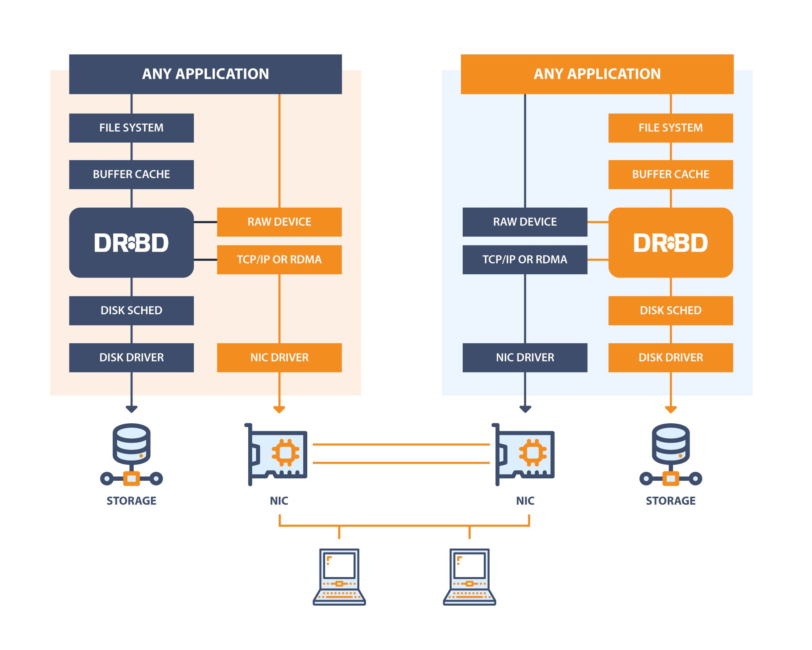

LINSTOR是一个用于Linux系统上存储的配置管理系统。它管理节点集群上的LVM逻辑卷和/或ZFS ZVOLs。它利用DRBD在不同节点之间进行复制，并为用户和应用程序提供块存储设备。它通过bcache管理SSD中HDD备份数据的快照、加密和缓存。


一览表

| 主机名 | 外IP           | 内IP             |
| ------ | -------------- | ---------------- |
| drdb01 | 172.16.0.41/24 | 192.168.10.41/24 |
| drdb02 | 172.16.0.42/24 | 192.168.10.42/24 |
|        |                |                  |

## 安装

```bash
# echo -e "172.16.0.41 drdb01\n172.16.0.42 drdb02" >>/etc/hosts
```

```bash
[root@drdb01 ~]# yum install drbd kmod-drbd lvm2 -y
[root@drdb01 ~]# drbdadm --version
```

https://www.zxblinux.com/archives/602

DRBD附带了一组管理工具，这些工具与内核模块通信，以便配置和管理DRBD资源。

**drbdadm**   

DRBD-utils程序套件的高级管理工具。从配置文件`/etc/DRBD.conf`获取所有DRBD配置参数，并充当
drbdsetup 和 drbdmeta 的前端。drbdadm 有一个用 -d 选项调用的 dry-run 模式，它显示哪些 drbdsetup
和 drbdmeta 调用 drbdadm ，而不实际调用这些命令

**drbdsetup**

配置加载到内核中的DRBD模块。drbdsetup 的所有参数都必须在命令行上传递。drbdadm 和 drbdsetup
之间的分离带来了最大程度上的灵活性。在绝大多数情况下，大多数用户几乎不需要直接使用 drbdsetup

**drbdmeta**

允许创建、转储、还原和修改DRBD元数据结构。与drbdsetup一样，大多数用户很少直接使用drbdmeta

## 资源

在DRBD中，资源 是指特定复制数据集的所有方面的集合术语

资源名称：资源命名

卷：任何资源都是一个复制组，由共享同一复制流的多个 卷 之一组成。DRBD确保了资源中所有卷的写保真度。
卷的编号以 0 开头，一个资源中最多可以有65535个卷。卷包含复制的数据集和一组供DRBD内部使用的元数据。

在 drbdadm 级别，可以通过资源名称和卷号将资源中的卷寻址为 resource/volume。

连接 是共享复制数据集的两台主机之间的通信链路。在DRBD 9中，每个资源可以在多个主机上定义；在当
前版本中，这需要在这些主机之间建立一个完整的网状连接（即，每个主机都为该资源彼此连接）

在 drbdadm 级别，连接由资源和连接名（后者默认为对等主机名）寻址，如 resource:connection

### 资源角色

在DRBD中，每个resource都有一个角色，该角色可以是 Primary 或 Secondary。

这些角色被DRBD的创造者特意命名为"Active"和"Passive"。Primary 与 secondary 是指与 存储 的可用性相关的概念，而 active 与passive 是指 应用程序 的可用性。在高可用性环境中，通常情况下 primary 节点也是
active 节点，但这并不是必需的。

处于 primary 角色的DRBD设备可以不受限制地用于读写操作。它可用于创建和装载文件系统、原始或直接I/O到块设备等。

处于 secondary 角色的DRBD设备接收来自对等节点设备的所有更新，但在其他情况下完全不允许访问。它不能被应用程序使用，也不能用于读写访问。甚至不允许对设备进行只读访问的原因是必须保持缓存一致性，如果以任何方式访问辅助资源，这是不可能的。

资源的角色可以通过manual intervention，调用集群管理应用程序的一些自动算法，或者automatically来更改。将资源角色从次要角色更改为主要角色称为 promotion (升级)，而反向操作称为demotion (降级)。

## DRBD特征

### 单一主(Single-primary)模式

在单一主模式下，资源在任何给定的时间仅在一个群集成员上处于主角色。由于可以保证在任何时候只有一个集群节点操作数据，因此这种模式可以用于任何传统的文件系统（ext3、ext4、XFS等）。
    在单一主模式下部署DRBD是高可用性（支持故障转移）集群的规范方法。

### 双主(Dual-primary)模式

在双主模式下，资源在任何给定时间都处于两个群集节点上的主角色。由于可以并发访问数据，因此此模式需要依赖使用分布式锁管理器的共享群集文件系统。在双主模式下部署DRBD是负载均衡集群的首选方法，这种集群需要从两个节点并发访问数据，例如需要实时迁移的虚拟化环境。此模式在默认情况下是禁用的，并且必须在DRBD的配置文件中显式启用。

这种架构图就是，这里使用keepalived实现高可用。还可以使用pcs

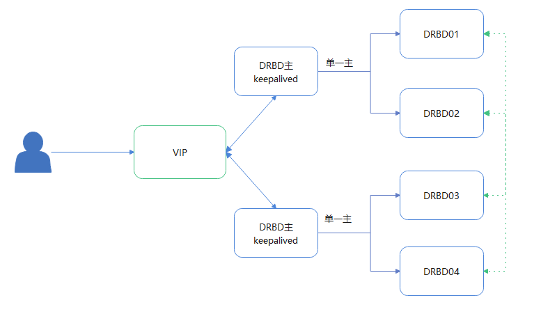

*此图不对*


### 复制(Replication)模式

DRBD支持三种不同的复制模式，允许三种程度的复制同步性。

Protocol A **异步复制协议**。一旦本地磁盘写入完成，并且复制数据包已放置在本地TCP发送缓冲区中，则认为主节点上的本地写入操作已完成。在强制故障转移的情况下，可能会发生数据丢失。备用节点上的数据在故障转移后是一致的；但是，在崩溃之前执行的最新更新可能会丢失。Protocol A最常用于远程复制场景。当与DRBDProxy结合使用时，它是一个有效的灾难恢复解决方案。

Protocol B 内存同步（半同步）复制协议**。一旦本地磁盘写入发生，并且复制数据包已到达对等节点，则认为主节点上的本地写入操作已完成。通常，在强制故障转移的情况下不会丢失任何写操作。但是，如果同时在主备节点同时 发生了电源故障，则主节点的数据存储可能会丢失最新完成的写入操作。

Protocol C **同步复制协议。**只有在确认本地和远程磁盘写入之后，主节点上的本地写入操作才被视为完成。因此，单个
节点的丢失不会导致任何数据丢失。数据丢失当然是不可避免的，即使采用这个复制协议，如果所有节点
（例如:它们的存储子系统）同时遭到不可逆转的破坏, 数据也可能丢失。

DRBD设置中最常用的复制协议是同步复制协议

复制协议的选择影响部署的两个因素： 保护 和 延迟 。相比之下， 吞吐量 在很大程度上独立于所选的复制协
议。

### 不只双向冗余(2-way redundancy)

使用DRBD 9，可以将数据同时存储在两个以上的集群节点上。可以支持多达16个节点

### 自动提升资源

在DRBD9之前，可以使用drbdadm primary命令提升资源。在DRBD9下，当启用auto promote选项时，DRBD将自动将资源提升为主角色，并装入或打开其中一个卷进行写入。一旦卸载或关闭所有卷，资源的角色就变回次要角色。只有在群集状态允许时（即，如果显示 drbdadm primary 命令成功），自动提升才会成功。否则，安装或打开设备将失败。

### 多种复制传输

DRBD支持多种网络传输。到目前为止，有两种传输实现可用：TCP和RDMA。每个传输都由对应的内核模块来实现。

#### TCP传输

drbd_transport_tcp.ko 传输实现包含在drbd本身的分发文件中。顾名思义，这个传输实现使用TCP/IP协议
在机器之间移动数据。DRBD的复制和同步框架套接字层支持多个低级传输：IPv4上的TCP（默认），IPv6上的TCP

*<u>SDP</u>*

SDP是BSD风格的套接字的实现，用于支持RDMA的传输，如InfiniBand。SDP是大多数发行版OFED堆栈的一部分，但现在 被视为已弃用 。SDP使用IPv4风格的寻址方案。SDP通过InfiniBand互连使用，为DRBD提供了一个高吞吐量、低延迟的复制网络。

<u>SuperSockets</u>

SuperSockets用一个单一的、单片的、高效的、支持RDMA的套接字实现来替换堆栈的TCP/IP部分。DRBD
可以使用这种套接字类型进行非常低延迟的复制。SuperSockets必须运行在特定的硬件上，而这些硬件目前
只能从一家供应商Dolphin Interconnect Solutions获得。

#### RDMA传输

LINBIT提供 drbd_transport_rdma.ko 内核模块。此传输使用verbs/RDMA API在InfiniBand HCAs、支持iWARP的NICs或支持RoCE的NICs上移动数据。与BSD sockets API（由TCP/IP使用）相比，verbs/rdmaapi允许在很少的CPU参与下移动数据。

### 高效同步

同步不同于设备复制。当对主角色中的资源的任何写入事件发生复制时，同步与传入的写操作是分
离的。否则，它会影响到设备整体。

**可变速率同步**：DRBD检测同步网络上的可用带宽，将其与传入的前台应用程序I/O进行比较，并基于全自动控制回路选择适当的同步速率。

**固定速率同步**
$$
t=D/R
$$
t 是预期的同步时间。D 是要同步的数据量，这两者很难人为干预（这是复制链接断开时应用程序修改的数据量）。R 是可配置的同步速率，受限于复制网络和I/O子系统的吞吐量限制。

**基于校验和的同步**:

### 已挂起的复制

如果配置正确，DRBD可以检测复制网络是否拥塞，在这种情况下可以暂停复制。在这种模式下，主节点会"超前"于次节点 即 暂时不同步，但仍在次节点上保留一致的副本。当有更多带宽可用时，复制将自动恢复并进行后台同步。挂起复制通常在具有可变带宽的链接上启用，例如在数据中心或云实例之间的共享连接上启用广域复制。

### 在线设备验证

efficient 是指的是网络带宽的有效使用，以及验证不会以任何方式破坏冗余的事实。在线验证仍然是一个资源密集型操作，对CPU利用率和平均负载有显著影响.

### 复制流量完整性检查

DRBD可以选择使用加密消息摘要算法（如MD5、SHA-1或CRC-32C）执行端到端消息完整性检查。

### 裂脑通知和自动恢复

manually resolve处理脑裂

**放弃较新主节点上的修改。** 在这种模式下，当重新建立网络连接并发现裂脑时，DRBD在_最后_切换到主模式的节点上，会放弃在该节点上的更改。

**放弃较旧主节点上的修改。** 在这种模式下，DRBD会放弃先前切换到 主模式的节点上所做的修改。

**放弃改动小的主节点上的修改**。 在这种模式下， DRBD将检查两个节点中的哪个节点记录了较少的修改，然后将丢弃在该主机上进行的所有修改。

**如果任一节点没有中间变化，则可以从裂脑中恢复**。 在这种模式下， 如果其中一个主机在裂脑期间根本没有进行任何修改，则DRBD会简单地恢复正常并宣布裂脑已解决。 请注意，这是一个不太可能发生的情况。即使两个主机都仅将文件系统安装在DRBD块设备上（甚至是只读的）， 设备的内容通常也会被修改（例如，通过文件系统日志重播），从而排除了自动恢复的可能性。

### 支持磁盘刷新

当本地块设备（如硬盘驱动器或RAID逻辑磁盘）启用了写缓存时，对这些设备的写入在到达易失性缓存后即被视为完成。控制器制造商通常将此称为回写模式，反之则为直写模式。如果控制器在回写模式下断电，则最后一次写入永远不会提交到磁盘，可能会导致数据丢失。

**三路叠加复制**在DRBD版本9.x中**不推荐**使用，因为更多节点可以在单个级别上实现。


# 配置DRBD

环境准备

- 硬盘分区（或完整的物理硬盘驱动器）
- 一个软件RAID设备
- LVM逻辑卷或由Linux device-mapper配置出的任何其他块设备
- 在系统上找到的任何其他块设备类型（ceph、glcusterfs等）

网络：直连或者千兆交换机

**配置资源**

```bash
/etc/DRBD.conf
include "/etc/drbd.d/global_common.conf";
include "/etc/drbd.d/*.res";
```

> /etc/drbd.d/global_common.conf 包含drbd配置的global和common部分，而 .res 文件包含每
> 个resource部分。

也可以使用 drbd.conf 作为一个单一配置文件，而不使用任何 include 语句。然而，这样的配置很快就会变
得杂乱无章，难以管理，这就是为什么多文件方法是首选的方法。

DRBD 源码压缩包解压后， 在 scripts 子目录中包含一个示例配置文件。二进制安装包将直接在 /etc ，或在
/usr/share/doc/packages/drbd 等由安装包定义出的文档目录中安装此示例配置。

示例配置：

```BASH
[root@drdb01 ~]# cat /usr/share/doc/drbd-utils-9.17.0/drbd.conf.example 
```

## 最小化配置文件

最简单的DRBD配置/etc/DRBD.d/global_common.conf

```BASH
global {
  usage-count yes;
}
common {
  net {
    protocol C;
  }
}

[root@drdb01 ~]# grep -Ev "#|^$" /etc/drbd.d/global_common.conf 
global {
	usage-count yes;
}
common {
	handlers {
	}
	startup {
	}
	options {
	}
	disk {
	}
	net {
	}
}

```

简单的DRBD资源配置 /etc/drbd.d/rc0.res 

```bash
resource r0 {  #资源名称r0
 on node01 {          #节点1
   device /dev/drbd1;  #设备
   disk /dev/sda7;   #使用磁盘
   address 172.16.0.41:7789;  #使用TCP协议 7789端口
   meta-disk internal;  #内部元数据
  }
 on node02 {          #节点2
   device /dev/drbd1;
   disk /dev/sda7;
   address 172.16.0.42:7789;
   meta-disk internal;
  }
}
```

多卷DRBD资源配置 /etc/drbd.d/rc0.res 

```bash
resource r0 {
  volume 0 {
    device /dev/drbd1;
    disk /dev/sda7;
    meta-disk internal;
  }
  volume 1 {
    device /dev/drbd2;
    disk /dev/sda8;
    meta-disk internal;
  }
  on alice {
    address 10.1.1.31:7789;
  }
  on bob {
    address 10.1.1.32:7789;
  }
}
```

> global 部分
>    此部分在配置中只允许使用一次。它通常位于 /etc/drbd.d/global_common.conf 文件中。在单个文件配置中，它应该位于配置文件的最顶端。在本节提供的少数选项中，只有一个与大多数用户相关：

**usage-count**
   DRBD项目保存关于各种DRBD版本使用情况的统计信息。这是通过每次在系统上安装新的DRBD版本时联系官方HTTP服务器来完成的。这可以通过设置 **usage count no**； 禁用。默认值是 **usage count ask**； ，每次升级DRBD时都会提示您。

**common** 

common部分不是必须的，但如果您使用多个资源，则强烈建议您这样做。否则，重复使用的选项会使配置很快变得复杂。common 部分中包含了 net {protocol C; } ”，因此每个配置的资源（包括 r0 ）都继承此选项，除非它显式配置了另一个 protocol 选项。 这里设置的是复制模式为C

**resource**

每个资源配置文件通常命名为 /etc/drbd.d/resource.res 您定义的任何DRBD资源都必须通过在配置中指定
资源名称来命名。每个资源配置还必须至少有两个 on host 子字节，每个群集节点一个。所有其他配置设置要么继承自
common 部分（如果存在），要么派生自DRBD的默认设置。

可以在 resource 部分直接指定在所有主机上具有相同值的选项。

```bash
resource r0 {
  device /dev/drbd1;
  disk /dev/sda7;
  meta-disk internal;
  on alice {
    address 10.1.1.31:7789;
    }
  on bob {
    address 10.1.1.32:7789;
    }
}
```

这里把相同的放置到resource内，减少了在主机里面的重复。

### **定义网络**

目前，DRBD9中的通信链路必须建立一个完整的网格，即在每个资源中，每个节点都必须与每个其他节点（当然，不包括自身）有直接连接。对于两台主机的简单情况， drbdadm 将自行插入（单个）网络连接，以便于使用和向后兼容。

其净效果是主机上网络连接的二次方数量。对于"传统"的两个节点，需要一个连接；对于三个主机，有三个节点对；对于四个主机, 有六个节点对；对于五个主机，有十个连接，依此类推。对于（当前的）最多16个节点，将有120个主机对需要连接。
$$
C=N(N-1)/2
$$
n个主机的连接数

```BASH
3台节点的配置文件
resource r0 {
  device /dev/drbd1;
  disk /dev/sda7;
  meta-disk internal;
  on alice {      #1
    address 10.1.1.31:7000;
    node-id 0;
    }
  on bob {     #2
    address 10.1.1.32:7000;
    node-id 1;
    }
  on charlie {     #3
    address 10.1.1.33:7000;
    node-id 2;
    }
  connection-mesh {
    hosts alice bob charlie;   #三节点主机名
  }
}
```

如果服务器中有足够的网卡，则可以在服务器对之间创建直接交叉链接。一个四端口以太网卡允许有一个单
一的管理接口，并连接3个其他服务器，以获得4个群集节点的完整网格。

在这种情况下，可以指定其他节点的IP地址以使用直接链接：

```bash
resource r0 {
...
  connection {
    host alice address 10.1.2.1:7010;
    host bob address 10.1.2.2:7001;
  }
  connection {
    host alice address 10.1.3.1:7020;
    host charlie address 10.1.3.2:7002;
   }
  connection {
    host bob address 10.1.4.1:7021;
    host charlie address 10.1.4.2:7012;
  }
}
```

为了便于维护和调试，建议为每个端点使用不同的端口 - 查看 tcpdump 跟踪数据包的结果，从而很容易地将其关联起来。

四个节点示例

```BASH
resource r0 {
  device /dev/drbd0;
  disk /dev/vg/r0;
  meta-disk internal;
  on store1 {
    address 10.1.10.1:7100;
    node-id 1;
  }
  on store2 {
    address 10.1.10.2:7100;
    node-id 2;
  }
  on store3 {
    address 10.1.10.3:7100;
    node-id 3;
  }
  on store4 {
    address 10.1.10.4:7100;
    node-id 4;
  }
  connection-mesh {
    hosts store1 store2 store3 store4;
  }
}
```

查看 connection mesh 配置的扩展，请尝试 drbdadm dump <resource> -v 。

### 配置传输实现

#### TCP/IP协议

```BASH
resource <resource> {
  net {
    transport "tcp";
  }
...
}
```

tcp 是默认传输协议。即：每个缺少配置传输选项的连接默认使用 tcp 传输。
   tcp 传输可以使用以下网络选项进行配置： sndbuf size 、rcvbuf size 、connect int 、 sock check timeo、ping timeo 、timeout 。

#### RDMA

```bash
resource <resource> {
  net {
    transport "rdma";
  }
...
}
```

rdma 传输可以使用以下网络选项配置：sndbuf size 、rcvbuf size 、max_buffers 、connect int 、sock check timeo 、ping timeo 、timeout 。
   rdma 传输是零拷贝接收传输。这意味着max_buffers配置选项必须设置为足以容纳所有rcvbuf size的值。

> rcvbuf size 以字节为单位配置
>
> max_buffers 以页为单位配置。
>
> 为了获得最佳性能，max_buffers 应该足够大，可以容纳所有 rcvbuf size 和在任何时间点可能传输到后端设备的数据量。
>
> 如果您将InfiniBand HCAs与 rdma 传输一起使用，则还需要配置IPoIB。IP地址不用于数据传输，但用于在建立连接时找到正确的适配器和端口。
>    只有在建立连接时才考虑配置选项 sndbuf size 、rcvbuf size 。即: 如果你在连接已建立时更改它们。它们将在重新建立连接时生效。

RDMA的性能考虑

> 通过查看pseudo文件 /sys/kernel/debug/drbd/<resource>/connections/<peer>/transport ，可以监视可用接收描述符（rx_desc）和传输描述符（tx_desc）的计数。如果某个描述符类型耗尽，则应增加 sndbuf size ”或 rcvbuf size 。

### 首次启用资源

创建设备元数据(此步骤只能在初始设备创建时完成)

```bash
# drbdadm create-md <resource>
```

元数据中分配的位图插槽(bitmap slots)数量取决于此资源的主机数量；默认情况下，资源配置中的主机将被计算在内。如果在创建元数据 之前 指定了所有主机，这将 "正常工作"；以后可以为更多节点添加位图插槽(bitmap slots)，但需要一些手动操作。

**启用资源**

将资源与其备份设备（如果是多卷资源，则为多个设备）关联，设置复制参数，并将资源连接到其对等方：

```bash
# drbdadm up <resource>
```

运行 drbdadm status 观察状态变化drbdsetup 的状态输出现在应该包含类似于以下内容的信息

```bash
# drbdadm status
# drbdadm status r0
```

**///** 此时磁盘状态应该是 Inconsistent/Inconsistent 。

> > > DRBD已经成功地分配了磁盘和网络资源，并准备就绪。然而它还不知道应该使用哪个节点作为初始设备同步的源

### 初始设备同步

要使DRBD完全运行，还需要两个步骤

**选择初始同步源**：如果处理的是新初始化的空磁盘，则此选择完全是任意的。但是，如果您的某个节点已经有需要保留的有价值的数据，则选择该节点作为同步源至关重要。如果在错误的方向上执行初始设备同步，则会丢失该数据。这点要非常小心。

**启动初始化全量同步**：只能在想要成为主的节点上执行，只能在初始资源配置上执行，并且只能在您选择作为同步源的节点上执行。

```BASH
[root@drdb01 ~]# drbdadm primary --force r0
```

发出此命令后，将启动初始化全量同步。您将能够通过 drbdadm status 监视其进度。根据设备的大小，可
能需要一些时间。

```bash
[root@drdb01 ~]# drbdadm status
r0 role:Primary
  disk:UpToDate
  peer role:Secondary
    replication:SyncSource peer-disk:Inconsistent done:1.62

[root@drdb02 ~]# drbdadm status
r0 role:Secondary
  disk:Inconsistent
  peer role:Primary
    replication:SyncTarget peer-disk:UpToDate done:2.04

```

### 跳过初始重新同步

如果你要从头开始启动DRBD资源，你可以 使用下面的命令序列来跳过最初的重新同步 

```BASH
# drbdadm create-md <res>
# drbdadm up <res>
```

命令drbdadm status现在应该显示所有磁盘都是不一致的。然后，在一个节点上执行以下命令。

```BASH
# drbdadm new-current-uuid --clear-bitmap <resource>/<volume>
或
# drbdsetup new-current-uuid --clear-bitmap <minor>
```

运行drbdadm status现在显示磁盘为UpToDate（即使支持的设备可能是不同步的) 你现在可以在磁盘上创建一个文件系统并开始使用它。

> 有数据的DRBD不能使用，数据会丢。


##  实战

```bash
[root@drdb01 ~]# fdisk /dev/sdb
Welcome to fdisk (util-linux 2.23.2).

Changes will remain in memory only, until you decide to write them.
Be careful before using the write command.

Device does not contain a recognized partition table
Building a new DOS disklabel with disk identifier 0xd4c1eece.

Command (m for help): p

Disk /dev/sdb: 32.2 GB, 32212254720 bytes, 62914560 sectors
Units = sectors of 1 * 512 = 512 bytes
Sector size (logical/physical): 512 bytes / 512 bytes
I/O size (minimum/optimal): 512 bytes / 512 bytes
Disk label type: dos
Disk identifier: 0xd4c1eece

   Device Boot      Start         End      Blocks   Id  System

Command (m for help): n
Partition type:
   p   primary (0 primary, 0 extended, 4 free)
   e   extended
Select (default p): p
Partition number (1-4, default 1): 
First sector (2048-62914559, default 2048): 
Using default value 2048
Last sector, +sectors or +size{K,M,G} (2048-62914559, default 62914559): 
Using default value 62914559
Partition 1 of type Linux and of size 30 GiB is set

Command (m for help): p

Disk /dev/sdb: 32.2 GB, 32212254720 bytes, 62914560 sectors
Units = sectors of 1 * 512 = 512 bytes
Sector size (logical/physical): 512 bytes / 512 bytes
I/O size (minimum/optimal): 512 bytes / 512 bytes
Disk label type: dos
Disk identifier: 0xd4c1eece

   Device Boot      Start         End      Blocks   Id  System
/dev/sdb1            2048    62914559    31456256   83  Linux

Command (m for help): w
The partition table has been altered!

Calling ioctl() to re-read partition table.
Syncing disks.

```

```BASH
[root@drdb01 ~]# vim /etc/drbd.d/global_common.conf
global {
  usage-count yes;
}
common {
  net {
    protocol C;
  }
}      

[root@drdb01 ~]# vim /etc/drbd.d/rc0.res 
resource r0 {

  device /dev/drbd01;
  disk /dev/sdb1;
  meta-disk internal;

  on drdb01{
     address 172.16.0.41:7780;
   }
  on drdb02{
     address 172.16.0.42:7780;
  }
}    
```

```bash
[root@drdb01 ~]# drbdadm create-md r0  #创建设备元数据
initializing activity log
initializing bitmap (960 KB) to all zero
Writing meta data...
New drbd meta data block successfully created.
success

[root@drdb01 ~]# drbdadm up r0   #启用资源
[root@drdb01 ~]# drbdadm status
r0 role:Secondary
  disk:Inconsistent
  peer connection:Connecting

[root@drdb01 ~]# drbdadm status r0
r0 role:Secondary
  disk:Inconsistent
  peer connection:Connecting

[root@drdb01 ~]# scp /etc/drbd.d/{global_common.conf,rc0.res} drdb02:/etc/drbd.d/


[root@drdb02 ~]# fdisk /dev/sdb
[root@drdb02 ~]# drbdadm create-md r0
[root@drdb02 ~]# drbdadm up r0 
[root@drdb02 ~]# drbdadm status
r0 role:Secondary
  disk:Inconsistent
  peer role:Secondary
    replication:Established peer-disk:Inconsistent

```

此时磁盘状态应该是 Inconsistent

```bash
 drbdadm primary --force r0
```

```bash
[root@drdb01 ~]# mkfs.xfs /dev/drbd1
meta-data=/dev/drbd1             isize=512    agcount=4, agsize=1965954 blks
         =                       sectsz=512   attr=2, projid32bit=1
         =                       crc=1        finobt=0, sparse=0
data     =                       bsize=4096   blocks=7863815, imaxpct=25
         =                       sunit=0      swidth=0 blks
naming   =version 2              bsize=4096   ascii-ci=0 ftype=1
log      =internal log           bsize=4096   blocks=3839, version=2
         =                       sectsz=512   sunit=0 blks, lazy-count=1
realtime =none                   extsz=4096   blocks=0, rtextents=0
[root@drdb01 ~]# mount /dev/drbd1 /mnt
[root@drdb01 ~]# df -h /mnt/
Filesystem      Size  Used Avail Use% Mounted on
/dev/drbd1       30G   33M   30G   1% /mnt
[root@drdb01 ~]# vim  for.sh
#!/bin/bash
for((i==1;i<=1000;i++))
do
  mkdir -p /mnt/file1
  echo "$i" >/mnt/file1/$i.txt
  sleep 1                                                                                                           
done
~   

[root@drdb02 ~]# mkfs.xfs /dev/drbd1 
mkfs.xfs: cannot open /dev/drbd1: Read-only file system
[root@drdb02 ~]#  drbdadm status
r0 role:Secondary
  disk:UpToDate
  peer role:Primary
    replication:Established peer-disk:UpToDate
    
[root@drdb01 ~]# ls /mnt/file1/ |wc -l
1000

```

这里小测试了一下，主DRBD宕机了，备机也没有接替。看样子这里还是有很多问题

1.怎么切换到备机接管？

2.数据完整性如何保障？

3.可否设置主备都可以读取数据？

4.如果单点提供服务性能远远不能满足现实需求。


#### 使用基于卡车的复制

为了向远程节点预先设定数据，然后保持同步，并跳过初始的全量设备同步，请执行以下步骤。

本地节点在主角色中有一个已配置好的但断开连接的DRBD资源。也就是说，设备配置是已经就绪的，两个节点上都存在相同的 drbd.conf 副本，并且您已经在本地节点上发出了用于initial resource promotion的命令但远程节点尚未连接。

```bash
# drbdadm new-current-uuid --clear-bitmap <resource>/<volume>
或
# drbdsetup new-current-uuid --clear-bitmap <minor>
```

创建资源数据及其元数据的一致的、逐字的复本。您可以这样做，例如，从RAID-1镜像中删除热插拔驱动器。当然，您可以用新的驱动器替换它，并重建RAID集，以确保持续的冗余。但删除的驱动器是逐字复制的，现在可以运离现场。如果本地块设备支持快照副本（例如在LVM上使用DRBD），也可以使用 dd 创建该快照的逐位副本。

```bash
# drbdadm new-current-uuid <resource>
```

或者匹配的 drbdsetup 命令

注意，在第二次调用中没有 --clear bitmap 选项

将副本物理传输到远程对等位置。
   将副本添加到远程节点。这可能再次是插入物理磁盘的问题，或者将已传送数据的按位副本移植到远程节点上的现有存储上。请确保不仅还原或复制了复制的数据副本，而且还原或复制了与之关联的DRBD元数据。如果不这样做，磁盘传送过程就没有意义。
   在新节点上，我们需要修复元数据中的节点ID，并为这两个节点交换对等节点信息。

作为将资源 r0 卷 0 上的节点id从2更改为1的示例

必须在卷未使用时执行此操作

```BASH
V=r0/0
NODE_FROM=2
NODE_TO=1
drbdadm -- --force dump-md $V > /tmp/md_orig.txt
sed -e "s/node-id $NODE_FROM/node-id $NODE_TO/" \
-e "s/^peer.$NODE_FROM. /peer-NEW /" \
-e "s/^peer.$NODE_TO. /peer[$NODE_FROM] /" \
-e "s/^peer-NEW /peer[$NODE_TO] /" \
< /tmp/md_orig.txt > /tmp/md.txt
drbdmeta --force $(drbdadm sh-minor $V) v09 $(drbdadm sh-ll-dev $V) internal restore-md /tmp/md.txt
```

8.9.7之前的 drbdmeta 无法处理无序的 peer 部分；您需要通过编辑器手动更换配置部分。

```BASH
# drbdadm up <resource>
```

两个节点连接后，它们将不会启动完整的设备同步。相反，现在开始的自动同步只覆盖自调用 drbdadm --
clear bitmap new-current-uuid 命令后更改的块。

即使此后 没有 任何更改，由于在新的副节点上有Activity Log中提到的因回滚导致的区域覆盖问题，仍可能
有一个短暂的同步周期。这可以通过使用checksum-based synchronization来降低影响。

无论资源是常规DRBD资源还是堆栈资源，步骤都是相同的。对于堆叠资源，只需将 -S 或 --stacked 选项添
加到 drbdadm 。

如果四个节点有足够的接口，可以通过直接链接提供完整的网格。注意：[即，三个交叉点和至少一个传出/管理接口]，可以指定接口的IP地址：

```BASH
resource r0 {
...
  # store1 has crossover links like 10.99.1x.y
  connection {
    host store1 address 10.99.12.1 port 7012;
    host store2 address 10.99.12.2 port 7021;
  }
  connection {
    host store1 address 10.99.13.1 port 7013;
    host store3 address 10.99.13.3 port 7031;
  }
  connection {
    host store1 address 10.99.14.1 port 7014;
    host store4 address 10.99.14.4 port 7041;
  }
  # store2 has crossover links like 10.99.2x.y
  connection {
    host store2 address 10.99.23.2 port 7023;
    host store3 address 10.99.23.3 port 7032;
  }
  connection {
    host store2 address 10.99.24.2 port 7024;
    host store4 address 10.99.24.4 port 7042;
  }
  # store3 has crossover links like 10.99.3x.y
  connection {
    host store3 address 10.99.34.3 port 7034;
    host store4 address 10.99.34.4 port 7043;
  }
}
```

请注意用于IP地址和端口的编号方案。另一个资源可以使用相同的IP地址，但端口需要命名为 71xy 和下一个
端口 72xy , 等等。

### 检查DRBD状态

```BASH
[root@drdb01 ~]# drbdmon #使用drbdmon检索状态
```

https://githhttps://github.com/linbit/drbdtop/releases/tag/v0.2.2ub.com/linbit/drbdtop/releases/tag/v0.2.2

通过drbdtop检索状态并与DRBD交互

/proc/drbd中的状态信息

```bash
[root@drdb01 ~]# cat /proc/drbd  #弃用
version: 8.4.11 (api:1/proto:86-101)
srcversion: 21D46E5751F3882054D14CB 

 1: cs:Connected ro:Secondary/Secondary ds:UpToDate/UpToDate C r-----
    ns:38940 nr:0 dw:0 dr:38940 al:0 bm:0 lo:0 pe:0 ua:0 ap:0 ep:1 wo:f oos:0
```

获取更多信息。

```BASH
[root@drdb01 ~]# drbdsetup status --verbose --statistics
r0 role:Primary suspended:no
    write-ordering:flush
  volume:0 minor:1 disk:UpToDate
      size:31455260 read:2088 written:0 al-writes:0 bm-writes:0 upper-pending:0
      lower-pending:0 al-suspended:no blocked:no
  peer connection:Connected role:Secondary congested:no
    volume:0 replication:Established peer-disk:UpToDate
        resync-suspended:no
        received:0 sent:0 out-of-sync:0 pending:0 unacked:0

```

监控实时动态（故障排除必会）

```bash
drbdsetup events2  #持续相当于tail -f

[root@drdb01 ~]# drbdsetup events2 --now r0  #仅显示当前

[root@drdb01 ~]# drbdsetup events2 --statistics --now r0 #将生成一些性能计数器和其他指标

```

连接状态

```BASH
[root@drdb01 ~]# drbdadm cstate r0  #观察资源连接状态
Connected
```

#### **资源连接状态：**

|   StandAlone   | 没有可用的网络配置。资源尚未连接，或者已被管理性断开（使用 drbdadm disconnect ），或者由于身份验证失败或脑裂而断开其连接。 |
| :------------: | ------------------------------------------------------------ |
| Disconnecting  | 断开连接期间的临时状态。下一个状态是 StandAlone。            |
|  Unconnected   | 临时状态，在尝试连接之前。可能的下一个状态： Connecting      |
|    Timeout     | 与对等方通信超时后的临时状态。下一个状态：Unconnected        |
|   BrokenPipe   | 与对等方的连接丢失后的临时状态。下一个状态： Unconnected     |
| NetworkFailure | 与伙伴的连接丢失后的临时状态。下一个状态： Unconnected。     |
| ProtocolError  | 与伙伴的连接丢失后的临时状态。下一个状态：Unconnected        |
|    TearDown    | 临时状态。对等方正在关闭连接。下一个状态： Unconnected       |
|   Connecting   | 此节点正在等待，直到对等节点在网络上变为可见                 |
|   Connected    | 已建立DRBD连接，数据镜像现在处于活动状态。这是正常状态。     |

#### **复制状态:**

| Off           | 由于连接未连接，因此卷未通过此连接进行复制。                 |
| ------------- | ------------------------------------------------------------ |
| Established   | 对该卷的所有写入都将在线复制。这是正常状态。                 |
| StartingSyncS | 由管理员启动的完全同步正在启动。下一个可能的状态是： SyncSource 或 PausedSyncS 。 |
| StartingSyncT | 由管理员启动的完全同步正在启动。下一个状态：WFSyncUUID       |
| WFBitMapS     | 部分同步刚刚开始。下一个可能的状态：SyncSource_或_PausedSyncS。 |
| WFBitMapT     | 部分同步刚刚开始。下一个可能的状态：WFSyncUUID。             |
| WFSyncUUID    | 同步即将开始。下一个可能的状态：SyncTarget_或_PausedSyncT。  |
| SyncSource    | 同步当前正在运行，本地节点是同步源。                         |
| SyncTarget    | 同步当前正在运行，本地节点是同步的目标。                     |
| PausedSyncS   | 本地节点是正在进行的同步的源，但同步当前已暂停。这可能是由于依赖于另一个同步进程的完成，或者是由于同步已被 drbdadm pause sync 手动中断。 |
| PausedSyncT   | 本地节点是正在进行的同步的目标，但同步当前已暂停。这可能是由于依赖于另一个同步进程的完成，或者是由于同步已被 drbdadm pause sync 手动中断。 |
| VerifyS       | 联机设备验证当前正在运行，本地节点是验证源。                 |
| VerifyT       | 联机设备验证当前正在运行，本地节点是验证的目标。             |
| Ahead         | Data replication was suspended, since the link can not cope with the load. This state is enabled by the configuration on-congestion option (see 配置拥塞策略和挂起复制). |
| Behind        | 数据复制被对等方挂起，因为链接无法处理负载。此状态由对等节点上的配置 on-congestion 选项启用 |

#### **资源角色**

```BASH
[root@drdb01 ~]# drbdadm role r0
Primary/Secondary
```

| Primary   | 资源当前处于主角色中，可以读取和写入。此角色仅在两个节点中的一个节点上发生，除非启用了dual primary mode。 |
| --------- | ------------------------------------------------------------ |
| Secondary | 资源当前处于辅助角色中。它通常从其对等方接收更新（除非在断开连接模式下运行），但既不能读取也不能写入。此角色可能出现在一个或两个节点上。 |
| Unknown   | 资源的角色当前未知。本地资源角色从未具有此状态。它仅为对等方的资源角色显示，并且仅在断开连接模式下显示。 |

#### **磁盘状态**

```BASH
[root@drdb01 ~]# drbdadm dstate r0
UpToDate/UpToDate
```

| Diskless     | 没有为DRBD驱动程序分配本地块设备。这可能意味着资源从未连接到其备份设备，它已使用 drbdadm  detach 手动分离，或者在发生较低级别的I/O错误后自动分离。 |
| ------------ | ------------------------------------------------------------ |
| Attaching    | 读取元数据时的临时状态。                                     |
| Detaching    | 在分离并等待正在进行的IOs完成时的临时状态。                  |
| Failed       | 本地块设备报告I/O失败后的瞬态。下一个状态：Diskless。        |
| Negotiating  | 在 已经Connected 的DRBD设备上执行附加操作时的瞬态。          |
| Inconsistent | 数据不一致。在两个节点上（在初始完全同步之前）创建新资源时立即出现此状态。此外，在同步期间，在一个节点（同步目标）中可以找到此状态。 |
| Outdated     | 资源数据一致，但outdated。                                   |
| DUnknown     | 如果没有可用的网络连接，则此状态用于对等磁盘。               |
| Consistent   | 没有连接的节点的一致数据。建立连接后，决定数据是 UpToDate 还是 Outdated。 |
| UpToDate     | 数据的一致、最新状态。这是正常状态。                         |

#### 连接信息数据

| local     | 显示网络协议栈、用于接受来自对等方的连接的本地地址和端口。 |
| --------- | ---------------------------------------------------------- |
| peer      | 显示网络协议栈、对等方节点地址和用于连接的端口。           |
| congested | 此标志指示数据连接的TCP发送缓冲区是否已填充80%以上。       |

#### 性能指标

```bash
[root@drdb01 ~]# drbdsetup status --verbose --statistics #查看性能指标统计
r0 role:Primary suspended:no
    write-ordering:flush
  volume:0 minor:1 disk:UpToDate
      size:31455260 read:2088 written:0 al-writes:0 bm-writes:0 upper-pending:0
      lower-pending:0 al-suspended:no blocked:no
  peer connection:Connected role:Secondary congested:no
    volume:0 replication:Established peer-disk:UpToDate
        resync-suspended:no
        received:0 sent:0 out-of-sync:0 pending:0 unacked:0
        
[root@drdb01 ~]# drbdsetup events2 --statistics --now #查看事件
exists resource name:r0 role:Primary suspended:no write-ordering:flush
exists connection name:r0 peer-node-id:0 conn-name:peer connection:Connected role:Secondary congested:no
exists device name:r0 volume:0 minor:1 disk:UpToDate size:31455260 read:2088 written:0 al-writes:0 bm-writes:0 upper-pending:0 lower-pending:0 al-suspended:no blocked:no
exists peer-device name:r0 peer-node-id:0 conn-name:peer volume:0 replication:Established peer-disk:UpToDate resync-suspended:no received:0 sent:0 out-of-sync:0 pending:0 unacked:0
exists -

```

**Per volume/device**

| read (disk read)                    | Net data read from local disk; in KiB.                       |
| ----------------------------------- | ------------------------------------------------------------ |
| written (disk written)              | Net data written to local disk; in KiB.                      |
| al-writes (activity log)            | 元数据活动日志区域的更新次数。                               |
| bm-writes (bitmap)                  | 元数据位图区域的更新次数。                                   |
| upper-pending (application pending) | Number of block I/O requests forwarded to DRBD, but not yet answered (completed) by DRBD.转发到DRBD的块I/O请求的数量，但尚未被DRBD响应（完成）。 |
| lower-pending (local count)         | DRBD向本地I/O子系统发出的打开请求数                          |
| blocked                             | 显示本地I/O拥塞                                              |
|                                     | no: No congestion.                                           |
|                                     | 上面的 I/O设备被阻塞，即文件系统。典型的原因是               |
|                                     | - 由管理员暂停I/O                                            |
|                                     | - transient blocks, e.g. during attach/detach 瞬时块，例如在连接/卸载过程中 |
|                                     | - 缓冲区耗尽                                                 |
|                                     | - Waiting for bitmap IO                                      |
|                                     | lower: Backing device is congested. 备份设备拥挤             |
|                                     | upper,lower: Both upper and lower are blocked.  upper,lower: 上层和下层都被封锁了 |

**Per connection**

| ap-in-flight (application in-flight) | 正在被对等体写入的应用数据。也就是说，DRBD已经把它发送给了对等体，并且正在等待它被写入的确认。等待它被写入的确认。以扇区为单位（512字节）。 |
| ------------------------------------ | ------------------------------------------------------------ |
| rs-in-flight (resync in-flight)      | 重新同步对等体正在写入的数据。也就是说，DRBD是同步源，已经把数据作为重新同步的一部分发送给了对等体。重同步的一部分，并正在等待确认它已被写入。以扇区为单位（512字节）。 |

**Per connection and volume ("peer device"):**

| received  收(network receive)   | Net data received from the peer; in KiB.                     |
| ------------------------------- | ------------------------------------------------------------ |
| sent (network send)  发         | Net data sent to the peer; in KiB.                           |
| out-of-sync 不同步              | Amount of data currently out of sync with this peer, according to the bitmap that DRBD has for it; inKiB. |
| pending  待定                   | Number of requests sent to the peer, but that have not yet been acknowledged by the peer. |
| unacked  未授权(unacknowledged) | Number of requests received from the peer, but that have not yet been acknowledged by DRBD on this node. |
| resync-suspended重新同步        | Whether the resynchronization is currently suspended or not. Possible values are no, user, peer, dependency. Comma separated. |

### 启用和禁用资源

通常，所有配置的DRBD资源都会自动启用。由群集资源管理应用程序根据您的群集配置自行决定，在系统启动时通过 /etc/init.d/drbd init脚本。（没有了）

**手动启用资源**

```BASH
[root@drdb01 ~]# drbdadm up r0
[root@drdb01 ~]# drbdadm up all #启动所有资源
```

与往常一样，如果要同时启用在 /etc/drbd.conf 中配置的所有资源，可以使用关键字all而不是特定的资源名。

**禁用**

```BASH
[root@drdb01 ~]# drbdadm down r0
```

**重新配置资源**

DRBD允许您在资源运行时重新配置它们，

- 对 /etc/drbd.conf 中的资源配置需要进行任何必要的更改
- 在两个节点之间同步 /etc/drbd.conf 文件
- 在两个节点上发出 drbdadm adjust<resource> 命令。

```BASH
[root@drdb01 ~]# drbdadm adjust all
```

drbdadm adjust 然后切换到 drbdsetup 对配置进行必要的调整。与往常一样，您可以通过使用 -d（dryrun）选项运行 drbdadm 来查看挂起的 drbdsetup 调用

对 /etc/drbd.conf 中的 common 部分进行更改时，可以通过发出 drbdadm adjust all 来
调整一次运行中所有资源的配置。

### 提升和降级资源

提升

```BASH
# drbdadm primary <resource>
```

降级

```BASH
# drbdadm secondary <resource>
```

配置为允许dual-primary mode的资源可以切换到两个节点上的主要角色；这是虚拟机在线迁移所必需的。

### **基本手动故障切换**

如果不使用Pacemaker并希望在被动/主动配置中手动处理故障转移

在当前主节点上，停止使用DRBD设备的任何应用程序或服务，卸载DRBD设备，并将资源降级为次要资源。

```BASH
# umount /dev/drbd/by-res/<resource>/<vol-nr>
# drbdadm secondary <resource>
```

现在登录到想提升为primary的节点上，升级资源并装载设备。

```BASH
# drbdadm primary <resource>
# mount /dev/drbd/by-res/<resource>/<vol-nr> <mountpoint>
```

If you’re using the auto-promote feature, you don’t need to change the roles (Primary/Secondary)manually; only stopping of the services and unmounting, respectively mounting, is necessary.

如果你使用auto-promote功能，你不需要手动改变角色（主要/次要），只需要停止服务和取消挂载。手动改变角色（主要/次要）；只需要停止服务和取消挂载，分别挂载即可。

### 升级DRBD

> 将8.4升级到9.0的一般过程如下：
> • 配置新仓库（如果使用来自LINBIT的包）
> • 确保当前情况检查良好
> • Pause任何群集管理器
> • 安装新版本
> • 如果要移动到2个以上的节点，则需要调整较低级别的存储空间，以便为其他元数据提供空间；本主题将在LVM Chapter中讨论。
> • 取消配置资源，卸载DRBD 8.4，然后load the v9 kernel module
> • Convert DRBD meta-data格式为 v09 ，可能在同一步骤中需要更改位图的数量
> • 启动新版本DRBDresources up

更新仓库

https://packages.linbit.com/

```BASH
cd /tmp
wget 'https://my.linbit.com/linbit-manage-node.py'
#on RHEL/CentOS use curl instead 
#curl -O 'https://my.linbit.com/linbit-manage-node.py'
chmod u+x linbit-manage-node.py
./linbit-manage-node.py
```

```bash
yum update | apt update |dnf update
```

### 暂停群集

既然您知道资源是同步的，就从升级辅助节点开始。这可以手动完成，或者如果您正在使用Pacemaker，请将节点置于待机模式。下面将介绍这两个过程。如果你正在运行Pacemaker，不要使用手动方法。

手动方法

```BASH
/etc/init.d/drbd stop
[root@drdb01 ~]# systemctl stop drbd
```

Pacemaker  （集群软件开源使用pcs）

```BASH
crm node standby drbd01
```

--------------

```BASH
[root@drdb01 ~]# drbdadm primary r0  #提升为主 all 也可以
[root@drdb01 ~]# drbdsetup status r0 home #
r0 role:Primary
  disk:UpToDate
  peer role:Secondary
    replication:Established peer-disk:UpToDate
```

升级包

```BASH
yum upgrade | apt upgrade
```

**加载新的内核模块**

```BASH
rmmod drbd
```

如果出现类似 ERROR:Module drbd is in use （错误：模块drbd正在使用）的消息，则并非所有资源都已正
确停止。+ 重试升级DRBD，和/或运行命令 drbdadm down all 以确定哪些资源仍处于活动状态。

可能阻止卸载的问题

• 在DRBD支持的文件系统上有导出NFS的操作（参见 exportfs -v 输出）
   • 文件系统仍在安装-检查 grep drbd/proc/mounts
   • Loopback 设备仍然处于活动状态（ losetup -l ）
   • 直接或间接使用DRBD的device mapper（ dmsetup ls --tree ）
   • 有带DRBD-PV的LVM（pvs）

只是举例子

**迁移配置文件**

```bash
drbdadm dump all   #轻松移植旧配置
```

**更改元数据**

需要将磁盘上的元数据转换为新版本；这非常简单，只需运行一个命令并确认两个问题.应该已经增加了底层设备的大小，以便有足够的空间存储增加的位图；在这种情况下，您将使用附加参数 --max peers=<N> 。当需要确定(可能的)节点个数时，请参考 <<s-drbd-client> 做相应的配置。

```sh
# drbdadm create-md <resource>
drbdadm -v --max-peers=<N> -- --force create-md <resources>
```

**重新启动DRBD**

唯一要做的就是让DRBD设备重新启动并再次运行- 一个简单的命令 drbdadm up all 应该能做到这一
点。现在，根据您是否有集群管理器或手动跟踪资源，又有两种不同的方法。

```BASH
# crm node online bob   #Pacemaker
# systemctl restart drbd
```


### 启用双主模式

双主模式允许资源在多个节点上同时承担主角色。这样做可以是永久性的，也可以是暂时性的。

双主模式要求将资源配置为同步复制（protocol C）。因此，它对延迟敏感，不适合广域网环境。

另外，由于这两种资源都是主要的，节点之间网络的任何中断都会导致脑裂。

在DRBD 9.0.x中，双主模式仅限于2个主节点，通常用于实时迁移。

**永久双主模式**

要启用双主模式，请在资源配置的 net 部分将 ==allow two primaries== 选项设置为 yes ：

```BASH
resource <resource>
  net {
    protocol C;
    allow-two-primaries yes;
    fencing resource-and-stonith;
  }
  handlers {
    fence-peer "...";
    unfence-peer "...";
  }
...
}
```

之后，不要忘记同步节点之间的配置。在两个节点上都运行 drbdadm adjust 。

现在可以使用 drbdadm primary 将两个节点同时更改为role primary。

您应该始终执行适当的围栏策略。使用 allow-two-primaries 而没有围栏策略是个坏主意，比在无围栏使用单主节点更糟糕。

**临时双主模式**

要临时为通常在单个主配置中运行的资源启用双主模式，

```BASH
drbdadm net-options --protocol=C --allow-two-primaries <resource>
```

要结束临时双主模式，请运行与上面相同的命令，但使用 --allow two primaries=no （以及所需的复制协
议，如果适用）。

**使用在线设备验证**

默认情况下，资源的On-line device verification未启用。要启用它，请将以下行添加到/etc/drbd.conf 中的资源配置中：

```BASH
resource <resource>
   net {
     verify-alg <algorithm>;
   }
...
}
```

<algorithm> 可能是系统内核配置中内核加密API支持的任何消息摘要算法。通常，您至少可以从 sha1 ,
md5 和 crc32c 中进行选择。
如果对现有资源进行此更改，请一如既往地将 drbd.conf 同步到对等节点，并在两个节点上运行 drbdadm
adjust <resource> 。

**调用联机验证**

启用联机验证后，可以使用以下命令启动验证运行：

```BASH
drbdadm verify <resource>
```

如果在验证运行期间检测到不同步块，则可以在验证完成后使用以下命令重新同步它们：

```BASH
[root@drdb01 ~]# drbdadm connect r0
[root@drdb01 ~]# drbdadm verify r0
```

**自动在线验证**

大多数用户都希望自动化联机设备验证。这很容易实现。在任一节点上创建一个包含以下内容的文件，名为
/etc/cron.d/drbd-verify :

```bash
42 0 * * 0 root /sbin/drbdadm verify <resource>
```

这将使 cron 在每周日午夜后42分钟调用一个设备验证；因此，假设您在周一上午进入办公室，快速查看资
源的状态将显示结果。如果您的设备很大，而且32小时还不够，那么您将注意到 VerifyS 或 VerifyT 作为连接
状态，这意味着 verify 仍在进行中。

如果您已经为所有资源启用了联机验证（例如，通过在 /etc/drbd.d/global_common.conf 中的 common部分添加 verify-alg <algorithm>，您就可以使用：

```BASH
42 0 * * 0 root /sbin/drbdadm verify all
```

### 配置同步速率

通常，会尝试确保后台同步（这会使同步目标上的数据暂时不一致）尽快完成。但是，还必须防止后台同步
占用前台复制所需的所有带宽，这将对应用程序性能造成损害。因此，您必须配置同步带宽以匹配您的硬件-您可以永久地或动态地这样做。

设置高于辅助节点上最大写入吞吐量的同步速率是没有意义的。您不能期望辅助节点奇迹般地能够比其I/O子系统所允许的写入速度快，因为它恰好是正在进行的设备同步的目标。

同样，出于同样的原因，设置高于复制网络上可用带宽的同步速率是没有意义的。

**估计同步速度**

对于这个值，一个很好的经验法则是使用大约30%的可用复制带宽。因此，如果有一个I/O子系统能够维持400MB/s的写吞吐量，而一个千兆以太网网络能够维持110MB/s的网络吞吐量（网络是瓶颈），您可以如下计算：
$$
110 MB/s*0.3=33MB/s
$$
因此，rate 选项的建议值为 33M 。
相比之下，如果您有一个最大吞吐量为80MB/s的I/O子系统和一个千兆以太网连接（I/O子系统是瓶颈），您将计算：
$$
80 MB/s*0.3=24MB/s
$$
**可变同步速率配置**

当多个DRBD资源共享一个复制/同步网络时，以固定速率同步可能不是最佳方法。因此，在DRBD 8.4.0中，默认情况下启用了可变速率同步。在这种模式下，DRBD使用自动控制环路算法来确定和调整同步速率。该算法保证了前台复制始终有足够的带宽，大大减轻了后台同步对前台I/O的影响。

可变速率同步的最佳配置可能因可用的网络带宽、应用程序I/O模式和链路拥塞而有很大差异。理想的配置设置还取决于DRBD Proxy是否正在使用。为了优化配置这个DRBD特性，最好聘请专业顾问。下面提供了一个配置示例（假设与DRBD代理一起部署）：

```bash
resource <resource> {
  disk {
    c-plan-ahead 5;
    c-max-rate 10M;
    c-fill-target 2M;
  }
}
```

c-fill-target 的一个很好的初始值是 BDP * 2, 其中 BDP 是复制链接上的带宽延迟产品。

例如，当使用1GBit/s交叉连接时，您将得到大约200微秒的延迟.1GBit/s意味着大约120MB/s；乘以200*10^-6^秒得到24000字节。把这个值四舍五入到下一个MB，你就得到了值。

> 200\*10^6^=200000000  200000000/1024/8=24414Bit  24414/1024=29.8MB

另一个例子：一个100兆位的广域网连接，200毫秒的延迟意味着12兆字节/秒乘以0.2秒，或者说大约2.5兆
字节 "on the wire""在线"。在这里， c-fill-target 的初始值可预设为是3MB

> 200*10^5^=20000000  20000000/1024/8=2441.40625  2441/1024=2.38MB

**永久固定同步速率配置**

在一些非常受限的情况，使用一些固定的同步速率可能是有意义的。在这种情况下，首先需要使用 c-plan-ahead 0； 关闭动态同步速率控制器。

然后，资源用于后台重新同步的最大带宽由资源的 resync-rate 选项确定。这必须包含在 /etc/drbd.conf 的资源定义的 disk 条目中:

```bash
resource <resource>
  disk {
    resync-rate 40M;
    ...
  }
...
}
```

速率设置以字节为单位，而不是以比特/秒为单位；默认单位是字节，因此值 4096 将被解释为4MiB 。

这只是定义了DRBD试图达到的速率。如果存在吞吐量较低的瓶颈（网络、存储速度），则无法达到定义的速度（也称为"期望"性能；）。

**配置基于校验和的同步**

Checksum-based synchronization默认情况下不为资源启用。要启用它，请将以下行添加到/etc/drbd.conf 中的资源配置中

```BASH
resource <resource>
  net {
    csums-alg <algorithm>;
  }
  ...
}
```

<algorithm> 可能是系统内核配置中内核加密API支持的任何消息摘要算法。通常，您至少可以从 sha1 ,md5 和 crc32c 中进行选择。

如果对现有资源进行此更改，请一如既往地将 drbd.conf 同步到对等节点，并在两个节点上运行 drbdadm adjust <resource>

### 配置拥塞策略和挂起复制

在复制带宽高度可变的环境中（这在广域网复制设置中是典型的），复制链路有时可能会变得拥挤。在默认配置中，这将导致主节点上的I/O阻塞，这有时是不可取的。

相反，在这种情况下，您可以将DRBD配置为挂起正在进行的复制，从而使主数据集位于次数据集的 前拉pull ahead 位置。在这种模式下，DRBD保持复制通道打开 - 它从不切换到断开连接的模式 - 但直到有足够的带宽再次可用时才真正进行复制。

以下示例适用于DRBD代理配置

```BASH
resource <resource> {
  net {
    on-congestion pull-ahead;
    congestion-fill 2G;
    congestion-extents 2000;
  ...
  }
  ...
}
```

通常明智的做法是将 congestion-fill 和 congestion-extents 与 pull-ahead 选项一起设置。
congestion-fill 的理想值是90%
• 当通过DRBD proxy进行复制时，分配的DRBD proxy缓冲存储器，或
• 在非DRBD代理设置中的TCP网络发送缓冲区。
congestion-extents 的理想值是受影响资源配置的 al-extents 的90%。

### 配置I/O错误处理策略

DRBD的strategy for handling lower-level I/O errors由 /etc/drbd.conf 文件中resource下的 disk 配置中的on-io-error 选项确定:

```BASH
resource <resource> {
  disk {
    on-io-error <strategy>;
    ...
  }
  ...
}
```

当然，如果要为所有资源定义全局I/O错误处理策略，也可以在 common 部分中设置此值。

<strategy> 可能是以下选项之一：

| detach              | 这是默认和推荐的选项。在发生较低级别的I/O错误时，节点将丢弃其备份设备，并继续以无盘模式运行。 |
| ------------------- | ------------------------------------------------------------ |
| pass-on             | 这导致DRBD向上层报告I/O错误。在主节点上，它将报告给已装入的文件系统。在次节点上，它被忽略（因为次节点没有要报告的上层） |
| call-local-io-error | 调用定义为本地I/O错误处理程序的命令。这要求在资源的 handlers 部分中定义相应的 local-io-error 命令调用。完全由管理员自行决定使用 local-io-error 调用的命令（或脚本）来实现I/O错误处理。 |
|                     |                                                              |

您可以按照此过程重新配置正在运行的资源的I/O错误处理策略：

• 在 /etc/drbd.d/<resource>.res 中编辑资源配置。
   • 将配置复制到对等节点。
   • 在两个节点上都运行 drbdadm adjust 命令。

### 配置复制通信完整性检查

Replication traffic integrity checking默认情况下不为资源启用。要启用它，请将以下行添加到/etc/drbd.conf 中的资源配置中：

```BASH
resource <resource>
  net {
    data-integrity-alg <algorithm>;
  }
  ...
}
```

<algorithm> 可能是系统内核配置中内核加密API支持的任何消息摘要算法。通常，您至少可以从 sha1 ,md5 和 crc32c 中进行选择。
如果对现有资源进行此更改，请一如既往地将 drbd.conf 同步到对等节点，并在两个节点上运行 drbdadm adjust <resource> 。

**此功能不用于生产用途。仅当需要诊断数据损坏问题并希望查看传输路径（网络硬件、驱动程序、交换机）是否有故障时才启用！**

### 调整资源大小

当增长（扩展）DRBD卷时，你需要从下往上增长。你需要扩展所有节点上的备份块设备。然后你可以告诉DRBD使用新的空间。

一旦DRBD卷被扩展，你仍然需要将其传播到任何使用DRBD的地方。扩展文件系统，或者让运行该卷的虚拟机知道新的 "磁盘大小"。

```BASH
# # on all nodes, resize the backing LV:
# lvextend -L +${additional_gb}g VG/LV
# # on one node:
# drbdadm resize ${resource_name}/${volume_number}
# # on the Primary only:
# # resize the file system using the file system specific tool, see below
```

请注意，不同的文件系统有不同的能力和不同的管理工具集。例如，XFS只能增长。你把它的工具指向活动挂载点：xfs_growfs/where/you/have/it/mounted

而EXT系列既可以增长（甚至在线），也可以收缩（只有离线；你必须先卸载它）要调整ext3或ext4的大小，你不要把工具指向挂载点，而是指向（已挂载的块设备：resize2fs /dev/drbd

显然，使用正确的DRBD（如mount或df -T所显示的，在挂载时），而不是备份的块设备。只要DRBD启动了，就不应该工作（resize2fs: 设备或资源繁忙，试图打开/dev/mapper/VG-LV，找不到有效的文件系统超级块）。) 如果你试图在离线情况下（DRBD停止）这样做，你可能会破坏DRBD的元数据，如果你直接对备份LV运行文件系统工具，你可能会破坏DRBD的元数据。所以不要这样做。

你只能在Primary上对活动的DRBD设备做一次文件系统的调整。DRBD复制对文件系统结构的改变。这就是它的作用。另外，不要在XFS卷上使用resize2fs，或者在EXT上使用XFS工具，或者......而是使用正确的文件系统工具。系统使用的工具。

resize2fs。在试图打开/dev/drbd7时，超级块中出现了坏的魔法数字，这可能只是想告诉你这不是一个 EXT 文件系统，你应该试试其他工具。也许是xfs_growfs？但如前所述，它不接受块设备，而是把挂载点作为参数。

当缩小（减少）DRBD卷时，你需要从上到下缩小。所以首先要确保没有人在使用你想削减的空间。接下来，缩减文件系统（如果你的文件系统支持缩减）。) 然后告诉DRBD停止使用该空间，这对DRBD内部的元数据来说不是那么容易。因为它们被设计在备份设备的 "末端"。

### 在线扩容

1. 受影响资源的备份设备必须由逻辑卷管理子系统（如LVM）管理。
2. 资源当前必须处于连接状态。

在所有节点上增加了备份块设备后，请确保只有一个节点处于主状态。然后在一个节点上输入：

```BASH
# drbdadm resize <resource>
```

这将触发新增部分的同步。同步是以从主节点到辅助节点的顺序完成的.如果要添加的空间是干净的，可以使用—assume clean选项跳过同步新增的空间。

```BASH
# drbdadm -- --assume-clean resize <resource>
```

### 离线扩容

当两个节点上的备份块设备在DRBD处于非活动状态时增长，并且DRBD资源正在使用external meta data，则自动识别新大小。不需要人为干预。下次在两个节点上激活DRBD并成功建立网络连接后，DRBD设备将具有新的大小。

然而，如果DRBD资源被配置为使用internal meta data，则在新的扩容空间可用之前，必须将该元数据移动到所生长设备的末端。为此，请完成以下步骤：

取消配置您的DRBD资源：

```BASH
# drbdadm down <resource>
```

在调整大小之前，请将元数据保存在文本文件中：

```BASH
# drbdadm dump-md <resource> > /tmp/metadata
```

必须在两个节点上执行此操作，对每个节点使用单独的转储文件。不要在一个节点上转储元数据，只需将转储文件复制到对等节点。这. 行. 不. 通.

- 在两个节点上扩展备份块设备。
- 在两个节点上相应地调整文件 /tmp/metadata 中的大小信息（ la-size-sect ）。请记住，必须在扇区中指定 la-size-sect。
- 重新初始化元数据区域：

```BASH
# drbdadm create-md <resource>
```

在两个节点上重新导入更正的元数据：

```BASH
# drbdmeta_cmd=$(drbdadm -d dump-md <resource>)
# ${drbdmeta_cmd/dump-md/restore-md} /tmp/metadata
Valid meta-data in place, overwrite? [need to type 'yes' to confirm]
yes
Successfully restored meta data
```

重新启用DRBD资源：

```BASH
# drbdadm up <resource>
```

在一个节点上，升级DRBD资源：

```BASH
drbdadm primary <resource>
```

最后，扩展文件系统，使其填充DRBD设备的扩展大小。

### 在线缩容

要在线缩小DRBD，请先缩小位于其上的文件系统, 之后 , 输入以下命令：

```BASH
# drbdadm resize --size=<new-size> <resource>
```

您可以使用常用的单位来表示 <new-size> （K、M、G等）。收缩DRBD后，还可以收缩其包含的块设备（如果它支持收缩）

在调整底层设备的大小后，最好输入 drbdadm resize <resource> 命令，以便将DRBD元数据*真正*写入卷末尾的预期空间

### 离线缩容

取消配置您的DRBD资源

```BASH
# drbdadm down <resource>
```

在缩容之前将元数据保存在文本文件中

```BASH
# drbdadm dump-md <resource> > /tmp/metadata
```

必须在两个节点上执行此操作，对每个节点使用单独的转储文件。 不要 在一个节点上转储元数据，只需将转储文件复制到对等节点。这. 行. 不. 通.

缩容两个节点上的备份块设备

在两个节点上相应地调整文件 /tmp/metadata 中的大小信息（ la-size-sect ）。请记住，必须在扇区中指定 la-size-sect。

仅当您使用内部元数据时 (此时可能由于收缩过程而丢失），才需要重新初始化元数据区域

```BASH
# drbdadm create-md <resource>
```

在两个节点上重新导入更正的元数据

```BASH
# drbdmeta_cmd=$(drbdadm -d dump-md <resource>)
# ${drbdmeta_cmd/dump-md/restore-md} /tmp/metadata
Valid meta-data in place, overwrite? [need to type 'yes' to confirm]
yes
Successfully restored meta data
```

重新启用DRBD资源：

```BASH
# drbdadm up <resource>
```

### 禁用备份设备刷新

要禁用复制数据集的磁盘刷新，请在配置中包含以下行：

```BASH
resource <resource>
  disk {
    disk-flushes no;
  ...
  }
  ...
}
```

要禁用DRBD元数据上的磁盘刷新，请包括以下行：

```BASH
resource <resource>
  disk {
    md-flushes no;
  ...
  }
  ...
}
```

在修改了资源配置（当然，在节点之间同步了 /etc/drbd.conf ）之后，可以通过在两个节点上输入以下命令来启用这些设置：

```BASH
# drbdadm adjust <resource>
```

如果只有一个服务有BBWC，应将设置移动到主机部分，如下所示：

```BASH
resource <resource> {
  disk {
    ... common settings ...
  }
  on host-1 {
  disk {
    md-flushes no;
  }
  ...
 }
 ...
}
```

### 配置裂脑行为

DRBD调用 split brain 处理程序（如果已配置），随时检测到split brain。要配置此处理程序，请将以下项添加到资源配置中：

```BASH
resource <resource>
  handlers {
    split-brain <handler>;
  ...
  }
  ...
}
```

<handler> 可以是系统中存在的任何可执行文件。

DRBD发行版包含一个split brain handler脚本，安装为 /usr/lib/DRBD/notify-split-brain.sh 。它会将通知电子邮件发送到指定的地址。要将处理程序配置为将消息发送到root@localhost （预期是将通知转发给实际系统管理员的电子邮件地址），请按如下所示配置 split-brain handler :

```BASH
resource <resource>
  handlers {
    split-brain "/usr/lib/drbd/notify-split-brain.sh root";
    ...
  }
  ...
}
```

对正在运行的资源进行此修改（并在节点之间同步配置文件）后，无需进行其他干预即可启用处理程
序。DRBD只需在下一次出现split brain时调用新配置的处理程序。

### 自动裂脑恢复策略

配置DRBD来自动解决因大脑分裂（或其他情况）导致的数据分歧情况，就是配置潜在的自动数据损失。分脑（或其他）的情况，就是在配置潜在的自动数据丢失。了解其影响，如果你不是故意的，就不要这样做。

==应该花更多时间研究围栏策略、仲裁设置、群集管理器集成和冗余群集管理器通信链接，以便在第一时间*避免*数据差异。==

为了能够启用和配置DRBD的自动裂脑恢复策略，您必须了解DRBD为此提供了几个配置选项。DRBD根据检测到裂脑时主要角色的节点数应用其裂脑恢复程序。为此，DRBD检查以下关键字，这些关键字都可以在资源的 net 配置部分找到：

==after-sb-0pri==：裂脑被检测到，但此时资源在任何主机上都不是主要角色。对于这个选项，DRBD理解以下关键字

- disconnect ：不要自动恢复，只需调用 split brain 处理程序脚本（如果已配置），断开连接并以断开模式继续。

- discard-younger-primary ：放弃并回滚对最后担任主服务器角色的主机所做的修改。

- discard-least-changes：丢弃并回滚发生较少更改的主机上的更改
- discard-zero-changes：如果有任何主机根本没有发生任何更改，只需在另一个主机上应用所做的所有修改并继续

==after-sb-1pri==：裂脑被检测到，此时资源在一个主机上扮演主要角色。对于这个选项，DRBD理解以下关键字：

• disconnect：与 after-sb-0pri 一样，只需调用 split brain 处理程序脚本（如果已配置），断开连接并以断开模式继续。
   • consensus：应用 after-sb-0pri 中指定的相同恢复策略。如果在应用这些策略后可以选择裂脑受害者，则自动解决。否则，行为就像指定了 disconnect 一样。
   • call-pri-lost-after-sb：应用 after-sb-0pri 中指定的恢复策略。如果在应用这些策略后可以选择裂脑受害者，请调用受害者节点上的 pri-lost-after-sb 处理程序。必须在 handlers 部分中配置此处理程序，并要求将节点从集群中强制删除。
   • discard-secondary：无论哪个主机当前处于第二个角色，使该主机成为裂脑受害者。

==after-sb-2pri==裂脑被检测到，此时资源在两个主机上都处于主要角色。此选项接受与 after-sb-1pri 相同的关键字，但discard-secondary 和 consensus 除外。

在双主模式下用作GFS或OCFS2文件系统的块设备的资源的恢复策略定义如下

```BASH
resource <resource> {
  handlers {
    split-brain "/usr/lib/drbd/notify-split-brain.sh root"
  ...
  }
  net {
    after-sb-0pri discard-zero-changes;
    after-sb-1pri discard-secondary;
    after-sb-2pri disconnect;
    ...
  }
  ...
}
```

### 创建堆叠的三节点设置

注意事项：堆叠的设备是活动的。假设您已经配置了一个DRBD设备 /dev/drbd0 ，并且上面的堆叠设备是/dev/drbd10 ，那么/dev/drbd10 将是您装载和使用的设备。

设备元数据将存储两次，分别存储在底层DRBD设备和堆叠的DRBD设备上。在堆叠设备上，必须始终使用internal meta data。这意味着，与未堆叠的设备相比，堆叠设备上的有效可用存储区域稍微小一些。

要使堆叠的上层设备运行，底层设备必须处于primary角色。

要同步备份节点，活动节点上的堆叠设备必须处于启动状态并且处于主要角色。

**配置堆叠资源**

在下面的示例中，节点名为 alice 、bob 和 charlie ，其中 alice 和 bob 组成一个两节点集群， charlie 是备份节点。

```BASH
resource r0 {
  protocol C;
  device /dev/drbd0;
  disk /dev/sda6;
  meta-disk internal;
  on alice {
    address 10.0.0.1:7788;
  }
  on bob {
    address 10.0.0.2:7788;
  }
}

resource r0-U {
  protocol A;
  stacked-on-top-of r0 {
    device /dev/drbd10;
    address 192.168.42.1:7789;
  }
  on charlie {
    device /dev/drbd10;
    disk /dev/hda6;
    address 192.168.42.2:7789; # Public IP of the backup node
    meta-disk internal;
  }
}
```

与任何 drbd.conf 配置文件一样，它必须分布在集群中的所有节点上 - 在本例中是三个节点。请注意，在未备份的资源配置中未找到以下额外关键字：

==stacked-on-top-of==此选项通知DRBD包含它的资源是堆叠资源。它替换了通常在任何资源配置中找到的 on 部分之一。不要在较低级别的资源中使用 stacked-on-top-of 。

对于堆叠资源，不需要使用Protocol A。您可以根据您的应用程序选择任何DRBD的复制协议。

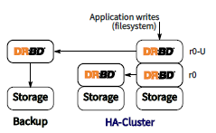

#### 启用堆叠资源

要启用堆叠资源，请先启用底层级别的资源后, 并将其提升

```BASH
drbdadm up r0
drbdadm primary r0
```

与未堆叠的资源一样，必须在堆叠的资源上创建DRBD元数据。使用以下命令完成此操作：

```bash
# drbdadm create-md --stacked r0-U
```

然后，可以启用堆叠资源：

```bash
# drbdadm up --stacked r0-U
# drbdadm primary --stacked r0-U
```

之后，您可以在备份节点上调出资源，启用三节点复制：

```bash
# drbdadm create-md r0-U
# drbdadm up r0-U
```

为了自动化堆叠资源管理，可以在群集管理器配置中集成堆叠资源。

### 永久无盘节点

在DRBD中，节点可能是永久无盘的。下面是一个配置示例，显示一个具有3个diskful节点（服务器）和一个永久无磁盘节点（客户端）的资源。

```bash
resource kvm-mail {
  device /dev/drbd6;
  disk /dev/vg/kvm-mail;
  meta-disk internal;
  on store1 {
    address 10.1.10.1:7006;
    node-id 0;
  }
  on store2 {
    address 10.1.10.2:7006;
    node-id 1;
  }
  on store3 {
    address 10.1.10.3:7006;
    node-id 2;
  }
  on for-later-rebalancing {
    address 10.1.10.4:7006;
    node-id 3;
  }
# DRBD "client"
  floating 10.1.11.6:8006 {
    disk none;
    node-id 4;
  }
# rest omitted for brevity
...
}
```

对于永久无盘节点，不分配位图插槽。对于此类节点，无盘状态显示为绿色，因为它不是错误或意外状态。

### 数据再平衡

考虑到（示例）策略，即数据需要在3个节点上可用，您的设置至少需要3个服务器。
   现在，随着存储需求的增长，您将需要更多的服务器。不必同时购买3台以上的服务器，您可以在一个额外的节点上重新平衡数据。

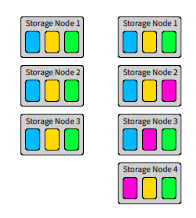

在上图中，您可以看到 before 和 after 状态：从3个节点（每个节点有3个25TiB卷）（净容量 75TiB）到4个节点（净容量 100TiB）。

要在集群中重新分配数据，必须选择一个 新 的节点，以及一个要删除此DRBD资源的节点。+ 请注意，从当前 活动 节点（即DRBD中 主节点 ）中删除资源将涉及迁移服务或作为DRBD client在此节点上运行此资源；更容易选择处于 次要角色 的节点。（当然，这并不总是可能的。）

### 准备位图插槽

您需要在每个具有要移动的资源的节点上有一个空闲的bitmap slot供临时使用。
   您可以使用drbdadm create-md time再分配一个，或者只需在您的配置中放置一个占位符，这样 drbdadm看到后就会再保留一个插槽：

```bash
resource r0 {
  ...
  on for-later-rebalancing {
    address 10.254.254.254:65533;
    node-id 3;
  }
}
```

1. 转储元数据,
2. 扩大元数据空间,
3. 编辑转储文件,
4. 加载更改后的元数据。

在未来的版本中，drbdadm 将为您提供一个快捷方式；很可能您可以通过使用 drbdadm resize—peers N ，并让内核为您重写元数据。

### 准备和激活新节点

首先，您必须在新节点上创建基础存储卷（使用例如 lvcreate ）。然后，可以用正确的主机名、地址和存储路径填充配置中的占位符。现在将资源配置复制到所有相关节点。

```bash
# drbdadm create-md <resource>
```

#### **开始初始同步**

现在新节点需要获取数据。通过定义现有节点上的网络连接来完成操作

```bash
# drbdadm adjust <resource>
```

然后启动新节点上的DRBD设备

```bash
# drbdadm up <resource>
```

#### 检查连接

现在运行

```bash
# drbdadm status <resource>
```

只要新主机是 UpToDate 的，配置中的其他节点之一就可以重命名为 for-later-rebalancing ，并保留以进行另一次迁移。

### 清理

```bash
# drbdadm down <resource>
```

## 配置仲裁

为了避免复制品的裂脑或数据分散，必须配置围栏。所有的围栏策略最终都依赖于冗余通信。这可能是一个管理网络的形式，它将节点连接到对等机的IPMI网络接口。在crm-fence-peer脚本的情况下，DRBD的网络链路断开时，Pacemakers通信必须保持可用。

通过将 quorum 资源选项设置为 majority 、all 或某个数值，可以启用DRBD中的仲裁实现。其中 majority就是上一段中描述的行为。

### 保证最小冗余

默认情况下，具有磁盘的每个节点都可以在仲裁选举中获得投票权。换句话说，只有无盘节点不计算在内。因此，具有两个 不一致磁盘 的分区将获得仲裁，而具有一个 UpToDate 分区的节点将在3节点群集中具有仲裁。通过配置 quorum minimum redundancy ，可以更改此行为，以便使得只有 UpToDate 节点在quorum选举中有投票权。该选项采用与 quorum 选项相同的参数。

使用此选项，表示您更希望等到最终必要的重新同步操作完成后再启动任何服务。因此，在某种程度上，您希望数据的最小冗余比服务的可用性得到保证。金融数据和服务就是一个浮现在脑海中的例子。

考虑以下5节点集群的示例。它要求一个分区至少有3个节点，其中两个必须是 UpToDate：

```bash
resource quorum-demo {
  options {
    quorum majority;
    quorum-minimum-redundancy 2;
    ...
  }
}
```

### 丧失仲裁后的动作

当运行服务的节点失去仲裁时，它需要立即停止对数据集的写操作。这意味着IO会立即开始完成所有有错误的IO请求。通常这意味着不可能正常关闭，因为这需要对数据集进行更多修改。IO错误从块级别传播到文件系统，从文件系统传播到用户空间应用程序。

理想情况下，应用程序会在IO错误时终止。这允许Pacemaker卸载文件系统并将DRBD资源降级为次要角色。如果是这样，则应将 on-no-quorum 资源选项设置为 io-error 。下面是一个例子：

```bash
resource quorum-demo {
  options {
    quorum majority;
    on-no-quorum io-error;
    ...
  }
}
```

如果应用程序未在第一个IO错误时终止，则可以选择冻结IO并重新启动节点。

```BASH
resource quorum-demo {
  options {
    quorum majority;
    on-no-quorum suspend-io;
    ...
  }
  handlers {
    quorum-lost "echo b > /proc/sysrq-trigger";
  }
  ...
}
```

### 使用无盘节点作为分层断路器

在仲裁协商过程中，可以使用连接到群集中所有节点的无盘节点来断开连接。

考虑以下两个节点群集，其中节点A是主节点，节点B是次节点：

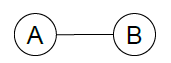

一旦两个节点之间的连接中断，它们就会失去仲裁，并且集群顶部的应用程序无法再写入数据。


现在，如果我们将第三个节点C添加到集群并将其配置为无磁盘节点，我们就可以利用tiebraker机制。

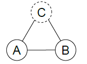

在这种情况下，当主节点和辅助节点失去连接时，它们仍然可以 "看到" 无盘分层断路器。因此，主磁盘可以继续工作，而次磁盘将其磁盘降级为过期磁盘，因此无法在那里迁移服务

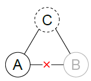

有一些特殊情况，以防两个连接失败。考虑以下场景

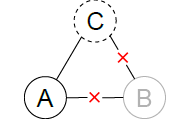

让我们考虑一下主断路器断开连接的可能性：

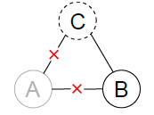

在这种情况下，主服务器将变得不可用，并进入 "quorum suspended" 状态。这有效地导致应用程序在DRBD之上接收I/O错误。然后，集群管理器可以将节点B提升为主节点，并使服务在那里运行。

如果无盘分层断路器 "切换侧"，则需要避免数据发散。考虑这个场景：

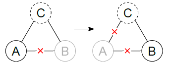

主节点和辅助节点之间的连接失败，应用程序继续在主节点上运行，此时主节点突然失去与无盘节点的连接。

在这种情况下，无法将任何节点升级到主节点，并且群集无法继续运行。

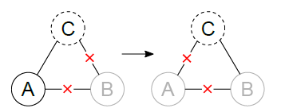

在这里，应用程序在主服务器上运行，而辅助服务器不可用。然后，tiebraker首先断开与主节点的连接，然后重新连接到辅助节点。这里需要注意的是， 失去仲裁的节点无法通过连接到无盘节点 来重新获得仲裁。因此，在这种情况下，没有节点具有仲裁，集群将停止。

**最后站着的人**

需要指出的是，优雅地离开集群的节点与失败节点的计数不同。在此上下文中， 优雅地离开意味着离开节点将其数据标记为过时，并且它能够告诉其余节点其数据已过时。


# 使用DRBD代理

## DRBD代理部署注意事项

DRBD Proxy进程可以直接位于设置drbd的机器上，也可以放置在不同的专用服务器上。一个DRBD代理实例可以作为分布在多个节点上的多个DRBD设备的代理。

DRBD代理对DRBD完全透明。通常，集群运行中有大量的数据包，因此活动日志应该相当大。由于这可能导致主节点崩溃后重新同步运行的时间更长，建议启用DRBD的 csums-alg 设置。

## 安装

DRBD代理需要==商用授权==

https://linbit.com/drbd-proxy/

> 这个代理模式就是异地同步目的是实现数据备份，看下官网图。可以使用nginx 的proxy代替？

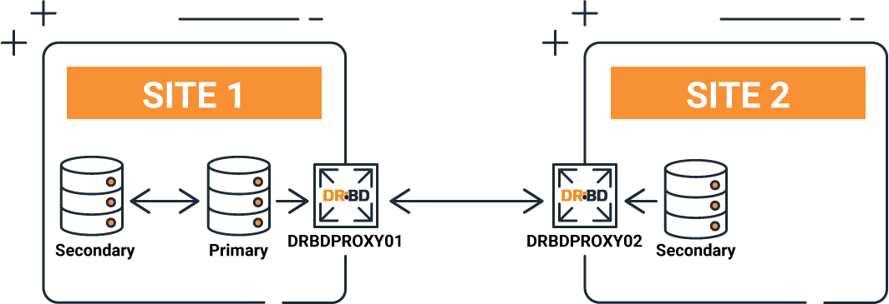

**DRBD**代理可帮助 DRBD 在长距离实时复制中实现 DRBD。DRBD 代理将书写缓冲到内存中，减少带宽、延迟和距离问题，确保您的 WAN 延迟不是瓶颈。

DRBD 代理基本上提供了 2 个优势。数据压缩和缓存操作。灾难恢复解决方案的最大问题是，两个地点之间的连接被切断或质量低。为了克服这些问题，我们推出了 DRBD 代理产品，该产品可以与 DRBD 完全集成。

DRBD 代理在两个位置之间创建一个缓冲区，允许在断开连接时顺利传输数据

它还支持行业内的所有压缩标准，允许您携带大量带宽较少的数据，从而降低成本

参考：直接在DRBD节点上运行的代理的DRBD配置示例

```BASH
resource r0 {
  protocol A;
  device /dev/drbd15;
  disk /dev/VG/r0;
  meta-disk internal;
  proxy {
    memlimit 512M;
      plugin {
        zlib level 9;
        }
      }
  on alice {
    address 127.0.0.1:7915;
      proxy on alice {
        inside 127.0.0.1:7815;
        outside 192.168.23.1:7715;
      }
   }
  on bob {
    address 127.0.0.1:7915;
    proxy on bob {
      inside 127.0.0.1:7815;
      outside 192.168.23.2:7715;
     }
   }
}
```

inside IP地址用于DRBD和DRBD代理之间的通信，而 outside IP地址用于代理之间的通信。后一个通道可能必须在防火墙设置中被允许。

# 故障排除和错误恢复

## 硬盘故障

如何处理硬盘故障取决于DRBD处理磁盘I/O错误的配置方式，以及配置的元数据类型

### 从硬盘手动分离DRBD

如果DRBD是configured to pass on I/O errors（不推荐），则必须首先分离DRBD资源，即，将其与其备份存储解除关联：

```bash
# drbdadm detach <resource>
```

通过运行 drbdadm status 或 drbdadm dstate 命令，您现在可以验证资源是否现在处于 diskless mode:

```bash
# drbdadm status <resource>
# drbdadm dstate <resource>
```

**I/O错误时自动分离**

如果DRBD是==configured to automatically detach upon I/O error==时自动分离（推荐选项），DRBD应该已经自动将资源从其备份存储中分离，而无需手动干预。您仍然可以使用 drbdadm status 命令来验证资源实际上是在无盘模式下运行的。

**使用内部元数据时替换故障磁盘**

如果使用internal meta data，则足以将DRBD设备绑定到新硬盘。如果新硬盘必须用另一个Linux设备名而不是缺陷磁盘寻址，则必须相应地修改DRBD配置文件。

此过程包括创建新的元数据集，然后重新附加资源：

```bash
# drbdadm create-md <resource>
# drbdadm attach <resource>
```

新硬盘的完全同步将立即自动启动。您将能够通过 drbdadm status --verbose 监视同步的进度，就像任何后台同步一样。

**使用外部元数据时替换故障磁盘**

使用external meta data时，程序基本相同。然而，DRBD无法独立地识别硬盘驱动器已被交换，因此需要额外的步骤。

```bash
# drbdadm create-md <resource>
# drbdadm attach <resource>
# drbdadm invalidate <resource>
```

请确保在 *没有* 完好数据的节点上运行 drbdadm invalidate 此命令将导致本地内容被对
等方的数据覆盖，因此在错误的节点上运行此命令可能会丢失数据！

这里，drbdadm invalidate 命令触发同步。同样，可以通过 drbdadm status --verbose 来观察同步进度。

## 处理节点故障

当DRBD检测到其对等节点关闭时（通过真正的硬件故障或手动干预），DRBD将其连接状态从Connected更改为 Connecting ，并等待对等节点重新出现。然后，DRBD资源被称为在disconnected mode 模式下工作。在断开连接模式下，资源及其关联的块设备完全可用，并且可以根据需要升级和降级，但不会将块修改复制到对等节点。相反，DRBD以每个对等点为基础存储断开连接时正在修改的块。

### 处理临时辅助节点故障

如果当前具有次要角色中的资源的节点暂时出现故障（例如，由于随后通过替换RAM纠正的内存问题），则无需进一步干预-除了修复故障节点并使其重新联机的明显必要性之外。当这种情况发生时，两个节点只需在系统启动时重新建立连接。在此之后，DRBD将同时在主节点上所做的所有修改同步到辅助节点。

使用DRBD 9，每个资源可以连接两个以上的节点，因此对于例如4个节点，一个失败的辅助节点仍
然保留两个其他的辅助节点用于故障转移。

### 处理临时主节点故障

从DRBD的角度来看，主节点的故障几乎等同于次节点的故障。幸存节点检测到对等节点的故障，并切换到断开模式。DRBD不会将幸存节点提升为主要角色；集群管理应用程序有责任这样做。

当故障节点被修复并返回集群时，它将以次要角色执行此操作，因此，如前一节所述，不需要进一步的手动干预。同样，DRBD不会重新更改资源角色，这取决于集群管理器是否这样做（如果这样配置的话）。

### **处理永久性节点故障**

如果节点遇到不可恢复的问题或永久性破坏，则必须执行以下步骤：

- 将出现故障的硬件替换为具有类似性能和磁盘容量的硬件。

*不支持将出现故障的节点替换为磁盘容量较小的节点，这将导致DRBD拒绝连接到被替换的节点*

- 安装基本系统和应用程序

- 安装DRBD并从一个幸存的节点复制 /etc/drbd.conf 和所有 /etc/drbd.d/ 文件

- 按照配置DRBD中概述的步骤操作，但不要忘记参考 初始设备同步.

## 手动恢复裂脑

DRBD在连接再次可用且对等节点交换初始DRBD协议握手时检测到split brain。如果DRBD检测到这两个节点（或者在某个点上，在断开连接的情况下）都处于主角色中，它会立即断开复制连接。这是一条类似以下信息的信号，显示在系统日志中：

```bash
Split-Brain detected, dropping connection!
```

检测到裂脑后，一个节点的资源将始终处于 StandAlone 连接状态。另一个节点也可能处于 StandAlone 状态（如果两个节点同时检测到裂脑），或者处于 Connecting（如果对等节点在另一个节点有机会检测到裂脑之前断开了连接）。

此时，除非您将DRBD配置为自动从裂脑恢复，否则必须通过选择一个将放弃其修改的节点（该节点称为split brain victim）进行手动干预。使用以下命令进行干预：

```bash
# drbdadm disconnect <resource>
# drbdadm secondary <resource>
# drbdadm connect --discard-my-data <resource>
```

在另一个节点（split brain survivor）上，如果其连接状态也是 StandAlone 的，则输入：

```bash
# drbdadm disconnect <resource>
# drbdadm connect <resource>
```

如果节点已处于 Connecting 状态，则可以省略此步骤；然后将自动重新连接。
   连接后，裂脑受害者立即将其连接状态更改为 SyncTarget，并由其他节点覆盖其修改。

在重新同步完成后，裂脑被视为已解决，节点再次形成完全一致的冗余复制存储系统


# 支持DRBD的应用程序

## 将DRBD与Pacemaker集成

http://crmsh.github.io/documentation/index.html

https://clusterlabs.org/pacemaker/doc/deprecated/en-US/Pacemaker/1.1/pdf/Clusters_from_Scratch/Pacemaker-1.1-Clusters_from_Scratch-en-US.pdf

https://clusterlabs.org/pacemaker/doc/deprecated/en-US/Pacemaker/1.1/html/Pacemaker_Explained/

在Pacemaker集群中使用DRBD作为后台服务

首先，我们将使用DRBD的 auto-promote 特性，以便DRBD在需要时自动设置自己的 Primary 。这可能适用于您的所有资源，因此设置 common 部分中的默认值是有意义的：

```bash
common {
  options {
    auto-promote yes;
  ...
  }
}
```

```bash
crm configure
crm(live)configure# primitive fs_mysql ocf:heartbeat:Filesystem \
params device="/dev/drbd/by-res/mysql/0" \
directory="/var/lib/mysql" fstype="ext3"
crm(live)configure# primitive ip_mysql ocf:heartbeat:IPaddr2 \
params ip="10.9.42.1" nic="eth0"
crm(live)configure# primitive mysqld lsb:mysqld
crm(live)configure# group mysql fs_mysql ip_mysql mysqld
crm(live)configure# commit
crm(live)configure# exit
bye
```

只要Pacemaker有控制权，它就只允许在集群中安装一个实例

**在Pacemaker集群中使用资源级围栏**

了在DRBD复制链接中断时防止Pacemaker升级DRBD主/从资源所需的步骤。这使得Pacemaker不
会使用过时的数据启动服务，也不会在启动过程中造成不必要的 时间扭曲 。

要为DRBD启用任何资源级围栏，必须在资源配置中添加以下行：

```bash
resource <resource> {
  net {
    fencing resource-only;
  ...
  }
}
```

**使用集群信息库（CIB）的资源级围栏**

要为Pacemaker启用资源级围栏，必须在 drbd.conf 中设置两个选项：

```bash
resource <resource> {
  net {
    fencing resource-only;
    ...
  }
  handlers {
    fence-peer "/usr/lib/drbd/crm-fence-peer.9.sh";
    unfence-peer "/usr/lib/drbd/crm-unfence-peer.9.sh";
    # Note: we used to abuse the after-resync-target handler to do the
    # unfence, but since 2016 have a dedicated unfence-peer handler.
    # Using the after-resync-target handler is wrong in some corner cases.
    ...
   }
...
}
```

如果DRBD复制链接断开连接， crm-fence-peer.9.sh 脚本将联系集群管理器，确定与此DRBD资源关联的Pacemaker主/从资源，并确保主/从资源不再在当前活动的节点以外的任何节点上升级。相反，当重新建立连接并且DRBD完成其同步过程时，则移除该约束，并且集群管理器可以自由地再次提升任何节点上的资源。

## 在Pacemaker集群中使用堆叠的DRBD资源

DRBD版本9.x中不建议使用堆栈，因为可以在单个级别上实现更多节点。

将异地灾难恢复添加到Pacemaker集群

在这个配置场景中，我们将在一个站点中处理一个两节点高可用性集群，外加一个单独的节点，该节点可能位于异地。第三个节点充当灾难恢复节点，是一个独立的服务器。考虑下面的插图来描述这个概念。

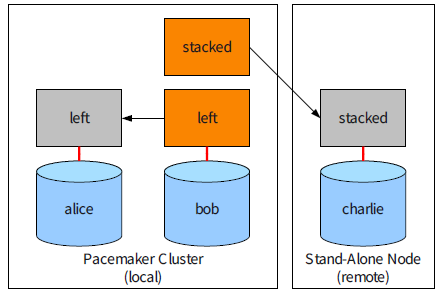

利用堆叠资源实现Pacemaker集群的4路冗余

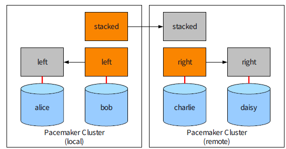

## DRBD与红帽集群的集成

Fencing:最初主要为共享存储集群设计的Red Hat Cluster依靠节点围栏来防止对共享资源的并发、不协调访问。Red Hat集群围栏基础设施依赖于围栏守护进程 fenced，以及作为shell脚本实现的围栏代理。


