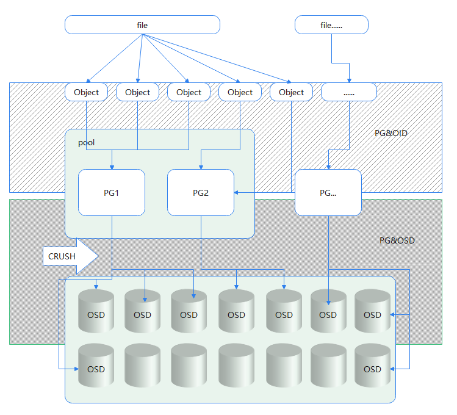
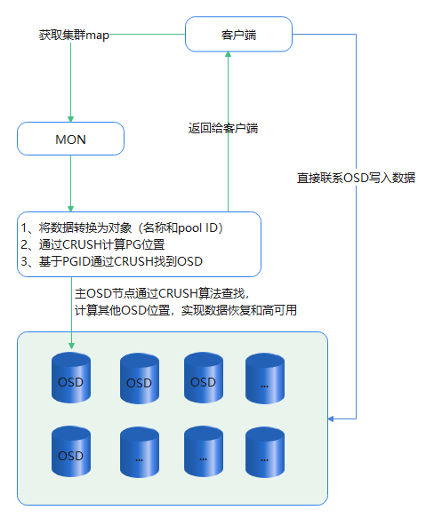
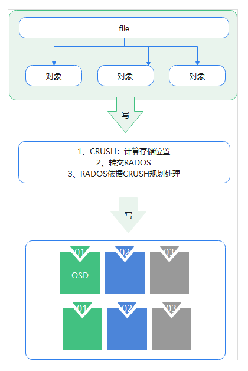
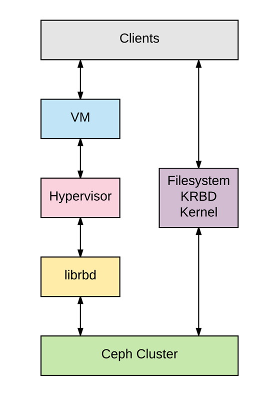

文中出现蹩脚IT词汇是因为翻译软件导致，没有修改的一般都不是那么重要的地方。


# ceph 存储

官网：https://ceph.com/

文档：https://docs.ceph.com/en/latest/

https://documentation.suse.com/zh-cn/ses/7/html/ses-all/book-storage-admin.html

ceph也是一款提供块，文件，对象存储

书：second edition

Mastering Ceph:https://subscription.packtpub.com/book/virtualization-and-cloud/9781789610703/2

ceph cookbook: https://subscription.packtpub.com/book/virtualization-and-cloud/9781788391061/1

Learning Ceph:https://subscription.packtpub.com/book/virtualization-and-cloud/9781787127913/1


服务检查脚本

```bash
vim /server/scripts/check_ceph_services.sh
#!/bin/bash

for i in ceph{01..03}
do
   for s in {mon,mgr,mds}
   do
   echo -e "   ceph-${s}@${i} is :\c:" && ssh $i systemctl status ceph-${s}@${i}|grep Active |awk -F"[()]" '{print $2}'
   done
done        

[root@ceph01 ~]# sh /server/scripts/check_ceph_services.sh 
   ceph-mon@ceph01 is running
   ceph-mgr@ceph01 is running
   ceph-mds@ceph01 is running
   ceph-mon@ceph02 is running
   ceph-mgr@ceph02 is running
   ceph-mds@ceph02 is running
   ceph-mon@ceph03 is running
   ceph-mgr@ceph03 is running
   ceph-mds@ceph03 is running
```


## 概念

### 什么是ceph

==ceph== 是目前sds产品之一，是一个跟glusterfs差不多的开源软件，为块，文件，对象提供统一的软件定义存储解决方案，是一个大规模扩展，高性能且无单点故障的分布式存储系统。高达EB级别   GB   PB  EB

跟GlusterFS一样无中心节点！

在设计方案上需要遵循：

- 每个组件都必须线性缩放
- 不应该有任何单点故障
- 解决方案必须基于软件、开源且适应性强
- Ceph 软件应该在现成的商品硬件上运行
- 每个组件都必须尽可能自我管理和自我修复

raid 和SDS其实还是相辅相成的，很多商业硬件不能直接识别到硬盘的，必须依靠RAID才能识别。如果能不使用RAID那是最好的，但是是不可能的。RAID重建是很复杂的。

RAID 系统最大的限制因素是它只能防止磁盘故障，而不能为网络、服务器硬件、OS ，交换设备的故障或者区域灾害提供保护措施。

#### ceph 架构图


CRUSH 算法不是保存和操纵元数据。CRUSH 是**Controlled Replication Under Scalable Hashing** 的缩写。

CRUSH算法在后台计算数据存储和读取的位置，而不是为每个客户端请求执行元数据表的查找。通过动态计算元数据， Ceph 也就不需要管理一个集中式的元数据表。现代计算机计算速度极快，能够非常快地完成CRUSH 查找。另外，利用分布式存储的功能可以将一个小的计算负载分布到集群中的多个节点。CRUSH 清晰的元数据管理方法比传统存储系统的更好。

CRUSH 还有一个独特的基础设施感知能力。它能了解基础设施中不同组件之间的关系，从最初的系统磁盘、池、节点、机架、电源插板、交换机到现在的数据中心，以及数据中心房间等。这些都是任何基础设施中的故障区域。CRUSH 会以多副本的方式保存数据，以保证在故障区域中有些组件故障的情况下数据依旧可用。用户在Ceph 的CRUSH map 中可以自由地为他们的基础设施定义故障区域。这也就使得Ceph 管理员能够在向己的环境中高效地管理他们的数据。

CRUSH 使得Ceph 能够自我管理和自我疗愈。当故障区域中的组件故障时， CRUSH 能够感知哪个组件故障了，并确定其对集群的影响。无须管理员的任何干预， CRUSH 就会进行向我管理和自我疗愈，为因故障而丢失的据数执行恢复操作。CRUSH 根据集群中维护的其他副本来重新生成丢失的数据。在任何时候， 集群数据都会有多个副本分布在集群中。

》 》 》 CRUSH 算法将数据查询从传统的server转到client完成。

pg的全称是placement group，中文译为放置组，是用于放置object的一个载体

### 理解crush



1、所有数据都会按照指定大小（默认4M）被切割成若干份，及上图的对象object

2、Object定义了自己的OID，PG也有对应的ID，这样objectID和PGID相互应对。OID&PG

3、根据PGID，客户端通过CRUSH算法会得到一个OSD列表，找到符合条件的OSD

4、CRUSH将集群中的数据均衡地分布到OSD节点上，如果设备的差异比较大，那么通过CRUSH来设置不同的权重。

#### CRUSH原理

object 默认4m (数据存放的基本单元)，由唯一对象标识(ID)、对象数据和对象元数据构成。



在ceph中，==object==、PG、OSD是相互映射的关系，将PG理解为object的集合（存放object）,同一个PG内，所有的object都有相同的放置策略。一个object只能属于一个PG，但是一个PG可用包含很多object。一个PG对应于放置在其上的OSD列表，然而OSD上却可分布多个PG。

pool 一个pool包含多个PG；理解为一个存储池，有replicated类型（副本类型）和Erasure code类型（纠错类型），这两种方式是数据在ceph中的冗余方式和分布策略

PG&objectID：OID 和PGID是相互应对关系，

PGID&OSD：通过CRUSH算法来确定集群中由PG到实际数据存储的OSD映射关系。然后通过PGID的计算获得多个OSD集合列表，选主OSD提取数据，其他备用。（OSD有主从之分，只有当主数据无法提供服务，系统才会选择从数据）


------

**ceph monitors**: ceph monitors通过保持一个集群状态的map来跟踪整个集群的健康状况。他们为每个组件维护一个单独的信息map，其中包括OSD地图、MON地图、PG地图（在后面的章节讨论）和CRUSH地图。所有的集群节点都向监控器节点报告，并分享关于它们状态的每一个变化的信息。监控器不存储实际数据；这是OSD的工作。

**OSD：** 一旦应用程序向ceph写入数据，数据就会以对象的形式存储在OSD中。

ceph集群中唯一存储实际用户数据的组件，通常情况下，一个OSD守护程序与你的集群中的一个物理磁盘绑定。因此，在一般情况下，你的Ceph集群中的物理磁盘的总数与在每个物理磁盘上存储用户数据的OSD守护程序的数量相同。

> Ceph OSD 以对象的形式存储所有客户端数据，并在客户端发起数据请求时提供相同的数据。Ceph 集群包含多个OSD 。对于任何读或写操作，客户端首先向momtor 请求集群的map ，然后，它们就可以无须monitor 的干预直接与OSD 进行I/O 操作也正是因为产生数据的客户端能够直接写入存储数据的OSD 而没有任何额外的数据处理层，才使得数据事务处理速度如此之快。与其他存储解决方案相比，这种类型的数据存储和取回机制是Ceph 所独有的。
>
> Ceph 的核心特性(比如可靠性、自平衡、自恢复和 一致性)都始于OSD 。根据配置的副本数， Cepb 通过跨集群节点复制每个对象多次来提供可靠性，同时使其具有高可用性和容错性。OSD 上的每个对象都有一个主副本和几个辅副本，辅副本分散在其他OSD 上由于Ceph 是一个分布式系统并且对象分布在多个OSD 上，因此每一个OSD 对于一些对象而言是主副本.但同时对于其他对象而言就是辅副本存放辅副本的OSD 受主副本OSD 控制;然而，它们也可能又成为主副本OSD 。
>
> 在磁盘发生故障的时候， Ceph 的OSD 守护进程会向动与其他OSD 通信，从而开始执行恢复操作在这期间，存放故障磁盘对象的辅OSD 会被提升为主OSD ，同时，在恢复期间会为对象生成新的辅副本，整个过程对于用户是完全透明的。这保证了Ceph 集群的可靠性和一致性。一个典型的Ceph 集群部署方案会为集群节点上的每个物理磁盘创建一个OSD守护进程，这是推荐的做法。然而， OSD 也支持以更灵活的方式部署OSD 守护进程，比如每个磁盘、每个主机或者每个RAID 卷一个OSD 守护进程。JBOD 环境下的多数Ceph 集群部署会为每一个物理磁盘部署一个OSD 守护进程

**Ceph metadata server (MDS)**：MDS跟踪文件的层次结构，只为CephFS文件系统存储元数据。Ceph块设备和RADOS网关不需要元数据，因此，它们不需要Ceph MDS守护程序。MDS不直接向客户提供数据，从而消除了系统中的单点故障。

**RADOS**(**Reliable Autonomic Distributed Object Store** ):可靠的自主**分布式对象存储**是Ceph存储集群的基础.Ceph中的一切都以对象的形式存储，而RADOS对象存储负责存储这些对象，无论其数据类型如何。RADOS层确保数据始终保持一致。为了做到这一点，它执行数据复制、故障检测和恢复，以及跨集群节点的数据迁移和重新平衡。

> RADOS：提供自我修复特性，为可靠，智能的分布式系统打下坚实的基础。


> Ceph 是一个分布式对象存储系统，通过它的对象网关(object gateway) ，也就是RADOS 网关( radosgw) 提供对象存储接口。RADOS 网关利用librgw (RADOS 网关库)和librados 这些库，允许应用程序跟Ceph 对象存储建立连接.Ceph 通过RESTful API 提供可访问且最稳定的多租户对象存储解决方案之一。

```bash
radoa 1apoo1a #查看rados池
radoa -p metadata 1a #查看池中的对象
rados df #查看集群空间使用情况
```


**librados**:librados库是一个对RADOS访问接口，支持PHP，Ruby，Java，Python，C，和C++编程语言。它为Ceph存储集群（RADOS）提供了一个本地接口，也是其他服务的基础，如RBD、RGW和CephFS，这些服务都是建立在librados之上的。

> 允许应用程序直接访问

**RADOS block devices (RBDs)**: 被称为Ceph**块**设备，提供持久性的块存储，它是 thin-provisioned提供的，可调整大小，并在多个OSD上存储数据条带。RBD服务已经作为一个本地接口建立在librados之上。

> RDB 块呈带状分布在多个Ceph 对象之上，而这些对象本身又分布在整个Ceph 存储集群中，因此能够保证数据的可靠性以及性能~ RBD 已经被Linux 内核支持，换句话说，RBD驱动程序在过去的几年里已经很好地跟Linux 内核集成。几乎所有的Li nux 操作系统发行版都支持RBD 。除了可靠性和性能之外，RBD 也支持其他的企业级特性，例如完整和增量式快照，精简的配置. 写时复制( copy-on-write)式克隆，以及其他特性。RBD 还支持全内存式缓存，这可以大大提高它的性能。
>
> Ceph RBD 支持的最大镜像为16EB 。这些镜像可以作为磁盘映射到物理裸机、虚拟机或者其他主机使用。业界领先的开源hypervisor ，例如KVM 和Xen 完全支恃RBD ，并利用它为自个的客户虚拟机提供RBD 特性。
>
> 

**RADOS gateway interface (RGW)**:用librgw（Rados网关库）和librados，允许应用程序与Ceph对象存储建立连接。RGW提供RESTful API，其接口与Amazon S3和OpenStack Swift兼容。可用对接网盘应用


> RADOS 网关提供REST削接口让用户的应用程序将数据存储到Ceph 集群中。RADOS网关接口满足以下特点。
>         **兼容swift**: 这是为OpenStack Swift API 提供的对象存储功能。
>         **兼容s3:** 这是为Amazon S3 API 提供的对象存储功能。

**CephFS**:Ceph文件系统提供了一个符合POSIX标准的**文件系统**，使用Ceph存储集群将用户数据存储在一个文件系统。像RBD和RGW一样，CephFS服务也被实现为librados的一个本地接口。

> Ceph 文件系统(也就是CephFS) 是一个兼容POSIX 的文件系统，它利用Ceph 存储集群来保存用户数据。Linux 内核驱动程序支持CephFS ，这也使得CephFS 高度适用于各大Linux 操作系统发行版。CephFS 将数据和元数据分开存储，为上层的应用程序提供较高的性能以及可靠性。
>
> 在Cpeh 集群内部， Ceph 文件系统库( libcephfs) 运行在RADOS 库( librados) 之上，后者是Ceph 存储集群协议，由文件、块和对象存储共用， 要使用CephFS ，你的集群节点上最少要配置一个Ceph 元数据服务器(MDS) 。然而，需要注意的是，单一的MDS 服务器将成为Ceph 文件系统的单点故障。MDS 配置后，客户端可以采用多种方式使CephFS
> 如果要把Cepb 挂载成文件系统，客户端可以使用本地Linux 内核的功能或者使用Ceph 社区提供的ceph-fuse (用户空间文件系统)驱动。
>
> 客户端可以使用第三方开源程序，例如NFS 的Ganesha 和SMB/CIFS 的Samba 。这些程序通过libcepbfs 将用户数据存入可靠的分布式Ceph 存储集群。CephFS 也可以用来替代Apache Hadoop File System (HDFS) 。它也是通过libcephfs 组件将数据存入Ceph 集群。为了无缝实现这个功能， Ceph 社区为Hadoop 和Hadoop 插件提供了必要的
> CephFS Java 接口。libcephfs 和librados 组件都非常灵活，你甚至可以生成自定义程序与它交互，并将数据保存到底层的Ceph 存储集群中。


**Ceph manager**: Ceph管理器守护进程（ceph-gr）是在Kraken版本中引入的，它与监控守护进程一起运行，提供额外的监控和接口给外部监控和管理系统。

可以从上图看出RBDS  cephfs 是块和文件的存储，默认是对象存储。

### 理解RADOS

RADOS就是ceph的大脑，处理和负责决策、调度等工作，主要功能包括数据一致性,CRUSH算法实现对象寻找、完成读写和其他数据的功能，借助monitor为集群提供全局配置信息，快照和克隆，对象分层，数据自动恢复及数据均衡。

RADOS结构图



一个ceph 进程包含两种进程 monitors, osd

| map 名称    | 说明                                                         |
| ----------- | ------------------------------------------------------------ |
| Cluster map | 集群全局信息                                                 |
| Monitor map | 包含集群fsid，地址和端口，当前版本信息和更新更改等信息       |
| OSD map     | 集群ID，OSD版本信息和修改信息，pool相关信息，副本数目，以及PGP等信息 |
| CRUSH  map  | 包含集群存储设备信息，故障域结构和存储数据时定义失败域的规则等信息 |
| MDS map     | 存储MDS的状态信息，以及修改时间，数据和元数据pool id 、集群MDS数量等信息 |
| PG  map     | 当前PG版本，时间戳、空间使用比例、PG ID 、对象数目、状态、OSD状态等信息 |

OSD存储数据：client-->monitor--->cluster map .OSD将数据数据以对象的方式存储到集群中所有节点的物理磁盘上，都是以一主多副的形式存在，散布在不同节点上。，osd进程和磁盘是一一对应的。OSD可用将日志和数据存储在不同的设备

**云计算架构图**




#### ceph 工作原理


Commodity Hardware:商用硬件

linux os:linux 系统

ceph s/w 

distributed stoarge: 分布式存储

unified storage solution：统一存储方案

### ceph 实例和注意事项

ceph 是为openstack 或kvm提供的完美存储搭档。 

- 两者都是具有商业产品的开源项目

- 两者都在大规模部署中拥有良好的记录

- Ceph 可以提供块、CephFS 和对象存储，OpenStack 都可以使用

- 通过精心规划，可以部署超融合集群

  应用场景：块，文件，对象存储，分布式文件系统，分布式存储。
  
  **注意：** 各种方案必须考虑存储解决方案横向，纵向可扩展性。和数据完整性，高可用性！

### 部署ceph的建议

内存：4G

CPU：1Ghz 

硬盘：

- 7.2k 磁盘 = 70–80 4k IOPS
- 10k 磁盘 = 120–150 4k IOPS
- 15k 磁盘 = 您应该使用 SSD

网络：

- 1GB 建议
- 10GB 万兆网卡

网络拓扑：


或者


### ceph项目规划

万兆网卡

服务器硬件满足需求，双C，内存32G以上

使用企业级硬盘

掉电测试

数据备份计划

### 硬件推荐

ceph 为普通硬件设计的。

CPU：Ceph 元数据服务器对 CPU 敏感，它会动态地重分布它们的负载，所以你的元数据服务器应该有足够的处理能力（如 4 核或更强悍的 CPU ）。 Ceph 的 OSD 运行着 [*RADOS*](http://docs.ceph.org.cn/glossary/#term-rados) 服务、用 [*CRUSH*](http://docs.ceph.org.cn/glossary/#term-crush) 计算数据存放位置、复制数据、维护它自己的集群运行图副本，因此 OSD 需要一定的处理能力（如双核 CPU ）。监视器只简单地维护着集群运行图的副本，因此对 CPU 不敏感；但必须考虑机器以后是否还会运行 Ceph 监视器以外的 CPU 密集型任务。例如，如果服务器以后要运行用于计算的虚拟机（如 OpenStack Nova ），你就要确保给 Ceph 进程保留了足够的处理能力，所以我们推荐在其他机器上运行 CPU 密集型任务。

RAM：元数据服务器和监视器必须可以尽快地提供它们的数据，所以他们应该有足够的内存，至少每进程 1GB 。 OSD 的日常运行不需要那么多内存（如每进程 500MB ）差不多了；然而在恢复期间它们占用内存比较大（如每进程每 TB 数据需要约 1GB 内存）。通常内存越多越好。

存储器：硬盘，OSD 应该有足够的空间用于存储对象数据。考虑到大硬盘的每 GB 成本，我们建议用容量大于 1TB 的硬盘。建议用 GB 数除以硬盘价格来计算每 GB 成本，因为较大的硬盘通常会对每 GB 成本有较大影响，例如，单价为 $75 的 1TB 硬盘其每 GB 价格为 $0.07 （ $75/1024=0.0732 ），又如单价为 $150 的 3TB 硬盘其每 GB 价格为 $0.05 （ $150/3072=0.0488 ），这样使用 1TB 硬盘会增加 40% 的每 GB 价格，它将表现为较低的经济性。另外，单个驱动器容量越大，其对应的 OSD 所需内存就越大，特别是在重均衡、回填、恢复期间。根据经验， 1TB 的存储空间大约需要 1GB 内存。btrfs 文件系统能同时写入日志数据和对象数据， xfs 和 ext4 却不能。

Ceph 最佳实践指示，你应该分别在单独的硬盘运行操作系统、 OSD 数据和 OSD 日志。

SSD

SSD 用于对象存储太昂贵了，但是把 OSD 的日志存到 SSD 、把对象数据存储到独立的硬盘可以明显提升性能。 `osd journal` 选项的默认值是 `/var/lib/ceph/osd/$cluster-$id/journal` ，你可以把它挂载到一个 SSD 或 SSD 分区，这样它就不再是和对象数据一样存储在同一个硬盘上的文件了。

提升 CephFS 文件系统性能的一种方法是从 CephFS 文件内容里分离出元数据。 Ceph 提供了默认的 `metadata` 存储池来存储 CephFS 元数据，所以你不需要给 CephFS 元数据创建存储池，但是可以给它创建一个仅指向某主机 SSD 的 CRUSH 运行图。详情见[给存储池指定 OSD](http://ceph.com/docs/master/rados/operations/crush-map/#placing-different-pools-on-different-osds) 。

硬盘控制器：阵列

硬盘控制器对写吞吐量也有显著影响，要谨慎地选择，以免产生性能瓶颈。

网络：万兆最好

故障域：指任何导致不能访问一个或多个 OSD 的故障，可以是主机上停止的进程、硬盘故障、操作系统崩溃、有问题的网卡、损坏的电源、断网、断电等等。规划硬件需求时，要在多个需求间寻求平衡点，像付出很多努力减少故障域带来的成本削减、隔离每个潜在故障域增加的成本。

| 进程       | 条件           | 最低建议                                                     |
| :--------- | :------------- | :----------------------------------------------------------- |
| `ceph-osd` | Processor      | 1x 64-bit AMD-641x 32-bit ARM dual-core or better1x i386 dual-core |
|            | RAM            | ~1GB for 1TB of storage per daemon                           |
|            | Volume Storage | 1x storage drive per daemon                                  |
|            | Journal        | 1x SSD partition per daemon (optional)                       |
|            | Network        | 2x 1GB Ethernet NICs                                         |
| `ceph-mon` | Processor      | 1x 64-bit AMD-64/i3861x 32-bit ARM dual-core or better1x i386 dual-core |
|            | RAM            | 1 GB per daemon                                              |
|            | Disk Space     | 10 GB per daemon                                             |
|            | Network        | 2x 1GB Ethernet NICs                                         |
| `ceph-mds` | Processor      | 1x 64-bit AMD-64 quad-core1x 32-bit ARM quad-core1x i386 quad-core |
|            | RAM            | 1 GB minimum per daemon                                      |
|            | Disk Space     | 1 MB per daemon                                              |
|            | Network        | 2x 1GB Ethernet NICs                                         |

### 推荐操作系统

建议在较新的 Linux 发行版上部署 Ceph ；同样，要选择长期支持的版本。

#### LINUX 内核

**Ceph Kernel Client**

如果您使用内核客户端来映射 RBD 块设备或挂载 CephFS，一般建议是在任何客户端上使用[http://kernel.org](http://kernel.org/)或您的 Linux 发行版提供的“稳定”或“长期维护”内核系列主机。

对于 RBD，如果您选择*跟踪*长期内核，我们目前推荐基于 4.x 的“长期维护”内核系列或更高版本：

- 4.19.z
- 4.14.z
- 5.x

对于 CephFS，请参阅[使用内核驱动程序挂载 CephFS](https://docs.ceph.com/en/latest/cephfs/mount-using-kernel-driver#which-kernel-version)部分 以获取内核版本指南。

手动deploy软件下载：

https://download.ceph.com/

系统内核建议：

https://docs.ceph.com/en/latest/start/os-recommendations/

NOTE

- **1**：默认内核具有`Btrfs`我们不推荐用于`ceph-osd`存储节点的旧版本。我们建议`BlueStore` 从 Luminous 开始使用，`XFS`对于以前的版本，使用`Filestore`.
- **2**：默认内核有一个旧的 Ceph 客户端，我们不推荐用于内核客户端（内核 RBD 或 Ceph 文件系统）。升级到推荐的内核。
- **3** :`Btrfs` 使用文件系统时，默认内核经常在 QA 中失败。我们建议`BlueStore`从 Luminous 开始使用，`XFS`对于使用`Filestore`.
- **4**：`btrfs`不再在此版本上进行测试。我们建议使用`bluestore`.
- **5**：与仪表板相关的一些附加功能不可用。
- **6** : 包定期构建，但不由上游 Ceph 分发。

测试：

- **B** : 我们为这个平台构建发布包。对于其中一些平台，我们还可能会不断构建所有 Ceph 分支并执行基本单元测试。
- **I** : 我们在这个平台上对发行版进行基本的安装和功能测试。
- **C** : 我们在这个平台上持续运行一个全面的功能、回归和压力测试套件。这包括开发分支、预发布和已发布代码。


## ceph 规划

准备四台机器，三台服务，配置如下：

| hostname     | 网卡 | 磁盘 | clusterIP/public          |
| ------------ | ---- | ---- | ------------------------- |
| ceph01       | 2    | 3+1  | 172.16.0.31/192.168.10.31 |
| ceph02       | 2    | 3+1  | 172.16.0.32/192.168.10.32 |
| ceph03       | 2    | 3+1  | 172.16.0.33/192.168.10.33 |
| ceph04（备） | 2    | 3+1  | 172.16.0.34/192.168.10.34 |
| client       | 1    | -    | 172.16.0.30(public)       |


<a name="UUID">多网卡优化脚本</a>

```BASH
#!/bin/bash
#----------------------------------------------
# Author        : 349925756
# Email         : 349925756@qq.com
# Last modified : 2021-06-08 21:31
# Filename      : uuid.sh
# Description   : 
# Version       : 1.1 
#----------------------------------------------
#修改网卡UUID IP地址 主机名，关闭防火墙，selinux 安装常用工具关闭swap 导入kubectl tab补全
#uuid  ip
path_eth0="/etc/sysconfig/network-scripts/ifcfg-eth0"
path_eth1="/etc/sysconfig/network-scripts/ifcfg-eth1"

sed -i "/UUID/c UUID=$(uuidgen)" $path_eth0   
sed -i "/UUID/c UUID=$(uuidgen)" $path_eth1                                                     

sed -i "s/$1/$2/g" $path_eth0
sed -i "s/$4/$5/g" $path_eth1

echo "$3" >/etc/hostname

systemctl stop firewalld && systemctl disable firewalld

sed -i "s/SELINUX=.*/SELINUX=disabled/g" /etc/selinux/config

#\cp /usr/share/zoneinfo/Asia/Shanghai /etc/localtime 

systemctl enable chronyd

#sed -ri 's/.*swap.*/#&/' /etc/fstab

reboot

```

常用软件

```BASH
yum install -y vim wget net-tools tree nmap dos2unix lrzsz nc lsof tcpdump htop iftop iotop sysstat nethogs git iptables conntrack ipvsadm ipset jq sysstat libseccomp bind-utils
```

tab自动补全

```BASH
yum -y install bash-completion bash-completion-extras
source /etc/profile.d/bash_completion.sh
```

vim优化

```BASH
[root@localhost ~]# cat .vimrc    #个性化设置vim 的
"设置行号"
"set nu"
"自动语法高亮"
"syntax on
"自动缩进"
"set autoindent"
"关闭兼容模式"
"set nocompatible
"激活鼠标"
"set mouse=c"
"开启语法"
"syntax enable
"tab缩进4个空格"
"set tabstop=4"
"设定<< >>移动宽度4"
"set shiftwidth=4
"自动缩进"
"set ai
"智能缩进"
"set si
"显示标尺"
"set ruler
"显示匹配的[]{}"
"set showmatch
"编码设置"
set encoding=utf-8
set fileencodings=utf-t
set termencoding=utf-8
"开启新行时使用智能自动缩进"
"set smartindent
"set cin
"set showmatch
"背景色"
"set background=dark"
"设置光标下划线"
set cursorline

map <F10> : set paste <cr>
map <F11> : set nopaste <cr>

autocmd BufNewFile *.sh exec ":call AddUsr()"
map <F7> ms:call AddTitle()<cr>'s

function AddAuthor()
        let n=1
        while n < 5
                let line = getline(n)
                if line =~'^\s*\*\s*\S*Last\s*modified\s*:\s*\S*.*$'
                        call UpdateTitle()
                        return
                endif
                let n = n + 1
        endwhile
        call AddTitle()
endfunction

function UpdateTitle()
        normal m'
        execute '/* Last modified\s*:/s@:.*$@\=strftime(": %Y-%m-%d %H:%M")@'
        normal "
        normal mk
        execute '/* Filename\s*:/s@:.*$@\=": ".expand("%:t")@'
        execute "noh"
        normal 'k
        echohl WarningMsg | echo "Successful in updating the copy right." | echohl None
endfunction

function AddTitle()
        call append(0,"#!/bin/bash")
        call append(1,"#----------------------------------------------")
        call append(2,"# Author        : 349925756")
        call append(3,"# Email         : 349925756@qq.com")
        call append(4,"# Last modified : ".strftime("%Y-%m-%d %H:%M"))
        call append(5,"# Filename      : ".expand("%:t"))
        call append(6,"# Description   : ")
        call append(7,"# Version       : 1.1 ")
        call append(8,"#----------------------------------------------")
        call append(9," ")
    	call append(10,"#Notes:  ")
        echohl WarningMsg | echo "Successful in adding the copyright." | echohl None

endfunction

function AddUsr()
        call append(0,"#!/bin/bash")
endfunction


F10是 设置无格式粘贴的
F7 是一键加入作者信息注释
```

配置主机信息

```BASH
echo -e "172.16.0.31 ceph01\n172.16.0.32 ceph02\n172.16.0.33 ceph03" >>/etc/hosts
```

<a name="ssh_push">互信脚本</a>

```BASH
[root@ceph01 ~]# ssh-keygen -t rsa
Generating public/private rsa key pair.
Enter file in which to save the key (/root/.ssh/id_rsa): 
Created directory '/root/.ssh'.
Enter passphrase (empty for no passphrase): 
Enter same passphrase again: 
Your identification has been saved in /root/.ssh/id_rsa.
Your public key has been saved in /root/.ssh/id_rsa.pub.
The key fingerprint is:
SHA256:BwffpWXcasEHZqnhAMYmksLEgygrJbM86ub//fPQIqY root@ceph01
The key's randomart image is:
+---[RSA 2048]----+
|.=.  . .+.   oB+ |
|* * o ..oo...B= o|
|o* o . o. oooo + |
|+o       o  o o  |
|o .     S .  .   |
|.        ..      |
|.      o o .     |
| o    + ..o      |
|o....E ...o.     |
+----[SHA256]-----+


cat ssh_cpoy.sh 
#!/bin/bash
rpm -qa |grep sshpass 
[ $? -ne 0 ] && yum install -y sshpass
for i in ceph{01..03};
do
   sshpass -p $1 ssh-copy-id -i /root/.ssh/id_rsa.pub ${i} "-o StrictHostKeyChecking=no"
   echo -e "-------------------${i} send successfull---------------------------"
done

[root@ceph01 ~]# sh ssh_push.sh ******  

[root@ceph01 ~]# ssh ceph02 'hostname -s'
ceph02
[root@ceph01 ~]# ssh ceph03 'hostname -s'
ceph03
```

配置清华源

```BASH
[root@ceph01 ~]# cp /etc/yum.repos.d/CentOS-Base.repo{,.bak}
[root@ceph01 ~]# sudo sed -e 's|^mirrorlist=|#mirrorlist=|g' \
         -e 's|^#baseurl=http://mirror.centos.org|baseurl=https://mirrors.tuna.tsinghua.edu.cn|g' \
         -i.bak \
         /etc/yum.repos.d/CentOS-*.repo
[root@ceph01 ~]# sudo yum makecache

EPEL
[root@ceph01 ~]# yum install epel-release
[root@ceph01 ~]# sed -e 's!^metalink=!#metalink=!g' \
    -e 's!^#baseurl=!baseurl=!g' \
    -e 's!//download\.fedoraproject\.org/pub!//mirrors.tuna.tsinghua.edu.cn!g' \
    -e 's!http://mirrors!https://mirrors!g' \
    -i /etc/yum.repos.d/epel.repo /etc/yum.repos.d/epel-testing.repo
```

#### 安装ansible（！！！）

```bash
[root@ceph01 ~]# dnf install -y ansible（！放弃这种方式安装部署！有些版本不适合）

[root@ceph01 /etc/ansible/group_vars]# pip install ansible==2.10  
pip install ansible==2.10.0
```

#### 编辑ansible （test）

```BASH
[root@ceph01 ~]# vim /etc/ansible/hosts 
[mons]
ceph01
ceph02
ceph03

[osds]
ceph01
ceph02
ceph03
```

```bash
[root@ceph01 ~]# ansible mons -m ping
ceph01 | SUCCESS => {
    "ansible_facts": {
        "discovered_interpreter_python": "/usr/bin/python"
    }, 
    "changed": false, 
    "ping": "pong"
}
ceph03 | SUCCESS => {
    "ansible_facts": {
        "discovered_interpreter_python": "/usr/bin/python"
    }, 
    "changed": false, 
    "ping": "pong"
}
ceph02 | SUCCESS => {
    "ansible_facts": {
        "discovered_interpreter_python": "/usr/bin/python"
    }, 
    "changed": false, 
    "ping": "pong"
}

[root@ceph01 ~]# ansible mons -a 'uname -r'
ceph03 | CHANGED | rc=0 >>
5.13.1-1.el7.elrepo.x86_64
ceph02 | CHANGED | rc=0 >>
5.13.1-1.el7.elrepo.x86_64
ceph01 | CHANGED | rc=0 >>
5.13.1-1.el7.elrepo.x86_64


```

#### NTP时间同步(用上面脚本了这里就不需要了)

```BASH
[root@ceph01 ~]# ansible mons -a 'yum install ntp ntpdate -y'
[root@ceph01 ~]# ansible mons -a 'ntpdate pool.ntp.org' 
[root@ceph01 ~]# ansible mons -a 'date' 
[root@ceph01 ~]# ansible mons -a 'systemctl restart ntpdate ntpd' 
[root@ceph01 ~]# ansible mons -a 'systemctl enable ntpdate ntpd' 
```

下载地址：https://github.com/ceph

https://docs.ceph.com/projects/ceph-ansible/en/latest/

install ceph

ceph-deploy 不在维护不兼容新系统。

https://github.com/ceph/ceph

#### 更新镜像源

```bash
http://mirrors.aliyun.com/repo/
[root@ceph01 /etc/yum.repos.d]#wget http://mirrors.aliyun.com/repo/epel-7.repo
[root@ceph01 /etc/yum.repos.d]#wget http://mirrors.aliyun.com/repo/Centos-7.repo
[root@ceph01 /etc/yum.repos.d]#yum clean allyum search dnf
[root@ceph01 /etc/yum.repos.d]#yum makecache
```

```bash
[root@ceph01 ~]#git clone git://github.com/ceph/ceph
[root@ceph01 ~]#cd ceph/
cat <<EOF > /etc/yum.repos.d/dnf-stack-el7.repo
[dnf-stack-el7]
name=Copr repo for dnf-stack-el7 owned by @rpm-software-management
baseurl=https://copr-be.cloud.fedoraproject.org/results/@rpm-software-management/dnf-stack-el7/epel-7-\$basearch/
skip_if_unavailable=True
gpgcheck=1
gpgkey=https://copr-be.cloud.fedoraproject.org/results/@rpm-software-management/dnf-stack-el7/pubkey.gpg
enabled=1
enabled_metadata=1
EOF
[root@ceph01 ~/ceph]#yum search dnf

```

https://docs.ceph.com/projects/ceph-ansible/en/latest/

#### ansible变量

创建group_vars 目录

```BASH
[root@ceph01 ~]# mkidr /etc/ansible/group_vars
[root@ceph01 ~]# cp /etc/ansible/group_vars/mons.yml.sample /etc/ansible/group_vars/mons.yml
[root@ceph01 ~]# vim /etc/ansible/group_vars/mons.yml
a_variable: "foo"    
[root@ceph01 ~]# vim /etc/ansible/group_vars/mons.yml
a_variable: "bar"   

[root@ceph01 ~]# vim test.yml 
- hosts: ceph01 ceph02 ceph03                                                         
  tasks:
  - name: Echo Variables
    debug: msg="i am a {{ a_variable }}"

```


```BASH
- hosts: mons osds                   
  tasks:
  - name: Echo Variables
    debug: msg="i am a {{ a_variable }}"
```


这个是ansible 的变量设置文件


```bash
[root@ceph01 ~/ceph-ansible]#python -m pip install --upgrade pip
```

## 部署

### ceph-ansible

```BASH
[root@ceph01 ~]#git clone https://github.com/ceph/ceph-ansible.git
# git clone --recursive https://github.com/ceph/ceph.git
[root@ceph01 ~]#cd ceph-ansible/
[root@ceph01 ~/ceph-ansible]#git branch
* master 
[root@ceph01 /opt/ceph]# git checkout master 
Already on 'master'
     
     
[root@ceph01 ~/ceph-ansible]# dnf install python3
[root@ceph01 /opt/ceph-ansible]# ln -s /usr/bin/pip3.6 /usr/bin/pip
pip install ansible==2.10.0
---------------------------------
[root@ceph01 /opt/ceph-ansible]# python3 -m pip install --upgrade pip
----------------------------------
[root@ceph01 ~/ceph-ansible]# pip install -r requirements.txt

----------------------------------------------------------

#[root@ceph01 ~/ceph-ansible]# pip install notario netaddr

[root@ceph01 ~/ceph-ansible]#\cp -a  ./* /etc/ansible/
[root@ceph01 /etc/ansible/group_vars]#vim ceph.yml
ceph_origin: 'repository'
ceph_repository: 'community'
ceph_mirror: http://download.ceph.com
ceph_stable: true # use ceph stable branch
ceph_stable_key: https://download.ceph.com/keys/release.asc
ceph_stable_release: mimic # ceph stable release
ceph_stable_repo: "{{ ceph_mirror }}/debian-{{ ceph_stable_release }}"
monitor_interface: eth0 #Check ifconfig
monitor_address: 172.16.0.0/24  

-----------------------------------------------------------------
[root@ceph01 /etc/ansible/group_vars]# grep -Ev "#|^$" all.yml
---
dummy:
ceph_origin: dummy
valid_ceph_origins:
  - repository
ceph_repository: dummy
valid_ceph_repository:
  - community
ceph_mirror: https://download.ceph.com
ceph_stable_key: https://download.ceph.com/keys/release.asc
ceph_stable_release: dummy
ceph_stable_repo: "{{ ceph_mirror }}/debian-{{ ceph_stable_release }}"
monitor_interface: eth0
monitor_address: 172.16.0.0/24
---------------------------------------------------------------------
[root@ceph01 /etc/ansible/group_vars]#cp osds.yml.sample osds.yml
[root@ceph01 /etc/ansible/group_vars]#vim osds.yml
[root@ceph01 /etc/ansible/group_vars]#grep -Ev '#|^$' osds.yml
---
dummy:
devices:
  - /dev/sdb
  - /dev/sdc
  - /dev/sdd
[root@ceph01 /etc/ansible/group_vars]# cp ../site.yml.sample ../site.yml
[root@ceph01 /etc/ansible/group_vars]# ansible-playbook -K ../site.yml


```

group_vars: 常用配置，包括变量

infrastructure-playbooks：预设ansible剧本，包功能色添加

roles: 角色对应的功能


```bash
yum install --downloadonly --downloaddir=/dir 只下载不安装
yum reinstall --downloadonly --downloaddir=/dir 只下载不安装（如果提示已经安装，用reinstall）
```


#### ansible 部署集群

为了能够使用ansible deploy cluster 必须在group_vars 目录中设置一些关键变量，下面的变量是必须的。

```bash
[root@ceph01 /etc/ansible]# cp group_vars/all.yml.sample group_vars/all.yml
[root@ceph01 /etc/ansible]# vim group_vars/all.yml                                        
 49 mon_group_name: mons
 50 osd_group_name: osds
 51 rgw_group_name: rgws
 52 mds_group_name: mdss
 53 nfs_group_name: nfss
 54 rbdmirror_group_name: rbdmirrors
 55 client_group_name: clients
 56 iscsi_gw_group_name: iscsigws

```

这些控制组名模块用来识别Ceph主机的类型。如果你将在一个更广泛的环境中使用Ansible，它可能是明智的，在开始时预留ceph-，以明确这些组是与Ceph有关。

```bash
120 #ceph_origin: dummy
#ceph_origin: 'upstream' # or 'distro' or 'local'
distro:意味着没有单独的repo文件被添加
local：ceph二进制文件会被从本地机器复制过来
```

https://docs.ceph.com/projects/ceph-ansible/en/latest/installation/non-containerized.html

使用 "upstream "设置来使用由Ceph团队生成的软件包，或者使用由发行版维护者生成的软件包。如果你想独立于你的发行版来升级Ceph，建议使用前者。

```bash
244 #fsid: "{{ cluster_uuid.stdout }}"
245 #generate_fsid: true
```

默认情况下，将为你的集群生成一个fsid，并存储在一个可以再次引用的文件里。除非你想控制fsid，或者你想在组变量文件中硬编码fsid，否则你不应该碰这个。

```BASH
304 #monitor_interface: interface
305 #monitor_address: x.x.x.x
```

应该指定前面的一个命令。如果你在group_vars中使用一个变量，那么你可能想使用monitor_interface，也就是Linux中的接口名称，因为它们在所有的mons中可能都是一样的。否则，如果你在host_vars中指定monitor_address，你可以指定接口的IP，这显然会在你的三个或更多的mons中不同。

```BASH
521 #ceph_conf_overrides: {}
```

并非每个Ceph变量都是由Ansible直接管理的，但前面的变量是允许你把任何额外的变量传递给ceph.conf文件和其相应的部分。下面是一个例子（注意缩进）。

```bash
514 # ceph_conf_overrides:                                                           
515 #   global:
516 #     foo: 1234
517 #     bar: 5678
518 #   "client.rgw.{{ hostvars[groups.get(rgw_group_name)[0]]['ansible_facts']['hostname'] }}":
519 #     rgw_zone: zone1
---------------------------------------------
ceph_conf_overrides:
  global:
    variable1: value
  mon:
    variable2: value
  osd:
    variable3: value  

```

OSD变量文件的关键变量如下:

```BASH
[root@ceph01 /etc/ansible]#  vim osds.yml.sample
 18 #copy_admin_key: false
```

如果你想从你的OSD节点管理你的集群，而不仅仅是你的监视器，把这个设置为 "true"，这将会把管理密钥复制到你的OSD节点。

```bash
42 #devices: []
67 #osd_auto_discovery: false
-----------------------------------------
下面的选项应该被去掉了或者变更了。
#journal_collocation: false   #没有找到
#raw_multi_journal: false
#raw_journal_devices: []
```

这些可能是Ansible整个配置中最关键的一组变量。它们控制哪些磁盘被用作OSD，以及如何放置日志。你可以手动指定你想用作OSD的设备，也可以使用自动发现。本书中的例子使用静态设备配置。

journal_collocation变量设置了是否要将日志与OSD数据存储在同一磁盘上；将为其创建一个单独的分区。
raw_journal_devices允许你指定你希望用于日志的设备。很多时候，一个SSD会成为几个OSD的日志；在这种情况下，启用raw_multi_journal，并简单地多次指定日志设备；如果你想让Ansible指示ceph-disk为你创建分区，则不需要分区号。
这些是你应该需要考虑的主要变量；建议你阅读变量文件中的注释，看看是否有任何其他你可能需要修改的环境。

```BASH
[root@ceph01 /etc/ansible/group_vars]#vim ceph
ceph_origin: 'repository'
ceph_repository: 'community'
ceph_mirror: http://download.ceph.com
ceph_stable: true # use ceph stable branch
ceph_stable_key: https://download.ceph.com/keys/release.asc
ceph_stable_release: mimic # ceph stable release
ceph_stable_repo: "{{ ceph_mirror }}/debian-{{ ceph_stable_release }}"
monitor_interface: eth0 #Check ifconfig
public_network: 172.16.0.0/24  
```


```bash
[root@ceph01 /etc/ansible/group_vars]#vim osds
osd_scenario: lvm
lvm_volumes:
- data: /dev/sdb
```

```bash
[root@ceph01 /etc/ansible/group_vars]# cd ..
[root@ceph01 /etc/ansible]# cp site.yml.sample site.yml
```

https://docs.ceph.com/projects/ceph-ansible/en/latest/#ansible-on-rhel-and-centos


```BASH
[root@ceph01 /opt/ceph-ansible]# mkdir -p /etc/ansible
[root@ceph01 /opt/ceph-ansible]# vim /etc/ansible/hosts

[root@ceph01 ~]# vim /etc/ansible/hosts
[mons]
ceph01
ceph02
ceph03

[mgrs]
ceph01
ceph02
ceph03

[osds]
ceph01
ceph02
ceph03

[rgws]
ceph01
ceph02
ceph03

[mdss]
ceph01
ceph02
ceph03

[grafana-server]
ceph01  

[root@ceph01 /opt/ceph-ansible]# \cp -a ./* /etc/ansible/

[root@ceph01 ~]# cd /etc/ansible/group_vars/
[root@ceph01 /etc/ansible/group_vars]# cp all.yml.sample all.yml
[root@ceph01 /etc/ansible/group_vars]# vim all.yml
[root@ceph01 /etc/ansible/group_vars]# grep -Ev '#|^$' all.yml
---
dummy:
ceph_origin: repository
ceph_repository: community
ceph_mirror: https://download.ceph.com
ceph_stable_key: https://download.ceph.com/keys/release.asc
ceph_stable_release: octopus
ceph_stable_repo: https://download.ceph.com/rpm-octopus/el8/
monitor_interface: eth0
public_network: 172.16.0.0/24
cluster_network: 192.168.10.0/24
osd_objectstore: bluestore
radosgw_frontend_port: 8080
radosgw_interface: eth0
dashboard_enabled: True
dashboard_admin_user: admin
dashboard_admin_password: p@ssw0rd
grafana_admin_user: admin
grafana_admin_password: admin

[root@ceph01 /etc/ansible/group_vars]# lsblk 
NAME        MAJ:MIN RM  SIZE RO TYPE MOUNTPOINT
sda           8:0    0   60G  0 disk 
├─sda1        8:1    0  512M  0 part /boot
└─sda2        8:2    0 59.5G  0 part 
  ├─rl-root 253:0    0 55.5G  0 lvm  /
  └─rl-swap 253:1    0    4G  0 lvm  [SWAP]
sdb           8:16   0   10G  0 disk 
sdc           8:32   0   10G  0 disk 
sdd           8:48   0   10G  0 disk 
sr0          11:0    1  9.2G  0 rom  

[root@ceph01 /etc/ansible/group_vars]# cp osds.yml.sample osds.yml

[root@ceph01 /etc/ansible/group_vars]# grep -Ev '#|^$' osds.yml
---
dummy:
devices:
  - /dev/sdb
  - /dev/sdc
  - /dev/sdd

-------------------------------------------------------------------------
[root@ceph01 /etc/ansible/group_vars]# cp clients.yml.sample clients.yml
[root@ceph01 /etc/ansible/group_vars]# cp mons.yml.sample mons.yml
[root@ceph01 /etc/ansible/group_vars]# cp mgrs.yml.sample mgrs.yml
[root@ceph01 /etc/ansible/group_vars]# cp rgws.yml.sample rgws.yml
[root@ceph01 /etc/ansible/group_vars]# cd ..
[root@ceph01 /etc/ansible]# cp site.yml.sample site.yml
---------------------------------------------------------------------------

[root@ceph01 /etc/ansible]# ansible-playbook site.yml

```


查看系统默认软件版本

```BASH
[root@ceph01 /etc/ansible]# dnf module list
pip install ansible==2.10.0
pip uninstall ansible
[root@ceph01 ~]# dnf repolist  #查看DNF软件库
[root@ceph01 ~]# dnf repolist all  
[root@ceph01 ~]# dnf list |grep ansible
# dnf list installed
```


### 手动安装

参考资料：

https://docs.ceph.com/en/latest/install/manual-deployment/

https://os.51cto.com/art/202101/641024.htm   el7

https://ansheng.me/centos-manual-deployment-of-ceph-cluster/ el8

https://blog.csdn.net/binge6687/article/details/100950717 clinet 使用

环境准备

| 主机名 |       IP       |    cluster_ip    |    OS     |
| :----: | :------------: | :--------------: | :-------: |
| ceph01 | 172.16.0.31/24 | 192.168.10.31/24 | centos7.9 |
| ceph02 | 172.16.0.32/24 | 192.168.10.32/24 | centos7.9 |
| ceph03 | 172.16.0.33/24 | 192.168.10.33/24 | centos7.9 |
| clinet | 172.16.0.34/24 | 192.168.10.34/24 | centos7.9 |


ceph组件

| 主机名 | mon  | mgr  | osd  | mds  | 备注 |
| :----: | :--: | :--: | :--: | :--: | :--: |
| ceph01 |  √   |  √   |  √   |  √   |      |
| ceph02 |  √   |  √   |  √   |  √   |      |
| ceph03 |  √   |  √   |  √   |  √   |      |
| client |      |      |      |      |      |


添加主机解析

```bash
echo -e "172.16.0.31 ceph01\n172.16.0.32 ceph02\n172.16.0.33 ceph03" >>/etc/hosts
```

关闭防火墙参考UUID.SH脚本

[UUID](#UUID)

互信参考ssh_push.sh

[ssh_push](#ssh_push)

### 安装ceph

#### centos8

```bash
[root@ceph01 ~]# rpm --import 'https://download.ceph.com/keys/release.asc'
[root@ceph01 ~]# cd /etc/yum.repos.d/
[root@ceph01 /etc/yum.repos.d]# vim ceph.repo
[ceph]
name=Ceph packages for $basearch
baseurl=https://download.ceph.com/rpm-pacific/el8/$basearch
enabled=1
priority=2
gpgcheck=1
gpgkey=https://download.ceph.com/keys/release.asc
[ceph-noarch]
name=Ceph noarch packages
baseurl=https://download.ceph.com/rpm-pacific/el8/noarch
enabled=1
priority=2
gpgcheck=1
gpgkey=https://download.ceph.com/keys/release.asc

[ceph-source]
name=Ceph source packages
baseurl=https://download.ceph.com/rpm-pacific/el8/SRPMS
enabled=0
priority=2
gpgcheck=1
gpgkey=https://download.ceph.com/keys/release.asc

[root@ceph01 ~]# rpm -Uvh https://download.ceph.com/rpm-pacific/el8/noarch/ceph-release-1-1.el8.noarch.rpm

依赖包：
# yum install snappy leveldb gdisk python3-argparse-manpage gperftools-libs -y

[root@ceph01 ~]# dnf install ceph -y

[root@ceph01 ~]# ceph -v
```

#### centos7

```bash
https://download.ceph.com/rpm-octopus/el7/

[root@ceph01 ~]# rpm --import 'https://download.ceph.com/keys/release.asc'

[root@ceph01 ~]# cd /etc/yum.repos.d/
[root@ceph01 /etc/yum.repos.d]# vim ceph.repo
[ceph]
name=Ceph packages for $basearch
baseurl=https://download.ceph.com/rpm-octopus/el7/$basearch
enabled=1
priority=2
gpgcheck=1
gpgkey=https://download.ceph.com/keys/release.asc
[ceph-noarch]
name=Ceph noarch packages
baseurl=https://download.ceph.com/rpm-octopus/el7/noarch
enabled=1
priority=2
gpgcheck=1
gpgkey=https://download.ceph.com/keys/release.asc

[ceph-source]
name=Ceph source packages
baseurl=https://download.ceph.com/rpm-octopus/el7/SRPMS
enabled=0
priority=2
gpgcheck=1
gpgkey=https://download.ceph.com/keys/release.asc

[root@ceph01 ~]# rpm -Uvh https://download.ceph.com/rpm-octopus/el7/noarch/ceph-release-1-1.el7.noarch.rpm

依赖包：
# yum install snappy leveldb gdisk python3-argparse-manpage gperftools-libs -y

[root@ceph01 ~]# yum install ceph -y

[root@ceph01 ~]# ceph -v
```

时间同步

```bash
systemctl restart chronyd.service && systemctl enable chronyd.service 
```

**安装优先级插件yum-plugin-priorities**  centos8不需要安装了

```bash
yum install yum-plugin-priorities  -y
```

添加epel

```bash
yum install -y epel-release 
```

安装ceph

```bash
yum install ceph -y 
```

#### deploy monitor

所有 Ceph 群集至少需要一个monitor，并且至少需要与存储在群集上的对象副本一样多的 OSD。引导初始mon是部署 Ceph 存储群集的第一步，这里我直接在ceph{01..03}创建三个mon。

**唯一标识符**。fsid是集群的唯一标识符，代表了Ceph存储集群主要为Ceph文件系统时的文件系统ID。Ceph现在也支持本地接口、块设备和对象存储网关接口，所以fsid有点名不副实。

**cluster name：** Ceph 集群有一个集群名称，它是一个没有空格的简单字符串。默认集群名称为`ceph`，但您可以指定不同的集群名称。当您使用多个集群并且您需要清楚地了解您正在使用哪个集群时，覆盖默认集群名称特别有用。

例如，当您在[多站点配置中](https://docs.ceph.com/en/latest/radosgw/multisite/#multisite)运行多个集群时，集群名称（例如`us-west`，`us-east`）标识当前 CLI 会话的集群。

**注意：**要在命令行界面上识别集群名称，请指定带有集群名称的 Ceph 配置文件（例如`ceph.conf`，`us-west.conf`、`us-east.conf`、 等）。另请参阅 CLI 用法 ( )。`ceph --cluster {cluster-name}`

**monitor 名称**：集群中的每个monitor实例都有一个唯一的名称。通常，Ceph Monitor 名称是主机名（我们建议每个主机一个 Ceph Monitor，并且不要将 Ceph OSD 守护进程与 Ceph Monitor 混合）。您可以使用 检索短主机名。`hostname -s`   很多时候monitor 和osds都是使用同一个名称，因为他们在一个节点上。特别容易混淆！

**monitor map:**  引导monitor需要生成monitor map . monitor map 需要fsid 、cluster name（默认的ceph 或者主机名、IP地址） 

**monitor keyring:**  monitor 通过密钥相互通信，必须生成一个密钥供monitor 使用

**administrator keyring:** 要使用ceph  CLI工具，必须要有一个ceph admin 用户。因此必须生成一个admin用户和密钥，并且将client.admin用户添加到monitor。

也可以在运行时获取和设置所有monitor设置。一个 Ceph 配置文件可能只包含那些覆盖默认值的设置。当您向 Ceph 配置文件添加设置时，这些设置会覆盖默认设置。在 Ceph 配置文件中维护这些设置可以更轻松地维护集群。

**ceph01**

```bash
uuidgen >fsid  #保存fsid到文件
```

创建ceph配置文件，将生成的fsid添加到配置文件中

```bash
vim /etc/ceph/ceph.repo 
[global] 
fsid=9c079a1f-6fc2-4c59-bd4d-e8bc232d33a4 # cat fsid
```

为群集创建keyring并生成monitor keyring。monitor通过密钥相互通信。必须生成具有monitor密钥的keyring，并在引导初始monitor时提供keyring。

```bash
ceph-authtool --create-keyring /tmp/ceph.mon.keyring --gen-key -n mon. --cap mon 'allow *' 
```

生成管理员keyring，生成用户并将用户添加到client.admin keyring中。要使用 CLI 工具，必须有一个用户，并且还必须将用户添加到monitor keyring。

```bash
ceph-authtool --create-keyring /etc/ceph/ceph.client.admin.keyring --gen-key -n client.admin --cap mon 'allow *' --cap osd 'allow *' --cap mds 'allow *' --cap mgr 'allow *' 
```

生成引导 osd 密钥，生成用户并将用户添加到client.bootstrap-osd keyring中。

```bash
ceph-authtool --create-keyring /var/lib/ceph/bootstrap-osd/ceph.keyring --gen-key -n client.bootstrap-osd --cap mon 'profile bootstrap-osd' --cap mgr 'allow r' 
```

将生成的键添加到 ceph.mon.keyring

```bash
ceph-authtool /tmp/ceph.mon.keyring --import-keyring /etc/ceph/ceph.client.admin.keyring 
ceph-authtool /tmp/ceph.mon.keyring --import-keyring /var/lib/ceph/bootstrap-osd/ceph.keyring 
```

更改 ceph.mon.keyring的所有者

```bash
chown ceph:ceph /tmp/ceph.mon.keyring 
```

使用主机名、主机 IP 地址和 FSID 生成monitor映射。将其保存为 ：/tmp/monmap

```bash
monmaptool --create --add ceph01 172.16.0.31\
                    --add ceph02 172.16.0.32\
                    --add ceph03 172.16.0.33\
                    --fsid 146deb75-654b-4380-b609-3d2305b02b6a /tmp/monmap 
```

查看生成的monitor映射文件

```bash
[root@ceph01 ~]# monmaptool --print /tmp/monmap 
monmaptool: monmap file /tmp/monmap
epoch 0
fsid b652177c-09e8-4411-b5c8-d2c06b567175
last_changed 2021-09-03T13:21:19.597846+0800
created 2021-09-03T13:21:19.597846+0800
min_mon_release 0 (unknown)
0: v1:172.16.0.31:6789/0 mon.ceph01
1: v1:172.16.0.32:6789/0 mon.ceph02
2: v1:172.16.0.33:6789/0 mon.ceph03
```

在monitor主机上创建默认数据目录，目录名是{cluster-name}-{hostname}格式

```bash
sudo -u ceph mkdir -p /var/lib/ceph/mon/ceph-$(hostname -s)
```

编辑ceph配置文件

```bash
[root@ceph01 /etc/ceph]# vim /etc/ceph/ceph.conf
[global]
fsid = 146deb75-654b-4380-b609-3d2305b02b6a
mon initial members = ceph01,ceph02,ceph03
mon host = 172.16.0.31,172.16.0.32,172.16.0.33
mon clock drift allowed = .5 
public network = 172.16.0.0/24
cluster network = 192.168.10.0/24
auth cluster required = cephx
auth service required = cephx
auth client required = cephx
osd journal size = 1024
osd pool default size = 3 # Write an object n times.
osd pool default min size = 2 # Allow writing n copies in a degraded state.
osd pool default pg num = 333
osd pool default pgp num = 333
osd crush chooseleaf type = 1

# 是否允许删除pool
mon_allow_pool_delete = true
```

在ceph01节点对monitor进行初始化

```bash
sudo -u ceph ceph-mon --mkfs -i $(hostname -s) --monmap /tmp/monmap --keyring /tmp/ceph.mon.keyring 

ll /var/lib/ceph/mon/ceph-$(hostname -s)  #检查是否有数据
```

##### 添加节点

将配置文件拷贝到其他节点

```bash
scp /etc/ceph/ceph.conf ceph02:/etc/ceph
scp /etc/ceph/ceph.conf ceph03:/etc/ceph
```

将mon keyring,mon map及admin keyring拷贝到其他节点

```bash
scp /tmp/ceph.mon.keyring ceph02:/tmp/ceph.mon.keyring 
scp /etc/ceph/ceph.client.admin.keyring ceph02:/etc/ceph/ceph.client.admin.keyring 
scp /tmp/monmap ceph02:/tmp/monmap 

scp /tmp/ceph.mon.keyring ceph03:/tmp/ceph.mon.keyring 
scp /etc/ceph/ceph.client.admin.keyring ceph03:/etc/ceph/ceph.client.admin.keyring 
scp /tmp/monmap ceph03:/tmp/monmap 
```

```bash
chown ceph:ceph /tmp/ceph.mon.keyring 
```

在ceph02,ceph03上添加monitor

分别在这两个节点创建数据目录

```bash
sudo -u ceph mkdir -p /var/lib/ceph/mon/ceph-$(hostname -s)

这容易出问题
[root@ceph02 ~]# rm -rf /var/lib/ceph/mon/ceph-$(hostname -s)

```

分别在这两个节点对monitor进行初始化

```bash
sudo -u ceph ceph-mon --mkfs -i $(hostname -s) --monmap /tmp/monmap --keyring /tmp/ceph.mon.keyring 
```

分别在三个节点启动ceph-mon服务

```bash
systemctl daemon-reload
systemctl start ceph-mon@$(hostname -s) && systemctl status ceph-mon@$(hostname -s)
systemctl enable ceph-mon@$(hostname -s) 
```


```bash
[root@ceph01 ~]# ceph -s
  cluster:
    id:     b652177c-09e8-4411-b5c8-d2c06b567175
    health: HEALTH_WARN
            mons are allowing insecure global_id reclaim
            3 monitors have not enabled msgr2
 
  services:
    mon: 3 daemons, quorum ceph01,ceph02,ceph03 (age 28s)
    mgr: no daemons active
    osd: 0 osds: 0 up, 0 in
 
  data:
    pools:   0 pools, 0 pgs
    objects: 0 objects, 0 B
    usage:   0 B used, 0 B / 0 B avail
    pgs:     

[root@ceph01 ~]# ceph health detail 
HEALTH_WARN mons are allowing insecure global_id reclaim; 3 monitors have not enabled msgr2
[WRN] AUTH_INSECURE_GLOBAL_ID_RECLAIM_ALLOWED: mons are allowing insecure global_id reclaim
    mon.ceph01 has auth_allow_insecure_global_id_reclaim set to true
    mon.ceph02 has auth_allow_insecure_global_id_reclaim set to true
    mon.ceph03 has auth_allow_insecure_global_id_reclaim set to true
[WRN] MON_MSGR2_NOT_ENABLED: 3 monitors have not enabled msgr2
    mon.ceph01 is not bound to a msgr2 port, only v1:172.16.0.31:6789/0
    mon.ceph02 is not bound to a msgr2 port, only v1:172.16.0.32:6789/0
    mon.ceph03 is not bound to a msgr2 port, only v1:172.16.0.33:6789/0
```

[参看](##问题解决)

复查

```BASH
[root@ceph01 ~]# ceph -s
  cluster:
    id:     b652177c-09e8-4411-b5c8-d2c06b567175
    health: HEALTH_OK
 
  services:
    mon: 3 daemons, quorum ceph01,ceph02,ceph03 (age 77s)
    mgr: no daemons active
    osd: 0 osds: 0 up, 0 in
 
  data:
    pools:   0 pools, 0 pgs
    objects: 0 objects, 0 B
    usage:   0 B used, 0 B / 0 B avail
    pgs:     
```


#### deploy mgr

在运行ceph-mon守护程序的每个节点上，还应该设置一个ceph-mgr守护程序。==所有mgr节点都要执行==

**创建密钥目录**

```bash
sudo -u ceph mkdir /var/lib/ceph/mgr/ceph-$(hostname -s) 
```

**创建身份验证密钥**

```bash
ceph auth get-or-create mgr.$(hostname -s) mon 'allow profile mgr' osd 'allow *' mds 'allow *' > /var/lib/ceph/mgr/ceph-$(hostname -s)/keyring 
```

启动mgr守护进程

```bash
systemctl enable ceph-mgr@`hostname -s` && systemctl start ceph-mgr@`hostname -s` 
systemctl start ceph-mgr@$(hostname -s) ; systemctl status ceph-mgr@$(hostname -s) 
systemctl enable ceph-mgr@$(hostname -s)
```

```bash
[root@ceph01 ~]# ceph -s
  cluster:
    id:     b652177c-09e8-4411-b5c8-d2c06b567175
    health: HEALTH_WARN
            OSD count 0 < osd_pool_default_size 3
 
  services:
    mon: 3 daemons, quorum ceph01,ceph02,ceph03 (age 36s)
    mgr: ceph01(active, since 23s), standbys: ceph02, ceph03
    osd: 0 osds: 0 up, 0 in
 
  data:
    pools:   0 pools, 0 pgs
    objects: 0 objects, 0 B
    usage:   0 B used, 0 B / 0 B avail
    pgs:     
```

这里是因为没有添加OSD

#### deploy osd

Ceph提供了该ceph-volume实用程序，该实用程序可以准备逻辑卷，磁盘或分区以供Ceph使用。该ceph-volume实用程序通过增加索引来创建OSD ID。

**创建osd**

ceph01

```bash
[root@ceph01 ~]# lsblk
NAME            MAJ:MIN RM  SIZE RO TYPE MOUNTPOINT
sdd               8:48   0   10G  0 disk 
sdb               8:16   0   10G  0 disk 
sr0              11:0    1  4.4G  0 rom  
sdc               8:32   0   10G  0 disk 
sda               8:0    0   60G  0 disk 
├─sda2            8:2    0   59G  0 part 
│ ├─centos-swap 253:1    0    2G  0 lvm  [SWAP]
│ └─centos-root 253:0    0   57G  0 lvm  /
└─sda1            8:1    0    1G  0 part /boot
```

BLUESTORE

```bash
# ceph-volume lvm create --data /dev/sdb 


#每个节点一条条执行，OSD需要编号
```

上面步骤可用分为下面2步

> ```bash
> ceph-volume lvm prepare --data /dev/sdb 
> 查看osd fsid 
> ceph-volume lvm list 
> ceph-volume lvm activate {ID} {FSID} 
> ```

当创建完osd之后，我们发现osd服务已经起来了

```bash
# systemctl status ceph-osd.target
```

当我们在ceph{02,03}节点执行此命令的时候报错了，发现缺少密钥文件

```bash
# scp /var/lib/ceph/bootstrap-osd/ceph.keyring ceph02:/var/lib/ceph/bootstrap-osd/ceph.keyring 
# scp /var/lib/ceph/bootstrap-osd/ceph.keyring ceph03:/var/lib/ceph/bootstrap-osd/ceph.keyring 
```

修改密钥属主属组

```bash
# chown ceph.ceph /var/lib/ceph/bootstrap-osd/ceph.keyring 
```

**分别在node2、node3创建osd**

```bash
# ceph-volume lvm create --data /dev/sdb 
```

上面步骤可用分为下面2步

> ```bash
> ceph-volume lvm prepare --data /dev/sdb 
> ##获取osd id 和osd fsid 
> ceph-volume lvm list 
> ##激活osd 
> ceph-volume lvm activate {ID} {FSID} 
> ```

```bash
[root@ceph03 ~]# ceph osd tree
ID  CLASS  WEIGHT   TYPE NAME        STATUS  REWEIGHT  PRI-AFF
-1         0.08817  root default                              
-3         0.02939      host ceph01                           
 0    hdd  0.00980          osd.0        up   1.00000  1.00000
 1    hdd  0.00980          osd.1        up   1.00000  1.00000
 2    hdd  0.00980          osd.2        up   1.00000  1.00000
-5         0.02939      host ceph02                           
 3    hdd  0.00980          osd.3        up   1.00000  1.00000
 4    hdd  0.00980          osd.4        up   1.00000  1.00000
 5    hdd  0.00980          osd.5        up   1.00000  1.00000
-7         0.02939      host ceph03                           
 6    hdd  0.00980          osd.6        up   1.00000  1.00000
 7    hdd  0.00980          osd.7        up   1.00000  1.00000
 8    hdd  0.00980          osd.8        up   1.00000  1.00000


[root@ceph03 ~]# ceph -s
  cluster:
    id:     146deb75-654b-4380-b609-3d2305b02b6a
    health: HEALTH_OK
 
  services:
    mon: 3 daemons, quorum ceph01,ceph02,ceph03 (age 13m)
    mgr: ceph01(active, since 23m), standbys: ceph03, ceph02
    osd: 9 osds: 9 up (since 20s), 9 in (since 20s)
 
  task status:
 
  data:
    pools:   1 pools, 1 pgs
    objects: 0 objects, 0 B
    usage:   9.1 GiB used, 81 GiB / 90 GiB avail
    pgs:     1 active+clean

[root@ceph01 ~]# ceph health detail 
HEALTH_OK
```


#### deploy mds 

mds 只针对文件存储，rbd ，object存储是不需要mds守护进程的！

[使用 Ceph 文件系统](##使用 Ceph 文件系统)

**创建mds数据目录**

```bash
sudo -u ceph mkdir -p /var/lib/ceph/mds/ceph-`hostname -s` 
```

**创建keyring**

```bash
ceph-authtool --create-keyring /var/lib/ceph/mds/ceph-`hostname -s`/keyring --gen-key -n mds.`hostname -s` 
```

**导入keyring并设置权限**

```bash
ceph auth add mds.`hostname -s` osd "allow rwx" mds "allow" mon "allow profile mds" -i /var/lib/ceph/mds/ceph-`hostname -s`/keyring 

chown ceph:ceph /var/lib/ceph/mds/ceph-`hostname -s`/keyring 
```

修改ceph.conf配置文件

```bash
追加到  /etc/ceph/ceph.conf
[mds.ceph01]
host = ceph01

[mds.ceph02]
host = ceph02

[mds.ceph03]
host = ceph03 


[root@ceph01 ~]# scp /etc/ceph/ceph.conf ceph02:/etc/ceph 

[root@ceph01 ~]# scp /etc/ceph/ceph.conf ceph03:/etc/ceph
```

启动mds服务

```bash
systemctl enable ceph-mds@`hostname -s` 
systemctl start ceph-mds@`hostname -s` ;systemctl status ceph-mds@`hostname -s` 
```

health 检查

```bash
[root@ceph01 ~]# ceph -s
  cluster:
    id:     b652177c-09e8-4411-b5c8-d2c06b567175
    health: HEALTH_OK
 
  services:
    mon: 3 daemons, quorum ceph01,ceph02,ceph03 (age 16m)
    mgr: ceph01(active, since 16m), standbys: ceph02, ceph03
    mds:  3 up:standby
    osd: 3 osds: 3 up (since 6m), 3 in (since 6m)
 
  data:
    pools:   1 pools, 1 pgs
    objects: 0 objects, 0 B
    usage:   3.0 GiB used, 27 GiB / 30 GiB avail
    pgs:     1 active+clean

[root@ceph01 ~]# ceph health 
HEALTH_OK
[root@ceph01 ~]# ceph health detail 
HEALTH_OK
```

```bash
#查看mon的状态信息和mon的leader
[root@ceph01 ~]# ceph mon stat
e2: 3 mons at {ceph01=[v2:172.16.0.31:3300/0,v1:172.16.0.31:6789/0],ceph02=[v2:172.16.0.32:3300/0,v1:172.16.0.32:6789/0],ceph03=[v2:172.16.0.33:3300/0,v1:172.16.0.33:6789/0]}, election epoch 8, leader 0 ceph01, quorum 0,1,2 ceph01,ceph02,ceph03


[root@ceph01 ~]# ceph mon dump
dumped monmap epoch 2
epoch 2
fsid b652177c-09e8-4411-b5c8-d2c06b567175
last_changed 2021-09-03T13:44:06.534395+0800
created 2021-09-03T13:21:19.597846+0800
min_mon_release 15 (octopus)
0: [v2:172.16.0.31:3300/0,v1:172.16.0.31:6789/0] mon.ceph01
1: [v2:172.16.0.32:3300/0,v1:172.16.0.32:6789/0] mon.ceph02
2: [v2:172.16.0.33:3300/0,v1:172.16.0.33:6789/0] mon.ceph03


#查看osd的状态信息
[root@ceph01 ~]# ceph osd tree
ID  CLASS  WEIGHT   TYPE NAME        STATUS  REWEIGHT  PRI-AFF
-1         0.02939  root default                              
-3         0.00980      host ceph01                           
 0    hdd  0.00980          osd.0        up   1.00000  1.00000
-5         0.00980      host ceph02                           
 1    hdd  0.00980          osd.1        up   1.00000  1.00000
-7         0.00980      host ceph03                           
 2    hdd  0.00980          osd.2        up   1.00000  1.00000
```

把所有磁盘都添加到OSD

```bash
[root@ceph01 ~]# ceph -s
  cluster:
    id:     b652177c-09e8-4411-b5c8-d2c06b567175
    health: HEALTH_OK
 
  services:
    mon: 3 daemons, quorum ceph01,ceph02,ceph03 (age 39m)
    mgr: ceph01(active, since 39m), standbys: ceph02, ceph03
    mds:  3 up:standby
    osd: 9 osds: 9 up (since 98s), 9 in (since 98s)
 
  data:
    pools:   1 pools, 1 pgs
    objects: 0 objects, 0 B
    usage:   9.0 GiB used, 81 GiB / 90 GiB avail
    pgs:     1 active+clean

[root@ceph01 ~]# ceph -w  #实时监测
  cluster:
    id:     b652177c-09e8-4411-b5c8-d2c06b567175
    health: HEALTH_OK
 
  services:
    mon: 3 daemons, quorum ceph01,ceph02,ceph03 (age 40m)
    mgr: ceph01(active, since 40m), standbys: ceph02, ceph03
    mds:  3 up:standby
    osd: 9 osds: 9 up (since 2m), 9 in (since 2m)
 
  data:
    pools:   1 pools, 1 pgs
    objects: 0 objects, 0 B
    usage:   9.0 GiB used, 81 GiB / 90 GiB avail
    pgs:     1 active+clean
 
[root@ceph01 ~]# ceph osd tree
ID  CLASS  WEIGHT   TYPE NAME        STATUS  REWEIGHT  PRI-AFF
-1         0.08817  root default                              
-3         0.02939      host ceph01                           
 0    hdd  0.00980          osd.0        up   1.00000  1.00000
 3    hdd  0.00980          osd.3        up   1.00000  1.00000
 6    hdd  0.00980          osd.6        up   1.00000  1.00000
-5         0.02939      host ceph02                           
 1    hdd  0.00980          osd.1        up   1.00000  1.00000
 5    hdd  0.00980          osd.5        up   1.00000  1.00000
 7    hdd  0.00980          osd.7        up   1.00000  1.00000
-7         0.02939      host ceph03                           
 2    hdd  0.00980          osd.2        up   1.00000  1.00000
 4    hdd  0.00980          osd.4        up   1.00000  1.00000
 8    hdd  0.00980          osd.8        up   1.00000  1.00000
```

#### 对象存储RGW安装

[使用 Ceph 对象存储](##使用 Ceph 对象存储)

RGW是Ceph对象存储网关服务RADOS Gateway的简称，是一套基于LIBRADOS接口封装而实现的FastCGI服务，对外提供RESTful风格的对象存储数据访问和管理接口。RGW基于HTTP协议标准，因此非常适用于Web类的互联网应用场景，用户通过使用SDK或者其他客户端工具，能够很方便地接入RGW进行图片、视频以及各类文件的上传或下载，并设置相应的访问权限，共享给其他用户。

**安装radosgw**

```bash
yum install ceph-radosgw -y 
```

创建rgw相关的资源池

```css
资源池列表及部分资源池功能介绍如下。
- .rgw:region和zone配置信息。
- .rgw.root:region和zone配置信息。
- .rgw.control：存放notify信息。
- .rgw.gc：用于资源回收。
- .rgw.buckets：存放数据。
- .rgw.buckets.index：存放元数据信息。
- .rgw.buckets.extra：存放元数据扩展信息。
- .log：日志存放。
- .intent-log：日志存放。
- .usage：存放用户已用容量信息。
- .users：存放用户信息。
- .users.email：存放用户E-mail信息。
- .users.swift：存放swift类型的账号信息。
- .users.uid：存放用户信息。
```

```bash
ceph osd pool create .rgw 8 8 
ceph osd pool create .rgw.root 8 8 
ceph osd pool create .rgw.control 8 8 
ceph osd pool create .rgw.gc 8 8 
ceph osd pool create .rgw.buckets 8 8 
ceph osd pool create .rgw.buckets.index 8 8 
ceph osd pool create .rgw.buckets.extra 8 8 
ceph osd pool create .log 8 8 
ceph osd pool create .intent-log 8 8 
ceph osd pool create .usage 8 8 
ceph osd pool create .users 8 8 
ceph osd pool create .users.email 8 8 
ceph osd pool create .users.swift 8 8 
ceph osd pool create .users.uid 8 8 
```

可以使用rados lspools查看是否创建成功

一个集群创建一次资源就可以了

```bash
[root@ceph01 ~]# rados lspools
device_health_metrics
.rgw
.rgw.root
.rgw.control
.rgw.gc
.rgw.buckets
.rgw.buckets.index
.rgw.buckets.extra
.log
.intent-log
.usage
.users
.users.email
.users.swift
.users.uid
```

**新建RADOSGW用户和keyring**

创建keyring

```bash
ceph-authtool --create-keyring /etc/ceph/ceph.client.radosgw.keyring 
chown ceph:ceph /etc/ceph/ceph.client.radosgw.keyring 
```

生成ceph-radosgw服务对应的用户和key

```bash
ceph-authtool /etc/ceph/ceph.client.radosgw.keyring -n client.rgw.ceph01 --gen-key 
ceph-authtool /etc/ceph/ceph.client.radosgw.keyring -n client.rgw.ceph02 --gen-key 
ceph-authtool /etc/ceph/ceph.client.radosgw.keyring -n client.rgw.ceph03 --gen-key 
```

添加用户访问权限

```bash
ceph-authtool -n client.rgw.ceph01 --cap osd 'allow rwx' --cap mon 'allow rwx' /etc/ceph/ceph.client.radosgw.keyring 

ceph-authtool -n client.rgw.ceph02 --cap osd 'allow rwx' --cap mon 'allow rwx' /etc/ceph/ceph.client.radosgw.keyring 

ceph-authtool -n client.rgw.ceph03 --cap osd 'allow rwx' --cap mon 'allow rwx' /etc/ceph/ceph.client.radosgw.keyring 
```

将keyring导入集群中

```bash
ceph -k /etc/ceph/ceph.client.admin.keyring auth add client.rgw.ceph01 -i /etc/ceph/ceph.client.radosgw.keyring 

ceph -k /etc/ceph/ceph.client.admin.keyring auth add client.rgw.ceph02 -i /etc/ceph/ceph.client.radosgw.keyring 

ceph -k /etc/ceph/ceph.client.admin.keyring auth add client.rgw.ceph03 -i /etc/ceph/ceph.client.radosgw.keyring 
```

编辑配置文件

```bash
>> /etc/ceph/ceph.conf
[client.rgw.ceph01] 
host=ceph01
keyring=/etc/ceph/ceph.client.radosgw.keyring 
log file=/var/log/radosgw/client.radosgw.gateway.log 
rgw_frontends = civetweb port=8080 

[client.rgw.ceph02] 
host=ceph02 
keyring=/etc/ceph/ceph.client.radosgw.keyring 
log file=/var/log/radosgw/client.radosgw.gateway.log 
rgw_frontends = civetweb port=8080 

[client.rgw.nceph03] 
host=ceph03 
keyring=/etc/ceph/ceph.client.radosgw.keyring 
log file=/var/log/radosgw/client.radosgw.gateway.log 
rgw_frontends = civetweb port=8080 
```

创建日志目录

```bash
[root@ceph01 ~]# mkdir /var/log/radosgw 
[root@ceph01 ~]# chown ceph.ceph /var/log/radosgw
```

拷贝ceph.client.admin.keyring 、ceph.conf到ceph02、ceph03

```bash
scp /etc/ceph/ceph.client.radosgw.keyring ceph02:/etc/ceph/ceph.client.radosgw.keyring 
scp /etc/ceph/ceph.client.radosgw.keyring ceph03:/etc/ceph/ceph.client.radosgw.keyring 
scp /etc/ceph/ceph.conf ceph02:/etc/ceph/ceph.conf 
scp /etc/ceph/ceph.conf ceph03:/etc/ceph/ceph.conf 
```

**在node2、node3部署RGW**

修改keyring属主

```bash
chown ceph:ceph /etc/ceph/ceph.client.radosgw.keyring 
```

创建日志目录并授权

```bash
mkdir /var/log/radosgw ;chown ceph.ceph /var/log/radosgw
```

启动rgw服务

```bash
systemctl start ceph-radosgw@rgw.`hostname -s` && systemctl enable ceph-radosgw@rgw.`hostname -s` 
systemctl status ceph-radosgw@rgw.`hostname -s`
```

查看ceph状态，发现有个小问题

```bash
[root@ceph01 ~]# ceph -s
  cluster:
    id:     b652177c-09e8-4411-b5c8-d2c06b567175
    health: HEALTH_WARN
            1 pool(s) do not have an application enabled
 
  services:
    mon: 3 daemons, quorum ceph01,ceph02,ceph03 (age 60m)
    mgr: ceph01(active, since 60m), standbys: ceph02, ceph03
    mds:  3 up:standby
    osd: 9 osds: 9 up (since 23m), 9 in (since 23m)
 
  data:
    pools:   15 pools, 449 pgs
    objects: 4 objects, 1.3 KiB
    usage:   9.1 GiB used, 81 GiB / 90 GiB avail
    pgs:     449 active+clean
```

使用ceph health detail查看详情，根据提示enable即可

```bash
[root@ceph01 ~]# ceph health detail 
HEALTH_WARN 1 pool(s) do not have an application enabled
[WRN] POOL_APP_NOT_ENABLED: 1 pool(s) do not have an application enabled
    application not enabled on pool '.rgw.root'
    use 'ceph osd pool application enable <pool-name> <app-name>', where <app-name> is 'cephfs', 'rbd', 'rgw', or freeform for custom applications.
```

```bash
[root@ceph01 ~]# ceph osd pool application enable .rgw.root rgw
enabled application 'rgw' on pool '.rgw.root'
```

```bash
[root@ceph01 ~]# ceph -s
  cluster:
    id:     b652177c-09e8-4411-b5c8-d2c06b567175
    health: HEALTH_OK
 
  services:
    mon: 3 daemons, quorum ceph01,ceph02,ceph03 (age 4m)
    mgr: ceph03(active, since 4m), standbys: ceph01, ceph02
    mds:  3 up:standby
    osd: 9 osds: 9 up (since 4m), 9 in (since 35m)
 
  data:
    pools:   15 pools, 449 pgs
    objects: 4 objects, 1.3 KiB
    usage:   9.1 GiB used, 81 GiB / 90 GiB avail
    pgs:     449 active+clean
```

使用curl访问服务

```bash
[root@ceph01 ~]# curl $(hostname -i):8080
<?xml version="1.0" encoding="UTF-8"?><ListAllMyBucketsResult xmlns="http://s3.amazonaws.com/doc/2006-03-01/"><Owner><ID>anonymous</ID><DisplayName></DisplayName></Owner><Buckets></Buckets></ListAllMyBucketsResult>
```


## 问题解决

1、3 monitors have not enabled msgr2

启用mgr2，在deploy 的，monitor主机上启用

```bash
ceph mon enable-msgr2 
```

2、mons are allowing insecure global_id reclaim

```bash
ceph config set mon auth_allow_insecure_global_id_reclaim false
```

3、ceph -s 之后出现 **Module 'restful' has failed dependency: No module named 'pecan'**

```bash
pip3 install pecan werkzeug    #节点都安装
```

4、 OSD count 0 < osd_pool_default_size 3

这里是没有添加OSD导致，继续添加即可

5、创建过程会遇到这个报错，原因是每个osd默认最多只支持250个pg，这里有两种解决办法，一种是删除之前创建的pool，并新建pool时把pg设置小一点，另一种则是修改osd默认最大pg数，这里我用了第二种，修改完配置文件后，重启mon

- Error ERANGE: pg_num 8 size 3 would mean 771 total pgs, which exceeds max 750 (mon_max_pg_per_osd 250 * num_in_osds 3)

  ```bash
  [root@ceph01 ~]# tail -f  /var/log/radosgw/client.radosgw.gateway.log 
  
  rgw_init_ioctx ERROR: librados::Rados::pool_create returned (34) Numerical result out of range (this can be due to a pool or placement group misconfiguration, e.g. pg_num < pgp_num or mon_max_pg_per_osd exceeded)
  
  ```

  编辑配置文件

  ```bash
  vim /etc/ceph/ceph.conf 
  [global] 
  mon_max_pg_per_osd = 1000 
   
  #重启mon 
  systemctl restart ceph-mon@`hostname -s` 
  ```

6、 1 daemons have recently crashed

```bash
[root@ceph01 ~]# ceph crash archive-all
```


##  Ceph 管理员使用的一些常用命令

1.检查 Ceph 安装的状态：

```bash
[root@ceph01 ~]# ceph -s
[root@ceph02 ~]# ceph status
  cluster:
    id:     b652177c-09e8-4411-b5c8-d2c06b567175
    health: HEALTH_OK
 
  services:
    mon: 3 daemons, quorum ceph01,ceph02,ceph03 (age 14m)
    mgr: ceph03(active, since 13m), standbys: ceph01, ceph02
    mds:  3 up:standby
    osd: 9 osds: 9 up (since 14m), 9 in (since 8h)
    rgw: 3 daemons active (ceph01, ceph02, ceph03)
 
  task status:
 
  data:
    pools:   18 pools, 521 pgs
    objects: 187 objects, 4.7 KiB
    usage:   11 GiB used, 79 GiB / 90 GiB avail
    pgs:     521 active+clean
```

2.检查 Ceph 的健康细节

```bash
[root@ceph01 ~]# ceph health detail 
```

3.观察集群健康

```bash
[root@ceph01 ~]# ceph -w
```

4.检查ceph 的monitor 仲裁状态

```bash
[root@ceph01 ~]# ceph quorum_status --format json-pretty
```

5.monitor 的信息

```bash
[root@ceph01 ~]# ceph mon dump
```

6.查看集群使用状态

```bash
[root@ceph01 ~]# ceph df
```

7.检查 Ceph  monitor、OSD、pool和pg统计信息

```bash
[root@ceph01 ~]# ceph mon stat
[root@ceph01 ~]# ceph osd stat
[root@ceph01 ~]# ceph osd pool stats
[root@ceph01 ~]# ceph pg stat
```

8.列出pg群组：

```bash
[root@ceph01 ~]# ceph pg dump

...
sum  187  0  0  0  0  4809  0  0  8156  8156
OSD_STAT  USED     AVAIL    USED_RAW  TOTAL   HB_PEERS           PG_SUM  PRIMARY_PG_SUM
8         193 MiB  8.8 GiB   1.2 GiB  10 GiB  [0,1,2,3,4,5,6,7]     170              52
7         193 MiB  8.8 GiB   1.2 GiB  10 GiB  [0,1,2,3,4,5,6,8]     187              70
6         193 MiB  8.8 GiB   1.2 GiB  10 GiB  [0,1,2,3,4,5,7,8]     159              57
5         197 MiB  8.8 GiB   1.2 GiB  10 GiB  [0,1,2,3,4,6,7,8]     153              54
4         197 MiB  8.8 GiB   1.2 GiB  10 GiB  [0,1,2,3,5,6,7,8]     170              57
0         205 MiB  8.8 GiB   1.2 GiB  10 GiB  [1,2,3,4,5,6,7,8]     182              61
1         202 MiB  8.8 GiB   1.2 GiB  10 GiB  [0,2,3,4,5,6,7,8]     181              55
2         198 MiB  8.8 GiB   1.2 GiB  10 GiB  [0,1,3,4,5,6,7,8]     181              53
3         194 MiB  8.8 GiB   1.2 GiB  10 GiB  [0,1,2,4,5,6,7,8]     180              62
sum       1.7 GiB   79 GiB    11 GiB  90 GiB                                           
#看起来跟elasticsearch 的有点类似
```

9.详细列出 Ceph 池

```bash
[root@ceph01 ~]# ceph osd pool ls detail
```

10.检查 OSD 的 CRUSH 地图视图

```bash
[root@ceph01 ~]# ceph osd tree
```

11.查看 Ceph 的 OSD 使用情况

```bash
[root@ceph01 ~]# ceph osd df
```

12.列出集群身份验证密钥

```bash
[root@ceph01 ~]# ceph auth list
```

# BlueStore

这是 Ceph 中旨在替换现有文件存储的新对象存储。其提高的性能和增强的功能集旨在使 Ceph 能够继续发展并为未来提供弹性的高性能分布式存储系统。自 Luminous 版本以来，BlueStore 现在是创建新 OSD 时使用的推荐和默认对象存储。

BlueStore这个名字是 Block 和 NewStore 两个词的组合

> Block + NewStore = BlewStore = BlueStore

filestore 背后的想法是即将推出的**B 树文件系统**( **btrfs** ) 提供事务支持,事与愿违。


## BlueStore 的工作原理


BlueStore 如何与块设备交互。与文件存储不同，数据直接写入块设备，元数据操作由 RocksDB 处理：块设备分为 RocksDB 数据存储和 Ceph 中存储的实际用户数据。每个对象存储从块设备分配大量 blob。RocksDB 包含每个对象的元数据，并跟踪数据 blob 的利用率和分配信息。

RocksDB 是一种高性能的键值存储，最初是从 LevelDB 分叉出来的，但经过开发，Facebook 继续提供适用于具有低延迟存储设备的多处理器服务器的显着性能改进。它还具有许多功能增强功能，其中一些已在 BlueStore 中使用。RocksDB 用于存储有关存储对象的元数据，以前在文件存储中使用 LevelDB 和 XATTR 组合处理这些元数据。

RocksDB 的一个关键特性是将数据写入数据库级别的方式。它的这一特性源于它在 LevelDB 中的起源。新数据被写入基于内存的表中，在持久存储 WAL 上有一个可选的事务日志；当这个基于内存的表填满时，数据被称为压缩的过程向下移动到数据库的下一级。当该级别填满时，数据将再次向下迁移，依此类推。所有这些级别都存储在 RocksDB 所谓的 SST 文件中。在 Ceph 中，这些级别中的每一个都配置为前一级别的 10 倍大小，如果您尝试以混合 HDD-SSD 布局将整个 RocksDB 存储在 SSD 上，这会带来一些有趣的因素。

所有新数据都写入基于内存的表和 WAL，基于内存的表称为 0 级。BlueStore将级别 0 配置为 256 MB。级别之间的默认大小乘数是 10 倍，这意味着级别 1 也是 256 MB，级别 2 是 2.56 GB，级别 3 是 25.6 GB，级别 4 是 256 GB。对于大多数 Ceph 用例，每个 OSD 的平均总元数据大小应该在 20-30GB 左右，热数据集通常小于这个。希望级别 0、1 和 2 包含大部分用于写入的热数据，因此将 SSD 分区的大小设置为至少 3 GB 意味着这些级别存储在 SSD 上。写入性能应该不错，因为写入的元数据会影响 SSD；然而，在读取元数据时——比如说，在客户端读取请求期间——元数据可能存在于级别 3 或 4，因此必须从旋转磁盘中读取，

显而易见的解决方案是以某种方式计算您认为BlueStore元数据可能为您的数据集增长多少，并确定 RocksDB 存储的大小，以确保它可以全部存储在 SSD 上。实现这一点有两个困难。

首先，很难根据实际数据的大小预先计算元数据的大小。根据客户端模型（RBD、CephFS 或 RGW），将存储不同数量的元数据。此外，诸如快照之类的事情以及您使用的是复制码池还是纠删码池等也会导致元数据大小不同。

下一个挑战是正确调整闪存设备的大小以确保所有元数据都适合。如前所述，RocksDB 通过数据库的各个级别向下压缩数据。当蓝店为 RocksDB 创建文件，如果整个级别都适合它，它只会在您的闪存设备上放置某个级别。因此，每个级别都需要最小尺寸以确保该级别实际位于闪存上。例如，要确保 DB 的 2.56 GB 级别 2 部分适合闪存，您至少需要有一个 4-5 GB 的 SSD 分区。这是因为级别 0 和级别 1 和级别 2 都需要适合，以及少量开销。要完全适应第 3 级，您只需要 30 G 以上；将不会使用任何更小和超过 2 级的额外空间。为确保级别 4 适合，您可能需要超过 300 GB 的闪存空间。

如果您使用闪存存储实际数据并且需要进一步提高性能，建议将 WAL 存储在更快的存储设备上（这有助于降低 RocksDB 操作的延迟）。如果您使用的是旋转磁盘，将 WAL 移动到专用设备可能只会显示出最小的改进。有多种可能的存储布局配置，其中 WAL、DB 和数据可以放置在不同的存储设备上。

> - WAL、DB 和数据都在旋转磁盘或闪存上
> - SSD 上的 WAL 和 DB，旋转磁盘上的数据
> - NVMe 上的 WAL、SSD 上的数据库和旋转磁盘上的数据

BlueStore引入的另一个方便的功能是它可以在子对象级别压缩数据，即BlueStore内的blob。这意味着写入 Ceph 的任何数据，无论客户端访问模式如何，都可以从该功能中受益。压缩是在每个池的基础上启用的，但默认情况下是禁用的。

除了为每个池启用压缩的能力外，还有许多额外的选项来控制压缩的行为

> - compression_algorithm**：**这控制使用哪个压缩库来压缩数据。默认是 snappy，一个由 Google 编写的压缩库。虽然它的压缩比不是最好的，但它具有非常高的性能，除非你有特定的容量要求，否则你应该坚持使用 snappy。其他选项是zlib和zstd。
> - compression_mode**：**这控制基于每个池的压缩操作状态。它可以被设置为none，passive，aggressive，或force。该passive设置允许使用压缩，但只会压缩标记为从更高级别压缩的对象。该aggressive设置将尝试压缩所有对象，除非明确告知不要压缩。该force设置将始终尝试压缩数据。
> - compress_required_ratio**：**默认设置为 87.5%。一个被压缩的对象必须至少被压缩到低于这个值才被认为值得压缩；否则，对象将以未压缩的格式存储。

压缩确实需要额外的 CPU，但 snappy 非常高效，而且 Ceph 的分布式特性非常适合这项任务，因为压缩任务分布在整个集群的大量 CPU 上。相比之下，传统存储阵列将不得不使用更多宝贵的、有限的双控制器 CPU 资源。

与减少空间消耗相比，使用压缩的另一个优势还在于读取或写入大数据块时的 I/O 性能。由于数据被压缩，磁盘或闪存设备将有更少的数据可供读取或写入，这意味着更快的响应时间。此外，由于写入的总数据量减少，闪存设备可能会看到更少的写入磨损。

### 校验和

加强对存储数据的保护，BlueStore计算并存储写入的任何数据的校验和。在每次读取请求时，BlueStore 都会读取校验和并与从设备读取的数据进行比较。如果发现不匹配，BlueStore将报告读取错误并修复损坏。然后 Ceph 将重试从另一个持有该对象的 OSD 读取。尽管现代硬件本身具有复杂的校验和和错误检测，但在BlueStore 中引入另一个级别对消除静默数据损坏的风险大有帮助。默认情况下，BlueStore使用 crc32 创建校验和，这很可能会捕获任何静默数据损坏；但是，如果需要，可以使用替代算法。

### BlueStore 缓存调整

与文件存储不同，OSD 节点中的任何空闲 RAM 都被页面缓存使用，而在 BlueStore 中，RAM 必须在启动时静态分配给 OSD。对于旋转磁盘 OSD，此量为 1 GB；基于闪存的 SSD 分配了 3 GB。该 RAM 在内部用于许多不同的缓存：RocksDB 缓存、BlueStore 元数据缓存和 BlueStore 数据缓存。前两个负责在查找基本元数据时确保 BlueStore 内部的平稳运行；默认值已设置为提供良好的性能，进一步增加它们将显示收益递减。最后的 BlueStore 数据缓存实际上会缓存存储在 Ceph 集群中的用户数据。与某些文件存储 OSD 可能存储在页面缓存中的内容相比，默认情况下它设置得相对较低；

如果您的 OSD 节点在所有 OSD 运行并存储数据后有足够的空闲内存，则可以增加分配给每个 OSD 的内存量并决定如何在不同缓存之间分配内存。

最新版本的 Ceph 包含 BlueStore 中的一项功能，可自动调整 BlueStore 中不同缓存之间的内存分配。默认情况下，OSD 的目标是消耗大约 4 GB 的内存，并通过不断分析内存使用情况来调整每个缓存的分配。自动调优带来的主要改进是不同的工作负载对 BlueStore 中不同缓存的利用方式不同，并且尝试使用静态变量预分配内存是一项极其困难的任务。除了可能调整目标内存阈值之外，其余的自动调整在很大程度上是自动的，并且对 Ceph 管理员隐藏

如果禁用自动调整，则 BlueStore 将回退到其手动缓存分配行为。以下部分详细介绍了可以通过手动模式控制的各种 BlueStore 缓存。在此模式下，有两个基于 OSD 的设置可控制分配给每个 OSD 的内存量，bluestore_cache_size_hdd以及bluestore_cache_size_ssd. 根据名称，您可以调整其中一个来控制为 HDD 或 SSD 分配的内存。然而，我们可以做的不仅仅是改变分配给 OSD 的总内存量；有许多进一步的设置来控制三个缓存之间的分割，如下表所示：

> - 该bluestore_cache_kv_ratio设置默认设置为 0.5，会将 50% 的已分配内存分配给 RocksDB 缓存。此缓存由 RocksDB 内部使用，不由 Ceph 直接管理。目前认为，在决定分配内存的位置时，它可以提供最佳的性能回报。
> - 该bluestore_cache_meta_ratio设置默认设置为 0.5，将分配 50% 的可用内存来缓存 BlueStore 元数据。请注意，根据可用内存和 的值 bluestore_cache_kv_min，最终可能会分配不到 50% 来缓存元数据。BlueStore 元数据缓存包含存储在 RocksDB 中之前的原始元数据。
> - 该bluestore_cache_kv_min设置默认设置为 512 MB，可确保至少 512 MB 的内存用于 RocksDB 缓存。超过此值的任何内容都将在 50:50 与 BlueStore 元数据缓存共享。

默认情况下，由于kv和meta_ratios，这将为 0%。大多数 Ceph 客户端都有自己的本地读取缓存，希望可以缓存非常热的数据；但是，在使用没有自己本地缓存的客户端的情况下，可能值得研究调整缓存比率以保留少量缓存以供数据使用是否带来改进。

默认情况下，BlueStore 的自动调优应该提供内存使用的最佳平衡并提供最佳性能，不建议您更改为手动方式

BlueStore 还可以使用基于闪存的存储设备通过延迟写入来降低写入延迟，首先将数据写入 RocksDB WAL，然后将这些条目刷新到磁盘。与文件存储不同，并不是每次写入都写入 WAL；配置参数决定了 I/O 大小的截止点，关于哪些写入被推迟。

```bash
bluestore_prefer_deferred_size
```

这控制将首先写入 WAL 的 I/O 的大小。对于旋转磁盘，默认为 32 KB，默认情况下 SSD 不延迟写入。如果写入延迟很重要并且您的 SSD 足够快，那么通过增加此值，您可以增加希望遵循 WAL 的 I/O 的大小。

BlueFS 是一个极小的文件系统，仅提供 BlueStore 所需的最少功能集。这也意味着它被设计为以可靠的方式运行 Ceph 提交的一组细小的操作。它还消除了使用标准 POSIX 文件系统时会出现的双文件系统日志写入的开销。

 BlueFS 不是本机 Linux 文件系统；但是，可以使用 ceph-objectstore-tool 挂载 BlueFS 文件系统以启用探索或能够手动更正错误。

ceph-volume工具还具有批处理模式，旨在根据块设备列表智能地配置 OSD。应注意使用该--report模式以确保其预期操作符合您的期望。否则，建议您手动分区和创建 OSD。

## 如何使用BlueStore

使用 ceph-volume来创建 BlueStore OSD ，指定用于数据和 RocksDB 存储的设备。

```bash
ceph-volume create --bluestore /dev/sda --block.wal /dev/sdb --block.db /dev/sdc (--dmcrypt)
```

> 括号中显示的是加密选项。建议您加密所有新的 OSD，除非您有特定的理由不这样做。使用现代 CPU 进行加密产生的开销非常小，并且使经常被遗忘的磁盘更换安全措施变得更加简单。随着最近出台的各种新数据保护法（例如欧洲的 GDPR），强烈建议对静态数据进行加密。

前面的代码假设您的数据磁盘是/dev/sda. 对于此示例，假设您使用的是stat盘，并且您有一个速度更快的设备，例如 SSD ( /dev/sdb) 和一个非常快的 NVMe 设备 ( /dev/sdc)。该ceph-volume工具将在数据磁盘上创建两个分区：一个用于存储实际的 Ceph 对象，另一个用于存储有关 OSD 的详细信息的小型 XFS 分区。然后它会放置一个指向 SSD 的链接以在其上存储 RocksDB，并放置一个指向 NVMe 设备的链接以存储 WAL。您可以通过对设备进行分区或使用lvm从它们中分割出逻辑卷来创建多个 OSD，这些 OSD 为 DB 和 WAL 共享相同的 SSD 。

```bash
sudo systemctl stop ceph-osd@* #停止 OSD 服务
sudo umount /dev/sd*  #卸载 XFS 分区
sudo ceph-volume lvm zap /dev/sd<x>  #卸载文件系统意味着磁盘不再被锁定，我们可以使用以下代码擦除磁盘
sudo fdisk /dev/sd<x>  #编辑闪存设备
d  # 使用d命令删除每个 Ceph 日志分区
n  #现在为 BlueStore 创建所有新分区
为您要创建的每个 OSD 添加一个分区
sudo ceph osd tree #确认我们要移除的 OSD 并使用以下purge命令移除 OSD 
sudo ceph osd purge x --yes-i-really-mean-it #从 Ceph 集群中删除逻辑 OSD 条目
```

ceph-volume创建bluestoreOSD的命令

```bash
sudo ceph-volume lvm create --bluestore --data /dev/sd<x> --block.db /dev/sda<ssd> --dmcrypt 
```

由于新的 OSD 在升级之前放置在 CRUSH 地图中的相同位置，因此错放对象的数量现在几乎为零。Ceph 现在只需要恢复数据，不需要重新分配数据布局


## corosync pacemaker(有问题)

Linux 上使用最广泛的集群解决方案是pacemaker和 corosync 的组合

Corosync 负责节点之间的消息传递并确保一致的集群状态，而 Pacemaker 负责管理此集群状态之上的资源。有大量可用于pacemaker的资源代理，这些代理支持广泛服务的集群，包括许多用于通用服务器 IPMI 的 STONITH 代理。

它们都可以由许多不同的客户端工具管理，最常见的是pcs和crmsh

### 创建由 CephFS 支持的高可用 NFS 共享

将需要三个 VM 来形成集群节点。在所有三个 VM 中执行以下步骤：

https://software.opensuse.org//download.html?project=network%3Aha-clustering%3AStable&package=crmsh

```bash
对于 CentOS CentOS-7，请以根用户 root 运行下面命令：
cd /etc/yum.repos.d/
wget https://download.opensuse.org/repositories/network:ha-clustering:Stable/CentOS_CentOS-7/network:ha-clustering:Stable.repo
# yum clean all
# yum makecache

```

```bash
[root@ceph01 ~]# yum install corosync pacemaker crmsh  -y #安装corosync，pacemaker和cmrsh使用下面的代码的工具集

[root@ceph01 ~]# rpm -qa corosync pacemaker crmsh
pacemaker-1.1.23-1.el7_9.1.x86_64
crmsh-3.0.0-6.2.noarch
corosync-2.4.5-7.el7_9.1.x86_64
[root@ceph01 ~]# vim /etc/corosync/corosync.conf
totem {
    version: 2
    cluster_name: cluster_p
    secauth: off
    transport: udpu
}

nodelist {
    node {
        ring0_addr: ceph01
        nodeid: 1
    }

    node {
        ring0_addr: ceph02
        nodeid: 2
    }

    node {
        ring0_addr: ceph03
        nodeid: 3
    }
}

quorum {
    provider: corosync_votequorum
}

logging {
    to_logfile: yes
    logfile: /var/log/cluster/corosync.log
    to_syslog: yes
}

[root@ceph01 ~]# scp /etc/corosync/corosync.conf ceph02:/etc/corosync/

[root@ceph01 ~]# scp /etc/corosync/corosync.conf ceph03:/etc/corosync/

```


corosync使用以下屏幕截图中显示的代码启用并启动服务

```bash
[root@ceph01 ~]# systemctl start corosync pacemaker;systemctl status corosync pacemaker

[root@ceph03 ~]# systemctl start pacemaker;systemctl enable pacemaker

[root@ceph02 ~]# systemctl restart corosync  pacemaker

```


检查集群的状态。您应该看到所有三个节点都已加入集群，如下面的屏幕截图所示：

```bash
[root@ceph01 ~]# crm status
Stack: corosync
Current DC: ceph03 (version 1.1.23-1.el7_9.1-9acf116022) - partition with quorum
Last updated: Thu Sep  9 22:58:55 2021
Last change: Thu Sep  9 22:58:49 2021 by hacluster via crmd on ceph03

3 nodes configured
0 resource instances configured

Online: [ ceph01 ceph02 ceph03 ]

No resources

```


请注意，它说No resources. 这是因为，尽管集群正在运行并且节点已成为成员，但尚未配置任何资源。将需要虚拟 IP 资源，NFS 客户端将连接到该资源。还需要控制 Ganesha 服务的资源。资源由资源代理管理。这些通常是包含一组标准函数的脚本，起搏器调用这些函数来启动、停止和监视资源。标准起搏器安装中包含大量资源代理，但如果需要，编写自定义代理并不太困难。

```bash
crm configure property stonith-enabled=false
```

fencing 和 STONITH 是 HA 集群的重要组成部分；但是，在构建测试环境时，可能很难实现STONITH。默认情况下，如果尚未配置STONITH配置，则起搏器不会让您启动任何资源，因此对于本示例，应该使用以下命令禁用STONITH：

现在集群已准备好创建资源，让我们使用以下代码创建虚拟 IP 资源

```bash
crm configure primitive p_VIP-NFS ocf:heartbeat:IPaddr params ip=172.16.0.30 op monitor interval=10s
```

```bash
[root@ceph01 ~]# crm status
Stack: corosync
Current DC: ceph03 (version 1.1.23-1.el7_9.1-9acf116022) - partition with quorum
Last updated: Thu Sep  9 23:02:35 2021
Last change: Thu Sep  9 23:02:33 2021 by root via cibadmin on ceph01

3 nodes configured
1 resource instance configured

Online: [ ceph01 ceph02 ceph03 ]

Full list of resources:

 p_VIP-NFS	(ocf::heartbeat:IPaddr):	Started ceph01

```


上面的屏幕截图中，您可以看到虚拟 IP 已启动并正在 node 上运行nfs1。如果节点nfs1不可用，则集群将尝试通过将资源移动到另一个节点来保持资源运行。

### NFS-Ganesha

http://nfs-ganesha.github.io/

https://wiki.centos.org/SpecialInterestGroup/Storage

https://github.com/ceph/ceph/blob/master/doc/cephfs/cephfs-mirroring.rst

https://documentation.suse.com/zh-cn/ses/7/html/ses-all/cha-ceph-nfsganesha.html

就像我们在前面的 NFS 部分所做的那样，让我们通过以下步骤安装最新版本的 Ganesha：

```bash
add-apt-repository ppa:nfs-ganesha/nfs-ganesha-2.7  #安装 Ganesha PPA（ganesha 2.7在撰写本文时是最新版本）
add-apt-repository ppa:gluster/libntirpc-1.7  #安装libntirpc-1.7Ganesha 所需的 PPA for 
apt-get install ceph nfs-ganesha nfs-ganesha-ceph liburcu6  #安装 Ganesha
scp mon1:/etc/ceph/ceph.conf /etc/ceph/ceph.conf #ceph.conf使用以下代码从 Ceph 监控节点复制
scp mon1:/etc/ceph/ceph.client.admin.keyring /etc/ceph/ceph.client.admin.keyring #使用以下代码从监控节点复制 Ceph 密钥环
```

现在 Ganesha 已安装，可以应用配置。可以从独立的 Ganesha 部分使用相同的配置，


与独立示例不同，我们必须确保 Ganesha 未设置为自行运行，并且只有起搏器才能启动它。

可以使用以下代码添加起搏器资源来控制 Ganesha 的运行：

```bash
crm configure primitive p_ganesha systemd:nfs-ganesha op monitor interval=10s
```

我们需要确保 Ganesha 服务与虚拟 IP 运行在同一节点上。我们可以通过使用以下代码创建组资源来做到这一点。组资源确保所有资源都在同一个节点上一起运行，并且它们按照定义的顺序启动：

```bash
crm configure group g_NFS p_VIP-NFS p_ganesha
```

现在，如果我们检查集群的状态，我们可以看到 Ganesha 服务正在运行，并且由于分组，它与虚拟 IP 运行在同一节点上，


NFS 客户端现在应该能够连接到虚拟 IP 并映射 NFS 共享。如果集群节点出现故障，虚拟 IP 和 Ganesha 服务将迁移到另一个集群节点，客户端应该只会看到服务的短暂中断。

为了检查故障转移能力，我们可以将正在运行的集群节点设置为standby模式，以强制起搏器在另一个节点上运行资源。

在当前示例中，资源在 node 上运行nfs2

```bash
crm node standby nfs2
```


我们现在可以看到 nodenfs2现在处于standbymode 并且资源已经转移到 node 上运行nfs3。


------

https://documentation.suse.com/zh-cn/ses/7/html/ses-all/dash-webui-nfs.html

#### NFS Ganesha


# ceph 用户管理

[Ceph 客户端](https://docs.ceph.com/en/latest/glossary/#term-Ceph-Client)用户，以及他们对[Ceph 存储集群](https://docs.ceph.com/en/latest/glossary/#term-Ceph-Storage-Cluster)的身份验证和授权。用户可以是个人或系统参与者，例如应用程序，它们使用 Ceph 客户端与 Ceph 存储集群守护进程交互。


当 Ceph 在启用身份验证和授权（默认启用）的情况下运行时，您必须指定用户名和包含指定用户密钥的密钥环（通常通过命令行）。如果不指定用户名，Ceph 将`client.admin`用作默认用户名。如果您不指定密钥环，Ceph 将通过`keyring`Ceph 配置中的设置查找密钥环。例如，如果您在 不指定用户或密钥环的情况下执行命令：`ceph health`

```BASH
[root@ceph01 ~]# ceph -s
  cluster:
    id:     b652177c-09e8-4411-b5c8-d2c06b567175
    health: HEALTH_OK
 
  services:
    mon: 3 daemons, quorum ceph01,ceph02,ceph03 (age 105m)
    mgr: ceph02(active, since 105m), standbys: ceph01, ceph03
    mds: cephfs:1 {0=ceph03=up:active} 2 up:standby
    osd: 9 osds: 9 up (since 105m), 9 in (since 43h)
    rgw: 3 daemons active (ceph01, ceph02, ceph03)
 
  task status:
 
  data:
    pools:   22 pools, 649 pgs
    objects: 295 objects, 143 MiB
    usage:   12 GiB used, 78 GiB / 90 GiB avail
    pgs:     649 active+clean
    
    
[root@ceph01 ~]# ceph -n client.admin --keyring=/etc/ceph/ceph.client.admin.keyring health
HEALTH_OK
[root@ceph01 ~]# ceph -n client.admin --keyring=/etc/ceph/ceph.client.admin.keyring status
  cluster:
    id:     b652177c-09e8-4411-b5c8-d2c06b567175
    health: HEALTH_OK
 
  services:
    mon: 3 daemons, quorum ceph01,ceph02,ceph03 (age 106m)
    mgr: ceph02(active, since 107m), standbys: ceph01, ceph03
    mds: cephfs:1 {0=ceph03=up:active} 2 up:standby
    osd: 9 osds: 9 up (since 106m), 9 in (since 43h)
    rgw: 3 daemons active (ceph01, ceph02, ceph03)
 
  task status:
 
  data:
    pools:   22 pools, 649 pgs
    objects: 295 objects, 143 MiB
    usage:   12 GiB used, 78 GiB / 90 GiB avail
    pgs:     649 active+clean
```

或者，您可以使用`CEPH_ARGS`环境变量来避免重新输入用户名和密码。

>  Ceph 存储集群用户与 Ceph 对象存储用户或 Ceph 文件系统用户不同。Ceph 对象网关使用 Ceph 存储集群用户在网关守护进程和存储集群之间进行通信，但网关有自己的终端用户用户管理功能。Ceph 文件系统使用 POSIX 语义。与 Ceph 文件系统关联的用户空间与 Ceph 存储集群用户不同。
>
> Ceph 对象网关守护进程 ( `radosgw`) 是 Ceph 存储集群的客户端，因此它不表示为 Ceph 存储集群守护进程类型。

### 权限详解

| 权限                                       | 说明                                                         |
| ------------------------------------------ | ------------------------------------------------------------ |
|                                            | 访问能力                                                     |
| allow                                      | 在守护程序的访问设置之前。意味着`rw` 只有MDS                 |
| r                                          | 授予用户读取权限。需要monitor来检索 CRUSH map                |
| w                                          | 授予用户对object的写访问权限                                 |
| x                                          | 使用户能够调用类方法（即读取和写入）并`auth` 在监视器上进行操作 |
| class-read                                 | 使用户能够调用类读取方法的子集                               |
| class-write                                | 使用户能够调用类写入方法的子集                               |
| *`, `all                                   | 授予用户对特定守护进程/池的读、写和执行权限，以及执行管理命令的能力 |
|                                            | 有效的功能配置文件                                           |
| profile osd                                | 授予用户作为 OSD 连接到其他 OSD 或monitor的权限。授予 OSD 以使 OSD 能够处理复制心跳流量和状态报告。(仅monitor) |
| profile mds                                | 授予用户作为 MDS 连接到其他 MDS 或监视器的权限。(仅monitor)  |
| profile bootstrap-osd                      | 授予用户引导 OSD 的权限。赋予如部署工具`ceph-volume`，`cephadm`等等，使他们有权自举一个OSD时添加键等。(仅monitor) |
| profile bootstrap-mds                      | 授予用户引导元数据服务器的权限。授予诸如`cephadm`等部署工具，以便他们在引导元数据服务器时有权添加密钥等。(仅monitor) |
| profile bootstrap-rbd                      | 授予用户引导 RBD 用户的权限。授予诸如`cephadm`等部署工具，以便他们在引导 RBD 用户时有权添加密钥等。(仅monitor) |
| profile bootstrap-rbd-mirror               | 授予用户引导`rbd-mirror`守护程序用户的权限。授予诸如`cephadm`等部署工具，以便他们在引导`rbd-mirror`守护程序时有权添加密钥等(仅monitor) |
| profile rbd                                | (管理器、mon和 OSD)授予用户操作 RBD 图像的权限。当用作 Monitor cap 时，它提供 RBD 客户端应用程序所需的最低权限；这包括将其他客户端用户列入黑名单的能力。当用作 OSD 上限时，它为 RBD 客户端应用程序提供对指定池的读写访问。Manager cap 支持可选 参数`pool`和`namespace`关键字参数。 |
| profile rbd-mirror                         | 授予用户操作 RBD image和检索 RBD 镜像配置密钥机密的权限。它提供`rbd-mirror`守护程序所需的最低权限。(仅monitor) |
| profile rbd-read-only                      | 授予用户对 RBD image的只读权限。Manager cap 支持可选参数`pool`和`namespace`关键字参数。(manager 、monitor) |
| profile simple-rados-client                | 授予用户对监视器、OSD 和 PG 数据的只读权限。供直接 librados 客户端应用程序使用。(仅monitor) |
| profile simple-rados-client-with-blocklist | (仅monitor)授予用户对mon、OSD 和 PG 数据的只读权限。供直接 librados 客户端应用程序使用。还包括添加阻止列表条目以构建 HA 应用程序的权限 |
| profile fs-client                          | 授予用户对mon、OSD、PG 和 MDS 数据的只读权限。适用于 CephFS 客户端。(仅monitor) |
| profile role-definer                       | 授予用户对 auth 子系统的**所有**权限、对mon的只读访问权限，以及其他任何权限。对自动化工具有用。除非您真的**非常**清楚自己在做什么，否则不要分配这个，因为安全后果是巨大而普遍的。(mon auth ) |
| profile crash                              | 授予用户对监视器的只读访问权限，与管理器`crash`模块结合使用以将守护程序故障转储上传到监视器存储以供以后分析。(mon mgr) |

新版加入了很多权限控制功能：https://docs.ceph.com/en/latest/cephfs/client-auth/

有路径，网络，mds,snap 等功能限制。

> 路径限制和布局修改限制是 Ceph Jewel 版本中的新功能。
>
> 只有 BlueStore 后端支持在 CephFS 中使用纠删码 (EC) 池。它们不能用作元数据池，并且必须在数据池上启用覆盖。

### pool 

是用户存储数据的逻辑分区。在 Ceph 部署中，通常为类似类型的数据创建一个池作为逻辑分区。例如，作为用于全栈后端部署Ceph的时，一个典型的部署将具有用于卷，image，备份和虚拟机，并且用户例如池`client.glance`，`client.cinder`等

访问可能仅限于由其应用程序元数据定义的特定池。的`*`通配符可以被用于`key`参数， `value`参数，或两者。`all`是 的同义词`*`

> 命名空间主要用于`librados`在逻辑分组可以减轻创建不同池的需要之上编写的应用程序 。Ceph 对象网关（来自`luminous`）为各种元数据对象使用命名空间。

### manager user

用户管理功能为 Ceph 存储集群管理员提供了直接在 Ceph 存储集群中创建、更新和删除用户的能力。

当您在 Ceph 存储集群中创建或删除用户时，您可能需要将密钥分发给客户端，以便将它们添加到密钥环中。

```bash
[root@ceph01 ~]# ceph auth ls   #列出集群所有用户
installed auth entries:

mds.ceph01
	key: AQCTvDFhQBUcEhAA54gimjDD7tuqN+wJVpqc9Q==
	caps: [mds] allow
	caps: [mon] allow profile mds
	caps: [osd] allow rwx
。。。
mds.ceph03
	key: AQCTvDFh8gNwEhAAvyQrEC+p4jAfNWE4KrfI+g==
	caps: [mds] allow
	caps: [mon] allow profile mds
	caps: [osd] allow rwx
osd.0
	key: AQDBujFhvO45AxAArHLF5/xCbw3Tjzj+8S1w2g==
	caps: [mgr] allow profile osd
	caps: [mon] allow profile osd
	caps: [osd] allow *
。。。
osd.8
	key: AQB+wjFh8SmTHhAAT9UayJXNrMAIYqp19EPwIg==
	caps: [mgr] allow profile osd
	caps: [mon] allow profile osd
	caps: [osd] allow *
client.admin
	key: AQChsDFhDEYWLxAAQ5lzvT42ZVy0gnMT2QcyQw==
	caps: [mds] allow *
	caps: [mgr] allow *
	caps: [mon] allow *
	caps: [osd] allow *
client.bootstrap-mds
	key: AQDYtTFhFY+hMRAAhFLTdJyXoVdbe+0s2jIomA==
	caps: [mon] allow profile bootstrap-mds
client.bootstrap-mgr
	key: AQDYtTFhsKChMRAAfwS8Zm/H/QrmZbSJ3c7pRw==
	caps: [mon] allow profile bootstrap-mgr
client.bootstrap-osd
	key: AQCpsDFhjxYaORAAWsofaC1oxmYsoricjurl5w==
	caps: [mgr] allow r
	caps: [mon] profile bootstrap-osd
client.bootstrap-rbd
	key: AQDYtTFh1sahMRAAk/AnNn1sJAkLM5UX4b1OqA==
	caps: [mon] allow profile bootstrap-rbd
client.bootstrap-rbd-mirror
	key: AQDYtTFhYtihMRAASmQyu5N4qkgIxVVyH0YhfA==
	caps: [mon] allow profile bootstrap-rbd-mirror
client.bootstrap-rgw
	key: AQDYtTFhdOqhMRAABowTwG+BwdYHEAIi0JM+Og==
	caps: [mon] allow profile bootstrap-rgw
client.rbd
	key: AQBaIjNhwVs3DhAABrVrJ6mOfOzL6VB8AayCQQ==
	caps: [mon] allow r
	caps: [osd] allow class-read object_prefix rbd_children, allow rwx pool=rbd
client.rgw.ceph01
	key: AQA0xjFhE0JTBBAApl4uqtsxKuXgPy9KwzMgIg==
	caps: [mon] allow rwx
	caps: [osd] allow rwx
。。。
```

> 请注意，`TYPE.ID`users的表示法适用于`osd.0`用户类型`osd`，其 ID 为`0`，`client.admin`用户类型为 `client`，其 ID 为`admin`（即默认`client.admin`用户）。另请注意，每条都有一个条目，以及一个或多个 条目。`key: <value>``caps:`
>
> 您可以使用with 选项将输出保存到文件中。`-o {filename}``ceph auth ls`

#### 获取用户

检索特定用户、密钥和功能

```bash
[root@ceph01 ~]# ceph auth get osd.0
[root@ceph01 ~]# ceph auth get client.admin
```

还可以使用with 选项将输出保存到文件中

```bash
[root@ceph01 ~]# ceph auth get client.admin -o 1.txt
exported keyring for client.admin
[root@ceph01 ~]# ls
1.txt  anaconda-ks.cfg  fsid  rbd-mount  rbd-mount.service
[root@ceph01 ~]# cat 1.txt 
[client.admin]
	key = AQChsDFhDEYWLxAAQ5lzvT42ZVy0gnMT2QcyQw==
	caps mds = "allow *"
	caps mgr = "allow *"
	caps mon = "allow *"
	caps osd = "allow *"
```

```bash
[root@ceph01 ~]# ceph auth export client.admin   #类似语句
```

#### 添加用户

添加用户会创建用户名（即`TYPE.ID`）、密钥以及用于创建用户的命令中包含的任何功能。

用户的密钥使用户能够通过 Ceph 存储集群进行身份验证。用户的能力授权用户在 Ceph 监视器 ( `mon`)、Ceph OSD ( `osd`) 或 Ceph 元数据服务器 ( `mds`)上读取、写入或执行。

**添加用户有以下几种方式：**

- `ceph auth add`：此命令是添加用户的规范方式。它将创建用户、生成密钥并添加任何指定的功能。
- `ceph auth get-or-create`: 这个命令通常是创建用户最方便的方式，因为它返回一个包含用户名（在括号中）和密钥的密钥文件格式。如果用户已存在，此命令仅以密钥文件格式返回用户名和密钥。您可以使用该 选项将输出保存到文件中。`-o {filename}`

- `ceph auth get-or-create-key`: 此命令是创建用户并返回用户密钥的便捷方式（仅限）。这对于只需要密钥的客户端很有用（例如，libvirt）。如果用户已经存在，则此命令仅返回密钥。您可以使用该选项将输出保存到文件中。`-o {filename}`

创建客户端用户时，您可以创建一个没有能力的用户。一个没有能力的用户除了认证是没有用的，因为客户端无法从监视器检索集群映射。但是，如果您希望稍后使用该命令推迟添加功能，您可以创建一个没有功能的用户。`ceph auth caps`

一个典型的用户至少有 Ceph mon上的读取能力和 Ceph OSD 上的读写能力。此外，用户的 OSD 权限通常仅限于访问特定池。

```bash
[root@ceph01 ~]# ceph auth add client.test1 mon 'allow r' osd 'allow rw pool=rbd'
added key for client.test1
[root@ceph01 ~]# ceph auth get client.test1
exported keyring for client.test1
[client.test1]
	key = AQA2NjRhwHHtDBAARM+or7BT720lDWvHw+nqXw==
	caps mon = "allow r"
	caps osd = "allow rw pool=rbd"
-----------------------------------
[root@ceph01 ~]# ceph auth get-or-create client.test2 mon 'allow r' osd 'allow rw pool=rbd'
[client.test2]
	key = AQCxNjRhV94JGxAAwsktiDSKdECHab/9UZtZ6A==
[root@ceph01 ~]# ceph auth get client.test2
exported keyring for client.test2
[client.test2]
	key = AQCxNjRhV94JGxAAwsktiDSKdECHab/9UZtZ6A==
	caps mon = "allow r"
	caps osd = "allow rw pool=rbd"
----------------------------------
[root@ceph01 ~]# ceph auth get-or-create client.test3 mon 'allow r' osd 'allow rw pool=rbd' -o ./client.test3.keyring
[root@ceph01 ~]# cat ./client.test3.keyring 
[client.test3]
	key = AQD8NjRhJTX7EhAAFhWDX+5WDnDEH+t3hqsw1A==
---------------------------------
[root@ceph01 ~]# ceph auth get-or-create-key client.test4 mon 'allow r' osd 'allow rw pool=rbd' -o test4.keyring
[root@ceph01 ~]# cat test4.keyring 
AQBQNzRh6lvTHxAASeWpotkZIQIUNLBu615VNA==
```

> 如果您为用户提供 OSD 的功能，但您不限制对特定池的访问，则该用户将有权访问集群中的所有池！

#### 修改用户权限

该命令允许您指定用户并更改用户的权限。设置新功能将覆盖当前功能。要查看当前功能，请运行. 要添加功能，您还应该在使用表单时指定现有功能：`ceph auth caps ceph auth get USERTYPE.USERID`

```bash
ceph auth caps USERTYPE.USERID {daemon} 'allow [r|w|x|*|...] [pool={pool-name}] [namespace={namespace-name}]' [{daemon} 'allow [r|w|x|*|...] [pool={pool-name}] [namespace={namespace-name}]']
---------------------------
[root@ceph01 ~]# ceph auth add client.test5   #创建一个test5 
added key for client.test5
[root@ceph01 ~]# ceph auth get client.test5
exported keyring for client.test5
[client.test5]
	key = AQCJUzRhnuleJxAAVs4IlXWBJNket7IoT6Kjfg==
	
[root@ceph01 ~]# ceph auth caps client.test5 mon 'allow r' osd 'allow rw pool=rbd'
updated caps for client.test5
[root@ceph01 ~]# ceph auth get client.test5
exported keyring for client.test5
[client.test5]
	key = AQCJUzRhnuleJxAAVs4IlXWBJNket7IoT6Kjfg==
	caps mon = "allow r"
	caps osd = "allow rw pool=rbd"
```

#### 删除用户

要删除用户，请使用：`ceph auth del`

```BASH
[root@ceph01 ~]# ceph auth del client.test5
updated
```

打印用户密钥

```bash
ceph auth print-key {TYPE}.{ID}
---------------
[root@ceph01 ~]# ceph auth print-key client.admin
AQChsDFhDEYWLxAAQ5lzvT42ZVy0gnMT2QcyQw==
```

`{TYPE}`是一个`client`，`osd`，`mon`，或`mds`，

`{ID}`是用户名或守护进程的ID。

当您需要使用用户的密钥（例如，libvirt）填充客户端软件时，打印用户的密钥非常有用。

```bash
mount -t ceph serverhost:/ mountpoint -o name=client.user,secret=`ceph auth print-key client.user`
```

#### 导入用户

要导入一个或多个用户，请使用并指定一个密钥环：`ceph auth import`

```bash
ceph auth import -i /path/to/keyring
-------------------
ceph auth import -i /etc/ceph/ceph.keyring
```

> Ceph 存储集群将添加新用户、他们的密钥和他们的权限，并更新现有用户、他们的密钥和他们的权限。

### keyring manager

当您通过 Ceph 客户端访问 Ceph 时，Ceph 客户端将查找本地密钥环。Ceph`keyring`默认使用以下四个预设密钥环名称设置，因此不需在 Ceph 配置，除非想覆盖默认值（不推荐）：

- `/etc/ceph/$cluster.$name.keyring`
- `/etc/ceph/$cluster.keyring`
- `/etc/ceph/keyring`
- `/etc/ceph/keyring.bin`

`$cluster`变量是Ceph 配置文件的Ceph 集群名称（即，`ceph.conf`表示集群名称是`ceph`；因此，`ceph.keyring`）。`$name`变量是用户类型和用户 ID（例如，`client.admin`；因此，`ceph.client.admin.keyring`）。


创建用户后，必须获取密钥并将其添加到 Ceph 客户端上的密钥环，以便用户可以访问 Ceph 存储集群。

Ceph 也提供了`ceph-authtool`允许从 Ceph 客户端管理密钥环的实用程序。

#### 创建keyring

当使用[管理用户](https://docs.ceph.com/en/latest/rados/operations/user-management/#managing-users)部分中的过程创建用户时，您需要向 Ceph 客户端提供用户密钥，以便 Ceph 客户端可以检索指定用户的密钥并通过 Ceph 存储集群进行身份验证。Ceph 客户端访问密钥环以查找用户名并检索用户的密钥。

该`ceph-authtool`实用程序允许您创建keyring。要创建空keyring，使用`--create-keyring`或`-C`

```bash
ceph-authtool --create-keyring /path/to/keyring
```

创建有多个用户访问的keyring时，建议使用集群名称（例如，`$cluster.keyring`）作为keyring文件名并将其保存在 `/etc/ceph`目录中，以便`keyring`选择默认设置，而无需您在本地副本中指定它你的 Ceph 配置文件。

```bash
ceph-authtool -C /etc/ceph/ceph.keyring
```

创建单个用户的密钥环时，建议使用集群名称、用户类型和用户名并将其保存在`/etc/ceph`目录中。例如，`ceph.client.admin.keyring`对于`client.admin`用户

必须以root身份创建管理keyring，打算将keyring用于特定用户或用户组，必须执行`chown`或`chmod`更改成指定用户的权限，否则后面访问不了。

#### 将用户添加到keyring

当[将用户添加](https://docs.ceph.com/en/latest/rados/operations/user-management/#add-a-user)到 Ceph 存储集群时，您可以使用[获取用户](https://docs.ceph.com/en/latest/rados/operations/user-management/#get-a-user)过程来检索用户、密钥和功能并将用户保存到keyring。

想为每个keyring使用一个用户时，带有该选项的[获取用户](https://docs.ceph.com/en/latest/rados/operations/user-management/#get-a-user)过程`-o`将以keyring文件格式保存输出

```bash
ceph auth get client.admin -o /etc/ceph/ceph.client.admin.keyring
```

我们为单个用户使用推荐的文件格式。

当想将用户导入keyring时，可以使用`ceph-authtool` 指定目标keyring和源keyring。

```bash
ceph-authtool /etc/ceph/ceph.keyring --import-keyring /etc/ceph/ceph.client.admin.keyring
```

**创建用户**

也可以直接在 Ceph 客户端keyring上创建用户、密钥和功能。然后，您可以将用户导入 Ceph 存储集群。

```bash
ceph-authtool -n client.ringo --cap osd 'allow rwx' --cap mon 'allow rwx' /etc/ceph/ceph.keyring
```

您还可以创建keyring并同时将新用户添加到keyring

```bash
ceph-authtool -C /etc/ceph/ceph.keyring -n client.ringo --cap osd 'allow rwx' --cap mon 'allow rwx' --gen-key
-----
[root@ceph01 ~]# ceph-authtool -C /etc/ceph/ceph.test5.keyring -n client.test5 --cap mon 'allow r' --cap osd 'allow rw' --gen-key
creating /etc/ceph/ceph.test5.keyring

```

**ceph-authtool -C /etc/ceph/ceph.test5.keyring -n client.test5 --cap mon 'allow r' --cap osd 'allow rw' --gen-key**

**修改用户**

要修改keyring中用户记录的能力，请指定keyring，以及后更新用户的权限

```BASH
ceph-authtool /etc/ceph/ceph.keyring -n client.ringo --cap osd 'allow rwx' --cap mon 'allow rwx'
```

要将用户更新到 Ceph 存储集群，您必须将keyring中的用户更新为 Ceph 存储集群中的用户条目

```bash
ceph auth import -i /etc/ceph/ceph.keyring
```

建议一个服务使用一个keyring.

ceph **命令使用**

**--id   --user**

Ceph 使用类型和 ID（例如，`TYPE.ID`或 `client.admin`, `client.user1`）来标识user的`id`，`name`和 `-n`选项可以指定用户名（例如，ID部分`admin`，`user1`，`foo`等等）。您可以使用 指定用户`--id`并省略类型。

```bash
[root@ceph01 ~]# ceph --user admin --keyring /etc/ceph/ceph.client.admin.keyring health
HEALTH_OK
```

**--name` | `-n**

Ceph 使用类型和 ID（例如，`TYPE.ID`或 `client.admin`, `client.user1`）来标识用户。在`--name`和`-n` 选项使您可以指定完全合格的用户名。您必须使用`client`用户 ID指定用户类型（通常为）

```BASH
[root@ceph01 ~]# ceph -n client.admin --keyring /etc/ceph/ceph.client.admin.keyring health
HEALTH_OK
```

**--keyring**

包含一个或多个用户名和机密的密钥环的路径。该`--secret`选项提供相同的功能，但它不适用于`--secret`用于其他目的的Ceph RADOS 网关 。您可以检索密钥环 并将其存储在本地。这是一种首选方法，因为您可以在不切换密钥环路径的情况下切换用户名。

```BASH
rbd map --id foo --keyring /path/to/keyring mypool/myimage
----
[root@ceph01 ~]# rbd map --user admin --keyring /etc/ceph/ceph.client.admin.keyring rbd/rbd2
/dev/rbd1
[root@ceph01 ~]# rbd map -n client.admin --keyring /etc/ceph/ceph.client.admin.keyring rbd/remote_client30
/dev/rbd3

```

keyring 是以文本格式存储，所以有安全隐患。注意安全保护。


# ceph RDB

安装和配置 Ceph 存储集群后，下一个任务是执行存储配置。存储配置是以块、文件或对象存储的形式为物理或虚拟服务器分配存储空间或容量的过程。典型的计算机系统或服务器带有有限的本地存储容量，可能不足以满足您的数据存储需求。

Ceph 可以统一提供存储容量，包括块存储、文件系统和对象存储。下图显示了 Ceph 支持的存储格式，根据您的用例，您可以选择一个或多个存储选项：


**Ceph的块设备**，原名 **RADOS块设备**，提供了可靠的，分布式的，以及高性能块存储盘到客户端。RADOS 块设备使用librbd库并以连续形式存储在 Ceph 集群中的多个 OSD 上条带化的数据块。RBD 由 Ceph 的 RADOS 层支持，因此每个块设备都分布在多个 Ceph 节点上，提供高性能和出色的可靠性。RBD 原生支持 Linux 内核，这意味着 RBD 驱动程序在过去几年中与 Linux 内核很好地集成在一起。除了可靠性和性能之外，RBD 还提供企业功能，例如完整和增量快照、精简配置、写时复制克隆、动态调整大小等。RBD 还支持内存缓存，这极大地提高了其性能：


行业领先的开源虚拟机管理程序，如 KVM 和 Xen，为 RBD 提供全面支持，并在其客户虚拟机上利用其功能。利用 Ceph 块存储的 Copy-On-Write 特性可用减少虚拟化客户机很多时间。

## 配置 Ceph 客户端

任何常规 Linux 主机（基于 RHEL 或基于 Debian）都可以充当 Ceph 客户端。客户端通过网络与 Ceph 存储集群交互以存储或检索用户数据。从 2.6.34 及更高版本开始，Linux 主线内核已添加 Ceph RBD 支持。

检查client 的版本

```BASH
[root@client ~]# cat /etc/redhat-release 
CentOS Linux release 7.9.2009 (Core)
[root@client ~]# uname -r
5.14.0-1.el7.elrepo.x86_64
```

检查内核中的RBD模块支持

```bash
[root@client ~]# modprobe rbd
[root@client ~]# echo $?
0
```

允许ceph-node1监控机器client-node1通过 SSH访问。

从ceph01执行

```bash
[root@ceph01 ~]#  sshpass -p ***** ssh-copy-id -i /root/.ssh/id_rsa.pub 172.16.0.30  "-o StrictHostKeyChecking=no"
```

为了保险起见，我们添加hosts

```bash
echo -e "172.16.0.30 client" >>/etc/hosts

[root@client ~]# cat /etc/hosts #四台一样
127.0.0.1   localhost localhost.localdomain localhost4 localhost4.localdomain4
::1         localhost localhost.localdomain localhost6 localhost6.localdomain6
172.16.0.31 ceph01
172.16.0.32 ceph02
172.16.0.33 ceph03
172.16.0.30 client
```

https://blog.csdn.net/binge6687/article/details/100950717

RADOS 块设备 (RBD) 一一其前身是 Ceph 块设备Cep 客户端提供基于块的恃久化存储，通常作为一 个额外的磁盘使用，客户可以灵活地使用这个磁盘，可以作为裸设备使用 ，也可以格式化成文件系统，然后挂载它。RBD 利用 librbd 库并将块数据连续地存储在跨越多个 OSD 的条带状非储空间中 。RBD 由 Ceph Rados 层提供支持，因此每个块设备都分布多个 Ceph 节点上，从而提供了高性能和出色的可靠性， RBD 具有丰富的企业特性，如自动精简配置( thin proviioning) 、动态调整容量、快照、写时复制以及缓存。 协议作为主线内核驱动程序由 Linux 完全支持；它注支持多种虚拟化平台，如 KVM QEMU libvirt ，使得虚拟可以利用 Ceph 块设备 所有这些特点使 RBD 成为云平台(例如 OpenStack CloudStack)个理想选择 。

ceph 集群节点操作

https://documentation.suse.com/zh-cn/ses/7/html/ses-all/ceph-pools.html#ceph-pools-operate-add-pool

```BASH
[root@ceph01 ~]# ceph osd pool create rbd 128   #创建一个rbd 池
pool 'rbd' created
[root@ceph01 ~]# ceph osd pool create mypool 128 128 replicated  #默认就是replicated 
pool 'mypool' created
```

还可以创建纠删码

```bash
[root@ceph01 ~]# ceph osd pool ls  #列出pool
device_health_metrics
rbd
```

查看osd 列表

```bash
[root@ceph01 ~]# ceph osd lspools 
1 device_health_metrics
2 .rgw
3 .rgw.root
4 .rgw.control
5 .rgw.gc
6 .rgw.buckets
7 .rgw.buckets.index
8 .rgw.buckets.extra
9 .log
10 .intent-log
11 .usage
12 .users
13 .users.email
14 .users.swift
15 .users.uid
16 default.rgw.log
17 default.rgw.control
18 default.rgw.meta
19 rbd
20 mypool
```

初始化pool

```bash
[root@ceph01 ~]# rbd pool init rbd
[root@ceph01 ~]# rbd pool init mypool
```

创建名为rbd1的镜像并将信息存储在名为rbd的pool。

```
rbd create --size 30G rbd/rbd1
```

创建2个镜像

RBD：https://docs.ceph.com/en/mimic/rbd/rados-rbd-cmds/

```BASH
[root@ceph01 ~]# rbd create rdb_date1 --size 20G --image-feature layering
[root@ceph01 ~]# rbd create remote_client30 --size 20G --image-feature layering
```

查看rdb

```bash
[root@ceph01 ~]# rbd ls
rbd1
[root@ceph01 ~]# rbd ls rbd
rbd1

[root@ceph01 ~]# rbd ls -l
NAME             SIZE    PARENT  FMT  PROT  LOCK
rdb_date1        20 GiB            2            
remote_client30  20 GiB            2         
```

查看rdb 详细信息

```BASH
[root@ceph01 ~]# rbd --image rbd1 info

[root@ceph01 ~]# rbd --image rdb_date1 info
rbd image 'rdb_date1':
	size 20 GiB in 5120 objects
	order 22 (4 MiB objects)
	snapshot_count: 0
	id: 82749a25ecd66
	block_name_prefix: rbd_data.82749a25ecd66
	format: 2
	features: layering
	op_features: 
	flags: 
	create_timestamp: Sat Sep  4 10:58:54 2021
	access_timestamp: Sat Sep  4 10:58:54 2021
	modify_timestamp: Sat Sep  4 10:58:54 2021
[root@ceph01 ~]# rbd --image remote_client30 info
rbd image 'remote_client30':
	size 20 GiB in 5120 objects
	order 22 (4 MiB objects)
	snapshot_count: 0
	id: 8274f228a8a93
	block_name_prefix: rbd_data.8274f228a8a93
	format: 2
	features: layering
	op_features: 
	flags: 
	create_timestamp: Sat Sep  4 11:00:17 2021
	access_timestamp: Sat Sep  4 11:00:17 2021
	modify_timestamp: Sat Sep  4 11:00:17 2021
```

-----------------------------------------------------------------------------------------------------

### ceph 集群本地使用rbd

把rbd挂载到本地就可以像磁盘那样使用了

```BASH
[root@ceph01 ~]# rbd map rdb_date1
/dev/rbd0

[root@ceph01 ~]# rbd showmapped 
id  pool  namespace  image      snap  device   
0   rbd              rdb_date1  -     /dev/rbd0

[root@ceph01 ~]# mkfs.xfs /dev/rbd0  #格式化为xfs
Discarding blocks...Done.
meta-data=/dev/rbd0              isize=512    agcount=16, agsize=327680 blks
         =                       sectsz=512   attr=2, projid32bit=1
         =                       crc=1        finobt=0, sparse=0
data     =                       bsize=4096   blocks=5242880, imaxpct=25
         =                       sunit=16     swidth=16 blks
naming   =version 2              bsize=4096   ascii-ci=0 ftype=1
log      =internal log           bsize=4096   blocks=2560, version=2
         =                       sectsz=512   sunit=16 blks, lazy-count=1
realtime =none                   extsz=4096   blocks=0, rtextents=0

[root@ceph01 ~]# mount /dev/rbd0 /mnt   #挂载到mnt
[root@ceph01 ~]# df -h
Filesystem               Size  Used Avail Use% Mounted on
devtmpfs                 964M     0  964M   0% /dev
tmpfs                    977M     0  977M   0% /dev/shm
tmpfs                    977M  8.8M  969M   1% /run
tmpfs                    977M     0  977M   0% /sys/fs/cgroup
/dev/mapper/centos-root   57G  2.6G   55G   5% /
/dev/sda1               1014M  141M  874M  14% /boot
tmpfs                    977M   28K  977M   1% /var/lib/ceph/osd/ceph-3
tmpfs                    977M   28K  977M   1% /var/lib/ceph/osd/ceph-0
tmpfs                    977M   28K  977M   1% /var/lib/ceph/osd/ceph-6
tmpfs                    196M     0  196M   0% /run/user/0
/dev/rbd0                 20G   33M   20G   1% /mnt

```

```bash
写脚本测试下

#!/bin/bash
for ((i==1;i<10000;i++))
do
  touch /mnt/rbd_$i.txt
done    
[root@ceph01 /]# sh for.sh 

[root@ceph01 /]# iostat
avg-cpu:  %user   %nice %system %iowait  %steal   %idle
          30.21    0.00   69.79    0.00    0.00    0.00

Device:            tps    kB_read/s    kB_wrtn/s    kB_read    kB_wrtn
scd0              0.00         0.00         0.00          0          0
sdb               0.00         0.00         0.00          0          0
sdc               4.17         0.00      2195.83          0       2108
sda               0.00         0.00         0.00          0          0
sdd               0.00         0.00         0.00          0          0
dm-0              0.00         0.00         0.00          0          0
dm-1              0.00         0.00         0.00          0          0
dm-2              8.33         0.00      2195.83          0       2108
dm-3              0.00         0.00         0.00          0          0
dm-4              0.00         0.00         0.00          0          0
rbd0              1.04         0.00      2333.33          0       2240

[root@ceph01 /]# ls /mnt/ |wc -l
10000
[root@ceph01 /]# rm -f /mnt/*
[root@ceph01 /]# echo "1" >/mnt/1.txt

```

### ceph 远程主机使用

设置host,查看modprobe rbd。参考[设置](##配置 Ceph 客户端)

安装ceph 客户端

```BASH
[root@ceph01 /]# scp /etc/yum.repos.d/ceph.repo client:/etc/yum.repos.d/
```

https://download.ceph.com/rpm-octopus/el7/noarch/ceph-release-1-1.el7.noarch.rpm

```BASH
[root@client ~]# rpm --import 'https://download.ceph.com/keys/release.asc'

[root@client ~]# rpm -Uvh https://download.ceph.com/rpm-octopus/el7/noarch/ceph-release-1-1.el7.noarch.rpm

[root@client ~]# yum install -y ceph-common

[root@client ~]# ceph -v
ceph version 15.2.14 (cd3bb7e87a2f62c1b862ff3fd8b1eec13391a5be) octopus (stable)
```

将ceph服务端的密钥拷贝到ceph客户端
PS:生产环境不要拷贝admin密钥，建立分权密钥，或者创建用户**（！！！！！！）**

```BASH
[root@ceph01 /]# scp /etc/ceph/ceph.client.admin.keyring client:/etc/ceph/

[root@ceph01 /]# scp /etc/ceph/ceph.conf client:/etc/ceph/
--------------------------------------------------
```

客户端机器将需要 Ceph 密钥来访问 Ceph 集群。Ceph 创建一个默认用户 ，client.admin该用户拥有对 Ceph 集群的完全访问权限，不建议client.admin与客户端节点共享密钥。更好的方法是使用单独的密钥创建一个新的 Ceph 用户，并允许访问特定的 Ceph 池。

这个是创建使用账户非管理员

```bash
[root@ceph01 /]# ceph auth get-or-create client.rbd mon 'allow r' osd 'allow class-read object_prefix rbd_children, allow rwx pool=rbd'

[root@ceph01 /]# ceph auth get-or-create client.rbd mon 'allow r' osd 'allow class-read object_prefix rbd_children, allow rwx pool=rbd' >/etc/ceph/ceph.client.rbd1.keyring

[root@ceph01 /]# cat /etc/ceph/ceph.client.rbd1.keyring 
[client.rbd]
	key = AQBaIjNhwVs3DhAABrVrJ6mOfOzL6VB8AayCQQ==

-------------------------------上面应该可用改成下面的。
ceph-authtool --create-keyring /etc/ceph/ceph.client.test.keyring --gen-key -n client.test --cap mon 'allow *' --cap osd 'allow class-read object_prefix rbd_children, allow rwx pool=rbd'
```

没有验证过。


客户端查看remote_rbd30 info

```BASH
[root@ceph01 /]# rbd ls -l  #不确定可用查看下
NAME             SIZE    PARENT  FMT  PROT  LOCK
rdb_date1        20 GiB            2            
remote_client30  20 GiB            2            


[root@client ~]# rbd --image remote_client30  info
rbd image 'remote_client30':
	size 20 GiB in 5120 objects
	order 22 (4 MiB objects)
	snapshot_count: 0
	id: 8274f228a8a93
	block_name_prefix: rbd_data.8274f228a8a93
	format: 2
	features: layering
	op_features: 
	flags: 
	create_timestamp: Sat Sep  4 11:00:17 2021
	access_timestamp: Sat Sep  4 11:00:17 2021
	modify_timestamp: Sat Sep  4 11:00:17 2021
```

服务器查看

```BASH
[root@ceph01 /]# ceph osd pool ls detail |grep rbd
pool 19 'rbd' replicated size 3 min_size 2 crush_rule 0 object_hash rjenkins pg_num 32 pgp_num 32 autoscale_mode on last_change 2373 lfor 0/2373/2371 flags hashpspool,selfmanaged_snaps stripe_width 0 application rbd
pool 20 'mypool' replicated size 3 min_size 2 crush_rule 0 object_hash rjenkins pg_num 32 pgp_num 32 autoscale_mode on last_change 2412 lfor 0/2412/2410 flags hashpspool,selfmanaged_snaps stripe_width 0 application rbd
```

```BASH
[root@client ~]# rbd map rbd/remote_client30  #映射
/dev/rbd0
```

上面客户端操作的RDB/remote_client30   rbd是application名称    remote_client30是块存储名字

```BASH
[root@client ~]# rbd showmapped   #查看映射
id  pool  namespace  image            snap  device   
0   rbd              remote_client30  -     /dev/rbd0

[root@client ~]# rbd unmap /dev/rbd/rbd/remote_client30 取消映射
[root@client ~]# rbd showmapped   #检查是否取消

```

再次映射

```BASH
[root@client ~]# rbd map rbd/remote_client30
/dev/rbd0
[root@client ~]# rbd showmapped
id  pool  namespace  image            snap  device   
0   rbd              remote_client30  -     /dev/rbd0
[root@client ~]# fdisk -l 
...
Disk /dev/rbd0: 21.5 GB, 21474836480 bytes, 41943040 sectors
Units = sectors of 1 * 512 = 512 bytes
Sector size (logical/physical): 512 bytes / 512 bytes
I/O size (minimum/optimal): 65536 bytes / 65536 bytes
```

可用看到磁盘。

挂载

```bash
[root@client ~]# mkfs.xfs /dev/rbd0 
Discarding blocks...Done.
meta-data=/dev/rbd0              isize=512    agcount=16, agsize=327680 blks
         =                       sectsz=512   attr=2, projid32bit=1
         =                       crc=1        finobt=0, sparse=0
data     =                       bsize=4096   blocks=5242880, imaxpct=25
         =                       sunit=16     swidth=16 blks
naming   =version 2              bsize=4096   ascii-ci=0 ftype=1
log      =internal log           bsize=4096   blocks=2560, version=2
         =                       sectsz=512   sunit=16 blks, lazy-count=1
realtime =none                   extsz=4096   blocks=0, rtextents=0

[root@client ~]# mount /dev/rbd0 /mnt
[root@client ~]# df -h
Filesystem               Size  Used Avail Use% Mounted on
devtmpfs                 461M     0  461M   0% /dev
tmpfs                    474M     0  474M   0% /dev/shm
tmpfs                    474M  6.6M  467M   2% /run
tmpfs                    474M     0  474M   0% /sys/fs/cgroup
/dev/mapper/centos-root   57G  2.3G   55G   4% /
/dev/sda1               1014M  141M  874M  14% /boot
tmpfs                     95M     0   95M   0% /run/user/0
/dev/rbd0                 20G   33M   20G   1% /mnt

[root@client ~]# vim /etc/fstab  #这样就永久挂载了
/dev/rbd0 /mnt defaults 0 0
```

测试

```BASH
[root@client ~]# sh for.sh 
[root@client ~]# ls /mnt|wc -l
10000


[root@client ~]# iostat
avg-cpu:  %user   %nice %system %iowait  %steal   %idle
          42.42    0.00   57.58    0.00    0.00    0.00

Device:            tps    kB_read/s    kB_wrtn/s    kB_read    kB_wrtn
scd0              0.00         0.00         0.00          0          0
sda               0.00         0.00         0.00          0          0
dm-0              0.00         0.00         0.00          0          0
dm-1              0.00         0.00         0.00          0          0
rbd0              4.04         0.00       771.72          0        764

[root@client ~]# dd if=/dev/zero of=/mnt/file1 count=100 bs=1M
100+0 records in
100+0 records out
104857600 bytes (105 MB) copied, 4.09881 s, 25.6 MB/s

```

写入了10000个文件

好了上面就是RDB使用的教材。

开机自启还可以通过设置/etc/systemd/system/rdb-mount.service


```bash
vim /usr/local/bin/rbd-mount
#!/bin/bash

# Pool name where block device image is stored
export poolname=rbd
 
# Disk image name
export rbdimage=remote_client30
 
# Mounted Directory
export mountpoint=/mnt
 
# Image mount/unmount and pool are passed from the systemd service as arguments
# Are we are mounting or unmounting
if [ "$1" == "m" ]; then
   modprobe rbd
   rbd map rbd/remote_client30
#   mkdir -p $mountpoint
   mount /dev/rbd/$poolname/$rbdimage $mountpoint
fi
if [ "$1" == "u" ]; then
   umount $mountpoint
   rbd unmap /dev/rbd/$poolname/$rbdimage
fi
```

```bash
chmod +x /usr/local/bin/rbd-mount
```

```bash
vim /etc/systemd/system/rbd-mount.service
[Unit]
Description=RADOS block device mapping for $rbdimage in pool $poolname"
Conflicts=shutdown.target
Wants=network-online.target
After=NetworkManager-wait-online.service
[Service]
Type=oneshot
RemainAfterExit=yes
ExecStart=/usr/local/bin/rbd-mount m
ExecStop=/usr/local/bin/rbd-mount u
[Install]
WantedBy=multi-user.target

[root@ceph01 ~]# chmod +x  /etc/systemd/system/rbd-mount.service 

```

```bash
[root@client ~]# systemctl daemon-reload
[root@client ~]# systemctl enable rbd-mount.service 
```

验证

```BASH
[root@client ~]# df -h
Filesystem               Size  Used Avail Use% Mounted on
devtmpfs                 461M     0  461M   0% /dev
tmpfs                    474M     0  474M   0% /dev/shm
tmpfs                    474M  6.6M  467M   2% /run
tmpfs                    474M     0  474M   0% /sys/fs/cgroup
/dev/mapper/centos-root   57G  2.3G   55G   4% /
/dev/sda1               1014M  141M  874M  14% /boot
tmpfs                     95M     0   95M   0% /run/user/0
[root@client ~]# reboot

[root@client ~]# df -h
Filesystem               Size  Used Avail Use% Mounted on
devtmpfs                 461M     0  461M   0% /dev
tmpfs                    474M     0  474M   0% /dev/shm
tmpfs                    474M  6.6M  467M   2% /run
tmpfs                    474M     0  474M   0% /sys/fs/cgroup
/dev/mapper/centos-root   57G  2.3G   55G   4% /
/dev/sda1               1014M  141M  874M  14% /boot
/dev/rbd0                 20G  139M   20G   1% /mnt
tmpfs                     95M     0   95M   0% /run/user/0
```

可以看出已经成功了，这个方法真好用，不用修改fstab.

### 调整ceph RBD的大小

Ceph 支持精简配置的块设备，这意味着在您开始在块设备上存储数据之前，物理存储空间不会被占用。Ceph 块设备非常灵活；您可以从 Ceph 存储端动态增加或减少 RBD 的大小。但是，底层文件系统应该支持调整大小。XFS、Btrfs、EXT、ZFS 等高级文件系统在一定程度上支持文件系统大小调整。

XFS 目前不支持收缩，Btrfs 和 ext4 支持收缩，但应谨慎操作！

要增加或减少 Ceph RBD 映像大小，请使用该--size <New_Size_in_MB>选项和rbd resize命令，这将为 RBD 映像设置新大小：

```bash
[root@ceph01 /]# rbd ls -l
NAME             SIZE    PARENT  FMT  PROT  LOCK
rdb_date1        20 GiB            2            
remote_client30  20 GiB            2            
[root@ceph01 /]# rbd resize --image remote_client30 --size 30G 
Resizing image: 100% complete...done.
[root@ceph01 /]# rbd ls -l
NAME             SIZE    PARENT  FMT  PROT  LOCK
rdb_date1        20 GiB            2            
remote_client30  30 GiB            2    

[root@ceph01 /]# rbd info --image remote_client30
rbd image 'remote_client30':
	size 30 GiB in 7680 objects
	order 22 (4 MiB objects)
	snapshot_count: 0
	id: 8274f228a8a93
	block_name_prefix: rbd_data.8274f228a8a93
	format: 2
	features: layering
	op_features: 
	flags: 
	create_timestamp: Sat Sep  4 11:00:17 2021
	access_timestamp: Sat Sep  4 11:00:17 2021
	modify_timestamp: Sat Sep  4 11:00:17 2021

```

扩大文件系统，以便我们可以利用增加的存储空间。值得注意的是，文件系统大小调整是操作系统和设备文件系统的一个特性。在调整任何分区的大小之前，您应该阅读对应文件系统文档。XFS 文件系统支持在线调整大小。检查系统消息以了解文件系统大小的变化（即使我们调整了大小，您也会注意到df -h显示原始10G大小，因为文件系统仍然看到原始大小）：

```bash
[root@client ~]# df -h
Filesystem               Size  Used Avail Use% Mounted on
devtmpfs                 461M     0  461M   0% /dev
tmpfs                    474M     0  474M   0% /dev/shm
tmpfs                    474M  6.6M  467M   2% /run
tmpfs                    474M     0  474M   0% /sys/fs/cgroup
/dev/mapper/centos-root   57G  2.3G   55G   4% /
/dev/sda1               1014M  141M  874M  14% /boot
/dev/rbd0                 20G  139M   20G   1% /mnt
tmpfs                     95M     0   95M   0% /run/user/0

[root@client ~]# lsblk
NAME            MAJ:MIN RM  SIZE RO TYPE MOUNTPOINT
rbd0            252:0    0   30G  0 disk /mnt
sr0              11:0    1  4.4G  0 rom  
sda               8:0    0   60G  0 disk 
├─sda2            8:2    0   59G  0 part 
│ ├─centos-swap 253:1    0    2G  0 lvm  [SWAP]
│ └─centos-root 253:0    0   57G  0 lvm  /
└─sda1            8:1    0    1G  0 part /boot

[root@client ~]# dmesg |grep -i capacity
[   26.107498] rbd: rbd0: capacity 21474836480 features 0x1
[  279.598044] rbd0: detected capacity change from 41943040 to 62914560

[root@client ~]# xfs_growfs -d /mnt
meta-data=/dev/rbd0              isize=512    agcount=16, agsize=327680 blks
         =                       sectsz=512   attr=2, projid32bit=1
         =                       crc=1        finobt=0 spinodes=0
data     =                       bsize=4096   blocks=5242880, imaxpct=25
         =                       sunit=16     swidth=16 blks
naming   =version 2              bsize=4096   ascii-ci=0 ftype=1
log      =internal               bsize=4096   blocks=2560, version=2
         =                       sectsz=512   sunit=16 blks, lazy-count=1
realtime =none                   extsz=4096   blocks=0, rtextents=0
data blocks changed from 5242880 to 7864320

[root@client ~]# df -h
Filesystem               Size  Used Avail Use% Mounted on
devtmpfs                 461M     0  461M   0% /dev
tmpfs                    474M     0  474M   0% /dev/shm
tmpfs                    474M  6.6M  467M   2% /run
tmpfs                    474M     0  474M   0% /sys/fs/cgroup
/dev/mapper/centos-root   57G  2.3G   55G   4% /
/dev/sda1               1014M  141M  874M  14% /boot
/dev/rbd0                 30G  139M   30G   1% /mnt
tmpfs                     95M     0   95M   0% /run/user/0
```

### 使用RBD快照

Ceph 扩展了对快照的全面支持，快照是 RBD 映像的时间点只读副本。您可以通过创建快照并恢复快照以获取原始数据来保留 Ceph RBD 映像的状态。如果生成快照的同时有数据写入，则快照会不一致。如果发生这种情况，需要将快照克隆到新映像以使其可安装。生成快照时，建议在生成快照之前停止从应用程序到映像的 I/O。这可以通过自定义应用程序在快照之前发出冻结来完成，也可以使用该fsfreeze命令手动完成。也就是相当于停机备份！

1.测试 Ceph 的快照功能，让我们在之前创建的块设备上创建一个文件

```bash
[root@client ~]# echo "Hello Ceph This is snapshot test" >/mnt/snapshot_test
```

2.为 Ceph 块设备创建快照

```bash
rbd snap create <pool name>/<image name>@<snap name>
-----------------------------------------------------
[root@client ~]# rbd snap create rbd/remote_client30@snapshot1
```

3.要列出图像的快照，请使用以下语法

```bash
rbd snap ls <pool name>/<image name>
------------
[root@client ~]# rbd snap ls rbd/remote_client30
SNAPID  NAME       SIZE    PROTECTED  TIMESTAMP               
     4  snapshot1  30 GiB             Sat Sep  4 20:41:43 2021
```

4.为了测试 Ceph RBD 的快照恢复功能，让我们从文件系统中删除文件：

```bash
[root@client ~]# rm -f /mnt/snapshot_test 
[root@client ~]# ls /mnt/
file1
```

5.现在将恢复 Ceph RBD 快照以取回我们在上一步中删除的文件。请注意，回滚操作将使用快照版本覆盖 RBD 映像的当前版本及其数据。在快照之后生成的数据会丢失！

```bash
rbd snap rollback <pool-name>/<image-name>@<snap-name>
----------------------
umount /mnt/ceph-disk1
rbd snap rollback rbd/rbd1@snapshot1 --name client.rbd

[root@client ~]# rbd snap rollback rbd/remote_client30@snapshot1 
Rolling back to snapshot: 100% complete...done.
```

6.快照回滚完成重新挂载

```BASH
[root@client ~]# mount /dev/rbd
rbd/  rbd0  
[root@client ~]# mount /dev/rbd/rbd/remote_client30 /mnt
[root@client ~]# ls /mnt/
file1  snapshot_test
[root@client ~]# cat /mnt/snapshot_test 
Hello Ceph This is snapshot test
```

7.如果您愿意，您还可以重命名快照。语法如下

```bash
rbd snap rename <pool-name>/<image-name>@<original-snapshot-name> <pool-name>/<image-name>@<new-snapshot-name>
-----------
rbd snap rename rbd/remote_client30@snapshot1 rbd/remote_client30@snapshot1_new
```

8.删除快照

```bash
# rbd snap rm <pool-name>/<image-name>@<snap-name>
----
[root@ceph01 /]# rbd snap rm rbd/remote_client30@snapshot1
Removing snap: 100% complete...done.
[root@ceph01 /]# rbd snap rm rbd/rbd2@snapshot1
Removing snap: 100% complete...done.
[root@ceph01 /]# rbd ls -l
NAME             SIZE    PARENT  FMT  PROT  LOCK
clone_rbd2        5 GiB            2            
rbd2              5 GiB            2            
rdb_date1        20 GiB            2            
remote_client30  30 GiB            2          
```

9.删除所有快照

```BASH
rbd snap purge <pool-name>/<image-name>
----
rbd snap purge rbd/remote_client30
```

### 使用RBD克隆

Ceph 支持从 RBD 快照创建**Copy-On-Write** ( **COW** ) 克隆的一个非常好的功能。这也称为*快照分层*

在 Ceph 中。分层允许客户端创建 Ceph RBD 的多个即时克隆。此功能对于 OpenStack、CloudStack、Qemu/KVM 等云和虚拟化平台非常有用。这些平台通常以快照的形式保护包含 OS/VM 映像的 Ceph RBD 映像。稍后，此快照会被多次克隆以生成新的虚拟机/实例。快照是只读的，但 COW 克隆是完全可写的；Ceph 的这一特性提供了更高级别的灵活性，并且在云平台中非常有用。


在 Ceph RBD 中，image有两种类型：format-1 和 format-2。RBD 快照功能可用于两种类型，即格式 1 和格式 2 RBD image。但是，分层功能（COW 克隆功能）仅适用于格式为 2 的 RBD image。Jewel 中默认的 RBD image格式是 format-2。

1.创建layering具有指定特征的 RBD image并检查其详细信息：

```bash
[root@ceph01 /]# rbd create rbd2 --size 5G --image-feature layering
[root@ceph01 /]# rbd info --image rbd2 
rbd image 'rbd2':
	size 5 GiB in 1280 objects
	order 22 (4 MiB objects)
	snapshot_count: 0
	id: 828755d082c79
	block_name_prefix: rbd_data.828755d082c79
	format: 2
	features: layering
	op_features: 
	flags: 
	create_timestamp: Sat Sep  4 21:11:58 2021
	access_timestamp: Sat Sep  4 21:11:58 2021
	modify_timestamp: Sat Sep  4 21:11:58 2021
```

2.创建此 RBD 映像的快照：

```bash
[root@ceph01 /]# rbd snap create rbd/rbd2@snapshot1
[root@ceph01 /]# rbd snap ls rbd/rbd2
SNAPID  NAME       SIZE   PROTECTED  TIMESTAMP               
     5  snapshot1  5 GiB             Sat Sep  4 21:14:21 2021
```

3.要创建 COW 克隆，需要保护快照。这是重要的一步，我们应该保护快照，因为如果快照被删除，所有附加的 COW 克隆都将被销毁：

```bash
[root@ceph01 /]# rbd snap protect rbd/rbd2@snapshot1

[root@ceph01 /]# rbd snap ls rbd/rbd2
SNAPID  NAME       SIZE   PROTECTED  TIMESTAMP               
     5  snapshot1  5 GiB  yes        Sat Sep  4 21:14:21 2021

注意观察上面pro那列多了一个yes
```

4.接下来，我们将layering使用此快照创建一个克隆的 RBD 映像，指定该功能。

```bash
rbd clone <pool-name>/<parent-image-name>@<snap-name> <pool-name>/<child_image-name> --image-feature <feature-name>
-----
[root@ceph01 /]# rbd clone rbd/rbd2@snapshot1 rbd/clone_rbd2 --image-feature layering  
```

5.创建克隆是一个快速的过程。完成后，检查新的图像信息。您会注意到将显示其父池、图像和快照信息：

```bash
[root@ceph01 /]# rbd info rbd/clone_rbd2 
rbd image 'clone_rbd2':
	size 5 GiB in 1280 objects
	order 22 (4 MiB objects)
	snapshot_count: 0
	id: 82784e9d88d43
	block_name_prefix: rbd_data.82784e9d88d43
	format: 2
	features: layering
	op_features: 
	flags: 
	create_timestamp: Sat Sep  4 21:19:47 2021
	access_timestamp: Sat Sep  4 21:19:47 2021
	modify_timestamp: Sat Sep  4 21:19:47 2021
	parent: rbd/rbd2@snapshot1
	overlap: 5 GiB
	
[root@ceph01 /]# rbd ls -l
NAME                       SIZE    PARENT              FMT  PROT  LOCK
clone_rbd2                  5 GiB  rbd/rbd2@snapshot1    2            
rbd2                        5 GiB                        2            
rbd2@snapshot1              5 GiB                        2  yes       
rdb_date1                  20 GiB                        2            
remote_client30            30 GiB                        2            
remote_client30@snapshot1  30 GiB                        2            
```

6.您还可以列出快照的子项

```bash
[root@ceph01 /]# rbd children rbd/rbd2@snapshot1
rbd/clone_rbd2
```

> 我们现在有一个克隆的 RBD image，它依赖于它的父image。为了从它的父快照中分离这个克隆的镜像，我们需要将所有的数据从父快照镜像复制到克隆中。拼合可能需要一段时间才能完成，具体取决于父快照image的大小。克隆的映像被展平后，父快照和 RBD 克隆之间不再存在关系。请注意，扁平image将包含快照中的所有信息，并且将比克隆使用更多空间。

7.启动展平过程

```bash
[root@ceph01 /]# rbd flatten rbd/clone_rbd2
Image flatten: 100% complete...done.

[root@ceph01 /]# rbd info --image clone_rbd2
rbd image 'clone_rbd2':
	size 5 GiB in 1280 objects
	order 22 (4 MiB objects)
	snapshot_count: 0
	id: 82784e9d88d43
	block_name_prefix: rbd_data.82784e9d88d43
	format: 2
	features: layering
	op_features: 
	flags: 
	create_timestamp: Sat Sep  4 21:19:47 2021
	access_timestamp: Sat Sep  4 21:19:47 2021
	modify_timestamp: Sat Sep  4 21:19:47 2021
```

> 扁平化过程完成后，如果检查image信息，您会注意到父image/快照名称不存在并且克隆是独立的：

扁平化过程完成后，如果检查图像信息，您会注意到父图像/快照名称不存在并且克隆是独立的：

```bash
[root@ceph01 /]# rbd snap unprotect rbd/rbd2@snapshot1

[root@ceph01 /]# rbd info --image clone_rbd2
rbd image 'clone_rbd2':
	size 5 GiB in 1280 objects
	order 22 (4 MiB objects)
	snapshot_count: 0
	id: 82784e9d88d43
	block_name_prefix: rbd_data.82784e9d88d43
	format: 2
	features: layering
	op_features: 
	flags: 
	create_timestamp: Sat Sep  4 21:19:47 2021
	access_timestamp: Sat Sep  4 21:19:47 2021
	modify_timestamp: Sat Sep  4 21:19:47 2021
```

8.如果不再需要父映像快照，也可以删除它

```bash
[root@ceph01 /]# rbd snap unprotect rbd/rbd2@snapshot1
```

9.一旦快照不受保护，您可以将其删除：

```bash
[root@ceph01 /]# rbd snap rm rbd/rbd2@snapshot1
Removing snap: 100% complete...done.
```

### 使用 RBD 镜像的灾难恢复复制

RBD 镜像是在多个 Ceph 集群之间异步复制 RBD 镜像。RBD 镜像验证 RBD 映像任何更改的时间点一致副本，包括快照、克隆、读写 IOPS 和块设备大小调整。RBD 镜像可以在主动+主动设置或主动+被动设置中运行。RBD 镜像利用 RBD 日志和独占锁定功能，使 RBD 映像能够按照发生的顺序记录对映像的所有更改。这些功能验证了远程映像的崩溃一致副本是否在本地可用。在 Ceph 集群上启用镜像之前，必须在 RBD 映像上启用日志功能。

负责确保从一个 Ceph 集群到另一个 Ceph 集群的时间点一致性的rbd-mirror守护进程是守护进程。根据您选择的复制类型，rbd-mirror 守护进程运行在单个集群或每个参与镜像的集群上：

> **One way replication**: 数据从主站点镜像到辅助站点。RBD 镜像仅在辅助站点上运行。

> **Two-way replication**:主动-主动配置。数据从主站点镜像到辅助站点，并从主站点镜像回辅助站点。RBD 镜像在主站点和辅助站点上运行。

由于我们将 RBD 映像存储在本地和远程池中，因此最佳实践是确保支持镜像池的 CRUSH 层次结构具有相同的速度、大小和类型的媒体。此外，应在站点之间分配适当的带宽以处理镜像流量。


这个方案还需要一个集群支持配置ceph04-07

1.在每个集群中创建一个名为 data 的池，这个池将在站点之间进行镜像：

```bash
ceph01
# ceph osd pool create data 64
ceph04
# ceph osd pool create data 64
```

2.client.local在cephCeph 集群上创建用户并授予其rwx访问数据池的权限：

```bash
ceph auth get-or-create client.local mon 'allow r' osd 'allow class-read object_prefix rbd_children, allow rwx pool=data' -o /etc/ceph/ceph.client.local.keyring --cluster ceph
```

3.client.remote在backup集群上创建用户并授予其rwx访问数据池的权限

```bash
ceph auth get-or-create client.remote mon 'allow r' osd 'allow class-read object_prefix rbd_children, allow rwx pool=data' -o /etc/ceph/backup.client.remote.keyring --cluster backup
```

4.将每个集群的 Ceph 配置文件复制到/etc/ceph对应对等集群的目录中：

```bash
root@ceph-node01 # scp /etc/ceph/ceph.conf root@ceph-node04:/etc/ceph/ceph.conf
root@ceph-node04 # scp /etc/ceph/backup.conf root@ceph.node01:/etc/ceph/backup.conf
```

5.将用户client.local和client.remote每个集群的密钥环复制到/etc/ceph相应对等集群的目录中：

```bash
root@ceph-node01 # scp /etc/ceph/ceph.client.local.keyring root@ceph-node04:/etc/ceph/ceph.client.local.keyring
root@ceph-node04 # scp /etc/ceph/backup.client.remote.keyring root@ceph-node01:/etc/ceph/backup.client.remote.keyring
```

我们现在有两个 Ceph 集群，一个client.local和一个client.remote用户，他们ceph.conf在etc/ceph目录中的对等文件的副本以及每个对等集群上相应用户的密钥环。在下一节，我们将在数据池上配置镜像。

#### 使用单向复制为 RBD 镜像配置池

RBD 镜像是通过在主要和次要 Ceph 集群中基于池启用它来配置的。根据您选择镜像的数据级别，可以使用 RBD 镜像配置两种模式。请注意，主集群和辅助集群上每个池启用的 RBD 镜像配置必须相同。

> **Pool mode**:池中启用日志功能的任何image都被镜像到辅助集群。

> **Image mode**:只有启用了镜像的特别选择的镜像才会被镜像到辅助集群。这需要image为其启用镜像。

在将任何数据从 Ceph 集群镜像到backup集群之前，我们首先需要rbd-mirror在backup集群上安装守护进程，在数据池上启用镜像，然后向池中添加一个对等集群：

1.在ceph-node04中backup群集安装和配置rbd-mirror。远程（我们的用户）的客户端 ID 是rbd-mirror守护程序将使用的：

```bash
node04#
root@ceph-node04 # yum install -y rbd mirror
systemctl enable ceph-rbd-mirror.target
systemctl enable ceph-rbd-mirror@remote
systemctl start ceph-rbd-mirror@remote
```

2.在 cluster 中启用名为 data 的整个池的镜像ceph

```bash
rbd mirror pool enable <pool> <mode>
---
node01# rbd mirror pool enable data pool
```

3.启用rbd集群中命名的整个池的镜像backup

```bash
node04# rbd mirror pool enable data pool
```

4.为了让rbd-mirror守护进程发现它的对等集群，我们现在必须将这个对等节点注册到池中。我们需要将ceph集群添加为集群的对等体backup

```bash
rbd mirror pool peer add <pool> <client-name@cluster-name>
-----
node04 # rbd mirror pool peer add data client.local@ceph
```

5.接下来，我们将验证池和集群之间的对等关系

```bash
# rbd mirror pool info <pool>
node04 # rbd mirror pool info rbd
```

> 现在在池级别为ceph和backup集群中的池数据启用了镜像，并且为集群中的数据池配置了一个池对等体backup。

6.查看每个集群中的数据池，并查看任一站点中当前都没有 RBD 图像。验证后，我们将在数据池中创建三个新的 RBD 映像exclusive-lock并启用日志记录，并观察它们同步到辅助backup集群：

```BASH
rbd ls data
rbd create image-1 --size 1024 --pool data --image-feature exclusive-lock,journaling
```

a.当镜像同步到backup集群时，可以轮询池镜像以获取镜像的状态

```bash
rbd mirror pool status data
```


b.在data池上查看之前和之后的远程站点：


c.查看远程站点上的图像同步状态：


d.查看日志在远程站点上重放图像的健康状态


重放是我们想要看到的图像状态，因为这意味着rbd-mirror守护进程可以同步查看image，并且正在重播日志以查看需要同步的image的任何更改。

7.我们现在将从ceph集群中删除三个image，并观察它们从backup集群中删除的过程：

```bash
rbd rm -p data image-<num>
```


8.查看pool状态以验证image已从远程站点删除：

```
rbd mirror pool status data
```

> 如果您在任何时候选择禁用池上的镜像，这可以通过所选池的rbd mirror peer remove和rbd mirror pool disable命令来完成。请注意，当为池禁用镜像时，您也会对驻留在池中的任何image禁用镜像。

a.删除对等点：

```
rbd mirror peer remove <pool-name> <peer-uuid>
```

b.要删除池上的镜像：

```
rbd mirror pool disable <pool>
```

#### 配置镜像

当您选择仅镜像特定的镜像子集而不是整个池时，可以使用镜像镜像。

1.ceph像我们在上一个秘籍中所做的那样，在集群中创建三个image：

```
rbd create image-1 --size 1024 --pool data --image-feature exclusive-lock,journaling
```

2.在ceph和backup集群上的数据池上启用镜像镜像：

```
rbd mirror pool enable data image
```

3.添加ceph集群作为集群的对等点backup：

```
node5 # rbd mirror pool peer add data client.local@ceph
```

4.验证已成功添加对等点：

```
rbd mirror pool info
```

5.在ceph集群中，使图像镜像上image-1，image-2并且image-3将不会被镜像：

```
node1 # rbd mirror image enable data/image-1
```

6.检查backup集群中的镜像状态以验证被镜像的单个图像：

```
rbd mirror pool status
```

7.检查backup集群中的镜像状态以验证该镜像的状态，并且被镜像的镜像是image-1：

```
 # rbd mirror image status data/image-1
```

#### 配置双向镜像

双向镜像需要rbd-mirror在两个集群（主集群和辅助集群）上运行守护进程。通过双向镜像，可以将数据或图像从主站点镜像到从站点，从站点可以将数据或图像镜像回主站点。

配置与单向配置非常相似，将重点介绍池级别双向复制所需的更改，其他参考上面单向

1.两个客户端都必须rbd-mirror安装并运行：

```
yum install rbd-mirror
systemctl enable ceph-rbd-mirror.target
systemctl enable ceph-rbd-mirror@<client-id>
systemctl start ceph-rbd-mirror@<client-id>
```

2.与单向镜像一样，两个客户端都必须为镜像池的客户端用户拥有各自集群配置文件和密钥环的副本。

3.要复制的池必须在两个集群中的池或映像级别启用镜像：

```
# rbd mirror pool enable <pool> <replication type>
# rbd mirror pool enable <pool> <replication type>
```

4.验证镜像是否已成功启用：

```
 # rbd mirror pool status data
```

5.要复制的池必须在两个集群中注册一个对等节点以进行镜像：

```
# rbd mirror pool peer add <pool> client.<user>@<primary cluster name>
# rbd mirror pool peer add <pool> client.<user>@<secondary cluster name>
```

更多信息请参考：[http](http://docs.ceph.com/docs/master/rbd/rbd-mirroring/) : [//docs.ceph.com/docs/master/rbd/rbd-mirroring/](http://docs.ceph.com/docs/master/rbd/rbd-mirroring/)。

#### 从灾难中恢复！

以下秘籍将展示如何backup在主集群ceph遇到灾难后故障转移到集群上的镜像数据，以及如何在ceph集群恢复后进行故障恢复。处理灾难时有两种故障转移方法：

**Orderly**  有序关闭后的故障转移。这将是集群的适当关闭以及映像的降级和提升。

**Non-orderly** 非有序关闭后的故障转移。这将完全丢失主集群。在这种情况下，故障回复将需要重新同步映像。

1.如何在有序关闭后正确进行故障转移

> - 停止所有写入主映像的客户端
> - 降级位于ceph集群上的主映像：

```
 # rbd mirror image demote data/image-1
```

> - 提升backup集群上的非主镜像：

```
 # rbd-mirror image promote data/image-1
```

> - 验证映像已成为backup集群上的主要映像：

```
# rbd mirror image status data/image-1
```

> - 恢复客户端对图像的访问：


2.如何在非有序关机后正确故障转移：

> - 验证主集群是否处于关闭状态
> - 停止所有客户端访问ceph访问主映像的集群
> - 使用backup集群上的 FORCE 选项提升非主映像，因为降级无法传播到向下ceph集群：

```
 # rbd-mirror image promote data/image-1
```

> - 恢复客户端对对等映像的访问

3.如何从灾难中故障恢复：

> - 如果ceph集群上出现非有序关闭，则在集群上的旧主映像ceph返回后将其降级：

```
# rbd mirror image demote data/image-1
```

> - *仅*当出现非有序关闭*时才*重新同步图像：

```
# rbd mirror image resync data/image-1
```

> - 验证重新同步已完成且图像处于 up+replaying 状态：

```
# rbd mirror image status data/image-1
```

> - 降级backup集群上的次映像：

```
  # rbd mirror image demote data/image-1
```

> - 在ceph集群上提升以前的主映像：

```
# rbd mirror image promotion data/image-1
```

## 使用 Ceph 对象存储

[对象存储RGW安装](####对象存储RGW安装)

对象存储是一种以对象而非传统文件和块的形式存储数据的方法，每个对象存储数据、元数据和唯一标识符。

对象存储不能作为文件系统的磁盘被操作系统直接访问。相反，它只能在应用程序级别通过 API 访问。Ceph 是一个分布式对象存储系统，它通过 Ceph 对象网关提供对象存储接口，也称为**RADOS 网关**( **RGW** ) 接口，它建立在 Ceph RADOS 层之上。RGW 使用librgw（RADOS 网关库）和librados，允许应用程序与 Ceph 对象存储建立连接。RGW 为应用程序提供了一个 RESTful S3/Swift 兼容的 API 接口，以在 Ceph 集群中以对象的形式存储数据。Ceph 还支持多租户对象存储，可通过 RESTful API 访问。除此之外，RGW 还支持 Ceph Admin API，可用于使用本机 API 调用来管理 Ceph 存储集群。

librados 软件库非常灵活，可以让用户应用程序通过 C、C++、Java、Python 和 PHP 绑定直接访问 Ceph 存储集群。Ceph 对象存储还具备多站点能力，即提供容灾解决方案。


### RADOS 网关标准设置、安装和配置

对于生产环境，建议您在物理专用机器上配置 RGW。不过，如果你的对象存储工作量不是太大，可以考虑使用任意一台监控机作为RGW节点。RGW 是一个单独的服务，它从外部连接到 Ceph 集群并为其客户端提供对象存储访问。在生产环境中，建议您运行多个 RGW 实例，由**Load Balancer**屏蔽，


从 Ceph 的 Firefly 版本开始，引入了一个新的 RGW 前端：Civetweb，它是一个轻量级的独立 Web 服务器。Civetweb 已经直接嵌入到ceph-radosgw服务中，使得 Ceph 对象存储服务部署变得更快更容易。

### 使用 Ceph Object Storage Multi-Site v2

单区域配置通常由一个区域组组成，其中包含一个区域和一个或多个 RGW 实例，您可以在其中负载平衡实例之间的网关客户端请求。在单个区域配置中，通常多个网关实例指向单个 Ceph 存储集群。在 Jewel 版本中，Ceph 支持 Ceph 对象网关的多个多站点配置选项：

> - **Zone**：在一个 zone 中，一个或多个 Ceph 对象网关被逻辑分组。
> - **区域组**：区域组是多个区域的容器。在多站点配置中，应该有一个主区域组。对配置的所有更改都由主区域组处理。
> - **领域**：一个领域可以有多个区域组。它允许在集群之间分离区域组本身。在同一个集群中可以有多个领域用于具有不同的配置。
> - **时期**：每个领域都有相应的当前时期。每个时期都是一个时期和一个唯一 id 的容器。句点保存区域组和对象存储策略的当前配置状态。每个周期的提交操作，以及非主区域的任何配置更改，都会增加周期的纪元。


在 Jewel 中，您可以将每个 Ceph 对象网关配置为在主动-主动区域配置中工作，从而允许写入非主区域。

多站点配置存储在称为领域的容器中。它存储区域、区域组和具有多个时期的时间段，用于跟踪对配置的更改。在 Jewel 中，ceph-radosgw守护进程通过消除对单独同步代理的需要来处理同步。此外，新的同步方法允许 Ceph 对象网关使用主动-主动配置而不是主动-被动配置进行操作。

#### RGW 多站点 v2 要求

在这个秘籍中，您至少需要两个 Ceph 集群和至少两个对象网关（每个 Ceph 集群一个）。这是 RGW 多站点的最低要求。

这个秘籍假设有两个 Ceph 对象网关服务器，名为us-east-1和us-west-1，有两个各自的 Ceph 集群。

在多站点配置中，需要一个主区域组和一个主区域。此外，每个区域组都需要一个主区域。区域组可能有一个或多个次要或非主区域。

在这个秘籍中，us-east-1host 将作为 master zone 组的 master zone；该us-west-1主机将充当主区域组的辅助区域。

您需要安装两个集群，并且在每个集群上，您至少需要为客户端 I/O 和 RGW 复制安装一个 RGW 守护程序。

参考：https://subscription.packtpub.com/book/virtualization-and-cloud/9781788391061/5/ch05lvl1sec45/rgw-multi-site-v2-requirement

多个ceph集群rados 网关配置。

## 使用 Ceph 文件系统

Ceph 文件系统，也称为 Ceph FS，是一个符合 POSIX 标准的文件系统，它使用 Ceph 存储集群来存储用户数据。Ceph FS 支持原生 Linux 内核驱动程序，这使得 Ceph FS 高度适应任何风格的 Linux 操作系统。

Ceph 文件系统提供了任何大小的符合 POSIX 的分布式文件系统，它使用 Ceph RADOS 来存储其数据。要实现 Ceph 文件系统，您需要一个正在运行的 Ceph 存储集群和至少一个 Ceph **元数据服务器** ( **MDS** ) 来管理其元数据并将其与数据分开，这有助于降低复杂性并提高可靠性。下图描绘了 Ceph FS 及其接口的架构视图：


这些libcephfs库在支持其多个客户端实现方面发挥着重要作用。它具有本机 Linux 内核驱动程序支持，因此客户端可以使用本机文件系统挂载，例如，使用mount命令。它与 SAMBA 紧密集成并支持 CIFS 和 SMB。Ceph FS使用模块将其支持扩展到用户**空间**（ **FUSE**）中的**文件系统**cephfuse。它还允许使用libcephfs库与 RADOS 集群直接应用程序交互。Ceph FS 作为替代品越来越受欢迎Hadoop HDFS。以前版本的 HDFS 仅支持单一名称节点，这会影响其可扩展性并产生单点故障；然而，这在当前版本的 HDFS 中已经改变。与 HDFS 不同的是，Ceph FS 可以在双活状态下在多个 MDS 上实现，从而使其具有高度可扩展性、高性能且没有单点故障。

[deploy mds](####deploy mds)

**只有 Ceph FS 需要 Ceph MDS；其他存储方法的基于块和对象的存储不需要 MDS 服务**。Ceph MDS 作为守护进程运行，它允许客户端挂载任何大小的 POSIX 文件系统。MDS 不直接向客户端提供任何数据；数据服务仅由 OSD 完成。MDS 提供了一个具有智能缓存层的共享一致文件系统，从而大大减少了读取和写入。它将其优势扩展到动态子树分区和用于元数据的单个 MDS。它本质上是动态的；守护进程可以加入和离开，并且可以快速接管故障节点。

MDS 不存储本地数据，这在某些场景中非常有用。如果 MDS 守护进程死亡，我们可以在任何具有集群访问权限的系统上重新启动它。元数据服务器的守护进程配置为主动或被动。主 MDS 节点变为活动状态，其余节点将进入*备用状态*。在主 MDS 故障的情况下，第二个节点负责并提升为活动状态。为了更快地恢复，您可以指定备用节点应跟随您的活动节点之一，这将在内存中保留相同的数据以预填充缓存。

Jewel (v10.2.0) 是第一个包含稳定 Ceph FS 代码和 fsck/修复工具的 Ceph 版本，尽管多个活动 MDS 安全运行，快照仍处于试验阶段。Ceph FS 的开发继续以非常快的速度进行，我们可以期待它在 Luminous 版本中完全投入生产。对于非关键工作负载，您可以考虑将 Ceph FS 与单个 MDS 和无快照一起使用。

配置内核和 FUSE 客户端的方法， FUSE 客户端是获取最新代码的最简单方法，而内核客户端通常会提供更好的性能。此外，客户端并不总是提供等效的功能；例如，FUSE 客户端支持客户端强制配额，而内核客户端不支持。

验证 MDS 是up和active

```BASH
[root@ceph01 ~]# ceph mds stat
 3 up:standby
[root@ceph01 ~]# ceph osd pool ls
```

创建了两个池，cephfs_data和cephfs_metadata

```BASH
[root@ceph01 ~]# ceph osd pool create cephfs_data 128
pool 'cephfs_data' created
[root@ceph01 ~]# ceph osd pool create cephfs_metadata 128
pool 'cephfs_metadata' created
```

通常，元数据池最多只有几 GB 的数据。因此，通常建议使用较小的 PG 计数。64 或 128 在实践中通常用于大型集群。

创建Ceph 文件系统

```bash
ceph fs new <fs_name> <metadata> <data>
-----------------------
[root@ceph01 ~]# ceph fs new cephfs cephfs_metadata cephfs_data
new fs with metadata pool 22 and data pool 21
[root@ceph01 ~]# ceph fs ls
name: cephfs, metadata pool: cephfs_metadata, data pools: [cephfs_data ]
[root@ceph01 ~]# ceph mds stat     #创建好之后mds就开始激活了
cephfs:1 {0=ceph03=up:active} 2 up:standby

sudo ceph fs status 
```

https://docs.ceph.com/en/latest/cephfs/createfs/

创建keyring

建议不要与 Ceph 客户端共享client.admin用户keyring，因此我们将client.cephfs在 Ceph 集群上创建一个用户并允许该用户访问 Ceph FS 池，然后我们将keyring创建的转移到client

```bash
[root@ceph01 ~]# mkdir -p /var/lib/ceph/cephfs-$(hostname -s)   #方便管理keyring分散。

[root@ceph01 ~]# ceph-authtool -n client.cephfs --cap mon 'allow r' --cap osd 'allow rw pool=cephfs_data' --cap mds 'allow r,allow rw path=/' -C /var/lib/ceph/cephfs-$(hostname -s)/ceph.client.cephfs.keyring --gen-key
#上面是创建 

导入用户到keyring

[root@ceph01 ~]# ceph auth add client.cephfs -i /var/lib/ceph/cephfs-ceph01/ceph.client.cephfs.keyring 
added key for client.cephfs
[root@ceph01 ~]# chown ceph.ceph /var/lib/ceph/cephfs-ceph01/ceph.client.cephfs.keyring 
```

```BASH
[root@ceph01 ~]# cp /var/lib/ceph/cephfs-ceph01/ceph.client.cephfs.keyring /etc/ceph/
```


```BASH
[root@ceph01 ~]# cat /etc/ceph/ceph.client.cephfs.keyring 
[client.cephfs]
	key = AQDBZTRhmQTzDRAApkmSDQnqu+XHzSB0g8TtLw==
	caps mds = "allow r,allow rw path=/"
	caps mon = "allow r"
	caps osd = "allow rw pool=cephfs_data"
```

### 通过内核驱动访问cephfs

1.创建一个要挂载文件系统的挂载点目录：

```BASH
[root@ceph01 ~]# mkdir /mnt/cephfs
```

2.获取 我们在上一节中创建的用户密钥。从 Ceph 监控节点执行以下命令以获取用户密钥：

```BASH
[root@ceph01 ~]# ceph auth get-key client.cephfs
AQDBZTRhmQTzDRAApkmSDQnqu+XHzSB0g8TtLw==
```

3.使用本机 Linux 挂载调用挂载 Ceph FS，

```BASH
[root@ceph01 ~]# mount -t ceph ceph01:6789:/ /mnt/cephfs -o name=cephfs,secret=`ceph auth get-key client.cephfs`

[root@ceph01 ~]# df -h /mnt/cephfs
Filesystem          Size  Used Avail Use% Mounted on
172.16.0.31:6789:/   25G     0   25G   0% /mnt/cephfs

```

也可以把密钥保存到文件，使用`secretfile=/etc/ceph/cephfskey `调用

4.允许开机挂载，可用使用/etc/fstab 添加

句法： <Mon_ipaddress>:<Monitor_port>:/ <mount_point> <filesystem_name> [name=username,secret=secretkey|secretfile=/<path/to/secretfile],[{mount.options}]

```bash
# echo "ceph-node1:6789:/ /mnt/cephfs ceph name=cephfs,secretfile=/etc/ceph/ cephfskey,_netdev,noattime 0 0" >>  /etc/fstab
```

或者使用rc.loacl

创建一个脚本实现

```BASH
vim mount_cephfs.sh
#!/usr/bin/sh
mount -t ceph ceph01:6789:/ /mnt/cephfs -o name=cephfs,secret=`ceph auth get-key client.cephfs`

chmod +x mount_cephfs.sh

vim /etc/rc.d/rc.loacl
sh mount_cephfs.sh

chmod +x /etc/rc.d/rc.local
```

5.umount和mountCeph FS 再次验证干净挂载

```BASH
  # umount /mnt/cephfs
  # mount /mnt/cephfs
```

6.在 Ceph 文件系统上执行一些 I/O，然后umount

```bash
[root@ceph01 /mnt/cephfs]# dd if=/dev/zero of=/mnt/cephfs/file1 bs=1M count=1024
```

7.在 Ceph 文件系统上执行一些 I/O，然后umount

```bash
[root@ceph01 /mnt/cephfs]# cd 
[root@ceph01 ~]# umount /mnt/cephfs 
```

### 通过 FUSE 客户端访问 Ceph FS

LINUX 内核原生支持 Ceph 文件系统；但是，如果您的主机运行在较低的内核版本上，或者您有任何应用程序依赖项，您始终可以使用 Ceph 的 FUSE 客户端来挂载 Ceph FS。

1.验证机器上是否安装了 Ceph FUSE 包

```bash
[root@ceph01 ~]# rpm -qa|grep -i ceph-fuse
[root@ceph01 ~]# yum install -y ceph-fuse
```

验证keyring是否在ceph01 中创建了 Ceph FS文件/etc/ceph/ceph.client.cephfs.keyring

```bash
[root@ceph01 ~]# cat /etc/ceph/ceph.client.cephfs.keyring 
[client.cephfs]
	key = AQDBZTRhmQTzDRAApkmSDQnqu+XHzSB0g8TtLw==
	caps mds = "allow r,allow rw path=/"
	caps mon = "allow r"
	caps osd = "allow rw pool=cephfs_data"
```

使用 FUSE 客户端挂载 Ceph FS

```bash
[root@ceph01 ~]# ceph-fuse --keyring /etc/ceph/ceph.client.cephfs.keyring -n client.cephfs -m ceph01:6789 /mnt/cephfs/
2021-09-05T15:52:25.367+0800 7f8522611f40 -1 init, newargv = 0x556be9fdfd40 newargc=9
ceph-fuse[3564]: starting ceph client
ceph-fuse[3564]: starting fuse
[root@ceph01 ~]# df -h
Filesystem               Size  Used Avail Use% Mounted on
devtmpfs                 964M     0  964M   0% /dev
tmpfs                    977M     0  977M   0% /dev/shm
tmpfs                    977M  8.8M  969M   1% /run
tmpfs                    977M     0  977M   0% /sys/fs/cgroup
/dev/mapper/centos-root   57G  2.6G   55G   5% /
/dev/sda1               1014M  141M  874M  14% /boot
tmpfs                    977M   28K  977M   1% /var/lib/ceph/osd/ceph-6
tmpfs                    977M   28K  977M   1% /var/lib/ceph/osd/ceph-0
tmpfs                    977M   28K  977M   1% /var/lib/ceph/osd/ceph-3
tmpfs                    196M     0  196M   0% /run/user/0
/dev/rbd1                 30G  134M   30G   1% /mnt
ceph-fuse                 25G  852M   24G   4% /mnt/cephfs
```

要在操作系统启动时挂载 Ceph FS，请将以下几行添加到 上的/etc/fstab文件中

```bash
# echo "id=cephfs,keyring=ceph.client.cephfs.keyring /mnt/cephfs  fuse.ceph defaults 0 0 _netdev" >> /etc/fstab
# umount /mnt/cephfs
# mount /mnt/cephfs
```

### 将 Ceph 文件系统导出为 NFS

**NFS**是可与每一个基于Unix的系统中使用最流行的共享文件系统协议之一。不理解 Ceph FS 类型的基于 Unix 的客户端仍然可以使用 NFS 访问 Ceph 文件系统。为此，我们需要一个可以将 Ceph FS 重新导出为 NFS 共享的 NFS 服务器。NFS-Ganesha 是一个运行在用户空间的 NFS 服务器，支持 Ceph FS**文件系统抽象层**( **FSAL** )，使用libcephfs

1.安装NFS

```bash
yum install -y nfs-utils nfs-ganesha
```

2.由于这是一个测试设置，请禁用防火墙。对于生产设置，您可以考虑通过防火墙启用所需的端口，这通常是2049

3.启用rpcNFS 所需的服务

```bash
systemctl start rpcbind; systemctl enable rpcbind;systemctl start rpc-stat.d.service
```

4.创建 NFS-Ganesha 配置文件，/etc/ganesha.conf


5.最后，通过提供我们在上一步中创建的文件来启动NFS Ganesha 守护进程ganesha.conf。您可以使用以下showmount命令验证导出的 NFS 共享

```bash
# ganesha.nfsd -f /etc/ganesha.conf -L /var/log/ganesha.log -N NIV_DEBUG
# showmount -e
```

换一台机器做NFS客户机

```bash
yum install -y nfs-utils
mkdir /mnt/cephfs
mount -o rw,noatime x.x.x.x:/ /mnt/cephfs
```

### Ceph FS – HDFS 的替代品

Hadoop 是一种编程框架，支持在分布式计算环境中处理和存储大型数据集。Hadoop 核心包括分析 MapReduce 引擎和称为**Hadoop 分布式文件系统**( **HDFS** ) 的**分布式文件系统**，它具有以下几个弱点：

> -  在最新版本的 HDFS 之前，它存在单点故障
> -  它不符合 POSIX
> -  它存储至少三个数据副本
> -  它有一个集中的名称服务器，导致可扩展性挑战

Apache Hadoop 项目和其他软件供应商正在独立工作以修复 HDFS 中的这些差距。

Ceph 社区在这个领域做了一些开发，它有一个 Hadoop 文件系统插件，可能克服了 HDFS 的限制，可以用作它的直接替代品。使用 Ceph FS 和 HDFS 有三个要求；它们如下：

> 运行 Ceph 集群
>
> 运行 Hadoop 集群
>
> 安装 Ceph FS Hadoop 插件

浅显地讨论 Ceph FS 如何与 HDFS 结合使用。Hadoop 客户端可以通过名为 hadoop-cephfs.jar. 为了支持到 Ceph FS 的 Hadoop 连接，需要后面的两个 java 类。

> libcephfs.jar：这个文件应该放在 中/usr/share/java/，并且应该HADOOP_CLASSPATH在Hadoop_env.sh文件中添加路径。
>
> libcephfs_jni.so：这个文件应该被添加到 LD_LIBRARY_PATH 环境参数中并放置在 /usr/lib/hadoop/lib. 您还应该将其软链接到 /usr/lib/hadoop/lib/native/Linux-amd64-64/libcephfs_jni.so

除此之外，必须在 Hadoop 集群的每个节点上安装本机 Ceph FS 客户端。有关使用 Ceph FS for Hadoop 的更多最新信息，请访问[http://ceph.com/docs/master/cephfs/hadoop 上](http://ceph.com/docs/master/cephfs/hadoop)的官方 Ceph 文档和[https://github.com/ceph/ 上的](https://github.com/ceph/cephfs-hadoop)Ceph GitHub [cephfs-hadoop](https://github.com/ceph/cephfs-hadoop)。


ceph monitoring

# ceph 监控

无论您拥有小型、中型还是百亿亿级集群，监控都是基础架构中最关键的部分。一旦您完成了 Ceph 集群的设计、部署和生产服务实现，监控就成为存储管理员的主要职责。

## 监控 Ceph 集群——经典方式

作为存储管理员，您需要密切关注您的 Ceph 存储集群并了解在给定时间发生的情况。定期和有纪律的监控让您了解集群健康状况。根据监控通知，您有更多时间在服务中断之前采取必要的措施。

监控 Ceph 集群是一项日常任务，包括监控 MON、OSD、MDS、PG 以及存储配置服务，例如 RBD、radosgw、Ceph FS 和 Ceph 客户端。默认情况下，Ceph 带有一组丰富的本地命令行工具和 API，用于对这些组件进行监控。除此之外，还有一些开源项目是特意开发的，用于在 GUI 单视图仪表板上监控 Ceph 集群。在以下秘籍中，我们将重点介绍用于集群监控的 Ceph CLI 工具。

### 检查集群的健康状况

要检查集群的运行状况

```BASH
[root@ceph01 ~]# ceph health 
```

此命令的输出将分为几个部分，以分号分隔：


输出的第一部分显示您的集群处于警告状态HEALTH_WARN，如64 pgs degraded。第二部分表示 1,408 个 PG 不干净，输出的第三部分表示正在对 5,744 个对象中的 1 个进行集群恢复，并且集群降级为 0.017%。如果您的集群运行状况良好，您将收到输出为HEALTH_OK.

要了解集群运行状况的更多详细信息，请使用该ceph health detail命令。这个命令会告诉你所有不活跃和干净的PG，也就是说，所有不干净、不一致和降级的PG都会在此处列出，并附上它们的详细信息。如果您的集群运行状况良好，您将收到输出为HEALTH_OK.


在上图中看到，我们有 PG 状态，如active+remapped和 具有给定的动作集。这里 active 意味着 Ceph 将处理对归置组的请求，而重新映射意味着归置组临时映射到与 CRUSH 指定的不同的 OSD 集。

### Monitoring cluster events

您可以使用ceph带有-w选项的命令来监视集群事件。该命令将实时显示所有集群事件的消息，包括信息[INF]、警告[WRN]和错误[ERR]。此命令的输出将是连续的、实时的集群更改；您可以使用*Ctrl* + *C*进入 shell：

```BASH
[root@ceph01 ~]# ceph -w
  cluster:
    id:     b652177c-09e8-4411-b5c8-d2c06b567175
    health: HEALTH_OK
 
  services:
    mon: 3 daemons, quorum ceph01,ceph02,ceph03 (age 39m)
    mgr: ceph02(active, since 7h), standbys: ceph03, ceph01
    mds: cephfs:1 {0=ceph02=up:active} 2 up:standby
    osd: 9 osds: 9 up (since 39m), 9 in (since 2d)
    rgw: 3 daemons active (ceph01, ceph02, ceph03)
 
  task status:
 
  data:
    pools:   22 pools, 649 pgs
    objects: 508 objects, 995 MiB
    usage:   14 GiB used, 76 GiB / 90 GiB avail
    pgs:     649 active+clean
 
^C
```

有两种类型的上市事件消息，WRN和INF一个用于PG的恢复，而另一个用于监测时钟偏差。

还有其他选项可与ceph命令一起使用以收集不同类型的事件详细信息

> - --watch-debug: 观看调试事件
> - --watch-info: 观看信息事件
> - --watch-sec: 观看安全事件
> - --watch-warn: 观看警告事件
> - --watch-error: 观看错误事件

### 集群利用率统计

```bash
[root@ceph01 ~]# ceph df
--- RAW STORAGE ---
CLASS  SIZE    AVAIL   USED     RAW USED  %RAW USED
hdd    90 GiB  76 GiB  4.9 GiB    14 GiB      15.40
TOTAL  90 GiB  76 GiB  4.9 GiB    14 GiB      15.40
 
--- POOLS ---
POOL                   ID  PGS  STORED   OBJECTS  USED     %USED  MAX AVAIL
device_health_metrics   1    1      0 B        0      0 B      0     24 GiB
.rgw                    2   32      0 B        0      0 B      0     24 GiB
.rgw.root               3   32  1.3 KiB        4  768 KiB      0     24 GiB
.rgw.control            4   32      0 B        0      0 B      0     24 GiB
.rgw.gc                 5   32      0 B        0      0 B      0     24 GiB
.rgw.buckets            6   32      0 B        0      0 B      0     24 GiB
.rgw.buckets.index      7   32      0 B        0      0 B      0     24 GiB
.rgw.buckets.extra      8   32      0 B        0      0 B      0     24 GiB
.log                    9   32      0 B        0      0 B      0     24 GiB
.intent-log            10   32      0 B        0      0 B      0     24 GiB
.usage                 11   32      0 B        0      0 B      0     24 GiB
.users                 12   32      0 B        0      0 B      0     24 GiB
.users.email           13   32      0 B        0      0 B      0     24 GiB
.users.swift           14   32      0 B        0      0 B      0     24 GiB
.users.uid             15   32      0 B        0      0 B      0     24 GiB
default.rgw.log        16   32  3.4 KiB      175    6 MiB      0     24 GiB
default.rgw.control    17   32      0 B        8      0 B      0     24 GiB
default.rgw.meta       18    8      0 B        0      0 B      0     24 GiB
rbd                    19   32  135 MiB       85  413 MiB   0.57     24 GiB
mypool                 20   32     19 B        1  192 KiB      0     24 GiB
cephfs_data            21   32  852 MiB      213  2.5 GiB   3.40     24 GiB
cephfs_metadata        22   32  433 KiB       22  2.7 MiB      0     24 GiB
```

用于检查集群使用情况的 Ceph df 命令输出

ceph df给我们详细介绍USED，%USED以及OBJECTS每个池的集群中，我们确实有ceph df detail命令。如果添加detail switch的ceph df命令，它会给你RAW USED，QUOTA OBJECTS细节

### 检查集群状态

```bash
[root@ceph01 ~]# ceph -s 
[root@ceph01 ~]# ceph status
```

> - cluster: 这个命令代表 Ceph 唯一的集群 ID。
> - health：此命令显示集群运行状况。
> - monmap：该命令表示monitor map epoch version、monitor information、monitor selection epoch version、monitor quorum status。
> - fsmap: 这个命令代表fsmap (mdsmap) epoch 版本和fsmap (mdsmap) 状态。
> - osdmap：此命令表示 OSD 映射时期、OSD 总数、向上和计数。
> - pgmap：此命令显示pgmap版本、PG 总数、池计数、单个副本使用的容量以及对象总数。它还显示有关集群利用率的信息，包括已用大小、可用大小和总大小。最后，它会显示 PG 状态。

为了查看实时集群状态，您可以使用ceph status Linux watch 命令来获取连续输出：

```
# watch ceph -s
```

### 集群身份验证条目

```bash
[root@ceph01 ~]# ceph auth list
```

### 监控 Ceph MON

一个 Ceph 集群会部署多个 MON 实例以实现高可用性。由于有大量监视器，它们应该达到法定人数以使集群正常运行。

检查 MON 状态

```bash
[root@ceph01 ~]# ceph mon stat

[root@ceph01 ~]# ceph mon dump
```

检查 MON 仲裁状态

为了在 Ceph MON 之间保持仲裁，集群应该始终拥有一个 Ceph 集群中一半以上的可用监视器。检查集群的仲裁状态在 MON 故障排除时非常有用。您可以使用以下ceph命令和quorum_status子命令检查仲裁状态：

```bash
[root@ceph01 ~]# ceph quorum_status -f json-pretty
```

仲裁状态显示election_epoch，这是选举版本号， 和quorum_leader_name，表示仲裁领导者的主机名。它还显示 MON 映射纪元和集群 ID。每个集群监视器都分配有一个等级。对于 I/O 操作，客户端首先连接到仲裁领导监视器；如果领导者 MON 不可用，则客户端连接到下一个等级moritor：

要为ceph命令生成格式化输出，请使用该 -f json-pretty 选项

### 监控 Ceph OSD

监控 OSD 是一项至关重要的任务，需要大量关注，因为有很多 OSD 需要监控和处理。你的集群越大，它拥有的 OSD 就越多，它需要的监控也就越严格。通常，Ceph 集群托管大量磁盘，因此面临 OSD 故障的可能性非常高。

OSD 中的树状视图对于了解 OSD 状态（例如inorout和upor ）非常有用down。OSD 中的树视图显示每个节点及其所有 OSD 及其在 CRUSH 地图中的位置。您可以使用以下命令查看 OSD 的树状视图：

```bash
[root@ceph01 ~]# ceph osd tree
ID  CLASS  WEIGHT   TYPE NAME        STATUS  REWEIGHT  PRI-AFF
-1         0.08817  root default                              
-3         0.02939      host ceph01                           
 0    hdd  0.00980          osd.0        up   1.00000  1.00000
 3    hdd  0.00980          osd.3        up   1.00000  1.00000
 6    hdd  0.00980          osd.6        up   1.00000  1.00000
-5         0.02939      host ceph02                           
 1    hdd  0.00980          osd.1        up   1.00000  1.00000
 5    hdd  0.00980          osd.5        up   1.00000  1.00000
 7    hdd  0.00980          osd.7        up   1.00000  1.00000
-7         0.02939      host ceph03                           
 2    hdd  0.00980          osd.2        up   1.00000  1.00000
 4    hdd  0.00980          osd.4        up   1.00000  1.00000
 8    hdd  0.00980          osd.8        up   1.00000  1.00000
```

此命令显示 Ceph OSD 的各种有用信息，例如WEIGHT，UP/DOWN状态和in/out状态。输出将按照您的 Ceph CRUSH 地图进行精美的格式化。如果您正在维护一个大型集群，这种格式将有助于从一长串列表中定位您的 OSD 及其托管服务器。

OSD 统计信息，请使用# ceph osd stat; 这个命令将帮助您获得OSD地图时代，总OSD计数，他们 in 和 up 状态。

```bash
[root@ceph01 ~]# ceph osd dump
```

这是一个非常有用的命令，它将输出 OSD 映射纪元、池详细信息，包括池 ID、池名称、池类型，即复制或擦除、CRUSH 规则集、复制大小、min_size（在PG 为 IO 提供服务）和 PG。此命令还将显示每个 OSD 的信息，例如 OSD ID、状态、权重、上次清理间隔时期等。所有这些信息对于集群监控和故障排除都非常有帮助。

您还可以创建一个 OSD 黑名单，以防止它连接到其他 OSD，这样就不会发生心跳过程。它主要用于防止滞后的元数据服务器对 OSD 上的数据进行错误更改。通常，黑名单由 Ceph 自己维护，不需要人工干预，但很高兴知道。

要显示列入黑名单的客户端，

```bash
[root@ceph01 ~]# ceph osd blacklist ls
listed 8 entries
172.16.0.31:0/3897514600 2021-09-05T16:36:56.215198+0800
172.16.0.32:0/333783288 2021-09-06T08:46:30.406486+0800
172.16.0.33:6801/1608173558 2021-09-06T15:24:42.799438+0800
172.16.0.33:6800/1608173558 2021-09-06T15:24:42.799438+0800
172.16.0.32:0/2747590535 2021-09-06T08:46:30.406486+0800
172.16.0.32:6814/1188 2021-09-06T08:46:30.406486+0800
172.16.0.32:6815/1188 2021-09-06T08:46:30.406486+0800
172.16.0.32:0/4147726061 2021-09-06T08:46:30.406486+0800
```

### 检查 CRUSH 图

直接从ceph osd命令中查询 CRUSH 映射。与传统的在 CRUSH 地图反编译后查看和编辑它的方式相比，CRUSH 地图命令行实用程序可以节省大量系统管理员的时间：

要查看 CRUSH 图

```bash
[root@ceph01 ~]# ceph osd crush dump
```

要查看 CRUSH 映射规则

```bash
[root@ceph01 ~]# ceph osd crush rule list
replicated_rule
```

查看详细的 CRUSH 规则

```bash
[root@ceph01 ~]# ceph osd crush rule dump replicated_rule
{
    "rule_id": 0,
    "rule_name": "replicated_rule",
    "ruleset": 0,
    "type": 1,
    "min_size": 1,
    "max_size": 10,
    "steps": [
        {
            "op": "take",
            "item": -1,
            "item_name": "default"
        },
        {
            "op": "chooseleaf_firstn",
            "num": 0,
            "type": "host"
        },
        {
            "op": "emit"
        }
    ]
}
```

如果您正在管理具有数百个 OSD 的大型 Ceph 集群，有时很难在 CRUSH 图中找到特定 OSD 的位置。如果您的 CRUSH 地图包含多桶层次结构，这也很困难。您可以使用ceph osdfind在 CRUSH 地图中搜索 OSD 及其位置：

```bash
[root@ceph01 ~]# ceph osd find 2
{
    "osd": 2,
    "addrs": {
        "addrvec": [
            {
                "type": "v2",
                "addr": "172.16.0.33:6802",
                "nonce": 1773
            },
            {
                "type": "v1",
                "addr": "172.16.0.33:6803",
                "nonce": 1773
            }
        ]
    },
    "osd_fsid": "cb51bcf6-07ff-4a7e-a1c6-5f7c99946918",
    "host": "ceph03",
    "crush_location": {
        "host": "ceph03",
        "root": "default"
    }
}
```

### 监控PG

OSD 存储 PG，每个 PG 包含对象。集群的整体健康状况主要取决于 PG。HEALTH_OK只有当所有 PG 都处于 状态 时，集群才会保持状态active+clean。如果您的 Ceph 集群不健康，那么 PG 可能不是active+clean. 归置组可以表现出多种状态，甚至状态的组合。以下是 PG 可以是的一些状态：

> **Creating**   正在创建 PG。
>
> **Peering**   使所有存储 PG 的 OSD 就所有对象的状态达成一致的过程，包括它们在该 PG 中的元数据。
>
> **Active**    一旦对等操作完成，Ceph 会将 PG 列为活动的。在活动状态下，PG数据中的数据在主PG及其副本上可用，用于I/O操作。
>
> **Clean**   clean 状态意味着主 OSD 和辅助 OSD 已成功对等，并且没有 PG 移离其正确位置。它还表明 PG 被复制了正确的次数。
>
> **Down**    这意味着具有必要数据的副本已关闭，因此 PG 处于离线状态。
>
> **Degraded**   一旦 OSD关闭，Ceph 会将分配给该 OSD 的所有 PG 的状态更改为降级。OSD 出现后，它必须再次对等，以使降级的 PG 干净。如果 OSD 保持关闭并关闭超过 300 秒，Ceph 会从其副本 PG 中恢复所有降级的 PG，以维持复制计数。即使 PG 处于降级阶段，客户端也可以执行 I/O。
>
> **Recovering**   当一个 OSD宕机时，该OSD的 PG 的内容落后于其他 OSD 上的副本 PG 的内容。一旦OSD来了，Ceph的启动对PGS的恢复操作，让他们了解最新的在其他的OSD副本的PG。
>
> **Backfilling**  当一个新的 OSD 被添加到集群中时，Ceph 尝试通过将一些 PG 从其他 OSD 移动到这个新 OSD 来重新平衡数据；这个过程称为回填。一旦 PG 的回填完成，OSD 就可以参与客户端 I/O。
>
> **Remapped**   Whenev呃存在的PG作用集中的变化，数据迁移从旧的演技集OSD发生了新的代理设置OSD。此操作可能需要一些时间，具体取决于迁移到新 OSD 的数据大小。在此期间，旧代理组的旧主 OSD 服务于客户端请求。一旦数据迁移操作完成，Ceph 就会使用来自代理组的新主 OSD。

第一个 OSD 被称为代理集中的主 OSD，负责每个 PG 及其辅助 OSD 的对等和复制操作。它还招待来自客户端的 I/O 操作。已启动的 OSD 仍保留在执行设置中。一旦主 OSD down，它首先从 up set 中移除；然后将辅助 OSD 提升为主 OSD。

> **Stale**     Ceph OSD 每 0.5 秒向 Ceph 监视器报告一次它们的统计数据；不管怎样，如果PG行事集的主屏上显示失败他们的统计报告给监控器，或是否有其他的OSD报告的主要OSD下来时，显示器会考虑这些的PG为陈旧。
>
> Inconsistent     Ceph 检测到一个对象或归置组中多个对象的一个或多个副本 OSD 中的不一致（例如，对象大小错误、恢复完成*后*一个副本中缺少对象等）。
>
> **Undersized**    置放群组的副本少于配置的复制大小。
>
> **Incomplete**   Ceph 检测到归置组丢失了可能发生的写入信息，或者没有任何健康的副本。
>
> **Snaptrim**    当前正在修剪 PG。
>
> **Snaptrim_wait**    PG 正在等待修剪

****

监控PG

```BASH
[root@ceph01 ~]# ceph pg stat
649 pgs: 649 active+clean; 995 MiB data, 4.8 GiB used, 76 GiB / 90 GiB avail
```

该pg stat命令的输出将以特定格式显示大量信息：vNNNN: X pgs: Y active+clean; R MB data, U MB used, F GB / T GB avail

> - vNNNN: This is the PG map version number
> - X：PG总数
> - Y: 有active+clean状态的PG数
> - R: 存储的原始数据
> - U: 复制后存储的真实数据
> - F: 剩余可用容量
> - T: 总容量

获取 PG 列表

```bash
[root@ceph01 ~]# ceph pg dump -f json-pretty
```

这个命令会生成很多关于PG的基本信息，比如PG映射版本、PG ID、PG状态、动作集、动作集主等。
此命令的输出可能很大，具体取决于集群中 PG 的数量，如果需要，可以使用json-pretty; 它将以纯文本格式转储输出。

要查询特定 PG 的详细信息

```bash
 ceph pg <pg_id> query
 ----
[root@ceph01 ~]# ceph pg 21.8 query
```

要列出卡住的 PG，请执行以下命令，其语法为ceph pg dump_stuck < unclean | Inactive | stale >：

```bash
[root@ceph01 ~]# ceph pg dump_stuck unclean
ok
```

### 监控 Ceph MDS

元数据服务器仅用于 Ceph FS
元数据服务器有几个州，如UP，DOWN，ACTIVE，和INACTIVE。
在执行 MDS 监控时，应确保 MDS 的状态为UP和ACTIVE。以下命令将帮助您获取与 Ceph MDS 相关的信息。

您可以使用以下命令查看 Ceph 文件系统的详细信息：

检查 Ceph FS 文件系统列表

```bash
[root@ceph01 ~]# ceph fs ls
name: cephfs, metadata pool: cephfs_metadata, data pools: [cephfs_data ]
```

检查 MDS 状态：

```bash
[root@ceph01 ~]# ceph mds stat
cephfs:1 {0=ceph02=up:active} 2 up:standby
```

显示元数据服务器的详细信息 (新版本取消)

ceph mds dump

## 介绍 Ceph 指标和 Grafana

Ceph Metrics 是一种工具，允许用户直观地监控正在运行的 Ceph 集群中的各种指标。它有两个组件 collectd 和 Grafana。

collectd 是一个守护进程，它定期收集系统和应用程序性能指标，并提供一种以不同方式存储值的方法。它从各种来源收集指标，例如操作系统平台、用户应用程序、系统和用户日志文件以及外部设备，并积累这些信息或通过网络提供这些信息。

在 Ceph Metrics 中，Ceph 节点将安装 collectd 以及来自cephmetrics-collectd

Grafana 是一个开源的、功能丰富的指标仪表板和图表编辑器，适用于 Graphite、Elasticsearch、OpenTSDB、Prometheus 和 InfluxDB。它有一个标语*漂亮的分析和监控的开放平台*。

在 Ceph Metrics 中，仪表板主机将安装并配置 Grafana 以通过 Graphite-Web、Python-Carbon 和 Python-Whisper 堆栈查询从 Ceph 节点接收的数据来显示各种仪表板：[https](https://github.com/ceph/cephmetrics) : [//github.com/ceph/cephmetrics](https://github.com/ceph/cephmetrics) .

**》 》 》 》 Ceph Metrics 项目的 GitHub 链接：[https](https://github.com/ceph/cephmetrics) : [//github.com/ceph/cephmetrics](https://github.com/ceph/cephmetrics)。《《《**

### 使用 Grafana 仪表板安装和配置 Ceph Metrics

```bash
[root@ceph01 ~]# yum install ansible -y

[root@ceph01 ~]# mkdir /cephmetrics
[root@ceph01 ~]# curl -L -o /etc/yum.repos.d/cephmetrics.repo http://download.ceph.com/cephmetrics/rpm-master/el7/cephmetrics.repo

[root@ceph01 ~]# yum install cephmetrics-ansible -y
```

https://github.com/ceph/cephmetrics

上面这个一直失败。没有能找到有效的办法


仪表板作为 Ceph Mgr 模块提供，并与标准 Ceph 安装中的任何依赖项一起包含在内。这意味着开始使用 Ceph 仪表板所需的一切只是简单地启用该mgr模块：

```bash
sudo ceph mgr module enable dashboard
sudo ceph dashboard create-self-signed-cert  #要么需要禁用 SSL，要么需要配置 SSL 证书。幸运的是，Ceph 有一个简单的单行代码让你开始使用自签名证书：
sudo ceph dashboard set-login-credentials <user> <password> #建议您在生产部署中使用适当的证书。
最后，需要用户名和密码才能登录仪表板。同样，Ceph 有一个简单的命令来执行这个操作
```

现在您应该能够浏览https://<active mgr>:8443并使用您刚刚创建的凭据登录。在这种情况下， <active mgr>是当前运行活动 mgr 守护进程的 Ceph 节点；这可以通过Ceph 状态屏幕看到ceph -s ：


https://subscription.packtpub.com/book/virtualization-and-cloud/9781789610703/10/ch10lvl1sec58/the-ceph-dashboard


# 操作和管理ceph集群

Ceph 的每个组件，无论是 MON、OSD、MDS 还是 RGW，都作为服务运行在底层操作系统之上。作为 Ceph 存储管理员，您应该了解 Ceph 服务以及如何操作它们。根据基于 Red Hat 的发行版，Ceph 守护进程作为传统的systemd 管理器服务进行管理。每次启动、重新启动和停止Ceph 守护进程（或整个集群）时，您必须至少指定一个选项和一个命令。您还可以指定守护程序类型或守护程序实例。其一般语法如下：

### systemctl

systemctl [options...] command [service name...]

该systemctl选项包括：

> - --help或-h: 打印简短的帮助文本
> - --all或-a：列出单位时，显示所有加载的单位，无论其状态如何
> - --signal或-s：使用时会kill，选择发送给选定进程的信号
> - --force或-f：与启用一起使用时，覆盖任何现有的冲突符号链接
> - --host或-h：在远程主机上执行操作

systemctl命令包括如下命令：

> - status: 显示守护进程的状态
> - start: 启动守护进程
> - stop: 停止守护进程
> - restart: 停止然后启动守护进程
> - kill: 杀死指定的守护进程
> - reload: 在不中断挂起操作的情况下重新加载配置文件
> - list-units: 列出 systemd 管理的已知单元
> - condrestart: 如果服务已经在运行，则重新启动
> - enable: 为下次启动或其他触发事件打开服务
> - disable: 为下一次启动或其他触发事件关闭服务
> - is-enabled: 用于检查一个服务是否配置为在当前环境下启动

systemctl 可以针对以下 Ceph 服务类型：

> - ceph-mon
> - ceph-osd
> - ceph-mds
> - ceph-radosgw

### 管理集群配置文件

如果您正在管理一个大型集群，最好/etc/ceph/ceph.conf使用有关集群 MON、OSD、MDS 和 RGW 节点的信息来更新集群配置文件 ( )。有了这些条目，您就可以从单个节点管理所有集群服务。

在ceph-node1在/usr/share/ceph-ansible/group_vars目录，编辑ceph_conf_overrides的部分all.yml


通过查看文件来验证 Ceph 配置文件是否已正确更新集群中的监控节点/etc/ceph/ceph.conf：

MDS


osd


保存更新的all.yml文件并从/usr/share/ceph-ansible目录重新运行剧本：

```bash
ansible-playbook site.yml
```

**要停止一个特定节点上的所有 Ceph 服务**

```bash
systemctl stop ceph\*.service ceph\*.target
```

要启动/停止远程主机上的所有 Ceph 服务，请使用-H选项（指定远程主机名）和Ceph 单元上的startorstop命令执行 systemd 管理器。

```bash
systemctl -H ceph-node2 start ceph.target
```

要停止所有Ceph的服务

```bash
systemctl -H ceph-node2 stop ceph\*.service ceph\*.target
```

要列出节点上的所有 Ceph systemd 单元

```bash
systemctl status ceph\*.service ceph\*.target
```

要检查osd.1问题的状态

```bash
systemctl status ceph-osd@1
```

# 纵向扩展与横向扩展

在构建存储基础架构时，可扩展性是最重要的设计方面之一。您为基础架构选择的存储解决方案应该具有足够的可扩展性，以适应您未来的数据需求。通常，存储系统从小到中容量开始，逐渐成长为大型存储解决方案。

传统存储系统基于纵向扩展设计，受到一定存储容量的限制。如果您尝试将这些存储系统扩展到某个限制以上，您可能需要牺牲性能、可靠性和可用性。存储的纵向扩展设计方法涉及向现有控制器系统添加磁盘资源，当它达到一定水平时，这将成为性能、容量和可管理性的瓶颈。

另一方面，横向扩展设计侧重于向现有存储集群添加包含磁盘、CPU、内存和其他资源的全新设备。使用这种类型的设计，您不会面临放大设计中遇到的挑战；它反而受益于线性性能改进。下图解释了存储系统的纵向扩展和横向扩展设计：


Ceph 是一个基于横向扩展设计的无缝可扩展存储系统，您可以在其中将带有一堆磁盘的计算节点添加到现有的 Ceph 集群中 ，并将您的存储系统扩展到更大的存储容量。

## 扩展你的 Ceph 集群

Ceph 的设计目的是从几个节点增长到数百个节点，而且它应该可以在不停机的情况下动态扩展。在这个秘籍中，我们将通过添加 MON、OSD、MDS 和 RGW 节点深入研究 Ceph 横向扩展功能。

OSD 扩展就是添加一个ceph节点，部署参考上面的部署及可，ansible添加主机角色

MON扩展一样的操作

## 缩减你的 Ceph 集群

存储系统最重要的特性之一是它的灵活性。一个好的存储解决方案应该足够灵活，以支持其扩展和缩减，而不会导致服务停机。传统存储系统灵活性有限；此类系统的扩展和缩减是一项艰巨的工作。有时，您会感到存储容量被锁定，无法根据需要执行更改。

Ceph 是一个绝对灵活的存储系统，支持动态更改存储容量，无论是扩展还是缩减。

在继续缩减集群大小、缩小集群规模或移除 OSD 节点之前，请确保集群有足够的可用空间来容纳您计划移出的节点上存在的所有数据。集群不应处于其满率，即 OSD 中已用磁盘空间的百分比。因此，作为最佳实践，不要在不考虑对完整比率的影响的情况下移除 OSD 或 OSD 节点。

手动完成！

### 移除OSD

由于我们需要缩减集群，我们将移除集群中ceph-node4所有关联的 OSD。应该设置 Ceph OSD，以便 Ceph 可以执行数据恢复。从任何 Ceph 节点，将 OSD 从集群中取出：

```bash
# ceph osd out osd.9
# ceph osd out osd.10
# ceph osd out osd.11
```

一旦将一个 OSD 标记出集群，Ceph 就会开始重新平衡集群，将 PG 从 OSD 中迁移到集群内的其他 OSD。集群状态会在一段时间内变得不健康，但对客户端的服务器数据来说是有益的。根据移除的 OSD 数量，在恢复时间完成之前，集群性能可能会有所下降。一旦集群再次健康，它应该像往常一样执行：

```bash
ceph -s
```


一旦 OSD 关闭，检查 OSD 树；您会观察到 OSD 已关闭并关闭：

 OSD 不再是 Ceph 集群的一部分，让我们从 CRUSH 映射中删除它们

```bash
# ceph osd crush remove osd.9
# ceph osd crush remove osd.10
# ceph osd crush remove osd.11
```

删除 OSD 身份验证密钥：

```bash
# ceph auth del osd.9
# ceph auth del osd.10
# ceph auth del osd.11
```

最后，移除 OSD 并检查您的集群状态；

```bash
# ceph osd rm osd.9
# ceph osd rm osd.10
# ceph osd rm osd.11
```

为了保持集群清洁，请执行一些内务处理；

```bash
# ceph osd crush remove ceph-node4
```

### 移除 Ceph MON

删除 Ceph MON 通常不是一项非常频繁的任务。当您从集群中移除监视器时，请考虑 Ceph 监视器使用 PAXOS 算法来建立关于主集群映射的共识。您必须有足够数量的监视器来建立仲裁以在集群映射上达成共识。在这个秘籍中，我们将学习如何ceph-node4从 Ceph 集群中删除监视器。在撰写本书时，ceph-ansible 不支持在集群中缩减 Ceph MON 节点，这必须手动完成。

```BASH
ceph mon stat  #检查mon器状态
 systemctl -H ceph-node4 stop ceph-mon.target  #停止mon服务ceph-node4
 ceph mon remove ceph-node4 #从集群中删除mon：
 ceph quorum_status --format json-pretty #检查您的mon是否已离开
```

### 更换 Ceph 集群中的故障磁盘

Ceph 集群可以由 10 到数千个物理磁盘组成，为集群提供存储容量。随着 Ceph 集群物理磁盘数量的增加，磁盘故障的频率也会增加。因此，更换故障磁盘驱动器可能成为 Ceph 存储管理员的重复任务。在这个秘籍中，我们将了解 Ceph 集群的磁盘更换过程。

```bash
ceph status   #验证集群健康状况
ceph osd tree  #包含一个故障磁盘，osd.0，应更换
```


```bash
ceph -s  #查看状态
```


osd.0DOWN。但是，ceph osd tree它仍然显示权重为 1.00000，这意味着它仍然被标记为 IN。只要其状态标记为 IN，Ceph 集群就不会触发该驱动器的数据恢复。进一步看向ceph -s 我们展示了一个osdmap的9 osds: 8 up，9 in。默认情况下，Ceph 集群需要 300 秒的时间将宕机的磁盘标记为 OUT，然后触发数据恢复。此超时的原因是为了避免由于短期中断（例如服务器重启）而导致的不必要的数据移动。如果您愿意，可以增加甚至减少此超时值。

```bash
 ceph osd out osd.0  #手动将失败的 OSD 标记为 OUT
 ceph osd crush rm osd.0 #从 Ceph CRUSH 映射中删除故障磁盘 OSD
 ceph auth del osd.0 #删除 OSD 的 Ceph 身份验证密钥
 ceph osd rm osd.0 #从 Ceph 集群中移除 OSD
```

由于您的 OSD 之一不可用，集群运行状况将不正常，集群将执行恢复。这里没什么好担心的；这是一个正常的 Ceph 操作。恢复操作完成后，您的集群将获得 HEALTH_OK

```bash
# ceph -s
# ceph osd stat
```

此时，您应该使用 Ceph 节点上的新磁盘物理替换故障磁盘。如今，几乎所有服务器和服务器操作系统都支持磁盘热插拔，因此您不需要任何停机时间来更换磁盘。

在将新磁盘添加回集群之前，我们将 zap 磁盘以验证它处于干净状态

```bash
ceph-disk zap /dev/sdb
```

查看设备以验证分区是否已使用 zap 清除：

```bash
lsblk
ceph-disk --setuser ceph --setgroup ceph prepare --fs-type xfs /dev/sdb #将新磁盘添加到集群中
```

在ceph-disk准备命令不创建OSD，OSD按键，认证，放置OSD的crush地图的所有工作手册，

准备完成后检查设备以验证 OSD 目录是否已挂载：

```bash
lsblk
```

一旦ceph-disk prepare命令完成后，OSD将被添加到成功集群和Ceph的将执行回填操作，将开始移动从二级的OSD的PGs到新的OSD。恢复操作可能需要一段时间，但之后，您的 Ceph 集群将 HEALTH_OK 再次：

### 升级你的 Ceph 集群

Ceph 伟大的几个原因之一是几乎所有 Ceph 集群上的操作都可以在线执行，这意味着您的 Ceph 集群处于生产状态并为客户端提供服务，您可以在不停机的情况下在集群上执行管理任务。其中一项操作是升级 Ceph 集群版本。

Ansible 按以下顺序升级 Ceph 节点，一次一个：

> - MON节点
> - OSD节点
> - MDS节点
> - Ceph RadosGW 节点
> - 所有其他 Ceph 客户端节点

ceph01节点/usr/share/ceph-ansible/group_vars/all.yml


取消注释并将upgrade_ceph_packagesfrom更改False为True


将rolling_update.yml基础设施剧本目录中的复制到/usr/share/ceph-ansible目录

```bash
ansible-playbook rolling_update.yml  #运行rolling_update.yml剧本
```

剧本完成后，使用ceph tell以下命令在我们的 Ceph 节点上验证新运行的 Ceph 版本

```bash
# ceph tell mon.* version
# ceph tell osd.* version
```

验证版本

```bash
# ceph -v
```

### 维护 Ceph 集群

作为 Ceph 存储管理员，维护您的 Ceph 集群将是您的首要任务之一。Ceph 是一个分布式系统，旨在从数十个 OSD 增长到数千个。维护 Ceph 集群所需的关键事项之一是管理其 OSD。在这个秘籍中，我们将介绍 OSD 和 PG 的 Ceph 子命令，它们将在集群维护和故障排除期间为您提供帮助。

当涉及到生产设置时，情况变得非常关键ceph osd，在向集群添加新节点之前，您应该使用一些子命令/标志，如下所述，例如noin、nobackfill等。这样做是为了让您的集群在新节点进入时不会立即开始回填过程。然后您可以在非高峰时段取消设置这些标志，集群将花时间重新平衡：

设置标志

```bash
# ceph osd set <flag_name>
# ceph osd set noout
# ceph osd set nodown
# ceph osd set norecover
```

取消设置

```bash
# ceph osd unset <flag_name>
# ceph osd unset noout
# ceph osd unset nodown
# ceph osd unset norecover
```

标志详解

| 标志         | 说明                                                         |
| ------------ | ------------------------------------------------------------ |
| noout        | 强制Ceph集群不把任何OSD标记为离开集群，无论其状态如何。它确保了所有的OSD都在集群内。 |
| nodown       | 强制 Ceph 集群不将任何 OSD 标记为down，无论其状态如何。它确保所有 OSD 保持UP而没有一个DOWN。 |
| noup         | 强制 Ceph 集群不将任何关闭的 OSD 标记为UP,这是任何标记OSD DOWN只能得出UP后该标志未设置。这也适用于加入集群的新 OSD。 |
| noin         | 强制 Ceph 集群不允许任何新的 OSD 加入集群.如果您一次添加多个 OSD 并且不希望它们自动加入集群，这将非常有用。 |
| norecover    | 强制 Ceph 集群不执行集群恢复。                               |
| nobackfill   | 强制 Ceph 集群不执行回填。当您一次添加多个 OSD 并且不希望 Ceph 在新节点上执行自动数据放置时，这非常有用。 |
| norebalance  | 强制 Ceph 集群不执行集群重新平衡                             |
| noscrub      | 强制 Ceph 不执行 OSD 清理                                    |
| nodeep-scrub | 强制 Ceph 不执行 OSD 深度清理                                |

### 限制回填和恢复：

如果想在生产高峰时段或非高峰时段添加新的 OSD 节点，并且与 Ceph 数据重新平衡相比，您希望对客户端 IO 的影响最小 - 由于新 OSD 的恢复和回填 IO。您可以在以下命令的帮助下限制回填和恢复：

> 设置osd_max_backfills = 1选项以限制回填线程。您可以在 ceph.conf [osd] 部分添加它，也可以使用以下命令动态设置它：
>
> ceph tell osd.* injectargs '--osd_max_backfills 1'
>
> 设置osd_recovery_max_active = 1选项以限制恢复线程。您可以在 ceph.conf [osd] 部分添加它，也可以使用以下命令动态设置它：
>
> ceph tell osd.* injectargs '--osd_recovery_max_active 1'
>
> 设置osd_recovery_op_priority = 1选项以降低恢复优先级。您可以在 ceph.conf [osd] 部分添加它，也可以使用以下命令动态设置它：
>
> ceph tell osd.* injectargs '--osd_recovery_op_priority 1'

在 Ceph 的 Jewel 版本中，当在 Jewel 上安装 Ceph 集群时，默认启用了两个额外的标志。如果集群是从 Jewel 之前的版本（例如 Hammer）升级的，则可以启用这些标志：

> sortbitwise：该sortbitwise标志表示对象以按位方式排序。旧的排序顺序nibblewise是文件存储的历史产物，对于当前版本的 Ceph 来说效率很低。按位排序使需要列出对象的操作（如回填和清理）更加高效：

```bash
ceph osd set sortbitwise
```

> require_jewel_osds：这个标志会阻止任何 pre-Jewel OSD 加入 Ceph 集群。此标志的目的是防止 OSD 加入不支持 Jewel 代码支持的功能的集群，从而导致可能的 OSD 抖动和集群问题：

```bash
ceph osd set require_jewel_osds
```

> !!!设置sortbitwise 标志是一个破坏性的变化，因为每个 PG 都必须通过对等连接，并且每个客户端都必须重新发送进行中的请求。设置此标志不会导致集群中的数据移动。另请注意，在设置此标志之前，集群中的所有 OSD 都必须运行 Jewel。

除了这些标志，您还可以使用以下命令来修复 OSD 和 PG

> - ceph osd repair：在指定的 OSD 上执行修复。
> - ceph pg repair:对指定的 PG 进行修复。谨慎使用此命令；根据您的集群状态，如果不小心使用，此命令可能会影响用户数据。
> - ceph pg scrub：这对指定的 PG 执行清理。
> - ceph deep-scrub：这对指定的 PG 执行深度清理。

Ceph CLI 对于端到端集群管理非常强大:http://docs.ceph.com/docs/master/rados/man/

# 深度理解ceph工作原理

从可扩展性、高可用性、身份验证和授权等特性来深入了解 Ceph 的内部工作原理。还将介绍 CRUSH 图，它是 Ceph 集群中最重要的部分之一。最后，介绍动态集群管理和 Ceph 池的自定义 CRUSH 映射设置。

## Ceph 可扩展性和高可用性

传统存储系统的架构，这种架构为了存储或检索数据，客户端与控制器或网关的集中组件进行通信。这些存储控制器充当客户请求的单一联系点。


该存储网关充当存储系统的单点入口，也成为单点故障。这也对可扩展性和性能施加了限制，同时引入了单点故障，如果集中组件出现故障，整个系统就会出现故障。

Ceph 没有遵循这种传统的存储架构；它已针对下一代存储进行了彻底改造。Ceph 使客户端能够直接与 Ceph OSD 守护进程交互，从而消除了集中式网关。下图说明了客户端如何连接到 Ceph 集群：


Ceph OSD 守护进程在其他 Ceph 节点上创建对象及其副本，以确保数据安全和高可用性。Ceph 使用一组MON来消除集中化并确保高可用性。Ceph 使用一种称为**可扩展哈希下的受控复制**( **CRUSH** )的算法。在CRUSH的帮助下，客户端按需计算数据应该写入或读取的位置。

##  CRUSH 机制

在数据存储和管理方面，Ceph 使用 CRUSH 算法，这是 Ceph 的智能数据分发机制。Ceph 使用 CRUSH 算法来确定性地计算数据应该写入或读取的位置。CRUSH 不是存储元数据，而是按需计算元数据，从而消除了对集中式服务器/网关或代理的需求。它使 Ceph 客户端能够计算元数据，也称为*CRUSH 查找*，并直接与 OSD 通信。

对于Ceph集群的读/写操作，客户端首先联系Ceph mon并获取集群映射的副本，该映射包括五个映射，即mon、OSD、MDS以及CRUSH和PG映射；这些集群映射帮助客户端了解 Ceph 集群的状态和配置。接下来，使用对象名称和池名称/ID 将数据转换为对象。然后将该对象与 PG 的数量进行散列，以在所需的 Ceph 池中生成最终的 PG。这个计算出的 PG 然后通过 CRUSH 查找功能来确定主要、次要和三次 OSD 位置来存储或检索数据。

一旦客户端获得确切的 OSD ID，它就会直接联系 OSD 并存储数据。所有这些计算操作都由客户端执行；因此，它们不会影响集群性能。下图说明了整个过程：


### CRUSH 地图内部结构

要了解 CRUSH 地图中的内容并便于编辑，我们需要对其进行提取和反编译，将其转换为人类可读的形式。


CRUSH 映射对 Ceph 集群的更改是动态的，即一旦新的 CRUSH 映射注入 Ceph 集群，所有更改都会立即生效，即时生效。

```bash
ceph osd getcrushmap -o crushmap_compiled_file   #从任何监视器节点中提取 CRUSH 映射
crushtool -d crushmap_compiled_file -o crushmap_decompiled_file  #获得 CRUSH 地图后，对其进行反编译以将其转换为人类可读/可编辑的形式
> > > 此时crushmap_decompiled_file，可以在您喜欢的编辑器中查看/编辑输出文件。

crushtool -c crushmap_decompiled_file -o newcrushmap  #更改完成后，应该编译这些更改

ceph osd setcrushmap -i newcrushmap  #将新编译的 CRUSH 图注入 Ceph 集群
```

CRUSH 地图文件包含四个主要部分；

```bash
Devices:CRUSH 映射的这一部分保留了集群中所有 OSD 设备的列表。OSD是ceph-osd守护进程对应的物理磁盘。要将 PG 映射到 OSD 设备，CRUSH 需要一个 OSD 设备列表。此设备列表出现在 CRUSH 映射的开头，用于声明 CRUSH 映射中的设备。
```


> **Bucket types**:定义了CRUSH 层次结构中使用的Bucket类型。存储Bucket由物理位置（例如，行、机架、机箱、主机等）及其分配的权重的分层聚合组成。它们促进了节点和叶子的层次结构，其中节点Bucket代表一个物理位置，并且可以在层次结构下聚合其他节点和叶子Bucket。所述叶Bucket表示ceph-osd守护程序及其底层物理设备。下表列出了默认存储Bucket类型：


CRUSH 还支持创建自定义存储Bucket类型。可以删除这些默认存储Bucket类型，并可以根据需要引入新类型。

> **Bucket instances** 定义存储Bucket类型后，您必须为主机声明存储Bucket实例。实例需要Bucket类型、唯一名称（字符串）、表示为唯一 ID、相对于其项目总容量的权重、Bucket算法（straw，默认情况下）和散列（0，由默认值，反映 CRUSH 哈希值rjenkins1）。一个Bucket可能有一个或多个项目，这些项目可能由其他Bucket或 OSD 组成。该项目的权重应反映该项目的相对权重。存储Bucket类型的一般语法如下所示：

```bash
[bucket-type] [bucket-name] {
id [a unique negative numeric ID]
weight [the relative capacity the item]
alg [ the bucket type: uniform | list | tree | straw |straw2]
hash [the hash type: 0 by default]
item [item-name] weight [weight]
}
```

> bucket-type: 是bucket的类型，这里我们必须指定OSD在CRUSH层级中的位置。
>
> bucket-name：一个独特的存储桶名称。
>
> id：唯一的ID，表示为负整数。
>
> weight: Ceph 在集群磁盘上均匀写入数据，这有助于提高性能和更好的数据分布。这会强制所有磁盘加入集群，并确保所有集群磁盘都得到同等利用，而不管其容量如何。为此，Ceph 使用了加权机制。CRUSH 为每个 OSD 分配权重。OSD 的权重越大，它的物理存储容量就越大。权重是设备容量之间的相对差异。我们建议使用 1.00 作为 1 TB 存储设备的相对权重。同样，权重 0.5 表示大约 500 GB，权重 3.00 表示大约 3 TB。
>
> hash：每个桶都使用哈希算法。目前，Ceph 支持rjenkins1. 输入0作为您的哈希设置以选择rjenkins1。
>
> item：一个桶可能有一个或多个项目。这些项目可能由节点桶或叶子组成。项目可能具有反映项目相对权重的权重。
>
> alg Ceph 支持多种算法桶类型供您选择。这些算法在性能和重组效率的基础上彼此不同。让我们简要介绍一下这些存储桶类型：
>
> - uniform：uniform如果存储设备的重量完全相同，则可以使用桶。对于非均匀权重，不应使用此桶类型。添加或删除此存储桶类型中的设备需要对数据进行完全重新洗牌，这会降低此存储桶类型的效率。
>
> - list：list桶将它们的内容聚合为链表，并且可以包含具有任意权重的存储设备。在集群扩展的情况下，新的存储设备可以添加到链表的头部，并且数据迁移最少。但是，移除存储设备需要大量的数据移动。因此，这种bucket类型适用于集群中新增设备极少或不存在的场景。此外，listbucket 对于小项目集是有效的，但它们可能不适用于大项目集。
>
> - tree：treebucke ts 将它们的项目存储在二叉树中。它比列表存储桶更有效，因为存储桶包含更大的项目集。树桶被构造为一个加权二叉搜索树，在叶子上有项目。每个内部节点都知道其左右子树的总权重，并根据固定策略进行标记。该tree桶是一个全能的福音，提供了出色的性能和不俗的重组效率。
>
> - straw: 选择一个item使用list 和treebucket，需要计算有限数量的hash值并按权重进行比较。他们使用分而治之的策略，优先考虑某些项目（例如，列表开头的项目）。这提高了副本放置过程的性能，但当由于添加、删除或重新加权而导致存储桶内容发生变化时，它会引入适度的重组。
> - straw2：这是一个改进的straw桶，当 A 和 B 的权重都没有改变时，它可以正确避免项目 A 和 B 之间的任何数据移动。换句话说，如果我们通过向项目 C 添加新设备或完全删除它来调整项目 C 的权重，则数据移动将发生在 C 之间或从 C 移动，而不会在桶中的其他项目之间进行。因此，straw2当对集群进行更改时，桶算法减少了所需的数据迁移量


屏幕截图说明了 CRUSH 存储桶实例。在这里，我们有三个主机存储桶实例。这些主机桶实例由 OSD 桶组成：

> **Rules **CRUSH 映射包含确定池数据放置的 CRUSH 规则。顾名思义，这些规则定义了池属性以及数据在池中的存储方式。它们定义了允许 CRUSH 在 Ceph 集群中存储对象的复制和放置策略。默认 CRUSH 映射包含默认池的规则，即rbd. CRUSH 规则的一般语法如下所示：

```bash
rule <rulename>
{
ruleset <ruleset>
type [ replicated | erasure ]
min_size <min-size>
max_size <max-size>
step take <bucket-type>
step [choose|chooseleaf] [firstn] <num> <bucket-type>
step emit
}
```

> - ruleset 一个整数值；它将规则归类为属于一组规则。
> - type: 一个字符串值；它是复制或擦除编码的池类型。
> - min_size: 一个整数值；如果池的副本数少于此数量，则 CRUSH 将不会选择此规则。
> - max_size: 一个整数值；如果池的副本数超过此数量，则 CRUSH 将不会选择此规则。
> - step take：这需要一个存储桶名称并开始向下迭代树。
> - step choose firstn <num> type <bucket-type>：这里选择N给定类型的桶的数量（），其中数量（N）通常是池中的副本数（即池大小）：
>
> ​                如果 num == 0，选择 N 桶
>
> ​                如果num > 0 && < N，选择num桶
>
> ​                如果num < 0，选择N - num桶
>
>  step choose firstn 1 type row
>
> 在这个例子中，num=1假设池大小是3，那么 CRUSH会将此条件评估为1 > 0 && < 3。因此，它将选择1行类型存储桶
>
> - step chooseleaf firstn <num> type <bucket-type>：这首先选择一个桶类型的一组桶，然后从该组桶中每个桶的子树中选择叶节点。集合中的桶数 ( N) 通常是池中的副本数：
>
>   ​     如果num == 0，选择N桶
>
>   ​     如果num > 0 && < N，选择num桶
>
>   ​     如果num < 0，选择N - num桶
>
>   step chooseleaf firstn 0 type row
>
>   在这个例子中，num=0假设池大小是3，那么 CRUSH 会将此条件评估为0 == 0，然后选择一个行类型的桶集，使得该集包含三个桶。然后它将从每个桶的子树中选择叶节点。这样，CRUSH 会选择三个叶子节点。
>
> - step emit: 这首先输出当前值并清空堆栈。这通常用于规则的末尾，但也可用于在同一规则中形成不同的树。


## Ceph 集群图

Ceph mon负责监控整个集群的健康状况以及维护集群成员状态、对等节点状态和集群配置信息。Ceph mon通过维护集群映射的主副本来执行这些任务。集群图包括监mon map、OSDmap、PGmap、CRUSHmap和MDSmap。所有这些map统称为*集群map*。让我们快速浏览一下每个地图的功能：

> **MON map**:  它保存有关监视器节点的端到端信息，包括 Ceph 集群 ID、监视器主机名和 IP 地址以及端口号。它还存储用于地图创建的当前纪元和上次更改时间。
>
> **OSD map**：它存储一些公共字段，例如集群 ID、OSD 映射创建和最后更改的纪元，以及与池相关的信息，例如池名称、池 ID、类型、复制级别和 PG。它还存储 OSD 信息，例如计数、状态、权重、上次清理间隔和 OSD 主机信息。
>
> **PG map** : 它保存了 PG版本、时间戳、最后一个 OSD 映射 epoch、满率和接近满率信息。它还跟踪每个 PG ID、对象计数、状态、状态标记、向上和正在执行的 OSD 集，以及最后的清理细节。
>
> **CRUSH map**：它保存有关集群设备、存储桶、故障域层次结构以及存储数据时为故障域定义的规则的信息。
>
> **MDS map**：存储有关当前 MDS 映射时期、映射创建和修改时间、数据和元数据池 ID、集群 MDS 计数和 MDS 状态的信息。

## 高可用性MON

Ceph mon不向客户端存储和提供数据；它为客户端以及其他集群节点提供更新的集群映射。客户端和其他集群节点定期检查监视器以获取集群映射的最新副本。Ceph 客户端必须联系 Ceph mon以获取集群映射的最新副本，然后才能读取或写入数据。

Ceph 存储集群可以使用单个监视器运行，但是，这会给集群带来单点故障的风险；也就是说，如果监控节点宕机，Ceph 客户端将无法读取或写入数据。为了克服这个问题，一个典型的 Ceph 集群由一组 Ceph 监视器组成。多监控 Ceph 架构通过使用 Paxos 算法开发仲裁并为集群中的分布式决策提供共识。集群中的监视器计数应该是奇数；最低要求是 1 个监控节点，建议数量为 3。由于监视器在仲裁中运行，因此总监视器节点的一半以上应始终可用，以防止出现裂脑问题。在所有集群监视器中，其中一个作为领导者运行。如果领导者监视器不可用，则其他监视器节点有权成为领导者。一个生产集群必须至少有三个监控节点才能提供高可用性。

## Ceph 身份验证和授权


none: 使用这种模式，任何用户都可以在不进行身份验证的情况下访问 Ceph 集群。默认情况下禁用此模式。加密认证，包括加密和解密用户密钥，有一些计算成本。如果您非常确定您的网络基础设施是安全的，客户端/Ceph 集群节点已建立信任，并且您希望通过禁用身份验证来节省一些计算，则可以禁用 Ceph 身份验证。但是，不建议这样做，您可能会面临中间人攻击的风险。尽管如此，如果您有兴趣禁用 Ceph 身份验证，您可以通过在所有节点上的 Ceph 配置文件的 global 部分添加以下参数来实现，然后重启 Ceph 服务：

```bash
auth cluster required = none
auth service required = none
auth client required = none
```

cephx：Ceph 提供其 Cephx 身份验证系统来对用户和守护程序进行身份验证，以识别用户并防止中间人攻击。Cephx 协议在某种程度上类似于 Kerberos，它允许客户端访问 Ceph 集群。值得一提的是，Cephx 协议不做数据加密。在 Ceph 集群中，默认启用 Cephx 协议。如果您通过将上述auth选项添加到集群配置文件中禁用了 Cephx ，那么您可以通过两种方式启用 Cephx。一种是简单地auth从集群配置文件中删除所有条目，即 none，或者您可以通过在集群配置文件中添加以下选项并重新启动 Ceph 服务来显式启用 Cephx：

```bash
auth cluster required = cephx
auth service required = cephx
auth client required = cephx
```

### Ceph 身份验证

要使用 Cephx，管理员，即client.admin，必须在 Ceph 集群上创建一个用户帐户。要创建用户帐户，client.admin用户调用该ceph auth get-or-create key命令。Ceph 认证子系统生成用户名和密钥，将这些信息存储在 Ceph 监视器上，并将用户的密钥返回给client.admin调用用户创建命令的用户。Ceph 系统管理员应该与想要以安全方式使用 Ceph 存储服务的 Ceph 客户端共享此用户名和密钥。下图形象化了整个过程：


[参考上面的](#ceph 用户管理)

### 从 Ceph 客户端到 Ceph 集群的 I/O 路径

为了对 Ceph 集群执行写操作，客户端从 Ceph 监视器获取集群映射的最新副本（如果他们还没有）。集群地图提供有关 Ceph 集群布局的信息。然后客户端写入/读取存储在 Ceph 池中的对象。池根据该池的 CRUSH 规则集选择 OSD。


Ceph 集群内部数据存储的过程。Ceph 将数据存储在称为池的逻辑分区中。这些池包含多个 PG，而这些 PG 又包含对象。Ceph 是一个真正的分布式存储系统，其中每个对象每次都被复制并存储在不同的 OSD 上。这个机制已经在下图的帮助下进行了解释，我们试图展示对象如何存储在 Ceph 集群中：


ceph PG


PG 对于 Ceph 存储系统的可扩展性和性能至关重要。如果没有 PG，将很难管理和跟踪在数百个 OSD 上复制和分布的数千万个对象。在没有 PG 的情况下管理这些对象也会导致计算损失。系统必须管理具有大量对象的 PG，而不是单独管理每个对象。这使得 Ceph 成为一个更易于管理且更简单的系统。

每个 PG 都需要一些系统资源，因为它们必须管理多个对象。集群中 PG 的数量应该仔细计算，这将在本书后面讨论。通常，增加集群中 PG 的数量会重新平衡 OSD 负载。建议每个 OSD 的 PG 数量为 50 到 100，以避免 OSD 节点上的高资源利用率。随着 Ceph 集群上数据量的增加，您可能需要通过调整 PG 计数来调整集群。当设备添加到集群或从集群中删除时，CRUSH 以最优化的方式管理 PG 的重定位。

从 Ceph 集群中找出 PG 的动作集

```bash
rados put -p rbd hosts /etc/hosts   #将具有名称的临时对象添加hosts到池中rbd
ceph osd map rbd hosts  #检查对象的 PG 名称hosts
```

### 在指定 OSD 上创建 Ceph 池

Ceph 集群通常由多个具有多个磁盘驱动器的节点组成。而且，这些磁盘驱动器可以是混合类型的。例如，您的 Ceph 节点可能包含 SATA、NL-SAS、SAS、SSD 甚至 PCIe 等类型的磁盘。Ceph 为您提供了在特定驱动器类型上创建池的灵活性。例如，您可以从一组 SSD 磁盘创建一个高性能 SSD 池，或者您可以使用 SATA 磁盘驱动器创建一个高容量、低成本的池。

于下面的演示，让我们假设osd.0，osd.3以及osd.6是SSD磁盘，我们将创建这些磁盘上的SSD池。同样，让我们假设osd.1、osd.5和osd.7是 SATA 磁盘，它们将托管 SATA 池

1.获取当前的 CRUSH 图并反编译它

```bash
# ceph osd getcrushmap -o crushmapdump
# crushtool -d crushmapdump -o crushmapdump-decompiled
```

2.编辑crushmapdump-decompiledCRUSH 映射文件并在root默认部分后添加以下部分：


3.通过rule在 CRUSH 图的部分下添加以下规则来创建 CRUSH 规则，然后保存并退出文件


4.在 Ceph 集群中编译并注入新的 CRUSH 映射

```bash
# crushtool -c crushmapdump-decompiled -o crushmapdump-compiled
# ceph osd setcrushmap -i crushmapdump-compiled
```

在所有 OSD 节点osd_crush_update_on_start=false的[global]或[osd]部分添加选项，ceph.conf以便将来如果任何 OSD 节点或 OSD 将重新启动，它们将使用自定义 CRUSH 映射并且不会将其更新回默认值。

5.将新的 CRUSH 映射应用于 Ceph 集群后，检查 OSD 树视图中的新排列，并注意ssd和sata根存储桶：

```bash
 # ceph osd tree
```


6.创建并验证ssd-pool

```bash
ceph osd pool create ssd-pool 8 8  #创建ssd-pool
ceph osd dump | grep -i ssd  #验证ssd-pool; 请注意crush_rulesetis 0，默认情况下是：
```


```bash
ceph osd pool set ssd-pool crush_ruleset 1   #将 更改crush_ruleset为 1，以便在 SSD 磁盘上创建新池
ceph osd dump | grep -i ssd  #验证池并注意以下更改crush_ruleset
```


7.同样，创建并验证sata-pool


8.让我们向这些池中添加一些对象

```bash
# rados -p ssd-pool ls
 # rados -p sata-pool ls
 这些池是新的，它们不应包含任何对象，但让我们使用radoslist 命令验证
 
# rados -p ssd-pool put dummy_object1 /etc/hosts
# rados -p sata-pool put dummy_object1 /etc/hosts
使用rados put命令将对象添加到这些池中。语法是rados -p <pool_name> put <object_name> <file_name>

# rados -p ssd-pool ls
# rados -p sata-pool ls
使用radoslist 命令，列出这些池
```


9.整个部分的有趣部分是验证对象是否存储在正确的 OSD 集上

```bash
# ceph osd map ssd-pool dummy_object1

对于ssd-pool，我们使用的OSD 0，3和6。检查osd map的ssd-pool使用语法ceph osd map <pool_name> <object_name>

# ceph osd map sata-pool dummy_object1
同样，从 sata-pool 中检查对象
```


在其上创建的对象 ssd-pool实际上存储在 OSD 集上[3,0,6]，而在其上创建的对象则sata-pool存储在 OSD 集上[1,7,4]。此输出是预期的，它验证我们创建的池是否按照我们的要求使用了正确的 OSD 集。这种类型的配置在生产设置中非常有用，您希望创建仅基于 SSD 的快速池，以及基于旋转磁盘的中/慢性能池。

# ceph性能调优

## 容量、性能和成本的动态变化

Ceph 是一种软件定义的存储解决方案，在商用硬件上运行。这种能力使其成为一种灵活且经济的解决方案，可根据您的需求量身定制。由于 Ceph 的所有智能都存在于其软件中，因此它需要一套良好的硬件才能使其成为一个出色的存储解决方案的整体软件包。

Ceph 硬件选择需要根据您的存储需求和您拥有的用例进行精心规划。组织需要优化的硬件配置，以允许他们从小规模开始并扩展到数 PB。下图展示了一些用于确定 Ceph 集群最佳配置的因素：


不同的组织有不同的存储工作负载，通常需要一个由性能、容量和 TCO 共享的中间立场。Ceph 是统一存储，即可以从同一个集群中配置文件、块和对象存储。Ceph 还能够在针对不同工作负载的同一集群中配置不同类型的存储池。这种能力允许组织根据其需要定制其存储基础架构。有多种方法可以定义您的存储需求；下图显示了执行此操作的一种方法：


> **IOPS 优化**：这种类型的配置的亮点在于它具有最高的**IOPS**（**每秒 I/O 操作数**）和每个 I/O 的低**TCO**（**总拥有成本**）。它通常使用包含更快 SSD 磁盘、PCIe SSD、NVMe 等的高性能节点来实现，用于数据存储。它通常用于块存储，但是，您可以将其用于需要高 IOPS 的其他工作负载。这些部署适用于作为运行在 OpenStack 上的虚拟机的 MySQL 或 MariaDB 实例等云计算应用程序。
>
> **吞吐量优化**：其亮点包括最高的吞吐量和较低的单位吞吐量成本。它通常使用 SSD 磁盘和 PCIe SSD 用于 OSD 日志来实现，具有高带宽、物理分离的双网络。它主要用于块存储。如果您的用例需要高性能对象或文件存储，那么您应该考虑这一点。这些部署适用于提供大量数据，例如图形、音频和视频内容。 **容量优化**：Its 的亮点包括数据中心每 TB 的低成本和每机架单位物理空间的低成本。它也被称为经济存储、廉价存储和存档/长期存储，通常使用充满旋转磁盘的密集服务器来实现，通常有 36 到 72 个，每台服务器具有 4 TB 到 6 TB 的物理磁盘空间。它通常用于低成本、大存储容量的对象或文件系统存储。它是使用纠删码来最大化可用容量的一个很好的候选者。这些部署适用于长时间存储备份数据。

capacity 容量

## 为 Ceph 选择硬件和软件组件

Ceph 硬件选择需要根据您的环境和存储需求进行精心规划。硬件组件的类型、网络基础设施和集群设计是您在 Ceph 存储规划的初始阶段应该考虑的一些关键因素。Ceph 硬件选择没有黄金法则，因为它取决于各种因素，例如预算、性能与容量（或两者）、容错级别和用例。

Ceph 与硬件无关；组织可以根据预算、性能或容量要求或用例自由选择任何硬件。他们可以完全控制他们的存储集群和底层基础设施。此外，Ceph 的优势之一是它支持异构硬件。您可以在创建 Ceph 集群基础架构时混合使用硬件品牌。例如，在构建 Ceph 集群时，您可以混合使用来自不同制造商（例如 HP、Dell、Supermicro 等）的硬件，甚至可以显着节省成本的现成硬件。

### CPU&RAM

**Ceph 的硬件选择取决于您计划放置在存储集群上的工作负载、环境以及您将使用的功能。**

| 服务名称 | CPU                  | 内存             |
| -------- | -------------------- | ---------------- |
| MON      | 单核                 | 进程\*2G         |
| OSD      | 每个 OSD 守护进程/核 | 理论进程实例\*1G |
| MDS      | 4核                  | 越高越好         |
|          |                      |                  |

对于小型 Ceph 集群或概念验证环境，您可以将 Ceph mon与其他 Ceph 组件（如 OSD、RADOS 网关，甚至 Ceph MDS）放在一起。对于中大型环境，Ceph Monitor 不应被共享，而应托管在专用机器上。

使用以下公式来估算 OSD CPU 需求：

*（（CPU 插槽数\*每个插槽的 CPU 内核数\*CPU 主频，单位为 GHz）/OSD 数量）>=1*

例如，一个单插槽、六核、2.5 GHz CPU 的服务器应该足以容纳 12 个 Ceph OSD，每个 OSD 将获得大约 1.25 GHz 的计算能力：

((1\*6*2.5)/12)= 1.25

> **英特尔® 至强® 处理器 E5-2620 v4（2.10 GHz，8 核）**：
>
> 1x8x2.1=16.8  多达 16 个 OSD 的 Ceph 节点
>
> **英特尔® 至强® 处理器 E5-2680 v4（2.40 GHz，14 核）**：
>        1\*14\*2.40 = 33.6意味着这对于具有多达 33 个 OSD 的 Ceph 节点是有益的

如果您打算使用 Ceph 纠删码功能，那么获得更强大的 CPU 会更有利，因为纠删码操作需要更多的处理能力。在使用 Ceph 纠删码时确定 CPU 时，最好高估所需的处理能力，而不是低估它。

Ceph MDS 的 RAM 越高，Ceph FS 的性能就越好。

对于平均工作负载，每个 OSD 守护进程实例 1 GB 内存就足够了。然而，从性能的角度来看，每个 OSD 守护进程 2 GB 是一个不错的选择，拥有更多内存也有助于恢复和改进缓存。此建议假设您为一个物理磁盘使用一个 OSD 守护程序。如果每个 OSD 使用多个物理磁盘，您的内存需求也会增加。一般来说，物理内存越大越好，因为在集群恢复期间，内存消耗会显着增加。值得一提的是，如果考虑底层物理磁盘的 RAW 容量，OSD 内存消耗会增加。因此，6 TB 磁盘的 OSD 要求将高于 4 TB 磁盘的 OSD 要求。你应该明智地做出这个决定，

### **网络**

Ceph 是一个分布式存储系统，它严重依赖底层网络基础设施。如果您希望您的 Ceph 集群可靠且高性能，请确保您的网络是为它设计的。建议所有集群节点都有两个冗余的独立网络，用于集群和客户端流量。

测试几个节点的 Ceph 集群，1 GBps 的网络速度应该可以很好地工作。如果您有一个中大型集群（几十个节点），您应该考虑使用 10 GBps 或更多的网络带宽。在恢复/重新平衡时，网络起着至关重要的作用。如果您的带宽网络连接达到 10 GBps 或更高，您的集群将快速恢复，否则可能需要一些时间。因此，从性能的角度来看，10 GBps 或更高的双网络将是一个不错的选择。一个设计良好的 Ceph 集群使用两个物理上分离的网络：一个用于**集群网络**（内部网络），另一个用于**客户端网络**（外部网络）。这两个网络都应该从服务器到网络交换机以及中间的所有内容在物理上分开，如下图所示：


问题：交换机上面聚合是否能够满足需求？

两根网线，集群使用DNS，节点一个name 对应2个IP。

另一个争论的话题是是使用以太网网络还是 InfiniBand 网络，或者更准确地说是 10 G 网络还是 40 G 或更高带宽的网络。这取决于多个因素，例如工作负载、Ceph 集群的大小、Ceph OSD 节点的密度和数量等。在几次部署中，我看到客户同时使用 10 G 和 40 G 网络和 Ceph。在这种情况下，Ceph集群范围为几个PB和几百个节点，其中使用客户端网络为10G，内部集群网络为高带宽低延迟40G。 尽管如此，以太网的价格网络正在下降；根据您的用例，您可以决定您想要的网络类型。

对于网络优化，您可以选择使用巨型帧以获得更好的 CP/带宽比。如果要使用巨型帧，请记住确认所有互连网络设备都配置为处理巨型帧。

> 1 GBps 网络不适合生产集群。例如，在驱动器出现故障的情况下，通过 1 GBps 网络复制 1 TB 数据需要 3 小时，而 3 TB（典型驱动器配置）需要 9 小时。对于 10 GBps 网络，1 TB 的复制时间为 20 分钟，3 TB 的复制时间为 1 小时。

### 磁盘

Ceph 集群的性能和经济性都在很大程度上取决于存储介质的有效选择。在为 Ceph 集群选择存储介质之前，您应该了解您的工作负载和可能的性能要求。Ceph 以两种方式使用存储介质：OSD 日志部分和 OSD 数据部分。

 Ceph 中的每个写 操作目前都是一个两步过程。当 OSD 收到写入对象的请求时，它首先将该对象写入到动作集中的 OSD 的日志部分，并向 客户端发送写入 确认。不久之后，日志数据将同步到数据分区。值得知道的是，复制也是 写入过程中的一个重要因素 表演。复制因子通常是可靠性、性能和 TCO 之间的权衡。这样，所有的集群性能都围绕着 OSD 日志和数据分区。

#### 对 Ceph OSD 日志进行分区

工作负载以性能为中心，那么建议您使用 SSD。通过使用 SSD，您可以通过减少访问时间和写入延迟来显着提高吞吐量。为了将 SSD 用作日志，我们在每个物理 SSD 上创建多个逻辑分区，以便每个 SSD 逻辑分区（日志）映射到一个 OSD 数据分区。在这种情况下，OSD 数据分区位于旋转磁盘上，并且其 日志位于速度更快的 SSD 分区上。


在这种类型的设置中，您应该记住不要通过存储超出其限制的多个日志来使 SSD 过载。通常，对于大多数情况，10 GB 到 20 GB 的日志大小应该足够了，但是，如果您有更大的 SSD，则可以创建更大的日志设备；在这种情况下，不要忘记增加 OSD 的文件存储最大和最小同步时间间隔。

与 Ceph 一起使用的两种最常见的非易失性快速存储类型是 SATA 或 SAS SSD，以及 PCIe 或 NVMe SSD。为了让您的 SATA/SAS SSD 获得良好的性能，您的 SSD 与 OSD 比率应为 1:4，即一个 SSD 与四个 OSD 数据磁盘共享。对于 PCIe 或 NVMe 闪存设备，根据设备性能，SSD 与 OSD 的比率可以从 1:12 到 1:18 不等，即一个闪存设备与 12 到 18 个 OSD 数据磁盘共享

一般而言，OSD 与日志比率的既定公式为：

日志=（SSD seq 写入速度）/（旋转磁盘seq 写入速度）*

前面的公式通常会产生大约四到五个旋转驱动器到 SSD 日志磁盘.这意味着根据前面的公式，单个 SSD 磁盘可用于承载大约四到五个 OSD 的日志。

#### 对 Ceph OSD 数据进行分区

OSD 是存储所有数据的真正主力。在生产环境中，您应该将企业、云或存档类硬盘驱动器与 Ceph 集群一起使用。通常，桌面级 HDD 不太适合生产 Ceph 集群。原因是在 Ceph 集群中，数百个旋转 HDD 安装在附近，并且组合旋转振动可能成为台式机级 HDD 的挑战。这会增加磁盘故障率并影响整体性能。企业级 HDD 专门用于处理振动，它们本身产生的旋转振动非常小。此外，它们的**平均故障****间隔****时间**( **MTBF** ) 明显高于台式机级 HDD。

Ceph OSD数据盘还要考虑的另一件事是它的接口，即SATA或SAS。NL-SAS HDD 具有双 SAS 12 GBps 端口，它们通常比单端口 6 GBps SATA 接口HDD 的性能更高。此外，双 SAS 端口提供冗余，还可以允许同时读取和写入。SAS 设备的另一个方面是与 SATA 驱动器相比，它们具有较低的**不可恢复读取错误**(**URE**)。URE 越低，清理错误和归置组修复操作就越少。

Ceph OSD 节点的密度也是集群性能、可用容量和 TCO 的重要因素。一般来说，拥有更多的小节点比几个大容量节点更好，但这总是有争议的。你应该选择你的 Ceph OSD 节点的密度，这样一个节点应该小于总集群大小的 10%。

例如，在 1 PB Ceph 集群中，您应该避免使用 4 x 250 TB OSD 节点，其中每个节点构成集群容量的 25%。相反，您可以拥有 13 x 80 TB OSD 节点，其中每个节点的大小小于集群容量的 10%。但是，这可能会增加您的 TCO，并可能影响集群规划方面的其他几个因素。

> 正确规划 Ceph OSD 节点密度可以防止在 OSD 节点故障期间延长集群恢复时间。一个集群可以从一个包含 10% 集群数据的 OSD 节点的故障中恢复得比一个托管 25% 集群数据的节点快得多！

### 操作系统

 Ceph 集群的有效操作系统选择是 RHEL、CentOS、Fedora、Debian、Ubuntu、openSUSE 和 SLES

对于 Linux 内核版本，建议您在较新版本的 Linux 内核上部署 Ceph。建议在具有**长期支持**( **LTS** ) 部署它

#### OSD文件系统

Ceph OSD 守护进程运行在一个可以是 XFS、EXT 甚至 Btrfs 的文件系统之上

XFS 缓存 (64 KB),满足大多数场景，

> **XFS**：XFS 是一个可靠、成熟且非常稳定的文件系统，推荐用于 Ceph 集群的生产使用。但是，与 Btrfs 相比，XFS 的地位较低。XFS 在元数据缩放方面有一些小的性能问题。此外，XFS 是一个日志文件系统，即每次客户端发送数据写入 Ceph 集群时，它首先写入日志空间，然后写入 XFS 文件系统。这增加了两次写入相同数据的开销，因此与不使用日志的 Btrfs 相比，XFS 的执行速度更慢。XFS 是目前*推荐*用于生产 Ceph 工作负载的 OSD 文件系统。
>
> **Btrfs**：与基于 XFS 和 ext4 文件系统的 OSD 相比，带有 Btrfs 文件系统的 OSD 可提供最佳性能。使用 Btrfs 的主要优点之一是它支持写时复制和可写快照。在 Btrfs 文件系统中，Ceph 使用并行日志，即 Ceph 并行写入 OSD 日志和 OSD 数据，从而提高写入性能。它还支持透明压缩和普遍校验和，并且 在文件系统中整合了多设备管理。它有一个吸引人的功能：在线 FSCK。然而，尽管有这些新特性，Btrfs 目前还没有做好生产准备，但它仍然是测试部署的一个很好的候选者。
>
> **Ext4**：第四个扩展文件系统 (ext4) 也是一个日志文件系统，可用于 Ceph OSD。但是，我们不建议使用 ext4，因为它可以存储的 XATTR 大小有限制，并且这会导致 Ceph 处理长 RADOS 对象名称的方式出现问题。仅使用短对象名称（例如 RBD）的 Ceph 集群通常不会出现这些问题，但使用长对象名称的其他客户端用户（如 RGW）会遇到问题。从 Jewelceph-osd开始，如果配置的最大对象名称不能安全地存储在 ext4 上，守护程序将不会启动。如果集群计划仅用于短对象名称（仅限 RBD 使用），那么您可以设置以下配置选项以继续使用 ext4：
>
> osd max object name len = 256 
>
> osd max object namespace len = 64

## Ceph 建议和性能调优

ceph.conf


> **全局部分**：集群配置文件的全局部分以[global]关键字开头
>
> **监控部分**：配置文件部分下定义 的设置[mon] 应用于集群中的所有 Ceph 监控守护进程。在该部分下定义的参数覆盖在该部分下定义的参数 [global]
>
> **OSD 部分**：该部分中定义的 [osd] 设置适用于 Ceph 集群中的所有 Ceph OSD 守护进程。
>
> osd mkfs type = xfs
>
> **MDS部分**：的设置定义d在[mds]部分被施加到Ceph的集群中的所有Ceph的MDS守护程序。
>
>  mds cache size = 250000
>
> **客户端部分**：该**部分**下定义的设置适用于所有 Ceph 客户端
>
>  rbd cache size = 67108864

```bash
建议为 Ceph 集群使用两个物理上分离的网络，分别称为公共网络和集群网络
public network = 192.168.100.0/24
cluster network = 192.168.1.0/24

max open files: 如果这个参数到位并且 Ceph 集群启动，它会在操作系统级别设置最大打开文件描述符。这可以防止 OSD 守护进程耗尽文件描述符。此参数的默认值为零，但您可以将其设置为最多 64 位整数：
max open files = 131072

osd pool default min size：这是降级状态下的复制级别，应设置为低于该osd pool default size 值。它设置池中对象的最小副本数，以便在集群降级时确认来自客户端的写操作。如果最小大小不匹配，Ceph 将不会确认或写入客户端。在数据一致性至关重要的生产环境中，建议将2. 默认值为0：
osd pool default min size = 2

osd pool default pg/ osd pool default pgp：确保集群具有实际数量的归置组。每个OSD 的归置组推荐值为100。使用这个公式计算 PG 计数：（OSD 总数 * 100）/副本数。
对于 10 个 OSD 和 3 个副本大小，PG 计数应低于(10*100)/3 = 333
osd pool default pg num = 128
osd pool default pgp num = 128  #PG 和 PGP 编号应保持相同

osd pool default crush rule：创建池时使用的默认 CRUSH 规则集：
osd pool default crush rule = 0

禁用内存日志：每个 Ceph 子系统都有一个输出日志的日志级别，并记录在内存中。我们可以通过为调试日志设置日志文件级别和内存级别，为每个子系统设置不同的值，范围为 1 到 20，其中 1 表示简洁，20 表示详细。第一个设置是日志级别，第二个设置是内存级别。您必须使用正斜杠将它们分开，如下所示：
debug <subsystem> = <log-level>/<memory-level>

默认日志级别对于您的集群来说已经足够好了，除非您发现内存级别日志正在影响您的性能或内存消耗。在这种情况下，您可以尝试禁用内存中日志记录。要禁用内存日志的默认值，请添加以下参数：
debug_default = 0/0
debug_lockdep = 0/0
debug_context = 0/0
debug_crush = 0/0
debug_mds = 0/0
debug_mds_balancer = 0/0
debug_mds_locker = 0/0
debug_mds_log = 0/0
debug_mds_log_expire = 0/0
debug_mds_migrator = 0/0
debug_buffer = 0/0
debug_timer = 0/0
debug_filer = 0/0
debug_objecter = 0/0
debug_rados = 0/0
debug_rbd = 0/0
debug_journaler = 0/0
debug_objectcatcher = 0/0
debug_client = 0/0
debug_osd = 0/0
debug_optracker = 0/0
debug_objclass = 0/0
debug_filestore = 0/0
debug_journal = 0/0
debug_ms = 0/0
debug_monc = 0/0
debug_tp = 0/0
debug_auth = 0/0
debug_finisher = 0/0
debug_heartbeatmap = 0/0
debug_perfcounter = 0/0
debug_asok = 0/0
debug_throttle = 0/0
debug_mon = 0/0
debug_paxos = 0/0
debug_rgw = 0/0
debug_javaclient = 0/0

mon_osd_down_out_interval：这是 Ceph 在将 Ceph OSD 守护进程标记为关闭和退出（如果它没有响应）之前等待的秒数。当您的 OSD 节点崩溃并自行重新启动或在网络出现一些小故障后，此选项会派上用场。您不希望集群在问题出现时立即开始重新平衡，而是等待几分钟，看看问题是否得到解决（默认为 300）：
 mon_osd_down_out_interval = 600
 
 mon_allow_pool_delete: 为避免Ceph池被意外删除，将此参数设置为false。如果您有许多管理员管理 Ceph 集群，并且您不想对客户端数据承担任何风险，这会很有用（默认为 true）：
 mon_allow_pool_delete = false
 
 mon_osd_min_down_reporters: Ceph OSD 守护进程可以向 MON 报告其对等 OSD 是否关闭，默认情况下该值为 2。使用此选项，您可以更改向 Ceph 监视器报告关闭的 Ceph OSD 所需的最小 Ceph OSD 守护进程数。在大型集群中，建议您将此值设置为大于默认值；三应该是一个很好的数字：
 mon_osd_min_down_reporters = 3
```

```bash
osd_mkfs_options_xfs：在创建 OSD 时，Ceph 将使用这些xfs选项来创建 OSD 文件系统：
 osd_mkfs_options_xfs = "-f -i size=2048
 
 osd_mount_options_xfs: 它为OSD提供xfs文件系统挂载选项 。当 Ceph 挂载 OSD 时，它将使用以下选项来挂载 OSD 文件系统：
 osd_mount_options_xfs = "rw,noatime,largeio,
inode64,swalloc,logbufs=8,logbsize=256k,delaylog,allocsize=4M"

osd_max_write_size：OSD 一次可以写入的最大大小（以 MB 为单位
osd_max_write_size = 256

osd_client_message_size_cap：内存中允许的最大客户端数据消息（以字节为单位）：
osd_client_message_size_cap = 1073741824

osd_map_dedup：删除 OSD 地图中的重复元素：
osd_map_dedup = true

osd_op_threads：为 Ceph OSD 守护进程提供服务的线程数。将其设置为零以禁用它。增加数量可能会提高请求处理率：
osd_op_threads = 16

osd_disk_threads：用于执行后台磁盘密集型 OSD 操作（例如清理和快照修剪）的磁盘线程数：
osd_disk_threads = 1

osd_disk_thread_ioprio_class:配合使用 osd_disk_thread_ioprio_priority。这个可调参数可以改变磁盘线程的 I/O 调度类，它只适用于 Linux 内核 CFQ 调度器。可能的值是idle，be或 rt：

idle：磁盘线程的优先级将低于 OSD 中的任何其他线程。当您想在忙于处理客户端请求的 OSD 上减慢清理速度时，它很有用。
be：磁盘线程与 OSD 中的其他线程具有相同的优先级。
rt：磁盘线程将比所有其他线程具有更高的优先级。这在非常需要清理时很有用，并且可以以牺牲客户端操作为代价来确定优先级：
osd_disk_thread_ioprio_class = idle

osd_disk_thread_ioprio_priority:配合使用osd_disk_thread_ioprio_class。此可调参数可以更改磁盘线程的 I/O 调度优先级，范围从0（最高）到7（最低）。如果给定主机上的所有 OSD 都处于空闲状态，并且正在竞争 I/O 并且没有做很多操作，则可以使用此参数将一个 OSD 的磁盘线程优先级降低到7，以便另一个优先级为零的 OSD 可以可能擦得更快。与 一样osd_disk_thread_ioprio_class，这也适用于 Linux 内核 CFQ 调度程序：
osd_disk_thread_ioprio_priority = 0
```

OSD 磁盘线程ioprio_class和 osd 磁盘线程ioprio_priority只有在调度器为 CFQ 时才会有效。可以在运行时更改调度程序，而不会影响 I/O 操作

OSD **日志设置**

```bash
osd journal size: C eph 的默认OSD 日志大小值为零；您应该使用该 osd_journal_size 参数来设置日志大小。日志大小应至少是预期驱动器速度和文件存储最大同步间隔的乘积的两倍。如果您使用 SSD 日志，通常 最好创建大于 10 GB 的日志并增加文件存储最小/最大同步间隔：
osd_journal_size = 20480

journal_max_write_bytes = 1073714824 #日志一次可以写入的最大字节数
 journal_max_write_entries = 10000  #志一次可以写入的最大条目数

 journal queue max ops = 50000 #给定时间日志队列中允许的最大操作数
 journal queue max bytes = 10485760000 #给定时间日志队列中允许的最大字节数
 jorunal_dio = true  #启用对日志的直接 I/O。它需要journal block align设置为true
journal_aio = true  #这允许使用libaio异步写入日志。它需要journal_aio设置为true
journal block align：此块对齐写操作。dio和aio需要它

```

**OSD 文件存储设置**

```bash
 filestore merge threshold = 50 #这是将子目录合并到父目录之前的最小子目录数。可以在此处设置负值以禁用子目录合并
 filestore_split_multiple = 12 #在将子目录拆分为子目录之前子目录中的最大文件数
 filestore xattr useomap = true  #使用 XATTR 的对象映射。需要 true 为ext4文件系统设置
 
 filestore sync interval:为了创建一致的提交点，filestore 需要停止写操作并执行一个syncfs()操作，将数据从日志同步到数据分区，从而释放日志。更频繁地执行同步操作会减少存储在日志中的数据量。在这种情况下，日志变得没有得到充分利用。配置不那么频繁的同步可以让文件系统更好地合并小写，我们可能会提高性能。以下参数定义了两次同步之间的最短和最长时间段：
file_store_min_sync_interval = 10
file_store_max_sync_interval = 15
 
 filestore_queue_max_ops = 2500 #在阻止新操作加入队列之前文件存储可以接受的最大操作数
 filestore_max_queue_bytes = 10485760 #操作中的最大字节数
 filestore_queue_commiting_max_ops = 5000 #文件存储可以提交的最大操作数
 filestore_ queue_commiting_max_bytes = 10485760000 #文件存储可以提交的最大字节数

```

**OSD 恢复设置**

当您希望性能过度恢复时应使用这些设置，反之亦然。如果您的 Ceph 集群运行状况不佳并且正在恢复中，您可能无法获得通常的性能，因为 OSD 将忙于恢复。如果您仍然更喜欢性能而不是恢复，则可以降低恢复优先级以减少 OSD 占用的恢复。如果您希望集群快速恢复，您还可以设置这些值，帮助 OSD 更快地执行恢复：

```bash
 osd_recovery_max_active = 1    #给定时刻每个 OSD 的活动恢复进程数
 osd_recovery_max_single_start = 1 #跟上面active有关，上面设置为3的话就启动3个single 设置为1 这里就启动1个
 
 osd_recovery_op_priority = 1 #恢复操作设置的优先级 数字越大，恢复优先级越高
  osd client op priority = 63 #为客户端操作设置的优先级。数字越大，客户端操作优先级越高
 
 osd_recovery_max_chunk = 1048576  #已恢复数据的最大大小（以字节为单位）
 osd_recovery_threads = 1 #恢复数据所需的线程数
 
```

**OSD 回填设置**

```bash
osd_max_backfills = 2 #允许进出单个 OSD 的最大回填数
osd_backfill_scan_min = 8 #每次回填扫描的最小对象数
osd_backfill_scan_max = 64 #每次回填扫描的最大对象数
```

**OSD 清理设置**

OSD 清理对于维护数据完整性很重要，但它会降低性能。您可以调整以下设置以增加或减少清理操作：

```bash
osd_max_scrubs = 1 #Ceph OSD 守护进程的最大同步清理操作数
osd_scrub_sleep = .1  #在两次连续擦洗之间擦洗休眠的时间（以秒为单位）
osd_scrub_chunk_min = 1 #OSD 应执行清理的最小数据块数
osd_scrub-chunk_max = 5 # OSD 应该执行清理的最大数据块数
osd_deep_scrub_stride = 1048576 #进行深度清理时的读取大小（以字节为单位）
osd_scrub_begin_hour = 19 #可以开始擦洗的最早时间。这与osd_scrub_end_hour定义擦洗时间窗口结合使用：
osd_scrub_end_hour = 7 #这是可以执行擦洗的上限。这与 定义擦洗时间窗口结合使用osd_scrub_begin_hour

```

osd_scrub_end_hour在预期结束时间之前启动的擦洗/深度擦洗。结束时间只是在集群上启动新清理的停止时间

**调整客户端**

客户端调整参数应在 [client] Ceph 配置文件 的部分下定义。通常，这[client] 部分也应该出现在托管在客户端节点上的 Ceph 配置文件中。

```bash
rbd_cache = true #启用 RADOS 块设备 ( RBD ) 的缓存
rbd_cache_writethrough_until_flush = true #以直写模式开始，并在收到第一个刷新请求后切换到回写
rbd_concurrent_management_ops = 10 #可以执行的并发管理操作的数量 rbd
rbd_cache_size = 67108864 #64M   #rbd 缓存大小（以字节为单位）
rbd_cache_max_dirty = 50331648 #48M 缓存应触发回写的字节限制。它应该小于rbd_cache_size

rbd_cache_target_dirty = 33554432 #32M #缓存开始向后备存储写入数据之前的脏目标
rbd_cache_max_dirty_age = 2  #写回开始前脏数据在缓存中的秒数

rbd_default_format = 2  #这使用第二种RBD格式，librbd 和 Linux 内核（自 3.11 版起）支持该格式。这增加了对克隆的支持并且更容易扩展，允许在未来提供更多功能
```

### 调整操作系统

应用于操作系统的通用调优参数

kernel.pid_max:这是一个Linux内核参数，负责最大线程数和进程ID。默认情况下，Linux 内核具有相对较小的kernel.pid_max值。您应该在托管多个 OSD（通常超过 20 个 OSD）的 Ceph 节点上将此参数配置为更高的值。此设置有助于生成多个线程以加快恢复和重新平衡。

```bash
echo 4194303 > /proc/sys/kernel/pid_max
```

file-max:这是 Linux 系统上打开文件的最大数量。为这个参数设置一个更大的值通常是一个好方法：

```bash
echo 26234859 > /proc/sys/fs/file-max
```

disk read_ahead：参数通过预先获取数据并将其加载到随机存取存储器中来加快磁盘读取操作。它为

read_ahead执行顺序读取操作的客户端设置了一个相对较高的值，并将有利于客户端。 

让我们假设磁盘vda是安装在客户端节点上的 RBD。使用以下命令检查其 read_ahead值，这是大多数情况下的默认值：

```bash
cat /sys/block/vda/queue/read_ahead_kb

要设置 read_ahead更高的值，即vda RBD为 8 MB 

echo "8192" > /sys/block/vda/queue/read_ahead_kb
这些read_ahead设置用于使用挂载 RBD 的 Ceph 客户端。为了提高读取性能，您可以将其设置为几 MB，具体取决于您的硬件和所有 RBD 设备。
```

**虚拟内存**：由于高度关注 I/O 的配置文件，交换使用可能导致整个服务器变得无响应。 对于高 I/O 工作负载，建议使用较低的swappiness 值。设置 vm.swappiness 为0in /etc/sysctl.conf 以防止出现这种情况：

```bash
echo "vm.swappiness=0" >> /etc/sysctl.conf 
```

min_free_kbytes：这提供了在整个系统中保持可用的最小KB数。min_free_kbytes通过运行以下命令，您可以保持系统总内存的 1% 到 3% 可用：

```bash
echo 262144 > /proc/sys/vm/min_free_kbytes
```

zone_reclaim_mode：这允许某人设置或多或少激进的方法来在区域内存不足时回收内存。如果设置为0，则不会发生区域回收。系统中的其他区域将满足分配。

```bash
echo 0 > /proc/sys/vm/zone_reclaim_mode
```

vfs_cache_pressure：此百分比值控制内核回收用于缓存目录和 inode 对象的内存的趋势。

```bash
echo 50 /proc/sys/vm/vfs_cache_pressure
```

> I/O 调度程序：Linux为我们提供了选择 I/O 调度程序的选项，而且无需重新启动即可更改。它为 I/O 调度器提供了三个选项，分别如下：
>
> - **Deadline**：**Deadline** I/O 调度程序取代 CFQ 作为 Red Hat Enterprise Linux 7 及其衍生产品以及 Ubuntu Trusty 中的默认 I/O 调度程序。截止时间调度程序通过为每个队列使用单独的 I/O 队列来支持读取而不是写入。此调度程序适用于大多数用例，但特别适用于读操作比写操作更频繁发生的那些用例。排队的 I/O 请求被分类为读取或写入批处理，然后按 LBA 递增顺序安排执行。默认情况下，读取批次优先于写入批次，因为应用程序更有可能在读取 I/O 时发生阻塞。对于 Ceph OS SD 工作负载的最后期限，I/O 调度程序看起来很有希望。
>
> - **CFQ**：**完全公平队列**( **CFQ** )调度程序是 Red Hat Enterprise Linux（4、5 和 6）及其衍生产品中的默认调度程序。默认调度程序仅用于标识为 SATA 磁盘的设备。CFQ 调度器将进程分为三个独立的类：实时、尽力而为和空闲。实时类中的进程总是在尽力而为类中的进程之前执行，而尽力类中的进程总是在空闲类中的进程之前执行。这意味着实时类中的进程可能会耗尽处理器时间的最大努力和空闲进程。默认情况下，进程被分配到尽力而为的类别。
>
> - 空操作：该空操作I / O调度器实现了一个简单先入先出（FIFO）调度算法。请求通过简单的最后一次命中缓存在通用块层合并。这可能是使用快速存储的 CPU 密集型系统的最佳调度程序。对于 SSD，NOOP I/O 调度程序可以减少 I/O 延迟并提高吞吐量，并消除重新排序 I/O 请求所花费的 CPU 时间。此调度程序通常适用于 SSD、虚拟机，甚至 NVMe 卡。因此，对于用于 Ceph 日志的 SSD 磁盘，Noop I/O 调度程序应该是一个不错的选择。 
>
>   执行以下命令检查磁盘设备的默认 I/O 调度程序sda（默认调度程序应出现在方括号内）：
>
>    #cat /sys/block/sda/queue/scheduler
>
>   将sda磁盘的默认 I/O 调度程序更改为deadline
>
>   #echo deadline > /sys/block/sda/queue/scheduler
>
>   将磁盘的默认 I/O 调度程序更改为noop
>
>   #echo noop > /sys/block/sda/queue/scheduler

I/O 调度器队列：默认 I/O 调度器队列大小为 128。调度器队列进行排序和写入，以尝试优化顺序 I/O 并减少寻道时间。将调度器队列的深度更改为 1024 可以增加磁盘执行的顺序 I/O 的比例并提高整体吞吐量。 

要检查sda块设备的调度程序深度，请使用以下命令：

```bash
 cat /sys/block/sda/queue/nr_requests
 
 要将调度程序深度增加到 1024
 echo 1024 > /sys/block/sda/queue/nr_request
```

### 调整网络

负载 MTU 超过 1,500 字节的以太网帧称为**巨型帧**。在 Ceph 用于集群和客户端网络的所有网络接口上启用巨型帧应该可以提高网络吞吐量和整体网络性能。

**巨型帧**应在主机和网络交换机端启用，否则 MTU 大小不匹配将导致数据包丢失。要在接口上启用巨型帧eth0，请执行以下命令：

```bash
ifconfig eth0 mtu 9000
```

同样，您应该对参与 Ceph 网络的其他接口执行此操作。要使此更改永久化，您应该在接口配置文件中添加此配置。

#### OSD 节点的示例调优配置文件

您可以实施的一些各种 sysctl 参数（已知它们对 Ceph OSD 网络节点性能有积极影响）如下。如果打算在生产中使用这些参数，请在实施前进行测试和验证

在日常 I/O 工作负载和恢复/重新平衡场景中，适当的调优可以极大地提高集群的性能

创建文件：/etc/sysctl.d/ceph-tuning.conf

```bash
### Network tuning ###
net.core.rmem_max = 56623104
net.core.wmem_max = 56623104
net.core.rmem_default = 56623104
net.core.wmem_default = 56623104
net.core.optmem_max = 40960
net.ipv4.tcp_rmem = 4096 87380 56623104
net.ipv4.tcp_wmem = 4096 65536 56623104
net.core.somaxconn = 1024
net.core.netdev_max_backlog = 50000
net.ipv4.tcp_max_syn_backlog = 30000
net.ipv4.tcp_max_tw_buckets = 2000000
net.ipv4.tcp_tw_reuse = 1
net.ipv4.tcp_fin_timeout = 10
net.ipv4.tcp_slow_start_after_idle = 0
net.ipv4.conf.all.send_redirects = 0
net.ipv4.conf.all.accept_redirects = 0
net.ipv4.conf.all.accept_source_route = 0
net.ipv4.tcp_mtu_probing = 1
net.ipv4.tcp_timestamps = 0
```


```bash
systcl -p /etc/sysctl.d/ceph-tuning.conf  #重新加载
```

内核参数优化调整

 VM 无法处理这些值并且会崩溃


# Ceph erasure-coding

纠删码

Ceph 中的默认数据保护机制是复制。它已被证明是最流行的数据保护方法之一。然而，复制的缺点是它需要两倍的存储空间来提供冗余。例如，如果您计划构建一个具有 1 PB 可用容量且复制因子为 3 的存储解决方案，则需要 3 PB 原始存储容量才能获得 1 PB 可用容量，即 200% 或更多。这样，通过复制机制，存储系统的每GB成本显着增加。对于小型集群，您可能会忽略复制开销，但对于大型环境，它变得很重要。

Ceph 的 Firefly 版本引入了另一种数据保护方法，称为**纠删码**。这种数据保护方法与复制方法完全不同。它通过将每个对象分成称为数据块的更小块，用编码块对它们进行编码，最后将所有这些块存储在 Ceph 集群的不同故障区域中来保证数据保护。纠删码的概念围绕方程*n = k + m 展开*。这在以下列表中进行了解释：

> - **k**：这是原始对象分成的块数；它也被称为**数据块**。
> - **m**：这是添加到原始数据块中以提供数据保护的额外代码；它也被称为**编码块**。为便于理解，您可以将其视为可靠性级别。
> - **n**：这是擦除编码过程后创建的块总数。

基于前面的等式，纠删码 Ceph 池中的每个对象都将存储为*k+m 个*块，并且每个块都存储在具有动作集的唯一 OSD 中。这样，一个对象的所有块都分布在整个 Ceph 集群中，提供了更高程度的可靠性。现在，让我们讨论一些有关擦除编码的有用术语

> - **恢复：**在恢复的时候，我们会要求任何*ķ*块出来的*ň*块来恢复数据。
> - **可靠性级别**：通过纠删码，Ceph 可以容忍多达*m 个*块的故障。
> -  **编码率 (r)**：这可以使用公式*r = k / n 计算*，其中 r 小于 1所需的存储空间。这是使用公式*1/r*计算的。

根据纠删码*(3, 2)*规则创建了一个带有五个 OSD 的 Ceph 池。存储在该池中的每个对象都将被划分为由以下公式给出的数据集和编码块：n = k + m

考虑*5 = 3 + 2*，然后 n = 5, *k = 3*和*m = 2*。每个对象将被划分为三个数据块，并添加两个额外的纠删码块，总共五个块将被存储和分布在 Ceph 集群中纠删码池的五个 OSD 上。在失败的情况下，要 构建原始文件，我们需要（*k 个*块）、三个块（*n 个*块）和五个块来恢复它。因此，我们可以承受y (*m*) 个OSD的失败，因为可以使用三个 OSD 恢复数据：

> - *编码率 (r)* = 3 / 5 = 0.6 < 1
> - *所需存储空间*= 1/r = 1 / 0.6 = 原始文件的 1.6 倍

假设有一个大小为 1 GB 的数据文件。要将这个文件存储在一个纠删码*(3, 5)*池上的 Ceph 集群中，您需要 1.6 GB 的存储空间，这将为您提供具有两次 OSD 故障可持续性的文件存储。

与复制方式相反，如果同一个文件存储在一个复制池中，那么为了维持两个 OSD 的故障，Ceph 将需要一个副本大小为 3 的池，最终需要 3 GB 的存储空间来可靠地存储1 GB 的文件。通过这种方式，您可以使用 Ceph 的纠删码功能将存储成本降低约 40%，并获得与复制相同的可靠性。

## 纠删码插件

> **Jerasure 纠删码插件\****：Jerasure***\*插件\****是最通用和最灵活的插件。它也是 Ceph 纠删码池的默认设置。Jerasure 插件封装了 Jerasure 库。Jerasure 使用 Reed Solomon Code 技术。下图说明了 Jerasure 代码*(3, 2)*。如前所述，首先将数据划分为三个数据块，再添加两个编码块，最后将它们存储在Ceph集群的唯一故障区域中，如下图所示：


使用 Jerasure 插件，当一个纠删码对象存储在多个 OSD 上时，从一个 OSD 丢失中恢复需要读取所有其他 OSD。例如，如果 Jerasure 配置为*k* *=3*和 *m* *=2*，则丢失一个 OSD 需要读取所有五个 OSD 进行修复，这在恢复过程中效率不高。

**本地可修复纠删码插件**：由于Jerasure纠删码（ Reed Solomon）的恢复效率不高，通过本地奇偶校验方法对其进行了改进，新方法被称为**本地可修复纠删码**（ **LRC**）。LRC 插件创建了本地奇偶校验块，可以使用较少的 OSD 进行恢复，从而提高恢复效率。为了更好地理解这一点，让我们假设LRC配置有K = 8*，*M = 4，和 L= 4（局部性）。它将为每四个 OSD 创建一个额外的奇偶校验块。当单个 OSD 丢失时，只需 4 个 OSD 即可恢复，而不是 Jerasure 的 11 个。见下图：


LRC 旨在从单个 OSD 丢失中恢复时降低带宽。如前所述，每四个数据块 (K) 生成一个本地奇偶校验块 (L)。当 **K3**为LO ST，而不是从所有回收[（K + M）-K3]块，即，11块，与LRC，它足以从恢复 **K1**，**K2**，**K4**，和**L1**津KS。

**带状擦除代码插件**：本地可修复代码针对单个 OSD 故障进行了优化。对于多个 OSD 故障，LRC 的恢复开销很大，因为它必须使用全局奇偶校验 (M) 进行恢复。让我们重新考虑之前的场景并假设多个数据块**K3**和**K4**丢失。要使用 LRC 恢复丢失的块，它需要从**K1**、**K2**、**L1**（本地奇偶校验块）和**M1**（全局奇偶校验块）恢复。因此，LRC 涉及多磁盘故障的开销。

为了解决这个问题，引入了(**SHEC**)。SHEC 插件封装了多个 SHEC 库，并允许 Ceph 比 Jerasure 和 LRC 更有效地恢复数据。SHEC 方法的目标是有效地处理多个磁盘故障。在这种方法下，局部平价的计算范围已经改变，并将平价它们之间的重叠（如屋顶上的木瓦）以保持耐久性。

让我们通过示例SHEC (10,6,5) 来理解这一点，其中K=10*（数据块）、*m=6（奇偶校验块）和 l=5（计算范围）。在这种情况下，SHEC 的示意图如下所示：


恢复效率是 SHEC 的最大特点之一。它最大限度地减少了恢复期间从磁盘读取的数据量。如果块*K6*和*K9*丢失，SHEC 将使用*M3*和*M4*奇偶校验块，以及**K5**、**K7**、**K8**和**K10**数据块进行恢复。下图中也说明了这一点：


**这个跟ES数据库集群原理类似，只是上面的Mx集合了5个K，这里可用把奇偶校验的M理解为上面K的副本，当k6 k9 损坏，利用M3 M4	2个奇偶副本对比然后恢复k6 k9从而达到数据恢复的目的。**

对于多盘故障，SHEC 有望比其他方法更有效地恢复。在双磁盘故障的情况下，SHEC 的恢复时间比 Solomon 代码快 18.6%

**SA-I纠删码插件**：在**智能存储加速**（**ISA**）PL乌金封装ISA库。ISA-I 使用一些特定于平台的指令针对 Intel 平台进行了优化，因此只能在 Intel 架构上运行。ISA 可用于 Reed Solomon 的两种形式中的任何一种，即 Vandermonde 或 Cauchy。

### 创建纠删码池

擦除代码是通过创建一个擦除类型的 Ceph 池来实现的。该池基于定义纠删码特性的纠删码配置文件。我们将首先创建一个纠删码配置文件，然后我们将根据这个配置文件创建一个纠删码池

创建 EC 配置文件，然后将该配置文件应用于 EC 池

创建一个名为 EC-profile 的纠删码配置文件，它具有*k=3*和*m=2 的特征*，分别是数据和编码块的数量。因此，存储在纠删码池中的每个对象都将被划分为 3 ( k ) 个数据块，并向其中添加 2 ( m ) 个额外的编码块，总共*5 (k + m) 个数据*块。最后，这*5 (k + m) 个*块分布在不同的 OSD 故障区域：

```BASH
创建纠删码配置文件
ceph osd erasure-code-profile set EC-profile ruleset-failure-domain=osd k=3 m=2
列出个人资料
ceph osd erasure-code-profile ls
获取您的纠删码配置文件的内容
ceph osd erasure-code-profile get EC-profile
```


```bash
创建该erasure类型的 Ceph 池，该池基于我们在步骤 1 中创建的纠删码配置文件
# ceph osd pool create EC-pool 16 16 erasure EC-profile
检查您新创建的池的状态；你应该发现池的大小是5 (k + m)，即擦除大小。因此，数据将写入五个不同的 OSD，如下面的屏幕截图所示：        
```


现在让我们向这个新创建的 Ceph 池添加一些数据。为此，我们将创建一个虚拟文件 ，hello.txt并将此文件添加到 ，EC-pool如下面的屏幕截图所示


为了验证纠删码池是否正常工作，我们将检查 和 的 OSD 映射EC-pool，object1如下面的屏幕截图所示：


如果您观察输出，您会注意到它object1存储在pg组中 2.c，而 归置组又存储在EC-pool. 您还会注意到，贴装组存储五个屏上显示，也就是osd.2，osd.8，osd.0，osd.7，和osd.6。如果您返回第 1 步，您将看到我们创建了*(3,2)*的纠删码配置文件。这就是为什么object1存储在五个 OSD 上的原因。

我们已经完成了在 Ceph 集群中的擦除池的搭建。现在，我们将故意尝试打破 OSD，以查看当 OSD 不可用时擦除池的行为

osd.2和osd.8下线。

不应在生产 Ceph 集群上执行此操作。此外，您的集群的 OSD 编号可能会发生变化；必要时更换它们。

放下osd.2并检查 OSD 地图中的 EC-pool 和object1。您应该注意到 osd.2 被替换为单词 NONE，这意味着*osd.2*不再可用于此池：

```bash
# systemctl stop ceph-osd@2
# ceph osd map EC-pool object1
```


同样，down一个或多个OSD，并注意OSD map.你会发现，不再适用于此：osd.8 EC-pool object1 osd.2 osd.8 NONE osd.8 EC-pool

```bash
# ststemctl stop ceph-osd@8
# ceph osd map EC-pool object1
```


现在，EC-pool它运行在三个 OSD 上，这是设置擦除池的最低要求。如前所述， EC-pool 将需要五个块中的任意三个块才能读取数据。现在，我们只有三个块离开了，这些都对 osd.0，osd.7和osd.6，我们仍然可以访问这些数据。让我们验证数据读取：

```bash
# rados -p EC-pool ls
# rados -p EC-pool get object1 /tmp/object1
# cat /tmp/object1
```


Ceph 的健壮架构极大地受益于纠删码功能。当 Ceph 检测到任何故障区域不可用时，它就会开始其基本的恢复操作。在恢复操作期间，擦除池通过将失败的块解码到新的 OSD 上来重建自己，然后，它们会自动使所有块可用。

在提到的最后两个步骤中，我们故意打破了osd.2和osd.8。一段时间后，Ceph 将开始恢复并将丢失的块重新生成到不同的 OSD 上。恢复操作完成后，您应该检查 OSD 映射中的EC-pool和object1。您会惊讶地看到新的 OSD ID 为 osd.1和osd.3。因此，一个n 擦除池在没有管理输入的情况下变得健康，如下面的屏幕截图所示：


## Ceph 缓存

缓存层为 Ceph 客户端提供了更好的 I/O 性能，用于存储在缓存层中的数据子集。缓存分层在更快的磁盘（通常是 SSD）之上创建一个 Ceph 池。这个缓存池应该放在一个常规的、复制的擦除池之前，这样所有的客户端 I/O 操作都首先由缓存池处理；稍后，数据将刷新到现有数据池。客户端从缓存池中享受高性能，而他们的数据被透明地写入常规池。下图说明了 Ceph 缓存分层：


### 写回模式

当 Ceph 缓存分层配置为回写模式时，Ceph 客户端将数据写入缓存层池，即更快的池，因此立即收到确认。根据您为缓存层设置的刷新/驱逐策略，数据从缓存层迁移到存储层，并最终由缓存分层代理从缓存层中删除。在客户端读取操作期间，数据首先由缓存分层代理从存储层传输到缓存层，然后提供给客户端。数据保留在缓存层中，直到它变为非活动状态或冷态。具有写回模式的缓存层非常适合可变数据，例如照片或视频编辑、事务数据等。这写回模式非常适合可变数据。

### 只读模式

当 Ceph 缓存分层配置为 只读 模式时,它仅适用于客户端的读取操作。当任何客户端执行读取操作时，缓存分层代理将请求的数据从存储层复制到缓存层。根据您为缓存层配置的策略，将从缓存层中删除陈旧的对象。当多个客户端需要读取大量类似数据（例如社交媒体内容）时，此方法非常理想。不可变数据是只读缓存层的一个很好的候选者。

### 为缓存分层创建池

为了充分利用 Ceph 的缓存分层功能，您应该使用速度更快的磁盘，例如 SSD，并在由 HDD 组成的较慢/常规池之上创建一个快速缓存池。上面介绍了通过修改 CRUSH 映射在特定 OSD 上创建 Ceph 池的过程。要在您的环境中设置缓存层，您需要首先修改您的crush map并为 SSD 磁盘创建规则.

osd.0，osd.3和osd.6 是 ssd


检查 CRUSH 布局


创建一个用于缓存分层的池

```bash
# ceph osd pool create cache-pool 16 16
# ceph osd pool set cache-pool crush_ruleset 1
创建一个新池cache-pool并设置crush_ruleset为1
```

请确保您的池正确创建，这意味着它应该所有对象总是存储在osd.0，osd.3和osd.6。

列出cache-poolfor 内容；因为它是一个新池，它不应该有任何内容

```bash
rados -p cache-pool ls
```

向 cache-pool中添加一个临时对象,确保将对象存储在正确的 OSD 上

```bash
 rados -p cache-pool put object1 /etc/hosts
 rados -p cache-pool ls
```

验证上述OSD地图cache-pool和object1; 它应该得到存储osd.0，osd.3以及osd.6：

```bash
 ceph osd map cache-pool object1
```

删除对象

```bash
 rados -p cache-pool rm object1
```


### 创建缓存层

现在将使用这个池作为EC-pool


使用回写模式创建缓存层，以及如何使用 EC 池设置覆盖层

```bash
ceph osd tier add EC-pool cache-pool  #创建一个缓存层，将存储池与缓存池相关联

ceph osd tier cache-mode cache-pool writeback #将缓存模式设置为回写或只读。在本演示中，我们将使用回写

ceph osd tier set-overlay EC-pool cache-pool  #将所有客户端请求从标准池定向到缓存池

```

在检查池的详细信息，你会发现，EC-pool有tiers 4，read_tier 4 和write_tier 4.

cache-pool。有tier_of为5和cache_mode作为writeback。所有这些设置都意味着缓存池配置正确

```bash
        # ceph osd dump | egrep -i "EC-pool|cache-pool"
```


### 配置缓存层

缓存层有几个定义缓存层策略的配置选项。在写回的情况下，需要此缓存层策略将数据从缓存层刷新到存储层。在只读缓存层的情况下，它将数据从存储层移动到缓存层。

为缓存池设置一些推荐的配置选项

```bash
ceph osd pool set cache-pool hit_set_type bloom #
ceph osd pool set cache-pool hit_set_count 1  #定义每个命中集应该覆盖多少时间（以秒为单位）
ceph osd pool set cache-pool hit_set_period = 300  #定义要保留多少这样的命中集

ceph osd pool set cache-pool target_max_bytes 1000000  #是缓存分层代理开始从缓存池中刷新/驱逐对象后的最大字节数
ceph osd pool set cache-pool target_max_objects 10000  #是缓存分层代理开始从缓存池中刷新/驱逐对象的最大对象数
```


```bash
# ceph osd pool set cache-pool cache_min_flush_age 300 
# ceph osd pool set cache-pool cache_min_evict_age 300
        启用cache_min_flush_age和cache_min_evict_age，这是缓存分层代理将对象从缓存层刷新和驱逐到存储层所需的时间（以秒为单位）
```

```bash
# ceph osd pool set cache-pool cache_target_dirty_ratio .01  #在缓存分层代理将它们刷新到存储层之前包含脏（修改）对象的缓存池的百分比
ceph osd pool set cache-pool cache_target_full_ratio .02 #在缓存分层代理将它们刷新到存储层之前包含未修改对象的缓存池的百分比
```

完成这些步骤后，Ceph 缓存分层设置应完成，您可以开始向其中添加工作负载

创建一个 500 MB 的临时文件，用于写入 EC 池，最终将写入缓存池

```bash
dd if=/dev/zero of=/tmp/file1 bs=1M count=500
```


### 测试缓存层

由于我们的缓存层已准备就绪，在*写入*操作期间，客户端将看到正在写入其常规池的内容，但实际上，它首先被写入缓存池，然后根据缓存层策略数据将其刷新到存储层。这种数据迁移对客户端是透明的。

```bash
rados -p EC-pool put object1 /tmp/file1  #将这个/tmp/file1文件放在一个EC-pool 中

由于 EC 池与缓存池分层，命名file1将作为对象元数据写入 EC 池，但实际对象将写入缓存池。要验证这一点，请列出每个池以获取对象名称
rados -p EC-pool ls   
rados -p cache-pool ls
```


```bash
rados df  #看到对象在每个池中占用的实际空间以及它真正驻留的位置
```


300 秒后（因为我们已经配置了cache_min_evict_age300 秒），缓存分层代理会将对象从缓存池迁移到 EC 池，并将object1从缓存池中删除


```bash
# rados -p EC-pool ls
# rados -p cache-pool ls
```


数据已从 迁移cache-pool到EC-pool，这对用户来说是完全透明的。

### 缓存分层——生产环境中可能存在的危险

在生产环境中首先需要测试才能部署到生产环境中

缓存分层在使用 RGW 时很有用，并且 RGW 工作负载包含针对最近写入或经常访问的对象的大部分读取操作。


下面使用不太理想

**具有复制缓存和纠删码基础的 RBD**

**带有复制缓存和基础的**RBD


# 性能测试

## 磁盘

### 单盘写性能

单磁盘写入性能进行基准测试

```bash
echo 3 > /proc/sys/vm/drop_caches  #删除缓存

使用dd写一个文件名为deleteme大小的10G，用零填充/dev/zero作为输入文件到Ceph的OSD安装的目录，也就是/var/lib/ceph/osd/ceph-0/

dd if=/dev/zero of=/var/lib/ceph/osd/ceph-0/deleteme bs=10G count=1 oflag=direct
```


取个平均值就可以了

### 多盘写入性能

```BASH
mount | grep -i osd | wc -l  #获取 Ceph OSD 使用的磁盘总数
echo 3 > /proc/sys/vm/drop_caches  #删除缓存

以下命令将在所有 Ceph OSD 磁盘上执行 dd 命令
 for i in `mount | grep osd | awk '{print $3}'`;
do (dd if=/dev/zero
of=$i/deleteme bs=10G count=1 oflag=direct &) ; done
```


### 单盘读性能

```BASH
echo 3 > /proc/sys/vm/drop_caches
 dd if=/var/lib/ceph/osd/ceph-0/deleteme of=/dev/null bs=10G count=1 iflag=direct #我们将读取deleteme文件/dev/null并iflag设置为direct
```


### 多盘读性能

```BASH
mount | grep -i osd | wc -l
echo 3 > /proc/sys/vm/drop_caches

 for i in `mount | grep osd | awk '{print $3}'`;
do (dd if=$i/deleteme
of=/dev/null bs=10G count=1 iflag=direct &); done
```

|      | 单      | 多      |
| ---- | ------- | ------- |
| 读   | 133MB/S | 137MB/S |
| 写   | 121MB/S | 127MB/S |

## 网络

###  iperf 

```BASH
sudo yum install iperf -y  #安装 iperf 在ceph-node1和 上ceph-node2
iperf -s -p 6900  #对服务器执行侦听特定端口
```


-p如果 TPC 端口5201打开，您可以跳过该选项，或者您可以选择任何其他打开但未使用的端口。

```BASH
iperf -c ceph-node1 -p 6900  #在 上ceph-node2，iperf使用客户端选项执行
```


您还可以使用该-p选项和iperf命令来确定与服务器建立的并行流连接数。如果您使用诸如**LACP 之**类的通道绑定技术，它将返回真实的结果。

这表明我们在 Ceph 节点之间有 ~2.15 Gbits/s 的网络连接。同样，您可以对 Ceph 集群的其他节点执行网络带宽检查。网络带宽实际上取决于您在 Ceph 节点之间使用的网络基础设施。

### Ceph rados bench

Ceph 附带一个称为 的内置基准测试工具rados bench,可用于在池级别测量 Ceph 集群的性能。该rados bench工具支持写入、顺序读取和随机读取基准测试，还允许清理临时基准数据，非常整洁。

```BASH
rados bench -p rbd 10 write --no-cleanup #要在不清理的情况下对池RDB运行 10 秒的写入测试
```


您会注意到我的测试实际运行了 17 秒的总时间，这是由于在 VM 上运行测试以及完成测试的写入 OPS 所需的时间延长。

要在 RBD池上运行10 秒顺序读取测试


```BASH
 rados bench -p rbd 10 rand #使用运行随机读取测试类似rados bench
```


rados bench 语法

```bash
rados bench -p <pool_name> <seconds> <write|seq|rand> -b <block size> -t --no-cleanup
```

> - -p:-p或--pool指定池名称。
> - <seconds>：以秒为单位测试时间。
> - <write|seq|rand>：是测试的类型，例如写入、顺序读取或随机读取。
> - -b：对于块大小；默认情况下，它是4M.
> - -t：是并发线程数；默认为16.
> - --no-cleanup: 是rados bench不应该清理的写入池的临时数据。当这些数据与顺序读取或随机读取一起使用时，这些数据将用于读取操作。默认已清除。

rados bench是一个非常方便的工具，可以快速测量 Ceph 集群的原始性能，您可以根据写入、读取和随机读取配置文件创造性地设计测试用例

RADOS 加载生成器

有点类似于rados bench，RADOSload-gen是 Ceph 提供的另一个有趣的工具，它是开箱即用的。顾名思义，RADOSload-gen工具可用于在 Ceph 集群上生成负载，并可用于模拟高负载场景。

让我们尝试使用以下命令在我们的 Ceph 集群上生成一些负载

```bash
rados -p rbd load-gen --num-objects 50 --min-object-size 4M --max-object-size 4M --max-ops 16 --min-op-len 4M --max-op-len 4M --percent 5 --target-throughput 2000 --run-length 60
```

## RADOS的语法load-gen

```bash
rados -p <pool-name> load-gen

--num-objects: 对象总数
--min-object-size：以字节为单位的最小对象大小
--max-object-size：以字节为单位的最大对象大小
--min-ops: 最少操作次数
--max-ops: 最大操作次数
--min-op-len: 最小操作长度
--max-op-len: 最大操作长度
--max-backlog：最大积压（以 MB 为单位）
--percent：读操作的百分比
--target-throughput：目标吞吐量（以 MB 为单位）
--run-length: 总运行时间（以秒为单位）
```

此命令将通过将 50 个对象写入RBD池来在 Ceph 集群上生成负载。这些对象和操作长度中的每一个都是 4 MB，读取的 5%，测试运行时间为 60 秒：


为简洁起见，输出已被修剪。一旦load-gen命令完成，它清除所有它的测试，并显示该操作可以通过期间创建的对象：


您还可以使用watchceph -s命令或监视集群状态的读写速度/操作ceph -w；同时，RADOSload-gen将运行，只是为了看看它是如何进行的。

## 对 Ceph 块设备测试

使用rbd bench-write工具对 Ceph 块设备进行基准测试。

为了对 Ceph 块设备进行基准测试，我们需要创建一个块设备并将其映射到 Ceph 客户端节点

```bash
# rbd create block-device1 --size 10240 --image-feature layering
# rbd info --image block-device1
# rbd map block-device1
# rbd showmapped
```


在块设备上创建一个文件系统并挂载它

```bash
# mkfs.xfs /dev/rbd1
# mkdir -p /mnt/ceph-block-device1
# mount /dev/rbd1 /mnt/ceph-block-device1
# df -h /mnt/ceph-block-device1
```


要block-device1对 5 GB 的总写入长度进行基准测试

```bash
# rbd bench-write block-device1 --io-total 5368709200 
```


rbd bench-write 语法

```bash
# rbd bench-write <RBD image name>

--io-size：以字节为单位的写入大小；默认是4M
--io-threads：线程数；默认是16
--io-total：要写入的总字节数；默认是1024M
--io-pattern <seq|rand>: 这是写模式，默认是 seq
```

使用该rbd bench-write工具的不同选项来调整块大小、线程数和 IO 模式

## 使用 FIO 对 Ceph RBD 进行测试

需要创建一个块设备并将其映射到 Ceph 客户端节点

```bash
yum install fio -y  #安装fio
```

由于 FIO 支持 RBD ioengine，我们不需要将 RBD 映像挂载为文件系统。为了对 RBD 进行基准测试，我们只需要提供将用于连接到 Ceph 集群的 RBD 映像名称、池和 Ceph 用户。使用以下内容创建 FIO 配置文件：

```bash
[write-4M]
description="write test with block size of 4M"
ioengine=rbd
clientname=admin
pool=rbd
rbdname=block-device1
iodepth=32
runtime=120
rw=write
bs=4M
```


要启动 FIO 基准测试，请通过提供 FIO 配置文件作为参数来执行以下 FIO 命令

```bash
# fio write.fio
```


## Ceph 管理套接字

Ceph 组件是守护进程和 Unix 域套接字。Ceph 允许我们使用这些套接字来查询它的守护进程。Ceph 管理套接字是一个强大的工具，可以在运行时获取和设置 Ceph 守护进程配置。使用此工具，更改守护程序配置值变得更加容易，而不是更改 Ceph 配置文件，后者需要重新启动守护程序。

您应该登录到运行 Ceph 守护进程的节点并执行ceph daemon命令

有两种方法可以访问管理套接字

使用 Ceph daemon-name

```bash
ceph daemon {daemon-name} {option} #使用 Ceph
```

认位置是/var/run/ceph。使用套接字文件的绝对路径：

```bash
ceph daemon {absolute path to socket file} {option} #默认位置是/var/run/ceph
```

```bash
ceph daemon osd.0 help  #列出 OSD 的所有可用管理套接字命令
ceph daemon mon.ceph-node1 help #列出 MON 的所有可用套接字命令
ceph daemon osd.0 config show  #检查 OSD 配置设置osd.0
ceph daemon mon.ceph-node1 config show #检查 MON 配置设置mon.ceph-node1
ceph daemon osd.0 config get osd_recovery_max_chunk  #要获取 的当前配置值osd，请使用守护程序的_recover_max_chunk参数osd.0
ceph daemon osd.0 config set osd_recovery_max_chunk 1000000  #要更改 的osd_recovery_max_chunk值osd.0
```


## 使用 ceph tell 命令

更改 Ceph 守护程序的运行时配置而无需登录该节点的另一种有效方法是使用该ceph tell命令。

该ceph tell命令使您无需登录运行守护程序的节点。此命令通过mon节点，因此您可以从集群中的任何节点执行它：

```bash
ceph tell {daemon-type}.{id or *} injectargs --{config_setting_name} {value}  #ceph tell命令的语法
ceph tell osd.0 injectargs '--osd_recovery_threads=2'  #更改osd_recovery_threads设置osd.0
ceph tell osd.* injectargs '--osd_recovery_threads=2' #要更改集群中所有 OSD 的相同设置
ceph tell osd.* injectargs '--osd_recovery_max_active=1 --osd_recovery_max_single_start=1 --osd_recovery_op_priority=50'  #您还可以将多个设置更改为一个班轮

```

## Ceph REST API

Ceph 带有强大的 REST API 接口访问，允许您以编程方式管理集群。它可以作为 WSGI 应用程序运行，也可以作为独立服务器运行，监听默认端口5000。它通过 HTTP 可访问的接口提供与 Ceph 命令行工具类似的功能。命令以 HTTP GET 和 PUT 请求形式提交，结果可以 JSON、XML 和文本格式返回。

配置并使用 Ceph REST API 来检查一些集群状

```bash
创建一个用户，client.restapi具有适当的访问Ceph的群集上mon，osd和mds
ceph auth get-or-create client.restapi mds 'allow *' osd 'allow *' mon 'allow *' > /etc/ceph/ceph.client.restapi.keyring

将以下部分添加到ceph.conf文件中
[client.restapi]
log file = /var/log/ceph/ceph.restapi.log
keyring = /etc/ceph/ceph.client.restapi.keyring

执行以下命令以ceph-rest-api在后台作为独立的 Web 服务器启动
# nohup ceph-rest-api > /var/log/ceph-rest-api &> /var/log/ceph-rest-api-error.log &

现在ceph-rest-api应该在听0.0.0.0:5000；用于curl查询ceph-rest-api集群健康状况：
# curl localhost:5000/api/v0.1/health

同样，通过以下方式检查osd和mon状态rest-api
# curl localhost:5000/api/v0.1/osd/stat
# curl localhost:5000/api/v0.1/mon/stat
```


```bash
curl localhost:5000/api/v0.1
```

## 分析 Ceph 内存

内存分析是使用*TCMalloc* 进行动态程序分析以确定程序的内存消耗并确定优化方法的过程。

```bash
ceph tell osd.2 heap start_profiler  #在特定守护进程上启动内存分析器
```

要在Cephosd 守护程序启动后 立即自动启动分析器，请将环境变量设置为CEPH_HEAP_PROFILER_INIT=true*.

*最好让分析器运行几个小时，以便它可以收集尽可能多的与内存占用相关的信息。同时，你也可以在集群上产生一些负载。

接下来，打印有关分析器收集的内存占用的堆统计信息

```bash
ceph tell osd.2 heap stats
```


您还可以将堆统计信息转储到以后可以使用的文件中；默认情况下，它会将转储文件创建为/var/log/ceph/osd.2.profile.0001.heap

```bash
# ceph tell osd.2 heap dump
```


要读取此转储文件，您需要google-perftools

```bash
 yum install -y google-perftools
```

http://goog-perftools.sourceforge.net/doc/heap_profiler.html

```bash
要查看探查器日志
# pprof --text {path-to-daemon} {log-path/filename}
# pprof --text /usr/bin/ceph-osd  /var/log/ceph/osd.2.profile.0001.heap

对于粒度比较，为同一个守护进程生成多个配置文件转储文件，并使用谷歌分析器工具进行比较：
# pprof --text --base /var/log/ceph/osd.0.profile.0001.heap /usr/bin/ceph-osd/var/log/ceph/osd.2.profile.0002.heap

释放 TCMalloc 已分配但未被 Ceph 使用的内存
ceph tell osd.2 heap release

完成后，停止分析器，因为您不想让它在生产集群中运行
ceph tell osd.2 heap stop_profiler
```

Ceph 守护进程已经成熟很多，除非遇到导致内存泄漏的错误，否则您可能真的不需要内存分析器进行分析。您可以使用前面讨论的过程来找出 Ceph 守护进程的内存问题

## ceph-objectstore-工具

Ceph 的主要特性之一是它的自我修复和自我修复特性。Ceph 通过在不同的 *OSD 上* 保存多个*归*置组副本来做到这一点，并确保您不会丢失数据的可能性非常高。在极少数情况下，您可能会看到多个*OSD*失败，其中一个或多个 PG 副本位于失败的*OSD 上*，并且 PG 状态变得不完整，这会导致集群健康出现错误。对于粒度恢复，Ceph 提供了一个低级别的 PG 和对象数据恢复工具，称为 ceph-objectstore-tool.

> ceph-objectstore-tool 可能是一个有风险的操作，该命令需要以 root 或sudo身份运行。**不要在没有获得红帽 Ceph 存储支持的情况下在生产集群上尝试此操作**，除非您确定自己在做什么。它可能会导致集群中不可逆转的数据丢失。

```bash
ceph health detail | grep incomplete  #在您的 Ceph 集群上查找不完整的 PG。使用此命令，您可以获取 PG ID 及其代理集
ceph osd find <osd_number> #使用代理集，您可以定位到 OSD 主机

systemctl stop ceph-osd@<id> #登录到 OSD 节点并停止您要处理的 OSD
```

以下部分描述了可以与 一起使用的 OSD 和归置组功能ceph-objectstore-tool

```bash
要识别 OSD 中的对象，请执行以下操作。该工具将输出所有对象，而不管它们的归置组
# ceph-objectstore-tool --data-path </path/to/osd> --journal-path </path/to/journal> --op list

识别归置组中的对象
# ceph-objectstore-tool --data-path </path/to/osd> --journal-path </path/to/journal> --pgid <pgid> --op list

列出 OSD 上存储的归置组
# ceph-objectstore-tool --data-path </path/to/osd> --journal-path </path/to/journal> --op list-pgs

如果您知道要查找的对象 ID，请指定它以查找 PG ID
# ceph-objectstore-tool --data-path </path/to/osd> --journal-path </path/to/journal> --op list <object-id>

检索有关特定置放群组的信息
# ceph-objectstore-tool --data-path </path/to/osd> --journal-path </path/to/journal> --pgid <pg-id> --op info

检索对置放群组的操作日志
# ceph-objectstore-tool --data-path </path/to/osd> --journal-path </path/to/journal> --pgid <pg-id> --op log
```

移除置放群组是一项有风险的操作，可能会导致数据丢失；请谨慎使用此功能。如果您在 OSD 上有一个损坏的归置组会阻止对等或启动 OSD 服务，那么在移除归置组之前，请确保您在另一个 OSD 上拥有该归置组的有效副本。作为预防措施，在删除 PG 之前，您还可以通过将 PG 导出到文件的方式对其进行备份：

```bash
删除置放群组
# ceph-objectstore-tool --data-path </path/to/osd> --journal-path </path/to/journal> --pgid <pg-id> --op remove

要将置放群组导出到文件
# ceph-objectstore-tool --data-path </path/to/osd> --journal-path </path/to/journal> --pgid <pg-id> --file /path/to/file --op export

要从文件导入置放群组
# ceph-objectstore-tool --data-path </path/to/osd> --journal-path </path/to/journal> --file </path/to/file> --op import

OSD 可能有标记为 的对象lost。要列出lost或unfound对象
# ceph-objectstore-tool --data-path </path/to/osd> --journal-path </path/to/journal> --op list-lost

要查找标记为lost单个归置组的对象，请指定pgid
# ceph-objectstore-tool --data-path </path/to/osd> --journal-path </path/to/journal> --pgid <pgid> --op list-lost

该ceph-objectstore-tool故意用来固定PG的丢失物品。OSD 可能有标记为 的对象lost。要删除归置组对象的lost设置lost
# ceph-objectstore-tool --data-path </path/to/osd> --journal-path </path/to/journal> --op fix-lost

要修复lost特定归置组的对象，请指定pgid
# ceph-objectstore-tool --data-path </path/to/osd> --journal-path </path/to/journal> --pgid <pg-id> --op fix-lost

如果您知道lost要修复的对象的身份，请指定对象 ID
# ceph-objectstore-tool --data-path </path/to/osd> --journal-path </path/to/journal> --op fix-lost <object-id>
```

ceph-objectstore-tool 语法

```bash
ceph-objectstore-tool <options>
值 <options> 可以如下:
--data-path: OSD 的路径
--journal-path: 日记的路径
--op: 操作
--pgid：置放群组 ID
--skip-journal-replay: 当日志损坏时使用这个
--skip-mount-omap: 当LevelDB数据存储损坏且无法挂载时使用此选项
--file: 文件路径，用于导入/导出操作
```

为了更好地理解这个工具，让我们举个例子：一个池制作了一个对象的两个副本，PG 位于osd.1和 上osd.2。此时，如果发生故障，将出现以下序列：

 osd.1宕机了。
		osd.2在降级的状态下处理所有的写操作。
		osd.1启动并与osd.2对等，进行数据复制。
		突然间，osd.2在将所有对象复制到osd.1之前就宕机了。
		在这一点上，你在osd.1上有数据，但它是过时的。

排除故障后，您会发现可以osd.2从文件系统中读取数据，但它的osd服务没有启动。在这种情况下，应该使用ceph-objectstore-tool来从失败的中导出/检索数据osd。这ceph-objectstore-tool为您提供了足够的能力来检查、修改和检索对象数据和元数据。

## 使用 ceph-medic

自诞生以来，Ceph 就缺乏一个整体的健康检查工具，它很容易突出 Ceph 集群内部的问题。该ceph status和ceph health detail提供整体集群健康细节命令存在，并且是好的，但如果有一个比较复杂的问题，不指向用户在任何具体方向。ceph-medic项目的创建允许运行单个命令来轮询 Ceph 集群上的多个预定义检查。这些检查范围从最佳实践建议到密钥环和目录所有权的验证。该ceph-medic项目继续快速发展，并经常添加新的检查。

```bash
安装和使用ceph-medic
安装最新的 RPM 存储库
# wget http://download.ceph.com/ceph-medic/latest/rpm/el7/  ceph-medic.repo  -O /etc/yum.repos.d/ceph-medic.repo

安装epel-release
#yum install epel-release

安装 GPG 密钥ceph-medic
# wget https://download.ceph.com/keys/release.asc
# rpm --import release.asc

安装ceph-medic
#yum install ceph-medic

验证安装
 # ceph-medic --help
 
 ceph-medic check在您的集群上运行
 # ceph-medic check
```


ceph-medic将向发出命令的当前工作目录输出一个完整的日志文件。此日志比命令发送到终端的输出详细得多。可以使用 中的--log-path选项修改此日志位置 ~/.cephmedic.conf

由于ceph-medic对整个集群执行检查，它需要知道集群中存在的节点以及对集群中节点的无密码 SSH 访问。如果您的集群是通过以下方式部署的，ceph-ansible那么您的节点已经配置好，这不是必需的，如果不是，那么您需要指向ceph-medic一个清单文件和 SSH 配置文件

ceph-medic语法

```bash
# ceph-medic --inventory /path/to/hosts --ssh-config /path/to/ssh_config check
```

## Ceph BlueStore

BlueStore 是 Ceph OSD 守护进程的新后端。它的亮点是更好的性能（写入大约是 2 倍）、完整数据校验和和内置压缩。与当前使用的 FileStore 后端相比，BlueStore 允许将对象直接存储在 Ceph 块设备上，而无需任何文件系统接口。BlueStore 是 Luminous (12.2.z) 版本的新默认存储后端，将在配置新 OSD 时默认使用。BlueStore在 Jewel 中*不*被视为生产就绪，不建议使用 BlueStore 作为后端运行任何生产 Jewel 集群。

BlueStore 的一些功能和增强功能包括：

```bash
RocksDB 后端：元数据存储在 RocksDB 后端，而不是 FileStore 的当前 LevelDB。RocksDB 是一个多线程后端，比当前的 LevelDB 后端性能更高。
多设备支持：BlueStore 可以使用多个块设备来存储不同的数据。
没有大的重复写入：如果写入大小低于某个可配置的阈值，BlueStore 只会回退到典型的预写日志方案。
高效的块设备使用： BlueStore 不使用文件系统，因此它最大限度地减少了清除存储设备缓存的需要。
灵活的分配器：BlueStore 可以为不同类型的存储设备实施不同的策略。基本上是在 SSD 和 HDD 之间设置不同的行为。
```

BlueStore

==新功能==


# Ceph 故障排除

==从日志和ceph -w 可用看出大致问题。==

```bash
 ceph health detail  #验证 Ceph 存储集群的整体健康状况
 ceph status  #Ceph 集群的当前状态
```

## ==网络问题==

Ceph 存储高度依赖于底层网络配置和专用且可靠的网络连接。

从查看IP信息入手

```BASH
firewall-cmd --info-zone=public  #防火墙规则
```

验证网络接口没有错误并且节点之间没有延迟

```bash
 ethtool -S <interface>
 ping <ceph node>
```

如果怀疑网络性能，可以使用iperf

```bash
# systemctl status ntpd
# ntpq -p
验证 NTP 是否已在集群中的每个 Ceph 节点上设置并运行
```

==日志log==

```bash
/var/log/ceph/ceph-<service>.<id>.log
```

```bash
iostat -x 1  #可以帮助确定可能导致请求缓慢的性能不佳的 OSD
netstat -s  #
```

总结，ceph问题从状态，日志结合起来就能找到故障描述。


# 升级ceph

先在实验环境中测试

## mon升级

应该一次完成一个,不要使用ansible这类工具

yum通过编辑所有 Ceph 节点和客户端ceph.repo中/etc/yum.repos.d从 Hammer 到 Jewel的文件，更新到 Ceph存储库：

上面有设置repo设置参考文件

```bash
sudo /etc/init.d/ceph stop mon   #停止您将升级的第一台mon上的mon进程
systemctl stop ceph-mon.target
systemctl stop ceph-mon.target@<id>
yum update -y
```

作为root，将mon目录的所有者和组权限更新为 Ceph 用户。在 Jewel 版本中，Ceph 进程不再由root用户管理，而是由 Ceph 用户管理：

```bash
# chown -R ceph:ceph /var/lib/ceph/mon
# chown -R ceph:ceph /var/log/ceph
# chown -R ceph:ceph /var/run/ceph
# chown ceph:ceph /etc/ceph/ceph.client.admin.keyring
# chown ceph:ceph /etc/ceph/ceph.conf
# chown ceph:ceph /etc/ceph/rbdmap
```

从内核重放设备事件root

```bash
udevadm trigger
```

作为root，我们需要启用 MON 进程

```bash
# systemctl enable ceph-mon.target
# systemctl enable ceph-mon@<hostname>
```

最后重启监控节点完成升级

```bash
 ceph tell mon.* version  #检查升级后的版本
```

## 升级 Ceph OSD 节点

跟mon类似，但是OSD要注意正在允许的app

在升级 OSD 节点时，一些pg会进入降级状态，因为支持 PG 的 OSD 之一可能会关闭或重新启动。在升级 OSD 节点之前，我们将在集群上设置两个标志，这将防止集群将 OSD 标记为 out 并触发恢复。我们将一次升级一个 OSD 节点，并在所有 PG 满足以下条件后移动到下一个节点active+clean

```BASH
# ceph osd set noout
# ceph osd set norebalance
```

更新ceph.repo文件

```BASH
 sudo /etc/init.d/ceph stop osd.<id> #停止任何正在运行的 OSD 进程
 yum update -y 
```

作为root，将 OSD 目录的所有者和组权限更新为 Ceph 用户

```BASH
# chown -R ceph:ceph /var/lib/ceph/osd
# chown -R ceph:ceph /var/log/ceph
# chown -R ceph:ceph /var/run/ceph
# chown -R ceph:ceph /etc/ceph
```

如果在强制或许可模式下使用 SELinux，则需要在下次重新启动时重新标记 SELinux 上下文。如果禁用了 SELinux，则不需要：

```bash
 touch /.autorelabel
```

从内核重放设备事件root

```bash
udevadm trigger
```

因为root，我们需要为每个 OSD 启用 Ceph OSD 进程

```bash
# systemctl enable ceph-osd.target
# systemctl enable ceph-osd@<id>
```

最后重启OSD节点完成升级

一旦 OSD 节点重新上线，验证 Ceph 集群状态并查看新安装的 Ceph 版本；然后您可以按照相同的升级步骤移动到下一个 OSD 节点

```bash
# ceph -s
# ceph tell osd.* version
```

一旦您确认所有 PG 都处于某种active+clean状态并且*所有*OSD 都已启动/进入，我们就可以从集群中删除noout和norebalance标志：

```bash
# ceph osd unset noout
# ceph osd unset norebalance
```

我们需要设置require_jewel_osds标志和sortbitwise标志来验证只有运行 Jewel 或更高版本的 OSD 才能添加到 Ceph 集群，并启用处理位的新方法。当sortbitwise标志设置，PGS的需要repeer但这应该以最小的影响很快发生：

```bash
# ceph osd set require_jewel_osds
# ceph osd set sortbitwise
```


最后，我们可以设置 CRUSH 可调参数以优化集群配置文件。设置此最佳配置文件可能会导致集群中的一些数据移动。此外，在启用最佳可调参数之前，验证所有客户端之前是否已升级到 Jewel，如果使用内核客户端，您的客户端支持 Jewel 可调参数 ( [http://docs.ceph.com/docs/master/rados/operations/crush-地图/#tunables](http://docs.ceph.com/docs/master/rados/operations/crush-map/#tunables)）

```bash
ceph osd crush tunables optimal
```

升级 Ceph MDS 时，您需要一次升级一个 MDS

跟上面一样

相关参考

```bash
http://docs.ceph.com/docs/master/install/get-packages/
http://docs.ceph.com/docs/master/install/upgrading-ceph/#upgrading-ceph
http://docs.ceph.com/docs/master/start/quick-start-preflight/
http://docs.ceph.com/docs/master/release-notes/
http://docs.ceph.com/docs/master/release-notes/#id851
```

