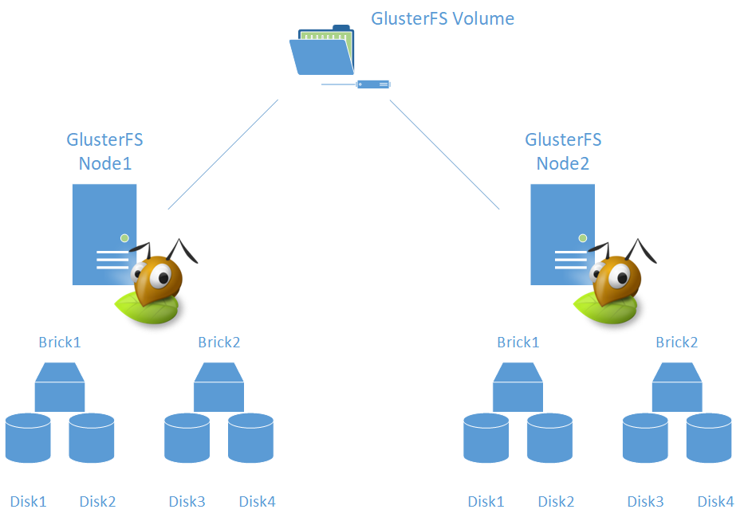
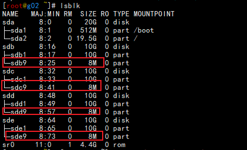

https://static.packt-cdn.com/downloads/9781789534108_ColorImages.pdf?


# GlusterFS

https://wiki.centos.org/SpecialInterestGroup/Storage/gluster-Quickstart

应用程序需要速度越来越快的存储机制，以处理同时发生的数万次I/O请求，glusterfs就是这样一种高度可伸缩冗余文件系统，可以给许多客户端同时提供高性能的I/O服务。

理解集群的核心意义

为什么选glusterfs

SDS（软件定义存储）详解

文件，对象与块存储之间的区别

为什么需要高效率，高可用性的存储机制

官网：http://www.gluster.org/

官网手册：https://docs.gluster.org/en/latest/

## **集群的作用：**


> 用更多的计算机资源来降低处理时间
>
> 可以垂直，水平扩展
>
> 实现冗余机制（最小3个节点，节点数以奇数计算）
>
> 提供更多的资源
>
> 一套整合的资源
>
> 没有故障单点


分布式存储是几副本的存储还是分片存储？

### SDS

传统存储是在某些企业手里，扩展性，硬件兼容性，客户端OS，配置，厂商这些受限制而且软件按年付费！

如果采用sds软件定义存储：降低了成本，可扩展性，自己控制，高容量。

> opex 营业费用 
>
> VSA 虚拟存储设备
>
> NAS 网络存储

SDS应用：电子商务与网络商店、财务应用、企业资源规划、医疗卫生、大数据、客户关系管理

> data lake 数据湖泊
>
> bulk data 海量数据

kubernetes 可以通过heketi 的restful 管理界面连接


###  块、文件、对象

SAN（存储区域网络）NAS一般通过iscsi,FC,FCOENFSSMBCIFS等协议连接这些传统的无法在云上提供服务。

**块存储**

SAN 是一种块存储，主要使用ISCSI、FC、等协议实现，这两种协议分别在光纤与TCP/IP上进行构建的SAN。

下图是FC协议构建的SAN


传统存储可用性与灾难恢复有缺点，数据以原始形式呈现，存储控制器与存储管理器并不清楚其中的数据是怎么使用的，当把这些数据复制到回复点的时候，只能从块的角度处理数据，而无法根据数据的实际情况做出变通。有些文件系统无法对数据块合理的清理回收或清零，会把没有用的数据一起复制，导致存储空间无法高效利用。

块存储所具备的优势及较低的延时，很适合用来存储结构化的数据库，并对随机的读写操作进行处理。VM极其频繁的发出I/O请求，适合使用块来存储。

下图是通过ISCSI协议构建的SAN


**文件存储**

与块存储相比，文件存储或NAS所用的方式更直接，不需要担心分区，怎么选择多主机环境的文件系统并对其格式化。

NAS 通常采用NFS，smb/cifs ，这些协议主要是用来把数据以不带结构的形式保存，存储到共享文件夹里。并不擅长扩展也不能满足媒体方面的需求


**对象存储**

对象存储通过网络访问，但是跟块，文件存储完全不同，数据获取方式却很独特，通过http方法及restful API来访问。

对象存储在命名空间，命名空间是平面化，而不是层次化的。


传统存储与对象存储就像，自助停车和代客泊车。自主的需要记住车在哪层那个区，那个车库。对象存储就只需要把车，车钥匙给代客泊车的人，他会给你一个编号。你就可以去做你的事，回来取车，提供ID即可。


对象存储中的单个对象


通过http协议把各种设备连接到位于云端的对象（存储bucket）上面。

------

**gluster 的主要特性**：可以部署在商用硬件、私有云，混合云，公有云、没有单节点故障、易扩展、支持异步的地域复制，性能高，自我修复、灵活。


>RDMA 远程直接内存访问
>
>HPC 高性能计算

### gluster 存储卷类型

#### 分布式卷

分布式卷是把数据分布到各个节点，通过较低的开销平滑地扩充可用空间。

缺点：没有冗余。

主要应用：对并发高的存储需求

分布式卷只是一批磁盘JBOD 或一个线性的逻辑卷管理器LVM，仅仅把空间简单的聚合起来，而不会包含数据分段或者奇偶校验机制。


#### 复制卷

复制卷是把数据拷贝到不同节点的brick中。对复制卷进行扩充时，必须增加相同数量的副本。复制卷跟RAID1相似。

优点：可用性高

缺点：扩展性有限

复制卷会有脑裂问题。

> 脑裂就是：不同的客户端要求写入一份数据，从而导致其中某一批结点上的值可能与另外一批节点上的值不相同。
>
> 为此引入server quorum这样的机制，以防止产生数据冲突


#### 分布式复制卷

分布式复制卷与普通卷类似，主要区别在于分布式复制卷本身是以分布式的形式存在的。

应用在可用性和冗余性要求较高的场景


#### 分散卷

分散卷具有分布式卷与复制卷的优势，数据分布在所有可用的brick上。同时提供冗余机制。brick的大小相同，否则最小的brick写满后整个卷无法处理写入操作。分散卷可以想象成RAID5 或RAID6，把数据存放到每块磁盘中并创建奇偶校验信息

实际应用中分散卷跟R5 |R6 不同，分散卷根据纠错码给数据分段。分散卷能够合理的顾及性能，空间与可用性等因素


#### 分布式分散卷

分布式分散卷，数据会分布在其中每一个小的分散卷里。在分散卷的层面实现冗余。

优势与分布式复制卷类似

可以把分布式分散卷想象成R5磁盘阵列它们以JBOD形式拼接，每个小分散卷的尺寸未必相同，但是为了某些问题还是令其一致。


### 对高冗余存储的需求

使用传统的单一存储那么就有单点故障点存在，这个故障点会放大系统风险。不管什么硬件都有可能会在某个时刻出现故障

PB级别的存储没有冗余就只有完蛋的下场。

glusterfs集群是采用另一种方式来实现冗余的，这种方式最为合理地安排工作负载。

### 灾难恢复

不管是人为还是自然不能避免。

要想业务不中断必须了解RTO（恢复时间目标） RPO（恢复点目标）

RTO：是从发生故障或者出现令服务中断到系统复原所经历的时长。就是需要花多久修复

RPO：在不影响业务连续性的前提下，最多可以损失多长时间之内的数据。


#### RTO

业务恢复所需的时间。很多业务要求2小时内恢复，这个需要根据业务系统复杂程度决定。

很多情况不是这么简单的，解决问题需要几周的时间，为了保证业务就必须要设计一个高可用的系统来。降低系统恢复正常所需的时间。

#### RPO

RPO指的是故障发生后保证能把数据恢复到【距离故障点】多久前的样子。也就是说多久创建一个备份，一小时一次还是一周，一个月？如果是集群恢复，则是指该集群每隔多久给变更后的数据备份一次

变更后恢复内容复制够不够快。很难即可复制。

如何复制？同步复制还是异步复制

同步复制：数据被写入即刻复制，有助于降低RPO，因为数据是实时同步的，系统故障参照另一个节点中的副本进行恢复。glusterfs就是采用这种复制机制，前提是足够的带宽实现。

异步复制：数据每隔一段时间才复制一次。在配置异步复制的时候需要根据许多因素做出选择。如果数据变更大，耗费时间长就可以考虑异步复制

架构师必须大量实验才能保证系统稳定。

### 对高性能存储的需求

对于访问同一个资源的用户过多，那么响应时间就会增加，应用处理时间也会变长。HDD 读写速度，SSD读写速度，nvme读写速度，pci-e SSD读写速度，PCI-E SSD肯定优以其他，SDS可以利用这些硬件技术提高业务响应时间。

*在设计技术方案的时候不妨当作是股票交易业务设计，这样业务要求性更高了。*

### 并行I/O

I/O（输入/输出），只要是业务系统，每秒都会有大量数据同时写入/读取

glusterfs 把数据分布在多个节点上，因此能够发挥出并行I/O的优势，同时为多个客户提供数据，并不会降低响应速度或吞吐量。


## 架构存储集群

通过glusterfs与各种组件实现SDS解决方案时，应该考虑哪些？

> glusterfs 对计算机的要求、设置正确存储容量、确定性能需求、高可用选型、节点各组件都有负载

### glusterfs 对计算机的要求

RAM：glusterfs对内存的依赖很强。内存用来缓存读取请求。使用zfs缓存，那么RAM就会当成ARC（位于高速RAM的上一层缓存），这样做的缺点就是内存会被使用，所以有zfs的glusterfs必须内存足够大。至少32G，将来给节点添加brick 以提升集群总容量，可以考虑同时添加内存。有预热阶段


CPU：对CPU占用依赖很小复制卷占用小于分散卷。启用了zfs那么CPU负载就加重了。基本存储4核足够，如果是启用压缩功能8核

对于HPC（高性能计算机群）应用程序很是关键。每秒上千次I/O操作。

> 并发程度高的负载，需要数量多的CPU处理，可以根据并发程度装配8个乃至更多的CPU
>
> 如果性能要求不高，解决方案开销压低，可以考虑少用几个CPU

云平台选择：

> 云平台vcpu和ram已经固定，按照需求选择合适的资源，根据不同品牌供应商决定

### 存储容量

glusterfs的卷类型，应用程序所需的空间，项目的增长情况。

#### glusterfs卷类型及容量注意事项

分布式卷：总容量=个节点可用容量之和。需要50T的容量，那么可以使用5台10T的节点，也可以2台25T的节点。

复制卷：各brick的原始空间会有一半用于镜像或数据复制，容量是实际需求的2倍，跟R1一个道理。要50t,两个节点分别是50T的容量，总和是100T，可用容量50T.

分散卷：容量类似R5不容易计算。数据分散到各个节点，还需要一部分空间存储奇偶校验信息。如果节点是10T组建50T的容量就需要6个节点才可以实现。

应用程序空间：这个根据不同程序的容量决定。

项目容量增长情况：方案设计应多出10%来，glusterfs虽然可拓展性强，但是不要依赖。

## 性能方面的注意事项

#### 吞吐量

吞吐量是由一定时间内的数据量决定的。通常是每秒多少MB。每秒存储系统发送接收的数据量

#### 延时

延时越低越好，跟存储介质有直接关系。

#### IOPS

IOPS就是1秒内执行多少次I/O操作。很多存储应用都有需求。vm大概一个20左右的IOPS

解决存储方案是必须的指标

#### I/O的大小

I/O大小是每次操作索要处理的数据量，没有固定参考，I/O操作的尺寸设置小一些，那么吞吐量就很低，IOPS就很高，反之IOPS就低。

### GlusterFS 性能

**提高解决方案的性能**：卷的类型，brick的布局，节点数量，参数调优。

#### 卷的类型

glusterfs会用不同的方式给每一个类型的卷分配数据，需要根据选择的卷类型来考虑其对性能的影响。

复制卷会把同一份数据镜像到多个节点，而分散卷则把数据分布到多个节点。

#### brick的布局

把所有的磁盘都放到brick中，可以分散到多个brick中，让每个brick含的磁盘数量少一些，这两种性能是不同的。brick布局是影响性能最重要的指标。

如果所有磁盘都放到一个brick，性能会比较差。一般把磁盘分布到多个brick，同时让brick里面的磁盘少一些，有助于性能提升延时降低。用软件让每个brick里面的磁盘组建成R0。例如：如果有10块硬盘，全放到一个brick中，按照R0组成阵列；也可以平分到5个brick中，并按照R0的形式把每个brick里的两块磁盘组成阵列。第二种效率会高一些。

因为磁盘分散到多个brick中可以更为顺畅的扩充存储系统。因为给一个brick添加数量少的磁盘比brick磁盘多的更容易一些。提升brick数量减少birck中的磁盘，同时注意将这些磁盘组建成R0




#### 节点的数量

集群节点数有助于提升并发能力。决定节点的数量时，你需要在可用的空间与并发能力之间寻求平衡。

POC阶段可用先测试看看是否满足性能需求。

#### 参数调优

调整glusterfs卷文件系统的block长度。与I/O操作的大小相匹配

block=4k 这适合一般的工作，如果工作操作数量众多的小文件，那么block可以小一些，如果全是大文件，可以设置block为1M


### 确保高可用性的最佳方法

通过配置glusterfs卷来实现高可用性。取决于应用和客户对性能的要求。

glusterfs本身就带高可用性，因此不需要在brick层面配置冗余。使用物理机的时候建议R5或R6加一层保护机制

glusterfs通过复制卷，分散卷实现高可用。

复制卷虽然性能低，但是配置，部署维护比较容易。


#### 复制卷确保高可用性

对性能要求不是特别高可以采用复制卷，提升副本的数量，会导致卷所能存储的数据量变少，但是可用性更高了。


**用分散卷确保高可用性**

分散卷可以在高可用性和性能很好的平衡

分散卷配置起来复杂。R5那样的方式配置


**地域复制**

通过本地网络或互联网得以异步复制。在其他地域留有备份，在节点故障时候可以进行灾难恢复。需要考虑RPO,RTO


### 根据工作类型来确定需求

把视频文件传给流媒体服务器，与托管大型数据是两种不同的工作，交互方式不同对I/O执行方式也完全不同。

#### 文档：

确定存储需求时，应用程序的文档是一份绝好的参考资料。

#### 系统工具：

##### iostat 

解决应用程序与存储之间交互情况

```bash
iostat -dxctm 1
```


上述命令显示出每个块设备的使用情况。

areq-sz 表示I/O请求的平均大小，单位KB

从areq-sz 入手了解应用程序发出的I/O请求通常是多大。

##### 文件类型与大小

流媒体服务器块尺寸就要设置的大一些，这样利于glusterfs卷更有效的利用空间，还能迅速地执行操作。这样配置使得事务大小和文件尺寸更为匹配。

## 部署使用glusterfs

环境准备：

|   主机    | vcpu | ram  | hdd容量/数量 | ssd容量/数量 |
| :-------: | :--: | :--: | :----------: | :----------: |
| gluster01 |  1   |  2   |    10G/3     |    10G/1     |
| gluster02 |  1   |  2   |    10G/3     |    10G/1     |
| gluster03 |  1   |  2   |    10G/3     |    10G/1     |
|  clinet   |      |      |              |              |

系统：centos7.9 内核不能升级！kubernetes 可以升级

brick文件系统zfs  on linux 

生产中CPU： 4核     内存：32G

```BASH
echo -e "172.16.0.190 g01\n172.16.0.191 g02\n172.16.0.192 g03" >>/etc/hosts
```

```bash
#互信
[root@g01 ~]# ssh-keygen -t rsa
[root@g01 ~]# cat ssh_cpoy.sh 
#!/bin/bash
rpm -qa |grep sshpassmkdirmkdir
[ $? -ne 0 ] && yum install -y sshpass
for i in g{01..03};
do
   sshpass -p$1 ssh-copy-id -i /root/.ssh/id_rsa.pub ${i}: "-o StrictHostKeyChecking=no"
   echo -e "-------------------${i} send successfull---------------------------"
done
[root@g01 ~]# sh /server/scripts/ssh_copy.sh *******   #输入你的密码
[root@g01 ~]# ssh g02 'hostname -i'
172.16.0.191
[root@g01 ~]# ssh g03 'hostname -i'
172.16.0.192
[root@g01 ~]# ssh g03 'hostname -s'
g03
[root@g01 ~]# ssh g02 'hostname -s'
g02

[root@g01 ~]# mkdir -p /server/soft
[root@g01 ~]# cd /server/soft/
```


## ZFS


官网：https://zfsonlinux.org/

官网帮助：https://openzfs.github.io/openzfs-docs/Getting%20Started/index.html

https://openzfs.github.io/openzfs-docs/Getting%20Started/RHEL-based%20distro/index.html#dkms

其他网络资料

```
https://aws.amazon.com/cn/blogs/china/architecture-and-practice-of-shared-storage-system-based-on-zfs-for-eda-scenario/
https://blog.csdn.net/mmh19891113/article/details/113866116
```

```bash
yum install zlib-devel libuuid-devel libblkid-devel libselinux-devel parted lsscsi
./configure
make rpm
rm zfs-modules-0.6.0*.x86_64.rpm
rpm -Uvh zfs*.x86_64.rpm zfs*.noarch.rpm
```

zfs 是把磁盘管理，逻辑卷与文件系统融合起来的软件层。提供压缩、ARC（自适应的置换缓存）、去除重复以及快照等功能。因此适合与glusterfs一起，用作brick的后端。

安装ZFS

```bash
[root@cluster01 /server/soft]# ls
zfs-release.el7_9.noarch.rpm
[root@cluster01 /server/soft]# rpm -ivh zfs-release.el7_9.noarch.rpm 
```

安装*zfs-release*包并验证公钥后，用户可以选择安装 DKMS 或 kABI-tracking kmod 样式包。建议运行非分发内核的用户或希望将本地自定义应用到 OpenZFS 的用户使用 DKMS 包。对于大多数用户，推荐使用 kABI 跟踪 kmod 软件包，以避免每次内核更新都需要重新构建 OpenZFS。

### DKMS

要安装 DKMS 样式的软件包，请发出以下命令。首先通过安装*epel-release* 包来添加提供 DKMS的 [EPEL 存储库](https://fedoraproject.org/wiki/EPEL)，然后是*kernel-devel*和*zfs*包。请注意，确保为正在运行的内核安装了匹配的*kernel-devel*包很重要，因为 DKMS 需要它来构建 OpenZFS。

```bash
yum install epel-release kernel-devel zfs
[root@g01 /server/soft]# yum install epel-release
[root@g01 /server/soft]# yum install zfs -y
[root@g01 /server/soft]# systemctl enable zfs.target
[root@g01 /server/soft]# systemctl enable --now zfs-import-scan.service

[root@g01 /server/soft]# scp zfs-release.el7_9.noarch.rpm g02:
[root@g01 /server/soft]# scp zfs-release.el7_9.noarch.rpm g03:

```


```bash
[root@g02 ~]# rpm -ivh zfs-release.el7_9.noarch.rpm 
[root@g02 ~]# yum install epel-release
[root@g02 ~]# yum install zfs -y
[root@g02 ~]# systemctl enable zfs.target
[root@g02 ~]# systemctl enable --now zfs-import-scan.service

```


```bash
[root@g03 ~]# rpm -ivh zfs-release.el7_9.noarch.rpm 
[root@g03 ~]# yum install epel-release
[root@g03 ~]# yum install epel-release zfs -y
[root@g03 ~]# systemctl enable zfs.target
[root@g03 ~]# systemctl enable --now zfs-import-scan.service

```

测试

```BASH
[root@g01 /server/soft]# yum-config-manager --enable zfs-testing
Loaded plugins: fastestmirror
============================ repo: zfs-testing ==============================
[zfs-testing]
async = True
bandwidth = 0
base_persistdir = /var/lib/yum/repos/x86_64/7
baseurl = http://download.zfsonlinux.org/epel-testing/7.9/x86_64/
cache = 0
cachedir = /var/cache/yum/x86_64/7/zfs-testing
check_config_file_age = True
compare_providers_priority = 80
cost = 1000
deltarpm_metadata_percentage = 100
deltarpm_percentage = 
enabled = 1
enablegroups = True
exclude = 
failovermethod = priority
ftp_disable_epsv = False
gpgcadir = /var/lib/yum/repos/x86_64/7/zfs-testing/gpgcadir
gpgcakey = 
gpgcheck = True
gpgdir = /var/lib/yum/repos/x86_64/7/zfs-testing/gpgdir
gpgkey = file:///etc/pki/rpm-gpg/RPM-GPG-KEY-zfsonlinux
hdrdir = /var/cache/yum/x86_64/7/zfs-testing/headers
http_caching = all
includepkgs = 
ip_resolve = 
keepalive = True
keepcache = False
mddownloadpolicy = sqlite
mdpolicy = group:small
mediaid = 
metadata_expire = 604800
metadata_expire_filter = read-only:present
metalink = 
minrate = 0
mirrorlist = 
mirrorlist_expire = 86400
name = OpenZFS for EL7 - dkms - Testing
old_base_cache_dir = 
password = 
persistdir = /var/lib/yum/repos/x86_64/7/zfs-testing
pkgdir = /var/cache/yum/x86_64/7/zfs-testing/packages
proxy = False
proxy_dict = 
proxy_password = 
proxy_username = 
repo_gpgcheck = False
retries = 10
skip_if_unavailable = False
ssl_check_cert_permissions = True
sslcacert = 
sslclientcert = 
sslclientkey = 
sslverify = True
throttle = 0
timeout = 30.0
ui_id = zfs-testing/x86_64
ui_repoid_vars = releasever,
   basearch
username = 
```

```bash
[root@g02 ~]# cat /usr/lib/systemd/system/zfs.target 
[Unit]
Description=ZFS startup target

[Install]
WantedBy=multi-user.target

[root@g02 ~]# cat /usr/lib/systemd/system/zfs-import-scan.service 
[Unit]
Description=Import ZFS pools by device scanning
Documentation=man:zpool(8)
DefaultDependencies=no
Requires=systemd-udev-settle.service
After=systemd-udev-settle.service
After=cryptsetup.target
After=multipathd.target
Before=zfs-import.target
ConditionFileNotEmpty=!/etc/zfs/zpool.cache
ConditionPathIsDirectory=/sys/module/zfs

[Service]
Type=oneshot
RemainAfterExit=yes
ExecStart=/sbin/zpool import -aN -o cachefile=none

[Install]
WantedBy=zfs-import.target

```

### 配置zpool

安装启动zfs后就可以创建zpool了。zpool是zfs的存储卷。

我们创建的是四块盘构成的R0，因此先创建brick1的zpool

```BASH
（三节点操作）
[root@g01 ~]# lsblk 
NAME            MAJ:MIN RM  SIZE RO TYPE MOUNTPOINT
sdd               8:48   0   10G  0 disk 
sdb               8:16   0   10G  0 disk 
sr0              11:0    1 1024M  0 rom  
sde               8:64   0   10G  0 disk 
sdc               8:32   0   10G  0 disk 
sda               8:0    0   60G  0 disk 
├─sda2            8:2    0 59.5G  0 part 
│ └─centos-root 253:0    0 59.5G  0 lvm  /
└─sda1            8:1    0  512M  0 part /boot

[root@g01 ~]# mkdir -p /bricks/brick1
[root@g01 ~]# modprobe zfs
[root@g01 ~]# zpool create brick1 /dev/sdb /dev/sdc /dev/sdd /dev/sde
[root@g01 ~]# zpool status
重启下看看 zfs modprobe 是否加载了

[root@g01 ~]# zpool status
  pool: brick1
 state: ONLINE
config:

	NAME        STATE     READ WRITE CKSUM
	brick1      ONLINE       0     0     0
	  sdb       ONLINE       0     0     0
	  sdc       ONLINE       0     0     0
	  sdd       ONLINE       0     0     0
	  sde       ONLINE       0     0     0

```

>  zpool create brick1 /dev/sdb /dev/sdc /dev/sdd /dev/sde  创建zpool

brick1 是zpool 的名字

物理机可以采用/dev/disk/by-id/ 下的磁盘ID，防止磁盘顺序发生变化，ZFS不会受磁盘顺序影响。

> zfs可以直接使用整块磁盘，它会自动创建必要的分区。

接下来要启动压缩功能，并把这个pool的挂载点设置成刚才创建的那个目录。

```BASH
（三台都操作）
[root@g01 ~]# zfs set compression=lz4 brick1  #启动压缩功能
[root@g01 ~]# zfs set mountpoint=/bricks/brick1 brick1   #挂载
[root@g01 ~]# df -h   #查看挂载
Filesystem      Size  Used Avail Use% Mounted on
devtmpfs        900M     0  900M   0% /dev
tmpfs           910M     0  910M   0% /dev/shm
tmpfs           910M  9.5M  901M   2% /run
tmpfs           910M     0  910M   0% /sys/fs/cgroup
/dev/sda2        20G  1.8G   18G   9% /
/dev/sda1       509M  175M  334M  35% /boot
tmpfs           182M     0  182M   0% /run/user/0
brick1           37G  128K   37G   1% /bricks/brick1

```

第一条命令启用lz4压缩算法，这种算法给CPU带来的开销比较低

第二条命令挂载zpool的挂载点到 brick1

 我们需要在刚添加的挂载点创建一个目录，把它当作brick使用。该目录的名称跟卷的名称一样，例子中称为gvol1,所以目录也叫这个

```BASH
三台都操作
[root@g01 ~]# mkdir /bricks/brick1/gvol1

[root@g02 ~]#  mkdir /bricks/brick1/gvol1

[root@g03 ~]#  mkdir /bricks/brick1/gvol1

```




### zfs缓存添加到pool（选）

再添加一块盘做缓存（物理机使用SSD）

zfs可以把一块SSD磁盘当作缓存盘使用。目的就是增加IOPS

缓存盘不会保存数据，zfs每次启动都加载这块资源盘。

设置开机自启：

```BASH
[root@g01 ~]# cat /usr/lib/systemd/system/zfs-mount.service 
[Unit]
Description=Mount ZFS filesystems
Documentation=man:zfs(8)
DefaultDependencies=no
After=systemd-udev-settle.service
After=zfs-import.target
After=systemd-remount-fs.service
Before=local-fs.target
ConditionPathIsDirectory=/sys/module/zfs

[Service]
Type=oneshot
RemainAfterExit=yes
ExecStart=/sbin/zfs mount -a
ExecStart=/sbin/zpool remove brick1 /dev/sdf
ExecStart=/sbin/zpool add brick1 cache /dev/sdf  

[Install]
WantedBy=zfs.target

```

上面这种方法是直接添加，但是会覆盖之前的修改，为了避免上面的情况使用下面的方法。

```BASH
[root@g01 ~]# systemctl edit zfs-mount
[service]
ExecStart=/sbin/zpool remove brick1 /dev/sdf
ExecStart=/sbin/zpool add brick1 cache /dev/sdf  


[root@g01 ~]# systemctl daemon-reload
[root@g01 ~]# zpool add brick1 cache /dev/sdf -f    #第一次配置的时候才使用，-f会删除之前的文件系统
[root@g01 ~]# zpool status
  pool: brick1
 state: ONLINE
config:

	NAME        STATE     READ WRITE CKSUM
	brick1      ONLINE       0     0     0
	  sdb       ONLINE       0     0     0
	  sdc       ONLINE       0     0     0
	  sdd       ONLINE       0     0     0
	  sde       ONLINE       0     0     0
	cache
	  sdf       ONLINE       0     0     0

errors: No known data errors

```

重启之后cache还在

由于只有一组Raid 阵列，因此这块磁盘将会用做整个brick的都缓存，让应用程序可以更快的读取glusterfs卷中的文件。

## GlusterFS 安装

参考资料：

https://wiki.centos.org/SpecialInterestGroup/Storage/gluster-Quickstart

### 前提

```BASH
[root@g01 ~]# mount |grep brick1
brick1 on /bricks/brick1 type zfs (rw,xattr,noacl)
```

这里我们采用的是zfs文件系统，一般的可以使用xfs

使用xfs系统，参考

```BASH
# mkfs.xfs -i size=512 /dev/sdb1
# mkdir -p /bricks/brick1
# vi /etc/fstab
Add the following:

/dev/sdb1 /bricks/brick1 xfs defaults 1 2
Save the file and exit

# mount -a && mount
You should now see sdb1 mounted at /bricks/brick1

Note: On CentOS 6 , you need to install xfsprogs package to be able to format an XFS file system


# yum install xfsprogs   #centos7不需要
```


**三台都操作**

```BASH
[root@g01 ~]# yum install centos-release-gluster -y
```

添加软件库，然后安装glusterfs-server软件包

```BASH
[root@g01 ~]# yum install -y glusterfs-server
```

启动

```BASH
systemctl start glusterd && systemctl enable glusterd
systemctl status glusterd |grep Active
```


### 创建trusted pool

创建信任池，由集群中的节点组成，其中每个节点都信任其他节点，使我们可以使用这一整套节点来创建所需的存储卷。

为了建立起这个trusted pool 需要在第一个节点上面运行下面的命令

```BASH
[root@g01 ~]# gluster peer probe g02
peer probe: success
[root@g01 ~]# gluster peer probe g03
peer probe: success

[root@g01 ~]# gluster peer status     #验证节点是否把另外节点添加信任。
Number of Peers: 2

Hostname: g02
Uuid: 85916e45-080a-459b-83c3-89366cb8285f
State: Peer in Cluster (Connected)

Hostname: g03
Uuid: 6b5e2c64-02a4-46bb-b664-f46b7a97da06
State: Peer in Cluster (Connected)

```


任何一个节点都可以运行上述命令。

实际上最好的办法是把这些应用关系注册到DNS服务器。

上述这些操作完成了就可以创建卷了。

列出TSP中所有节点

```bash
[root@g01 ~]# gluster pool  list
UUID					Hostname 	State
85916e45-080a-459b-83c3-89366cb8285f	g02      	Connected 
6b5e2c64-02a4-46bb-b664-f46b7a97da06	g03      	Connected 
8a619161-2f9c-41cb-aa73-23ec51022738	localhost	Connected 
```

删除服务器

要从TSP中删除服务器，从池中的另一台运行

```BASH
 # gluster peer detach <server>
```


### 创建存储卷

#### 创建分散卷

为了高可用性与性能之间求得平衡，创建3个节点的分散卷。每个节点40G共120G.但创建出来的之后80G

```BASH
volume create <NEW-VOLNAME> [stripe <COUNT>] [[replica <COUNT> [arbiter <COUNT>]]|[replica 2 thin-arbiter 1]] [disperse [<COUNT>]] [disperse-data <COUNT>] [redundancy <COUNT>] [transport <tcp|rdma|tcp,rdma>] <NEW-BRICK> <TA-BRICK>... [force] - create a new volume of specified type with mentioned bricks


[root@g01 ~]# gluster volume create gvol1 disperse 3 g{01..03}:/bricks/brick1/gvol1
volume create: gvol1: success: please start the volume to access data

```

这里出现问题，之前创建好的文件夹不见了。重新创建一下即可

```BASH
mkdir /bricks/brick1/gvol1
```

启动分散卷

```BASH
[root@g01 ~]# gluster volume start gvol1
volume start: gvol1: success


[root@g01 ~]# gluster volume status gvol1 
Status of volume: gvol1
Gluster process                             TCP Port  RDMA Port  Online  Pid
------------------------------------------------------------------------------
Brick g01:/bricks/brick1/gvol1              49152     0          Y       2030 
Brick g02:/bricks/brick1/gvol1              49152     0          Y       1864 
Brick g03:/bricks/brick1/gvol1              49152     0          Y       1867 
Self-heal Daemon on localhost               N/A       N/A        Y       2047 
Self-heal Daemon on g02                     N/A       N/A        Y       1881 
Self-heal Daemon on g03                     N/A       N/A        Y       1884 
 
Task Status of Volume gvol1
------------------------------------------------------------------------------
There are no active volume tasks

```

#### 创建复制卷

上面是分散卷的创建，


### 挂载存储卷

通过客户端软件进行挂载原生工具glusterfs-fuse,此软件能在其中某个节点故障的情况下，自动启用故障转移机制。

```BASH
[root@clinet ~]# yum install -y glusterfs-fuse

[root@clinet ~]# df -h
Filesystem      Size  Used Avail Use% Mounted on
devtmpfs        476M     0  476M   0% /dev
tmpfs           487M     0  487M   0% /dev/shm
tmpfs           487M  7.5M  479M   2% /run
tmpfs           487M     0  487M   0% /sys/fs/cgroup
/dev/sda2        20G  1.6G   18G   8% /
/dev/sda1       509M  164M  345M  33% /boot
tmpfs            98M     0   98M   0% /run/user/0

[root@clinet ~]# lsblk
NAME   MAJ:MIN RM  SIZE RO TYPE MOUNTPOINT
sda      8:0    0   20G  0 disk 
├─sda1   8:1    0  512M  0 part /boot
└─sda2   8:2    0 19.5G  0 part /
sr0     11:0    1  4.4G  0 rom  

[root@clinet ~]# mkdir /gvol1  #建立与服务器目录一样的目录


mount -t glusterfs g01:/gvol1 /gvol1

```

这里失败了。添加hosts之后挂载成功

```BASH
[root@clinet ~]# cat /etc/hosts
127.0.0.1   localhost localhost.localdomain localhost4 localhost4.localdomain4
::1         localhost localhost.localdomain localhost6 localhost6.localdomain6
172.16.0.190 g01
172.16.0.191 g02
172.16.0.192 g03
172.16.0.193 clinet
```

检查

```bash
[root@clinet ~]# mount -t glusterfs g01:/gvol1 /gvol1
[root@clinet ~]# df -h
Filesystem      Size  Used Avail Use% Mounted on
devtmpfs        476M     0  476M   0% /dev
tmpfs           487M     0  487M   0% /dev/shm
tmpfs           487M  7.5M  479M   2% /run
tmpfs           487M     0  487M   0% /sys/fs/cgroup
/dev/sda2        20G  1.6G   18G   8% /
/dev/sda1       509M  164M  345M  33% /boot
tmpfs            98M     0   98M   0% /run/user/0
g01:/gvol1       74G  755M   73G   2% /gvol1

```

上面挂载可以是g01 g02 g03 ，只要是集群中的节点都可以创建分散卷访问，若其中一个故障，客户端会自动把I/O请求派发到正常节点。

```bash
[root@clinet ~]# cd /gvol1/
[root@clinet /gvol1]# ls
[root@clinet /gvol1]# touch test.txt
[root@clinet /gvol1]# ls -a
.  ..  test.txt
[root@clinet /gvol1]# echo "test" >>test.txt 
[root@clinet /gvol1]# cat test.txt 
test

[root@g01 ~]# ls /bricks/brick1/gvol1/
test.txt
[root@g02 ~]# ls /bricks/brick1/gvol1/
test.txt
[root@g03 ~]# ls /bricks/brick1/gvol1/
test.txt

```

## 优化性能

把存储卷创建好之后，可以调整某些参数提升性能。这些调整主要发生在文件系统层面。这里是ZFS以及glusterfs卷上面。

### 	调整Glusterfs

主要是performance.cache-size参数，该参数默认是32M，这个值太小了，如果服务器内存足够，可以调整到4G

```BASH
[root@g01 ~]# gluster volume set gvol1 performance.cache-size 4GB
volume set: success
```

如果集群在增长，需要关注performance.io-thread-count,它控制着存储卷生成多少条I/O线程，默认是16.这对于小到中型的集群是足够的如果规模大可以翻倍。

```BASH
gluster volume set gvol1 performance.io-thread-count 16
```

### 调整ZFS

在zfs方面主要修改ARC 与 L2ARC 这两个设计性能的参数

#### ARC

对于ZFS需要调整的是读缓存，就是ARC。给ARC多分配内存提升读取效率。譬如总的32G ，上面分配4G给了gluster ，再分配26G给ZFS，最后的留给系统。

```BASH
26*1024*1024*1024=27917287424
echo "27917287424" > /sys/module/zfs/parameters/zfs_arc_max 
```

这个重启之后就消失了，可以创建

```BASH
# vim  /etc/modprobe.d/zfs.conf
options zfs zfs_arc_max=27917287424
```

重启还在

#### L2ARC

L2arc 二级读缓存，也就是刚才添加zpool的缓存盘，调整相关参数减少预热时间，让系统更迅速将频繁的文件填充到缓存。字节为单位

```BASH
2621440000=256*1024*10000
echo "2621440000" > /sys/module/zfs/parameters/12arc_max_write
```

重启就不在了。

```BASH
# vim  /etc/modprobe.d/zfs.conf
options zfs 12arc_write_max=2621440000
```

这样就改成了每秒256M.如果性能更高级可以翻倍。

对于其他类型的文件系统，修改模块参数有许多有助于提升性能，但是ZFS文件系统，它的块本身就是可变的，这让它在处理大文件与小文件时都能保持类似的性能，因此不需要修改调整。

## 分析gluster系统的性能

上面实现了方案并部署了，但是不知道性能如何。就需要测试方案可用性。

概述目前方案、完整的讲解性能测试、对性能可用性测试、对方案水平垂直扩展

技术资源：

zpool iostat：https://docs.oracle.com/cd/E19253-01/819-5461/gammt/index.html

sysstat : https://github.com/sysstat/sysstat

iostat :  http://sebastien.godard.pagesperso-orange.fr/man_iostat.html

​             https://github.com/sysstat/sysstat

FIO文档：https://buildmedia.readthedocs.org/media/pdf/fio/latest/fio.pdf

glusterfs : https://docs.gluster.org/en/latest/Administrator-Guide/Monitoring-Workload/

参考

```bash
[root@g01 ~]# zpool iostat
              capacity     operations     bandwidth 
pool        alloc   free   read  write   read  write
----------  -----  -----  -----  -----  -----  -----
brick1       820K  38.0G      0     11  2.70K  24.8K

[root@g01 ~]# zpool iostat -v
              capacity     operations     bandwidth 
pool        alloc   free   read  write   read  write
----------  -----  -----  -----  -----  -----  -----
brick1       744K  38.0G      0     11  2.58K  24.5K
  sdb        166K  9.50G      0      2    665  5.69K
  sdc        208K  9.50G      0      3    657  6.41K
  sdd        174K  9.50G      0      2    630  6.10K
  sde        196K  9.50G      0      2    686  6.31K
cache           -      -      -      -      -      -
  sdf       1.61M  20.0G      0      0    195    352
----------  -----  -----  -----  -----  -----  -----

[root@g01 ~]# zpool iostat brick1
              capacity     operations     bandwidth 
pool        alloc   free   read  write   read  write
----------  -----  -----  -----  -----  -----  -----
brick1       920K  38.0G      0     11  2.47K  24.8K
```

```bash
[root@g01 ~]# sar -P ALL
Linux 3.10.0-1160.36.2.el7.x86_64 (g01) 	08/24/2021 	_x86_64_	(1 CPU)

09:33:53 AM       LINUX RESTART

09:40:02 AM     CPU     %user     %nice   %system   %iowait    %steal     %idle
09:50:01 AM     all      0.18      0.00      1.53      0.34      0.00     97.94
09:50:01 AM       0      0.18      0.00      1.53      0.34      0.00     97.94

Average:        CPU     %user     %nice   %system   %iowait    %steal     %idle
Average:        all      0.18      0.00      1.53      0.34      0.00     97.94
Average:          0      0.18      0.00      1.53      0.34      0.00     97.94

[root@g01 ~]# iostat 
Linux 3.10.0-1160.36.2.el7.x86_64 (g01) 	08/24/2021 	_x86_64_	(1 CPU)

avg-cpu:  %user   %nice %system %iowait  %steal   %idle
           1.02    0.00    3.99    0.93    0.00   94.07

Device:            tps    kB_read/s    kB_wrtn/s    kB_read    kB_wrtn
sda               5.25       119.80         7.34     159317       9763
sdc               3.58         4.68         5.95       6222       7919
sdd               3.93         4.66         6.09       6195       8105
sdb               3.62         5.36         5.53       7132       7350
sdf               0.46         3.88         0.37       5163        493
sde               3.52         4.71         5.67       6262       7535
scd0              0.01         0.77         0.00       1028          0

[root@g01 ~]# iostat -d 2
Linux 3.10.0-1160.36.2.el7.x86_64 (g01) 	08/24/2021 	_x86_64_	(1 CPU)

Device:            tps    kB_read/s    kB_wrtn/s    kB_read    kB_wrtn
sda               5.07       115.65         7.10     159329       9780
sdc               3.47         4.52         5.77       6222       7952
sdd               3.90         4.50         6.05       6195       8337
sdb               3.58         5.18         5.50       7132       7575
sdf               0.45         3.75         0.37       5163        503
sde               3.50         4.55         5.65       6262       7788
scd0              0.01         0.75         0.00       1028          0

Device:            tps    kB_read/s    kB_wrtn/s    kB_read    kB_wrtn
sda               0.00         0.00         0.00          0          0
sdc               0.00         0.00         0.00          0          0
sdd               0.00         0.00         0.00          0          0
sdb               0.00         0.00         0.00          0          0
sdf               0.00         0.00         0.00          0          0
sde               0.00         0.00         0.00          0          0
scd0              0.00         0.00         0.00          0          0


```


### 概述集群


此方案共三个节点，每个节点使用4块数据磁盘，1块缓存盘。如果节点宕机一台依然可以继续工作、此套方案传输速度大概每秒**375MB** 可以同时供几百个客户端，而且可以水平，垂直扩展。

### 性能测试

上面方案是否达到理论上的水准，分下面几个部分

#### 理论上的性能

根据硬件设备参数的性能及传输速度要求达到每秒125M，由于节点内的每块盘60M/秒，这样的磁盘总的有4块，就很容易满足每秒125M，这样的3节点满足375M每秒，只要客户端一直写入或读取数据就可以达到这样的水准。

#### 性能工具

##### zpool iostat

zpool iostat 是针对ZFS文件系统的

```BASH
[root@g01 ~]# zpool iostat -v
              capacity     operations     bandwidth 
pool        alloc   free   read  write   read  write
----------  -----  -----  -----  -----  -----  -----
brick1       775K  38.0G      0     11    651  21.6K
  sdb        216K  9.50G      0      2    164  5.22K
  sdc        150K  9.50G      0      3    162  5.62K
  sdd        206K  9.50G      0      2    155  5.36K
  sde        202K  9.50G      0      2    169  5.35K
cache           -      -      -      -      -      -
  sdf       1.62M  20.0G      0      0     48    320
----------  -----  -----  -----  -----  -----  -----

[root@g01 ~]# zpool iostat -vLP 1
               capacity     operations     bandwidth 
pool         alloc   free   read  write   read  write
-----------  -----  -----  -----  -----  -----  -----
brick1        864K  38.0G      0     11    642  21.5K
  /dev/sdb1   192K  9.50G      0      2    161  5.18K
  /dev/sdc1   206K  9.50G      0      3    160  5.61K
  /dev/sdd1   239K  9.50G      0      2    153  5.37K
  /dev/sde1   226K  9.50G      0      2    167  5.36K
cache            -      -      -      -      -      -
  /dev/sdf1  1.62M  20.0G      0      0     47    319
-----------  -----  -----  -----  -----  -----  -----
               capacity     operations     bandwidth 
pool         alloc   free   read  write   read  write
-----------  -----  -----  -----  -----  -----  -----
brick1        864K  38.0G      0      0      0      0
  /dev/sdb1   192K  9.50G      0      0      0      0
  /dev/sdc1   206K  9.50G      0      0      0      0
  /dev/sdd1   239K  9.50G      0      0      0      0
  /dev/sde1   226K  9.50G      0      0      0      0
cache            -      -      -      -      -      -
  /dev/sdf1  1.62M  20.0G      0      0      0      0
-----------  -----  -----  -----  -----  -----  -----

```

zpool iostat -v 统计出每个zfs存储卷的性能指标，以及这些存储卷合起来的工作效果。

zpool iostat -v 1 是每1秒统计一次磁盘信息，-v是打印、显示

-L    -P  打印出设备的文件名或者UUID

上面列出的信息

**pool** ：列出pool中的每个成员

**capacity**:分配给每个设备的空间

**operations**: 每个设备的IOPS数

**bandwidth**：每个设备的吞吐量

这条命令是统计zfs pool的性能


##### iostat

该命令是sysstat的一部分，统计每个设备的底层性能指标。iostat会绕过文件系统与存储卷，直接展示系统中每个块的原始RAW性能数据

Usage: iostat [ options ] [ <interval> [ <count> ] ]

> d 打印设备利用率
>
> x 显示额外的设备统计信息
>
> c 显示CPU利用率
>
> t 显示当前的统计报告是在什么时间生成
>
> m 用每秒的MB数显示统计信息
>
> 1 数字表示间隔几秒打印一次统计信息


```bash
[root@g01 ~]# iostat -dxctm 
```

不是每个列都需要关注

Device:列出系统中的块设备

r/s ：每秒的读取数量

w/s ：每秒的写入数量

rmb/s:每秒从设备中读取了多少MB

wmb/s：每秒向设备写入了多少MB

r_await ：读取请求平均需要等待多少毫秒

w_await  ：写入请求平均需要等待多少毫秒

 

r_await  w_await   %iowait   这三列是判断是否有某一个设备的延迟明显高于其他设备。如果%iowait时间值越高，说明它总是在等待I/O操作执行完，可能意味负责执行的I/O操作的某块设备延迟时间比较高。

```BASH
[root@g01 ~]# man iostat   #其他列信息参考帮助man page
```

##### flexible I/O tester(FIO)

FIO是一款性能测试工具，会产生工作负载并交给受测试产品执行，然后总结出该产品的各项I/O性能指标。

```BASH
[root@g01 ~]# yum install -y fio
```

fio是一款很不错的测试工具，用FIO测试性能，最简单的办法就是创建配置文件，告诉软件应该如何运作。

配置如下：

```BASH
[root@g01 ~]# vim test.fio
[global]
name=rw-nocache-random
rw=randrw
rwmixread=50
rwmixwrite=50
group_reporting=1
bs=1M
direct=1
numjobs=4
time_based=1
runtime=180
ioengine=libaio
iodepth=64

[file1]
size=10GB
filename=rw-nocache-random.1       
```

> [global]    全局配置，这个下面的参数影响整个测试工作
> 		name=rw-nocache-random     给这个测试工程一个名称
> 		rw=randrw               用什么类型的I/O操作进行测试，randrw随机读取写入测试
> 		rwmixread=50      读占比多少
> 		rwmixwrite=50    写占比多少
>
> ​             这两条参数决定FIO将按照指定的比例测试读写操作
>
> group_reporting=1   这个选项表示的是这个测试报告打印的统计报告针对的是整个测试工作，而不是其中每一个小项
> 		bs=1M     FIO执行测试所使用的块大小，可以设置跟工作等值的值。
> 		direct=1  
> 		numjobs=4   这个决定FIO开启的线程数量
> 		time_based=1  
> 		runtime=180  测试持续多少秒
> 		ioengine=libaio   测试FIO引擎，最常见的就是libaio，可以模拟大多数工作负载
> 		iodepth=64     决定了测试所要达到的I/O深度。取值越高，对存储设备所做的测试就越彻底。
>
> [file1]     测试用到的模拟文件
> 		size=10GB    大小多少
> 		filename=rw-nocache-random.1    文件名称      

用FIO测试，在客户端进入挂载点目录

```BASH
[root@clinet ~]# yum install -y glusterfs-fuse
[root@clinet ~]#  mount -t glusterfs g01:/gvol1 /gvol1
[root@clinet ~]# df -h
Filesystem      Size  Used Avail Use% Mounted on
devtmpfs        476M     0  476M   0% /dev
tmpfs           487M     0  487M   0% /dev/shm
tmpfs           487M  7.6M  479M   2% /run
tmpfs           487M     0  487M   0% /sys/fs/cgroup
/dev/sda2        20G  1.6G   18G   8% /
/dev/sda1       509M  164M  345M  33% /boot
tmpfs            98M     0   98M   0% /run/user/0
g01:/gvol1       74G  755M   73G   2% /gvol1
[root@clinet ~]# cd /gvol1/
[root@clinet /gvol1]# ls
test.txt
[root@clinet /gvol1]# fio /root/test.fio 

```

运行的时候会显示统计信息，给出了吞吐量与IOPS等指标


吞吐量read 134M write=145M

IOPS read=134 w=145

运行完成之后FIO会给出测试报告，其中最重要的统计信息是读取操作与写入操作的IOPS及BW（bandwidth 带宽）


从测试结果可以看出，glusterfs卷在同时执行读取操作与写入操作的情况下。可以维持每秒150M左右的工作效率。该数据与这个集群在理论上的最大效率相差75M，网络带宽是直接关系。

FIO很适合用来验证性能并检测问题，可以在服务器操上的brick操作也可以在客户机上操作FIO命令。测试前应根据要执行的测试调整FIO的配置参数。

https://docs.gluster.org/en/latest/Administrator-Guide/Monitoring-Workload/#viewing-open-fd-count-and-maximum-fd-count

自带的一些工具

开始分析

```BASH
[root@g01 ~]# gluster volume profile gvol1 start
Starting volume profile on gvol1 has been successful 
```

显示I/O信息

```BASH
[root@g01 ~]# gluster volume profile gvol1 info
Brick: g01:/bricks/brick1/gvol1
-------------------------------
Cumulative Stats:
   Block Size:              65536b+ 
 No. of Reads:                 5920 
No. of Writes:                88488 
 %-latency   Avg-latency   Min-Latency   Max-Latency   No. of calls         Fop
 ---------   -----------   -----------   -----------   ------------        ----
      0.00       0.00 us       0.00 us       0.00 us              3     RELEASE
      0.00       0.00 us       0.00 us       0.00 us             24  RELEASEDIR
 
    Duration: 3578 seconds
   Data Read: 387973120 bytes
Data Written: 5799149568 bytes
 
Interval 0 Stats:
   Block Size:              65536b+ 
 No. of Reads:                 5920 
No. of Writes:                88488 
 %-latency   Avg-latency   Min-Latency   Max-Latency   No. of calls         Fop
 ---------   -----------   -----------   -----------   ------------        ----
      0.00       0.00 us       0.00 us       0.00 us              3     RELEASE
      0.00       0.00 us       0.00 us       0.00 us             24  RELEASEDIR
 
    Duration: 3578 seconds
   Data Read: 387973120 bytes
Data Written: 5799149568 bytes
 
Brick: g02:/bricks/brick1/gvol1
-------------------------------
Cumulative Stats:
   Block Size:              65536b+ 
 No. of Reads:                 5920 
No. of Writes:                88488 
 %-latency   Avg-latency   Min-Latency   Max-Latency   No. of calls         Fop
 ---------   -----------   -----------   -----------   ------------        ----
      0.00       0.00 us       0.00 us       0.00 us              3     RELEASE
      0.00       0.00 us       0.00 us       0.00 us             24  RELEASEDIR
 
    Duration: 3581 seconds
   Data Read: 387973120 bytes
Data Written: 5799149568 bytes
 
Interval 0 Stats:
   Block Size:              65536b+ 
 No. of Reads:                 5920 
No. of Writes:                88488 
 %-latency   Avg-latency   Min-Latency   Max-Latency   No. of calls         Fop
 ---------   -----------   -----------   -----------   ------------        ----
      0.00       0.00 us       0.00 us       0.00 us              3     RELEASE
      0.00       0.00 us       0.00 us       0.00 us             24  RELEASEDIR
 
    Duration: 3581 seconds
   Data Read: 387973120 bytes
Data Written: 5799149568 bytes
 
Brick: g03:/bricks/brick1/gvol1
-------------------------------
Cumulative Stats:
   Block Size:              65536b+ 
 No. of Reads:                    0 
No. of Writes:                88488 
 %-latency   Avg-latency   Min-Latency   Max-Latency   No. of calls         Fop
 ---------   -----------   -----------   -----------   ------------        ----
      0.00       0.00 us       0.00 us       0.00 us              3     RELEASE
      0.00       0.00 us       0.00 us       0.00 us             24  RELEASEDIR
 
    Duration: 3581 seconds
   Data Read: 0 bytes
Data Written: 5799149568 bytes
 
Interval 0 Stats:
   Block Size:              65536b+ 
 No. of Reads:                    0 
No. of Writes:                88488 
 %-latency   Avg-latency   Min-Latency   Max-Latency   No. of calls         Fop
 ---------   -----------   -----------   -----------   ------------        ----
      0.00       0.00 us       0.00 us       0.00 us              3     RELEASE
      0.00       0.00 us       0.00 us       0.00 us             24  RELEASEDIR
 
    Duration: 3581 seconds
   Data Read: 0 bytes
Data Written: 5799149568 bytes

```

停止分析

```BASH
[root@g01 ~]# gluster volume profile gvol1 stop
Stopping volume profile on gvol1 has been successful 
```

等工具https://docs.gluster.org/en/latest/Administrator-Guide/Monitoring-Workload/#viewing-open-fd-count-and-maximum-fd-count

##### 显示卷信息

```BASH
[root@g01 ~]# gluster volume info gvol1
 
Volume Name: gvol1
Type: Disperse
Volume ID: 7127f8c5-a54b-43c7-bff5-6fe7272c7f98
Status: Started
Snapshot Count: 0
Number of Bricks: 1 x (2 + 1) = 3
Transport-type: tcp
Bricks:
Brick1: g01:/bricks/brick1/gvol1
Brick2: g02:/bricks/brick1/gvol1
Brick3: g03:/bricks/brick1/gvol1
Options Reconfigured:
performance.cache-size: 32MB
storage.fips-mode-rchecksum: on
transport.address-family: inet
nfs.disable: on

[root@g01 ~]# gluster volume status gvol1 
Status of volume: gvol1
Gluster process                             TCP Port  RDMA Port  Online  Pid
------------------------------------------------------------------------------
Brick g01:/bricks/brick1/gvol1              49152     0          Y       1209 
Brick g02:/bricks/brick1/gvol1              49152     0          Y       1167 
Brick g03:/bricks/brick1/gvol1              49152     0          Y       1174 
Self-heal Daemon on localhost               N/A       N/A        Y       1235 
Self-heal Daemon on g02                     N/A       N/A        Y       1187 
Self-heal Daemon on g03                     N/A       N/A        Y       1193 
 
Task Status of Volume gvol1
------------------------------------------------------------------------------
There are no active volume tasks

[root@g01 ~]# gluster volume status gvol1 detail  #附加信息
Status of volume: gvol1
------------------------------------------------------------------------------
Brick                : Brick g01:/bricks/brick1/gvol1
TCP Port             : 49152               
RDMA Port            : 0                   
Online               : Y                   
Pid                  : 1209                
File System          : zfs                 
Device               : brick1              
Mount Options        : rw,xattr,noacl      
Inode Size           : N/A                 
Disk Space Free      : 31.8GB              
Total Disk Space     : 36.8GB              
Inode Count          : 66706433            
Free Inodes          : 66706131            
------------------------------------------------------------------------------
Brick                : Brick g02:/bricks/brick1/gvol1
TCP Port             : 49152               
RDMA Port            : 0                   
Online               : Y                   
Pid                  : 1167                
File System          : zfs                 
Device               : brick1              
Mount Options        : rw,xattr,noacl      
Inode Size           : N/A                 
Disk Space Free      : 31.8GB              
Total Disk Space     : 36.8GB              
Inode Count          : 66706472            
Free Inodes          : 66706170            
------------------------------------------------------------------------------
Brick                : Brick g03:/bricks/brick1/gvol1
TCP Port             : 49152               
RDMA Port            : 0                   
Online               : Y                   
Pid                  : 1174                
File System          : zfs                 
Device               : brick1              
Mount Options        : rw,xattr,noacl      
Inode Size           : N/A                 
Disk Space Free      : 31.8GB              
Total Disk Space     : 36.8GB              
Inode Count          : 66706528            
Free Inodes          : 66706226            

[root@g01 ~]#  gluster volume status gvol1 clients #显示访问卷的客户端列表
Client connections for volume gvol1
----------------------------------------------
Brick : g01:/bricks/brick1/gvol1
Clients connected : 4
Hostname                                               BytesRead    BytesWritten       OpVersion
--------                                               ---------    ------------       ---------
172.16.0.190:49142                                         12176           15904           90000
172.16.0.192:49139                                         11688           14952           90000
172.16.0.191:49139                                         12420           16380           90000
172.16.0.193:1018                                     5818077072       423392324           70000
----------------------------------------------
Brick : g02:/bricks/brick1/gvol1
Clients connected : 4
Hostname                                               BytesRead    BytesWritten       OpVersion
--------                                               ---------    ------------       ---------
172.16.0.190:49148                                         13236           16648           90000
172.16.0.192:49143                                         12924           15756           90000
172.16.0.191:49144                                         13292           16956           90000
172.16.0.193:1019                                     5818080132       423396784           70000
----------------------------------------------
Brick : g03:/bricks/brick1/gvol1
Clients connected : 4
Hostname                                               BytesRead    BytesWritten       OpVersion
--------                                               ---------    ------------       ---------
172.16.0.190:49144                                         13236           16648           90000
172.16.0.192:49141                                         12924           15756           90000
172.16.0.191:49141                                         13292           16956           90000
172.16.0.193:1017                                     5816869392        33998404           70000
----------------------------------------------

[root@g01 ~]#  gluster volume status gvol1 mem  #内存使用情况和内存池详细信息
Memory status for volume : gvol1
----------------------------------------------
Brick : g01:/bricks/brick1/gvol1
Mallinfo
--------
Arena    : 11304960
Ordblks  : 139
Smblks   : 5
Hblks    : 8
Hblkhd   : 2105344
Usmblks  : 0
Fsmblks  : 448
Uordblks : 3381888
Fordblks : 7923072
Keepcost : 137168
 
----------------------------------------------
Brick : g02:/bricks/brick1/gvol1
Mallinfo
--------
Arena    : 11083776
Ordblks  : 151
Smblks   : 15
Hblks    : 8
Hblkhd   : 2105344
Usmblks  : 0
Fsmblks  : 1520
Uordblks : 3383888
Fordblks : 7699888
Keepcost : 137168
 
----------------------------------------------
Brick : g03:/bricks/brick1/gvol1
Mallinfo
--------
Arena    : 12570624
Ordblks  : 151
Smblks   : 9
Hblks    : 8
Hblkhd   : 2105344
Usmblks  : 0
Fsmblks  : 720
Uordblks : 3382160
Fordblks : 9188464
Keepcost : 2230624
 
----------------------------------------------

[root@g01 ~]#  gluster volume status gvol1 inode

[root@g01 ~]#  gluster volume status gvol1 callpool
Pending calls for volume gvol1
----------------------------------------------
Brick : g01:/bricks/brick1/gvol1
Pending calls: 1
Call Stack1
 UID    : 0
 GID    : 0
 PID    : 0
 Unique : 95122
 Frames : 1
 Frame 1
  Ref Count   = 0
  Translator  = glusterfs
  Completed   = No
 
----------------------------------------------
Brick : g02:/bricks/brick1/gvol1
Pending calls: 1
Call Stack1
 UID    : 0
 GID    : 0
 PID    : 0
 Unique : 95148
 Frames : 1
 Frame 1
  Ref Count   = 0
  Translator  = glusterfs
  Completed   = No
 
----------------------------------------------
Brick : g03:/bricks/brick1/gvol1
Pending calls: 1
Call Stack1
 UID    : 0
 GID    : 0
 PID    : 0
 Unique : 89216
 Frames : 1
 Frame 1
  Ref Count   = 0
  Translator  = glusterfs
  Completed   = No
 
----------------------------------------------

```

##### 可用性测试

服务器宕机一台是否还能继续？

关闭任意一台服务器，fio的测试还在继续没有什么影响。其他节点在提供服务。

##### 扩展

垂直扩展：在每个节点添加更多的brick

譬如添加一块128G的SSD，这样整个可用空间增加了（3-1）*128=256G

 ```BASH
 zpool add brick1 /dev/sdg
 ```

brick1是pool 的名称。


水平扩展：添加node节点。

需要硬件配置跟节点上的配置一样才可以。


## Gluster 参数说明

https://blog.csdn.net/fuzhongfaya/article/details/80938078


