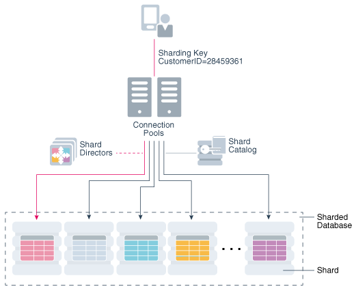
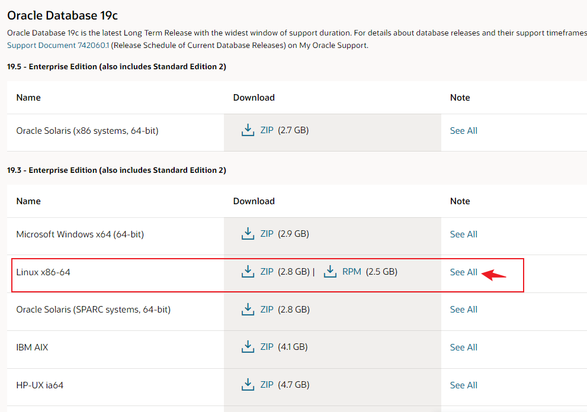

oracle ：https://www.oracle.com/cn/downloads/      

帮助文档：https://docs.oracle.com/en/database/oracle/oracle-database/index.html

​        https://docs.oracle.com/en/


https://blog.csdn.net/bjywxc/article/details/104696121

# 一、概念

oracle是关系型数据库，是mysql的商业版，功能比较成熟。企业常用盈利项目是服务收费

1977年成立  **关系数据库管理系统 （RDBMS）**

oracle 实例和数据库


[**系统全局区域 （SGA）**](https://docs.oracle.com/en/database/oracle/oracle-database/19/cncpt/Chunk520365104.html#GUID-78C0E867-233A-4857-B9FE-A3852A9B7BDF)

[**程序全局区域 （PGA）**](https://docs.oracle.com/en/database/oracle/oracle-database/19/cncpt/Chunk520365104.html#GUID-76021F69-AC7A-4D8D-A308-A7B8AC072EEF)

**多租户体系结构**（CDB）

[**可插拔数据库 （PDB）**](https://docs.oracle.com/en/database/oracle/oracle-database/19/cncpt/Chunk520365104.html#GUID-15825EC2-B512-4FD1-A734-AE4DAB3B3AEC)

**数据库整合**是将数据从一个或多个非 CDB 移动到 CDB 的一般过程。

跨分片的水平分区表


甲骨文分片架构



[**面向服务的体系结构 （SOA）**](https://docs.oracle.com/en/database/oracle/oracle-database/19/cncpt/Chunk520365104.html#GUID-2CB01B71-A23D-4127-B54A-E946C23BEDFC) 是一种多层体系结构，其中应用程序功能封装在服务中。SOA 服务通常作为 Web 服务实现。Web 服务可通过 HTTP 访问，并且基于基于 XML 的标准，如 Web 服务描述语言 （WSDL） 和 SOAP。Oracle 数据库可以在传统的多层或 SOA 环境中充当 Web 服务提供程序。

**简单 Oracle 文档访问 （SODA）** 是对 SOA 的改编，使您能够访问存储在数据库中的数据。SODA 专为无模式应用程序开发而设计，无需了解关系数据库功能或语言（如 SQL 和 PL/SQL）。您可以在 Oracle 数据库中创建和存储文档集合、检索和查询文档，而无需知道文档的存储方式。用于 REST 的 SODA 使用具象状态传输 （REST） 架构样式来实现 SODA。


下载地址：https://www.oracle.com/cn/database/technologies/oracle-database-software-downloads.html#19c



> [root@oracle ~]# cksum LINUX.X64_193000_db_home.zip 
> 3680739943 3059705302 LINUX.X64_193000_db_home.zip
>
> [root@oracle ~]# sha256sum LINUX.X64_193000_db_home.zip 
> ba8329c757133da313ed3b6d7f86c5ac42cd9970a28bf2e6233f3235233aa8d8  LINUX.X64_193000_db_home.zip
>
> 确定跟官网的大小一致

https://www.oracle.com/cn/database/technologies/oracle19c-linux-downloads.html

这里点开可以看其他版本

https://www.oracle.com/cn/database/technologies/

**oracle 硬件要求**

| 名称     | 配置                   | 备注                 |
| -------- | ---------------------- | -------------------- |
| 服务架构 | x86 架构               | ARM 不知道能不能支持 |
| CPU      | 双核+                  |                      |
| 显卡     | 支持1024*768分辨率即可 | 市面上集显都可以     |
| 网络     | 至少一个网口           |                      |
| 内存     | 1G +                   | 推荐8GB              |
| 硬盘     | 8GB +                  | 现在最少都120G       |

Oracle 支持的系统

| 名称     | 版本                                                         |
| -------- | ------------------------------------------------------------ |
| Linux    | oracle linux 、kernel 5.4以上、Redhat Linux、Centos、SUSE linux、Ubuntu... |
| 服务品牌 | IBM、DELL、Acer、Lenovo、全球x86品牌                         |

Oracle 对Linux 系统的要求

| project                | 要求            | 备注     |
| ---------------------- | --------------- | -------- |
| /tmp                   | 1G=<            | 最低配置 |
| swap                   | 物理内存的1.5倍 | 推荐8GB+ |
| user\|group            |                 |          |
| 其他要求跟一般软件一致 |                 |          |
|                        |                 |          |

## 环境检测

```sh
[root@memcached ~]# free -mh   # 确定系统上物理内存和交换内存
              total        used        free      shared  buff/cache   available
Mem:           3.7G        265M        3.2G         11M        186M        3.2G
Swap:          4.0G          0B        4.0G

[root@memcached ~]# grep MemTotal /proc/meminfo    # 检查物理内存大小
MemTotal:        3861264 kB

[root@memcached ~]# grep SwapTotal /proc/meminfo   # 交换分区大小
SwapTotal:       4194300 kB

[root@memcached ~]# df -h /tmp  # 确定tmp目录的可用空间
Filesystem               Size  Used Avail Use% Mounted on
/dev/mapper/centos-root   56G  3.4G   53G   6% /

[root@memcached ~]# uname -m   # 版本 如果看不到预期的输出，则无法在此系统上安装该软件。
x86_64

[root@memcached ~]# cat /etc/redhat-release   # 系统版本
CentOS Linux release 7.9.2009 (Core)

[root@memcached ~]# df -h /dev/shm  # 验证共享内存 （/dev/shm） 是否以足够的大小正确装载
Filesystem      Size  Used Avail Use% Mounted on
tmpfs           1.9G     0  1.9G   0% /dev/shm

[root@memcached ~]# cat /etc/os-release  # 确定发行版
NAME="CentOS Linux"
VERSION="7 (Core)"
ID="centos"
ID_LIKE="rhel fedora"
VERSION_ID="7"
PRETTY_NAME="CentOS Linux 7 (Core)"
ANSI_COLOR="0;31"
CPE_NAME="cpe:/o:centos:centos:7"
HOME_URL="https://www.centos.org/"
BUG_REPORT_URL="https://bugs.centos.org/"

CENTOS_MANTISBT_PROJECT="CentOS-7"
CENTOS_MANTISBT_PROJECT_VERSION="7"
REDHAT_SUPPORT_PRODUCT="centos"
REDHAT_SUPPORT_PRODUCT_VERSION="7"

[root@memcached ~]# uname -r  # 内核版本
3.10.0-1160.el7.x86_64   
```

## Install

install Oracle 有两种方法，一种是rpm包，另一种是zip


### 安装准备

下载地址：https://yum.oracle.com/oracle-linux-isos.html

​        https://edelivery.oracle.com/linux   # 软件交付云网站

参考官网：https://docs.oracle.com/en/database/oracle/oracle-database/19/ladbi/automatically-configuring-oracle-linux-with-oracle-preinstallation-rpm.html#GUID-22846194-58EF-4552-AAC3-6F6D0A1DF794

x86_64 服务器参考：

https://docs.oracle.com/en/database/oracle/oracle-database/19/ladbi/operating-system-requirements-for-x86-64-linux-platforms.html#GUID-3F647617-7FF5-4EE4-BBA8-9A5E3EEC888F

先决条件

```sh
openssh    # 必须的

[root@memcached ~]# yum install -y openssh bc binutils compat-libcap1 compat-libstdc++-33 elfutils-libelf elfutils-libelf-devel fontconfig-devel glibc glibc-devel ksh libaio libaio-devel libX11 libXau libXi libXtst libXrender libXrender-devel gcc gcc-c++ libgcc libstdc++ libstdc++-devel libxcb make smartmontools sysstat libxcb


[root@memcached ~]# rpm --query --queryformat "%{NAME}-%{VERSION}.%{RELEASE} (%{ARCH})\n" openssh bc binutils compat-libcap1 compat-libstdc++-33 elfutils-libelf elfutils-libelf-devel fontconfig-devel glibc glibc-devel ksh libaio libaio-devel libX11 libXau libXi libXtst libXrender libXrender-devel gcc gcc-c++ libgcc libstdc++ libstdc++-devel libxcb make smartmontools sysstat libxcb
openssh-7.4p1.22.el7_9 (x86_64)
bc-1.06.95.13.el7 (x86_64)
binutils-2.27.44.base.el7_9.1 (x86_64)
compat-libcap1-1.10.7.el7 (x86_64)
compat-libstdc++-33-3.2.3.72.el7 (x86_64)
elfutils-libelf-0.176.5.el7 (x86_64)
elfutils-libelf-devel-0.176.5.el7 (x86_64)
fontconfig-devel-2.13.0.4.3.el7 (x86_64)
glibc-2.17.325.el7_9 (x86_64)
glibc-devel-2.17.325.el7_9 (x86_64)
ksh-20120801.143.el7_9 (x86_64)
libaio-0.3.109.13.el7 (x86_64)
libaio-devel-0.3.109.13.el7 (x86_64)
libX11-1.6.7.4.el7_9 (x86_64)
libXau-1.0.8.2.1.el7 (x86_64)
libXi-1.7.9.1.el7 (x86_64)
libXtst-1.2.3.1.el7 (x86_64)
libXrender-0.9.10.1.el7 (x86_64)
libXrender-devel-0.9.10.1.el7 (x86_64)
gcc-4.8.5.44.el7 (x86_64)
gcc-c++-4.8.5.44.el7 (x86_64)
libgcc-4.8.5.44.el7 (x86_64)
libstdc++-4.8.5.44.el7 (x86_64)
libstdc++-devel-4.8.5.44.el7 (x86_64)
libxcb-1.13.1.el7 (x86_64)
make-3.82.24.el7 (x86_64)
smartmontools-7.0.2.el7 (x86_64)
sysstat-10.1.5.19.el7 (x86_64)
libxcb-1.13.1.el7 (x86_64)
```

>  这里使用 rpm -q package_name 单个包可以使用这样的办法。多个软件使用下面的：
>
> \# rpm -qa --queryformat "%{NAME}-%{VERSION}-%{RELEASE} (%{ARCH})\n"  *package_names*

```sh
[root@memcached ~]# rpm -q openssh bc binutils compat-libcap1 compat-libstdc++-33 elfutils-libelf elfutils-libelf-devel fontconfig-devel glibc glibc-devel ksh libaio libaio-devel libX11 libXau libXi libXtst libXrender libXrender-devel gcc gcc-c++ libgcc libstdc++ libstdc++-devel libxcb make smartmontools sysstat libxcb
openssh-7.4p1-22.el7_9.x86_64
bc-1.06.95-13.el7.x86_64
binutils-2.27-44.base.el7_9.1.x86_64
compat-libcap1-1.10-7.el7.x86_64
compat-libstdc++-33-3.2.3-72.el7.x86_64
elfutils-libelf-0.176-5.el7.x86_64
elfutils-libelf-devel-0.176-5.el7.x86_64
fontconfig-devel-2.13.0-4.3.el7.x86_64
glibc-2.17-325.el7_9.x86_64
glibc-devel-2.17-325.el7_9.x86_64
ksh-20120801-143.el7_9.x86_64
libaio-0.3.109-13.el7.x86_64
libaio-devel-0.3.109-13.el7.x86_64
libX11-1.6.7-4.el7_9.x86_64
libXau-1.0.8-2.1.el7.x86_64
libXi-1.7.9-1.el7.x86_64
libXtst-1.2.3-1.el7.x86_64
libXrender-0.9.10-1.el7.x86_64
libXrender-devel-0.9.10-1.el7.x86_64
gcc-4.8.5-44.el7.x86_64
gcc-c++-4.8.5-44.el7.x86_64
libgcc-4.8.5-44.el7.x86_64
libstdc++-4.8.5-44.el7.x86_64
libstdc++-devel-4.8.5-44.el7.x86_64
libxcb-1.13-1.el7.x86_64
make-3.82-24.el7.x86_64
smartmontools-7.0-2.el7.x86_64
sysstat-10.1.5-19.el7.x86_64
libxcb-1.13-1.el7.x86_64
```

```sh
# 作为 root 用户，请检查系统上的 TSC 时钟源是否可用
[root@memcached ~]# cat /sys/devices/system/clocksource/clocksource0/available_clocksource 
tsc hpet acpi_pm 

# 验证当前时钟源是否设置为 tsc
[root@memcached ~]# cat /sys/devices/system/clocksource/clocksource0/current_clocksource 
tsc
```

```sh
/etc/ssh/sshd_config  
LoginGraceTime 0    # 将超时等待设置为无限 不推荐
```

磁盘 I/O 调度程序对磁盘 I/O 请求进行重新排序、延迟或合并，以实现更高的吞吐量和更低的延迟。Linux 有多个可用的磁盘 I/O 调度程序，包括 Deadline、Noop、Anticipatory 和 Complete Fair Queuing （CFQ）。

在每个群集节点上，输入以下命令以验证是否已配置“截止磁盘 I/O”计划程序以供使用：

```sh
[root@memcached ~]# cat /sys/block/sda/queue/scheduler 
noop [deadline] cfq 
```

在此示例中，默认磁盘 I/O 调度程序是 Deadline，是 Oracle 自动存储管理 （Oracle ASM） 磁盘设备

如果默认磁盘 I/O 调度程序不是 Deadline，请使用规则文件进行设置：

https://docs.oracle.com/en/database/oracle/oracle-database/19/ladbi/setting-the-disk-io-scheduler-on-linux.html#GUID-B59FCEFB-20F9-4E64-8155-7A61B38D8CDF

```sh
vi /etc/udev/rules.d/60-oracle-schedulers.rules
ACTION=="add|change", KERNEL=="sd[a-z]", ATTR{queue/rotational}=="0", ATTR{queue/scheduler}="deadline"
```

在群集系统上，将规则文件复制到群集上的所有其他节点


**创建操作系统权限组**

```sh
[root@memcached ~]# groupadd -g 54321 oinstall     # oracle 清单组 安装软件必须的权限
[root@memcached ~]# groupadd -g 54327 asmdba       # 为 ASM 组创建 OSDBA 自动存储管理的访问权限
[root@memcached ~]# groupadd -g 54328 asmoper      # 为 ASM 组创建 OSOPER 
[root@memcached ~]# groupadd -g 54322 dba          # 为数据库安装创建 OSDBA 组
[root@memcached ~]# groupadd -g 54323 oper         # 为数据库安装创建 OSOPER 组
[root@memcached ~]# groupadd -g 54324 backupdba    # 为数据库安装创建 OSBACKUPDBA 组
[root@memcached ~]# groupadd -g 54325 dgdba        # 为数据库安装创建 OSDGDBA 组
[root@memcached ~]# groupadd -g 54326 kmdba        # 为数据库安装创建 OSKMDBA 组
[root@memcached ~]# groupadd -g 54330 racdba       # 为数据库安装创建 OSRACDBA 组
```

创建 Oracle **软件所有者用户**

```sh
[root@memcached ~]# useradd -u 54321 -g oinstall -G dba,asmdba,backupdba,dgdba,kmdba,racdba,oper oracle
[root@memcached ~]# useradd -u 54331 -g oinstall -G dba,asmdba,backupdba,dgdba,kmdba,racdba grid
```

配置域名解析

```sh
[root@oracle ~]# echo -e "172.16.0.202 oracle\n" >>/etc/hosts
[root@oracle ~]# hostname -s
oracle
[root@oracle ~]# hostname -i
172.16.0.202
```

```sh
# sysctl.conf文件
[root@oracle ~]# vim /etc/sysctl.conf 
fs.aio-max-nr = 1048576
fs.file-max = 6815744
kernel.shmall = 16451328
kernel.shmmax = 33692319744
kernel.shmmni = 4096
kernel.sem = 250 32000 100 128
net.ipv4.ip_local_port_range = 9000 65500
net.core.rmem_default = 262144
net.core.rmem_max = 4194304
net.core.wmem_default = 262144
net.core.wmem_max = 1048576  

[root@oracle ~]# sysctl -p
fs.aio-max-nr = 1048576
fs.file-max = 6815744
kernel.shmall = 16451328
kernel.shmmax = 33692319744
kernel.shmmni = 4096
kernel.sem = 250 32000 100 128
net.ipv4.ip_local_port_range = 9000 65500
net.core.rmem_default = 262144
net.core.rmem_max = 4194304
net.core.wmem_default = 262144
net.core.wmem_max = 1048576

# 下面内核参数也可以添加
net.ipv4.ip_no_pmtu_disc = 1
net.ipv4.conf.all.accept_redirects = 0
net.ipv4.conf.default.accept_redirects = 0
net.ipv4.conf.all.send_redirects = 0
net.ipv4.conf.all.secure_redirects = 0
net.ipv4.tcp_max_syn_backlog = 4096
net.ipv4.tcp_keepalive_time = 150
net.ipv4.tcp_keepalive_probes = 5
net.ipv4.tcp_keepalive_intvl = 6
```

设置oracle 用户环境

```sh
[root@oracle ~]# su - oracle
  st login: Tue Apr 12 12:14:05 CST 2022 on pts/1
[oracle@oracle ~]$ vim .bash_profile 
# .bash_profile

# Get the aliases and functions
if [ -f ~/.bashrc ]; then
        . ~/.bashrc
fi

# User specific environment and startup programs

PATH=$PATH:$HOME/.local/bin:$HOME/bin

export PATH
############################# 添加下面
export ORACLE_BASE=/u01/app/oracle
export ORACLE_HOME=/u01/app/oracle/product/19.3.0
export PATH=$PATH:$ORACLE_HOME/bin:/usr/local/bin
export ORACLE_HOSTNAME=oracle
export ORACLE_SID=oracle
export LD_LIBRARY_PATH=$ORACLE_HOME/lib:$ORACLE_HOME/rdbms/lib:$ORACLE_HOME/network/lib:/lib:/usr/lib
export CLASSPATH=$ORACLE_HOME/jlib:$ORACLE_HOME/rdbms/jlib:$ORACLE_HOME/network/jlib

[oracle@oracle ~]$ . .bash_profile

# 创建oracle安装目录
[root@oracle ~]# mkdir /u01
[root@oracle ~]# chmod 777 /u01

[root@oracle ~]# mkdir -p /u01/app/oracle
[root@oracle ~]# mkdir -p /u01/app/oraInventory
[root@oracle ~]# chown -R oracle:oinstall /u01/app/oracle
[root@oracle ~]# chown -R oracle:oinstall /u01/app/oraInventory
[root@oracle ~]# chmod -R 775 /u01/app
```

修改用户shell限制

```sh
[root@oracle ~]# vim /etc/security/limits.conf 
...
 63 # Set Oracle Database Server
 64 @oinstall soft nofile 2048
 65 @oinstall hard nofile 65536
 66 @oinstall soft nproc 16384
 67 @oinstall soft stack 10240 
```

install

```sh
[root@oracle ~]# mkdir -p /u01/app/oracle/product/19.3.0/dbhome_1

[root@oracle ~]# su - oracle 
[oracle@oracle ~]$ echo $ORACLE_HOME
/u01/app/oracle/product/19.3.0
[oracle@oracle ~]$ tree /u01
/u01
└── app
    ├── oracle
    │   └── product
    │       └── 19.3.0
    └── oraInventory

5 directories, 0 files

[oracle@oracle ~]$ cd /u01/app/oracle/product/19.3.0/dbhome_1/
[oracle@oracle /u01/app/oracle/product/19.3.0/dbhome_1]$ unzip -q /tmp/LINUX.X64_193000_db_home.zip   # 把下载的包解压到当前目录
[oracle@oracle /u01/app/oracle/product/19.3.0/dbhome_1]$ ls
addnode     deinstall      javavm   OPatch   R              sqlj
apex        demo           jdbc     opmn     racg           sqlpatch
assistants  diagnostics    jdk      oracore  rdbms          sqlplus
bin         dmu            jlib     ord      relnotes       srvm
clone       drdaas         ldap     ords     root.sh        suptools
crs         dv             lib      oss      root.sh.old    ucp
css         env.ora        md       oui      root.sh.old.1  usm
ctx         has            mgw      owm      runInstaller   utl
cv          hs             network  perl     schagent.conf  wwg
data        install        nls      plsql    sdk            xdk
dbjava      instantclient  odbc     precomp  slax
dbs         inventory      olap     QOpatch  sqldeveloper

方法一：
# 启动数据库安装向导 需要vnc连接图形化界面，
[oracle@oracle /u01/app/oracle/product/19.3.0/dbhome_1]$ ./runInstaller 

方法二：
[oracle@oracle /u01/app/oracle/product/19.3.0/dbhome_1]$ cd install/response/
[oracle@oracle /u01/app/oracle/product/19.3.0/dbhome_1/install/response]$ ls
db_install.rsp
[oracle@oracle /u01/app/oracle/product/19.3.0/dbhome_1/install/response]$ cp db_install.rsp{,.bak}
[oracle@oracle /u01/app/oracle/product/19.3.0/dbhome_1/install/response]$ vim db_install.rsp
29 oracle.install.option=INSTALL_DB_SWONLY
34 UNIX_GROUP_NAME=oinstall
41 INVENTORY_LOCATION=/u01/app/oraInventory
45 ORACLE_HOME=/u01/app/oracle/product/19.3.0
50 ORACLE_BASE=/u01/app/oracle
62 oracle.install.db.InstallEdition=EE
79 oracle.install.db.OSDBA_GROUP=dba
85 oracle.install.db.OSOPER_GROUP=oper
90 oracle.install.db.OSBACKUPDBA_GROUP=backupdba
95 oracle.install.db.OSDGDBA_GROUP=dgdba
100 oracle.install.db.OSKMDBA_GROUP=kmdba
105 oracle.install.db.OSRACDBA_GROUP=racdba
120 oracle.install.db.rootconfig.executeRootScript=false
```

```sh
# install 
[oracle@oracle /u01/app/oracle/product/19.3.0/dbhome_1]$ ./runInstaller -silent -responseFile /u01/app/oracle/product/19.3.0/dbhome_1/install/response/db_install.rsp
```

```sh
# 报错
[FATAL] [INS-35954] The installer has detected that the Oracle home location provided in the response file is not correct.
   CAUSE: The Database Oracle home is the location from where the installer is executed. It has been detected that the value set in the response file is different (/u01/app/oracle/product/19.3.0). Value expected is: /u01/app/oracle/product/19.3.0/dbhome_1
   ACTION: It is not required to specify ORACLE_HOME in the response file for Database installation. Alternatively, set it to the location of the installer (/u01/app/oracle/product/19.3.0/dbhome_1).
Moved the install session logs to:
 /u01/app/oraInventory/logs/InstallActions2022-04-12_02-41-45PM
```

```sh
# install oracle 完成
[oracle@oracle /u01/app/oracle/product/19.3.0/dbhome_1]$ ./runInstaller -silent -responseFile /u01/app/oracle/product/19.3.0/dbhome_1/install/response/db_install.rsp
Launching Oracle Database Setup Wizard...

[WARNING] [INS-32047] The location (/u01/app/oraInventory) specified for the central inventory is not empty.
   ACTION: It is recommended to provide an empty location for the inventory.
The response file for this session can be found at:
 /u01/app/oracle/product/19.3.0/dbhome_1/install/response/db_2022-04-12_02-50-32PM.rsp

You can find the log of this install session at:
 /tmp/InstallActions2022-04-12_02-50-32PM/installActions2022-04-12_02-50-32PM.log

As a root user, execute the following script(s):
        1. /u01/app/oraInventory/orainstRoot.sh
        2. /u01/app/oracle/product/19.3.0/dbhome_1/root.sh

Execute /u01/app/oraInventory/orainstRoot.sh on the following nodes: 
[oracle]
Execute /u01/app/oracle/product/19.3.0/dbhome_1/root.sh on the following nodes: 
[oracle]


Successfully Setup Software.
Moved the install session logs to:
 /u01/app/oraInventory/logs/InstallActions2022-04-12_02-50-32PM
```

根据提示操作

```sh
[oracle@oracle /u01/app/oracle/product/19.3.0/dbhome_1]$ su - root
Password: 
Last login: Tue Apr 12 14:54:21 CST 2022 on pts/1

[root@oracle ~]# /u01/app/oraInventory/orainstRoot.sh
Changing permissions of /u01/app/oraInventory.
Adding read,write permissions for group.
Removing read,write,execute permissions for world.

Changing groupname of /u01/app/oraInventory to oinstall.
The execution of the script is complete.

[root@oracle ~]# /u01/app/oracle/product/19.3.0/dbhome_1/root.sh
Check /u01/app/oracle/product/19.3.0/dbhome_1/install/root_oracle_2022-04-12_14-55-41-589725351.log for the output of root script
```

相应模板

```sh
软件 # /u01/app/oracle/product/19.3.0/dbhome_1/install/response/db_install.rsp
监听 # /u01/app/oracle/product/19.3.0/dbhome_1/assistants/netca/netca.rsp 
建库 # /u01/app/oracle/product/19.3.0/dbhome_1/assistants/dbca/dbca.rsp 
```

配置监听

```sh
[oracle@oracle ~]$ netca /silent /responseFile /u01/app/oracle/product/19.3.0/dbhome_1/assistants/netca/netca.rsp 

Parsing command line arguments:
    Parameter "silent" = true
    Parameter "responsefile" = /u01/app/oracle/product/19.3.0/dbhome_1/assistants/netca/netca.rsp
Done parsing command line arguments.
Oracle Net Services Configuration:
Profile configuration complete.
Oracle Net Listener Startup:
    Running Listener Control: 
      /u01/app/oracle/product/19.3.0/dbhome_1/bin/lsnrctl start LISTENER
    Listener Control complete.
    Listener started successfully.
Listener configuration complete.
Oracle Net Services configuration successful. The exit code is 0

[oracle@oracle ~]$ lsnrctl status

LSNRCTL for Linux: Version 19.0.0.0.0 - Production on 12-APR-2022 15:18:25

Copyright (c) 1991, 2019, Oracle.  All rights reserved.

Connecting to (DESCRIPTION=(ADDRESS=(PROTOCOL=TCP)(HOST=oracle)(PORT=1521)))
STATUS of the LISTENER
------------------------
Alias                     LISTENER
Version                   TNSLSNR for Linux: Version 19.0.0.0.0 - Production
Start Date                12-APR-2022 15:18:01
Uptime                    0 days 0 hr. 0 min. 23 sec
Trace Level               off
Security                  ON: Local OS Authentication
SNMP                      OFF
Listener Parameter File   /u01/app/oracle/product/19.3.0/dbhome_1/network/admin/listener.ora
Listener Log File         /u01/app/oracle/diag/tnslsnr/oracle/listener/alert/log.xml
Listening Endpoints Summary...
  (DESCRIPTION=(ADDRESS=(PROTOCOL=tcp)(HOST=oracle)(PORT=1521)))
  (DESCRIPTION=(ADDRESS=(PROTOCOL=ipc)(KEY=EXTPROC1521)))
The listener supports no services
The command completed successfully

[oracle@oracle ~]$ ss -lntup|grep 1521
tcp    LISTEN     0      128    [::]:1521               [::]:*                   users:(("tnslsnr",pid=38891,fd=8))

[oracle@oracle ~]$ lsof -n|grep 1521
tnslsnr   38891          oracle   12u     unix 0x0000000000000000       0t0    102552 /var/tmp/.oracle/sEXTPROC1521
tnslsnr   38891 38894    oracle   12u     unix 0x0000000000000000       0t0    102552 /var/tmp/.oracle/sEXTPROC1521
```

创建数据库

```sh
[oracle@oracle ~]$ cd /u01/app/oracle/product/19.3.0/dbhome_1/assistants/
[oracle@oracle /u01/app/oracle/product/19.3.0/dbhome_1/assistants]$ ls
bin  dbca  dbua  jlib  mesg  netca  rconfig
[oracle@oracle /u01/app/oracle/product/19.3.0/dbhome_1/assistants]$ cp dbca/dbca.rsp{,.bak}
[oracle@oracle /u01/app/oracle/product/19.3.0/dbhome_1/assistants]$ vim dbca/dbca.rsp
 32 gdbName=testdb
 42 sid=testdb
 52 databaseConfigType=SI
 223 templateName=General_Purpose.dbc
 233 sysPassword="password"
 243 systemPassword="password"
 262 emConfiguration=DBEXPRESS
 295 dbsnmpPassword="password"
 411 datafileDestination=/u01/app/oracle/oradata
 468 characterSet=AL32UTF8
 604 totalMemory=3770   
 # "password" 这里输入你的密码不能有引号，满足密码复杂性
 
[root@oracle ~]# free -m
              total        used        free      shared  buff/cache   available
Mem:           3770         346        1675           8        1748        3158
Swap:          4095           3        4092

# 如果要创建容器数据库，则还需要配置以下参数，如果是多个pdb则以pdbname为前缀
createAsContainerDatabase=true
numberOfPDBs=1
pdbName=yhggi
pdbAdminPassword=password

# 执行安装
[oracle@oracle /u01/app/oracle/product/19.3.0/dbhome_1/assistants]$ dbca  -silent -createDatabase -responseFile /u01/app/oracle/product/19.3.0/dbhome_1/assistants/dbca/dbca.rsp
[WARNING] [DBT-11209] Current available memory is less than the required available memory (3,770MB) for creating the database.
   CAUSE: Following nodes do not have required available memory :
 Node:oracle            Available memory:3.0953GB (3245708.0KB)

Prepare for db operation
10% complete
Copying database files
40% complete
Creating and starting Oracle instance
42% complete
46% complete
50% complete
54% complete
60% complete
Completing Database Creation
66% complete
70% complete
Executing Post Configuration Actions
100% complete
Database creation complete. For details check the logfiles at:
 /u01/app/oracle/cfgtoollogs/dbca/testdb.
Database Information:
Global Database Name:testdb
System Identifier(SID):testdb
Look at the log file "/u01/app/oracle/cfgtoollogs/dbca/testdb/testdb.log" for further details.

```

检查

```sh
[oracle@oracle ~]$ sqlplus / as sysdba

SQL*Plus: Release 19.0.0.0.0 - Production on Tue Apr 12 16:38:21 2022
Version 19.3.0.0.0

Copyright (c) 1982, 2019, Oracle.  All rights reserved.

Connected to an idle instance.

```

