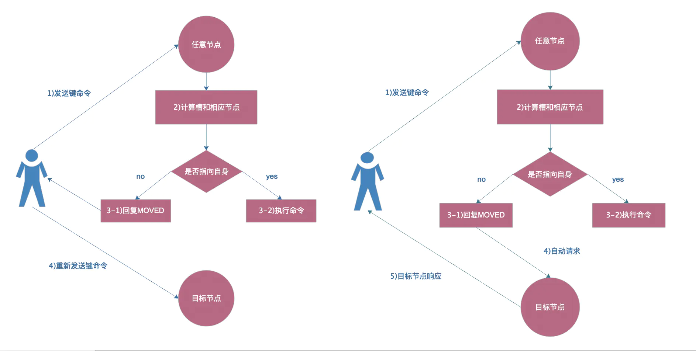

参考资料：https://www.cnblogs.com/ronglianbing/category/1596779.html

准备实验环境

```BASH
#!/bin/bash
#----------------------------------------------
# Author        : 349925756
# Email         : 349925756@qq.com
# Last modified : 2021-06-08 21:31
# Filename      : uuid.sh
# Description   : 
# Version       : 1.1 
#----------------------------------------------
#修改网卡UUID IP地址 主机名，关闭防火墙，selinux 安装常用工具关闭swap 导入kubectl tab补全
#uuid  ip
path_eth0="/etc/sysconfig/network-scripts/ifcfg-eth0"
sed -i "/UUID/c UUID=$(uuidgen)" $path_eth0   
sed -i "s/$1/$2/g" $path_eth0
echo "$3" >/etc/hostname
systemctl stop firewalld && systemctl disable firewalld
sed -i "s/SELINUX=.*/SELINUX=disabled/g" /etc/selinux/config
\cp /usr/share/zoneinfo/Asia/Shanghai /etc/localtime 
systemctl enable chronyd
sed -ri 's/.*swap.*/#&/' /etc/fstab 
reboot

使用方法：sh /$path/$filename.sh  原IP地址  目标IP地址  主机名
例：sh uuid.sh 120 30 master01
```


# Redis

官网：https://redis.io/

下载：https://redis.io/download

教程：https://www.jianshu.com/p/8af6177f4c23

https://www.jianshu.com/u/ee1c7fcea5b0

## Redis 是什么

Redis是一种基于键值对的NoSQL数据库,与很多键值对数据库不同,redis中的值可以有string,hash,list,set,zset,geo等多种数据结构和算法组成.
       因为Redis会将所有的数据都放在内存中,所以他的读写性能非常惊人.不仅如此,Redis还可以将内存中的数据利用快照和日志的形式保存到硬盘上
       Redis还提供了键过期,发布订阅,事务,流水线等附加功能.

### 特性

**速度快**

> redis所有数据都存放在内存中，使用C语言实现，使用单线程架构

**基于键值对的数据结构服务器**

> 5种数据结构：字符串 sting,哈希 hash,列表list,集合zset,有序集合geo

**丰富的功能**

> 提供键过期功能，实现缓存；
>
> 提供发布订阅功能，实现消息系统；
>
> 提供pipeline功能，客户端可以将一批命令一次性传到redis，减少网络开销

**简单稳定**

> 源码很少5万行左右，使用单线程模型，使得redis服务端处理模型变得简单，不依赖操作系统中的库

**客户端语言多**

> java,php,python,c,c++,node js等

**持久化**

> RDB 和AOF

**主从复制**

**高可用和分布式**

> 哨兵，集群

## Redis应用场景

**缓存-键过期时间**

> 缓存session会话，缓存用户信息，找不到再去mysql查，查到然后回写到redis

**排行榜-列表&有序集合**

> 热度排行榜，发布时间排行榜

**计数器应用-自带支持计数器**

> 帖子浏览数，视频播放量，商品浏览数

**社交网络-集合**

> 踩、赞，粉丝，共同好友、喜好，推送，打标签

**消息列队系统-发布订阅**

> 配合elk实现日志收集

# Redis install

**结构目录规划**

```BASH
#redis 下载目录
/server/soft

#redis install dir
/opt/redis_cluster/redis_{port}/{conf,logs,pid} #多实例加端口

#redis data dir
/data/redis_cluster/redis_{port}/redis_{port}.rdb

#redis script dir
/server/scripts/redis_shell.sh

[root@redis01 ~]# mkdir -p /server/{soft,scripts} \
                           /data/redis_cluster/redis_6379 \
                           /opt/redis_cluster/redis_6379/{conf,logs,pid}

```

**编辑host**

```BASH
echo -e "172.16.0.210 redis01\n172.16.0.211 redis02\n172.16.0.212 redis03" >>/etc/hosts
```

从源码安装 https://redis.io/download

```BASH
[root@redis01 /server/soft]# wget https://download.redis.io/releases/redis-6.2.5.tar.gz
# 竟然需要翻墙...
[root@redis01 /server/soft]# tar xf redis-6.2.5.tar.gz -C /opt/redis_cluster/
[root@redis01 /server/soft]# ln -s /opt/redis_cluster/redis-6.2.5/ /opt/redis_cluster/redis
[root@redis01 /server/soft]# cd /opt/redis_cluster/redis
[root@redis01 /opt/redis_cluster/redis]# make
...
Hint: It's a good idea to run 'make test' ;)

make[1]: Leaving directory `/opt/redis_cluster/redis-6.2.5/src'

#make install 是把redis-server  redis-benchmark redis-cli 复制到/usr/local/bin
[root@redis01 /opt/redis_cluster/redis]# make install
cd src && make install
make[1]: Entering directory `/opt/redis_cluster/redis-6.2.5/src'
    CC Makefile.dep
make[1]: Leaving directory `/opt/redis_cluster/redis-6.2.5/src'
make[1]: Entering directory `/opt/redis_cluster/redis-6.2.5/src'

Hint: It's a good idea to run 'make test' ;)

    INSTALL redis-server
    INSTALL redis-benchmark
    INSTALL redis-cli
make[1]: Leaving directory `/opt/redis_cluster/redis-6.2.5/src'

[root@redis01 ~]# which redis-server
/usr/local/bin/redis-server
[root@redis01 ~]# which redis-cli
/usr/local/bin/redis-cli
[root@redis01 ~]# which redis-benchmark
/usr/local/bin/redis-benchmark

```

## 错误处理

```BASH
make[3]: cc: Command not found
make[3]: *** [alloc.o] Error 127
make[3]: Leaving directory `/opt/redis_cluster/redis-6.2.5/deps/hiredis'
make[2]: *** [hiredis] Error 2
make[2]: Leaving directory `/opt/redis_cluster/redis-6.2.5/deps'
make[1]: [persist-settings] Error 2 (ignored)
    CC adlist.o
/bin/sh: cc: command not found
make[1]: *** [adlist.o] Error 127
make[1]: Leaving directory `/opt/redis_cluster/redis-6.2.5/src'
make: *** [all] Error 2

这里需要安装gcc
[root@redis01 /opt/redis_cluster/redis]# yum install -y gcc

make[1]: *** [adlist.o] Error 1
make[1]: Leaving directory `/opt/redis_cluster/redis-6.2.5/src'
make: *** [all] Error 2

[root@redis01 /opt/redis_cluster/redis]# make MALLOC=libc

```

现在编译的二进制文件在`src` 目录中可用 。运行Redis：

```
[root@redis01 /opt/redis_cluster/redis/src]# ./redis-server   #启动redis服务
[root@redis01 ~]# redis-server
```

您可以使用内置客户端与 Redis 交互：

```
[root@redis01 ~]# redis-cli
127.0.0.1:6379> set foo bar
OK
127.0.0.1:6379> get foo
"bar"
127.0.0.1:6379>
```

```bash
[root@redis01 ~]# cat /etc/issue
+--------------------------------------------------------------------------+
                _._
           _.-``__ ''-._
      _.-``    `.  `_.  ''-._           Redis 6.2.5 (00000000/0) 64 bit
  .-`` .-```.  ```\/    _.,_ ''-._
 (    '      ,       .-`  | `,    )     Running in standalone mode
 |`-._`-...-` __...-.``-._|'` _.-'|     Port: 6379
 |    `-._   `._    /     _.-'    |     PID: 14191
  `-._    `-._  `-./  _.-'    _.-'
 |`-._`-._    `-.__.-'    _.-'_.-'|
 |    `-._`-._        _.-'_.-'    |           https://redis.io
  `-._    `-._`-.__.-'_.-'    _.-'
 |`-._`-._    `-.__.-'    _.-'_.-'|
 |    `-._`-._        _.-'_.-'    |
  `-._    `-._`-.__.-'_.-'    _.-'
      `-._    `-.__.-'    _.-'
          `-._        _.-'
              `-.__.-'

+--------------------------------------------------------------------------+

               IP:\4               Tel:18183510256

+--------------------------------------------------------------------------+

```


## Redis配置文件说明

```bash
[root@redis01 /opt/redis_cluster/redis]# grep -Ev "#|^$" redis.conf
bind 127.0.0.1 -::1   #绑定主机地址
protected-mode yes   
port 6379             #监听端口
tcp-backlog 511       
timeout 0
tcp-keepalive 300
daemonize no           #以守护进程模式启动
pidfile /var/run/redis_6379.pid  #pid文件保存的路径
loglevel notice
logfile ""                       #log文件的保存路径
databases 16                     #设置数据库的数量，默认为0
always-show-logo no
set-proc-title yes
proc-title-template "{title} {listen-addr} {server-mode}"
stop-writes-on-bgsave-error yes
rdbcompression yes
rdbchecksum yes
dbfilename dump.rdb              #指定本地持久化文件的文件名，默认是dump.rdb
rdb-del-sync-files no
dir ./                           #本地数据库的目录
replica-serve-stale-data yes
replica-read-only yes
repl-diskless-sync no
repl-diskless-sync-delay 5
repl-diskless-load disabled
repl-disable-tcp-nodelay no
replica-priority 100
acllog-max-len 128
lazyfree-lazy-eviction no
lazyfree-lazy-expire no
lazyfree-lazy-server-del no
replica-lazy-flush no
lazyfree-lazy-user-del no
lazyfree-lazy-user-flush no
oom-score-adj no
oom-score-adj-values 0 200 800
disable-thp yes
appendonly no
appendfilename "appendonly.aof"
appendfsync everysec
no-appendfsync-on-rewrite no
auto-aof-rewrite-percentage 100
auto-aof-rewrite-min-size 64mb
aof-load-truncated yes
aof-use-rdb-preamble yes
lua-time-limit 5000
slowlog-log-slower-than 10000
slowlog-max-len 128
latency-monitor-threshold 0
notify-keyspace-events ""
hash-max-ziplist-entries 512
hash-max-ziplist-value 64
list-max-ziplist-size -2
list-compress-depth 0
set-max-intset-entries 512
zset-max-ziplist-entries 128
zset-max-ziplist-value 64
hll-sparse-max-bytes 3000
stream-node-max-bytes 4096
stream-node-max-entries 100
activerehashing yes
client-output-buffer-limit normal 0 0 0
client-output-buffer-limit replica 256mb 64mb 60
client-output-buffer-limit pubsub 32mb 8mb 60
hz 10
dynamic-hz yes
aof-rewrite-incremental-fsync yes
rdb-save-incremental-fsync yes
jemalloc-bg-thread yes

[root@redis01 /opt/redis_cluster/redis]# egrep -v '#|^$' redis.conf #跟上面的命令一样过滤掉#和空行

修改内容：

  75 bind 172.16.0.210
  98 port 6379
 257 daemonize yes
 289 pidfile  /opt/redis_cluster/redis_6379/pid/redis_6379.pid
 302 logfile /opt/redis_cluster/redis_6379/logs/redis_6379.log
 327 databases 16
 431 dbfilename redis_6379.rdb
 454 dir /data/redis_cluster/redis_6379

```

## 启动关闭服务

```BASH
[root@redis01 /opt/redis_cluster/redis]# cp redis.conf ../redis_6379/conf/redis_6379.con

#启动redis 
[root@redis01 ~]# redis-server /opt/redis_cluster/redis_6379/conf/redis_6379.con
[root@redis01 ~]# ps -ef |grep [r]edis
root      14678      1  0 16:37 ?        00:00:00 redis-server 172.16.0.210:6379

#关闭redis
[root@redis01 ~]# redis-cli -h redis01 shutdown
[root@redis01 ~]# ps -ef |grep [r]edis

```

# Redis 基本操作命令

全局命令

```BASH
[root@redis01 ~]# redis-cli -h redis01  #进入redis
```

## key

查看所有命键

```bash
redis01:6379> keys *
(empty array)
```

*十分危险的命令，线上禁止使用，此命令会调出当前所有键，会导致内存占用满，导致物理机死机*

#### dbsize

返回当前数据库的 key 的数量

```BASH
redis01:6379> Dbsize  
(integer) 0
redis01:6379> DBSIZE
(integer) 10

# dbsize 命令在计算键总数时不会遍历所有键,而是直接获取Redis内置的键总数变量.
```

#### exists

检查给定 `key` 是否存在。若 `key` 存在，返回 `1` ，否则返回 `0` 

```BASH
redis01:6379> Exists key
(integer) 0
# 如果键存在则返回1,不存在则返回0
```

#### del

删除给定的一个或多个 `key` 。

```BASH
Del key [key …]
```

通用命令，无论是什么数据结构类型，del命令都可以将其删除

#### expire

键过期

为给定 `key` 设置生存时间，当 `key` 过期时(生存时间为 `0` )，它会被自动删除。在 Redis 中，带有生存时间的 `key` 被称为『易失的』(volatile)。

生存时间可以通过使用 [*DEL*](http://doc.redisfans.com/key/del.html#del) 命令来删除整个 `key` 来移除，或者被 [*SET*](http://doc.redisfans.com/string/set.html#set) 和 [*GETSET*](http://doc.redisfans.com/string/getset.html#getset) 命令覆写(overwrite)，这意味着，如果一个命令只是修改(alter)一个带生存时间的 `key` 的值而不是用一个新的 `key` 值来代替(replace)它的话，那么生存时间不会被改变。

比如说，对一个 `key` 执行 [*INCR*](http://doc.redisfans.com/string/incr.html#incr) 命令，对一个列表进行 [*LPUSH*](http://doc.redisfans.com/list/lpush.html#lpush) 命令，或者对一个哈希表执行 [*HSET*](http://doc.redisfans.com/hash/hset.html#hset) 命令，这类操作都不会修改 `key` 本身的生存时间。

另一方面，如果使用 [*RENAME*](http://doc.redisfans.com/key/rename.html) 对一个 `key` 进行改名，那么改名后的 `key` 的生存时间和改名前一样。

[*RENAME*](http://doc.redisfans.com/key/rename.html) 命令的另一种可能是，尝试将一个带生存时间的 `key` 改名成另一个带生存时间的 `another_key` ，这时旧的 `another_key` (以及它的生存时间)会被删除，然后旧的 `key` 会改名为 `another_key` ，因此，新的 `another_key` 的生存时间也和原本的 `key` 一样。

使用 [*PERSIST*](http://doc.redisfans.com/key/persist.html) 命令可以在不删除 `key` 的情况下，移除 `key` 的生存时间，让 `key` 重新成为一个『持久的』(persistent) `key` 。

**set   ttl    persist    get**

```BASH
Expire key seconds
# Redis支持对键添加过期时间,当超过过期时间后,会自动删除键.
# 通过ttl命令观察键的剩余时间
大于等于0的证书: 键剩余过期时间
-1: 键没设置过期时间
-2: 键不存在
redis01:6379> set k11 value11    #定义一个key
OK
redis01:6379> expire k11 30      #设置过期时间为30秒
(integer) 1 
redis01:6379> ttl k11           #查看剩余时间
(integer) 26
redis01:6379> expire k11 30000    #更新过期时间
(integer) 1
redis01:6379> ttl k11
(integer) 29993
redis01:6379> ttl k11
(integer) 29988
redis01:6379> PERSIST k11      #不删除key移除key的生存时间
(integer) 1
redis01:6379> ttl k11     #以秒为单位，返回给定key的剩余生存时间(TTL, time to live)
(integer) -1               #当 key 不存在时，返回 -2 。当 key 存在但没有设置剩余生存时间时，                       返回 -1 。
redis01:6379> get k11    #返回 key 所关联的字符串值。
"value11"

```

#### type

键的数据类型

```bash
redis01:6379> type k1
string
```

## 字符串

Redis并不是简单地key-value存储,实际上它是一个数据结构服务器,支持不同类型的值.
 Redis Strings
 这是最简单的Redis类型,如果你只用这种类型,Redis就像一个持久化的memcache服务器(注:memcache的数据仅保存在内存中,服务器重启后,数据将丢失.)

#### set/get

设置/获取

```bash
redis01:6379> set k2 valuel
OK
redis01:6379> get k2
"valuel"
redis01:6379> keys *
1) "k2"

```

#### incr

计数器

INCR命令将字符串值解析成整型.将其加1,最后结果保存为新的字符串,类似命令: INCRBY,DECR,DECRBY

```bash
redis01:6379> set k1 100
OK
redis01:6379> get k1
"100"
redis01:6379> incr k1
(integer) 101
redis01:6379> incr k1
(integer) 102
redis01:6379> incr k1
(integer) 103
redis01:6379> incr k1
(integer) 104
redis01:6379> incr k1
(integer) 105
redis01:6379> get k1
"105"
redis01:6379> incrby k1 1000
(integer) 1105
redis01:6379> get k1
"1105"
```

这个应用在点击量，浏览量，播放量计数上面。有点外挂和作弊器的那种。

#### mset|mget

批量操作

MSET和MGET可以一次存储或获取多个key对应的值.

```bash
redis01:6379> mset k3 v3 k4 v4 k5 v5 k6 6
OK
redis01:6379> mget k3 k4 k5 k6
1) "v3"
2) "v4"
3) "v5"
4) "6"
```

#### append

```BASH
redis01:6379> set k12 123
OK
redis01:6379> get k12
"123"
redis01:6379> APPEND k12 -2345
(integer) 8
redis01:6379> get k12
"123-2345"
```

EXISTS命令返回1或0标识给定key的值是否存在.
       使用DEL命令可以删除key对应的值,
       DEL命令返回1或0标识是被删除(值存在)或者没被删除(key对应的值不存在).

```BASH
redis01:6379> exists k6
(integer) 1
redis01:6379> del k6
(integer) 1
redis01:6379> exists k6
(integer) 0
redis01:6379> del k6
(integer) 0
```

Type命令可以返回key对应的存储类型

```BASH
redis01:6379> type k1
string
redis01:6379> type k6
none
redis01:6379> set k7 1.2
OK
redis01:6379> type k7
string
```

可以对key设置一个超时时间,当这个时间到达后被删除

```BASH
redis01:6379> get k7
"1.2"
redis01:6379> ttl k7
(integer) -1
redis01:6379> EXPIRE k7 10
(integer) 1
redis01:6379> ttl k7
(integer) 1
redis01:6379> ttl k7
(integer) -2
```

PERSIST命令移除超时时间

```BASH
redis01:6379> set k6 6 ex 10
OK
redis01:6379> ttl k6
(integer) 1
redis01:6379> ttl k6
(integer) -2
redis01:6379> ttl k6
(integer) -2
redis01:6379> PERSIST k6
(integer) 0
redis01:6379> ttl k6
(integer) -2
```

## 列表

#### lpush|rpush

LPUSH命令可向list的左边(头部)添加一个新元素
       RPUSH命令可向list的右边(尾部)添加一个新元素.
       最后LRANGE可以从list中取出一定范围的元素

```BASH
redis01:6379> RPUSH list1 A
(integer) 1
redis01:6379> RPUSH list1 B
(integer) 2
redis01:6379> LPUSH list1 top1
(integer) 3
redis01:6379> LRANGE list1 0 -1
1) "top1"
2) "A"
3) "B"
redis01:6379> LRANGE list1 1 -1
1) "A"
2) "B"
redis01:6379> LRANGE list1 2 -1
1) "B"
```

#### lrange

返回列表 `key` 中指定区间内的元素，区间以偏移量 `start` 和 `stop` 指定。下标(index)参数 `start` 和 `stop` 都以 `0` 为底，也就是说，以 `0` 表示列表的第一个元素，以 `1` 表示列表的第二个元素，以此类推。

也可以使用负数下标，以 `-1` 表示列表的最后一个元素， `-2` 表示列表的倒数第二个元素，以此类推。

```BASH
redis01:6379> LRANGE list1 0 -1
1) "top1"
redis01:6379> LRANGE list 0 -1
1) "B"
```

#### RPOP

rPop,从list中删除元素并同时返回删除的值,可以在左边或右边操作.

```BASH
redis01:6379> RPOP list1
"B"
redis01:6379> LRANGE list1 0 -1
1) "top1"
2) "A"
redis01:6379> RPOP list1 1
1) "A"
redis01:6379> LRANGE list1 0 -1
1) "top1"
```

## 哈希

#### hmget|hmset

Hash看起来就像一个’hash’的样子.由键值对组成
       HMSET指令设置hash中的多个域
       HGET取回单个域.
       HMGET取回一系列的值

**hset|hget**

将哈希表 `key` 中的域 `field` 的值设为 `value` 

返回哈希表 `key` 中给定域 `field` 的值

```BASH
redis01:6379> HMSET user:1000 username zhang age 12 job it
OK
redis01:6379> HGET user:1000 username
"zhang"
redis01:6379> Hmget user:1000 username age job
1) "zhang"
2) "12"
3) "it"
redis01:6379> HGETALL user:1000
1) "username"
2) "zhang"
3) "age"
4) "12"
5) "job"
6) "it"
redis01:6379> hmset user:1000 qq 123456789
OK
redis01:6379> HGETALL user:1000
1) "username"
2) "zhang"
3) "age"
4) "12"
5) "job"
6) "it"
7) "qq"
8) "123456789"

```

## 集合


#### sadd

集合是字符串的无序排列,
       SADD指令把新的元素添加到set中

```bash
redis01:6379> sadd set1 1 2 3
(integer) 3
redis01:6379> SMEMBERS set1
1) "1"
2) "2"
3) "3"
```

#### smembers

返回集合 `key` 中的所有成员。

和list类型不同,set集合不允许出现重复的元素

```BASH
redis01:6379> sadd set1 1 4
(integer) 1
redis01:6379> SMEMBERS set1
1) "1"
2) "2"
3) "3"
4) "4"
redis01:6379> sadd set1 2 5
(integer) 1
redis01:6379> smembers set1
1) "1"
2) "2"
3) "3"
4) "4"
5) "5"
```

#### Srem

移除集合 `key` 中的一个或多个 `member` 元素，不存在的 `member` 元素会被忽略。

```BASH
redis01:6379> SREM set1 2 4
(integer) 2
redis01:6379> SMEMBERS set1
1) "1"
2) "3"
3) "5"
```

#### Sdiff

计算集合的差异成员 

返回一个集合的全部成员，该集合是所有给定集合之间的差集。

```BASH
redis01:6379> sadd set1 1 2 3 4 5
(integer) 2
redis01:6379> SMEMBERS set1
1) "1"
2) "2"
3) "3"
4) "4"
5) "5"
redis01:6379> sadd set2 1 3 5
(integer) 3
redis01:6379> SMEMBERS set2
1) "1"
2) "3"
3) "5"
redis01:6379> sdiff set1 set2   # 以set1 为基准跟set2对比
1) "2"
2) "4"
redis01:6379> sdiff set2 set1
(empty array)

```

#### Sinter

计算集合的交集

返回一个集合的全部成员，该集合是所有给定集合的交集。

```BASH
redis01:6379> SINTER set1 set2
1) "1"
2) "3"
3) "5"
```

#### scard

返回集合 `key` 的基数(集合中元素的数量)。

```BASH
redis01:6379> scard set1
(integer) 5
redis01:6379> SUNION set1
1) "1"
2) "2"
3) "3"
4) "4"
5) "5"

```

#### Sunion

计算集合并集

返回一个集合的全部成员，该集合是所有给定集合的并集。

不存在的 `key` 被视为空集。

```BASH
redis01:6379> SUNION set1 set2
1) "1"
2) "2"
3) "3"
4) "4"
5) "5"
```

**基本操作命令**

http://doc.redisfans.com/   太老了参考一下就可以。

redis 命令块包含：key ,string,hash,list,

插入10000行数据

```BASH
[root@redis01 /server/scripts]# cat redis_set_vluas.sh
#!/bin/bash
for i in {1..10000}
do
   redis-cli -h redis01 set k_${i} valus_${i}
done
```

```BASH
[root@redis01 ~]# ps -ef |grep [r]edis
root       1295      1  0 16:14 ?        00:00:00 redis-server 172.16.0.210:6379
root       1300   1270  0 16:16 pts/0    00:00:00 redis-cli -h redis01
[root@redis01 ~]# kill -9 1295  #生产禁止使用这个会让所有进程死亡，而且数据永远无法恢复
上面操作之后数据全丢！

[root@redis01 ~]# sh /server/scripts/redis_set_vluas.sh
[root@redis01 ~]# ps -ef |grep [r]edis
root      11365      1  0 16:36 ?        00:00:00 redis-server 172.16.0.210:6379
root      11369   1270  0 16:36 pts/0    00:00:00 redis-cli -h redis01
[root@redis01 ~]# kill 11365

[root@redis01 ~]# redis-cli -h redis01
redis01:6379> keys *
...
10000) "k_8627"
redis01:6379>

这个操作数据并没有丢失，因为kill 的时候使用的shutdown 默认保存了数据
[root@redis01 ~]# ls /data/redis_cluster/redis_6379/
redis_6379.rdb

```


# Redis 持久化

Redis 提供了2种不同级别的持久化方式：RDB AOF

> RDB 持久化可以在指定的时间间隔内生成数据集的时间点快照（point-in-time snapshot）。
>
> AOF 持久化记录服务器执行的所有写操作命令，并在服务器启动时，通过重新执行这些命令来还原数据集。 AOF 文件中的命令全部以 Redis 协议的格式来保存，新命令会被追加到文件的末尾。 Redis 还可以在后台对 AOF 文件进行重写（rewrite），使得 AOF 文件的体积不会超出保存数据集状态所需的实际大小。
>
> Redis 还可以同时使用 AOF 持久化和 RDB 持久化。 在这种情况下， 当 Redis 重启时， 它会优先使用 AOF 文件来还原数据集， 因为 AOF 文件保存的数据集通常比 RDB 文件所保存的数据集更完整。
>
> 你甚至可以关闭持久化功能，让数据只在服务器运行时存在。

## RDB 

**RDB持久化优点**

> RDB 是一个非常紧凑（compact）的文件，它保存了 Redis 在某个时间点上的数据集。 这种文件非常适合用于进行备份： 比如说，你可以在最近的 24 小时内，每小时备份一次 RDB 文件，并且在每个月的每一天，也备份一个 RDB 文件。 这样的话，即使遇上问题，也可以随时将数据集还原到不同的版本。
>
> RDB 非常适用于灾难恢复（disaster recovery）：它只有一个文件，并且内容都非常紧凑，可以（在加密后）将它传送到别的数据中心。
>
> RDB 可以最大化 Redis 的性能：父进程在保存 RDB 文件时唯一要做的就是 `fork` 出一个子进程，然后这个子进程就会处理接下来的所有保存工作，父进程无须执行任何磁盘 I/O 操作。
>
> RDB 在恢复大数据集时的速度比 AOF 的恢复速度要快。

**RDB持久化缺点**

> 如果你需要尽量避免在服务器故障时丢失数据，那么 RDB 不适合你。 虽然 Redis 允许你设置不同的保存点（save point）来控制保存 RDB 文件的频率， 但是， 因为RDB 文件需要保存整个数据集的状态， 所以它并不是一个轻松的操作。 因此你可能会至少 5 分钟才保存一次 RDB 文件。 在这种情况下， 一旦发生故障停机， 你就可能会丢失好几分钟的数据。
>
> 每次保存 RDB 的时候，Redis 都要 `fork()` 出一个子进程，并由子进程来进行实际的持久化工作。 在数据集比较庞大时， `fork()` 可能会非常耗时，造成服务器在某某毫秒内停止处理客户端； 如果数据集非常巨大，并且 CPU 时间非常紧张的话，那么这种停止时间甚至可能会长达整整一秒。 虽然 AOF 重写也需要进行 `fork()` ，但无论 AOF 重写的执行间隔有多长，数据的耐久性都不会有任何损失。

 

优点：速度快，适合于用做备份，主从复制也是基于RDB持久化功能实现的。
        缺点：会有数据丢失(时间差数据丢失)

 rdb持久化核心配置参数：

```bash
[root@redis01 ~]# vim /opt/redis_cluster/redis_6379/conf/redis_6379.con
 385  save 3600 1            #900秒（15分钟）内有1个更改
 386  save 300 100           #300秒（5分钟）内有10个更改
 387  save 60 10000          #60秒内有10000个更改  
 
 434 dbfilename redis_6379.rdb   #备份数据文件名
 458 dir /data/redis_cluster/redis_6379  #备份数据文件路径

```

模拟环境 ，关闭redis 服务并删除数据文件

```BASH
[root@redis01 ~]# ps -ef |grep redis
root      11468      1  0 17:07 ?        00:00:00 redis-server 172.16.0.210:6379
root      11477  11423  0 17:08 pts/1    00:00:00 grep --color=auto redis
[root@redis01 ~]# ps -ef |grep [r]edis
root      11468      1  0 17:07 ?        00:00:00 redis-server 172.16.0.210:6379
[root@redis01 ~]# kill 11468
[root@redis01 ~]# rm -f /data/redis_cluster/redis_6379/redis_6379.rdb
[root@redis01 ~]# redis-server /opt/redis_cluster/redis_6379/conf/redis_6379.conf
[root@redis01 ~]# redis-cli -h redis01
redis01:6379> keys *    #生产禁用
(empty array)

[root@redis01 ~]# sh /server/scripts/redis_set_vluas.sh  #添加10个key

redis01:6379> KEYS *
 1) "k_8"
 2) "k_10"
 3) "k_2"
 4) "k_1"
 5) "k_6"
 6) "k_3"
 7) "k_7"
 8) "k_4"
 9) "k_9"
10) "k_5"

[root@redis01 ~]# ps -ef |grep [r]edis
root      11483      1  0 17:09 ?        00:00:00 redis-server 172.16.0.210:6379
root      11498   1270  0 17:12 pts/0    00:00:00 redis-cli -h redis01
[root@redis01 ~]# kill 11483

[root@redis01 ~]# redis-server /opt/redis_cluster/redis_6379/conf/redis_6379.conf
[root@redis01 ~]# redis-cli -h redis01
redis01:6379> keys *
 1) "k_6"
 2) "k_10"
 3) "k_1"
 4) "k_9"
 5) "k_7"
 6) "k_4"
 7) "k_2"
 8) "k_3"
 9) "k_8"
10) "k_5"

数据都在
redis01:6379> set k11 vluas11
OK
[root@redis01 ~]# ps -ef |grep [r]edis
root      11514      1  0 17:15 ?        00:00:00 redis-server 172.16.0.210:6379
root      11518   1270  0 17:15 pts/0    00:00:00 redis-cli -h redis01
[root@redis01 ~]# kill 11514
[root@redis01 ~]# redis-server /opt/redis_cluster/redis_6379/conf/redis_6379.conf
[root@redis01 ~]# redis-cli -h redis01
redis01:6379> KEYS *
 1) "k_8"
 2) "k_1"
 3) "k_4"
 4) "k11"
 5) "k_5"
 6) "k_6"
 7) "k_7"
 8) "k_9"
 9) "k_3"
10) "k_10"
11) "k_2"

刚才设置的数据还在


redis01:6379> shutdown
[root@redis01 ~]# ll /data/redis_cluster/redis_6379/redis_6379.rdb
-rw-r--r-- 1 root root 242 Aug  6 19:11 /data/redis_cluster/redis_6379/redis_6379.rdb

kill -9 数据必丢
kill  默认跟shutdown 一个意思
pkill  服务名  
```

/data/redis_cluster/redis_6379/redis_6379.rdb  丢失数据就丢失。

中间有时间差，所以就会出现时间差数据丢失。

突然停电会出现这种情况，但是可以使用UPS和shell来实现数据不丢的目的

```BASH
[root@web01 ~]# cat /server/scripts/p_.sh 
#!/bin/bash
#----------------------------------------------
# Author        : 349925756
# Email         : 349925756@qq.com
# Last modified : 2021-04-04 20:44
# Filename      : ping_.sh
# Description   : 
# Version       : 1.1 
#----------------------------------------------
 
#Notes: 当发现目标IP不能ping通300秒之后执行关机

#   `ps -ef|grep 'ping'|grep -v grep|awk '{print $2}'|xargs kill`


while true
do
    ping -c 3 192.168.1.196 &>/dev/null
    if [ $? -ne 0 ];then
	     ping -c 10 192.168.1.196 &>/dev/null
	 	 if [ $? -eq 0 ];then
	 	     continue
	 	 else
	 	    poweroff
	 	    break
	     fi
   fi
done

配合计划任务一起使用疗效更好
```


## AOF

**AOF优点**

> 使用 AOF 持久化会让 Redis 变得非常耐久（much more durable）：你可以设置不同的 `fsync` 策略，比如无 `fsync` ，每秒钟一次 `fsync` ，或者每次执行写入命令时 `fsync` 。 AOF 的默认策略为每秒钟 `fsync` 一次，在这种配置下，Redis 仍然可以保持良好的性能，并且就算发生故障停机，也最多只会丢失一秒钟的数据（ `fsync` 会在后台线程执行，所以主线程可以继续努力地处理命令请求）。
>
> AOF 文件是一个只进行追加操作的日志文件（append only log）， 因此对 AOF 文件的写入不需要进行 `seek` ， 即使日志因为某些原因而包含了未写入完整的命令（比如写入时磁盘已满，写入中途停机，等等）， `redis-check-aof` 工具也可以轻易地修复这种问题。
>
> Redis 可以在 AOF 文件体积变得过大时，自动地在后台对 AOF 进行重写： 重写后的新 AOF 文件包含了恢复当前数据集所需的最小命令集合。 整个重写操作是绝对安全的，因为 Redis 在创建新 AOF 文件的过程中，会继续将命令追加到现有的 AOF 文件里面，即使重写过程中发生停机，现有的 AOF 文件也不会丢失。 而一旦新 AOF 文件创建完毕，Redis 就会从旧 AOF 文件切换到新 AOF 文件，并开始对新 AOF 文件进行追加操作。
>
> AOF 文件有序地保存了对数据库执行的所有写入操作， 这些写入操作以 Redis 协议的格式保存， 因此 AOF 文件的内容非常容易被人读懂， 对文件进行分析（parse）也很轻松。 导出（export） AOF 文件也非常简单： 举个例子， 如果你不小心执行了 [*FLUSHALL*](http://doc.redisfans.com/server/flushall.html#flushall) 命令， 但只要 AOF 文件未被重写， 那么只要停止服务器， 移除 AOF 文件末尾的 [*FLUSHALL*](http://doc.redisfans.com/server/flushall.html#flushall) 命令， 并重启 Redis ， 就可以将数据集恢复到 [*FLUSHALL*](http://doc.redisfans.com/server/flushall.html#flushall) 执行之前的状态。

**AOF缺点**

> 对于相同的数据集来说，AOF 文件的体积通常要大于 RDB 文件的体积。
>
> 根据所使用的 `fsync` 策略，AOF 的速度可能会慢于 RDB 。 在一般情况下， 每秒 `fsync` 的性能依然非常高， 而关闭 `fsync` 可以让 AOF 的速度和 RDB 一样快， 即使在高负荷之下也是如此。 不过在处理巨大的写入载入时，RDB 可以提供更有保证的最大延迟时间（latency）。
>
> AOF 在过去曾经发生过这样的 bug ： 因为个别命令的原因，导致 AOF 文件在重新载入时，无法将数据集恢复成保存时的原样。 （举个例子，阻塞命令 [*BRPOPLPUSH*](http://doc.redisfans.com/list/brpoplpush.html#brpoplpush) 就曾经引起过这样的 bug 。） 测试套件里为这种情况添加了测试： 它们会自动生成随机的、复杂的数据集， 并通过重新载入这些数据来确保一切正常。 虽然这种 bug 在 AOF 文件中并不常见， 但是对比来说， RDB 几乎是不可能出现这种 bug 的。

记录服务器执行的所有写操作命令，并在服务器启动时，通过重新执行这些命令来还原数据集。
 AOF 文件中的命令全部以 Redis 协议的格式来保存，新命令会被追加到文件的末尾。
 优点：可以最大程度保证数据不丢
 缺点：日志记录量级比较大

AOF持久化配置

```bash
[root@redis01 ~]# vim /opt/redis_cluster/redis_6379/conf/redis_6379.con
1256 appendonly yes     #是否打开aof日志功能
1260 appendfilename "appendonly.aof"
1285 appendfsync always  #每1个命令,都立即同步到aof
1286 appendfsync everysec    #每秒写一次
1287 appendfsync no     #写入工作交给操作系统,由操作系统判断缓冲区大小,统一写入到aof.


```

当aof开启的时候，重启服务，发现rdb的数据不见了。但是文件还在

```BASH
[root@redis01 ~]# ll /data/redis_cluster/redis_6379/
total 36
-rw-r--r-- 1 root root     0 Aug  6 21:44 appendonly.aof
-rw-r--r-- 1 root root 35926 Aug  6 21:44 redis_6379.rdb
[root@redis01 ~]# redis-server /opt/redis_cluster/redis_6379/conf/redis_6379.conf
[root@redis01 ~]# redis-cli -h redis01
redis01:6379> keys *
(empty array)
```

这里要特别注意，查了很多资料没有人说明看不见的数据怎么办。。。遇到问题先冷静下来分析问题，上面rdb数据还在，先备份好，再操作。

> 查阅了大量资料，这里如果开启aof的话，除非aof挂了才会轮到rdb。所以第一次配置的时候一定要同时配置好了。这样aof rdb都备份了。后期加入aof有这样的问题存在，有一部分数据会丢失这个应该算是一个bug吧。

### 热开启（数据恢复）

```BASH
[root@redis01 ~]# ll /data/redis_cluster/redis_6379/
total 36
-rw-r--r-- 1 root root     0 Aug  6 21:44 appendonly.aof
-rw-r--r-- 1 root root 35926 Aug  6 21:44 redis_6379.rdb
[root@redis01 ~]# cp /data/redis_cluster/redis_6379/redis_6379.rdb .
[root@redis01 ~]# ls
anaconda-ks.cfg  redis_6379.rdb  uuid.sh
[root@redis01 ~]# pkill redis
[root@redis01 ~]# ps -ef |grep [r]edis
[root@redis01 ~]# ll /data/redis_cluster/redis_6379/
total 4
-rw-r--r-- 1 root root  0 Aug  6 21:44 appendonly.aof
-rw-r--r-- 1 root root 92 Aug  6 22:09 redis_6379.rdb
数据有问题了。
关闭服务已经是故障了上面方法不可取
恢复在线状态
[root@redis01 ~]# cp redis_6379.rdb /data/redis_cluster/redis_6379/
cp: overwrite ‘/data/redis_cluster/redis_6379/redis_6379.rdb’? y
[root@redis01 ~]# ll /data/redis_cluster/redis_6379/
total 36
-rw-r--r-- 1 root root     0 Aug  6 21:44 appendonly.aof
-rw-r--r-- 1 root root 35926 Aug  6 22:13 redis_6379.rdb
现在我们开启aof功能
先在配置文件把
redis01:6379> CONFIG set appendonly yes
OK
redis01:6379> CONFIG REWRITE
OK

[root@redis01 ~]# ll /data/redis_cluster/redis_6379/
total 72
-rw-r--r-- 1 root root 35926 Aug  6 22:15 appendonly.aof
-rw-r--r-- 1 root root 35926 Aug  6 22:13 redis_6379.rdb

可以看到文件已经生成了
```

有这种方案才能保证数据的完整性。


### 面试题

redis 持久化方式有哪些？有什么区别？
 rdb：基于快照的持久化，速度更快，一般用作备份，主从复制也是依赖于rdb持久化功能
 aof：以追加的方式记录redis操作日志的文件。可以最大程度的保证redis数据安全，类似于mysql的binlog

两个同时存在AOF优先RDB


# Redis安全认证

redis默认开启了保护模式，只允许本地回环地址登录并访问数据库。
       禁止protected-mode
       protected-mode yes/no （保护模式，是否只允许本地访问）

```BASH
[root@redis01 ~]# vim /opt/redis_cluster/redis_6379/conf/redis_6379.con
  94 protected-mode yes   #默认是开启的
```

Bind :指定IP进行监听

```BASH
  75 bind 172.16.0.210
  
  58 # Examples:
  59 #
  60 # bind 192.168.1.100 10.0.0.1     # listens on two specific IPv4 addresses
  61 # bind 127.0.0.1 ::1              # listens on loopback IPv4 and IPv6
  62 # bind * -::*                     # like the default, all available interfaces

```

增加requirepass {password}

```BASH
 905 # requirepass foobared
requirepass 123456
```

验证方法

```BASH
redis-cli -a 123456   #第一种
auth 123456           #第二种
```

# Redis 主从复制

## 主从复制介绍

   在分布式系统中为了解决单点问题,通常会把数据复制多个副本到其他机器,满足故障恢复和负载均衡等求.
 Redis也是如此,提供了复制功能.复制功能是高可用Redis的基础,后面的哨兵和集群都是在主从复制的基础上实现高可用的.

```bash
[root@redis01 ~]# ssh-keygen -t rsa -b 4096
[root@redis01 ~]# cat /server/scripts/ssh_copy.sh 
#!/bin/bash
rpm -qa |grep sshpass
[ $? -ne 0 ] && yum install -y sshpass
for i in redis{01..03};
do
   sshpass -p$1 ssh-copy-id -i /root/.ssh/id_rsa.pub ${i}:~ "-o StrictHostKeyChecking=no"
   echo -e "-------------------${i} send successfull---------------------------"
done

[root@redis01 ~]# sh /server/scripts/ssh_copy.sh *******   #输入你的密码

```

环境准备

```BASH
[root@redis02 ~]# mkdir -p /server/{soft,scripts} \
                            /data/redis_cluster/redis_6379 \
                            /opt/redis_cluster/redis_6379/{conf,logs,pid}

[root@redis03 ~]# mkdir -p /server/{soft,scripts} \
                            /data/redis_cluster/redis_6379 \
                            /opt/redis_cluster/redis_6379/{conf,logs,pid}
[root@redis01 ~]# scp /server/soft/redis-6.2.5.tar.gz redis02:/server/soft/
redis-6.2.5.tar.gz                      100% 2408KB   7.7MB/s   00:00    
[root@redis01 ~]# scp /server/soft/redis-6.2.5.tar.gz redis03:/server/soft/
redis-6.2.5.tar.gz                      100% 2408KB  12.0MB/s   00:00    

[root@redis02 ~]# tar xf /server/soft/redis-6.2.5.tar.gz -C /opt/
[root@redis02 ~]# ln -s /opt/redis-6.2.5/ /opt/redis_cluster/redis

[root@redis03 ~]# tar xf /server/soft/redis-6.2.5.tar.gz -C /opt/
[root@redis03 ~]# ln -s /opt/redis-6.2.5/ /opt/redis_cluster/redis

因为redis01的redis.conf 已经配置好了
[root@redis01 ~]# Path_src=/opt/redis_cluster/redis_6379/conf/redis_6379.conf          
[root@redis01 ~]# scp $Path_src redis02:$Path_src 
redis_6379.conf                                100%   92KB   5.1MB/s   00:00    
[root@redis01 ~]# scp $Path_src redis03:$Path_src 
redis_6379.conf                                100%   92KB   1.5MB/s   00:00    

```

修改配置文件

```bash
[root@redis02 ~]# vim /opt/redis_cluster/redis_6379/conf/redis_6379.conf 
  75 bind 172.16.0.211  
  
[root@redis03 ~]# vim /opt/redis_cluster/redis_6379/conf/redis_6379.conf   
  75 bind 172.16.0.212    
```

编译

```BASH
# yum install gcc -y
cd /opt/redis_cluster/redis
make MALLOC=libc  && make install
```

启动SH

```BASH
redis-server /opt/redis_cluster/redis_6379/conf/redis_6379.conf 
```

检查

```BASH
ps -ef |grep [r]edis-server
```

进入对应的redis

```BASH
[root@redis01 ~]# redis-cli -h redis01
redis01:6379> 

[root@redis02 ~]# redis-cli -h redis02
redis02:6379> 

[root@redis03 ~]# redis-cli -h redis03
redis03:6379> 
```

### 建立复制

每个从节点只能有一个主节点,主节点可以有多个从节点.
配置复制的方式有三种:

> 1.在配置文件中加入slaveof {masterHost} {masterPort} 随redis启动生效.
>         2.在redis-server启动命令后加入—slaveof {masterHost} {masterPort}生效.
>         3.直接使用命令:slaveof {masterHost} {masterPort}生效.

#### 第三种方法

```BASH
redis02:6379> SLAVEOF 172.16.0.210 6379
OK

redis03:6379> SLAVEOF 172.16.0.210 6379
OK

[root@redis02 ~]# ll /data/redis_cluster/redis_6379/
total 72
-rw-r--r-- 1 root root 35947 Aug  7 14:59 appendonly.aof
-rw-r--r-- 1 root root 36030 Aug  7 14:59 redis_6379.rdb

[root@redis03 ~]# ll /data/redis_cluster/redis_6379/
total 72
-rw-r--r-- 1 root root 35947 Aug  7 15:00 appendonly.aof
-rw-r--r-- 1 root root 36030 Aug  7 15:00 redis_6379.rdb

pkill redis
第三种方法关闭之后在启动就没有了还需要重新配置。
```

#### 第二种方法

主（有问题版，下面是正确版）

```BASH
[root@redis01 ~]# redis-server /opt/redis_cluster/redis_6379/conf/redis_6379.conf --slaveof 172.16.0.210 6379
[root@redis01 ~]# redis-cli -h redis01
redis01:6379> info replication
# Replication
role:slave
master_host:172.16.0.210
master_port:6379
master_link_status:down
master_last_io_seconds_ago:-1
master_sync_in_progress:0
slave_repl_offset:1
master_link_down_since_seconds:-1
slave_priority:100
slave_read_only:1
replica_announced:1
connected_slaves:0
master_failover_state:no-failover
master_replid:806d980e8cbdb9d76b72c47638c420480fee85b2
master_replid2:0000000000000000000000000000000000000000
master_repl_offset:0
second_repl_offset:-1
repl_backlog_active:0
repl_backlog_size:1048576
repl_backlog_first_byte_offset:0
repl_backlog_histlen:0


```

slave

```bash
[root@redis02 ~]#  redis-server /opt/redis_cluster/redis_6379/conf/redis_6379.conf --slaveof 172.16.0.210 6379
[root@redis02 ~]# redis-cli -h redis02
redis02:6379> info replication
# Replication
role:slave
master_host:172.16.0.210
master_port:6379
master_link_status:down
master_last_io_seconds_ago:-1
master_sync_in_progress:0
slave_repl_offset:1
master_link_down_since_seconds:-1
slave_priority:100
slave_read_only:1
replica_announced:1
connected_slaves:0
master_failover_state:no-failover
master_replid:ed3e132a72641f54bab2ccdd754df4f1cc0055c3
master_replid2:0000000000000000000000000000000000000000
master_repl_offset:0
second_repl_offset:-1
repl_backlog_active:0
repl_backlog_size:1048576
repl_backlog_first_byte_offset:0
repl_backlog_histlen:0


[root@redis03 ~]#  redis-server /opt/redis_cluster/redis_6379/conf/redis_6379.conf --slaveof 172.16.0.210 6379
[root@redis03 ~]# redis-cli -h redis03
redis03:6379> info replition
redis03:6379> info replication
# Replication
role:slave
master_host:172.16.0.210
master_port:6379
master_link_status:down
master_last_io_seconds_ago:-1
master_sync_in_progress:0
slave_repl_offset:1
master_link_down_since_seconds:-1
slave_priority:100
slave_read_only:1
replica_announced:1
connected_slaves:0
master_failover_state:no-failover
master_replid:c2f81e37b07f539afab7721821e34aed943c09ad
master_replid2:0000000000000000000000000000000000000000
master_repl_offset:0
second_repl_offset:-1
repl_backlog_active:0
repl_backlog_size:1048576
repl_backlog_first_byte_offset:0
repl_backlog_histlen:0

```

**上面是有问题的。因为master上面不能接--slaveof 参数，接了就变成slave了。下面这些才是正确的**

```BASH
[root@redis01 ~]# redis-server /opt/redis_cluster/redis_6379/conf/redis_6379.conf
[root@redis01 ~]# redis-cli -h redis01
redis01:6379> info replication
# Replication
role:master
connected_slaves:2
slave0:ip=172.16.0.211,port=6379,state=online,offset=28,lag=1
slave1:ip=172.16.0.212,port=6379,state=online,offset=28,lag=1
master_failover_state:no-failover
master_replid:2eae02ca2b324a220b02966fd72abf8bdab9d2e2
master_replid2:0000000000000000000000000000000000000000
master_repl_offset:28
second_repl_offset:-1
repl_backlog_active:1
repl_backlog_size:1048576
repl_backlog_first_byte_offset:1
repl_backlog_histlen:28

```

slave

```BASH
[root@redis02 ~]# redis-cli -h redis02
redis02:6379> info replication
# Replication
role:slave
master_host:172.16.0.210
master_port:6379
master_link_status:up
master_last_io_seconds_ago:10
master_sync_in_progress:0
slave_repl_offset:42
slave_priority:100
slave_read_only:1
replica_announced:1
connected_slaves:0
master_failover_state:no-failover
master_replid:2eae02ca2b324a220b02966fd72abf8bdab9d2e2
master_replid2:0000000000000000000000000000000000000000
master_repl_offset:42
second_repl_offset:-1
repl_backlog_active:1
repl_backlog_size:1048576
repl_backlog_first_byte_offset:1
repl_backlog_histlen:42


[root@redis03 ~]# redis-cli -h redis03
redis03:6379> info replication
# Replication
role:slave
master_host:172.16.0.210
master_port:6379
master_link_status:up
master_last_io_seconds_ago:6
master_sync_in_progress:0
slave_repl_offset:70
slave_priority:100
slave_read_only:1
replica_announced:1
connected_slaves:0
master_failover_state:no-failover
master_replid:2eae02ca2b324a220b02966fd72abf8bdab9d2e2
master_replid2:0000000000000000000000000000000000000000
master_repl_offset:70
second_repl_offset:-1
repl_backlog_active:1
repl_backlog_size:1048576
repl_backlog_first_byte_offset:15
repl_backlog_histlen:56

```

#### 第一种方法

```BASH
[root@redis03 ~]# echo "slaveof 172.16.0.210 6379" >>/opt/redis_cluster/redis_6379/conf/redis_6379.conf 
[root@redis02 ~]# echo "slaveof 172.16.0.210 6379" >>/opt/redis_cluster/redis_6379/conf/redis_6379.conf 
这里注意不能设置主配置文件！！！原因同上面第二种
```

查看复制状态信息命令

```BASH
Info replication
```

### 断开复制

Slaveof命令不但可以建立复制,还可以在从节点执行slave of no one来断开与主节点复制关系.
断开复制主要流程:

> 断开与主节点复制关系
>
> 从节点晋升为主节点

从节点断开复制后不会抛弃原有数据,只是无法再获取主节点上的数据变化.
 通过slaveof命令还可以实现切主操作,所谓切主是指把当前从节点对主节点的复制切换到另一个主节点.
 执行slaveof {newMasterIp} {newMasterPort}命令即可.

切主操作流程：

> 断开与旧主节点的复制关系
>
> 与新节点建立复制关系
>
> 删除从节点当前所有数据
>
> 对新主节点进行复制操作

这里完全是手动操作线上手动操作已经是丢数据了

**线上操作一定要小心,因为切主后会清空之前所有的数据.开启RDB AOF 好像也没有丢失数据**

不知道是不是老版本的问题


# Redis Sentinel 哨兵

## Sentinel介绍

​       Redis的主从模式下，主节点一旦发生故障不能提供服务，需要人工干预，将从节点晋升为主节点，同时还需要修改客户端配置。对于很多应用场景这种方式无法接受。
​       Sentinel（哨兵）架构解决了redis主从人工干预的问题。
​       Redis Sentinel是redis的高可用实现方案，实际生产环境中，对提高整个系统可用性非常有帮助的。

### 主要功能

Redis Sentinel 是一个分布式系统， Redis Sentinel为Redis提供高可用性。可以在没有人为干预的情况下阻止某种类型的故障。

> Redis 的 Sentinel 系统用于管理多个 Redis 服务器（instance）该系统执行以下三个任务：
>  1.监控（Monitoring）：Sentinel 会不断地定期检查你的主服务器和从服务器是否运作正常。
>  2.提醒（Notification）：当被监控的某个 Redis 服务 器出现问题时， Sentinel 可以通过 API 向管理员或者其他应用程序发送通知。
>  3.自动故障迁移（Automatic failover）：当一个主服务器不能正常工作时， Sentinel 会开始一次自动故障迁移操作， 它会将失效主服务器的其中一个从服务器升级为新的主服务器， 并让失效主服务器的其他从服务器改为复制新的主服务器； 当客户端试图连接失效的主服务器时， 集群也会向客户端返回新主服务器的地址， 使得集群可以使用新主服务器代替失效服务器

| 角色     | IP           | 端口  |
| -------- | ------------ | ----- |
| master   | 172.16.0.210 | 6379  |
| sentinel | 172.16.0.210 | 26379 |
| master   | 172.16.0.211 | 6379  |
| sentinel | 172.16.0.211 | 26379 |
| master   | 172.16.0.212 | 6379  |
| sentinel | 172.16.0.212 | 26379 |


### 安装配置

哨兵是基于主从复制，所以需要先部署好主从复制
 手工操作步骤如下：
 1.先配置和创建好1台服务器的节点和哨兵
 2.使用rsync传输到另外2台机器
 3.修改另外两台机器的IP地址
 建议使用ansible剧本批量部署（后期成熟采用）

```BASH
[root@redis01 ~]# mkdir -p /opt/redis_cluster/redis_26379/{conf,logs,pid}\
                          /data/redis_cluster/redis_26379

[root@redis02 ~]# mkdir -p /opt/redis_cluster/redis_26379/{conf,logs,pid}\
                           /data/redis_cluster/redis_26379

[root@redis03 ~]# mkdir -p /opt/redis_cluster/redis_26379/{conf,logs,pid}\
                           /data/redis_cluster/redis_26379

[root@redis01 ~]# cp /opt/redis_cluster/redis/sentinel.conf /opt/redis_cluster/redis_26379/conf/sentinel_26379.conf

```

### 哨兵配置文件说明

```BASH
[root@redis01 ~]# grep -Ev "#|^$" /opt/redis_cluster/redis_26379/conf/sentinel_26379.conf 
# bind 127.0.0.1 192.168.1.1  这个也开启
port 26379        #监听端口
daemonize yes     #守护进程模式运行
pidfile /var/run/redis-sentinel.pid    #pid路径
logfile ""                             #日志路径
dir /tmp                               #本地数据目录

sentinel monitor mymaster 127.0.0.1 6379 2
#主节点别名，主节点IP 端口 确认主节点失败，需要2个sentinel节点同意  节点配置IP都是主节点IP

sentinel down-after-milliseconds mymaster 30000
#选项指定了sentinel认为服务器已经断线所需的毫秒数默认30秒

acllog-max-len 128
sentinel parallel-syncs mymaster 1
#向新的主节点发起复制操作的节点数，1轮询发起复制

sentinel failover-timeout mymaster 180000
#故障转移超时3分钟

sentinel deny-scripts-reconfig yes

SENTINEL resolve-hostnames no
SENTINEL announce-hostnames no
```

修改

主

```BASH
[root@redis01 ~]# vim /opt/redis_cluster/redis_26379/conf/sentinel_26379.conf 
 21 port 26379
 26 daemonize yes
 31 pidfile /opt/redis_cluster/redis_26379/pid/redis-sentinel.pid
 36 logfile /opt/redis_cluster/redis_26379/logs/redis-sentinel.log  
 65 dir /data/redis_cluster/redis_26379     
 84 sentinel monitor mymaster 172.16.0.210 6379 2    
```

**redis01**

```BASH
[root@redis01 ~]# scp /opt/redis_cluster/redis_26379/conf/sentinel_26379.conf redis02:/opt/redis_cluster/redis_26379/conf/

[root@redis01 ~]# scp /opt/redis_cluster/redis_26379/conf/sentinel_26379.conf redis03:/opt/redis_cluster/redis_26379/conf/
  
```

**redis 02 03 不做修改**

```BASH
redis01:6379> info replication
# Replication
role:master
connected_slaves:2
slave0:ip=172.16.0.211,port=6379,state=online,offset=112,lag=0
slave1:ip=172.16.0.212,port=6379,state=online,offset=112,lag=0

slave 在配置文件里面配置的
ps -ef|grep [r]edis-server

```

#### 启动哨兵

```BASH
redis-sentinel /opt/redis_cluster/redis_26379/conf/sentinel_26379.conf
```

#### 检查进程

```BASH
[root@redis01 ~]# ps -ef|grep [r]edis
root       1859      1  0 19:20 ?        00:00:02 redis-server 172.16.0.210:6379
root       1872      1  1 19:27 ?        00:00:00 redis-sentinel *:26379 [sentinel]

```

#### 配置文件的变化

当所有节点启动后,配置文件的内容发生了变化,体现在三个方面:

> 1)Sentinel节点自动发现了从节点,其余Sentinel节点
>         2)去掉了默认配置,例如parallel-syncs failover-timeout参数
>         3)添加了配置纪元相关参数

查看配置文件

#### master

```BASH
[root@redis01 ~]# vim /opt/redis_cluster/redis_26379/conf/sentinel_26379.conf 
...
# Generated by CONFIG REWRITE
protected-mode no
user default on nopass ~* &* +@all
sentinel myid ad4ae1f7cf2e92eb70361e897b7a204214f70492
sentinel config-epoch mymaster 0
sentinel leader-epoch mymaster 0
sentinel current-epoch 0
sentinel known-replica mymaster 172.16.0.212 6379
sentinel known-replica mymaster 172.16.0.211 6379
sentinel known-sentinel mymaster 172.16.0.212 26379 d57505ea90d2b6ed69b51a2a37d9400010cce677
sentinel known-sentinel mymaster 172.16.0.211 26379 3496684ca57d315ae082e634840ca0332d715872     

自动发现从节点和哨兵的其他节点
```

#### slave

```BASH
[root@redis02 ~]# vim /opt/redis_cluster/redis_26379/conf/sentinel_26379.conf 
...
# Generated by CONFIG REWRITE
protected-mode no
user default on nopass ~* &* +@all
sentinel myid 3496684ca57d315ae082e634840ca0332d715872
sentinel config-epoch mymaster 0
sentinel leader-epoch mymaster 0
sentinel current-epoch 0
sentinel known-sentinel mymaster 172.16.0.210 26379 ad4ae1f7cf2e92eb70361e897b7a204214f70492                                  
```

```bash
[root@redis03 ~]# vim /opt/redis_cluster/redis_26379/conf/sentinel_26379.conf 
...
# Generated by CONFIG REWRITE
protected-mode no
user default on nopass ~* &* +@all
sentinel myid d57505ea90d2b6ed69b51a2a37d9400010cce677
sentinel config-epoch mymaster 0
sentinel leader-epoch mymaster 0
sentinel current-epoch 0
sentinel known-sentinel mymaster 172.16.0.210 26379 ad4ae1f7cf2e92eb70361e897b7a204214f70492       
```

### 哨兵常用操作

 **info sentinel     #查看哨兵信息**

```BASH
[root@redis01 ~]# redis-cli -h redis01 -p 26379   #登录
redis01:26379> info sentinel     #查看哨兵信息
# Sentinel
sentinel_masters:1
sentinel_tilt:0
sentinel_running_scripts:0
sentinel_scripts_queue_length:0
sentinel_simulate_failure_flags:0
master0:name=mymaster,status=ok,address=172.16.0.210:6379,slaves=2,sentinels=3

#三台一样，注意下面的status=ok 如果是sdwon 那就是配置有问题检查
```

### 快捷启动

```BASH
启动并进入
redis-server /opt/redis_cluster/redis_6379/conf/redis_6379.conf 
redis-sentinel /opt/redis_cluster/redis_26379/conf/sentinel_26379.conf 
redis-cli -h $(hostname -s) -p 26379
```

sentinel masters 查看主节点信息

```BASH
redis01:26379> sentinel masters
1)  1) "name"
    2) "mymaster"  
    3) "ip"
    4) "172.16.0.210"
    5) "port"
    6) "6379"
    7) "runid"
    8) "cc2851b336968d86ce8939fc973935fb1ba7f1d3"
    9) "flags"
   10) "master"
   11) "link-pending-commands"
   12) "0"
   13) "link-refcount"
   14) "1"
   15) "last-ping-sent"
   16) "0"
   17) "last-ok-ping-reply"
   18) "978"
   19) "last-ping-reply"
   20) "978"
   21) "down-after-milliseconds"
   22) "30000"
   23) "info-refresh"
   24) "8517"
   25) "role-reported"
   26) "master"
   27) "role-reported-time"
   28) "239256"
   29) "config-epoch"
   30) "0"
   31) "num-slaves"
   32) "2"
   33) "num-other-sentinels"
   34) "2"
   35) "quorum"
   36) "2"
   37) "failover-timeout"
   38) "180000"
   39) "parallel-syncs"
   40) "1"
```

sentinel  master **mymaster**

```BASH
redis01:26379> sentinel master mymaster
 1) "name"
 2) "mymaster"
 3) "ip"
 4) "172.16.0.210"
 5) "port"
 6) "6379"
 7) "runid"
 8) "cc2851b336968d86ce8939fc973935fb1ba7f1d3"
 9) "flags"
10) "master"
11) "link-pending-commands"
12) "0"
13) "link-refcount"
14) "1"
15) "last-ping-sent"
16) "0"
17) "last-ok-ping-reply"
18) "42"
19) "last-ping-reply"
20) "42"
21) "down-after-milliseconds"
22) "30000"
23) "info-refresh"
24) "1354"
25) "role-reported"
26) "master"
27) "role-reported-time"
28) "312416"
29) "config-epoch"
30) "0"
31) "num-slaves"
32) "2"
33) "num-other-sentinels"
34) "2"
35) "quorum"
36) "2"
37) "failover-timeout"
38) "180000"
39) "parallel-syncs"
40) "1"
```

登录之后的操作命令

```BASH
Info Sentinel   #查看当前哨兵信息
Sentinel masters    #查看所有主节点
Sentinel master mymaster   #查看master配置
Sentinel slaves mymaster   #查看slave配置
Sentinel sentinels mymaster  #查看哨兵配置信息
Sentinel get-master-addr-by-name mymaster #获取主节点IP 端口信息
Sentinel failover mymaster   #故障转移是否启用
Sentinel flushconfig   #刷新配置
```

### 故障模拟

停掉其中1个节点，然后观察其他节点的日志变化
 故障转移后配置文件变化
        Redis Sentinel存在多个从节点时,如果想将指定的从节点晋升为主节点,可以将其他从节点的slavepriority配置为0,但是需要注意failover后,将slave-priority调回原值.

看下日志

```BASH
[root@redis03 ~]# pkill redis
[root@redis03 ~]#  tail -f /opt/redis_cluster/redis_26379/logs/redis-sentinel.log 
13875:signal-handler (1628343496) Received SIGTERM scheduling shutdown...
13875:X 07 Aug 2021 21:38:16.720 # User requested shutdown...
13875:X 07 Aug 2021 21:38:16.720 * Removing the pid file.
13875:X 07 Aug 2021 21:38:16.720 # Sentinel is now ready to exit, bye bye...

[root@redis02 ~]#  tail -f /opt/redis_cluster/redis_26379/logs/redis-sentinel.log 
14082:X 07 Aug 2021 21:38:46.197 # +sdown master mymaster 172.16.0.212 6379
14082:X 07 Aug 2021 21:38:46.286 # +sdown sentinel d57505ea90d2b6ed69b51a2a37d9400010cce677 172.16.0.212 26379 @ mymaster 172.16.0.212 6379
14082:X 07 Aug 2021 21:38:46.506 # +new-epoch 2
14082:X 07 Aug 2021 21:38:46.509 # +vote-for-leader ad4ae1f7cf2e92eb70361e897b7a204214f70492 2
14082:X 07 Aug 2021 21:38:47.368 # +odown master mymaster 172.16.0.212 6379 #quorum 2/2
14082:X 07 Aug 2021 21:38:47.368 # Next failover delay: I will not start a failover before Sat Aug  7 21:44:47 2021
14082:X 07 Aug 2021 21:38:47.399 # +config-update-from sentinel ad4ae1f7cf2e92eb70361e897b7a204214f70492 172.16.0.210 26379 @ mymaster 172.16.0.212 6379
14082:X 07 Aug 2021 21:38:47.401 # +switch-master mymaster 172.16.0.212 6379 172.16.0.211 6379
14082:X 07 Aug 2021 21:38:47.405 * +slave slave 172.16.0.210:6379 172.16.0.210 6379 @ mymaster 172.16.0.211 6379
14082:X 07 Aug 2021 21:38:47.409 * +slave slave 172.16.0.212:6379 172.16.0.212 6379 @ mymaster 172.16.0.211 6379
14082:X 07 Aug 2021 21:39:17.445 # +sdown slave 172.16.0.212:6379 172.16.0.212 6379 @ mymaster 172.16.0.211 6379


[root@redis01 ~]# tail -f /opt/redis_cluster/redis_26379/logs/redis-sentinel.log 
2043:X 07 Aug 2021 21:38:45.926 # +sdown master mymaster 172.16.0.212 6379
2043:X 07 Aug 2021 21:38:45.937 # +sdown sentinel d57505ea90d2b6ed69b51a2a37d9400010cce677 172.16.0.212 26379 @ mymaster 172.16.0.212 6379
2043:X 07 Aug 2021 21:38:46.039 # +odown master mymaster 172.16.0.212 6379 #quorum 2/2
2043:X 07 Aug 2021 21:38:46.040 # +new-epoch 2
2043:X 07 Aug 2021 21:38:46.042 # +try-failover master mymaster 172.16.0.212 6379
2043:X 07 Aug 2021 21:38:46.047 # +vote-for-leader ad4ae1f7cf2e92eb70361e897b7a204214f70492 2
2043:X 07 Aug 2021 21:38:46.158 # 3496684ca57d315ae082e634840ca0332d715872 voted for ad4ae1f7cf2e92eb70361e897b7a204214f70492 2
2043:X 07 Aug 2021 21:38:46.179 # +elected-leader master mymaster 172.16.0.212 6379
2043:X 07 Aug 2021 21:38:46.180 # +failover-state-select-slave master mymaster 172.16.0.212 6379
2043:X 07 Aug 2021 21:38:46.235 # +selected-slave slave 172.16.0.211:6379 172.16.0.211 6379 @ mymaster 172.16.0.212 6379
2043:X 07 Aug 2021 21:38:46.236 * +failover-state-send-slaveof-noone slave 172.16.0.211:6379 172.16.0.211 6379 @ mymaster 172.16.0.212 6379
2043:X 07 Aug 2021 21:38:46.322 * +failover-state-wait-promotion slave 172.16.0.211:6379 172.16.0.211 6379 @ mymaster 172.16.0.212 6379
2043:X 07 Aug 2021 21:38:46.988 # +promoted-slave slave 172.16.0.211:6379 172.16.0.211 6379 @ mymaster 172.16.0.212 6379
2043:X 07 Aug 2021 21:38:46.989 # +failover-state-reconf-slaves master mymaster 172.16.0.212 6379
2043:X 07 Aug 2021 21:38:47.038 * +slave-reconf-sent slave 172.16.0.210:6379 172.16.0.210 6379 @ mymaster 172.16.0.212 6379
2043:X 07 Aug 2021 21:38:47.269 # -odown master mymaster 172.16.0.212 6379
2043:X 07 Aug 2021 21:38:47.484 * +slave-reconf-inprog slave 172.16.0.210:6379 172.16.0.210 6379 @ mymaster 172.16.0.212 6379
2043:X 07 Aug 2021 21:38:47.486 * +slave-reconf-done slave 172.16.0.210:6379 172.16.0.210 6379 @ mymaster 172.16.0.212 6379
2043:X 07 Aug 2021 21:38:47.558 # +failover-end master mymaster 172.16.0.212 6379
2043:X 07 Aug 2021 21:38:47.561 # +switch-master mymaster 172.16.0.212 6379 172.16.0.211 6379
2043:X 07 Aug 2021 21:38:47.574 * +slave slave 172.16.0.210:6379 172.16.0.210 6379 @ mymaster 172.16.0.211 6379
2043:X 07 Aug 2021 21:38:47.577 * +slave slave 172.16.0.212:6379 172.16.0.212 6379 @ mymaster 172.16.0.211 6379
2043:X 07 Aug 2021 21:39:17.596 # +sdown slave 172.16.0.212:6379 172.16.0.212 6379 @ mymaster 172.16.0.211 6379

```

从日志可以看出，当发现其中一个节点宕机了，等待30秒后另外两个slave选举出一个master。当修复了之前的master，哨兵会通知它role 是slave，看下面日志详情

```BASH
13898:X 07 Aug 2021 21:45:02.075 # +switch-master mymaster 172.16.0.212 6379 172.16.0.211 6379
13898:X 07 Aug 2021 21:45:02.082 * +slave slave 172.16.0.210:6379 172.16.0.210 6379 @ mymaster 172.16.0.211 6379
13898:X 07 Aug 2021 21:45:02.087 * +slave slave 172.16.0.212:6379 172.16.0.212 6379 @ mymaster 172.16.0.211 6379

```

这里能不能切换到210这台节点，实验之后很难切换到210 ，这时候需要权重设置

如果其中一台机器性能很好要怎么默认为master？

这时候可以借助权重来操作。

```BASH
# redis-cli -h $(hostname -s)   #进入redis

redis01
-----------
redis01:6379> CONFIG GET slave-priority   #查询权重，默认都是100
1) "slave-priority"
2) "100"

redis02
-----------
redis02:6379> CONFIG GET slave-priority
1) "slave-priority"
2) "100"
redis02:6379> CONFIG set slave-priority 0
OK
redis02:6379> CONFIG GET slave-priority
1) "slave-priority"
2) "0"


redis03
-----------
redis03:6379> CONFIG GET slave-priority
1) "slave-priority"
2) "100"
redis03:6379> CONFIG set slave-priority 0
OK
redis03:6379> CONFIG GET slave-priority
1) "slave-priority"
2) "0"

```

主动切换

```BASH
在权重为0的任一一台执行即可
redis-cli -h $(hostname -s) -p 26379
sentinel failover mymaster
```

切换之后权重还原，不然master宕机就不能切换了。

```BASH
redis02
-------
[root@redis02 ~]#  redis-cli -h $(hostname -s)
redis02:6379> CONFIG GET slave-priority
1) "slave-priority"
2) "0"
redis02:6379> CONFIG set slave-priority 100
OK
redis02:6379> CONFIG GET slave-priority 
1) "slave-priority"
2) "100"


redis03
-------
[root@redis03 ~]#  redis-cli -h $(hostname -s)
redis03:6379> CONFIG GET slave-priority
1) "slave-priority"
2) "0"
redis03:6379> CONFIG set slave-priority 100
OK
redis03:6379> CONFIG GET slave-priority
1) "slave-priority"
2) "100"
```

**上面操作是自动的，配合监控及时处理故障问题。但是切换操作时候切记权重要恢复，不然那就是致命故障了。**


# Redis Cluster

## 介绍

Redis Cluster 是 redis的分布式解决方案，在3.0版本正式推出
 当遇到单机、内存、并发、流量等瓶颈时，可以采用Cluster架构方案达到负载均衡目的。
 Redis Cluster之前的分布式方案有两种：
        客户端分区方案，优点分区逻辑可控，缺点是需要自己处理数据路由，高可用和故障转移等。

代理方案，优点是简化客户端分布式逻辑和升级维护便利，缺点加重架构部署和性能消耗。
 官方提供的 Redis Cluster集群方案，很好的解决了集群方面的问题

**数据分布**

分布式数据库首先要解决把整个数据库集按照分区规则映射到多个节点的问题，即把数据集划分到多个节点上，每个节点负责整体数据的一个子集，需要关注的是数据分片规则，Redis Cluster采用哈希分片规则。

目录

```bash
#三台都操作
mkdir -p /opt/redis_cluster/redis_{6380,6381}/{conf,blogs,pid} \
         /data/redis_cluster/redis_{6380,6381}
        
/server/soft/   #脚本存放路径            
```


不合理的架构


下面是合理的


## 手动部署集群

1)部署一台服务器上的2个集群节点
        2)发送完成后修改其他主机的IP地址
        3)使用ansible批量部署

### 配置文件

```BASH
[root@redis01 ~]# mkdir -p /opt/redis_cluster/redis_{6380,6381}/{conf,logs,pid} \
                           /data/redis_cluster/redis_{6380,6381}
#redis01 redis02 redis03

[root@redis01 ~]# cp /opt/redis_cluster/redis/redis.conf /opt/redis_cluster/redis_6380/conf/
[root@redis01 ~]# cd /opt/redis_cluster/redis_6380/conf/
[root@redis01 /opt/redis_cluster/redis_6380/conf]# mv redis.conf redis_cluster_6380.conf 

```

修改的内容

```BASH
[root@redis01 /opt/redis_cluster/redis_6380/conf]# vim redis_cluster_6380.conf 
  75 bind 172.16.0.210   
  98 port 6380
 257 daemonize yes
 289 pidfile  "/opt/redis_cluster/redis_6380/pid/redis_6380.pid"
 302 logfile "/opt/redis_cluster/redis_6380/logs/redis_6380.log "
 431 dbfilename "redis_6380.rdb"  
 454 dir "/data/redis_cluster/redis_6380"   
 1385 cluster-enabled yes  
 1393 cluster-config-file nodes-6380.conf  
 1399 cluster-node-timeout 15000   
```

复制配置文件

```BASH
[root@redis01 /opt/redis_cluster/redis_6380/conf]# cp redis_cluster_6380.conf /opt/redis_cluster/redis_6381/conf/redis_cluster_6381.conf
```

拓扑图上面一台服务器2个实例，一主一从。

```BASH
[root@redis01 ~]# sed -i "s/6380/6381/g" /opt/redis_cluster/redis_6381/conf/redis_cluster_6381.conf 
```

传送配置文件

```BASH
[root@redis01 ~]# path1=/opt/redis_cluster/redis_6380/conf/redis_cluster_6380.conf 
[root@redis01 ~]# path2=/opt/redis_cluster/redis_6381/conf/redis_cluster_6381.conf 
[root@redis01 ~]# for i in redis{02,03};do scp $path1 $i:$path1;scp $path2 $i:$path2;done
redis_cluster_6380.conf           100%   92KB   1.6MB/s   00:00    
redis_cluster_6381.conf           100%   92KB   5.2MB/s   00:00    
redis_cluster_6380.conf           100%   92KB   3.6MB/s   00:00    
redis_cluster_6381.conf           100%   92KB   4.9MB/s   00:00    
```

修改节点配置

redis02

```BASH
[root@redis02 ~]# path1=/opt/redis_cluster/redis_6380/conf/redis_cluster_6380.conf 
[root@redis02 ~]# path2=/opt/redis_cluster/redis_6381/conf/redis_cluster_6381.conf 
[root@redis02 ~]# sed -i "s/172.16.0.210/$(hostname -i)/g" $path1
[root@redis02 ~]# sed -i "s/172.16.0.210/$(hostname -i)/g" $path2
```

redis03

```BASH
[root@redis03 ~]# path1=/opt/redis_cluster/redis_6380/conf/redis_cluster_6380.conf 
[root@redis03 ~]# path2=/opt/redis_cluster/redis_6381/conf/redis_cluster_6381.conf
[root@redis03 ~]# sed -i "s/172.16.0.210/$(hostname -i)/g" $path1
[root@redis03 ~]# sed -i "s/172.16.0.210/$(hostname -i)/g" $path2
```

### 配置节点发现

#### 启动所有节点

```BASH
redis-server /opt/redis_cluster/redis_6380/conf/redis_cluster_6380.conf 
redis-server /opt/redis_cluster/redis_6381/conf/redis_cluster_6381.conf
-------------------------------------
ps -ef|grep [r]edis
root    1405    1  0 15:20 ?    00:00:00 redis-server 172.16.0.210:6380 [cluster]
root    1410    1  0 15:20 ?    00:00:00 redis-server 172.16.0.210:6381 [cluster]
-------------------------------------
```

当把所有节点都启动后查看进程会有cluster的字样

但是登录后执行CLUSTER NODES命令会发现只有每个节点自己的ID,目前集群内的节点
还没有互相发现,所以搭建redis集群我们第一步要做的就是让集群内的节点互相发现.

```BASH
[root@redis01 ~]# redis-cli -h redis01 -p 6380
redis01:6380> CLUSTER NODES
eced88dfb248cb54239d9e68fba37214a21e6e8b :6380@16380 myself,master - 0 0 0 connected
```

在执行节点发现命令之前我们先查看一下集群的数据目录会发现有生成集群的配置文件

```BASH
[root@redis01 ~]# ls /data/redis_cluster/redis_6380/
nodes-6380.conf  redis_6380.rdb

[root@redis01 ~]# cat /data/redis_cluster/redis_6380/nodes-6380.conf 
eced88dfb248cb54239d9e68fba37214a21e6e8b :0@0 myself,master - 0 0 0 connected
vars currentEpoch 0 lastVoteEpoch 0

```

查看后发现只有自己的节点内容,等节点全部发现后会把所发现的节点ID写入这个文件

集群模式的Redis除了原有的配置文件之外又加了一份集群配置文件.当集群内节点
 信息发生变化,如添加节点,节点下线,故障转移等.节点会自动保存集群状态到配置文件.
 需要注意的是,Redis自动维护集群配置文件,不需要手动修改,防止节点重启时产生错乱.

节点发现使用命令: CLUSTER MEET {IP} {PORT}

提示:在集群内任意一台机器执行此命令就可以

```BASH
redis01:6380> CLUSTER MEET 172.16.0.210 6381
OK
redis01:6380> CLUSTER MEET 172.16.0.211 6380
OK
redis01:6380> CLUSTER MEET 172.16.0.211 6381
OK
redis01:6380> CLUSTER MEET 172.16.0.212 6380
OK
redis01:6380> CLUSTER MEET 172.16.0.212 6381
OK
redis01:6380> CLUSTER NODES
ca89cb16f1473d65ae233a5c8a9a607b2705c75b 172.16.0.211:6381@16381 master - 0 1628409960643 3 connected
113515d5d9d21a836c2cbc17f27e8c8a0527bbdc 172.16.0.211:6380@16380 master - 0 1628409962679 2 connected
eced88dfb248cb54239d9e68fba37214a21e6e8b 172.16.0.210:6380@16380 myself,master - 0 1628409960000 4 connected
5e3d1e11eaa523d5a082815c6d16a100db165f89 172.16.0.212:6381@16381 master - 0 1628409961000 5 connected
ee204f3d2bf1329db6a5fe591cb164f6df7c3ab9 172.16.0.212:6380@16380 master - 0 1628409959000 0 connected
d23a19bf32f5c21fcf51a17746fdd5f6a90b07f3 172.16.0.210:6381@16381 master - 0 1628409961653 1 connected
```

节点都发现完毕后我们再次查看集群配置文件可以看到,发现到的节点的ID也被写入到了集群的配置文件里

```BASH
[root@redis01 ~]# cat /data/redis_cluster/redis_6380/nodes-6380.conf 
ca89cb16f1473d65ae233a5c8a9a607b2705c75b 172.16.0.211:6381@16381 master - 0 1628409956560 3 connected
113515d5d9d21a836c2cbc17f27e8c8a0527bbdc 172.16.0.211:6380@16380 master - 0 1628409955543 2 connected
eced88dfb248cb54239d9e68fba37214a21e6e8b 172.16.0.210:6380@16380 myself,master - 0 1628409955000 4 connected
5e3d1e11eaa523d5a082815c6d16a100db165f89 172.16.0.212:6381@16381 master - 0 1628409955953 5 connected
ee204f3d2bf1329db6a5fe591cb164f6df7c3ab9 172.16.0.212:6380@16380 master - 0 1628409954000 0 connected
d23a19bf32f5c21fcf51a17746fdd5f6a90b07f3 172.16.0.210:6381@16381 master - 0 1628409957574 1 connected
vars currentEpoch 5 lastVoteEpoch 0

```

### Redis Cluster 通讯流程

在分布式存储中需要提供维护节点元数据信息的机制，所谓元数据是指：节点负责哪些数据，是否出现故障灯状态信息，redis 集群采用 Gossip(流言)协议，Gossip 协议工作原理就是节点彼此不断交换信息，一段时间后所有的节点都会知道集群完整信息，这种方式类似流言传播。

> **通信过程：**
>     1)集群中的每一个节点都会单独开辟一个 Tcp 通道，用于节点之间彼此通信，通信端口在基础端口上加10000.
>     2)每个节点在固定周期内通过特定规则选择结构节点发送 ping 消息
>     3)接收到 ping 消息的节点用 pong 消息作为响应。集群中每个节点通过一定规则挑选要通信的节点，每个节点可能知道全部节点，也可能仅知道部分节点，只要这些节点彼此可以正常通信，最终他们会打成一致的状态，当节点出现故障，新节点加入，主从角色变化等，它能够给不断的ping/pong消息，从而达到同步目的。

```BASH
[root@redis01 ~]# netstat -lntup|grep redis
tcp  0 0 172.16.0.210:6380   0.0.0.0:*   LISTEN  1422/redis-server 1 
tcp  0 0 172.16.0.210:6381   0.0.0.0:*   LISTEN  1427/redis-server 1 
tcp  0 0 172.16.0.210:16380  0.0.0.0:*   LISTEN  1422/redis-server 1 
tcp  0 0 172.16.0.210:16381  0.0.0.0:*   LISTEN  1427/redis-server 1 
```


>通讯消息类型：
>        **Gossip**
>        Gossip 协议职责就是信息交换，信息交换的载体就是节点间彼此发送Gossip 消息。
>常见 Gossip 消息分为：ping、 pong、 meet、 fail 等
>         **meet**
>         meet 消息：用于通知新节点加入，消息发送者通知接受者加入到当前集群，meet 消息通信正常完成后，接收节点会加入到集群中并进行ping、 pong 消息交换
>         **ping**
>         ping 消息：集群内交换最频繁的消息，集群内每个节点每秒向多个其他节点发送 ping 消息，用于检测节点是否在线和交换彼此信息。
>        **pong**
>        Pong 消息：当接收到 ping，meet 消息时，作为相应消息回复给发送方确认消息正常通信，节点也可以向集群内广播自身的 pong 消息来通知整个集群对自身状态进行更新。
>         **fail**
>         fail 消息：当节点判定集群内另一个节点下线时，回向集群内广播一个fail 消息，其他节点收到 fail 消息之后把对应节点更新为下线状态。


通信原理

### redis cluster 手动分配slot

虽然节点之间已经互相发现了,但是此时集群还是不可用的状态,因为并没有给节点分配槽位,而且必须是所有的槽位都分配完毕后整个集群才是可用的状态. 反之,也就是说只要有一个槽位没有分配,那么整个集群就是不可用的.

```BASH
redis01:6380> set k1 v1
(error) CLUSTERDOWN Hash slot not served

redis01:6380> cluster info
cluster_state:fail
cluster_slots_assigned:0
cluster_slots_ok:0
cluster_slots_pfail:0
cluster_slots_fail:0
cluster_known_nodes:6
cluster_size:0
cluster_current_epoch:5
cluster_my_epoch:4
cluster_stats_messages_ping_sent:11263
cluster_stats_messages_pong_sent:11573
cluster_stats_messages_meet_sent:5
cluster_stats_messages_sent:22841
cluster_stats_messages_ping_received:11573
cluster_stats_messages_pong_received:11268
cluster_stats_messages_received:22841

```

虽然有6个节点,但是真正负责数据写入的只有3个节点,其他3个节点只是作为主节点的从节点,也就是说,只需要分配其中三个节点（每台物理机一个）的槽位就可以了
 **分配槽位的方法:**
 分配槽位需要在每个主节点上来配置,此时有2种方法执行:
 1.分别登录到每个主节点的客户端来执行命令
 2.在其中一台机器上用redis客户端远程登录到其他机器的主节点上执行命令

集群规范：https://redis.io/topics/cluster-spec

密钥空间被划分成16384个slot

分配完所有槽位之后我们再查看一下集群的节点状态和集群状态
        可以看到三个节点都分配了槽位,而且集群的状态是OK的

这里发现问题，cluster addslot

```BASH
cluster addslot 进入redis这个命令连续输入需要一个个递进。
cluster delslot 当前节点所有，（添加的会同步，删除不会同步）
```

正确的划分slot

因为总的有16384个。那么就是0-16838

16384/3=5461.3333

那么0-5461   5462-10922 10923-16383

```BASH
[root@redis01 ~]# redis-cli -h redis01 -p 6380 cluster addslots {0..5461}
OK

[root@redis02 ~]# redis-cli -h redis02 -p 6380 cluster addslots {5462..10922}
OK

[root@redis03 ~]# redis-cli -h redis03 -p 6380 cluster addslots {10923..16383}
OK

redis03:6380> CLUSTER nodes
---------------------------------------------
113515d5d9d21a836c2cbc17f27e8c8a0527bbdc 172.16.0.211:6380@16380 master - 0 1628429969000 2 connected 5462-10922
eced88dfb248cb54239d9e68fba37214a21e6e8b 172.16.0.210:6380@16380 master - 0 1628429970472 4 connected 0-5461
d23a19bf32f5c21fcf51a17746fdd5f6a90b07f3 172.16.0.210:6381@16381 master - 0 1628429969000 1 connected
5e3d1e11eaa523d5a082815c6d16a100db165f89 172.16.0.212:6381@16381 master - 0 1628429969444 5 connected
ee204f3d2bf1329db6a5fe591cb164f6df7c3ab9 172.16.0.212:6380@16380 myself,master - 0 1628429966000 0 connected 10923-16383
ca89cb16f1473d65ae233a5c8a9a607b2705c75b 172.16.0.211:6381@16381 master - 0 1628429970000 3 connected

#############################################################################
cluster-info
------------------------------------------
redis01:6380> CLUSTER info
cluster_state:ok
cluster_slots_assigned:16384
cluster_slots_ok:16384
cluster_slots_pfail:0
cluster_slots_fail:0
cluster_known_nodes:6
cluster_size:3
cluster_current_epoch:5
cluster_my_epoch:4
cluster_stats_messages_ping_sent:775
cluster_stats_messages_pong_sent:767
cluster_stats_messages_sent:1542
cluster_stats_messages_ping_received:767
cluster_stats_messages_pong_received:772
cluster_stats_messages_received:1539
----------------------------------------------
redis02:6380> cluster info
cluster_state:ok
cluster_slots_assigned:16384
cluster_slots_ok:16384
cluster_slots_pfail:0
cluster_slots_fail:0
cluster_known_nodes:6
cluster_size:3
cluster_current_epoch:5
cluster_my_epoch:2
cluster_stats_messages_ping_sent:1259
cluster_stats_messages_pong_sent:1317
cluster_stats_messages_sent:2576
cluster_stats_messages_ping_received:1317
cluster_stats_messages_pong_received:1257
cluster_stats_messages_received:2574
--------------------------------------------------
redis03:6380> cluster info
cluster_state:ok
cluster_slots_assigned:16384
cluster_slots_ok:16384
cluster_slots_pfail:0
cluster_slots_fail:0
cluster_known_nodes:6
cluster_size:3
cluster_current_epoch:5
cluster_my_epoch:0
cluster_stats_messages_ping_sent:1227
cluster_stats_messages_pong_sent:1258
cluster_stats_messages_sent:2485
cluster_stats_messages_ping_received:1258
cluster_stats_messages_pong_received:1227
cluster_stats_messages_received:2485

```

cluster info 中 cluster_state:ok 这个是最重要的指标，fail 就是有问题的。

### 手动配置集群高可用

虽然这时候集群是可用的了,但是整个集群只要有一台机器坏掉了,那么整个集群都是不可用的.
 所以这时候需要用到其他三个节点分别作为现在三个主节点的从节点,以应对集群主节点故障时可以进行自动切换以保证集群持续可用.
 注意:
 1.不要让复制节点复制本机器的主节点, 因为如果那样的话机器挂了集群还是不可用状态, 所以复制节点要复制其他服务器的主节点.
 2.使用**redis-trid**工具自动分配的时候会出现复制节点和主节点在同一台机器上的情况,需要注意

主从结构图


redis01 slave 连接redis 02 master ,redis02 slave 连接redis03 master,redis03 slave连接redis01 master

下面是连接的命令

```BASH
[root@redis01 ~]# redis-cli -h redis01 -p 6381 cluster replicate 113515d5d9d21a836c2cbc17f27e8c8a0527bbdc
OK
[root@redis01 ~]# redis-cli -h redis02 -p 6381 cluster replicate ee204f3d2bf1329db6a5fe591cb164f6df7c3ab9
OK
[root@redis01 ~]# redis-cli -h redis03 -p 6381 cluster replicate eced88dfb248cb54239d9e68fba37214a21e6e8b
OK

[root@redis01 ~]# redis-cli -h redis01 -p 6380 cluster nodes
5e3d1e11eaa523d5a082815c6d16a100db165f89 172.16.0.212:6381@16381 slave eced88dfb248cb54239d9e68fba37214a21e6e8b 0 1628435143575 4 connected

113515d5d9d21a836c2cbc17f27e8c8a0527bbdc 172.16.0.211:6380@16380 master - 0 1628435145614 2 connected 5462-10922

ca89cb16f1473d65ae233a5c8a9a607b2705c75b 172.16.0.211:6381@16381 slave ee204f3d2bf1329db6a5fe591cb164f6df7c3ab9 0 1628435141543 0 connected

d23a19bf32f5c21fcf51a17746fdd5f6a90b07f3 172.16.0.210:6381@16381 slave 113515d5d9d21a836c2cbc17f27e8c8a0527bbdc 0 1628435144594 2 connected

ee204f3d2bf1329db6a5fe591cb164f6df7c3ab9 172.16.0.212:6380@16380 master - 0 1628435142555 0 connected 10923-16383

eced88dfb248cb54239d9e68fba37214a21e6e8b 172.16.0.210:6380@16380 myself,master - 0 1628435142000 4 connected 0-5461
```

### Redis Cluster ASK路由介绍

在集群模式下,Redis接受任何键相关命令时首先会计算键对应的槽,再根据槽找出所对应的节点
 如果节点是自身,则处理键命令;
 否则回复MOVED重定向错误,通知客户端请求正确的节点,这个过程称为Mover重定向.

知道了ask路由后,我们使用-c选项批量插入一些数据

集群插入数据

```BASH
[root@redis01 ~]# redis-cli -h redis01 -p 6380
redis01:6380> set k1 v1
(error) MOVED 12706 172.16.0.212:6380
```

在redis01的6380节点插入数据提示报错,报错内容提示应该移动到redis03的6380上.在redis03的6380上执行相同的插入命令可以插入成功.在redis01的6380节点插入数据有时候可以,有时候不行使用-c参数后,可以正常插入命令,并且节点自动切换到了提示的对应节点上。

```BASH
[root@redis01 ~]# redis-cli -c -h redis01 -p 6380
redis01:6380> set k1 v1
-> Redirected to slot [12706] located at 172.16.0.212:6380
OK
172.16.0.212:6380> DBSIZE
(integer) 1
172.16.0.212:6380> keys *
1) "k1"
```

原因：因为集群模式有ASK路由规则,加入-c参数后,会自动跳转到目标节点处理并且最后由目标节点返回信息



### 验证集群数据是否平均

```sh
[root@redis01 ~]# vim /server/scripts/redis_set_vluas.sh 
#!/bin/bash
j=$1
for ((i=1;i<=j;i++));
# for i in {1..20000}
do
   redis-cli -c -h redis01 -p 6380 set k_${i} valus_${i} &>/dev/null
done  

[root@redis01 ~]# sh /server/scripts/redis_set_vluas.sh 20000
模拟20000条数据
```

#### 验证足够平均

```BASH
[root@redis01 ~]# redis-cli -c -h redis01 -p 6380
redis01:6380> DBSIZE
(integer) 6682
redis01:6380> DBSIZE
(integer) 6682

[root@redis02 ~]# redis-cli -c -h redis02 -p 6380
redis02:6380> DBSIZE
(integer) 6665
redis02:6380> DBSIZE
(integer) 6665

[root@redis03 ~]# redis-cli -c -h redis03 -p 6380
redis03:6380> DBSIZE
(integer) 6654
redis03:6380> DBSIZE
(integer) 6654

6682+6665+6654=20001  （之前查入过一条）
```

#### 允许节点key在2%误差的依据来源

```BASH
[root@redis01 ~]# redis-cli --cluster rebalance redis01 6380
>>> Performing Cluster Check (using node redis01:6380)
[OK] All nodes agree about slots configuration.
>>> Check for open slots...
>>> Check slots coverage...
[OK] All 16384 slots covered.
*** No rebalancing needed! All nodes are within the 2.00% threshold.
[root@redis01 ~]# redis-cli --cluster rebalance redis02 6380
>>> Performing Cluster Check (using node redis02:6380)
[OK] All nodes agree about slots configuration.
>>> Check for open slots...
>>> Check slots coverage...
[OK] All 16384 slots covered.
*** No rebalancing needed! All nodes are within the 2.00% threshold.
[root@redis01 ~]# redis-cli --cluster rebalance redis03 6380
>>> Performing Cluster Check (using node redis03:6380)
[OK] All nodes agree about slots configuration.
>>> Check for open slots...
>>> Check slots coverage...
[OK] All 16384 slots covered.
*** No rebalancing needed! All nodes are within the 2.00% threshold.
```

#### 检查集群健康状态

```BASH
[root@redis01 ~]# redis-cli --cluster info redis01 6380
redis01:6380 (eced88df...) -> 6682 keys | 5462 slots | 1 slaves.
172.16.0.212:6380 (ee204f3d...) -> 6654 keys | 5461 slots | 1 slaves.
172.16.0.211:6380 (113515d5...) -> 6665 keys | 5461 slots | 1 slaves.
[OK] 20001 keys in 3 masters.
1.22 keys per slot on average.
```

### 模拟故障转移

至此,我们已经手动的把一个redis高可用的集群部署完毕了, 但是还没有模拟过故障，这里我们就模拟故障,停掉期中一台主机的redis节点,然后查看一下集群的变化，我们使用暴力的kill -9杀掉 redis02上的redis集群节点,然后观察节点状态

```BASH
[root@redis02 ~]# pkill -9 redis
```

redis01

```BASH
[root@redis01 ~]# tail -f /opt/redis_cluster/redis_6380/logs/redis_6380.log 
...
1302:M 09 Aug 2021 10:31:04.843 * FAIL message received from d23a19bf32f5c21fcf51a17746fdd5f6a90b07f3 about 113515d5d9d21a836c2cbc17f27e8c8a0527bbdc
1302:M 09 Aug 2021 10:31:04.846 # Cluster state changed: fail
1302:M 09 Aug 2021 10:31:05.819 # Failover auth granted to d23a19bf32f5c21fcf51a17746fdd5f6a90b07f3 for epoch 6
1302:M 09 Aug 2021 10:31:05.833 # Cluster state changed: ok
1302:M 09 Aug 2021 10:31:06.163 * FAIL message received from ee204f3d2bf1329db6a5fe591cb164f6df7c3ab9 about ca89cb16f1473d65ae233a5c8a9a607b2705c75b
```

redis03

```BASH
[root@redis03 ~]# tail -f /opt/redis_cluster/redis_6380/logs/redis_6380.log 
...
1298:M 09 Aug 2021 10:30:46.578 # Connection with replica 172.16.0.211:6381 lost.
1298:M 09 Aug 2021 10:31:04.861 * FAIL message received from d23a19bf32f5c21fcf51a17746fdd5f6a90b07f3 about 113515d5d9d21a836c2cbc17f27e8c8a0527bbdc
1298:M 09 Aug 2021 10:31:04.866 # Cluster state changed: fail
1298:M 09 Aug 2021 10:31:05.820 # Failover auth granted to d23a19bf32f5c21fcf51a17746fdd5f6a90b07f3 for epoch 6
1298:M 09 Aug 2021 10:31:05.835 # Cluster state changed: ok
1298:M 09 Aug 2021 10:31:06.123 * Marking node ca89cb16f1473d65ae233a5c8a9a607b2705c75b as failing (quorum reached).
```

 理想情况应该是redis01上的6381从节点升级为主节点

在redis01上查看集群节点状态

```BASH
[root@redis01 ~]# redis-cli -c -h redis01 -p 6380
redis01:6380> CLUSTER nodes
5e3d1e11eaa523d5a082815c6d16a100db165f89 172.16.0.212:6381@16381 slave eced88dfb248cb54239d9e68fba37214a21e6e8b 0 1628476737000 4 connected
ee204f3d2bf1329db6a5fe591cb164f6df7c3ab9 172.16.0.212:6380@16380 master - 0 1628476737584 0 connected 10923-16383
113515d5d9d21a836c2cbc17f27e8c8a0527bbdc 172.16.0.211:6380@16380 master,fail - 1628476246712 1628476244000 2 disconnected
d23a19bf32f5c21fcf51a17746fdd5f6a90b07f3 172.16.0.210:6381@16381 master - 0 1628476737000 6 connected 5462-10922
ca89cb16f1473d65ae233a5c8a9a607b2705c75b 172.16.0.211:6381@16381 slave,fail ee204f3d2bf1329db6a5fe591cb164f6df7c3ab9 1628476248825 1628476244675 0 disconnected
eced88dfb248cb54239d9e68fba37214a21e6e8b 172.16.0.210:6380@16380 myself,master - 0 1628476736000 4 connected 0-5461
```


redis01 6381的slave 节点升级为master从上面的信息可以看出

```bash
[root@redis01 ~]# redis-cli -c -h redis01 -p 6380 cluster info |grep cluster_state
cluster_state:ok
[root@redis01 ~]# redis-cli -c -h redis01 -p 6381 cluster info |grep cluster_state
cluster_state:ok
[root@redis01 ~]# redis-cli -c -h redis02 -p 6381 cluster info |grep cluster_state
Could not connect to Redis at redis02:6381: Connection refused
[root@redis01 ~]# redis-cli -c -h redis02 -p 6380 cluster info |grep cluster_state
Could not connect to Redis at redis02:6380: Connection refused
[root@redis01 ~]# redis-cli -c -h redis03 -p 6380 cluster info |grep cluster_state
cluster_state:ok
[root@redis01 ~]# redis-cli -c -h redis03 -p 6381 cluster info |grep cluster_state
cluster_state:ok
```

### 故障机修复

虽然我们已经测试了故障切换的功能,但是节点修复后还是需要重新上线,所以这里测试节点重新上线后的操作
 重新启动redis02的6380,然后观察日志

```BASH
[root@redis02 ~]# redis-server /opt/redis_cluster/redis_6380/conf/redis_cluster_6380.conf 
[root@redis02 ~]# redis-server /opt/redis_cluster/redis_6381/conf/redis_cluster_6381.conf
```

```BASH
[root@redis02 ~]# tail -f /opt/redis_cluster/redis_6380/logs/redis_6380.log 
...
1404:C 09 Aug 2021 10:49:26.900 # oO0OoO0OoO0Oo Redis is starting oO0OoO0OoO0Oo
1404:C 09 Aug 2021 10:49:26.900 # Redis version=6.2.5, bits=64, commit=00000000, modified=0, pid=1404, just started
1404:C 09 Aug 2021 10:49:26.900 # Configuration loaded
1404:M 09 Aug 2021 10:49:26.905 * Increased maximum number of open files to 10032 (it was originally set to 1024).
1404:M 09 Aug 2021 10:49:26.911 * monotonic clock: POSIX clock_gettime
1404:M 09 Aug 2021 10:49:26.919 * Node configuration loaded, I'm 113515d5d9d21a836c2cbc17f27e8c8a0527bbdc
1404:M 09 Aug 2021 10:49:26.923 * Running mode=cluster, port=6380.
1404:M 09 Aug 2021 10:49:26.923 # Server initialized
1404:M 09 Aug 2021 10:49:26.924 # WARNING overcommit_memory is set to 0! Background save may fail under low memory condition. To fix this issue add 'vm.overcommit_memory = 1' to /etc/sysctl.conf and then reboot or run the command 'sysctl vm.overcommit_memory=1' for this to take effect.
1404:M 09 Aug 2021 10:49:26.925 * Loading RDB produced by version 6.2.5
1404:M 09 Aug 2021 10:49:26.948 * RDB age 3202 seconds
1404:M 09 Aug 2021 10:49:26.948 * RDB memory usage when created 3.53 Mb
1404:M 09 Aug 2021 10:49:26.980 * DB loaded from disk: 0.055 seconds
1404:M 09 Aug 2021 10:49:26.981 * Ready to accept connections
1404:M 09 Aug 2021 10:49:26.990 # Configuration change detected. Reconfiguring myself as a replica of d23a19bf32f5c21fcf51a17746fdd5f6a90b07f3
1404:S 09 Aug 2021 10:49:27.001 * Before turning into a replica, using my own master parameters to synthesize a cached master: I may be able to synchronize with the new master with just a partial transfer.
1404:S 09 Aug 2021 10:49:27.001 * Connecting to MASTER 172.16.0.210:6381
1404:S 09 Aug 2021 10:49:27.002 * MASTER <-> REPLICA sync started
1404:S 09 Aug 2021 10:49:27.004 # Cluster state changed: ok
1404:S 09 Aug 2021 10:49:27.005 * Non blocking connect for SYNC fired the event.
1404:S 09 Aug 2021 10:49:27.015 * Master replied to PING, replication can continue...
1404:S 09 Aug 2021 10:49:27.025 * Trying a partial resynchronization (request f02967b03a14d26cfeae470afd5e90716d40e402:1).
1404:S 09 Aug 2021 10:49:27.039 * Full resync from master: 85aef56cc8749238f98935409b2879247ecdc294:288871
1404:S 09 Aug 2021 10:49:27.048 * Discarding previously cached master state.
1404:S 09 Aug 2021 10:49:27.123 * MASTER <-> REPLICA sync: receiving 132801 bytes from master to disk
1404:S 09 Aug 2021 10:49:27.147 * MASTER <-> REPLICA sync: Flushing old data
1404:S 09 Aug 2021 10:49:27.157 * MASTER <-> REPLICA sync: Loading DB in memory
1404:S 09 Aug 2021 10:49:27.162 * Loading RDB produced by version 6.2.5
1404:S 09 Aug 2021 10:49:27.164 * RDB age 0 seconds
1404:S 09 Aug 2021 10:49:27.165 * RDB memory usage when created 3.54 Mb
1404:S 09 Aug 2021 10:49:27.182 * MASTER <-> REPLICA sync: Finished with success

```

观察redis03 redis01上的日志

redis01

```BASH
1302:M 09 Aug 2021 10:49:27.558 * Clear FAIL state for node 113515d5d9d21a836c2cbc17f27e8c8a0527bbdc: master without slots is reachable again.
1302:M 09 Aug 2021 10:49:28.377 * Clear FAIL state for node ca89cb16f1473d65ae233a5c8a9a607b2705c75b: replica is reachable again.
```

redis03

```BASH
1298:M 09 Aug 2021 10:49:27.515 * Clear FAIL state for node 113515d5d9d21a836c2cbc17f27e8c8a0527bbdc: master without slots is reachable again.
1298:M 09 Aug 2021 10:49:28.359 * Clear FAIL state for node ca89cb16f1473d65ae233a5c8a9a607b2705c75b: replica is reachable again.
1298:M 09 Aug 2021 10:49:28.367 * Replica 172.16.0.211:6381 asks for synchronization
1298:M 09 Aug 2021 10:49:28.370 * Partial resynchronization request from 172.16.0.211:6381 accepted. Sending 2842 bytes of backlog starting from offset 285401.
```

查看集群信息

```BASH
[root@redis01 ~]# redis-cli --cluster info redis01 6380
redis01:6380 (eced88df...) -> 6682 keys | 5462 slots | 1 slaves.
172.16.0.212:6380 (ee204f3d...) -> 6654 keys | 5461 slots | 1 slaves.
172.16.0.210:6381 (d23a19bf...) -> 6665 keys | 5461 slots | 1 slaves.
[OK] 20001 keys in 3 masters.
1.22 keys per slot on average.
[root@redis01 ~]# redis-cli -h redis01 -p 6380 cluster nodes
5e3d1e11eaa523d5a082815c6d16a100db165f89 172.16.0.212:6381@16381 slave eced88dfb248cb54239d9e68fba37214a21e6e8b 0 1628477573000 4 connected
ee204f3d2bf1329db6a5fe591cb164f6df7c3ab9 172.16.0.212:6380@16380 master - 0 1628477574229 0 connected 10923-16383
113515d5d9d21a836c2cbc17f27e8c8a0527bbdc 172.16.0.211:6380@16380 slave d23a19bf32f5c21fcf51a17746fdd5f6a90b07f3 0 1628477573204 6 connected
d23a19bf32f5c21fcf51a17746fdd5f6a90b07f3 172.16.0.210:6381@16381 master - 0 1628477573000 6 connected 5462-10922
ca89cb16f1473d65ae233a5c8a9a607b2705c75b 172.16.0.211:6381@16381 slave ee204f3d2bf1329db6a5fe591cb164f6df7c3ab9 0 1628477571165 0 connected
eced88dfb248cb54239d9e68fba37214a21e6e8b 172.16.0.210:6380@16380 myself,master - 0 1628477572000 4 connected 0-5461

```


都变成slave节点了。

把slave修复成主节点

这时假如我们想让修复后的节点重新上线,可以在想变成主库的从库执行CLUSTER FAILOVER命令
 这里我们在redis02的6380上执行

```BASH
[root@redis01 ~]# redis-cli -h redis02 -p 6380
redis02:6380> CLUSTER FAILOVER
OK
redis02:6380> CLUSTER nodes
d23a19bf32f5c21fcf51a17746fdd5f6a90b07f3 172.16.0.210:6381@16381 slave 113515d5d9d21a836c2cbc17f27e8c8a0527bbdc 0 1628478664089 7 connected
eced88dfb248cb54239d9e68fba37214a21e6e8b 172.16.0.210:6380@16380 master - 0 1628478662000 4 connected 0-5461
ca89cb16f1473d65ae233a5c8a9a607b2705c75b 172.16.0.211:6381@16381 slave ee204f3d2bf1329db6a5fe591cb164f6df7c3ab9 0 1628478664000 0 connected
113515d5d9d21a836c2cbc17f27e8c8a0527bbdc 172.16.0.211:6380@16380 myself,master - 0 1628478665000 7 connected 5462-10922
5e3d1e11eaa523d5a082815c6d16a100db165f89 172.16.0.212:6381@16381 slave eced88dfb248cb54239d9e68fba37214a21e6e8b 0 1628478666128 4 connected
ee204f3d2bf1329db6a5fe591cb164f6df7c3ab9 172.16.0.212:6380@16380 master - 0 1628478666000 0 connected 10923-16383

```


此时集群修复完成。

```BASH
[root@redis01 ~]# redis-cli --cluster rebalance redis01 6380
>>> Performing Cluster Check (using node redis01:6380)
[OK] All nodes agree about slots configuration.
>>> Check for open slots...
>>> Check slots coverage...
[OK] All 16384 slots covered.
*** No rebalancing needed! All nodes are within the 2.00% threshold.
[root@redis01 ~]# redis-cli --cluster rebalance redis02 6380
>>> Performing Cluster Check (using node redis02:6380)
[OK] All nodes agree about slots configuration.
>>> Check for open slots...
>>> Check slots coverage...
[OK] All 16384 slots covered.
*** No rebalancing needed! All nodes are within the 2.00% threshold.
[root@redis01 ~]# redis-cli --cluster rebalance redis03 6380
>>> Performing Cluster Check (using node redis03:6380)
[OK] All nodes agree about slots configuration.
>>> Check for open slots...
>>> Check slots coverage...
[OK] All 16384 slots covered.
*** No rebalancing needed! All nodes are within the 2.00% threshold.
[root@redis01 ~]# redis-cli --cluster info redis01 6380
redis01:6380 (eced88df...) -> 6682 keys | 5462 slots | 1 slaves.
172.16.0.212:6380 (ee204f3d...) -> 6654 keys | 5461 slots | 1 slaves.
172.16.0.211:6380 (113515d5...) -> 6665 keys | 5461 slots | 1 slaves.
[OK] 20001 keys in 3 masters.
1.22 keys per slot on average.
```

上面是手动搭建完成。

### 实战slot分配错误如何调整

很多时候部署redis集群都使用复制粘贴，把所有的slot都分配给了一个节点，之后写入数据才发现。

如何在不丢失数据的情况下解决这个问题

数据不能丢，业务不能中断

**解决思路1：备份数据，重做集群，导入数据**

```bash
备份数据：
redis-cli -c -h redis01 -p 6380
redis01:6380> BGREWRITEAOF
cp redis.aof redis.aof-1000.bak

[root@redis01 ~]# ll /data/redis_cluster/redis_6380/
total 268
-rw-r--r-- 1 root root 132982 Aug  9 12:59 appendonly.aof


重做集群：
redis-cli -h redis01 -p 6380 FLUSHALL
redis-cli -h redis02 -p 6380 FLUSHALL
redis-cli -h redis03 -p 6380 FLUSHALL

redis-cli -h redis01 -p 6380 CLUSTER RESET
redis-cli -h redis02 -p 6380 CLUSTER RESET
redis-cli -h redis03 -p 6380 CLUSTER RESET

redis-cli -h redis01 -p 6380 CLUSTER MEET 172.16.0.211 6380
redis-cli -h redis01 -p 6380 CLUSTER MEET 172.16.0.212 6380
redis-cli -h redis01 -p 6380 CLUSTER NODES  

redis-cli -h redis01 -p 6380 CLUSTER ADDSLOTS {0..5460}
redis-cli -h redis02 -p 6380 CLUSTER ADDSLOTS {5461..10921}
redis-cli -h redis03 -p 6380 CLUSTER ADDSLOTS {10922..16383}

redis-cli --cluster info 172.16.0.210 6380

实验结论：
重启后所有的数据还是在redis01上。
redis01重启后数据虽然可以写入，但是访问的时候还是按照正常的hash规则去分配的，所以redis01的数据实际上是没用的。
所以这样的方法是不可行的。
```

**解决思路2:获得所有key的名称，导出再导入**

```bash
0.重新制作一个测试集群，槽位分布和线上出错的一样
1.将线上环境里的aof导出来
2.恢复到测试的集群里
3.收集所有的key
[root@redis01 ~]# redis-cli -c -h redis01 -p 6380 keys \* > keys_all.txt
4.编写脚本遍历所有的key获取值
cat >get_key.sh<<EOF 
#!/bin/bash
for key in $(cat keys_all.txt)
do
  value=$(redis-cli -c -h 172.16.0.210 -p 6380 get ${key})
  echo redis-cli -c -h 172.16.0.210 -p 6380 set ${key} ${value} >> backup_all_key.txt
done
EOF

5.按照正常槽位分配去重新初始化集群
redis-cli -h redis01 -p 6380 FLUSHALL
redis-cli -h redis02 -p 6380 FLUSHALL
redis-cli -h redis03 -p 6380 FLUSHALL

redis-cli -h redis01 -p 6380 CLUSTER RESET
redis-cli -h redis02 -p 6380 CLUSTER RESET
redis-cli -h redis03 -p 6380 CLUSTER RESET

redis-cli -h redis01 -p 6380 CLUSTER MEET 172.16.0.211 6380
redis-cli -h redis01 -p 6380 CLUSTER MEET 172.16.0.212 6380

redis-cli -h redis01 -p 6380 CLUSTER NODES  

redis-cli -h redis01 -p 6380 CLUSTER ADDSLOTS {0..5460}
redis-cli -h redis02 -p 6380 CLUSTER ADDSLOTS {5461..10921}
redis-cli -h redis03 -p 6380 CLUSTER ADDSLOTS {10922..16383}

redis-cli --cluster info 172.16.0.210 6380

6.执行导入脚本
bash backup_all_key.txt

7.检查是否导入成功
redis-cli --cluster info 10.0.0.51 6380

8.测试环境没问题之后再去生产环境操作

实践结果数据不全！
```

**解决思路3: 流水线 pipline**

```bash
前提条件：
1.了解aof格式
2.了解新版本redis默认是开启混合模式的
3.需要修改为普通的aof格式并重启
4.恢复时使用-c参数无效，需要在每一个节点都执行

命令：
redis-cli -c -h 10.0.0.51 -p 6380 --pipe < redis.aof
redis-cli -c -h 10.0.0.52 -p 6380 --pipe < redis.aof
redis-cli -c -h 10.0.0.53 -p 6380 --pipe < redis.aof
```

**解决思路4: 使用redis-cli工具重新分配槽位**

```bash
重新分配槽位
redis-cli --cluster reshard 10.0.0.51:6380

第一次交互：输入迁出的槽的数量
How many slots do you want to move (from 1 to 16384)? 5461

第二次交互：输入接受的ID
What is the receiving node ID? db02的6380的ID

第三次交互：输入发送者的ID
Please enter all the source node IDs.
  Type 'all' to use all the nodes as source nodes for the hash slots.
  Type 'done' once you entered all the source nodes IDs.
Source node #1: db01的6390的ID
Source node #2: done

第四次交互：YES!

重复上面的操作，知道所有的节点槽位都分配正确
```

**解决思路5:直接使用工具在线导入**

```bash
redis-cli --cluster import 10.0.0.51:6380 --cluster-copy --cluster-replace --cluster-from  10.0.0.51:6379 
```

备份文件必须保证数据的完整性。


## 实用工具部署redis cluster

恢复集群初始化

```BASH
[root@redis01 ~]# redis-cli -h redis01 -p 6380 flushall
[root@redis01 ~]# redis-cli -h redis02 -p 6380 flushall
[root@redis01 ~]# redis-cli -h redis03 -p 6380 flushall

[root@redis01 ~]# redis-cli -h redis01 -p 6380 cluster reset
[root@redis01 ~]# redis-cli -h redis01 -p 6381 cluster reset
[root@redis01 ~]# redis-cli -h redis02 -p 6380 cluster reset
[root@redis01 ~]# redis-cli -h redis02 -p 6381 cluster reset
[root@redis01 ~]# redis-cli -h redis03 -p 6380 cluster reset
[root@redis01 ~]# redis-cli -h redis03 -p 6381 cluster reset

[root@redis01 ~]# redis-cli -h redis03 -p 6381 cluster nodes
5e3d1e11eaa523d5a082815c6d16a100db165f89 172.16.0.212:6381@16381 myself,master - 0 1628493232000 4 connected

```

使用工具初始化

```BASH
redis-cli --cluster create 172.16.0.210:6380 172.16.0.211:6380 172.16.0.212:6380 172.16.0.210:6381 172.16.0.211:6381 172.16.0.212:6381 --cluster-replicas 1
```

过程

```BASH
[root@redis01 ~]# redis-cli --cluster create 172.16.0.210:6380 172.16.0.211:6380 172.16.0.212:6380 172.16.0.210:6381 172.16.0.211:6381 172.16.0.212:6381 --cluster-replicas 1
>>> Performing hash slots allocation on 6 nodes...
Master[0] -> Slots 0 - 5460
Master[1] -> Slots 5461 - 10922
Master[2] -> Slots 10923 - 16383
Adding replica 172.16.0.211:6381 to 172.16.0.210:6380
Adding replica 172.16.0.212:6381 to 172.16.0.211:6380
Adding replica 172.16.0.210:6381 to 172.16.0.212:6380
M: eced88dfb248cb54239d9e68fba37214a21e6e8b 172.16.0.210:6380
   slots:[0-5460] (5461 slots) master
M: 113515d5d9d21a836c2cbc17f27e8c8a0527bbdc 172.16.0.211:6380
   slots:[5461-10922] (5462 slots) master
M: ee204f3d2bf1329db6a5fe591cb164f6df7c3ab9 172.16.0.212:6380
   slots:[10923-16383] (5461 slots) master
S: d23a19bf32f5c21fcf51a17746fdd5f6a90b07f3 172.16.0.210:6381
   replicates ee204f3d2bf1329db6a5fe591cb164f6df7c3ab9
S: ca89cb16f1473d65ae233a5c8a9a607b2705c75b 172.16.0.211:6381
   replicates eced88dfb248cb54239d9e68fba37214a21e6e8b
S: 5e3d1e11eaa523d5a082815c6d16a100db165f89 172.16.0.212:6381
   replicates 113515d5d9d21a836c2cbc17f27e8c8a0527bbdc
Can I set the above configuration? (type 'yes' to accept): yes
>>> Nodes configuration updated
>>> Assign a different config epoch to each node
>>> Sending CLUSTER MEET messages to join the cluster
Waiting for the cluster to join
.
>>> Performing Cluster Check (using node 172.16.0.210:6380)
M: eced88dfb248cb54239d9e68fba37214a21e6e8b 172.16.0.210:6380
   slots:[0-5460] (5461 slots) master
   1 additional replica(s)
S: 5e3d1e11eaa523d5a082815c6d16a100db165f89 172.16.0.212:6381
   slots: (0 slots) slave
   replicates 113515d5d9d21a836c2cbc17f27e8c8a0527bbdc
M: ee204f3d2bf1329db6a5fe591cb164f6df7c3ab9 172.16.0.212:6380
   slots:[10923-16383] (5461 slots) master
   1 additional replica(s)
M: 113515d5d9d21a836c2cbc17f27e8c8a0527bbdc 172.16.0.211:6380
   slots:[5461-10922] (5462 slots) master
   1 additional replica(s)
S: d23a19bf32f5c21fcf51a17746fdd5f6a90b07f3 172.16.0.210:6381
   slots: (0 slots) slave
   replicates ee204f3d2bf1329db6a5fe591cb164f6df7c3ab9
S: ca89cb16f1473d65ae233a5c8a9a607b2705c75b 172.16.0.211:6381
   slots: (0 slots) slave
   replicates eced88dfb248cb54239d9e68fba37214a21e6e8b
[OK] All nodes agree about slots configuration.
>>> Check for open slots...
>>> Check slots coverage...
[OK] All 16384 slots covered.
```

检查集群

```BASH
[root@redis01 ~]# redis-cli --cluster info 172.16.0.210 6380
172.16.0.210:6380 (eced88df...) -> 0 keys | 5461 slots | 1 slaves.
172.16.0.212:6380 (ee204f3d...) -> 0 keys | 5461 slots | 1 slaves.
172.16.0.211:6380 (113515d5...) -> 0 keys | 5462 slots | 1 slaves.
[OK] 0 keys in 3 masters.
0.00 keys per slot on average.

[root@redis01 ~]# redis-cli --cluster check redis01 6380
redis01:6380 (eced88df...) -> 0 keys | 5461 slots | 1 slaves.
172.16.0.212:6380 (ee204f3d...) -> 0 keys | 5461 slots | 1 slaves.
172.16.0.211:6380 (113515d5...) -> 0 keys | 5462 slots | 1 slaves.
[OK] 0 keys in 3 masters.
0.00 keys per slot on average.
>>> Performing Cluster Check (using node redis01:6380)
M: eced88dfb248cb54239d9e68fba37214a21e6e8b redis01:6380
   slots:[0-5460] (5461 slots) master
   1 additional replica(s)
S: 5e3d1e11eaa523d5a082815c6d16a100db165f89 172.16.0.212:6381
   slots: (0 slots) slave
   replicates 113515d5d9d21a836c2cbc17f27e8c8a0527bbdc
M: ee204f3d2bf1329db6a5fe591cb164f6df7c3ab9 172.16.0.212:6380
   slots:[10923-16383] (5461 slots) master
   1 additional replica(s)
M: 113515d5d9d21a836c2cbc17f27e8c8a0527bbdc 172.16.0.211:6380
   slots:[5461-10922] (5462 slots) master
   1 additional replica(s)
S: d23a19bf32f5c21fcf51a17746fdd5f6a90b07f3 172.16.0.210:6381
   slots: (0 slots) slave
   replicates ee204f3d2bf1329db6a5fe591cb164f6df7c3ab9
S: ca89cb16f1473d65ae233a5c8a9a607b2705c75b 172.16.0.211:6381
   slots: (0 slots) slave
   replicates eced88dfb248cb54239d9e68fba37214a21e6e8b
[OK] All nodes agree about slots configuration.
>>> Check for open slots...
>>> Check slots coverage...
[OK] All 16384 slots covered.

[root@redis01 ~]# redis-cli -h redis01 -p 6380 cluster nodes
5e3d1e11eaa523d5a082815c6d16a100db165f89 172.16.0.212:6381@16381 slave 113515d5d9d21a836c2cbc17f27e8c8a0527bbdc 0 1628493770000 7 connected
ee204f3d2bf1329db6a5fe591cb164f6df7c3ab9 172.16.0.212:6380@16380 master - 0 1628493771558 3 connected 10923-16383
113515d5d9d21a836c2cbc17f27e8c8a0527bbdc 172.16.0.211:6380@16380 master - 0 1628493769511 7 connected 5461-10922
d23a19bf32f5c21fcf51a17746fdd5f6a90b07f3 172.16.0.210:6381@16381 slave ee204f3d2bf1329db6a5fe591cb164f6df7c3ab9 0 1628493769000 3 connected
ca89cb16f1473d65ae233a5c8a9a607b2705c75b 172.16.0.211:6381@16381 slave eced88dfb248cb54239d9e68fba37214a21e6e8b 0 1628493770534 4 connected
eced88dfb248cb54239d9e68fba37214a21e6e8b 172.16.0.210:6380@16380 myself,master - 0 1628493770000 4 connected 0-5460

```

### 使用工具扩容节点

| 主机    | 端口 | 原slot | 扩容后slot |
| ------- | ---- | ------ | ---------- |
| redis01 | 6380 | 5461   | 4096       |
| redis01 | 6381 |        |            |
| redis02 | 6380 | 5461   | 4096       |
| redis02 | 6381 |        |            |
|         | 6390 |        | 4096       |
|         | 6391 |        |            |
| redis03 | 6380 | 5461   | 4096       |
| redis03 | 6381 |        |            |

创建节点

```BASH
[root@redis02 ~]# mkdir -p /opt/redis_cluster/redis_{6390,6391}/{conf,logs,pid}\
                           /data/redis_cluster/redis_{6390,6391}

[root@redis02 ~]# cp /opt/redis_cluster/redis_6380/conf/redis_cluster_6380.conf /opt/redis_cluster/redis_6390/conf/redis_cluster_6390.conf
[root@redis02 ~]# cp /opt/redis_cluster/redis_6381/conf/redis_cluster_6381.conf /opt/redis_cluster/redis_6391/conf/redis_cluster_6391.conf

[root@redis02 ~]# sed -i 's/6380/6390/g' /opt/redis_cluster/redis_6390/conf/redis_cluster_6390.conf 
[root@redis02 ~]# sed -i 's/6381/6391/g' /opt/redis_cluster/redis_6391/conf/redis_cluster_6391.conf 

[root@redis02 ~]# redis-server /opt/redis_cluster/redis_6390/conf/redis_cluster_6390.conf 
[root@redis02 ~]# redis-server /opt/redis_cluster/redis_6391/conf/redis_cluster_6391.conf 

[root@redis02 ~]# ps -ef |grep [r]edis
root  1404 1  0 10:49 ?  00:03:07 redis-server 172.16.0.211:6380 [cluster]
root  1409 1  0 10:49 ?  00:03:22 redis-server 172.16.0.211:6381 [cluster]
root  1959 1  0 20:31 ?  00:00:00 redis-server 172.16.0.211:6390 [cluster]
root  1964 1  0 20:31 ?  00:00:00 redis-server 172.16.0.211:6391 [cluster]

```

发现节点

```BASH
[root@redis01 ~]# redis-cli -c -h redis01 -p 6380 cluster meet 172.16.0.211 6390
[root@redis01 ~]# redis-cli -c -h redis01 -p 6380 cluster meet 172.16.0.211 6391

[root@redis01 ~]# redis-cli -c -h redis01 -p 6380 cluster nodes
3fb91886e3d13c97f6ed4aec1bdde14f5196eed3 172.16.0.211:6390@16390 master - 0 1628512788491 0 connected
2247517a4dae244d58aea2d6d28bb2a159cbabb7 172.16.0.211:6391@16391 master - 0 1628512788185 0 connected
5e3d1e11eaa523d5a082815c6d16a100db165f89 172.16.0.212:6381@16381 slave 113515d5d9d21a836c2cbc17f27e8c8a0527bbdc 0 1628512787000 7 connected
ee204f3d2bf1329db6a5fe591cb164f6df7c3ab9 172.16.0.212:6380@16380 master - 0 1628512786447 3 connected 10923-16383
113515d5d9d21a836c2cbc17f27e8c8a0527bbdc 172.16.0.211:6380@16380 master - 0 1628512789517 7 connected 5461-10922
d23a19bf32f5c21fcf51a17746fdd5f6a90b07f3 172.16.0.210:6381@16381 slave ee204f3d2bf1329db6a5fe591cb164f6df7c3ab9 0 1628512786000 3 connected
ca89cb16f1473d65ae233a5c8a9a607b2705c75b 172.16.0.211:6381@16381 slave eced88dfb248cb54239d9e68fba37214a21e6e8b 0 1628512787471 4 connected
eced88dfb248cb54239d9e68fba37214a21e6e8b 172.16.0.210:6380@16380 myself,master - 0 1628512784000 4 connected 0-5460

```

重新分配slot

```BASH
[root@redis01 ~]# redis-cli --cluster reshard 172.16.0.210:6380
>>> Performing Cluster Check (using node 172.16.0.210:6380)
M: eced88dfb248cb54239d9e68fba37214a21e6e8b 172.16.0.210:6380
   slots:[0-5460] (5461 slots) master
   1 additional replica(s)
M: 3fb91886e3d13c97f6ed4aec1bdde14f5196eed3 172.16.0.211:6390
   slots: (0 slots) master
M: 2247517a4dae244d58aea2d6d28bb2a159cbabb7 172.16.0.211:6391
   slots: (0 slots) master
S: 5e3d1e11eaa523d5a082815c6d16a100db165f89 172.16.0.212:6381
   slots: (0 slots) slave
   replicates 113515d5d9d21a836c2cbc17f27e8c8a0527bbdc
M: ee204f3d2bf1329db6a5fe591cb164f6df7c3ab9 172.16.0.212:6380
   slots:[10923-16383] (5461 slots) master
   1 additional replica(s)
M: 113515d5d9d21a836c2cbc17f27e8c8a0527bbdc 172.16.0.211:6380
   slots:[5461-10922] (5462 slots) master
   1 additional replica(s)
S: d23a19bf32f5c21fcf51a17746fdd5f6a90b07f3 172.16.0.210:6381
   slots: (0 slots) slave
   replicates ee204f3d2bf1329db6a5fe591cb164f6df7c3ab9
S: ca89cb16f1473d65ae233a5c8a9a607b2705c75b 172.16.0.211:6381
   slots: (0 slots) slave
   replicates eced88dfb248cb54239d9e68fba37214a21e6e8b
[OK] All nodes agree about slots configuration.
>>> Check for open slots...
>>> Check slots coverage...
[OK] All 16384 slots covered.
How many slots do you want to move (from 1 to 16384)? 4096
What is the receiving node ID? 3fb91886e3d13c97f6ed4aec1bdde14f5196eed3
Please enter all the source node IDs.
  Type 'all' to use all the nodes as source nodes for the hash slots.
  Type 'done' once you entered all the source nodes IDs.
Source node #1: all

```

> 第一次交互每个节点分配多少个slot
>
> How many slots do you want to move (from 1 to 16384)? 4096


> 第二次交互 接受点的ID是什么
>
> What is the receiving node ID? 3fb91886e3d13c97f6ed4aec1bdde14f5196eed3


> 第三次交互 哪些节点需要导出
>
> Source node #1: all


> 第四次交互 是否确认执行
>
> Do you want to proceed with the proposed reshard plan (yes/no)? yes


问题

上面架构中已经配置好了


新加入的节点虽然已经分配了slot，但是他们独立的，

下面做个实验，模拟故障了一台服务器

```BASH
[root@redis03 ~]# pkill redis

redis02:6390> CLUSTER nodes
2247517a4dae244d58aea2d6d28bb2a159cbabb7 172.16.0.211:6391@16391 slave 3fb91886e3d13c97f6ed4aec1bdde14f5196eed3 0 1628516761843 10 connected
d23a19bf32f5c21fcf51a17746fdd5f6a90b07f3 172.16.0.210:6381@16381 master - 0 1628516760000 11 connected 12288-16383
ca89cb16f1473d65ae233a5c8a9a607b2705c75b 172.16.0.211:6381@16381 slave eced88dfb248cb54239d9e68fba37214a21e6e8b 0 1628516760764 4 connected
3fb91886e3d13c97f6ed4aec1bdde14f5196eed3 172.16.0.211:6390@16390 myself,master - 0 1628516759000 10 connected 0-1364 5461-6826 10923-12287
ee204f3d2bf1329db6a5fe591cb164f6df7c3ab9 172.16.0.212:6380@16380 master,fail - 1628516626349 1628516620048 3 disconnected
eced88dfb248cb54239d9e68fba37214a21e6e8b 172.16.0.210:6380@16380 master - 0 1628516760000 4 connected 1365-5460
113515d5d9d21a836c2cbc17f27e8c8a0527bbdc 172.16.0.211:6380@16380 master - 0 1628516759709 7 connected 6827-10922
5e3d1e11eaa523d5a082815c6d16a100db165f89 172.16.0.212:6381@16381 slave,fail 113515d5d9d21a836c2cbc17f27e8c8a0527bbdc 1628516623142 1628516619000 7 disconnected
这也看不出什么问题
再宕机一台试试
redis02:6390> CLUSTER nodes
2247517a4dae244d58aea2d6d28bb2a159cbabb7 172.16.0.211:6391@16391 slave 3fb91886e3d13c97f6ed4aec1bdde14f5196eed3 0 1628517002762 10 connected
d23a19bf32f5c21fcf51a17746fdd5f6a90b07f3 172.16.0.210:6381@16381 master,fail? - 1628516853309 1628516845739 11 disconnected 12288-16383
ca89cb16f1473d65ae233a5c8a9a607b2705c75b 172.16.0.211:6381@16381 slave eced88dfb248cb54239d9e68fba37214a21e6e8b 0 1628517000531 4 connected
3fb91886e3d13c97f6ed4aec1bdde14f5196eed3 172.16.0.211:6390@16390 myself,master - 0 1628517003000 10 connected 0-1364 5461-6826 10923-12287
ee204f3d2bf1329db6a5fe591cb164f6df7c3ab9 172.16.0.212:6380@16380 master,fail - 1628516626349 1628516620048 3 disconnected
eced88dfb248cb54239d9e68fba37214a21e6e8b 172.16.0.210:6380@16380 master,fail? - 1628516849137 1628516843000 4 disconnected 1365-5460
113515d5d9d21a836c2cbc17f27e8c8a0527bbdc 172.16.0.211:6380@16380 master - 0 1628517003857 7 connected 6827-10922
5e3d1e11eaa523d5a082815c6d16a100db165f89 172.16.0.212:6381@16381 slave,fail 113515d5d9d21a836c2cbc17f27e8c8a0527bbdc 1628516623142 1628516619000 7 disconnected

```

好了上面可以看出新添加的没有slave匹配导致集群失效，理论上应该是可以宕机两台服务器的，但是因为没有配置导致集群fail

里面有数据现在再做一个实验按照下图匹配关系


```BASH
redis-cli -h redis01 -p 6381 cluster replicate

#修改slave
[root@redis02 ~]# redis-cli -h redis01 -p 6381 cluster replicate 113515d5d9d21a836c2cbc17f27e8c8a0527bbdc
(error) ERR To set a master the node must be empty and without assigned slots.

```

> 发现里面有数据不能设置slave。解决思路就是备份数据清除数据再设置，风险100%啊！
>
> 先看看工具缩容

### 实用工具缩容

```BASH
重新分配槽位
redis-cli --cluster reshard 172.16.0.210:6380

第一次交互：需要迁移多少个槽位
How many slots do you want to move (from 1 to 16384)? 1365

第二次交互：接受节点的ID是什么
What is the receiving node ID? redis01的6380的ID 

第三次交互：哪些节点需要导出
Source node #1: redis01的6390的ID 
Source node #2: done

第四次交互：确认
Do you want to proceed with the proposed reshard plan (yes/no)? yes


重复上面的操作，直到6390所有的槽位都被分配出去了

检查集群状态，确认6390没有槽位了
redis-cli --cluster info 172.16.0.210:6380

使用工具删除节点了
redis-cli --cluster del-node 172.16.0.211:6390 6390的ID
redis-cli --cluster del-node 172.16.0.211:6391 6391的ID

其中出现了一些问题，redis03的master节点之前操作变成了slave 使用下面命令手动设置为master
[root@redis03 ~]# redis-cli -h redis03 -p 6380 cluster failover

redis-cli --cluster reshard 172.16.0.210:6380 重新分配过程出现少1个的情况，重复这条命令多次之后修复。
```

#### 公司先使用哨兵再改集群，如何迁移数据？

使用槽位匹配方法

```undefined
1.搭建好Redis集群并互相发现
2.把所有的key都分配到redis01上
3.把哨兵里的数据AOF持久化
4.拷贝到redis01上，启动集群节点
5.重新分配槽位迁移到其他2个节点
```


# 验证集群的高可用性

1、故障的主库被修复好之后会变成slave,需要手动登录到被修复的那台redis 执行cluster failover,把slave切换成master

### 模拟分配时故障

迁移数据的时候，人为中断了，导致slot的状态不对

实用工具修复

```BASH
redis-cli --cluster fix 10.0.0.51:6380
```

手动修复

```BASH
CLUSTER SETSLOT <slot> STABLE
```

### 实用工具维护的好处

```undefined
工具有很多判断条件，更加严谨，健壮性更好
删除槽，使用工具会判断，如果槽里有数据，就不执行
添加节点使用工具会判断，如果新增加的节点本身不为空，不允许加入到集群里
删除节点使用工具会判断，如果本删除节点本身还有槽，不允许删除
```

### 数据迁移

新版本redis直接使用工具迁移

import 是数据最终导入的库   from是从这个库导出

```BASH
redis-cli --cluster import 172.16.0.210:6380 --cluster-from 172.16.0.210:6379
```

将redis01 6379数据直接导入集群中。没有使用copy 参数，变成移动数据，这样操作之后6379就没有数据了

```BASH
[root@redis01 ~]# redis-cli -h redis01 -p 6379
redis01:6379> set k111 111
OK
redis01:6379> 
[root@redis01 ~]# redis-cli --cluster import 172.16.0.210:6380 --cluster-from 172.16.0.210:6379
>>> Importing data from 172.16.0.210:6379 to cluster 172.16.0.210:6380
>>> Performing Cluster Check (using node 172.16.0.210:6380)
M: eced88dfb248cb54239d9e68fba37214a21e6e8b 172.16.0.210:6380
   slots:[0-5461] (5462 slots) master
   1 additional replica(s)
S: 5e3d1e11eaa523d5a082815c6d16a100db165f89 172.16.0.212:6381
   slots: (0 slots) slave
   replicates 113515d5d9d21a836c2cbc17f27e8c8a0527bbdc
S: d23a19bf32f5c21fcf51a17746fdd5f6a90b07f3 172.16.0.210:6381
   slots: (0 slots) slave
   replicates ee204f3d2bf1329db6a5fe591cb164f6df7c3ab9
M: 113515d5d9d21a836c2cbc17f27e8c8a0527bbdc 172.16.0.211:6380
   slots:[5462-10922] (5461 slots) master
   1 additional replica(s)
S: ca89cb16f1473d65ae233a5c8a9a607b2705c75b 172.16.0.211:6381
   slots: (0 slots) slave
   replicates eced88dfb248cb54239d9e68fba37214a21e6e8b
M: ee204f3d2bf1329db6a5fe591cb164f6df7c3ab9 172.16.0.212:6380
   slots:[10923-16383] (5461 slots) master
   1 additional replica(s)
[OK] All nodes agree about slots configuration.
>>> Check for open slots...
>>> Check slots coverage...
[OK] All 16384 slots covered.
*** Importing 1 keys from DB 0
Migrating k111 to 172.16.0.211:6380: OK
[root@redis01 ~]# redis-cli -h redis01 -p 6379
redis01:6379> DBSIZE
(integer) 0

```

使用cluster-copy 参数

```BASH
[root@redis01 ~]# redis-cli -h redis01 -p 6379
redis01:6379> set k2222  22222
OK
redis01:6379> DBSIZE
(integer) 1
redis01:6379> 
[root@redis01 ~]# redis-cli --cluster import 172.16.0.210:6380 --cluster-copy --cluster-from 172.16.0.210:6379
>>> Importing data from 172.16.0.210:6379 to cluster 172.16.0.210:6380
>>> Performing Cluster Check (using node 172.16.0.210:6380)
M: eced88dfb248cb54239d9e68fba37214a21e6e8b 172.16.0.210:6380
   slots:[0-5461] (5462 slots) master
   1 additional replica(s)
S: 5e3d1e11eaa523d5a082815c6d16a100db165f89 172.16.0.212:6381
   slots: (0 slots) slave
   replicates 113515d5d9d21a836c2cbc17f27e8c8a0527bbdc
S: d23a19bf32f5c21fcf51a17746fdd5f6a90b07f3 172.16.0.210:6381
   slots: (0 slots) slave
   replicates ee204f3d2bf1329db6a5fe591cb164f6df7c3ab9
M: 113515d5d9d21a836c2cbc17f27e8c8a0527bbdc 172.16.0.211:6380
   slots:[5462-10922] (5461 slots) master
   1 additional replica(s)
S: ca89cb16f1473d65ae233a5c8a9a607b2705c75b 172.16.0.211:6381
   slots: (0 slots) slave
   replicates eced88dfb248cb54239d9e68fba37214a21e6e8b
M: ee204f3d2bf1329db6a5fe591cb164f6df7c3ab9 172.16.0.212:6380
   slots:[10923-16383] (5461 slots) master
   1 additional replica(s)
[OK] All nodes agree about slots configuration.
>>> Check for open slots...
>>> Check slots coverage...
[OK] All 16384 slots covered.
*** Importing 1 keys from DB 0
Migrating k2222 to 172.16.0.211:6380: OK
[root@redis01 ~]# redis-cli -h redis01 -p 6379
redis01:6379> DBSIZE
(integer) 1
```

添加replace参数会覆盖掉同名的数据，对新集群新增加的数据不受影响

```BASH
[root@redis01 ~]# redis-cli --cluster import 172.16.0.210:6380 --cluster-copy --cluster-replace --cluster-from 172.16.0.210:6379
```

验证迁移期间边写边导会不会影响: 同时开2个终端，一个写入key，

```BASH
for i in {1..1000};do redis-cli -h redis01 set k_${i} v_${i};sleep 0.2;echo ${i};done
```

一个执行导入命令

```BASH
redis-cli --cluster import 172.16.0.210:6380 --cluster-copy --cluster-replace --cluster-from  172.16.0.210:6379 
```

> 结论：只会导入当你执行导入命令那一刻时，当前被导入节点的所有数据，类似于快照，对于后面再写入的数据不会更新，后期生产中注意这种情况。

### 分析key的大小

#### 使用自带工具

```BASH
[root@redis01 ~]# redis-cli -h redis01 -p 6380 --bigkeys

# Scanning the entire keyspace to find biggest keys as well as
# average sizes per key type.  You can use -i 0.1 to sleep 0.1 sec
# per 100 SCAN commands (not usually needed).

[00.00%] Biggest string found so far '"k_429"' with 5 bytes

-------- summary -------

Sampled 165 keys in the keyspace!
Total key length in bytes is 784 (avg len 4.75)

Biggest string found '"k_429"' has 5 bytes

0 lists with 0 items (00.00% of keys, avg size 0.00)
0 hashs with 0 fields (00.00% of keys, avg size 0.00)
165 strings with 785 bytes (100.00% of keys, avg size 4.76)
0 streams with 0 entries (00.00% of keys, avg size 0.00)
0 sets with 0 members (00.00% of keys, avg size 0.00)
0 zsets with 0 members (00.00% of keys, avg size 0.00)
```

1. 该命令使用scan方式对key进行统计，所以使用时无需担心对redis造成阻塞。
2. 输出大概分为两部分，summary之上的部分，只是显示了扫描的过程。summary部分给出了每种数据结构中最大的Key。
3. 统计出的最大key只有string类型是以字节长度为衡量标准的。list,set,zset等都是以元素个数作为衡量标准，不能说明其占的内存就一定多。所以，如果你的Key主要以string类型存在，这种方法就比较适合。

#### 使用第三方工具

```BASH
yum install python3-pip gcc python3-devel -y
cd /opt/
git clone https://github.com/sripathikrishnan/redis-rdb-tools
cd redis-rdb-tools
pip-3 install python-lzf
python3 setup.py install
```

模拟数据，上面shell就可以

执行bgsave 生成rdb文件

```BASH
[root@redis01 /opt/redis-rdb-tools]# redis-cli -h redis01 -p 6379 bgsave
Background saving started
```

使用工具分析

```BASH
 cd /data/redis_cluster/redis_6379/
[root@redis01 /data/redis_cluster/redis_6379]# rdb -c memory redis_6379.rdb -f redis_6379.rdb.csv

[root@redis01 /data/redis_cluster/redis_6379]# awk -F"," '{print $4,$3}' redis_6379.rdb.csv |sort -r

```

如果要删除一个key，将结果整理汇报给领导,询问开发这个key是否可以删除

# 内存管理

设置最大内存限制

```BASH
[root@redis01 ~]# redis-cli -h redis01 
redis01:6379> CONFIG set maxmemory 1G
OK
```

内存回收机制

生产上一定要限制redis的内存使用大小。

当达到内存使用限制之后redis会出发对应的控制策略

redis支持6种策略

```BASH
noevicition     默认策略，不会删除任务数据，拒绝所有写入操作并返回客户端错误信息，此时只响应读操作
volatile-lru    根据LRU算法删除设置了超时属性的key，指导腾出足够空间为止，如果没有可删除的key，则退回到noevicition策略
allkeys-lru     根据LRU算法删除key，不管数据有没有设置超时属性
allkeys-random  随机删除所有key
volatile-random 随机删除过期key
volatile-ttl    根据key的ttl，删除最近要过期的key
```

生产上redis限制多大内存

```undefined
先空出来系统一半内存
48G 一共 
24G 系统
24G redis 
redis先给8G内存 满了之后，分析结果告诉老大和开发，让他们排查一下是否所有的key都是必须的
redis再给到12G内存 满了之后，分析结果告诉老大和开发，让他们排查一下是否所有的key都是必须的
redis再给到16G内存 满了之后，分析结果告诉老大和开发，让他们排查一下是否所有的key都是必须的
等到24G都用完了之后，汇报领导，要考虑买内存了。
等到35G的时候，就要考虑是加内存，还是扩容机器。
```

redis服务器第一硬件就是内存


# 性能测试

```BASH
[root@redis01 ~]# redis-benchmark -h redis01 -n 10000 -q
PING_INLINE: 25575.45 requests per second, p50=0.919 msec                   
PING_MBULK: 24937.66 requests per second, p50=0.903 msec                   
SET: 28901.73 requests per second, p50=0.919 msec                   
GET: 24691.36 requests per second, p50=0.951 msec                   
INCR: 26315.79 requests per second, p50=0.935 msec                   
LPUSH: 30959.75 requests per second, p50=0.927 msec                   
RPUSH: 28818.44 requests per second, p50=0.943 msec                   
LPOP: 22935.78 requests per second, p50=1.071 msec                   
RPOP: 31250.00 requests per second, p50=0.951 msec                   
SADD: 18281.54 requests per second, p50=1.199 msec                   
HSET: 30769.23 requests per second, p50=1.015 msec                   
SPOP: 24154.59 requests per second, p50=1.007 msec                   
ZADD: 22075.05 requests per second, p50=1.063 msec                   
ZPOPMIN: 24752.47 requests per second, p50=0.967 msec                   
LPUSH (needed to benchmark LRANGE): 25706.94 requests per second, p50=1.055 msec              
LRANGE_100 (first 100 elements): 13642.57 requests per second, p50=1.735 msec         
LRANGE_300 (first 300 elements): 6451.61 requests per second, p50=3.215 msec                  
LRANGE_500 (first 500 elements): 4422.82 requests per second, p50=4.663 msec                  
LRANGE_600 (first 600 elements): 4258.94 requests per second, p50=5.231 msec                  
MSET (10 keys): 19193.86 requests per second, p50=2.503 msec                  

```

**redis-benchmark**

**连接 Redis 服务相关**

-h ：Redis 服务主机地址，默认为 127.0.0.1 。

-p ：Redis 服务端口，默认为 6379 。

-s ：指定连接的 Redis 服务地址，用于覆盖 -h 和 -p 参数。一般情况下，我们并不会使用。

-a ：Redis 认证密码。

--dbnum ：选择 Redis 数据库编号。

k ：是否保持连接。默认会持续保持连接。

**请求相关参数**

默认情况下，使用 **rand_int** 作为 KEY 。

通过设置 -r 参数，可以设置 KEY 的随机范围。例如说，-r 10 生成的 KEY 范围是 [0, 9) 。

重要：一般情况下，我们会自动如下参数，以达到不同场景下的性能测试。

-c ：并发的客户端数（每个客户端，等于一个并发）。

-n ：总共发起的操作（请求）数。例如说，一次 GET 命令，算作一次操作。

-d ：指定 SET/GET 操作的数据大小，单位：字节。

-r ：SET/GET/INCR 使用随机 KEY ，SADD 使用随机值。

-P ：默认情况下，Redis 客户端一次请求只发起一个命令。通过 -P 参数，可以设置使用 pipelining功能，一次发起指定个请求，从而提升 QPS 。

-l ：循环，一直执行基准测试。

-t ：指定需要测试的 Redis 命令，多个命令通过逗号分隔。默认情况下，测试 PING_INLINE/PING_BULK/SET/GET 等等命令。如果胖友只想测试 SET/GET 命令，则可以 -t SET,GET 来指定。

-I ：Idle 模式。仅仅打开 N 个 Redis Idle 个连接，然后等待，啥也不做。不是很理解这个参数的目的，目前猜测，仅仅用于占用 Redis 连接。

**输出相关：**

-e ：如果 Redis Server 返回错误，是否将错误打印出来。默认情况下不打印，通过该参数开启。

-q ：精简输出结果。即只展示每个命令的 QPS 测试结果。如果不理解的胖友，跑下这个参数就可以很好的明白了。

--csv ：按照 CSV 的格式，输出结果。

**精简测试**

```BASH
[root@redis01 ~]# redis-benchmark -h redis01 -t set,get,incr -n 1000000 -q
SET: 19904.46 requests per second, p50=1.135 msec                   
GET: 21907.24 requests per second, p50=1.047 msec                   
INCR: 26804.62 requests per second, p50=0.983 msec       
```

- 通过 -t 参数，设置仅仅测试 SET/GET/INCR 命令
- 通过 -n 参数，设置每个测试执行 1000000 次操作。
- 通过 -q 参数，设置精简输出结果。

**pipeline 测试**

```BASH
[root@redis01 ~]# redis-benchmark -h redis01 -t set,get,incr -n 1000000 -q -P 10
SET: 144906.53 requests per second, p50=2.847 msec                    
GET: 121109.36 requests per second, p50=2.279 msec                    
INCR: 136649.36 requests per second, p50=3.047 msec            
```

- 通过 -P 参数，设置每个 pipeline 执行 10 次 Redis 命令。

相比 「 精简测试」 来说，性能有了 8-10 倍左右的提升

# 集群相关命令

```bash
redis-cli -h redis01 -p 6380   #连接redis
CLUSTER NODES                  #查看集群节点信息
CLUSTER MEET 172.16.0.211 6380  #发现集群节点
CLUSTER INFO                    #集群信息
CLUSTER REPLICATE               #集群slave设置
CLUSTER ADDSLOTS               #划分slot
CLUSTER RESET                  #重置集群
CLUSTER FAILOVER               #手动故障转移
flushall                       #清除数据
CLUSTER SETSLOT <slot> STABLE   #手动修复数据
redis-cli --cluster info 172.16.0.210 6380    #节点信息
redis-cli --cluster rebalance 172.16.0.210 6380  #检查slot
redis-cli --cluster del-node    #删除节点
redis-cli --cluster fix 172.16.0.210:6380  #工具修复
```

