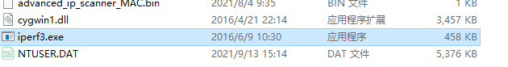

# iperf

https://iperf.fr/iperf-download.php

windows客户端

下载好的客户端移动到



https://iperf.fr/download/windows/iperf-3.1.3-win64.zip

然后再安装一个

linux

https://iperf.fr/iperf-download.php#fedora

https://iperf.fr/download/fedora/iperf3-3.1.3-1.fc24.x86_64.rpm

```BASH
[root@drdb02 ~]# rpm -ivh iperf3-3.1.3-1.fc24.x86_64.rpm 
[root@drdb01 ~]# iperf3 -s
[root@drdb02 ~]# iperf3 -c 172.16.0.41
Connecting to host 172.16.0.41, port 5201
[  4] local 172.16.0.42 port 41526 connected to 172.16.0.41 port 5201
[ ID] Interval           Transfer     Bandwidth       Retr  Cwnd
[  4]   0.00-1.00   sec  48.8 MBytes   409 Mbits/sec   80    973 KBytes       
[  4]   1.00-2.00   sec   135 MBytes  1.13 Gbits/sec    0   1.53 MBytes       
[  4]   2.00-3.00   sec   135 MBytes  1.14 Gbits/sec    0   1.66 MBytes       
[  4]   3.00-4.00   sec   122 MBytes  1.02 Gbits/sec    0   1.76 MBytes       
[  4]   4.00-5.00   sec   136 MBytes  1.14 Gbits/sec    7   1.30 MBytes       
[  4]   5.00-6.01   sec   130 MBytes  1.08 Gbits/sec    0   1.39 MBytes       
[  4]   6.01-7.00   sec   127 MBytes  1.07 Gbits/sec    0   1.44 MBytes       
[  4]   7.00-8.00   sec   122 MBytes  1.03 Gbits/sec    0   1.49 MBytes       
[  4]   8.00-9.00   sec   126 MBytes  1.06 Gbits/sec    0   1.55 MBytes       
[  4]   9.00-10.00  sec   136 MBytes  1.14 Gbits/sec    0   1.62 MBytes       
- - - - - - - - - - - - - - - - - - - - - - - - -
[ ID] Interval           Transfer     Bandwidth       Retr
[  4]   0.00-10.00  sec  1.19 GBytes  1.02 Gbits/sec   87             sender
[  4]   0.00-10.00  sec  1.19 GBytes  1.02 Gbits/sec                  receiver

iperf Done.

[root@drdb01 ~]# iperf3 -s
-----------------------------------------------------------
Server listening on 5201
-----------------------------------------------------------
Accepted connection from 172.16.0.42, port 41524
[  5] local 172.16.0.41 port 5201 connected to 172.16.0.42 port 41526
[ ID] Interval           Transfer     Bandwidth
[  5]   0.00-1.00   sec  44.7 MBytes   375 Mbits/sec                  
[  5]   1.00-2.00   sec   135 MBytes  1.13 Gbits/sec                  
[  5]   2.00-3.00   sec   135 MBytes  1.13 Gbits/sec                  
[  5]   3.00-4.00   sec   122 MBytes  1.02 Gbits/sec                  
[  5]   4.00-5.00   sec   136 MBytes  1.15 Gbits/sec                  
[  5]   5.00-6.00   sec   130 MBytes  1.09 Gbits/sec                  
[  5]   6.00-7.00   sec   127 MBytes  1.06 Gbits/sec                  
[  5]   7.00-8.00   sec   123 MBytes  1.03 Gbits/sec                  
[  5]   8.00-9.00   sec   126 MBytes  1.06 Gbits/sec                  
[  5]   9.00-10.00  sec   136 MBytes  1.14 Gbits/sec                  
[  5]  10.00-10.01  sec  1.55 MBytes  1.05 Gbits/sec                  
- - - - - - - - - - - - - - - - - - - - - - - - -
[ ID] Interval           Transfer     Bandwidth
[  5]   0.00-10.01  sec  0.00 Bytes  0.00 bits/sec                  sender
[  5]   0.00-10.01  sec  1.19 GBytes  1.02 Gbits/sec                  receiver
-----------------------------------------------------------
Server listening on 5201
-----------------------------------------------------------

```

测试虚拟机与windows

```BASH
[root@drdb02 ~]# iperf3 -c 172.16.0.119
Connecting to host 172.16.0.119, port 5201
[  4] local 172.16.0.42 port 52284 connected to 172.16.0.119 port 5201
[ ID] Interval           Transfer     Bandwidth       Retr  Cwnd
[  4]   0.00-1.33   sec  15.0 MBytes  94.5 Mbits/sec    0    131 KBytes       
[  4]   1.33-2.07   sec  8.75 MBytes  99.8 Mbits/sec    0    138 KBytes       
[  4]   2.07-3.02   sec  15.0 MBytes   133 Mbits/sec    0    138 KBytes       
[  4]   3.02-4.04   sec  16.2 MBytes   133 Mbits/sec    0    138 KBytes       
[  4]   4.04-5.04   sec  16.2 MBytes   136 Mbits/sec    0    138 KBytes       
[  4]   5.04-6.05   sec  16.2 MBytes   135 Mbits/sec    0    138 KBytes       
[  4]   6.05-7.07   sec  16.2 MBytes   134 Mbits/sec    0    138 KBytes       
[  4]   7.07-8.07   sec  16.2 MBytes   137 Mbits/sec    0    138 KBytes       
[  4]   8.07-9.01   sec  15.0 MBytes   135 Mbits/sec    0    138 KBytes       
[  4]   9.01-10.07  sec  16.2 MBytes   129 Mbits/sec    0    138 KBytes       
- - - - - - - - - - - - - - - - - - - - - - - - -
[ ID] Interval           Transfer     Bandwidth       Retr
[  4]   0.00-10.07  sec   151 MBytes   126 Mbits/sec    0             sender
[  4]   0.00-10.07  sec   151 MBytes   126 Mbits/sec                  receiver

iperf Done.

```

```powershell
[root@drdb02 ~]# iperf3 -c 172.16.0.119
Connecting to host 172.16.0.119, port 5201
[  4] local 172.16.0.42 port 52284 connected to 172.16.0.119 port 5201
[ ID] Interval           Transfer     Bandwidth       Retr  Cwnd
[  4]   0.00-1.33   sec  15.0 MBytes  94.5 Mbits/sec    0    131 KBytes       
[  4]   1.33-2.07   sec  8.75 MBytes  99.8 Mbits/sec    0    138 KBytes       
[  4]   2.07-3.02   sec  15.0 MBytes   133 Mbits/sec    0    138 KBytes       
[  4]   3.02-4.04   sec  16.2 MBytes   133 Mbits/sec    0    138 KBytes       
[  4]   4.04-5.04   sec  16.2 MBytes   136 Mbits/sec    0    138 KBytes       
[  4]   5.04-6.05   sec  16.2 MBytes   135 Mbits/sec    0    138 KBytes       
[  4]   6.05-7.07   sec  16.2 MBytes   134 Mbits/sec    0    138 KBytes       
[  4]   7.07-8.07   sec  16.2 MBytes   137 Mbits/sec    0    138 KBytes       
[  4]   8.07-9.01   sec  15.0 MBytes   135 Mbits/sec    0    138 KBytes       
[  4]   9.01-10.07  sec  16.2 MBytes   129 Mbits/sec    0    138 KBytes       
- - - - - - - - - - - - - - - - - - - - - - - - -
[ ID] Interval           Transfer     Bandwidth       Retr
[  4]   0.00-10.07  sec   151 MBytes   126 Mbits/sec    0             sender
[  4]   0.00-10.07  sec   151 MBytes   126 Mbits/sec                  receiver

iperf Done.

```

这个测试工具是测试局域网网络吞吐量的。

